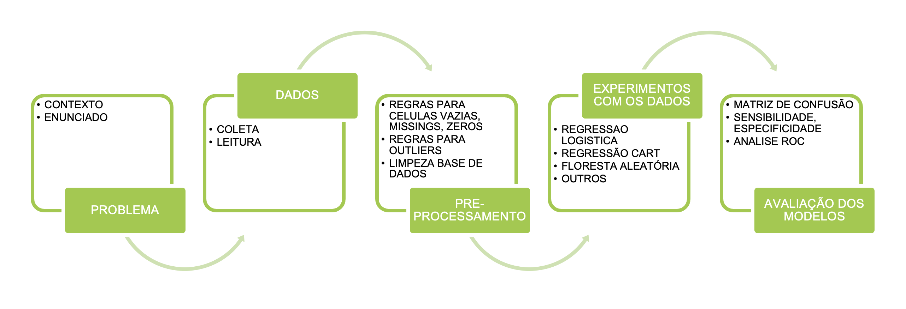
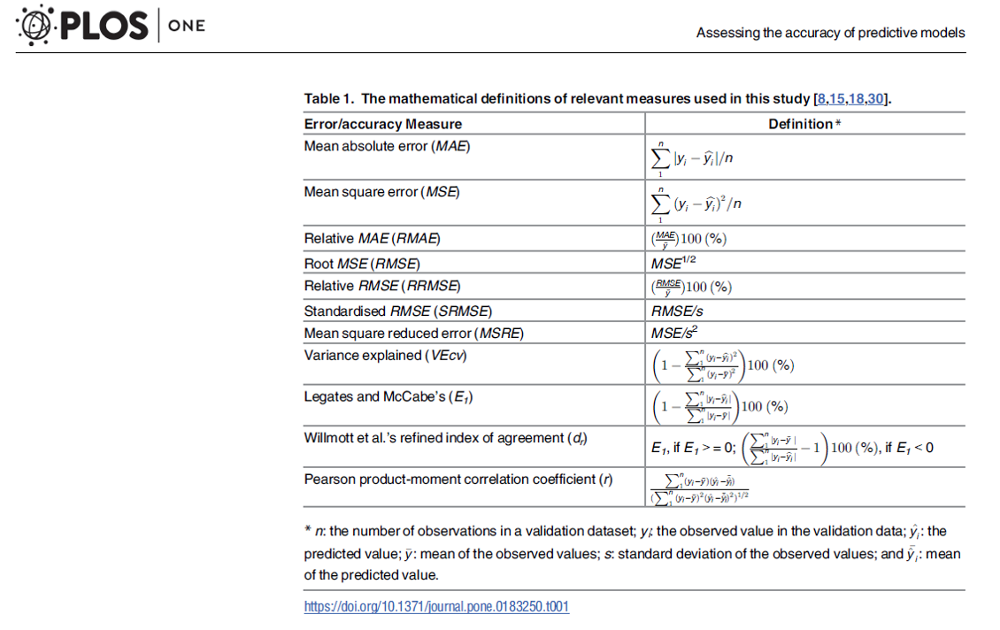
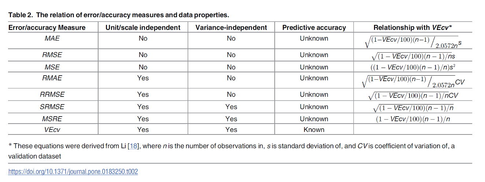

# Trabalho final {#final-work}

Qual o impacto das decisôes do COMPOM em relação a taxa Selic no índice Bovespa?

## Fonte de dados

- [Taxa selic](https://dados.gov.br/dataset/11-taxa-de-juros-selic/resource/3d751a0d-afb2-452b-83f2-310a201f8a82): selic.json. selic.csv
- [Índices Bovespa](https://finance.yahoo.com/quote/%5EBVSP/history?period1=735868800&period2=1668297600&interval=1d&filter=history&frequency=1d&includeAdjustedClose=true): idc_BVSP_daily.csv, idx_BVSP_monthly.csv

## Introdução

EDA
Gráficos das séries
Exploratória dos dados (antes anúncio / depois)

Série temporal X (passado) e Y (futuro)

Experimento definir X e Y







RNN?

## Contexto

O indice ibovespa [^1]

## Dados

```{r}
# Import the data and look at the first six rows
idx_bovespa <- read.csv(file = 'dados/idx_BVSP_daily.csv')
head(idx_bovespa)
tail(idx_bovespa)
```


## Referências

[^1]: [Índice Ibovespa](https://www.b3.com.br/pt_br/market-data-e-indices/indices/indices-amplos/ibovespa.htm)

- [Análise das Atas do COPOM com text mining](https://analisemacro.com.br/data-science/analise-das-atas-do-copom-com-text-mining/)
- [Mineração de textos do COPOM: criando um indicador de sentimentos](https://analisemacro.com.br/data-science/mineracao-de-textos-do-copom-criando-um-indicador-de-sentimentos/)
- https://python.plainenglish.io/calculate-weighted-average-cost-of-capital-wacc-using-python-99ddc3c396c8
- https://smilganir.medium.com/spaghetti-charts-suggested-alternative-a-trellis-chart-60374a629390
- https://medium.com/@tilaye.henok/beyond-correlation-causal-inference-955ce155e0c6