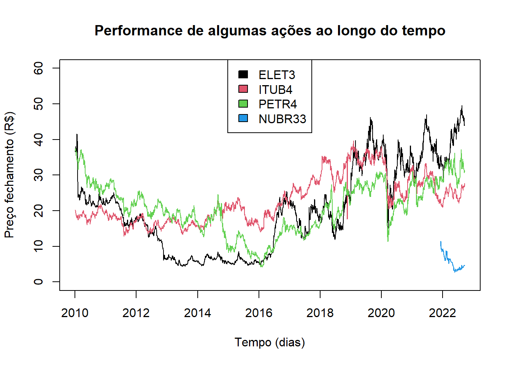
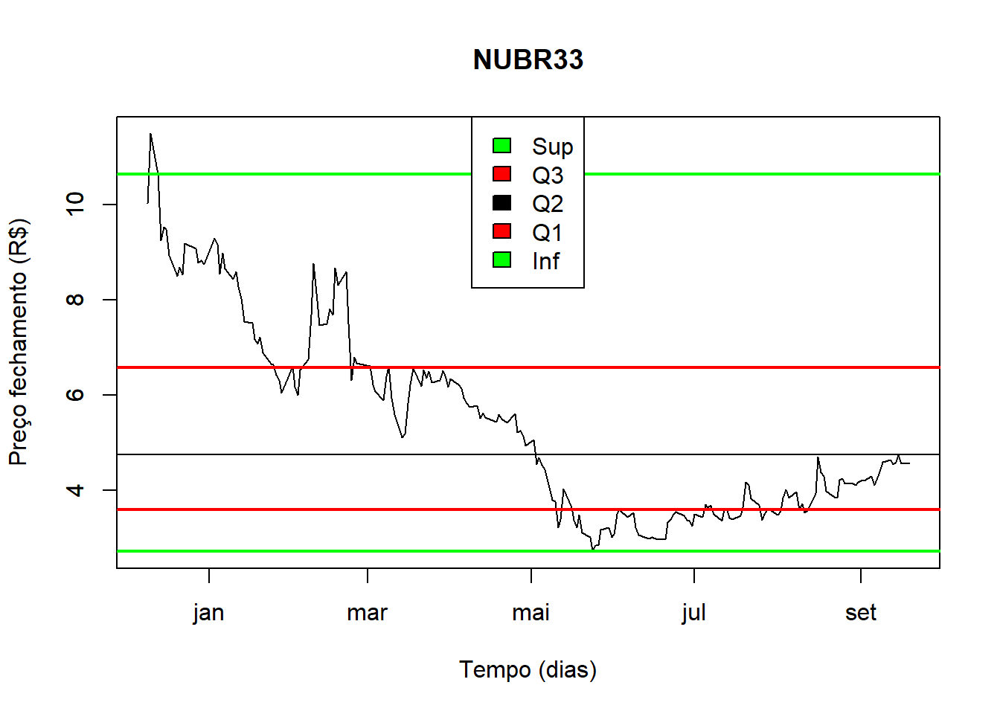

# Estatística descritiva {#descriptive}

Utilizamos métodos de Estatística Descritiva para organizar, resumir e descrever os aspectos importantes de um conjunto de características observadas ou comparar tais características entre dois ou mais conjuntos

## Exercício

Descrever o conjunto de dados da bolsa de valores brasileira (B3)

## Pacotes

Pacotes necessários para executar este capítulo:


```r
library(readxl)
library(tidyverse)
```

```
## ── Attaching packages ─────────────────────────────────────── tidyverse 1.3.2 ──
## ✔ ggplot2 3.4.0      ✔ purrr   0.3.5 
## ✔ tibble  3.1.8      ✔ dplyr   1.0.10
## ✔ tidyr   1.2.1      ✔ stringr 1.4.1 
## ✔ readr   2.1.3      ✔ forcats 0.5.2 
## ── Conflicts ────────────────────────────────────────── tidyverse_conflicts() ──
## ✖ dplyr::filter() masks stats::filter()
## ✖ dplyr::lag()    masks stats::lag()
```

```r
library(readxl)
library(tibble)
library(knitr)
library(kableExtra)
```

```
## 
## Attaching package: 'kableExtra'
## 
## The following object is masked from 'package:dplyr':
## 
##     group_rows
```

```r
library(shiny)
library(dplyr)
```


## Conjunto de dados

Este conjunto de dados de ações da bovespa foi criado pela professora Dra.Olga Satomi Yoshida para aula de Big Data no IPT. 

## Informações dos atributos

Enconta no forma de planilha excel - [03 B2 DADOS Time Series Preços Açoes Diario.xlsx](./dados/03 B2 DADOS Time Series Preços Açoes Diario.xlsx), contém 10 séries com as ações:

- ELET3;
- ITUB4;
- ITSA4;
- PETR4;
- BBDC4;
- VALE3;
- BBAS3;
- LREN3;

todos para o período de 01/04/2010 à 19/09/2022 e

- NUBR33 período 12/09/2021 a 19/09/2022;
- MGLU3 perído 05/02/2011 a 19/09/2022.

Os atributos para cada série são a data e valor no fechamento do pregão.


```r
series = read_excel("dados/03 B1 ESTATISTICAS DESC E REGRESSAO.xlsx",
                    sheet = 2,
                    n_max = 1)
```

```
## New names:
## • `44898` -> `44898...2`
## • `44898` -> `44898...4`
## • `44898` -> `44898...6`
## • `44898` -> `44898...8`
## • `44898` -> `44898...10`
## • `44898` -> `44898...12`
## • `44898` -> `44898...14`
## • `44898` -> `44898...16`
## • `44898` -> `44898...18`
## • `44898` -> `44898...20`
```

```r
nomes = names(series)[seq(1, 20, 2)]
series = read_excel("dados/03 B1 ESTATISTICAS DESC E REGRESSAO.xlsx",
                    sheet = 2,
                    skip = 1)
```

```
## New names:
## • `Date` -> `Date...1`
## • `Close` -> `Close...2`
## • `Date` -> `Date...3`
## • `Close` -> `Close...4`
## • `Date` -> `Date...5`
## • `Close` -> `Close...6`
## • `Date` -> `Date...7`
## • `Close` -> `Close...8`
## • `Date` -> `Date...9`
## • `Close` -> `Close...10`
## • `Date` -> `Date...11`
## • `Close` -> `Close...12`
## • `Date` -> `Date...13`
## • `Close` -> `Close...14`
## • `Date` -> `Date...15`
## • `Close` -> `Close...16`
## • `Date` -> `Date...17`
## • `Close` -> `Close...18`
## • `Date` -> `Date...19`
## • `Close` -> `Close...20`
```

```r
names(series)[seq(1, 20, 2)] = paste0("DATA_", nomes)
names(series)[seq(2, 20, 2)] = nomes

## Transforma o tipo das colunas de Datetime para Date.
for (i in seq(1, 20, 2)) {
  series[[i]] = as.Date(series[[i]])
}

kable(head(series, 10)) %>%
  kable_styling(latex_options = "striped")
```

<table class="table" style="margin-left: auto; margin-right: auto;">
 <thead>
  <tr>
   <th style="text-align:left;"> DATA_ELET3 </th>
   <th style="text-align:right;"> ELET3 </th>
   <th style="text-align:left;"> DATA_ITUB4 </th>
   <th style="text-align:right;"> ITUB4 </th>
   <th style="text-align:left;"> DATA_ITSA4 </th>
   <th style="text-align:right;"> ITSA4 </th>
   <th style="text-align:left;"> DATA_PETR4 </th>
   <th style="text-align:right;"> PETR4 </th>
   <th style="text-align:left;"> DATA_NUBR33 </th>
   <th style="text-align:right;"> NUBR33 </th>
   <th style="text-align:left;"> DATA_MGLU3 </th>
   <th style="text-align:right;"> MGLU3 </th>
   <th style="text-align:left;"> DATA_BBDC4 </th>
   <th style="text-align:right;"> BBDC4 </th>
   <th style="text-align:left;"> DATA_VALE3 </th>
   <th style="text-align:right;"> VALE3 </th>
   <th style="text-align:left;"> DATA_BBAS3 </th>
   <th style="text-align:right;"> BBAS3 </th>
   <th style="text-align:left;"> DATA_LREN3 </th>
   <th style="text-align:right;"> LREN3 </th>
  </tr>
 </thead>
<tbody>
  <tr>
   <td style="text-align:left;"> 2010-01-04 </td>
   <td style="text-align:right;"> 37.37 </td>
   <td style="text-align:left;"> 2010-01-04 </td>
   <td style="text-align:right;"> 20.10 </td>
   <td style="text-align:left;"> 2010-01-04 </td>
   <td style="text-align:right;"> 8.05 </td>
   <td style="text-align:left;"> 2010-01-04 </td>
   <td style="text-align:right;"> 37.32 </td>
   <td style="text-align:left;"> 2021-12-09 </td>
   <td style="text-align:right;"> 10.04 </td>
   <td style="text-align:left;"> 2011-05-02 </td>
   <td style="text-align:right;"> 0.51 </td>
   <td style="text-align:left;"> 2010-01-04 </td>
   <td style="text-align:right;"> 12.16 </td>
   <td style="text-align:left;"> 2010-01-04 </td>
   <td style="text-align:right;"> 51.49 </td>
   <td style="text-align:left;"> 2010-01-04 </td>
   <td style="text-align:right;"> 29.90 </td>
   <td style="text-align:left;"> 2010-01-04 </td>
   <td style="text-align:right;"> 6.05 </td>
  </tr>
  <tr>
   <td style="text-align:left;"> 2010-01-05 </td>
   <td style="text-align:right;"> 37.07 </td>
   <td style="text-align:left;"> 2010-01-05 </td>
   <td style="text-align:right;"> 20.23 </td>
   <td style="text-align:left;"> 2010-01-05 </td>
   <td style="text-align:right;"> 8.02 </td>
   <td style="text-align:left;"> 2010-01-05 </td>
   <td style="text-align:right;"> 37.00 </td>
   <td style="text-align:left;"> 2021-12-10 </td>
   <td style="text-align:right;"> 11.50 </td>
   <td style="text-align:left;"> 2011-05-03 </td>
   <td style="text-align:right;"> 0.51 </td>
   <td style="text-align:left;"> 2010-01-05 </td>
   <td style="text-align:right;"> 12.10 </td>
   <td style="text-align:left;"> 2010-01-05 </td>
   <td style="text-align:right;"> 51.97 </td>
   <td style="text-align:left;"> 2010-01-05 </td>
   <td style="text-align:right;"> 29.60 </td>
   <td style="text-align:left;"> 2010-01-05 </td>
   <td style="text-align:right;"> 5.83 </td>
  </tr>
  <tr>
   <td style="text-align:left;"> 2010-01-06 </td>
   <td style="text-align:right;"> 36.59 </td>
   <td style="text-align:left;"> 2010-01-06 </td>
   <td style="text-align:right;"> 20.05 </td>
   <td style="text-align:left;"> 2010-01-06 </td>
   <td style="text-align:right;"> 7.92 </td>
   <td style="text-align:left;"> 2010-01-06 </td>
   <td style="text-align:right;"> 37.50 </td>
   <td style="text-align:left;"> 2021-12-13 </td>
   <td style="text-align:right;"> 10.65 </td>
   <td style="text-align:left;"> 2011-05-04 </td>
   <td style="text-align:right;"> 0.52 </td>
   <td style="text-align:left;"> 2010-01-06 </td>
   <td style="text-align:right;"> 12.00 </td>
   <td style="text-align:left;"> 2010-01-06 </td>
   <td style="text-align:right;"> 53.07 </td>
   <td style="text-align:left;"> 2010-01-06 </td>
   <td style="text-align:right;"> 29.64 </td>
   <td style="text-align:left;"> 2010-01-06 </td>
   <td style="text-align:right;"> 5.72 </td>
  </tr>
  <tr>
   <td style="text-align:left;"> 2010-01-07 </td>
   <td style="text-align:right;"> 37.44 </td>
   <td style="text-align:left;"> 2010-01-07 </td>
   <td style="text-align:right;"> 19.84 </td>
   <td style="text-align:left;"> 2010-01-07 </td>
   <td style="text-align:right;"> 7.88 </td>
   <td style="text-align:left;"> 2010-01-07 </td>
   <td style="text-align:right;"> 37.15 </td>
   <td style="text-align:left;"> 2021-12-14 </td>
   <td style="text-align:right;"> 9.25 </td>
   <td style="text-align:left;"> 2011-05-05 </td>
   <td style="text-align:right;"> 0.51 </td>
   <td style="text-align:left;"> 2010-01-07 </td>
   <td style="text-align:right;"> 11.97 </td>
   <td style="text-align:left;"> 2010-01-07 </td>
   <td style="text-align:right;"> 53.29 </td>
   <td style="text-align:left;"> 2010-01-07 </td>
   <td style="text-align:right;"> 29.65 </td>
   <td style="text-align:left;"> 2010-01-07 </td>
   <td style="text-align:right;"> 5.66 </td>
  </tr>
  <tr>
   <td style="text-align:left;"> 2010-01-08 </td>
   <td style="text-align:right;"> 38.07 </td>
   <td style="text-align:left;"> 2010-01-08 </td>
   <td style="text-align:right;"> 19.54 </td>
   <td style="text-align:left;"> 2010-01-08 </td>
   <td style="text-align:right;"> 7.82 </td>
   <td style="text-align:left;"> 2010-01-08 </td>
   <td style="text-align:right;"> 36.95 </td>
   <td style="text-align:left;"> 2021-12-15 </td>
   <td style="text-align:right;"> 9.54 </td>
   <td style="text-align:left;"> 2011-05-06 </td>
   <td style="text-align:right;"> 0.51 </td>
   <td style="text-align:left;"> 2010-01-08 </td>
   <td style="text-align:right;"> 11.95 </td>
   <td style="text-align:left;"> 2010-01-08 </td>
   <td style="text-align:right;"> 53.81 </td>
   <td style="text-align:left;"> 2010-01-08 </td>
   <td style="text-align:right;"> 29.82 </td>
   <td style="text-align:left;"> 2010-01-08 </td>
   <td style="text-align:right;"> 5.69 </td>
  </tr>
  <tr>
   <td style="text-align:left;"> 2010-01-11 </td>
   <td style="text-align:right;"> 37.48 </td>
   <td style="text-align:left;"> 2010-01-11 </td>
   <td style="text-align:right;"> 19.37 </td>
   <td style="text-align:left;"> 2010-01-11 </td>
   <td style="text-align:right;"> 7.79 </td>
   <td style="text-align:left;"> 2010-01-11 </td>
   <td style="text-align:right;"> 36.83 </td>
   <td style="text-align:left;"> 2021-12-16 </td>
   <td style="text-align:right;"> 9.49 </td>
   <td style="text-align:left;"> 2011-05-10 </td>
   <td style="text-align:right;"> 0.50 </td>
   <td style="text-align:left;"> 2010-01-11 </td>
   <td style="text-align:right;"> 11.96 </td>
   <td style="text-align:left;"> 2010-01-11 </td>
   <td style="text-align:right;"> 53.65 </td>
   <td style="text-align:left;"> 2010-01-11 </td>
   <td style="text-align:right;"> 30.05 </td>
   <td style="text-align:left;"> 2010-01-11 </td>
   <td style="text-align:right;"> 5.80 </td>
  </tr>
  <tr>
   <td style="text-align:left;"> 2010-01-12 </td>
   <td style="text-align:right;"> 37.13 </td>
   <td style="text-align:left;"> 2010-01-12 </td>
   <td style="text-align:right;"> 19.19 </td>
   <td style="text-align:left;"> 2010-01-12 </td>
   <td style="text-align:right;"> 7.79 </td>
   <td style="text-align:left;"> 2010-01-12 </td>
   <td style="text-align:right;"> 36.36 </td>
   <td style="text-align:left;"> 2021-12-17 </td>
   <td style="text-align:right;"> 8.95 </td>
   <td style="text-align:left;"> 2011-05-11 </td>
   <td style="text-align:right;"> 0.51 </td>
   <td style="text-align:left;"> 2010-01-12 </td>
   <td style="text-align:right;"> 12.00 </td>
   <td style="text-align:left;"> 2010-01-12 </td>
   <td style="text-align:right;"> 53.50 </td>
   <td style="text-align:left;"> 2010-01-12 </td>
   <td style="text-align:right;"> 29.80 </td>
   <td style="text-align:left;"> 2010-01-12 </td>
   <td style="text-align:right;"> 5.94 </td>
  </tr>
  <tr>
   <td style="text-align:left;"> 2010-01-13 </td>
   <td style="text-align:right;"> 37.49 </td>
   <td style="text-align:left;"> 2010-01-13 </td>
   <td style="text-align:right;"> 19.25 </td>
   <td style="text-align:left;"> 2010-01-13 </td>
   <td style="text-align:right;"> 7.77 </td>
   <td style="text-align:left;"> 2010-01-13 </td>
   <td style="text-align:right;"> 36.30 </td>
   <td style="text-align:left;"> 2021-12-20 </td>
   <td style="text-align:right;"> 8.50 </td>
   <td style="text-align:left;"> 2011-05-12 </td>
   <td style="text-align:right;"> 0.51 </td>
   <td style="text-align:left;"> 2010-01-13 </td>
   <td style="text-align:right;"> 12.06 </td>
   <td style="text-align:left;"> 2010-01-13 </td>
   <td style="text-align:right;"> 54.16 </td>
   <td style="text-align:left;"> 2010-01-13 </td>
   <td style="text-align:right;"> 30.18 </td>
   <td style="text-align:left;"> 2010-01-13 </td>
   <td style="text-align:right;"> 6.00 </td>
  </tr>
  <tr>
   <td style="text-align:left;"> 2010-01-14 </td>
   <td style="text-align:right;"> 36.89 </td>
   <td style="text-align:left;"> 2010-01-14 </td>
   <td style="text-align:right;"> 18.99 </td>
   <td style="text-align:left;"> 2010-01-14 </td>
   <td style="text-align:right;"> 7.66 </td>
   <td style="text-align:left;"> 2010-01-14 </td>
   <td style="text-align:right;"> 35.67 </td>
   <td style="text-align:left;"> 2021-12-21 </td>
   <td style="text-align:right;"> 8.70 </td>
   <td style="text-align:left;"> 2011-05-13 </td>
   <td style="text-align:right;"> 0.51 </td>
   <td style="text-align:left;"> 2010-01-14 </td>
   <td style="text-align:right;"> 11.81 </td>
   <td style="text-align:left;"> 2010-01-14 </td>
   <td style="text-align:right;"> 54.15 </td>
   <td style="text-align:left;"> 2010-01-14 </td>
   <td style="text-align:right;"> 29.75 </td>
   <td style="text-align:left;"> 2010-01-14 </td>
   <td style="text-align:right;"> 5.87 </td>
  </tr>
  <tr>
   <td style="text-align:left;"> 2010-01-15 </td>
   <td style="text-align:right;"> 35.59 </td>
   <td style="text-align:left;"> 2010-01-15 </td>
   <td style="text-align:right;"> 18.67 </td>
   <td style="text-align:left;"> 2010-01-15 </td>
   <td style="text-align:right;"> 7.47 </td>
   <td style="text-align:left;"> 2010-01-15 </td>
   <td style="text-align:right;"> 35.75 </td>
   <td style="text-align:left;"> 2021-12-22 </td>
   <td style="text-align:right;"> 8.54 </td>
   <td style="text-align:left;"> 2011-05-17 </td>
   <td style="text-align:right;"> 0.50 </td>
   <td style="text-align:left;"> 2010-01-15 </td>
   <td style="text-align:right;"> 11.64 </td>
   <td style="text-align:left;"> 2010-01-15 </td>
   <td style="text-align:right;"> 53.45 </td>
   <td style="text-align:left;"> 2010-01-15 </td>
   <td style="text-align:right;"> 29.25 </td>
   <td style="text-align:left;"> 2010-01-15 </td>
   <td style="text-align:right;"> 5.66 </td>
  </tr>
</tbody>
</table>

## Análise descritiva de algumas ações


```r
plot(x=series$DATA_ELET3, y= series$ELET3, type = "l", xlab = "Tempo (dias)", ylab = "Preço fechamento (R$)",  main = "Performance de algumas ações ao longo do tempo", ylim = c(0, 60) )
lines(x=series$DATA_ITUB4, y= series$ITUB4, col = 2)
lines(x=series$DATA_PETR4, y= series$PETR4, col = 3)
lines(x=series$DATA_NUBR33, y= series$NUBR33, col = 4)
legend("top", legend = c("ELET3", "ITUB4", "PETR4", "NUBR33"), fill = c(1,2,3,4))
```


> NUBR33 tem uma série menor que as demais ações.

Parâmetros


```r
stock_symbols = c("ELET3","ITUB4","ITSA4","PETR4","NUBR33","MGLU3","BBDC4","VALE3","BBAS3","LREN3")
stock_symbol = 5 # 1 a 10
dataInicial = NULL # as.Date("2022-01-01")
dataFinal = NULL # as.Date("2022-12-31")
```

## Avaliando NUBR33


```r
symbol_series = series %>%
  dplyr::select(matches(stock_symbols[stock_symbol]) )

names(symbol_series)[1] = "stock_date"
names(symbol_series)[2] = "stock_value"

if (is.null(dataInicial)) {
  dataInicial = min(symbol_series$stock_date, na.rm = TRUE)
}

if (is.null(dataFinal)) {
  dataFinal = max(symbol_series$stock_date, na.rm = TRUE)
}

subConjunto = filter(symbol_series, stock_date >= dataInicial & stock_date <= dataFinal)

Data = subConjunto$stock_date
Ser = subConjunto$stock_value

getmode <- function(v) {
   uniqv <- unique(v)
   uniqv[which.max(tabulate(match(v, uniqv)))]
}

cont = count(subConjunto)
menor = min(Ser)
maior = max(Ser)
p = quantile(Ser, c(.025, .10, .25, .50, .75, .90, .975)) 
media = mean(Ser, na.rm = T)
desvio = sd(Ser, na.rm = T)
mediana = median(Ser, na.rm = T)
moda = getmode(Ser)
ep = desvio / sqrt(cont)
periodo = dataFinal - dataInicial
```


Medidas de posição:

1.	Contagem de resultados 195
2.	Menor valor: 2.72
3.	Percentil: 2.9885, 3.352, 3.6, 4.76, 6.585, 8.6, 9.3285
4.	Maior valor: 11.5


Medidas de tendência central:

5.	Moda: 3.6
6.	Mediana: 4.76
7.	Média dos resultados: 5.3922564

Medidas de dispersão dos dados individuais em relação a média:

8.	desvio padrão dos resultados em relação a média: 2.0007468
9.	coeficiente de variação = d.p. / média: 0.3710407
10.	c.v. % = (d.p. / média ) x 100 %: 37.1040734

Medidas de disperção da média:

11.	e.p. = d.p. da média = d.p. / Raiz(n): 0.1432765
12.	c.v.e.p. = e.p. / média: 0.0265708
13.	c.v.e.p.% = (e.p. / média) x 100 %: 2.6570779

Para NUBR33 o preço médio da ação, no período de 2021-12-09 a 2022-09-19 (período de 284 dias) é de 5.3922564 e o desvio padrão de 2.0007468.


```r
plot(subConjunto, type = "l", xlab = "Tempo (dias)", ylab = "Preço fechamento (R$)", main=stock_symbols[stock_symbol])
caixa = boxplot(Ser, add = T)
limSup = caixa$stats[5,1]
Q3 = caixa$stats[4,1]
Q2 = caixa$stats[3,1]
Q1 = caixa$stats[2,1]
limInf = caixa$stats[1,1]
abline(h = Q2, col = "black")
abline(h = Q3, col = "red", lwd = 2)
abline(h = Q1, col = "red", lwd = 2)
abline(h = limSup, col = "green", lwd = 2)
abline(h = limInf, col = "green", lwd = 2)
legend("top", legend = c("Sup", "Q3", "Q2", "Q1", "Inf"), fill = c("green","red","black","red","green"))
```



> Usando boxplot para obter limites e percentíls.

