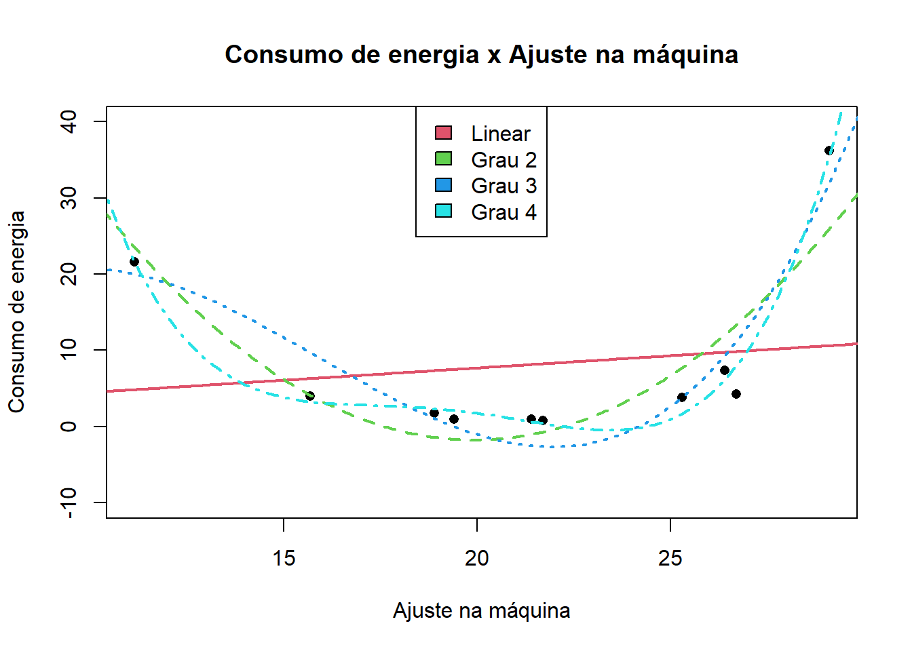
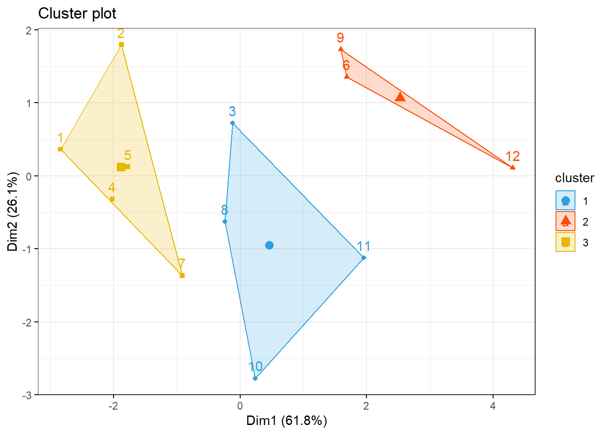

# Regressão {#regression}

A regressão em geral tem como objetivo:

1. Medir a influência de uma ou mais variáveis explicativas (x)  sobre a variável resposta (y);
2. Predição de uma variável resposta (y) a partir de uma ou mais variáveis explicativas (x).


## Conjunto de dados

Este conjunto de dados foram criados pela professora Dra.Olga Satomi Yoshida para aula de Big Data no IPT.

1. Preço das casas: Data_HousePrice_Area.xlsx
2. Consumo de energia: Data_ConsumoEnergia.xlsx
3. SALES_X_YOUTUBE: DadosAula06.xlsx
4. CREDIT SCORE X RENDA E OUTRAS V: DadosAula06.xlsx


## Preço das casas

Análise descritiva e regressão linear sobre o conjunto de dados Data_HousePrice_Area.xlsx.

### Pacotes

Pacotes necessários para estes exercícios:


```r
library(readxl)
library(tidyverse)
library(readxl)
library(ggthemes)
library(plotly)
library(knitr)
library(kableExtra)
```

### Conjunto de dados


```r
dadosCen01 = read_excel("../dados/Data_HousePrice_Area.xlsx", sheet = 1)
dadosCen02 = read_excel("../dados/Data_HousePrice_Area.xlsx", sheet = 2)
```

Dados do cenário 01

<table class="table" style="margin-left: auto; margin-right: auto;">
 <thead>
  <tr>
   <th style="text-align:right;"> Square Feet </th>
   <th style="text-align:right;"> House Price </th>
  </tr>
 </thead>
<tbody>
  <tr>
   <td style="text-align:right;"> 1400 </td>
   <td style="text-align:right;"> 245 </td>
  </tr>
  <tr>
   <td style="text-align:right;"> 1600 </td>
   <td style="text-align:right;"> 312 </td>
  </tr>
  <tr>
   <td style="text-align:right;"> 1700 </td>
   <td style="text-align:right;"> 279 </td>
  </tr>
  <tr>
   <td style="text-align:right;"> 1875 </td>
   <td style="text-align:right;"> 308 </td>
  </tr>
  <tr>
   <td style="text-align:right;"> 1100 </td>
   <td style="text-align:right;"> 199 </td>
  </tr>
  <tr>
   <td style="text-align:right;"> 1550 </td>
   <td style="text-align:right;"> 219 </td>
  </tr>
  <tr>
   <td style="text-align:right;"> 2350 </td>
   <td style="text-align:right;"> 405 </td>
  </tr>
  <tr>
   <td style="text-align:right;"> 2450 </td>
   <td style="text-align:right;"> 324 </td>
  </tr>
  <tr>
   <td style="text-align:right;"> 1425 </td>
   <td style="text-align:right;"> 319 </td>
  </tr>
  <tr>
   <td style="text-align:right;"> 1700 </td>
   <td style="text-align:right;"> 255 </td>
  </tr>
</tbody>
</table>

Dados do cenário 02

<table class="table" style="margin-left: auto; margin-right: auto;">
 <thead>
  <tr>
   <th style="text-align:right;"> Square Feet </th>
   <th style="text-align:right;"> House Price </th>
  </tr>
 </thead>
<tbody>
  <tr>
   <td style="text-align:right;"> 1400 </td>
   <td style="text-align:right;"> 245 </td>
  </tr>
  <tr>
   <td style="text-align:right;"> 1800 </td>
   <td style="text-align:right;"> 312 </td>
  </tr>
  <tr>
   <td style="text-align:right;"> 1700 </td>
   <td style="text-align:right;"> 279 </td>
  </tr>
  <tr>
   <td style="text-align:right;"> 1875 </td>
   <td style="text-align:right;"> 308 </td>
  </tr>
  <tr>
   <td style="text-align:right;"> 1200 </td>
   <td style="text-align:right;"> 199 </td>
  </tr>
  <tr>
   <td style="text-align:right;"> 1480 </td>
   <td style="text-align:right;"> 219 </td>
  </tr>
  <tr>
   <td style="text-align:right;"> 2350 </td>
   <td style="text-align:right;"> 405 </td>
  </tr>
  <tr>
   <td style="text-align:right;"> 2100 </td>
   <td style="text-align:right;"> 324 </td>
  </tr>
  <tr>
   <td style="text-align:right;"> 2000 </td>
   <td style="text-align:right;"> 319 </td>
  </tr>
  <tr>
   <td style="text-align:right;"> 1700 </td>
   <td style="text-align:right;"> 255 </td>
  </tr>
</tbody>
</table>

Dispersão dos valores para os dois cenários:


Comparando os dois gráficos, podemos observar:

-   O primeiro conjunto é mais esparso
-   O segundo cenário os dados estão agrupados de forma linear

### Descrevendo os dados:

#### Cenário 1

House Price


```r
summary(dadosCen01$`House Price`)
```

```
##    Min. 1st Qu.  Median    Mean 3rd Qu.    Max. 
##   199.0   247.5   293.5   286.5   317.2   405.0
```

Square Feet


```r
summary(dadosCen01$`Square Feet`)
```

```
##    Min. 1st Qu.  Median    Mean 3rd Qu.    Max. 
##    1100    1456    1650    1715    1831    2450
```

Distribuição dos valores


```r
hist(dadosCen01$`House Price`)
```


#### Cenário 2

House Price


```r
summary(dadosCen02$`House Price`)
```

```
##    Min. 1st Qu.  Median    Mean 3rd Qu.    Max. 
##   199.0   247.5   293.5   286.5   317.2   405.0
```

Square Feet


```r
summary(dadosCen02$`Square Feet`)
```

```
##    Min. 1st Qu.  Median    Mean 3rd Qu.    Max. 
##    1200    1535    1750    1760    1969    2350
```

Distribuição dos valores


```r
hist(dadosCen01$`House Price`)
```


### Ajustes de modelos lineares simples

Vamos agora ajustar um modelo de regressão para ambos os cenários.

#### Cenário 01


```r
modelCen01 <- lm(dadosCen01$`House Price` ~ dadosCen01$`Square Feet`)
modelCen01
```

```
## 
## Call:
## lm(formula = dadosCen01$`House Price` ~ dadosCen01$`Square Feet`)
## 
## Coefficients:
##              (Intercept)  dadosCen01$`Square Feet`  
##                  98.2483                    0.1098
```

$y = 98.2483296 + 0.1097677 x$


```r
resumoMod01 = summary(modelCen01)
resumoMod01
```

```
## 
## Call:
## lm(formula = dadosCen01$`House Price` ~ dadosCen01$`Square Feet`)
## 
## Residuals:
##     Min      1Q  Median      3Q     Max 
## -49.388 -27.388  -6.388  29.577  64.333 
## 
## Coefficients:
##                          Estimate Std. Error t value Pr(>|t|)  
## (Intercept)              98.24833   58.03348   1.693   0.1289  
## dadosCen01$`Square Feet`  0.10977    0.03297   3.329   0.0104 *
## ---
## Signif. codes:  0 '***' 0.001 '**' 0.01 '*' 0.05 '.' 0.1 ' ' 1
## 
## Residual standard error: 41.33 on 8 degrees of freedom
## Multiple R-squared:  0.5808,	Adjusted R-squared:  0.5284 
## F-statistic: 11.08 on 1 and 8 DF,  p-value: 0.01039
```

$R^2 = 0.58$


Vamos analisar os resíduos:


```r
plot(modelCen01$residuals ~ dadosCen01$`House Price`)
```


```r
plot(modelCen01, pch = 16, col = "blue")
```


```r
plot(dadosCen01$`House Price` ~ dadosCen01$`Square Feet`)
abline(modelCen01) #Add a regression line
```


Como as observações são mais esparças, um modelo linear simples não se ajusta muito bem.


#### Cenário 02


```r
y <- dadosCen02$`House Price`
x <- dadosCen02$`Square Feet`

modelCen02 <- lm(y ~ x)
modelCen02
```

```
## 
## Call:
## lm(formula = y ~ x)
## 
## Coefficients:
## (Intercept)            x  
##     -9.6451       0.1682
```

$y = -9.6450892 + 0.1682165 x$


```r
plot(modelCen02, pch = 16, col = "blue")
```


```r
plot(dadosCen01$`House Price` ~ dadosCen01$`Square Feet`)
abline(modelCen01) #Add a regression line
```


```r
resumoMod02 = summary(modelCen02)
resumoMod02
```

```
## 
## Call:
## lm(formula = y ~ x)
## 
## Residuals:
##     Min      1Q  Median      3Q     Max 
## -21.323 -16.654   2.458  15.838  19.336 
## 
## Coefficients:
##             Estimate Std. Error t value Pr(>|t|)    
## (Intercept) -9.64509   30.46626  -0.317     0.76    
## x            0.16822    0.01702   9.886 9.25e-06 ***
## ---
## Signif. codes:  0 '***' 0.001 '**' 0.01 '*' 0.05 '.' 0.1 ' ' 1
## 
## Residual standard error: 17.56 on 8 degrees of freedom
## Multiple R-squared:  0.9243,	Adjusted R-squared:  0.9149 
## F-statistic: 97.73 on 1 and 8 DF,  p-value: 9.246e-06
```

$R^2 = 0.92$

Vamos analisar os resíduos:


```r
plot(modelCen02$residuals ~ dadosCen02$`House Price`)
```


Neste cenário as observações estão mais agrupadas próximas a uma reta, sendo assim o modelo linear simples descreveu melhor as observações.

### Predição


```r
new <- data.frame(x = 1300)
p <- predict(lm(y ~ x), new)
```
Usando o modelo um, uma casa de $1300ft^2$ custaria $209.04$


## Análise conjunto energia

Análise descritiva e regressão linear sobre o conjunto de dados Data_ConsumoEnergia.xlsx.

### Pacotes

Pacotes necessários para estes exercícios:


```r
library(readxl)
library(tidyverse)
library(readxl)
library(ggthemes)
library(plotly)
library(knitr)
library(kableExtra)
```

### Conjunto de dados


<table class="table" style="margin-left: auto; margin-right: auto;">
 <thead>
  <tr>
   <th style="text-align:right;"> Ajuste na maquina </th>
   <th style="text-align:right;"> Consumo de energia </th>
  </tr>
 </thead>
<tbody>
  <tr>
   <td style="text-align:right;"> 11.15 </td>
   <td style="text-align:right;"> 21.6 </td>
  </tr>
  <tr>
   <td style="text-align:right;"> 15.70 </td>
   <td style="text-align:right;"> 4.0 </td>
  </tr>
  <tr>
   <td style="text-align:right;"> 18.90 </td>
   <td style="text-align:right;"> 1.8 </td>
  </tr>
  <tr>
   <td style="text-align:right;"> 19.40 </td>
   <td style="text-align:right;"> 1.0 </td>
  </tr>
  <tr>
   <td style="text-align:right;"> 21.40 </td>
   <td style="text-align:right;"> 1.0 </td>
  </tr>
  <tr>
   <td style="text-align:right;"> 21.70 </td>
   <td style="text-align:right;"> 0.8 </td>
  </tr>
  <tr>
   <td style="text-align:right;"> 25.30 </td>
   <td style="text-align:right;"> 3.8 </td>
  </tr>
  <tr>
   <td style="text-align:right;"> 26.40 </td>
   <td style="text-align:right;"> 7.4 </td>
  </tr>
  <tr>
   <td style="text-align:right;"> 26.70 </td>
   <td style="text-align:right;"> 4.3 </td>
  </tr>
  <tr>
   <td style="text-align:right;"> 29.10 </td>
   <td style="text-align:right;"> 36.2 </td>
  </tr>
</tbody>
</table>


Um gráfico dos dados:


```{=html}
<div id="htmlwidget-cce63a815eacaa2abab5" style="width:672px;height:480px;" class="plotly html-widget"></div>
<script type="application/json" data-for="htmlwidget-cce63a815eacaa2abab5">{"x":{"data":[{"x":[11.15,15.7,18.9,19.4,21.4,21.7,25.3,26.4,26.7,29.1],"y":[21.6,4,1.8,1,1,0.8,3.8,7.4,4.3,36.2],"text":["Ajuste na maquina: 11.15<br />Consumo de energia: 21.6","Ajuste na maquina: 15.70<br />Consumo de energia:  4.0","Ajuste na maquina: 18.90<br />Consumo de energia:  1.8","Ajuste na maquina: 19.40<br />Consumo de energia:  1.0","Ajuste na maquina: 21.40<br />Consumo de energia:  1.0","Ajuste na maquina: 21.70<br />Consumo de energia:  0.8","Ajuste na maquina: 25.30<br />Consumo de energia:  3.8","Ajuste na maquina: 26.40<br />Consumo de energia:  7.4","Ajuste na maquina: 26.70<br />Consumo de energia:  4.3","Ajuste na maquina: 29.10<br />Consumo de energia: 36.2"],"type":"scatter","mode":"markers","marker":{"autocolorscale":false,"color":"rgba(0,0,0,1)","opacity":1,"size":5.66929133858268,"symbol":"circle","line":{"width":1.88976377952756,"color":"rgba(0,0,0,1)"}},"hoveron":"points","showlegend":false,"xaxis":"x","yaxis":"y","hoverinfo":"text","frame":null}],"layout":{"margin":{"t":26.2283105022831,"r":7.30593607305936,"b":40.1826484018265,"l":37.2602739726027},"plot_bgcolor":"rgba(255,255,255,1)","paper_bgcolor":"rgba(255,255,255,1)","font":{"color":"rgba(0,0,0,1)","family":"","size":14.6118721461187},"xaxis":{"domain":[0,1],"automargin":true,"type":"linear","autorange":false,"range":[10.2525,29.9975],"tickmode":"array","ticktext":["15","20","25"],"tickvals":[15,20,25],"categoryorder":"array","categoryarray":["15","20","25"],"nticks":null,"ticks":"outside","tickcolor":"rgba(51,51,51,1)","ticklen":3.65296803652968,"tickwidth":0.66417600664176,"showticklabels":true,"tickfont":{"color":"rgba(77,77,77,1)","family":"","size":11.689497716895},"tickangle":-0,"showline":false,"linecolor":null,"linewidth":0,"showgrid":true,"gridcolor":"rgba(235,235,235,1)","gridwidth":0.66417600664176,"zeroline":false,"anchor":"y","title":{"text":"Ajuste na maquina","font":{"color":"rgba(0,0,0,1)","family":"","size":14.6118721461187}},"hoverformat":".2f"},"yaxis":{"domain":[0,1],"automargin":true,"type":"linear","autorange":false,"range":[-0.97,37.97],"tickmode":"array","ticktext":["0","10","20","30"],"tickvals":[1.11022302462516e-16,10,20,30],"categoryorder":"array","categoryarray":["0","10","20","30"],"nticks":null,"ticks":"outside","tickcolor":"rgba(51,51,51,1)","ticklen":3.65296803652968,"tickwidth":0.66417600664176,"showticklabels":true,"tickfont":{"color":"rgba(77,77,77,1)","family":"","size":11.689497716895},"tickangle":-0,"showline":false,"linecolor":null,"linewidth":0,"showgrid":true,"gridcolor":"rgba(235,235,235,1)","gridwidth":0.66417600664176,"zeroline":false,"anchor":"x","title":{"text":"Consumo de energia","font":{"color":"rgba(0,0,0,1)","family":"","size":14.6118721461187}},"hoverformat":".2f"},"shapes":[{"type":"rect","fillcolor":"transparent","line":{"color":"rgba(51,51,51,1)","width":0.66417600664176,"linetype":"solid"},"yref":"paper","xref":"paper","x0":0,"x1":1,"y0":0,"y1":1}],"showlegend":false,"legend":{"bgcolor":"rgba(255,255,255,1)","bordercolor":"transparent","borderwidth":1.88976377952756,"font":{"color":"rgba(0,0,0,1)","family":"","size":11.689497716895}},"hovermode":"closest","barmode":"relative"},"config":{"doubleClick":"reset","modeBarButtonsToAdd":["hoverclosest","hovercompare"],"showSendToCloud":false},"source":"A","attrs":{"37a4815798":{"x":{},"y":{},"type":"scatter"}},"cur_data":"37a4815798","visdat":{"37a4815798":["function (y) ","x"]},"highlight":{"on":"plotly_click","persistent":false,"dynamic":false,"selectize":false,"opacityDim":0.2,"selected":{"opacity":1},"debounce":0},"shinyEvents":["plotly_hover","plotly_click","plotly_selected","plotly_relayout","plotly_brushed","plotly_brushing","plotly_clickannotation","plotly_doubleclick","plotly_deselect","plotly_afterplot","plotly_sunburstclick"],"base_url":"https://plot.ly"},"evals":[],"jsHooks":[]}</script>
```

Ajustando os modelos:


```r
modelEner01 = lm(`Consumo de energia`~`Ajuste na maquina`, data = dados02) 
modelEner02 = lm(`Consumo de energia`~`Ajuste na maquina` + I(`Ajuste na maquina`^2), data = dados02) 
modelEner03 = lm(`Consumo de energia`~`Ajuste na maquina` + I(`Ajuste na maquina`^2) + I(`Ajuste na maquina`^3), data = dados02) 
modelEner04 = lm(`Consumo de energia`~`Ajuste na maquina` + I(`Ajuste na maquina`^2) + I(`Ajuste na maquina`^3)+ I(`Ajuste na maquina`^4), data = dados02) 
```

Gráfico do ajuste dos modelos:


```r
x = seq(0,40, 0.1)
y1 = modelEner01$coefficients[1] + modelEner01$coefficients[2]*x
y2 = modelEner02$coefficients[1] + modelEner02$coefficients[2]*x + modelEner02$coefficients[3]*x^2
y3 = modelEner03$coefficients[1] + modelEner03$coefficients[2]*x + modelEner03$coefficients[3]*x^2 + modelEner03$coefficients[4]*x^3
y4 = modelEner04$coefficients[1] + modelEner04$coefficients[2]*x + modelEner04$coefficients[3]*x^2 + modelEner04$coefficients[4]*x^3 + modelEner04$coefficients[5]*x^4

par(mfrow = c(1,1))
plot(`Consumo de energia`~`Ajuste na maquina`, data = dados02, col = 1, pch = 16, xlab = "Ajuste na máquina", ylab = "Consumo de energia", main = "Consumo de energia x Ajuste na máquina", ylim = c(-10, 40))
lines(y1~x, col = 2, lty = 1, lwd = 2)
lines(y2~x, col = 3, lty = 2, lwd = 2)
lines(y3~x, col = 4, lty = 3, lwd = 2)
lines(y4~x, col = 5, lty = 4, lwd = 2)
legend("top", legend = c("Linear", "Grau 2", "Grau 3", "Grau 4"), fill = c(2,3,4,5))
```



O modelo polinomial de grau 2 representou bem as observações sem o risco de perda de generalização.

Polinômios de graus mais altos correm o risco de não generalizarem o fenômeno, embora se saiam muito bem com as observações do treinamento.

## Análise Conjunto vendas vs fontes de publidades

Análise descritiva e regressão linear sobre o conjunto de dados SALES_X_YOUTUBE em DadosAula06.xlsx.

### Pacotes

Pacotes necessários para estes exercícios:


```r
library(readxl)
library(tidyverse)
library(readxl)
library(ggthemes)
library(plotly)
library(knitr)
library(kableExtra)
```

### Conjunto de dados


```r
dados03 = read_excel(path = "../dados/04_LABORATORIO REGRESSAO COM DADOS 03_DADOS.xlsx", sheet = 3)
dados03 = dados03[,2:5]
# tail(dados03, 3)

# dados03_t =  pivot_longer(dados03, c(2:5))
# names(dados03_t) = c("Indice", "Grupo", "Valor")
kable(dados03) %>%
  kable_styling(latex_options = "striped")
```
Vendas em relação aos anúncios no youtube.


```
## `geom_smooth()` using formula = 'y ~ x'
```


```
## `geom_smooth()` using formula = 'y ~ x'
```


```
## `geom_smooth()` using formula = 'y ~ x'
```


Ajustando um modelo linear simples


```r
model = lm(sales ~ sqrtYou, data = dados03_mod)
summary(model)
```

```
## 
## Call:
## lm(formula = sales ~ sqrtYou, data = dados03_mod)
## 
## Residuals:
##    Min     1Q Median     3Q    Max 
## -8.916 -2.344 -0.131  2.326  9.316 
## 
## Coefficients:
##             Estimate Std. Error t value Pr(>|t|)    
## (Intercept)  3.20688    0.80092   4.004  8.8e-05 ***
## sqrtYou      1.09042    0.06029  18.085  < 2e-16 ***
## ---
## Signif. codes:  0 '***' 0.001 '**' 0.01 '*' 0.05 '.' 0.1 ' ' 1
## 
## Residual standard error: 3.854 on 198 degrees of freedom
## Multiple R-squared:  0.6229,	Adjusted R-squared:  0.621 
## F-statistic: 327.1 on 1 and 198 DF,  p-value: < 2.2e-16
```
O gráfico mostra as observações em relação ao modelo.


```r
plot(sales ~ sqrtYou, data = dados03_mod)
abline(model)
```


Analisando os resíduos.


```r
plot(model)
```


Ajustando o modelo a mais variáveis (multiclass).


```r
modelMult = lm(sales ~ youtube + facebook + newspaper, data = dados03)
summary(modelMult)
```

```
## 
## Call:
## lm(formula = sales ~ youtube + facebook + newspaper, data = dados03)
## 
## Residuals:
##      Min       1Q   Median       3Q      Max 
## -10.5932  -1.0690   0.2902   1.4272   3.3951 
## 
## Coefficients:
##              Estimate Std. Error t value Pr(>|t|)    
## (Intercept)  3.526667   0.374290   9.422   <2e-16 ***
## youtube      0.045765   0.001395  32.809   <2e-16 ***
## facebook     0.188530   0.008611  21.893   <2e-16 ***
## newspaper   -0.001037   0.005871  -0.177     0.86    
## ---
## Signif. codes:  0 '***' 0.001 '**' 0.01 '*' 0.05 '.' 0.1 ' ' 1
## 
## Residual standard error: 2.023 on 196 degrees of freedom
## Multiple R-squared:  0.8972,	Adjusted R-squared:  0.8956 
## F-statistic: 570.3 on 3 and 196 DF,  p-value: < 2.2e-16
```

```r
plot(modelMult)
```


Newspaper tem pouca influência no modelo, sendo o youtube a que mais influência nas vendas.


```r
modelMult2 = lm(sales ~ youtube + facebook, data = dados03)
summary(modelMult2)
```

```
## 
## Call:
## lm(formula = sales ~ youtube + facebook, data = dados03)
## 
## Residuals:
##      Min       1Q   Median       3Q      Max 
## -10.5572  -1.0502   0.2906   1.4049   3.3994 
## 
## Coefficients:
##             Estimate Std. Error t value Pr(>|t|)    
## (Intercept)  3.50532    0.35339   9.919   <2e-16 ***
## youtube      0.04575    0.00139  32.909   <2e-16 ***
## facebook     0.18799    0.00804  23.382   <2e-16 ***
## ---
## Signif. codes:  0 '***' 0.001 '**' 0.01 '*' 0.05 '.' 0.1 ' ' 1
## 
## Residual standard error: 2.018 on 197 degrees of freedom
## Multiple R-squared:  0.8972,	Adjusted R-squared:  0.8962 
## F-statistic: 859.6 on 2 and 197 DF,  p-value: < 2.2e-16
```

```r
plot(modelMult2)
```


## Análise conjunto ST vs demais variáveisCREDIT SCORE X RENDA E OUTRAS V

Análise descritiva e regressão linear sobre o conjunto de dados CREDIT SCORE X RENDA E OUTRAS V em DadosAula06.xlsx.

### Pacotes

Pacotes necessários para estes exercícios:


```r
library(readxl)
library(tidyverse)
library(readxl)
library(ggthemes)
library(plotly)
library(knitr)
library(kableExtra)
```

### Conjunto de dados

Analise se o cliente pode receber o crédito de acordo com a análise. As variáveis são:

- ST - Situação (0 - Passou na análise, 1 - Nâo passou na análise) - Y
- R	- Renda - X
- ND - Num Dependentes - X
- VE - Vinculo Empregaticio - X


```r
dados04 = read_excel(path = "../dados/04_LABORATORIO REGRESSAO COM DADOS 03_DADOS.xlsx", sheet = 4)
dados04 = dados04[,18:21]
dados04$ST = factor(dados04$ST)
dados04$VE = factor(dados04$VE)

kable(dados04) %>%
  kable_styling(latex_options = "striped")
```

Situação explicada pela renda.


```r
plot(dados04$R ~ dados04$ST)
```


O modelo é 

$$
    \log{\left(\frac{P(y_i=1)}{1-P(y_i=1)}\right)} = \beta_0 + \beta_1 x_1 + \beta_2 x_2 + \beta_3 x_3 + \epsilon_i 
$$

$$
   \frac{P(y=1)}{1-P(y=1)} = e^{(\beta_0 + \beta_1 x_1 + \beta_2 x_2 + \beta_3 x_3)}
$$

O ajuste é 


```r
modelo04  = glm(dados04$ST ~ dados04$R + dados04$ND + dados04$VE, family = binomial(link='logit'))
valoresPredito = predict.glm(modelo04, type = "response")
summary(modelo04)
```

```
## 
## Call:
## glm(formula = dados04$ST ~ dados04$R + dados04$ND + dados04$VE, 
##     family = binomial(link = "logit"))
## 
## Deviance Residuals: 
##     Min       1Q   Median       3Q      Max  
## -2.6591  -0.2633  -0.0531   0.4187   2.0147  
## 
## Coefficients:
##             Estimate Std. Error z value Pr(>|z|)    
## (Intercept)   1.1117     1.5725   0.707 0.479578    
## dados04$R    -1.7872     0.4606  -3.880 0.000105 ***
## dados04$ND    0.9031     0.3857   2.341 0.019212 *  
## dados04$VE1   2.9113     0.8506   3.423 0.000620 ***
## ---
## Signif. codes:  0 '***' 0.001 '**' 0.01 '*' 0.05 '.' 0.1 ' ' 1
## 
## (Dispersion parameter for binomial family taken to be 1)
## 
##     Null deviance: 126.450  on 91  degrees of freedom
## Residual deviance:  51.382  on 88  degrees of freedom
## AIC: 59.382
## 
## Number of Fisher Scoring iterations: 6
```

Os valores preditos são:


```
## Warning in confusionMatrix.default(valoresPredito_cl, dados04$ST): Levels are
## not in the same order for reference and data. Refactoring data to match.

## Warning in confusionMatrix.default(valoresPredito_cl, dados04$ST): Levels are
## not in the same order for reference and data. Refactoring data to match.
```

```
## Confusion Matrix and Statistics
## 
##           Reference
## Prediction  0  1
##          0 46  5
##          1  5 36
##                                           
##                Accuracy : 0.8913          
##                  95% CI : (0.8092, 0.9466)
##     No Information Rate : 0.5543          
##     P-Value [Acc > NIR] : 2.554e-12       
##                                           
##                   Kappa : 0.78            
##                                           
##  Mcnemar's Test P-Value : 1               
##                                           
##             Sensitivity : 0.9020          
##             Specificity : 0.8780          
##          Pos Pred Value : 0.9020          
##          Neg Pred Value : 0.8780          
##              Prevalence : 0.5543          
##          Detection Rate : 0.5000          
##    Detection Prevalence : 0.5543          
##       Balanced Accuracy : 0.8900          
##                                           
##        'Positive' Class : 0               
## 
```


Matriz de confusão


```r
draw_confusion_matrix(cm)
```


A acurácia do modelo é de 89% e a sensibilidade é alta, em torno de 90%. Nos dados treinados o acerto de "passou na análise" foi de 100% (46/46). Já a especificidade é de 88% havendo confusão com 5/46 observações. O mesmo ocorreu para "não passou na análise", onde 36/46 observações estão corretas e 5/46 não.

## Consumo alimentar médio

Análise descritiva e regressão linear.

### Pacotes

Pacotes necessários para estes exercícios:


```r
library(readxl)
library(tidyverse)
library(readxl)
library(ggthemes)
library(plotly)
library(knitr)
library(kableExtra)
library(factoextra)
```

### Conjunto de dados

Considere os dados a seguir do consumo alimentar médio de diferentes tipos de alimentos para famílias classificadas de acordo com o número de filhos (2, 3, 4 ou 5) e principal área de trabalho (MA: Setor de Trabalho Manual, EM: Empregados do Setor Público ou CA: Cargos Administrativos).

Fonte: LABORATORIO-R.pdf


```r
dados = tibble(AreaTrabalho = as.factor(rep(c("MA", "EM", "CA"), 4)),
               Filhos = as.factor(rep(2:5, each = 3)),
               Paes = c(332, 293, 372, 406, 386, 438, 534, 460, 385, 655, 584, 515),
               Vegetais = c(428, 559, 767, 563, 608, 843, 660, 699, 789, 776, 995, 1097),
               Frutas = c(354, 388, 562, 341, 396, 689, 367, 484, 621, 423, 548, 887),
               Carnes = c(1437,1527,1948,1507,1501,2345,1620,1856,2366,1848,2056,2630),
               Aves = c(526, 567, 927, 544, NA, 1148,638, 762, 1149,759, 893, 1167),
               Leite = c(247, 239, 235, 324, 319, 243, 414, 400, 304, 495, 518, 561),
               Alcoolicos = c(427, 258, 433, 407, 363, 341, 407, 416, 282, 486, 319, 284))

kable(dados) %>%
  kable_styling(latex_options = "striped")
```

### Regressão


```r
#dummy <- dummyVars(" ~ .", data=dados)
#dadosS <- data.frame(predict(dummy, newdata = dados))
dadosS = subset(dados, select=c("Aves", "Filhos", "Paes", "Vegetais", "Frutas", "Carnes", "Leite", "Alcoolicos"))

#modelo  = lm(dadosS$Aves ~ dadosS$AreaTrabalho.CA + dadosS$AreaTrabalho.EM + dadosS$AreaTrabalho.MA + dadosS$Filhos.2 + dadosS$Filhos.3 + dadosS$Filhos.4 + dadosS$Filhos.5 + dadosS$Paes + dadosS$Vegetais + dadosS$Frutas + dadosS$Carnes + dadosS$Leite + dadosS$Alcoolicos)

modelo  = lm(Aves ~ Filhos + Paes + Vegetais + Frutas + Carnes + Leite + Alcoolicos, data = dadosS)

valoresPredito = predict.lm(modelo, type = "response")
summary(modelo)
```

```
## 
## Call:
## lm(formula = Aves ~ Filhos + Paes + Vegetais + Frutas + Carnes + 
##     Leite + Alcoolicos, data = dadosS)
## 
## Residuals:
##      1      2      3      4      6      7      8      9     10     11     12 
## 11.874 -9.816 -2.058 -1.250  1.250  3.533 -5.322  1.789 -8.056  9.567 -1.510 
## 
## Coefficients:
##              Estimate Std. Error t value Pr(>|t|)
## (Intercept) -746.3706   632.2722  -1.180    0.447
## Filhos3      -75.6290   123.1415  -0.614    0.649
## Filhos4     -105.4167   262.6281  -0.401    0.757
## Filhos5     -192.0193   421.1901  -0.456    0.728
## Paes           0.1803     0.3299   0.547    0.681
## Vegetais       0.2438     0.2282   1.068    0.479
## Frutas        -0.7431     0.9391  -0.791    0.574
## Carnes         0.9335     0.5221   1.788    0.325
## Leite         -0.1543     1.1509  -0.134    0.915
## Alcoolicos     0.1313     0.2243   0.586    0.663
## 
## Residual standard error: 21.15 on 1 degrees of freedom
##   (1 observation deleted due to missingness)
## Multiple R-squared:  0.9993,	Adjusted R-squared:  0.9928 
## F-statistic: 153.7 on 9 and 1 DF,  p-value: 0.06252
```

```r
confint(modelo)
```

```
##                    2.5 %      97.5 %
## (Intercept) -8780.151071 7287.409914
## Filhos3     -1640.289906 1489.031864
## Filhos4     -3442.422544 3231.589190
## Filhos5     -5543.747107 5159.708466
## Paes           -4.010944    4.371643
## Vegetais       -2.655840    3.143461
## Frutas        -12.674990   11.188748
## Carnes         -5.701068    7.567978
## Leite         -14.778470   14.469823
## Alcoolicos     -2.718471    2.981129
```


```r
rse = sigma(modelo)/mean(dadosS$Aves, na.rm = TRUE)
rse
```

```
## [1] 0.02562551
```


```r
plot(dadosS, pch = 16, col = "blue") #Plot the results
```


```r
plot(modelo$residuals, pch = 16, col = "red")
```


Verificando modelo


```r
library(performance)

check_model(modelo)
```


### Predição


```r
predict(modelo, interval = "prediction")
```

```
## Warning in predict.lm(modelo, interval = "prediction"): predictions on current data refer to _future_ responses
```

```
##          fit      lwr       upr
## 1   514.1259 165.2536  862.9982
## 2   576.8163 217.7647  935.8679
## 3   929.0578 549.8593 1308.2563
## 4   545.2501 165.4832  925.0169
## 6  1146.7499 766.9831 1526.5168
## 7   634.4669 257.0284 1011.9055
## 8   767.3224 393.2881 1141.3567
## 9  1147.2107 767.7924 1526.6290
## 10  767.0563 401.0010 1133.1117
## 11  883.4332 523.2959 1243.5705
## 12 1168.5105 788.8965 1548.1245
```

```r
p = predict.lm(modelo, newdata = data.frame(Filhos = as.factor(3), Paes = 386, Vegetais = 608, Frutas = 396, Carnes = 1501, Leite = 319, Alcoolicos = 363))
p
```

```
##        1 
## 501.1353
```

O valor da Ave na linha 5 é $501.135316$

Ajustando o conjunto de dados:

O valor de Aves é $NA$:


```r
dados[5, ]
```

```
## # A tibble: 1 × 9
##   AreaTrabalho Filhos  Paes Vegetais Frutas Carnes  Aves Leite Alcoolicos
##   <fct>        <fct>  <dbl>    <dbl>  <dbl>  <dbl> <dbl> <dbl>      <dbl>
## 1 EM           3        386      608    396   1501    NA   319        363
```

Vamos ajustar o conjunto de dados com o valor predito para aves:


```r
dados[5, ]['Aves'] = p
```

Conjunto de dados ajustado:


```r
dados[5, ]
```

```
## # A tibble: 1 × 9
##   AreaTrabalho Filhos  Paes Vegetais Frutas Carnes  Aves Leite Alcoolicos
##   <fct>        <fct>  <dbl>    <dbl>  <dbl>  <dbl> <dbl> <dbl>      <dbl>
## 1 EM           3        386      608    396   1501  501.   319        363
```

### Agrupamento


```r
dadosS = subset(dados, select=c("Paes", "Vegetais", "Frutas", "Carnes", "Aves", "Leite", "Alcoolicos"))

d <- dist(dadosS, method = "maximum")
grup = hclust(d, method = "ward.D")

groups <- cutree(grup, k=3)

plot(grup, cex = 0.6)
rect.hclust(grup , k = 3, border = 2:6)
abline(h = 3, col = 'red')
```


```r
kable(sort(groups)) %>%
  kable_styling(latex_options = "striped")
```

<table class="table" style="margin-left: auto; margin-right: auto;">
 <thead>
  <tr>
   <th style="text-align:right;"> x </th>
  </tr>
 </thead>
<tbody>
  <tr>
   <td style="text-align:right;"> 1 </td>
  </tr>
  <tr>
   <td style="text-align:right;"> 1 </td>
  </tr>
  <tr>
   <td style="text-align:right;"> 1 </td>
  </tr>
  <tr>
   <td style="text-align:right;"> 1 </td>
  </tr>
  <tr>
   <td style="text-align:right;"> 1 </td>
  </tr>
  <tr>
   <td style="text-align:right;"> 2 </td>
  </tr>
  <tr>
   <td style="text-align:right;"> 2 </td>
  </tr>
  <tr>
   <td style="text-align:right;"> 2 </td>
  </tr>
  <tr>
   <td style="text-align:right;"> 2 </td>
  </tr>
  <tr>
   <td style="text-align:right;"> 3 </td>
  </tr>
  <tr>
   <td style="text-align:right;"> 3 </td>
  </tr>
  <tr>
   <td style="text-align:right;"> 3 </td>
  </tr>
</tbody>
</table>

Pelo dendograma podemos dividir os dados em 3 clusters.


```r
km1 = kmeans(dadosS, 3)
p1 = fviz_cluster(km1, data=dadosS,
                  palette = c("#2E9FDF", "#FC4E07", "#E7B800", "#E7B700"),
                  star.plot=FALSE,
                  # repel=TRUE,
                  ggtheme=theme_bw())
p1
```




