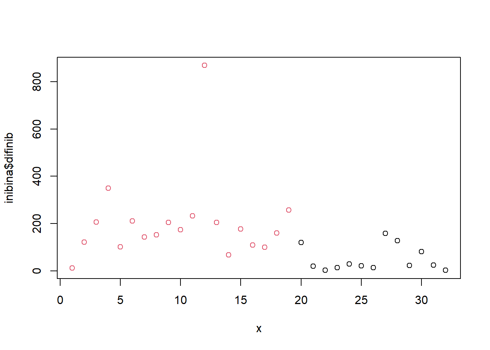
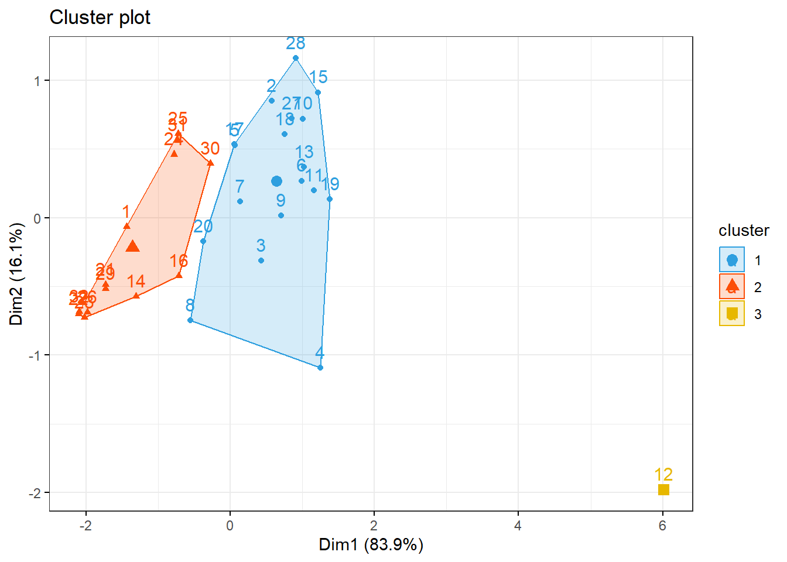
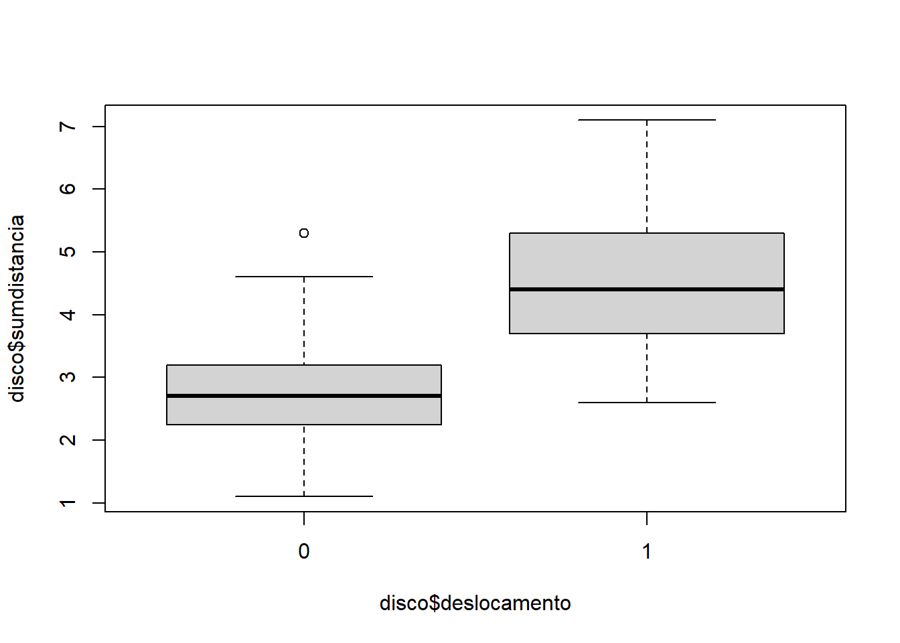
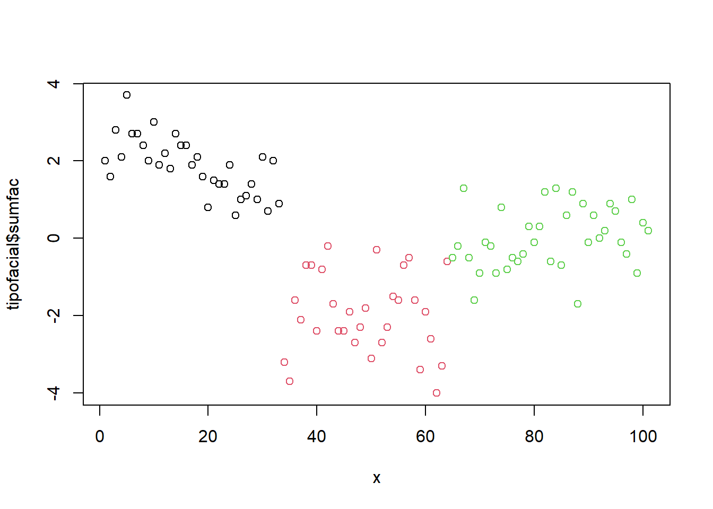

# Classificação {#classification}

A classificação estatística é uma ampla abordagem de aprendizado supervisionado que treina um programa para categorizar informações novas e não rotuladas com base em sua relevância para dados rotulados conhecidos.

A análise de cluster visa segmentar objetos em grupos com membros semelhantes e, portanto, ajuda a descobrir a distribuição de propriedades e correlações em grandes conjuntos de dados.

Os exercícios deste capítulo estão relacionados a esses dois tópicos.


## Conjunto de dados

Este conjunto de dados foram criados pela professora Dra.Olga Satomi Yoshida para aula de Big Data no IPT.

1. Inibina: inibina.xlsx
2. avaliação do deslocamento do disco da articulação temporomandibular: disco.xls
3. Tipos faciais: tipofacial.xls
4. Consumo alimentar médio: LABORATORIO-R.pdf (ex 5.)


## Inibina B como marcador

Avaliar a inibina B como marcador da reserva ovariana de pacientes submetidas à fertilização in vitro

### Pacotes

Pacotes necessários para estes exercícios:


```r
library(readxl)
library(tidyverse)
library(readxl)
library(ggthemes)
library(plotly)
library(knitr)
library(kableExtra)
library(rpart)
library(rpart.plot)
library(caret)
library(MASS)
library(httr)
library(readxl)
library(tibble)
library(e1071)
library(neuralnet)
library(factoextra)
library(ggpubr)
```

### Conjunto de dados


```r
httr::GET("http://www.ime.usp.br/~jmsinger/MorettinSinger/inibina.xls", httr::write_disk("../dados/inibina.xls", overwrite = TRUE))
```

```
## Response [https://www.ime.usp.br/~jmsinger/MorettinSinger/inibina.xls]
##   Date: 2022-12-14 00:18
##   Status: 200
##   Content-Type: application/vnd.ms-excel
##   Size: 8.7 kB
## <ON DISK>  G:\onedrive\obsidian\adsantos\Mestrado\BD\trabalhos\caderno-bd\dados\inibina.xls
```

```r
inibina <- read_excel("../dados/inibina.xls")
```

Adicionando coluna com a diferença entre pré e pós e ajustando a variável resposta para categórica:


```r
inibina$difinib = inibina$inibpos - inibina$inibpre
inibina$resposta = as.factor(inibina$resposta)
```

Distribuição das respostas do conjunto de dados:


```r
kable(inibina) %>%
  kable_styling(latex_options = "striped")
```

<table class="table" style="margin-left: auto; margin-right: auto;">
 <thead>
  <tr>
   <th style="text-align:right;"> ident </th>
   <th style="text-align:left;"> resposta </th>
   <th style="text-align:right;"> inibpre </th>
   <th style="text-align:right;"> inibpos </th>
   <th style="text-align:right;"> difinib </th>
  </tr>
 </thead>
<tbody>
  <tr>
   <td style="text-align:right;"> 1 </td>
   <td style="text-align:left;"> positiva </td>
   <td style="text-align:right;"> 54.03 </td>
   <td style="text-align:right;"> 65.93 </td>
   <td style="text-align:right;"> 11.90 </td>
  </tr>
  <tr>
   <td style="text-align:right;"> 2 </td>
   <td style="text-align:left;"> positiva </td>
   <td style="text-align:right;"> 159.13 </td>
   <td style="text-align:right;"> 281.09 </td>
   <td style="text-align:right;"> 121.96 </td>
  </tr>
  <tr>
   <td style="text-align:right;"> 3 </td>
   <td style="text-align:left;"> positiva </td>
   <td style="text-align:right;"> 98.34 </td>
   <td style="text-align:right;"> 305.37 </td>
   <td style="text-align:right;"> 207.03 </td>
  </tr>
  <tr>
   <td style="text-align:right;"> 4 </td>
   <td style="text-align:left;"> positiva </td>
   <td style="text-align:right;"> 85.30 </td>
   <td style="text-align:right;"> 434.41 </td>
   <td style="text-align:right;"> 349.11 </td>
  </tr>
  <tr>
   <td style="text-align:right;"> 5 </td>
   <td style="text-align:left;"> positiva </td>
   <td style="text-align:right;"> 127.93 </td>
   <td style="text-align:right;"> 229.30 </td>
   <td style="text-align:right;"> 101.37 </td>
  </tr>
  <tr>
   <td style="text-align:right;"> 6 </td>
   <td style="text-align:left;"> positiva </td>
   <td style="text-align:right;"> 143.60 </td>
   <td style="text-align:right;"> 353.82 </td>
   <td style="text-align:right;"> 210.22 </td>
  </tr>
  <tr>
   <td style="text-align:right;"> 7 </td>
   <td style="text-align:left;"> positiva </td>
   <td style="text-align:right;"> 110.58 </td>
   <td style="text-align:right;"> 254.07 </td>
   <td style="text-align:right;"> 143.49 </td>
  </tr>
  <tr>
   <td style="text-align:right;"> 8 </td>
   <td style="text-align:left;"> positiva </td>
   <td style="text-align:right;"> 47.52 </td>
   <td style="text-align:right;"> 199.29 </td>
   <td style="text-align:right;"> 151.77 </td>
  </tr>
  <tr>
   <td style="text-align:right;"> 9 </td>
   <td style="text-align:left;"> positiva </td>
   <td style="text-align:right;"> 122.62 </td>
   <td style="text-align:right;"> 327.87 </td>
   <td style="text-align:right;"> 205.25 </td>
  </tr>
  <tr>
   <td style="text-align:right;"> 10 </td>
   <td style="text-align:left;"> positiva </td>
   <td style="text-align:right;"> 165.95 </td>
   <td style="text-align:right;"> 339.46 </td>
   <td style="text-align:right;"> 173.51 </td>
  </tr>
  <tr>
   <td style="text-align:right;"> 11 </td>
   <td style="text-align:left;"> positiva </td>
   <td style="text-align:right;"> 145.28 </td>
   <td style="text-align:right;"> 377.26 </td>
   <td style="text-align:right;"> 231.98 </td>
  </tr>
  <tr>
   <td style="text-align:right;"> 12 </td>
   <td style="text-align:left;"> positiva </td>
   <td style="text-align:right;"> 186.38 </td>
   <td style="text-align:right;"> 1055.19 </td>
   <td style="text-align:right;"> 868.81 </td>
  </tr>
  <tr>
   <td style="text-align:right;"> 13 </td>
   <td style="text-align:left;"> positiva </td>
   <td style="text-align:right;"> 149.45 </td>
   <td style="text-align:right;"> 353.89 </td>
   <td style="text-align:right;"> 204.44 </td>
  </tr>
  <tr>
   <td style="text-align:right;"> 14 </td>
   <td style="text-align:left;"> positiva </td>
   <td style="text-align:right;"> 33.29 </td>
   <td style="text-align:right;"> 100.09 </td>
   <td style="text-align:right;"> 66.80 </td>
  </tr>
  <tr>
   <td style="text-align:right;"> 15 </td>
   <td style="text-align:left;"> positiva </td>
   <td style="text-align:right;"> 181.57 </td>
   <td style="text-align:right;"> 358.45 </td>
   <td style="text-align:right;"> 176.88 </td>
  </tr>
  <tr>
   <td style="text-align:right;"> 16 </td>
   <td style="text-align:left;"> positiva </td>
   <td style="text-align:right;"> 58.43 </td>
   <td style="text-align:right;"> 168.14 </td>
   <td style="text-align:right;"> 109.71 </td>
  </tr>
  <tr>
   <td style="text-align:right;"> 17 </td>
   <td style="text-align:left;"> positiva </td>
   <td style="text-align:right;"> 128.16 </td>
   <td style="text-align:right;"> 228.48 </td>
   <td style="text-align:right;"> 100.32 </td>
  </tr>
  <tr>
   <td style="text-align:right;"> 18 </td>
   <td style="text-align:left;"> positiva </td>
   <td style="text-align:right;"> 152.92 </td>
   <td style="text-align:right;"> 312.34 </td>
   <td style="text-align:right;"> 159.42 </td>
  </tr>
  <tr>
   <td style="text-align:right;"> 19 </td>
   <td style="text-align:left;"> positiva </td>
   <td style="text-align:right;"> 148.75 </td>
   <td style="text-align:right;"> 406.11 </td>
   <td style="text-align:right;"> 257.36 </td>
  </tr>
  <tr>
   <td style="text-align:right;"> 20 </td>
   <td style="text-align:left;"> negativa </td>
   <td style="text-align:right;"> 81.00 </td>
   <td style="text-align:right;"> 201.40 </td>
   <td style="text-align:right;"> 120.40 </td>
  </tr>
  <tr>
   <td style="text-align:right;"> 21 </td>
   <td style="text-align:left;"> negativa </td>
   <td style="text-align:right;"> 24.74 </td>
   <td style="text-align:right;"> 45.17 </td>
   <td style="text-align:right;"> 20.43 </td>
  </tr>
  <tr>
   <td style="text-align:right;"> 22 </td>
   <td style="text-align:left;"> negativa </td>
   <td style="text-align:right;"> 3.02 </td>
   <td style="text-align:right;"> 6.03 </td>
   <td style="text-align:right;"> 3.01 </td>
  </tr>
  <tr>
   <td style="text-align:right;"> 23 </td>
   <td style="text-align:left;"> negativa </td>
   <td style="text-align:right;"> 4.27 </td>
   <td style="text-align:right;"> 17.80 </td>
   <td style="text-align:right;"> 13.53 </td>
  </tr>
  <tr>
   <td style="text-align:right;"> 24 </td>
   <td style="text-align:left;"> negativa </td>
   <td style="text-align:right;"> 99.30 </td>
   <td style="text-align:right;"> 127.93 </td>
   <td style="text-align:right;"> 28.63 </td>
  </tr>
  <tr>
   <td style="text-align:right;"> 25 </td>
   <td style="text-align:left;"> negativa </td>
   <td style="text-align:right;"> 108.29 </td>
   <td style="text-align:right;"> 129.39 </td>
   <td style="text-align:right;"> 21.10 </td>
  </tr>
  <tr>
   <td style="text-align:right;"> 26 </td>
   <td style="text-align:left;"> negativa </td>
   <td style="text-align:right;"> 7.36 </td>
   <td style="text-align:right;"> 21.27 </td>
   <td style="text-align:right;"> 13.91 </td>
  </tr>
  <tr>
   <td style="text-align:right;"> 27 </td>
   <td style="text-align:left;"> negativa </td>
   <td style="text-align:right;"> 161.28 </td>
   <td style="text-align:right;"> 319.65 </td>
   <td style="text-align:right;"> 158.37 </td>
  </tr>
  <tr>
   <td style="text-align:right;"> 28 </td>
   <td style="text-align:left;"> negativa </td>
   <td style="text-align:right;"> 184.46 </td>
   <td style="text-align:right;"> 311.44 </td>
   <td style="text-align:right;"> 126.98 </td>
  </tr>
  <tr>
   <td style="text-align:right;"> 29 </td>
   <td style="text-align:left;"> negativa </td>
   <td style="text-align:right;"> 23.13 </td>
   <td style="text-align:right;"> 45.64 </td>
   <td style="text-align:right;"> 22.51 </td>
  </tr>
  <tr>
   <td style="text-align:right;"> 30 </td>
   <td style="text-align:left;"> negativa </td>
   <td style="text-align:right;"> 111.18 </td>
   <td style="text-align:right;"> 192.22 </td>
   <td style="text-align:right;"> 81.04 </td>
  </tr>
  <tr>
   <td style="text-align:right;"> 31 </td>
   <td style="text-align:left;"> negativa </td>
   <td style="text-align:right;"> 105.82 </td>
   <td style="text-align:right;"> 130.61 </td>
   <td style="text-align:right;"> 24.79 </td>
  </tr>
  <tr>
   <td style="text-align:right;"> 32 </td>
   <td style="text-align:left;"> negativa </td>
   <td style="text-align:right;"> 3.98 </td>
   <td style="text-align:right;"> 6.46 </td>
   <td style="text-align:right;"> 2.48 </td>
  </tr>
</tbody>
</table>

```r
plot(inibina$difinib ~ inibina$resposta, ylim = c(0, 400))
```


```r
summary(inibina)
```

```
##      ident           resposta     inibpre          inibpos       
##  Min.   : 1.00   negativa:13   Min.   :  3.02   Min.   :   6.03  
##  1st Qu.: 8.75   positiva:19   1st Qu.: 52.40   1st Qu.: 120.97  
##  Median :16.50                 Median :109.44   Median : 228.89  
##  Mean   :16.50                 Mean   :100.53   Mean   : 240.80  
##  3rd Qu.:24.25                 3rd Qu.:148.93   3rd Qu.: 330.77  
##  Max.   :32.00                 Max.   :186.38   Max.   :1055.19  
##     difinib      
##  Min.   :  2.48  
##  1st Qu.: 24.22  
##  Median :121.18  
##  Mean   :140.27  
##  3rd Qu.:183.77  
##  Max.   :868.81
```

O desvio padrão da diferençca da inibina pós e pré é $159.2217295$.

Distribuição:


```r
x = 1:32
plot(inibina$difinib ~ x, col = inibina$resposta)
```




### Generalized Linear Models

Treinando e avalaindo o modelo:


```r
modLogist01 = glm(resposta ~ difinib, family = binomial, data = inibina)
summary(modLogist01)
```

```
## 
## Call:
## glm(formula = resposta ~ difinib, family = binomial, data = inibina)
## 
## Deviance Residuals: 
##     Min       1Q   Median       3Q      Max  
## -1.9770  -0.5594   0.1890   0.5589   2.0631  
## 
## Coefficients:
##              Estimate Std. Error z value Pr(>|z|)   
## (Intercept) -2.310455   0.947438  -2.439  0.01474 * 
## difinib      0.025965   0.008561   3.033  0.00242 **
## ---
## Signif. codes:  0 '***' 0.001 '**' 0.01 '*' 0.05 '.' 0.1 ' ' 1
## 
## (Dispersion parameter for binomial family taken to be 1)
## 
##     Null deviance: 43.230  on 31  degrees of freedom
## Residual deviance: 24.758  on 30  degrees of freedom
## AIC: 28.758
## 
## Number of Fisher Scoring iterations: 6
```


```r
predito = predict.glm(modLogist01, type = "response")
classPred = ifelse(predito>0.5, "positiva", "negativa")
classPred = as.factor(classPred)
cm = confusionMatrix(classPred, inibina$resposta, positive = "positiva")
cm
```

```
## Confusion Matrix and Statistics
## 
##           Reference
## Prediction negativa positiva
##   negativa       10        2
##   positiva        3       17
##                                           
##                Accuracy : 0.8438          
##                  95% CI : (0.6721, 0.9472)
##     No Information Rate : 0.5938          
##     P-Value [Acc > NIR] : 0.002273        
##                                           
##                   Kappa : 0.6721          
##                                           
##  Mcnemar's Test P-Value : 1.000000        
##                                           
##             Sensitivity : 0.8947          
##             Specificity : 0.7692          
##          Pos Pred Value : 0.8500          
##          Neg Pred Value : 0.8333          
##              Prevalence : 0.5938          
##          Detection Rate : 0.5312          
##    Detection Prevalence : 0.6250          
##       Balanced Accuracy : 0.8320          
##                                           
##        'Positive' Class : positiva        
## 
```

```r
# Adiciona as métricas no df
model_eval[nrow(model_eval) + 1,] <- c("modLogist01", "glm", cm$overall['Accuracy'], cm$byClass['Sensitivity'], cm$byClass['Specificity'])
```

Validação cruzada leave-one-out


```r
trControl <- trainControl(method = "LOOCV")

modLogist02 <- train(resposta ~ difinib, method = "glm", data = inibina, family = binomial,
                     trControl = trControl, metric = "Accuracy")
summary(modLogist02)
```

```
## 
## Call:
## NULL
## 
## Deviance Residuals: 
##     Min       1Q   Median       3Q      Max  
## -1.9770  -0.5594   0.1890   0.5589   2.0631  
## 
## Coefficients:
##              Estimate Std. Error z value Pr(>|z|)   
## (Intercept) -2.310455   0.947438  -2.439  0.01474 * 
## difinib      0.025965   0.008561   3.033  0.00242 **
## ---
## Signif. codes:  0 '***' 0.001 '**' 0.01 '*' 0.05 '.' 0.1 ' ' 1
## 
## (Dispersion parameter for binomial family taken to be 1)
## 
##     Null deviance: 43.230  on 31  degrees of freedom
## Residual deviance: 24.758  on 30  degrees of freedom
## AIC: 28.758
## 
## Number of Fisher Scoring iterations: 6
```

```r
predito = predict(modLogist02, newdata = inibina)

classPred = as.factor(predito)

cm = confusionMatrix(classPred, inibina$resposta, positive = "positiva")
cm
```

```
## Confusion Matrix and Statistics
## 
##           Reference
## Prediction negativa positiva
##   negativa       10        2
##   positiva        3       17
##                                           
##                Accuracy : 0.8438          
##                  95% CI : (0.6721, 0.9472)
##     No Information Rate : 0.5938          
##     P-Value [Acc > NIR] : 0.002273        
##                                           
##                   Kappa : 0.6721          
##                                           
##  Mcnemar's Test P-Value : 1.000000        
##                                           
##             Sensitivity : 0.8947          
##             Specificity : 0.7692          
##          Pos Pred Value : 0.8500          
##          Neg Pred Value : 0.8333          
##              Prevalence : 0.5938          
##          Detection Rate : 0.5312          
##    Detection Prevalence : 0.6250          
##       Balanced Accuracy : 0.8320          
##                                           
##        'Positive' Class : positiva        
## 
```

```r
# Adiciona as métricas no df
model_eval[nrow(model_eval) + 1,] <- c("modLogist02-LOOCV", "glm", cm$overall['Accuracy'], cm$byClass['Sensitivity'], cm$byClass['Specificity'])
```

Treinar o modelo com o método LOOCV, neste conjunto de dados, não mudou o resultado.

### Linear Discriminant Analysis - Fisher

Treinando e avalaindo o modelo:


```r
modFisher01 = lda(resposta ~ difinib, data = inibina, prior = c(0.5, 0.5))
predito = predict(modFisher01)
classPred = predito$class
cm = confusionMatrix(classPred, inibina$resposta, positive = "positiva")
cm
```

```
## Confusion Matrix and Statistics
## 
##           Reference
## Prediction negativa positiva
##   negativa       11        6
##   positiva        2       13
##                                          
##                Accuracy : 0.75           
##                  95% CI : (0.566, 0.8854)
##     No Information Rate : 0.5938         
##     P-Value [Acc > NIR] : 0.04978        
##                                          
##                   Kappa : 0.5058         
##                                          
##  Mcnemar's Test P-Value : 0.28884        
##                                          
##             Sensitivity : 0.6842         
##             Specificity : 0.8462         
##          Pos Pred Value : 0.8667         
##          Neg Pred Value : 0.6471         
##              Prevalence : 0.5938         
##          Detection Rate : 0.4062         
##    Detection Prevalence : 0.4688         
##       Balanced Accuracy : 0.7652         
##                                          
##        'Positive' Class : positiva       
## 
```

```r
# Adiciona as métricas no df
model_eval[nrow(model_eval) + 1,] <- c("modFisher01-prior 0.5 / 0.5", "lda", cm$overall['Accuracy'], cm$byClass['Sensitivity'], cm$byClass['Specificity'])
```

### Bayes

Treinando e avalaindo o modelo:


```r
inibina$resposta
```

```
##  [1] positiva positiva positiva positiva positiva positiva positiva positiva
##  [9] positiva positiva positiva positiva positiva positiva positiva positiva
## [17] positiva positiva positiva negativa negativa negativa negativa negativa
## [25] negativa negativa negativa negativa negativa negativa negativa negativa
## Levels: negativa positiva
```

```r
modBayes01 = lda(resposta ~ difinib, data = inibina, prior = c(0.65, 0.35))
predito = predict(modBayes01)
classPred = predito$class
cm = confusionMatrix(classPred, inibina$resposta, positive = "positiva")
cm
```

```
## Confusion Matrix and Statistics
## 
##           Reference
## Prediction negativa positiva
##   negativa       13       13
##   positiva        0        6
##                                          
##                Accuracy : 0.5938         
##                  95% CI : (0.4064, 0.763)
##     No Information Rate : 0.5938         
##     P-Value [Acc > NIR] : 0.5755484      
##                                          
##                   Kappa : 0.2727         
##                                          
##  Mcnemar's Test P-Value : 0.0008741      
##                                          
##             Sensitivity : 0.3158         
##             Specificity : 1.0000         
##          Pos Pred Value : 1.0000         
##          Neg Pred Value : 0.5000         
##              Prevalence : 0.5938         
##          Detection Rate : 0.1875         
##    Detection Prevalence : 0.1875         
##       Balanced Accuracy : 0.6579         
##                                          
##        'Positive' Class : positiva       
## 
```

```r
# Adiciona as métricas no df
model_eval[nrow(model_eval) + 1,] <- c("modBayes01-prior 0.65 / 0.35", "lda", cm$overall['Accuracy'], cm$byClass['Sensitivity'], cm$byClass['Specificity'])
```


```r
table(classPred)
```

```
## classPred
## negativa positiva 
##       26        6
```

```r
print(inibina, n = 32)
```

```
## # A tibble: 32 × 5
##    ident resposta inibpre inibpos difinib
##    <dbl> <fct>      <dbl>   <dbl>   <dbl>
##  1     1 positiva   54.0    65.9    11.9 
##  2     2 positiva  159.    281.    122.  
##  3     3 positiva   98.3   305.    207.  
##  4     4 positiva   85.3   434.    349.  
##  5     5 positiva  128.    229.    101.  
##  6     6 positiva  144.    354.    210.  
##  7     7 positiva  111.    254.    143.  
##  8     8 positiva   47.5   199.    152.  
##  9     9 positiva  123.    328.    205.  
## 10    10 positiva  166.    339.    174.  
## 11    11 positiva  145.    377.    232.  
## 12    12 positiva  186.   1055.    869.  
## 13    13 positiva  149.    354.    204.  
## 14    14 positiva   33.3   100.     66.8 
## 15    15 positiva  182.    358.    177.  
## 16    16 positiva   58.4   168.    110.  
## 17    17 positiva  128.    228.    100.  
## 18    18 positiva  153.    312.    159.  
## 19    19 positiva  149.    406.    257.  
## 20    20 negativa   81     201.    120.  
## 21    21 negativa   24.7    45.2    20.4 
## 22    22 negativa    3.02    6.03    3.01
## 23    23 negativa    4.27   17.8    13.5 
## 24    24 negativa   99.3   128.     28.6 
## 25    25 negativa  108.    129.     21.1 
## 26    26 negativa    7.36   21.3    13.9 
## 27    27 negativa  161.    320.    158.  
## 28    28 negativa  184.    311.    127.  
## 29    29 negativa   23.1    45.6    22.5 
## 30    30 negativa  111.    192.     81.0 
## 31    31 negativa  106.    131.     24.8 
## 32    32 negativa    3.98    6.46    2.48
```
#### Naive Bayes

Treinando e avalaindo o modelo:


```r
modNaiveBayes01 = naiveBayes(resposta ~ difinib, data = inibina)
predito = predict(modNaiveBayes01, inibina)
cm = confusionMatrix(predito, inibina$resposta, positive = "positiva")
cm
```

```
## Confusion Matrix and Statistics
## 
##           Reference
## Prediction negativa positiva
##   negativa       11        5
##   positiva        2       14
##                                           
##                Accuracy : 0.7812          
##                  95% CI : (0.6003, 0.9072)
##     No Information Rate : 0.5938          
##     P-Value [Acc > NIR] : 0.02102         
##                                           
##                   Kappa : 0.5625          
##                                           
##  Mcnemar's Test P-Value : 0.44969         
##                                           
##             Sensitivity : 0.7368          
##             Specificity : 0.8462          
##          Pos Pred Value : 0.8750          
##          Neg Pred Value : 0.6875          
##              Prevalence : 0.5938          
##          Detection Rate : 0.4375          
##    Detection Prevalence : 0.5000          
##       Balanced Accuracy : 0.7915          
##                                           
##        'Positive' Class : positiva        
## 
```

```r
# Adiciona as métricas no df
model_eval[nrow(model_eval) + 1,] <- c("modNaiveBayes01", "naiveBayes", cm$overall['Accuracy'], cm$byClass['Sensitivity'], cm$byClass['Specificity'])
```

### Decison tree

Treinando e avalaindo o modelo:


```r
modArvDec01 = rpart(resposta ~ difinib, data = inibina) 
prp(modArvDec01,  faclen=0,
    extra=1,
    roundint=F,
    digits=5)
```


```r
predito = predict(modArvDec01, type = "class")
cm = confusionMatrix(predito, inibina$resposta, positive = "positiva")
cm
```

```
## Confusion Matrix and Statistics
## 
##           Reference
## Prediction negativa positiva
##   negativa        9        1
##   positiva        4       18
##                                           
##                Accuracy : 0.8438          
##                  95% CI : (0.6721, 0.9472)
##     No Information Rate : 0.5938          
##     P-Value [Acc > NIR] : 0.002273        
##                                           
##                   Kappa : 0.6639          
##                                           
##  Mcnemar's Test P-Value : 0.371093        
##                                           
##             Sensitivity : 0.9474          
##             Specificity : 0.6923          
##          Pos Pred Value : 0.8182          
##          Neg Pred Value : 0.9000          
##              Prevalence : 0.5938          
##          Detection Rate : 0.5625          
##    Detection Prevalence : 0.6875          
##       Balanced Accuracy : 0.8198          
##                                           
##        'Positive' Class : positiva        
## 
```

```r
# Adiciona as métricas no df
model_eval[nrow(model_eval) + 1,] <- c("modArvDec01", "rpart", cm$overall['Accuracy'], cm$byClass['Sensitivity'], cm$byClass['Specificity'])
```

### SVM

Treinando e avalaindo o modelo:


```r
modSVM01 = svm(resposta ~ difinib, data = inibina, kernel = "linear")
predito = predict(modSVM01, type = "class")
cm = confusionMatrix(predito, inibina$resposta, positive = "positiva")
cm
```

```
## Confusion Matrix and Statistics
## 
##           Reference
## Prediction negativa positiva
##   negativa       10        2
##   positiva        3       17
##                                           
##                Accuracy : 0.8438          
##                  95% CI : (0.6721, 0.9472)
##     No Information Rate : 0.5938          
##     P-Value [Acc > NIR] : 0.002273        
##                                           
##                   Kappa : 0.6721          
##                                           
##  Mcnemar's Test P-Value : 1.000000        
##                                           
##             Sensitivity : 0.8947          
##             Specificity : 0.7692          
##          Pos Pred Value : 0.8500          
##          Neg Pred Value : 0.8333          
##              Prevalence : 0.5938          
##          Detection Rate : 0.5312          
##    Detection Prevalence : 0.6250          
##       Balanced Accuracy : 0.8320          
##                                           
##        'Positive' Class : positiva        
## 
```

```r
# Adiciona as métricas no df
model_eval[nrow(model_eval) + 1,] <- c("modSVM01", "svm", cm$overall['Accuracy'], cm$byClass['Sensitivity'], cm$byClass['Specificity'])
```

### Neural network

Treinando e avalaindo o modelo:


```r
modRedNeural01 = neuralnet(resposta ~ difinib, data = inibina, hidden = c(2,4,3))
plot(modRedNeural01)

ypred = neuralnet::compute(modRedNeural01, inibina)
yhat = ypred$net.result

yhat = round(yhat)

yhat=data.frame("yhat"=ifelse(max.col(yhat[ ,1:2])==1, "negativa", "positiva"))

cm = confusionMatrix(as.factor(yhat$yhat), inibina$resposta)
cm
```

```
## Confusion Matrix and Statistics
## 
##           Reference
## Prediction negativa positiva
##   negativa       11        1
##   positiva        2       18
##                                           
##                Accuracy : 0.9062          
##                  95% CI : (0.7498, 0.9802)
##     No Information Rate : 0.5938          
##     P-Value [Acc > NIR] : 0.000105        
##                                           
##                   Kappa : 0.8033          
##                                           
##  Mcnemar's Test P-Value : 1.000000        
##                                           
##             Sensitivity : 0.8462          
##             Specificity : 0.9474          
##          Pos Pred Value : 0.9167          
##          Neg Pred Value : 0.9000          
##              Prevalence : 0.4062          
##          Detection Rate : 0.3438          
##    Detection Prevalence : 0.3750          
##       Balanced Accuracy : 0.8968          
##                                           
##        'Positive' Class : negativa        
## 
```

```r
# Adiciona as métricas no df
model_eval[nrow(model_eval) + 1,] <- c("modRedNeural01", "neuralnet", cm$overall['Accuracy'], cm$byClass['Sensitivity'], cm$byClass['Specificity'])
```

### KNN

Treinando e avalaindo o modelo:

Para $k = 3$:


```r
modKnn3_01 = knn3(resposta ~ difinib, data = inibina, k = 3)
predito = predict(modKnn3_01, inibina, type = "class")
cm = confusionMatrix(predito, inibina$resposta, positive = "positiva")

# Adiciona as métricas no df
model_eval[nrow(model_eval) + 1,] <- c("modKnn3_01-k=3", "knn3", cm$overall['Accuracy'], cm$byClass['Sensitivity'], cm$byClass['Specificity'])
```

Para $k = 5$:


```r
modKnn5_01 = knn3(resposta ~ difinib, data = inibina, k = 5)
predito = predict(modKnn5_01, inibina, type = "class")
cm = confusionMatrix(predito, inibina$resposta, positive = "positiva")
cm
```

```
## Confusion Matrix and Statistics
## 
##           Reference
## Prediction negativa positiva
##   negativa        9        1
##   positiva        4       18
##                                           
##                Accuracy : 0.8438          
##                  95% CI : (0.6721, 0.9472)
##     No Information Rate : 0.5938          
##     P-Value [Acc > NIR] : 0.002273        
##                                           
##                   Kappa : 0.6639          
##                                           
##  Mcnemar's Test P-Value : 0.371093        
##                                           
##             Sensitivity : 0.9474          
##             Specificity : 0.6923          
##          Pos Pred Value : 0.8182          
##          Neg Pred Value : 0.9000          
##              Prevalence : 0.5938          
##          Detection Rate : 0.5625          
##    Detection Prevalence : 0.6875          
##       Balanced Accuracy : 0.8198          
##                                           
##        'Positive' Class : positiva        
## 
```

```r
# Adiciona as métricas no df
model_eval[nrow(model_eval) + 1,] <- c("modKnn5_01-k=5", "knn3", cm$overall['Accuracy'], cm$byClass['Sensitivity'], cm$byClass['Specificity'])
```

### Comparando os modelos

<table class="table" style="margin-left: auto; margin-right: auto;">
 <thead>
  <tr>
   <th style="text-align:left;"> Model </th>
   <th style="text-align:left;"> Algorithm </th>
   <th style="text-align:left;"> Accuracy </th>
   <th style="text-align:left;"> Sensitivity </th>
   <th style="text-align:left;"> Specificity </th>
  </tr>
 </thead>
<tbody>
  <tr>
   <td style="text-align:left;"> modLogist01 </td>
   <td style="text-align:left;"> glm </td>
   <td style="text-align:left;"> 0.84375 </td>
   <td style="text-align:left;"> 0.894736842105263 </td>
   <td style="text-align:left;"> 0.769230769230769 </td>
  </tr>
  <tr>
   <td style="text-align:left;"> modLogist02-LOOCV </td>
   <td style="text-align:left;"> glm </td>
   <td style="text-align:left;"> 0.84375 </td>
   <td style="text-align:left;"> 0.894736842105263 </td>
   <td style="text-align:left;"> 0.769230769230769 </td>
  </tr>
  <tr>
   <td style="text-align:left;"> modFisher01-prior 0.5 / 0.5 </td>
   <td style="text-align:left;"> lda </td>
   <td style="text-align:left;"> 0.75 </td>
   <td style="text-align:left;"> 0.684210526315789 </td>
   <td style="text-align:left;"> 0.846153846153846 </td>
  </tr>
  <tr>
   <td style="text-align:left;"> modBayes01-prior 0.65 / 0.35 </td>
   <td style="text-align:left;"> lda </td>
   <td style="text-align:left;"> 0.59375 </td>
   <td style="text-align:left;"> 0.315789473684211 </td>
   <td style="text-align:left;"> 1 </td>
  </tr>
  <tr>
   <td style="text-align:left;"> modNaiveBayes01 </td>
   <td style="text-align:left;"> naiveBayes </td>
   <td style="text-align:left;"> 0.78125 </td>
   <td style="text-align:left;"> 0.736842105263158 </td>
   <td style="text-align:left;"> 0.846153846153846 </td>
  </tr>
  <tr>
   <td style="text-align:left;"> modArvDec01 </td>
   <td style="text-align:left;"> rpart </td>
   <td style="text-align:left;"> 0.84375 </td>
   <td style="text-align:left;"> 0.947368421052632 </td>
   <td style="text-align:left;"> 0.692307692307692 </td>
  </tr>
  <tr>
   <td style="text-align:left;"> modSVM01 </td>
   <td style="text-align:left;"> svm </td>
   <td style="text-align:left;"> 0.84375 </td>
   <td style="text-align:left;"> 0.894736842105263 </td>
   <td style="text-align:left;"> 0.769230769230769 </td>
  </tr>
  <tr>
   <td style="text-align:left;"> modRedNeural01 </td>
   <td style="text-align:left;"> neuralnet </td>
   <td style="text-align:left;"> 0.90625 </td>
   <td style="text-align:left;"> 0.846153846153846 </td>
   <td style="text-align:left;"> 0.947368421052632 </td>
  </tr>
  <tr>
   <td style="text-align:left;"> modKnn3_01-k=3 </td>
   <td style="text-align:left;"> knn3 </td>
   <td style="text-align:left;"> 0.875 </td>
   <td style="text-align:left;"> 0.894736842105263 </td>
   <td style="text-align:left;"> 0.846153846153846 </td>
  </tr>
  <tr>
   <td style="text-align:left;"> modKnn5_01-k=5 </td>
   <td style="text-align:left;"> knn3 </td>
   <td style="text-align:left;"> 0.84375 </td>
   <td style="text-align:left;"> 0.947368421052632 </td>
   <td style="text-align:left;"> 0.692307692307692 </td>
  </tr>
</tbody>
</table>

Os modelos modLogist01, modFisher01 com $prior = 0.5, 0.5$, modArvDec01 e modKnn3_01 com $k=3$ tiveram performance muito parecidas no conjunto de dados. Uma possível escolha seria o modKnn3_01 que combinado obteve melhor acurácia, sensibilidade e especificidade.

### Agrupamento


```r
inibinaS = inibina[, 3:5]

d <- dist(inibinaS, method = "maximum")
grup = hclust(d, method = "ward.D")

groups <- cutree(grup, k=3)

plot(grup, cex = 0.6)
rect.hclust(grup , k = 3, border = 2:6)
abline(h = 3, col = 'red')
```


```r
table(groups, inibina$resposta)
```

```
##       
## groups negativa positiva
##      1       11        7
##      2        2       11
##      3        0        1
```

Como indicado no dendograma, podemos dividir em 3 grupos:


```r
km1 = kmeans(inibinaS, 3)
p1 = fviz_cluster(km1, data=inibinaS,
                  palette = c("#2E9FDF", "#FC4E07", "#E7B800", "#E7B700", "#D7B700"),
                  star.plot=FALSE,
                  # repel=TRUE,
                  ggtheme=theme_bw())
p1
```




```r
groups = km1$cluster
table(groups, inibina$resposta)
```

```
##       
## groups negativa positiva
##      1        3       15
##      2       10        3
##      3        0        1
```

## Ultrassom para medir deslocamento do disco

Os dados disponíveis aqui foram extraídos de um estudo realizado no Hospital Universitário da Universidade de São Paulo com o objetivo de avaliar se algumas medidas obtidas ultrassonograficamente poderiam ser utilizadas como substitutas de medidas obtidas por métodos de ressonância magnética, considerada como padrão ouro para avaliação do deslocamento do disco da articulação temporomandibular (referido simplesmente como disco).

### Pacotes

Pacotes necessários para estes exercícios:


```r
library(readxl)
library(tidyverse)
library(readxl)
library(ggthemes)
library(plotly)
library(knitr)
library(kableExtra)
library(rpart)
library(rpart.plot)
library(caret)
library(MASS)
library(httr)
library(readxl)
library(tibble)
library(e1071)
library(neuralnet)
library(factoextra)
library(ggpubr)
```

### Conjunto de dados


```r
#GET("http://www.ime.usp.br/~jmsinger/MorettinSinger/disco.xls", write_disk(tf <- tempfile(fileext = ".xls")))
httr::GET("http://www.ime.usp.br/~jmsinger/MorettinSinger/disco.xls", httr::write_disk("../dados/disco.xls", overwrite = TRUE))
```

```
## Response [https://www.ime.usp.br/~jmsinger/MorettinSinger/disco.xls]
##   Date: 2022-12-14 00:18
##   Status: 200
##   Content-Type: application/vnd.ms-excel
##   Size: 11.3 kB
## <ON DISK>  G:\onedrive\obsidian\adsantos\Mestrado\BD\trabalhos\caderno-bd\dados\disco.xls
```

```r
disco <- read_excel("../dados/disco.xls")
```

Número de observações 104.

#### Categorizando a variável de deslocamento.


```r
disco$sumdistancia = disco$distanciaA + disco$distanciaF
disco$deslocamento = as.factor(disco$deslocamento)
```


```r
plot(disco$sumdistancia  ~ disco$deslocamento)
```



```r
kable(disco) %>%
  kable_styling(latex_options = "striped")
```

<table class="table" style="margin-left: auto; margin-right: auto;">
 <thead>
  <tr>
   <th style="text-align:left;"> deslocamento </th>
   <th style="text-align:right;"> distanciaA </th>
   <th style="text-align:right;"> distanciaF </th>
   <th style="text-align:right;"> sumdistancia </th>
  </tr>
 </thead>
<tbody>
  <tr>
   <td style="text-align:left;"> 0 </td>
   <td style="text-align:right;"> 2.2 </td>
   <td style="text-align:right;"> 1.4 </td>
   <td style="text-align:right;"> 3.6 </td>
  </tr>
  <tr>
   <td style="text-align:left;"> 0 </td>
   <td style="text-align:right;"> 2.4 </td>
   <td style="text-align:right;"> 1.2 </td>
   <td style="text-align:right;"> 3.6 </td>
  </tr>
  <tr>
   <td style="text-align:left;"> 0 </td>
   <td style="text-align:right;"> 2.6 </td>
   <td style="text-align:right;"> 2.0 </td>
   <td style="text-align:right;"> 4.6 </td>
  </tr>
  <tr>
   <td style="text-align:left;"> 1 </td>
   <td style="text-align:right;"> 3.5 </td>
   <td style="text-align:right;"> 1.8 </td>
   <td style="text-align:right;"> 5.3 </td>
  </tr>
  <tr>
   <td style="text-align:left;"> 0 </td>
   <td style="text-align:right;"> 1.3 </td>
   <td style="text-align:right;"> 1.0 </td>
   <td style="text-align:right;"> 2.3 </td>
  </tr>
  <tr>
   <td style="text-align:left;"> 1 </td>
   <td style="text-align:right;"> 2.8 </td>
   <td style="text-align:right;"> 1.1 </td>
   <td style="text-align:right;"> 3.9 </td>
  </tr>
  <tr>
   <td style="text-align:left;"> 0 </td>
   <td style="text-align:right;"> 1.5 </td>
   <td style="text-align:right;"> 1.2 </td>
   <td style="text-align:right;"> 2.7 </td>
  </tr>
  <tr>
   <td style="text-align:left;"> 0 </td>
   <td style="text-align:right;"> 2.6 </td>
   <td style="text-align:right;"> 1.1 </td>
   <td style="text-align:right;"> 3.7 </td>
  </tr>
  <tr>
   <td style="text-align:left;"> 0 </td>
   <td style="text-align:right;"> 1.2 </td>
   <td style="text-align:right;"> 0.6 </td>
   <td style="text-align:right;"> 1.8 </td>
  </tr>
  <tr>
   <td style="text-align:left;"> 0 </td>
   <td style="text-align:right;"> 1.7 </td>
   <td style="text-align:right;"> 1.5 </td>
   <td style="text-align:right;"> 3.2 </td>
  </tr>
  <tr>
   <td style="text-align:left;"> 0 </td>
   <td style="text-align:right;"> 1.3 </td>
   <td style="text-align:right;"> 1.2 </td>
   <td style="text-align:right;"> 2.5 </td>
  </tr>
  <tr>
   <td style="text-align:left;"> 0 </td>
   <td style="text-align:right;"> 1.2 </td>
   <td style="text-align:right;"> 1.0 </td>
   <td style="text-align:right;"> 2.2 </td>
  </tr>
  <tr>
   <td style="text-align:left;"> 1 </td>
   <td style="text-align:right;"> 4.0 </td>
   <td style="text-align:right;"> 2.5 </td>
   <td style="text-align:right;"> 6.5 </td>
  </tr>
  <tr>
   <td style="text-align:left;"> 0 </td>
   <td style="text-align:right;"> 1.2 </td>
   <td style="text-align:right;"> 1.0 </td>
   <td style="text-align:right;"> 2.2 </td>
  </tr>
  <tr>
   <td style="text-align:left;"> 1 </td>
   <td style="text-align:right;"> 3.1 </td>
   <td style="text-align:right;"> 1.7 </td>
   <td style="text-align:right;"> 4.8 </td>
  </tr>
  <tr>
   <td style="text-align:left;"> 1 </td>
   <td style="text-align:right;"> 2.6 </td>
   <td style="text-align:right;"> 0.6 </td>
   <td style="text-align:right;"> 3.2 </td>
  </tr>
  <tr>
   <td style="text-align:left;"> 0 </td>
   <td style="text-align:right;"> 1.8 </td>
   <td style="text-align:right;"> 0.8 </td>
   <td style="text-align:right;"> 2.6 </td>
  </tr>
  <tr>
   <td style="text-align:left;"> 0 </td>
   <td style="text-align:right;"> 1.2 </td>
   <td style="text-align:right;"> 1.0 </td>
   <td style="text-align:right;"> 2.2 </td>
  </tr>
  <tr>
   <td style="text-align:left;"> 0 </td>
   <td style="text-align:right;"> 1.9 </td>
   <td style="text-align:right;"> 1.0 </td>
   <td style="text-align:right;"> 2.9 </td>
  </tr>
  <tr>
   <td style="text-align:left;"> 0 </td>
   <td style="text-align:right;"> 1.2 </td>
   <td style="text-align:right;"> 0.9 </td>
   <td style="text-align:right;"> 2.1 </td>
  </tr>
  <tr>
   <td style="text-align:left;"> 1 </td>
   <td style="text-align:right;"> 1.7 </td>
   <td style="text-align:right;"> 0.9 </td>
   <td style="text-align:right;"> 2.6 </td>
  </tr>
  <tr>
   <td style="text-align:left;"> 0 </td>
   <td style="text-align:right;"> 1.2 </td>
   <td style="text-align:right;"> 0.8 </td>
   <td style="text-align:right;"> 2.0 </td>
  </tr>
  <tr>
   <td style="text-align:left;"> 1 </td>
   <td style="text-align:right;"> 3.9 </td>
   <td style="text-align:right;"> 3.2 </td>
   <td style="text-align:right;"> 7.1 </td>
  </tr>
  <tr>
   <td style="text-align:left;"> 0 </td>
   <td style="text-align:right;"> 1.7 </td>
   <td style="text-align:right;"> 1.1 </td>
   <td style="text-align:right;"> 2.8 </td>
  </tr>
  <tr>
   <td style="text-align:left;"> 0 </td>
   <td style="text-align:right;"> 1.4 </td>
   <td style="text-align:right;"> 1.0 </td>
   <td style="text-align:right;"> 2.4 </td>
  </tr>
  <tr>
   <td style="text-align:left;"> 0 </td>
   <td style="text-align:right;"> 1.6 </td>
   <td style="text-align:right;"> 1.3 </td>
   <td style="text-align:right;"> 2.9 </td>
  </tr>
  <tr>
   <td style="text-align:left;"> 0 </td>
   <td style="text-align:right;"> 1.3 </td>
   <td style="text-align:right;"> 0.5 </td>
   <td style="text-align:right;"> 1.8 </td>
  </tr>
  <tr>
   <td style="text-align:left;"> 0 </td>
   <td style="text-align:right;"> 1.7 </td>
   <td style="text-align:right;"> 0.7 </td>
   <td style="text-align:right;"> 2.4 </td>
  </tr>
  <tr>
   <td style="text-align:left;"> 1 </td>
   <td style="text-align:right;"> 2.6 </td>
   <td style="text-align:right;"> 1.8 </td>
   <td style="text-align:right;"> 4.4 </td>
  </tr>
  <tr>
   <td style="text-align:left;"> 0 </td>
   <td style="text-align:right;"> 1.5 </td>
   <td style="text-align:right;"> 1.5 </td>
   <td style="text-align:right;"> 3.0 </td>
  </tr>
  <tr>
   <td style="text-align:left;"> 0 </td>
   <td style="text-align:right;"> 1.8 </td>
   <td style="text-align:right;"> 1.4 </td>
   <td style="text-align:right;"> 3.2 </td>
  </tr>
  <tr>
   <td style="text-align:left;"> 0 </td>
   <td style="text-align:right;"> 1.2 </td>
   <td style="text-align:right;"> 0.9 </td>
   <td style="text-align:right;"> 2.1 </td>
  </tr>
  <tr>
   <td style="text-align:left;"> 0 </td>
   <td style="text-align:right;"> 1.9 </td>
   <td style="text-align:right;"> 1.0 </td>
   <td style="text-align:right;"> 2.9 </td>
  </tr>
  <tr>
   <td style="text-align:left;"> 0 </td>
   <td style="text-align:right;"> 2.3 </td>
   <td style="text-align:right;"> 1.0 </td>
   <td style="text-align:right;"> 3.3 </td>
  </tr>
  <tr>
   <td style="text-align:left;"> 0 </td>
   <td style="text-align:right;"> 1.6 </td>
   <td style="text-align:right;"> 1.0 </td>
   <td style="text-align:right;"> 2.6 </td>
  </tr>
  <tr>
   <td style="text-align:left;"> 0 </td>
   <td style="text-align:right;"> 1.0 </td>
   <td style="text-align:right;"> 0.6 </td>
   <td style="text-align:right;"> 1.6 </td>
  </tr>
  <tr>
   <td style="text-align:left;"> 0 </td>
   <td style="text-align:right;"> 1.6 </td>
   <td style="text-align:right;"> 1.3 </td>
   <td style="text-align:right;"> 2.9 </td>
  </tr>
  <tr>
   <td style="text-align:left;"> 1 </td>
   <td style="text-align:right;"> 4.3 </td>
   <td style="text-align:right;"> 2.3 </td>
   <td style="text-align:right;"> 6.6 </td>
  </tr>
  <tr>
   <td style="text-align:left;"> 0 </td>
   <td style="text-align:right;"> 2.1 </td>
   <td style="text-align:right;"> 1.0 </td>
   <td style="text-align:right;"> 3.1 </td>
  </tr>
  <tr>
   <td style="text-align:left;"> 0 </td>
   <td style="text-align:right;"> 1.6 </td>
   <td style="text-align:right;"> 0.9 </td>
   <td style="text-align:right;"> 2.5 </td>
  </tr>
  <tr>
   <td style="text-align:left;"> 0 </td>
   <td style="text-align:right;"> 2.3 </td>
   <td style="text-align:right;"> 1.2 </td>
   <td style="text-align:right;"> 3.5 </td>
  </tr>
  <tr>
   <td style="text-align:left;"> 0 </td>
   <td style="text-align:right;"> 2.4 </td>
   <td style="text-align:right;"> 1.3 </td>
   <td style="text-align:right;"> 3.7 </td>
  </tr>
  <tr>
   <td style="text-align:left;"> 0 </td>
   <td style="text-align:right;"> 2.0 </td>
   <td style="text-align:right;"> 1.1 </td>
   <td style="text-align:right;"> 3.1 </td>
  </tr>
  <tr>
   <td style="text-align:left;"> 0 </td>
   <td style="text-align:right;"> 1.8 </td>
   <td style="text-align:right;"> 1.2 </td>
   <td style="text-align:right;"> 3.0 </td>
  </tr>
  <tr>
   <td style="text-align:left;"> 0 </td>
   <td style="text-align:right;"> 1.4 </td>
   <td style="text-align:right;"> 1.9 </td>
   <td style="text-align:right;"> 3.3 </td>
  </tr>
  <tr>
   <td style="text-align:left;"> 0 </td>
   <td style="text-align:right;"> 1.5 </td>
   <td style="text-align:right;"> 1.3 </td>
   <td style="text-align:right;"> 2.8 </td>
  </tr>
  <tr>
   <td style="text-align:left;"> 0 </td>
   <td style="text-align:right;"> 2.2 </td>
   <td style="text-align:right;"> 1.2 </td>
   <td style="text-align:right;"> 3.4 </td>
  </tr>
  <tr>
   <td style="text-align:left;"> 0 </td>
   <td style="text-align:right;"> 1.6 </td>
   <td style="text-align:right;"> 2.0 </td>
   <td style="text-align:right;"> 3.6 </td>
  </tr>
  <tr>
   <td style="text-align:left;"> 0 </td>
   <td style="text-align:right;"> 1.5 </td>
   <td style="text-align:right;"> 1.1 </td>
   <td style="text-align:right;"> 2.6 </td>
  </tr>
  <tr>
   <td style="text-align:left;"> 0 </td>
   <td style="text-align:right;"> 1.2 </td>
   <td style="text-align:right;"> 0.7 </td>
   <td style="text-align:right;"> 1.9 </td>
  </tr>
  <tr>
   <td style="text-align:left;"> 0 </td>
   <td style="text-align:right;"> 1.5 </td>
   <td style="text-align:right;"> 0.8 </td>
   <td style="text-align:right;"> 2.3 </td>
  </tr>
  <tr>
   <td style="text-align:left;"> 0 </td>
   <td style="text-align:right;"> 1.8 </td>
   <td style="text-align:right;"> 1.1 </td>
   <td style="text-align:right;"> 2.9 </td>
  </tr>
  <tr>
   <td style="text-align:left;"> 0 </td>
   <td style="text-align:right;"> 0.9 </td>
   <td style="text-align:right;"> 0.8 </td>
   <td style="text-align:right;"> 1.7 </td>
  </tr>
  <tr>
   <td style="text-align:left;"> 0 </td>
   <td style="text-align:right;"> 1.1 </td>
   <td style="text-align:right;"> 0.9 </td>
   <td style="text-align:right;"> 2.0 </td>
  </tr>
  <tr>
   <td style="text-align:left;"> 0 </td>
   <td style="text-align:right;"> 1.4 </td>
   <td style="text-align:right;"> 1.1 </td>
   <td style="text-align:right;"> 2.5 </td>
  </tr>
  <tr>
   <td style="text-align:left;"> 0 </td>
   <td style="text-align:right;"> 1.6 </td>
   <td style="text-align:right;"> 0.8 </td>
   <td style="text-align:right;"> 2.4 </td>
  </tr>
  <tr>
   <td style="text-align:left;"> 0 </td>
   <td style="text-align:right;"> 2.1 </td>
   <td style="text-align:right;"> 1.3 </td>
   <td style="text-align:right;"> 3.4 </td>
  </tr>
  <tr>
   <td style="text-align:left;"> 0 </td>
   <td style="text-align:right;"> 1.8 </td>
   <td style="text-align:right;"> 0.9 </td>
   <td style="text-align:right;"> 2.7 </td>
  </tr>
  <tr>
   <td style="text-align:left;"> 0 </td>
   <td style="text-align:right;"> 2.4 </td>
   <td style="text-align:right;"> 0.9 </td>
   <td style="text-align:right;"> 3.3 </td>
  </tr>
  <tr>
   <td style="text-align:left;"> 0 </td>
   <td style="text-align:right;"> 2.0 </td>
   <td style="text-align:right;"> 2.3 </td>
   <td style="text-align:right;"> 4.3 </td>
  </tr>
  <tr>
   <td style="text-align:left;"> 0 </td>
   <td style="text-align:right;"> 2.0 </td>
   <td style="text-align:right;"> 2.3 </td>
   <td style="text-align:right;"> 4.3 </td>
  </tr>
  <tr>
   <td style="text-align:left;"> 0 </td>
   <td style="text-align:right;"> 2.4 </td>
   <td style="text-align:right;"> 2.9 </td>
   <td style="text-align:right;"> 5.3 </td>
  </tr>
  <tr>
   <td style="text-align:left;"> 1 </td>
   <td style="text-align:right;"> 2.7 </td>
   <td style="text-align:right;"> 2.4 </td>
   <td style="text-align:right;"> 5.1 </td>
  </tr>
  <tr>
   <td style="text-align:left;"> 1 </td>
   <td style="text-align:right;"> 1.9 </td>
   <td style="text-align:right;"> 2.7 </td>
   <td style="text-align:right;"> 4.6 </td>
  </tr>
  <tr>
   <td style="text-align:left;"> 1 </td>
   <td style="text-align:right;"> 2.4 </td>
   <td style="text-align:right;"> 1.3 </td>
   <td style="text-align:right;"> 3.7 </td>
  </tr>
  <tr>
   <td style="text-align:left;"> 1 </td>
   <td style="text-align:right;"> 2.1 </td>
   <td style="text-align:right;"> 0.8 </td>
   <td style="text-align:right;"> 2.9 </td>
  </tr>
  <tr>
   <td style="text-align:left;"> 0 </td>
   <td style="text-align:right;"> 0.8 </td>
   <td style="text-align:right;"> 1.3 </td>
   <td style="text-align:right;"> 2.1 </td>
  </tr>
  <tr>
   <td style="text-align:left;"> 1 </td>
   <td style="text-align:right;"> 0.8 </td>
   <td style="text-align:right;"> 2.0 </td>
   <td style="text-align:right;"> 2.8 </td>
  </tr>
  <tr>
   <td style="text-align:left;"> 0 </td>
   <td style="text-align:right;"> 0.5 </td>
   <td style="text-align:right;"> 0.6 </td>
   <td style="text-align:right;"> 1.1 </td>
  </tr>
  <tr>
   <td style="text-align:left;"> 0 </td>
   <td style="text-align:right;"> 1.5 </td>
   <td style="text-align:right;"> 0.7 </td>
   <td style="text-align:right;"> 2.2 </td>
  </tr>
  <tr>
   <td style="text-align:left;"> 1 </td>
   <td style="text-align:right;"> 2.9 </td>
   <td style="text-align:right;"> 1.6 </td>
   <td style="text-align:right;"> 4.5 </td>
  </tr>
  <tr>
   <td style="text-align:left;"> 0 </td>
   <td style="text-align:right;"> 1.4 </td>
   <td style="text-align:right;"> 1.2 </td>
   <td style="text-align:right;"> 2.6 </td>
  </tr>
  <tr>
   <td style="text-align:left;"> 1 </td>
   <td style="text-align:right;"> 3.2 </td>
   <td style="text-align:right;"> 0.5 </td>
   <td style="text-align:right;"> 3.7 </td>
  </tr>
  <tr>
   <td style="text-align:left;"> 0 </td>
   <td style="text-align:right;"> 1.2 </td>
   <td style="text-align:right;"> 1.2 </td>
   <td style="text-align:right;"> 2.4 </td>
  </tr>
  <tr>
   <td style="text-align:left;"> 1 </td>
   <td style="text-align:right;"> 2.1 </td>
   <td style="text-align:right;"> 1.6 </td>
   <td style="text-align:right;"> 3.7 </td>
  </tr>
  <tr>
   <td style="text-align:left;"> 1 </td>
   <td style="text-align:right;"> 1.4 </td>
   <td style="text-align:right;"> 1.5 </td>
   <td style="text-align:right;"> 2.9 </td>
  </tr>
  <tr>
   <td style="text-align:left;"> 0 </td>
   <td style="text-align:right;"> 1.5 </td>
   <td style="text-align:right;"> 1.4 </td>
   <td style="text-align:right;"> 2.9 </td>
  </tr>
  <tr>
   <td style="text-align:left;"> 0 </td>
   <td style="text-align:right;"> 1.6 </td>
   <td style="text-align:right;"> 1.5 </td>
   <td style="text-align:right;"> 3.1 </td>
  </tr>
  <tr>
   <td style="text-align:left;"> 1 </td>
   <td style="text-align:right;"> 4.9 </td>
   <td style="text-align:right;"> 1.2 </td>
   <td style="text-align:right;"> 6.1 </td>
  </tr>
  <tr>
   <td style="text-align:left;"> 0 </td>
   <td style="text-align:right;"> 1.1 </td>
   <td style="text-align:right;"> 1.1 </td>
   <td style="text-align:right;"> 2.2 </td>
  </tr>
  <tr>
   <td style="text-align:left;"> 1 </td>
   <td style="text-align:right;"> 2.0 </td>
   <td style="text-align:right;"> 1.3 </td>
   <td style="text-align:right;"> 3.3 </td>
  </tr>
  <tr>
   <td style="text-align:left;"> 0 </td>
   <td style="text-align:right;"> 1.5 </td>
   <td style="text-align:right;"> 2.2 </td>
   <td style="text-align:right;"> 3.7 </td>
  </tr>
  <tr>
   <td style="text-align:left;"> 0 </td>
   <td style="text-align:right;"> 1.7 </td>
   <td style="text-align:right;"> 1.0 </td>
   <td style="text-align:right;"> 2.7 </td>
  </tr>
  <tr>
   <td style="text-align:left;"> 0 </td>
   <td style="text-align:right;"> 1.9 </td>
   <td style="text-align:right;"> 1.4 </td>
   <td style="text-align:right;"> 3.3 </td>
  </tr>
  <tr>
   <td style="text-align:left;"> 1 </td>
   <td style="text-align:right;"> 2.5 </td>
   <td style="text-align:right;"> 3.1 </td>
   <td style="text-align:right;"> 5.6 </td>
  </tr>
  <tr>
   <td style="text-align:left;"> 0 </td>
   <td style="text-align:right;"> 1.4 </td>
   <td style="text-align:right;"> 1.5 </td>
   <td style="text-align:right;"> 2.9 </td>
  </tr>
  <tr>
   <td style="text-align:left;"> 1 </td>
   <td style="text-align:right;"> 2.5 </td>
   <td style="text-align:right;"> 1.8 </td>
   <td style="text-align:right;"> 4.3 </td>
  </tr>
  <tr>
   <td style="text-align:left;"> 1 </td>
   <td style="text-align:right;"> 2.3 </td>
   <td style="text-align:right;"> 1.6 </td>
   <td style="text-align:right;"> 3.9 </td>
  </tr>
  <tr>
   <td style="text-align:left;"> 0 </td>
   <td style="text-align:right;"> 1.2 </td>
   <td style="text-align:right;"> 0.4 </td>
   <td style="text-align:right;"> 1.6 </td>
  </tr>
  <tr>
   <td style="text-align:left;"> 0 </td>
   <td style="text-align:right;"> 1.0 </td>
   <td style="text-align:right;"> 1.1 </td>
   <td style="text-align:right;"> 2.1 </td>
  </tr>
  <tr>
   <td style="text-align:left;"> 1 </td>
   <td style="text-align:right;"> 2.9 </td>
   <td style="text-align:right;"> 2.4 </td>
   <td style="text-align:right;"> 5.3 </td>
  </tr>
  <tr>
   <td style="text-align:left;"> 1 </td>
   <td style="text-align:right;"> 2.5 </td>
   <td style="text-align:right;"> 3.3 </td>
   <td style="text-align:right;"> 5.8 </td>
  </tr>
  <tr>
   <td style="text-align:left;"> 0 </td>
   <td style="text-align:right;"> 1.4 </td>
   <td style="text-align:right;"> 1.1 </td>
   <td style="text-align:right;"> 2.5 </td>
  </tr>
  <tr>
   <td style="text-align:left;"> 0 </td>
   <td style="text-align:right;"> 1.5 </td>
   <td style="text-align:right;"> 1.3 </td>
   <td style="text-align:right;"> 2.8 </td>
  </tr>
  <tr>
   <td style="text-align:left;"> 0 </td>
   <td style="text-align:right;"> 0.8 </td>
   <td style="text-align:right;"> 2.0 </td>
   <td style="text-align:right;"> 2.8 </td>
  </tr>
  <tr>
   <td style="text-align:left;"> 0 </td>
   <td style="text-align:right;"> 2.0 </td>
   <td style="text-align:right;"> 2.1 </td>
   <td style="text-align:right;"> 4.1 </td>
  </tr>
  <tr>
   <td style="text-align:left;"> 1 </td>
   <td style="text-align:right;"> 3.1 </td>
   <td style="text-align:right;"> 2.2 </td>
   <td style="text-align:right;"> 5.3 </td>
  </tr>
  <tr>
   <td style="text-align:left;"> 1 </td>
   <td style="text-align:right;"> 3.1 </td>
   <td style="text-align:right;"> 2.1 </td>
   <td style="text-align:right;"> 5.2 </td>
  </tr>
  <tr>
   <td style="text-align:left;"> 0 </td>
   <td style="text-align:right;"> 1.7 </td>
   <td style="text-align:right;"> 1.2 </td>
   <td style="text-align:right;"> 2.9 </td>
  </tr>
  <tr>
   <td style="text-align:left;"> 0 </td>
   <td style="text-align:right;"> 1.6 </td>
   <td style="text-align:right;"> 0.5 </td>
   <td style="text-align:right;"> 2.1 </td>
  </tr>
  <tr>
   <td style="text-align:left;"> 0 </td>
   <td style="text-align:right;"> 1.4 </td>
   <td style="text-align:right;"> 1.1 </td>
   <td style="text-align:right;"> 2.5 </td>
  </tr>
  <tr>
   <td style="text-align:left;"> 0 </td>
   <td style="text-align:right;"> 1.6 </td>
   <td style="text-align:right;"> 1.0 </td>
   <td style="text-align:right;"> 2.6 </td>
  </tr>
  <tr>
   <td style="text-align:left;"> 1 </td>
   <td style="text-align:right;"> 2.3 </td>
   <td style="text-align:right;"> 1.6 </td>
   <td style="text-align:right;"> 3.9 </td>
  </tr>
  <tr>
   <td style="text-align:left;"> 1 </td>
   <td style="text-align:right;"> 2.2 </td>
   <td style="text-align:right;"> 1.8 </td>
   <td style="text-align:right;"> 4.0 </td>
  </tr>
</tbody>
</table>


```r
summary(disco)
```

```
##  deslocamento   distanciaA      distanciaF     sumdistancia  
##  0:75         Min.   :0.500   Min.   :0.400   Min.   :1.100  
##  1:29         1st Qu.:1.400   1st Qu.:1.000   1st Qu.:2.500  
##               Median :1.700   Median :1.200   Median :2.900  
##               Mean   :1.907   Mean   :1.362   Mean   :3.268  
##               3rd Qu.:2.300   3rd Qu.:1.600   3rd Qu.:3.700  
##               Max.   :4.900   Max.   :3.300   Max.   :7.100
```

O desvio padrão da soma das distâncias é $1.1839759$.


### Generalized Linear Models

Treinando o modelo:


```r
modLogist01 = glm(deslocamento ~ sumdistancia, family = binomial, data = disco)
summary(modLogist01)
```

```
## 
## Call:
## glm(formula = deslocamento ~ sumdistancia, family = binomial, 
##     data = disco)
## 
## Deviance Residuals: 
##     Min       1Q   Median       3Q      Max  
## -2.2291  -0.4957  -0.3182   0.1560   2.3070  
## 
## Coefficients:
##              Estimate Std. Error z value Pr(>|z|)    
## (Intercept)   -7.3902     1.3740  -5.379 7.51e-08 ***
## sumdistancia   1.8467     0.3799   4.861 1.17e-06 ***
## ---
## Signif. codes:  0 '***' 0.001 '**' 0.01 '*' 0.05 '.' 0.1 ' ' 1
## 
## (Dispersion parameter for binomial family taken to be 1)
## 
##     Null deviance: 123.107  on 103  degrees of freedom
## Residual deviance:  72.567  on 102  degrees of freedom
## AIC: 76.567
## 
## Number of Fisher Scoring iterations: 5
```

Avaliando o modelo:


```r
predito = predict.glm(modLogist01, type = "response")
classPred = ifelse(predito>0.5, "0", "1")
classPred = as.factor(classPred)
cm = confusionMatrix(classPred, disco$deslocamento, positive = "0")
cm
```

```
## Confusion Matrix and Statistics
## 
##           Reference
## Prediction  0  1
##          0  5 16
##          1 70 13
##                                           
##                Accuracy : 0.1731          
##                  95% CI : (0.1059, 0.2597)
##     No Information Rate : 0.7212          
##     P-Value [Acc > NIR] : 1               
##                                           
##                   Kappa : -0.3088         
##                                           
##  Mcnemar's Test P-Value : 1.096e-08       
##                                           
##             Sensitivity : 0.06667         
##             Specificity : 0.44828         
##          Pos Pred Value : 0.23810         
##          Neg Pred Value : 0.15663         
##              Prevalence : 0.72115         
##          Detection Rate : 0.04808         
##    Detection Prevalence : 0.20192         
##       Balanced Accuracy : 0.25747         
##                                           
##        'Positive' Class : 0               
## 
```

```r
# Adiciona as métricas no df
model_eval[nrow(model_eval) + 1,] <- c("modLogist01", "glm", cm$overall['Accuracy'], cm$byClass['Sensitivity'], cm$byClass['Specificity'])
```

Validação cruzada leave-one-out


```r
trControl <- trainControl(method = "LOOCV")

modLogist02 <- train(deslocamento ~ sumdistancia, method = "glm", data = disco, family = binomial,
                     trControl = trControl, metric = "Accuracy")
summary(modLogist02)
```

```
## 
## Call:
## NULL
## 
## Deviance Residuals: 
##     Min       1Q   Median       3Q      Max  
## -2.2291  -0.4957  -0.3182   0.1560   2.3070  
## 
## Coefficients:
##              Estimate Std. Error z value Pr(>|z|)    
## (Intercept)   -7.3902     1.3740  -5.379 7.51e-08 ***
## sumdistancia   1.8467     0.3799   4.861 1.17e-06 ***
## ---
## Signif. codes:  0 '***' 0.001 '**' 0.01 '*' 0.05 '.' 0.1 ' ' 1
## 
## (Dispersion parameter for binomial family taken to be 1)
## 
##     Null deviance: 123.107  on 103  degrees of freedom
## Residual deviance:  72.567  on 102  degrees of freedom
## AIC: 76.567
## 
## Number of Fisher Scoring iterations: 5
```

```r
predito = predict(modLogist02, newdata = disco)

classPred = as.factor(predito)

cm = confusionMatrix(classPred, disco$deslocamento, positive = "0")
cm
```

```
## Confusion Matrix and Statistics
## 
##           Reference
## Prediction  0  1
##          0 70 13
##          1  5 16
##                                           
##                Accuracy : 0.8269          
##                  95% CI : (0.7403, 0.8941)
##     No Information Rate : 0.7212          
##     P-Value [Acc > NIR] : 0.00857         
##                                           
##                   Kappa : 0.5299          
##                                           
##  Mcnemar's Test P-Value : 0.09896         
##                                           
##             Sensitivity : 0.9333          
##             Specificity : 0.5517          
##          Pos Pred Value : 0.8434          
##          Neg Pred Value : 0.7619          
##              Prevalence : 0.7212          
##          Detection Rate : 0.6731          
##    Detection Prevalence : 0.7981          
##       Balanced Accuracy : 0.7425          
##                                           
##        'Positive' Class : 0               
## 
```

```r
# Adiciona as métricas no df
model_eval[nrow(model_eval) + 1,] <- c("modLogist02-LOOCV", "glm", cm$overall['Accuracy'], cm$byClass['Sensitivity'], cm$byClass['Specificity'])
```


```r
kable(model_eval) %>%
  kable_styling(latex_options = "striped")
```

<table class="table" style="margin-left: auto; margin-right: auto;">
 <thead>
  <tr>
   <th style="text-align:left;"> Model </th>
   <th style="text-align:left;"> Algorithm </th>
   <th style="text-align:left;"> Accuracy </th>
   <th style="text-align:left;"> Sensitivity </th>
   <th style="text-align:left;"> Specificity </th>
  </tr>
 </thead>
<tbody>
  <tr>
   <td style="text-align:left;"> modLogist01 </td>
   <td style="text-align:left;"> glm </td>
   <td style="text-align:left;"> 0.173076923076923 </td>
   <td style="text-align:left;"> 0.0666666666666667 </td>
   <td style="text-align:left;"> 0.448275862068966 </td>
  </tr>
  <tr>
   <td style="text-align:left;"> modLogist02-LOOCV </td>
   <td style="text-align:left;"> glm </td>
   <td style="text-align:left;"> 0.826923076923077 </td>
   <td style="text-align:left;"> 0.933333333333333 </td>
   <td style="text-align:left;"> 0.551724137931034 </td>
  </tr>
</tbody>
</table>

Treinar o modelo com o método LOOCV melhorou consideravelmente todas as métricas do modelo.

### Linear Discriminant Analysis - Fisher

Treinando e avalaindo o modelo:


```r
modFisher01 = lda(deslocamento ~ sumdistancia, data = disco, prior = c(0.5, 0.5))
predito = predict(modFisher01)
classPred = predito$class
cm = confusionMatrix(classPred, disco$deslocamento, positive = "0")
cm
```

```
## Confusion Matrix and Statistics
## 
##           Reference
## Prediction  0  1
##          0 67  6
##          1  8 23
##                                           
##                Accuracy : 0.8654          
##                  95% CI : (0.7845, 0.9244)
##     No Information Rate : 0.7212          
##     P-Value [Acc > NIR] : 0.0003676       
##                                           
##                   Kappa : 0.6722          
##                                           
##  Mcnemar's Test P-Value : 0.7892680       
##                                           
##             Sensitivity : 0.8933          
##             Specificity : 0.7931          
##          Pos Pred Value : 0.9178          
##          Neg Pred Value : 0.7419          
##              Prevalence : 0.7212          
##          Detection Rate : 0.6442          
##    Detection Prevalence : 0.7019          
##       Balanced Accuracy : 0.8432          
##                                           
##        'Positive' Class : 0               
## 
```

```r
# Adiciona as métricas no df
model_eval[nrow(model_eval) + 1,] <- c("modFisher01-prior 0.5 / 0.5", "lda", cm$overall['Accuracy'], cm$byClass['Sensitivity'], cm$byClass['Specificity'])
```

### Bayes

Treinando e avalaindo o modelo:


```r
modBayes01 = lda(deslocamento ~ sumdistancia, data = disco, prior = c(0.65, 0.35))
predito = predict(modBayes01)
classPred = predito$class
cm = confusionMatrix(classPred, disco$deslocamento, positive = "0")
cm
```

```
## Confusion Matrix and Statistics
## 
##           Reference
## Prediction  0  1
##          0 70 12
##          1  5 17
##                                           
##                Accuracy : 0.8365          
##                  95% CI : (0.7512, 0.9018)
##     No Information Rate : 0.7212          
##     P-Value [Acc > NIR] : 0.004313        
##                                           
##                   Kappa : 0.5611          
##                                           
##  Mcnemar's Test P-Value : 0.145610        
##                                           
##             Sensitivity : 0.9333          
##             Specificity : 0.5862          
##          Pos Pred Value : 0.8537          
##          Neg Pred Value : 0.7727          
##              Prevalence : 0.7212          
##          Detection Rate : 0.6731          
##    Detection Prevalence : 0.7885          
##       Balanced Accuracy : 0.7598          
##                                           
##        'Positive' Class : 0               
## 
```

```r
# Adiciona as métricas no df
model_eval[nrow(model_eval) + 1,] <- c("modBayes01-prior 0.65 / 0.35", "lda", cm$overall['Accuracy'], cm$byClass['Sensitivity'], cm$byClass['Specificity'])
```


```r
table(classPred)
```

```
## classPred
##  0  1 
## 82 22
```

```r
print(disco, n = 32)
```

```
## # A tibble: 104 × 4
##    deslocamento distanciaA distanciaF sumdistancia
##    <fct>             <dbl>      <dbl>        <dbl>
##  1 0                   2.2        1.4          3.6
##  2 0                   2.4        1.2          3.6
##  3 0                   2.6        2            4.6
##  4 1                   3.5        1.8          5.3
##  5 0                   1.3        1            2.3
##  6 1                   2.8        1.1          3.9
##  7 0                   1.5        1.2          2.7
##  8 0                   2.6        1.1          3.7
##  9 0                   1.2        0.6          1.8
## 10 0                   1.7        1.5          3.2
## 11 0                   1.3        1.2          2.5
## 12 0                   1.2        1            2.2
## 13 1                   4          2.5          6.5
## 14 0                   1.2        1            2.2
## 15 1                   3.1        1.7          4.8
## 16 1                   2.6        0.6          3.2
## 17 0                   1.8        0.8          2.6
## 18 0                   1.2        1            2.2
## 19 0                   1.9        1            2.9
## 20 0                   1.2        0.9          2.1
## 21 1                   1.7        0.9          2.6
## 22 0                   1.2        0.8          2  
## 23 1                   3.9        3.2          7.1
## 24 0                   1.7        1.1          2.8
## 25 0                   1.4        1            2.4
## 26 0                   1.6        1.3          2.9
## 27 0                   1.3        0.5          1.8
## 28 0                   1.7        0.7          2.4
## 29 1                   2.6        1.8          4.4
## 30 0                   1.5        1.5          3  
## 31 0                   1.8        1.4          3.2
## 32 0                   1.2        0.9          2.1
## # … with 72 more rows
```

### Naive Bayes

Treinando e avalaindo o modelo:


```r
modNaiveBayes01 = naiveBayes(deslocamento ~ sumdistancia, data = disco)
predito = predict(modNaiveBayes01, disco)
cm = confusionMatrix(predito, disco$deslocamento, positive = "0")
cm
```

```
## Confusion Matrix and Statistics
## 
##           Reference
## Prediction  0  1
##          0 70 13
##          1  5 16
##                                           
##                Accuracy : 0.8269          
##                  95% CI : (0.7403, 0.8941)
##     No Information Rate : 0.7212          
##     P-Value [Acc > NIR] : 0.00857         
##                                           
##                   Kappa : 0.5299          
##                                           
##  Mcnemar's Test P-Value : 0.09896         
##                                           
##             Sensitivity : 0.9333          
##             Specificity : 0.5517          
##          Pos Pred Value : 0.8434          
##          Neg Pred Value : 0.7619          
##              Prevalence : 0.7212          
##          Detection Rate : 0.6731          
##    Detection Prevalence : 0.7981          
##       Balanced Accuracy : 0.7425          
##                                           
##        'Positive' Class : 0               
## 
```

```r
# Adiciona as métricas no df
model_eval[nrow(model_eval) + 1,] <- c("modNaiveBayes01", "naiveBayes", cm$overall['Accuracy'], cm$byClass['Sensitivity'], cm$byClass['Specificity'])
```

### Decison tree

Treinando e avalaindo o modelo:


```r
modArvDec01 = rpart(deslocamento ~ sumdistancia, data = disco) 
prp(modArvDec01,  faclen=0, #use full names for factor labels
    extra=1, #display number of observations for each terminal node
    roundint=F, #don't round to integers in output
    digits=5)
```


```r
predito = predict(modArvDec01, type = "class")
cm = confusionMatrix(predito, disco$deslocamento, positive = "0")
cm
```

```
## Confusion Matrix and Statistics
## 
##           Reference
## Prediction  0  1
##          0 67  6
##          1  8 23
##                                           
##                Accuracy : 0.8654          
##                  95% CI : (0.7845, 0.9244)
##     No Information Rate : 0.7212          
##     P-Value [Acc > NIR] : 0.0003676       
##                                           
##                   Kappa : 0.6722          
##                                           
##  Mcnemar's Test P-Value : 0.7892680       
##                                           
##             Sensitivity : 0.8933          
##             Specificity : 0.7931          
##          Pos Pred Value : 0.9178          
##          Neg Pred Value : 0.7419          
##              Prevalence : 0.7212          
##          Detection Rate : 0.6442          
##    Detection Prevalence : 0.7019          
##       Balanced Accuracy : 0.8432          
##                                           
##        'Positive' Class : 0               
## 
```

```r
# Adiciona as métricas no df
model_eval[nrow(model_eval) + 1,] <- c("modArvDec01", "rpart", cm$overall['Accuracy'], cm$byClass['Sensitivity'], cm$byClass['Specificity'])
```


```r
x = 1:nrow(disco)
plot(disco$sumdistancia ~ x, col = disco$deslocamento)
```


### SVM

Treinando e avalaindo o modelo:


```r
modSVM01 = svm(deslocamento ~ sumdistancia, data = disco, kernel = "linear")
predito = predict(modSVM01, type = "class")
cm = confusionMatrix(predito, disco$deslocamento, positive = "0")

# Adiciona as métricas no df
model_eval[nrow(model_eval) + 1,] <- c("modSVM01", "svm", cm$overall['Accuracy'], cm$byClass['Sensitivity'], cm$byClass['Specificity'])
```

### Neural Network

Treinando e avalaindo o modelo:


```r
modRedNeural01 = neuralnet(deslocamento ~ sumdistancia, data=disco, hidden = c(2,4,3))
plot(modRedNeural01)

ypred = neuralnet::compute(modRedNeural01, disco)
yhat = ypred$net.result

yhat = round(yhat)

yhat=data.frame("yhat"=ifelse(max.col(yhat[ ,1:2])==1, "0", "1"))

cm = confusionMatrix(as.factor(yhat$yhat), disco$deslocamento)
cm
```

```
## Confusion Matrix and Statistics
## 
##           Reference
## Prediction  0  1
##          0 70  7
##          1  5 22
##                                           
##                Accuracy : 0.8846          
##                  95% CI : (0.8071, 0.9389)
##     No Information Rate : 0.7212          
##     P-Value [Acc > NIR] : 4.877e-05       
##                                           
##                   Kappa : 0.7069          
##                                           
##  Mcnemar's Test P-Value : 0.7728          
##                                           
##             Sensitivity : 0.9333          
##             Specificity : 0.7586          
##          Pos Pred Value : 0.9091          
##          Neg Pred Value : 0.8148          
##              Prevalence : 0.7212          
##          Detection Rate : 0.6731          
##    Detection Prevalence : 0.7404          
##       Balanced Accuracy : 0.8460          
##                                           
##        'Positive' Class : 0               
## 
```

```r
# Adiciona as métricas no df
model_eval[nrow(model_eval) + 1,] <- c("modRedNeural01", "neuralnet", cm$overall['Accuracy'], cm$byClass['Sensitivity'], cm$byClass['Specificity'])
```

### KNN

Treinando e avalaindo o modelo:

Para $k = 3$:


```r
modKnn3_01 = knn3(deslocamento ~ sumdistancia, data=disco, k=3)
predito = predict(modKnn3_01, disco, type = "class")
cm = confusionMatrix(predito, disco$deslocamento, positive = "0")

# Adiciona as métricas no df
model_eval[nrow(model_eval) + 1,] <- c("modKnn3_01-k=3", "knn3", cm$overall['Accuracy'], cm$byClass['Sensitivity'], cm$byClass['Specificity'])
```

Para $k = 5$:


```r
modKnn5_01 = knn3(deslocamento ~ sumdistancia, data=disco, k=5)
predito = predict(modKnn5_01, disco, type = "class")
cm = confusionMatrix(predito, disco$deslocamento, positive = "0")
cm
```

```
## Confusion Matrix and Statistics
## 
##           Reference
## Prediction  0  1
##          0 68  9
##          1  7 20
##                                           
##                Accuracy : 0.8462          
##                  95% CI : (0.7622, 0.9094)
##     No Information Rate : 0.7212          
##     P-Value [Acc > NIR] : 0.002035        
##                                           
##                   Kappa : 0.6092          
##                                           
##  Mcnemar's Test P-Value : 0.802587        
##                                           
##             Sensitivity : 0.9067          
##             Specificity : 0.6897          
##          Pos Pred Value : 0.8831          
##          Neg Pred Value : 0.7407          
##              Prevalence : 0.7212          
##          Detection Rate : 0.6538          
##    Detection Prevalence : 0.7404          
##       Balanced Accuracy : 0.7982          
##                                           
##        'Positive' Class : 0               
## 
```

```r
# Adiciona as métricas no df
model_eval[nrow(model_eval) + 1,] <- c("modKnn5_01-k=5", "knn3", cm$overall['Accuracy'], cm$byClass['Sensitivity'], cm$byClass['Specificity'])
```

### Comparando os modelos

<table class="table" style="margin-left: auto; margin-right: auto;">
 <thead>
  <tr>
   <th style="text-align:left;"> Model </th>
   <th style="text-align:left;"> Algorithm </th>
   <th style="text-align:left;"> Accuracy </th>
   <th style="text-align:left;"> Sensitivity </th>
   <th style="text-align:left;"> Specificity </th>
  </tr>
 </thead>
<tbody>
  <tr>
   <td style="text-align:left;"> modLogist01 </td>
   <td style="text-align:left;"> glm </td>
   <td style="text-align:left;"> 0.173076923076923 </td>
   <td style="text-align:left;"> 0.0666666666666667 </td>
   <td style="text-align:left;"> 0.448275862068966 </td>
  </tr>
  <tr>
   <td style="text-align:left;"> modLogist02-LOOCV </td>
   <td style="text-align:left;"> glm </td>
   <td style="text-align:left;"> 0.826923076923077 </td>
   <td style="text-align:left;"> 0.933333333333333 </td>
   <td style="text-align:left;"> 0.551724137931034 </td>
  </tr>
  <tr>
   <td style="text-align:left;"> modFisher01-prior 0.5 / 0.5 </td>
   <td style="text-align:left;"> lda </td>
   <td style="text-align:left;"> 0.865384615384615 </td>
   <td style="text-align:left;"> 0.893333333333333 </td>
   <td style="text-align:left;"> 0.793103448275862 </td>
  </tr>
  <tr>
   <td style="text-align:left;"> modBayes01-prior 0.65 / 0.35 </td>
   <td style="text-align:left;"> lda </td>
   <td style="text-align:left;"> 0.836538461538462 </td>
   <td style="text-align:left;"> 0.933333333333333 </td>
   <td style="text-align:left;"> 0.586206896551724 </td>
  </tr>
  <tr>
   <td style="text-align:left;"> modNaiveBayes01 </td>
   <td style="text-align:left;"> naiveBayes </td>
   <td style="text-align:left;"> 0.826923076923077 </td>
   <td style="text-align:left;"> 0.933333333333333 </td>
   <td style="text-align:left;"> 0.551724137931034 </td>
  </tr>
  <tr>
   <td style="text-align:left;"> modArvDec01 </td>
   <td style="text-align:left;"> rpart </td>
   <td style="text-align:left;"> 0.865384615384615 </td>
   <td style="text-align:left;"> 0.893333333333333 </td>
   <td style="text-align:left;"> 0.793103448275862 </td>
  </tr>
  <tr>
   <td style="text-align:left;"> modSVM01 </td>
   <td style="text-align:left;"> svm </td>
   <td style="text-align:left;"> 0.836538461538462 </td>
   <td style="text-align:left;"> 0.946666666666667 </td>
   <td style="text-align:left;"> 0.551724137931034 </td>
  </tr>
  <tr>
   <td style="text-align:left;"> modRedNeural01 </td>
   <td style="text-align:left;"> neuralnet </td>
   <td style="text-align:left;"> 0.884615384615385 </td>
   <td style="text-align:left;"> 0.933333333333333 </td>
   <td style="text-align:left;"> 0.758620689655172 </td>
  </tr>
  <tr>
   <td style="text-align:left;"> modKnn3_01-k=3 </td>
   <td style="text-align:left;"> knn3 </td>
   <td style="text-align:left;"> 0.884615384615385 </td>
   <td style="text-align:left;"> 0.96 </td>
   <td style="text-align:left;"> 0.689655172413793 </td>
  </tr>
  <tr>
   <td style="text-align:left;"> modKnn5_01-k=5 </td>
   <td style="text-align:left;"> knn3 </td>
   <td style="text-align:left;"> 0.846153846153846 </td>
   <td style="text-align:left;"> 0.906666666666667 </td>
   <td style="text-align:left;"> 0.689655172413793 </td>
  </tr>
</tbody>
</table>

Todos os modelos tiveram performance semelhante, com destaque para modFisher01 com $prior 0.5, 0.5$.

### Agrupamento


```r
discoS = disco[, 2:3]

d <- dist(discoS, method = "maximum")
grup = hclust(d, method = "ward.D")

groups <- cutree(grup, k=3)

plot(grup, cex = 0.6)
rect.hclust(grup , k = 3, border = 2:6)
abline(h = 3, col = 'red')
```


```r
kable(sort(groups)) %>%
  kable_styling(latex_options = "striped")
```

<table class="table" style="margin-left: auto; margin-right: auto;">
 <thead>
  <tr>
   <th style="text-align:right;"> x </th>
  </tr>
 </thead>
<tbody>
  <tr>
   <td style="text-align:right;"> 1 </td>
  </tr>
  <tr>
   <td style="text-align:right;"> 1 </td>
  </tr>
  <tr>
   <td style="text-align:right;"> 1 </td>
  </tr>
  <tr>
   <td style="text-align:right;"> 1 </td>
  </tr>
  <tr>
   <td style="text-align:right;"> 1 </td>
  </tr>
  <tr>
   <td style="text-align:right;"> 1 </td>
  </tr>
  <tr>
   <td style="text-align:right;"> 1 </td>
  </tr>
  <tr>
   <td style="text-align:right;"> 1 </td>
  </tr>
  <tr>
   <td style="text-align:right;"> 1 </td>
  </tr>
  <tr>
   <td style="text-align:right;"> 1 </td>
  </tr>
  <tr>
   <td style="text-align:right;"> 1 </td>
  </tr>
  <tr>
   <td style="text-align:right;"> 1 </td>
  </tr>
  <tr>
   <td style="text-align:right;"> 1 </td>
  </tr>
  <tr>
   <td style="text-align:right;"> 1 </td>
  </tr>
  <tr>
   <td style="text-align:right;"> 1 </td>
  </tr>
  <tr>
   <td style="text-align:right;"> 1 </td>
  </tr>
  <tr>
   <td style="text-align:right;"> 1 </td>
  </tr>
  <tr>
   <td style="text-align:right;"> 1 </td>
  </tr>
  <tr>
   <td style="text-align:right;"> 1 </td>
  </tr>
  <tr>
   <td style="text-align:right;"> 1 </td>
  </tr>
  <tr>
   <td style="text-align:right;"> 1 </td>
  </tr>
  <tr>
   <td style="text-align:right;"> 1 </td>
  </tr>
  <tr>
   <td style="text-align:right;"> 1 </td>
  </tr>
  <tr>
   <td style="text-align:right;"> 1 </td>
  </tr>
  <tr>
   <td style="text-align:right;"> 1 </td>
  </tr>
  <tr>
   <td style="text-align:right;"> 1 </td>
  </tr>
  <tr>
   <td style="text-align:right;"> 1 </td>
  </tr>
  <tr>
   <td style="text-align:right;"> 1 </td>
  </tr>
  <tr>
   <td style="text-align:right;"> 1 </td>
  </tr>
  <tr>
   <td style="text-align:right;"> 1 </td>
  </tr>
  <tr>
   <td style="text-align:right;"> 1 </td>
  </tr>
  <tr>
   <td style="text-align:right;"> 2 </td>
  </tr>
  <tr>
   <td style="text-align:right;"> 2 </td>
  </tr>
  <tr>
   <td style="text-align:right;"> 2 </td>
  </tr>
  <tr>
   <td style="text-align:right;"> 2 </td>
  </tr>
  <tr>
   <td style="text-align:right;"> 2 </td>
  </tr>
  <tr>
   <td style="text-align:right;"> 2 </td>
  </tr>
  <tr>
   <td style="text-align:right;"> 2 </td>
  </tr>
  <tr>
   <td style="text-align:right;"> 2 </td>
  </tr>
  <tr>
   <td style="text-align:right;"> 2 </td>
  </tr>
  <tr>
   <td style="text-align:right;"> 2 </td>
  </tr>
  <tr>
   <td style="text-align:right;"> 2 </td>
  </tr>
  <tr>
   <td style="text-align:right;"> 2 </td>
  </tr>
  <tr>
   <td style="text-align:right;"> 2 </td>
  </tr>
  <tr>
   <td style="text-align:right;"> 2 </td>
  </tr>
  <tr>
   <td style="text-align:right;"> 2 </td>
  </tr>
  <tr>
   <td style="text-align:right;"> 2 </td>
  </tr>
  <tr>
   <td style="text-align:right;"> 2 </td>
  </tr>
  <tr>
   <td style="text-align:right;"> 2 </td>
  </tr>
  <tr>
   <td style="text-align:right;"> 2 </td>
  </tr>
  <tr>
   <td style="text-align:right;"> 2 </td>
  </tr>
  <tr>
   <td style="text-align:right;"> 2 </td>
  </tr>
  <tr>
   <td style="text-align:right;"> 2 </td>
  </tr>
  <tr>
   <td style="text-align:right;"> 2 </td>
  </tr>
  <tr>
   <td style="text-align:right;"> 2 </td>
  </tr>
  <tr>
   <td style="text-align:right;"> 2 </td>
  </tr>
  <tr>
   <td style="text-align:right;"> 2 </td>
  </tr>
  <tr>
   <td style="text-align:right;"> 2 </td>
  </tr>
  <tr>
   <td style="text-align:right;"> 2 </td>
  </tr>
  <tr>
   <td style="text-align:right;"> 2 </td>
  </tr>
  <tr>
   <td style="text-align:right;"> 2 </td>
  </tr>
  <tr>
   <td style="text-align:right;"> 2 </td>
  </tr>
  <tr>
   <td style="text-align:right;"> 2 </td>
  </tr>
  <tr>
   <td style="text-align:right;"> 2 </td>
  </tr>
  <tr>
   <td style="text-align:right;"> 2 </td>
  </tr>
  <tr>
   <td style="text-align:right;"> 2 </td>
  </tr>
  <tr>
   <td style="text-align:right;"> 2 </td>
  </tr>
  <tr>
   <td style="text-align:right;"> 2 </td>
  </tr>
  <tr>
   <td style="text-align:right;"> 2 </td>
  </tr>
  <tr>
   <td style="text-align:right;"> 2 </td>
  </tr>
  <tr>
   <td style="text-align:right;"> 2 </td>
  </tr>
  <tr>
   <td style="text-align:right;"> 2 </td>
  </tr>
  <tr>
   <td style="text-align:right;"> 2 </td>
  </tr>
  <tr>
   <td style="text-align:right;"> 2 </td>
  </tr>
  <tr>
   <td style="text-align:right;"> 2 </td>
  </tr>
  <tr>
   <td style="text-align:right;"> 2 </td>
  </tr>
  <tr>
   <td style="text-align:right;"> 2 </td>
  </tr>
  <tr>
   <td style="text-align:right;"> 2 </td>
  </tr>
  <tr>
   <td style="text-align:right;"> 2 </td>
  </tr>
  <tr>
   <td style="text-align:right;"> 2 </td>
  </tr>
  <tr>
   <td style="text-align:right;"> 2 </td>
  </tr>
  <tr>
   <td style="text-align:right;"> 2 </td>
  </tr>
  <tr>
   <td style="text-align:right;"> 2 </td>
  </tr>
  <tr>
   <td style="text-align:right;"> 2 </td>
  </tr>
  <tr>
   <td style="text-align:right;"> 2 </td>
  </tr>
  <tr>
   <td style="text-align:right;"> 2 </td>
  </tr>
  <tr>
   <td style="text-align:right;"> 2 </td>
  </tr>
  <tr>
   <td style="text-align:right;"> 2 </td>
  </tr>
  <tr>
   <td style="text-align:right;"> 2 </td>
  </tr>
  <tr>
   <td style="text-align:right;"> 2 </td>
  </tr>
  <tr>
   <td style="text-align:right;"> 2 </td>
  </tr>
  <tr>
   <td style="text-align:right;"> 2 </td>
  </tr>
  <tr>
   <td style="text-align:right;"> 2 </td>
  </tr>
  <tr>
   <td style="text-align:right;"> 2 </td>
  </tr>
  <tr>
   <td style="text-align:right;"> 3 </td>
  </tr>
  <tr>
   <td style="text-align:right;"> 3 </td>
  </tr>
  <tr>
   <td style="text-align:right;"> 3 </td>
  </tr>
  <tr>
   <td style="text-align:right;"> 3 </td>
  </tr>
  <tr>
   <td style="text-align:right;"> 3 </td>
  </tr>
  <tr>
   <td style="text-align:right;"> 3 </td>
  </tr>
  <tr>
   <td style="text-align:right;"> 3 </td>
  </tr>
  <tr>
   <td style="text-align:right;"> 3 </td>
  </tr>
  <tr>
   <td style="text-align:right;"> 3 </td>
  </tr>
  <tr>
   <td style="text-align:right;"> 3 </td>
  </tr>
</tbody>
</table>

Pelo dendograma temos 3 grupos:


```r
km1 = kmeans(discoS, 3)
p1 = fviz_cluster(km1, data=discoS,
                  palette = c("#2E9FDF", "#FC4E07", "#E7B800", "#E7B700"),
                  star.plot=FALSE,
                  # repel=TRUE,
                  ggtheme=theme_bw())
p1
```


```r
groups = km1$cluster
table(groups, disco$deslocamento)
```

```
##       
## groups  0  1
##      1 55  3
##      2  1 12
##      3 19 14
```

## Classificação de tipos faciais

Os dados do arquivo tipofacial (disponível [aqui](http://www.ime.usp.br/~jmsinger/MorettinSinger/tipofacial.xls)) foram extraídos de um estudo odontológico realizado pelo Dr. Flávio Cotrim Vellini. Um dos objetivos era utilizar medidas entre diferentes pontos do crânio para caracterizar indivíduos com diferentes tipos faciais, a saber, braquicéfalos, mesocéfalos e dolicocéfalos (grupos). O conjunto de dados contém observações de 11 variáveis em 101 pacientes. Para efeitos didáticos, considere apenas a altura facial (altfac) e a profundidade facial (proffac) como variáveis preditoras.

### Pacotes

Pacotes necessários para estes exercícios:


```r
library(readxl)
library(tidyverse)
library(readxl)
library(ggthemes)
library(plotly)
library(knitr)
library(kableExtra)
library(rpart)
library(rpart.plot)
library(caret)
library(MASS)
library(httr)
library(readxl)
library(tibble)
library(e1071)
library(neuralnet)
library(factoextra)
library(ggpubr)
library(nnet)
library(modelr)
```

### Conjunto de dados


```r
httr::GET("http://www.ime.usp.br/~jmsinger/MorettinSinger/tipofacial.xls", httr::write_disk("../dados/tipofacial.xls", overwrite = TRUE))
```

```
## Response [https://www.ime.usp.br/~jmsinger/MorettinSinger/tipofacial.xls]
##   Date: 2022-12-14 00:18
##   Status: 200
##   Content-Type: application/vnd.ms-excel
##   Size: 20.5 kB
## <ON DISK>  G:\onedrive\obsidian\adsantos\Mestrado\BD\trabalhos\caderno-bd\dados\tipofacial.xls
```

```r
tipofacial <- read_excel("../dados/tipofacial.xls")
```

Número de observações 101.

#### Categorizando a variável de grupo.


```r
# Considerar (altfac) e a profundidade facial (proffac) como variáveis preditoras.

tipofacial$sumfac = tipofacial$altfac + tipofacial$proffac
tipofacial$grupo = as.factor(tipofacial$grupo)
```


```r
plot(tipofacial$sumfac  ~ tipofacial$grupo)
```


```r
kable(tipofacial) %>%
  kable_styling(latex_options = "striped")
```

<table class="table" style="margin-left: auto; margin-right: auto;">
 <thead>
  <tr>
   <th style="text-align:right;"> paciente </th>
   <th style="text-align:left;"> sexo </th>
   <th style="text-align:left;"> grupo </th>
   <th style="text-align:right;"> idade </th>
   <th style="text-align:right;"> nsba </th>
   <th style="text-align:right;"> ns </th>
   <th style="text-align:right;"> sba </th>
   <th style="text-align:right;"> altfac </th>
   <th style="text-align:right;"> proffac </th>
   <th style="text-align:right;"> eixofac </th>
   <th style="text-align:right;"> planmand </th>
   <th style="text-align:right;"> arcomand </th>
   <th style="text-align:right;"> vert </th>
   <th style="text-align:right;"> sumfac </th>
  </tr>
 </thead>
<tbody>
  <tr>
   <td style="text-align:right;"> 10 </td>
   <td style="text-align:left;"> M </td>
   <td style="text-align:left;"> braq </td>
   <td style="text-align:right;"> 5.58 </td>
   <td style="text-align:right;"> 132.0 </td>
   <td style="text-align:right;"> 58.0 </td>
   <td style="text-align:right;"> 36.0 </td>
   <td style="text-align:right;"> 1.2 </td>
   <td style="text-align:right;"> 0.8 </td>
   <td style="text-align:right;"> 0.4 </td>
   <td style="text-align:right;"> 0.4 </td>
   <td style="text-align:right;"> 2.5 </td>
   <td style="text-align:right;"> 1.06 </td>
   <td style="text-align:right;"> 2.0 </td>
  </tr>
  <tr>
   <td style="text-align:right;"> 10 </td>
   <td style="text-align:left;"> M </td>
   <td style="text-align:left;"> braq </td>
   <td style="text-align:right;"> 11.42 </td>
   <td style="text-align:right;"> 134.0 </td>
   <td style="text-align:right;"> 63.0 </td>
   <td style="text-align:right;"> 42.5 </td>
   <td style="text-align:right;"> 1.2 </td>
   <td style="text-align:right;"> 0.4 </td>
   <td style="text-align:right;"> 1.0 </td>
   <td style="text-align:right;"> 1.0 </td>
   <td style="text-align:right;"> 3.6 </td>
   <td style="text-align:right;"> 1.44 </td>
   <td style="text-align:right;"> 1.6 </td>
  </tr>
  <tr>
   <td style="text-align:right;"> 27 </td>
   <td style="text-align:left;"> F </td>
   <td style="text-align:left;"> braq </td>
   <td style="text-align:right;"> 16.17 </td>
   <td style="text-align:right;"> 121.5 </td>
   <td style="text-align:right;"> 77.5 </td>
   <td style="text-align:right;"> 48.0 </td>
   <td style="text-align:right;"> 2.6 </td>
   <td style="text-align:right;"> 0.2 </td>
   <td style="text-align:right;"> 0.3 </td>
   <td style="text-align:right;"> 0.9 </td>
   <td style="text-align:right;"> 3.4 </td>
   <td style="text-align:right;"> 1.48 </td>
   <td style="text-align:right;"> 2.8 </td>
  </tr>
  <tr>
   <td style="text-align:right;"> 39 </td>
   <td style="text-align:left;"> F </td>
   <td style="text-align:left;"> braq </td>
   <td style="text-align:right;"> 4.92 </td>
   <td style="text-align:right;"> 129.5 </td>
   <td style="text-align:right;"> 64.0 </td>
   <td style="text-align:right;"> 34.5 </td>
   <td style="text-align:right;"> 3.1 </td>
   <td style="text-align:right;"> -1.0 </td>
   <td style="text-align:right;"> 1.9 </td>
   <td style="text-align:right;"> 1.3 </td>
   <td style="text-align:right;"> 1.6 </td>
   <td style="text-align:right;"> 1.38 </td>
   <td style="text-align:right;"> 2.1 </td>
  </tr>
  <tr>
   <td style="text-align:right;"> 39 </td>
   <td style="text-align:left;"> F </td>
   <td style="text-align:left;"> braq </td>
   <td style="text-align:right;"> 10.92 </td>
   <td style="text-align:right;"> 129.5 </td>
   <td style="text-align:right;"> 70.0 </td>
   <td style="text-align:right;"> 36.5 </td>
   <td style="text-align:right;"> 3.1 </td>
   <td style="text-align:right;"> 0.6 </td>
   <td style="text-align:right;"> 1.2 </td>
   <td style="text-align:right;"> 2.2 </td>
   <td style="text-align:right;"> 2.3 </td>
   <td style="text-align:right;"> 1.88 </td>
   <td style="text-align:right;"> 3.7 </td>
  </tr>
  <tr>
   <td style="text-align:right;"> 39 </td>
   <td style="text-align:left;"> F </td>
   <td style="text-align:left;"> braq </td>
   <td style="text-align:right;"> 12.92 </td>
   <td style="text-align:right;"> 128.0 </td>
   <td style="text-align:right;"> 68.5 </td>
   <td style="text-align:right;"> 41.5 </td>
   <td style="text-align:right;"> 3.3 </td>
   <td style="text-align:right;"> -0.6 </td>
   <td style="text-align:right;"> 1.1 </td>
   <td style="text-align:right;"> 1.2 </td>
   <td style="text-align:right;"> 2.1 </td>
   <td style="text-align:right;"> 1.42 </td>
   <td style="text-align:right;"> 2.7 </td>
  </tr>
  <tr>
   <td style="text-align:right;"> 55 </td>
   <td style="text-align:left;"> F </td>
   <td style="text-align:left;"> braq </td>
   <td style="text-align:right;"> 16.75 </td>
   <td style="text-align:right;"> 130.0 </td>
   <td style="text-align:right;"> 71.0 </td>
   <td style="text-align:right;"> 42.0 </td>
   <td style="text-align:right;"> 2.4 </td>
   <td style="text-align:right;"> 0.3 </td>
   <td style="text-align:right;"> 1.1 </td>
   <td style="text-align:right;"> 1.2 </td>
   <td style="text-align:right;"> 3.5 </td>
   <td style="text-align:right;"> 1.70 </td>
   <td style="text-align:right;"> 2.7 </td>
  </tr>
  <tr>
   <td style="text-align:right;"> 76 </td>
   <td style="text-align:left;"> F </td>
   <td style="text-align:left;"> braq </td>
   <td style="text-align:right;"> 16.00 </td>
   <td style="text-align:right;"> 125.0 </td>
   <td style="text-align:right;"> 72.0 </td>
   <td style="text-align:right;"> 46.5 </td>
   <td style="text-align:right;"> 1.9 </td>
   <td style="text-align:right;"> 0.5 </td>
   <td style="text-align:right;"> 1.4 </td>
   <td style="text-align:right;"> 0.6 </td>
   <td style="text-align:right;"> 3.5 </td>
   <td style="text-align:right;"> 1.58 </td>
   <td style="text-align:right;"> 2.4 </td>
  </tr>
  <tr>
   <td style="text-align:right;"> 77 </td>
   <td style="text-align:left;"> F </td>
   <td style="text-align:left;"> braq </td>
   <td style="text-align:right;"> 17.08 </td>
   <td style="text-align:right;"> 129.5 </td>
   <td style="text-align:right;"> 70.0 </td>
   <td style="text-align:right;"> 44.0 </td>
   <td style="text-align:right;"> 2.1 </td>
   <td style="text-align:right;"> -0.1 </td>
   <td style="text-align:right;"> 2.2 </td>
   <td style="text-align:right;"> 0.8 </td>
   <td style="text-align:right;"> 0.7 </td>
   <td style="text-align:right;"> 1.14 </td>
   <td style="text-align:right;"> 2.0 </td>
  </tr>
  <tr>
   <td style="text-align:right;"> 133 </td>
   <td style="text-align:left;"> M </td>
   <td style="text-align:left;"> braq </td>
   <td style="text-align:right;"> 14.83 </td>
   <td style="text-align:right;"> 130.0 </td>
   <td style="text-align:right;"> 80.0 </td>
   <td style="text-align:right;"> 52.0 </td>
   <td style="text-align:right;"> 2.8 </td>
   <td style="text-align:right;"> 0.2 </td>
   <td style="text-align:right;"> 0.4 </td>
   <td style="text-align:right;"> 1.1 </td>
   <td style="text-align:right;"> 1.8 </td>
   <td style="text-align:right;"> 1.26 </td>
   <td style="text-align:right;"> 3.0 </td>
  </tr>
  <tr>
   <td style="text-align:right;"> 145 </td>
   <td style="text-align:left;"> F </td>
   <td style="text-align:left;"> braq </td>
   <td style="text-align:right;"> 10.67 </td>
   <td style="text-align:right;"> 118.5 </td>
   <td style="text-align:right;"> 67.0 </td>
   <td style="text-align:right;"> 43.5 </td>
   <td style="text-align:right;"> 1.2 </td>
   <td style="text-align:right;"> 0.7 </td>
   <td style="text-align:right;"> 1.7 </td>
   <td style="text-align:right;"> 1.5 </td>
   <td style="text-align:right;"> 0.9 </td>
   <td style="text-align:right;"> 1.20 </td>
   <td style="text-align:right;"> 1.9 </td>
  </tr>
  <tr>
   <td style="text-align:right;"> 148 </td>
   <td style="text-align:left;"> F </td>
   <td style="text-align:left;"> braq </td>
   <td style="text-align:right;"> 11.33 </td>
   <td style="text-align:right;"> 129.0 </td>
   <td style="text-align:right;"> 68.0 </td>
   <td style="text-align:right;"> 41.5 </td>
   <td style="text-align:right;"> 2.9 </td>
   <td style="text-align:right;"> -0.7 </td>
   <td style="text-align:right;"> 2.2 </td>
   <td style="text-align:right;"> 1.3 </td>
   <td style="text-align:right;"> 2.2 </td>
   <td style="text-align:right;"> 1.58 </td>
   <td style="text-align:right;"> 2.2 </td>
  </tr>
  <tr>
   <td style="text-align:right;"> 165 </td>
   <td style="text-align:left;"> F </td>
   <td style="text-align:left;"> braq </td>
   <td style="text-align:right;"> 15.00 </td>
   <td style="text-align:right;"> 137.0 </td>
   <td style="text-align:right;"> 74.0 </td>
   <td style="text-align:right;"> 43.0 </td>
   <td style="text-align:right;"> 2.1 </td>
   <td style="text-align:right;"> -0.3 </td>
   <td style="text-align:right;"> 1.3 </td>
   <td style="text-align:right;"> 1.2 </td>
   <td style="text-align:right;"> 2.5 </td>
   <td style="text-align:right;"> 1.36 </td>
   <td style="text-align:right;"> 1.8 </td>
  </tr>
  <tr>
   <td style="text-align:right;"> 176 </td>
   <td style="text-align:left;"> M </td>
   <td style="text-align:left;"> braq </td>
   <td style="text-align:right;"> 5.67 </td>
   <td style="text-align:right;"> 134.0 </td>
   <td style="text-align:right;"> 65.0 </td>
   <td style="text-align:right;"> 39.0 </td>
   <td style="text-align:right;"> 2.5 </td>
   <td style="text-align:right;"> 0.2 </td>
   <td style="text-align:right;"> 2.1 </td>
   <td style="text-align:right;"> 2.2 </td>
   <td style="text-align:right;"> 3.1 </td>
   <td style="text-align:right;"> 2.02 </td>
   <td style="text-align:right;"> 2.7 </td>
  </tr>
  <tr>
   <td style="text-align:right;"> 176 </td>
   <td style="text-align:left;"> M </td>
   <td style="text-align:left;"> braq </td>
   <td style="text-align:right;"> 13.00 </td>
   <td style="text-align:right;"> 130.0 </td>
   <td style="text-align:right;"> 72.0 </td>
   <td style="text-align:right;"> 48.0 </td>
   <td style="text-align:right;"> 2.2 </td>
   <td style="text-align:right;"> 0.2 </td>
   <td style="text-align:right;"> 2.9 </td>
   <td style="text-align:right;"> 2.4 </td>
   <td style="text-align:right;"> 4.0 </td>
   <td style="text-align:right;"> 2.34 </td>
   <td style="text-align:right;"> 2.4 </td>
  </tr>
  <tr>
   <td style="text-align:right;"> 208 </td>
   <td style="text-align:left;"> M </td>
   <td style="text-align:left;"> braq </td>
   <td style="text-align:right;"> 13.75 </td>
   <td style="text-align:right;"> 130.0 </td>
   <td style="text-align:right;"> 67.5 </td>
   <td style="text-align:right;"> 43.0 </td>
   <td style="text-align:right;"> 0.9 </td>
   <td style="text-align:right;"> 1.5 </td>
   <td style="text-align:right;"> -0.4 </td>
   <td style="text-align:right;"> 1.2 </td>
   <td style="text-align:right;"> 2.3 </td>
   <td style="text-align:right;"> 1.10 </td>
   <td style="text-align:right;"> 2.4 </td>
  </tr>
  <tr>
   <td style="text-align:right;"> 246 </td>
   <td style="text-align:left;"> F </td>
   <td style="text-align:left;"> braq </td>
   <td style="text-align:right;"> 11.75 </td>
   <td style="text-align:right;"> 129.0 </td>
   <td style="text-align:right;"> 67.0 </td>
   <td style="text-align:right;"> 43.0 </td>
   <td style="text-align:right;"> 0.8 </td>
   <td style="text-align:right;"> 1.1 </td>
   <td style="text-align:right;"> 1.5 </td>
   <td style="text-align:right;"> 0.3 </td>
   <td style="text-align:right;"> 1.4 </td>
   <td style="text-align:right;"> 1.02 </td>
   <td style="text-align:right;"> 1.9 </td>
  </tr>
  <tr>
   <td style="text-align:right;"> 27 </td>
   <td style="text-align:left;"> F </td>
   <td style="text-align:left;"> braq </td>
   <td style="text-align:right;"> 4.67 </td>
   <td style="text-align:right;"> 126.0 </td>
   <td style="text-align:right;"> 63.0 </td>
   <td style="text-align:right;"> 35.0 </td>
   <td style="text-align:right;"> 1.9 </td>
   <td style="text-align:right;"> 0.2 </td>
   <td style="text-align:right;"> 0.3 </td>
   <td style="text-align:right;"> 0.1 </td>
   <td style="text-align:right;"> 1.6 </td>
   <td style="text-align:right;"> 0.82 </td>
   <td style="text-align:right;"> 2.1 </td>
  </tr>
  <tr>
   <td style="text-align:right;"> 39 </td>
   <td style="text-align:left;"> F </td>
   <td style="text-align:left;"> braq </td>
   <td style="text-align:right;"> 3.67 </td>
   <td style="text-align:right;"> 131.0 </td>
   <td style="text-align:right;"> 61.0 </td>
   <td style="text-align:right;"> 32.0 </td>
   <td style="text-align:right;"> 3.0 </td>
   <td style="text-align:right;"> -1.4 </td>
   <td style="text-align:right;"> 1.8 </td>
   <td style="text-align:right;"> 0.7 </td>
   <td style="text-align:right;"> 0.8 </td>
   <td style="text-align:right;"> 0.98 </td>
   <td style="text-align:right;"> 1.6 </td>
  </tr>
  <tr>
   <td style="text-align:right;"> 45 </td>
   <td style="text-align:left;"> M </td>
   <td style="text-align:left;"> braq </td>
   <td style="text-align:right;"> 22.67 </td>
   <td style="text-align:right;"> 133.0 </td>
   <td style="text-align:right;"> 77.0 </td>
   <td style="text-align:right;"> 46.0 </td>
   <td style="text-align:right;"> 1.7 </td>
   <td style="text-align:right;"> -0.9 </td>
   <td style="text-align:right;"> -0.6 </td>
   <td style="text-align:right;"> 0.3 </td>
   <td style="text-align:right;"> 2.7 </td>
   <td style="text-align:right;"> 0.64 </td>
   <td style="text-align:right;"> 0.8 </td>
  </tr>
  <tr>
   <td style="text-align:right;"> 49 </td>
   <td style="text-align:left;"> F </td>
   <td style="text-align:left;"> braq </td>
   <td style="text-align:right;"> 16.58 </td>
   <td style="text-align:right;"> 135.5 </td>
   <td style="text-align:right;"> 71.0 </td>
   <td style="text-align:right;"> 42.0 </td>
   <td style="text-align:right;"> 1.0 </td>
   <td style="text-align:right;"> 0.5 </td>
   <td style="text-align:right;"> 0.1 </td>
   <td style="text-align:right;"> 0.2 </td>
   <td style="text-align:right;"> 2.7 </td>
   <td style="text-align:right;"> 0.90 </td>
   <td style="text-align:right;"> 1.5 </td>
  </tr>
  <tr>
   <td style="text-align:right;"> 52 </td>
   <td style="text-align:left;"> M </td>
   <td style="text-align:left;"> braq </td>
   <td style="text-align:right;"> 12.58 </td>
   <td style="text-align:right;"> 126.5 </td>
   <td style="text-align:right;"> 69.0 </td>
   <td style="text-align:right;"> 41.5 </td>
   <td style="text-align:right;"> 1.4 </td>
   <td style="text-align:right;"> 0.0 </td>
   <td style="text-align:right;"> 0.4 </td>
   <td style="text-align:right;"> 0.5 </td>
   <td style="text-align:right;"> 2.5 </td>
   <td style="text-align:right;"> 0.96 </td>
   <td style="text-align:right;"> 1.4 </td>
  </tr>
  <tr>
   <td style="text-align:right;"> 63 </td>
   <td style="text-align:left;"> F </td>
   <td style="text-align:left;"> braq </td>
   <td style="text-align:right;"> 6.17 </td>
   <td style="text-align:right;"> 130.5 </td>
   <td style="text-align:right;"> 63.0 </td>
   <td style="text-align:right;"> 37.0 </td>
   <td style="text-align:right;"> 1.9 </td>
   <td style="text-align:right;"> -0.5 </td>
   <td style="text-align:right;"> 0.8 </td>
   <td style="text-align:right;"> 0.5 </td>
   <td style="text-align:right;"> 1.3 </td>
   <td style="text-align:right;"> 0.80 </td>
   <td style="text-align:right;"> 1.4 </td>
  </tr>
  <tr>
   <td style="text-align:right;"> 63 </td>
   <td style="text-align:left;"> F </td>
   <td style="text-align:left;"> braq </td>
   <td style="text-align:right;"> 15.67 </td>
   <td style="text-align:right;"> 132.0 </td>
   <td style="text-align:right;"> 72.5 </td>
   <td style="text-align:right;"> 43.0 </td>
   <td style="text-align:right;"> 1.9 </td>
   <td style="text-align:right;"> 0.0 </td>
   <td style="text-align:right;"> 2.0 </td>
   <td style="text-align:right;"> 0.4 </td>
   <td style="text-align:right;"> 0.3 </td>
   <td style="text-align:right;"> 0.92 </td>
   <td style="text-align:right;"> 1.9 </td>
  </tr>
  <tr>
   <td style="text-align:right;"> 68 </td>
   <td style="text-align:left;"> M </td>
   <td style="text-align:left;"> braq </td>
   <td style="text-align:right;"> 13.83 </td>
   <td style="text-align:right;"> 128.0 </td>
   <td style="text-align:right;"> 72.0 </td>
   <td style="text-align:right;"> 43.0 </td>
   <td style="text-align:right;"> 1.2 </td>
   <td style="text-align:right;"> -0.6 </td>
   <td style="text-align:right;"> 1.0 </td>
   <td style="text-align:right;"> 1.1 </td>
   <td style="text-align:right;"> 2.3 </td>
   <td style="text-align:right;"> 1.00 </td>
   <td style="text-align:right;"> 0.6 </td>
  </tr>
  <tr>
   <td style="text-align:right;"> 76 </td>
   <td style="text-align:left;"> F </td>
   <td style="text-align:left;"> braq </td>
   <td style="text-align:right;"> 5.33 </td>
   <td style="text-align:right;"> 124.0 </td>
   <td style="text-align:right;"> 61.0 </td>
   <td style="text-align:right;"> 39.5 </td>
   <td style="text-align:right;"> 1.3 </td>
   <td style="text-align:right;"> -0.3 </td>
   <td style="text-align:right;"> -0.1 </td>
   <td style="text-align:right;"> 0.6 </td>
   <td style="text-align:right;"> 1.6 </td>
   <td style="text-align:right;"> 0.62 </td>
   <td style="text-align:right;"> 1.0 </td>
  </tr>
  <tr>
   <td style="text-align:right;"> 86 </td>
   <td style="text-align:left;"> F </td>
   <td style="text-align:left;"> braq </td>
   <td style="text-align:right;"> 5.25 </td>
   <td style="text-align:right;"> 126.5 </td>
   <td style="text-align:right;"> 61.5 </td>
   <td style="text-align:right;"> 42.5 </td>
   <td style="text-align:right;"> 1.1 </td>
   <td style="text-align:right;"> 0.0 </td>
   <td style="text-align:right;"> -0.1 </td>
   <td style="text-align:right;"> 0.2 </td>
   <td style="text-align:right;"> 2.7 </td>
   <td style="text-align:right;"> 0.78 </td>
   <td style="text-align:right;"> 1.1 </td>
  </tr>
  <tr>
   <td style="text-align:right;"> 109 </td>
   <td style="text-align:left;"> M </td>
   <td style="text-align:left;"> braq </td>
   <td style="text-align:right;"> 14.92 </td>
   <td style="text-align:right;"> 131.0 </td>
   <td style="text-align:right;"> 78.5 </td>
   <td style="text-align:right;"> 50.0 </td>
   <td style="text-align:right;"> 1.8 </td>
   <td style="text-align:right;"> -0.4 </td>
   <td style="text-align:right;"> 1.1 </td>
   <td style="text-align:right;"> 0.8 </td>
   <td style="text-align:right;"> 1.3 </td>
   <td style="text-align:right;"> 0.92 </td>
   <td style="text-align:right;"> 1.4 </td>
  </tr>
  <tr>
   <td style="text-align:right;"> 145 </td>
   <td style="text-align:left;"> F </td>
   <td style="text-align:left;"> braq </td>
   <td style="text-align:right;"> 3.67 </td>
   <td style="text-align:right;"> 129.0 </td>
   <td style="text-align:right;"> 60.0 </td>
   <td style="text-align:right;"> 37.5 </td>
   <td style="text-align:right;"> 1.0 </td>
   <td style="text-align:right;"> 0.0 </td>
   <td style="text-align:right;"> 1.1 </td>
   <td style="text-align:right;"> 0.1 </td>
   <td style="text-align:right;"> 0.4 </td>
   <td style="text-align:right;"> 0.52 </td>
   <td style="text-align:right;"> 1.0 </td>
  </tr>
  <tr>
   <td style="text-align:right;"> 148 </td>
   <td style="text-align:left;"> F </td>
   <td style="text-align:left;"> braq </td>
   <td style="text-align:right;"> 4.25 </td>
   <td style="text-align:right;"> 127.0 </td>
   <td style="text-align:right;"> 61.5 </td>
   <td style="text-align:right;"> 34.0 </td>
   <td style="text-align:right;"> 1.9 </td>
   <td style="text-align:right;"> 0.2 </td>
   <td style="text-align:right;"> 1.6 </td>
   <td style="text-align:right;"> 0.0 </td>
   <td style="text-align:right;"> 1.4 </td>
   <td style="text-align:right;"> 1.02 </td>
   <td style="text-align:right;"> 2.1 </td>
  </tr>
  <tr>
   <td style="text-align:right;"> 155 </td>
   <td style="text-align:left;"> F </td>
   <td style="text-align:left;"> braq </td>
   <td style="text-align:right;"> 5.25 </td>
   <td style="text-align:right;"> 127.0 </td>
   <td style="text-align:right;"> 65.0 </td>
   <td style="text-align:right;"> 39.5 </td>
   <td style="text-align:right;"> 1.2 </td>
   <td style="text-align:right;"> -0.5 </td>
   <td style="text-align:right;"> 1.2 </td>
   <td style="text-align:right;"> 0.2 </td>
   <td style="text-align:right;"> 1.4 </td>
   <td style="text-align:right;"> 0.70 </td>
   <td style="text-align:right;"> 0.7 </td>
  </tr>
  <tr>
   <td style="text-align:right;"> 155 </td>
   <td style="text-align:left;"> F </td>
   <td style="text-align:left;"> braq </td>
   <td style="text-align:right;"> 11.33 </td>
   <td style="text-align:right;"> 128.0 </td>
   <td style="text-align:right;"> 71.5 </td>
   <td style="text-align:right;"> 45.0 </td>
   <td style="text-align:right;"> 2.3 </td>
   <td style="text-align:right;"> -0.3 </td>
   <td style="text-align:right;"> 0.7 </td>
   <td style="text-align:right;"> 0.4 </td>
   <td style="text-align:right;"> 2.2 </td>
   <td style="text-align:right;"> 0.80 </td>
   <td style="text-align:right;"> 2.0 </td>
  </tr>
  <tr>
   <td style="text-align:right;"> 194 </td>
   <td style="text-align:left;"> M </td>
   <td style="text-align:left;"> braq </td>
   <td style="text-align:right;"> 5.67 </td>
   <td style="text-align:right;"> 123.0 </td>
   <td style="text-align:right;"> 67.5 </td>
   <td style="text-align:right;"> 39.5 </td>
   <td style="text-align:right;"> 1.7 </td>
   <td style="text-align:right;"> -0.8 </td>
   <td style="text-align:right;"> 1.0 </td>
   <td style="text-align:right;"> -0.5 </td>
   <td style="text-align:right;"> 2.3 </td>
   <td style="text-align:right;"> 0.74 </td>
   <td style="text-align:right;"> 0.9 </td>
  </tr>
  <tr>
   <td style="text-align:right;"> 40 </td>
   <td style="text-align:left;"> M </td>
   <td style="text-align:left;"> dolico </td>
   <td style="text-align:right;"> 6.42 </td>
   <td style="text-align:right;"> 121.0 </td>
   <td style="text-align:right;"> 65.0 </td>
   <td style="text-align:right;"> 40.5 </td>
   <td style="text-align:right;"> -0.5 </td>
   <td style="text-align:right;"> -2.7 </td>
   <td style="text-align:right;"> -1.5 </td>
   <td style="text-align:right;"> -1.4 </td>
   <td style="text-align:right;"> 1.5 </td>
   <td style="text-align:right;"> -0.92 </td>
   <td style="text-align:right;"> -3.2 </td>
  </tr>
  <tr>
   <td style="text-align:right;"> 44 </td>
   <td style="text-align:left;"> M </td>
   <td style="text-align:left;"> dolico </td>
   <td style="text-align:right;"> 4.50 </td>
   <td style="text-align:right;"> 124.5 </td>
   <td style="text-align:right;"> 64.0 </td>
   <td style="text-align:right;"> 43.0 </td>
   <td style="text-align:right;"> -1.9 </td>
   <td style="text-align:right;"> -1.8 </td>
   <td style="text-align:right;"> -1.5 </td>
   <td style="text-align:right;"> -2.8 </td>
   <td style="text-align:right;"> 0.0 </td>
   <td style="text-align:right;"> -1.60 </td>
   <td style="text-align:right;"> -3.7 </td>
  </tr>
  <tr>
   <td style="text-align:right;"> 44 </td>
   <td style="text-align:left;"> M </td>
   <td style="text-align:left;"> dolico </td>
   <td style="text-align:right;"> 11.92 </td>
   <td style="text-align:right;"> 124.0 </td>
   <td style="text-align:right;"> 69.0 </td>
   <td style="text-align:right;"> 51.5 </td>
   <td style="text-align:right;"> -0.3 </td>
   <td style="text-align:right;"> -1.3 </td>
   <td style="text-align:right;"> -1.9 </td>
   <td style="text-align:right;"> -1.7 </td>
   <td style="text-align:right;"> 0.6 </td>
   <td style="text-align:right;"> -0.92 </td>
   <td style="text-align:right;"> -1.6 </td>
  </tr>
  <tr>
   <td style="text-align:right;"> 46 </td>
   <td style="text-align:left;"> M </td>
   <td style="text-align:left;"> dolico </td>
   <td style="text-align:right;"> 5.08 </td>
   <td style="text-align:right;"> 123.0 </td>
   <td style="text-align:right;"> 65.0 </td>
   <td style="text-align:right;"> 44.0 </td>
   <td style="text-align:right;"> -0.5 </td>
   <td style="text-align:right;"> -1.6 </td>
   <td style="text-align:right;"> -2.3 </td>
   <td style="text-align:right;"> -1.3 </td>
   <td style="text-align:right;"> 0.8 </td>
   <td style="text-align:right;"> -0.98 </td>
   <td style="text-align:right;"> -2.1 </td>
  </tr>
  <tr>
   <td style="text-align:right;"> 46 </td>
   <td style="text-align:left;"> M </td>
   <td style="text-align:left;"> dolico </td>
   <td style="text-align:right;"> 12.50 </td>
   <td style="text-align:right;"> 126.0 </td>
   <td style="text-align:right;"> 72.5 </td>
   <td style="text-align:right;"> 54.0 </td>
   <td style="text-align:right;"> -0.3 </td>
   <td style="text-align:right;"> -0.4 </td>
   <td style="text-align:right;"> -1.9 </td>
   <td style="text-align:right;"> -0.8 </td>
   <td style="text-align:right;"> -0.3 </td>
   <td style="text-align:right;"> -0.74 </td>
   <td style="text-align:right;"> -0.7 </td>
  </tr>
  <tr>
   <td style="text-align:right;"> 53 </td>
   <td style="text-align:left;"> F </td>
   <td style="text-align:left;"> dolico </td>
   <td style="text-align:right;"> 10.00 </td>
   <td style="text-align:right;"> 129.5 </td>
   <td style="text-align:right;"> 67.0 </td>
   <td style="text-align:right;"> 44.5 </td>
   <td style="text-align:right;"> -0.3 </td>
   <td style="text-align:right;"> -0.4 </td>
   <td style="text-align:right;"> -0.8 </td>
   <td style="text-align:right;"> -1.4 </td>
   <td style="text-align:right;"> 0.0 </td>
   <td style="text-align:right;"> -0.58 </td>
   <td style="text-align:right;"> -0.7 </td>
  </tr>
  <tr>
   <td style="text-align:right;"> 62 </td>
   <td style="text-align:left;"> F </td>
   <td style="text-align:left;"> dolico </td>
   <td style="text-align:right;"> 5.58 </td>
   <td style="text-align:right;"> 128.0 </td>
   <td style="text-align:right;"> 60.0 </td>
   <td style="text-align:right;"> 36.0 </td>
   <td style="text-align:right;"> -0.6 </td>
   <td style="text-align:right;"> -1.8 </td>
   <td style="text-align:right;"> -1.0 </td>
   <td style="text-align:right;"> -2.5 </td>
   <td style="text-align:right;"> -0.5 </td>
   <td style="text-align:right;"> -1.28 </td>
   <td style="text-align:right;"> -2.4 </td>
  </tr>
  <tr>
   <td style="text-align:right;"> 65 </td>
   <td style="text-align:left;"> M </td>
   <td style="text-align:left;"> dolico </td>
   <td style="text-align:right;"> 5.58 </td>
   <td style="text-align:right;"> 127.5 </td>
   <td style="text-align:right;"> 66.0 </td>
   <td style="text-align:right;"> 39.0 </td>
   <td style="text-align:right;"> 0.0 </td>
   <td style="text-align:right;"> -0.8 </td>
   <td style="text-align:right;"> -0.6 </td>
   <td style="text-align:right;"> -1.3 </td>
   <td style="text-align:right;"> -1.9 </td>
   <td style="text-align:right;"> -0.92 </td>
   <td style="text-align:right;"> -0.8 </td>
  </tr>
  <tr>
   <td style="text-align:right;"> 65 </td>
   <td style="text-align:left;"> M </td>
   <td style="text-align:left;"> dolico </td>
   <td style="text-align:right;"> 11.00 </td>
   <td style="text-align:right;"> 129.0 </td>
   <td style="text-align:right;"> 72.0 </td>
   <td style="text-align:right;"> 43.5 </td>
   <td style="text-align:right;"> 0.6 </td>
   <td style="text-align:right;"> -0.8 </td>
   <td style="text-align:right;"> -0.4 </td>
   <td style="text-align:right;"> -1.2 </td>
   <td style="text-align:right;"> -1.2 </td>
   <td style="text-align:right;"> -0.60 </td>
   <td style="text-align:right;"> -0.2 </td>
  </tr>
  <tr>
   <td style="text-align:right;"> 85 </td>
   <td style="text-align:left;"> M </td>
   <td style="text-align:left;"> dolico </td>
   <td style="text-align:right;"> 5.58 </td>
   <td style="text-align:right;"> 127.5 </td>
   <td style="text-align:right;"> 65.0 </td>
   <td style="text-align:right;"> 37.0 </td>
   <td style="text-align:right;"> -0.1 </td>
   <td style="text-align:right;"> -1.6 </td>
   <td style="text-align:right;"> -1.2 </td>
   <td style="text-align:right;"> -2.2 </td>
   <td style="text-align:right;"> -0.5 </td>
   <td style="text-align:right;"> -1.12 </td>
   <td style="text-align:right;"> -1.7 </td>
  </tr>
  <tr>
   <td style="text-align:right;"> 85 </td>
   <td style="text-align:left;"> M </td>
   <td style="text-align:left;"> dolico </td>
   <td style="text-align:right;"> 10.92 </td>
   <td style="text-align:right;"> 127.0 </td>
   <td style="text-align:right;"> 68.0 </td>
   <td style="text-align:right;"> 40.5 </td>
   <td style="text-align:right;"> -0.9 </td>
   <td style="text-align:right;"> -1.5 </td>
   <td style="text-align:right;"> -1.2 </td>
   <td style="text-align:right;"> -2.4 </td>
   <td style="text-align:right;"> -1.4 </td>
   <td style="text-align:right;"> -1.48 </td>
   <td style="text-align:right;"> -2.4 </td>
  </tr>
  <tr>
   <td style="text-align:right;"> 92 </td>
   <td style="text-align:left;"> M </td>
   <td style="text-align:left;"> dolico </td>
   <td style="text-align:right;"> 5.25 </td>
   <td style="text-align:right;"> 128.0 </td>
   <td style="text-align:right;"> 60.0 </td>
   <td style="text-align:right;"> 39.0 </td>
   <td style="text-align:right;"> -1.3 </td>
   <td style="text-align:right;"> -1.1 </td>
   <td style="text-align:right;"> -1.7 </td>
   <td style="text-align:right;"> -2.4 </td>
   <td style="text-align:right;"> -0.4 </td>
   <td style="text-align:right;"> -1.38 </td>
   <td style="text-align:right;"> -2.4 </td>
  </tr>
  <tr>
   <td style="text-align:right;"> 92 </td>
   <td style="text-align:left;"> M </td>
   <td style="text-align:left;"> dolico </td>
   <td style="text-align:right;"> 12.50 </td>
   <td style="text-align:right;"> 125.5 </td>
   <td style="text-align:right;"> 68.0 </td>
   <td style="text-align:right;"> 46.0 </td>
   <td style="text-align:right;"> -0.7 </td>
   <td style="text-align:right;"> -1.2 </td>
   <td style="text-align:right;"> -0.8 </td>
   <td style="text-align:right;"> -1.9 </td>
   <td style="text-align:right;"> -0.2 </td>
   <td style="text-align:right;"> -0.96 </td>
   <td style="text-align:right;"> -1.9 </td>
  </tr>
  <tr>
   <td style="text-align:right;"> 105 </td>
   <td style="text-align:left;"> M </td>
   <td style="text-align:left;"> dolico </td>
   <td style="text-align:right;"> 4.33 </td>
   <td style="text-align:right;"> 124.0 </td>
   <td style="text-align:right;"> 58.0 </td>
   <td style="text-align:right;"> 34.0 </td>
   <td style="text-align:right;"> -2.3 </td>
   <td style="text-align:right;"> -0.4 </td>
   <td style="text-align:right;"> -1.1 </td>
   <td style="text-align:right;"> -2.0 </td>
   <td style="text-align:right;"> -0.9 </td>
   <td style="text-align:right;"> -1.34 </td>
   <td style="text-align:right;"> -2.7 </td>
  </tr>
  <tr>
   <td style="text-align:right;"> 106 </td>
   <td style="text-align:left;"> F </td>
   <td style="text-align:left;"> dolico </td>
   <td style="text-align:right;"> 5.50 </td>
   <td style="text-align:right;"> 130.0 </td>
   <td style="text-align:right;"> 62.0 </td>
   <td style="text-align:right;"> 36.0 </td>
   <td style="text-align:right;"> -1.3 </td>
   <td style="text-align:right;"> -1.0 </td>
   <td style="text-align:right;"> -1.0 </td>
   <td style="text-align:right;"> -1.6 </td>
   <td style="text-align:right;"> 0.2 </td>
   <td style="text-align:right;"> -0.94 </td>
   <td style="text-align:right;"> -2.3 </td>
  </tr>
  <tr>
   <td style="text-align:right;"> 107 </td>
   <td style="text-align:left;"> F </td>
   <td style="text-align:left;"> dolico </td>
   <td style="text-align:right;"> 5.75 </td>
   <td style="text-align:right;"> 128.0 </td>
   <td style="text-align:right;"> 67.0 </td>
   <td style="text-align:right;"> 38.5 </td>
   <td style="text-align:right;"> -0.1 </td>
   <td style="text-align:right;"> -1.7 </td>
   <td style="text-align:right;"> -0.5 </td>
   <td style="text-align:right;"> -1.9 </td>
   <td style="text-align:right;"> 0.0 </td>
   <td style="text-align:right;"> -0.84 </td>
   <td style="text-align:right;"> -1.8 </td>
  </tr>
  <tr>
   <td style="text-align:right;"> 107 </td>
   <td style="text-align:left;"> F </td>
   <td style="text-align:left;"> dolico </td>
   <td style="text-align:right;"> 10.75 </td>
   <td style="text-align:right;"> 123.0 </td>
   <td style="text-align:right;"> 72.5 </td>
   <td style="text-align:right;"> 44.0 </td>
   <td style="text-align:right;"> -2.0 </td>
   <td style="text-align:right;"> -1.1 </td>
   <td style="text-align:right;"> -1.2 </td>
   <td style="text-align:right;"> -2.3 </td>
   <td style="text-align:right;"> -0.6 </td>
   <td style="text-align:right;"> -1.44 </td>
   <td style="text-align:right;"> -3.1 </td>
  </tr>
  <tr>
   <td style="text-align:right;"> 113 </td>
   <td style="text-align:left;"> M </td>
   <td style="text-align:left;"> dolico </td>
   <td style="text-align:right;"> 10.42 </td>
   <td style="text-align:right;"> 117.0 </td>
   <td style="text-align:right;"> 61.5 </td>
   <td style="text-align:right;"> 41.0 </td>
   <td style="text-align:right;"> -1.3 </td>
   <td style="text-align:right;"> 1.0 </td>
   <td style="text-align:right;"> -2.4 </td>
   <td style="text-align:right;"> -0.9 </td>
   <td style="text-align:right;"> 0.2 </td>
   <td style="text-align:right;"> -0.68 </td>
   <td style="text-align:right;"> -0.3 </td>
  </tr>
  <tr>
   <td style="text-align:right;"> 114 </td>
   <td style="text-align:left;"> M </td>
   <td style="text-align:left;"> dolico </td>
   <td style="text-align:right;"> 4.92 </td>
   <td style="text-align:right;"> 132.0 </td>
   <td style="text-align:right;"> 65.0 </td>
   <td style="text-align:right;"> 39.5 </td>
   <td style="text-align:right;"> -0.8 </td>
   <td style="text-align:right;"> -1.9 </td>
   <td style="text-align:right;"> -1.7 </td>
   <td style="text-align:right;"> -0.3 </td>
   <td style="text-align:right;"> 1.8 </td>
   <td style="text-align:right;"> -0.58 </td>
   <td style="text-align:right;"> -2.7 </td>
  </tr>
  <tr>
   <td style="text-align:right;"> 115 </td>
   <td style="text-align:left;"> M </td>
   <td style="text-align:left;"> dolico </td>
   <td style="text-align:right;"> 5.58 </td>
   <td style="text-align:right;"> 128.5 </td>
   <td style="text-align:right;"> 65.5 </td>
   <td style="text-align:right;"> 45.0 </td>
   <td style="text-align:right;"> -0.5 </td>
   <td style="text-align:right;"> -1.8 </td>
   <td style="text-align:right;"> -0.9 </td>
   <td style="text-align:right;"> -2.0 </td>
   <td style="text-align:right;"> -0.9 </td>
   <td style="text-align:right;"> -1.22 </td>
   <td style="text-align:right;"> -2.3 </td>
  </tr>
  <tr>
   <td style="text-align:right;"> 128 </td>
   <td style="text-align:left;"> M </td>
   <td style="text-align:left;"> dolico </td>
   <td style="text-align:right;"> 5.58 </td>
   <td style="text-align:right;"> 128.0 </td>
   <td style="text-align:right;"> 65.5 </td>
   <td style="text-align:right;"> 40.0 </td>
   <td style="text-align:right;"> -0.5 </td>
   <td style="text-align:right;"> -1.0 </td>
   <td style="text-align:right;"> -0.5 </td>
   <td style="text-align:right;"> -1.1 </td>
   <td style="text-align:right;"> -0.1 </td>
   <td style="text-align:right;"> -0.64 </td>
   <td style="text-align:right;"> -1.5 </td>
  </tr>
  <tr>
   <td style="text-align:right;"> 131 </td>
   <td style="text-align:left;"> M </td>
   <td style="text-align:left;"> dolico </td>
   <td style="text-align:right;"> 6.92 </td>
   <td style="text-align:right;"> 119.5 </td>
   <td style="text-align:right;"> 75.5 </td>
   <td style="text-align:right;"> 42.0 </td>
   <td style="text-align:right;"> -0.6 </td>
   <td style="text-align:right;"> -1.0 </td>
   <td style="text-align:right;"> 0.2 </td>
   <td style="text-align:right;"> -1.8 </td>
   <td style="text-align:right;"> -1.7 </td>
   <td style="text-align:right;"> -0.98 </td>
   <td style="text-align:right;"> -1.6 </td>
  </tr>
  <tr>
   <td style="text-align:right;"> 131 </td>
   <td style="text-align:left;"> M </td>
   <td style="text-align:left;"> dolico </td>
   <td style="text-align:right;"> 12.92 </td>
   <td style="text-align:right;"> 121.0 </td>
   <td style="text-align:right;"> 81.0 </td>
   <td style="text-align:right;"> 44.5 </td>
   <td style="text-align:right;"> 0.0 </td>
   <td style="text-align:right;"> -0.7 </td>
   <td style="text-align:right;"> 0.6 </td>
   <td style="text-align:right;"> -1.5 </td>
   <td style="text-align:right;"> -2.3 </td>
   <td style="text-align:right;"> -0.78 </td>
   <td style="text-align:right;"> -0.7 </td>
  </tr>
  <tr>
   <td style="text-align:right;"> 182 </td>
   <td style="text-align:left;"> M </td>
   <td style="text-align:left;"> dolico </td>
   <td style="text-align:right;"> 4.25 </td>
   <td style="text-align:right;"> 123.0 </td>
   <td style="text-align:right;"> 64.0 </td>
   <td style="text-align:right;"> 35.0 </td>
   <td style="text-align:right;"> -0.6 </td>
   <td style="text-align:right;"> 0.1 </td>
   <td style="text-align:right;"> -0.3 </td>
   <td style="text-align:right;"> -1.4 </td>
   <td style="text-align:right;"> -1.2 </td>
   <td style="text-align:right;"> -0.68 </td>
   <td style="text-align:right;"> -0.5 </td>
  </tr>
  <tr>
   <td style="text-align:right;"> 182 </td>
   <td style="text-align:left;"> M </td>
   <td style="text-align:left;"> dolico </td>
   <td style="text-align:right;"> 10.25 </td>
   <td style="text-align:right;"> 122.0 </td>
   <td style="text-align:right;"> 69.5 </td>
   <td style="text-align:right;"> 44.0 </td>
   <td style="text-align:right;"> -0.7 </td>
   <td style="text-align:right;"> -0.9 </td>
   <td style="text-align:right;"> -0.7 </td>
   <td style="text-align:right;"> -2.3 </td>
   <td style="text-align:right;"> 0.2 </td>
   <td style="text-align:right;"> -0.88 </td>
   <td style="text-align:right;"> -1.6 </td>
  </tr>
  <tr>
   <td style="text-align:right;"> 183 </td>
   <td style="text-align:left;"> M </td>
   <td style="text-align:left;"> dolico </td>
   <td style="text-align:right;"> 4.25 </td>
   <td style="text-align:right;"> 132.0 </td>
   <td style="text-align:right;"> 62.0 </td>
   <td style="text-align:right;"> 36.0 </td>
   <td style="text-align:right;"> -1.3 </td>
   <td style="text-align:right;"> -2.1 </td>
   <td style="text-align:right;"> -0.7 </td>
   <td style="text-align:right;"> -1.6 </td>
   <td style="text-align:right;"> -1.0 </td>
   <td style="text-align:right;"> -1.34 </td>
   <td style="text-align:right;"> -3.4 </td>
  </tr>
  <tr>
   <td style="text-align:right;"> 183 </td>
   <td style="text-align:left;"> M </td>
   <td style="text-align:left;"> dolico </td>
   <td style="text-align:right;"> 11.33 </td>
   <td style="text-align:right;"> 124.0 </td>
   <td style="text-align:right;"> 66.5 </td>
   <td style="text-align:right;"> 43.0 </td>
   <td style="text-align:right;"> -0.1 </td>
   <td style="text-align:right;"> -1.8 </td>
   <td style="text-align:right;"> -0.3 </td>
   <td style="text-align:right;"> -2.2 </td>
   <td style="text-align:right;"> -1.8 </td>
   <td style="text-align:right;"> -1.24 </td>
   <td style="text-align:right;"> -1.9 </td>
  </tr>
  <tr>
   <td style="text-align:right;"> 197 </td>
   <td style="text-align:left;"> F </td>
   <td style="text-align:left;"> dolico </td>
   <td style="text-align:right;"> 3.67 </td>
   <td style="text-align:right;"> 126.0 </td>
   <td style="text-align:right;"> 64.0 </td>
   <td style="text-align:right;"> 38.0 </td>
   <td style="text-align:right;"> -1.0 </td>
   <td style="text-align:right;"> -1.6 </td>
   <td style="text-align:right;"> -1.9 </td>
   <td style="text-align:right;"> -2.4 </td>
   <td style="text-align:right;"> -0.7 </td>
   <td style="text-align:right;"> -1.52 </td>
   <td style="text-align:right;"> -2.6 </td>
  </tr>
  <tr>
   <td style="text-align:right;"> 197 </td>
   <td style="text-align:left;"> F </td>
   <td style="text-align:left;"> dolico </td>
   <td style="text-align:right;"> 5.67 </td>
   <td style="text-align:right;"> 128.5 </td>
   <td style="text-align:right;"> 66.0 </td>
   <td style="text-align:right;"> 41.0 </td>
   <td style="text-align:right;"> -1.3 </td>
   <td style="text-align:right;"> -2.7 </td>
   <td style="text-align:right;"> -2.0 </td>
   <td style="text-align:right;"> -2.9 </td>
   <td style="text-align:right;"> -0.7 </td>
   <td style="text-align:right;"> -1.92 </td>
   <td style="text-align:right;"> -4.0 </td>
  </tr>
  <tr>
   <td style="text-align:right;"> 203 </td>
   <td style="text-align:left;"> F </td>
   <td style="text-align:left;"> dolico </td>
   <td style="text-align:right;"> 5.25 </td>
   <td style="text-align:right;"> 125.0 </td>
   <td style="text-align:right;"> 59.0 </td>
   <td style="text-align:right;"> 39.5 </td>
   <td style="text-align:right;"> -1.5 </td>
   <td style="text-align:right;"> -1.8 </td>
   <td style="text-align:right;"> -3.2 </td>
   <td style="text-align:right;"> -2.6 </td>
   <td style="text-align:right;"> -0.2 </td>
   <td style="text-align:right;"> -1.86 </td>
   <td style="text-align:right;"> -3.3 </td>
  </tr>
  <tr>
   <td style="text-align:right;"> 203 </td>
   <td style="text-align:left;"> F </td>
   <td style="text-align:left;"> dolico </td>
   <td style="text-align:right;"> 12.33 </td>
   <td style="text-align:right;"> 130.5 </td>
   <td style="text-align:right;"> 63.0 </td>
   <td style="text-align:right;"> 46.5 </td>
   <td style="text-align:right;"> -0.8 </td>
   <td style="text-align:right;"> 0.2 </td>
   <td style="text-align:right;"> -3.5 </td>
   <td style="text-align:right;"> -1.2 </td>
   <td style="text-align:right;"> 0.3 </td>
   <td style="text-align:right;"> -1.00 </td>
   <td style="text-align:right;"> -0.6 </td>
  </tr>
  <tr>
   <td style="text-align:right;"> 40 </td>
   <td style="text-align:left;"> M </td>
   <td style="text-align:left;"> meso </td>
   <td style="text-align:right;"> 14.58 </td>
   <td style="text-align:right;"> 125.0 </td>
   <td style="text-align:right;"> 74.0 </td>
   <td style="text-align:right;"> 48.5 </td>
   <td style="text-align:right;"> 0.6 </td>
   <td style="text-align:right;"> -1.1 </td>
   <td style="text-align:right;"> -1.1 </td>
   <td style="text-align:right;"> 0.1 </td>
   <td style="text-align:right;"> 2.8 </td>
   <td style="text-align:right;"> 0.26 </td>
   <td style="text-align:right;"> -0.5 </td>
  </tr>
  <tr>
   <td style="text-align:right;"> 45 </td>
   <td style="text-align:left;"> M </td>
   <td style="text-align:left;"> meso </td>
   <td style="text-align:right;"> 6.33 </td>
   <td style="text-align:right;"> 134.5 </td>
   <td style="text-align:right;"> 66.0 </td>
   <td style="text-align:right;"> 35.5 </td>
   <td style="text-align:right;"> 1.1 </td>
   <td style="text-align:right;"> -1.3 </td>
   <td style="text-align:right;"> -1.0 </td>
   <td style="text-align:right;"> -1.1 </td>
   <td style="text-align:right;"> 0.9 </td>
   <td style="text-align:right;"> -0.28 </td>
   <td style="text-align:right;"> -0.2 </td>
  </tr>
  <tr>
   <td style="text-align:right;"> 45 </td>
   <td style="text-align:left;"> M </td>
   <td style="text-align:left;"> meso </td>
   <td style="text-align:right;"> 12.75 </td>
   <td style="text-align:right;"> 136.5 </td>
   <td style="text-align:right;"> 76.0 </td>
   <td style="text-align:right;"> 46.5 </td>
   <td style="text-align:right;"> 2.2 </td>
   <td style="text-align:right;"> -0.9 </td>
   <td style="text-align:right;"> -0.7 </td>
   <td style="text-align:right;"> -0.4 </td>
   <td style="text-align:right;"> 1.0 </td>
   <td style="text-align:right;"> 0.24 </td>
   <td style="text-align:right;"> 1.3 </td>
  </tr>
  <tr>
   <td style="text-align:right;"> 49 </td>
   <td style="text-align:left;"> F </td>
   <td style="text-align:left;"> meso </td>
   <td style="text-align:right;"> 5.08 </td>
   <td style="text-align:right;"> 131.5 </td>
   <td style="text-align:right;"> 66.0 </td>
   <td style="text-align:right;"> 36.0 </td>
   <td style="text-align:right;"> 0.7 </td>
   <td style="text-align:right;"> -1.2 </td>
   <td style="text-align:right;"> 0.0 </td>
   <td style="text-align:right;"> -1.0 </td>
   <td style="text-align:right;"> 0.6 </td>
   <td style="text-align:right;"> -0.18 </td>
   <td style="text-align:right;"> -0.5 </td>
  </tr>
  <tr>
   <td style="text-align:right;"> 52 </td>
   <td style="text-align:left;"> M </td>
   <td style="text-align:left;"> meso </td>
   <td style="text-align:right;"> 5.00 </td>
   <td style="text-align:right;"> 126.0 </td>
   <td style="text-align:right;"> 61.5 </td>
   <td style="text-align:right;"> 36.5 </td>
   <td style="text-align:right;"> 0.0 </td>
   <td style="text-align:right;"> -1.6 </td>
   <td style="text-align:right;"> -0.2 </td>
   <td style="text-align:right;"> 1.8 </td>
   <td style="text-align:right;"> -0.3 </td>
   <td style="text-align:right;"> -0.06 </td>
   <td style="text-align:right;"> -1.6 </td>
  </tr>
  <tr>
   <td style="text-align:right;"> 53 </td>
   <td style="text-align:left;"> F </td>
   <td style="text-align:left;"> meso </td>
   <td style="text-align:right;"> 6.00 </td>
   <td style="text-align:right;"> 126.5 </td>
   <td style="text-align:right;"> 65.0 </td>
   <td style="text-align:right;"> 39.0 </td>
   <td style="text-align:right;"> 0.0 </td>
   <td style="text-align:right;"> -0.9 </td>
   <td style="text-align:right;"> -0.6 </td>
   <td style="text-align:right;"> -1.6 </td>
   <td style="text-align:right;"> 1.2 </td>
   <td style="text-align:right;"> -0.38 </td>
   <td style="text-align:right;"> -0.9 </td>
  </tr>
  <tr>
   <td style="text-align:right;"> 55 </td>
   <td style="text-align:left;"> F </td>
   <td style="text-align:left;"> meso </td>
   <td style="text-align:right;"> 5.25 </td>
   <td style="text-align:right;"> 126.5 </td>
   <td style="text-align:right;"> 63.0 </td>
   <td style="text-align:right;"> 36.5 </td>
   <td style="text-align:right;"> 0.6 </td>
   <td style="text-align:right;"> -0.7 </td>
   <td style="text-align:right;"> -0.3 </td>
   <td style="text-align:right;"> -0.2 </td>
   <td style="text-align:right;"> 0.9 </td>
   <td style="text-align:right;"> 0.06 </td>
   <td style="text-align:right;"> -0.1 </td>
  </tr>
  <tr>
   <td style="text-align:right;"> 61 </td>
   <td style="text-align:left;"> F </td>
   <td style="text-align:left;"> meso </td>
   <td style="text-align:right;"> 5.00 </td>
   <td style="text-align:right;"> 129.0 </td>
   <td style="text-align:right;"> 59.0 </td>
   <td style="text-align:right;"> 35.0 </td>
   <td style="text-align:right;"> 0.2 </td>
   <td style="text-align:right;"> -0.4 </td>
   <td style="text-align:right;"> 0.8 </td>
   <td style="text-align:right;"> 0.5 </td>
   <td style="text-align:right;"> 0.5 </td>
   <td style="text-align:right;"> 0.32 </td>
   <td style="text-align:right;"> -0.2 </td>
  </tr>
  <tr>
   <td style="text-align:right;"> 61 </td>
   <td style="text-align:left;"> F </td>
   <td style="text-align:left;"> meso </td>
   <td style="text-align:right;"> 12.42 </td>
   <td style="text-align:right;"> 129.5 </td>
   <td style="text-align:right;"> 67.5 </td>
   <td style="text-align:right;"> 41.5 </td>
   <td style="text-align:right;"> -0.1 </td>
   <td style="text-align:right;"> -0.8 </td>
   <td style="text-align:right;"> -0.1 </td>
   <td style="text-align:right;"> -0.3 </td>
   <td style="text-align:right;"> 0.6 </td>
   <td style="text-align:right;"> -0.14 </td>
   <td style="text-align:right;"> -0.9 </td>
  </tr>
  <tr>
   <td style="text-align:right;"> 62 </td>
   <td style="text-align:left;"> F </td>
   <td style="text-align:left;"> meso </td>
   <td style="text-align:right;"> 17.00 </td>
   <td style="text-align:right;"> 121.5 </td>
   <td style="text-align:right;"> 66.0 </td>
   <td style="text-align:right;"> 43.0 </td>
   <td style="text-align:right;"> 0.8 </td>
   <td style="text-align:right;"> 0.0 </td>
   <td style="text-align:right;"> 0.4 </td>
   <td style="text-align:right;"> -0.2 </td>
   <td style="text-align:right;"> 1.4 </td>
   <td style="text-align:right;"> 0.48 </td>
   <td style="text-align:right;"> 0.8 </td>
  </tr>
  <tr>
   <td style="text-align:right;"> 68 </td>
   <td style="text-align:left;"> M </td>
   <td style="text-align:left;"> meso </td>
   <td style="text-align:right;"> 4.42 </td>
   <td style="text-align:right;"> 127.0 </td>
   <td style="text-align:right;"> 63.0 </td>
   <td style="text-align:right;"> 36.0 </td>
   <td style="text-align:right;"> 0.1 </td>
   <td style="text-align:right;"> -0.9 </td>
   <td style="text-align:right;"> 0.1 </td>
   <td style="text-align:right;"> 1.0 </td>
   <td style="text-align:right;"> 0.9 </td>
   <td style="text-align:right;"> 0.24 </td>
   <td style="text-align:right;"> -0.8 </td>
  </tr>
  <tr>
   <td style="text-align:right;"> 77 </td>
   <td style="text-align:left;"> F </td>
   <td style="text-align:left;"> meso </td>
   <td style="text-align:right;"> 5.58 </td>
   <td style="text-align:right;"> 129.0 </td>
   <td style="text-align:right;"> 62.0 </td>
   <td style="text-align:right;"> 39.5 </td>
   <td style="text-align:right;"> 0.7 </td>
   <td style="text-align:right;"> -1.2 </td>
   <td style="text-align:right;"> 0.7 </td>
   <td style="text-align:right;"> 1.0 </td>
   <td style="text-align:right;"> -0.9 </td>
   <td style="text-align:right;"> -0.12 </td>
   <td style="text-align:right;"> -0.5 </td>
  </tr>
  <tr>
   <td style="text-align:right;"> 86 </td>
   <td style="text-align:left;"> F </td>
   <td style="text-align:left;"> meso </td>
   <td style="text-align:right;"> 14.58 </td>
   <td style="text-align:right;"> 126.5 </td>
   <td style="text-align:right;"> 71.0 </td>
   <td style="text-align:right;"> 50.5 </td>
   <td style="text-align:right;"> 0.1 </td>
   <td style="text-align:right;"> -0.7 </td>
   <td style="text-align:right;"> -0.5 </td>
   <td style="text-align:right;"> -0.3 </td>
   <td style="text-align:right;"> 2.6 </td>
   <td style="text-align:right;"> 0.24 </td>
   <td style="text-align:right;"> -0.6 </td>
  </tr>
  <tr>
   <td style="text-align:right;"> 102 </td>
   <td style="text-align:left;"> F </td>
   <td style="text-align:left;"> meso </td>
   <td style="text-align:right;"> 3.83 </td>
   <td style="text-align:right;"> 129.0 </td>
   <td style="text-align:right;"> 61.0 </td>
   <td style="text-align:right;"> 35.0 </td>
   <td style="text-align:right;"> 0.4 </td>
   <td style="text-align:right;"> -0.8 </td>
   <td style="text-align:right;"> -1.0 </td>
   <td style="text-align:right;"> -1.1 </td>
   <td style="text-align:right;"> 0.8 </td>
   <td style="text-align:right;"> -0.34 </td>
   <td style="text-align:right;"> -0.4 </td>
  </tr>
  <tr>
   <td style="text-align:right;"> 102 </td>
   <td style="text-align:left;"> F </td>
   <td style="text-align:left;"> meso </td>
   <td style="text-align:right;"> 11.58 </td>
   <td style="text-align:right;"> 134.0 </td>
   <td style="text-align:right;"> 69.5 </td>
   <td style="text-align:right;"> 45.0 </td>
   <td style="text-align:right;"> 0.5 </td>
   <td style="text-align:right;"> -0.2 </td>
   <td style="text-align:right;"> -1.2 </td>
   <td style="text-align:right;"> -0.7 </td>
   <td style="text-align:right;"> 1.5 </td>
   <td style="text-align:right;"> -0.02 </td>
   <td style="text-align:right;"> 0.3 </td>
  </tr>
  <tr>
   <td style="text-align:right;"> 103 </td>
   <td style="text-align:left;"> M </td>
   <td style="text-align:left;"> meso </td>
   <td style="text-align:right;"> 5.75 </td>
   <td style="text-align:right;"> 122.0 </td>
   <td style="text-align:right;"> 65.5 </td>
   <td style="text-align:right;"> 41.0 </td>
   <td style="text-align:right;"> 0.3 </td>
   <td style="text-align:right;"> -0.4 </td>
   <td style="text-align:right;"> -0.4 </td>
   <td style="text-align:right;"> -0.9 </td>
   <td style="text-align:right;"> -0.2 </td>
   <td style="text-align:right;"> -0.32 </td>
   <td style="text-align:right;"> -0.1 </td>
  </tr>
  <tr>
   <td style="text-align:right;"> 103 </td>
   <td style="text-align:left;"> M </td>
   <td style="text-align:left;"> meso </td>
   <td style="text-align:right;"> 14.33 </td>
   <td style="text-align:right;"> 123.0 </td>
   <td style="text-align:right;"> 72.0 </td>
   <td style="text-align:right;"> 49.5 </td>
   <td style="text-align:right;"> 0.9 </td>
   <td style="text-align:right;"> -0.6 </td>
   <td style="text-align:right;"> 0.3 </td>
   <td style="text-align:right;"> -1.0 </td>
   <td style="text-align:right;"> 0.4 </td>
   <td style="text-align:right;"> 0.00 </td>
   <td style="text-align:right;"> 0.3 </td>
  </tr>
  <tr>
   <td style="text-align:right;"> 105 </td>
   <td style="text-align:left;"> M </td>
   <td style="text-align:left;"> meso </td>
   <td style="text-align:right;"> 15.83 </td>
   <td style="text-align:right;"> 126.0 </td>
   <td style="text-align:right;"> 68.0 </td>
   <td style="text-align:right;"> 44.0 </td>
   <td style="text-align:right;"> 0.1 </td>
   <td style="text-align:right;"> 1.1 </td>
   <td style="text-align:right;"> 0.4 </td>
   <td style="text-align:right;"> -1.3 </td>
   <td style="text-align:right;"> 1.0 </td>
   <td style="text-align:right;"> 0.26 </td>
   <td style="text-align:right;"> 1.2 </td>
  </tr>
  <tr>
   <td style="text-align:right;"> 106 </td>
   <td style="text-align:left;"> F </td>
   <td style="text-align:left;"> meso </td>
   <td style="text-align:right;"> 11.25 </td>
   <td style="text-align:right;"> 131.0 </td>
   <td style="text-align:right;"> 65.5 </td>
   <td style="text-align:right;"> 42.5 </td>
   <td style="text-align:right;"> -0.4 </td>
   <td style="text-align:right;"> -0.2 </td>
   <td style="text-align:right;"> -1.0 </td>
   <td style="text-align:right;"> -1.2 </td>
   <td style="text-align:right;"> 0.6 </td>
   <td style="text-align:right;"> -0.44 </td>
   <td style="text-align:right;"> -0.6 </td>
  </tr>
  <tr>
   <td style="text-align:right;"> 109 </td>
   <td style="text-align:left;"> M </td>
   <td style="text-align:left;"> meso </td>
   <td style="text-align:right;"> 4.83 </td>
   <td style="text-align:right;"> 127.0 </td>
   <td style="text-align:right;"> 71.0 </td>
   <td style="text-align:right;"> 41.5 </td>
   <td style="text-align:right;"> 1.9 </td>
   <td style="text-align:right;"> -0.6 </td>
   <td style="text-align:right;"> 0.2 </td>
   <td style="text-align:right;"> -0.2 </td>
   <td style="text-align:right;"> 0.3 </td>
   <td style="text-align:right;"> 0.32 </td>
   <td style="text-align:right;"> 1.3 </td>
  </tr>
  <tr>
   <td style="text-align:right;"> 110 </td>
   <td style="text-align:left;"> M </td>
   <td style="text-align:left;"> meso </td>
   <td style="text-align:right;"> 4.75 </td>
   <td style="text-align:right;"> 127.5 </td>
   <td style="text-align:right;"> 67.0 </td>
   <td style="text-align:right;"> 40.5 </td>
   <td style="text-align:right;"> 1.2 </td>
   <td style="text-align:right;"> -1.9 </td>
   <td style="text-align:right;"> -0.3 </td>
   <td style="text-align:right;"> -0.8 </td>
   <td style="text-align:right;"> 0.1 </td>
   <td style="text-align:right;"> -0.34 </td>
   <td style="text-align:right;"> -0.7 </td>
  </tr>
  <tr>
   <td style="text-align:right;"> 110 </td>
   <td style="text-align:left;"> M </td>
   <td style="text-align:left;"> meso </td>
   <td style="text-align:right;"> 12.75 </td>
   <td style="text-align:right;"> 125.0 </td>
   <td style="text-align:right;"> 74.0 </td>
   <td style="text-align:right;"> 48.0 </td>
   <td style="text-align:right;"> 1.7 </td>
   <td style="text-align:right;"> -1.1 </td>
   <td style="text-align:right;"> -0.1 </td>
   <td style="text-align:right;"> -0.1 </td>
   <td style="text-align:right;"> 1.1 </td>
   <td style="text-align:right;"> 0.30 </td>
   <td style="text-align:right;"> 0.6 </td>
  </tr>
  <tr>
   <td style="text-align:right;"> 113 </td>
   <td style="text-align:left;"> M </td>
   <td style="text-align:left;"> meso </td>
   <td style="text-align:right;"> 4.42 </td>
   <td style="text-align:right;"> 120.0 </td>
   <td style="text-align:right;"> 57.0 </td>
   <td style="text-align:right;"> 39.0 </td>
   <td style="text-align:right;"> 0.2 </td>
   <td style="text-align:right;"> 1.0 </td>
   <td style="text-align:right;"> -1.4 </td>
   <td style="text-align:right;"> -0.5 </td>
   <td style="text-align:right;"> 0.6 </td>
   <td style="text-align:right;"> -0.02 </td>
   <td style="text-align:right;"> 1.2 </td>
  </tr>
  <tr>
   <td style="text-align:right;"> 114 </td>
   <td style="text-align:left;"> M </td>
   <td style="text-align:left;"> meso </td>
   <td style="text-align:right;"> 13.00 </td>
   <td style="text-align:right;"> 130.0 </td>
   <td style="text-align:right;"> 69.0 </td>
   <td style="text-align:right;"> 46.5 </td>
   <td style="text-align:right;"> -0.5 </td>
   <td style="text-align:right;"> -1.2 </td>
   <td style="text-align:right;"> -1.7 </td>
   <td style="text-align:right;"> -0.2 </td>
   <td style="text-align:right;"> 1.5 </td>
   <td style="text-align:right;"> -0.42 </td>
   <td style="text-align:right;"> -1.7 </td>
  </tr>
  <tr>
   <td style="text-align:right;"> 115 </td>
   <td style="text-align:left;"> M </td>
   <td style="text-align:left;"> meso </td>
   <td style="text-align:right;"> 14.58 </td>
   <td style="text-align:right;"> 126.0 </td>
   <td style="text-align:right;"> 72.0 </td>
   <td style="text-align:right;"> 49.5 </td>
   <td style="text-align:right;"> 0.8 </td>
   <td style="text-align:right;"> 0.1 </td>
   <td style="text-align:right;"> -0.6 </td>
   <td style="text-align:right;"> -1.1 </td>
   <td style="text-align:right;"> 0.1 </td>
   <td style="text-align:right;"> -0.14 </td>
   <td style="text-align:right;"> 0.9 </td>
  </tr>
  <tr>
   <td style="text-align:right;"> 127 </td>
   <td style="text-align:left;"> M </td>
   <td style="text-align:left;"> meso </td>
   <td style="text-align:right;"> 5.33 </td>
   <td style="text-align:right;"> 135.5 </td>
   <td style="text-align:right;"> 58.5 </td>
   <td style="text-align:right;"> 36.5 </td>
   <td style="text-align:right;"> 0.7 </td>
   <td style="text-align:right;"> -0.8 </td>
   <td style="text-align:right;"> -0.3 </td>
   <td style="text-align:right;"> -1.1 </td>
   <td style="text-align:right;"> 0.7 </td>
   <td style="text-align:right;"> -0.16 </td>
   <td style="text-align:right;"> -0.1 </td>
  </tr>
  <tr>
   <td style="text-align:right;"> 127 </td>
   <td style="text-align:left;"> M </td>
   <td style="text-align:left;"> meso </td>
   <td style="text-align:right;"> 11.33 </td>
   <td style="text-align:right;"> 136.0 </td>
   <td style="text-align:right;"> 64.0 </td>
   <td style="text-align:right;"> 39.5 </td>
   <td style="text-align:right;"> 1.7 </td>
   <td style="text-align:right;"> -1.1 </td>
   <td style="text-align:right;"> 0.0 </td>
   <td style="text-align:right;"> -1.7 </td>
   <td style="text-align:right;"> 1.3 </td>
   <td style="text-align:right;"> 0.04 </td>
   <td style="text-align:right;"> 0.6 </td>
  </tr>
  <tr>
   <td style="text-align:right;"> 128 </td>
   <td style="text-align:left;"> M </td>
   <td style="text-align:left;"> meso </td>
   <td style="text-align:right;"> 10.50 </td>
   <td style="text-align:right;"> 125.0 </td>
   <td style="text-align:right;"> 70.5 </td>
   <td style="text-align:right;"> 43.0 </td>
   <td style="text-align:right;"> 0.0 </td>
   <td style="text-align:right;"> 0.0 </td>
   <td style="text-align:right;"> -0.3 </td>
   <td style="text-align:right;"> -0.4 </td>
   <td style="text-align:right;"> 0.2 </td>
   <td style="text-align:right;"> -0.10 </td>
   <td style="text-align:right;"> 0.0 </td>
  </tr>
  <tr>
   <td style="text-align:right;"> 133 </td>
   <td style="text-align:left;"> M </td>
   <td style="text-align:left;"> meso </td>
   <td style="text-align:right;"> 5.83 </td>
   <td style="text-align:right;"> 127.0 </td>
   <td style="text-align:right;"> 71.0 </td>
   <td style="text-align:right;"> 40.0 </td>
   <td style="text-align:right;"> 1.8 </td>
   <td style="text-align:right;"> -1.6 </td>
   <td style="text-align:right;"> 0.3 </td>
   <td style="text-align:right;"> 0.0 </td>
   <td style="text-align:right;"> 1.4 </td>
   <td style="text-align:right;"> 0.38 </td>
   <td style="text-align:right;"> 0.2 </td>
  </tr>
  <tr>
   <td style="text-align:right;"> 165 </td>
   <td style="text-align:left;"> F </td>
   <td style="text-align:left;"> meso </td>
   <td style="text-align:right;"> 4.58 </td>
   <td style="text-align:right;"> 133.0 </td>
   <td style="text-align:right;"> 64.0 </td>
   <td style="text-align:right;"> 38.5 </td>
   <td style="text-align:right;"> 1.7 </td>
   <td style="text-align:right;"> -0.8 </td>
   <td style="text-align:right;"> 0.8 </td>
   <td style="text-align:right;"> -0.3 </td>
   <td style="text-align:right;"> 0.0 </td>
   <td style="text-align:right;"> 0.28 </td>
   <td style="text-align:right;"> 0.9 </td>
  </tr>
  <tr>
   <td style="text-align:right;"> 194 </td>
   <td style="text-align:left;"> M </td>
   <td style="text-align:left;"> meso </td>
   <td style="text-align:right;"> 10.58 </td>
   <td style="text-align:right;"> 119.5 </td>
   <td style="text-align:right;"> 73.0 </td>
   <td style="text-align:right;"> 46.0 </td>
   <td style="text-align:right;"> 1.3 </td>
   <td style="text-align:right;"> -0.6 </td>
   <td style="text-align:right;"> 0.7 </td>
   <td style="text-align:right;"> -0.5 </td>
   <td style="text-align:right;"> 0.4 </td>
   <td style="text-align:right;"> 0.26 </td>
   <td style="text-align:right;"> 0.7 </td>
  </tr>
  <tr>
   <td style="text-align:right;"> 197 </td>
   <td style="text-align:left;"> F </td>
   <td style="text-align:left;"> meso </td>
   <td style="text-align:right;"> 10.75 </td>
   <td style="text-align:right;"> 130.5 </td>
   <td style="text-align:right;"> 71.0 </td>
   <td style="text-align:right;"> 41.5 </td>
   <td style="text-align:right;"> 0.6 </td>
   <td style="text-align:right;"> -0.7 </td>
   <td style="text-align:right;"> -0.9 </td>
   <td style="text-align:right;"> -0.8 </td>
   <td style="text-align:right;"> 1.0 </td>
   <td style="text-align:right;"> -0.16 </td>
   <td style="text-align:right;"> -0.1 </td>
  </tr>
  <tr>
   <td style="text-align:right;"> 197 </td>
   <td style="text-align:left;"> F </td>
   <td style="text-align:left;"> meso </td>
   <td style="text-align:right;"> 12.75 </td>
   <td style="text-align:right;"> 127.0 </td>
   <td style="text-align:right;"> 71.5 </td>
   <td style="text-align:right;"> 49.0 </td>
   <td style="text-align:right;"> 0.8 </td>
   <td style="text-align:right;"> -1.2 </td>
   <td style="text-align:right;"> -1.5 </td>
   <td style="text-align:right;"> -1.2 </td>
   <td style="text-align:right;"> 1.0 </td>
   <td style="text-align:right;"> -0.42 </td>
   <td style="text-align:right;"> -0.4 </td>
  </tr>
  <tr>
   <td style="text-align:right;"> 208 </td>
   <td style="text-align:left;"> M </td>
   <td style="text-align:left;"> meso </td>
   <td style="text-align:right;"> 7.75 </td>
   <td style="text-align:right;"> 129.5 </td>
   <td style="text-align:right;"> 62.5 </td>
   <td style="text-align:right;"> 38.5 </td>
   <td style="text-align:right;"> 0.4 </td>
   <td style="text-align:right;"> 0.6 </td>
   <td style="text-align:right;"> -1.0 </td>
   <td style="text-align:right;"> -0.2 </td>
   <td style="text-align:right;"> 1.4 </td>
   <td style="text-align:right;"> 0.24 </td>
   <td style="text-align:right;"> 1.0 </td>
  </tr>
  <tr>
   <td style="text-align:right;"> 214 </td>
   <td style="text-align:left;"> F </td>
   <td style="text-align:left;"> meso </td>
   <td style="text-align:right;"> 6.33 </td>
   <td style="text-align:right;"> 127.0 </td>
   <td style="text-align:right;"> 65.5 </td>
   <td style="text-align:right;"> 36.0 </td>
   <td style="text-align:right;"> 0.4 </td>
   <td style="text-align:right;"> -1.3 </td>
   <td style="text-align:right;"> 1.4 </td>
   <td style="text-align:right;"> -1.1 </td>
   <td style="text-align:right;"> -0.3 </td>
   <td style="text-align:right;"> -0.18 </td>
   <td style="text-align:right;"> -0.9 </td>
  </tr>
  <tr>
   <td style="text-align:right;"> 214 </td>
   <td style="text-align:left;"> F </td>
   <td style="text-align:left;"> meso </td>
   <td style="text-align:right;"> 11.50 </td>
   <td style="text-align:right;"> 128.5 </td>
   <td style="text-align:right;"> 69.5 </td>
   <td style="text-align:right;"> 41.5 </td>
   <td style="text-align:right;"> 0.3 </td>
   <td style="text-align:right;"> 0.1 </td>
   <td style="text-align:right;"> 0.8 </td>
   <td style="text-align:right;"> -0.7 </td>
   <td style="text-align:right;"> -0.1 </td>
   <td style="text-align:right;"> 0.08 </td>
   <td style="text-align:right;"> 0.4 </td>
  </tr>
  <tr>
   <td style="text-align:right;"> 246 </td>
   <td style="text-align:left;"> F </td>
   <td style="text-align:left;"> meso </td>
   <td style="text-align:right;"> 5.67 </td>
   <td style="text-align:right;"> 131.0 </td>
   <td style="text-align:right;"> 59.0 </td>
   <td style="text-align:right;"> 37.5 </td>
   <td style="text-align:right;"> 0.1 </td>
   <td style="text-align:right;"> 0.1 </td>
   <td style="text-align:right;"> 1.2 </td>
   <td style="text-align:right;"> -0.7 </td>
   <td style="text-align:right;"> 1.7 </td>
   <td style="text-align:right;"> 0.48 </td>
   <td style="text-align:right;"> 0.2 </td>
  </tr>
</tbody>
</table>


```r
kable(summary(tipofacial)) %>%
  kable_styling(latex_options = "striped")
```

<table class="table" style="margin-left: auto; margin-right: auto;">
 <thead>
  <tr>
   <th style="text-align:left;">   </th>
   <th style="text-align:left;">    paciente </th>
   <th style="text-align:left;">     sexo </th>
   <th style="text-align:left;">    grupo </th>
   <th style="text-align:left;">     idade </th>
   <th style="text-align:left;">      nsba </th>
   <th style="text-align:left;">       ns </th>
   <th style="text-align:left;">      sba </th>
   <th style="text-align:left;">     altfac </th>
   <th style="text-align:left;">    proffac </th>
   <th style="text-align:left;">    eixofac </th>
   <th style="text-align:left;">    planmand </th>
   <th style="text-align:left;">    arcomand </th>
   <th style="text-align:left;">      vert </th>
   <th style="text-align:left;">     sumfac </th>
  </tr>
 </thead>
<tbody>
  <tr>
   <td style="text-align:left;">  </td>
   <td style="text-align:left;"> Min.   : 10.0 </td>
   <td style="text-align:left;"> Length:101 </td>
   <td style="text-align:left;"> braq  :33 </td>
   <td style="text-align:left;"> Min.   : 3.670 </td>
   <td style="text-align:left;"> Min.   :117.0 </td>
   <td style="text-align:left;"> Min.   :57.00 </td>
   <td style="text-align:left;"> Min.   :32.0 </td>
   <td style="text-align:left;"> Min.   :-2.3000 </td>
   <td style="text-align:left;"> Min.   :-2.7000 </td>
   <td style="text-align:left;"> Min.   :-3.5000 </td>
   <td style="text-align:left;"> Min.   :-2.9000 </td>
   <td style="text-align:left;"> Min.   :-2.3000 </td>
   <td style="text-align:left;"> Min.   :-1.92000 </td>
   <td style="text-align:left;"> Min.   :-4.00000 </td>
  </tr>
  <tr>
   <td style="text-align:left;">  </td>
   <td style="text-align:left;"> 1st Qu.: 61.0 </td>
   <td style="text-align:left;"> Class :character </td>
   <td style="text-align:left;"> dolico:31 </td>
   <td style="text-align:left;"> 1st Qu.: 5.250 </td>
   <td style="text-align:left;"> 1st Qu.:125.0 </td>
   <td style="text-align:left;"> 1st Qu.:63.00 </td>
   <td style="text-align:left;"> 1st Qu.:38.5 </td>
   <td style="text-align:left;"> 1st Qu.:-0.3000 </td>
   <td style="text-align:left;"> 1st Qu.:-1.2000 </td>
   <td style="text-align:left;"> 1st Qu.:-1.0000 </td>
   <td style="text-align:left;"> 1st Qu.:-1.3000 </td>
   <td style="text-align:left;"> 1st Qu.: 0.0000 </td>
   <td style="text-align:left;"> 1st Qu.:-0.68000 </td>
   <td style="text-align:left;"> 1st Qu.:-0.90000 </td>
  </tr>
  <tr>
   <td style="text-align:left;">  </td>
   <td style="text-align:left;"> Median :105.0 </td>
   <td style="text-align:left;"> Mode  :character </td>
   <td style="text-align:left;"> meso  :37 </td>
   <td style="text-align:left;"> Median :10.000 </td>
   <td style="text-align:left;"> Median :128.0 </td>
   <td style="text-align:left;"> Median :66.50 </td>
   <td style="text-align:left;"> Median :41.5 </td>
   <td style="text-align:left;"> Median : 0.6000 </td>
   <td style="text-align:left;"> Median :-0.7000 </td>
   <td style="text-align:left;"> Median :-0.2000 </td>
   <td style="text-align:left;"> Median :-0.5000 </td>
   <td style="text-align:left;"> Median : 0.8000 </td>
   <td style="text-align:left;"> Median : 0.00000 </td>
   <td style="text-align:left;"> Median :-0.10000 </td>
  </tr>
  <tr>
   <td style="text-align:left;">  </td>
   <td style="text-align:left;"> Mean   :108.4 </td>
   <td style="text-align:left;"> NA </td>
   <td style="text-align:left;"> NA </td>
   <td style="text-align:left;"> Mean   : 9.204 </td>
   <td style="text-align:left;"> Mean   :127.7 </td>
   <td style="text-align:left;"> Mean   :67.03 </td>
   <td style="text-align:left;"> Mean   :41.5 </td>
   <td style="text-align:left;"> Mean   : 0.6238 </td>
   <td style="text-align:left;"> Mean   :-0.6119 </td>
   <td style="text-align:left;"> Mean   :-0.1129 </td>
   <td style="text-align:left;"> Mean   :-0.4693 </td>
   <td style="text-align:left;"> Mean   : 0.8386 </td>
   <td style="text-align:left;"> Mean   : 0.04931 </td>
   <td style="text-align:left;"> Mean   : 0.01188 </td>
  </tr>
  <tr>
   <td style="text-align:left;">  </td>
   <td style="text-align:left;"> 3rd Qu.:148.0 </td>
   <td style="text-align:left;"> NA </td>
   <td style="text-align:left;"> NA </td>
   <td style="text-align:left;"> 3rd Qu.:12.580 </td>
   <td style="text-align:left;"> 3rd Qu.:130.0 </td>
   <td style="text-align:left;"> 3rd Qu.:71.00 </td>
   <td style="text-align:left;"> 3rd Qu.:44.0 </td>
   <td style="text-align:left;"> 3rd Qu.: 1.7000 </td>
   <td style="text-align:left;"> 3rd Qu.: 0.0000 </td>
   <td style="text-align:left;"> 3rd Qu.: 0.8000 </td>
   <td style="text-align:left;"> 3rd Qu.: 0.4000 </td>
   <td style="text-align:left;"> 3rd Qu.: 1.6000 </td>
   <td style="text-align:left;"> 3rd Qu.: 0.80000 </td>
   <td style="text-align:left;"> 3rd Qu.: 1.40000 </td>
  </tr>
  <tr>
   <td style="text-align:left;">  </td>
   <td style="text-align:left;"> Max.   :246.0 </td>
   <td style="text-align:left;"> NA </td>
   <td style="text-align:left;"> NA </td>
   <td style="text-align:left;"> Max.   :22.670 </td>
   <td style="text-align:left;"> Max.   :137.0 </td>
   <td style="text-align:left;"> Max.   :81.00 </td>
   <td style="text-align:left;"> Max.   :54.0 </td>
   <td style="text-align:left;"> Max.   : 3.3000 </td>
   <td style="text-align:left;"> Max.   : 1.5000 </td>
   <td style="text-align:left;"> Max.   : 2.9000 </td>
   <td style="text-align:left;"> Max.   : 2.4000 </td>
   <td style="text-align:left;"> Max.   : 4.0000 </td>
   <td style="text-align:left;"> Max.   : 2.34000 </td>
   <td style="text-align:left;"> Max.   : 3.70000 </td>
  </tr>
</tbody>
</table>

Distribuição:


```r
x = 1:nrow(tipofacial)
plot(tipofacial$sumfac ~ x, col = tipofacial$grupo)
```



### Separando o conjunto de dados para treinamento

Separando os dados de treinamento e testes utilizando kfold:


```r
folds = 5

cv  <- crossv_kfold(tipofacial, k = folds)

cv
```

```
## # A tibble: 5 × 3
##   train                test                 .id  
##   <named list>         <named list>         <chr>
## 1 <resample [80 x 14]> <resample [21 x 14]> 1    
## 2 <resample [81 x 14]> <resample [20 x 14]> 2    
## 3 <resample [81 x 14]> <resample [20 x 14]> 3    
## 4 <resample [81 x 14]> <resample [20 x 14]> 4    
## 5 <resample [81 x 14]> <resample [20 x 14]> 5
```

Separando dados de treinamento (70%) e testes (30%).


```r
alpha=0.7
d = sort(sample(nrow(tipofacial), nrow(tipofacial)*alpha))
train = tipofacial[d,]
test = tipofacial[-d,]
```


### Generalized Linear Models

Treinando os modelos:


```r
glm.fit = map(cv$train, ~multinom(grupo ~ sumfac, data= .))
```

```
## # weights:  9 (4 variable)
## initial  value 87.888983 
## iter  10 value 28.997786
## final  value 28.982608 
## converged
## # weights:  9 (4 variable)
## initial  value 88.987595 
## iter  10 value 30.767060
## final  value 30.644565 
## converged
## # weights:  9 (4 variable)
## initial  value 88.987595 
## iter  10 value 28.608975
## final  value 28.590407 
## converged
## # weights:  9 (4 variable)
## initial  value 88.987595 
## iter  10 value 30.946120
## final  value 30.473343 
## converged
## # weights:  9 (4 variable)
## initial  value 88.987595 
## iter  10 value 32.122918
## final  value 32.013001 
## converged
```

Predição com os modelos:


```r
preditos  <- map2_df(glm.fit, cv$test, get_pred, .id = "Run")

for (run in 1:folds) {
  pred <- preditos %>% filter(Run == run)
  cm = confusionMatrix(pred$pred, pred$grupo)
  
  cat("\n", "--- Run ", run, "---", "\n")
  print(cm)
  
  # Adiciona as métricas no df
  model_eval[nrow(model_eval) + 1,] <- c(paste("glm.fit", run, sep="-"), "glm", cm$overall['Accuracy'], cm$byClass[,1], cm$byClass[,2])
  run <- run + 1
}
```

```
## 
##  --- Run  1 --- 
## Confusion Matrix and Statistics
## 
##           Reference
## Prediction braq dolico meso
##     braq      7      0    0
##     dolico    0      3    0
##     meso      1      3    7
## 
## Overall Statistics
##                                           
##                Accuracy : 0.8095          
##                  95% CI : (0.5809, 0.9455)
##     No Information Rate : 0.381           
##     P-Value [Acc > NIR] : 7.582e-05       
##                                           
##                   Kappa : 0.7103          
##                                           
##  Mcnemar's Test P-Value : NA              
## 
## Statistics by Class:
## 
##                      Class: braq Class: dolico Class: meso
## Sensitivity               0.8750        0.5000      1.0000
## Specificity               1.0000        1.0000      0.7143
## Pos Pred Value            1.0000        1.0000      0.6364
## Neg Pred Value            0.9286        0.8333      1.0000
## Prevalence                0.3810        0.2857      0.3333
## Detection Rate            0.3333        0.1429      0.3333
## Detection Prevalence      0.3333        0.1429      0.5238
## Balanced Accuracy         0.9375        0.7500      0.8571
## 
##  --- Run  2 --- 
## Confusion Matrix and Statistics
## 
##           Reference
## Prediction braq dolico meso
##     braq      5      0    4
##     dolico    0      4    1
##     meso      0      0    6
## 
## Overall Statistics
##                                          
##                Accuracy : 0.75           
##                  95% CI : (0.509, 0.9134)
##     No Information Rate : 0.55           
##     P-Value [Acc > NIR] : 0.05533        
##                                          
##                   Kappa : 0.6283         
##                                          
##  Mcnemar's Test P-Value : NA             
## 
## Statistics by Class:
## 
##                      Class: braq Class: dolico Class: meso
## Sensitivity               1.0000        1.0000      0.5455
## Specificity               0.7333        0.9375      1.0000
## Pos Pred Value            0.5556        0.8000      1.0000
## Neg Pred Value            1.0000        1.0000      0.6429
## Prevalence                0.2500        0.2000      0.5500
## Detection Rate            0.2500        0.2000      0.3000
## Detection Prevalence      0.4500        0.2500      0.3000
## Balanced Accuracy         0.8667        0.9688      0.7727
## 
##  --- Run  3 --- 
## Confusion Matrix and Statistics
## 
##           Reference
## Prediction braq dolico meso
##     braq      6      0    0
##     dolico    0      3    2
##     meso      1      3    5
## 
## Overall Statistics
##                                           
##                Accuracy : 0.7             
##                  95% CI : (0.4572, 0.8811)
##     No Information Rate : 0.35            
##     P-Value [Acc > NIR] : 0.001521        
##                                           
##                   Kappa : 0.5472          
##                                           
##  Mcnemar's Test P-Value : NA              
## 
## Statistics by Class:
## 
##                      Class: braq Class: dolico Class: meso
## Sensitivity               0.8571        0.5000      0.7143
## Specificity               1.0000        0.8571      0.6923
## Pos Pred Value            1.0000        0.6000      0.5556
## Neg Pred Value            0.9286        0.8000      0.8182
## Prevalence                0.3500        0.3000      0.3500
## Detection Rate            0.3000        0.1500      0.2500
## Detection Prevalence      0.3000        0.2500      0.4500
## Balanced Accuracy         0.9286        0.6786      0.7033
## 
##  --- Run  4 --- 
## Confusion Matrix and Statistics
## 
##           Reference
## Prediction braq dolico meso
##     braq      3      0    2
##     dolico    0      8    0
##     meso      0      2    5
## 
## Overall Statistics
##                                           
##                Accuracy : 0.8             
##                  95% CI : (0.5634, 0.9427)
##     No Information Rate : 0.5             
##     P-Value [Acc > NIR] : 0.005909        
##                                           
##                   Kappa : 0.6875          
##                                           
##  Mcnemar's Test P-Value : NA              
## 
## Statistics by Class:
## 
##                      Class: braq Class: dolico Class: meso
## Sensitivity               1.0000        0.8000      0.7143
## Specificity               0.8824        1.0000      0.8462
## Pos Pred Value            0.6000        1.0000      0.7143
## Neg Pred Value            1.0000        0.8333      0.8462
## Prevalence                0.1500        0.5000      0.3500
## Detection Rate            0.1500        0.4000      0.2500
## Detection Prevalence      0.2500        0.4000      0.3500
## Balanced Accuracy         0.9412        0.9000      0.7802
## 
##  --- Run  5 --- 
## Confusion Matrix and Statistics
## 
##           Reference
## Prediction braq dolico meso
##     braq      7      0    0
##     dolico    0      5    1
##     meso      3      0    4
## 
## Overall Statistics
##                                           
##                Accuracy : 0.8             
##                  95% CI : (0.5634, 0.9427)
##     No Information Rate : 0.5             
##     P-Value [Acc > NIR] : 0.005909        
##                                           
##                   Kappa : 0.6981          
##                                           
##  Mcnemar's Test P-Value : NA              
## 
## Statistics by Class:
## 
##                      Class: braq Class: dolico Class: meso
## Sensitivity               0.7000        1.0000      0.8000
## Specificity               1.0000        0.9333      0.8000
## Pos Pred Value            1.0000        0.8333      0.5714
## Neg Pred Value            0.7692        1.0000      0.9231
## Prevalence                0.5000        0.2500      0.2500
## Detection Rate            0.3500        0.2500      0.2000
## Detection Prevalence      0.3500        0.3000      0.3500
## Balanced Accuracy         0.8500        0.9667      0.8000
```

Treinando o modelo:


```r
glm.fit = multinom(grupo ~ sumfac, data=train)
```

```
## # weights:  9 (4 variable)
## initial  value 76.902860 
## iter  10 value 25.113276
## final  value 24.783162 
## converged
```

```r
summary(glm.fit)
```

```
## Call:
## multinom(formula = grupo ~ sumfac, data = train)
## 
## Coefficients:
##        (Intercept)    sumfac
## dolico    1.116711 -6.284307
## meso      3.500467 -4.001364
## 
## Std. Errors:
##        (Intercept)   sumfac
## dolico    1.471414 1.527252
## meso      1.300203 1.338159
## 
## Residual Deviance: 49.56632 
## AIC: 57.56632
```

```r
predito = predict(glm.fit, newdata=test)
cm = confusionMatrix(predito, test$grupo)
cm
```

```
## Confusion Matrix and Statistics
## 
##           Reference
## Prediction braq dolico meso
##     braq      6      0    4
##     dolico    0      9    1
##     meso      1      3    7
## 
## Overall Statistics
##                                           
##                Accuracy : 0.7097          
##                  95% CI : (0.5196, 0.8578)
##     No Information Rate : 0.3871          
##     P-Value [Acc > NIR] : 0.0002756       
##                                           
##                   Kappa : 0.5634          
##                                           
##  Mcnemar's Test P-Value : NA              
## 
## Statistics by Class:
## 
##                      Class: braq Class: dolico Class: meso
## Sensitivity               0.8571        0.7500      0.5833
## Specificity               0.8333        0.9474      0.7895
## Pos Pred Value            0.6000        0.9000      0.6364
## Neg Pred Value            0.9524        0.8571      0.7500
## Prevalence                0.2258        0.3871      0.3871
## Detection Rate            0.1935        0.2903      0.2258
## Detection Prevalence      0.3226        0.3226      0.3548
## Balanced Accuracy         0.8452        0.8487      0.6864
```

```r
# Adiciona as métricas no df
model_eval[nrow(model_eval) + 1,] <- c("glm.fit-split", "glm", cm$overall['Accuracy'], cm$byClass[,1], cm$byClass[,2])
```


```r
kable(model_eval) %>%
  kable_styling(latex_options = "striped")
```

<table class="table" style="margin-left: auto; margin-right: auto;">
 <thead>
  <tr>
   <th style="text-align:left;"> Model </th>
   <th style="text-align:left;"> Algorithm </th>
   <th style="text-align:left;"> Accuracy </th>
   <th style="text-align:left;"> Sensitivity_C1 </th>
   <th style="text-align:left;"> Sensitivity_C2 </th>
   <th style="text-align:left;"> Sensitivity_C3 </th>
   <th style="text-align:left;"> Specificity_C1 </th>
   <th style="text-align:left;"> Specificity_C2 </th>
   <th style="text-align:left;"> Specificity_C3 </th>
  </tr>
 </thead>
<tbody>
  <tr>
   <td style="text-align:left;"> glm.fit-1 </td>
   <td style="text-align:left;"> glm </td>
   <td style="text-align:left;"> 0.80952380952381 </td>
   <td style="text-align:left;"> 0.875 </td>
   <td style="text-align:left;"> 0.5 </td>
   <td style="text-align:left;"> 1 </td>
   <td style="text-align:left;"> 1 </td>
   <td style="text-align:left;"> 1 </td>
   <td style="text-align:left;"> 0.714285714285714 </td>
  </tr>
  <tr>
   <td style="text-align:left;"> glm.fit-2 </td>
   <td style="text-align:left;"> glm </td>
   <td style="text-align:left;"> 0.75 </td>
   <td style="text-align:left;"> 1 </td>
   <td style="text-align:left;"> 1 </td>
   <td style="text-align:left;"> 0.545454545454545 </td>
   <td style="text-align:left;"> 0.733333333333333 </td>
   <td style="text-align:left;"> 0.9375 </td>
   <td style="text-align:left;"> 1 </td>
  </tr>
  <tr>
   <td style="text-align:left;"> glm.fit-3 </td>
   <td style="text-align:left;"> glm </td>
   <td style="text-align:left;"> 0.7 </td>
   <td style="text-align:left;"> 0.857142857142857 </td>
   <td style="text-align:left;"> 0.5 </td>
   <td style="text-align:left;"> 0.714285714285714 </td>
   <td style="text-align:left;"> 1 </td>
   <td style="text-align:left;"> 0.857142857142857 </td>
   <td style="text-align:left;"> 0.692307692307692 </td>
  </tr>
  <tr>
   <td style="text-align:left;"> glm.fit-4 </td>
   <td style="text-align:left;"> glm </td>
   <td style="text-align:left;"> 0.8 </td>
   <td style="text-align:left;"> 1 </td>
   <td style="text-align:left;"> 0.8 </td>
   <td style="text-align:left;"> 0.714285714285714 </td>
   <td style="text-align:left;"> 0.882352941176471 </td>
   <td style="text-align:left;"> 1 </td>
   <td style="text-align:left;"> 0.846153846153846 </td>
  </tr>
  <tr>
   <td style="text-align:left;"> glm.fit-5 </td>
   <td style="text-align:left;"> glm </td>
   <td style="text-align:left;"> 0.8 </td>
   <td style="text-align:left;"> 0.7 </td>
   <td style="text-align:left;"> 1 </td>
   <td style="text-align:left;"> 0.8 </td>
   <td style="text-align:left;"> 1 </td>
   <td style="text-align:left;"> 0.933333333333333 </td>
   <td style="text-align:left;"> 0.8 </td>
  </tr>
  <tr>
   <td style="text-align:left;"> glm.fit-split </td>
   <td style="text-align:left;"> glm </td>
   <td style="text-align:left;"> 0.709677419354839 </td>
   <td style="text-align:left;"> 0.857142857142857 </td>
   <td style="text-align:left;"> 0.75 </td>
   <td style="text-align:left;"> 0.583333333333333 </td>
   <td style="text-align:left;"> 0.833333333333333 </td>
   <td style="text-align:left;"> 0.947368421052632 </td>
   <td style="text-align:left;"> 0.789473684210526 </td>
  </tr>
</tbody>
</table>


Treinar o modelo com um conjunto de dados diferente do de teste mostrou que o modelo tem uma capacidade razoável de generalização.

### Linear Discriminant Analysis - Fisher

Treinando o modelo:


```r
modFisher01 = lda(grupo ~ sumfac, data = tipofacial)
predito = predict(modFisher01)
classPred = predito$class
cm = confusionMatrix(classPred, tipofacial$grupo)
cm
```

```
## Confusion Matrix and Statistics
## 
##           Reference
## Prediction braq dolico meso
##     braq     29      0    5
##     dolico    0     23    2
##     meso      4      8   30
## 
## Overall Statistics
##                                           
##                Accuracy : 0.8119          
##                  95% CI : (0.7219, 0.8828)
##     No Information Rate : 0.3663          
##     P-Value [Acc > NIR] : < 2.2e-16       
##                                           
##                   Kappa : 0.7157          
##                                           
##  Mcnemar's Test P-Value : NA              
## 
## Statistics by Class:
## 
##                      Class: braq Class: dolico Class: meso
## Sensitivity               0.8788        0.7419      0.8108
## Specificity               0.9265        0.9714      0.8125
## Pos Pred Value            0.8529        0.9200      0.7143
## Neg Pred Value            0.9403        0.8947      0.8814
## Prevalence                0.3267        0.3069      0.3663
## Detection Rate            0.2871        0.2277      0.2970
## Detection Prevalence      0.3366        0.2475      0.4158
## Balanced Accuracy         0.9026        0.8567      0.8117
```

```r
# Adiciona as métricas no df
model_eval[nrow(model_eval) + 1,] <- c("modFisher01", "lda", cm$overall['Accuracy'], cm$byClass[,1], cm$byClass[,2])
```
Treinando com conjunto de dados de treinamento e testes:


```r
modFisher01 = lda(grupo ~ sumfac, data=train)

predito_test = as.data.frame(predict(modFisher01, test))
predito_test = predito_test[c(5, 1)]
cm = confusionMatrix(predito_test$class, test$grupo)
cm
```

```
## Confusion Matrix and Statistics
## 
##           Reference
## Prediction braq dolico meso
##     braq      6      0    4
##     dolico    0      9    1
##     meso      1      3    7
## 
## Overall Statistics
##                                           
##                Accuracy : 0.7097          
##                  95% CI : (0.5196, 0.8578)
##     No Information Rate : 0.3871          
##     P-Value [Acc > NIR] : 0.0002756       
##                                           
##                   Kappa : 0.5634          
##                                           
##  Mcnemar's Test P-Value : NA              
## 
## Statistics by Class:
## 
##                      Class: braq Class: dolico Class: meso
## Sensitivity               0.8571        0.7500      0.5833
## Specificity               0.8333        0.9474      0.7895
## Pos Pred Value            0.6000        0.9000      0.6364
## Neg Pred Value            0.9524        0.8571      0.7500
## Prevalence                0.2258        0.3871      0.3871
## Detection Rate            0.1935        0.2903      0.2258
## Detection Prevalence      0.3226        0.3226      0.3548
## Balanced Accuracy         0.8452        0.8487      0.6864
```

```r
# Adiciona as métricas no df
model_eval[nrow(model_eval) + 1,] <- c("modFisher01-split", "lda", cm$overall['Accuracy'], cm$byClass[,1], cm$byClass[,2])
```

### Bayes

Treinando o modelo:


```r
modBayes01 = lda(grupo ~ sumfac, data=tipofacial, prior=c(0.25, 0.50, 0.25))
predito = predict(modBayes01)
classPred = predito$class
cm = confusionMatrix(classPred, tipofacial$grupo)
cm
```

```
## Confusion Matrix and Statistics
## 
##           Reference
## Prediction braq dolico meso
##     braq     29      0    5
##     dolico    0     24    6
##     meso      4      7   26
## 
## Overall Statistics
##                                          
##                Accuracy : 0.7822         
##                  95% CI : (0.689, 0.8582)
##     No Information Rate : 0.3663         
##     P-Value [Acc > NIR] : < 2.2e-16      
##                                          
##                   Kappa : 0.6723         
##                                          
##  Mcnemar's Test P-Value : NA             
## 
## Statistics by Class:
## 
##                      Class: braq Class: dolico Class: meso
## Sensitivity               0.8788        0.7742      0.7027
## Specificity               0.9265        0.9143      0.8281
## Pos Pred Value            0.8529        0.8000      0.7027
## Neg Pred Value            0.9403        0.9014      0.8281
## Prevalence                0.3267        0.3069      0.3663
## Detection Rate            0.2871        0.2376      0.2574
## Detection Prevalence      0.3366        0.2970      0.3663
## Balanced Accuracy         0.9026        0.8442      0.7654
```

```r
# Adiciona as métricas no df
model_eval[nrow(model_eval) + 1,] <- c("modBayes01-prior 0.25 / 0.50 / 0.25", "lda", cm$overall['Accuracy'], cm$byClass[,1], cm$byClass[,2])
```
Treinando com conjunto de dados de treinamento e testes:


```r
modBayes01 = lda(grupo ~ sumfac, data=train, prior=c(0.25, 0.50, 0.25))

predito_test = as.data.frame(predict(modBayes01, test))
predito_test = predito_test[c(5, 1)]
cm = confusionMatrix(predito_test$class, test$grupo)
cm
```

```
## Confusion Matrix and Statistics
## 
##           Reference
## Prediction braq dolico meso
##     braq      6      0    3
##     dolico    0      9    1
##     meso      1      3    8
## 
## Overall Statistics
##                                           
##                Accuracy : 0.7419          
##                  95% CI : (0.5539, 0.8814)
##     No Information Rate : 0.3871          
##     P-Value [Acc > NIR] : 6.52e-05        
##                                           
##                   Kappa : 0.6088          
##                                           
##  Mcnemar's Test P-Value : NA              
## 
## Statistics by Class:
## 
##                      Class: braq Class: dolico Class: meso
## Sensitivity               0.8571        0.7500      0.6667
## Specificity               0.8750        0.9474      0.7895
## Pos Pred Value            0.6667        0.9000      0.6667
## Neg Pred Value            0.9545        0.8571      0.7895
## Prevalence                0.2258        0.3871      0.3871
## Detection Rate            0.1935        0.2903      0.2581
## Detection Prevalence      0.2903        0.3226      0.3871
## Balanced Accuracy         0.8661        0.8487      0.7281
```

```r
# Adiciona as métricas no df
model_eval[nrow(model_eval) + 1,] <- c("modBayes01-prior-0.25/0.50/0.25-split", "lda", cm$overall['Accuracy'], cm$byClass[,1], cm$byClass[,2])
```
### Naive Bayes

Treinando o modelo:


```r
modNaiveBayes01 = naiveBayes(grupo ~ sumfac, data=tipofacial)
predito = predict(modNaiveBayes01, tipofacial)
cm = confusionMatrix(predito, tipofacial$grupo)
cm
```

```
## Confusion Matrix and Statistics
## 
##           Reference
## Prediction braq dolico meso
##     braq     29      0    5
##     dolico    0     23    2
##     meso      4      8   30
## 
## Overall Statistics
##                                           
##                Accuracy : 0.8119          
##                  95% CI : (0.7219, 0.8828)
##     No Information Rate : 0.3663          
##     P-Value [Acc > NIR] : < 2.2e-16       
##                                           
##                   Kappa : 0.7157          
##                                           
##  Mcnemar's Test P-Value : NA              
## 
## Statistics by Class:
## 
##                      Class: braq Class: dolico Class: meso
## Sensitivity               0.8788        0.7419      0.8108
## Specificity               0.9265        0.9714      0.8125
## Pos Pred Value            0.8529        0.9200      0.7143
## Neg Pred Value            0.9403        0.8947      0.8814
## Prevalence                0.3267        0.3069      0.3663
## Detection Rate            0.2871        0.2277      0.2970
## Detection Prevalence      0.3366        0.2475      0.4158
## Balanced Accuracy         0.9026        0.8567      0.8117
```

```r
# Adiciona as métricas no df
model_eval[nrow(model_eval) + 1,] <- c("modNaiveBayes01", "naiveBayes", cm$overall['Accuracy'], cm$byClass[,1], cm$byClass[,2])
```
Treinando com conjunto de dados de treinamento e testes:


```r
modNaiveBayes01 = naiveBayes(grupo ~ sumfac, data=train)

predito_test = predict(modNaiveBayes01, test)
cm = confusionMatrix(predito_test, test$grupo)
cm
```

```
## Confusion Matrix and Statistics
## 
##           Reference
## Prediction braq dolico meso
##     braq      6      0    4
##     dolico    0      9    1
##     meso      1      3    7
## 
## Overall Statistics
##                                           
##                Accuracy : 0.7097          
##                  95% CI : (0.5196, 0.8578)
##     No Information Rate : 0.3871          
##     P-Value [Acc > NIR] : 0.0002756       
##                                           
##                   Kappa : 0.5634          
##                                           
##  Mcnemar's Test P-Value : NA              
## 
## Statistics by Class:
## 
##                      Class: braq Class: dolico Class: meso
## Sensitivity               0.8571        0.7500      0.5833
## Specificity               0.8333        0.9474      0.7895
## Pos Pred Value            0.6000        0.9000      0.6364
## Neg Pred Value            0.9524        0.8571      0.7500
## Prevalence                0.2258        0.3871      0.3871
## Detection Rate            0.1935        0.2903      0.2258
## Detection Prevalence      0.3226        0.3226      0.3548
## Balanced Accuracy         0.8452        0.8487      0.6864
```

```r
# Adiciona as métricas no df
model_eval[nrow(model_eval) + 1,] <- c("modNaiveBayes01-split", "naiveBayes", cm$overall['Accuracy'], cm$byClass[,1], cm$byClass[,2])
```

### Decison tree

Treinando o modelo:


```r
modArvDec01 = rpart(grupo ~ sumfac, data = tipofacial) 
prp(modArvDec01,  faclen=0, #use full names for factor labels
    extra=1, #display number of observations for each terminal node
    roundint=F, #don't round to integers in output
    digits=5)
```


```r
predito = predict(modArvDec01, type = "class")
cm = confusionMatrix(predito, tipofacial$grupo)
cm
```

```
## Confusion Matrix and Statistics
## 
##           Reference
## Prediction braq dolico meso
##     braq     26      0    0
##     dolico    0     23    2
##     meso      7      8   35
## 
## Overall Statistics
##                                           
##                Accuracy : 0.8317          
##                  95% CI : (0.7442, 0.8988)
##     No Information Rate : 0.3663          
##     P-Value [Acc > NIR] : < 2.2e-16       
##                                           
##                   Kappa : 0.7444          
##                                           
##  Mcnemar's Test P-Value : NA              
## 
## Statistics by Class:
## 
##                      Class: braq Class: dolico Class: meso
## Sensitivity               0.7879        0.7419      0.9459
## Specificity               1.0000        0.9714      0.7656
## Pos Pred Value            1.0000        0.9200      0.7000
## Neg Pred Value            0.9067        0.8947      0.9608
## Prevalence                0.3267        0.3069      0.3663
## Detection Rate            0.2574        0.2277      0.3465
## Detection Prevalence      0.2574        0.2475      0.4950
## Balanced Accuracy         0.8939        0.8567      0.8558
```

```r
# Adiciona as métricas no df
model_eval[nrow(model_eval) + 1,] <- c("modArvDec01", "rpart", cm$overall['Accuracy'], cm$byClass[,1], cm$byClass[,2])
```

Treinando com conjunto de dados de treinamento e testes:


```r
modArvDec01 = rpart(grupo ~ sumfac, data=train) 
prp(modArvDec01,  faclen=0, #use full names for factor labels
    extra=1, #display number of observations for each terminal node
    roundint=F, #don't round to integers in output
    digits=5)
```


```r
predito_test = predict(modArvDec01, test, type = "class")
cm = confusionMatrix(predito_test, test$grupo)
cm
```

```
## Confusion Matrix and Statistics
## 
##           Reference
## Prediction braq dolico meso
##     braq      7      0    6
##     dolico    0      9    1
##     meso      0      3    5
## 
## Overall Statistics
##                                           
##                Accuracy : 0.6774          
##                  95% CI : (0.4863, 0.8332)
##     No Information Rate : 0.3871          
##     P-Value [Acc > NIR] : 0.001009        
##                                           
##                   Kappa : 0.526           
##                                           
##  Mcnemar's Test P-Value : NA              
## 
## Statistics by Class:
## 
##                      Class: braq Class: dolico Class: meso
## Sensitivity               1.0000        0.7500      0.4167
## Specificity               0.7500        0.9474      0.8421
## Pos Pred Value            0.5385        0.9000      0.6250
## Neg Pred Value            1.0000        0.8571      0.6957
## Prevalence                0.2258        0.3871      0.3871
## Detection Rate            0.2258        0.2903      0.1613
## Detection Prevalence      0.4194        0.3226      0.2581
## Balanced Accuracy         0.8750        0.8487      0.6294
```

```r
# Adiciona as métricas no df
model_eval[nrow(model_eval) + 1,] <- c("modArvDec01-split", "rpart", cm$overall['Accuracy'], cm$byClass[,1], cm$byClass[,2])
```

### SVM

Treinando o modelo:


```r
modSVM01 = svm(grupo ~ sumfac, data=tipofacial, kernel = "linear")
predito = predict(modSVM01, type = "class")
cm = confusionMatrix(predito, tipofacial$grupo)

# Adiciona as métricas no df
model_eval[nrow(model_eval) + 1,] <- c("modSVM01", "svm", cm$overall['Accuracy'], cm$byClass[,1], cm$byClass[,2])
```

Treinando com conjunto de dados de treinamento e testes:


```r
modSVM01 = svm(grupo ~ sumfac, data=train, kernel = "linear") 

predito_test = predict(modSVM01, test, type = "class")
cm = confusionMatrix(predito_test, test$grupo)
cm
```

```
## Confusion Matrix and Statistics
## 
##           Reference
## Prediction braq dolico meso
##     braq      6      0    4
##     dolico    0      9    1
##     meso      1      3    7
## 
## Overall Statistics
##                                           
##                Accuracy : 0.7097          
##                  95% CI : (0.5196, 0.8578)
##     No Information Rate : 0.3871          
##     P-Value [Acc > NIR] : 0.0002756       
##                                           
##                   Kappa : 0.5634          
##                                           
##  Mcnemar's Test P-Value : NA              
## 
## Statistics by Class:
## 
##                      Class: braq Class: dolico Class: meso
## Sensitivity               0.8571        0.7500      0.5833
## Specificity               0.8333        0.9474      0.7895
## Pos Pred Value            0.6000        0.9000      0.6364
## Neg Pred Value            0.9524        0.8571      0.7500
## Prevalence                0.2258        0.3871      0.3871
## Detection Rate            0.1935        0.2903      0.2258
## Detection Prevalence      0.3226        0.3226      0.3548
## Balanced Accuracy         0.8452        0.8487      0.6864
```

```r
# Adiciona as métricas no df
model_eval[nrow(model_eval) + 1,] <- c("modSVM01-split", "svm", cm$overall['Accuracy'], cm$byClass[,1], cm$byClass[,2])
```

### Neural networks

Treinando o modelo:


```r
modRedNeural01 = neuralnet(grupo ~ sumfac, data = tipofacial, hidden = c(2,4,3))
plot(modRedNeural01)

ypred = neuralnet::compute(modRedNeural01, tipofacial)
yhat = ypred$net.result

yhat = round(yhat)

yhat=data.frame("yhat"= dplyr::case_when(yhat[ ,1:1]==1 ~ "braq", 
                                         yhat[ ,2:2]==1 ~ "dolico",
                                         TRUE ~ "meso"))

cm = confusionMatrix(as.factor(yhat$yhat), tipofacial$grupo)
cm
```

```
## Confusion Matrix and Statistics
## 
##           Reference
## Prediction braq dolico meso
##     braq     29      0    5
##     dolico    0     23    2
##     meso      4      8   30
## 
## Overall Statistics
##                                           
##                Accuracy : 0.8119          
##                  95% CI : (0.7219, 0.8828)
##     No Information Rate : 0.3663          
##     P-Value [Acc > NIR] : < 2.2e-16       
##                                           
##                   Kappa : 0.7157          
##                                           
##  Mcnemar's Test P-Value : NA              
## 
## Statistics by Class:
## 
##                      Class: braq Class: dolico Class: meso
## Sensitivity               0.8788        0.7419      0.8108
## Specificity               0.9265        0.9714      0.8125
## Pos Pred Value            0.8529        0.9200      0.7143
## Neg Pred Value            0.9403        0.8947      0.8814
## Prevalence                0.3267        0.3069      0.3663
## Detection Rate            0.2871        0.2277      0.2970
## Detection Prevalence      0.3366        0.2475      0.4158
## Balanced Accuracy         0.9026        0.8567      0.8117
```

```r
# Adiciona as métricas no df
model_eval[nrow(model_eval) + 1,] <- c("modRedNeural01", "neuralnet", cm$overall['Accuracy'], cm$byClass[,1], cm$byClass[,2])
```

Treinando com conjunto de dados de treinamento e testes:


```r
modRedNeural01 = neuralnet(grupo ~ sumfac, data=train, hidden = c(2,4,3)) 

ypred = neuralnet::compute(modRedNeural01, test)
yhat = ypred$net.result
yhat = round(yhat)
yhat=data.frame("yhat"= dplyr::case_when(yhat[ ,1:1]==1 ~ "braq", 
                                         yhat[ ,2:2]==1 ~ "dolico",
                                         TRUE ~ "meso"))

cm = confusionMatrix(as.factor(yhat$yhat), test$grupo)
cm
```

```
## Confusion Matrix and Statistics
## 
##           Reference
## Prediction braq dolico meso
##     braq      7      0    4
##     dolico    0      9    1
##     meso      0      3    7
## 
## Overall Statistics
##                                           
##                Accuracy : 0.7419          
##                  95% CI : (0.5539, 0.8814)
##     No Information Rate : 0.3871          
##     P-Value [Acc > NIR] : 6.52e-05        
##                                           
##                   Kappa : 0.6149          
##                                           
##  Mcnemar's Test P-Value : NA              
## 
## Statistics by Class:
## 
##                      Class: braq Class: dolico Class: meso
## Sensitivity               1.0000        0.7500      0.5833
## Specificity               0.8333        0.9474      0.8421
## Pos Pred Value            0.6364        0.9000      0.7000
## Neg Pred Value            1.0000        0.8571      0.7619
## Prevalence                0.2258        0.3871      0.3871
## Detection Rate            0.2258        0.2903      0.2258
## Detection Prevalence      0.3548        0.3226      0.3226
## Balanced Accuracy         0.9167        0.8487      0.7127
```

```r
# Adiciona as métricas no df
model_eval[nrow(model_eval) + 1,] <- c("modRedNeural01-split", "neuralnet", cm$overall['Accuracy'], cm$byClass[,1], cm$byClass[,2])
```

### KNN

Treinando o modelo com $k = 3$:


```r
modKnn3_01 = knn3(grupo ~ sumfac, data=tipofacial, k=3)
predito = predict(modKnn3_01, tipofacial, type = "class")
cm = confusionMatrix(predito, tipofacial$grupo, positive="0")

# Adiciona as métricas no df
model_eval[nrow(model_eval) + 1,] <- c("modKnn3_01-k=3", "knn3", cm$overall['Accuracy'], cm$byClass[,1], cm$byClass[,2])
```

Treinando com conjunto de dados de treinamento e testes:


```r
modKnn3_01 = knn3(grupo ~ sumfac, data=train, k=3)

predito_test = predict(modKnn3_01, test, type = "class")
cm = confusionMatrix(predito_test, test$grupo, positive="0")
cm
```

```
## Confusion Matrix and Statistics
## 
##           Reference
## Prediction braq dolico meso
##     braq      6      0    4
##     dolico    0      9    1
##     meso      1      3    7
## 
## Overall Statistics
##                                           
##                Accuracy : 0.7097          
##                  95% CI : (0.5196, 0.8578)
##     No Information Rate : 0.3871          
##     P-Value [Acc > NIR] : 0.0002756       
##                                           
##                   Kappa : 0.5634          
##                                           
##  Mcnemar's Test P-Value : NA              
## 
## Statistics by Class:
## 
##                      Class: braq Class: dolico Class: meso
## Sensitivity               0.8571        0.7500      0.5833
## Specificity               0.8333        0.9474      0.7895
## Pos Pred Value            0.6000        0.9000      0.6364
## Neg Pred Value            0.9524        0.8571      0.7500
## Prevalence                0.2258        0.3871      0.3871
## Detection Rate            0.1935        0.2903      0.2258
## Detection Prevalence      0.3226        0.3226      0.3548
## Balanced Accuracy         0.8452        0.8487      0.6864
```

```r
# Adiciona as métricas no df
model_eval[nrow(model_eval) + 1,] <- c("modKnn3_01-k=3-split", "knn3", cm$overall['Accuracy'], cm$byClass[,1], cm$byClass[,2])
```

Treinando o modelo com $k = 5$:


```r
modKnn5_01 = knn3(grupo ~ sumfac, data=tipofacial, k=5)
predito = predict(modKnn5_01, tipofacial, type="class")
cm = confusionMatrix(predito, tipofacial$grupo, positive="0")
cm
```

```
## Confusion Matrix and Statistics
## 
##           Reference
## Prediction braq dolico meso
##     braq     30      0    2
##     dolico    0     27    4
##     meso      3      4   31
## 
## Overall Statistics
##                                         
##                Accuracy : 0.8713        
##                  95% CI : (0.79, 0.9296)
##     No Information Rate : 0.3663        
##     P-Value [Acc > NIR] : < 2.2e-16     
##                                         
##                   Kappa : 0.8063        
##                                         
##  Mcnemar's Test P-Value : NA            
## 
## Statistics by Class:
## 
##                      Class: braq Class: dolico Class: meso
## Sensitivity               0.9091        0.8710      0.8378
## Specificity               0.9706        0.9429      0.8906
## Pos Pred Value            0.9375        0.8710      0.8158
## Neg Pred Value            0.9565        0.9429      0.9048
## Prevalence                0.3267        0.3069      0.3663
## Detection Rate            0.2970        0.2673      0.3069
## Detection Prevalence      0.3168        0.3069      0.3762
## Balanced Accuracy         0.9398        0.9069      0.8642
```

```r
# Adiciona as métricas no df
model_eval[nrow(model_eval) + 1,] <- c("modKnn3_01-k=5", "knn3", cm$overall['Accuracy'], cm$byClass[,1], cm$byClass[,2])
```

Treinando com conjunto de dados de treinamento e testes:


```r
modKnn5_01 = knn3(grupo ~ sumfac, data=train, k=5)

predito_test = predict(modKnn5_01, test, type = "class")
cm = confusionMatrix(predito_test, test$grupo, positive="0")
cm
```

```
## Confusion Matrix and Statistics
## 
##           Reference
## Prediction braq dolico meso
##     braq      7      0    5
##     dolico    0      9    1
##     meso      0      3    6
## 
## Overall Statistics
##                                           
##                Accuracy : 0.7097          
##                  95% CI : (0.5196, 0.8578)
##     No Information Rate : 0.3871          
##     P-Value [Acc > NIR] : 0.0002756       
##                                           
##                   Kappa : 0.5701          
##                                           
##  Mcnemar's Test P-Value : NA              
## 
## Statistics by Class:
## 
##                      Class: braq Class: dolico Class: meso
## Sensitivity               1.0000        0.7500      0.5000
## Specificity               0.7917        0.9474      0.8421
## Pos Pred Value            0.5833        0.9000      0.6667
## Neg Pred Value            1.0000        0.8571      0.7273
## Prevalence                0.2258        0.3871      0.3871
## Detection Rate            0.2258        0.2903      0.1935
## Detection Prevalence      0.3871        0.3226      0.2903
## Balanced Accuracy         0.8958        0.8487      0.6711
```

```r
# Adiciona as métricas no df
model_eval[nrow(model_eval) + 1,] <- c("modKnn5_01-k=5-split", "knn3", cm$overall['Accuracy'], cm$byClass[,1], cm$byClass[,2])
```
### Comparando os modelos

<table class="table" style="margin-left: auto; margin-right: auto;">
 <thead>
  <tr>
   <th style="text-align:left;"> Model </th>
   <th style="text-align:left;"> Algorithm </th>
   <th style="text-align:left;"> Accuracy </th>
   <th style="text-align:left;"> Sensitivity_C1 </th>
   <th style="text-align:left;"> Sensitivity_C2 </th>
   <th style="text-align:left;"> Sensitivity_C3 </th>
   <th style="text-align:left;"> Specificity_C1 </th>
   <th style="text-align:left;"> Specificity_C2 </th>
   <th style="text-align:left;"> Specificity_C3 </th>
  </tr>
 </thead>
<tbody>
  <tr>
   <td style="text-align:left;"> glm.fit-1 </td>
   <td style="text-align:left;"> glm </td>
   <td style="text-align:left;"> 0.80952380952381 </td>
   <td style="text-align:left;"> 0.875 </td>
   <td style="text-align:left;"> 0.5 </td>
   <td style="text-align:left;"> 1 </td>
   <td style="text-align:left;"> 1 </td>
   <td style="text-align:left;"> 1 </td>
   <td style="text-align:left;"> 0.714285714285714 </td>
  </tr>
  <tr>
   <td style="text-align:left;"> glm.fit-2 </td>
   <td style="text-align:left;"> glm </td>
   <td style="text-align:left;"> 0.75 </td>
   <td style="text-align:left;"> 1 </td>
   <td style="text-align:left;"> 1 </td>
   <td style="text-align:left;"> 0.545454545454545 </td>
   <td style="text-align:left;"> 0.733333333333333 </td>
   <td style="text-align:left;"> 0.9375 </td>
   <td style="text-align:left;"> 1 </td>
  </tr>
  <tr>
   <td style="text-align:left;"> glm.fit-3 </td>
   <td style="text-align:left;"> glm </td>
   <td style="text-align:left;"> 0.7 </td>
   <td style="text-align:left;"> 0.857142857142857 </td>
   <td style="text-align:left;"> 0.5 </td>
   <td style="text-align:left;"> 0.714285714285714 </td>
   <td style="text-align:left;"> 1 </td>
   <td style="text-align:left;"> 0.857142857142857 </td>
   <td style="text-align:left;"> 0.692307692307692 </td>
  </tr>
  <tr>
   <td style="text-align:left;"> glm.fit-4 </td>
   <td style="text-align:left;"> glm </td>
   <td style="text-align:left;"> 0.8 </td>
   <td style="text-align:left;"> 1 </td>
   <td style="text-align:left;"> 0.8 </td>
   <td style="text-align:left;"> 0.714285714285714 </td>
   <td style="text-align:left;"> 0.882352941176471 </td>
   <td style="text-align:left;"> 1 </td>
   <td style="text-align:left;"> 0.846153846153846 </td>
  </tr>
  <tr>
   <td style="text-align:left;"> glm.fit-5 </td>
   <td style="text-align:left;"> glm </td>
   <td style="text-align:left;"> 0.8 </td>
   <td style="text-align:left;"> 0.7 </td>
   <td style="text-align:left;"> 1 </td>
   <td style="text-align:left;"> 0.8 </td>
   <td style="text-align:left;"> 1 </td>
   <td style="text-align:left;"> 0.933333333333333 </td>
   <td style="text-align:left;"> 0.8 </td>
  </tr>
  <tr>
   <td style="text-align:left;"> glm.fit-split </td>
   <td style="text-align:left;"> glm </td>
   <td style="text-align:left;"> 0.709677419354839 </td>
   <td style="text-align:left;"> 0.857142857142857 </td>
   <td style="text-align:left;"> 0.75 </td>
   <td style="text-align:left;"> 0.583333333333333 </td>
   <td style="text-align:left;"> 0.833333333333333 </td>
   <td style="text-align:left;"> 0.947368421052632 </td>
   <td style="text-align:left;"> 0.789473684210526 </td>
  </tr>
  <tr>
   <td style="text-align:left;"> modFisher01 </td>
   <td style="text-align:left;"> lda </td>
   <td style="text-align:left;"> 0.811881188118812 </td>
   <td style="text-align:left;"> 0.878787878787879 </td>
   <td style="text-align:left;"> 0.741935483870968 </td>
   <td style="text-align:left;"> 0.810810810810811 </td>
   <td style="text-align:left;"> 0.926470588235294 </td>
   <td style="text-align:left;"> 0.971428571428571 </td>
   <td style="text-align:left;"> 0.8125 </td>
  </tr>
  <tr>
   <td style="text-align:left;"> modFisher01-split </td>
   <td style="text-align:left;"> lda </td>
   <td style="text-align:left;"> 0.709677419354839 </td>
   <td style="text-align:left;"> 0.857142857142857 </td>
   <td style="text-align:left;"> 0.75 </td>
   <td style="text-align:left;"> 0.583333333333333 </td>
   <td style="text-align:left;"> 0.833333333333333 </td>
   <td style="text-align:left;"> 0.947368421052632 </td>
   <td style="text-align:left;"> 0.789473684210526 </td>
  </tr>
  <tr>
   <td style="text-align:left;"> modBayes01-prior 0.25 / 0.50 / 0.25 </td>
   <td style="text-align:left;"> lda </td>
   <td style="text-align:left;"> 0.782178217821782 </td>
   <td style="text-align:left;"> 0.878787878787879 </td>
   <td style="text-align:left;"> 0.774193548387097 </td>
   <td style="text-align:left;"> 0.702702702702703 </td>
   <td style="text-align:left;"> 0.926470588235294 </td>
   <td style="text-align:left;"> 0.914285714285714 </td>
   <td style="text-align:left;"> 0.828125 </td>
  </tr>
  <tr>
   <td style="text-align:left;"> modBayes01-prior-0.25/0.50/0.25-split </td>
   <td style="text-align:left;"> lda </td>
   <td style="text-align:left;"> 0.741935483870968 </td>
   <td style="text-align:left;"> 0.857142857142857 </td>
   <td style="text-align:left;"> 0.75 </td>
   <td style="text-align:left;"> 0.666666666666667 </td>
   <td style="text-align:left;"> 0.875 </td>
   <td style="text-align:left;"> 0.947368421052632 </td>
   <td style="text-align:left;"> 0.789473684210526 </td>
  </tr>
  <tr>
   <td style="text-align:left;"> modNaiveBayes01 </td>
   <td style="text-align:left;"> naiveBayes </td>
   <td style="text-align:left;"> 0.811881188118812 </td>
   <td style="text-align:left;"> 0.878787878787879 </td>
   <td style="text-align:left;"> 0.741935483870968 </td>
   <td style="text-align:left;"> 0.810810810810811 </td>
   <td style="text-align:left;"> 0.926470588235294 </td>
   <td style="text-align:left;"> 0.971428571428571 </td>
   <td style="text-align:left;"> 0.8125 </td>
  </tr>
  <tr>
   <td style="text-align:left;"> modNaiveBayes01-split </td>
   <td style="text-align:left;"> naiveBayes </td>
   <td style="text-align:left;"> 0.709677419354839 </td>
   <td style="text-align:left;"> 0.857142857142857 </td>
   <td style="text-align:left;"> 0.75 </td>
   <td style="text-align:left;"> 0.583333333333333 </td>
   <td style="text-align:left;"> 0.833333333333333 </td>
   <td style="text-align:left;"> 0.947368421052632 </td>
   <td style="text-align:left;"> 0.789473684210526 </td>
  </tr>
  <tr>
   <td style="text-align:left;"> modArvDec01 </td>
   <td style="text-align:left;"> rpart </td>
   <td style="text-align:left;"> 0.831683168316832 </td>
   <td style="text-align:left;"> 0.787878787878788 </td>
   <td style="text-align:left;"> 0.741935483870968 </td>
   <td style="text-align:left;"> 0.945945945945946 </td>
   <td style="text-align:left;"> 1 </td>
   <td style="text-align:left;"> 0.971428571428571 </td>
   <td style="text-align:left;"> 0.765625 </td>
  </tr>
  <tr>
   <td style="text-align:left;"> modArvDec01-split </td>
   <td style="text-align:left;"> rpart </td>
   <td style="text-align:left;"> 0.67741935483871 </td>
   <td style="text-align:left;"> 1 </td>
   <td style="text-align:left;"> 0.75 </td>
   <td style="text-align:left;"> 0.416666666666667 </td>
   <td style="text-align:left;"> 0.75 </td>
   <td style="text-align:left;"> 0.947368421052632 </td>
   <td style="text-align:left;"> 0.842105263157895 </td>
  </tr>
  <tr>
   <td style="text-align:left;"> modSVM01 </td>
   <td style="text-align:left;"> svm </td>
   <td style="text-align:left;"> 0.801980198019802 </td>
   <td style="text-align:left;"> 0.818181818181818 </td>
   <td style="text-align:left;"> 0.741935483870968 </td>
   <td style="text-align:left;"> 0.837837837837838 </td>
   <td style="text-align:left;"> 0.941176470588235 </td>
   <td style="text-align:left;"> 0.971428571428571 </td>
   <td style="text-align:left;"> 0.78125 </td>
  </tr>
  <tr>
   <td style="text-align:left;"> modSVM01-split </td>
   <td style="text-align:left;"> svm </td>
   <td style="text-align:left;"> 0.709677419354839 </td>
   <td style="text-align:left;"> 0.857142857142857 </td>
   <td style="text-align:left;"> 0.75 </td>
   <td style="text-align:left;"> 0.583333333333333 </td>
   <td style="text-align:left;"> 0.833333333333333 </td>
   <td style="text-align:left;"> 0.947368421052632 </td>
   <td style="text-align:left;"> 0.789473684210526 </td>
  </tr>
  <tr>
   <td style="text-align:left;"> modRedNeural01 </td>
   <td style="text-align:left;"> neuralnet </td>
   <td style="text-align:left;"> 0.811881188118812 </td>
   <td style="text-align:left;"> 0.878787878787879 </td>
   <td style="text-align:left;"> 0.741935483870968 </td>
   <td style="text-align:left;"> 0.810810810810811 </td>
   <td style="text-align:left;"> 0.926470588235294 </td>
   <td style="text-align:left;"> 0.971428571428571 </td>
   <td style="text-align:left;"> 0.8125 </td>
  </tr>
  <tr>
   <td style="text-align:left;"> modRedNeural01-split </td>
   <td style="text-align:left;"> neuralnet </td>
   <td style="text-align:left;"> 0.741935483870968 </td>
   <td style="text-align:left;"> 1 </td>
   <td style="text-align:left;"> 0.75 </td>
   <td style="text-align:left;"> 0.583333333333333 </td>
   <td style="text-align:left;"> 0.833333333333333 </td>
   <td style="text-align:left;"> 0.947368421052632 </td>
   <td style="text-align:left;"> 0.842105263157895 </td>
  </tr>
  <tr>
   <td style="text-align:left;"> modKnn3_01-k=3 </td>
   <td style="text-align:left;"> knn3 </td>
   <td style="text-align:left;"> 0.861386138613861 </td>
   <td style="text-align:left;"> 0.909090909090909 </td>
   <td style="text-align:left;"> 0.838709677419355 </td>
   <td style="text-align:left;"> 0.837837837837838 </td>
   <td style="text-align:left;"> 0.955882352941177 </td>
   <td style="text-align:left;"> 0.957142857142857 </td>
   <td style="text-align:left;"> 0.875 </td>
  </tr>
  <tr>
   <td style="text-align:left;"> modKnn3_01-k=3-split </td>
   <td style="text-align:left;"> knn3 </td>
   <td style="text-align:left;"> 0.709677419354839 </td>
   <td style="text-align:left;"> 0.857142857142857 </td>
   <td style="text-align:left;"> 0.75 </td>
   <td style="text-align:left;"> 0.583333333333333 </td>
   <td style="text-align:left;"> 0.833333333333333 </td>
   <td style="text-align:left;"> 0.947368421052632 </td>
   <td style="text-align:left;"> 0.789473684210526 </td>
  </tr>
  <tr>
   <td style="text-align:left;"> modKnn3_01-k=5 </td>
   <td style="text-align:left;"> knn3 </td>
   <td style="text-align:left;"> 0.871287128712871 </td>
   <td style="text-align:left;"> 0.909090909090909 </td>
   <td style="text-align:left;"> 0.870967741935484 </td>
   <td style="text-align:left;"> 0.837837837837838 </td>
   <td style="text-align:left;"> 0.970588235294118 </td>
   <td style="text-align:left;"> 0.942857142857143 </td>
   <td style="text-align:left;"> 0.890625 </td>
  </tr>
  <tr>
   <td style="text-align:left;"> modKnn5_01-k=5-split </td>
   <td style="text-align:left;"> knn3 </td>
   <td style="text-align:left;"> 0.709677419354839 </td>
   <td style="text-align:left;"> 1 </td>
   <td style="text-align:left;"> 0.75 </td>
   <td style="text-align:left;"> 0.5 </td>
   <td style="text-align:left;"> 0.791666666666667 </td>
   <td style="text-align:left;"> 0.947368421052632 </td>
   <td style="text-align:left;"> 0.842105263157895 </td>
  </tr>
</tbody>
</table>

A estratégia de treinamento para o modelo glm foi aplicar dois métodos de treinamento: kfold e dividir o conjunto de dados em 70% para treinamento e 30% para testes. O método de kfold (execução 4 - glm.fit-4) obteve o melhor resultado, superior a simples divisão dos dados (split).

Para os demais modelos o treinamento foi com toda a base e com a divisão 70/30 (split). Em geral, quando os dados foram divididos, os modelos obtiveram um resultado pior, o que sugere que a estratégia em diversificar os dados para treinamento ajuda os modelos a generalizar melhor.

### Agrupamento


```r
tipofacialS = subset(tipofacial, select=c("sexo", "idade", "altfac", "proffac"))

dummy <- dummyVars(" ~ .", data=tipofacialS)
newdata <- data.frame(predict(dummy, newdata = tipofacialS)) 

d <- dist(newdata, method = "maximum")
grup = hclust(d, method = "ward.D")

groups <- cutree(grup, k=3)

plot(grup, cex = 0.6)
rect.hclust(grup , k = 3, border = 2:6)
abline(h = 3, col = 'red')
```


```r
kable(sort(groups)) %>%
  kable_styling(latex_options = "striped")
```

<table class="table" style="margin-left: auto; margin-right: auto;">
 <thead>
  <tr>
   <th style="text-align:left;">   </th>
   <th style="text-align:right;"> x </th>
  </tr>
 </thead>
<tbody>
  <tr>
   <td style="text-align:left;"> 1 </td>
   <td style="text-align:right;"> 1 </td>
  </tr>
  <tr>
   <td style="text-align:left;"> 4 </td>
   <td style="text-align:right;"> 1 </td>
  </tr>
  <tr>
   <td style="text-align:left;"> 14 </td>
   <td style="text-align:right;"> 1 </td>
  </tr>
  <tr>
   <td style="text-align:left;"> 18 </td>
   <td style="text-align:right;"> 1 </td>
  </tr>
  <tr>
   <td style="text-align:left;"> 19 </td>
   <td style="text-align:right;"> 1 </td>
  </tr>
  <tr>
   <td style="text-align:left;"> 23 </td>
   <td style="text-align:right;"> 1 </td>
  </tr>
  <tr>
   <td style="text-align:left;"> 26 </td>
   <td style="text-align:right;"> 1 </td>
  </tr>
  <tr>
   <td style="text-align:left;"> 27 </td>
   <td style="text-align:right;"> 1 </td>
  </tr>
  <tr>
   <td style="text-align:left;"> 29 </td>
   <td style="text-align:right;"> 1 </td>
  </tr>
  <tr>
   <td style="text-align:left;"> 30 </td>
   <td style="text-align:right;"> 1 </td>
  </tr>
  <tr>
   <td style="text-align:left;"> 31 </td>
   <td style="text-align:right;"> 1 </td>
  </tr>
  <tr>
   <td style="text-align:left;"> 33 </td>
   <td style="text-align:right;"> 1 </td>
  </tr>
  <tr>
   <td style="text-align:left;"> 34 </td>
   <td style="text-align:right;"> 1 </td>
  </tr>
  <tr>
   <td style="text-align:left;"> 35 </td>
   <td style="text-align:right;"> 1 </td>
  </tr>
  <tr>
   <td style="text-align:left;"> 37 </td>
   <td style="text-align:right;"> 1 </td>
  </tr>
  <tr>
   <td style="text-align:left;"> 40 </td>
   <td style="text-align:right;"> 1 </td>
  </tr>
  <tr>
   <td style="text-align:left;"> 41 </td>
   <td style="text-align:right;"> 1 </td>
  </tr>
  <tr>
   <td style="text-align:left;"> 43 </td>
   <td style="text-align:right;"> 1 </td>
  </tr>
  <tr>
   <td style="text-align:left;"> 45 </td>
   <td style="text-align:right;"> 1 </td>
  </tr>
  <tr>
   <td style="text-align:left;"> 47 </td>
   <td style="text-align:right;"> 1 </td>
  </tr>
  <tr>
   <td style="text-align:left;"> 48 </td>
   <td style="text-align:right;"> 1 </td>
  </tr>
  <tr>
   <td style="text-align:left;"> 49 </td>
   <td style="text-align:right;"> 1 </td>
  </tr>
  <tr>
   <td style="text-align:left;"> 52 </td>
   <td style="text-align:right;"> 1 </td>
  </tr>
  <tr>
   <td style="text-align:left;"> 53 </td>
   <td style="text-align:right;"> 1 </td>
  </tr>
  <tr>
   <td style="text-align:left;"> 54 </td>
   <td style="text-align:right;"> 1 </td>
  </tr>
  <tr>
   <td style="text-align:left;"> 55 </td>
   <td style="text-align:right;"> 1 </td>
  </tr>
  <tr>
   <td style="text-align:left;"> 57 </td>
   <td style="text-align:right;"> 1 </td>
  </tr>
  <tr>
   <td style="text-align:left;"> 59 </td>
   <td style="text-align:right;"> 1 </td>
  </tr>
  <tr>
   <td style="text-align:left;"> 61 </td>
   <td style="text-align:right;"> 1 </td>
  </tr>
  <tr>
   <td style="text-align:left;"> 62 </td>
   <td style="text-align:right;"> 1 </td>
  </tr>
  <tr>
   <td style="text-align:left;"> 63 </td>
   <td style="text-align:right;"> 1 </td>
  </tr>
  <tr>
   <td style="text-align:left;"> 66 </td>
   <td style="text-align:right;"> 1 </td>
  </tr>
  <tr>
   <td style="text-align:left;"> 68 </td>
   <td style="text-align:right;"> 1 </td>
  </tr>
  <tr>
   <td style="text-align:left;"> 69 </td>
   <td style="text-align:right;"> 1 </td>
  </tr>
  <tr>
   <td style="text-align:left;"> 70 </td>
   <td style="text-align:right;"> 1 </td>
  </tr>
  <tr>
   <td style="text-align:left;"> 71 </td>
   <td style="text-align:right;"> 1 </td>
  </tr>
  <tr>
   <td style="text-align:left;"> 72 </td>
   <td style="text-align:right;"> 1 </td>
  </tr>
  <tr>
   <td style="text-align:left;"> 75 </td>
   <td style="text-align:right;"> 1 </td>
  </tr>
  <tr>
   <td style="text-align:left;"> 76 </td>
   <td style="text-align:right;"> 1 </td>
  </tr>
  <tr>
   <td style="text-align:left;"> 78 </td>
   <td style="text-align:right;"> 1 </td>
  </tr>
  <tr>
   <td style="text-align:left;"> 80 </td>
   <td style="text-align:right;"> 1 </td>
  </tr>
  <tr>
   <td style="text-align:left;"> 84 </td>
   <td style="text-align:right;"> 1 </td>
  </tr>
  <tr>
   <td style="text-align:left;"> 85 </td>
   <td style="text-align:right;"> 1 </td>
  </tr>
  <tr>
   <td style="text-align:left;"> 87 </td>
   <td style="text-align:right;"> 1 </td>
  </tr>
  <tr>
   <td style="text-align:left;"> 90 </td>
   <td style="text-align:right;"> 1 </td>
  </tr>
  <tr>
   <td style="text-align:left;"> 93 </td>
   <td style="text-align:right;"> 1 </td>
  </tr>
  <tr>
   <td style="text-align:left;"> 94 </td>
   <td style="text-align:right;"> 1 </td>
  </tr>
  <tr>
   <td style="text-align:left;"> 98 </td>
   <td style="text-align:right;"> 1 </td>
  </tr>
  <tr>
   <td style="text-align:left;"> 99 </td>
   <td style="text-align:right;"> 1 </td>
  </tr>
  <tr>
   <td style="text-align:left;"> 101 </td>
   <td style="text-align:right;"> 1 </td>
  </tr>
  <tr>
   <td style="text-align:left;"> 2 </td>
   <td style="text-align:right;"> 2 </td>
  </tr>
  <tr>
   <td style="text-align:left;"> 5 </td>
   <td style="text-align:right;"> 2 </td>
  </tr>
  <tr>
   <td style="text-align:left;"> 6 </td>
   <td style="text-align:right;"> 2 </td>
  </tr>
  <tr>
   <td style="text-align:left;"> 11 </td>
   <td style="text-align:right;"> 2 </td>
  </tr>
  <tr>
   <td style="text-align:left;"> 12 </td>
   <td style="text-align:right;"> 2 </td>
  </tr>
  <tr>
   <td style="text-align:left;"> 15 </td>
   <td style="text-align:right;"> 2 </td>
  </tr>
  <tr>
   <td style="text-align:left;"> 17 </td>
   <td style="text-align:right;"> 2 </td>
  </tr>
  <tr>
   <td style="text-align:left;"> 22 </td>
   <td style="text-align:right;"> 2 </td>
  </tr>
  <tr>
   <td style="text-align:left;"> 32 </td>
   <td style="text-align:right;"> 2 </td>
  </tr>
  <tr>
   <td style="text-align:left;"> 36 </td>
   <td style="text-align:right;"> 2 </td>
  </tr>
  <tr>
   <td style="text-align:left;"> 38 </td>
   <td style="text-align:right;"> 2 </td>
  </tr>
  <tr>
   <td style="text-align:left;"> 39 </td>
   <td style="text-align:right;"> 2 </td>
  </tr>
  <tr>
   <td style="text-align:left;"> 42 </td>
   <td style="text-align:right;"> 2 </td>
  </tr>
  <tr>
   <td style="text-align:left;"> 44 </td>
   <td style="text-align:right;"> 2 </td>
  </tr>
  <tr>
   <td style="text-align:left;"> 46 </td>
   <td style="text-align:right;"> 2 </td>
  </tr>
  <tr>
   <td style="text-align:left;"> 50 </td>
   <td style="text-align:right;"> 2 </td>
  </tr>
  <tr>
   <td style="text-align:left;"> 51 </td>
   <td style="text-align:right;"> 2 </td>
  </tr>
  <tr>
   <td style="text-align:left;"> 56 </td>
   <td style="text-align:right;"> 2 </td>
  </tr>
  <tr>
   <td style="text-align:left;"> 58 </td>
   <td style="text-align:right;"> 2 </td>
  </tr>
  <tr>
   <td style="text-align:left;"> 60 </td>
   <td style="text-align:right;"> 2 </td>
  </tr>
  <tr>
   <td style="text-align:left;"> 64 </td>
   <td style="text-align:right;"> 2 </td>
  </tr>
  <tr>
   <td style="text-align:left;"> 67 </td>
   <td style="text-align:right;"> 2 </td>
  </tr>
  <tr>
   <td style="text-align:left;"> 73 </td>
   <td style="text-align:right;"> 2 </td>
  </tr>
  <tr>
   <td style="text-align:left;"> 79 </td>
   <td style="text-align:right;"> 2 </td>
  </tr>
  <tr>
   <td style="text-align:left;"> 83 </td>
   <td style="text-align:right;"> 2 </td>
  </tr>
  <tr>
   <td style="text-align:left;"> 86 </td>
   <td style="text-align:right;"> 2 </td>
  </tr>
  <tr>
   <td style="text-align:left;"> 88 </td>
   <td style="text-align:right;"> 2 </td>
  </tr>
  <tr>
   <td style="text-align:left;"> 91 </td>
   <td style="text-align:right;"> 2 </td>
  </tr>
  <tr>
   <td style="text-align:left;"> 92 </td>
   <td style="text-align:right;"> 2 </td>
  </tr>
  <tr>
   <td style="text-align:left;"> 95 </td>
   <td style="text-align:right;"> 2 </td>
  </tr>
  <tr>
   <td style="text-align:left;"> 96 </td>
   <td style="text-align:right;"> 2 </td>
  </tr>
  <tr>
   <td style="text-align:left;"> 97 </td>
   <td style="text-align:right;"> 2 </td>
  </tr>
  <tr>
   <td style="text-align:left;"> 100 </td>
   <td style="text-align:right;"> 2 </td>
  </tr>
  <tr>
   <td style="text-align:left;"> 3 </td>
   <td style="text-align:right;"> 3 </td>
  </tr>
  <tr>
   <td style="text-align:left;"> 7 </td>
   <td style="text-align:right;"> 3 </td>
  </tr>
  <tr>
   <td style="text-align:left;"> 8 </td>
   <td style="text-align:right;"> 3 </td>
  </tr>
  <tr>
   <td style="text-align:left;"> 9 </td>
   <td style="text-align:right;"> 3 </td>
  </tr>
  <tr>
   <td style="text-align:left;"> 10 </td>
   <td style="text-align:right;"> 3 </td>
  </tr>
  <tr>
   <td style="text-align:left;"> 13 </td>
   <td style="text-align:right;"> 3 </td>
  </tr>
  <tr>
   <td style="text-align:left;"> 16 </td>
   <td style="text-align:right;"> 3 </td>
  </tr>
  <tr>
   <td style="text-align:left;"> 20 </td>
   <td style="text-align:right;"> 3 </td>
  </tr>
  <tr>
   <td style="text-align:left;"> 21 </td>
   <td style="text-align:right;"> 3 </td>
  </tr>
  <tr>
   <td style="text-align:left;"> 24 </td>
   <td style="text-align:right;"> 3 </td>
  </tr>
  <tr>
   <td style="text-align:left;"> 25 </td>
   <td style="text-align:right;"> 3 </td>
  </tr>
  <tr>
   <td style="text-align:left;"> 28 </td>
   <td style="text-align:right;"> 3 </td>
  </tr>
  <tr>
   <td style="text-align:left;"> 65 </td>
   <td style="text-align:right;"> 3 </td>
  </tr>
  <tr>
   <td style="text-align:left;"> 74 </td>
   <td style="text-align:right;"> 3 </td>
  </tr>
  <tr>
   <td style="text-align:left;"> 77 </td>
   <td style="text-align:right;"> 3 </td>
  </tr>
  <tr>
   <td style="text-align:left;"> 81 </td>
   <td style="text-align:right;"> 3 </td>
  </tr>
  <tr>
   <td style="text-align:left;"> 82 </td>
   <td style="text-align:right;"> 3 </td>
  </tr>
  <tr>
   <td style="text-align:left;"> 89 </td>
   <td style="text-align:right;"> 3 </td>
  </tr>
</tbody>
</table>

Pelo dendograma, podemos particionar em 3 clusters:


```r
km1 = kmeans(newdata, 3)
p1 = fviz_cluster(km1, data=newdata,
                  palette = c("#2E9FDF", "#FC4E07", "#E7B800", "#E7B700"),
                  star.plot=FALSE,
                  # repel=TRUE,
                  ggtheme=theme_bw())
p1
```


```r
groups = km1$cluster
table(groups, tipofacial$grupo)
```

```
##       
## groups braq dolico meso
##      1   21     12   18
##      2    4      9    9
##      3    8     10   10
```

## Análise do conjunto de dados USArrests

Análise de agrupamento para os dados USArrests.

### Pacotes

Pacotes necessários para estes exercícios:


```r
library(readxl)
library(tidyverse)
library(readxl)
library(ggthemes)
library(plotly)
library(knitr)
library(kableExtra)
library(factoextra)
```

### Conjunto de dados

[USArrests](https://www.rdocumentation.org/packages/datasets/versions/3.6.2/topics/USArrests) é um conjunto de dados contendo estatísticas de prisões por 100.000 habitantes por agressão, assassinato e estupro em cada um dos 50 estados dos EUA em 1973. Também é fornecida a porcentagem da população que vive em áreas urbanas.


```r
summary(USArrests)

require(graphics)
pairs(USArrests, panel = panel.smooth, main = "USArrests data")
```


```r
## Difference between 'USArrests' and its correction
USArrests["Maryland", "UrbanPop"] # 67 -- the transcription error
UA.C <- USArrests
UA.C["Maryland", "UrbanPop"] <- 76.6

## also +/- 0.5 to restore the original  <n>.5  percentages
s5u <- c("Colorado", "Florida", "Mississippi", "Wyoming")
s5d <- c("Nebraska", "Pennsylvania")
UA.C[s5u, "UrbanPop"] <- UA.C[s5u, "UrbanPop"] + 0.5
UA.C[s5d, "UrbanPop"] <- UA.C[s5d, "UrbanPop"] - 0.5
```

### Agrupamento


```r
df <- scale(USArrests)

summary(df)
```

```
##      Murder           Assault           UrbanPop             Rape        
##  Min.   :-1.6044   Min.   :-1.5090   Min.   :-2.31714   Min.   :-1.4874  
##  1st Qu.:-0.8525   1st Qu.:-0.7411   1st Qu.:-0.76271   1st Qu.:-0.6574  
##  Median :-0.1235   Median :-0.1411   Median : 0.03178   Median :-0.1209  
##  Mean   : 0.0000   Mean   : 0.0000   Mean   : 0.00000   Mean   : 0.0000  
##  3rd Qu.: 0.7949   3rd Qu.: 0.9388   3rd Qu.: 0.84354   3rd Qu.: 0.5277  
##  Max.   : 2.2069   Max.   : 1.9948   Max.   : 1.75892   Max.   : 2.6444
```

```r
d <- dist(df, method = "maximum")
grup = hclust(d, method = "ward.D")

groups <- cutree(grup, k=3)

plot(grup, cex = 0.6)
rect.hclust(grup , k = 3, border = 2:6)
abline(h = 3, col = 'red')
```


```r
kable(sort(groups)) %>%
  kable_styling(latex_options = "striped")
```

<table class="table" style="margin-left: auto; margin-right: auto;">
 <thead>
  <tr>
   <th style="text-align:left;">   </th>
   <th style="text-align:right;"> x </th>
  </tr>
 </thead>
<tbody>
  <tr>
   <td style="text-align:left;"> Alabama </td>
   <td style="text-align:right;"> 1 </td>
  </tr>
  <tr>
   <td style="text-align:left;"> Arizona </td>
   <td style="text-align:right;"> 1 </td>
  </tr>
  <tr>
   <td style="text-align:left;"> California </td>
   <td style="text-align:right;"> 1 </td>
  </tr>
  <tr>
   <td style="text-align:left;"> Colorado </td>
   <td style="text-align:right;"> 1 </td>
  </tr>
  <tr>
   <td style="text-align:left;"> Florida </td>
   <td style="text-align:right;"> 1 </td>
  </tr>
  <tr>
   <td style="text-align:left;"> Georgia </td>
   <td style="text-align:right;"> 1 </td>
  </tr>
  <tr>
   <td style="text-align:left;"> Illinois </td>
   <td style="text-align:right;"> 1 </td>
  </tr>
  <tr>
   <td style="text-align:left;"> Louisiana </td>
   <td style="text-align:right;"> 1 </td>
  </tr>
  <tr>
   <td style="text-align:left;"> Maryland </td>
   <td style="text-align:right;"> 1 </td>
  </tr>
  <tr>
   <td style="text-align:left;"> Michigan </td>
   <td style="text-align:right;"> 1 </td>
  </tr>
  <tr>
   <td style="text-align:left;"> Mississippi </td>
   <td style="text-align:right;"> 1 </td>
  </tr>
  <tr>
   <td style="text-align:left;"> Nevada </td>
   <td style="text-align:right;"> 1 </td>
  </tr>
  <tr>
   <td style="text-align:left;"> New Mexico </td>
   <td style="text-align:right;"> 1 </td>
  </tr>
  <tr>
   <td style="text-align:left;"> New York </td>
   <td style="text-align:right;"> 1 </td>
  </tr>
  <tr>
   <td style="text-align:left;"> North Carolina </td>
   <td style="text-align:right;"> 1 </td>
  </tr>
  <tr>
   <td style="text-align:left;"> South Carolina </td>
   <td style="text-align:right;"> 1 </td>
  </tr>
  <tr>
   <td style="text-align:left;"> Tennessee </td>
   <td style="text-align:right;"> 1 </td>
  </tr>
  <tr>
   <td style="text-align:left;"> Texas </td>
   <td style="text-align:right;"> 1 </td>
  </tr>
  <tr>
   <td style="text-align:left;"> Alaska </td>
   <td style="text-align:right;"> 2 </td>
  </tr>
  <tr>
   <td style="text-align:left;"> Arkansas </td>
   <td style="text-align:right;"> 2 </td>
  </tr>
  <tr>
   <td style="text-align:left;"> Connecticut </td>
   <td style="text-align:right;"> 2 </td>
  </tr>
  <tr>
   <td style="text-align:left;"> Delaware </td>
   <td style="text-align:right;"> 2 </td>
  </tr>
  <tr>
   <td style="text-align:left;"> Hawaii </td>
   <td style="text-align:right;"> 2 </td>
  </tr>
  <tr>
   <td style="text-align:left;"> Indiana </td>
   <td style="text-align:right;"> 2 </td>
  </tr>
  <tr>
   <td style="text-align:left;"> Kansas </td>
   <td style="text-align:right;"> 2 </td>
  </tr>
  <tr>
   <td style="text-align:left;"> Kentucky </td>
   <td style="text-align:right;"> 2 </td>
  </tr>
  <tr>
   <td style="text-align:left;"> Massachusetts </td>
   <td style="text-align:right;"> 2 </td>
  </tr>
  <tr>
   <td style="text-align:left;"> Missouri </td>
   <td style="text-align:right;"> 2 </td>
  </tr>
  <tr>
   <td style="text-align:left;"> New Jersey </td>
   <td style="text-align:right;"> 2 </td>
  </tr>
  <tr>
   <td style="text-align:left;"> Ohio </td>
   <td style="text-align:right;"> 2 </td>
  </tr>
  <tr>
   <td style="text-align:left;"> Oklahoma </td>
   <td style="text-align:right;"> 2 </td>
  </tr>
  <tr>
   <td style="text-align:left;"> Oregon </td>
   <td style="text-align:right;"> 2 </td>
  </tr>
  <tr>
   <td style="text-align:left;"> Pennsylvania </td>
   <td style="text-align:right;"> 2 </td>
  </tr>
  <tr>
   <td style="text-align:left;"> Rhode Island </td>
   <td style="text-align:right;"> 2 </td>
  </tr>
  <tr>
   <td style="text-align:left;"> Utah </td>
   <td style="text-align:right;"> 2 </td>
  </tr>
  <tr>
   <td style="text-align:left;"> Virginia </td>
   <td style="text-align:right;"> 2 </td>
  </tr>
  <tr>
   <td style="text-align:left;"> Washington </td>
   <td style="text-align:right;"> 2 </td>
  </tr>
  <tr>
   <td style="text-align:left;"> Wyoming </td>
   <td style="text-align:right;"> 2 </td>
  </tr>
  <tr>
   <td style="text-align:left;"> Idaho </td>
   <td style="text-align:right;"> 3 </td>
  </tr>
  <tr>
   <td style="text-align:left;"> Iowa </td>
   <td style="text-align:right;"> 3 </td>
  </tr>
  <tr>
   <td style="text-align:left;"> Maine </td>
   <td style="text-align:right;"> 3 </td>
  </tr>
  <tr>
   <td style="text-align:left;"> Minnesota </td>
   <td style="text-align:right;"> 3 </td>
  </tr>
  <tr>
   <td style="text-align:left;"> Montana </td>
   <td style="text-align:right;"> 3 </td>
  </tr>
  <tr>
   <td style="text-align:left;"> Nebraska </td>
   <td style="text-align:right;"> 3 </td>
  </tr>
  <tr>
   <td style="text-align:left;"> New Hampshire </td>
   <td style="text-align:right;"> 3 </td>
  </tr>
  <tr>
   <td style="text-align:left;"> North Dakota </td>
   <td style="text-align:right;"> 3 </td>
  </tr>
  <tr>
   <td style="text-align:left;"> South Dakota </td>
   <td style="text-align:right;"> 3 </td>
  </tr>
  <tr>
   <td style="text-align:left;"> Vermont </td>
   <td style="text-align:right;"> 3 </td>
  </tr>
  <tr>
   <td style="text-align:left;"> West Virginia </td>
   <td style="text-align:right;"> 3 </td>
  </tr>
  <tr>
   <td style="text-align:left;"> Wisconsin </td>
   <td style="text-align:right;"> 3 </td>
  </tr>
</tbody>
</table>

Pelo dendograma podemos infererir uma divisão em 3 clusters:


```r
km1 = kmeans(df, 3, nstart = 25)
km1
```

```
## K-means clustering with 3 clusters of sizes 20, 17, 13
## 
## Cluster means:
##       Murder    Assault   UrbanPop       Rape
## 1  1.0049340  1.0138274  0.1975853  0.8469650
## 2 -0.4469795 -0.3465138  0.4788049 -0.2571398
## 3 -0.9615407 -1.1066010 -0.9301069 -0.9667633
## 
## Clustering vector:
##        Alabama         Alaska        Arizona       Arkansas     California 
##              1              1              1              2              1 
##       Colorado    Connecticut       Delaware        Florida        Georgia 
##              1              2              2              1              1 
##         Hawaii          Idaho       Illinois        Indiana           Iowa 
##              2              3              1              2              3 
##         Kansas       Kentucky      Louisiana          Maine       Maryland 
##              2              3              1              3              1 
##  Massachusetts       Michigan      Minnesota    Mississippi       Missouri 
##              2              1              3              1              1 
##        Montana       Nebraska         Nevada  New Hampshire     New Jersey 
##              3              3              1              3              2 
##     New Mexico       New York North Carolina   North Dakota           Ohio 
##              1              1              1              3              2 
##       Oklahoma         Oregon   Pennsylvania   Rhode Island South Carolina 
##              2              2              2              2              1 
##   South Dakota      Tennessee          Texas           Utah        Vermont 
##              3              1              1              2              3 
##       Virginia     Washington  West Virginia      Wisconsin        Wyoming 
##              2              2              3              3              2 
## 
## Within cluster sum of squares by cluster:
## [1] 46.74796 19.62285 11.95246
##  (between_SS / total_SS =  60.0 %)
## 
## Available components:
## 
## [1] "cluster"      "centers"      "totss"        "withinss"     "tot.withinss"
## [6] "betweenss"    "size"         "iter"         "ifault"
```


```r
aggregate(df, by=list(cluster=km1$cluster), mean)
```

```
##   cluster     Murder    Assault   UrbanPop       Rape
## 1       1  1.0049340  1.0138274  0.1975853  0.8469650
## 2       2 -0.4469795 -0.3465138  0.4788049 -0.2571398
## 3       3 -0.9615407 -1.1066010 -0.9301069 -0.9667633
```


```r
p1 = fviz_cluster(km1, data=df,
                  palette = c("#2E9FDF", "#FC4E07", "#E7B800", "#E7B700"),
                  star.plot=FALSE,
                  # repel=TRUE,
                  ggtheme=theme_bw(),
                  main = "Particionamento")
p1
```


