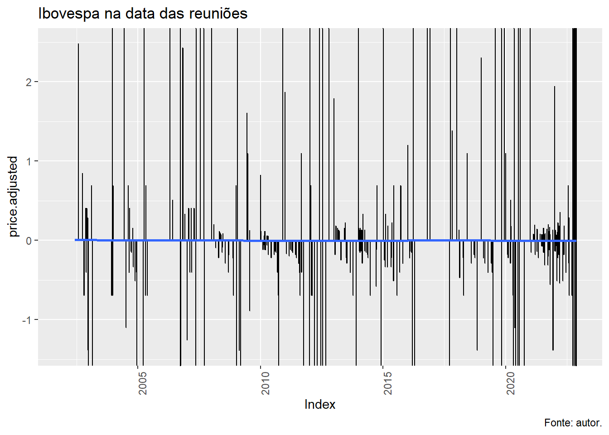

# Trabalho final {#final-work}

Impacto da taxa Selic no índice Bovespa

## Introdução

Após a regulamentação do Anexo IV e da implementação do Plano Real, o mercado acionário brasileiro teve um grande salto no seu desenvolvimento, tanto em termos de volume dos negócios quanto na eficiência alocativa... A grande conquista do Plano Real foi o controle da inflação. Taxas de inflação em níveis aceitáveis foram e estão sendo mantidas sob controle, devido às constantes intervenções governamentais, aumentando ou reduzindo as taxas de juros, tanto as de curto quanto as de longo prazo, controlando a oferta monetária através dos depósitos compulsórios sobre depósitos à vista, bem como controlando a taxa de câmbio, instrumento utilizado pelo BACEN por um longo período. Há, portanto, por parte de todos os agentes, a necessidade de se conhecer como o mercado acionário responde às mudanças dessas variáveis macroeconômicas. (DE SOUZA GRÔPPO, 2005)

Para os participantes do mercado financeiro, há um interesse dada a influência exercida pela política monetária sobre os mercados, conhecer tais estimativas representaria uma relevante informação para a construção de posições e estratégias, tanto de investimento, bem como para a gestão dos riscos implícitos às operações normalmente desenvolvidas em seu dia-a-dia. (GONÇALVES JUNIOR, 2007)

De acordo com o conhecimento convencional, mudanças nas taxas de juros afetariam o custo de capital e as expectativas futuras quanto à lucratividade das empresas, impactando portanto sua geração de dividendos ao acionista, especialmente se considerada a valores presentes; em última análise, isto repercute no valor de mercado atual da empresa, e portanto de suas ações em Bolsa. (GONÇALVES JUNIOR, 2007)

Porém, a atividade econômica também exerce efeito importante sobre a determinação dos preços na Bolsa de Valores, particularmente no Ibovespa. Os preços das ações são positivamente relacionados com a atividade econômica, medida pelo nível de produção industrial. A política monetária possui efeito significativo sobre a produção industrial o que indicaria a existência do segundo canal pelo qual a política monetária afeta os preços das ações.(DOS SANTOS et al., 2006)

## Objetivo

O objetivo é mensurar e analisar as respostas do mercado acionário às decisões do Comitê de Política Monetária do Banco Central do Brasil (COPOM) em relação à taxa básica de juro, verificando o comportamento do índice agregado da Bolsa de Valores de São Paulo (Bovespa).

## Problema

Quantificar ou prever a influência da taxa selic no índice Bovespa demanda modelos de predições dinâmicas.

A modelagem prevê predizer o Indice Bovespa (serie temporal em base diária) em função das covariáveis (taxa Selic anunciada mês a mês). 

Pressupõe-se que cortes não previstos na taxa de juros Selic proporcionem uma valorização das ações, já que abriria espaço para expansão da economia, com aumentos dos lucros e dos dividendos distribuídos pelas empresas.
 
Mercados eficientes antecipam as decisões do COPOM, o que não deveria sensibilizar o índice bovespa, uma vez que que as mudanças já foram incorporadas ao valor das ações, no entando, as surpresas, a diferença da expectativa e da decisão, deveriam causar uma resposta do índice. O estudo define uma medida que procura captar a surpresa gerada nos mercados. As medidas foram baseadas em dados do mercado de futuros DI 1 dia, pela sua similaridade à taxa SELIC. (GONÇALVES JUNIOR, 2007)

## Metodologia

A meta para a taxa básica de juro, inicialmente referida como TBC, teve sua sistemática alterada em agosto de 1998, quando o Banco Central passou a fazer uso também da TBAN (taxa de assistência para redesconto bancário), ofertando e tomando recursos na banda assim definida, conforme necessidades, importância, garantia e riscos dos agentes envolvidos, aplicando-se também um sistema de quotas instituído na ocasião. Em 05/03/1999, a TBC foi extinta, tendo sido substituída pela SELIC para fins de política monetária, passando-se a empregar esta última como a taxa básica de juro e principal instrumento das operações de mercado aberto. (GONÇALVES JUNIOR, 2007)

O índice Bovespa (ou simplesmente Ibovespa) foi criado há mais de cinquenta anos, em 2 de janeiro de 1968. Antes do Ibovespa, os preços das ações negociadas na Bolsa de Valores de São Paulo (SPSE) eram divulgados por meio de boletim diário (Boletim Diário de Informação – BDI). (CASTRO et al., 2019)

De modo geral, os mercados financeiros são forward looking, o que equivale a dizer que eles estão constantemente incorporando novas informações a seus preços, seja devido a fatos que impactam imediatamente suas operações, seja por razões que modificam expectativas sobre o futuro; é a constatação de que estes agentes são racionais, utilizando toda a informação disponível para realizar suas previsões, tomando valores passados e correntes de variáveis exógenas ou não (LUCAS et al., 1996).

Cada decisão tomada pelo COPOM é estudada por esses agentes, que antecipam em alguma medida seus resultados; assim sendo, quaisquer mudanças observadas nas variáveis correntes e futuras através do tempo decorrerão exclusivamente de mudanças não antecipadas. (CASTRO et al., 2019)

Conseqüentemente, analisar-se a relação direta entre as variações na meta da taxa de juro e as do Índice Bovespa pode mostrar baixa significância entre as variáveis; de fato, se os mercados inevitavelmente não gerarão respostas a mudanças já esperadas, então é preciso distinguir na variação da meta suas componentes antecipada e não antecipada. É o que proporemos a seguir. (CASTRO et al., 2019)

Após apresentação da evolução do índice ibovesoa, taxa selic e DI, foi calculado o coeficiente de correlação linear de Pearson existente entre elas, a fim de verificar sua relação, em quatro períodos distintos:

- de 2004 a 2007: período de início da redução de juros até a crise dos Subprime,
- de 2008 a 2010: do auge da crise financeira mundial no Brasil até a fase de recuperação do mercado;
- de 2011 a 2012: período que inclui tendência de redução da taxa básica de juros e a crise financeira, iniciada na Europa em 2011.
- de 2013 a 2016: período da crise econômica de 2014, conhecida como a "grande recessão brasileira", foi uma profunda e duradoura crise econômica, sendo caracterizada por recessão por dois anos consecutivos (2015 e 2016) e por sua longa e lenta recuperação, a mais lenta da história do país. (WIKIPEDIA, 2022)
- de 2017 a 2022: período que incluem os efeitos da COVID-19, iniciada em 2020.

Os dados utilizados neste trabalho foram obtidos de banco de dados, índices e relatórios contidos em sites como da BM&F BOVESPA, BACEN e CVM, além de informações coletadas da literatura indicada.

A análise de correlação será feita utilizando o coeficiente de Pearson que varia de -1 a 1, sendo que o sinal indica a direção, positiva ou negativa, da relação e o valor sugere a força do relacionamento entre as
variáveis. 

A condução do trabalhe segue os seguintes passos:

Figura 1: Roteiro

Fonte: (YOSHIDA, 2022)


### Estimando a Surpresa dos Mercados 

TODO

Um modo interessante de se conseguir tal intento é utilizar os contratos futuros de taxa média de depósitos interbancários de um dia (referidos comumente por DI 1 dia), negociados na Bolsa de Mercadorias e Futuros de São Paulo (BM&F).

Esta relação implica dizer que o preço futuro (F0) é o valor esperado do preço à vista que vigorará no futuro (ST).

Para captar a componente da variação na meta dos juros que responderia pela “surpresa” decorrente da decisão do COPOM, podemos adaptar a metodologia desenvolvida por Kuttner (2001), posteriormente aplicada ao mercado acionário americano por Bernanke e Kuttner (2005); assim, suponhamos que no dia d – 1 ocorre a reunião do COPOM e no dia útil seguinte os mercados abrem já cientes da nova meta para a taxa básica de juro – ou seja, no dia d ocorre a implantação da nova meta.

Deste modo, temos um evento ocorrendo entre os dois dias citados: trata-se de expectativas de véspera (em d – 1) dos mercados sobre a decisão do COPOM e a constatação dela no dia seguinte (dia d); isto está esquematicamente representado na figura 1 abaixo:


Assim, os mercados esperam que em d–1 a taxa média diária passe de ⎯ia (antes da reunião) para⎯im , após a reunião, e que assim permaneça até a liquidação do instrumento; no entanto, em alguma medida eles são surpreendidos pelo COPOM e esta surpresa (Δiu) passa a ser incorporada ao valor médio anteriormente previsto: os mercados se ajustam a eventuais discrepâncias em relação a suas projeções da véspera.


## Fonte de dados

TODO

- [Taxa selic](https://dados.gov.br/dataset/11-taxa-de-juros-selic/resource/3d751a0d-afb2-452b-83f2-310a201f8a82): selic.json. selic.csv
- [Índices Bovespa](https://finance.yahoo.com/quote/%5EBVSP/history?period1=735868800&period2=1668297600&interval=1d&filter=history&frequency=1d&includeAdjustedClose=true): idc_BVSP_daily.csv, idx_BVSP_monthly.csv
- [Juros DI](https://www.infomoney.com.br/ferramentas/juros-futuros-di/)


```r
library(quantmod)
library(xts)
library(sidrar)
library(timetk)
library(tidyverse)
library(jsonlite)
library(ggplot2)
library(scales)
library(BatchGetSymbols)
library(dplyr)
library(rb3)
library(pastecs)
library(ggpubr)
library(bizdays)

#conflicts(detail = TRUE)
```


```r
first_date = as.Date('2000-01-01')
last_date = as.Date('2022-11-25')
eval_period = last_date - first_date

df_bvsp = BatchGetSymbols('^BVSP', first.date = first_date,
 last.date = last_date)
```

## Índice IBOVESPA

O período de análise será de 22 anos, de 2000-01-01 até 2022-11-25.

O comportamento do índice bovespa neste período foi:


```r
ggplot(df_bvsp$df.tickers, aes(x = ref.date, y = price.close))+
 geom_line()+
 scale_y_discrete(limits=c(10000, 20000, 30000, 40000, 50000, 60000,
 70000, 80000, 90000, 100000, 110000, 120000, 130000))+
 scale_x_date(breaks = date_breaks("1 years"),
 labels = date_format("%Y"))+
 xlab('')+ylab('Pontos')+
 labs(title='Índice Bovespa',
 caption='Fonte: Yahoo Finance.')+
 geom_line() +
 geom_smooth(method = "loess", se = FALSE) +
 theme(axis.text.x = element_text(angle = 90)
)
```

```
## Warning: Continuous limits supplied to discrete scale.
## ℹ Did you mean `limits = factor(...)` or `scale_*_continuous()`?
```

```
## `geom_smooth()` using formula = 'y ~ x'
```


## Indicador SELIC

A meta da taxa [SELIC](https://www.bcb.gov.br/estatisticas/grafico/graficoestatistica/metaselic) diária.


```r
df_selic_meta <- read.csv2(file = "../dados/Taxa de juros - Selic - fixada pelo Comitê de Política Monetária.csv",
                           sep=";", dec=",",
                           colClasses = c("character", "numeric", "NULL"),
                           col.names = c("ref.date", "selic.tax", ""))
df_selic_meta <- transform(df_selic_meta, ref.date = as.Date(ref.date,'%d/%m/%Y'))

df_selic_meta <- na.omit(df_selic_meta) %>% 
                    filter(ref.date >= first_date)

tail(df_selic_meta)
```

```
##        ref.date selic.tax
## 8292 2022-11-25     13.75
## 8293 2022-11-26     13.75
## 8294 2022-11-27     13.75
## 8295 2022-11-28     13.75
## 8296 2022-11-29     13.75
## 8297 2022-11-30     13.75
```

E o comportamento no período foi:


```r
ggplot(df_selic_meta, aes(x = ref.date, y = selic.tax))+
 geom_line()+
 scale_x_date(breaks = date_breaks("1 years"),
 labels = date_format("%Y"))+
 xlab('')+ylab('%')+
 labs(title='Meta taxa selic',
 caption='Fonte: Banco Central do Brasil.')+
 geom_line() +
 geom_smooth(method = "loess", se = FALSE)+
 theme(axis.text.x = element_text(angle = 90))
```

```
## `geom_smooth()` using formula = 'y ~ x'
```


### Unindo os conjuntos de dados


```r
# Usando apenas valor de fechamento
df_bvsp_close <- df_bvsp$df.tickers %>%
                  dplyr::select(ref.date, price.close)

df_bvsp_selic <- merge(df_bvsp_close, df_selic_meta, by = 'ref.date', all.x = T)

df_bvsp_selic <- df_bvsp_selic %>% 
                    fill(selic.tax, .direction = "downup")
```

#### Salvando o conjunto de dados


```r
# antes de proceder com o restante do exercicio, vamos salvar o dataset para
# o usar nos proximos modulos
write_rds(df_bvsp_selic, "../dados/series_bvsp_selic_10.rds")
```

## Correlação ibovespa e selic


```r
bvsp_norm <- sd(df_bvsp_selic$price.close, na.rm=TRUE)
selic_norm <- sd(df_bvsp_selic$selic.tax, na.rm=TRUE)

ggplot(df_bvsp_selic, aes(x=ref.date)) +
  
  geom_line(aes(y=price.close / bvsp_norm), size=2, color="blue", na.rm = TRUE, alpha=.6) + 
  stat_smooth(size=2, aes(y=price.close / bvsp_norm), color="lightblue") +
  geom_line(aes(y=selic.tax / selic_norm), size=2, color="red", na.rm = TRUE, alpha=.6) +
  stat_smooth(size=2, aes(y=selic.tax / selic_norm), color = "tomato") +

  scale_y_continuous(
    
    # Features of the first axis
    name = "bvsp",
    
    # Add a second axis and specify its features
    sec.axis = sec_axis(~./selic_norm, name="selic")
  ) +

  ggtitle("Ibovespa vs Selic")
```

```
## `geom_smooth()` using method = 'gam' and formula = 'y ~ s(x, bs = "cs")'
## `geom_smooth()` using method = 'gam' and formula = 'y ~ s(x, bs = "cs")'
```


## Decomposição anual

TODO

## Análise de _outliers_

TODO

## Correlação cruzada ibovespa e selic

CCF - Cross Correlation Function

Dado duas séries temporais $y_t, x_t$

Conjunto de correlações $x_{t+h}$ e $y_t$ onde $h = 0, \pm 1, \pm 2, \pm p$

Um valor negativo de $h$ é a correlação entre a série $x_t$ em um tempo antes de $t$ com a série $y_t$ no tempo $t$.


```r
# https://www.lobdata.com.br/2020/09/15/how-to-perform-correlation-analysis-in-time-series-data-using-r/

df_bvsp_selic_long <- df_bvsp_selic %>% 
  pivot_longer(cols = c(price.close, selic.tax), names_to = "names", values_to = "value")
```


```r
# the series
df_bvsp_selic_long %>% 
  plot_time_series(.date_var = ref.date,
                   .value = value,
                   .facet_vars = names)
```

```{=html}
<div id="htmlwidget-5f69c8b6f31cf82fde04" style="width:672px;height:480px;" class="plotly html-widget"></div>
<script type="application/json" data-for="htmlwidget-5f69c8b6f31cf82fde04">{"x":{"data":[{"x":["2000-01-03","2000-01-04","2000-01-05","2000-01-06","2000-01-07","2000-01-10","2000-01-11","2000-01-12","2000-01-13","2000-01-14","2000-01-17","2000-01-18","2000-01-19","2000-01-20","2000-01-21","2000-01-24","2000-01-26","2000-01-27","2000-01-28","2000-01-31","2000-02-01","2000-02-02","2000-02-03","2000-02-04","2000-02-07","2000-02-08","2000-02-09","2000-02-10","2000-02-11","2000-02-14","2000-02-15","2000-02-16","2000-02-17","2000-02-18","2000-02-21","2000-02-22","2000-02-23","2000-02-24","2000-02-25","2000-02-28","2000-02-29","2000-03-01","2000-03-02","2000-03-03","2000-03-08","2000-03-09","2000-03-10","2000-03-13","2000-03-14","2000-03-15","2000-03-16","2000-03-17","2000-03-20","2000-03-21","2000-03-22","2000-03-23","2000-03-24","2000-03-27","2000-03-28","2000-03-29","2000-03-30","2000-03-31","2000-04-03","2000-04-04","2000-04-05","2000-04-06","2000-04-07","2000-04-10","2000-04-11","2000-04-12","2000-04-13","2000-04-14","2000-04-17","2000-04-18","2000-04-19","2000-04-20","2000-04-24","2000-04-25","2000-04-26","2000-04-27","2000-04-28","2000-05-02","2000-05-03","2000-05-04","2000-05-05","2000-05-08","2000-05-09","2000-05-10","2000-05-11","2000-05-12","2000-05-15","2000-05-16","2000-05-17","2000-05-18","2000-05-19","2000-05-22","2000-05-23","2000-05-24","2000-05-25","2000-05-26","2000-05-29","2000-05-30","2000-05-31","2000-06-01","2000-06-02","2000-06-05","2000-06-06","2000-06-07","2000-06-08","2000-06-09","2000-06-12","2000-06-13","2000-06-14","2000-06-15","2000-06-16","2000-06-19","2000-06-20","2000-06-21","2000-06-23","2000-06-26","2000-06-27","2000-06-28","2000-06-29","2000-06-30","2000-07-03","2000-07-04","2000-07-05","2000-07-06","2000-07-07","2000-07-10","2000-07-11","2000-07-12","2000-07-13","2000-07-14","2000-07-17","2000-07-18","2000-07-19","2000-07-20","2000-07-21","2000-07-24","2000-07-25","2000-07-26","2000-07-27","2000-07-28","2000-07-31","2000-08-01","2000-08-02","2000-08-03","2000-08-04","2000-08-07","2000-08-08","2000-08-09","2000-08-10","2000-08-11","2000-08-14","2000-08-15","2000-08-16","2000-08-17","2000-08-18","2000-08-21","2000-08-22","2000-08-23","2000-08-24","2000-08-25","2000-08-28","2000-08-29","2000-08-30","2000-08-31","2000-09-01","2000-09-04","2000-09-05","2000-09-06","2000-09-08","2000-09-11","2000-09-12","2000-09-13","2000-09-14","2000-09-15","2000-09-18","2000-09-19","2000-09-20","2000-09-21","2000-09-22","2000-09-25","2000-09-26","2000-09-27","2000-09-28","2000-09-29","2000-10-02","2000-10-03","2000-10-04","2000-10-05","2000-10-06","2000-10-09","2000-10-10","2000-10-11","2000-10-13","2000-10-16","2000-10-17","2000-10-18","2000-10-19","2000-10-20","2000-10-23","2000-10-24","2000-10-25","2000-10-26","2000-10-27","2000-10-30","2000-10-31","2000-11-01","2000-11-03","2000-11-06","2000-11-07","2000-11-08","2000-11-09","2000-11-10","2000-11-13","2000-11-14","2000-11-16","2000-11-17","2000-11-20","2000-11-21","2000-11-22","2000-11-23","2000-11-24","2000-11-27","2000-11-28","2000-11-29","2000-11-30","2000-12-01","2000-12-04","2000-12-05","2000-12-06","2000-12-07","2000-12-08","2000-12-11","2000-12-12","2000-12-13","2000-12-14","2000-12-15","2000-12-18","2000-12-19","2000-12-20","2000-12-21","2000-12-22","2000-12-26","2000-12-27","2000-12-28","2001-01-02","2001-01-03","2001-01-04","2001-01-05","2001-01-08","2001-01-09","2001-01-10","2001-01-11","2001-01-12","2001-01-15","2001-01-16","2001-01-17","2001-01-18","2001-01-19","2001-01-22","2001-01-23","2001-01-24","2001-01-26","2001-01-29","2001-01-30","2001-01-31","2001-02-01","2001-02-02","2001-02-05","2001-02-06","2001-02-07","2001-02-08","2001-02-09","2001-02-12","2001-02-13","2001-02-14","2001-02-15","2001-02-16","2001-02-19","2001-02-20","2001-02-21","2001-02-22","2001-02-23","2001-02-28","2001-03-01","2001-03-02","2001-03-05","2001-03-06","2001-03-07","2001-03-08","2001-03-09","2001-03-12","2001-03-13","2001-03-14","2001-03-15","2001-03-16","2001-03-19","2001-03-20","2001-03-21","2001-03-22","2001-03-23","2001-03-26","2001-03-27","2001-03-28","2001-03-29","2001-03-30","2001-04-02","2001-04-03","2001-04-04","2001-04-05","2001-04-06","2001-04-09","2001-04-10","2001-04-11","2001-04-12","2001-04-16","2001-04-17","2001-04-18","2001-04-19","2001-04-20","2001-04-23","2001-04-24","2001-04-25","2001-04-26","2001-04-27","2001-04-30","2001-05-02","2001-05-03","2001-05-04","2001-05-07","2001-05-08","2001-05-09","2001-05-10","2001-05-11","2001-05-14","2001-05-15","2001-05-16","2001-05-17","2001-05-18","2001-05-21","2001-05-22","2001-05-23","2001-05-24","2001-05-25","2001-05-28","2001-05-29","2001-05-30","2001-05-31","2001-06-01","2001-06-04","2001-06-05","2001-06-06","2001-06-07","2001-06-08","2001-06-11","2001-06-12","2001-06-13","2001-06-15","2001-06-18","2001-06-19","2001-06-20","2001-06-21","2001-06-22","2001-06-25","2001-06-26","2001-06-27","2001-06-28","2001-06-29","2001-07-02","2001-07-03","2001-07-04","2001-07-05","2001-07-06","2001-07-10","2001-07-11","2001-07-12","2001-07-13","2001-07-16","2001-07-17","2001-07-18","2001-07-19","2001-07-20","2001-07-23","2001-07-24","2001-07-25","2001-07-26","2001-07-27","2001-07-30","2001-07-31","2001-08-01","2001-08-02","2001-08-03","2001-08-06","2001-08-07","2001-08-08","2001-08-09","2001-08-10","2001-08-13","2001-08-14","2001-08-15","2001-08-16","2001-08-17","2001-08-20","2001-08-21","2001-08-22","2001-08-23","2001-08-24","2001-08-27","2001-08-28","2001-08-29","2001-08-30","2001-08-31","2001-09-03","2001-09-04","2001-09-05","2001-09-06","2001-09-10","2001-09-12","2001-09-13","2001-09-14","2001-09-17","2001-09-18","2001-09-19","2001-09-20","2001-09-21","2001-09-24","2001-09-25","2001-09-26","2001-09-27","2001-09-28","2001-10-01","2001-10-02","2001-10-03","2001-10-04","2001-10-05","2001-10-08","2001-10-09","2001-10-10","2001-10-11","2001-10-15","2001-10-16","2001-10-17","2001-10-18","2001-10-19","2001-10-22","2001-10-23","2001-10-24","2001-10-25","2001-10-26","2001-10-29","2001-10-30","2001-10-31","2001-11-01","2001-11-05","2001-11-06","2001-11-07","2001-11-08","2001-11-09","2001-11-12","2001-11-13","2001-11-14","2001-11-16","2001-11-19","2001-11-20","2001-11-21","2001-11-22","2001-11-23","2001-11-26","2001-11-27","2001-11-28","2001-11-29","2001-11-30","2001-12-03","2001-12-04","2001-12-05","2001-12-06","2001-12-07","2001-12-10","2001-12-11","2001-12-12","2001-12-13","2001-12-14","2001-12-17","2001-12-18","2001-12-19","2001-12-20","2001-12-21","2001-12-26","2001-12-27","2001-12-28","2002-01-02","2002-01-03","2002-01-04","2002-01-07","2002-01-08","2002-01-09","2002-01-10","2002-01-11","2002-01-14","2002-01-15","2002-01-16","2002-01-17","2002-01-18","2002-01-21","2002-01-22","2002-01-23","2002-01-24","2002-01-28","2002-01-29","2002-01-30","2002-01-31","2002-02-01","2002-02-04","2002-02-05","2002-02-06","2002-02-07","2002-02-08","2002-02-13","2002-02-14","2002-02-15","2002-02-18","2002-02-19","2002-02-20","2002-02-21","2002-02-22","2002-02-25","2002-02-26","2002-02-27","2002-02-28","2002-03-01","2002-03-04","2002-03-05","2002-03-06","2002-03-07","2002-03-08","2002-03-11","2002-03-12","2002-03-13","2002-03-14","2002-03-15","2002-03-18","2002-03-19","2002-03-20","2002-03-21","2002-03-22","2002-03-25","2002-03-26","2002-03-27","2002-03-28","2002-04-01","2002-04-02","2002-04-03","2002-04-04","2002-04-05","2002-04-08","2002-04-09","2002-04-10","2002-04-11","2002-04-12","2002-04-15","2002-04-16","2002-04-17","2002-04-18","2002-04-19","2002-04-22","2002-04-23","2002-04-24","2002-04-25","2002-04-26","2002-04-29","2002-04-30","2002-05-02","2002-05-03","2002-05-06","2002-05-07","2002-05-08","2002-05-09","2002-05-10","2002-05-13","2002-05-14","2002-05-15","2002-05-16","2002-05-17","2002-05-20","2002-05-21","2002-05-22","2002-05-23","2002-05-24","2002-05-27","2002-05-28","2002-05-29","2002-05-31","2002-06-03","2002-06-04","2002-06-05","2002-06-06","2002-06-07","2002-06-10","2002-06-11","2002-06-12","2002-06-13","2002-06-14","2002-06-17","2002-06-18","2002-06-19","2002-06-20","2002-06-21","2002-06-24","2002-06-25","2002-06-26","2002-06-27","2002-06-28","2002-07-01","2002-07-02","2002-07-03","2002-07-04","2002-07-05","2002-07-08","2002-07-10","2002-07-11","2002-07-12","2002-07-15","2002-07-16","2002-07-17","2002-07-18","2002-07-19","2002-07-22","2002-07-23","2002-07-24","2002-07-25","2002-07-26","2002-07-29","2002-07-30","2002-07-31","2002-08-01","2002-08-02","2002-08-05","2002-08-06","2002-08-07","2002-08-08","2002-08-09","2002-08-12","2002-08-13","2002-08-14","2002-08-15","2002-08-16","2002-08-19","2002-08-20","2002-08-21","2002-08-22","2002-08-23","2002-08-26","2002-08-27","2002-08-28","2002-08-29","2002-08-30","2002-09-02","2002-09-03","2002-09-04","2002-09-05","2002-09-06","2002-09-09","2002-09-10","2002-09-11","2002-09-12","2002-09-13","2002-09-16","2002-09-17","2002-09-18","2002-09-19","2002-09-20","2002-09-23","2002-09-24","2002-09-25","2002-09-26","2002-09-27","2002-09-30","2002-10-01","2002-10-02","2002-10-03","2002-10-04","2002-10-07","2002-10-08","2002-10-09","2002-10-10","2002-10-11","2002-10-14","2002-10-15","2002-10-16","2002-10-17","2002-10-18","2002-10-21","2002-10-22","2002-10-23","2002-10-24","2002-10-25","2002-10-28","2002-10-29","2002-10-30","2002-10-31","2002-11-01","2002-11-04","2002-11-05","2002-11-06","2002-11-07","2002-11-08","2002-11-11","2002-11-12","2002-11-13","2002-11-14","2002-11-18","2002-11-19","2002-11-20","2002-11-21","2002-11-22","2002-11-25","2002-11-26","2002-11-27","2002-11-28","2002-11-29","2002-12-02","2002-12-03","2002-12-04","2002-12-05","2002-12-06","2002-12-09","2002-12-10","2002-12-11","2002-12-12","2002-12-13","2002-12-16","2002-12-17","2002-12-18","2002-12-19","2002-12-20","2002-12-23","2002-12-26","2002-12-27","2002-12-30","2003-01-02","2003-01-03","2003-01-06","2003-01-07","2003-01-08","2003-01-09","2003-01-10","2003-01-13","2003-01-14","2003-01-15","2003-01-16","2003-01-17","2003-01-20","2003-01-21","2003-01-22","2003-01-23","2003-01-24","2003-01-27","2003-01-28","2003-01-29","2003-01-30","2003-01-31","2003-02-03","2003-02-04","2003-02-05","2003-02-06","2003-02-07","2003-02-10","2003-02-11","2003-02-12","2003-02-13","2003-02-14","2003-02-17","2003-02-18","2003-02-19","2003-02-20","2003-02-21","2003-02-24","2003-02-25","2003-02-26","2003-02-27","2003-02-28","2003-03-05","2003-03-06","2003-03-07","2003-03-10","2003-03-11","2003-03-12","2003-03-13","2003-03-14","2003-03-17","2003-03-18","2003-03-19","2003-03-20","2003-03-21","2003-03-24","2003-03-25","2003-03-26","2003-03-27","2003-03-28","2003-03-31","2003-04-01","2003-04-02","2003-04-03","2003-04-04","2003-04-07","2003-04-08","2003-04-09","2003-04-10","2003-04-11","2003-04-14","2003-04-15","2003-04-16","2003-04-17","2003-04-22","2003-04-23","2003-04-24","2003-04-25","2003-04-28","2003-04-29","2003-04-30","2003-05-02","2003-05-05","2003-05-06","2003-05-07","2003-05-08","2003-05-09","2003-05-12","2003-05-13","2003-05-14","2003-05-15","2003-05-16","2003-05-19","2003-05-20","2003-05-21","2003-05-22","2003-05-23","2003-05-26","2003-05-27","2003-05-28","2003-05-29","2003-05-30","2003-06-02","2003-06-03","2003-06-04","2003-06-05","2003-06-06","2003-06-09","2003-06-10","2003-06-11","2003-06-12","2003-06-13","2003-06-16","2003-06-17","2003-06-18","2003-06-20","2003-06-23","2003-06-24","2003-06-25","2003-06-26","2003-06-27","2003-06-30","2003-07-01","2003-07-02","2003-07-03","2003-07-04","2003-07-07","2003-07-08","2003-07-10","2003-07-11","2003-07-14","2003-07-15","2003-07-16","2003-07-17","2003-07-18","2003-07-21","2003-07-22","2003-07-23","2003-07-24","2003-07-25","2003-07-28","2003-07-29","2003-07-30","2003-07-31","2003-08-01","2003-08-04","2003-08-05","2003-08-06","2003-08-07","2003-08-08","2003-08-11","2003-08-12","2003-08-13","2003-08-14","2003-08-15","2003-08-18","2003-08-19","2003-08-20","2003-08-21","2003-08-22","2003-08-25","2003-08-26","2003-08-27","2003-08-28","2003-08-29","2003-09-01","2003-09-02","2003-09-03","2003-09-04","2003-09-05","2003-09-08","2003-09-09","2003-09-10","2003-09-11","2003-09-12","2003-09-15","2003-09-16","2003-09-17","2003-09-18","2003-09-19","2003-09-22","2003-09-23","2003-09-24","2003-09-25","2003-09-26","2003-09-29","2003-09-30","2003-10-01","2003-10-02","2003-10-03","2003-10-06","2003-10-07","2003-10-08","2003-10-09","2003-10-10","2003-10-13","2003-10-14","2003-10-15","2003-10-16","2003-10-17","2003-10-20","2003-10-21","2003-10-22","2003-10-23","2003-10-24","2003-10-27","2003-10-28","2003-10-29","2003-10-30","2003-10-31","2003-11-03","2003-11-04","2003-11-05","2003-11-06","2003-11-07","2003-11-10","2003-11-11","2003-11-12","2003-11-13","2003-11-14","2003-11-17","2003-11-18","2003-11-19","2003-11-20","2003-11-21","2003-11-24","2003-11-25","2003-11-26","2003-11-27","2003-11-28","2003-12-01","2003-12-02","2003-12-03","2003-12-04","2003-12-05","2003-12-08","2003-12-09","2003-12-10","2003-12-11","2003-12-12","2003-12-15","2003-12-16","2003-12-17","2003-12-18","2003-12-19","2003-12-22","2003-12-23","2003-12-26","2003-12-29","2003-12-30","2004-01-02","2004-01-05","2004-01-06","2004-01-07","2004-01-08","2004-01-09","2004-01-12","2004-01-13","2004-01-14","2004-01-15","2004-01-16","2004-01-19","2004-01-20","2004-01-21","2004-01-22","2004-01-23","2004-01-26","2004-01-27","2004-01-28","2004-01-29","2004-01-30","2004-02-02","2004-02-03","2004-02-04","2004-02-05","2004-02-06","2004-02-09","2004-02-10","2004-02-11","2004-02-12","2004-02-13","2004-02-16","2004-02-17","2004-02-18","2004-02-19","2004-02-20","2004-02-25","2004-02-26","2004-02-27","2004-03-01","2004-03-02","2004-03-03","2004-03-04","2004-03-05","2004-03-08","2004-03-09","2004-03-10","2004-03-11","2004-03-12","2004-03-15","2004-03-16","2004-03-17","2004-03-18","2004-03-19","2004-03-22","2004-03-23","2004-03-24","2004-03-25","2004-03-26","2004-03-29","2004-03-30","2004-03-31","2004-04-01","2004-04-02","2004-04-05","2004-04-06","2004-04-07","2004-04-08","2004-04-12","2004-04-13","2004-04-14","2004-04-15","2004-04-16","2004-04-19","2004-04-20","2004-04-22","2004-04-23","2004-04-26","2004-04-27","2004-04-28","2004-04-29","2004-04-30","2004-05-03","2004-05-04","2004-05-05","2004-05-06","2004-05-07","2004-05-10","2004-05-11","2004-05-12","2004-05-13","2004-05-14","2004-05-17","2004-05-18","2004-05-19","2004-05-20","2004-05-21","2004-05-24","2004-05-25","2004-05-26","2004-05-27","2004-05-28","2004-05-31","2004-06-01","2004-06-02","2004-06-03","2004-06-04","2004-06-07","2004-06-08","2004-06-09","2004-06-11","2004-06-14","2004-06-15","2004-06-16","2004-06-17","2004-06-18","2004-06-21","2004-06-22","2004-06-23","2004-06-24","2004-06-25","2004-06-28","2004-06-29","2004-06-30","2004-07-01","2004-07-02","2004-07-05","2004-07-06","2004-07-07","2004-07-08","2004-07-12","2004-07-13","2004-07-14","2004-07-15","2004-07-16","2004-07-19","2004-07-20","2004-07-21","2004-07-22","2004-07-23","2004-07-26","2004-07-27","2004-07-28","2004-07-29","2004-07-30","2004-08-02","2004-08-03","2004-08-04","2004-08-05","2004-08-06","2004-08-09","2004-08-10","2004-08-11","2004-08-12","2004-08-13","2004-08-16","2004-08-17","2004-08-18","2004-08-19","2004-08-20","2004-08-23","2004-08-24","2004-08-25","2004-08-26","2004-08-27","2004-08-30","2004-08-31","2004-09-01","2004-09-02","2004-09-03","2004-09-06","2004-09-08","2004-09-09","2004-09-10","2004-09-13","2004-09-14","2004-09-15","2004-09-16","2004-09-17","2004-09-20","2004-09-21","2004-09-22","2004-09-23","2004-09-24","2004-09-27","2004-09-28","2004-09-29","2004-09-30","2004-10-01","2004-10-04","2004-10-05","2004-10-06","2004-10-07","2004-10-08","2004-10-11","2004-10-13","2004-10-14","2004-10-15","2004-10-18","2004-10-19","2004-10-20","2004-10-21","2004-10-22","2004-10-25","2004-10-26","2004-10-27","2004-10-28","2004-10-29","2004-11-01","2004-11-03","2004-11-04","2004-11-05","2004-11-08","2004-11-09","2004-11-10","2004-11-11","2004-11-12","2004-11-16","2004-11-17","2004-11-18","2004-11-19","2004-11-22","2004-11-23","2004-11-24","2004-11-25","2004-11-26","2004-11-29","2004-11-30","2004-12-01","2004-12-02","2004-12-03","2004-12-06","2004-12-07","2004-12-08","2004-12-09","2004-12-10","2004-12-13","2004-12-14","2004-12-15","2004-12-16","2004-12-17","2004-12-20","2004-12-21","2004-12-22","2004-12-23","2004-12-27","2004-12-28","2004-12-29","2004-12-30","2005-01-03","2005-01-04","2005-01-05","2005-01-06","2005-01-07","2005-01-10","2005-01-11","2005-01-12","2005-01-13","2005-01-14","2005-01-17","2005-01-18","2005-01-19","2005-01-20","2005-01-21","2005-01-24","2005-01-26","2005-01-27","2005-01-28","2005-01-31","2005-02-01","2005-02-02","2005-02-03","2005-02-04","2005-02-09","2005-02-10","2005-02-11","2005-02-14","2005-02-15","2005-02-16","2005-02-17","2005-02-18","2005-02-21","2005-02-22","2005-02-23","2005-02-24","2005-02-25","2005-02-28","2005-03-01","2005-03-02","2005-03-03","2005-03-04","2005-03-07","2005-03-08","2005-03-09","2005-03-10","2005-03-11","2005-03-14","2005-03-15","2005-03-16","2005-03-17","2005-03-18","2005-03-21","2005-03-22","2005-03-23","2005-03-24","2005-03-28","2005-03-29","2005-03-30","2005-03-31","2005-04-01","2005-04-04","2005-04-05","2005-04-06","2005-04-07","2005-04-08","2005-04-11","2005-04-12","2005-04-13","2005-04-14","2005-04-15","2005-04-18","2005-04-19","2005-04-20","2005-04-22","2005-04-25","2005-04-26","2005-04-27","2005-04-28","2005-04-29","2005-05-02","2005-05-03","2005-05-04","2005-05-05","2005-05-06","2005-05-09","2005-05-10","2005-05-11","2005-05-12","2005-05-13","2005-05-16","2005-05-17","2005-05-18","2005-05-19","2005-05-20","2005-05-23","2005-05-24","2005-05-25","2005-05-27","2005-05-30","2005-05-31","2005-06-01","2005-06-02","2005-06-03","2005-06-06","2005-06-07","2005-06-08","2005-06-09","2005-06-10","2005-06-13","2005-06-14","2005-06-15","2005-06-16","2005-06-17","2005-06-20","2005-06-21","2005-06-22","2005-06-23","2005-06-24","2005-06-27","2005-06-28","2005-06-29","2005-06-30","2005-07-01","2005-07-04","2005-07-05","2005-07-06","2005-07-07","2005-07-08","2005-07-11","2005-07-12","2005-07-13","2005-07-14","2005-07-15","2005-07-18","2005-07-19","2005-07-20","2005-07-21","2005-07-22","2005-07-25","2005-07-26","2005-07-27","2005-07-28","2005-07-29","2005-08-01","2005-08-02","2005-08-03","2005-08-04","2005-08-05","2005-08-08","2005-08-09","2005-08-10","2005-08-11","2005-08-12","2005-08-15","2005-08-16","2005-08-17","2005-08-18","2005-08-19","2005-08-22","2005-08-23","2005-08-24","2005-08-25","2005-08-26","2005-08-29","2005-08-30","2005-08-31","2005-09-01","2005-09-02","2005-09-05","2005-09-06","2005-09-08","2005-09-09","2005-09-12","2005-09-13","2005-09-14","2005-09-15","2005-09-16","2005-09-19","2005-09-20","2005-09-21","2005-09-22","2005-09-23","2005-09-26","2005-09-27","2005-09-28","2005-09-29","2005-09-30","2005-10-03","2005-10-04","2005-10-05","2005-10-06","2005-10-07","2005-10-10","2005-10-11","2005-10-13","2005-10-14","2005-10-17","2005-10-18","2005-10-19","2005-10-20","2005-10-21","2005-10-24","2005-10-25","2005-10-26","2005-10-27","2005-10-28","2005-10-31","2005-11-01","2005-11-03","2005-11-04","2005-11-07","2005-11-08","2005-11-09","2005-11-10","2005-11-11","2005-11-14","2005-11-16","2005-11-17","2005-11-18","2005-11-21","2005-11-22","2005-11-23","2005-11-24","2005-11-25","2005-11-28","2005-11-29","2005-11-30","2005-12-01","2005-12-02","2005-12-05","2005-12-06","2005-12-07","2005-12-08","2005-12-09","2005-12-12","2005-12-13","2005-12-14","2005-12-15","2005-12-16","2005-12-19","2005-12-20","2005-12-21","2005-12-22","2005-12-23","2005-12-26","2005-12-27","2005-12-28","2005-12-29","2006-01-02","2006-01-03","2006-01-04","2006-01-05","2006-01-06","2006-01-09","2006-01-10","2006-01-11","2006-01-12","2006-01-13","2006-01-16","2006-01-17","2006-01-18","2006-01-19","2006-01-20","2006-01-23","2006-01-24","2006-01-26","2006-01-27","2006-01-30","2006-01-31","2006-02-01","2006-02-02","2006-02-03","2006-02-06","2006-02-07","2006-02-08","2006-02-09","2006-02-10","2006-02-13","2006-02-14","2006-02-15","2006-02-16","2006-02-17","2006-02-20","2006-02-21","2006-02-22","2006-02-23","2006-02-24","2006-03-01","2006-03-02","2006-03-03","2006-03-06","2006-03-07","2006-03-08","2006-03-09","2006-03-10","2006-03-13","2006-03-14","2006-03-15","2006-03-16","2006-03-17","2006-03-20","2006-03-21","2006-03-22","2006-03-23","2006-03-24","2006-03-27","2006-03-28","2006-03-29","2006-03-30","2006-03-31","2006-04-03","2006-04-04","2006-04-05","2006-04-06","2006-04-07","2006-04-10","2006-04-11","2006-04-12","2006-04-13","2006-04-17","2006-04-18","2006-04-19","2006-04-20","2006-04-24","2006-04-25","2006-04-26","2006-04-27","2006-04-28","2006-05-02","2006-05-03","2006-05-04","2006-05-05","2006-05-08","2006-05-09","2006-05-10","2006-05-11","2006-05-12","2006-05-15","2006-05-16","2006-05-17","2006-05-18","2006-05-19","2006-05-22","2006-05-23","2006-05-24","2006-05-25","2006-05-26","2006-05-29","2006-05-30","2006-05-31","2006-06-01","2006-06-02","2006-06-05","2006-06-06","2006-06-07","2006-06-08","2006-06-09","2006-06-12","2006-06-13","2006-06-14","2006-06-16","2006-06-19","2006-06-20","2006-06-21","2006-06-22","2006-06-23","2006-06-26","2006-06-27","2006-06-28","2006-06-29","2006-06-30","2006-07-03","2006-07-04","2006-07-05","2006-07-06","2006-07-07","2006-07-10","2006-07-11","2006-07-12","2006-07-13","2006-07-14","2006-07-17","2006-07-18","2006-07-19","2006-07-20","2006-07-21","2006-07-24","2006-07-25","2006-07-26","2006-07-27","2006-07-28","2006-07-31","2006-08-01","2006-08-02","2006-08-03","2006-08-04","2006-08-07","2006-08-08","2006-08-09","2006-08-10","2006-08-11","2006-08-14","2006-08-15","2006-08-16","2006-08-17","2006-08-18","2006-08-21","2006-08-22","2006-08-23","2006-08-24","2006-08-25","2006-08-28","2006-08-29","2006-08-30","2006-08-31","2006-09-01","2006-09-04","2006-09-05","2006-09-06","2006-09-08","2006-09-11","2006-09-12","2006-09-13","2006-09-14","2006-09-15","2006-09-18","2006-09-19","2006-09-20","2006-09-21","2006-09-22","2006-09-25","2006-09-26","2006-09-27","2006-09-28","2006-09-29","2006-10-02","2006-10-03","2006-10-04","2006-10-05","2006-10-06","2006-10-09","2006-10-10","2006-10-11","2006-10-13","2006-10-16","2006-10-17","2006-10-18","2006-10-19","2006-10-20","2006-10-23","2006-10-24","2006-10-25","2006-10-26","2006-10-27","2006-10-30","2006-10-31","2006-11-01","2006-11-03","2006-11-06","2006-11-07","2006-11-08","2006-11-09","2006-11-10","2006-11-13","2006-11-14","2006-11-16","2006-11-17","2006-11-21","2006-11-22","2006-11-23","2006-11-24","2006-11-27","2006-11-28","2006-11-29","2006-11-30","2006-12-01","2006-12-04","2006-12-05","2006-12-06","2006-12-07","2006-12-08","2006-12-11","2006-12-12","2006-12-13","2006-12-14","2006-12-15","2006-12-18","2006-12-19","2006-12-20","2006-12-21","2006-12-22","2006-12-26","2006-12-27","2006-12-28","2007-01-02","2007-01-03","2007-01-04","2007-01-05","2007-01-08","2007-01-09","2007-01-10","2007-01-11","2007-01-12","2007-01-15","2007-01-16","2007-01-17","2007-01-18","2007-01-19","2007-01-22","2007-01-23","2007-01-24","2007-01-26","2007-01-29","2007-01-30","2007-01-31","2007-02-01","2007-02-02","2007-02-05","2007-02-06","2007-02-07","2007-02-08","2007-02-09","2007-02-12","2007-02-13","2007-02-14","2007-02-15","2007-02-16","2007-02-21","2007-02-22","2007-02-23","2007-02-26","2007-02-27","2007-02-28","2007-03-01","2007-03-02","2007-03-05","2007-03-06","2007-03-07","2007-03-08","2007-03-09","2007-03-12","2007-03-13","2007-03-14","2007-03-15","2007-03-16","2007-03-19","2007-03-20","2007-03-21","2007-03-22","2007-03-23","2007-03-26","2007-03-27","2007-03-28","2007-03-29","2007-03-30","2007-04-02","2007-04-03","2007-04-04","2007-04-05","2007-04-09","2007-04-10","2007-04-11","2007-04-12","2007-04-13","2007-04-16","2007-04-17","2007-04-18","2007-04-19","2007-04-20","2007-04-23","2007-04-24","2007-04-25","2007-04-26","2007-04-27","2007-04-30","2007-05-02","2007-05-03","2007-05-04","2007-05-07","2007-05-08","2007-05-09","2007-05-10","2007-05-11","2007-05-14","2007-05-15","2007-05-16","2007-05-17","2007-05-18","2007-05-21","2007-05-22","2007-05-23","2007-05-24","2007-05-25","2007-05-28","2007-05-29","2007-05-30","2007-05-31","2007-06-01","2007-06-04","2007-06-05","2007-06-06","2007-06-08","2007-06-11","2007-06-12","2007-06-13","2007-06-14","2007-06-15","2007-06-18","2007-06-19","2007-06-20","2007-06-21","2007-06-22","2007-06-25","2007-06-26","2007-06-27","2007-06-28","2007-06-29","2007-07-02","2007-07-03","2007-07-04","2007-07-05","2007-07-06","2007-07-10","2007-07-11","2007-07-12","2007-07-13","2007-07-16","2007-07-17","2007-07-18","2007-07-19","2007-07-20","2007-07-23","2007-07-24","2007-07-25","2007-07-26","2007-07-27","2007-07-30","2007-07-31","2007-08-01","2007-08-02","2007-08-03","2007-08-06","2007-08-07","2007-08-08","2007-08-09","2007-08-10","2007-08-13","2007-08-14","2007-08-15","2007-08-16","2007-08-17","2007-08-20","2007-08-21","2007-08-22","2007-08-23","2007-08-24","2007-08-27","2007-08-28","2007-08-29","2007-08-30","2007-08-31","2007-09-03","2007-09-04","2007-09-05","2007-09-06","2007-09-10","2007-09-11","2007-09-12","2007-09-13","2007-09-14","2007-09-17","2007-09-18","2007-09-19","2007-09-20","2007-09-21","2007-09-24","2007-09-25","2007-09-26","2007-09-27","2007-09-28","2007-10-01","2007-10-02","2007-10-03","2007-10-04","2007-10-05","2007-10-08","2007-10-09","2007-10-10","2007-10-11","2007-10-15","2007-10-16","2007-10-17","2007-10-18","2007-10-19","2007-10-22","2007-10-23","2007-10-24","2007-10-25","2007-10-26","2007-10-29","2007-10-30","2007-10-31","2007-11-01","2007-11-05","2007-11-06","2007-11-07","2007-11-08","2007-11-09","2007-11-12","2007-11-13","2007-11-14","2007-11-16","2007-11-19","2007-11-21","2007-11-22","2007-11-23","2007-11-26","2007-11-27","2007-11-28","2007-11-29","2007-11-30","2007-12-03","2007-12-04","2007-12-05","2007-12-06","2007-12-07","2007-12-10","2007-12-11","2007-12-12","2007-12-13","2007-12-14","2007-12-17","2007-12-18","2007-12-19","2007-12-20","2007-12-21","2007-12-26","2007-12-27","2007-12-28","2008-01-02","2008-01-03","2008-01-04","2008-01-07","2008-01-08","2008-01-09","2008-01-10","2008-01-11","2008-01-14","2008-01-15","2008-01-16","2008-01-17","2008-01-18","2008-01-21","2008-01-22","2008-01-23","2008-01-24","2008-01-28","2008-01-29","2008-01-30","2008-01-31","2008-02-01","2008-02-06","2008-02-07","2008-02-08","2008-02-11","2008-02-12","2008-02-13","2008-02-14","2008-02-15","2008-02-18","2008-02-19","2008-02-20","2008-02-21","2008-02-22","2008-02-25","2008-02-26","2008-02-27","2008-02-28","2008-02-29","2008-03-03","2008-03-04","2008-03-05","2008-03-06","2008-03-07","2008-03-10","2008-03-11","2008-03-12","2008-03-13","2008-03-14","2008-03-17","2008-03-18","2008-03-19","2008-03-20","2008-03-24","2008-03-25","2008-03-26","2008-03-27","2008-03-28","2008-03-31","2008-04-01","2008-04-02","2008-04-03","2008-04-04","2008-04-07","2008-04-08","2008-04-09","2008-04-10","2008-04-11","2008-04-14","2008-04-15","2008-04-16","2008-04-17","2008-04-18","2008-04-22","2008-04-23","2008-04-24","2008-04-25","2008-04-28","2008-04-29","2008-04-30","2008-05-02","2008-05-05","2008-05-06","2008-05-07","2008-05-08","2008-05-09","2008-05-12","2008-05-13","2008-05-14","2008-05-15","2008-05-16","2008-05-19","2008-05-20","2008-05-21","2008-05-23","2008-05-26","2008-05-27","2008-05-28","2008-05-29","2008-05-30","2008-06-02","2008-06-03","2008-06-04","2008-06-05","2008-06-06","2008-06-09","2008-06-10","2008-06-11","2008-06-12","2008-06-13","2008-06-16","2008-06-17","2008-06-18","2008-06-19","2008-06-20","2008-06-23","2008-06-24","2008-06-25","2008-06-26","2008-06-27","2008-06-30","2008-07-01","2008-07-02","2008-07-03","2008-07-04","2008-07-07","2008-07-08","2008-07-10","2008-07-11","2008-07-14","2008-07-15","2008-07-16","2008-07-17","2008-07-18","2008-07-21","2008-07-22","2008-07-23","2008-07-24","2008-07-25","2008-07-28","2008-07-29","2008-07-30","2008-07-31","2008-08-01","2008-08-04","2008-08-05","2008-08-06","2008-08-07","2008-08-08","2008-08-11","2008-08-12","2008-08-13","2008-08-14","2008-08-15","2008-08-18","2008-08-19","2008-08-20","2008-08-21","2008-08-22","2008-08-25","2008-08-26","2008-08-27","2008-08-28","2008-08-29","2008-09-01","2008-09-02","2008-09-03","2008-09-04","2008-09-05","2008-09-08","2008-09-09","2008-09-10","2008-09-11","2008-09-12","2008-09-15","2008-09-16","2008-09-17","2008-09-18","2008-09-19","2008-09-22","2008-09-23","2008-09-24","2008-09-25","2008-09-26","2008-09-29","2008-09-30","2008-10-01","2008-10-02","2008-10-03","2008-10-06","2008-10-07","2008-10-08","2008-10-09","2008-10-10","2008-10-13","2008-10-14","2008-10-15","2008-10-16","2008-10-17","2008-10-20","2008-10-21","2008-10-22","2008-10-23","2008-10-24","2008-10-27","2008-10-28","2008-10-29","2008-10-30","2008-10-31","2008-11-03","2008-11-04","2008-11-05","2008-11-06","2008-11-07","2008-11-10","2008-11-11","2008-11-12","2008-11-13","2008-11-14","2008-11-17","2008-11-18","2008-11-19","2008-11-21","2008-11-24","2008-11-25","2008-11-26","2008-11-27","2008-11-28","2008-12-01","2008-12-02","2008-12-03","2008-12-04","2008-12-05","2008-12-08","2008-12-09","2008-12-10","2008-12-11","2008-12-12","2008-12-15","2008-12-16","2008-12-17","2008-12-18","2008-12-19","2008-12-22","2008-12-23","2008-12-26","2008-12-29","2008-12-30","2009-01-02","2009-01-05","2009-01-06","2009-01-07","2009-01-08","2009-01-09","2009-01-12","2009-01-13","2009-01-14","2009-01-15","2009-01-16","2009-01-19","2009-01-20","2009-01-21","2009-01-22","2009-01-23","2009-01-26","2009-01-27","2009-01-28","2009-01-29","2009-01-30","2009-02-02","2009-02-03","2009-02-04","2009-02-05","2009-02-06","2009-02-09","2009-02-10","2009-02-11","2009-02-12","2009-02-13","2009-02-16","2009-02-17","2009-02-18","2009-02-19","2009-02-20","2009-02-25","2009-02-26","2009-02-27","2009-03-02","2009-03-03","2009-03-04","2009-03-05","2009-03-06","2009-03-09","2009-03-10","2009-03-11","2009-03-12","2009-03-13","2009-03-16","2009-03-17","2009-03-18","2009-03-19","2009-03-20","2009-03-23","2009-03-24","2009-03-25","2009-03-26","2009-03-27","2009-03-30","2009-03-31","2009-04-01","2009-04-02","2009-04-03","2009-04-06","2009-04-07","2009-04-08","2009-04-09","2009-04-13","2009-04-14","2009-04-15","2009-04-16","2009-04-17","2009-04-20","2009-04-22","2009-04-23","2009-04-24","2009-04-27","2009-04-28","2009-04-29","2009-04-30","2009-05-04","2009-05-05","2009-05-06","2009-05-07","2009-05-08","2009-05-11","2009-05-12","2009-05-13","2009-05-14","2009-05-15","2009-05-18","2009-05-19","2009-05-20","2009-05-21","2009-05-22","2009-05-25","2009-05-26","2009-05-27","2009-05-28","2009-05-29","2009-06-01","2009-06-02","2009-06-03","2009-06-04","2009-06-05","2009-06-08","2009-06-09","2009-06-10","2009-06-12","2009-06-15","2009-06-16","2009-06-17","2009-06-18","2009-06-19","2009-06-22","2009-06-23","2009-06-24","2009-06-25","2009-06-26","2009-06-29","2009-06-30","2009-07-01","2009-07-02","2009-07-03","2009-07-06","2009-07-07","2009-07-08","2009-07-10","2009-07-13","2009-07-14","2009-07-15","2009-07-16","2009-07-17","2009-07-20","2009-07-21","2009-07-22","2009-07-23","2009-07-24","2009-07-27","2009-07-28","2009-07-29","2009-07-30","2009-07-31","2009-08-03","2009-08-04","2009-08-05","2009-08-06","2009-08-07","2009-08-10","2009-08-11","2009-08-12","2009-08-13","2009-08-14","2009-08-17","2009-08-18","2009-08-19","2009-08-20","2009-08-21","2009-08-24","2009-08-25","2009-08-26","2009-08-27","2009-08-28","2009-08-31","2009-09-01","2009-09-02","2009-09-03","2009-09-04","2009-09-08","2009-09-09","2009-09-10","2009-09-11","2009-09-14","2009-09-15","2009-09-16","2009-09-17","2009-09-18","2009-09-21","2009-09-22","2009-09-23","2009-09-24","2009-09-25","2009-09-28","2009-09-29","2009-09-30","2009-10-01","2009-10-02","2009-10-05","2009-10-06","2009-10-07","2009-10-08","2009-10-09","2009-10-13","2009-10-14","2009-10-15","2009-10-16","2009-10-19","2009-10-20","2009-10-21","2009-10-22","2009-10-23","2009-10-26","2009-10-27","2009-10-28","2009-10-29","2009-10-30","2009-11-03","2009-11-04","2009-11-05","2009-11-06","2009-11-09","2009-11-10","2009-11-11","2009-11-12","2009-11-13","2009-11-16","2009-11-17","2009-11-18","2009-11-19","2009-11-23","2009-11-24","2009-11-25","2009-11-26","2009-11-27","2009-11-30","2009-12-01","2009-12-02","2009-12-03","2009-12-04","2009-12-07","2009-12-08","2009-12-09","2009-12-10","2009-12-11","2009-12-14","2009-12-15","2009-12-16","2009-12-17","2009-12-18","2009-12-21","2009-12-22","2009-12-23","2009-12-28","2009-12-29","2009-12-30","2010-01-04","2010-01-05","2010-01-06","2010-01-07","2010-01-08","2010-01-11","2010-01-12","2010-01-13","2010-01-14","2010-01-15","2010-01-18","2010-01-19","2010-01-20","2010-01-21","2010-01-22","2010-01-26","2010-01-27","2010-01-28","2010-01-29","2010-02-01","2010-02-02","2010-02-03","2010-02-04","2010-02-05","2010-02-08","2010-02-09","2010-02-10","2010-02-11","2010-02-12","2010-02-17","2010-02-18","2010-02-19","2010-02-22","2010-02-23","2010-02-24","2010-02-25","2010-02-26","2010-03-01","2010-03-02","2010-03-03","2010-03-04","2010-03-05","2010-03-08","2010-03-09","2010-03-10","2010-03-11","2010-03-12","2010-03-15","2010-03-16","2010-03-17","2010-03-18","2010-03-19","2010-03-22","2010-03-23","2010-03-24","2010-03-25","2010-03-26","2010-03-29","2010-03-30","2010-03-31","2010-04-01","2010-04-05","2010-04-06","2010-04-07","2010-04-08","2010-04-09","2010-04-12","2010-04-13","2010-04-14","2010-04-15","2010-04-16","2010-04-19","2010-04-20","2010-04-22","2010-04-23","2010-04-26","2010-04-27","2010-04-28","2010-04-29","2010-04-30","2010-05-03","2010-05-04","2010-05-05","2010-05-06","2010-05-07","2010-05-10","2010-05-11","2010-05-12","2010-05-13","2010-05-14","2010-05-17","2010-05-18","2010-05-19","2010-05-20","2010-05-21","2010-05-24","2010-05-25","2010-05-26","2010-05-27","2010-05-28","2010-05-31","2010-06-01","2010-06-02","2010-06-04","2010-06-07","2010-06-08","2010-06-09","2010-06-10","2010-06-11","2010-06-14","2010-06-15","2010-06-16","2010-06-17","2010-06-18","2010-06-21","2010-06-22","2010-06-23","2010-06-24","2010-06-25","2010-06-28","2010-06-29","2010-06-30","2010-07-01","2010-07-02","2010-07-05","2010-07-06","2010-07-07","2010-07-08","2010-07-12","2010-07-13","2010-07-14","2010-07-15","2010-07-16","2010-07-19","2010-07-20","2010-07-21","2010-07-22","2010-07-23","2010-07-26","2010-07-27","2010-07-28","2010-07-29","2010-07-30","2010-08-02","2010-08-03","2010-08-04","2010-08-05","2010-08-06","2010-08-09","2010-08-10","2010-08-11","2010-08-12","2010-08-13","2010-08-16","2010-08-17","2010-08-18","2010-08-19","2010-08-20","2010-08-23","2010-08-24","2010-08-25","2010-08-26","2010-08-27","2010-08-30","2010-08-31","2010-09-01","2010-09-02","2010-09-03","2010-09-06","2010-09-08","2010-09-09","2010-09-10","2010-09-13","2010-09-14","2010-09-15","2010-09-16","2010-09-17","2010-09-20","2010-09-21","2010-09-22","2010-09-23","2010-09-24","2010-09-27","2010-09-28","2010-09-29","2010-09-30","2010-10-01","2010-10-04","2010-10-05","2010-10-06","2010-10-07","2010-10-08","2010-10-11","2010-10-13","2010-10-14","2010-10-15","2010-10-18","2010-10-19","2010-10-20","2010-10-21","2010-10-22","2010-10-25","2010-10-26","2010-10-27","2010-10-28","2010-10-29","2010-11-01","2010-11-03","2010-11-04","2010-11-05","2010-11-08","2010-11-09","2010-11-10","2010-11-11","2010-11-12","2010-11-16","2010-11-17","2010-11-18","2010-11-19","2010-11-22","2010-11-23","2010-11-24","2010-11-25","2010-11-26","2010-11-29","2010-11-30","2010-12-01","2010-12-02","2010-12-03","2010-12-06","2010-12-07","2010-12-08","2010-12-09","2010-12-10","2010-12-13","2010-12-14","2010-12-15","2010-12-16","2010-12-17","2010-12-20","2010-12-21","2010-12-22","2010-12-23","2010-12-27","2010-12-28","2010-12-29","2010-12-30","2011-01-03","2011-01-04","2011-01-05","2011-01-06","2011-01-07","2011-01-10","2011-01-11","2011-01-12","2011-01-13","2011-01-14","2011-01-17","2011-01-18","2011-01-19","2011-01-20","2011-01-21","2011-01-24","2011-01-26","2011-01-27","2011-01-28","2011-01-31","2011-02-01","2011-02-02","2011-02-03","2011-02-04","2011-02-07","2011-02-08","2011-02-09","2011-02-10","2011-02-11","2011-02-14","2011-02-15","2011-02-16","2011-02-17","2011-02-18","2011-02-21","2011-02-22","2011-02-23","2011-02-24","2011-02-25","2011-02-28","2011-03-01","2011-03-02","2011-03-03","2011-03-04","2011-03-09","2011-03-10","2011-03-11","2011-03-14","2011-03-15","2011-03-16","2011-03-17","2011-03-18","2011-03-21","2011-03-22","2011-03-23","2011-03-24","2011-03-25","2011-03-28","2011-03-29","2011-03-30","2011-03-31","2011-04-01","2011-04-04","2011-04-05","2011-04-06","2011-04-07","2011-04-08","2011-04-11","2011-04-12","2011-04-13","2011-04-14","2011-04-15","2011-04-18","2011-04-19","2011-04-20","2011-04-25","2011-04-26","2011-04-27","2011-04-28","2011-04-29","2011-05-02","2011-05-03","2011-05-04","2011-05-05","2011-05-06","2011-05-09","2011-05-10","2011-05-11","2011-05-12","2011-05-13","2011-05-16","2011-05-17","2011-05-18","2011-05-19","2011-05-20","2011-05-23","2011-05-24","2011-05-25","2011-05-26","2011-05-27","2011-05-30","2011-05-31","2011-06-01","2011-06-02","2011-06-03","2011-06-06","2011-06-07","2011-06-08","2011-06-09","2011-06-10","2011-06-13","2011-06-14","2011-06-15","2011-06-16","2011-06-17","2011-06-20","2011-06-21","2011-06-22","2011-06-24","2011-06-27","2011-06-28","2011-06-29","2011-06-30","2011-07-01","2011-07-04","2011-07-05","2011-07-06","2011-07-07","2011-07-08","2011-07-11","2011-07-12","2011-07-13","2011-07-14","2011-07-15","2011-07-18","2011-07-19","2011-07-20","2011-07-21","2011-07-22","2011-07-25","2011-07-26","2011-07-27","2011-07-28","2011-07-29","2011-08-01","2011-08-02","2011-08-03","2011-08-04","2011-08-05","2011-08-08","2011-08-09","2011-08-10","2011-08-11","2011-08-12","2011-08-15","2011-08-16","2011-08-17","2011-08-18","2011-08-19","2011-08-22","2011-08-23","2011-08-24","2011-08-25","2011-08-26","2011-08-29","2011-08-30","2011-08-31","2011-09-01","2011-09-02","2011-09-05","2011-09-06","2011-09-08","2011-09-09","2011-09-12","2011-09-13","2011-09-14","2011-09-15","2011-09-16","2011-09-19","2011-09-20","2011-09-21","2011-09-22","2011-09-23","2011-09-26","2011-09-27","2011-09-28","2011-09-29","2011-09-30","2011-10-03","2011-10-04","2011-10-05","2011-10-06","2011-10-07","2011-10-10","2011-10-11","2011-10-13","2011-10-14","2011-10-17","2011-10-18","2011-10-19","2011-10-20","2011-10-21","2011-10-24","2011-10-25","2011-10-26","2011-10-27","2011-10-28","2011-10-31","2011-11-01","2011-11-03","2011-11-04","2011-11-07","2011-11-08","2011-11-09","2011-11-10","2011-11-11","2011-11-14","2011-11-16","2011-11-17","2011-11-18","2011-11-21","2011-11-22","2011-11-23","2011-11-24","2011-11-25","2011-11-28","2011-11-29","2011-11-30","2011-12-01","2011-12-02","2011-12-05","2011-12-06","2011-12-07","2011-12-08","2011-12-09","2011-12-12","2011-12-13","2011-12-14","2011-12-15","2011-12-16","2011-12-19","2011-12-20","2011-12-21","2011-12-22","2011-12-23","2011-12-26","2011-12-27","2011-12-28","2011-12-29","2012-01-03","2012-01-04","2012-01-05","2012-01-06","2012-01-09","2012-01-10","2012-01-11","2012-01-12","2012-01-13","2012-01-16","2012-01-17","2012-01-18","2012-01-19","2012-01-20","2012-01-23","2012-01-24","2012-01-26","2012-01-27","2012-01-30","2012-01-31","2012-02-01","2012-02-02","2012-02-03","2012-02-06","2012-02-07","2012-02-08","2012-02-09","2012-02-10","2012-02-13","2012-02-14","2012-02-15","2012-02-16","2012-02-17","2012-02-23","2012-02-24","2012-02-27","2012-02-28","2012-02-29","2012-03-01","2012-03-02","2012-03-05","2012-03-06","2012-03-07","2012-03-08","2012-03-09","2012-03-12","2012-03-13","2012-03-14","2012-03-15","2012-03-16","2012-03-19","2012-03-20","2012-03-21","2012-03-22","2012-03-23","2012-03-26","2012-03-27","2012-03-28","2012-03-29","2012-03-30","2012-04-02","2012-04-03","2012-04-04","2012-04-05","2012-04-09","2012-04-10","2012-04-11","2012-04-12","2012-04-13","2012-04-16","2012-04-17","2012-04-18","2012-04-19","2012-04-20","2012-04-23","2012-04-24","2012-04-25","2012-04-26","2012-04-27","2012-04-30","2012-05-02","2012-05-03","2012-05-04","2012-05-07","2012-05-08","2012-05-09","2012-05-10","2012-05-11","2012-05-14","2012-05-15","2012-05-16","2012-05-17","2012-05-18","2012-05-21","2012-05-22","2012-05-23","2012-05-24","2012-05-25","2012-05-28","2012-05-29","2012-05-30","2012-05-31","2012-06-01","2012-06-04","2012-06-05","2012-06-06","2012-06-08","2012-06-11","2012-06-12","2012-06-13","2012-06-14","2012-06-15","2012-06-18","2012-06-19","2012-06-20","2012-06-21","2012-06-22","2012-06-25","2012-06-26","2012-06-27","2012-06-28","2012-06-29","2012-07-02","2012-07-03","2012-07-04","2012-07-05","2012-07-06","2012-07-10","2012-07-11","2012-07-12","2012-07-13","2012-07-16","2012-07-17","2012-07-18","2012-07-19","2012-07-20","2012-07-23","2012-07-24","2012-07-25","2012-07-26","2012-07-27","2012-07-30","2012-07-31","2012-08-01","2012-08-02","2012-08-03","2012-08-06","2012-08-07","2012-08-08","2012-08-09","2012-08-10","2012-08-13","2012-08-14","2012-08-15","2012-08-16","2012-08-17","2012-08-20","2012-08-21","2012-08-22","2012-08-23","2012-08-24","2012-08-27","2012-08-28","2012-08-29","2012-08-30","2012-08-31","2012-09-03","2012-09-04","2012-09-05","2012-09-06","2012-09-10","2012-09-11","2012-09-12","2012-09-13","2012-09-14","2012-09-17","2012-09-18","2012-09-19","2012-09-20","2012-09-21","2012-09-24","2012-09-25","2012-09-26","2012-09-27","2012-09-28","2012-10-01","2012-10-02","2012-10-03","2012-10-04","2012-10-05","2012-10-08","2012-10-09","2012-10-10","2012-10-11","2012-10-15","2012-10-16","2012-10-17","2012-10-18","2012-10-19","2012-10-22","2012-10-23","2012-10-24","2012-10-25","2012-10-26","2012-10-29","2012-10-30","2012-10-31","2012-11-01","2012-11-05","2012-11-06","2012-11-07","2012-11-08","2012-11-09","2012-11-12","2012-11-13","2012-11-14","2012-11-16","2012-11-19","2012-11-21","2012-11-22","2012-11-23","2012-11-26","2012-11-27","2012-11-28","2012-11-29","2012-11-30","2012-12-03","2012-12-04","2012-12-05","2012-12-06","2012-12-07","2012-12-10","2012-12-11","2012-12-12","2012-12-13","2012-12-14","2012-12-17","2012-12-18","2012-12-19","2012-12-20","2012-12-21","2012-12-26","2012-12-27","2012-12-28","2013-01-02","2013-01-03","2013-01-04","2013-01-07","2013-01-08","2013-01-09","2013-01-10","2013-01-11","2013-01-14","2013-01-15","2013-01-16","2013-01-17","2013-01-18","2013-01-21","2013-01-22","2013-01-23","2013-01-24","2013-01-28","2013-01-29","2013-01-30","2013-01-31","2013-02-01","2013-02-04","2013-02-05","2013-02-06","2013-02-07","2013-02-08","2013-02-13","2013-02-14","2013-02-15","2013-02-18","2013-02-19","2013-02-20","2013-02-21","2013-02-22","2013-02-25","2013-02-26","2013-02-27","2013-02-28","2013-03-01","2013-03-04","2013-03-05","2013-03-06","2013-03-07","2013-03-08","2013-03-11","2013-03-12","2013-03-13","2013-03-14","2013-03-15","2013-03-18","2013-03-19","2013-03-20","2013-03-21","2013-03-22","2013-03-25","2013-03-26","2013-03-27","2013-03-28","2013-04-01","2013-04-02","2013-04-03","2013-04-04","2013-04-05","2013-04-08","2013-04-09","2013-04-10","2013-04-11","2013-04-12","2013-04-15","2013-04-16","2013-04-17","2013-04-18","2013-04-19","2013-04-22","2013-04-23","2013-04-24","2013-04-25","2013-04-26","2013-04-29","2013-04-30","2013-05-02","2013-05-03","2013-05-06","2013-05-07","2013-05-08","2013-05-09","2013-05-10","2013-05-13","2013-05-14","2013-05-15","2013-05-16","2013-05-17","2013-05-20","2013-05-21","2013-05-22","2013-05-23","2013-05-24","2013-05-27","2013-05-28","2013-05-29","2013-05-31","2013-06-03","2013-06-04","2013-06-05","2013-06-06","2013-06-07","2013-06-10","2013-06-11","2013-06-12","2013-06-13","2013-06-14","2013-06-17","2013-06-18","2013-06-19","2013-06-20","2013-06-21","2013-06-24","2013-06-25","2013-06-26","2013-06-27","2013-06-28","2013-07-01","2013-07-02","2013-07-03","2013-07-04","2013-07-05","2013-07-08","2013-07-10","2013-07-11","2013-07-12","2013-07-15","2013-07-16","2013-07-17","2013-07-18","2013-07-19","2013-07-22","2013-07-23","2013-07-24","2013-07-25","2013-07-26","2013-07-29","2013-07-30","2013-07-31","2013-08-01","2013-08-02","2013-08-05","2013-08-06","2013-08-07","2013-08-08","2013-08-09","2013-08-12","2013-08-13","2013-08-14","2013-08-15","2013-08-16","2013-08-19","2013-08-20","2013-08-21","2013-08-22","2013-08-23","2013-08-26","2013-08-27","2013-08-28","2013-08-29","2013-08-30","2013-09-02","2013-09-03","2013-09-04","2013-09-05","2013-09-06","2013-09-09","2013-09-10","2013-09-11","2013-09-12","2013-09-13","2013-09-16","2013-09-17","2013-09-18","2013-09-19","2013-09-20","2013-09-23","2013-09-24","2013-09-25","2013-09-26","2013-09-27","2013-09-30","2013-10-01","2013-10-02","2013-10-03","2013-10-04","2013-10-07","2013-10-08","2013-10-09","2013-10-10","2013-10-11","2013-10-14","2013-10-15","2013-10-16","2013-10-17","2013-10-18","2013-10-21","2013-10-22","2013-10-23","2013-10-24","2013-10-25","2013-10-28","2013-10-29","2013-10-30","2013-10-31","2013-11-01","2013-11-04","2013-11-05","2013-11-06","2013-11-07","2013-11-08","2013-11-11","2013-11-12","2013-11-13","2013-11-14","2013-11-18","2013-11-19","2013-11-21","2013-11-22","2013-11-25","2013-11-26","2013-11-27","2013-11-28","2013-11-29","2013-12-02","2013-12-03","2013-12-04","2013-12-05","2013-12-06","2013-12-09","2013-12-10","2013-12-11","2013-12-12","2013-12-13","2013-12-16","2013-12-17","2013-12-18","2013-12-19","2013-12-20","2013-12-23","2013-12-26","2013-12-27","2013-12-30","2014-01-02","2014-01-03","2014-01-06","2014-01-07","2014-01-08","2014-01-09","2014-01-10","2014-01-13","2014-01-14","2014-01-15","2014-01-16","2014-01-17","2014-01-20","2014-01-21","2014-01-22","2014-01-23","2014-01-24","2014-01-27","2014-01-28","2014-01-29","2014-01-30","2014-01-31","2014-02-03","2014-02-04","2014-02-05","2014-02-06","2014-02-07","2014-02-10","2014-02-11","2014-02-12","2014-02-13","2014-02-14","2014-02-17","2014-02-18","2014-02-19","2014-02-20","2014-02-21","2014-02-24","2014-02-25","2014-02-26","2014-02-27","2014-02-28","2014-03-05","2014-03-06","2014-03-07","2014-03-10","2014-03-11","2014-03-12","2014-03-13","2014-03-14","2014-03-17","2014-03-18","2014-03-19","2014-03-20","2014-03-21","2014-03-24","2014-03-25","2014-03-26","2014-03-27","2014-03-28","2014-03-31","2014-04-01","2014-04-02","2014-04-03","2014-04-04","2014-04-07","2014-04-08","2014-04-09","2014-04-10","2014-04-11","2014-04-14","2014-04-15","2014-04-16","2014-04-17","2014-04-22","2014-04-23","2014-04-24","2014-04-25","2014-04-28","2014-04-29","2014-04-30","2014-05-02","2014-05-05","2014-05-06","2014-05-07","2014-05-08","2014-05-09","2014-05-12","2014-05-13","2014-05-14","2014-05-15","2014-05-16","2014-05-19","2014-05-20","2014-05-21","2014-05-22","2014-05-23","2014-05-26","2014-05-27","2014-05-28","2014-05-29","2014-05-30","2014-06-02","2014-06-03","2014-06-04","2014-06-05","2014-06-06","2014-06-09","2014-06-10","2014-06-11","2014-06-13","2014-06-16","2014-06-17","2014-06-18","2014-06-20","2014-06-23","2014-06-24","2014-06-25","2014-06-26","2014-06-27","2014-06-30","2014-07-01","2014-07-02","2014-07-03","2014-07-04","2014-07-07","2014-07-08","2014-07-10","2014-07-11","2014-07-14","2014-07-15","2014-07-16","2014-07-17","2014-07-18","2014-07-21","2014-07-22","2014-07-23","2014-07-24","2014-07-25","2014-07-28","2014-07-29","2014-07-30","2014-07-31","2014-08-01","2014-08-04","2014-08-05","2014-08-06","2014-08-07","2014-08-08","2014-08-11","2014-08-12","2014-08-13","2014-08-14","2014-08-15","2014-08-18","2014-08-19","2014-08-20","2014-08-21","2014-08-22","2014-08-25","2014-08-26","2014-08-27","2014-08-28","2014-08-29","2014-09-01","2014-09-02","2014-09-03","2014-09-04","2014-09-05","2014-09-08","2014-09-09","2014-09-10","2014-09-11","2014-09-12","2014-09-15","2014-09-16","2014-09-17","2014-09-18","2014-09-19","2014-09-22","2014-09-23","2014-09-24","2014-09-25","2014-09-26","2014-09-29","2014-09-30","2014-10-01","2014-10-02","2014-10-03","2014-10-06","2014-10-07","2014-10-08","2014-10-09","2014-10-10","2014-10-13","2014-10-14","2014-10-15","2014-10-16","2014-10-17","2014-10-20","2014-10-21","2014-10-22","2014-10-23","2014-10-24","2014-10-27","2014-10-28","2014-10-29","2014-10-30","2014-10-31","2014-11-03","2014-11-04","2014-11-05","2014-11-06","2014-11-07","2014-11-10","2014-11-11","2014-11-12","2014-11-13","2014-11-14","2014-11-17","2014-11-18","2014-11-19","2014-11-21","2014-11-24","2014-11-25","2014-11-26","2014-11-27","2014-11-28","2014-12-01","2014-12-02","2014-12-03","2014-12-04","2014-12-05","2014-12-08","2014-12-09","2014-12-10","2014-12-11","2014-12-12","2014-12-15","2014-12-16","2014-12-17","2014-12-18","2014-12-19","2014-12-22","2014-12-23","2014-12-26","2014-12-29","2014-12-30","2015-01-02","2015-01-05","2015-01-06","2015-01-07","2015-01-08","2015-01-09","2015-01-12","2015-01-13","2015-01-14","2015-01-15","2015-01-16","2015-01-19","2015-01-20","2015-01-21","2015-01-22","2015-01-23","2015-01-26","2015-01-27","2015-01-28","2015-01-29","2015-01-30","2015-02-02","2015-02-03","2015-02-04","2015-02-05","2015-02-06","2015-02-09","2015-02-10","2015-02-11","2015-02-12","2015-02-13","2015-02-18","2015-02-19","2015-02-20","2015-02-23","2015-02-24","2015-02-25","2015-02-26","2015-02-27","2015-03-02","2015-03-03","2015-03-04","2015-03-05","2015-03-06","2015-03-09","2015-03-10","2015-03-11","2015-03-12","2015-03-13","2015-03-16","2015-03-17","2015-03-18","2015-03-19","2015-03-20","2015-03-23","2015-03-24","2015-03-25","2015-03-26","2015-03-27","2015-03-30","2015-03-31","2015-04-01","2015-04-02","2015-04-06","2015-04-07","2015-04-08","2015-04-09","2015-04-10","2015-04-13","2015-04-14","2015-04-15","2015-04-16","2015-04-17","2015-04-20","2015-04-22","2015-04-23","2015-04-24","2015-04-27","2015-04-28","2015-04-29","2015-04-30","2015-05-04","2015-05-05","2015-05-06","2015-05-07","2015-05-08","2015-05-11","2015-05-12","2015-05-13","2015-05-14","2015-05-15","2015-05-18","2015-05-19","2015-05-20","2015-05-21","2015-05-22","2015-05-25","2015-05-26","2015-05-27","2015-05-28","2015-05-29","2015-06-01","2015-06-02","2015-06-03","2015-06-05","2015-06-08","2015-06-09","2015-06-10","2015-06-11","2015-06-12","2015-06-15","2015-06-16","2015-06-17","2015-06-18","2015-06-19","2015-06-22","2015-06-23","2015-06-24","2015-06-25","2015-06-26","2015-06-29","2015-06-30","2015-07-01","2015-07-02","2015-07-03","2015-07-06","2015-07-07","2015-07-08","2015-07-10","2015-07-13","2015-07-14","2015-07-15","2015-07-16","2015-07-17","2015-07-20","2015-07-21","2015-07-22","2015-07-23","2015-07-24","2015-07-27","2015-07-28","2015-07-29","2015-07-30","2015-07-31","2015-08-03","2015-08-04","2015-08-05","2015-08-06","2015-08-07","2015-08-10","2015-08-11","2015-08-12","2015-08-13","2015-08-14","2015-08-17","2015-08-18","2015-08-19","2015-08-20","2015-08-21","2015-08-24","2015-08-25","2015-08-26","2015-08-27","2015-08-28","2015-08-31","2015-09-01","2015-09-02","2015-09-03","2015-09-04","2015-09-08","2015-09-09","2015-09-10","2015-09-11","2015-09-14","2015-09-15","2015-09-16","2015-09-17","2015-09-18","2015-09-21","2015-09-22","2015-09-23","2015-09-24","2015-09-25","2015-09-28","2015-09-29","2015-09-30","2015-10-01","2015-10-02","2015-10-05","2015-10-06","2015-10-07","2015-10-08","2015-10-09","2015-10-13","2015-10-14","2015-10-15","2015-10-16","2015-10-19","2015-10-20","2015-10-21","2015-10-22","2015-10-23","2015-10-26","2015-10-27","2015-10-28","2015-10-29","2015-10-30","2015-11-03","2015-11-04","2015-11-05","2015-11-06","2015-11-09","2015-11-10","2015-11-11","2015-11-12","2015-11-13","2015-11-16","2015-11-17","2015-11-18","2015-11-19","2015-11-23","2015-11-24","2015-11-25","2015-11-26","2015-11-27","2015-11-30","2015-12-01","2015-12-02","2015-12-03","2015-12-04","2015-12-07","2015-12-08","2015-12-09","2015-12-10","2015-12-11","2015-12-14","2015-12-15","2015-12-16","2015-12-17","2015-12-18","2015-12-21","2015-12-22","2015-12-23","2015-12-28","2015-12-29","2015-12-30","2016-01-04","2016-01-05","2016-01-06","2016-01-07","2016-01-08","2016-01-11","2016-01-12","2016-01-13","2016-01-14","2016-01-15","2016-01-18","2016-01-19","2016-01-20","2016-01-21","2016-01-22","2016-01-26","2016-01-27","2016-01-28","2016-01-29","2016-02-01","2016-02-02","2016-02-03","2016-02-04","2016-02-05","2016-02-10","2016-02-11","2016-02-12","2016-02-15","2016-02-16","2016-02-17","2016-02-18","2016-02-19","2016-02-22","2016-02-23","2016-02-24","2016-02-25","2016-02-26","2016-02-29","2016-03-01","2016-03-02","2016-03-03","2016-03-04","2016-03-07","2016-03-08","2016-03-09","2016-03-10","2016-03-11","2016-03-14","2016-03-15","2016-03-16","2016-03-17","2016-03-18","2016-03-21","2016-03-22","2016-03-23","2016-03-24","2016-03-28","2016-03-29","2016-03-30","2016-03-31","2016-04-01","2016-04-04","2016-04-05","2016-04-06","2016-04-07","2016-04-08","2016-04-11","2016-04-12","2016-04-13","2016-04-14","2016-04-15","2016-04-18","2016-04-19","2016-04-20","2016-04-22","2016-04-25","2016-04-26","2016-04-27","2016-04-28","2016-04-29","2016-05-02","2016-05-03","2016-05-04","2016-05-05","2016-05-06","2016-05-09","2016-05-10","2016-05-11","2016-05-12","2016-05-13","2016-05-16","2016-05-17","2016-05-18","2016-05-19","2016-05-20","2016-05-23","2016-05-24","2016-05-25","2016-05-27","2016-05-30","2016-05-31","2016-06-01","2016-06-02","2016-06-03","2016-06-06","2016-06-07","2016-06-08","2016-06-09","2016-06-10","2016-06-13","2016-06-14","2016-06-15","2016-06-16","2016-06-17","2016-06-20","2016-06-21","2016-06-22","2016-06-23","2016-06-24","2016-06-27","2016-06-28","2016-06-29","2016-06-30","2016-07-01","2016-07-04","2016-07-05","2016-07-06","2016-07-07","2016-07-08","2016-07-11","2016-07-12","2016-07-13","2016-07-14","2016-07-15","2016-07-18","2016-07-19","2016-07-20","2016-07-21","2016-07-22","2016-07-25","2016-07-26","2016-07-27","2016-07-28","2016-07-29","2016-08-01","2016-08-02","2016-08-03","2016-08-04","2016-08-05","2016-08-08","2016-08-09","2016-08-10","2016-08-11","2016-08-12","2016-08-15","2016-08-16","2016-08-17","2016-08-18","2016-08-19","2016-08-22","2016-08-23","2016-08-24","2016-08-25","2016-08-26","2016-08-29","2016-08-30","2016-08-31","2016-09-01","2016-09-02","2016-09-05","2016-09-06","2016-09-08","2016-09-09","2016-09-12","2016-09-13","2016-09-14","2016-09-15","2016-09-16","2016-09-19","2016-09-20","2016-09-21","2016-09-22","2016-09-23","2016-09-26","2016-09-27","2016-09-28","2016-09-29","2016-09-30","2016-10-03","2016-10-04","2016-10-05","2016-10-06","2016-10-07","2016-10-10","2016-10-11","2016-10-13","2016-10-14","2016-10-17","2016-10-18","2016-10-19","2016-10-20","2016-10-21","2016-10-24","2016-10-25","2016-10-26","2016-10-27","2016-10-28","2016-10-31","2016-11-01","2016-11-03","2016-11-04","2016-11-07","2016-11-08","2016-11-09","2016-11-10","2016-11-11","2016-11-14","2016-11-16","2016-11-17","2016-11-18","2016-11-21","2016-11-22","2016-11-23","2016-11-24","2016-11-25","2016-11-28","2016-11-29","2016-11-30","2016-12-01","2016-12-02","2016-12-05","2016-12-06","2016-12-07","2016-12-08","2016-12-09","2016-12-12","2016-12-13","2016-12-14","2016-12-15","2016-12-16","2016-12-19","2016-12-20","2016-12-21","2016-12-22","2016-12-23","2016-12-26","2016-12-27","2016-12-28","2016-12-29","2017-01-02","2017-01-03","2017-01-04","2017-01-05","2017-01-06","2017-01-09","2017-01-10","2017-01-11","2017-01-12","2017-01-13","2017-01-16","2017-01-17","2017-01-18","2017-01-19","2017-01-20","2017-01-23","2017-01-24","2017-01-26","2017-01-27","2017-01-30","2017-01-31","2017-02-01","2017-02-02","2017-02-03","2017-02-06","2017-02-07","2017-02-08","2017-02-09","2017-02-10","2017-02-13","2017-02-14","2017-02-15","2017-02-16","2017-02-17","2017-02-20","2017-02-21","2017-02-22","2017-02-23","2017-02-24","2017-03-01","2017-03-02","2017-03-03","2017-03-06","2017-03-07","2017-03-08","2017-03-09","2017-03-10","2017-03-13","2017-03-14","2017-03-15","2017-03-16","2017-03-17","2017-03-20","2017-03-21","2017-03-22","2017-03-23","2017-03-24","2017-03-27","2017-03-28","2017-03-29","2017-03-30","2017-03-31","2017-04-03","2017-04-04","2017-04-05","2017-04-06","2017-04-07","2017-04-10","2017-04-11","2017-04-12","2017-04-13","2017-04-17","2017-04-18","2017-04-19","2017-04-20","2017-04-24","2017-04-25","2017-04-26","2017-04-27","2017-04-28","2017-05-02","2017-05-03","2017-05-04","2017-05-05","2017-05-08","2017-05-09","2017-05-10","2017-05-11","2017-05-12","2017-05-15","2017-05-16","2017-05-17","2017-05-18","2017-05-19","2017-05-22","2017-05-23","2017-05-24","2017-05-25","2017-05-26","2017-05-29","2017-05-30","2017-05-31","2017-06-01","2017-06-02","2017-06-05","2017-06-06","2017-06-07","2017-06-08","2017-06-09","2017-06-12","2017-06-13","2017-06-14","2017-06-16","2017-06-19","2017-06-20","2017-06-21","2017-06-22","2017-06-23","2017-06-26","2017-06-27","2017-06-28","2017-06-29","2017-06-30","2017-07-03","2017-07-04","2017-07-05","2017-07-06","2017-07-07","2017-07-10","2017-07-11","2017-07-12","2017-07-13","2017-07-14","2017-07-17","2017-07-18","2017-07-19","2017-07-20","2017-07-21","2017-07-24","2017-07-25","2017-07-26","2017-07-27","2017-07-28","2017-07-31","2017-08-01","2017-08-02","2017-08-03","2017-08-04","2017-08-07","2017-08-08","2017-08-09","2017-08-10","2017-08-11","2017-08-14","2017-08-15","2017-08-16","2017-08-17","2017-08-18","2017-08-21","2017-08-22","2017-08-23","2017-08-24","2017-08-25","2017-08-28","2017-08-29","2017-08-30","2017-08-31","2017-09-01","2017-09-04","2017-09-05","2017-09-06","2017-09-08","2017-09-11","2017-09-12","2017-09-13","2017-09-14","2017-09-15","2017-09-18","2017-09-19","2017-09-20","2017-09-21","2017-09-22","2017-09-25","2017-09-26","2017-09-27","2017-09-28","2017-09-29","2017-10-02","2017-10-03","2017-10-04","2017-10-05","2017-10-06","2017-10-09","2017-10-10","2017-10-11","2017-10-13","2017-10-16","2017-10-17","2017-10-18","2017-10-19","2017-10-20","2017-10-23","2017-10-24","2017-10-25","2017-10-26","2017-10-27","2017-10-30","2017-10-31","2017-11-01","2017-11-03","2017-11-06","2017-11-07","2017-11-08","2017-11-09","2017-11-10","2017-11-13","2017-11-14","2017-11-16","2017-11-17","2017-11-21","2017-11-22","2017-11-23","2017-11-24","2017-11-27","2017-11-28","2017-11-29","2017-11-30","2017-12-01","2017-12-04","2017-12-05","2017-12-06","2017-12-07","2017-12-08","2017-12-11","2017-12-12","2017-12-13","2017-12-14","2017-12-15","2017-12-18","2017-12-19","2017-12-20","2017-12-21","2017-12-22","2017-12-26","2017-12-27","2017-12-28","2017-12-29","2018-01-02","2018-01-03","2018-01-04","2018-01-05","2018-01-08","2018-01-09","2018-01-10","2018-01-11","2018-01-12","2018-01-15","2018-01-16","2018-01-17","2018-01-18","2018-01-19","2018-01-22","2018-01-23","2018-01-24","2018-01-26","2018-01-29","2018-01-30","2018-01-31","2018-02-01","2018-02-02","2018-02-05","2018-02-06","2018-02-07","2018-02-08","2018-02-09","2018-02-14","2018-02-15","2018-02-16","2018-02-19","2018-02-20","2018-02-21","2018-02-22","2018-02-23","2018-02-26","2018-02-27","2018-02-28","2018-03-01","2018-03-02","2018-03-05","2018-03-06","2018-03-07","2018-03-08","2018-03-09","2018-03-12","2018-03-13","2018-03-14","2018-03-15","2018-03-16","2018-03-19","2018-03-20","2018-03-21","2018-03-22","2018-03-23","2018-03-26","2018-03-27","2018-03-28","2018-03-29","2018-04-02","2018-04-03","2018-04-04","2018-04-05","2018-04-06","2018-04-09","2018-04-10","2018-04-11","2018-04-12","2018-04-13","2018-04-16","2018-04-17","2018-04-18","2018-04-19","2018-04-20","2018-04-23","2018-04-24","2018-04-25","2018-04-26","2018-04-27","2018-04-30","2018-05-02","2018-05-03","2018-05-04","2018-05-07","2018-05-08","2018-05-09","2018-05-10","2018-05-11","2018-05-14","2018-05-15","2018-05-16","2018-05-17","2018-05-18","2018-05-21","2018-05-22","2018-05-23","2018-05-24","2018-05-25","2018-05-28","2018-05-29","2018-05-30","2018-06-01","2018-06-04","2018-06-05","2018-06-06","2018-06-07","2018-06-08","2018-06-11","2018-06-12","2018-06-13","2018-06-14","2018-06-15","2018-06-18","2018-06-19","2018-06-20","2018-06-21","2018-06-22","2018-06-25","2018-06-26","2018-06-27","2018-06-28","2018-06-29","2018-07-02","2018-07-03","2018-07-04","2018-07-05","2018-07-06","2018-07-10","2018-07-11","2018-07-12","2018-07-13","2018-07-16","2018-07-17","2018-07-18","2018-07-19","2018-07-20","2018-07-23","2018-07-24","2018-07-25","2018-07-26","2018-07-27","2018-07-30","2018-07-31","2018-08-01","2018-08-02","2018-08-03","2018-08-06","2018-08-07","2018-08-08","2018-08-09","2018-08-10","2018-08-13","2018-08-14","2018-08-15","2018-08-16","2018-08-17","2018-08-20","2018-08-21","2018-08-22","2018-08-23","2018-08-24","2018-08-27","2018-08-28","2018-08-29","2018-08-30","2018-08-31","2018-09-03","2018-09-04","2018-09-05","2018-09-06","2018-09-10","2018-09-11","2018-09-12","2018-09-13","2018-09-14","2018-09-17","2018-09-18","2018-09-19","2018-09-20","2018-09-21","2018-09-24","2018-09-25","2018-09-26","2018-09-27","2018-09-28","2018-10-01","2018-10-02","2018-10-03","2018-10-04","2018-10-05","2018-10-08","2018-10-09","2018-10-10","2018-10-11","2018-10-15","2018-10-16","2018-10-17","2018-10-18","2018-10-19","2018-10-22","2018-10-23","2018-10-24","2018-10-25","2018-10-26","2018-10-29","2018-10-30","2018-10-31","2018-11-01","2018-11-05","2018-11-06","2018-11-07","2018-11-08","2018-11-09","2018-11-12","2018-11-13","2018-11-14","2018-11-16","2018-11-19","2018-11-21","2018-11-22","2018-11-23","2018-11-26","2018-11-27","2018-11-28","2018-11-29","2018-11-30","2018-12-03","2018-12-04","2018-12-05","2018-12-06","2018-12-07","2018-12-10","2018-12-11","2018-12-12","2018-12-13","2018-12-14","2018-12-17","2018-12-18","2018-12-19","2018-12-20","2018-12-21","2018-12-26","2018-12-27","2018-12-28","2019-01-02","2019-01-03","2019-01-04","2019-01-07","2019-01-08","2019-01-09","2019-01-10","2019-01-11","2019-01-14","2019-01-15","2019-01-16","2019-01-17","2019-01-18","2019-01-21","2019-01-22","2019-01-23","2019-01-24","2019-01-28","2019-01-29","2019-01-30","2019-01-31","2019-02-01","2019-02-04","2019-02-05","2019-02-06","2019-02-07","2019-02-08","2019-02-11","2019-02-12","2019-02-13","2019-02-14","2019-02-15","2019-02-18","2019-02-19","2019-02-20","2019-02-21","2019-02-22","2019-02-25","2019-02-26","2019-02-27","2019-02-28","2019-03-01","2019-03-06","2019-03-07","2019-03-08","2019-03-11","2019-03-12","2019-03-13","2019-03-14","2019-03-15","2019-03-18","2019-03-19","2019-03-20","2019-03-21","2019-03-22","2019-03-25","2019-03-26","2019-03-27","2019-03-28","2019-03-29","2019-04-01","2019-04-02","2019-04-03","2019-04-04","2019-04-05","2019-04-08","2019-04-09","2019-04-10","2019-04-11","2019-04-12","2019-04-15","2019-04-16","2019-04-17","2019-04-18","2019-04-22","2019-04-23","2019-04-24","2019-04-25","2019-04-26","2019-04-29","2019-04-30","2019-05-02","2019-05-03","2019-05-06","2019-05-07","2019-05-08","2019-05-09","2019-05-10","2019-05-13","2019-05-14","2019-05-15","2019-05-16","2019-05-17","2019-05-20","2019-05-21","2019-05-22","2019-05-23","2019-05-24","2019-05-27","2019-05-28","2019-05-29","2019-05-30","2019-05-31","2019-06-03","2019-06-04","2019-06-05","2019-06-06","2019-06-07","2019-06-10","2019-06-11","2019-06-12","2019-06-13","2019-06-14","2019-06-17","2019-06-18","2019-06-19","2019-06-21","2019-06-24","2019-06-25","2019-06-26","2019-06-27","2019-06-28","2019-07-01","2019-07-02","2019-07-03","2019-07-04","2019-07-05","2019-07-08","2019-07-10","2019-07-11","2019-07-12","2019-07-15","2019-07-16","2019-07-17","2019-07-18","2019-07-19","2019-07-22","2019-07-23","2019-07-24","2019-07-25","2019-07-26","2019-07-29","2019-07-30","2019-07-31","2019-08-01","2019-08-02","2019-08-05","2019-08-06","2019-08-07","2019-08-08","2019-08-09","2019-08-12","2019-08-13","2019-08-14","2019-08-15","2019-08-16","2019-08-19","2019-08-20","2019-08-21","2019-08-22","2019-08-23","2019-08-26","2019-08-27","2019-08-28","2019-08-29","2019-08-30","2019-09-02","2019-09-03","2019-09-04","2019-09-05","2019-09-06","2019-09-09","2019-09-10","2019-09-11","2019-09-12","2019-09-13","2019-09-16","2019-09-17","2019-09-18","2019-09-19","2019-09-20","2019-09-23","2019-09-24","2019-09-25","2019-09-26","2019-09-27","2019-09-30","2019-10-01","2019-10-02","2019-10-03","2019-10-04","2019-10-07","2019-10-08","2019-10-09","2019-10-10","2019-10-11","2019-10-14","2019-10-15","2019-10-16","2019-10-17","2019-10-18","2019-10-21","2019-10-22","2019-10-23","2019-10-24","2019-10-25","2019-10-28","2019-10-29","2019-10-30","2019-10-31","2019-11-01","2019-11-04","2019-11-05","2019-11-06","2019-11-07","2019-11-08","2019-11-11","2019-11-12","2019-11-13","2019-11-14","2019-11-18","2019-11-19","2019-11-21","2019-11-22","2019-11-25","2019-11-26","2019-11-27","2019-11-28","2019-11-29","2019-12-02","2019-12-03","2019-12-04","2019-12-05","2019-12-06","2019-12-09","2019-12-10","2019-12-11","2019-12-12","2019-12-13","2019-12-16","2019-12-17","2019-12-18","2019-12-19","2019-12-20","2019-12-23","2019-12-26","2019-12-27","2019-12-30","2020-01-02","2020-01-03","2020-01-06","2020-01-07","2020-01-08","2020-01-09","2020-01-10","2020-01-13","2020-01-14","2020-01-15","2020-01-16","2020-01-17","2020-01-20","2020-01-21","2020-01-22","2020-01-23","2020-01-24","2020-01-27","2020-01-28","2020-01-29","2020-01-30","2020-01-31","2020-02-03","2020-02-04","2020-02-05","2020-02-06","2020-02-07","2020-02-10","2020-02-11","2020-02-12","2020-02-13","2020-02-14","2020-02-17","2020-02-18","2020-02-19","2020-02-20","2020-02-21","2020-02-26","2020-02-27","2020-02-28","2020-03-02","2020-03-03","2020-03-04","2020-03-05","2020-03-06","2020-03-09","2020-03-10","2020-03-11","2020-03-12","2020-03-13","2020-03-16","2020-03-17","2020-03-18","2020-03-19","2020-03-20","2020-03-23","2020-03-24","2020-03-25","2020-03-26","2020-03-27","2020-03-30","2020-03-31","2020-04-01","2020-04-02","2020-04-03","2020-04-06","2020-04-07","2020-04-08","2020-04-09","2020-04-13","2020-04-14","2020-04-15","2020-04-16","2020-04-17","2020-04-20","2020-04-22","2020-04-23","2020-04-24","2020-04-27","2020-04-28","2020-04-29","2020-04-30","2020-05-04","2020-05-05","2020-05-06","2020-05-07","2020-05-08","2020-05-11","2020-05-12","2020-05-13","2020-05-14","2020-05-15","2020-05-18","2020-05-19","2020-05-20","2020-05-21","2020-05-22","2020-05-25","2020-05-26","2020-05-27","2020-05-28","2020-05-29","2020-06-01","2020-06-02","2020-06-03","2020-06-04","2020-06-05","2020-06-08","2020-06-09","2020-06-10","2020-06-12","2020-06-15","2020-06-16","2020-06-17","2020-06-18","2020-06-19","2020-06-22","2020-06-23","2020-06-24","2020-06-25","2020-06-26","2020-06-29","2020-06-30","2020-07-01","2020-07-02","2020-07-03","2020-07-06","2020-07-07","2020-07-08","2020-07-09","2020-07-10","2020-07-13","2020-07-14","2020-07-15","2020-07-16","2020-07-17","2020-07-20","2020-07-21","2020-07-22","2020-07-23","2020-07-24","2020-07-27","2020-07-28","2020-07-29","2020-07-30","2020-07-31","2020-08-03","2020-08-04","2020-08-05","2020-08-06","2020-08-07","2020-08-10","2020-08-11","2020-08-12","2020-08-13","2020-08-14","2020-08-17","2020-08-18","2020-08-19","2020-08-20","2020-08-21","2020-08-24","2020-08-25","2020-08-26","2020-08-27","2020-08-28","2020-08-31","2020-09-01","2020-09-02","2020-09-03","2020-09-04","2020-09-08","2020-09-09","2020-09-10","2020-09-11","2020-09-14","2020-09-15","2020-09-16","2020-09-17","2020-09-18","2020-09-21","2020-09-22","2020-09-23","2020-09-24","2020-09-25","2020-09-28","2020-09-29","2020-09-30","2020-10-01","2020-10-02","2020-10-05","2020-10-06","2020-10-07","2020-10-08","2020-10-09","2020-10-13","2020-10-14","2020-10-15","2020-10-16","2020-10-19","2020-10-20","2020-10-21","2020-10-22","2020-10-23","2020-10-26","2020-10-27","2020-10-28","2020-10-29","2020-10-30","2020-11-03","2020-11-04","2020-11-05","2020-11-06","2020-11-09","2020-11-10","2020-11-11","2020-11-12","2020-11-13","2020-11-16","2020-11-17","2020-11-18","2020-11-19","2020-11-23","2020-11-24","2020-11-25","2020-11-26","2020-11-27","2020-11-30","2020-12-01","2020-12-02","2020-12-03","2020-12-04","2020-12-07","2020-12-08","2020-12-09","2020-12-10","2020-12-11","2020-12-14","2020-12-15","2020-12-16","2020-12-17","2020-12-18","2020-12-21","2020-12-22","2020-12-23","2020-12-28","2020-12-29","2020-12-30","2021-01-04","2021-01-05","2021-01-06","2021-01-07","2021-01-08","2021-01-11","2021-01-12","2021-01-13","2021-01-14","2021-01-15","2021-01-18","2021-01-19","2021-01-20","2021-01-21","2021-01-22","2021-01-26","2021-01-27","2021-01-28","2021-01-29","2021-02-01","2021-02-02","2021-02-03","2021-02-04","2021-02-05","2021-02-08","2021-02-09","2021-02-10","2021-02-11","2021-02-12","2021-02-17","2021-02-18","2021-02-19","2021-02-22","2021-02-23","2021-02-24","2021-02-25","2021-02-26","2021-03-01","2021-03-02","2021-03-03","2021-03-04","2021-03-05","2021-03-08","2021-03-09","2021-03-10","2021-03-11","2021-03-12","2021-03-15","2021-03-16","2021-03-17","2021-03-18","2021-03-19","2021-03-22","2021-03-23","2021-03-24","2021-03-25","2021-03-26","2021-03-29","2021-03-30","2021-03-31","2021-04-01","2021-04-05","2021-04-06","2021-04-07","2021-04-08","2021-04-09","2021-04-12","2021-04-13","2021-04-14","2021-04-15","2021-04-16","2021-04-19","2021-04-20","2021-04-22","2021-04-23","2021-04-26","2021-04-27","2021-04-28","2021-04-29","2021-04-30","2021-05-03","2021-05-04","2021-05-05","2021-05-06","2021-05-07","2021-05-10","2021-05-11","2021-05-12","2021-05-13","2021-05-14","2021-05-17","2021-05-18","2021-05-19","2021-05-20","2021-05-21","2021-05-24","2021-05-25","2021-05-26","2021-05-27","2021-05-28","2021-05-31","2021-06-01","2021-06-02","2021-06-04","2021-06-07","2021-06-08","2021-06-09","2021-06-10","2021-06-11","2021-06-14","2021-06-15","2021-06-16","2021-06-17","2021-06-18","2021-06-21","2021-06-22","2021-06-23","2021-06-24","2021-06-25","2021-06-28","2021-06-29","2021-06-30","2021-07-01","2021-07-02","2021-07-05","2021-07-06","2021-07-07","2021-07-08","2021-07-12","2021-07-13","2021-07-14","2021-07-15","2021-07-16","2021-07-19","2021-07-20","2021-07-21","2021-07-22","2021-07-23","2021-07-26","2021-07-27","2021-07-28","2021-07-29","2021-07-30","2021-08-02","2021-08-03","2021-08-04","2021-08-05","2021-08-06","2021-08-09","2021-08-10","2021-08-11","2021-08-12","2021-08-13","2021-08-16","2021-08-17","2021-08-18","2021-08-19","2021-08-20","2021-08-23","2021-08-24","2021-08-25","2021-08-26","2021-08-27","2021-08-30","2021-08-31","2021-09-01","2021-09-02","2021-09-03","2021-09-06","2021-09-08","2021-09-09","2021-09-10","2021-09-13","2021-09-14","2021-09-15","2021-09-16","2021-09-17","2021-09-20","2021-09-21","2021-09-22","2021-09-23","2021-09-24","2021-09-27","2021-09-28","2021-09-29","2021-09-30","2021-10-01","2021-10-04","2021-10-05","2021-10-06","2021-10-07","2021-10-08","2021-10-11","2021-10-13","2021-10-14","2021-10-15","2021-10-18","2021-10-19","2021-10-20","2021-10-21","2021-10-22","2021-10-25","2021-10-26","2021-10-27","2021-10-28","2021-10-29","2021-11-01","2021-11-03","2021-11-04","2021-11-05","2021-11-08","2021-11-09","2021-11-10","2021-11-11","2021-11-12","2021-11-16","2021-11-17","2021-11-18","2021-11-19","2021-11-22","2021-11-23","2021-11-24","2021-11-25","2021-11-26","2021-11-29","2021-11-30","2021-12-01","2021-12-02","2021-12-03","2021-12-06","2021-12-07","2021-12-08","2021-12-09","2021-12-10","2021-12-13","2021-12-14","2021-12-15","2021-12-16","2021-12-17","2021-12-20","2021-12-21","2021-12-22","2021-12-23","2021-12-27","2021-12-28","2021-12-29","2021-12-30","2022-01-03","2022-01-04","2022-01-05","2022-01-06","2022-01-07","2022-01-10","2022-01-11","2022-01-12","2022-01-13","2022-01-14","2022-01-17","2022-01-18","2022-01-19","2022-01-20","2022-01-21","2022-01-24","2022-01-25","2022-01-26","2022-01-27","2022-01-28","2022-01-31","2022-02-01","2022-02-02","2022-02-03","2022-02-04","2022-02-07","2022-02-08","2022-02-09","2022-02-10","2022-02-11","2022-02-14","2022-02-15","2022-02-16","2022-02-17","2022-02-18","2022-02-21","2022-02-22","2022-02-23","2022-02-24","2022-02-25","2022-03-02","2022-03-03","2022-03-04","2022-03-07","2022-03-08","2022-03-09","2022-03-10","2022-03-11","2022-03-14","2022-03-15","2022-03-16","2022-03-17","2022-03-18","2022-03-21","2022-03-22","2022-03-23","2022-03-24","2022-03-25","2022-03-28","2022-03-29","2022-03-30","2022-03-31","2022-04-01","2022-04-04","2022-04-05","2022-04-06","2022-04-07","2022-04-08","2022-04-11","2022-04-12","2022-04-13","2022-04-14","2022-04-18","2022-04-19","2022-04-20","2022-04-22","2022-04-25","2022-04-26","2022-04-27","2022-04-28","2022-04-29","2022-05-02","2022-05-03","2022-05-04","2022-05-05","2022-05-06","2022-05-09","2022-05-10","2022-05-11","2022-05-12","2022-05-13","2022-05-16","2022-05-17","2022-05-18","2022-05-19","2022-05-20","2022-05-23","2022-05-24","2022-05-25","2022-05-26","2022-05-27","2022-05-30","2022-05-31","2022-06-01","2022-06-02","2022-06-03","2022-06-06","2022-06-07","2022-06-08","2022-06-09","2022-06-10","2022-06-13","2022-06-14","2022-06-15","2022-06-17","2022-06-20","2022-06-21","2022-06-22","2022-06-23","2022-06-24","2022-06-27","2022-06-28","2022-06-29","2022-06-30","2022-07-01","2022-07-04","2022-07-05","2022-07-06","2022-07-07","2022-07-08","2022-07-11","2022-07-12","2022-07-13","2022-07-14","2022-07-15","2022-07-18","2022-07-19","2022-07-20","2022-07-21","2022-07-22","2022-07-25","2022-07-26","2022-07-27","2022-07-28","2022-07-29","2022-08-01","2022-08-02","2022-08-03","2022-08-04","2022-08-05","2022-08-08","2022-08-09","2022-08-10","2022-08-11","2022-08-12","2022-08-15","2022-08-16","2022-08-17","2022-08-18","2022-08-19","2022-08-22","2022-08-23","2022-08-24","2022-08-25","2022-08-26","2022-08-29","2022-08-30","2022-08-31","2022-09-01","2022-09-02","2022-09-05","2022-09-06","2022-09-08","2022-09-09","2022-09-12","2022-09-13","2022-09-14","2022-09-15","2022-09-16","2022-09-19","2022-09-20","2022-09-21","2022-09-22","2022-09-23","2022-09-26","2022-09-27","2022-09-28","2022-09-29","2022-09-30","2022-10-03","2022-10-04","2022-10-05","2022-10-06","2022-10-07","2022-10-10","2022-10-11","2022-10-13","2022-10-14","2022-10-17","2022-10-18","2022-10-19","2022-10-20","2022-10-21","2022-10-24","2022-10-25","2022-10-26","2022-10-27","2022-10-28","2022-10-31","2022-11-01","2022-11-03","2022-11-04","2022-11-07","2022-11-08","2022-11-09","2022-11-10","2022-11-11","2022-11-14","2022-11-16","2022-11-17","2022-11-18","2022-11-21","2022-11-22","2022-11-23","2022-11-24"],"y":[16930,15851,16245,16107,16309,17022,16573,16617,17298,17658,18053,17903,17470,17177,17034,16972,17105,17081,16734,16388,16522,16868,17457,17932,18126,18686,18361,18604,18083,17819,17921,18112,17979,17625,17700,17489,17833,17776,17787,17543,17660,17953,18016,18632,18283,18650,18280,17595,17222,17382,17642,17511,17526,18343,18314,18331,18675,18951,18338,18053,17647,17820,17245,16758,16714,17146,17514,16783,16539,16323,15501,14794,14816,15408,14926,15203,14794,15401,15446,15440,15538,15524,15109,14970,15218,14891,14582,14434,14499,14459,15056,15360,14871,14627,14327,13891,13587,14166,14186,14542,14773,15249,14957,15450,16222,16023,15947,16272,16399,16342,16097,16354,16366,16561,16425,16850,16844,17254,16977,16745,16512,16842,16407,16728,17089,17279,17135,17348,17599,17472,16881,17053,16444,16881,17388,17369,16928,17204,17318,17386,17049,17121,16949,16486,16455,16290,16314,16721,16761,16996,16885,16534,16835,17395,17811,17744,17331,17703,17314,17083,17224,17450,17311,17643,17460,17355,17414,17347,17577,17613,17425,17590,17433,17288,16883,16999,16769,16563,15913,16188,16078,16146,16353,16319,16255,15848,16014,15928,15559,15633,15876,16362,15946,15855,15747,15526,15385,15242,14870,14421,14845,14529,13990,13799,13665,14223,14692,14891,14867,14791,14534,14801,14969,14656,14524,14626,14372,14540,14490,14323,14500,14784,14577,14314,14336,14008,13914,13788,13287,13437,13510,14182,13945,14460,14983,15188,14906,15291,15259,14988,15083,15336,14622,14505,14652,14795,15186,15259,15425,16599,16675,16410,16562,16976,16919,17024,16850,16963,16721,17191,17521,17530,17392,17832,17772,17889,17883,17723,17673,17039,16915,16731,17007,16812,17243,17138,16917,17096,17120,16937,16259,16061,15911,15594,15910,16158,15891,16417,16581,16537,16324,16395,16227,16123,15527,15584,15245,15061,15237,14836,14903,14853,14067,14435,14712,14835,14632,14282,14438,13981,13737,13855,14443,14485,14719,15048,14819,14969,14445,14337,14955,14431,13696,13893,14068,14163,14757,14928,14918,14897,15142,15093,14875,14747,14779,14993,14493,14237,14226,14714,14794,14884,15128,14829,14692,14523,14310,14302,14454,14489,14650,14792,15104,15395,15329,15464,15366,15224,15173,15403,14985,14355,14401,14571,14823,14682,14540,14460,14308,14391,14560,14555,14353,14056,14048,13907,13570,13812,13916,14078,13811,14169,13791,13762,14092,14068,13738,13956,13810,13910,13704,13754,13743,13823,13838,14047,14036,13919,13834,13915,13771,13829,13659,13509,13044,13115,12892,12952,12751,13001,12996,13018,13077,12892,12841,12800,12767,12591,12255,11922,11113,10306,10034,10550,10554,10745,10543,10419,10533,10229,10006,10405,10636,10501,10351,10233,10062,10197,10095,10284,10462,10785,11329,11258,11271,10995,11332,11700,11613,11468,11724,11781,11377,11024,11365,11388,12165,12416,12616,12554,12731,12567,12918,12826,12883,12987,12638,12794,13019,13424,13760,13603,13019,12736,12932,13336,13147,13382,13539,13299,13446,13348,13563,13148,12959,12912,13397,13290,12918,13369,13358,13756,13578,13872,14265,14332,14379,14168,14021,13570,13587,13122,13011,13084,13337,13373,13155,13004,13232,13162,13002,12501,12532,12721,12659,12513,12748,12751,12684,12598,12961,13245,13300,13122,12992,13303,13530,13563,13978,13964,14212,14033,14343,14471,14011,13839,13726,13962,13696,14181,14244,14117,14365,14245,14118,14090,13717,13312,13278,13570,13425,13255,13467,13245,13085,13360,13276,13160,13195,13416,13411,13751,13472,13623,13732,13573,13478,13224,13188,13381,13273,13076,13090,13085,12538,12610,12430,12342,12617,12102,12130,12002,12204,12350,12660,12699,12668,12701,12368,12556,12574,12698,12728,12985,12861,12659,12600,12590,12113,12283,12600,12210,12133,11962,11699,11937,11821,11493,10909,10398,10759,10706,10691,11013,11139,10892,10846,10636,10655,10524,10687,10556,10806,10967,10633,10578,10755,10813,10583,9892,9746,9937,9666,9217,9240,9342,9763,9760,9852,9470,9755,9870,10316,9986,9724,9444,9343,9183,9526,9417,9263,9438,9703,9676,10098,10372,10380,10455,10382,10378,10136,9997,9723,9717,9954,9960,10182,10173,10181,9831,9650,9505,9372,9585,9264,9148,9228,9199,8716,8623,8998,8820,9140,9260,8863,8847,8715,8866,8855,8451,8507,8371,8902,9022,9128,9331,9840,9799,10015,9574,9601,10069,10168,10140,9913,9861,9703,9799,9860,9886,9721,9764,9884,9971,9971,10088,10289,10404,10246,10132,10226,10239,10509,10674,10663,10640,10413,10569,10339,10331,10614,10587,10564,10771,10833,10985,11208,11490,11470,11318,11234,11268,11603,11600,12020,11876,11786,11912,12243,12110,12175,11971,11952,11676,11648,11435,11142,11162,10784,10530,10517,10863,10751,10941,10910,10577,10592,10566,10381,10480,10509,10510,10108,10081,10189,10450,10252,10217,10331,10254,10192,9995,10126,10281,10306,10615,10724,10309,10340,10577,10783,10817,10875,11151,11006,11159,11377,11053,11232,11206,11233,11396,11274,11592,11872,12006,12066,12136,11779,11759,11591,11719,11874,12106,12043,12395,12452,12394,12120,12126,12462,12678,12557,12810,12833,12644,12956,12921,13214,13320,13421,13459,13130,13225,12746,12745,13034,13101,13143,12852,13246,13294,13405,13422,13229,13350,13718,13780,13923,13846,13894,13877,13983,13734,13833,13777,13511,13131,12991,13108,13026,13112,13024,12973,13291,13310,13134,13281,13402,13619,13501,13321,13588,13614,13487,13622,13794,13676,13835,13799,13761,13750,13643,13623,13475,13572,13130,12939,13059,12888,13328,13500,13560,13602,13682,13812,13890,14146,14158,14467,14670,14613,14473,14878,15143,15065,15174,15352,15454,15634,15705,15900,16050,15718,15983,16292,16421,16342,16270,16492,16889,16851,16486,16444,16058,15806,15811,16109,16011,16579,16894,17089,17273,17470,17805,17708,17676,18062,18178,17942,17955,17791,18370,18449,18235,17690,17814,17750,18228,17945,18094,17982,18517,18541,18307,18613,18672,18572,18409,18794,18755,18986,18669,18813,18807,19199,19248,19691,19810,19695,19961,20184,20521,20458,20540,20414,20880,20889,21260,20973,21296,20974,20710,20760,21199,21489,21386,21630,21688,21807,22045,22236,22445,23532,23576,23320,23717,23917,24237,23940,23399,22962,23155,23385,23679,23302,22969,23471,24350,24226,23852,22386,21851,21787,22281,21685,21092,21969,21962,22171,23197,23063,22530,22189,22426,22000,20951,21337,21609,21450,21755,22499,22442,22550,22393,22873,22993,22674,21670,20763,21776,21234,21613,21901,22370,22261,21663,21205,20985,21000,21541,21531,22043,22142,22647,22949,23146,23072,22443,22725,22780,22620,22312,21739,21769,21627,21078,21142,21590,21324,21317,20474,19865,19607,19709,19988,20026,19190,18620,17604,18537,18326,18402,18611,18122,18556,18688,18240,18285,18669,18860,19069,19734,19667,19545,19546,19717,19400,19819,20447,20284,19865,19834,19488,20047,20460,20335,20333,20293,20199,20836,20708,20750,20351,20801,21149,21349,21568,21670,21188,21171,20887,21532,21677,21673,22065,22447,22102,22361,21810,21730,21591,21318,21737,22168,22228,22337,22448,22373,22178,21330,21653,21261,21737,21570,21570,21401,21764,22061,22779,22935,23196,22852,22870,23058,22582,22597,22869,22803,22513,22688,22415,22502,22534,22286,21968,21809,22309,22344,22876,23074,23078,23106,22749,22944,22972,22834,23231,23208,23245,23777,24150,24205,24027,24104,23927,23954,23289,22959,23368,23411,22893,22873,23059,22735,22603,22849,23171,22929,23052,23273,23660,23880,23542,23212,23216,23455,23521,24035,23772,24170,24143,24034,24445,24340,24368,24867,24998,24855,25128,25235,25200,25468,25633,24989,24968,24526,24933,25225,25563,25576,25831,25659,25537,25890,25723,25878,25937,26117,26161,26196,25722,24848,24692,24367,24747,24292,24370,24510,24806,24924,24515,24089,24271,23610,23818,24198,24530,24030,23968,24351,24149,24605,24874,25732,26314,26416,26671,26532,26610,26384,27091,26756,26853,26740,27198,28436,28425,28139,27730,28200,28668,29197,29455,29021,28514,28567,28075,28099,27588,27827,28086,27593,27411,26618,26248,26702,26257,25842,26470,26611,26774,26407,26038,25695,26308,25885,25900,26206,26066,24984,24656,24877,25566,25062,24767,25232,25305,25242,24440,24844,24705,24716,25474,25436,25589,25465,24763,24699,24117,23887,24379,24413,24898,24829,24522,24215,24545,24478,25255,25424,25207,25949,26640,26366,25556,25026,24702,24484,24951,24902,25744,25481,25751,26093,26046,25722,25678,24816,24917,25226,25261,25126,25051,25311,25045,24675,24517,24450,24423,25016,25536,25856,25920,25222,25321,25271,25705,25842,25391,24531,24868,25338,26068,26042,26298,26789,26714,26470,26518,26711,27291,27117,26633,26951,27375,27080,27416,26900,26644,27261,26769,26712,27402,27095,27385,27604,28045,27962,28319,28522,28855,28828,29308,29086,28873,29050,29366,29816,30076,30059,30837,30678,31294,31141,30875,31317,31209,31584,31856,31284,30164,29227,29973,30277,30614,29880,29770,30242,29068,29297,28344,29176,29835,29498,29730,29133,29318,30194,30900,31100,30888,30952,30971,30666,30725,30511,30219,30482,31087,31102,31110,31489,31943,31945,31920,31358,31652,31917,32617,32832,32701,33223,32757,32480,32922,32971,33420,33629,33193,33292,33005,33067,33517,33513,33331,33298,33371,33138,33456,33507,34541,35002,34936,35475,35337,35049,35952,35779,35897,36534,36119,35805,36858,36695,36632,37400,38014,37822,38242,38383,38485,37304,37262,37321,36562,36499,36882,36975,36114,36627,37239,38256,38422,38539,38166,38246,38405,38610,39178,39126,39240,38354,37423,37289,36312,36891,36793,37541,38244,38157,38049,38204,37398,37851,37474,37577,37641,36682,37492,37777,37952,38717,38802,39053,39285,38926,38475,37901,38427,38082,38462,39572,39938,39775,39751,39738,40410,39751,40363,41017,40920,40976,41417,41515,41979,41752,40847,40223,39271,39416,38291,37807,37733,36497,36110,35792,37569,38506,38145,36413,36530,37748,37942,36740,36558,35264,35438,35075,33555,32848,32941,34399,33897,33632,34547,34317,34661,34631,34376,34835,36487,36631,37357,37367,36378,36533,36102,36141,36554,36230,35354,35350,34866,35130,36785,35847,35510,36224,36681,36594,36888,37381,37077,36839,37288,37451,37848,37698,37600,37255,37354,36944,36557,37296,37678,37559,37552,37161,36678,35512,35797,35958,36375,36304,36313,36232,37329,37693,37368,36710,36558,35772,36147,36550,36154,36170,36483,35886,35197,34830,34799,34973,35819,36106,36486,36449,37058,36438,37749,37977,37940,38406,38655,38322,38850,39229,38898,38686,38920,38643,39227,39499,39563,39645,39328,38900,39263,39930,40435,41247,41048,41334,40815,40720,40606,41291,41162,41029,41570,41913,42070,41758,40915,41043,41970,41932,41327,42654,43157,43096,42909,42978,43297,43018,43285,43755,43596,43509,43590,43502,43385,43356,43603,44526,44474,45383,44445,44020,42245,42830,42007,42336,42670,43095,42919,42624,42735,42478,43428,43553,44177,44687,44412,43573,44044,44642,44815,44998,45286,45352,44588,44892,44284,43935,45197,45996,45955,45849,46090,46452,46016,46207,43145,43892,43517,42370,41179,43218,42667,43466,44133,44249,42749,43288,43278,42730,43713,44351,45631,45424,45533,45645,45207,44484,45355,45805,45597,46288,46554,46647,46855,47174,46939,47347,47926,48921,48755,48710,48762,49408,49162,49071,49676,49068,49230,48956,49472,50218,50598,50282,50278,51300,50235,50902,50511,50518,51738,51631,52078,52423,52208,51813,50531,51618,52120,51713,52528,52268,53423,53243,53162,52049,52330,52777,51797,52994,53713,54519,54730,54644,54029,54657,54267,54042,53852,54143,54147,54392,55371,55700,55696,55932,56444,55883,56356,57613,57644,57374,57660,57556,58125,57443,58037,55795,56001,53893,52922,54573,54183,54234,54691,52846,53091,53802,55241,53431,52638,52434,50912,49285,48016,48559,49206,49815,51745,51848,52998,53078,51645,52735,52858,54637,54833,55250,54408,54569,52653,53921,53883,54908,54671,54341,56666,57264,56906,57799,58719,58858,59715,61052,60465,62340,62017,60099,60407,62319,62661,63549,63197,62456,62969,61718,63194,63261,60894,61215,62697,62625,62341,64276,65044,64383,65318,64050,62960,64503,63501,63562,64321,61527,62927,64631,64609,62336,60582,60653,60971,59069,59432,61715,62156,63006,63200,63482,64928,65791,65639,65446,64512,64742,62861,62445,59828,61096,61722,61716,63098,64288,63774,63886,62815,62892,61037,60772,62081,62674,63515,61942,62188,59907,58777,57037,57506,53709,56097,54235,57463,58594,59530,60289,59490,61080,58969,58965,59076,60643,61805,62591,61819,61272,62801,62297,63747,63792,64609,65001,65183,65495,65555,63489,64490,63656,64629,62975,61868,59999,62368,62177,62280,61991,60012,61933,58827,58987,59813,61234,61415,60762,60452,60968,62775,63364,64175,64446,64176,64540,63477,63527,62585,62153,62618,64152,64552,64923,65413,64948,64576,65187,65678,63826,67868,69366,70175,70195,69018,69722,69646,70416,70503,70027,71492,72767,73439,73517,72295,71452,71629,70992,73153,71798,72593,71897,70012,68673,71235,69786,69281,67775,66795,67322,67204,67285,68438,67090,66590,64614,64640,64168,65853,63947,64321,65018,63396,61106,59273,59365,59088,59536,60253,60148,60721,61015,62056,60109,59988,60772,59647,59421,57434,57199,56869,58043,59998,59505,57630,55609,56471,57542,57018,56584,54720,54503,54573,55138,54244,53327,53639,55377,55935,55850,54477,54359,55519,56382,55680,55162,54404,53527,51409,51940,50718,48435,49633,51270,52393,48416,49229,45909,48423,53055,51541,49593,49843,51828,50783,46028,49541,49799,46145,44517,42101,40140,38594,37080,35610,40829,41569,36833,36442,36399,39441,39043,35070,33818,31482,29435,33387,34845,37449,37257,38249,40255,37786,36362,36665,36776,37262,34374,35993,35789,35717,34095,33405,31251,34189,34813,36470,36213,36596,34741,35001,35297,35128,35347,38285,37968,39004,38519,39374,38320,39993,39947,39536,39131,37619,36471,36864,37060,37550,40244,41519,42312,40820,41991,41583,39403,39544,37982,39151,39342,38828,37272,38543,37894,38132,38509,38699,40227,39638,39301,38666,39747,40129,41109,42756,42100,41207,40846,40501,41674,41841,39847,39674,39730,38715,38232,38180,38183,36235,36468,38402,37369,37105,36741,38795,38805,39152,39015,38607,39511,40142,40453,40076,42439,41476,41799,42589,41907,40653,40926,41976,43736,44391,44167,43825,44182,45539,45992,45418,45273,46025,45778,44433,44888,45801,46772,45820,45821,47227,47290,50405,50670,51499,50058,51396,50976,50326,48679,49446,49007,51463,51347,51245,50087,50568,50816,51841,51792,53041,53198,54486,54000,52087,53464,53341,53630,53157,53411,53558,52034,51206,51046,50903,51374,49495,49814,49672,51515,51486,52138,51465,51544,51025,50935,50622,49457,49178,49221,49187,48873,51297,51918,52072,53155,53234,53073,54249,54457,54549,54472,53735,54478,54766,55998,56038,56384,55755,56330,56830,55761,56588,57048,56638,55218,55749,56156,56831,57729,57775,57421,57766,57704,57701,56489,55815,55386,55707,56652,57855,57910,58536,58366,58868,59264,60411,60236,60703,60928,61493,60496,60046,60356,61317,61235,61518,60459,61172,62369,62671,62638,63760,64071,64646,66201,66703,66200,67239,65303,65486,66135,65059,65086,63161,60162,63721,61546,62643,63913,64816,64466,66214,66303,66431,64448,65326,66627,67406,66516,66327,66809,67317,67917,66392,67082,67044,68546,68615,68315,67604,68512,67729,68012,68728,69267,69349,69311,68622,67068,66794,65925,67418,67589,67902,68296,68588,70045,70240,70729,70451,70263,70433,70076,70385,69801,68978,69401,69909,68200,66270,66220,65524,65070,65588,65402,66572,67163,67109,63934,62763,63153,64718,65051,66129,65855,67285,67836,67597,67184,66108,65795,66121,66503,67228,67779,67641,67815,68847,68575,69576,69979,69885,69341,69024,69942,69723,69697,68829,69042,69387,68913,68442,68683,69939,69960,70372,71136,71290,71096,70793,71785,71417,70614,70792,71035,70524,69421,69098,69318,69386,69509,68872,66511,66656,67978,67530,67119,64869,64914,63414,62871,65453,64425,65224,64788,63412,62866,60841,59689,58192,60259,59915,59184,60190,62092,61947,63047,61841,62943,61676,61183,61856,61479,63049,63605,63533,64442,64751,64541,64438,64829,64811,65160,63937,64824,64225,61978,60936,61236,61430,60865,62065,63284,63476,62960,63686,63479,63489,62339,63297,64463,64477,65748,66323,66443,66674,66808,66954,67515,68517,67997,68272,68412,68095,67862,67223,65790,65966,66264,66702,67584,67638,66887,66677,65982,65156,64803,63867,65585,64261,65145,67073,66808,66679,66747,66407,66624,66807,68031,67692,68107,67663,67089,68190,67719,68325,68794,68196,68816,69228,69228,69430,70229,70385,71283,70541,69918,70809,70946,71675,71692,71830,71736,69864,70405,69652,69530,69580,70740,70569,70320,70673,71561,71905,72996,72607,72657,71679,71638,71195,70367,69192,69709,70781,70898,69633,67953,69629,69362,68226,67908,67705,69346,69527,69766,69552,69338,68175,67879,68342,69126,68743,67870,67306,67981,67264,68215,68471,68486,67803,68041,68952,69305,69962,70318,71091,70579,70057,70127,70423,71633,70721,70940,70609,70920,70058,69562,69133,69427,68709,68051,66698,66575,67847,66688,66765,65269,65362,65771,64218,64578,65756,66558,66341,67571,67685,68067,67259,66440,66910,66949,66903,67383,66243,67282,68146,68012,67264,66041,66685,67169,67005,66003,66216,66880,66690,67578,67796,67533,67766,67193,67419,67997,68587,69268,69704,69838,69037,69176,68718,68164,66896,66486,66279,66684,65415,66158,67058,66972,67144,66264,65673,66133,65463,64318,63616,63407,64417,64622,64877,63776,64003,63235,62830,63673,62841,62367,62597,62345,63337,63388,64099,64295,63954,64620,63411,64218,64341,63068,63218,63033,63469,62697,62023,62205,61604,60881,61060,61168,61424,61194,61017,61217,62303,62334,62404,63394,63891,63039,62565,62207,61513,60224,59705,60670,59679,59478,58838,59082,59120,60263,60270,59971,59340,58288,58708,58823,58536,57311,56017,52811,52949,48668,51151,51395,53343,53473,54652,54324,55073,53134,52448,52440,53787,53796,52953,53351,54861,55385,56495,58118,56532,54998,56607,57624,55778,55685,55544,56286,56381,57210,57103,56379,55982,53280,53230,53748,53920,53270,53385,52324,50792,50686,51014,52290,51244,53273,53838,54601,55030,53911,55032,54966,54010,55255,56892,56286,57144,59270,59513,58338,57323,58196,58670,59199,59026,57550,57322,58547,58258,58560,56989,56731,56285,55878,54972,55280,54894,56017,55300,56875,58143,57886,58910,59536,58663,57455,58236,57347,57495,56647,56331,56097,55298,56865,56653,57348,57701,57669,58005,56534,56754,59265,59365,58546,58600,59083,59806,59962,59921,59147,59956,60646,61723,61927,62312,62386,62486,62953,62904,62770,63072,64567,64593,65217,65224,65917,65831,65530,63998,65692,65039,65368,66142,66204,65820,65943,65241,65959,65812,66810,67782,66964,65114,66017,66908,66704,66385,68394,68257,67749,67684,67730,67296,66860,65828,65813,66685,66037,65079,64872,64511,65216,64284,63529,63691,62923,61738,61293,63058,62106,61955,62699,63010,62618,62494,61539,61971,61750,62198,61691,61820,62424,62104,60821,61220,60365,59786,59702,59445,57540,56238,55888,54038,54513,56590,55039,54619,54063,54463,55213,54633,53798,54490,53403,53417,52481,54156,54430,54001,55049,55651,55352,56105,56195,57195,57167,55505,55440,53805,53837,53109,52652,54355,54693,55780,56077,56379,55394,53706,53569,53421,54331,53402,53909,54583,55347,54195,53034,52639,52608,54003,56553,57241,56097,55623,55520,57255,58345,57726,58951,58797,59281,59123,58083,58189,59446,59082,59283,58918,59381,58512,58426,58111,58406,57369,57256,57061,57281,56234,56864,58321,58404,59423,59922,61958,62105,61806,61804,61652,61688,61320,61910,60501,60478,60240,59176,59571,59222,58627,58458,58572,59317,58939,58456,59162,59602,59744,60087,59734,58922,58700,57690,57161,57837,57277,57177,57684,57068,58383,58210,59459,58517,57524,57358,57064,57486,56279,55402,56451,56242,56437,57574,56737,56248,56539,57853,57475,58202,57563,57679,57656,58487,59248,59623,59474,59317,59605,59567,60461,60998,61276,61007,60960,60416,60952,62550,63312,62523,61933,61128,61579,61678,61497,62081,61728,61787,62194,61956,61900,61692,61966,61170,60027,60406,59337,59761,60351,59576,59445,58951,58372,58498,58406,58077,57903,57614,57314,56178,56155,56697,56618,56949,57274,57424,56884,56499,55951,57940,58847,58433,58545,58209,57386,57281,56869,56973,56361,56030,55577,55243,54873,55671,56034,56352,55902,54889,55563,54648,55051,55092,55912,56187,55401,54963,52950,53991,52882,53166,53929,54298,54885,54984,54963,54252,54887,55910,55322,55488,55430,56275,55805,55448,55108,54448,54667,54936,54773,55164,55701,56265,56429,56350,56406,56396,56036,54635,53506,53944,54018,52799,52885,51619,51317,49770,49181,50415,49332,49089,49465,47893,48214,47056,45965,46893,47172,47609,47457,47230,45229,45044,45763,45210,45076,45483,46626,45533,46739,46869,47407,47657,47400,48574,48820,48374,49067,49422,49212,48562,48234,49141,48474,48436,47422,47447,48929,49875,50299,50601,50896,50908,51539,51574,50507,50405,51398,52197,51429,50092,49867,49922,50008,51835,51626,51716,52352,53749,54252,53979,53570,53307,53798,53822,54271,55703,55096,54110,54602,54431,54261,53783,53739,52338,53179,53100,52490,52849,52417,52312,52548,52997,53150,54171,54981,55973,55358,55378,56077,56460,55440,54877,54154,55073,54539,54173,54256,54013,54437,53832,53385,52741,52249,52624,51804,52230,53452,54307,53033,52688,52801,52264,51447,51861,51847,52482,51245,50349,50216,50788,50944,51165,50993,50068,50122,50051,50280,50090,50563,50819,51186,51356,51221,51267,51507,50341,50981,50974,50430,50577,49322,49696,49427,49703,50105,49696,49182,48708,48542,49300,48321,47787,47701,47841,47557,47244,47639,46148,46964,46624,47738,48074,47711,48463,48217,47813,48201,47576,46600,47151,47289,47380,47393,46716,46599,47607,47094,46589,47093,46244,45533,45698,45862,45444,44966,45118,46150,46567,47278,47381,47993,48180,47966,49647,49768,50415,50270,51701,51408,51082,52155,51629,51185,51127,51867,51596,50454,51201,52112,51977,51570,51817,51399,51384,51839,51626,52980,53446,53780,54053,53422,53100,54053,53907,54413,53856,53976,53353,52366,52203,52806,52626,52932,52172,52640,52239,51239,51606,52032,51833,51559,53129,54273,54604,55102,54807,54630,54300,55203,54638,54210,54281,53426,53506,53157,53168,53171,53029,53875,54055,53802,53635,54593,54786,55744,55974,55717,55638,57013,57634,57983,57420,57978,57821,57696,57119,56878,55829,55903,56616,56202,56487,56188,55573,56613,56442,55581,55780,56964,57561,58449,58878,58992,58407,59735,59821,60951,60291,61288,61141,61896,61837,60800,60681,59193,58676,58199,58337,56928,57949,59115,59108,58374,57789,56818,56541,56824,55962,57212,54625,54116,52858,53519,54540,57116,57436,57058,57268,55312,57957,58015,56135,54298,55724,54303,52432,52411,50713,51941,50504,52330,51049,52337,54629,53947,54384,53698,52637,53223,52725,52474,52979,51846,51772,51257,52062,53403,56084,55407,55561,55098,54721,54664,52276,51612,52320,51427,51992,50274,50193,49548,49861,48002,47019,47008,48714,48496,49651,50121,50890,50145,50594,50007,48512,47517,48001,49463,49943,48840,48140,48042,47646,48026,49017,47758,47877,49224,49443,48775,48577,48591,47695,47762,46908,47651,48964,49301,49234,48792,49383,48510,48240,49533,50636,51280,51294,51238,51281,51874,51811,51761,51583,51021,51304,50468,50365,49981,49181,48293,48906,48880,48596,48848,50285,51526,50954,51967,51908,51506,51858,50580,50095,51243,51150,52322,53123,53737,53729,53661,53803,54214,54240,53982,54919,54674,53955,53761,54617,55685,56594,55535,55812,55325,56229,57354,58052,57103,56921,57149,57197,56792,56372,56657,57249,56204,55499,54901,55112,54377,54609,53630,54236,53976,52760,53031,54236,53523,52973,52810,52816,53876,53689,53348,53138,53702,53249,54239,53749,53864,53772,53843,53176,54017,53014,53081,52758,53106,52519,52149,52344,51782,52591,53119,53239,52902,53070,52342,51600,51474,50916,49807,49246,48736,49602,50245,49897,50865,50138,50058,50287,50011,48577,49353,49072,48388,48010,47508,47217,47451,46588,46649,45720,44336,44545,46038,47715,47154,46626,45477,46464,47366,46498,46762,46657,46504,46401,47282,47364,48553,48551,47264,46590,46265,45340,45292,44831,43957,44132,45059,45313,47033,47598,47735,48914,49107,49338,47363,46710,47161,47236,47447,47077,47026,47772,47597,47209,47043,46741,45628,45869,48054,47710,48047,46919,46195,46179,47065,46884,46517,46847,47248,47436,48139,48150,48284,46867,47146,45873,45120,45047,44915,46393,45361,45223,44443,46108,45631,45263,44747,44872,45016,45261,43911,43200,43470,44015,43764,43654,43350,42141,42419,41773,40695,40612,39950,39514,38944,39500,38569,37937,38057,37645,37717,38031,37497,38376,38630,40406,40570,38596,39589,40822,40592,40377,39318,39808,40093,40948,41631,41478,41543,43235,42521,42085,41888,41593,42794,44122,44893,47193,49085,49246,49102,48665,49571,49639,48867,47130,47763,50914,50815,51172,51010,49690,49657,50838,51155,51249,50055,50562,48780,49054,48096,48513,50293,50165,52002,53150,52411,53228,52894,53710,53631,52908,51862,53083,54478,54312,53911,53562,52260,52553,51671,51718,50990,53071,52764,53241,51804,51803,50839,50562,50133,49723,49330,49345,49483,49051,48964,48472,49013,49887,50619,50432,50488,51629,51118,49422,49661,48648,48915,49412,49534,50329,50838,50156,51560,50105,49246,50007,51002,51527,52233,52569,51842,51902,52015,53141,53960,54256,54598,55481,55578,56484,56698,56578,56641,57002,56873,56783,56853,56667,57308,56756,56162,57077,57594,57661,57635,57689,56920,58300,58298,59146,58855,59324,59166,59099,57781,58020,57718,57722,57716,58610,58575,57901,58236,59616,59566,60129,60232,58000,58586,56821,57059,57909,57080,57350,57736,58394,58994,58697,58054,58382,59356,58351,58367,59461,59339,60254,60644,61109,61668,61022,61119,61767,62696,63782,63506,63838,64108,64060,63866,63826,64250,64308,64925,63326,61750,61598,64052,64158,63258,61201,59184,59657,60759,59770,59962,61070,61954,61986,61396,61559,62855,60987,61906,59507,60316,59832,61088,61414,60677,60501,59179,59281,58212,58396,58389,57111,57583,57647,57255,57937,58620,58697,59782,60227,59589,61814,61589,62071,61665,61700,62132,62446,63954,63652,63831,64354,64150,63951,64521,65749,65840,66191,66034,64302,64671,64836,64578,64954,63993,64199,64835,64965,66125,66968,66713,67976,67814,67748,68533,69052,68590,67461,66662,66989,65855,66786,66341,65742,64718,64585,64675,65534,64699,66235,65783,64210,64884,62980,63521,63531,63854,64308,64640,65528,65266,64984,65211,65769,64775,64223,64593,64650,64360,63892,62826,64335,64159,63407,63761,64389,65148,64862,64677,65403,66722,66094,64863,65710,65526,66278,67350,67538,68222,68474,68684,67540,61597,62639,61673,62662,63257,63227,64085,63761,63962,62711,62289,62511,62450,62955,63171,62756,62211,61700,61829,61923,61626,62014,60766,60762,61272,61087,62188,61675,62018,62239,62900,63280,63232,63154,62470,62322,63025,63832,64836,65178,65436,65212,65338,65180,64938,64684,65100,65668,65011,65277,65497,65920,66516,67136,66777,66898,67940,67899,67671,66992,67359,68285,68355,68594,67977,68715,68635,70011,70478,71133,71074,71017,71330,70886,70835,71923,72129,72151,73412,73079,74319,74539,74788,74657,75757,75990,75974,76004,75604,75390,74443,74319,73797,73567,74294,74360,76763,76591,76618,76055,75727,76897,76660,76990,76892,76201,76591,76283,76391,75413,76350,76671,75896,75976,74800,74308,73824,73915,74311,72415,74363,72931,72166,72475,70827,72512,73437,74595,74519,74487,74157,74059,74140,72700,71971,72264,73090,72546,73268,72487,72732,72800,73814,72914,72429,72608,73115,72680,73367,75133,75187,75688,76073,76402,76402,77891,77995,78647,79071,79379,78864,78201,79365,79349,79752,79832,81189,80963,81220,81675,80678,83680,85531,84698,84482,84913,85495,84041,81861,83894,82767,81533,80899,83543,84291,84525,84793,85804,86052,86686,87293,87653,86935,85481,85378,85761,86023,85653,85484,84985,86371,86900,86384,86051,84928,84886,83913,84164,84977,84768,84377,85088,83808,83874,85366,84666,84623,84360,85210,84820,83307,84510,85246,85444,84334,82862,84086,85776,85824,85550,85602,85469,85044,86383,86445,86115,84547,83288,83118,82714,82956,84265,85861,85220,85232,85130,86537,83622,83082,81815,82739,80867,80122,78898,75356,76072,76754,77240,78596,76642,76117,73851,72942,72308,72754,72122,71421,70758,69815,71394,72123,70075,70641,70953,71405,70609,71767,72763,72840,73668,74743,74553,75010,74862,74399,75856,76594,76653,78130,77363,77487,78571,77996,79155,80218,79405,79866,80276,79220,79302,79637,81435,81051,80347,79152,78768,76514,77496,78602,77078,76819,76029,76328,75180,76902,75634,76262,77930,77473,78389,76404,76678,76193,74712,75092,76416,76436,74657,75125,74687,75429,76789,78314,78169,78116,79444,77984,78630,78656,80000,79342,78624,81612,83273,82953,82322,86084,86088,83679,82921,83360,85718,85764,83847,84220,85597,85300,83064,84084,85720,83797,86886,87424,88419,89598,88669,87714,85620,85641,85525,84914,85973,88515,87901,87269,87477,86230,85547,87891,89251,89710,89504,89820,88624,89040,88846,88115,85915,86420,86977,87838,87450,86400,86610,85674,85269,85697,85136,85460,87887,91012,91564,91841,91699,92032,93613,93806,93658,94474,94056,94393,95351,96097,96010,95103,96558,97677,95444,95639,96996,97394,97861,98589,98311,94636,94406,95343,94413,96168,95842,98015,97526,96510,97659,96545,96932,97886,97240,97603,97307,95584,94604,94217,94340,95365,98027,97828,98904,98605,99137,99994,99588,98041,96729,93735,93662,95307,91903,94389,95415,96054,95387,94491,96313,97108,97369,96292,95953,94755,92875,93083,94333,93285,94578,94588,95923,95045,96552,96236,96188,96353,95528,96008,95009,94389,95597,94808,94258,91727,92092,91623,90024,89993,91946,94485,94361,93910,93628,94864,96393,96567,97457,97030,97020,97380,95999,97205,97821,97467,98960,98321,98774,98040,97623,99404,100303,102013,102062,100093,100689,100724,100967,101340,100605,102043,103636,104089,104530,105817,105146,103906,103803,103775,103856,104717,103452,103949,103704,104120,102655,102819,103483,102933,101812,102126,102674,100098,102164,102782,104115,103996,101915,103299,100258,99057,99806,99469,99222,101202,100011,97667,96430,97276,98194,100524,101135,100626,99681,101201,102243,102935,103181,103032,103446,104371,103501,103680,104617,104532,104339,104817,104638,103876,104481,105319,105078,104745,104053,101031,101516,102551,100573,99981,101249,101817,103832,104302,104490,105423,105016,104729,106022,107381,107544,106986,107364,108187,107556,108408,107220,108196,108601,108451,108336,109581,107629,108215,106785,105914,106557,106347,105618,107497,108692,108424,107059,107708,108290,108233,109061,108956,110301,110622,111126,110977,110672,110964,112200,112565,111896,112616,114315,115131,115121,115863,117203,116534,115964,118573,117707,116878,116662,116247,115947,115503,117325,117632,116414,116704,118478,118862,117026,118391,119528,118376,114482,116479,115385,115528,113761,114629,115557,116028,115190,113770,112570,115371,116674,115662,114381,115309,114977,116518,114586,113681,105718,102984,104172,106625,105537,107224,102233,97997,86067,92214,85171,72583,82678,71168,74617,66895,68332,67069,63570,69729,74956,77710,73429,74640,73020,70967,72253,69538,74073,76358,78625,77682,78836,79918,78831,77812,78990,78973,80687,79673,75331,78239,81312,83171,80506,78876,79471,79064,78119,80263,79065,77872,77772,79011,77557,81194,80742,81319,83027,82173,85663,85469,87946,86949,87403,88620,91046,93002,93829,94637,97645,96747,94686,92795,92376,93531,95547,96125,96572,95336,95975,94377,95983,93834,95735,95056,96203,96235,96765,98937,97761,99770,99160,100032,98697,100440,101791,100553,102888,104426,104310,104290,102293,102382,104477,104109,105605,105009,102912,102830,101216,102802,104126,102776,103444,102174,102118,100461,101353,99595,102065,100854,101468,101521,102298,102118,100627,100624,102143,99369,102168,101911,100721,101242,100050,101292,98835,98363,100275,100298,99676,100098,98290,96991,97294,95735,97012,96999,94666,93580,94603,95479,94016,96089,95615,95526,97920,97483,98503,99334,99054,98309,98658,100540,100552,101918,101260,101017,99606,95369,96582,93952,95587,97811,100774,100799,103913,105351,104532,102175,104512,106430,107229,106483,106517,107379,109786,110133,110227,110575,108888,111335,111814,112919,113682,113625,113571,112722,114992,115323,114975,116146,117947,118157,117679,116016,116348,117857,119051,119475,119306,118558,119223,119851,121956,125077,122807,123998,122040,123481,120502,121242,120673,119708,118443,117172,116464,115882,119314,116007,117365,118234,119725,119261,119925,119516,119429,118430,119235,119116,120391,119140,118748,112668,115227,115668,112256,110035,110335,111540,111184,112690,115202,110612,111331,112776,114984,114160,114851,114019,116549,114835,116222,114979,113262,112064,113750,114781,115419,116850,116634,115253,117518,117499,117624,118313,117670,118812,119297,120295,120701,121114,120934,120062,119371,120530,120595,119388,121053,120066,118894,119209,117712,119564,119921,122038,121909,122964,119710,120706,121881,122938,122980,122636,122701,122592,124032,122988,123989,124367,125561,126216,128267,129601,130126,130776,129787,129907,130076,129441,130208,130091,129259,128057,128405,129265,128767,128428,129514,127256,127429,127327,126802,125666,127622,126920,125095,127019,125428,127594,128168,128407,127468,125960,124395,125401,125929,126147,125053,126004,124612,126286,125675,121801,122516,123577,121801,121633,122810,123019,122202,122056,120701,121194,119180,117904,116643,117165,118053,117472,120211,120818,118724,120678,119740,118781,119396,116677,116933,117869,113413,115361,114286,116404,116181,115063,113794,111439,108844,110250,112282,114064,113283,113583,110124,111107,110979,112900,110393,110458,110560,110585,112833,112180,113456,113185,114648,114428,110673,110786,107735,106296,108715,106420,106363,105705,103501,105551,105617,103412,104824,104781,105535,105968,107725,106312,104508,102945,102524,103035,102122,103663,104514,105811,102224,102814,101915,100775,104466,105070,106859,107558,108096,106291,107758,107383,106760,107370,108212,107201,105020,105500,105244,104891,105531,104864,104107,104822,103922,103514,101006,101561,102719,101945,103779,105686,105530,106928,106692,106522,108013,109102,108942,107752,109845,111573,112315,111478,112388,113147,112161,111696,112245,111996,112234,112461,113359,113572,113807,114660,115181,113528,112768,111725,112892,112008,111592,113142,115174,115166,114474,111593,111203,113900,113663,111713,109928,108959,111112,113076,115311,116155,117272,117457,119053,119081,118738,120014,120260,119999,121570,121280,118885,118228,118862,118322,116953,116147,116782,116182,115687,115057,114344,111078,110685,108213,109349,109919,107876,106639,106528,108344,105304,105135,103250,103110,104397,105688,106924,108233,108789,106247,107005,108488,110346,110581,110580,111890,111942,111032,111351,111360,112393,111102,110186,110070,108368,107094,105481,102598,102063,102807,99825,99853,99685,99522,98080,98672,100764,100591,99622,98542,98954,98609,98295,98719,100730,100289,98212,98271,97881,96121,96551,96916,98245,98287,99033,98925,100270,99772,101438,102597,103165,102225,103362,103775,105892,106472,108402,108651,110236,109718,112764,113032,113512,113708,113813,111496,110501,112857,112898,113532,112299,112323,110431,109523,110405,110864,112203,109764,109916,112300,113407,110794,110547,109954,109280,111824,112517,111936,114070,111716,109114,108376,108451,107664,110037,116134,116230,117198,117561,116375,115941,114827,114300,112072,113624,115743,116274,117171,119929,116013,114626,112764,114641,114539,116037,116929,116896,118155,115342,116160,113580,109775,111820,113161,110243,109703,108880,109748,109037,108683,111831],"text":["ref.date: 2000-01-03<br />.value:  16930.00","ref.date: 2000-01-04<br />.value:  15851.00","ref.date: 2000-01-05<br />.value:  16245.00","ref.date: 2000-01-06<br />.value:  16107.00","ref.date: 2000-01-07<br />.value:  16309.00","ref.date: 2000-01-10<br />.value:  17022.00","ref.date: 2000-01-11<br />.value:  16573.00","ref.date: 2000-01-12<br />.value:  16617.00","ref.date: 2000-01-13<br />.value:  17298.00","ref.date: 2000-01-14<br />.value:  17658.00","ref.date: 2000-01-17<br />.value:  18053.00","ref.date: 2000-01-18<br />.value:  17903.00","ref.date: 2000-01-19<br />.value:  17470.00","ref.date: 2000-01-20<br />.value:  17177.00","ref.date: 2000-01-21<br />.value:  17034.00","ref.date: 2000-01-24<br />.value:  16972.00","ref.date: 2000-01-26<br />.value:  17105.00","ref.date: 2000-01-27<br />.value:  17081.00","ref.date: 2000-01-28<br />.value:  16734.00","ref.date: 2000-01-31<br />.value:  16388.00","ref.date: 2000-02-01<br />.value:  16522.00","ref.date: 2000-02-02<br />.value:  16868.00","ref.date: 2000-02-03<br />.value:  17457.00","ref.date: 2000-02-04<br />.value:  17932.00","ref.date: 2000-02-07<br />.value:  18126.00","ref.date: 2000-02-08<br />.value:  18686.00","ref.date: 2000-02-09<br />.value:  18361.00","ref.date: 2000-02-10<br />.value:  18604.00","ref.date: 2000-02-11<br />.value:  18083.00","ref.date: 2000-02-14<br />.value:  17819.00","ref.date: 2000-02-15<br />.value:  17921.00","ref.date: 2000-02-16<br />.value:  18112.00","ref.date: 2000-02-17<br />.value:  17979.00","ref.date: 2000-02-18<br />.value:  17625.00","ref.date: 2000-02-21<br />.value:  17700.00","ref.date: 2000-02-22<br />.value:  17489.00","ref.date: 2000-02-23<br />.value:  17833.00","ref.date: 2000-02-24<br />.value:  17776.00","ref.date: 2000-02-25<br />.value:  17787.00","ref.date: 2000-02-28<br />.value:  17543.00","ref.date: 2000-02-29<br />.value:  17660.00","ref.date: 2000-03-01<br />.value:  17953.00","ref.date: 2000-03-02<br />.value:  18016.00","ref.date: 2000-03-03<br />.value:  18632.00","ref.date: 2000-03-08<br />.value:  18283.00","ref.date: 2000-03-09<br />.value:  18650.00","ref.date: 2000-03-10<br />.value:  18280.00","ref.date: 2000-03-13<br />.value:  17595.00","ref.date: 2000-03-14<br />.value:  17222.00","ref.date: 2000-03-15<br />.value:  17382.00","ref.date: 2000-03-16<br />.value:  17642.00","ref.date: 2000-03-17<br />.value:  17511.00","ref.date: 2000-03-20<br />.value:  17526.00","ref.date: 2000-03-21<br />.value:  18343.00","ref.date: 2000-03-22<br />.value:  18314.00","ref.date: 2000-03-23<br />.value:  18331.00","ref.date: 2000-03-24<br />.value:  18675.00","ref.date: 2000-03-27<br />.value:  18951.00","ref.date: 2000-03-28<br />.value:  18338.00","ref.date: 2000-03-29<br />.value:  18053.00","ref.date: 2000-03-30<br />.value:  17647.00","ref.date: 2000-03-31<br />.value:  17820.00","ref.date: 2000-04-03<br />.value:  17245.00","ref.date: 2000-04-04<br />.value:  16758.00","ref.date: 2000-04-05<br />.value:  16714.00","ref.date: 2000-04-06<br />.value:  17146.00","ref.date: 2000-04-07<br />.value:  17514.00","ref.date: 2000-04-10<br />.value:  16783.00","ref.date: 2000-04-11<br />.value:  16539.00","ref.date: 2000-04-12<br />.value:  16323.00","ref.date: 2000-04-13<br />.value:  15501.00","ref.date: 2000-04-14<br />.value:  14794.00","ref.date: 2000-04-17<br />.value:  14816.00","ref.date: 2000-04-18<br />.value:  15408.00","ref.date: 2000-04-19<br />.value:  14926.00","ref.date: 2000-04-20<br />.value:  15203.00","ref.date: 2000-04-24<br />.value:  14794.00","ref.date: 2000-04-25<br />.value:  15401.00","ref.date: 2000-04-26<br />.value:  15446.00","ref.date: 2000-04-27<br />.value:  15440.00","ref.date: 2000-04-28<br />.value:  15538.00","ref.date: 2000-05-02<br />.value:  15524.00","ref.date: 2000-05-03<br />.value:  15109.00","ref.date: 2000-05-04<br />.value:  14970.00","ref.date: 2000-05-05<br />.value:  15218.00","ref.date: 2000-05-08<br />.value:  14891.00","ref.date: 2000-05-09<br />.value:  14582.00","ref.date: 2000-05-10<br />.value:  14434.00","ref.date: 2000-05-11<br />.value:  14499.00","ref.date: 2000-05-12<br />.value:  14459.00","ref.date: 2000-05-15<br />.value:  15056.00","ref.date: 2000-05-16<br />.value:  15360.00","ref.date: 2000-05-17<br />.value:  14871.00","ref.date: 2000-05-18<br />.value:  14627.00","ref.date: 2000-05-19<br />.value:  14327.00","ref.date: 2000-05-22<br />.value:  13891.00","ref.date: 2000-05-23<br />.value:  13587.00","ref.date: 2000-05-24<br />.value:  14166.00","ref.date: 2000-05-25<br />.value:  14186.00","ref.date: 2000-05-26<br />.value:  14542.00","ref.date: 2000-05-29<br />.value:  14773.00","ref.date: 2000-05-30<br />.value:  15249.00","ref.date: 2000-05-31<br />.value:  14957.00","ref.date: 2000-06-01<br />.value:  15450.00","ref.date: 2000-06-02<br />.value:  16222.00","ref.date: 2000-06-05<br />.value:  16023.00","ref.date: 2000-06-06<br />.value:  15947.00","ref.date: 2000-06-07<br />.value:  16272.00","ref.date: 2000-06-08<br />.value:  16399.00","ref.date: 2000-06-09<br />.value:  16342.00","ref.date: 2000-06-12<br />.value:  16097.00","ref.date: 2000-06-13<br />.value:  16354.00","ref.date: 2000-06-14<br />.value:  16366.00","ref.date: 2000-06-15<br />.value:  16561.00","ref.date: 2000-06-16<br />.value:  16425.00","ref.date: 2000-06-19<br />.value:  16850.00","ref.date: 2000-06-20<br />.value:  16844.00","ref.date: 2000-06-21<br />.value:  17254.00","ref.date: 2000-06-23<br />.value:  16977.00","ref.date: 2000-06-26<br />.value:  16745.00","ref.date: 2000-06-27<br />.value:  16512.00","ref.date: 2000-06-28<br />.value:  16842.00","ref.date: 2000-06-29<br />.value:  16407.00","ref.date: 2000-06-30<br />.value:  16728.00","ref.date: 2000-07-03<br />.value:  17089.00","ref.date: 2000-07-04<br />.value:  17279.00","ref.date: 2000-07-05<br />.value:  17135.00","ref.date: 2000-07-06<br />.value:  17348.00","ref.date: 2000-07-07<br />.value:  17599.00","ref.date: 2000-07-10<br />.value:  17472.00","ref.date: 2000-07-11<br />.value:  16881.00","ref.date: 2000-07-12<br />.value:  17053.00","ref.date: 2000-07-13<br />.value:  16444.00","ref.date: 2000-07-14<br />.value:  16881.00","ref.date: 2000-07-17<br />.value:  17388.00","ref.date: 2000-07-18<br />.value:  17369.00","ref.date: 2000-07-19<br />.value:  16928.00","ref.date: 2000-07-20<br />.value:  17204.00","ref.date: 2000-07-21<br />.value:  17318.00","ref.date: 2000-07-24<br />.value:  17386.00","ref.date: 2000-07-25<br />.value:  17049.00","ref.date: 2000-07-26<br />.value:  17121.00","ref.date: 2000-07-27<br />.value:  16949.00","ref.date: 2000-07-28<br />.value:  16486.00","ref.date: 2000-07-31<br />.value:  16455.00","ref.date: 2000-08-01<br />.value:  16290.00","ref.date: 2000-08-02<br />.value:  16314.00","ref.date: 2000-08-03<br />.value:  16721.00","ref.date: 2000-08-04<br />.value:  16761.00","ref.date: 2000-08-07<br />.value:  16996.00","ref.date: 2000-08-08<br />.value:  16885.00","ref.date: 2000-08-09<br />.value:  16534.00","ref.date: 2000-08-10<br />.value:  16835.00","ref.date: 2000-08-11<br />.value:  17395.00","ref.date: 2000-08-14<br />.value:  17811.00","ref.date: 2000-08-15<br />.value:  17744.00","ref.date: 2000-08-16<br />.value:  17331.00","ref.date: 2000-08-17<br />.value:  17703.00","ref.date: 2000-08-18<br />.value:  17314.00","ref.date: 2000-08-21<br />.value:  17083.00","ref.date: 2000-08-22<br />.value:  17224.00","ref.date: 2000-08-23<br />.value:  17450.00","ref.date: 2000-08-24<br />.value:  17311.00","ref.date: 2000-08-25<br />.value:  17643.00","ref.date: 2000-08-28<br />.value:  17460.00","ref.date: 2000-08-29<br />.value:  17355.00","ref.date: 2000-08-30<br />.value:  17414.00","ref.date: 2000-08-31<br />.value:  17347.00","ref.date: 2000-09-01<br />.value:  17577.00","ref.date: 2000-09-04<br />.value:  17613.00","ref.date: 2000-09-05<br />.value:  17425.00","ref.date: 2000-09-06<br />.value:  17590.00","ref.date: 2000-09-08<br />.value:  17433.00","ref.date: 2000-09-11<br />.value:  17288.00","ref.date: 2000-09-12<br />.value:  16883.00","ref.date: 2000-09-13<br />.value:  16999.00","ref.date: 2000-09-14<br />.value:  16769.00","ref.date: 2000-09-15<br />.value:  16563.00","ref.date: 2000-09-18<br />.value:  15913.00","ref.date: 2000-09-19<br />.value:  16188.00","ref.date: 2000-09-20<br />.value:  16078.00","ref.date: 2000-09-21<br />.value:  16146.00","ref.date: 2000-09-22<br />.value:  16353.00","ref.date: 2000-09-25<br />.value:  16319.00","ref.date: 2000-09-26<br />.value:  16255.00","ref.date: 2000-09-27<br />.value:  15848.00","ref.date: 2000-09-28<br />.value:  16014.00","ref.date: 2000-09-29<br />.value:  15928.00","ref.date: 2000-10-02<br />.value:  15559.00","ref.date: 2000-10-03<br />.value:  15633.00","ref.date: 2000-10-04<br />.value:  15876.00","ref.date: 2000-10-05<br />.value:  16362.00","ref.date: 2000-10-06<br />.value:  15946.00","ref.date: 2000-10-09<br />.value:  15855.00","ref.date: 2000-10-10<br />.value:  15747.00","ref.date: 2000-10-11<br />.value:  15526.00","ref.date: 2000-10-13<br />.value:  15385.00","ref.date: 2000-10-16<br />.value:  15242.00","ref.date: 2000-10-17<br />.value:  14870.00","ref.date: 2000-10-18<br />.value:  14421.00","ref.date: 2000-10-19<br />.value:  14845.00","ref.date: 2000-10-20<br />.value:  14529.00","ref.date: 2000-10-23<br />.value:  13990.00","ref.date: 2000-10-24<br />.value:  13799.00","ref.date: 2000-10-25<br />.value:  13665.00","ref.date: 2000-10-26<br />.value:  14223.00","ref.date: 2000-10-27<br />.value:  14692.00","ref.date: 2000-10-30<br />.value:  14891.00","ref.date: 2000-10-31<br />.value:  14867.00","ref.date: 2000-11-01<br />.value:  14791.00","ref.date: 2000-11-03<br />.value:  14534.00","ref.date: 2000-11-06<br />.value:  14801.00","ref.date: 2000-11-07<br />.value:  14969.00","ref.date: 2000-11-08<br />.value:  14656.00","ref.date: 2000-11-09<br />.value:  14524.00","ref.date: 2000-11-10<br />.value:  14626.00","ref.date: 2000-11-13<br />.value:  14372.00","ref.date: 2000-11-14<br />.value:  14540.00","ref.date: 2000-11-16<br />.value:  14490.00","ref.date: 2000-11-17<br />.value:  14323.00","ref.date: 2000-11-20<br />.value:  14500.00","ref.date: 2000-11-21<br />.value:  14784.00","ref.date: 2000-11-22<br />.value:  14577.00","ref.date: 2000-11-23<br />.value:  14314.00","ref.date: 2000-11-24<br />.value:  14336.00","ref.date: 2000-11-27<br />.value:  14008.00","ref.date: 2000-11-28<br />.value:  13914.00","ref.date: 2000-11-29<br />.value:  13788.00","ref.date: 2000-11-30<br />.value:  13287.00","ref.date: 2000-12-01<br />.value:  13437.00","ref.date: 2000-12-04<br />.value:  13510.00","ref.date: 2000-12-05<br />.value:  14182.00","ref.date: 2000-12-06<br />.value:  13945.00","ref.date: 2000-12-07<br />.value:  14460.00","ref.date: 2000-12-08<br />.value:  14983.00","ref.date: 2000-12-11<br />.value:  15188.00","ref.date: 2000-12-12<br />.value:  14906.00","ref.date: 2000-12-13<br />.value:  15291.00","ref.date: 2000-12-14<br />.value:  15259.00","ref.date: 2000-12-15<br />.value:  14988.00","ref.date: 2000-12-18<br />.value:  15083.00","ref.date: 2000-12-19<br />.value:  15336.00","ref.date: 2000-12-20<br />.value:  14622.00","ref.date: 2000-12-21<br />.value:  14505.00","ref.date: 2000-12-22<br />.value:  14652.00","ref.date: 2000-12-26<br />.value:  14795.00","ref.date: 2000-12-27<br />.value:  15186.00","ref.date: 2000-12-28<br />.value:  15259.00","ref.date: 2001-01-02<br />.value:  15425.00","ref.date: 2001-01-03<br />.value:  16599.00","ref.date: 2001-01-04<br />.value:  16675.00","ref.date: 2001-01-05<br />.value:  16410.00","ref.date: 2001-01-08<br />.value:  16562.00","ref.date: 2001-01-09<br />.value:  16976.00","ref.date: 2001-01-10<br />.value:  16919.00","ref.date: 2001-01-11<br />.value:  17024.00","ref.date: 2001-01-12<br />.value:  16850.00","ref.date: 2001-01-15<br />.value:  16963.00","ref.date: 2001-01-16<br />.value:  16721.00","ref.date: 2001-01-17<br />.value:  17191.00","ref.date: 2001-01-18<br />.value:  17521.00","ref.date: 2001-01-19<br />.value:  17530.00","ref.date: 2001-01-22<br />.value:  17392.00","ref.date: 2001-01-23<br />.value:  17832.00","ref.date: 2001-01-24<br />.value:  17772.00","ref.date: 2001-01-26<br />.value:  17889.00","ref.date: 2001-01-29<br />.value:  17883.00","ref.date: 2001-01-30<br />.value:  17723.00","ref.date: 2001-01-31<br />.value:  17673.00","ref.date: 2001-02-01<br />.value:  17039.00","ref.date: 2001-02-02<br />.value:  16915.00","ref.date: 2001-02-05<br />.value:  16731.00","ref.date: 2001-02-06<br />.value:  17007.00","ref.date: 2001-02-07<br />.value:  16812.00","ref.date: 2001-02-08<br />.value:  17243.00","ref.date: 2001-02-09<br />.value:  17138.00","ref.date: 2001-02-12<br />.value:  16917.00","ref.date: 2001-02-13<br />.value:  17096.00","ref.date: 2001-02-14<br />.value:  17120.00","ref.date: 2001-02-15<br />.value:  16937.00","ref.date: 2001-02-16<br />.value:  16259.00","ref.date: 2001-02-19<br />.value:  16061.00","ref.date: 2001-02-20<br />.value:  15911.00","ref.date: 2001-02-21<br />.value:  15594.00","ref.date: 2001-02-22<br />.value:  15910.00","ref.date: 2001-02-23<br />.value:  16158.00","ref.date: 2001-02-28<br />.value:  15891.00","ref.date: 2001-03-01<br />.value:  16417.00","ref.date: 2001-03-02<br />.value:  16581.00","ref.date: 2001-03-05<br />.value:  16537.00","ref.date: 2001-03-06<br />.value:  16324.00","ref.date: 2001-03-07<br />.value:  16395.00","ref.date: 2001-03-08<br />.value:  16227.00","ref.date: 2001-03-09<br />.value:  16123.00","ref.date: 2001-03-12<br />.value:  15527.00","ref.date: 2001-03-13<br />.value:  15584.00","ref.date: 2001-03-14<br />.value:  15245.00","ref.date: 2001-03-15<br />.value:  15061.00","ref.date: 2001-03-16<br />.value:  15237.00","ref.date: 2001-03-19<br />.value:  14836.00","ref.date: 2001-03-20<br />.value:  14903.00","ref.date: 2001-03-21<br />.value:  14853.00","ref.date: 2001-03-22<br />.value:  14067.00","ref.date: 2001-03-23<br />.value:  14435.00","ref.date: 2001-03-26<br />.value:  14712.00","ref.date: 2001-03-27<br />.value:  14835.00","ref.date: 2001-03-28<br />.value:  14632.00","ref.date: 2001-03-29<br />.value:  14282.00","ref.date: 2001-03-30<br />.value:  14438.00","ref.date: 2001-04-02<br />.value:  13981.00","ref.date: 2001-04-03<br />.value:  13737.00","ref.date: 2001-04-04<br />.value:  13855.00","ref.date: 2001-04-05<br />.value:  14443.00","ref.date: 2001-04-06<br />.value:  14485.00","ref.date: 2001-04-09<br />.value:  14719.00","ref.date: 2001-04-10<br />.value:  15048.00","ref.date: 2001-04-11<br />.value:  14819.00","ref.date: 2001-04-12<br />.value:  14969.00","ref.date: 2001-04-16<br />.value:  14445.00","ref.date: 2001-04-17<br />.value:  14337.00","ref.date: 2001-04-18<br />.value:  14955.00","ref.date: 2001-04-19<br />.value:  14431.00","ref.date: 2001-04-20<br />.value:  13696.00","ref.date: 2001-04-23<br />.value:  13893.00","ref.date: 2001-04-24<br />.value:  14068.00","ref.date: 2001-04-25<br />.value:  14163.00","ref.date: 2001-04-26<br />.value:  14757.00","ref.date: 2001-04-27<br />.value:  14928.00","ref.date: 2001-04-30<br />.value:  14918.00","ref.date: 2001-05-02<br />.value:  14897.00","ref.date: 2001-05-03<br />.value:  15142.00","ref.date: 2001-05-04<br />.value:  15093.00","ref.date: 2001-05-07<br />.value:  14875.00","ref.date: 2001-05-08<br />.value:  14747.00","ref.date: 2001-05-09<br />.value:  14779.00","ref.date: 2001-05-10<br />.value:  14993.00","ref.date: 2001-05-11<br />.value:  14493.00","ref.date: 2001-05-14<br />.value:  14237.00","ref.date: 2001-05-15<br />.value:  14226.00","ref.date: 2001-05-16<br />.value:  14714.00","ref.date: 2001-05-17<br />.value:  14794.00","ref.date: 2001-05-18<br />.value:  14884.00","ref.date: 2001-05-21<br />.value:  15128.00","ref.date: 2001-05-22<br />.value:  14829.00","ref.date: 2001-05-23<br />.value:  14692.00","ref.date: 2001-05-24<br />.value:  14523.00","ref.date: 2001-05-25<br />.value:  14310.00","ref.date: 2001-05-28<br />.value:  14302.00","ref.date: 2001-05-29<br />.value:  14454.00","ref.date: 2001-05-30<br />.value:  14489.00","ref.date: 2001-05-31<br />.value:  14650.00","ref.date: 2001-06-01<br />.value:  14792.00","ref.date: 2001-06-04<br />.value:  15104.00","ref.date: 2001-06-05<br />.value:  15395.00","ref.date: 2001-06-06<br />.value:  15329.00","ref.date: 2001-06-07<br />.value:  15464.00","ref.date: 2001-06-08<br />.value:  15366.00","ref.date: 2001-06-11<br />.value:  15224.00","ref.date: 2001-06-12<br />.value:  15173.00","ref.date: 2001-06-13<br />.value:  15403.00","ref.date: 2001-06-15<br />.value:  14985.00","ref.date: 2001-06-18<br />.value:  14355.00","ref.date: 2001-06-19<br />.value:  14401.00","ref.date: 2001-06-20<br />.value:  14571.00","ref.date: 2001-06-21<br />.value:  14823.00","ref.date: 2001-06-22<br />.value:  14682.00","ref.date: 2001-06-25<br />.value:  14540.00","ref.date: 2001-06-26<br />.value:  14460.00","ref.date: 2001-06-27<br />.value:  14308.00","ref.date: 2001-06-28<br />.value:  14391.00","ref.date: 2001-06-29<br />.value:  14560.00","ref.date: 2001-07-02<br />.value:  14555.00","ref.date: 2001-07-03<br />.value:  14353.00","ref.date: 2001-07-04<br />.value:  14056.00","ref.date: 2001-07-05<br />.value:  14048.00","ref.date: 2001-07-06<br />.value:  13907.00","ref.date: 2001-07-10<br />.value:  13570.00","ref.date: 2001-07-11<br />.value:  13812.00","ref.date: 2001-07-12<br />.value:  13916.00","ref.date: 2001-07-13<br />.value:  14078.00","ref.date: 2001-07-16<br />.value:  13811.00","ref.date: 2001-07-17<br />.value:  14169.00","ref.date: 2001-07-18<br />.value:  13791.00","ref.date: 2001-07-19<br />.value:  13762.00","ref.date: 2001-07-20<br />.value:  14092.00","ref.date: 2001-07-23<br />.value:  14068.00","ref.date: 2001-07-24<br />.value:  13738.00","ref.date: 2001-07-25<br />.value:  13956.00","ref.date: 2001-07-26<br />.value:  13810.00","ref.date: 2001-07-27<br />.value:  13910.00","ref.date: 2001-07-30<br />.value:  13704.00","ref.date: 2001-07-31<br />.value:  13754.00","ref.date: 2001-08-01<br />.value:  13743.00","ref.date: 2001-08-02<br />.value:  13823.00","ref.date: 2001-08-03<br />.value:  13838.00","ref.date: 2001-08-06<br />.value:  14047.00","ref.date: 2001-08-07<br />.value:  14036.00","ref.date: 2001-08-08<br />.value:  13919.00","ref.date: 2001-08-09<br />.value:  13834.00","ref.date: 2001-08-10<br />.value:  13915.00","ref.date: 2001-08-13<br />.value:  13771.00","ref.date: 2001-08-14<br />.value:  13829.00","ref.date: 2001-08-15<br />.value:  13659.00","ref.date: 2001-08-16<br />.value:  13509.00","ref.date: 2001-08-17<br />.value:  13044.00","ref.date: 2001-08-20<br />.value:  13115.00","ref.date: 2001-08-21<br />.value:  12892.00","ref.date: 2001-08-22<br />.value:  12952.00","ref.date: 2001-08-23<br />.value:  12751.00","ref.date: 2001-08-24<br />.value:  13001.00","ref.date: 2001-08-27<br />.value:  12996.00","ref.date: 2001-08-28<br />.value:  13018.00","ref.date: 2001-08-29<br />.value:  13077.00","ref.date: 2001-08-30<br />.value:  12892.00","ref.date: 2001-08-31<br />.value:  12841.00","ref.date: 2001-09-03<br />.value:  12800.00","ref.date: 2001-09-04<br />.value:  12767.00","ref.date: 2001-09-05<br />.value:  12591.00","ref.date: 2001-09-06<br />.value:  12255.00","ref.date: 2001-09-10<br />.value:  11922.00","ref.date: 2001-09-12<br />.value:  11113.00","ref.date: 2001-09-13<br />.value:  10306.00","ref.date: 2001-09-14<br />.value:  10034.00","ref.date: 2001-09-17<br />.value:  10550.00","ref.date: 2001-09-18<br />.value:  10554.00","ref.date: 2001-09-19<br />.value:  10745.00","ref.date: 2001-09-20<br />.value:  10543.00","ref.date: 2001-09-21<br />.value:  10419.00","ref.date: 2001-09-24<br />.value:  10533.00","ref.date: 2001-09-25<br />.value:  10229.00","ref.date: 2001-09-26<br />.value:  10006.00","ref.date: 2001-09-27<br />.value:  10405.00","ref.date: 2001-09-28<br />.value:  10636.00","ref.date: 2001-10-01<br />.value:  10501.00","ref.date: 2001-10-02<br />.value:  10351.00","ref.date: 2001-10-03<br />.value:  10233.00","ref.date: 2001-10-04<br />.value:  10062.00","ref.date: 2001-10-05<br />.value:  10197.00","ref.date: 2001-10-08<br />.value:  10095.00","ref.date: 2001-10-09<br />.value:  10284.00","ref.date: 2001-10-10<br />.value:  10462.00","ref.date: 2001-10-11<br />.value:  10785.00","ref.date: 2001-10-15<br />.value:  11329.00","ref.date: 2001-10-16<br />.value:  11258.00","ref.date: 2001-10-17<br />.value:  11271.00","ref.date: 2001-10-18<br />.value:  10995.00","ref.date: 2001-10-19<br />.value:  11332.00","ref.date: 2001-10-22<br />.value:  11700.00","ref.date: 2001-10-23<br />.value:  11613.00","ref.date: 2001-10-24<br />.value:  11468.00","ref.date: 2001-10-25<br />.value:  11724.00","ref.date: 2001-10-26<br />.value:  11781.00","ref.date: 2001-10-29<br />.value:  11377.00","ref.date: 2001-10-30<br />.value:  11024.00","ref.date: 2001-10-31<br />.value:  11365.00","ref.date: 2001-11-01<br />.value:  11388.00","ref.date: 2001-11-05<br />.value:  12165.00","ref.date: 2001-11-06<br />.value:  12416.00","ref.date: 2001-11-07<br />.value:  12616.00","ref.date: 2001-11-08<br />.value:  12554.00","ref.date: 2001-11-09<br />.value:  12731.00","ref.date: 2001-11-12<br />.value:  12567.00","ref.date: 2001-11-13<br />.value:  12918.00","ref.date: 2001-11-14<br />.value:  12826.00","ref.date: 2001-11-16<br />.value:  12883.00","ref.date: 2001-11-19<br />.value:  12987.00","ref.date: 2001-11-20<br />.value:  12638.00","ref.date: 2001-11-21<br />.value:  12794.00","ref.date: 2001-11-22<br />.value:  13019.00","ref.date: 2001-11-23<br />.value:  13424.00","ref.date: 2001-11-26<br />.value:  13760.00","ref.date: 2001-11-27<br />.value:  13603.00","ref.date: 2001-11-28<br />.value:  13019.00","ref.date: 2001-11-29<br />.value:  12736.00","ref.date: 2001-11-30<br />.value:  12932.00","ref.date: 2001-12-03<br />.value:  13336.00","ref.date: 2001-12-04<br />.value:  13147.00","ref.date: 2001-12-05<br />.value:  13382.00","ref.date: 2001-12-06<br />.value:  13539.00","ref.date: 2001-12-07<br />.value:  13299.00","ref.date: 2001-12-10<br />.value:  13446.00","ref.date: 2001-12-11<br />.value:  13348.00","ref.date: 2001-12-12<br />.value:  13563.00","ref.date: 2001-12-13<br />.value:  13148.00","ref.date: 2001-12-14<br />.value:  12959.00","ref.date: 2001-12-17<br />.value:  12912.00","ref.date: 2001-12-18<br />.value:  13397.00","ref.date: 2001-12-19<br />.value:  13290.00","ref.date: 2001-12-20<br />.value:  12918.00","ref.date: 2001-12-21<br />.value:  13369.00","ref.date: 2001-12-26<br />.value:  13358.00","ref.date: 2001-12-27<br />.value:  13756.00","ref.date: 2001-12-28<br />.value:  13578.00","ref.date: 2002-01-02<br />.value:  13872.00","ref.date: 2002-01-03<br />.value:  14265.00","ref.date: 2002-01-04<br />.value:  14332.00","ref.date: 2002-01-07<br />.value:  14379.00","ref.date: 2002-01-08<br />.value:  14168.00","ref.date: 2002-01-09<br />.value:  14021.00","ref.date: 2002-01-10<br />.value:  13570.00","ref.date: 2002-01-11<br />.value:  13587.00","ref.date: 2002-01-14<br />.value:  13122.00","ref.date: 2002-01-15<br />.value:  13011.00","ref.date: 2002-01-16<br />.value:  13084.00","ref.date: 2002-01-17<br />.value:  13337.00","ref.date: 2002-01-18<br />.value:  13373.00","ref.date: 2002-01-21<br />.value:  13155.00","ref.date: 2002-01-22<br />.value:  13004.00","ref.date: 2002-01-23<br />.value:  13232.00","ref.date: 2002-01-24<br />.value:  13162.00","ref.date: 2002-01-28<br />.value:  13002.00","ref.date: 2002-01-29<br />.value:  12501.00","ref.date: 2002-01-30<br />.value:  12532.00","ref.date: 2002-01-31<br />.value:  12721.00","ref.date: 2002-02-01<br />.value:  12659.00","ref.date: 2002-02-04<br />.value:  12513.00","ref.date: 2002-02-05<br />.value:  12748.00","ref.date: 2002-02-06<br />.value:  12751.00","ref.date: 2002-02-07<br />.value:  12684.00","ref.date: 2002-02-08<br />.value:  12598.00","ref.date: 2002-02-13<br />.value:  12961.00","ref.date: 2002-02-14<br />.value:  13245.00","ref.date: 2002-02-15<br />.value:  13300.00","ref.date: 2002-02-18<br />.value:  13122.00","ref.date: 2002-02-19<br />.value:  12992.00","ref.date: 2002-02-20<br />.value:  13303.00","ref.date: 2002-02-21<br />.value:  13530.00","ref.date: 2002-02-22<br />.value:  13563.00","ref.date: 2002-02-25<br />.value:  13978.00","ref.date: 2002-02-26<br />.value:  13964.00","ref.date: 2002-02-27<br />.value:  14212.00","ref.date: 2002-02-28<br />.value:  14033.00","ref.date: 2002-03-01<br />.value:  14343.00","ref.date: 2002-03-04<br />.value:  14471.00","ref.date: 2002-03-05<br />.value:  14011.00","ref.date: 2002-03-06<br />.value:  13839.00","ref.date: 2002-03-07<br />.value:  13726.00","ref.date: 2002-03-08<br />.value:  13962.00","ref.date: 2002-03-11<br />.value:  13696.00","ref.date: 2002-03-12<br />.value:  14181.00","ref.date: 2002-03-13<br />.value:  14244.00","ref.date: 2002-03-14<br />.value:  14117.00","ref.date: 2002-03-15<br />.value:  14365.00","ref.date: 2002-03-18<br />.value:  14245.00","ref.date: 2002-03-19<br />.value:  14118.00","ref.date: 2002-03-20<br />.value:  14090.00","ref.date: 2002-03-21<br />.value:  13717.00","ref.date: 2002-03-22<br />.value:  13312.00","ref.date: 2002-03-25<br />.value:  13278.00","ref.date: 2002-03-26<br />.value:  13570.00","ref.date: 2002-03-27<br />.value:  13425.00","ref.date: 2002-03-28<br />.value:  13255.00","ref.date: 2002-04-01<br />.value:  13467.00","ref.date: 2002-04-02<br />.value:  13245.00","ref.date: 2002-04-03<br />.value:  13085.00","ref.date: 2002-04-04<br />.value:  13360.00","ref.date: 2002-04-05<br />.value:  13276.00","ref.date: 2002-04-08<br />.value:  13160.00","ref.date: 2002-04-09<br />.value:  13195.00","ref.date: 2002-04-10<br />.value:  13416.00","ref.date: 2002-04-11<br />.value:  13411.00","ref.date: 2002-04-12<br />.value:  13751.00","ref.date: 2002-04-15<br />.value:  13472.00","ref.date: 2002-04-16<br />.value:  13623.00","ref.date: 2002-04-17<br />.value:  13732.00","ref.date: 2002-04-18<br />.value:  13573.00","ref.date: 2002-04-19<br />.value:  13478.00","ref.date: 2002-04-22<br />.value:  13224.00","ref.date: 2002-04-23<br />.value:  13188.00","ref.date: 2002-04-24<br />.value:  13381.00","ref.date: 2002-04-25<br />.value:  13273.00","ref.date: 2002-04-26<br />.value:  13076.00","ref.date: 2002-04-29<br />.value:  13090.00","ref.date: 2002-04-30<br />.value:  13085.00","ref.date: 2002-05-02<br />.value:  12538.00","ref.date: 2002-05-03<br />.value:  12610.00","ref.date: 2002-05-06<br />.value:  12430.00","ref.date: 2002-05-07<br />.value:  12342.00","ref.date: 2002-05-08<br />.value:  12617.00","ref.date: 2002-05-09<br />.value:  12102.00","ref.date: 2002-05-10<br />.value:  12130.00","ref.date: 2002-05-13<br />.value:  12002.00","ref.date: 2002-05-14<br />.value:  12204.00","ref.date: 2002-05-15<br />.value:  12350.00","ref.date: 2002-05-16<br />.value:  12660.00","ref.date: 2002-05-17<br />.value:  12699.00","ref.date: 2002-05-20<br />.value:  12668.00","ref.date: 2002-05-21<br />.value:  12701.00","ref.date: 2002-05-22<br />.value:  12368.00","ref.date: 2002-05-23<br />.value:  12556.00","ref.date: 2002-05-24<br />.value:  12574.00","ref.date: 2002-05-27<br />.value:  12698.00","ref.date: 2002-05-28<br />.value:  12728.00","ref.date: 2002-05-29<br />.value:  12985.00","ref.date: 2002-05-31<br />.value:  12861.00","ref.date: 2002-06-03<br />.value:  12659.00","ref.date: 2002-06-04<br />.value:  12600.00","ref.date: 2002-06-05<br />.value:  12590.00","ref.date: 2002-06-06<br />.value:  12113.00","ref.date: 2002-06-07<br />.value:  12283.00","ref.date: 2002-06-10<br />.value:  12600.00","ref.date: 2002-06-11<br />.value:  12210.00","ref.date: 2002-06-12<br />.value:  12133.00","ref.date: 2002-06-13<br />.value:  11962.00","ref.date: 2002-06-14<br />.value:  11699.00","ref.date: 2002-06-17<br />.value:  11937.00","ref.date: 2002-06-18<br />.value:  11821.00","ref.date: 2002-06-19<br />.value:  11493.00","ref.date: 2002-06-20<br />.value:  10909.00","ref.date: 2002-06-21<br />.value:  10398.00","ref.date: 2002-06-24<br />.value:  10759.00","ref.date: 2002-06-25<br />.value:  10706.00","ref.date: 2002-06-26<br />.value:  10691.00","ref.date: 2002-06-27<br />.value:  11013.00","ref.date: 2002-06-28<br />.value:  11139.00","ref.date: 2002-07-01<br />.value:  10892.00","ref.date: 2002-07-02<br />.value:  10846.00","ref.date: 2002-07-03<br />.value:  10636.00","ref.date: 2002-07-04<br />.value:  10655.00","ref.date: 2002-07-05<br />.value:  10524.00","ref.date: 2002-07-08<br />.value:  10687.00","ref.date: 2002-07-10<br />.value:  10556.00","ref.date: 2002-07-11<br />.value:  10806.00","ref.date: 2002-07-12<br />.value:  10967.00","ref.date: 2002-07-15<br />.value:  10633.00","ref.date: 2002-07-16<br />.value:  10578.00","ref.date: 2002-07-17<br />.value:  10755.00","ref.date: 2002-07-18<br />.value:  10813.00","ref.date: 2002-07-19<br />.value:  10583.00","ref.date: 2002-07-22<br />.value:   9892.00","ref.date: 2002-07-23<br />.value:   9746.00","ref.date: 2002-07-24<br />.value:   9937.00","ref.date: 2002-07-25<br />.value:   9666.00","ref.date: 2002-07-26<br />.value:   9217.00","ref.date: 2002-07-29<br />.value:   9240.00","ref.date: 2002-07-30<br />.value:   9342.00","ref.date: 2002-07-31<br />.value:   9763.00","ref.date: 2002-08-01<br />.value:   9760.00","ref.date: 2002-08-02<br />.value:   9852.00","ref.date: 2002-08-05<br />.value:   9470.00","ref.date: 2002-08-06<br />.value:   9755.00","ref.date: 2002-08-07<br />.value:   9870.00","ref.date: 2002-08-08<br />.value:  10316.00","ref.date: 2002-08-09<br />.value:   9986.00","ref.date: 2002-08-12<br />.value:   9724.00","ref.date: 2002-08-13<br />.value:   9444.00","ref.date: 2002-08-14<br />.value:   9343.00","ref.date: 2002-08-15<br />.value:   9183.00","ref.date: 2002-08-16<br />.value:   9526.00","ref.date: 2002-08-19<br />.value:   9417.00","ref.date: 2002-08-20<br />.value:   9263.00","ref.date: 2002-08-21<br />.value:   9438.00","ref.date: 2002-08-22<br />.value:   9703.00","ref.date: 2002-08-23<br />.value:   9676.00","ref.date: 2002-08-26<br />.value:  10098.00","ref.date: 2002-08-27<br />.value:  10372.00","ref.date: 2002-08-28<br />.value:  10380.00","ref.date: 2002-08-29<br />.value:  10455.00","ref.date: 2002-08-30<br />.value:  10382.00","ref.date: 2002-09-02<br />.value:  10378.00","ref.date: 2002-09-03<br />.value:  10136.00","ref.date: 2002-09-04<br />.value:   9997.00","ref.date: 2002-09-05<br />.value:   9723.00","ref.date: 2002-09-06<br />.value:   9717.00","ref.date: 2002-09-09<br />.value:   9954.00","ref.date: 2002-09-10<br />.value:   9960.00","ref.date: 2002-09-11<br />.value:  10182.00","ref.date: 2002-09-12<br />.value:  10173.00","ref.date: 2002-09-13<br />.value:  10181.00","ref.date: 2002-09-16<br />.value:   9831.00","ref.date: 2002-09-17<br />.value:   9650.00","ref.date: 2002-09-18<br />.value:   9505.00","ref.date: 2002-09-19<br />.value:   9372.00","ref.date: 2002-09-20<br />.value:   9585.00","ref.date: 2002-09-23<br />.value:   9264.00","ref.date: 2002-09-24<br />.value:   9148.00","ref.date: 2002-09-25<br />.value:   9228.00","ref.date: 2002-09-26<br />.value:   9199.00","ref.date: 2002-09-27<br />.value:   8716.00","ref.date: 2002-09-30<br />.value:   8623.00","ref.date: 2002-10-01<br />.value:   8998.00","ref.date: 2002-10-02<br />.value:   8820.00","ref.date: 2002-10-03<br />.value:   9140.00","ref.date: 2002-10-04<br />.value:   9260.00","ref.date: 2002-10-07<br />.value:   8863.00","ref.date: 2002-10-08<br />.value:   8847.00","ref.date: 2002-10-09<br />.value:   8715.00","ref.date: 2002-10-10<br />.value:   8866.00","ref.date: 2002-10-11<br />.value:   8855.00","ref.date: 2002-10-14<br />.value:   8451.00","ref.date: 2002-10-15<br />.value:   8507.00","ref.date: 2002-10-16<br />.value:   8371.00","ref.date: 2002-10-17<br />.value:   8902.00","ref.date: 2002-10-18<br />.value:   9022.00","ref.date: 2002-10-21<br />.value:   9128.00","ref.date: 2002-10-22<br />.value:   9331.00","ref.date: 2002-10-23<br />.value:   9840.00","ref.date: 2002-10-24<br />.value:   9799.00","ref.date: 2002-10-25<br />.value:  10015.00","ref.date: 2002-10-28<br />.value:   9574.00","ref.date: 2002-10-29<br />.value:   9601.00","ref.date: 2002-10-30<br />.value:  10069.00","ref.date: 2002-10-31<br />.value:  10168.00","ref.date: 2002-11-01<br />.value:  10140.00","ref.date: 2002-11-04<br />.value:   9913.00","ref.date: 2002-11-05<br />.value:   9861.00","ref.date: 2002-11-06<br />.value:   9703.00","ref.date: 2002-11-07<br />.value:   9799.00","ref.date: 2002-11-08<br />.value:   9860.00","ref.date: 2002-11-11<br />.value:   9886.00","ref.date: 2002-11-12<br />.value:   9721.00","ref.date: 2002-11-13<br />.value:   9764.00","ref.date: 2002-11-14<br />.value:   9884.00","ref.date: 2002-11-18<br />.value:   9971.00","ref.date: 2002-11-19<br />.value:   9971.00","ref.date: 2002-11-20<br />.value:  10088.00","ref.date: 2002-11-21<br />.value:  10289.00","ref.date: 2002-11-22<br />.value:  10404.00","ref.date: 2002-11-25<br />.value:  10246.00","ref.date: 2002-11-26<br />.value:  10132.00","ref.date: 2002-11-27<br />.value:  10226.00","ref.date: 2002-11-28<br />.value:  10239.00","ref.date: 2002-11-29<br />.value:  10509.00","ref.date: 2002-12-02<br />.value:  10674.00","ref.date: 2002-12-03<br />.value:  10663.00","ref.date: 2002-12-04<br />.value:  10640.00","ref.date: 2002-12-05<br />.value:  10413.00","ref.date: 2002-12-06<br />.value:  10569.00","ref.date: 2002-12-09<br />.value:  10339.00","ref.date: 2002-12-10<br />.value:  10331.00","ref.date: 2002-12-11<br />.value:  10614.00","ref.date: 2002-12-12<br />.value:  10587.00","ref.date: 2002-12-13<br />.value:  10564.00","ref.date: 2002-12-16<br />.value:  10771.00","ref.date: 2002-12-17<br />.value:  10833.00","ref.date: 2002-12-18<br />.value:  10985.00","ref.date: 2002-12-19<br />.value:  11208.00","ref.date: 2002-12-20<br />.value:  11490.00","ref.date: 2002-12-23<br />.value:  11470.00","ref.date: 2002-12-26<br />.value:  11318.00","ref.date: 2002-12-27<br />.value:  11234.00","ref.date: 2002-12-30<br />.value:  11268.00","ref.date: 2003-01-02<br />.value:  11603.00","ref.date: 2003-01-03<br />.value:  11600.00","ref.date: 2003-01-06<br />.value:  12020.00","ref.date: 2003-01-07<br />.value:  11876.00","ref.date: 2003-01-08<br />.value:  11786.00","ref.date: 2003-01-09<br />.value:  11912.00","ref.date: 2003-01-10<br />.value:  12243.00","ref.date: 2003-01-13<br />.value:  12110.00","ref.date: 2003-01-14<br />.value:  12175.00","ref.date: 2003-01-15<br />.value:  11971.00","ref.date: 2003-01-16<br />.value:  11952.00","ref.date: 2003-01-17<br />.value:  11676.00","ref.date: 2003-01-20<br />.value:  11648.00","ref.date: 2003-01-21<br />.value:  11435.00","ref.date: 2003-01-22<br />.value:  11142.00","ref.date: 2003-01-23<br />.value:  11162.00","ref.date: 2003-01-24<br />.value:  10784.00","ref.date: 2003-01-27<br />.value:  10530.00","ref.date: 2003-01-28<br />.value:  10517.00","ref.date: 2003-01-29<br />.value:  10863.00","ref.date: 2003-01-30<br />.value:  10751.00","ref.date: 2003-01-31<br />.value:  10941.00","ref.date: 2003-02-03<br />.value:  10910.00","ref.date: 2003-02-04<br />.value:  10577.00","ref.date: 2003-02-05<br />.value:  10592.00","ref.date: 2003-02-06<br />.value:  10566.00","ref.date: 2003-02-07<br />.value:  10381.00","ref.date: 2003-02-10<br />.value:  10480.00","ref.date: 2003-02-11<br />.value:  10509.00","ref.date: 2003-02-12<br />.value:  10510.00","ref.date: 2003-02-13<br />.value:  10108.00","ref.date: 2003-02-14<br />.value:  10081.00","ref.date: 2003-02-17<br />.value:  10189.00","ref.date: 2003-02-18<br />.value:  10450.00","ref.date: 2003-02-19<br />.value:  10252.00","ref.date: 2003-02-20<br />.value:  10217.00","ref.date: 2003-02-21<br />.value:  10331.00","ref.date: 2003-02-24<br />.value:  10254.00","ref.date: 2003-02-25<br />.value:  10192.00","ref.date: 2003-02-26<br />.value:   9995.00","ref.date: 2003-02-27<br />.value:  10126.00","ref.date: 2003-02-28<br />.value:  10281.00","ref.date: 2003-03-05<br />.value:  10306.00","ref.date: 2003-03-06<br />.value:  10615.00","ref.date: 2003-03-07<br />.value:  10724.00","ref.date: 2003-03-10<br />.value:  10309.00","ref.date: 2003-03-11<br />.value:  10340.00","ref.date: 2003-03-12<br />.value:  10577.00","ref.date: 2003-03-13<br />.value:  10783.00","ref.date: 2003-03-14<br />.value:  10817.00","ref.date: 2003-03-17<br />.value:  10875.00","ref.date: 2003-03-18<br />.value:  11151.00","ref.date: 2003-03-19<br />.value:  11006.00","ref.date: 2003-03-20<br />.value:  11159.00","ref.date: 2003-03-21<br />.value:  11377.00","ref.date: 2003-03-24<br />.value:  11053.00","ref.date: 2003-03-25<br />.value:  11232.00","ref.date: 2003-03-26<br />.value:  11206.00","ref.date: 2003-03-27<br />.value:  11233.00","ref.date: 2003-03-28<br />.value:  11396.00","ref.date: 2003-03-31<br />.value:  11274.00","ref.date: 2003-04-01<br />.value:  11592.00","ref.date: 2003-04-02<br />.value:  11872.00","ref.date: 2003-04-03<br />.value:  12006.00","ref.date: 2003-04-04<br />.value:  12066.00","ref.date: 2003-04-07<br />.value:  12136.00","ref.date: 2003-04-08<br />.value:  11779.00","ref.date: 2003-04-09<br />.value:  11759.00","ref.date: 2003-04-10<br />.value:  11591.00","ref.date: 2003-04-11<br />.value:  11719.00","ref.date: 2003-04-14<br />.value:  11874.00","ref.date: 2003-04-15<br />.value:  12106.00","ref.date: 2003-04-16<br />.value:  12043.00","ref.date: 2003-04-17<br />.value:  12395.00","ref.date: 2003-04-22<br />.value:  12452.00","ref.date: 2003-04-23<br />.value:  12394.00","ref.date: 2003-04-24<br />.value:  12120.00","ref.date: 2003-04-25<br />.value:  12126.00","ref.date: 2003-04-28<br />.value:  12462.00","ref.date: 2003-04-29<br />.value:  12678.00","ref.date: 2003-04-30<br />.value:  12557.00","ref.date: 2003-05-02<br />.value:  12810.00","ref.date: 2003-05-05<br />.value:  12833.00","ref.date: 2003-05-06<br />.value:  12644.00","ref.date: 2003-05-07<br />.value:  12956.00","ref.date: 2003-05-08<br />.value:  12921.00","ref.date: 2003-05-09<br />.value:  13214.00","ref.date: 2003-05-12<br />.value:  13320.00","ref.date: 2003-05-13<br />.value:  13421.00","ref.date: 2003-05-14<br />.value:  13459.00","ref.date: 2003-05-15<br />.value:  13130.00","ref.date: 2003-05-16<br />.value:  13225.00","ref.date: 2003-05-19<br />.value:  12746.00","ref.date: 2003-05-20<br />.value:  12745.00","ref.date: 2003-05-21<br />.value:  13034.00","ref.date: 2003-05-22<br />.value:  13101.00","ref.date: 2003-05-23<br />.value:  13143.00","ref.date: 2003-05-26<br />.value:  12852.00","ref.date: 2003-05-27<br />.value:  13246.00","ref.date: 2003-05-28<br />.value:  13294.00","ref.date: 2003-05-29<br />.value:  13405.00","ref.date: 2003-05-30<br />.value:  13422.00","ref.date: 2003-06-02<br />.value:  13229.00","ref.date: 2003-06-03<br />.value:  13350.00","ref.date: 2003-06-04<br />.value:  13718.00","ref.date: 2003-06-05<br />.value:  13780.00","ref.date: 2003-06-06<br />.value:  13923.00","ref.date: 2003-06-09<br />.value:  13846.00","ref.date: 2003-06-10<br />.value:  13894.00","ref.date: 2003-06-11<br />.value:  13877.00","ref.date: 2003-06-12<br />.value:  13983.00","ref.date: 2003-06-13<br />.value:  13734.00","ref.date: 2003-06-16<br />.value:  13833.00","ref.date: 2003-06-17<br />.value:  13777.00","ref.date: 2003-06-18<br />.value:  13511.00","ref.date: 2003-06-20<br />.value:  13131.00","ref.date: 2003-06-23<br />.value:  12991.00","ref.date: 2003-06-24<br />.value:  13108.00","ref.date: 2003-06-25<br />.value:  13026.00","ref.date: 2003-06-26<br />.value:  13112.00","ref.date: 2003-06-27<br />.value:  13024.00","ref.date: 2003-06-30<br />.value:  12973.00","ref.date: 2003-07-01<br />.value:  13291.00","ref.date: 2003-07-02<br />.value:  13310.00","ref.date: 2003-07-03<br />.value:  13134.00","ref.date: 2003-07-04<br />.value:  13281.00","ref.date: 2003-07-07<br />.value:  13402.00","ref.date: 2003-07-08<br />.value:  13619.00","ref.date: 2003-07-10<br />.value:  13501.00","ref.date: 2003-07-11<br />.value:  13321.00","ref.date: 2003-07-14<br />.value:  13588.00","ref.date: 2003-07-15<br />.value:  13614.00","ref.date: 2003-07-16<br />.value:  13487.00","ref.date: 2003-07-17<br />.value:  13622.00","ref.date: 2003-07-18<br />.value:  13794.00","ref.date: 2003-07-21<br />.value:  13676.00","ref.date: 2003-07-22<br />.value:  13835.00","ref.date: 2003-07-23<br />.value:  13799.00","ref.date: 2003-07-24<br />.value:  13761.00","ref.date: 2003-07-25<br />.value:  13750.00","ref.date: 2003-07-28<br />.value:  13643.00","ref.date: 2003-07-29<br />.value:  13623.00","ref.date: 2003-07-30<br />.value:  13475.00","ref.date: 2003-07-31<br />.value:  13572.00","ref.date: 2003-08-01<br />.value:  13130.00","ref.date: 2003-08-04<br />.value:  12939.00","ref.date: 2003-08-05<br />.value:  13059.00","ref.date: 2003-08-06<br />.value:  12888.00","ref.date: 2003-08-07<br />.value:  13328.00","ref.date: 2003-08-08<br />.value:  13500.00","ref.date: 2003-08-11<br />.value:  13560.00","ref.date: 2003-08-12<br />.value:  13602.00","ref.date: 2003-08-13<br />.value:  13682.00","ref.date: 2003-08-14<br />.value:  13812.00","ref.date: 2003-08-15<br />.value:  13890.00","ref.date: 2003-08-18<br />.value:  14146.00","ref.date: 2003-08-19<br />.value:  14158.00","ref.date: 2003-08-20<br />.value:  14467.00","ref.date: 2003-08-21<br />.value:  14670.00","ref.date: 2003-08-22<br />.value:  14613.00","ref.date: 2003-08-25<br />.value:  14473.00","ref.date: 2003-08-26<br />.value:  14878.00","ref.date: 2003-08-27<br />.value:  15143.00","ref.date: 2003-08-28<br />.value:  15065.00","ref.date: 2003-08-29<br />.value:  15174.00","ref.date: 2003-09-01<br />.value:  15352.00","ref.date: 2003-09-02<br />.value:  15454.00","ref.date: 2003-09-03<br />.value:  15634.00","ref.date: 2003-09-04<br />.value:  15705.00","ref.date: 2003-09-05<br />.value:  15900.00","ref.date: 2003-09-08<br />.value:  16050.00","ref.date: 2003-09-09<br />.value:  15718.00","ref.date: 2003-09-10<br />.value:  15983.00","ref.date: 2003-09-11<br />.value:  16292.00","ref.date: 2003-09-12<br />.value:  16421.00","ref.date: 2003-09-15<br />.value:  16342.00","ref.date: 2003-09-16<br />.value:  16270.00","ref.date: 2003-09-17<br />.value:  16492.00","ref.date: 2003-09-18<br />.value:  16889.00","ref.date: 2003-09-19<br />.value:  16851.00","ref.date: 2003-09-22<br />.value:  16486.00","ref.date: 2003-09-23<br />.value:  16444.00","ref.date: 2003-09-24<br />.value:  16058.00","ref.date: 2003-09-25<br />.value:  15806.00","ref.date: 2003-09-26<br />.value:  15811.00","ref.date: 2003-09-29<br />.value:  16109.00","ref.date: 2003-09-30<br />.value:  16011.00","ref.date: 2003-10-01<br />.value:  16579.00","ref.date: 2003-10-02<br />.value:  16894.00","ref.date: 2003-10-03<br />.value:  17089.00","ref.date: 2003-10-06<br />.value:  17273.00","ref.date: 2003-10-07<br />.value:  17470.00","ref.date: 2003-10-08<br />.value:  17805.00","ref.date: 2003-10-09<br />.value:  17708.00","ref.date: 2003-10-10<br />.value:  17676.00","ref.date: 2003-10-13<br />.value:  18062.00","ref.date: 2003-10-14<br />.value:  18178.00","ref.date: 2003-10-15<br />.value:  17942.00","ref.date: 2003-10-16<br />.value:  17955.00","ref.date: 2003-10-17<br />.value:  17791.00","ref.date: 2003-10-20<br />.value:  18370.00","ref.date: 2003-10-21<br />.value:  18449.00","ref.date: 2003-10-22<br />.value:  18235.00","ref.date: 2003-10-23<br />.value:  17690.00","ref.date: 2003-10-24<br />.value:  17814.00","ref.date: 2003-10-27<br />.value:  17750.00","ref.date: 2003-10-28<br />.value:  18228.00","ref.date: 2003-10-29<br />.value:  17945.00","ref.date: 2003-10-30<br />.value:  18094.00","ref.date: 2003-10-31<br />.value:  17982.00","ref.date: 2003-11-03<br />.value:  18517.00","ref.date: 2003-11-04<br />.value:  18541.00","ref.date: 2003-11-05<br />.value:  18307.00","ref.date: 2003-11-06<br />.value:  18613.00","ref.date: 2003-11-07<br />.value:  18672.00","ref.date: 2003-11-10<br />.value:  18572.00","ref.date: 2003-11-11<br />.value:  18409.00","ref.date: 2003-11-12<br />.value:  18794.00","ref.date: 2003-11-13<br />.value:  18755.00","ref.date: 2003-11-14<br />.value:  18986.00","ref.date: 2003-11-17<br />.value:  18669.00","ref.date: 2003-11-18<br />.value:  18813.00","ref.date: 2003-11-19<br />.value:  18807.00","ref.date: 2003-11-20<br />.value:  19199.00","ref.date: 2003-11-21<br />.value:  19248.00","ref.date: 2003-11-24<br />.value:  19691.00","ref.date: 2003-11-25<br />.value:  19810.00","ref.date: 2003-11-26<br />.value:  19695.00","ref.date: 2003-11-27<br />.value:  19961.00","ref.date: 2003-11-28<br />.value:  20184.00","ref.date: 2003-12-01<br />.value:  20521.00","ref.date: 2003-12-02<br />.value:  20458.00","ref.date: 2003-12-03<br />.value:  20540.00","ref.date: 2003-12-04<br />.value:  20414.00","ref.date: 2003-12-05<br />.value:  20880.00","ref.date: 2003-12-08<br />.value:  20889.00","ref.date: 2003-12-09<br />.value:  21260.00","ref.date: 2003-12-10<br />.value:  20973.00","ref.date: 2003-12-11<br />.value:  21296.00","ref.date: 2003-12-12<br />.value:  20974.00","ref.date: 2003-12-15<br />.value:  20710.00","ref.date: 2003-12-16<br />.value:  20760.00","ref.date: 2003-12-17<br />.value:  21199.00","ref.date: 2003-12-18<br />.value:  21489.00","ref.date: 2003-12-19<br />.value:  21386.00","ref.date: 2003-12-22<br />.value:  21630.00","ref.date: 2003-12-23<br />.value:  21688.00","ref.date: 2003-12-26<br />.value:  21807.00","ref.date: 2003-12-29<br />.value:  22045.00","ref.date: 2003-12-30<br />.value:  22236.00","ref.date: 2004-01-02<br />.value:  22445.00","ref.date: 2004-01-05<br />.value:  23532.00","ref.date: 2004-01-06<br />.value:  23576.00","ref.date: 2004-01-07<br />.value:  23320.00","ref.date: 2004-01-08<br />.value:  23717.00","ref.date: 2004-01-09<br />.value:  23917.00","ref.date: 2004-01-12<br />.value:  24237.00","ref.date: 2004-01-13<br />.value:  23940.00","ref.date: 2004-01-14<br />.value:  23399.00","ref.date: 2004-01-15<br />.value:  22962.00","ref.date: 2004-01-16<br />.value:  23155.00","ref.date: 2004-01-19<br />.value:  23385.00","ref.date: 2004-01-20<br />.value:  23679.00","ref.date: 2004-01-21<br />.value:  23302.00","ref.date: 2004-01-22<br />.value:  22969.00","ref.date: 2004-01-23<br />.value:  23471.00","ref.date: 2004-01-26<br />.value:  24350.00","ref.date: 2004-01-27<br />.value:  24226.00","ref.date: 2004-01-28<br />.value:  23852.00","ref.date: 2004-01-29<br />.value:  22386.00","ref.date: 2004-01-30<br />.value:  21851.00","ref.date: 2004-02-02<br />.value:  21787.00","ref.date: 2004-02-03<br />.value:  22281.00","ref.date: 2004-02-04<br />.value:  21685.00","ref.date: 2004-02-05<br />.value:  21092.00","ref.date: 2004-02-06<br />.value:  21969.00","ref.date: 2004-02-09<br />.value:  21962.00","ref.date: 2004-02-10<br />.value:  22171.00","ref.date: 2004-02-11<br />.value:  23197.00","ref.date: 2004-02-12<br />.value:  23063.00","ref.date: 2004-02-13<br />.value:  22530.00","ref.date: 2004-02-16<br />.value:  22189.00","ref.date: 2004-02-17<br />.value:  22426.00","ref.date: 2004-02-18<br />.value:  22000.00","ref.date: 2004-02-19<br />.value:  20951.00","ref.date: 2004-02-20<br />.value:  21337.00","ref.date: 2004-02-25<br />.value:  21609.00","ref.date: 2004-02-26<br />.value:  21450.00","ref.date: 2004-02-27<br />.value:  21755.00","ref.date: 2004-03-01<br />.value:  22499.00","ref.date: 2004-03-02<br />.value:  22442.00","ref.date: 2004-03-03<br />.value:  22550.00","ref.date: 2004-03-04<br />.value:  22393.00","ref.date: 2004-03-05<br />.value:  22873.00","ref.date: 2004-03-08<br />.value:  22993.00","ref.date: 2004-03-09<br />.value:  22674.00","ref.date: 2004-03-10<br />.value:  21670.00","ref.date: 2004-03-11<br />.value:  20763.00","ref.date: 2004-03-12<br />.value:  21776.00","ref.date: 2004-03-15<br />.value:  21234.00","ref.date: 2004-03-16<br />.value:  21613.00","ref.date: 2004-03-17<br />.value:  21901.00","ref.date: 2004-03-18<br />.value:  22370.00","ref.date: 2004-03-19<br />.value:  22261.00","ref.date: 2004-03-22<br />.value:  21663.00","ref.date: 2004-03-23<br />.value:  21205.00","ref.date: 2004-03-24<br />.value:  20985.00","ref.date: 2004-03-25<br />.value:  21000.00","ref.date: 2004-03-26<br />.value:  21541.00","ref.date: 2004-03-29<br />.value:  21531.00","ref.date: 2004-03-30<br />.value:  22043.00","ref.date: 2004-03-31<br />.value:  22142.00","ref.date: 2004-04-01<br />.value:  22647.00","ref.date: 2004-04-02<br />.value:  22949.00","ref.date: 2004-04-05<br />.value:  23146.00","ref.date: 2004-04-06<br />.value:  23072.00","ref.date: 2004-04-07<br />.value:  22443.00","ref.date: 2004-04-08<br />.value:  22725.00","ref.date: 2004-04-12<br />.value:  22780.00","ref.date: 2004-04-13<br />.value:  22620.00","ref.date: 2004-04-14<br />.value:  22312.00","ref.date: 2004-04-15<br />.value:  21739.00","ref.date: 2004-04-16<br />.value:  21769.00","ref.date: 2004-04-19<br />.value:  21627.00","ref.date: 2004-04-20<br />.value:  21078.00","ref.date: 2004-04-22<br />.value:  21142.00","ref.date: 2004-04-23<br />.value:  21590.00","ref.date: 2004-04-26<br />.value:  21324.00","ref.date: 2004-04-27<br />.value:  21317.00","ref.date: 2004-04-28<br />.value:  20474.00","ref.date: 2004-04-29<br />.value:  19865.00","ref.date: 2004-04-30<br />.value:  19607.00","ref.date: 2004-05-03<br />.value:  19709.00","ref.date: 2004-05-04<br />.value:  19988.00","ref.date: 2004-05-05<br />.value:  20026.00","ref.date: 2004-05-06<br />.value:  19190.00","ref.date: 2004-05-07<br />.value:  18620.00","ref.date: 2004-05-10<br />.value:  17604.00","ref.date: 2004-05-11<br />.value:  18537.00","ref.date: 2004-05-12<br />.value:  18326.00","ref.date: 2004-05-13<br />.value:  18402.00","ref.date: 2004-05-14<br />.value:  18611.00","ref.date: 2004-05-17<br />.value:  18122.00","ref.date: 2004-05-18<br />.value:  18556.00","ref.date: 2004-05-19<br />.value:  18688.00","ref.date: 2004-05-20<br />.value:  18240.00","ref.date: 2004-05-21<br />.value:  18285.00","ref.date: 2004-05-24<br />.value:  18669.00","ref.date: 2004-05-25<br />.value:  18860.00","ref.date: 2004-05-26<br />.value:  19069.00","ref.date: 2004-05-27<br />.value:  19734.00","ref.date: 2004-05-28<br />.value:  19667.00","ref.date: 2004-05-31<br />.value:  19545.00","ref.date: 2004-06-01<br />.value:  19546.00","ref.date: 2004-06-02<br />.value:  19717.00","ref.date: 2004-06-03<br />.value:  19400.00","ref.date: 2004-06-04<br />.value:  19819.00","ref.date: 2004-06-07<br />.value:  20447.00","ref.date: 2004-06-08<br />.value:  20284.00","ref.date: 2004-06-09<br />.value:  19865.00","ref.date: 2004-06-11<br />.value:  19834.00","ref.date: 2004-06-14<br />.value:  19488.00","ref.date: 2004-06-15<br />.value:  20047.00","ref.date: 2004-06-16<br />.value:  20460.00","ref.date: 2004-06-17<br />.value:  20335.00","ref.date: 2004-06-18<br />.value:  20333.00","ref.date: 2004-06-21<br />.value:  20293.00","ref.date: 2004-06-22<br />.value:  20199.00","ref.date: 2004-06-23<br />.value:  20836.00","ref.date: 2004-06-24<br />.value:  20708.00","ref.date: 2004-06-25<br />.value:  20750.00","ref.date: 2004-06-28<br />.value:  20351.00","ref.date: 2004-06-29<br />.value:  20801.00","ref.date: 2004-06-30<br />.value:  21149.00","ref.date: 2004-07-01<br />.value:  21349.00","ref.date: 2004-07-02<br />.value:  21568.00","ref.date: 2004-07-05<br />.value:  21670.00","ref.date: 2004-07-06<br />.value:  21188.00","ref.date: 2004-07-07<br />.value:  21171.00","ref.date: 2004-07-08<br />.value:  20887.00","ref.date: 2004-07-12<br />.value:  21532.00","ref.date: 2004-07-13<br />.value:  21677.00","ref.date: 2004-07-14<br />.value:  21673.00","ref.date: 2004-07-15<br />.value:  22065.00","ref.date: 2004-07-16<br />.value:  22447.00","ref.date: 2004-07-19<br />.value:  22102.00","ref.date: 2004-07-20<br />.value:  22361.00","ref.date: 2004-07-21<br />.value:  21810.00","ref.date: 2004-07-22<br />.value:  21730.00","ref.date: 2004-07-23<br />.value:  21591.00","ref.date: 2004-07-26<br />.value:  21318.00","ref.date: 2004-07-27<br />.value:  21737.00","ref.date: 2004-07-28<br />.value:  22168.00","ref.date: 2004-07-29<br />.value:  22228.00","ref.date: 2004-07-30<br />.value:  22337.00","ref.date: 2004-08-02<br />.value:  22448.00","ref.date: 2004-08-03<br />.value:  22373.00","ref.date: 2004-08-04<br />.value:  22178.00","ref.date: 2004-08-05<br />.value:  21330.00","ref.date: 2004-08-06<br />.value:  21653.00","ref.date: 2004-08-09<br />.value:  21261.00","ref.date: 2004-08-10<br />.value:  21737.00","ref.date: 2004-08-11<br />.value:  21570.00","ref.date: 2004-08-12<br />.value:  21570.00","ref.date: 2004-08-13<br />.value:  21401.00","ref.date: 2004-08-16<br />.value:  21764.00","ref.date: 2004-08-17<br />.value:  22061.00","ref.date: 2004-08-18<br />.value:  22779.00","ref.date: 2004-08-19<br />.value:  22935.00","ref.date: 2004-08-20<br />.value:  23196.00","ref.date: 2004-08-23<br />.value:  22852.00","ref.date: 2004-08-24<br />.value:  22870.00","ref.date: 2004-08-25<br />.value:  23058.00","ref.date: 2004-08-26<br />.value:  22582.00","ref.date: 2004-08-27<br />.value:  22597.00","ref.date: 2004-08-30<br />.value:  22869.00","ref.date: 2004-08-31<br />.value:  22803.00","ref.date: 2004-09-01<br />.value:  22513.00","ref.date: 2004-09-02<br />.value:  22688.00","ref.date: 2004-09-03<br />.value:  22415.00","ref.date: 2004-09-06<br />.value:  22502.00","ref.date: 2004-09-08<br />.value:  22534.00","ref.date: 2004-09-09<br />.value:  22286.00","ref.date: 2004-09-10<br />.value:  21968.00","ref.date: 2004-09-13<br />.value:  21809.00","ref.date: 2004-09-14<br />.value:  22309.00","ref.date: 2004-09-15<br />.value:  22344.00","ref.date: 2004-09-16<br />.value:  22876.00","ref.date: 2004-09-17<br />.value:  23074.00","ref.date: 2004-09-20<br />.value:  23078.00","ref.date: 2004-09-21<br />.value:  23106.00","ref.date: 2004-09-22<br />.value:  22749.00","ref.date: 2004-09-23<br />.value:  22944.00","ref.date: 2004-09-24<br />.value:  22972.00","ref.date: 2004-09-27<br />.value:  22834.00","ref.date: 2004-09-28<br />.value:  23231.00","ref.date: 2004-09-29<br />.value:  23208.00","ref.date: 2004-09-30<br />.value:  23245.00","ref.date: 2004-10-01<br />.value:  23777.00","ref.date: 2004-10-04<br />.value:  24150.00","ref.date: 2004-10-05<br />.value:  24205.00","ref.date: 2004-10-06<br />.value:  24027.00","ref.date: 2004-10-07<br />.value:  24104.00","ref.date: 2004-10-08<br />.value:  23927.00","ref.date: 2004-10-11<br />.value:  23954.00","ref.date: 2004-10-13<br />.value:  23289.00","ref.date: 2004-10-14<br />.value:  22959.00","ref.date: 2004-10-15<br />.value:  23368.00","ref.date: 2004-10-18<br />.value:  23411.00","ref.date: 2004-10-19<br />.value:  22893.00","ref.date: 2004-10-20<br />.value:  22873.00","ref.date: 2004-10-21<br />.value:  23059.00","ref.date: 2004-10-22<br />.value:  22735.00","ref.date: 2004-10-25<br />.value:  22603.00","ref.date: 2004-10-26<br />.value:  22849.00","ref.date: 2004-10-27<br />.value:  23171.00","ref.date: 2004-10-28<br />.value:  22929.00","ref.date: 2004-10-29<br />.value:  23052.00","ref.date: 2004-11-01<br />.value:  23273.00","ref.date: 2004-11-03<br />.value:  23660.00","ref.date: 2004-11-04<br />.value:  23880.00","ref.date: 2004-11-05<br />.value:  23542.00","ref.date: 2004-11-08<br />.value:  23212.00","ref.date: 2004-11-09<br />.value:  23216.00","ref.date: 2004-11-10<br />.value:  23455.00","ref.date: 2004-11-11<br />.value:  23521.00","ref.date: 2004-11-12<br />.value:  24035.00","ref.date: 2004-11-16<br />.value:  23772.00","ref.date: 2004-11-17<br />.value:  24170.00","ref.date: 2004-11-18<br />.value:  24143.00","ref.date: 2004-11-19<br />.value:  24034.00","ref.date: 2004-11-22<br />.value:  24445.00","ref.date: 2004-11-23<br />.value:  24340.00","ref.date: 2004-11-24<br />.value:  24368.00","ref.date: 2004-11-25<br />.value:  24867.00","ref.date: 2004-11-26<br />.value:  24998.00","ref.date: 2004-11-29<br />.value:  24855.00","ref.date: 2004-11-30<br />.value:  25128.00","ref.date: 2004-12-01<br />.value:  25235.00","ref.date: 2004-12-02<br />.value:  25200.00","ref.date: 2004-12-03<br />.value:  25468.00","ref.date: 2004-12-06<br />.value:  25633.00","ref.date: 2004-12-07<br />.value:  24989.00","ref.date: 2004-12-08<br />.value:  24968.00","ref.date: 2004-12-09<br />.value:  24526.00","ref.date: 2004-12-10<br />.value:  24933.00","ref.date: 2004-12-13<br />.value:  25225.00","ref.date: 2004-12-14<br />.value:  25563.00","ref.date: 2004-12-15<br />.value:  25576.00","ref.date: 2004-12-16<br />.value:  25831.00","ref.date: 2004-12-17<br />.value:  25659.00","ref.date: 2004-12-20<br />.value:  25537.00","ref.date: 2004-12-21<br />.value:  25890.00","ref.date: 2004-12-22<br />.value:  25723.00","ref.date: 2004-12-23<br />.value:  25878.00","ref.date: 2004-12-27<br />.value:  25937.00","ref.date: 2004-12-28<br />.value:  26117.00","ref.date: 2004-12-29<br />.value:  26161.00","ref.date: 2004-12-30<br />.value:  26196.00","ref.date: 2005-01-03<br />.value:  25722.00","ref.date: 2005-01-04<br />.value:  24848.00","ref.date: 2005-01-05<br />.value:  24692.00","ref.date: 2005-01-06<br />.value:  24367.00","ref.date: 2005-01-07<br />.value:  24747.00","ref.date: 2005-01-10<br />.value:  24292.00","ref.date: 2005-01-11<br />.value:  24370.00","ref.date: 2005-01-12<br />.value:  24510.00","ref.date: 2005-01-13<br />.value:  24806.00","ref.date: 2005-01-14<br />.value:  24924.00","ref.date: 2005-01-17<br />.value:  24515.00","ref.date: 2005-01-18<br />.value:  24089.00","ref.date: 2005-01-19<br />.value:  24271.00","ref.date: 2005-01-20<br />.value:  23610.00","ref.date: 2005-01-21<br />.value:  23818.00","ref.date: 2005-01-24<br />.value:  24198.00","ref.date: 2005-01-26<br />.value:  24530.00","ref.date: 2005-01-27<br />.value:  24030.00","ref.date: 2005-01-28<br />.value:  23968.00","ref.date: 2005-01-31<br />.value:  24351.00","ref.date: 2005-02-01<br />.value:  24149.00","ref.date: 2005-02-02<br />.value:  24605.00","ref.date: 2005-02-03<br />.value:  24874.00","ref.date: 2005-02-04<br />.value:  25732.00","ref.date: 2005-02-09<br />.value:  26314.00","ref.date: 2005-02-10<br />.value:  26416.00","ref.date: 2005-02-11<br />.value:  26671.00","ref.date: 2005-02-14<br />.value:  26532.00","ref.date: 2005-02-15<br />.value:  26610.00","ref.date: 2005-02-16<br />.value:  26384.00","ref.date: 2005-02-17<br />.value:  27091.00","ref.date: 2005-02-18<br />.value:  26756.00","ref.date: 2005-02-21<br />.value:  26853.00","ref.date: 2005-02-22<br />.value:  26740.00","ref.date: 2005-02-23<br />.value:  27198.00","ref.date: 2005-02-24<br />.value:  28436.00","ref.date: 2005-02-25<br />.value:  28425.00","ref.date: 2005-02-28<br />.value:  28139.00","ref.date: 2005-03-01<br />.value:  27730.00","ref.date: 2005-03-02<br />.value:  28200.00","ref.date: 2005-03-03<br />.value:  28668.00","ref.date: 2005-03-04<br />.value:  29197.00","ref.date: 2005-03-07<br />.value:  29455.00","ref.date: 2005-03-08<br />.value:  29021.00","ref.date: 2005-03-09<br />.value:  28514.00","ref.date: 2005-03-10<br />.value:  28567.00","ref.date: 2005-03-11<br />.value:  28075.00","ref.date: 2005-03-14<br />.value:  28099.00","ref.date: 2005-03-15<br />.value:  27588.00","ref.date: 2005-03-16<br />.value:  27827.00","ref.date: 2005-03-17<br />.value:  28086.00","ref.date: 2005-03-18<br />.value:  27593.00","ref.date: 2005-03-21<br />.value:  27411.00","ref.date: 2005-03-22<br />.value:  26618.00","ref.date: 2005-03-23<br />.value:  26248.00","ref.date: 2005-03-24<br />.value:  26702.00","ref.date: 2005-03-28<br />.value:  26257.00","ref.date: 2005-03-29<br />.value:  25842.00","ref.date: 2005-03-30<br />.value:  26470.00","ref.date: 2005-03-31<br />.value:  26611.00","ref.date: 2005-04-01<br />.value:  26774.00","ref.date: 2005-04-04<br />.value:  26407.00","ref.date: 2005-04-05<br />.value:  26038.00","ref.date: 2005-04-06<br />.value:  25695.00","ref.date: 2005-04-07<br />.value:  26308.00","ref.date: 2005-04-08<br />.value:  25885.00","ref.date: 2005-04-11<br />.value:  25900.00","ref.date: 2005-04-12<br />.value:  26206.00","ref.date: 2005-04-13<br />.value:  26066.00","ref.date: 2005-04-14<br />.value:  24984.00","ref.date: 2005-04-15<br />.value:  24656.00","ref.date: 2005-04-18<br />.value:  24877.00","ref.date: 2005-04-19<br />.value:  25566.00","ref.date: 2005-04-20<br />.value:  25062.00","ref.date: 2005-04-22<br />.value:  24767.00","ref.date: 2005-04-25<br />.value:  25232.00","ref.date: 2005-04-26<br />.value:  25305.00","ref.date: 2005-04-27<br />.value:  25242.00","ref.date: 2005-04-28<br />.value:  24440.00","ref.date: 2005-04-29<br />.value:  24844.00","ref.date: 2005-05-02<br />.value:  24705.00","ref.date: 2005-05-03<br />.value:  24716.00","ref.date: 2005-05-04<br />.value:  25474.00","ref.date: 2005-05-05<br />.value:  25436.00","ref.date: 2005-05-06<br />.value:  25589.00","ref.date: 2005-05-09<br />.value:  25465.00","ref.date: 2005-05-10<br />.value:  24763.00","ref.date: 2005-05-11<br />.value:  24699.00","ref.date: 2005-05-12<br />.value:  24117.00","ref.date: 2005-05-13<br />.value:  23887.00","ref.date: 2005-05-16<br />.value:  24379.00","ref.date: 2005-05-17<br />.value:  24413.00","ref.date: 2005-05-18<br />.value:  24898.00","ref.date: 2005-05-19<br />.value:  24829.00","ref.date: 2005-05-20<br />.value:  24522.00","ref.date: 2005-05-23<br />.value:  24215.00","ref.date: 2005-05-24<br />.value:  24545.00","ref.date: 2005-05-25<br />.value:  24478.00","ref.date: 2005-05-27<br />.value:  25255.00","ref.date: 2005-05-30<br />.value:  25424.00","ref.date: 2005-05-31<br />.value:  25207.00","ref.date: 2005-06-01<br />.value:  25949.00","ref.date: 2005-06-02<br />.value:  26640.00","ref.date: 2005-06-03<br />.value:  26366.00","ref.date: 2005-06-06<br />.value:  25556.00","ref.date: 2005-06-07<br />.value:  25026.00","ref.date: 2005-06-08<br />.value:  24702.00","ref.date: 2005-06-09<br />.value:  24484.00","ref.date: 2005-06-10<br />.value:  24951.00","ref.date: 2005-06-13<br />.value:  24902.00","ref.date: 2005-06-14<br />.value:  25744.00","ref.date: 2005-06-15<br />.value:  25481.00","ref.date: 2005-06-16<br />.value:  25751.00","ref.date: 2005-06-17<br />.value:  26093.00","ref.date: 2005-06-20<br />.value:  26046.00","ref.date: 2005-06-21<br />.value:  25722.00","ref.date: 2005-06-22<br />.value:  25678.00","ref.date: 2005-06-23<br />.value:  24816.00","ref.date: 2005-06-24<br />.value:  24917.00","ref.date: 2005-06-27<br />.value:  25226.00","ref.date: 2005-06-28<br />.value:  25261.00","ref.date: 2005-06-29<br />.value:  25126.00","ref.date: 2005-06-30<br />.value:  25051.00","ref.date: 2005-07-01<br />.value:  25311.00","ref.date: 2005-07-04<br />.value:  25045.00","ref.date: 2005-07-05<br />.value:  24675.00","ref.date: 2005-07-06<br />.value:  24517.00","ref.date: 2005-07-07<br />.value:  24450.00","ref.date: 2005-07-08<br />.value:  24423.00","ref.date: 2005-07-11<br />.value:  25016.00","ref.date: 2005-07-12<br />.value:  25536.00","ref.date: 2005-07-13<br />.value:  25856.00","ref.date: 2005-07-14<br />.value:  25920.00","ref.date: 2005-07-15<br />.value:  25222.00","ref.date: 2005-07-18<br />.value:  25321.00","ref.date: 2005-07-19<br />.value:  25271.00","ref.date: 2005-07-20<br />.value:  25705.00","ref.date: 2005-07-21<br />.value:  25842.00","ref.date: 2005-07-22<br />.value:  25391.00","ref.date: 2005-07-25<br />.value:  24531.00","ref.date: 2005-07-26<br />.value:  24868.00","ref.date: 2005-07-27<br />.value:  25338.00","ref.date: 2005-07-28<br />.value:  26068.00","ref.date: 2005-07-29<br />.value:  26042.00","ref.date: 2005-08-01<br />.value:  26298.00","ref.date: 2005-08-02<br />.value:  26789.00","ref.date: 2005-08-03<br />.value:  26714.00","ref.date: 2005-08-04<br />.value:  26470.00","ref.date: 2005-08-05<br />.value:  26518.00","ref.date: 2005-08-08<br />.value:  26711.00","ref.date: 2005-08-09<br />.value:  27291.00","ref.date: 2005-08-10<br />.value:  27117.00","ref.date: 2005-08-11<br />.value:  26633.00","ref.date: 2005-08-12<br />.value:  26951.00","ref.date: 2005-08-15<br />.value:  27375.00","ref.date: 2005-08-16<br />.value:  27080.00","ref.date: 2005-08-17<br />.value:  27416.00","ref.date: 2005-08-18<br />.value:  26900.00","ref.date: 2005-08-19<br />.value:  26644.00","ref.date: 2005-08-22<br />.value:  27261.00","ref.date: 2005-08-23<br />.value:  26769.00","ref.date: 2005-08-24<br />.value:  26712.00","ref.date: 2005-08-25<br />.value:  27402.00","ref.date: 2005-08-26<br />.value:  27095.00","ref.date: 2005-08-29<br />.value:  27385.00","ref.date: 2005-08-30<br />.value:  27604.00","ref.date: 2005-08-31<br />.value:  28045.00","ref.date: 2005-09-01<br />.value:  27962.00","ref.date: 2005-09-02<br />.value:  28319.00","ref.date: 2005-09-05<br />.value:  28522.00","ref.date: 2005-09-06<br />.value:  28855.00","ref.date: 2005-09-08<br />.value:  28828.00","ref.date: 2005-09-09<br />.value:  29308.00","ref.date: 2005-09-12<br />.value:  29086.00","ref.date: 2005-09-13<br />.value:  28873.00","ref.date: 2005-09-14<br />.value:  29050.00","ref.date: 2005-09-15<br />.value:  29366.00","ref.date: 2005-09-16<br />.value:  29816.00","ref.date: 2005-09-19<br />.value:  30076.00","ref.date: 2005-09-20<br />.value:  30059.00","ref.date: 2005-09-21<br />.value:  30837.00","ref.date: 2005-09-22<br />.value:  30678.00","ref.date: 2005-09-23<br />.value:  31294.00","ref.date: 2005-09-26<br />.value:  31141.00","ref.date: 2005-09-27<br />.value:  30875.00","ref.date: 2005-09-28<br />.value:  31317.00","ref.date: 2005-09-29<br />.value:  31209.00","ref.date: 2005-09-30<br />.value:  31584.00","ref.date: 2005-10-03<br />.value:  31856.00","ref.date: 2005-10-04<br />.value:  31284.00","ref.date: 2005-10-05<br />.value:  30164.00","ref.date: 2005-10-06<br />.value:  29227.00","ref.date: 2005-10-07<br />.value:  29973.00","ref.date: 2005-10-10<br />.value:  30277.00","ref.date: 2005-10-11<br />.value:  30614.00","ref.date: 2005-10-13<br />.value:  29880.00","ref.date: 2005-10-14<br />.value:  29770.00","ref.date: 2005-10-17<br />.value:  30242.00","ref.date: 2005-10-18<br />.value:  29068.00","ref.date: 2005-10-19<br />.value:  29297.00","ref.date: 2005-10-20<br />.value:  28344.00","ref.date: 2005-10-21<br />.value:  29176.00","ref.date: 2005-10-24<br />.value:  29835.00","ref.date: 2005-10-25<br />.value:  29498.00","ref.date: 2005-10-26<br />.value:  29730.00","ref.date: 2005-10-27<br />.value:  29133.00","ref.date: 2005-10-28<br />.value:  29318.00","ref.date: 2005-10-31<br />.value:  30194.00","ref.date: 2005-11-01<br />.value:  30900.00","ref.date: 2005-11-03<br />.value:  31100.00","ref.date: 2005-11-04<br />.value:  30888.00","ref.date: 2005-11-07<br />.value:  30952.00","ref.date: 2005-11-08<br />.value:  30971.00","ref.date: 2005-11-09<br />.value:  30666.00","ref.date: 2005-11-10<br />.value:  30725.00","ref.date: 2005-11-11<br />.value:  30511.00","ref.date: 2005-11-14<br />.value:  30219.00","ref.date: 2005-11-16<br />.value:  30482.00","ref.date: 2005-11-17<br />.value:  31087.00","ref.date: 2005-11-18<br />.value:  31102.00","ref.date: 2005-11-21<br />.value:  31110.00","ref.date: 2005-11-22<br />.value:  31489.00","ref.date: 2005-11-23<br />.value:  31943.00","ref.date: 2005-11-24<br />.value:  31945.00","ref.date: 2005-11-25<br />.value:  31920.00","ref.date: 2005-11-28<br />.value:  31358.00","ref.date: 2005-11-29<br />.value:  31652.00","ref.date: 2005-11-30<br />.value:  31917.00","ref.date: 2005-12-01<br />.value:  32617.00","ref.date: 2005-12-02<br />.value:  32832.00","ref.date: 2005-12-05<br />.value:  32701.00","ref.date: 2005-12-06<br />.value:  33223.00","ref.date: 2005-12-07<br />.value:  32757.00","ref.date: 2005-12-08<br />.value:  32480.00","ref.date: 2005-12-09<br />.value:  32922.00","ref.date: 2005-12-12<br />.value:  32971.00","ref.date: 2005-12-13<br />.value:  33420.00","ref.date: 2005-12-14<br />.value:  33629.00","ref.date: 2005-12-15<br />.value:  33193.00","ref.date: 2005-12-16<br />.value:  33292.00","ref.date: 2005-12-19<br />.value:  33005.00","ref.date: 2005-12-20<br />.value:  33067.00","ref.date: 2005-12-21<br />.value:  33517.00","ref.date: 2005-12-22<br />.value:  33513.00","ref.date: 2005-12-23<br />.value:  33331.00","ref.date: 2005-12-26<br />.value:  33298.00","ref.date: 2005-12-27<br />.value:  33371.00","ref.date: 2005-12-28<br />.value:  33138.00","ref.date: 2005-12-29<br />.value:  33456.00","ref.date: 2006-01-02<br />.value:  33507.00","ref.date: 2006-01-03<br />.value:  34541.00","ref.date: 2006-01-04<br />.value:  35002.00","ref.date: 2006-01-05<br />.value:  34936.00","ref.date: 2006-01-06<br />.value:  35475.00","ref.date: 2006-01-09<br />.value:  35337.00","ref.date: 2006-01-10<br />.value:  35049.00","ref.date: 2006-01-11<br />.value:  35952.00","ref.date: 2006-01-12<br />.value:  35779.00","ref.date: 2006-01-13<br />.value:  35897.00","ref.date: 2006-01-16<br />.value:  36534.00","ref.date: 2006-01-17<br />.value:  36119.00","ref.date: 2006-01-18<br />.value:  35805.00","ref.date: 2006-01-19<br />.value:  36858.00","ref.date: 2006-01-20<br />.value:  36695.00","ref.date: 2006-01-23<br />.value:  36632.00","ref.date: 2006-01-24<br />.value:  37400.00","ref.date: 2006-01-26<br />.value:  38014.00","ref.date: 2006-01-27<br />.value:  37822.00","ref.date: 2006-01-30<br />.value:  38242.00","ref.date: 2006-01-31<br />.value:  38383.00","ref.date: 2006-02-01<br />.value:  38485.00","ref.date: 2006-02-02<br />.value:  37304.00","ref.date: 2006-02-03<br />.value:  37262.00","ref.date: 2006-02-06<br />.value:  37321.00","ref.date: 2006-02-07<br />.value:  36562.00","ref.date: 2006-02-08<br />.value:  36499.00","ref.date: 2006-02-09<br />.value:  36882.00","ref.date: 2006-02-10<br />.value:  36975.00","ref.date: 2006-02-13<br />.value:  36114.00","ref.date: 2006-02-14<br />.value:  36627.00","ref.date: 2006-02-15<br />.value:  37239.00","ref.date: 2006-02-16<br />.value:  38256.00","ref.date: 2006-02-17<br />.value:  38422.00","ref.date: 2006-02-20<br />.value:  38539.00","ref.date: 2006-02-21<br />.value:  38166.00","ref.date: 2006-02-22<br />.value:  38246.00","ref.date: 2006-02-23<br />.value:  38405.00","ref.date: 2006-02-24<br />.value:  38610.00","ref.date: 2006-03-01<br />.value:  39178.00","ref.date: 2006-03-02<br />.value:  39126.00","ref.date: 2006-03-03<br />.value:  39240.00","ref.date: 2006-03-06<br />.value:  38354.00","ref.date: 2006-03-07<br />.value:  37423.00","ref.date: 2006-03-08<br />.value:  37289.00","ref.date: 2006-03-09<br />.value:  36312.00","ref.date: 2006-03-10<br />.value:  36891.00","ref.date: 2006-03-13<br />.value:  36793.00","ref.date: 2006-03-14<br />.value:  37541.00","ref.date: 2006-03-15<br />.value:  38244.00","ref.date: 2006-03-16<br />.value:  38157.00","ref.date: 2006-03-17<br />.value:  38049.00","ref.date: 2006-03-20<br />.value:  38204.00","ref.date: 2006-03-21<br />.value:  37398.00","ref.date: 2006-03-22<br />.value:  37851.00","ref.date: 2006-03-23<br />.value:  37474.00","ref.date: 2006-03-24<br />.value:  37577.00","ref.date: 2006-03-27<br />.value:  37641.00","ref.date: 2006-03-28<br />.value:  36682.00","ref.date: 2006-03-29<br />.value:  37492.00","ref.date: 2006-03-30<br />.value:  37777.00","ref.date: 2006-03-31<br />.value:  37952.00","ref.date: 2006-04-03<br />.value:  38717.00","ref.date: 2006-04-04<br />.value:  38802.00","ref.date: 2006-04-05<br />.value:  39053.00","ref.date: 2006-04-06<br />.value:  39285.00","ref.date: 2006-04-07<br />.value:  38926.00","ref.date: 2006-04-10<br />.value:  38475.00","ref.date: 2006-04-11<br />.value:  37901.00","ref.date: 2006-04-12<br />.value:  38427.00","ref.date: 2006-04-13<br />.value:  38082.00","ref.date: 2006-04-17<br />.value:  38462.00","ref.date: 2006-04-18<br />.value:  39572.00","ref.date: 2006-04-19<br />.value:  39938.00","ref.date: 2006-04-20<br />.value:  39775.00","ref.date: 2006-04-24<br />.value:  39751.00","ref.date: 2006-04-25<br />.value:  39738.00","ref.date: 2006-04-26<br />.value:  40410.00","ref.date: 2006-04-27<br />.value:  39751.00","ref.date: 2006-04-28<br />.value:  40363.00","ref.date: 2006-05-02<br />.value:  41017.00","ref.date: 2006-05-03<br />.value:  40920.00","ref.date: 2006-05-04<br />.value:  40976.00","ref.date: 2006-05-05<br />.value:  41417.00","ref.date: 2006-05-08<br />.value:  41515.00","ref.date: 2006-05-09<br />.value:  41979.00","ref.date: 2006-05-10<br />.value:  41752.00","ref.date: 2006-05-11<br />.value:  40847.00","ref.date: 2006-05-12<br />.value:  40223.00","ref.date: 2006-05-15<br />.value:  39271.00","ref.date: 2006-05-16<br />.value:  39416.00","ref.date: 2006-05-17<br />.value:  38291.00","ref.date: 2006-05-18<br />.value:  37807.00","ref.date: 2006-05-19<br />.value:  37733.00","ref.date: 2006-05-22<br />.value:  36497.00","ref.date: 2006-05-23<br />.value:  36110.00","ref.date: 2006-05-24<br />.value:  35792.00","ref.date: 2006-05-25<br />.value:  37569.00","ref.date: 2006-05-26<br />.value:  38506.00","ref.date: 2006-05-29<br />.value:  38145.00","ref.date: 2006-05-30<br />.value:  36413.00","ref.date: 2006-05-31<br />.value:  36530.00","ref.date: 2006-06-01<br />.value:  37748.00","ref.date: 2006-06-02<br />.value:  37942.00","ref.date: 2006-06-05<br />.value:  36740.00","ref.date: 2006-06-06<br />.value:  36558.00","ref.date: 2006-06-07<br />.value:  35264.00","ref.date: 2006-06-08<br />.value:  35438.00","ref.date: 2006-06-09<br />.value:  35075.00","ref.date: 2006-06-12<br />.value:  33555.00","ref.date: 2006-06-13<br />.value:  32848.00","ref.date: 2006-06-14<br />.value:  32941.00","ref.date: 2006-06-16<br />.value:  34399.00","ref.date: 2006-06-19<br />.value:  33897.00","ref.date: 2006-06-20<br />.value:  33632.00","ref.date: 2006-06-21<br />.value:  34547.00","ref.date: 2006-06-22<br />.value:  34317.00","ref.date: 2006-06-23<br />.value:  34661.00","ref.date: 2006-06-26<br />.value:  34631.00","ref.date: 2006-06-27<br />.value:  34376.00","ref.date: 2006-06-28<br />.value:  34835.00","ref.date: 2006-06-29<br />.value:  36487.00","ref.date: 2006-06-30<br />.value:  36631.00","ref.date: 2006-07-03<br />.value:  37357.00","ref.date: 2006-07-04<br />.value:  37367.00","ref.date: 2006-07-05<br />.value:  36378.00","ref.date: 2006-07-06<br />.value:  36533.00","ref.date: 2006-07-07<br />.value:  36102.00","ref.date: 2006-07-10<br />.value:  36141.00","ref.date: 2006-07-11<br />.value:  36554.00","ref.date: 2006-07-12<br />.value:  36230.00","ref.date: 2006-07-13<br />.value:  35354.00","ref.date: 2006-07-14<br />.value:  35350.00","ref.date: 2006-07-17<br />.value:  34866.00","ref.date: 2006-07-18<br />.value:  35130.00","ref.date: 2006-07-19<br />.value:  36785.00","ref.date: 2006-07-20<br />.value:  35847.00","ref.date: 2006-07-21<br />.value:  35510.00","ref.date: 2006-07-24<br />.value:  36224.00","ref.date: 2006-07-25<br />.value:  36681.00","ref.date: 2006-07-26<br />.value:  36594.00","ref.date: 2006-07-27<br />.value:  36888.00","ref.date: 2006-07-28<br />.value:  37381.00","ref.date: 2006-07-31<br />.value:  37077.00","ref.date: 2006-08-01<br />.value:  36839.00","ref.date: 2006-08-02<br />.value:  37288.00","ref.date: 2006-08-03<br />.value:  37451.00","ref.date: 2006-08-04<br />.value:  37848.00","ref.date: 2006-08-07<br />.value:  37698.00","ref.date: 2006-08-08<br />.value:  37600.00","ref.date: 2006-08-09<br />.value:  37255.00","ref.date: 2006-08-10<br />.value:  37354.00","ref.date: 2006-08-11<br />.value:  36944.00","ref.date: 2006-08-14<br />.value:  36557.00","ref.date: 2006-08-15<br />.value:  37296.00","ref.date: 2006-08-16<br />.value:  37678.00","ref.date: 2006-08-17<br />.value:  37559.00","ref.date: 2006-08-18<br />.value:  37552.00","ref.date: 2006-08-21<br />.value:  37161.00","ref.date: 2006-08-22<br />.value:  36678.00","ref.date: 2006-08-23<br />.value:  35512.00","ref.date: 2006-08-24<br />.value:  35797.00","ref.date: 2006-08-25<br />.value:  35958.00","ref.date: 2006-08-28<br />.value:  36375.00","ref.date: 2006-08-29<br />.value:  36304.00","ref.date: 2006-08-30<br />.value:  36313.00","ref.date: 2006-08-31<br />.value:  36232.00","ref.date: 2006-09-01<br />.value:  37329.00","ref.date: 2006-09-04<br />.value:  37693.00","ref.date: 2006-09-05<br />.value:  37368.00","ref.date: 2006-09-06<br />.value:  36710.00","ref.date: 2006-09-08<br />.value:  36558.00","ref.date: 2006-09-11<br />.value:  35772.00","ref.date: 2006-09-12<br />.value:  36147.00","ref.date: 2006-09-13<br />.value:  36550.00","ref.date: 2006-09-14<br />.value:  36154.00","ref.date: 2006-09-15<br />.value:  36170.00","ref.date: 2006-09-18<br />.value:  36483.00","ref.date: 2006-09-19<br />.value:  35886.00","ref.date: 2006-09-20<br />.value:  35197.00","ref.date: 2006-09-21<br />.value:  34830.00","ref.date: 2006-09-22<br />.value:  34799.00","ref.date: 2006-09-25<br />.value:  34973.00","ref.date: 2006-09-26<br />.value:  35819.00","ref.date: 2006-09-27<br />.value:  36106.00","ref.date: 2006-09-28<br />.value:  36486.00","ref.date: 2006-09-29<br />.value:  36449.00","ref.date: 2006-10-02<br />.value:  37058.00","ref.date: 2006-10-03<br />.value:  36438.00","ref.date: 2006-10-04<br />.value:  37749.00","ref.date: 2006-10-05<br />.value:  37977.00","ref.date: 2006-10-06<br />.value:  37940.00","ref.date: 2006-10-09<br />.value:  38406.00","ref.date: 2006-10-10<br />.value:  38655.00","ref.date: 2006-10-11<br />.value:  38322.00","ref.date: 2006-10-13<br />.value:  38850.00","ref.date: 2006-10-16<br />.value:  39229.00","ref.date: 2006-10-17<br />.value:  38898.00","ref.date: 2006-10-18<br />.value:  38686.00","ref.date: 2006-10-19<br />.value:  38920.00","ref.date: 2006-10-20<br />.value:  38643.00","ref.date: 2006-10-23<br />.value:  39227.00","ref.date: 2006-10-24<br />.value:  39499.00","ref.date: 2006-10-25<br />.value:  39563.00","ref.date: 2006-10-26<br />.value:  39645.00","ref.date: 2006-10-27<br />.value:  39328.00","ref.date: 2006-10-30<br />.value:  38900.00","ref.date: 2006-10-31<br />.value:  39263.00","ref.date: 2006-11-01<br />.value:  39930.00","ref.date: 2006-11-03<br />.value:  40435.00","ref.date: 2006-11-06<br />.value:  41247.00","ref.date: 2006-11-07<br />.value:  41048.00","ref.date: 2006-11-08<br />.value:  41334.00","ref.date: 2006-11-09<br />.value:  40815.00","ref.date: 2006-11-10<br />.value:  40720.00","ref.date: 2006-11-13<br />.value:  40606.00","ref.date: 2006-11-14<br />.value:  41291.00","ref.date: 2006-11-16<br />.value:  41162.00","ref.date: 2006-11-17<br />.value:  41029.00","ref.date: 2006-11-21<br />.value:  41570.00","ref.date: 2006-11-22<br />.value:  41913.00","ref.date: 2006-11-23<br />.value:  42070.00","ref.date: 2006-11-24<br />.value:  41758.00","ref.date: 2006-11-27<br />.value:  40915.00","ref.date: 2006-11-28<br />.value:  41043.00","ref.date: 2006-11-29<br />.value:  41970.00","ref.date: 2006-11-30<br />.value:  41932.00","ref.date: 2006-12-01<br />.value:  41327.00","ref.date: 2006-12-04<br />.value:  42654.00","ref.date: 2006-12-05<br />.value:  43157.00","ref.date: 2006-12-06<br />.value:  43096.00","ref.date: 2006-12-07<br />.value:  42909.00","ref.date: 2006-12-08<br />.value:  42978.00","ref.date: 2006-12-11<br />.value:  43297.00","ref.date: 2006-12-12<br />.value:  43018.00","ref.date: 2006-12-13<br />.value:  43285.00","ref.date: 2006-12-14<br />.value:  43755.00","ref.date: 2006-12-15<br />.value:  43596.00","ref.date: 2006-12-18<br />.value:  43509.00","ref.date: 2006-12-19<br />.value:  43590.00","ref.date: 2006-12-20<br />.value:  43502.00","ref.date: 2006-12-21<br />.value:  43385.00","ref.date: 2006-12-22<br />.value:  43356.00","ref.date: 2006-12-26<br />.value:  43603.00","ref.date: 2006-12-27<br />.value:  44526.00","ref.date: 2006-12-28<br />.value:  44474.00","ref.date: 2007-01-02<br />.value:  45383.00","ref.date: 2007-01-03<br />.value:  44445.00","ref.date: 2007-01-04<br />.value:  44020.00","ref.date: 2007-01-05<br />.value:  42245.00","ref.date: 2007-01-08<br />.value:  42830.00","ref.date: 2007-01-09<br />.value:  42007.00","ref.date: 2007-01-10<br />.value:  42336.00","ref.date: 2007-01-11<br />.value:  42670.00","ref.date: 2007-01-12<br />.value:  43095.00","ref.date: 2007-01-15<br />.value:  42919.00","ref.date: 2007-01-16<br />.value:  42624.00","ref.date: 2007-01-17<br />.value:  42735.00","ref.date: 2007-01-18<br />.value:  42478.00","ref.date: 2007-01-19<br />.value:  43428.00","ref.date: 2007-01-22<br />.value:  43553.00","ref.date: 2007-01-23<br />.value:  44177.00","ref.date: 2007-01-24<br />.value:  44687.00","ref.date: 2007-01-26<br />.value:  44412.00","ref.date: 2007-01-29<br />.value:  43573.00","ref.date: 2007-01-30<br />.value:  44044.00","ref.date: 2007-01-31<br />.value:  44642.00","ref.date: 2007-02-01<br />.value:  44815.00","ref.date: 2007-02-02<br />.value:  44998.00","ref.date: 2007-02-05<br />.value:  45286.00","ref.date: 2007-02-06<br />.value:  45352.00","ref.date: 2007-02-07<br />.value:  44588.00","ref.date: 2007-02-08<br />.value:  44892.00","ref.date: 2007-02-09<br />.value:  44284.00","ref.date: 2007-02-12<br />.value:  43935.00","ref.date: 2007-02-13<br />.value:  45197.00","ref.date: 2007-02-14<br />.value:  45996.00","ref.date: 2007-02-15<br />.value:  45955.00","ref.date: 2007-02-16<br />.value:  45849.00","ref.date: 2007-02-21<br />.value:  46090.00","ref.date: 2007-02-22<br />.value:  46452.00","ref.date: 2007-02-23<br />.value:  46016.00","ref.date: 2007-02-26<br />.value:  46207.00","ref.date: 2007-02-27<br />.value:  43145.00","ref.date: 2007-02-28<br />.value:  43892.00","ref.date: 2007-03-01<br />.value:  43517.00","ref.date: 2007-03-02<br />.value:  42370.00","ref.date: 2007-03-05<br />.value:  41179.00","ref.date: 2007-03-06<br />.value:  43218.00","ref.date: 2007-03-07<br />.value:  42667.00","ref.date: 2007-03-08<br />.value:  43466.00","ref.date: 2007-03-09<br />.value:  44133.00","ref.date: 2007-03-12<br />.value:  44249.00","ref.date: 2007-03-13<br />.value:  42749.00","ref.date: 2007-03-14<br />.value:  43288.00","ref.date: 2007-03-15<br />.value:  43278.00","ref.date: 2007-03-16<br />.value:  42730.00","ref.date: 2007-03-19<br />.value:  43713.00","ref.date: 2007-03-20<br />.value:  44351.00","ref.date: 2007-03-21<br />.value:  45631.00","ref.date: 2007-03-22<br />.value:  45424.00","ref.date: 2007-03-23<br />.value:  45533.00","ref.date: 2007-03-26<br />.value:  45645.00","ref.date: 2007-03-27<br />.value:  45207.00","ref.date: 2007-03-28<br />.value:  44484.00","ref.date: 2007-03-29<br />.value:  45355.00","ref.date: 2007-03-30<br />.value:  45805.00","ref.date: 2007-04-02<br />.value:  45597.00","ref.date: 2007-04-03<br />.value:  46288.00","ref.date: 2007-04-04<br />.value:  46554.00","ref.date: 2007-04-05<br />.value:  46647.00","ref.date: 2007-04-09<br />.value:  46855.00","ref.date: 2007-04-10<br />.value:  47174.00","ref.date: 2007-04-11<br />.value:  46939.00","ref.date: 2007-04-12<br />.value:  47347.00","ref.date: 2007-04-13<br />.value:  47926.00","ref.date: 2007-04-16<br />.value:  48921.00","ref.date: 2007-04-17<br />.value:  48755.00","ref.date: 2007-04-18<br />.value:  48710.00","ref.date: 2007-04-19<br />.value:  48762.00","ref.date: 2007-04-20<br />.value:  49408.00","ref.date: 2007-04-23<br />.value:  49162.00","ref.date: 2007-04-24<br />.value:  49071.00","ref.date: 2007-04-25<br />.value:  49676.00","ref.date: 2007-04-26<br />.value:  49068.00","ref.date: 2007-04-27<br />.value:  49230.00","ref.date: 2007-04-30<br />.value:  48956.00","ref.date: 2007-05-02<br />.value:  49472.00","ref.date: 2007-05-03<br />.value:  50218.00","ref.date: 2007-05-04<br />.value:  50598.00","ref.date: 2007-05-07<br />.value:  50282.00","ref.date: 2007-05-08<br />.value:  50278.00","ref.date: 2007-05-09<br />.value:  51300.00","ref.date: 2007-05-10<br />.value:  50235.00","ref.date: 2007-05-11<br />.value:  50902.00","ref.date: 2007-05-14<br />.value:  50511.00","ref.date: 2007-05-15<br />.value:  50518.00","ref.date: 2007-05-16<br />.value:  51738.00","ref.date: 2007-05-17<br />.value:  51631.00","ref.date: 2007-05-18<br />.value:  52078.00","ref.date: 2007-05-21<br />.value:  52423.00","ref.date: 2007-05-22<br />.value:  52208.00","ref.date: 2007-05-23<br />.value:  51813.00","ref.date: 2007-05-24<br />.value:  50531.00","ref.date: 2007-05-25<br />.value:  51618.00","ref.date: 2007-05-28<br />.value:  52120.00","ref.date: 2007-05-29<br />.value:  51713.00","ref.date: 2007-05-30<br />.value:  52528.00","ref.date: 2007-05-31<br />.value:  52268.00","ref.date: 2007-06-01<br />.value:  53423.00","ref.date: 2007-06-04<br />.value:  53243.00","ref.date: 2007-06-05<br />.value:  53162.00","ref.date: 2007-06-06<br />.value:  52049.00","ref.date: 2007-06-08<br />.value:  52330.00","ref.date: 2007-06-11<br />.value:  52777.00","ref.date: 2007-06-12<br />.value:  51797.00","ref.date: 2007-06-13<br />.value:  52994.00","ref.date: 2007-06-14<br />.value:  53713.00","ref.date: 2007-06-15<br />.value:  54519.00","ref.date: 2007-06-18<br />.value:  54730.00","ref.date: 2007-06-19<br />.value:  54644.00","ref.date: 2007-06-20<br />.value:  54029.00","ref.date: 2007-06-21<br />.value:  54657.00","ref.date: 2007-06-22<br />.value:  54267.00","ref.date: 2007-06-25<br />.value:  54042.00","ref.date: 2007-06-26<br />.value:  53852.00","ref.date: 2007-06-27<br />.value:  54143.00","ref.date: 2007-06-28<br />.value:  54147.00","ref.date: 2007-06-29<br />.value:  54392.00","ref.date: 2007-07-02<br />.value:  55371.00","ref.date: 2007-07-03<br />.value:  55700.00","ref.date: 2007-07-04<br />.value:  55696.00","ref.date: 2007-07-05<br />.value:  55932.00","ref.date: 2007-07-06<br />.value:  56444.00","ref.date: 2007-07-10<br />.value:  55883.00","ref.date: 2007-07-11<br />.value:  56356.00","ref.date: 2007-07-12<br />.value:  57613.00","ref.date: 2007-07-13<br />.value:  57644.00","ref.date: 2007-07-16<br />.value:  57374.00","ref.date: 2007-07-17<br />.value:  57660.00","ref.date: 2007-07-18<br />.value:  57556.00","ref.date: 2007-07-19<br />.value:  58125.00","ref.date: 2007-07-20<br />.value:  57443.00","ref.date: 2007-07-23<br />.value:  58037.00","ref.date: 2007-07-24<br />.value:  55795.00","ref.date: 2007-07-25<br />.value:  56001.00","ref.date: 2007-07-26<br />.value:  53893.00","ref.date: 2007-07-27<br />.value:  52922.00","ref.date: 2007-07-30<br />.value:  54573.00","ref.date: 2007-07-31<br />.value:  54183.00","ref.date: 2007-08-01<br />.value:  54234.00","ref.date: 2007-08-02<br />.value:  54691.00","ref.date: 2007-08-03<br />.value:  52846.00","ref.date: 2007-08-06<br />.value:  53091.00","ref.date: 2007-08-07<br />.value:  53802.00","ref.date: 2007-08-08<br />.value:  55241.00","ref.date: 2007-08-09<br />.value:  53431.00","ref.date: 2007-08-10<br />.value:  52638.00","ref.date: 2007-08-13<br />.value:  52434.00","ref.date: 2007-08-14<br />.value:  50912.00","ref.date: 2007-08-15<br />.value:  49285.00","ref.date: 2007-08-16<br />.value:  48016.00","ref.date: 2007-08-17<br />.value:  48559.00","ref.date: 2007-08-20<br />.value:  49206.00","ref.date: 2007-08-21<br />.value:  49815.00","ref.date: 2007-08-22<br />.value:  51745.00","ref.date: 2007-08-23<br />.value:  51848.00","ref.date: 2007-08-24<br />.value:  52998.00","ref.date: 2007-08-27<br />.value:  53078.00","ref.date: 2007-08-28<br />.value:  51645.00","ref.date: 2007-08-29<br />.value:  52735.00","ref.date: 2007-08-30<br />.value:  52858.00","ref.date: 2007-08-31<br />.value:  54637.00","ref.date: 2007-09-03<br />.value:  54833.00","ref.date: 2007-09-04<br />.value:  55250.00","ref.date: 2007-09-05<br />.value:  54408.00","ref.date: 2007-09-06<br />.value:  54569.00","ref.date: 2007-09-10<br />.value:  52653.00","ref.date: 2007-09-11<br />.value:  53921.00","ref.date: 2007-09-12<br />.value:  53883.00","ref.date: 2007-09-13<br />.value:  54908.00","ref.date: 2007-09-14<br />.value:  54671.00","ref.date: 2007-09-17<br />.value:  54341.00","ref.date: 2007-09-18<br />.value:  56666.00","ref.date: 2007-09-19<br />.value:  57264.00","ref.date: 2007-09-20<br />.value:  56906.00","ref.date: 2007-09-21<br />.value:  57799.00","ref.date: 2007-09-24<br />.value:  58719.00","ref.date: 2007-09-25<br />.value:  58858.00","ref.date: 2007-09-26<br />.value:  59715.00","ref.date: 2007-09-27<br />.value:  61052.00","ref.date: 2007-09-28<br />.value:  60465.00","ref.date: 2007-10-01<br />.value:  62340.00","ref.date: 2007-10-02<br />.value:  62017.00","ref.date: 2007-10-03<br />.value:  60099.00","ref.date: 2007-10-04<br />.value:  60407.00","ref.date: 2007-10-05<br />.value:  62319.00","ref.date: 2007-10-08<br />.value:  62661.00","ref.date: 2007-10-09<br />.value:  63549.00","ref.date: 2007-10-10<br />.value:  63197.00","ref.date: 2007-10-11<br />.value:  62456.00","ref.date: 2007-10-15<br />.value:  62969.00","ref.date: 2007-10-16<br />.value:  61718.00","ref.date: 2007-10-17<br />.value:  63194.00","ref.date: 2007-10-18<br />.value:  63261.00","ref.date: 2007-10-19<br />.value:  60894.00","ref.date: 2007-10-22<br />.value:  61215.00","ref.date: 2007-10-23<br />.value:  62697.00","ref.date: 2007-10-24<br />.value:  62625.00","ref.date: 2007-10-25<br />.value:  62341.00","ref.date: 2007-10-26<br />.value:  64276.00","ref.date: 2007-10-29<br />.value:  65044.00","ref.date: 2007-10-30<br />.value:  64383.00","ref.date: 2007-10-31<br />.value:  65318.00","ref.date: 2007-11-01<br />.value:  64050.00","ref.date: 2007-11-05<br />.value:  62960.00","ref.date: 2007-11-06<br />.value:  64503.00","ref.date: 2007-11-07<br />.value:  63501.00","ref.date: 2007-11-08<br />.value:  63562.00","ref.date: 2007-11-09<br />.value:  64321.00","ref.date: 2007-11-12<br />.value:  61527.00","ref.date: 2007-11-13<br />.value:  62927.00","ref.date: 2007-11-14<br />.value:  64631.00","ref.date: 2007-11-16<br />.value:  64609.00","ref.date: 2007-11-19<br />.value:  62336.00","ref.date: 2007-11-21<br />.value:  60582.00","ref.date: 2007-11-22<br />.value:  60653.00","ref.date: 2007-11-23<br />.value:  60971.00","ref.date: 2007-11-26<br />.value:  59069.00","ref.date: 2007-11-27<br />.value:  59432.00","ref.date: 2007-11-28<br />.value:  61715.00","ref.date: 2007-11-29<br />.value:  62156.00","ref.date: 2007-11-30<br />.value:  63006.00","ref.date: 2007-12-03<br />.value:  63200.00","ref.date: 2007-12-04<br />.value:  63482.00","ref.date: 2007-12-05<br />.value:  64928.00","ref.date: 2007-12-06<br />.value:  65791.00","ref.date: 2007-12-07<br />.value:  65639.00","ref.date: 2007-12-10<br />.value:  65446.00","ref.date: 2007-12-11<br />.value:  64512.00","ref.date: 2007-12-12<br />.value:  64742.00","ref.date: 2007-12-13<br />.value:  62861.00","ref.date: 2007-12-14<br />.value:  62445.00","ref.date: 2007-12-17<br />.value:  59828.00","ref.date: 2007-12-18<br />.value:  61096.00","ref.date: 2007-12-19<br />.value:  61722.00","ref.date: 2007-12-20<br />.value:  61716.00","ref.date: 2007-12-21<br />.value:  63098.00","ref.date: 2007-12-26<br />.value:  64288.00","ref.date: 2007-12-27<br />.value:  63774.00","ref.date: 2007-12-28<br />.value:  63886.00","ref.date: 2008-01-02<br />.value:  62815.00","ref.date: 2008-01-03<br />.value:  62892.00","ref.date: 2008-01-04<br />.value:  61037.00","ref.date: 2008-01-07<br />.value:  60772.00","ref.date: 2008-01-08<br />.value:  62081.00","ref.date: 2008-01-09<br />.value:  62674.00","ref.date: 2008-01-10<br />.value:  63515.00","ref.date: 2008-01-11<br />.value:  61942.00","ref.date: 2008-01-14<br />.value:  62188.00","ref.date: 2008-01-15<br />.value:  59907.00","ref.date: 2008-01-16<br />.value:  58777.00","ref.date: 2008-01-17<br />.value:  57037.00","ref.date: 2008-01-18<br />.value:  57506.00","ref.date: 2008-01-21<br />.value:  53709.00","ref.date: 2008-01-22<br />.value:  56097.00","ref.date: 2008-01-23<br />.value:  54235.00","ref.date: 2008-01-24<br />.value:  57463.00","ref.date: 2008-01-28<br />.value:  58594.00","ref.date: 2008-01-29<br />.value:  59530.00","ref.date: 2008-01-30<br />.value:  60289.00","ref.date: 2008-01-31<br />.value:  59490.00","ref.date: 2008-02-01<br />.value:  61080.00","ref.date: 2008-02-06<br />.value:  58969.00","ref.date: 2008-02-07<br />.value:  58965.00","ref.date: 2008-02-08<br />.value:  59076.00","ref.date: 2008-02-11<br />.value:  60643.00","ref.date: 2008-02-12<br />.value:  61805.00","ref.date: 2008-02-13<br />.value:  62591.00","ref.date: 2008-02-14<br />.value:  61819.00","ref.date: 2008-02-15<br />.value:  61272.00","ref.date: 2008-02-18<br />.value:  62801.00","ref.date: 2008-02-19<br />.value:  62297.00","ref.date: 2008-02-20<br />.value:  63747.00","ref.date: 2008-02-21<br />.value:  63792.00","ref.date: 2008-02-22<br />.value:  64609.00","ref.date: 2008-02-25<br />.value:  65001.00","ref.date: 2008-02-26<br />.value:  65183.00","ref.date: 2008-02-27<br />.value:  65495.00","ref.date: 2008-02-28<br />.value:  65555.00","ref.date: 2008-02-29<br />.value:  63489.00","ref.date: 2008-03-03<br />.value:  64490.00","ref.date: 2008-03-04<br />.value:  63656.00","ref.date: 2008-03-05<br />.value:  64629.00","ref.date: 2008-03-06<br />.value:  62975.00","ref.date: 2008-03-07<br />.value:  61868.00","ref.date: 2008-03-10<br />.value:  59999.00","ref.date: 2008-03-11<br />.value:  62368.00","ref.date: 2008-03-12<br />.value:  62177.00","ref.date: 2008-03-13<br />.value:  62280.00","ref.date: 2008-03-14<br />.value:  61991.00","ref.date: 2008-03-17<br />.value:  60012.00","ref.date: 2008-03-18<br />.value:  61933.00","ref.date: 2008-03-19<br />.value:  58827.00","ref.date: 2008-03-20<br />.value:  58987.00","ref.date: 2008-03-24<br />.value:  59813.00","ref.date: 2008-03-25<br />.value:  61234.00","ref.date: 2008-03-26<br />.value:  61415.00","ref.date: 2008-03-27<br />.value:  60762.00","ref.date: 2008-03-28<br />.value:  60452.00","ref.date: 2008-03-31<br />.value:  60968.00","ref.date: 2008-04-01<br />.value:  62775.00","ref.date: 2008-04-02<br />.value:  63364.00","ref.date: 2008-04-03<br />.value:  64175.00","ref.date: 2008-04-04<br />.value:  64446.00","ref.date: 2008-04-07<br />.value:  64176.00","ref.date: 2008-04-08<br />.value:  64540.00","ref.date: 2008-04-09<br />.value:  63477.00","ref.date: 2008-04-10<br />.value:  63527.00","ref.date: 2008-04-11<br />.value:  62585.00","ref.date: 2008-04-14<br />.value:  62153.00","ref.date: 2008-04-15<br />.value:  62618.00","ref.date: 2008-04-16<br />.value:  64152.00","ref.date: 2008-04-17<br />.value:  64552.00","ref.date: 2008-04-18<br />.value:  64923.00","ref.date: 2008-04-22<br />.value:  65413.00","ref.date: 2008-04-23<br />.value:  64948.00","ref.date: 2008-04-24<br />.value:  64576.00","ref.date: 2008-04-25<br />.value:  65187.00","ref.date: 2008-04-28<br />.value:  65678.00","ref.date: 2008-04-29<br />.value:  63826.00","ref.date: 2008-04-30<br />.value:  67868.00","ref.date: 2008-05-02<br />.value:  69366.00","ref.date: 2008-05-05<br />.value:  70175.00","ref.date: 2008-05-06<br />.value:  70195.00","ref.date: 2008-05-07<br />.value:  69018.00","ref.date: 2008-05-08<br />.value:  69722.00","ref.date: 2008-05-09<br />.value:  69646.00","ref.date: 2008-05-12<br />.value:  70416.00","ref.date: 2008-05-13<br />.value:  70503.00","ref.date: 2008-05-14<br />.value:  70027.00","ref.date: 2008-05-15<br />.value:  71492.00","ref.date: 2008-05-16<br />.value:  72767.00","ref.date: 2008-05-19<br />.value:  73439.00","ref.date: 2008-05-20<br />.value:  73517.00","ref.date: 2008-05-21<br />.value:  72295.00","ref.date: 2008-05-23<br />.value:  71452.00","ref.date: 2008-05-26<br />.value:  71629.00","ref.date: 2008-05-27<br />.value:  70992.00","ref.date: 2008-05-28<br />.value:  73153.00","ref.date: 2008-05-29<br />.value:  71798.00","ref.date: 2008-05-30<br />.value:  72593.00","ref.date: 2008-06-02<br />.value:  71897.00","ref.date: 2008-06-03<br />.value:  70012.00","ref.date: 2008-06-04<br />.value:  68673.00","ref.date: 2008-06-05<br />.value:  71235.00","ref.date: 2008-06-06<br />.value:  69786.00","ref.date: 2008-06-09<br />.value:  69281.00","ref.date: 2008-06-10<br />.value:  67775.00","ref.date: 2008-06-11<br />.value:  66795.00","ref.date: 2008-06-12<br />.value:  67322.00","ref.date: 2008-06-13<br />.value:  67204.00","ref.date: 2008-06-16<br />.value:  67285.00","ref.date: 2008-06-17<br />.value:  68438.00","ref.date: 2008-06-18<br />.value:  67090.00","ref.date: 2008-06-19<br />.value:  66590.00","ref.date: 2008-06-20<br />.value:  64614.00","ref.date: 2008-06-23<br />.value:  64640.00","ref.date: 2008-06-24<br />.value:  64168.00","ref.date: 2008-06-25<br />.value:  65853.00","ref.date: 2008-06-26<br />.value:  63947.00","ref.date: 2008-06-27<br />.value:  64321.00","ref.date: 2008-06-30<br />.value:  65018.00","ref.date: 2008-07-01<br />.value:  63396.00","ref.date: 2008-07-02<br />.value:  61106.00","ref.date: 2008-07-03<br />.value:  59273.00","ref.date: 2008-07-04<br />.value:  59365.00","ref.date: 2008-07-07<br />.value:  59088.00","ref.date: 2008-07-08<br />.value:  59536.00","ref.date: 2008-07-10<br />.value:  60253.00","ref.date: 2008-07-11<br />.value:  60148.00","ref.date: 2008-07-14<br />.value:  60721.00","ref.date: 2008-07-15<br />.value:  61015.00","ref.date: 2008-07-16<br />.value:  62056.00","ref.date: 2008-07-17<br />.value:  60109.00","ref.date: 2008-07-18<br />.value:  59988.00","ref.date: 2008-07-21<br />.value:  60772.00","ref.date: 2008-07-22<br />.value:  59647.00","ref.date: 2008-07-23<br />.value:  59421.00","ref.date: 2008-07-24<br />.value:  57434.00","ref.date: 2008-07-25<br />.value:  57199.00","ref.date: 2008-07-28<br />.value:  56869.00","ref.date: 2008-07-29<br />.value:  58043.00","ref.date: 2008-07-30<br />.value:  59998.00","ref.date: 2008-07-31<br />.value:  59505.00","ref.date: 2008-08-01<br />.value:  57630.00","ref.date: 2008-08-04<br />.value:  55609.00","ref.date: 2008-08-05<br />.value:  56471.00","ref.date: 2008-08-06<br />.value:  57542.00","ref.date: 2008-08-07<br />.value:  57018.00","ref.date: 2008-08-08<br />.value:  56584.00","ref.date: 2008-08-11<br />.value:  54720.00","ref.date: 2008-08-12<br />.value:  54503.00","ref.date: 2008-08-13<br />.value:  54573.00","ref.date: 2008-08-14<br />.value:  55138.00","ref.date: 2008-08-15<br />.value:  54244.00","ref.date: 2008-08-18<br />.value:  53327.00","ref.date: 2008-08-19<br />.value:  53639.00","ref.date: 2008-08-20<br />.value:  55377.00","ref.date: 2008-08-21<br />.value:  55935.00","ref.date: 2008-08-22<br />.value:  55850.00","ref.date: 2008-08-25<br />.value:  54477.00","ref.date: 2008-08-26<br />.value:  54359.00","ref.date: 2008-08-27<br />.value:  55519.00","ref.date: 2008-08-28<br />.value:  56382.00","ref.date: 2008-08-29<br />.value:  55680.00","ref.date: 2008-09-01<br />.value:  55162.00","ref.date: 2008-09-02<br />.value:  54404.00","ref.date: 2008-09-03<br />.value:  53527.00","ref.date: 2008-09-04<br />.value:  51409.00","ref.date: 2008-09-05<br />.value:  51940.00","ref.date: 2008-09-08<br />.value:  50718.00","ref.date: 2008-09-09<br />.value:  48435.00","ref.date: 2008-09-10<br />.value:  49633.00","ref.date: 2008-09-11<br />.value:  51270.00","ref.date: 2008-09-12<br />.value:  52393.00","ref.date: 2008-09-15<br />.value:  48416.00","ref.date: 2008-09-16<br />.value:  49229.00","ref.date: 2008-09-17<br />.value:  45909.00","ref.date: 2008-09-18<br />.value:  48423.00","ref.date: 2008-09-19<br />.value:  53055.00","ref.date: 2008-09-22<br />.value:  51541.00","ref.date: 2008-09-23<br />.value:  49593.00","ref.date: 2008-09-24<br />.value:  49843.00","ref.date: 2008-09-25<br />.value:  51828.00","ref.date: 2008-09-26<br />.value:  50783.00","ref.date: 2008-09-29<br />.value:  46028.00","ref.date: 2008-09-30<br />.value:  49541.00","ref.date: 2008-10-01<br />.value:  49799.00","ref.date: 2008-10-02<br />.value:  46145.00","ref.date: 2008-10-03<br />.value:  44517.00","ref.date: 2008-10-06<br />.value:  42101.00","ref.date: 2008-10-07<br />.value:  40140.00","ref.date: 2008-10-08<br />.value:  38594.00","ref.date: 2008-10-09<br />.value:  37080.00","ref.date: 2008-10-10<br />.value:  35610.00","ref.date: 2008-10-13<br />.value:  40829.00","ref.date: 2008-10-14<br />.value:  41569.00","ref.date: 2008-10-15<br />.value:  36833.00","ref.date: 2008-10-16<br />.value:  36442.00","ref.date: 2008-10-17<br />.value:  36399.00","ref.date: 2008-10-20<br />.value:  39441.00","ref.date: 2008-10-21<br />.value:  39043.00","ref.date: 2008-10-22<br />.value:  35070.00","ref.date: 2008-10-23<br />.value:  33818.00","ref.date: 2008-10-24<br />.value:  31482.00","ref.date: 2008-10-27<br />.value:  29435.00","ref.date: 2008-10-28<br />.value:  33387.00","ref.date: 2008-10-29<br />.value:  34845.00","ref.date: 2008-10-30<br />.value:  37449.00","ref.date: 2008-10-31<br />.value:  37257.00","ref.date: 2008-11-03<br />.value:  38249.00","ref.date: 2008-11-04<br />.value:  40255.00","ref.date: 2008-11-05<br />.value:  37786.00","ref.date: 2008-11-06<br />.value:  36362.00","ref.date: 2008-11-07<br />.value:  36665.00","ref.date: 2008-11-10<br />.value:  36776.00","ref.date: 2008-11-11<br />.value:  37262.00","ref.date: 2008-11-12<br />.value:  34374.00","ref.date: 2008-11-13<br />.value:  35993.00","ref.date: 2008-11-14<br />.value:  35789.00","ref.date: 2008-11-17<br />.value:  35717.00","ref.date: 2008-11-18<br />.value:  34095.00","ref.date: 2008-11-19<br />.value:  33405.00","ref.date: 2008-11-21<br />.value:  31251.00","ref.date: 2008-11-24<br />.value:  34189.00","ref.date: 2008-11-25<br />.value:  34813.00","ref.date: 2008-11-26<br />.value:  36470.00","ref.date: 2008-11-27<br />.value:  36213.00","ref.date: 2008-11-28<br />.value:  36596.00","ref.date: 2008-12-01<br />.value:  34741.00","ref.date: 2008-12-02<br />.value:  35001.00","ref.date: 2008-12-03<br />.value:  35297.00","ref.date: 2008-12-04<br />.value:  35128.00","ref.date: 2008-12-05<br />.value:  35347.00","ref.date: 2008-12-08<br />.value:  38285.00","ref.date: 2008-12-09<br />.value:  37968.00","ref.date: 2008-12-10<br />.value:  39004.00","ref.date: 2008-12-11<br />.value:  38519.00","ref.date: 2008-12-12<br />.value:  39374.00","ref.date: 2008-12-15<br />.value:  38320.00","ref.date: 2008-12-16<br />.value:  39993.00","ref.date: 2008-12-17<br />.value:  39947.00","ref.date: 2008-12-18<br />.value:  39536.00","ref.date: 2008-12-19<br />.value:  39131.00","ref.date: 2008-12-22<br />.value:  37619.00","ref.date: 2008-12-23<br />.value:  36471.00","ref.date: 2008-12-26<br />.value:  36864.00","ref.date: 2008-12-29<br />.value:  37060.00","ref.date: 2008-12-30<br />.value:  37550.00","ref.date: 2009-01-02<br />.value:  40244.00","ref.date: 2009-01-05<br />.value:  41519.00","ref.date: 2009-01-06<br />.value:  42312.00","ref.date: 2009-01-07<br />.value:  40820.00","ref.date: 2009-01-08<br />.value:  41991.00","ref.date: 2009-01-09<br />.value:  41583.00","ref.date: 2009-01-12<br />.value:  39403.00","ref.date: 2009-01-13<br />.value:  39544.00","ref.date: 2009-01-14<br />.value:  37982.00","ref.date: 2009-01-15<br />.value:  39151.00","ref.date: 2009-01-16<br />.value:  39342.00","ref.date: 2009-01-19<br />.value:  38828.00","ref.date: 2009-01-20<br />.value:  37272.00","ref.date: 2009-01-21<br />.value:  38543.00","ref.date: 2009-01-22<br />.value:  37894.00","ref.date: 2009-01-23<br />.value:  38132.00","ref.date: 2009-01-26<br />.value:  38509.00","ref.date: 2009-01-27<br />.value:  38699.00","ref.date: 2009-01-28<br />.value:  40227.00","ref.date: 2009-01-29<br />.value:  39638.00","ref.date: 2009-01-30<br />.value:  39301.00","ref.date: 2009-02-02<br />.value:  38666.00","ref.date: 2009-02-03<br />.value:  39747.00","ref.date: 2009-02-04<br />.value:  40129.00","ref.date: 2009-02-05<br />.value:  41109.00","ref.date: 2009-02-06<br />.value:  42756.00","ref.date: 2009-02-09<br />.value:  42100.00","ref.date: 2009-02-10<br />.value:  41207.00","ref.date: 2009-02-11<br />.value:  40846.00","ref.date: 2009-02-12<br />.value:  40501.00","ref.date: 2009-02-13<br />.value:  41674.00","ref.date: 2009-02-16<br />.value:  41841.00","ref.date: 2009-02-17<br />.value:  39847.00","ref.date: 2009-02-18<br />.value:  39674.00","ref.date: 2009-02-19<br />.value:  39730.00","ref.date: 2009-02-20<br />.value:  38715.00","ref.date: 2009-02-25<br />.value:  38232.00","ref.date: 2009-02-26<br />.value:  38180.00","ref.date: 2009-02-27<br />.value:  38183.00","ref.date: 2009-03-02<br />.value:  36235.00","ref.date: 2009-03-03<br />.value:  36468.00","ref.date: 2009-03-04<br />.value:  38402.00","ref.date: 2009-03-05<br />.value:  37369.00","ref.date: 2009-03-06<br />.value:  37105.00","ref.date: 2009-03-09<br />.value:  36741.00","ref.date: 2009-03-10<br />.value:  38795.00","ref.date: 2009-03-11<br />.value:  38805.00","ref.date: 2009-03-12<br />.value:  39152.00","ref.date: 2009-03-13<br />.value:  39015.00","ref.date: 2009-03-16<br />.value:  38607.00","ref.date: 2009-03-17<br />.value:  39511.00","ref.date: 2009-03-18<br />.value:  40142.00","ref.date: 2009-03-19<br />.value:  40453.00","ref.date: 2009-03-20<br />.value:  40076.00","ref.date: 2009-03-23<br />.value:  42439.00","ref.date: 2009-03-24<br />.value:  41476.00","ref.date: 2009-03-25<br />.value:  41799.00","ref.date: 2009-03-26<br />.value:  42589.00","ref.date: 2009-03-27<br />.value:  41907.00","ref.date: 2009-03-30<br />.value:  40653.00","ref.date: 2009-03-31<br />.value:  40926.00","ref.date: 2009-04-01<br />.value:  41976.00","ref.date: 2009-04-02<br />.value:  43736.00","ref.date: 2009-04-03<br />.value:  44391.00","ref.date: 2009-04-06<br />.value:  44167.00","ref.date: 2009-04-07<br />.value:  43825.00","ref.date: 2009-04-08<br />.value:  44182.00","ref.date: 2009-04-09<br />.value:  45539.00","ref.date: 2009-04-13<br />.value:  45992.00","ref.date: 2009-04-14<br />.value:  45418.00","ref.date: 2009-04-15<br />.value:  45273.00","ref.date: 2009-04-16<br />.value:  46025.00","ref.date: 2009-04-17<br />.value:  45778.00","ref.date: 2009-04-20<br />.value:  44433.00","ref.date: 2009-04-22<br />.value:  44888.00","ref.date: 2009-04-23<br />.value:  45801.00","ref.date: 2009-04-24<br />.value:  46772.00","ref.date: 2009-04-27<br />.value:  45820.00","ref.date: 2009-04-28<br />.value:  45821.00","ref.date: 2009-04-29<br />.value:  47227.00","ref.date: 2009-04-30<br />.value:  47290.00","ref.date: 2009-05-04<br />.value:  50405.00","ref.date: 2009-05-05<br />.value:  50670.00","ref.date: 2009-05-06<br />.value:  51499.00","ref.date: 2009-05-07<br />.value:  50058.00","ref.date: 2009-05-08<br />.value:  51396.00","ref.date: 2009-05-11<br />.value:  50976.00","ref.date: 2009-05-12<br />.value:  50326.00","ref.date: 2009-05-13<br />.value:  48679.00","ref.date: 2009-05-14<br />.value:  49446.00","ref.date: 2009-05-15<br />.value:  49007.00","ref.date: 2009-05-18<br />.value:  51463.00","ref.date: 2009-05-19<br />.value:  51347.00","ref.date: 2009-05-20<br />.value:  51245.00","ref.date: 2009-05-21<br />.value:  50087.00","ref.date: 2009-05-22<br />.value:  50568.00","ref.date: 2009-05-25<br />.value:  50816.00","ref.date: 2009-05-26<br />.value:  51841.00","ref.date: 2009-05-27<br />.value:  51792.00","ref.date: 2009-05-28<br />.value:  53041.00","ref.date: 2009-05-29<br />.value:  53198.00","ref.date: 2009-06-01<br />.value:  54486.00","ref.date: 2009-06-02<br />.value:  54000.00","ref.date: 2009-06-03<br />.value:  52087.00","ref.date: 2009-06-04<br />.value:  53464.00","ref.date: 2009-06-05<br />.value:  53341.00","ref.date: 2009-06-08<br />.value:  53630.00","ref.date: 2009-06-09<br />.value:  53157.00","ref.date: 2009-06-10<br />.value:  53411.00","ref.date: 2009-06-12<br />.value:  53558.00","ref.date: 2009-06-15<br />.value:  52034.00","ref.date: 2009-06-16<br />.value:  51206.00","ref.date: 2009-06-17<br />.value:  51046.00","ref.date: 2009-06-18<br />.value:  50903.00","ref.date: 2009-06-19<br />.value:  51374.00","ref.date: 2009-06-22<br />.value:  49495.00","ref.date: 2009-06-23<br />.value:  49814.00","ref.date: 2009-06-24<br />.value:  49672.00","ref.date: 2009-06-25<br />.value:  51515.00","ref.date: 2009-06-26<br />.value:  51486.00","ref.date: 2009-06-29<br />.value:  52138.00","ref.date: 2009-06-30<br />.value:  51465.00","ref.date: 2009-07-01<br />.value:  51544.00","ref.date: 2009-07-02<br />.value:  51025.00","ref.date: 2009-07-03<br />.value:  50935.00","ref.date: 2009-07-06<br />.value:  50622.00","ref.date: 2009-07-07<br />.value:  49457.00","ref.date: 2009-07-08<br />.value:  49178.00","ref.date: 2009-07-10<br />.value:  49221.00","ref.date: 2009-07-13<br />.value:  49187.00","ref.date: 2009-07-14<br />.value:  48873.00","ref.date: 2009-07-15<br />.value:  51297.00","ref.date: 2009-07-16<br />.value:  51918.00","ref.date: 2009-07-17<br />.value:  52072.00","ref.date: 2009-07-20<br />.value:  53155.00","ref.date: 2009-07-21<br />.value:  53234.00","ref.date: 2009-07-22<br />.value:  53073.00","ref.date: 2009-07-23<br />.value:  54249.00","ref.date: 2009-07-24<br />.value:  54457.00","ref.date: 2009-07-27<br />.value:  54549.00","ref.date: 2009-07-28<br />.value:  54472.00","ref.date: 2009-07-29<br />.value:  53735.00","ref.date: 2009-07-30<br />.value:  54478.00","ref.date: 2009-07-31<br />.value:  54766.00","ref.date: 2009-08-03<br />.value:  55998.00","ref.date: 2009-08-04<br />.value:  56038.00","ref.date: 2009-08-05<br />.value:  56384.00","ref.date: 2009-08-06<br />.value:  55755.00","ref.date: 2009-08-07<br />.value:  56330.00","ref.date: 2009-08-10<br />.value:  56830.00","ref.date: 2009-08-11<br />.value:  55761.00","ref.date: 2009-08-12<br />.value:  56588.00","ref.date: 2009-08-13<br />.value:  57048.00","ref.date: 2009-08-14<br />.value:  56638.00","ref.date: 2009-08-17<br />.value:  55218.00","ref.date: 2009-08-18<br />.value:  55749.00","ref.date: 2009-08-19<br />.value:  56156.00","ref.date: 2009-08-20<br />.value:  56831.00","ref.date: 2009-08-21<br />.value:  57729.00","ref.date: 2009-08-24<br />.value:  57775.00","ref.date: 2009-08-25<br />.value:  57421.00","ref.date: 2009-08-26<br />.value:  57766.00","ref.date: 2009-08-27<br />.value:  57704.00","ref.date: 2009-08-28<br />.value:  57701.00","ref.date: 2009-08-31<br />.value:  56489.00","ref.date: 2009-09-01<br />.value:  55815.00","ref.date: 2009-09-02<br />.value:  55386.00","ref.date: 2009-09-03<br />.value:  55707.00","ref.date: 2009-09-04<br />.value:  56652.00","ref.date: 2009-09-08<br />.value:  57855.00","ref.date: 2009-09-09<br />.value:  57910.00","ref.date: 2009-09-10<br />.value:  58536.00","ref.date: 2009-09-11<br />.value:  58366.00","ref.date: 2009-09-14<br />.value:  58868.00","ref.date: 2009-09-15<br />.value:  59264.00","ref.date: 2009-09-16<br />.value:  60411.00","ref.date: 2009-09-17<br />.value:  60236.00","ref.date: 2009-09-18<br />.value:  60703.00","ref.date: 2009-09-21<br />.value:  60928.00","ref.date: 2009-09-22<br />.value:  61493.00","ref.date: 2009-09-23<br />.value:  60496.00","ref.date: 2009-09-24<br />.value:  60046.00","ref.date: 2009-09-25<br />.value:  60356.00","ref.date: 2009-09-28<br />.value:  61317.00","ref.date: 2009-09-29<br />.value:  61235.00","ref.date: 2009-09-30<br />.value:  61518.00","ref.date: 2009-10-01<br />.value:  60459.00","ref.date: 2009-10-02<br />.value:  61172.00","ref.date: 2009-10-05<br />.value:  62369.00","ref.date: 2009-10-06<br />.value:  62671.00","ref.date: 2009-10-07<br />.value:  62638.00","ref.date: 2009-10-08<br />.value:  63760.00","ref.date: 2009-10-09<br />.value:  64071.00","ref.date: 2009-10-13<br />.value:  64646.00","ref.date: 2009-10-14<br />.value:  66201.00","ref.date: 2009-10-15<br />.value:  66703.00","ref.date: 2009-10-16<br />.value:  66200.00","ref.date: 2009-10-19<br />.value:  67239.00","ref.date: 2009-10-20<br />.value:  65303.00","ref.date: 2009-10-21<br />.value:  65486.00","ref.date: 2009-10-22<br />.value:  66135.00","ref.date: 2009-10-23<br />.value:  65059.00","ref.date: 2009-10-26<br />.value:  65086.00","ref.date: 2009-10-27<br />.value:  63161.00","ref.date: 2009-10-28<br />.value:  60162.00","ref.date: 2009-10-29<br />.value:  63721.00","ref.date: 2009-10-30<br />.value:  61546.00","ref.date: 2009-11-03<br />.value:  62643.00","ref.date: 2009-11-04<br />.value:  63913.00","ref.date: 2009-11-05<br />.value:  64816.00","ref.date: 2009-11-06<br />.value:  64466.00","ref.date: 2009-11-09<br />.value:  66214.00","ref.date: 2009-11-10<br />.value:  66303.00","ref.date: 2009-11-11<br />.value:  66431.00","ref.date: 2009-11-12<br />.value:  64448.00","ref.date: 2009-11-13<br />.value:  65326.00","ref.date: 2009-11-16<br />.value:  66627.00","ref.date: 2009-11-17<br />.value:  67406.00","ref.date: 2009-11-18<br />.value:  66516.00","ref.date: 2009-11-19<br />.value:  66327.00","ref.date: 2009-11-23<br />.value:  66809.00","ref.date: 2009-11-24<br />.value:  67317.00","ref.date: 2009-11-25<br />.value:  67917.00","ref.date: 2009-11-26<br />.value:  66392.00","ref.date: 2009-11-27<br />.value:  67082.00","ref.date: 2009-11-30<br />.value:  67044.00","ref.date: 2009-12-01<br />.value:  68546.00","ref.date: 2009-12-02<br />.value:  68615.00","ref.date: 2009-12-03<br />.value:  68315.00","ref.date: 2009-12-04<br />.value:  67604.00","ref.date: 2009-12-07<br />.value:  68512.00","ref.date: 2009-12-08<br />.value:  67729.00","ref.date: 2009-12-09<br />.value:  68012.00","ref.date: 2009-12-10<br />.value:  68728.00","ref.date: 2009-12-11<br />.value:  69267.00","ref.date: 2009-12-14<br />.value:  69349.00","ref.date: 2009-12-15<br />.value:  69311.00","ref.date: 2009-12-16<br />.value:  68622.00","ref.date: 2009-12-17<br />.value:  67068.00","ref.date: 2009-12-18<br />.value:  66794.00","ref.date: 2009-12-21<br />.value:  65925.00","ref.date: 2009-12-22<br />.value:  67418.00","ref.date: 2009-12-23<br />.value:  67589.00","ref.date: 2009-12-28<br />.value:  67902.00","ref.date: 2009-12-29<br />.value:  68296.00","ref.date: 2009-12-30<br />.value:  68588.00","ref.date: 2010-01-04<br />.value:  70045.00","ref.date: 2010-01-05<br />.value:  70240.00","ref.date: 2010-01-06<br />.value:  70729.00","ref.date: 2010-01-07<br />.value:  70451.00","ref.date: 2010-01-08<br />.value:  70263.00","ref.date: 2010-01-11<br />.value:  70433.00","ref.date: 2010-01-12<br />.value:  70076.00","ref.date: 2010-01-13<br />.value:  70385.00","ref.date: 2010-01-14<br />.value:  69801.00","ref.date: 2010-01-15<br />.value:  68978.00","ref.date: 2010-01-18<br />.value:  69401.00","ref.date: 2010-01-19<br />.value:  69909.00","ref.date: 2010-01-20<br />.value:  68200.00","ref.date: 2010-01-21<br />.value:  66270.00","ref.date: 2010-01-22<br />.value:  66220.00","ref.date: 2010-01-26<br />.value:  65524.00","ref.date: 2010-01-27<br />.value:  65070.00","ref.date: 2010-01-28<br />.value:  65588.00","ref.date: 2010-01-29<br />.value:  65402.00","ref.date: 2010-02-01<br />.value:  66572.00","ref.date: 2010-02-02<br />.value:  67163.00","ref.date: 2010-02-03<br />.value:  67109.00","ref.date: 2010-02-04<br />.value:  63934.00","ref.date: 2010-02-05<br />.value:  62763.00","ref.date: 2010-02-08<br />.value:  63153.00","ref.date: 2010-02-09<br />.value:  64718.00","ref.date: 2010-02-10<br />.value:  65051.00","ref.date: 2010-02-11<br />.value:  66129.00","ref.date: 2010-02-12<br />.value:  65855.00","ref.date: 2010-02-17<br />.value:  67285.00","ref.date: 2010-02-18<br />.value:  67836.00","ref.date: 2010-02-19<br />.value:  67597.00","ref.date: 2010-02-22<br />.value:  67184.00","ref.date: 2010-02-23<br />.value:  66108.00","ref.date: 2010-02-24<br />.value:  65795.00","ref.date: 2010-02-25<br />.value:  66121.00","ref.date: 2010-02-26<br />.value:  66503.00","ref.date: 2010-03-01<br />.value:  67228.00","ref.date: 2010-03-02<br />.value:  67779.00","ref.date: 2010-03-03<br />.value:  67641.00","ref.date: 2010-03-04<br />.value:  67815.00","ref.date: 2010-03-05<br />.value:  68847.00","ref.date: 2010-03-08<br />.value:  68575.00","ref.date: 2010-03-09<br />.value:  69576.00","ref.date: 2010-03-10<br />.value:  69979.00","ref.date: 2010-03-11<br />.value:  69885.00","ref.date: 2010-03-12<br />.value:  69341.00","ref.date: 2010-03-15<br />.value:  69024.00","ref.date: 2010-03-16<br />.value:  69942.00","ref.date: 2010-03-17<br />.value:  69723.00","ref.date: 2010-03-18<br />.value:  69697.00","ref.date: 2010-03-19<br />.value:  68829.00","ref.date: 2010-03-22<br />.value:  69042.00","ref.date: 2010-03-23<br />.value:  69387.00","ref.date: 2010-03-24<br />.value:  68913.00","ref.date: 2010-03-25<br />.value:  68442.00","ref.date: 2010-03-26<br />.value:  68683.00","ref.date: 2010-03-29<br />.value:  69939.00","ref.date: 2010-03-30<br />.value:  69960.00","ref.date: 2010-03-31<br />.value:  70372.00","ref.date: 2010-04-01<br />.value:  71136.00","ref.date: 2010-04-05<br />.value:  71290.00","ref.date: 2010-04-06<br />.value:  71096.00","ref.date: 2010-04-07<br />.value:  70793.00","ref.date: 2010-04-08<br />.value:  71785.00","ref.date: 2010-04-09<br />.value:  71417.00","ref.date: 2010-04-12<br />.value:  70614.00","ref.date: 2010-04-13<br />.value:  70792.00","ref.date: 2010-04-14<br />.value:  71035.00","ref.date: 2010-04-15<br />.value:  70524.00","ref.date: 2010-04-16<br />.value:  69421.00","ref.date: 2010-04-19<br />.value:  69098.00","ref.date: 2010-04-20<br />.value:  69318.00","ref.date: 2010-04-22<br />.value:  69386.00","ref.date: 2010-04-23<br />.value:  69509.00","ref.date: 2010-04-26<br />.value:  68872.00","ref.date: 2010-04-27<br />.value:  66511.00","ref.date: 2010-04-28<br />.value:  66656.00","ref.date: 2010-04-29<br />.value:  67978.00","ref.date: 2010-04-30<br />.value:  67530.00","ref.date: 2010-05-03<br />.value:  67119.00","ref.date: 2010-05-04<br />.value:  64869.00","ref.date: 2010-05-05<br />.value:  64914.00","ref.date: 2010-05-06<br />.value:  63414.00","ref.date: 2010-05-07<br />.value:  62871.00","ref.date: 2010-05-10<br />.value:  65453.00","ref.date: 2010-05-11<br />.value:  64425.00","ref.date: 2010-05-12<br />.value:  65224.00","ref.date: 2010-05-13<br />.value:  64788.00","ref.date: 2010-05-14<br />.value:  63412.00","ref.date: 2010-05-17<br />.value:  62866.00","ref.date: 2010-05-18<br />.value:  60841.00","ref.date: 2010-05-19<br />.value:  59689.00","ref.date: 2010-05-20<br />.value:  58192.00","ref.date: 2010-05-21<br />.value:  60259.00","ref.date: 2010-05-24<br />.value:  59915.00","ref.date: 2010-05-25<br />.value:  59184.00","ref.date: 2010-05-26<br />.value:  60190.00","ref.date: 2010-05-27<br />.value:  62092.00","ref.date: 2010-05-28<br />.value:  61947.00","ref.date: 2010-05-31<br />.value:  63047.00","ref.date: 2010-06-01<br />.value:  61841.00","ref.date: 2010-06-02<br />.value:  62943.00","ref.date: 2010-06-04<br />.value:  61676.00","ref.date: 2010-06-07<br />.value:  61183.00","ref.date: 2010-06-08<br />.value:  61856.00","ref.date: 2010-06-09<br />.value:  61479.00","ref.date: 2010-06-10<br />.value:  63049.00","ref.date: 2010-06-11<br />.value:  63605.00","ref.date: 2010-06-14<br />.value:  63533.00","ref.date: 2010-06-15<br />.value:  64442.00","ref.date: 2010-06-16<br />.value:  64751.00","ref.date: 2010-06-17<br />.value:  64541.00","ref.date: 2010-06-18<br />.value:  64438.00","ref.date: 2010-06-21<br />.value:  64829.00","ref.date: 2010-06-22<br />.value:  64811.00","ref.date: 2010-06-23<br />.value:  65160.00","ref.date: 2010-06-24<br />.value:  63937.00","ref.date: 2010-06-25<br />.value:  64824.00","ref.date: 2010-06-28<br />.value:  64225.00","ref.date: 2010-06-29<br />.value:  61978.00","ref.date: 2010-06-30<br />.value:  60936.00","ref.date: 2010-07-01<br />.value:  61236.00","ref.date: 2010-07-02<br />.value:  61430.00","ref.date: 2010-07-05<br />.value:  60865.00","ref.date: 2010-07-06<br />.value:  62065.00","ref.date: 2010-07-07<br />.value:  63284.00","ref.date: 2010-07-08<br />.value:  63476.00","ref.date: 2010-07-12<br />.value:  62960.00","ref.date: 2010-07-13<br />.value:  63686.00","ref.date: 2010-07-14<br />.value:  63479.00","ref.date: 2010-07-15<br />.value:  63489.00","ref.date: 2010-07-16<br />.value:  62339.00","ref.date: 2010-07-19<br />.value:  63297.00","ref.date: 2010-07-20<br />.value:  64463.00","ref.date: 2010-07-21<br />.value:  64477.00","ref.date: 2010-07-22<br />.value:  65748.00","ref.date: 2010-07-23<br />.value:  66323.00","ref.date: 2010-07-26<br />.value:  66443.00","ref.date: 2010-07-27<br />.value:  66674.00","ref.date: 2010-07-28<br />.value:  66808.00","ref.date: 2010-07-29<br />.value:  66954.00","ref.date: 2010-07-30<br />.value:  67515.00","ref.date: 2010-08-02<br />.value:  68517.00","ref.date: 2010-08-03<br />.value:  67997.00","ref.date: 2010-08-04<br />.value:  68272.00","ref.date: 2010-08-05<br />.value:  68412.00","ref.date: 2010-08-06<br />.value:  68095.00","ref.date: 2010-08-09<br />.value:  67862.00","ref.date: 2010-08-10<br />.value:  67223.00","ref.date: 2010-08-11<br />.value:  65790.00","ref.date: 2010-08-12<br />.value:  65966.00","ref.date: 2010-08-13<br />.value:  66264.00","ref.date: 2010-08-16<br />.value:  66702.00","ref.date: 2010-08-17<br />.value:  67584.00","ref.date: 2010-08-18<br />.value:  67638.00","ref.date: 2010-08-19<br />.value:  66887.00","ref.date: 2010-08-20<br />.value:  66677.00","ref.date: 2010-08-23<br />.value:  65982.00","ref.date: 2010-08-24<br />.value:  65156.00","ref.date: 2010-08-25<br />.value:  64803.00","ref.date: 2010-08-26<br />.value:  63867.00","ref.date: 2010-08-27<br />.value:  65585.00","ref.date: 2010-08-30<br />.value:  64261.00","ref.date: 2010-08-31<br />.value:  65145.00","ref.date: 2010-09-01<br />.value:  67073.00","ref.date: 2010-09-02<br />.value:  66808.00","ref.date: 2010-09-03<br />.value:  66679.00","ref.date: 2010-09-06<br />.value:  66747.00","ref.date: 2010-09-08<br />.value:  66407.00","ref.date: 2010-09-09<br />.value:  66624.00","ref.date: 2010-09-10<br />.value:  66807.00","ref.date: 2010-09-13<br />.value:  68031.00","ref.date: 2010-09-14<br />.value:  67692.00","ref.date: 2010-09-15<br />.value:  68107.00","ref.date: 2010-09-16<br />.value:  67663.00","ref.date: 2010-09-17<br />.value:  67089.00","ref.date: 2010-09-20<br />.value:  68190.00","ref.date: 2010-09-21<br />.value:  67719.00","ref.date: 2010-09-22<br />.value:  68325.00","ref.date: 2010-09-23<br />.value:  68794.00","ref.date: 2010-09-24<br />.value:  68196.00","ref.date: 2010-09-27<br />.value:  68816.00","ref.date: 2010-09-28<br />.value:  69228.00","ref.date: 2010-09-29<br />.value:  69228.00","ref.date: 2010-09-30<br />.value:  69430.00","ref.date: 2010-10-01<br />.value:  70229.00","ref.date: 2010-10-04<br />.value:  70385.00","ref.date: 2010-10-05<br />.value:  71283.00","ref.date: 2010-10-06<br />.value:  70541.00","ref.date: 2010-10-07<br />.value:  69918.00","ref.date: 2010-10-08<br />.value:  70809.00","ref.date: 2010-10-11<br />.value:  70946.00","ref.date: 2010-10-13<br />.value:  71675.00","ref.date: 2010-10-14<br />.value:  71692.00","ref.date: 2010-10-15<br />.value:  71830.00","ref.date: 2010-10-18<br />.value:  71736.00","ref.date: 2010-10-19<br />.value:  69864.00","ref.date: 2010-10-20<br />.value:  70405.00","ref.date: 2010-10-21<br />.value:  69652.00","ref.date: 2010-10-22<br />.value:  69530.00","ref.date: 2010-10-25<br />.value:  69580.00","ref.date: 2010-10-26<br />.value:  70740.00","ref.date: 2010-10-27<br />.value:  70569.00","ref.date: 2010-10-28<br />.value:  70320.00","ref.date: 2010-10-29<br />.value:  70673.00","ref.date: 2010-11-01<br />.value:  71561.00","ref.date: 2010-11-03<br />.value:  71905.00","ref.date: 2010-11-04<br />.value:  72996.00","ref.date: 2010-11-05<br />.value:  72607.00","ref.date: 2010-11-08<br />.value:  72657.00","ref.date: 2010-11-09<br />.value:  71679.00","ref.date: 2010-11-10<br />.value:  71638.00","ref.date: 2010-11-11<br />.value:  71195.00","ref.date: 2010-11-12<br />.value:  70367.00","ref.date: 2010-11-16<br />.value:  69192.00","ref.date: 2010-11-17<br />.value:  69709.00","ref.date: 2010-11-18<br />.value:  70781.00","ref.date: 2010-11-19<br />.value:  70898.00","ref.date: 2010-11-22<br />.value:  69633.00","ref.date: 2010-11-23<br />.value:  67953.00","ref.date: 2010-11-24<br />.value:  69629.00","ref.date: 2010-11-25<br />.value:  69362.00","ref.date: 2010-11-26<br />.value:  68226.00","ref.date: 2010-11-29<br />.value:  67908.00","ref.date: 2010-11-30<br />.value:  67705.00","ref.date: 2010-12-01<br />.value:  69346.00","ref.date: 2010-12-02<br />.value:  69527.00","ref.date: 2010-12-03<br />.value:  69766.00","ref.date: 2010-12-06<br />.value:  69552.00","ref.date: 2010-12-07<br />.value:  69338.00","ref.date: 2010-12-08<br />.value:  68175.00","ref.date: 2010-12-09<br />.value:  67879.00","ref.date: 2010-12-10<br />.value:  68342.00","ref.date: 2010-12-13<br />.value:  69126.00","ref.date: 2010-12-14<br />.value:  68743.00","ref.date: 2010-12-15<br />.value:  67870.00","ref.date: 2010-12-16<br />.value:  67306.00","ref.date: 2010-12-17<br />.value:  67981.00","ref.date: 2010-12-20<br />.value:  67264.00","ref.date: 2010-12-21<br />.value:  68215.00","ref.date: 2010-12-22<br />.value:  68471.00","ref.date: 2010-12-23<br />.value:  68486.00","ref.date: 2010-12-27<br />.value:  67803.00","ref.date: 2010-12-28<br />.value:  68041.00","ref.date: 2010-12-29<br />.value:  68952.00","ref.date: 2010-12-30<br />.value:  69305.00","ref.date: 2011-01-03<br />.value:  69962.00","ref.date: 2011-01-04<br />.value:  70318.00","ref.date: 2011-01-05<br />.value:  71091.00","ref.date: 2011-01-06<br />.value:  70579.00","ref.date: 2011-01-07<br />.value:  70057.00","ref.date: 2011-01-10<br />.value:  70127.00","ref.date: 2011-01-11<br />.value:  70423.00","ref.date: 2011-01-12<br />.value:  71633.00","ref.date: 2011-01-13<br />.value:  70721.00","ref.date: 2011-01-14<br />.value:  70940.00","ref.date: 2011-01-17<br />.value:  70609.00","ref.date: 2011-01-18<br />.value:  70920.00","ref.date: 2011-01-19<br />.value:  70058.00","ref.date: 2011-01-20<br />.value:  69562.00","ref.date: 2011-01-21<br />.value:  69133.00","ref.date: 2011-01-24<br />.value:  69427.00","ref.date: 2011-01-26<br />.value:  68709.00","ref.date: 2011-01-27<br />.value:  68051.00","ref.date: 2011-01-28<br />.value:  66698.00","ref.date: 2011-01-31<br />.value:  66575.00","ref.date: 2011-02-01<br />.value:  67847.00","ref.date: 2011-02-02<br />.value:  66688.00","ref.date: 2011-02-03<br />.value:  66765.00","ref.date: 2011-02-04<br />.value:  65269.00","ref.date: 2011-02-07<br />.value:  65362.00","ref.date: 2011-02-08<br />.value:  65771.00","ref.date: 2011-02-09<br />.value:  64218.00","ref.date: 2011-02-10<br />.value:  64578.00","ref.date: 2011-02-11<br />.value:  65756.00","ref.date: 2011-02-14<br />.value:  66558.00","ref.date: 2011-02-15<br />.value:  66341.00","ref.date: 2011-02-16<br />.value:  67571.00","ref.date: 2011-02-17<br />.value:  67685.00","ref.date: 2011-02-18<br />.value:  68067.00","ref.date: 2011-02-21<br />.value:  67259.00","ref.date: 2011-02-22<br />.value:  66440.00","ref.date: 2011-02-23<br />.value:  66910.00","ref.date: 2011-02-24<br />.value:  66949.00","ref.date: 2011-02-25<br />.value:  66903.00","ref.date: 2011-02-28<br />.value:  67383.00","ref.date: 2011-03-01<br />.value:  66243.00","ref.date: 2011-03-02<br />.value:  67282.00","ref.date: 2011-03-03<br />.value:  68146.00","ref.date: 2011-03-04<br />.value:  68012.00","ref.date: 2011-03-09<br />.value:  67264.00","ref.date: 2011-03-10<br />.value:  66041.00","ref.date: 2011-03-11<br />.value:  66685.00","ref.date: 2011-03-14<br />.value:  67169.00","ref.date: 2011-03-15<br />.value:  67005.00","ref.date: 2011-03-16<br />.value:  66003.00","ref.date: 2011-03-17<br />.value:  66216.00","ref.date: 2011-03-18<br />.value:  66880.00","ref.date: 2011-03-21<br />.value:  66690.00","ref.date: 2011-03-22<br />.value:  67578.00","ref.date: 2011-03-23<br />.value:  67796.00","ref.date: 2011-03-24<br />.value:  67533.00","ref.date: 2011-03-25<br />.value:  67766.00","ref.date: 2011-03-28<br />.value:  67193.00","ref.date: 2011-03-29<br />.value:  67419.00","ref.date: 2011-03-30<br />.value:  67997.00","ref.date: 2011-03-31<br />.value:  68587.00","ref.date: 2011-04-01<br />.value:  69268.00","ref.date: 2011-04-04<br />.value:  69704.00","ref.date: 2011-04-05<br />.value:  69838.00","ref.date: 2011-04-06<br />.value:  69037.00","ref.date: 2011-04-07<br />.value:  69176.00","ref.date: 2011-04-08<br />.value:  68718.00","ref.date: 2011-04-11<br />.value:  68164.00","ref.date: 2011-04-12<br />.value:  66896.00","ref.date: 2011-04-13<br />.value:  66486.00","ref.date: 2011-04-14<br />.value:  66279.00","ref.date: 2011-04-15<br />.value:  66684.00","ref.date: 2011-04-18<br />.value:  65415.00","ref.date: 2011-04-19<br />.value:  66158.00","ref.date: 2011-04-20<br />.value:  67058.00","ref.date: 2011-04-25<br />.value:  66972.00","ref.date: 2011-04-26<br />.value:  67144.00","ref.date: 2011-04-27<br />.value:  66264.00","ref.date: 2011-04-28<br />.value:  65673.00","ref.date: 2011-04-29<br />.value:  66133.00","ref.date: 2011-05-02<br />.value:  65463.00","ref.date: 2011-05-03<br />.value:  64318.00","ref.date: 2011-05-04<br />.value:  63616.00","ref.date: 2011-05-05<br />.value:  63407.00","ref.date: 2011-05-06<br />.value:  64417.00","ref.date: 2011-05-09<br />.value:  64622.00","ref.date: 2011-05-10<br />.value:  64877.00","ref.date: 2011-05-11<br />.value:  63776.00","ref.date: 2011-05-12<br />.value:  64003.00","ref.date: 2011-05-13<br />.value:  63235.00","ref.date: 2011-05-16<br />.value:  62830.00","ref.date: 2011-05-17<br />.value:  63673.00","ref.date: 2011-05-18<br />.value:  62841.00","ref.date: 2011-05-19<br />.value:  62367.00","ref.date: 2011-05-20<br />.value:  62597.00","ref.date: 2011-05-23<br />.value:  62345.00","ref.date: 2011-05-24<br />.value:  63337.00","ref.date: 2011-05-25<br />.value:  63388.00","ref.date: 2011-05-26<br />.value:  64099.00","ref.date: 2011-05-27<br />.value:  64295.00","ref.date: 2011-05-30<br />.value:  63954.00","ref.date: 2011-05-31<br />.value:  64620.00","ref.date: 2011-06-01<br />.value:  63411.00","ref.date: 2011-06-02<br />.value:  64218.00","ref.date: 2011-06-03<br />.value:  64341.00","ref.date: 2011-06-06<br />.value:  63068.00","ref.date: 2011-06-07<br />.value:  63218.00","ref.date: 2011-06-08<br />.value:  63033.00","ref.date: 2011-06-09<br />.value:  63469.00","ref.date: 2011-06-10<br />.value:  62697.00","ref.date: 2011-06-13<br />.value:  62023.00","ref.date: 2011-06-14<br />.value:  62205.00","ref.date: 2011-06-15<br />.value:  61604.00","ref.date: 2011-06-16<br />.value:  60881.00","ref.date: 2011-06-17<br />.value:  61060.00","ref.date: 2011-06-20<br />.value:  61168.00","ref.date: 2011-06-21<br />.value:  61424.00","ref.date: 2011-06-22<br />.value:  61194.00","ref.date: 2011-06-24<br />.value:  61017.00","ref.date: 2011-06-27<br />.value:  61217.00","ref.date: 2011-06-28<br />.value:  62303.00","ref.date: 2011-06-29<br />.value:  62334.00","ref.date: 2011-06-30<br />.value:  62404.00","ref.date: 2011-07-01<br />.value:  63394.00","ref.date: 2011-07-04<br />.value:  63891.00","ref.date: 2011-07-05<br />.value:  63039.00","ref.date: 2011-07-06<br />.value:  62565.00","ref.date: 2011-07-07<br />.value:  62207.00","ref.date: 2011-07-08<br />.value:  61513.00","ref.date: 2011-07-11<br />.value:  60224.00","ref.date: 2011-07-12<br />.value:  59705.00","ref.date: 2011-07-13<br />.value:  60670.00","ref.date: 2011-07-14<br />.value:  59679.00","ref.date: 2011-07-15<br />.value:  59478.00","ref.date: 2011-07-18<br />.value:  58838.00","ref.date: 2011-07-19<br />.value:  59082.00","ref.date: 2011-07-20<br />.value:  59120.00","ref.date: 2011-07-21<br />.value:  60263.00","ref.date: 2011-07-22<br />.value:  60270.00","ref.date: 2011-07-25<br />.value:  59971.00","ref.date: 2011-07-26<br />.value:  59340.00","ref.date: 2011-07-27<br />.value:  58288.00","ref.date: 2011-07-28<br />.value:  58708.00","ref.date: 2011-07-29<br />.value:  58823.00","ref.date: 2011-08-01<br />.value:  58536.00","ref.date: 2011-08-02<br />.value:  57311.00","ref.date: 2011-08-03<br />.value:  56017.00","ref.date: 2011-08-04<br />.value:  52811.00","ref.date: 2011-08-05<br />.value:  52949.00","ref.date: 2011-08-08<br />.value:  48668.00","ref.date: 2011-08-09<br />.value:  51151.00","ref.date: 2011-08-10<br />.value:  51395.00","ref.date: 2011-08-11<br />.value:  53343.00","ref.date: 2011-08-12<br />.value:  53473.00","ref.date: 2011-08-15<br />.value:  54652.00","ref.date: 2011-08-16<br />.value:  54324.00","ref.date: 2011-08-17<br />.value:  55073.00","ref.date: 2011-08-18<br />.value:  53134.00","ref.date: 2011-08-19<br />.value:  52448.00","ref.date: 2011-08-22<br />.value:  52440.00","ref.date: 2011-08-23<br />.value:  53787.00","ref.date: 2011-08-24<br />.value:  53796.00","ref.date: 2011-08-25<br />.value:  52953.00","ref.date: 2011-08-26<br />.value:  53351.00","ref.date: 2011-08-29<br />.value:  54861.00","ref.date: 2011-08-30<br />.value:  55385.00","ref.date: 2011-08-31<br />.value:  56495.00","ref.date: 2011-09-01<br />.value:  58118.00","ref.date: 2011-09-02<br />.value:  56532.00","ref.date: 2011-09-05<br />.value:  54998.00","ref.date: 2011-09-06<br />.value:  56607.00","ref.date: 2011-09-08<br />.value:  57624.00","ref.date: 2011-09-09<br />.value:  55778.00","ref.date: 2011-09-12<br />.value:  55685.00","ref.date: 2011-09-13<br />.value:  55544.00","ref.date: 2011-09-14<br />.value:  56286.00","ref.date: 2011-09-15<br />.value:  56381.00","ref.date: 2011-09-16<br />.value:  57210.00","ref.date: 2011-09-19<br />.value:  57103.00","ref.date: 2011-09-20<br />.value:  56379.00","ref.date: 2011-09-21<br />.value:  55982.00","ref.date: 2011-09-22<br />.value:  53280.00","ref.date: 2011-09-23<br />.value:  53230.00","ref.date: 2011-09-26<br />.value:  53748.00","ref.date: 2011-09-27<br />.value:  53920.00","ref.date: 2011-09-28<br />.value:  53270.00","ref.date: 2011-09-29<br />.value:  53385.00","ref.date: 2011-09-30<br />.value:  52324.00","ref.date: 2011-10-03<br />.value:  50792.00","ref.date: 2011-10-04<br />.value:  50686.00","ref.date: 2011-10-05<br />.value:  51014.00","ref.date: 2011-10-06<br />.value:  52290.00","ref.date: 2011-10-07<br />.value:  51244.00","ref.date: 2011-10-10<br />.value:  53273.00","ref.date: 2011-10-11<br />.value:  53838.00","ref.date: 2011-10-13<br />.value:  54601.00","ref.date: 2011-10-14<br />.value:  55030.00","ref.date: 2011-10-17<br />.value:  53911.00","ref.date: 2011-10-18<br />.value:  55032.00","ref.date: 2011-10-19<br />.value:  54966.00","ref.date: 2011-10-20<br />.value:  54010.00","ref.date: 2011-10-21<br />.value:  55255.00","ref.date: 2011-10-24<br />.value:  56892.00","ref.date: 2011-10-25<br />.value:  56286.00","ref.date: 2011-10-26<br />.value:  57144.00","ref.date: 2011-10-27<br />.value:  59270.00","ref.date: 2011-10-28<br />.value:  59513.00","ref.date: 2011-10-31<br />.value:  58338.00","ref.date: 2011-11-01<br />.value:  57323.00","ref.date: 2011-11-03<br />.value:  58196.00","ref.date: 2011-11-04<br />.value:  58670.00","ref.date: 2011-11-07<br />.value:  59199.00","ref.date: 2011-11-08<br />.value:  59026.00","ref.date: 2011-11-09<br />.value:  57550.00","ref.date: 2011-11-10<br />.value:  57322.00","ref.date: 2011-11-11<br />.value:  58547.00","ref.date: 2011-11-14<br />.value:  58258.00","ref.date: 2011-11-16<br />.value:  58560.00","ref.date: 2011-11-17<br />.value:  56989.00","ref.date: 2011-11-18<br />.value:  56731.00","ref.date: 2011-11-21<br />.value:  56285.00","ref.date: 2011-11-22<br />.value:  55878.00","ref.date: 2011-11-23<br />.value:  54972.00","ref.date: 2011-11-24<br />.value:  55280.00","ref.date: 2011-11-25<br />.value:  54894.00","ref.date: 2011-11-28<br />.value:  56017.00","ref.date: 2011-11-29<br />.value:  55300.00","ref.date: 2011-11-30<br />.value:  56875.00","ref.date: 2011-12-01<br />.value:  58143.00","ref.date: 2011-12-02<br />.value:  57886.00","ref.date: 2011-12-05<br />.value:  58910.00","ref.date: 2011-12-06<br />.value:  59536.00","ref.date: 2011-12-07<br />.value:  58663.00","ref.date: 2011-12-08<br />.value:  57455.00","ref.date: 2011-12-09<br />.value:  58236.00","ref.date: 2011-12-12<br />.value:  57347.00","ref.date: 2011-12-13<br />.value:  57495.00","ref.date: 2011-12-14<br />.value:  56647.00","ref.date: 2011-12-15<br />.value:  56331.00","ref.date: 2011-12-16<br />.value:  56097.00","ref.date: 2011-12-19<br />.value:  55298.00","ref.date: 2011-12-20<br />.value:  56865.00","ref.date: 2011-12-21<br />.value:  56653.00","ref.date: 2011-12-22<br />.value:  57348.00","ref.date: 2011-12-23<br />.value:  57701.00","ref.date: 2011-12-26<br />.value:  57669.00","ref.date: 2011-12-27<br />.value:  58005.00","ref.date: 2011-12-28<br />.value:  56534.00","ref.date: 2011-12-29<br />.value:  56754.00","ref.date: 2012-01-03<br />.value:  59265.00","ref.date: 2012-01-04<br />.value:  59365.00","ref.date: 2012-01-05<br />.value:  58546.00","ref.date: 2012-01-06<br />.value:  58600.00","ref.date: 2012-01-09<br />.value:  59083.00","ref.date: 2012-01-10<br />.value:  59806.00","ref.date: 2012-01-11<br />.value:  59962.00","ref.date: 2012-01-12<br />.value:  59921.00","ref.date: 2012-01-13<br />.value:  59147.00","ref.date: 2012-01-16<br />.value:  59956.00","ref.date: 2012-01-17<br />.value:  60646.00","ref.date: 2012-01-18<br />.value:  61723.00","ref.date: 2012-01-19<br />.value:  61927.00","ref.date: 2012-01-20<br />.value:  62312.00","ref.date: 2012-01-23<br />.value:  62386.00","ref.date: 2012-01-24<br />.value:  62486.00","ref.date: 2012-01-26<br />.value:  62953.00","ref.date: 2012-01-27<br />.value:  62904.00","ref.date: 2012-01-30<br />.value:  62770.00","ref.date: 2012-01-31<br />.value:  63072.00","ref.date: 2012-02-01<br />.value:  64567.00","ref.date: 2012-02-02<br />.value:  64593.00","ref.date: 2012-02-03<br />.value:  65217.00","ref.date: 2012-02-06<br />.value:  65224.00","ref.date: 2012-02-07<br />.value:  65917.00","ref.date: 2012-02-08<br />.value:  65831.00","ref.date: 2012-02-09<br />.value:  65530.00","ref.date: 2012-02-10<br />.value:  63998.00","ref.date: 2012-02-13<br />.value:  65692.00","ref.date: 2012-02-14<br />.value:  65039.00","ref.date: 2012-02-15<br />.value:  65368.00","ref.date: 2012-02-16<br />.value:  66142.00","ref.date: 2012-02-17<br />.value:  66204.00","ref.date: 2012-02-23<br />.value:  65820.00","ref.date: 2012-02-24<br />.value:  65943.00","ref.date: 2012-02-27<br />.value:  65241.00","ref.date: 2012-02-28<br />.value:  65959.00","ref.date: 2012-02-29<br />.value:  65812.00","ref.date: 2012-03-01<br />.value:  66810.00","ref.date: 2012-03-02<br />.value:  67782.00","ref.date: 2012-03-05<br />.value:  66964.00","ref.date: 2012-03-06<br />.value:  65114.00","ref.date: 2012-03-07<br />.value:  66017.00","ref.date: 2012-03-08<br />.value:  66908.00","ref.date: 2012-03-09<br />.value:  66704.00","ref.date: 2012-03-12<br />.value:  66385.00","ref.date: 2012-03-13<br />.value:  68394.00","ref.date: 2012-03-14<br />.value:  68257.00","ref.date: 2012-03-15<br />.value:  67749.00","ref.date: 2012-03-16<br />.value:  67684.00","ref.date: 2012-03-19<br />.value:  67730.00","ref.date: 2012-03-20<br />.value:  67296.00","ref.date: 2012-03-21<br />.value:  66860.00","ref.date: 2012-03-22<br />.value:  65828.00","ref.date: 2012-03-23<br />.value:  65813.00","ref.date: 2012-03-26<br />.value:  66685.00","ref.date: 2012-03-27<br />.value:  66037.00","ref.date: 2012-03-28<br />.value:  65079.00","ref.date: 2012-03-29<br />.value:  64872.00","ref.date: 2012-03-30<br />.value:  64511.00","ref.date: 2012-04-02<br />.value:  65216.00","ref.date: 2012-04-03<br />.value:  64284.00","ref.date: 2012-04-04<br />.value:  63529.00","ref.date: 2012-04-05<br />.value:  63691.00","ref.date: 2012-04-09<br />.value:  62923.00","ref.date: 2012-04-10<br />.value:  61738.00","ref.date: 2012-04-11<br />.value:  61293.00","ref.date: 2012-04-12<br />.value:  63058.00","ref.date: 2012-04-13<br />.value:  62106.00","ref.date: 2012-04-16<br />.value:  61955.00","ref.date: 2012-04-17<br />.value:  62699.00","ref.date: 2012-04-18<br />.value:  63010.00","ref.date: 2012-04-19<br />.value:  62618.00","ref.date: 2012-04-20<br />.value:  62494.00","ref.date: 2012-04-23<br />.value:  61539.00","ref.date: 2012-04-24<br />.value:  61971.00","ref.date: 2012-04-25<br />.value:  61750.00","ref.date: 2012-04-26<br />.value:  62198.00","ref.date: 2012-04-27<br />.value:  61691.00","ref.date: 2012-04-30<br />.value:  61820.00","ref.date: 2012-05-02<br />.value:  62424.00","ref.date: 2012-05-03<br />.value:  62104.00","ref.date: 2012-05-04<br />.value:  60821.00","ref.date: 2012-05-07<br />.value:  61220.00","ref.date: 2012-05-08<br />.value:  60365.00","ref.date: 2012-05-09<br />.value:  59786.00","ref.date: 2012-05-10<br />.value:  59702.00","ref.date: 2012-05-11<br />.value:  59445.00","ref.date: 2012-05-14<br />.value:  57540.00","ref.date: 2012-05-15<br />.value:  56238.00","ref.date: 2012-05-16<br />.value:  55888.00","ref.date: 2012-05-17<br />.value:  54038.00","ref.date: 2012-05-18<br />.value:  54513.00","ref.date: 2012-05-21<br />.value:  56590.00","ref.date: 2012-05-22<br />.value:  55039.00","ref.date: 2012-05-23<br />.value:  54619.00","ref.date: 2012-05-24<br />.value:  54063.00","ref.date: 2012-05-25<br />.value:  54463.00","ref.date: 2012-05-28<br />.value:  55213.00","ref.date: 2012-05-29<br />.value:  54633.00","ref.date: 2012-05-30<br />.value:  53798.00","ref.date: 2012-05-31<br />.value:  54490.00","ref.date: 2012-06-01<br />.value:  53403.00","ref.date: 2012-06-04<br />.value:  53417.00","ref.date: 2012-06-05<br />.value:  52481.00","ref.date: 2012-06-06<br />.value:  54156.00","ref.date: 2012-06-08<br />.value:  54430.00","ref.date: 2012-06-11<br />.value:  54001.00","ref.date: 2012-06-12<br />.value:  55049.00","ref.date: 2012-06-13<br />.value:  55651.00","ref.date: 2012-06-14<br />.value:  55352.00","ref.date: 2012-06-15<br />.value:  56105.00","ref.date: 2012-06-18<br />.value:  56195.00","ref.date: 2012-06-19<br />.value:  57195.00","ref.date: 2012-06-20<br />.value:  57167.00","ref.date: 2012-06-21<br />.value:  55505.00","ref.date: 2012-06-22<br />.value:  55440.00","ref.date: 2012-06-25<br />.value:  53805.00","ref.date: 2012-06-26<br />.value:  53837.00","ref.date: 2012-06-27<br />.value:  53109.00","ref.date: 2012-06-28<br />.value:  52652.00","ref.date: 2012-06-29<br />.value:  54355.00","ref.date: 2012-07-02<br />.value:  54693.00","ref.date: 2012-07-03<br />.value:  55780.00","ref.date: 2012-07-04<br />.value:  56077.00","ref.date: 2012-07-05<br />.value:  56379.00","ref.date: 2012-07-06<br />.value:  55394.00","ref.date: 2012-07-10<br />.value:  53706.00","ref.date: 2012-07-11<br />.value:  53569.00","ref.date: 2012-07-12<br />.value:  53421.00","ref.date: 2012-07-13<br />.value:  54331.00","ref.date: 2012-07-16<br />.value:  53402.00","ref.date: 2012-07-17<br />.value:  53909.00","ref.date: 2012-07-18<br />.value:  54583.00","ref.date: 2012-07-19<br />.value:  55347.00","ref.date: 2012-07-20<br />.value:  54195.00","ref.date: 2012-07-23<br />.value:  53034.00","ref.date: 2012-07-24<br />.value:  52639.00","ref.date: 2012-07-25<br />.value:  52608.00","ref.date: 2012-07-26<br />.value:  54003.00","ref.date: 2012-07-27<br />.value:  56553.00","ref.date: 2012-07-30<br />.value:  57241.00","ref.date: 2012-07-31<br />.value:  56097.00","ref.date: 2012-08-01<br />.value:  55623.00","ref.date: 2012-08-02<br />.value:  55520.00","ref.date: 2012-08-03<br />.value:  57255.00","ref.date: 2012-08-06<br />.value:  58345.00","ref.date: 2012-08-07<br />.value:  57726.00","ref.date: 2012-08-08<br />.value:  58951.00","ref.date: 2012-08-09<br />.value:  58797.00","ref.date: 2012-08-10<br />.value:  59281.00","ref.date: 2012-08-13<br />.value:  59123.00","ref.date: 2012-08-14<br />.value:  58083.00","ref.date: 2012-08-15<br />.value:  58189.00","ref.date: 2012-08-16<br />.value:  59446.00","ref.date: 2012-08-17<br />.value:  59082.00","ref.date: 2012-08-20<br />.value:  59283.00","ref.date: 2012-08-21<br />.value:  58918.00","ref.date: 2012-08-22<br />.value:  59381.00","ref.date: 2012-08-23<br />.value:  58512.00","ref.date: 2012-08-24<br />.value:  58426.00","ref.date: 2012-08-27<br />.value:  58111.00","ref.date: 2012-08-28<br />.value:  58406.00","ref.date: 2012-08-29<br />.value:  57369.00","ref.date: 2012-08-30<br />.value:  57256.00","ref.date: 2012-08-31<br />.value:  57061.00","ref.date: 2012-09-03<br />.value:  57281.00","ref.date: 2012-09-04<br />.value:  56234.00","ref.date: 2012-09-05<br />.value:  56864.00","ref.date: 2012-09-06<br />.value:  58321.00","ref.date: 2012-09-10<br />.value:  58404.00","ref.date: 2012-09-11<br />.value:  59423.00","ref.date: 2012-09-12<br />.value:  59922.00","ref.date: 2012-09-13<br />.value:  61958.00","ref.date: 2012-09-14<br />.value:  62105.00","ref.date: 2012-09-17<br />.value:  61806.00","ref.date: 2012-09-18<br />.value:  61804.00","ref.date: 2012-09-19<br />.value:  61652.00","ref.date: 2012-09-20<br />.value:  61688.00","ref.date: 2012-09-21<br />.value:  61320.00","ref.date: 2012-09-24<br />.value:  61910.00","ref.date: 2012-09-25<br />.value:  60501.00","ref.date: 2012-09-26<br />.value:  60478.00","ref.date: 2012-09-27<br />.value:  60240.00","ref.date: 2012-09-28<br />.value:  59176.00","ref.date: 2012-10-01<br />.value:  59571.00","ref.date: 2012-10-02<br />.value:  59222.00","ref.date: 2012-10-03<br />.value:  58627.00","ref.date: 2012-10-04<br />.value:  58458.00","ref.date: 2012-10-05<br />.value:  58572.00","ref.date: 2012-10-08<br />.value:  59317.00","ref.date: 2012-10-09<br />.value:  58939.00","ref.date: 2012-10-10<br />.value:  58456.00","ref.date: 2012-10-11<br />.value:  59162.00","ref.date: 2012-10-15<br />.value:  59602.00","ref.date: 2012-10-16<br />.value:  59744.00","ref.date: 2012-10-17<br />.value:  60087.00","ref.date: 2012-10-18<br />.value:  59734.00","ref.date: 2012-10-19<br />.value:  58922.00","ref.date: 2012-10-22<br />.value:  58700.00","ref.date: 2012-10-23<br />.value:  57690.00","ref.date: 2012-10-24<br />.value:  57161.00","ref.date: 2012-10-25<br />.value:  57837.00","ref.date: 2012-10-26<br />.value:  57277.00","ref.date: 2012-10-29<br />.value:  57177.00","ref.date: 2012-10-30<br />.value:  57684.00","ref.date: 2012-10-31<br />.value:  57068.00","ref.date: 2012-11-01<br />.value:  58383.00","ref.date: 2012-11-05<br />.value:  58210.00","ref.date: 2012-11-06<br />.value:  59459.00","ref.date: 2012-11-07<br />.value:  58517.00","ref.date: 2012-11-08<br />.value:  57524.00","ref.date: 2012-11-09<br />.value:  57358.00","ref.date: 2012-11-12<br />.value:  57064.00","ref.date: 2012-11-13<br />.value:  57486.00","ref.date: 2012-11-14<br />.value:  56279.00","ref.date: 2012-11-16<br />.value:  55402.00","ref.date: 2012-11-19<br />.value:  56451.00","ref.date: 2012-11-21<br />.value:  56242.00","ref.date: 2012-11-22<br />.value:  56437.00","ref.date: 2012-11-23<br />.value:  57574.00","ref.date: 2012-11-26<br />.value:  56737.00","ref.date: 2012-11-27<br />.value:  56248.00","ref.date: 2012-11-28<br />.value:  56539.00","ref.date: 2012-11-29<br />.value:  57853.00","ref.date: 2012-11-30<br />.value:  57475.00","ref.date: 2012-12-03<br />.value:  58202.00","ref.date: 2012-12-04<br />.value:  57563.00","ref.date: 2012-12-05<br />.value:  57679.00","ref.date: 2012-12-06<br />.value:  57656.00","ref.date: 2012-12-07<br />.value:  58487.00","ref.date: 2012-12-10<br />.value:  59248.00","ref.date: 2012-12-11<br />.value:  59623.00","ref.date: 2012-12-12<br />.value:  59474.00","ref.date: 2012-12-13<br />.value:  59317.00","ref.date: 2012-12-14<br />.value:  59605.00","ref.date: 2012-12-17<br />.value:  59567.00","ref.date: 2012-12-18<br />.value:  60461.00","ref.date: 2012-12-19<br />.value:  60998.00","ref.date: 2012-12-20<br />.value:  61276.00","ref.date: 2012-12-21<br />.value:  61007.00","ref.date: 2012-12-26<br />.value:  60960.00","ref.date: 2012-12-27<br />.value:  60416.00","ref.date: 2012-12-28<br />.value:  60952.00","ref.date: 2013-01-02<br />.value:  62550.00","ref.date: 2013-01-03<br />.value:  63312.00","ref.date: 2013-01-04<br />.value:  62523.00","ref.date: 2013-01-07<br />.value:  61933.00","ref.date: 2013-01-08<br />.value:  61128.00","ref.date: 2013-01-09<br />.value:  61579.00","ref.date: 2013-01-10<br />.value:  61678.00","ref.date: 2013-01-11<br />.value:  61497.00","ref.date: 2013-01-14<br />.value:  62081.00","ref.date: 2013-01-15<br />.value:  61728.00","ref.date: 2013-01-16<br />.value:  61787.00","ref.date: 2013-01-17<br />.value:  62194.00","ref.date: 2013-01-18<br />.value:  61956.00","ref.date: 2013-01-21<br />.value:  61900.00","ref.date: 2013-01-22<br />.value:  61692.00","ref.date: 2013-01-23<br />.value:  61966.00","ref.date: 2013-01-24<br />.value:  61170.00","ref.date: 2013-01-28<br />.value:  60027.00","ref.date: 2013-01-29<br />.value:  60406.00","ref.date: 2013-01-30<br />.value:  59337.00","ref.date: 2013-01-31<br />.value:  59761.00","ref.date: 2013-02-01<br />.value:  60351.00","ref.date: 2013-02-04<br />.value:  59576.00","ref.date: 2013-02-05<br />.value:  59445.00","ref.date: 2013-02-06<br />.value:  58951.00","ref.date: 2013-02-07<br />.value:  58372.00","ref.date: 2013-02-08<br />.value:  58498.00","ref.date: 2013-02-13<br />.value:  58406.00","ref.date: 2013-02-14<br />.value:  58077.00","ref.date: 2013-02-15<br />.value:  57903.00","ref.date: 2013-02-18<br />.value:  57614.00","ref.date: 2013-02-19<br />.value:  57314.00","ref.date: 2013-02-20<br />.value:  56178.00","ref.date: 2013-02-21<br />.value:  56155.00","ref.date: 2013-02-22<br />.value:  56697.00","ref.date: 2013-02-25<br />.value:  56618.00","ref.date: 2013-02-26<br />.value:  56949.00","ref.date: 2013-02-27<br />.value:  57274.00","ref.date: 2013-02-28<br />.value:  57424.00","ref.date: 2013-03-01<br />.value:  56884.00","ref.date: 2013-03-04<br />.value:  56499.00","ref.date: 2013-03-05<br />.value:  55951.00","ref.date: 2013-03-06<br />.value:  57940.00","ref.date: 2013-03-07<br />.value:  58847.00","ref.date: 2013-03-08<br />.value:  58433.00","ref.date: 2013-03-11<br />.value:  58545.00","ref.date: 2013-03-12<br />.value:  58209.00","ref.date: 2013-03-13<br />.value:  57386.00","ref.date: 2013-03-14<br />.value:  57281.00","ref.date: 2013-03-15<br />.value:  56869.00","ref.date: 2013-03-18<br />.value:  56973.00","ref.date: 2013-03-19<br />.value:  56361.00","ref.date: 2013-03-20<br />.value:  56030.00","ref.date: 2013-03-21<br />.value:  55577.00","ref.date: 2013-03-22<br />.value:  55243.00","ref.date: 2013-03-25<br />.value:  54873.00","ref.date: 2013-03-26<br />.value:  55671.00","ref.date: 2013-03-27<br />.value:  56034.00","ref.date: 2013-03-28<br />.value:  56352.00","ref.date: 2013-04-01<br />.value:  55902.00","ref.date: 2013-04-02<br />.value:  54889.00","ref.date: 2013-04-03<br />.value:  55563.00","ref.date: 2013-04-04<br />.value:  54648.00","ref.date: 2013-04-05<br />.value:  55051.00","ref.date: 2013-04-08<br />.value:  55092.00","ref.date: 2013-04-09<br />.value:  55912.00","ref.date: 2013-04-10<br />.value:  56187.00","ref.date: 2013-04-11<br />.value:  55401.00","ref.date: 2013-04-12<br />.value:  54963.00","ref.date: 2013-04-15<br />.value:  52950.00","ref.date: 2013-04-16<br />.value:  53991.00","ref.date: 2013-04-17<br />.value:  52882.00","ref.date: 2013-04-18<br />.value:  53166.00","ref.date: 2013-04-19<br />.value:  53929.00","ref.date: 2013-04-22<br />.value:  54298.00","ref.date: 2013-04-23<br />.value:  54885.00","ref.date: 2013-04-24<br />.value:  54984.00","ref.date: 2013-04-25<br />.value:  54963.00","ref.date: 2013-04-26<br />.value:  54252.00","ref.date: 2013-04-29<br />.value:  54887.00","ref.date: 2013-04-30<br />.value:  55910.00","ref.date: 2013-05-02<br />.value:  55322.00","ref.date: 2013-05-03<br />.value:  55488.00","ref.date: 2013-05-06<br />.value:  55430.00","ref.date: 2013-05-07<br />.value:  56275.00","ref.date: 2013-05-08<br />.value:  55805.00","ref.date: 2013-05-09<br />.value:  55448.00","ref.date: 2013-05-10<br />.value:  55108.00","ref.date: 2013-05-13<br />.value:  54448.00","ref.date: 2013-05-14<br />.value:  54667.00","ref.date: 2013-05-15<br />.value:  54936.00","ref.date: 2013-05-16<br />.value:  54773.00","ref.date: 2013-05-17<br />.value:  55164.00","ref.date: 2013-05-20<br />.value:  55701.00","ref.date: 2013-05-21<br />.value:  56265.00","ref.date: 2013-05-22<br />.value:  56429.00","ref.date: 2013-05-23<br />.value:  56350.00","ref.date: 2013-05-24<br />.value:  56406.00","ref.date: 2013-05-27<br />.value:  56396.00","ref.date: 2013-05-28<br />.value:  56036.00","ref.date: 2013-05-29<br />.value:  54635.00","ref.date: 2013-05-31<br />.value:  53506.00","ref.date: 2013-06-03<br />.value:  53944.00","ref.date: 2013-06-04<br />.value:  54018.00","ref.date: 2013-06-05<br />.value:  52799.00","ref.date: 2013-06-06<br />.value:  52885.00","ref.date: 2013-06-07<br />.value:  51619.00","ref.date: 2013-06-10<br />.value:  51317.00","ref.date: 2013-06-11<br />.value:  49770.00","ref.date: 2013-06-12<br />.value:  49181.00","ref.date: 2013-06-13<br />.value:  50415.00","ref.date: 2013-06-14<br />.value:  49332.00","ref.date: 2013-06-17<br />.value:  49089.00","ref.date: 2013-06-18<br />.value:  49465.00","ref.date: 2013-06-19<br />.value:  47893.00","ref.date: 2013-06-20<br />.value:  48214.00","ref.date: 2013-06-21<br />.value:  47056.00","ref.date: 2013-06-24<br />.value:  45965.00","ref.date: 2013-06-25<br />.value:  46893.00","ref.date: 2013-06-26<br />.value:  47172.00","ref.date: 2013-06-27<br />.value:  47609.00","ref.date: 2013-06-28<br />.value:  47457.00","ref.date: 2013-07-01<br />.value:  47230.00","ref.date: 2013-07-02<br />.value:  45229.00","ref.date: 2013-07-03<br />.value:  45044.00","ref.date: 2013-07-04<br />.value:  45763.00","ref.date: 2013-07-05<br />.value:  45210.00","ref.date: 2013-07-08<br />.value:  45076.00","ref.date: 2013-07-10<br />.value:  45483.00","ref.date: 2013-07-11<br />.value:  46626.00","ref.date: 2013-07-12<br />.value:  45533.00","ref.date: 2013-07-15<br />.value:  46739.00","ref.date: 2013-07-16<br />.value:  46869.00","ref.date: 2013-07-17<br />.value:  47407.00","ref.date: 2013-07-18<br />.value:  47657.00","ref.date: 2013-07-19<br />.value:  47400.00","ref.date: 2013-07-22<br />.value:  48574.00","ref.date: 2013-07-23<br />.value:  48820.00","ref.date: 2013-07-24<br />.value:  48374.00","ref.date: 2013-07-25<br />.value:  49067.00","ref.date: 2013-07-26<br />.value:  49422.00","ref.date: 2013-07-29<br />.value:  49212.00","ref.date: 2013-07-30<br />.value:  48562.00","ref.date: 2013-07-31<br />.value:  48234.00","ref.date: 2013-08-01<br />.value:  49141.00","ref.date: 2013-08-02<br />.value:  48474.00","ref.date: 2013-08-05<br />.value:  48436.00","ref.date: 2013-08-06<br />.value:  47422.00","ref.date: 2013-08-07<br />.value:  47447.00","ref.date: 2013-08-08<br />.value:  48929.00","ref.date: 2013-08-09<br />.value:  49875.00","ref.date: 2013-08-12<br />.value:  50299.00","ref.date: 2013-08-13<br />.value:  50601.00","ref.date: 2013-08-14<br />.value:  50896.00","ref.date: 2013-08-15<br />.value:  50908.00","ref.date: 2013-08-16<br />.value:  51539.00","ref.date: 2013-08-19<br />.value:  51574.00","ref.date: 2013-08-20<br />.value:  50507.00","ref.date: 2013-08-21<br />.value:  50405.00","ref.date: 2013-08-22<br />.value:  51398.00","ref.date: 2013-08-23<br />.value:  52197.00","ref.date: 2013-08-26<br />.value:  51429.00","ref.date: 2013-08-27<br />.value:  50092.00","ref.date: 2013-08-28<br />.value:  49867.00","ref.date: 2013-08-29<br />.value:  49922.00","ref.date: 2013-08-30<br />.value:  50008.00","ref.date: 2013-09-02<br />.value:  51835.00","ref.date: 2013-09-03<br />.value:  51626.00","ref.date: 2013-09-04<br />.value:  51716.00","ref.date: 2013-09-05<br />.value:  52352.00","ref.date: 2013-09-06<br />.value:  53749.00","ref.date: 2013-09-09<br />.value:  54252.00","ref.date: 2013-09-10<br />.value:  53979.00","ref.date: 2013-09-11<br />.value:  53570.00","ref.date: 2013-09-12<br />.value:  53307.00","ref.date: 2013-09-13<br />.value:  53798.00","ref.date: 2013-09-16<br />.value:  53822.00","ref.date: 2013-09-17<br />.value:  54271.00","ref.date: 2013-09-18<br />.value:  55703.00","ref.date: 2013-09-19<br />.value:  55096.00","ref.date: 2013-09-20<br />.value:  54110.00","ref.date: 2013-09-23<br />.value:  54602.00","ref.date: 2013-09-24<br />.value:  54431.00","ref.date: 2013-09-25<br />.value:  54261.00","ref.date: 2013-09-26<br />.value:  53783.00","ref.date: 2013-09-27<br />.value:  53739.00","ref.date: 2013-09-30<br />.value:  52338.00","ref.date: 2013-10-01<br />.value:  53179.00","ref.date: 2013-10-02<br />.value:  53100.00","ref.date: 2013-10-03<br />.value:  52490.00","ref.date: 2013-10-04<br />.value:  52849.00","ref.date: 2013-10-07<br />.value:  52417.00","ref.date: 2013-10-08<br />.value:  52312.00","ref.date: 2013-10-09<br />.value:  52548.00","ref.date: 2013-10-10<br />.value:  52997.00","ref.date: 2013-10-11<br />.value:  53150.00","ref.date: 2013-10-14<br />.value:  54171.00","ref.date: 2013-10-15<br />.value:  54981.00","ref.date: 2013-10-16<br />.value:  55973.00","ref.date: 2013-10-17<br />.value:  55358.00","ref.date: 2013-10-18<br />.value:  55378.00","ref.date: 2013-10-21<br />.value:  56077.00","ref.date: 2013-10-22<br />.value:  56460.00","ref.date: 2013-10-23<br />.value:  55440.00","ref.date: 2013-10-24<br />.value:  54877.00","ref.date: 2013-10-25<br />.value:  54154.00","ref.date: 2013-10-28<br />.value:  55073.00","ref.date: 2013-10-29<br />.value:  54539.00","ref.date: 2013-10-30<br />.value:  54173.00","ref.date: 2013-10-31<br />.value:  54256.00","ref.date: 2013-11-01<br />.value:  54013.00","ref.date: 2013-11-04<br />.value:  54437.00","ref.date: 2013-11-05<br />.value:  53832.00","ref.date: 2013-11-06<br />.value:  53385.00","ref.date: 2013-11-07<br />.value:  52741.00","ref.date: 2013-11-08<br />.value:  52249.00","ref.date: 2013-11-11<br />.value:  52624.00","ref.date: 2013-11-12<br />.value:  51804.00","ref.date: 2013-11-13<br />.value:  52230.00","ref.date: 2013-11-14<br />.value:  53452.00","ref.date: 2013-11-18<br />.value:  54307.00","ref.date: 2013-11-19<br />.value:  53033.00","ref.date: 2013-11-21<br />.value:  52688.00","ref.date: 2013-11-22<br />.value:  52801.00","ref.date: 2013-11-25<br />.value:  52264.00","ref.date: 2013-11-26<br />.value:  51447.00","ref.date: 2013-11-27<br />.value:  51861.00","ref.date: 2013-11-28<br />.value:  51847.00","ref.date: 2013-11-29<br />.value:  52482.00","ref.date: 2013-12-02<br />.value:  51245.00","ref.date: 2013-12-03<br />.value:  50349.00","ref.date: 2013-12-04<br />.value:  50216.00","ref.date: 2013-12-05<br />.value:  50788.00","ref.date: 2013-12-06<br />.value:  50944.00","ref.date: 2013-12-09<br />.value:  51165.00","ref.date: 2013-12-10<br />.value:  50993.00","ref.date: 2013-12-11<br />.value:  50068.00","ref.date: 2013-12-12<br />.value:  50122.00","ref.date: 2013-12-13<br />.value:  50051.00","ref.date: 2013-12-16<br />.value:  50280.00","ref.date: 2013-12-17<br />.value:  50090.00","ref.date: 2013-12-18<br />.value:  50563.00","ref.date: 2013-12-19<br />.value:  50819.00","ref.date: 2013-12-20<br />.value:  51186.00","ref.date: 2013-12-23<br />.value:  51356.00","ref.date: 2013-12-26<br />.value:  51221.00","ref.date: 2013-12-27<br />.value:  51267.00","ref.date: 2013-12-30<br />.value:  51507.00","ref.date: 2014-01-02<br />.value:  50341.00","ref.date: 2014-01-03<br />.value:  50981.00","ref.date: 2014-01-06<br />.value:  50974.00","ref.date: 2014-01-07<br />.value:  50430.00","ref.date: 2014-01-08<br />.value:  50577.00","ref.date: 2014-01-09<br />.value:  49322.00","ref.date: 2014-01-10<br />.value:  49696.00","ref.date: 2014-01-13<br />.value:  49427.00","ref.date: 2014-01-14<br />.value:  49703.00","ref.date: 2014-01-15<br />.value:  50105.00","ref.date: 2014-01-16<br />.value:  49696.00","ref.date: 2014-01-17<br />.value:  49182.00","ref.date: 2014-01-20<br />.value:  48708.00","ref.date: 2014-01-21<br />.value:  48542.00","ref.date: 2014-01-22<br />.value:  49300.00","ref.date: 2014-01-23<br />.value:  48321.00","ref.date: 2014-01-24<br />.value:  47787.00","ref.date: 2014-01-27<br />.value:  47701.00","ref.date: 2014-01-28<br />.value:  47841.00","ref.date: 2014-01-29<br />.value:  47557.00","ref.date: 2014-01-30<br />.value:  47244.00","ref.date: 2014-01-31<br />.value:  47639.00","ref.date: 2014-02-03<br />.value:  46148.00","ref.date: 2014-02-04<br />.value:  46964.00","ref.date: 2014-02-05<br />.value:  46624.00","ref.date: 2014-02-06<br />.value:  47738.00","ref.date: 2014-02-07<br />.value:  48074.00","ref.date: 2014-02-10<br />.value:  47711.00","ref.date: 2014-02-11<br />.value:  48463.00","ref.date: 2014-02-12<br />.value:  48217.00","ref.date: 2014-02-13<br />.value:  47813.00","ref.date: 2014-02-14<br />.value:  48201.00","ref.date: 2014-02-17<br />.value:  47576.00","ref.date: 2014-02-18<br />.value:  46600.00","ref.date: 2014-02-19<br />.value:  47151.00","ref.date: 2014-02-20<br />.value:  47289.00","ref.date: 2014-02-21<br />.value:  47380.00","ref.date: 2014-02-24<br />.value:  47393.00","ref.date: 2014-02-25<br />.value:  46716.00","ref.date: 2014-02-26<br />.value:  46599.00","ref.date: 2014-02-27<br />.value:  47607.00","ref.date: 2014-02-28<br />.value:  47094.00","ref.date: 2014-03-05<br />.value:  46589.00","ref.date: 2014-03-06<br />.value:  47093.00","ref.date: 2014-03-07<br />.value:  46244.00","ref.date: 2014-03-10<br />.value:  45533.00","ref.date: 2014-03-11<br />.value:  45698.00","ref.date: 2014-03-12<br />.value:  45862.00","ref.date: 2014-03-13<br />.value:  45444.00","ref.date: 2014-03-14<br />.value:  44966.00","ref.date: 2014-03-17<br />.value:  45118.00","ref.date: 2014-03-18<br />.value:  46150.00","ref.date: 2014-03-19<br />.value:  46567.00","ref.date: 2014-03-20<br />.value:  47278.00","ref.date: 2014-03-21<br />.value:  47381.00","ref.date: 2014-03-24<br />.value:  47993.00","ref.date: 2014-03-25<br />.value:  48180.00","ref.date: 2014-03-26<br />.value:  47966.00","ref.date: 2014-03-27<br />.value:  49647.00","ref.date: 2014-03-28<br />.value:  49768.00","ref.date: 2014-03-31<br />.value:  50415.00","ref.date: 2014-04-01<br />.value:  50270.00","ref.date: 2014-04-02<br />.value:  51701.00","ref.date: 2014-04-03<br />.value:  51408.00","ref.date: 2014-04-04<br />.value:  51082.00","ref.date: 2014-04-07<br />.value:  52155.00","ref.date: 2014-04-08<br />.value:  51629.00","ref.date: 2014-04-09<br />.value:  51185.00","ref.date: 2014-04-10<br />.value:  51127.00","ref.date: 2014-04-11<br />.value:  51867.00","ref.date: 2014-04-14<br />.value:  51596.00","ref.date: 2014-04-15<br />.value:  50454.00","ref.date: 2014-04-16<br />.value:  51201.00","ref.date: 2014-04-17<br />.value:  52112.00","ref.date: 2014-04-22<br />.value:  51977.00","ref.date: 2014-04-23<br />.value:  51570.00","ref.date: 2014-04-24<br />.value:  51817.00","ref.date: 2014-04-25<br />.value:  51399.00","ref.date: 2014-04-28<br />.value:  51384.00","ref.date: 2014-04-29<br />.value:  51839.00","ref.date: 2014-04-30<br />.value:  51626.00","ref.date: 2014-05-02<br />.value:  52980.00","ref.date: 2014-05-05<br />.value:  53446.00","ref.date: 2014-05-06<br />.value:  53780.00","ref.date: 2014-05-07<br />.value:  54053.00","ref.date: 2014-05-08<br />.value:  53422.00","ref.date: 2014-05-09<br />.value:  53100.00","ref.date: 2014-05-12<br />.value:  54053.00","ref.date: 2014-05-13<br />.value:  53907.00","ref.date: 2014-05-14<br />.value:  54413.00","ref.date: 2014-05-15<br />.value:  53856.00","ref.date: 2014-05-16<br />.value:  53976.00","ref.date: 2014-05-19<br />.value:  53353.00","ref.date: 2014-05-20<br />.value:  52366.00","ref.date: 2014-05-21<br />.value:  52203.00","ref.date: 2014-05-22<br />.value:  52806.00","ref.date: 2014-05-23<br />.value:  52626.00","ref.date: 2014-05-26<br />.value:  52932.00","ref.date: 2014-05-27<br />.value:  52172.00","ref.date: 2014-05-28<br />.value:  52640.00","ref.date: 2014-05-29<br />.value:  52239.00","ref.date: 2014-05-30<br />.value:  51239.00","ref.date: 2014-06-02<br />.value:  51606.00","ref.date: 2014-06-03<br />.value:  52032.00","ref.date: 2014-06-04<br />.value:  51833.00","ref.date: 2014-06-05<br />.value:  51559.00","ref.date: 2014-06-06<br />.value:  53129.00","ref.date: 2014-06-09<br />.value:  54273.00","ref.date: 2014-06-10<br />.value:  54604.00","ref.date: 2014-06-11<br />.value:  55102.00","ref.date: 2014-06-13<br />.value:  54807.00","ref.date: 2014-06-16<br />.value:  54630.00","ref.date: 2014-06-17<br />.value:  54300.00","ref.date: 2014-06-18<br />.value:  55203.00","ref.date: 2014-06-20<br />.value:  54638.00","ref.date: 2014-06-23<br />.value:  54210.00","ref.date: 2014-06-24<br />.value:  54281.00","ref.date: 2014-06-25<br />.value:  53426.00","ref.date: 2014-06-26<br />.value:  53506.00","ref.date: 2014-06-27<br />.value:  53157.00","ref.date: 2014-06-30<br />.value:  53168.00","ref.date: 2014-07-01<br />.value:  53171.00","ref.date: 2014-07-02<br />.value:  53029.00","ref.date: 2014-07-03<br />.value:  53875.00","ref.date: 2014-07-04<br />.value:  54055.00","ref.date: 2014-07-07<br />.value:  53802.00","ref.date: 2014-07-08<br />.value:  53635.00","ref.date: 2014-07-10<br />.value:  54593.00","ref.date: 2014-07-11<br />.value:  54786.00","ref.date: 2014-07-14<br />.value:  55744.00","ref.date: 2014-07-15<br />.value:  55974.00","ref.date: 2014-07-16<br />.value:  55717.00","ref.date: 2014-07-17<br />.value:  55638.00","ref.date: 2014-07-18<br />.value:  57013.00","ref.date: 2014-07-21<br />.value:  57634.00","ref.date: 2014-07-22<br />.value:  57983.00","ref.date: 2014-07-23<br />.value:  57420.00","ref.date: 2014-07-24<br />.value:  57978.00","ref.date: 2014-07-25<br />.value:  57821.00","ref.date: 2014-07-28<br />.value:  57696.00","ref.date: 2014-07-29<br />.value:  57119.00","ref.date: 2014-07-30<br />.value:  56878.00","ref.date: 2014-07-31<br />.value:  55829.00","ref.date: 2014-08-01<br />.value:  55903.00","ref.date: 2014-08-04<br />.value:  56616.00","ref.date: 2014-08-05<br />.value:  56202.00","ref.date: 2014-08-06<br />.value:  56487.00","ref.date: 2014-08-07<br />.value:  56188.00","ref.date: 2014-08-08<br />.value:  55573.00","ref.date: 2014-08-11<br />.value:  56613.00","ref.date: 2014-08-12<br />.value:  56442.00","ref.date: 2014-08-13<br />.value:  55581.00","ref.date: 2014-08-14<br />.value:  55780.00","ref.date: 2014-08-15<br />.value:  56964.00","ref.date: 2014-08-18<br />.value:  57561.00","ref.date: 2014-08-19<br />.value:  58449.00","ref.date: 2014-08-20<br />.value:  58878.00","ref.date: 2014-08-21<br />.value:  58992.00","ref.date: 2014-08-22<br />.value:  58407.00","ref.date: 2014-08-25<br />.value:  59735.00","ref.date: 2014-08-26<br />.value:  59821.00","ref.date: 2014-08-27<br />.value:  60951.00","ref.date: 2014-08-28<br />.value:  60291.00","ref.date: 2014-08-29<br />.value:  61288.00","ref.date: 2014-09-01<br />.value:  61141.00","ref.date: 2014-09-02<br />.value:  61896.00","ref.date: 2014-09-03<br />.value:  61837.00","ref.date: 2014-09-04<br />.value:  60800.00","ref.date: 2014-09-05<br />.value:  60681.00","ref.date: 2014-09-08<br />.value:  59193.00","ref.date: 2014-09-09<br />.value:  58676.00","ref.date: 2014-09-10<br />.value:  58199.00","ref.date: 2014-09-11<br />.value:  58337.00","ref.date: 2014-09-12<br />.value:  56928.00","ref.date: 2014-09-15<br />.value:  57949.00","ref.date: 2014-09-16<br />.value:  59115.00","ref.date: 2014-09-17<br />.value:  59108.00","ref.date: 2014-09-18<br />.value:  58374.00","ref.date: 2014-09-19<br />.value:  57789.00","ref.date: 2014-09-22<br />.value:  56818.00","ref.date: 2014-09-23<br />.value:  56541.00","ref.date: 2014-09-24<br />.value:  56824.00","ref.date: 2014-09-25<br />.value:  55962.00","ref.date: 2014-09-26<br />.value:  57212.00","ref.date: 2014-09-29<br />.value:  54625.00","ref.date: 2014-09-30<br />.value:  54116.00","ref.date: 2014-10-01<br />.value:  52858.00","ref.date: 2014-10-02<br />.value:  53519.00","ref.date: 2014-10-03<br />.value:  54540.00","ref.date: 2014-10-06<br />.value:  57116.00","ref.date: 2014-10-07<br />.value:  57436.00","ref.date: 2014-10-08<br />.value:  57058.00","ref.date: 2014-10-09<br />.value:  57268.00","ref.date: 2014-10-10<br />.value:  55312.00","ref.date: 2014-10-13<br />.value:  57957.00","ref.date: 2014-10-14<br />.value:  58015.00","ref.date: 2014-10-15<br />.value:  56135.00","ref.date: 2014-10-16<br />.value:  54298.00","ref.date: 2014-10-17<br />.value:  55724.00","ref.date: 2014-10-20<br />.value:  54303.00","ref.date: 2014-10-21<br />.value:  52432.00","ref.date: 2014-10-22<br />.value:  52411.00","ref.date: 2014-10-23<br />.value:  50713.00","ref.date: 2014-10-24<br />.value:  51941.00","ref.date: 2014-10-27<br />.value:  50504.00","ref.date: 2014-10-28<br />.value:  52330.00","ref.date: 2014-10-29<br />.value:  51049.00","ref.date: 2014-10-30<br />.value:  52337.00","ref.date: 2014-10-31<br />.value:  54629.00","ref.date: 2014-11-03<br />.value:  53947.00","ref.date: 2014-11-04<br />.value:  54384.00","ref.date: 2014-11-05<br />.value:  53698.00","ref.date: 2014-11-06<br />.value:  52637.00","ref.date: 2014-11-07<br />.value:  53223.00","ref.date: 2014-11-10<br />.value:  52725.00","ref.date: 2014-11-11<br />.value:  52474.00","ref.date: 2014-11-12<br />.value:  52979.00","ref.date: 2014-11-13<br />.value:  51846.00","ref.date: 2014-11-14<br />.value:  51772.00","ref.date: 2014-11-17<br />.value:  51257.00","ref.date: 2014-11-18<br />.value:  52062.00","ref.date: 2014-11-19<br />.value:  53403.00","ref.date: 2014-11-21<br />.value:  56084.00","ref.date: 2014-11-24<br />.value:  55407.00","ref.date: 2014-11-25<br />.value:  55561.00","ref.date: 2014-11-26<br />.value:  55098.00","ref.date: 2014-11-27<br />.value:  54721.00","ref.date: 2014-11-28<br />.value:  54664.00","ref.date: 2014-12-01<br />.value:  52276.00","ref.date: 2014-12-02<br />.value:  51612.00","ref.date: 2014-12-03<br />.value:  52320.00","ref.date: 2014-12-04<br />.value:  51427.00","ref.date: 2014-12-05<br />.value:  51992.00","ref.date: 2014-12-08<br />.value:  50274.00","ref.date: 2014-12-09<br />.value:  50193.00","ref.date: 2014-12-10<br />.value:  49548.00","ref.date: 2014-12-11<br />.value:  49861.00","ref.date: 2014-12-12<br />.value:  48002.00","ref.date: 2014-12-15<br />.value:  47019.00","ref.date: 2014-12-16<br />.value:  47008.00","ref.date: 2014-12-17<br />.value:  48714.00","ref.date: 2014-12-18<br />.value:  48496.00","ref.date: 2014-12-19<br />.value:  49651.00","ref.date: 2014-12-22<br />.value:  50121.00","ref.date: 2014-12-23<br />.value:  50890.00","ref.date: 2014-12-26<br />.value:  50145.00","ref.date: 2014-12-29<br />.value:  50594.00","ref.date: 2014-12-30<br />.value:  50007.00","ref.date: 2015-01-02<br />.value:  48512.00","ref.date: 2015-01-05<br />.value:  47517.00","ref.date: 2015-01-06<br />.value:  48001.00","ref.date: 2015-01-07<br />.value:  49463.00","ref.date: 2015-01-08<br />.value:  49943.00","ref.date: 2015-01-09<br />.value:  48840.00","ref.date: 2015-01-12<br />.value:  48140.00","ref.date: 2015-01-13<br />.value:  48042.00","ref.date: 2015-01-14<br />.value:  47646.00","ref.date: 2015-01-15<br />.value:  48026.00","ref.date: 2015-01-16<br />.value:  49017.00","ref.date: 2015-01-19<br />.value:  47758.00","ref.date: 2015-01-20<br />.value:  47877.00","ref.date: 2015-01-21<br />.value:  49224.00","ref.date: 2015-01-22<br />.value:  49443.00","ref.date: 2015-01-23<br />.value:  48775.00","ref.date: 2015-01-26<br />.value:  48577.00","ref.date: 2015-01-27<br />.value:  48591.00","ref.date: 2015-01-28<br />.value:  47695.00","ref.date: 2015-01-29<br />.value:  47762.00","ref.date: 2015-01-30<br />.value:  46908.00","ref.date: 2015-02-02<br />.value:  47651.00","ref.date: 2015-02-03<br />.value:  48964.00","ref.date: 2015-02-04<br />.value:  49301.00","ref.date: 2015-02-05<br />.value:  49234.00","ref.date: 2015-02-06<br />.value:  48792.00","ref.date: 2015-02-09<br />.value:  49383.00","ref.date: 2015-02-10<br />.value:  48510.00","ref.date: 2015-02-11<br />.value:  48240.00","ref.date: 2015-02-12<br />.value:  49533.00","ref.date: 2015-02-13<br />.value:  50636.00","ref.date: 2015-02-18<br />.value:  51280.00","ref.date: 2015-02-19<br />.value:  51294.00","ref.date: 2015-02-20<br />.value:  51238.00","ref.date: 2015-02-23<br />.value:  51281.00","ref.date: 2015-02-24<br />.value:  51874.00","ref.date: 2015-02-25<br />.value:  51811.00","ref.date: 2015-02-26<br />.value:  51761.00","ref.date: 2015-02-27<br />.value:  51583.00","ref.date: 2015-03-02<br />.value:  51021.00","ref.date: 2015-03-03<br />.value:  51304.00","ref.date: 2015-03-04<br />.value:  50468.00","ref.date: 2015-03-05<br />.value:  50365.00","ref.date: 2015-03-06<br />.value:  49981.00","ref.date: 2015-03-09<br />.value:  49181.00","ref.date: 2015-03-10<br />.value:  48293.00","ref.date: 2015-03-11<br />.value:  48906.00","ref.date: 2015-03-12<br />.value:  48880.00","ref.date: 2015-03-13<br />.value:  48596.00","ref.date: 2015-03-16<br />.value:  48848.00","ref.date: 2015-03-17<br />.value:  50285.00","ref.date: 2015-03-18<br />.value:  51526.00","ref.date: 2015-03-19<br />.value:  50954.00","ref.date: 2015-03-20<br />.value:  51967.00","ref.date: 2015-03-23<br />.value:  51908.00","ref.date: 2015-03-24<br />.value:  51506.00","ref.date: 2015-03-25<br />.value:  51858.00","ref.date: 2015-03-26<br />.value:  50580.00","ref.date: 2015-03-27<br />.value:  50095.00","ref.date: 2015-03-30<br />.value:  51243.00","ref.date: 2015-03-31<br />.value:  51150.00","ref.date: 2015-04-01<br />.value:  52322.00","ref.date: 2015-04-02<br />.value:  53123.00","ref.date: 2015-04-06<br />.value:  53737.00","ref.date: 2015-04-07<br />.value:  53729.00","ref.date: 2015-04-08<br />.value:  53661.00","ref.date: 2015-04-09<br />.value:  53803.00","ref.date: 2015-04-10<br />.value:  54214.00","ref.date: 2015-04-13<br />.value:  54240.00","ref.date: 2015-04-14<br />.value:  53982.00","ref.date: 2015-04-15<br />.value:  54919.00","ref.date: 2015-04-16<br />.value:  54674.00","ref.date: 2015-04-17<br />.value:  53955.00","ref.date: 2015-04-20<br />.value:  53761.00","ref.date: 2015-04-22<br />.value:  54617.00","ref.date: 2015-04-23<br />.value:  55685.00","ref.date: 2015-04-24<br />.value:  56594.00","ref.date: 2015-04-27<br />.value:  55535.00","ref.date: 2015-04-28<br />.value:  55812.00","ref.date: 2015-04-29<br />.value:  55325.00","ref.date: 2015-04-30<br />.value:  56229.00","ref.date: 2015-05-04<br />.value:  57354.00","ref.date: 2015-05-05<br />.value:  58052.00","ref.date: 2015-05-06<br />.value:  57103.00","ref.date: 2015-05-07<br />.value:  56921.00","ref.date: 2015-05-08<br />.value:  57149.00","ref.date: 2015-05-11<br />.value:  57197.00","ref.date: 2015-05-12<br />.value:  56792.00","ref.date: 2015-05-13<br />.value:  56372.00","ref.date: 2015-05-14<br />.value:  56657.00","ref.date: 2015-05-15<br />.value:  57249.00","ref.date: 2015-05-18<br />.value:  56204.00","ref.date: 2015-05-19<br />.value:  55499.00","ref.date: 2015-05-20<br />.value:  54901.00","ref.date: 2015-05-21<br />.value:  55112.00","ref.date: 2015-05-22<br />.value:  54377.00","ref.date: 2015-05-25<br />.value:  54609.00","ref.date: 2015-05-26<br />.value:  53630.00","ref.date: 2015-05-27<br />.value:  54236.00","ref.date: 2015-05-28<br />.value:  53976.00","ref.date: 2015-05-29<br />.value:  52760.00","ref.date: 2015-06-01<br />.value:  53031.00","ref.date: 2015-06-02<br />.value:  54236.00","ref.date: 2015-06-03<br />.value:  53523.00","ref.date: 2015-06-05<br />.value:  52973.00","ref.date: 2015-06-08<br />.value:  52810.00","ref.date: 2015-06-09<br />.value:  52816.00","ref.date: 2015-06-10<br />.value:  53876.00","ref.date: 2015-06-11<br />.value:  53689.00","ref.date: 2015-06-12<br />.value:  53348.00","ref.date: 2015-06-15<br />.value:  53138.00","ref.date: 2015-06-16<br />.value:  53702.00","ref.date: 2015-06-17<br />.value:  53249.00","ref.date: 2015-06-18<br />.value:  54239.00","ref.date: 2015-06-19<br />.value:  53749.00","ref.date: 2015-06-22<br />.value:  53864.00","ref.date: 2015-06-23<br />.value:  53772.00","ref.date: 2015-06-24<br />.value:  53843.00","ref.date: 2015-06-25<br />.value:  53176.00","ref.date: 2015-06-26<br />.value:  54017.00","ref.date: 2015-06-29<br />.value:  53014.00","ref.date: 2015-06-30<br />.value:  53081.00","ref.date: 2015-07-01<br />.value:  52758.00","ref.date: 2015-07-02<br />.value:  53106.00","ref.date: 2015-07-03<br />.value:  52519.00","ref.date: 2015-07-06<br />.value:  52149.00","ref.date: 2015-07-07<br />.value:  52344.00","ref.date: 2015-07-08<br />.value:  51782.00","ref.date: 2015-07-10<br />.value:  52591.00","ref.date: 2015-07-13<br />.value:  53119.00","ref.date: 2015-07-14<br />.value:  53239.00","ref.date: 2015-07-15<br />.value:  52902.00","ref.date: 2015-07-16<br />.value:  53070.00","ref.date: 2015-07-17<br />.value:  52342.00","ref.date: 2015-07-20<br />.value:  51600.00","ref.date: 2015-07-21<br />.value:  51474.00","ref.date: 2015-07-22<br />.value:  50916.00","ref.date: 2015-07-23<br />.value:  49807.00","ref.date: 2015-07-24<br />.value:  49246.00","ref.date: 2015-07-27<br />.value:  48736.00","ref.date: 2015-07-28<br />.value:  49602.00","ref.date: 2015-07-29<br />.value:  50245.00","ref.date: 2015-07-30<br />.value:  49897.00","ref.date: 2015-07-31<br />.value:  50865.00","ref.date: 2015-08-03<br />.value:  50138.00","ref.date: 2015-08-04<br />.value:  50058.00","ref.date: 2015-08-05<br />.value:  50287.00","ref.date: 2015-08-06<br />.value:  50011.00","ref.date: 2015-08-07<br />.value:  48577.00","ref.date: 2015-08-10<br />.value:  49353.00","ref.date: 2015-08-11<br />.value:  49072.00","ref.date: 2015-08-12<br />.value:  48388.00","ref.date: 2015-08-13<br />.value:  48010.00","ref.date: 2015-08-14<br />.value:  47508.00","ref.date: 2015-08-17<br />.value:  47217.00","ref.date: 2015-08-18<br />.value:  47451.00","ref.date: 2015-08-19<br />.value:  46588.00","ref.date: 2015-08-20<br />.value:  46649.00","ref.date: 2015-08-21<br />.value:  45720.00","ref.date: 2015-08-24<br />.value:  44336.00","ref.date: 2015-08-25<br />.value:  44545.00","ref.date: 2015-08-26<br />.value:  46038.00","ref.date: 2015-08-27<br />.value:  47715.00","ref.date: 2015-08-28<br />.value:  47154.00","ref.date: 2015-08-31<br />.value:  46626.00","ref.date: 2015-09-01<br />.value:  45477.00","ref.date: 2015-09-02<br />.value:  46464.00","ref.date: 2015-09-03<br />.value:  47366.00","ref.date: 2015-09-04<br />.value:  46498.00","ref.date: 2015-09-08<br />.value:  46762.00","ref.date: 2015-09-09<br />.value:  46657.00","ref.date: 2015-09-10<br />.value:  46504.00","ref.date: 2015-09-11<br />.value:  46401.00","ref.date: 2015-09-14<br />.value:  47282.00","ref.date: 2015-09-15<br />.value:  47364.00","ref.date: 2015-09-16<br />.value:  48553.00","ref.date: 2015-09-17<br />.value:  48551.00","ref.date: 2015-09-18<br />.value:  47264.00","ref.date: 2015-09-21<br />.value:  46590.00","ref.date: 2015-09-22<br />.value:  46265.00","ref.date: 2015-09-23<br />.value:  45340.00","ref.date: 2015-09-24<br />.value:  45292.00","ref.date: 2015-09-25<br />.value:  44831.00","ref.date: 2015-09-28<br />.value:  43957.00","ref.date: 2015-09-29<br />.value:  44132.00","ref.date: 2015-09-30<br />.value:  45059.00","ref.date: 2015-10-01<br />.value:  45313.00","ref.date: 2015-10-02<br />.value:  47033.00","ref.date: 2015-10-05<br />.value:  47598.00","ref.date: 2015-10-06<br />.value:  47735.00","ref.date: 2015-10-07<br />.value:  48914.00","ref.date: 2015-10-08<br />.value:  49107.00","ref.date: 2015-10-09<br />.value:  49338.00","ref.date: 2015-10-13<br />.value:  47363.00","ref.date: 2015-10-14<br />.value:  46710.00","ref.date: 2015-10-15<br />.value:  47161.00","ref.date: 2015-10-16<br />.value:  47236.00","ref.date: 2015-10-19<br />.value:  47447.00","ref.date: 2015-10-20<br />.value:  47077.00","ref.date: 2015-10-21<br />.value:  47026.00","ref.date: 2015-10-22<br />.value:  47772.00","ref.date: 2015-10-23<br />.value:  47597.00","ref.date: 2015-10-26<br />.value:  47209.00","ref.date: 2015-10-27<br />.value:  47043.00","ref.date: 2015-10-28<br />.value:  46741.00","ref.date: 2015-10-29<br />.value:  45628.00","ref.date: 2015-10-30<br />.value:  45869.00","ref.date: 2015-11-03<br />.value:  48054.00","ref.date: 2015-11-04<br />.value:  47710.00","ref.date: 2015-11-05<br />.value:  48047.00","ref.date: 2015-11-06<br />.value:  46919.00","ref.date: 2015-11-09<br />.value:  46195.00","ref.date: 2015-11-10<br />.value:  46179.00","ref.date: 2015-11-11<br />.value:  47065.00","ref.date: 2015-11-12<br />.value:  46884.00","ref.date: 2015-11-13<br />.value:  46517.00","ref.date: 2015-11-16<br />.value:  46847.00","ref.date: 2015-11-17<br />.value:  47248.00","ref.date: 2015-11-18<br />.value:  47436.00","ref.date: 2015-11-19<br />.value:  48139.00","ref.date: 2015-11-23<br />.value:  48150.00","ref.date: 2015-11-24<br />.value:  48284.00","ref.date: 2015-11-25<br />.value:  46867.00","ref.date: 2015-11-26<br />.value:  47146.00","ref.date: 2015-11-27<br />.value:  45873.00","ref.date: 2015-11-30<br />.value:  45120.00","ref.date: 2015-12-01<br />.value:  45047.00","ref.date: 2015-12-02<br />.value:  44915.00","ref.date: 2015-12-03<br />.value:  46393.00","ref.date: 2015-12-04<br />.value:  45361.00","ref.date: 2015-12-07<br />.value:  45223.00","ref.date: 2015-12-08<br />.value:  44443.00","ref.date: 2015-12-09<br />.value:  46108.00","ref.date: 2015-12-10<br />.value:  45631.00","ref.date: 2015-12-11<br />.value:  45263.00","ref.date: 2015-12-14<br />.value:  44747.00","ref.date: 2015-12-15<br />.value:  44872.00","ref.date: 2015-12-16<br />.value:  45016.00","ref.date: 2015-12-17<br />.value:  45261.00","ref.date: 2015-12-18<br />.value:  43911.00","ref.date: 2015-12-21<br />.value:  43200.00","ref.date: 2015-12-22<br />.value:  43470.00","ref.date: 2015-12-23<br />.value:  44015.00","ref.date: 2015-12-28<br />.value:  43764.00","ref.date: 2015-12-29<br />.value:  43654.00","ref.date: 2015-12-30<br />.value:  43350.00","ref.date: 2016-01-04<br />.value:  42141.00","ref.date: 2016-01-05<br />.value:  42419.00","ref.date: 2016-01-06<br />.value:  41773.00","ref.date: 2016-01-07<br />.value:  40695.00","ref.date: 2016-01-08<br />.value:  40612.00","ref.date: 2016-01-11<br />.value:  39950.00","ref.date: 2016-01-12<br />.value:  39514.00","ref.date: 2016-01-13<br />.value:  38944.00","ref.date: 2016-01-14<br />.value:  39500.00","ref.date: 2016-01-15<br />.value:  38569.00","ref.date: 2016-01-18<br />.value:  37937.00","ref.date: 2016-01-19<br />.value:  38057.00","ref.date: 2016-01-20<br />.value:  37645.00","ref.date: 2016-01-21<br />.value:  37717.00","ref.date: 2016-01-22<br />.value:  38031.00","ref.date: 2016-01-26<br />.value:  37497.00","ref.date: 2016-01-27<br />.value:  38376.00","ref.date: 2016-01-28<br />.value:  38630.00","ref.date: 2016-01-29<br />.value:  40406.00","ref.date: 2016-02-01<br />.value:  40570.00","ref.date: 2016-02-02<br />.value:  38596.00","ref.date: 2016-02-03<br />.value:  39589.00","ref.date: 2016-02-04<br />.value:  40822.00","ref.date: 2016-02-05<br />.value:  40592.00","ref.date: 2016-02-10<br />.value:  40377.00","ref.date: 2016-02-11<br />.value:  39318.00","ref.date: 2016-02-12<br />.value:  39808.00","ref.date: 2016-02-15<br />.value:  40093.00","ref.date: 2016-02-16<br />.value:  40948.00","ref.date: 2016-02-17<br />.value:  41631.00","ref.date: 2016-02-18<br />.value:  41478.00","ref.date: 2016-02-19<br />.value:  41543.00","ref.date: 2016-02-22<br />.value:  43235.00","ref.date: 2016-02-23<br />.value:  42521.00","ref.date: 2016-02-24<br />.value:  42085.00","ref.date: 2016-02-25<br />.value:  41888.00","ref.date: 2016-02-26<br />.value:  41593.00","ref.date: 2016-02-29<br />.value:  42794.00","ref.date: 2016-03-01<br />.value:  44122.00","ref.date: 2016-03-02<br />.value:  44893.00","ref.date: 2016-03-03<br />.value:  47193.00","ref.date: 2016-03-04<br />.value:  49085.00","ref.date: 2016-03-07<br />.value:  49246.00","ref.date: 2016-03-08<br />.value:  49102.00","ref.date: 2016-03-09<br />.value:  48665.00","ref.date: 2016-03-10<br />.value:  49571.00","ref.date: 2016-03-11<br />.value:  49639.00","ref.date: 2016-03-14<br />.value:  48867.00","ref.date: 2016-03-15<br />.value:  47130.00","ref.date: 2016-03-16<br />.value:  47763.00","ref.date: 2016-03-17<br />.value:  50914.00","ref.date: 2016-03-18<br />.value:  50815.00","ref.date: 2016-03-21<br />.value:  51172.00","ref.date: 2016-03-22<br />.value:  51010.00","ref.date: 2016-03-23<br />.value:  49690.00","ref.date: 2016-03-24<br />.value:  49657.00","ref.date: 2016-03-28<br />.value:  50838.00","ref.date: 2016-03-29<br />.value:  51155.00","ref.date: 2016-03-30<br />.value:  51249.00","ref.date: 2016-03-31<br />.value:  50055.00","ref.date: 2016-04-01<br />.value:  50562.00","ref.date: 2016-04-04<br />.value:  48780.00","ref.date: 2016-04-05<br />.value:  49054.00","ref.date: 2016-04-06<br />.value:  48096.00","ref.date: 2016-04-07<br />.value:  48513.00","ref.date: 2016-04-08<br />.value:  50293.00","ref.date: 2016-04-11<br />.value:  50165.00","ref.date: 2016-04-12<br />.value:  52002.00","ref.date: 2016-04-13<br />.value:  53150.00","ref.date: 2016-04-14<br />.value:  52411.00","ref.date: 2016-04-15<br />.value:  53228.00","ref.date: 2016-04-18<br />.value:  52894.00","ref.date: 2016-04-19<br />.value:  53710.00","ref.date: 2016-04-20<br />.value:  53631.00","ref.date: 2016-04-22<br />.value:  52908.00","ref.date: 2016-04-25<br />.value:  51862.00","ref.date: 2016-04-26<br />.value:  53083.00","ref.date: 2016-04-27<br />.value:  54478.00","ref.date: 2016-04-28<br />.value:  54312.00","ref.date: 2016-04-29<br />.value:  53911.00","ref.date: 2016-05-02<br />.value:  53562.00","ref.date: 2016-05-03<br />.value:  52260.00","ref.date: 2016-05-04<br />.value:  52553.00","ref.date: 2016-05-05<br />.value:  51671.00","ref.date: 2016-05-06<br />.value:  51718.00","ref.date: 2016-05-09<br />.value:  50990.00","ref.date: 2016-05-10<br />.value:  53071.00","ref.date: 2016-05-11<br />.value:  52764.00","ref.date: 2016-05-12<br />.value:  53241.00","ref.date: 2016-05-13<br />.value:  51804.00","ref.date: 2016-05-16<br />.value:  51803.00","ref.date: 2016-05-17<br />.value:  50839.00","ref.date: 2016-05-18<br />.value:  50562.00","ref.date: 2016-05-19<br />.value:  50133.00","ref.date: 2016-05-20<br />.value:  49723.00","ref.date: 2016-05-23<br />.value:  49330.00","ref.date: 2016-05-24<br />.value:  49345.00","ref.date: 2016-05-25<br />.value:  49483.00","ref.date: 2016-05-27<br />.value:  49051.00","ref.date: 2016-05-30<br />.value:  48964.00","ref.date: 2016-05-31<br />.value:  48472.00","ref.date: 2016-06-01<br />.value:  49013.00","ref.date: 2016-06-02<br />.value:  49887.00","ref.date: 2016-06-03<br />.value:  50619.00","ref.date: 2016-06-06<br />.value:  50432.00","ref.date: 2016-06-07<br />.value:  50488.00","ref.date: 2016-06-08<br />.value:  51629.00","ref.date: 2016-06-09<br />.value:  51118.00","ref.date: 2016-06-10<br />.value:  49422.00","ref.date: 2016-06-13<br />.value:  49661.00","ref.date: 2016-06-14<br />.value:  48648.00","ref.date: 2016-06-15<br />.value:  48915.00","ref.date: 2016-06-16<br />.value:  49412.00","ref.date: 2016-06-17<br />.value:  49534.00","ref.date: 2016-06-20<br />.value:  50329.00","ref.date: 2016-06-21<br />.value:  50838.00","ref.date: 2016-06-22<br />.value:  50156.00","ref.date: 2016-06-23<br />.value:  51560.00","ref.date: 2016-06-24<br />.value:  50105.00","ref.date: 2016-06-27<br />.value:  49246.00","ref.date: 2016-06-28<br />.value:  50007.00","ref.date: 2016-06-29<br />.value:  51002.00","ref.date: 2016-06-30<br />.value:  51527.00","ref.date: 2016-07-01<br />.value:  52233.00","ref.date: 2016-07-04<br />.value:  52569.00","ref.date: 2016-07-05<br />.value:  51842.00","ref.date: 2016-07-06<br />.value:  51902.00","ref.date: 2016-07-07<br />.value:  52015.00","ref.date: 2016-07-08<br />.value:  53141.00","ref.date: 2016-07-11<br />.value:  53960.00","ref.date: 2016-07-12<br />.value:  54256.00","ref.date: 2016-07-13<br />.value:  54598.00","ref.date: 2016-07-14<br />.value:  55481.00","ref.date: 2016-07-15<br />.value:  55578.00","ref.date: 2016-07-18<br />.value:  56484.00","ref.date: 2016-07-19<br />.value:  56698.00","ref.date: 2016-07-20<br />.value:  56578.00","ref.date: 2016-07-21<br />.value:  56641.00","ref.date: 2016-07-22<br />.value:  57002.00","ref.date: 2016-07-25<br />.value:  56873.00","ref.date: 2016-07-26<br />.value:  56783.00","ref.date: 2016-07-27<br />.value:  56853.00","ref.date: 2016-07-28<br />.value:  56667.00","ref.date: 2016-07-29<br />.value:  57308.00","ref.date: 2016-08-01<br />.value:  56756.00","ref.date: 2016-08-02<br />.value:  56162.00","ref.date: 2016-08-03<br />.value:  57077.00","ref.date: 2016-08-04<br />.value:  57594.00","ref.date: 2016-08-05<br />.value:  57661.00","ref.date: 2016-08-08<br />.value:  57635.00","ref.date: 2016-08-09<br />.value:  57689.00","ref.date: 2016-08-10<br />.value:  56920.00","ref.date: 2016-08-11<br />.value:  58300.00","ref.date: 2016-08-12<br />.value:  58298.00","ref.date: 2016-08-15<br />.value:  59146.00","ref.date: 2016-08-16<br />.value:  58855.00","ref.date: 2016-08-17<br />.value:  59324.00","ref.date: 2016-08-18<br />.value:  59166.00","ref.date: 2016-08-19<br />.value:  59099.00","ref.date: 2016-08-22<br />.value:  57781.00","ref.date: 2016-08-23<br />.value:  58020.00","ref.date: 2016-08-24<br />.value:  57718.00","ref.date: 2016-08-25<br />.value:  57722.00","ref.date: 2016-08-26<br />.value:  57716.00","ref.date: 2016-08-29<br />.value:  58610.00","ref.date: 2016-08-30<br />.value:  58575.00","ref.date: 2016-08-31<br />.value:  57901.00","ref.date: 2016-09-01<br />.value:  58236.00","ref.date: 2016-09-02<br />.value:  59616.00","ref.date: 2016-09-05<br />.value:  59566.00","ref.date: 2016-09-06<br />.value:  60129.00","ref.date: 2016-09-08<br />.value:  60232.00","ref.date: 2016-09-09<br />.value:  58000.00","ref.date: 2016-09-12<br />.value:  58586.00","ref.date: 2016-09-13<br />.value:  56821.00","ref.date: 2016-09-14<br />.value:  57059.00","ref.date: 2016-09-15<br />.value:  57909.00","ref.date: 2016-09-16<br />.value:  57080.00","ref.date: 2016-09-19<br />.value:  57350.00","ref.date: 2016-09-20<br />.value:  57736.00","ref.date: 2016-09-21<br />.value:  58394.00","ref.date: 2016-09-22<br />.value:  58994.00","ref.date: 2016-09-23<br />.value:  58697.00","ref.date: 2016-09-26<br />.value:  58054.00","ref.date: 2016-09-27<br />.value:  58382.00","ref.date: 2016-09-28<br />.value:  59356.00","ref.date: 2016-09-29<br />.value:  58351.00","ref.date: 2016-09-30<br />.value:  58367.00","ref.date: 2016-10-03<br />.value:  59461.00","ref.date: 2016-10-04<br />.value:  59339.00","ref.date: 2016-10-05<br />.value:  60254.00","ref.date: 2016-10-06<br />.value:  60644.00","ref.date: 2016-10-07<br />.value:  61109.00","ref.date: 2016-10-10<br />.value:  61668.00","ref.date: 2016-10-11<br />.value:  61022.00","ref.date: 2016-10-13<br />.value:  61119.00","ref.date: 2016-10-14<br />.value:  61767.00","ref.date: 2016-10-17<br />.value:  62696.00","ref.date: 2016-10-18<br />.value:  63782.00","ref.date: 2016-10-19<br />.value:  63506.00","ref.date: 2016-10-20<br />.value:  63838.00","ref.date: 2016-10-21<br />.value:  64108.00","ref.date: 2016-10-24<br />.value:  64060.00","ref.date: 2016-10-25<br />.value:  63866.00","ref.date: 2016-10-26<br />.value:  63826.00","ref.date: 2016-10-27<br />.value:  64250.00","ref.date: 2016-10-28<br />.value:  64308.00","ref.date: 2016-10-31<br />.value:  64925.00","ref.date: 2016-11-01<br />.value:  63326.00","ref.date: 2016-11-03<br />.value:  61750.00","ref.date: 2016-11-04<br />.value:  61598.00","ref.date: 2016-11-07<br />.value:  64052.00","ref.date: 2016-11-08<br />.value:  64158.00","ref.date: 2016-11-09<br />.value:  63258.00","ref.date: 2016-11-10<br />.value:  61201.00","ref.date: 2016-11-11<br />.value:  59184.00","ref.date: 2016-11-14<br />.value:  59657.00","ref.date: 2016-11-16<br />.value:  60759.00","ref.date: 2016-11-17<br />.value:  59770.00","ref.date: 2016-11-18<br />.value:  59962.00","ref.date: 2016-11-21<br />.value:  61070.00","ref.date: 2016-11-22<br />.value:  61954.00","ref.date: 2016-11-23<br />.value:  61986.00","ref.date: 2016-11-24<br />.value:  61396.00","ref.date: 2016-11-25<br />.value:  61559.00","ref.date: 2016-11-28<br />.value:  62855.00","ref.date: 2016-11-29<br />.value:  60987.00","ref.date: 2016-11-30<br />.value:  61906.00","ref.date: 2016-12-01<br />.value:  59507.00","ref.date: 2016-12-02<br />.value:  60316.00","ref.date: 2016-12-05<br />.value:  59832.00","ref.date: 2016-12-06<br />.value:  61088.00","ref.date: 2016-12-07<br />.value:  61414.00","ref.date: 2016-12-08<br />.value:  60677.00","ref.date: 2016-12-09<br />.value:  60501.00","ref.date: 2016-12-12<br />.value:  59179.00","ref.date: 2016-12-13<br />.value:  59281.00","ref.date: 2016-12-14<br />.value:  58212.00","ref.date: 2016-12-15<br />.value:  58396.00","ref.date: 2016-12-16<br />.value:  58389.00","ref.date: 2016-12-19<br />.value:  57111.00","ref.date: 2016-12-20<br />.value:  57583.00","ref.date: 2016-12-21<br />.value:  57647.00","ref.date: 2016-12-22<br />.value:  57255.00","ref.date: 2016-12-23<br />.value:  57937.00","ref.date: 2016-12-26<br />.value:  58620.00","ref.date: 2016-12-27<br />.value:  58697.00","ref.date: 2016-12-28<br />.value:  59782.00","ref.date: 2016-12-29<br />.value:  60227.00","ref.date: 2017-01-02<br />.value:  59589.00","ref.date: 2017-01-03<br />.value:  61814.00","ref.date: 2017-01-04<br />.value:  61589.00","ref.date: 2017-01-05<br />.value:  62071.00","ref.date: 2017-01-06<br />.value:  61665.00","ref.date: 2017-01-09<br />.value:  61700.00","ref.date: 2017-01-10<br />.value:  62132.00","ref.date: 2017-01-11<br />.value:  62446.00","ref.date: 2017-01-12<br />.value:  63954.00","ref.date: 2017-01-13<br />.value:  63652.00","ref.date: 2017-01-16<br />.value:  63831.00","ref.date: 2017-01-17<br />.value:  64354.00","ref.date: 2017-01-18<br />.value:  64150.00","ref.date: 2017-01-19<br />.value:  63951.00","ref.date: 2017-01-20<br />.value:  64521.00","ref.date: 2017-01-23<br />.value:  65749.00","ref.date: 2017-01-24<br />.value:  65840.00","ref.date: 2017-01-26<br />.value:  66191.00","ref.date: 2017-01-27<br />.value:  66034.00","ref.date: 2017-01-30<br />.value:  64302.00","ref.date: 2017-01-31<br />.value:  64671.00","ref.date: 2017-02-01<br />.value:  64836.00","ref.date: 2017-02-02<br />.value:  64578.00","ref.date: 2017-02-03<br />.value:  64954.00","ref.date: 2017-02-06<br />.value:  63993.00","ref.date: 2017-02-07<br />.value:  64199.00","ref.date: 2017-02-08<br />.value:  64835.00","ref.date: 2017-02-09<br />.value:  64965.00","ref.date: 2017-02-10<br />.value:  66125.00","ref.date: 2017-02-13<br />.value:  66968.00","ref.date: 2017-02-14<br />.value:  66713.00","ref.date: 2017-02-15<br />.value:  67976.00","ref.date: 2017-02-16<br />.value:  67814.00","ref.date: 2017-02-17<br />.value:  67748.00","ref.date: 2017-02-20<br />.value:  68533.00","ref.date: 2017-02-21<br />.value:  69052.00","ref.date: 2017-02-22<br />.value:  68590.00","ref.date: 2017-02-23<br />.value:  67461.00","ref.date: 2017-02-24<br />.value:  66662.00","ref.date: 2017-03-01<br />.value:  66989.00","ref.date: 2017-03-02<br />.value:  65855.00","ref.date: 2017-03-03<br />.value:  66786.00","ref.date: 2017-03-06<br />.value:  66341.00","ref.date: 2017-03-07<br />.value:  65742.00","ref.date: 2017-03-08<br />.value:  64718.00","ref.date: 2017-03-09<br />.value:  64585.00","ref.date: 2017-03-10<br />.value:  64675.00","ref.date: 2017-03-13<br />.value:  65534.00","ref.date: 2017-03-14<br />.value:  64699.00","ref.date: 2017-03-15<br />.value:  66235.00","ref.date: 2017-03-16<br />.value:  65783.00","ref.date: 2017-03-17<br />.value:  64210.00","ref.date: 2017-03-20<br />.value:  64884.00","ref.date: 2017-03-21<br />.value:  62980.00","ref.date: 2017-03-22<br />.value:  63521.00","ref.date: 2017-03-23<br />.value:  63531.00","ref.date: 2017-03-24<br />.value:  63854.00","ref.date: 2017-03-27<br />.value:  64308.00","ref.date: 2017-03-28<br />.value:  64640.00","ref.date: 2017-03-29<br />.value:  65528.00","ref.date: 2017-03-30<br />.value:  65266.00","ref.date: 2017-03-31<br />.value:  64984.00","ref.date: 2017-04-03<br />.value:  65211.00","ref.date: 2017-04-04<br />.value:  65769.00","ref.date: 2017-04-05<br />.value:  64775.00","ref.date: 2017-04-06<br />.value:  64223.00","ref.date: 2017-04-07<br />.value:  64593.00","ref.date: 2017-04-10<br />.value:  64650.00","ref.date: 2017-04-11<br />.value:  64360.00","ref.date: 2017-04-12<br />.value:  63892.00","ref.date: 2017-04-13<br />.value:  62826.00","ref.date: 2017-04-17<br />.value:  64335.00","ref.date: 2017-04-18<br />.value:  64159.00","ref.date: 2017-04-19<br />.value:  63407.00","ref.date: 2017-04-20<br />.value:  63761.00","ref.date: 2017-04-24<br />.value:  64389.00","ref.date: 2017-04-25<br />.value:  65148.00","ref.date: 2017-04-26<br />.value:  64862.00","ref.date: 2017-04-27<br />.value:  64677.00","ref.date: 2017-04-28<br />.value:  65403.00","ref.date: 2017-05-02<br />.value:  66722.00","ref.date: 2017-05-03<br />.value:  66094.00","ref.date: 2017-05-04<br />.value:  64863.00","ref.date: 2017-05-05<br />.value:  65710.00","ref.date: 2017-05-08<br />.value:  65526.00","ref.date: 2017-05-09<br />.value:  66278.00","ref.date: 2017-05-10<br />.value:  67350.00","ref.date: 2017-05-11<br />.value:  67538.00","ref.date: 2017-05-12<br />.value:  68222.00","ref.date: 2017-05-15<br />.value:  68474.00","ref.date: 2017-05-16<br />.value:  68684.00","ref.date: 2017-05-17<br />.value:  67540.00","ref.date: 2017-05-18<br />.value:  61597.00","ref.date: 2017-05-19<br />.value:  62639.00","ref.date: 2017-05-22<br />.value:  61673.00","ref.date: 2017-05-23<br />.value:  62662.00","ref.date: 2017-05-24<br />.value:  63257.00","ref.date: 2017-05-25<br />.value:  63227.00","ref.date: 2017-05-26<br />.value:  64085.00","ref.date: 2017-05-29<br />.value:  63761.00","ref.date: 2017-05-30<br />.value:  63962.00","ref.date: 2017-05-31<br />.value:  62711.00","ref.date: 2017-06-01<br />.value:  62289.00","ref.date: 2017-06-02<br />.value:  62511.00","ref.date: 2017-06-05<br />.value:  62450.00","ref.date: 2017-06-06<br />.value:  62955.00","ref.date: 2017-06-07<br />.value:  63171.00","ref.date: 2017-06-08<br />.value:  62756.00","ref.date: 2017-06-09<br />.value:  62211.00","ref.date: 2017-06-12<br />.value:  61700.00","ref.date: 2017-06-13<br />.value:  61829.00","ref.date: 2017-06-14<br />.value:  61923.00","ref.date: 2017-06-16<br />.value:  61626.00","ref.date: 2017-06-19<br />.value:  62014.00","ref.date: 2017-06-20<br />.value:  60766.00","ref.date: 2017-06-21<br />.value:  60762.00","ref.date: 2017-06-22<br />.value:  61272.00","ref.date: 2017-06-23<br />.value:  61087.00","ref.date: 2017-06-26<br />.value:  62188.00","ref.date: 2017-06-27<br />.value:  61675.00","ref.date: 2017-06-28<br />.value:  62018.00","ref.date: 2017-06-29<br />.value:  62239.00","ref.date: 2017-06-30<br />.value:  62900.00","ref.date: 2017-07-03<br />.value:  63280.00","ref.date: 2017-07-04<br />.value:  63232.00","ref.date: 2017-07-05<br />.value:  63154.00","ref.date: 2017-07-06<br />.value:  62470.00","ref.date: 2017-07-07<br />.value:  62322.00","ref.date: 2017-07-10<br />.value:  63025.00","ref.date: 2017-07-11<br />.value:  63832.00","ref.date: 2017-07-12<br />.value:  64836.00","ref.date: 2017-07-13<br />.value:  65178.00","ref.date: 2017-07-14<br />.value:  65436.00","ref.date: 2017-07-17<br />.value:  65212.00","ref.date: 2017-07-18<br />.value:  65338.00","ref.date: 2017-07-19<br />.value:  65180.00","ref.date: 2017-07-20<br />.value:  64938.00","ref.date: 2017-07-21<br />.value:  64684.00","ref.date: 2017-07-24<br />.value:  65100.00","ref.date: 2017-07-25<br />.value:  65668.00","ref.date: 2017-07-26<br />.value:  65011.00","ref.date: 2017-07-27<br />.value:  65277.00","ref.date: 2017-07-28<br />.value:  65497.00","ref.date: 2017-07-31<br />.value:  65920.00","ref.date: 2017-08-01<br />.value:  66516.00","ref.date: 2017-08-02<br />.value:  67136.00","ref.date: 2017-08-03<br />.value:  66777.00","ref.date: 2017-08-04<br />.value:  66898.00","ref.date: 2017-08-07<br />.value:  67940.00","ref.date: 2017-08-08<br />.value:  67899.00","ref.date: 2017-08-09<br />.value:  67671.00","ref.date: 2017-08-10<br />.value:  66992.00","ref.date: 2017-08-11<br />.value:  67359.00","ref.date: 2017-08-14<br />.value:  68285.00","ref.date: 2017-08-15<br />.value:  68355.00","ref.date: 2017-08-16<br />.value:  68594.00","ref.date: 2017-08-17<br />.value:  67977.00","ref.date: 2017-08-18<br />.value:  68715.00","ref.date: 2017-08-21<br />.value:  68635.00","ref.date: 2017-08-22<br />.value:  70011.00","ref.date: 2017-08-23<br />.value:  70478.00","ref.date: 2017-08-24<br />.value:  71133.00","ref.date: 2017-08-25<br />.value:  71074.00","ref.date: 2017-08-28<br />.value:  71017.00","ref.date: 2017-08-29<br />.value:  71330.00","ref.date: 2017-08-30<br />.value:  70886.00","ref.date: 2017-08-31<br />.value:  70835.00","ref.date: 2017-09-01<br />.value:  71923.00","ref.date: 2017-09-04<br />.value:  72129.00","ref.date: 2017-09-05<br />.value:  72151.00","ref.date: 2017-09-06<br />.value:  73412.00","ref.date: 2017-09-08<br />.value:  73079.00","ref.date: 2017-09-11<br />.value:  74319.00","ref.date: 2017-09-12<br />.value:  74539.00","ref.date: 2017-09-13<br />.value:  74788.00","ref.date: 2017-09-14<br />.value:  74657.00","ref.date: 2017-09-15<br />.value:  75757.00","ref.date: 2017-09-18<br />.value:  75990.00","ref.date: 2017-09-19<br />.value:  75974.00","ref.date: 2017-09-20<br />.value:  76004.00","ref.date: 2017-09-21<br />.value:  75604.00","ref.date: 2017-09-22<br />.value:  75390.00","ref.date: 2017-09-25<br />.value:  74443.00","ref.date: 2017-09-26<br />.value:  74319.00","ref.date: 2017-09-27<br />.value:  73797.00","ref.date: 2017-09-28<br />.value:  73567.00","ref.date: 2017-09-29<br />.value:  74294.00","ref.date: 2017-10-02<br />.value:  74360.00","ref.date: 2017-10-03<br />.value:  76763.00","ref.date: 2017-10-04<br />.value:  76591.00","ref.date: 2017-10-05<br />.value:  76618.00","ref.date: 2017-10-06<br />.value:  76055.00","ref.date: 2017-10-09<br />.value:  75727.00","ref.date: 2017-10-10<br />.value:  76897.00","ref.date: 2017-10-11<br />.value:  76660.00","ref.date: 2017-10-13<br />.value:  76990.00","ref.date: 2017-10-16<br />.value:  76892.00","ref.date: 2017-10-17<br />.value:  76201.00","ref.date: 2017-10-18<br />.value:  76591.00","ref.date: 2017-10-19<br />.value:  76283.00","ref.date: 2017-10-20<br />.value:  76391.00","ref.date: 2017-10-23<br />.value:  75413.00","ref.date: 2017-10-24<br />.value:  76350.00","ref.date: 2017-10-25<br />.value:  76671.00","ref.date: 2017-10-26<br />.value:  75896.00","ref.date: 2017-10-27<br />.value:  75976.00","ref.date: 2017-10-30<br />.value:  74800.00","ref.date: 2017-10-31<br />.value:  74308.00","ref.date: 2017-11-01<br />.value:  73824.00","ref.date: 2017-11-03<br />.value:  73915.00","ref.date: 2017-11-06<br />.value:  74311.00","ref.date: 2017-11-07<br />.value:  72415.00","ref.date: 2017-11-08<br />.value:  74363.00","ref.date: 2017-11-09<br />.value:  72931.00","ref.date: 2017-11-10<br />.value:  72166.00","ref.date: 2017-11-13<br />.value:  72475.00","ref.date: 2017-11-14<br />.value:  70827.00","ref.date: 2017-11-16<br />.value:  72512.00","ref.date: 2017-11-17<br />.value:  73437.00","ref.date: 2017-11-21<br />.value:  74595.00","ref.date: 2017-11-22<br />.value:  74519.00","ref.date: 2017-11-23<br />.value:  74487.00","ref.date: 2017-11-24<br />.value:  74157.00","ref.date: 2017-11-27<br />.value:  74059.00","ref.date: 2017-11-28<br />.value:  74140.00","ref.date: 2017-11-29<br />.value:  72700.00","ref.date: 2017-11-30<br />.value:  71971.00","ref.date: 2017-12-01<br />.value:  72264.00","ref.date: 2017-12-04<br />.value:  73090.00","ref.date: 2017-12-05<br />.value:  72546.00","ref.date: 2017-12-06<br />.value:  73268.00","ref.date: 2017-12-07<br />.value:  72487.00","ref.date: 2017-12-08<br />.value:  72732.00","ref.date: 2017-12-11<br />.value:  72800.00","ref.date: 2017-12-12<br />.value:  73814.00","ref.date: 2017-12-13<br />.value:  72914.00","ref.date: 2017-12-14<br />.value:  72429.00","ref.date: 2017-12-15<br />.value:  72608.00","ref.date: 2017-12-18<br />.value:  73115.00","ref.date: 2017-12-19<br />.value:  72680.00","ref.date: 2017-12-20<br />.value:  73367.00","ref.date: 2017-12-21<br />.value:  75133.00","ref.date: 2017-12-22<br />.value:  75187.00","ref.date: 2017-12-26<br />.value:  75688.00","ref.date: 2017-12-27<br />.value:  76073.00","ref.date: 2017-12-28<br />.value:  76402.00","ref.date: 2017-12-29<br />.value:  76402.00","ref.date: 2018-01-02<br />.value:  77891.00","ref.date: 2018-01-03<br />.value:  77995.00","ref.date: 2018-01-04<br />.value:  78647.00","ref.date: 2018-01-05<br />.value:  79071.00","ref.date: 2018-01-08<br />.value:  79379.00","ref.date: 2018-01-09<br />.value:  78864.00","ref.date: 2018-01-10<br />.value:  78201.00","ref.date: 2018-01-11<br />.value:  79365.00","ref.date: 2018-01-12<br />.value:  79349.00","ref.date: 2018-01-15<br />.value:  79752.00","ref.date: 2018-01-16<br />.value:  79832.00","ref.date: 2018-01-17<br />.value:  81189.00","ref.date: 2018-01-18<br />.value:  80963.00","ref.date: 2018-01-19<br />.value:  81220.00","ref.date: 2018-01-22<br />.value:  81675.00","ref.date: 2018-01-23<br />.value:  80678.00","ref.date: 2018-01-24<br />.value:  83680.00","ref.date: 2018-01-26<br />.value:  85531.00","ref.date: 2018-01-29<br />.value:  84698.00","ref.date: 2018-01-30<br />.value:  84482.00","ref.date: 2018-01-31<br />.value:  84913.00","ref.date: 2018-02-01<br />.value:  85495.00","ref.date: 2018-02-02<br />.value:  84041.00","ref.date: 2018-02-05<br />.value:  81861.00","ref.date: 2018-02-06<br />.value:  83894.00","ref.date: 2018-02-07<br />.value:  82767.00","ref.date: 2018-02-08<br />.value:  81533.00","ref.date: 2018-02-09<br />.value:  80899.00","ref.date: 2018-02-14<br />.value:  83543.00","ref.date: 2018-02-15<br />.value:  84291.00","ref.date: 2018-02-16<br />.value:  84525.00","ref.date: 2018-02-19<br />.value:  84793.00","ref.date: 2018-02-20<br />.value:  85804.00","ref.date: 2018-02-21<br />.value:  86052.00","ref.date: 2018-02-22<br />.value:  86686.00","ref.date: 2018-02-23<br />.value:  87293.00","ref.date: 2018-02-26<br />.value:  87653.00","ref.date: 2018-02-27<br />.value:  86935.00","ref.date: 2018-02-28<br />.value:  85481.00","ref.date: 2018-03-01<br />.value:  85378.00","ref.date: 2018-03-02<br />.value:  85761.00","ref.date: 2018-03-05<br />.value:  86023.00","ref.date: 2018-03-06<br />.value:  85653.00","ref.date: 2018-03-07<br />.value:  85484.00","ref.date: 2018-03-08<br />.value:  84985.00","ref.date: 2018-03-09<br />.value:  86371.00","ref.date: 2018-03-12<br />.value:  86900.00","ref.date: 2018-03-13<br />.value:  86384.00","ref.date: 2018-03-14<br />.value:  86051.00","ref.date: 2018-03-15<br />.value:  84928.00","ref.date: 2018-03-16<br />.value:  84886.00","ref.date: 2018-03-19<br />.value:  83913.00","ref.date: 2018-03-20<br />.value:  84164.00","ref.date: 2018-03-21<br />.value:  84977.00","ref.date: 2018-03-22<br />.value:  84768.00","ref.date: 2018-03-23<br />.value:  84377.00","ref.date: 2018-03-26<br />.value:  85088.00","ref.date: 2018-03-27<br />.value:  83808.00","ref.date: 2018-03-28<br />.value:  83874.00","ref.date: 2018-03-29<br />.value:  85366.00","ref.date: 2018-04-02<br />.value:  84666.00","ref.date: 2018-04-03<br />.value:  84623.00","ref.date: 2018-04-04<br />.value:  84360.00","ref.date: 2018-04-05<br />.value:  85210.00","ref.date: 2018-04-06<br />.value:  84820.00","ref.date: 2018-04-09<br />.value:  83307.00","ref.date: 2018-04-10<br />.value:  84510.00","ref.date: 2018-04-11<br />.value:  85246.00","ref.date: 2018-04-12<br />.value:  85444.00","ref.date: 2018-04-13<br />.value:  84334.00","ref.date: 2018-04-16<br />.value:  82862.00","ref.date: 2018-04-17<br />.value:  84086.00","ref.date: 2018-04-18<br />.value:  85776.00","ref.date: 2018-04-19<br />.value:  85824.00","ref.date: 2018-04-20<br />.value:  85550.00","ref.date: 2018-04-23<br />.value:  85602.00","ref.date: 2018-04-24<br />.value:  85469.00","ref.date: 2018-04-25<br />.value:  85044.00","ref.date: 2018-04-26<br />.value:  86383.00","ref.date: 2018-04-27<br />.value:  86445.00","ref.date: 2018-04-30<br />.value:  86115.00","ref.date: 2018-05-02<br />.value:  84547.00","ref.date: 2018-05-03<br />.value:  83288.00","ref.date: 2018-05-04<br />.value:  83118.00","ref.date: 2018-05-07<br />.value:  82714.00","ref.date: 2018-05-08<br />.value:  82956.00","ref.date: 2018-05-09<br />.value:  84265.00","ref.date: 2018-05-10<br />.value:  85861.00","ref.date: 2018-05-11<br />.value:  85220.00","ref.date: 2018-05-14<br />.value:  85232.00","ref.date: 2018-05-15<br />.value:  85130.00","ref.date: 2018-05-16<br />.value:  86537.00","ref.date: 2018-05-17<br />.value:  83622.00","ref.date: 2018-05-18<br />.value:  83082.00","ref.date: 2018-05-21<br />.value:  81815.00","ref.date: 2018-05-22<br />.value:  82739.00","ref.date: 2018-05-23<br />.value:  80867.00","ref.date: 2018-05-24<br />.value:  80122.00","ref.date: 2018-05-25<br />.value:  78898.00","ref.date: 2018-05-28<br />.value:  75356.00","ref.date: 2018-05-29<br />.value:  76072.00","ref.date: 2018-05-30<br />.value:  76754.00","ref.date: 2018-06-01<br />.value:  77240.00","ref.date: 2018-06-04<br />.value:  78596.00","ref.date: 2018-06-05<br />.value:  76642.00","ref.date: 2018-06-06<br />.value:  76117.00","ref.date: 2018-06-07<br />.value:  73851.00","ref.date: 2018-06-08<br />.value:  72942.00","ref.date: 2018-06-11<br />.value:  72308.00","ref.date: 2018-06-12<br />.value:  72754.00","ref.date: 2018-06-13<br />.value:  72122.00","ref.date: 2018-06-14<br />.value:  71421.00","ref.date: 2018-06-15<br />.value:  70758.00","ref.date: 2018-06-18<br />.value:  69815.00","ref.date: 2018-06-19<br />.value:  71394.00","ref.date: 2018-06-20<br />.value:  72123.00","ref.date: 2018-06-21<br />.value:  70075.00","ref.date: 2018-06-22<br />.value:  70641.00","ref.date: 2018-06-25<br />.value:  70953.00","ref.date: 2018-06-26<br />.value:  71405.00","ref.date: 2018-06-27<br />.value:  70609.00","ref.date: 2018-06-28<br />.value:  71767.00","ref.date: 2018-06-29<br />.value:  72763.00","ref.date: 2018-07-02<br />.value:  72840.00","ref.date: 2018-07-03<br />.value:  73668.00","ref.date: 2018-07-04<br />.value:  74743.00","ref.date: 2018-07-05<br />.value:  74553.00","ref.date: 2018-07-06<br />.value:  75010.00","ref.date: 2018-07-10<br />.value:  74862.00","ref.date: 2018-07-11<br />.value:  74399.00","ref.date: 2018-07-12<br />.value:  75856.00","ref.date: 2018-07-13<br />.value:  76594.00","ref.date: 2018-07-16<br />.value:  76653.00","ref.date: 2018-07-17<br />.value:  78130.00","ref.date: 2018-07-18<br />.value:  77363.00","ref.date: 2018-07-19<br />.value:  77487.00","ref.date: 2018-07-20<br />.value:  78571.00","ref.date: 2018-07-23<br />.value:  77996.00","ref.date: 2018-07-24<br />.value:  79155.00","ref.date: 2018-07-25<br />.value:  80218.00","ref.date: 2018-07-26<br />.value:  79405.00","ref.date: 2018-07-27<br />.value:  79866.00","ref.date: 2018-07-30<br />.value:  80276.00","ref.date: 2018-07-31<br />.value:  79220.00","ref.date: 2018-08-01<br />.value:  79302.00","ref.date: 2018-08-02<br />.value:  79637.00","ref.date: 2018-08-03<br />.value:  81435.00","ref.date: 2018-08-06<br />.value:  81051.00","ref.date: 2018-08-07<br />.value:  80347.00","ref.date: 2018-08-08<br />.value:  79152.00","ref.date: 2018-08-09<br />.value:  78768.00","ref.date: 2018-08-10<br />.value:  76514.00","ref.date: 2018-08-13<br />.value:  77496.00","ref.date: 2018-08-14<br />.value:  78602.00","ref.date: 2018-08-15<br />.value:  77078.00","ref.date: 2018-08-16<br />.value:  76819.00","ref.date: 2018-08-17<br />.value:  76029.00","ref.date: 2018-08-20<br />.value:  76328.00","ref.date: 2018-08-21<br />.value:  75180.00","ref.date: 2018-08-22<br />.value:  76902.00","ref.date: 2018-08-23<br />.value:  75634.00","ref.date: 2018-08-24<br />.value:  76262.00","ref.date: 2018-08-27<br />.value:  77930.00","ref.date: 2018-08-28<br />.value:  77473.00","ref.date: 2018-08-29<br />.value:  78389.00","ref.date: 2018-08-30<br />.value:  76404.00","ref.date: 2018-08-31<br />.value:  76678.00","ref.date: 2018-09-03<br />.value:  76193.00","ref.date: 2018-09-04<br />.value:  74712.00","ref.date: 2018-09-05<br />.value:  75092.00","ref.date: 2018-09-06<br />.value:  76416.00","ref.date: 2018-09-10<br />.value:  76436.00","ref.date: 2018-09-11<br />.value:  74657.00","ref.date: 2018-09-12<br />.value:  75125.00","ref.date: 2018-09-13<br />.value:  74687.00","ref.date: 2018-09-14<br />.value:  75429.00","ref.date: 2018-09-17<br />.value:  76789.00","ref.date: 2018-09-18<br />.value:  78314.00","ref.date: 2018-09-19<br />.value:  78169.00","ref.date: 2018-09-20<br />.value:  78116.00","ref.date: 2018-09-21<br />.value:  79444.00","ref.date: 2018-09-24<br />.value:  77984.00","ref.date: 2018-09-25<br />.value:  78630.00","ref.date: 2018-09-26<br />.value:  78656.00","ref.date: 2018-09-27<br />.value:  80000.00","ref.date: 2018-09-28<br />.value:  79342.00","ref.date: 2018-10-01<br />.value:  78624.00","ref.date: 2018-10-02<br />.value:  81612.00","ref.date: 2018-10-03<br />.value:  83273.00","ref.date: 2018-10-04<br />.value:  82953.00","ref.date: 2018-10-05<br />.value:  82322.00","ref.date: 2018-10-08<br />.value:  86084.00","ref.date: 2018-10-09<br />.value:  86088.00","ref.date: 2018-10-10<br />.value:  83679.00","ref.date: 2018-10-11<br />.value:  82921.00","ref.date: 2018-10-15<br />.value:  83360.00","ref.date: 2018-10-16<br />.value:  85718.00","ref.date: 2018-10-17<br />.value:  85764.00","ref.date: 2018-10-18<br />.value:  83847.00","ref.date: 2018-10-19<br />.value:  84220.00","ref.date: 2018-10-22<br />.value:  85597.00","ref.date: 2018-10-23<br />.value:  85300.00","ref.date: 2018-10-24<br />.value:  83064.00","ref.date: 2018-10-25<br />.value:  84084.00","ref.date: 2018-10-26<br />.value:  85720.00","ref.date: 2018-10-29<br />.value:  83797.00","ref.date: 2018-10-30<br />.value:  86886.00","ref.date: 2018-10-31<br />.value:  87424.00","ref.date: 2018-11-01<br />.value:  88419.00","ref.date: 2018-11-05<br />.value:  89598.00","ref.date: 2018-11-06<br />.value:  88669.00","ref.date: 2018-11-07<br />.value:  87714.00","ref.date: 2018-11-08<br />.value:  85620.00","ref.date: 2018-11-09<br />.value:  85641.00","ref.date: 2018-11-12<br />.value:  85525.00","ref.date: 2018-11-13<br />.value:  84914.00","ref.date: 2018-11-14<br />.value:  85973.00","ref.date: 2018-11-16<br />.value:  88515.00","ref.date: 2018-11-19<br />.value:  87901.00","ref.date: 2018-11-21<br />.value:  87269.00","ref.date: 2018-11-22<br />.value:  87477.00","ref.date: 2018-11-23<br />.value:  86230.00","ref.date: 2018-11-26<br />.value:  85547.00","ref.date: 2018-11-27<br />.value:  87891.00","ref.date: 2018-11-28<br />.value:  89251.00","ref.date: 2018-11-29<br />.value:  89710.00","ref.date: 2018-11-30<br />.value:  89504.00","ref.date: 2018-12-03<br />.value:  89820.00","ref.date: 2018-12-04<br />.value:  88624.00","ref.date: 2018-12-05<br />.value:  89040.00","ref.date: 2018-12-06<br />.value:  88846.00","ref.date: 2018-12-07<br />.value:  88115.00","ref.date: 2018-12-10<br />.value:  85915.00","ref.date: 2018-12-11<br />.value:  86420.00","ref.date: 2018-12-12<br />.value:  86977.00","ref.date: 2018-12-13<br />.value:  87838.00","ref.date: 2018-12-14<br />.value:  87450.00","ref.date: 2018-12-17<br />.value:  86400.00","ref.date: 2018-12-18<br />.value:  86610.00","ref.date: 2018-12-19<br />.value:  85674.00","ref.date: 2018-12-20<br />.value:  85269.00","ref.date: 2018-12-21<br />.value:  85697.00","ref.date: 2018-12-26<br />.value:  85136.00","ref.date: 2018-12-27<br />.value:  85460.00","ref.date: 2018-12-28<br />.value:  87887.00","ref.date: 2019-01-02<br />.value:  91012.00","ref.date: 2019-01-03<br />.value:  91564.00","ref.date: 2019-01-04<br />.value:  91841.00","ref.date: 2019-01-07<br />.value:  91699.00","ref.date: 2019-01-08<br />.value:  92032.00","ref.date: 2019-01-09<br />.value:  93613.00","ref.date: 2019-01-10<br />.value:  93806.00","ref.date: 2019-01-11<br />.value:  93658.00","ref.date: 2019-01-14<br />.value:  94474.00","ref.date: 2019-01-15<br />.value:  94056.00","ref.date: 2019-01-16<br />.value:  94393.00","ref.date: 2019-01-17<br />.value:  95351.00","ref.date: 2019-01-18<br />.value:  96097.00","ref.date: 2019-01-21<br />.value:  96010.00","ref.date: 2019-01-22<br />.value:  95103.00","ref.date: 2019-01-23<br />.value:  96558.00","ref.date: 2019-01-24<br />.value:  97677.00","ref.date: 2019-01-28<br />.value:  95444.00","ref.date: 2019-01-29<br />.value:  95639.00","ref.date: 2019-01-30<br />.value:  96996.00","ref.date: 2019-01-31<br />.value:  97394.00","ref.date: 2019-02-01<br />.value:  97861.00","ref.date: 2019-02-04<br />.value:  98589.00","ref.date: 2019-02-05<br />.value:  98311.00","ref.date: 2019-02-06<br />.value:  94636.00","ref.date: 2019-02-07<br />.value:  94406.00","ref.date: 2019-02-08<br />.value:  95343.00","ref.date: 2019-02-11<br />.value:  94413.00","ref.date: 2019-02-12<br />.value:  96168.00","ref.date: 2019-02-13<br />.value:  95842.00","ref.date: 2019-02-14<br />.value:  98015.00","ref.date: 2019-02-15<br />.value:  97526.00","ref.date: 2019-02-18<br />.value:  96510.00","ref.date: 2019-02-19<br />.value:  97659.00","ref.date: 2019-02-20<br />.value:  96545.00","ref.date: 2019-02-21<br />.value:  96932.00","ref.date: 2019-02-22<br />.value:  97886.00","ref.date: 2019-02-25<br />.value:  97240.00","ref.date: 2019-02-26<br />.value:  97603.00","ref.date: 2019-02-27<br />.value:  97307.00","ref.date: 2019-02-28<br />.value:  95584.00","ref.date: 2019-03-01<br />.value:  94604.00","ref.date: 2019-03-06<br />.value:  94217.00","ref.date: 2019-03-07<br />.value:  94340.00","ref.date: 2019-03-08<br />.value:  95365.00","ref.date: 2019-03-11<br />.value:  98027.00","ref.date: 2019-03-12<br />.value:  97828.00","ref.date: 2019-03-13<br />.value:  98904.00","ref.date: 2019-03-14<br />.value:  98605.00","ref.date: 2019-03-15<br />.value:  99137.00","ref.date: 2019-03-18<br />.value:  99994.00","ref.date: 2019-03-19<br />.value:  99588.00","ref.date: 2019-03-20<br />.value:  98041.00","ref.date: 2019-03-21<br />.value:  96729.00","ref.date: 2019-03-22<br />.value:  93735.00","ref.date: 2019-03-25<br />.value:  93662.00","ref.date: 2019-03-26<br />.value:  95307.00","ref.date: 2019-03-27<br />.value:  91903.00","ref.date: 2019-03-28<br />.value:  94389.00","ref.date: 2019-03-29<br />.value:  95415.00","ref.date: 2019-04-01<br />.value:  96054.00","ref.date: 2019-04-02<br />.value:  95387.00","ref.date: 2019-04-03<br />.value:  94491.00","ref.date: 2019-04-04<br />.value:  96313.00","ref.date: 2019-04-05<br />.value:  97108.00","ref.date: 2019-04-08<br />.value:  97369.00","ref.date: 2019-04-09<br />.value:  96292.00","ref.date: 2019-04-10<br />.value:  95953.00","ref.date: 2019-04-11<br />.value:  94755.00","ref.date: 2019-04-12<br />.value:  92875.00","ref.date: 2019-04-15<br />.value:  93083.00","ref.date: 2019-04-16<br />.value:  94333.00","ref.date: 2019-04-17<br />.value:  93285.00","ref.date: 2019-04-18<br />.value:  94578.00","ref.date: 2019-04-22<br />.value:  94588.00","ref.date: 2019-04-23<br />.value:  95923.00","ref.date: 2019-04-24<br />.value:  95045.00","ref.date: 2019-04-25<br />.value:  96552.00","ref.date: 2019-04-26<br />.value:  96236.00","ref.date: 2019-04-29<br />.value:  96188.00","ref.date: 2019-04-30<br />.value:  96353.00","ref.date: 2019-05-02<br />.value:  95528.00","ref.date: 2019-05-03<br />.value:  96008.00","ref.date: 2019-05-06<br />.value:  95009.00","ref.date: 2019-05-07<br />.value:  94389.00","ref.date: 2019-05-08<br />.value:  95597.00","ref.date: 2019-05-09<br />.value:  94808.00","ref.date: 2019-05-10<br />.value:  94258.00","ref.date: 2019-05-13<br />.value:  91727.00","ref.date: 2019-05-14<br />.value:  92092.00","ref.date: 2019-05-15<br />.value:  91623.00","ref.date: 2019-05-16<br />.value:  90024.00","ref.date: 2019-05-17<br />.value:  89993.00","ref.date: 2019-05-20<br />.value:  91946.00","ref.date: 2019-05-21<br />.value:  94485.00","ref.date: 2019-05-22<br />.value:  94361.00","ref.date: 2019-05-23<br />.value:  93910.00","ref.date: 2019-05-24<br />.value:  93628.00","ref.date: 2019-05-27<br />.value:  94864.00","ref.date: 2019-05-28<br />.value:  96393.00","ref.date: 2019-05-29<br />.value:  96567.00","ref.date: 2019-05-30<br />.value:  97457.00","ref.date: 2019-05-31<br />.value:  97030.00","ref.date: 2019-06-03<br />.value:  97020.00","ref.date: 2019-06-04<br />.value:  97380.00","ref.date: 2019-06-05<br />.value:  95999.00","ref.date: 2019-06-06<br />.value:  97205.00","ref.date: 2019-06-07<br />.value:  97821.00","ref.date: 2019-06-10<br />.value:  97467.00","ref.date: 2019-06-11<br />.value:  98960.00","ref.date: 2019-06-12<br />.value:  98321.00","ref.date: 2019-06-13<br />.value:  98774.00","ref.date: 2019-06-14<br />.value:  98040.00","ref.date: 2019-06-17<br />.value:  97623.00","ref.date: 2019-06-18<br />.value:  99404.00","ref.date: 2019-06-19<br />.value: 100303.00","ref.date: 2019-06-21<br />.value: 102013.00","ref.date: 2019-06-24<br />.value: 102062.00","ref.date: 2019-06-25<br />.value: 100093.00","ref.date: 2019-06-26<br />.value: 100689.00","ref.date: 2019-06-27<br />.value: 100724.00","ref.date: 2019-06-28<br />.value: 100967.00","ref.date: 2019-07-01<br />.value: 101340.00","ref.date: 2019-07-02<br />.value: 100605.00","ref.date: 2019-07-03<br />.value: 102043.00","ref.date: 2019-07-04<br />.value: 103636.00","ref.date: 2019-07-05<br />.value: 104089.00","ref.date: 2019-07-08<br />.value: 104530.00","ref.date: 2019-07-10<br />.value: 105817.00","ref.date: 2019-07-11<br />.value: 105146.00","ref.date: 2019-07-12<br />.value: 103906.00","ref.date: 2019-07-15<br />.value: 103803.00","ref.date: 2019-07-16<br />.value: 103775.00","ref.date: 2019-07-17<br />.value: 103856.00","ref.date: 2019-07-18<br />.value: 104717.00","ref.date: 2019-07-19<br />.value: 103452.00","ref.date: 2019-07-22<br />.value: 103949.00","ref.date: 2019-07-23<br />.value: 103704.00","ref.date: 2019-07-24<br />.value: 104120.00","ref.date: 2019-07-25<br />.value: 102655.00","ref.date: 2019-07-26<br />.value: 102819.00","ref.date: 2019-07-29<br />.value: 103483.00","ref.date: 2019-07-30<br />.value: 102933.00","ref.date: 2019-07-31<br />.value: 101812.00","ref.date: 2019-08-01<br />.value: 102126.00","ref.date: 2019-08-02<br />.value: 102674.00","ref.date: 2019-08-05<br />.value: 100098.00","ref.date: 2019-08-06<br />.value: 102164.00","ref.date: 2019-08-07<br />.value: 102782.00","ref.date: 2019-08-08<br />.value: 104115.00","ref.date: 2019-08-09<br />.value: 103996.00","ref.date: 2019-08-12<br />.value: 101915.00","ref.date: 2019-08-13<br />.value: 103299.00","ref.date: 2019-08-14<br />.value: 100258.00","ref.date: 2019-08-15<br />.value:  99057.00","ref.date: 2019-08-16<br />.value:  99806.00","ref.date: 2019-08-19<br />.value:  99469.00","ref.date: 2019-08-20<br />.value:  99222.00","ref.date: 2019-08-21<br />.value: 101202.00","ref.date: 2019-08-22<br />.value: 100011.00","ref.date: 2019-08-23<br />.value:  97667.00","ref.date: 2019-08-26<br />.value:  96430.00","ref.date: 2019-08-27<br />.value:  97276.00","ref.date: 2019-08-28<br />.value:  98194.00","ref.date: 2019-08-29<br />.value: 100524.00","ref.date: 2019-08-30<br />.value: 101135.00","ref.date: 2019-09-02<br />.value: 100626.00","ref.date: 2019-09-03<br />.value:  99681.00","ref.date: 2019-09-04<br />.value: 101201.00","ref.date: 2019-09-05<br />.value: 102243.00","ref.date: 2019-09-06<br />.value: 102935.00","ref.date: 2019-09-09<br />.value: 103181.00","ref.date: 2019-09-10<br />.value: 103032.00","ref.date: 2019-09-11<br />.value: 103446.00","ref.date: 2019-09-12<br />.value: 104371.00","ref.date: 2019-09-13<br />.value: 103501.00","ref.date: 2019-09-16<br />.value: 103680.00","ref.date: 2019-09-17<br />.value: 104617.00","ref.date: 2019-09-18<br />.value: 104532.00","ref.date: 2019-09-19<br />.value: 104339.00","ref.date: 2019-09-20<br />.value: 104817.00","ref.date: 2019-09-23<br />.value: 104638.00","ref.date: 2019-09-24<br />.value: 103876.00","ref.date: 2019-09-25<br />.value: 104481.00","ref.date: 2019-09-26<br />.value: 105319.00","ref.date: 2019-09-27<br />.value: 105078.00","ref.date: 2019-09-30<br />.value: 104745.00","ref.date: 2019-10-01<br />.value: 104053.00","ref.date: 2019-10-02<br />.value: 101031.00","ref.date: 2019-10-03<br />.value: 101516.00","ref.date: 2019-10-04<br />.value: 102551.00","ref.date: 2019-10-07<br />.value: 100573.00","ref.date: 2019-10-08<br />.value:  99981.00","ref.date: 2019-10-09<br />.value: 101249.00","ref.date: 2019-10-10<br />.value: 101817.00","ref.date: 2019-10-11<br />.value: 103832.00","ref.date: 2019-10-14<br />.value: 104302.00","ref.date: 2019-10-15<br />.value: 104490.00","ref.date: 2019-10-16<br />.value: 105423.00","ref.date: 2019-10-17<br />.value: 105016.00","ref.date: 2019-10-18<br />.value: 104729.00","ref.date: 2019-10-21<br />.value: 106022.00","ref.date: 2019-10-22<br />.value: 107381.00","ref.date: 2019-10-23<br />.value: 107544.00","ref.date: 2019-10-24<br />.value: 106986.00","ref.date: 2019-10-25<br />.value: 107364.00","ref.date: 2019-10-28<br />.value: 108187.00","ref.date: 2019-10-29<br />.value: 107556.00","ref.date: 2019-10-30<br />.value: 108408.00","ref.date: 2019-10-31<br />.value: 107220.00","ref.date: 2019-11-01<br />.value: 108196.00","ref.date: 2019-11-04<br />.value: 108601.00","ref.date: 2019-11-05<br />.value: 108451.00","ref.date: 2019-11-06<br />.value: 108336.00","ref.date: 2019-11-07<br />.value: 109581.00","ref.date: 2019-11-08<br />.value: 107629.00","ref.date: 2019-11-11<br />.value: 108215.00","ref.date: 2019-11-12<br />.value: 106785.00","ref.date: 2019-11-13<br />.value: 105914.00","ref.date: 2019-11-14<br />.value: 106557.00","ref.date: 2019-11-18<br />.value: 106347.00","ref.date: 2019-11-19<br />.value: 105618.00","ref.date: 2019-11-21<br />.value: 107497.00","ref.date: 2019-11-22<br />.value: 108692.00","ref.date: 2019-11-25<br />.value: 108424.00","ref.date: 2019-11-26<br />.value: 107059.00","ref.date: 2019-11-27<br />.value: 107708.00","ref.date: 2019-11-28<br />.value: 108290.00","ref.date: 2019-11-29<br />.value: 108233.00","ref.date: 2019-12-02<br />.value: 109061.00","ref.date: 2019-12-03<br />.value: 108956.00","ref.date: 2019-12-04<br />.value: 110301.00","ref.date: 2019-12-05<br />.value: 110622.00","ref.date: 2019-12-06<br />.value: 111126.00","ref.date: 2019-12-09<br />.value: 110977.00","ref.date: 2019-12-10<br />.value: 110672.00","ref.date: 2019-12-11<br />.value: 110964.00","ref.date: 2019-12-12<br />.value: 112200.00","ref.date: 2019-12-13<br />.value: 112565.00","ref.date: 2019-12-16<br />.value: 111896.00","ref.date: 2019-12-17<br />.value: 112616.00","ref.date: 2019-12-18<br />.value: 114315.00","ref.date: 2019-12-19<br />.value: 115131.00","ref.date: 2019-12-20<br />.value: 115121.00","ref.date: 2019-12-23<br />.value: 115863.00","ref.date: 2019-12-26<br />.value: 117203.00","ref.date: 2019-12-27<br />.value: 116534.00","ref.date: 2019-12-30<br />.value: 115964.00","ref.date: 2020-01-02<br />.value: 118573.00","ref.date: 2020-01-03<br />.value: 117707.00","ref.date: 2020-01-06<br />.value: 116878.00","ref.date: 2020-01-07<br />.value: 116662.00","ref.date: 2020-01-08<br />.value: 116247.00","ref.date: 2020-01-09<br />.value: 115947.00","ref.date: 2020-01-10<br />.value: 115503.00","ref.date: 2020-01-13<br />.value: 117325.00","ref.date: 2020-01-14<br />.value: 117632.00","ref.date: 2020-01-15<br />.value: 116414.00","ref.date: 2020-01-16<br />.value: 116704.00","ref.date: 2020-01-17<br />.value: 118478.00","ref.date: 2020-01-20<br />.value: 118862.00","ref.date: 2020-01-21<br />.value: 117026.00","ref.date: 2020-01-22<br />.value: 118391.00","ref.date: 2020-01-23<br />.value: 119528.00","ref.date: 2020-01-24<br />.value: 118376.00","ref.date: 2020-01-27<br />.value: 114482.00","ref.date: 2020-01-28<br />.value: 116479.00","ref.date: 2020-01-29<br />.value: 115385.00","ref.date: 2020-01-30<br />.value: 115528.00","ref.date: 2020-01-31<br />.value: 113761.00","ref.date: 2020-02-03<br />.value: 114629.00","ref.date: 2020-02-04<br />.value: 115557.00","ref.date: 2020-02-05<br />.value: 116028.00","ref.date: 2020-02-06<br />.value: 115190.00","ref.date: 2020-02-07<br />.value: 113770.00","ref.date: 2020-02-10<br />.value: 112570.00","ref.date: 2020-02-11<br />.value: 115371.00","ref.date: 2020-02-12<br />.value: 116674.00","ref.date: 2020-02-13<br />.value: 115662.00","ref.date: 2020-02-14<br />.value: 114381.00","ref.date: 2020-02-17<br />.value: 115309.00","ref.date: 2020-02-18<br />.value: 114977.00","ref.date: 2020-02-19<br />.value: 116518.00","ref.date: 2020-02-20<br />.value: 114586.00","ref.date: 2020-02-21<br />.value: 113681.00","ref.date: 2020-02-26<br />.value: 105718.00","ref.date: 2020-02-27<br />.value: 102984.00","ref.date: 2020-02-28<br />.value: 104172.00","ref.date: 2020-03-02<br />.value: 106625.00","ref.date: 2020-03-03<br />.value: 105537.00","ref.date: 2020-03-04<br />.value: 107224.00","ref.date: 2020-03-05<br />.value: 102233.00","ref.date: 2020-03-06<br />.value:  97997.00","ref.date: 2020-03-09<br />.value:  86067.00","ref.date: 2020-03-10<br />.value:  92214.00","ref.date: 2020-03-11<br />.value:  85171.00","ref.date: 2020-03-12<br />.value:  72583.00","ref.date: 2020-03-13<br />.value:  82678.00","ref.date: 2020-03-16<br />.value:  71168.00","ref.date: 2020-03-17<br />.value:  74617.00","ref.date: 2020-03-18<br />.value:  66895.00","ref.date: 2020-03-19<br />.value:  68332.00","ref.date: 2020-03-20<br />.value:  67069.00","ref.date: 2020-03-23<br />.value:  63570.00","ref.date: 2020-03-24<br />.value:  69729.00","ref.date: 2020-03-25<br />.value:  74956.00","ref.date: 2020-03-26<br />.value:  77710.00","ref.date: 2020-03-27<br />.value:  73429.00","ref.date: 2020-03-30<br />.value:  74640.00","ref.date: 2020-03-31<br />.value:  73020.00","ref.date: 2020-04-01<br />.value:  70967.00","ref.date: 2020-04-02<br />.value:  72253.00","ref.date: 2020-04-03<br />.value:  69538.00","ref.date: 2020-04-06<br />.value:  74073.00","ref.date: 2020-04-07<br />.value:  76358.00","ref.date: 2020-04-08<br />.value:  78625.00","ref.date: 2020-04-09<br />.value:  77682.00","ref.date: 2020-04-13<br />.value:  78836.00","ref.date: 2020-04-14<br />.value:  79918.00","ref.date: 2020-04-15<br />.value:  78831.00","ref.date: 2020-04-16<br />.value:  77812.00","ref.date: 2020-04-17<br />.value:  78990.00","ref.date: 2020-04-20<br />.value:  78973.00","ref.date: 2020-04-22<br />.value:  80687.00","ref.date: 2020-04-23<br />.value:  79673.00","ref.date: 2020-04-24<br />.value:  75331.00","ref.date: 2020-04-27<br />.value:  78239.00","ref.date: 2020-04-28<br />.value:  81312.00","ref.date: 2020-04-29<br />.value:  83171.00","ref.date: 2020-04-30<br />.value:  80506.00","ref.date: 2020-05-04<br />.value:  78876.00","ref.date: 2020-05-05<br />.value:  79471.00","ref.date: 2020-05-06<br />.value:  79064.00","ref.date: 2020-05-07<br />.value:  78119.00","ref.date: 2020-05-08<br />.value:  80263.00","ref.date: 2020-05-11<br />.value:  79065.00","ref.date: 2020-05-12<br />.value:  77872.00","ref.date: 2020-05-13<br />.value:  77772.00","ref.date: 2020-05-14<br />.value:  79011.00","ref.date: 2020-05-15<br />.value:  77557.00","ref.date: 2020-05-18<br />.value:  81194.00","ref.date: 2020-05-19<br />.value:  80742.00","ref.date: 2020-05-20<br />.value:  81319.00","ref.date: 2020-05-21<br />.value:  83027.00","ref.date: 2020-05-22<br />.value:  82173.00","ref.date: 2020-05-25<br />.value:  85663.00","ref.date: 2020-05-26<br />.value:  85469.00","ref.date: 2020-05-27<br />.value:  87946.00","ref.date: 2020-05-28<br />.value:  86949.00","ref.date: 2020-05-29<br />.value:  87403.00","ref.date: 2020-06-01<br />.value:  88620.00","ref.date: 2020-06-02<br />.value:  91046.00","ref.date: 2020-06-03<br />.value:  93002.00","ref.date: 2020-06-04<br />.value:  93829.00","ref.date: 2020-06-05<br />.value:  94637.00","ref.date: 2020-06-08<br />.value:  97645.00","ref.date: 2020-06-09<br />.value:  96747.00","ref.date: 2020-06-10<br />.value:  94686.00","ref.date: 2020-06-12<br />.value:  92795.00","ref.date: 2020-06-15<br />.value:  92376.00","ref.date: 2020-06-16<br />.value:  93531.00","ref.date: 2020-06-17<br />.value:  95547.00","ref.date: 2020-06-18<br />.value:  96125.00","ref.date: 2020-06-19<br />.value:  96572.00","ref.date: 2020-06-22<br />.value:  95336.00","ref.date: 2020-06-23<br />.value:  95975.00","ref.date: 2020-06-24<br />.value:  94377.00","ref.date: 2020-06-25<br />.value:  95983.00","ref.date: 2020-06-26<br />.value:  93834.00","ref.date: 2020-06-29<br />.value:  95735.00","ref.date: 2020-06-30<br />.value:  95056.00","ref.date: 2020-07-01<br />.value:  96203.00","ref.date: 2020-07-02<br />.value:  96235.00","ref.date: 2020-07-03<br />.value:  96765.00","ref.date: 2020-07-06<br />.value:  98937.00","ref.date: 2020-07-07<br />.value:  97761.00","ref.date: 2020-07-08<br />.value:  99770.00","ref.date: 2020-07-09<br />.value:  99160.00","ref.date: 2020-07-10<br />.value: 100032.00","ref.date: 2020-07-13<br />.value:  98697.00","ref.date: 2020-07-14<br />.value: 100440.00","ref.date: 2020-07-15<br />.value: 101791.00","ref.date: 2020-07-16<br />.value: 100553.00","ref.date: 2020-07-17<br />.value: 102888.00","ref.date: 2020-07-20<br />.value: 104426.00","ref.date: 2020-07-21<br />.value: 104310.00","ref.date: 2020-07-22<br />.value: 104290.00","ref.date: 2020-07-23<br />.value: 102293.00","ref.date: 2020-07-24<br />.value: 102382.00","ref.date: 2020-07-27<br />.value: 104477.00","ref.date: 2020-07-28<br />.value: 104109.00","ref.date: 2020-07-29<br />.value: 105605.00","ref.date: 2020-07-30<br />.value: 105009.00","ref.date: 2020-07-31<br />.value: 102912.00","ref.date: 2020-08-03<br />.value: 102830.00","ref.date: 2020-08-04<br />.value: 101216.00","ref.date: 2020-08-05<br />.value: 102802.00","ref.date: 2020-08-06<br />.value: 104126.00","ref.date: 2020-08-07<br />.value: 102776.00","ref.date: 2020-08-10<br />.value: 103444.00","ref.date: 2020-08-11<br />.value: 102174.00","ref.date: 2020-08-12<br />.value: 102118.00","ref.date: 2020-08-13<br />.value: 100461.00","ref.date: 2020-08-14<br />.value: 101353.00","ref.date: 2020-08-17<br />.value:  99595.00","ref.date: 2020-08-18<br />.value: 102065.00","ref.date: 2020-08-19<br />.value: 100854.00","ref.date: 2020-08-20<br />.value: 101468.00","ref.date: 2020-08-21<br />.value: 101521.00","ref.date: 2020-08-24<br />.value: 102298.00","ref.date: 2020-08-25<br />.value: 102118.00","ref.date: 2020-08-26<br />.value: 100627.00","ref.date: 2020-08-27<br />.value: 100624.00","ref.date: 2020-08-28<br />.value: 102143.00","ref.date: 2020-08-31<br />.value:  99369.00","ref.date: 2020-09-01<br />.value: 102168.00","ref.date: 2020-09-02<br />.value: 101911.00","ref.date: 2020-09-03<br />.value: 100721.00","ref.date: 2020-09-04<br />.value: 101242.00","ref.date: 2020-09-08<br />.value: 100050.00","ref.date: 2020-09-09<br />.value: 101292.00","ref.date: 2020-09-10<br />.value:  98835.00","ref.date: 2020-09-11<br />.value:  98363.00","ref.date: 2020-09-14<br />.value: 100275.00","ref.date: 2020-09-15<br />.value: 100298.00","ref.date: 2020-09-16<br />.value:  99676.00","ref.date: 2020-09-17<br />.value: 100098.00","ref.date: 2020-09-18<br />.value:  98290.00","ref.date: 2020-09-21<br />.value:  96991.00","ref.date: 2020-09-22<br />.value:  97294.00","ref.date: 2020-09-23<br />.value:  95735.00","ref.date: 2020-09-24<br />.value:  97012.00","ref.date: 2020-09-25<br />.value:  96999.00","ref.date: 2020-09-28<br />.value:  94666.00","ref.date: 2020-09-29<br />.value:  93580.00","ref.date: 2020-09-30<br />.value:  94603.00","ref.date: 2020-10-01<br />.value:  95479.00","ref.date: 2020-10-02<br />.value:  94016.00","ref.date: 2020-10-05<br />.value:  96089.00","ref.date: 2020-10-06<br />.value:  95615.00","ref.date: 2020-10-07<br />.value:  95526.00","ref.date: 2020-10-08<br />.value:  97920.00","ref.date: 2020-10-09<br />.value:  97483.00","ref.date: 2020-10-13<br />.value:  98503.00","ref.date: 2020-10-14<br />.value:  99334.00","ref.date: 2020-10-15<br />.value:  99054.00","ref.date: 2020-10-16<br />.value:  98309.00","ref.date: 2020-10-19<br />.value:  98658.00","ref.date: 2020-10-20<br />.value: 100540.00","ref.date: 2020-10-21<br />.value: 100552.00","ref.date: 2020-10-22<br />.value: 101918.00","ref.date: 2020-10-23<br />.value: 101260.00","ref.date: 2020-10-26<br />.value: 101017.00","ref.date: 2020-10-27<br />.value:  99606.00","ref.date: 2020-10-28<br />.value:  95369.00","ref.date: 2020-10-29<br />.value:  96582.00","ref.date: 2020-10-30<br />.value:  93952.00","ref.date: 2020-11-03<br />.value:  95587.00","ref.date: 2020-11-04<br />.value:  97811.00","ref.date: 2020-11-05<br />.value: 100774.00","ref.date: 2020-11-06<br />.value: 100799.00","ref.date: 2020-11-09<br />.value: 103913.00","ref.date: 2020-11-10<br />.value: 105351.00","ref.date: 2020-11-11<br />.value: 104532.00","ref.date: 2020-11-12<br />.value: 102175.00","ref.date: 2020-11-13<br />.value: 104512.00","ref.date: 2020-11-16<br />.value: 106430.00","ref.date: 2020-11-17<br />.value: 107229.00","ref.date: 2020-11-18<br />.value: 106483.00","ref.date: 2020-11-19<br />.value: 106517.00","ref.date: 2020-11-23<br />.value: 107379.00","ref.date: 2020-11-24<br />.value: 109786.00","ref.date: 2020-11-25<br />.value: 110133.00","ref.date: 2020-11-26<br />.value: 110227.00","ref.date: 2020-11-27<br />.value: 110575.00","ref.date: 2020-11-30<br />.value: 108888.00","ref.date: 2020-12-01<br />.value: 111335.00","ref.date: 2020-12-02<br />.value: 111814.00","ref.date: 2020-12-03<br />.value: 112919.00","ref.date: 2020-12-04<br />.value: 113682.00","ref.date: 2020-12-07<br />.value: 113625.00","ref.date: 2020-12-08<br />.value: 113571.00","ref.date: 2020-12-09<br />.value: 112722.00","ref.date: 2020-12-10<br />.value: 114992.00","ref.date: 2020-12-11<br />.value: 115323.00","ref.date: 2020-12-14<br />.value: 114975.00","ref.date: 2020-12-15<br />.value: 116146.00","ref.date: 2020-12-16<br />.value: 117947.00","ref.date: 2020-12-17<br />.value: 118157.00","ref.date: 2020-12-18<br />.value: 117679.00","ref.date: 2020-12-21<br />.value: 116016.00","ref.date: 2020-12-22<br />.value: 116348.00","ref.date: 2020-12-23<br />.value: 117857.00","ref.date: 2020-12-28<br />.value: 119051.00","ref.date: 2020-12-29<br />.value: 119475.00","ref.date: 2020-12-30<br />.value: 119306.00","ref.date: 2021-01-04<br />.value: 118558.00","ref.date: 2021-01-05<br />.value: 119223.00","ref.date: 2021-01-06<br />.value: 119851.00","ref.date: 2021-01-07<br />.value: 121956.00","ref.date: 2021-01-08<br />.value: 125077.00","ref.date: 2021-01-11<br />.value: 122807.00","ref.date: 2021-01-12<br />.value: 123998.00","ref.date: 2021-01-13<br />.value: 122040.00","ref.date: 2021-01-14<br />.value: 123481.00","ref.date: 2021-01-15<br />.value: 120502.00","ref.date: 2021-01-18<br />.value: 121242.00","ref.date: 2021-01-19<br />.value: 120673.00","ref.date: 2021-01-20<br />.value: 119708.00","ref.date: 2021-01-21<br />.value: 118443.00","ref.date: 2021-01-22<br />.value: 117172.00","ref.date: 2021-01-26<br />.value: 116464.00","ref.date: 2021-01-27<br />.value: 115882.00","ref.date: 2021-01-28<br />.value: 119314.00","ref.date: 2021-01-29<br />.value: 116007.00","ref.date: 2021-02-01<br />.value: 117365.00","ref.date: 2021-02-02<br />.value: 118234.00","ref.date: 2021-02-03<br />.value: 119725.00","ref.date: 2021-02-04<br />.value: 119261.00","ref.date: 2021-02-05<br />.value: 119925.00","ref.date: 2021-02-08<br />.value: 119516.00","ref.date: 2021-02-09<br />.value: 119429.00","ref.date: 2021-02-10<br />.value: 118430.00","ref.date: 2021-02-11<br />.value: 119235.00","ref.date: 2021-02-12<br />.value: 119116.00","ref.date: 2021-02-17<br />.value: 120391.00","ref.date: 2021-02-18<br />.value: 119140.00","ref.date: 2021-02-19<br />.value: 118748.00","ref.date: 2021-02-22<br />.value: 112668.00","ref.date: 2021-02-23<br />.value: 115227.00","ref.date: 2021-02-24<br />.value: 115668.00","ref.date: 2021-02-25<br />.value: 112256.00","ref.date: 2021-02-26<br />.value: 110035.00","ref.date: 2021-03-01<br />.value: 110335.00","ref.date: 2021-03-02<br />.value: 111540.00","ref.date: 2021-03-03<br />.value: 111184.00","ref.date: 2021-03-04<br />.value: 112690.00","ref.date: 2021-03-05<br />.value: 115202.00","ref.date: 2021-03-08<br />.value: 110612.00","ref.date: 2021-03-09<br />.value: 111331.00","ref.date: 2021-03-10<br />.value: 112776.00","ref.date: 2021-03-11<br />.value: 114984.00","ref.date: 2021-03-12<br />.value: 114160.00","ref.date: 2021-03-15<br />.value: 114851.00","ref.date: 2021-03-16<br />.value: 114019.00","ref.date: 2021-03-17<br />.value: 116549.00","ref.date: 2021-03-18<br />.value: 114835.00","ref.date: 2021-03-19<br />.value: 116222.00","ref.date: 2021-03-22<br />.value: 114979.00","ref.date: 2021-03-23<br />.value: 113262.00","ref.date: 2021-03-24<br />.value: 112064.00","ref.date: 2021-03-25<br />.value: 113750.00","ref.date: 2021-03-26<br />.value: 114781.00","ref.date: 2021-03-29<br />.value: 115419.00","ref.date: 2021-03-30<br />.value: 116850.00","ref.date: 2021-03-31<br />.value: 116634.00","ref.date: 2021-04-01<br />.value: 115253.00","ref.date: 2021-04-05<br />.value: 117518.00","ref.date: 2021-04-06<br />.value: 117499.00","ref.date: 2021-04-07<br />.value: 117624.00","ref.date: 2021-04-08<br />.value: 118313.00","ref.date: 2021-04-09<br />.value: 117670.00","ref.date: 2021-04-12<br />.value: 118812.00","ref.date: 2021-04-13<br />.value: 119297.00","ref.date: 2021-04-14<br />.value: 120295.00","ref.date: 2021-04-15<br />.value: 120701.00","ref.date: 2021-04-16<br />.value: 121114.00","ref.date: 2021-04-19<br />.value: 120934.00","ref.date: 2021-04-20<br />.value: 120062.00","ref.date: 2021-04-22<br />.value: 119371.00","ref.date: 2021-04-23<br />.value: 120530.00","ref.date: 2021-04-26<br />.value: 120595.00","ref.date: 2021-04-27<br />.value: 119388.00","ref.date: 2021-04-28<br />.value: 121053.00","ref.date: 2021-04-29<br />.value: 120066.00","ref.date: 2021-04-30<br />.value: 118894.00","ref.date: 2021-05-03<br />.value: 119209.00","ref.date: 2021-05-04<br />.value: 117712.00","ref.date: 2021-05-05<br />.value: 119564.00","ref.date: 2021-05-06<br />.value: 119921.00","ref.date: 2021-05-07<br />.value: 122038.00","ref.date: 2021-05-10<br />.value: 121909.00","ref.date: 2021-05-11<br />.value: 122964.00","ref.date: 2021-05-12<br />.value: 119710.00","ref.date: 2021-05-13<br />.value: 120706.00","ref.date: 2021-05-14<br />.value: 121881.00","ref.date: 2021-05-17<br />.value: 122938.00","ref.date: 2021-05-18<br />.value: 122980.00","ref.date: 2021-05-19<br />.value: 122636.00","ref.date: 2021-05-20<br />.value: 122701.00","ref.date: 2021-05-21<br />.value: 122592.00","ref.date: 2021-05-24<br />.value: 124032.00","ref.date: 2021-05-25<br />.value: 122988.00","ref.date: 2021-05-26<br />.value: 123989.00","ref.date: 2021-05-27<br />.value: 124367.00","ref.date: 2021-05-28<br />.value: 125561.00","ref.date: 2021-05-31<br />.value: 126216.00","ref.date: 2021-06-01<br />.value: 128267.00","ref.date: 2021-06-02<br />.value: 129601.00","ref.date: 2021-06-04<br />.value: 130126.00","ref.date: 2021-06-07<br />.value: 130776.00","ref.date: 2021-06-08<br />.value: 129787.00","ref.date: 2021-06-09<br />.value: 129907.00","ref.date: 2021-06-10<br />.value: 130076.00","ref.date: 2021-06-11<br />.value: 129441.00","ref.date: 2021-06-14<br />.value: 130208.00","ref.date: 2021-06-15<br />.value: 130091.00","ref.date: 2021-06-16<br />.value: 129259.00","ref.date: 2021-06-17<br />.value: 128057.00","ref.date: 2021-06-18<br />.value: 128405.00","ref.date: 2021-06-21<br />.value: 129265.00","ref.date: 2021-06-22<br />.value: 128767.00","ref.date: 2021-06-23<br />.value: 128428.00","ref.date: 2021-06-24<br />.value: 129514.00","ref.date: 2021-06-25<br />.value: 127256.00","ref.date: 2021-06-28<br />.value: 127429.00","ref.date: 2021-06-29<br />.value: 127327.00","ref.date: 2021-06-30<br />.value: 126802.00","ref.date: 2021-07-01<br />.value: 125666.00","ref.date: 2021-07-02<br />.value: 127622.00","ref.date: 2021-07-05<br />.value: 126920.00","ref.date: 2021-07-06<br />.value: 125095.00","ref.date: 2021-07-07<br />.value: 127019.00","ref.date: 2021-07-08<br />.value: 125428.00","ref.date: 2021-07-12<br />.value: 127594.00","ref.date: 2021-07-13<br />.value: 128168.00","ref.date: 2021-07-14<br />.value: 128407.00","ref.date: 2021-07-15<br />.value: 127468.00","ref.date: 2021-07-16<br />.value: 125960.00","ref.date: 2021-07-19<br />.value: 124395.00","ref.date: 2021-07-20<br />.value: 125401.00","ref.date: 2021-07-21<br />.value: 125929.00","ref.date: 2021-07-22<br />.value: 126147.00","ref.date: 2021-07-23<br />.value: 125053.00","ref.date: 2021-07-26<br />.value: 126004.00","ref.date: 2021-07-27<br />.value: 124612.00","ref.date: 2021-07-28<br />.value: 126286.00","ref.date: 2021-07-29<br />.value: 125675.00","ref.date: 2021-07-30<br />.value: 121801.00","ref.date: 2021-08-02<br />.value: 122516.00","ref.date: 2021-08-03<br />.value: 123577.00","ref.date: 2021-08-04<br />.value: 121801.00","ref.date: 2021-08-05<br />.value: 121633.00","ref.date: 2021-08-06<br />.value: 122810.00","ref.date: 2021-08-09<br />.value: 123019.00","ref.date: 2021-08-10<br />.value: 122202.00","ref.date: 2021-08-11<br />.value: 122056.00","ref.date: 2021-08-12<br />.value: 120701.00","ref.date: 2021-08-13<br />.value: 121194.00","ref.date: 2021-08-16<br />.value: 119180.00","ref.date: 2021-08-17<br />.value: 117904.00","ref.date: 2021-08-18<br />.value: 116643.00","ref.date: 2021-08-19<br />.value: 117165.00","ref.date: 2021-08-20<br />.value: 118053.00","ref.date: 2021-08-23<br />.value: 117472.00","ref.date: 2021-08-24<br />.value: 120211.00","ref.date: 2021-08-25<br />.value: 120818.00","ref.date: 2021-08-26<br />.value: 118724.00","ref.date: 2021-08-27<br />.value: 120678.00","ref.date: 2021-08-30<br />.value: 119740.00","ref.date: 2021-08-31<br />.value: 118781.00","ref.date: 2021-09-01<br />.value: 119396.00","ref.date: 2021-09-02<br />.value: 116677.00","ref.date: 2021-09-03<br />.value: 116933.00","ref.date: 2021-09-06<br />.value: 117869.00","ref.date: 2021-09-08<br />.value: 113413.00","ref.date: 2021-09-09<br />.value: 115361.00","ref.date: 2021-09-10<br />.value: 114286.00","ref.date: 2021-09-13<br />.value: 116404.00","ref.date: 2021-09-14<br />.value: 116181.00","ref.date: 2021-09-15<br />.value: 115063.00","ref.date: 2021-09-16<br />.value: 113794.00","ref.date: 2021-09-17<br />.value: 111439.00","ref.date: 2021-09-20<br />.value: 108844.00","ref.date: 2021-09-21<br />.value: 110250.00","ref.date: 2021-09-22<br />.value: 112282.00","ref.date: 2021-09-23<br />.value: 114064.00","ref.date: 2021-09-24<br />.value: 113283.00","ref.date: 2021-09-27<br />.value: 113583.00","ref.date: 2021-09-28<br />.value: 110124.00","ref.date: 2021-09-29<br />.value: 111107.00","ref.date: 2021-09-30<br />.value: 110979.00","ref.date: 2021-10-01<br />.value: 112900.00","ref.date: 2021-10-04<br />.value: 110393.00","ref.date: 2021-10-05<br />.value: 110458.00","ref.date: 2021-10-06<br />.value: 110560.00","ref.date: 2021-10-07<br />.value: 110585.00","ref.date: 2021-10-08<br />.value: 112833.00","ref.date: 2021-10-11<br />.value: 112180.00","ref.date: 2021-10-13<br />.value: 113456.00","ref.date: 2021-10-14<br />.value: 113185.00","ref.date: 2021-10-15<br />.value: 114648.00","ref.date: 2021-10-18<br />.value: 114428.00","ref.date: 2021-10-19<br />.value: 110673.00","ref.date: 2021-10-20<br />.value: 110786.00","ref.date: 2021-10-21<br />.value: 107735.00","ref.date: 2021-10-22<br />.value: 106296.00","ref.date: 2021-10-25<br />.value: 108715.00","ref.date: 2021-10-26<br />.value: 106420.00","ref.date: 2021-10-27<br />.value: 106363.00","ref.date: 2021-10-28<br />.value: 105705.00","ref.date: 2021-10-29<br />.value: 103501.00","ref.date: 2021-11-01<br />.value: 105551.00","ref.date: 2021-11-03<br />.value: 105617.00","ref.date: 2021-11-04<br />.value: 103412.00","ref.date: 2021-11-05<br />.value: 104824.00","ref.date: 2021-11-08<br />.value: 104781.00","ref.date: 2021-11-09<br />.value: 105535.00","ref.date: 2021-11-10<br />.value: 105968.00","ref.date: 2021-11-11<br />.value: 107725.00","ref.date: 2021-11-12<br />.value: 106312.00","ref.date: 2021-11-16<br />.value: 104508.00","ref.date: 2021-11-17<br />.value: 102945.00","ref.date: 2021-11-18<br />.value: 102524.00","ref.date: 2021-11-19<br />.value: 103035.00","ref.date: 2021-11-22<br />.value: 102122.00","ref.date: 2021-11-23<br />.value: 103663.00","ref.date: 2021-11-24<br />.value: 104514.00","ref.date: 2021-11-25<br />.value: 105811.00","ref.date: 2021-11-26<br />.value: 102224.00","ref.date: 2021-11-29<br />.value: 102814.00","ref.date: 2021-11-30<br />.value: 101915.00","ref.date: 2021-12-01<br />.value: 100775.00","ref.date: 2021-12-02<br />.value: 104466.00","ref.date: 2021-12-03<br />.value: 105070.00","ref.date: 2021-12-06<br />.value: 106859.00","ref.date: 2021-12-07<br />.value: 107558.00","ref.date: 2021-12-08<br />.value: 108096.00","ref.date: 2021-12-09<br />.value: 106291.00","ref.date: 2021-12-10<br />.value: 107758.00","ref.date: 2021-12-13<br />.value: 107383.00","ref.date: 2021-12-14<br />.value: 106760.00","ref.date: 2021-12-15<br />.value: 107370.00","ref.date: 2021-12-16<br />.value: 108212.00","ref.date: 2021-12-17<br />.value: 107201.00","ref.date: 2021-12-20<br />.value: 105020.00","ref.date: 2021-12-21<br />.value: 105500.00","ref.date: 2021-12-22<br />.value: 105244.00","ref.date: 2021-12-23<br />.value: 104891.00","ref.date: 2021-12-27<br />.value: 105531.00","ref.date: 2021-12-28<br />.value: 104864.00","ref.date: 2021-12-29<br />.value: 104107.00","ref.date: 2021-12-30<br />.value: 104822.00","ref.date: 2022-01-03<br />.value: 103922.00","ref.date: 2022-01-04<br />.value: 103514.00","ref.date: 2022-01-05<br />.value: 101006.00","ref.date: 2022-01-06<br />.value: 101561.00","ref.date: 2022-01-07<br />.value: 102719.00","ref.date: 2022-01-10<br />.value: 101945.00","ref.date: 2022-01-11<br />.value: 103779.00","ref.date: 2022-01-12<br />.value: 105686.00","ref.date: 2022-01-13<br />.value: 105530.00","ref.date: 2022-01-14<br />.value: 106928.00","ref.date: 2022-01-17<br />.value: 106692.00","ref.date: 2022-01-18<br />.value: 106522.00","ref.date: 2022-01-19<br />.value: 108013.00","ref.date: 2022-01-20<br />.value: 109102.00","ref.date: 2022-01-21<br />.value: 108942.00","ref.date: 2022-01-24<br />.value: 107752.00","ref.date: 2022-01-25<br />.value: 109845.00","ref.date: 2022-01-26<br />.value: 111573.00","ref.date: 2022-01-27<br />.value: 112315.00","ref.date: 2022-01-28<br />.value: 111478.00","ref.date: 2022-01-31<br />.value: 112388.00","ref.date: 2022-02-01<br />.value: 113147.00","ref.date: 2022-02-02<br />.value: 112161.00","ref.date: 2022-02-03<br />.value: 111696.00","ref.date: 2022-02-04<br />.value: 112245.00","ref.date: 2022-02-07<br />.value: 111996.00","ref.date: 2022-02-08<br />.value: 112234.00","ref.date: 2022-02-09<br />.value: 112461.00","ref.date: 2022-02-10<br />.value: 113359.00","ref.date: 2022-02-11<br />.value: 113572.00","ref.date: 2022-02-14<br />.value: 113807.00","ref.date: 2022-02-15<br />.value: 114660.00","ref.date: 2022-02-16<br />.value: 115181.00","ref.date: 2022-02-17<br />.value: 113528.00","ref.date: 2022-02-18<br />.value: 112768.00","ref.date: 2022-02-21<br />.value: 111725.00","ref.date: 2022-02-22<br />.value: 112892.00","ref.date: 2022-02-23<br />.value: 112008.00","ref.date: 2022-02-24<br />.value: 111592.00","ref.date: 2022-02-25<br />.value: 113142.00","ref.date: 2022-03-02<br />.value: 115174.00","ref.date: 2022-03-03<br />.value: 115166.00","ref.date: 2022-03-04<br />.value: 114474.00","ref.date: 2022-03-07<br />.value: 111593.00","ref.date: 2022-03-08<br />.value: 111203.00","ref.date: 2022-03-09<br />.value: 113900.00","ref.date: 2022-03-10<br />.value: 113663.00","ref.date: 2022-03-11<br />.value: 111713.00","ref.date: 2022-03-14<br />.value: 109928.00","ref.date: 2022-03-15<br />.value: 108959.00","ref.date: 2022-03-16<br />.value: 111112.00","ref.date: 2022-03-17<br />.value: 113076.00","ref.date: 2022-03-18<br />.value: 115311.00","ref.date: 2022-03-21<br />.value: 116155.00","ref.date: 2022-03-22<br />.value: 117272.00","ref.date: 2022-03-23<br />.value: 117457.00","ref.date: 2022-03-24<br />.value: 119053.00","ref.date: 2022-03-25<br />.value: 119081.00","ref.date: 2022-03-28<br />.value: 118738.00","ref.date: 2022-03-29<br />.value: 120014.00","ref.date: 2022-03-30<br />.value: 120260.00","ref.date: 2022-03-31<br />.value: 119999.00","ref.date: 2022-04-01<br />.value: 121570.00","ref.date: 2022-04-04<br />.value: 121280.00","ref.date: 2022-04-05<br />.value: 118885.00","ref.date: 2022-04-06<br />.value: 118228.00","ref.date: 2022-04-07<br />.value: 118862.00","ref.date: 2022-04-08<br />.value: 118322.00","ref.date: 2022-04-11<br />.value: 116953.00","ref.date: 2022-04-12<br />.value: 116147.00","ref.date: 2022-04-13<br />.value: 116782.00","ref.date: 2022-04-14<br />.value: 116182.00","ref.date: 2022-04-18<br />.value: 115687.00","ref.date: 2022-04-19<br />.value: 115057.00","ref.date: 2022-04-20<br />.value: 114344.00","ref.date: 2022-04-22<br />.value: 111078.00","ref.date: 2022-04-25<br />.value: 110685.00","ref.date: 2022-04-26<br />.value: 108213.00","ref.date: 2022-04-27<br />.value: 109349.00","ref.date: 2022-04-28<br />.value: 109919.00","ref.date: 2022-04-29<br />.value: 107876.00","ref.date: 2022-05-02<br />.value: 106639.00","ref.date: 2022-05-03<br />.value: 106528.00","ref.date: 2022-05-04<br />.value: 108344.00","ref.date: 2022-05-05<br />.value: 105304.00","ref.date: 2022-05-06<br />.value: 105135.00","ref.date: 2022-05-09<br />.value: 103250.00","ref.date: 2022-05-10<br />.value: 103110.00","ref.date: 2022-05-11<br />.value: 104397.00","ref.date: 2022-05-12<br />.value: 105688.00","ref.date: 2022-05-13<br />.value: 106924.00","ref.date: 2022-05-16<br />.value: 108233.00","ref.date: 2022-05-17<br />.value: 108789.00","ref.date: 2022-05-18<br />.value: 106247.00","ref.date: 2022-05-19<br />.value: 107005.00","ref.date: 2022-05-20<br />.value: 108488.00","ref.date: 2022-05-23<br />.value: 110346.00","ref.date: 2022-05-24<br />.value: 110581.00","ref.date: 2022-05-25<br />.value: 110580.00","ref.date: 2022-05-26<br />.value: 111890.00","ref.date: 2022-05-27<br />.value: 111942.00","ref.date: 2022-05-30<br />.value: 111032.00","ref.date: 2022-05-31<br />.value: 111351.00","ref.date: 2022-06-01<br />.value: 111360.00","ref.date: 2022-06-02<br />.value: 112393.00","ref.date: 2022-06-03<br />.value: 111102.00","ref.date: 2022-06-06<br />.value: 110186.00","ref.date: 2022-06-07<br />.value: 110070.00","ref.date: 2022-06-08<br />.value: 108368.00","ref.date: 2022-06-09<br />.value: 107094.00","ref.date: 2022-06-10<br />.value: 105481.00","ref.date: 2022-06-13<br />.value: 102598.00","ref.date: 2022-06-14<br />.value: 102063.00","ref.date: 2022-06-15<br />.value: 102807.00","ref.date: 2022-06-17<br />.value:  99825.00","ref.date: 2022-06-20<br />.value:  99853.00","ref.date: 2022-06-21<br />.value:  99685.00","ref.date: 2022-06-22<br />.value:  99522.00","ref.date: 2022-06-23<br />.value:  98080.00","ref.date: 2022-06-24<br />.value:  98672.00","ref.date: 2022-06-27<br />.value: 100764.00","ref.date: 2022-06-28<br />.value: 100591.00","ref.date: 2022-06-29<br />.value:  99622.00","ref.date: 2022-06-30<br />.value:  98542.00","ref.date: 2022-07-01<br />.value:  98954.00","ref.date: 2022-07-04<br />.value:  98609.00","ref.date: 2022-07-05<br />.value:  98295.00","ref.date: 2022-07-06<br />.value:  98719.00","ref.date: 2022-07-07<br />.value: 100730.00","ref.date: 2022-07-08<br />.value: 100289.00","ref.date: 2022-07-11<br />.value:  98212.00","ref.date: 2022-07-12<br />.value:  98271.00","ref.date: 2022-07-13<br />.value:  97881.00","ref.date: 2022-07-14<br />.value:  96121.00","ref.date: 2022-07-15<br />.value:  96551.00","ref.date: 2022-07-18<br />.value:  96916.00","ref.date: 2022-07-19<br />.value:  98245.00","ref.date: 2022-07-20<br />.value:  98287.00","ref.date: 2022-07-21<br />.value:  99033.00","ref.date: 2022-07-22<br />.value:  98925.00","ref.date: 2022-07-25<br />.value: 100270.00","ref.date: 2022-07-26<br />.value:  99772.00","ref.date: 2022-07-27<br />.value: 101438.00","ref.date: 2022-07-28<br />.value: 102597.00","ref.date: 2022-07-29<br />.value: 103165.00","ref.date: 2022-08-01<br />.value: 102225.00","ref.date: 2022-08-02<br />.value: 103362.00","ref.date: 2022-08-03<br />.value: 103775.00","ref.date: 2022-08-04<br />.value: 105892.00","ref.date: 2022-08-05<br />.value: 106472.00","ref.date: 2022-08-08<br />.value: 108402.00","ref.date: 2022-08-09<br />.value: 108651.00","ref.date: 2022-08-10<br />.value: 110236.00","ref.date: 2022-08-11<br />.value: 109718.00","ref.date: 2022-08-12<br />.value: 112764.00","ref.date: 2022-08-15<br />.value: 113032.00","ref.date: 2022-08-16<br />.value: 113512.00","ref.date: 2022-08-17<br />.value: 113708.00","ref.date: 2022-08-18<br />.value: 113813.00","ref.date: 2022-08-19<br />.value: 111496.00","ref.date: 2022-08-22<br />.value: 110501.00","ref.date: 2022-08-23<br />.value: 112857.00","ref.date: 2022-08-24<br />.value: 112898.00","ref.date: 2022-08-25<br />.value: 113532.00","ref.date: 2022-08-26<br />.value: 112299.00","ref.date: 2022-08-29<br />.value: 112323.00","ref.date: 2022-08-30<br />.value: 110431.00","ref.date: 2022-08-31<br />.value: 109523.00","ref.date: 2022-09-01<br />.value: 110405.00","ref.date: 2022-09-02<br />.value: 110864.00","ref.date: 2022-09-05<br />.value: 112203.00","ref.date: 2022-09-06<br />.value: 109764.00","ref.date: 2022-09-08<br />.value: 109916.00","ref.date: 2022-09-09<br />.value: 112300.00","ref.date: 2022-09-12<br />.value: 113407.00","ref.date: 2022-09-13<br />.value: 110794.00","ref.date: 2022-09-14<br />.value: 110547.00","ref.date: 2022-09-15<br />.value: 109954.00","ref.date: 2022-09-16<br />.value: 109280.00","ref.date: 2022-09-19<br />.value: 111824.00","ref.date: 2022-09-20<br />.value: 112517.00","ref.date: 2022-09-21<br />.value: 111936.00","ref.date: 2022-09-22<br />.value: 114070.00","ref.date: 2022-09-23<br />.value: 111716.00","ref.date: 2022-09-26<br />.value: 109114.00","ref.date: 2022-09-27<br />.value: 108376.00","ref.date: 2022-09-28<br />.value: 108451.00","ref.date: 2022-09-29<br />.value: 107664.00","ref.date: 2022-09-30<br />.value: 110037.00","ref.date: 2022-10-03<br />.value: 116134.00","ref.date: 2022-10-04<br />.value: 116230.00","ref.date: 2022-10-05<br />.value: 117198.00","ref.date: 2022-10-06<br />.value: 117561.00","ref.date: 2022-10-07<br />.value: 116375.00","ref.date: 2022-10-10<br />.value: 115941.00","ref.date: 2022-10-11<br />.value: 114827.00","ref.date: 2022-10-13<br />.value: 114300.00","ref.date: 2022-10-14<br />.value: 112072.00","ref.date: 2022-10-17<br />.value: 113624.00","ref.date: 2022-10-18<br />.value: 115743.00","ref.date: 2022-10-19<br />.value: 116274.00","ref.date: 2022-10-20<br />.value: 117171.00","ref.date: 2022-10-21<br />.value: 119929.00","ref.date: 2022-10-24<br />.value: 116013.00","ref.date: 2022-10-25<br />.value: 114626.00","ref.date: 2022-10-26<br />.value: 112764.00","ref.date: 2022-10-27<br />.value: 114641.00","ref.date: 2022-10-28<br />.value: 114539.00","ref.date: 2022-10-31<br />.value: 116037.00","ref.date: 2022-11-01<br />.value: 116929.00","ref.date: 2022-11-03<br />.value: 116896.00","ref.date: 2022-11-04<br />.value: 118155.00","ref.date: 2022-11-07<br />.value: 115342.00","ref.date: 2022-11-08<br />.value: 116160.00","ref.date: 2022-11-09<br />.value: 113580.00","ref.date: 2022-11-10<br />.value: 109775.00","ref.date: 2022-11-11<br />.value: 111820.00","ref.date: 2022-11-14<br />.value: 113161.00","ref.date: 2022-11-16<br />.value: 110243.00","ref.date: 2022-11-17<br />.value: 109703.00","ref.date: 2022-11-18<br />.value: 108880.00","ref.date: 2022-11-21<br />.value: 109748.00","ref.date: 2022-11-22<br />.value: 109037.00","ref.date: 2022-11-23<br />.value: 108683.00","ref.date: 2022-11-24<br />.value: 111831.00"],"type":"scatter","mode":"lines","line":{"width":1.88976377952756,"color":"rgba(44,62,80,1)","dash":"solid"},"hoveron":"points","showlegend":false,"xaxis":"x","yaxis":"y","hoverinfo":"text","frame":null},{"x":["2000-01-03","2000-01-04","2000-01-05","2000-01-06","2000-01-07","2000-01-10","2000-01-11","2000-01-12","2000-01-13","2000-01-14","2000-01-17","2000-01-18","2000-01-19","2000-01-20","2000-01-21","2000-01-24","2000-01-26","2000-01-27","2000-01-28","2000-01-31","2000-02-01","2000-02-02","2000-02-03","2000-02-04","2000-02-07","2000-02-08","2000-02-09","2000-02-10","2000-02-11","2000-02-14","2000-02-15","2000-02-16","2000-02-17","2000-02-18","2000-02-21","2000-02-22","2000-02-23","2000-02-24","2000-02-25","2000-02-28","2000-02-29","2000-03-01","2000-03-02","2000-03-03","2000-03-08","2000-03-09","2000-03-10","2000-03-13","2000-03-14","2000-03-15","2000-03-16","2000-03-17","2000-03-20","2000-03-21","2000-03-22","2000-03-23","2000-03-24","2000-03-27","2000-03-28","2000-03-29","2000-03-30","2000-03-31","2000-04-03","2000-04-04","2000-04-05","2000-04-06","2000-04-07","2000-04-10","2000-04-11","2000-04-12","2000-04-13","2000-04-14","2000-04-17","2000-04-18","2000-04-19","2000-04-20","2000-04-24","2000-04-25","2000-04-26","2000-04-27","2000-04-28","2000-05-02","2000-05-03","2000-05-04","2000-05-05","2000-05-08","2000-05-09","2000-05-10","2000-05-11","2000-05-12","2000-05-15","2000-05-16","2000-05-17","2000-05-18","2000-05-19","2000-05-22","2000-05-23","2000-05-24","2000-05-25","2000-05-26","2000-05-29","2000-05-30","2000-05-31","2000-06-01","2000-06-02","2000-06-05","2000-06-06","2000-06-07","2000-06-08","2000-06-09","2000-06-12","2000-06-13","2000-06-14","2000-06-15","2000-06-16","2000-06-19","2000-06-20","2000-06-21","2000-06-23","2000-06-26","2000-06-27","2000-06-28","2000-06-29","2000-06-30","2000-07-03","2000-07-04","2000-07-05","2000-07-06","2000-07-07","2000-07-10","2000-07-11","2000-07-12","2000-07-13","2000-07-14","2000-07-17","2000-07-18","2000-07-19","2000-07-20","2000-07-21","2000-07-24","2000-07-25","2000-07-26","2000-07-27","2000-07-28","2000-07-31","2000-08-01","2000-08-02","2000-08-03","2000-08-04","2000-08-07","2000-08-08","2000-08-09","2000-08-10","2000-08-11","2000-08-14","2000-08-15","2000-08-16","2000-08-17","2000-08-18","2000-08-21","2000-08-22","2000-08-23","2000-08-24","2000-08-25","2000-08-28","2000-08-29","2000-08-30","2000-08-31","2000-09-01","2000-09-04","2000-09-05","2000-09-06","2000-09-08","2000-09-11","2000-09-12","2000-09-13","2000-09-14","2000-09-15","2000-09-18","2000-09-19","2000-09-20","2000-09-21","2000-09-22","2000-09-25","2000-09-26","2000-09-27","2000-09-28","2000-09-29","2000-10-02","2000-10-03","2000-10-04","2000-10-05","2000-10-06","2000-10-09","2000-10-10","2000-10-11","2000-10-13","2000-10-16","2000-10-17","2000-10-18","2000-10-19","2000-10-20","2000-10-23","2000-10-24","2000-10-25","2000-10-26","2000-10-27","2000-10-30","2000-10-31","2000-11-01","2000-11-03","2000-11-06","2000-11-07","2000-11-08","2000-11-09","2000-11-10","2000-11-13","2000-11-14","2000-11-16","2000-11-17","2000-11-20","2000-11-21","2000-11-22","2000-11-23","2000-11-24","2000-11-27","2000-11-28","2000-11-29","2000-11-30","2000-12-01","2000-12-04","2000-12-05","2000-12-06","2000-12-07","2000-12-08","2000-12-11","2000-12-12","2000-12-13","2000-12-14","2000-12-15","2000-12-18","2000-12-19","2000-12-20","2000-12-21","2000-12-22","2000-12-26","2000-12-27","2000-12-28","2001-01-02","2001-01-03","2001-01-04","2001-01-05","2001-01-08","2001-01-09","2001-01-10","2001-01-11","2001-01-12","2001-01-15","2001-01-16","2001-01-17","2001-01-18","2001-01-19","2001-01-22","2001-01-23","2001-01-24","2001-01-26","2001-01-29","2001-01-30","2001-01-31","2001-02-01","2001-02-02","2001-02-05","2001-02-06","2001-02-07","2001-02-08","2001-02-09","2001-02-12","2001-02-13","2001-02-14","2001-02-15","2001-02-16","2001-02-19","2001-02-20","2001-02-21","2001-02-22","2001-02-23","2001-02-28","2001-03-01","2001-03-02","2001-03-05","2001-03-06","2001-03-07","2001-03-08","2001-03-09","2001-03-12","2001-03-13","2001-03-14","2001-03-15","2001-03-16","2001-03-19","2001-03-20","2001-03-21","2001-03-22","2001-03-23","2001-03-26","2001-03-27","2001-03-28","2001-03-29","2001-03-30","2001-04-02","2001-04-03","2001-04-04","2001-04-05","2001-04-06","2001-04-09","2001-04-10","2001-04-11","2001-04-12","2001-04-16","2001-04-17","2001-04-18","2001-04-19","2001-04-20","2001-04-23","2001-04-24","2001-04-25","2001-04-26","2001-04-27","2001-04-30","2001-05-02","2001-05-03","2001-05-04","2001-05-07","2001-05-08","2001-05-09","2001-05-10","2001-05-11","2001-05-14","2001-05-15","2001-05-16","2001-05-17","2001-05-18","2001-05-21","2001-05-22","2001-05-23","2001-05-24","2001-05-25","2001-05-28","2001-05-29","2001-05-30","2001-05-31","2001-06-01","2001-06-04","2001-06-05","2001-06-06","2001-06-07","2001-06-08","2001-06-11","2001-06-12","2001-06-13","2001-06-15","2001-06-18","2001-06-19","2001-06-20","2001-06-21","2001-06-22","2001-06-25","2001-06-26","2001-06-27","2001-06-28","2001-06-29","2001-07-02","2001-07-03","2001-07-04","2001-07-05","2001-07-06","2001-07-10","2001-07-11","2001-07-12","2001-07-13","2001-07-16","2001-07-17","2001-07-18","2001-07-19","2001-07-20","2001-07-23","2001-07-24","2001-07-25","2001-07-26","2001-07-27","2001-07-30","2001-07-31","2001-08-01","2001-08-02","2001-08-03","2001-08-06","2001-08-07","2001-08-08","2001-08-09","2001-08-10","2001-08-13","2001-08-14","2001-08-15","2001-08-16","2001-08-17","2001-08-20","2001-08-21","2001-08-22","2001-08-23","2001-08-24","2001-08-27","2001-08-28","2001-08-29","2001-08-30","2001-08-31","2001-09-03","2001-09-04","2001-09-05","2001-09-06","2001-09-10","2001-09-12","2001-09-13","2001-09-14","2001-09-17","2001-09-18","2001-09-19","2001-09-20","2001-09-21","2001-09-24","2001-09-25","2001-09-26","2001-09-27","2001-09-28","2001-10-01","2001-10-02","2001-10-03","2001-10-04","2001-10-05","2001-10-08","2001-10-09","2001-10-10","2001-10-11","2001-10-15","2001-10-16","2001-10-17","2001-10-18","2001-10-19","2001-10-22","2001-10-23","2001-10-24","2001-10-25","2001-10-26","2001-10-29","2001-10-30","2001-10-31","2001-11-01","2001-11-05","2001-11-06","2001-11-07","2001-11-08","2001-11-09","2001-11-12","2001-11-13","2001-11-14","2001-11-16","2001-11-19","2001-11-20","2001-11-21","2001-11-22","2001-11-23","2001-11-26","2001-11-27","2001-11-28","2001-11-29","2001-11-30","2001-12-03","2001-12-04","2001-12-05","2001-12-06","2001-12-07","2001-12-10","2001-12-11","2001-12-12","2001-12-13","2001-12-14","2001-12-17","2001-12-18","2001-12-19","2001-12-20","2001-12-21","2001-12-26","2001-12-27","2001-12-28","2002-01-02","2002-01-03","2002-01-04","2002-01-07","2002-01-08","2002-01-09","2002-01-10","2002-01-11","2002-01-14","2002-01-15","2002-01-16","2002-01-17","2002-01-18","2002-01-21","2002-01-22","2002-01-23","2002-01-24","2002-01-28","2002-01-29","2002-01-30","2002-01-31","2002-02-01","2002-02-04","2002-02-05","2002-02-06","2002-02-07","2002-02-08","2002-02-13","2002-02-14","2002-02-15","2002-02-18","2002-02-19","2002-02-20","2002-02-21","2002-02-22","2002-02-25","2002-02-26","2002-02-27","2002-02-28","2002-03-01","2002-03-04","2002-03-05","2002-03-06","2002-03-07","2002-03-08","2002-03-11","2002-03-12","2002-03-13","2002-03-14","2002-03-15","2002-03-18","2002-03-19","2002-03-20","2002-03-21","2002-03-22","2002-03-25","2002-03-26","2002-03-27","2002-03-28","2002-04-01","2002-04-02","2002-04-03","2002-04-04","2002-04-05","2002-04-08","2002-04-09","2002-04-10","2002-04-11","2002-04-12","2002-04-15","2002-04-16","2002-04-17","2002-04-18","2002-04-19","2002-04-22","2002-04-23","2002-04-24","2002-04-25","2002-04-26","2002-04-29","2002-04-30","2002-05-02","2002-05-03","2002-05-06","2002-05-07","2002-05-08","2002-05-09","2002-05-10","2002-05-13","2002-05-14","2002-05-15","2002-05-16","2002-05-17","2002-05-20","2002-05-21","2002-05-22","2002-05-23","2002-05-24","2002-05-27","2002-05-28","2002-05-29","2002-05-31","2002-06-03","2002-06-04","2002-06-05","2002-06-06","2002-06-07","2002-06-10","2002-06-11","2002-06-12","2002-06-13","2002-06-14","2002-06-17","2002-06-18","2002-06-19","2002-06-20","2002-06-21","2002-06-24","2002-06-25","2002-06-26","2002-06-27","2002-06-28","2002-07-01","2002-07-02","2002-07-03","2002-07-04","2002-07-05","2002-07-08","2002-07-10","2002-07-11","2002-07-12","2002-07-15","2002-07-16","2002-07-17","2002-07-18","2002-07-19","2002-07-22","2002-07-23","2002-07-24","2002-07-25","2002-07-26","2002-07-29","2002-07-30","2002-07-31","2002-08-01","2002-08-02","2002-08-05","2002-08-06","2002-08-07","2002-08-08","2002-08-09","2002-08-12","2002-08-13","2002-08-14","2002-08-15","2002-08-16","2002-08-19","2002-08-20","2002-08-21","2002-08-22","2002-08-23","2002-08-26","2002-08-27","2002-08-28","2002-08-29","2002-08-30","2002-09-02","2002-09-03","2002-09-04","2002-09-05","2002-09-06","2002-09-09","2002-09-10","2002-09-11","2002-09-12","2002-09-13","2002-09-16","2002-09-17","2002-09-18","2002-09-19","2002-09-20","2002-09-23","2002-09-24","2002-09-25","2002-09-26","2002-09-27","2002-09-30","2002-10-01","2002-10-02","2002-10-03","2002-10-04","2002-10-07","2002-10-08","2002-10-09","2002-10-10","2002-10-11","2002-10-14","2002-10-15","2002-10-16","2002-10-17","2002-10-18","2002-10-21","2002-10-22","2002-10-23","2002-10-24","2002-10-25","2002-10-28","2002-10-29","2002-10-30","2002-10-31","2002-11-01","2002-11-04","2002-11-05","2002-11-06","2002-11-07","2002-11-08","2002-11-11","2002-11-12","2002-11-13","2002-11-14","2002-11-18","2002-11-19","2002-11-20","2002-11-21","2002-11-22","2002-11-25","2002-11-26","2002-11-27","2002-11-28","2002-11-29","2002-12-02","2002-12-03","2002-12-04","2002-12-05","2002-12-06","2002-12-09","2002-12-10","2002-12-11","2002-12-12","2002-12-13","2002-12-16","2002-12-17","2002-12-18","2002-12-19","2002-12-20","2002-12-23","2002-12-26","2002-12-27","2002-12-30","2003-01-02","2003-01-03","2003-01-06","2003-01-07","2003-01-08","2003-01-09","2003-01-10","2003-01-13","2003-01-14","2003-01-15","2003-01-16","2003-01-17","2003-01-20","2003-01-21","2003-01-22","2003-01-23","2003-01-24","2003-01-27","2003-01-28","2003-01-29","2003-01-30","2003-01-31","2003-02-03","2003-02-04","2003-02-05","2003-02-06","2003-02-07","2003-02-10","2003-02-11","2003-02-12","2003-02-13","2003-02-14","2003-02-17","2003-02-18","2003-02-19","2003-02-20","2003-02-21","2003-02-24","2003-02-25","2003-02-26","2003-02-27","2003-02-28","2003-03-05","2003-03-06","2003-03-07","2003-03-10","2003-03-11","2003-03-12","2003-03-13","2003-03-14","2003-03-17","2003-03-18","2003-03-19","2003-03-20","2003-03-21","2003-03-24","2003-03-25","2003-03-26","2003-03-27","2003-03-28","2003-03-31","2003-04-01","2003-04-02","2003-04-03","2003-04-04","2003-04-07","2003-04-08","2003-04-09","2003-04-10","2003-04-11","2003-04-14","2003-04-15","2003-04-16","2003-04-17","2003-04-22","2003-04-23","2003-04-24","2003-04-25","2003-04-28","2003-04-29","2003-04-30","2003-05-02","2003-05-05","2003-05-06","2003-05-07","2003-05-08","2003-05-09","2003-05-12","2003-05-13","2003-05-14","2003-05-15","2003-05-16","2003-05-19","2003-05-20","2003-05-21","2003-05-22","2003-05-23","2003-05-26","2003-05-27","2003-05-28","2003-05-29","2003-05-30","2003-06-02","2003-06-03","2003-06-04","2003-06-05","2003-06-06","2003-06-09","2003-06-10","2003-06-11","2003-06-12","2003-06-13","2003-06-16","2003-06-17","2003-06-18","2003-06-20","2003-06-23","2003-06-24","2003-06-25","2003-06-26","2003-06-27","2003-06-30","2003-07-01","2003-07-02","2003-07-03","2003-07-04","2003-07-07","2003-07-08","2003-07-10","2003-07-11","2003-07-14","2003-07-15","2003-07-16","2003-07-17","2003-07-18","2003-07-21","2003-07-22","2003-07-23","2003-07-24","2003-07-25","2003-07-28","2003-07-29","2003-07-30","2003-07-31","2003-08-01","2003-08-04","2003-08-05","2003-08-06","2003-08-07","2003-08-08","2003-08-11","2003-08-12","2003-08-13","2003-08-14","2003-08-15","2003-08-18","2003-08-19","2003-08-20","2003-08-21","2003-08-22","2003-08-25","2003-08-26","2003-08-27","2003-08-28","2003-08-29","2003-09-01","2003-09-02","2003-09-03","2003-09-04","2003-09-05","2003-09-08","2003-09-09","2003-09-10","2003-09-11","2003-09-12","2003-09-15","2003-09-16","2003-09-17","2003-09-18","2003-09-19","2003-09-22","2003-09-23","2003-09-24","2003-09-25","2003-09-26","2003-09-29","2003-09-30","2003-10-01","2003-10-02","2003-10-03","2003-10-06","2003-10-07","2003-10-08","2003-10-09","2003-10-10","2003-10-13","2003-10-14","2003-10-15","2003-10-16","2003-10-17","2003-10-20","2003-10-21","2003-10-22","2003-10-23","2003-10-24","2003-10-27","2003-10-28","2003-10-29","2003-10-30","2003-10-31","2003-11-03","2003-11-04","2003-11-05","2003-11-06","2003-11-07","2003-11-10","2003-11-11","2003-11-12","2003-11-13","2003-11-14","2003-11-17","2003-11-18","2003-11-19","2003-11-20","2003-11-21","2003-11-24","2003-11-25","2003-11-26","2003-11-27","2003-11-28","2003-12-01","2003-12-02","2003-12-03","2003-12-04","2003-12-05","2003-12-08","2003-12-09","2003-12-10","2003-12-11","2003-12-12","2003-12-15","2003-12-16","2003-12-17","2003-12-18","2003-12-19","2003-12-22","2003-12-23","2003-12-26","2003-12-29","2003-12-30","2004-01-02","2004-01-05","2004-01-06","2004-01-07","2004-01-08","2004-01-09","2004-01-12","2004-01-13","2004-01-14","2004-01-15","2004-01-16","2004-01-19","2004-01-20","2004-01-21","2004-01-22","2004-01-23","2004-01-26","2004-01-27","2004-01-28","2004-01-29","2004-01-30","2004-02-02","2004-02-03","2004-02-04","2004-02-05","2004-02-06","2004-02-09","2004-02-10","2004-02-11","2004-02-12","2004-02-13","2004-02-16","2004-02-17","2004-02-18","2004-02-19","2004-02-20","2004-02-25","2004-02-26","2004-02-27","2004-03-01","2004-03-02","2004-03-03","2004-03-04","2004-03-05","2004-03-08","2004-03-09","2004-03-10","2004-03-11","2004-03-12","2004-03-15","2004-03-16","2004-03-17","2004-03-18","2004-03-19","2004-03-22","2004-03-23","2004-03-24","2004-03-25","2004-03-26","2004-03-29","2004-03-30","2004-03-31","2004-04-01","2004-04-02","2004-04-05","2004-04-06","2004-04-07","2004-04-08","2004-04-12","2004-04-13","2004-04-14","2004-04-15","2004-04-16","2004-04-19","2004-04-20","2004-04-22","2004-04-23","2004-04-26","2004-04-27","2004-04-28","2004-04-29","2004-04-30","2004-05-03","2004-05-04","2004-05-05","2004-05-06","2004-05-07","2004-05-10","2004-05-11","2004-05-12","2004-05-13","2004-05-14","2004-05-17","2004-05-18","2004-05-19","2004-05-20","2004-05-21","2004-05-24","2004-05-25","2004-05-26","2004-05-27","2004-05-28","2004-05-31","2004-06-01","2004-06-02","2004-06-03","2004-06-04","2004-06-07","2004-06-08","2004-06-09","2004-06-11","2004-06-14","2004-06-15","2004-06-16","2004-06-17","2004-06-18","2004-06-21","2004-06-22","2004-06-23","2004-06-24","2004-06-25","2004-06-28","2004-06-29","2004-06-30","2004-07-01","2004-07-02","2004-07-05","2004-07-06","2004-07-07","2004-07-08","2004-07-12","2004-07-13","2004-07-14","2004-07-15","2004-07-16","2004-07-19","2004-07-20","2004-07-21","2004-07-22","2004-07-23","2004-07-26","2004-07-27","2004-07-28","2004-07-29","2004-07-30","2004-08-02","2004-08-03","2004-08-04","2004-08-05","2004-08-06","2004-08-09","2004-08-10","2004-08-11","2004-08-12","2004-08-13","2004-08-16","2004-08-17","2004-08-18","2004-08-19","2004-08-20","2004-08-23","2004-08-24","2004-08-25","2004-08-26","2004-08-27","2004-08-30","2004-08-31","2004-09-01","2004-09-02","2004-09-03","2004-09-06","2004-09-08","2004-09-09","2004-09-10","2004-09-13","2004-09-14","2004-09-15","2004-09-16","2004-09-17","2004-09-20","2004-09-21","2004-09-22","2004-09-23","2004-09-24","2004-09-27","2004-09-28","2004-09-29","2004-09-30","2004-10-01","2004-10-04","2004-10-05","2004-10-06","2004-10-07","2004-10-08","2004-10-11","2004-10-13","2004-10-14","2004-10-15","2004-10-18","2004-10-19","2004-10-20","2004-10-21","2004-10-22","2004-10-25","2004-10-26","2004-10-27","2004-10-28","2004-10-29","2004-11-01","2004-11-03","2004-11-04","2004-11-05","2004-11-08","2004-11-09","2004-11-10","2004-11-11","2004-11-12","2004-11-16","2004-11-17","2004-11-18","2004-11-19","2004-11-22","2004-11-23","2004-11-24","2004-11-25","2004-11-26","2004-11-29","2004-11-30","2004-12-01","2004-12-02","2004-12-03","2004-12-06","2004-12-07","2004-12-08","2004-12-09","2004-12-10","2004-12-13","2004-12-14","2004-12-15","2004-12-16","2004-12-17","2004-12-20","2004-12-21","2004-12-22","2004-12-23","2004-12-27","2004-12-28","2004-12-29","2004-12-30","2005-01-03","2005-01-04","2005-01-05","2005-01-06","2005-01-07","2005-01-10","2005-01-11","2005-01-12","2005-01-13","2005-01-14","2005-01-17","2005-01-18","2005-01-19","2005-01-20","2005-01-21","2005-01-24","2005-01-26","2005-01-27","2005-01-28","2005-01-31","2005-02-01","2005-02-02","2005-02-03","2005-02-04","2005-02-09","2005-02-10","2005-02-11","2005-02-14","2005-02-15","2005-02-16","2005-02-17","2005-02-18","2005-02-21","2005-02-22","2005-02-23","2005-02-24","2005-02-25","2005-02-28","2005-03-01","2005-03-02","2005-03-03","2005-03-04","2005-03-07","2005-03-08","2005-03-09","2005-03-10","2005-03-11","2005-03-14","2005-03-15","2005-03-16","2005-03-17","2005-03-18","2005-03-21","2005-03-22","2005-03-23","2005-03-24","2005-03-28","2005-03-29","2005-03-30","2005-03-31","2005-04-01","2005-04-04","2005-04-05","2005-04-06","2005-04-07","2005-04-08","2005-04-11","2005-04-12","2005-04-13","2005-04-14","2005-04-15","2005-04-18","2005-04-19","2005-04-20","2005-04-22","2005-04-25","2005-04-26","2005-04-27","2005-04-28","2005-04-29","2005-05-02","2005-05-03","2005-05-04","2005-05-05","2005-05-06","2005-05-09","2005-05-10","2005-05-11","2005-05-12","2005-05-13","2005-05-16","2005-05-17","2005-05-18","2005-05-19","2005-05-20","2005-05-23","2005-05-24","2005-05-25","2005-05-27","2005-05-30","2005-05-31","2005-06-01","2005-06-02","2005-06-03","2005-06-06","2005-06-07","2005-06-08","2005-06-09","2005-06-10","2005-06-13","2005-06-14","2005-06-15","2005-06-16","2005-06-17","2005-06-20","2005-06-21","2005-06-22","2005-06-23","2005-06-24","2005-06-27","2005-06-28","2005-06-29","2005-06-30","2005-07-01","2005-07-04","2005-07-05","2005-07-06","2005-07-07","2005-07-08","2005-07-11","2005-07-12","2005-07-13","2005-07-14","2005-07-15","2005-07-18","2005-07-19","2005-07-20","2005-07-21","2005-07-22","2005-07-25","2005-07-26","2005-07-27","2005-07-28","2005-07-29","2005-08-01","2005-08-02","2005-08-03","2005-08-04","2005-08-05","2005-08-08","2005-08-09","2005-08-10","2005-08-11","2005-08-12","2005-08-15","2005-08-16","2005-08-17","2005-08-18","2005-08-19","2005-08-22","2005-08-23","2005-08-24","2005-08-25","2005-08-26","2005-08-29","2005-08-30","2005-08-31","2005-09-01","2005-09-02","2005-09-05","2005-09-06","2005-09-08","2005-09-09","2005-09-12","2005-09-13","2005-09-14","2005-09-15","2005-09-16","2005-09-19","2005-09-20","2005-09-21","2005-09-22","2005-09-23","2005-09-26","2005-09-27","2005-09-28","2005-09-29","2005-09-30","2005-10-03","2005-10-04","2005-10-05","2005-10-06","2005-10-07","2005-10-10","2005-10-11","2005-10-13","2005-10-14","2005-10-17","2005-10-18","2005-10-19","2005-10-20","2005-10-21","2005-10-24","2005-10-25","2005-10-26","2005-10-27","2005-10-28","2005-10-31","2005-11-01","2005-11-03","2005-11-04","2005-11-07","2005-11-08","2005-11-09","2005-11-10","2005-11-11","2005-11-14","2005-11-16","2005-11-17","2005-11-18","2005-11-21","2005-11-22","2005-11-23","2005-11-24","2005-11-25","2005-11-28","2005-11-29","2005-11-30","2005-12-01","2005-12-02","2005-12-05","2005-12-06","2005-12-07","2005-12-08","2005-12-09","2005-12-12","2005-12-13","2005-12-14","2005-12-15","2005-12-16","2005-12-19","2005-12-20","2005-12-21","2005-12-22","2005-12-23","2005-12-26","2005-12-27","2005-12-28","2005-12-29","2006-01-02","2006-01-03","2006-01-04","2006-01-05","2006-01-06","2006-01-09","2006-01-10","2006-01-11","2006-01-12","2006-01-13","2006-01-16","2006-01-17","2006-01-18","2006-01-19","2006-01-20","2006-01-23","2006-01-24","2006-01-26","2006-01-27","2006-01-30","2006-01-31","2006-02-01","2006-02-02","2006-02-03","2006-02-06","2006-02-07","2006-02-08","2006-02-09","2006-02-10","2006-02-13","2006-02-14","2006-02-15","2006-02-16","2006-02-17","2006-02-20","2006-02-21","2006-02-22","2006-02-23","2006-02-24","2006-03-01","2006-03-02","2006-03-03","2006-03-06","2006-03-07","2006-03-08","2006-03-09","2006-03-10","2006-03-13","2006-03-14","2006-03-15","2006-03-16","2006-03-17","2006-03-20","2006-03-21","2006-03-22","2006-03-23","2006-03-24","2006-03-27","2006-03-28","2006-03-29","2006-03-30","2006-03-31","2006-04-03","2006-04-04","2006-04-05","2006-04-06","2006-04-07","2006-04-10","2006-04-11","2006-04-12","2006-04-13","2006-04-17","2006-04-18","2006-04-19","2006-04-20","2006-04-24","2006-04-25","2006-04-26","2006-04-27","2006-04-28","2006-05-02","2006-05-03","2006-05-04","2006-05-05","2006-05-08","2006-05-09","2006-05-10","2006-05-11","2006-05-12","2006-05-15","2006-05-16","2006-05-17","2006-05-18","2006-05-19","2006-05-22","2006-05-23","2006-05-24","2006-05-25","2006-05-26","2006-05-29","2006-05-30","2006-05-31","2006-06-01","2006-06-02","2006-06-05","2006-06-06","2006-06-07","2006-06-08","2006-06-09","2006-06-12","2006-06-13","2006-06-14","2006-06-16","2006-06-19","2006-06-20","2006-06-21","2006-06-22","2006-06-23","2006-06-26","2006-06-27","2006-06-28","2006-06-29","2006-06-30","2006-07-03","2006-07-04","2006-07-05","2006-07-06","2006-07-07","2006-07-10","2006-07-11","2006-07-12","2006-07-13","2006-07-14","2006-07-17","2006-07-18","2006-07-19","2006-07-20","2006-07-21","2006-07-24","2006-07-25","2006-07-26","2006-07-27","2006-07-28","2006-07-31","2006-08-01","2006-08-02","2006-08-03","2006-08-04","2006-08-07","2006-08-08","2006-08-09","2006-08-10","2006-08-11","2006-08-14","2006-08-15","2006-08-16","2006-08-17","2006-08-18","2006-08-21","2006-08-22","2006-08-23","2006-08-24","2006-08-25","2006-08-28","2006-08-29","2006-08-30","2006-08-31","2006-09-01","2006-09-04","2006-09-05","2006-09-06","2006-09-08","2006-09-11","2006-09-12","2006-09-13","2006-09-14","2006-09-15","2006-09-18","2006-09-19","2006-09-20","2006-09-21","2006-09-22","2006-09-25","2006-09-26","2006-09-27","2006-09-28","2006-09-29","2006-10-02","2006-10-03","2006-10-04","2006-10-05","2006-10-06","2006-10-09","2006-10-10","2006-10-11","2006-10-13","2006-10-16","2006-10-17","2006-10-18","2006-10-19","2006-10-20","2006-10-23","2006-10-24","2006-10-25","2006-10-26","2006-10-27","2006-10-30","2006-10-31","2006-11-01","2006-11-03","2006-11-06","2006-11-07","2006-11-08","2006-11-09","2006-11-10","2006-11-13","2006-11-14","2006-11-16","2006-11-17","2006-11-21","2006-11-22","2006-11-23","2006-11-24","2006-11-27","2006-11-28","2006-11-29","2006-11-30","2006-12-01","2006-12-04","2006-12-05","2006-12-06","2006-12-07","2006-12-08","2006-12-11","2006-12-12","2006-12-13","2006-12-14","2006-12-15","2006-12-18","2006-12-19","2006-12-20","2006-12-21","2006-12-22","2006-12-26","2006-12-27","2006-12-28","2007-01-02","2007-01-03","2007-01-04","2007-01-05","2007-01-08","2007-01-09","2007-01-10","2007-01-11","2007-01-12","2007-01-15","2007-01-16","2007-01-17","2007-01-18","2007-01-19","2007-01-22","2007-01-23","2007-01-24","2007-01-26","2007-01-29","2007-01-30","2007-01-31","2007-02-01","2007-02-02","2007-02-05","2007-02-06","2007-02-07","2007-02-08","2007-02-09","2007-02-12","2007-02-13","2007-02-14","2007-02-15","2007-02-16","2007-02-21","2007-02-22","2007-02-23","2007-02-26","2007-02-27","2007-02-28","2007-03-01","2007-03-02","2007-03-05","2007-03-06","2007-03-07","2007-03-08","2007-03-09","2007-03-12","2007-03-13","2007-03-14","2007-03-15","2007-03-16","2007-03-19","2007-03-20","2007-03-21","2007-03-22","2007-03-23","2007-03-26","2007-03-27","2007-03-28","2007-03-29","2007-03-30","2007-04-02","2007-04-03","2007-04-04","2007-04-05","2007-04-09","2007-04-10","2007-04-11","2007-04-12","2007-04-13","2007-04-16","2007-04-17","2007-04-18","2007-04-19","2007-04-20","2007-04-23","2007-04-24","2007-04-25","2007-04-26","2007-04-27","2007-04-30","2007-05-02","2007-05-03","2007-05-04","2007-05-07","2007-05-08","2007-05-09","2007-05-10","2007-05-11","2007-05-14","2007-05-15","2007-05-16","2007-05-17","2007-05-18","2007-05-21","2007-05-22","2007-05-23","2007-05-24","2007-05-25","2007-05-28","2007-05-29","2007-05-30","2007-05-31","2007-06-01","2007-06-04","2007-06-05","2007-06-06","2007-06-08","2007-06-11","2007-06-12","2007-06-13","2007-06-14","2007-06-15","2007-06-18","2007-06-19","2007-06-20","2007-06-21","2007-06-22","2007-06-25","2007-06-26","2007-06-27","2007-06-28","2007-06-29","2007-07-02","2007-07-03","2007-07-04","2007-07-05","2007-07-06","2007-07-10","2007-07-11","2007-07-12","2007-07-13","2007-07-16","2007-07-17","2007-07-18","2007-07-19","2007-07-20","2007-07-23","2007-07-24","2007-07-25","2007-07-26","2007-07-27","2007-07-30","2007-07-31","2007-08-01","2007-08-02","2007-08-03","2007-08-06","2007-08-07","2007-08-08","2007-08-09","2007-08-10","2007-08-13","2007-08-14","2007-08-15","2007-08-16","2007-08-17","2007-08-20","2007-08-21","2007-08-22","2007-08-23","2007-08-24","2007-08-27","2007-08-28","2007-08-29","2007-08-30","2007-08-31","2007-09-03","2007-09-04","2007-09-05","2007-09-06","2007-09-10","2007-09-11","2007-09-12","2007-09-13","2007-09-14","2007-09-17","2007-09-18","2007-09-19","2007-09-20","2007-09-21","2007-09-24","2007-09-25","2007-09-26","2007-09-27","2007-09-28","2007-10-01","2007-10-02","2007-10-03","2007-10-04","2007-10-05","2007-10-08","2007-10-09","2007-10-10","2007-10-11","2007-10-15","2007-10-16","2007-10-17","2007-10-18","2007-10-19","2007-10-22","2007-10-23","2007-10-24","2007-10-25","2007-10-26","2007-10-29","2007-10-30","2007-10-31","2007-11-01","2007-11-05","2007-11-06","2007-11-07","2007-11-08","2007-11-09","2007-11-12","2007-11-13","2007-11-14","2007-11-16","2007-11-19","2007-11-21","2007-11-22","2007-11-23","2007-11-26","2007-11-27","2007-11-28","2007-11-29","2007-11-30","2007-12-03","2007-12-04","2007-12-05","2007-12-06","2007-12-07","2007-12-10","2007-12-11","2007-12-12","2007-12-13","2007-12-14","2007-12-17","2007-12-18","2007-12-19","2007-12-20","2007-12-21","2007-12-26","2007-12-27","2007-12-28","2008-01-02","2008-01-03","2008-01-04","2008-01-07","2008-01-08","2008-01-09","2008-01-10","2008-01-11","2008-01-14","2008-01-15","2008-01-16","2008-01-17","2008-01-18","2008-01-21","2008-01-22","2008-01-23","2008-01-24","2008-01-28","2008-01-29","2008-01-30","2008-01-31","2008-02-01","2008-02-06","2008-02-07","2008-02-08","2008-02-11","2008-02-12","2008-02-13","2008-02-14","2008-02-15","2008-02-18","2008-02-19","2008-02-20","2008-02-21","2008-02-22","2008-02-25","2008-02-26","2008-02-27","2008-02-28","2008-02-29","2008-03-03","2008-03-04","2008-03-05","2008-03-06","2008-03-07","2008-03-10","2008-03-11","2008-03-12","2008-03-13","2008-03-14","2008-03-17","2008-03-18","2008-03-19","2008-03-20","2008-03-24","2008-03-25","2008-03-26","2008-03-27","2008-03-28","2008-03-31","2008-04-01","2008-04-02","2008-04-03","2008-04-04","2008-04-07","2008-04-08","2008-04-09","2008-04-10","2008-04-11","2008-04-14","2008-04-15","2008-04-16","2008-04-17","2008-04-18","2008-04-22","2008-04-23","2008-04-24","2008-04-25","2008-04-28","2008-04-29","2008-04-30","2008-05-02","2008-05-05","2008-05-06","2008-05-07","2008-05-08","2008-05-09","2008-05-12","2008-05-13","2008-05-14","2008-05-15","2008-05-16","2008-05-19","2008-05-20","2008-05-21","2008-05-23","2008-05-26","2008-05-27","2008-05-28","2008-05-29","2008-05-30","2008-06-02","2008-06-03","2008-06-04","2008-06-05","2008-06-06","2008-06-09","2008-06-10","2008-06-11","2008-06-12","2008-06-13","2008-06-16","2008-06-17","2008-06-18","2008-06-19","2008-06-20","2008-06-23","2008-06-24","2008-06-25","2008-06-26","2008-06-27","2008-06-30","2008-07-01","2008-07-02","2008-07-03","2008-07-04","2008-07-07","2008-07-08","2008-07-10","2008-07-11","2008-07-14","2008-07-15","2008-07-16","2008-07-17","2008-07-18","2008-07-21","2008-07-22","2008-07-23","2008-07-24","2008-07-25","2008-07-28","2008-07-29","2008-07-30","2008-07-31","2008-08-01","2008-08-04","2008-08-05","2008-08-06","2008-08-07","2008-08-08","2008-08-11","2008-08-12","2008-08-13","2008-08-14","2008-08-15","2008-08-18","2008-08-19","2008-08-20","2008-08-21","2008-08-22","2008-08-25","2008-08-26","2008-08-27","2008-08-28","2008-08-29","2008-09-01","2008-09-02","2008-09-03","2008-09-04","2008-09-05","2008-09-08","2008-09-09","2008-09-10","2008-09-11","2008-09-12","2008-09-15","2008-09-16","2008-09-17","2008-09-18","2008-09-19","2008-09-22","2008-09-23","2008-09-24","2008-09-25","2008-09-26","2008-09-29","2008-09-30","2008-10-01","2008-10-02","2008-10-03","2008-10-06","2008-10-07","2008-10-08","2008-10-09","2008-10-10","2008-10-13","2008-10-14","2008-10-15","2008-10-16","2008-10-17","2008-10-20","2008-10-21","2008-10-22","2008-10-23","2008-10-24","2008-10-27","2008-10-28","2008-10-29","2008-10-30","2008-10-31","2008-11-03","2008-11-04","2008-11-05","2008-11-06","2008-11-07","2008-11-10","2008-11-11","2008-11-12","2008-11-13","2008-11-14","2008-11-17","2008-11-18","2008-11-19","2008-11-21","2008-11-24","2008-11-25","2008-11-26","2008-11-27","2008-11-28","2008-12-01","2008-12-02","2008-12-03","2008-12-04","2008-12-05","2008-12-08","2008-12-09","2008-12-10","2008-12-11","2008-12-12","2008-12-15","2008-12-16","2008-12-17","2008-12-18","2008-12-19","2008-12-22","2008-12-23","2008-12-26","2008-12-29","2008-12-30","2009-01-02","2009-01-05","2009-01-06","2009-01-07","2009-01-08","2009-01-09","2009-01-12","2009-01-13","2009-01-14","2009-01-15","2009-01-16","2009-01-19","2009-01-20","2009-01-21","2009-01-22","2009-01-23","2009-01-26","2009-01-27","2009-01-28","2009-01-29","2009-01-30","2009-02-02","2009-02-03","2009-02-04","2009-02-05","2009-02-06","2009-02-09","2009-02-10","2009-02-11","2009-02-12","2009-02-13","2009-02-16","2009-02-17","2009-02-18","2009-02-19","2009-02-20","2009-02-25","2009-02-26","2009-02-27","2009-03-02","2009-03-03","2009-03-04","2009-03-05","2009-03-06","2009-03-09","2009-03-10","2009-03-11","2009-03-12","2009-03-13","2009-03-16","2009-03-17","2009-03-18","2009-03-19","2009-03-20","2009-03-23","2009-03-24","2009-03-25","2009-03-26","2009-03-27","2009-03-30","2009-03-31","2009-04-01","2009-04-02","2009-04-03","2009-04-06","2009-04-07","2009-04-08","2009-04-09","2009-04-13","2009-04-14","2009-04-15","2009-04-16","2009-04-17","2009-04-20","2009-04-22","2009-04-23","2009-04-24","2009-04-27","2009-04-28","2009-04-29","2009-04-30","2009-05-04","2009-05-05","2009-05-06","2009-05-07","2009-05-08","2009-05-11","2009-05-12","2009-05-13","2009-05-14","2009-05-15","2009-05-18","2009-05-19","2009-05-20","2009-05-21","2009-05-22","2009-05-25","2009-05-26","2009-05-27","2009-05-28","2009-05-29","2009-06-01","2009-06-02","2009-06-03","2009-06-04","2009-06-05","2009-06-08","2009-06-09","2009-06-10","2009-06-12","2009-06-15","2009-06-16","2009-06-17","2009-06-18","2009-06-19","2009-06-22","2009-06-23","2009-06-24","2009-06-25","2009-06-26","2009-06-29","2009-06-30","2009-07-01","2009-07-02","2009-07-03","2009-07-06","2009-07-07","2009-07-08","2009-07-10","2009-07-13","2009-07-14","2009-07-15","2009-07-16","2009-07-17","2009-07-20","2009-07-21","2009-07-22","2009-07-23","2009-07-24","2009-07-27","2009-07-28","2009-07-29","2009-07-30","2009-07-31","2009-08-03","2009-08-04","2009-08-05","2009-08-06","2009-08-07","2009-08-10","2009-08-11","2009-08-12","2009-08-13","2009-08-14","2009-08-17","2009-08-18","2009-08-19","2009-08-20","2009-08-21","2009-08-24","2009-08-25","2009-08-26","2009-08-27","2009-08-28","2009-08-31","2009-09-01","2009-09-02","2009-09-03","2009-09-04","2009-09-08","2009-09-09","2009-09-10","2009-09-11","2009-09-14","2009-09-15","2009-09-16","2009-09-17","2009-09-18","2009-09-21","2009-09-22","2009-09-23","2009-09-24","2009-09-25","2009-09-28","2009-09-29","2009-09-30","2009-10-01","2009-10-02","2009-10-05","2009-10-06","2009-10-07","2009-10-08","2009-10-09","2009-10-13","2009-10-14","2009-10-15","2009-10-16","2009-10-19","2009-10-20","2009-10-21","2009-10-22","2009-10-23","2009-10-26","2009-10-27","2009-10-28","2009-10-29","2009-10-30","2009-11-03","2009-11-04","2009-11-05","2009-11-06","2009-11-09","2009-11-10","2009-11-11","2009-11-12","2009-11-13","2009-11-16","2009-11-17","2009-11-18","2009-11-19","2009-11-23","2009-11-24","2009-11-25","2009-11-26","2009-11-27","2009-11-30","2009-12-01","2009-12-02","2009-12-03","2009-12-04","2009-12-07","2009-12-08","2009-12-09","2009-12-10","2009-12-11","2009-12-14","2009-12-15","2009-12-16","2009-12-17","2009-12-18","2009-12-21","2009-12-22","2009-12-23","2009-12-28","2009-12-29","2009-12-30","2010-01-04","2010-01-05","2010-01-06","2010-01-07","2010-01-08","2010-01-11","2010-01-12","2010-01-13","2010-01-14","2010-01-15","2010-01-18","2010-01-19","2010-01-20","2010-01-21","2010-01-22","2010-01-26","2010-01-27","2010-01-28","2010-01-29","2010-02-01","2010-02-02","2010-02-03","2010-02-04","2010-02-05","2010-02-08","2010-02-09","2010-02-10","2010-02-11","2010-02-12","2010-02-17","2010-02-18","2010-02-19","2010-02-22","2010-02-23","2010-02-24","2010-02-25","2010-02-26","2010-03-01","2010-03-02","2010-03-03","2010-03-04","2010-03-05","2010-03-08","2010-03-09","2010-03-10","2010-03-11","2010-03-12","2010-03-15","2010-03-16","2010-03-17","2010-03-18","2010-03-19","2010-03-22","2010-03-23","2010-03-24","2010-03-25","2010-03-26","2010-03-29","2010-03-30","2010-03-31","2010-04-01","2010-04-05","2010-04-06","2010-04-07","2010-04-08","2010-04-09","2010-04-12","2010-04-13","2010-04-14","2010-04-15","2010-04-16","2010-04-19","2010-04-20","2010-04-22","2010-04-23","2010-04-26","2010-04-27","2010-04-28","2010-04-29","2010-04-30","2010-05-03","2010-05-04","2010-05-05","2010-05-06","2010-05-07","2010-05-10","2010-05-11","2010-05-12","2010-05-13","2010-05-14","2010-05-17","2010-05-18","2010-05-19","2010-05-20","2010-05-21","2010-05-24","2010-05-25","2010-05-26","2010-05-27","2010-05-28","2010-05-31","2010-06-01","2010-06-02","2010-06-04","2010-06-07","2010-06-08","2010-06-09","2010-06-10","2010-06-11","2010-06-14","2010-06-15","2010-06-16","2010-06-17","2010-06-18","2010-06-21","2010-06-22","2010-06-23","2010-06-24","2010-06-25","2010-06-28","2010-06-29","2010-06-30","2010-07-01","2010-07-02","2010-07-05","2010-07-06","2010-07-07","2010-07-08","2010-07-12","2010-07-13","2010-07-14","2010-07-15","2010-07-16","2010-07-19","2010-07-20","2010-07-21","2010-07-22","2010-07-23","2010-07-26","2010-07-27","2010-07-28","2010-07-29","2010-07-30","2010-08-02","2010-08-03","2010-08-04","2010-08-05","2010-08-06","2010-08-09","2010-08-10","2010-08-11","2010-08-12","2010-08-13","2010-08-16","2010-08-17","2010-08-18","2010-08-19","2010-08-20","2010-08-23","2010-08-24","2010-08-25","2010-08-26","2010-08-27","2010-08-30","2010-08-31","2010-09-01","2010-09-02","2010-09-03","2010-09-06","2010-09-08","2010-09-09","2010-09-10","2010-09-13","2010-09-14","2010-09-15","2010-09-16","2010-09-17","2010-09-20","2010-09-21","2010-09-22","2010-09-23","2010-09-24","2010-09-27","2010-09-28","2010-09-29","2010-09-30","2010-10-01","2010-10-04","2010-10-05","2010-10-06","2010-10-07","2010-10-08","2010-10-11","2010-10-13","2010-10-14","2010-10-15","2010-10-18","2010-10-19","2010-10-20","2010-10-21","2010-10-22","2010-10-25","2010-10-26","2010-10-27","2010-10-28","2010-10-29","2010-11-01","2010-11-03","2010-11-04","2010-11-05","2010-11-08","2010-11-09","2010-11-10","2010-11-11","2010-11-12","2010-11-16","2010-11-17","2010-11-18","2010-11-19","2010-11-22","2010-11-23","2010-11-24","2010-11-25","2010-11-26","2010-11-29","2010-11-30","2010-12-01","2010-12-02","2010-12-03","2010-12-06","2010-12-07","2010-12-08","2010-12-09","2010-12-10","2010-12-13","2010-12-14","2010-12-15","2010-12-16","2010-12-17","2010-12-20","2010-12-21","2010-12-22","2010-12-23","2010-12-27","2010-12-28","2010-12-29","2010-12-30","2011-01-03","2011-01-04","2011-01-05","2011-01-06","2011-01-07","2011-01-10","2011-01-11","2011-01-12","2011-01-13","2011-01-14","2011-01-17","2011-01-18","2011-01-19","2011-01-20","2011-01-21","2011-01-24","2011-01-26","2011-01-27","2011-01-28","2011-01-31","2011-02-01","2011-02-02","2011-02-03","2011-02-04","2011-02-07","2011-02-08","2011-02-09","2011-02-10","2011-02-11","2011-02-14","2011-02-15","2011-02-16","2011-02-17","2011-02-18","2011-02-21","2011-02-22","2011-02-23","2011-02-24","2011-02-25","2011-02-28","2011-03-01","2011-03-02","2011-03-03","2011-03-04","2011-03-09","2011-03-10","2011-03-11","2011-03-14","2011-03-15","2011-03-16","2011-03-17","2011-03-18","2011-03-21","2011-03-22","2011-03-23","2011-03-24","2011-03-25","2011-03-28","2011-03-29","2011-03-30","2011-03-31","2011-04-01","2011-04-04","2011-04-05","2011-04-06","2011-04-07","2011-04-08","2011-04-11","2011-04-12","2011-04-13","2011-04-14","2011-04-15","2011-04-18","2011-04-19","2011-04-20","2011-04-25","2011-04-26","2011-04-27","2011-04-28","2011-04-29","2011-05-02","2011-05-03","2011-05-04","2011-05-05","2011-05-06","2011-05-09","2011-05-10","2011-05-11","2011-05-12","2011-05-13","2011-05-16","2011-05-17","2011-05-18","2011-05-19","2011-05-20","2011-05-23","2011-05-24","2011-05-25","2011-05-26","2011-05-27","2011-05-30","2011-05-31","2011-06-01","2011-06-02","2011-06-03","2011-06-06","2011-06-07","2011-06-08","2011-06-09","2011-06-10","2011-06-13","2011-06-14","2011-06-15","2011-06-16","2011-06-17","2011-06-20","2011-06-21","2011-06-22","2011-06-24","2011-06-27","2011-06-28","2011-06-29","2011-06-30","2011-07-01","2011-07-04","2011-07-05","2011-07-06","2011-07-07","2011-07-08","2011-07-11","2011-07-12","2011-07-13","2011-07-14","2011-07-15","2011-07-18","2011-07-19","2011-07-20","2011-07-21","2011-07-22","2011-07-25","2011-07-26","2011-07-27","2011-07-28","2011-07-29","2011-08-01","2011-08-02","2011-08-03","2011-08-04","2011-08-05","2011-08-08","2011-08-09","2011-08-10","2011-08-11","2011-08-12","2011-08-15","2011-08-16","2011-08-17","2011-08-18","2011-08-19","2011-08-22","2011-08-23","2011-08-24","2011-08-25","2011-08-26","2011-08-29","2011-08-30","2011-08-31","2011-09-01","2011-09-02","2011-09-05","2011-09-06","2011-09-08","2011-09-09","2011-09-12","2011-09-13","2011-09-14","2011-09-15","2011-09-16","2011-09-19","2011-09-20","2011-09-21","2011-09-22","2011-09-23","2011-09-26","2011-09-27","2011-09-28","2011-09-29","2011-09-30","2011-10-03","2011-10-04","2011-10-05","2011-10-06","2011-10-07","2011-10-10","2011-10-11","2011-10-13","2011-10-14","2011-10-17","2011-10-18","2011-10-19","2011-10-20","2011-10-21","2011-10-24","2011-10-25","2011-10-26","2011-10-27","2011-10-28","2011-10-31","2011-11-01","2011-11-03","2011-11-04","2011-11-07","2011-11-08","2011-11-09","2011-11-10","2011-11-11","2011-11-14","2011-11-16","2011-11-17","2011-11-18","2011-11-21","2011-11-22","2011-11-23","2011-11-24","2011-11-25","2011-11-28","2011-11-29","2011-11-30","2011-12-01","2011-12-02","2011-12-05","2011-12-06","2011-12-07","2011-12-08","2011-12-09","2011-12-12","2011-12-13","2011-12-14","2011-12-15","2011-12-16","2011-12-19","2011-12-20","2011-12-21","2011-12-22","2011-12-23","2011-12-26","2011-12-27","2011-12-28","2011-12-29","2012-01-03","2012-01-04","2012-01-05","2012-01-06","2012-01-09","2012-01-10","2012-01-11","2012-01-12","2012-01-13","2012-01-16","2012-01-17","2012-01-18","2012-01-19","2012-01-20","2012-01-23","2012-01-24","2012-01-26","2012-01-27","2012-01-30","2012-01-31","2012-02-01","2012-02-02","2012-02-03","2012-02-06","2012-02-07","2012-02-08","2012-02-09","2012-02-10","2012-02-13","2012-02-14","2012-02-15","2012-02-16","2012-02-17","2012-02-23","2012-02-24","2012-02-27","2012-02-28","2012-02-29","2012-03-01","2012-03-02","2012-03-05","2012-03-06","2012-03-07","2012-03-08","2012-03-09","2012-03-12","2012-03-13","2012-03-14","2012-03-15","2012-03-16","2012-03-19","2012-03-20","2012-03-21","2012-03-22","2012-03-23","2012-03-26","2012-03-27","2012-03-28","2012-03-29","2012-03-30","2012-04-02","2012-04-03","2012-04-04","2012-04-05","2012-04-09","2012-04-10","2012-04-11","2012-04-12","2012-04-13","2012-04-16","2012-04-17","2012-04-18","2012-04-19","2012-04-20","2012-04-23","2012-04-24","2012-04-25","2012-04-26","2012-04-27","2012-04-30","2012-05-02","2012-05-03","2012-05-04","2012-05-07","2012-05-08","2012-05-09","2012-05-10","2012-05-11","2012-05-14","2012-05-15","2012-05-16","2012-05-17","2012-05-18","2012-05-21","2012-05-22","2012-05-23","2012-05-24","2012-05-25","2012-05-28","2012-05-29","2012-05-30","2012-05-31","2012-06-01","2012-06-04","2012-06-05","2012-06-06","2012-06-08","2012-06-11","2012-06-12","2012-06-13","2012-06-14","2012-06-15","2012-06-18","2012-06-19","2012-06-20","2012-06-21","2012-06-22","2012-06-25","2012-06-26","2012-06-27","2012-06-28","2012-06-29","2012-07-02","2012-07-03","2012-07-04","2012-07-05","2012-07-06","2012-07-10","2012-07-11","2012-07-12","2012-07-13","2012-07-16","2012-07-17","2012-07-18","2012-07-19","2012-07-20","2012-07-23","2012-07-24","2012-07-25","2012-07-26","2012-07-27","2012-07-30","2012-07-31","2012-08-01","2012-08-02","2012-08-03","2012-08-06","2012-08-07","2012-08-08","2012-08-09","2012-08-10","2012-08-13","2012-08-14","2012-08-15","2012-08-16","2012-08-17","2012-08-20","2012-08-21","2012-08-22","2012-08-23","2012-08-24","2012-08-27","2012-08-28","2012-08-29","2012-08-30","2012-08-31","2012-09-03","2012-09-04","2012-09-05","2012-09-06","2012-09-10","2012-09-11","2012-09-12","2012-09-13","2012-09-14","2012-09-17","2012-09-18","2012-09-19","2012-09-20","2012-09-21","2012-09-24","2012-09-25","2012-09-26","2012-09-27","2012-09-28","2012-10-01","2012-10-02","2012-10-03","2012-10-04","2012-10-05","2012-10-08","2012-10-09","2012-10-10","2012-10-11","2012-10-15","2012-10-16","2012-10-17","2012-10-18","2012-10-19","2012-10-22","2012-10-23","2012-10-24","2012-10-25","2012-10-26","2012-10-29","2012-10-30","2012-10-31","2012-11-01","2012-11-05","2012-11-06","2012-11-07","2012-11-08","2012-11-09","2012-11-12","2012-11-13","2012-11-14","2012-11-16","2012-11-19","2012-11-21","2012-11-22","2012-11-23","2012-11-26","2012-11-27","2012-11-28","2012-11-29","2012-11-30","2012-12-03","2012-12-04","2012-12-05","2012-12-06","2012-12-07","2012-12-10","2012-12-11","2012-12-12","2012-12-13","2012-12-14","2012-12-17","2012-12-18","2012-12-19","2012-12-20","2012-12-21","2012-12-26","2012-12-27","2012-12-28","2013-01-02","2013-01-03","2013-01-04","2013-01-07","2013-01-08","2013-01-09","2013-01-10","2013-01-11","2013-01-14","2013-01-15","2013-01-16","2013-01-17","2013-01-18","2013-01-21","2013-01-22","2013-01-23","2013-01-24","2013-01-28","2013-01-29","2013-01-30","2013-01-31","2013-02-01","2013-02-04","2013-02-05","2013-02-06","2013-02-07","2013-02-08","2013-02-13","2013-02-14","2013-02-15","2013-02-18","2013-02-19","2013-02-20","2013-02-21","2013-02-22","2013-02-25","2013-02-26","2013-02-27","2013-02-28","2013-03-01","2013-03-04","2013-03-05","2013-03-06","2013-03-07","2013-03-08","2013-03-11","2013-03-12","2013-03-13","2013-03-14","2013-03-15","2013-03-18","2013-03-19","2013-03-20","2013-03-21","2013-03-22","2013-03-25","2013-03-26","2013-03-27","2013-03-28","2013-04-01","2013-04-02","2013-04-03","2013-04-04","2013-04-05","2013-04-08","2013-04-09","2013-04-10","2013-04-11","2013-04-12","2013-04-15","2013-04-16","2013-04-17","2013-04-18","2013-04-19","2013-04-22","2013-04-23","2013-04-24","2013-04-25","2013-04-26","2013-04-29","2013-04-30","2013-05-02","2013-05-03","2013-05-06","2013-05-07","2013-05-08","2013-05-09","2013-05-10","2013-05-13","2013-05-14","2013-05-15","2013-05-16","2013-05-17","2013-05-20","2013-05-21","2013-05-22","2013-05-23","2013-05-24","2013-05-27","2013-05-28","2013-05-29","2013-05-31","2013-06-03","2013-06-04","2013-06-05","2013-06-06","2013-06-07","2013-06-10","2013-06-11","2013-06-12","2013-06-13","2013-06-14","2013-06-17","2013-06-18","2013-06-19","2013-06-20","2013-06-21","2013-06-24","2013-06-25","2013-06-26","2013-06-27","2013-06-28","2013-07-01","2013-07-02","2013-07-03","2013-07-04","2013-07-05","2013-07-08","2013-07-10","2013-07-11","2013-07-12","2013-07-15","2013-07-16","2013-07-17","2013-07-18","2013-07-19","2013-07-22","2013-07-23","2013-07-24","2013-07-25","2013-07-26","2013-07-29","2013-07-30","2013-07-31","2013-08-01","2013-08-02","2013-08-05","2013-08-06","2013-08-07","2013-08-08","2013-08-09","2013-08-12","2013-08-13","2013-08-14","2013-08-15","2013-08-16","2013-08-19","2013-08-20","2013-08-21","2013-08-22","2013-08-23","2013-08-26","2013-08-27","2013-08-28","2013-08-29","2013-08-30","2013-09-02","2013-09-03","2013-09-04","2013-09-05","2013-09-06","2013-09-09","2013-09-10","2013-09-11","2013-09-12","2013-09-13","2013-09-16","2013-09-17","2013-09-18","2013-09-19","2013-09-20","2013-09-23","2013-09-24","2013-09-25","2013-09-26","2013-09-27","2013-09-30","2013-10-01","2013-10-02","2013-10-03","2013-10-04","2013-10-07","2013-10-08","2013-10-09","2013-10-10","2013-10-11","2013-10-14","2013-10-15","2013-10-16","2013-10-17","2013-10-18","2013-10-21","2013-10-22","2013-10-23","2013-10-24","2013-10-25","2013-10-28","2013-10-29","2013-10-30","2013-10-31","2013-11-01","2013-11-04","2013-11-05","2013-11-06","2013-11-07","2013-11-08","2013-11-11","2013-11-12","2013-11-13","2013-11-14","2013-11-18","2013-11-19","2013-11-21","2013-11-22","2013-11-25","2013-11-26","2013-11-27","2013-11-28","2013-11-29","2013-12-02","2013-12-03","2013-12-04","2013-12-05","2013-12-06","2013-12-09","2013-12-10","2013-12-11","2013-12-12","2013-12-13","2013-12-16","2013-12-17","2013-12-18","2013-12-19","2013-12-20","2013-12-23","2013-12-26","2013-12-27","2013-12-30","2014-01-02","2014-01-03","2014-01-06","2014-01-07","2014-01-08","2014-01-09","2014-01-10","2014-01-13","2014-01-14","2014-01-15","2014-01-16","2014-01-17","2014-01-20","2014-01-21","2014-01-22","2014-01-23","2014-01-24","2014-01-27","2014-01-28","2014-01-29","2014-01-30","2014-01-31","2014-02-03","2014-02-04","2014-02-05","2014-02-06","2014-02-07","2014-02-10","2014-02-11","2014-02-12","2014-02-13","2014-02-14","2014-02-17","2014-02-18","2014-02-19","2014-02-20","2014-02-21","2014-02-24","2014-02-25","2014-02-26","2014-02-27","2014-02-28","2014-03-05","2014-03-06","2014-03-07","2014-03-10","2014-03-11","2014-03-12","2014-03-13","2014-03-14","2014-03-17","2014-03-18","2014-03-19","2014-03-20","2014-03-21","2014-03-24","2014-03-25","2014-03-26","2014-03-27","2014-03-28","2014-03-31","2014-04-01","2014-04-02","2014-04-03","2014-04-04","2014-04-07","2014-04-08","2014-04-09","2014-04-10","2014-04-11","2014-04-14","2014-04-15","2014-04-16","2014-04-17","2014-04-22","2014-04-23","2014-04-24","2014-04-25","2014-04-28","2014-04-29","2014-04-30","2014-05-02","2014-05-05","2014-05-06","2014-05-07","2014-05-08","2014-05-09","2014-05-12","2014-05-13","2014-05-14","2014-05-15","2014-05-16","2014-05-19","2014-05-20","2014-05-21","2014-05-22","2014-05-23","2014-05-26","2014-05-27","2014-05-28","2014-05-29","2014-05-30","2014-06-02","2014-06-03","2014-06-04","2014-06-05","2014-06-06","2014-06-09","2014-06-10","2014-06-11","2014-06-13","2014-06-16","2014-06-17","2014-06-18","2014-06-20","2014-06-23","2014-06-24","2014-06-25","2014-06-26","2014-06-27","2014-06-30","2014-07-01","2014-07-02","2014-07-03","2014-07-04","2014-07-07","2014-07-08","2014-07-10","2014-07-11","2014-07-14","2014-07-15","2014-07-16","2014-07-17","2014-07-18","2014-07-21","2014-07-22","2014-07-23","2014-07-24","2014-07-25","2014-07-28","2014-07-29","2014-07-30","2014-07-31","2014-08-01","2014-08-04","2014-08-05","2014-08-06","2014-08-07","2014-08-08","2014-08-11","2014-08-12","2014-08-13","2014-08-14","2014-08-15","2014-08-18","2014-08-19","2014-08-20","2014-08-21","2014-08-22","2014-08-25","2014-08-26","2014-08-27","2014-08-28","2014-08-29","2014-09-01","2014-09-02","2014-09-03","2014-09-04","2014-09-05","2014-09-08","2014-09-09","2014-09-10","2014-09-11","2014-09-12","2014-09-15","2014-09-16","2014-09-17","2014-09-18","2014-09-19","2014-09-22","2014-09-23","2014-09-24","2014-09-25","2014-09-26","2014-09-29","2014-09-30","2014-10-01","2014-10-02","2014-10-03","2014-10-06","2014-10-07","2014-10-08","2014-10-09","2014-10-10","2014-10-13","2014-10-14","2014-10-15","2014-10-16","2014-10-17","2014-10-20","2014-10-21","2014-10-22","2014-10-23","2014-10-24","2014-10-27","2014-10-28","2014-10-29","2014-10-30","2014-10-31","2014-11-03","2014-11-04","2014-11-05","2014-11-06","2014-11-07","2014-11-10","2014-11-11","2014-11-12","2014-11-13","2014-11-14","2014-11-17","2014-11-18","2014-11-19","2014-11-21","2014-11-24","2014-11-25","2014-11-26","2014-11-27","2014-11-28","2014-12-01","2014-12-02","2014-12-03","2014-12-04","2014-12-05","2014-12-08","2014-12-09","2014-12-10","2014-12-11","2014-12-12","2014-12-15","2014-12-16","2014-12-17","2014-12-18","2014-12-19","2014-12-22","2014-12-23","2014-12-26","2014-12-29","2014-12-30","2015-01-02","2015-01-05","2015-01-06","2015-01-07","2015-01-08","2015-01-09","2015-01-12","2015-01-13","2015-01-14","2015-01-15","2015-01-16","2015-01-19","2015-01-20","2015-01-21","2015-01-22","2015-01-23","2015-01-26","2015-01-27","2015-01-28","2015-01-29","2015-01-30","2015-02-02","2015-02-03","2015-02-04","2015-02-05","2015-02-06","2015-02-09","2015-02-10","2015-02-11","2015-02-12","2015-02-13","2015-02-18","2015-02-19","2015-02-20","2015-02-23","2015-02-24","2015-02-25","2015-02-26","2015-02-27","2015-03-02","2015-03-03","2015-03-04","2015-03-05","2015-03-06","2015-03-09","2015-03-10","2015-03-11","2015-03-12","2015-03-13","2015-03-16","2015-03-17","2015-03-18","2015-03-19","2015-03-20","2015-03-23","2015-03-24","2015-03-25","2015-03-26","2015-03-27","2015-03-30","2015-03-31","2015-04-01","2015-04-02","2015-04-06","2015-04-07","2015-04-08","2015-04-09","2015-04-10","2015-04-13","2015-04-14","2015-04-15","2015-04-16","2015-04-17","2015-04-20","2015-04-22","2015-04-23","2015-04-24","2015-04-27","2015-04-28","2015-04-29","2015-04-30","2015-05-04","2015-05-05","2015-05-06","2015-05-07","2015-05-08","2015-05-11","2015-05-12","2015-05-13","2015-05-14","2015-05-15","2015-05-18","2015-05-19","2015-05-20","2015-05-21","2015-05-22","2015-05-25","2015-05-26","2015-05-27","2015-05-28","2015-05-29","2015-06-01","2015-06-02","2015-06-03","2015-06-05","2015-06-08","2015-06-09","2015-06-10","2015-06-11","2015-06-12","2015-06-15","2015-06-16","2015-06-17","2015-06-18","2015-06-19","2015-06-22","2015-06-23","2015-06-24","2015-06-25","2015-06-26","2015-06-29","2015-06-30","2015-07-01","2015-07-02","2015-07-03","2015-07-06","2015-07-07","2015-07-08","2015-07-10","2015-07-13","2015-07-14","2015-07-15","2015-07-16","2015-07-17","2015-07-20","2015-07-21","2015-07-22","2015-07-23","2015-07-24","2015-07-27","2015-07-28","2015-07-29","2015-07-30","2015-07-31","2015-08-03","2015-08-04","2015-08-05","2015-08-06","2015-08-07","2015-08-10","2015-08-11","2015-08-12","2015-08-13","2015-08-14","2015-08-17","2015-08-18","2015-08-19","2015-08-20","2015-08-21","2015-08-24","2015-08-25","2015-08-26","2015-08-27","2015-08-28","2015-08-31","2015-09-01","2015-09-02","2015-09-03","2015-09-04","2015-09-08","2015-09-09","2015-09-10","2015-09-11","2015-09-14","2015-09-15","2015-09-16","2015-09-17","2015-09-18","2015-09-21","2015-09-22","2015-09-23","2015-09-24","2015-09-25","2015-09-28","2015-09-29","2015-09-30","2015-10-01","2015-10-02","2015-10-05","2015-10-06","2015-10-07","2015-10-08","2015-10-09","2015-10-13","2015-10-14","2015-10-15","2015-10-16","2015-10-19","2015-10-20","2015-10-21","2015-10-22","2015-10-23","2015-10-26","2015-10-27","2015-10-28","2015-10-29","2015-10-30","2015-11-03","2015-11-04","2015-11-05","2015-11-06","2015-11-09","2015-11-10","2015-11-11","2015-11-12","2015-11-13","2015-11-16","2015-11-17","2015-11-18","2015-11-19","2015-11-23","2015-11-24","2015-11-25","2015-11-26","2015-11-27","2015-11-30","2015-12-01","2015-12-02","2015-12-03","2015-12-04","2015-12-07","2015-12-08","2015-12-09","2015-12-10","2015-12-11","2015-12-14","2015-12-15","2015-12-16","2015-12-17","2015-12-18","2015-12-21","2015-12-22","2015-12-23","2015-12-28","2015-12-29","2015-12-30","2016-01-04","2016-01-05","2016-01-06","2016-01-07","2016-01-08","2016-01-11","2016-01-12","2016-01-13","2016-01-14","2016-01-15","2016-01-18","2016-01-19","2016-01-20","2016-01-21","2016-01-22","2016-01-26","2016-01-27","2016-01-28","2016-01-29","2016-02-01","2016-02-02","2016-02-03","2016-02-04","2016-02-05","2016-02-10","2016-02-11","2016-02-12","2016-02-15","2016-02-16","2016-02-17","2016-02-18","2016-02-19","2016-02-22","2016-02-23","2016-02-24","2016-02-25","2016-02-26","2016-02-29","2016-03-01","2016-03-02","2016-03-03","2016-03-04","2016-03-07","2016-03-08","2016-03-09","2016-03-10","2016-03-11","2016-03-14","2016-03-15","2016-03-16","2016-03-17","2016-03-18","2016-03-21","2016-03-22","2016-03-23","2016-03-24","2016-03-28","2016-03-29","2016-03-30","2016-03-31","2016-04-01","2016-04-04","2016-04-05","2016-04-06","2016-04-07","2016-04-08","2016-04-11","2016-04-12","2016-04-13","2016-04-14","2016-04-15","2016-04-18","2016-04-19","2016-04-20","2016-04-22","2016-04-25","2016-04-26","2016-04-27","2016-04-28","2016-04-29","2016-05-02","2016-05-03","2016-05-04","2016-05-05","2016-05-06","2016-05-09","2016-05-10","2016-05-11","2016-05-12","2016-05-13","2016-05-16","2016-05-17","2016-05-18","2016-05-19","2016-05-20","2016-05-23","2016-05-24","2016-05-25","2016-05-27","2016-05-30","2016-05-31","2016-06-01","2016-06-02","2016-06-03","2016-06-06","2016-06-07","2016-06-08","2016-06-09","2016-06-10","2016-06-13","2016-06-14","2016-06-15","2016-06-16","2016-06-17","2016-06-20","2016-06-21","2016-06-22","2016-06-23","2016-06-24","2016-06-27","2016-06-28","2016-06-29","2016-06-30","2016-07-01","2016-07-04","2016-07-05","2016-07-06","2016-07-07","2016-07-08","2016-07-11","2016-07-12","2016-07-13","2016-07-14","2016-07-15","2016-07-18","2016-07-19","2016-07-20","2016-07-21","2016-07-22","2016-07-25","2016-07-26","2016-07-27","2016-07-28","2016-07-29","2016-08-01","2016-08-02","2016-08-03","2016-08-04","2016-08-05","2016-08-08","2016-08-09","2016-08-10","2016-08-11","2016-08-12","2016-08-15","2016-08-16","2016-08-17","2016-08-18","2016-08-19","2016-08-22","2016-08-23","2016-08-24","2016-08-25","2016-08-26","2016-08-29","2016-08-30","2016-08-31","2016-09-01","2016-09-02","2016-09-05","2016-09-06","2016-09-08","2016-09-09","2016-09-12","2016-09-13","2016-09-14","2016-09-15","2016-09-16","2016-09-19","2016-09-20","2016-09-21","2016-09-22","2016-09-23","2016-09-26","2016-09-27","2016-09-28","2016-09-29","2016-09-30","2016-10-03","2016-10-04","2016-10-05","2016-10-06","2016-10-07","2016-10-10","2016-10-11","2016-10-13","2016-10-14","2016-10-17","2016-10-18","2016-10-19","2016-10-20","2016-10-21","2016-10-24","2016-10-25","2016-10-26","2016-10-27","2016-10-28","2016-10-31","2016-11-01","2016-11-03","2016-11-04","2016-11-07","2016-11-08","2016-11-09","2016-11-10","2016-11-11","2016-11-14","2016-11-16","2016-11-17","2016-11-18","2016-11-21","2016-11-22","2016-11-23","2016-11-24","2016-11-25","2016-11-28","2016-11-29","2016-11-30","2016-12-01","2016-12-02","2016-12-05","2016-12-06","2016-12-07","2016-12-08","2016-12-09","2016-12-12","2016-12-13","2016-12-14","2016-12-15","2016-12-16","2016-12-19","2016-12-20","2016-12-21","2016-12-22","2016-12-23","2016-12-26","2016-12-27","2016-12-28","2016-12-29","2017-01-02","2017-01-03","2017-01-04","2017-01-05","2017-01-06","2017-01-09","2017-01-10","2017-01-11","2017-01-12","2017-01-13","2017-01-16","2017-01-17","2017-01-18","2017-01-19","2017-01-20","2017-01-23","2017-01-24","2017-01-26","2017-01-27","2017-01-30","2017-01-31","2017-02-01","2017-02-02","2017-02-03","2017-02-06","2017-02-07","2017-02-08","2017-02-09","2017-02-10","2017-02-13","2017-02-14","2017-02-15","2017-02-16","2017-02-17","2017-02-20","2017-02-21","2017-02-22","2017-02-23","2017-02-24","2017-03-01","2017-03-02","2017-03-03","2017-03-06","2017-03-07","2017-03-08","2017-03-09","2017-03-10","2017-03-13","2017-03-14","2017-03-15","2017-03-16","2017-03-17","2017-03-20","2017-03-21","2017-03-22","2017-03-23","2017-03-24","2017-03-27","2017-03-28","2017-03-29","2017-03-30","2017-03-31","2017-04-03","2017-04-04","2017-04-05","2017-04-06","2017-04-07","2017-04-10","2017-04-11","2017-04-12","2017-04-13","2017-04-17","2017-04-18","2017-04-19","2017-04-20","2017-04-24","2017-04-25","2017-04-26","2017-04-27","2017-04-28","2017-05-02","2017-05-03","2017-05-04","2017-05-05","2017-05-08","2017-05-09","2017-05-10","2017-05-11","2017-05-12","2017-05-15","2017-05-16","2017-05-17","2017-05-18","2017-05-19","2017-05-22","2017-05-23","2017-05-24","2017-05-25","2017-05-26","2017-05-29","2017-05-30","2017-05-31","2017-06-01","2017-06-02","2017-06-05","2017-06-06","2017-06-07","2017-06-08","2017-06-09","2017-06-12","2017-06-13","2017-06-14","2017-06-16","2017-06-19","2017-06-20","2017-06-21","2017-06-22","2017-06-23","2017-06-26","2017-06-27","2017-06-28","2017-06-29","2017-06-30","2017-07-03","2017-07-04","2017-07-05","2017-07-06","2017-07-07","2017-07-10","2017-07-11","2017-07-12","2017-07-13","2017-07-14","2017-07-17","2017-07-18","2017-07-19","2017-07-20","2017-07-21","2017-07-24","2017-07-25","2017-07-26","2017-07-27","2017-07-28","2017-07-31","2017-08-01","2017-08-02","2017-08-03","2017-08-04","2017-08-07","2017-08-08","2017-08-09","2017-08-10","2017-08-11","2017-08-14","2017-08-15","2017-08-16","2017-08-17","2017-08-18","2017-08-21","2017-08-22","2017-08-23","2017-08-24","2017-08-25","2017-08-28","2017-08-29","2017-08-30","2017-08-31","2017-09-01","2017-09-04","2017-09-05","2017-09-06","2017-09-08","2017-09-11","2017-09-12","2017-09-13","2017-09-14","2017-09-15","2017-09-18","2017-09-19","2017-09-20","2017-09-21","2017-09-22","2017-09-25","2017-09-26","2017-09-27","2017-09-28","2017-09-29","2017-10-02","2017-10-03","2017-10-04","2017-10-05","2017-10-06","2017-10-09","2017-10-10","2017-10-11","2017-10-13","2017-10-16","2017-10-17","2017-10-18","2017-10-19","2017-10-20","2017-10-23","2017-10-24","2017-10-25","2017-10-26","2017-10-27","2017-10-30","2017-10-31","2017-11-01","2017-11-03","2017-11-06","2017-11-07","2017-11-08","2017-11-09","2017-11-10","2017-11-13","2017-11-14","2017-11-16","2017-11-17","2017-11-21","2017-11-22","2017-11-23","2017-11-24","2017-11-27","2017-11-28","2017-11-29","2017-11-30","2017-12-01","2017-12-04","2017-12-05","2017-12-06","2017-12-07","2017-12-08","2017-12-11","2017-12-12","2017-12-13","2017-12-14","2017-12-15","2017-12-18","2017-12-19","2017-12-20","2017-12-21","2017-12-22","2017-12-26","2017-12-27","2017-12-28","2017-12-29","2018-01-02","2018-01-03","2018-01-04","2018-01-05","2018-01-08","2018-01-09","2018-01-10","2018-01-11","2018-01-12","2018-01-15","2018-01-16","2018-01-17","2018-01-18","2018-01-19","2018-01-22","2018-01-23","2018-01-24","2018-01-26","2018-01-29","2018-01-30","2018-01-31","2018-02-01","2018-02-02","2018-02-05","2018-02-06","2018-02-07","2018-02-08","2018-02-09","2018-02-14","2018-02-15","2018-02-16","2018-02-19","2018-02-20","2018-02-21","2018-02-22","2018-02-23","2018-02-26","2018-02-27","2018-02-28","2018-03-01","2018-03-02","2018-03-05","2018-03-06","2018-03-07","2018-03-08","2018-03-09","2018-03-12","2018-03-13","2018-03-14","2018-03-15","2018-03-16","2018-03-19","2018-03-20","2018-03-21","2018-03-22","2018-03-23","2018-03-26","2018-03-27","2018-03-28","2018-03-29","2018-04-02","2018-04-03","2018-04-04","2018-04-05","2018-04-06","2018-04-09","2018-04-10","2018-04-11","2018-04-12","2018-04-13","2018-04-16","2018-04-17","2018-04-18","2018-04-19","2018-04-20","2018-04-23","2018-04-24","2018-04-25","2018-04-26","2018-04-27","2018-04-30","2018-05-02","2018-05-03","2018-05-04","2018-05-07","2018-05-08","2018-05-09","2018-05-10","2018-05-11","2018-05-14","2018-05-15","2018-05-16","2018-05-17","2018-05-18","2018-05-21","2018-05-22","2018-05-23","2018-05-24","2018-05-25","2018-05-28","2018-05-29","2018-05-30","2018-06-01","2018-06-04","2018-06-05","2018-06-06","2018-06-07","2018-06-08","2018-06-11","2018-06-12","2018-06-13","2018-06-14","2018-06-15","2018-06-18","2018-06-19","2018-06-20","2018-06-21","2018-06-22","2018-06-25","2018-06-26","2018-06-27","2018-06-28","2018-06-29","2018-07-02","2018-07-03","2018-07-04","2018-07-05","2018-07-06","2018-07-10","2018-07-11","2018-07-12","2018-07-13","2018-07-16","2018-07-17","2018-07-18","2018-07-19","2018-07-20","2018-07-23","2018-07-24","2018-07-25","2018-07-26","2018-07-27","2018-07-30","2018-07-31","2018-08-01","2018-08-02","2018-08-03","2018-08-06","2018-08-07","2018-08-08","2018-08-09","2018-08-10","2018-08-13","2018-08-14","2018-08-15","2018-08-16","2018-08-17","2018-08-20","2018-08-21","2018-08-22","2018-08-23","2018-08-24","2018-08-27","2018-08-28","2018-08-29","2018-08-30","2018-08-31","2018-09-03","2018-09-04","2018-09-05","2018-09-06","2018-09-10","2018-09-11","2018-09-12","2018-09-13","2018-09-14","2018-09-17","2018-09-18","2018-09-19","2018-09-20","2018-09-21","2018-09-24","2018-09-25","2018-09-26","2018-09-27","2018-09-28","2018-10-01","2018-10-02","2018-10-03","2018-10-04","2018-10-05","2018-10-08","2018-10-09","2018-10-10","2018-10-11","2018-10-15","2018-10-16","2018-10-17","2018-10-18","2018-10-19","2018-10-22","2018-10-23","2018-10-24","2018-10-25","2018-10-26","2018-10-29","2018-10-30","2018-10-31","2018-11-01","2018-11-05","2018-11-06","2018-11-07","2018-11-08","2018-11-09","2018-11-12","2018-11-13","2018-11-14","2018-11-16","2018-11-19","2018-11-21","2018-11-22","2018-11-23","2018-11-26","2018-11-27","2018-11-28","2018-11-29","2018-11-30","2018-12-03","2018-12-04","2018-12-05","2018-12-06","2018-12-07","2018-12-10","2018-12-11","2018-12-12","2018-12-13","2018-12-14","2018-12-17","2018-12-18","2018-12-19","2018-12-20","2018-12-21","2018-12-26","2018-12-27","2018-12-28","2019-01-02","2019-01-03","2019-01-04","2019-01-07","2019-01-08","2019-01-09","2019-01-10","2019-01-11","2019-01-14","2019-01-15","2019-01-16","2019-01-17","2019-01-18","2019-01-21","2019-01-22","2019-01-23","2019-01-24","2019-01-28","2019-01-29","2019-01-30","2019-01-31","2019-02-01","2019-02-04","2019-02-05","2019-02-06","2019-02-07","2019-02-08","2019-02-11","2019-02-12","2019-02-13","2019-02-14","2019-02-15","2019-02-18","2019-02-19","2019-02-20","2019-02-21","2019-02-22","2019-02-25","2019-02-26","2019-02-27","2019-02-28","2019-03-01","2019-03-06","2019-03-07","2019-03-08","2019-03-11","2019-03-12","2019-03-13","2019-03-14","2019-03-15","2019-03-18","2019-03-19","2019-03-20","2019-03-21","2019-03-22","2019-03-25","2019-03-26","2019-03-27","2019-03-28","2019-03-29","2019-04-01","2019-04-02","2019-04-03","2019-04-04","2019-04-05","2019-04-08","2019-04-09","2019-04-10","2019-04-11","2019-04-12","2019-04-15","2019-04-16","2019-04-17","2019-04-18","2019-04-22","2019-04-23","2019-04-24","2019-04-25","2019-04-26","2019-04-29","2019-04-30","2019-05-02","2019-05-03","2019-05-06","2019-05-07","2019-05-08","2019-05-09","2019-05-10","2019-05-13","2019-05-14","2019-05-15","2019-05-16","2019-05-17","2019-05-20","2019-05-21","2019-05-22","2019-05-23","2019-05-24","2019-05-27","2019-05-28","2019-05-29","2019-05-30","2019-05-31","2019-06-03","2019-06-04","2019-06-05","2019-06-06","2019-06-07","2019-06-10","2019-06-11","2019-06-12","2019-06-13","2019-06-14","2019-06-17","2019-06-18","2019-06-19","2019-06-21","2019-06-24","2019-06-25","2019-06-26","2019-06-27","2019-06-28","2019-07-01","2019-07-02","2019-07-03","2019-07-04","2019-07-05","2019-07-08","2019-07-10","2019-07-11","2019-07-12","2019-07-15","2019-07-16","2019-07-17","2019-07-18","2019-07-19","2019-07-22","2019-07-23","2019-07-24","2019-07-25","2019-07-26","2019-07-29","2019-07-30","2019-07-31","2019-08-01","2019-08-02","2019-08-05","2019-08-06","2019-08-07","2019-08-08","2019-08-09","2019-08-12","2019-08-13","2019-08-14","2019-08-15","2019-08-16","2019-08-19","2019-08-20","2019-08-21","2019-08-22","2019-08-23","2019-08-26","2019-08-27","2019-08-28","2019-08-29","2019-08-30","2019-09-02","2019-09-03","2019-09-04","2019-09-05","2019-09-06","2019-09-09","2019-09-10","2019-09-11","2019-09-12","2019-09-13","2019-09-16","2019-09-17","2019-09-18","2019-09-19","2019-09-20","2019-09-23","2019-09-24","2019-09-25","2019-09-26","2019-09-27","2019-09-30","2019-10-01","2019-10-02","2019-10-03","2019-10-04","2019-10-07","2019-10-08","2019-10-09","2019-10-10","2019-10-11","2019-10-14","2019-10-15","2019-10-16","2019-10-17","2019-10-18","2019-10-21","2019-10-22","2019-10-23","2019-10-24","2019-10-25","2019-10-28","2019-10-29","2019-10-30","2019-10-31","2019-11-01","2019-11-04","2019-11-05","2019-11-06","2019-11-07","2019-11-08","2019-11-11","2019-11-12","2019-11-13","2019-11-14","2019-11-18","2019-11-19","2019-11-21","2019-11-22","2019-11-25","2019-11-26","2019-11-27","2019-11-28","2019-11-29","2019-12-02","2019-12-03","2019-12-04","2019-12-05","2019-12-06","2019-12-09","2019-12-10","2019-12-11","2019-12-12","2019-12-13","2019-12-16","2019-12-17","2019-12-18","2019-12-19","2019-12-20","2019-12-23","2019-12-26","2019-12-27","2019-12-30","2020-01-02","2020-01-03","2020-01-06","2020-01-07","2020-01-08","2020-01-09","2020-01-10","2020-01-13","2020-01-14","2020-01-15","2020-01-16","2020-01-17","2020-01-20","2020-01-21","2020-01-22","2020-01-23","2020-01-24","2020-01-27","2020-01-28","2020-01-29","2020-01-30","2020-01-31","2020-02-03","2020-02-04","2020-02-05","2020-02-06","2020-02-07","2020-02-10","2020-02-11","2020-02-12","2020-02-13","2020-02-14","2020-02-17","2020-02-18","2020-02-19","2020-02-20","2020-02-21","2020-02-26","2020-02-27","2020-02-28","2020-03-02","2020-03-03","2020-03-04","2020-03-05","2020-03-06","2020-03-09","2020-03-10","2020-03-11","2020-03-12","2020-03-13","2020-03-16","2020-03-17","2020-03-18","2020-03-19","2020-03-20","2020-03-23","2020-03-24","2020-03-25","2020-03-26","2020-03-27","2020-03-30","2020-03-31","2020-04-01","2020-04-02","2020-04-03","2020-04-06","2020-04-07","2020-04-08","2020-04-09","2020-04-13","2020-04-14","2020-04-15","2020-04-16","2020-04-17","2020-04-20","2020-04-22","2020-04-23","2020-04-24","2020-04-27","2020-04-28","2020-04-29","2020-04-30","2020-05-04","2020-05-05","2020-05-06","2020-05-07","2020-05-08","2020-05-11","2020-05-12","2020-05-13","2020-05-14","2020-05-15","2020-05-18","2020-05-19","2020-05-20","2020-05-21","2020-05-22","2020-05-25","2020-05-26","2020-05-27","2020-05-28","2020-05-29","2020-06-01","2020-06-02","2020-06-03","2020-06-04","2020-06-05","2020-06-08","2020-06-09","2020-06-10","2020-06-12","2020-06-15","2020-06-16","2020-06-17","2020-06-18","2020-06-19","2020-06-22","2020-06-23","2020-06-24","2020-06-25","2020-06-26","2020-06-29","2020-06-30","2020-07-01","2020-07-02","2020-07-03","2020-07-06","2020-07-07","2020-07-08","2020-07-09","2020-07-10","2020-07-13","2020-07-14","2020-07-15","2020-07-16","2020-07-17","2020-07-20","2020-07-21","2020-07-22","2020-07-23","2020-07-24","2020-07-27","2020-07-28","2020-07-29","2020-07-30","2020-07-31","2020-08-03","2020-08-04","2020-08-05","2020-08-06","2020-08-07","2020-08-10","2020-08-11","2020-08-12","2020-08-13","2020-08-14","2020-08-17","2020-08-18","2020-08-19","2020-08-20","2020-08-21","2020-08-24","2020-08-25","2020-08-26","2020-08-27","2020-08-28","2020-08-31","2020-09-01","2020-09-02","2020-09-03","2020-09-04","2020-09-08","2020-09-09","2020-09-10","2020-09-11","2020-09-14","2020-09-15","2020-09-16","2020-09-17","2020-09-18","2020-09-21","2020-09-22","2020-09-23","2020-09-24","2020-09-25","2020-09-28","2020-09-29","2020-09-30","2020-10-01","2020-10-02","2020-10-05","2020-10-06","2020-10-07","2020-10-08","2020-10-09","2020-10-13","2020-10-14","2020-10-15","2020-10-16","2020-10-19","2020-10-20","2020-10-21","2020-10-22","2020-10-23","2020-10-26","2020-10-27","2020-10-28","2020-10-29","2020-10-30","2020-11-03","2020-11-04","2020-11-05","2020-11-06","2020-11-09","2020-11-10","2020-11-11","2020-11-12","2020-11-13","2020-11-16","2020-11-17","2020-11-18","2020-11-19","2020-11-23","2020-11-24","2020-11-25","2020-11-26","2020-11-27","2020-11-30","2020-12-01","2020-12-02","2020-12-03","2020-12-04","2020-12-07","2020-12-08","2020-12-09","2020-12-10","2020-12-11","2020-12-14","2020-12-15","2020-12-16","2020-12-17","2020-12-18","2020-12-21","2020-12-22","2020-12-23","2020-12-28","2020-12-29","2020-12-30","2021-01-04","2021-01-05","2021-01-06","2021-01-07","2021-01-08","2021-01-11","2021-01-12","2021-01-13","2021-01-14","2021-01-15","2021-01-18","2021-01-19","2021-01-20","2021-01-21","2021-01-22","2021-01-26","2021-01-27","2021-01-28","2021-01-29","2021-02-01","2021-02-02","2021-02-03","2021-02-04","2021-02-05","2021-02-08","2021-02-09","2021-02-10","2021-02-11","2021-02-12","2021-02-17","2021-02-18","2021-02-19","2021-02-22","2021-02-23","2021-02-24","2021-02-25","2021-02-26","2021-03-01","2021-03-02","2021-03-03","2021-03-04","2021-03-05","2021-03-08","2021-03-09","2021-03-10","2021-03-11","2021-03-12","2021-03-15","2021-03-16","2021-03-17","2021-03-18","2021-03-19","2021-03-22","2021-03-23","2021-03-24","2021-03-25","2021-03-26","2021-03-29","2021-03-30","2021-03-31","2021-04-01","2021-04-05","2021-04-06","2021-04-07","2021-04-08","2021-04-09","2021-04-12","2021-04-13","2021-04-14","2021-04-15","2021-04-16","2021-04-19","2021-04-20","2021-04-22","2021-04-23","2021-04-26","2021-04-27","2021-04-28","2021-04-29","2021-04-30","2021-05-03","2021-05-04","2021-05-05","2021-05-06","2021-05-07","2021-05-10","2021-05-11","2021-05-12","2021-05-13","2021-05-14","2021-05-17","2021-05-18","2021-05-19","2021-05-20","2021-05-21","2021-05-24","2021-05-25","2021-05-26","2021-05-27","2021-05-28","2021-05-31","2021-06-01","2021-06-02","2021-06-04","2021-06-07","2021-06-08","2021-06-09","2021-06-10","2021-06-11","2021-06-14","2021-06-15","2021-06-16","2021-06-17","2021-06-18","2021-06-21","2021-06-22","2021-06-23","2021-06-24","2021-06-25","2021-06-28","2021-06-29","2021-06-30","2021-07-01","2021-07-02","2021-07-05","2021-07-06","2021-07-07","2021-07-08","2021-07-12","2021-07-13","2021-07-14","2021-07-15","2021-07-16","2021-07-19","2021-07-20","2021-07-21","2021-07-22","2021-07-23","2021-07-26","2021-07-27","2021-07-28","2021-07-29","2021-07-30","2021-08-02","2021-08-03","2021-08-04","2021-08-05","2021-08-06","2021-08-09","2021-08-10","2021-08-11","2021-08-12","2021-08-13","2021-08-16","2021-08-17","2021-08-18","2021-08-19","2021-08-20","2021-08-23","2021-08-24","2021-08-25","2021-08-26","2021-08-27","2021-08-30","2021-08-31","2021-09-01","2021-09-02","2021-09-03","2021-09-06","2021-09-08","2021-09-09","2021-09-10","2021-09-13","2021-09-14","2021-09-15","2021-09-16","2021-09-17","2021-09-20","2021-09-21","2021-09-22","2021-09-23","2021-09-24","2021-09-27","2021-09-28","2021-09-29","2021-09-30","2021-10-01","2021-10-04","2021-10-05","2021-10-06","2021-10-07","2021-10-08","2021-10-11","2021-10-13","2021-10-14","2021-10-15","2021-10-18","2021-10-19","2021-10-20","2021-10-21","2021-10-22","2021-10-25","2021-10-26","2021-10-27","2021-10-28","2021-10-29","2021-11-01","2021-11-03","2021-11-04","2021-11-05","2021-11-08","2021-11-09","2021-11-10","2021-11-11","2021-11-12","2021-11-16","2021-11-17","2021-11-18","2021-11-19","2021-11-22","2021-11-23","2021-11-24","2021-11-25","2021-11-26","2021-11-29","2021-11-30","2021-12-01","2021-12-02","2021-12-03","2021-12-06","2021-12-07","2021-12-08","2021-12-09","2021-12-10","2021-12-13","2021-12-14","2021-12-15","2021-12-16","2021-12-17","2021-12-20","2021-12-21","2021-12-22","2021-12-23","2021-12-27","2021-12-28","2021-12-29","2021-12-30","2022-01-03","2022-01-04","2022-01-05","2022-01-06","2022-01-07","2022-01-10","2022-01-11","2022-01-12","2022-01-13","2022-01-14","2022-01-17","2022-01-18","2022-01-19","2022-01-20","2022-01-21","2022-01-24","2022-01-25","2022-01-26","2022-01-27","2022-01-28","2022-01-31","2022-02-01","2022-02-02","2022-02-03","2022-02-04","2022-02-07","2022-02-08","2022-02-09","2022-02-10","2022-02-11","2022-02-14","2022-02-15","2022-02-16","2022-02-17","2022-02-18","2022-02-21","2022-02-22","2022-02-23","2022-02-24","2022-02-25","2022-03-02","2022-03-03","2022-03-04","2022-03-07","2022-03-08","2022-03-09","2022-03-10","2022-03-11","2022-03-14","2022-03-15","2022-03-16","2022-03-17","2022-03-18","2022-03-21","2022-03-22","2022-03-23","2022-03-24","2022-03-25","2022-03-28","2022-03-29","2022-03-30","2022-03-31","2022-04-01","2022-04-04","2022-04-05","2022-04-06","2022-04-07","2022-04-08","2022-04-11","2022-04-12","2022-04-13","2022-04-14","2022-04-18","2022-04-19","2022-04-20","2022-04-22","2022-04-25","2022-04-26","2022-04-27","2022-04-28","2022-04-29","2022-05-02","2022-05-03","2022-05-04","2022-05-05","2022-05-06","2022-05-09","2022-05-10","2022-05-11","2022-05-12","2022-05-13","2022-05-16","2022-05-17","2022-05-18","2022-05-19","2022-05-20","2022-05-23","2022-05-24","2022-05-25","2022-05-26","2022-05-27","2022-05-30","2022-05-31","2022-06-01","2022-06-02","2022-06-03","2022-06-06","2022-06-07","2022-06-08","2022-06-09","2022-06-10","2022-06-13","2022-06-14","2022-06-15","2022-06-17","2022-06-20","2022-06-21","2022-06-22","2022-06-23","2022-06-24","2022-06-27","2022-06-28","2022-06-29","2022-06-30","2022-07-01","2022-07-04","2022-07-05","2022-07-06","2022-07-07","2022-07-08","2022-07-11","2022-07-12","2022-07-13","2022-07-14","2022-07-15","2022-07-18","2022-07-19","2022-07-20","2022-07-21","2022-07-22","2022-07-25","2022-07-26","2022-07-27","2022-07-28","2022-07-29","2022-08-01","2022-08-02","2022-08-03","2022-08-04","2022-08-05","2022-08-08","2022-08-09","2022-08-10","2022-08-11","2022-08-12","2022-08-15","2022-08-16","2022-08-17","2022-08-18","2022-08-19","2022-08-22","2022-08-23","2022-08-24","2022-08-25","2022-08-26","2022-08-29","2022-08-30","2022-08-31","2022-09-01","2022-09-02","2022-09-05","2022-09-06","2022-09-08","2022-09-09","2022-09-12","2022-09-13","2022-09-14","2022-09-15","2022-09-16","2022-09-19","2022-09-20","2022-09-21","2022-09-22","2022-09-23","2022-09-26","2022-09-27","2022-09-28","2022-09-29","2022-09-30","2022-10-03","2022-10-04","2022-10-05","2022-10-06","2022-10-07","2022-10-10","2022-10-11","2022-10-13","2022-10-14","2022-10-17","2022-10-18","2022-10-19","2022-10-20","2022-10-21","2022-10-24","2022-10-25","2022-10-26","2022-10-27","2022-10-28","2022-10-31","2022-11-01","2022-11-03","2022-11-04","2022-11-07","2022-11-08","2022-11-09","2022-11-10","2022-11-11","2022-11-14","2022-11-16","2022-11-17","2022-11-18","2022-11-21","2022-11-22","2022-11-23","2022-11-24"],"y":[19,19,19,19,19,19,19,19,19,19,19,19,19,19,19,19,19,19,19,19,19,19,19,19,19,19,19,19,19,19,19,19,19,19,19,19,19,19,19,19,19,19,19,19,19,19,19,19,19,19,19,19,19,19,19,19,19,19,19,18.5,18.5,18.5,18.5,18.5,18.5,18.5,18.5,18.5,18.5,18.5,18.5,18.5,18.5,18.5,18.5,18.5,18.5,18.5,18.5,18.5,18.5,18.5,18.5,18.5,18.5,18.5,18.5,18.5,18.5,18.5,18.5,18.5,18.5,18.5,18.5,18.5,18.5,18.5,18.5,18.5,18.5,18.5,18.5,18.5,18.5,18.5,18.5,18.5,18.5,18.5,18.5,18.5,18.5,18.5,18.5,18.5,18.5,17.5,17.5,17.5,17.5,17.5,17.5,17.5,17.5,17.5,17.5,17.5,17.5,17,17,17,17,17,17,17,17,16.5,16.5,16.5,16.5,16.5,16.5,16.5,16.5,16.5,16.5,16.5,16.5,16.5,16.5,16.5,16.5,16.5,16.5,16.5,16.5,16.5,16.5,16.5,16.5,16.5,16.5,16.5,16.5,16.5,16.5,16.5,16.5,16.5,16.5,16.5,16.5,16.5,16.5,16.5,16.5,16.5,16.5,16.5,16.5,16.5,16.5,16.5,16.5,16.5,16.5,16.5,16.5,16.5,16.5,16.5,16.5,16.5,16.5,16.5,16.5,16.5,16.5,16.5,16.5,16.5,16.5,16.5,16.5,16.5,16.5,16.5,16.5,16.5,16.5,16.5,16.5,16.5,16.5,16.5,16.5,16.5,16.5,16.5,16.5,16.5,16.5,16.5,16.5,16.5,16.5,16.5,16.5,16.5,16.5,16.5,16.5,16.5,16.5,16.5,16.5,16.5,16.5,16.5,16.5,16.5,16.5,15.75,15.75,15.75,15.75,15.75,15.75,15.75,15.75,15.75,15.75,15.75,15.75,15.75,15.75,15.75,15.75,15.75,15.25,15.25,15.25,15.25,15.25,15.25,15.25,15.25,15.25,15.25,15.25,15.25,15.25,15.25,15.25,15.25,15.25,15.25,15.25,15.25,15.25,15.25,15.25,15.25,15.25,15.25,15.25,15.25,15.25,15.25,15.25,15.25,15.25,15.25,15.25,15.25,15.25,15.25,15.25,15.25,15.25,15.25,15.75,15.75,15.75,15.75,15.75,15.75,15.75,15.75,15.75,15.75,15.75,15.75,15.75,15.75,15.75,15.75,15.75,15.75,15.75,16.25,16.25,16.25,16.25,16.25,16.25,16.25,16.25,16.25,16.25,16.25,16.25,16.25,16.25,16.25,16.25,16.25,16.25,16.25,16.25,16.25,16.25,16.25,16.25,16.75,16.75,16.75,16.75,16.75,16.75,16.75,16.75,16.75,16.75,16.75,16.75,16.75,16.75,16.75,16.75,16.75,16.75,16.75,18.25,18.25,18.25,18.25,18.25,18.25,18.25,18.25,18.25,18.25,18.25,18.25,18.25,18.25,18.25,18.25,18.25,18.25,18.25,19,19,19,19,19,19,19,19,19,19,19,19,19,19,19,19,19,19,19,19,19,19,19,19,19,19,19,19,19,19,19,19,19,19,19,19,19,19,19,19,19,19,19,19,19,19,19,19,19,19,19,19,19,19,19,19,19,19,19,19,19,19,19,19,19,19,19,19,19,19,19,19,19,19,19,19,19,19,19,19,19,19,19,19,19,19,19,19,19,19,19,19,19,19,19,19,19,19,19,19,19,19,19,19,19,19,19,19,19,19,19,19,19,19,19,19,19,19,19,19,19,19,19,19,19,19,19,19,19,19,19,19,19,19,19,19,19,19,19,19,19,19,19,18.75,18.75,18.75,18.75,18.75,18.75,18.75,18.75,18.75,18.75,18.75,18.75,18.75,18.75,18.75,18.75,18.75,18.75,18.75,18.75,18.5,18.5,18.5,18.5,18.5,18.5,18.5,18.5,18.5,18.5,18.5,18.5,18.5,18.5,18.5,18.5,18.5,18.5,18.5,18.5,18.5,18.5,18.5,18.5,18.5,18.5,18.5,18.5,18.5,18.5,18.5,18.5,18.5,18.5,18.5,18.5,18.5,18.5,18.5,18.5,18.5,18.5,18.5,18.5,18.5,18.5,18.5,18.5,18.5,18.5,18.5,18.5,18.5,18.5,18.5,18.5,18.5,18.5,18.5,18.5,18.5,18.5,18.5,18.5,18.5,18.5,18.5,18.5,18.5,18.5,18.5,18.5,18.5,18.5,18.5,18.5,18.5,18.5,18.5,18.5,18.5,18,18,18,18,18,18,18,18,18,18,18,18,18,18,18,18,18,18,18,18,18,18,18,18,18,18,18,18,18,18,18,18,18,18,18,18,18,18,18,18,18,18,18,18,18,18,18,18,18,18,18,18,18,18,18,18,18,18,18,18,18,18,18,21,21,21,21,21,21,21,21,21,21,21,21,21,21,21,21,21,21,21,21,21,21,21,21,21,21,22,22,22,22,22,22,22,22,22,22,22,22,22,22,22,22,22,22,22,22,25,25,25,25,25,25,25,25,25,25,25,25,25,25,25,25,25,25,25,25,25,25.5,25.5,25.5,25.5,25.5,25.5,25.5,25.5,25.5,25.5,25.5,25.5,25.5,25.5,25.5,25.5,25.5,25.5,25.5,25.5,26.5,26.5,26.5,26.5,26.5,26.5,26.5,26.5,26.5,26.5,26.5,26.5,26.5,26.5,26.5,26.5,26.5,26.5,26.5,26.5,26.5,26.5,26.5,26.5,26.5,26.5,26.5,26.5,26.5,26.5,26.5,26.5,26.5,26.5,26.5,26.5,26.5,26.5,26.5,26.5,26.5,26.5,26.5,26.5,26.5,26.5,26.5,26.5,26.5,26.5,26.5,26.5,26.5,26.5,26.5,26.5,26.5,26.5,26.5,26.5,26.5,26.5,26.5,26.5,26.5,26.5,26.5,26.5,26.5,26.5,26.5,26.5,26.5,26.5,26.5,26.5,26.5,26.5,26.5,26.5,26,26,26,26,26,26,26,26,26,26,26,26,26,26,26,26,26,26,26,26,26,26,26,24.5,24.5,24.5,24.5,24.5,24.5,24.5,24.5,24.5,24.5,24.5,24.5,24.5,24.5,24.5,24.5,24.5,24.5,24.5,24.5,22,22,22,22,22,22,22,22,22,22,22,22,22,22,22,22,22,22,22,22,20,20,20,20,20,20,20,20,20,20,20,20,20,20,20,20,20,20,20,20,20,20,20,20,20,19,19,19,19,19,19,19,19,19,19,19,19,19,19,19,19,19,19,19,19,17.5,17.5,17.5,17.5,17.5,17.5,17.5,17.5,17.5,17.5,17.5,17.5,17.5,17.5,17.5,17.5,17.5,17.5,17.5,17.5,16.5,16.5,16.5,16.5,16.5,16.5,16.5,16.5,16.5,16.5,16.5,16.5,16.5,16.5,16.5,16.5,16.5,16.5,16.5,16.5,16.5,16.5,16.5,16.5,16.5,16.5,16.5,16.5,16.5,16.5,16.5,16.5,16.5,16.5,16.5,16.5,16.5,16.5,16.5,16.5,16.5,16.5,16.5,16.5,16.5,16.5,16.5,16.5,16.5,16.5,16.5,16.5,16.5,16.5,16.5,16.5,16.5,16.5,16.5,16.25,16.25,16.25,16.25,16.25,16.25,16.25,16.25,16.25,16.25,16.25,16.25,16.25,16.25,16.25,16.25,16.25,16.25,16.25,16,16,16,16,16,16,16,16,16,16,16,16,16,16,16,16,16,16,16,16,16,16,16,16,16,16,16,16,16,16,16,16,16,16,16,16,16,16,16,16,16,16,16,16,16,16,16,16,16,16,16,16,16,16,16,16,16,16,16,16,16,16,16,16,16,16,16,16,16,16,16,16,16,16,16,16,16,16,16,16,16,16,16,16,16,16,16,16,16,16,16,16,16,16,16,16,16,16,16,16,16,16,16,16,16,16,16.25,16.25,16.25,16.25,16.25,16.25,16.25,16.25,16.25,16.25,16.25,16.25,16.25,16.25,16.25,16.25,16.25,16.25,16.25,16.25,16.25,16.25,16.25,16.25,16.75,16.75,16.75,16.75,16.75,16.75,16.75,16.75,16.75,16.75,16.75,16.75,16.75,16.75,16.75,16.75,16.75,16.75,17.25,17.25,17.25,17.25,17.25,17.25,17.25,17.25,17.25,17.25,17.25,17.25,17.25,17.25,17.25,17.25,17.25,17.25,17.25,17.25,17.75,17.75,17.75,17.75,17.75,17.75,17.75,17.75,17.75,17.75,17.75,17.75,17.75,17.75,17.75,17.75,17.75,17.75,17.75,17.75,17.75,17.75,17.75,18.25,18.25,18.25,18.25,18.25,18.25,18.25,18.25,18.25,18.25,18.25,18.25,18.25,18.25,18.25,18.25,18.25,18.75,18.75,18.75,18.75,18.75,18.75,18.75,18.75,18.75,18.75,18.75,18.75,18.75,18.75,18.75,18.75,18.75,18.75,18.75,18.75,19.25,19.25,19.25,19.25,19.25,19.25,19.25,19.25,19.25,19.25,19.25,19.25,19.25,19.25,19.25,19.25,19.25,19.25,19.25,19.25,19.25,19.25,19.25,19.25,19.5,19.5,19.5,19.5,19.5,19.5,19.5,19.5,19.5,19.5,19.5,19.5,19.5,19.5,19.5,19.5,19.5,19.5,19.5,19.75,19.75,19.75,19.75,19.75,19.75,19.75,19.75,19.75,19.75,19.75,19.75,19.75,19.75,19.75,19.75,19.75,19.75,19.75,19.75,19.75,19.75,19.75,19.75,19.75,19.75,19.75,19.75,19.75,19.75,19.75,19.75,19.75,19.75,19.75,19.75,19.75,19.75,19.75,19.75,19.75,19.75,19.75,19.75,19.75,19.75,19.75,19.75,19.75,19.75,19.75,19.75,19.75,19.75,19.75,19.75,19.75,19.75,19.75,19.75,19.75,19.75,19.75,19.75,19.75,19.75,19.75,19.75,19.75,19.75,19.75,19.75,19.75,19.75,19.75,19.75,19.75,19.75,19.75,19.75,19.75,19.75,19.75,19.5,19.5,19.5,19.5,19.5,19.5,19.5,19.5,19.5,19.5,19.5,19.5,19.5,19.5,19.5,19.5,19.5,19.5,19.5,19.5,19.5,19.5,19.5,19.5,19,19,19,19,19,19,19,19,19,19,19,19,19,19,19,19,19,19,19,19,19,19,19,18.5,18.5,18.5,18.5,18.5,18.5,18.5,18.5,18.5,18.5,18.5,18.5,18.5,18.5,18.5,18,18,18,18,18,18,18,18,18,18,18,18,18,18,18,18,18,18,18,18,18,18,18,18,17.25,17.25,17.25,17.25,17.25,17.25,17.25,17.25,17.25,17.25,17.25,17.25,17.25,17.25,17.25,17.25,17.25,17.25,17.25,17.25,17.25,17.25,17.25,17.25,17.25,17.25,17.25,17.25,17.25,17.25,17.25,17.25,16.5,16.5,16.5,16.5,16.5,16.5,16.5,16.5,16.5,16.5,16.5,16.5,16.5,16.5,16.5,16.5,16.5,16.5,16.5,16.5,16.5,16.5,16.5,16.5,16.5,16.5,16.5,16.5,16.5,15.75,15.75,15.75,15.75,15.75,15.75,15.75,15.75,15.75,15.75,15.75,15.75,15.75,15.75,15.75,15.75,15.75,15.75,15.75,15.75,15.75,15.75,15.75,15.75,15.75,15.75,15.75,15.75,15.25,15.25,15.25,15.25,15.25,15.25,15.25,15.25,15.25,15.25,15.25,15.25,15.25,15.25,15.25,15.25,15.25,15.25,15.25,15.25,15.25,15.25,15.25,15.25,15.25,15.25,15.25,15.25,15.25,15.25,15.25,15.25,15.25,15.25,14.75,14.75,14.75,14.75,14.75,14.75,14.75,14.75,14.75,14.75,14.75,14.75,14.75,14.75,14.75,14.75,14.75,14.75,14.75,14.75,14.75,14.75,14.75,14.75,14.75,14.75,14.75,14.75,14.75,14.75,14.25,14.25,14.25,14.25,14.25,14.25,14.25,14.25,14.25,14.25,14.25,14.25,14.25,14.25,14.25,14.25,14.25,14.25,14.25,14.25,14.25,14.25,14.25,14.25,14.25,14.25,14.25,14.25,14.25,14.25,14.25,14.25,14.25,13.75,13.75,13.75,13.75,13.75,13.75,13.75,13.75,13.75,13.75,13.75,13.75,13.75,13.75,13.75,13.75,13.75,13.75,13.75,13.75,13.75,13.75,13.75,13.75,13.75,13.75,13.75,13.25,13.25,13.25,13.25,13.25,13.25,13.25,13.25,13.25,13.25,13.25,13.25,13.25,13.25,13.25,13.25,13.25,13.25,13.25,13.25,13.25,13.25,13.25,13.25,13.25,13.25,13.25,13.25,13.25,13.25,13.25,13.25,13.25,13.25,13.25,13.25,13.25,13,13,13,13,13,13,13,13,13,13,13,13,13,13,13,13,13,13,13,13,13,13,13,13,13,13,13,12.75,12.75,12.75,12.75,12.75,12.75,12.75,12.75,12.75,12.75,12.75,12.75,12.75,12.75,12.75,12.75,12.75,12.75,12.75,12.75,12.75,12.75,12.75,12.75,12.75,12.75,12.75,12.75,12.75,12.5,12.5,12.5,12.5,12.5,12.5,12.5,12.5,12.5,12.5,12.5,12.5,12.5,12.5,12.5,12.5,12.5,12.5,12.5,12.5,12.5,12.5,12.5,12.5,12.5,12.5,12.5,12.5,12.5,12.5,12.5,12.5,12.5,12.5,12,12,12,12,12,12,12,12,12,12,12,12,12,12,12,12,12,12,12,12,12,12,12,12,12,12,12,12,11.5,11.5,11.5,11.5,11.5,11.5,11.5,11.5,11.5,11.5,11.5,11.5,11.5,11.5,11.5,11.5,11.5,11.5,11.5,11.5,11.5,11.5,11.5,11.5,11.5,11.5,11.5,11.5,11.5,11.5,11.5,11.5,11.5,11.5,11.5,11.25,11.25,11.25,11.25,11.25,11.25,11.25,11.25,11.25,11.25,11.25,11.25,11.25,11.25,11.25,11.25,11.25,11.25,11.25,11.25,11.25,11.25,11.25,11.25,11.25,11.25,11.25,11.25,11.25,11.25,11.25,11.25,11.25,11.25,11.25,11.25,11.25,11.25,11.25,11.25,11.25,11.25,11.25,11.25,11.25,11.25,11.25,11.25,11.25,11.25,11.25,11.25,11.25,11.25,11.25,11.25,11.25,11.25,11.25,11.25,11.25,11.25,11.25,11.25,11.25,11.25,11.25,11.25,11.25,11.25,11.25,11.25,11.25,11.25,11.25,11.25,11.25,11.25,11.25,11.25,11.25,11.25,11.25,11.25,11.25,11.25,11.25,11.25,11.25,11.25,11.25,11.25,11.25,11.25,11.25,11.25,11.25,11.25,11.25,11.25,11.25,11.25,11.25,11.25,11.25,11.25,11.25,11.25,11.25,11.25,11.25,11.25,11.25,11.25,11.25,11.25,11.25,11.25,11.25,11.25,11.25,11.25,11.25,11.25,11.25,11.25,11.25,11.25,11.25,11.25,11.25,11.25,11.25,11.25,11.25,11.25,11.25,11.25,11.25,11.25,11.25,11.25,11.25,11.25,11.25,11.25,11.25,11.75,11.75,11.75,11.75,11.75,11.75,11.75,11.75,11.75,11.75,11.75,11.75,11.75,11.75,11.75,11.75,11.75,11.75,11.75,11.75,11.75,11.75,11.75,11.75,11.75,11.75,11.75,11.75,11.75,11.75,11.75,11.75,12.25,12.25,12.25,12.25,12.25,12.25,12.25,12.25,12.25,12.25,12.25,12.25,12.25,12.25,12.25,12.25,12.25,12.25,12.25,12.25,12.25,12.25,12.25,12.25,12.25,12.25,12.25,12.25,12.25,12.25,12.25,12.25,12.25,12.25,13,13,13,13,13,13,13,13,13,13,13,13,13,13,13,13,13,13,13,13,13,13,13,13,13,13,13,13,13,13,13,13,13,13,13,13.75,13.75,13.75,13.75,13.75,13.75,13.75,13.75,13.75,13.75,13.75,13.75,13.75,13.75,13.75,13.75,13.75,13.75,13.75,13.75,13.75,13.75,13.75,13.75,13.75,13.75,13.75,13.75,13.75,13.75,13.75,13.75,13.75,13.75,13.75,13.75,13.75,13.75,13.75,13.75,13.75,13.75,13.75,13.75,13.75,13.75,13.75,13.75,13.75,13.75,13.75,13.75,13.75,13.75,13.75,13.75,13.75,13.75,13.75,13.75,13.75,13.75,13.75,13.75,13.75,13.75,13.75,13.75,13.75,13.75,13.75,13.75,13.75,13.75,13.75,13.75,13.75,13.75,13.75,13.75,13.75,13.75,13.75,13.75,13.75,13.75,13.75,13.75,13.75,13.75,12.75,12.75,12.75,12.75,12.75,12.75,12.75,12.75,12.75,12.75,12.75,12.75,12.75,12.75,12.75,12.75,12.75,12.75,12.75,12.75,12.75,12.75,12.75,12.75,12.75,12.75,12.75,12.75,12.75,12.75,12.75,12.75,11.25,11.25,11.25,11.25,11.25,11.25,11.25,11.25,11.25,11.25,11.25,11.25,11.25,11.25,11.25,11.25,11.25,11.25,11.25,11.25,11.25,11.25,11.25,11.25,11.25,11.25,11.25,11.25,11.25,11.25,11.25,11.25,11.25,10.25,10.25,10.25,10.25,10.25,10.25,10.25,10.25,10.25,10.25,10.25,10.25,10.25,10.25,10.25,10.25,10.25,10.25,10.25,10.25,10.25,10.25,10.25,10.25,10.25,10.25,10.25,10.25,10.25,10.25,9.25,9.25,9.25,9.25,9.25,9.25,9.25,9.25,9.25,9.25,9.25,9.25,9.25,9.25,9.25,9.25,9.25,9.25,9.25,9.25,9.25,9.25,9.25,9.25,9.25,9.25,9.25,9.25,8.75,8.75,8.75,8.75,8.75,8.75,8.75,8.75,8.75,8.75,8.75,8.75,8.75,8.75,8.75,8.75,8.75,8.75,8.75,8.75,8.75,8.75,8.75,8.75,8.75,8.75,8.75,8.75,8.75,8.75,8.75,8.75,8.75,8.75,8.75,8.75,8.75,8.75,8.75,8.75,8.75,8.75,8.75,8.75,8.75,8.75,8.75,8.75,8.75,8.75,8.75,8.75,8.75,8.75,8.75,8.75,8.75,8.75,8.75,8.75,8.75,8.75,8.75,8.75,8.75,8.75,8.75,8.75,8.75,8.75,8.75,8.75,8.75,8.75,8.75,8.75,8.75,8.75,8.75,8.75,8.75,8.75,8.75,8.75,8.75,8.75,8.75,8.75,8.75,8.75,8.75,8.75,8.75,8.75,8.75,8.75,8.75,8.75,8.75,8.75,8.75,8.75,8.75,8.75,8.75,8.75,8.75,8.75,8.75,8.75,8.75,8.75,8.75,8.75,8.75,8.75,8.75,8.75,8.75,8.75,8.75,8.75,8.75,8.75,8.75,8.75,8.75,8.75,8.75,8.75,8.75,8.75,8.75,8.75,8.75,8.75,8.75,8.75,8.75,8.75,8.75,8.75,8.75,8.75,8.75,8.75,8.75,8.75,8.75,8.75,8.75,8.75,8.75,8.75,8.75,8.75,8.75,8.75,8.75,8.75,8.75,8.75,8.75,8.75,8.75,8.75,8.75,8.75,8.75,8.75,8.75,8.75,8.75,8.75,8.75,8.75,8.75,8.75,8.75,8.75,8.75,8.75,8.75,8.75,8.75,8.75,8.75,9.5,9.5,9.5,9.5,9.5,9.5,9.5,9.5,9.5,9.5,9.5,9.5,9.5,9.5,9.5,9.5,9.5,9.5,9.5,9.5,9.5,9.5,9.5,9.5,9.5,9.5,9.5,9.5,9.5,10.25,10.25,10.25,10.25,10.25,10.25,10.25,10.25,10.25,10.25,10.25,10.25,10.25,10.25,10.25,10.25,10.25,10.25,10.25,10.25,10.25,10.25,10.25,10.25,10.25,10.25,10.25,10.25,10.25,10.75,10.75,10.75,10.75,10.75,10.75,10.75,10.75,10.75,10.75,10.75,10.75,10.75,10.75,10.75,10.75,10.75,10.75,10.75,10.75,10.75,10.75,10.75,10.75,10.75,10.75,10.75,10.75,10.75,10.75,10.75,10.75,10.75,10.75,10.75,10.75,10.75,10.75,10.75,10.75,10.75,10.75,10.75,10.75,10.75,10.75,10.75,10.75,10.75,10.75,10.75,10.75,10.75,10.75,10.75,10.75,10.75,10.75,10.75,10.75,10.75,10.75,10.75,10.75,10.75,10.75,10.75,10.75,10.75,10.75,10.75,10.75,10.75,10.75,10.75,10.75,10.75,10.75,10.75,10.75,10.75,10.75,10.75,10.75,10.75,10.75,10.75,10.75,10.75,10.75,10.75,10.75,10.75,10.75,10.75,10.75,10.75,10.75,10.75,10.75,10.75,10.75,10.75,10.75,10.75,10.75,10.75,10.75,10.75,10.75,10.75,10.75,10.75,10.75,10.75,10.75,10.75,10.75,10.75,10.75,10.75,10.75,10.75,10.75,11.25,11.25,11.25,11.25,11.25,11.25,11.25,11.25,11.25,11.25,11.25,11.25,11.25,11.25,11.25,11.25,11.25,11.25,11.25,11.25,11.25,11.25,11.25,11.25,11.25,11.25,11.25,11.25,11.25,11.75,11.75,11.75,11.75,11.75,11.75,11.75,11.75,11.75,11.75,11.75,11.75,11.75,11.75,11.75,11.75,11.75,11.75,11.75,11.75,11.75,11.75,11.75,11.75,11.75,11.75,11.75,11.75,11.75,11.75,11.75,11.75,11.75,12,12,12,12,12,12,12,12,12,12,12,12,12,12,12,12,12,12,12,12,12,12,12,12,12,12,12,12,12,12,12,12,12,12.25,12.25,12.25,12.25,12.25,12.25,12.25,12.25,12.25,12.25,12.25,12.25,12.25,12.25,12.25,12.25,12.25,12.25,12.25,12.25,12.25,12.25,12.25,12.25,12.25,12.25,12.25,12.25,12.25,12.5,12.5,12.5,12.5,12.5,12.5,12.5,12.5,12.5,12.5,12.5,12.5,12.5,12.5,12.5,12.5,12.5,12.5,12.5,12.5,12.5,12.5,12.5,12.5,12.5,12.5,12.5,12.5,12.5,12.5,12,12,12,12,12,12,12,12,12,12,12,12,12,12,12,12,12,12,12,12,12,12,12,12,12,12,12,12,12,12,12,12,12,11.5,11.5,11.5,11.5,11.5,11.5,11.5,11.5,11.5,11.5,11.5,11.5,11.5,11.5,11.5,11.5,11.5,11.5,11.5,11.5,11.5,11.5,11.5,11.5,11.5,11.5,11.5,11.5,11,11,11,11,11,11,11,11,11,11,11,11,11,11,11,11,11,11,11,11,11,11,11,11,11,11,11,11,11,11,11,11,11,10.5,10.5,10.5,10.5,10.5,10.5,10.5,10.5,10.5,10.5,10.5,10.5,10.5,10.5,10.5,10.5,10.5,10.5,10.5,10.5,10.5,10.5,10.5,10.5,10.5,10.5,10.5,10.5,10.5,10.5,10.5,9.75,9.75,9.75,9.75,9.75,9.75,9.75,9.75,9.75,9.75,9.75,9.75,9.75,9.75,9.75,9.75,9.75,9.75,9.75,9.75,9.75,9.75,9.75,9.75,9.75,9.75,9.75,9.75,9.75,9,9,9,9,9,9,9,9,9,9,9,9,9,9,9,9,9,9,9,9,9,9,9,9,9,9,9,9,8.5,8.5,8.5,8.5,8.5,8.5,8.5,8.5,8.5,8.5,8.5,8.5,8.5,8.5,8.5,8.5,8.5,8.5,8.5,8.5,8.5,8.5,8.5,8.5,8.5,8.5,8.5,8.5,8.5,8,8,8,8,8,8,8,8,8,8,8,8,8,8,8,8,8,8,8,8,8,8,8,8,8,8,8,8,8,8,8,8,8,8,8,7.5,7.5,7.5,7.5,7.5,7.5,7.5,7.5,7.5,7.5,7.5,7.5,7.5,7.5,7.5,7.5,7.5,7.5,7.5,7.5,7.5,7.5,7.5,7.5,7.5,7.5,7.5,7.5,7.5,7.25,7.25,7.25,7.25,7.25,7.25,7.25,7.25,7.25,7.25,7.25,7.25,7.25,7.25,7.25,7.25,7.25,7.25,7.25,7.25,7.25,7.25,7.25,7.25,7.25,7.25,7.25,7.25,7.25,7.25,7.25,7.25,7.25,7.25,7.25,7.25,7.25,7.25,7.25,7.25,7.25,7.25,7.25,7.25,7.25,7.25,7.25,7.25,7.25,7.25,7.25,7.25,7.25,7.25,7.25,7.25,7.25,7.25,7.25,7.25,7.25,7.25,7.25,7.25,7.25,7.25,7.25,7.25,7.25,7.25,7.25,7.25,7.25,7.25,7.25,7.25,7.25,7.25,7.25,7.25,7.25,7.25,7.25,7.25,7.25,7.25,7.25,7.25,7.25,7.25,7.25,7.25,7.25,7.25,7.25,7.25,7.25,7.25,7.25,7.25,7.25,7.25,7.25,7.25,7.25,7.25,7.25,7.25,7.25,7.25,7.25,7.25,7.25,7.25,7.25,7.25,7.25,7.25,7.25,7.25,7.25,7.25,7.25,7.5,7.5,7.5,7.5,7.5,7.5,7.5,7.5,7.5,7.5,7.5,7.5,7.5,7.5,7.5,7.5,7.5,7.5,7.5,7.5,7.5,7.5,7.5,7.5,7.5,7.5,7.5,7.5,7.5,8,8,8,8,8,8,8,8,8,8,8,8,8,8,8,8,8,8,8,8,8,8,8,8,8,8,8,8,8.5,8.5,8.5,8.5,8.5,8.5,8.5,8.5,8.5,8.5,8.5,8.5,8.5,8.5,8.5,8.5,8.5,8.5,8.5,8.5,8.5,8.5,8.5,8.5,8.5,8.5,8.5,8.5,8.5,8.5,8.5,8.5,8.5,8.5,8.5,9,9,9,9,9,9,9,9,9,9,9,9,9,9,9,9,9,9,9,9,9,9,9,9,9,9,9,9,9,9,9.5,9.5,9.5,9.5,9.5,9.5,9.5,9.5,9.5,9.5,9.5,9.5,9.5,9.5,9.5,9.5,9.5,9.5,9.5,9.5,9.5,9.5,9.5,9.5,9.5,9.5,9.5,9.5,9.5,9.5,9.5,9.5,9.5,10,10,10,10,10,10,10,10,10,10,10,10,10,10,10,10,10,10,10,10,10,10,10,10,10,10,10,10,10,10,10,10.5,10.5,10.5,10.5,10.5,10.5,10.5,10.5,10.5,10.5,10.5,10.5,10.5,10.5,10.5,10.5,10.5,10.5,10.5,10.5,10.5,10.5,10.5,10.5,10.5,10.5,10.5,10.5,10.5,10.5,10.75,10.75,10.75,10.75,10.75,10.75,10.75,10.75,10.75,10.75,10.75,10.75,10.75,10.75,10.75,10.75,10.75,10.75,10.75,10.75,10.75,10.75,10.75,11,11,11,11,11,11,11,11,11,11,11,11,11,11,11,11,11,11,11,11,11,11,11,11,11,11,11,11,11,11,11,11,11,11,11,11,11,11,11,11,11,11,11,11,11,11,11,11,11,11,11,11,11,11,11,11,11,11,11,11,11,11,11,11,11,11,11,11,11,11,11,11,11,11,11,11,11,11,11,11,11,11,11,11,11,11,11,11,11,11,11,11,11,11,11,11,11,11,11,11,11,11,11,11,11,11,11,11,11,11,11,11,11,11,11,11,11,11,11,11,11,11,11,11,11,11,11,11,11,11,11,11,11,11,11,11,11,11,11,11,11,11,11,11,11.25,11.25,11.25,11.25,11.25,11.25,11.25,11.25,11.25,11.25,11.25,11.25,11.25,11.25,11.25,11.25,11.25,11.25,11.25,11.25,11.25,11.25,11.25,11.25,11.75,11.75,11.75,11.75,11.75,11.75,11.75,11.75,11.75,11.75,11.75,11.75,11.75,11.75,11.75,11.75,11.75,11.75,11.75,11.75,11.75,11.75,11.75,11.75,11.75,11.75,11.75,11.75,11.75,11.75,11.75,12.25,12.25,12.25,12.25,12.25,12.25,12.25,12.25,12.25,12.25,12.25,12.25,12.25,12.25,12.25,12.25,12.25,12.25,12.25,12.25,12.25,12.25,12.25,12.25,12.25,12.25,12.25,12.25,12.75,12.75,12.75,12.75,12.75,12.75,12.75,12.75,12.75,12.75,12.75,12.75,12.75,12.75,12.75,12.75,12.75,12.75,12.75,12.75,12.75,12.75,12.75,12.75,12.75,12.75,12.75,12.75,12.75,12.75,12.75,12.75,12.75,12.75,12.75,12.75,12.75,12.75,13.25,13.25,13.25,13.25,13.25,13.25,13.25,13.25,13.25,13.25,13.25,13.25,13.25,13.25,13.25,13.25,13.25,13.25,13.25,13.25,13.25,13.25,13.25,13.25,13.75,13.75,13.75,13.75,13.75,13.75,13.75,13.75,13.75,13.75,13.75,13.75,13.75,13.75,13.75,13.75,13.75,13.75,13.75,13.75,13.75,13.75,13.75,13.75,13.75,13.75,13.75,13.75,13.75,13.75,13.75,13.75,13.75,13.75,13.75,13.75,13.75,13.75,14.25,14.25,14.25,14.25,14.25,14.25,14.25,14.25,14.25,14.25,14.25,14.25,14.25,14.25,14.25,14.25,14.25,14.25,14.25,14.25,14.25,14.25,14.25,14.25,14.25,14.25,14.25,14.25,14.25,14.25,14.25,14.25,14.25,14.25,14.25,14.25,14.25,14.25,14.25,14.25,14.25,14.25,14.25,14.25,14.25,14.25,14.25,14.25,14.25,14.25,14.25,14.25,14.25,14.25,14.25,14.25,14.25,14.25,14.25,14.25,14.25,14.25,14.25,14.25,14.25,14.25,14.25,14.25,14.25,14.25,14.25,14.25,14.25,14.25,14.25,14.25,14.25,14.25,14.25,14.25,14.25,14.25,14.25,14.25,14.25,14.25,14.25,14.25,14.25,14.25,14.25,14.25,14.25,14.25,14.25,14.25,14.25,14.25,14.25,14.25,14.25,14.25,14.25,14.25,14.25,14.25,14.25,14.25,14.25,14.25,14.25,14.25,14.25,14.25,14.25,14.25,14.25,14.25,14.25,14.25,14.25,14.25,14.25,14.25,14.25,14.25,14.25,14.25,14.25,14.25,14.25,14.25,14.25,14.25,14.25,14.25,14.25,14.25,14.25,14.25,14.25,14.25,14.25,14.25,14.25,14.25,14.25,14.25,14.25,14.25,14.25,14.25,14.25,14.25,14.25,14.25,14.25,14.25,14.25,14.25,14.25,14.25,14.25,14.25,14.25,14.25,14.25,14.25,14.25,14.25,14.25,14.25,14.25,14.25,14.25,14.25,14.25,14.25,14.25,14.25,14.25,14.25,14.25,14.25,14.25,14.25,14.25,14.25,14.25,14.25,14.25,14.25,14.25,14.25,14.25,14.25,14.25,14.25,14.25,14.25,14.25,14.25,14.25,14.25,14.25,14.25,14.25,14.25,14.25,14.25,14.25,14.25,14.25,14.25,14.25,14.25,14.25,14.25,14.25,14.25,14.25,14.25,14.25,14.25,14.25,14.25,14.25,14.25,14.25,14.25,14.25,14.25,14.25,14.25,14.25,14.25,14.25,14.25,14.25,14.25,14.25,14.25,14.25,14.25,14.25,14.25,14.25,14.25,14.25,14.25,14.25,14.25,14.25,14.25,14.25,14.25,14.25,14.25,14.25,14.25,14.25,14.25,14.25,14.25,14.25,14.25,14.25,14.25,14.25,14.25,14.25,14.25,14.25,14.25,14.25,14.25,14.25,14.25,14.25,14.25,14.25,14.25,14.25,14.25,14.25,14.25,14.25,14.25,14.25,14.25,14.25,14.25,14.25,14.25,14.25,14.25,14.25,14.25,14.25,14.25,14.25,14.25,14.25,14.25,14,14,14,14,14,14,14,14,14,14,14,14,14,14,14,14,14,14,14,14,14,14,14,14,14,14,14,14,13.75,13.75,13.75,13.75,13.75,13.75,13.75,13.75,13.75,13.75,13.75,13.75,13.75,13.75,13.75,13.75,13.75,13.75,13.75,13.75,13.75,13.75,13.75,13.75,13.75,13.75,13.75,13.75,13.75,13,13,13,13,13,13,13,13,13,13,13,13,13,13,13,13,13,13,13,13,13,13,13,13,13,13,13,13,13,12.25,12.25,12.25,12.25,12.25,12.25,12.25,12.25,12.25,12.25,12.25,12.25,12.25,12.25,12.25,12.25,12.25,12.25,12.25,12.25,12.25,12.25,12.25,12.25,12.25,12.25,12.25,12.25,12.25,12.25,12.25,12.25,12.25,11.25,11.25,11.25,11.25,11.25,11.25,11.25,11.25,11.25,11.25,11.25,11.25,11.25,11.25,11.25,11.25,11.25,11.25,11.25,11.25,11.25,11.25,11.25,11.25,11.25,11.25,11.25,11.25,11.25,11.25,11.25,11.25,10.25,10.25,10.25,10.25,10.25,10.25,10.25,10.25,10.25,10.25,10.25,10.25,10.25,10.25,10.25,10.25,10.25,10.25,10.25,10.25,10.25,10.25,10.25,10.25,10.25,10.25,10.25,10.25,10.25,10.25,10.25,10.25,10.25,10.25,10.25,10.25,10.25,10.25,10.25,9.25,9.25,9.25,9.25,9.25,9.25,9.25,9.25,9.25,9.25,9.25,9.25,9.25,9.25,9.25,9.25,9.25,9.25,9.25,9.25,9.25,9.25,9.25,9.25,9.25,9.25,9.25,9.25,9.25,9.25,8.25,8.25,8.25,8.25,8.25,8.25,8.25,8.25,8.25,8.25,8.25,8.25,8.25,8.25,8.25,8.25,8.25,8.25,8.25,8.25,8.25,8.25,8.25,8.25,8.25,8.25,8.25,8.25,8.25,8.25,8.25,8.25,8.25,7.5,7.5,7.5,7.5,7.5,7.5,7.5,7.5,7.5,7.5,7.5,7.5,7.5,7.5,7.5,7.5,7.5,7.5,7.5,7.5,7.5,7.5,7.5,7.5,7.5,7.5,7.5,7,7,7,7,7,7,7,7,7,7,7,7,7,7,7,7,7,7,7,7,7,7,7,7,7,7,7,7,7,7,7,7,7,7,7,7,7,7,7,7,7,7,6.75,6.75,6.75,6.75,6.75,6.75,6.75,6.75,6.75,6.75,6.75,6.75,6.75,6.75,6.75,6.75,6.75,6.75,6.75,6.75,6.75,6.75,6.75,6.75,6.75,6.75,6.75,6.75,6.5,6.5,6.5,6.5,6.5,6.5,6.5,6.5,6.5,6.5,6.5,6.5,6.5,6.5,6.5,6.5,6.5,6.5,6.5,6.5,6.5,6.5,6.5,6.5,6.5,6.5,6.5,6.5,6.5,6.5,6.5,6.5,6.5,6.5,6.5,6.5,6.5,6.5,6.5,6.5,6.5,6.5,6.5,6.5,6.5,6.5,6.5,6.5,6.5,6.5,6.5,6.5,6.5,6.5,6.5,6.5,6.5,6.5,6.5,6.5,6.5,6.5,6.5,6.5,6.5,6.5,6.5,6.5,6.5,6.5,6.5,6.5,6.5,6.5,6.5,6.5,6.5,6.5,6.5,6.5,6.5,6.5,6.5,6.5,6.5,6.5,6.5,6.5,6.5,6.5,6.5,6.5,6.5,6.5,6.5,6.5,6.5,6.5,6.5,6.5,6.5,6.5,6.5,6.5,6.5,6.5,6.5,6.5,6.5,6.5,6.5,6.5,6.5,6.5,6.5,6.5,6.5,6.5,6.5,6.5,6.5,6.5,6.5,6.5,6.5,6.5,6.5,6.5,6.5,6.5,6.5,6.5,6.5,6.5,6.5,6.5,6.5,6.5,6.5,6.5,6.5,6.5,6.5,6.5,6.5,6.5,6.5,6.5,6.5,6.5,6.5,6.5,6.5,6.5,6.5,6.5,6.5,6.5,6.5,6.5,6.5,6.5,6.5,6.5,6.5,6.5,6.5,6.5,6.5,6.5,6.5,6.5,6.5,6.5,6.5,6.5,6.5,6.5,6.5,6.5,6.5,6.5,6.5,6.5,6.5,6.5,6.5,6.5,6.5,6.5,6.5,6.5,6.5,6.5,6.5,6.5,6.5,6.5,6.5,6.5,6.5,6.5,6.5,6.5,6.5,6.5,6.5,6.5,6.5,6.5,6.5,6.5,6.5,6.5,6.5,6.5,6.5,6.5,6.5,6.5,6.5,6.5,6.5,6.5,6.5,6.5,6.5,6.5,6.5,6.5,6.5,6.5,6.5,6.5,6.5,6.5,6.5,6.5,6.5,6.5,6.5,6.5,6.5,6.5,6.5,6.5,6.5,6.5,6.5,6.5,6.5,6.5,6.5,6.5,6.5,6.5,6.5,6.5,6.5,6.5,6.5,6.5,6.5,6.5,6.5,6.5,6.5,6.5,6.5,6.5,6.5,6.5,6.5,6.5,6.5,6.5,6.5,6.5,6.5,6.5,6.5,6.5,6.5,6.5,6.5,6.5,6.5,6.5,6.5,6.5,6.5,6.5,6.5,6.5,6.5,6.5,6.5,6.5,6.5,6.5,6.5,6.5,6.5,6.5,6.5,6.5,6.5,6.5,6.5,6.5,6.5,6.5,6.5,6.5,6.5,6.5,6.5,6.5,6.5,6.5,6.5,6.5,6.5,6.5,6.5,6.5,6.5,6.5,6.5,6.5,6.5,6.5,6.5,6.5,6.5,6,6,6,6,6,6,6,6,6,6,6,6,6,6,6,6,6,6,6,6,6,6,6,6,6,6,6,6,6,6,6,6,6,6,6,5.5,5.5,5.5,5.5,5.5,5.5,5.5,5.5,5.5,5.5,5.5,5.5,5.5,5.5,5.5,5.5,5.5,5.5,5.5,5.5,5.5,5.5,5.5,5.5,5.5,5.5,5.5,5.5,5.5,5.5,5,5,5,5,5,5,5,5,5,5,5,5,5,5,5,5,5,5,5,5,5,5,5,5,5,5,5,5,4.5,4.5,4.5,4.5,4.5,4.5,4.5,4.5,4.5,4.5,4.5,4.5,4.5,4.5,4.5,4.5,4.5,4.5,4.5,4.5,4.5,4.5,4.5,4.5,4.5,4.5,4.5,4.5,4.5,4.5,4.5,4.5,4.5,4.5,4.5,4.5,4.25,4.25,4.25,4.25,4.25,4.25,4.25,4.25,4.25,4.25,4.25,4.25,4.25,4.25,4.25,4.25,4.25,4.25,4.25,4.25,4.25,4.25,4.25,4.25,4.25,4.25,4.25,4.25,3.75,3.75,3.75,3.75,3.75,3.75,3.75,3.75,3.75,3.75,3.75,3.75,3.75,3.75,3.75,3.75,3.75,3.75,3.75,3.75,3.75,3.75,3.75,3.75,3.75,3.75,3.75,3.75,3.75,3.75,3.75,3.75,3,3,3,3,3,3,3,3,3,3,3,3,3,3,3,3,3,3,3,3,3,3,3,3,3,3,3,3,3,2.25,2.25,2.25,2.25,2.25,2.25,2.25,2.25,2.25,2.25,2.25,2.25,2.25,2.25,2.25,2.25,2.25,2.25,2.25,2.25,2.25,2.25,2.25,2.25,2.25,2.25,2.25,2.25,2.25,2.25,2.25,2.25,2.25,2.25,2.25,2,2,2,2,2,2,2,2,2,2,2,2,2,2,2,2,2,2,2,2,2,2,2,2,2,2,2,2,2,2,2,2,2,2,2,2,2,2,2,2,2,2,2,2,2,2,2,2,2,2,2,2,2,2,2,2,2,2,2,2,2,2,2,2,2,2,2,2,2,2,2,2,2,2,2,2,2,2,2,2,2,2,2,2,2,2,2,2,2,2,2,2,2,2,2,2,2,2,2,2,2,2,2,2,2,2,2,2,2,2,2,2,2,2,2,2,2,2,2,2,2,2,2,2,2,2,2,2,2,2,2,2,2,2,2,2,2,2,2,2,2,2,2,2,2,2,2,2,2,2.75,2.75,2.75,2.75,2.75,2.75,2.75,2.75,2.75,2.75,2.75,2.75,2.75,2.75,2.75,2.75,2.75,2.75,2.75,2.75,2.75,2.75,2.75,2.75,2.75,2.75,2.75,2.75,2.75,2.75,2.75,2.75,2.75,3.5,3.5,3.5,3.5,3.5,3.5,3.5,3.5,3.5,3.5,3.5,3.5,3.5,3.5,3.5,3.5,3.5,3.5,3.5,3.5,3.5,3.5,3.5,3.5,3.5,3.5,3.5,3.5,3.5,3.5,4.25,4.25,4.25,4.25,4.25,4.25,4.25,4.25,4.25,4.25,4.25,4.25,4.25,4.25,4.25,4.25,4.25,4.25,4.25,4.25,4.25,4.25,4.25,4.25,4.25,4.25,4.25,4.25,4.25,4.25,4.25,4.25,4.25,5.25,5.25,5.25,5.25,5.25,5.25,5.25,5.25,5.25,5.25,5.25,5.25,5.25,5.25,5.25,5.25,5.25,5.25,5.25,5.25,5.25,5.25,5.25,5.25,5.25,5.25,5.25,5.25,5.25,5.25,5.25,5.25,5.25,5.25,6.25,6.25,6.25,6.25,6.25,6.25,6.25,6.25,6.25,6.25,6.25,6.25,6.25,6.25,6.25,6.25,6.25,6.25,6.25,6.25,6.25,6.25,6.25,6.25,7.75,7.75,7.75,7.75,7.75,7.75,7.75,7.75,7.75,7.75,7.75,7.75,7.75,7.75,7.75,7.75,7.75,7.75,7.75,7.75,7.75,7.75,7.75,7.75,7.75,7.75,7.75,7.75,9.25,9.25,9.25,9.25,9.25,9.25,9.25,9.25,9.25,9.25,9.25,9.25,9.25,9.25,9.25,9.25,9.25,9.25,9.25,9.25,9.25,9.25,9.25,9.25,9.25,9.25,9.25,9.25,9.25,9.25,9.25,9.25,9.25,9.25,9.25,9.25,9.25,9.25,9.25,10.75,10.75,10.75,10.75,10.75,10.75,10.75,10.75,10.75,10.75,10.75,10.75,10.75,10.75,10.75,10.75,10.75,10.75,10.75,10.75,10.75,10.75,10.75,10.75,10.75,10.75,10.75,11.75,11.75,11.75,11.75,11.75,11.75,11.75,11.75,11.75,11.75,11.75,11.75,11.75,11.75,11.75,11.75,11.75,11.75,11.75,11.75,11.75,11.75,11.75,11.75,11.75,11.75,11.75,11.75,11.75,11.75,11.75,11.75,11.75,12.75,12.75,12.75,12.75,12.75,12.75,12.75,12.75,12.75,12.75,12.75,12.75,12.75,12.75,12.75,12.75,12.75,12.75,12.75,12.75,12.75,12.75,12.75,12.75,12.75,12.75,12.75,12.75,12.75,12.75,13.25,13.25,13.25,13.25,13.25,13.25,13.25,13.25,13.25,13.25,13.25,13.25,13.25,13.25,13.25,13.25,13.25,13.25,13.25,13.25,13.25,13.25,13.25,13.25,13.25,13.25,13.25,13.25,13.25,13.25,13.25,13.25,13.25,13.25,13.75,13.75,13.75,13.75,13.75,13.75,13.75,13.75,13.75,13.75,13.75,13.75,13.75,13.75,13.75,13.75,13.75,13.75,13.75,13.75,13.75,13.75,13.75,13.75,13.75,13.75,13.75,13.75,13.75,13.75,13.75,13.75,13.75,13.75,13.75,13.75,13.75,13.75,13.75,13.75,13.75,13.75,13.75,13.75,13.75,13.75,13.75,13.75,13.75,13.75,13.75,13.75,13.75,13.75,13.75,13.75,13.75,13.75,13.75,13.75,13.75,13.75,13.75,13.75,13.75,13.75,13.75,13.75,13.75,13.75,13.75,13.75,13.75,13.75,13.75,13.75,13.75],"text":["ref.date: 2000-01-03<br />.value:     19.00","ref.date: 2000-01-04<br />.value:     19.00","ref.date: 2000-01-05<br />.value:     19.00","ref.date: 2000-01-06<br />.value:     19.00","ref.date: 2000-01-07<br />.value:     19.00","ref.date: 2000-01-10<br />.value:     19.00","ref.date: 2000-01-11<br />.value:     19.00","ref.date: 2000-01-12<br />.value:     19.00","ref.date: 2000-01-13<br />.value:     19.00","ref.date: 2000-01-14<br />.value:     19.00","ref.date: 2000-01-17<br />.value:     19.00","ref.date: 2000-01-18<br />.value:     19.00","ref.date: 2000-01-19<br />.value:     19.00","ref.date: 2000-01-20<br />.value:     19.00","ref.date: 2000-01-21<br />.value:     19.00","ref.date: 2000-01-24<br />.value:     19.00","ref.date: 2000-01-26<br />.value:     19.00","ref.date: 2000-01-27<br />.value:     19.00","ref.date: 2000-01-28<br />.value:     19.00","ref.date: 2000-01-31<br />.value:     19.00","ref.date: 2000-02-01<br />.value:     19.00","ref.date: 2000-02-02<br />.value:     19.00","ref.date: 2000-02-03<br />.value:     19.00","ref.date: 2000-02-04<br />.value:     19.00","ref.date: 2000-02-07<br />.value:     19.00","ref.date: 2000-02-08<br />.value:     19.00","ref.date: 2000-02-09<br />.value:     19.00","ref.date: 2000-02-10<br />.value:     19.00","ref.date: 2000-02-11<br />.value:     19.00","ref.date: 2000-02-14<br />.value:     19.00","ref.date: 2000-02-15<br />.value:     19.00","ref.date: 2000-02-16<br />.value:     19.00","ref.date: 2000-02-17<br />.value:     19.00","ref.date: 2000-02-18<br />.value:     19.00","ref.date: 2000-02-21<br />.value:     19.00","ref.date: 2000-02-22<br />.value:     19.00","ref.date: 2000-02-23<br />.value:     19.00","ref.date: 2000-02-24<br />.value:     19.00","ref.date: 2000-02-25<br />.value:     19.00","ref.date: 2000-02-28<br />.value:     19.00","ref.date: 2000-02-29<br />.value:     19.00","ref.date: 2000-03-01<br />.value:     19.00","ref.date: 2000-03-02<br />.value:     19.00","ref.date: 2000-03-03<br />.value:     19.00","ref.date: 2000-03-08<br />.value:     19.00","ref.date: 2000-03-09<br />.value:     19.00","ref.date: 2000-03-10<br />.value:     19.00","ref.date: 2000-03-13<br />.value:     19.00","ref.date: 2000-03-14<br />.value:     19.00","ref.date: 2000-03-15<br />.value:     19.00","ref.date: 2000-03-16<br />.value:     19.00","ref.date: 2000-03-17<br />.value:     19.00","ref.date: 2000-03-20<br />.value:     19.00","ref.date: 2000-03-21<br />.value:     19.00","ref.date: 2000-03-22<br />.value:     19.00","ref.date: 2000-03-23<br />.value:     19.00","ref.date: 2000-03-24<br />.value:     19.00","ref.date: 2000-03-27<br />.value:     19.00","ref.date: 2000-03-28<br />.value:     19.00","ref.date: 2000-03-29<br />.value:     18.50","ref.date: 2000-03-30<br />.value:     18.50","ref.date: 2000-03-31<br />.value:     18.50","ref.date: 2000-04-03<br />.value:     18.50","ref.date: 2000-04-04<br />.value:     18.50","ref.date: 2000-04-05<br />.value:     18.50","ref.date: 2000-04-06<br />.value:     18.50","ref.date: 2000-04-07<br />.value:     18.50","ref.date: 2000-04-10<br />.value:     18.50","ref.date: 2000-04-11<br />.value:     18.50","ref.date: 2000-04-12<br />.value:     18.50","ref.date: 2000-04-13<br />.value:     18.50","ref.date: 2000-04-14<br />.value:     18.50","ref.date: 2000-04-17<br />.value:     18.50","ref.date: 2000-04-18<br />.value:     18.50","ref.date: 2000-04-19<br />.value:     18.50","ref.date: 2000-04-20<br />.value:     18.50","ref.date: 2000-04-24<br />.value:     18.50","ref.date: 2000-04-25<br />.value:     18.50","ref.date: 2000-04-26<br />.value:     18.50","ref.date: 2000-04-27<br />.value:     18.50","ref.date: 2000-04-28<br />.value:     18.50","ref.date: 2000-05-02<br />.value:     18.50","ref.date: 2000-05-03<br />.value:     18.50","ref.date: 2000-05-04<br />.value:     18.50","ref.date: 2000-05-05<br />.value:     18.50","ref.date: 2000-05-08<br />.value:     18.50","ref.date: 2000-05-09<br />.value:     18.50","ref.date: 2000-05-10<br />.value:     18.50","ref.date: 2000-05-11<br />.value:     18.50","ref.date: 2000-05-12<br />.value:     18.50","ref.date: 2000-05-15<br />.value:     18.50","ref.date: 2000-05-16<br />.value:     18.50","ref.date: 2000-05-17<br />.value:     18.50","ref.date: 2000-05-18<br />.value:     18.50","ref.date: 2000-05-19<br />.value:     18.50","ref.date: 2000-05-22<br />.value:     18.50","ref.date: 2000-05-23<br />.value:     18.50","ref.date: 2000-05-24<br />.value:     18.50","ref.date: 2000-05-25<br />.value:     18.50","ref.date: 2000-05-26<br />.value:     18.50","ref.date: 2000-05-29<br />.value:     18.50","ref.date: 2000-05-30<br />.value:     18.50","ref.date: 2000-05-31<br />.value:     18.50","ref.date: 2000-06-01<br />.value:     18.50","ref.date: 2000-06-02<br />.value:     18.50","ref.date: 2000-06-05<br />.value:     18.50","ref.date: 2000-06-06<br />.value:     18.50","ref.date: 2000-06-07<br />.value:     18.50","ref.date: 2000-06-08<br />.value:     18.50","ref.date: 2000-06-09<br />.value:     18.50","ref.date: 2000-06-12<br />.value:     18.50","ref.date: 2000-06-13<br />.value:     18.50","ref.date: 2000-06-14<br />.value:     18.50","ref.date: 2000-06-15<br />.value:     18.50","ref.date: 2000-06-16<br />.value:     18.50","ref.date: 2000-06-19<br />.value:     18.50","ref.date: 2000-06-20<br />.value:     18.50","ref.date: 2000-06-21<br />.value:     17.50","ref.date: 2000-06-23<br />.value:     17.50","ref.date: 2000-06-26<br />.value:     17.50","ref.date: 2000-06-27<br />.value:     17.50","ref.date: 2000-06-28<br />.value:     17.50","ref.date: 2000-06-29<br />.value:     17.50","ref.date: 2000-06-30<br />.value:     17.50","ref.date: 2000-07-03<br />.value:     17.50","ref.date: 2000-07-04<br />.value:     17.50","ref.date: 2000-07-05<br />.value:     17.50","ref.date: 2000-07-06<br />.value:     17.50","ref.date: 2000-07-07<br />.value:     17.50","ref.date: 2000-07-10<br />.value:     17.00","ref.date: 2000-07-11<br />.value:     17.00","ref.date: 2000-07-12<br />.value:     17.00","ref.date: 2000-07-13<br />.value:     17.00","ref.date: 2000-07-14<br />.value:     17.00","ref.date: 2000-07-17<br />.value:     17.00","ref.date: 2000-07-18<br />.value:     17.00","ref.date: 2000-07-19<br />.value:     17.00","ref.date: 2000-07-20<br />.value:     16.50","ref.date: 2000-07-21<br />.value:     16.50","ref.date: 2000-07-24<br />.value:     16.50","ref.date: 2000-07-25<br />.value:     16.50","ref.date: 2000-07-26<br />.value:     16.50","ref.date: 2000-07-27<br />.value:     16.50","ref.date: 2000-07-28<br />.value:     16.50","ref.date: 2000-07-31<br />.value:     16.50","ref.date: 2000-08-01<br />.value:     16.50","ref.date: 2000-08-02<br />.value:     16.50","ref.date: 2000-08-03<br />.value:     16.50","ref.date: 2000-08-04<br />.value:     16.50","ref.date: 2000-08-07<br />.value:     16.50","ref.date: 2000-08-08<br />.value:     16.50","ref.date: 2000-08-09<br />.value:     16.50","ref.date: 2000-08-10<br />.value:     16.50","ref.date: 2000-08-11<br />.value:     16.50","ref.date: 2000-08-14<br />.value:     16.50","ref.date: 2000-08-15<br />.value:     16.50","ref.date: 2000-08-16<br />.value:     16.50","ref.date: 2000-08-17<br />.value:     16.50","ref.date: 2000-08-18<br />.value:     16.50","ref.date: 2000-08-21<br />.value:     16.50","ref.date: 2000-08-22<br />.value:     16.50","ref.date: 2000-08-23<br />.value:     16.50","ref.date: 2000-08-24<br />.value:     16.50","ref.date: 2000-08-25<br />.value:     16.50","ref.date: 2000-08-28<br />.value:     16.50","ref.date: 2000-08-29<br />.value:     16.50","ref.date: 2000-08-30<br />.value:     16.50","ref.date: 2000-08-31<br />.value:     16.50","ref.date: 2000-09-01<br />.value:     16.50","ref.date: 2000-09-04<br />.value:     16.50","ref.date: 2000-09-05<br />.value:     16.50","ref.date: 2000-09-06<br />.value:     16.50","ref.date: 2000-09-08<br />.value:     16.50","ref.date: 2000-09-11<br />.value:     16.50","ref.date: 2000-09-12<br />.value:     16.50","ref.date: 2000-09-13<br />.value:     16.50","ref.date: 2000-09-14<br />.value:     16.50","ref.date: 2000-09-15<br />.value:     16.50","ref.date: 2000-09-18<br />.value:     16.50","ref.date: 2000-09-19<br />.value:     16.50","ref.date: 2000-09-20<br />.value:     16.50","ref.date: 2000-09-21<br />.value:     16.50","ref.date: 2000-09-22<br />.value:     16.50","ref.date: 2000-09-25<br />.value:     16.50","ref.date: 2000-09-26<br />.value:     16.50","ref.date: 2000-09-27<br />.value:     16.50","ref.date: 2000-09-28<br />.value:     16.50","ref.date: 2000-09-29<br />.value:     16.50","ref.date: 2000-10-02<br />.value:     16.50","ref.date: 2000-10-03<br />.value:     16.50","ref.date: 2000-10-04<br />.value:     16.50","ref.date: 2000-10-05<br />.value:     16.50","ref.date: 2000-10-06<br />.value:     16.50","ref.date: 2000-10-09<br />.value:     16.50","ref.date: 2000-10-10<br />.value:     16.50","ref.date: 2000-10-11<br />.value:     16.50","ref.date: 2000-10-13<br />.value:     16.50","ref.date: 2000-10-16<br />.value:     16.50","ref.date: 2000-10-17<br />.value:     16.50","ref.date: 2000-10-18<br />.value:     16.50","ref.date: 2000-10-19<br />.value:     16.50","ref.date: 2000-10-20<br />.value:     16.50","ref.date: 2000-10-23<br />.value:     16.50","ref.date: 2000-10-24<br />.value:     16.50","ref.date: 2000-10-25<br />.value:     16.50","ref.date: 2000-10-26<br />.value:     16.50","ref.date: 2000-10-27<br />.value:     16.50","ref.date: 2000-10-30<br />.value:     16.50","ref.date: 2000-10-31<br />.value:     16.50","ref.date: 2000-11-01<br />.value:     16.50","ref.date: 2000-11-03<br />.value:     16.50","ref.date: 2000-11-06<br />.value:     16.50","ref.date: 2000-11-07<br />.value:     16.50","ref.date: 2000-11-08<br />.value:     16.50","ref.date: 2000-11-09<br />.value:     16.50","ref.date: 2000-11-10<br />.value:     16.50","ref.date: 2000-11-13<br />.value:     16.50","ref.date: 2000-11-14<br />.value:     16.50","ref.date: 2000-11-16<br />.value:     16.50","ref.date: 2000-11-17<br />.value:     16.50","ref.date: 2000-11-20<br />.value:     16.50","ref.date: 2000-11-21<br />.value:     16.50","ref.date: 2000-11-22<br />.value:     16.50","ref.date: 2000-11-23<br />.value:     16.50","ref.date: 2000-11-24<br />.value:     16.50","ref.date: 2000-11-27<br />.value:     16.50","ref.date: 2000-11-28<br />.value:     16.50","ref.date: 2000-11-29<br />.value:     16.50","ref.date: 2000-11-30<br />.value:     16.50","ref.date: 2000-12-01<br />.value:     16.50","ref.date: 2000-12-04<br />.value:     16.50","ref.date: 2000-12-05<br />.value:     16.50","ref.date: 2000-12-06<br />.value:     16.50","ref.date: 2000-12-07<br />.value:     16.50","ref.date: 2000-12-08<br />.value:     16.50","ref.date: 2000-12-11<br />.value:     16.50","ref.date: 2000-12-12<br />.value:     16.50","ref.date: 2000-12-13<br />.value:     16.50","ref.date: 2000-12-14<br />.value:     16.50","ref.date: 2000-12-15<br />.value:     16.50","ref.date: 2000-12-18<br />.value:     16.50","ref.date: 2000-12-19<br />.value:     16.50","ref.date: 2000-12-20<br />.value:     16.50","ref.date: 2000-12-21<br />.value:     15.75","ref.date: 2000-12-22<br />.value:     15.75","ref.date: 2000-12-26<br />.value:     15.75","ref.date: 2000-12-27<br />.value:     15.75","ref.date: 2000-12-28<br />.value:     15.75","ref.date: 2001-01-02<br />.value:     15.75","ref.date: 2001-01-03<br />.value:     15.75","ref.date: 2001-01-04<br />.value:     15.75","ref.date: 2001-01-05<br />.value:     15.75","ref.date: 2001-01-08<br />.value:     15.75","ref.date: 2001-01-09<br />.value:     15.75","ref.date: 2001-01-10<br />.value:     15.75","ref.date: 2001-01-11<br />.value:     15.75","ref.date: 2001-01-12<br />.value:     15.75","ref.date: 2001-01-15<br />.value:     15.75","ref.date: 2001-01-16<br />.value:     15.75","ref.date: 2001-01-17<br />.value:     15.75","ref.date: 2001-01-18<br />.value:     15.25","ref.date: 2001-01-19<br />.value:     15.25","ref.date: 2001-01-22<br />.value:     15.25","ref.date: 2001-01-23<br />.value:     15.25","ref.date: 2001-01-24<br />.value:     15.25","ref.date: 2001-01-26<br />.value:     15.25","ref.date: 2001-01-29<br />.value:     15.25","ref.date: 2001-01-30<br />.value:     15.25","ref.date: 2001-01-31<br />.value:     15.25","ref.date: 2001-02-01<br />.value:     15.25","ref.date: 2001-02-02<br />.value:     15.25","ref.date: 2001-02-05<br />.value:     15.25","ref.date: 2001-02-06<br />.value:     15.25","ref.date: 2001-02-07<br />.value:     15.25","ref.date: 2001-02-08<br />.value:     15.25","ref.date: 2001-02-09<br />.value:     15.25","ref.date: 2001-02-12<br />.value:     15.25","ref.date: 2001-02-13<br />.value:     15.25","ref.date: 2001-02-14<br />.value:     15.25","ref.date: 2001-02-15<br />.value:     15.25","ref.date: 2001-02-16<br />.value:     15.25","ref.date: 2001-02-19<br />.value:     15.25","ref.date: 2001-02-20<br />.value:     15.25","ref.date: 2001-02-21<br />.value:     15.25","ref.date: 2001-02-22<br />.value:     15.25","ref.date: 2001-02-23<br />.value:     15.25","ref.date: 2001-02-28<br />.value:     15.25","ref.date: 2001-03-01<br />.value:     15.25","ref.date: 2001-03-02<br />.value:     15.25","ref.date: 2001-03-05<br />.value:     15.25","ref.date: 2001-03-06<br />.value:     15.25","ref.date: 2001-03-07<br />.value:     15.25","ref.date: 2001-03-08<br />.value:     15.25","ref.date: 2001-03-09<br />.value:     15.25","ref.date: 2001-03-12<br />.value:     15.25","ref.date: 2001-03-13<br />.value:     15.25","ref.date: 2001-03-14<br />.value:     15.25","ref.date: 2001-03-15<br />.value:     15.25","ref.date: 2001-03-16<br />.value:     15.25","ref.date: 2001-03-19<br />.value:     15.25","ref.date: 2001-03-20<br />.value:     15.25","ref.date: 2001-03-21<br />.value:     15.25","ref.date: 2001-03-22<br />.value:     15.75","ref.date: 2001-03-23<br />.value:     15.75","ref.date: 2001-03-26<br />.value:     15.75","ref.date: 2001-03-27<br />.value:     15.75","ref.date: 2001-03-28<br />.value:     15.75","ref.date: 2001-03-29<br />.value:     15.75","ref.date: 2001-03-30<br />.value:     15.75","ref.date: 2001-04-02<br />.value:     15.75","ref.date: 2001-04-03<br />.value:     15.75","ref.date: 2001-04-04<br />.value:     15.75","ref.date: 2001-04-05<br />.value:     15.75","ref.date: 2001-04-06<br />.value:     15.75","ref.date: 2001-04-09<br />.value:     15.75","ref.date: 2001-04-10<br />.value:     15.75","ref.date: 2001-04-11<br />.value:     15.75","ref.date: 2001-04-12<br />.value:     15.75","ref.date: 2001-04-16<br />.value:     15.75","ref.date: 2001-04-17<br />.value:     15.75","ref.date: 2001-04-18<br />.value:     15.75","ref.date: 2001-04-19<br />.value:     16.25","ref.date: 2001-04-20<br />.value:     16.25","ref.date: 2001-04-23<br />.value:     16.25","ref.date: 2001-04-24<br />.value:     16.25","ref.date: 2001-04-25<br />.value:     16.25","ref.date: 2001-04-26<br />.value:     16.25","ref.date: 2001-04-27<br />.value:     16.25","ref.date: 2001-04-30<br />.value:     16.25","ref.date: 2001-05-02<br />.value:     16.25","ref.date: 2001-05-03<br />.value:     16.25","ref.date: 2001-05-04<br />.value:     16.25","ref.date: 2001-05-07<br />.value:     16.25","ref.date: 2001-05-08<br />.value:     16.25","ref.date: 2001-05-09<br />.value:     16.25","ref.date: 2001-05-10<br />.value:     16.25","ref.date: 2001-05-11<br />.value:     16.25","ref.date: 2001-05-14<br />.value:     16.25","ref.date: 2001-05-15<br />.value:     16.25","ref.date: 2001-05-16<br />.value:     16.25","ref.date: 2001-05-17<br />.value:     16.25","ref.date: 2001-05-18<br />.value:     16.25","ref.date: 2001-05-21<br />.value:     16.25","ref.date: 2001-05-22<br />.value:     16.25","ref.date: 2001-05-23<br />.value:     16.25","ref.date: 2001-05-24<br />.value:     16.75","ref.date: 2001-05-25<br />.value:     16.75","ref.date: 2001-05-28<br />.value:     16.75","ref.date: 2001-05-29<br />.value:     16.75","ref.date: 2001-05-30<br />.value:     16.75","ref.date: 2001-05-31<br />.value:     16.75","ref.date: 2001-06-01<br />.value:     16.75","ref.date: 2001-06-04<br />.value:     16.75","ref.date: 2001-06-05<br />.value:     16.75","ref.date: 2001-06-06<br />.value:     16.75","ref.date: 2001-06-07<br />.value:     16.75","ref.date: 2001-06-08<br />.value:     16.75","ref.date: 2001-06-11<br />.value:     16.75","ref.date: 2001-06-12<br />.value:     16.75","ref.date: 2001-06-13<br />.value:     16.75","ref.date: 2001-06-15<br />.value:     16.75","ref.date: 2001-06-18<br />.value:     16.75","ref.date: 2001-06-19<br />.value:     16.75","ref.date: 2001-06-20<br />.value:     16.75","ref.date: 2001-06-21<br />.value:     18.25","ref.date: 2001-06-22<br />.value:     18.25","ref.date: 2001-06-25<br />.value:     18.25","ref.date: 2001-06-26<br />.value:     18.25","ref.date: 2001-06-27<br />.value:     18.25","ref.date: 2001-06-28<br />.value:     18.25","ref.date: 2001-06-29<br />.value:     18.25","ref.date: 2001-07-02<br />.value:     18.25","ref.date: 2001-07-03<br />.value:     18.25","ref.date: 2001-07-04<br />.value:     18.25","ref.date: 2001-07-05<br />.value:     18.25","ref.date: 2001-07-06<br />.value:     18.25","ref.date: 2001-07-10<br />.value:     18.25","ref.date: 2001-07-11<br />.value:     18.25","ref.date: 2001-07-12<br />.value:     18.25","ref.date: 2001-07-13<br />.value:     18.25","ref.date: 2001-07-16<br />.value:     18.25","ref.date: 2001-07-17<br />.value:     18.25","ref.date: 2001-07-18<br />.value:     18.25","ref.date: 2001-07-19<br />.value:     19.00","ref.date: 2001-07-20<br />.value:     19.00","ref.date: 2001-07-23<br />.value:     19.00","ref.date: 2001-07-24<br />.value:     19.00","ref.date: 2001-07-25<br />.value:     19.00","ref.date: 2001-07-26<br />.value:     19.00","ref.date: 2001-07-27<br />.value:     19.00","ref.date: 2001-07-30<br />.value:     19.00","ref.date: 2001-07-31<br />.value:     19.00","ref.date: 2001-08-01<br />.value:     19.00","ref.date: 2001-08-02<br />.value:     19.00","ref.date: 2001-08-03<br />.value:     19.00","ref.date: 2001-08-06<br />.value:     19.00","ref.date: 2001-08-07<br />.value:     19.00","ref.date: 2001-08-08<br />.value:     19.00","ref.date: 2001-08-09<br />.value:     19.00","ref.date: 2001-08-10<br />.value:     19.00","ref.date: 2001-08-13<br />.value:     19.00","ref.date: 2001-08-14<br />.value:     19.00","ref.date: 2001-08-15<br />.value:     19.00","ref.date: 2001-08-16<br />.value:     19.00","ref.date: 2001-08-17<br />.value:     19.00","ref.date: 2001-08-20<br />.value:     19.00","ref.date: 2001-08-21<br />.value:     19.00","ref.date: 2001-08-22<br />.value:     19.00","ref.date: 2001-08-23<br />.value:     19.00","ref.date: 2001-08-24<br />.value:     19.00","ref.date: 2001-08-27<br />.value:     19.00","ref.date: 2001-08-28<br />.value:     19.00","ref.date: 2001-08-29<br />.value:     19.00","ref.date: 2001-08-30<br />.value:     19.00","ref.date: 2001-08-31<br />.value:     19.00","ref.date: 2001-09-03<br />.value:     19.00","ref.date: 2001-09-04<br />.value:     19.00","ref.date: 2001-09-05<br />.value:     19.00","ref.date: 2001-09-06<br />.value:     19.00","ref.date: 2001-09-10<br />.value:     19.00","ref.date: 2001-09-12<br />.value:     19.00","ref.date: 2001-09-13<br />.value:     19.00","ref.date: 2001-09-14<br />.value:     19.00","ref.date: 2001-09-17<br />.value:     19.00","ref.date: 2001-09-18<br />.value:     19.00","ref.date: 2001-09-19<br />.value:     19.00","ref.date: 2001-09-20<br />.value:     19.00","ref.date: 2001-09-21<br />.value:     19.00","ref.date: 2001-09-24<br />.value:     19.00","ref.date: 2001-09-25<br />.value:     19.00","ref.date: 2001-09-26<br />.value:     19.00","ref.date: 2001-09-27<br />.value:     19.00","ref.date: 2001-09-28<br />.value:     19.00","ref.date: 2001-10-01<br />.value:     19.00","ref.date: 2001-10-02<br />.value:     19.00","ref.date: 2001-10-03<br />.value:     19.00","ref.date: 2001-10-04<br />.value:     19.00","ref.date: 2001-10-05<br />.value:     19.00","ref.date: 2001-10-08<br />.value:     19.00","ref.date: 2001-10-09<br />.value:     19.00","ref.date: 2001-10-10<br />.value:     19.00","ref.date: 2001-10-11<br />.value:     19.00","ref.date: 2001-10-15<br />.value:     19.00","ref.date: 2001-10-16<br />.value:     19.00","ref.date: 2001-10-17<br />.value:     19.00","ref.date: 2001-10-18<br />.value:     19.00","ref.date: 2001-10-19<br />.value:     19.00","ref.date: 2001-10-22<br />.value:     19.00","ref.date: 2001-10-23<br />.value:     19.00","ref.date: 2001-10-24<br />.value:     19.00","ref.date: 2001-10-25<br />.value:     19.00","ref.date: 2001-10-26<br />.value:     19.00","ref.date: 2001-10-29<br />.value:     19.00","ref.date: 2001-10-30<br />.value:     19.00","ref.date: 2001-10-31<br />.value:     19.00","ref.date: 2001-11-01<br />.value:     19.00","ref.date: 2001-11-05<br />.value:     19.00","ref.date: 2001-11-06<br />.value:     19.00","ref.date: 2001-11-07<br />.value:     19.00","ref.date: 2001-11-08<br />.value:     19.00","ref.date: 2001-11-09<br />.value:     19.00","ref.date: 2001-11-12<br />.value:     19.00","ref.date: 2001-11-13<br />.value:     19.00","ref.date: 2001-11-14<br />.value:     19.00","ref.date: 2001-11-16<br />.value:     19.00","ref.date: 2001-11-19<br />.value:     19.00","ref.date: 2001-11-20<br />.value:     19.00","ref.date: 2001-11-21<br />.value:     19.00","ref.date: 2001-11-22<br />.value:     19.00","ref.date: 2001-11-23<br />.value:     19.00","ref.date: 2001-11-26<br />.value:     19.00","ref.date: 2001-11-27<br />.value:     19.00","ref.date: 2001-11-28<br />.value:     19.00","ref.date: 2001-11-29<br />.value:     19.00","ref.date: 2001-11-30<br />.value:     19.00","ref.date: 2001-12-03<br />.value:     19.00","ref.date: 2001-12-04<br />.value:     19.00","ref.date: 2001-12-05<br />.value:     19.00","ref.date: 2001-12-06<br />.value:     19.00","ref.date: 2001-12-07<br />.value:     19.00","ref.date: 2001-12-10<br />.value:     19.00","ref.date: 2001-12-11<br />.value:     19.00","ref.date: 2001-12-12<br />.value:     19.00","ref.date: 2001-12-13<br />.value:     19.00","ref.date: 2001-12-14<br />.value:     19.00","ref.date: 2001-12-17<br />.value:     19.00","ref.date: 2001-12-18<br />.value:     19.00","ref.date: 2001-12-19<br />.value:     19.00","ref.date: 2001-12-20<br />.value:     19.00","ref.date: 2001-12-21<br />.value:     19.00","ref.date: 2001-12-26<br />.value:     19.00","ref.date: 2001-12-27<br />.value:     19.00","ref.date: 2001-12-28<br />.value:     19.00","ref.date: 2002-01-02<br />.value:     19.00","ref.date: 2002-01-03<br />.value:     19.00","ref.date: 2002-01-04<br />.value:     19.00","ref.date: 2002-01-07<br />.value:     19.00","ref.date: 2002-01-08<br />.value:     19.00","ref.date: 2002-01-09<br />.value:     19.00","ref.date: 2002-01-10<br />.value:     19.00","ref.date: 2002-01-11<br />.value:     19.00","ref.date: 2002-01-14<br />.value:     19.00","ref.date: 2002-01-15<br />.value:     19.00","ref.date: 2002-01-16<br />.value:     19.00","ref.date: 2002-01-17<br />.value:     19.00","ref.date: 2002-01-18<br />.value:     19.00","ref.date: 2002-01-21<br />.value:     19.00","ref.date: 2002-01-22<br />.value:     19.00","ref.date: 2002-01-23<br />.value:     19.00","ref.date: 2002-01-24<br />.value:     19.00","ref.date: 2002-01-28<br />.value:     19.00","ref.date: 2002-01-29<br />.value:     19.00","ref.date: 2002-01-30<br />.value:     19.00","ref.date: 2002-01-31<br />.value:     19.00","ref.date: 2002-02-01<br />.value:     19.00","ref.date: 2002-02-04<br />.value:     19.00","ref.date: 2002-02-05<br />.value:     19.00","ref.date: 2002-02-06<br />.value:     19.00","ref.date: 2002-02-07<br />.value:     19.00","ref.date: 2002-02-08<br />.value:     19.00","ref.date: 2002-02-13<br />.value:     19.00","ref.date: 2002-02-14<br />.value:     19.00","ref.date: 2002-02-15<br />.value:     19.00","ref.date: 2002-02-18<br />.value:     19.00","ref.date: 2002-02-19<br />.value:     19.00","ref.date: 2002-02-20<br />.value:     19.00","ref.date: 2002-02-21<br />.value:     18.75","ref.date: 2002-02-22<br />.value:     18.75","ref.date: 2002-02-25<br />.value:     18.75","ref.date: 2002-02-26<br />.value:     18.75","ref.date: 2002-02-27<br />.value:     18.75","ref.date: 2002-02-28<br />.value:     18.75","ref.date: 2002-03-01<br />.value:     18.75","ref.date: 2002-03-04<br />.value:     18.75","ref.date: 2002-03-05<br />.value:     18.75","ref.date: 2002-03-06<br />.value:     18.75","ref.date: 2002-03-07<br />.value:     18.75","ref.date: 2002-03-08<br />.value:     18.75","ref.date: 2002-03-11<br />.value:     18.75","ref.date: 2002-03-12<br />.value:     18.75","ref.date: 2002-03-13<br />.value:     18.75","ref.date: 2002-03-14<br />.value:     18.75","ref.date: 2002-03-15<br />.value:     18.75","ref.date: 2002-03-18<br />.value:     18.75","ref.date: 2002-03-19<br />.value:     18.75","ref.date: 2002-03-20<br />.value:     18.75","ref.date: 2002-03-21<br />.value:     18.50","ref.date: 2002-03-22<br />.value:     18.50","ref.date: 2002-03-25<br />.value:     18.50","ref.date: 2002-03-26<br />.value:     18.50","ref.date: 2002-03-27<br />.value:     18.50","ref.date: 2002-03-28<br />.value:     18.50","ref.date: 2002-04-01<br />.value:     18.50","ref.date: 2002-04-02<br />.value:     18.50","ref.date: 2002-04-03<br />.value:     18.50","ref.date: 2002-04-04<br />.value:     18.50","ref.date: 2002-04-05<br />.value:     18.50","ref.date: 2002-04-08<br />.value:     18.50","ref.date: 2002-04-09<br />.value:     18.50","ref.date: 2002-04-10<br />.value:     18.50","ref.date: 2002-04-11<br />.value:     18.50","ref.date: 2002-04-12<br />.value:     18.50","ref.date: 2002-04-15<br />.value:     18.50","ref.date: 2002-04-16<br />.value:     18.50","ref.date: 2002-04-17<br />.value:     18.50","ref.date: 2002-04-18<br />.value:     18.50","ref.date: 2002-04-19<br />.value:     18.50","ref.date: 2002-04-22<br />.value:     18.50","ref.date: 2002-04-23<br />.value:     18.50","ref.date: 2002-04-24<br />.value:     18.50","ref.date: 2002-04-25<br />.value:     18.50","ref.date: 2002-04-26<br />.value:     18.50","ref.date: 2002-04-29<br />.value:     18.50","ref.date: 2002-04-30<br />.value:     18.50","ref.date: 2002-05-02<br />.value:     18.50","ref.date: 2002-05-03<br />.value:     18.50","ref.date: 2002-05-06<br />.value:     18.50","ref.date: 2002-05-07<br />.value:     18.50","ref.date: 2002-05-08<br />.value:     18.50","ref.date: 2002-05-09<br />.value:     18.50","ref.date: 2002-05-10<br />.value:     18.50","ref.date: 2002-05-13<br />.value:     18.50","ref.date: 2002-05-14<br />.value:     18.50","ref.date: 2002-05-15<br />.value:     18.50","ref.date: 2002-05-16<br />.value:     18.50","ref.date: 2002-05-17<br />.value:     18.50","ref.date: 2002-05-20<br />.value:     18.50","ref.date: 2002-05-21<br />.value:     18.50","ref.date: 2002-05-22<br />.value:     18.50","ref.date: 2002-05-23<br />.value:     18.50","ref.date: 2002-05-24<br />.value:     18.50","ref.date: 2002-05-27<br />.value:     18.50","ref.date: 2002-05-28<br />.value:     18.50","ref.date: 2002-05-29<br />.value:     18.50","ref.date: 2002-05-31<br />.value:     18.50","ref.date: 2002-06-03<br />.value:     18.50","ref.date: 2002-06-04<br />.value:     18.50","ref.date: 2002-06-05<br />.value:     18.50","ref.date: 2002-06-06<br />.value:     18.50","ref.date: 2002-06-07<br />.value:     18.50","ref.date: 2002-06-10<br />.value:     18.50","ref.date: 2002-06-11<br />.value:     18.50","ref.date: 2002-06-12<br />.value:     18.50","ref.date: 2002-06-13<br />.value:     18.50","ref.date: 2002-06-14<br />.value:     18.50","ref.date: 2002-06-17<br />.value:     18.50","ref.date: 2002-06-18<br />.value:     18.50","ref.date: 2002-06-19<br />.value:     18.50","ref.date: 2002-06-20<br />.value:     18.50","ref.date: 2002-06-21<br />.value:     18.50","ref.date: 2002-06-24<br />.value:     18.50","ref.date: 2002-06-25<br />.value:     18.50","ref.date: 2002-06-26<br />.value:     18.50","ref.date: 2002-06-27<br />.value:     18.50","ref.date: 2002-06-28<br />.value:     18.50","ref.date: 2002-07-01<br />.value:     18.50","ref.date: 2002-07-02<br />.value:     18.50","ref.date: 2002-07-03<br />.value:     18.50","ref.date: 2002-07-04<br />.value:     18.50","ref.date: 2002-07-05<br />.value:     18.50","ref.date: 2002-07-08<br />.value:     18.50","ref.date: 2002-07-10<br />.value:     18.50","ref.date: 2002-07-11<br />.value:     18.50","ref.date: 2002-07-12<br />.value:     18.50","ref.date: 2002-07-15<br />.value:     18.50","ref.date: 2002-07-16<br />.value:     18.50","ref.date: 2002-07-17<br />.value:     18.50","ref.date: 2002-07-18<br />.value:     18.00","ref.date: 2002-07-19<br />.value:     18.00","ref.date: 2002-07-22<br />.value:     18.00","ref.date: 2002-07-23<br />.value:     18.00","ref.date: 2002-07-24<br />.value:     18.00","ref.date: 2002-07-25<br />.value:     18.00","ref.date: 2002-07-26<br />.value:     18.00","ref.date: 2002-07-29<br />.value:     18.00","ref.date: 2002-07-30<br />.value:     18.00","ref.date: 2002-07-31<br />.value:     18.00","ref.date: 2002-08-01<br />.value:     18.00","ref.date: 2002-08-02<br />.value:     18.00","ref.date: 2002-08-05<br />.value:     18.00","ref.date: 2002-08-06<br />.value:     18.00","ref.date: 2002-08-07<br />.value:     18.00","ref.date: 2002-08-08<br />.value:     18.00","ref.date: 2002-08-09<br />.value:     18.00","ref.date: 2002-08-12<br />.value:     18.00","ref.date: 2002-08-13<br />.value:     18.00","ref.date: 2002-08-14<br />.value:     18.00","ref.date: 2002-08-15<br />.value:     18.00","ref.date: 2002-08-16<br />.value:     18.00","ref.date: 2002-08-19<br />.value:     18.00","ref.date: 2002-08-20<br />.value:     18.00","ref.date: 2002-08-21<br />.value:     18.00","ref.date: 2002-08-22<br />.value:     18.00","ref.date: 2002-08-23<br />.value:     18.00","ref.date: 2002-08-26<br />.value:     18.00","ref.date: 2002-08-27<br />.value:     18.00","ref.date: 2002-08-28<br />.value:     18.00","ref.date: 2002-08-29<br />.value:     18.00","ref.date: 2002-08-30<br />.value:     18.00","ref.date: 2002-09-02<br />.value:     18.00","ref.date: 2002-09-03<br />.value:     18.00","ref.date: 2002-09-04<br />.value:     18.00","ref.date: 2002-09-05<br />.value:     18.00","ref.date: 2002-09-06<br />.value:     18.00","ref.date: 2002-09-09<br />.value:     18.00","ref.date: 2002-09-10<br />.value:     18.00","ref.date: 2002-09-11<br />.value:     18.00","ref.date: 2002-09-12<br />.value:     18.00","ref.date: 2002-09-13<br />.value:     18.00","ref.date: 2002-09-16<br />.value:     18.00","ref.date: 2002-09-17<br />.value:     18.00","ref.date: 2002-09-18<br />.value:     18.00","ref.date: 2002-09-19<br />.value:     18.00","ref.date: 2002-09-20<br />.value:     18.00","ref.date: 2002-09-23<br />.value:     18.00","ref.date: 2002-09-24<br />.value:     18.00","ref.date: 2002-09-25<br />.value:     18.00","ref.date: 2002-09-26<br />.value:     18.00","ref.date: 2002-09-27<br />.value:     18.00","ref.date: 2002-09-30<br />.value:     18.00","ref.date: 2002-10-01<br />.value:     18.00","ref.date: 2002-10-02<br />.value:     18.00","ref.date: 2002-10-03<br />.value:     18.00","ref.date: 2002-10-04<br />.value:     18.00","ref.date: 2002-10-07<br />.value:     18.00","ref.date: 2002-10-08<br />.value:     18.00","ref.date: 2002-10-09<br />.value:     18.00","ref.date: 2002-10-10<br />.value:     18.00","ref.date: 2002-10-11<br />.value:     18.00","ref.date: 2002-10-14<br />.value:     18.00","ref.date: 2002-10-15<br />.value:     21.00","ref.date: 2002-10-16<br />.value:     21.00","ref.date: 2002-10-17<br />.value:     21.00","ref.date: 2002-10-18<br />.value:     21.00","ref.date: 2002-10-21<br />.value:     21.00","ref.date: 2002-10-22<br />.value:     21.00","ref.date: 2002-10-23<br />.value:     21.00","ref.date: 2002-10-24<br />.value:     21.00","ref.date: 2002-10-25<br />.value:     21.00","ref.date: 2002-10-28<br />.value:     21.00","ref.date: 2002-10-29<br />.value:     21.00","ref.date: 2002-10-30<br />.value:     21.00","ref.date: 2002-10-31<br />.value:     21.00","ref.date: 2002-11-01<br />.value:     21.00","ref.date: 2002-11-04<br />.value:     21.00","ref.date: 2002-11-05<br />.value:     21.00","ref.date: 2002-11-06<br />.value:     21.00","ref.date: 2002-11-07<br />.value:     21.00","ref.date: 2002-11-08<br />.value:     21.00","ref.date: 2002-11-11<br />.value:     21.00","ref.date: 2002-11-12<br />.value:     21.00","ref.date: 2002-11-13<br />.value:     21.00","ref.date: 2002-11-14<br />.value:     21.00","ref.date: 2002-11-18<br />.value:     21.00","ref.date: 2002-11-19<br />.value:     21.00","ref.date: 2002-11-20<br />.value:     21.00","ref.date: 2002-11-21<br />.value:     22.00","ref.date: 2002-11-22<br />.value:     22.00","ref.date: 2002-11-25<br />.value:     22.00","ref.date: 2002-11-26<br />.value:     22.00","ref.date: 2002-11-27<br />.value:     22.00","ref.date: 2002-11-28<br />.value:     22.00","ref.date: 2002-11-29<br />.value:     22.00","ref.date: 2002-12-02<br />.value:     22.00","ref.date: 2002-12-03<br />.value:     22.00","ref.date: 2002-12-04<br />.value:     22.00","ref.date: 2002-12-05<br />.value:     22.00","ref.date: 2002-12-06<br />.value:     22.00","ref.date: 2002-12-09<br />.value:     22.00","ref.date: 2002-12-10<br />.value:     22.00","ref.date: 2002-12-11<br />.value:     22.00","ref.date: 2002-12-12<br />.value:     22.00","ref.date: 2002-12-13<br />.value:     22.00","ref.date: 2002-12-16<br />.value:     22.00","ref.date: 2002-12-17<br />.value:     22.00","ref.date: 2002-12-18<br />.value:     22.00","ref.date: 2002-12-19<br />.value:     25.00","ref.date: 2002-12-20<br />.value:     25.00","ref.date: 2002-12-23<br />.value:     25.00","ref.date: 2002-12-26<br />.value:     25.00","ref.date: 2002-12-27<br />.value:     25.00","ref.date: 2002-12-30<br />.value:     25.00","ref.date: 2003-01-02<br />.value:     25.00","ref.date: 2003-01-03<br />.value:     25.00","ref.date: 2003-01-06<br />.value:     25.00","ref.date: 2003-01-07<br />.value:     25.00","ref.date: 2003-01-08<br />.value:     25.00","ref.date: 2003-01-09<br />.value:     25.00","ref.date: 2003-01-10<br />.value:     25.00","ref.date: 2003-01-13<br />.value:     25.00","ref.date: 2003-01-14<br />.value:     25.00","ref.date: 2003-01-15<br />.value:     25.00","ref.date: 2003-01-16<br />.value:     25.00","ref.date: 2003-01-17<br />.value:     25.00","ref.date: 2003-01-20<br />.value:     25.00","ref.date: 2003-01-21<br />.value:     25.00","ref.date: 2003-01-22<br />.value:     25.00","ref.date: 2003-01-23<br />.value:     25.50","ref.date: 2003-01-24<br />.value:     25.50","ref.date: 2003-01-27<br />.value:     25.50","ref.date: 2003-01-28<br />.value:     25.50","ref.date: 2003-01-29<br />.value:     25.50","ref.date: 2003-01-30<br />.value:     25.50","ref.date: 2003-01-31<br />.value:     25.50","ref.date: 2003-02-03<br />.value:     25.50","ref.date: 2003-02-04<br />.value:     25.50","ref.date: 2003-02-05<br />.value:     25.50","ref.date: 2003-02-06<br />.value:     25.50","ref.date: 2003-02-07<br />.value:     25.50","ref.date: 2003-02-10<br />.value:     25.50","ref.date: 2003-02-11<br />.value:     25.50","ref.date: 2003-02-12<br />.value:     25.50","ref.date: 2003-02-13<br />.value:     25.50","ref.date: 2003-02-14<br />.value:     25.50","ref.date: 2003-02-17<br />.value:     25.50","ref.date: 2003-02-18<br />.value:     25.50","ref.date: 2003-02-19<br />.value:     25.50","ref.date: 2003-02-20<br />.value:     26.50","ref.date: 2003-02-21<br />.value:     26.50","ref.date: 2003-02-24<br />.value:     26.50","ref.date: 2003-02-25<br />.value:     26.50","ref.date: 2003-02-26<br />.value:     26.50","ref.date: 2003-02-27<br />.value:     26.50","ref.date: 2003-02-28<br />.value:     26.50","ref.date: 2003-03-05<br />.value:     26.50","ref.date: 2003-03-06<br />.value:     26.50","ref.date: 2003-03-07<br />.value:     26.50","ref.date: 2003-03-10<br />.value:     26.50","ref.date: 2003-03-11<br />.value:     26.50","ref.date: 2003-03-12<br />.value:     26.50","ref.date: 2003-03-13<br />.value:     26.50","ref.date: 2003-03-14<br />.value:     26.50","ref.date: 2003-03-17<br />.value:     26.50","ref.date: 2003-03-18<br />.value:     26.50","ref.date: 2003-03-19<br />.value:     26.50","ref.date: 2003-03-20<br />.value:     26.50","ref.date: 2003-03-21<br />.value:     26.50","ref.date: 2003-03-24<br />.value:     26.50","ref.date: 2003-03-25<br />.value:     26.50","ref.date: 2003-03-26<br />.value:     26.50","ref.date: 2003-03-27<br />.value:     26.50","ref.date: 2003-03-28<br />.value:     26.50","ref.date: 2003-03-31<br />.value:     26.50","ref.date: 2003-04-01<br />.value:     26.50","ref.date: 2003-04-02<br />.value:     26.50","ref.date: 2003-04-03<br />.value:     26.50","ref.date: 2003-04-04<br />.value:     26.50","ref.date: 2003-04-07<br />.value:     26.50","ref.date: 2003-04-08<br />.value:     26.50","ref.date: 2003-04-09<br />.value:     26.50","ref.date: 2003-04-10<br />.value:     26.50","ref.date: 2003-04-11<br />.value:     26.50","ref.date: 2003-04-14<br />.value:     26.50","ref.date: 2003-04-15<br />.value:     26.50","ref.date: 2003-04-16<br />.value:     26.50","ref.date: 2003-04-17<br />.value:     26.50","ref.date: 2003-04-22<br />.value:     26.50","ref.date: 2003-04-23<br />.value:     26.50","ref.date: 2003-04-24<br />.value:     26.50","ref.date: 2003-04-25<br />.value:     26.50","ref.date: 2003-04-28<br />.value:     26.50","ref.date: 2003-04-29<br />.value:     26.50","ref.date: 2003-04-30<br />.value:     26.50","ref.date: 2003-05-02<br />.value:     26.50","ref.date: 2003-05-05<br />.value:     26.50","ref.date: 2003-05-06<br />.value:     26.50","ref.date: 2003-05-07<br />.value:     26.50","ref.date: 2003-05-08<br />.value:     26.50","ref.date: 2003-05-09<br />.value:     26.50","ref.date: 2003-05-12<br />.value:     26.50","ref.date: 2003-05-13<br />.value:     26.50","ref.date: 2003-05-14<br />.value:     26.50","ref.date: 2003-05-15<br />.value:     26.50","ref.date: 2003-05-16<br />.value:     26.50","ref.date: 2003-05-19<br />.value:     26.50","ref.date: 2003-05-20<br />.value:     26.50","ref.date: 2003-05-21<br />.value:     26.50","ref.date: 2003-05-22<br />.value:     26.50","ref.date: 2003-05-23<br />.value:     26.50","ref.date: 2003-05-26<br />.value:     26.50","ref.date: 2003-05-27<br />.value:     26.50","ref.date: 2003-05-28<br />.value:     26.50","ref.date: 2003-05-29<br />.value:     26.50","ref.date: 2003-05-30<br />.value:     26.50","ref.date: 2003-06-02<br />.value:     26.50","ref.date: 2003-06-03<br />.value:     26.50","ref.date: 2003-06-04<br />.value:     26.50","ref.date: 2003-06-05<br />.value:     26.50","ref.date: 2003-06-06<br />.value:     26.50","ref.date: 2003-06-09<br />.value:     26.50","ref.date: 2003-06-10<br />.value:     26.50","ref.date: 2003-06-11<br />.value:     26.50","ref.date: 2003-06-12<br />.value:     26.50","ref.date: 2003-06-13<br />.value:     26.50","ref.date: 2003-06-16<br />.value:     26.50","ref.date: 2003-06-17<br />.value:     26.50","ref.date: 2003-06-18<br />.value:     26.50","ref.date: 2003-06-20<br />.value:     26.00","ref.date: 2003-06-23<br />.value:     26.00","ref.date: 2003-06-24<br />.value:     26.00","ref.date: 2003-06-25<br />.value:     26.00","ref.date: 2003-06-26<br />.value:     26.00","ref.date: 2003-06-27<br />.value:     26.00","ref.date: 2003-06-30<br />.value:     26.00","ref.date: 2003-07-01<br />.value:     26.00","ref.date: 2003-07-02<br />.value:     26.00","ref.date: 2003-07-03<br />.value:     26.00","ref.date: 2003-07-04<br />.value:     26.00","ref.date: 2003-07-07<br />.value:     26.00","ref.date: 2003-07-08<br />.value:     26.00","ref.date: 2003-07-10<br />.value:     26.00","ref.date: 2003-07-11<br />.value:     26.00","ref.date: 2003-07-14<br />.value:     26.00","ref.date: 2003-07-15<br />.value:     26.00","ref.date: 2003-07-16<br />.value:     26.00","ref.date: 2003-07-17<br />.value:     26.00","ref.date: 2003-07-18<br />.value:     26.00","ref.date: 2003-07-21<br />.value:     26.00","ref.date: 2003-07-22<br />.value:     26.00","ref.date: 2003-07-23<br />.value:     26.00","ref.date: 2003-07-24<br />.value:     24.50","ref.date: 2003-07-25<br />.value:     24.50","ref.date: 2003-07-28<br />.value:     24.50","ref.date: 2003-07-29<br />.value:     24.50","ref.date: 2003-07-30<br />.value:     24.50","ref.date: 2003-07-31<br />.value:     24.50","ref.date: 2003-08-01<br />.value:     24.50","ref.date: 2003-08-04<br />.value:     24.50","ref.date: 2003-08-05<br />.value:     24.50","ref.date: 2003-08-06<br />.value:     24.50","ref.date: 2003-08-07<br />.value:     24.50","ref.date: 2003-08-08<br />.value:     24.50","ref.date: 2003-08-11<br />.value:     24.50","ref.date: 2003-08-12<br />.value:     24.50","ref.date: 2003-08-13<br />.value:     24.50","ref.date: 2003-08-14<br />.value:     24.50","ref.date: 2003-08-15<br />.value:     24.50","ref.date: 2003-08-18<br />.value:     24.50","ref.date: 2003-08-19<br />.value:     24.50","ref.date: 2003-08-20<br />.value:     24.50","ref.date: 2003-08-21<br />.value:     22.00","ref.date: 2003-08-22<br />.value:     22.00","ref.date: 2003-08-25<br />.value:     22.00","ref.date: 2003-08-26<br />.value:     22.00","ref.date: 2003-08-27<br />.value:     22.00","ref.date: 2003-08-28<br />.value:     22.00","ref.date: 2003-08-29<br />.value:     22.00","ref.date: 2003-09-01<br />.value:     22.00","ref.date: 2003-09-02<br />.value:     22.00","ref.date: 2003-09-03<br />.value:     22.00","ref.date: 2003-09-04<br />.value:     22.00","ref.date: 2003-09-05<br />.value:     22.00","ref.date: 2003-09-08<br />.value:     22.00","ref.date: 2003-09-09<br />.value:     22.00","ref.date: 2003-09-10<br />.value:     22.00","ref.date: 2003-09-11<br />.value:     22.00","ref.date: 2003-09-12<br />.value:     22.00","ref.date: 2003-09-15<br />.value:     22.00","ref.date: 2003-09-16<br />.value:     22.00","ref.date: 2003-09-17<br />.value:     22.00","ref.date: 2003-09-18<br />.value:     20.00","ref.date: 2003-09-19<br />.value:     20.00","ref.date: 2003-09-22<br />.value:     20.00","ref.date: 2003-09-23<br />.value:     20.00","ref.date: 2003-09-24<br />.value:     20.00","ref.date: 2003-09-25<br />.value:     20.00","ref.date: 2003-09-26<br />.value:     20.00","ref.date: 2003-09-29<br />.value:     20.00","ref.date: 2003-09-30<br />.value:     20.00","ref.date: 2003-10-01<br />.value:     20.00","ref.date: 2003-10-02<br />.value:     20.00","ref.date: 2003-10-03<br />.value:     20.00","ref.date: 2003-10-06<br />.value:     20.00","ref.date: 2003-10-07<br />.value:     20.00","ref.date: 2003-10-08<br />.value:     20.00","ref.date: 2003-10-09<br />.value:     20.00","ref.date: 2003-10-10<br />.value:     20.00","ref.date: 2003-10-13<br />.value:     20.00","ref.date: 2003-10-14<br />.value:     20.00","ref.date: 2003-10-15<br />.value:     20.00","ref.date: 2003-10-16<br />.value:     20.00","ref.date: 2003-10-17<br />.value:     20.00","ref.date: 2003-10-20<br />.value:     20.00","ref.date: 2003-10-21<br />.value:     20.00","ref.date: 2003-10-22<br />.value:     20.00","ref.date: 2003-10-23<br />.value:     19.00","ref.date: 2003-10-24<br />.value:     19.00","ref.date: 2003-10-27<br />.value:     19.00","ref.date: 2003-10-28<br />.value:     19.00","ref.date: 2003-10-29<br />.value:     19.00","ref.date: 2003-10-30<br />.value:     19.00","ref.date: 2003-10-31<br />.value:     19.00","ref.date: 2003-11-03<br />.value:     19.00","ref.date: 2003-11-04<br />.value:     19.00","ref.date: 2003-11-05<br />.value:     19.00","ref.date: 2003-11-06<br />.value:     19.00","ref.date: 2003-11-07<br />.value:     19.00","ref.date: 2003-11-10<br />.value:     19.00","ref.date: 2003-11-11<br />.value:     19.00","ref.date: 2003-11-12<br />.value:     19.00","ref.date: 2003-11-13<br />.value:     19.00","ref.date: 2003-11-14<br />.value:     19.00","ref.date: 2003-11-17<br />.value:     19.00","ref.date: 2003-11-18<br />.value:     19.00","ref.date: 2003-11-19<br />.value:     19.00","ref.date: 2003-11-20<br />.value:     17.50","ref.date: 2003-11-21<br />.value:     17.50","ref.date: 2003-11-24<br />.value:     17.50","ref.date: 2003-11-25<br />.value:     17.50","ref.date: 2003-11-26<br />.value:     17.50","ref.date: 2003-11-27<br />.value:     17.50","ref.date: 2003-11-28<br />.value:     17.50","ref.date: 2003-12-01<br />.value:     17.50","ref.date: 2003-12-02<br />.value:     17.50","ref.date: 2003-12-03<br />.value:     17.50","ref.date: 2003-12-04<br />.value:     17.50","ref.date: 2003-12-05<br />.value:     17.50","ref.date: 2003-12-08<br />.value:     17.50","ref.date: 2003-12-09<br />.value:     17.50","ref.date: 2003-12-10<br />.value:     17.50","ref.date: 2003-12-11<br />.value:     17.50","ref.date: 2003-12-12<br />.value:     17.50","ref.date: 2003-12-15<br />.value:     17.50","ref.date: 2003-12-16<br />.value:     17.50","ref.date: 2003-12-17<br />.value:     17.50","ref.date: 2003-12-18<br />.value:     16.50","ref.date: 2003-12-19<br />.value:     16.50","ref.date: 2003-12-22<br />.value:     16.50","ref.date: 2003-12-23<br />.value:     16.50","ref.date: 2003-12-26<br />.value:     16.50","ref.date: 2003-12-29<br />.value:     16.50","ref.date: 2003-12-30<br />.value:     16.50","ref.date: 2004-01-02<br />.value:     16.50","ref.date: 2004-01-05<br />.value:     16.50","ref.date: 2004-01-06<br />.value:     16.50","ref.date: 2004-01-07<br />.value:     16.50","ref.date: 2004-01-08<br />.value:     16.50","ref.date: 2004-01-09<br />.value:     16.50","ref.date: 2004-01-12<br />.value:     16.50","ref.date: 2004-01-13<br />.value:     16.50","ref.date: 2004-01-14<br />.value:     16.50","ref.date: 2004-01-15<br />.value:     16.50","ref.date: 2004-01-16<br />.value:     16.50","ref.date: 2004-01-19<br />.value:     16.50","ref.date: 2004-01-20<br />.value:     16.50","ref.date: 2004-01-21<br />.value:     16.50","ref.date: 2004-01-22<br />.value:     16.50","ref.date: 2004-01-23<br />.value:     16.50","ref.date: 2004-01-26<br />.value:     16.50","ref.date: 2004-01-27<br />.value:     16.50","ref.date: 2004-01-28<br />.value:     16.50","ref.date: 2004-01-29<br />.value:     16.50","ref.date: 2004-01-30<br />.value:     16.50","ref.date: 2004-02-02<br />.value:     16.50","ref.date: 2004-02-03<br />.value:     16.50","ref.date: 2004-02-04<br />.value:     16.50","ref.date: 2004-02-05<br />.value:     16.50","ref.date: 2004-02-06<br />.value:     16.50","ref.date: 2004-02-09<br />.value:     16.50","ref.date: 2004-02-10<br />.value:     16.50","ref.date: 2004-02-11<br />.value:     16.50","ref.date: 2004-02-12<br />.value:     16.50","ref.date: 2004-02-13<br />.value:     16.50","ref.date: 2004-02-16<br />.value:     16.50","ref.date: 2004-02-17<br />.value:     16.50","ref.date: 2004-02-18<br />.value:     16.50","ref.date: 2004-02-19<br />.value:     16.50","ref.date: 2004-02-20<br />.value:     16.50","ref.date: 2004-02-25<br />.value:     16.50","ref.date: 2004-02-26<br />.value:     16.50","ref.date: 2004-02-27<br />.value:     16.50","ref.date: 2004-03-01<br />.value:     16.50","ref.date: 2004-03-02<br />.value:     16.50","ref.date: 2004-03-03<br />.value:     16.50","ref.date: 2004-03-04<br />.value:     16.50","ref.date: 2004-03-05<br />.value:     16.50","ref.date: 2004-03-08<br />.value:     16.50","ref.date: 2004-03-09<br />.value:     16.50","ref.date: 2004-03-10<br />.value:     16.50","ref.date: 2004-03-11<br />.value:     16.50","ref.date: 2004-03-12<br />.value:     16.50","ref.date: 2004-03-15<br />.value:     16.50","ref.date: 2004-03-16<br />.value:     16.50","ref.date: 2004-03-17<br />.value:     16.50","ref.date: 2004-03-18<br />.value:     16.25","ref.date: 2004-03-19<br />.value:     16.25","ref.date: 2004-03-22<br />.value:     16.25","ref.date: 2004-03-23<br />.value:     16.25","ref.date: 2004-03-24<br />.value:     16.25","ref.date: 2004-03-25<br />.value:     16.25","ref.date: 2004-03-26<br />.value:     16.25","ref.date: 2004-03-29<br />.value:     16.25","ref.date: 2004-03-30<br />.value:     16.25","ref.date: 2004-03-31<br />.value:     16.25","ref.date: 2004-04-01<br />.value:     16.25","ref.date: 2004-04-02<br />.value:     16.25","ref.date: 2004-04-05<br />.value:     16.25","ref.date: 2004-04-06<br />.value:     16.25","ref.date: 2004-04-07<br />.value:     16.25","ref.date: 2004-04-08<br />.value:     16.25","ref.date: 2004-04-12<br />.value:     16.25","ref.date: 2004-04-13<br />.value:     16.25","ref.date: 2004-04-14<br />.value:     16.25","ref.date: 2004-04-15<br />.value:     16.00","ref.date: 2004-04-16<br />.value:     16.00","ref.date: 2004-04-19<br />.value:     16.00","ref.date: 2004-04-20<br />.value:     16.00","ref.date: 2004-04-22<br />.value:     16.00","ref.date: 2004-04-23<br />.value:     16.00","ref.date: 2004-04-26<br />.value:     16.00","ref.date: 2004-04-27<br />.value:     16.00","ref.date: 2004-04-28<br />.value:     16.00","ref.date: 2004-04-29<br />.value:     16.00","ref.date: 2004-04-30<br />.value:     16.00","ref.date: 2004-05-03<br />.value:     16.00","ref.date: 2004-05-04<br />.value:     16.00","ref.date: 2004-05-05<br />.value:     16.00","ref.date: 2004-05-06<br />.value:     16.00","ref.date: 2004-05-07<br />.value:     16.00","ref.date: 2004-05-10<br />.value:     16.00","ref.date: 2004-05-11<br />.value:     16.00","ref.date: 2004-05-12<br />.value:     16.00","ref.date: 2004-05-13<br />.value:     16.00","ref.date: 2004-05-14<br />.value:     16.00","ref.date: 2004-05-17<br />.value:     16.00","ref.date: 2004-05-18<br />.value:     16.00","ref.date: 2004-05-19<br />.value:     16.00","ref.date: 2004-05-20<br />.value:     16.00","ref.date: 2004-05-21<br />.value:     16.00","ref.date: 2004-05-24<br />.value:     16.00","ref.date: 2004-05-25<br />.value:     16.00","ref.date: 2004-05-26<br />.value:     16.00","ref.date: 2004-05-27<br />.value:     16.00","ref.date: 2004-05-28<br />.value:     16.00","ref.date: 2004-05-31<br />.value:     16.00","ref.date: 2004-06-01<br />.value:     16.00","ref.date: 2004-06-02<br />.value:     16.00","ref.date: 2004-06-03<br />.value:     16.00","ref.date: 2004-06-04<br />.value:     16.00","ref.date: 2004-06-07<br />.value:     16.00","ref.date: 2004-06-08<br />.value:     16.00","ref.date: 2004-06-09<br />.value:     16.00","ref.date: 2004-06-11<br />.value:     16.00","ref.date: 2004-06-14<br />.value:     16.00","ref.date: 2004-06-15<br />.value:     16.00","ref.date: 2004-06-16<br />.value:     16.00","ref.date: 2004-06-17<br />.value:     16.00","ref.date: 2004-06-18<br />.value:     16.00","ref.date: 2004-06-21<br />.value:     16.00","ref.date: 2004-06-22<br />.value:     16.00","ref.date: 2004-06-23<br />.value:     16.00","ref.date: 2004-06-24<br />.value:     16.00","ref.date: 2004-06-25<br />.value:     16.00","ref.date: 2004-06-28<br />.value:     16.00","ref.date: 2004-06-29<br />.value:     16.00","ref.date: 2004-06-30<br />.value:     16.00","ref.date: 2004-07-01<br />.value:     16.00","ref.date: 2004-07-02<br />.value:     16.00","ref.date: 2004-07-05<br />.value:     16.00","ref.date: 2004-07-06<br />.value:     16.00","ref.date: 2004-07-07<br />.value:     16.00","ref.date: 2004-07-08<br />.value:     16.00","ref.date: 2004-07-12<br />.value:     16.00","ref.date: 2004-07-13<br />.value:     16.00","ref.date: 2004-07-14<br />.value:     16.00","ref.date: 2004-07-15<br />.value:     16.00","ref.date: 2004-07-16<br />.value:     16.00","ref.date: 2004-07-19<br />.value:     16.00","ref.date: 2004-07-20<br />.value:     16.00","ref.date: 2004-07-21<br />.value:     16.00","ref.date: 2004-07-22<br />.value:     16.00","ref.date: 2004-07-23<br />.value:     16.00","ref.date: 2004-07-26<br />.value:     16.00","ref.date: 2004-07-27<br />.value:     16.00","ref.date: 2004-07-28<br />.value:     16.00","ref.date: 2004-07-29<br />.value:     16.00","ref.date: 2004-07-30<br />.value:     16.00","ref.date: 2004-08-02<br />.value:     16.00","ref.date: 2004-08-03<br />.value:     16.00","ref.date: 2004-08-04<br />.value:     16.00","ref.date: 2004-08-05<br />.value:     16.00","ref.date: 2004-08-06<br />.value:     16.00","ref.date: 2004-08-09<br />.value:     16.00","ref.date: 2004-08-10<br />.value:     16.00","ref.date: 2004-08-11<br />.value:     16.00","ref.date: 2004-08-12<br />.value:     16.00","ref.date: 2004-08-13<br />.value:     16.00","ref.date: 2004-08-16<br />.value:     16.00","ref.date: 2004-08-17<br />.value:     16.00","ref.date: 2004-08-18<br />.value:     16.00","ref.date: 2004-08-19<br />.value:     16.00","ref.date: 2004-08-20<br />.value:     16.00","ref.date: 2004-08-23<br />.value:     16.00","ref.date: 2004-08-24<br />.value:     16.00","ref.date: 2004-08-25<br />.value:     16.00","ref.date: 2004-08-26<br />.value:     16.00","ref.date: 2004-08-27<br />.value:     16.00","ref.date: 2004-08-30<br />.value:     16.00","ref.date: 2004-08-31<br />.value:     16.00","ref.date: 2004-09-01<br />.value:     16.00","ref.date: 2004-09-02<br />.value:     16.00","ref.date: 2004-09-03<br />.value:     16.00","ref.date: 2004-09-06<br />.value:     16.00","ref.date: 2004-09-08<br />.value:     16.00","ref.date: 2004-09-09<br />.value:     16.00","ref.date: 2004-09-10<br />.value:     16.00","ref.date: 2004-09-13<br />.value:     16.00","ref.date: 2004-09-14<br />.value:     16.00","ref.date: 2004-09-15<br />.value:     16.00","ref.date: 2004-09-16<br />.value:     16.25","ref.date: 2004-09-17<br />.value:     16.25","ref.date: 2004-09-20<br />.value:     16.25","ref.date: 2004-09-21<br />.value:     16.25","ref.date: 2004-09-22<br />.value:     16.25","ref.date: 2004-09-23<br />.value:     16.25","ref.date: 2004-09-24<br />.value:     16.25","ref.date: 2004-09-27<br />.value:     16.25","ref.date: 2004-09-28<br />.value:     16.25","ref.date: 2004-09-29<br />.value:     16.25","ref.date: 2004-09-30<br />.value:     16.25","ref.date: 2004-10-01<br />.value:     16.25","ref.date: 2004-10-04<br />.value:     16.25","ref.date: 2004-10-05<br />.value:     16.25","ref.date: 2004-10-06<br />.value:     16.25","ref.date: 2004-10-07<br />.value:     16.25","ref.date: 2004-10-08<br />.value:     16.25","ref.date: 2004-10-11<br />.value:     16.25","ref.date: 2004-10-13<br />.value:     16.25","ref.date: 2004-10-14<br />.value:     16.25","ref.date: 2004-10-15<br />.value:     16.25","ref.date: 2004-10-18<br />.value:     16.25","ref.date: 2004-10-19<br />.value:     16.25","ref.date: 2004-10-20<br />.value:     16.25","ref.date: 2004-10-21<br />.value:     16.75","ref.date: 2004-10-22<br />.value:     16.75","ref.date: 2004-10-25<br />.value:     16.75","ref.date: 2004-10-26<br />.value:     16.75","ref.date: 2004-10-27<br />.value:     16.75","ref.date: 2004-10-28<br />.value:     16.75","ref.date: 2004-10-29<br />.value:     16.75","ref.date: 2004-11-01<br />.value:     16.75","ref.date: 2004-11-03<br />.value:     16.75","ref.date: 2004-11-04<br />.value:     16.75","ref.date: 2004-11-05<br />.value:     16.75","ref.date: 2004-11-08<br />.value:     16.75","ref.date: 2004-11-09<br />.value:     16.75","ref.date: 2004-11-10<br />.value:     16.75","ref.date: 2004-11-11<br />.value:     16.75","ref.date: 2004-11-12<br />.value:     16.75","ref.date: 2004-11-16<br />.value:     16.75","ref.date: 2004-11-17<br />.value:     16.75","ref.date: 2004-11-18<br />.value:     17.25","ref.date: 2004-11-19<br />.value:     17.25","ref.date: 2004-11-22<br />.value:     17.25","ref.date: 2004-11-23<br />.value:     17.25","ref.date: 2004-11-24<br />.value:     17.25","ref.date: 2004-11-25<br />.value:     17.25","ref.date: 2004-11-26<br />.value:     17.25","ref.date: 2004-11-29<br />.value:     17.25","ref.date: 2004-11-30<br />.value:     17.25","ref.date: 2004-12-01<br />.value:     17.25","ref.date: 2004-12-02<br />.value:     17.25","ref.date: 2004-12-03<br />.value:     17.25","ref.date: 2004-12-06<br />.value:     17.25","ref.date: 2004-12-07<br />.value:     17.25","ref.date: 2004-12-08<br />.value:     17.25","ref.date: 2004-12-09<br />.value:     17.25","ref.date: 2004-12-10<br />.value:     17.25","ref.date: 2004-12-13<br />.value:     17.25","ref.date: 2004-12-14<br />.value:     17.25","ref.date: 2004-12-15<br />.value:     17.25","ref.date: 2004-12-16<br />.value:     17.75","ref.date: 2004-12-17<br />.value:     17.75","ref.date: 2004-12-20<br />.value:     17.75","ref.date: 2004-12-21<br />.value:     17.75","ref.date: 2004-12-22<br />.value:     17.75","ref.date: 2004-12-23<br />.value:     17.75","ref.date: 2004-12-27<br />.value:     17.75","ref.date: 2004-12-28<br />.value:     17.75","ref.date: 2004-12-29<br />.value:     17.75","ref.date: 2004-12-30<br />.value:     17.75","ref.date: 2005-01-03<br />.value:     17.75","ref.date: 2005-01-04<br />.value:     17.75","ref.date: 2005-01-05<br />.value:     17.75","ref.date: 2005-01-06<br />.value:     17.75","ref.date: 2005-01-07<br />.value:     17.75","ref.date: 2005-01-10<br />.value:     17.75","ref.date: 2005-01-11<br />.value:     17.75","ref.date: 2005-01-12<br />.value:     17.75","ref.date: 2005-01-13<br />.value:     17.75","ref.date: 2005-01-14<br />.value:     17.75","ref.date: 2005-01-17<br />.value:     17.75","ref.date: 2005-01-18<br />.value:     17.75","ref.date: 2005-01-19<br />.value:     17.75","ref.date: 2005-01-20<br />.value:     18.25","ref.date: 2005-01-21<br />.value:     18.25","ref.date: 2005-01-24<br />.value:     18.25","ref.date: 2005-01-26<br />.value:     18.25","ref.date: 2005-01-27<br />.value:     18.25","ref.date: 2005-01-28<br />.value:     18.25","ref.date: 2005-01-31<br />.value:     18.25","ref.date: 2005-02-01<br />.value:     18.25","ref.date: 2005-02-02<br />.value:     18.25","ref.date: 2005-02-03<br />.value:     18.25","ref.date: 2005-02-04<br />.value:     18.25","ref.date: 2005-02-09<br />.value:     18.25","ref.date: 2005-02-10<br />.value:     18.25","ref.date: 2005-02-11<br />.value:     18.25","ref.date: 2005-02-14<br />.value:     18.25","ref.date: 2005-02-15<br />.value:     18.25","ref.date: 2005-02-16<br />.value:     18.25","ref.date: 2005-02-17<br />.value:     18.75","ref.date: 2005-02-18<br />.value:     18.75","ref.date: 2005-02-21<br />.value:     18.75","ref.date: 2005-02-22<br />.value:     18.75","ref.date: 2005-02-23<br />.value:     18.75","ref.date: 2005-02-24<br />.value:     18.75","ref.date: 2005-02-25<br />.value:     18.75","ref.date: 2005-02-28<br />.value:     18.75","ref.date: 2005-03-01<br />.value:     18.75","ref.date: 2005-03-02<br />.value:     18.75","ref.date: 2005-03-03<br />.value:     18.75","ref.date: 2005-03-04<br />.value:     18.75","ref.date: 2005-03-07<br />.value:     18.75","ref.date: 2005-03-08<br />.value:     18.75","ref.date: 2005-03-09<br />.value:     18.75","ref.date: 2005-03-10<br />.value:     18.75","ref.date: 2005-03-11<br />.value:     18.75","ref.date: 2005-03-14<br />.value:     18.75","ref.date: 2005-03-15<br />.value:     18.75","ref.date: 2005-03-16<br />.value:     18.75","ref.date: 2005-03-17<br />.value:     19.25","ref.date: 2005-03-18<br />.value:     19.25","ref.date: 2005-03-21<br />.value:     19.25","ref.date: 2005-03-22<br />.value:     19.25","ref.date: 2005-03-23<br />.value:     19.25","ref.date: 2005-03-24<br />.value:     19.25","ref.date: 2005-03-28<br />.value:     19.25","ref.date: 2005-03-29<br />.value:     19.25","ref.date: 2005-03-30<br />.value:     19.25","ref.date: 2005-03-31<br />.value:     19.25","ref.date: 2005-04-01<br />.value:     19.25","ref.date: 2005-04-04<br />.value:     19.25","ref.date: 2005-04-05<br />.value:     19.25","ref.date: 2005-04-06<br />.value:     19.25","ref.date: 2005-04-07<br />.value:     19.25","ref.date: 2005-04-08<br />.value:     19.25","ref.date: 2005-04-11<br />.value:     19.25","ref.date: 2005-04-12<br />.value:     19.25","ref.date: 2005-04-13<br />.value:     19.25","ref.date: 2005-04-14<br />.value:     19.25","ref.date: 2005-04-15<br />.value:     19.25","ref.date: 2005-04-18<br />.value:     19.25","ref.date: 2005-04-19<br />.value:     19.25","ref.date: 2005-04-20<br />.value:     19.25","ref.date: 2005-04-22<br />.value:     19.50","ref.date: 2005-04-25<br />.value:     19.50","ref.date: 2005-04-26<br />.value:     19.50","ref.date: 2005-04-27<br />.value:     19.50","ref.date: 2005-04-28<br />.value:     19.50","ref.date: 2005-04-29<br />.value:     19.50","ref.date: 2005-05-02<br />.value:     19.50","ref.date: 2005-05-03<br />.value:     19.50","ref.date: 2005-05-04<br />.value:     19.50","ref.date: 2005-05-05<br />.value:     19.50","ref.date: 2005-05-06<br />.value:     19.50","ref.date: 2005-05-09<br />.value:     19.50","ref.date: 2005-05-10<br />.value:     19.50","ref.date: 2005-05-11<br />.value:     19.50","ref.date: 2005-05-12<br />.value:     19.50","ref.date: 2005-05-13<br />.value:     19.50","ref.date: 2005-05-16<br />.value:     19.50","ref.date: 2005-05-17<br />.value:     19.50","ref.date: 2005-05-18<br />.value:     19.50","ref.date: 2005-05-19<br />.value:     19.75","ref.date: 2005-05-20<br />.value:     19.75","ref.date: 2005-05-23<br />.value:     19.75","ref.date: 2005-05-24<br />.value:     19.75","ref.date: 2005-05-25<br />.value:     19.75","ref.date: 2005-05-27<br />.value:     19.75","ref.date: 2005-05-30<br />.value:     19.75","ref.date: 2005-05-31<br />.value:     19.75","ref.date: 2005-06-01<br />.value:     19.75","ref.date: 2005-06-02<br />.value:     19.75","ref.date: 2005-06-03<br />.value:     19.75","ref.date: 2005-06-06<br />.value:     19.75","ref.date: 2005-06-07<br />.value:     19.75","ref.date: 2005-06-08<br />.value:     19.75","ref.date: 2005-06-09<br />.value:     19.75","ref.date: 2005-06-10<br />.value:     19.75","ref.date: 2005-06-13<br />.value:     19.75","ref.date: 2005-06-14<br />.value:     19.75","ref.date: 2005-06-15<br />.value:     19.75","ref.date: 2005-06-16<br />.value:     19.75","ref.date: 2005-06-17<br />.value:     19.75","ref.date: 2005-06-20<br />.value:     19.75","ref.date: 2005-06-21<br />.value:     19.75","ref.date: 2005-06-22<br />.value:     19.75","ref.date: 2005-06-23<br />.value:     19.75","ref.date: 2005-06-24<br />.value:     19.75","ref.date: 2005-06-27<br />.value:     19.75","ref.date: 2005-06-28<br />.value:     19.75","ref.date: 2005-06-29<br />.value:     19.75","ref.date: 2005-06-30<br />.value:     19.75","ref.date: 2005-07-01<br />.value:     19.75","ref.date: 2005-07-04<br />.value:     19.75","ref.date: 2005-07-05<br />.value:     19.75","ref.date: 2005-07-06<br />.value:     19.75","ref.date: 2005-07-07<br />.value:     19.75","ref.date: 2005-07-08<br />.value:     19.75","ref.date: 2005-07-11<br />.value:     19.75","ref.date: 2005-07-12<br />.value:     19.75","ref.date: 2005-07-13<br />.value:     19.75","ref.date: 2005-07-14<br />.value:     19.75","ref.date: 2005-07-15<br />.value:     19.75","ref.date: 2005-07-18<br />.value:     19.75","ref.date: 2005-07-19<br />.value:     19.75","ref.date: 2005-07-20<br />.value:     19.75","ref.date: 2005-07-21<br />.value:     19.75","ref.date: 2005-07-22<br />.value:     19.75","ref.date: 2005-07-25<br />.value:     19.75","ref.date: 2005-07-26<br />.value:     19.75","ref.date: 2005-07-27<br />.value:     19.75","ref.date: 2005-07-28<br />.value:     19.75","ref.date: 2005-07-29<br />.value:     19.75","ref.date: 2005-08-01<br />.value:     19.75","ref.date: 2005-08-02<br />.value:     19.75","ref.date: 2005-08-03<br />.value:     19.75","ref.date: 2005-08-04<br />.value:     19.75","ref.date: 2005-08-05<br />.value:     19.75","ref.date: 2005-08-08<br />.value:     19.75","ref.date: 2005-08-09<br />.value:     19.75","ref.date: 2005-08-10<br />.value:     19.75","ref.date: 2005-08-11<br />.value:     19.75","ref.date: 2005-08-12<br />.value:     19.75","ref.date: 2005-08-15<br />.value:     19.75","ref.date: 2005-08-16<br />.value:     19.75","ref.date: 2005-08-17<br />.value:     19.75","ref.date: 2005-08-18<br />.value:     19.75","ref.date: 2005-08-19<br />.value:     19.75","ref.date: 2005-08-22<br />.value:     19.75","ref.date: 2005-08-23<br />.value:     19.75","ref.date: 2005-08-24<br />.value:     19.75","ref.date: 2005-08-25<br />.value:     19.75","ref.date: 2005-08-26<br />.value:     19.75","ref.date: 2005-08-29<br />.value:     19.75","ref.date: 2005-08-30<br />.value:     19.75","ref.date: 2005-08-31<br />.value:     19.75","ref.date: 2005-09-01<br />.value:     19.75","ref.date: 2005-09-02<br />.value:     19.75","ref.date: 2005-09-05<br />.value:     19.75","ref.date: 2005-09-06<br />.value:     19.75","ref.date: 2005-09-08<br />.value:     19.75","ref.date: 2005-09-09<br />.value:     19.75","ref.date: 2005-09-12<br />.value:     19.75","ref.date: 2005-09-13<br />.value:     19.75","ref.date: 2005-09-14<br />.value:     19.75","ref.date: 2005-09-15<br />.value:     19.50","ref.date: 2005-09-16<br />.value:     19.50","ref.date: 2005-09-19<br />.value:     19.50","ref.date: 2005-09-20<br />.value:     19.50","ref.date: 2005-09-21<br />.value:     19.50","ref.date: 2005-09-22<br />.value:     19.50","ref.date: 2005-09-23<br />.value:     19.50","ref.date: 2005-09-26<br />.value:     19.50","ref.date: 2005-09-27<br />.value:     19.50","ref.date: 2005-09-28<br />.value:     19.50","ref.date: 2005-09-29<br />.value:     19.50","ref.date: 2005-09-30<br />.value:     19.50","ref.date: 2005-10-03<br />.value:     19.50","ref.date: 2005-10-04<br />.value:     19.50","ref.date: 2005-10-05<br />.value:     19.50","ref.date: 2005-10-06<br />.value:     19.50","ref.date: 2005-10-07<br />.value:     19.50","ref.date: 2005-10-10<br />.value:     19.50","ref.date: 2005-10-11<br />.value:     19.50","ref.date: 2005-10-13<br />.value:     19.50","ref.date: 2005-10-14<br />.value:     19.50","ref.date: 2005-10-17<br />.value:     19.50","ref.date: 2005-10-18<br />.value:     19.50","ref.date: 2005-10-19<br />.value:     19.50","ref.date: 2005-10-20<br />.value:     19.00","ref.date: 2005-10-21<br />.value:     19.00","ref.date: 2005-10-24<br />.value:     19.00","ref.date: 2005-10-25<br />.value:     19.00","ref.date: 2005-10-26<br />.value:     19.00","ref.date: 2005-10-27<br />.value:     19.00","ref.date: 2005-10-28<br />.value:     19.00","ref.date: 2005-10-31<br />.value:     19.00","ref.date: 2005-11-01<br />.value:     19.00","ref.date: 2005-11-03<br />.value:     19.00","ref.date: 2005-11-04<br />.value:     19.00","ref.date: 2005-11-07<br />.value:     19.00","ref.date: 2005-11-08<br />.value:     19.00","ref.date: 2005-11-09<br />.value:     19.00","ref.date: 2005-11-10<br />.value:     19.00","ref.date: 2005-11-11<br />.value:     19.00","ref.date: 2005-11-14<br />.value:     19.00","ref.date: 2005-11-16<br />.value:     19.00","ref.date: 2005-11-17<br />.value:     19.00","ref.date: 2005-11-18<br />.value:     19.00","ref.date: 2005-11-21<br />.value:     19.00","ref.date: 2005-11-22<br />.value:     19.00","ref.date: 2005-11-23<br />.value:     19.00","ref.date: 2005-11-24<br />.value:     18.50","ref.date: 2005-11-25<br />.value:     18.50","ref.date: 2005-11-28<br />.value:     18.50","ref.date: 2005-11-29<br />.value:     18.50","ref.date: 2005-11-30<br />.value:     18.50","ref.date: 2005-12-01<br />.value:     18.50","ref.date: 2005-12-02<br />.value:     18.50","ref.date: 2005-12-05<br />.value:     18.50","ref.date: 2005-12-06<br />.value:     18.50","ref.date: 2005-12-07<br />.value:     18.50","ref.date: 2005-12-08<br />.value:     18.50","ref.date: 2005-12-09<br />.value:     18.50","ref.date: 2005-12-12<br />.value:     18.50","ref.date: 2005-12-13<br />.value:     18.50","ref.date: 2005-12-14<br />.value:     18.50","ref.date: 2005-12-15<br />.value:     18.00","ref.date: 2005-12-16<br />.value:     18.00","ref.date: 2005-12-19<br />.value:     18.00","ref.date: 2005-12-20<br />.value:     18.00","ref.date: 2005-12-21<br />.value:     18.00","ref.date: 2005-12-22<br />.value:     18.00","ref.date: 2005-12-23<br />.value:     18.00","ref.date: 2005-12-26<br />.value:     18.00","ref.date: 2005-12-27<br />.value:     18.00","ref.date: 2005-12-28<br />.value:     18.00","ref.date: 2005-12-29<br />.value:     18.00","ref.date: 2006-01-02<br />.value:     18.00","ref.date: 2006-01-03<br />.value:     18.00","ref.date: 2006-01-04<br />.value:     18.00","ref.date: 2006-01-05<br />.value:     18.00","ref.date: 2006-01-06<br />.value:     18.00","ref.date: 2006-01-09<br />.value:     18.00","ref.date: 2006-01-10<br />.value:     18.00","ref.date: 2006-01-11<br />.value:     18.00","ref.date: 2006-01-12<br />.value:     18.00","ref.date: 2006-01-13<br />.value:     18.00","ref.date: 2006-01-16<br />.value:     18.00","ref.date: 2006-01-17<br />.value:     18.00","ref.date: 2006-01-18<br />.value:     18.00","ref.date: 2006-01-19<br />.value:     17.25","ref.date: 2006-01-20<br />.value:     17.25","ref.date: 2006-01-23<br />.value:     17.25","ref.date: 2006-01-24<br />.value:     17.25","ref.date: 2006-01-26<br />.value:     17.25","ref.date: 2006-01-27<br />.value:     17.25","ref.date: 2006-01-30<br />.value:     17.25","ref.date: 2006-01-31<br />.value:     17.25","ref.date: 2006-02-01<br />.value:     17.25","ref.date: 2006-02-02<br />.value:     17.25","ref.date: 2006-02-03<br />.value:     17.25","ref.date: 2006-02-06<br />.value:     17.25","ref.date: 2006-02-07<br />.value:     17.25","ref.date: 2006-02-08<br />.value:     17.25","ref.date: 2006-02-09<br />.value:     17.25","ref.date: 2006-02-10<br />.value:     17.25","ref.date: 2006-02-13<br />.value:     17.25","ref.date: 2006-02-14<br />.value:     17.25","ref.date: 2006-02-15<br />.value:     17.25","ref.date: 2006-02-16<br />.value:     17.25","ref.date: 2006-02-17<br />.value:     17.25","ref.date: 2006-02-20<br />.value:     17.25","ref.date: 2006-02-21<br />.value:     17.25","ref.date: 2006-02-22<br />.value:     17.25","ref.date: 2006-02-23<br />.value:     17.25","ref.date: 2006-02-24<br />.value:     17.25","ref.date: 2006-03-01<br />.value:     17.25","ref.date: 2006-03-02<br />.value:     17.25","ref.date: 2006-03-03<br />.value:     17.25","ref.date: 2006-03-06<br />.value:     17.25","ref.date: 2006-03-07<br />.value:     17.25","ref.date: 2006-03-08<br />.value:     17.25","ref.date: 2006-03-09<br />.value:     16.50","ref.date: 2006-03-10<br />.value:     16.50","ref.date: 2006-03-13<br />.value:     16.50","ref.date: 2006-03-14<br />.value:     16.50","ref.date: 2006-03-15<br />.value:     16.50","ref.date: 2006-03-16<br />.value:     16.50","ref.date: 2006-03-17<br />.value:     16.50","ref.date: 2006-03-20<br />.value:     16.50","ref.date: 2006-03-21<br />.value:     16.50","ref.date: 2006-03-22<br />.value:     16.50","ref.date: 2006-03-23<br />.value:     16.50","ref.date: 2006-03-24<br />.value:     16.50","ref.date: 2006-03-27<br />.value:     16.50","ref.date: 2006-03-28<br />.value:     16.50","ref.date: 2006-03-29<br />.value:     16.50","ref.date: 2006-03-30<br />.value:     16.50","ref.date: 2006-03-31<br />.value:     16.50","ref.date: 2006-04-03<br />.value:     16.50","ref.date: 2006-04-04<br />.value:     16.50","ref.date: 2006-04-05<br />.value:     16.50","ref.date: 2006-04-06<br />.value:     16.50","ref.date: 2006-04-07<br />.value:     16.50","ref.date: 2006-04-10<br />.value:     16.50","ref.date: 2006-04-11<br />.value:     16.50","ref.date: 2006-04-12<br />.value:     16.50","ref.date: 2006-04-13<br />.value:     16.50","ref.date: 2006-04-17<br />.value:     16.50","ref.date: 2006-04-18<br />.value:     16.50","ref.date: 2006-04-19<br />.value:     16.50","ref.date: 2006-04-20<br />.value:     15.75","ref.date: 2006-04-24<br />.value:     15.75","ref.date: 2006-04-25<br />.value:     15.75","ref.date: 2006-04-26<br />.value:     15.75","ref.date: 2006-04-27<br />.value:     15.75","ref.date: 2006-04-28<br />.value:     15.75","ref.date: 2006-05-02<br />.value:     15.75","ref.date: 2006-05-03<br />.value:     15.75","ref.date: 2006-05-04<br />.value:     15.75","ref.date: 2006-05-05<br />.value:     15.75","ref.date: 2006-05-08<br />.value:     15.75","ref.date: 2006-05-09<br />.value:     15.75","ref.date: 2006-05-10<br />.value:     15.75","ref.date: 2006-05-11<br />.value:     15.75","ref.date: 2006-05-12<br />.value:     15.75","ref.date: 2006-05-15<br />.value:     15.75","ref.date: 2006-05-16<br />.value:     15.75","ref.date: 2006-05-17<br />.value:     15.75","ref.date: 2006-05-18<br />.value:     15.75","ref.date: 2006-05-19<br />.value:     15.75","ref.date: 2006-05-22<br />.value:     15.75","ref.date: 2006-05-23<br />.value:     15.75","ref.date: 2006-05-24<br />.value:     15.75","ref.date: 2006-05-25<br />.value:     15.75","ref.date: 2006-05-26<br />.value:     15.75","ref.date: 2006-05-29<br />.value:     15.75","ref.date: 2006-05-30<br />.value:     15.75","ref.date: 2006-05-31<br />.value:     15.75","ref.date: 2006-06-01<br />.value:     15.25","ref.date: 2006-06-02<br />.value:     15.25","ref.date: 2006-06-05<br />.value:     15.25","ref.date: 2006-06-06<br />.value:     15.25","ref.date: 2006-06-07<br />.value:     15.25","ref.date: 2006-06-08<br />.value:     15.25","ref.date: 2006-06-09<br />.value:     15.25","ref.date: 2006-06-12<br />.value:     15.25","ref.date: 2006-06-13<br />.value:     15.25","ref.date: 2006-06-14<br />.value:     15.25","ref.date: 2006-06-16<br />.value:     15.25","ref.date: 2006-06-19<br />.value:     15.25","ref.date: 2006-06-20<br />.value:     15.25","ref.date: 2006-06-21<br />.value:     15.25","ref.date: 2006-06-22<br />.value:     15.25","ref.date: 2006-06-23<br />.value:     15.25","ref.date: 2006-06-26<br />.value:     15.25","ref.date: 2006-06-27<br />.value:     15.25","ref.date: 2006-06-28<br />.value:     15.25","ref.date: 2006-06-29<br />.value:     15.25","ref.date: 2006-06-30<br />.value:     15.25","ref.date: 2006-07-03<br />.value:     15.25","ref.date: 2006-07-04<br />.value:     15.25","ref.date: 2006-07-05<br />.value:     15.25","ref.date: 2006-07-06<br />.value:     15.25","ref.date: 2006-07-07<br />.value:     15.25","ref.date: 2006-07-10<br />.value:     15.25","ref.date: 2006-07-11<br />.value:     15.25","ref.date: 2006-07-12<br />.value:     15.25","ref.date: 2006-07-13<br />.value:     15.25","ref.date: 2006-07-14<br />.value:     15.25","ref.date: 2006-07-17<br />.value:     15.25","ref.date: 2006-07-18<br />.value:     15.25","ref.date: 2006-07-19<br />.value:     15.25","ref.date: 2006-07-20<br />.value:     14.75","ref.date: 2006-07-21<br />.value:     14.75","ref.date: 2006-07-24<br />.value:     14.75","ref.date: 2006-07-25<br />.value:     14.75","ref.date: 2006-07-26<br />.value:     14.75","ref.date: 2006-07-27<br />.value:     14.75","ref.date: 2006-07-28<br />.value:     14.75","ref.date: 2006-07-31<br />.value:     14.75","ref.date: 2006-08-01<br />.value:     14.75","ref.date: 2006-08-02<br />.value:     14.75","ref.date: 2006-08-03<br />.value:     14.75","ref.date: 2006-08-04<br />.value:     14.75","ref.date: 2006-08-07<br />.value:     14.75","ref.date: 2006-08-08<br />.value:     14.75","ref.date: 2006-08-09<br />.value:     14.75","ref.date: 2006-08-10<br />.value:     14.75","ref.date: 2006-08-11<br />.value:     14.75","ref.date: 2006-08-14<br />.value:     14.75","ref.date: 2006-08-15<br />.value:     14.75","ref.date: 2006-08-16<br />.value:     14.75","ref.date: 2006-08-17<br />.value:     14.75","ref.date: 2006-08-18<br />.value:     14.75","ref.date: 2006-08-21<br />.value:     14.75","ref.date: 2006-08-22<br />.value:     14.75","ref.date: 2006-08-23<br />.value:     14.75","ref.date: 2006-08-24<br />.value:     14.75","ref.date: 2006-08-25<br />.value:     14.75","ref.date: 2006-08-28<br />.value:     14.75","ref.date: 2006-08-29<br />.value:     14.75","ref.date: 2006-08-30<br />.value:     14.75","ref.date: 2006-08-31<br />.value:     14.25","ref.date: 2006-09-01<br />.value:     14.25","ref.date: 2006-09-04<br />.value:     14.25","ref.date: 2006-09-05<br />.value:     14.25","ref.date: 2006-09-06<br />.value:     14.25","ref.date: 2006-09-08<br />.value:     14.25","ref.date: 2006-09-11<br />.value:     14.25","ref.date: 2006-09-12<br />.value:     14.25","ref.date: 2006-09-13<br />.value:     14.25","ref.date: 2006-09-14<br />.value:     14.25","ref.date: 2006-09-15<br />.value:     14.25","ref.date: 2006-09-18<br />.value:     14.25","ref.date: 2006-09-19<br />.value:     14.25","ref.date: 2006-09-20<br />.value:     14.25","ref.date: 2006-09-21<br />.value:     14.25","ref.date: 2006-09-22<br />.value:     14.25","ref.date: 2006-09-25<br />.value:     14.25","ref.date: 2006-09-26<br />.value:     14.25","ref.date: 2006-09-27<br />.value:     14.25","ref.date: 2006-09-28<br />.value:     14.25","ref.date: 2006-09-29<br />.value:     14.25","ref.date: 2006-10-02<br />.value:     14.25","ref.date: 2006-10-03<br />.value:     14.25","ref.date: 2006-10-04<br />.value:     14.25","ref.date: 2006-10-05<br />.value:     14.25","ref.date: 2006-10-06<br />.value:     14.25","ref.date: 2006-10-09<br />.value:     14.25","ref.date: 2006-10-10<br />.value:     14.25","ref.date: 2006-10-11<br />.value:     14.25","ref.date: 2006-10-13<br />.value:     14.25","ref.date: 2006-10-16<br />.value:     14.25","ref.date: 2006-10-17<br />.value:     14.25","ref.date: 2006-10-18<br />.value:     14.25","ref.date: 2006-10-19<br />.value:     13.75","ref.date: 2006-10-20<br />.value:     13.75","ref.date: 2006-10-23<br />.value:     13.75","ref.date: 2006-10-24<br />.value:     13.75","ref.date: 2006-10-25<br />.value:     13.75","ref.date: 2006-10-26<br />.value:     13.75","ref.date: 2006-10-27<br />.value:     13.75","ref.date: 2006-10-30<br />.value:     13.75","ref.date: 2006-10-31<br />.value:     13.75","ref.date: 2006-11-01<br />.value:     13.75","ref.date: 2006-11-03<br />.value:     13.75","ref.date: 2006-11-06<br />.value:     13.75","ref.date: 2006-11-07<br />.value:     13.75","ref.date: 2006-11-08<br />.value:     13.75","ref.date: 2006-11-09<br />.value:     13.75","ref.date: 2006-11-10<br />.value:     13.75","ref.date: 2006-11-13<br />.value:     13.75","ref.date: 2006-11-14<br />.value:     13.75","ref.date: 2006-11-16<br />.value:     13.75","ref.date: 2006-11-17<br />.value:     13.75","ref.date: 2006-11-21<br />.value:     13.75","ref.date: 2006-11-22<br />.value:     13.75","ref.date: 2006-11-23<br />.value:     13.75","ref.date: 2006-11-24<br />.value:     13.75","ref.date: 2006-11-27<br />.value:     13.75","ref.date: 2006-11-28<br />.value:     13.75","ref.date: 2006-11-29<br />.value:     13.75","ref.date: 2006-11-30<br />.value:     13.25","ref.date: 2006-12-01<br />.value:     13.25","ref.date: 2006-12-04<br />.value:     13.25","ref.date: 2006-12-05<br />.value:     13.25","ref.date: 2006-12-06<br />.value:     13.25","ref.date: 2006-12-07<br />.value:     13.25","ref.date: 2006-12-08<br />.value:     13.25","ref.date: 2006-12-11<br />.value:     13.25","ref.date: 2006-12-12<br />.value:     13.25","ref.date: 2006-12-13<br />.value:     13.25","ref.date: 2006-12-14<br />.value:     13.25","ref.date: 2006-12-15<br />.value:     13.25","ref.date: 2006-12-18<br />.value:     13.25","ref.date: 2006-12-19<br />.value:     13.25","ref.date: 2006-12-20<br />.value:     13.25","ref.date: 2006-12-21<br />.value:     13.25","ref.date: 2006-12-22<br />.value:     13.25","ref.date: 2006-12-26<br />.value:     13.25","ref.date: 2006-12-27<br />.value:     13.25","ref.date: 2006-12-28<br />.value:     13.25","ref.date: 2007-01-02<br />.value:     13.25","ref.date: 2007-01-03<br />.value:     13.25","ref.date: 2007-01-04<br />.value:     13.25","ref.date: 2007-01-05<br />.value:     13.25","ref.date: 2007-01-08<br />.value:     13.25","ref.date: 2007-01-09<br />.value:     13.25","ref.date: 2007-01-10<br />.value:     13.25","ref.date: 2007-01-11<br />.value:     13.25","ref.date: 2007-01-12<br />.value:     13.25","ref.date: 2007-01-15<br />.value:     13.25","ref.date: 2007-01-16<br />.value:     13.25","ref.date: 2007-01-17<br />.value:     13.25","ref.date: 2007-01-18<br />.value:     13.25","ref.date: 2007-01-19<br />.value:     13.25","ref.date: 2007-01-22<br />.value:     13.25","ref.date: 2007-01-23<br />.value:     13.25","ref.date: 2007-01-24<br />.value:     13.25","ref.date: 2007-01-26<br />.value:     13.00","ref.date: 2007-01-29<br />.value:     13.00","ref.date: 2007-01-30<br />.value:     13.00","ref.date: 2007-01-31<br />.value:     13.00","ref.date: 2007-02-01<br />.value:     13.00","ref.date: 2007-02-02<br />.value:     13.00","ref.date: 2007-02-05<br />.value:     13.00","ref.date: 2007-02-06<br />.value:     13.00","ref.date: 2007-02-07<br />.value:     13.00","ref.date: 2007-02-08<br />.value:     13.00","ref.date: 2007-02-09<br />.value:     13.00","ref.date: 2007-02-12<br />.value:     13.00","ref.date: 2007-02-13<br />.value:     13.00","ref.date: 2007-02-14<br />.value:     13.00","ref.date: 2007-02-15<br />.value:     13.00","ref.date: 2007-02-16<br />.value:     13.00","ref.date: 2007-02-21<br />.value:     13.00","ref.date: 2007-02-22<br />.value:     13.00","ref.date: 2007-02-23<br />.value:     13.00","ref.date: 2007-02-26<br />.value:     13.00","ref.date: 2007-02-27<br />.value:     13.00","ref.date: 2007-02-28<br />.value:     13.00","ref.date: 2007-03-01<br />.value:     13.00","ref.date: 2007-03-02<br />.value:     13.00","ref.date: 2007-03-05<br />.value:     13.00","ref.date: 2007-03-06<br />.value:     13.00","ref.date: 2007-03-07<br />.value:     13.00","ref.date: 2007-03-08<br />.value:     12.75","ref.date: 2007-03-09<br />.value:     12.75","ref.date: 2007-03-12<br />.value:     12.75","ref.date: 2007-03-13<br />.value:     12.75","ref.date: 2007-03-14<br />.value:     12.75","ref.date: 2007-03-15<br />.value:     12.75","ref.date: 2007-03-16<br />.value:     12.75","ref.date: 2007-03-19<br />.value:     12.75","ref.date: 2007-03-20<br />.value:     12.75","ref.date: 2007-03-21<br />.value:     12.75","ref.date: 2007-03-22<br />.value:     12.75","ref.date: 2007-03-23<br />.value:     12.75","ref.date: 2007-03-26<br />.value:     12.75","ref.date: 2007-03-27<br />.value:     12.75","ref.date: 2007-03-28<br />.value:     12.75","ref.date: 2007-03-29<br />.value:     12.75","ref.date: 2007-03-30<br />.value:     12.75","ref.date: 2007-04-02<br />.value:     12.75","ref.date: 2007-04-03<br />.value:     12.75","ref.date: 2007-04-04<br />.value:     12.75","ref.date: 2007-04-05<br />.value:     12.75","ref.date: 2007-04-09<br />.value:     12.75","ref.date: 2007-04-10<br />.value:     12.75","ref.date: 2007-04-11<br />.value:     12.75","ref.date: 2007-04-12<br />.value:     12.75","ref.date: 2007-04-13<br />.value:     12.75","ref.date: 2007-04-16<br />.value:     12.75","ref.date: 2007-04-17<br />.value:     12.75","ref.date: 2007-04-18<br />.value:     12.75","ref.date: 2007-04-19<br />.value:     12.50","ref.date: 2007-04-20<br />.value:     12.50","ref.date: 2007-04-23<br />.value:     12.50","ref.date: 2007-04-24<br />.value:     12.50","ref.date: 2007-04-25<br />.value:     12.50","ref.date: 2007-04-26<br />.value:     12.50","ref.date: 2007-04-27<br />.value:     12.50","ref.date: 2007-04-30<br />.value:     12.50","ref.date: 2007-05-02<br />.value:     12.50","ref.date: 2007-05-03<br />.value:     12.50","ref.date: 2007-05-04<br />.value:     12.50","ref.date: 2007-05-07<br />.value:     12.50","ref.date: 2007-05-08<br />.value:     12.50","ref.date: 2007-05-09<br />.value:     12.50","ref.date: 2007-05-10<br />.value:     12.50","ref.date: 2007-05-11<br />.value:     12.50","ref.date: 2007-05-14<br />.value:     12.50","ref.date: 2007-05-15<br />.value:     12.50","ref.date: 2007-05-16<br />.value:     12.50","ref.date: 2007-05-17<br />.value:     12.50","ref.date: 2007-05-18<br />.value:     12.50","ref.date: 2007-05-21<br />.value:     12.50","ref.date: 2007-05-22<br />.value:     12.50","ref.date: 2007-05-23<br />.value:     12.50","ref.date: 2007-05-24<br />.value:     12.50","ref.date: 2007-05-25<br />.value:     12.50","ref.date: 2007-05-28<br />.value:     12.50","ref.date: 2007-05-29<br />.value:     12.50","ref.date: 2007-05-30<br />.value:     12.50","ref.date: 2007-05-31<br />.value:     12.50","ref.date: 2007-06-01<br />.value:     12.50","ref.date: 2007-06-04<br />.value:     12.50","ref.date: 2007-06-05<br />.value:     12.50","ref.date: 2007-06-06<br />.value:     12.50","ref.date: 2007-06-08<br />.value:     12.00","ref.date: 2007-06-11<br />.value:     12.00","ref.date: 2007-06-12<br />.value:     12.00","ref.date: 2007-06-13<br />.value:     12.00","ref.date: 2007-06-14<br />.value:     12.00","ref.date: 2007-06-15<br />.value:     12.00","ref.date: 2007-06-18<br />.value:     12.00","ref.date: 2007-06-19<br />.value:     12.00","ref.date: 2007-06-20<br />.value:     12.00","ref.date: 2007-06-21<br />.value:     12.00","ref.date: 2007-06-22<br />.value:     12.00","ref.date: 2007-06-25<br />.value:     12.00","ref.date: 2007-06-26<br />.value:     12.00","ref.date: 2007-06-27<br />.value:     12.00","ref.date: 2007-06-28<br />.value:     12.00","ref.date: 2007-06-29<br />.value:     12.00","ref.date: 2007-07-02<br />.value:     12.00","ref.date: 2007-07-03<br />.value:     12.00","ref.date: 2007-07-04<br />.value:     12.00","ref.date: 2007-07-05<br />.value:     12.00","ref.date: 2007-07-06<br />.value:     12.00","ref.date: 2007-07-10<br />.value:     12.00","ref.date: 2007-07-11<br />.value:     12.00","ref.date: 2007-07-12<br />.value:     12.00","ref.date: 2007-07-13<br />.value:     12.00","ref.date: 2007-07-16<br />.value:     12.00","ref.date: 2007-07-17<br />.value:     12.00","ref.date: 2007-07-18<br />.value:     12.00","ref.date: 2007-07-19<br />.value:     11.50","ref.date: 2007-07-20<br />.value:     11.50","ref.date: 2007-07-23<br />.value:     11.50","ref.date: 2007-07-24<br />.value:     11.50","ref.date: 2007-07-25<br />.value:     11.50","ref.date: 2007-07-26<br />.value:     11.50","ref.date: 2007-07-27<br />.value:     11.50","ref.date: 2007-07-30<br />.value:     11.50","ref.date: 2007-07-31<br />.value:     11.50","ref.date: 2007-08-01<br />.value:     11.50","ref.date: 2007-08-02<br />.value:     11.50","ref.date: 2007-08-03<br />.value:     11.50","ref.date: 2007-08-06<br />.value:     11.50","ref.date: 2007-08-07<br />.value:     11.50","ref.date: 2007-08-08<br />.value:     11.50","ref.date: 2007-08-09<br />.value:     11.50","ref.date: 2007-08-10<br />.value:     11.50","ref.date: 2007-08-13<br />.value:     11.50","ref.date: 2007-08-14<br />.value:     11.50","ref.date: 2007-08-15<br />.value:     11.50","ref.date: 2007-08-16<br />.value:     11.50","ref.date: 2007-08-17<br />.value:     11.50","ref.date: 2007-08-20<br />.value:     11.50","ref.date: 2007-08-21<br />.value:     11.50","ref.date: 2007-08-22<br />.value:     11.50","ref.date: 2007-08-23<br />.value:     11.50","ref.date: 2007-08-24<br />.value:     11.50","ref.date: 2007-08-27<br />.value:     11.50","ref.date: 2007-08-28<br />.value:     11.50","ref.date: 2007-08-29<br />.value:     11.50","ref.date: 2007-08-30<br />.value:     11.50","ref.date: 2007-08-31<br />.value:     11.50","ref.date: 2007-09-03<br />.value:     11.50","ref.date: 2007-09-04<br />.value:     11.50","ref.date: 2007-09-05<br />.value:     11.50","ref.date: 2007-09-06<br />.value:     11.25","ref.date: 2007-09-10<br />.value:     11.25","ref.date: 2007-09-11<br />.value:     11.25","ref.date: 2007-09-12<br />.value:     11.25","ref.date: 2007-09-13<br />.value:     11.25","ref.date: 2007-09-14<br />.value:     11.25","ref.date: 2007-09-17<br />.value:     11.25","ref.date: 2007-09-18<br />.value:     11.25","ref.date: 2007-09-19<br />.value:     11.25","ref.date: 2007-09-20<br />.value:     11.25","ref.date: 2007-09-21<br />.value:     11.25","ref.date: 2007-09-24<br />.value:     11.25","ref.date: 2007-09-25<br />.value:     11.25","ref.date: 2007-09-26<br />.value:     11.25","ref.date: 2007-09-27<br />.value:     11.25","ref.date: 2007-09-28<br />.value:     11.25","ref.date: 2007-10-01<br />.value:     11.25","ref.date: 2007-10-02<br />.value:     11.25","ref.date: 2007-10-03<br />.value:     11.25","ref.date: 2007-10-04<br />.value:     11.25","ref.date: 2007-10-05<br />.value:     11.25","ref.date: 2007-10-08<br />.value:     11.25","ref.date: 2007-10-09<br />.value:     11.25","ref.date: 2007-10-10<br />.value:     11.25","ref.date: 2007-10-11<br />.value:     11.25","ref.date: 2007-10-15<br />.value:     11.25","ref.date: 2007-10-16<br />.value:     11.25","ref.date: 2007-10-17<br />.value:     11.25","ref.date: 2007-10-18<br />.value:     11.25","ref.date: 2007-10-19<br />.value:     11.25","ref.date: 2007-10-22<br />.value:     11.25","ref.date: 2007-10-23<br />.value:     11.25","ref.date: 2007-10-24<br />.value:     11.25","ref.date: 2007-10-25<br />.value:     11.25","ref.date: 2007-10-26<br />.value:     11.25","ref.date: 2007-10-29<br />.value:     11.25","ref.date: 2007-10-30<br />.value:     11.25","ref.date: 2007-10-31<br />.value:     11.25","ref.date: 2007-11-01<br />.value:     11.25","ref.date: 2007-11-05<br />.value:     11.25","ref.date: 2007-11-06<br />.value:     11.25","ref.date: 2007-11-07<br />.value:     11.25","ref.date: 2007-11-08<br />.value:     11.25","ref.date: 2007-11-09<br />.value:     11.25","ref.date: 2007-11-12<br />.value:     11.25","ref.date: 2007-11-13<br />.value:     11.25","ref.date: 2007-11-14<br />.value:     11.25","ref.date: 2007-11-16<br />.value:     11.25","ref.date: 2007-11-19<br />.value:     11.25","ref.date: 2007-11-21<br />.value:     11.25","ref.date: 2007-11-22<br />.value:     11.25","ref.date: 2007-11-23<br />.value:     11.25","ref.date: 2007-11-26<br />.value:     11.25","ref.date: 2007-11-27<br />.value:     11.25","ref.date: 2007-11-28<br />.value:     11.25","ref.date: 2007-11-29<br />.value:     11.25","ref.date: 2007-11-30<br />.value:     11.25","ref.date: 2007-12-03<br />.value:     11.25","ref.date: 2007-12-04<br />.value:     11.25","ref.date: 2007-12-05<br />.value:     11.25","ref.date: 2007-12-06<br />.value:     11.25","ref.date: 2007-12-07<br />.value:     11.25","ref.date: 2007-12-10<br />.value:     11.25","ref.date: 2007-12-11<br />.value:     11.25","ref.date: 2007-12-12<br />.value:     11.25","ref.date: 2007-12-13<br />.value:     11.25","ref.date: 2007-12-14<br />.value:     11.25","ref.date: 2007-12-17<br />.value:     11.25","ref.date: 2007-12-18<br />.value:     11.25","ref.date: 2007-12-19<br />.value:     11.25","ref.date: 2007-12-20<br />.value:     11.25","ref.date: 2007-12-21<br />.value:     11.25","ref.date: 2007-12-26<br />.value:     11.25","ref.date: 2007-12-27<br />.value:     11.25","ref.date: 2007-12-28<br />.value:     11.25","ref.date: 2008-01-02<br />.value:     11.25","ref.date: 2008-01-03<br />.value:     11.25","ref.date: 2008-01-04<br />.value:     11.25","ref.date: 2008-01-07<br />.value:     11.25","ref.date: 2008-01-08<br />.value:     11.25","ref.date: 2008-01-09<br />.value:     11.25","ref.date: 2008-01-10<br />.value:     11.25","ref.date: 2008-01-11<br />.value:     11.25","ref.date: 2008-01-14<br />.value:     11.25","ref.date: 2008-01-15<br />.value:     11.25","ref.date: 2008-01-16<br />.value:     11.25","ref.date: 2008-01-17<br />.value:     11.25","ref.date: 2008-01-18<br />.value:     11.25","ref.date: 2008-01-21<br />.value:     11.25","ref.date: 2008-01-22<br />.value:     11.25","ref.date: 2008-01-23<br />.value:     11.25","ref.date: 2008-01-24<br />.value:     11.25","ref.date: 2008-01-28<br />.value:     11.25","ref.date: 2008-01-29<br />.value:     11.25","ref.date: 2008-01-30<br />.value:     11.25","ref.date: 2008-01-31<br />.value:     11.25","ref.date: 2008-02-01<br />.value:     11.25","ref.date: 2008-02-06<br />.value:     11.25","ref.date: 2008-02-07<br />.value:     11.25","ref.date: 2008-02-08<br />.value:     11.25","ref.date: 2008-02-11<br />.value:     11.25","ref.date: 2008-02-12<br />.value:     11.25","ref.date: 2008-02-13<br />.value:     11.25","ref.date: 2008-02-14<br />.value:     11.25","ref.date: 2008-02-15<br />.value:     11.25","ref.date: 2008-02-18<br />.value:     11.25","ref.date: 2008-02-19<br />.value:     11.25","ref.date: 2008-02-20<br />.value:     11.25","ref.date: 2008-02-21<br />.value:     11.25","ref.date: 2008-02-22<br />.value:     11.25","ref.date: 2008-02-25<br />.value:     11.25","ref.date: 2008-02-26<br />.value:     11.25","ref.date: 2008-02-27<br />.value:     11.25","ref.date: 2008-02-28<br />.value:     11.25","ref.date: 2008-02-29<br />.value:     11.25","ref.date: 2008-03-03<br />.value:     11.25","ref.date: 2008-03-04<br />.value:     11.25","ref.date: 2008-03-05<br />.value:     11.25","ref.date: 2008-03-06<br />.value:     11.25","ref.date: 2008-03-07<br />.value:     11.25","ref.date: 2008-03-10<br />.value:     11.25","ref.date: 2008-03-11<br />.value:     11.25","ref.date: 2008-03-12<br />.value:     11.25","ref.date: 2008-03-13<br />.value:     11.25","ref.date: 2008-03-14<br />.value:     11.25","ref.date: 2008-03-17<br />.value:     11.25","ref.date: 2008-03-18<br />.value:     11.25","ref.date: 2008-03-19<br />.value:     11.25","ref.date: 2008-03-20<br />.value:     11.25","ref.date: 2008-03-24<br />.value:     11.25","ref.date: 2008-03-25<br />.value:     11.25","ref.date: 2008-03-26<br />.value:     11.25","ref.date: 2008-03-27<br />.value:     11.25","ref.date: 2008-03-28<br />.value:     11.25","ref.date: 2008-03-31<br />.value:     11.25","ref.date: 2008-04-01<br />.value:     11.25","ref.date: 2008-04-02<br />.value:     11.25","ref.date: 2008-04-03<br />.value:     11.25","ref.date: 2008-04-04<br />.value:     11.25","ref.date: 2008-04-07<br />.value:     11.25","ref.date: 2008-04-08<br />.value:     11.25","ref.date: 2008-04-09<br />.value:     11.25","ref.date: 2008-04-10<br />.value:     11.25","ref.date: 2008-04-11<br />.value:     11.25","ref.date: 2008-04-14<br />.value:     11.25","ref.date: 2008-04-15<br />.value:     11.25","ref.date: 2008-04-16<br />.value:     11.25","ref.date: 2008-04-17<br />.value:     11.75","ref.date: 2008-04-18<br />.value:     11.75","ref.date: 2008-04-22<br />.value:     11.75","ref.date: 2008-04-23<br />.value:     11.75","ref.date: 2008-04-24<br />.value:     11.75","ref.date: 2008-04-25<br />.value:     11.75","ref.date: 2008-04-28<br />.value:     11.75","ref.date: 2008-04-29<br />.value:     11.75","ref.date: 2008-04-30<br />.value:     11.75","ref.date: 2008-05-02<br />.value:     11.75","ref.date: 2008-05-05<br />.value:     11.75","ref.date: 2008-05-06<br />.value:     11.75","ref.date: 2008-05-07<br />.value:     11.75","ref.date: 2008-05-08<br />.value:     11.75","ref.date: 2008-05-09<br />.value:     11.75","ref.date: 2008-05-12<br />.value:     11.75","ref.date: 2008-05-13<br />.value:     11.75","ref.date: 2008-05-14<br />.value:     11.75","ref.date: 2008-05-15<br />.value:     11.75","ref.date: 2008-05-16<br />.value:     11.75","ref.date: 2008-05-19<br />.value:     11.75","ref.date: 2008-05-20<br />.value:     11.75","ref.date: 2008-05-21<br />.value:     11.75","ref.date: 2008-05-23<br />.value:     11.75","ref.date: 2008-05-26<br />.value:     11.75","ref.date: 2008-05-27<br />.value:     11.75","ref.date: 2008-05-28<br />.value:     11.75","ref.date: 2008-05-29<br />.value:     11.75","ref.date: 2008-05-30<br />.value:     11.75","ref.date: 2008-06-02<br />.value:     11.75","ref.date: 2008-06-03<br />.value:     11.75","ref.date: 2008-06-04<br />.value:     11.75","ref.date: 2008-06-05<br />.value:     12.25","ref.date: 2008-06-06<br />.value:     12.25","ref.date: 2008-06-09<br />.value:     12.25","ref.date: 2008-06-10<br />.value:     12.25","ref.date: 2008-06-11<br />.value:     12.25","ref.date: 2008-06-12<br />.value:     12.25","ref.date: 2008-06-13<br />.value:     12.25","ref.date: 2008-06-16<br />.value:     12.25","ref.date: 2008-06-17<br />.value:     12.25","ref.date: 2008-06-18<br />.value:     12.25","ref.date: 2008-06-19<br />.value:     12.25","ref.date: 2008-06-20<br />.value:     12.25","ref.date: 2008-06-23<br />.value:     12.25","ref.date: 2008-06-24<br />.value:     12.25","ref.date: 2008-06-25<br />.value:     12.25","ref.date: 2008-06-26<br />.value:     12.25","ref.date: 2008-06-27<br />.value:     12.25","ref.date: 2008-06-30<br />.value:     12.25","ref.date: 2008-07-01<br />.value:     12.25","ref.date: 2008-07-02<br />.value:     12.25","ref.date: 2008-07-03<br />.value:     12.25","ref.date: 2008-07-04<br />.value:     12.25","ref.date: 2008-07-07<br />.value:     12.25","ref.date: 2008-07-08<br />.value:     12.25","ref.date: 2008-07-10<br />.value:     12.25","ref.date: 2008-07-11<br />.value:     12.25","ref.date: 2008-07-14<br />.value:     12.25","ref.date: 2008-07-15<br />.value:     12.25","ref.date: 2008-07-16<br />.value:     12.25","ref.date: 2008-07-17<br />.value:     12.25","ref.date: 2008-07-18<br />.value:     12.25","ref.date: 2008-07-21<br />.value:     12.25","ref.date: 2008-07-22<br />.value:     12.25","ref.date: 2008-07-23<br />.value:     12.25","ref.date: 2008-07-24<br />.value:     13.00","ref.date: 2008-07-25<br />.value:     13.00","ref.date: 2008-07-28<br />.value:     13.00","ref.date: 2008-07-29<br />.value:     13.00","ref.date: 2008-07-30<br />.value:     13.00","ref.date: 2008-07-31<br />.value:     13.00","ref.date: 2008-08-01<br />.value:     13.00","ref.date: 2008-08-04<br />.value:     13.00","ref.date: 2008-08-05<br />.value:     13.00","ref.date: 2008-08-06<br />.value:     13.00","ref.date: 2008-08-07<br />.value:     13.00","ref.date: 2008-08-08<br />.value:     13.00","ref.date: 2008-08-11<br />.value:     13.00","ref.date: 2008-08-12<br />.value:     13.00","ref.date: 2008-08-13<br />.value:     13.00","ref.date: 2008-08-14<br />.value:     13.00","ref.date: 2008-08-15<br />.value:     13.00","ref.date: 2008-08-18<br />.value:     13.00","ref.date: 2008-08-19<br />.value:     13.00","ref.date: 2008-08-20<br />.value:     13.00","ref.date: 2008-08-21<br />.value:     13.00","ref.date: 2008-08-22<br />.value:     13.00","ref.date: 2008-08-25<br />.value:     13.00","ref.date: 2008-08-26<br />.value:     13.00","ref.date: 2008-08-27<br />.value:     13.00","ref.date: 2008-08-28<br />.value:     13.00","ref.date: 2008-08-29<br />.value:     13.00","ref.date: 2008-09-01<br />.value:     13.00","ref.date: 2008-09-02<br />.value:     13.00","ref.date: 2008-09-03<br />.value:     13.00","ref.date: 2008-09-04<br />.value:     13.00","ref.date: 2008-09-05<br />.value:     13.00","ref.date: 2008-09-08<br />.value:     13.00","ref.date: 2008-09-09<br />.value:     13.00","ref.date: 2008-09-10<br />.value:     13.00","ref.date: 2008-09-11<br />.value:     13.75","ref.date: 2008-09-12<br />.value:     13.75","ref.date: 2008-09-15<br />.value:     13.75","ref.date: 2008-09-16<br />.value:     13.75","ref.date: 2008-09-17<br />.value:     13.75","ref.date: 2008-09-18<br />.value:     13.75","ref.date: 2008-09-19<br />.value:     13.75","ref.date: 2008-09-22<br />.value:     13.75","ref.date: 2008-09-23<br />.value:     13.75","ref.date: 2008-09-24<br />.value:     13.75","ref.date: 2008-09-25<br />.value:     13.75","ref.date: 2008-09-26<br />.value:     13.75","ref.date: 2008-09-29<br />.value:     13.75","ref.date: 2008-09-30<br />.value:     13.75","ref.date: 2008-10-01<br />.value:     13.75","ref.date: 2008-10-02<br />.value:     13.75","ref.date: 2008-10-03<br />.value:     13.75","ref.date: 2008-10-06<br />.value:     13.75","ref.date: 2008-10-07<br />.value:     13.75","ref.date: 2008-10-08<br />.value:     13.75","ref.date: 2008-10-09<br />.value:     13.75","ref.date: 2008-10-10<br />.value:     13.75","ref.date: 2008-10-13<br />.value:     13.75","ref.date: 2008-10-14<br />.value:     13.75","ref.date: 2008-10-15<br />.value:     13.75","ref.date: 2008-10-16<br />.value:     13.75","ref.date: 2008-10-17<br />.value:     13.75","ref.date: 2008-10-20<br />.value:     13.75","ref.date: 2008-10-21<br />.value:     13.75","ref.date: 2008-10-22<br />.value:     13.75","ref.date: 2008-10-23<br />.value:     13.75","ref.date: 2008-10-24<br />.value:     13.75","ref.date: 2008-10-27<br />.value:     13.75","ref.date: 2008-10-28<br />.value:     13.75","ref.date: 2008-10-29<br />.value:     13.75","ref.date: 2008-10-30<br />.value:     13.75","ref.date: 2008-10-31<br />.value:     13.75","ref.date: 2008-11-03<br />.value:     13.75","ref.date: 2008-11-04<br />.value:     13.75","ref.date: 2008-11-05<br />.value:     13.75","ref.date: 2008-11-06<br />.value:     13.75","ref.date: 2008-11-07<br />.value:     13.75","ref.date: 2008-11-10<br />.value:     13.75","ref.date: 2008-11-11<br />.value:     13.75","ref.date: 2008-11-12<br />.value:     13.75","ref.date: 2008-11-13<br />.value:     13.75","ref.date: 2008-11-14<br />.value:     13.75","ref.date: 2008-11-17<br />.value:     13.75","ref.date: 2008-11-18<br />.value:     13.75","ref.date: 2008-11-19<br />.value:     13.75","ref.date: 2008-11-21<br />.value:     13.75","ref.date: 2008-11-24<br />.value:     13.75","ref.date: 2008-11-25<br />.value:     13.75","ref.date: 2008-11-26<br />.value:     13.75","ref.date: 2008-11-27<br />.value:     13.75","ref.date: 2008-11-28<br />.value:     13.75","ref.date: 2008-12-01<br />.value:     13.75","ref.date: 2008-12-02<br />.value:     13.75","ref.date: 2008-12-03<br />.value:     13.75","ref.date: 2008-12-04<br />.value:     13.75","ref.date: 2008-12-05<br />.value:     13.75","ref.date: 2008-12-08<br />.value:     13.75","ref.date: 2008-12-09<br />.value:     13.75","ref.date: 2008-12-10<br />.value:     13.75","ref.date: 2008-12-11<br />.value:     13.75","ref.date: 2008-12-12<br />.value:     13.75","ref.date: 2008-12-15<br />.value:     13.75","ref.date: 2008-12-16<br />.value:     13.75","ref.date: 2008-12-17<br />.value:     13.75","ref.date: 2008-12-18<br />.value:     13.75","ref.date: 2008-12-19<br />.value:     13.75","ref.date: 2008-12-22<br />.value:     13.75","ref.date: 2008-12-23<br />.value:     13.75","ref.date: 2008-12-26<br />.value:     13.75","ref.date: 2008-12-29<br />.value:     13.75","ref.date: 2008-12-30<br />.value:     13.75","ref.date: 2009-01-02<br />.value:     13.75","ref.date: 2009-01-05<br />.value:     13.75","ref.date: 2009-01-06<br />.value:     13.75","ref.date: 2009-01-07<br />.value:     13.75","ref.date: 2009-01-08<br />.value:     13.75","ref.date: 2009-01-09<br />.value:     13.75","ref.date: 2009-01-12<br />.value:     13.75","ref.date: 2009-01-13<br />.value:     13.75","ref.date: 2009-01-14<br />.value:     13.75","ref.date: 2009-01-15<br />.value:     13.75","ref.date: 2009-01-16<br />.value:     13.75","ref.date: 2009-01-19<br />.value:     13.75","ref.date: 2009-01-20<br />.value:     13.75","ref.date: 2009-01-21<br />.value:     13.75","ref.date: 2009-01-22<br />.value:     12.75","ref.date: 2009-01-23<br />.value:     12.75","ref.date: 2009-01-26<br />.value:     12.75","ref.date: 2009-01-27<br />.value:     12.75","ref.date: 2009-01-28<br />.value:     12.75","ref.date: 2009-01-29<br />.value:     12.75","ref.date: 2009-01-30<br />.value:     12.75","ref.date: 2009-02-02<br />.value:     12.75","ref.date: 2009-02-03<br />.value:     12.75","ref.date: 2009-02-04<br />.value:     12.75","ref.date: 2009-02-05<br />.value:     12.75","ref.date: 2009-02-06<br />.value:     12.75","ref.date: 2009-02-09<br />.value:     12.75","ref.date: 2009-02-10<br />.value:     12.75","ref.date: 2009-02-11<br />.value:     12.75","ref.date: 2009-02-12<br />.value:     12.75","ref.date: 2009-02-13<br />.value:     12.75","ref.date: 2009-02-16<br />.value:     12.75","ref.date: 2009-02-17<br />.value:     12.75","ref.date: 2009-02-18<br />.value:     12.75","ref.date: 2009-02-19<br />.value:     12.75","ref.date: 2009-02-20<br />.value:     12.75","ref.date: 2009-02-25<br />.value:     12.75","ref.date: 2009-02-26<br />.value:     12.75","ref.date: 2009-02-27<br />.value:     12.75","ref.date: 2009-03-02<br />.value:     12.75","ref.date: 2009-03-03<br />.value:     12.75","ref.date: 2009-03-04<br />.value:     12.75","ref.date: 2009-03-05<br />.value:     12.75","ref.date: 2009-03-06<br />.value:     12.75","ref.date: 2009-03-09<br />.value:     12.75","ref.date: 2009-03-10<br />.value:     12.75","ref.date: 2009-03-11<br />.value:     11.25","ref.date: 2009-03-12<br />.value:     11.25","ref.date: 2009-03-13<br />.value:     11.25","ref.date: 2009-03-16<br />.value:     11.25","ref.date: 2009-03-17<br />.value:     11.25","ref.date: 2009-03-18<br />.value:     11.25","ref.date: 2009-03-19<br />.value:     11.25","ref.date: 2009-03-20<br />.value:     11.25","ref.date: 2009-03-23<br />.value:     11.25","ref.date: 2009-03-24<br />.value:     11.25","ref.date: 2009-03-25<br />.value:     11.25","ref.date: 2009-03-26<br />.value:     11.25","ref.date: 2009-03-27<br />.value:     11.25","ref.date: 2009-03-30<br />.value:     11.25","ref.date: 2009-03-31<br />.value:     11.25","ref.date: 2009-04-01<br />.value:     11.25","ref.date: 2009-04-02<br />.value:     11.25","ref.date: 2009-04-03<br />.value:     11.25","ref.date: 2009-04-06<br />.value:     11.25","ref.date: 2009-04-07<br />.value:     11.25","ref.date: 2009-04-08<br />.value:     11.25","ref.date: 2009-04-09<br />.value:     11.25","ref.date: 2009-04-13<br />.value:     11.25","ref.date: 2009-04-14<br />.value:     11.25","ref.date: 2009-04-15<br />.value:     11.25","ref.date: 2009-04-16<br />.value:     11.25","ref.date: 2009-04-17<br />.value:     11.25","ref.date: 2009-04-20<br />.value:     11.25","ref.date: 2009-04-22<br />.value:     11.25","ref.date: 2009-04-23<br />.value:     11.25","ref.date: 2009-04-24<br />.value:     11.25","ref.date: 2009-04-27<br />.value:     11.25","ref.date: 2009-04-28<br />.value:     11.25","ref.date: 2009-04-29<br />.value:     10.25","ref.date: 2009-04-30<br />.value:     10.25","ref.date: 2009-05-04<br />.value:     10.25","ref.date: 2009-05-05<br />.value:     10.25","ref.date: 2009-05-06<br />.value:     10.25","ref.date: 2009-05-07<br />.value:     10.25","ref.date: 2009-05-08<br />.value:     10.25","ref.date: 2009-05-11<br />.value:     10.25","ref.date: 2009-05-12<br />.value:     10.25","ref.date: 2009-05-13<br />.value:     10.25","ref.date: 2009-05-14<br />.value:     10.25","ref.date: 2009-05-15<br />.value:     10.25","ref.date: 2009-05-18<br />.value:     10.25","ref.date: 2009-05-19<br />.value:     10.25","ref.date: 2009-05-20<br />.value:     10.25","ref.date: 2009-05-21<br />.value:     10.25","ref.date: 2009-05-22<br />.value:     10.25","ref.date: 2009-05-25<br />.value:     10.25","ref.date: 2009-05-26<br />.value:     10.25","ref.date: 2009-05-27<br />.value:     10.25","ref.date: 2009-05-28<br />.value:     10.25","ref.date: 2009-05-29<br />.value:     10.25","ref.date: 2009-06-01<br />.value:     10.25","ref.date: 2009-06-02<br />.value:     10.25","ref.date: 2009-06-03<br />.value:     10.25","ref.date: 2009-06-04<br />.value:     10.25","ref.date: 2009-06-05<br />.value:     10.25","ref.date: 2009-06-08<br />.value:     10.25","ref.date: 2009-06-09<br />.value:     10.25","ref.date: 2009-06-10<br />.value:     10.25","ref.date: 2009-06-12<br />.value:      9.25","ref.date: 2009-06-15<br />.value:      9.25","ref.date: 2009-06-16<br />.value:      9.25","ref.date: 2009-06-17<br />.value:      9.25","ref.date: 2009-06-18<br />.value:      9.25","ref.date: 2009-06-19<br />.value:      9.25","ref.date: 2009-06-22<br />.value:      9.25","ref.date: 2009-06-23<br />.value:      9.25","ref.date: 2009-06-24<br />.value:      9.25","ref.date: 2009-06-25<br />.value:      9.25","ref.date: 2009-06-26<br />.value:      9.25","ref.date: 2009-06-29<br />.value:      9.25","ref.date: 2009-06-30<br />.value:      9.25","ref.date: 2009-07-01<br />.value:      9.25","ref.date: 2009-07-02<br />.value:      9.25","ref.date: 2009-07-03<br />.value:      9.25","ref.date: 2009-07-06<br />.value:      9.25","ref.date: 2009-07-07<br />.value:      9.25","ref.date: 2009-07-08<br />.value:      9.25","ref.date: 2009-07-10<br />.value:      9.25","ref.date: 2009-07-13<br />.value:      9.25","ref.date: 2009-07-14<br />.value:      9.25","ref.date: 2009-07-15<br />.value:      9.25","ref.date: 2009-07-16<br />.value:      9.25","ref.date: 2009-07-17<br />.value:      9.25","ref.date: 2009-07-20<br />.value:      9.25","ref.date: 2009-07-21<br />.value:      9.25","ref.date: 2009-07-22<br />.value:      9.25","ref.date: 2009-07-23<br />.value:      8.75","ref.date: 2009-07-24<br />.value:      8.75","ref.date: 2009-07-27<br />.value:      8.75","ref.date: 2009-07-28<br />.value:      8.75","ref.date: 2009-07-29<br />.value:      8.75","ref.date: 2009-07-30<br />.value:      8.75","ref.date: 2009-07-31<br />.value:      8.75","ref.date: 2009-08-03<br />.value:      8.75","ref.date: 2009-08-04<br />.value:      8.75","ref.date: 2009-08-05<br />.value:      8.75","ref.date: 2009-08-06<br />.value:      8.75","ref.date: 2009-08-07<br />.value:      8.75","ref.date: 2009-08-10<br />.value:      8.75","ref.date: 2009-08-11<br />.value:      8.75","ref.date: 2009-08-12<br />.value:      8.75","ref.date: 2009-08-13<br />.value:      8.75","ref.date: 2009-08-14<br />.value:      8.75","ref.date: 2009-08-17<br />.value:      8.75","ref.date: 2009-08-18<br />.value:      8.75","ref.date: 2009-08-19<br />.value:      8.75","ref.date: 2009-08-20<br />.value:      8.75","ref.date: 2009-08-21<br />.value:      8.75","ref.date: 2009-08-24<br />.value:      8.75","ref.date: 2009-08-25<br />.value:      8.75","ref.date: 2009-08-26<br />.value:      8.75","ref.date: 2009-08-27<br />.value:      8.75","ref.date: 2009-08-28<br />.value:      8.75","ref.date: 2009-08-31<br />.value:      8.75","ref.date: 2009-09-01<br />.value:      8.75","ref.date: 2009-09-02<br />.value:      8.75","ref.date: 2009-09-03<br />.value:      8.75","ref.date: 2009-09-04<br />.value:      8.75","ref.date: 2009-09-08<br />.value:      8.75","ref.date: 2009-09-09<br />.value:      8.75","ref.date: 2009-09-10<br />.value:      8.75","ref.date: 2009-09-11<br />.value:      8.75","ref.date: 2009-09-14<br />.value:      8.75","ref.date: 2009-09-15<br />.value:      8.75","ref.date: 2009-09-16<br />.value:      8.75","ref.date: 2009-09-17<br />.value:      8.75","ref.date: 2009-09-18<br />.value:      8.75","ref.date: 2009-09-21<br />.value:      8.75","ref.date: 2009-09-22<br />.value:      8.75","ref.date: 2009-09-23<br />.value:      8.75","ref.date: 2009-09-24<br />.value:      8.75","ref.date: 2009-09-25<br />.value:      8.75","ref.date: 2009-09-28<br />.value:      8.75","ref.date: 2009-09-29<br />.value:      8.75","ref.date: 2009-09-30<br />.value:      8.75","ref.date: 2009-10-01<br />.value:      8.75","ref.date: 2009-10-02<br />.value:      8.75","ref.date: 2009-10-05<br />.value:      8.75","ref.date: 2009-10-06<br />.value:      8.75","ref.date: 2009-10-07<br />.value:      8.75","ref.date: 2009-10-08<br />.value:      8.75","ref.date: 2009-10-09<br />.value:      8.75","ref.date: 2009-10-13<br />.value:      8.75","ref.date: 2009-10-14<br />.value:      8.75","ref.date: 2009-10-15<br />.value:      8.75","ref.date: 2009-10-16<br />.value:      8.75","ref.date: 2009-10-19<br />.value:      8.75","ref.date: 2009-10-20<br />.value:      8.75","ref.date: 2009-10-21<br />.value:      8.75","ref.date: 2009-10-22<br />.value:      8.75","ref.date: 2009-10-23<br />.value:      8.75","ref.date: 2009-10-26<br />.value:      8.75","ref.date: 2009-10-27<br />.value:      8.75","ref.date: 2009-10-28<br />.value:      8.75","ref.date: 2009-10-29<br />.value:      8.75","ref.date: 2009-10-30<br />.value:      8.75","ref.date: 2009-11-03<br />.value:      8.75","ref.date: 2009-11-04<br />.value:      8.75","ref.date: 2009-11-05<br />.value:      8.75","ref.date: 2009-11-06<br />.value:      8.75","ref.date: 2009-11-09<br />.value:      8.75","ref.date: 2009-11-10<br />.value:      8.75","ref.date: 2009-11-11<br />.value:      8.75","ref.date: 2009-11-12<br />.value:      8.75","ref.date: 2009-11-13<br />.value:      8.75","ref.date: 2009-11-16<br />.value:      8.75","ref.date: 2009-11-17<br />.value:      8.75","ref.date: 2009-11-18<br />.value:      8.75","ref.date: 2009-11-19<br />.value:      8.75","ref.date: 2009-11-23<br />.value:      8.75","ref.date: 2009-11-24<br />.value:      8.75","ref.date: 2009-11-25<br />.value:      8.75","ref.date: 2009-11-26<br />.value:      8.75","ref.date: 2009-11-27<br />.value:      8.75","ref.date: 2009-11-30<br />.value:      8.75","ref.date: 2009-12-01<br />.value:      8.75","ref.date: 2009-12-02<br />.value:      8.75","ref.date: 2009-12-03<br />.value:      8.75","ref.date: 2009-12-04<br />.value:      8.75","ref.date: 2009-12-07<br />.value:      8.75","ref.date: 2009-12-08<br />.value:      8.75","ref.date: 2009-12-09<br />.value:      8.75","ref.date: 2009-12-10<br />.value:      8.75","ref.date: 2009-12-11<br />.value:      8.75","ref.date: 2009-12-14<br />.value:      8.75","ref.date: 2009-12-15<br />.value:      8.75","ref.date: 2009-12-16<br />.value:      8.75","ref.date: 2009-12-17<br />.value:      8.75","ref.date: 2009-12-18<br />.value:      8.75","ref.date: 2009-12-21<br />.value:      8.75","ref.date: 2009-12-22<br />.value:      8.75","ref.date: 2009-12-23<br />.value:      8.75","ref.date: 2009-12-28<br />.value:      8.75","ref.date: 2009-12-29<br />.value:      8.75","ref.date: 2009-12-30<br />.value:      8.75","ref.date: 2010-01-04<br />.value:      8.75","ref.date: 2010-01-05<br />.value:      8.75","ref.date: 2010-01-06<br />.value:      8.75","ref.date: 2010-01-07<br />.value:      8.75","ref.date: 2010-01-08<br />.value:      8.75","ref.date: 2010-01-11<br />.value:      8.75","ref.date: 2010-01-12<br />.value:      8.75","ref.date: 2010-01-13<br />.value:      8.75","ref.date: 2010-01-14<br />.value:      8.75","ref.date: 2010-01-15<br />.value:      8.75","ref.date: 2010-01-18<br />.value:      8.75","ref.date: 2010-01-19<br />.value:      8.75","ref.date: 2010-01-20<br />.value:      8.75","ref.date: 2010-01-21<br />.value:      8.75","ref.date: 2010-01-22<br />.value:      8.75","ref.date: 2010-01-26<br />.value:      8.75","ref.date: 2010-01-27<br />.value:      8.75","ref.date: 2010-01-28<br />.value:      8.75","ref.date: 2010-01-29<br />.value:      8.75","ref.date: 2010-02-01<br />.value:      8.75","ref.date: 2010-02-02<br />.value:      8.75","ref.date: 2010-02-03<br />.value:      8.75","ref.date: 2010-02-04<br />.value:      8.75","ref.date: 2010-02-05<br />.value:      8.75","ref.date: 2010-02-08<br />.value:      8.75","ref.date: 2010-02-09<br />.value:      8.75","ref.date: 2010-02-10<br />.value:      8.75","ref.date: 2010-02-11<br />.value:      8.75","ref.date: 2010-02-12<br />.value:      8.75","ref.date: 2010-02-17<br />.value:      8.75","ref.date: 2010-02-18<br />.value:      8.75","ref.date: 2010-02-19<br />.value:      8.75","ref.date: 2010-02-22<br />.value:      8.75","ref.date: 2010-02-23<br />.value:      8.75","ref.date: 2010-02-24<br />.value:      8.75","ref.date: 2010-02-25<br />.value:      8.75","ref.date: 2010-02-26<br />.value:      8.75","ref.date: 2010-03-01<br />.value:      8.75","ref.date: 2010-03-02<br />.value:      8.75","ref.date: 2010-03-03<br />.value:      8.75","ref.date: 2010-03-04<br />.value:      8.75","ref.date: 2010-03-05<br />.value:      8.75","ref.date: 2010-03-08<br />.value:      8.75","ref.date: 2010-03-09<br />.value:      8.75","ref.date: 2010-03-10<br />.value:      8.75","ref.date: 2010-03-11<br />.value:      8.75","ref.date: 2010-03-12<br />.value:      8.75","ref.date: 2010-03-15<br />.value:      8.75","ref.date: 2010-03-16<br />.value:      8.75","ref.date: 2010-03-17<br />.value:      8.75","ref.date: 2010-03-18<br />.value:      8.75","ref.date: 2010-03-19<br />.value:      8.75","ref.date: 2010-03-22<br />.value:      8.75","ref.date: 2010-03-23<br />.value:      8.75","ref.date: 2010-03-24<br />.value:      8.75","ref.date: 2010-03-25<br />.value:      8.75","ref.date: 2010-03-26<br />.value:      8.75","ref.date: 2010-03-29<br />.value:      8.75","ref.date: 2010-03-30<br />.value:      8.75","ref.date: 2010-03-31<br />.value:      8.75","ref.date: 2010-04-01<br />.value:      8.75","ref.date: 2010-04-05<br />.value:      8.75","ref.date: 2010-04-06<br />.value:      8.75","ref.date: 2010-04-07<br />.value:      8.75","ref.date: 2010-04-08<br />.value:      8.75","ref.date: 2010-04-09<br />.value:      8.75","ref.date: 2010-04-12<br />.value:      8.75","ref.date: 2010-04-13<br />.value:      8.75","ref.date: 2010-04-14<br />.value:      8.75","ref.date: 2010-04-15<br />.value:      8.75","ref.date: 2010-04-16<br />.value:      8.75","ref.date: 2010-04-19<br />.value:      8.75","ref.date: 2010-04-20<br />.value:      8.75","ref.date: 2010-04-22<br />.value:      8.75","ref.date: 2010-04-23<br />.value:      8.75","ref.date: 2010-04-26<br />.value:      8.75","ref.date: 2010-04-27<br />.value:      8.75","ref.date: 2010-04-28<br />.value:      8.75","ref.date: 2010-04-29<br />.value:      9.50","ref.date: 2010-04-30<br />.value:      9.50","ref.date: 2010-05-03<br />.value:      9.50","ref.date: 2010-05-04<br />.value:      9.50","ref.date: 2010-05-05<br />.value:      9.50","ref.date: 2010-05-06<br />.value:      9.50","ref.date: 2010-05-07<br />.value:      9.50","ref.date: 2010-05-10<br />.value:      9.50","ref.date: 2010-05-11<br />.value:      9.50","ref.date: 2010-05-12<br />.value:      9.50","ref.date: 2010-05-13<br />.value:      9.50","ref.date: 2010-05-14<br />.value:      9.50","ref.date: 2010-05-17<br />.value:      9.50","ref.date: 2010-05-18<br />.value:      9.50","ref.date: 2010-05-19<br />.value:      9.50","ref.date: 2010-05-20<br />.value:      9.50","ref.date: 2010-05-21<br />.value:      9.50","ref.date: 2010-05-24<br />.value:      9.50","ref.date: 2010-05-25<br />.value:      9.50","ref.date: 2010-05-26<br />.value:      9.50","ref.date: 2010-05-27<br />.value:      9.50","ref.date: 2010-05-28<br />.value:      9.50","ref.date: 2010-05-31<br />.value:      9.50","ref.date: 2010-06-01<br />.value:      9.50","ref.date: 2010-06-02<br />.value:      9.50","ref.date: 2010-06-04<br />.value:      9.50","ref.date: 2010-06-07<br />.value:      9.50","ref.date: 2010-06-08<br />.value:      9.50","ref.date: 2010-06-09<br />.value:      9.50","ref.date: 2010-06-10<br />.value:     10.25","ref.date: 2010-06-11<br />.value:     10.25","ref.date: 2010-06-14<br />.value:     10.25","ref.date: 2010-06-15<br />.value:     10.25","ref.date: 2010-06-16<br />.value:     10.25","ref.date: 2010-06-17<br />.value:     10.25","ref.date: 2010-06-18<br />.value:     10.25","ref.date: 2010-06-21<br />.value:     10.25","ref.date: 2010-06-22<br />.value:     10.25","ref.date: 2010-06-23<br />.value:     10.25","ref.date: 2010-06-24<br />.value:     10.25","ref.date: 2010-06-25<br />.value:     10.25","ref.date: 2010-06-28<br />.value:     10.25","ref.date: 2010-06-29<br />.value:     10.25","ref.date: 2010-06-30<br />.value:     10.25","ref.date: 2010-07-01<br />.value:     10.25","ref.date: 2010-07-02<br />.value:     10.25","ref.date: 2010-07-05<br />.value:     10.25","ref.date: 2010-07-06<br />.value:     10.25","ref.date: 2010-07-07<br />.value:     10.25","ref.date: 2010-07-08<br />.value:     10.25","ref.date: 2010-07-12<br />.value:     10.25","ref.date: 2010-07-13<br />.value:     10.25","ref.date: 2010-07-14<br />.value:     10.25","ref.date: 2010-07-15<br />.value:     10.25","ref.date: 2010-07-16<br />.value:     10.25","ref.date: 2010-07-19<br />.value:     10.25","ref.date: 2010-07-20<br />.value:     10.25","ref.date: 2010-07-21<br />.value:     10.25","ref.date: 2010-07-22<br />.value:     10.75","ref.date: 2010-07-23<br />.value:     10.75","ref.date: 2010-07-26<br />.value:     10.75","ref.date: 2010-07-27<br />.value:     10.75","ref.date: 2010-07-28<br />.value:     10.75","ref.date: 2010-07-29<br />.value:     10.75","ref.date: 2010-07-30<br />.value:     10.75","ref.date: 2010-08-02<br />.value:     10.75","ref.date: 2010-08-03<br />.value:     10.75","ref.date: 2010-08-04<br />.value:     10.75","ref.date: 2010-08-05<br />.value:     10.75","ref.date: 2010-08-06<br />.value:     10.75","ref.date: 2010-08-09<br />.value:     10.75","ref.date: 2010-08-10<br />.value:     10.75","ref.date: 2010-08-11<br />.value:     10.75","ref.date: 2010-08-12<br />.value:     10.75","ref.date: 2010-08-13<br />.value:     10.75","ref.date: 2010-08-16<br />.value:     10.75","ref.date: 2010-08-17<br />.value:     10.75","ref.date: 2010-08-18<br />.value:     10.75","ref.date: 2010-08-19<br />.value:     10.75","ref.date: 2010-08-20<br />.value:     10.75","ref.date: 2010-08-23<br />.value:     10.75","ref.date: 2010-08-24<br />.value:     10.75","ref.date: 2010-08-25<br />.value:     10.75","ref.date: 2010-08-26<br />.value:     10.75","ref.date: 2010-08-27<br />.value:     10.75","ref.date: 2010-08-30<br />.value:     10.75","ref.date: 2010-08-31<br />.value:     10.75","ref.date: 2010-09-01<br />.value:     10.75","ref.date: 2010-09-02<br />.value:     10.75","ref.date: 2010-09-03<br />.value:     10.75","ref.date: 2010-09-06<br />.value:     10.75","ref.date: 2010-09-08<br />.value:     10.75","ref.date: 2010-09-09<br />.value:     10.75","ref.date: 2010-09-10<br />.value:     10.75","ref.date: 2010-09-13<br />.value:     10.75","ref.date: 2010-09-14<br />.value:     10.75","ref.date: 2010-09-15<br />.value:     10.75","ref.date: 2010-09-16<br />.value:     10.75","ref.date: 2010-09-17<br />.value:     10.75","ref.date: 2010-09-20<br />.value:     10.75","ref.date: 2010-09-21<br />.value:     10.75","ref.date: 2010-09-22<br />.value:     10.75","ref.date: 2010-09-23<br />.value:     10.75","ref.date: 2010-09-24<br />.value:     10.75","ref.date: 2010-09-27<br />.value:     10.75","ref.date: 2010-09-28<br />.value:     10.75","ref.date: 2010-09-29<br />.value:     10.75","ref.date: 2010-09-30<br />.value:     10.75","ref.date: 2010-10-01<br />.value:     10.75","ref.date: 2010-10-04<br />.value:     10.75","ref.date: 2010-10-05<br />.value:     10.75","ref.date: 2010-10-06<br />.value:     10.75","ref.date: 2010-10-07<br />.value:     10.75","ref.date: 2010-10-08<br />.value:     10.75","ref.date: 2010-10-11<br />.value:     10.75","ref.date: 2010-10-13<br />.value:     10.75","ref.date: 2010-10-14<br />.value:     10.75","ref.date: 2010-10-15<br />.value:     10.75","ref.date: 2010-10-18<br />.value:     10.75","ref.date: 2010-10-19<br />.value:     10.75","ref.date: 2010-10-20<br />.value:     10.75","ref.date: 2010-10-21<br />.value:     10.75","ref.date: 2010-10-22<br />.value:     10.75","ref.date: 2010-10-25<br />.value:     10.75","ref.date: 2010-10-26<br />.value:     10.75","ref.date: 2010-10-27<br />.value:     10.75","ref.date: 2010-10-28<br />.value:     10.75","ref.date: 2010-10-29<br />.value:     10.75","ref.date: 2010-11-01<br />.value:     10.75","ref.date: 2010-11-03<br />.value:     10.75","ref.date: 2010-11-04<br />.value:     10.75","ref.date: 2010-11-05<br />.value:     10.75","ref.date: 2010-11-08<br />.value:     10.75","ref.date: 2010-11-09<br />.value:     10.75","ref.date: 2010-11-10<br />.value:     10.75","ref.date: 2010-11-11<br />.value:     10.75","ref.date: 2010-11-12<br />.value:     10.75","ref.date: 2010-11-16<br />.value:     10.75","ref.date: 2010-11-17<br />.value:     10.75","ref.date: 2010-11-18<br />.value:     10.75","ref.date: 2010-11-19<br />.value:     10.75","ref.date: 2010-11-22<br />.value:     10.75","ref.date: 2010-11-23<br />.value:     10.75","ref.date: 2010-11-24<br />.value:     10.75","ref.date: 2010-11-25<br />.value:     10.75","ref.date: 2010-11-26<br />.value:     10.75","ref.date: 2010-11-29<br />.value:     10.75","ref.date: 2010-11-30<br />.value:     10.75","ref.date: 2010-12-01<br />.value:     10.75","ref.date: 2010-12-02<br />.value:     10.75","ref.date: 2010-12-03<br />.value:     10.75","ref.date: 2010-12-06<br />.value:     10.75","ref.date: 2010-12-07<br />.value:     10.75","ref.date: 2010-12-08<br />.value:     10.75","ref.date: 2010-12-09<br />.value:     10.75","ref.date: 2010-12-10<br />.value:     10.75","ref.date: 2010-12-13<br />.value:     10.75","ref.date: 2010-12-14<br />.value:     10.75","ref.date: 2010-12-15<br />.value:     10.75","ref.date: 2010-12-16<br />.value:     10.75","ref.date: 2010-12-17<br />.value:     10.75","ref.date: 2010-12-20<br />.value:     10.75","ref.date: 2010-12-21<br />.value:     10.75","ref.date: 2010-12-22<br />.value:     10.75","ref.date: 2010-12-23<br />.value:     10.75","ref.date: 2010-12-27<br />.value:     10.75","ref.date: 2010-12-28<br />.value:     10.75","ref.date: 2010-12-29<br />.value:     10.75","ref.date: 2010-12-30<br />.value:     10.75","ref.date: 2011-01-03<br />.value:     10.75","ref.date: 2011-01-04<br />.value:     10.75","ref.date: 2011-01-05<br />.value:     10.75","ref.date: 2011-01-06<br />.value:     10.75","ref.date: 2011-01-07<br />.value:     10.75","ref.date: 2011-01-10<br />.value:     10.75","ref.date: 2011-01-11<br />.value:     10.75","ref.date: 2011-01-12<br />.value:     10.75","ref.date: 2011-01-13<br />.value:     10.75","ref.date: 2011-01-14<br />.value:     10.75","ref.date: 2011-01-17<br />.value:     10.75","ref.date: 2011-01-18<br />.value:     10.75","ref.date: 2011-01-19<br />.value:     10.75","ref.date: 2011-01-20<br />.value:     11.25","ref.date: 2011-01-21<br />.value:     11.25","ref.date: 2011-01-24<br />.value:     11.25","ref.date: 2011-01-26<br />.value:     11.25","ref.date: 2011-01-27<br />.value:     11.25","ref.date: 2011-01-28<br />.value:     11.25","ref.date: 2011-01-31<br />.value:     11.25","ref.date: 2011-02-01<br />.value:     11.25","ref.date: 2011-02-02<br />.value:     11.25","ref.date: 2011-02-03<br />.value:     11.25","ref.date: 2011-02-04<br />.value:     11.25","ref.date: 2011-02-07<br />.value:     11.25","ref.date: 2011-02-08<br />.value:     11.25","ref.date: 2011-02-09<br />.value:     11.25","ref.date: 2011-02-10<br />.value:     11.25","ref.date: 2011-02-11<br />.value:     11.25","ref.date: 2011-02-14<br />.value:     11.25","ref.date: 2011-02-15<br />.value:     11.25","ref.date: 2011-02-16<br />.value:     11.25","ref.date: 2011-02-17<br />.value:     11.25","ref.date: 2011-02-18<br />.value:     11.25","ref.date: 2011-02-21<br />.value:     11.25","ref.date: 2011-02-22<br />.value:     11.25","ref.date: 2011-02-23<br />.value:     11.25","ref.date: 2011-02-24<br />.value:     11.25","ref.date: 2011-02-25<br />.value:     11.25","ref.date: 2011-02-28<br />.value:     11.25","ref.date: 2011-03-01<br />.value:     11.25","ref.date: 2011-03-02<br />.value:     11.25","ref.date: 2011-03-03<br />.value:     11.75","ref.date: 2011-03-04<br />.value:     11.75","ref.date: 2011-03-09<br />.value:     11.75","ref.date: 2011-03-10<br />.value:     11.75","ref.date: 2011-03-11<br />.value:     11.75","ref.date: 2011-03-14<br />.value:     11.75","ref.date: 2011-03-15<br />.value:     11.75","ref.date: 2011-03-16<br />.value:     11.75","ref.date: 2011-03-17<br />.value:     11.75","ref.date: 2011-03-18<br />.value:     11.75","ref.date: 2011-03-21<br />.value:     11.75","ref.date: 2011-03-22<br />.value:     11.75","ref.date: 2011-03-23<br />.value:     11.75","ref.date: 2011-03-24<br />.value:     11.75","ref.date: 2011-03-25<br />.value:     11.75","ref.date: 2011-03-28<br />.value:     11.75","ref.date: 2011-03-29<br />.value:     11.75","ref.date: 2011-03-30<br />.value:     11.75","ref.date: 2011-03-31<br />.value:     11.75","ref.date: 2011-04-01<br />.value:     11.75","ref.date: 2011-04-04<br />.value:     11.75","ref.date: 2011-04-05<br />.value:     11.75","ref.date: 2011-04-06<br />.value:     11.75","ref.date: 2011-04-07<br />.value:     11.75","ref.date: 2011-04-08<br />.value:     11.75","ref.date: 2011-04-11<br />.value:     11.75","ref.date: 2011-04-12<br />.value:     11.75","ref.date: 2011-04-13<br />.value:     11.75","ref.date: 2011-04-14<br />.value:     11.75","ref.date: 2011-04-15<br />.value:     11.75","ref.date: 2011-04-18<br />.value:     11.75","ref.date: 2011-04-19<br />.value:     11.75","ref.date: 2011-04-20<br />.value:     11.75","ref.date: 2011-04-25<br />.value:     12.00","ref.date: 2011-04-26<br />.value:     12.00","ref.date: 2011-04-27<br />.value:     12.00","ref.date: 2011-04-28<br />.value:     12.00","ref.date: 2011-04-29<br />.value:     12.00","ref.date: 2011-05-02<br />.value:     12.00","ref.date: 2011-05-03<br />.value:     12.00","ref.date: 2011-05-04<br />.value:     12.00","ref.date: 2011-05-05<br />.value:     12.00","ref.date: 2011-05-06<br />.value:     12.00","ref.date: 2011-05-09<br />.value:     12.00","ref.date: 2011-05-10<br />.value:     12.00","ref.date: 2011-05-11<br />.value:     12.00","ref.date: 2011-05-12<br />.value:     12.00","ref.date: 2011-05-13<br />.value:     12.00","ref.date: 2011-05-16<br />.value:     12.00","ref.date: 2011-05-17<br />.value:     12.00","ref.date: 2011-05-18<br />.value:     12.00","ref.date: 2011-05-19<br />.value:     12.00","ref.date: 2011-05-20<br />.value:     12.00","ref.date: 2011-05-23<br />.value:     12.00","ref.date: 2011-05-24<br />.value:     12.00","ref.date: 2011-05-25<br />.value:     12.00","ref.date: 2011-05-26<br />.value:     12.00","ref.date: 2011-05-27<br />.value:     12.00","ref.date: 2011-05-30<br />.value:     12.00","ref.date: 2011-05-31<br />.value:     12.00","ref.date: 2011-06-01<br />.value:     12.00","ref.date: 2011-06-02<br />.value:     12.00","ref.date: 2011-06-03<br />.value:     12.00","ref.date: 2011-06-06<br />.value:     12.00","ref.date: 2011-06-07<br />.value:     12.00","ref.date: 2011-06-08<br />.value:     12.00","ref.date: 2011-06-09<br />.value:     12.25","ref.date: 2011-06-10<br />.value:     12.25","ref.date: 2011-06-13<br />.value:     12.25","ref.date: 2011-06-14<br />.value:     12.25","ref.date: 2011-06-15<br />.value:     12.25","ref.date: 2011-06-16<br />.value:     12.25","ref.date: 2011-06-17<br />.value:     12.25","ref.date: 2011-06-20<br />.value:     12.25","ref.date: 2011-06-21<br />.value:     12.25","ref.date: 2011-06-22<br />.value:     12.25","ref.date: 2011-06-24<br />.value:     12.25","ref.date: 2011-06-27<br />.value:     12.25","ref.date: 2011-06-28<br />.value:     12.25","ref.date: 2011-06-29<br />.value:     12.25","ref.date: 2011-06-30<br />.value:     12.25","ref.date: 2011-07-01<br />.value:     12.25","ref.date: 2011-07-04<br />.value:     12.25","ref.date: 2011-07-05<br />.value:     12.25","ref.date: 2011-07-06<br />.value:     12.25","ref.date: 2011-07-07<br />.value:     12.25","ref.date: 2011-07-08<br />.value:     12.25","ref.date: 2011-07-11<br />.value:     12.25","ref.date: 2011-07-12<br />.value:     12.25","ref.date: 2011-07-13<br />.value:     12.25","ref.date: 2011-07-14<br />.value:     12.25","ref.date: 2011-07-15<br />.value:     12.25","ref.date: 2011-07-18<br />.value:     12.25","ref.date: 2011-07-19<br />.value:     12.25","ref.date: 2011-07-20<br />.value:     12.25","ref.date: 2011-07-21<br />.value:     12.50","ref.date: 2011-07-22<br />.value:     12.50","ref.date: 2011-07-25<br />.value:     12.50","ref.date: 2011-07-26<br />.value:     12.50","ref.date: 2011-07-27<br />.value:     12.50","ref.date: 2011-07-28<br />.value:     12.50","ref.date: 2011-07-29<br />.value:     12.50","ref.date: 2011-08-01<br />.value:     12.50","ref.date: 2011-08-02<br />.value:     12.50","ref.date: 2011-08-03<br />.value:     12.50","ref.date: 2011-08-04<br />.value:     12.50","ref.date: 2011-08-05<br />.value:     12.50","ref.date: 2011-08-08<br />.value:     12.50","ref.date: 2011-08-09<br />.value:     12.50","ref.date: 2011-08-10<br />.value:     12.50","ref.date: 2011-08-11<br />.value:     12.50","ref.date: 2011-08-12<br />.value:     12.50","ref.date: 2011-08-15<br />.value:     12.50","ref.date: 2011-08-16<br />.value:     12.50","ref.date: 2011-08-17<br />.value:     12.50","ref.date: 2011-08-18<br />.value:     12.50","ref.date: 2011-08-19<br />.value:     12.50","ref.date: 2011-08-22<br />.value:     12.50","ref.date: 2011-08-23<br />.value:     12.50","ref.date: 2011-08-24<br />.value:     12.50","ref.date: 2011-08-25<br />.value:     12.50","ref.date: 2011-08-26<br />.value:     12.50","ref.date: 2011-08-29<br />.value:     12.50","ref.date: 2011-08-30<br />.value:     12.50","ref.date: 2011-08-31<br />.value:     12.50","ref.date: 2011-09-01<br />.value:     12.00","ref.date: 2011-09-02<br />.value:     12.00","ref.date: 2011-09-05<br />.value:     12.00","ref.date: 2011-09-06<br />.value:     12.00","ref.date: 2011-09-08<br />.value:     12.00","ref.date: 2011-09-09<br />.value:     12.00","ref.date: 2011-09-12<br />.value:     12.00","ref.date: 2011-09-13<br />.value:     12.00","ref.date: 2011-09-14<br />.value:     12.00","ref.date: 2011-09-15<br />.value:     12.00","ref.date: 2011-09-16<br />.value:     12.00","ref.date: 2011-09-19<br />.value:     12.00","ref.date: 2011-09-20<br />.value:     12.00","ref.date: 2011-09-21<br />.value:     12.00","ref.date: 2011-09-22<br />.value:     12.00","ref.date: 2011-09-23<br />.value:     12.00","ref.date: 2011-09-26<br />.value:     12.00","ref.date: 2011-09-27<br />.value:     12.00","ref.date: 2011-09-28<br />.value:     12.00","ref.date: 2011-09-29<br />.value:     12.00","ref.date: 2011-09-30<br />.value:     12.00","ref.date: 2011-10-03<br />.value:     12.00","ref.date: 2011-10-04<br />.value:     12.00","ref.date: 2011-10-05<br />.value:     12.00","ref.date: 2011-10-06<br />.value:     12.00","ref.date: 2011-10-07<br />.value:     12.00","ref.date: 2011-10-10<br />.value:     12.00","ref.date: 2011-10-11<br />.value:     12.00","ref.date: 2011-10-13<br />.value:     12.00","ref.date: 2011-10-14<br />.value:     12.00","ref.date: 2011-10-17<br />.value:     12.00","ref.date: 2011-10-18<br />.value:     12.00","ref.date: 2011-10-19<br />.value:     12.00","ref.date: 2011-10-20<br />.value:     11.50","ref.date: 2011-10-21<br />.value:     11.50","ref.date: 2011-10-24<br />.value:     11.50","ref.date: 2011-10-25<br />.value:     11.50","ref.date: 2011-10-26<br />.value:     11.50","ref.date: 2011-10-27<br />.value:     11.50","ref.date: 2011-10-28<br />.value:     11.50","ref.date: 2011-10-31<br />.value:     11.50","ref.date: 2011-11-01<br />.value:     11.50","ref.date: 2011-11-03<br />.value:     11.50","ref.date: 2011-11-04<br />.value:     11.50","ref.date: 2011-11-07<br />.value:     11.50","ref.date: 2011-11-08<br />.value:     11.50","ref.date: 2011-11-09<br />.value:     11.50","ref.date: 2011-11-10<br />.value:     11.50","ref.date: 2011-11-11<br />.value:     11.50","ref.date: 2011-11-14<br />.value:     11.50","ref.date: 2011-11-16<br />.value:     11.50","ref.date: 2011-11-17<br />.value:     11.50","ref.date: 2011-11-18<br />.value:     11.50","ref.date: 2011-11-21<br />.value:     11.50","ref.date: 2011-11-22<br />.value:     11.50","ref.date: 2011-11-23<br />.value:     11.50","ref.date: 2011-11-24<br />.value:     11.50","ref.date: 2011-11-25<br />.value:     11.50","ref.date: 2011-11-28<br />.value:     11.50","ref.date: 2011-11-29<br />.value:     11.50","ref.date: 2011-11-30<br />.value:     11.50","ref.date: 2011-12-01<br />.value:     11.00","ref.date: 2011-12-02<br />.value:     11.00","ref.date: 2011-12-05<br />.value:     11.00","ref.date: 2011-12-06<br />.value:     11.00","ref.date: 2011-12-07<br />.value:     11.00","ref.date: 2011-12-08<br />.value:     11.00","ref.date: 2011-12-09<br />.value:     11.00","ref.date: 2011-12-12<br />.value:     11.00","ref.date: 2011-12-13<br />.value:     11.00","ref.date: 2011-12-14<br />.value:     11.00","ref.date: 2011-12-15<br />.value:     11.00","ref.date: 2011-12-16<br />.value:     11.00","ref.date: 2011-12-19<br />.value:     11.00","ref.date: 2011-12-20<br />.value:     11.00","ref.date: 2011-12-21<br />.value:     11.00","ref.date: 2011-12-22<br />.value:     11.00","ref.date: 2011-12-23<br />.value:     11.00","ref.date: 2011-12-26<br />.value:     11.00","ref.date: 2011-12-27<br />.value:     11.00","ref.date: 2011-12-28<br />.value:     11.00","ref.date: 2011-12-29<br />.value:     11.00","ref.date: 2012-01-03<br />.value:     11.00","ref.date: 2012-01-04<br />.value:     11.00","ref.date: 2012-01-05<br />.value:     11.00","ref.date: 2012-01-06<br />.value:     11.00","ref.date: 2012-01-09<br />.value:     11.00","ref.date: 2012-01-10<br />.value:     11.00","ref.date: 2012-01-11<br />.value:     11.00","ref.date: 2012-01-12<br />.value:     11.00","ref.date: 2012-01-13<br />.value:     11.00","ref.date: 2012-01-16<br />.value:     11.00","ref.date: 2012-01-17<br />.value:     11.00","ref.date: 2012-01-18<br />.value:     11.00","ref.date: 2012-01-19<br />.value:     10.50","ref.date: 2012-01-20<br />.value:     10.50","ref.date: 2012-01-23<br />.value:     10.50","ref.date: 2012-01-24<br />.value:     10.50","ref.date: 2012-01-26<br />.value:     10.50","ref.date: 2012-01-27<br />.value:     10.50","ref.date: 2012-01-30<br />.value:     10.50","ref.date: 2012-01-31<br />.value:     10.50","ref.date: 2012-02-01<br />.value:     10.50","ref.date: 2012-02-02<br />.value:     10.50","ref.date: 2012-02-03<br />.value:     10.50","ref.date: 2012-02-06<br />.value:     10.50","ref.date: 2012-02-07<br />.value:     10.50","ref.date: 2012-02-08<br />.value:     10.50","ref.date: 2012-02-09<br />.value:     10.50","ref.date: 2012-02-10<br />.value:     10.50","ref.date: 2012-02-13<br />.value:     10.50","ref.date: 2012-02-14<br />.value:     10.50","ref.date: 2012-02-15<br />.value:     10.50","ref.date: 2012-02-16<br />.value:     10.50","ref.date: 2012-02-17<br />.value:     10.50","ref.date: 2012-02-23<br />.value:     10.50","ref.date: 2012-02-24<br />.value:     10.50","ref.date: 2012-02-27<br />.value:     10.50","ref.date: 2012-02-28<br />.value:     10.50","ref.date: 2012-02-29<br />.value:     10.50","ref.date: 2012-03-01<br />.value:     10.50","ref.date: 2012-03-02<br />.value:     10.50","ref.date: 2012-03-05<br />.value:     10.50","ref.date: 2012-03-06<br />.value:     10.50","ref.date: 2012-03-07<br />.value:     10.50","ref.date: 2012-03-08<br />.value:      9.75","ref.date: 2012-03-09<br />.value:      9.75","ref.date: 2012-03-12<br />.value:      9.75","ref.date: 2012-03-13<br />.value:      9.75","ref.date: 2012-03-14<br />.value:      9.75","ref.date: 2012-03-15<br />.value:      9.75","ref.date: 2012-03-16<br />.value:      9.75","ref.date: 2012-03-19<br />.value:      9.75","ref.date: 2012-03-20<br />.value:      9.75","ref.date: 2012-03-21<br />.value:      9.75","ref.date: 2012-03-22<br />.value:      9.75","ref.date: 2012-03-23<br />.value:      9.75","ref.date: 2012-03-26<br />.value:      9.75","ref.date: 2012-03-27<br />.value:      9.75","ref.date: 2012-03-28<br />.value:      9.75","ref.date: 2012-03-29<br />.value:      9.75","ref.date: 2012-03-30<br />.value:      9.75","ref.date: 2012-04-02<br />.value:      9.75","ref.date: 2012-04-03<br />.value:      9.75","ref.date: 2012-04-04<br />.value:      9.75","ref.date: 2012-04-05<br />.value:      9.75","ref.date: 2012-04-09<br />.value:      9.75","ref.date: 2012-04-10<br />.value:      9.75","ref.date: 2012-04-11<br />.value:      9.75","ref.date: 2012-04-12<br />.value:      9.75","ref.date: 2012-04-13<br />.value:      9.75","ref.date: 2012-04-16<br />.value:      9.75","ref.date: 2012-04-17<br />.value:      9.75","ref.date: 2012-04-18<br />.value:      9.75","ref.date: 2012-04-19<br />.value:      9.00","ref.date: 2012-04-20<br />.value:      9.00","ref.date: 2012-04-23<br />.value:      9.00","ref.date: 2012-04-24<br />.value:      9.00","ref.date: 2012-04-25<br />.value:      9.00","ref.date: 2012-04-26<br />.value:      9.00","ref.date: 2012-04-27<br />.value:      9.00","ref.date: 2012-04-30<br />.value:      9.00","ref.date: 2012-05-02<br />.value:      9.00","ref.date: 2012-05-03<br />.value:      9.00","ref.date: 2012-05-04<br />.value:      9.00","ref.date: 2012-05-07<br />.value:      9.00","ref.date: 2012-05-08<br />.value:      9.00","ref.date: 2012-05-09<br />.value:      9.00","ref.date: 2012-05-10<br />.value:      9.00","ref.date: 2012-05-11<br />.value:      9.00","ref.date: 2012-05-14<br />.value:      9.00","ref.date: 2012-05-15<br />.value:      9.00","ref.date: 2012-05-16<br />.value:      9.00","ref.date: 2012-05-17<br />.value:      9.00","ref.date: 2012-05-18<br />.value:      9.00","ref.date: 2012-05-21<br />.value:      9.00","ref.date: 2012-05-22<br />.value:      9.00","ref.date: 2012-05-23<br />.value:      9.00","ref.date: 2012-05-24<br />.value:      9.00","ref.date: 2012-05-25<br />.value:      9.00","ref.date: 2012-05-28<br />.value:      9.00","ref.date: 2012-05-29<br />.value:      9.00","ref.date: 2012-05-30<br />.value:      8.50","ref.date: 2012-05-31<br />.value:      8.50","ref.date: 2012-06-01<br />.value:      8.50","ref.date: 2012-06-04<br />.value:      8.50","ref.date: 2012-06-05<br />.value:      8.50","ref.date: 2012-06-06<br />.value:      8.50","ref.date: 2012-06-08<br />.value:      8.50","ref.date: 2012-06-11<br />.value:      8.50","ref.date: 2012-06-12<br />.value:      8.50","ref.date: 2012-06-13<br />.value:      8.50","ref.date: 2012-06-14<br />.value:      8.50","ref.date: 2012-06-15<br />.value:      8.50","ref.date: 2012-06-18<br />.value:      8.50","ref.date: 2012-06-19<br />.value:      8.50","ref.date: 2012-06-20<br />.value:      8.50","ref.date: 2012-06-21<br />.value:      8.50","ref.date: 2012-06-22<br />.value:      8.50","ref.date: 2012-06-25<br />.value:      8.50","ref.date: 2012-06-26<br />.value:      8.50","ref.date: 2012-06-27<br />.value:      8.50","ref.date: 2012-06-28<br />.value:      8.50","ref.date: 2012-06-29<br />.value:      8.50","ref.date: 2012-07-02<br />.value:      8.50","ref.date: 2012-07-03<br />.value:      8.50","ref.date: 2012-07-04<br />.value:      8.50","ref.date: 2012-07-05<br />.value:      8.50","ref.date: 2012-07-06<br />.value:      8.50","ref.date: 2012-07-10<br />.value:      8.50","ref.date: 2012-07-11<br />.value:      8.50","ref.date: 2012-07-12<br />.value:      8.00","ref.date: 2012-07-13<br />.value:      8.00","ref.date: 2012-07-16<br />.value:      8.00","ref.date: 2012-07-17<br />.value:      8.00","ref.date: 2012-07-18<br />.value:      8.00","ref.date: 2012-07-19<br />.value:      8.00","ref.date: 2012-07-20<br />.value:      8.00","ref.date: 2012-07-23<br />.value:      8.00","ref.date: 2012-07-24<br />.value:      8.00","ref.date: 2012-07-25<br />.value:      8.00","ref.date: 2012-07-26<br />.value:      8.00","ref.date: 2012-07-27<br />.value:      8.00","ref.date: 2012-07-30<br />.value:      8.00","ref.date: 2012-07-31<br />.value:      8.00","ref.date: 2012-08-01<br />.value:      8.00","ref.date: 2012-08-02<br />.value:      8.00","ref.date: 2012-08-03<br />.value:      8.00","ref.date: 2012-08-06<br />.value:      8.00","ref.date: 2012-08-07<br />.value:      8.00","ref.date: 2012-08-08<br />.value:      8.00","ref.date: 2012-08-09<br />.value:      8.00","ref.date: 2012-08-10<br />.value:      8.00","ref.date: 2012-08-13<br />.value:      8.00","ref.date: 2012-08-14<br />.value:      8.00","ref.date: 2012-08-15<br />.value:      8.00","ref.date: 2012-08-16<br />.value:      8.00","ref.date: 2012-08-17<br />.value:      8.00","ref.date: 2012-08-20<br />.value:      8.00","ref.date: 2012-08-21<br />.value:      8.00","ref.date: 2012-08-22<br />.value:      8.00","ref.date: 2012-08-23<br />.value:      8.00","ref.date: 2012-08-24<br />.value:      8.00","ref.date: 2012-08-27<br />.value:      8.00","ref.date: 2012-08-28<br />.value:      8.00","ref.date: 2012-08-29<br />.value:      8.00","ref.date: 2012-08-30<br />.value:      7.50","ref.date: 2012-08-31<br />.value:      7.50","ref.date: 2012-09-03<br />.value:      7.50","ref.date: 2012-09-04<br />.value:      7.50","ref.date: 2012-09-05<br />.value:      7.50","ref.date: 2012-09-06<br />.value:      7.50","ref.date: 2012-09-10<br />.value:      7.50","ref.date: 2012-09-11<br />.value:      7.50","ref.date: 2012-09-12<br />.value:      7.50","ref.date: 2012-09-13<br />.value:      7.50","ref.date: 2012-09-14<br />.value:      7.50","ref.date: 2012-09-17<br />.value:      7.50","ref.date: 2012-09-18<br />.value:      7.50","ref.date: 2012-09-19<br />.value:      7.50","ref.date: 2012-09-20<br />.value:      7.50","ref.date: 2012-09-21<br />.value:      7.50","ref.date: 2012-09-24<br />.value:      7.50","ref.date: 2012-09-25<br />.value:      7.50","ref.date: 2012-09-26<br />.value:      7.50","ref.date: 2012-09-27<br />.value:      7.50","ref.date: 2012-09-28<br />.value:      7.50","ref.date: 2012-10-01<br />.value:      7.50","ref.date: 2012-10-02<br />.value:      7.50","ref.date: 2012-10-03<br />.value:      7.50","ref.date: 2012-10-04<br />.value:      7.50","ref.date: 2012-10-05<br />.value:      7.50","ref.date: 2012-10-08<br />.value:      7.50","ref.date: 2012-10-09<br />.value:      7.50","ref.date: 2012-10-10<br />.value:      7.50","ref.date: 2012-10-11<br />.value:      7.25","ref.date: 2012-10-15<br />.value:      7.25","ref.date: 2012-10-16<br />.value:      7.25","ref.date: 2012-10-17<br />.value:      7.25","ref.date: 2012-10-18<br />.value:      7.25","ref.date: 2012-10-19<br />.value:      7.25","ref.date: 2012-10-22<br />.value:      7.25","ref.date: 2012-10-23<br />.value:      7.25","ref.date: 2012-10-24<br />.value:      7.25","ref.date: 2012-10-25<br />.value:      7.25","ref.date: 2012-10-26<br />.value:      7.25","ref.date: 2012-10-29<br />.value:      7.25","ref.date: 2012-10-30<br />.value:      7.25","ref.date: 2012-10-31<br />.value:      7.25","ref.date: 2012-11-01<br />.value:      7.25","ref.date: 2012-11-05<br />.value:      7.25","ref.date: 2012-11-06<br />.value:      7.25","ref.date: 2012-11-07<br />.value:      7.25","ref.date: 2012-11-08<br />.value:      7.25","ref.date: 2012-11-09<br />.value:      7.25","ref.date: 2012-11-12<br />.value:      7.25","ref.date: 2012-11-13<br />.value:      7.25","ref.date: 2012-11-14<br />.value:      7.25","ref.date: 2012-11-16<br />.value:      7.25","ref.date: 2012-11-19<br />.value:      7.25","ref.date: 2012-11-21<br />.value:      7.25","ref.date: 2012-11-22<br />.value:      7.25","ref.date: 2012-11-23<br />.value:      7.25","ref.date: 2012-11-26<br />.value:      7.25","ref.date: 2012-11-27<br />.value:      7.25","ref.date: 2012-11-28<br />.value:      7.25","ref.date: 2012-11-29<br />.value:      7.25","ref.date: 2012-11-30<br />.value:      7.25","ref.date: 2012-12-03<br />.value:      7.25","ref.date: 2012-12-04<br />.value:      7.25","ref.date: 2012-12-05<br />.value:      7.25","ref.date: 2012-12-06<br />.value:      7.25","ref.date: 2012-12-07<br />.value:      7.25","ref.date: 2012-12-10<br />.value:      7.25","ref.date: 2012-12-11<br />.value:      7.25","ref.date: 2012-12-12<br />.value:      7.25","ref.date: 2012-12-13<br />.value:      7.25","ref.date: 2012-12-14<br />.value:      7.25","ref.date: 2012-12-17<br />.value:      7.25","ref.date: 2012-12-18<br />.value:      7.25","ref.date: 2012-12-19<br />.value:      7.25","ref.date: 2012-12-20<br />.value:      7.25","ref.date: 2012-12-21<br />.value:      7.25","ref.date: 2012-12-26<br />.value:      7.25","ref.date: 2012-12-27<br />.value:      7.25","ref.date: 2012-12-28<br />.value:      7.25","ref.date: 2013-01-02<br />.value:      7.25","ref.date: 2013-01-03<br />.value:      7.25","ref.date: 2013-01-04<br />.value:      7.25","ref.date: 2013-01-07<br />.value:      7.25","ref.date: 2013-01-08<br />.value:      7.25","ref.date: 2013-01-09<br />.value:      7.25","ref.date: 2013-01-10<br />.value:      7.25","ref.date: 2013-01-11<br />.value:      7.25","ref.date: 2013-01-14<br />.value:      7.25","ref.date: 2013-01-15<br />.value:      7.25","ref.date: 2013-01-16<br />.value:      7.25","ref.date: 2013-01-17<br />.value:      7.25","ref.date: 2013-01-18<br />.value:      7.25","ref.date: 2013-01-21<br />.value:      7.25","ref.date: 2013-01-22<br />.value:      7.25","ref.date: 2013-01-23<br />.value:      7.25","ref.date: 2013-01-24<br />.value:      7.25","ref.date: 2013-01-28<br />.value:      7.25","ref.date: 2013-01-29<br />.value:      7.25","ref.date: 2013-01-30<br />.value:      7.25","ref.date: 2013-01-31<br />.value:      7.25","ref.date: 2013-02-01<br />.value:      7.25","ref.date: 2013-02-04<br />.value:      7.25","ref.date: 2013-02-05<br />.value:      7.25","ref.date: 2013-02-06<br />.value:      7.25","ref.date: 2013-02-07<br />.value:      7.25","ref.date: 2013-02-08<br />.value:      7.25","ref.date: 2013-02-13<br />.value:      7.25","ref.date: 2013-02-14<br />.value:      7.25","ref.date: 2013-02-15<br />.value:      7.25","ref.date: 2013-02-18<br />.value:      7.25","ref.date: 2013-02-19<br />.value:      7.25","ref.date: 2013-02-20<br />.value:      7.25","ref.date: 2013-02-21<br />.value:      7.25","ref.date: 2013-02-22<br />.value:      7.25","ref.date: 2013-02-25<br />.value:      7.25","ref.date: 2013-02-26<br />.value:      7.25","ref.date: 2013-02-27<br />.value:      7.25","ref.date: 2013-02-28<br />.value:      7.25","ref.date: 2013-03-01<br />.value:      7.25","ref.date: 2013-03-04<br />.value:      7.25","ref.date: 2013-03-05<br />.value:      7.25","ref.date: 2013-03-06<br />.value:      7.25","ref.date: 2013-03-07<br />.value:      7.25","ref.date: 2013-03-08<br />.value:      7.25","ref.date: 2013-03-11<br />.value:      7.25","ref.date: 2013-03-12<br />.value:      7.25","ref.date: 2013-03-13<br />.value:      7.25","ref.date: 2013-03-14<br />.value:      7.25","ref.date: 2013-03-15<br />.value:      7.25","ref.date: 2013-03-18<br />.value:      7.25","ref.date: 2013-03-19<br />.value:      7.25","ref.date: 2013-03-20<br />.value:      7.25","ref.date: 2013-03-21<br />.value:      7.25","ref.date: 2013-03-22<br />.value:      7.25","ref.date: 2013-03-25<br />.value:      7.25","ref.date: 2013-03-26<br />.value:      7.25","ref.date: 2013-03-27<br />.value:      7.25","ref.date: 2013-03-28<br />.value:      7.25","ref.date: 2013-04-01<br />.value:      7.25","ref.date: 2013-04-02<br />.value:      7.25","ref.date: 2013-04-03<br />.value:      7.25","ref.date: 2013-04-04<br />.value:      7.25","ref.date: 2013-04-05<br />.value:      7.25","ref.date: 2013-04-08<br />.value:      7.25","ref.date: 2013-04-09<br />.value:      7.25","ref.date: 2013-04-10<br />.value:      7.25","ref.date: 2013-04-11<br />.value:      7.25","ref.date: 2013-04-12<br />.value:      7.25","ref.date: 2013-04-15<br />.value:      7.25","ref.date: 2013-04-16<br />.value:      7.25","ref.date: 2013-04-17<br />.value:      7.25","ref.date: 2013-04-18<br />.value:      7.50","ref.date: 2013-04-19<br />.value:      7.50","ref.date: 2013-04-22<br />.value:      7.50","ref.date: 2013-04-23<br />.value:      7.50","ref.date: 2013-04-24<br />.value:      7.50","ref.date: 2013-04-25<br />.value:      7.50","ref.date: 2013-04-26<br />.value:      7.50","ref.date: 2013-04-29<br />.value:      7.50","ref.date: 2013-04-30<br />.value:      7.50","ref.date: 2013-05-02<br />.value:      7.50","ref.date: 2013-05-03<br />.value:      7.50","ref.date: 2013-05-06<br />.value:      7.50","ref.date: 2013-05-07<br />.value:      7.50","ref.date: 2013-05-08<br />.value:      7.50","ref.date: 2013-05-09<br />.value:      7.50","ref.date: 2013-05-10<br />.value:      7.50","ref.date: 2013-05-13<br />.value:      7.50","ref.date: 2013-05-14<br />.value:      7.50","ref.date: 2013-05-15<br />.value:      7.50","ref.date: 2013-05-16<br />.value:      7.50","ref.date: 2013-05-17<br />.value:      7.50","ref.date: 2013-05-20<br />.value:      7.50","ref.date: 2013-05-21<br />.value:      7.50","ref.date: 2013-05-22<br />.value:      7.50","ref.date: 2013-05-23<br />.value:      7.50","ref.date: 2013-05-24<br />.value:      7.50","ref.date: 2013-05-27<br />.value:      7.50","ref.date: 2013-05-28<br />.value:      7.50","ref.date: 2013-05-29<br />.value:      7.50","ref.date: 2013-05-31<br />.value:      8.00","ref.date: 2013-06-03<br />.value:      8.00","ref.date: 2013-06-04<br />.value:      8.00","ref.date: 2013-06-05<br />.value:      8.00","ref.date: 2013-06-06<br />.value:      8.00","ref.date: 2013-06-07<br />.value:      8.00","ref.date: 2013-06-10<br />.value:      8.00","ref.date: 2013-06-11<br />.value:      8.00","ref.date: 2013-06-12<br />.value:      8.00","ref.date: 2013-06-13<br />.value:      8.00","ref.date: 2013-06-14<br />.value:      8.00","ref.date: 2013-06-17<br />.value:      8.00","ref.date: 2013-06-18<br />.value:      8.00","ref.date: 2013-06-19<br />.value:      8.00","ref.date: 2013-06-20<br />.value:      8.00","ref.date: 2013-06-21<br />.value:      8.00","ref.date: 2013-06-24<br />.value:      8.00","ref.date: 2013-06-25<br />.value:      8.00","ref.date: 2013-06-26<br />.value:      8.00","ref.date: 2013-06-27<br />.value:      8.00","ref.date: 2013-06-28<br />.value:      8.00","ref.date: 2013-07-01<br />.value:      8.00","ref.date: 2013-07-02<br />.value:      8.00","ref.date: 2013-07-03<br />.value:      8.00","ref.date: 2013-07-04<br />.value:      8.00","ref.date: 2013-07-05<br />.value:      8.00","ref.date: 2013-07-08<br />.value:      8.00","ref.date: 2013-07-10<br />.value:      8.00","ref.date: 2013-07-11<br />.value:      8.50","ref.date: 2013-07-12<br />.value:      8.50","ref.date: 2013-07-15<br />.value:      8.50","ref.date: 2013-07-16<br />.value:      8.50","ref.date: 2013-07-17<br />.value:      8.50","ref.date: 2013-07-18<br />.value:      8.50","ref.date: 2013-07-19<br />.value:      8.50","ref.date: 2013-07-22<br />.value:      8.50","ref.date: 2013-07-23<br />.value:      8.50","ref.date: 2013-07-24<br />.value:      8.50","ref.date: 2013-07-25<br />.value:      8.50","ref.date: 2013-07-26<br />.value:      8.50","ref.date: 2013-07-29<br />.value:      8.50","ref.date: 2013-07-30<br />.value:      8.50","ref.date: 2013-07-31<br />.value:      8.50","ref.date: 2013-08-01<br />.value:      8.50","ref.date: 2013-08-02<br />.value:      8.50","ref.date: 2013-08-05<br />.value:      8.50","ref.date: 2013-08-06<br />.value:      8.50","ref.date: 2013-08-07<br />.value:      8.50","ref.date: 2013-08-08<br />.value:      8.50","ref.date: 2013-08-09<br />.value:      8.50","ref.date: 2013-08-12<br />.value:      8.50","ref.date: 2013-08-13<br />.value:      8.50","ref.date: 2013-08-14<br />.value:      8.50","ref.date: 2013-08-15<br />.value:      8.50","ref.date: 2013-08-16<br />.value:      8.50","ref.date: 2013-08-19<br />.value:      8.50","ref.date: 2013-08-20<br />.value:      8.50","ref.date: 2013-08-21<br />.value:      8.50","ref.date: 2013-08-22<br />.value:      8.50","ref.date: 2013-08-23<br />.value:      8.50","ref.date: 2013-08-26<br />.value:      8.50","ref.date: 2013-08-27<br />.value:      8.50","ref.date: 2013-08-28<br />.value:      8.50","ref.date: 2013-08-29<br />.value:      9.00","ref.date: 2013-08-30<br />.value:      9.00","ref.date: 2013-09-02<br />.value:      9.00","ref.date: 2013-09-03<br />.value:      9.00","ref.date: 2013-09-04<br />.value:      9.00","ref.date: 2013-09-05<br />.value:      9.00","ref.date: 2013-09-06<br />.value:      9.00","ref.date: 2013-09-09<br />.value:      9.00","ref.date: 2013-09-10<br />.value:      9.00","ref.date: 2013-09-11<br />.value:      9.00","ref.date: 2013-09-12<br />.value:      9.00","ref.date: 2013-09-13<br />.value:      9.00","ref.date: 2013-09-16<br />.value:      9.00","ref.date: 2013-09-17<br />.value:      9.00","ref.date: 2013-09-18<br />.value:      9.00","ref.date: 2013-09-19<br />.value:      9.00","ref.date: 2013-09-20<br />.value:      9.00","ref.date: 2013-09-23<br />.value:      9.00","ref.date: 2013-09-24<br />.value:      9.00","ref.date: 2013-09-25<br />.value:      9.00","ref.date: 2013-09-26<br />.value:      9.00","ref.date: 2013-09-27<br />.value:      9.00","ref.date: 2013-09-30<br />.value:      9.00","ref.date: 2013-10-01<br />.value:      9.00","ref.date: 2013-10-02<br />.value:      9.00","ref.date: 2013-10-03<br />.value:      9.00","ref.date: 2013-10-04<br />.value:      9.00","ref.date: 2013-10-07<br />.value:      9.00","ref.date: 2013-10-08<br />.value:      9.00","ref.date: 2013-10-09<br />.value:      9.00","ref.date: 2013-10-10<br />.value:      9.50","ref.date: 2013-10-11<br />.value:      9.50","ref.date: 2013-10-14<br />.value:      9.50","ref.date: 2013-10-15<br />.value:      9.50","ref.date: 2013-10-16<br />.value:      9.50","ref.date: 2013-10-17<br />.value:      9.50","ref.date: 2013-10-18<br />.value:      9.50","ref.date: 2013-10-21<br />.value:      9.50","ref.date: 2013-10-22<br />.value:      9.50","ref.date: 2013-10-23<br />.value:      9.50","ref.date: 2013-10-24<br />.value:      9.50","ref.date: 2013-10-25<br />.value:      9.50","ref.date: 2013-10-28<br />.value:      9.50","ref.date: 2013-10-29<br />.value:      9.50","ref.date: 2013-10-30<br />.value:      9.50","ref.date: 2013-10-31<br />.value:      9.50","ref.date: 2013-11-01<br />.value:      9.50","ref.date: 2013-11-04<br />.value:      9.50","ref.date: 2013-11-05<br />.value:      9.50","ref.date: 2013-11-06<br />.value:      9.50","ref.date: 2013-11-07<br />.value:      9.50","ref.date: 2013-11-08<br />.value:      9.50","ref.date: 2013-11-11<br />.value:      9.50","ref.date: 2013-11-12<br />.value:      9.50","ref.date: 2013-11-13<br />.value:      9.50","ref.date: 2013-11-14<br />.value:      9.50","ref.date: 2013-11-18<br />.value:      9.50","ref.date: 2013-11-19<br />.value:      9.50","ref.date: 2013-11-21<br />.value:      9.50","ref.date: 2013-11-22<br />.value:      9.50","ref.date: 2013-11-25<br />.value:      9.50","ref.date: 2013-11-26<br />.value:      9.50","ref.date: 2013-11-27<br />.value:      9.50","ref.date: 2013-11-28<br />.value:     10.00","ref.date: 2013-11-29<br />.value:     10.00","ref.date: 2013-12-02<br />.value:     10.00","ref.date: 2013-12-03<br />.value:     10.00","ref.date: 2013-12-04<br />.value:     10.00","ref.date: 2013-12-05<br />.value:     10.00","ref.date: 2013-12-06<br />.value:     10.00","ref.date: 2013-12-09<br />.value:     10.00","ref.date: 2013-12-10<br />.value:     10.00","ref.date: 2013-12-11<br />.value:     10.00","ref.date: 2013-12-12<br />.value:     10.00","ref.date: 2013-12-13<br />.value:     10.00","ref.date: 2013-12-16<br />.value:     10.00","ref.date: 2013-12-17<br />.value:     10.00","ref.date: 2013-12-18<br />.value:     10.00","ref.date: 2013-12-19<br />.value:     10.00","ref.date: 2013-12-20<br />.value:     10.00","ref.date: 2013-12-23<br />.value:     10.00","ref.date: 2013-12-26<br />.value:     10.00","ref.date: 2013-12-27<br />.value:     10.00","ref.date: 2013-12-30<br />.value:     10.00","ref.date: 2014-01-02<br />.value:     10.00","ref.date: 2014-01-03<br />.value:     10.00","ref.date: 2014-01-06<br />.value:     10.00","ref.date: 2014-01-07<br />.value:     10.00","ref.date: 2014-01-08<br />.value:     10.00","ref.date: 2014-01-09<br />.value:     10.00","ref.date: 2014-01-10<br />.value:     10.00","ref.date: 2014-01-13<br />.value:     10.00","ref.date: 2014-01-14<br />.value:     10.00","ref.date: 2014-01-15<br />.value:     10.00","ref.date: 2014-01-16<br />.value:     10.50","ref.date: 2014-01-17<br />.value:     10.50","ref.date: 2014-01-20<br />.value:     10.50","ref.date: 2014-01-21<br />.value:     10.50","ref.date: 2014-01-22<br />.value:     10.50","ref.date: 2014-01-23<br />.value:     10.50","ref.date: 2014-01-24<br />.value:     10.50","ref.date: 2014-01-27<br />.value:     10.50","ref.date: 2014-01-28<br />.value:     10.50","ref.date: 2014-01-29<br />.value:     10.50","ref.date: 2014-01-30<br />.value:     10.50","ref.date: 2014-01-31<br />.value:     10.50","ref.date: 2014-02-03<br />.value:     10.50","ref.date: 2014-02-04<br />.value:     10.50","ref.date: 2014-02-05<br />.value:     10.50","ref.date: 2014-02-06<br />.value:     10.50","ref.date: 2014-02-07<br />.value:     10.50","ref.date: 2014-02-10<br />.value:     10.50","ref.date: 2014-02-11<br />.value:     10.50","ref.date: 2014-02-12<br />.value:     10.50","ref.date: 2014-02-13<br />.value:     10.50","ref.date: 2014-02-14<br />.value:     10.50","ref.date: 2014-02-17<br />.value:     10.50","ref.date: 2014-02-18<br />.value:     10.50","ref.date: 2014-02-19<br />.value:     10.50","ref.date: 2014-02-20<br />.value:     10.50","ref.date: 2014-02-21<br />.value:     10.50","ref.date: 2014-02-24<br />.value:     10.50","ref.date: 2014-02-25<br />.value:     10.50","ref.date: 2014-02-26<br />.value:     10.50","ref.date: 2014-02-27<br />.value:     10.75","ref.date: 2014-02-28<br />.value:     10.75","ref.date: 2014-03-05<br />.value:     10.75","ref.date: 2014-03-06<br />.value:     10.75","ref.date: 2014-03-07<br />.value:     10.75","ref.date: 2014-03-10<br />.value:     10.75","ref.date: 2014-03-11<br />.value:     10.75","ref.date: 2014-03-12<br />.value:     10.75","ref.date: 2014-03-13<br />.value:     10.75","ref.date: 2014-03-14<br />.value:     10.75","ref.date: 2014-03-17<br />.value:     10.75","ref.date: 2014-03-18<br />.value:     10.75","ref.date: 2014-03-19<br />.value:     10.75","ref.date: 2014-03-20<br />.value:     10.75","ref.date: 2014-03-21<br />.value:     10.75","ref.date: 2014-03-24<br />.value:     10.75","ref.date: 2014-03-25<br />.value:     10.75","ref.date: 2014-03-26<br />.value:     10.75","ref.date: 2014-03-27<br />.value:     10.75","ref.date: 2014-03-28<br />.value:     10.75","ref.date: 2014-03-31<br />.value:     10.75","ref.date: 2014-04-01<br />.value:     10.75","ref.date: 2014-04-02<br />.value:     10.75","ref.date: 2014-04-03<br />.value:     11.00","ref.date: 2014-04-04<br />.value:     11.00","ref.date: 2014-04-07<br />.value:     11.00","ref.date: 2014-04-08<br />.value:     11.00","ref.date: 2014-04-09<br />.value:     11.00","ref.date: 2014-04-10<br />.value:     11.00","ref.date: 2014-04-11<br />.value:     11.00","ref.date: 2014-04-14<br />.value:     11.00","ref.date: 2014-04-15<br />.value:     11.00","ref.date: 2014-04-16<br />.value:     11.00","ref.date: 2014-04-17<br />.value:     11.00","ref.date: 2014-04-22<br />.value:     11.00","ref.date: 2014-04-23<br />.value:     11.00","ref.date: 2014-04-24<br />.value:     11.00","ref.date: 2014-04-25<br />.value:     11.00","ref.date: 2014-04-28<br />.value:     11.00","ref.date: 2014-04-29<br />.value:     11.00","ref.date: 2014-04-30<br />.value:     11.00","ref.date: 2014-05-02<br />.value:     11.00","ref.date: 2014-05-05<br />.value:     11.00","ref.date: 2014-05-06<br />.value:     11.00","ref.date: 2014-05-07<br />.value:     11.00","ref.date: 2014-05-08<br />.value:     11.00","ref.date: 2014-05-09<br />.value:     11.00","ref.date: 2014-05-12<br />.value:     11.00","ref.date: 2014-05-13<br />.value:     11.00","ref.date: 2014-05-14<br />.value:     11.00","ref.date: 2014-05-15<br />.value:     11.00","ref.date: 2014-05-16<br />.value:     11.00","ref.date: 2014-05-19<br />.value:     11.00","ref.date: 2014-05-20<br />.value:     11.00","ref.date: 2014-05-21<br />.value:     11.00","ref.date: 2014-05-22<br />.value:     11.00","ref.date: 2014-05-23<br />.value:     11.00","ref.date: 2014-05-26<br />.value:     11.00","ref.date: 2014-05-27<br />.value:     11.00","ref.date: 2014-05-28<br />.value:     11.00","ref.date: 2014-05-29<br />.value:     11.00","ref.date: 2014-05-30<br />.value:     11.00","ref.date: 2014-06-02<br />.value:     11.00","ref.date: 2014-06-03<br />.value:     11.00","ref.date: 2014-06-04<br />.value:     11.00","ref.date: 2014-06-05<br />.value:     11.00","ref.date: 2014-06-06<br />.value:     11.00","ref.date: 2014-06-09<br />.value:     11.00","ref.date: 2014-06-10<br />.value:     11.00","ref.date: 2014-06-11<br />.value:     11.00","ref.date: 2014-06-13<br />.value:     11.00","ref.date: 2014-06-16<br />.value:     11.00","ref.date: 2014-06-17<br />.value:     11.00","ref.date: 2014-06-18<br />.value:     11.00","ref.date: 2014-06-20<br />.value:     11.00","ref.date: 2014-06-23<br />.value:     11.00","ref.date: 2014-06-24<br />.value:     11.00","ref.date: 2014-06-25<br />.value:     11.00","ref.date: 2014-06-26<br />.value:     11.00","ref.date: 2014-06-27<br />.value:     11.00","ref.date: 2014-06-30<br />.value:     11.00","ref.date: 2014-07-01<br />.value:     11.00","ref.date: 2014-07-02<br />.value:     11.00","ref.date: 2014-07-03<br />.value:     11.00","ref.date: 2014-07-04<br />.value:     11.00","ref.date: 2014-07-07<br />.value:     11.00","ref.date: 2014-07-08<br />.value:     11.00","ref.date: 2014-07-10<br />.value:     11.00","ref.date: 2014-07-11<br />.value:     11.00","ref.date: 2014-07-14<br />.value:     11.00","ref.date: 2014-07-15<br />.value:     11.00","ref.date: 2014-07-16<br />.value:     11.00","ref.date: 2014-07-17<br />.value:     11.00","ref.date: 2014-07-18<br />.value:     11.00","ref.date: 2014-07-21<br />.value:     11.00","ref.date: 2014-07-22<br />.value:     11.00","ref.date: 2014-07-23<br />.value:     11.00","ref.date: 2014-07-24<br />.value:     11.00","ref.date: 2014-07-25<br />.value:     11.00","ref.date: 2014-07-28<br />.value:     11.00","ref.date: 2014-07-29<br />.value:     11.00","ref.date: 2014-07-30<br />.value:     11.00","ref.date: 2014-07-31<br />.value:     11.00","ref.date: 2014-08-01<br />.value:     11.00","ref.date: 2014-08-04<br />.value:     11.00","ref.date: 2014-08-05<br />.value:     11.00","ref.date: 2014-08-06<br />.value:     11.00","ref.date: 2014-08-07<br />.value:     11.00","ref.date: 2014-08-08<br />.value:     11.00","ref.date: 2014-08-11<br />.value:     11.00","ref.date: 2014-08-12<br />.value:     11.00","ref.date: 2014-08-13<br />.value:     11.00","ref.date: 2014-08-14<br />.value:     11.00","ref.date: 2014-08-15<br />.value:     11.00","ref.date: 2014-08-18<br />.value:     11.00","ref.date: 2014-08-19<br />.value:     11.00","ref.date: 2014-08-20<br />.value:     11.00","ref.date: 2014-08-21<br />.value:     11.00","ref.date: 2014-08-22<br />.value:     11.00","ref.date: 2014-08-25<br />.value:     11.00","ref.date: 2014-08-26<br />.value:     11.00","ref.date: 2014-08-27<br />.value:     11.00","ref.date: 2014-08-28<br />.value:     11.00","ref.date: 2014-08-29<br />.value:     11.00","ref.date: 2014-09-01<br />.value:     11.00","ref.date: 2014-09-02<br />.value:     11.00","ref.date: 2014-09-03<br />.value:     11.00","ref.date: 2014-09-04<br />.value:     11.00","ref.date: 2014-09-05<br />.value:     11.00","ref.date: 2014-09-08<br />.value:     11.00","ref.date: 2014-09-09<br />.value:     11.00","ref.date: 2014-09-10<br />.value:     11.00","ref.date: 2014-09-11<br />.value:     11.00","ref.date: 2014-09-12<br />.value:     11.00","ref.date: 2014-09-15<br />.value:     11.00","ref.date: 2014-09-16<br />.value:     11.00","ref.date: 2014-09-17<br />.value:     11.00","ref.date: 2014-09-18<br />.value:     11.00","ref.date: 2014-09-19<br />.value:     11.00","ref.date: 2014-09-22<br />.value:     11.00","ref.date: 2014-09-23<br />.value:     11.00","ref.date: 2014-09-24<br />.value:     11.00","ref.date: 2014-09-25<br />.value:     11.00","ref.date: 2014-09-26<br />.value:     11.00","ref.date: 2014-09-29<br />.value:     11.00","ref.date: 2014-09-30<br />.value:     11.00","ref.date: 2014-10-01<br />.value:     11.00","ref.date: 2014-10-02<br />.value:     11.00","ref.date: 2014-10-03<br />.value:     11.00","ref.date: 2014-10-06<br />.value:     11.00","ref.date: 2014-10-07<br />.value:     11.00","ref.date: 2014-10-08<br />.value:     11.00","ref.date: 2014-10-09<br />.value:     11.00","ref.date: 2014-10-10<br />.value:     11.00","ref.date: 2014-10-13<br />.value:     11.00","ref.date: 2014-10-14<br />.value:     11.00","ref.date: 2014-10-15<br />.value:     11.00","ref.date: 2014-10-16<br />.value:     11.00","ref.date: 2014-10-17<br />.value:     11.00","ref.date: 2014-10-20<br />.value:     11.00","ref.date: 2014-10-21<br />.value:     11.00","ref.date: 2014-10-22<br />.value:     11.00","ref.date: 2014-10-23<br />.value:     11.00","ref.date: 2014-10-24<br />.value:     11.00","ref.date: 2014-10-27<br />.value:     11.00","ref.date: 2014-10-28<br />.value:     11.00","ref.date: 2014-10-29<br />.value:     11.00","ref.date: 2014-10-30<br />.value:     11.25","ref.date: 2014-10-31<br />.value:     11.25","ref.date: 2014-11-03<br />.value:     11.25","ref.date: 2014-11-04<br />.value:     11.25","ref.date: 2014-11-05<br />.value:     11.25","ref.date: 2014-11-06<br />.value:     11.25","ref.date: 2014-11-07<br />.value:     11.25","ref.date: 2014-11-10<br />.value:     11.25","ref.date: 2014-11-11<br />.value:     11.25","ref.date: 2014-11-12<br />.value:     11.25","ref.date: 2014-11-13<br />.value:     11.25","ref.date: 2014-11-14<br />.value:     11.25","ref.date: 2014-11-17<br />.value:     11.25","ref.date: 2014-11-18<br />.value:     11.25","ref.date: 2014-11-19<br />.value:     11.25","ref.date: 2014-11-21<br />.value:     11.25","ref.date: 2014-11-24<br />.value:     11.25","ref.date: 2014-11-25<br />.value:     11.25","ref.date: 2014-11-26<br />.value:     11.25","ref.date: 2014-11-27<br />.value:     11.25","ref.date: 2014-11-28<br />.value:     11.25","ref.date: 2014-12-01<br />.value:     11.25","ref.date: 2014-12-02<br />.value:     11.25","ref.date: 2014-12-03<br />.value:     11.25","ref.date: 2014-12-04<br />.value:     11.75","ref.date: 2014-12-05<br />.value:     11.75","ref.date: 2014-12-08<br />.value:     11.75","ref.date: 2014-12-09<br />.value:     11.75","ref.date: 2014-12-10<br />.value:     11.75","ref.date: 2014-12-11<br />.value:     11.75","ref.date: 2014-12-12<br />.value:     11.75","ref.date: 2014-12-15<br />.value:     11.75","ref.date: 2014-12-16<br />.value:     11.75","ref.date: 2014-12-17<br />.value:     11.75","ref.date: 2014-12-18<br />.value:     11.75","ref.date: 2014-12-19<br />.value:     11.75","ref.date: 2014-12-22<br />.value:     11.75","ref.date: 2014-12-23<br />.value:     11.75","ref.date: 2014-12-26<br />.value:     11.75","ref.date: 2014-12-29<br />.value:     11.75","ref.date: 2014-12-30<br />.value:     11.75","ref.date: 2015-01-02<br />.value:     11.75","ref.date: 2015-01-05<br />.value:     11.75","ref.date: 2015-01-06<br />.value:     11.75","ref.date: 2015-01-07<br />.value:     11.75","ref.date: 2015-01-08<br />.value:     11.75","ref.date: 2015-01-09<br />.value:     11.75","ref.date: 2015-01-12<br />.value:     11.75","ref.date: 2015-01-13<br />.value:     11.75","ref.date: 2015-01-14<br />.value:     11.75","ref.date: 2015-01-15<br />.value:     11.75","ref.date: 2015-01-16<br />.value:     11.75","ref.date: 2015-01-19<br />.value:     11.75","ref.date: 2015-01-20<br />.value:     11.75","ref.date: 2015-01-21<br />.value:     11.75","ref.date: 2015-01-22<br />.value:     12.25","ref.date: 2015-01-23<br />.value:     12.25","ref.date: 2015-01-26<br />.value:     12.25","ref.date: 2015-01-27<br />.value:     12.25","ref.date: 2015-01-28<br />.value:     12.25","ref.date: 2015-01-29<br />.value:     12.25","ref.date: 2015-01-30<br />.value:     12.25","ref.date: 2015-02-02<br />.value:     12.25","ref.date: 2015-02-03<br />.value:     12.25","ref.date: 2015-02-04<br />.value:     12.25","ref.date: 2015-02-05<br />.value:     12.25","ref.date: 2015-02-06<br />.value:     12.25","ref.date: 2015-02-09<br />.value:     12.25","ref.date: 2015-02-10<br />.value:     12.25","ref.date: 2015-02-11<br />.value:     12.25","ref.date: 2015-02-12<br />.value:     12.25","ref.date: 2015-02-13<br />.value:     12.25","ref.date: 2015-02-18<br />.value:     12.25","ref.date: 2015-02-19<br />.value:     12.25","ref.date: 2015-02-20<br />.value:     12.25","ref.date: 2015-02-23<br />.value:     12.25","ref.date: 2015-02-24<br />.value:     12.25","ref.date: 2015-02-25<br />.value:     12.25","ref.date: 2015-02-26<br />.value:     12.25","ref.date: 2015-02-27<br />.value:     12.25","ref.date: 2015-03-02<br />.value:     12.25","ref.date: 2015-03-03<br />.value:     12.25","ref.date: 2015-03-04<br />.value:     12.25","ref.date: 2015-03-05<br />.value:     12.75","ref.date: 2015-03-06<br />.value:     12.75","ref.date: 2015-03-09<br />.value:     12.75","ref.date: 2015-03-10<br />.value:     12.75","ref.date: 2015-03-11<br />.value:     12.75","ref.date: 2015-03-12<br />.value:     12.75","ref.date: 2015-03-13<br />.value:     12.75","ref.date: 2015-03-16<br />.value:     12.75","ref.date: 2015-03-17<br />.value:     12.75","ref.date: 2015-03-18<br />.value:     12.75","ref.date: 2015-03-19<br />.value:     12.75","ref.date: 2015-03-20<br />.value:     12.75","ref.date: 2015-03-23<br />.value:     12.75","ref.date: 2015-03-24<br />.value:     12.75","ref.date: 2015-03-25<br />.value:     12.75","ref.date: 2015-03-26<br />.value:     12.75","ref.date: 2015-03-27<br />.value:     12.75","ref.date: 2015-03-30<br />.value:     12.75","ref.date: 2015-03-31<br />.value:     12.75","ref.date: 2015-04-01<br />.value:     12.75","ref.date: 2015-04-02<br />.value:     12.75","ref.date: 2015-04-06<br />.value:     12.75","ref.date: 2015-04-07<br />.value:     12.75","ref.date: 2015-04-08<br />.value:     12.75","ref.date: 2015-04-09<br />.value:     12.75","ref.date: 2015-04-10<br />.value:     12.75","ref.date: 2015-04-13<br />.value:     12.75","ref.date: 2015-04-14<br />.value:     12.75","ref.date: 2015-04-15<br />.value:     12.75","ref.date: 2015-04-16<br />.value:     12.75","ref.date: 2015-04-17<br />.value:     12.75","ref.date: 2015-04-20<br />.value:     12.75","ref.date: 2015-04-22<br />.value:     12.75","ref.date: 2015-04-23<br />.value:     12.75","ref.date: 2015-04-24<br />.value:     12.75","ref.date: 2015-04-27<br />.value:     12.75","ref.date: 2015-04-28<br />.value:     12.75","ref.date: 2015-04-29<br />.value:     12.75","ref.date: 2015-04-30<br />.value:     13.25","ref.date: 2015-05-04<br />.value:     13.25","ref.date: 2015-05-05<br />.value:     13.25","ref.date: 2015-05-06<br />.value:     13.25","ref.date: 2015-05-07<br />.value:     13.25","ref.date: 2015-05-08<br />.value:     13.25","ref.date: 2015-05-11<br />.value:     13.25","ref.date: 2015-05-12<br />.value:     13.25","ref.date: 2015-05-13<br />.value:     13.25","ref.date: 2015-05-14<br />.value:     13.25","ref.date: 2015-05-15<br />.value:     13.25","ref.date: 2015-05-18<br />.value:     13.25","ref.date: 2015-05-19<br />.value:     13.25","ref.date: 2015-05-20<br />.value:     13.25","ref.date: 2015-05-21<br />.value:     13.25","ref.date: 2015-05-22<br />.value:     13.25","ref.date: 2015-05-25<br />.value:     13.25","ref.date: 2015-05-26<br />.value:     13.25","ref.date: 2015-05-27<br />.value:     13.25","ref.date: 2015-05-28<br />.value:     13.25","ref.date: 2015-05-29<br />.value:     13.25","ref.date: 2015-06-01<br />.value:     13.25","ref.date: 2015-06-02<br />.value:     13.25","ref.date: 2015-06-03<br />.value:     13.25","ref.date: 2015-06-05<br />.value:     13.75","ref.date: 2015-06-08<br />.value:     13.75","ref.date: 2015-06-09<br />.value:     13.75","ref.date: 2015-06-10<br />.value:     13.75","ref.date: 2015-06-11<br />.value:     13.75","ref.date: 2015-06-12<br />.value:     13.75","ref.date: 2015-06-15<br />.value:     13.75","ref.date: 2015-06-16<br />.value:     13.75","ref.date: 2015-06-17<br />.value:     13.75","ref.date: 2015-06-18<br />.value:     13.75","ref.date: 2015-06-19<br />.value:     13.75","ref.date: 2015-06-22<br />.value:     13.75","ref.date: 2015-06-23<br />.value:     13.75","ref.date: 2015-06-24<br />.value:     13.75","ref.date: 2015-06-25<br />.value:     13.75","ref.date: 2015-06-26<br />.value:     13.75","ref.date: 2015-06-29<br />.value:     13.75","ref.date: 2015-06-30<br />.value:     13.75","ref.date: 2015-07-01<br />.value:     13.75","ref.date: 2015-07-02<br />.value:     13.75","ref.date: 2015-07-03<br />.value:     13.75","ref.date: 2015-07-06<br />.value:     13.75","ref.date: 2015-07-07<br />.value:     13.75","ref.date: 2015-07-08<br />.value:     13.75","ref.date: 2015-07-10<br />.value:     13.75","ref.date: 2015-07-13<br />.value:     13.75","ref.date: 2015-07-14<br />.value:     13.75","ref.date: 2015-07-15<br />.value:     13.75","ref.date: 2015-07-16<br />.value:     13.75","ref.date: 2015-07-17<br />.value:     13.75","ref.date: 2015-07-20<br />.value:     13.75","ref.date: 2015-07-21<br />.value:     13.75","ref.date: 2015-07-22<br />.value:     13.75","ref.date: 2015-07-23<br />.value:     13.75","ref.date: 2015-07-24<br />.value:     13.75","ref.date: 2015-07-27<br />.value:     13.75","ref.date: 2015-07-28<br />.value:     13.75","ref.date: 2015-07-29<br />.value:     13.75","ref.date: 2015-07-30<br />.value:     14.25","ref.date: 2015-07-31<br />.value:     14.25","ref.date: 2015-08-03<br />.value:     14.25","ref.date: 2015-08-04<br />.value:     14.25","ref.date: 2015-08-05<br />.value:     14.25","ref.date: 2015-08-06<br />.value:     14.25","ref.date: 2015-08-07<br />.value:     14.25","ref.date: 2015-08-10<br />.value:     14.25","ref.date: 2015-08-11<br />.value:     14.25","ref.date: 2015-08-12<br />.value:     14.25","ref.date: 2015-08-13<br />.value:     14.25","ref.date: 2015-08-14<br />.value:     14.25","ref.date: 2015-08-17<br />.value:     14.25","ref.date: 2015-08-18<br />.value:     14.25","ref.date: 2015-08-19<br />.value:     14.25","ref.date: 2015-08-20<br />.value:     14.25","ref.date: 2015-08-21<br />.value:     14.25","ref.date: 2015-08-24<br />.value:     14.25","ref.date: 2015-08-25<br />.value:     14.25","ref.date: 2015-08-26<br />.value:     14.25","ref.date: 2015-08-27<br />.value:     14.25","ref.date: 2015-08-28<br />.value:     14.25","ref.date: 2015-08-31<br />.value:     14.25","ref.date: 2015-09-01<br />.value:     14.25","ref.date: 2015-09-02<br />.value:     14.25","ref.date: 2015-09-03<br />.value:     14.25","ref.date: 2015-09-04<br />.value:     14.25","ref.date: 2015-09-08<br />.value:     14.25","ref.date: 2015-09-09<br />.value:     14.25","ref.date: 2015-09-10<br />.value:     14.25","ref.date: 2015-09-11<br />.value:     14.25","ref.date: 2015-09-14<br />.value:     14.25","ref.date: 2015-09-15<br />.value:     14.25","ref.date: 2015-09-16<br />.value:     14.25","ref.date: 2015-09-17<br />.value:     14.25","ref.date: 2015-09-18<br />.value:     14.25","ref.date: 2015-09-21<br />.value:     14.25","ref.date: 2015-09-22<br />.value:     14.25","ref.date: 2015-09-23<br />.value:     14.25","ref.date: 2015-09-24<br />.value:     14.25","ref.date: 2015-09-25<br />.value:     14.25","ref.date: 2015-09-28<br />.value:     14.25","ref.date: 2015-09-29<br />.value:     14.25","ref.date: 2015-09-30<br />.value:     14.25","ref.date: 2015-10-01<br />.value:     14.25","ref.date: 2015-10-02<br />.value:     14.25","ref.date: 2015-10-05<br />.value:     14.25","ref.date: 2015-10-06<br />.value:     14.25","ref.date: 2015-10-07<br />.value:     14.25","ref.date: 2015-10-08<br />.value:     14.25","ref.date: 2015-10-09<br />.value:     14.25","ref.date: 2015-10-13<br />.value:     14.25","ref.date: 2015-10-14<br />.value:     14.25","ref.date: 2015-10-15<br />.value:     14.25","ref.date: 2015-10-16<br />.value:     14.25","ref.date: 2015-10-19<br />.value:     14.25","ref.date: 2015-10-20<br />.value:     14.25","ref.date: 2015-10-21<br />.value:     14.25","ref.date: 2015-10-22<br />.value:     14.25","ref.date: 2015-10-23<br />.value:     14.25","ref.date: 2015-10-26<br />.value:     14.25","ref.date: 2015-10-27<br />.value:     14.25","ref.date: 2015-10-28<br />.value:     14.25","ref.date: 2015-10-29<br />.value:     14.25","ref.date: 2015-10-30<br />.value:     14.25","ref.date: 2015-11-03<br />.value:     14.25","ref.date: 2015-11-04<br />.value:     14.25","ref.date: 2015-11-05<br />.value:     14.25","ref.date: 2015-11-06<br />.value:     14.25","ref.date: 2015-11-09<br />.value:     14.25","ref.date: 2015-11-10<br />.value:     14.25","ref.date: 2015-11-11<br />.value:     14.25","ref.date: 2015-11-12<br />.value:     14.25","ref.date: 2015-11-13<br />.value:     14.25","ref.date: 2015-11-16<br />.value:     14.25","ref.date: 2015-11-17<br />.value:     14.25","ref.date: 2015-11-18<br />.value:     14.25","ref.date: 2015-11-19<br />.value:     14.25","ref.date: 2015-11-23<br />.value:     14.25","ref.date: 2015-11-24<br />.value:     14.25","ref.date: 2015-11-25<br />.value:     14.25","ref.date: 2015-11-26<br />.value:     14.25","ref.date: 2015-11-27<br />.value:     14.25","ref.date: 2015-11-30<br />.value:     14.25","ref.date: 2015-12-01<br />.value:     14.25","ref.date: 2015-12-02<br />.value:     14.25","ref.date: 2015-12-03<br />.value:     14.25","ref.date: 2015-12-04<br />.value:     14.25","ref.date: 2015-12-07<br />.value:     14.25","ref.date: 2015-12-08<br />.value:     14.25","ref.date: 2015-12-09<br />.value:     14.25","ref.date: 2015-12-10<br />.value:     14.25","ref.date: 2015-12-11<br />.value:     14.25","ref.date: 2015-12-14<br />.value:     14.25","ref.date: 2015-12-15<br />.value:     14.25","ref.date: 2015-12-16<br />.value:     14.25","ref.date: 2015-12-17<br />.value:     14.25","ref.date: 2015-12-18<br />.value:     14.25","ref.date: 2015-12-21<br />.value:     14.25","ref.date: 2015-12-22<br />.value:     14.25","ref.date: 2015-12-23<br />.value:     14.25","ref.date: 2015-12-28<br />.value:     14.25","ref.date: 2015-12-29<br />.value:     14.25","ref.date: 2015-12-30<br />.value:     14.25","ref.date: 2016-01-04<br />.value:     14.25","ref.date: 2016-01-05<br />.value:     14.25","ref.date: 2016-01-06<br />.value:     14.25","ref.date: 2016-01-07<br />.value:     14.25","ref.date: 2016-01-08<br />.value:     14.25","ref.date: 2016-01-11<br />.value:     14.25","ref.date: 2016-01-12<br />.value:     14.25","ref.date: 2016-01-13<br />.value:     14.25","ref.date: 2016-01-14<br />.value:     14.25","ref.date: 2016-01-15<br />.value:     14.25","ref.date: 2016-01-18<br />.value:     14.25","ref.date: 2016-01-19<br />.value:     14.25","ref.date: 2016-01-20<br />.value:     14.25","ref.date: 2016-01-21<br />.value:     14.25","ref.date: 2016-01-22<br />.value:     14.25","ref.date: 2016-01-26<br />.value:     14.25","ref.date: 2016-01-27<br />.value:     14.25","ref.date: 2016-01-28<br />.value:     14.25","ref.date: 2016-01-29<br />.value:     14.25","ref.date: 2016-02-01<br />.value:     14.25","ref.date: 2016-02-02<br />.value:     14.25","ref.date: 2016-02-03<br />.value:     14.25","ref.date: 2016-02-04<br />.value:     14.25","ref.date: 2016-02-05<br />.value:     14.25","ref.date: 2016-02-10<br />.value:     14.25","ref.date: 2016-02-11<br />.value:     14.25","ref.date: 2016-02-12<br />.value:     14.25","ref.date: 2016-02-15<br />.value:     14.25","ref.date: 2016-02-16<br />.value:     14.25","ref.date: 2016-02-17<br />.value:     14.25","ref.date: 2016-02-18<br />.value:     14.25","ref.date: 2016-02-19<br />.value:     14.25","ref.date: 2016-02-22<br />.value:     14.25","ref.date: 2016-02-23<br />.value:     14.25","ref.date: 2016-02-24<br />.value:     14.25","ref.date: 2016-02-25<br />.value:     14.25","ref.date: 2016-02-26<br />.value:     14.25","ref.date: 2016-02-29<br />.value:     14.25","ref.date: 2016-03-01<br />.value:     14.25","ref.date: 2016-03-02<br />.value:     14.25","ref.date: 2016-03-03<br />.value:     14.25","ref.date: 2016-03-04<br />.value:     14.25","ref.date: 2016-03-07<br />.value:     14.25","ref.date: 2016-03-08<br />.value:     14.25","ref.date: 2016-03-09<br />.value:     14.25","ref.date: 2016-03-10<br />.value:     14.25","ref.date: 2016-03-11<br />.value:     14.25","ref.date: 2016-03-14<br />.value:     14.25","ref.date: 2016-03-15<br />.value:     14.25","ref.date: 2016-03-16<br />.value:     14.25","ref.date: 2016-03-17<br />.value:     14.25","ref.date: 2016-03-18<br />.value:     14.25","ref.date: 2016-03-21<br />.value:     14.25","ref.date: 2016-03-22<br />.value:     14.25","ref.date: 2016-03-23<br />.value:     14.25","ref.date: 2016-03-24<br />.value:     14.25","ref.date: 2016-03-28<br />.value:     14.25","ref.date: 2016-03-29<br />.value:     14.25","ref.date: 2016-03-30<br />.value:     14.25","ref.date: 2016-03-31<br />.value:     14.25","ref.date: 2016-04-01<br />.value:     14.25","ref.date: 2016-04-04<br />.value:     14.25","ref.date: 2016-04-05<br />.value:     14.25","ref.date: 2016-04-06<br />.value:     14.25","ref.date: 2016-04-07<br />.value:     14.25","ref.date: 2016-04-08<br />.value:     14.25","ref.date: 2016-04-11<br />.value:     14.25","ref.date: 2016-04-12<br />.value:     14.25","ref.date: 2016-04-13<br />.value:     14.25","ref.date: 2016-04-14<br />.value:     14.25","ref.date: 2016-04-15<br />.value:     14.25","ref.date: 2016-04-18<br />.value:     14.25","ref.date: 2016-04-19<br />.value:     14.25","ref.date: 2016-04-20<br />.value:     14.25","ref.date: 2016-04-22<br />.value:     14.25","ref.date: 2016-04-25<br />.value:     14.25","ref.date: 2016-04-26<br />.value:     14.25","ref.date: 2016-04-27<br />.value:     14.25","ref.date: 2016-04-28<br />.value:     14.25","ref.date: 2016-04-29<br />.value:     14.25","ref.date: 2016-05-02<br />.value:     14.25","ref.date: 2016-05-03<br />.value:     14.25","ref.date: 2016-05-04<br />.value:     14.25","ref.date: 2016-05-05<br />.value:     14.25","ref.date: 2016-05-06<br />.value:     14.25","ref.date: 2016-05-09<br />.value:     14.25","ref.date: 2016-05-10<br />.value:     14.25","ref.date: 2016-05-11<br />.value:     14.25","ref.date: 2016-05-12<br />.value:     14.25","ref.date: 2016-05-13<br />.value:     14.25","ref.date: 2016-05-16<br />.value:     14.25","ref.date: 2016-05-17<br />.value:     14.25","ref.date: 2016-05-18<br />.value:     14.25","ref.date: 2016-05-19<br />.value:     14.25","ref.date: 2016-05-20<br />.value:     14.25","ref.date: 2016-05-23<br />.value:     14.25","ref.date: 2016-05-24<br />.value:     14.25","ref.date: 2016-05-25<br />.value:     14.25","ref.date: 2016-05-27<br />.value:     14.25","ref.date: 2016-05-30<br />.value:     14.25","ref.date: 2016-05-31<br />.value:     14.25","ref.date: 2016-06-01<br />.value:     14.25","ref.date: 2016-06-02<br />.value:     14.25","ref.date: 2016-06-03<br />.value:     14.25","ref.date: 2016-06-06<br />.value:     14.25","ref.date: 2016-06-07<br />.value:     14.25","ref.date: 2016-06-08<br />.value:     14.25","ref.date: 2016-06-09<br />.value:     14.25","ref.date: 2016-06-10<br />.value:     14.25","ref.date: 2016-06-13<br />.value:     14.25","ref.date: 2016-06-14<br />.value:     14.25","ref.date: 2016-06-15<br />.value:     14.25","ref.date: 2016-06-16<br />.value:     14.25","ref.date: 2016-06-17<br />.value:     14.25","ref.date: 2016-06-20<br />.value:     14.25","ref.date: 2016-06-21<br />.value:     14.25","ref.date: 2016-06-22<br />.value:     14.25","ref.date: 2016-06-23<br />.value:     14.25","ref.date: 2016-06-24<br />.value:     14.25","ref.date: 2016-06-27<br />.value:     14.25","ref.date: 2016-06-28<br />.value:     14.25","ref.date: 2016-06-29<br />.value:     14.25","ref.date: 2016-06-30<br />.value:     14.25","ref.date: 2016-07-01<br />.value:     14.25","ref.date: 2016-07-04<br />.value:     14.25","ref.date: 2016-07-05<br />.value:     14.25","ref.date: 2016-07-06<br />.value:     14.25","ref.date: 2016-07-07<br />.value:     14.25","ref.date: 2016-07-08<br />.value:     14.25","ref.date: 2016-07-11<br />.value:     14.25","ref.date: 2016-07-12<br />.value:     14.25","ref.date: 2016-07-13<br />.value:     14.25","ref.date: 2016-07-14<br />.value:     14.25","ref.date: 2016-07-15<br />.value:     14.25","ref.date: 2016-07-18<br />.value:     14.25","ref.date: 2016-07-19<br />.value:     14.25","ref.date: 2016-07-20<br />.value:     14.25","ref.date: 2016-07-21<br />.value:     14.25","ref.date: 2016-07-22<br />.value:     14.25","ref.date: 2016-07-25<br />.value:     14.25","ref.date: 2016-07-26<br />.value:     14.25","ref.date: 2016-07-27<br />.value:     14.25","ref.date: 2016-07-28<br />.value:     14.25","ref.date: 2016-07-29<br />.value:     14.25","ref.date: 2016-08-01<br />.value:     14.25","ref.date: 2016-08-02<br />.value:     14.25","ref.date: 2016-08-03<br />.value:     14.25","ref.date: 2016-08-04<br />.value:     14.25","ref.date: 2016-08-05<br />.value:     14.25","ref.date: 2016-08-08<br />.value:     14.25","ref.date: 2016-08-09<br />.value:     14.25","ref.date: 2016-08-10<br />.value:     14.25","ref.date: 2016-08-11<br />.value:     14.25","ref.date: 2016-08-12<br />.value:     14.25","ref.date: 2016-08-15<br />.value:     14.25","ref.date: 2016-08-16<br />.value:     14.25","ref.date: 2016-08-17<br />.value:     14.25","ref.date: 2016-08-18<br />.value:     14.25","ref.date: 2016-08-19<br />.value:     14.25","ref.date: 2016-08-22<br />.value:     14.25","ref.date: 2016-08-23<br />.value:     14.25","ref.date: 2016-08-24<br />.value:     14.25","ref.date: 2016-08-25<br />.value:     14.25","ref.date: 2016-08-26<br />.value:     14.25","ref.date: 2016-08-29<br />.value:     14.25","ref.date: 2016-08-30<br />.value:     14.25","ref.date: 2016-08-31<br />.value:     14.25","ref.date: 2016-09-01<br />.value:     14.25","ref.date: 2016-09-02<br />.value:     14.25","ref.date: 2016-09-05<br />.value:     14.25","ref.date: 2016-09-06<br />.value:     14.25","ref.date: 2016-09-08<br />.value:     14.25","ref.date: 2016-09-09<br />.value:     14.25","ref.date: 2016-09-12<br />.value:     14.25","ref.date: 2016-09-13<br />.value:     14.25","ref.date: 2016-09-14<br />.value:     14.25","ref.date: 2016-09-15<br />.value:     14.25","ref.date: 2016-09-16<br />.value:     14.25","ref.date: 2016-09-19<br />.value:     14.25","ref.date: 2016-09-20<br />.value:     14.25","ref.date: 2016-09-21<br />.value:     14.25","ref.date: 2016-09-22<br />.value:     14.25","ref.date: 2016-09-23<br />.value:     14.25","ref.date: 2016-09-26<br />.value:     14.25","ref.date: 2016-09-27<br />.value:     14.25","ref.date: 2016-09-28<br />.value:     14.25","ref.date: 2016-09-29<br />.value:     14.25","ref.date: 2016-09-30<br />.value:     14.25","ref.date: 2016-10-03<br />.value:     14.25","ref.date: 2016-10-04<br />.value:     14.25","ref.date: 2016-10-05<br />.value:     14.25","ref.date: 2016-10-06<br />.value:     14.25","ref.date: 2016-10-07<br />.value:     14.25","ref.date: 2016-10-10<br />.value:     14.25","ref.date: 2016-10-11<br />.value:     14.25","ref.date: 2016-10-13<br />.value:     14.25","ref.date: 2016-10-14<br />.value:     14.25","ref.date: 2016-10-17<br />.value:     14.25","ref.date: 2016-10-18<br />.value:     14.25","ref.date: 2016-10-19<br />.value:     14.25","ref.date: 2016-10-20<br />.value:     14.00","ref.date: 2016-10-21<br />.value:     14.00","ref.date: 2016-10-24<br />.value:     14.00","ref.date: 2016-10-25<br />.value:     14.00","ref.date: 2016-10-26<br />.value:     14.00","ref.date: 2016-10-27<br />.value:     14.00","ref.date: 2016-10-28<br />.value:     14.00","ref.date: 2016-10-31<br />.value:     14.00","ref.date: 2016-11-01<br />.value:     14.00","ref.date: 2016-11-03<br />.value:     14.00","ref.date: 2016-11-04<br />.value:     14.00","ref.date: 2016-11-07<br />.value:     14.00","ref.date: 2016-11-08<br />.value:     14.00","ref.date: 2016-11-09<br />.value:     14.00","ref.date: 2016-11-10<br />.value:     14.00","ref.date: 2016-11-11<br />.value:     14.00","ref.date: 2016-11-14<br />.value:     14.00","ref.date: 2016-11-16<br />.value:     14.00","ref.date: 2016-11-17<br />.value:     14.00","ref.date: 2016-11-18<br />.value:     14.00","ref.date: 2016-11-21<br />.value:     14.00","ref.date: 2016-11-22<br />.value:     14.00","ref.date: 2016-11-23<br />.value:     14.00","ref.date: 2016-11-24<br />.value:     14.00","ref.date: 2016-11-25<br />.value:     14.00","ref.date: 2016-11-28<br />.value:     14.00","ref.date: 2016-11-29<br />.value:     14.00","ref.date: 2016-11-30<br />.value:     14.00","ref.date: 2016-12-01<br />.value:     13.75","ref.date: 2016-12-02<br />.value:     13.75","ref.date: 2016-12-05<br />.value:     13.75","ref.date: 2016-12-06<br />.value:     13.75","ref.date: 2016-12-07<br />.value:     13.75","ref.date: 2016-12-08<br />.value:     13.75","ref.date: 2016-12-09<br />.value:     13.75","ref.date: 2016-12-12<br />.value:     13.75","ref.date: 2016-12-13<br />.value:     13.75","ref.date: 2016-12-14<br />.value:     13.75","ref.date: 2016-12-15<br />.value:     13.75","ref.date: 2016-12-16<br />.value:     13.75","ref.date: 2016-12-19<br />.value:     13.75","ref.date: 2016-12-20<br />.value:     13.75","ref.date: 2016-12-21<br />.value:     13.75","ref.date: 2016-12-22<br />.value:     13.75","ref.date: 2016-12-23<br />.value:     13.75","ref.date: 2016-12-26<br />.value:     13.75","ref.date: 2016-12-27<br />.value:     13.75","ref.date: 2016-12-28<br />.value:     13.75","ref.date: 2016-12-29<br />.value:     13.75","ref.date: 2017-01-02<br />.value:     13.75","ref.date: 2017-01-03<br />.value:     13.75","ref.date: 2017-01-04<br />.value:     13.75","ref.date: 2017-01-05<br />.value:     13.75","ref.date: 2017-01-06<br />.value:     13.75","ref.date: 2017-01-09<br />.value:     13.75","ref.date: 2017-01-10<br />.value:     13.75","ref.date: 2017-01-11<br />.value:     13.75","ref.date: 2017-01-12<br />.value:     13.00","ref.date: 2017-01-13<br />.value:     13.00","ref.date: 2017-01-16<br />.value:     13.00","ref.date: 2017-01-17<br />.value:     13.00","ref.date: 2017-01-18<br />.value:     13.00","ref.date: 2017-01-19<br />.value:     13.00","ref.date: 2017-01-20<br />.value:     13.00","ref.date: 2017-01-23<br />.value:     13.00","ref.date: 2017-01-24<br />.value:     13.00","ref.date: 2017-01-26<br />.value:     13.00","ref.date: 2017-01-27<br />.value:     13.00","ref.date: 2017-01-30<br />.value:     13.00","ref.date: 2017-01-31<br />.value:     13.00","ref.date: 2017-02-01<br />.value:     13.00","ref.date: 2017-02-02<br />.value:     13.00","ref.date: 2017-02-03<br />.value:     13.00","ref.date: 2017-02-06<br />.value:     13.00","ref.date: 2017-02-07<br />.value:     13.00","ref.date: 2017-02-08<br />.value:     13.00","ref.date: 2017-02-09<br />.value:     13.00","ref.date: 2017-02-10<br />.value:     13.00","ref.date: 2017-02-13<br />.value:     13.00","ref.date: 2017-02-14<br />.value:     13.00","ref.date: 2017-02-15<br />.value:     13.00","ref.date: 2017-02-16<br />.value:     13.00","ref.date: 2017-02-17<br />.value:     13.00","ref.date: 2017-02-20<br />.value:     13.00","ref.date: 2017-02-21<br />.value:     13.00","ref.date: 2017-02-22<br />.value:     13.00","ref.date: 2017-02-23<br />.value:     12.25","ref.date: 2017-02-24<br />.value:     12.25","ref.date: 2017-03-01<br />.value:     12.25","ref.date: 2017-03-02<br />.value:     12.25","ref.date: 2017-03-03<br />.value:     12.25","ref.date: 2017-03-06<br />.value:     12.25","ref.date: 2017-03-07<br />.value:     12.25","ref.date: 2017-03-08<br />.value:     12.25","ref.date: 2017-03-09<br />.value:     12.25","ref.date: 2017-03-10<br />.value:     12.25","ref.date: 2017-03-13<br />.value:     12.25","ref.date: 2017-03-14<br />.value:     12.25","ref.date: 2017-03-15<br />.value:     12.25","ref.date: 2017-03-16<br />.value:     12.25","ref.date: 2017-03-17<br />.value:     12.25","ref.date: 2017-03-20<br />.value:     12.25","ref.date: 2017-03-21<br />.value:     12.25","ref.date: 2017-03-22<br />.value:     12.25","ref.date: 2017-03-23<br />.value:     12.25","ref.date: 2017-03-24<br />.value:     12.25","ref.date: 2017-03-27<br />.value:     12.25","ref.date: 2017-03-28<br />.value:     12.25","ref.date: 2017-03-29<br />.value:     12.25","ref.date: 2017-03-30<br />.value:     12.25","ref.date: 2017-03-31<br />.value:     12.25","ref.date: 2017-04-03<br />.value:     12.25","ref.date: 2017-04-04<br />.value:     12.25","ref.date: 2017-04-05<br />.value:     12.25","ref.date: 2017-04-06<br />.value:     12.25","ref.date: 2017-04-07<br />.value:     12.25","ref.date: 2017-04-10<br />.value:     12.25","ref.date: 2017-04-11<br />.value:     12.25","ref.date: 2017-04-12<br />.value:     12.25","ref.date: 2017-04-13<br />.value:     11.25","ref.date: 2017-04-17<br />.value:     11.25","ref.date: 2017-04-18<br />.value:     11.25","ref.date: 2017-04-19<br />.value:     11.25","ref.date: 2017-04-20<br />.value:     11.25","ref.date: 2017-04-24<br />.value:     11.25","ref.date: 2017-04-25<br />.value:     11.25","ref.date: 2017-04-26<br />.value:     11.25","ref.date: 2017-04-27<br />.value:     11.25","ref.date: 2017-04-28<br />.value:     11.25","ref.date: 2017-05-02<br />.value:     11.25","ref.date: 2017-05-03<br />.value:     11.25","ref.date: 2017-05-04<br />.value:     11.25","ref.date: 2017-05-05<br />.value:     11.25","ref.date: 2017-05-08<br />.value:     11.25","ref.date: 2017-05-09<br />.value:     11.25","ref.date: 2017-05-10<br />.value:     11.25","ref.date: 2017-05-11<br />.value:     11.25","ref.date: 2017-05-12<br />.value:     11.25","ref.date: 2017-05-15<br />.value:     11.25","ref.date: 2017-05-16<br />.value:     11.25","ref.date: 2017-05-17<br />.value:     11.25","ref.date: 2017-05-18<br />.value:     11.25","ref.date: 2017-05-19<br />.value:     11.25","ref.date: 2017-05-22<br />.value:     11.25","ref.date: 2017-05-23<br />.value:     11.25","ref.date: 2017-05-24<br />.value:     11.25","ref.date: 2017-05-25<br />.value:     11.25","ref.date: 2017-05-26<br />.value:     11.25","ref.date: 2017-05-29<br />.value:     11.25","ref.date: 2017-05-30<br />.value:     11.25","ref.date: 2017-05-31<br />.value:     11.25","ref.date: 2017-06-01<br />.value:     10.25","ref.date: 2017-06-02<br />.value:     10.25","ref.date: 2017-06-05<br />.value:     10.25","ref.date: 2017-06-06<br />.value:     10.25","ref.date: 2017-06-07<br />.value:     10.25","ref.date: 2017-06-08<br />.value:     10.25","ref.date: 2017-06-09<br />.value:     10.25","ref.date: 2017-06-12<br />.value:     10.25","ref.date: 2017-06-13<br />.value:     10.25","ref.date: 2017-06-14<br />.value:     10.25","ref.date: 2017-06-16<br />.value:     10.25","ref.date: 2017-06-19<br />.value:     10.25","ref.date: 2017-06-20<br />.value:     10.25","ref.date: 2017-06-21<br />.value:     10.25","ref.date: 2017-06-22<br />.value:     10.25","ref.date: 2017-06-23<br />.value:     10.25","ref.date: 2017-06-26<br />.value:     10.25","ref.date: 2017-06-27<br />.value:     10.25","ref.date: 2017-06-28<br />.value:     10.25","ref.date: 2017-06-29<br />.value:     10.25","ref.date: 2017-06-30<br />.value:     10.25","ref.date: 2017-07-03<br />.value:     10.25","ref.date: 2017-07-04<br />.value:     10.25","ref.date: 2017-07-05<br />.value:     10.25","ref.date: 2017-07-06<br />.value:     10.25","ref.date: 2017-07-07<br />.value:     10.25","ref.date: 2017-07-10<br />.value:     10.25","ref.date: 2017-07-11<br />.value:     10.25","ref.date: 2017-07-12<br />.value:     10.25","ref.date: 2017-07-13<br />.value:     10.25","ref.date: 2017-07-14<br />.value:     10.25","ref.date: 2017-07-17<br />.value:     10.25","ref.date: 2017-07-18<br />.value:     10.25","ref.date: 2017-07-19<br />.value:     10.25","ref.date: 2017-07-20<br />.value:     10.25","ref.date: 2017-07-21<br />.value:     10.25","ref.date: 2017-07-24<br />.value:     10.25","ref.date: 2017-07-25<br />.value:     10.25","ref.date: 2017-07-26<br />.value:     10.25","ref.date: 2017-07-27<br />.value:      9.25","ref.date: 2017-07-28<br />.value:      9.25","ref.date: 2017-07-31<br />.value:      9.25","ref.date: 2017-08-01<br />.value:      9.25","ref.date: 2017-08-02<br />.value:      9.25","ref.date: 2017-08-03<br />.value:      9.25","ref.date: 2017-08-04<br />.value:      9.25","ref.date: 2017-08-07<br />.value:      9.25","ref.date: 2017-08-08<br />.value:      9.25","ref.date: 2017-08-09<br />.value:      9.25","ref.date: 2017-08-10<br />.value:      9.25","ref.date: 2017-08-11<br />.value:      9.25","ref.date: 2017-08-14<br />.value:      9.25","ref.date: 2017-08-15<br />.value:      9.25","ref.date: 2017-08-16<br />.value:      9.25","ref.date: 2017-08-17<br />.value:      9.25","ref.date: 2017-08-18<br />.value:      9.25","ref.date: 2017-08-21<br />.value:      9.25","ref.date: 2017-08-22<br />.value:      9.25","ref.date: 2017-08-23<br />.value:      9.25","ref.date: 2017-08-24<br />.value:      9.25","ref.date: 2017-08-25<br />.value:      9.25","ref.date: 2017-08-28<br />.value:      9.25","ref.date: 2017-08-29<br />.value:      9.25","ref.date: 2017-08-30<br />.value:      9.25","ref.date: 2017-08-31<br />.value:      9.25","ref.date: 2017-09-01<br />.value:      9.25","ref.date: 2017-09-04<br />.value:      9.25","ref.date: 2017-09-05<br />.value:      9.25","ref.date: 2017-09-06<br />.value:      9.25","ref.date: 2017-09-08<br />.value:      8.25","ref.date: 2017-09-11<br />.value:      8.25","ref.date: 2017-09-12<br />.value:      8.25","ref.date: 2017-09-13<br />.value:      8.25","ref.date: 2017-09-14<br />.value:      8.25","ref.date: 2017-09-15<br />.value:      8.25","ref.date: 2017-09-18<br />.value:      8.25","ref.date: 2017-09-19<br />.value:      8.25","ref.date: 2017-09-20<br />.value:      8.25","ref.date: 2017-09-21<br />.value:      8.25","ref.date: 2017-09-22<br />.value:      8.25","ref.date: 2017-09-25<br />.value:      8.25","ref.date: 2017-09-26<br />.value:      8.25","ref.date: 2017-09-27<br />.value:      8.25","ref.date: 2017-09-28<br />.value:      8.25","ref.date: 2017-09-29<br />.value:      8.25","ref.date: 2017-10-02<br />.value:      8.25","ref.date: 2017-10-03<br />.value:      8.25","ref.date: 2017-10-04<br />.value:      8.25","ref.date: 2017-10-05<br />.value:      8.25","ref.date: 2017-10-06<br />.value:      8.25","ref.date: 2017-10-09<br />.value:      8.25","ref.date: 2017-10-10<br />.value:      8.25","ref.date: 2017-10-11<br />.value:      8.25","ref.date: 2017-10-13<br />.value:      8.25","ref.date: 2017-10-16<br />.value:      8.25","ref.date: 2017-10-17<br />.value:      8.25","ref.date: 2017-10-18<br />.value:      8.25","ref.date: 2017-10-19<br />.value:      8.25","ref.date: 2017-10-20<br />.value:      8.25","ref.date: 2017-10-23<br />.value:      8.25","ref.date: 2017-10-24<br />.value:      8.25","ref.date: 2017-10-25<br />.value:      8.25","ref.date: 2017-10-26<br />.value:      7.50","ref.date: 2017-10-27<br />.value:      7.50","ref.date: 2017-10-30<br />.value:      7.50","ref.date: 2017-10-31<br />.value:      7.50","ref.date: 2017-11-01<br />.value:      7.50","ref.date: 2017-11-03<br />.value:      7.50","ref.date: 2017-11-06<br />.value:      7.50","ref.date: 2017-11-07<br />.value:      7.50","ref.date: 2017-11-08<br />.value:      7.50","ref.date: 2017-11-09<br />.value:      7.50","ref.date: 2017-11-10<br />.value:      7.50","ref.date: 2017-11-13<br />.value:      7.50","ref.date: 2017-11-14<br />.value:      7.50","ref.date: 2017-11-16<br />.value:      7.50","ref.date: 2017-11-17<br />.value:      7.50","ref.date: 2017-11-21<br />.value:      7.50","ref.date: 2017-11-22<br />.value:      7.50","ref.date: 2017-11-23<br />.value:      7.50","ref.date: 2017-11-24<br />.value:      7.50","ref.date: 2017-11-27<br />.value:      7.50","ref.date: 2017-11-28<br />.value:      7.50","ref.date: 2017-11-29<br />.value:      7.50","ref.date: 2017-11-30<br />.value:      7.50","ref.date: 2017-12-01<br />.value:      7.50","ref.date: 2017-12-04<br />.value:      7.50","ref.date: 2017-12-05<br />.value:      7.50","ref.date: 2017-12-06<br />.value:      7.50","ref.date: 2017-12-07<br />.value:      7.00","ref.date: 2017-12-08<br />.value:      7.00","ref.date: 2017-12-11<br />.value:      7.00","ref.date: 2017-12-12<br />.value:      7.00","ref.date: 2017-12-13<br />.value:      7.00","ref.date: 2017-12-14<br />.value:      7.00","ref.date: 2017-12-15<br />.value:      7.00","ref.date: 2017-12-18<br />.value:      7.00","ref.date: 2017-12-19<br />.value:      7.00","ref.date: 2017-12-20<br />.value:      7.00","ref.date: 2017-12-21<br />.value:      7.00","ref.date: 2017-12-22<br />.value:      7.00","ref.date: 2017-12-26<br />.value:      7.00","ref.date: 2017-12-27<br />.value:      7.00","ref.date: 2017-12-28<br />.value:      7.00","ref.date: 2017-12-29<br />.value:      7.00","ref.date: 2018-01-02<br />.value:      7.00","ref.date: 2018-01-03<br />.value:      7.00","ref.date: 2018-01-04<br />.value:      7.00","ref.date: 2018-01-05<br />.value:      7.00","ref.date: 2018-01-08<br />.value:      7.00","ref.date: 2018-01-09<br />.value:      7.00","ref.date: 2018-01-10<br />.value:      7.00","ref.date: 2018-01-11<br />.value:      7.00","ref.date: 2018-01-12<br />.value:      7.00","ref.date: 2018-01-15<br />.value:      7.00","ref.date: 2018-01-16<br />.value:      7.00","ref.date: 2018-01-17<br />.value:      7.00","ref.date: 2018-01-18<br />.value:      7.00","ref.date: 2018-01-19<br />.value:      7.00","ref.date: 2018-01-22<br />.value:      7.00","ref.date: 2018-01-23<br />.value:      7.00","ref.date: 2018-01-24<br />.value:      7.00","ref.date: 2018-01-26<br />.value:      7.00","ref.date: 2018-01-29<br />.value:      7.00","ref.date: 2018-01-30<br />.value:      7.00","ref.date: 2018-01-31<br />.value:      7.00","ref.date: 2018-02-01<br />.value:      7.00","ref.date: 2018-02-02<br />.value:      7.00","ref.date: 2018-02-05<br />.value:      7.00","ref.date: 2018-02-06<br />.value:      7.00","ref.date: 2018-02-07<br />.value:      7.00","ref.date: 2018-02-08<br />.value:      6.75","ref.date: 2018-02-09<br />.value:      6.75","ref.date: 2018-02-14<br />.value:      6.75","ref.date: 2018-02-15<br />.value:      6.75","ref.date: 2018-02-16<br />.value:      6.75","ref.date: 2018-02-19<br />.value:      6.75","ref.date: 2018-02-20<br />.value:      6.75","ref.date: 2018-02-21<br />.value:      6.75","ref.date: 2018-02-22<br />.value:      6.75","ref.date: 2018-02-23<br />.value:      6.75","ref.date: 2018-02-26<br />.value:      6.75","ref.date: 2018-02-27<br />.value:      6.75","ref.date: 2018-02-28<br />.value:      6.75","ref.date: 2018-03-01<br />.value:      6.75","ref.date: 2018-03-02<br />.value:      6.75","ref.date: 2018-03-05<br />.value:      6.75","ref.date: 2018-03-06<br />.value:      6.75","ref.date: 2018-03-07<br />.value:      6.75","ref.date: 2018-03-08<br />.value:      6.75","ref.date: 2018-03-09<br />.value:      6.75","ref.date: 2018-03-12<br />.value:      6.75","ref.date: 2018-03-13<br />.value:      6.75","ref.date: 2018-03-14<br />.value:      6.75","ref.date: 2018-03-15<br />.value:      6.75","ref.date: 2018-03-16<br />.value:      6.75","ref.date: 2018-03-19<br />.value:      6.75","ref.date: 2018-03-20<br />.value:      6.75","ref.date: 2018-03-21<br />.value:      6.75","ref.date: 2018-03-22<br />.value:      6.50","ref.date: 2018-03-23<br />.value:      6.50","ref.date: 2018-03-26<br />.value:      6.50","ref.date: 2018-03-27<br />.value:      6.50","ref.date: 2018-03-28<br />.value:      6.50","ref.date: 2018-03-29<br />.value:      6.50","ref.date: 2018-04-02<br />.value:      6.50","ref.date: 2018-04-03<br />.value:      6.50","ref.date: 2018-04-04<br />.value:      6.50","ref.date: 2018-04-05<br />.value:      6.50","ref.date: 2018-04-06<br />.value:      6.50","ref.date: 2018-04-09<br />.value:      6.50","ref.date: 2018-04-10<br />.value:      6.50","ref.date: 2018-04-11<br />.value:      6.50","ref.date: 2018-04-12<br />.value:      6.50","ref.date: 2018-04-13<br />.value:      6.50","ref.date: 2018-04-16<br />.value:      6.50","ref.date: 2018-04-17<br />.value:      6.50","ref.date: 2018-04-18<br />.value:      6.50","ref.date: 2018-04-19<br />.value:      6.50","ref.date: 2018-04-20<br />.value:      6.50","ref.date: 2018-04-23<br />.value:      6.50","ref.date: 2018-04-24<br />.value:      6.50","ref.date: 2018-04-25<br />.value:      6.50","ref.date: 2018-04-26<br />.value:      6.50","ref.date: 2018-04-27<br />.value:      6.50","ref.date: 2018-04-30<br />.value:      6.50","ref.date: 2018-05-02<br />.value:      6.50","ref.date: 2018-05-03<br />.value:      6.50","ref.date: 2018-05-04<br />.value:      6.50","ref.date: 2018-05-07<br />.value:      6.50","ref.date: 2018-05-08<br />.value:      6.50","ref.date: 2018-05-09<br />.value:      6.50","ref.date: 2018-05-10<br />.value:      6.50","ref.date: 2018-05-11<br />.value:      6.50","ref.date: 2018-05-14<br />.value:      6.50","ref.date: 2018-05-15<br />.value:      6.50","ref.date: 2018-05-16<br />.value:      6.50","ref.date: 2018-05-17<br />.value:      6.50","ref.date: 2018-05-18<br />.value:      6.50","ref.date: 2018-05-21<br />.value:      6.50","ref.date: 2018-05-22<br />.value:      6.50","ref.date: 2018-05-23<br />.value:      6.50","ref.date: 2018-05-24<br />.value:      6.50","ref.date: 2018-05-25<br />.value:      6.50","ref.date: 2018-05-28<br />.value:      6.50","ref.date: 2018-05-29<br />.value:      6.50","ref.date: 2018-05-30<br />.value:      6.50","ref.date: 2018-06-01<br />.value:      6.50","ref.date: 2018-06-04<br />.value:      6.50","ref.date: 2018-06-05<br />.value:      6.50","ref.date: 2018-06-06<br />.value:      6.50","ref.date: 2018-06-07<br />.value:      6.50","ref.date: 2018-06-08<br />.value:      6.50","ref.date: 2018-06-11<br />.value:      6.50","ref.date: 2018-06-12<br />.value:      6.50","ref.date: 2018-06-13<br />.value:      6.50","ref.date: 2018-06-14<br />.value:      6.50","ref.date: 2018-06-15<br />.value:      6.50","ref.date: 2018-06-18<br />.value:      6.50","ref.date: 2018-06-19<br />.value:      6.50","ref.date: 2018-06-20<br />.value:      6.50","ref.date: 2018-06-21<br />.value:      6.50","ref.date: 2018-06-22<br />.value:      6.50","ref.date: 2018-06-25<br />.value:      6.50","ref.date: 2018-06-26<br />.value:      6.50","ref.date: 2018-06-27<br />.value:      6.50","ref.date: 2018-06-28<br />.value:      6.50","ref.date: 2018-06-29<br />.value:      6.50","ref.date: 2018-07-02<br />.value:      6.50","ref.date: 2018-07-03<br />.value:      6.50","ref.date: 2018-07-04<br />.value:      6.50","ref.date: 2018-07-05<br />.value:      6.50","ref.date: 2018-07-06<br />.value:      6.50","ref.date: 2018-07-10<br />.value:      6.50","ref.date: 2018-07-11<br />.value:      6.50","ref.date: 2018-07-12<br />.value:      6.50","ref.date: 2018-07-13<br />.value:      6.50","ref.date: 2018-07-16<br />.value:      6.50","ref.date: 2018-07-17<br />.value:      6.50","ref.date: 2018-07-18<br />.value:      6.50","ref.date: 2018-07-19<br />.value:      6.50","ref.date: 2018-07-20<br />.value:      6.50","ref.date: 2018-07-23<br />.value:      6.50","ref.date: 2018-07-24<br />.value:      6.50","ref.date: 2018-07-25<br />.value:      6.50","ref.date: 2018-07-26<br />.value:      6.50","ref.date: 2018-07-27<br />.value:      6.50","ref.date: 2018-07-30<br />.value:      6.50","ref.date: 2018-07-31<br />.value:      6.50","ref.date: 2018-08-01<br />.value:      6.50","ref.date: 2018-08-02<br />.value:      6.50","ref.date: 2018-08-03<br />.value:      6.50","ref.date: 2018-08-06<br />.value:      6.50","ref.date: 2018-08-07<br />.value:      6.50","ref.date: 2018-08-08<br />.value:      6.50","ref.date: 2018-08-09<br />.value:      6.50","ref.date: 2018-08-10<br />.value:      6.50","ref.date: 2018-08-13<br />.value:      6.50","ref.date: 2018-08-14<br />.value:      6.50","ref.date: 2018-08-15<br />.value:      6.50","ref.date: 2018-08-16<br />.value:      6.50","ref.date: 2018-08-17<br />.value:      6.50","ref.date: 2018-08-20<br />.value:      6.50","ref.date: 2018-08-21<br />.value:      6.50","ref.date: 2018-08-22<br />.value:      6.50","ref.date: 2018-08-23<br />.value:      6.50","ref.date: 2018-08-24<br />.value:      6.50","ref.date: 2018-08-27<br />.value:      6.50","ref.date: 2018-08-28<br />.value:      6.50","ref.date: 2018-08-29<br />.value:      6.50","ref.date: 2018-08-30<br />.value:      6.50","ref.date: 2018-08-31<br />.value:      6.50","ref.date: 2018-09-03<br />.value:      6.50","ref.date: 2018-09-04<br />.value:      6.50","ref.date: 2018-09-05<br />.value:      6.50","ref.date: 2018-09-06<br />.value:      6.50","ref.date: 2018-09-10<br />.value:      6.50","ref.date: 2018-09-11<br />.value:      6.50","ref.date: 2018-09-12<br />.value:      6.50","ref.date: 2018-09-13<br />.value:      6.50","ref.date: 2018-09-14<br />.value:      6.50","ref.date: 2018-09-17<br />.value:      6.50","ref.date: 2018-09-18<br />.value:      6.50","ref.date: 2018-09-19<br />.value:      6.50","ref.date: 2018-09-20<br />.value:      6.50","ref.date: 2018-09-21<br />.value:      6.50","ref.date: 2018-09-24<br />.value:      6.50","ref.date: 2018-09-25<br />.value:      6.50","ref.date: 2018-09-26<br />.value:      6.50","ref.date: 2018-09-27<br />.value:      6.50","ref.date: 2018-09-28<br />.value:      6.50","ref.date: 2018-10-01<br />.value:      6.50","ref.date: 2018-10-02<br />.value:      6.50","ref.date: 2018-10-03<br />.value:      6.50","ref.date: 2018-10-04<br />.value:      6.50","ref.date: 2018-10-05<br />.value:      6.50","ref.date: 2018-10-08<br />.value:      6.50","ref.date: 2018-10-09<br />.value:      6.50","ref.date: 2018-10-10<br />.value:      6.50","ref.date: 2018-10-11<br />.value:      6.50","ref.date: 2018-10-15<br />.value:      6.50","ref.date: 2018-10-16<br />.value:      6.50","ref.date: 2018-10-17<br />.value:      6.50","ref.date: 2018-10-18<br />.value:      6.50","ref.date: 2018-10-19<br />.value:      6.50","ref.date: 2018-10-22<br />.value:      6.50","ref.date: 2018-10-23<br />.value:      6.50","ref.date: 2018-10-24<br />.value:      6.50","ref.date: 2018-10-25<br />.value:      6.50","ref.date: 2018-10-26<br />.value:      6.50","ref.date: 2018-10-29<br />.value:      6.50","ref.date: 2018-10-30<br />.value:      6.50","ref.date: 2018-10-31<br />.value:      6.50","ref.date: 2018-11-01<br />.value:      6.50","ref.date: 2018-11-05<br />.value:      6.50","ref.date: 2018-11-06<br />.value:      6.50","ref.date: 2018-11-07<br />.value:      6.50","ref.date: 2018-11-08<br />.value:      6.50","ref.date: 2018-11-09<br />.value:      6.50","ref.date: 2018-11-12<br />.value:      6.50","ref.date: 2018-11-13<br />.value:      6.50","ref.date: 2018-11-14<br />.value:      6.50","ref.date: 2018-11-16<br />.value:      6.50","ref.date: 2018-11-19<br />.value:      6.50","ref.date: 2018-11-21<br />.value:      6.50","ref.date: 2018-11-22<br />.value:      6.50","ref.date: 2018-11-23<br />.value:      6.50","ref.date: 2018-11-26<br />.value:      6.50","ref.date: 2018-11-27<br />.value:      6.50","ref.date: 2018-11-28<br />.value:      6.50","ref.date: 2018-11-29<br />.value:      6.50","ref.date: 2018-11-30<br />.value:      6.50","ref.date: 2018-12-03<br />.value:      6.50","ref.date: 2018-12-04<br />.value:      6.50","ref.date: 2018-12-05<br />.value:      6.50","ref.date: 2018-12-06<br />.value:      6.50","ref.date: 2018-12-07<br />.value:      6.50","ref.date: 2018-12-10<br />.value:      6.50","ref.date: 2018-12-11<br />.value:      6.50","ref.date: 2018-12-12<br />.value:      6.50","ref.date: 2018-12-13<br />.value:      6.50","ref.date: 2018-12-14<br />.value:      6.50","ref.date: 2018-12-17<br />.value:      6.50","ref.date: 2018-12-18<br />.value:      6.50","ref.date: 2018-12-19<br />.value:      6.50","ref.date: 2018-12-20<br />.value:      6.50","ref.date: 2018-12-21<br />.value:      6.50","ref.date: 2018-12-26<br />.value:      6.50","ref.date: 2018-12-27<br />.value:      6.50","ref.date: 2018-12-28<br />.value:      6.50","ref.date: 2019-01-02<br />.value:      6.50","ref.date: 2019-01-03<br />.value:      6.50","ref.date: 2019-01-04<br />.value:      6.50","ref.date: 2019-01-07<br />.value:      6.50","ref.date: 2019-01-08<br />.value:      6.50","ref.date: 2019-01-09<br />.value:      6.50","ref.date: 2019-01-10<br />.value:      6.50","ref.date: 2019-01-11<br />.value:      6.50","ref.date: 2019-01-14<br />.value:      6.50","ref.date: 2019-01-15<br />.value:      6.50","ref.date: 2019-01-16<br />.value:      6.50","ref.date: 2019-01-17<br />.value:      6.50","ref.date: 2019-01-18<br />.value:      6.50","ref.date: 2019-01-21<br />.value:      6.50","ref.date: 2019-01-22<br />.value:      6.50","ref.date: 2019-01-23<br />.value:      6.50","ref.date: 2019-01-24<br />.value:      6.50","ref.date: 2019-01-28<br />.value:      6.50","ref.date: 2019-01-29<br />.value:      6.50","ref.date: 2019-01-30<br />.value:      6.50","ref.date: 2019-01-31<br />.value:      6.50","ref.date: 2019-02-01<br />.value:      6.50","ref.date: 2019-02-04<br />.value:      6.50","ref.date: 2019-02-05<br />.value:      6.50","ref.date: 2019-02-06<br />.value:      6.50","ref.date: 2019-02-07<br />.value:      6.50","ref.date: 2019-02-08<br />.value:      6.50","ref.date: 2019-02-11<br />.value:      6.50","ref.date: 2019-02-12<br />.value:      6.50","ref.date: 2019-02-13<br />.value:      6.50","ref.date: 2019-02-14<br />.value:      6.50","ref.date: 2019-02-15<br />.value:      6.50","ref.date: 2019-02-18<br />.value:      6.50","ref.date: 2019-02-19<br />.value:      6.50","ref.date: 2019-02-20<br />.value:      6.50","ref.date: 2019-02-21<br />.value:      6.50","ref.date: 2019-02-22<br />.value:      6.50","ref.date: 2019-02-25<br />.value:      6.50","ref.date: 2019-02-26<br />.value:      6.50","ref.date: 2019-02-27<br />.value:      6.50","ref.date: 2019-02-28<br />.value:      6.50","ref.date: 2019-03-01<br />.value:      6.50","ref.date: 2019-03-06<br />.value:      6.50","ref.date: 2019-03-07<br />.value:      6.50","ref.date: 2019-03-08<br />.value:      6.50","ref.date: 2019-03-11<br />.value:      6.50","ref.date: 2019-03-12<br />.value:      6.50","ref.date: 2019-03-13<br />.value:      6.50","ref.date: 2019-03-14<br />.value:      6.50","ref.date: 2019-03-15<br />.value:      6.50","ref.date: 2019-03-18<br />.value:      6.50","ref.date: 2019-03-19<br />.value:      6.50","ref.date: 2019-03-20<br />.value:      6.50","ref.date: 2019-03-21<br />.value:      6.50","ref.date: 2019-03-22<br />.value:      6.50","ref.date: 2019-03-25<br />.value:      6.50","ref.date: 2019-03-26<br />.value:      6.50","ref.date: 2019-03-27<br />.value:      6.50","ref.date: 2019-03-28<br />.value:      6.50","ref.date: 2019-03-29<br />.value:      6.50","ref.date: 2019-04-01<br />.value:      6.50","ref.date: 2019-04-02<br />.value:      6.50","ref.date: 2019-04-03<br />.value:      6.50","ref.date: 2019-04-04<br />.value:      6.50","ref.date: 2019-04-05<br />.value:      6.50","ref.date: 2019-04-08<br />.value:      6.50","ref.date: 2019-04-09<br />.value:      6.50","ref.date: 2019-04-10<br />.value:      6.50","ref.date: 2019-04-11<br />.value:      6.50","ref.date: 2019-04-12<br />.value:      6.50","ref.date: 2019-04-15<br />.value:      6.50","ref.date: 2019-04-16<br />.value:      6.50","ref.date: 2019-04-17<br />.value:      6.50","ref.date: 2019-04-18<br />.value:      6.50","ref.date: 2019-04-22<br />.value:      6.50","ref.date: 2019-04-23<br />.value:      6.50","ref.date: 2019-04-24<br />.value:      6.50","ref.date: 2019-04-25<br />.value:      6.50","ref.date: 2019-04-26<br />.value:      6.50","ref.date: 2019-04-29<br />.value:      6.50","ref.date: 2019-04-30<br />.value:      6.50","ref.date: 2019-05-02<br />.value:      6.50","ref.date: 2019-05-03<br />.value:      6.50","ref.date: 2019-05-06<br />.value:      6.50","ref.date: 2019-05-07<br />.value:      6.50","ref.date: 2019-05-08<br />.value:      6.50","ref.date: 2019-05-09<br />.value:      6.50","ref.date: 2019-05-10<br />.value:      6.50","ref.date: 2019-05-13<br />.value:      6.50","ref.date: 2019-05-14<br />.value:      6.50","ref.date: 2019-05-15<br />.value:      6.50","ref.date: 2019-05-16<br />.value:      6.50","ref.date: 2019-05-17<br />.value:      6.50","ref.date: 2019-05-20<br />.value:      6.50","ref.date: 2019-05-21<br />.value:      6.50","ref.date: 2019-05-22<br />.value:      6.50","ref.date: 2019-05-23<br />.value:      6.50","ref.date: 2019-05-24<br />.value:      6.50","ref.date: 2019-05-27<br />.value:      6.50","ref.date: 2019-05-28<br />.value:      6.50","ref.date: 2019-05-29<br />.value:      6.50","ref.date: 2019-05-30<br />.value:      6.50","ref.date: 2019-05-31<br />.value:      6.50","ref.date: 2019-06-03<br />.value:      6.50","ref.date: 2019-06-04<br />.value:      6.50","ref.date: 2019-06-05<br />.value:      6.50","ref.date: 2019-06-06<br />.value:      6.50","ref.date: 2019-06-07<br />.value:      6.50","ref.date: 2019-06-10<br />.value:      6.50","ref.date: 2019-06-11<br />.value:      6.50","ref.date: 2019-06-12<br />.value:      6.50","ref.date: 2019-06-13<br />.value:      6.50","ref.date: 2019-06-14<br />.value:      6.50","ref.date: 2019-06-17<br />.value:      6.50","ref.date: 2019-06-18<br />.value:      6.50","ref.date: 2019-06-19<br />.value:      6.50","ref.date: 2019-06-21<br />.value:      6.50","ref.date: 2019-06-24<br />.value:      6.50","ref.date: 2019-06-25<br />.value:      6.50","ref.date: 2019-06-26<br />.value:      6.50","ref.date: 2019-06-27<br />.value:      6.50","ref.date: 2019-06-28<br />.value:      6.50","ref.date: 2019-07-01<br />.value:      6.50","ref.date: 2019-07-02<br />.value:      6.50","ref.date: 2019-07-03<br />.value:      6.50","ref.date: 2019-07-04<br />.value:      6.50","ref.date: 2019-07-05<br />.value:      6.50","ref.date: 2019-07-08<br />.value:      6.50","ref.date: 2019-07-10<br />.value:      6.50","ref.date: 2019-07-11<br />.value:      6.50","ref.date: 2019-07-12<br />.value:      6.50","ref.date: 2019-07-15<br />.value:      6.50","ref.date: 2019-07-16<br />.value:      6.50","ref.date: 2019-07-17<br />.value:      6.50","ref.date: 2019-07-18<br />.value:      6.50","ref.date: 2019-07-19<br />.value:      6.50","ref.date: 2019-07-22<br />.value:      6.50","ref.date: 2019-07-23<br />.value:      6.50","ref.date: 2019-07-24<br />.value:      6.50","ref.date: 2019-07-25<br />.value:      6.50","ref.date: 2019-07-26<br />.value:      6.50","ref.date: 2019-07-29<br />.value:      6.50","ref.date: 2019-07-30<br />.value:      6.50","ref.date: 2019-07-31<br />.value:      6.50","ref.date: 2019-08-01<br />.value:      6.00","ref.date: 2019-08-02<br />.value:      6.00","ref.date: 2019-08-05<br />.value:      6.00","ref.date: 2019-08-06<br />.value:      6.00","ref.date: 2019-08-07<br />.value:      6.00","ref.date: 2019-08-08<br />.value:      6.00","ref.date: 2019-08-09<br />.value:      6.00","ref.date: 2019-08-12<br />.value:      6.00","ref.date: 2019-08-13<br />.value:      6.00","ref.date: 2019-08-14<br />.value:      6.00","ref.date: 2019-08-15<br />.value:      6.00","ref.date: 2019-08-16<br />.value:      6.00","ref.date: 2019-08-19<br />.value:      6.00","ref.date: 2019-08-20<br />.value:      6.00","ref.date: 2019-08-21<br />.value:      6.00","ref.date: 2019-08-22<br />.value:      6.00","ref.date: 2019-08-23<br />.value:      6.00","ref.date: 2019-08-26<br />.value:      6.00","ref.date: 2019-08-27<br />.value:      6.00","ref.date: 2019-08-28<br />.value:      6.00","ref.date: 2019-08-29<br />.value:      6.00","ref.date: 2019-08-30<br />.value:      6.00","ref.date: 2019-09-02<br />.value:      6.00","ref.date: 2019-09-03<br />.value:      6.00","ref.date: 2019-09-04<br />.value:      6.00","ref.date: 2019-09-05<br />.value:      6.00","ref.date: 2019-09-06<br />.value:      6.00","ref.date: 2019-09-09<br />.value:      6.00","ref.date: 2019-09-10<br />.value:      6.00","ref.date: 2019-09-11<br />.value:      6.00","ref.date: 2019-09-12<br />.value:      6.00","ref.date: 2019-09-13<br />.value:      6.00","ref.date: 2019-09-16<br />.value:      6.00","ref.date: 2019-09-17<br />.value:      6.00","ref.date: 2019-09-18<br />.value:      6.00","ref.date: 2019-09-19<br />.value:      5.50","ref.date: 2019-09-20<br />.value:      5.50","ref.date: 2019-09-23<br />.value:      5.50","ref.date: 2019-09-24<br />.value:      5.50","ref.date: 2019-09-25<br />.value:      5.50","ref.date: 2019-09-26<br />.value:      5.50","ref.date: 2019-09-27<br />.value:      5.50","ref.date: 2019-09-30<br />.value:      5.50","ref.date: 2019-10-01<br />.value:      5.50","ref.date: 2019-10-02<br />.value:      5.50","ref.date: 2019-10-03<br />.value:      5.50","ref.date: 2019-10-04<br />.value:      5.50","ref.date: 2019-10-07<br />.value:      5.50","ref.date: 2019-10-08<br />.value:      5.50","ref.date: 2019-10-09<br />.value:      5.50","ref.date: 2019-10-10<br />.value:      5.50","ref.date: 2019-10-11<br />.value:      5.50","ref.date: 2019-10-14<br />.value:      5.50","ref.date: 2019-10-15<br />.value:      5.50","ref.date: 2019-10-16<br />.value:      5.50","ref.date: 2019-10-17<br />.value:      5.50","ref.date: 2019-10-18<br />.value:      5.50","ref.date: 2019-10-21<br />.value:      5.50","ref.date: 2019-10-22<br />.value:      5.50","ref.date: 2019-10-23<br />.value:      5.50","ref.date: 2019-10-24<br />.value:      5.50","ref.date: 2019-10-25<br />.value:      5.50","ref.date: 2019-10-28<br />.value:      5.50","ref.date: 2019-10-29<br />.value:      5.50","ref.date: 2019-10-30<br />.value:      5.50","ref.date: 2019-10-31<br />.value:      5.00","ref.date: 2019-11-01<br />.value:      5.00","ref.date: 2019-11-04<br />.value:      5.00","ref.date: 2019-11-05<br />.value:      5.00","ref.date: 2019-11-06<br />.value:      5.00","ref.date: 2019-11-07<br />.value:      5.00","ref.date: 2019-11-08<br />.value:      5.00","ref.date: 2019-11-11<br />.value:      5.00","ref.date: 2019-11-12<br />.value:      5.00","ref.date: 2019-11-13<br />.value:      5.00","ref.date: 2019-11-14<br />.value:      5.00","ref.date: 2019-11-18<br />.value:      5.00","ref.date: 2019-11-19<br />.value:      5.00","ref.date: 2019-11-21<br />.value:      5.00","ref.date: 2019-11-22<br />.value:      5.00","ref.date: 2019-11-25<br />.value:      5.00","ref.date: 2019-11-26<br />.value:      5.00","ref.date: 2019-11-27<br />.value:      5.00","ref.date: 2019-11-28<br />.value:      5.00","ref.date: 2019-11-29<br />.value:      5.00","ref.date: 2019-12-02<br />.value:      5.00","ref.date: 2019-12-03<br />.value:      5.00","ref.date: 2019-12-04<br />.value:      5.00","ref.date: 2019-12-05<br />.value:      5.00","ref.date: 2019-12-06<br />.value:      5.00","ref.date: 2019-12-09<br />.value:      5.00","ref.date: 2019-12-10<br />.value:      5.00","ref.date: 2019-12-11<br />.value:      5.00","ref.date: 2019-12-12<br />.value:      4.50","ref.date: 2019-12-13<br />.value:      4.50","ref.date: 2019-12-16<br />.value:      4.50","ref.date: 2019-12-17<br />.value:      4.50","ref.date: 2019-12-18<br />.value:      4.50","ref.date: 2019-12-19<br />.value:      4.50","ref.date: 2019-12-20<br />.value:      4.50","ref.date: 2019-12-23<br />.value:      4.50","ref.date: 2019-12-26<br />.value:      4.50","ref.date: 2019-12-27<br />.value:      4.50","ref.date: 2019-12-30<br />.value:      4.50","ref.date: 2020-01-02<br />.value:      4.50","ref.date: 2020-01-03<br />.value:      4.50","ref.date: 2020-01-06<br />.value:      4.50","ref.date: 2020-01-07<br />.value:      4.50","ref.date: 2020-01-08<br />.value:      4.50","ref.date: 2020-01-09<br />.value:      4.50","ref.date: 2020-01-10<br />.value:      4.50","ref.date: 2020-01-13<br />.value:      4.50","ref.date: 2020-01-14<br />.value:      4.50","ref.date: 2020-01-15<br />.value:      4.50","ref.date: 2020-01-16<br />.value:      4.50","ref.date: 2020-01-17<br />.value:      4.50","ref.date: 2020-01-20<br />.value:      4.50","ref.date: 2020-01-21<br />.value:      4.50","ref.date: 2020-01-22<br />.value:      4.50","ref.date: 2020-01-23<br />.value:      4.50","ref.date: 2020-01-24<br />.value:      4.50","ref.date: 2020-01-27<br />.value:      4.50","ref.date: 2020-01-28<br />.value:      4.50","ref.date: 2020-01-29<br />.value:      4.50","ref.date: 2020-01-30<br />.value:      4.50","ref.date: 2020-01-31<br />.value:      4.50","ref.date: 2020-02-03<br />.value:      4.50","ref.date: 2020-02-04<br />.value:      4.50","ref.date: 2020-02-05<br />.value:      4.50","ref.date: 2020-02-06<br />.value:      4.25","ref.date: 2020-02-07<br />.value:      4.25","ref.date: 2020-02-10<br />.value:      4.25","ref.date: 2020-02-11<br />.value:      4.25","ref.date: 2020-02-12<br />.value:      4.25","ref.date: 2020-02-13<br />.value:      4.25","ref.date: 2020-02-14<br />.value:      4.25","ref.date: 2020-02-17<br />.value:      4.25","ref.date: 2020-02-18<br />.value:      4.25","ref.date: 2020-02-19<br />.value:      4.25","ref.date: 2020-02-20<br />.value:      4.25","ref.date: 2020-02-21<br />.value:      4.25","ref.date: 2020-02-26<br />.value:      4.25","ref.date: 2020-02-27<br />.value:      4.25","ref.date: 2020-02-28<br />.value:      4.25","ref.date: 2020-03-02<br />.value:      4.25","ref.date: 2020-03-03<br />.value:      4.25","ref.date: 2020-03-04<br />.value:      4.25","ref.date: 2020-03-05<br />.value:      4.25","ref.date: 2020-03-06<br />.value:      4.25","ref.date: 2020-03-09<br />.value:      4.25","ref.date: 2020-03-10<br />.value:      4.25","ref.date: 2020-03-11<br />.value:      4.25","ref.date: 2020-03-12<br />.value:      4.25","ref.date: 2020-03-13<br />.value:      4.25","ref.date: 2020-03-16<br />.value:      4.25","ref.date: 2020-03-17<br />.value:      4.25","ref.date: 2020-03-18<br />.value:      4.25","ref.date: 2020-03-19<br />.value:      3.75","ref.date: 2020-03-20<br />.value:      3.75","ref.date: 2020-03-23<br />.value:      3.75","ref.date: 2020-03-24<br />.value:      3.75","ref.date: 2020-03-25<br />.value:      3.75","ref.date: 2020-03-26<br />.value:      3.75","ref.date: 2020-03-27<br />.value:      3.75","ref.date: 2020-03-30<br />.value:      3.75","ref.date: 2020-03-31<br />.value:      3.75","ref.date: 2020-04-01<br />.value:      3.75","ref.date: 2020-04-02<br />.value:      3.75","ref.date: 2020-04-03<br />.value:      3.75","ref.date: 2020-04-06<br />.value:      3.75","ref.date: 2020-04-07<br />.value:      3.75","ref.date: 2020-04-08<br />.value:      3.75","ref.date: 2020-04-09<br />.value:      3.75","ref.date: 2020-04-13<br />.value:      3.75","ref.date: 2020-04-14<br />.value:      3.75","ref.date: 2020-04-15<br />.value:      3.75","ref.date: 2020-04-16<br />.value:      3.75","ref.date: 2020-04-17<br />.value:      3.75","ref.date: 2020-04-20<br />.value:      3.75","ref.date: 2020-04-22<br />.value:      3.75","ref.date: 2020-04-23<br />.value:      3.75","ref.date: 2020-04-24<br />.value:      3.75","ref.date: 2020-04-27<br />.value:      3.75","ref.date: 2020-04-28<br />.value:      3.75","ref.date: 2020-04-29<br />.value:      3.75","ref.date: 2020-04-30<br />.value:      3.75","ref.date: 2020-05-04<br />.value:      3.75","ref.date: 2020-05-05<br />.value:      3.75","ref.date: 2020-05-06<br />.value:      3.75","ref.date: 2020-05-07<br />.value:      3.00","ref.date: 2020-05-08<br />.value:      3.00","ref.date: 2020-05-11<br />.value:      3.00","ref.date: 2020-05-12<br />.value:      3.00","ref.date: 2020-05-13<br />.value:      3.00","ref.date: 2020-05-14<br />.value:      3.00","ref.date: 2020-05-15<br />.value:      3.00","ref.date: 2020-05-18<br />.value:      3.00","ref.date: 2020-05-19<br />.value:      3.00","ref.date: 2020-05-20<br />.value:      3.00","ref.date: 2020-05-21<br />.value:      3.00","ref.date: 2020-05-22<br />.value:      3.00","ref.date: 2020-05-25<br />.value:      3.00","ref.date: 2020-05-26<br />.value:      3.00","ref.date: 2020-05-27<br />.value:      3.00","ref.date: 2020-05-28<br />.value:      3.00","ref.date: 2020-05-29<br />.value:      3.00","ref.date: 2020-06-01<br />.value:      3.00","ref.date: 2020-06-02<br />.value:      3.00","ref.date: 2020-06-03<br />.value:      3.00","ref.date: 2020-06-04<br />.value:      3.00","ref.date: 2020-06-05<br />.value:      3.00","ref.date: 2020-06-08<br />.value:      3.00","ref.date: 2020-06-09<br />.value:      3.00","ref.date: 2020-06-10<br />.value:      3.00","ref.date: 2020-06-12<br />.value:      3.00","ref.date: 2020-06-15<br />.value:      3.00","ref.date: 2020-06-16<br />.value:      3.00","ref.date: 2020-06-17<br />.value:      3.00","ref.date: 2020-06-18<br />.value:      2.25","ref.date: 2020-06-19<br />.value:      2.25","ref.date: 2020-06-22<br />.value:      2.25","ref.date: 2020-06-23<br />.value:      2.25","ref.date: 2020-06-24<br />.value:      2.25","ref.date: 2020-06-25<br />.value:      2.25","ref.date: 2020-06-26<br />.value:      2.25","ref.date: 2020-06-29<br />.value:      2.25","ref.date: 2020-06-30<br />.value:      2.25","ref.date: 2020-07-01<br />.value:      2.25","ref.date: 2020-07-02<br />.value:      2.25","ref.date: 2020-07-03<br />.value:      2.25","ref.date: 2020-07-06<br />.value:      2.25","ref.date: 2020-07-07<br />.value:      2.25","ref.date: 2020-07-08<br />.value:      2.25","ref.date: 2020-07-09<br />.value:      2.25","ref.date: 2020-07-10<br />.value:      2.25","ref.date: 2020-07-13<br />.value:      2.25","ref.date: 2020-07-14<br />.value:      2.25","ref.date: 2020-07-15<br />.value:      2.25","ref.date: 2020-07-16<br />.value:      2.25","ref.date: 2020-07-17<br />.value:      2.25","ref.date: 2020-07-20<br />.value:      2.25","ref.date: 2020-07-21<br />.value:      2.25","ref.date: 2020-07-22<br />.value:      2.25","ref.date: 2020-07-23<br />.value:      2.25","ref.date: 2020-07-24<br />.value:      2.25","ref.date: 2020-07-27<br />.value:      2.25","ref.date: 2020-07-28<br />.value:      2.25","ref.date: 2020-07-29<br />.value:      2.25","ref.date: 2020-07-30<br />.value:      2.25","ref.date: 2020-07-31<br />.value:      2.25","ref.date: 2020-08-03<br />.value:      2.25","ref.date: 2020-08-04<br />.value:      2.25","ref.date: 2020-08-05<br />.value:      2.25","ref.date: 2020-08-06<br />.value:      2.00","ref.date: 2020-08-07<br />.value:      2.00","ref.date: 2020-08-10<br />.value:      2.00","ref.date: 2020-08-11<br />.value:      2.00","ref.date: 2020-08-12<br />.value:      2.00","ref.date: 2020-08-13<br />.value:      2.00","ref.date: 2020-08-14<br />.value:      2.00","ref.date: 2020-08-17<br />.value:      2.00","ref.date: 2020-08-18<br />.value:      2.00","ref.date: 2020-08-19<br />.value:      2.00","ref.date: 2020-08-20<br />.value:      2.00","ref.date: 2020-08-21<br />.value:      2.00","ref.date: 2020-08-24<br />.value:      2.00","ref.date: 2020-08-25<br />.value:      2.00","ref.date: 2020-08-26<br />.value:      2.00","ref.date: 2020-08-27<br />.value:      2.00","ref.date: 2020-08-28<br />.value:      2.00","ref.date: 2020-08-31<br />.value:      2.00","ref.date: 2020-09-01<br />.value:      2.00","ref.date: 2020-09-02<br />.value:      2.00","ref.date: 2020-09-03<br />.value:      2.00","ref.date: 2020-09-04<br />.value:      2.00","ref.date: 2020-09-08<br />.value:      2.00","ref.date: 2020-09-09<br />.value:      2.00","ref.date: 2020-09-10<br />.value:      2.00","ref.date: 2020-09-11<br />.value:      2.00","ref.date: 2020-09-14<br />.value:      2.00","ref.date: 2020-09-15<br />.value:      2.00","ref.date: 2020-09-16<br />.value:      2.00","ref.date: 2020-09-17<br />.value:      2.00","ref.date: 2020-09-18<br />.value:      2.00","ref.date: 2020-09-21<br />.value:      2.00","ref.date: 2020-09-22<br />.value:      2.00","ref.date: 2020-09-23<br />.value:      2.00","ref.date: 2020-09-24<br />.value:      2.00","ref.date: 2020-09-25<br />.value:      2.00","ref.date: 2020-09-28<br />.value:      2.00","ref.date: 2020-09-29<br />.value:      2.00","ref.date: 2020-09-30<br />.value:      2.00","ref.date: 2020-10-01<br />.value:      2.00","ref.date: 2020-10-02<br />.value:      2.00","ref.date: 2020-10-05<br />.value:      2.00","ref.date: 2020-10-06<br />.value:      2.00","ref.date: 2020-10-07<br />.value:      2.00","ref.date: 2020-10-08<br />.value:      2.00","ref.date: 2020-10-09<br />.value:      2.00","ref.date: 2020-10-13<br />.value:      2.00","ref.date: 2020-10-14<br />.value:      2.00","ref.date: 2020-10-15<br />.value:      2.00","ref.date: 2020-10-16<br />.value:      2.00","ref.date: 2020-10-19<br />.value:      2.00","ref.date: 2020-10-20<br />.value:      2.00","ref.date: 2020-10-21<br />.value:      2.00","ref.date: 2020-10-22<br />.value:      2.00","ref.date: 2020-10-23<br />.value:      2.00","ref.date: 2020-10-26<br />.value:      2.00","ref.date: 2020-10-27<br />.value:      2.00","ref.date: 2020-10-28<br />.value:      2.00","ref.date: 2020-10-29<br />.value:      2.00","ref.date: 2020-10-30<br />.value:      2.00","ref.date: 2020-11-03<br />.value:      2.00","ref.date: 2020-11-04<br />.value:      2.00","ref.date: 2020-11-05<br />.value:      2.00","ref.date: 2020-11-06<br />.value:      2.00","ref.date: 2020-11-09<br />.value:      2.00","ref.date: 2020-11-10<br />.value:      2.00","ref.date: 2020-11-11<br />.value:      2.00","ref.date: 2020-11-12<br />.value:      2.00","ref.date: 2020-11-13<br />.value:      2.00","ref.date: 2020-11-16<br />.value:      2.00","ref.date: 2020-11-17<br />.value:      2.00","ref.date: 2020-11-18<br />.value:      2.00","ref.date: 2020-11-19<br />.value:      2.00","ref.date: 2020-11-23<br />.value:      2.00","ref.date: 2020-11-24<br />.value:      2.00","ref.date: 2020-11-25<br />.value:      2.00","ref.date: 2020-11-26<br />.value:      2.00","ref.date: 2020-11-27<br />.value:      2.00","ref.date: 2020-11-30<br />.value:      2.00","ref.date: 2020-12-01<br />.value:      2.00","ref.date: 2020-12-02<br />.value:      2.00","ref.date: 2020-12-03<br />.value:      2.00","ref.date: 2020-12-04<br />.value:      2.00","ref.date: 2020-12-07<br />.value:      2.00","ref.date: 2020-12-08<br />.value:      2.00","ref.date: 2020-12-09<br />.value:      2.00","ref.date: 2020-12-10<br />.value:      2.00","ref.date: 2020-12-11<br />.value:      2.00","ref.date: 2020-12-14<br />.value:      2.00","ref.date: 2020-12-15<br />.value:      2.00","ref.date: 2020-12-16<br />.value:      2.00","ref.date: 2020-12-17<br />.value:      2.00","ref.date: 2020-12-18<br />.value:      2.00","ref.date: 2020-12-21<br />.value:      2.00","ref.date: 2020-12-22<br />.value:      2.00","ref.date: 2020-12-23<br />.value:      2.00","ref.date: 2020-12-28<br />.value:      2.00","ref.date: 2020-12-29<br />.value:      2.00","ref.date: 2020-12-30<br />.value:      2.00","ref.date: 2021-01-04<br />.value:      2.00","ref.date: 2021-01-05<br />.value:      2.00","ref.date: 2021-01-06<br />.value:      2.00","ref.date: 2021-01-07<br />.value:      2.00","ref.date: 2021-01-08<br />.value:      2.00","ref.date: 2021-01-11<br />.value:      2.00","ref.date: 2021-01-12<br />.value:      2.00","ref.date: 2021-01-13<br />.value:      2.00","ref.date: 2021-01-14<br />.value:      2.00","ref.date: 2021-01-15<br />.value:      2.00","ref.date: 2021-01-18<br />.value:      2.00","ref.date: 2021-01-19<br />.value:      2.00","ref.date: 2021-01-20<br />.value:      2.00","ref.date: 2021-01-21<br />.value:      2.00","ref.date: 2021-01-22<br />.value:      2.00","ref.date: 2021-01-26<br />.value:      2.00","ref.date: 2021-01-27<br />.value:      2.00","ref.date: 2021-01-28<br />.value:      2.00","ref.date: 2021-01-29<br />.value:      2.00","ref.date: 2021-02-01<br />.value:      2.00","ref.date: 2021-02-02<br />.value:      2.00","ref.date: 2021-02-03<br />.value:      2.00","ref.date: 2021-02-04<br />.value:      2.00","ref.date: 2021-02-05<br />.value:      2.00","ref.date: 2021-02-08<br />.value:      2.00","ref.date: 2021-02-09<br />.value:      2.00","ref.date: 2021-02-10<br />.value:      2.00","ref.date: 2021-02-11<br />.value:      2.00","ref.date: 2021-02-12<br />.value:      2.00","ref.date: 2021-02-17<br />.value:      2.00","ref.date: 2021-02-18<br />.value:      2.00","ref.date: 2021-02-19<br />.value:      2.00","ref.date: 2021-02-22<br />.value:      2.00","ref.date: 2021-02-23<br />.value:      2.00","ref.date: 2021-02-24<br />.value:      2.00","ref.date: 2021-02-25<br />.value:      2.00","ref.date: 2021-02-26<br />.value:      2.00","ref.date: 2021-03-01<br />.value:      2.00","ref.date: 2021-03-02<br />.value:      2.00","ref.date: 2021-03-03<br />.value:      2.00","ref.date: 2021-03-04<br />.value:      2.00","ref.date: 2021-03-05<br />.value:      2.00","ref.date: 2021-03-08<br />.value:      2.00","ref.date: 2021-03-09<br />.value:      2.00","ref.date: 2021-03-10<br />.value:      2.00","ref.date: 2021-03-11<br />.value:      2.00","ref.date: 2021-03-12<br />.value:      2.00","ref.date: 2021-03-15<br />.value:      2.00","ref.date: 2021-03-16<br />.value:      2.00","ref.date: 2021-03-17<br />.value:      2.00","ref.date: 2021-03-18<br />.value:      2.75","ref.date: 2021-03-19<br />.value:      2.75","ref.date: 2021-03-22<br />.value:      2.75","ref.date: 2021-03-23<br />.value:      2.75","ref.date: 2021-03-24<br />.value:      2.75","ref.date: 2021-03-25<br />.value:      2.75","ref.date: 2021-03-26<br />.value:      2.75","ref.date: 2021-03-29<br />.value:      2.75","ref.date: 2021-03-30<br />.value:      2.75","ref.date: 2021-03-31<br />.value:      2.75","ref.date: 2021-04-01<br />.value:      2.75","ref.date: 2021-04-05<br />.value:      2.75","ref.date: 2021-04-06<br />.value:      2.75","ref.date: 2021-04-07<br />.value:      2.75","ref.date: 2021-04-08<br />.value:      2.75","ref.date: 2021-04-09<br />.value:      2.75","ref.date: 2021-04-12<br />.value:      2.75","ref.date: 2021-04-13<br />.value:      2.75","ref.date: 2021-04-14<br />.value:      2.75","ref.date: 2021-04-15<br />.value:      2.75","ref.date: 2021-04-16<br />.value:      2.75","ref.date: 2021-04-19<br />.value:      2.75","ref.date: 2021-04-20<br />.value:      2.75","ref.date: 2021-04-22<br />.value:      2.75","ref.date: 2021-04-23<br />.value:      2.75","ref.date: 2021-04-26<br />.value:      2.75","ref.date: 2021-04-27<br />.value:      2.75","ref.date: 2021-04-28<br />.value:      2.75","ref.date: 2021-04-29<br />.value:      2.75","ref.date: 2021-04-30<br />.value:      2.75","ref.date: 2021-05-03<br />.value:      2.75","ref.date: 2021-05-04<br />.value:      2.75","ref.date: 2021-05-05<br />.value:      2.75","ref.date: 2021-05-06<br />.value:      3.50","ref.date: 2021-05-07<br />.value:      3.50","ref.date: 2021-05-10<br />.value:      3.50","ref.date: 2021-05-11<br />.value:      3.50","ref.date: 2021-05-12<br />.value:      3.50","ref.date: 2021-05-13<br />.value:      3.50","ref.date: 2021-05-14<br />.value:      3.50","ref.date: 2021-05-17<br />.value:      3.50","ref.date: 2021-05-18<br />.value:      3.50","ref.date: 2021-05-19<br />.value:      3.50","ref.date: 2021-05-20<br />.value:      3.50","ref.date: 2021-05-21<br />.value:      3.50","ref.date: 2021-05-24<br />.value:      3.50","ref.date: 2021-05-25<br />.value:      3.50","ref.date: 2021-05-26<br />.value:      3.50","ref.date: 2021-05-27<br />.value:      3.50","ref.date: 2021-05-28<br />.value:      3.50","ref.date: 2021-05-31<br />.value:      3.50","ref.date: 2021-06-01<br />.value:      3.50","ref.date: 2021-06-02<br />.value:      3.50","ref.date: 2021-06-04<br />.value:      3.50","ref.date: 2021-06-07<br />.value:      3.50","ref.date: 2021-06-08<br />.value:      3.50","ref.date: 2021-06-09<br />.value:      3.50","ref.date: 2021-06-10<br />.value:      3.50","ref.date: 2021-06-11<br />.value:      3.50","ref.date: 2021-06-14<br />.value:      3.50","ref.date: 2021-06-15<br />.value:      3.50","ref.date: 2021-06-16<br />.value:      3.50","ref.date: 2021-06-17<br />.value:      3.50","ref.date: 2021-06-18<br />.value:      4.25","ref.date: 2021-06-21<br />.value:      4.25","ref.date: 2021-06-22<br />.value:      4.25","ref.date: 2021-06-23<br />.value:      4.25","ref.date: 2021-06-24<br />.value:      4.25","ref.date: 2021-06-25<br />.value:      4.25","ref.date: 2021-06-28<br />.value:      4.25","ref.date: 2021-06-29<br />.value:      4.25","ref.date: 2021-06-30<br />.value:      4.25","ref.date: 2021-07-01<br />.value:      4.25","ref.date: 2021-07-02<br />.value:      4.25","ref.date: 2021-07-05<br />.value:      4.25","ref.date: 2021-07-06<br />.value:      4.25","ref.date: 2021-07-07<br />.value:      4.25","ref.date: 2021-07-08<br />.value:      4.25","ref.date: 2021-07-12<br />.value:      4.25","ref.date: 2021-07-13<br />.value:      4.25","ref.date: 2021-07-14<br />.value:      4.25","ref.date: 2021-07-15<br />.value:      4.25","ref.date: 2021-07-16<br />.value:      4.25","ref.date: 2021-07-19<br />.value:      4.25","ref.date: 2021-07-20<br />.value:      4.25","ref.date: 2021-07-21<br />.value:      4.25","ref.date: 2021-07-22<br />.value:      4.25","ref.date: 2021-07-23<br />.value:      4.25","ref.date: 2021-07-26<br />.value:      4.25","ref.date: 2021-07-27<br />.value:      4.25","ref.date: 2021-07-28<br />.value:      4.25","ref.date: 2021-07-29<br />.value:      4.25","ref.date: 2021-07-30<br />.value:      4.25","ref.date: 2021-08-02<br />.value:      4.25","ref.date: 2021-08-03<br />.value:      4.25","ref.date: 2021-08-04<br />.value:      4.25","ref.date: 2021-08-05<br />.value:      5.25","ref.date: 2021-08-06<br />.value:      5.25","ref.date: 2021-08-09<br />.value:      5.25","ref.date: 2021-08-10<br />.value:      5.25","ref.date: 2021-08-11<br />.value:      5.25","ref.date: 2021-08-12<br />.value:      5.25","ref.date: 2021-08-13<br />.value:      5.25","ref.date: 2021-08-16<br />.value:      5.25","ref.date: 2021-08-17<br />.value:      5.25","ref.date: 2021-08-18<br />.value:      5.25","ref.date: 2021-08-19<br />.value:      5.25","ref.date: 2021-08-20<br />.value:      5.25","ref.date: 2021-08-23<br />.value:      5.25","ref.date: 2021-08-24<br />.value:      5.25","ref.date: 2021-08-25<br />.value:      5.25","ref.date: 2021-08-26<br />.value:      5.25","ref.date: 2021-08-27<br />.value:      5.25","ref.date: 2021-08-30<br />.value:      5.25","ref.date: 2021-08-31<br />.value:      5.25","ref.date: 2021-09-01<br />.value:      5.25","ref.date: 2021-09-02<br />.value:      5.25","ref.date: 2021-09-03<br />.value:      5.25","ref.date: 2021-09-06<br />.value:      5.25","ref.date: 2021-09-08<br />.value:      5.25","ref.date: 2021-09-09<br />.value:      5.25","ref.date: 2021-09-10<br />.value:      5.25","ref.date: 2021-09-13<br />.value:      5.25","ref.date: 2021-09-14<br />.value:      5.25","ref.date: 2021-09-15<br />.value:      5.25","ref.date: 2021-09-16<br />.value:      5.25","ref.date: 2021-09-17<br />.value:      5.25","ref.date: 2021-09-20<br />.value:      5.25","ref.date: 2021-09-21<br />.value:      5.25","ref.date: 2021-09-22<br />.value:      5.25","ref.date: 2021-09-23<br />.value:      6.25","ref.date: 2021-09-24<br />.value:      6.25","ref.date: 2021-09-27<br />.value:      6.25","ref.date: 2021-09-28<br />.value:      6.25","ref.date: 2021-09-29<br />.value:      6.25","ref.date: 2021-09-30<br />.value:      6.25","ref.date: 2021-10-01<br />.value:      6.25","ref.date: 2021-10-04<br />.value:      6.25","ref.date: 2021-10-05<br />.value:      6.25","ref.date: 2021-10-06<br />.value:      6.25","ref.date: 2021-10-07<br />.value:      6.25","ref.date: 2021-10-08<br />.value:      6.25","ref.date: 2021-10-11<br />.value:      6.25","ref.date: 2021-10-13<br />.value:      6.25","ref.date: 2021-10-14<br />.value:      6.25","ref.date: 2021-10-15<br />.value:      6.25","ref.date: 2021-10-18<br />.value:      6.25","ref.date: 2021-10-19<br />.value:      6.25","ref.date: 2021-10-20<br />.value:      6.25","ref.date: 2021-10-21<br />.value:      6.25","ref.date: 2021-10-22<br />.value:      6.25","ref.date: 2021-10-25<br />.value:      6.25","ref.date: 2021-10-26<br />.value:      6.25","ref.date: 2021-10-27<br />.value:      6.25","ref.date: 2021-10-28<br />.value:      7.75","ref.date: 2021-10-29<br />.value:      7.75","ref.date: 2021-11-01<br />.value:      7.75","ref.date: 2021-11-03<br />.value:      7.75","ref.date: 2021-11-04<br />.value:      7.75","ref.date: 2021-11-05<br />.value:      7.75","ref.date: 2021-11-08<br />.value:      7.75","ref.date: 2021-11-09<br />.value:      7.75","ref.date: 2021-11-10<br />.value:      7.75","ref.date: 2021-11-11<br />.value:      7.75","ref.date: 2021-11-12<br />.value:      7.75","ref.date: 2021-11-16<br />.value:      7.75","ref.date: 2021-11-17<br />.value:      7.75","ref.date: 2021-11-18<br />.value:      7.75","ref.date: 2021-11-19<br />.value:      7.75","ref.date: 2021-11-22<br />.value:      7.75","ref.date: 2021-11-23<br />.value:      7.75","ref.date: 2021-11-24<br />.value:      7.75","ref.date: 2021-11-25<br />.value:      7.75","ref.date: 2021-11-26<br />.value:      7.75","ref.date: 2021-11-29<br />.value:      7.75","ref.date: 2021-11-30<br />.value:      7.75","ref.date: 2021-12-01<br />.value:      7.75","ref.date: 2021-12-02<br />.value:      7.75","ref.date: 2021-12-03<br />.value:      7.75","ref.date: 2021-12-06<br />.value:      7.75","ref.date: 2021-12-07<br />.value:      7.75","ref.date: 2021-12-08<br />.value:      7.75","ref.date: 2021-12-09<br />.value:      9.25","ref.date: 2021-12-10<br />.value:      9.25","ref.date: 2021-12-13<br />.value:      9.25","ref.date: 2021-12-14<br />.value:      9.25","ref.date: 2021-12-15<br />.value:      9.25","ref.date: 2021-12-16<br />.value:      9.25","ref.date: 2021-12-17<br />.value:      9.25","ref.date: 2021-12-20<br />.value:      9.25","ref.date: 2021-12-21<br />.value:      9.25","ref.date: 2021-12-22<br />.value:      9.25","ref.date: 2021-12-23<br />.value:      9.25","ref.date: 2021-12-27<br />.value:      9.25","ref.date: 2021-12-28<br />.value:      9.25","ref.date: 2021-12-29<br />.value:      9.25","ref.date: 2021-12-30<br />.value:      9.25","ref.date: 2022-01-03<br />.value:      9.25","ref.date: 2022-01-04<br />.value:      9.25","ref.date: 2022-01-05<br />.value:      9.25","ref.date: 2022-01-06<br />.value:      9.25","ref.date: 2022-01-07<br />.value:      9.25","ref.date: 2022-01-10<br />.value:      9.25","ref.date: 2022-01-11<br />.value:      9.25","ref.date: 2022-01-12<br />.value:      9.25","ref.date: 2022-01-13<br />.value:      9.25","ref.date: 2022-01-14<br />.value:      9.25","ref.date: 2022-01-17<br />.value:      9.25","ref.date: 2022-01-18<br />.value:      9.25","ref.date: 2022-01-19<br />.value:      9.25","ref.date: 2022-01-20<br />.value:      9.25","ref.date: 2022-01-21<br />.value:      9.25","ref.date: 2022-01-24<br />.value:      9.25","ref.date: 2022-01-25<br />.value:      9.25","ref.date: 2022-01-26<br />.value:      9.25","ref.date: 2022-01-27<br />.value:      9.25","ref.date: 2022-01-28<br />.value:      9.25","ref.date: 2022-01-31<br />.value:      9.25","ref.date: 2022-02-01<br />.value:      9.25","ref.date: 2022-02-02<br />.value:      9.25","ref.date: 2022-02-03<br />.value:      9.25","ref.date: 2022-02-04<br />.value:     10.75","ref.date: 2022-02-07<br />.value:     10.75","ref.date: 2022-02-08<br />.value:     10.75","ref.date: 2022-02-09<br />.value:     10.75","ref.date: 2022-02-10<br />.value:     10.75","ref.date: 2022-02-11<br />.value:     10.75","ref.date: 2022-02-14<br />.value:     10.75","ref.date: 2022-02-15<br />.value:     10.75","ref.date: 2022-02-16<br />.value:     10.75","ref.date: 2022-02-17<br />.value:     10.75","ref.date: 2022-02-18<br />.value:     10.75","ref.date: 2022-02-21<br />.value:     10.75","ref.date: 2022-02-22<br />.value:     10.75","ref.date: 2022-02-23<br />.value:     10.75","ref.date: 2022-02-24<br />.value:     10.75","ref.date: 2022-02-25<br />.value:     10.75","ref.date: 2022-03-02<br />.value:     10.75","ref.date: 2022-03-03<br />.value:     10.75","ref.date: 2022-03-04<br />.value:     10.75","ref.date: 2022-03-07<br />.value:     10.75","ref.date: 2022-03-08<br />.value:     10.75","ref.date: 2022-03-09<br />.value:     10.75","ref.date: 2022-03-10<br />.value:     10.75","ref.date: 2022-03-11<br />.value:     10.75","ref.date: 2022-03-14<br />.value:     10.75","ref.date: 2022-03-15<br />.value:     10.75","ref.date: 2022-03-16<br />.value:     10.75","ref.date: 2022-03-17<br />.value:     11.75","ref.date: 2022-03-18<br />.value:     11.75","ref.date: 2022-03-21<br />.value:     11.75","ref.date: 2022-03-22<br />.value:     11.75","ref.date: 2022-03-23<br />.value:     11.75","ref.date: 2022-03-24<br />.value:     11.75","ref.date: 2022-03-25<br />.value:     11.75","ref.date: 2022-03-28<br />.value:     11.75","ref.date: 2022-03-29<br />.value:     11.75","ref.date: 2022-03-30<br />.value:     11.75","ref.date: 2022-03-31<br />.value:     11.75","ref.date: 2022-04-01<br />.value:     11.75","ref.date: 2022-04-04<br />.value:     11.75","ref.date: 2022-04-05<br />.value:     11.75","ref.date: 2022-04-06<br />.value:     11.75","ref.date: 2022-04-07<br />.value:     11.75","ref.date: 2022-04-08<br />.value:     11.75","ref.date: 2022-04-11<br />.value:     11.75","ref.date: 2022-04-12<br />.value:     11.75","ref.date: 2022-04-13<br />.value:     11.75","ref.date: 2022-04-14<br />.value:     11.75","ref.date: 2022-04-18<br />.value:     11.75","ref.date: 2022-04-19<br />.value:     11.75","ref.date: 2022-04-20<br />.value:     11.75","ref.date: 2022-04-22<br />.value:     11.75","ref.date: 2022-04-25<br />.value:     11.75","ref.date: 2022-04-26<br />.value:     11.75","ref.date: 2022-04-27<br />.value:     11.75","ref.date: 2022-04-28<br />.value:     11.75","ref.date: 2022-04-29<br />.value:     11.75","ref.date: 2022-05-02<br />.value:     11.75","ref.date: 2022-05-03<br />.value:     11.75","ref.date: 2022-05-04<br />.value:     11.75","ref.date: 2022-05-05<br />.value:     12.75","ref.date: 2022-05-06<br />.value:     12.75","ref.date: 2022-05-09<br />.value:     12.75","ref.date: 2022-05-10<br />.value:     12.75","ref.date: 2022-05-11<br />.value:     12.75","ref.date: 2022-05-12<br />.value:     12.75","ref.date: 2022-05-13<br />.value:     12.75","ref.date: 2022-05-16<br />.value:     12.75","ref.date: 2022-05-17<br />.value:     12.75","ref.date: 2022-05-18<br />.value:     12.75","ref.date: 2022-05-19<br />.value:     12.75","ref.date: 2022-05-20<br />.value:     12.75","ref.date: 2022-05-23<br />.value:     12.75","ref.date: 2022-05-24<br />.value:     12.75","ref.date: 2022-05-25<br />.value:     12.75","ref.date: 2022-05-26<br />.value:     12.75","ref.date: 2022-05-27<br />.value:     12.75","ref.date: 2022-05-30<br />.value:     12.75","ref.date: 2022-05-31<br />.value:     12.75","ref.date: 2022-06-01<br />.value:     12.75","ref.date: 2022-06-02<br />.value:     12.75","ref.date: 2022-06-03<br />.value:     12.75","ref.date: 2022-06-06<br />.value:     12.75","ref.date: 2022-06-07<br />.value:     12.75","ref.date: 2022-06-08<br />.value:     12.75","ref.date: 2022-06-09<br />.value:     12.75","ref.date: 2022-06-10<br />.value:     12.75","ref.date: 2022-06-13<br />.value:     12.75","ref.date: 2022-06-14<br />.value:     12.75","ref.date: 2022-06-15<br />.value:     12.75","ref.date: 2022-06-17<br />.value:     13.25","ref.date: 2022-06-20<br />.value:     13.25","ref.date: 2022-06-21<br />.value:     13.25","ref.date: 2022-06-22<br />.value:     13.25","ref.date: 2022-06-23<br />.value:     13.25","ref.date: 2022-06-24<br />.value:     13.25","ref.date: 2022-06-27<br />.value:     13.25","ref.date: 2022-06-28<br />.value:     13.25","ref.date: 2022-06-29<br />.value:     13.25","ref.date: 2022-06-30<br />.value:     13.25","ref.date: 2022-07-01<br />.value:     13.25","ref.date: 2022-07-04<br />.value:     13.25","ref.date: 2022-07-05<br />.value:     13.25","ref.date: 2022-07-06<br />.value:     13.25","ref.date: 2022-07-07<br />.value:     13.25","ref.date: 2022-07-08<br />.value:     13.25","ref.date: 2022-07-11<br />.value:     13.25","ref.date: 2022-07-12<br />.value:     13.25","ref.date: 2022-07-13<br />.value:     13.25","ref.date: 2022-07-14<br />.value:     13.25","ref.date: 2022-07-15<br />.value:     13.25","ref.date: 2022-07-18<br />.value:     13.25","ref.date: 2022-07-19<br />.value:     13.25","ref.date: 2022-07-20<br />.value:     13.25","ref.date: 2022-07-21<br />.value:     13.25","ref.date: 2022-07-22<br />.value:     13.25","ref.date: 2022-07-25<br />.value:     13.25","ref.date: 2022-07-26<br />.value:     13.25","ref.date: 2022-07-27<br />.value:     13.25","ref.date: 2022-07-28<br />.value:     13.25","ref.date: 2022-07-29<br />.value:     13.25","ref.date: 2022-08-01<br />.value:     13.25","ref.date: 2022-08-02<br />.value:     13.25","ref.date: 2022-08-03<br />.value:     13.25","ref.date: 2022-08-04<br />.value:     13.75","ref.date: 2022-08-05<br />.value:     13.75","ref.date: 2022-08-08<br />.value:     13.75","ref.date: 2022-08-09<br />.value:     13.75","ref.date: 2022-08-10<br />.value:     13.75","ref.date: 2022-08-11<br />.value:     13.75","ref.date: 2022-08-12<br />.value:     13.75","ref.date: 2022-08-15<br />.value:     13.75","ref.date: 2022-08-16<br />.value:     13.75","ref.date: 2022-08-17<br />.value:     13.75","ref.date: 2022-08-18<br />.value:     13.75","ref.date: 2022-08-19<br />.value:     13.75","ref.date: 2022-08-22<br />.value:     13.75","ref.date: 2022-08-23<br />.value:     13.75","ref.date: 2022-08-24<br />.value:     13.75","ref.date: 2022-08-25<br />.value:     13.75","ref.date: 2022-08-26<br />.value:     13.75","ref.date: 2022-08-29<br />.value:     13.75","ref.date: 2022-08-30<br />.value:     13.75","ref.date: 2022-08-31<br />.value:     13.75","ref.date: 2022-09-01<br />.value:     13.75","ref.date: 2022-09-02<br />.value:     13.75","ref.date: 2022-09-05<br />.value:     13.75","ref.date: 2022-09-06<br />.value:     13.75","ref.date: 2022-09-08<br />.value:     13.75","ref.date: 2022-09-09<br />.value:     13.75","ref.date: 2022-09-12<br />.value:     13.75","ref.date: 2022-09-13<br />.value:     13.75","ref.date: 2022-09-14<br />.value:     13.75","ref.date: 2022-09-15<br />.value:     13.75","ref.date: 2022-09-16<br />.value:     13.75","ref.date: 2022-09-19<br />.value:     13.75","ref.date: 2022-09-20<br />.value:     13.75","ref.date: 2022-09-21<br />.value:     13.75","ref.date: 2022-09-22<br />.value:     13.75","ref.date: 2022-09-23<br />.value:     13.75","ref.date: 2022-09-26<br />.value:     13.75","ref.date: 2022-09-27<br />.value:     13.75","ref.date: 2022-09-28<br />.value:     13.75","ref.date: 2022-09-29<br />.value:     13.75","ref.date: 2022-09-30<br />.value:     13.75","ref.date: 2022-10-03<br />.value:     13.75","ref.date: 2022-10-04<br />.value:     13.75","ref.date: 2022-10-05<br />.value:     13.75","ref.date: 2022-10-06<br />.value:     13.75","ref.date: 2022-10-07<br />.value:     13.75","ref.date: 2022-10-10<br />.value:     13.75","ref.date: 2022-10-11<br />.value:     13.75","ref.date: 2022-10-13<br />.value:     13.75","ref.date: 2022-10-14<br />.value:     13.75","ref.date: 2022-10-17<br />.value:     13.75","ref.date: 2022-10-18<br />.value:     13.75","ref.date: 2022-10-19<br />.value:     13.75","ref.date: 2022-10-20<br />.value:     13.75","ref.date: 2022-10-21<br />.value:     13.75","ref.date: 2022-10-24<br />.value:     13.75","ref.date: 2022-10-25<br />.value:     13.75","ref.date: 2022-10-26<br />.value:     13.75","ref.date: 2022-10-27<br />.value:     13.75","ref.date: 2022-10-28<br />.value:     13.75","ref.date: 2022-10-31<br />.value:     13.75","ref.date: 2022-11-01<br />.value:     13.75","ref.date: 2022-11-03<br />.value:     13.75","ref.date: 2022-11-04<br />.value:     13.75","ref.date: 2022-11-07<br />.value:     13.75","ref.date: 2022-11-08<br />.value:     13.75","ref.date: 2022-11-09<br />.value:     13.75","ref.date: 2022-11-10<br />.value:     13.75","ref.date: 2022-11-11<br />.value:     13.75","ref.date: 2022-11-14<br />.value:     13.75","ref.date: 2022-11-16<br />.value:     13.75","ref.date: 2022-11-17<br />.value:     13.75","ref.date: 2022-11-18<br />.value:     13.75","ref.date: 2022-11-21<br />.value:     13.75","ref.date: 2022-11-22<br />.value:     13.75","ref.date: 2022-11-23<br />.value:     13.75","ref.date: 2022-11-24<br />.value:     13.75"],"type":"scatter","mode":"lines","line":{"width":1.88976377952756,"color":"rgba(44,62,80,1)","dash":"solid"},"hoveron":"points","showlegend":false,"xaxis":"x","yaxis":"y2","hoverinfo":"text","frame":null},{"x":["2000-01-03","2000-01-04","2000-01-05","2000-01-06","2000-01-07","2000-01-10","2000-01-11","2000-01-12","2000-01-13","2000-01-14","2000-01-17","2000-01-18","2000-01-19","2000-01-20","2000-01-21","2000-01-24","2000-01-26","2000-01-27","2000-01-28","2000-01-31","2000-02-01","2000-02-02","2000-02-03","2000-02-04","2000-02-07","2000-02-08","2000-02-09","2000-02-10","2000-02-11","2000-02-14","2000-02-15","2000-02-16","2000-02-17","2000-02-18","2000-02-21","2000-02-22","2000-02-23","2000-02-24","2000-02-25","2000-02-28","2000-02-29","2000-03-01","2000-03-02","2000-03-03","2000-03-08","2000-03-09","2000-03-10","2000-03-13","2000-03-14","2000-03-15","2000-03-16","2000-03-17","2000-03-20","2000-03-21","2000-03-22","2000-03-23","2000-03-24","2000-03-27","2000-03-28","2000-03-29","2000-03-30","2000-03-31","2000-04-03","2000-04-04","2000-04-05","2000-04-06","2000-04-07","2000-04-10","2000-04-11","2000-04-12","2000-04-13","2000-04-14","2000-04-17","2000-04-18","2000-04-19","2000-04-20","2000-04-24","2000-04-25","2000-04-26","2000-04-27","2000-04-28","2000-05-02","2000-05-03","2000-05-04","2000-05-05","2000-05-08","2000-05-09","2000-05-10","2000-05-11","2000-05-12","2000-05-15","2000-05-16","2000-05-17","2000-05-18","2000-05-19","2000-05-22","2000-05-23","2000-05-24","2000-05-25","2000-05-26","2000-05-29","2000-05-30","2000-05-31","2000-06-01","2000-06-02","2000-06-05","2000-06-06","2000-06-07","2000-06-08","2000-06-09","2000-06-12","2000-06-13","2000-06-14","2000-06-15","2000-06-16","2000-06-19","2000-06-20","2000-06-21","2000-06-23","2000-06-26","2000-06-27","2000-06-28","2000-06-29","2000-06-30","2000-07-03","2000-07-04","2000-07-05","2000-07-06","2000-07-07","2000-07-10","2000-07-11","2000-07-12","2000-07-13","2000-07-14","2000-07-17","2000-07-18","2000-07-19","2000-07-20","2000-07-21","2000-07-24","2000-07-25","2000-07-26","2000-07-27","2000-07-28","2000-07-31","2000-08-01","2000-08-02","2000-08-03","2000-08-04","2000-08-07","2000-08-08","2000-08-09","2000-08-10","2000-08-11","2000-08-14","2000-08-15","2000-08-16","2000-08-17","2000-08-18","2000-08-21","2000-08-22","2000-08-23","2000-08-24","2000-08-25","2000-08-28","2000-08-29","2000-08-30","2000-08-31","2000-09-01","2000-09-04","2000-09-05","2000-09-06","2000-09-08","2000-09-11","2000-09-12","2000-09-13","2000-09-14","2000-09-15","2000-09-18","2000-09-19","2000-09-20","2000-09-21","2000-09-22","2000-09-25","2000-09-26","2000-09-27","2000-09-28","2000-09-29","2000-10-02","2000-10-03","2000-10-04","2000-10-05","2000-10-06","2000-10-09","2000-10-10","2000-10-11","2000-10-13","2000-10-16","2000-10-17","2000-10-18","2000-10-19","2000-10-20","2000-10-23","2000-10-24","2000-10-25","2000-10-26","2000-10-27","2000-10-30","2000-10-31","2000-11-01","2000-11-03","2000-11-06","2000-11-07","2000-11-08","2000-11-09","2000-11-10","2000-11-13","2000-11-14","2000-11-16","2000-11-17","2000-11-20","2000-11-21","2000-11-22","2000-11-23","2000-11-24","2000-11-27","2000-11-28","2000-11-29","2000-11-30","2000-12-01","2000-12-04","2000-12-05","2000-12-06","2000-12-07","2000-12-08","2000-12-11","2000-12-12","2000-12-13","2000-12-14","2000-12-15","2000-12-18","2000-12-19","2000-12-20","2000-12-21","2000-12-22","2000-12-26","2000-12-27","2000-12-28","2001-01-02","2001-01-03","2001-01-04","2001-01-05","2001-01-08","2001-01-09","2001-01-10","2001-01-11","2001-01-12","2001-01-15","2001-01-16","2001-01-17","2001-01-18","2001-01-19","2001-01-22","2001-01-23","2001-01-24","2001-01-26","2001-01-29","2001-01-30","2001-01-31","2001-02-01","2001-02-02","2001-02-05","2001-02-06","2001-02-07","2001-02-08","2001-02-09","2001-02-12","2001-02-13","2001-02-14","2001-02-15","2001-02-16","2001-02-19","2001-02-20","2001-02-21","2001-02-22","2001-02-23","2001-02-28","2001-03-01","2001-03-02","2001-03-05","2001-03-06","2001-03-07","2001-03-08","2001-03-09","2001-03-12","2001-03-13","2001-03-14","2001-03-15","2001-03-16","2001-03-19","2001-03-20","2001-03-21","2001-03-22","2001-03-23","2001-03-26","2001-03-27","2001-03-28","2001-03-29","2001-03-30","2001-04-02","2001-04-03","2001-04-04","2001-04-05","2001-04-06","2001-04-09","2001-04-10","2001-04-11","2001-04-12","2001-04-16","2001-04-17","2001-04-18","2001-04-19","2001-04-20","2001-04-23","2001-04-24","2001-04-25","2001-04-26","2001-04-27","2001-04-30","2001-05-02","2001-05-03","2001-05-04","2001-05-07","2001-05-08","2001-05-09","2001-05-10","2001-05-11","2001-05-14","2001-05-15","2001-05-16","2001-05-17","2001-05-18","2001-05-21","2001-05-22","2001-05-23","2001-05-24","2001-05-25","2001-05-28","2001-05-29","2001-05-30","2001-05-31","2001-06-01","2001-06-04","2001-06-05","2001-06-06","2001-06-07","2001-06-08","2001-06-11","2001-06-12","2001-06-13","2001-06-15","2001-06-18","2001-06-19","2001-06-20","2001-06-21","2001-06-22","2001-06-25","2001-06-26","2001-06-27","2001-06-28","2001-06-29","2001-07-02","2001-07-03","2001-07-04","2001-07-05","2001-07-06","2001-07-10","2001-07-11","2001-07-12","2001-07-13","2001-07-16","2001-07-17","2001-07-18","2001-07-19","2001-07-20","2001-07-23","2001-07-24","2001-07-25","2001-07-26","2001-07-27","2001-07-30","2001-07-31","2001-08-01","2001-08-02","2001-08-03","2001-08-06","2001-08-07","2001-08-08","2001-08-09","2001-08-10","2001-08-13","2001-08-14","2001-08-15","2001-08-16","2001-08-17","2001-08-20","2001-08-21","2001-08-22","2001-08-23","2001-08-24","2001-08-27","2001-08-28","2001-08-29","2001-08-30","2001-08-31","2001-09-03","2001-09-04","2001-09-05","2001-09-06","2001-09-10","2001-09-12","2001-09-13","2001-09-14","2001-09-17","2001-09-18","2001-09-19","2001-09-20","2001-09-21","2001-09-24","2001-09-25","2001-09-26","2001-09-27","2001-09-28","2001-10-01","2001-10-02","2001-10-03","2001-10-04","2001-10-05","2001-10-08","2001-10-09","2001-10-10","2001-10-11","2001-10-15","2001-10-16","2001-10-17","2001-10-18","2001-10-19","2001-10-22","2001-10-23","2001-10-24","2001-10-25","2001-10-26","2001-10-29","2001-10-30","2001-10-31","2001-11-01","2001-11-05","2001-11-06","2001-11-07","2001-11-08","2001-11-09","2001-11-12","2001-11-13","2001-11-14","2001-11-16","2001-11-19","2001-11-20","2001-11-21","2001-11-22","2001-11-23","2001-11-26","2001-11-27","2001-11-28","2001-11-29","2001-11-30","2001-12-03","2001-12-04","2001-12-05","2001-12-06","2001-12-07","2001-12-10","2001-12-11","2001-12-12","2001-12-13","2001-12-14","2001-12-17","2001-12-18","2001-12-19","2001-12-20","2001-12-21","2001-12-26","2001-12-27","2001-12-28","2002-01-02","2002-01-03","2002-01-04","2002-01-07","2002-01-08","2002-01-09","2002-01-10","2002-01-11","2002-01-14","2002-01-15","2002-01-16","2002-01-17","2002-01-18","2002-01-21","2002-01-22","2002-01-23","2002-01-24","2002-01-28","2002-01-29","2002-01-30","2002-01-31","2002-02-01","2002-02-04","2002-02-05","2002-02-06","2002-02-07","2002-02-08","2002-02-13","2002-02-14","2002-02-15","2002-02-18","2002-02-19","2002-02-20","2002-02-21","2002-02-22","2002-02-25","2002-02-26","2002-02-27","2002-02-28","2002-03-01","2002-03-04","2002-03-05","2002-03-06","2002-03-07","2002-03-08","2002-03-11","2002-03-12","2002-03-13","2002-03-14","2002-03-15","2002-03-18","2002-03-19","2002-03-20","2002-03-21","2002-03-22","2002-03-25","2002-03-26","2002-03-27","2002-03-28","2002-04-01","2002-04-02","2002-04-03","2002-04-04","2002-04-05","2002-04-08","2002-04-09","2002-04-10","2002-04-11","2002-04-12","2002-04-15","2002-04-16","2002-04-17","2002-04-18","2002-04-19","2002-04-22","2002-04-23","2002-04-24","2002-04-25","2002-04-26","2002-04-29","2002-04-30","2002-05-02","2002-05-03","2002-05-06","2002-05-07","2002-05-08","2002-05-09","2002-05-10","2002-05-13","2002-05-14","2002-05-15","2002-05-16","2002-05-17","2002-05-20","2002-05-21","2002-05-22","2002-05-23","2002-05-24","2002-05-27","2002-05-28","2002-05-29","2002-05-31","2002-06-03","2002-06-04","2002-06-05","2002-06-06","2002-06-07","2002-06-10","2002-06-11","2002-06-12","2002-06-13","2002-06-14","2002-06-17","2002-06-18","2002-06-19","2002-06-20","2002-06-21","2002-06-24","2002-06-25","2002-06-26","2002-06-27","2002-06-28","2002-07-01","2002-07-02","2002-07-03","2002-07-04","2002-07-05","2002-07-08","2002-07-10","2002-07-11","2002-07-12","2002-07-15","2002-07-16","2002-07-17","2002-07-18","2002-07-19","2002-07-22","2002-07-23","2002-07-24","2002-07-25","2002-07-26","2002-07-29","2002-07-30","2002-07-31","2002-08-01","2002-08-02","2002-08-05","2002-08-06","2002-08-07","2002-08-08","2002-08-09","2002-08-12","2002-08-13","2002-08-14","2002-08-15","2002-08-16","2002-08-19","2002-08-20","2002-08-21","2002-08-22","2002-08-23","2002-08-26","2002-08-27","2002-08-28","2002-08-29","2002-08-30","2002-09-02","2002-09-03","2002-09-04","2002-09-05","2002-09-06","2002-09-09","2002-09-10","2002-09-11","2002-09-12","2002-09-13","2002-09-16","2002-09-17","2002-09-18","2002-09-19","2002-09-20","2002-09-23","2002-09-24","2002-09-25","2002-09-26","2002-09-27","2002-09-30","2002-10-01","2002-10-02","2002-10-03","2002-10-04","2002-10-07","2002-10-08","2002-10-09","2002-10-10","2002-10-11","2002-10-14","2002-10-15","2002-10-16","2002-10-17","2002-10-18","2002-10-21","2002-10-22","2002-10-23","2002-10-24","2002-10-25","2002-10-28","2002-10-29","2002-10-30","2002-10-31","2002-11-01","2002-11-04","2002-11-05","2002-11-06","2002-11-07","2002-11-08","2002-11-11","2002-11-12","2002-11-13","2002-11-14","2002-11-18","2002-11-19","2002-11-20","2002-11-21","2002-11-22","2002-11-25","2002-11-26","2002-11-27","2002-11-28","2002-11-29","2002-12-02","2002-12-03","2002-12-04","2002-12-05","2002-12-06","2002-12-09","2002-12-10","2002-12-11","2002-12-12","2002-12-13","2002-12-16","2002-12-17","2002-12-18","2002-12-19","2002-12-20","2002-12-23","2002-12-26","2002-12-27","2002-12-30","2003-01-02","2003-01-03","2003-01-06","2003-01-07","2003-01-08","2003-01-09","2003-01-10","2003-01-13","2003-01-14","2003-01-15","2003-01-16","2003-01-17","2003-01-20","2003-01-21","2003-01-22","2003-01-23","2003-01-24","2003-01-27","2003-01-28","2003-01-29","2003-01-30","2003-01-31","2003-02-03","2003-02-04","2003-02-05","2003-02-06","2003-02-07","2003-02-10","2003-02-11","2003-02-12","2003-02-13","2003-02-14","2003-02-17","2003-02-18","2003-02-19","2003-02-20","2003-02-21","2003-02-24","2003-02-25","2003-02-26","2003-02-27","2003-02-28","2003-03-05","2003-03-06","2003-03-07","2003-03-10","2003-03-11","2003-03-12","2003-03-13","2003-03-14","2003-03-17","2003-03-18","2003-03-19","2003-03-20","2003-03-21","2003-03-24","2003-03-25","2003-03-26","2003-03-27","2003-03-28","2003-03-31","2003-04-01","2003-04-02","2003-04-03","2003-04-04","2003-04-07","2003-04-08","2003-04-09","2003-04-10","2003-04-11","2003-04-14","2003-04-15","2003-04-16","2003-04-17","2003-04-22","2003-04-23","2003-04-24","2003-04-25","2003-04-28","2003-04-29","2003-04-30","2003-05-02","2003-05-05","2003-05-06","2003-05-07","2003-05-08","2003-05-09","2003-05-12","2003-05-13","2003-05-14","2003-05-15","2003-05-16","2003-05-19","2003-05-20","2003-05-21","2003-05-22","2003-05-23","2003-05-26","2003-05-27","2003-05-28","2003-05-29","2003-05-30","2003-06-02","2003-06-03","2003-06-04","2003-06-05","2003-06-06","2003-06-09","2003-06-10","2003-06-11","2003-06-12","2003-06-13","2003-06-16","2003-06-17","2003-06-18","2003-06-20","2003-06-23","2003-06-24","2003-06-25","2003-06-26","2003-06-27","2003-06-30","2003-07-01","2003-07-02","2003-07-03","2003-07-04","2003-07-07","2003-07-08","2003-07-10","2003-07-11","2003-07-14","2003-07-15","2003-07-16","2003-07-17","2003-07-18","2003-07-21","2003-07-22","2003-07-23","2003-07-24","2003-07-25","2003-07-28","2003-07-29","2003-07-30","2003-07-31","2003-08-01","2003-08-04","2003-08-05","2003-08-06","2003-08-07","2003-08-08","2003-08-11","2003-08-12","2003-08-13","2003-08-14","2003-08-15","2003-08-18","2003-08-19","2003-08-20","2003-08-21","2003-08-22","2003-08-25","2003-08-26","2003-08-27","2003-08-28","2003-08-29","2003-09-01","2003-09-02","2003-09-03","2003-09-04","2003-09-05","2003-09-08","2003-09-09","2003-09-10","2003-09-11","2003-09-12","2003-09-15","2003-09-16","2003-09-17","2003-09-18","2003-09-19","2003-09-22","2003-09-23","2003-09-24","2003-09-25","2003-09-26","2003-09-29","2003-09-30","2003-10-01","2003-10-02","2003-10-03","2003-10-06","2003-10-07","2003-10-08","2003-10-09","2003-10-10","2003-10-13","2003-10-14","2003-10-15","2003-10-16","2003-10-17","2003-10-20","2003-10-21","2003-10-22","2003-10-23","2003-10-24","2003-10-27","2003-10-28","2003-10-29","2003-10-30","2003-10-31","2003-11-03","2003-11-04","2003-11-05","2003-11-06","2003-11-07","2003-11-10","2003-11-11","2003-11-12","2003-11-13","2003-11-14","2003-11-17","2003-11-18","2003-11-19","2003-11-20","2003-11-21","2003-11-24","2003-11-25","2003-11-26","2003-11-27","2003-11-28","2003-12-01","2003-12-02","2003-12-03","2003-12-04","2003-12-05","2003-12-08","2003-12-09","2003-12-10","2003-12-11","2003-12-12","2003-12-15","2003-12-16","2003-12-17","2003-12-18","2003-12-19","2003-12-22","2003-12-23","2003-12-26","2003-12-29","2003-12-30","2004-01-02","2004-01-05","2004-01-06","2004-01-07","2004-01-08","2004-01-09","2004-01-12","2004-01-13","2004-01-14","2004-01-15","2004-01-16","2004-01-19","2004-01-20","2004-01-21","2004-01-22","2004-01-23","2004-01-26","2004-01-27","2004-01-28","2004-01-29","2004-01-30","2004-02-02","2004-02-03","2004-02-04","2004-02-05","2004-02-06","2004-02-09","2004-02-10","2004-02-11","2004-02-12","2004-02-13","2004-02-16","2004-02-17","2004-02-18","2004-02-19","2004-02-20","2004-02-25","2004-02-26","2004-02-27","2004-03-01","2004-03-02","2004-03-03","2004-03-04","2004-03-05","2004-03-08","2004-03-09","2004-03-10","2004-03-11","2004-03-12","2004-03-15","2004-03-16","2004-03-17","2004-03-18","2004-03-19","2004-03-22","2004-03-23","2004-03-24","2004-03-25","2004-03-26","2004-03-29","2004-03-30","2004-03-31","2004-04-01","2004-04-02","2004-04-05","2004-04-06","2004-04-07","2004-04-08","2004-04-12","2004-04-13","2004-04-14","2004-04-15","2004-04-16","2004-04-19","2004-04-20","2004-04-22","2004-04-23","2004-04-26","2004-04-27","2004-04-28","2004-04-29","2004-04-30","2004-05-03","2004-05-04","2004-05-05","2004-05-06","2004-05-07","2004-05-10","2004-05-11","2004-05-12","2004-05-13","2004-05-14","2004-05-17","2004-05-18","2004-05-19","2004-05-20","2004-05-21","2004-05-24","2004-05-25","2004-05-26","2004-05-27","2004-05-28","2004-05-31","2004-06-01","2004-06-02","2004-06-03","2004-06-04","2004-06-07","2004-06-08","2004-06-09","2004-06-11","2004-06-14","2004-06-15","2004-06-16","2004-06-17","2004-06-18","2004-06-21","2004-06-22","2004-06-23","2004-06-24","2004-06-25","2004-06-28","2004-06-29","2004-06-30","2004-07-01","2004-07-02","2004-07-05","2004-07-06","2004-07-07","2004-07-08","2004-07-12","2004-07-13","2004-07-14","2004-07-15","2004-07-16","2004-07-19","2004-07-20","2004-07-21","2004-07-22","2004-07-23","2004-07-26","2004-07-27","2004-07-28","2004-07-29","2004-07-30","2004-08-02","2004-08-03","2004-08-04","2004-08-05","2004-08-06","2004-08-09","2004-08-10","2004-08-11","2004-08-12","2004-08-13","2004-08-16","2004-08-17","2004-08-18","2004-08-19","2004-08-20","2004-08-23","2004-08-24","2004-08-25","2004-08-26","2004-08-27","2004-08-30","2004-08-31","2004-09-01","2004-09-02","2004-09-03","2004-09-06","2004-09-08","2004-09-09","2004-09-10","2004-09-13","2004-09-14","2004-09-15","2004-09-16","2004-09-17","2004-09-20","2004-09-21","2004-09-22","2004-09-23","2004-09-24","2004-09-27","2004-09-28","2004-09-29","2004-09-30","2004-10-01","2004-10-04","2004-10-05","2004-10-06","2004-10-07","2004-10-08","2004-10-11","2004-10-13","2004-10-14","2004-10-15","2004-10-18","2004-10-19","2004-10-20","2004-10-21","2004-10-22","2004-10-25","2004-10-26","2004-10-27","2004-10-28","2004-10-29","2004-11-01","2004-11-03","2004-11-04","2004-11-05","2004-11-08","2004-11-09","2004-11-10","2004-11-11","2004-11-12","2004-11-16","2004-11-17","2004-11-18","2004-11-19","2004-11-22","2004-11-23","2004-11-24","2004-11-25","2004-11-26","2004-11-29","2004-11-30","2004-12-01","2004-12-02","2004-12-03","2004-12-06","2004-12-07","2004-12-08","2004-12-09","2004-12-10","2004-12-13","2004-12-14","2004-12-15","2004-12-16","2004-12-17","2004-12-20","2004-12-21","2004-12-22","2004-12-23","2004-12-27","2004-12-28","2004-12-29","2004-12-30","2005-01-03","2005-01-04","2005-01-05","2005-01-06","2005-01-07","2005-01-10","2005-01-11","2005-01-12","2005-01-13","2005-01-14","2005-01-17","2005-01-18","2005-01-19","2005-01-20","2005-01-21","2005-01-24","2005-01-26","2005-01-27","2005-01-28","2005-01-31","2005-02-01","2005-02-02","2005-02-03","2005-02-04","2005-02-09","2005-02-10","2005-02-11","2005-02-14","2005-02-15","2005-02-16","2005-02-17","2005-02-18","2005-02-21","2005-02-22","2005-02-23","2005-02-24","2005-02-25","2005-02-28","2005-03-01","2005-03-02","2005-03-03","2005-03-04","2005-03-07","2005-03-08","2005-03-09","2005-03-10","2005-03-11","2005-03-14","2005-03-15","2005-03-16","2005-03-17","2005-03-18","2005-03-21","2005-03-22","2005-03-23","2005-03-24","2005-03-28","2005-03-29","2005-03-30","2005-03-31","2005-04-01","2005-04-04","2005-04-05","2005-04-06","2005-04-07","2005-04-08","2005-04-11","2005-04-12","2005-04-13","2005-04-14","2005-04-15","2005-04-18","2005-04-19","2005-04-20","2005-04-22","2005-04-25","2005-04-26","2005-04-27","2005-04-28","2005-04-29","2005-05-02","2005-05-03","2005-05-04","2005-05-05","2005-05-06","2005-05-09","2005-05-10","2005-05-11","2005-05-12","2005-05-13","2005-05-16","2005-05-17","2005-05-18","2005-05-19","2005-05-20","2005-05-23","2005-05-24","2005-05-25","2005-05-27","2005-05-30","2005-05-31","2005-06-01","2005-06-02","2005-06-03","2005-06-06","2005-06-07","2005-06-08","2005-06-09","2005-06-10","2005-06-13","2005-06-14","2005-06-15","2005-06-16","2005-06-17","2005-06-20","2005-06-21","2005-06-22","2005-06-23","2005-06-24","2005-06-27","2005-06-28","2005-06-29","2005-06-30","2005-07-01","2005-07-04","2005-07-05","2005-07-06","2005-07-07","2005-07-08","2005-07-11","2005-07-12","2005-07-13","2005-07-14","2005-07-15","2005-07-18","2005-07-19","2005-07-20","2005-07-21","2005-07-22","2005-07-25","2005-07-26","2005-07-27","2005-07-28","2005-07-29","2005-08-01","2005-08-02","2005-08-03","2005-08-04","2005-08-05","2005-08-08","2005-08-09","2005-08-10","2005-08-11","2005-08-12","2005-08-15","2005-08-16","2005-08-17","2005-08-18","2005-08-19","2005-08-22","2005-08-23","2005-08-24","2005-08-25","2005-08-26","2005-08-29","2005-08-30","2005-08-31","2005-09-01","2005-09-02","2005-09-05","2005-09-06","2005-09-08","2005-09-09","2005-09-12","2005-09-13","2005-09-14","2005-09-15","2005-09-16","2005-09-19","2005-09-20","2005-09-21","2005-09-22","2005-09-23","2005-09-26","2005-09-27","2005-09-28","2005-09-29","2005-09-30","2005-10-03","2005-10-04","2005-10-05","2005-10-06","2005-10-07","2005-10-10","2005-10-11","2005-10-13","2005-10-14","2005-10-17","2005-10-18","2005-10-19","2005-10-20","2005-10-21","2005-10-24","2005-10-25","2005-10-26","2005-10-27","2005-10-28","2005-10-31","2005-11-01","2005-11-03","2005-11-04","2005-11-07","2005-11-08","2005-11-09","2005-11-10","2005-11-11","2005-11-14","2005-11-16","2005-11-17","2005-11-18","2005-11-21","2005-11-22","2005-11-23","2005-11-24","2005-11-25","2005-11-28","2005-11-29","2005-11-30","2005-12-01","2005-12-02","2005-12-05","2005-12-06","2005-12-07","2005-12-08","2005-12-09","2005-12-12","2005-12-13","2005-12-14","2005-12-15","2005-12-16","2005-12-19","2005-12-20","2005-12-21","2005-12-22","2005-12-23","2005-12-26","2005-12-27","2005-12-28","2005-12-29","2006-01-02","2006-01-03","2006-01-04","2006-01-05","2006-01-06","2006-01-09","2006-01-10","2006-01-11","2006-01-12","2006-01-13","2006-01-16","2006-01-17","2006-01-18","2006-01-19","2006-01-20","2006-01-23","2006-01-24","2006-01-26","2006-01-27","2006-01-30","2006-01-31","2006-02-01","2006-02-02","2006-02-03","2006-02-06","2006-02-07","2006-02-08","2006-02-09","2006-02-10","2006-02-13","2006-02-14","2006-02-15","2006-02-16","2006-02-17","2006-02-20","2006-02-21","2006-02-22","2006-02-23","2006-02-24","2006-03-01","2006-03-02","2006-03-03","2006-03-06","2006-03-07","2006-03-08","2006-03-09","2006-03-10","2006-03-13","2006-03-14","2006-03-15","2006-03-16","2006-03-17","2006-03-20","2006-03-21","2006-03-22","2006-03-23","2006-03-24","2006-03-27","2006-03-28","2006-03-29","2006-03-30","2006-03-31","2006-04-03","2006-04-04","2006-04-05","2006-04-06","2006-04-07","2006-04-10","2006-04-11","2006-04-12","2006-04-13","2006-04-17","2006-04-18","2006-04-19","2006-04-20","2006-04-24","2006-04-25","2006-04-26","2006-04-27","2006-04-28","2006-05-02","2006-05-03","2006-05-04","2006-05-05","2006-05-08","2006-05-09","2006-05-10","2006-05-11","2006-05-12","2006-05-15","2006-05-16","2006-05-17","2006-05-18","2006-05-19","2006-05-22","2006-05-23","2006-05-24","2006-05-25","2006-05-26","2006-05-29","2006-05-30","2006-05-31","2006-06-01","2006-06-02","2006-06-05","2006-06-06","2006-06-07","2006-06-08","2006-06-09","2006-06-12","2006-06-13","2006-06-14","2006-06-16","2006-06-19","2006-06-20","2006-06-21","2006-06-22","2006-06-23","2006-06-26","2006-06-27","2006-06-28","2006-06-29","2006-06-30","2006-07-03","2006-07-04","2006-07-05","2006-07-06","2006-07-07","2006-07-10","2006-07-11","2006-07-12","2006-07-13","2006-07-14","2006-07-17","2006-07-18","2006-07-19","2006-07-20","2006-07-21","2006-07-24","2006-07-25","2006-07-26","2006-07-27","2006-07-28","2006-07-31","2006-08-01","2006-08-02","2006-08-03","2006-08-04","2006-08-07","2006-08-08","2006-08-09","2006-08-10","2006-08-11","2006-08-14","2006-08-15","2006-08-16","2006-08-17","2006-08-18","2006-08-21","2006-08-22","2006-08-23","2006-08-24","2006-08-25","2006-08-28","2006-08-29","2006-08-30","2006-08-31","2006-09-01","2006-09-04","2006-09-05","2006-09-06","2006-09-08","2006-09-11","2006-09-12","2006-09-13","2006-09-14","2006-09-15","2006-09-18","2006-09-19","2006-09-20","2006-09-21","2006-09-22","2006-09-25","2006-09-26","2006-09-27","2006-09-28","2006-09-29","2006-10-02","2006-10-03","2006-10-04","2006-10-05","2006-10-06","2006-10-09","2006-10-10","2006-10-11","2006-10-13","2006-10-16","2006-10-17","2006-10-18","2006-10-19","2006-10-20","2006-10-23","2006-10-24","2006-10-25","2006-10-26","2006-10-27","2006-10-30","2006-10-31","2006-11-01","2006-11-03","2006-11-06","2006-11-07","2006-11-08","2006-11-09","2006-11-10","2006-11-13","2006-11-14","2006-11-16","2006-11-17","2006-11-21","2006-11-22","2006-11-23","2006-11-24","2006-11-27","2006-11-28","2006-11-29","2006-11-30","2006-12-01","2006-12-04","2006-12-05","2006-12-06","2006-12-07","2006-12-08","2006-12-11","2006-12-12","2006-12-13","2006-12-14","2006-12-15","2006-12-18","2006-12-19","2006-12-20","2006-12-21","2006-12-22","2006-12-26","2006-12-27","2006-12-28","2007-01-02","2007-01-03","2007-01-04","2007-01-05","2007-01-08","2007-01-09","2007-01-10","2007-01-11","2007-01-12","2007-01-15","2007-01-16","2007-01-17","2007-01-18","2007-01-19","2007-01-22","2007-01-23","2007-01-24","2007-01-26","2007-01-29","2007-01-30","2007-01-31","2007-02-01","2007-02-02","2007-02-05","2007-02-06","2007-02-07","2007-02-08","2007-02-09","2007-02-12","2007-02-13","2007-02-14","2007-02-15","2007-02-16","2007-02-21","2007-02-22","2007-02-23","2007-02-26","2007-02-27","2007-02-28","2007-03-01","2007-03-02","2007-03-05","2007-03-06","2007-03-07","2007-03-08","2007-03-09","2007-03-12","2007-03-13","2007-03-14","2007-03-15","2007-03-16","2007-03-19","2007-03-20","2007-03-21","2007-03-22","2007-03-23","2007-03-26","2007-03-27","2007-03-28","2007-03-29","2007-03-30","2007-04-02","2007-04-03","2007-04-04","2007-04-05","2007-04-09","2007-04-10","2007-04-11","2007-04-12","2007-04-13","2007-04-16","2007-04-17","2007-04-18","2007-04-19","2007-04-20","2007-04-23","2007-04-24","2007-04-25","2007-04-26","2007-04-27","2007-04-30","2007-05-02","2007-05-03","2007-05-04","2007-05-07","2007-05-08","2007-05-09","2007-05-10","2007-05-11","2007-05-14","2007-05-15","2007-05-16","2007-05-17","2007-05-18","2007-05-21","2007-05-22","2007-05-23","2007-05-24","2007-05-25","2007-05-28","2007-05-29","2007-05-30","2007-05-31","2007-06-01","2007-06-04","2007-06-05","2007-06-06","2007-06-08","2007-06-11","2007-06-12","2007-06-13","2007-06-14","2007-06-15","2007-06-18","2007-06-19","2007-06-20","2007-06-21","2007-06-22","2007-06-25","2007-06-26","2007-06-27","2007-06-28","2007-06-29","2007-07-02","2007-07-03","2007-07-04","2007-07-05","2007-07-06","2007-07-10","2007-07-11","2007-07-12","2007-07-13","2007-07-16","2007-07-17","2007-07-18","2007-07-19","2007-07-20","2007-07-23","2007-07-24","2007-07-25","2007-07-26","2007-07-27","2007-07-30","2007-07-31","2007-08-01","2007-08-02","2007-08-03","2007-08-06","2007-08-07","2007-08-08","2007-08-09","2007-08-10","2007-08-13","2007-08-14","2007-08-15","2007-08-16","2007-08-17","2007-08-20","2007-08-21","2007-08-22","2007-08-23","2007-08-24","2007-08-27","2007-08-28","2007-08-29","2007-08-30","2007-08-31","2007-09-03","2007-09-04","2007-09-05","2007-09-06","2007-09-10","2007-09-11","2007-09-12","2007-09-13","2007-09-14","2007-09-17","2007-09-18","2007-09-19","2007-09-20","2007-09-21","2007-09-24","2007-09-25","2007-09-26","2007-09-27","2007-09-28","2007-10-01","2007-10-02","2007-10-03","2007-10-04","2007-10-05","2007-10-08","2007-10-09","2007-10-10","2007-10-11","2007-10-15","2007-10-16","2007-10-17","2007-10-18","2007-10-19","2007-10-22","2007-10-23","2007-10-24","2007-10-25","2007-10-26","2007-10-29","2007-10-30","2007-10-31","2007-11-01","2007-11-05","2007-11-06","2007-11-07","2007-11-08","2007-11-09","2007-11-12","2007-11-13","2007-11-14","2007-11-16","2007-11-19","2007-11-21","2007-11-22","2007-11-23","2007-11-26","2007-11-27","2007-11-28","2007-11-29","2007-11-30","2007-12-03","2007-12-04","2007-12-05","2007-12-06","2007-12-07","2007-12-10","2007-12-11","2007-12-12","2007-12-13","2007-12-14","2007-12-17","2007-12-18","2007-12-19","2007-12-20","2007-12-21","2007-12-26","2007-12-27","2007-12-28","2008-01-02","2008-01-03","2008-01-04","2008-01-07","2008-01-08","2008-01-09","2008-01-10","2008-01-11","2008-01-14","2008-01-15","2008-01-16","2008-01-17","2008-01-18","2008-01-21","2008-01-22","2008-01-23","2008-01-24","2008-01-28","2008-01-29","2008-01-30","2008-01-31","2008-02-01","2008-02-06","2008-02-07","2008-02-08","2008-02-11","2008-02-12","2008-02-13","2008-02-14","2008-02-15","2008-02-18","2008-02-19","2008-02-20","2008-02-21","2008-02-22","2008-02-25","2008-02-26","2008-02-27","2008-02-28","2008-02-29","2008-03-03","2008-03-04","2008-03-05","2008-03-06","2008-03-07","2008-03-10","2008-03-11","2008-03-12","2008-03-13","2008-03-14","2008-03-17","2008-03-18","2008-03-19","2008-03-20","2008-03-24","2008-03-25","2008-03-26","2008-03-27","2008-03-28","2008-03-31","2008-04-01","2008-04-02","2008-04-03","2008-04-04","2008-04-07","2008-04-08","2008-04-09","2008-04-10","2008-04-11","2008-04-14","2008-04-15","2008-04-16","2008-04-17","2008-04-18","2008-04-22","2008-04-23","2008-04-24","2008-04-25","2008-04-28","2008-04-29","2008-04-30","2008-05-02","2008-05-05","2008-05-06","2008-05-07","2008-05-08","2008-05-09","2008-05-12","2008-05-13","2008-05-14","2008-05-15","2008-05-16","2008-05-19","2008-05-20","2008-05-21","2008-05-23","2008-05-26","2008-05-27","2008-05-28","2008-05-29","2008-05-30","2008-06-02","2008-06-03","2008-06-04","2008-06-05","2008-06-06","2008-06-09","2008-06-10","2008-06-11","2008-06-12","2008-06-13","2008-06-16","2008-06-17","2008-06-18","2008-06-19","2008-06-20","2008-06-23","2008-06-24","2008-06-25","2008-06-26","2008-06-27","2008-06-30","2008-07-01","2008-07-02","2008-07-03","2008-07-04","2008-07-07","2008-07-08","2008-07-10","2008-07-11","2008-07-14","2008-07-15","2008-07-16","2008-07-17","2008-07-18","2008-07-21","2008-07-22","2008-07-23","2008-07-24","2008-07-25","2008-07-28","2008-07-29","2008-07-30","2008-07-31","2008-08-01","2008-08-04","2008-08-05","2008-08-06","2008-08-07","2008-08-08","2008-08-11","2008-08-12","2008-08-13","2008-08-14","2008-08-15","2008-08-18","2008-08-19","2008-08-20","2008-08-21","2008-08-22","2008-08-25","2008-08-26","2008-08-27","2008-08-28","2008-08-29","2008-09-01","2008-09-02","2008-09-03","2008-09-04","2008-09-05","2008-09-08","2008-09-09","2008-09-10","2008-09-11","2008-09-12","2008-09-15","2008-09-16","2008-09-17","2008-09-18","2008-09-19","2008-09-22","2008-09-23","2008-09-24","2008-09-25","2008-09-26","2008-09-29","2008-09-30","2008-10-01","2008-10-02","2008-10-03","2008-10-06","2008-10-07","2008-10-08","2008-10-09","2008-10-10","2008-10-13","2008-10-14","2008-10-15","2008-10-16","2008-10-17","2008-10-20","2008-10-21","2008-10-22","2008-10-23","2008-10-24","2008-10-27","2008-10-28","2008-10-29","2008-10-30","2008-10-31","2008-11-03","2008-11-04","2008-11-05","2008-11-06","2008-11-07","2008-11-10","2008-11-11","2008-11-12","2008-11-13","2008-11-14","2008-11-17","2008-11-18","2008-11-19","2008-11-21","2008-11-24","2008-11-25","2008-11-26","2008-11-27","2008-11-28","2008-12-01","2008-12-02","2008-12-03","2008-12-04","2008-12-05","2008-12-08","2008-12-09","2008-12-10","2008-12-11","2008-12-12","2008-12-15","2008-12-16","2008-12-17","2008-12-18","2008-12-19","2008-12-22","2008-12-23","2008-12-26","2008-12-29","2008-12-30","2009-01-02","2009-01-05","2009-01-06","2009-01-07","2009-01-08","2009-01-09","2009-01-12","2009-01-13","2009-01-14","2009-01-15","2009-01-16","2009-01-19","2009-01-20","2009-01-21","2009-01-22","2009-01-23","2009-01-26","2009-01-27","2009-01-28","2009-01-29","2009-01-30","2009-02-02","2009-02-03","2009-02-04","2009-02-05","2009-02-06","2009-02-09","2009-02-10","2009-02-11","2009-02-12","2009-02-13","2009-02-16","2009-02-17","2009-02-18","2009-02-19","2009-02-20","2009-02-25","2009-02-26","2009-02-27","2009-03-02","2009-03-03","2009-03-04","2009-03-05","2009-03-06","2009-03-09","2009-03-10","2009-03-11","2009-03-12","2009-03-13","2009-03-16","2009-03-17","2009-03-18","2009-03-19","2009-03-20","2009-03-23","2009-03-24","2009-03-25","2009-03-26","2009-03-27","2009-03-30","2009-03-31","2009-04-01","2009-04-02","2009-04-03","2009-04-06","2009-04-07","2009-04-08","2009-04-09","2009-04-13","2009-04-14","2009-04-15","2009-04-16","2009-04-17","2009-04-20","2009-04-22","2009-04-23","2009-04-24","2009-04-27","2009-04-28","2009-04-29","2009-04-30","2009-05-04","2009-05-05","2009-05-06","2009-05-07","2009-05-08","2009-05-11","2009-05-12","2009-05-13","2009-05-14","2009-05-15","2009-05-18","2009-05-19","2009-05-20","2009-05-21","2009-05-22","2009-05-25","2009-05-26","2009-05-27","2009-05-28","2009-05-29","2009-06-01","2009-06-02","2009-06-03","2009-06-04","2009-06-05","2009-06-08","2009-06-09","2009-06-10","2009-06-12","2009-06-15","2009-06-16","2009-06-17","2009-06-18","2009-06-19","2009-06-22","2009-06-23","2009-06-24","2009-06-25","2009-06-26","2009-06-29","2009-06-30","2009-07-01","2009-07-02","2009-07-03","2009-07-06","2009-07-07","2009-07-08","2009-07-10","2009-07-13","2009-07-14","2009-07-15","2009-07-16","2009-07-17","2009-07-20","2009-07-21","2009-07-22","2009-07-23","2009-07-24","2009-07-27","2009-07-28","2009-07-29","2009-07-30","2009-07-31","2009-08-03","2009-08-04","2009-08-05","2009-08-06","2009-08-07","2009-08-10","2009-08-11","2009-08-12","2009-08-13","2009-08-14","2009-08-17","2009-08-18","2009-08-19","2009-08-20","2009-08-21","2009-08-24","2009-08-25","2009-08-26","2009-08-27","2009-08-28","2009-08-31","2009-09-01","2009-09-02","2009-09-03","2009-09-04","2009-09-08","2009-09-09","2009-09-10","2009-09-11","2009-09-14","2009-09-15","2009-09-16","2009-09-17","2009-09-18","2009-09-21","2009-09-22","2009-09-23","2009-09-24","2009-09-25","2009-09-28","2009-09-29","2009-09-30","2009-10-01","2009-10-02","2009-10-05","2009-10-06","2009-10-07","2009-10-08","2009-10-09","2009-10-13","2009-10-14","2009-10-15","2009-10-16","2009-10-19","2009-10-20","2009-10-21","2009-10-22","2009-10-23","2009-10-26","2009-10-27","2009-10-28","2009-10-29","2009-10-30","2009-11-03","2009-11-04","2009-11-05","2009-11-06","2009-11-09","2009-11-10","2009-11-11","2009-11-12","2009-11-13","2009-11-16","2009-11-17","2009-11-18","2009-11-19","2009-11-23","2009-11-24","2009-11-25","2009-11-26","2009-11-27","2009-11-30","2009-12-01","2009-12-02","2009-12-03","2009-12-04","2009-12-07","2009-12-08","2009-12-09","2009-12-10","2009-12-11","2009-12-14","2009-12-15","2009-12-16","2009-12-17","2009-12-18","2009-12-21","2009-12-22","2009-12-23","2009-12-28","2009-12-29","2009-12-30","2010-01-04","2010-01-05","2010-01-06","2010-01-07","2010-01-08","2010-01-11","2010-01-12","2010-01-13","2010-01-14","2010-01-15","2010-01-18","2010-01-19","2010-01-20","2010-01-21","2010-01-22","2010-01-26","2010-01-27","2010-01-28","2010-01-29","2010-02-01","2010-02-02","2010-02-03","2010-02-04","2010-02-05","2010-02-08","2010-02-09","2010-02-10","2010-02-11","2010-02-12","2010-02-17","2010-02-18","2010-02-19","2010-02-22","2010-02-23","2010-02-24","2010-02-25","2010-02-26","2010-03-01","2010-03-02","2010-03-03","2010-03-04","2010-03-05","2010-03-08","2010-03-09","2010-03-10","2010-03-11","2010-03-12","2010-03-15","2010-03-16","2010-03-17","2010-03-18","2010-03-19","2010-03-22","2010-03-23","2010-03-24","2010-03-25","2010-03-26","2010-03-29","2010-03-30","2010-03-31","2010-04-01","2010-04-05","2010-04-06","2010-04-07","2010-04-08","2010-04-09","2010-04-12","2010-04-13","2010-04-14","2010-04-15","2010-04-16","2010-04-19","2010-04-20","2010-04-22","2010-04-23","2010-04-26","2010-04-27","2010-04-28","2010-04-29","2010-04-30","2010-05-03","2010-05-04","2010-05-05","2010-05-06","2010-05-07","2010-05-10","2010-05-11","2010-05-12","2010-05-13","2010-05-14","2010-05-17","2010-05-18","2010-05-19","2010-05-20","2010-05-21","2010-05-24","2010-05-25","2010-05-26","2010-05-27","2010-05-28","2010-05-31","2010-06-01","2010-06-02","2010-06-04","2010-06-07","2010-06-08","2010-06-09","2010-06-10","2010-06-11","2010-06-14","2010-06-15","2010-06-16","2010-06-17","2010-06-18","2010-06-21","2010-06-22","2010-06-23","2010-06-24","2010-06-25","2010-06-28","2010-06-29","2010-06-30","2010-07-01","2010-07-02","2010-07-05","2010-07-06","2010-07-07","2010-07-08","2010-07-12","2010-07-13","2010-07-14","2010-07-15","2010-07-16","2010-07-19","2010-07-20","2010-07-21","2010-07-22","2010-07-23","2010-07-26","2010-07-27","2010-07-28","2010-07-29","2010-07-30","2010-08-02","2010-08-03","2010-08-04","2010-08-05","2010-08-06","2010-08-09","2010-08-10","2010-08-11","2010-08-12","2010-08-13","2010-08-16","2010-08-17","2010-08-18","2010-08-19","2010-08-20","2010-08-23","2010-08-24","2010-08-25","2010-08-26","2010-08-27","2010-08-30","2010-08-31","2010-09-01","2010-09-02","2010-09-03","2010-09-06","2010-09-08","2010-09-09","2010-09-10","2010-09-13","2010-09-14","2010-09-15","2010-09-16","2010-09-17","2010-09-20","2010-09-21","2010-09-22","2010-09-23","2010-09-24","2010-09-27","2010-09-28","2010-09-29","2010-09-30","2010-10-01","2010-10-04","2010-10-05","2010-10-06","2010-10-07","2010-10-08","2010-10-11","2010-10-13","2010-10-14","2010-10-15","2010-10-18","2010-10-19","2010-10-20","2010-10-21","2010-10-22","2010-10-25","2010-10-26","2010-10-27","2010-10-28","2010-10-29","2010-11-01","2010-11-03","2010-11-04","2010-11-05","2010-11-08","2010-11-09","2010-11-10","2010-11-11","2010-11-12","2010-11-16","2010-11-17","2010-11-18","2010-11-19","2010-11-22","2010-11-23","2010-11-24","2010-11-25","2010-11-26","2010-11-29","2010-11-30","2010-12-01","2010-12-02","2010-12-03","2010-12-06","2010-12-07","2010-12-08","2010-12-09","2010-12-10","2010-12-13","2010-12-14","2010-12-15","2010-12-16","2010-12-17","2010-12-20","2010-12-21","2010-12-22","2010-12-23","2010-12-27","2010-12-28","2010-12-29","2010-12-30","2011-01-03","2011-01-04","2011-01-05","2011-01-06","2011-01-07","2011-01-10","2011-01-11","2011-01-12","2011-01-13","2011-01-14","2011-01-17","2011-01-18","2011-01-19","2011-01-20","2011-01-21","2011-01-24","2011-01-26","2011-01-27","2011-01-28","2011-01-31","2011-02-01","2011-02-02","2011-02-03","2011-02-04","2011-02-07","2011-02-08","2011-02-09","2011-02-10","2011-02-11","2011-02-14","2011-02-15","2011-02-16","2011-02-17","2011-02-18","2011-02-21","2011-02-22","2011-02-23","2011-02-24","2011-02-25","2011-02-28","2011-03-01","2011-03-02","2011-03-03","2011-03-04","2011-03-09","2011-03-10","2011-03-11","2011-03-14","2011-03-15","2011-03-16","2011-03-17","2011-03-18","2011-03-21","2011-03-22","2011-03-23","2011-03-24","2011-03-25","2011-03-28","2011-03-29","2011-03-30","2011-03-31","2011-04-01","2011-04-04","2011-04-05","2011-04-06","2011-04-07","2011-04-08","2011-04-11","2011-04-12","2011-04-13","2011-04-14","2011-04-15","2011-04-18","2011-04-19","2011-04-20","2011-04-25","2011-04-26","2011-04-27","2011-04-28","2011-04-29","2011-05-02","2011-05-03","2011-05-04","2011-05-05","2011-05-06","2011-05-09","2011-05-10","2011-05-11","2011-05-12","2011-05-13","2011-05-16","2011-05-17","2011-05-18","2011-05-19","2011-05-20","2011-05-23","2011-05-24","2011-05-25","2011-05-26","2011-05-27","2011-05-30","2011-05-31","2011-06-01","2011-06-02","2011-06-03","2011-06-06","2011-06-07","2011-06-08","2011-06-09","2011-06-10","2011-06-13","2011-06-14","2011-06-15","2011-06-16","2011-06-17","2011-06-20","2011-06-21","2011-06-22","2011-06-24","2011-06-27","2011-06-28","2011-06-29","2011-06-30","2011-07-01","2011-07-04","2011-07-05","2011-07-06","2011-07-07","2011-07-08","2011-07-11","2011-07-12","2011-07-13","2011-07-14","2011-07-15","2011-07-18","2011-07-19","2011-07-20","2011-07-21","2011-07-22","2011-07-25","2011-07-26","2011-07-27","2011-07-28","2011-07-29","2011-08-01","2011-08-02","2011-08-03","2011-08-04","2011-08-05","2011-08-08","2011-08-09","2011-08-10","2011-08-11","2011-08-12","2011-08-15","2011-08-16","2011-08-17","2011-08-18","2011-08-19","2011-08-22","2011-08-23","2011-08-24","2011-08-25","2011-08-26","2011-08-29","2011-08-30","2011-08-31","2011-09-01","2011-09-02","2011-09-05","2011-09-06","2011-09-08","2011-09-09","2011-09-12","2011-09-13","2011-09-14","2011-09-15","2011-09-16","2011-09-19","2011-09-20","2011-09-21","2011-09-22","2011-09-23","2011-09-26","2011-09-27","2011-09-28","2011-09-29","2011-09-30","2011-10-03","2011-10-04","2011-10-05","2011-10-06","2011-10-07","2011-10-10","2011-10-11","2011-10-13","2011-10-14","2011-10-17","2011-10-18","2011-10-19","2011-10-20","2011-10-21","2011-10-24","2011-10-25","2011-10-26","2011-10-27","2011-10-28","2011-10-31","2011-11-01","2011-11-03","2011-11-04","2011-11-07","2011-11-08","2011-11-09","2011-11-10","2011-11-11","2011-11-14","2011-11-16","2011-11-17","2011-11-18","2011-11-21","2011-11-22","2011-11-23","2011-11-24","2011-11-25","2011-11-28","2011-11-29","2011-11-30","2011-12-01","2011-12-02","2011-12-05","2011-12-06","2011-12-07","2011-12-08","2011-12-09","2011-12-12","2011-12-13","2011-12-14","2011-12-15","2011-12-16","2011-12-19","2011-12-20","2011-12-21","2011-12-22","2011-12-23","2011-12-26","2011-12-27","2011-12-28","2011-12-29","2012-01-03","2012-01-04","2012-01-05","2012-01-06","2012-01-09","2012-01-10","2012-01-11","2012-01-12","2012-01-13","2012-01-16","2012-01-17","2012-01-18","2012-01-19","2012-01-20","2012-01-23","2012-01-24","2012-01-26","2012-01-27","2012-01-30","2012-01-31","2012-02-01","2012-02-02","2012-02-03","2012-02-06","2012-02-07","2012-02-08","2012-02-09","2012-02-10","2012-02-13","2012-02-14","2012-02-15","2012-02-16","2012-02-17","2012-02-23","2012-02-24","2012-02-27","2012-02-28","2012-02-29","2012-03-01","2012-03-02","2012-03-05","2012-03-06","2012-03-07","2012-03-08","2012-03-09","2012-03-12","2012-03-13","2012-03-14","2012-03-15","2012-03-16","2012-03-19","2012-03-20","2012-03-21","2012-03-22","2012-03-23","2012-03-26","2012-03-27","2012-03-28","2012-03-29","2012-03-30","2012-04-02","2012-04-03","2012-04-04","2012-04-05","2012-04-09","2012-04-10","2012-04-11","2012-04-12","2012-04-13","2012-04-16","2012-04-17","2012-04-18","2012-04-19","2012-04-20","2012-04-23","2012-04-24","2012-04-25","2012-04-26","2012-04-27","2012-04-30","2012-05-02","2012-05-03","2012-05-04","2012-05-07","2012-05-08","2012-05-09","2012-05-10","2012-05-11","2012-05-14","2012-05-15","2012-05-16","2012-05-17","2012-05-18","2012-05-21","2012-05-22","2012-05-23","2012-05-24","2012-05-25","2012-05-28","2012-05-29","2012-05-30","2012-05-31","2012-06-01","2012-06-04","2012-06-05","2012-06-06","2012-06-08","2012-06-11","2012-06-12","2012-06-13","2012-06-14","2012-06-15","2012-06-18","2012-06-19","2012-06-20","2012-06-21","2012-06-22","2012-06-25","2012-06-26","2012-06-27","2012-06-28","2012-06-29","2012-07-02","2012-07-03","2012-07-04","2012-07-05","2012-07-06","2012-07-10","2012-07-11","2012-07-12","2012-07-13","2012-07-16","2012-07-17","2012-07-18","2012-07-19","2012-07-20","2012-07-23","2012-07-24","2012-07-25","2012-07-26","2012-07-27","2012-07-30","2012-07-31","2012-08-01","2012-08-02","2012-08-03","2012-08-06","2012-08-07","2012-08-08","2012-08-09","2012-08-10","2012-08-13","2012-08-14","2012-08-15","2012-08-16","2012-08-17","2012-08-20","2012-08-21","2012-08-22","2012-08-23","2012-08-24","2012-08-27","2012-08-28","2012-08-29","2012-08-30","2012-08-31","2012-09-03","2012-09-04","2012-09-05","2012-09-06","2012-09-10","2012-09-11","2012-09-12","2012-09-13","2012-09-14","2012-09-17","2012-09-18","2012-09-19","2012-09-20","2012-09-21","2012-09-24","2012-09-25","2012-09-26","2012-09-27","2012-09-28","2012-10-01","2012-10-02","2012-10-03","2012-10-04","2012-10-05","2012-10-08","2012-10-09","2012-10-10","2012-10-11","2012-10-15","2012-10-16","2012-10-17","2012-10-18","2012-10-19","2012-10-22","2012-10-23","2012-10-24","2012-10-25","2012-10-26","2012-10-29","2012-10-30","2012-10-31","2012-11-01","2012-11-05","2012-11-06","2012-11-07","2012-11-08","2012-11-09","2012-11-12","2012-11-13","2012-11-14","2012-11-16","2012-11-19","2012-11-21","2012-11-22","2012-11-23","2012-11-26","2012-11-27","2012-11-28","2012-11-29","2012-11-30","2012-12-03","2012-12-04","2012-12-05","2012-12-06","2012-12-07","2012-12-10","2012-12-11","2012-12-12","2012-12-13","2012-12-14","2012-12-17","2012-12-18","2012-12-19","2012-12-20","2012-12-21","2012-12-26","2012-12-27","2012-12-28","2013-01-02","2013-01-03","2013-01-04","2013-01-07","2013-01-08","2013-01-09","2013-01-10","2013-01-11","2013-01-14","2013-01-15","2013-01-16","2013-01-17","2013-01-18","2013-01-21","2013-01-22","2013-01-23","2013-01-24","2013-01-28","2013-01-29","2013-01-30","2013-01-31","2013-02-01","2013-02-04","2013-02-05","2013-02-06","2013-02-07","2013-02-08","2013-02-13","2013-02-14","2013-02-15","2013-02-18","2013-02-19","2013-02-20","2013-02-21","2013-02-22","2013-02-25","2013-02-26","2013-02-27","2013-02-28","2013-03-01","2013-03-04","2013-03-05","2013-03-06","2013-03-07","2013-03-08","2013-03-11","2013-03-12","2013-03-13","2013-03-14","2013-03-15","2013-03-18","2013-03-19","2013-03-20","2013-03-21","2013-03-22","2013-03-25","2013-03-26","2013-03-27","2013-03-28","2013-04-01","2013-04-02","2013-04-03","2013-04-04","2013-04-05","2013-04-08","2013-04-09","2013-04-10","2013-04-11","2013-04-12","2013-04-15","2013-04-16","2013-04-17","2013-04-18","2013-04-19","2013-04-22","2013-04-23","2013-04-24","2013-04-25","2013-04-26","2013-04-29","2013-04-30","2013-05-02","2013-05-03","2013-05-06","2013-05-07","2013-05-08","2013-05-09","2013-05-10","2013-05-13","2013-05-14","2013-05-15","2013-05-16","2013-05-17","2013-05-20","2013-05-21","2013-05-22","2013-05-23","2013-05-24","2013-05-27","2013-05-28","2013-05-29","2013-05-31","2013-06-03","2013-06-04","2013-06-05","2013-06-06","2013-06-07","2013-06-10","2013-06-11","2013-06-12","2013-06-13","2013-06-14","2013-06-17","2013-06-18","2013-06-19","2013-06-20","2013-06-21","2013-06-24","2013-06-25","2013-06-26","2013-06-27","2013-06-28","2013-07-01","2013-07-02","2013-07-03","2013-07-04","2013-07-05","2013-07-08","2013-07-10","2013-07-11","2013-07-12","2013-07-15","2013-07-16","2013-07-17","2013-07-18","2013-07-19","2013-07-22","2013-07-23","2013-07-24","2013-07-25","2013-07-26","2013-07-29","2013-07-30","2013-07-31","2013-08-01","2013-08-02","2013-08-05","2013-08-06","2013-08-07","2013-08-08","2013-08-09","2013-08-12","2013-08-13","2013-08-14","2013-08-15","2013-08-16","2013-08-19","2013-08-20","2013-08-21","2013-08-22","2013-08-23","2013-08-26","2013-08-27","2013-08-28","2013-08-29","2013-08-30","2013-09-02","2013-09-03","2013-09-04","2013-09-05","2013-09-06","2013-09-09","2013-09-10","2013-09-11","2013-09-12","2013-09-13","2013-09-16","2013-09-17","2013-09-18","2013-09-19","2013-09-20","2013-09-23","2013-09-24","2013-09-25","2013-09-26","2013-09-27","2013-09-30","2013-10-01","2013-10-02","2013-10-03","2013-10-04","2013-10-07","2013-10-08","2013-10-09","2013-10-10","2013-10-11","2013-10-14","2013-10-15","2013-10-16","2013-10-17","2013-10-18","2013-10-21","2013-10-22","2013-10-23","2013-10-24","2013-10-25","2013-10-28","2013-10-29","2013-10-30","2013-10-31","2013-11-01","2013-11-04","2013-11-05","2013-11-06","2013-11-07","2013-11-08","2013-11-11","2013-11-12","2013-11-13","2013-11-14","2013-11-18","2013-11-19","2013-11-21","2013-11-22","2013-11-25","2013-11-26","2013-11-27","2013-11-28","2013-11-29","2013-12-02","2013-12-03","2013-12-04","2013-12-05","2013-12-06","2013-12-09","2013-12-10","2013-12-11","2013-12-12","2013-12-13","2013-12-16","2013-12-17","2013-12-18","2013-12-19","2013-12-20","2013-12-23","2013-12-26","2013-12-27","2013-12-30","2014-01-02","2014-01-03","2014-01-06","2014-01-07","2014-01-08","2014-01-09","2014-01-10","2014-01-13","2014-01-14","2014-01-15","2014-01-16","2014-01-17","2014-01-20","2014-01-21","2014-01-22","2014-01-23","2014-01-24","2014-01-27","2014-01-28","2014-01-29","2014-01-30","2014-01-31","2014-02-03","2014-02-04","2014-02-05","2014-02-06","2014-02-07","2014-02-10","2014-02-11","2014-02-12","2014-02-13","2014-02-14","2014-02-17","2014-02-18","2014-02-19","2014-02-20","2014-02-21","2014-02-24","2014-02-25","2014-02-26","2014-02-27","2014-02-28","2014-03-05","2014-03-06","2014-03-07","2014-03-10","2014-03-11","2014-03-12","2014-03-13","2014-03-14","2014-03-17","2014-03-18","2014-03-19","2014-03-20","2014-03-21","2014-03-24","2014-03-25","2014-03-26","2014-03-27","2014-03-28","2014-03-31","2014-04-01","2014-04-02","2014-04-03","2014-04-04","2014-04-07","2014-04-08","2014-04-09","2014-04-10","2014-04-11","2014-04-14","2014-04-15","2014-04-16","2014-04-17","2014-04-22","2014-04-23","2014-04-24","2014-04-25","2014-04-28","2014-04-29","2014-04-30","2014-05-02","2014-05-05","2014-05-06","2014-05-07","2014-05-08","2014-05-09","2014-05-12","2014-05-13","2014-05-14","2014-05-15","2014-05-16","2014-05-19","2014-05-20","2014-05-21","2014-05-22","2014-05-23","2014-05-26","2014-05-27","2014-05-28","2014-05-29","2014-05-30","2014-06-02","2014-06-03","2014-06-04","2014-06-05","2014-06-06","2014-06-09","2014-06-10","2014-06-11","2014-06-13","2014-06-16","2014-06-17","2014-06-18","2014-06-20","2014-06-23","2014-06-24","2014-06-25","2014-06-26","2014-06-27","2014-06-30","2014-07-01","2014-07-02","2014-07-03","2014-07-04","2014-07-07","2014-07-08","2014-07-10","2014-07-11","2014-07-14","2014-07-15","2014-07-16","2014-07-17","2014-07-18","2014-07-21","2014-07-22","2014-07-23","2014-07-24","2014-07-25","2014-07-28","2014-07-29","2014-07-30","2014-07-31","2014-08-01","2014-08-04","2014-08-05","2014-08-06","2014-08-07","2014-08-08","2014-08-11","2014-08-12","2014-08-13","2014-08-14","2014-08-15","2014-08-18","2014-08-19","2014-08-20","2014-08-21","2014-08-22","2014-08-25","2014-08-26","2014-08-27","2014-08-28","2014-08-29","2014-09-01","2014-09-02","2014-09-03","2014-09-04","2014-09-05","2014-09-08","2014-09-09","2014-09-10","2014-09-11","2014-09-12","2014-09-15","2014-09-16","2014-09-17","2014-09-18","2014-09-19","2014-09-22","2014-09-23","2014-09-24","2014-09-25","2014-09-26","2014-09-29","2014-09-30","2014-10-01","2014-10-02","2014-10-03","2014-10-06","2014-10-07","2014-10-08","2014-10-09","2014-10-10","2014-10-13","2014-10-14","2014-10-15","2014-10-16","2014-10-17","2014-10-20","2014-10-21","2014-10-22","2014-10-23","2014-10-24","2014-10-27","2014-10-28","2014-10-29","2014-10-30","2014-10-31","2014-11-03","2014-11-04","2014-11-05","2014-11-06","2014-11-07","2014-11-10","2014-11-11","2014-11-12","2014-11-13","2014-11-14","2014-11-17","2014-11-18","2014-11-19","2014-11-21","2014-11-24","2014-11-25","2014-11-26","2014-11-27","2014-11-28","2014-12-01","2014-12-02","2014-12-03","2014-12-04","2014-12-05","2014-12-08","2014-12-09","2014-12-10","2014-12-11","2014-12-12","2014-12-15","2014-12-16","2014-12-17","2014-12-18","2014-12-19","2014-12-22","2014-12-23","2014-12-26","2014-12-29","2014-12-30","2015-01-02","2015-01-05","2015-01-06","2015-01-07","2015-01-08","2015-01-09","2015-01-12","2015-01-13","2015-01-14","2015-01-15","2015-01-16","2015-01-19","2015-01-20","2015-01-21","2015-01-22","2015-01-23","2015-01-26","2015-01-27","2015-01-28","2015-01-29","2015-01-30","2015-02-02","2015-02-03","2015-02-04","2015-02-05","2015-02-06","2015-02-09","2015-02-10","2015-02-11","2015-02-12","2015-02-13","2015-02-18","2015-02-19","2015-02-20","2015-02-23","2015-02-24","2015-02-25","2015-02-26","2015-02-27","2015-03-02","2015-03-03","2015-03-04","2015-03-05","2015-03-06","2015-03-09","2015-03-10","2015-03-11","2015-03-12","2015-03-13","2015-03-16","2015-03-17","2015-03-18","2015-03-19","2015-03-20","2015-03-23","2015-03-24","2015-03-25","2015-03-26","2015-03-27","2015-03-30","2015-03-31","2015-04-01","2015-04-02","2015-04-06","2015-04-07","2015-04-08","2015-04-09","2015-04-10","2015-04-13","2015-04-14","2015-04-15","2015-04-16","2015-04-17","2015-04-20","2015-04-22","2015-04-23","2015-04-24","2015-04-27","2015-04-28","2015-04-29","2015-04-30","2015-05-04","2015-05-05","2015-05-06","2015-05-07","2015-05-08","2015-05-11","2015-05-12","2015-05-13","2015-05-14","2015-05-15","2015-05-18","2015-05-19","2015-05-20","2015-05-21","2015-05-22","2015-05-25","2015-05-26","2015-05-27","2015-05-28","2015-05-29","2015-06-01","2015-06-02","2015-06-03","2015-06-05","2015-06-08","2015-06-09","2015-06-10","2015-06-11","2015-06-12","2015-06-15","2015-06-16","2015-06-17","2015-06-18","2015-06-19","2015-06-22","2015-06-23","2015-06-24","2015-06-25","2015-06-26","2015-06-29","2015-06-30","2015-07-01","2015-07-02","2015-07-03","2015-07-06","2015-07-07","2015-07-08","2015-07-10","2015-07-13","2015-07-14","2015-07-15","2015-07-16","2015-07-17","2015-07-20","2015-07-21","2015-07-22","2015-07-23","2015-07-24","2015-07-27","2015-07-28","2015-07-29","2015-07-30","2015-07-31","2015-08-03","2015-08-04","2015-08-05","2015-08-06","2015-08-07","2015-08-10","2015-08-11","2015-08-12","2015-08-13","2015-08-14","2015-08-17","2015-08-18","2015-08-19","2015-08-20","2015-08-21","2015-08-24","2015-08-25","2015-08-26","2015-08-27","2015-08-28","2015-08-31","2015-09-01","2015-09-02","2015-09-03","2015-09-04","2015-09-08","2015-09-09","2015-09-10","2015-09-11","2015-09-14","2015-09-15","2015-09-16","2015-09-17","2015-09-18","2015-09-21","2015-09-22","2015-09-23","2015-09-24","2015-09-25","2015-09-28","2015-09-29","2015-09-30","2015-10-01","2015-10-02","2015-10-05","2015-10-06","2015-10-07","2015-10-08","2015-10-09","2015-10-13","2015-10-14","2015-10-15","2015-10-16","2015-10-19","2015-10-20","2015-10-21","2015-10-22","2015-10-23","2015-10-26","2015-10-27","2015-10-28","2015-10-29","2015-10-30","2015-11-03","2015-11-04","2015-11-05","2015-11-06","2015-11-09","2015-11-10","2015-11-11","2015-11-12","2015-11-13","2015-11-16","2015-11-17","2015-11-18","2015-11-19","2015-11-23","2015-11-24","2015-11-25","2015-11-26","2015-11-27","2015-11-30","2015-12-01","2015-12-02","2015-12-03","2015-12-04","2015-12-07","2015-12-08","2015-12-09","2015-12-10","2015-12-11","2015-12-14","2015-12-15","2015-12-16","2015-12-17","2015-12-18","2015-12-21","2015-12-22","2015-12-23","2015-12-28","2015-12-29","2015-12-30","2016-01-04","2016-01-05","2016-01-06","2016-01-07","2016-01-08","2016-01-11","2016-01-12","2016-01-13","2016-01-14","2016-01-15","2016-01-18","2016-01-19","2016-01-20","2016-01-21","2016-01-22","2016-01-26","2016-01-27","2016-01-28","2016-01-29","2016-02-01","2016-02-02","2016-02-03","2016-02-04","2016-02-05","2016-02-10","2016-02-11","2016-02-12","2016-02-15","2016-02-16","2016-02-17","2016-02-18","2016-02-19","2016-02-22","2016-02-23","2016-02-24","2016-02-25","2016-02-26","2016-02-29","2016-03-01","2016-03-02","2016-03-03","2016-03-04","2016-03-07","2016-03-08","2016-03-09","2016-03-10","2016-03-11","2016-03-14","2016-03-15","2016-03-16","2016-03-17","2016-03-18","2016-03-21","2016-03-22","2016-03-23","2016-03-24","2016-03-28","2016-03-29","2016-03-30","2016-03-31","2016-04-01","2016-04-04","2016-04-05","2016-04-06","2016-04-07","2016-04-08","2016-04-11","2016-04-12","2016-04-13","2016-04-14","2016-04-15","2016-04-18","2016-04-19","2016-04-20","2016-04-22","2016-04-25","2016-04-26","2016-04-27","2016-04-28","2016-04-29","2016-05-02","2016-05-03","2016-05-04","2016-05-05","2016-05-06","2016-05-09","2016-05-10","2016-05-11","2016-05-12","2016-05-13","2016-05-16","2016-05-17","2016-05-18","2016-05-19","2016-05-20","2016-05-23","2016-05-24","2016-05-25","2016-05-27","2016-05-30","2016-05-31","2016-06-01","2016-06-02","2016-06-03","2016-06-06","2016-06-07","2016-06-08","2016-06-09","2016-06-10","2016-06-13","2016-06-14","2016-06-15","2016-06-16","2016-06-17","2016-06-20","2016-06-21","2016-06-22","2016-06-23","2016-06-24","2016-06-27","2016-06-28","2016-06-29","2016-06-30","2016-07-01","2016-07-04","2016-07-05","2016-07-06","2016-07-07","2016-07-08","2016-07-11","2016-07-12","2016-07-13","2016-07-14","2016-07-15","2016-07-18","2016-07-19","2016-07-20","2016-07-21","2016-07-22","2016-07-25","2016-07-26","2016-07-27","2016-07-28","2016-07-29","2016-08-01","2016-08-02","2016-08-03","2016-08-04","2016-08-05","2016-08-08","2016-08-09","2016-08-10","2016-08-11","2016-08-12","2016-08-15","2016-08-16","2016-08-17","2016-08-18","2016-08-19","2016-08-22","2016-08-23","2016-08-24","2016-08-25","2016-08-26","2016-08-29","2016-08-30","2016-08-31","2016-09-01","2016-09-02","2016-09-05","2016-09-06","2016-09-08","2016-09-09","2016-09-12","2016-09-13","2016-09-14","2016-09-15","2016-09-16","2016-09-19","2016-09-20","2016-09-21","2016-09-22","2016-09-23","2016-09-26","2016-09-27","2016-09-28","2016-09-29","2016-09-30","2016-10-03","2016-10-04","2016-10-05","2016-10-06","2016-10-07","2016-10-10","2016-10-11","2016-10-13","2016-10-14","2016-10-17","2016-10-18","2016-10-19","2016-10-20","2016-10-21","2016-10-24","2016-10-25","2016-10-26","2016-10-27","2016-10-28","2016-10-31","2016-11-01","2016-11-03","2016-11-04","2016-11-07","2016-11-08","2016-11-09","2016-11-10","2016-11-11","2016-11-14","2016-11-16","2016-11-17","2016-11-18","2016-11-21","2016-11-22","2016-11-23","2016-11-24","2016-11-25","2016-11-28","2016-11-29","2016-11-30","2016-12-01","2016-12-02","2016-12-05","2016-12-06","2016-12-07","2016-12-08","2016-12-09","2016-12-12","2016-12-13","2016-12-14","2016-12-15","2016-12-16","2016-12-19","2016-12-20","2016-12-21","2016-12-22","2016-12-23","2016-12-26","2016-12-27","2016-12-28","2016-12-29","2017-01-02","2017-01-03","2017-01-04","2017-01-05","2017-01-06","2017-01-09","2017-01-10","2017-01-11","2017-01-12","2017-01-13","2017-01-16","2017-01-17","2017-01-18","2017-01-19","2017-01-20","2017-01-23","2017-01-24","2017-01-26","2017-01-27","2017-01-30","2017-01-31","2017-02-01","2017-02-02","2017-02-03","2017-02-06","2017-02-07","2017-02-08","2017-02-09","2017-02-10","2017-02-13","2017-02-14","2017-02-15","2017-02-16","2017-02-17","2017-02-20","2017-02-21","2017-02-22","2017-02-23","2017-02-24","2017-03-01","2017-03-02","2017-03-03","2017-03-06","2017-03-07","2017-03-08","2017-03-09","2017-03-10","2017-03-13","2017-03-14","2017-03-15","2017-03-16","2017-03-17","2017-03-20","2017-03-21","2017-03-22","2017-03-23","2017-03-24","2017-03-27","2017-03-28","2017-03-29","2017-03-30","2017-03-31","2017-04-03","2017-04-04","2017-04-05","2017-04-06","2017-04-07","2017-04-10","2017-04-11","2017-04-12","2017-04-13","2017-04-17","2017-04-18","2017-04-19","2017-04-20","2017-04-24","2017-04-25","2017-04-26","2017-04-27","2017-04-28","2017-05-02","2017-05-03","2017-05-04","2017-05-05","2017-05-08","2017-05-09","2017-05-10","2017-05-11","2017-05-12","2017-05-15","2017-05-16","2017-05-17","2017-05-18","2017-05-19","2017-05-22","2017-05-23","2017-05-24","2017-05-25","2017-05-26","2017-05-29","2017-05-30","2017-05-31","2017-06-01","2017-06-02","2017-06-05","2017-06-06","2017-06-07","2017-06-08","2017-06-09","2017-06-12","2017-06-13","2017-06-14","2017-06-16","2017-06-19","2017-06-20","2017-06-21","2017-06-22","2017-06-23","2017-06-26","2017-06-27","2017-06-28","2017-06-29","2017-06-30","2017-07-03","2017-07-04","2017-07-05","2017-07-06","2017-07-07","2017-07-10","2017-07-11","2017-07-12","2017-07-13","2017-07-14","2017-07-17","2017-07-18","2017-07-19","2017-07-20","2017-07-21","2017-07-24","2017-07-25","2017-07-26","2017-07-27","2017-07-28","2017-07-31","2017-08-01","2017-08-02","2017-08-03","2017-08-04","2017-08-07","2017-08-08","2017-08-09","2017-08-10","2017-08-11","2017-08-14","2017-08-15","2017-08-16","2017-08-17","2017-08-18","2017-08-21","2017-08-22","2017-08-23","2017-08-24","2017-08-25","2017-08-28","2017-08-29","2017-08-30","2017-08-31","2017-09-01","2017-09-04","2017-09-05","2017-09-06","2017-09-08","2017-09-11","2017-09-12","2017-09-13","2017-09-14","2017-09-15","2017-09-18","2017-09-19","2017-09-20","2017-09-21","2017-09-22","2017-09-25","2017-09-26","2017-09-27","2017-09-28","2017-09-29","2017-10-02","2017-10-03","2017-10-04","2017-10-05","2017-10-06","2017-10-09","2017-10-10","2017-10-11","2017-10-13","2017-10-16","2017-10-17","2017-10-18","2017-10-19","2017-10-20","2017-10-23","2017-10-24","2017-10-25","2017-10-26","2017-10-27","2017-10-30","2017-10-31","2017-11-01","2017-11-03","2017-11-06","2017-11-07","2017-11-08","2017-11-09","2017-11-10","2017-11-13","2017-11-14","2017-11-16","2017-11-17","2017-11-21","2017-11-22","2017-11-23","2017-11-24","2017-11-27","2017-11-28","2017-11-29","2017-11-30","2017-12-01","2017-12-04","2017-12-05","2017-12-06","2017-12-07","2017-12-08","2017-12-11","2017-12-12","2017-12-13","2017-12-14","2017-12-15","2017-12-18","2017-12-19","2017-12-20","2017-12-21","2017-12-22","2017-12-26","2017-12-27","2017-12-28","2017-12-29","2018-01-02","2018-01-03","2018-01-04","2018-01-05","2018-01-08","2018-01-09","2018-01-10","2018-01-11","2018-01-12","2018-01-15","2018-01-16","2018-01-17","2018-01-18","2018-01-19","2018-01-22","2018-01-23","2018-01-24","2018-01-26","2018-01-29","2018-01-30","2018-01-31","2018-02-01","2018-02-02","2018-02-05","2018-02-06","2018-02-07","2018-02-08","2018-02-09","2018-02-14","2018-02-15","2018-02-16","2018-02-19","2018-02-20","2018-02-21","2018-02-22","2018-02-23","2018-02-26","2018-02-27","2018-02-28","2018-03-01","2018-03-02","2018-03-05","2018-03-06","2018-03-07","2018-03-08","2018-03-09","2018-03-12","2018-03-13","2018-03-14","2018-03-15","2018-03-16","2018-03-19","2018-03-20","2018-03-21","2018-03-22","2018-03-23","2018-03-26","2018-03-27","2018-03-28","2018-03-29","2018-04-02","2018-04-03","2018-04-04","2018-04-05","2018-04-06","2018-04-09","2018-04-10","2018-04-11","2018-04-12","2018-04-13","2018-04-16","2018-04-17","2018-04-18","2018-04-19","2018-04-20","2018-04-23","2018-04-24","2018-04-25","2018-04-26","2018-04-27","2018-04-30","2018-05-02","2018-05-03","2018-05-04","2018-05-07","2018-05-08","2018-05-09","2018-05-10","2018-05-11","2018-05-14","2018-05-15","2018-05-16","2018-05-17","2018-05-18","2018-05-21","2018-05-22","2018-05-23","2018-05-24","2018-05-25","2018-05-28","2018-05-29","2018-05-30","2018-06-01","2018-06-04","2018-06-05","2018-06-06","2018-06-07","2018-06-08","2018-06-11","2018-06-12","2018-06-13","2018-06-14","2018-06-15","2018-06-18","2018-06-19","2018-06-20","2018-06-21","2018-06-22","2018-06-25","2018-06-26","2018-06-27","2018-06-28","2018-06-29","2018-07-02","2018-07-03","2018-07-04","2018-07-05","2018-07-06","2018-07-10","2018-07-11","2018-07-12","2018-07-13","2018-07-16","2018-07-17","2018-07-18","2018-07-19","2018-07-20","2018-07-23","2018-07-24","2018-07-25","2018-07-26","2018-07-27","2018-07-30","2018-07-31","2018-08-01","2018-08-02","2018-08-03","2018-08-06","2018-08-07","2018-08-08","2018-08-09","2018-08-10","2018-08-13","2018-08-14","2018-08-15","2018-08-16","2018-08-17","2018-08-20","2018-08-21","2018-08-22","2018-08-23","2018-08-24","2018-08-27","2018-08-28","2018-08-29","2018-08-30","2018-08-31","2018-09-03","2018-09-04","2018-09-05","2018-09-06","2018-09-10","2018-09-11","2018-09-12","2018-09-13","2018-09-14","2018-09-17","2018-09-18","2018-09-19","2018-09-20","2018-09-21","2018-09-24","2018-09-25","2018-09-26","2018-09-27","2018-09-28","2018-10-01","2018-10-02","2018-10-03","2018-10-04","2018-10-05","2018-10-08","2018-10-09","2018-10-10","2018-10-11","2018-10-15","2018-10-16","2018-10-17","2018-10-18","2018-10-19","2018-10-22","2018-10-23","2018-10-24","2018-10-25","2018-10-26","2018-10-29","2018-10-30","2018-10-31","2018-11-01","2018-11-05","2018-11-06","2018-11-07","2018-11-08","2018-11-09","2018-11-12","2018-11-13","2018-11-14","2018-11-16","2018-11-19","2018-11-21","2018-11-22","2018-11-23","2018-11-26","2018-11-27","2018-11-28","2018-11-29","2018-11-30","2018-12-03","2018-12-04","2018-12-05","2018-12-06","2018-12-07","2018-12-10","2018-12-11","2018-12-12","2018-12-13","2018-12-14","2018-12-17","2018-12-18","2018-12-19","2018-12-20","2018-12-21","2018-12-26","2018-12-27","2018-12-28","2019-01-02","2019-01-03","2019-01-04","2019-01-07","2019-01-08","2019-01-09","2019-01-10","2019-01-11","2019-01-14","2019-01-15","2019-01-16","2019-01-17","2019-01-18","2019-01-21","2019-01-22","2019-01-23","2019-01-24","2019-01-28","2019-01-29","2019-01-30","2019-01-31","2019-02-01","2019-02-04","2019-02-05","2019-02-06","2019-02-07","2019-02-08","2019-02-11","2019-02-12","2019-02-13","2019-02-14","2019-02-15","2019-02-18","2019-02-19","2019-02-20","2019-02-21","2019-02-22","2019-02-25","2019-02-26","2019-02-27","2019-02-28","2019-03-01","2019-03-06","2019-03-07","2019-03-08","2019-03-11","2019-03-12","2019-03-13","2019-03-14","2019-03-15","2019-03-18","2019-03-19","2019-03-20","2019-03-21","2019-03-22","2019-03-25","2019-03-26","2019-03-27","2019-03-28","2019-03-29","2019-04-01","2019-04-02","2019-04-03","2019-04-04","2019-04-05","2019-04-08","2019-04-09","2019-04-10","2019-04-11","2019-04-12","2019-04-15","2019-04-16","2019-04-17","2019-04-18","2019-04-22","2019-04-23","2019-04-24","2019-04-25","2019-04-26","2019-04-29","2019-04-30","2019-05-02","2019-05-03","2019-05-06","2019-05-07","2019-05-08","2019-05-09","2019-05-10","2019-05-13","2019-05-14","2019-05-15","2019-05-16","2019-05-17","2019-05-20","2019-05-21","2019-05-22","2019-05-23","2019-05-24","2019-05-27","2019-05-28","2019-05-29","2019-05-30","2019-05-31","2019-06-03","2019-06-04","2019-06-05","2019-06-06","2019-06-07","2019-06-10","2019-06-11","2019-06-12","2019-06-13","2019-06-14","2019-06-17","2019-06-18","2019-06-19","2019-06-21","2019-06-24","2019-06-25","2019-06-26","2019-06-27","2019-06-28","2019-07-01","2019-07-02","2019-07-03","2019-07-04","2019-07-05","2019-07-08","2019-07-10","2019-07-11","2019-07-12","2019-07-15","2019-07-16","2019-07-17","2019-07-18","2019-07-19","2019-07-22","2019-07-23","2019-07-24","2019-07-25","2019-07-26","2019-07-29","2019-07-30","2019-07-31","2019-08-01","2019-08-02","2019-08-05","2019-08-06","2019-08-07","2019-08-08","2019-08-09","2019-08-12","2019-08-13","2019-08-14","2019-08-15","2019-08-16","2019-08-19","2019-08-20","2019-08-21","2019-08-22","2019-08-23","2019-08-26","2019-08-27","2019-08-28","2019-08-29","2019-08-30","2019-09-02","2019-09-03","2019-09-04","2019-09-05","2019-09-06","2019-09-09","2019-09-10","2019-09-11","2019-09-12","2019-09-13","2019-09-16","2019-09-17","2019-09-18","2019-09-19","2019-09-20","2019-09-23","2019-09-24","2019-09-25","2019-09-26","2019-09-27","2019-09-30","2019-10-01","2019-10-02","2019-10-03","2019-10-04","2019-10-07","2019-10-08","2019-10-09","2019-10-10","2019-10-11","2019-10-14","2019-10-15","2019-10-16","2019-10-17","2019-10-18","2019-10-21","2019-10-22","2019-10-23","2019-10-24","2019-10-25","2019-10-28","2019-10-29","2019-10-30","2019-10-31","2019-11-01","2019-11-04","2019-11-05","2019-11-06","2019-11-07","2019-11-08","2019-11-11","2019-11-12","2019-11-13","2019-11-14","2019-11-18","2019-11-19","2019-11-21","2019-11-22","2019-11-25","2019-11-26","2019-11-27","2019-11-28","2019-11-29","2019-12-02","2019-12-03","2019-12-04","2019-12-05","2019-12-06","2019-12-09","2019-12-10","2019-12-11","2019-12-12","2019-12-13","2019-12-16","2019-12-17","2019-12-18","2019-12-19","2019-12-20","2019-12-23","2019-12-26","2019-12-27","2019-12-30","2020-01-02","2020-01-03","2020-01-06","2020-01-07","2020-01-08","2020-01-09","2020-01-10","2020-01-13","2020-01-14","2020-01-15","2020-01-16","2020-01-17","2020-01-20","2020-01-21","2020-01-22","2020-01-23","2020-01-24","2020-01-27","2020-01-28","2020-01-29","2020-01-30","2020-01-31","2020-02-03","2020-02-04","2020-02-05","2020-02-06","2020-02-07","2020-02-10","2020-02-11","2020-02-12","2020-02-13","2020-02-14","2020-02-17","2020-02-18","2020-02-19","2020-02-20","2020-02-21","2020-02-26","2020-02-27","2020-02-28","2020-03-02","2020-03-03","2020-03-04","2020-03-05","2020-03-06","2020-03-09","2020-03-10","2020-03-11","2020-03-12","2020-03-13","2020-03-16","2020-03-17","2020-03-18","2020-03-19","2020-03-20","2020-03-23","2020-03-24","2020-03-25","2020-03-26","2020-03-27","2020-03-30","2020-03-31","2020-04-01","2020-04-02","2020-04-03","2020-04-06","2020-04-07","2020-04-08","2020-04-09","2020-04-13","2020-04-14","2020-04-15","2020-04-16","2020-04-17","2020-04-20","2020-04-22","2020-04-23","2020-04-24","2020-04-27","2020-04-28","2020-04-29","2020-04-30","2020-05-04","2020-05-05","2020-05-06","2020-05-07","2020-05-08","2020-05-11","2020-05-12","2020-05-13","2020-05-14","2020-05-15","2020-05-18","2020-05-19","2020-05-20","2020-05-21","2020-05-22","2020-05-25","2020-05-26","2020-05-27","2020-05-28","2020-05-29","2020-06-01","2020-06-02","2020-06-03","2020-06-04","2020-06-05","2020-06-08","2020-06-09","2020-06-10","2020-06-12","2020-06-15","2020-06-16","2020-06-17","2020-06-18","2020-06-19","2020-06-22","2020-06-23","2020-06-24","2020-06-25","2020-06-26","2020-06-29","2020-06-30","2020-07-01","2020-07-02","2020-07-03","2020-07-06","2020-07-07","2020-07-08","2020-07-09","2020-07-10","2020-07-13","2020-07-14","2020-07-15","2020-07-16","2020-07-17","2020-07-20","2020-07-21","2020-07-22","2020-07-23","2020-07-24","2020-07-27","2020-07-28","2020-07-29","2020-07-30","2020-07-31","2020-08-03","2020-08-04","2020-08-05","2020-08-06","2020-08-07","2020-08-10","2020-08-11","2020-08-12","2020-08-13","2020-08-14","2020-08-17","2020-08-18","2020-08-19","2020-08-20","2020-08-21","2020-08-24","2020-08-25","2020-08-26","2020-08-27","2020-08-28","2020-08-31","2020-09-01","2020-09-02","2020-09-03","2020-09-04","2020-09-08","2020-09-09","2020-09-10","2020-09-11","2020-09-14","2020-09-15","2020-09-16","2020-09-17","2020-09-18","2020-09-21","2020-09-22","2020-09-23","2020-09-24","2020-09-25","2020-09-28","2020-09-29","2020-09-30","2020-10-01","2020-10-02","2020-10-05","2020-10-06","2020-10-07","2020-10-08","2020-10-09","2020-10-13","2020-10-14","2020-10-15","2020-10-16","2020-10-19","2020-10-20","2020-10-21","2020-10-22","2020-10-23","2020-10-26","2020-10-27","2020-10-28","2020-10-29","2020-10-30","2020-11-03","2020-11-04","2020-11-05","2020-11-06","2020-11-09","2020-11-10","2020-11-11","2020-11-12","2020-11-13","2020-11-16","2020-11-17","2020-11-18","2020-11-19","2020-11-23","2020-11-24","2020-11-25","2020-11-26","2020-11-27","2020-11-30","2020-12-01","2020-12-02","2020-12-03","2020-12-04","2020-12-07","2020-12-08","2020-12-09","2020-12-10","2020-12-11","2020-12-14","2020-12-15","2020-12-16","2020-12-17","2020-12-18","2020-12-21","2020-12-22","2020-12-23","2020-12-28","2020-12-29","2020-12-30","2021-01-04","2021-01-05","2021-01-06","2021-01-07","2021-01-08","2021-01-11","2021-01-12","2021-01-13","2021-01-14","2021-01-15","2021-01-18","2021-01-19","2021-01-20","2021-01-21","2021-01-22","2021-01-26","2021-01-27","2021-01-28","2021-01-29","2021-02-01","2021-02-02","2021-02-03","2021-02-04","2021-02-05","2021-02-08","2021-02-09","2021-02-10","2021-02-11","2021-02-12","2021-02-17","2021-02-18","2021-02-19","2021-02-22","2021-02-23","2021-02-24","2021-02-25","2021-02-26","2021-03-01","2021-03-02","2021-03-03","2021-03-04","2021-03-05","2021-03-08","2021-03-09","2021-03-10","2021-03-11","2021-03-12","2021-03-15","2021-03-16","2021-03-17","2021-03-18","2021-03-19","2021-03-22","2021-03-23","2021-03-24","2021-03-25","2021-03-26","2021-03-29","2021-03-30","2021-03-31","2021-04-01","2021-04-05","2021-04-06","2021-04-07","2021-04-08","2021-04-09","2021-04-12","2021-04-13","2021-04-14","2021-04-15","2021-04-16","2021-04-19","2021-04-20","2021-04-22","2021-04-23","2021-04-26","2021-04-27","2021-04-28","2021-04-29","2021-04-30","2021-05-03","2021-05-04","2021-05-05","2021-05-06","2021-05-07","2021-05-10","2021-05-11","2021-05-12","2021-05-13","2021-05-14","2021-05-17","2021-05-18","2021-05-19","2021-05-20","2021-05-21","2021-05-24","2021-05-25","2021-05-26","2021-05-27","2021-05-28","2021-05-31","2021-06-01","2021-06-02","2021-06-04","2021-06-07","2021-06-08","2021-06-09","2021-06-10","2021-06-11","2021-06-14","2021-06-15","2021-06-16","2021-06-17","2021-06-18","2021-06-21","2021-06-22","2021-06-23","2021-06-24","2021-06-25","2021-06-28","2021-06-29","2021-06-30","2021-07-01","2021-07-02","2021-07-05","2021-07-06","2021-07-07","2021-07-08","2021-07-12","2021-07-13","2021-07-14","2021-07-15","2021-07-16","2021-07-19","2021-07-20","2021-07-21","2021-07-22","2021-07-23","2021-07-26","2021-07-27","2021-07-28","2021-07-29","2021-07-30","2021-08-02","2021-08-03","2021-08-04","2021-08-05","2021-08-06","2021-08-09","2021-08-10","2021-08-11","2021-08-12","2021-08-13","2021-08-16","2021-08-17","2021-08-18","2021-08-19","2021-08-20","2021-08-23","2021-08-24","2021-08-25","2021-08-26","2021-08-27","2021-08-30","2021-08-31","2021-09-01","2021-09-02","2021-09-03","2021-09-06","2021-09-08","2021-09-09","2021-09-10","2021-09-13","2021-09-14","2021-09-15","2021-09-16","2021-09-17","2021-09-20","2021-09-21","2021-09-22","2021-09-23","2021-09-24","2021-09-27","2021-09-28","2021-09-29","2021-09-30","2021-10-01","2021-10-04","2021-10-05","2021-10-06","2021-10-07","2021-10-08","2021-10-11","2021-10-13","2021-10-14","2021-10-15","2021-10-18","2021-10-19","2021-10-20","2021-10-21","2021-10-22","2021-10-25","2021-10-26","2021-10-27","2021-10-28","2021-10-29","2021-11-01","2021-11-03","2021-11-04","2021-11-05","2021-11-08","2021-11-09","2021-11-10","2021-11-11","2021-11-12","2021-11-16","2021-11-17","2021-11-18","2021-11-19","2021-11-22","2021-11-23","2021-11-24","2021-11-25","2021-11-26","2021-11-29","2021-11-30","2021-12-01","2021-12-02","2021-12-03","2021-12-06","2021-12-07","2021-12-08","2021-12-09","2021-12-10","2021-12-13","2021-12-14","2021-12-15","2021-12-16","2021-12-17","2021-12-20","2021-12-21","2021-12-22","2021-12-23","2021-12-27","2021-12-28","2021-12-29","2021-12-30","2022-01-03","2022-01-04","2022-01-05","2022-01-06","2022-01-07","2022-01-10","2022-01-11","2022-01-12","2022-01-13","2022-01-14","2022-01-17","2022-01-18","2022-01-19","2022-01-20","2022-01-21","2022-01-24","2022-01-25","2022-01-26","2022-01-27","2022-01-28","2022-01-31","2022-02-01","2022-02-02","2022-02-03","2022-02-04","2022-02-07","2022-02-08","2022-02-09","2022-02-10","2022-02-11","2022-02-14","2022-02-15","2022-02-16","2022-02-17","2022-02-18","2022-02-21","2022-02-22","2022-02-23","2022-02-24","2022-02-25","2022-03-02","2022-03-03","2022-03-04","2022-03-07","2022-03-08","2022-03-09","2022-03-10","2022-03-11","2022-03-14","2022-03-15","2022-03-16","2022-03-17","2022-03-18","2022-03-21","2022-03-22","2022-03-23","2022-03-24","2022-03-25","2022-03-28","2022-03-29","2022-03-30","2022-03-31","2022-04-01","2022-04-04","2022-04-05","2022-04-06","2022-04-07","2022-04-08","2022-04-11","2022-04-12","2022-04-13","2022-04-14","2022-04-18","2022-04-19","2022-04-20","2022-04-22","2022-04-25","2022-04-26","2022-04-27","2022-04-28","2022-04-29","2022-05-02","2022-05-03","2022-05-04","2022-05-05","2022-05-06","2022-05-09","2022-05-10","2022-05-11","2022-05-12","2022-05-13","2022-05-16","2022-05-17","2022-05-18","2022-05-19","2022-05-20","2022-05-23","2022-05-24","2022-05-25","2022-05-26","2022-05-27","2022-05-30","2022-05-31","2022-06-01","2022-06-02","2022-06-03","2022-06-06","2022-06-07","2022-06-08","2022-06-09","2022-06-10","2022-06-13","2022-06-14","2022-06-15","2022-06-17","2022-06-20","2022-06-21","2022-06-22","2022-06-23","2022-06-24","2022-06-27","2022-06-28","2022-06-29","2022-06-30","2022-07-01","2022-07-04","2022-07-05","2022-07-06","2022-07-07","2022-07-08","2022-07-11","2022-07-12","2022-07-13","2022-07-14","2022-07-15","2022-07-18","2022-07-19","2022-07-20","2022-07-21","2022-07-22","2022-07-25","2022-07-26","2022-07-27","2022-07-28","2022-07-29","2022-08-01","2022-08-02","2022-08-03","2022-08-04","2022-08-05","2022-08-08","2022-08-09","2022-08-10","2022-08-11","2022-08-12","2022-08-15","2022-08-16","2022-08-17","2022-08-18","2022-08-19","2022-08-22","2022-08-23","2022-08-24","2022-08-25","2022-08-26","2022-08-29","2022-08-30","2022-08-31","2022-09-01","2022-09-02","2022-09-05","2022-09-06","2022-09-08","2022-09-09","2022-09-12","2022-09-13","2022-09-14","2022-09-15","2022-09-16","2022-09-19","2022-09-20","2022-09-21","2022-09-22","2022-09-23","2022-09-26","2022-09-27","2022-09-28","2022-09-29","2022-09-30","2022-10-03","2022-10-04","2022-10-05","2022-10-06","2022-10-07","2022-10-10","2022-10-11","2022-10-13","2022-10-14","2022-10-17","2022-10-18","2022-10-19","2022-10-20","2022-10-21","2022-10-24","2022-10-25","2022-10-26","2022-10-27","2022-10-28","2022-10-31","2022-11-01","2022-11-03","2022-11-04","2022-11-07","2022-11-08","2022-11-09","2022-11-10","2022-11-11","2022-11-14","2022-11-16","2022-11-17","2022-11-18","2022-11-21","2022-11-22","2022-11-23","2022-11-24"],"y":[4705.60347500832,4726.74022532349,4747.87447688654,4769.00624118668,4790.13552971315,4811.26235395517,4832.38672540197,4853.50865554277,4874.6281558668,4895.74523786329,4916.85991302146,4937.97219283053,4959.08208877974,4980.18961235831,5001.29477505547,5022.39758836044,5043.49806376244,5064.59621275071,5085.69204681448,5106.78557744295,5127.87681612538,5148.96577435097,5170.05246360895,5191.13689538856,5212.21908117901,5233.29903246954,5254.37676074937,5275.45227750772,5296.52559423383,5317.59672241691,5338.6656735462,5359.73245911091,5380.79709060029,5401.85957950354,5422.91993730991,5443.97817550861,5465.03430558886,5486.08833903991,5507.14028735097,5528.19016201127,5549.23797451003,5570.28373633649,5591.32745897986,5612.36915392937,5633.40883267426,5654.44650670374,5675.48218750704,5696.51588657339,5717.54761539202,5738.57738545214,5759.60520824299,5780.6310952538,5801.65505797378,5822.67710789217,5843.69725649818,5864.71551528106,5885.73189573001,5906.74640933428,5927.75906758308,5948.76988196565,5969.7788639712,5990.78602508896,6011.79137680816,6032.79493061803,6053.7966980078,6074.79669046668,6095.7949194839,6116.79139654869,6137.78613315028,6158.7791407779,6179.77043092076,6200.76001506809,6221.74790470913,6242.73411133309,6263.71864642921,6284.70152148671,6305.68274799481,6326.66233744274,6347.64030131973,6368.61665111501,6389.59139831779,6410.56455441731,6431.53613090279,6452.50613926346,6473.47459098854,6494.44149756727,6515.40687048886,6536.37072124254,6557.33306131754,6578.29390220309,6599.25325538841,6620.21113236272,6641.16754461526,6662.12250363524,6683.07602091191,6704.02810793447,6724.97877619216,6745.9280371742,6766.87590236983,6787.82238326826,6808.76749135872,6829.71123813044,6850.65363507265,6871.59469367456,6892.53442542541,6913.47284181443,6934.40995433083,6955.34577446385,6976.28031370271,6997.21358353663,7018.14559545485,7039.07636094659,7060.00589150107,7080.93419860753,7101.86129375518,7122.78718843326,7143.71189413098,7164.63542233759,7185.55778454229,7206.47899223432,7227.39905690291,7248.31799003728,7269.23580312665,7290.15250766026,7311.06811512732,7331.98263701707,7352.89608481873,7373.80847002153,7394.71980411469,7415.63009858744,7436.53936492901,7457.44761462862,7478.3548591755,7499.26111005886,7520.16637876795,7541.07067679199,7561.9740156202,7582.8764067418,7603.77786164603,7624.67839182211,7645.57800875927,7666.47672394673,7687.37454887372,7708.27149502946,7729.16757390319,7750.06279698412,7770.95717576148,7791.85072172451,7812.74344636242,7833.63536116444,7854.5264776198,7875.41680721772,7896.30636144743,7917.19515179816,7938.08318975914,7958.97048681957,7979.85705446871,8000.74290419576,8021.62804748996,8042.51249584054,8063.39626073671,8084.27935366771,8105.16178612276,8126.04356959109,8146.92471556192,8167.80523552448,8188.68514096799,8209.56444338169,8230.44315425479,8251.32128507653,8272.19884733613,8293.07585252281,8313.95231212581,8334.82823763434,8355.70364053764,8376.57853232493,8397.45292448544,8418.32682850839,8439.20025588301,8460.07321809852,8480.94572664416,8501.81779300914,8522.68942868269,8543.56064515405,8564.43145391243,8585.30186644706,8606.17189424717,8627.04154880199,8647.91084160073,8668.77978413263,8689.64838788691,8710.5166643528,8731.38462501953,8752.25228137632,8773.11964491239,8793.98672711698,8814.8535394793,8835.72009348859,8856.58640063407,8877.45247240497,8898.31832029051,8919.18395577993,8940.04939036243,8960.91463552726,8981.77970276364,9002.64460356079,9023.50934940794,9044.37395179432,9065.23842220915,9086.10277214166,9106.96701308107,9127.83115651662,9148.69521393752,9169.559196833,9190.42311669229,9211.28698500462,9232.15081325921,9253.01461294529,9273.87839555208,9294.74217256881,9315.6059554847,9336.46975578899,9357.33358497089,9378.19745451965,9399.06137592446,9419.92536067458,9440.78942025922,9461.65356616761,9482.51780988897,9503.38216291253,9524.24663672752,9545.11124282316,9565.97599268868,9586.84089781331,9607.70596968627,9628.57121979678,9649.43665963408,9670.30230068739,9691.16815444593,9712.03423239894,9732.90054603563,9753.76710684524,9774.63392631699,9795.50101594011,9816.36838720381,9837.23605159734,9858.10402060991,9878.97230573075,9899.84091844909,9920.70987025415,9941.57917263517,9962.44883708135,9983.31887508194,10004.1892981262,10025.0601177032,10045.9313453024,10066.8029924128,10087.6750705238,10108.5475911246,10129.4205657043,10150.2940057522,10171.1679227576,10192.0423282096,10212.9172335976,10233.7926504106,10254.668590138,10275.5450642689,10296.4220842927,10317.2996616984,10338.1778079755,10359.0565346129,10379.9358531001,10400.8157749262,10421.6963115805,10442.5774745521,10463.4592753303,10484.3417254044,10505.2248362635,10526.1086193969,10546.9930862938,10567.8782484434,10588.764117335,10609.6507044578,10630.5380213009,10651.4260793538,10672.3148901054,10693.2044650452,10714.0948156623,10734.9859534459,10755.8778898853,10776.7706364697,10797.6642046883,10818.5586060304,10839.4538519851,10860.3499540418,10881.2469236895,10902.1447724176,10923.0435117153,10943.9431530718,10964.8437079763,10985.745187918,11006.6476043863,11027.5509688702,11048.4552928591,11069.3605878422,11090.2668653086,11111.1741367477,11132.0824136485,11152.9917075005,11173.9020297927,11194.8133920145,11215.725805655,11236.6392822034,11257.5538331491,11278.4694699812,11299.3862041889,11320.3040472615,11341.2230106882,11362.1431059582,11383.0643445608,11403.9867379851,11424.9102977205,11445.835035256,11466.7609620811,11487.6880896848,11508.6164295564,11529.5459931852,11550.4767920603,11571.408837671,11592.3421415065,11613.2767150561,11634.2125698089,11655.1497172542,11676.0881688812,11697.0279361792,11717.9690306373,11738.9114637449,11759.855246991,11780.800391865,11801.7469098561,11822.6948124535,11843.6441111464,11864.594817424,11885.5469427757,11906.5004986905,11927.4554966578,11948.4119481667,11969.3698647065,11990.3292577664,12011.2901388356,12032.2525194034,12053.216410959,12074.1818249916,12095.1487729905,12116.1172664448,12137.0873168438,12158.0589356767,12179.0321344328,12200.0069246012,12220.9833176712,12241.9613251321,12262.940958473,12283.9222291832,12304.9051487518,12325.8897286682,12346.8759804216,12367.8639155011,12388.853545396,12409.8448815956,12430.837935589,12451.8327188655,12472.8292429143,12493.8275192247,12514.8275592858,12535.8293745869,12556.8329766172,12577.8383768659,12598.8455868223,12619.8546179756,12640.8654818151,12661.8781898298,12682.8927535092,12703.9091843423,12724.9274938185,12745.9476934269,12766.9697946568,12787.9938089973,12809.0197479378,12830.0476229675,12851.0774455755,12872.1092272512,12893.1429794837,12914.1787137622,12935.216441576,12956.2561744143,12977.2979237664,12998.3417011214,13019.3875179686,13040.4353857973,13061.4853160965,13082.5373203557,13103.5914100639,13124.6475967104,13145.7058917845,13166.7663067754,13187.8288531722,13208.8935424643,13229.9603861408,13251.029395691,13272.1005826041,13293.1739583694,13314.249534476,13335.3273224131,13356.4073336701,13377.4895797361,13398.5740721004,13419.6608222521,13440.7498416806,13461.841141875,13482.9347343245,13504.0306305185,13525.128841946,13546.2293800964,13567.3322564589,13588.4374825226,13609.5450697769,13630.6550297109,13651.7673738139,13672.8821135751,13693.9992604837,13715.118826029,13736.2408217001,13757.3652589864,13778.492149377,13799.6215043611,13820.753335428,13841.8876540669,13863.0244717671,13884.1638000177,13905.3056503079,13926.4500341271,13947.5969629645,13968.7464483092,13989.8985016505,14011.0531344776,14032.2103582797,14053.3701845461,14074.532624766,14095.6976904287,14116.8653930232,14138.035744039,14159.2087549651,14180.3844372909,14201.5628025055,14222.7438620982,14243.9276275582,14265.1141103747,14286.303322037,14307.4952740343,14328.6899778557,14349.8874449906,14371.0876869282,14392.2907151576,14413.4965411682,14434.7051764491,14455.9166324896,14477.1309207788,14498.3480528061,14519.5680400606,14540.7908940316,14562.0166262082,14583.2452480798,14604.4767711356,14625.7112068647,14646.9485667564,14668.1888622999,14689.4321049845,14710.6783062993,14731.9274777337,14753.1796307768,14774.4347769179,14795.6929276461,14816.9540944507,14838.218288821,14859.4855222461,14880.7558062153,14902.0291522179,14923.3055717429,14944.5850762798,14965.8676773176,14987.1533863456,15008.4422148531,15029.7341743293,15051.0292762633,15072.3275321445,15093.628953462,15114.9335517051,15136.241338363,15157.5523249249,15178.8665228801,15200.1839437177,15221.5045989271,15242.8284999973,15264.1556584178,15285.4860856776,15306.819793266,15328.1567926723,15349.4970953856,15370.8407128952,15392.1876566903,15413.5379382602,15434.891569094,15456.248560681,15477.6089245104,15498.9726720715,15520.3398148534,15541.7103643455,15563.0843320368,15584.4617294167,15605.8425679744,15627.2268591991,15648.61461458,15670.0058456064,15691.4005637674,15712.7987805524,15734.2005074504,15755.6057559509,15777.0145375429,15798.4268637157,15819.8427459586,15841.2621957607,15862.6852246113,15884.1118439996,15905.5420654149,15926.9759003463,15948.4133602831,15969.8544567145,15991.2992011298,16012.7476050182,16034.1996798688,16055.655437171,16077.1148884139,16098.5780450868,16120.0449186789,16141.5155206794,16162.9898625776,16184.4679558626,16205.9498120238,16227.4354425503,16248.9248589313,16270.4180726561,16291.915095214,16313.415938094,16334.9206127856,16356.4291307778,16377.9415035599,16399.4577426212,16420.9778594508,16442.5018655381,16464.0297723721,16485.5615914422,16507.0973342376,16528.6370122475,16550.1806369611,16571.7282198676,16593.2797724563,16614.8353062164,16636.3948326372,16657.9583632078,16679.5259094174,16701.0974827554,16722.6730947109,16744.2527567732,16765.8364804315,16787.4242771749,16809.0161584928,16830.6121358744,16852.2122208088,16873.8164247854,16895.4247592933,16917.0372358218,16938.65386586,16960.2746608973,16981.8996324229,17003.5287919259,17025.1621508956,17046.7997208212,17068.441513192,17090.0875394971,17111.7378112259,17133.3923398674,17155.0511369111,17176.714213846,17198.3815821614,17220.0532533466,17241.7292388907,17263.409550283,17285.0941990127,17306.783196569,17328.4765544412,17350.1742841185,17371.8763970901,17393.5829048453,17415.2938188732,17437.0091506631,17458.7289117043,17480.4531134859,17502.1817674971,17523.9148852273,17545.6524781655,17567.3945578012,17589.1411356234,17610.8922231214,17632.6478317844,17654.4079731017,17676.1726585624,17697.9418996559,17719.7157078713,17741.4940946979,17763.2770716249,17785.0646501414,17806.8568417368,17828.6536579003,17850.455110121,17872.2612098883,17894.0719686913,17915.8873980193,17937.7075093615,17959.5323142071,17981.3618240453,18003.1960503654,18025.0350046567,18046.8786984082,18068.7271431093,18090.5803502492,18112.438331317,18134.3010978021,18156.1686611937,18178.0410329809,18199.9182246531,18221.8002476993,18243.687113609,18265.5788338712,18287.4754199752,18309.3768834103,18331.2832356657,18353.1944882305,18375.110652594,18397.0317402455,18418.9577626742,18440.8887313692,18462.8246578199,18484.7655535154,18506.711429945,18528.6622985979,18550.6181709633,18572.5790585305,18594.5449727886,18616.515925227,18638.4919273348,18660.4729906012,18682.4591265155,18704.450346567,18726.4466622447,18748.4480850381,18770.4546264362,18792.4662979283,18814.4831110036,18836.5050771515,18858.532207861,18880.5645146214,18902.602008922,18924.644702252,18946.6926061005,18968.7457319569,18990.8040913103,19012.86769565,19034.9365564651,19057.0106852451,19079.0900934789,19101.174792656,19123.2647942654,19145.3601097965,19167.4607507384,19189.5667285804,19211.6780548118,19233.7947409216,19255.9167983993,19278.0442387339,19300.1770734147,19322.3153139309,19344.4589717719,19366.6080584267,19388.7625853846,19410.9225641349,19433.0880061668,19455.2589229694,19477.4353260321,19499.617226844,19521.8046368944,19543.9975676725,19566.1960306675,19588.4000373687,19610.6095992652,19632.8247278464,19655.0454346014,19677.2717310194,19699.5036285898,19721.7411388016,19743.9852850822,19766.2370653276,19788.4964527301,19810.763420482,19833.0379417758,19855.3199898037,19877.6095377582,19899.9065588315,19922.2110262161,19944.5229131043,19966.8421926884,19989.1688381608,20011.5028227138,20033.8441195398,20056.1927018311,20078.5485427802,20100.9116155793,20123.2818934208,20145.659349497,20168.0439570003,20190.4356891231,20212.8345190577,20235.2404199965,20257.6533651318,20280.0733276559,20302.5002807612,20324.9341976402,20347.375051485,20369.8228154881,20392.2774628418,20414.7389667385,20437.2073003705,20459.6824369302,20482.16434961,20504.6530116021,20527.148396099,20549.6504762929,20572.1592253763,20594.6746165414,20617.1966229808,20639.7252178866,20662.2603744512,20684.8020658671,20707.3502653265,20729.9049460218,20752.4660811454,20775.0336438895,20797.6076074467,20820.1879450091,20842.7746297692,20865.3676349194,20887.9669336518,20910.5724991591,20933.1843046334,20955.8023232671,20978.4265282525,21001.0568927822,21023.6933900483,21046.3359932432,21068.9846755593,21091.6394101889,21114.3001703245,21136.9669291582,21159.6396598826,21182.3183356899,21205.0029297725,21227.6934153228,21250.3897655331,21273.0919535957,21295.799952703,21318.5137360474,21341.2332768211,21363.9585482167,21386.6895234263,21409.4261756425,21432.1684780574,21454.9164038635,21477.6699262531,21500.4290184186,21523.1936535524,21545.9638048467,21568.7394454939,21591.5205486864,21614.3070876166,21637.0990354767,21659.8963654592,21682.6990507564,21705.5070645606,21728.3203800642,21751.1389704595,21773.962808939,21796.7918686949,21819.6261229195,21842.4655448054,21865.3101075448,21888.15978433,21911.0145483534,21933.8743728074,21956.7392308843,21979.6090957765,22002.4839406762,22025.363738776,22048.2484632681,22071.1380873448,22094.0325841986,22116.9319270218,22139.8360890067,22162.7450433457,22185.6587632311,22208.5772218553,22231.5003924106,22254.4282480894,22277.3607620841,22300.297907587,22323.2396577904,22346.1859858867,22369.1368650683,22392.0922685274,22415.0521694565,22438.016541048,22460.9853564941,22483.9585889872,22506.9362117196,22529.9181978838,22552.9045206721,22575.8951532767,22598.8900688902,22621.8892407048,22644.8926419128,22667.9002457067,22690.9120252787,22713.9279538213,22736.9480045268,22759.9721505875,22783.0003651958,22806.032621544,22829.0688928245,22852.1091522297,22875.1533729519,22898.2015281834,22921.2535911166,22944.3095349439,22967.3693328575,22990.43295805,23013.5003837135,23036.5715830405,23059.6465292233,23082.7251954543,23105.8075549258,23128.8935808302,23151.9832463598,23175.0765247069,23198.173389064,23221.2738126234,23244.3777685774,23267.4852301183,23290.5961704387,23313.7105627307,23336.8283801867,23359.9495959991,23383.0741833603,23406.2021154625,23429.3333654982,23452.4679066597,23475.6057121394,23498.7467551295,23521.8910088226,23545.0384464108,23568.1890410866,23591.3427660422,23614.4995944702,23637.6594995627,23660.8224545123,23683.9884325111,23707.1574067516,23730.3293504262,23753.5042367271,23776.6820388467,23799.8627299775,23823.0462833116,23846.2326720415,23869.4218693596,23892.6138484582,23915.8085825296,23939.0060447661,23962.2062083603,23985.4090465043,24008.6145323906,24031.8226392115,24055.0333401593,24078.2466084264,24101.4624172052,24124.680739688,24147.9015490671,24171.124818535,24194.3505212839,24217.5786305063,24240.8091193944,24264.0419611406,24287.2771289373,24310.5145959768,24333.7543354515,24356.9963205538,24380.2405244759,24403.4869204102,24426.7354815491,24449.986181085,24473.2389922102,24496.493888117,24519.7508419977,24543.0098270449,24566.2708164507,24589.5337834076,24612.7987011079,24636.0655427439,24659.334281508,24682.6048905926,24705.87734319,24729.1516124926,24752.4276716927,24775.7054939826,24798.9850525548,24822.2663206015,24845.5492713151,24868.833877888,24892.1201135126,24915.4079513811,24938.697364686,24961.9883266195,24985.2808103741,25008.5747891421,25031.8702361157,25055.1671244875,25078.4654274498,25101.7651181948,25125.0661699149,25148.3685558026,25171.6722490501,25194.9772228498,25218.2834503941,25241.5909048753,25264.8995594857,25288.2093874178,25311.5203618638,25334.8324560161,25358.1456430671,25381.4598962091,25404.7751886345,25428.0914935356,25451.4087841047,25474.7270335343,25498.0462150167,25521.3663017442,25544.6872669092,25568.0090837041,25591.3317253211,25614.6551649526,25637.9793757911,25661.3043310288,25684.6300038581,25707.9563674713,25731.2833950609,25754.611059819,25777.9393349382,25801.2681936108,25824.597609029,25847.9275543853,25871.2580028721,25894.5889276816,25917.9203020062,25941.2520990382,25964.5842919701,25987.9168539942,26011.2497583028,26034.5829780882,26057.9164865429,26081.2502568592,26104.5842622294,26127.9184758459,26151.252870901,26174.5874205872,26197.9220980966,26221.2568766218,26244.591729355,26267.9266294885,26291.2615502149,26314.5964647263,26337.9313462152,26361.2661678739,26384.6009028948,26407.9355244701,26431.2700057924,26454.6043200538,26477.9384404468,26501.2723401637,26524.6059923969,26547.9393703387,26571.2724471815,26594.6051961176,26617.9375903394,26641.2696030392,26664.6012074094,26687.9323766424,26711.2630839304,26734.5933024658,26757.9230054411,26781.2521660485,26804.5807574804,26827.9087529291,26851.236125587,26874.5628486465,26897.8888952999,26921.2142387395,26944.5388521577,26967.8627087469,26991.1857816995,27014.5080442076,27037.8294694638,27061.1500306604,27084.4697009896,27107.788453644,27131.1062618157,27154.4230986973,27177.738937481,27201.0537513591,27224.3675135241,27247.6801971682,27270.9917754839,27294.3022216635,27317.6115088993,27340.9196103837,27364.2264993091,27387.5321488678,27410.8365322521,27434.1396226544,27457.441393267,27480.7418172824,27504.0408678928,27527.3385182906,27550.6347416682,27573.9295112179,27597.222800132,27620.514581603,27643.8048288231,27667.0935149848,27690.3806132803,27713.6660969021,27736.9499390424,27760.2321128936,27783.5125916482,27806.7913484984,27830.0683566365,27853.343589255,27876.6170195462,27899.8886207024,27923.158365916,27946.4262283794,27969.6921812848,27992.9561978247,28016.2182511914,28039.4783145773,28062.7363611747,28085.9923641759,28109.2462967733,28132.4981321593,28155.7478435262,28178.9954040664,28202.2407869722,28225.4839654359,28248.72491265,28271.9636018068,28295.2000060985,28318.4340987177,28341.6658528566,28364.8952417075,28388.1222384629,28411.3468163151,28434.5689484564,28457.7886080792,28481.0057683759,28504.2204025388,28527.4324837602,28550.6419852324,28573.848880148,28597.0531416991,28620.2547430782,28643.4536574776,28666.6498580897,28689.8433181068,28713.0340107212,28736.2219091254,28759.4069865116,28782.5892160722,28805.7685709996,28828.9450244862,28852.1185497242,28875.289119906,28898.456708224,28921.6212878706,28944.782832038,28967.9413139187,28991.0967067049,29014.2489835891,29037.3981177636,29060.5440824207,29083.6868507528,29106.8263959523,29129.9626912115,29153.0957097227,29176.2254246783,29199.3518092707,29222.4748366922,29245.5944801351,29268.7107127919,29291.8235078548,29314.9328385162,29338.0386779685,29361.140999404,29384.2397760151,29407.3349809942,29430.4265875335,29453.5145688254,29476.5988980623,29499.6795484365,29522.7564931404,29545.8297053664,29568.8991583068,29591.9648251538,29615.0266791,29638.0846933376,29661.1388410591,29684.1890954566,29707.2354297227,29730.2778170496,29753.3162306298,29776.3506436555,29799.3810293191,29822.4073608129,29845.4296113294,29868.4477540608,29891.4617621996,29914.471608938,29937.4772674685,29960.4787109833,29983.4759126748,30006.4688457354,30029.4574833575,30052.4417987333,30075.4217650553,30098.3973555157,30121.368543307,30144.3353016215,30167.2976036515,30190.2554225895,30213.2087316276,30236.1575039584,30259.1017127741,30282.0413312671,30304.9763326298,30327.9066900545,30350.8323767335,30373.7533658592,30396.669630624,30419.5811442203,30442.4878798402,30465.3898106764,30488.2869099209,30511.1791507663,30534.0665064049,30556.948950029,30579.826454831,30602.6989940032,30625.566540738,30648.4290682277,30671.2865496648,30694.1389582414,30716.9862671501,30739.8284495831,30762.6654787327,30785.4973277915,30808.3239699516,30831.1453784055,30853.9615263455,30876.7723869639,30899.5779334532,30922.3781390056,30945.1729768135,30967.9624200693,30990.7464419653,31013.5250156939,31036.2981144474,31059.0657114182,31081.8277797986,31104.5842927809,31127.3352235576,31150.080545321,31172.8202312634,31195.5542545772,31218.2825884547,31241.0052060883,31263.7220806704,31286.4331853932,31309.1384934492,31331.8379780307,31354.5316123301,31377.2193695396,31399.9012228517,31422.5771454587,31445.247110553,31467.9110913268,31490.5690609727,31513.2209926828,31535.8668596496,31558.5066350654,31581.1402921226,31603.7678040136,31626.3891439305,31649.004285066,31671.6132006121,31694.2158637615,31716.8122477063,31739.4023256389,31761.9860707517,31784.5634562371,31807.1344552873,31829.6990410948,31852.2571868519,31874.808865751,31897.3540509843,31919.8927157443,31942.4248332233,31964.9503766136,31987.4693191077,32009.9816338978,32032.4872941763,32054.9862731356,32077.4785439679,32099.9640798658,32122.4428540215,32144.9148396273,32167.3800098757,32189.838337959,32212.2897970694,32234.7343603995,32257.1720011415,32279.6026924877,32302.0264076306,32324.4431197625,32346.8528020758,32369.2554277627,32391.6509700156,32414.039402027,32436.4206969891,32458.7948280943,32481.161768535,32503.5214915034,32525.873970192,32548.2191777932,32570.5570874992,32592.8876725024,32615.2109059951,32637.5267611698,32659.8352112187,32682.1362293343,32704.4297887088,32726.7158625347,32748.9944240042,32771.2654463098,32793.5289026438,32815.7847661984,32838.0330101662,32860.2736077394,32882.5065321104,32904.7317564715,32926.9492540152,32949.1589979336,32971.3609614193,32993.5551176645,33015.7414398616,33037.919901203,33060.090474881,33082.2531340879,33104.4078520161,33126.554601858,33148.6933568059,33170.8240900522,33192.9467747892,33215.0613842093,33237.1678915048,33259.266269868,33281.3564924914,33303.4385325673,33325.512363288,33347.5779578459,33369.6352894333,33391.6843312426,33413.7250564661,33435.7574382962,33457.7814499253,33479.7970645457,33501.8042553497,33523.8029955297,33545.793258278,33567.7750167871,33589.7482442492,33611.7129138567,33633.668998802,33655.6164722774,33677.5553074753,33699.4854775879,33721.4069558077,33743.3197153271,33765.2237293383,33787.1189710338,33809.0054136058,33830.8830302467,33852.751794149,33874.6116785048,33896.4626565067,33918.3047013468,33940.1377862177,33961.9618843116,33983.7769688209,34005.5830129379,34027.3799898551,34049.1678727646,34070.946634859,34092.7162493306,34114.4766893716,34136.2279281745,34157.9699389316,34179.7026948353,34201.4261690778,34223.1403348517,34244.8451653491,34266.5406337625,34288.2267132843,34309.9033771067,34331.5705984221,34353.2283504229,34374.8766063015,34396.5153392501,34418.1445224611,34439.764129127,34461.37413244,34482.9745055924,34504.5652217767,34526.1462541852,34547.7175760103,34569.2791604442,34590.8309806794,34612.3730099082,34633.9052213229,34655.427588116,34676.9400834797,34698.4426806064,34719.9353526885,34741.4180729183,34762.8908144881,34784.3535505904,34805.8062544174,34827.2488991616,34848.6814580152,34870.1039041707,34891.5162108204,34912.9183511565,34934.3102983716,34955.6920256579,34977.0635062077,34998.4247132135,35019.7756198677,35041.1161993624,35062.4464248901,35083.7662696432,35105.075706814,35126.3747095948,35147.6632511781,35168.941304756,35190.2088435211,35211.4658406657,35232.7122693821,35253.9481028626,35275.1733142996,35296.3878768855,35317.5917638127,35338.7849482734,35359.96740346,35381.1391025649,35402.3000187804,35423.4501252989,35444.5893953128,35465.7178020143,35486.8353185958,35507.9419182498,35529.0375741684,35550.1222595442,35571.1959475694,35592.2586114364,35613.3102243376,35634.3507594652,35655.3801900118,35676.3984891695,35697.4056301307,35718.4015860879,35739.3863302333,35760.3598357594,35781.3220758584,35802.2730237227,35823.2410415373,35844.2544132227,35865.3129945745,35886.4166413883,35907.5652094597,35928.7585545843,35949.9965325578,35971.2789991759,35992.605810234,36013.9768215278,36035.3918888531,36056.8508680053,36078.3536147801,36099.8999849731,36121.48983438,36143.1230187963,36164.7993940177,36186.5188158399,36208.2811400583,36230.0862224688,36251.9339188668,36273.8240850479,36295.7565768079,36317.7312499423,36339.7479602468,36361.806563517,36383.9069155485,36406.0488721369,36428.2322890778,36450.4570221669,36472.7229271998,36495.0298599721,36517.3776762794,36539.7662319174,36562.1953826817,36584.6649843678,36607.1748927715,36629.7249636883,36652.3150529138,36674.9450162437,36697.6147094737,36720.3239883993,36743.072708816,36765.8607265197,36788.6878973059,36811.5540769702,36834.4591213081,36857.4028861155,36880.3852271878,36903.4060003207,36926.4650613099,36949.5622659508,36972.6974700393,36995.8705293708,37019.081299741,37042.3296369455,37065.61539678,37088.9384350401,37112.2986075213,37135.6957700193,37159.1297783298,37182.6004882483,37206.1077555705,37229.651436092,37253.2313856084,37276.8474599154,37300.4995148085,37324.1874060834,37347.9109895357,37371.670120961,37395.4646561549,37419.2944509132,37443.1593610313,37467.0592423049,37490.9939505296,37514.9633415011,37538.967271015,37563.0055948669,37587.0781688524,37611.1848487671,37635.3254904067,37659.4999495668,37683.708082043,37707.9497436309,37732.2247901261,37756.5330773243,37780.8744610211,37805.2487970121,37829.655941093,37854.0957490592,37878.5680767066,37903.0727798307,37927.6097142271,37952.1787356914,37976.7797000192,38001.4124630063,38026.0768804482,38050.7728081405,38075.5001018788,38100.2586174588,38125.0482106761,38149.8687373263,38174.720053205,38199.6020141079,38224.5144758305,38249.4572941686,38274.4303249177,38299.4334238734,38324.4664468313,38349.5292495872,38374.6216879365,38399.743617675,38424.8948945982,38450.0753745018,38475.2849131814,38500.5233664326,38525.790590051,38551.0864398323,38576.4107715721,38601.7634410659,38627.1443041095,38652.5532164984,38677.9900340283,38703.4546124947,38728.9468076934,38754.4664754198,38780.0134714698,38805.5876516388,38831.1888717224,38856.8169875164,38882.4718548163,38908.1533294178,38933.8612671165,38959.5955237079,38985.3559549878,39011.1424167517,39036.9547647953,39062.7928549141,39088.6565429039,39114.5456845601,39140.4601356786,39166.3997520548,39192.3643894843,39218.353903763,39244.3681506862,39270.4069860497,39296.470265649,39322.5578452799,39348.6695807379,39374.8053278186,39400.9649423176,39427.1482800307,39453.3551967534,39479.5855482813,39505.83919041,39532.1159789352,39558.4157696525,39584.7384183575,39611.0837808458,39637.4517129131,39663.842070355,39690.2547089671,39716.6894845449,39743.1462528843,39769.6248697807,39796.1251910297,39822.6470724271,39849.1903697684,39875.7549388493,39902.3406354653,39928.9473154121,39955.5748344853,39982.2230484805,40008.8918131935,40035.5809844196,40062.2904179547,40089.0199695943,40115.7694951341,40142.5388503696,40169.3278910965,40196.1364731104,40222.9644522069,40249.8116841816,40276.6780248303,40303.5633299484,40330.4674553316,40357.3902567756,40384.3315900759,40411.2913110282,40438.2692754282,40465.2653390713,40492.2793577532,40519.3111872697,40546.3606834162,40573.4277019884,40600.5120987819,40627.6137295924,40654.7324502155,40681.8681164467,40709.0205840818,40736.1897089163,40763.3753467458,40790.5773533661,40817.7955845726,40845.029896161,40872.280143927,40899.5461836662,40926.8278711741,40954.1250622465,40981.4376126788,41008.7653782669,41036.1082148061,41063.4659780923,41090.838523921,41118.2257080878,41145.6273863884,41173.0434146184,41200.4736485734,41227.9179440489,41255.3761568407,41282.8481427444,41310.3337575556,41337.8328570699,41365.3452970829,41392.8709333902,41420.4096217876,41447.9612180705,41475.5255780346,41503.1025574756,41530.692012189,41558.2937979705,41585.9077706157,41613.5337859202,41641.1716996796,41668.8213676897,41696.4826457459,41724.1553896439,41751.8394551793,41779.5346981478,41807.240974345,41834.9581395664,41862.6860496078,41890.4245602647,41918.1735273327,41945.9328066076,41973.7022538848,42001.48172496,42029.271075629,42057.0701616871,42084.8788389302,42112.6969631537,42140.5243901534,42168.3609757248,42196.2065756636,42224.0610457654,42251.9242418258,42279.7960196405,42307.676235005,42335.564743715,42363.461401566,42391.3660643538,42419.278587874,42447.1988279221,42475.1266402938,42503.0618807847,42531.0044051904,42558.9540693066,42586.9107289288,42614.8742398528,42642.844457874,42670.8212387882,42698.804438391,42726.7939124779,42754.7895168446,42782.7911072868,42810.7985396,42838.8116695798,42866.830353022,42894.854445722,42922.8838034756,42950.9182820784,42978.9577373259,43007.0020250138,43035.0510009377,43063.1045208932,43091.162440676,43119.2246160817,43147.2909029059,43175.3611569442,43203.4352339922,43231.5129898457,43259.5942803001,43287.6789611511,43315.7668881943,43343.8579172254,43371.95190404,43400.0487044336,43428.148174202,43456.2501691407,43484.3545450454,43512.4611577116,43540.5698629351,43568.6805165113,43596.792974236,43624.9070919048,43653.0227253133,43681.139730257,43709.2579625317,43737.377277933,43765.4975322564,43793.6185812976,43821.7402808523,43849.8624867159,43877.9850546843,43906.1078405529,43934.2307001174,43962.3534891734,43990.4760635166,44018.5982789425,44046.7199912469,44074.8410562252,44102.9613296732,44131.0806673864,44159.1989251605,44187.3159587911,44215.4316240738,44243.5457768042,44271.658272778,44299.7689677908,44327.8777176381,44355.9843781158,44384.0888050192,44412.1908541441,44440.2903812861,44468.3872422408,44496.4812928039,44524.5723887709,44552.6603859374,44580.7451400992,44608.8265070518,44636.9043425908,44664.9785025118,44693.0488426106,44721.1152186826,44749.1774865236,44777.2355019291,44805.2891206948,44833.3381986163,44861.3825914892,44889.4221551091,44917.4567452717,44945.4862177725,44973.5104284072,45001.5292329715,45029.5424872609,45057.550047071,45085.5517681976,45113.5475064361,45141.5371175823,45169.5204574317,45197.4973817799,45225.4677464227,45253.4314071555,45281.3882197742,45309.3380400741,45337.280723851,45365.2161269005,45393.1441050183,45421.0645139998,45448.9772096409,45476.882047737,45504.7788840838,45532.667574477,45560.547974712,45588.4199405847,45616.2833278905,45644.1379924252,45671.9837899843,45699.8205763634,45727.6482073582,45755.4665387643,45783.2754263774,45811.0747259929,45838.8642934066,45866.6439844141,45894.4136548111,45922.173160393,45949.9223569556,45977.6611002944,46005.3892462051,46033.1066504834,46060.8131689248,46088.5086573249,46116.1929714794,46143.8659671839,46171.527500234,46199.1774264254,46226.8156015536,46254.4418814143,46282.0561218031,46309.6581785156,46337.2479073475,46364.8251640943,46392.3898045517,46419.9416845154,46447.4806597808,46475.0065861438,46502.5193193998,46530.0187153445,46557.5046297735,46584.9769184824,46612.435437267,46639.8800419227,46667.3105882451,46694.7269320301,46722.128929073,46749.5164351697,46776.8893061156,46804.2473977065,46831.5905657378,46858.9186660053,46886.2315543047,46913.5290864313,46940.8111181811,46968.0775053494,46995.328103732,47022.5627691245,47049.7813573226,47076.9837241217,47104.1697253176,47131.3392167058,47158.492054082,47185.6280932419,47212.747189981,47239.8492000949,47266.9339793793,47294.0013836298,47321.051268642,47348.0834902116,47375.0979041341,47402.0943662052,47429.0727322205,47456.0328579757,47482.9745992663,47509.8978118879,47536.8023516363,47563.6880743069,47590.5548356955,47617.4024915977,47644.230897809,47671.0399101251,47697.8293843416,47724.5991762542,47751.3491416584,47778.07913635,47804.7890161244,47831.4786367773,47858.1478541044,47884.7965239013,47911.4245019636,47938.0316440869,47964.6178060668,47991.1828436989,48017.726612779,48044.2489691025,48070.7497684651,48097.2288666625,48123.6861194903,48150.121382744,48176.5345122194,48202.925363712,48229.2937930174,48255.6396559313,48281.9628082492,48308.2631057669,48334.54040428,48360.7945595839,48387.0254274745,48413.2328637473,48439.4167241978,48465.5768646218,48491.7131408149,48517.8254085727,48543.9135236908,48569.9773419648,48596.0167191903,48622.031511163,48648.0215736785,48673.9867625324,48699.9269335204,48725.841942438,48751.7316450809,48777.5958972447,48803.434554725,48829.2474733174,48855.0345088176,48880.7955170212,48906.5303537238,48932.238874721,48957.9209358085,48983.5763927819,49009.2051014367,49034.8069175686,49060.3816969733,49085.9292954464,49111.4495687834,49136.94237278,49162.4075632318,49187.8449959345,49213.2545266836,49238.6360112749,49263.9893055038,49289.3142651661,49314.6107460573,49339.8786039731,49365.117694709,49390.3278740608,49415.508997824,49440.6609217943,49465.7835017673,49490.8765935385,49515.9400529037,49540.9737356584,49565.9774975983,49590.9511945189,49615.894682216,49640.8078164851,49665.6904531218,49690.5424479219,49715.3636566808,49740.1539351942,49764.9131392578,49789.6411246671,49814.3377472178,49839.0028627055,49863.6363269258,49888.2379956743,49912.8077247467,49937.3453699387,49961.8507870457,49986.3238318634,50010.7643601875,50035.1722278136,50059.5472905372,50083.8894041541,50108.1984244598,50132.47420725,50156.7166083202,50180.9254834661,50205.1006884834,50229.2420791676,50253.3495113144,50277.4228407193,50301.4619231781,50325.4666144863,50349.4367704395,50373.3722468334,50397.2728994636,50421.1385841257,50444.9691566154,50468.7644727282,50492.5243882598,50516.2487590058,50539.9374407618,50563.5902893235,50587.2071604864,50610.7879100462,50634.3323937985,50657.8404675389,50681.3119870631,50704.7468081667,50728.1447866453,50751.5057782944,50774.8296389098,50798.1162242871,50821.3653902218,50844.5769925097,50867.7508869463,50890.8869293272,50913.9849754481,50937.0448811045,50960.0665020922,50983.0496942067,51005.9943132436,51028.9002149987,51051.7672552674,51074.5952898454,51097.3841745284,51120.1337651119,51142.8439173916,51165.5144871631,51188.1453302221,51210.736302364,51233.2872593847,51255.7980570796,51278.2685512444,51300.6985976748,51323.0880521663,51345.4367705146,51367.7446085153,51390.011421964,51412.2370666563,51434.4213983879,51456.5642729544,51478.6655461514,51500.7250737745,51522.7427116193,51544.7183154815,51566.6517411567,51588.5428444405,51610.3914811285,51632.1975070164,51653.9607778998,51675.6811495742,51697.3584778354,51718.9926184789,51740.5834273004,51762.1307600954,51783.6344726596,51805.0944207887,51826.5104602782,51847.8824469238,51869.2102365211,51890.4936848656,51911.7326477532,51932.9269809792,51954.0765403394,51975.1811816295,51996.2407606449,52017.2551331814,52038.2241550345,52059.1476819999,52080.0255698733,52100.8576744501,52121.6438515261,52142.3839568969,52163.077846358,52183.7253757051,52204.3264007339,52224.88077724,52245.3883610189,52265.8490078663,52286.2625735778,52306.6289139491,52326.9478847757,52347.2193418533,52367.4431409775,52387.6191379439,52407.7471885482,52427.8271485859,52447.8588738527,52467.8422201443,52487.7770432561,52507.663198984,52527.5005431234,52547.2889314699,52567.0282198193,52586.7182639672,52606.3589197091,52625.9500428407,52645.4914891576,52664.9831144554,52684.4247745297,52703.8163251762,52723.1576221906,52742.4485213683,52761.688878505,52780.8785493964,52800.0173898381,52819.1052556257,52838.1420025548,52857.127486421,52876.06156302,52894.9440881474,52913.7749175988,52932.5539071698,52951.280912656,52969.9557898531,52988.5783945567,53007.1485825625,53025.6662096659,53044.1311316627,53062.5432043485,53080.9022835189,53099.2082249694,53117.4608844959,53135.6601178938,53153.8057809587,53171.8977294864,53189.9358192724,53207.9199061124,53225.8498458019,53243.7254941366,53261.5467069121,53279.313339924,53297.025248968,53314.6822898397,53332.2843183346,53349.8311902485,53367.322761377,53384.7588875156,53402.1394244599,53419.4642280057,53436.7331539485,53453.9460580839,53471.1027962076,53488.2032241153,53505.2471976024,53522.2345724646,53539.1700837486,53556.058619725,53572.9002660259,53589.6951082832,53606.443232129,53623.1447231952,53639.7996671137,53656.4081495166,53672.9702560359,53689.4860723035,53705.9556839513,53722.3791766115,53738.7566359159,53755.0881474965,53771.3737969854,53787.6136700145,53803.8078522157,53819.9564292211,53836.0594866626,53852.1171101722,53868.1293853819,53884.0963979237,53900.0182334295,53915.8949775313,53931.7267158612,53947.513534051,53963.2555177328,53978.9527525385,53994.6053241002,54010.2133180497,54025.7768200191,54041.2959156404,54056.7706905455,54072.2012303664,54087.5876207352,54102.9299472836,54118.2282956439,54133.4827514478,54148.6934003275,54163.8603279149,54178.9836198419,54194.0633617406,54209.0996392429,54224.0925379807,54239.0421435862,54253.9485416913,54268.8118179278,54283.6320579279,54298.4093473235,54313.1437717466,54327.8354168291,54342.484368203,54357.0907115004,54371.6545323531,54386.1759163933,54400.6549492527,54415.0917165635,54429.4863039577,54443.838797067,54458.1492815237,54472.4178429596,54486.6445670067,54500.829539297,54514.9728454625,54529.0745711352,54543.134801947,54557.1536235299,54571.1311215159,54585.067381537,54598.9624892251,54612.8165302123,54626.6295901305,54640.4017546116,54654.1331092878,54667.8237397909,54681.4737317529,54695.0831708058,54708.6521425816,54722.1807327123,54735.6690268298,54749.1171105661,54762.5250695532,54775.8929894231,54789.2209558078,54802.5090543392,54815.7573706493,54828.9659903701,54842.1349991336,54855.2644825717,54868.3545263165,54881.4052159998,54894.4166372538,54907.3888757103,54920.3220170014,54933.216146759,54946.0713506151,54958.8877142017,54971.6653231508,54984.4042630942,54997.1046196641,55009.7664784925,55022.3899252111,55034.9750454522,55047.5219248476,55060.0306490292,55072.5013036292,55084.9339742795,55097.328746612,55109.6857062587,55122.0049388517,55134.2865300228,55146.5305654041,55158.7371306275,55170.9063113251,55183.0381931288,55195.1328616705,55207.1904025823,55219.2109014962,55231.1944440441,55243.1411158579,55255.0510025698,55266.9241898116,55278.7607632153,55290.5608084129,55302.3244110365,55314.0516567179,55325.7426310891,55337.3974197822,55349.0161084291,55360.5987826618,55372.1455281123,55383.6564304124,55395.1315751943,55406.57104809,55417.9749347313,55429.3433207502,55440.6762917788,55451.973933449,55463.2363313928,55474.4635712422,55485.6557386291,55496.8129191856,55507.9351985436,55519.022662335,55530.075396192,55541.0934857463,55552.0770166302,55563.0260744754,55573.940744914,55584.8211135779,55595.6672660993,55606.4792881099,55617.2572652418,55628.001283127,55638.7114273975,55649.3877836852,55660.0304376221,55670.6394748403,55681.2149809715,55691.757041648,55702.2657425016,55712.7411691642,55723.183407268,55733.5925424449,55743.9686603268,55754.3118465457,55764.6221867336,55774.8997665225,55785.1446715444,55795.3569874312,55805.5367998149,55815.6841943275,55825.799256601,55835.8820722674,55845.9327269586,55855.9513063066,55865.9378959434,55875.892581501,55885.8154486113,55895.7065829064,55905.5660700182,55915.3939955786,55925.1904452198,55934.9555045735,55944.6892592719,55954.3917949469,55964.0631972305,55973.7035517547,55983.3129441514,55992.8914600526,56002.4391850903,56011.9562048965,56021.4426051031,56030.8984713422,56040.3238892456,56049.7189444455,56059.0837225738,56068.4183092624,56077.7227901433,56086.9972508485,56096.2417770101,56105.4564542599,56114.6413682299,56123.7966045521,56132.9222488586,56142.0183867812,56151.085103952,56160.122486003,56169.1306185661,56178.1095872732,56187.0594777564,56195.9803756477,56204.872366579,56213.7355361824,56222.5699700897,56231.375753933,56240.1529733442,56248.9017139554,56257.6220613985,56266.3141013054,56274.9779193083,56283.6136010389,56292.2212321294,56300.8008982117,56309.3526849178,56317.8766778796,56326.3729627292,56334.8416250985,56343.2827506195,56351.6964249242,56360.0827336445,56368.4417624124,56376.77359686,56385.0783226191,56393.3560253218,56401.6067906001,56409.8307040859,56418.0278514112,56426.198318208,56434.3421901082,56442.4595527439,56450.550491747,56458.6150927495,56466.6534413834,56474.6656232806,56482.6517240732,56490.6118293931,56498.5460248723,56506.4543961428,56514.3370288365,56522.1940085854,56530.0254210216,56537.831351777,56545.6118864835,56553.3671107731,56561.0971102779,56568.8019706298,56576.4817774608,56584.1366164028,56591.7665730879,56599.371733148,56606.9521822151,56614.5080059212,56622.0392898982,56629.5461197782,56637.028581193,56644.4867597748,56651.9207411555,56659.330610967,56666.7164548413,56674.0783584104,56681.4164073064,56688.730687161,56696.0212836065,56703.2882822747,56710.5317687975,56717.7518288071,56724.9485479353,56732.1220118141,56739.2723060756,56746.3995163517,56753.5037282743,56760.5850274755,56767.6434995872,56774.6792302415,56781.6923050702,56788.6828097054,56795.6508297791,56802.5964509232,56809.5197587697,56816.4208389506,56823.2997770978,56830.1566588434,56836.9915698193,56843.8045956575,56850.59582199,56857.3653344488,56864.1132186658,56870.839560273,56877.5444449024,56884.227958186,56890.8901857557,56897.5312132436,56904.1511262816,56910.7500105017,56917.3279515358,56923.885035016,56930.4213465742,56936.9369718424,56943.4319964527,56949.9065060368,56956.360586227,56962.794322655,56969.2078009529,56975.6011067528,56981.9743256864,56988.327543386,56994.6608454833,57000.9743176104,57007.2680453993,57013.542114482,57019.7966104904,57026.0316190565,57032.2472258123,57038.4435163898,57044.6205764209,57050.7784915376,57056.9173473719,57063.0372295559,57069.1382237213,57075.2204155004,57081.2838905249,57087.328734427,57093.3550328385,57099.3628713915,57105.3523357179,57111.3235114498,57117.276484219,57123.2113396576,57129.1281633975,57135.0270410708,57140.9080583094,57146.7713007453,57152.6168540105,57158.4448037368,57164.2552355565,57170.0482351013,57175.8238880033,57181.5822798945,57187.3234964068,57193.0476231722,57198.7547458228,57204.4449499904,57210.1183213071,57215.7749454048,57221.4149079155,57227.0382944712,57232.6451907038,57238.2356822455,57243.809854728,57249.3677937835,57254.9095850439,57260.4353141411,57265.9450667072,57271.4389283741,57276.9169847738,57282.3793215382,57287.8260242995,57293.2571786894,57298.6728703401,57304.0731848835,57309.4582079516,57314.8280251763,57320.1827221897,57325.5223846237,57330.8470981102,57336.1569482813,57341.452020769,57346.7324012052,57351.998175222,57357.2494284512,57362.4862465248,57367.7087150749,57372.9169197335,57378.1109461324,57383.2908799037,57388.4568066794,57393.6088120914,57398.7469817718,57403.8714013524,57408.9821564653,57414.0793327425,57419.1630158159,57424.2332913175,57429.2902448792,57434.3339621332,57439.3645287113,57444.3820302456,57449.3865523679,57454.3781807103,57459.3570009048,57464.3230985834,57469.2765593779,57474.2174689205,57479.145912843,57484.0619767775,57488.9657463559,57493.8573072103,57498.7367449725,57503.6041452747,57508.4595937486,57513.3031760264,57518.1349777401,57522.9550845215,57527.7635820026,57532.5605558155,57537.3460915922,57542.1202749645,57546.8831915646,57551.6349270242,57556.3755669756,57561.1051970506,57565.8239028811,57570.5317700992,57575.2288843369,57579.9153312262,57584.5911963989,57589.2565654872,57593.9115241229,57598.556157938,57603.1905525646,57607.8147936346,57612.42896678,57617.0331576328,57621.6274518248,57626.2119349883,57630.786692755,57635.351810757,57639.9073746263,57644.4534699948,57648.9901824945,57653.5175977575,57658.0358014156,57662.5448791009,57667.0449164453,57671.5359990808,57676.0182126394,57680.491642753,57684.9563750538,57689.4124951735,57693.8600887443,57698.299241398,57702.7300387668,57707.1525664824,57711.566910177,57715.9731554825,57720.3713880309,57724.7616934541,57729.1441573842,57733.5188654531,57737.8859032927,57742.2453565352,57746.5973108124,57750.9418517564,57755.279064999,57759.6090361724,57763.9318509084,57768.2475948391,57772.5563535964,57776.8582128123,57781.1532581188,57785.4415751478,57789.7232495314,57793.9983669016,57798.2670128902,57802.5292731293,57806.7852332509,57811.0349788869,57815.2785956693,57819.5161692301,57823.7477852013,57827.9735292148,57832.1934869027,57836.4077438969,57840.6163858294,57844.8194983321,57849.0171670371,57853.2094775763,57857.3965155817,57861.5783666854,57865.7551165191,57869.9268507151,57874.0936549051,57878.2556147212,57882.4128157954,57886.5653437597,57890.713284246,57894.8567228864,57898.9957453127,57903.130437157,57907.2608840512,57911.3871716274,57915.5093855175,57919.6276113535,57923.7419347673,57927.852441391,57931.9592168565,57936.0623467959,57940.161916841,57944.2580126238,57948.3507197764,57952.4401239308,57956.5263107188,57960.6093657725,57964.6893747239,57968.7664232049,57972.8405968475,57976.9119812837,57980.9806621455,57985.0467250648,57989.1102556737,57993.171339604,57997.2300624879,58001.2865099572,58005.340767644,58009.3929211802,58013.4430561978,58017.4912583288,58021.5376132051,58025.5822064588,58029.6251237218,58033.6664506261,58037.7062728036,58041.7446758865,58045.7817455065,58049.8175672958,58053.8522268863,58057.8858099099,58061.9184019987,58065.9500887846,58069.9809558997,58074.0110889758,58078.0405736449,58082.0694955392,58086.0979402904,58090.1259935307,58094.1537408919,58098.1812680061,58102.2086605052,58106.2360040213,58110.2633841862,58114.290886632,58118.3185969907,58122.3466008942,58126.3749839745,58130.4038318636,58134.4332301935,58138.4632645961,58142.4940207035,58146.5255841476,58150.5580405603,58154.5914755737,58158.6259748198,58162.6616239304,58166.6985085377,58170.7367142736,58174.77632677,58178.8174316589,58182.8601145724,58186.9044611424,58190.9505570008,58194.9984877797,58199.048339111,58203.1001966268,58207.1541459589,58211.2102727394,58215.2686626002,58219.3294011734,58223.3925740909,58227.4582669846,58231.5265654867,58235.5975552289,58239.6713218434,58243.7479509621,58247.8275282169,58251.91013924,58255.9958696631,58260.0848051184,58264.1770312378,58268.2726336532,58272.3716979967,58276.4743099002,58280.5805549957,58284.6905189153,58288.8042872907,58292.9219457542,58297.0435799375,58301.1692754728,58305.2991179919,58309.433193127,58313.5715865098,58317.7143837725,58321.8616705469,58326.0135324652,58330.1700551592,58334.3313242609,58338.4974254024,58342.6684442155,58346.8444663323,58351.0255773848,58355.2118630049,58359.4034088246,58363.6003004759,58367.8026235907,58372.0104638011,58376.2239067391,58380.4430380365,58384.6679433254,58388.8987082378,58393.1354184056,58397.3781594608,58401.6270170354,58405.8820767615,58410.1434242708,58414.4111451955,58418.6853251675,58422.9660498188,58427.2534047814,58431.5474756872,58435.8483481682,58440.1561078565,58444.4708403839,58448.7926313826,58453.1215664843,58457.4577313212,58461.8012115251,58466.1520927282,58470.5104605623,58474.8764006595,58479.2499986516,58483.6313401708,58488.0205108489,58492.417596318,58496.8226822101,58501.235854157,58505.6571977908,58510.0867987435,58514.5247426471,58518.9711151334,58523.4260018346,58527.8894883826,58532.3616604093,58536.8426035468,58541.332403427,58545.8311456819,58550.3389159435,58554.8557998437,58559.3818830146,58563.917251088,58568.4619896961,58573.0161844708,58577.579921044,58582.1532850477,58586.736362114,58591.3292378747,58595.9319979619,58600.5447280076,58605.1675136437,58609.8004405022,58614.443594215,58619.0970604143,58623.7609247318,58628.4352727997,58633.1201902499,58637.8157627144,58642.5220758251,58647.2392152141,58651.9672665133,58656.7063153546,58661.4564473702,58666.2177481919,58670.9903034517,58675.7741987817,58680.5695198137,58685.3763521798,58690.1947815119,58695.0248934421,58699.8667736022,58704.7205076244,58709.5861811405,58714.4638797826,58719.3536891825,58724.2556949724,58729.1699827842,58734.0966382498,58739.0357470012,58743.9873946705,58748.9516668895,58753.9286492903,58758.9184275049,58763.9210871652,58768.9367139032,58773.9653933509,58779.0072111402,58784.0622529032,58789.1306042718,58794.2123508781,58799.3075783539,58804.3538759636,58809.2889990517,58814.1132823707,58818.8270606729,58823.4306687107,58827.9244412365,58832.3087130027,58836.5838187616,58840.7500932657,58844.8078712673,58848.7574875188,58852.5992767726,58856.333573781,58859.9607132965,58863.4810300714,58866.8948588582,58870.2025344092,58873.4043914767,58876.5007648132,58879.4919891711,58882.3783993027,58885.1603299604,58887.8381158966,58890.4120918637,58892.8825926141,58895.2499529002,58897.5145074742,58899.6765910887,58901.736538496,58903.6946844484,58905.5513636985,58907.3069109985,58908.9616611008,58910.5159487578,58911.970108722,58913.3244757456,58914.5793845811,58915.7351699808,58916.7921666972,58917.7507094825,58918.6111330893,58919.3737722699,58920.0389617766,58920.6070363619,58921.0783307781,58921.4531797776,58921.7319181128,58921.9148805361,58922.0024017999,58921.9948166565,58921.8924598584,58921.6956661578,58921.4047703073,58921.0201070591,58920.5420111657,58919.9708173794,58919.3068604527,58918.5504751379,58917.7019961874,58916.7617583535,58915.7300963888,58914.6073450454,58913.3938390759,58912.0899132326,58910.6959022679,58909.2121409342,58907.6389639838,58905.9767061692,58904.2257022427,58902.3862869568,58900.4587950637,58898.4435613159,58896.3409204657,58894.1512072656,58891.8747564679,58889.5119028251,58887.0629810894,58884.5283260133,58881.9082723492,58879.2031548494,58876.4133082663,58873.5390673523,58870.5807668598,58867.5387415413,58864.4133261489,58861.2048554352,58857.9136641526,58854.5400870533,58851.0844588898,58847.5471144145,58843.9283883798,58840.228615538,58836.4481306415,58832.5872684427,58828.646363694,58824.6257511478,58820.5257655564,58816.3467416723,58812.0890142478,58807.7529180353,58803.3387877873,58798.8469582559,58794.2777641938,58789.6315403531,58784.9086214864,58780.109342346,58775.2340376843,58770.2830422536,58765.2566908064,58760.1553180951,58754.9792588719,58749.7288478894,58744.4044198998,58739.0063096557,58733.5348519092,58727.9903814129,58722.3732329192,58716.6837411803,58710.9222409487,58705.0890669768,58699.1845540169,58693.2090368215,58687.1628501429,58681.0463287335,58674.8598073457,58668.6036207318,58662.2781036443,58655.8835908355,58649.4204170579,58642.8889170637,58636.2894256054,58629.6222774354,58622.8878073061,58616.0863499698,58609.2182401789,58602.2838126857,58595.2834022428,58588.2173436025,58581.0859715171,58573.889620739,58566.6286260206,58559.3033221144,58551.9140437726,58544.4611257477,58536.944902792,58529.3657096579,58521.7238810979,58514.0197518643,58506.2536567095,58498.4259303858,58490.5369076456,58482.5869232414,58474.5763119255,58466.5054084503,58458.3745475682,58450.1840640315,58441.9342925928,58433.6255680042,58425.2582250182,58416.8325983872,58408.3490228636,58399.8078331998,58391.2093641481,58382.5539504609,58373.8419268907,58365.0736281898,58356.2493891105,58347.3695444053,58338.4344288265,58329.4443771265,58320.3997240578,58311.3008043726,58302.1479528235,58292.9415041627,58283.6817931426,58274.3691545157,58265.0039230342,58255.5864334507,58246.1170205174,58236.5960189868,58227.0237636113,58217.4005891431,58207.7268303348,58198.0028219387,58188.2288987071,58178.4053953925,58168.5326467472,58158.6109875237,58148.6407524742,58138.6222763513,58128.5558939072,58118.4419398944,58108.2807490652,58098.0726561721,58087.8179959673,58077.5171032034,58067.1703126326,58056.7779590073,58046.3403770801,58035.8579016031,58025.3308673288,58014.7596090096,58004.1444613979,57993.4857592461,57982.7838373065,57972.0390303315,57961.2516730735,57950.4221002849,57939.5506467181,57928.6376471254,57917.6834362592,57906.688348872,57895.6527197161,57884.5768835439,57873.4611751077,57862.30592916,57851.1114804531,57839.8781637394,57828.6063137714,57817.2962653013,57805.9483530816,57794.5629118647,57783.1402764028,57771.6807814485,57760.1847617541,57748.652552072,57737.0844871546,57725.4809017542,57713.8421306232,57702.1685085141,57690.4603701791,57678.7180503707,57666.9418838414,57655.1322053433,57643.289349629,57631.4136514508,57619.5054455611,57607.5650667123,57595.5928496567,57583.5891291468,57571.5542399349,57559.4885167735,57547.3922944148,57535.2659076113,57523.1096911154,57510.9239796794,57498.7091080558,57486.4654109968,57474.193223255,57461.8928795827,57449.5647147322,57437.2090634559,57424.8262605063,57412.4166406357,57399.9805385965,57387.5182891411,57375.0302270218,57362.5166869911,57349.9780038013,57337.4145122048,57324.826546954,57312.2144428013,57299.5785344991,57286.9191567997,57274.2366444555,57261.531332219,57248.8035548424,57236.0536470782,57223.2819436788,57210.4887793965,57197.6744889837,57184.8394071929,57171.9838687763,57159.1082084864,57146.2127610756,57133.2978612962,57120.3638439006,57107.4110436413,57094.4397952705,57081.4504335407,57068.4432932043,57055.4187090136,57042.3770157211,57029.318548079,57016.2436408398,57003.152628756,56990.0458465797,56976.9236290635,56963.7863109598,56950.6342270208,56937.467711999,56924.2871006468,56911.0927277166,56897.8849279607,56884.6640361315,56871.4303869814,56858.1843152628,56844.9261557281,56831.6562431297,56818.3749122198,56805.082497751,56791.7793344756,56778.465757146,56765.1421005146,56751.8086993337,56738.4658883557,56725.1140023331,56711.7533760182,56698.3843441633,56685.007241521,56671.6224028435,56658.2301628832,56644.8308563925,56631.4248181238,56618.0123828296,56604.5938852621,56591.1696601737,56577.7400423169,56564.305366444,56550.8659673074,56537.4221796595,56523.9743382526,56510.5227778392,56497.0678331717,56483.6098390023,56470.1491300836,56456.6860411678,56443.2209070074,56429.7540623548,56416.2858419622,56402.8165805823,56389.3466129671,56375.8762738693,56362.4058980412,56348.9358202351,56335.4663752034,56321.9978976985,56308.5307224729,56295.0651842788,56281.6016178687,56268.1403579949,56254.6817394099,56241.226096866,56227.7737651156,56214.325078911,56200.8803730047,56187.4399821491,56174.0042410965,56160.5734845993,56147.1480474099,56133.7282642807,56120.3144699641,56106.9069992124,56093.506186778,56080.1123674133,56066.7258758708,56053.3470469027,56039.9762152614,56026.6137156995,56013.2598829691,55999.9150518227,55986.5795570128,55973.2537332916,55959.9379154116,55946.6324381251,55933.3376361846,55920.0538443424,55906.7813973508,55893.5206299624,55880.2718769294,55867.0354730042,55853.8117529393,55840.6010514869,55827.4037033996,55814.2200434296,55801.0504063294,55787.8951268514,55774.7545397478,55761.6289797712,55748.5187816739,55735.4242802082,55722.3458101266,55709.2837061814,55696.2383031251,55683.20993571,55670.1989386884,55657.2056468128,55644.2303948356,55631.2735175092,55618.3353495858,55605.416225818,55592.516480958,55579.6364497583,55566.7764669713,55553.9368673493,55541.1179856447,55528.32015661,55515.5437149974,55502.7889955594,55490.0563330483,55477.3460622166,55464.6585178166,55451.9940346007,55439.3529473213,55426.7355907308,55414.1422995815,55401.5734086259,55389.0292526162,55376.510166305,55364.0164844446,55351.5485417873,55339.1066730856,55326.6912130918,55314.3024965584,55301.9408582376,55289.6066328819,55277.3001552437,55265.0217600754,55252.7717821293,55240.5505561578,55228.3584169133,55216.1956991481,55204.0627376148,55191.9598670656,55179.8874222529,55167.8457379292,55155.8351488467,55143.855989758,55131.9085954152,55119.993300571,55108.1104399776,55096.2603483874,55084.4433605528,55072.6598112261,55060.9100351599,55049.1943671064,55037.513141818,55025.8666940471,55014.2553585462,55002.6794700675,54991.1393633634,54979.6353731865,54968.1678342889,54956.7370814232,54945.3434493417,54933.9872727967,54922.6688865407,54911.388625326,54900.1468239051,54888.9438170303,54877.779939454,54866.6555259286,54855.5709112064,54844.5264300399,54833.5224171814,54822.5592073833,54811.637135398,54800.7565359779,54789.9177438754,54779.1210938428,54768.3669206325,54757.6555589969,54746.9873436884,54736.3626094594,54725.7816910623,54715.2449232494,54704.7526407731,54694.3051783859,54683.90287084,54673.5460528879,54663.235059282,54652.9702247746,54642.7518841181,54632.580372065,54622.4560233675,54612.3791727781,54602.3501550492,54592.3693049331,54582.4369571822,54572.5534465489,54562.7191077857,54552.9342756448,54543.1992848786,54533.5144702396,54523.8801664802,54514.2967083526,54504.7644306093,54495.2836680027,54485.8547552851,54476.478027209,54467.1538185267,54457.8824639907,54448.6642983532,54439.4996563666,54430.3888727835,54421.332282356,54412.3302198367,54403.3830199779,54394.491017532,54385.6545472513,54376.8739438883,54368.1495421954,54359.4816769248,54350.8706828291,54342.3168946605,54333.8206471716,54325.3822751145,54317.0021132418,54308.6804963059,54300.417759059,54292.2142362536,54284.0702626421,54275.9861729768,54267.9623020102,54259.9989844946,54252.0965551824,54244.2553488259,54236.4757001777,54228.75794399,54221.1024150152,54213.5094480057,54205.979377714,54198.5125388923,54191.1092662931,54183.7698946687,54176.4947587716,54169.2841933541,54162.1385331686,54155.0581129674,54148.0432675031,54141.0943315279,54134.2116397942,54127.3955270544,54120.646328061,54113.9643775662,54107.3500103224,54100.8035610822,54094.3253645977,54087.9157556215,54081.5750689058,54075.3036392032,54069.1018012659,54062.9698898464,54056.9082396969,54050.91718557,54044.997062218,54039.1482043933,54033.3709468482,54027.6656243352,54022.0325716066,54016.4721234148,54010.9846145123,54005.5703796513,54000.2297535842,53994.9630710635,53989.7706668415,53984.6528756707,53979.6100323033,53974.6424714918,53969.7505279886,53964.934536546,53960.1948319164,53955.5317488523,53950.9456221059,53946.4367864298,53942.0055765761,53937.6523272975,53933.3773733461,53929.1810494745,53925.0636904349,53921.0256309798,53917.0672058616,53913.1887498326,53909.3905976453,53905.6730840519,53902.036543805,53898.4813116568,53895.0077223598,53891.6161106663,53888.3068113287,53885.0801590995,53881.9364887309,53878.8761349754,53875.8994325854,53873.0067163132,53870.1983209112,53867.4745811319,53864.8358317275,53862.2824074505,53859.8146430532,53857.4328732881,53855.1374329075,53852.9286566639,53850.8068793095,53848.7724355967,53846.8256602781,53844.9668881058,53843.1964538324,53841.5146922102,53839.9219379916,53838.4185259289,53837.0047907746,53835.6810672811,53834.4476902006,53833.3049942857,53832.2533142886,53831.2929849618,53830.4243410577,53829.6477173286,53828.9634485269,53828.371869405,53827.8733147153,53827.4681192102,53827.156617642,53826.9391447632,53826.8160353261,53826.7876240831,53826.8542457865,53827.0162351889,53827.2739270424,53827.6276560996,53828.0777571129,53828.6245648345,53829.2684140169,53830.0096394125,53830.8485757736,53831.7855578527,53832.820920402,53833.9549981741,53835.1881259213,53836.5206383959,53837.9528703503,53839.485156537,53841.1178317084,53842.8512306167,53844.6856880143,53846.6215386538,53848.6591172874,53850.7987586675,53853.0407975466,53855.3855686769,53857.8334068109,53860.384646701,53863.0396230995,53865.7986707589,53868.6621244315,53871.6303188696,53874.7035888258,53877.8822690523,53881.1666943015,53884.5571993259,53888.0541188778,53891.6577877096,53895.3685405736,53899.1867122224,53903.1126374081,53907.1466508833,53911.2890874003,53915.5402817115,53919.9005685693,53924.370282726,53928.9497589341,53933.6393319459,53938.4393365138,53943.3501073903,53948.3719793275,53953.5052870781,53958.7503653943,53964.1075490285,53969.5771727331,53975.1595712605,53980.8550793631,53986.6640317932,53992.5867633033,53998.6236086457,54004.7749025728,54011.040979837,54017.4221751907,54023.9188233862,54030.531259176,54037.2598173124,54044.1048325478,54051.0666396346,54058.1455733251,54065.3419683718,54072.6561595271,54080.0884815433,54087.6392691728,54095.3088571679,54103.0975802812,54111.0057732649,54119.0337708714,54127.1819078532,54135.4505189625,54143.8399389519,54152.3505025736,54160.9825445801,54169.7363997237,54178.6124027568,54187.6108884318,54196.7321915012,54205.9766467172,54215.3445888322,54224.8363525987,54234.452272769,54244.1926840955,54254.0579213305,54264.0483192266,54274.164212536,54284.358709833,54294.5846812694,54304.842103964,54315.1309550353,54325.4512116022,54335.8028507833,54346.1858496974,54356.600185463,54367.045835199,54377.5227760241,54388.0309850568,54398.570439416,54409.1411162204,54419.7429925886,54430.3760456394,54441.0402524914,54451.7355902633,54462.4620360739,54473.2195670419,54484.0081602859,54494.8277929247,54505.678442077,54516.5600848615,54527.4726983968,54538.4162598017,54549.3907461948,54560.396134695,54571.4324024209,54582.4995264911,54593.5974840244,54604.7262521395,54615.8858079551,54627.0761285899,54638.2971911626,54649.548972792,54660.8314505966,54672.1446016952,54683.4884032065,54694.8628322493,54706.2678659422,54717.7034814039,54729.1696557531,54740.6663661085,54752.1935895889,54763.7513033129,54775.3394843993,54786.9581099666,54798.6071571338,54810.2866030193,54821.996424742,54833.7365994206,54845.5071041737,54857.30791612,54869.1390123783,54881.0003700673,54892.8919663057,54904.8137782121,54916.7657829052,54928.7479575039,54940.7602791267,54952.8027248924,54964.8752719196,54976.9778973272,54989.1105782337,55001.2732917579,55013.4660150185,55025.6887251342,55037.9413992237,55050.2240144057,55062.5365477989,55074.878976522,55087.2512776937,55099.6534284327,55112.0854058577,55124.5471870875,55137.0387492406,55149.5600694359,55162.111124792,55174.6918924276,55187.3023494614,55199.9424730122,55212.6122401986,55225.3116281393,55238.0406139531,55250.7991747587,55263.5872876746,55276.4049298197,55289.2520783127,55302.1287102722,55315.034802817,55327.9703330657,55340.9352781371,55353.9296151499,55366.9533212227,55380.0063734743,55393.0887490234,55406.2004249886,55419.3413784887,55432.5115866424,55445.7110265684,55458.9396753854,55472.197510212,55485.484508167,55498.8006463692,55512.1459019371,55525.5202519895,55538.9236736452,55552.3561440227,55565.8176402409,55579.3081394183,55592.8276186738,55606.376055126,55619.9534258936,55633.5597080953,55647.1948788498,55660.8589152759,55674.5517944922,55688.2734936175,55702.0239897703,55715.8032600696,55729.6112816338,55743.4480315818,55757.3134870322,55771.2076251038,55785.1304229153,55799.0818575853,55813.0619062325,55827.0705459757,55841.1077539336,55855.1735072248,55869.2677829681,55883.3905582822,55897.5418102858,55911.7215160975,55925.9296528361,55940.1661976203,55954.4311275687,55968.7244198002,55983.0460514334,55997.3959995869,56011.7742413795,56026.18075393,56040.6155143569,56055.078499779,56069.5696873151,56084.0890540837,56098.6365772037,56113.2122337937,56127.8160009724,56142.4478558585,56157.1077755707,56171.7957372278,56186.5117179484,56201.2556948512,56216.027645055,56230.8275456784,56245.6553738401,56260.5111066589,56275.3947212534,56290.3061947424,56305.2455042445,56320.2126268785,56335.207539763,56350.2302200168,56365.2806447585,56380.3587911069,56395.4646361807,56410.5981570986,56425.7593309792,56440.9481349413,56456.1645461036,56471.4085415847,56486.6800985035,56501.9791939785,56517.3058051285,56532.6599090722,56548.0414829283,56563.4505038155,56578.8869488525,56594.350795158,56609.8420198507,56625.3606000493,56640.9065128725,56656.4797354391,56672.0802448676,56687.7080182769,56703.3630327856,56719.0452655124,56734.7546935761,56750.4912940952,56766.2550441886,56782.045920975,56797.863901573,56813.7089631013,56829.5810826786,56845.4802374238,56861.4064044553,56877.359560892,56893.3396838526,56909.3467504557,56925.3807378201,56941.4416230645,56957.5293833075,56973.6439956679,56989.7854372643,57005.9536852155,57022.1487166402,57038.3705086571,57054.6190383849,57070.8942829422,57087.1962194479,57103.5248250205,57119.8800767788,57136.2619518416,57152.6704273274,57169.105480355,57185.5670880431,57202.0552275104,57218.5698758757,57235.1110102575,57251.6786077747,57268.2726455459,57284.8931006898,57301.5399503251,57318.2131715706,57334.9127415449,57351.6386373667,57368.3908361547,57385.1693150277,57401.9740511043,57418.8050215033,57435.6622033433,57452.5455737431,57469.4551098213,57486.3907886967,57503.3525874879,57520.3404833137,57537.3544532927,57554.3944745437,57571.4605241854,57588.5525793365,57605.6706171156,57622.8146146415,57639.9845490328,57657.1803974084,57674.4021368868,57691.6497445869,57708.9231976272,57726.2224731265,57743.5475482035,57760.8983999769,57778.2750055654,57795.6773420877,57813.1053866625,57830.5591164085,57848.0385084444,57865.543539889,57883.0741878608,57900.6304294787,57918.2122418613,57935.8196021273,57953.4524873955,57971.1108747845,57988.794741413,58006.5040643998,58024.2388208634,58041.9989879228,58059.7845426964,58077.5954623032,58095.4317238616,58113.2933044906,58131.1801813086,58149.0923314346,58167.0297319871,58184.9923600849,58202.9801928466,58220.993207391,58239.0313808368,58257.0946903026,58275.1831129072,58293.2966257693,58311.4352060076,58329.5988307408,58347.7874770875,58366.0011221666,58384.2397430967,58402.5033169964,58420.7918209845,58439.1052321798,58457.4435277008,58475.8066846664,58494.1946801951,58512.6074914058,58531.0450954171,58549.5074693477,58567.9945903164,58586.5064354417,58605.0429818425,58623.6042066374,58642.1900869451,58660.8005998844,58679.4357225739,58698.0954321324,58716.7797056785,58735.4885203309,58754.2218532084,58772.9796814297,58791.7619821134,58810.5687323783,58829.399909343,58848.2554901262,58867.1354518468,58886.0397716233,58904.9684265745,58923.921393819,58942.8986504757,58961.9001736631,58980.9259405,58999.9759281051,59019.050113597,59038.1484740946,59057.2709867164,59076.4176285813,59095.5883768078,59114.7832085148,59134.0021008208,59153.2450308446,59172.511975705,59191.8029125206,59211.1178184101,59230.4566704922,59249.8194458856,59269.206121709,59288.6166750812,59308.0510831208,59327.5093229465,59346.9913716771,59366.4972064312,59386.0268043276,59405.5801424849,59425.1571980218,59444.757948057,59464.3823697094,59484.0304400975,59503.70213634,59523.3974355557,59543.1163148633,59562.8587513814,59582.6247222288,59602.4142045241,59622.2271753861,59642.0636119335,59661.923491285,59681.8067905593,59701.713486875,59721.643557351,59741.5969791058,59761.5737292582,59781.5737849269,59801.5971232306,59821.643721288,59841.7135562178,59861.8066051387,59881.9228451694,59902.0622534287,59922.2248070351,59942.4104831075,59962.6192587644,59982.8511111247,60003.1060173071,60023.3839544301,60043.6848996126,60064.0088299732,60084.3557226307,60104.7255547036,60125.1183033109,60145.533945571,60165.9724586029,60186.433819525,60206.9180054563,60227.4249935152,60247.9547608207,60268.5072844912,60289.0825416457,60309.6805094027,60330.301164881,60350.9444851993,60371.6104474762,60392.2990288305,60413.0102063809,60433.7439572461,60454.5002585447,60475.2790873956,60496.0804209173,60516.9042362286,60537.7505104483,60558.6192206949,60579.5103440872,60600.4238577439,60621.3597387838,60642.3179643254,60663.2985114876,60684.3013573889,60705.3264791482,60726.3738538841,60747.4434587154,60768.5352707606,60789.6492671386,60810.7854249681,60831.9437213676,60853.124133456,60874.3266383519,60895.5512131741,60916.7978350412,60938.066481072,60959.3571283851,60980.6697540993,61002.0043353332,61023.3608492056,61044.7392728351,61066.1395833406,61087.5617578406,61109.0057734538,61130.471607299,61151.9592364949,61173.4686381602,61194.9997894136,61216.5526673737,61238.1272491593,61259.7235118891,61281.3414326819,61302.9809886562,61324.6421569308,61346.3249146244,61368.0292388557,61389.7551067434,61411.5024954062,61433.2713819629,61455.061743532,61476.8735572324,61498.7068001826,61520.5614495016,61542.4374823078,61564.33487572,61586.253606857,61608.1936528375,61630.15499078,61652.1375978034,61674.1414510263,61696.1665275675,61718.2128045456,61740.2802590794,61762.3688682876,61784.4786092887,61806.6094592017,61828.7613951451,61850.9343942377,61873.1284335981,61895.3434903451,61917.5795415974,61939.8365644736,61962.1145360926,61984.4134335729,62006.7332340333,62029.0739145924,62051.4354523691,62073.817824482,62096.2210080497,62118.644980191,62141.0897180247,62163.5551986693,62186.0413992437,62208.5482968664,62231.0758686563,62253.624091732,62276.1929432122,62298.7824002156,62321.3924398609,62344.0230392669,62366.6741755522,62389.3458258355,62412.0379672356,62434.750576871,62457.4836318607,62480.2371093231,62503.0109863771,62525.8052401414,62548.6198477346,62571.4547862754,62594.3100328826,62617.1855646749,62640.0813587709,62662.9973922894,62685.933642349,62708.8900860685,62731.8667005666,62754.863462962,62777.8803503733,62800.9173399194,62823.9744087187,62847.0515338902,62870.1486925525,62893.2658618243,62916.4030188242,62939.560140671,62962.7372044835,62985.9341873802,63009.15106648,63032.3878189015,63055.6444217633,63078.9208521843,63102.2170872831,63125.5331041784,63148.8688799889,63172.2243918334,63195.5996168304,63218.9945320989,63242.4091147573,63265.8433419244,63289.2971907191,63312.7706382598,63336.2636616654,63359.7762380545,63383.3083445459,63406.8599582582,63430.4310563102,63454.0216158205,63477.6316139079,63501.2610276911,63524.9098342887,63548.5780108195,63572.2655344022,63595.9723821554,63619.6985311979,63643.4439586484,63667.2086416256,63690.9925572481,63714.7956826347,63738.6179949042,63762.4594711751,63786.3200885662,63810.1998241962,63834.0986551838,63858.0165586477,63881.9535117066,63905.9094914792,63929.8844750843,63953.8784396404,63977.8913622664,64001.9232200808,64025.9739902026,64050.0436497502,64074.1321758424,64098.239545598,64122.3657361356,64146.510724574,64170.6744880318,64194.8570036277,64219.0582484805,64243.2781997088,64267.5168344314,64291.7741297669,64316.0500628341,64340.3446107516,64364.6577506382,64388.9894596125,64413.3397147934,64437.7084932994,64462.0957722492,64486.5015287616,64510.9257399554,64535.3683829491,64559.8294348614,64584.3088728112,64608.806673917,64633.3228152977,64657.8572740718,64682.4100273581,64706.9810522754,64731.5703259422,64756.1778254773,64780.8035279994,64805.4474106273,64830.1094504796,64854.7896246749,64879.4879103321,64904.2042845698,64928.9387245068,64953.6912072616,64978.4617099531,65003.2502096999,65028.0566836208,65052.8811088344,65077.7234624594,65102.5837216146,65127.4618634186,65152.3578649902,65177.271703448,65202.2033559108,65227.1527994972,65252.120011326,65277.1049685159,65302.1076481855,65327.1280274535,65352.1660834388,65377.2217932599,65402.2951340356,65427.3860828846,65452.4946169256,65477.6207132772,65502.7643490582,65527.9255013874,65553.1041473833,65578.3002641647,65603.5138288503,65628.7448185588,65653.9932104089,65679.2589815193,65704.5421090087,65729.8425699959,65755.1603415994,65780.4954009381,65805.8477251306,65831.2172912956,65856.6040765518,65882.008058018,65907.4292128127,65932.8675180549,65958.322950863,65983.7954883559,66009.2851076523,66034.7917858708,66060.3155001301,66085.856227549,66111.4139452461,66136.9886303402,66162.5802599499,66188.188811194,66213.8142611912,66239.4565870601,66265.1157659195,66290.7917748881,66316.4845910845,66342.1941916276,66367.9205536359,66393.6636542282,66419.4234705232,66445.1999796395,66470.993158696,66496.8029848112,66522.629435104,66548.4724866929,66574.3321166968,66600.2083022342,66626.101020424,66652.0102483847,66677.9359632352,66703.8781420941,66729.8367620801,66755.811800312,66781.8032339083,66807.8110399879,66833.8351956694,66859.8756780716,66885.9324643131,66912.0055315126,66938.0948567889,66964.2004172606,66990.3221900464,67016.4601522651,67042.6142810354,67068.7845534759,67094.9709467053,67121.1734378424,67147.3920040059,67173.6266223145,67199.8772698868,67226.1439238416,67252.4265612975,67278.7251593734,67305.0396951878,67331.3701458595,67357.7164885072,67384.0787002495,67410.4567582053,67436.8506394931,67463.2603212318,67489.6857805399,67516.1269945363,67542.5839403395,67569.0565950684,67595.5449358415,67622.0489397777,67648.5685839956,67675.1038456139,67701.6547017513,67728.2211295266,67754.8031060584,67781.4006084654,67808.0136138663,67834.6420993799,67861.2860421248,67887.9454192197,67914.6202077834,67941.3103849345,67968.0159277918,67994.7368134739,68021.4730190996,68048.2273974041,68075.0028194464,68101.799289831,68128.6168131626,68155.4553940457,68182.3150370848,68209.1957468845,68236.0975280492,68263.0203851836,68289.9643228922,68316.9293457795,68343.9154584501,68370.9226655085,68397.9509715592,68425.0003812069,68452.070899056,68479.162529711,68506.2752777766,68533.4091478572,68560.5641445574,68587.7402724818,68614.9375362349,68642.1559404211,68669.3954896452,68696.6561885116,68723.9380416248,68751.2410535894,68778.56522901,68805.910572491,68833.277088637,68860.6647820527,68888.0736573424,68915.5037191108,68942.9549719623,68970.4274205016,68997.9210693332,69025.4359230615,69052.9719862913,69080.5292636269,69108.107759673,69135.707479034,69163.3284263146,69190.9706061192,69218.6340230525,69246.3186817189,69274.0245867229,69301.7517426692,69329.5001541623,69357.2698258067,69385.060762207,69412.8729679677,69440.7064476933,69468.5612059884,69496.4372474575,69524.3345767052,69552.253198336,69580.1931169544,69608.154337165,69636.1368635724,69664.140700781,69692.1658533955,69720.2123260204,69748.2801232601,69776.3692497192,69804.4797100024,69832.6115087141,69860.7646504588,69888.9391398412,69917.1349814657,69945.3521799369,69973.5907398594,70001.8506658376,70030.1319624761,70058.4346343795,70086.7586861524,70115.1041223991,70143.4709477244,70171.8591667327,70200.2687840285,70228.6998042165,70257.1522319011,70285.6260716869,70314.1213281785,70342.6380059803,70371.1761096969,70399.735643933,70428.3166132929,70456.9190223813,70485.5428758026,70514.1881781616,70542.8549340625,70571.5431481101,70600.2528249089,70628.9839690633,70657.736585178,70686.5106778575,70715.3062517063,70744.1233113289,70772.96186133,70801.821906314,70830.7034508855,70859.6064996491,70888.5310572092,70917.4771281705,70946.4447171373,70975.4338287145,71004.4444675063,71033.4766381174,71062.5303451524,71091.6055932157,71120.702386912,71149.8207308457,71178.9606296213,71208.1220878436,71237.3051101169,71266.5097010458,71295.7358652348,71324.9836072887,71354.2529318117,71383.5438434085,71412.8563466836,71442.1904462417,71471.5461466871,71500.9234526245,71530.3223686584,71559.7428993933,71589.1850494338,71618.6488233844,71648.1342258497,71677.6412614342,71707.1699347425,71736.720250379,71766.2922129483,71795.8858270551,71825.5010973037,71855.1380282989,71884.796624645,71914.4768909466,71944.1788318083,71973.9024518347,72003.6477556302,72033.4147477995,72063.2034329469,72093.0138156772,72122.8459005948,72152.6996923043,72182.5751954102,72212.472414517,72242.3913542294,72272.3320191518,72302.2944138888,72332.2785430449,72362.2844112247,72392.3120230327,72422.3613830734,72452.4324959515,72482.5253662713,72512.6399986376,72542.7763976547,72572.9345679274,72603.11451406,72633.3162406572,72663.5397523235,72693.7850536634,72724.0521492814,72754.3410437822,72784.6517417703,72814.9842478501,72845.3385666262,72875.7147027033,72906.1126606858,72936.5324451782,72966.9740607852,72997.4375121112,73027.9228037607,73058.4299403384,73088.9589264488,73119.5097666964,73150.0824656857,73180.6770280214,73211.2934583079,73241.9317611498,73272.5919411515,73303.2740029178,73333.9779510531,73364.7037901619,73395.4515248488,73426.2211597184,73457.0126993751,73487.8261484235,73518.6615114682,73549.5187931137,73580.3979979645,73611.2991306253,73642.2221957004,73673.1671977945,73704.1341415121,73735.1230314578,73766.1338722361,73797.1666684515,73828.2214247086,73859.2981456119,73890.3968357659,73921.5174997753,73952.6601422445,73983.8247677781,74015.0113809806,74046.2199864567,74077.4505888107,74108.7031926472,74139.9778025709,74171.2744231862,74202.5930590976,74233.9337149098,74265.2963952273,74296.6811046545,74328.0878477962,74359.5166292567,74390.9674536406,74422.4403255525,74453.9352495969,74485.4522303784,74516.9912725014,74548.5523805707,74580.1355591905,74611.7408129657,74643.3681465005,74675.0175643997,74706.6890712678,74738.3826717092,74770.0983703285,74801.8361717304,74833.5960805192,74865.3781012996,74897.1822386761,74929.0084972533,74960.8568816356,74992.7273964277,75024.620046234,75056.5348356592,75088.4717693077,75120.430851784,75152.4120876928,75184.4154816386,75216.441038226,75248.4887620593,75280.5586577433,75312.6507298824,75344.7649830812,75376.9014219442,75409.060051076,75441.2408750812,75473.4438985641,75505.6691261295,75537.9165623818,75570.1862119256,75602.4780793653,75634.7921693057,75667.1284863512,75699.4870351063,75731.8678201756,75764.2708461636,75796.6961176749,75829.1436393141,75861.6134156855,75894.1054513939,75926.6197510437,75959.1563192395,75991.7151605858,76024.2962796872,76056.8996811482,76089.5253695733,76122.1733495671,76154.8436257342,76187.536202679,76220.2510850061,76252.9882773201,76285.7477842255,76318.5296103269,76351.3337602287,76384.1602385356,76417.009049852,76449.8801987825,76482.7736899317,76515.689527904,76548.6277173042,76581.5882627366,76614.5711688057,76647.5764401163,76680.6040812728,76713.6540968797,76746.7264915416,76779.821269863,76812.9384364485,76846.0779959026,76879.2399528298,76912.4243118348,76945.631077522,76978.8602544959,77012.1118473612,77045.3858607223,77078.6822991839,77112.0011673504,77145.3424698264,77178.7062112164,77212.092396125,77245.5010291566,77278.932114916,77312.3856580076,77345.8616630358,77379.3601346054,77412.8810773208,77446.4244957865,77479.9903946072,77513.5787783873,77547.1896517314,77580.823019244,77614.4788855297,77648.157255193,77681.8581328385,77715.5815230707,77749.3274304941,77783.0958597133,77816.8868153328,77850.7003019572,77884.536324191,77918.3948866388,77952.275993905,77986.1796505943,78020.1058613111,78054.0546306601,78088.0259632457,78122.0198636726,78156.0363365451,78190.075386468,78224.1370180457,78258.2212358827,78292.3280445837,78326.4574487531,78360.6094529955,78394.7840619155,78428.9812801175,78463.2011122061,78497.4435627859,78531.7086364614,78565.9963378372,78600.3066715177,78634.6396421076,78668.9952542113,78703.3735124335,78737.7744213786,78772.1979856512,78806.6442098558,78841.1130985971,78875.6046564794,78910.1188881074,78944.6557980856,78979.2153910186,79013.7976715108,79048.4026441669,79083.0303135914,79117.6806843888,79152.3537611636,79187.0495485204,79221.7680510638,79256.5092733982,79291.2732201283,79326.0598958585,79360.8693051935,79395.7014527377,79430.5563430957,79465.433980872,79500.3343706712,79535.2575170978,79570.2034247564,79605.1720982514,79640.1635421875,79675.1777611693,79710.2147598011,79745.2745426876,79780.3571144333,79815.4624796428,79850.5906429205,79885.7416088711,79920.915382099,79956.1119672089,79991.3313688053,80026.5735914926,80061.8386398755,80097.1265185585,80132.4372321461,80167.7707852429,80203.1271824534,80238.5064283821,80273.9085276337,80309.3334848125,80344.7813045233,80380.2519913705,80415.7455499586,80451.2619848922,80486.801300776,80522.3635022142,80557.9485938116,80593.5565801727,80629.187465902,80664.8412556041,80700.5179538834,80736.2175653446,80771.9400945922,80807.6855462307,80843.4539248647,80879.2452350987,80915.0594815372,80950.8966687848,80986.7568014461,81022.6398841255,81058.5459214276,81094.474917957,81130.4268783182,81166.4018071157,81202.3997089542,81238.420588438,81274.4644501718,81310.5312987602,81346.6211388075,81382.7339749185,81418.8698116976,81455.0286537494,81491.2105056784,81527.4153720892,81563.6432575863,81599.8941667742,81636.1681042574,81672.4650746407,81708.7850825284,81745.1281325251,81781.4942292353,81817.8833772637,81854.2955812147,81890.7308456929,81927.1891753028,81963.6705746489,82000.1750483359,82036.7026009682,82073.2532371504,82109.826961487,82146.4237785826,82183.0436930417,82219.6867094689,82256.3528324686,82293.0420666455,82329.7544166041,82366.489886949,82403.2484822845,82440.0302072154,82476.8350663461,82513.6630642813,82550.5142056253,82587.3884949828,82624.2859369584,82661.2065361565,82698.1502971817,82735.1172246385,82772.1073231316,82809.1205972653,82846.1570516443,82883.2166908732,82920.2995195563,82957.4055422984,82994.5347637039,83031.6871883774,83068.8628209234,83106.0616659465,83143.2837280511,83180.529011842,83217.7975219235,83255.0892629001,83292.4042393766,83329.7424559575,83367.1039172471,83404.4886278501,83441.8965923712,83479.3278154146,83516.7823015851,83554.2600554871,83591.7610817253,83629.2853849041,83666.8329696281,83704.4038405018,83741.9980021298,83779.6154591166,83817.2562160667,83854.9202775848,83892.6076482753,83930.3183327428,83968.0523355918,84005.8096614268,84043.5903148525,84081.3943004733,84119.2216228938,84157.0722867186,84194.9462965521,84232.8436569989,84270.7643726636,84308.7084481506,84346.6758880647,84384.6666970102,84422.6808795917,84460.7184404138,84498.779384081,84536.8637151979,84574.971438369,84613.1025581987,84651.2570792918,84689.4350062527,84727.6363436859,84765.8610961961,84804.1092683877,84842.3808648652,84880.6758902333,84918.9943490965,84957.3362460593,84995.7015857262,85034.0903727018,85072.5026115907,85110.9383069973,85149.3974635263,85187.8800857821,85226.3861783693,85264.9157458925,85303.4687929561,85342.0453241648,85380.6453441231,85419.2688574355,85457.9158687065,85496.5863825407,85535.2804035427,85573.9979363169,85612.738985468,85651.5035556004,85690.2916513187,85729.1032772275,85767.9384379313,85806.7971380346,85845.679382142,85884.5851748579,85923.5145207871,85962.4674245339,86001.443890703,86040.4439238989,86079.4675287261,86118.5147097892,86157.5854716926,86196.679819041,86235.7977564389,86274.9392884909,86314.1044198014,86353.293154975,86392.5054986163,86431.7414553298,86471.0010297201,86510.2842263916,86549.591049949,86588.9215049967,86628.2755961393,86667.6533279814,86707.0547051275,86746.4797321821,86785.9284137498,86825.4007544351,86864.8967588425,86904.4164315767,86943.9597772421,86983.5268004434,87023.1175057849,87062.7318978713,87102.3699813071,87142.0317606969,87181.7172406452,87221.4264257565,87261.1593206353,87300.9159298863,87340.696258114,87380.5003099229,87420.3280899175,87460.1796027025,87500.0548528822,87539.9538450613,87579.8765838443,87619.8230738358,87659.7933196403,87699.7873258624,87739.8050971065,87779.8466379772,87819.9119530791,87860.0010470167,87900.1139243945,87940.2505898172,87980.4110478892,88020.595303215,88060.8033603993,88101.0352240465,88141.2908987613,88181.570389148,88221.8736998114,88262.2008353559,88302.551800386,88342.9265995064,88383.3252373215,88423.7477184359,88464.1940474542,88504.6642289808,88545.1582676203,88585.6761679773,88626.2179346563,88666.7835722619,88707.3730853985,88747.9864786708,88788.6237566832,88829.2849240404,88869.9699853468,88910.6789452069,88951.4118082255,88992.1685790069,89032.9492621557,89073.7538622765,89114.5823839738,89155.4348318522,89196.3112105161,89237.2115245702,89278.1357786189,89319.0839772669,89360.0561251186,89401.0522267786,89442.0722868514,89483.1163099417,89524.1843006538,89565.2762635924,89606.392203362,89647.5321245672,89688.6960318125,89729.8839297024,89771.0958228415,89812.3317158343,89853.5916132853,89894.8755197992,89936.1834399803,89977.5153784334,90018.8713397629,90060.2513285734,90101.6553494694,90143.0834070554,90184.535505936,90226.0116507157,90267.5118459992,90309.0360963908,90350.5844064952,90392.156780917,90433.7532242605,90475.3737411305,90517.0183361313,90558.6870138676,90600.379778944,90642.0966359649,90683.8375895349,90725.6026442585,90767.3918047404,90809.2050755849,90851.0424613967,90892.9039667803,90934.7895963403,90976.6993546811,91018.6332464073,91060.5912761236,91102.5734484343,91144.5797679441,91186.6102392576,91228.6648669791,91270.7436557133,91312.8466100648,91354.973734638,91397.1250340375,91439.3005128679,91481.5001757337,91523.7240272394,91565.9720719895,91608.2443145887,91650.5407596414,91692.8614117523,91735.2062755258,91777.5753555664,91819.9686564788,91862.3861828675,91904.8279393369,91947.2939304917,91989.7841609365,92032.2986352756,92074.8373581137,92117.4003340554,92159.987567705,92202.5990636674,92245.2348265468,92287.8948609479,92330.5791714753,92373.2877627334,92416.0206393268,92458.7778058601,92501.5592669378,92544.3640275061,92587.1910894699,92630.0404528717,92672.9121177541,92715.8060841595,92758.7223521307,92801.66092171,92844.62179294,92887.6049658633,92930.6104405224,92973.6382169599,93016.6882952182,93059.76067534,93102.8553573677,93145.972341344,93189.1116273112,93232.2732153121,93275.457105389,93318.6632975847,93361.8917919415,93405.1425885021,93448.4156873089,93491.7110884046,93535.0287918316,93578.3687976325,93621.7311058499,93665.1157165263,93708.5226297042,93751.9518454261,93795.4033637346,93838.8771846722,93882.3733082816,93925.8917346051,93969.4324636854,94012.995495565,94056.5808302864,94100.1884678922,94143.8184084249,94187.4706519271,94231.1451984413,94274.8420480099,94318.5612006757,94362.3026564811,94406.0664154686,94449.8524776808,94493.6608431602,94537.4915119495,94581.344484091,94625.2197596273,94669.1173386011,94713.0372210548,94756.9794070309,94800.9438965721,94844.9306897208,94888.9397865196,94932.971187011,94977.0248912376,95021.1008992419,95065.1992110664,95109.3198267537,95153.4627463464,95197.6279698868,95241.8154974177,95286.0253289816,95330.2574646209,95374.5119043783,95418.7886482962,95463.0876964172,95507.4090487838,95551.7527054387,95596.1186664242,95640.506931783,95684.9175015576,95729.3503757906,95773.8055545244,95818.2830378017,95862.7828256648,95907.3049181565,95951.8493153193,95996.4160171956,96041.005023828,96085.6163352591,96130.2499515313,96174.9058726873,96219.5840987696,96264.2846298207,96309.0074658832,96353.7526069995,96398.5200532122,96443.309804564,96488.1218610972,96532.9562228545,96577.8128898784,96622.6918622114,96667.5931398961,96712.516722975,96757.4626114907,96802.4308054856,96847.4213050024,96892.4341100835,96937.4692207715,96982.526637109,97027.6063591385,97072.7083869025,97117.8327204435,97162.9793598042,97208.148305027,97253.3395561545,97298.5531132292,97343.7889762937,97389.0471453905,97434.3276205621,97479.6304018511,97524.9554893,97570.3028829514,97615.6725828478,97661.0645890318,97706.4789015458,97751.9155204324,97797.3744457342,97842.8556774937,97888.3592157534,97933.8850605559,97979.4332119437,98025.0036699594,98070.5964346455,98116.2115060445,98161.8488841989,98207.5085691515,98253.1905609445,98298.8948596207,98344.6214652224,98390.3703777924,98436.1415973731,98481.935124007,98527.7509577367,98573.5890986048,98619.4495466537,98665.332301926,98711.2373644643,98757.1647343111,98803.1144115089,98849.0863961002,98895.0806881277,98941.0972876338,98987.1361946611,99033.1974092522,99079.2809314495,99125.3867612956,99171.5148988331,99217.6653441044,99263.8380971522,99310.033158019,99356.2505267472,99402.4902033795,99448.7521879584,99495.0364805264,99541.343081126,99587.6719897999,99634.0232065905,99680.3967315404,99726.7925646921,99773.2107060882,99819.6511557711,99866.1139137836,99912.598980168,99959.1063549669,100005.636038223,100052.188029978,100098.762330276,100145.358939158,100191.977856668,100238.619082847,100285.282617739,100331.968461386,100378.676613829,100425.407075113,100472.159845279,100518.934924371,100565.732312429,100612.552009498,100659.39401562,100706.258330836,100753.144955191,100800.053888725,100846.985131483,100893.938683505,100940.914544836,100987.912715516,101034.93319559,101081.975985099,101129.041084087,101176.128492595,101223.238210665,101270.370238342,101317.524575667,101364.701222682,101411.900179431,101459.121445955,101506.365022298,101553.630908502,101600.919104609,101648.229610662,101695.562426703,101742.917552776,101790.294988922,101837.694735184,101885.116791605,101932.561158226,101980.027835092,102027.516822244,102075.028119725,102122.561727577,102170.117645843,102217.695874565,102265.296413787,102312.91926355,102360.564423896,102408.23189487,102455.921676513,102503.633768867,102551.368171975,102599.12488588,102646.903910625,102694.705246251,102742.528892802,102790.374850319,102838.243118846,102886.133698425,102934.046589099,102981.981790909,103029.939303899,103077.919128111,103125.921263588,103173.945710372,103221.992468506,103270.061538032,103318.152918993,103366.266611432,103414.40261539,103462.560930911,103510.741558036,103558.944496809,103607.169747273,103655.417309469,103703.68718344,103751.979369228,103800.293866877,103848.630676429,103896.989797926,103945.371231411,103993.774976926,104042.201034514,104090.649404218,104139.12008608,104187.613080142,104236.128386447,104284.666005038,104333.225935957,104381.808179247,104430.41273495,104479.039603108,104527.688783766,104576.360276964,104625.054082745,104673.770201152,104722.508632228,104771.269376015,104820.052432555,104868.857801891,104917.685484067,104966.535479123,105015.407787103,105064.302408049,105113.219342004,105162.15858901,105211.12014911,105260.104022347,105309.110208763,105358.1387084,105407.189521301,105456.262647509,105505.358087065,105554.475840014,105603.615906396,105652.778286256,105701.962979634,105751.169986575,105800.39930712,105849.650941311,105898.924889192,105948.221150805,105997.539726193,106046.880615398,106096.243818462,106145.629335428,106195.037166339,106244.467311237,106293.919770165,106343.394543166,106392.891630281,106442.411031553,106491.952747025,106541.51677674,106591.10312074,106640.711779067,106690.342751765,106739.996038875,106789.67164044,106839.369556502,106889.089787105,106938.832332291,106988.597192102,107038.384366581,107088.19385577,107138.025659712,107187.87977845,107237.756212026,107287.654960482,107337.576023861,107387.519402206,107437.485095559,107487.473103963,107537.483427459,107587.516066092,107637.571019903,107687.648288935,107737.74787323,107787.869772832,107838.013987781,107888.180518122,107938.369363896,107988.580525146,108038.814001915,108089.069794246,108139.347902179,108189.648325759,108239.971065028,108290.316120028,108340.683490803,108391.073177393,108441.485179842,108491.919498193,108542.376132488,108592.85508277,108643.35634908,108693.879931463,108744.425829959,108794.994044612,108845.584575465,108896.197422559,108946.832585937,108997.490065643,109048.169861718,109098.871974205,109149.596403146,109200.343148584,109251.112210562,109301.903589122,109352.717284307,109403.553296159,109454.411624721,109505.292270034,109556.195232143,109607.120511089,109658.068106915,109709.038019664,109760.030249377,109811.044796098,109862.081659869,109913.140840733,109964.222338732,110015.326153908,110066.452286305,110117.600735964,110168.771502929,110219.964587241,110271.179988944,110322.41770808,110373.677744691,110424.96009882,110476.26477051,110527.591759803,110578.941066741,110630.312691368,110681.706633725,110733.122893855,110784.561471802,110836.022367606,110887.505581312,110939.01111296,110990.538962595,111042.089130258,111093.661615993,111145.25641984,111196.873541844,111248.512982047,111300.17474049,111351.858817218,111403.565212271,111455.293925693,111507.044957527,111558.818307815,111610.613976599,111662.431963921,111714.272269826,111766.134894354,111818.019837549,111869.927099453,111921.856680109,111973.808579559,112025.782797845,112077.779335011,112129.798191099,112181.83936615,112233.902860209,112285.988673318,112338.096805518,112390.227256852,112442.380027364,112494.555117095,112546.752526089,112598.972254387,112651.214302032,112703.478669067,112755.765355534,112808.074361476,112860.405686936,112912.759331955,112965.135296577,113017.533580844,113069.954184798,113122.397108482,113174.862351939,113227.349915211,113279.859798341,113332.392001371,113384.946524343,113437.523367301,113490.122530287,113542.744013343,113595.387816512,113648.053939836,113700.742383359,113753.453147122,113806.186231168,113858.941635539,113911.719360279,113964.519405429,114017.341771033,114070.186457133,114123.05346377,114175.942790989,114228.854438831,114281.788407339,114334.744696555,114387.723306522,114440.724237283,114493.74748888,114546.793061356,114599.860954752,114652.951169113,114706.063704479,114759.198560895,114812.355738402,114865.535237042,114918.737056859,114971.961197895,115025.207660192,115078.476443794,115131.767548742,115185.080975079,115238.416722848,115291.77479209,115345.15518285,115398.557895169,115451.982929089,115505.430284654,115558.899961906,115612.391960887,115665.906281641,115719.442924208,115773.001888633,115826.583174957,115880.186783224,115933.812713475,115987.460965753,116041.131540101,116094.824436561,116148.539655176,116202.277195988,116256.03705904,116309.819244375,116363.623752035,116417.450582062,116471.299734499,116525.171209389,116579.065006774,116632.981126696,116686.919569199,116740.880334324,116794.863422115,116848.868832614,116902.896565862,116956.946621904,117011.019000782,117065.113702537,117119.230727213,117173.370074851,117227.531745496,117281.715739188,117335.922055972,117390.150695888,117444.40165898,117498.674945291,117552.970554862,117607.288487737,117661.628743957,117715.991323566,117770.376226606,117824.78345312,117879.21300315,117933.664876738,117988.139073927,118042.635594761,118097.15443928,118151.695607528,118206.259099547,118260.844915381,118315.45305507,118370.083518659,118424.736306189,118479.411417703,118534.108853244,118588.828612853,118643.570696575,118698.33510445,118753.121836522,118807.930892834,118862.762273427,118917.615978345,118972.492007629,119027.390361323,119082.311039469,119137.254042109,119192.219369286,119247.207021043,119302.216997422,119357.249298465,119412.303924216,119467.380874717,119522.480150009,119577.601750137,119632.745675142,119687.911925066,119743.100499954,119798.311399846,119853.544624785,119908.800174815,119964.078049977,120019.378250315,120074.70077587,120130.045626685,120185.412802803,120240.802304266,120296.214131117,120351.648283398,120407.104761153,120462.583564422,120518.08469325,120573.608147678,120629.153927749,120684.722033506,120740.312464991,120795.925222247,120851.560305316,120907.21771424,120962.897449063,121018.599509827,121074.323896574,121130.070609347,121185.839648188,121241.631013141,121297.444704247,121353.280721548,121409.139065089,121465.019734911,121520.922731056,121576.848053568,121632.795702488,121688.76567786,121744.757979726,121800.772608128,121856.809563108,121912.868844711,121968.950452977,122025.05438795,122081.180649672,122137.329238186,122193.500153533,122249.693395758,122305.908964901,122362.146861007,122418.407084117,122474.689634273,122530.994511519,122587.321715897,122643.67124745,122700.043106219,122756.437292248,122812.853805579,122869.292646255,122925.753814318,122982.23730981,123038.743132775,123095.271283255,123151.821761292,123208.394566929,123264.989700208,123321.607161172,123378.246949864,123434.909066326,123491.5935106,123548.30028273,123605.029382757,123661.780810724,123718.554566674,123775.350650649,123832.169062692,123889.009802846,123945.872871152,124002.758267654,124059.665992394,124116.596045414,124173.548426757,124230.523136466,124287.520174583,124344.539541151,124401.581236211,124458.645259808,124515.731611983,124572.840292778,124629.971302237,124687.124640402,124744.300307316,124801.49830302,124858.718627558,124915.961280972,124973.226263305,125030.513574598,125087.823214896,125145.155184239,125202.509482671,125259.886110235,125317.285066973,125374.706352926,125432.149968139,125489.615912653,125547.104186512,125604.614789756,125662.14772243,125719.702984576,125777.280576235,125834.880497451,125892.502748267,125950.147328724,126007.814238866,126065.503478734,126123.215048372,126180.948947822,126238.705177126,126296.483736327,126354.284625468,126412.107844591,126469.953393739,126527.821272953,126585.711482278,126643.624021754,126701.558891426,126759.516091335,126817.495621523,126875.497482034,126933.52167291,126991.568194194,127049.637045927,127107.728228153,127165.841740914,127223.977584253,127282.135758212,127340.316262834,127398.519098161,127456.744264235,127514.9917611,127573.261588798,127631.553747372,127689.868236863,127748.205057315,127806.56420877,127864.94569127,127923.349504859,127981.775649578,128040.224125471,128098.694932579,128157.188070945,128215.703540613,128274.241341623,128332.80147402,128391.383937845],"text":["ref.date: 2000-01-03<br />.value_smooth: 4.705603e+03","ref.date: 2000-01-04<br />.value_smooth: 4.726740e+03","ref.date: 2000-01-05<br />.value_smooth: 4.747874e+03","ref.date: 2000-01-06<br />.value_smooth: 4.769006e+03","ref.date: 2000-01-07<br />.value_smooth: 4.790136e+03","ref.date: 2000-01-10<br />.value_smooth: 4.811262e+03","ref.date: 2000-01-11<br />.value_smooth: 4.832387e+03","ref.date: 2000-01-12<br />.value_smooth: 4.853509e+03","ref.date: 2000-01-13<br />.value_smooth: 4.874628e+03","ref.date: 2000-01-14<br />.value_smooth: 4.895745e+03","ref.date: 2000-01-17<br />.value_smooth: 4.916860e+03","ref.date: 2000-01-18<br />.value_smooth: 4.937972e+03","ref.date: 2000-01-19<br />.value_smooth: 4.959082e+03","ref.date: 2000-01-20<br />.value_smooth: 4.980190e+03","ref.date: 2000-01-21<br />.value_smooth: 5.001295e+03","ref.date: 2000-01-24<br />.value_smooth: 5.022398e+03","ref.date: 2000-01-26<br />.value_smooth: 5.043498e+03","ref.date: 2000-01-27<br />.value_smooth: 5.064596e+03","ref.date: 2000-01-28<br />.value_smooth: 5.085692e+03","ref.date: 2000-01-31<br />.value_smooth: 5.106786e+03","ref.date: 2000-02-01<br />.value_smooth: 5.127877e+03","ref.date: 2000-02-02<br />.value_smooth: 5.148966e+03","ref.date: 2000-02-03<br />.value_smooth: 5.170052e+03","ref.date: 2000-02-04<br />.value_smooth: 5.191137e+03","ref.date: 2000-02-07<br />.value_smooth: 5.212219e+03","ref.date: 2000-02-08<br />.value_smooth: 5.233299e+03","ref.date: 2000-02-09<br />.value_smooth: 5.254377e+03","ref.date: 2000-02-10<br />.value_smooth: 5.275452e+03","ref.date: 2000-02-11<br />.value_smooth: 5.296526e+03","ref.date: 2000-02-14<br />.value_smooth: 5.317597e+03","ref.date: 2000-02-15<br />.value_smooth: 5.338666e+03","ref.date: 2000-02-16<br />.value_smooth: 5.359732e+03","ref.date: 2000-02-17<br />.value_smooth: 5.380797e+03","ref.date: 2000-02-18<br />.value_smooth: 5.401860e+03","ref.date: 2000-02-21<br />.value_smooth: 5.422920e+03","ref.date: 2000-02-22<br />.value_smooth: 5.443978e+03","ref.date: 2000-02-23<br />.value_smooth: 5.465034e+03","ref.date: 2000-02-24<br />.value_smooth: 5.486088e+03","ref.date: 2000-02-25<br />.value_smooth: 5.507140e+03","ref.date: 2000-02-28<br />.value_smooth: 5.528190e+03","ref.date: 2000-02-29<br />.value_smooth: 5.549238e+03","ref.date: 2000-03-01<br />.value_smooth: 5.570284e+03","ref.date: 2000-03-02<br />.value_smooth: 5.591327e+03","ref.date: 2000-03-03<br />.value_smooth: 5.612369e+03","ref.date: 2000-03-08<br />.value_smooth: 5.633409e+03","ref.date: 2000-03-09<br />.value_smooth: 5.654447e+03","ref.date: 2000-03-10<br />.value_smooth: 5.675482e+03","ref.date: 2000-03-13<br />.value_smooth: 5.696516e+03","ref.date: 2000-03-14<br />.value_smooth: 5.717548e+03","ref.date: 2000-03-15<br />.value_smooth: 5.738577e+03","ref.date: 2000-03-16<br />.value_smooth: 5.759605e+03","ref.date: 2000-03-17<br />.value_smooth: 5.780631e+03","ref.date: 2000-03-20<br />.value_smooth: 5.801655e+03","ref.date: 2000-03-21<br />.value_smooth: 5.822677e+03","ref.date: 2000-03-22<br />.value_smooth: 5.843697e+03","ref.date: 2000-03-23<br />.value_smooth: 5.864716e+03","ref.date: 2000-03-24<br />.value_smooth: 5.885732e+03","ref.date: 2000-03-27<br />.value_smooth: 5.906746e+03","ref.date: 2000-03-28<br />.value_smooth: 5.927759e+03","ref.date: 2000-03-29<br />.value_smooth: 5.948770e+03","ref.date: 2000-03-30<br />.value_smooth: 5.969779e+03","ref.date: 2000-03-31<br />.value_smooth: 5.990786e+03","ref.date: 2000-04-03<br />.value_smooth: 6.011791e+03","ref.date: 2000-04-04<br />.value_smooth: 6.032795e+03","ref.date: 2000-04-05<br />.value_smooth: 6.053797e+03","ref.date: 2000-04-06<br />.value_smooth: 6.074797e+03","ref.date: 2000-04-07<br />.value_smooth: 6.095795e+03","ref.date: 2000-04-10<br />.value_smooth: 6.116791e+03","ref.date: 2000-04-11<br />.value_smooth: 6.137786e+03","ref.date: 2000-04-12<br />.value_smooth: 6.158779e+03","ref.date: 2000-04-13<br />.value_smooth: 6.179770e+03","ref.date: 2000-04-14<br />.value_smooth: 6.200760e+03","ref.date: 2000-04-17<br />.value_smooth: 6.221748e+03","ref.date: 2000-04-18<br />.value_smooth: 6.242734e+03","ref.date: 2000-04-19<br />.value_smooth: 6.263719e+03","ref.date: 2000-04-20<br />.value_smooth: 6.284702e+03","ref.date: 2000-04-24<br />.value_smooth: 6.305683e+03","ref.date: 2000-04-25<br />.value_smooth: 6.326662e+03","ref.date: 2000-04-26<br />.value_smooth: 6.347640e+03","ref.date: 2000-04-27<br />.value_smooth: 6.368617e+03","ref.date: 2000-04-28<br />.value_smooth: 6.389591e+03","ref.date: 2000-05-02<br />.value_smooth: 6.410565e+03","ref.date: 2000-05-03<br />.value_smooth: 6.431536e+03","ref.date: 2000-05-04<br />.value_smooth: 6.452506e+03","ref.date: 2000-05-05<br />.value_smooth: 6.473475e+03","ref.date: 2000-05-08<br />.value_smooth: 6.494441e+03","ref.date: 2000-05-09<br />.value_smooth: 6.515407e+03","ref.date: 2000-05-10<br />.value_smooth: 6.536371e+03","ref.date: 2000-05-11<br />.value_smooth: 6.557333e+03","ref.date: 2000-05-12<br />.value_smooth: 6.578294e+03","ref.date: 2000-05-15<br />.value_smooth: 6.599253e+03","ref.date: 2000-05-16<br />.value_smooth: 6.620211e+03","ref.date: 2000-05-17<br />.value_smooth: 6.641168e+03","ref.date: 2000-05-18<br />.value_smooth: 6.662123e+03","ref.date: 2000-05-19<br />.value_smooth: 6.683076e+03","ref.date: 2000-05-22<br />.value_smooth: 6.704028e+03","ref.date: 2000-05-23<br />.value_smooth: 6.724979e+03","ref.date: 2000-05-24<br />.value_smooth: 6.745928e+03","ref.date: 2000-05-25<br />.value_smooth: 6.766876e+03","ref.date: 2000-05-26<br />.value_smooth: 6.787822e+03","ref.date: 2000-05-29<br />.value_smooth: 6.808767e+03","ref.date: 2000-05-30<br />.value_smooth: 6.829711e+03","ref.date: 2000-05-31<br />.value_smooth: 6.850654e+03","ref.date: 2000-06-01<br />.value_smooth: 6.871595e+03","ref.date: 2000-06-02<br />.value_smooth: 6.892534e+03","ref.date: 2000-06-05<br />.value_smooth: 6.913473e+03","ref.date: 2000-06-06<br />.value_smooth: 6.934410e+03","ref.date: 2000-06-07<br />.value_smooth: 6.955346e+03","ref.date: 2000-06-08<br />.value_smooth: 6.976280e+03","ref.date: 2000-06-09<br />.value_smooth: 6.997214e+03","ref.date: 2000-06-12<br />.value_smooth: 7.018146e+03","ref.date: 2000-06-13<br />.value_smooth: 7.039076e+03","ref.date: 2000-06-14<br />.value_smooth: 7.060006e+03","ref.date: 2000-06-15<br />.value_smooth: 7.080934e+03","ref.date: 2000-06-16<br />.value_smooth: 7.101861e+03","ref.date: 2000-06-19<br />.value_smooth: 7.122787e+03","ref.date: 2000-06-20<br />.value_smooth: 7.143712e+03","ref.date: 2000-06-21<br />.value_smooth: 7.164635e+03","ref.date: 2000-06-23<br />.value_smooth: 7.185558e+03","ref.date: 2000-06-26<br />.value_smooth: 7.206479e+03","ref.date: 2000-06-27<br />.value_smooth: 7.227399e+03","ref.date: 2000-06-28<br />.value_smooth: 7.248318e+03","ref.date: 2000-06-29<br />.value_smooth: 7.269236e+03","ref.date: 2000-06-30<br />.value_smooth: 7.290153e+03","ref.date: 2000-07-03<br />.value_smooth: 7.311068e+03","ref.date: 2000-07-04<br />.value_smooth: 7.331983e+03","ref.date: 2000-07-05<br />.value_smooth: 7.352896e+03","ref.date: 2000-07-06<br />.value_smooth: 7.373808e+03","ref.date: 2000-07-07<br />.value_smooth: 7.394720e+03","ref.date: 2000-07-10<br />.value_smooth: 7.415630e+03","ref.date: 2000-07-11<br />.value_smooth: 7.436539e+03","ref.date: 2000-07-12<br />.value_smooth: 7.457448e+03","ref.date: 2000-07-13<br />.value_smooth: 7.478355e+03","ref.date: 2000-07-14<br />.value_smooth: 7.499261e+03","ref.date: 2000-07-17<br />.value_smooth: 7.520166e+03","ref.date: 2000-07-18<br />.value_smooth: 7.541071e+03","ref.date: 2000-07-19<br />.value_smooth: 7.561974e+03","ref.date: 2000-07-20<br />.value_smooth: 7.582876e+03","ref.date: 2000-07-21<br />.value_smooth: 7.603778e+03","ref.date: 2000-07-24<br />.value_smooth: 7.624678e+03","ref.date: 2000-07-25<br />.value_smooth: 7.645578e+03","ref.date: 2000-07-26<br />.value_smooth: 7.666477e+03","ref.date: 2000-07-27<br />.value_smooth: 7.687375e+03","ref.date: 2000-07-28<br />.value_smooth: 7.708271e+03","ref.date: 2000-07-31<br />.value_smooth: 7.729168e+03","ref.date: 2000-08-01<br />.value_smooth: 7.750063e+03","ref.date: 2000-08-02<br />.value_smooth: 7.770957e+03","ref.date: 2000-08-03<br />.value_smooth: 7.791851e+03","ref.date: 2000-08-04<br />.value_smooth: 7.812743e+03","ref.date: 2000-08-07<br />.value_smooth: 7.833635e+03","ref.date: 2000-08-08<br />.value_smooth: 7.854526e+03","ref.date: 2000-08-09<br />.value_smooth: 7.875417e+03","ref.date: 2000-08-10<br />.value_smooth: 7.896306e+03","ref.date: 2000-08-11<br />.value_smooth: 7.917195e+03","ref.date: 2000-08-14<br />.value_smooth: 7.938083e+03","ref.date: 2000-08-15<br />.value_smooth: 7.958970e+03","ref.date: 2000-08-16<br />.value_smooth: 7.979857e+03","ref.date: 2000-08-17<br />.value_smooth: 8.000743e+03","ref.date: 2000-08-18<br />.value_smooth: 8.021628e+03","ref.date: 2000-08-21<br />.value_smooth: 8.042512e+03","ref.date: 2000-08-22<br />.value_smooth: 8.063396e+03","ref.date: 2000-08-23<br />.value_smooth: 8.084279e+03","ref.date: 2000-08-24<br />.value_smooth: 8.105162e+03","ref.date: 2000-08-25<br />.value_smooth: 8.126044e+03","ref.date: 2000-08-28<br />.value_smooth: 8.146925e+03","ref.date: 2000-08-29<br />.value_smooth: 8.167805e+03","ref.date: 2000-08-30<br />.value_smooth: 8.188685e+03","ref.date: 2000-08-31<br />.value_smooth: 8.209564e+03","ref.date: 2000-09-01<br />.value_smooth: 8.230443e+03","ref.date: 2000-09-04<br />.value_smooth: 8.251321e+03","ref.date: 2000-09-05<br />.value_smooth: 8.272199e+03","ref.date: 2000-09-06<br />.value_smooth: 8.293076e+03","ref.date: 2000-09-08<br />.value_smooth: 8.313952e+03","ref.date: 2000-09-11<br />.value_smooth: 8.334828e+03","ref.date: 2000-09-12<br />.value_smooth: 8.355704e+03","ref.date: 2000-09-13<br />.value_smooth: 8.376579e+03","ref.date: 2000-09-14<br />.value_smooth: 8.397453e+03","ref.date: 2000-09-15<br />.value_smooth: 8.418327e+03","ref.date: 2000-09-18<br />.value_smooth: 8.439200e+03","ref.date: 2000-09-19<br />.value_smooth: 8.460073e+03","ref.date: 2000-09-20<br />.value_smooth: 8.480946e+03","ref.date: 2000-09-21<br />.value_smooth: 8.501818e+03","ref.date: 2000-09-22<br />.value_smooth: 8.522689e+03","ref.date: 2000-09-25<br />.value_smooth: 8.543561e+03","ref.date: 2000-09-26<br />.value_smooth: 8.564431e+03","ref.date: 2000-09-27<br />.value_smooth: 8.585302e+03","ref.date: 2000-09-28<br />.value_smooth: 8.606172e+03","ref.date: 2000-09-29<br />.value_smooth: 8.627042e+03","ref.date: 2000-10-02<br />.value_smooth: 8.647911e+03","ref.date: 2000-10-03<br />.value_smooth: 8.668780e+03","ref.date: 2000-10-04<br />.value_smooth: 8.689648e+03","ref.date: 2000-10-05<br />.value_smooth: 8.710517e+03","ref.date: 2000-10-06<br />.value_smooth: 8.731385e+03","ref.date: 2000-10-09<br />.value_smooth: 8.752252e+03","ref.date: 2000-10-10<br />.value_smooth: 8.773120e+03","ref.date: 2000-10-11<br />.value_smooth: 8.793987e+03","ref.date: 2000-10-13<br />.value_smooth: 8.814854e+03","ref.date: 2000-10-16<br />.value_smooth: 8.835720e+03","ref.date: 2000-10-17<br />.value_smooth: 8.856586e+03","ref.date: 2000-10-18<br />.value_smooth: 8.877452e+03","ref.date: 2000-10-19<br />.value_smooth: 8.898318e+03","ref.date: 2000-10-20<br />.value_smooth: 8.919184e+03","ref.date: 2000-10-23<br />.value_smooth: 8.940049e+03","ref.date: 2000-10-24<br />.value_smooth: 8.960915e+03","ref.date: 2000-10-25<br />.value_smooth: 8.981780e+03","ref.date: 2000-10-26<br />.value_smooth: 9.002645e+03","ref.date: 2000-10-27<br />.value_smooth: 9.023509e+03","ref.date: 2000-10-30<br />.value_smooth: 9.044374e+03","ref.date: 2000-10-31<br />.value_smooth: 9.065238e+03","ref.date: 2000-11-01<br />.value_smooth: 9.086103e+03","ref.date: 2000-11-03<br />.value_smooth: 9.106967e+03","ref.date: 2000-11-06<br />.value_smooth: 9.127831e+03","ref.date: 2000-11-07<br />.value_smooth: 9.148695e+03","ref.date: 2000-11-08<br />.value_smooth: 9.169559e+03","ref.date: 2000-11-09<br />.value_smooth: 9.190423e+03","ref.date: 2000-11-10<br />.value_smooth: 9.211287e+03","ref.date: 2000-11-13<br />.value_smooth: 9.232151e+03","ref.date: 2000-11-14<br />.value_smooth: 9.253015e+03","ref.date: 2000-11-16<br />.value_smooth: 9.273878e+03","ref.date: 2000-11-17<br />.value_smooth: 9.294742e+03","ref.date: 2000-11-20<br />.value_smooth: 9.315606e+03","ref.date: 2000-11-21<br />.value_smooth: 9.336470e+03","ref.date: 2000-11-22<br />.value_smooth: 9.357334e+03","ref.date: 2000-11-23<br />.value_smooth: 9.378197e+03","ref.date: 2000-11-24<br />.value_smooth: 9.399061e+03","ref.date: 2000-11-27<br />.value_smooth: 9.419925e+03","ref.date: 2000-11-28<br />.value_smooth: 9.440789e+03","ref.date: 2000-11-29<br />.value_smooth: 9.461654e+03","ref.date: 2000-11-30<br />.value_smooth: 9.482518e+03","ref.date: 2000-12-01<br />.value_smooth: 9.503382e+03","ref.date: 2000-12-04<br />.value_smooth: 9.524247e+03","ref.date: 2000-12-05<br />.value_smooth: 9.545111e+03","ref.date: 2000-12-06<br />.value_smooth: 9.565976e+03","ref.date: 2000-12-07<br />.value_smooth: 9.586841e+03","ref.date: 2000-12-08<br />.value_smooth: 9.607706e+03","ref.date: 2000-12-11<br />.value_smooth: 9.628571e+03","ref.date: 2000-12-12<br />.value_smooth: 9.649437e+03","ref.date: 2000-12-13<br />.value_smooth: 9.670302e+03","ref.date: 2000-12-14<br />.value_smooth: 9.691168e+03","ref.date: 2000-12-15<br />.value_smooth: 9.712034e+03","ref.date: 2000-12-18<br />.value_smooth: 9.732901e+03","ref.date: 2000-12-19<br />.value_smooth: 9.753767e+03","ref.date: 2000-12-20<br />.value_smooth: 9.774634e+03","ref.date: 2000-12-21<br />.value_smooth: 9.795501e+03","ref.date: 2000-12-22<br />.value_smooth: 9.816368e+03","ref.date: 2000-12-26<br />.value_smooth: 9.837236e+03","ref.date: 2000-12-27<br />.value_smooth: 9.858104e+03","ref.date: 2000-12-28<br />.value_smooth: 9.878972e+03","ref.date: 2001-01-02<br />.value_smooth: 9.899841e+03","ref.date: 2001-01-03<br />.value_smooth: 9.920710e+03","ref.date: 2001-01-04<br />.value_smooth: 9.941579e+03","ref.date: 2001-01-05<br />.value_smooth: 9.962449e+03","ref.date: 2001-01-08<br />.value_smooth: 9.983319e+03","ref.date: 2001-01-09<br />.value_smooth: 1.000419e+04","ref.date: 2001-01-10<br />.value_smooth: 1.002506e+04","ref.date: 2001-01-11<br />.value_smooth: 1.004593e+04","ref.date: 2001-01-12<br />.value_smooth: 1.006680e+04","ref.date: 2001-01-15<br />.value_smooth: 1.008768e+04","ref.date: 2001-01-16<br />.value_smooth: 1.010855e+04","ref.date: 2001-01-17<br />.value_smooth: 1.012942e+04","ref.date: 2001-01-18<br />.value_smooth: 1.015029e+04","ref.date: 2001-01-19<br />.value_smooth: 1.017117e+04","ref.date: 2001-01-22<br />.value_smooth: 1.019204e+04","ref.date: 2001-01-23<br />.value_smooth: 1.021292e+04","ref.date: 2001-01-24<br />.value_smooth: 1.023379e+04","ref.date: 2001-01-26<br />.value_smooth: 1.025467e+04","ref.date: 2001-01-29<br />.value_smooth: 1.027555e+04","ref.date: 2001-01-30<br />.value_smooth: 1.029642e+04","ref.date: 2001-01-31<br />.value_smooth: 1.031730e+04","ref.date: 2001-02-01<br />.value_smooth: 1.033818e+04","ref.date: 2001-02-02<br />.value_smooth: 1.035906e+04","ref.date: 2001-02-05<br />.value_smooth: 1.037994e+04","ref.date: 2001-02-06<br />.value_smooth: 1.040082e+04","ref.date: 2001-02-07<br />.value_smooth: 1.042170e+04","ref.date: 2001-02-08<br />.value_smooth: 1.044258e+04","ref.date: 2001-02-09<br />.value_smooth: 1.046346e+04","ref.date: 2001-02-12<br />.value_smooth: 1.048434e+04","ref.date: 2001-02-13<br />.value_smooth: 1.050522e+04","ref.date: 2001-02-14<br />.value_smooth: 1.052611e+04","ref.date: 2001-02-15<br />.value_smooth: 1.054699e+04","ref.date: 2001-02-16<br />.value_smooth: 1.056788e+04","ref.date: 2001-02-19<br />.value_smooth: 1.058876e+04","ref.date: 2001-02-20<br />.value_smooth: 1.060965e+04","ref.date: 2001-02-21<br />.value_smooth: 1.063054e+04","ref.date: 2001-02-22<br />.value_smooth: 1.065143e+04","ref.date: 2001-02-23<br />.value_smooth: 1.067231e+04","ref.date: 2001-02-28<br />.value_smooth: 1.069320e+04","ref.date: 2001-03-01<br />.value_smooth: 1.071409e+04","ref.date: 2001-03-02<br />.value_smooth: 1.073499e+04","ref.date: 2001-03-05<br />.value_smooth: 1.075588e+04","ref.date: 2001-03-06<br />.value_smooth: 1.077677e+04","ref.date: 2001-03-07<br />.value_smooth: 1.079766e+04","ref.date: 2001-03-08<br />.value_smooth: 1.081856e+04","ref.date: 2001-03-09<br />.value_smooth: 1.083945e+04","ref.date: 2001-03-12<br />.value_smooth: 1.086035e+04","ref.date: 2001-03-13<br />.value_smooth: 1.088125e+04","ref.date: 2001-03-14<br />.value_smooth: 1.090214e+04","ref.date: 2001-03-15<br />.value_smooth: 1.092304e+04","ref.date: 2001-03-16<br />.value_smooth: 1.094394e+04","ref.date: 2001-03-19<br />.value_smooth: 1.096484e+04","ref.date: 2001-03-20<br />.value_smooth: 1.098575e+04","ref.date: 2001-03-21<br />.value_smooth: 1.100665e+04","ref.date: 2001-03-22<br />.value_smooth: 1.102755e+04","ref.date: 2001-03-23<br />.value_smooth: 1.104846e+04","ref.date: 2001-03-26<br />.value_smooth: 1.106936e+04","ref.date: 2001-03-27<br />.value_smooth: 1.109027e+04","ref.date: 2001-03-28<br />.value_smooth: 1.111117e+04","ref.date: 2001-03-29<br />.value_smooth: 1.113208e+04","ref.date: 2001-03-30<br />.value_smooth: 1.115299e+04","ref.date: 2001-04-02<br />.value_smooth: 1.117390e+04","ref.date: 2001-04-03<br />.value_smooth: 1.119481e+04","ref.date: 2001-04-04<br />.value_smooth: 1.121573e+04","ref.date: 2001-04-05<br />.value_smooth: 1.123664e+04","ref.date: 2001-04-06<br />.value_smooth: 1.125755e+04","ref.date: 2001-04-09<br />.value_smooth: 1.127847e+04","ref.date: 2001-04-10<br />.value_smooth: 1.129939e+04","ref.date: 2001-04-11<br />.value_smooth: 1.132030e+04","ref.date: 2001-04-12<br />.value_smooth: 1.134122e+04","ref.date: 2001-04-16<br />.value_smooth: 1.136214e+04","ref.date: 2001-04-17<br />.value_smooth: 1.138306e+04","ref.date: 2001-04-18<br />.value_smooth: 1.140399e+04","ref.date: 2001-04-19<br />.value_smooth: 1.142491e+04","ref.date: 2001-04-20<br />.value_smooth: 1.144584e+04","ref.date: 2001-04-23<br />.value_smooth: 1.146676e+04","ref.date: 2001-04-24<br />.value_smooth: 1.148769e+04","ref.date: 2001-04-25<br />.value_smooth: 1.150862e+04","ref.date: 2001-04-26<br />.value_smooth: 1.152955e+04","ref.date: 2001-04-27<br />.value_smooth: 1.155048e+04","ref.date: 2001-04-30<br />.value_smooth: 1.157141e+04","ref.date: 2001-05-02<br />.value_smooth: 1.159234e+04","ref.date: 2001-05-03<br />.value_smooth: 1.161328e+04","ref.date: 2001-05-04<br />.value_smooth: 1.163421e+04","ref.date: 2001-05-07<br />.value_smooth: 1.165515e+04","ref.date: 2001-05-08<br />.value_smooth: 1.167609e+04","ref.date: 2001-05-09<br />.value_smooth: 1.169703e+04","ref.date: 2001-05-10<br />.value_smooth: 1.171797e+04","ref.date: 2001-05-11<br />.value_smooth: 1.173891e+04","ref.date: 2001-05-14<br />.value_smooth: 1.175986e+04","ref.date: 2001-05-15<br />.value_smooth: 1.178080e+04","ref.date: 2001-05-16<br />.value_smooth: 1.180175e+04","ref.date: 2001-05-17<br />.value_smooth: 1.182269e+04","ref.date: 2001-05-18<br />.value_smooth: 1.184364e+04","ref.date: 2001-05-21<br />.value_smooth: 1.186459e+04","ref.date: 2001-05-22<br />.value_smooth: 1.188555e+04","ref.date: 2001-05-23<br />.value_smooth: 1.190650e+04","ref.date: 2001-05-24<br />.value_smooth: 1.192746e+04","ref.date: 2001-05-25<br />.value_smooth: 1.194841e+04","ref.date: 2001-05-28<br />.value_smooth: 1.196937e+04","ref.date: 2001-05-29<br />.value_smooth: 1.199033e+04","ref.date: 2001-05-30<br />.value_smooth: 1.201129e+04","ref.date: 2001-05-31<br />.value_smooth: 1.203225e+04","ref.date: 2001-06-01<br />.value_smooth: 1.205322e+04","ref.date: 2001-06-04<br />.value_smooth: 1.207418e+04","ref.date: 2001-06-05<br />.value_smooth: 1.209515e+04","ref.date: 2001-06-06<br />.value_smooth: 1.211612e+04","ref.date: 2001-06-07<br />.value_smooth: 1.213709e+04","ref.date: 2001-06-08<br />.value_smooth: 1.215806e+04","ref.date: 2001-06-11<br />.value_smooth: 1.217903e+04","ref.date: 2001-06-12<br />.value_smooth: 1.220001e+04","ref.date: 2001-06-13<br />.value_smooth: 1.222098e+04","ref.date: 2001-06-15<br />.value_smooth: 1.224196e+04","ref.date: 2001-06-18<br />.value_smooth: 1.226294e+04","ref.date: 2001-06-19<br />.value_smooth: 1.228392e+04","ref.date: 2001-06-20<br />.value_smooth: 1.230491e+04","ref.date: 2001-06-21<br />.value_smooth: 1.232589e+04","ref.date: 2001-06-22<br />.value_smooth: 1.234688e+04","ref.date: 2001-06-25<br />.value_smooth: 1.236786e+04","ref.date: 2001-06-26<br />.value_smooth: 1.238885e+04","ref.date: 2001-06-27<br />.value_smooth: 1.240984e+04","ref.date: 2001-06-28<br />.value_smooth: 1.243084e+04","ref.date: 2001-06-29<br />.value_smooth: 1.245183e+04","ref.date: 2001-07-02<br />.value_smooth: 1.247283e+04","ref.date: 2001-07-03<br />.value_smooth: 1.249383e+04","ref.date: 2001-07-04<br />.value_smooth: 1.251483e+04","ref.date: 2001-07-05<br />.value_smooth: 1.253583e+04","ref.date: 2001-07-06<br />.value_smooth: 1.255683e+04","ref.date: 2001-07-10<br />.value_smooth: 1.257784e+04","ref.date: 2001-07-11<br />.value_smooth: 1.259885e+04","ref.date: 2001-07-12<br />.value_smooth: 1.261985e+04","ref.date: 2001-07-13<br />.value_smooth: 1.264087e+04","ref.date: 2001-07-16<br />.value_smooth: 1.266188e+04","ref.date: 2001-07-17<br />.value_smooth: 1.268289e+04","ref.date: 2001-07-18<br />.value_smooth: 1.270391e+04","ref.date: 2001-07-19<br />.value_smooth: 1.272493e+04","ref.date: 2001-07-20<br />.value_smooth: 1.274595e+04","ref.date: 2001-07-23<br />.value_smooth: 1.276697e+04","ref.date: 2001-07-24<br />.value_smooth: 1.278799e+04","ref.date: 2001-07-25<br />.value_smooth: 1.280902e+04","ref.date: 2001-07-26<br />.value_smooth: 1.283005e+04","ref.date: 2001-07-27<br />.value_smooth: 1.285108e+04","ref.date: 2001-07-30<br />.value_smooth: 1.287211e+04","ref.date: 2001-07-31<br />.value_smooth: 1.289314e+04","ref.date: 2001-08-01<br />.value_smooth: 1.291418e+04","ref.date: 2001-08-02<br />.value_smooth: 1.293522e+04","ref.date: 2001-08-03<br />.value_smooth: 1.295626e+04","ref.date: 2001-08-06<br />.value_smooth: 1.297730e+04","ref.date: 2001-08-07<br />.value_smooth: 1.299834e+04","ref.date: 2001-08-08<br />.value_smooth: 1.301939e+04","ref.date: 2001-08-09<br />.value_smooth: 1.304044e+04","ref.date: 2001-08-10<br />.value_smooth: 1.306149e+04","ref.date: 2001-08-13<br />.value_smooth: 1.308254e+04","ref.date: 2001-08-14<br />.value_smooth: 1.310359e+04","ref.date: 2001-08-15<br />.value_smooth: 1.312465e+04","ref.date: 2001-08-16<br />.value_smooth: 1.314571e+04","ref.date: 2001-08-17<br />.value_smooth: 1.316677e+04","ref.date: 2001-08-20<br />.value_smooth: 1.318783e+04","ref.date: 2001-08-21<br />.value_smooth: 1.320889e+04","ref.date: 2001-08-22<br />.value_smooth: 1.322996e+04","ref.date: 2001-08-23<br />.value_smooth: 1.325103e+04","ref.date: 2001-08-24<br />.value_smooth: 1.327210e+04","ref.date: 2001-08-27<br />.value_smooth: 1.329317e+04","ref.date: 2001-08-28<br />.value_smooth: 1.331425e+04","ref.date: 2001-08-29<br />.value_smooth: 1.333533e+04","ref.date: 2001-08-30<br />.value_smooth: 1.335641e+04","ref.date: 2001-08-31<br />.value_smooth: 1.337749e+04","ref.date: 2001-09-03<br />.value_smooth: 1.339857e+04","ref.date: 2001-09-04<br />.value_smooth: 1.341966e+04","ref.date: 2001-09-05<br />.value_smooth: 1.344075e+04","ref.date: 2001-09-06<br />.value_smooth: 1.346184e+04","ref.date: 2001-09-10<br />.value_smooth: 1.348293e+04","ref.date: 2001-09-12<br />.value_smooth: 1.350403e+04","ref.date: 2001-09-13<br />.value_smooth: 1.352513e+04","ref.date: 2001-09-14<br />.value_smooth: 1.354623e+04","ref.date: 2001-09-17<br />.value_smooth: 1.356733e+04","ref.date: 2001-09-18<br />.value_smooth: 1.358844e+04","ref.date: 2001-09-19<br />.value_smooth: 1.360955e+04","ref.date: 2001-09-20<br />.value_smooth: 1.363066e+04","ref.date: 2001-09-21<br />.value_smooth: 1.365177e+04","ref.date: 2001-09-24<br />.value_smooth: 1.367288e+04","ref.date: 2001-09-25<br />.value_smooth: 1.369400e+04","ref.date: 2001-09-26<br />.value_smooth: 1.371512e+04","ref.date: 2001-09-27<br />.value_smooth: 1.373624e+04","ref.date: 2001-09-28<br />.value_smooth: 1.375737e+04","ref.date: 2001-10-01<br />.value_smooth: 1.377849e+04","ref.date: 2001-10-02<br />.value_smooth: 1.379962e+04","ref.date: 2001-10-03<br />.value_smooth: 1.382075e+04","ref.date: 2001-10-04<br />.value_smooth: 1.384189e+04","ref.date: 2001-10-05<br />.value_smooth: 1.386302e+04","ref.date: 2001-10-08<br />.value_smooth: 1.388416e+04","ref.date: 2001-10-09<br />.value_smooth: 1.390531e+04","ref.date: 2001-10-10<br />.value_smooth: 1.392645e+04","ref.date: 2001-10-11<br />.value_smooth: 1.394760e+04","ref.date: 2001-10-15<br />.value_smooth: 1.396875e+04","ref.date: 2001-10-16<br />.value_smooth: 1.398990e+04","ref.date: 2001-10-17<br />.value_smooth: 1.401105e+04","ref.date: 2001-10-18<br />.value_smooth: 1.403221e+04","ref.date: 2001-10-19<br />.value_smooth: 1.405337e+04","ref.date: 2001-10-22<br />.value_smooth: 1.407453e+04","ref.date: 2001-10-23<br />.value_smooth: 1.409570e+04","ref.date: 2001-10-24<br />.value_smooth: 1.411687e+04","ref.date: 2001-10-25<br />.value_smooth: 1.413804e+04","ref.date: 2001-10-26<br />.value_smooth: 1.415921e+04","ref.date: 2001-10-29<br />.value_smooth: 1.418038e+04","ref.date: 2001-10-30<br />.value_smooth: 1.420156e+04","ref.date: 2001-10-31<br />.value_smooth: 1.422274e+04","ref.date: 2001-11-01<br />.value_smooth: 1.424393e+04","ref.date: 2001-11-05<br />.value_smooth: 1.426511e+04","ref.date: 2001-11-06<br />.value_smooth: 1.428630e+04","ref.date: 2001-11-07<br />.value_smooth: 1.430750e+04","ref.date: 2001-11-08<br />.value_smooth: 1.432869e+04","ref.date: 2001-11-09<br />.value_smooth: 1.434989e+04","ref.date: 2001-11-12<br />.value_smooth: 1.437109e+04","ref.date: 2001-11-13<br />.value_smooth: 1.439229e+04","ref.date: 2001-11-14<br />.value_smooth: 1.441350e+04","ref.date: 2001-11-16<br />.value_smooth: 1.443471e+04","ref.date: 2001-11-19<br />.value_smooth: 1.445592e+04","ref.date: 2001-11-20<br />.value_smooth: 1.447713e+04","ref.date: 2001-11-21<br />.value_smooth: 1.449835e+04","ref.date: 2001-11-22<br />.value_smooth: 1.451957e+04","ref.date: 2001-11-23<br />.value_smooth: 1.454079e+04","ref.date: 2001-11-26<br />.value_smooth: 1.456202e+04","ref.date: 2001-11-27<br />.value_smooth: 1.458325e+04","ref.date: 2001-11-28<br />.value_smooth: 1.460448e+04","ref.date: 2001-11-29<br />.value_smooth: 1.462571e+04","ref.date: 2001-11-30<br />.value_smooth: 1.464695e+04","ref.date: 2001-12-03<br />.value_smooth: 1.466819e+04","ref.date: 2001-12-04<br />.value_smooth: 1.468943e+04","ref.date: 2001-12-05<br />.value_smooth: 1.471068e+04","ref.date: 2001-12-06<br />.value_smooth: 1.473193e+04","ref.date: 2001-12-07<br />.value_smooth: 1.475318e+04","ref.date: 2001-12-10<br />.value_smooth: 1.477443e+04","ref.date: 2001-12-11<br />.value_smooth: 1.479569e+04","ref.date: 2001-12-12<br />.value_smooth: 1.481695e+04","ref.date: 2001-12-13<br />.value_smooth: 1.483822e+04","ref.date: 2001-12-14<br />.value_smooth: 1.485949e+04","ref.date: 2001-12-17<br />.value_smooth: 1.488076e+04","ref.date: 2001-12-18<br />.value_smooth: 1.490203e+04","ref.date: 2001-12-19<br />.value_smooth: 1.492331e+04","ref.date: 2001-12-20<br />.value_smooth: 1.494459e+04","ref.date: 2001-12-21<br />.value_smooth: 1.496587e+04","ref.date: 2001-12-26<br />.value_smooth: 1.498715e+04","ref.date: 2001-12-27<br />.value_smooth: 1.500844e+04","ref.date: 2001-12-28<br />.value_smooth: 1.502973e+04","ref.date: 2002-01-02<br />.value_smooth: 1.505103e+04","ref.date: 2002-01-03<br />.value_smooth: 1.507233e+04","ref.date: 2002-01-04<br />.value_smooth: 1.509363e+04","ref.date: 2002-01-07<br />.value_smooth: 1.511493e+04","ref.date: 2002-01-08<br />.value_smooth: 1.513624e+04","ref.date: 2002-01-09<br />.value_smooth: 1.515755e+04","ref.date: 2002-01-10<br />.value_smooth: 1.517887e+04","ref.date: 2002-01-11<br />.value_smooth: 1.520018e+04","ref.date: 2002-01-14<br />.value_smooth: 1.522150e+04","ref.date: 2002-01-15<br />.value_smooth: 1.524283e+04","ref.date: 2002-01-16<br />.value_smooth: 1.526416e+04","ref.date: 2002-01-17<br />.value_smooth: 1.528549e+04","ref.date: 2002-01-18<br />.value_smooth: 1.530682e+04","ref.date: 2002-01-21<br />.value_smooth: 1.532816e+04","ref.date: 2002-01-22<br />.value_smooth: 1.534950e+04","ref.date: 2002-01-23<br />.value_smooth: 1.537084e+04","ref.date: 2002-01-24<br />.value_smooth: 1.539219e+04","ref.date: 2002-01-28<br />.value_smooth: 1.541354e+04","ref.date: 2002-01-29<br />.value_smooth: 1.543489e+04","ref.date: 2002-01-30<br />.value_smooth: 1.545625e+04","ref.date: 2002-01-31<br />.value_smooth: 1.547761e+04","ref.date: 2002-02-01<br />.value_smooth: 1.549897e+04","ref.date: 2002-02-04<br />.value_smooth: 1.552034e+04","ref.date: 2002-02-05<br />.value_smooth: 1.554171e+04","ref.date: 2002-02-06<br />.value_smooth: 1.556308e+04","ref.date: 2002-02-07<br />.value_smooth: 1.558446e+04","ref.date: 2002-02-08<br />.value_smooth: 1.560584e+04","ref.date: 2002-02-13<br />.value_smooth: 1.562723e+04","ref.date: 2002-02-14<br />.value_smooth: 1.564861e+04","ref.date: 2002-02-15<br />.value_smooth: 1.567001e+04","ref.date: 2002-02-18<br />.value_smooth: 1.569140e+04","ref.date: 2002-02-19<br />.value_smooth: 1.571280e+04","ref.date: 2002-02-20<br />.value_smooth: 1.573420e+04","ref.date: 2002-02-21<br />.value_smooth: 1.575561e+04","ref.date: 2002-02-22<br />.value_smooth: 1.577701e+04","ref.date: 2002-02-25<br />.value_smooth: 1.579843e+04","ref.date: 2002-02-26<br />.value_smooth: 1.581984e+04","ref.date: 2002-02-27<br />.value_smooth: 1.584126e+04","ref.date: 2002-02-28<br />.value_smooth: 1.586269e+04","ref.date: 2002-03-01<br />.value_smooth: 1.588411e+04","ref.date: 2002-03-04<br />.value_smooth: 1.590554e+04","ref.date: 2002-03-05<br />.value_smooth: 1.592698e+04","ref.date: 2002-03-06<br />.value_smooth: 1.594841e+04","ref.date: 2002-03-07<br />.value_smooth: 1.596985e+04","ref.date: 2002-03-08<br />.value_smooth: 1.599130e+04","ref.date: 2002-03-11<br />.value_smooth: 1.601275e+04","ref.date: 2002-03-12<br />.value_smooth: 1.603420e+04","ref.date: 2002-03-13<br />.value_smooth: 1.605566e+04","ref.date: 2002-03-14<br />.value_smooth: 1.607711e+04","ref.date: 2002-03-15<br />.value_smooth: 1.609858e+04","ref.date: 2002-03-18<br />.value_smooth: 1.612004e+04","ref.date: 2002-03-19<br />.value_smooth: 1.614152e+04","ref.date: 2002-03-20<br />.value_smooth: 1.616299e+04","ref.date: 2002-03-21<br />.value_smooth: 1.618447e+04","ref.date: 2002-03-22<br />.value_smooth: 1.620595e+04","ref.date: 2002-03-25<br />.value_smooth: 1.622744e+04","ref.date: 2002-03-26<br />.value_smooth: 1.624892e+04","ref.date: 2002-03-27<br />.value_smooth: 1.627042e+04","ref.date: 2002-03-28<br />.value_smooth: 1.629192e+04","ref.date: 2002-04-01<br />.value_smooth: 1.631342e+04","ref.date: 2002-04-02<br />.value_smooth: 1.633492e+04","ref.date: 2002-04-03<br />.value_smooth: 1.635643e+04","ref.date: 2002-04-04<br />.value_smooth: 1.637794e+04","ref.date: 2002-04-05<br />.value_smooth: 1.639946e+04","ref.date: 2002-04-08<br />.value_smooth: 1.642098e+04","ref.date: 2002-04-09<br />.value_smooth: 1.644250e+04","ref.date: 2002-04-10<br />.value_smooth: 1.646403e+04","ref.date: 2002-04-11<br />.value_smooth: 1.648556e+04","ref.date: 2002-04-12<br />.value_smooth: 1.650710e+04","ref.date: 2002-04-15<br />.value_smooth: 1.652864e+04","ref.date: 2002-04-16<br />.value_smooth: 1.655018e+04","ref.date: 2002-04-17<br />.value_smooth: 1.657173e+04","ref.date: 2002-04-18<br />.value_smooth: 1.659328e+04","ref.date: 2002-04-19<br />.value_smooth: 1.661484e+04","ref.date: 2002-04-22<br />.value_smooth: 1.663639e+04","ref.date: 2002-04-23<br />.value_smooth: 1.665796e+04","ref.date: 2002-04-24<br />.value_smooth: 1.667953e+04","ref.date: 2002-04-25<br />.value_smooth: 1.670110e+04","ref.date: 2002-04-26<br />.value_smooth: 1.672267e+04","ref.date: 2002-04-29<br />.value_smooth: 1.674425e+04","ref.date: 2002-04-30<br />.value_smooth: 1.676584e+04","ref.date: 2002-05-02<br />.value_smooth: 1.678742e+04","ref.date: 2002-05-03<br />.value_smooth: 1.680902e+04","ref.date: 2002-05-06<br />.value_smooth: 1.683061e+04","ref.date: 2002-05-07<br />.value_smooth: 1.685221e+04","ref.date: 2002-05-08<br />.value_smooth: 1.687382e+04","ref.date: 2002-05-09<br />.value_smooth: 1.689542e+04","ref.date: 2002-05-10<br />.value_smooth: 1.691704e+04","ref.date: 2002-05-13<br />.value_smooth: 1.693865e+04","ref.date: 2002-05-14<br />.value_smooth: 1.696027e+04","ref.date: 2002-05-15<br />.value_smooth: 1.698190e+04","ref.date: 2002-05-16<br />.value_smooth: 1.700353e+04","ref.date: 2002-05-17<br />.value_smooth: 1.702516e+04","ref.date: 2002-05-20<br />.value_smooth: 1.704680e+04","ref.date: 2002-05-21<br />.value_smooth: 1.706844e+04","ref.date: 2002-05-22<br />.value_smooth: 1.709009e+04","ref.date: 2002-05-23<br />.value_smooth: 1.711174e+04","ref.date: 2002-05-24<br />.value_smooth: 1.713339e+04","ref.date: 2002-05-27<br />.value_smooth: 1.715505e+04","ref.date: 2002-05-28<br />.value_smooth: 1.717671e+04","ref.date: 2002-05-29<br />.value_smooth: 1.719838e+04","ref.date: 2002-05-31<br />.value_smooth: 1.722005e+04","ref.date: 2002-06-03<br />.value_smooth: 1.724173e+04","ref.date: 2002-06-04<br />.value_smooth: 1.726341e+04","ref.date: 2002-06-05<br />.value_smooth: 1.728509e+04","ref.date: 2002-06-06<br />.value_smooth: 1.730678e+04","ref.date: 2002-06-07<br />.value_smooth: 1.732848e+04","ref.date: 2002-06-10<br />.value_smooth: 1.735017e+04","ref.date: 2002-06-11<br />.value_smooth: 1.737188e+04","ref.date: 2002-06-12<br />.value_smooth: 1.739358e+04","ref.date: 2002-06-13<br />.value_smooth: 1.741529e+04","ref.date: 2002-06-14<br />.value_smooth: 1.743701e+04","ref.date: 2002-06-17<br />.value_smooth: 1.745873e+04","ref.date: 2002-06-18<br />.value_smooth: 1.748045e+04","ref.date: 2002-06-19<br />.value_smooth: 1.750218e+04","ref.date: 2002-06-20<br />.value_smooth: 1.752391e+04","ref.date: 2002-06-21<br />.value_smooth: 1.754565e+04","ref.date: 2002-06-24<br />.value_smooth: 1.756739e+04","ref.date: 2002-06-25<br />.value_smooth: 1.758914e+04","ref.date: 2002-06-26<br />.value_smooth: 1.761089e+04","ref.date: 2002-06-27<br />.value_smooth: 1.763265e+04","ref.date: 2002-06-28<br />.value_smooth: 1.765441e+04","ref.date: 2002-07-01<br />.value_smooth: 1.767617e+04","ref.date: 2002-07-02<br />.value_smooth: 1.769794e+04","ref.date: 2002-07-03<br />.value_smooth: 1.771972e+04","ref.date: 2002-07-04<br />.value_smooth: 1.774149e+04","ref.date: 2002-07-05<br />.value_smooth: 1.776328e+04","ref.date: 2002-07-08<br />.value_smooth: 1.778506e+04","ref.date: 2002-07-10<br />.value_smooth: 1.780686e+04","ref.date: 2002-07-11<br />.value_smooth: 1.782865e+04","ref.date: 2002-07-12<br />.value_smooth: 1.785046e+04","ref.date: 2002-07-15<br />.value_smooth: 1.787226e+04","ref.date: 2002-07-16<br />.value_smooth: 1.789407e+04","ref.date: 2002-07-17<br />.value_smooth: 1.791589e+04","ref.date: 2002-07-18<br />.value_smooth: 1.793771e+04","ref.date: 2002-07-19<br />.value_smooth: 1.795953e+04","ref.date: 2002-07-22<br />.value_smooth: 1.798136e+04","ref.date: 2002-07-23<br />.value_smooth: 1.800320e+04","ref.date: 2002-07-24<br />.value_smooth: 1.802504e+04","ref.date: 2002-07-25<br />.value_smooth: 1.804688e+04","ref.date: 2002-07-26<br />.value_smooth: 1.806873e+04","ref.date: 2002-07-29<br />.value_smooth: 1.809058e+04","ref.date: 2002-07-30<br />.value_smooth: 1.811244e+04","ref.date: 2002-07-31<br />.value_smooth: 1.813430e+04","ref.date: 2002-08-01<br />.value_smooth: 1.815617e+04","ref.date: 2002-08-02<br />.value_smooth: 1.817804e+04","ref.date: 2002-08-05<br />.value_smooth: 1.819992e+04","ref.date: 2002-08-06<br />.value_smooth: 1.822180e+04","ref.date: 2002-08-07<br />.value_smooth: 1.824369e+04","ref.date: 2002-08-08<br />.value_smooth: 1.826558e+04","ref.date: 2002-08-09<br />.value_smooth: 1.828748e+04","ref.date: 2002-08-12<br />.value_smooth: 1.830938e+04","ref.date: 2002-08-13<br />.value_smooth: 1.833128e+04","ref.date: 2002-08-14<br />.value_smooth: 1.835319e+04","ref.date: 2002-08-15<br />.value_smooth: 1.837511e+04","ref.date: 2002-08-16<br />.value_smooth: 1.839703e+04","ref.date: 2002-08-19<br />.value_smooth: 1.841896e+04","ref.date: 2002-08-20<br />.value_smooth: 1.844089e+04","ref.date: 2002-08-21<br />.value_smooth: 1.846282e+04","ref.date: 2002-08-22<br />.value_smooth: 1.848477e+04","ref.date: 2002-08-23<br />.value_smooth: 1.850671e+04","ref.date: 2002-08-26<br />.value_smooth: 1.852866e+04","ref.date: 2002-08-27<br />.value_smooth: 1.855062e+04","ref.date: 2002-08-28<br />.value_smooth: 1.857258e+04","ref.date: 2002-08-29<br />.value_smooth: 1.859454e+04","ref.date: 2002-08-30<br />.value_smooth: 1.861652e+04","ref.date: 2002-09-02<br />.value_smooth: 1.863849e+04","ref.date: 2002-09-03<br />.value_smooth: 1.866047e+04","ref.date: 2002-09-04<br />.value_smooth: 1.868246e+04","ref.date: 2002-09-05<br />.value_smooth: 1.870445e+04","ref.date: 2002-09-06<br />.value_smooth: 1.872645e+04","ref.date: 2002-09-09<br />.value_smooth: 1.874845e+04","ref.date: 2002-09-10<br />.value_smooth: 1.877045e+04","ref.date: 2002-09-11<br />.value_smooth: 1.879247e+04","ref.date: 2002-09-12<br />.value_smooth: 1.881448e+04","ref.date: 2002-09-13<br />.value_smooth: 1.883651e+04","ref.date: 2002-09-16<br />.value_smooth: 1.885853e+04","ref.date: 2002-09-17<br />.value_smooth: 1.888056e+04","ref.date: 2002-09-18<br />.value_smooth: 1.890260e+04","ref.date: 2002-09-19<br />.value_smooth: 1.892464e+04","ref.date: 2002-09-20<br />.value_smooth: 1.894669e+04","ref.date: 2002-09-23<br />.value_smooth: 1.896875e+04","ref.date: 2002-09-24<br />.value_smooth: 1.899080e+04","ref.date: 2002-09-25<br />.value_smooth: 1.901287e+04","ref.date: 2002-09-26<br />.value_smooth: 1.903494e+04","ref.date: 2002-09-27<br />.value_smooth: 1.905701e+04","ref.date: 2002-09-30<br />.value_smooth: 1.907909e+04","ref.date: 2002-10-01<br />.value_smooth: 1.910117e+04","ref.date: 2002-10-02<br />.value_smooth: 1.912326e+04","ref.date: 2002-10-03<br />.value_smooth: 1.914536e+04","ref.date: 2002-10-04<br />.value_smooth: 1.916746e+04","ref.date: 2002-10-07<br />.value_smooth: 1.918957e+04","ref.date: 2002-10-08<br />.value_smooth: 1.921168e+04","ref.date: 2002-10-09<br />.value_smooth: 1.923379e+04","ref.date: 2002-10-10<br />.value_smooth: 1.925592e+04","ref.date: 2002-10-11<br />.value_smooth: 1.927804e+04","ref.date: 2002-10-14<br />.value_smooth: 1.930018e+04","ref.date: 2002-10-15<br />.value_smooth: 1.932232e+04","ref.date: 2002-10-16<br />.value_smooth: 1.934446e+04","ref.date: 2002-10-17<br />.value_smooth: 1.936661e+04","ref.date: 2002-10-18<br />.value_smooth: 1.938876e+04","ref.date: 2002-10-21<br />.value_smooth: 1.941092e+04","ref.date: 2002-10-22<br />.value_smooth: 1.943309e+04","ref.date: 2002-10-23<br />.value_smooth: 1.945526e+04","ref.date: 2002-10-24<br />.value_smooth: 1.947744e+04","ref.date: 2002-10-25<br />.value_smooth: 1.949962e+04","ref.date: 2002-10-28<br />.value_smooth: 1.952180e+04","ref.date: 2002-10-29<br />.value_smooth: 1.954400e+04","ref.date: 2002-10-30<br />.value_smooth: 1.956620e+04","ref.date: 2002-10-31<br />.value_smooth: 1.958840e+04","ref.date: 2002-11-01<br />.value_smooth: 1.961061e+04","ref.date: 2002-11-04<br />.value_smooth: 1.963282e+04","ref.date: 2002-11-05<br />.value_smooth: 1.965505e+04","ref.date: 2002-11-06<br />.value_smooth: 1.967727e+04","ref.date: 2002-11-07<br />.value_smooth: 1.969950e+04","ref.date: 2002-11-08<br />.value_smooth: 1.972174e+04","ref.date: 2002-11-11<br />.value_smooth: 1.974399e+04","ref.date: 2002-11-12<br />.value_smooth: 1.976624e+04","ref.date: 2002-11-13<br />.value_smooth: 1.978850e+04","ref.date: 2002-11-14<br />.value_smooth: 1.981076e+04","ref.date: 2002-11-18<br />.value_smooth: 1.983304e+04","ref.date: 2002-11-19<br />.value_smooth: 1.985532e+04","ref.date: 2002-11-20<br />.value_smooth: 1.987761e+04","ref.date: 2002-11-21<br />.value_smooth: 1.989991e+04","ref.date: 2002-11-22<br />.value_smooth: 1.992221e+04","ref.date: 2002-11-25<br />.value_smooth: 1.994452e+04","ref.date: 2002-11-26<br />.value_smooth: 1.996684e+04","ref.date: 2002-11-27<br />.value_smooth: 1.998917e+04","ref.date: 2002-11-28<br />.value_smooth: 2.001150e+04","ref.date: 2002-11-29<br />.value_smooth: 2.003384e+04","ref.date: 2002-12-02<br />.value_smooth: 2.005619e+04","ref.date: 2002-12-03<br />.value_smooth: 2.007855e+04","ref.date: 2002-12-04<br />.value_smooth: 2.010091e+04","ref.date: 2002-12-05<br />.value_smooth: 2.012328e+04","ref.date: 2002-12-06<br />.value_smooth: 2.014566e+04","ref.date: 2002-12-09<br />.value_smooth: 2.016804e+04","ref.date: 2002-12-10<br />.value_smooth: 2.019044e+04","ref.date: 2002-12-11<br />.value_smooth: 2.021283e+04","ref.date: 2002-12-12<br />.value_smooth: 2.023524e+04","ref.date: 2002-12-13<br />.value_smooth: 2.025765e+04","ref.date: 2002-12-16<br />.value_smooth: 2.028007e+04","ref.date: 2002-12-17<br />.value_smooth: 2.030250e+04","ref.date: 2002-12-18<br />.value_smooth: 2.032493e+04","ref.date: 2002-12-19<br />.value_smooth: 2.034738e+04","ref.date: 2002-12-20<br />.value_smooth: 2.036982e+04","ref.date: 2002-12-23<br />.value_smooth: 2.039228e+04","ref.date: 2002-12-26<br />.value_smooth: 2.041474e+04","ref.date: 2002-12-27<br />.value_smooth: 2.043721e+04","ref.date: 2002-12-30<br />.value_smooth: 2.045968e+04","ref.date: 2003-01-02<br />.value_smooth: 2.048216e+04","ref.date: 2003-01-03<br />.value_smooth: 2.050465e+04","ref.date: 2003-01-06<br />.value_smooth: 2.052715e+04","ref.date: 2003-01-07<br />.value_smooth: 2.054965e+04","ref.date: 2003-01-08<br />.value_smooth: 2.057216e+04","ref.date: 2003-01-09<br />.value_smooth: 2.059467e+04","ref.date: 2003-01-10<br />.value_smooth: 2.061720e+04","ref.date: 2003-01-13<br />.value_smooth: 2.063973e+04","ref.date: 2003-01-14<br />.value_smooth: 2.066226e+04","ref.date: 2003-01-15<br />.value_smooth: 2.068480e+04","ref.date: 2003-01-16<br />.value_smooth: 2.070735e+04","ref.date: 2003-01-17<br />.value_smooth: 2.072990e+04","ref.date: 2003-01-20<br />.value_smooth: 2.075247e+04","ref.date: 2003-01-21<br />.value_smooth: 2.077503e+04","ref.date: 2003-01-22<br />.value_smooth: 2.079761e+04","ref.date: 2003-01-23<br />.value_smooth: 2.082019e+04","ref.date: 2003-01-24<br />.value_smooth: 2.084277e+04","ref.date: 2003-01-27<br />.value_smooth: 2.086537e+04","ref.date: 2003-01-28<br />.value_smooth: 2.088797e+04","ref.date: 2003-01-29<br />.value_smooth: 2.091057e+04","ref.date: 2003-01-30<br />.value_smooth: 2.093318e+04","ref.date: 2003-01-31<br />.value_smooth: 2.095580e+04","ref.date: 2003-02-03<br />.value_smooth: 2.097843e+04","ref.date: 2003-02-04<br />.value_smooth: 2.100106e+04","ref.date: 2003-02-05<br />.value_smooth: 2.102369e+04","ref.date: 2003-02-06<br />.value_smooth: 2.104634e+04","ref.date: 2003-02-07<br />.value_smooth: 2.106898e+04","ref.date: 2003-02-10<br />.value_smooth: 2.109164e+04","ref.date: 2003-02-11<br />.value_smooth: 2.111430e+04","ref.date: 2003-02-12<br />.value_smooth: 2.113697e+04","ref.date: 2003-02-13<br />.value_smooth: 2.115964e+04","ref.date: 2003-02-14<br />.value_smooth: 2.118232e+04","ref.date: 2003-02-17<br />.value_smooth: 2.120500e+04","ref.date: 2003-02-18<br />.value_smooth: 2.122769e+04","ref.date: 2003-02-19<br />.value_smooth: 2.125039e+04","ref.date: 2003-02-20<br />.value_smooth: 2.127309e+04","ref.date: 2003-02-21<br />.value_smooth: 2.129580e+04","ref.date: 2003-02-24<br />.value_smooth: 2.131851e+04","ref.date: 2003-02-25<br />.value_smooth: 2.134123e+04","ref.date: 2003-02-26<br />.value_smooth: 2.136396e+04","ref.date: 2003-02-27<br />.value_smooth: 2.138669e+04","ref.date: 2003-02-28<br />.value_smooth: 2.140943e+04","ref.date: 2003-03-05<br />.value_smooth: 2.143217e+04","ref.date: 2003-03-06<br />.value_smooth: 2.145492e+04","ref.date: 2003-03-07<br />.value_smooth: 2.147767e+04","ref.date: 2003-03-10<br />.value_smooth: 2.150043e+04","ref.date: 2003-03-11<br />.value_smooth: 2.152319e+04","ref.date: 2003-03-12<br />.value_smooth: 2.154596e+04","ref.date: 2003-03-13<br />.value_smooth: 2.156874e+04","ref.date: 2003-03-14<br />.value_smooth: 2.159152e+04","ref.date: 2003-03-17<br />.value_smooth: 2.161431e+04","ref.date: 2003-03-18<br />.value_smooth: 2.163710e+04","ref.date: 2003-03-19<br />.value_smooth: 2.165990e+04","ref.date: 2003-03-20<br />.value_smooth: 2.168270e+04","ref.date: 2003-03-21<br />.value_smooth: 2.170551e+04","ref.date: 2003-03-24<br />.value_smooth: 2.172832e+04","ref.date: 2003-03-25<br />.value_smooth: 2.175114e+04","ref.date: 2003-03-26<br />.value_smooth: 2.177396e+04","ref.date: 2003-03-27<br />.value_smooth: 2.179679e+04","ref.date: 2003-03-28<br />.value_smooth: 2.181963e+04","ref.date: 2003-03-31<br />.value_smooth: 2.184247e+04","ref.date: 2003-04-01<br />.value_smooth: 2.186531e+04","ref.date: 2003-04-02<br />.value_smooth: 2.188816e+04","ref.date: 2003-04-03<br />.value_smooth: 2.191101e+04","ref.date: 2003-04-04<br />.value_smooth: 2.193387e+04","ref.date: 2003-04-07<br />.value_smooth: 2.195674e+04","ref.date: 2003-04-08<br />.value_smooth: 2.197961e+04","ref.date: 2003-04-09<br />.value_smooth: 2.200248e+04","ref.date: 2003-04-10<br />.value_smooth: 2.202536e+04","ref.date: 2003-04-11<br />.value_smooth: 2.204825e+04","ref.date: 2003-04-14<br />.value_smooth: 2.207114e+04","ref.date: 2003-04-15<br />.value_smooth: 2.209403e+04","ref.date: 2003-04-16<br />.value_smooth: 2.211693e+04","ref.date: 2003-04-17<br />.value_smooth: 2.213984e+04","ref.date: 2003-04-22<br />.value_smooth: 2.216275e+04","ref.date: 2003-04-23<br />.value_smooth: 2.218566e+04","ref.date: 2003-04-24<br />.value_smooth: 2.220858e+04","ref.date: 2003-04-25<br />.value_smooth: 2.223150e+04","ref.date: 2003-04-28<br />.value_smooth: 2.225443e+04","ref.date: 2003-04-29<br />.value_smooth: 2.227736e+04","ref.date: 2003-04-30<br />.value_smooth: 2.230030e+04","ref.date: 2003-05-02<br />.value_smooth: 2.232324e+04","ref.date: 2003-05-05<br />.value_smooth: 2.234619e+04","ref.date: 2003-05-06<br />.value_smooth: 2.236914e+04","ref.date: 2003-05-07<br />.value_smooth: 2.239209e+04","ref.date: 2003-05-08<br />.value_smooth: 2.241505e+04","ref.date: 2003-05-09<br />.value_smooth: 2.243802e+04","ref.date: 2003-05-12<br />.value_smooth: 2.246099e+04","ref.date: 2003-05-13<br />.value_smooth: 2.248396e+04","ref.date: 2003-05-14<br />.value_smooth: 2.250694e+04","ref.date: 2003-05-15<br />.value_smooth: 2.252992e+04","ref.date: 2003-05-16<br />.value_smooth: 2.255290e+04","ref.date: 2003-05-19<br />.value_smooth: 2.257590e+04","ref.date: 2003-05-20<br />.value_smooth: 2.259889e+04","ref.date: 2003-05-21<br />.value_smooth: 2.262189e+04","ref.date: 2003-05-22<br />.value_smooth: 2.264489e+04","ref.date: 2003-05-23<br />.value_smooth: 2.266790e+04","ref.date: 2003-05-26<br />.value_smooth: 2.269091e+04","ref.date: 2003-05-27<br />.value_smooth: 2.271393e+04","ref.date: 2003-05-28<br />.value_smooth: 2.273695e+04","ref.date: 2003-05-29<br />.value_smooth: 2.275997e+04","ref.date: 2003-05-30<br />.value_smooth: 2.278300e+04","ref.date: 2003-06-02<br />.value_smooth: 2.280603e+04","ref.date: 2003-06-03<br />.value_smooth: 2.282907e+04","ref.date: 2003-06-04<br />.value_smooth: 2.285211e+04","ref.date: 2003-06-05<br />.value_smooth: 2.287515e+04","ref.date: 2003-06-06<br />.value_smooth: 2.289820e+04","ref.date: 2003-06-09<br />.value_smooth: 2.292125e+04","ref.date: 2003-06-10<br />.value_smooth: 2.294431e+04","ref.date: 2003-06-11<br />.value_smooth: 2.296737e+04","ref.date: 2003-06-12<br />.value_smooth: 2.299043e+04","ref.date: 2003-06-13<br />.value_smooth: 2.301350e+04","ref.date: 2003-06-16<br />.value_smooth: 2.303657e+04","ref.date: 2003-06-17<br />.value_smooth: 2.305965e+04","ref.date: 2003-06-18<br />.value_smooth: 2.308273e+04","ref.date: 2003-06-20<br />.value_smooth: 2.310581e+04","ref.date: 2003-06-23<br />.value_smooth: 2.312889e+04","ref.date: 2003-06-24<br />.value_smooth: 2.315198e+04","ref.date: 2003-06-25<br />.value_smooth: 2.317508e+04","ref.date: 2003-06-26<br />.value_smooth: 2.319817e+04","ref.date: 2003-06-27<br />.value_smooth: 2.322127e+04","ref.date: 2003-06-30<br />.value_smooth: 2.324438e+04","ref.date: 2003-07-01<br />.value_smooth: 2.326749e+04","ref.date: 2003-07-02<br />.value_smooth: 2.329060e+04","ref.date: 2003-07-03<br />.value_smooth: 2.331371e+04","ref.date: 2003-07-04<br />.value_smooth: 2.333683e+04","ref.date: 2003-07-07<br />.value_smooth: 2.335995e+04","ref.date: 2003-07-08<br />.value_smooth: 2.338307e+04","ref.date: 2003-07-10<br />.value_smooth: 2.340620e+04","ref.date: 2003-07-11<br />.value_smooth: 2.342933e+04","ref.date: 2003-07-14<br />.value_smooth: 2.345247e+04","ref.date: 2003-07-15<br />.value_smooth: 2.347561e+04","ref.date: 2003-07-16<br />.value_smooth: 2.349875e+04","ref.date: 2003-07-17<br />.value_smooth: 2.352189e+04","ref.date: 2003-07-18<br />.value_smooth: 2.354504e+04","ref.date: 2003-07-21<br />.value_smooth: 2.356819e+04","ref.date: 2003-07-22<br />.value_smooth: 2.359134e+04","ref.date: 2003-07-23<br />.value_smooth: 2.361450e+04","ref.date: 2003-07-24<br />.value_smooth: 2.363766e+04","ref.date: 2003-07-25<br />.value_smooth: 2.366082e+04","ref.date: 2003-07-28<br />.value_smooth: 2.368399e+04","ref.date: 2003-07-29<br />.value_smooth: 2.370716e+04","ref.date: 2003-07-30<br />.value_smooth: 2.373033e+04","ref.date: 2003-07-31<br />.value_smooth: 2.375350e+04","ref.date: 2003-08-01<br />.value_smooth: 2.377668e+04","ref.date: 2003-08-04<br />.value_smooth: 2.379986e+04","ref.date: 2003-08-05<br />.value_smooth: 2.382305e+04","ref.date: 2003-08-06<br />.value_smooth: 2.384623e+04","ref.date: 2003-08-07<br />.value_smooth: 2.386942e+04","ref.date: 2003-08-08<br />.value_smooth: 2.389261e+04","ref.date: 2003-08-11<br />.value_smooth: 2.391581e+04","ref.date: 2003-08-12<br />.value_smooth: 2.393901e+04","ref.date: 2003-08-13<br />.value_smooth: 2.396221e+04","ref.date: 2003-08-14<br />.value_smooth: 2.398541e+04","ref.date: 2003-08-15<br />.value_smooth: 2.400861e+04","ref.date: 2003-08-18<br />.value_smooth: 2.403182e+04","ref.date: 2003-08-19<br />.value_smooth: 2.405503e+04","ref.date: 2003-08-20<br />.value_smooth: 2.407825e+04","ref.date: 2003-08-21<br />.value_smooth: 2.410146e+04","ref.date: 2003-08-22<br />.value_smooth: 2.412468e+04","ref.date: 2003-08-25<br />.value_smooth: 2.414790e+04","ref.date: 2003-08-26<br />.value_smooth: 2.417112e+04","ref.date: 2003-08-27<br />.value_smooth: 2.419435e+04","ref.date: 2003-08-28<br />.value_smooth: 2.421758e+04","ref.date: 2003-08-29<br />.value_smooth: 2.424081e+04","ref.date: 2003-09-01<br />.value_smooth: 2.426404e+04","ref.date: 2003-09-02<br />.value_smooth: 2.428728e+04","ref.date: 2003-09-03<br />.value_smooth: 2.431051e+04","ref.date: 2003-09-04<br />.value_smooth: 2.433375e+04","ref.date: 2003-09-05<br />.value_smooth: 2.435700e+04","ref.date: 2003-09-08<br />.value_smooth: 2.438024e+04","ref.date: 2003-09-09<br />.value_smooth: 2.440349e+04","ref.date: 2003-09-10<br />.value_smooth: 2.442674e+04","ref.date: 2003-09-11<br />.value_smooth: 2.444999e+04","ref.date: 2003-09-12<br />.value_smooth: 2.447324e+04","ref.date: 2003-09-15<br />.value_smooth: 2.449649e+04","ref.date: 2003-09-16<br />.value_smooth: 2.451975e+04","ref.date: 2003-09-17<br />.value_smooth: 2.454301e+04","ref.date: 2003-09-18<br />.value_smooth: 2.456627e+04","ref.date: 2003-09-19<br />.value_smooth: 2.458953e+04","ref.date: 2003-09-22<br />.value_smooth: 2.461280e+04","ref.date: 2003-09-23<br />.value_smooth: 2.463607e+04","ref.date: 2003-09-24<br />.value_smooth: 2.465933e+04","ref.date: 2003-09-25<br />.value_smooth: 2.468260e+04","ref.date: 2003-09-26<br />.value_smooth: 2.470588e+04","ref.date: 2003-09-29<br />.value_smooth: 2.472915e+04","ref.date: 2003-09-30<br />.value_smooth: 2.475243e+04","ref.date: 2003-10-01<br />.value_smooth: 2.477571e+04","ref.date: 2003-10-02<br />.value_smooth: 2.479899e+04","ref.date: 2003-10-03<br />.value_smooth: 2.482227e+04","ref.date: 2003-10-06<br />.value_smooth: 2.484555e+04","ref.date: 2003-10-07<br />.value_smooth: 2.486883e+04","ref.date: 2003-10-08<br />.value_smooth: 2.489212e+04","ref.date: 2003-10-09<br />.value_smooth: 2.491541e+04","ref.date: 2003-10-10<br />.value_smooth: 2.493870e+04","ref.date: 2003-10-13<br />.value_smooth: 2.496199e+04","ref.date: 2003-10-14<br />.value_smooth: 2.498528e+04","ref.date: 2003-10-15<br />.value_smooth: 2.500857e+04","ref.date: 2003-10-16<br />.value_smooth: 2.503187e+04","ref.date: 2003-10-17<br />.value_smooth: 2.505517e+04","ref.date: 2003-10-20<br />.value_smooth: 2.507847e+04","ref.date: 2003-10-21<br />.value_smooth: 2.510177e+04","ref.date: 2003-10-22<br />.value_smooth: 2.512507e+04","ref.date: 2003-10-23<br />.value_smooth: 2.514837e+04","ref.date: 2003-10-24<br />.value_smooth: 2.517167e+04","ref.date: 2003-10-27<br />.value_smooth: 2.519498e+04","ref.date: 2003-10-28<br />.value_smooth: 2.521828e+04","ref.date: 2003-10-29<br />.value_smooth: 2.524159e+04","ref.date: 2003-10-30<br />.value_smooth: 2.526490e+04","ref.date: 2003-10-31<br />.value_smooth: 2.528821e+04","ref.date: 2003-11-03<br />.value_smooth: 2.531152e+04","ref.date: 2003-11-04<br />.value_smooth: 2.533483e+04","ref.date: 2003-11-05<br />.value_smooth: 2.535815e+04","ref.date: 2003-11-06<br />.value_smooth: 2.538146e+04","ref.date: 2003-11-07<br />.value_smooth: 2.540478e+04","ref.date: 2003-11-10<br />.value_smooth: 2.542809e+04","ref.date: 2003-11-11<br />.value_smooth: 2.545141e+04","ref.date: 2003-11-12<br />.value_smooth: 2.547473e+04","ref.date: 2003-11-13<br />.value_smooth: 2.549805e+04","ref.date: 2003-11-14<br />.value_smooth: 2.552137e+04","ref.date: 2003-11-17<br />.value_smooth: 2.554469e+04","ref.date: 2003-11-18<br />.value_smooth: 2.556801e+04","ref.date: 2003-11-19<br />.value_smooth: 2.559133e+04","ref.date: 2003-11-20<br />.value_smooth: 2.561466e+04","ref.date: 2003-11-21<br />.value_smooth: 2.563798e+04","ref.date: 2003-11-24<br />.value_smooth: 2.566130e+04","ref.date: 2003-11-25<br />.value_smooth: 2.568463e+04","ref.date: 2003-11-26<br />.value_smooth: 2.570796e+04","ref.date: 2003-11-27<br />.value_smooth: 2.573128e+04","ref.date: 2003-11-28<br />.value_smooth: 2.575461e+04","ref.date: 2003-12-01<br />.value_smooth: 2.577794e+04","ref.date: 2003-12-02<br />.value_smooth: 2.580127e+04","ref.date: 2003-12-03<br />.value_smooth: 2.582460e+04","ref.date: 2003-12-04<br />.value_smooth: 2.584793e+04","ref.date: 2003-12-05<br />.value_smooth: 2.587126e+04","ref.date: 2003-12-08<br />.value_smooth: 2.589459e+04","ref.date: 2003-12-09<br />.value_smooth: 2.591792e+04","ref.date: 2003-12-10<br />.value_smooth: 2.594125e+04","ref.date: 2003-12-11<br />.value_smooth: 2.596458e+04","ref.date: 2003-12-12<br />.value_smooth: 2.598792e+04","ref.date: 2003-12-15<br />.value_smooth: 2.601125e+04","ref.date: 2003-12-16<br />.value_smooth: 2.603458e+04","ref.date: 2003-12-17<br />.value_smooth: 2.605792e+04","ref.date: 2003-12-18<br />.value_smooth: 2.608125e+04","ref.date: 2003-12-19<br />.value_smooth: 2.610458e+04","ref.date: 2003-12-22<br />.value_smooth: 2.612792e+04","ref.date: 2003-12-23<br />.value_smooth: 2.615125e+04","ref.date: 2003-12-26<br />.value_smooth: 2.617459e+04","ref.date: 2003-12-29<br />.value_smooth: 2.619792e+04","ref.date: 2003-12-30<br />.value_smooth: 2.622126e+04","ref.date: 2004-01-02<br />.value_smooth: 2.624459e+04","ref.date: 2004-01-05<br />.value_smooth: 2.626793e+04","ref.date: 2004-01-06<br />.value_smooth: 2.629126e+04","ref.date: 2004-01-07<br />.value_smooth: 2.631460e+04","ref.date: 2004-01-08<br />.value_smooth: 2.633793e+04","ref.date: 2004-01-09<br />.value_smooth: 2.636127e+04","ref.date: 2004-01-12<br />.value_smooth: 2.638460e+04","ref.date: 2004-01-13<br />.value_smooth: 2.640794e+04","ref.date: 2004-01-14<br />.value_smooth: 2.643127e+04","ref.date: 2004-01-15<br />.value_smooth: 2.645460e+04","ref.date: 2004-01-16<br />.value_smooth: 2.647794e+04","ref.date: 2004-01-19<br />.value_smooth: 2.650127e+04","ref.date: 2004-01-20<br />.value_smooth: 2.652461e+04","ref.date: 2004-01-21<br />.value_smooth: 2.654794e+04","ref.date: 2004-01-22<br />.value_smooth: 2.657127e+04","ref.date: 2004-01-23<br />.value_smooth: 2.659461e+04","ref.date: 2004-01-26<br />.value_smooth: 2.661794e+04","ref.date: 2004-01-27<br />.value_smooth: 2.664127e+04","ref.date: 2004-01-28<br />.value_smooth: 2.666460e+04","ref.date: 2004-01-29<br />.value_smooth: 2.668793e+04","ref.date: 2004-01-30<br />.value_smooth: 2.671126e+04","ref.date: 2004-02-02<br />.value_smooth: 2.673459e+04","ref.date: 2004-02-03<br />.value_smooth: 2.675792e+04","ref.date: 2004-02-04<br />.value_smooth: 2.678125e+04","ref.date: 2004-02-05<br />.value_smooth: 2.680458e+04","ref.date: 2004-02-06<br />.value_smooth: 2.682791e+04","ref.date: 2004-02-09<br />.value_smooth: 2.685124e+04","ref.date: 2004-02-10<br />.value_smooth: 2.687456e+04","ref.date: 2004-02-11<br />.value_smooth: 2.689789e+04","ref.date: 2004-02-12<br />.value_smooth: 2.692121e+04","ref.date: 2004-02-13<br />.value_smooth: 2.694454e+04","ref.date: 2004-02-16<br />.value_smooth: 2.696786e+04","ref.date: 2004-02-17<br />.value_smooth: 2.699119e+04","ref.date: 2004-02-18<br />.value_smooth: 2.701451e+04","ref.date: 2004-02-19<br />.value_smooth: 2.703783e+04","ref.date: 2004-02-20<br />.value_smooth: 2.706115e+04","ref.date: 2004-02-25<br />.value_smooth: 2.708447e+04","ref.date: 2004-02-26<br />.value_smooth: 2.710779e+04","ref.date: 2004-02-27<br />.value_smooth: 2.713111e+04","ref.date: 2004-03-01<br />.value_smooth: 2.715442e+04","ref.date: 2004-03-02<br />.value_smooth: 2.717774e+04","ref.date: 2004-03-03<br />.value_smooth: 2.720105e+04","ref.date: 2004-03-04<br />.value_smooth: 2.722437e+04","ref.date: 2004-03-05<br />.value_smooth: 2.724768e+04","ref.date: 2004-03-08<br />.value_smooth: 2.727099e+04","ref.date: 2004-03-09<br />.value_smooth: 2.729430e+04","ref.date: 2004-03-10<br />.value_smooth: 2.731761e+04","ref.date: 2004-03-11<br />.value_smooth: 2.734092e+04","ref.date: 2004-03-12<br />.value_smooth: 2.736423e+04","ref.date: 2004-03-15<br />.value_smooth: 2.738753e+04","ref.date: 2004-03-16<br />.value_smooth: 2.741084e+04","ref.date: 2004-03-17<br />.value_smooth: 2.743414e+04","ref.date: 2004-03-18<br />.value_smooth: 2.745744e+04","ref.date: 2004-03-19<br />.value_smooth: 2.748074e+04","ref.date: 2004-03-22<br />.value_smooth: 2.750404e+04","ref.date: 2004-03-23<br />.value_smooth: 2.752734e+04","ref.date: 2004-03-24<br />.value_smooth: 2.755063e+04","ref.date: 2004-03-25<br />.value_smooth: 2.757393e+04","ref.date: 2004-03-26<br />.value_smooth: 2.759722e+04","ref.date: 2004-03-29<br />.value_smooth: 2.762051e+04","ref.date: 2004-03-30<br />.value_smooth: 2.764380e+04","ref.date: 2004-03-31<br />.value_smooth: 2.766709e+04","ref.date: 2004-04-01<br />.value_smooth: 2.769038e+04","ref.date: 2004-04-02<br />.value_smooth: 2.771367e+04","ref.date: 2004-04-05<br />.value_smooth: 2.773695e+04","ref.date: 2004-04-06<br />.value_smooth: 2.776023e+04","ref.date: 2004-04-07<br />.value_smooth: 2.778351e+04","ref.date: 2004-04-08<br />.value_smooth: 2.780679e+04","ref.date: 2004-04-12<br />.value_smooth: 2.783007e+04","ref.date: 2004-04-13<br />.value_smooth: 2.785334e+04","ref.date: 2004-04-14<br />.value_smooth: 2.787662e+04","ref.date: 2004-04-15<br />.value_smooth: 2.789989e+04","ref.date: 2004-04-16<br />.value_smooth: 2.792316e+04","ref.date: 2004-04-19<br />.value_smooth: 2.794643e+04","ref.date: 2004-04-20<br />.value_smooth: 2.796969e+04","ref.date: 2004-04-22<br />.value_smooth: 2.799296e+04","ref.date: 2004-04-23<br />.value_smooth: 2.801622e+04","ref.date: 2004-04-26<br />.value_smooth: 2.803948e+04","ref.date: 2004-04-27<br />.value_smooth: 2.806274e+04","ref.date: 2004-04-28<br />.value_smooth: 2.808599e+04","ref.date: 2004-04-29<br />.value_smooth: 2.810925e+04","ref.date: 2004-04-30<br />.value_smooth: 2.813250e+04","ref.date: 2004-05-03<br />.value_smooth: 2.815575e+04","ref.date: 2004-05-04<br />.value_smooth: 2.817900e+04","ref.date: 2004-05-05<br />.value_smooth: 2.820224e+04","ref.date: 2004-05-06<br />.value_smooth: 2.822548e+04","ref.date: 2004-05-07<br />.value_smooth: 2.824872e+04","ref.date: 2004-05-10<br />.value_smooth: 2.827196e+04","ref.date: 2004-05-11<br />.value_smooth: 2.829520e+04","ref.date: 2004-05-12<br />.value_smooth: 2.831843e+04","ref.date: 2004-05-13<br />.value_smooth: 2.834167e+04","ref.date: 2004-05-14<br />.value_smooth: 2.836490e+04","ref.date: 2004-05-17<br />.value_smooth: 2.838812e+04","ref.date: 2004-05-18<br />.value_smooth: 2.841135e+04","ref.date: 2004-05-19<br />.value_smooth: 2.843457e+04","ref.date: 2004-05-20<br />.value_smooth: 2.845779e+04","ref.date: 2004-05-21<br />.value_smooth: 2.848101e+04","ref.date: 2004-05-24<br />.value_smooth: 2.850422e+04","ref.date: 2004-05-25<br />.value_smooth: 2.852743e+04","ref.date: 2004-05-26<br />.value_smooth: 2.855064e+04","ref.date: 2004-05-27<br />.value_smooth: 2.857385e+04","ref.date: 2004-05-28<br />.value_smooth: 2.859705e+04","ref.date: 2004-05-31<br />.value_smooth: 2.862025e+04","ref.date: 2004-06-01<br />.value_smooth: 2.864345e+04","ref.date: 2004-06-02<br />.value_smooth: 2.866665e+04","ref.date: 2004-06-03<br />.value_smooth: 2.868984e+04","ref.date: 2004-06-04<br />.value_smooth: 2.871303e+04","ref.date: 2004-06-07<br />.value_smooth: 2.873622e+04","ref.date: 2004-06-08<br />.value_smooth: 2.875941e+04","ref.date: 2004-06-09<br />.value_smooth: 2.878259e+04","ref.date: 2004-06-11<br />.value_smooth: 2.880577e+04","ref.date: 2004-06-14<br />.value_smooth: 2.882895e+04","ref.date: 2004-06-15<br />.value_smooth: 2.885212e+04","ref.date: 2004-06-16<br />.value_smooth: 2.887529e+04","ref.date: 2004-06-17<br />.value_smooth: 2.889846e+04","ref.date: 2004-06-18<br />.value_smooth: 2.892162e+04","ref.date: 2004-06-21<br />.value_smooth: 2.894478e+04","ref.date: 2004-06-22<br />.value_smooth: 2.896794e+04","ref.date: 2004-06-23<br />.value_smooth: 2.899110e+04","ref.date: 2004-06-24<br />.value_smooth: 2.901425e+04","ref.date: 2004-06-25<br />.value_smooth: 2.903740e+04","ref.date: 2004-06-28<br />.value_smooth: 2.906054e+04","ref.date: 2004-06-29<br />.value_smooth: 2.908369e+04","ref.date: 2004-06-30<br />.value_smooth: 2.910683e+04","ref.date: 2004-07-01<br />.value_smooth: 2.912996e+04","ref.date: 2004-07-02<br />.value_smooth: 2.915310e+04","ref.date: 2004-07-05<br />.value_smooth: 2.917623e+04","ref.date: 2004-07-06<br />.value_smooth: 2.919935e+04","ref.date: 2004-07-07<br />.value_smooth: 2.922247e+04","ref.date: 2004-07-08<br />.value_smooth: 2.924559e+04","ref.date: 2004-07-12<br />.value_smooth: 2.926871e+04","ref.date: 2004-07-13<br />.value_smooth: 2.929182e+04","ref.date: 2004-07-14<br />.value_smooth: 2.931493e+04","ref.date: 2004-07-15<br />.value_smooth: 2.933804e+04","ref.date: 2004-07-16<br />.value_smooth: 2.936114e+04","ref.date: 2004-07-19<br />.value_smooth: 2.938424e+04","ref.date: 2004-07-20<br />.value_smooth: 2.940733e+04","ref.date: 2004-07-21<br />.value_smooth: 2.943043e+04","ref.date: 2004-07-22<br />.value_smooth: 2.945351e+04","ref.date: 2004-07-23<br />.value_smooth: 2.947660e+04","ref.date: 2004-07-26<br />.value_smooth: 2.949968e+04","ref.date: 2004-07-27<br />.value_smooth: 2.952276e+04","ref.date: 2004-07-28<br />.value_smooth: 2.954583e+04","ref.date: 2004-07-29<br />.value_smooth: 2.956890e+04","ref.date: 2004-07-30<br />.value_smooth: 2.959196e+04","ref.date: 2004-08-02<br />.value_smooth: 2.961503e+04","ref.date: 2004-08-03<br />.value_smooth: 2.963808e+04","ref.date: 2004-08-04<br />.value_smooth: 2.966114e+04","ref.date: 2004-08-05<br />.value_smooth: 2.968419e+04","ref.date: 2004-08-06<br />.value_smooth: 2.970724e+04","ref.date: 2004-08-09<br />.value_smooth: 2.973028e+04","ref.date: 2004-08-10<br />.value_smooth: 2.975332e+04","ref.date: 2004-08-11<br />.value_smooth: 2.977635e+04","ref.date: 2004-08-12<br />.value_smooth: 2.979938e+04","ref.date: 2004-08-13<br />.value_smooth: 2.982241e+04","ref.date: 2004-08-16<br />.value_smooth: 2.984543e+04","ref.date: 2004-08-17<br />.value_smooth: 2.986845e+04","ref.date: 2004-08-18<br />.value_smooth: 2.989146e+04","ref.date: 2004-08-19<br />.value_smooth: 2.991447e+04","ref.date: 2004-08-20<br />.value_smooth: 2.993748e+04","ref.date: 2004-08-23<br />.value_smooth: 2.996048e+04","ref.date: 2004-08-24<br />.value_smooth: 2.998348e+04","ref.date: 2004-08-25<br />.value_smooth: 3.000647e+04","ref.date: 2004-08-26<br />.value_smooth: 3.002946e+04","ref.date: 2004-08-27<br />.value_smooth: 3.005244e+04","ref.date: 2004-08-30<br />.value_smooth: 3.007542e+04","ref.date: 2004-08-31<br />.value_smooth: 3.009840e+04","ref.date: 2004-09-01<br />.value_smooth: 3.012137e+04","ref.date: 2004-09-02<br />.value_smooth: 3.014434e+04","ref.date: 2004-09-03<br />.value_smooth: 3.016730e+04","ref.date: 2004-09-06<br />.value_smooth: 3.019026e+04","ref.date: 2004-09-08<br />.value_smooth: 3.021321e+04","ref.date: 2004-09-09<br />.value_smooth: 3.023616e+04","ref.date: 2004-09-10<br />.value_smooth: 3.025910e+04","ref.date: 2004-09-13<br />.value_smooth: 3.028204e+04","ref.date: 2004-09-14<br />.value_smooth: 3.030498e+04","ref.date: 2004-09-15<br />.value_smooth: 3.032791e+04","ref.date: 2004-09-16<br />.value_smooth: 3.035083e+04","ref.date: 2004-09-17<br />.value_smooth: 3.037375e+04","ref.date: 2004-09-20<br />.value_smooth: 3.039667e+04","ref.date: 2004-09-21<br />.value_smooth: 3.041958e+04","ref.date: 2004-09-22<br />.value_smooth: 3.044249e+04","ref.date: 2004-09-23<br />.value_smooth: 3.046539e+04","ref.date: 2004-09-24<br />.value_smooth: 3.048829e+04","ref.date: 2004-09-27<br />.value_smooth: 3.051118e+04","ref.date: 2004-09-28<br />.value_smooth: 3.053407e+04","ref.date: 2004-09-29<br />.value_smooth: 3.055695e+04","ref.date: 2004-09-30<br />.value_smooth: 3.057983e+04","ref.date: 2004-10-01<br />.value_smooth: 3.060270e+04","ref.date: 2004-10-04<br />.value_smooth: 3.062557e+04","ref.date: 2004-10-05<br />.value_smooth: 3.064843e+04","ref.date: 2004-10-06<br />.value_smooth: 3.067129e+04","ref.date: 2004-10-07<br />.value_smooth: 3.069414e+04","ref.date: 2004-10-08<br />.value_smooth: 3.071699e+04","ref.date: 2004-10-11<br />.value_smooth: 3.073983e+04","ref.date: 2004-10-13<br />.value_smooth: 3.076267e+04","ref.date: 2004-10-14<br />.value_smooth: 3.078550e+04","ref.date: 2004-10-15<br />.value_smooth: 3.080832e+04","ref.date: 2004-10-18<br />.value_smooth: 3.083115e+04","ref.date: 2004-10-19<br />.value_smooth: 3.085396e+04","ref.date: 2004-10-20<br />.value_smooth: 3.087677e+04","ref.date: 2004-10-21<br />.value_smooth: 3.089958e+04","ref.date: 2004-10-22<br />.value_smooth: 3.092238e+04","ref.date: 2004-10-25<br />.value_smooth: 3.094517e+04","ref.date: 2004-10-26<br />.value_smooth: 3.096796e+04","ref.date: 2004-10-27<br />.value_smooth: 3.099075e+04","ref.date: 2004-10-28<br />.value_smooth: 3.101353e+04","ref.date: 2004-10-29<br />.value_smooth: 3.103630e+04","ref.date: 2004-11-01<br />.value_smooth: 3.105907e+04","ref.date: 2004-11-03<br />.value_smooth: 3.108183e+04","ref.date: 2004-11-04<br />.value_smooth: 3.110458e+04","ref.date: 2004-11-05<br />.value_smooth: 3.112734e+04","ref.date: 2004-11-08<br />.value_smooth: 3.115008e+04","ref.date: 2004-11-09<br />.value_smooth: 3.117282e+04","ref.date: 2004-11-10<br />.value_smooth: 3.119555e+04","ref.date: 2004-11-11<br />.value_smooth: 3.121828e+04","ref.date: 2004-11-12<br />.value_smooth: 3.124101e+04","ref.date: 2004-11-16<br />.value_smooth: 3.126372e+04","ref.date: 2004-11-17<br />.value_smooth: 3.128643e+04","ref.date: 2004-11-18<br />.value_smooth: 3.130914e+04","ref.date: 2004-11-19<br />.value_smooth: 3.133184e+04","ref.date: 2004-11-22<br />.value_smooth: 3.135453e+04","ref.date: 2004-11-23<br />.value_smooth: 3.137722e+04","ref.date: 2004-11-24<br />.value_smooth: 3.139990e+04","ref.date: 2004-11-25<br />.value_smooth: 3.142258e+04","ref.date: 2004-11-26<br />.value_smooth: 3.144525e+04","ref.date: 2004-11-29<br />.value_smooth: 3.146791e+04","ref.date: 2004-11-30<br />.value_smooth: 3.149057e+04","ref.date: 2004-12-01<br />.value_smooth: 3.151322e+04","ref.date: 2004-12-02<br />.value_smooth: 3.153587e+04","ref.date: 2004-12-03<br />.value_smooth: 3.155851e+04","ref.date: 2004-12-06<br />.value_smooth: 3.158114e+04","ref.date: 2004-12-07<br />.value_smooth: 3.160377e+04","ref.date: 2004-12-08<br />.value_smooth: 3.162639e+04","ref.date: 2004-12-09<br />.value_smooth: 3.164900e+04","ref.date: 2004-12-10<br />.value_smooth: 3.167161e+04","ref.date: 2004-12-13<br />.value_smooth: 3.169422e+04","ref.date: 2004-12-14<br />.value_smooth: 3.171681e+04","ref.date: 2004-12-15<br />.value_smooth: 3.173940e+04","ref.date: 2004-12-16<br />.value_smooth: 3.176199e+04","ref.date: 2004-12-17<br />.value_smooth: 3.178456e+04","ref.date: 2004-12-20<br />.value_smooth: 3.180713e+04","ref.date: 2004-12-21<br />.value_smooth: 3.182970e+04","ref.date: 2004-12-22<br />.value_smooth: 3.185226e+04","ref.date: 2004-12-23<br />.value_smooth: 3.187481e+04","ref.date: 2004-12-27<br />.value_smooth: 3.189735e+04","ref.date: 2004-12-28<br />.value_smooth: 3.191989e+04","ref.date: 2004-12-29<br />.value_smooth: 3.194242e+04","ref.date: 2004-12-30<br />.value_smooth: 3.196495e+04","ref.date: 2005-01-03<br />.value_smooth: 3.198747e+04","ref.date: 2005-01-04<br />.value_smooth: 3.200998e+04","ref.date: 2005-01-05<br />.value_smooth: 3.203249e+04","ref.date: 2005-01-06<br />.value_smooth: 3.205499e+04","ref.date: 2005-01-07<br />.value_smooth: 3.207748e+04","ref.date: 2005-01-10<br />.value_smooth: 3.209996e+04","ref.date: 2005-01-11<br />.value_smooth: 3.212244e+04","ref.date: 2005-01-12<br />.value_smooth: 3.214491e+04","ref.date: 2005-01-13<br />.value_smooth: 3.216738e+04","ref.date: 2005-01-14<br />.value_smooth: 3.218984e+04","ref.date: 2005-01-17<br />.value_smooth: 3.221229e+04","ref.date: 2005-01-18<br />.value_smooth: 3.223473e+04","ref.date: 2005-01-19<br />.value_smooth: 3.225717e+04","ref.date: 2005-01-20<br />.value_smooth: 3.227960e+04","ref.date: 2005-01-21<br />.value_smooth: 3.230203e+04","ref.date: 2005-01-24<br />.value_smooth: 3.232444e+04","ref.date: 2005-01-26<br />.value_smooth: 3.234685e+04","ref.date: 2005-01-27<br />.value_smooth: 3.236926e+04","ref.date: 2005-01-28<br />.value_smooth: 3.239165e+04","ref.date: 2005-01-31<br />.value_smooth: 3.241404e+04","ref.date: 2005-02-01<br />.value_smooth: 3.243642e+04","ref.date: 2005-02-02<br />.value_smooth: 3.245879e+04","ref.date: 2005-02-03<br />.value_smooth: 3.248116e+04","ref.date: 2005-02-04<br />.value_smooth: 3.250352e+04","ref.date: 2005-02-09<br />.value_smooth: 3.252587e+04","ref.date: 2005-02-10<br />.value_smooth: 3.254822e+04","ref.date: 2005-02-11<br />.value_smooth: 3.257056e+04","ref.date: 2005-02-14<br />.value_smooth: 3.259289e+04","ref.date: 2005-02-15<br />.value_smooth: 3.261521e+04","ref.date: 2005-02-16<br />.value_smooth: 3.263753e+04","ref.date: 2005-02-17<br />.value_smooth: 3.265984e+04","ref.date: 2005-02-18<br />.value_smooth: 3.268214e+04","ref.date: 2005-02-21<br />.value_smooth: 3.270443e+04","ref.date: 2005-02-22<br />.value_smooth: 3.272672e+04","ref.date: 2005-02-23<br />.value_smooth: 3.274899e+04","ref.date: 2005-02-24<br />.value_smooth: 3.277127e+04","ref.date: 2005-02-25<br />.value_smooth: 3.279353e+04","ref.date: 2005-02-28<br />.value_smooth: 3.281578e+04","ref.date: 2005-03-01<br />.value_smooth: 3.283803e+04","ref.date: 2005-03-02<br />.value_smooth: 3.286027e+04","ref.date: 2005-03-03<br />.value_smooth: 3.288251e+04","ref.date: 2005-03-04<br />.value_smooth: 3.290473e+04","ref.date: 2005-03-07<br />.value_smooth: 3.292695e+04","ref.date: 2005-03-08<br />.value_smooth: 3.294916e+04","ref.date: 2005-03-09<br />.value_smooth: 3.297136e+04","ref.date: 2005-03-10<br />.value_smooth: 3.299356e+04","ref.date: 2005-03-11<br />.value_smooth: 3.301574e+04","ref.date: 2005-03-14<br />.value_smooth: 3.303792e+04","ref.date: 2005-03-15<br />.value_smooth: 3.306009e+04","ref.date: 2005-03-16<br />.value_smooth: 3.308225e+04","ref.date: 2005-03-17<br />.value_smooth: 3.310441e+04","ref.date: 2005-03-18<br />.value_smooth: 3.312655e+04","ref.date: 2005-03-21<br />.value_smooth: 3.314869e+04","ref.date: 2005-03-22<br />.value_smooth: 3.317082e+04","ref.date: 2005-03-23<br />.value_smooth: 3.319295e+04","ref.date: 2005-03-24<br />.value_smooth: 3.321506e+04","ref.date: 2005-03-28<br />.value_smooth: 3.323717e+04","ref.date: 2005-03-29<br />.value_smooth: 3.325927e+04","ref.date: 2005-03-30<br />.value_smooth: 3.328136e+04","ref.date: 2005-03-31<br />.value_smooth: 3.330344e+04","ref.date: 2005-04-01<br />.value_smooth: 3.332551e+04","ref.date: 2005-04-04<br />.value_smooth: 3.334758e+04","ref.date: 2005-04-05<br />.value_smooth: 3.336964e+04","ref.date: 2005-04-06<br />.value_smooth: 3.339168e+04","ref.date: 2005-04-07<br />.value_smooth: 3.341373e+04","ref.date: 2005-04-08<br />.value_smooth: 3.343576e+04","ref.date: 2005-04-11<br />.value_smooth: 3.345778e+04","ref.date: 2005-04-12<br />.value_smooth: 3.347980e+04","ref.date: 2005-04-13<br />.value_smooth: 3.350180e+04","ref.date: 2005-04-14<br />.value_smooth: 3.352380e+04","ref.date: 2005-04-15<br />.value_smooth: 3.354579e+04","ref.date: 2005-04-18<br />.value_smooth: 3.356778e+04","ref.date: 2005-04-19<br />.value_smooth: 3.358975e+04","ref.date: 2005-04-20<br />.value_smooth: 3.361171e+04","ref.date: 2005-04-22<br />.value_smooth: 3.363367e+04","ref.date: 2005-04-25<br />.value_smooth: 3.365562e+04","ref.date: 2005-04-26<br />.value_smooth: 3.367756e+04","ref.date: 2005-04-27<br />.value_smooth: 3.369949e+04","ref.date: 2005-04-28<br />.value_smooth: 3.372141e+04","ref.date: 2005-04-29<br />.value_smooth: 3.374332e+04","ref.date: 2005-05-02<br />.value_smooth: 3.376522e+04","ref.date: 2005-05-03<br />.value_smooth: 3.378712e+04","ref.date: 2005-05-04<br />.value_smooth: 3.380901e+04","ref.date: 2005-05-05<br />.value_smooth: 3.383088e+04","ref.date: 2005-05-06<br />.value_smooth: 3.385275e+04","ref.date: 2005-05-09<br />.value_smooth: 3.387461e+04","ref.date: 2005-05-10<br />.value_smooth: 3.389646e+04","ref.date: 2005-05-11<br />.value_smooth: 3.391830e+04","ref.date: 2005-05-12<br />.value_smooth: 3.394014e+04","ref.date: 2005-05-13<br />.value_smooth: 3.396196e+04","ref.date: 2005-05-16<br />.value_smooth: 3.398378e+04","ref.date: 2005-05-17<br />.value_smooth: 3.400558e+04","ref.date: 2005-05-18<br />.value_smooth: 3.402738e+04","ref.date: 2005-05-19<br />.value_smooth: 3.404917e+04","ref.date: 2005-05-20<br />.value_smooth: 3.407095e+04","ref.date: 2005-05-23<br />.value_smooth: 3.409272e+04","ref.date: 2005-05-24<br />.value_smooth: 3.411448e+04","ref.date: 2005-05-25<br />.value_smooth: 3.413623e+04","ref.date: 2005-05-27<br />.value_smooth: 3.415797e+04","ref.date: 2005-05-30<br />.value_smooth: 3.417970e+04","ref.date: 2005-05-31<br />.value_smooth: 3.420143e+04","ref.date: 2005-06-01<br />.value_smooth: 3.422314e+04","ref.date: 2005-06-02<br />.value_smooth: 3.424485e+04","ref.date: 2005-06-03<br />.value_smooth: 3.426654e+04","ref.date: 2005-06-06<br />.value_smooth: 3.428823e+04","ref.date: 2005-06-07<br />.value_smooth: 3.430990e+04","ref.date: 2005-06-08<br />.value_smooth: 3.433157e+04","ref.date: 2005-06-09<br />.value_smooth: 3.435323e+04","ref.date: 2005-06-10<br />.value_smooth: 3.437488e+04","ref.date: 2005-06-13<br />.value_smooth: 3.439652e+04","ref.date: 2005-06-14<br />.value_smooth: 3.441814e+04","ref.date: 2005-06-15<br />.value_smooth: 3.443976e+04","ref.date: 2005-06-16<br />.value_smooth: 3.446137e+04","ref.date: 2005-06-17<br />.value_smooth: 3.448297e+04","ref.date: 2005-06-20<br />.value_smooth: 3.450457e+04","ref.date: 2005-06-21<br />.value_smooth: 3.452615e+04","ref.date: 2005-06-22<br />.value_smooth: 3.454772e+04","ref.date: 2005-06-23<br />.value_smooth: 3.456928e+04","ref.date: 2005-06-24<br />.value_smooth: 3.459083e+04","ref.date: 2005-06-27<br />.value_smooth: 3.461237e+04","ref.date: 2005-06-28<br />.value_smooth: 3.463391e+04","ref.date: 2005-06-29<br />.value_smooth: 3.465543e+04","ref.date: 2005-06-30<br />.value_smooth: 3.467694e+04","ref.date: 2005-07-01<br />.value_smooth: 3.469844e+04","ref.date: 2005-07-04<br />.value_smooth: 3.471994e+04","ref.date: 2005-07-05<br />.value_smooth: 3.474142e+04","ref.date: 2005-07-06<br />.value_smooth: 3.476289e+04","ref.date: 2005-07-07<br />.value_smooth: 3.478435e+04","ref.date: 2005-07-08<br />.value_smooth: 3.480581e+04","ref.date: 2005-07-11<br />.value_smooth: 3.482725e+04","ref.date: 2005-07-12<br />.value_smooth: 3.484868e+04","ref.date: 2005-07-13<br />.value_smooth: 3.487010e+04","ref.date: 2005-07-14<br />.value_smooth: 3.489152e+04","ref.date: 2005-07-15<br />.value_smooth: 3.491292e+04","ref.date: 2005-07-18<br />.value_smooth: 3.493431e+04","ref.date: 2005-07-19<br />.value_smooth: 3.495569e+04","ref.date: 2005-07-20<br />.value_smooth: 3.497706e+04","ref.date: 2005-07-21<br />.value_smooth: 3.499842e+04","ref.date: 2005-07-22<br />.value_smooth: 3.501978e+04","ref.date: 2005-07-25<br />.value_smooth: 3.504112e+04","ref.date: 2005-07-26<br />.value_smooth: 3.506245e+04","ref.date: 2005-07-27<br />.value_smooth: 3.508377e+04","ref.date: 2005-07-28<br />.value_smooth: 3.510508e+04","ref.date: 2005-07-29<br />.value_smooth: 3.512637e+04","ref.date: 2005-08-01<br />.value_smooth: 3.514766e+04","ref.date: 2005-08-02<br />.value_smooth: 3.516894e+04","ref.date: 2005-08-03<br />.value_smooth: 3.519021e+04","ref.date: 2005-08-04<br />.value_smooth: 3.521147e+04","ref.date: 2005-08-05<br />.value_smooth: 3.523271e+04","ref.date: 2005-08-08<br />.value_smooth: 3.525395e+04","ref.date: 2005-08-09<br />.value_smooth: 3.527517e+04","ref.date: 2005-08-10<br />.value_smooth: 3.529639e+04","ref.date: 2005-08-11<br />.value_smooth: 3.531759e+04","ref.date: 2005-08-12<br />.value_smooth: 3.533878e+04","ref.date: 2005-08-15<br />.value_smooth: 3.535997e+04","ref.date: 2005-08-16<br />.value_smooth: 3.538114e+04","ref.date: 2005-08-17<br />.value_smooth: 3.540230e+04","ref.date: 2005-08-18<br />.value_smooth: 3.542345e+04","ref.date: 2005-08-19<br />.value_smooth: 3.544459e+04","ref.date: 2005-08-22<br />.value_smooth: 3.546572e+04","ref.date: 2005-08-23<br />.value_smooth: 3.548684e+04","ref.date: 2005-08-24<br />.value_smooth: 3.550794e+04","ref.date: 2005-08-25<br />.value_smooth: 3.552904e+04","ref.date: 2005-08-26<br />.value_smooth: 3.555012e+04","ref.date: 2005-08-29<br />.value_smooth: 3.557120e+04","ref.date: 2005-08-30<br />.value_smooth: 3.559226e+04","ref.date: 2005-08-31<br />.value_smooth: 3.561331e+04","ref.date: 2005-09-01<br />.value_smooth: 3.563435e+04","ref.date: 2005-09-02<br />.value_smooth: 3.565538e+04","ref.date: 2005-09-05<br />.value_smooth: 3.567640e+04","ref.date: 2005-09-06<br />.value_smooth: 3.569741e+04","ref.date: 2005-09-08<br />.value_smooth: 3.571840e+04","ref.date: 2005-09-09<br />.value_smooth: 3.573939e+04","ref.date: 2005-09-12<br />.value_smooth: 3.576036e+04","ref.date: 2005-09-13<br />.value_smooth: 3.578132e+04","ref.date: 2005-09-14<br />.value_smooth: 3.580227e+04","ref.date: 2005-09-15<br />.value_smooth: 3.582324e+04","ref.date: 2005-09-16<br />.value_smooth: 3.584425e+04","ref.date: 2005-09-19<br />.value_smooth: 3.586531e+04","ref.date: 2005-09-20<br />.value_smooth: 3.588642e+04","ref.date: 2005-09-21<br />.value_smooth: 3.590757e+04","ref.date: 2005-09-22<br />.value_smooth: 3.592876e+04","ref.date: 2005-09-23<br />.value_smooth: 3.595000e+04","ref.date: 2005-09-26<br />.value_smooth: 3.597128e+04","ref.date: 2005-09-27<br />.value_smooth: 3.599261e+04","ref.date: 2005-09-28<br />.value_smooth: 3.601398e+04","ref.date: 2005-09-29<br />.value_smooth: 3.603539e+04","ref.date: 2005-09-30<br />.value_smooth: 3.605685e+04","ref.date: 2005-10-03<br />.value_smooth: 3.607835e+04","ref.date: 2005-10-04<br />.value_smooth: 3.609990e+04","ref.date: 2005-10-05<br />.value_smooth: 3.612149e+04","ref.date: 2005-10-06<br />.value_smooth: 3.614312e+04","ref.date: 2005-10-07<br />.value_smooth: 3.616480e+04","ref.date: 2005-10-10<br />.value_smooth: 3.618652e+04","ref.date: 2005-10-11<br />.value_smooth: 3.620828e+04","ref.date: 2005-10-13<br />.value_smooth: 3.623009e+04","ref.date: 2005-10-14<br />.value_smooth: 3.625193e+04","ref.date: 2005-10-17<br />.value_smooth: 3.627382e+04","ref.date: 2005-10-18<br />.value_smooth: 3.629576e+04","ref.date: 2005-10-19<br />.value_smooth: 3.631773e+04","ref.date: 2005-10-20<br />.value_smooth: 3.633975e+04","ref.date: 2005-10-21<br />.value_smooth: 3.636181e+04","ref.date: 2005-10-24<br />.value_smooth: 3.638391e+04","ref.date: 2005-10-25<br />.value_smooth: 3.640605e+04","ref.date: 2005-10-26<br />.value_smooth: 3.642823e+04","ref.date: 2005-10-27<br />.value_smooth: 3.645046e+04","ref.date: 2005-10-28<br />.value_smooth: 3.647272e+04","ref.date: 2005-10-31<br />.value_smooth: 3.649503e+04","ref.date: 2005-11-01<br />.value_smooth: 3.651738e+04","ref.date: 2005-11-03<br />.value_smooth: 3.653977e+04","ref.date: 2005-11-04<br />.value_smooth: 3.656220e+04","ref.date: 2005-11-07<br />.value_smooth: 3.658466e+04","ref.date: 2005-11-08<br />.value_smooth: 3.660717e+04","ref.date: 2005-11-09<br />.value_smooth: 3.662972e+04","ref.date: 2005-11-10<br />.value_smooth: 3.665232e+04","ref.date: 2005-11-11<br />.value_smooth: 3.667495e+04","ref.date: 2005-11-14<br />.value_smooth: 3.669761e+04","ref.date: 2005-11-16<br />.value_smooth: 3.672032e+04","ref.date: 2005-11-17<br />.value_smooth: 3.674307e+04","ref.date: 2005-11-18<br />.value_smooth: 3.676586e+04","ref.date: 2005-11-21<br />.value_smooth: 3.678869e+04","ref.date: 2005-11-22<br />.value_smooth: 3.681155e+04","ref.date: 2005-11-23<br />.value_smooth: 3.683446e+04","ref.date: 2005-11-24<br />.value_smooth: 3.685740e+04","ref.date: 2005-11-25<br />.value_smooth: 3.688039e+04","ref.date: 2005-11-28<br />.value_smooth: 3.690341e+04","ref.date: 2005-11-29<br />.value_smooth: 3.692647e+04","ref.date: 2005-11-30<br />.value_smooth: 3.694956e+04","ref.date: 2005-12-01<br />.value_smooth: 3.697270e+04","ref.date: 2005-12-02<br />.value_smooth: 3.699587e+04","ref.date: 2005-12-05<br />.value_smooth: 3.701908e+04","ref.date: 2005-12-06<br />.value_smooth: 3.704233e+04","ref.date: 2005-12-07<br />.value_smooth: 3.706562e+04","ref.date: 2005-12-08<br />.value_smooth: 3.708894e+04","ref.date: 2005-12-09<br />.value_smooth: 3.711230e+04","ref.date: 2005-12-12<br />.value_smooth: 3.713570e+04","ref.date: 2005-12-13<br />.value_smooth: 3.715913e+04","ref.date: 2005-12-14<br />.value_smooth: 3.718260e+04","ref.date: 2005-12-15<br />.value_smooth: 3.720611e+04","ref.date: 2005-12-16<br />.value_smooth: 3.722965e+04","ref.date: 2005-12-19<br />.value_smooth: 3.725323e+04","ref.date: 2005-12-20<br />.value_smooth: 3.727685e+04","ref.date: 2005-12-21<br />.value_smooth: 3.730050e+04","ref.date: 2005-12-22<br />.value_smooth: 3.732419e+04","ref.date: 2005-12-23<br />.value_smooth: 3.734791e+04","ref.date: 2005-12-26<br />.value_smooth: 3.737167e+04","ref.date: 2005-12-27<br />.value_smooth: 3.739546e+04","ref.date: 2005-12-28<br />.value_smooth: 3.741929e+04","ref.date: 2005-12-29<br />.value_smooth: 3.744316e+04","ref.date: 2006-01-02<br />.value_smooth: 3.746706e+04","ref.date: 2006-01-03<br />.value_smooth: 3.749099e+04","ref.date: 2006-01-04<br />.value_smooth: 3.751496e+04","ref.date: 2006-01-05<br />.value_smooth: 3.753897e+04","ref.date: 2006-01-06<br />.value_smooth: 3.756301e+04","ref.date: 2006-01-09<br />.value_smooth: 3.758708e+04","ref.date: 2006-01-10<br />.value_smooth: 3.761118e+04","ref.date: 2006-01-11<br />.value_smooth: 3.763533e+04","ref.date: 2006-01-12<br />.value_smooth: 3.765950e+04","ref.date: 2006-01-13<br />.value_smooth: 3.768371e+04","ref.date: 2006-01-16<br />.value_smooth: 3.770795e+04","ref.date: 2006-01-17<br />.value_smooth: 3.773222e+04","ref.date: 2006-01-18<br />.value_smooth: 3.775653e+04","ref.date: 2006-01-19<br />.value_smooth: 3.778087e+04","ref.date: 2006-01-20<br />.value_smooth: 3.780525e+04","ref.date: 2006-01-23<br />.value_smooth: 3.782966e+04","ref.date: 2006-01-24<br />.value_smooth: 3.785410e+04","ref.date: 2006-01-26<br />.value_smooth: 3.787857e+04","ref.date: 2006-01-27<br />.value_smooth: 3.790307e+04","ref.date: 2006-01-30<br />.value_smooth: 3.792761e+04","ref.date: 2006-01-31<br />.value_smooth: 3.795218e+04","ref.date: 2006-02-01<br />.value_smooth: 3.797678e+04","ref.date: 2006-02-02<br />.value_smooth: 3.800141e+04","ref.date: 2006-02-03<br />.value_smooth: 3.802608e+04","ref.date: 2006-02-06<br />.value_smooth: 3.805077e+04","ref.date: 2006-02-07<br />.value_smooth: 3.807550e+04","ref.date: 2006-02-08<br />.value_smooth: 3.810026e+04","ref.date: 2006-02-09<br />.value_smooth: 3.812505e+04","ref.date: 2006-02-10<br />.value_smooth: 3.814987e+04","ref.date: 2006-02-13<br />.value_smooth: 3.817472e+04","ref.date: 2006-02-14<br />.value_smooth: 3.819960e+04","ref.date: 2006-02-15<br />.value_smooth: 3.822451e+04","ref.date: 2006-02-16<br />.value_smooth: 3.824946e+04","ref.date: 2006-02-17<br />.value_smooth: 3.827443e+04","ref.date: 2006-02-20<br />.value_smooth: 3.829943e+04","ref.date: 2006-02-21<br />.value_smooth: 3.832447e+04","ref.date: 2006-02-22<br />.value_smooth: 3.834953e+04","ref.date: 2006-02-23<br />.value_smooth: 3.837462e+04","ref.date: 2006-02-24<br />.value_smooth: 3.839974e+04","ref.date: 2006-03-01<br />.value_smooth: 3.842489e+04","ref.date: 2006-03-02<br />.value_smooth: 3.845008e+04","ref.date: 2006-03-03<br />.value_smooth: 3.847528e+04","ref.date: 2006-03-06<br />.value_smooth: 3.850052e+04","ref.date: 2006-03-07<br />.value_smooth: 3.852579e+04","ref.date: 2006-03-08<br />.value_smooth: 3.855109e+04","ref.date: 2006-03-09<br />.value_smooth: 3.857641e+04","ref.date: 2006-03-10<br />.value_smooth: 3.860176e+04","ref.date: 2006-03-13<br />.value_smooth: 3.862714e+04","ref.date: 2006-03-14<br />.value_smooth: 3.865255e+04","ref.date: 2006-03-15<br />.value_smooth: 3.867799e+04","ref.date: 2006-03-16<br />.value_smooth: 3.870345e+04","ref.date: 2006-03-17<br />.value_smooth: 3.872895e+04","ref.date: 2006-03-20<br />.value_smooth: 3.875447e+04","ref.date: 2006-03-21<br />.value_smooth: 3.878001e+04","ref.date: 2006-03-22<br />.value_smooth: 3.880559e+04","ref.date: 2006-03-23<br />.value_smooth: 3.883119e+04","ref.date: 2006-03-24<br />.value_smooth: 3.885682e+04","ref.date: 2006-03-27<br />.value_smooth: 3.888247e+04","ref.date: 2006-03-28<br />.value_smooth: 3.890815e+04","ref.date: 2006-03-29<br />.value_smooth: 3.893386e+04","ref.date: 2006-03-30<br />.value_smooth: 3.895960e+04","ref.date: 2006-03-31<br />.value_smooth: 3.898536e+04","ref.date: 2006-04-03<br />.value_smooth: 3.901114e+04","ref.date: 2006-04-04<br />.value_smooth: 3.903695e+04","ref.date: 2006-04-05<br />.value_smooth: 3.906279e+04","ref.date: 2006-04-06<br />.value_smooth: 3.908866e+04","ref.date: 2006-04-07<br />.value_smooth: 3.911455e+04","ref.date: 2006-04-10<br />.value_smooth: 3.914046e+04","ref.date: 2006-04-11<br />.value_smooth: 3.916640e+04","ref.date: 2006-04-12<br />.value_smooth: 3.919236e+04","ref.date: 2006-04-13<br />.value_smooth: 3.921835e+04","ref.date: 2006-04-17<br />.value_smooth: 3.924437e+04","ref.date: 2006-04-18<br />.value_smooth: 3.927041e+04","ref.date: 2006-04-19<br />.value_smooth: 3.929647e+04","ref.date: 2006-04-20<br />.value_smooth: 3.932256e+04","ref.date: 2006-04-24<br />.value_smooth: 3.934867e+04","ref.date: 2006-04-25<br />.value_smooth: 3.937481e+04","ref.date: 2006-04-26<br />.value_smooth: 3.940096e+04","ref.date: 2006-04-27<br />.value_smooth: 3.942715e+04","ref.date: 2006-04-28<br />.value_smooth: 3.945336e+04","ref.date: 2006-05-02<br />.value_smooth: 3.947959e+04","ref.date: 2006-05-03<br />.value_smooth: 3.950584e+04","ref.date: 2006-05-04<br />.value_smooth: 3.953212e+04","ref.date: 2006-05-05<br />.value_smooth: 3.955842e+04","ref.date: 2006-05-08<br />.value_smooth: 3.958474e+04","ref.date: 2006-05-09<br />.value_smooth: 3.961108e+04","ref.date: 2006-05-10<br />.value_smooth: 3.963745e+04","ref.date: 2006-05-11<br />.value_smooth: 3.966384e+04","ref.date: 2006-05-12<br />.value_smooth: 3.969025e+04","ref.date: 2006-05-15<br />.value_smooth: 3.971669e+04","ref.date: 2006-05-16<br />.value_smooth: 3.974315e+04","ref.date: 2006-05-17<br />.value_smooth: 3.976962e+04","ref.date: 2006-05-18<br />.value_smooth: 3.979613e+04","ref.date: 2006-05-19<br />.value_smooth: 3.982265e+04","ref.date: 2006-05-22<br />.value_smooth: 3.984919e+04","ref.date: 2006-05-23<br />.value_smooth: 3.987575e+04","ref.date: 2006-05-24<br />.value_smooth: 3.990234e+04","ref.date: 2006-05-25<br />.value_smooth: 3.992895e+04","ref.date: 2006-05-26<br />.value_smooth: 3.995557e+04","ref.date: 2006-05-29<br />.value_smooth: 3.998222e+04","ref.date: 2006-05-30<br />.value_smooth: 4.000889e+04","ref.date: 2006-05-31<br />.value_smooth: 4.003558e+04","ref.date: 2006-06-01<br />.value_smooth: 4.006229e+04","ref.date: 2006-06-02<br />.value_smooth: 4.008902e+04","ref.date: 2006-06-05<br />.value_smooth: 4.011577e+04","ref.date: 2006-06-06<br />.value_smooth: 4.014254e+04","ref.date: 2006-06-07<br />.value_smooth: 4.016933e+04","ref.date: 2006-06-08<br />.value_smooth: 4.019614e+04","ref.date: 2006-06-09<br />.value_smooth: 4.022296e+04","ref.date: 2006-06-12<br />.value_smooth: 4.024981e+04","ref.date: 2006-06-13<br />.value_smooth: 4.027668e+04","ref.date: 2006-06-14<br />.value_smooth: 4.030356e+04","ref.date: 2006-06-16<br />.value_smooth: 4.033047e+04","ref.date: 2006-06-19<br />.value_smooth: 4.035739e+04","ref.date: 2006-06-20<br />.value_smooth: 4.038433e+04","ref.date: 2006-06-21<br />.value_smooth: 4.041129e+04","ref.date: 2006-06-22<br />.value_smooth: 4.043827e+04","ref.date: 2006-06-23<br />.value_smooth: 4.046527e+04","ref.date: 2006-06-26<br />.value_smooth: 4.049228e+04","ref.date: 2006-06-27<br />.value_smooth: 4.051931e+04","ref.date: 2006-06-28<br />.value_smooth: 4.054636e+04","ref.date: 2006-06-29<br />.value_smooth: 4.057343e+04","ref.date: 2006-06-30<br />.value_smooth: 4.060051e+04","ref.date: 2006-07-03<br />.value_smooth: 4.062761e+04","ref.date: 2006-07-04<br />.value_smooth: 4.065473e+04","ref.date: 2006-07-05<br />.value_smooth: 4.068187e+04","ref.date: 2006-07-06<br />.value_smooth: 4.070902e+04","ref.date: 2006-07-07<br />.value_smooth: 4.073619e+04","ref.date: 2006-07-10<br />.value_smooth: 4.076338e+04","ref.date: 2006-07-11<br />.value_smooth: 4.079058e+04","ref.date: 2006-07-12<br />.value_smooth: 4.081780e+04","ref.date: 2006-07-13<br />.value_smooth: 4.084503e+04","ref.date: 2006-07-14<br />.value_smooth: 4.087228e+04","ref.date: 2006-07-17<br />.value_smooth: 4.089955e+04","ref.date: 2006-07-18<br />.value_smooth: 4.092683e+04","ref.date: 2006-07-19<br />.value_smooth: 4.095413e+04","ref.date: 2006-07-20<br />.value_smooth: 4.098144e+04","ref.date: 2006-07-21<br />.value_smooth: 4.100877e+04","ref.date: 2006-07-24<br />.value_smooth: 4.103611e+04","ref.date: 2006-07-25<br />.value_smooth: 4.106347e+04","ref.date: 2006-07-26<br />.value_smooth: 4.109084e+04","ref.date: 2006-07-27<br />.value_smooth: 4.111823e+04","ref.date: 2006-07-28<br />.value_smooth: 4.114563e+04","ref.date: 2006-07-31<br />.value_smooth: 4.117304e+04","ref.date: 2006-08-01<br />.value_smooth: 4.120047e+04","ref.date: 2006-08-02<br />.value_smooth: 4.122792e+04","ref.date: 2006-08-03<br />.value_smooth: 4.125538e+04","ref.date: 2006-08-04<br />.value_smooth: 4.128285e+04","ref.date: 2006-08-07<br />.value_smooth: 4.131033e+04","ref.date: 2006-08-08<br />.value_smooth: 4.133783e+04","ref.date: 2006-08-09<br />.value_smooth: 4.136535e+04","ref.date: 2006-08-10<br />.value_smooth: 4.139287e+04","ref.date: 2006-08-11<br />.value_smooth: 4.142041e+04","ref.date: 2006-08-14<br />.value_smooth: 4.144796e+04","ref.date: 2006-08-15<br />.value_smooth: 4.147553e+04","ref.date: 2006-08-16<br />.value_smooth: 4.150310e+04","ref.date: 2006-08-17<br />.value_smooth: 4.153069e+04","ref.date: 2006-08-18<br />.value_smooth: 4.155829e+04","ref.date: 2006-08-21<br />.value_smooth: 4.158591e+04","ref.date: 2006-08-22<br />.value_smooth: 4.161353e+04","ref.date: 2006-08-23<br />.value_smooth: 4.164117e+04","ref.date: 2006-08-24<br />.value_smooth: 4.166882e+04","ref.date: 2006-08-25<br />.value_smooth: 4.169648e+04","ref.date: 2006-08-28<br />.value_smooth: 4.172416e+04","ref.date: 2006-08-29<br />.value_smooth: 4.175184e+04","ref.date: 2006-08-30<br />.value_smooth: 4.177953e+04","ref.date: 2006-08-31<br />.value_smooth: 4.180724e+04","ref.date: 2006-09-01<br />.value_smooth: 4.183496e+04","ref.date: 2006-09-04<br />.value_smooth: 4.186269e+04","ref.date: 2006-09-05<br />.value_smooth: 4.189042e+04","ref.date: 2006-09-06<br />.value_smooth: 4.191817e+04","ref.date: 2006-09-08<br />.value_smooth: 4.194593e+04","ref.date: 2006-09-11<br />.value_smooth: 4.197370e+04","ref.date: 2006-09-12<br />.value_smooth: 4.200148e+04","ref.date: 2006-09-13<br />.value_smooth: 4.202927e+04","ref.date: 2006-09-14<br />.value_smooth: 4.205707e+04","ref.date: 2006-09-15<br />.value_smooth: 4.208488e+04","ref.date: 2006-09-18<br />.value_smooth: 4.211270e+04","ref.date: 2006-09-19<br />.value_smooth: 4.214052e+04","ref.date: 2006-09-20<br />.value_smooth: 4.216836e+04","ref.date: 2006-09-21<br />.value_smooth: 4.219621e+04","ref.date: 2006-09-22<br />.value_smooth: 4.222406e+04","ref.date: 2006-09-25<br />.value_smooth: 4.225192e+04","ref.date: 2006-09-26<br />.value_smooth: 4.227980e+04","ref.date: 2006-09-27<br />.value_smooth: 4.230768e+04","ref.date: 2006-09-28<br />.value_smooth: 4.233556e+04","ref.date: 2006-09-29<br />.value_smooth: 4.236346e+04","ref.date: 2006-10-02<br />.value_smooth: 4.239137e+04","ref.date: 2006-10-03<br />.value_smooth: 4.241928e+04","ref.date: 2006-10-04<br />.value_smooth: 4.244720e+04","ref.date: 2006-10-05<br />.value_smooth: 4.247513e+04","ref.date: 2006-10-06<br />.value_smooth: 4.250306e+04","ref.date: 2006-10-09<br />.value_smooth: 4.253100e+04","ref.date: 2006-10-10<br />.value_smooth: 4.255895e+04","ref.date: 2006-10-11<br />.value_smooth: 4.258691e+04","ref.date: 2006-10-13<br />.value_smooth: 4.261487e+04","ref.date: 2006-10-16<br />.value_smooth: 4.264284e+04","ref.date: 2006-10-17<br />.value_smooth: 4.267082e+04","ref.date: 2006-10-18<br />.value_smooth: 4.269880e+04","ref.date: 2006-10-19<br />.value_smooth: 4.272679e+04","ref.date: 2006-10-20<br />.value_smooth: 4.275479e+04","ref.date: 2006-10-23<br />.value_smooth: 4.278279e+04","ref.date: 2006-10-24<br />.value_smooth: 4.281080e+04","ref.date: 2006-10-25<br />.value_smooth: 4.283881e+04","ref.date: 2006-10-26<br />.value_smooth: 4.286683e+04","ref.date: 2006-10-27<br />.value_smooth: 4.289485e+04","ref.date: 2006-10-30<br />.value_smooth: 4.292288e+04","ref.date: 2006-10-31<br />.value_smooth: 4.295092e+04","ref.date: 2006-11-01<br />.value_smooth: 4.297896e+04","ref.date: 2006-11-03<br />.value_smooth: 4.300700e+04","ref.date: 2006-11-06<br />.value_smooth: 4.303505e+04","ref.date: 2006-11-07<br />.value_smooth: 4.306310e+04","ref.date: 2006-11-08<br />.value_smooth: 4.309116e+04","ref.date: 2006-11-09<br />.value_smooth: 4.311922e+04","ref.date: 2006-11-10<br />.value_smooth: 4.314729e+04","ref.date: 2006-11-13<br />.value_smooth: 4.317536e+04","ref.date: 2006-11-14<br />.value_smooth: 4.320344e+04","ref.date: 2006-11-16<br />.value_smooth: 4.323151e+04","ref.date: 2006-11-17<br />.value_smooth: 4.325959e+04","ref.date: 2006-11-21<br />.value_smooth: 4.328768e+04","ref.date: 2006-11-22<br />.value_smooth: 4.331577e+04","ref.date: 2006-11-23<br />.value_smooth: 4.334386e+04","ref.date: 2006-11-24<br />.value_smooth: 4.337195e+04","ref.date: 2006-11-27<br />.value_smooth: 4.340005e+04","ref.date: 2006-11-28<br />.value_smooth: 4.342815e+04","ref.date: 2006-11-29<br />.value_smooth: 4.345625e+04","ref.date: 2006-11-30<br />.value_smooth: 4.348435e+04","ref.date: 2006-12-01<br />.value_smooth: 4.351246e+04","ref.date: 2006-12-04<br />.value_smooth: 4.354057e+04","ref.date: 2006-12-05<br />.value_smooth: 4.356868e+04","ref.date: 2006-12-06<br />.value_smooth: 4.359679e+04","ref.date: 2006-12-07<br />.value_smooth: 4.362491e+04","ref.date: 2006-12-08<br />.value_smooth: 4.365302e+04","ref.date: 2006-12-11<br />.value_smooth: 4.368114e+04","ref.date: 2006-12-12<br />.value_smooth: 4.370926e+04","ref.date: 2006-12-13<br />.value_smooth: 4.373738e+04","ref.date: 2006-12-14<br />.value_smooth: 4.376550e+04","ref.date: 2006-12-15<br />.value_smooth: 4.379362e+04","ref.date: 2006-12-18<br />.value_smooth: 4.382174e+04","ref.date: 2006-12-19<br />.value_smooth: 4.384986e+04","ref.date: 2006-12-20<br />.value_smooth: 4.387799e+04","ref.date: 2006-12-21<br />.value_smooth: 4.390611e+04","ref.date: 2006-12-22<br />.value_smooth: 4.393423e+04","ref.date: 2006-12-26<br />.value_smooth: 4.396235e+04","ref.date: 2006-12-27<br />.value_smooth: 4.399048e+04","ref.date: 2006-12-28<br />.value_smooth: 4.401860e+04","ref.date: 2007-01-02<br />.value_smooth: 4.404672e+04","ref.date: 2007-01-03<br />.value_smooth: 4.407484e+04","ref.date: 2007-01-04<br />.value_smooth: 4.410296e+04","ref.date: 2007-01-05<br />.value_smooth: 4.413108e+04","ref.date: 2007-01-08<br />.value_smooth: 4.415920e+04","ref.date: 2007-01-09<br />.value_smooth: 4.418732e+04","ref.date: 2007-01-10<br />.value_smooth: 4.421543e+04","ref.date: 2007-01-11<br />.value_smooth: 4.424355e+04","ref.date: 2007-01-12<br />.value_smooth: 4.427166e+04","ref.date: 2007-01-15<br />.value_smooth: 4.429977e+04","ref.date: 2007-01-16<br />.value_smooth: 4.432788e+04","ref.date: 2007-01-17<br />.value_smooth: 4.435598e+04","ref.date: 2007-01-18<br />.value_smooth: 4.438409e+04","ref.date: 2007-01-19<br />.value_smooth: 4.441219e+04","ref.date: 2007-01-22<br />.value_smooth: 4.444029e+04","ref.date: 2007-01-23<br />.value_smooth: 4.446839e+04","ref.date: 2007-01-24<br />.value_smooth: 4.449648e+04","ref.date: 2007-01-26<br />.value_smooth: 4.452457e+04","ref.date: 2007-01-29<br />.value_smooth: 4.455266e+04","ref.date: 2007-01-30<br />.value_smooth: 4.458075e+04","ref.date: 2007-01-31<br />.value_smooth: 4.460883e+04","ref.date: 2007-02-01<br />.value_smooth: 4.463690e+04","ref.date: 2007-02-02<br />.value_smooth: 4.466498e+04","ref.date: 2007-02-05<br />.value_smooth: 4.469305e+04","ref.date: 2007-02-06<br />.value_smooth: 4.472112e+04","ref.date: 2007-02-07<br />.value_smooth: 4.474918e+04","ref.date: 2007-02-08<br />.value_smooth: 4.477724e+04","ref.date: 2007-02-09<br />.value_smooth: 4.480529e+04","ref.date: 2007-02-12<br />.value_smooth: 4.483334e+04","ref.date: 2007-02-13<br />.value_smooth: 4.486138e+04","ref.date: 2007-02-14<br />.value_smooth: 4.488942e+04","ref.date: 2007-02-15<br />.value_smooth: 4.491746e+04","ref.date: 2007-02-16<br />.value_smooth: 4.494549e+04","ref.date: 2007-02-21<br />.value_smooth: 4.497351e+04","ref.date: 2007-02-22<br />.value_smooth: 4.500153e+04","ref.date: 2007-02-23<br />.value_smooth: 4.502954e+04","ref.date: 2007-02-26<br />.value_smooth: 4.505755e+04","ref.date: 2007-02-27<br />.value_smooth: 4.508555e+04","ref.date: 2007-02-28<br />.value_smooth: 4.511355e+04","ref.date: 2007-03-01<br />.value_smooth: 4.514154e+04","ref.date: 2007-03-02<br />.value_smooth: 4.516952e+04","ref.date: 2007-03-05<br />.value_smooth: 4.519750e+04","ref.date: 2007-03-06<br />.value_smooth: 4.522547e+04","ref.date: 2007-03-07<br />.value_smooth: 4.525343e+04","ref.date: 2007-03-08<br />.value_smooth: 4.528139e+04","ref.date: 2007-03-09<br />.value_smooth: 4.530934e+04","ref.date: 2007-03-12<br />.value_smooth: 4.533728e+04","ref.date: 2007-03-13<br />.value_smooth: 4.536522e+04","ref.date: 2007-03-14<br />.value_smooth: 4.539314e+04","ref.date: 2007-03-15<br />.value_smooth: 4.542106e+04","ref.date: 2007-03-16<br />.value_smooth: 4.544898e+04","ref.date: 2007-03-19<br />.value_smooth: 4.547688e+04","ref.date: 2007-03-20<br />.value_smooth: 4.550478e+04","ref.date: 2007-03-21<br />.value_smooth: 4.553267e+04","ref.date: 2007-03-22<br />.value_smooth: 4.556055e+04","ref.date: 2007-03-23<br />.value_smooth: 4.558842e+04","ref.date: 2007-03-26<br />.value_smooth: 4.561628e+04","ref.date: 2007-03-27<br />.value_smooth: 4.564414e+04","ref.date: 2007-03-28<br />.value_smooth: 4.567198e+04","ref.date: 2007-03-29<br />.value_smooth: 4.569982e+04","ref.date: 2007-03-30<br />.value_smooth: 4.572765e+04","ref.date: 2007-04-02<br />.value_smooth: 4.575547e+04","ref.date: 2007-04-03<br />.value_smooth: 4.578328e+04","ref.date: 2007-04-04<br />.value_smooth: 4.581107e+04","ref.date: 2007-04-05<br />.value_smooth: 4.583886e+04","ref.date: 2007-04-09<br />.value_smooth: 4.586664e+04","ref.date: 2007-04-10<br />.value_smooth: 4.589441e+04","ref.date: 2007-04-11<br />.value_smooth: 4.592217e+04","ref.date: 2007-04-12<br />.value_smooth: 4.594992e+04","ref.date: 2007-04-13<br />.value_smooth: 4.597766e+04","ref.date: 2007-04-16<br />.value_smooth: 4.600539e+04","ref.date: 2007-04-17<br />.value_smooth: 4.603311e+04","ref.date: 2007-04-18<br />.value_smooth: 4.606081e+04","ref.date: 2007-04-19<br />.value_smooth: 4.608851e+04","ref.date: 2007-04-20<br />.value_smooth: 4.611619e+04","ref.date: 2007-04-23<br />.value_smooth: 4.614387e+04","ref.date: 2007-04-24<br />.value_smooth: 4.617153e+04","ref.date: 2007-04-25<br />.value_smooth: 4.619918e+04","ref.date: 2007-04-26<br />.value_smooth: 4.622682e+04","ref.date: 2007-04-27<br />.value_smooth: 4.625444e+04","ref.date: 2007-04-30<br />.value_smooth: 4.628206e+04","ref.date: 2007-05-02<br />.value_smooth: 4.630966e+04","ref.date: 2007-05-03<br />.value_smooth: 4.633725e+04","ref.date: 2007-05-04<br />.value_smooth: 4.636483e+04","ref.date: 2007-05-07<br />.value_smooth: 4.639239e+04","ref.date: 2007-05-08<br />.value_smooth: 4.641994e+04","ref.date: 2007-05-09<br />.value_smooth: 4.644748e+04","ref.date: 2007-05-10<br />.value_smooth: 4.647501e+04","ref.date: 2007-05-11<br />.value_smooth: 4.650252e+04","ref.date: 2007-05-14<br />.value_smooth: 4.653002e+04","ref.date: 2007-05-15<br />.value_smooth: 4.655750e+04","ref.date: 2007-05-16<br />.value_smooth: 4.658498e+04","ref.date: 2007-05-17<br />.value_smooth: 4.661244e+04","ref.date: 2007-05-18<br />.value_smooth: 4.663988e+04","ref.date: 2007-05-21<br />.value_smooth: 4.666731e+04","ref.date: 2007-05-22<br />.value_smooth: 4.669473e+04","ref.date: 2007-05-23<br />.value_smooth: 4.672213e+04","ref.date: 2007-05-24<br />.value_smooth: 4.674952e+04","ref.date: 2007-05-25<br />.value_smooth: 4.677689e+04","ref.date: 2007-05-28<br />.value_smooth: 4.680425e+04","ref.date: 2007-05-29<br />.value_smooth: 4.683159e+04","ref.date: 2007-05-30<br />.value_smooth: 4.685892e+04","ref.date: 2007-05-31<br />.value_smooth: 4.688623e+04","ref.date: 2007-06-01<br />.value_smooth: 4.691353e+04","ref.date: 2007-06-04<br />.value_smooth: 4.694081e+04","ref.date: 2007-06-05<br />.value_smooth: 4.696808e+04","ref.date: 2007-06-06<br />.value_smooth: 4.699533e+04","ref.date: 2007-06-08<br />.value_smooth: 4.702256e+04","ref.date: 2007-06-11<br />.value_smooth: 4.704978e+04","ref.date: 2007-06-12<br />.value_smooth: 4.707698e+04","ref.date: 2007-06-13<br />.value_smooth: 4.710417e+04","ref.date: 2007-06-14<br />.value_smooth: 4.713134e+04","ref.date: 2007-06-15<br />.value_smooth: 4.715849e+04","ref.date: 2007-06-18<br />.value_smooth: 4.718563e+04","ref.date: 2007-06-19<br />.value_smooth: 4.721275e+04","ref.date: 2007-06-20<br />.value_smooth: 4.723985e+04","ref.date: 2007-06-21<br />.value_smooth: 4.726693e+04","ref.date: 2007-06-22<br />.value_smooth: 4.729400e+04","ref.date: 2007-06-25<br />.value_smooth: 4.732105e+04","ref.date: 2007-06-26<br />.value_smooth: 4.734808e+04","ref.date: 2007-06-27<br />.value_smooth: 4.737510e+04","ref.date: 2007-06-28<br />.value_smooth: 4.740209e+04","ref.date: 2007-06-29<br />.value_smooth: 4.742907e+04","ref.date: 2007-07-02<br />.value_smooth: 4.745603e+04","ref.date: 2007-07-03<br />.value_smooth: 4.748297e+04","ref.date: 2007-07-04<br />.value_smooth: 4.750990e+04","ref.date: 2007-07-05<br />.value_smooth: 4.753680e+04","ref.date: 2007-07-06<br />.value_smooth: 4.756369e+04","ref.date: 2007-07-10<br />.value_smooth: 4.759055e+04","ref.date: 2007-07-11<br />.value_smooth: 4.761740e+04","ref.date: 2007-07-12<br />.value_smooth: 4.764423e+04","ref.date: 2007-07-13<br />.value_smooth: 4.767104e+04","ref.date: 2007-07-16<br />.value_smooth: 4.769783e+04","ref.date: 2007-07-17<br />.value_smooth: 4.772460e+04","ref.date: 2007-07-18<br />.value_smooth: 4.775135e+04","ref.date: 2007-07-19<br />.value_smooth: 4.777808e+04","ref.date: 2007-07-20<br />.value_smooth: 4.780479e+04","ref.date: 2007-07-23<br />.value_smooth: 4.783148e+04","ref.date: 2007-07-24<br />.value_smooth: 4.785815e+04","ref.date: 2007-07-25<br />.value_smooth: 4.788480e+04","ref.date: 2007-07-26<br />.value_smooth: 4.791142e+04","ref.date: 2007-07-27<br />.value_smooth: 4.793803e+04","ref.date: 2007-07-30<br />.value_smooth: 4.796462e+04","ref.date: 2007-07-31<br />.value_smooth: 4.799118e+04","ref.date: 2007-08-01<br />.value_smooth: 4.801773e+04","ref.date: 2007-08-02<br />.value_smooth: 4.804425e+04","ref.date: 2007-08-03<br />.value_smooth: 4.807075e+04","ref.date: 2007-08-06<br />.value_smooth: 4.809723e+04","ref.date: 2007-08-07<br />.value_smooth: 4.812369e+04","ref.date: 2007-08-08<br />.value_smooth: 4.815012e+04","ref.date: 2007-08-09<br />.value_smooth: 4.817653e+04","ref.date: 2007-08-10<br />.value_smooth: 4.820293e+04","ref.date: 2007-08-13<br />.value_smooth: 4.822929e+04","ref.date: 2007-08-14<br />.value_smooth: 4.825564e+04","ref.date: 2007-08-15<br />.value_smooth: 4.828196e+04","ref.date: 2007-08-16<br />.value_smooth: 4.830826e+04","ref.date: 2007-08-17<br />.value_smooth: 4.833454e+04","ref.date: 2007-08-20<br />.value_smooth: 4.836079e+04","ref.date: 2007-08-21<br />.value_smooth: 4.838703e+04","ref.date: 2007-08-22<br />.value_smooth: 4.841323e+04","ref.date: 2007-08-23<br />.value_smooth: 4.843942e+04","ref.date: 2007-08-24<br />.value_smooth: 4.846558e+04","ref.date: 2007-08-27<br />.value_smooth: 4.849171e+04","ref.date: 2007-08-28<br />.value_smooth: 4.851783e+04","ref.date: 2007-08-29<br />.value_smooth: 4.854391e+04","ref.date: 2007-08-30<br />.value_smooth: 4.856998e+04","ref.date: 2007-08-31<br />.value_smooth: 4.859602e+04","ref.date: 2007-09-03<br />.value_smooth: 4.862203e+04","ref.date: 2007-09-04<br />.value_smooth: 4.864802e+04","ref.date: 2007-09-05<br />.value_smooth: 4.867399e+04","ref.date: 2007-09-06<br />.value_smooth: 4.869993e+04","ref.date: 2007-09-10<br />.value_smooth: 4.872584e+04","ref.date: 2007-09-11<br />.value_smooth: 4.875173e+04","ref.date: 2007-09-12<br />.value_smooth: 4.877760e+04","ref.date: 2007-09-13<br />.value_smooth: 4.880343e+04","ref.date: 2007-09-14<br />.value_smooth: 4.882925e+04","ref.date: 2007-09-17<br />.value_smooth: 4.885503e+04","ref.date: 2007-09-18<br />.value_smooth: 4.888080e+04","ref.date: 2007-09-19<br />.value_smooth: 4.890653e+04","ref.date: 2007-09-20<br />.value_smooth: 4.893224e+04","ref.date: 2007-09-21<br />.value_smooth: 4.895792e+04","ref.date: 2007-09-24<br />.value_smooth: 4.898358e+04","ref.date: 2007-09-25<br />.value_smooth: 4.900921e+04","ref.date: 2007-09-26<br />.value_smooth: 4.903481e+04","ref.date: 2007-09-27<br />.value_smooth: 4.906038e+04","ref.date: 2007-09-28<br />.value_smooth: 4.908593e+04","ref.date: 2007-10-01<br />.value_smooth: 4.911145e+04","ref.date: 2007-10-02<br />.value_smooth: 4.913694e+04","ref.date: 2007-10-03<br />.value_smooth: 4.916241e+04","ref.date: 2007-10-04<br />.value_smooth: 4.918784e+04","ref.date: 2007-10-05<br />.value_smooth: 4.921325e+04","ref.date: 2007-10-08<br />.value_smooth: 4.923864e+04","ref.date: 2007-10-09<br />.value_smooth: 4.926399e+04","ref.date: 2007-10-10<br />.value_smooth: 4.928931e+04","ref.date: 2007-10-11<br />.value_smooth: 4.931461e+04","ref.date: 2007-10-15<br />.value_smooth: 4.933988e+04","ref.date: 2007-10-16<br />.value_smooth: 4.936512e+04","ref.date: 2007-10-17<br />.value_smooth: 4.939033e+04","ref.date: 2007-10-18<br />.value_smooth: 4.941551e+04","ref.date: 2007-10-19<br />.value_smooth: 4.944066e+04","ref.date: 2007-10-22<br />.value_smooth: 4.946578e+04","ref.date: 2007-10-23<br />.value_smooth: 4.949088e+04","ref.date: 2007-10-24<br />.value_smooth: 4.951594e+04","ref.date: 2007-10-25<br />.value_smooth: 4.954097e+04","ref.date: 2007-10-26<br />.value_smooth: 4.956598e+04","ref.date: 2007-10-29<br />.value_smooth: 4.959095e+04","ref.date: 2007-10-30<br />.value_smooth: 4.961589e+04","ref.date: 2007-10-31<br />.value_smooth: 4.964081e+04","ref.date: 2007-11-01<br />.value_smooth: 4.966569e+04","ref.date: 2007-11-05<br />.value_smooth: 4.969054e+04","ref.date: 2007-11-06<br />.value_smooth: 4.971536e+04","ref.date: 2007-11-07<br />.value_smooth: 4.974015e+04","ref.date: 2007-11-08<br />.value_smooth: 4.976491e+04","ref.date: 2007-11-09<br />.value_smooth: 4.978964e+04","ref.date: 2007-11-12<br />.value_smooth: 4.981434e+04","ref.date: 2007-11-13<br />.value_smooth: 4.983900e+04","ref.date: 2007-11-14<br />.value_smooth: 4.986364e+04","ref.date: 2007-11-16<br />.value_smooth: 4.988824e+04","ref.date: 2007-11-19<br />.value_smooth: 4.991281e+04","ref.date: 2007-11-21<br />.value_smooth: 4.993735e+04","ref.date: 2007-11-22<br />.value_smooth: 4.996185e+04","ref.date: 2007-11-23<br />.value_smooth: 4.998632e+04","ref.date: 2007-11-26<br />.value_smooth: 5.001076e+04","ref.date: 2007-11-27<br />.value_smooth: 5.003517e+04","ref.date: 2007-11-28<br />.value_smooth: 5.005955e+04","ref.date: 2007-11-29<br />.value_smooth: 5.008389e+04","ref.date: 2007-11-30<br />.value_smooth: 5.010820e+04","ref.date: 2007-12-03<br />.value_smooth: 5.013247e+04","ref.date: 2007-12-04<br />.value_smooth: 5.015672e+04","ref.date: 2007-12-05<br />.value_smooth: 5.018093e+04","ref.date: 2007-12-06<br />.value_smooth: 5.020510e+04","ref.date: 2007-12-07<br />.value_smooth: 5.022924e+04","ref.date: 2007-12-10<br />.value_smooth: 5.025335e+04","ref.date: 2007-12-11<br />.value_smooth: 5.027742e+04","ref.date: 2007-12-12<br />.value_smooth: 5.030146e+04","ref.date: 2007-12-13<br />.value_smooth: 5.032547e+04","ref.date: 2007-12-14<br />.value_smooth: 5.034944e+04","ref.date: 2007-12-17<br />.value_smooth: 5.037337e+04","ref.date: 2007-12-18<br />.value_smooth: 5.039727e+04","ref.date: 2007-12-19<br />.value_smooth: 5.042114e+04","ref.date: 2007-12-20<br />.value_smooth: 5.044497e+04","ref.date: 2007-12-21<br />.value_smooth: 5.046876e+04","ref.date: 2007-12-26<br />.value_smooth: 5.049252e+04","ref.date: 2007-12-27<br />.value_smooth: 5.051625e+04","ref.date: 2007-12-28<br />.value_smooth: 5.053994e+04","ref.date: 2008-01-02<br />.value_smooth: 5.056359e+04","ref.date: 2008-01-03<br />.value_smooth: 5.058721e+04","ref.date: 2008-01-04<br />.value_smooth: 5.061079e+04","ref.date: 2008-01-07<br />.value_smooth: 5.063433e+04","ref.date: 2008-01-08<br />.value_smooth: 5.065784e+04","ref.date: 2008-01-09<br />.value_smooth: 5.068131e+04","ref.date: 2008-01-10<br />.value_smooth: 5.070475e+04","ref.date: 2008-01-11<br />.value_smooth: 5.072814e+04","ref.date: 2008-01-14<br />.value_smooth: 5.075151e+04","ref.date: 2008-01-15<br />.value_smooth: 5.077483e+04","ref.date: 2008-01-16<br />.value_smooth: 5.079812e+04","ref.date: 2008-01-17<br />.value_smooth: 5.082137e+04","ref.date: 2008-01-18<br />.value_smooth: 5.084458e+04","ref.date: 2008-01-21<br />.value_smooth: 5.086775e+04","ref.date: 2008-01-22<br />.value_smooth: 5.089089e+04","ref.date: 2008-01-23<br />.value_smooth: 5.091398e+04","ref.date: 2008-01-24<br />.value_smooth: 5.093704e+04","ref.date: 2008-01-28<br />.value_smooth: 5.096007e+04","ref.date: 2008-01-29<br />.value_smooth: 5.098305e+04","ref.date: 2008-01-30<br />.value_smooth: 5.100599e+04","ref.date: 2008-01-31<br />.value_smooth: 5.102890e+04","ref.date: 2008-02-01<br />.value_smooth: 5.105177e+04","ref.date: 2008-02-06<br />.value_smooth: 5.107460e+04","ref.date: 2008-02-07<br />.value_smooth: 5.109738e+04","ref.date: 2008-02-08<br />.value_smooth: 5.112013e+04","ref.date: 2008-02-11<br />.value_smooth: 5.114284e+04","ref.date: 2008-02-12<br />.value_smooth: 5.116551e+04","ref.date: 2008-02-13<br />.value_smooth: 5.118815e+04","ref.date: 2008-02-14<br />.value_smooth: 5.121074e+04","ref.date: 2008-02-15<br />.value_smooth: 5.123329e+04","ref.date: 2008-02-18<br />.value_smooth: 5.125580e+04","ref.date: 2008-02-19<br />.value_smooth: 5.127827e+04","ref.date: 2008-02-20<br />.value_smooth: 5.130070e+04","ref.date: 2008-02-21<br />.value_smooth: 5.132309e+04","ref.date: 2008-02-22<br />.value_smooth: 5.134544e+04","ref.date: 2008-02-25<br />.value_smooth: 5.136774e+04","ref.date: 2008-02-26<br />.value_smooth: 5.139001e+04","ref.date: 2008-02-27<br />.value_smooth: 5.141224e+04","ref.date: 2008-02-28<br />.value_smooth: 5.143442e+04","ref.date: 2008-02-29<br />.value_smooth: 5.145656e+04","ref.date: 2008-03-03<br />.value_smooth: 5.147867e+04","ref.date: 2008-03-04<br />.value_smooth: 5.150073e+04","ref.date: 2008-03-05<br />.value_smooth: 5.152274e+04","ref.date: 2008-03-06<br />.value_smooth: 5.154472e+04","ref.date: 2008-03-07<br />.value_smooth: 5.156665e+04","ref.date: 2008-03-10<br />.value_smooth: 5.158854e+04","ref.date: 2008-03-11<br />.value_smooth: 5.161039e+04","ref.date: 2008-03-12<br />.value_smooth: 5.163220e+04","ref.date: 2008-03-13<br />.value_smooth: 5.165396e+04","ref.date: 2008-03-14<br />.value_smooth: 5.167568e+04","ref.date: 2008-03-17<br />.value_smooth: 5.169736e+04","ref.date: 2008-03-18<br />.value_smooth: 5.171899e+04","ref.date: 2008-03-19<br />.value_smooth: 5.174058e+04","ref.date: 2008-03-20<br />.value_smooth: 5.176213e+04","ref.date: 2008-03-24<br />.value_smooth: 5.178363e+04","ref.date: 2008-03-25<br />.value_smooth: 5.180509e+04","ref.date: 2008-03-26<br />.value_smooth: 5.182651e+04","ref.date: 2008-03-27<br />.value_smooth: 5.184788e+04","ref.date: 2008-03-28<br />.value_smooth: 5.186921e+04","ref.date: 2008-03-31<br />.value_smooth: 5.189049e+04","ref.date: 2008-04-01<br />.value_smooth: 5.191173e+04","ref.date: 2008-04-02<br />.value_smooth: 5.193293e+04","ref.date: 2008-04-03<br />.value_smooth: 5.195408e+04","ref.date: 2008-04-04<br />.value_smooth: 5.197518e+04","ref.date: 2008-04-07<br />.value_smooth: 5.199624e+04","ref.date: 2008-04-08<br />.value_smooth: 5.201726e+04","ref.date: 2008-04-09<br />.value_smooth: 5.203822e+04","ref.date: 2008-04-10<br />.value_smooth: 5.205915e+04","ref.date: 2008-04-11<br />.value_smooth: 5.208003e+04","ref.date: 2008-04-14<br />.value_smooth: 5.210086e+04","ref.date: 2008-04-15<br />.value_smooth: 5.212164e+04","ref.date: 2008-04-16<br />.value_smooth: 5.214238e+04","ref.date: 2008-04-17<br />.value_smooth: 5.216308e+04","ref.date: 2008-04-18<br />.value_smooth: 5.218373e+04","ref.date: 2008-04-22<br />.value_smooth: 5.220433e+04","ref.date: 2008-04-23<br />.value_smooth: 5.222488e+04","ref.date: 2008-04-24<br />.value_smooth: 5.224539e+04","ref.date: 2008-04-25<br />.value_smooth: 5.226585e+04","ref.date: 2008-04-28<br />.value_smooth: 5.228626e+04","ref.date: 2008-04-29<br />.value_smooth: 5.230663e+04","ref.date: 2008-04-30<br />.value_smooth: 5.232695e+04","ref.date: 2008-05-02<br />.value_smooth: 5.234722e+04","ref.date: 2008-05-05<br />.value_smooth: 5.236744e+04","ref.date: 2008-05-06<br />.value_smooth: 5.238762e+04","ref.date: 2008-05-07<br />.value_smooth: 5.240775e+04","ref.date: 2008-05-08<br />.value_smooth: 5.242783e+04","ref.date: 2008-05-09<br />.value_smooth: 5.244786e+04","ref.date: 2008-05-12<br />.value_smooth: 5.246784e+04","ref.date: 2008-05-13<br />.value_smooth: 5.248778e+04","ref.date: 2008-05-14<br />.value_smooth: 5.250766e+04","ref.date: 2008-05-15<br />.value_smooth: 5.252750e+04","ref.date: 2008-05-16<br />.value_smooth: 5.254729e+04","ref.date: 2008-05-19<br />.value_smooth: 5.256703e+04","ref.date: 2008-05-20<br />.value_smooth: 5.258672e+04","ref.date: 2008-05-21<br />.value_smooth: 5.260636e+04","ref.date: 2008-05-23<br />.value_smooth: 5.262595e+04","ref.date: 2008-05-26<br />.value_smooth: 5.264549e+04","ref.date: 2008-05-27<br />.value_smooth: 5.266498e+04","ref.date: 2008-05-28<br />.value_smooth: 5.268442e+04","ref.date: 2008-05-29<br />.value_smooth: 5.270382e+04","ref.date: 2008-05-30<br />.value_smooth: 5.272316e+04","ref.date: 2008-06-02<br />.value_smooth: 5.274245e+04","ref.date: 2008-06-03<br />.value_smooth: 5.276169e+04","ref.date: 2008-06-04<br />.value_smooth: 5.278088e+04","ref.date: 2008-06-05<br />.value_smooth: 5.280002e+04","ref.date: 2008-06-06<br />.value_smooth: 5.281911e+04","ref.date: 2008-06-09<br />.value_smooth: 5.283814e+04","ref.date: 2008-06-10<br />.value_smooth: 5.285713e+04","ref.date: 2008-06-11<br />.value_smooth: 5.287606e+04","ref.date: 2008-06-12<br />.value_smooth: 5.289494e+04","ref.date: 2008-06-13<br />.value_smooth: 5.291377e+04","ref.date: 2008-06-16<br />.value_smooth: 5.293255e+04","ref.date: 2008-06-17<br />.value_smooth: 5.295128e+04","ref.date: 2008-06-18<br />.value_smooth: 5.296996e+04","ref.date: 2008-06-19<br />.value_smooth: 5.298858e+04","ref.date: 2008-06-20<br />.value_smooth: 5.300715e+04","ref.date: 2008-06-23<br />.value_smooth: 5.302567e+04","ref.date: 2008-06-24<br />.value_smooth: 5.304413e+04","ref.date: 2008-06-25<br />.value_smooth: 5.306254e+04","ref.date: 2008-06-26<br />.value_smooth: 5.308090e+04","ref.date: 2008-06-27<br />.value_smooth: 5.309921e+04","ref.date: 2008-06-30<br />.value_smooth: 5.311746e+04","ref.date: 2008-07-01<br />.value_smooth: 5.313566e+04","ref.date: 2008-07-02<br />.value_smooth: 5.315381e+04","ref.date: 2008-07-03<br />.value_smooth: 5.317190e+04","ref.date: 2008-07-04<br />.value_smooth: 5.318994e+04","ref.date: 2008-07-07<br />.value_smooth: 5.320792e+04","ref.date: 2008-07-08<br />.value_smooth: 5.322585e+04","ref.date: 2008-07-10<br />.value_smooth: 5.324373e+04","ref.date: 2008-07-11<br />.value_smooth: 5.326155e+04","ref.date: 2008-07-14<br />.value_smooth: 5.327931e+04","ref.date: 2008-07-15<br />.value_smooth: 5.329703e+04","ref.date: 2008-07-16<br />.value_smooth: 5.331468e+04","ref.date: 2008-07-17<br />.value_smooth: 5.333228e+04","ref.date: 2008-07-18<br />.value_smooth: 5.334983e+04","ref.date: 2008-07-21<br />.value_smooth: 5.336732e+04","ref.date: 2008-07-22<br />.value_smooth: 5.338476e+04","ref.date: 2008-07-23<br />.value_smooth: 5.340214e+04","ref.date: 2008-07-24<br />.value_smooth: 5.341946e+04","ref.date: 2008-07-25<br />.value_smooth: 5.343673e+04","ref.date: 2008-07-28<br />.value_smooth: 5.345395e+04","ref.date: 2008-07-29<br />.value_smooth: 5.347110e+04","ref.date: 2008-07-30<br />.value_smooth: 5.348820e+04","ref.date: 2008-07-31<br />.value_smooth: 5.350525e+04","ref.date: 2008-08-01<br />.value_smooth: 5.352223e+04","ref.date: 2008-08-04<br />.value_smooth: 5.353917e+04","ref.date: 2008-08-05<br />.value_smooth: 5.355606e+04","ref.date: 2008-08-06<br />.value_smooth: 5.357290e+04","ref.date: 2008-08-07<br />.value_smooth: 5.358970e+04","ref.date: 2008-08-08<br />.value_smooth: 5.360644e+04","ref.date: 2008-08-11<br />.value_smooth: 5.362314e+04","ref.date: 2008-08-12<br />.value_smooth: 5.363980e+04","ref.date: 2008-08-13<br />.value_smooth: 5.365641e+04","ref.date: 2008-08-14<br />.value_smooth: 5.367297e+04","ref.date: 2008-08-15<br />.value_smooth: 5.368949e+04","ref.date: 2008-08-18<br />.value_smooth: 5.370596e+04","ref.date: 2008-08-19<br />.value_smooth: 5.372238e+04","ref.date: 2008-08-20<br />.value_smooth: 5.373876e+04","ref.date: 2008-08-21<br />.value_smooth: 5.375509e+04","ref.date: 2008-08-22<br />.value_smooth: 5.377137e+04","ref.date: 2008-08-25<br />.value_smooth: 5.378761e+04","ref.date: 2008-08-26<br />.value_smooth: 5.380381e+04","ref.date: 2008-08-27<br />.value_smooth: 5.381996e+04","ref.date: 2008-08-28<br />.value_smooth: 5.383606e+04","ref.date: 2008-08-29<br />.value_smooth: 5.385212e+04","ref.date: 2008-09-01<br />.value_smooth: 5.386813e+04","ref.date: 2008-09-02<br />.value_smooth: 5.388410e+04","ref.date: 2008-09-03<br />.value_smooth: 5.390002e+04","ref.date: 2008-09-04<br />.value_smooth: 5.391589e+04","ref.date: 2008-09-05<br />.value_smooth: 5.393173e+04","ref.date: 2008-09-08<br />.value_smooth: 5.394751e+04","ref.date: 2008-09-09<br />.value_smooth: 5.396326e+04","ref.date: 2008-09-10<br />.value_smooth: 5.397895e+04","ref.date: 2008-09-11<br />.value_smooth: 5.399461e+04","ref.date: 2008-09-12<br />.value_smooth: 5.401021e+04","ref.date: 2008-09-15<br />.value_smooth: 5.402578e+04","ref.date: 2008-09-16<br />.value_smooth: 5.404130e+04","ref.date: 2008-09-17<br />.value_smooth: 5.405677e+04","ref.date: 2008-09-18<br />.value_smooth: 5.407220e+04","ref.date: 2008-09-19<br />.value_smooth: 5.408759e+04","ref.date: 2008-09-22<br />.value_smooth: 5.410293e+04","ref.date: 2008-09-23<br />.value_smooth: 5.411823e+04","ref.date: 2008-09-24<br />.value_smooth: 5.413348e+04","ref.date: 2008-09-25<br />.value_smooth: 5.414869e+04","ref.date: 2008-09-26<br />.value_smooth: 5.416386e+04","ref.date: 2008-09-29<br />.value_smooth: 5.417898e+04","ref.date: 2008-09-30<br />.value_smooth: 5.419406e+04","ref.date: 2008-10-01<br />.value_smooth: 5.420910e+04","ref.date: 2008-10-02<br />.value_smooth: 5.422409e+04","ref.date: 2008-10-03<br />.value_smooth: 5.423904e+04","ref.date: 2008-10-06<br />.value_smooth: 5.425395e+04","ref.date: 2008-10-07<br />.value_smooth: 5.426881e+04","ref.date: 2008-10-08<br />.value_smooth: 5.428363e+04","ref.date: 2008-10-09<br />.value_smooth: 5.429841e+04","ref.date: 2008-10-10<br />.value_smooth: 5.431314e+04","ref.date: 2008-10-13<br />.value_smooth: 5.432784e+04","ref.date: 2008-10-14<br />.value_smooth: 5.434248e+04","ref.date: 2008-10-15<br />.value_smooth: 5.435709e+04","ref.date: 2008-10-16<br />.value_smooth: 5.437165e+04","ref.date: 2008-10-17<br />.value_smooth: 5.438618e+04","ref.date: 2008-10-20<br />.value_smooth: 5.440065e+04","ref.date: 2008-10-21<br />.value_smooth: 5.441509e+04","ref.date: 2008-10-22<br />.value_smooth: 5.442949e+04","ref.date: 2008-10-23<br />.value_smooth: 5.444384e+04","ref.date: 2008-10-24<br />.value_smooth: 5.445815e+04","ref.date: 2008-10-27<br />.value_smooth: 5.447242e+04","ref.date: 2008-10-28<br />.value_smooth: 5.448664e+04","ref.date: 2008-10-29<br />.value_smooth: 5.450083e+04","ref.date: 2008-10-30<br />.value_smooth: 5.451497e+04","ref.date: 2008-10-31<br />.value_smooth: 5.452907e+04","ref.date: 2008-11-03<br />.value_smooth: 5.454313e+04","ref.date: 2008-11-04<br />.value_smooth: 5.455715e+04","ref.date: 2008-11-05<br />.value_smooth: 5.457113e+04","ref.date: 2008-11-06<br />.value_smooth: 5.458507e+04","ref.date: 2008-11-07<br />.value_smooth: 5.459896e+04","ref.date: 2008-11-10<br />.value_smooth: 5.461282e+04","ref.date: 2008-11-11<br />.value_smooth: 5.462663e+04","ref.date: 2008-11-12<br />.value_smooth: 5.464040e+04","ref.date: 2008-11-13<br />.value_smooth: 5.465413e+04","ref.date: 2008-11-14<br />.value_smooth: 5.466782e+04","ref.date: 2008-11-17<br />.value_smooth: 5.468147e+04","ref.date: 2008-11-18<br />.value_smooth: 5.469508e+04","ref.date: 2008-11-19<br />.value_smooth: 5.470865e+04","ref.date: 2008-11-21<br />.value_smooth: 5.472218e+04","ref.date: 2008-11-24<br />.value_smooth: 5.473567e+04","ref.date: 2008-11-25<br />.value_smooth: 5.474912e+04","ref.date: 2008-11-26<br />.value_smooth: 5.476253e+04","ref.date: 2008-11-27<br />.value_smooth: 5.477589e+04","ref.date: 2008-11-28<br />.value_smooth: 5.478922e+04","ref.date: 2008-12-01<br />.value_smooth: 5.480251e+04","ref.date: 2008-12-02<br />.value_smooth: 5.481576e+04","ref.date: 2008-12-03<br />.value_smooth: 5.482897e+04","ref.date: 2008-12-04<br />.value_smooth: 5.484213e+04","ref.date: 2008-12-05<br />.value_smooth: 5.485526e+04","ref.date: 2008-12-08<br />.value_smooth: 5.486835e+04","ref.date: 2008-12-09<br />.value_smooth: 5.488141e+04","ref.date: 2008-12-10<br />.value_smooth: 5.489442e+04","ref.date: 2008-12-11<br />.value_smooth: 5.490739e+04","ref.date: 2008-12-12<br />.value_smooth: 5.492032e+04","ref.date: 2008-12-15<br />.value_smooth: 5.493322e+04","ref.date: 2008-12-16<br />.value_smooth: 5.494607e+04","ref.date: 2008-12-17<br />.value_smooth: 5.495889e+04","ref.date: 2008-12-18<br />.value_smooth: 5.497167e+04","ref.date: 2008-12-19<br />.value_smooth: 5.498440e+04","ref.date: 2008-12-22<br />.value_smooth: 5.499710e+04","ref.date: 2008-12-23<br />.value_smooth: 5.500977e+04","ref.date: 2008-12-26<br />.value_smooth: 5.502239e+04","ref.date: 2008-12-29<br />.value_smooth: 5.503498e+04","ref.date: 2008-12-30<br />.value_smooth: 5.504752e+04","ref.date: 2009-01-02<br />.value_smooth: 5.506003e+04","ref.date: 2009-01-05<br />.value_smooth: 5.507250e+04","ref.date: 2009-01-06<br />.value_smooth: 5.508493e+04","ref.date: 2009-01-07<br />.value_smooth: 5.509733e+04","ref.date: 2009-01-08<br />.value_smooth: 5.510969e+04","ref.date: 2009-01-09<br />.value_smooth: 5.512200e+04","ref.date: 2009-01-12<br />.value_smooth: 5.513429e+04","ref.date: 2009-01-13<br />.value_smooth: 5.514653e+04","ref.date: 2009-01-14<br />.value_smooth: 5.515874e+04","ref.date: 2009-01-15<br />.value_smooth: 5.517091e+04","ref.date: 2009-01-16<br />.value_smooth: 5.518304e+04","ref.date: 2009-01-19<br />.value_smooth: 5.519513e+04","ref.date: 2009-01-20<br />.value_smooth: 5.520719e+04","ref.date: 2009-01-21<br />.value_smooth: 5.521921e+04","ref.date: 2009-01-22<br />.value_smooth: 5.523119e+04","ref.date: 2009-01-23<br />.value_smooth: 5.524314e+04","ref.date: 2009-01-26<br />.value_smooth: 5.525505e+04","ref.date: 2009-01-27<br />.value_smooth: 5.526692e+04","ref.date: 2009-01-28<br />.value_smooth: 5.527876e+04","ref.date: 2009-01-29<br />.value_smooth: 5.529056e+04","ref.date: 2009-01-30<br />.value_smooth: 5.530232e+04","ref.date: 2009-02-02<br />.value_smooth: 5.531405e+04","ref.date: 2009-02-03<br />.value_smooth: 5.532574e+04","ref.date: 2009-02-04<br />.value_smooth: 5.533740e+04","ref.date: 2009-02-05<br />.value_smooth: 5.534902e+04","ref.date: 2009-02-06<br />.value_smooth: 5.536060e+04","ref.date: 2009-02-09<br />.value_smooth: 5.537215e+04","ref.date: 2009-02-10<br />.value_smooth: 5.538366e+04","ref.date: 2009-02-11<br />.value_smooth: 5.539513e+04","ref.date: 2009-02-12<br />.value_smooth: 5.540657e+04","ref.date: 2009-02-13<br />.value_smooth: 5.541797e+04","ref.date: 2009-02-16<br />.value_smooth: 5.542934e+04","ref.date: 2009-02-17<br />.value_smooth: 5.544068e+04","ref.date: 2009-02-18<br />.value_smooth: 5.545197e+04","ref.date: 2009-02-19<br />.value_smooth: 5.546324e+04","ref.date: 2009-02-20<br />.value_smooth: 5.547446e+04","ref.date: 2009-02-25<br />.value_smooth: 5.548566e+04","ref.date: 2009-02-26<br />.value_smooth: 5.549681e+04","ref.date: 2009-02-27<br />.value_smooth: 5.550794e+04","ref.date: 2009-03-02<br />.value_smooth: 5.551902e+04","ref.date: 2009-03-03<br />.value_smooth: 5.553008e+04","ref.date: 2009-03-04<br />.value_smooth: 5.554109e+04","ref.date: 2009-03-05<br />.value_smooth: 5.555208e+04","ref.date: 2009-03-06<br />.value_smooth: 5.556303e+04","ref.date: 2009-03-09<br />.value_smooth: 5.557394e+04","ref.date: 2009-03-10<br />.value_smooth: 5.558482e+04","ref.date: 2009-03-11<br />.value_smooth: 5.559567e+04","ref.date: 2009-03-12<br />.value_smooth: 5.560648e+04","ref.date: 2009-03-13<br />.value_smooth: 5.561726e+04","ref.date: 2009-03-16<br />.value_smooth: 5.562800e+04","ref.date: 2009-03-17<br />.value_smooth: 5.563871e+04","ref.date: 2009-03-18<br />.value_smooth: 5.564939e+04","ref.date: 2009-03-19<br />.value_smooth: 5.566003e+04","ref.date: 2009-03-20<br />.value_smooth: 5.567064e+04","ref.date: 2009-03-23<br />.value_smooth: 5.568121e+04","ref.date: 2009-03-24<br />.value_smooth: 5.569176e+04","ref.date: 2009-03-25<br />.value_smooth: 5.570227e+04","ref.date: 2009-03-26<br />.value_smooth: 5.571274e+04","ref.date: 2009-03-27<br />.value_smooth: 5.572318e+04","ref.date: 2009-03-30<br />.value_smooth: 5.573359e+04","ref.date: 2009-03-31<br />.value_smooth: 5.574397e+04","ref.date: 2009-04-01<br />.value_smooth: 5.575431e+04","ref.date: 2009-04-02<br />.value_smooth: 5.576462e+04","ref.date: 2009-04-03<br />.value_smooth: 5.577490e+04","ref.date: 2009-04-06<br />.value_smooth: 5.578514e+04","ref.date: 2009-04-07<br />.value_smooth: 5.579536e+04","ref.date: 2009-04-08<br />.value_smooth: 5.580554e+04","ref.date: 2009-04-09<br />.value_smooth: 5.581568e+04","ref.date: 2009-04-13<br />.value_smooth: 5.582580e+04","ref.date: 2009-04-14<br />.value_smooth: 5.583588e+04","ref.date: 2009-04-15<br />.value_smooth: 5.584593e+04","ref.date: 2009-04-16<br />.value_smooth: 5.585595e+04","ref.date: 2009-04-17<br />.value_smooth: 5.586594e+04","ref.date: 2009-04-20<br />.value_smooth: 5.587589e+04","ref.date: 2009-04-22<br />.value_smooth: 5.588582e+04","ref.date: 2009-04-23<br />.value_smooth: 5.589571e+04","ref.date: 2009-04-24<br />.value_smooth: 5.590557e+04","ref.date: 2009-04-27<br />.value_smooth: 5.591539e+04","ref.date: 2009-04-28<br />.value_smooth: 5.592519e+04","ref.date: 2009-04-29<br />.value_smooth: 5.593496e+04","ref.date: 2009-04-30<br />.value_smooth: 5.594469e+04","ref.date: 2009-05-04<br />.value_smooth: 5.595439e+04","ref.date: 2009-05-05<br />.value_smooth: 5.596406e+04","ref.date: 2009-05-06<br />.value_smooth: 5.597370e+04","ref.date: 2009-05-07<br />.value_smooth: 5.598331e+04","ref.date: 2009-05-08<br />.value_smooth: 5.599289e+04","ref.date: 2009-05-11<br />.value_smooth: 5.600244e+04","ref.date: 2009-05-12<br />.value_smooth: 5.601196e+04","ref.date: 2009-05-13<br />.value_smooth: 5.602144e+04","ref.date: 2009-05-14<br />.value_smooth: 5.603090e+04","ref.date: 2009-05-15<br />.value_smooth: 5.604032e+04","ref.date: 2009-05-18<br />.value_smooth: 5.604972e+04","ref.date: 2009-05-19<br />.value_smooth: 5.605908e+04","ref.date: 2009-05-20<br />.value_smooth: 5.606842e+04","ref.date: 2009-05-21<br />.value_smooth: 5.607772e+04","ref.date: 2009-05-22<br />.value_smooth: 5.608700e+04","ref.date: 2009-05-25<br />.value_smooth: 5.609624e+04","ref.date: 2009-05-26<br />.value_smooth: 5.610546e+04","ref.date: 2009-05-27<br />.value_smooth: 5.611464e+04","ref.date: 2009-05-28<br />.value_smooth: 5.612380e+04","ref.date: 2009-05-29<br />.value_smooth: 5.613292e+04","ref.date: 2009-06-01<br />.value_smooth: 5.614202e+04","ref.date: 2009-06-02<br />.value_smooth: 5.615109e+04","ref.date: 2009-06-03<br />.value_smooth: 5.616012e+04","ref.date: 2009-06-04<br />.value_smooth: 5.616913e+04","ref.date: 2009-06-05<br />.value_smooth: 5.617811e+04","ref.date: 2009-06-08<br />.value_smooth: 5.618706e+04","ref.date: 2009-06-09<br />.value_smooth: 5.619598e+04","ref.date: 2009-06-10<br />.value_smooth: 5.620487e+04","ref.date: 2009-06-12<br />.value_smooth: 5.621374e+04","ref.date: 2009-06-15<br />.value_smooth: 5.622257e+04","ref.date: 2009-06-16<br />.value_smooth: 5.623138e+04","ref.date: 2009-06-17<br />.value_smooth: 5.624015e+04","ref.date: 2009-06-18<br />.value_smooth: 5.624890e+04","ref.date: 2009-06-19<br />.value_smooth: 5.625762e+04","ref.date: 2009-06-22<br />.value_smooth: 5.626631e+04","ref.date: 2009-06-23<br />.value_smooth: 5.627498e+04","ref.date: 2009-06-24<br />.value_smooth: 5.628361e+04","ref.date: 2009-06-25<br />.value_smooth: 5.629222e+04","ref.date: 2009-06-26<br />.value_smooth: 5.630080e+04","ref.date: 2009-06-29<br />.value_smooth: 5.630935e+04","ref.date: 2009-06-30<br />.value_smooth: 5.631788e+04","ref.date: 2009-07-01<br />.value_smooth: 5.632637e+04","ref.date: 2009-07-02<br />.value_smooth: 5.633484e+04","ref.date: 2009-07-03<br />.value_smooth: 5.634328e+04","ref.date: 2009-07-06<br />.value_smooth: 5.635170e+04","ref.date: 2009-07-07<br />.value_smooth: 5.636008e+04","ref.date: 2009-07-08<br />.value_smooth: 5.636844e+04","ref.date: 2009-07-10<br />.value_smooth: 5.637677e+04","ref.date: 2009-07-13<br />.value_smooth: 5.638508e+04","ref.date: 2009-07-14<br />.value_smooth: 5.639336e+04","ref.date: 2009-07-15<br />.value_smooth: 5.640161e+04","ref.date: 2009-07-16<br />.value_smooth: 5.640983e+04","ref.date: 2009-07-17<br />.value_smooth: 5.641803e+04","ref.date: 2009-07-20<br />.value_smooth: 5.642620e+04","ref.date: 2009-07-21<br />.value_smooth: 5.643434e+04","ref.date: 2009-07-22<br />.value_smooth: 5.644246e+04","ref.date: 2009-07-23<br />.value_smooth: 5.645055e+04","ref.date: 2009-07-24<br />.value_smooth: 5.645862e+04","ref.date: 2009-07-27<br />.value_smooth: 5.646665e+04","ref.date: 2009-07-28<br />.value_smooth: 5.647467e+04","ref.date: 2009-07-29<br />.value_smooth: 5.648265e+04","ref.date: 2009-07-30<br />.value_smooth: 5.649061e+04","ref.date: 2009-07-31<br />.value_smooth: 5.649855e+04","ref.date: 2009-08-03<br />.value_smooth: 5.650645e+04","ref.date: 2009-08-04<br />.value_smooth: 5.651434e+04","ref.date: 2009-08-05<br />.value_smooth: 5.652219e+04","ref.date: 2009-08-06<br />.value_smooth: 5.653003e+04","ref.date: 2009-08-07<br />.value_smooth: 5.653783e+04","ref.date: 2009-08-10<br />.value_smooth: 5.654561e+04","ref.date: 2009-08-11<br />.value_smooth: 5.655337e+04","ref.date: 2009-08-12<br />.value_smooth: 5.656110e+04","ref.date: 2009-08-13<br />.value_smooth: 5.656880e+04","ref.date: 2009-08-14<br />.value_smooth: 5.657648e+04","ref.date: 2009-08-17<br />.value_smooth: 5.658414e+04","ref.date: 2009-08-18<br />.value_smooth: 5.659177e+04","ref.date: 2009-08-19<br />.value_smooth: 5.659937e+04","ref.date: 2009-08-20<br />.value_smooth: 5.660695e+04","ref.date: 2009-08-21<br />.value_smooth: 5.661451e+04","ref.date: 2009-08-24<br />.value_smooth: 5.662204e+04","ref.date: 2009-08-25<br />.value_smooth: 5.662955e+04","ref.date: 2009-08-26<br />.value_smooth: 5.663703e+04","ref.date: 2009-08-27<br />.value_smooth: 5.664449e+04","ref.date: 2009-08-28<br />.value_smooth: 5.665192e+04","ref.date: 2009-08-31<br />.value_smooth: 5.665933e+04","ref.date: 2009-09-01<br />.value_smooth: 5.666672e+04","ref.date: 2009-09-02<br />.value_smooth: 5.667408e+04","ref.date: 2009-09-03<br />.value_smooth: 5.668142e+04","ref.date: 2009-09-04<br />.value_smooth: 5.668873e+04","ref.date: 2009-09-08<br />.value_smooth: 5.669602e+04","ref.date: 2009-09-09<br />.value_smooth: 5.670329e+04","ref.date: 2009-09-10<br />.value_smooth: 5.671053e+04","ref.date: 2009-09-11<br />.value_smooth: 5.671775e+04","ref.date: 2009-09-14<br />.value_smooth: 5.672495e+04","ref.date: 2009-09-15<br />.value_smooth: 5.673212e+04","ref.date: 2009-09-16<br />.value_smooth: 5.673927e+04","ref.date: 2009-09-17<br />.value_smooth: 5.674640e+04","ref.date: 2009-09-18<br />.value_smooth: 5.675350e+04","ref.date: 2009-09-21<br />.value_smooth: 5.676059e+04","ref.date: 2009-09-22<br />.value_smooth: 5.676764e+04","ref.date: 2009-09-23<br />.value_smooth: 5.677468e+04","ref.date: 2009-09-24<br />.value_smooth: 5.678169e+04","ref.date: 2009-09-25<br />.value_smooth: 5.678868e+04","ref.date: 2009-09-28<br />.value_smooth: 5.679565e+04","ref.date: 2009-09-29<br />.value_smooth: 5.680260e+04","ref.date: 2009-09-30<br />.value_smooth: 5.680952e+04","ref.date: 2009-10-01<br />.value_smooth: 5.681642e+04","ref.date: 2009-10-02<br />.value_smooth: 5.682330e+04","ref.date: 2009-10-05<br />.value_smooth: 5.683016e+04","ref.date: 2009-10-06<br />.value_smooth: 5.683699e+04","ref.date: 2009-10-07<br />.value_smooth: 5.684380e+04","ref.date: 2009-10-08<br />.value_smooth: 5.685060e+04","ref.date: 2009-10-09<br />.value_smooth: 5.685737e+04","ref.date: 2009-10-13<br />.value_smooth: 5.686411e+04","ref.date: 2009-10-14<br />.value_smooth: 5.687084e+04","ref.date: 2009-10-15<br />.value_smooth: 5.687754e+04","ref.date: 2009-10-16<br />.value_smooth: 5.688423e+04","ref.date: 2009-10-19<br />.value_smooth: 5.689089e+04","ref.date: 2009-10-20<br />.value_smooth: 5.689753e+04","ref.date: 2009-10-21<br />.value_smooth: 5.690415e+04","ref.date: 2009-10-22<br />.value_smooth: 5.691075e+04","ref.date: 2009-10-23<br />.value_smooth: 5.691733e+04","ref.date: 2009-10-26<br />.value_smooth: 5.692389e+04","ref.date: 2009-10-27<br />.value_smooth: 5.693042e+04","ref.date: 2009-10-28<br />.value_smooth: 5.693694e+04","ref.date: 2009-10-29<br />.value_smooth: 5.694343e+04","ref.date: 2009-10-30<br />.value_smooth: 5.694991e+04","ref.date: 2009-11-03<br />.value_smooth: 5.695636e+04","ref.date: 2009-11-04<br />.value_smooth: 5.696279e+04","ref.date: 2009-11-05<br />.value_smooth: 5.696921e+04","ref.date: 2009-11-06<br />.value_smooth: 5.697560e+04","ref.date: 2009-11-09<br />.value_smooth: 5.698197e+04","ref.date: 2009-11-10<br />.value_smooth: 5.698833e+04","ref.date: 2009-11-11<br />.value_smooth: 5.699466e+04","ref.date: 2009-11-12<br />.value_smooth: 5.700097e+04","ref.date: 2009-11-13<br />.value_smooth: 5.700727e+04","ref.date: 2009-11-16<br />.value_smooth: 5.701354e+04","ref.date: 2009-11-17<br />.value_smooth: 5.701980e+04","ref.date: 2009-11-18<br />.value_smooth: 5.702603e+04","ref.date: 2009-11-19<br />.value_smooth: 5.703225e+04","ref.date: 2009-11-23<br />.value_smooth: 5.703844e+04","ref.date: 2009-11-24<br />.value_smooth: 5.704462e+04","ref.date: 2009-11-25<br />.value_smooth: 5.705078e+04","ref.date: 2009-11-26<br />.value_smooth: 5.705692e+04","ref.date: 2009-11-27<br />.value_smooth: 5.706304e+04","ref.date: 2009-11-30<br />.value_smooth: 5.706914e+04","ref.date: 2009-12-01<br />.value_smooth: 5.707522e+04","ref.date: 2009-12-02<br />.value_smooth: 5.708128e+04","ref.date: 2009-12-03<br />.value_smooth: 5.708733e+04","ref.date: 2009-12-04<br />.value_smooth: 5.709336e+04","ref.date: 2009-12-07<br />.value_smooth: 5.709936e+04","ref.date: 2009-12-08<br />.value_smooth: 5.710535e+04","ref.date: 2009-12-09<br />.value_smooth: 5.711132e+04","ref.date: 2009-12-10<br />.value_smooth: 5.711728e+04","ref.date: 2009-12-11<br />.value_smooth: 5.712321e+04","ref.date: 2009-12-14<br />.value_smooth: 5.712913e+04","ref.date: 2009-12-15<br />.value_smooth: 5.713503e+04","ref.date: 2009-12-16<br />.value_smooth: 5.714091e+04","ref.date: 2009-12-17<br />.value_smooth: 5.714677e+04","ref.date: 2009-12-18<br />.value_smooth: 5.715262e+04","ref.date: 2009-12-21<br />.value_smooth: 5.715844e+04","ref.date: 2009-12-22<br />.value_smooth: 5.716426e+04","ref.date: 2009-12-23<br />.value_smooth: 5.717005e+04","ref.date: 2009-12-28<br />.value_smooth: 5.717582e+04","ref.date: 2009-12-29<br />.value_smooth: 5.718158e+04","ref.date: 2009-12-30<br />.value_smooth: 5.718732e+04","ref.date: 2010-01-04<br />.value_smooth: 5.719305e+04","ref.date: 2010-01-05<br />.value_smooth: 5.719875e+04","ref.date: 2010-01-06<br />.value_smooth: 5.720444e+04","ref.date: 2010-01-07<br />.value_smooth: 5.721012e+04","ref.date: 2010-01-08<br />.value_smooth: 5.721577e+04","ref.date: 2010-01-11<br />.value_smooth: 5.722141e+04","ref.date: 2010-01-12<br />.value_smooth: 5.722704e+04","ref.date: 2010-01-13<br />.value_smooth: 5.723265e+04","ref.date: 2010-01-14<br />.value_smooth: 5.723824e+04","ref.date: 2010-01-15<br />.value_smooth: 5.724381e+04","ref.date: 2010-01-18<br />.value_smooth: 5.724937e+04","ref.date: 2010-01-19<br />.value_smooth: 5.725491e+04","ref.date: 2010-01-20<br />.value_smooth: 5.726044e+04","ref.date: 2010-01-21<br />.value_smooth: 5.726595e+04","ref.date: 2010-01-22<br />.value_smooth: 5.727144e+04","ref.date: 2010-01-26<br />.value_smooth: 5.727692e+04","ref.date: 2010-01-27<br />.value_smooth: 5.728238e+04","ref.date: 2010-01-28<br />.value_smooth: 5.728783e+04","ref.date: 2010-01-29<br />.value_smooth: 5.729326e+04","ref.date: 2010-02-01<br />.value_smooth: 5.729867e+04","ref.date: 2010-02-02<br />.value_smooth: 5.730407e+04","ref.date: 2010-02-03<br />.value_smooth: 5.730946e+04","ref.date: 2010-02-04<br />.value_smooth: 5.731483e+04","ref.date: 2010-02-05<br />.value_smooth: 5.732018e+04","ref.date: 2010-02-08<br />.value_smooth: 5.732552e+04","ref.date: 2010-02-09<br />.value_smooth: 5.733085e+04","ref.date: 2010-02-10<br />.value_smooth: 5.733616e+04","ref.date: 2010-02-11<br />.value_smooth: 5.734145e+04","ref.date: 2010-02-12<br />.value_smooth: 5.734673e+04","ref.date: 2010-02-17<br />.value_smooth: 5.735200e+04","ref.date: 2010-02-18<br />.value_smooth: 5.735725e+04","ref.date: 2010-02-19<br />.value_smooth: 5.736249e+04","ref.date: 2010-02-22<br />.value_smooth: 5.736771e+04","ref.date: 2010-02-23<br />.value_smooth: 5.737292e+04","ref.date: 2010-02-24<br />.value_smooth: 5.737811e+04","ref.date: 2010-02-25<br />.value_smooth: 5.738329e+04","ref.date: 2010-02-26<br />.value_smooth: 5.738846e+04","ref.date: 2010-03-01<br />.value_smooth: 5.739361e+04","ref.date: 2010-03-02<br />.value_smooth: 5.739875e+04","ref.date: 2010-03-03<br />.value_smooth: 5.740387e+04","ref.date: 2010-03-04<br />.value_smooth: 5.740898e+04","ref.date: 2010-03-05<br />.value_smooth: 5.741408e+04","ref.date: 2010-03-08<br />.value_smooth: 5.741916e+04","ref.date: 2010-03-09<br />.value_smooth: 5.742423e+04","ref.date: 2010-03-10<br />.value_smooth: 5.742929e+04","ref.date: 2010-03-11<br />.value_smooth: 5.743433e+04","ref.date: 2010-03-12<br />.value_smooth: 5.743936e+04","ref.date: 2010-03-15<br />.value_smooth: 5.744438e+04","ref.date: 2010-03-16<br />.value_smooth: 5.744939e+04","ref.date: 2010-03-17<br />.value_smooth: 5.745438e+04","ref.date: 2010-03-18<br />.value_smooth: 5.745936e+04","ref.date: 2010-03-19<br />.value_smooth: 5.746432e+04","ref.date: 2010-03-22<br />.value_smooth: 5.746928e+04","ref.date: 2010-03-23<br />.value_smooth: 5.747422e+04","ref.date: 2010-03-24<br />.value_smooth: 5.747915e+04","ref.date: 2010-03-25<br />.value_smooth: 5.748406e+04","ref.date: 2010-03-26<br />.value_smooth: 5.748897e+04","ref.date: 2010-03-29<br />.value_smooth: 5.749386e+04","ref.date: 2010-03-30<br />.value_smooth: 5.749874e+04","ref.date: 2010-03-31<br />.value_smooth: 5.750360e+04","ref.date: 2010-04-01<br />.value_smooth: 5.750846e+04","ref.date: 2010-04-05<br />.value_smooth: 5.751330e+04","ref.date: 2010-04-06<br />.value_smooth: 5.751813e+04","ref.date: 2010-04-07<br />.value_smooth: 5.752296e+04","ref.date: 2010-04-08<br />.value_smooth: 5.752776e+04","ref.date: 2010-04-09<br />.value_smooth: 5.753256e+04","ref.date: 2010-04-12<br />.value_smooth: 5.753735e+04","ref.date: 2010-04-13<br />.value_smooth: 5.754212e+04","ref.date: 2010-04-14<br />.value_smooth: 5.754688e+04","ref.date: 2010-04-15<br />.value_smooth: 5.755163e+04","ref.date: 2010-04-16<br />.value_smooth: 5.755638e+04","ref.date: 2010-04-19<br />.value_smooth: 5.756111e+04","ref.date: 2010-04-20<br />.value_smooth: 5.756582e+04","ref.date: 2010-04-22<br />.value_smooth: 5.757053e+04","ref.date: 2010-04-23<br />.value_smooth: 5.757523e+04","ref.date: 2010-04-26<br />.value_smooth: 5.757992e+04","ref.date: 2010-04-27<br />.value_smooth: 5.758459e+04","ref.date: 2010-04-28<br />.value_smooth: 5.758926e+04","ref.date: 2010-04-29<br />.value_smooth: 5.759391e+04","ref.date: 2010-04-30<br />.value_smooth: 5.759856e+04","ref.date: 2010-05-03<br />.value_smooth: 5.760319e+04","ref.date: 2010-05-04<br />.value_smooth: 5.760781e+04","ref.date: 2010-05-05<br />.value_smooth: 5.761243e+04","ref.date: 2010-05-06<br />.value_smooth: 5.761703e+04","ref.date: 2010-05-07<br />.value_smooth: 5.762163e+04","ref.date: 2010-05-10<br />.value_smooth: 5.762621e+04","ref.date: 2010-05-11<br />.value_smooth: 5.763079e+04","ref.date: 2010-05-12<br />.value_smooth: 5.763535e+04","ref.date: 2010-05-13<br />.value_smooth: 5.763991e+04","ref.date: 2010-05-14<br />.value_smooth: 5.764445e+04","ref.date: 2010-05-17<br />.value_smooth: 5.764899e+04","ref.date: 2010-05-18<br />.value_smooth: 5.765352e+04","ref.date: 2010-05-19<br />.value_smooth: 5.765804e+04","ref.date: 2010-05-20<br />.value_smooth: 5.766254e+04","ref.date: 2010-05-21<br />.value_smooth: 5.766704e+04","ref.date: 2010-05-24<br />.value_smooth: 5.767154e+04","ref.date: 2010-05-25<br />.value_smooth: 5.767602e+04","ref.date: 2010-05-26<br />.value_smooth: 5.768049e+04","ref.date: 2010-05-27<br />.value_smooth: 5.768496e+04","ref.date: 2010-05-28<br />.value_smooth: 5.768941e+04","ref.date: 2010-05-31<br />.value_smooth: 5.769386e+04","ref.date: 2010-06-01<br />.value_smooth: 5.769830e+04","ref.date: 2010-06-02<br />.value_smooth: 5.770273e+04","ref.date: 2010-06-04<br />.value_smooth: 5.770715e+04","ref.date: 2010-06-07<br />.value_smooth: 5.771157e+04","ref.date: 2010-06-08<br />.value_smooth: 5.771597e+04","ref.date: 2010-06-09<br />.value_smooth: 5.772037e+04","ref.date: 2010-06-10<br />.value_smooth: 5.772476e+04","ref.date: 2010-06-11<br />.value_smooth: 5.772914e+04","ref.date: 2010-06-14<br />.value_smooth: 5.773352e+04","ref.date: 2010-06-15<br />.value_smooth: 5.773789e+04","ref.date: 2010-06-16<br />.value_smooth: 5.774225e+04","ref.date: 2010-06-17<br />.value_smooth: 5.774660e+04","ref.date: 2010-06-18<br />.value_smooth: 5.775094e+04","ref.date: 2010-06-21<br />.value_smooth: 5.775528e+04","ref.date: 2010-06-22<br />.value_smooth: 5.775961e+04","ref.date: 2010-06-23<br />.value_smooth: 5.776393e+04","ref.date: 2010-06-24<br />.value_smooth: 5.776825e+04","ref.date: 2010-06-25<br />.value_smooth: 5.777256e+04","ref.date: 2010-06-28<br />.value_smooth: 5.777686e+04","ref.date: 2010-06-29<br />.value_smooth: 5.778115e+04","ref.date: 2010-06-30<br />.value_smooth: 5.778544e+04","ref.date: 2010-07-01<br />.value_smooth: 5.778972e+04","ref.date: 2010-07-02<br />.value_smooth: 5.779400e+04","ref.date: 2010-07-05<br />.value_smooth: 5.779827e+04","ref.date: 2010-07-06<br />.value_smooth: 5.780253e+04","ref.date: 2010-07-07<br />.value_smooth: 5.780679e+04","ref.date: 2010-07-08<br />.value_smooth: 5.781103e+04","ref.date: 2010-07-12<br />.value_smooth: 5.781528e+04","ref.date: 2010-07-13<br />.value_smooth: 5.781952e+04","ref.date: 2010-07-14<br />.value_smooth: 5.782375e+04","ref.date: 2010-07-15<br />.value_smooth: 5.782797e+04","ref.date: 2010-07-16<br />.value_smooth: 5.783219e+04","ref.date: 2010-07-19<br />.value_smooth: 5.783641e+04","ref.date: 2010-07-20<br />.value_smooth: 5.784062e+04","ref.date: 2010-07-21<br />.value_smooth: 5.784482e+04","ref.date: 2010-07-22<br />.value_smooth: 5.784902e+04","ref.date: 2010-07-23<br />.value_smooth: 5.785321e+04","ref.date: 2010-07-26<br />.value_smooth: 5.785740e+04","ref.date: 2010-07-27<br />.value_smooth: 5.786158e+04","ref.date: 2010-07-28<br />.value_smooth: 5.786576e+04","ref.date: 2010-07-29<br />.value_smooth: 5.786993e+04","ref.date: 2010-07-30<br />.value_smooth: 5.787409e+04","ref.date: 2010-08-02<br />.value_smooth: 5.787826e+04","ref.date: 2010-08-03<br />.value_smooth: 5.788241e+04","ref.date: 2010-08-04<br />.value_smooth: 5.788657e+04","ref.date: 2010-08-05<br />.value_smooth: 5.789071e+04","ref.date: 2010-08-06<br />.value_smooth: 5.789486e+04","ref.date: 2010-08-09<br />.value_smooth: 5.789900e+04","ref.date: 2010-08-10<br />.value_smooth: 5.790313e+04","ref.date: 2010-08-11<br />.value_smooth: 5.790726e+04","ref.date: 2010-08-12<br />.value_smooth: 5.791139e+04","ref.date: 2010-08-13<br />.value_smooth: 5.791551e+04","ref.date: 2010-08-16<br />.value_smooth: 5.791963e+04","ref.date: 2010-08-17<br />.value_smooth: 5.792374e+04","ref.date: 2010-08-18<br />.value_smooth: 5.792785e+04","ref.date: 2010-08-19<br />.value_smooth: 5.793196e+04","ref.date: 2010-08-20<br />.value_smooth: 5.793606e+04","ref.date: 2010-08-23<br />.value_smooth: 5.794016e+04","ref.date: 2010-08-24<br />.value_smooth: 5.794426e+04","ref.date: 2010-08-25<br />.value_smooth: 5.794835e+04","ref.date: 2010-08-26<br />.value_smooth: 5.795244e+04","ref.date: 2010-08-27<br />.value_smooth: 5.795653e+04","ref.date: 2010-08-30<br />.value_smooth: 5.796061e+04","ref.date: 2010-08-31<br />.value_smooth: 5.796469e+04","ref.date: 2010-09-01<br />.value_smooth: 5.796877e+04","ref.date: 2010-09-02<br />.value_smooth: 5.797284e+04","ref.date: 2010-09-03<br />.value_smooth: 5.797691e+04","ref.date: 2010-09-06<br />.value_smooth: 5.798098e+04","ref.date: 2010-09-08<br />.value_smooth: 5.798505e+04","ref.date: 2010-09-09<br />.value_smooth: 5.798911e+04","ref.date: 2010-09-10<br />.value_smooth: 5.799317e+04","ref.date: 2010-09-13<br />.value_smooth: 5.799723e+04","ref.date: 2010-09-14<br />.value_smooth: 5.800129e+04","ref.date: 2010-09-15<br />.value_smooth: 5.800534e+04","ref.date: 2010-09-16<br />.value_smooth: 5.800939e+04","ref.date: 2010-09-17<br />.value_smooth: 5.801344e+04","ref.date: 2010-09-20<br />.value_smooth: 5.801749e+04","ref.date: 2010-09-21<br />.value_smooth: 5.802154e+04","ref.date: 2010-09-22<br />.value_smooth: 5.802558e+04","ref.date: 2010-09-23<br />.value_smooth: 5.802963e+04","ref.date: 2010-09-24<br />.value_smooth: 5.803367e+04","ref.date: 2010-09-27<br />.value_smooth: 5.803771e+04","ref.date: 2010-09-28<br />.value_smooth: 5.804174e+04","ref.date: 2010-09-29<br />.value_smooth: 5.804578e+04","ref.date: 2010-09-30<br />.value_smooth: 5.804982e+04","ref.date: 2010-10-01<br />.value_smooth: 5.805385e+04","ref.date: 2010-10-04<br />.value_smooth: 5.805789e+04","ref.date: 2010-10-05<br />.value_smooth: 5.806192e+04","ref.date: 2010-10-06<br />.value_smooth: 5.806595e+04","ref.date: 2010-10-07<br />.value_smooth: 5.806998e+04","ref.date: 2010-10-08<br />.value_smooth: 5.807401e+04","ref.date: 2010-10-11<br />.value_smooth: 5.807804e+04","ref.date: 2010-10-13<br />.value_smooth: 5.808207e+04","ref.date: 2010-10-14<br />.value_smooth: 5.808610e+04","ref.date: 2010-10-15<br />.value_smooth: 5.809013e+04","ref.date: 2010-10-18<br />.value_smooth: 5.809415e+04","ref.date: 2010-10-19<br />.value_smooth: 5.809818e+04","ref.date: 2010-10-20<br />.value_smooth: 5.810221e+04","ref.date: 2010-10-21<br />.value_smooth: 5.810624e+04","ref.date: 2010-10-22<br />.value_smooth: 5.811026e+04","ref.date: 2010-10-25<br />.value_smooth: 5.811429e+04","ref.date: 2010-10-26<br />.value_smooth: 5.811832e+04","ref.date: 2010-10-27<br />.value_smooth: 5.812235e+04","ref.date: 2010-10-28<br />.value_smooth: 5.812637e+04","ref.date: 2010-10-29<br />.value_smooth: 5.813040e+04","ref.date: 2010-11-01<br />.value_smooth: 5.813443e+04","ref.date: 2010-11-03<br />.value_smooth: 5.813846e+04","ref.date: 2010-11-04<br />.value_smooth: 5.814249e+04","ref.date: 2010-11-05<br />.value_smooth: 5.814653e+04","ref.date: 2010-11-08<br />.value_smooth: 5.815056e+04","ref.date: 2010-11-09<br />.value_smooth: 5.815459e+04","ref.date: 2010-11-10<br />.value_smooth: 5.815863e+04","ref.date: 2010-11-11<br />.value_smooth: 5.816266e+04","ref.date: 2010-11-12<br />.value_smooth: 5.816670e+04","ref.date: 2010-11-16<br />.value_smooth: 5.817074e+04","ref.date: 2010-11-17<br />.value_smooth: 5.817478e+04","ref.date: 2010-11-18<br />.value_smooth: 5.817882e+04","ref.date: 2010-11-19<br />.value_smooth: 5.818286e+04","ref.date: 2010-11-22<br />.value_smooth: 5.818690e+04","ref.date: 2010-11-23<br />.value_smooth: 5.819095e+04","ref.date: 2010-11-24<br />.value_smooth: 5.819500e+04","ref.date: 2010-11-25<br />.value_smooth: 5.819905e+04","ref.date: 2010-11-26<br />.value_smooth: 5.820310e+04","ref.date: 2010-11-29<br />.value_smooth: 5.820715e+04","ref.date: 2010-11-30<br />.value_smooth: 5.821121e+04","ref.date: 2010-12-01<br />.value_smooth: 5.821527e+04","ref.date: 2010-12-02<br />.value_smooth: 5.821933e+04","ref.date: 2010-12-03<br />.value_smooth: 5.822339e+04","ref.date: 2010-12-06<br />.value_smooth: 5.822746e+04","ref.date: 2010-12-07<br />.value_smooth: 5.823153e+04","ref.date: 2010-12-08<br />.value_smooth: 5.823560e+04","ref.date: 2010-12-09<br />.value_smooth: 5.823967e+04","ref.date: 2010-12-10<br />.value_smooth: 5.824375e+04","ref.date: 2010-12-13<br />.value_smooth: 5.824783e+04","ref.date: 2010-12-14<br />.value_smooth: 5.825191e+04","ref.date: 2010-12-15<br />.value_smooth: 5.825600e+04","ref.date: 2010-12-16<br />.value_smooth: 5.826008e+04","ref.date: 2010-12-17<br />.value_smooth: 5.826418e+04","ref.date: 2010-12-20<br />.value_smooth: 5.826827e+04","ref.date: 2010-12-21<br />.value_smooth: 5.827237e+04","ref.date: 2010-12-22<br />.value_smooth: 5.827647e+04","ref.date: 2010-12-23<br />.value_smooth: 5.828058e+04","ref.date: 2010-12-27<br />.value_smooth: 5.828469e+04","ref.date: 2010-12-28<br />.value_smooth: 5.828880e+04","ref.date: 2010-12-29<br />.value_smooth: 5.829292e+04","ref.date: 2010-12-30<br />.value_smooth: 5.829704e+04","ref.date: 2011-01-03<br />.value_smooth: 5.830117e+04","ref.date: 2011-01-04<br />.value_smooth: 5.830530e+04","ref.date: 2011-01-05<br />.value_smooth: 5.830943e+04","ref.date: 2011-01-06<br />.value_smooth: 5.831357e+04","ref.date: 2011-01-07<br />.value_smooth: 5.831771e+04","ref.date: 2011-01-10<br />.value_smooth: 5.832186e+04","ref.date: 2011-01-11<br />.value_smooth: 5.832601e+04","ref.date: 2011-01-12<br />.value_smooth: 5.833017e+04","ref.date: 2011-01-13<br />.value_smooth: 5.833433e+04","ref.date: 2011-01-14<br />.value_smooth: 5.833850e+04","ref.date: 2011-01-17<br />.value_smooth: 5.834267e+04","ref.date: 2011-01-18<br />.value_smooth: 5.834684e+04","ref.date: 2011-01-19<br />.value_smooth: 5.835103e+04","ref.date: 2011-01-20<br />.value_smooth: 5.835521e+04","ref.date: 2011-01-21<br />.value_smooth: 5.835940e+04","ref.date: 2011-01-24<br />.value_smooth: 5.836360e+04","ref.date: 2011-01-26<br />.value_smooth: 5.836780e+04","ref.date: 2011-01-27<br />.value_smooth: 5.837201e+04","ref.date: 2011-01-28<br />.value_smooth: 5.837622e+04","ref.date: 2011-01-31<br />.value_smooth: 5.838044e+04","ref.date: 2011-02-01<br />.value_smooth: 5.838467e+04","ref.date: 2011-02-02<br />.value_smooth: 5.838890e+04","ref.date: 2011-02-03<br />.value_smooth: 5.839314e+04","ref.date: 2011-02-04<br />.value_smooth: 5.839738e+04","ref.date: 2011-02-07<br />.value_smooth: 5.840163e+04","ref.date: 2011-02-08<br />.value_smooth: 5.840588e+04","ref.date: 2011-02-09<br />.value_smooth: 5.841014e+04","ref.date: 2011-02-10<br />.value_smooth: 5.841441e+04","ref.date: 2011-02-11<br />.value_smooth: 5.841869e+04","ref.date: 2011-02-14<br />.value_smooth: 5.842297e+04","ref.date: 2011-02-15<br />.value_smooth: 5.842725e+04","ref.date: 2011-02-16<br />.value_smooth: 5.843155e+04","ref.date: 2011-02-17<br />.value_smooth: 5.843585e+04","ref.date: 2011-02-18<br />.value_smooth: 5.844016e+04","ref.date: 2011-02-21<br />.value_smooth: 5.844447e+04","ref.date: 2011-02-22<br />.value_smooth: 5.844879e+04","ref.date: 2011-02-23<br />.value_smooth: 5.845312e+04","ref.date: 2011-02-24<br />.value_smooth: 5.845746e+04","ref.date: 2011-02-25<br />.value_smooth: 5.846180e+04","ref.date: 2011-02-28<br />.value_smooth: 5.846615e+04","ref.date: 2011-03-01<br />.value_smooth: 5.847051e+04","ref.date: 2011-03-02<br />.value_smooth: 5.847488e+04","ref.date: 2011-03-03<br />.value_smooth: 5.847925e+04","ref.date: 2011-03-04<br />.value_smooth: 5.848363e+04","ref.date: 2011-03-09<br />.value_smooth: 5.848802e+04","ref.date: 2011-03-10<br />.value_smooth: 5.849242e+04","ref.date: 2011-03-11<br />.value_smooth: 5.849682e+04","ref.date: 2011-03-14<br />.value_smooth: 5.850124e+04","ref.date: 2011-03-15<br />.value_smooth: 5.850566e+04","ref.date: 2011-03-16<br />.value_smooth: 5.851009e+04","ref.date: 2011-03-17<br />.value_smooth: 5.851452e+04","ref.date: 2011-03-18<br />.value_smooth: 5.851897e+04","ref.date: 2011-03-21<br />.value_smooth: 5.852343e+04","ref.date: 2011-03-22<br />.value_smooth: 5.852789e+04","ref.date: 2011-03-23<br />.value_smooth: 5.853236e+04","ref.date: 2011-03-24<br />.value_smooth: 5.853684e+04","ref.date: 2011-03-25<br />.value_smooth: 5.854133e+04","ref.date: 2011-03-28<br />.value_smooth: 5.854583e+04","ref.date: 2011-03-29<br />.value_smooth: 5.855034e+04","ref.date: 2011-03-30<br />.value_smooth: 5.855486e+04","ref.date: 2011-03-31<br />.value_smooth: 5.855938e+04","ref.date: 2011-04-01<br />.value_smooth: 5.856392e+04","ref.date: 2011-04-04<br />.value_smooth: 5.856846e+04","ref.date: 2011-04-05<br />.value_smooth: 5.857302e+04","ref.date: 2011-04-06<br />.value_smooth: 5.857758e+04","ref.date: 2011-04-07<br />.value_smooth: 5.858215e+04","ref.date: 2011-04-08<br />.value_smooth: 5.858674e+04","ref.date: 2011-04-11<br />.value_smooth: 5.859133e+04","ref.date: 2011-04-12<br />.value_smooth: 5.859593e+04","ref.date: 2011-04-13<br />.value_smooth: 5.860054e+04","ref.date: 2011-04-14<br />.value_smooth: 5.860517e+04","ref.date: 2011-04-15<br />.value_smooth: 5.860980e+04","ref.date: 2011-04-18<br />.value_smooth: 5.861444e+04","ref.date: 2011-04-19<br />.value_smooth: 5.861910e+04","ref.date: 2011-04-20<br />.value_smooth: 5.862376e+04","ref.date: 2011-04-25<br />.value_smooth: 5.862844e+04","ref.date: 2011-04-26<br />.value_smooth: 5.863312e+04","ref.date: 2011-04-27<br />.value_smooth: 5.863782e+04","ref.date: 2011-04-28<br />.value_smooth: 5.864252e+04","ref.date: 2011-04-29<br />.value_smooth: 5.864724e+04","ref.date: 2011-05-02<br />.value_smooth: 5.865197e+04","ref.date: 2011-05-03<br />.value_smooth: 5.865671e+04","ref.date: 2011-05-04<br />.value_smooth: 5.866146e+04","ref.date: 2011-05-05<br />.value_smooth: 5.866622e+04","ref.date: 2011-05-06<br />.value_smooth: 5.867099e+04","ref.date: 2011-05-09<br />.value_smooth: 5.867577e+04","ref.date: 2011-05-10<br />.value_smooth: 5.868057e+04","ref.date: 2011-05-11<br />.value_smooth: 5.868538e+04","ref.date: 2011-05-12<br />.value_smooth: 5.869019e+04","ref.date: 2011-05-13<br />.value_smooth: 5.869502e+04","ref.date: 2011-05-16<br />.value_smooth: 5.869987e+04","ref.date: 2011-05-17<br />.value_smooth: 5.870472e+04","ref.date: 2011-05-18<br />.value_smooth: 5.870959e+04","ref.date: 2011-05-19<br />.value_smooth: 5.871446e+04","ref.date: 2011-05-20<br />.value_smooth: 5.871935e+04","ref.date: 2011-05-23<br />.value_smooth: 5.872426e+04","ref.date: 2011-05-24<br />.value_smooth: 5.872917e+04","ref.date: 2011-05-25<br />.value_smooth: 5.873410e+04","ref.date: 2011-05-26<br />.value_smooth: 5.873904e+04","ref.date: 2011-05-27<br />.value_smooth: 5.874399e+04","ref.date: 2011-05-30<br />.value_smooth: 5.874895e+04","ref.date: 2011-05-31<br />.value_smooth: 5.875393e+04","ref.date: 2011-06-01<br />.value_smooth: 5.875892e+04","ref.date: 2011-06-02<br />.value_smooth: 5.876392e+04","ref.date: 2011-06-03<br />.value_smooth: 5.876894e+04","ref.date: 2011-06-06<br />.value_smooth: 5.877397e+04","ref.date: 2011-06-07<br />.value_smooth: 5.877901e+04","ref.date: 2011-06-08<br />.value_smooth: 5.878406e+04","ref.date: 2011-06-09<br />.value_smooth: 5.878913e+04","ref.date: 2011-06-10<br />.value_smooth: 5.879421e+04","ref.date: 2011-06-13<br />.value_smooth: 5.879931e+04","ref.date: 2011-06-14<br />.value_smooth: 5.880435e+04","ref.date: 2011-06-15<br />.value_smooth: 5.880929e+04","ref.date: 2011-06-16<br />.value_smooth: 5.881411e+04","ref.date: 2011-06-17<br />.value_smooth: 5.881883e+04","ref.date: 2011-06-20<br />.value_smooth: 5.882343e+04","ref.date: 2011-06-21<br />.value_smooth: 5.882792e+04","ref.date: 2011-06-22<br />.value_smooth: 5.883231e+04","ref.date: 2011-06-24<br />.value_smooth: 5.883658e+04","ref.date: 2011-06-27<br />.value_smooth: 5.884075e+04","ref.date: 2011-06-28<br />.value_smooth: 5.884481e+04","ref.date: 2011-06-29<br />.value_smooth: 5.884876e+04","ref.date: 2011-06-30<br />.value_smooth: 5.885260e+04","ref.date: 2011-07-01<br />.value_smooth: 5.885633e+04","ref.date: 2011-07-04<br />.value_smooth: 5.885996e+04","ref.date: 2011-07-05<br />.value_smooth: 5.886348e+04","ref.date: 2011-07-06<br />.value_smooth: 5.886689e+04","ref.date: 2011-07-07<br />.value_smooth: 5.887020e+04","ref.date: 2011-07-08<br />.value_smooth: 5.887340e+04","ref.date: 2011-07-11<br />.value_smooth: 5.887650e+04","ref.date: 2011-07-12<br />.value_smooth: 5.887949e+04","ref.date: 2011-07-13<br />.value_smooth: 5.888238e+04","ref.date: 2011-07-14<br />.value_smooth: 5.888516e+04","ref.date: 2011-07-15<br />.value_smooth: 5.888784e+04","ref.date: 2011-07-18<br />.value_smooth: 5.889041e+04","ref.date: 2011-07-19<br />.value_smooth: 5.889288e+04","ref.date: 2011-07-20<br />.value_smooth: 5.889525e+04","ref.date: 2011-07-21<br />.value_smooth: 5.889751e+04","ref.date: 2011-07-22<br />.value_smooth: 5.889968e+04","ref.date: 2011-07-25<br />.value_smooth: 5.890174e+04","ref.date: 2011-07-26<br />.value_smooth: 5.890369e+04","ref.date: 2011-07-27<br />.value_smooth: 5.890555e+04","ref.date: 2011-07-28<br />.value_smooth: 5.890731e+04","ref.date: 2011-07-29<br />.value_smooth: 5.890896e+04","ref.date: 2011-08-01<br />.value_smooth: 5.891052e+04","ref.date: 2011-08-02<br />.value_smooth: 5.891197e+04","ref.date: 2011-08-03<br />.value_smooth: 5.891332e+04","ref.date: 2011-08-04<br />.value_smooth: 5.891458e+04","ref.date: 2011-08-05<br />.value_smooth: 5.891574e+04","ref.date: 2011-08-08<br />.value_smooth: 5.891679e+04","ref.date: 2011-08-09<br />.value_smooth: 5.891775e+04","ref.date: 2011-08-10<br />.value_smooth: 5.891861e+04","ref.date: 2011-08-11<br />.value_smooth: 5.891937e+04","ref.date: 2011-08-12<br />.value_smooth: 5.892004e+04","ref.date: 2011-08-15<br />.value_smooth: 5.892061e+04","ref.date: 2011-08-16<br />.value_smooth: 5.892108e+04","ref.date: 2011-08-17<br />.value_smooth: 5.892145e+04","ref.date: 2011-08-18<br />.value_smooth: 5.892173e+04","ref.date: 2011-08-19<br />.value_smooth: 5.892191e+04","ref.date: 2011-08-22<br />.value_smooth: 5.892200e+04","ref.date: 2011-08-23<br />.value_smooth: 5.892199e+04","ref.date: 2011-08-24<br />.value_smooth: 5.892189e+04","ref.date: 2011-08-25<br />.value_smooth: 5.892170e+04","ref.date: 2011-08-26<br />.value_smooth: 5.892140e+04","ref.date: 2011-08-29<br />.value_smooth: 5.892102e+04","ref.date: 2011-08-30<br />.value_smooth: 5.892054e+04","ref.date: 2011-08-31<br />.value_smooth: 5.891997e+04","ref.date: 2011-09-01<br />.value_smooth: 5.891931e+04","ref.date: 2011-09-02<br />.value_smooth: 5.891855e+04","ref.date: 2011-09-05<br />.value_smooth: 5.891770e+04","ref.date: 2011-09-06<br />.value_smooth: 5.891676e+04","ref.date: 2011-09-08<br />.value_smooth: 5.891573e+04","ref.date: 2011-09-09<br />.value_smooth: 5.891461e+04","ref.date: 2011-09-12<br />.value_smooth: 5.891339e+04","ref.date: 2011-09-13<br />.value_smooth: 5.891209e+04","ref.date: 2011-09-14<br />.value_smooth: 5.891070e+04","ref.date: 2011-09-15<br />.value_smooth: 5.890921e+04","ref.date: 2011-09-16<br />.value_smooth: 5.890764e+04","ref.date: 2011-09-19<br />.value_smooth: 5.890598e+04","ref.date: 2011-09-20<br />.value_smooth: 5.890423e+04","ref.date: 2011-09-21<br />.value_smooth: 5.890239e+04","ref.date: 2011-09-22<br />.value_smooth: 5.890046e+04","ref.date: 2011-09-23<br />.value_smooth: 5.889844e+04","ref.date: 2011-09-26<br />.value_smooth: 5.889634e+04","ref.date: 2011-09-27<br />.value_smooth: 5.889415e+04","ref.date: 2011-09-28<br />.value_smooth: 5.889187e+04","ref.date: 2011-09-29<br />.value_smooth: 5.888951e+04","ref.date: 2011-09-30<br />.value_smooth: 5.888706e+04","ref.date: 2011-10-03<br />.value_smooth: 5.888453e+04","ref.date: 2011-10-04<br />.value_smooth: 5.888191e+04","ref.date: 2011-10-05<br />.value_smooth: 5.887920e+04","ref.date: 2011-10-06<br />.value_smooth: 5.887641e+04","ref.date: 2011-10-07<br />.value_smooth: 5.887354e+04","ref.date: 2011-10-10<br />.value_smooth: 5.887058e+04","ref.date: 2011-10-11<br />.value_smooth: 5.886754e+04","ref.date: 2011-10-13<br />.value_smooth: 5.886441e+04","ref.date: 2011-10-14<br />.value_smooth: 5.886120e+04","ref.date: 2011-10-17<br />.value_smooth: 5.885791e+04","ref.date: 2011-10-18<br />.value_smooth: 5.885454e+04","ref.date: 2011-10-19<br />.value_smooth: 5.885108e+04","ref.date: 2011-10-20<br />.value_smooth: 5.884755e+04","ref.date: 2011-10-21<br />.value_smooth: 5.884393e+04","ref.date: 2011-10-24<br />.value_smooth: 5.884023e+04","ref.date: 2011-10-25<br />.value_smooth: 5.883645e+04","ref.date: 2011-10-26<br />.value_smooth: 5.883259e+04","ref.date: 2011-10-27<br />.value_smooth: 5.882865e+04","ref.date: 2011-10-28<br />.value_smooth: 5.882463e+04","ref.date: 2011-10-31<br />.value_smooth: 5.882053e+04","ref.date: 2011-11-01<br />.value_smooth: 5.881635e+04","ref.date: 2011-11-03<br />.value_smooth: 5.881209e+04","ref.date: 2011-11-04<br />.value_smooth: 5.880775e+04","ref.date: 2011-11-07<br />.value_smooth: 5.880334e+04","ref.date: 2011-11-08<br />.value_smooth: 5.879885e+04","ref.date: 2011-11-09<br />.value_smooth: 5.879428e+04","ref.date: 2011-11-10<br />.value_smooth: 5.878963e+04","ref.date: 2011-11-11<br />.value_smooth: 5.878491e+04","ref.date: 2011-11-14<br />.value_smooth: 5.878011e+04","ref.date: 2011-11-16<br />.value_smooth: 5.877523e+04","ref.date: 2011-11-17<br />.value_smooth: 5.877028e+04","ref.date: 2011-11-18<br />.value_smooth: 5.876526e+04","ref.date: 2011-11-21<br />.value_smooth: 5.876016e+04","ref.date: 2011-11-22<br />.value_smooth: 5.875498e+04","ref.date: 2011-11-23<br />.value_smooth: 5.874973e+04","ref.date: 2011-11-24<br />.value_smooth: 5.874440e+04","ref.date: 2011-11-25<br />.value_smooth: 5.873901e+04","ref.date: 2011-11-28<br />.value_smooth: 5.873353e+04","ref.date: 2011-11-29<br />.value_smooth: 5.872799e+04","ref.date: 2011-11-30<br />.value_smooth: 5.872237e+04","ref.date: 2011-12-01<br />.value_smooth: 5.871668e+04","ref.date: 2011-12-02<br />.value_smooth: 5.871092e+04","ref.date: 2011-12-05<br />.value_smooth: 5.870509e+04","ref.date: 2011-12-06<br />.value_smooth: 5.869918e+04","ref.date: 2011-12-07<br />.value_smooth: 5.869321e+04","ref.date: 2011-12-08<br />.value_smooth: 5.868716e+04","ref.date: 2011-12-09<br />.value_smooth: 5.868105e+04","ref.date: 2011-12-12<br />.value_smooth: 5.867486e+04","ref.date: 2011-12-13<br />.value_smooth: 5.866860e+04","ref.date: 2011-12-14<br />.value_smooth: 5.866228e+04","ref.date: 2011-12-15<br />.value_smooth: 5.865588e+04","ref.date: 2011-12-16<br />.value_smooth: 5.864942e+04","ref.date: 2011-12-19<br />.value_smooth: 5.864289e+04","ref.date: 2011-12-20<br />.value_smooth: 5.863629e+04","ref.date: 2011-12-21<br />.value_smooth: 5.862962e+04","ref.date: 2011-12-22<br />.value_smooth: 5.862289e+04","ref.date: 2011-12-23<br />.value_smooth: 5.861609e+04","ref.date: 2011-12-26<br />.value_smooth: 5.860922e+04","ref.date: 2011-12-27<br />.value_smooth: 5.860228e+04","ref.date: 2011-12-28<br />.value_smooth: 5.859528e+04","ref.date: 2011-12-29<br />.value_smooth: 5.858822e+04","ref.date: 2012-01-03<br />.value_smooth: 5.858109e+04","ref.date: 2012-01-04<br />.value_smooth: 5.857389e+04","ref.date: 2012-01-05<br />.value_smooth: 5.856663e+04","ref.date: 2012-01-06<br />.value_smooth: 5.855930e+04","ref.date: 2012-01-09<br />.value_smooth: 5.855191e+04","ref.date: 2012-01-10<br />.value_smooth: 5.854446e+04","ref.date: 2012-01-11<br />.value_smooth: 5.853694e+04","ref.date: 2012-01-12<br />.value_smooth: 5.852937e+04","ref.date: 2012-01-13<br />.value_smooth: 5.852172e+04","ref.date: 2012-01-16<br />.value_smooth: 5.851402e+04","ref.date: 2012-01-17<br />.value_smooth: 5.850625e+04","ref.date: 2012-01-18<br />.value_smooth: 5.849843e+04","ref.date: 2012-01-19<br />.value_smooth: 5.849054e+04","ref.date: 2012-01-20<br />.value_smooth: 5.848259e+04","ref.date: 2012-01-23<br />.value_smooth: 5.847458e+04","ref.date: 2012-01-24<br />.value_smooth: 5.846651e+04","ref.date: 2012-01-26<br />.value_smooth: 5.845837e+04","ref.date: 2012-01-27<br />.value_smooth: 5.845018e+04","ref.date: 2012-01-30<br />.value_smooth: 5.844193e+04","ref.date: 2012-01-31<br />.value_smooth: 5.843363e+04","ref.date: 2012-02-01<br />.value_smooth: 5.842526e+04","ref.date: 2012-02-02<br />.value_smooth: 5.841683e+04","ref.date: 2012-02-03<br />.value_smooth: 5.840835e+04","ref.date: 2012-02-06<br />.value_smooth: 5.839981e+04","ref.date: 2012-02-07<br />.value_smooth: 5.839121e+04","ref.date: 2012-02-08<br />.value_smooth: 5.838255e+04","ref.date: 2012-02-09<br />.value_smooth: 5.837384e+04","ref.date: 2012-02-10<br />.value_smooth: 5.836507e+04","ref.date: 2012-02-13<br />.value_smooth: 5.835625e+04","ref.date: 2012-02-14<br />.value_smooth: 5.834737e+04","ref.date: 2012-02-15<br />.value_smooth: 5.833843e+04","ref.date: 2012-02-16<br />.value_smooth: 5.832944e+04","ref.date: 2012-02-17<br />.value_smooth: 5.832040e+04","ref.date: 2012-02-23<br />.value_smooth: 5.831130e+04","ref.date: 2012-02-24<br />.value_smooth: 5.830215e+04","ref.date: 2012-02-27<br />.value_smooth: 5.829294e+04","ref.date: 2012-02-28<br />.value_smooth: 5.828368e+04","ref.date: 2012-02-29<br />.value_smooth: 5.827437e+04","ref.date: 2012-03-01<br />.value_smooth: 5.826500e+04","ref.date: 2012-03-02<br />.value_smooth: 5.825559e+04","ref.date: 2012-03-05<br />.value_smooth: 5.824612e+04","ref.date: 2012-03-06<br />.value_smooth: 5.823660e+04","ref.date: 2012-03-07<br />.value_smooth: 5.822702e+04","ref.date: 2012-03-08<br />.value_smooth: 5.821740e+04","ref.date: 2012-03-09<br />.value_smooth: 5.820773e+04","ref.date: 2012-03-12<br />.value_smooth: 5.819800e+04","ref.date: 2012-03-13<br />.value_smooth: 5.818823e+04","ref.date: 2012-03-14<br />.value_smooth: 5.817841e+04","ref.date: 2012-03-15<br />.value_smooth: 5.816853e+04","ref.date: 2012-03-16<br />.value_smooth: 5.815861e+04","ref.date: 2012-03-19<br />.value_smooth: 5.814864e+04","ref.date: 2012-03-20<br />.value_smooth: 5.813862e+04","ref.date: 2012-03-21<br />.value_smooth: 5.812856e+04","ref.date: 2012-03-22<br />.value_smooth: 5.811844e+04","ref.date: 2012-03-23<br />.value_smooth: 5.810828e+04","ref.date: 2012-03-26<br />.value_smooth: 5.809807e+04","ref.date: 2012-03-27<br />.value_smooth: 5.808782e+04","ref.date: 2012-03-28<br />.value_smooth: 5.807752e+04","ref.date: 2012-03-29<br />.value_smooth: 5.806717e+04","ref.date: 2012-03-30<br />.value_smooth: 5.805678e+04","ref.date: 2012-04-02<br />.value_smooth: 5.804634e+04","ref.date: 2012-04-03<br />.value_smooth: 5.803586e+04","ref.date: 2012-04-04<br />.value_smooth: 5.802533e+04","ref.date: 2012-04-05<br />.value_smooth: 5.801476e+04","ref.date: 2012-04-09<br />.value_smooth: 5.800414e+04","ref.date: 2012-04-10<br />.value_smooth: 5.799349e+04","ref.date: 2012-04-11<br />.value_smooth: 5.798278e+04","ref.date: 2012-04-12<br />.value_smooth: 5.797204e+04","ref.date: 2012-04-13<br />.value_smooth: 5.796125e+04","ref.date: 2012-04-16<br />.value_smooth: 5.795042e+04","ref.date: 2012-04-17<br />.value_smooth: 5.793955e+04","ref.date: 2012-04-18<br />.value_smooth: 5.792864e+04","ref.date: 2012-04-19<br />.value_smooth: 5.791768e+04","ref.date: 2012-04-20<br />.value_smooth: 5.790669e+04","ref.date: 2012-04-23<br />.value_smooth: 5.789565e+04","ref.date: 2012-04-24<br />.value_smooth: 5.788458e+04","ref.date: 2012-04-25<br />.value_smooth: 5.787346e+04","ref.date: 2012-04-26<br />.value_smooth: 5.786231e+04","ref.date: 2012-04-27<br />.value_smooth: 5.785111e+04","ref.date: 2012-04-30<br />.value_smooth: 5.783988e+04","ref.date: 2012-05-02<br />.value_smooth: 5.782861e+04","ref.date: 2012-05-03<br />.value_smooth: 5.781730e+04","ref.date: 2012-05-04<br />.value_smooth: 5.780595e+04","ref.date: 2012-05-07<br />.value_smooth: 5.779456e+04","ref.date: 2012-05-08<br />.value_smooth: 5.778314e+04","ref.date: 2012-05-09<br />.value_smooth: 5.777168e+04","ref.date: 2012-05-10<br />.value_smooth: 5.776018e+04","ref.date: 2012-05-11<br />.value_smooth: 5.774865e+04","ref.date: 2012-05-14<br />.value_smooth: 5.773708e+04","ref.date: 2012-05-15<br />.value_smooth: 5.772548e+04","ref.date: 2012-05-16<br />.value_smooth: 5.771384e+04","ref.date: 2012-05-17<br />.value_smooth: 5.770217e+04","ref.date: 2012-05-18<br />.value_smooth: 5.769046e+04","ref.date: 2012-05-21<br />.value_smooth: 5.767872e+04","ref.date: 2012-05-22<br />.value_smooth: 5.766694e+04","ref.date: 2012-05-23<br />.value_smooth: 5.765513e+04","ref.date: 2012-05-24<br />.value_smooth: 5.764329e+04","ref.date: 2012-05-25<br />.value_smooth: 5.763141e+04","ref.date: 2012-05-28<br />.value_smooth: 5.761951e+04","ref.date: 2012-05-29<br />.value_smooth: 5.760757e+04","ref.date: 2012-05-30<br />.value_smooth: 5.759559e+04","ref.date: 2012-05-31<br />.value_smooth: 5.758359e+04","ref.date: 2012-06-01<br />.value_smooth: 5.757155e+04","ref.date: 2012-06-04<br />.value_smooth: 5.755949e+04","ref.date: 2012-06-05<br />.value_smooth: 5.754739e+04","ref.date: 2012-06-06<br />.value_smooth: 5.753527e+04","ref.date: 2012-06-08<br />.value_smooth: 5.752311e+04","ref.date: 2012-06-11<br />.value_smooth: 5.751092e+04","ref.date: 2012-06-12<br />.value_smooth: 5.749871e+04","ref.date: 2012-06-13<br />.value_smooth: 5.748647e+04","ref.date: 2012-06-14<br />.value_smooth: 5.747419e+04","ref.date: 2012-06-15<br />.value_smooth: 5.746189e+04","ref.date: 2012-06-18<br />.value_smooth: 5.744956e+04","ref.date: 2012-06-19<br />.value_smooth: 5.743721e+04","ref.date: 2012-06-20<br />.value_smooth: 5.742483e+04","ref.date: 2012-06-21<br />.value_smooth: 5.741242e+04","ref.date: 2012-06-22<br />.value_smooth: 5.739998e+04","ref.date: 2012-06-25<br />.value_smooth: 5.738752e+04","ref.date: 2012-06-26<br />.value_smooth: 5.737503e+04","ref.date: 2012-06-27<br />.value_smooth: 5.736252e+04","ref.date: 2012-06-28<br />.value_smooth: 5.734998e+04","ref.date: 2012-06-29<br />.value_smooth: 5.733741e+04","ref.date: 2012-07-02<br />.value_smooth: 5.732483e+04","ref.date: 2012-07-03<br />.value_smooth: 5.731221e+04","ref.date: 2012-07-04<br />.value_smooth: 5.729958e+04","ref.date: 2012-07-05<br />.value_smooth: 5.728692e+04","ref.date: 2012-07-06<br />.value_smooth: 5.727424e+04","ref.date: 2012-07-10<br />.value_smooth: 5.726153e+04","ref.date: 2012-07-11<br />.value_smooth: 5.724880e+04","ref.date: 2012-07-12<br />.value_smooth: 5.723605e+04","ref.date: 2012-07-13<br />.value_smooth: 5.722328e+04","ref.date: 2012-07-16<br />.value_smooth: 5.721049e+04","ref.date: 2012-07-17<br />.value_smooth: 5.719767e+04","ref.date: 2012-07-18<br />.value_smooth: 5.718484e+04","ref.date: 2012-07-19<br />.value_smooth: 5.717198e+04","ref.date: 2012-07-20<br />.value_smooth: 5.715911e+04","ref.date: 2012-07-23<br />.value_smooth: 5.714621e+04","ref.date: 2012-07-24<br />.value_smooth: 5.713330e+04","ref.date: 2012-07-25<br />.value_smooth: 5.712036e+04","ref.date: 2012-07-26<br />.value_smooth: 5.710741e+04","ref.date: 2012-07-27<br />.value_smooth: 5.709444e+04","ref.date: 2012-07-30<br />.value_smooth: 5.708145e+04","ref.date: 2012-07-31<br />.value_smooth: 5.706844e+04","ref.date: 2012-08-01<br />.value_smooth: 5.705542e+04","ref.date: 2012-08-02<br />.value_smooth: 5.704238e+04","ref.date: 2012-08-03<br />.value_smooth: 5.702932e+04","ref.date: 2012-08-06<br />.value_smooth: 5.701624e+04","ref.date: 2012-08-07<br />.value_smooth: 5.700315e+04","ref.date: 2012-08-08<br />.value_smooth: 5.699005e+04","ref.date: 2012-08-09<br />.value_smooth: 5.697692e+04","ref.date: 2012-08-10<br />.value_smooth: 5.696379e+04","ref.date: 2012-08-13<br />.value_smooth: 5.695063e+04","ref.date: 2012-08-14<br />.value_smooth: 5.693747e+04","ref.date: 2012-08-15<br />.value_smooth: 5.692429e+04","ref.date: 2012-08-16<br />.value_smooth: 5.691109e+04","ref.date: 2012-08-17<br />.value_smooth: 5.689788e+04","ref.date: 2012-08-20<br />.value_smooth: 5.688466e+04","ref.date: 2012-08-21<br />.value_smooth: 5.687143e+04","ref.date: 2012-08-22<br />.value_smooth: 5.685818e+04","ref.date: 2012-08-23<br />.value_smooth: 5.684493e+04","ref.date: 2012-08-24<br />.value_smooth: 5.683166e+04","ref.date: 2012-08-27<br />.value_smooth: 5.681837e+04","ref.date: 2012-08-28<br />.value_smooth: 5.680508e+04","ref.date: 2012-08-29<br />.value_smooth: 5.679178e+04","ref.date: 2012-08-30<br />.value_smooth: 5.677847e+04","ref.date: 2012-08-31<br />.value_smooth: 5.676514e+04","ref.date: 2012-09-03<br />.value_smooth: 5.675181e+04","ref.date: 2012-09-04<br />.value_smooth: 5.673847e+04","ref.date: 2012-09-05<br />.value_smooth: 5.672511e+04","ref.date: 2012-09-06<br />.value_smooth: 5.671175e+04","ref.date: 2012-09-10<br />.value_smooth: 5.669838e+04","ref.date: 2012-09-11<br />.value_smooth: 5.668501e+04","ref.date: 2012-09-12<br />.value_smooth: 5.667162e+04","ref.date: 2012-09-13<br />.value_smooth: 5.665823e+04","ref.date: 2012-09-14<br />.value_smooth: 5.664483e+04","ref.date: 2012-09-17<br />.value_smooth: 5.663142e+04","ref.date: 2012-09-18<br />.value_smooth: 5.661801e+04","ref.date: 2012-09-19<br />.value_smooth: 5.660459e+04","ref.date: 2012-09-20<br />.value_smooth: 5.659117e+04","ref.date: 2012-09-21<br />.value_smooth: 5.657774e+04","ref.date: 2012-09-24<br />.value_smooth: 5.656431e+04","ref.date: 2012-09-25<br />.value_smooth: 5.655087e+04","ref.date: 2012-09-26<br />.value_smooth: 5.653742e+04","ref.date: 2012-09-27<br />.value_smooth: 5.652397e+04","ref.date: 2012-09-28<br />.value_smooth: 5.651052e+04","ref.date: 2012-10-01<br />.value_smooth: 5.649707e+04","ref.date: 2012-10-02<br />.value_smooth: 5.648361e+04","ref.date: 2012-10-03<br />.value_smooth: 5.647015e+04","ref.date: 2012-10-04<br />.value_smooth: 5.645669e+04","ref.date: 2012-10-05<br />.value_smooth: 5.644322e+04","ref.date: 2012-10-08<br />.value_smooth: 5.642975e+04","ref.date: 2012-10-09<br />.value_smooth: 5.641629e+04","ref.date: 2012-10-10<br />.value_smooth: 5.640282e+04","ref.date: 2012-10-11<br />.value_smooth: 5.638935e+04","ref.date: 2012-10-15<br />.value_smooth: 5.637588e+04","ref.date: 2012-10-16<br />.value_smooth: 5.636241e+04","ref.date: 2012-10-17<br />.value_smooth: 5.634894e+04","ref.date: 2012-10-18<br />.value_smooth: 5.633547e+04","ref.date: 2012-10-19<br />.value_smooth: 5.632200e+04","ref.date: 2012-10-22<br />.value_smooth: 5.630853e+04","ref.date: 2012-10-23<br />.value_smooth: 5.629507e+04","ref.date: 2012-10-24<br />.value_smooth: 5.628160e+04","ref.date: 2012-10-25<br />.value_smooth: 5.626814e+04","ref.date: 2012-10-26<br />.value_smooth: 5.625468e+04","ref.date: 2012-10-29<br />.value_smooth: 5.624123e+04","ref.date: 2012-10-30<br />.value_smooth: 5.622777e+04","ref.date: 2012-10-31<br />.value_smooth: 5.621433e+04","ref.date: 2012-11-01<br />.value_smooth: 5.620088e+04","ref.date: 2012-11-05<br />.value_smooth: 5.618744e+04","ref.date: 2012-11-06<br />.value_smooth: 5.617400e+04","ref.date: 2012-11-07<br />.value_smooth: 5.616057e+04","ref.date: 2012-11-08<br />.value_smooth: 5.614715e+04","ref.date: 2012-11-09<br />.value_smooth: 5.613373e+04","ref.date: 2012-11-12<br />.value_smooth: 5.612031e+04","ref.date: 2012-11-13<br />.value_smooth: 5.610691e+04","ref.date: 2012-11-14<br />.value_smooth: 5.609351e+04","ref.date: 2012-11-16<br />.value_smooth: 5.608011e+04","ref.date: 2012-11-19<br />.value_smooth: 5.606673e+04","ref.date: 2012-11-21<br />.value_smooth: 5.605335e+04","ref.date: 2012-11-22<br />.value_smooth: 5.603998e+04","ref.date: 2012-11-23<br />.value_smooth: 5.602661e+04","ref.date: 2012-11-26<br />.value_smooth: 5.601326e+04","ref.date: 2012-11-27<br />.value_smooth: 5.599992e+04","ref.date: 2012-11-28<br />.value_smooth: 5.598658e+04","ref.date: 2012-11-29<br />.value_smooth: 5.597325e+04","ref.date: 2012-11-30<br />.value_smooth: 5.595994e+04","ref.date: 2012-12-03<br />.value_smooth: 5.594663e+04","ref.date: 2012-12-04<br />.value_smooth: 5.593334e+04","ref.date: 2012-12-05<br />.value_smooth: 5.592005e+04","ref.date: 2012-12-06<br />.value_smooth: 5.590678e+04","ref.date: 2012-12-07<br />.value_smooth: 5.589352e+04","ref.date: 2012-12-10<br />.value_smooth: 5.588027e+04","ref.date: 2012-12-11<br />.value_smooth: 5.586704e+04","ref.date: 2012-12-12<br />.value_smooth: 5.585381e+04","ref.date: 2012-12-13<br />.value_smooth: 5.584060e+04","ref.date: 2012-12-14<br />.value_smooth: 5.582740e+04","ref.date: 2012-12-17<br />.value_smooth: 5.581422e+04","ref.date: 2012-12-18<br />.value_smooth: 5.580105e+04","ref.date: 2012-12-19<br />.value_smooth: 5.578790e+04","ref.date: 2012-12-20<br />.value_smooth: 5.577475e+04","ref.date: 2012-12-21<br />.value_smooth: 5.576163e+04","ref.date: 2012-12-26<br />.value_smooth: 5.574852e+04","ref.date: 2012-12-27<br />.value_smooth: 5.573542e+04","ref.date: 2012-12-28<br />.value_smooth: 5.572235e+04","ref.date: 2013-01-02<br />.value_smooth: 5.570928e+04","ref.date: 2013-01-03<br />.value_smooth: 5.569624e+04","ref.date: 2013-01-04<br />.value_smooth: 5.568321e+04","ref.date: 2013-01-07<br />.value_smooth: 5.567020e+04","ref.date: 2013-01-08<br />.value_smooth: 5.565721e+04","ref.date: 2013-01-09<br />.value_smooth: 5.564423e+04","ref.date: 2013-01-10<br />.value_smooth: 5.563127e+04","ref.date: 2013-01-11<br />.value_smooth: 5.561834e+04","ref.date: 2013-01-14<br />.value_smooth: 5.560542e+04","ref.date: 2013-01-15<br />.value_smooth: 5.559252e+04","ref.date: 2013-01-16<br />.value_smooth: 5.557964e+04","ref.date: 2013-01-17<br />.value_smooth: 5.556678e+04","ref.date: 2013-01-18<br />.value_smooth: 5.555394e+04","ref.date: 2013-01-21<br />.value_smooth: 5.554112e+04","ref.date: 2013-01-22<br />.value_smooth: 5.552832e+04","ref.date: 2013-01-23<br />.value_smooth: 5.551554e+04","ref.date: 2013-01-24<br />.value_smooth: 5.550279e+04","ref.date: 2013-01-28<br />.value_smooth: 5.549006e+04","ref.date: 2013-01-29<br />.value_smooth: 5.547735e+04","ref.date: 2013-01-30<br />.value_smooth: 5.546466e+04","ref.date: 2013-01-31<br />.value_smooth: 5.545199e+04","ref.date: 2013-02-01<br />.value_smooth: 5.543935e+04","ref.date: 2013-02-04<br />.value_smooth: 5.542674e+04","ref.date: 2013-02-05<br />.value_smooth: 5.541414e+04","ref.date: 2013-02-06<br />.value_smooth: 5.540157e+04","ref.date: 2013-02-07<br />.value_smooth: 5.538903e+04","ref.date: 2013-02-08<br />.value_smooth: 5.537651e+04","ref.date: 2013-02-13<br />.value_smooth: 5.536402e+04","ref.date: 2013-02-14<br />.value_smooth: 5.535155e+04","ref.date: 2013-02-15<br />.value_smooth: 5.533911e+04","ref.date: 2013-02-18<br />.value_smooth: 5.532669e+04","ref.date: 2013-02-19<br />.value_smooth: 5.531430e+04","ref.date: 2013-02-20<br />.value_smooth: 5.530194e+04","ref.date: 2013-02-21<br />.value_smooth: 5.528961e+04","ref.date: 2013-02-22<br />.value_smooth: 5.527730e+04","ref.date: 2013-02-25<br />.value_smooth: 5.526502e+04","ref.date: 2013-02-26<br />.value_smooth: 5.525277e+04","ref.date: 2013-02-27<br />.value_smooth: 5.524055e+04","ref.date: 2013-02-28<br />.value_smooth: 5.522836e+04","ref.date: 2013-03-01<br />.value_smooth: 5.521620e+04","ref.date: 2013-03-04<br />.value_smooth: 5.520406e+04","ref.date: 2013-03-05<br />.value_smooth: 5.519196e+04","ref.date: 2013-03-06<br />.value_smooth: 5.517989e+04","ref.date: 2013-03-07<br />.value_smooth: 5.516785e+04","ref.date: 2013-03-08<br />.value_smooth: 5.515584e+04","ref.date: 2013-03-11<br />.value_smooth: 5.514386e+04","ref.date: 2013-03-12<br />.value_smooth: 5.513191e+04","ref.date: 2013-03-13<br />.value_smooth: 5.511999e+04","ref.date: 2013-03-14<br />.value_smooth: 5.510811e+04","ref.date: 2013-03-15<br />.value_smooth: 5.509626e+04","ref.date: 2013-03-18<br />.value_smooth: 5.508444e+04","ref.date: 2013-03-19<br />.value_smooth: 5.507266e+04","ref.date: 2013-03-20<br />.value_smooth: 5.506091e+04","ref.date: 2013-03-21<br />.value_smooth: 5.504919e+04","ref.date: 2013-03-22<br />.value_smooth: 5.503751e+04","ref.date: 2013-03-25<br />.value_smooth: 5.502587e+04","ref.date: 2013-03-26<br />.value_smooth: 5.501426e+04","ref.date: 2013-03-27<br />.value_smooth: 5.500268e+04","ref.date: 2013-03-28<br />.value_smooth: 5.499114e+04","ref.date: 2013-04-01<br />.value_smooth: 5.497964e+04","ref.date: 2013-04-02<br />.value_smooth: 5.496817e+04","ref.date: 2013-04-03<br />.value_smooth: 5.495674e+04","ref.date: 2013-04-04<br />.value_smooth: 5.494534e+04","ref.date: 2013-04-05<br />.value_smooth: 5.493399e+04","ref.date: 2013-04-08<br />.value_smooth: 5.492267e+04","ref.date: 2013-04-09<br />.value_smooth: 5.491139e+04","ref.date: 2013-04-10<br />.value_smooth: 5.490015e+04","ref.date: 2013-04-11<br />.value_smooth: 5.488894e+04","ref.date: 2013-04-12<br />.value_smooth: 5.487778e+04","ref.date: 2013-04-15<br />.value_smooth: 5.486666e+04","ref.date: 2013-04-16<br />.value_smooth: 5.485557e+04","ref.date: 2013-04-17<br />.value_smooth: 5.484453e+04","ref.date: 2013-04-18<br />.value_smooth: 5.483352e+04","ref.date: 2013-04-19<br />.value_smooth: 5.482256e+04","ref.date: 2013-04-22<br />.value_smooth: 5.481164e+04","ref.date: 2013-04-23<br />.value_smooth: 5.480076e+04","ref.date: 2013-04-24<br />.value_smooth: 5.478992e+04","ref.date: 2013-04-25<br />.value_smooth: 5.477912e+04","ref.date: 2013-04-26<br />.value_smooth: 5.476837e+04","ref.date: 2013-04-29<br />.value_smooth: 5.475766e+04","ref.date: 2013-04-30<br />.value_smooth: 5.474699e+04","ref.date: 2013-05-02<br />.value_smooth: 5.473636e+04","ref.date: 2013-05-03<br />.value_smooth: 5.472578e+04","ref.date: 2013-05-06<br />.value_smooth: 5.471524e+04","ref.date: 2013-05-07<br />.value_smooth: 5.470475e+04","ref.date: 2013-05-08<br />.value_smooth: 5.469431e+04","ref.date: 2013-05-09<br />.value_smooth: 5.468390e+04","ref.date: 2013-05-10<br />.value_smooth: 5.467355e+04","ref.date: 2013-05-13<br />.value_smooth: 5.466324e+04","ref.date: 2013-05-14<br />.value_smooth: 5.465297e+04","ref.date: 2013-05-15<br />.value_smooth: 5.464275e+04","ref.date: 2013-05-16<br />.value_smooth: 5.463258e+04","ref.date: 2013-05-17<br />.value_smooth: 5.462246e+04","ref.date: 2013-05-20<br />.value_smooth: 5.461238e+04","ref.date: 2013-05-21<br />.value_smooth: 5.460235e+04","ref.date: 2013-05-22<br />.value_smooth: 5.459237e+04","ref.date: 2013-05-23<br />.value_smooth: 5.458244e+04","ref.date: 2013-05-24<br />.value_smooth: 5.457255e+04","ref.date: 2013-05-27<br />.value_smooth: 5.456272e+04","ref.date: 2013-05-28<br />.value_smooth: 5.455293e+04","ref.date: 2013-05-29<br />.value_smooth: 5.454320e+04","ref.date: 2013-05-31<br />.value_smooth: 5.453351e+04","ref.date: 2013-06-03<br />.value_smooth: 5.452388e+04","ref.date: 2013-06-04<br />.value_smooth: 5.451430e+04","ref.date: 2013-06-05<br />.value_smooth: 5.450476e+04","ref.date: 2013-06-06<br />.value_smooth: 5.449528e+04","ref.date: 2013-06-07<br />.value_smooth: 5.448585e+04","ref.date: 2013-06-10<br />.value_smooth: 5.447648e+04","ref.date: 2013-06-11<br />.value_smooth: 5.446715e+04","ref.date: 2013-06-12<br />.value_smooth: 5.445788e+04","ref.date: 2013-06-13<br />.value_smooth: 5.444866e+04","ref.date: 2013-06-14<br />.value_smooth: 5.443950e+04","ref.date: 2013-06-17<br />.value_smooth: 5.443039e+04","ref.date: 2013-06-18<br />.value_smooth: 5.442133e+04","ref.date: 2013-06-19<br />.value_smooth: 5.441233e+04","ref.date: 2013-06-20<br />.value_smooth: 5.440338e+04","ref.date: 2013-06-21<br />.value_smooth: 5.439449e+04","ref.date: 2013-06-24<br />.value_smooth: 5.438565e+04","ref.date: 2013-06-25<br />.value_smooth: 5.437687e+04","ref.date: 2013-06-26<br />.value_smooth: 5.436815e+04","ref.date: 2013-06-27<br />.value_smooth: 5.435948e+04","ref.date: 2013-06-28<br />.value_smooth: 5.435087e+04","ref.date: 2013-07-01<br />.value_smooth: 5.434232e+04","ref.date: 2013-07-02<br />.value_smooth: 5.433382e+04","ref.date: 2013-07-03<br />.value_smooth: 5.432538e+04","ref.date: 2013-07-04<br />.value_smooth: 5.431700e+04","ref.date: 2013-07-05<br />.value_smooth: 5.430868e+04","ref.date: 2013-07-08<br />.value_smooth: 5.430042e+04","ref.date: 2013-07-10<br />.value_smooth: 5.429221e+04","ref.date: 2013-07-11<br />.value_smooth: 5.428407e+04","ref.date: 2013-07-12<br />.value_smooth: 5.427599e+04","ref.date: 2013-07-15<br />.value_smooth: 5.426796e+04","ref.date: 2013-07-16<br />.value_smooth: 5.426000e+04","ref.date: 2013-07-17<br />.value_smooth: 5.425210e+04","ref.date: 2013-07-18<br />.value_smooth: 5.424426e+04","ref.date: 2013-07-19<br />.value_smooth: 5.423648e+04","ref.date: 2013-07-22<br />.value_smooth: 5.422876e+04","ref.date: 2013-07-23<br />.value_smooth: 5.422110e+04","ref.date: 2013-07-24<br />.value_smooth: 5.421351e+04","ref.date: 2013-07-25<br />.value_smooth: 5.420598e+04","ref.date: 2013-07-26<br />.value_smooth: 5.419851e+04","ref.date: 2013-07-29<br />.value_smooth: 5.419111e+04","ref.date: 2013-07-30<br />.value_smooth: 5.418377e+04","ref.date: 2013-07-31<br />.value_smooth: 5.417649e+04","ref.date: 2013-08-01<br />.value_smooth: 5.416928e+04","ref.date: 2013-08-02<br />.value_smooth: 5.416214e+04","ref.date: 2013-08-05<br />.value_smooth: 5.415506e+04","ref.date: 2013-08-06<br />.value_smooth: 5.414804e+04","ref.date: 2013-08-07<br />.value_smooth: 5.414109e+04","ref.date: 2013-08-08<br />.value_smooth: 5.413421e+04","ref.date: 2013-08-09<br />.value_smooth: 5.412740e+04","ref.date: 2013-08-12<br />.value_smooth: 5.412065e+04","ref.date: 2013-08-13<br />.value_smooth: 5.411396e+04","ref.date: 2013-08-14<br />.value_smooth: 5.410735e+04","ref.date: 2013-08-15<br />.value_smooth: 5.410080e+04","ref.date: 2013-08-16<br />.value_smooth: 5.409433e+04","ref.date: 2013-08-19<br />.value_smooth: 5.408792e+04","ref.date: 2013-08-20<br />.value_smooth: 5.408158e+04","ref.date: 2013-08-21<br />.value_smooth: 5.407530e+04","ref.date: 2013-08-22<br />.value_smooth: 5.406910e+04","ref.date: 2013-08-23<br />.value_smooth: 5.406297e+04","ref.date: 2013-08-26<br />.value_smooth: 5.405691e+04","ref.date: 2013-08-27<br />.value_smooth: 5.405092e+04","ref.date: 2013-08-28<br />.value_smooth: 5.404500e+04","ref.date: 2013-08-29<br />.value_smooth: 5.403915e+04","ref.date: 2013-08-30<br />.value_smooth: 5.403337e+04","ref.date: 2013-09-02<br />.value_smooth: 5.402767e+04","ref.date: 2013-09-03<br />.value_smooth: 5.402203e+04","ref.date: 2013-09-04<br />.value_smooth: 5.401647e+04","ref.date: 2013-09-05<br />.value_smooth: 5.401098e+04","ref.date: 2013-09-06<br />.value_smooth: 5.400557e+04","ref.date: 2013-09-09<br />.value_smooth: 5.400023e+04","ref.date: 2013-09-10<br />.value_smooth: 5.399496e+04","ref.date: 2013-09-11<br />.value_smooth: 5.398977e+04","ref.date: 2013-09-12<br />.value_smooth: 5.398465e+04","ref.date: 2013-09-13<br />.value_smooth: 5.397961e+04","ref.date: 2013-09-16<br />.value_smooth: 5.397464e+04","ref.date: 2013-09-17<br />.value_smooth: 5.396975e+04","ref.date: 2013-09-18<br />.value_smooth: 5.396493e+04","ref.date: 2013-09-19<br />.value_smooth: 5.396019e+04","ref.date: 2013-09-20<br />.value_smooth: 5.395553e+04","ref.date: 2013-09-23<br />.value_smooth: 5.395095e+04","ref.date: 2013-09-24<br />.value_smooth: 5.394644e+04","ref.date: 2013-09-25<br />.value_smooth: 5.394201e+04","ref.date: 2013-09-26<br />.value_smooth: 5.393765e+04","ref.date: 2013-09-27<br />.value_smooth: 5.393338e+04","ref.date: 2013-09-30<br />.value_smooth: 5.392918e+04","ref.date: 2013-10-01<br />.value_smooth: 5.392506e+04","ref.date: 2013-10-02<br />.value_smooth: 5.392103e+04","ref.date: 2013-10-03<br />.value_smooth: 5.391707e+04","ref.date: 2013-10-04<br />.value_smooth: 5.391319e+04","ref.date: 2013-10-07<br />.value_smooth: 5.390939e+04","ref.date: 2013-10-08<br />.value_smooth: 5.390567e+04","ref.date: 2013-10-09<br />.value_smooth: 5.390204e+04","ref.date: 2013-10-10<br />.value_smooth: 5.389848e+04","ref.date: 2013-10-11<br />.value_smooth: 5.389501e+04","ref.date: 2013-10-14<br />.value_smooth: 5.389162e+04","ref.date: 2013-10-15<br />.value_smooth: 5.388831e+04","ref.date: 2013-10-16<br />.value_smooth: 5.388508e+04","ref.date: 2013-10-17<br />.value_smooth: 5.388194e+04","ref.date: 2013-10-18<br />.value_smooth: 5.387888e+04","ref.date: 2013-10-21<br />.value_smooth: 5.387590e+04","ref.date: 2013-10-22<br />.value_smooth: 5.387301e+04","ref.date: 2013-10-23<br />.value_smooth: 5.387020e+04","ref.date: 2013-10-24<br />.value_smooth: 5.386747e+04","ref.date: 2013-10-25<br />.value_smooth: 5.386484e+04","ref.date: 2013-10-28<br />.value_smooth: 5.386228e+04","ref.date: 2013-10-29<br />.value_smooth: 5.385981e+04","ref.date: 2013-10-30<br />.value_smooth: 5.385743e+04","ref.date: 2013-10-31<br />.value_smooth: 5.385514e+04","ref.date: 2013-11-01<br />.value_smooth: 5.385293e+04","ref.date: 2013-11-04<br />.value_smooth: 5.385081e+04","ref.date: 2013-11-05<br />.value_smooth: 5.384877e+04","ref.date: 2013-11-06<br />.value_smooth: 5.384683e+04","ref.date: 2013-11-07<br />.value_smooth: 5.384497e+04","ref.date: 2013-11-08<br />.value_smooth: 5.384320e+04","ref.date: 2013-11-11<br />.value_smooth: 5.384151e+04","ref.date: 2013-11-12<br />.value_smooth: 5.383992e+04","ref.date: 2013-11-13<br />.value_smooth: 5.383842e+04","ref.date: 2013-11-14<br />.value_smooth: 5.383700e+04","ref.date: 2013-11-18<br />.value_smooth: 5.383568e+04","ref.date: 2013-11-19<br />.value_smooth: 5.383445e+04","ref.date: 2013-11-21<br />.value_smooth: 5.383330e+04","ref.date: 2013-11-22<br />.value_smooth: 5.383225e+04","ref.date: 2013-11-25<br />.value_smooth: 5.383129e+04","ref.date: 2013-11-26<br />.value_smooth: 5.383042e+04","ref.date: 2013-11-27<br />.value_smooth: 5.382965e+04","ref.date: 2013-11-28<br />.value_smooth: 5.382896e+04","ref.date: 2013-11-29<br />.value_smooth: 5.382837e+04","ref.date: 2013-12-02<br />.value_smooth: 5.382787e+04","ref.date: 2013-12-03<br />.value_smooth: 5.382747e+04","ref.date: 2013-12-04<br />.value_smooth: 5.382716e+04","ref.date: 2013-12-05<br />.value_smooth: 5.382694e+04","ref.date: 2013-12-06<br />.value_smooth: 5.382682e+04","ref.date: 2013-12-09<br />.value_smooth: 5.382679e+04","ref.date: 2013-12-10<br />.value_smooth: 5.382685e+04","ref.date: 2013-12-11<br />.value_smooth: 5.382702e+04","ref.date: 2013-12-12<br />.value_smooth: 5.382727e+04","ref.date: 2013-12-13<br />.value_smooth: 5.382763e+04","ref.date: 2013-12-16<br />.value_smooth: 5.382808e+04","ref.date: 2013-12-17<br />.value_smooth: 5.382862e+04","ref.date: 2013-12-18<br />.value_smooth: 5.382927e+04","ref.date: 2013-12-19<br />.value_smooth: 5.383001e+04","ref.date: 2013-12-20<br />.value_smooth: 5.383085e+04","ref.date: 2013-12-23<br />.value_smooth: 5.383179e+04","ref.date: 2013-12-26<br />.value_smooth: 5.383282e+04","ref.date: 2013-12-27<br />.value_smooth: 5.383395e+04","ref.date: 2013-12-30<br />.value_smooth: 5.383519e+04","ref.date: 2014-01-02<br />.value_smooth: 5.383652e+04","ref.date: 2014-01-03<br />.value_smooth: 5.383795e+04","ref.date: 2014-01-06<br />.value_smooth: 5.383949e+04","ref.date: 2014-01-07<br />.value_smooth: 5.384112e+04","ref.date: 2014-01-08<br />.value_smooth: 5.384285e+04","ref.date: 2014-01-09<br />.value_smooth: 5.384469e+04","ref.date: 2014-01-10<br />.value_smooth: 5.384662e+04","ref.date: 2014-01-13<br />.value_smooth: 5.384866e+04","ref.date: 2014-01-14<br />.value_smooth: 5.385080e+04","ref.date: 2014-01-15<br />.value_smooth: 5.385304e+04","ref.date: 2014-01-16<br />.value_smooth: 5.385539e+04","ref.date: 2014-01-17<br />.value_smooth: 5.385783e+04","ref.date: 2014-01-20<br />.value_smooth: 5.386038e+04","ref.date: 2014-01-21<br />.value_smooth: 5.386304e+04","ref.date: 2014-01-22<br />.value_smooth: 5.386580e+04","ref.date: 2014-01-23<br />.value_smooth: 5.386866e+04","ref.date: 2014-01-24<br />.value_smooth: 5.387163e+04","ref.date: 2014-01-27<br />.value_smooth: 5.387470e+04","ref.date: 2014-01-28<br />.value_smooth: 5.387788e+04","ref.date: 2014-01-29<br />.value_smooth: 5.388117e+04","ref.date: 2014-01-30<br />.value_smooth: 5.388456e+04","ref.date: 2014-01-31<br />.value_smooth: 5.388805e+04","ref.date: 2014-02-03<br />.value_smooth: 5.389166e+04","ref.date: 2014-02-04<br />.value_smooth: 5.389537e+04","ref.date: 2014-02-05<br />.value_smooth: 5.389919e+04","ref.date: 2014-02-06<br />.value_smooth: 5.390311e+04","ref.date: 2014-02-07<br />.value_smooth: 5.390715e+04","ref.date: 2014-02-10<br />.value_smooth: 5.391129e+04","ref.date: 2014-02-11<br />.value_smooth: 5.391554e+04","ref.date: 2014-02-12<br />.value_smooth: 5.391990e+04","ref.date: 2014-02-13<br />.value_smooth: 5.392437e+04","ref.date: 2014-02-14<br />.value_smooth: 5.392895e+04","ref.date: 2014-02-17<br />.value_smooth: 5.393364e+04","ref.date: 2014-02-18<br />.value_smooth: 5.393844e+04","ref.date: 2014-02-19<br />.value_smooth: 5.394335e+04","ref.date: 2014-02-20<br />.value_smooth: 5.394837e+04","ref.date: 2014-02-21<br />.value_smooth: 5.395351e+04","ref.date: 2014-02-24<br />.value_smooth: 5.395875e+04","ref.date: 2014-02-25<br />.value_smooth: 5.396411e+04","ref.date: 2014-02-26<br />.value_smooth: 5.396958e+04","ref.date: 2014-02-27<br />.value_smooth: 5.397516e+04","ref.date: 2014-02-28<br />.value_smooth: 5.398086e+04","ref.date: 2014-03-05<br />.value_smooth: 5.398666e+04","ref.date: 2014-03-06<br />.value_smooth: 5.399259e+04","ref.date: 2014-03-07<br />.value_smooth: 5.399862e+04","ref.date: 2014-03-10<br />.value_smooth: 5.400477e+04","ref.date: 2014-03-11<br />.value_smooth: 5.401104e+04","ref.date: 2014-03-12<br />.value_smooth: 5.401742e+04","ref.date: 2014-03-13<br />.value_smooth: 5.402392e+04","ref.date: 2014-03-14<br />.value_smooth: 5.403053e+04","ref.date: 2014-03-17<br />.value_smooth: 5.403726e+04","ref.date: 2014-03-18<br />.value_smooth: 5.404410e+04","ref.date: 2014-03-19<br />.value_smooth: 5.405107e+04","ref.date: 2014-03-20<br />.value_smooth: 5.405815e+04","ref.date: 2014-03-21<br />.value_smooth: 5.406534e+04","ref.date: 2014-03-24<br />.value_smooth: 5.407266e+04","ref.date: 2014-03-25<br />.value_smooth: 5.408009e+04","ref.date: 2014-03-26<br />.value_smooth: 5.408764e+04","ref.date: 2014-03-27<br />.value_smooth: 5.409531e+04","ref.date: 2014-03-28<br />.value_smooth: 5.410310e+04","ref.date: 2014-03-31<br />.value_smooth: 5.411101e+04","ref.date: 2014-04-01<br />.value_smooth: 5.411903e+04","ref.date: 2014-04-02<br />.value_smooth: 5.412718e+04","ref.date: 2014-04-03<br />.value_smooth: 5.413545e+04","ref.date: 2014-04-04<br />.value_smooth: 5.414384e+04","ref.date: 2014-04-07<br />.value_smooth: 5.415235e+04","ref.date: 2014-04-08<br />.value_smooth: 5.416098e+04","ref.date: 2014-04-09<br />.value_smooth: 5.416974e+04","ref.date: 2014-04-10<br />.value_smooth: 5.417861e+04","ref.date: 2014-04-11<br />.value_smooth: 5.418761e+04","ref.date: 2014-04-14<br />.value_smooth: 5.419673e+04","ref.date: 2014-04-15<br />.value_smooth: 5.420598e+04","ref.date: 2014-04-16<br />.value_smooth: 5.421534e+04","ref.date: 2014-04-17<br />.value_smooth: 5.422484e+04","ref.date: 2014-04-22<br />.value_smooth: 5.423445e+04","ref.date: 2014-04-23<br />.value_smooth: 5.424419e+04","ref.date: 2014-04-24<br />.value_smooth: 5.425406e+04","ref.date: 2014-04-25<br />.value_smooth: 5.426405e+04","ref.date: 2014-04-28<br />.value_smooth: 5.427416e+04","ref.date: 2014-04-29<br />.value_smooth: 5.428436e+04","ref.date: 2014-04-30<br />.value_smooth: 5.429458e+04","ref.date: 2014-05-02<br />.value_smooth: 5.430484e+04","ref.date: 2014-05-05<br />.value_smooth: 5.431513e+04","ref.date: 2014-05-06<br />.value_smooth: 5.432545e+04","ref.date: 2014-05-07<br />.value_smooth: 5.433580e+04","ref.date: 2014-05-08<br />.value_smooth: 5.434619e+04","ref.date: 2014-05-09<br />.value_smooth: 5.435660e+04","ref.date: 2014-05-12<br />.value_smooth: 5.436705e+04","ref.date: 2014-05-13<br />.value_smooth: 5.437752e+04","ref.date: 2014-05-14<br />.value_smooth: 5.438803e+04","ref.date: 2014-05-15<br />.value_smooth: 5.439857e+04","ref.date: 2014-05-16<br />.value_smooth: 5.440914e+04","ref.date: 2014-05-19<br />.value_smooth: 5.441974e+04","ref.date: 2014-05-20<br />.value_smooth: 5.443038e+04","ref.date: 2014-05-21<br />.value_smooth: 5.444104e+04","ref.date: 2014-05-22<br />.value_smooth: 5.445174e+04","ref.date: 2014-05-23<br />.value_smooth: 5.446246e+04","ref.date: 2014-05-26<br />.value_smooth: 5.447322e+04","ref.date: 2014-05-27<br />.value_smooth: 5.448401e+04","ref.date: 2014-05-28<br />.value_smooth: 5.449483e+04","ref.date: 2014-05-29<br />.value_smooth: 5.450568e+04","ref.date: 2014-05-30<br />.value_smooth: 5.451656e+04","ref.date: 2014-06-02<br />.value_smooth: 5.452747e+04","ref.date: 2014-06-03<br />.value_smooth: 5.453842e+04","ref.date: 2014-06-04<br />.value_smooth: 5.454939e+04","ref.date: 2014-06-05<br />.value_smooth: 5.456040e+04","ref.date: 2014-06-06<br />.value_smooth: 5.457143e+04","ref.date: 2014-06-09<br />.value_smooth: 5.458250e+04","ref.date: 2014-06-10<br />.value_smooth: 5.459360e+04","ref.date: 2014-06-11<br />.value_smooth: 5.460473e+04","ref.date: 2014-06-13<br />.value_smooth: 5.461589e+04","ref.date: 2014-06-16<br />.value_smooth: 5.462708e+04","ref.date: 2014-06-17<br />.value_smooth: 5.463830e+04","ref.date: 2014-06-18<br />.value_smooth: 5.464955e+04","ref.date: 2014-06-20<br />.value_smooth: 5.466083e+04","ref.date: 2014-06-23<br />.value_smooth: 5.467214e+04","ref.date: 2014-06-24<br />.value_smooth: 5.468349e+04","ref.date: 2014-06-25<br />.value_smooth: 5.469486e+04","ref.date: 2014-06-26<br />.value_smooth: 5.470627e+04","ref.date: 2014-06-27<br />.value_smooth: 5.471770e+04","ref.date: 2014-06-30<br />.value_smooth: 5.472917e+04","ref.date: 2014-07-01<br />.value_smooth: 5.474067e+04","ref.date: 2014-07-02<br />.value_smooth: 5.475219e+04","ref.date: 2014-07-03<br />.value_smooth: 5.476375e+04","ref.date: 2014-07-04<br />.value_smooth: 5.477534e+04","ref.date: 2014-07-07<br />.value_smooth: 5.478696e+04","ref.date: 2014-07-08<br />.value_smooth: 5.479861e+04","ref.date: 2014-07-10<br />.value_smooth: 5.481029e+04","ref.date: 2014-07-11<br />.value_smooth: 5.482200e+04","ref.date: 2014-07-14<br />.value_smooth: 5.483374e+04","ref.date: 2014-07-15<br />.value_smooth: 5.484551e+04","ref.date: 2014-07-16<br />.value_smooth: 5.485731e+04","ref.date: 2014-07-17<br />.value_smooth: 5.486914e+04","ref.date: 2014-07-18<br />.value_smooth: 5.488100e+04","ref.date: 2014-07-21<br />.value_smooth: 5.489289e+04","ref.date: 2014-07-22<br />.value_smooth: 5.490481e+04","ref.date: 2014-07-23<br />.value_smooth: 5.491677e+04","ref.date: 2014-07-24<br />.value_smooth: 5.492875e+04","ref.date: 2014-07-25<br />.value_smooth: 5.494076e+04","ref.date: 2014-07-28<br />.value_smooth: 5.495280e+04","ref.date: 2014-07-29<br />.value_smooth: 5.496488e+04","ref.date: 2014-07-30<br />.value_smooth: 5.497698e+04","ref.date: 2014-07-31<br />.value_smooth: 5.498911e+04","ref.date: 2014-08-01<br />.value_smooth: 5.500127e+04","ref.date: 2014-08-04<br />.value_smooth: 5.501347e+04","ref.date: 2014-08-05<br />.value_smooth: 5.502569e+04","ref.date: 2014-08-06<br />.value_smooth: 5.503794e+04","ref.date: 2014-08-07<br />.value_smooth: 5.505022e+04","ref.date: 2014-08-08<br />.value_smooth: 5.506254e+04","ref.date: 2014-08-11<br />.value_smooth: 5.507488e+04","ref.date: 2014-08-12<br />.value_smooth: 5.508725e+04","ref.date: 2014-08-13<br />.value_smooth: 5.509965e+04","ref.date: 2014-08-14<br />.value_smooth: 5.511209e+04","ref.date: 2014-08-15<br />.value_smooth: 5.512455e+04","ref.date: 2014-08-18<br />.value_smooth: 5.513704e+04","ref.date: 2014-08-19<br />.value_smooth: 5.514956e+04","ref.date: 2014-08-20<br />.value_smooth: 5.516211e+04","ref.date: 2014-08-21<br />.value_smooth: 5.517469e+04","ref.date: 2014-08-22<br />.value_smooth: 5.518730e+04","ref.date: 2014-08-25<br />.value_smooth: 5.519994e+04","ref.date: 2014-08-26<br />.value_smooth: 5.521261e+04","ref.date: 2014-08-27<br />.value_smooth: 5.522531e+04","ref.date: 2014-08-28<br />.value_smooth: 5.523804e+04","ref.date: 2014-08-29<br />.value_smooth: 5.525080e+04","ref.date: 2014-09-01<br />.value_smooth: 5.526359e+04","ref.date: 2014-09-02<br />.value_smooth: 5.527640e+04","ref.date: 2014-09-03<br />.value_smooth: 5.528925e+04","ref.date: 2014-09-04<br />.value_smooth: 5.530213e+04","ref.date: 2014-09-05<br />.value_smooth: 5.531503e+04","ref.date: 2014-09-08<br />.value_smooth: 5.532797e+04","ref.date: 2014-09-09<br />.value_smooth: 5.534094e+04","ref.date: 2014-09-10<br />.value_smooth: 5.535393e+04","ref.date: 2014-09-11<br />.value_smooth: 5.536695e+04","ref.date: 2014-09-12<br />.value_smooth: 5.538001e+04","ref.date: 2014-09-15<br />.value_smooth: 5.539309e+04","ref.date: 2014-09-16<br />.value_smooth: 5.540620e+04","ref.date: 2014-09-17<br />.value_smooth: 5.541934e+04","ref.date: 2014-09-18<br />.value_smooth: 5.543251e+04","ref.date: 2014-09-19<br />.value_smooth: 5.544571e+04","ref.date: 2014-09-22<br />.value_smooth: 5.545894e+04","ref.date: 2014-09-23<br />.value_smooth: 5.547220e+04","ref.date: 2014-09-24<br />.value_smooth: 5.548548e+04","ref.date: 2014-09-25<br />.value_smooth: 5.549880e+04","ref.date: 2014-09-26<br />.value_smooth: 5.551215e+04","ref.date: 2014-09-29<br />.value_smooth: 5.552552e+04","ref.date: 2014-09-30<br />.value_smooth: 5.553892e+04","ref.date: 2014-10-01<br />.value_smooth: 5.555236e+04","ref.date: 2014-10-02<br />.value_smooth: 5.556582e+04","ref.date: 2014-10-03<br />.value_smooth: 5.557931e+04","ref.date: 2014-10-06<br />.value_smooth: 5.559283e+04","ref.date: 2014-10-07<br />.value_smooth: 5.560638e+04","ref.date: 2014-10-08<br />.value_smooth: 5.561995e+04","ref.date: 2014-10-09<br />.value_smooth: 5.563356e+04","ref.date: 2014-10-10<br />.value_smooth: 5.564719e+04","ref.date: 2014-10-13<br />.value_smooth: 5.566086e+04","ref.date: 2014-10-14<br />.value_smooth: 5.567455e+04","ref.date: 2014-10-15<br />.value_smooth: 5.568827e+04","ref.date: 2014-10-16<br />.value_smooth: 5.570202e+04","ref.date: 2014-10-17<br />.value_smooth: 5.571580e+04","ref.date: 2014-10-20<br />.value_smooth: 5.572961e+04","ref.date: 2014-10-21<br />.value_smooth: 5.574345e+04","ref.date: 2014-10-22<br />.value_smooth: 5.575731e+04","ref.date: 2014-10-23<br />.value_smooth: 5.577121e+04","ref.date: 2014-10-24<br />.value_smooth: 5.578513e+04","ref.date: 2014-10-27<br />.value_smooth: 5.579908e+04","ref.date: 2014-10-28<br />.value_smooth: 5.581306e+04","ref.date: 2014-10-29<br />.value_smooth: 5.582707e+04","ref.date: 2014-10-30<br />.value_smooth: 5.584111e+04","ref.date: 2014-10-31<br />.value_smooth: 5.585517e+04","ref.date: 2014-11-03<br />.value_smooth: 5.586927e+04","ref.date: 2014-11-04<br />.value_smooth: 5.588339e+04","ref.date: 2014-11-05<br />.value_smooth: 5.589754e+04","ref.date: 2014-11-06<br />.value_smooth: 5.591172e+04","ref.date: 2014-11-07<br />.value_smooth: 5.592593e+04","ref.date: 2014-11-10<br />.value_smooth: 5.594017e+04","ref.date: 2014-11-11<br />.value_smooth: 5.595443e+04","ref.date: 2014-11-12<br />.value_smooth: 5.596872e+04","ref.date: 2014-11-13<br />.value_smooth: 5.598305e+04","ref.date: 2014-11-14<br />.value_smooth: 5.599740e+04","ref.date: 2014-11-17<br />.value_smooth: 5.601177e+04","ref.date: 2014-11-18<br />.value_smooth: 5.602618e+04","ref.date: 2014-11-19<br />.value_smooth: 5.604062e+04","ref.date: 2014-11-21<br />.value_smooth: 5.605508e+04","ref.date: 2014-11-24<br />.value_smooth: 5.606957e+04","ref.date: 2014-11-25<br />.value_smooth: 5.608409e+04","ref.date: 2014-11-26<br />.value_smooth: 5.609864e+04","ref.date: 2014-11-27<br />.value_smooth: 5.611321e+04","ref.date: 2014-11-28<br />.value_smooth: 5.612782e+04","ref.date: 2014-12-01<br />.value_smooth: 5.614245e+04","ref.date: 2014-12-02<br />.value_smooth: 5.615711e+04","ref.date: 2014-12-03<br />.value_smooth: 5.617180e+04","ref.date: 2014-12-04<br />.value_smooth: 5.618651e+04","ref.date: 2014-12-05<br />.value_smooth: 5.620126e+04","ref.date: 2014-12-08<br />.value_smooth: 5.621603e+04","ref.date: 2014-12-09<br />.value_smooth: 5.623083e+04","ref.date: 2014-12-10<br />.value_smooth: 5.624566e+04","ref.date: 2014-12-11<br />.value_smooth: 5.626051e+04","ref.date: 2014-12-12<br />.value_smooth: 5.627539e+04","ref.date: 2014-12-15<br />.value_smooth: 5.629031e+04","ref.date: 2014-12-16<br />.value_smooth: 5.630525e+04","ref.date: 2014-12-17<br />.value_smooth: 5.632021e+04","ref.date: 2014-12-18<br />.value_smooth: 5.633521e+04","ref.date: 2014-12-19<br />.value_smooth: 5.635023e+04","ref.date: 2014-12-22<br />.value_smooth: 5.636528e+04","ref.date: 2014-12-23<br />.value_smooth: 5.638036e+04","ref.date: 2014-12-26<br />.value_smooth: 5.639546e+04","ref.date: 2014-12-29<br />.value_smooth: 5.641060e+04","ref.date: 2014-12-30<br />.value_smooth: 5.642576e+04","ref.date: 2015-01-02<br />.value_smooth: 5.644095e+04","ref.date: 2015-01-05<br />.value_smooth: 5.645616e+04","ref.date: 2015-01-06<br />.value_smooth: 5.647141e+04","ref.date: 2015-01-07<br />.value_smooth: 5.648668e+04","ref.date: 2015-01-08<br />.value_smooth: 5.650198e+04","ref.date: 2015-01-09<br />.value_smooth: 5.651731e+04","ref.date: 2015-01-12<br />.value_smooth: 5.653266e+04","ref.date: 2015-01-13<br />.value_smooth: 5.654804e+04","ref.date: 2015-01-14<br />.value_smooth: 5.656345e+04","ref.date: 2015-01-15<br />.value_smooth: 5.657889e+04","ref.date: 2015-01-16<br />.value_smooth: 5.659435e+04","ref.date: 2015-01-19<br />.value_smooth: 5.660984e+04","ref.date: 2015-01-20<br />.value_smooth: 5.662536e+04","ref.date: 2015-01-21<br />.value_smooth: 5.664091e+04","ref.date: 2015-01-22<br />.value_smooth: 5.665648e+04","ref.date: 2015-01-23<br />.value_smooth: 5.667208e+04","ref.date: 2015-01-26<br />.value_smooth: 5.668771e+04","ref.date: 2015-01-27<br />.value_smooth: 5.670336e+04","ref.date: 2015-01-28<br />.value_smooth: 5.671905e+04","ref.date: 2015-01-29<br />.value_smooth: 5.673475e+04","ref.date: 2015-01-30<br />.value_smooth: 5.675049e+04","ref.date: 2015-02-02<br />.value_smooth: 5.676626e+04","ref.date: 2015-02-03<br />.value_smooth: 5.678205e+04","ref.date: 2015-02-04<br />.value_smooth: 5.679786e+04","ref.date: 2015-02-05<br />.value_smooth: 5.681371e+04","ref.date: 2015-02-06<br />.value_smooth: 5.682958e+04","ref.date: 2015-02-09<br />.value_smooth: 5.684548e+04","ref.date: 2015-02-10<br />.value_smooth: 5.686141e+04","ref.date: 2015-02-11<br />.value_smooth: 5.687736e+04","ref.date: 2015-02-12<br />.value_smooth: 5.689334e+04","ref.date: 2015-02-13<br />.value_smooth: 5.690935e+04","ref.date: 2015-02-18<br />.value_smooth: 5.692538e+04","ref.date: 2015-02-19<br />.value_smooth: 5.694144e+04","ref.date: 2015-02-20<br />.value_smooth: 5.695753e+04","ref.date: 2015-02-23<br />.value_smooth: 5.697364e+04","ref.date: 2015-02-24<br />.value_smooth: 5.698979e+04","ref.date: 2015-02-25<br />.value_smooth: 5.700595e+04","ref.date: 2015-02-26<br />.value_smooth: 5.702215e+04","ref.date: 2015-02-27<br />.value_smooth: 5.703837e+04","ref.date: 2015-03-02<br />.value_smooth: 5.705462e+04","ref.date: 2015-03-03<br />.value_smooth: 5.707089e+04","ref.date: 2015-03-04<br />.value_smooth: 5.708720e+04","ref.date: 2015-03-05<br />.value_smooth: 5.710352e+04","ref.date: 2015-03-06<br />.value_smooth: 5.711988e+04","ref.date: 2015-03-09<br />.value_smooth: 5.713626e+04","ref.date: 2015-03-10<br />.value_smooth: 5.715267e+04","ref.date: 2015-03-11<br />.value_smooth: 5.716911e+04","ref.date: 2015-03-12<br />.value_smooth: 5.718557e+04","ref.date: 2015-03-13<br />.value_smooth: 5.720206e+04","ref.date: 2015-03-16<br />.value_smooth: 5.721857e+04","ref.date: 2015-03-17<br />.value_smooth: 5.723511e+04","ref.date: 2015-03-18<br />.value_smooth: 5.725168e+04","ref.date: 2015-03-19<br />.value_smooth: 5.726827e+04","ref.date: 2015-03-20<br />.value_smooth: 5.728489e+04","ref.date: 2015-03-23<br />.value_smooth: 5.730154e+04","ref.date: 2015-03-24<br />.value_smooth: 5.731821e+04","ref.date: 2015-03-25<br />.value_smooth: 5.733491e+04","ref.date: 2015-03-26<br />.value_smooth: 5.735164e+04","ref.date: 2015-03-27<br />.value_smooth: 5.736839e+04","ref.date: 2015-03-30<br />.value_smooth: 5.738517e+04","ref.date: 2015-03-31<br />.value_smooth: 5.740197e+04","ref.date: 2015-04-01<br />.value_smooth: 5.741881e+04","ref.date: 2015-04-02<br />.value_smooth: 5.743566e+04","ref.date: 2015-04-06<br />.value_smooth: 5.745255e+04","ref.date: 2015-04-07<br />.value_smooth: 5.746946e+04","ref.date: 2015-04-08<br />.value_smooth: 5.748639e+04","ref.date: 2015-04-09<br />.value_smooth: 5.750335e+04","ref.date: 2015-04-10<br />.value_smooth: 5.752034e+04","ref.date: 2015-04-13<br />.value_smooth: 5.753735e+04","ref.date: 2015-04-14<br />.value_smooth: 5.755439e+04","ref.date: 2015-04-15<br />.value_smooth: 5.757146e+04","ref.date: 2015-04-16<br />.value_smooth: 5.758855e+04","ref.date: 2015-04-17<br />.value_smooth: 5.760567e+04","ref.date: 2015-04-20<br />.value_smooth: 5.762281e+04","ref.date: 2015-04-22<br />.value_smooth: 5.763998e+04","ref.date: 2015-04-23<br />.value_smooth: 5.765718e+04","ref.date: 2015-04-24<br />.value_smooth: 5.767440e+04","ref.date: 2015-04-27<br />.value_smooth: 5.769165e+04","ref.date: 2015-04-28<br />.value_smooth: 5.770892e+04","ref.date: 2015-04-29<br />.value_smooth: 5.772622e+04","ref.date: 2015-04-30<br />.value_smooth: 5.774355e+04","ref.date: 2015-05-04<br />.value_smooth: 5.776090e+04","ref.date: 2015-05-05<br />.value_smooth: 5.777828e+04","ref.date: 2015-05-06<br />.value_smooth: 5.779568e+04","ref.date: 2015-05-07<br />.value_smooth: 5.781311e+04","ref.date: 2015-05-08<br />.value_smooth: 5.783056e+04","ref.date: 2015-05-11<br />.value_smooth: 5.784804e+04","ref.date: 2015-05-12<br />.value_smooth: 5.786554e+04","ref.date: 2015-05-13<br />.value_smooth: 5.788307e+04","ref.date: 2015-05-14<br />.value_smooth: 5.790063e+04","ref.date: 2015-05-15<br />.value_smooth: 5.791821e+04","ref.date: 2015-05-18<br />.value_smooth: 5.793582e+04","ref.date: 2015-05-19<br />.value_smooth: 5.795345e+04","ref.date: 2015-05-20<br />.value_smooth: 5.797111e+04","ref.date: 2015-05-21<br />.value_smooth: 5.798879e+04","ref.date: 2015-05-22<br />.value_smooth: 5.800650e+04","ref.date: 2015-05-25<br />.value_smooth: 5.802424e+04","ref.date: 2015-05-26<br />.value_smooth: 5.804200e+04","ref.date: 2015-05-27<br />.value_smooth: 5.805978e+04","ref.date: 2015-05-28<br />.value_smooth: 5.807760e+04","ref.date: 2015-05-29<br />.value_smooth: 5.809543e+04","ref.date: 2015-06-01<br />.value_smooth: 5.811329e+04","ref.date: 2015-06-02<br />.value_smooth: 5.813118e+04","ref.date: 2015-06-03<br />.value_smooth: 5.814909e+04","ref.date: 2015-06-05<br />.value_smooth: 5.816703e+04","ref.date: 2015-06-08<br />.value_smooth: 5.818499e+04","ref.date: 2015-06-09<br />.value_smooth: 5.820298e+04","ref.date: 2015-06-10<br />.value_smooth: 5.822099e+04","ref.date: 2015-06-11<br />.value_smooth: 5.823903e+04","ref.date: 2015-06-12<br />.value_smooth: 5.825709e+04","ref.date: 2015-06-15<br />.value_smooth: 5.827518e+04","ref.date: 2015-06-16<br />.value_smooth: 5.829330e+04","ref.date: 2015-06-17<br />.value_smooth: 5.831144e+04","ref.date: 2015-06-18<br />.value_smooth: 5.832960e+04","ref.date: 2015-06-19<br />.value_smooth: 5.834779e+04","ref.date: 2015-06-22<br />.value_smooth: 5.836600e+04","ref.date: 2015-06-23<br />.value_smooth: 5.838424e+04","ref.date: 2015-06-24<br />.value_smooth: 5.840250e+04","ref.date: 2015-06-25<br />.value_smooth: 5.842079e+04","ref.date: 2015-06-26<br />.value_smooth: 5.843911e+04","ref.date: 2015-06-29<br />.value_smooth: 5.845744e+04","ref.date: 2015-06-30<br />.value_smooth: 5.847581e+04","ref.date: 2015-07-01<br />.value_smooth: 5.849419e+04","ref.date: 2015-07-02<br />.value_smooth: 5.851261e+04","ref.date: 2015-07-03<br />.value_smooth: 5.853105e+04","ref.date: 2015-07-06<br />.value_smooth: 5.854951e+04","ref.date: 2015-07-07<br />.value_smooth: 5.856799e+04","ref.date: 2015-07-08<br />.value_smooth: 5.858651e+04","ref.date: 2015-07-10<br />.value_smooth: 5.860504e+04","ref.date: 2015-07-13<br />.value_smooth: 5.862360e+04","ref.date: 2015-07-14<br />.value_smooth: 5.864219e+04","ref.date: 2015-07-15<br />.value_smooth: 5.866080e+04","ref.date: 2015-07-16<br />.value_smooth: 5.867944e+04","ref.date: 2015-07-17<br />.value_smooth: 5.869810e+04","ref.date: 2015-07-20<br />.value_smooth: 5.871678e+04","ref.date: 2015-07-21<br />.value_smooth: 5.873549e+04","ref.date: 2015-07-22<br />.value_smooth: 5.875422e+04","ref.date: 2015-07-23<br />.value_smooth: 5.877298e+04","ref.date: 2015-07-24<br />.value_smooth: 5.879176e+04","ref.date: 2015-07-27<br />.value_smooth: 5.881057e+04","ref.date: 2015-07-28<br />.value_smooth: 5.882940e+04","ref.date: 2015-07-29<br />.value_smooth: 5.884826e+04","ref.date: 2015-07-30<br />.value_smooth: 5.886714e+04","ref.date: 2015-07-31<br />.value_smooth: 5.888604e+04","ref.date: 2015-08-03<br />.value_smooth: 5.890497e+04","ref.date: 2015-08-04<br />.value_smooth: 5.892392e+04","ref.date: 2015-08-05<br />.value_smooth: 5.894290e+04","ref.date: 2015-08-06<br />.value_smooth: 5.896190e+04","ref.date: 2015-08-07<br />.value_smooth: 5.898093e+04","ref.date: 2015-08-10<br />.value_smooth: 5.899998e+04","ref.date: 2015-08-11<br />.value_smooth: 5.901905e+04","ref.date: 2015-08-12<br />.value_smooth: 5.903815e+04","ref.date: 2015-08-13<br />.value_smooth: 5.905727e+04","ref.date: 2015-08-14<br />.value_smooth: 5.907642e+04","ref.date: 2015-08-17<br />.value_smooth: 5.909559e+04","ref.date: 2015-08-18<br />.value_smooth: 5.911478e+04","ref.date: 2015-08-19<br />.value_smooth: 5.913400e+04","ref.date: 2015-08-20<br />.value_smooth: 5.915325e+04","ref.date: 2015-08-21<br />.value_smooth: 5.917251e+04","ref.date: 2015-08-24<br />.value_smooth: 5.919180e+04","ref.date: 2015-08-25<br />.value_smooth: 5.921112e+04","ref.date: 2015-08-26<br />.value_smooth: 5.923046e+04","ref.date: 2015-08-27<br />.value_smooth: 5.924982e+04","ref.date: 2015-08-28<br />.value_smooth: 5.926921e+04","ref.date: 2015-08-31<br />.value_smooth: 5.928862e+04","ref.date: 2015-09-01<br />.value_smooth: 5.930805e+04","ref.date: 2015-09-02<br />.value_smooth: 5.932751e+04","ref.date: 2015-09-03<br />.value_smooth: 5.934699e+04","ref.date: 2015-09-04<br />.value_smooth: 5.936650e+04","ref.date: 2015-09-08<br />.value_smooth: 5.938603e+04","ref.date: 2015-09-09<br />.value_smooth: 5.940558e+04","ref.date: 2015-09-10<br />.value_smooth: 5.942516e+04","ref.date: 2015-09-11<br />.value_smooth: 5.944476e+04","ref.date: 2015-09-14<br />.value_smooth: 5.946438e+04","ref.date: 2015-09-15<br />.value_smooth: 5.948403e+04","ref.date: 2015-09-16<br />.value_smooth: 5.950370e+04","ref.date: 2015-09-17<br />.value_smooth: 5.952340e+04","ref.date: 2015-09-18<br />.value_smooth: 5.954312e+04","ref.date: 2015-09-21<br />.value_smooth: 5.956286e+04","ref.date: 2015-09-22<br />.value_smooth: 5.958262e+04","ref.date: 2015-09-23<br />.value_smooth: 5.960241e+04","ref.date: 2015-09-24<br />.value_smooth: 5.962223e+04","ref.date: 2015-09-25<br />.value_smooth: 5.964206e+04","ref.date: 2015-09-28<br />.value_smooth: 5.966192e+04","ref.date: 2015-09-29<br />.value_smooth: 5.968181e+04","ref.date: 2015-09-30<br />.value_smooth: 5.970171e+04","ref.date: 2015-10-01<br />.value_smooth: 5.972164e+04","ref.date: 2015-10-02<br />.value_smooth: 5.974160e+04","ref.date: 2015-10-05<br />.value_smooth: 5.976157e+04","ref.date: 2015-10-06<br />.value_smooth: 5.978157e+04","ref.date: 2015-10-07<br />.value_smooth: 5.980160e+04","ref.date: 2015-10-08<br />.value_smooth: 5.982164e+04","ref.date: 2015-10-09<br />.value_smooth: 5.984171e+04","ref.date: 2015-10-13<br />.value_smooth: 5.986181e+04","ref.date: 2015-10-14<br />.value_smooth: 5.988192e+04","ref.date: 2015-10-15<br />.value_smooth: 5.990206e+04","ref.date: 2015-10-16<br />.value_smooth: 5.992222e+04","ref.date: 2015-10-19<br />.value_smooth: 5.994241e+04","ref.date: 2015-10-20<br />.value_smooth: 5.996262e+04","ref.date: 2015-10-21<br />.value_smooth: 5.998285e+04","ref.date: 2015-10-22<br />.value_smooth: 6.000311e+04","ref.date: 2015-10-23<br />.value_smooth: 6.002338e+04","ref.date: 2015-10-26<br />.value_smooth: 6.004368e+04","ref.date: 2015-10-27<br />.value_smooth: 6.006401e+04","ref.date: 2015-10-28<br />.value_smooth: 6.008436e+04","ref.date: 2015-10-29<br />.value_smooth: 6.010473e+04","ref.date: 2015-10-30<br />.value_smooth: 6.012512e+04","ref.date: 2015-11-03<br />.value_smooth: 6.014553e+04","ref.date: 2015-11-04<br />.value_smooth: 6.016597e+04","ref.date: 2015-11-05<br />.value_smooth: 6.018643e+04","ref.date: 2015-11-06<br />.value_smooth: 6.020692e+04","ref.date: 2015-11-09<br />.value_smooth: 6.022742e+04","ref.date: 2015-11-10<br />.value_smooth: 6.024795e+04","ref.date: 2015-11-11<br />.value_smooth: 6.026851e+04","ref.date: 2015-11-12<br />.value_smooth: 6.028908e+04","ref.date: 2015-11-13<br />.value_smooth: 6.030968e+04","ref.date: 2015-11-16<br />.value_smooth: 6.033030e+04","ref.date: 2015-11-17<br />.value_smooth: 6.035094e+04","ref.date: 2015-11-18<br />.value_smooth: 6.037161e+04","ref.date: 2015-11-19<br />.value_smooth: 6.039230e+04","ref.date: 2015-11-23<br />.value_smooth: 6.041301e+04","ref.date: 2015-11-24<br />.value_smooth: 6.043374e+04","ref.date: 2015-11-25<br />.value_smooth: 6.045450e+04","ref.date: 2015-11-26<br />.value_smooth: 6.047528e+04","ref.date: 2015-11-27<br />.value_smooth: 6.049608e+04","ref.date: 2015-11-30<br />.value_smooth: 6.051690e+04","ref.date: 2015-12-01<br />.value_smooth: 6.053775e+04","ref.date: 2015-12-02<br />.value_smooth: 6.055862e+04","ref.date: 2015-12-03<br />.value_smooth: 6.057951e+04","ref.date: 2015-12-04<br />.value_smooth: 6.060042e+04","ref.date: 2015-12-07<br />.value_smooth: 6.062136e+04","ref.date: 2015-12-08<br />.value_smooth: 6.064232e+04","ref.date: 2015-12-09<br />.value_smooth: 6.066330e+04","ref.date: 2015-12-10<br />.value_smooth: 6.068430e+04","ref.date: 2015-12-11<br />.value_smooth: 6.070533e+04","ref.date: 2015-12-14<br />.value_smooth: 6.072637e+04","ref.date: 2015-12-15<br />.value_smooth: 6.074744e+04","ref.date: 2015-12-16<br />.value_smooth: 6.076854e+04","ref.date: 2015-12-17<br />.value_smooth: 6.078965e+04","ref.date: 2015-12-18<br />.value_smooth: 6.081079e+04","ref.date: 2015-12-21<br />.value_smooth: 6.083194e+04","ref.date: 2015-12-22<br />.value_smooth: 6.085312e+04","ref.date: 2015-12-23<br />.value_smooth: 6.087433e+04","ref.date: 2015-12-28<br />.value_smooth: 6.089555e+04","ref.date: 2015-12-29<br />.value_smooth: 6.091680e+04","ref.date: 2015-12-30<br />.value_smooth: 6.093807e+04","ref.date: 2016-01-04<br />.value_smooth: 6.095936e+04","ref.date: 2016-01-05<br />.value_smooth: 6.098067e+04","ref.date: 2016-01-06<br />.value_smooth: 6.100200e+04","ref.date: 2016-01-07<br />.value_smooth: 6.102336e+04","ref.date: 2016-01-08<br />.value_smooth: 6.104474e+04","ref.date: 2016-01-11<br />.value_smooth: 6.106614e+04","ref.date: 2016-01-12<br />.value_smooth: 6.108756e+04","ref.date: 2016-01-13<br />.value_smooth: 6.110901e+04","ref.date: 2016-01-14<br />.value_smooth: 6.113047e+04","ref.date: 2016-01-15<br />.value_smooth: 6.115196e+04","ref.date: 2016-01-18<br />.value_smooth: 6.117347e+04","ref.date: 2016-01-19<br />.value_smooth: 6.119500e+04","ref.date: 2016-01-20<br />.value_smooth: 6.121655e+04","ref.date: 2016-01-21<br />.value_smooth: 6.123813e+04","ref.date: 2016-01-22<br />.value_smooth: 6.125972e+04","ref.date: 2016-01-26<br />.value_smooth: 6.128134e+04","ref.date: 2016-01-27<br />.value_smooth: 6.130298e+04","ref.date: 2016-01-28<br />.value_smooth: 6.132464e+04","ref.date: 2016-01-29<br />.value_smooth: 6.134632e+04","ref.date: 2016-02-01<br />.value_smooth: 6.136803e+04","ref.date: 2016-02-02<br />.value_smooth: 6.138976e+04","ref.date: 2016-02-03<br />.value_smooth: 6.141150e+04","ref.date: 2016-02-04<br />.value_smooth: 6.143327e+04","ref.date: 2016-02-05<br />.value_smooth: 6.145506e+04","ref.date: 2016-02-10<br />.value_smooth: 6.147687e+04","ref.date: 2016-02-11<br />.value_smooth: 6.149871e+04","ref.date: 2016-02-12<br />.value_smooth: 6.152056e+04","ref.date: 2016-02-15<br />.value_smooth: 6.154244e+04","ref.date: 2016-02-16<br />.value_smooth: 6.156433e+04","ref.date: 2016-02-17<br />.value_smooth: 6.158625e+04","ref.date: 2016-02-18<br />.value_smooth: 6.160819e+04","ref.date: 2016-02-19<br />.value_smooth: 6.163015e+04","ref.date: 2016-02-22<br />.value_smooth: 6.165214e+04","ref.date: 2016-02-23<br />.value_smooth: 6.167414e+04","ref.date: 2016-02-24<br />.value_smooth: 6.169617e+04","ref.date: 2016-02-25<br />.value_smooth: 6.171821e+04","ref.date: 2016-02-26<br />.value_smooth: 6.174028e+04","ref.date: 2016-02-29<br />.value_smooth: 6.176237e+04","ref.date: 2016-03-01<br />.value_smooth: 6.178448e+04","ref.date: 2016-03-02<br />.value_smooth: 6.180661e+04","ref.date: 2016-03-03<br />.value_smooth: 6.182876e+04","ref.date: 2016-03-04<br />.value_smooth: 6.185093e+04","ref.date: 2016-03-07<br />.value_smooth: 6.187313e+04","ref.date: 2016-03-08<br />.value_smooth: 6.189534e+04","ref.date: 2016-03-09<br />.value_smooth: 6.191758e+04","ref.date: 2016-03-10<br />.value_smooth: 6.193984e+04","ref.date: 2016-03-11<br />.value_smooth: 6.196211e+04","ref.date: 2016-03-14<br />.value_smooth: 6.198441e+04","ref.date: 2016-03-15<br />.value_smooth: 6.200673e+04","ref.date: 2016-03-16<br />.value_smooth: 6.202907e+04","ref.date: 2016-03-17<br />.value_smooth: 6.205144e+04","ref.date: 2016-03-18<br />.value_smooth: 6.207382e+04","ref.date: 2016-03-21<br />.value_smooth: 6.209622e+04","ref.date: 2016-03-22<br />.value_smooth: 6.211864e+04","ref.date: 2016-03-23<br />.value_smooth: 6.214109e+04","ref.date: 2016-03-24<br />.value_smooth: 6.216356e+04","ref.date: 2016-03-28<br />.value_smooth: 6.218604e+04","ref.date: 2016-03-29<br />.value_smooth: 6.220855e+04","ref.date: 2016-03-30<br />.value_smooth: 6.223108e+04","ref.date: 2016-03-31<br />.value_smooth: 6.225362e+04","ref.date: 2016-04-01<br />.value_smooth: 6.227619e+04","ref.date: 2016-04-04<br />.value_smooth: 6.229878e+04","ref.date: 2016-04-05<br />.value_smooth: 6.232139e+04","ref.date: 2016-04-06<br />.value_smooth: 6.234402e+04","ref.date: 2016-04-07<br />.value_smooth: 6.236667e+04","ref.date: 2016-04-08<br />.value_smooth: 6.238935e+04","ref.date: 2016-04-11<br />.value_smooth: 6.241204e+04","ref.date: 2016-04-12<br />.value_smooth: 6.243475e+04","ref.date: 2016-04-13<br />.value_smooth: 6.245748e+04","ref.date: 2016-04-14<br />.value_smooth: 6.248024e+04","ref.date: 2016-04-15<br />.value_smooth: 6.250301e+04","ref.date: 2016-04-18<br />.value_smooth: 6.252581e+04","ref.date: 2016-04-19<br />.value_smooth: 6.254862e+04","ref.date: 2016-04-20<br />.value_smooth: 6.257145e+04","ref.date: 2016-04-22<br />.value_smooth: 6.259431e+04","ref.date: 2016-04-25<br />.value_smooth: 6.261719e+04","ref.date: 2016-04-26<br />.value_smooth: 6.264008e+04","ref.date: 2016-04-27<br />.value_smooth: 6.266300e+04","ref.date: 2016-04-28<br />.value_smooth: 6.268593e+04","ref.date: 2016-04-29<br />.value_smooth: 6.270889e+04","ref.date: 2016-05-02<br />.value_smooth: 6.273187e+04","ref.date: 2016-05-03<br />.value_smooth: 6.275486e+04","ref.date: 2016-05-04<br />.value_smooth: 6.277788e+04","ref.date: 2016-05-05<br />.value_smooth: 6.280092e+04","ref.date: 2016-05-06<br />.value_smooth: 6.282397e+04","ref.date: 2016-05-09<br />.value_smooth: 6.284705e+04","ref.date: 2016-05-10<br />.value_smooth: 6.287015e+04","ref.date: 2016-05-11<br />.value_smooth: 6.289327e+04","ref.date: 2016-05-12<br />.value_smooth: 6.291640e+04","ref.date: 2016-05-13<br />.value_smooth: 6.293956e+04","ref.date: 2016-05-16<br />.value_smooth: 6.296274e+04","ref.date: 2016-05-17<br />.value_smooth: 6.298593e+04","ref.date: 2016-05-18<br />.value_smooth: 6.300915e+04","ref.date: 2016-05-19<br />.value_smooth: 6.303239e+04","ref.date: 2016-05-20<br />.value_smooth: 6.305564e+04","ref.date: 2016-05-23<br />.value_smooth: 6.307892e+04","ref.date: 2016-05-24<br />.value_smooth: 6.310222e+04","ref.date: 2016-05-25<br />.value_smooth: 6.312553e+04","ref.date: 2016-05-27<br />.value_smooth: 6.314887e+04","ref.date: 2016-05-30<br />.value_smooth: 6.317222e+04","ref.date: 2016-05-31<br />.value_smooth: 6.319560e+04","ref.date: 2016-06-01<br />.value_smooth: 6.321899e+04","ref.date: 2016-06-02<br />.value_smooth: 6.324241e+04","ref.date: 2016-06-03<br />.value_smooth: 6.326584e+04","ref.date: 2016-06-06<br />.value_smooth: 6.328930e+04","ref.date: 2016-06-07<br />.value_smooth: 6.331277e+04","ref.date: 2016-06-08<br />.value_smooth: 6.333626e+04","ref.date: 2016-06-09<br />.value_smooth: 6.335978e+04","ref.date: 2016-06-10<br />.value_smooth: 6.338331e+04","ref.date: 2016-06-13<br />.value_smooth: 6.340686e+04","ref.date: 2016-06-14<br />.value_smooth: 6.343043e+04","ref.date: 2016-06-15<br />.value_smooth: 6.345402e+04","ref.date: 2016-06-16<br />.value_smooth: 6.347763e+04","ref.date: 2016-06-17<br />.value_smooth: 6.350126e+04","ref.date: 2016-06-20<br />.value_smooth: 6.352491e+04","ref.date: 2016-06-21<br />.value_smooth: 6.354858e+04","ref.date: 2016-06-22<br />.value_smooth: 6.357227e+04","ref.date: 2016-06-23<br />.value_smooth: 6.359597e+04","ref.date: 2016-06-24<br />.value_smooth: 6.361970e+04","ref.date: 2016-06-27<br />.value_smooth: 6.364344e+04","ref.date: 2016-06-28<br />.value_smooth: 6.366721e+04","ref.date: 2016-06-29<br />.value_smooth: 6.369099e+04","ref.date: 2016-06-30<br />.value_smooth: 6.371480e+04","ref.date: 2016-07-01<br />.value_smooth: 6.373862e+04","ref.date: 2016-07-04<br />.value_smooth: 6.376246e+04","ref.date: 2016-07-05<br />.value_smooth: 6.378632e+04","ref.date: 2016-07-06<br />.value_smooth: 6.381020e+04","ref.date: 2016-07-07<br />.value_smooth: 6.383410e+04","ref.date: 2016-07-08<br />.value_smooth: 6.385802e+04","ref.date: 2016-07-11<br />.value_smooth: 6.388195e+04","ref.date: 2016-07-12<br />.value_smooth: 6.390591e+04","ref.date: 2016-07-13<br />.value_smooth: 6.392988e+04","ref.date: 2016-07-14<br />.value_smooth: 6.395388e+04","ref.date: 2016-07-15<br />.value_smooth: 6.397789e+04","ref.date: 2016-07-18<br />.value_smooth: 6.400192e+04","ref.date: 2016-07-19<br />.value_smooth: 6.402597e+04","ref.date: 2016-07-20<br />.value_smooth: 6.405004e+04","ref.date: 2016-07-21<br />.value_smooth: 6.407413e+04","ref.date: 2016-07-22<br />.value_smooth: 6.409824e+04","ref.date: 2016-07-25<br />.value_smooth: 6.412237e+04","ref.date: 2016-07-26<br />.value_smooth: 6.414651e+04","ref.date: 2016-07-27<br />.value_smooth: 6.417067e+04","ref.date: 2016-07-28<br />.value_smooth: 6.419486e+04","ref.date: 2016-07-29<br />.value_smooth: 6.421906e+04","ref.date: 2016-08-01<br />.value_smooth: 6.424328e+04","ref.date: 2016-08-02<br />.value_smooth: 6.426752e+04","ref.date: 2016-08-03<br />.value_smooth: 6.429177e+04","ref.date: 2016-08-04<br />.value_smooth: 6.431605e+04","ref.date: 2016-08-05<br />.value_smooth: 6.434034e+04","ref.date: 2016-08-08<br />.value_smooth: 6.436466e+04","ref.date: 2016-08-09<br />.value_smooth: 6.438899e+04","ref.date: 2016-08-10<br />.value_smooth: 6.441334e+04","ref.date: 2016-08-11<br />.value_smooth: 6.443771e+04","ref.date: 2016-08-12<br />.value_smooth: 6.446210e+04","ref.date: 2016-08-15<br />.value_smooth: 6.448650e+04","ref.date: 2016-08-16<br />.value_smooth: 6.451093e+04","ref.date: 2016-08-17<br />.value_smooth: 6.453537e+04","ref.date: 2016-08-18<br />.value_smooth: 6.455983e+04","ref.date: 2016-08-19<br />.value_smooth: 6.458431e+04","ref.date: 2016-08-22<br />.value_smooth: 6.460881e+04","ref.date: 2016-08-23<br />.value_smooth: 6.463332e+04","ref.date: 2016-08-24<br />.value_smooth: 6.465786e+04","ref.date: 2016-08-25<br />.value_smooth: 6.468241e+04","ref.date: 2016-08-26<br />.value_smooth: 6.470698e+04","ref.date: 2016-08-29<br />.value_smooth: 6.473157e+04","ref.date: 2016-08-30<br />.value_smooth: 6.475618e+04","ref.date: 2016-08-31<br />.value_smooth: 6.478080e+04","ref.date: 2016-09-01<br />.value_smooth: 6.480545e+04","ref.date: 2016-09-02<br />.value_smooth: 6.483011e+04","ref.date: 2016-09-05<br />.value_smooth: 6.485479e+04","ref.date: 2016-09-06<br />.value_smooth: 6.487949e+04","ref.date: 2016-09-08<br />.value_smooth: 6.490420e+04","ref.date: 2016-09-09<br />.value_smooth: 6.492894e+04","ref.date: 2016-09-12<br />.value_smooth: 6.495369e+04","ref.date: 2016-09-13<br />.value_smooth: 6.497846e+04","ref.date: 2016-09-14<br />.value_smooth: 6.500325e+04","ref.date: 2016-09-15<br />.value_smooth: 6.502806e+04","ref.date: 2016-09-16<br />.value_smooth: 6.505288e+04","ref.date: 2016-09-19<br />.value_smooth: 6.507772e+04","ref.date: 2016-09-20<br />.value_smooth: 6.510258e+04","ref.date: 2016-09-21<br />.value_smooth: 6.512746e+04","ref.date: 2016-09-22<br />.value_smooth: 6.515236e+04","ref.date: 2016-09-23<br />.value_smooth: 6.517727e+04","ref.date: 2016-09-26<br />.value_smooth: 6.520220e+04","ref.date: 2016-09-27<br />.value_smooth: 6.522715e+04","ref.date: 2016-09-28<br />.value_smooth: 6.525212e+04","ref.date: 2016-09-29<br />.value_smooth: 6.527710e+04","ref.date: 2016-09-30<br />.value_smooth: 6.530211e+04","ref.date: 2016-10-03<br />.value_smooth: 6.532713e+04","ref.date: 2016-10-04<br />.value_smooth: 6.535217e+04","ref.date: 2016-10-05<br />.value_smooth: 6.537722e+04","ref.date: 2016-10-06<br />.value_smooth: 6.540230e+04","ref.date: 2016-10-07<br />.value_smooth: 6.542739e+04","ref.date: 2016-10-10<br />.value_smooth: 6.545249e+04","ref.date: 2016-10-11<br />.value_smooth: 6.547762e+04","ref.date: 2016-10-13<br />.value_smooth: 6.550276e+04","ref.date: 2016-10-14<br />.value_smooth: 6.552793e+04","ref.date: 2016-10-17<br />.value_smooth: 6.555310e+04","ref.date: 2016-10-18<br />.value_smooth: 6.557830e+04","ref.date: 2016-10-19<br />.value_smooth: 6.560351e+04","ref.date: 2016-10-20<br />.value_smooth: 6.562874e+04","ref.date: 2016-10-21<br />.value_smooth: 6.565399e+04","ref.date: 2016-10-24<br />.value_smooth: 6.567926e+04","ref.date: 2016-10-25<br />.value_smooth: 6.570454e+04","ref.date: 2016-10-26<br />.value_smooth: 6.572984e+04","ref.date: 2016-10-27<br />.value_smooth: 6.575516e+04","ref.date: 2016-10-28<br />.value_smooth: 6.578050e+04","ref.date: 2016-10-31<br />.value_smooth: 6.580585e+04","ref.date: 2016-11-01<br />.value_smooth: 6.583122e+04","ref.date: 2016-11-03<br />.value_smooth: 6.585660e+04","ref.date: 2016-11-04<br />.value_smooth: 6.588201e+04","ref.date: 2016-11-07<br />.value_smooth: 6.590743e+04","ref.date: 2016-11-08<br />.value_smooth: 6.593287e+04","ref.date: 2016-11-09<br />.value_smooth: 6.595832e+04","ref.date: 2016-11-10<br />.value_smooth: 6.598380e+04","ref.date: 2016-11-11<br />.value_smooth: 6.600929e+04","ref.date: 2016-11-14<br />.value_smooth: 6.603479e+04","ref.date: 2016-11-16<br />.value_smooth: 6.606032e+04","ref.date: 2016-11-17<br />.value_smooth: 6.608586e+04","ref.date: 2016-11-18<br />.value_smooth: 6.611141e+04","ref.date: 2016-11-21<br />.value_smooth: 6.613699e+04","ref.date: 2016-11-22<br />.value_smooth: 6.616258e+04","ref.date: 2016-11-23<br />.value_smooth: 6.618819e+04","ref.date: 2016-11-24<br />.value_smooth: 6.621381e+04","ref.date: 2016-11-25<br />.value_smooth: 6.623946e+04","ref.date: 2016-11-28<br />.value_smooth: 6.626512e+04","ref.date: 2016-11-29<br />.value_smooth: 6.629079e+04","ref.date: 2016-11-30<br />.value_smooth: 6.631648e+04","ref.date: 2016-12-01<br />.value_smooth: 6.634219e+04","ref.date: 2016-12-02<br />.value_smooth: 6.636792e+04","ref.date: 2016-12-05<br />.value_smooth: 6.639366e+04","ref.date: 2016-12-06<br />.value_smooth: 6.641942e+04","ref.date: 2016-12-07<br />.value_smooth: 6.644520e+04","ref.date: 2016-12-08<br />.value_smooth: 6.647099e+04","ref.date: 2016-12-09<br />.value_smooth: 6.649680e+04","ref.date: 2016-12-12<br />.value_smooth: 6.652263e+04","ref.date: 2016-12-13<br />.value_smooth: 6.654847e+04","ref.date: 2016-12-14<br />.value_smooth: 6.657433e+04","ref.date: 2016-12-15<br />.value_smooth: 6.660021e+04","ref.date: 2016-12-16<br />.value_smooth: 6.662610e+04","ref.date: 2016-12-19<br />.value_smooth: 6.665201e+04","ref.date: 2016-12-20<br />.value_smooth: 6.667794e+04","ref.date: 2016-12-21<br />.value_smooth: 6.670388e+04","ref.date: 2016-12-22<br />.value_smooth: 6.672984e+04","ref.date: 2016-12-23<br />.value_smooth: 6.675581e+04","ref.date: 2016-12-26<br />.value_smooth: 6.678180e+04","ref.date: 2016-12-27<br />.value_smooth: 6.680781e+04","ref.date: 2016-12-28<br />.value_smooth: 6.683384e+04","ref.date: 2016-12-29<br />.value_smooth: 6.685988e+04","ref.date: 2017-01-02<br />.value_smooth: 6.688593e+04","ref.date: 2017-01-03<br />.value_smooth: 6.691201e+04","ref.date: 2017-01-04<br />.value_smooth: 6.693809e+04","ref.date: 2017-01-05<br />.value_smooth: 6.696420e+04","ref.date: 2017-01-06<br />.value_smooth: 6.699032e+04","ref.date: 2017-01-09<br />.value_smooth: 6.701646e+04","ref.date: 2017-01-10<br />.value_smooth: 6.704261e+04","ref.date: 2017-01-11<br />.value_smooth: 6.706878e+04","ref.date: 2017-01-12<br />.value_smooth: 6.709497e+04","ref.date: 2017-01-13<br />.value_smooth: 6.712117e+04","ref.date: 2017-01-16<br />.value_smooth: 6.714739e+04","ref.date: 2017-01-17<br />.value_smooth: 6.717363e+04","ref.date: 2017-01-18<br />.value_smooth: 6.719988e+04","ref.date: 2017-01-19<br />.value_smooth: 6.722614e+04","ref.date: 2017-01-20<br />.value_smooth: 6.725243e+04","ref.date: 2017-01-23<br />.value_smooth: 6.727873e+04","ref.date: 2017-01-24<br />.value_smooth: 6.730504e+04","ref.date: 2017-01-26<br />.value_smooth: 6.733137e+04","ref.date: 2017-01-27<br />.value_smooth: 6.735772e+04","ref.date: 2017-01-30<br />.value_smooth: 6.738408e+04","ref.date: 2017-01-31<br />.value_smooth: 6.741046e+04","ref.date: 2017-02-01<br />.value_smooth: 6.743685e+04","ref.date: 2017-02-02<br />.value_smooth: 6.746326e+04","ref.date: 2017-02-03<br />.value_smooth: 6.748969e+04","ref.date: 2017-02-06<br />.value_smooth: 6.751613e+04","ref.date: 2017-02-07<br />.value_smooth: 6.754258e+04","ref.date: 2017-02-08<br />.value_smooth: 6.756906e+04","ref.date: 2017-02-09<br />.value_smooth: 6.759554e+04","ref.date: 2017-02-10<br />.value_smooth: 6.762205e+04","ref.date: 2017-02-13<br />.value_smooth: 6.764857e+04","ref.date: 2017-02-14<br />.value_smooth: 6.767510e+04","ref.date: 2017-02-15<br />.value_smooth: 6.770165e+04","ref.date: 2017-02-16<br />.value_smooth: 6.772822e+04","ref.date: 2017-02-17<br />.value_smooth: 6.775480e+04","ref.date: 2017-02-20<br />.value_smooth: 6.778140e+04","ref.date: 2017-02-21<br />.value_smooth: 6.780801e+04","ref.date: 2017-02-22<br />.value_smooth: 6.783464e+04","ref.date: 2017-02-23<br />.value_smooth: 6.786129e+04","ref.date: 2017-02-24<br />.value_smooth: 6.788795e+04","ref.date: 2017-03-01<br />.value_smooth: 6.791462e+04","ref.date: 2017-03-02<br />.value_smooth: 6.794131e+04","ref.date: 2017-03-03<br />.value_smooth: 6.796802e+04","ref.date: 2017-03-06<br />.value_smooth: 6.799474e+04","ref.date: 2017-03-07<br />.value_smooth: 6.802147e+04","ref.date: 2017-03-08<br />.value_smooth: 6.804823e+04","ref.date: 2017-03-09<br />.value_smooth: 6.807500e+04","ref.date: 2017-03-10<br />.value_smooth: 6.810180e+04","ref.date: 2017-03-13<br />.value_smooth: 6.812862e+04","ref.date: 2017-03-14<br />.value_smooth: 6.815546e+04","ref.date: 2017-03-15<br />.value_smooth: 6.818232e+04","ref.date: 2017-03-16<br />.value_smooth: 6.820920e+04","ref.date: 2017-03-17<br />.value_smooth: 6.823610e+04","ref.date: 2017-03-20<br />.value_smooth: 6.826302e+04","ref.date: 2017-03-21<br />.value_smooth: 6.828996e+04","ref.date: 2017-03-22<br />.value_smooth: 6.831693e+04","ref.date: 2017-03-23<br />.value_smooth: 6.834392e+04","ref.date: 2017-03-24<br />.value_smooth: 6.837092e+04","ref.date: 2017-03-27<br />.value_smooth: 6.839795e+04","ref.date: 2017-03-28<br />.value_smooth: 6.842500e+04","ref.date: 2017-03-29<br />.value_smooth: 6.845207e+04","ref.date: 2017-03-30<br />.value_smooth: 6.847916e+04","ref.date: 2017-03-31<br />.value_smooth: 6.850628e+04","ref.date: 2017-04-03<br />.value_smooth: 6.853341e+04","ref.date: 2017-04-04<br />.value_smooth: 6.856056e+04","ref.date: 2017-04-05<br />.value_smooth: 6.858774e+04","ref.date: 2017-04-06<br />.value_smooth: 6.861494e+04","ref.date: 2017-04-07<br />.value_smooth: 6.864216e+04","ref.date: 2017-04-10<br />.value_smooth: 6.866940e+04","ref.date: 2017-04-11<br />.value_smooth: 6.869666e+04","ref.date: 2017-04-12<br />.value_smooth: 6.872394e+04","ref.date: 2017-04-13<br />.value_smooth: 6.875124e+04","ref.date: 2017-04-17<br />.value_smooth: 6.877857e+04","ref.date: 2017-04-18<br />.value_smooth: 6.880591e+04","ref.date: 2017-04-19<br />.value_smooth: 6.883328e+04","ref.date: 2017-04-20<br />.value_smooth: 6.886066e+04","ref.date: 2017-04-24<br />.value_smooth: 6.888807e+04","ref.date: 2017-04-25<br />.value_smooth: 6.891550e+04","ref.date: 2017-04-26<br />.value_smooth: 6.894295e+04","ref.date: 2017-04-27<br />.value_smooth: 6.897043e+04","ref.date: 2017-04-28<br />.value_smooth: 6.899792e+04","ref.date: 2017-05-02<br />.value_smooth: 6.902544e+04","ref.date: 2017-05-03<br />.value_smooth: 6.905297e+04","ref.date: 2017-05-04<br />.value_smooth: 6.908053e+04","ref.date: 2017-05-05<br />.value_smooth: 6.910811e+04","ref.date: 2017-05-08<br />.value_smooth: 6.913571e+04","ref.date: 2017-05-09<br />.value_smooth: 6.916333e+04","ref.date: 2017-05-10<br />.value_smooth: 6.919097e+04","ref.date: 2017-05-11<br />.value_smooth: 6.921863e+04","ref.date: 2017-05-12<br />.value_smooth: 6.924632e+04","ref.date: 2017-05-15<br />.value_smooth: 6.927402e+04","ref.date: 2017-05-16<br />.value_smooth: 6.930175e+04","ref.date: 2017-05-17<br />.value_smooth: 6.932950e+04","ref.date: 2017-05-18<br />.value_smooth: 6.935727e+04","ref.date: 2017-05-19<br />.value_smooth: 6.938506e+04","ref.date: 2017-05-22<br />.value_smooth: 6.941287e+04","ref.date: 2017-05-23<br />.value_smooth: 6.944071e+04","ref.date: 2017-05-24<br />.value_smooth: 6.946856e+04","ref.date: 2017-05-25<br />.value_smooth: 6.949644e+04","ref.date: 2017-05-26<br />.value_smooth: 6.952433e+04","ref.date: 2017-05-29<br />.value_smooth: 6.955225e+04","ref.date: 2017-05-30<br />.value_smooth: 6.958019e+04","ref.date: 2017-05-31<br />.value_smooth: 6.960815e+04","ref.date: 2017-06-01<br />.value_smooth: 6.963614e+04","ref.date: 2017-06-02<br />.value_smooth: 6.966414e+04","ref.date: 2017-06-05<br />.value_smooth: 6.969217e+04","ref.date: 2017-06-06<br />.value_smooth: 6.972021e+04","ref.date: 2017-06-07<br />.value_smooth: 6.974828e+04","ref.date: 2017-06-08<br />.value_smooth: 6.977637e+04","ref.date: 2017-06-09<br />.value_smooth: 6.980448e+04","ref.date: 2017-06-12<br />.value_smooth: 6.983261e+04","ref.date: 2017-06-13<br />.value_smooth: 6.986076e+04","ref.date: 2017-06-14<br />.value_smooth: 6.988894e+04","ref.date: 2017-06-16<br />.value_smooth: 6.991713e+04","ref.date: 2017-06-19<br />.value_smooth: 6.994535e+04","ref.date: 2017-06-20<br />.value_smooth: 6.997359e+04","ref.date: 2017-06-21<br />.value_smooth: 7.000185e+04","ref.date: 2017-06-22<br />.value_smooth: 7.003013e+04","ref.date: 2017-06-23<br />.value_smooth: 7.005843e+04","ref.date: 2017-06-26<br />.value_smooth: 7.008676e+04","ref.date: 2017-06-27<br />.value_smooth: 7.011510e+04","ref.date: 2017-06-28<br />.value_smooth: 7.014347e+04","ref.date: 2017-06-29<br />.value_smooth: 7.017186e+04","ref.date: 2017-06-30<br />.value_smooth: 7.020027e+04","ref.date: 2017-07-03<br />.value_smooth: 7.022870e+04","ref.date: 2017-07-04<br />.value_smooth: 7.025715e+04","ref.date: 2017-07-05<br />.value_smooth: 7.028563e+04","ref.date: 2017-07-06<br />.value_smooth: 7.031412e+04","ref.date: 2017-07-07<br />.value_smooth: 7.034264e+04","ref.date: 2017-07-10<br />.value_smooth: 7.037118e+04","ref.date: 2017-07-11<br />.value_smooth: 7.039974e+04","ref.date: 2017-07-12<br />.value_smooth: 7.042832e+04","ref.date: 2017-07-13<br />.value_smooth: 7.045692e+04","ref.date: 2017-07-14<br />.value_smooth: 7.048554e+04","ref.date: 2017-07-17<br />.value_smooth: 7.051419e+04","ref.date: 2017-07-18<br />.value_smooth: 7.054285e+04","ref.date: 2017-07-19<br />.value_smooth: 7.057154e+04","ref.date: 2017-07-20<br />.value_smooth: 7.060025e+04","ref.date: 2017-07-21<br />.value_smooth: 7.062898e+04","ref.date: 2017-07-24<br />.value_smooth: 7.065774e+04","ref.date: 2017-07-25<br />.value_smooth: 7.068651e+04","ref.date: 2017-07-26<br />.value_smooth: 7.071531e+04","ref.date: 2017-07-27<br />.value_smooth: 7.074412e+04","ref.date: 2017-07-28<br />.value_smooth: 7.077296e+04","ref.date: 2017-07-31<br />.value_smooth: 7.080182e+04","ref.date: 2017-08-01<br />.value_smooth: 7.083070e+04","ref.date: 2017-08-02<br />.value_smooth: 7.085961e+04","ref.date: 2017-08-03<br />.value_smooth: 7.088853e+04","ref.date: 2017-08-04<br />.value_smooth: 7.091748e+04","ref.date: 2017-08-07<br />.value_smooth: 7.094644e+04","ref.date: 2017-08-08<br />.value_smooth: 7.097543e+04","ref.date: 2017-08-09<br />.value_smooth: 7.100444e+04","ref.date: 2017-08-10<br />.value_smooth: 7.103348e+04","ref.date: 2017-08-11<br />.value_smooth: 7.106253e+04","ref.date: 2017-08-14<br />.value_smooth: 7.109161e+04","ref.date: 2017-08-15<br />.value_smooth: 7.112070e+04","ref.date: 2017-08-16<br />.value_smooth: 7.114982e+04","ref.date: 2017-08-17<br />.value_smooth: 7.117896e+04","ref.date: 2017-08-18<br />.value_smooth: 7.120812e+04","ref.date: 2017-08-21<br />.value_smooth: 7.123731e+04","ref.date: 2017-08-22<br />.value_smooth: 7.126651e+04","ref.date: 2017-08-23<br />.value_smooth: 7.129574e+04","ref.date: 2017-08-24<br />.value_smooth: 7.132498e+04","ref.date: 2017-08-25<br />.value_smooth: 7.135425e+04","ref.date: 2017-08-28<br />.value_smooth: 7.138354e+04","ref.date: 2017-08-29<br />.value_smooth: 7.141286e+04","ref.date: 2017-08-30<br />.value_smooth: 7.144219e+04","ref.date: 2017-08-31<br />.value_smooth: 7.147155e+04","ref.date: 2017-09-01<br />.value_smooth: 7.150092e+04","ref.date: 2017-09-04<br />.value_smooth: 7.153032e+04","ref.date: 2017-09-05<br />.value_smooth: 7.155974e+04","ref.date: 2017-09-06<br />.value_smooth: 7.158919e+04","ref.date: 2017-09-08<br />.value_smooth: 7.161865e+04","ref.date: 2017-09-11<br />.value_smooth: 7.164813e+04","ref.date: 2017-09-12<br />.value_smooth: 7.167764e+04","ref.date: 2017-09-13<br />.value_smooth: 7.170717e+04","ref.date: 2017-09-14<br />.value_smooth: 7.173672e+04","ref.date: 2017-09-15<br />.value_smooth: 7.176629e+04","ref.date: 2017-09-18<br />.value_smooth: 7.179589e+04","ref.date: 2017-09-19<br />.value_smooth: 7.182550e+04","ref.date: 2017-09-20<br />.value_smooth: 7.185514e+04","ref.date: 2017-09-21<br />.value_smooth: 7.188480e+04","ref.date: 2017-09-22<br />.value_smooth: 7.191448e+04","ref.date: 2017-09-25<br />.value_smooth: 7.194418e+04","ref.date: 2017-09-26<br />.value_smooth: 7.197390e+04","ref.date: 2017-09-27<br />.value_smooth: 7.200365e+04","ref.date: 2017-09-28<br />.value_smooth: 7.203341e+04","ref.date: 2017-09-29<br />.value_smooth: 7.206320e+04","ref.date: 2017-10-02<br />.value_smooth: 7.209301e+04","ref.date: 2017-10-03<br />.value_smooth: 7.212285e+04","ref.date: 2017-10-04<br />.value_smooth: 7.215270e+04","ref.date: 2017-10-05<br />.value_smooth: 7.218258e+04","ref.date: 2017-10-06<br />.value_smooth: 7.221247e+04","ref.date: 2017-10-09<br />.value_smooth: 7.224239e+04","ref.date: 2017-10-10<br />.value_smooth: 7.227233e+04","ref.date: 2017-10-11<br />.value_smooth: 7.230229e+04","ref.date: 2017-10-13<br />.value_smooth: 7.233228e+04","ref.date: 2017-10-16<br />.value_smooth: 7.236228e+04","ref.date: 2017-10-17<br />.value_smooth: 7.239231e+04","ref.date: 2017-10-18<br />.value_smooth: 7.242236e+04","ref.date: 2017-10-19<br />.value_smooth: 7.245243e+04","ref.date: 2017-10-20<br />.value_smooth: 7.248253e+04","ref.date: 2017-10-23<br />.value_smooth: 7.251264e+04","ref.date: 2017-10-24<br />.value_smooth: 7.254278e+04","ref.date: 2017-10-25<br />.value_smooth: 7.257293e+04","ref.date: 2017-10-26<br />.value_smooth: 7.260311e+04","ref.date: 2017-10-27<br />.value_smooth: 7.263332e+04","ref.date: 2017-10-30<br />.value_smooth: 7.266354e+04","ref.date: 2017-10-31<br />.value_smooth: 7.269379e+04","ref.date: 2017-11-01<br />.value_smooth: 7.272405e+04","ref.date: 2017-11-03<br />.value_smooth: 7.275434e+04","ref.date: 2017-11-06<br />.value_smooth: 7.278465e+04","ref.date: 2017-11-07<br />.value_smooth: 7.281498e+04","ref.date: 2017-11-08<br />.value_smooth: 7.284534e+04","ref.date: 2017-11-09<br />.value_smooth: 7.287571e+04","ref.date: 2017-11-10<br />.value_smooth: 7.290611e+04","ref.date: 2017-11-13<br />.value_smooth: 7.293653e+04","ref.date: 2017-11-14<br />.value_smooth: 7.296697e+04","ref.date: 2017-11-16<br />.value_smooth: 7.299744e+04","ref.date: 2017-11-17<br />.value_smooth: 7.302792e+04","ref.date: 2017-11-21<br />.value_smooth: 7.305843e+04","ref.date: 2017-11-22<br />.value_smooth: 7.308896e+04","ref.date: 2017-11-23<br />.value_smooth: 7.311951e+04","ref.date: 2017-11-24<br />.value_smooth: 7.315008e+04","ref.date: 2017-11-27<br />.value_smooth: 7.318068e+04","ref.date: 2017-11-28<br />.value_smooth: 7.321129e+04","ref.date: 2017-11-29<br />.value_smooth: 7.324193e+04","ref.date: 2017-11-30<br />.value_smooth: 7.327259e+04","ref.date: 2017-12-01<br />.value_smooth: 7.330327e+04","ref.date: 2017-12-04<br />.value_smooth: 7.333398e+04","ref.date: 2017-12-05<br />.value_smooth: 7.336470e+04","ref.date: 2017-12-06<br />.value_smooth: 7.339545e+04","ref.date: 2017-12-07<br />.value_smooth: 7.342622e+04","ref.date: 2017-12-08<br />.value_smooth: 7.345701e+04","ref.date: 2017-12-11<br />.value_smooth: 7.348783e+04","ref.date: 2017-12-12<br />.value_smooth: 7.351866e+04","ref.date: 2017-12-13<br />.value_smooth: 7.354952e+04","ref.date: 2017-12-14<br />.value_smooth: 7.358040e+04","ref.date: 2017-12-15<br />.value_smooth: 7.361130e+04","ref.date: 2017-12-18<br />.value_smooth: 7.364222e+04","ref.date: 2017-12-19<br />.value_smooth: 7.367317e+04","ref.date: 2017-12-20<br />.value_smooth: 7.370413e+04","ref.date: 2017-12-21<br />.value_smooth: 7.373512e+04","ref.date: 2017-12-22<br />.value_smooth: 7.376613e+04","ref.date: 2017-12-26<br />.value_smooth: 7.379717e+04","ref.date: 2017-12-27<br />.value_smooth: 7.382822e+04","ref.date: 2017-12-28<br />.value_smooth: 7.385930e+04","ref.date: 2017-12-29<br />.value_smooth: 7.389040e+04","ref.date: 2018-01-02<br />.value_smooth: 7.392152e+04","ref.date: 2018-01-03<br />.value_smooth: 7.395266e+04","ref.date: 2018-01-04<br />.value_smooth: 7.398382e+04","ref.date: 2018-01-05<br />.value_smooth: 7.401501e+04","ref.date: 2018-01-08<br />.value_smooth: 7.404622e+04","ref.date: 2018-01-09<br />.value_smooth: 7.407745e+04","ref.date: 2018-01-10<br />.value_smooth: 7.410870e+04","ref.date: 2018-01-11<br />.value_smooth: 7.413998e+04","ref.date: 2018-01-12<br />.value_smooth: 7.417127e+04","ref.date: 2018-01-15<br />.value_smooth: 7.420259e+04","ref.date: 2018-01-16<br />.value_smooth: 7.423393e+04","ref.date: 2018-01-17<br />.value_smooth: 7.426530e+04","ref.date: 2018-01-18<br />.value_smooth: 7.429668e+04","ref.date: 2018-01-19<br />.value_smooth: 7.432809e+04","ref.date: 2018-01-22<br />.value_smooth: 7.435952e+04","ref.date: 2018-01-23<br />.value_smooth: 7.439097e+04","ref.date: 2018-01-24<br />.value_smooth: 7.442244e+04","ref.date: 2018-01-26<br />.value_smooth: 7.445394e+04","ref.date: 2018-01-29<br />.value_smooth: 7.448545e+04","ref.date: 2018-01-30<br />.value_smooth: 7.451699e+04","ref.date: 2018-01-31<br />.value_smooth: 7.454855e+04","ref.date: 2018-02-01<br />.value_smooth: 7.458014e+04","ref.date: 2018-02-02<br />.value_smooth: 7.461174e+04","ref.date: 2018-02-05<br />.value_smooth: 7.464337e+04","ref.date: 2018-02-06<br />.value_smooth: 7.467502e+04","ref.date: 2018-02-07<br />.value_smooth: 7.470669e+04","ref.date: 2018-02-08<br />.value_smooth: 7.473838e+04","ref.date: 2018-02-09<br />.value_smooth: 7.477010e+04","ref.date: 2018-02-14<br />.value_smooth: 7.480184e+04","ref.date: 2018-02-15<br />.value_smooth: 7.483360e+04","ref.date: 2018-02-16<br />.value_smooth: 7.486538e+04","ref.date: 2018-02-19<br />.value_smooth: 7.489718e+04","ref.date: 2018-02-20<br />.value_smooth: 7.492901e+04","ref.date: 2018-02-21<br />.value_smooth: 7.496086e+04","ref.date: 2018-02-22<br />.value_smooth: 7.499273e+04","ref.date: 2018-02-23<br />.value_smooth: 7.502462e+04","ref.date: 2018-02-26<br />.value_smooth: 7.505653e+04","ref.date: 2018-02-27<br />.value_smooth: 7.508847e+04","ref.date: 2018-02-28<br />.value_smooth: 7.512043e+04","ref.date: 2018-03-01<br />.value_smooth: 7.515241e+04","ref.date: 2018-03-02<br />.value_smooth: 7.518442e+04","ref.date: 2018-03-05<br />.value_smooth: 7.521644e+04","ref.date: 2018-03-06<br />.value_smooth: 7.524849e+04","ref.date: 2018-03-07<br />.value_smooth: 7.528056e+04","ref.date: 2018-03-08<br />.value_smooth: 7.531265e+04","ref.date: 2018-03-09<br />.value_smooth: 7.534476e+04","ref.date: 2018-03-12<br />.value_smooth: 7.537690e+04","ref.date: 2018-03-13<br />.value_smooth: 7.540906e+04","ref.date: 2018-03-14<br />.value_smooth: 7.544124e+04","ref.date: 2018-03-15<br />.value_smooth: 7.547344e+04","ref.date: 2018-03-16<br />.value_smooth: 7.550567e+04","ref.date: 2018-03-19<br />.value_smooth: 7.553792e+04","ref.date: 2018-03-20<br />.value_smooth: 7.557019e+04","ref.date: 2018-03-21<br />.value_smooth: 7.560248e+04","ref.date: 2018-03-22<br />.value_smooth: 7.563479e+04","ref.date: 2018-03-23<br />.value_smooth: 7.566713e+04","ref.date: 2018-03-26<br />.value_smooth: 7.569949e+04","ref.date: 2018-03-27<br />.value_smooth: 7.573187e+04","ref.date: 2018-03-28<br />.value_smooth: 7.576427e+04","ref.date: 2018-03-29<br />.value_smooth: 7.579670e+04","ref.date: 2018-04-02<br />.value_smooth: 7.582914e+04","ref.date: 2018-04-03<br />.value_smooth: 7.586161e+04","ref.date: 2018-04-04<br />.value_smooth: 7.589411e+04","ref.date: 2018-04-05<br />.value_smooth: 7.592662e+04","ref.date: 2018-04-06<br />.value_smooth: 7.595916e+04","ref.date: 2018-04-09<br />.value_smooth: 7.599172e+04","ref.date: 2018-04-10<br />.value_smooth: 7.602430e+04","ref.date: 2018-04-11<br />.value_smooth: 7.605690e+04","ref.date: 2018-04-12<br />.value_smooth: 7.608953e+04","ref.date: 2018-04-13<br />.value_smooth: 7.612217e+04","ref.date: 2018-04-16<br />.value_smooth: 7.615484e+04","ref.date: 2018-04-17<br />.value_smooth: 7.618754e+04","ref.date: 2018-04-18<br />.value_smooth: 7.622025e+04","ref.date: 2018-04-19<br />.value_smooth: 7.625299e+04","ref.date: 2018-04-20<br />.value_smooth: 7.628575e+04","ref.date: 2018-04-23<br />.value_smooth: 7.631853e+04","ref.date: 2018-04-24<br />.value_smooth: 7.635133e+04","ref.date: 2018-04-25<br />.value_smooth: 7.638416e+04","ref.date: 2018-04-26<br />.value_smooth: 7.641701e+04","ref.date: 2018-04-27<br />.value_smooth: 7.644988e+04","ref.date: 2018-04-30<br />.value_smooth: 7.648277e+04","ref.date: 2018-05-02<br />.value_smooth: 7.651569e+04","ref.date: 2018-05-03<br />.value_smooth: 7.654863e+04","ref.date: 2018-05-04<br />.value_smooth: 7.658159e+04","ref.date: 2018-05-07<br />.value_smooth: 7.661457e+04","ref.date: 2018-05-08<br />.value_smooth: 7.664758e+04","ref.date: 2018-05-09<br />.value_smooth: 7.668060e+04","ref.date: 2018-05-10<br />.value_smooth: 7.671365e+04","ref.date: 2018-05-11<br />.value_smooth: 7.674673e+04","ref.date: 2018-05-14<br />.value_smooth: 7.677982e+04","ref.date: 2018-05-15<br />.value_smooth: 7.681294e+04","ref.date: 2018-05-16<br />.value_smooth: 7.684608e+04","ref.date: 2018-05-17<br />.value_smooth: 7.687924e+04","ref.date: 2018-05-18<br />.value_smooth: 7.691242e+04","ref.date: 2018-05-21<br />.value_smooth: 7.694563e+04","ref.date: 2018-05-22<br />.value_smooth: 7.697886e+04","ref.date: 2018-05-23<br />.value_smooth: 7.701211e+04","ref.date: 2018-05-24<br />.value_smooth: 7.704539e+04","ref.date: 2018-05-25<br />.value_smooth: 7.707868e+04","ref.date: 2018-05-28<br />.value_smooth: 7.711200e+04","ref.date: 2018-05-29<br />.value_smooth: 7.714534e+04","ref.date: 2018-05-30<br />.value_smooth: 7.717871e+04","ref.date: 2018-06-01<br />.value_smooth: 7.721209e+04","ref.date: 2018-06-04<br />.value_smooth: 7.724550e+04","ref.date: 2018-06-05<br />.value_smooth: 7.727893e+04","ref.date: 2018-06-06<br />.value_smooth: 7.731239e+04","ref.date: 2018-06-07<br />.value_smooth: 7.734586e+04","ref.date: 2018-06-08<br />.value_smooth: 7.737936e+04","ref.date: 2018-06-11<br />.value_smooth: 7.741288e+04","ref.date: 2018-06-12<br />.value_smooth: 7.744642e+04","ref.date: 2018-06-13<br />.value_smooth: 7.747999e+04","ref.date: 2018-06-14<br />.value_smooth: 7.751358e+04","ref.date: 2018-06-15<br />.value_smooth: 7.754719e+04","ref.date: 2018-06-18<br />.value_smooth: 7.758082e+04","ref.date: 2018-06-19<br />.value_smooth: 7.761448e+04","ref.date: 2018-06-20<br />.value_smooth: 7.764816e+04","ref.date: 2018-06-21<br />.value_smooth: 7.768186e+04","ref.date: 2018-06-22<br />.value_smooth: 7.771558e+04","ref.date: 2018-06-25<br />.value_smooth: 7.774933e+04","ref.date: 2018-06-26<br />.value_smooth: 7.778310e+04","ref.date: 2018-06-27<br />.value_smooth: 7.781689e+04","ref.date: 2018-06-28<br />.value_smooth: 7.785070e+04","ref.date: 2018-06-29<br />.value_smooth: 7.788454e+04","ref.date: 2018-07-02<br />.value_smooth: 7.791839e+04","ref.date: 2018-07-03<br />.value_smooth: 7.795228e+04","ref.date: 2018-07-04<br />.value_smooth: 7.798618e+04","ref.date: 2018-07-05<br />.value_smooth: 7.802011e+04","ref.date: 2018-07-06<br />.value_smooth: 7.805405e+04","ref.date: 2018-07-10<br />.value_smooth: 7.808803e+04","ref.date: 2018-07-11<br />.value_smooth: 7.812202e+04","ref.date: 2018-07-12<br />.value_smooth: 7.815604e+04","ref.date: 2018-07-13<br />.value_smooth: 7.819008e+04","ref.date: 2018-07-16<br />.value_smooth: 7.822414e+04","ref.date: 2018-07-17<br />.value_smooth: 7.825822e+04","ref.date: 2018-07-18<br />.value_smooth: 7.829233e+04","ref.date: 2018-07-19<br />.value_smooth: 7.832646e+04","ref.date: 2018-07-20<br />.value_smooth: 7.836061e+04","ref.date: 2018-07-23<br />.value_smooth: 7.839478e+04","ref.date: 2018-07-24<br />.value_smooth: 7.842898e+04","ref.date: 2018-07-25<br />.value_smooth: 7.846320e+04","ref.date: 2018-07-26<br />.value_smooth: 7.849744e+04","ref.date: 2018-07-27<br />.value_smooth: 7.853171e+04","ref.date: 2018-07-30<br />.value_smooth: 7.856600e+04","ref.date: 2018-07-31<br />.value_smooth: 7.860031e+04","ref.date: 2018-08-01<br />.value_smooth: 7.863464e+04","ref.date: 2018-08-02<br />.value_smooth: 7.866900e+04","ref.date: 2018-08-03<br />.value_smooth: 7.870337e+04","ref.date: 2018-08-06<br />.value_smooth: 7.873777e+04","ref.date: 2018-08-07<br />.value_smooth: 7.877220e+04","ref.date: 2018-08-08<br />.value_smooth: 7.880664e+04","ref.date: 2018-08-09<br />.value_smooth: 7.884111e+04","ref.date: 2018-08-10<br />.value_smooth: 7.887560e+04","ref.date: 2018-08-13<br />.value_smooth: 7.891012e+04","ref.date: 2018-08-14<br />.value_smooth: 7.894466e+04","ref.date: 2018-08-15<br />.value_smooth: 7.897922e+04","ref.date: 2018-08-16<br />.value_smooth: 7.901380e+04","ref.date: 2018-08-17<br />.value_smooth: 7.904840e+04","ref.date: 2018-08-20<br />.value_smooth: 7.908303e+04","ref.date: 2018-08-21<br />.value_smooth: 7.911768e+04","ref.date: 2018-08-22<br />.value_smooth: 7.915235e+04","ref.date: 2018-08-23<br />.value_smooth: 7.918705e+04","ref.date: 2018-08-24<br />.value_smooth: 7.922177e+04","ref.date: 2018-08-27<br />.value_smooth: 7.925651e+04","ref.date: 2018-08-28<br />.value_smooth: 7.929127e+04","ref.date: 2018-08-29<br />.value_smooth: 7.932606e+04","ref.date: 2018-08-30<br />.value_smooth: 7.936087e+04","ref.date: 2018-08-31<br />.value_smooth: 7.939570e+04","ref.date: 2018-09-03<br />.value_smooth: 7.943056e+04","ref.date: 2018-09-04<br />.value_smooth: 7.946543e+04","ref.date: 2018-09-05<br />.value_smooth: 7.950033e+04","ref.date: 2018-09-06<br />.value_smooth: 7.953526e+04","ref.date: 2018-09-10<br />.value_smooth: 7.957020e+04","ref.date: 2018-09-11<br />.value_smooth: 7.960517e+04","ref.date: 2018-09-12<br />.value_smooth: 7.964016e+04","ref.date: 2018-09-13<br />.value_smooth: 7.967518e+04","ref.date: 2018-09-14<br />.value_smooth: 7.971021e+04","ref.date: 2018-09-17<br />.value_smooth: 7.974527e+04","ref.date: 2018-09-18<br />.value_smooth: 7.978036e+04","ref.date: 2018-09-19<br />.value_smooth: 7.981546e+04","ref.date: 2018-09-20<br />.value_smooth: 7.985059e+04","ref.date: 2018-09-21<br />.value_smooth: 7.988574e+04","ref.date: 2018-09-24<br />.value_smooth: 7.992092e+04","ref.date: 2018-09-25<br />.value_smooth: 7.995611e+04","ref.date: 2018-09-26<br />.value_smooth: 7.999133e+04","ref.date: 2018-09-27<br />.value_smooth: 8.002657e+04","ref.date: 2018-09-28<br />.value_smooth: 8.006184e+04","ref.date: 2018-10-01<br />.value_smooth: 8.009713e+04","ref.date: 2018-10-02<br />.value_smooth: 8.013244e+04","ref.date: 2018-10-03<br />.value_smooth: 8.016777e+04","ref.date: 2018-10-04<br />.value_smooth: 8.020313e+04","ref.date: 2018-10-05<br />.value_smooth: 8.023851e+04","ref.date: 2018-10-08<br />.value_smooth: 8.027391e+04","ref.date: 2018-10-09<br />.value_smooth: 8.030933e+04","ref.date: 2018-10-10<br />.value_smooth: 8.034478e+04","ref.date: 2018-10-11<br />.value_smooth: 8.038025e+04","ref.date: 2018-10-15<br />.value_smooth: 8.041575e+04","ref.date: 2018-10-16<br />.value_smooth: 8.045126e+04","ref.date: 2018-10-17<br />.value_smooth: 8.048680e+04","ref.date: 2018-10-18<br />.value_smooth: 8.052236e+04","ref.date: 2018-10-19<br />.value_smooth: 8.055795e+04","ref.date: 2018-10-22<br />.value_smooth: 8.059356e+04","ref.date: 2018-10-23<br />.value_smooth: 8.062919e+04","ref.date: 2018-10-24<br />.value_smooth: 8.066484e+04","ref.date: 2018-10-25<br />.value_smooth: 8.070052e+04","ref.date: 2018-10-26<br />.value_smooth: 8.073622e+04","ref.date: 2018-10-29<br />.value_smooth: 8.077194e+04","ref.date: 2018-10-30<br />.value_smooth: 8.080769e+04","ref.date: 2018-10-31<br />.value_smooth: 8.084345e+04","ref.date: 2018-11-01<br />.value_smooth: 8.087925e+04","ref.date: 2018-11-05<br />.value_smooth: 8.091506e+04","ref.date: 2018-11-06<br />.value_smooth: 8.095090e+04","ref.date: 2018-11-07<br />.value_smooth: 8.098676e+04","ref.date: 2018-11-08<br />.value_smooth: 8.102264e+04","ref.date: 2018-11-09<br />.value_smooth: 8.105855e+04","ref.date: 2018-11-12<br />.value_smooth: 8.109447e+04","ref.date: 2018-11-13<br />.value_smooth: 8.113043e+04","ref.date: 2018-11-14<br />.value_smooth: 8.116640e+04","ref.date: 2018-11-16<br />.value_smooth: 8.120240e+04","ref.date: 2018-11-19<br />.value_smooth: 8.123842e+04","ref.date: 2018-11-21<br />.value_smooth: 8.127446e+04","ref.date: 2018-11-22<br />.value_smooth: 8.131053e+04","ref.date: 2018-11-23<br />.value_smooth: 8.134662e+04","ref.date: 2018-11-26<br />.value_smooth: 8.138273e+04","ref.date: 2018-11-27<br />.value_smooth: 8.141887e+04","ref.date: 2018-11-28<br />.value_smooth: 8.145503e+04","ref.date: 2018-11-29<br />.value_smooth: 8.149121e+04","ref.date: 2018-11-30<br />.value_smooth: 8.152742e+04","ref.date: 2018-12-03<br />.value_smooth: 8.156364e+04","ref.date: 2018-12-04<br />.value_smooth: 8.159989e+04","ref.date: 2018-12-05<br />.value_smooth: 8.163617e+04","ref.date: 2018-12-06<br />.value_smooth: 8.167247e+04","ref.date: 2018-12-07<br />.value_smooth: 8.170879e+04","ref.date: 2018-12-10<br />.value_smooth: 8.174513e+04","ref.date: 2018-12-11<br />.value_smooth: 8.178149e+04","ref.date: 2018-12-12<br />.value_smooth: 8.181788e+04","ref.date: 2018-12-13<br />.value_smooth: 8.185430e+04","ref.date: 2018-12-14<br />.value_smooth: 8.189073e+04","ref.date: 2018-12-17<br />.value_smooth: 8.192719e+04","ref.date: 2018-12-18<br />.value_smooth: 8.196367e+04","ref.date: 2018-12-19<br />.value_smooth: 8.200018e+04","ref.date: 2018-12-20<br />.value_smooth: 8.203670e+04","ref.date: 2018-12-21<br />.value_smooth: 8.207325e+04","ref.date: 2018-12-26<br />.value_smooth: 8.210983e+04","ref.date: 2018-12-27<br />.value_smooth: 8.214642e+04","ref.date: 2018-12-28<br />.value_smooth: 8.218304e+04","ref.date: 2019-01-02<br />.value_smooth: 8.221969e+04","ref.date: 2019-01-03<br />.value_smooth: 8.225635e+04","ref.date: 2019-01-04<br />.value_smooth: 8.229304e+04","ref.date: 2019-01-07<br />.value_smooth: 8.232975e+04","ref.date: 2019-01-08<br />.value_smooth: 8.236649e+04","ref.date: 2019-01-09<br />.value_smooth: 8.240325e+04","ref.date: 2019-01-10<br />.value_smooth: 8.244003e+04","ref.date: 2019-01-11<br />.value_smooth: 8.247684e+04","ref.date: 2019-01-14<br />.value_smooth: 8.251366e+04","ref.date: 2019-01-15<br />.value_smooth: 8.255051e+04","ref.date: 2019-01-16<br />.value_smooth: 8.258739e+04","ref.date: 2019-01-17<br />.value_smooth: 8.262429e+04","ref.date: 2019-01-18<br />.value_smooth: 8.266121e+04","ref.date: 2019-01-21<br />.value_smooth: 8.269815e+04","ref.date: 2019-01-22<br />.value_smooth: 8.273512e+04","ref.date: 2019-01-23<br />.value_smooth: 8.277211e+04","ref.date: 2019-01-24<br />.value_smooth: 8.280912e+04","ref.date: 2019-01-28<br />.value_smooth: 8.284616e+04","ref.date: 2019-01-29<br />.value_smooth: 8.288322e+04","ref.date: 2019-01-30<br />.value_smooth: 8.292030e+04","ref.date: 2019-01-31<br />.value_smooth: 8.295741e+04","ref.date: 2019-02-01<br />.value_smooth: 8.299453e+04","ref.date: 2019-02-04<br />.value_smooth: 8.303169e+04","ref.date: 2019-02-05<br />.value_smooth: 8.306886e+04","ref.date: 2019-02-06<br />.value_smooth: 8.310606e+04","ref.date: 2019-02-07<br />.value_smooth: 8.314328e+04","ref.date: 2019-02-08<br />.value_smooth: 8.318053e+04","ref.date: 2019-02-11<br />.value_smooth: 8.321780e+04","ref.date: 2019-02-12<br />.value_smooth: 8.325509e+04","ref.date: 2019-02-13<br />.value_smooth: 8.329240e+04","ref.date: 2019-02-14<br />.value_smooth: 8.332974e+04","ref.date: 2019-02-15<br />.value_smooth: 8.336710e+04","ref.date: 2019-02-18<br />.value_smooth: 8.340449e+04","ref.date: 2019-02-19<br />.value_smooth: 8.344190e+04","ref.date: 2019-02-20<br />.value_smooth: 8.347933e+04","ref.date: 2019-02-21<br />.value_smooth: 8.351678e+04","ref.date: 2019-02-22<br />.value_smooth: 8.355426e+04","ref.date: 2019-02-25<br />.value_smooth: 8.359176e+04","ref.date: 2019-02-26<br />.value_smooth: 8.362929e+04","ref.date: 2019-02-27<br />.value_smooth: 8.366683e+04","ref.date: 2019-02-28<br />.value_smooth: 8.370440e+04","ref.date: 2019-03-01<br />.value_smooth: 8.374200e+04","ref.date: 2019-03-06<br />.value_smooth: 8.377962e+04","ref.date: 2019-03-07<br />.value_smooth: 8.381726e+04","ref.date: 2019-03-08<br />.value_smooth: 8.385492e+04","ref.date: 2019-03-11<br />.value_smooth: 8.389261e+04","ref.date: 2019-03-12<br />.value_smooth: 8.393032e+04","ref.date: 2019-03-13<br />.value_smooth: 8.396805e+04","ref.date: 2019-03-14<br />.value_smooth: 8.400581e+04","ref.date: 2019-03-15<br />.value_smooth: 8.404359e+04","ref.date: 2019-03-18<br />.value_smooth: 8.408139e+04","ref.date: 2019-03-19<br />.value_smooth: 8.411922e+04","ref.date: 2019-03-20<br />.value_smooth: 8.415707e+04","ref.date: 2019-03-21<br />.value_smooth: 8.419495e+04","ref.date: 2019-03-22<br />.value_smooth: 8.423284e+04","ref.date: 2019-03-25<br />.value_smooth: 8.427076e+04","ref.date: 2019-03-26<br />.value_smooth: 8.430871e+04","ref.date: 2019-03-27<br />.value_smooth: 8.434668e+04","ref.date: 2019-03-28<br />.value_smooth: 8.438467e+04","ref.date: 2019-03-29<br />.value_smooth: 8.442268e+04","ref.date: 2019-04-01<br />.value_smooth: 8.446072e+04","ref.date: 2019-04-02<br />.value_smooth: 8.449878e+04","ref.date: 2019-04-03<br />.value_smooth: 8.453686e+04","ref.date: 2019-04-04<br />.value_smooth: 8.457497e+04","ref.date: 2019-04-05<br />.value_smooth: 8.461310e+04","ref.date: 2019-04-08<br />.value_smooth: 8.465126e+04","ref.date: 2019-04-09<br />.value_smooth: 8.468944e+04","ref.date: 2019-04-10<br />.value_smooth: 8.472764e+04","ref.date: 2019-04-11<br />.value_smooth: 8.476586e+04","ref.date: 2019-04-12<br />.value_smooth: 8.480411e+04","ref.date: 2019-04-15<br />.value_smooth: 8.484238e+04","ref.date: 2019-04-16<br />.value_smooth: 8.488068e+04","ref.date: 2019-04-17<br />.value_smooth: 8.491899e+04","ref.date: 2019-04-18<br />.value_smooth: 8.495734e+04","ref.date: 2019-04-22<br />.value_smooth: 8.499570e+04","ref.date: 2019-04-23<br />.value_smooth: 8.503409e+04","ref.date: 2019-04-24<br />.value_smooth: 8.507250e+04","ref.date: 2019-04-25<br />.value_smooth: 8.511094e+04","ref.date: 2019-04-26<br />.value_smooth: 8.514940e+04","ref.date: 2019-04-29<br />.value_smooth: 8.518788e+04","ref.date: 2019-04-30<br />.value_smooth: 8.522639e+04","ref.date: 2019-05-02<br />.value_smooth: 8.526492e+04","ref.date: 2019-05-03<br />.value_smooth: 8.530347e+04","ref.date: 2019-05-06<br />.value_smooth: 8.534205e+04","ref.date: 2019-05-07<br />.value_smooth: 8.538065e+04","ref.date: 2019-05-08<br />.value_smooth: 8.541927e+04","ref.date: 2019-05-09<br />.value_smooth: 8.545792e+04","ref.date: 2019-05-10<br />.value_smooth: 8.549659e+04","ref.date: 2019-05-13<br />.value_smooth: 8.553528e+04","ref.date: 2019-05-14<br />.value_smooth: 8.557400e+04","ref.date: 2019-05-15<br />.value_smooth: 8.561274e+04","ref.date: 2019-05-16<br />.value_smooth: 8.565150e+04","ref.date: 2019-05-17<br />.value_smooth: 8.569029e+04","ref.date: 2019-05-20<br />.value_smooth: 8.572910e+04","ref.date: 2019-05-21<br />.value_smooth: 8.576794e+04","ref.date: 2019-05-22<br />.value_smooth: 8.580680e+04","ref.date: 2019-05-23<br />.value_smooth: 8.584568e+04","ref.date: 2019-05-24<br />.value_smooth: 8.588459e+04","ref.date: 2019-05-27<br />.value_smooth: 8.592351e+04","ref.date: 2019-05-28<br />.value_smooth: 8.596247e+04","ref.date: 2019-05-29<br />.value_smooth: 8.600144e+04","ref.date: 2019-05-30<br />.value_smooth: 8.604044e+04","ref.date: 2019-05-31<br />.value_smooth: 8.607947e+04","ref.date: 2019-06-03<br />.value_smooth: 8.611851e+04","ref.date: 2019-06-04<br />.value_smooth: 8.615759e+04","ref.date: 2019-06-05<br />.value_smooth: 8.619668e+04","ref.date: 2019-06-06<br />.value_smooth: 8.623580e+04","ref.date: 2019-06-07<br />.value_smooth: 8.627494e+04","ref.date: 2019-06-10<br />.value_smooth: 8.631410e+04","ref.date: 2019-06-11<br />.value_smooth: 8.635329e+04","ref.date: 2019-06-12<br />.value_smooth: 8.639251e+04","ref.date: 2019-06-13<br />.value_smooth: 8.643174e+04","ref.date: 2019-06-14<br />.value_smooth: 8.647100e+04","ref.date: 2019-06-17<br />.value_smooth: 8.651028e+04","ref.date: 2019-06-18<br />.value_smooth: 8.654959e+04","ref.date: 2019-06-19<br />.value_smooth: 8.658892e+04","ref.date: 2019-06-21<br />.value_smooth: 8.662828e+04","ref.date: 2019-06-24<br />.value_smooth: 8.666765e+04","ref.date: 2019-06-25<br />.value_smooth: 8.670705e+04","ref.date: 2019-06-26<br />.value_smooth: 8.674648e+04","ref.date: 2019-06-27<br />.value_smooth: 8.678593e+04","ref.date: 2019-06-28<br />.value_smooth: 8.682540e+04","ref.date: 2019-07-01<br />.value_smooth: 8.686490e+04","ref.date: 2019-07-02<br />.value_smooth: 8.690442e+04","ref.date: 2019-07-03<br />.value_smooth: 8.694396e+04","ref.date: 2019-07-04<br />.value_smooth: 8.698353e+04","ref.date: 2019-07-05<br />.value_smooth: 8.702312e+04","ref.date: 2019-07-08<br />.value_smooth: 8.706273e+04","ref.date: 2019-07-10<br />.value_smooth: 8.710237e+04","ref.date: 2019-07-11<br />.value_smooth: 8.714203e+04","ref.date: 2019-07-12<br />.value_smooth: 8.718172e+04","ref.date: 2019-07-15<br />.value_smooth: 8.722143e+04","ref.date: 2019-07-16<br />.value_smooth: 8.726116e+04","ref.date: 2019-07-17<br />.value_smooth: 8.730092e+04","ref.date: 2019-07-18<br />.value_smooth: 8.734070e+04","ref.date: 2019-07-19<br />.value_smooth: 8.738050e+04","ref.date: 2019-07-22<br />.value_smooth: 8.742033e+04","ref.date: 2019-07-23<br />.value_smooth: 8.746018e+04","ref.date: 2019-07-24<br />.value_smooth: 8.750005e+04","ref.date: 2019-07-25<br />.value_smooth: 8.753995e+04","ref.date: 2019-07-26<br />.value_smooth: 8.757988e+04","ref.date: 2019-07-29<br />.value_smooth: 8.761982e+04","ref.date: 2019-07-30<br />.value_smooth: 8.765979e+04","ref.date: 2019-07-31<br />.value_smooth: 8.769979e+04","ref.date: 2019-08-01<br />.value_smooth: 8.773981e+04","ref.date: 2019-08-02<br />.value_smooth: 8.777985e+04","ref.date: 2019-08-05<br />.value_smooth: 8.781991e+04","ref.date: 2019-08-06<br />.value_smooth: 8.786000e+04","ref.date: 2019-08-07<br />.value_smooth: 8.790011e+04","ref.date: 2019-08-08<br />.value_smooth: 8.794025e+04","ref.date: 2019-08-09<br />.value_smooth: 8.798041e+04","ref.date: 2019-08-12<br />.value_smooth: 8.802060e+04","ref.date: 2019-08-13<br />.value_smooth: 8.806080e+04","ref.date: 2019-08-14<br />.value_smooth: 8.810104e+04","ref.date: 2019-08-15<br />.value_smooth: 8.814129e+04","ref.date: 2019-08-16<br />.value_smooth: 8.818157e+04","ref.date: 2019-08-19<br />.value_smooth: 8.822187e+04","ref.date: 2019-08-20<br />.value_smooth: 8.826220e+04","ref.date: 2019-08-21<br />.value_smooth: 8.830255e+04","ref.date: 2019-08-22<br />.value_smooth: 8.834293e+04","ref.date: 2019-08-23<br />.value_smooth: 8.838333e+04","ref.date: 2019-08-26<br />.value_smooth: 8.842375e+04","ref.date: 2019-08-27<br />.value_smooth: 8.846419e+04","ref.date: 2019-08-28<br />.value_smooth: 8.850466e+04","ref.date: 2019-08-29<br />.value_smooth: 8.854516e+04","ref.date: 2019-08-30<br />.value_smooth: 8.858568e+04","ref.date: 2019-09-02<br />.value_smooth: 8.862622e+04","ref.date: 2019-09-03<br />.value_smooth: 8.866678e+04","ref.date: 2019-09-04<br />.value_smooth: 8.870737e+04","ref.date: 2019-09-05<br />.value_smooth: 8.874799e+04","ref.date: 2019-09-06<br />.value_smooth: 8.878862e+04","ref.date: 2019-09-09<br />.value_smooth: 8.882928e+04","ref.date: 2019-09-10<br />.value_smooth: 8.886997e+04","ref.date: 2019-09-11<br />.value_smooth: 8.891068e+04","ref.date: 2019-09-12<br />.value_smooth: 8.895141e+04","ref.date: 2019-09-13<br />.value_smooth: 8.899217e+04","ref.date: 2019-09-16<br />.value_smooth: 8.903295e+04","ref.date: 2019-09-17<br />.value_smooth: 8.907375e+04","ref.date: 2019-09-18<br />.value_smooth: 8.911458e+04","ref.date: 2019-09-19<br />.value_smooth: 8.915543e+04","ref.date: 2019-09-20<br />.value_smooth: 8.919631e+04","ref.date: 2019-09-23<br />.value_smooth: 8.923721e+04","ref.date: 2019-09-24<br />.value_smooth: 8.927814e+04","ref.date: 2019-09-25<br />.value_smooth: 8.931908e+04","ref.date: 2019-09-26<br />.value_smooth: 8.936006e+04","ref.date: 2019-09-27<br />.value_smooth: 8.940105e+04","ref.date: 2019-09-30<br />.value_smooth: 8.944207e+04","ref.date: 2019-10-01<br />.value_smooth: 8.948312e+04","ref.date: 2019-10-02<br />.value_smooth: 8.952418e+04","ref.date: 2019-10-03<br />.value_smooth: 8.956528e+04","ref.date: 2019-10-04<br />.value_smooth: 8.960639e+04","ref.date: 2019-10-07<br />.value_smooth: 8.964753e+04","ref.date: 2019-10-08<br />.value_smooth: 8.968870e+04","ref.date: 2019-10-09<br />.value_smooth: 8.972988e+04","ref.date: 2019-10-10<br />.value_smooth: 8.977110e+04","ref.date: 2019-10-11<br />.value_smooth: 8.981233e+04","ref.date: 2019-10-14<br />.value_smooth: 8.985359e+04","ref.date: 2019-10-15<br />.value_smooth: 8.989488e+04","ref.date: 2019-10-16<br />.value_smooth: 8.993618e+04","ref.date: 2019-10-17<br />.value_smooth: 8.997752e+04","ref.date: 2019-10-18<br />.value_smooth: 9.001887e+04","ref.date: 2019-10-21<br />.value_smooth: 9.006025e+04","ref.date: 2019-10-22<br />.value_smooth: 9.010166e+04","ref.date: 2019-10-23<br />.value_smooth: 9.014308e+04","ref.date: 2019-10-24<br />.value_smooth: 9.018454e+04","ref.date: 2019-10-25<br />.value_smooth: 9.022601e+04","ref.date: 2019-10-28<br />.value_smooth: 9.026751e+04","ref.date: 2019-10-29<br />.value_smooth: 9.030904e+04","ref.date: 2019-10-30<br />.value_smooth: 9.035058e+04","ref.date: 2019-10-31<br />.value_smooth: 9.039216e+04","ref.date: 2019-11-01<br />.value_smooth: 9.043375e+04","ref.date: 2019-11-04<br />.value_smooth: 9.047537e+04","ref.date: 2019-11-05<br />.value_smooth: 9.051702e+04","ref.date: 2019-11-06<br />.value_smooth: 9.055869e+04","ref.date: 2019-11-07<br />.value_smooth: 9.060038e+04","ref.date: 2019-11-08<br />.value_smooth: 9.064210e+04","ref.date: 2019-11-11<br />.value_smooth: 9.068384e+04","ref.date: 2019-11-12<br />.value_smooth: 9.072560e+04","ref.date: 2019-11-13<br />.value_smooth: 9.076739e+04","ref.date: 2019-11-14<br />.value_smooth: 9.080921e+04","ref.date: 2019-11-18<br />.value_smooth: 9.085104e+04","ref.date: 2019-11-19<br />.value_smooth: 9.089290e+04","ref.date: 2019-11-21<br />.value_smooth: 9.093479e+04","ref.date: 2019-11-22<br />.value_smooth: 9.097670e+04","ref.date: 2019-11-25<br />.value_smooth: 9.101863e+04","ref.date: 2019-11-26<br />.value_smooth: 9.106059e+04","ref.date: 2019-11-27<br />.value_smooth: 9.110257e+04","ref.date: 2019-11-28<br />.value_smooth: 9.114458e+04","ref.date: 2019-11-29<br />.value_smooth: 9.118661e+04","ref.date: 2019-12-02<br />.value_smooth: 9.122866e+04","ref.date: 2019-12-03<br />.value_smooth: 9.127074e+04","ref.date: 2019-12-04<br />.value_smooth: 9.131285e+04","ref.date: 2019-12-05<br />.value_smooth: 9.135497e+04","ref.date: 2019-12-06<br />.value_smooth: 9.139713e+04","ref.date: 2019-12-09<br />.value_smooth: 9.143930e+04","ref.date: 2019-12-10<br />.value_smooth: 9.148150e+04","ref.date: 2019-12-11<br />.value_smooth: 9.152372e+04","ref.date: 2019-12-12<br />.value_smooth: 9.156597e+04","ref.date: 2019-12-13<br />.value_smooth: 9.160824e+04","ref.date: 2019-12-16<br />.value_smooth: 9.165054e+04","ref.date: 2019-12-17<br />.value_smooth: 9.169286e+04","ref.date: 2019-12-18<br />.value_smooth: 9.173521e+04","ref.date: 2019-12-19<br />.value_smooth: 9.177758e+04","ref.date: 2019-12-20<br />.value_smooth: 9.181997e+04","ref.date: 2019-12-23<br />.value_smooth: 9.186239e+04","ref.date: 2019-12-26<br />.value_smooth: 9.190483e+04","ref.date: 2019-12-27<br />.value_smooth: 9.194729e+04","ref.date: 2019-12-30<br />.value_smooth: 9.198978e+04","ref.date: 2020-01-02<br />.value_smooth: 9.203230e+04","ref.date: 2020-01-03<br />.value_smooth: 9.207484e+04","ref.date: 2020-01-06<br />.value_smooth: 9.211740e+04","ref.date: 2020-01-07<br />.value_smooth: 9.215999e+04","ref.date: 2020-01-08<br />.value_smooth: 9.220260e+04","ref.date: 2020-01-09<br />.value_smooth: 9.224523e+04","ref.date: 2020-01-10<br />.value_smooth: 9.228789e+04","ref.date: 2020-01-13<br />.value_smooth: 9.233058e+04","ref.date: 2020-01-14<br />.value_smooth: 9.237329e+04","ref.date: 2020-01-15<br />.value_smooth: 9.241602e+04","ref.date: 2020-01-16<br />.value_smooth: 9.245878e+04","ref.date: 2020-01-17<br />.value_smooth: 9.250156e+04","ref.date: 2020-01-20<br />.value_smooth: 9.254436e+04","ref.date: 2020-01-21<br />.value_smooth: 9.258719e+04","ref.date: 2020-01-22<br />.value_smooth: 9.263004e+04","ref.date: 2020-01-23<br />.value_smooth: 9.267291e+04","ref.date: 2020-01-24<br />.value_smooth: 9.271581e+04","ref.date: 2020-01-27<br />.value_smooth: 9.275872e+04","ref.date: 2020-01-28<br />.value_smooth: 9.280166e+04","ref.date: 2020-01-29<br />.value_smooth: 9.284462e+04","ref.date: 2020-01-30<br />.value_smooth: 9.288760e+04","ref.date: 2020-01-31<br />.value_smooth: 9.293061e+04","ref.date: 2020-02-03<br />.value_smooth: 9.297364e+04","ref.date: 2020-02-04<br />.value_smooth: 9.301669e+04","ref.date: 2020-02-05<br />.value_smooth: 9.305976e+04","ref.date: 2020-02-06<br />.value_smooth: 9.310286e+04","ref.date: 2020-02-07<br />.value_smooth: 9.314597e+04","ref.date: 2020-02-10<br />.value_smooth: 9.318911e+04","ref.date: 2020-02-11<br />.value_smooth: 9.323227e+04","ref.date: 2020-02-12<br />.value_smooth: 9.327546e+04","ref.date: 2020-02-13<br />.value_smooth: 9.331866e+04","ref.date: 2020-02-14<br />.value_smooth: 9.336189e+04","ref.date: 2020-02-17<br />.value_smooth: 9.340514e+04","ref.date: 2020-02-18<br />.value_smooth: 9.344842e+04","ref.date: 2020-02-19<br />.value_smooth: 9.349171e+04","ref.date: 2020-02-20<br />.value_smooth: 9.353503e+04","ref.date: 2020-02-21<br />.value_smooth: 9.357837e+04","ref.date: 2020-02-26<br />.value_smooth: 9.362173e+04","ref.date: 2020-02-27<br />.value_smooth: 9.366512e+04","ref.date: 2020-02-28<br />.value_smooth: 9.370852e+04","ref.date: 2020-03-02<br />.value_smooth: 9.375195e+04","ref.date: 2020-03-03<br />.value_smooth: 9.379540e+04","ref.date: 2020-03-04<br />.value_smooth: 9.383888e+04","ref.date: 2020-03-05<br />.value_smooth: 9.388237e+04","ref.date: 2020-03-06<br />.value_smooth: 9.392589e+04","ref.date: 2020-03-09<br />.value_smooth: 9.396943e+04","ref.date: 2020-03-10<br />.value_smooth: 9.401300e+04","ref.date: 2020-03-11<br />.value_smooth: 9.405658e+04","ref.date: 2020-03-12<br />.value_smooth: 9.410019e+04","ref.date: 2020-03-13<br />.value_smooth: 9.414382e+04","ref.date: 2020-03-16<br />.value_smooth: 9.418747e+04","ref.date: 2020-03-17<br />.value_smooth: 9.423115e+04","ref.date: 2020-03-18<br />.value_smooth: 9.427484e+04","ref.date: 2020-03-19<br />.value_smooth: 9.431856e+04","ref.date: 2020-03-20<br />.value_smooth: 9.436230e+04","ref.date: 2020-03-23<br />.value_smooth: 9.440607e+04","ref.date: 2020-03-24<br />.value_smooth: 9.444985e+04","ref.date: 2020-03-25<br />.value_smooth: 9.449366e+04","ref.date: 2020-03-26<br />.value_smooth: 9.453749e+04","ref.date: 2020-03-27<br />.value_smooth: 9.458134e+04","ref.date: 2020-03-30<br />.value_smooth: 9.462522e+04","ref.date: 2020-03-31<br />.value_smooth: 9.466912e+04","ref.date: 2020-04-01<br />.value_smooth: 9.471304e+04","ref.date: 2020-04-02<br />.value_smooth: 9.475698e+04","ref.date: 2020-04-03<br />.value_smooth: 9.480094e+04","ref.date: 2020-04-06<br />.value_smooth: 9.484493e+04","ref.date: 2020-04-07<br />.value_smooth: 9.488894e+04","ref.date: 2020-04-08<br />.value_smooth: 9.493297e+04","ref.date: 2020-04-09<br />.value_smooth: 9.497702e+04","ref.date: 2020-04-13<br />.value_smooth: 9.502110e+04","ref.date: 2020-04-14<br />.value_smooth: 9.506520e+04","ref.date: 2020-04-15<br />.value_smooth: 9.510932e+04","ref.date: 2020-04-16<br />.value_smooth: 9.515346e+04","ref.date: 2020-04-17<br />.value_smooth: 9.519763e+04","ref.date: 2020-04-20<br />.value_smooth: 9.524182e+04","ref.date: 2020-04-22<br />.value_smooth: 9.528603e+04","ref.date: 2020-04-23<br />.value_smooth: 9.533026e+04","ref.date: 2020-04-24<br />.value_smooth: 9.537451e+04","ref.date: 2020-04-27<br />.value_smooth: 9.541879e+04","ref.date: 2020-04-28<br />.value_smooth: 9.546309e+04","ref.date: 2020-04-29<br />.value_smooth: 9.550741e+04","ref.date: 2020-04-30<br />.value_smooth: 9.555175e+04","ref.date: 2020-05-04<br />.value_smooth: 9.559612e+04","ref.date: 2020-05-05<br />.value_smooth: 9.564051e+04","ref.date: 2020-05-06<br />.value_smooth: 9.568492e+04","ref.date: 2020-05-07<br />.value_smooth: 9.572935e+04","ref.date: 2020-05-08<br />.value_smooth: 9.577381e+04","ref.date: 2020-05-11<br />.value_smooth: 9.581828e+04","ref.date: 2020-05-12<br />.value_smooth: 9.586278e+04","ref.date: 2020-05-13<br />.value_smooth: 9.590730e+04","ref.date: 2020-05-14<br />.value_smooth: 9.595185e+04","ref.date: 2020-05-15<br />.value_smooth: 9.599642e+04","ref.date: 2020-05-18<br />.value_smooth: 9.604101e+04","ref.date: 2020-05-19<br />.value_smooth: 9.608562e+04","ref.date: 2020-05-20<br />.value_smooth: 9.613025e+04","ref.date: 2020-05-21<br />.value_smooth: 9.617491e+04","ref.date: 2020-05-22<br />.value_smooth: 9.621958e+04","ref.date: 2020-05-25<br />.value_smooth: 9.626428e+04","ref.date: 2020-05-26<br />.value_smooth: 9.630901e+04","ref.date: 2020-05-27<br />.value_smooth: 9.635375e+04","ref.date: 2020-05-28<br />.value_smooth: 9.639852e+04","ref.date: 2020-05-29<br />.value_smooth: 9.644331e+04","ref.date: 2020-06-01<br />.value_smooth: 9.648812e+04","ref.date: 2020-06-02<br />.value_smooth: 9.653296e+04","ref.date: 2020-06-03<br />.value_smooth: 9.657781e+04","ref.date: 2020-06-04<br />.value_smooth: 9.662269e+04","ref.date: 2020-06-05<br />.value_smooth: 9.666759e+04","ref.date: 2020-06-08<br />.value_smooth: 9.671252e+04","ref.date: 2020-06-09<br />.value_smooth: 9.675746e+04","ref.date: 2020-06-10<br />.value_smooth: 9.680243e+04","ref.date: 2020-06-12<br />.value_smooth: 9.684742e+04","ref.date: 2020-06-15<br />.value_smooth: 9.689243e+04","ref.date: 2020-06-16<br />.value_smooth: 9.693747e+04","ref.date: 2020-06-17<br />.value_smooth: 9.698253e+04","ref.date: 2020-06-18<br />.value_smooth: 9.702761e+04","ref.date: 2020-06-19<br />.value_smooth: 9.707271e+04","ref.date: 2020-06-22<br />.value_smooth: 9.711783e+04","ref.date: 2020-06-23<br />.value_smooth: 9.716298e+04","ref.date: 2020-06-24<br />.value_smooth: 9.720815e+04","ref.date: 2020-06-25<br />.value_smooth: 9.725334e+04","ref.date: 2020-06-26<br />.value_smooth: 9.729855e+04","ref.date: 2020-06-29<br />.value_smooth: 9.734379e+04","ref.date: 2020-06-30<br />.value_smooth: 9.738905e+04","ref.date: 2020-07-01<br />.value_smooth: 9.743433e+04","ref.date: 2020-07-02<br />.value_smooth: 9.747963e+04","ref.date: 2020-07-03<br />.value_smooth: 9.752496e+04","ref.date: 2020-07-06<br />.value_smooth: 9.757030e+04","ref.date: 2020-07-07<br />.value_smooth: 9.761567e+04","ref.date: 2020-07-08<br />.value_smooth: 9.766106e+04","ref.date: 2020-07-09<br />.value_smooth: 9.770648e+04","ref.date: 2020-07-10<br />.value_smooth: 9.775192e+04","ref.date: 2020-07-13<br />.value_smooth: 9.779737e+04","ref.date: 2020-07-14<br />.value_smooth: 9.784286e+04","ref.date: 2020-07-15<br />.value_smooth: 9.788836e+04","ref.date: 2020-07-16<br />.value_smooth: 9.793389e+04","ref.date: 2020-07-17<br />.value_smooth: 9.797943e+04","ref.date: 2020-07-20<br />.value_smooth: 9.802500e+04","ref.date: 2020-07-21<br />.value_smooth: 9.807060e+04","ref.date: 2020-07-22<br />.value_smooth: 9.811621e+04","ref.date: 2020-07-23<br />.value_smooth: 9.816185e+04","ref.date: 2020-07-24<br />.value_smooth: 9.820751e+04","ref.date: 2020-07-27<br />.value_smooth: 9.825319e+04","ref.date: 2020-07-28<br />.value_smooth: 9.829889e+04","ref.date: 2020-07-29<br />.value_smooth: 9.834462e+04","ref.date: 2020-07-30<br />.value_smooth: 9.839037e+04","ref.date: 2020-07-31<br />.value_smooth: 9.843614e+04","ref.date: 2020-08-03<br />.value_smooth: 9.848194e+04","ref.date: 2020-08-04<br />.value_smooth: 9.852775e+04","ref.date: 2020-08-05<br />.value_smooth: 9.857359e+04","ref.date: 2020-08-06<br />.value_smooth: 9.861945e+04","ref.date: 2020-08-07<br />.value_smooth: 9.866533e+04","ref.date: 2020-08-10<br />.value_smooth: 9.871124e+04","ref.date: 2020-08-11<br />.value_smooth: 9.875716e+04","ref.date: 2020-08-12<br />.value_smooth: 9.880311e+04","ref.date: 2020-08-13<br />.value_smooth: 9.884909e+04","ref.date: 2020-08-14<br />.value_smooth: 9.889508e+04","ref.date: 2020-08-17<br />.value_smooth: 9.894110e+04","ref.date: 2020-08-18<br />.value_smooth: 9.898714e+04","ref.date: 2020-08-19<br />.value_smooth: 9.903320e+04","ref.date: 2020-08-20<br />.value_smooth: 9.907928e+04","ref.date: 2020-08-21<br />.value_smooth: 9.912539e+04","ref.date: 2020-08-24<br />.value_smooth: 9.917151e+04","ref.date: 2020-08-25<br />.value_smooth: 9.921767e+04","ref.date: 2020-08-26<br />.value_smooth: 9.926384e+04","ref.date: 2020-08-27<br />.value_smooth: 9.931003e+04","ref.date: 2020-08-28<br />.value_smooth: 9.935625e+04","ref.date: 2020-08-31<br />.value_smooth: 9.940249e+04","ref.date: 2020-09-01<br />.value_smooth: 9.944875e+04","ref.date: 2020-09-02<br />.value_smooth: 9.949504e+04","ref.date: 2020-09-03<br />.value_smooth: 9.954134e+04","ref.date: 2020-09-04<br />.value_smooth: 9.958767e+04","ref.date: 2020-09-08<br />.value_smooth: 9.963402e+04","ref.date: 2020-09-09<br />.value_smooth: 9.968040e+04","ref.date: 2020-09-10<br />.value_smooth: 9.972679e+04","ref.date: 2020-09-11<br />.value_smooth: 9.977321e+04","ref.date: 2020-09-14<br />.value_smooth: 9.981965e+04","ref.date: 2020-09-15<br />.value_smooth: 9.986611e+04","ref.date: 2020-09-16<br />.value_smooth: 9.991260e+04","ref.date: 2020-09-17<br />.value_smooth: 9.995911e+04","ref.date: 2020-09-18<br />.value_smooth: 1.000056e+05","ref.date: 2020-09-21<br />.value_smooth: 1.000522e+05","ref.date: 2020-09-22<br />.value_smooth: 1.000988e+05","ref.date: 2020-09-23<br />.value_smooth: 1.001454e+05","ref.date: 2020-09-24<br />.value_smooth: 1.001920e+05","ref.date: 2020-09-25<br />.value_smooth: 1.002386e+05","ref.date: 2020-09-28<br />.value_smooth: 1.002853e+05","ref.date: 2020-09-29<br />.value_smooth: 1.003320e+05","ref.date: 2020-09-30<br />.value_smooth: 1.003787e+05","ref.date: 2020-10-01<br />.value_smooth: 1.004254e+05","ref.date: 2020-10-02<br />.value_smooth: 1.004722e+05","ref.date: 2020-10-05<br />.value_smooth: 1.005189e+05","ref.date: 2020-10-06<br />.value_smooth: 1.005657e+05","ref.date: 2020-10-07<br />.value_smooth: 1.006126e+05","ref.date: 2020-10-08<br />.value_smooth: 1.006594e+05","ref.date: 2020-10-09<br />.value_smooth: 1.007063e+05","ref.date: 2020-10-13<br />.value_smooth: 1.007531e+05","ref.date: 2020-10-14<br />.value_smooth: 1.008001e+05","ref.date: 2020-10-15<br />.value_smooth: 1.008470e+05","ref.date: 2020-10-16<br />.value_smooth: 1.008939e+05","ref.date: 2020-10-19<br />.value_smooth: 1.009409e+05","ref.date: 2020-10-20<br />.value_smooth: 1.009879e+05","ref.date: 2020-10-21<br />.value_smooth: 1.010349e+05","ref.date: 2020-10-22<br />.value_smooth: 1.010820e+05","ref.date: 2020-10-23<br />.value_smooth: 1.011290e+05","ref.date: 2020-10-26<br />.value_smooth: 1.011761e+05","ref.date: 2020-10-27<br />.value_smooth: 1.012232e+05","ref.date: 2020-10-28<br />.value_smooth: 1.012704e+05","ref.date: 2020-10-29<br />.value_smooth: 1.013175e+05","ref.date: 2020-10-30<br />.value_smooth: 1.013647e+05","ref.date: 2020-11-03<br />.value_smooth: 1.014119e+05","ref.date: 2020-11-04<br />.value_smooth: 1.014591e+05","ref.date: 2020-11-05<br />.value_smooth: 1.015064e+05","ref.date: 2020-11-06<br />.value_smooth: 1.015536e+05","ref.date: 2020-11-09<br />.value_smooth: 1.016009e+05","ref.date: 2020-11-10<br />.value_smooth: 1.016482e+05","ref.date: 2020-11-11<br />.value_smooth: 1.016956e+05","ref.date: 2020-11-12<br />.value_smooth: 1.017429e+05","ref.date: 2020-11-13<br />.value_smooth: 1.017903e+05","ref.date: 2020-11-16<br />.value_smooth: 1.018377e+05","ref.date: 2020-11-17<br />.value_smooth: 1.018851e+05","ref.date: 2020-11-18<br />.value_smooth: 1.019326e+05","ref.date: 2020-11-19<br />.value_smooth: 1.019800e+05","ref.date: 2020-11-23<br />.value_smooth: 1.020275e+05","ref.date: 2020-11-24<br />.value_smooth: 1.020750e+05","ref.date: 2020-11-25<br />.value_smooth: 1.021226e+05","ref.date: 2020-11-26<br />.value_smooth: 1.021701e+05","ref.date: 2020-11-27<br />.value_smooth: 1.022177e+05","ref.date: 2020-11-30<br />.value_smooth: 1.022653e+05","ref.date: 2020-12-01<br />.value_smooth: 1.023129e+05","ref.date: 2020-12-02<br />.value_smooth: 1.023606e+05","ref.date: 2020-12-03<br />.value_smooth: 1.024082e+05","ref.date: 2020-12-04<br />.value_smooth: 1.024559e+05","ref.date: 2020-12-07<br />.value_smooth: 1.025036e+05","ref.date: 2020-12-08<br />.value_smooth: 1.025514e+05","ref.date: 2020-12-09<br />.value_smooth: 1.025991e+05","ref.date: 2020-12-10<br />.value_smooth: 1.026469e+05","ref.date: 2020-12-11<br />.value_smooth: 1.026947e+05","ref.date: 2020-12-14<br />.value_smooth: 1.027425e+05","ref.date: 2020-12-15<br />.value_smooth: 1.027904e+05","ref.date: 2020-12-16<br />.value_smooth: 1.028382e+05","ref.date: 2020-12-17<br />.value_smooth: 1.028861e+05","ref.date: 2020-12-18<br />.value_smooth: 1.029340e+05","ref.date: 2020-12-21<br />.value_smooth: 1.029820e+05","ref.date: 2020-12-22<br />.value_smooth: 1.030299e+05","ref.date: 2020-12-23<br />.value_smooth: 1.030779e+05","ref.date: 2020-12-28<br />.value_smooth: 1.031259e+05","ref.date: 2020-12-29<br />.value_smooth: 1.031739e+05","ref.date: 2020-12-30<br />.value_smooth: 1.032220e+05","ref.date: 2021-01-04<br />.value_smooth: 1.032701e+05","ref.date: 2021-01-05<br />.value_smooth: 1.033182e+05","ref.date: 2021-01-06<br />.value_smooth: 1.033663e+05","ref.date: 2021-01-07<br />.value_smooth: 1.034144e+05","ref.date: 2021-01-08<br />.value_smooth: 1.034626e+05","ref.date: 2021-01-11<br />.value_smooth: 1.035107e+05","ref.date: 2021-01-12<br />.value_smooth: 1.035589e+05","ref.date: 2021-01-13<br />.value_smooth: 1.036072e+05","ref.date: 2021-01-14<br />.value_smooth: 1.036554e+05","ref.date: 2021-01-15<br />.value_smooth: 1.037037e+05","ref.date: 2021-01-18<br />.value_smooth: 1.037520e+05","ref.date: 2021-01-19<br />.value_smooth: 1.038003e+05","ref.date: 2021-01-20<br />.value_smooth: 1.038486e+05","ref.date: 2021-01-21<br />.value_smooth: 1.038970e+05","ref.date: 2021-01-22<br />.value_smooth: 1.039454e+05","ref.date: 2021-01-26<br />.value_smooth: 1.039938e+05","ref.date: 2021-01-27<br />.value_smooth: 1.040422e+05","ref.date: 2021-01-28<br />.value_smooth: 1.040906e+05","ref.date: 2021-01-29<br />.value_smooth: 1.041391e+05","ref.date: 2021-02-01<br />.value_smooth: 1.041876e+05","ref.date: 2021-02-02<br />.value_smooth: 1.042361e+05","ref.date: 2021-02-03<br />.value_smooth: 1.042847e+05","ref.date: 2021-02-04<br />.value_smooth: 1.043332e+05","ref.date: 2021-02-05<br />.value_smooth: 1.043818e+05","ref.date: 2021-02-08<br />.value_smooth: 1.044304e+05","ref.date: 2021-02-09<br />.value_smooth: 1.044790e+05","ref.date: 2021-02-10<br />.value_smooth: 1.045277e+05","ref.date: 2021-02-11<br />.value_smooth: 1.045764e+05","ref.date: 2021-02-12<br />.value_smooth: 1.046251e+05","ref.date: 2021-02-17<br />.value_smooth: 1.046738e+05","ref.date: 2021-02-18<br />.value_smooth: 1.047225e+05","ref.date: 2021-02-19<br />.value_smooth: 1.047713e+05","ref.date: 2021-02-22<br />.value_smooth: 1.048201e+05","ref.date: 2021-02-23<br />.value_smooth: 1.048689e+05","ref.date: 2021-02-24<br />.value_smooth: 1.049177e+05","ref.date: 2021-02-25<br />.value_smooth: 1.049665e+05","ref.date: 2021-02-26<br />.value_smooth: 1.050154e+05","ref.date: 2021-03-01<br />.value_smooth: 1.050643e+05","ref.date: 2021-03-02<br />.value_smooth: 1.051132e+05","ref.date: 2021-03-03<br />.value_smooth: 1.051622e+05","ref.date: 2021-03-04<br />.value_smooth: 1.052111e+05","ref.date: 2021-03-05<br />.value_smooth: 1.052601e+05","ref.date: 2021-03-08<br />.value_smooth: 1.053091e+05","ref.date: 2021-03-09<br />.value_smooth: 1.053581e+05","ref.date: 2021-03-10<br />.value_smooth: 1.054072e+05","ref.date: 2021-03-11<br />.value_smooth: 1.054563e+05","ref.date: 2021-03-12<br />.value_smooth: 1.055054e+05","ref.date: 2021-03-15<br />.value_smooth: 1.055545e+05","ref.date: 2021-03-16<br />.value_smooth: 1.056036e+05","ref.date: 2021-03-17<br />.value_smooth: 1.056528e+05","ref.date: 2021-03-18<br />.value_smooth: 1.057020e+05","ref.date: 2021-03-19<br />.value_smooth: 1.057512e+05","ref.date: 2021-03-22<br />.value_smooth: 1.058004e+05","ref.date: 2021-03-23<br />.value_smooth: 1.058497e+05","ref.date: 2021-03-24<br />.value_smooth: 1.058989e+05","ref.date: 2021-03-25<br />.value_smooth: 1.059482e+05","ref.date: 2021-03-26<br />.value_smooth: 1.059975e+05","ref.date: 2021-03-29<br />.value_smooth: 1.060469e+05","ref.date: 2021-03-30<br />.value_smooth: 1.060962e+05","ref.date: 2021-03-31<br />.value_smooth: 1.061456e+05","ref.date: 2021-04-01<br />.value_smooth: 1.061950e+05","ref.date: 2021-04-05<br />.value_smooth: 1.062445e+05","ref.date: 2021-04-06<br />.value_smooth: 1.062939e+05","ref.date: 2021-04-07<br />.value_smooth: 1.063434e+05","ref.date: 2021-04-08<br />.value_smooth: 1.063929e+05","ref.date: 2021-04-09<br />.value_smooth: 1.064424e+05","ref.date: 2021-04-12<br />.value_smooth: 1.064920e+05","ref.date: 2021-04-13<br />.value_smooth: 1.065415e+05","ref.date: 2021-04-14<br />.value_smooth: 1.065911e+05","ref.date: 2021-04-15<br />.value_smooth: 1.066407e+05","ref.date: 2021-04-16<br />.value_smooth: 1.066903e+05","ref.date: 2021-04-19<br />.value_smooth: 1.067400e+05","ref.date: 2021-04-20<br />.value_smooth: 1.067897e+05","ref.date: 2021-04-22<br />.value_smooth: 1.068394e+05","ref.date: 2021-04-23<br />.value_smooth: 1.068891e+05","ref.date: 2021-04-26<br />.value_smooth: 1.069388e+05","ref.date: 2021-04-27<br />.value_smooth: 1.069886e+05","ref.date: 2021-04-28<br />.value_smooth: 1.070384e+05","ref.date: 2021-04-29<br />.value_smooth: 1.070882e+05","ref.date: 2021-04-30<br />.value_smooth: 1.071380e+05","ref.date: 2021-05-03<br />.value_smooth: 1.071879e+05","ref.date: 2021-05-04<br />.value_smooth: 1.072378e+05","ref.date: 2021-05-05<br />.value_smooth: 1.072877e+05","ref.date: 2021-05-06<br />.value_smooth: 1.073376e+05","ref.date: 2021-05-07<br />.value_smooth: 1.073875e+05","ref.date: 2021-05-10<br />.value_smooth: 1.074375e+05","ref.date: 2021-05-11<br />.value_smooth: 1.074875e+05","ref.date: 2021-05-12<br />.value_smooth: 1.075375e+05","ref.date: 2021-05-13<br />.value_smooth: 1.075875e+05","ref.date: 2021-05-14<br />.value_smooth: 1.076376e+05","ref.date: 2021-05-17<br />.value_smooth: 1.076876e+05","ref.date: 2021-05-18<br />.value_smooth: 1.077377e+05","ref.date: 2021-05-19<br />.value_smooth: 1.077879e+05","ref.date: 2021-05-20<br />.value_smooth: 1.078380e+05","ref.date: 2021-05-21<br />.value_smooth: 1.078882e+05","ref.date: 2021-05-24<br />.value_smooth: 1.079384e+05","ref.date: 2021-05-25<br />.value_smooth: 1.079886e+05","ref.date: 2021-05-26<br />.value_smooth: 1.080388e+05","ref.date: 2021-05-27<br />.value_smooth: 1.080891e+05","ref.date: 2021-05-28<br />.value_smooth: 1.081393e+05","ref.date: 2021-05-31<br />.value_smooth: 1.081896e+05","ref.date: 2021-06-01<br />.value_smooth: 1.082400e+05","ref.date: 2021-06-02<br />.value_smooth: 1.082903e+05","ref.date: 2021-06-04<br />.value_smooth: 1.083407e+05","ref.date: 2021-06-07<br />.value_smooth: 1.083911e+05","ref.date: 2021-06-08<br />.value_smooth: 1.084415e+05","ref.date: 2021-06-09<br />.value_smooth: 1.084919e+05","ref.date: 2021-06-10<br />.value_smooth: 1.085424e+05","ref.date: 2021-06-11<br />.value_smooth: 1.085929e+05","ref.date: 2021-06-14<br />.value_smooth: 1.086434e+05","ref.date: 2021-06-15<br />.value_smooth: 1.086939e+05","ref.date: 2021-06-16<br />.value_smooth: 1.087444e+05","ref.date: 2021-06-17<br />.value_smooth: 1.087950e+05","ref.date: 2021-06-18<br />.value_smooth: 1.088456e+05","ref.date: 2021-06-21<br />.value_smooth: 1.088962e+05","ref.date: 2021-06-22<br />.value_smooth: 1.089468e+05","ref.date: 2021-06-23<br />.value_smooth: 1.089975e+05","ref.date: 2021-06-24<br />.value_smooth: 1.090482e+05","ref.date: 2021-06-25<br />.value_smooth: 1.090989e+05","ref.date: 2021-06-28<br />.value_smooth: 1.091496e+05","ref.date: 2021-06-29<br />.value_smooth: 1.092003e+05","ref.date: 2021-06-30<br />.value_smooth: 1.092511e+05","ref.date: 2021-07-01<br />.value_smooth: 1.093019e+05","ref.date: 2021-07-02<br />.value_smooth: 1.093527e+05","ref.date: 2021-07-05<br />.value_smooth: 1.094036e+05","ref.date: 2021-07-06<br />.value_smooth: 1.094544e+05","ref.date: 2021-07-07<br />.value_smooth: 1.095053e+05","ref.date: 2021-07-08<br />.value_smooth: 1.095562e+05","ref.date: 2021-07-12<br />.value_smooth: 1.096071e+05","ref.date: 2021-07-13<br />.value_smooth: 1.096581e+05","ref.date: 2021-07-14<br />.value_smooth: 1.097090e+05","ref.date: 2021-07-15<br />.value_smooth: 1.097600e+05","ref.date: 2021-07-16<br />.value_smooth: 1.098110e+05","ref.date: 2021-07-19<br />.value_smooth: 1.098621e+05","ref.date: 2021-07-20<br />.value_smooth: 1.099131e+05","ref.date: 2021-07-21<br />.value_smooth: 1.099642e+05","ref.date: 2021-07-22<br />.value_smooth: 1.100153e+05","ref.date: 2021-07-23<br />.value_smooth: 1.100665e+05","ref.date: 2021-07-26<br />.value_smooth: 1.101176e+05","ref.date: 2021-07-27<br />.value_smooth: 1.101688e+05","ref.date: 2021-07-28<br />.value_smooth: 1.102200e+05","ref.date: 2021-07-29<br />.value_smooth: 1.102712e+05","ref.date: 2021-07-30<br />.value_smooth: 1.103224e+05","ref.date: 2021-08-02<br />.value_smooth: 1.103737e+05","ref.date: 2021-08-03<br />.value_smooth: 1.104250e+05","ref.date: 2021-08-04<br />.value_smooth: 1.104763e+05","ref.date: 2021-08-05<br />.value_smooth: 1.105276e+05","ref.date: 2021-08-06<br />.value_smooth: 1.105789e+05","ref.date: 2021-08-09<br />.value_smooth: 1.106303e+05","ref.date: 2021-08-10<br />.value_smooth: 1.106817e+05","ref.date: 2021-08-11<br />.value_smooth: 1.107331e+05","ref.date: 2021-08-12<br />.value_smooth: 1.107846e+05","ref.date: 2021-08-13<br />.value_smooth: 1.108360e+05","ref.date: 2021-08-16<br />.value_smooth: 1.108875e+05","ref.date: 2021-08-17<br />.value_smooth: 1.109390e+05","ref.date: 2021-08-18<br />.value_smooth: 1.109905e+05","ref.date: 2021-08-19<br />.value_smooth: 1.110421e+05","ref.date: 2021-08-20<br />.value_smooth: 1.110937e+05","ref.date: 2021-08-23<br />.value_smooth: 1.111453e+05","ref.date: 2021-08-24<br />.value_smooth: 1.111969e+05","ref.date: 2021-08-25<br />.value_smooth: 1.112485e+05","ref.date: 2021-08-26<br />.value_smooth: 1.113002e+05","ref.date: 2021-08-27<br />.value_smooth: 1.113519e+05","ref.date: 2021-08-30<br />.value_smooth: 1.114036e+05","ref.date: 2021-08-31<br />.value_smooth: 1.114553e+05","ref.date: 2021-09-01<br />.value_smooth: 1.115070e+05","ref.date: 2021-09-02<br />.value_smooth: 1.115588e+05","ref.date: 2021-09-03<br />.value_smooth: 1.116106e+05","ref.date: 2021-09-06<br />.value_smooth: 1.116624e+05","ref.date: 2021-09-08<br />.value_smooth: 1.117143e+05","ref.date: 2021-09-09<br />.value_smooth: 1.117661e+05","ref.date: 2021-09-10<br />.value_smooth: 1.118180e+05","ref.date: 2021-09-13<br />.value_smooth: 1.118699e+05","ref.date: 2021-09-14<br />.value_smooth: 1.119219e+05","ref.date: 2021-09-15<br />.value_smooth: 1.119738e+05","ref.date: 2021-09-16<br />.value_smooth: 1.120258e+05","ref.date: 2021-09-17<br />.value_smooth: 1.120778e+05","ref.date: 2021-09-20<br />.value_smooth: 1.121298e+05","ref.date: 2021-09-21<br />.value_smooth: 1.121818e+05","ref.date: 2021-09-22<br />.value_smooth: 1.122339e+05","ref.date: 2021-09-23<br />.value_smooth: 1.122860e+05","ref.date: 2021-09-24<br />.value_smooth: 1.123381e+05","ref.date: 2021-09-27<br />.value_smooth: 1.123902e+05","ref.date: 2021-09-28<br />.value_smooth: 1.124424e+05","ref.date: 2021-09-29<br />.value_smooth: 1.124946e+05","ref.date: 2021-09-30<br />.value_smooth: 1.125468e+05","ref.date: 2021-10-01<br />.value_smooth: 1.125990e+05","ref.date: 2021-10-04<br />.value_smooth: 1.126512e+05","ref.date: 2021-10-05<br />.value_smooth: 1.127035e+05","ref.date: 2021-10-06<br />.value_smooth: 1.127558e+05","ref.date: 2021-10-07<br />.value_smooth: 1.128081e+05","ref.date: 2021-10-08<br />.value_smooth: 1.128604e+05","ref.date: 2021-10-11<br />.value_smooth: 1.129128e+05","ref.date: 2021-10-13<br />.value_smooth: 1.129651e+05","ref.date: 2021-10-14<br />.value_smooth: 1.130175e+05","ref.date: 2021-10-15<br />.value_smooth: 1.130700e+05","ref.date: 2021-10-18<br />.value_smooth: 1.131224e+05","ref.date: 2021-10-19<br />.value_smooth: 1.131749e+05","ref.date: 2021-10-20<br />.value_smooth: 1.132273e+05","ref.date: 2021-10-21<br />.value_smooth: 1.132799e+05","ref.date: 2021-10-22<br />.value_smooth: 1.133324e+05","ref.date: 2021-10-25<br />.value_smooth: 1.133849e+05","ref.date: 2021-10-26<br />.value_smooth: 1.134375e+05","ref.date: 2021-10-27<br />.value_smooth: 1.134901e+05","ref.date: 2021-10-28<br />.value_smooth: 1.135427e+05","ref.date: 2021-10-29<br />.value_smooth: 1.135954e+05","ref.date: 2021-11-01<br />.value_smooth: 1.136481e+05","ref.date: 2021-11-03<br />.value_smooth: 1.137007e+05","ref.date: 2021-11-04<br />.value_smooth: 1.137535e+05","ref.date: 2021-11-05<br />.value_smooth: 1.138062e+05","ref.date: 2021-11-08<br />.value_smooth: 1.138589e+05","ref.date: 2021-11-09<br />.value_smooth: 1.139117e+05","ref.date: 2021-11-10<br />.value_smooth: 1.139645e+05","ref.date: 2021-11-11<br />.value_smooth: 1.140173e+05","ref.date: 2021-11-12<br />.value_smooth: 1.140702e+05","ref.date: 2021-11-16<br />.value_smooth: 1.141231e+05","ref.date: 2021-11-17<br />.value_smooth: 1.141759e+05","ref.date: 2021-11-18<br />.value_smooth: 1.142289e+05","ref.date: 2021-11-19<br />.value_smooth: 1.142818e+05","ref.date: 2021-11-22<br />.value_smooth: 1.143347e+05","ref.date: 2021-11-23<br />.value_smooth: 1.143877e+05","ref.date: 2021-11-24<br />.value_smooth: 1.144407e+05","ref.date: 2021-11-25<br />.value_smooth: 1.144937e+05","ref.date: 2021-11-26<br />.value_smooth: 1.145468e+05","ref.date: 2021-11-29<br />.value_smooth: 1.145999e+05","ref.date: 2021-11-30<br />.value_smooth: 1.146530e+05","ref.date: 2021-12-01<br />.value_smooth: 1.147061e+05","ref.date: 2021-12-02<br />.value_smooth: 1.147592e+05","ref.date: 2021-12-03<br />.value_smooth: 1.148124e+05","ref.date: 2021-12-06<br />.value_smooth: 1.148655e+05","ref.date: 2021-12-07<br />.value_smooth: 1.149187e+05","ref.date: 2021-12-08<br />.value_smooth: 1.149720e+05","ref.date: 2021-12-09<br />.value_smooth: 1.150252e+05","ref.date: 2021-12-10<br />.value_smooth: 1.150785e+05","ref.date: 2021-12-13<br />.value_smooth: 1.151318e+05","ref.date: 2021-12-14<br />.value_smooth: 1.151851e+05","ref.date: 2021-12-15<br />.value_smooth: 1.152384e+05","ref.date: 2021-12-16<br />.value_smooth: 1.152918e+05","ref.date: 2021-12-17<br />.value_smooth: 1.153452e+05","ref.date: 2021-12-20<br />.value_smooth: 1.153986e+05","ref.date: 2021-12-21<br />.value_smooth: 1.154520e+05","ref.date: 2021-12-22<br />.value_smooth: 1.155054e+05","ref.date: 2021-12-23<br />.value_smooth: 1.155589e+05","ref.date: 2021-12-27<br />.value_smooth: 1.156124e+05","ref.date: 2021-12-28<br />.value_smooth: 1.156659e+05","ref.date: 2021-12-29<br />.value_smooth: 1.157194e+05","ref.date: 2021-12-30<br />.value_smooth: 1.157730e+05","ref.date: 2022-01-03<br />.value_smooth: 1.158266e+05","ref.date: 2022-01-04<br />.value_smooth: 1.158802e+05","ref.date: 2022-01-05<br />.value_smooth: 1.159338e+05","ref.date: 2022-01-06<br />.value_smooth: 1.159875e+05","ref.date: 2022-01-07<br />.value_smooth: 1.160411e+05","ref.date: 2022-01-10<br />.value_smooth: 1.160948e+05","ref.date: 2022-01-11<br />.value_smooth: 1.161485e+05","ref.date: 2022-01-12<br />.value_smooth: 1.162023e+05","ref.date: 2022-01-13<br />.value_smooth: 1.162560e+05","ref.date: 2022-01-14<br />.value_smooth: 1.163098e+05","ref.date: 2022-01-17<br />.value_smooth: 1.163636e+05","ref.date: 2022-01-18<br />.value_smooth: 1.164175e+05","ref.date: 2022-01-19<br />.value_smooth: 1.164713e+05","ref.date: 2022-01-20<br />.value_smooth: 1.165252e+05","ref.date: 2022-01-21<br />.value_smooth: 1.165791e+05","ref.date: 2022-01-24<br />.value_smooth: 1.166330e+05","ref.date: 2022-01-25<br />.value_smooth: 1.166869e+05","ref.date: 2022-01-26<br />.value_smooth: 1.167409e+05","ref.date: 2022-01-27<br />.value_smooth: 1.167949e+05","ref.date: 2022-01-28<br />.value_smooth: 1.168489e+05","ref.date: 2022-01-31<br />.value_smooth: 1.169029e+05","ref.date: 2022-02-01<br />.value_smooth: 1.169569e+05","ref.date: 2022-02-02<br />.value_smooth: 1.170110e+05","ref.date: 2022-02-03<br />.value_smooth: 1.170651e+05","ref.date: 2022-02-04<br />.value_smooth: 1.171192e+05","ref.date: 2022-02-07<br />.value_smooth: 1.171734e+05","ref.date: 2022-02-08<br />.value_smooth: 1.172275e+05","ref.date: 2022-02-09<br />.value_smooth: 1.172817e+05","ref.date: 2022-02-10<br />.value_smooth: 1.173359e+05","ref.date: 2022-02-11<br />.value_smooth: 1.173902e+05","ref.date: 2022-02-14<br />.value_smooth: 1.174444e+05","ref.date: 2022-02-15<br />.value_smooth: 1.174987e+05","ref.date: 2022-02-16<br />.value_smooth: 1.175530e+05","ref.date: 2022-02-17<br />.value_smooth: 1.176073e+05","ref.date: 2022-02-18<br />.value_smooth: 1.176616e+05","ref.date: 2022-02-21<br />.value_smooth: 1.177160e+05","ref.date: 2022-02-22<br />.value_smooth: 1.177704e+05","ref.date: 2022-02-23<br />.value_smooth: 1.178248e+05","ref.date: 2022-02-24<br />.value_smooth: 1.178792e+05","ref.date: 2022-02-25<br />.value_smooth: 1.179337e+05","ref.date: 2022-03-02<br />.value_smooth: 1.179881e+05","ref.date: 2022-03-03<br />.value_smooth: 1.180426e+05","ref.date: 2022-03-04<br />.value_smooth: 1.180972e+05","ref.date: 2022-03-07<br />.value_smooth: 1.181517e+05","ref.date: 2022-03-08<br />.value_smooth: 1.182063e+05","ref.date: 2022-03-09<br />.value_smooth: 1.182608e+05","ref.date: 2022-03-10<br />.value_smooth: 1.183155e+05","ref.date: 2022-03-11<br />.value_smooth: 1.183701e+05","ref.date: 2022-03-14<br />.value_smooth: 1.184247e+05","ref.date: 2022-03-15<br />.value_smooth: 1.184794e+05","ref.date: 2022-03-16<br />.value_smooth: 1.185341e+05","ref.date: 2022-03-17<br />.value_smooth: 1.185888e+05","ref.date: 2022-03-18<br />.value_smooth: 1.186436e+05","ref.date: 2022-03-21<br />.value_smooth: 1.186983e+05","ref.date: 2022-03-22<br />.value_smooth: 1.187531e+05","ref.date: 2022-03-23<br />.value_smooth: 1.188079e+05","ref.date: 2022-03-24<br />.value_smooth: 1.188628e+05","ref.date: 2022-03-25<br />.value_smooth: 1.189176e+05","ref.date: 2022-03-28<br />.value_smooth: 1.189725e+05","ref.date: 2022-03-29<br />.value_smooth: 1.190274e+05","ref.date: 2022-03-30<br />.value_smooth: 1.190823e+05","ref.date: 2022-03-31<br />.value_smooth: 1.191373e+05","ref.date: 2022-04-01<br />.value_smooth: 1.191922e+05","ref.date: 2022-04-04<br />.value_smooth: 1.192472e+05","ref.date: 2022-04-05<br />.value_smooth: 1.193022e+05","ref.date: 2022-04-06<br />.value_smooth: 1.193572e+05","ref.date: 2022-04-07<br />.value_smooth: 1.194123e+05","ref.date: 2022-04-08<br />.value_smooth: 1.194674e+05","ref.date: 2022-04-11<br />.value_smooth: 1.195225e+05","ref.date: 2022-04-12<br />.value_smooth: 1.195776e+05","ref.date: 2022-04-13<br />.value_smooth: 1.196327e+05","ref.date: 2022-04-14<br />.value_smooth: 1.196879e+05","ref.date: 2022-04-18<br />.value_smooth: 1.197431e+05","ref.date: 2022-04-19<br />.value_smooth: 1.197983e+05","ref.date: 2022-04-20<br />.value_smooth: 1.198535e+05","ref.date: 2022-04-22<br />.value_smooth: 1.199088e+05","ref.date: 2022-04-25<br />.value_smooth: 1.199641e+05","ref.date: 2022-04-26<br />.value_smooth: 1.200194e+05","ref.date: 2022-04-27<br />.value_smooth: 1.200747e+05","ref.date: 2022-04-28<br />.value_smooth: 1.201300e+05","ref.date: 2022-04-29<br />.value_smooth: 1.201854e+05","ref.date: 2022-05-02<br />.value_smooth: 1.202408e+05","ref.date: 2022-05-03<br />.value_smooth: 1.202962e+05","ref.date: 2022-05-04<br />.value_smooth: 1.203516e+05","ref.date: 2022-05-05<br />.value_smooth: 1.204071e+05","ref.date: 2022-05-06<br />.value_smooth: 1.204626e+05","ref.date: 2022-05-09<br />.value_smooth: 1.205181e+05","ref.date: 2022-05-10<br />.value_smooth: 1.205736e+05","ref.date: 2022-05-11<br />.value_smooth: 1.206292e+05","ref.date: 2022-05-12<br />.value_smooth: 1.206847e+05","ref.date: 2022-05-13<br />.value_smooth: 1.207403e+05","ref.date: 2022-05-16<br />.value_smooth: 1.207959e+05","ref.date: 2022-05-17<br />.value_smooth: 1.208516e+05","ref.date: 2022-05-18<br />.value_smooth: 1.209072e+05","ref.date: 2022-05-19<br />.value_smooth: 1.209629e+05","ref.date: 2022-05-20<br />.value_smooth: 1.210186e+05","ref.date: 2022-05-23<br />.value_smooth: 1.210743e+05","ref.date: 2022-05-24<br />.value_smooth: 1.211301e+05","ref.date: 2022-05-25<br />.value_smooth: 1.211858e+05","ref.date: 2022-05-26<br />.value_smooth: 1.212416e+05","ref.date: 2022-05-27<br />.value_smooth: 1.212974e+05","ref.date: 2022-05-30<br />.value_smooth: 1.213533e+05","ref.date: 2022-05-31<br />.value_smooth: 1.214091e+05","ref.date: 2022-06-01<br />.value_smooth: 1.214650e+05","ref.date: 2022-06-02<br />.value_smooth: 1.215209e+05","ref.date: 2022-06-03<br />.value_smooth: 1.215768e+05","ref.date: 2022-06-06<br />.value_smooth: 1.216328e+05","ref.date: 2022-06-07<br />.value_smooth: 1.216888e+05","ref.date: 2022-06-08<br />.value_smooth: 1.217448e+05","ref.date: 2022-06-09<br />.value_smooth: 1.218008e+05","ref.date: 2022-06-10<br />.value_smooth: 1.218568e+05","ref.date: 2022-06-13<br />.value_smooth: 1.219129e+05","ref.date: 2022-06-14<br />.value_smooth: 1.219690e+05","ref.date: 2022-06-15<br />.value_smooth: 1.220251e+05","ref.date: 2022-06-17<br />.value_smooth: 1.220812e+05","ref.date: 2022-06-20<br />.value_smooth: 1.221373e+05","ref.date: 2022-06-21<br />.value_smooth: 1.221935e+05","ref.date: 2022-06-22<br />.value_smooth: 1.222497e+05","ref.date: 2022-06-23<br />.value_smooth: 1.223059e+05","ref.date: 2022-06-24<br />.value_smooth: 1.223621e+05","ref.date: 2022-06-27<br />.value_smooth: 1.224184e+05","ref.date: 2022-06-28<br />.value_smooth: 1.224747e+05","ref.date: 2022-06-29<br />.value_smooth: 1.225310e+05","ref.date: 2022-06-30<br />.value_smooth: 1.225873e+05","ref.date: 2022-07-01<br />.value_smooth: 1.226437e+05","ref.date: 2022-07-04<br />.value_smooth: 1.227000e+05","ref.date: 2022-07-05<br />.value_smooth: 1.227564e+05","ref.date: 2022-07-06<br />.value_smooth: 1.228129e+05","ref.date: 2022-07-07<br />.value_smooth: 1.228693e+05","ref.date: 2022-07-08<br />.value_smooth: 1.229258e+05","ref.date: 2022-07-11<br />.value_smooth: 1.229822e+05","ref.date: 2022-07-12<br />.value_smooth: 1.230387e+05","ref.date: 2022-07-13<br />.value_smooth: 1.230953e+05","ref.date: 2022-07-14<br />.value_smooth: 1.231518e+05","ref.date: 2022-07-15<br />.value_smooth: 1.232084e+05","ref.date: 2022-07-18<br />.value_smooth: 1.232650e+05","ref.date: 2022-07-19<br />.value_smooth: 1.233216e+05","ref.date: 2022-07-20<br />.value_smooth: 1.233782e+05","ref.date: 2022-07-21<br />.value_smooth: 1.234349e+05","ref.date: 2022-07-22<br />.value_smooth: 1.234916e+05","ref.date: 2022-07-25<br />.value_smooth: 1.235483e+05","ref.date: 2022-07-26<br />.value_smooth: 1.236050e+05","ref.date: 2022-07-27<br />.value_smooth: 1.236618e+05","ref.date: 2022-07-28<br />.value_smooth: 1.237186e+05","ref.date: 2022-07-29<br />.value_smooth: 1.237754e+05","ref.date: 2022-08-01<br />.value_smooth: 1.238322e+05","ref.date: 2022-08-02<br />.value_smooth: 1.238890e+05","ref.date: 2022-08-03<br />.value_smooth: 1.239459e+05","ref.date: 2022-08-04<br />.value_smooth: 1.240028e+05","ref.date: 2022-08-05<br />.value_smooth: 1.240597e+05","ref.date: 2022-08-08<br />.value_smooth: 1.241166e+05","ref.date: 2022-08-09<br />.value_smooth: 1.241735e+05","ref.date: 2022-08-10<br />.value_smooth: 1.242305e+05","ref.date: 2022-08-11<br />.value_smooth: 1.242875e+05","ref.date: 2022-08-12<br />.value_smooth: 1.243445e+05","ref.date: 2022-08-15<br />.value_smooth: 1.244016e+05","ref.date: 2022-08-16<br />.value_smooth: 1.244586e+05","ref.date: 2022-08-17<br />.value_smooth: 1.245157e+05","ref.date: 2022-08-18<br />.value_smooth: 1.245728e+05","ref.date: 2022-08-19<br />.value_smooth: 1.246300e+05","ref.date: 2022-08-22<br />.value_smooth: 1.246871e+05","ref.date: 2022-08-23<br />.value_smooth: 1.247443e+05","ref.date: 2022-08-24<br />.value_smooth: 1.248015e+05","ref.date: 2022-08-25<br />.value_smooth: 1.248587e+05","ref.date: 2022-08-26<br />.value_smooth: 1.249160e+05","ref.date: 2022-08-29<br />.value_smooth: 1.249732e+05","ref.date: 2022-08-30<br />.value_smooth: 1.250305e+05","ref.date: 2022-08-31<br />.value_smooth: 1.250878e+05","ref.date: 2022-09-01<br />.value_smooth: 1.251452e+05","ref.date: 2022-09-02<br />.value_smooth: 1.252025e+05","ref.date: 2022-09-05<br />.value_smooth: 1.252599e+05","ref.date: 2022-09-06<br />.value_smooth: 1.253173e+05","ref.date: 2022-09-08<br />.value_smooth: 1.253747e+05","ref.date: 2022-09-09<br />.value_smooth: 1.254321e+05","ref.date: 2022-09-12<br />.value_smooth: 1.254896e+05","ref.date: 2022-09-13<br />.value_smooth: 1.255471e+05","ref.date: 2022-09-14<br />.value_smooth: 1.256046e+05","ref.date: 2022-09-15<br />.value_smooth: 1.256621e+05","ref.date: 2022-09-16<br />.value_smooth: 1.257197e+05","ref.date: 2022-09-19<br />.value_smooth: 1.257773e+05","ref.date: 2022-09-20<br />.value_smooth: 1.258349e+05","ref.date: 2022-09-21<br />.value_smooth: 1.258925e+05","ref.date: 2022-09-22<br />.value_smooth: 1.259501e+05","ref.date: 2022-09-23<br />.value_smooth: 1.260078e+05","ref.date: 2022-09-26<br />.value_smooth: 1.260655e+05","ref.date: 2022-09-27<br />.value_smooth: 1.261232e+05","ref.date: 2022-09-28<br />.value_smooth: 1.261809e+05","ref.date: 2022-09-29<br />.value_smooth: 1.262387e+05","ref.date: 2022-09-30<br />.value_smooth: 1.262965e+05","ref.date: 2022-10-03<br />.value_smooth: 1.263543e+05","ref.date: 2022-10-04<br />.value_smooth: 1.264121e+05","ref.date: 2022-10-05<br />.value_smooth: 1.264700e+05","ref.date: 2022-10-06<br />.value_smooth: 1.265278e+05","ref.date: 2022-10-07<br />.value_smooth: 1.265857e+05","ref.date: 2022-10-10<br />.value_smooth: 1.266436e+05","ref.date: 2022-10-11<br />.value_smooth: 1.267016e+05","ref.date: 2022-10-13<br />.value_smooth: 1.267595e+05","ref.date: 2022-10-14<br />.value_smooth: 1.268175e+05","ref.date: 2022-10-17<br />.value_smooth: 1.268755e+05","ref.date: 2022-10-18<br />.value_smooth: 1.269335e+05","ref.date: 2022-10-19<br />.value_smooth: 1.269916e+05","ref.date: 2022-10-20<br />.value_smooth: 1.270496e+05","ref.date: 2022-10-21<br />.value_smooth: 1.271077e+05","ref.date: 2022-10-24<br />.value_smooth: 1.271658e+05","ref.date: 2022-10-25<br />.value_smooth: 1.272240e+05","ref.date: 2022-10-26<br />.value_smooth: 1.272821e+05","ref.date: 2022-10-27<br />.value_smooth: 1.273403e+05","ref.date: 2022-10-28<br />.value_smooth: 1.273985e+05","ref.date: 2022-10-31<br />.value_smooth: 1.274567e+05","ref.date: 2022-11-01<br />.value_smooth: 1.275150e+05","ref.date: 2022-11-03<br />.value_smooth: 1.275733e+05","ref.date: 2022-11-04<br />.value_smooth: 1.276316e+05","ref.date: 2022-11-07<br />.value_smooth: 1.276899e+05","ref.date: 2022-11-08<br />.value_smooth: 1.277482e+05","ref.date: 2022-11-09<br />.value_smooth: 1.278066e+05","ref.date: 2022-11-10<br />.value_smooth: 1.278649e+05","ref.date: 2022-11-11<br />.value_smooth: 1.279233e+05","ref.date: 2022-11-14<br />.value_smooth: 1.279818e+05","ref.date: 2022-11-16<br />.value_smooth: 1.280402e+05","ref.date: 2022-11-17<br />.value_smooth: 1.280987e+05","ref.date: 2022-11-18<br />.value_smooth: 1.281572e+05","ref.date: 2022-11-21<br />.value_smooth: 1.282157e+05","ref.date: 2022-11-22<br />.value_smooth: 1.282742e+05","ref.date: 2022-11-23<br />.value_smooth: 1.283328e+05","ref.date: 2022-11-24<br />.value_smooth: 1.283914e+05"],"type":"scatter","mode":"lines","line":{"width":3.77952755905512,"color":"rgba(51,102,255,1)","dash":"solid"},"hoveron":"points","showlegend":false,"xaxis":"x","yaxis":"y","hoverinfo":"text","frame":null},{"x":["2000-01-03","2000-01-04","2000-01-05","2000-01-06","2000-01-07","2000-01-10","2000-01-11","2000-01-12","2000-01-13","2000-01-14","2000-01-17","2000-01-18","2000-01-19","2000-01-20","2000-01-21","2000-01-24","2000-01-26","2000-01-27","2000-01-28","2000-01-31","2000-02-01","2000-02-02","2000-02-03","2000-02-04","2000-02-07","2000-02-08","2000-02-09","2000-02-10","2000-02-11","2000-02-14","2000-02-15","2000-02-16","2000-02-17","2000-02-18","2000-02-21","2000-02-22","2000-02-23","2000-02-24","2000-02-25","2000-02-28","2000-02-29","2000-03-01","2000-03-02","2000-03-03","2000-03-08","2000-03-09","2000-03-10","2000-03-13","2000-03-14","2000-03-15","2000-03-16","2000-03-17","2000-03-20","2000-03-21","2000-03-22","2000-03-23","2000-03-24","2000-03-27","2000-03-28","2000-03-29","2000-03-30","2000-03-31","2000-04-03","2000-04-04","2000-04-05","2000-04-06","2000-04-07","2000-04-10","2000-04-11","2000-04-12","2000-04-13","2000-04-14","2000-04-17","2000-04-18","2000-04-19","2000-04-20","2000-04-24","2000-04-25","2000-04-26","2000-04-27","2000-04-28","2000-05-02","2000-05-03","2000-05-04","2000-05-05","2000-05-08","2000-05-09","2000-05-10","2000-05-11","2000-05-12","2000-05-15","2000-05-16","2000-05-17","2000-05-18","2000-05-19","2000-05-22","2000-05-23","2000-05-24","2000-05-25","2000-05-26","2000-05-29","2000-05-30","2000-05-31","2000-06-01","2000-06-02","2000-06-05","2000-06-06","2000-06-07","2000-06-08","2000-06-09","2000-06-12","2000-06-13","2000-06-14","2000-06-15","2000-06-16","2000-06-19","2000-06-20","2000-06-21","2000-06-23","2000-06-26","2000-06-27","2000-06-28","2000-06-29","2000-06-30","2000-07-03","2000-07-04","2000-07-05","2000-07-06","2000-07-07","2000-07-10","2000-07-11","2000-07-12","2000-07-13","2000-07-14","2000-07-17","2000-07-18","2000-07-19","2000-07-20","2000-07-21","2000-07-24","2000-07-25","2000-07-26","2000-07-27","2000-07-28","2000-07-31","2000-08-01","2000-08-02","2000-08-03","2000-08-04","2000-08-07","2000-08-08","2000-08-09","2000-08-10","2000-08-11","2000-08-14","2000-08-15","2000-08-16","2000-08-17","2000-08-18","2000-08-21","2000-08-22","2000-08-23","2000-08-24","2000-08-25","2000-08-28","2000-08-29","2000-08-30","2000-08-31","2000-09-01","2000-09-04","2000-09-05","2000-09-06","2000-09-08","2000-09-11","2000-09-12","2000-09-13","2000-09-14","2000-09-15","2000-09-18","2000-09-19","2000-09-20","2000-09-21","2000-09-22","2000-09-25","2000-09-26","2000-09-27","2000-09-28","2000-09-29","2000-10-02","2000-10-03","2000-10-04","2000-10-05","2000-10-06","2000-10-09","2000-10-10","2000-10-11","2000-10-13","2000-10-16","2000-10-17","2000-10-18","2000-10-19","2000-10-20","2000-10-23","2000-10-24","2000-10-25","2000-10-26","2000-10-27","2000-10-30","2000-10-31","2000-11-01","2000-11-03","2000-11-06","2000-11-07","2000-11-08","2000-11-09","2000-11-10","2000-11-13","2000-11-14","2000-11-16","2000-11-17","2000-11-20","2000-11-21","2000-11-22","2000-11-23","2000-11-24","2000-11-27","2000-11-28","2000-11-29","2000-11-30","2000-12-01","2000-12-04","2000-12-05","2000-12-06","2000-12-07","2000-12-08","2000-12-11","2000-12-12","2000-12-13","2000-12-14","2000-12-15","2000-12-18","2000-12-19","2000-12-20","2000-12-21","2000-12-22","2000-12-26","2000-12-27","2000-12-28","2001-01-02","2001-01-03","2001-01-04","2001-01-05","2001-01-08","2001-01-09","2001-01-10","2001-01-11","2001-01-12","2001-01-15","2001-01-16","2001-01-17","2001-01-18","2001-01-19","2001-01-22","2001-01-23","2001-01-24","2001-01-26","2001-01-29","2001-01-30","2001-01-31","2001-02-01","2001-02-02","2001-02-05","2001-02-06","2001-02-07","2001-02-08","2001-02-09","2001-02-12","2001-02-13","2001-02-14","2001-02-15","2001-02-16","2001-02-19","2001-02-20","2001-02-21","2001-02-22","2001-02-23","2001-02-28","2001-03-01","2001-03-02","2001-03-05","2001-03-06","2001-03-07","2001-03-08","2001-03-09","2001-03-12","2001-03-13","2001-03-14","2001-03-15","2001-03-16","2001-03-19","2001-03-20","2001-03-21","2001-03-22","2001-03-23","2001-03-26","2001-03-27","2001-03-28","2001-03-29","2001-03-30","2001-04-02","2001-04-03","2001-04-04","2001-04-05","2001-04-06","2001-04-09","2001-04-10","2001-04-11","2001-04-12","2001-04-16","2001-04-17","2001-04-18","2001-04-19","2001-04-20","2001-04-23","2001-04-24","2001-04-25","2001-04-26","2001-04-27","2001-04-30","2001-05-02","2001-05-03","2001-05-04","2001-05-07","2001-05-08","2001-05-09","2001-05-10","2001-05-11","2001-05-14","2001-05-15","2001-05-16","2001-05-17","2001-05-18","2001-05-21","2001-05-22","2001-05-23","2001-05-24","2001-05-25","2001-05-28","2001-05-29","2001-05-30","2001-05-31","2001-06-01","2001-06-04","2001-06-05","2001-06-06","2001-06-07","2001-06-08","2001-06-11","2001-06-12","2001-06-13","2001-06-15","2001-06-18","2001-06-19","2001-06-20","2001-06-21","2001-06-22","2001-06-25","2001-06-26","2001-06-27","2001-06-28","2001-06-29","2001-07-02","2001-07-03","2001-07-04","2001-07-05","2001-07-06","2001-07-10","2001-07-11","2001-07-12","2001-07-13","2001-07-16","2001-07-17","2001-07-18","2001-07-19","2001-07-20","2001-07-23","2001-07-24","2001-07-25","2001-07-26","2001-07-27","2001-07-30","2001-07-31","2001-08-01","2001-08-02","2001-08-03","2001-08-06","2001-08-07","2001-08-08","2001-08-09","2001-08-10","2001-08-13","2001-08-14","2001-08-15","2001-08-16","2001-08-17","2001-08-20","2001-08-21","2001-08-22","2001-08-23","2001-08-24","2001-08-27","2001-08-28","2001-08-29","2001-08-30","2001-08-31","2001-09-03","2001-09-04","2001-09-05","2001-09-06","2001-09-10","2001-09-12","2001-09-13","2001-09-14","2001-09-17","2001-09-18","2001-09-19","2001-09-20","2001-09-21","2001-09-24","2001-09-25","2001-09-26","2001-09-27","2001-09-28","2001-10-01","2001-10-02","2001-10-03","2001-10-04","2001-10-05","2001-10-08","2001-10-09","2001-10-10","2001-10-11","2001-10-15","2001-10-16","2001-10-17","2001-10-18","2001-10-19","2001-10-22","2001-10-23","2001-10-24","2001-10-25","2001-10-26","2001-10-29","2001-10-30","2001-10-31","2001-11-01","2001-11-05","2001-11-06","2001-11-07","2001-11-08","2001-11-09","2001-11-12","2001-11-13","2001-11-14","2001-11-16","2001-11-19","2001-11-20","2001-11-21","2001-11-22","2001-11-23","2001-11-26","2001-11-27","2001-11-28","2001-11-29","2001-11-30","2001-12-03","2001-12-04","2001-12-05","2001-12-06","2001-12-07","2001-12-10","2001-12-11","2001-12-12","2001-12-13","2001-12-14","2001-12-17","2001-12-18","2001-12-19","2001-12-20","2001-12-21","2001-12-26","2001-12-27","2001-12-28","2002-01-02","2002-01-03","2002-01-04","2002-01-07","2002-01-08","2002-01-09","2002-01-10","2002-01-11","2002-01-14","2002-01-15","2002-01-16","2002-01-17","2002-01-18","2002-01-21","2002-01-22","2002-01-23","2002-01-24","2002-01-28","2002-01-29","2002-01-30","2002-01-31","2002-02-01","2002-02-04","2002-02-05","2002-02-06","2002-02-07","2002-02-08","2002-02-13","2002-02-14","2002-02-15","2002-02-18","2002-02-19","2002-02-20","2002-02-21","2002-02-22","2002-02-25","2002-02-26","2002-02-27","2002-02-28","2002-03-01","2002-03-04","2002-03-05","2002-03-06","2002-03-07","2002-03-08","2002-03-11","2002-03-12","2002-03-13","2002-03-14","2002-03-15","2002-03-18","2002-03-19","2002-03-20","2002-03-21","2002-03-22","2002-03-25","2002-03-26","2002-03-27","2002-03-28","2002-04-01","2002-04-02","2002-04-03","2002-04-04","2002-04-05","2002-04-08","2002-04-09","2002-04-10","2002-04-11","2002-04-12","2002-04-15","2002-04-16","2002-04-17","2002-04-18","2002-04-19","2002-04-22","2002-04-23","2002-04-24","2002-04-25","2002-04-26","2002-04-29","2002-04-30","2002-05-02","2002-05-03","2002-05-06","2002-05-07","2002-05-08","2002-05-09","2002-05-10","2002-05-13","2002-05-14","2002-05-15","2002-05-16","2002-05-17","2002-05-20","2002-05-21","2002-05-22","2002-05-23","2002-05-24","2002-05-27","2002-05-28","2002-05-29","2002-05-31","2002-06-03","2002-06-04","2002-06-05","2002-06-06","2002-06-07","2002-06-10","2002-06-11","2002-06-12","2002-06-13","2002-06-14","2002-06-17","2002-06-18","2002-06-19","2002-06-20","2002-06-21","2002-06-24","2002-06-25","2002-06-26","2002-06-27","2002-06-28","2002-07-01","2002-07-02","2002-07-03","2002-07-04","2002-07-05","2002-07-08","2002-07-10","2002-07-11","2002-07-12","2002-07-15","2002-07-16","2002-07-17","2002-07-18","2002-07-19","2002-07-22","2002-07-23","2002-07-24","2002-07-25","2002-07-26","2002-07-29","2002-07-30","2002-07-31","2002-08-01","2002-08-02","2002-08-05","2002-08-06","2002-08-07","2002-08-08","2002-08-09","2002-08-12","2002-08-13","2002-08-14","2002-08-15","2002-08-16","2002-08-19","2002-08-20","2002-08-21","2002-08-22","2002-08-23","2002-08-26","2002-08-27","2002-08-28","2002-08-29","2002-08-30","2002-09-02","2002-09-03","2002-09-04","2002-09-05","2002-09-06","2002-09-09","2002-09-10","2002-09-11","2002-09-12","2002-09-13","2002-09-16","2002-09-17","2002-09-18","2002-09-19","2002-09-20","2002-09-23","2002-09-24","2002-09-25","2002-09-26","2002-09-27","2002-09-30","2002-10-01","2002-10-02","2002-10-03","2002-10-04","2002-10-07","2002-10-08","2002-10-09","2002-10-10","2002-10-11","2002-10-14","2002-10-15","2002-10-16","2002-10-17","2002-10-18","2002-10-21","2002-10-22","2002-10-23","2002-10-24","2002-10-25","2002-10-28","2002-10-29","2002-10-30","2002-10-31","2002-11-01","2002-11-04","2002-11-05","2002-11-06","2002-11-07","2002-11-08","2002-11-11","2002-11-12","2002-11-13","2002-11-14","2002-11-18","2002-11-19","2002-11-20","2002-11-21","2002-11-22","2002-11-25","2002-11-26","2002-11-27","2002-11-28","2002-11-29","2002-12-02","2002-12-03","2002-12-04","2002-12-05","2002-12-06","2002-12-09","2002-12-10","2002-12-11","2002-12-12","2002-12-13","2002-12-16","2002-12-17","2002-12-18","2002-12-19","2002-12-20","2002-12-23","2002-12-26","2002-12-27","2002-12-30","2003-01-02","2003-01-03","2003-01-06","2003-01-07","2003-01-08","2003-01-09","2003-01-10","2003-01-13","2003-01-14","2003-01-15","2003-01-16","2003-01-17","2003-01-20","2003-01-21","2003-01-22","2003-01-23","2003-01-24","2003-01-27","2003-01-28","2003-01-29","2003-01-30","2003-01-31","2003-02-03","2003-02-04","2003-02-05","2003-02-06","2003-02-07","2003-02-10","2003-02-11","2003-02-12","2003-02-13","2003-02-14","2003-02-17","2003-02-18","2003-02-19","2003-02-20","2003-02-21","2003-02-24","2003-02-25","2003-02-26","2003-02-27","2003-02-28","2003-03-05","2003-03-06","2003-03-07","2003-03-10","2003-03-11","2003-03-12","2003-03-13","2003-03-14","2003-03-17","2003-03-18","2003-03-19","2003-03-20","2003-03-21","2003-03-24","2003-03-25","2003-03-26","2003-03-27","2003-03-28","2003-03-31","2003-04-01","2003-04-02","2003-04-03","2003-04-04","2003-04-07","2003-04-08","2003-04-09","2003-04-10","2003-04-11","2003-04-14","2003-04-15","2003-04-16","2003-04-17","2003-04-22","2003-04-23","2003-04-24","2003-04-25","2003-04-28","2003-04-29","2003-04-30","2003-05-02","2003-05-05","2003-05-06","2003-05-07","2003-05-08","2003-05-09","2003-05-12","2003-05-13","2003-05-14","2003-05-15","2003-05-16","2003-05-19","2003-05-20","2003-05-21","2003-05-22","2003-05-23","2003-05-26","2003-05-27","2003-05-28","2003-05-29","2003-05-30","2003-06-02","2003-06-03","2003-06-04","2003-06-05","2003-06-06","2003-06-09","2003-06-10","2003-06-11","2003-06-12","2003-06-13","2003-06-16","2003-06-17","2003-06-18","2003-06-20","2003-06-23","2003-06-24","2003-06-25","2003-06-26","2003-06-27","2003-06-30","2003-07-01","2003-07-02","2003-07-03","2003-07-04","2003-07-07","2003-07-08","2003-07-10","2003-07-11","2003-07-14","2003-07-15","2003-07-16","2003-07-17","2003-07-18","2003-07-21","2003-07-22","2003-07-23","2003-07-24","2003-07-25","2003-07-28","2003-07-29","2003-07-30","2003-07-31","2003-08-01","2003-08-04","2003-08-05","2003-08-06","2003-08-07","2003-08-08","2003-08-11","2003-08-12","2003-08-13","2003-08-14","2003-08-15","2003-08-18","2003-08-19","2003-08-20","2003-08-21","2003-08-22","2003-08-25","2003-08-26","2003-08-27","2003-08-28","2003-08-29","2003-09-01","2003-09-02","2003-09-03","2003-09-04","2003-09-05","2003-09-08","2003-09-09","2003-09-10","2003-09-11","2003-09-12","2003-09-15","2003-09-16","2003-09-17","2003-09-18","2003-09-19","2003-09-22","2003-09-23","2003-09-24","2003-09-25","2003-09-26","2003-09-29","2003-09-30","2003-10-01","2003-10-02","2003-10-03","2003-10-06","2003-10-07","2003-10-08","2003-10-09","2003-10-10","2003-10-13","2003-10-14","2003-10-15","2003-10-16","2003-10-17","2003-10-20","2003-10-21","2003-10-22","2003-10-23","2003-10-24","2003-10-27","2003-10-28","2003-10-29","2003-10-30","2003-10-31","2003-11-03","2003-11-04","2003-11-05","2003-11-06","2003-11-07","2003-11-10","2003-11-11","2003-11-12","2003-11-13","2003-11-14","2003-11-17","2003-11-18","2003-11-19","2003-11-20","2003-11-21","2003-11-24","2003-11-25","2003-11-26","2003-11-27","2003-11-28","2003-12-01","2003-12-02","2003-12-03","2003-12-04","2003-12-05","2003-12-08","2003-12-09","2003-12-10","2003-12-11","2003-12-12","2003-12-15","2003-12-16","2003-12-17","2003-12-18","2003-12-19","2003-12-22","2003-12-23","2003-12-26","2003-12-29","2003-12-30","2004-01-02","2004-01-05","2004-01-06","2004-01-07","2004-01-08","2004-01-09","2004-01-12","2004-01-13","2004-01-14","2004-01-15","2004-01-16","2004-01-19","2004-01-20","2004-01-21","2004-01-22","2004-01-23","2004-01-26","2004-01-27","2004-01-28","2004-01-29","2004-01-30","2004-02-02","2004-02-03","2004-02-04","2004-02-05","2004-02-06","2004-02-09","2004-02-10","2004-02-11","2004-02-12","2004-02-13","2004-02-16","2004-02-17","2004-02-18","2004-02-19","2004-02-20","2004-02-25","2004-02-26","2004-02-27","2004-03-01","2004-03-02","2004-03-03","2004-03-04","2004-03-05","2004-03-08","2004-03-09","2004-03-10","2004-03-11","2004-03-12","2004-03-15","2004-03-16","2004-03-17","2004-03-18","2004-03-19","2004-03-22","2004-03-23","2004-03-24","2004-03-25","2004-03-26","2004-03-29","2004-03-30","2004-03-31","2004-04-01","2004-04-02","2004-04-05","2004-04-06","2004-04-07","2004-04-08","2004-04-12","2004-04-13","2004-04-14","2004-04-15","2004-04-16","2004-04-19","2004-04-20","2004-04-22","2004-04-23","2004-04-26","2004-04-27","2004-04-28","2004-04-29","2004-04-30","2004-05-03","2004-05-04","2004-05-05","2004-05-06","2004-05-07","2004-05-10","2004-05-11","2004-05-12","2004-05-13","2004-05-14","2004-05-17","2004-05-18","2004-05-19","2004-05-20","2004-05-21","2004-05-24","2004-05-25","2004-05-26","2004-05-27","2004-05-28","2004-05-31","2004-06-01","2004-06-02","2004-06-03","2004-06-04","2004-06-07","2004-06-08","2004-06-09","2004-06-11","2004-06-14","2004-06-15","2004-06-16","2004-06-17","2004-06-18","2004-06-21","2004-06-22","2004-06-23","2004-06-24","2004-06-25","2004-06-28","2004-06-29","2004-06-30","2004-07-01","2004-07-02","2004-07-05","2004-07-06","2004-07-07","2004-07-08","2004-07-12","2004-07-13","2004-07-14","2004-07-15","2004-07-16","2004-07-19","2004-07-20","2004-07-21","2004-07-22","2004-07-23","2004-07-26","2004-07-27","2004-07-28","2004-07-29","2004-07-30","2004-08-02","2004-08-03","2004-08-04","2004-08-05","2004-08-06","2004-08-09","2004-08-10","2004-08-11","2004-08-12","2004-08-13","2004-08-16","2004-08-17","2004-08-18","2004-08-19","2004-08-20","2004-08-23","2004-08-24","2004-08-25","2004-08-26","2004-08-27","2004-08-30","2004-08-31","2004-09-01","2004-09-02","2004-09-03","2004-09-06","2004-09-08","2004-09-09","2004-09-10","2004-09-13","2004-09-14","2004-09-15","2004-09-16","2004-09-17","2004-09-20","2004-09-21","2004-09-22","2004-09-23","2004-09-24","2004-09-27","2004-09-28","2004-09-29","2004-09-30","2004-10-01","2004-10-04","2004-10-05","2004-10-06","2004-10-07","2004-10-08","2004-10-11","2004-10-13","2004-10-14","2004-10-15","2004-10-18","2004-10-19","2004-10-20","2004-10-21","2004-10-22","2004-10-25","2004-10-26","2004-10-27","2004-10-28","2004-10-29","2004-11-01","2004-11-03","2004-11-04","2004-11-05","2004-11-08","2004-11-09","2004-11-10","2004-11-11","2004-11-12","2004-11-16","2004-11-17","2004-11-18","2004-11-19","2004-11-22","2004-11-23","2004-11-24","2004-11-25","2004-11-26","2004-11-29","2004-11-30","2004-12-01","2004-12-02","2004-12-03","2004-12-06","2004-12-07","2004-12-08","2004-12-09","2004-12-10","2004-12-13","2004-12-14","2004-12-15","2004-12-16","2004-12-17","2004-12-20","2004-12-21","2004-12-22","2004-12-23","2004-12-27","2004-12-28","2004-12-29","2004-12-30","2005-01-03","2005-01-04","2005-01-05","2005-01-06","2005-01-07","2005-01-10","2005-01-11","2005-01-12","2005-01-13","2005-01-14","2005-01-17","2005-01-18","2005-01-19","2005-01-20","2005-01-21","2005-01-24","2005-01-26","2005-01-27","2005-01-28","2005-01-31","2005-02-01","2005-02-02","2005-02-03","2005-02-04","2005-02-09","2005-02-10","2005-02-11","2005-02-14","2005-02-15","2005-02-16","2005-02-17","2005-02-18","2005-02-21","2005-02-22","2005-02-23","2005-02-24","2005-02-25","2005-02-28","2005-03-01","2005-03-02","2005-03-03","2005-03-04","2005-03-07","2005-03-08","2005-03-09","2005-03-10","2005-03-11","2005-03-14","2005-03-15","2005-03-16","2005-03-17","2005-03-18","2005-03-21","2005-03-22","2005-03-23","2005-03-24","2005-03-28","2005-03-29","2005-03-30","2005-03-31","2005-04-01","2005-04-04","2005-04-05","2005-04-06","2005-04-07","2005-04-08","2005-04-11","2005-04-12","2005-04-13","2005-04-14","2005-04-15","2005-04-18","2005-04-19","2005-04-20","2005-04-22","2005-04-25","2005-04-26","2005-04-27","2005-04-28","2005-04-29","2005-05-02","2005-05-03","2005-05-04","2005-05-05","2005-05-06","2005-05-09","2005-05-10","2005-05-11","2005-05-12","2005-05-13","2005-05-16","2005-05-17","2005-05-18","2005-05-19","2005-05-20","2005-05-23","2005-05-24","2005-05-25","2005-05-27","2005-05-30","2005-05-31","2005-06-01","2005-06-02","2005-06-03","2005-06-06","2005-06-07","2005-06-08","2005-06-09","2005-06-10","2005-06-13","2005-06-14","2005-06-15","2005-06-16","2005-06-17","2005-06-20","2005-06-21","2005-06-22","2005-06-23","2005-06-24","2005-06-27","2005-06-28","2005-06-29","2005-06-30","2005-07-01","2005-07-04","2005-07-05","2005-07-06","2005-07-07","2005-07-08","2005-07-11","2005-07-12","2005-07-13","2005-07-14","2005-07-15","2005-07-18","2005-07-19","2005-07-20","2005-07-21","2005-07-22","2005-07-25","2005-07-26","2005-07-27","2005-07-28","2005-07-29","2005-08-01","2005-08-02","2005-08-03","2005-08-04","2005-08-05","2005-08-08","2005-08-09","2005-08-10","2005-08-11","2005-08-12","2005-08-15","2005-08-16","2005-08-17","2005-08-18","2005-08-19","2005-08-22","2005-08-23","2005-08-24","2005-08-25","2005-08-26","2005-08-29","2005-08-30","2005-08-31","2005-09-01","2005-09-02","2005-09-05","2005-09-06","2005-09-08","2005-09-09","2005-09-12","2005-09-13","2005-09-14","2005-09-15","2005-09-16","2005-09-19","2005-09-20","2005-09-21","2005-09-22","2005-09-23","2005-09-26","2005-09-27","2005-09-28","2005-09-29","2005-09-30","2005-10-03","2005-10-04","2005-10-05","2005-10-06","2005-10-07","2005-10-10","2005-10-11","2005-10-13","2005-10-14","2005-10-17","2005-10-18","2005-10-19","2005-10-20","2005-10-21","2005-10-24","2005-10-25","2005-10-26","2005-10-27","2005-10-28","2005-10-31","2005-11-01","2005-11-03","2005-11-04","2005-11-07","2005-11-08","2005-11-09","2005-11-10","2005-11-11","2005-11-14","2005-11-16","2005-11-17","2005-11-18","2005-11-21","2005-11-22","2005-11-23","2005-11-24","2005-11-25","2005-11-28","2005-11-29","2005-11-30","2005-12-01","2005-12-02","2005-12-05","2005-12-06","2005-12-07","2005-12-08","2005-12-09","2005-12-12","2005-12-13","2005-12-14","2005-12-15","2005-12-16","2005-12-19","2005-12-20","2005-12-21","2005-12-22","2005-12-23","2005-12-26","2005-12-27","2005-12-28","2005-12-29","2006-01-02","2006-01-03","2006-01-04","2006-01-05","2006-01-06","2006-01-09","2006-01-10","2006-01-11","2006-01-12","2006-01-13","2006-01-16","2006-01-17","2006-01-18","2006-01-19","2006-01-20","2006-01-23","2006-01-24","2006-01-26","2006-01-27","2006-01-30","2006-01-31","2006-02-01","2006-02-02","2006-02-03","2006-02-06","2006-02-07","2006-02-08","2006-02-09","2006-02-10","2006-02-13","2006-02-14","2006-02-15","2006-02-16","2006-02-17","2006-02-20","2006-02-21","2006-02-22","2006-02-23","2006-02-24","2006-03-01","2006-03-02","2006-03-03","2006-03-06","2006-03-07","2006-03-08","2006-03-09","2006-03-10","2006-03-13","2006-03-14","2006-03-15","2006-03-16","2006-03-17","2006-03-20","2006-03-21","2006-03-22","2006-03-23","2006-03-24","2006-03-27","2006-03-28","2006-03-29","2006-03-30","2006-03-31","2006-04-03","2006-04-04","2006-04-05","2006-04-06","2006-04-07","2006-04-10","2006-04-11","2006-04-12","2006-04-13","2006-04-17","2006-04-18","2006-04-19","2006-04-20","2006-04-24","2006-04-25","2006-04-26","2006-04-27","2006-04-28","2006-05-02","2006-05-03","2006-05-04","2006-05-05","2006-05-08","2006-05-09","2006-05-10","2006-05-11","2006-05-12","2006-05-15","2006-05-16","2006-05-17","2006-05-18","2006-05-19","2006-05-22","2006-05-23","2006-05-24","2006-05-25","2006-05-26","2006-05-29","2006-05-30","2006-05-31","2006-06-01","2006-06-02","2006-06-05","2006-06-06","2006-06-07","2006-06-08","2006-06-09","2006-06-12","2006-06-13","2006-06-14","2006-06-16","2006-06-19","2006-06-20","2006-06-21","2006-06-22","2006-06-23","2006-06-26","2006-06-27","2006-06-28","2006-06-29","2006-06-30","2006-07-03","2006-07-04","2006-07-05","2006-07-06","2006-07-07","2006-07-10","2006-07-11","2006-07-12","2006-07-13","2006-07-14","2006-07-17","2006-07-18","2006-07-19","2006-07-20","2006-07-21","2006-07-24","2006-07-25","2006-07-26","2006-07-27","2006-07-28","2006-07-31","2006-08-01","2006-08-02","2006-08-03","2006-08-04","2006-08-07","2006-08-08","2006-08-09","2006-08-10","2006-08-11","2006-08-14","2006-08-15","2006-08-16","2006-08-17","2006-08-18","2006-08-21","2006-08-22","2006-08-23","2006-08-24","2006-08-25","2006-08-28","2006-08-29","2006-08-30","2006-08-31","2006-09-01","2006-09-04","2006-09-05","2006-09-06","2006-09-08","2006-09-11","2006-09-12","2006-09-13","2006-09-14","2006-09-15","2006-09-18","2006-09-19","2006-09-20","2006-09-21","2006-09-22","2006-09-25","2006-09-26","2006-09-27","2006-09-28","2006-09-29","2006-10-02","2006-10-03","2006-10-04","2006-10-05","2006-10-06","2006-10-09","2006-10-10","2006-10-11","2006-10-13","2006-10-16","2006-10-17","2006-10-18","2006-10-19","2006-10-20","2006-10-23","2006-10-24","2006-10-25","2006-10-26","2006-10-27","2006-10-30","2006-10-31","2006-11-01","2006-11-03","2006-11-06","2006-11-07","2006-11-08","2006-11-09","2006-11-10","2006-11-13","2006-11-14","2006-11-16","2006-11-17","2006-11-21","2006-11-22","2006-11-23","2006-11-24","2006-11-27","2006-11-28","2006-11-29","2006-11-30","2006-12-01","2006-12-04","2006-12-05","2006-12-06","2006-12-07","2006-12-08","2006-12-11","2006-12-12","2006-12-13","2006-12-14","2006-12-15","2006-12-18","2006-12-19","2006-12-20","2006-12-21","2006-12-22","2006-12-26","2006-12-27","2006-12-28","2007-01-02","2007-01-03","2007-01-04","2007-01-05","2007-01-08","2007-01-09","2007-01-10","2007-01-11","2007-01-12","2007-01-15","2007-01-16","2007-01-17","2007-01-18","2007-01-19","2007-01-22","2007-01-23","2007-01-24","2007-01-26","2007-01-29","2007-01-30","2007-01-31","2007-02-01","2007-02-02","2007-02-05","2007-02-06","2007-02-07","2007-02-08","2007-02-09","2007-02-12","2007-02-13","2007-02-14","2007-02-15","2007-02-16","2007-02-21","2007-02-22","2007-02-23","2007-02-26","2007-02-27","2007-02-28","2007-03-01","2007-03-02","2007-03-05","2007-03-06","2007-03-07","2007-03-08","2007-03-09","2007-03-12","2007-03-13","2007-03-14","2007-03-15","2007-03-16","2007-03-19","2007-03-20","2007-03-21","2007-03-22","2007-03-23","2007-03-26","2007-03-27","2007-03-28","2007-03-29","2007-03-30","2007-04-02","2007-04-03","2007-04-04","2007-04-05","2007-04-09","2007-04-10","2007-04-11","2007-04-12","2007-04-13","2007-04-16","2007-04-17","2007-04-18","2007-04-19","2007-04-20","2007-04-23","2007-04-24","2007-04-25","2007-04-26","2007-04-27","2007-04-30","2007-05-02","2007-05-03","2007-05-04","2007-05-07","2007-05-08","2007-05-09","2007-05-10","2007-05-11","2007-05-14","2007-05-15","2007-05-16","2007-05-17","2007-05-18","2007-05-21","2007-05-22","2007-05-23","2007-05-24","2007-05-25","2007-05-28","2007-05-29","2007-05-30","2007-05-31","2007-06-01","2007-06-04","2007-06-05","2007-06-06","2007-06-08","2007-06-11","2007-06-12","2007-06-13","2007-06-14","2007-06-15","2007-06-18","2007-06-19","2007-06-20","2007-06-21","2007-06-22","2007-06-25","2007-06-26","2007-06-27","2007-06-28","2007-06-29","2007-07-02","2007-07-03","2007-07-04","2007-07-05","2007-07-06","2007-07-10","2007-07-11","2007-07-12","2007-07-13","2007-07-16","2007-07-17","2007-07-18","2007-07-19","2007-07-20","2007-07-23","2007-07-24","2007-07-25","2007-07-26","2007-07-27","2007-07-30","2007-07-31","2007-08-01","2007-08-02","2007-08-03","2007-08-06","2007-08-07","2007-08-08","2007-08-09","2007-08-10","2007-08-13","2007-08-14","2007-08-15","2007-08-16","2007-08-17","2007-08-20","2007-08-21","2007-08-22","2007-08-23","2007-08-24","2007-08-27","2007-08-28","2007-08-29","2007-08-30","2007-08-31","2007-09-03","2007-09-04","2007-09-05","2007-09-06","2007-09-10","2007-09-11","2007-09-12","2007-09-13","2007-09-14","2007-09-17","2007-09-18","2007-09-19","2007-09-20","2007-09-21","2007-09-24","2007-09-25","2007-09-26","2007-09-27","2007-09-28","2007-10-01","2007-10-02","2007-10-03","2007-10-04","2007-10-05","2007-10-08","2007-10-09","2007-10-10","2007-10-11","2007-10-15","2007-10-16","2007-10-17","2007-10-18","2007-10-19","2007-10-22","2007-10-23","2007-10-24","2007-10-25","2007-10-26","2007-10-29","2007-10-30","2007-10-31","2007-11-01","2007-11-05","2007-11-06","2007-11-07","2007-11-08","2007-11-09","2007-11-12","2007-11-13","2007-11-14","2007-11-16","2007-11-19","2007-11-21","2007-11-22","2007-11-23","2007-11-26","2007-11-27","2007-11-28","2007-11-29","2007-11-30","2007-12-03","2007-12-04","2007-12-05","2007-12-06","2007-12-07","2007-12-10","2007-12-11","2007-12-12","2007-12-13","2007-12-14","2007-12-17","2007-12-18","2007-12-19","2007-12-20","2007-12-21","2007-12-26","2007-12-27","2007-12-28","2008-01-02","2008-01-03","2008-01-04","2008-01-07","2008-01-08","2008-01-09","2008-01-10","2008-01-11","2008-01-14","2008-01-15","2008-01-16","2008-01-17","2008-01-18","2008-01-21","2008-01-22","2008-01-23","2008-01-24","2008-01-28","2008-01-29","2008-01-30","2008-01-31","2008-02-01","2008-02-06","2008-02-07","2008-02-08","2008-02-11","2008-02-12","2008-02-13","2008-02-14","2008-02-15","2008-02-18","2008-02-19","2008-02-20","2008-02-21","2008-02-22","2008-02-25","2008-02-26","2008-02-27","2008-02-28","2008-02-29","2008-03-03","2008-03-04","2008-03-05","2008-03-06","2008-03-07","2008-03-10","2008-03-11","2008-03-12","2008-03-13","2008-03-14","2008-03-17","2008-03-18","2008-03-19","2008-03-20","2008-03-24","2008-03-25","2008-03-26","2008-03-27","2008-03-28","2008-03-31","2008-04-01","2008-04-02","2008-04-03","2008-04-04","2008-04-07","2008-04-08","2008-04-09","2008-04-10","2008-04-11","2008-04-14","2008-04-15","2008-04-16","2008-04-17","2008-04-18","2008-04-22","2008-04-23","2008-04-24","2008-04-25","2008-04-28","2008-04-29","2008-04-30","2008-05-02","2008-05-05","2008-05-06","2008-05-07","2008-05-08","2008-05-09","2008-05-12","2008-05-13","2008-05-14","2008-05-15","2008-05-16","2008-05-19","2008-05-20","2008-05-21","2008-05-23","2008-05-26","2008-05-27","2008-05-28","2008-05-29","2008-05-30","2008-06-02","2008-06-03","2008-06-04","2008-06-05","2008-06-06","2008-06-09","2008-06-10","2008-06-11","2008-06-12","2008-06-13","2008-06-16","2008-06-17","2008-06-18","2008-06-19","2008-06-20","2008-06-23","2008-06-24","2008-06-25","2008-06-26","2008-06-27","2008-06-30","2008-07-01","2008-07-02","2008-07-03","2008-07-04","2008-07-07","2008-07-08","2008-07-10","2008-07-11","2008-07-14","2008-07-15","2008-07-16","2008-07-17","2008-07-18","2008-07-21","2008-07-22","2008-07-23","2008-07-24","2008-07-25","2008-07-28","2008-07-29","2008-07-30","2008-07-31","2008-08-01","2008-08-04","2008-08-05","2008-08-06","2008-08-07","2008-08-08","2008-08-11","2008-08-12","2008-08-13","2008-08-14","2008-08-15","2008-08-18","2008-08-19","2008-08-20","2008-08-21","2008-08-22","2008-08-25","2008-08-26","2008-08-27","2008-08-28","2008-08-29","2008-09-01","2008-09-02","2008-09-03","2008-09-04","2008-09-05","2008-09-08","2008-09-09","2008-09-10","2008-09-11","2008-09-12","2008-09-15","2008-09-16","2008-09-17","2008-09-18","2008-09-19","2008-09-22","2008-09-23","2008-09-24","2008-09-25","2008-09-26","2008-09-29","2008-09-30","2008-10-01","2008-10-02","2008-10-03","2008-10-06","2008-10-07","2008-10-08","2008-10-09","2008-10-10","2008-10-13","2008-10-14","2008-10-15","2008-10-16","2008-10-17","2008-10-20","2008-10-21","2008-10-22","2008-10-23","2008-10-24","2008-10-27","2008-10-28","2008-10-29","2008-10-30","2008-10-31","2008-11-03","2008-11-04","2008-11-05","2008-11-06","2008-11-07","2008-11-10","2008-11-11","2008-11-12","2008-11-13","2008-11-14","2008-11-17","2008-11-18","2008-11-19","2008-11-21","2008-11-24","2008-11-25","2008-11-26","2008-11-27","2008-11-28","2008-12-01","2008-12-02","2008-12-03","2008-12-04","2008-12-05","2008-12-08","2008-12-09","2008-12-10","2008-12-11","2008-12-12","2008-12-15","2008-12-16","2008-12-17","2008-12-18","2008-12-19","2008-12-22","2008-12-23","2008-12-26","2008-12-29","2008-12-30","2009-01-02","2009-01-05","2009-01-06","2009-01-07","2009-01-08","2009-01-09","2009-01-12","2009-01-13","2009-01-14","2009-01-15","2009-01-16","2009-01-19","2009-01-20","2009-01-21","2009-01-22","2009-01-23","2009-01-26","2009-01-27","2009-01-28","2009-01-29","2009-01-30","2009-02-02","2009-02-03","2009-02-04","2009-02-05","2009-02-06","2009-02-09","2009-02-10","2009-02-11","2009-02-12","2009-02-13","2009-02-16","2009-02-17","2009-02-18","2009-02-19","2009-02-20","2009-02-25","2009-02-26","2009-02-27","2009-03-02","2009-03-03","2009-03-04","2009-03-05","2009-03-06","2009-03-09","2009-03-10","2009-03-11","2009-03-12","2009-03-13","2009-03-16","2009-03-17","2009-03-18","2009-03-19","2009-03-20","2009-03-23","2009-03-24","2009-03-25","2009-03-26","2009-03-27","2009-03-30","2009-03-31","2009-04-01","2009-04-02","2009-04-03","2009-04-06","2009-04-07","2009-04-08","2009-04-09","2009-04-13","2009-04-14","2009-04-15","2009-04-16","2009-04-17","2009-04-20","2009-04-22","2009-04-23","2009-04-24","2009-04-27","2009-04-28","2009-04-29","2009-04-30","2009-05-04","2009-05-05","2009-05-06","2009-05-07","2009-05-08","2009-05-11","2009-05-12","2009-05-13","2009-05-14","2009-05-15","2009-05-18","2009-05-19","2009-05-20","2009-05-21","2009-05-22","2009-05-25","2009-05-26","2009-05-27","2009-05-28","2009-05-29","2009-06-01","2009-06-02","2009-06-03","2009-06-04","2009-06-05","2009-06-08","2009-06-09","2009-06-10","2009-06-12","2009-06-15","2009-06-16","2009-06-17","2009-06-18","2009-06-19","2009-06-22","2009-06-23","2009-06-24","2009-06-25","2009-06-26","2009-06-29","2009-06-30","2009-07-01","2009-07-02","2009-07-03","2009-07-06","2009-07-07","2009-07-08","2009-07-10","2009-07-13","2009-07-14","2009-07-15","2009-07-16","2009-07-17","2009-07-20","2009-07-21","2009-07-22","2009-07-23","2009-07-24","2009-07-27","2009-07-28","2009-07-29","2009-07-30","2009-07-31","2009-08-03","2009-08-04","2009-08-05","2009-08-06","2009-08-07","2009-08-10","2009-08-11","2009-08-12","2009-08-13","2009-08-14","2009-08-17","2009-08-18","2009-08-19","2009-08-20","2009-08-21","2009-08-24","2009-08-25","2009-08-26","2009-08-27","2009-08-28","2009-08-31","2009-09-01","2009-09-02","2009-09-03","2009-09-04","2009-09-08","2009-09-09","2009-09-10","2009-09-11","2009-09-14","2009-09-15","2009-09-16","2009-09-17","2009-09-18","2009-09-21","2009-09-22","2009-09-23","2009-09-24","2009-09-25","2009-09-28","2009-09-29","2009-09-30","2009-10-01","2009-10-02","2009-10-05","2009-10-06","2009-10-07","2009-10-08","2009-10-09","2009-10-13","2009-10-14","2009-10-15","2009-10-16","2009-10-19","2009-10-20","2009-10-21","2009-10-22","2009-10-23","2009-10-26","2009-10-27","2009-10-28","2009-10-29","2009-10-30","2009-11-03","2009-11-04","2009-11-05","2009-11-06","2009-11-09","2009-11-10","2009-11-11","2009-11-12","2009-11-13","2009-11-16","2009-11-17","2009-11-18","2009-11-19","2009-11-23","2009-11-24","2009-11-25","2009-11-26","2009-11-27","2009-11-30","2009-12-01","2009-12-02","2009-12-03","2009-12-04","2009-12-07","2009-12-08","2009-12-09","2009-12-10","2009-12-11","2009-12-14","2009-12-15","2009-12-16","2009-12-17","2009-12-18","2009-12-21","2009-12-22","2009-12-23","2009-12-28","2009-12-29","2009-12-30","2010-01-04","2010-01-05","2010-01-06","2010-01-07","2010-01-08","2010-01-11","2010-01-12","2010-01-13","2010-01-14","2010-01-15","2010-01-18","2010-01-19","2010-01-20","2010-01-21","2010-01-22","2010-01-26","2010-01-27","2010-01-28","2010-01-29","2010-02-01","2010-02-02","2010-02-03","2010-02-04","2010-02-05","2010-02-08","2010-02-09","2010-02-10","2010-02-11","2010-02-12","2010-02-17","2010-02-18","2010-02-19","2010-02-22","2010-02-23","2010-02-24","2010-02-25","2010-02-26","2010-03-01","2010-03-02","2010-03-03","2010-03-04","2010-03-05","2010-03-08","2010-03-09","2010-03-10","2010-03-11","2010-03-12","2010-03-15","2010-03-16","2010-03-17","2010-03-18","2010-03-19","2010-03-22","2010-03-23","2010-03-24","2010-03-25","2010-03-26","2010-03-29","2010-03-30","2010-03-31","2010-04-01","2010-04-05","2010-04-06","2010-04-07","2010-04-08","2010-04-09","2010-04-12","2010-04-13","2010-04-14","2010-04-15","2010-04-16","2010-04-19","2010-04-20","2010-04-22","2010-04-23","2010-04-26","2010-04-27","2010-04-28","2010-04-29","2010-04-30","2010-05-03","2010-05-04","2010-05-05","2010-05-06","2010-05-07","2010-05-10","2010-05-11","2010-05-12","2010-05-13","2010-05-14","2010-05-17","2010-05-18","2010-05-19","2010-05-20","2010-05-21","2010-05-24","2010-05-25","2010-05-26","2010-05-27","2010-05-28","2010-05-31","2010-06-01","2010-06-02","2010-06-04","2010-06-07","2010-06-08","2010-06-09","2010-06-10","2010-06-11","2010-06-14","2010-06-15","2010-06-16","2010-06-17","2010-06-18","2010-06-21","2010-06-22","2010-06-23","2010-06-24","2010-06-25","2010-06-28","2010-06-29","2010-06-30","2010-07-01","2010-07-02","2010-07-05","2010-07-06","2010-07-07","2010-07-08","2010-07-12","2010-07-13","2010-07-14","2010-07-15","2010-07-16","2010-07-19","2010-07-20","2010-07-21","2010-07-22","2010-07-23","2010-07-26","2010-07-27","2010-07-28","2010-07-29","2010-07-30","2010-08-02","2010-08-03","2010-08-04","2010-08-05","2010-08-06","2010-08-09","2010-08-10","2010-08-11","2010-08-12","2010-08-13","2010-08-16","2010-08-17","2010-08-18","2010-08-19","2010-08-20","2010-08-23","2010-08-24","2010-08-25","2010-08-26","2010-08-27","2010-08-30","2010-08-31","2010-09-01","2010-09-02","2010-09-03","2010-09-06","2010-09-08","2010-09-09","2010-09-10","2010-09-13","2010-09-14","2010-09-15","2010-09-16","2010-09-17","2010-09-20","2010-09-21","2010-09-22","2010-09-23","2010-09-24","2010-09-27","2010-09-28","2010-09-29","2010-09-30","2010-10-01","2010-10-04","2010-10-05","2010-10-06","2010-10-07","2010-10-08","2010-10-11","2010-10-13","2010-10-14","2010-10-15","2010-10-18","2010-10-19","2010-10-20","2010-10-21","2010-10-22","2010-10-25","2010-10-26","2010-10-27","2010-10-28","2010-10-29","2010-11-01","2010-11-03","2010-11-04","2010-11-05","2010-11-08","2010-11-09","2010-11-10","2010-11-11","2010-11-12","2010-11-16","2010-11-17","2010-11-18","2010-11-19","2010-11-22","2010-11-23","2010-11-24","2010-11-25","2010-11-26","2010-11-29","2010-11-30","2010-12-01","2010-12-02","2010-12-03","2010-12-06","2010-12-07","2010-12-08","2010-12-09","2010-12-10","2010-12-13","2010-12-14","2010-12-15","2010-12-16","2010-12-17","2010-12-20","2010-12-21","2010-12-22","2010-12-23","2010-12-27","2010-12-28","2010-12-29","2010-12-30","2011-01-03","2011-01-04","2011-01-05","2011-01-06","2011-01-07","2011-01-10","2011-01-11","2011-01-12","2011-01-13","2011-01-14","2011-01-17","2011-01-18","2011-01-19","2011-01-20","2011-01-21","2011-01-24","2011-01-26","2011-01-27","2011-01-28","2011-01-31","2011-02-01","2011-02-02","2011-02-03","2011-02-04","2011-02-07","2011-02-08","2011-02-09","2011-02-10","2011-02-11","2011-02-14","2011-02-15","2011-02-16","2011-02-17","2011-02-18","2011-02-21","2011-02-22","2011-02-23","2011-02-24","2011-02-25","2011-02-28","2011-03-01","2011-03-02","2011-03-03","2011-03-04","2011-03-09","2011-03-10","2011-03-11","2011-03-14","2011-03-15","2011-03-16","2011-03-17","2011-03-18","2011-03-21","2011-03-22","2011-03-23","2011-03-24","2011-03-25","2011-03-28","2011-03-29","2011-03-30","2011-03-31","2011-04-01","2011-04-04","2011-04-05","2011-04-06","2011-04-07","2011-04-08","2011-04-11","2011-04-12","2011-04-13","2011-04-14","2011-04-15","2011-04-18","2011-04-19","2011-04-20","2011-04-25","2011-04-26","2011-04-27","2011-04-28","2011-04-29","2011-05-02","2011-05-03","2011-05-04","2011-05-05","2011-05-06","2011-05-09","2011-05-10","2011-05-11","2011-05-12","2011-05-13","2011-05-16","2011-05-17","2011-05-18","2011-05-19","2011-05-20","2011-05-23","2011-05-24","2011-05-25","2011-05-26","2011-05-27","2011-05-30","2011-05-31","2011-06-01","2011-06-02","2011-06-03","2011-06-06","2011-06-07","2011-06-08","2011-06-09","2011-06-10","2011-06-13","2011-06-14","2011-06-15","2011-06-16","2011-06-17","2011-06-20","2011-06-21","2011-06-22","2011-06-24","2011-06-27","2011-06-28","2011-06-29","2011-06-30","2011-07-01","2011-07-04","2011-07-05","2011-07-06","2011-07-07","2011-07-08","2011-07-11","2011-07-12","2011-07-13","2011-07-14","2011-07-15","2011-07-18","2011-07-19","2011-07-20","2011-07-21","2011-07-22","2011-07-25","2011-07-26","2011-07-27","2011-07-28","2011-07-29","2011-08-01","2011-08-02","2011-08-03","2011-08-04","2011-08-05","2011-08-08","2011-08-09","2011-08-10","2011-08-11","2011-08-12","2011-08-15","2011-08-16","2011-08-17","2011-08-18","2011-08-19","2011-08-22","2011-08-23","2011-08-24","2011-08-25","2011-08-26","2011-08-29","2011-08-30","2011-08-31","2011-09-01","2011-09-02","2011-09-05","2011-09-06","2011-09-08","2011-09-09","2011-09-12","2011-09-13","2011-09-14","2011-09-15","2011-09-16","2011-09-19","2011-09-20","2011-09-21","2011-09-22","2011-09-23","2011-09-26","2011-09-27","2011-09-28","2011-09-29","2011-09-30","2011-10-03","2011-10-04","2011-10-05","2011-10-06","2011-10-07","2011-10-10","2011-10-11","2011-10-13","2011-10-14","2011-10-17","2011-10-18","2011-10-19","2011-10-20","2011-10-21","2011-10-24","2011-10-25","2011-10-26","2011-10-27","2011-10-28","2011-10-31","2011-11-01","2011-11-03","2011-11-04","2011-11-07","2011-11-08","2011-11-09","2011-11-10","2011-11-11","2011-11-14","2011-11-16","2011-11-17","2011-11-18","2011-11-21","2011-11-22","2011-11-23","2011-11-24","2011-11-25","2011-11-28","2011-11-29","2011-11-30","2011-12-01","2011-12-02","2011-12-05","2011-12-06","2011-12-07","2011-12-08","2011-12-09","2011-12-12","2011-12-13","2011-12-14","2011-12-15","2011-12-16","2011-12-19","2011-12-20","2011-12-21","2011-12-22","2011-12-23","2011-12-26","2011-12-27","2011-12-28","2011-12-29","2012-01-03","2012-01-04","2012-01-05","2012-01-06","2012-01-09","2012-01-10","2012-01-11","2012-01-12","2012-01-13","2012-01-16","2012-01-17","2012-01-18","2012-01-19","2012-01-20","2012-01-23","2012-01-24","2012-01-26","2012-01-27","2012-01-30","2012-01-31","2012-02-01","2012-02-02","2012-02-03","2012-02-06","2012-02-07","2012-02-08","2012-02-09","2012-02-10","2012-02-13","2012-02-14","2012-02-15","2012-02-16","2012-02-17","2012-02-23","2012-02-24","2012-02-27","2012-02-28","2012-02-29","2012-03-01","2012-03-02","2012-03-05","2012-03-06","2012-03-07","2012-03-08","2012-03-09","2012-03-12","2012-03-13","2012-03-14","2012-03-15","2012-03-16","2012-03-19","2012-03-20","2012-03-21","2012-03-22","2012-03-23","2012-03-26","2012-03-27","2012-03-28","2012-03-29","2012-03-30","2012-04-02","2012-04-03","2012-04-04","2012-04-05","2012-04-09","2012-04-10","2012-04-11","2012-04-12","2012-04-13","2012-04-16","2012-04-17","2012-04-18","2012-04-19","2012-04-20","2012-04-23","2012-04-24","2012-04-25","2012-04-26","2012-04-27","2012-04-30","2012-05-02","2012-05-03","2012-05-04","2012-05-07","2012-05-08","2012-05-09","2012-05-10","2012-05-11","2012-05-14","2012-05-15","2012-05-16","2012-05-17","2012-05-18","2012-05-21","2012-05-22","2012-05-23","2012-05-24","2012-05-25","2012-05-28","2012-05-29","2012-05-30","2012-05-31","2012-06-01","2012-06-04","2012-06-05","2012-06-06","2012-06-08","2012-06-11","2012-06-12","2012-06-13","2012-06-14","2012-06-15","2012-06-18","2012-06-19","2012-06-20","2012-06-21","2012-06-22","2012-06-25","2012-06-26","2012-06-27","2012-06-28","2012-06-29","2012-07-02","2012-07-03","2012-07-04","2012-07-05","2012-07-06","2012-07-10","2012-07-11","2012-07-12","2012-07-13","2012-07-16","2012-07-17","2012-07-18","2012-07-19","2012-07-20","2012-07-23","2012-07-24","2012-07-25","2012-07-26","2012-07-27","2012-07-30","2012-07-31","2012-08-01","2012-08-02","2012-08-03","2012-08-06","2012-08-07","2012-08-08","2012-08-09","2012-08-10","2012-08-13","2012-08-14","2012-08-15","2012-08-16","2012-08-17","2012-08-20","2012-08-21","2012-08-22","2012-08-23","2012-08-24","2012-08-27","2012-08-28","2012-08-29","2012-08-30","2012-08-31","2012-09-03","2012-09-04","2012-09-05","2012-09-06","2012-09-10","2012-09-11","2012-09-12","2012-09-13","2012-09-14","2012-09-17","2012-09-18","2012-09-19","2012-09-20","2012-09-21","2012-09-24","2012-09-25","2012-09-26","2012-09-27","2012-09-28","2012-10-01","2012-10-02","2012-10-03","2012-10-04","2012-10-05","2012-10-08","2012-10-09","2012-10-10","2012-10-11","2012-10-15","2012-10-16","2012-10-17","2012-10-18","2012-10-19","2012-10-22","2012-10-23","2012-10-24","2012-10-25","2012-10-26","2012-10-29","2012-10-30","2012-10-31","2012-11-01","2012-11-05","2012-11-06","2012-11-07","2012-11-08","2012-11-09","2012-11-12","2012-11-13","2012-11-14","2012-11-16","2012-11-19","2012-11-21","2012-11-22","2012-11-23","2012-11-26","2012-11-27","2012-11-28","2012-11-29","2012-11-30","2012-12-03","2012-12-04","2012-12-05","2012-12-06","2012-12-07","2012-12-10","2012-12-11","2012-12-12","2012-12-13","2012-12-14","2012-12-17","2012-12-18","2012-12-19","2012-12-20","2012-12-21","2012-12-26","2012-12-27","2012-12-28","2013-01-02","2013-01-03","2013-01-04","2013-01-07","2013-01-08","2013-01-09","2013-01-10","2013-01-11","2013-01-14","2013-01-15","2013-01-16","2013-01-17","2013-01-18","2013-01-21","2013-01-22","2013-01-23","2013-01-24","2013-01-28","2013-01-29","2013-01-30","2013-01-31","2013-02-01","2013-02-04","2013-02-05","2013-02-06","2013-02-07","2013-02-08","2013-02-13","2013-02-14","2013-02-15","2013-02-18","2013-02-19","2013-02-20","2013-02-21","2013-02-22","2013-02-25","2013-02-26","2013-02-27","2013-02-28","2013-03-01","2013-03-04","2013-03-05","2013-03-06","2013-03-07","2013-03-08","2013-03-11","2013-03-12","2013-03-13","2013-03-14","2013-03-15","2013-03-18","2013-03-19","2013-03-20","2013-03-21","2013-03-22","2013-03-25","2013-03-26","2013-03-27","2013-03-28","2013-04-01","2013-04-02","2013-04-03","2013-04-04","2013-04-05","2013-04-08","2013-04-09","2013-04-10","2013-04-11","2013-04-12","2013-04-15","2013-04-16","2013-04-17","2013-04-18","2013-04-19","2013-04-22","2013-04-23","2013-04-24","2013-04-25","2013-04-26","2013-04-29","2013-04-30","2013-05-02","2013-05-03","2013-05-06","2013-05-07","2013-05-08","2013-05-09","2013-05-10","2013-05-13","2013-05-14","2013-05-15","2013-05-16","2013-05-17","2013-05-20","2013-05-21","2013-05-22","2013-05-23","2013-05-24","2013-05-27","2013-05-28","2013-05-29","2013-05-31","2013-06-03","2013-06-04","2013-06-05","2013-06-06","2013-06-07","2013-06-10","2013-06-11","2013-06-12","2013-06-13","2013-06-14","2013-06-17","2013-06-18","2013-06-19","2013-06-20","2013-06-21","2013-06-24","2013-06-25","2013-06-26","2013-06-27","2013-06-28","2013-07-01","2013-07-02","2013-07-03","2013-07-04","2013-07-05","2013-07-08","2013-07-10","2013-07-11","2013-07-12","2013-07-15","2013-07-16","2013-07-17","2013-07-18","2013-07-19","2013-07-22","2013-07-23","2013-07-24","2013-07-25","2013-07-26","2013-07-29","2013-07-30","2013-07-31","2013-08-01","2013-08-02","2013-08-05","2013-08-06","2013-08-07","2013-08-08","2013-08-09","2013-08-12","2013-08-13","2013-08-14","2013-08-15","2013-08-16","2013-08-19","2013-08-20","2013-08-21","2013-08-22","2013-08-23","2013-08-26","2013-08-27","2013-08-28","2013-08-29","2013-08-30","2013-09-02","2013-09-03","2013-09-04","2013-09-05","2013-09-06","2013-09-09","2013-09-10","2013-09-11","2013-09-12","2013-09-13","2013-09-16","2013-09-17","2013-09-18","2013-09-19","2013-09-20","2013-09-23","2013-09-24","2013-09-25","2013-09-26","2013-09-27","2013-09-30","2013-10-01","2013-10-02","2013-10-03","2013-10-04","2013-10-07","2013-10-08","2013-10-09","2013-10-10","2013-10-11","2013-10-14","2013-10-15","2013-10-16","2013-10-17","2013-10-18","2013-10-21","2013-10-22","2013-10-23","2013-10-24","2013-10-25","2013-10-28","2013-10-29","2013-10-30","2013-10-31","2013-11-01","2013-11-04","2013-11-05","2013-11-06","2013-11-07","2013-11-08","2013-11-11","2013-11-12","2013-11-13","2013-11-14","2013-11-18","2013-11-19","2013-11-21","2013-11-22","2013-11-25","2013-11-26","2013-11-27","2013-11-28","2013-11-29","2013-12-02","2013-12-03","2013-12-04","2013-12-05","2013-12-06","2013-12-09","2013-12-10","2013-12-11","2013-12-12","2013-12-13","2013-12-16","2013-12-17","2013-12-18","2013-12-19","2013-12-20","2013-12-23","2013-12-26","2013-12-27","2013-12-30","2014-01-02","2014-01-03","2014-01-06","2014-01-07","2014-01-08","2014-01-09","2014-01-10","2014-01-13","2014-01-14","2014-01-15","2014-01-16","2014-01-17","2014-01-20","2014-01-21","2014-01-22","2014-01-23","2014-01-24","2014-01-27","2014-01-28","2014-01-29","2014-01-30","2014-01-31","2014-02-03","2014-02-04","2014-02-05","2014-02-06","2014-02-07","2014-02-10","2014-02-11","2014-02-12","2014-02-13","2014-02-14","2014-02-17","2014-02-18","2014-02-19","2014-02-20","2014-02-21","2014-02-24","2014-02-25","2014-02-26","2014-02-27","2014-02-28","2014-03-05","2014-03-06","2014-03-07","2014-03-10","2014-03-11","2014-03-12","2014-03-13","2014-03-14","2014-03-17","2014-03-18","2014-03-19","2014-03-20","2014-03-21","2014-03-24","2014-03-25","2014-03-26","2014-03-27","2014-03-28","2014-03-31","2014-04-01","2014-04-02","2014-04-03","2014-04-04","2014-04-07","2014-04-08","2014-04-09","2014-04-10","2014-04-11","2014-04-14","2014-04-15","2014-04-16","2014-04-17","2014-04-22","2014-04-23","2014-04-24","2014-04-25","2014-04-28","2014-04-29","2014-04-30","2014-05-02","2014-05-05","2014-05-06","2014-05-07","2014-05-08","2014-05-09","2014-05-12","2014-05-13","2014-05-14","2014-05-15","2014-05-16","2014-05-19","2014-05-20","2014-05-21","2014-05-22","2014-05-23","2014-05-26","2014-05-27","2014-05-28","2014-05-29","2014-05-30","2014-06-02","2014-06-03","2014-06-04","2014-06-05","2014-06-06","2014-06-09","2014-06-10","2014-06-11","2014-06-13","2014-06-16","2014-06-17","2014-06-18","2014-06-20","2014-06-23","2014-06-24","2014-06-25","2014-06-26","2014-06-27","2014-06-30","2014-07-01","2014-07-02","2014-07-03","2014-07-04","2014-07-07","2014-07-08","2014-07-10","2014-07-11","2014-07-14","2014-07-15","2014-07-16","2014-07-17","2014-07-18","2014-07-21","2014-07-22","2014-07-23","2014-07-24","2014-07-25","2014-07-28","2014-07-29","2014-07-30","2014-07-31","2014-08-01","2014-08-04","2014-08-05","2014-08-06","2014-08-07","2014-08-08","2014-08-11","2014-08-12","2014-08-13","2014-08-14","2014-08-15","2014-08-18","2014-08-19","2014-08-20","2014-08-21","2014-08-22","2014-08-25","2014-08-26","2014-08-27","2014-08-28","2014-08-29","2014-09-01","2014-09-02","2014-09-03","2014-09-04","2014-09-05","2014-09-08","2014-09-09","2014-09-10","2014-09-11","2014-09-12","2014-09-15","2014-09-16","2014-09-17","2014-09-18","2014-09-19","2014-09-22","2014-09-23","2014-09-24","2014-09-25","2014-09-26","2014-09-29","2014-09-30","2014-10-01","2014-10-02","2014-10-03","2014-10-06","2014-10-07","2014-10-08","2014-10-09","2014-10-10","2014-10-13","2014-10-14","2014-10-15","2014-10-16","2014-10-17","2014-10-20","2014-10-21","2014-10-22","2014-10-23","2014-10-24","2014-10-27","2014-10-28","2014-10-29","2014-10-30","2014-10-31","2014-11-03","2014-11-04","2014-11-05","2014-11-06","2014-11-07","2014-11-10","2014-11-11","2014-11-12","2014-11-13","2014-11-14","2014-11-17","2014-11-18","2014-11-19","2014-11-21","2014-11-24","2014-11-25","2014-11-26","2014-11-27","2014-11-28","2014-12-01","2014-12-02","2014-12-03","2014-12-04","2014-12-05","2014-12-08","2014-12-09","2014-12-10","2014-12-11","2014-12-12","2014-12-15","2014-12-16","2014-12-17","2014-12-18","2014-12-19","2014-12-22","2014-12-23","2014-12-26","2014-12-29","2014-12-30","2015-01-02","2015-01-05","2015-01-06","2015-01-07","2015-01-08","2015-01-09","2015-01-12","2015-01-13","2015-01-14","2015-01-15","2015-01-16","2015-01-19","2015-01-20","2015-01-21","2015-01-22","2015-01-23","2015-01-26","2015-01-27","2015-01-28","2015-01-29","2015-01-30","2015-02-02","2015-02-03","2015-02-04","2015-02-05","2015-02-06","2015-02-09","2015-02-10","2015-02-11","2015-02-12","2015-02-13","2015-02-18","2015-02-19","2015-02-20","2015-02-23","2015-02-24","2015-02-25","2015-02-26","2015-02-27","2015-03-02","2015-03-03","2015-03-04","2015-03-05","2015-03-06","2015-03-09","2015-03-10","2015-03-11","2015-03-12","2015-03-13","2015-03-16","2015-03-17","2015-03-18","2015-03-19","2015-03-20","2015-03-23","2015-03-24","2015-03-25","2015-03-26","2015-03-27","2015-03-30","2015-03-31","2015-04-01","2015-04-02","2015-04-06","2015-04-07","2015-04-08","2015-04-09","2015-04-10","2015-04-13","2015-04-14","2015-04-15","2015-04-16","2015-04-17","2015-04-20","2015-04-22","2015-04-23","2015-04-24","2015-04-27","2015-04-28","2015-04-29","2015-04-30","2015-05-04","2015-05-05","2015-05-06","2015-05-07","2015-05-08","2015-05-11","2015-05-12","2015-05-13","2015-05-14","2015-05-15","2015-05-18","2015-05-19","2015-05-20","2015-05-21","2015-05-22","2015-05-25","2015-05-26","2015-05-27","2015-05-28","2015-05-29","2015-06-01","2015-06-02","2015-06-03","2015-06-05","2015-06-08","2015-06-09","2015-06-10","2015-06-11","2015-06-12","2015-06-15","2015-06-16","2015-06-17","2015-06-18","2015-06-19","2015-06-22","2015-06-23","2015-06-24","2015-06-25","2015-06-26","2015-06-29","2015-06-30","2015-07-01","2015-07-02","2015-07-03","2015-07-06","2015-07-07","2015-07-08","2015-07-10","2015-07-13","2015-07-14","2015-07-15","2015-07-16","2015-07-17","2015-07-20","2015-07-21","2015-07-22","2015-07-23","2015-07-24","2015-07-27","2015-07-28","2015-07-29","2015-07-30","2015-07-31","2015-08-03","2015-08-04","2015-08-05","2015-08-06","2015-08-07","2015-08-10","2015-08-11","2015-08-12","2015-08-13","2015-08-14","2015-08-17","2015-08-18","2015-08-19","2015-08-20","2015-08-21","2015-08-24","2015-08-25","2015-08-26","2015-08-27","2015-08-28","2015-08-31","2015-09-01","2015-09-02","2015-09-03","2015-09-04","2015-09-08","2015-09-09","2015-09-10","2015-09-11","2015-09-14","2015-09-15","2015-09-16","2015-09-17","2015-09-18","2015-09-21","2015-09-22","2015-09-23","2015-09-24","2015-09-25","2015-09-28","2015-09-29","2015-09-30","2015-10-01","2015-10-02","2015-10-05","2015-10-06","2015-10-07","2015-10-08","2015-10-09","2015-10-13","2015-10-14","2015-10-15","2015-10-16","2015-10-19","2015-10-20","2015-10-21","2015-10-22","2015-10-23","2015-10-26","2015-10-27","2015-10-28","2015-10-29","2015-10-30","2015-11-03","2015-11-04","2015-11-05","2015-11-06","2015-11-09","2015-11-10","2015-11-11","2015-11-12","2015-11-13","2015-11-16","2015-11-17","2015-11-18","2015-11-19","2015-11-23","2015-11-24","2015-11-25","2015-11-26","2015-11-27","2015-11-30","2015-12-01","2015-12-02","2015-12-03","2015-12-04","2015-12-07","2015-12-08","2015-12-09","2015-12-10","2015-12-11","2015-12-14","2015-12-15","2015-12-16","2015-12-17","2015-12-18","2015-12-21","2015-12-22","2015-12-23","2015-12-28","2015-12-29","2015-12-30","2016-01-04","2016-01-05","2016-01-06","2016-01-07","2016-01-08","2016-01-11","2016-01-12","2016-01-13","2016-01-14","2016-01-15","2016-01-18","2016-01-19","2016-01-20","2016-01-21","2016-01-22","2016-01-26","2016-01-27","2016-01-28","2016-01-29","2016-02-01","2016-02-02","2016-02-03","2016-02-04","2016-02-05","2016-02-10","2016-02-11","2016-02-12","2016-02-15","2016-02-16","2016-02-17","2016-02-18","2016-02-19","2016-02-22","2016-02-23","2016-02-24","2016-02-25","2016-02-26","2016-02-29","2016-03-01","2016-03-02","2016-03-03","2016-03-04","2016-03-07","2016-03-08","2016-03-09","2016-03-10","2016-03-11","2016-03-14","2016-03-15","2016-03-16","2016-03-17","2016-03-18","2016-03-21","2016-03-22","2016-03-23","2016-03-24","2016-03-28","2016-03-29","2016-03-30","2016-03-31","2016-04-01","2016-04-04","2016-04-05","2016-04-06","2016-04-07","2016-04-08","2016-04-11","2016-04-12","2016-04-13","2016-04-14","2016-04-15","2016-04-18","2016-04-19","2016-04-20","2016-04-22","2016-04-25","2016-04-26","2016-04-27","2016-04-28","2016-04-29","2016-05-02","2016-05-03","2016-05-04","2016-05-05","2016-05-06","2016-05-09","2016-05-10","2016-05-11","2016-05-12","2016-05-13","2016-05-16","2016-05-17","2016-05-18","2016-05-19","2016-05-20","2016-05-23","2016-05-24","2016-05-25","2016-05-27","2016-05-30","2016-05-31","2016-06-01","2016-06-02","2016-06-03","2016-06-06","2016-06-07","2016-06-08","2016-06-09","2016-06-10","2016-06-13","2016-06-14","2016-06-15","2016-06-16","2016-06-17","2016-06-20","2016-06-21","2016-06-22","2016-06-23","2016-06-24","2016-06-27","2016-06-28","2016-06-29","2016-06-30","2016-07-01","2016-07-04","2016-07-05","2016-07-06","2016-07-07","2016-07-08","2016-07-11","2016-07-12","2016-07-13","2016-07-14","2016-07-15","2016-07-18","2016-07-19","2016-07-20","2016-07-21","2016-07-22","2016-07-25","2016-07-26","2016-07-27","2016-07-28","2016-07-29","2016-08-01","2016-08-02","2016-08-03","2016-08-04","2016-08-05","2016-08-08","2016-08-09","2016-08-10","2016-08-11","2016-08-12","2016-08-15","2016-08-16","2016-08-17","2016-08-18","2016-08-19","2016-08-22","2016-08-23","2016-08-24","2016-08-25","2016-08-26","2016-08-29","2016-08-30","2016-08-31","2016-09-01","2016-09-02","2016-09-05","2016-09-06","2016-09-08","2016-09-09","2016-09-12","2016-09-13","2016-09-14","2016-09-15","2016-09-16","2016-09-19","2016-09-20","2016-09-21","2016-09-22","2016-09-23","2016-09-26","2016-09-27","2016-09-28","2016-09-29","2016-09-30","2016-10-03","2016-10-04","2016-10-05","2016-10-06","2016-10-07","2016-10-10","2016-10-11","2016-10-13","2016-10-14","2016-10-17","2016-10-18","2016-10-19","2016-10-20","2016-10-21","2016-10-24","2016-10-25","2016-10-26","2016-10-27","2016-10-28","2016-10-31","2016-11-01","2016-11-03","2016-11-04","2016-11-07","2016-11-08","2016-11-09","2016-11-10","2016-11-11","2016-11-14","2016-11-16","2016-11-17","2016-11-18","2016-11-21","2016-11-22","2016-11-23","2016-11-24","2016-11-25","2016-11-28","2016-11-29","2016-11-30","2016-12-01","2016-12-02","2016-12-05","2016-12-06","2016-12-07","2016-12-08","2016-12-09","2016-12-12","2016-12-13","2016-12-14","2016-12-15","2016-12-16","2016-12-19","2016-12-20","2016-12-21","2016-12-22","2016-12-23","2016-12-26","2016-12-27","2016-12-28","2016-12-29","2017-01-02","2017-01-03","2017-01-04","2017-01-05","2017-01-06","2017-01-09","2017-01-10","2017-01-11","2017-01-12","2017-01-13","2017-01-16","2017-01-17","2017-01-18","2017-01-19","2017-01-20","2017-01-23","2017-01-24","2017-01-26","2017-01-27","2017-01-30","2017-01-31","2017-02-01","2017-02-02","2017-02-03","2017-02-06","2017-02-07","2017-02-08","2017-02-09","2017-02-10","2017-02-13","2017-02-14","2017-02-15","2017-02-16","2017-02-17","2017-02-20","2017-02-21","2017-02-22","2017-02-23","2017-02-24","2017-03-01","2017-03-02","2017-03-03","2017-03-06","2017-03-07","2017-03-08","2017-03-09","2017-03-10","2017-03-13","2017-03-14","2017-03-15","2017-03-16","2017-03-17","2017-03-20","2017-03-21","2017-03-22","2017-03-23","2017-03-24","2017-03-27","2017-03-28","2017-03-29","2017-03-30","2017-03-31","2017-04-03","2017-04-04","2017-04-05","2017-04-06","2017-04-07","2017-04-10","2017-04-11","2017-04-12","2017-04-13","2017-04-17","2017-04-18","2017-04-19","2017-04-20","2017-04-24","2017-04-25","2017-04-26","2017-04-27","2017-04-28","2017-05-02","2017-05-03","2017-05-04","2017-05-05","2017-05-08","2017-05-09","2017-05-10","2017-05-11","2017-05-12","2017-05-15","2017-05-16","2017-05-17","2017-05-18","2017-05-19","2017-05-22","2017-05-23","2017-05-24","2017-05-25","2017-05-26","2017-05-29","2017-05-30","2017-05-31","2017-06-01","2017-06-02","2017-06-05","2017-06-06","2017-06-07","2017-06-08","2017-06-09","2017-06-12","2017-06-13","2017-06-14","2017-06-16","2017-06-19","2017-06-20","2017-06-21","2017-06-22","2017-06-23","2017-06-26","2017-06-27","2017-06-28","2017-06-29","2017-06-30","2017-07-03","2017-07-04","2017-07-05","2017-07-06","2017-07-07","2017-07-10","2017-07-11","2017-07-12","2017-07-13","2017-07-14","2017-07-17","2017-07-18","2017-07-19","2017-07-20","2017-07-21","2017-07-24","2017-07-25","2017-07-26","2017-07-27","2017-07-28","2017-07-31","2017-08-01","2017-08-02","2017-08-03","2017-08-04","2017-08-07","2017-08-08","2017-08-09","2017-08-10","2017-08-11","2017-08-14","2017-08-15","2017-08-16","2017-08-17","2017-08-18","2017-08-21","2017-08-22","2017-08-23","2017-08-24","2017-08-25","2017-08-28","2017-08-29","2017-08-30","2017-08-31","2017-09-01","2017-09-04","2017-09-05","2017-09-06","2017-09-08","2017-09-11","2017-09-12","2017-09-13","2017-09-14","2017-09-15","2017-09-18","2017-09-19","2017-09-20","2017-09-21","2017-09-22","2017-09-25","2017-09-26","2017-09-27","2017-09-28","2017-09-29","2017-10-02","2017-10-03","2017-10-04","2017-10-05","2017-10-06","2017-10-09","2017-10-10","2017-10-11","2017-10-13","2017-10-16","2017-10-17","2017-10-18","2017-10-19","2017-10-20","2017-10-23","2017-10-24","2017-10-25","2017-10-26","2017-10-27","2017-10-30","2017-10-31","2017-11-01","2017-11-03","2017-11-06","2017-11-07","2017-11-08","2017-11-09","2017-11-10","2017-11-13","2017-11-14","2017-11-16","2017-11-17","2017-11-21","2017-11-22","2017-11-23","2017-11-24","2017-11-27","2017-11-28","2017-11-29","2017-11-30","2017-12-01","2017-12-04","2017-12-05","2017-12-06","2017-12-07","2017-12-08","2017-12-11","2017-12-12","2017-12-13","2017-12-14","2017-12-15","2017-12-18","2017-12-19","2017-12-20","2017-12-21","2017-12-22","2017-12-26","2017-12-27","2017-12-28","2017-12-29","2018-01-02","2018-01-03","2018-01-04","2018-01-05","2018-01-08","2018-01-09","2018-01-10","2018-01-11","2018-01-12","2018-01-15","2018-01-16","2018-01-17","2018-01-18","2018-01-19","2018-01-22","2018-01-23","2018-01-24","2018-01-26","2018-01-29","2018-01-30","2018-01-31","2018-02-01","2018-02-02","2018-02-05","2018-02-06","2018-02-07","2018-02-08","2018-02-09","2018-02-14","2018-02-15","2018-02-16","2018-02-19","2018-02-20","2018-02-21","2018-02-22","2018-02-23","2018-02-26","2018-02-27","2018-02-28","2018-03-01","2018-03-02","2018-03-05","2018-03-06","2018-03-07","2018-03-08","2018-03-09","2018-03-12","2018-03-13","2018-03-14","2018-03-15","2018-03-16","2018-03-19","2018-03-20","2018-03-21","2018-03-22","2018-03-23","2018-03-26","2018-03-27","2018-03-28","2018-03-29","2018-04-02","2018-04-03","2018-04-04","2018-04-05","2018-04-06","2018-04-09","2018-04-10","2018-04-11","2018-04-12","2018-04-13","2018-04-16","2018-04-17","2018-04-18","2018-04-19","2018-04-20","2018-04-23","2018-04-24","2018-04-25","2018-04-26","2018-04-27","2018-04-30","2018-05-02","2018-05-03","2018-05-04","2018-05-07","2018-05-08","2018-05-09","2018-05-10","2018-05-11","2018-05-14","2018-05-15","2018-05-16","2018-05-17","2018-05-18","2018-05-21","2018-05-22","2018-05-23","2018-05-24","2018-05-25","2018-05-28","2018-05-29","2018-05-30","2018-06-01","2018-06-04","2018-06-05","2018-06-06","2018-06-07","2018-06-08","2018-06-11","2018-06-12","2018-06-13","2018-06-14","2018-06-15","2018-06-18","2018-06-19","2018-06-20","2018-06-21","2018-06-22","2018-06-25","2018-06-26","2018-06-27","2018-06-28","2018-06-29","2018-07-02","2018-07-03","2018-07-04","2018-07-05","2018-07-06","2018-07-10","2018-07-11","2018-07-12","2018-07-13","2018-07-16","2018-07-17","2018-07-18","2018-07-19","2018-07-20","2018-07-23","2018-07-24","2018-07-25","2018-07-26","2018-07-27","2018-07-30","2018-07-31","2018-08-01","2018-08-02","2018-08-03","2018-08-06","2018-08-07","2018-08-08","2018-08-09","2018-08-10","2018-08-13","2018-08-14","2018-08-15","2018-08-16","2018-08-17","2018-08-20","2018-08-21","2018-08-22","2018-08-23","2018-08-24","2018-08-27","2018-08-28","2018-08-29","2018-08-30","2018-08-31","2018-09-03","2018-09-04","2018-09-05","2018-09-06","2018-09-10","2018-09-11","2018-09-12","2018-09-13","2018-09-14","2018-09-17","2018-09-18","2018-09-19","2018-09-20","2018-09-21","2018-09-24","2018-09-25","2018-09-26","2018-09-27","2018-09-28","2018-10-01","2018-10-02","2018-10-03","2018-10-04","2018-10-05","2018-10-08","2018-10-09","2018-10-10","2018-10-11","2018-10-15","2018-10-16","2018-10-17","2018-10-18","2018-10-19","2018-10-22","2018-10-23","2018-10-24","2018-10-25","2018-10-26","2018-10-29","2018-10-30","2018-10-31","2018-11-01","2018-11-05","2018-11-06","2018-11-07","2018-11-08","2018-11-09","2018-11-12","2018-11-13","2018-11-14","2018-11-16","2018-11-19","2018-11-21","2018-11-22","2018-11-23","2018-11-26","2018-11-27","2018-11-28","2018-11-29","2018-11-30","2018-12-03","2018-12-04","2018-12-05","2018-12-06","2018-12-07","2018-12-10","2018-12-11","2018-12-12","2018-12-13","2018-12-14","2018-12-17","2018-12-18","2018-12-19","2018-12-20","2018-12-21","2018-12-26","2018-12-27","2018-12-28","2019-01-02","2019-01-03","2019-01-04","2019-01-07","2019-01-08","2019-01-09","2019-01-10","2019-01-11","2019-01-14","2019-01-15","2019-01-16","2019-01-17","2019-01-18","2019-01-21","2019-01-22","2019-01-23","2019-01-24","2019-01-28","2019-01-29","2019-01-30","2019-01-31","2019-02-01","2019-02-04","2019-02-05","2019-02-06","2019-02-07","2019-02-08","2019-02-11","2019-02-12","2019-02-13","2019-02-14","2019-02-15","2019-02-18","2019-02-19","2019-02-20","2019-02-21","2019-02-22","2019-02-25","2019-02-26","2019-02-27","2019-02-28","2019-03-01","2019-03-06","2019-03-07","2019-03-08","2019-03-11","2019-03-12","2019-03-13","2019-03-14","2019-03-15","2019-03-18","2019-03-19","2019-03-20","2019-03-21","2019-03-22","2019-03-25","2019-03-26","2019-03-27","2019-03-28","2019-03-29","2019-04-01","2019-04-02","2019-04-03","2019-04-04","2019-04-05","2019-04-08","2019-04-09","2019-04-10","2019-04-11","2019-04-12","2019-04-15","2019-04-16","2019-04-17","2019-04-18","2019-04-22","2019-04-23","2019-04-24","2019-04-25","2019-04-26","2019-04-29","2019-04-30","2019-05-02","2019-05-03","2019-05-06","2019-05-07","2019-05-08","2019-05-09","2019-05-10","2019-05-13","2019-05-14","2019-05-15","2019-05-16","2019-05-17","2019-05-20","2019-05-21","2019-05-22","2019-05-23","2019-05-24","2019-05-27","2019-05-28","2019-05-29","2019-05-30","2019-05-31","2019-06-03","2019-06-04","2019-06-05","2019-06-06","2019-06-07","2019-06-10","2019-06-11","2019-06-12","2019-06-13","2019-06-14","2019-06-17","2019-06-18","2019-06-19","2019-06-21","2019-06-24","2019-06-25","2019-06-26","2019-06-27","2019-06-28","2019-07-01","2019-07-02","2019-07-03","2019-07-04","2019-07-05","2019-07-08","2019-07-10","2019-07-11","2019-07-12","2019-07-15","2019-07-16","2019-07-17","2019-07-18","2019-07-19","2019-07-22","2019-07-23","2019-07-24","2019-07-25","2019-07-26","2019-07-29","2019-07-30","2019-07-31","2019-08-01","2019-08-02","2019-08-05","2019-08-06","2019-08-07","2019-08-08","2019-08-09","2019-08-12","2019-08-13","2019-08-14","2019-08-15","2019-08-16","2019-08-19","2019-08-20","2019-08-21","2019-08-22","2019-08-23","2019-08-26","2019-08-27","2019-08-28","2019-08-29","2019-08-30","2019-09-02","2019-09-03","2019-09-04","2019-09-05","2019-09-06","2019-09-09","2019-09-10","2019-09-11","2019-09-12","2019-09-13","2019-09-16","2019-09-17","2019-09-18","2019-09-19","2019-09-20","2019-09-23","2019-09-24","2019-09-25","2019-09-26","2019-09-27","2019-09-30","2019-10-01","2019-10-02","2019-10-03","2019-10-04","2019-10-07","2019-10-08","2019-10-09","2019-10-10","2019-10-11","2019-10-14","2019-10-15","2019-10-16","2019-10-17","2019-10-18","2019-10-21","2019-10-22","2019-10-23","2019-10-24","2019-10-25","2019-10-28","2019-10-29","2019-10-30","2019-10-31","2019-11-01","2019-11-04","2019-11-05","2019-11-06","2019-11-07","2019-11-08","2019-11-11","2019-11-12","2019-11-13","2019-11-14","2019-11-18","2019-11-19","2019-11-21","2019-11-22","2019-11-25","2019-11-26","2019-11-27","2019-11-28","2019-11-29","2019-12-02","2019-12-03","2019-12-04","2019-12-05","2019-12-06","2019-12-09","2019-12-10","2019-12-11","2019-12-12","2019-12-13","2019-12-16","2019-12-17","2019-12-18","2019-12-19","2019-12-20","2019-12-23","2019-12-26","2019-12-27","2019-12-30","2020-01-02","2020-01-03","2020-01-06","2020-01-07","2020-01-08","2020-01-09","2020-01-10","2020-01-13","2020-01-14","2020-01-15","2020-01-16","2020-01-17","2020-01-20","2020-01-21","2020-01-22","2020-01-23","2020-01-24","2020-01-27","2020-01-28","2020-01-29","2020-01-30","2020-01-31","2020-02-03","2020-02-04","2020-02-05","2020-02-06","2020-02-07","2020-02-10","2020-02-11","2020-02-12","2020-02-13","2020-02-14","2020-02-17","2020-02-18","2020-02-19","2020-02-20","2020-02-21","2020-02-26","2020-02-27","2020-02-28","2020-03-02","2020-03-03","2020-03-04","2020-03-05","2020-03-06","2020-03-09","2020-03-10","2020-03-11","2020-03-12","2020-03-13","2020-03-16","2020-03-17","2020-03-18","2020-03-19","2020-03-20","2020-03-23","2020-03-24","2020-03-25","2020-03-26","2020-03-27","2020-03-30","2020-03-31","2020-04-01","2020-04-02","2020-04-03","2020-04-06","2020-04-07","2020-04-08","2020-04-09","2020-04-13","2020-04-14","2020-04-15","2020-04-16","2020-04-17","2020-04-20","2020-04-22","2020-04-23","2020-04-24","2020-04-27","2020-04-28","2020-04-29","2020-04-30","2020-05-04","2020-05-05","2020-05-06","2020-05-07","2020-05-08","2020-05-11","2020-05-12","2020-05-13","2020-05-14","2020-05-15","2020-05-18","2020-05-19","2020-05-20","2020-05-21","2020-05-22","2020-05-25","2020-05-26","2020-05-27","2020-05-28","2020-05-29","2020-06-01","2020-06-02","2020-06-03","2020-06-04","2020-06-05","2020-06-08","2020-06-09","2020-06-10","2020-06-12","2020-06-15","2020-06-16","2020-06-17","2020-06-18","2020-06-19","2020-06-22","2020-06-23","2020-06-24","2020-06-25","2020-06-26","2020-06-29","2020-06-30","2020-07-01","2020-07-02","2020-07-03","2020-07-06","2020-07-07","2020-07-08","2020-07-09","2020-07-10","2020-07-13","2020-07-14","2020-07-15","2020-07-16","2020-07-17","2020-07-20","2020-07-21","2020-07-22","2020-07-23","2020-07-24","2020-07-27","2020-07-28","2020-07-29","2020-07-30","2020-07-31","2020-08-03","2020-08-04","2020-08-05","2020-08-06","2020-08-07","2020-08-10","2020-08-11","2020-08-12","2020-08-13","2020-08-14","2020-08-17","2020-08-18","2020-08-19","2020-08-20","2020-08-21","2020-08-24","2020-08-25","2020-08-26","2020-08-27","2020-08-28","2020-08-31","2020-09-01","2020-09-02","2020-09-03","2020-09-04","2020-09-08","2020-09-09","2020-09-10","2020-09-11","2020-09-14","2020-09-15","2020-09-16","2020-09-17","2020-09-18","2020-09-21","2020-09-22","2020-09-23","2020-09-24","2020-09-25","2020-09-28","2020-09-29","2020-09-30","2020-10-01","2020-10-02","2020-10-05","2020-10-06","2020-10-07","2020-10-08","2020-10-09","2020-10-13","2020-10-14","2020-10-15","2020-10-16","2020-10-19","2020-10-20","2020-10-21","2020-10-22","2020-10-23","2020-10-26","2020-10-27","2020-10-28","2020-10-29","2020-10-30","2020-11-03","2020-11-04","2020-11-05","2020-11-06","2020-11-09","2020-11-10","2020-11-11","2020-11-12","2020-11-13","2020-11-16","2020-11-17","2020-11-18","2020-11-19","2020-11-23","2020-11-24","2020-11-25","2020-11-26","2020-11-27","2020-11-30","2020-12-01","2020-12-02","2020-12-03","2020-12-04","2020-12-07","2020-12-08","2020-12-09","2020-12-10","2020-12-11","2020-12-14","2020-12-15","2020-12-16","2020-12-17","2020-12-18","2020-12-21","2020-12-22","2020-12-23","2020-12-28","2020-12-29","2020-12-30","2021-01-04","2021-01-05","2021-01-06","2021-01-07","2021-01-08","2021-01-11","2021-01-12","2021-01-13","2021-01-14","2021-01-15","2021-01-18","2021-01-19","2021-01-20","2021-01-21","2021-01-22","2021-01-26","2021-01-27","2021-01-28","2021-01-29","2021-02-01","2021-02-02","2021-02-03","2021-02-04","2021-02-05","2021-02-08","2021-02-09","2021-02-10","2021-02-11","2021-02-12","2021-02-17","2021-02-18","2021-02-19","2021-02-22","2021-02-23","2021-02-24","2021-02-25","2021-02-26","2021-03-01","2021-03-02","2021-03-03","2021-03-04","2021-03-05","2021-03-08","2021-03-09","2021-03-10","2021-03-11","2021-03-12","2021-03-15","2021-03-16","2021-03-17","2021-03-18","2021-03-19","2021-03-22","2021-03-23","2021-03-24","2021-03-25","2021-03-26","2021-03-29","2021-03-30","2021-03-31","2021-04-01","2021-04-05","2021-04-06","2021-04-07","2021-04-08","2021-04-09","2021-04-12","2021-04-13","2021-04-14","2021-04-15","2021-04-16","2021-04-19","2021-04-20","2021-04-22","2021-04-23","2021-04-26","2021-04-27","2021-04-28","2021-04-29","2021-04-30","2021-05-03","2021-05-04","2021-05-05","2021-05-06","2021-05-07","2021-05-10","2021-05-11","2021-05-12","2021-05-13","2021-05-14","2021-05-17","2021-05-18","2021-05-19","2021-05-20","2021-05-21","2021-05-24","2021-05-25","2021-05-26","2021-05-27","2021-05-28","2021-05-31","2021-06-01","2021-06-02","2021-06-04","2021-06-07","2021-06-08","2021-06-09","2021-06-10","2021-06-11","2021-06-14","2021-06-15","2021-06-16","2021-06-17","2021-06-18","2021-06-21","2021-06-22","2021-06-23","2021-06-24","2021-06-25","2021-06-28","2021-06-29","2021-06-30","2021-07-01","2021-07-02","2021-07-05","2021-07-06","2021-07-07","2021-07-08","2021-07-12","2021-07-13","2021-07-14","2021-07-15","2021-07-16","2021-07-19","2021-07-20","2021-07-21","2021-07-22","2021-07-23","2021-07-26","2021-07-27","2021-07-28","2021-07-29","2021-07-30","2021-08-02","2021-08-03","2021-08-04","2021-08-05","2021-08-06","2021-08-09","2021-08-10","2021-08-11","2021-08-12","2021-08-13","2021-08-16","2021-08-17","2021-08-18","2021-08-19","2021-08-20","2021-08-23","2021-08-24","2021-08-25","2021-08-26","2021-08-27","2021-08-30","2021-08-31","2021-09-01","2021-09-02","2021-09-03","2021-09-06","2021-09-08","2021-09-09","2021-09-10","2021-09-13","2021-09-14","2021-09-15","2021-09-16","2021-09-17","2021-09-20","2021-09-21","2021-09-22","2021-09-23","2021-09-24","2021-09-27","2021-09-28","2021-09-29","2021-09-30","2021-10-01","2021-10-04","2021-10-05","2021-10-06","2021-10-07","2021-10-08","2021-10-11","2021-10-13","2021-10-14","2021-10-15","2021-10-18","2021-10-19","2021-10-20","2021-10-21","2021-10-22","2021-10-25","2021-10-26","2021-10-27","2021-10-28","2021-10-29","2021-11-01","2021-11-03","2021-11-04","2021-11-05","2021-11-08","2021-11-09","2021-11-10","2021-11-11","2021-11-12","2021-11-16","2021-11-17","2021-11-18","2021-11-19","2021-11-22","2021-11-23","2021-11-24","2021-11-25","2021-11-26","2021-11-29","2021-11-30","2021-12-01","2021-12-02","2021-12-03","2021-12-06","2021-12-07","2021-12-08","2021-12-09","2021-12-10","2021-12-13","2021-12-14","2021-12-15","2021-12-16","2021-12-17","2021-12-20","2021-12-21","2021-12-22","2021-12-23","2021-12-27","2021-12-28","2021-12-29","2021-12-30","2022-01-03","2022-01-04","2022-01-05","2022-01-06","2022-01-07","2022-01-10","2022-01-11","2022-01-12","2022-01-13","2022-01-14","2022-01-17","2022-01-18","2022-01-19","2022-01-20","2022-01-21","2022-01-24","2022-01-25","2022-01-26","2022-01-27","2022-01-28","2022-01-31","2022-02-01","2022-02-02","2022-02-03","2022-02-04","2022-02-07","2022-02-08","2022-02-09","2022-02-10","2022-02-11","2022-02-14","2022-02-15","2022-02-16","2022-02-17","2022-02-18","2022-02-21","2022-02-22","2022-02-23","2022-02-24","2022-02-25","2022-03-02","2022-03-03","2022-03-04","2022-03-07","2022-03-08","2022-03-09","2022-03-10","2022-03-11","2022-03-14","2022-03-15","2022-03-16","2022-03-17","2022-03-18","2022-03-21","2022-03-22","2022-03-23","2022-03-24","2022-03-25","2022-03-28","2022-03-29","2022-03-30","2022-03-31","2022-04-01","2022-04-04","2022-04-05","2022-04-06","2022-04-07","2022-04-08","2022-04-11","2022-04-12","2022-04-13","2022-04-14","2022-04-18","2022-04-19","2022-04-20","2022-04-22","2022-04-25","2022-04-26","2022-04-27","2022-04-28","2022-04-29","2022-05-02","2022-05-03","2022-05-04","2022-05-05","2022-05-06","2022-05-09","2022-05-10","2022-05-11","2022-05-12","2022-05-13","2022-05-16","2022-05-17","2022-05-18","2022-05-19","2022-05-20","2022-05-23","2022-05-24","2022-05-25","2022-05-26","2022-05-27","2022-05-30","2022-05-31","2022-06-01","2022-06-02","2022-06-03","2022-06-06","2022-06-07","2022-06-08","2022-06-09","2022-06-10","2022-06-13","2022-06-14","2022-06-15","2022-06-17","2022-06-20","2022-06-21","2022-06-22","2022-06-23","2022-06-24","2022-06-27","2022-06-28","2022-06-29","2022-06-30","2022-07-01","2022-07-04","2022-07-05","2022-07-06","2022-07-07","2022-07-08","2022-07-11","2022-07-12","2022-07-13","2022-07-14","2022-07-15","2022-07-18","2022-07-19","2022-07-20","2022-07-21","2022-07-22","2022-07-25","2022-07-26","2022-07-27","2022-07-28","2022-07-29","2022-08-01","2022-08-02","2022-08-03","2022-08-04","2022-08-05","2022-08-08","2022-08-09","2022-08-10","2022-08-11","2022-08-12","2022-08-15","2022-08-16","2022-08-17","2022-08-18","2022-08-19","2022-08-22","2022-08-23","2022-08-24","2022-08-25","2022-08-26","2022-08-29","2022-08-30","2022-08-31","2022-09-01","2022-09-02","2022-09-05","2022-09-06","2022-09-08","2022-09-09","2022-09-12","2022-09-13","2022-09-14","2022-09-15","2022-09-16","2022-09-19","2022-09-20","2022-09-21","2022-09-22","2022-09-23","2022-09-26","2022-09-27","2022-09-28","2022-09-29","2022-09-30","2022-10-03","2022-10-04","2022-10-05","2022-10-06","2022-10-07","2022-10-10","2022-10-11","2022-10-13","2022-10-14","2022-10-17","2022-10-18","2022-10-19","2022-10-20","2022-10-21","2022-10-24","2022-10-25","2022-10-26","2022-10-27","2022-10-28","2022-10-31","2022-11-01","2022-11-03","2022-11-04","2022-11-07","2022-11-08","2022-11-09","2022-11-10","2022-11-11","2022-11-14","2022-11-16","2022-11-17","2022-11-18","2022-11-21","2022-11-22","2022-11-23","2022-11-24"],"y":[19.4538009073219,19.4530637886844,19.4523251625052,19.4515850260436,19.4508433765588,19.4501002113101,19.4493555275568,19.4486093225582,19.4478615935735,19.447112337862,19.446361552683,19.4456092352957,19.4448553829595,19.4440999929335,19.4433430624771,19.4425845888495,19.44182456931,19.4410630011178,19.4402998815324,19.4395352078128,19.4387689772184,19.4380011870085,19.4372318344423,19.436460916779,19.4356884312781,19.4349143751987,19.4341387458001,19.4333615403416,19.4325827560824,19.4318023902819,19.4310204401993,19.4302369030938,19.4294517762248,19.4286650568514,19.4278767422331,19.427086829629,19.4262953162984,19.4255021995006,19.4247074764949,19.4239111445405,19.4231132008967,19.4223136428228,19.4215124675781,19.4207096724217,19.4199052546131,19.4190992114114,19.418291540076,19.417482237866,19.4166713020409,19.4158587298597,19.4150445185819,19.4142286654667,19.4134111677733,19.4125920227611,19.4117712276893,19.4109487798171,19.4101246764039,19.4092989147089,19.4084714919914,19.4076424055107,19.406811652526,19.4059792302965,19.4051451360817,19.4043093671407,19.4034719207328,19.4026327941173,19.4017919845534,19.4009494893005,19.4001053056178,19.3992594307645,19.398411862,19.3975625965835,19.3967116317742,19.3958589648316,19.3950045930147,19.394148513583,19.3932907237956,19.3924312209118,19.391570002191,19.3907070648923,19.3898424062751,19.3889760235986,19.3881079141221,19.3872380751049,19.3863665038062,19.3854931974853,19.3846181534015,19.383741368814,19.3828628409822,19.3819825671652,19.3811005446225,19.3802167706131,19.3793312423965,19.3784439572318,19.3775549123784,19.3766641050954,19.3757715326423,19.3748771922783,19.3739810812625,19.3730831968544,19.3721835363132,19.3712820968981,19.3703788758684,19.3694738704834,19.3685670780023,19.3676584956845,19.3667481207892,19.3658359505756,19.3649219823031,19.3640062132309,19.3630886406183,19.3621692617246,19.361248073809,19.3603250741308,19.3594002599492,19.3584736285236,19.3575451771132,19.3566149029773,19.3556828033751,19.354748875566,19.3538131168091,19.3528755243639,19.3519360954894,19.3509948274451,19.3500517174902,19.3491067628839,19.3481599608855,19.3472113087543,19.3462608037496,19.3453084431306,19.3443542241567,19.343398144087,19.3424402001808,19.3414803896975,19.3405187098963,19.3395551580364,19.3385897313772,19.3376224271779,19.3366532426977,19.335682175196,19.334709221932,19.3337343801651,19.3327576471543,19.3317790201591,19.3307984964387,19.3298160732524,19.3288317478594,19.3278455175191,19.3268573794906,19.3258673310333,19.3248753694064,19.3238814918692,19.322885695681,19.3218879781011,19.3208883363886,19.3198867678029,19.3188832696033,19.3178778390491,19.3168704733994,19.3158611699136,19.3148499258509,19.3138367384706,19.3128216050321,19.3118045227944,19.3107854890171,19.3097645009592,19.30874155588,19.3077166510389,19.3066897836952,19.305660951108,19.3046301505366,19.3035973792404,19.3025626344786,19.3015259135104,19.3004872135952,19.2994465319922,19.2984038659606,19.2973592127598,19.2963125696491,19.2952639338876,19.2942133027347,19.2931606734496,19.2921060432916,19.2910494095201,19.2899907693941,19.2889301201731,19.2878674591163,19.2868027834829,19.2857360905323,19.2846673775236,19.2835966417163,19.2825238803695,19.2814490907425,19.2803722700945,19.279293415685,19.2782125247731,19.2771295946181,19.2760446224792,19.2749576056158,19.2738685412872,19.2727774267525,19.271684259271,19.2705890361021,19.269491754505,19.268392411739,19.2672910050633,19.2661875317372,19.26508198902,19.2639743741709,19.2628646844493,19.2617529171144,19.2606390694254,19.2595231386417,19.2584051220225,19.2572850168271,19.2561628203147,19.2550385297447,19.2539121423762,19.2527836554687,19.2516530662812,19.2505203720732,19.2493855701038,19.2482486576324,19.2471096319182,19.2459684902205,19.2448252297986,19.2436798479117,19.2425323418192,19.2413827087802,19.240230946054,19.2390770509,19.2379210205773,19.2367628523453,19.2356025434633,19.2344400911905,19.2332754927861,19.2321087455095,19.2309398466199,19.2297687933765,19.2285955830388,19.2274202128659,19.2262426801171,19.2250629820516,19.2238811159288,19.2226970790079,19.2215108685482,19.220322481809,19.2191319160495,19.217939168529,19.2167442365067,19.215547117242,19.2143478079941,19.2131463060223,19.2119426085859,19.2107367129441,19.2095286163562,19.2083183160814,19.2071058093791,19.2058910935085,19.2046741657289,19.2034550232996,19.2022336634797,19.2010100835287,19.1997842807057,19.1985562522701,19.1973259954811,19.1960935075979,19.1948587858799,19.1936218275864,19.1923826299765,19.1911411903096,19.1898975058449,19.1886515738417,19.1874033915594,19.186152956257,19.184900265194,19.1836453156296,19.182388104823,19.1811286300336,19.1798668885206,19.1786028775432,19.1773365943608,19.1760680362327,19.174797200418,19.173524084176,19.1722486847661,19.1709709994476,19.1696910254795,19.1684087601214,19.1671242006323,19.1658373442716,19.1645481882986,19.1632567299725,19.1619629665527,19.1606668952983,19.1593685134686,19.1580678183229,19.1567648071206,19.1554594771208,19.1541518255828,19.1528418497659,19.1515295469294,19.1502149143325,19.1488979492346,19.1475786488948,19.1462570105725,19.1449330315269,19.1436067090173,19.142278040303,19.1409470226432,19.1396136532972,19.1382779295243,19.1369398485837,19.1355994077348,19.1342566042368,19.1329114353489,19.1315638983305,19.1302139904408,19.128861708939,19.1275070510846,19.1261500141366,19.1247905953544,19.1234287919973,19.1220646013245,19.1206980205954,19.1193290470691,19.1179576780049,19.1165839106622,19.1152077423002,19.1138291701781,19.1124481915552,19.1110648036909,19.1096790038444,19.1082907892748,19.1069001572416,19.105507105004,19.1041116298213,19.1027137289527,19.1013133996574,19.0999106391949,19.0985054448243,19.0970978138049,19.095687743396,19.0942752308569,19.0928602734467,19.0914428684249,19.0900230130507,19.0886007045833,19.087175940282,19.0857487174061,19.0843190332148,19.0828868849675,19.0814522699234,19.0800151853417,19.0785756284818,19.0771335966029,19.0756890869643,19.0742420968252,19.072792623445,19.0713406640828,19.069886215998,19.0684292764499,19.0669698426976,19.0655079120006,19.064043481618,19.0625765488091,19.0611071108332,19.0596351649496,19.0581607084175,19.0566837384962,19.055204252445,19.0537222475231,19.0522377209899,19.0507506701045,19.0492610921263,19.0477689843146,19.0462743439285,19.0447771682274,19.0432774544706,19.0417751999173,19.0402704018268,19.0387630574583,19.0372531640712,19.0357407189247,19.034225719278,19.0327081623905,19.0311880455214,19.02966536593,19.0281401208756,19.0266123076173,19.0250819234146,19.0235489655267,19.0220134312128,19.0204753177322,19.0189346223442,19.017391342308,19.015845474883,19.0142970173284,19.0127459669034,19.0111923208674,19.0096360764796,19.0080772309993,19.0065157816857,19.0049517257982,19.0033850605959,19.0018157833382,19.0002438912844,18.9986693816937,18.9970922518253,18.9955124989386,18.9939301202928,18.9923451131472,18.9907574747611,18.9891672023937,18.9875742933044,18.9859787447523,18.9843805539967,18.982779718297,18.9811762349124,18.9795701011021,18.9779613141255,18.9763498712417,18.9747357697102,18.9731190067901,18.9714995797407,18.9698774858213,18.9682527222911,18.9666252864095,18.9649951754357,18.963362386629,18.9617269172486,18.9600887645538,18.9584479258039,18.9568043982582,18.9551581791759,18.9535092658163,18.9518576554387,18.9502033453023,18.9485463326665,18.9468866147904,18.9452241889334,18.9435590523547,18.9418912023136,18.9402206360694,18.9385473508813,18.9368713440086,18.9351926127106,18.9335111542466,18.9318269658758,18.9301400448575,18.9284503884509,18.9267579939154,18.9250628585102,18.9233649794946,18.9216643541279,18.9199609796692,18.918254853378,18.9165459725134,18.9148343343348,18.9131199361013,18.9114027750724,18.9096828485072,18.907960153665,18.9062346878051,18.9045064481868,18.9027754320693,18.9010416367119,18.8993050593739,18.8975656973145,18.8958235477931,18.8940786080688,18.892330875401,18.890580347049,18.8888270202719,18.8870708923292,18.8853119604799,18.8835502219835,18.8817856740992,18.8800183140862,18.8782481392039,18.8764751467114,18.8746993338682,18.8729206979334,18.8711392361663,18.8693549458261,18.8675678241723,18.8657778684639,18.8639850759604,18.8621894439209,18.8603909696048,18.8585896502713,18.8567854831797,18.8549784655892,18.8531685947592,18.8513558679488,18.8495402824175,18.8477218354243,18.8459005242287,18.8440763460899,18.8422492982671,18.8404193780196,18.8385865826067,18.8367509092877,18.8349123553219,18.8330709179684,18.8312265944866,18.8293793821358,18.8275292781752,18.8256762798641,18.8238203844617,18.8219615892274,18.8200998914204,18.8182352883,18.8163677771254,18.8144973551559,18.8126240196508,18.8107477678694,18.808868597071,18.8069865045147,18.8051014874599,18.8032135431658,18.8013226688918,18.7994288618971,18.7975321194409,18.7956324387825,18.7937298171813,18.7918242518964,18.7899157401872,18.7880042793129,18.7860898665327,18.7841724991061,18.7822521742921,18.7803288893502,18.7784026415395,18.7764734281194,18.7745412463491,18.7726060934879,18.770667966795,18.7687268635297,18.7667827809514,18.7648357163192,18.7628856668925,18.7609326299304,18.7589766026924,18.7570175824376,18.7550555664253,18.7530905519149,18.7511225361655,18.7491515164364,18.7471774899869,18.7452004540764,18.7432204059639,18.7412373429089,18.7392512621706,18.7372621610083,18.7352700366812,18.7332748864486,18.7312767075698,18.729275497304,18.7272712529105,18.7252639716487,18.7232536507777,18.7212402875568,18.7192238792454,18.7172044231026,18.7151819163877,18.7131563563601,18.711127740279,18.7090960654036,18.7070613289933,18.7050235283073,18.7029826606048,18.7009387231452,18.6988917131877,18.6968416279916,18.6947884648161,18.6927322209206,18.6906728935643,18.6886104800065,18.6865449775064,18.6844763833233,18.6824046947165,18.6803299089452,18.6782520232688,18.6761710349465,18.6740869412375,18.6719997394012,18.6699094266968,18.6678160003836,18.6657194577208,18.6636197959678,18.6615170123838,18.659411104228,18.6573020687598,18.6551899032383,18.653074604923,18.650956171073,18.6488345989476,18.6467098858062,18.6445820289079,18.642451025512,18.6403168728778,18.6381795682646,18.6360391089317,18.6338954921383,18.6317487151437,18.6295987752071,18.6274456695879,18.6252893955453,18.6231299503386,18.620967331227,18.6188015354698,18.6166325603263,18.6144604030558,18.6122850609175,18.6101065311707,18.6079248110747,18.6057398978888,18.6035517888721,18.601360481284,18.5991659723838,18.5969682594308,18.5947673396841,18.5925632104031,18.5903558688471,18.5881453122752,18.5859315379469,18.5837145431213,18.5814943250577,18.5792708810155,18.5770442082538,18.5748143040319,18.5725811656092,18.5703447902448,18.5681051751981,18.5658623177283,18.5636162150948,18.5613668645567,18.5591142633733,18.5568584088039,18.5545992981079,18.5523369285443,18.5500712973726,18.547802401852,18.5455302392418,18.5432548068012,18.5409761017895,18.538694121466,18.5364088630899,18.5341203239206,18.5318285012172,18.5295333922391,18.5272349942456,18.5249333044959,18.5226283202492,18.5203200387649,18.5180084573022,18.5156935731204,18.5133753834787,18.5110538856365,18.508729076853,18.5064009543875,18.5040695154992,18.5017347574474,18.4993966774915,18.4970552728905,18.494710540904,18.492362478791,18.4900110838109,18.4876563532229,18.4852982842864,18.4829368742605,18.4805721204046,18.4782040199779,18.4758325702397,18.4734577684493,18.471079611866,18.4686980977489,18.4663132233574,18.4639249859508,18.4615333827883,18.4591384111293,18.4567400682328,18.4543383513584,18.4519332577651,18.4495247847123,18.4471129294593,18.4446976892653,18.4422790613896,18.4398570430914,18.4374316316301,18.4350028242649,18.4325706182551,18.43013501086,18.4276959993387,18.4252535809507,18.4228077529551,18.4203585126113,18.4179058571784,18.4154497839159,18.4129902900829,18.4105273729387,18.4080610297426,18.4055912577538,18.4031180542317,18.4006414164355,18.3981613416245,18.3956778270579,18.3931908699951,18.3907002486863,18.3882057474674,18.3857073727253,18.3832051308473,18.3806990282206,18.3781890712322,18.3756752662694,18.3731576197193,18.3706361379691,18.3681108274058,18.3655816944168,18.363048745389,18.3605119867098,18.3579714247662,18.3554270659453,18.3528789166344,18.3503269832207,18.3477712720911,18.345211789633,18.3426485422335,18.3400815362797,18.3375107781588,18.3349362742579,18.3323580309642,18.3297760546649,18.3271903517471,18.3246009285979,18.3220077916046,18.3194109471542,18.3168104016339,18.314206161431,18.3115982329325,18.3089866225256,18.3063713365974,18.3037523815352,18.301129763726,18.298503489557,18.2958735654154,18.2932399976884,18.290602792763,18.2879619570265,18.285317496866,18.2826694186686,18.2800177288216,18.277362433712,18.274703539727,18.2720410532539,18.2693749806796,18.2667053283915,18.2640321027766,18.2613553102221,18.2586749571152,18.2559910498429,18.2533035947926,18.2506125983513,18.2479180669061,18.2452200068443,18.242518424553,18.2398133264194,18.2371047188305,18.2343926081736,18.2316770008359,18.2289579032044,18.2262353216663,18.2235092626088,18.2207797324191,18.2180467374843,18.2153102841915,18.2125703789279,18.2098270280807,18.207080238037,18.204330015184,18.2015763659088,18.1988192965986,18.1960588136406,18.1932949234218,18.1905276323295,18.1877569467509,18.184982873073,18.182205417683,18.1794245869681,18.1766403873154,18.1738528251121,18.1710619067454,18.1682676386024,18.1654700270702,18.162669078536,18.1598647993871,18.1570571960104,18.1542462747932,18.1514320421227,18.148614504386,18.1457936679702,18.1429695392625,18.1401421246501,18.1373114305201,18.1344774632596,18.1316402292559,18.1287997348961,18.1259559865673,18.1231089906567,18.1202587535515,18.1174052816388,18.1145485813058,18.1116886589395,18.1088255209273,18.1059591736561,18.1030896235133,18.1002168768859,18.0973409401611,18.0944618197261,18.091579521968,18.0886940532739,18.0858054200311,18.0829136286266,18.0800186854477,18.0771205968815,18.0742193693151,18.0713150091357,18.0684075227305,18.0654969164866,18.0625831967912,18.0596663700314,18.0567464425943,18.0538234208672,18.0508973112373,18.0479681200915,18.0450358538172,18.0421005188014,18.0391621214313,18.0362206680941,18.033276165177,18.030328619067,18.0273780361514,18.0244244228172,18.0214677854518,18.0185081304421,18.0155454641754,18.0125797930388,18.0096111234195,18.0066394617046,18.0036648142813,18.0006871875367,17.9977065878581,17.9947230216325,17.9917364952471,17.9887470150891,17.9857545875456,17.9827592190038,17.9797609158508,17.9767596844738,17.9737555312599,17.9707484625964,17.9677384848703,17.9647256044688,17.9617098277791,17.9586911611884,17.9556696110837,17.9526451838522,17.9496178858811,17.9465877235576,17.9435547032688,17.9405188314019,17.9374801143439,17.9344385584822,17.9313941702038,17.9283469558958,17.9252969219455,17.92224407474,17.9191884206664,17.916129966112,17.9130687174638,17.910004681109,17.9069378634348,17.9038682708284,17.9007959096768,17.8977207863673,17.8946429072869,17.891562278823,17.8884789073625,17.8853927992927,17.8823039610007,17.8792123988737,17.8761181192989,17.8730211286633,17.8699214333542,17.8668190397586,17.8637139542639,17.860606183257,17.8574957331252,17.8543826102557,17.8512668210355,17.8481483718518,17.8450272690919,17.8419035191428,17.8387771283917,17.8356481032257,17.8325164500321,17.829382175198,17.8262452851104,17.8231057861567,17.8199636847239,17.8168189871992,17.8136716999698,17.8105218294227,17.8073693819452,17.8042143639245,17.8010567817476,17.7978966418017,17.7947339504741,17.7915687141517,17.7884009392219,17.7852306320717,17.7820577990884,17.778882446659,17.7757045811707,17.7725242090107,17.7693413365661,17.7661559702242,17.7629681163719,17.7597777813966,17.7565849716853,17.7533896936253,17.7501919536036,17.7469917580074,17.743789113224,17.7405840256403,17.7373765016437,17.7341665476211,17.7309541699599,17.7277393750472,17.7245221692701,17.7213025590157,17.7180805506713,17.7148561506239,17.7116293652608,17.7084002009691,17.705168664136,17.7019347611485,17.6986984983939,17.6954598822594,17.692218919132,17.6889756153989,17.6857299774473,17.6824820116644,17.6792317244372,17.6759791221531,17.672724211199,17.6694669979622,17.6662074888298,17.662945690189,17.6596816084269,17.6564152499307,17.6531466210876,17.6498757282846,17.646602577909,17.6433271763479,17.6400495299885,17.636769645218,17.6334875284234,17.6302031859919,17.6269166243107,17.623627849767,17.6203368687479,17.6170436876405,17.6137483128321,17.6104507507097,17.6071510076605,17.6038490900718,17.6005450043305,17.597238756824,17.5939303539393,17.5906198020636,17.5873071075841,17.5839922768879,17.5806753163622,17.5773562323941,17.5740350313708,17.5707117196794,17.5673863037072,17.5640587898411,17.5607291844685,17.5573974939765,17.5540637247522,17.5507278831827,17.5473899756553,17.5440500085571,17.5407079882752,17.5373639211968,17.5340178137091,17.5306696721992,17.5273195030543,17.5239673126615,17.5206131074079,17.5172568936808,17.5138986778673,17.5105384663545,17.5071762655297,17.5038120817799,17.5004459214923,17.4970777910541,17.4937076968524,17.4903356452744,17.4869616427072,17.483585695538,17.480207810154,17.4768279929423,17.47344625029,17.4700625885844,17.4666770142125,17.4632895335616,17.4599001530187,17.4565088789711,17.4531157178059,17.4497206759102,17.4463237596713,17.4429249754762,17.4395243297121,17.4361218287662,17.4327174790257,17.4293112868776,17.4259032587092,17.4224934009075,17.4190817198599,17.4156682219533,17.412252913575,17.4088358011121,17.4054168909518,17.4019961894813,17.3985737030876,17.395149438158,17.3917234010796,17.3882955982395,17.384866036025,17.3814347208231,17.3780016590211,17.374566857006,17.3711303211651,17.3676920578854,17.3642520735542,17.3608103745587,17.3573669672858,17.3539218581229,17.3504750534571,17.3470265596755,17.3435763831653,17.3401245303136,17.3366710075077,17.3332158211345,17.3297589775814,17.3263004832355,17.3228403444838,17.3193785677137,17.3159151593121,17.3124501256664,17.3089834731636,17.3055152081909,17.3020453371355,17.2985738663844,17.295100802325,17.2916261513442,17.2881499198294,17.2846721141676,17.2811927407459,17.2777118059516,17.2742293161718,17.2707452777937,17.2672596972044,17.263772580791,17.2602839349408,17.2567937660409,17.2533020804784,17.2498088846405,17.2463141849143,17.2428179876871,17.2393202993459,17.2358211262779,17.2323204748703,17.2288183515102,17.2253147625848,17.2218097144812,17.2183032135867,17.2147952662883,17.2112858789732,17.2077750580286,17.2042628098415,17.2007491407993,17.197234057289,17.1937175656978,17.1901996724128,17.1866803838212,17.1831597063102,17.1796376462669,17.1761142100784,17.172589404132,17.1690632348147,17.1655357085138,17.1620068316164,17.1584766105096,17.1549450515807,17.1514121612166,17.1478779458047,17.1443424117321,17.1408055653859,17.1372674131533,17.1337279614214,17.1301872165774,17.1266451850084,17.1231018731017,17.1195572872443,17.1160114338234,17.1124643192262,17.1089159498398,17.1053663320514,17.1018154722482,17.0982633768172,17.0947100521457,17.0911555046208,17.0875997406297,17.0840427665595,17.0804845887974,17.0769252137304,17.0733646477459,17.0698028972309,17.0662399685727,17.0626758681582,17.0591106023748,17.0555441776096,17.0519766002496,17.0484078766822,17.0448380132944,17.0412670164733,17.0376948926063,17.0341216480803,17.0305472892826,17.0269718226002,17.0233952544205,17.0198175911305,17.0162388391173,17.0126590047682,17.0090780944703,17.0054961146108,17.0019130715767,16.9983289717553,16.9947438215337,16.9911576272991,16.9875703954386,16.9839821323394,16.9803928443887,16.9768025379735,16.9732112194811,16.9696188952986,16.9660255718131,16.9624312554119,16.958835952482,16.9552396694107,16.9516424125851,16.9480441883923,16.9444450032195,16.9408448634538,16.9372437754825,16.9336417456926,16.9300387804714,16.9264348862059,16.9228300692834,16.9192243360909,16.9156176930157,16.9120101464449,16.9084017027657,16.9047923683651,16.9011821496305,16.8975710529488,16.8939590847074,16.8903462512932,16.8867325590936,16.8831180144956,16.8795026238864,16.8758863936532,16.8722693301831,16.8686514398633,16.8650327290808,16.861413204223,16.8577928716769,16.8541717378297,16.8505498090686,16.8469270917806,16.8433035923531,16.839679317173,16.8360542726276,16.8324284651041,16.8288019009895,16.8251745866711,16.8215465285359,16.8179177329713,16.8142882063642,16.8106579551019,16.8070269855715,16.8033953041602,16.7997629172551,16.7961298312434,16.7924960525123,16.7888615874488,16.7852264424403,16.7815906238737,16.7779541381363,16.7743169916152,16.7706791906976,16.7670407417706,16.7634016512214,16.7597619254372,16.7561215708051,16.7524805937122,16.7488390005458,16.7451967976929,16.7415539915407,16.7379105884764,16.7342665948872,16.7306220171602,16.7269768616825,16.7233311348413,16.7196848430237,16.716037992617,16.7123905900083,16.7087426415847,16.7050941537334,16.7014451328415,16.6977955852962,16.6941455174847,16.6904949357941,16.6868438466115,16.6831922563242,16.6795401713192,16.6758875979838,16.672234542705,16.6685810118701,16.6649270118662,16.6612725490805,16.6576176299001,16.6539622607121,16.6503064479038,16.6466501978622,16.6429935169746,16.639336411628,16.6356788882097,16.6320209531068,16.6283626127065,16.6247038733959,16.6210447415622,16.6173852235924,16.6137253258739,16.6100650547937,16.606404416739,16.6027434180969,16.5990820652547,16.5954203645994,16.5917583225182,16.5880959453983,16.5844332396268,16.580770211591,16.5771068676778,16.5734432142746,16.5697792577684,16.5661150045464,16.5624504609957,16.5587856335036,16.5551205284572,16.5514551522436,16.54778951125,16.5441236118635,16.5404574604713,16.5367910634606,16.5331244272185,16.5294575581322,16.5257904625888,16.5221231469754,16.5184556176793,16.5147878810876,16.5111199435874,16.507451811566,16.5037834914104,16.5001149895078,16.4964463122454,16.4927774660103,16.4891084571896,16.4854392921707,16.4817699773405,16.4781005190862,16.4744309237951,16.4707611978542,16.4670913476508,16.4634213795719,16.4597513000047,16.4560811153365,16.4524108319542,16.4487404562452,16.4450699945965,16.4413994533953,16.4377288390288,16.4340581578841,16.4303874163484,16.4267166208088,16.4230457776525,16.4193748932667,16.4157039740384,16.4120330263549,16.4083620566033,16.4046910711708,16.4010200764445,16.3973490788115,16.3936780846591,16.3900071003744,16.3863361323446,16.3826651869567,16.378994270598,16.3753233896556,16.3716525505167,16.3679817595684,16.3643110231979,16.3606403477923,16.3569697397388,16.3532992054246,16.3496287512368,16.3459583835625,16.3422881087889,16.3386179333033,16.3349478634926,16.3312779057441,16.327608066445,16.3239383519824,16.3202687687434,16.3165993231152,16.312930021485,16.3092608702399,16.3055918757671,16.3019230444537,16.2982543826869,16.2945858968538,16.2909175933416,16.2872494785375,16.2835815588286,16.2799138406021,16.2762463302451,16.2725790341447,16.2689119586882,16.2652451102627,16.2615784952553,16.2579121200533,16.2542459910437,16.2505801146137,16.2469144971504,16.2432491450411,16.2395840646729,16.2359192624329,16.2322547447083,16.2285905178863,16.2249265883539,16.2212629624984,16.217599646707,16.2139366473667,16.2102739708647,16.2066116235882,16.2029496119243,16.1992879422603,16.1956266209832,16.1919656544802,16.1883050491384,16.1846448113451,16.1809849474874,16.1773254639524,16.1736663671272,16.1700076633992,16.1663493591553,16.1626914607827,16.1590339746687,16.1553769072003,16.1517202647648,16.1480640537492,16.1444082805408,16.1407529515267,16.137098073094,16.1334436516299,16.1297896935215,16.1261362051561,16.1224831929208,16.1188306632026,16.1151786223889,16.1115270768666,16.1078760330231,16.1042254972454,16.1005754759208,16.0969259754362,16.093277002179,16.0896285625363,16.0859806628952,16.0823333096429,16.0786865091665,16.0750402678532,16.0713945920902,16.0677494882645,16.0641049627634,16.0604610219741,16.0568176722836,16.0531749200792,16.0495327717479,16.045891233677,16.0422503122535,16.0386100138648,16.0349703448978,16.0313239650267,16.0276635546448,16.0239891512181,16.0203007922125,16.0165985150941,16.0128823573289,16.0091523563829,16.0054085497221,16.0016509748124,15.9978796691199,15.9940946701106,15.9902960152505,15.9864837420056,15.9826578878418,15.9788184902252,15.9749655866218,15.9710992144976,15.9672194113185,15.9633262145506,15.9594196616599,15.9554997901124,15.9515666373741,15.9476202409109,15.9436606381889,15.9396878666741,15.9357019638325,15.93170296713,15.9276909140328,15.9236658420067,15.9196277885178,15.915576791032,15.9115128870155,15.9074361139341,15.9033465092539,15.8992441104409,15.895128954961,15.8910010802804,15.8868605238649,15.8827073231806,15.8785415156934,15.8743631388695,15.8701722301747,15.8659688270751,15.8617529670367,15.8575246875254,15.8532840260074,15.8490310199485,15.8447657068148,15.8404881240723,15.8361983091869,15.8318962996248,15.8275821328518,15.823255846334,15.8189174775373,15.8145670639279,15.8102046429716,15.8058302521345,15.8014439288826,15.7970457106819,15.7926356349983,15.7882137392979,15.7837800610467,15.7793346377107,15.7748775067559,15.7704087056482,15.7659282718537,15.7614362428384,15.7569326560683,15.7524175490093,15.7478909591275,15.7433529238889,15.7388034807595,15.7342426672053,15.7296705206922,15.7250870786863,15.7204923786536,15.7158864580601,15.7112693543718,15.7066411050546,15.7020017475746,15.6973513193978,15.6926898579902,15.6880174008177,15.6833339853465,15.6786396490424,15.6739344293715,15.6692183637997,15.6644914897932,15.6597538448178,15.6550054663396,15.6502463918246,15.6454766587387,15.6406963045481,15.6359053667186,15.6311038827163,15.6262918900071,15.6214694260572,15.6166365283324,15.6117932342988,15.6069395814224,15.6020756071692,15.5972013490051,15.5923168443963,15.5874221308086,15.582517245708,15.5776022265607,15.5726771108325,15.5677419359896,15.5627967394978,15.5578415588231,15.5528764314317,15.5479013947894,15.5429164863623,15.5379217436164,15.5329172040177,15.5279029050321,15.5228788841258,15.5178451787646,15.5128018264146,15.5077488645417,15.5026863306121,15.4976142620916,15.4925326964463,15.4874416711422,15.4823412236452,15.4772313914215,15.4721122119369,15.4669837226575,15.4618459610493,15.4566989645782,15.4515427707103,15.4463774169117,15.4412029406481,15.4360193793858,15.4308267705907,15.4256251517287,15.4204145602659,15.4151950336683,15.4099666094018,15.4047293249326,15.3994832177265,15.3942283252496,15.3889646849679,15.3836923343474,15.378411310854,15.3731216519538,15.3678233951128,15.362516577797,15.3572012374723,15.3518774116049,15.3465451376606,15.3412044531055,15.3358553954055,15.3304980020268,15.3251323104352,15.3197583580968,15.3143761824776,15.3089858210436,15.3035873112607,15.298180690595,15.2927659965125,15.2873432664792,15.2819125379611,15.2764738484241,15.2710272353344,15.2655727361578,15.2601103883603,15.2546402294081,15.249162296767,15.2436766279031,15.2381832602824,15.2326822313709,15.2271735786345,15.2216573395394,15.2161335515514,15.2106022521366,15.2050634787609,15.1995172688905,15.1939636599912,15.1884026895291,15.1828343949702,15.1772588137805,15.1716759834259,15.1660859413726,15.1604887250863,15.1548843720333,15.1492729196795,15.1436544054908,15.1380288669334,15.1323963414731,15.1267568665759,15.121110479708,15.1154572183352,15.1097971199236,15.1041302219392,15.098456561848,15.092776177116,15.0870891052091,15.0813953835934,15.0756950497349,15.0699881410996,15.0642746951534,15.0585547493624,15.0528283411926,15.04709550811,15.0413562875806,15.0356107170703,15.0298588340453,15.0241006759714,15.0183362803147,15.0125656845411,15.0067889261168,15.0010060425076,14.9952170711796,14.9894220495988,14.9836210152311,14.9778140055427,14.9720010579994,14.9661822100673,14.9603574992124,14.9545269629006,14.9486906385981,14.9428485637707,14.9370007758845,14.9311473124054,14.9252882107996,14.9194235085329,14.9135532430714,14.9076774518811,14.901796172428,14.8959094421781,14.8900172985973,14.8841197791517,14.8782169213073,14.8723087625301,14.866395340286,14.8604766920411,14.8545528552614,14.8486238674129,14.8426897659616,14.8367505883734,14.8308063721145,14.8248571546507,14.818902973448,14.8129438659726,14.8069798696903,14.8010110220673,14.7950373605694,14.7890589226627,14.7830757458131,14.7770878674868,14.7710953251496,14.7650981562676,14.7590963983068,14.7530900887331,14.7470792650126,14.7410639646114,14.7350442249953,14.7290200836303,14.7229915779826,14.716958745518,14.7109216237026,14.7048802500024,14.6988346618834,14.6927848968116,14.6867309922529,14.6806729856734,14.6746109145391,14.668544816316,14.66247472847,14.6564006884673,14.6503227337737,14.6442409018553,14.638155230178,14.632065756208,14.6259725174111,14.6198755512534,14.6137748952009,14.6076705867196,14.6015626632754,14.5954511623345,14.5893361213627,14.5832175778261,14.5770955691906,14.5709701329224,14.5648413064873,14.5587091273514,14.5525736329807,14.5464348608412,14.5402928483988,14.5341476331196,14.5279992524696,14.5218477439148,14.5156931449212,14.5095354929547,14.5033748254815,14.4972111799674,14.4910445938784,14.4848751046807,14.4787027498401,14.4725275668228,14.4663495930946,14.4601688661216,14.4539854233697,14.4477993023051,14.4416105403936,14.4354191751013,14.4292252438942,14.4230287842382,14.4168298335995,14.4106284294439,14.4044246092375,14.3982184104463,14.3920098705362,14.3857990269734,14.3795859172237,14.3733705787532,14.3671530490279,14.3609333655137,14.3547115656768,14.348487686983,14.3422617668984,14.336033842889,14.3298039524207,14.3235721329597,14.3173384219718,14.3111028569231,14.3048654752796,14.2986263145072,14.2923854120721,14.2861428054401,14.2798985320773,14.2736526294497,14.2674051350232,14.261156086264,14.2549055206379,14.248653475611,14.2423999886492,14.2361450972187,14.2298888387853,14.2236312508152,14.2173723707742,14.2111122361283,14.2048508843437,14.1985883528862,14.1923246792219,14.1860599008168,14.1797940551369,14.1735271796482,14.1672593118166,14.1609904891082,14.154720748989,14.148450128925,14.1421786663822,14.1359063988265,14.129633363724,14.1233595985407,14.1170851407426,14.1108100277957,14.1045342971659,14.0982579863193,14.0919811327219,14.0857037738397,14.0794259471387,14.0731476900848,14.0668690401441,14.0605900347826,14.0543107114663,14.0480311076611,14.0417512608332,14.0354712084484,14.0291909879728,14.0229106368724,14.0166301926131,14.0103496926611,14.0040691744822,13.9977886755425,13.991508233308,13.9852278852446,13.9789476688185,13.9726676214955,13.9663877807417,13.9601081840231,13.9538288688056,13.9475498725554,13.9412712327383,13.9349929868204,13.9287151722677,13.9224378265462,13.9161609871218,13.9098846914606,13.9036089770286,13.8973338812918,13.8910594417162,13.8847856957677,13.8785126809124,13.8722404346163,13.8659689943454,13.8596983975657,13.8534286817431,13.8471598843438,13.8408920428336,13.8346251946786,13.8283593773447,13.8220946282981,13.8158309850046,13.8095684849303,13.8033071655412,13.7970470643033,13.7907882186825,13.7845306661449,13.7782744441565,13.7720195901833,13.7657661416913,13.7595141361465,13.7532636110148,13.7470146037623,13.740767151855,13.7345212927589,13.7282770639399,13.7220345028641,13.7157936469975,13.7095545338061,13.7033172007559,13.6970816853129,13.690848024943,13.6846162571123,13.6783864192868,13.6721585489325,13.6659326835153,13.6597088605014,13.6534871173566,13.647267491547,13.6410500205386,13.6348347417973,13.6286216927893,13.6224109109804,13.6162024338367,13.6099962988242,13.6037925434088,13.5975912050567,13.5913923212337,13.5851959294059,13.5790020670393,13.5728107715998,13.5666220805536,13.5604360313665,13.5542526615046,13.5480720084339,13.5418941096203,13.53571900253,13.5295467246288,13.5233773133828,13.517210806258,13.5110472407204,13.5048866542359,13.4987290842706,13.4925745682905,13.4864231437616,13.4802748481499,13.4741297189214,13.467987793542,13.4618491094778,13.4557137041948,13.449581615159,13.4434528798363,13.4373275356929,13.4312056201946,13.4250871708075,13.4189722249975,13.4128608202308,13.4067529939732,13.4006487836908,13.3945482268496,13.3884513609156,13.3823582233548,13.3762688516331,13.3701832832166,13.3641015555714,13.3580237061632,13.3519497724583,13.3458797919225,13.339813802022,13.3337518402226,13.3276939439904,13.3216401507913,13.3155904980915,13.3095450233568,13.3035037640533,13.297466757647,13.2914340416039,13.2854056533899,13.2793816304711,13.2733620103136,13.2673468303831,13.2613361281459,13.2553299410679,13.249328306615,13.2433312622533,13.2373388454488,13.2313510936675,13.2253680443754,13.2193897350384,13.2134162031226,13.207447486094,13.2014836214186,13.1955246465624,13.1895705989913,13.1836215161714,13.1776774355687,13.1717383946492,13.1658044308789,13.1598755817237,13.1539518846497,13.148033377123,13.1421200966093,13.1362120805749,13.1303093664857,13.1244119918076,13.1185199940067,13.112633410549,13.1067522789005,13.1008766365271,13.095006520895,13.08914196947,13.0832830197182,13.0774297091056,13.0715820750981,13.0657401551619,13.0599039867628,13.0540736073669,13.0482490544402,13.0424303654486,13.0366175778583,13.0308107291351,13.0250098567451,13.0192149981543,13.0134261908287,13.0076434722342,13.0018668798369,12.9960964511029,12.990332223498,12.9845742344882,12.9788225215397,12.9730771221183,12.9673380736901,12.9616054137211,12.9558791796773,12.9501594090247,12.9444461392292,12.9387394077569,12.9330392520738,12.9273457096459,12.9216588179392,12.9159786144196,12.9103051365533,12.9046384218061,12.898978507644,12.8933254315332,12.8876792309396,12.8820399433291,12.8764076061678,12.8707822569217,12.8651639330568,12.859552672039,12.8539485113345,12.8483514884091,12.8427616407289,12.8371790057599,12.831603620968,12.8260355238194,12.8204747517799,12.8149213423156,12.8093753328925,12.8038367609766,12.7983056640338,12.7927820795302,12.7872660449319,12.7817575977046,12.7762567753146,12.7707636152278,12.7652781549101,12.7598004318276,12.7543304834463,12.7488683472322,12.7434140606513,12.7379676611695,12.7325291862529,12.7270986733675,12.7216761599793,12.7162616835543,12.7108552815584,12.7054569914578,12.7000668507183,12.694684896806,12.6893111671868,12.6839456993269,12.6785885306921,12.6732396987485,12.6678992409621,12.6625671947989,12.6572435977249,12.651928487206,12.6466219007083,12.6413238756978,12.6360344496405,12.6307536600024,12.6254815442494,12.6202181398477,12.6149634842631,12.6097176149617,12.6044805694094,12.5992523850724,12.5940330994165,12.5888227499078,12.5836213740123,12.578429009196,12.5732456929249,12.5680714626649,12.5629063558821,12.5577504100425,12.5526036626121,12.5474661510569,12.5423379128428,12.537218985436,12.5321094063023,12.5270092129078,12.5219184427185,12.5168371332003,12.5117653218193,12.5067030460416,12.501650343333,12.4966072511595,12.4915738069873,12.4865500482823,12.4815360125104,12.4765317371377,12.4715372596302,12.4665526174538,12.4615778480747,12.4566129889587,12.4516580775719,12.4467131513803,12.4417782478499,12.4368534044467,12.4319386586366,12.4270340478857,12.42213960966,12.4172553814255,12.4123814006482,12.407517704794,12.4026643313291,12.3978213177193,12.3929887014307,12.3881665199292,12.383354810681,12.3785536111519,12.373762958808,12.3689828911153,12.3642134455398,12.3594546595475,12.3547065706043,12.3499692161764,12.3452426337296,12.34052686073,12.3358219346435,12.3311278929363,12.3264447730742,12.3217726125233,12.3171114487496,12.3124613192191,12.3078222613978,12.3031943127516,12.2985775107466,12.2939718928488,12.2893774965242,12.2847943592388,12.2802225184585,12.2756620116495,12.2711128762776,12.2665751498089,12.2620488697094,12.257534073445,12.2530307984819,12.2485390822859,12.2440589623231,12.2395904760595,12.235133660961,12.2306885544938,12.2262551941237,12.2218336173168,12.2174238615391,12.2130259642566,12.2086399629353,12.2042658950411,12.1999037980401,12.1955537093983,12.1912156665817,12.1868897070563,12.182575868288,12.1782741877429,12.173984702887,12.1697074511863,12.1654424701068,12.1611897971145,12.1569494696753,12.1527215252553,12.1485060013205,12.1443029353369,12.1401066846024,12.1359115872433,12.1317176519679,12.1275248874849,12.1233333025026,12.1191429057296,12.1149537058742,12.110765711645,12.1065789317503,12.1023933748988,12.0982090497988,12.0940259651588,12.0898441296873,12.0856635520928,12.0814842410836,12.0773062053684,12.0731294536554,12.0689539946533,12.0647798370704,12.0606069896153,12.0564354609964,12.0522652599221,12.048096395101,12.0439288752415,12.039762709052,12.035597905241,12.0314344725171,12.0272724195886,12.023111755164,12.0189524879519,12.0147946266605,12.0106381799985,12.0064831566743,12.0023295653964,11.9981774148731,11.9940267138131,11.9898774709247,11.9857296949163,11.9815833944966,11.977438578374,11.9732952552568,11.9691534338536,11.9650131228728,11.960874331023,11.9567370670125,11.9526013395499,11.9484671573436,11.944334529102,11.9402034635337,11.936073969347,11.9319460552505,11.9278197299527,11.923695002162,11.9195718805868,11.9154503739356,11.911330490917,11.9072122402393,11.903095630611,11.8989806707406,11.8948673693365,11.8907557351073,11.8866457767614,11.8825375030072,11.8784309225532,11.8743260441079,11.8702228763798,11.8661214280772,11.8620217079088,11.8579237245828,11.8538274868079,11.8497330032925,11.845640282745,11.8415493338739,11.8374601653877,11.8333727859948,11.8292872044037,11.8252034293229,11.8211214694608,11.8170413335259,11.8129630302267,11.8088865682716,11.8048119563691,11.8007392032277,11.7966683175557,11.7925993080618,11.7885321834543,11.7844669524418,11.7804036237326,11.7763422060353,11.7722827080583,11.7682251385101,11.7641695060991,11.7601158195339,11.7560640875228,11.7520143187744,11.747966521997,11.7439207058993,11.7398768791896,11.7358350505764,11.7317952287682,11.7277574224734,11.7237216404005,11.719687891258,11.7156561837543,11.7116265265979,11.7075989284973,11.7035733981609,11.6995499442972,11.6955285756147,11.6915093008218,11.6874921286269,11.6834770677387,11.6794641268655,11.6754533147157,11.6714446399979,11.6674381114206,11.6634337376921,11.6594315275209,11.6554314896156,11.6514336326846,11.6474379654363,11.6434444965792,11.6394532348218,11.6354641888725,11.6314773674399,11.6274927792323,11.6235104329582,11.6195303373262,11.6155525010446,11.611576932822,11.6076036413668,11.6036326353874,11.5996639235924,11.5956975146902,11.5917334173892,11.587771640398,11.5838121924249,11.5798550821785,11.5759003183673,11.5719479096996,11.567997864884,11.5640501926289,11.5601049016428,11.5561620006341,11.5522214983114,11.548283403383,11.5443477245575,11.5404144705433,11.5364836500489,11.5325552717827,11.5286293444533,11.524705876769,11.5207848774383,11.5168663551698,11.5129503186718,11.5090367766529,11.5051257378215,11.501217210886,11.497311204555,11.4934077275369,11.4895067885401,11.4856083962732,11.4817125594446,11.4778192867627,11.4739285869361,11.4700404686731,11.4661549406823,11.4622720116722,11.4583916903511,11.4545139854276,11.4506389056101,11.446766459607,11.442896656127,11.4390295038783,11.4351650115695,11.4313031879091,11.4274440416055,11.4235875813672,11.4197338159026,11.4158827539202,11.4120344041285,11.4081887752359,11.4043458759509,11.400505714982,11.3966683010377,11.3928336428263,11.3890017490564,11.3851726284365,11.3813462896749,11.3775227414802,11.3737019925609,11.3698840516253,11.366068927382,11.3622566285394,11.358447163806,11.3546405418902,11.3508367715006,11.3470358613456,11.3432378201336,11.3394426565731,11.3356503793726,11.3318609972406,11.3280745188855,11.3242909530157,11.3205103083398,11.3167325935663,11.3129578174035,11.3091859885599,11.305417115744,11.3016512076643,11.2978882730293,11.2941283205473,11.290371358927,11.2866173968766,11.2828664431048,11.2791185063199,11.2753735952305,11.2716317185449,11.2678928849717,11.2641571032194,11.2604243819963,11.256694730011,11.2529681559719,11.2492446685875,11.2455242765662,11.2418069886166,11.2380928134471,11.2343817597661,11.2306738362821,11.2269690517036,11.2232674147391,11.2195689340969,11.2158736184857,11.2121814766138,11.2084925171897,11.2048067489218,11.2011241805188,11.1974448206889,11.1937686781407,11.1900957615826,11.1864260797231,11.1827596412707,11.1790964549338,11.1754365294209,11.1717798734405,11.1681264957011,11.164476404911,11.1608296097787,11.1571861190128,11.1535459413217,11.1499090854138,11.1462755599977,11.1426453737818,11.1390185354745,11.1353950537843,11.1317749374197,11.1281581950891,11.1245448355011,11.1209348673641,11.1173282993865,11.1137251402768,11.1101253987434,11.106529083495,11.1029362032398,11.0993467666864,11.0957607825432,11.0921782595188,11.0885992063215,11.0850236316599,11.0814515442423,11.0778829527773,11.0743178659734,11.0707562925389,11.0671982411824,11.0636437206123,11.0600927395372,11.0565453066653,11.0530014307053,11.0494611203656,11.0459243843547,11.0423912313809,11.0388616701529,11.035335709379,11.0318133577677,11.0282946240275,11.0247795168669,11.0212680449942,11.0177602171181,11.0142560419469,11.0107555281891,11.0072586845531,11.0037655197475,11.0002760424807,10.9967902614612,10.9933081853974,10.9898298229979,10.986355182971,10.9828842740252,10.979417104869,10.9759536842109,10.9724940207593,10.9690381232227,10.9655860003096,10.9621376607284,10.9586931131876,10.9552523663956,10.951815429061,10.9483823098921,10.9449530175975,10.9415275608857,10.938105948465,10.9346881890439,10.931274291331,10.9278642640346,10.9244581158633,10.9210558555255,10.9176574917297,10.9142630331843,10.9108724885979,10.9074858666788,10.9041031761355,10.9007244256766,10.8973496240104,10.8939787798455,10.8906119018902,10.8872489988531,10.8838900794427,10.8805351523673,10.8771842263355,10.8738373100558,10.8704944122365,10.8671555415862,10.8638207068133,10.8604899166263,10.8571631797336,10.8538405048438,10.8505219006653,10.8472073759065,10.8438969392759,10.840590599482,10.8372883652333,10.8339902452382,10.8306962482051,10.8274063828426,10.8241206578591,10.8208390819631,10.817561663863,10.8142884122673,10.8110193358845,10.8077544434231,10.8044937435914,10.801237245098,10.7979849566513,10.7947368869599,10.7914930447321,10.7882534386764,10.7850180775013,10.7817869699153,10.7785601246268,10.7753375503443,10.7721192557763,10.7689052496311,10.7656955406174,10.7624901374435,10.759289048818,10.7560922834492,10.7528998500457,10.7497117573158,10.7465280139682,10.7433486287112,10.7401736102533,10.737002967303,10.7338367085688,10.730674842759,10.7275173785823,10.7243643247469,10.7212156899615,10.7180714829344,10.7149317123742,10.7117963869893,10.7086655154881,10.7055391065792,10.7024171689709,10.6992997113719,10.6961867424904,10.6930782710351,10.6899743057143,10.6868748552365,10.6837799283102,10.6806895336439,10.677603679946,10.674522375925,10.6714456302893,10.6683734517475,10.6653058490079,10.6622428307791,10.6591844057695,10.6561305826876,10.6530813702418,10.6500367771406,10.6469968120925,10.6439614838059,10.6409308009894,10.6379047723513,10.6348834066002,10.6318667124444,10.6288546985926,10.625847373753,10.6228447466343,10.6198468259448,10.6168536203931,10.6138651386875,10.6108813895366,10.6079023816488,10.6049281237327,10.6019586244966,10.598993892649,10.5960339368984,10.5930787659532,10.590128388522,10.5871828133131,10.5842420490351,10.5813061043964,10.5783749881055,10.5754487088709,10.5725272754009,10.5696106964042,10.566698980589,10.563792136664,10.5608901733376,10.5579930993182,10.5551009233143,10.5522136540343,10.5493313001868,10.5464538704802,10.543581373623,10.5407138183236,10.5378512132905,10.5349935672322,10.5321408888571,10.5292931868736,10.5264504699904,10.5236127469158,10.5207800263582,10.5179523170262,10.5151296276282,10.5123119668728,10.5094993434682,10.5066917661231,10.5038892435459,10.501091784445,10.4982993975289,10.4955120915062,10.4927298750851,10.4899527569743,10.4871807458821,10.4844138505171,10.4816520795877,10.4788954418023,10.4761439458695,10.4733976004977,10.4706564143954,10.467920396271,10.465189554833,10.4624638987899,10.4597434368501,10.457028177722,10.4543181301143,10.4516133027353,10.4489137042934,10.4462193434973,10.4435302290552,10.4408463696758,10.4381677740673,10.4354944509384,10.4328264089975,10.4301636569531,10.4275062035135,10.4248540573874,10.4222072272831,10.4195657219091,10.4169295499738,10.4142987201859,10.4116732412536,10.4090531218855,10.40643837079,10.4038289966757,10.4012250082509,10.3986264142241,10.3960332233039,10.3934454441986,10.3908630856167,10.3882861562668,10.3857146648572,10.3831486200964,10.380588030693,10.3780329053553,10.3754832527918,10.372939081711,10.3704004008213,10.3678672188313,10.3653395444494,10.362817386384,10.3603007533436,10.3577896540368,10.3552840971718,10.3527840914573,10.3502896456017,10.3478007683134,10.3453174683009,10.3428397542727,10.3403676349372,10.337901119003,10.3354402151784,10.3329849321719,10.3305352786921,10.3280912634473,10.325652895146,10.3232201824968,10.320793134208,10.3183717589882,10.3159560655457,10.3135460625891,10.3111417588268,10.3087431629674,10.3063502837191,10.3039631297906,10.3015817098903,10.2992060327267,10.2968361070081,10.2944719414432,10.2921135447403,10.2897609256079,10.2874140927545,10.2850730548886,10.2827378207185,10.2804083989528,10.2780847983,10.2757670274685,10.2734550951668,10.2711490101033,10.2688487809865,10.2665544165248,10.2642659254268,10.261983316401,10.2597065981556,10.2574357793993,10.2551708688405,10.2529118751877,10.2506588071493,10.2484116734338,10.2461704827497,10.2439352438053,10.2417059653093,10.23948265597,10.237265324496,10.2350539795956,10.2328486299774,10.2306492843498,10.2284559514213,10.2262686399003,10.2240873584953,10.2219121159149,10.2197429208673,10.2175797820612,10.215422708205,10.2132717080071,10.211126790176,10.2089879634202,10.2068552364481,10.2047286179682,10.202608116689,10.2004937413189,10.1983855005664,10.19628340314,10.1941874577481,10.1920976730992,10.1900140579018,10.1879366208643,10.1858653706952,10.1838003161029,10.181741465796,10.1796888284829,10.177642412872,10.1756022276718,10.1735682815908,10.1715405833375,10.1695191416203,10.1675039651477,10.1654950626281,10.16349244277,10.1614961142819,10.1595060858723,10.1575223662495,10.1555449641222,10.1535738881986,10.1516091471874,10.1496507497969,10.1476987047357,10.1457530207122,10.1438137064349,10.1418807706121,10.1399542219525,10.1380340691645,10.1361203209564,10.1342129860369,10.1323120731143,10.1304175908972,10.1285295480939,10.126647953413,10.124772815563,10.1229041432522,10.1210419451891,10.1191862300823,10.1173370066402,10.1154942835712,10.1136580695838,10.1118283733865,10.1100052036877,10.108188569196,10.1063784786197,10.1045749406674,10.1027779640475,10.1009875574685,10.0992037296388,10.0974264892669,10.0956558450612,10.0938918057303,10.0921343799826,10.0903835765266,10.0886394040707,10.0869018713234,10.0851709869931,10.0834467597884,10.0817291984177,10.0800183115894,10.0783141080121,10.0766165963941,10.074925785444,10.0732416838702,10.0715643003812,10.0698936436855,10.0682297224915,10.0665725455076,10.0649221214424,10.0632784590043,10.0616415669018,10.0600114538434,10.0583881285374,10.0567715996924,10.0551618760169,10.0535589662192,10.051962879008,10.0503736230916,10.0487912071784,10.0472156399771,10.0456469301959,10.0440850865435,10.0425301177282,10.0409820324586,10.0394408394431,10.0379065473901,10.0363791650081,10.0348587010056,10.0333451640911,10.031838562973,10.0303389063598,10.02884620296,10.027360461482,10.0258816906342,10.0244098991252,10.0229450956634,10.0214872889573,10.0200364877154,10.018592700646,10.0171559364577,10.015726203859,10.0143035115583,10.0128878682641,10.0114792826847,10.0100777635288,10.0086833195048,10.0072959593211,10.0059156916862,10.0045425253085,10.0031764688966,10.0018175311589,10.0004657208039,9.99912104653996,9.99778351707563,9.99645314111936,9.99512992737961,9.99381388456485,9.99250502138355,9.99120334654416,9.98990886875517,9.98862159672502,9.98734153916219,9.98606870477514,9.98480310227234,9.98354474036225,9.98229362775334,9.98104977315408,9.97981318527292,9.97858387281834,9.97736184449879,9.97614710902276,9.97493967509869,9.97374794947988,9.9725802881141,9.97143662350158,9.97031688814252,9.96922101453714,9.96814893518566,9.96710058258828,9.96607588924523,9.96507478765673,9.96409721032297,9.96314308974418,9.96221235842058,9.96130494885238,9.96042079353979,9.95955982498303,9.95872197568231,9.95790717813786,9.95711536484987,9.95634646831857,9.95560042104418,9.9548771555269,9.95417660426696,9.95349869976456,9.95284337451993,9.95221056103327,9.9516001918048,9.95101219933474,9.9504465161233,9.9499030746707,9.94938180747715,9.94888264704287,9.94840552586806,9.94795037645295,9.94751713129775,9.94710572290268,9.94671608376795,9.94634814639377,9.94600184328036,9.94567710692793,9.94537386983671,9.9450920645069,9.94483162343872,9.94459247913238,9.9443745640881,9.94417781080609,9.94400215178657,9.94384751952976,9.94371384653586,9.9436010653051,9.94350910833768,9.94343790813383,9.94338739719375,9.94335750801766,9.94334817310578,9.94335932495833,9.94339089607551,9.94344281895754,9.94351502610464,9.94360745001701,9.94372002319489,9.94385267813847,9.94400534734798,9.94417796332363,9.94437045856564,9.94458276557421,9.94481481684957,9.94506654489193,9.94533788220151,9.94562876127851,9.94593911462316,9.94626887473567,9.94661797411625,9.94698634526512,9.94737392068249,9.94778063286858,9.9482064143236,9.94865119754777,9.9491149150413,9.94959749930442,9.95009888283732,9.95061899814023,9.95115777771336,9.95171515405693,9.95229105967116,9.95288542705624,9.95349818871241,9.95412927713988,9.95477862483886,9.95544616430956,9.9561318280522,9.956835548567,9.95755725835417,9.95829688991392,9.95905437574647,9.95982964835204,9.96062264023084,9.96143328388308,9.96226151180898,9.96310725650876,9.96397045048262,9.96485102623079,9.96574891625347,9.96666405305089,9.96759636912326,9.96854579697079,9.9695122690937,9.9704957179922,9.97149607616651,9.97251327611684,9.97354725034341,9.97459793134643,9.97566525162612,9.97674914368269,9.97784954001635,9.97896637312733,9.98009957551583,9.98124907968207,9.98241481812627,9.98359672334864,9.98479472784939,9.98600876412875,9.98723876468692,9.98848466202412,9.98974638864056,9.99102387703647,9.99231705971204,9.99362586916751,9.99495023790308,9.99629009841897,9.9976453832154,9.99901602479257,10.0004019556507,10.00180310829,10.0032194152107,10.004650808913,10.0060972218972,10.0075585866634,10.0090348357118,10.0105259015427,10.0120317166562,10.0135522135527,10.0150873247323,10.0166369826952,10.0182011199417,10.0197796689719,10.0213725622861,10.0229797323844,10.0246011117672,10.0262366329346,10.0278862283868,10.029549830624,10.0312273721465,10.0329187854545,10.0346240030482,10.0363429574278,10.0380755810935,10.0398218065455,10.0415815662841,10.0433547928095,10.0451414186218,10.0469413762213,10.0487545981082,10.0505810167828,10.0524205647452,10.0542731744956,10.0561387785343,10.0580173093615,10.0599086994774,10.0618128813822,10.0637297875761,10.0656593505594,10.0676015028322,10.0695561768948,10.0715233052474,10.0735028203902,10.0754946548234,10.0774987410472,10.0795150115619,10.0815433988676,10.0835838354646,10.0856362538531,10.0877005865333,10.0897767660055,10.0918647247697,10.0939643953263,10.0960757101755,10.0981986018174,10.1003330027524,10.1024788454805,10.1046360625021,10.1068045863173,10.1089843494264,10.1111752843295,10.1133773235269,10.1155903995188,10.1178144448055,10.120049391887,10.1222951732637,10.1245517214358,10.1268189689034,10.1290968481668,10.1313852917262,10.1336842320818,10.1359936017339,10.1383133331826,10.1406433589281,10.1429836114708,10.1453340233107,10.1476945269481,10.1500650548833,10.1524455396164,10.1548359136476,10.1572361094772,10.1596460596054,10.1620656965324,10.1644949527583,10.1669337607835,10.1693820531082,10.1718397622325,10.1743068206566,10.1767831608809,10.1792687154054,10.1817634167305,10.1842671973563,10.186779989783,10.1893017265109,10.1918323400401,10.194371762871,10.1969199275036,10.1994767664383,10.2020422121752,10.2046161972145,10.2071986540565,10.2097895152014,10.2123887131493,10.2149961804006,10.2176118494554,10.2202356528139,10.2228675229764,10.225507392443,10.228155193714,10.2308108592896,10.2334743216701,10.2361455133555,10.2388243668462,10.2415108146423,10.2442047892441,10.2469062231518,10.2496150488656,10.2523311988857,10.2550546057123,10.2577852018457,10.260522919786,10.2632676920335,10.2660194510884,10.2687781294509,10.2715436596212,10.2743159740995,10.2770950053861,10.2798806859811,10.2826729483849,10.2854717250975,10.2882769486192,10.2910885514502,10.2939064660908,10.2967306250411,10.2995609608014,10.3023974058718,10.3052398927527,10.3080883539442,10.3109427219464,10.3138029292598,10.3166689083844,10.3195405918204,10.3224179120681,10.3253008016278,10.3281891929995,10.3310830186836,10.3339822111802,10.3368867029896,10.3397964266119,10.3427113145475,10.3456312992964,10.348556313359,10.3514862892353,10.3544211594258,10.3573608564305,10.3603053127496,10.3632544608835,10.3662082333323,10.3691665625961,10.3721293811754,10.3750966215701,10.3780682162807,10.3810440978072,10.3840241986499,10.387008451309,10.3899967882848,10.3929891420774,10.395985445187,10.3989856301139,10.4019896293583,10.4049973754204,10.4080088008004,10.4110238379985,10.414042419515,10.41706447785,10.4200899455038,10.4231187549766,10.4261508387686,10.42918612938,10.4322245593111,10.435266061062,10.4383105671329,10.4413580100241,10.4444083222359,10.4474614362683,10.4505172846216,10.4535757997961,10.4566369142919,10.4597005606093,10.4627666712485,10.4658351787097,10.4689060154931,10.4719791140989,10.4750544070273,10.4781318267786,10.481211305853,10.4842927767507,10.4873761719718,10.4904614240167,10.4935484653855,10.4966372285784,10.4997276460957,10.5028196504376,10.5059131741043,10.5090081495959,10.5121045094128,10.5152021860551,10.5183011120231,10.5214012198169,10.5245024419368,10.527604710883,10.5307079591557,10.5338121192551,10.5369171236814,10.5400229049349,10.5431293955158,10.5462365279243,10.5493442346605,10.5524524482248,10.5555611011172,10.5586701258381,10.5617794548877,10.5648890207662,10.5679987559737,10.5711085930105,10.5742184643769,10.5773283025729,10.5804380400989,10.5835476094551,10.5866569431417,10.5897659736588,10.5928746335067,10.5959828551857,10.5990905711959,10.6021977140375,10.6053042162108,10.608410010216,10.6115150285532,10.6146192037228,10.6177224682249,10.6208247545597,10.6239259952275,10.6270261227285,10.6301250695628,10.6332227682307,10.6363191512325,10.6394141510682,10.6425077002382,10.6455997312427,10.6486901765818,10.6517789687558,10.6548660402649,10.6579513236093,10.6610347512893,10.664116255805,10.6671957696566,10.6702732253445,10.6733485553687,10.6764216922295,10.6794925684271,10.6825611164618,10.6856272688337,10.6886909580431,10.6917521165902,10.6948106769751,10.6978665716982,10.7009197332596,10.7039700941595,10.7070175868981,10.7100621439758,10.7131036978926,10.7161421811488,10.7191775262446,10.7222096656803,10.725238531956,10.7282640575719,10.7312861750283,10.7343048168254,10.7373199154634,10.7403314034425,10.743339213263,10.746343277425,10.7493435284287,10.7523398987744,10.7553323209623,10.7583207274926,10.7613050508656,10.7642852235813,10.7672611781401,10.7702328470422,10.7732001627878,10.776163057877,10.7791214648102,10.7820753160874,10.785024544209,10.7879690816752,10.7909088609861,10.793843814642,10.7967738751431,10.7996989749897,10.8026190466818,10.8055340227198,10.8084438356038,10.8113484178341,10.8142477019109,10.8171416203344,10.8200301056048,10.8229130902224,10.8257905066873,10.8286622874997,10.8315283651599,10.8343886721681,10.8372431410245,10.8400917042294,10.8429342942828,10.8457708436852,10.8486012849365,10.8514255505372,10.8542435729873,10.8570552847872,10.859860618437,10.8626595064369,10.8654518812871,10.868237675488,10.8710168215396,10.8737892519422,10.876554899196,10.8793136958013,10.8820655742581,10.8848104670669,10.8875483067277,10.8902790257408,10.8930025566064,10.8957188318247,10.898427783896,10.9011293453204,10.9038234485981,10.9065100262294,10.9091890107145,10.9118603345537,10.914523930247,10.9171797302948,10.9198276671972,10.9224676734545,10.9250996815668,10.9277236240345,10.9303394333577,10.9329470420365,10.9355463825714,10.9381373874623,10.9407199892097,10.9432941203136,10.9458597132743,10.9484167005921,10.950965014767,10.9535045882994,10.9560353536895,10.9585572434374,10.9610701900434,10.9635741260077,10.9660689838306,10.9685546960121,10.9710311950526,10.9734984134523,10.9759562837113,10.97840473833,10.9808437098084,10.9832731306469,10.9856929333455,10.9881030504047,10.9905034143245,10.9928939576052,10.9952746127469,10.99764531225,11.0000059886146,11.002356574341,11.0046970019293,11.0070272038797,11.0093471126926,11.011656660868,11.0139557809063,11.0162444053075,11.0185224665721,11.0207898972,11.0230466296917,11.0252925965472,11.0275277302669,11.0297519633508,11.0319652282993,11.0341674576125,11.0363585837907,11.0385385393341,11.0407072567428,11.0428646685172,11.0450107071574,11.0471453051636,11.049268395036,11.051379909275,11.0534797803806,11.0555679408531,11.0576443231927,11.0597088598996,11.0617614834741,11.0638021264163,11.0658307212265,11.0678472004049,11.0698514964516,11.071843541867,11.0738232691512,11.0757906108045,11.077745499327,11.079687867219,11.0816176469806,11.0835347711122,11.0854391721139,11.0873307824859,11.0892095347285,11.0910753613418,11.0929281948261,11.0947679676816,11.0965946124084,11.098408061507,11.1002082474773,11.1019951028197,11.1037685600344,11.1055285516215,11.1072750100813,11.1090078679141,11.1107270576199,11.1124325116991,11.1141241626519,11.1158019429784,11.1174657851789,11.1191156217536,11.1207513852028,11.1223730080265,11.1239804227251,11.1255735617987,11.1271523577476,11.1287167430721,11.1302666502722,11.1318020118482,11.1333227603003,11.1348288281288,11.1363201478339,11.1377966519157,11.1392582728746,11.1407049432106,11.142136595424,11.1435531620151,11.1449545754841,11.1463407683311,11.1477116730563,11.1490672221601,11.1504073481426,11.151731983504,11.1530410607446,11.1543345123645,11.1556122708639,11.1568742687432,11.1581204385024,11.1593507126419,11.1605650236618,11.1617633040623,11.1629454863437,11.1641115030062,11.1652612865499,11.1663947694752,11.1675118842821,11.168612563471,11.1696967395421,11.1707643449955,11.1718153123315,11.1728495740503,11.173867062652,11.174867710637,11.1758514505055,11.1768182147576,11.1777679358935,11.1787005464135,11.1796159788179,11.1805141656067,11.1813950392803,11.1822585323388,11.1831045772824,11.1839331066114,11.184744052826,11.1855373484264,11.1863129259128,11.1870707177855,11.1878106565446,11.1885326746903,11.1892367047229,11.1899226791426,11.1905905304497,11.1912401911442,11.1918715937264,11.1924846706966,11.193079354555,11.1936555778017,11.1942132729371,11.1947523724612,11.1952728088744,11.1957745146768,11.1962574223686,11.1967214644501,11.1971665734215,11.197592681783,11.1979997220348,11.1983876266771,11.1987563282102,11.1991057591342,11.1994358519493,11.1997465391559,11.2000377532541,11.200309426744,11.2005614921261,11.2007938819003,11.201006528567,11.2011993646264,11.2013723225787,11.201525334924,11.2016583341627,11.2017712527949,11.2018640233209,11.2019365782408,11.2019888500549,11.2020207712634,11.2020322743665,11.2020232918644,11.2019937562574,11.2019436000456,11.2018727557293,11.2017811558086,11.2016687327839,11.2015354191553,11.2013811474229,11.2012058500872,11.2010094596482,11.2007919086061,11.2005531294612,11.2002930547138,11.2000116168639,11.1997087484119,11.1993843818579,11.1990384497022,11.1986708844449,11.1982816185864,11.1978705846267,11.1974377150662,11.196982942405,11.1965061991433,11.1960074177814,11.1954865308195,11.1949434707577,11.1943781700964,11.1937905613357,11.1931805769758,11.192548149517,11.1918932114595,11.1912156953034,11.190515533549,11.1897926586966,11.1890470032462,11.1882784996982,11.1874870805528,11.1866726783101,11.1858352254704,11.1849746545339,11.1840908980009,11.1831838883714,11.1822535581458,11.1812998398243,11.180322665907,11.1793219688942,11.1782976812861,11.177249735583,11.1761852341422,11.1751113395585,11.1740280746881,11.172935462387,11.1718335255116,11.1707222869177,11.1696017694617,11.1684719959997,11.1673329893877,11.166184772482,11.1650273681387,11.1638607992139,11.1626850885637,11.1615002590443,11.1603063335119,11.1591033348226,11.1578912858325,11.1566702093977,11.1554401283745,11.1542010656189,11.1529530439871,11.1516960863352,11.1504302155194,11.1491554543958,11.1478718258205,11.1465793526497,11.1452780577396,11.1439679639462,11.1426490941258,11.1413214711344,11.1399851178281,11.1386400570633,11.1372863116958,11.135923904582,11.134552858578,11.1331731965399,11.1317849413237,11.1303881157858,11.1289827427822,11.127568845169,11.1261464458025,11.1247155675387,11.1232762332337,11.1218284657438,11.1203722879251,11.1189077226336,11.1174347927256,11.1159535210572,11.1144639304845,11.1129660438637,11.1114598840508,11.1099454739022,11.1084228362738,11.1068919940218,11.1053529700024,11.1038057870717,11.1022504680859,11.1006870359011,11.0991155133733,11.0975359233589,11.0959482887139,11.0943526322944,11.0927489769566,11.0911373455567,11.0895177609507,11.0878902459949,11.0862548235453,11.0846115164581,11.0829603475894,11.0813013397955,11.0796345159323,11.0779598988561,11.076277511423,11.0745873764892,11.0728895169107,11.0711839555438,11.0694707152445,11.067749818869,11.0660212892735,11.064285149314,11.0625414218468,11.060790129728,11.0590312958136,11.05726494296,11.0554910940231,11.0537097718591,11.0519209993242,11.0501247992745,11.0483211945662,11.0465102080553,11.0446918625981,11.0428661810507,11.0410331862692,11.0391929011097,11.0373453484285,11.0354905510815,11.0336285319251,11.0317593138152,11.0298829196082,11.02799937216,11.0261086943269,11.0242109089649,11.0223060389303,11.0203941070791,11.0184751362676,11.0165491493518,11.0146161691878,11.0126762186319,11.0107293205402,11.0087754977688,11.0068147731738,11.0048471696114,11.0028727099377,11.0008914170089,10.9989033136812,10.9969084228105,10.9949067672532,10.9928983698653,10.990883253503,10.9888614410223,10.9868329552796,10.9847978191308,10.9827560554322,10.9807076870398,10.9786527368099,10.9765912275985,10.9745231822618,10.972448623656,10.9703675746371,10.9682800580614,10.9661860967849,10.9640857136638,10.9619789315543,10.9598657733124,10.9577462617944,10.9556204198563,10.9534882703544,10.9513498361447,10.9492051400834,10.9470542050266,10.9448970538305,10.9427337093511,10.9405641944448,10.9383885319675,10.9362067447755,10.9340188557248,10.9318248876716,10.9296248634721,10.9274188059824,10.9252067380586,10.9229886825569,10.9207646623335,10.9185347002443,10.9162988191457,10.9140570418937,10.9118093913445,10.9095558903542,10.907296561779,10.905031428475,10.9027605132983,10.9004838391051,10.8982014287515,10.8959133050937,10.8936194909877,10.8913200092899,10.8890148828562,10.8867041345428,10.884387787206,10.8820658637017,10.8797383868861,10.8774053796155,10.8750668647459,10.8727228651334,10.8703734036343,10.8680185031046,10.8656581864005,10.8632924763782,10.8609213958937,10.8585449678033,10.856163214963,10.8537761602289,10.8513838264574,10.8489862365044,10.8465834132261,10.8441753794787,10.8417621581183,10.839343772001,10.836920243983,10.8344915969204,10.8320578536694,10.8296190370861,10.8271751700266,10.8247262753471,10.8222723759038,10.8198134945527,10.81734965415,10.8148808775519,10.8124071876144,10.8099286071938,10.8074451591462,10.8049568663276,10.8024637515944,10.7999658378025,10.7974631478081,10.7949557044674,10.7924435306365,10.7899266491716,10.7874050829288,10.7848788547642,10.782347987534,10.7798125040943,10.7772724273012,10.774727780011,10.7721785850797,10.7696248653635,10.7670666437185,10.7645039430008,10.7619367860667,10.7593651957722,10.7567891949735,10.7542088065267,10.751624053288,10.7490349581135,10.7464415438593,10.7438438333816,10.7412418495366,10.7386356151803,10.7360251531689,10.7334104863586,10.7307916376054,10.7281686297656,10.7255414856953,10.7229102282505,10.7202748802876,10.7176354646625,10.7149920042315,10.7123445218506,10.709693040376,10.7070375826639,10.7043781715704,10.7017148299517,10.6990475806638,10.6963764465629,10.6937014505052,10.6910226153468,10.6883399639439,10.6856535191525,10.6829633038288,10.680269340829,10.6775716530093,10.6748702632256,10.6721651943343,10.6694564691913,10.666744110653,10.6640281415753,10.6613085848145,10.6585854632267,10.655858799668,10.6531286169946,10.6503949380626,10.6476577857281,10.6449171828473,10.6421731522764,10.6394257168715,10.6366748994886,10.633920722984,10.6311632102138,10.6284023840342,10.6256382673012,10.622870882871,10.6201002535998,10.6173264023437,10.6145493519589,10.6117691253014,10.6089857452274,10.6061992345931,10.6034096162547,10.6006169130681,10.5978211478896,10.5950223435754,10.5922205229815,10.5894157089642,10.5866079243794,10.5837971920835,10.5809835349325,10.5781669757826,10.5753475374898,10.5725252429105,10.5697001149006,10.5668721763163,10.5640414500138,10.5612079588493,10.5583717256788,10.5555327733584,10.5526911247445,10.5498468026929,10.5469998300601,10.5441502297019,10.5412980244747,10.5384432372345,10.5355858908375,10.5327260081398,10.5298636119975,10.5269987252669,10.524131370804,10.521261571465,10.518389350106,10.5155147295832,10.5126377327527,10.5097583824706,10.5068767015931,10.5039927129764,10.5011064394765,10.4982179039496,10.4953271292519,10.4924341382394,10.4895389537684,10.486641598695,10.4837420958753,10.4808404681654,10.4779367384215,10.4750309294998,10.4721230642563,10.4692131655472,10.4663012562287,10.4633873591569,10.460471497188,10.457553693178,10.4546339699831,10.4517123504595,10.4487888574633,10.4458635138506,10.4429363424776,10.4400073662005,10.4370766078753,10.4341440903582,10.4312098365053,10.4282738691729,10.4253362112169,10.4223968854937,10.4194559148592,10.4165133221697,10.4135691302812,10.41062336205,10.4076760403322,10.4047271879839,10.4017768278612,10.3988249828203,10.3958716757174,10.3929169294085,10.3899607667499,10.3870032105976,10.3840442838078,10.3810840092366,10.3781224097402,10.3751595081747,10.3721953273963,10.3692298902611,10.3662632196252,10.3632953383448,10.360326269276,10.357356035275,10.3543846591979,10.3514121639008,10.3484385722399,10.3454639070714,10.3424881912513,10.3395114476358,10.3365336990811,10.3335549684432,10.3305752785784,10.3275946523427,10.3246131125924,10.3216306821835,10.3186473839721,10.3156632408146,10.3126782755669,10.3096925110852,10.3067059702256,10.3037186758444,10.3007306507976,10.2977419179413,10.2947525001318,10.2917624202252,10.2887717010775,10.285780365545,10.2827884364837,10.2797959367499,10.2768028891996,10.2738093166891,10.2708152420744,10.2678206882116,10.264825677957,10.2618302341666,10.2588343796967,10.2558381374033,10.2528415301426,10.2498445807707,10.2468473121438,10.243849747118,10.2408519085494,10.2378538192942,10.2348555022086,10.2318569801486,10.2288582759704,10.2258594125302,10.2228604126841,10.2198612992882,10.2168620951987,10.2138628232717,10.2108635063634,10.2078641673298,10.2048648290272,10.2018655143117,10.1988662460394,10.1958670470664,10.192867940249,10.1898689484432,10.1868700945052,10.1838714012911,10.180872891657,10.1778745884592,10.1748765145537,10.1718786927967,10.1688811460443,10.1658838971527,10.1628869689779,10.1598903843763,10.1568941662038,10.1538983373167,10.150902920571,10.1479079388229,10.1449134149286,10.1419193717442,10.1389258321258,10.1359328189296,10.1329403550116,10.1299484632282,10.1269571664353,10.1239664874892,10.120976449246,10.1179870745617,10.1149983862927,10.1120104072949,10.1090231604246,10.1060366685378,10.1030509544908,10.1000660411396,10.0970819513405,10.0940987079494,10.0911163338227,10.0881348518164,10.0851542847866,10.0821746555896,10.0791959870814,10.0762183021182,10.0732416235561,10.0702659742513,10.0672913770599,10.064317854838,10.0613454304418,10.0583741267275,10.0554039665511,10.0524349727689,10.0494671682369,10.0465005758113,10.0435352183482,10.0405711187038,10.0376082997342,10.0346467842956,10.0316865952441,10.0287277554358,10.0257702877269,10.0228142149735,10.0198595600318,10.0169063457578,10.0139545950078,10.0110043306379,10.0080555755043,10.0051083524629,10.0021626843701,9.99921859408195,9.99627610445457,9.99333523834411,9.99039601860672,9.98745846809854,9.98452260967571,9.98158846619436,9.97865606051064,9.9757254154807,9.97279655396067,9.96986949880669,9.9669442728749,9.96402089902144,9.96109940010246,9.95817979897409,9.95526211849248,9.95234638151376,9.94943261089408,9.94652082948958,9.9436110601564,9.94070332575067,9.93779764912855,9.93489405314616,9.93199256065965,9.92909319452517,9.92619597759885,9.92330093273684,9.92040808279526,9.91751745063027,9.91462905909801,9.91174293105461,9.90885908935622,9.90597755685897,9.90309835641901,9.90022151089249,9.89734704313553,9.89447497600428,9.89160533235488,9.88873813504347,9.88587340692619,9.88301117085919,9.8801514496986,9.87729426630056,9.87443964352122,9.87158760421672,9.86873817124319,9.86589136745678,9.86304721571362,9.86020573886986,9.85736695978165,9.85453090130511,9.85169758629639,9.84886703761163,9.84603927810698,9.84321433063856,9.84039221806253,9.83757296323503,9.83475658901219,9.83194311825015,9.82913257380506,9.82632497853306,9.82352035529028,9.82071872693287,9.81792011631697,9.81512454629872,9.81233203973425,9.80954261947972,9.80675630839127,9.80397312932502,9.80119310513712,9.79841625868372,9.79564261282095,9.79287219040496,9.79010501429189,9.78734110733787,9.78458049239904,9.78182319233156,9.77906922999155,9.77631862823517,9.77357140991854,9.77082759789781,9.76808721502912,9.76535028416861,9.76261682817243,9.75988686989671,9.7571604321976,9.75443753793123,9.75171820995374,9.74900247112128,9.74629034428999,9.743581852316,9.74087701805546,9.73817586436451,9.73547841409929,9.73278469011594,9.7300947152706,9.72740851241941,9.72472610441852,9.72204751412406,9.71937276439217,9.71670187807899,9.71403487804067,9.71137178713335,9.70871262821316,9.70605742413625,9.70340619775876,9.70075897193682,9.69811576952659,9.69547661338419,9.69284152636578,9.69021053132748,9.68758365112545,9.68496090861582,9.68234232665473,9.67972792809833,9.67711773580275,9.67451177262414,9.67191006141864,9.66931262504237,9.6667194863515,9.66413066820216,9.66154619345048,9.65896608495262,9.6563903655647,9.65381905814288,9.65125218554328,9.64868977062206,9.64613183623535,9.6435784052393,9.64102950049004,9.63848514484371,9.63594536115646,9.63341017228443,9.63087960108376,9.62835367041058,9.62583240312104,9.62331582207128,9.62080395011744,9.61829681011566,9.61579442492208,9.61329681739284,9.61080401038409,9.60831602675196,9.60583288935259,9.60335462104213,9.60088124467672,9.59841278311249,9.59594925920558,9.59349069581215,9.59103711578832,9.58858854199024,9.58614499727405,9.58370650449589,9.58127308651191,9.57884476617823,9.57642156635101,9.57400350988637,9.57159061964048,9.56918291846945,9.56678042922945,9.5643831747766,9.56199117796704,9.55960446165692,9.55722304870238,9.55484696195956,9.5524762242846,9.55011085853364,9.54775088756282,9.54539633422828,9.54304722138616,9.5407035718926,9.53836540860375,9.53603275437574,9.53370563206472,9.53138406452683,9.52906807461819,9.52675768519497,9.52445291911329,9.52215379922931,9.51986034839915,9.51757258947896,9.51529054532488,9.51301423879305,9.51074369273962,9.50847893002071,9.50621997349248,9.50396684601107,9.5017195704326,9.49947816961324,9.49724266640911,9.49501308367635,9.49278944427111,9.49057177104953,9.48836008686775,9.48615441458191,9.48395477704815,9.48176119712261,9.47957369766143,9.47739230152076,9.47521703155672,9.47304791062547,9.47088496158315,9.46872820728589,9.46657767058983,9.46443337435112,9.4622953414259,9.46016359467031,9.45803815694048,9.45591905109256,9.4538062999827,9.45169992646702,9.44959995340168,9.4475064036428,9.44541930004654,9.44333866546903,9.44126452276642,9.43919689479484,9.43713580441044,9.43508127446935,9.43303332782772,9.43099198734169,9.42895727586739,9.42692921626097,9.42490783137858,9.42289314407634,9.4208851772104,9.41888395363691,9.41688572394213,9.41488672398629,9.41288695453648,9.41088641635977,9.40888511022326,9.40688303689401,9.40488019713912,9.40287659172567,9.40087222142074,9.3988670869914,9.39686118920474,9.39485452882785,9.39284710662781,9.3908389233717,9.38882997982659,9.38682027675958,9.38480981493774,9.38279859512816,9.38078661809791,9.37877388461409,9.37676039544377,9.37474615135403,9.37273115311196,9.37071540148464,9.36869889723915,9.36668164114257,9.36466363396199,9.36264487646448,9.36062536941713,9.35860511358702,9.35658410974124,9.35456235864686,9.35253986107096,9.35051661778064,9.34849262954297,9.34646789712503,9.34444242129391,9.34241620281668,9.34038924246043,9.33836154099224,9.3363330991792,9.33430391778838,9.33227399758687,9.33024333934174,9.32821194382009,9.32617981178899,9.32414694401553,9.32211334126679,9.32007900430984,9.31804393391178,9.31600813083968,9.31397159586062,9.3119343297417,9.30989633324998,9.30785760715255,9.3058181522165,9.30377796920891,9.30173705889685,9.29969542204741,9.29765305942768,9.29560997180473,9.29356615994564,9.29152162461751,9.2894763665874,9.2874303866224,9.2853836854896,9.28333626395608,9.28128812278892,9.27923926275519,9.27718968462199,9.27513938915638,9.27308837712547,9.27103664929633,9.26898420643603,9.26693104931168,9.26487717869033,9.26282259533908,9.26076730002501,9.2587112935152,9.25665457657673,9.25459714997669,9.25253901448215,9.25048017086021,9.24842061987793,9.24636036230241,9.24429939890072,9.24223773043995,9.24017535768718,9.23811228140949,9.23604850237396,9.23398402134768,9.23191883909772,9.22985295639118,9.22778637399512,9.22571909267664,9.22365111320282,9.22158243634073,9.21951306285746,9.21744299352009,9.21537222909571,9.2133007703514,9.21122861805422,9.20915577297128,9.20708223586966,9.20500800751642,9.20293308867866,9.20085748012346,9.1987811826179,9.19670419692906,9.19462652382403,9.19254816406988,9.1904691184337,9.18838938768256,9.18630897258357,9.18422787390378,9.18214609241029,9.18006362887018,9.17798048405053,9.17589665871842,9.17381215364094,9.17172696958517,9.16964110731818,9.16755456760706,9.16546735121889,9.16337945892076,9.16129089147975,9.15920164966293,9.1571117342374,9.15502114597023,9.1529298856285,9.1508379539793,9.14874535178971,9.14665207982681,9.14455813885768,9.14246352964941,9.14036825296908,9.13827230958376,9.13617570026054,9.13407842576651,9.13198048686874,9.12988188433432,9.12778261893033,9.12568269142385,9.12358210258197,9.12148085317176,9.1193789439603,9.11727637571469,9.115173149202,9.11306926518931,9.1109647244437,9.10885952773227,9.10675367582209,9.10464716948023,9.10254000947379,9.10043219656984,9.09832373153548,9.09621461513777,9.09410484814381,9.09199443132066,9.08988336543543,9.08777165125518,9.08565928954701,9.08354628107798,9.08143262661519,9.07931832692572,9.07720338277664,9.07508779493504,9.07297156416801,9.07085469124262,9.06873717692596,9.0666190219851,9.06450022718714,9.06238079329915,9.06026072108821,9.05814001132141,9.05601866476583,9.05389668218855,9.05177406435665,9.04965081203722,9.04752692599733,9.04540240700407,9.04327725582452,9.04115147322577,9.03902505997489,9.03689801683897,9.03477034458508,9.03264204398032,9.03051311579176,9.02838356078649,9.02625337973158,9.02412257339412,9.0219911425412,9.01985908793988,9.01772641035726,9.01559311056042,9.01345918931644,9.0113246473924,9.00918948555539,9.00705370457248,9.00491730521075,9.0027802882373,9.0006426544192,8.99850440452353,8.99636553931738,8.99422605956782,8.99208596604195,8.98994525950684,8.98780394072957,8.98566201047723,8.98351946951689,8.98137631861564,8.97923255854057,8.97708819005875,8.97494321393727,8.97279763094321,8.97065144184364,8.96850464740566,8.96635724839634,8.96420924558277,8.96206063973203,8.95991143161119,8.95776162198735,8.95561121162759,8.95346020129898,8.95130859176861,8.94915638380356,8.94700357817091,8.94485017563775,8.94269617697115,8.94054158293821,8.93838639430599,8.93623061184159,8.93407423631208,8.93191726848455,8.92975970912607,8.92760155900374,8.92544281888464,8.92328348953583,8.92112357172441,8.91896306621747,8.91680197378207,8.91464029518531,8.91247803119426,8.91031518257601,8.90815175009764,8.90598773452623,8.90382313662886,8.90165795717262,8.89949219692459,8.89732585665185,8.89515893712148,8.89299143910056,8.89082336335618,8.88865471065541,8.88648548176535,8.88431567745307,8.88214529848565,8.87997434563017,8.87780281965373,8.87563072132339,8.87345805140625,8.87128481066938,8.86911099987987,8.86693661980479,8.86476167121124,8.86258615486628,8.86041007153702,8.85823342199052,8.85605620699386,8.85387842731414,8.85170008371843,8.84952117697381,8.84734170784737,8.84516167710619,8.84298108551735,8.84079993384793,8.83861822286502,8.83643595333569,8.83425312602703,8.83206974170613,8.82988580114005,8.82770130509589,8.82551625434073,8.82333064964165,8.82114449176572,8.81895778148004,8.81677051955169,8.81458270674774,8.81239434383528,8.81020543158139,8.80801597075316,8.80582596211766,8.80363540644198,8.8014443044932,8.7992526570384,8.79706046484466,8.79486772867907,8.7926744493087,8.79048062750065,8.78828626402199,8.78609135963979,8.78389591512116,8.78169993123316,8.77950340874289,8.77730634841741,8.77510875102382,8.7729106173292,8.77071194810062,8.76851274410517,8.76631300610994,8.76411273488199,8.76191193118843,8.75971059579632,8.75750872947275,8.75530633298481,8.75310340709957,8.75089995258411,8.74869597020553,8.74649146073089,8.74428642492729,8.7420808635618,8.73987477740151,8.73766816721349,8.73546103376484,8.73325337782263,8.73104520015394,8.72883650152586,8.72662728270547,8.72441754445985,8.72220728755608,8.71999651276125,8.71778522084244,8.71557341256672,8.71336108870118,8.71114825001291,8.70893489726898,8.70672103123648,8.70450665268249,8.70229176237409,8.70007636107836,8.69786044956239,8.69564402859325,8.69342709893804,8.69120966136382,8.68899171663769,8.68677326552672,8.68455430879801,8.68233484721862,8.68011488155564,8.67789441257616,8.67567344104725,8.67345196773599,8.67122999340949,8.6690075188348,8.66678454477901,8.66456107200921,8.66233710129248,8.6601126333959,8.65788766908655,8.65566220913151,8.65343625429787,8.65120980535271,8.64898286306311,8.64675542819615,8.64452750151892,8.64229908379849,8.64007017580195,8.63784077829638,8.63561089204886,8.63338051782647,8.63114965639631,8.62891830852544,8.62668647498095,8.62445415652992,8.62222135393944,8.61998806797659,8.61775429940844,8.61552004900208,8.6132853175246,8.61105010574307,8.60881441442458,8.60657824433621,8.60434159624504,8.60210447091815,8.59986686912262,8.59762879162555,8.595390239194,8.59315121259507,8.59091171259582,8.58867173996335,8.58643129546474,8.58419037986707,8.58194899393742,8.57970713844287,8.57746481415051,8.57522202182742,8.57297876224067,8.57073503615736,8.56849084434456,8.56624618756936,8.56400106659883,8.56175548220006,8.55950943514014,8.55726292618614,8.55501595610514,8.55276852566423,8.55052063563049,8.54827228677101,8.54602347985285,8.54377421564312,8.54152449490888,8.53927431841722,8.53702368693523,8.53477260122997,8.53252106206855,8.53026907021803,8.5280166264455,8.52576373151805,8.52351038620274,8.52125659126668,8.51900234747693,8.51674765560059,8.51449251640473,8.51223693065643,8.50998089912277,8.50772442257085,8.50546750176774,8.50321013748052,8.50095233047627,8.49869408152209,8.49643539138504,8.49417626083221,8.49191669063068,8.48965668154754,8.48739623434986,8.48513534980474,8.48287402867925,8.48061227174047,8.47835007975548,8.47608745349137,8.47382439371522,8.47156090119411,8.46929697669513,8.46703262098535,8.46476783483186,8.46250261900173,8.46023697426206,8.45797090137992,8.4557044011224,8.45343747425658,8.45117012154953,8.44890234376835,8.44663414168011,8.44436551605189,8.44209646765079,8.43982699724387,8.43755710559822,8.43528679348093,8.43301606165908,8.43074491089974,8.42847334197001,8.42620135563695,8.42392895266766,8.42165613382921,8.4193828998887,8.41710925161319,8.41483518976978,8.41256071512554,8.41028582844756,8.40801053050291,8.40573482205869,8.40345870388196,8.40118217673982,8.39890524139935,8.39662789862763,8.39435014919174,8.39207199385876,8.38979343339578,8.38751446856987,8.38523510014812,8.38295532889761,8.38067515558542,8.37839458097864,8.37611360584435,8.37383223094962,8.37155045706155,8.36926828494721,8.36698571537368,8.36470274910806,8.3624193869174,8.36013562956882,8.35785147782937,8.35556693246615,8.35328199424624,8.35099666393672,8.34871094230466,8.34642483011717,8.3441383281413,8.34185143714416,8.33956415789281,8.33727649115435,8.33498843769585,8.33269999828439,8.33041117368707,8.32812196467095,8.32583237200313,8.32354239645067,8.32125203878068,8.31896129976022,8.31667018015638,8.31437868073625,8.3120868022669,8.30979454551541,8.30750191124887,8.30520890023436,8.30291551323897,8.30062175102977,8.29832761437384,8.29603310403828,8.29373822079015,8.29144296539655,8.28914733862455,8.28685134124123,8.28455497401369,8.282258237709,8.27996113309424,8.27766366093649,8.27536582200284,8.27306761706037,8.27076904687616,8.26847011221729,8.26617081385085,8.26387115254392,8.26157112906357,8.25927074417689,8.25696999865097,8.25466889325288,8.25236742874971,8.25006560590854,8.24776342549645,8.24546088828052,8.24315799502784,8.24085474650549,8.23855114348054,8.23624718672009,8.23394287699121,8.23163821506098,8.22933320169649,8.22702783766483,8.22472212373306,8.22241606066827,8.22010964923756,8.21780289020799,8.21549578434665,8.21318833242062,8.21088053519699,8.20857239344283,8.20626390792523,8.20395507941127,8.20164590866803,8.19933639646259,8.19702654356205,8.19471635073347,8.19240581874393,8.19009494836054,8.18778374035035,8.18547219548046,8.18316031451795,8.18084809822991,8.1785355473834,8.17622266274552,8.17390944508334,8.17159589516395,8.16928201375443,8.16696780162187,8.16465325953334,8.16233838825593,8.16002318855671,8.15770766120278,8.15539180696121,8.15307562659908,8.15075912088348,8.14844229058149,8.14612513646019,8.14380765928667,8.141489859828,8.13917173885126,8.13685329712354,8.13453453541193,8.1322154544835,8.12989605510533,8.12757633804451,8.12525630406812,8.12293595394324,8.12061528843696,8.11829430831635,8.1159730143485,8.11365140730049,8.1113294879394,8.10900725703231,8.10668471534631,8.10436186364847,8.10203870270589,8.09971523328563,8.0973914561548,8.09506737208045,8.09274298182969,8.09041828616958,8.08809328586722,8.08576798168968,8.08344237440404,8.0811164647774,8.07879025357682,8.0764637415694,8.07413692952221,8.07180981820234,8.06948240837686,8.06715470081287,8.06482669627744,8.06249839553765,8.06016979936058,8.05784090851333,8.05551172376297,8.05318224587658,8.05085247562124,8.04852241376405,8.04619206107207,8.04386141831239,8.04153048625209,8.03919926565825,8.03686775729797,8.03453596193831,8.03220388034637,8.02987151328922,8.02753886153394,8.02520592584762,8.02287270699734,8.02053920575018,8.01820542287322,8.01587135913354,8.01353701529824,8.01120239213438,8.00886749040906,8.00653231088935,8.00419685434233,8.00186112153509,7.99952511323471,7.99718883020828,7.99485227322286,7.99251544304555,7.99017834044343,7.98784096618358,7.98550332103308,7.98316540575902,7.98082722112847,7.97848876790851,7.97615004686624,7.97381105876873,7.97147180438306,7.96913228447632,7.96679249981559,7.96445245116795,7.96211213930048,7.95977156498026,7.95743072897438,7.95508963204992,7.95274827497395,7.95040665851357,7.94806478343586,7.94572265050789,7.94338026049675,7.94103761416952,7.93869471229328,7.93635155563512,7.93400814496211,7.93166448104134,7.9293205646399,7.92697639652485,7.92463197746329,7.9222873082223,7.91994238956895,7.91759722227034,7.91525180709354,7.91290614480563,7.9105602361737,7.90821408196483,7.9058676829461,7.9035210398846,7.9011741535474,7.89882702470158,7.89647965411424,7.89413204255245,7.89178419078328,7.88943609957384,7.88708776969119,7.88473920190243,7.88239039697462,7.88004135567486,7.87769207877022,7.87534256702779,7.87299282121465,7.87064284209788,7.86829263044457,7.86594218702179,7.86359151259662,7.86124060793616,7.85888947380748,7.85653811097767,7.8541866717389,7.85183530731267,7.84948401685996,7.84713279954179,7.84478165451915,7.84243058095305,7.84007957800449,7.83772864483447,7.83537778060399,7.83302698447407,7.8306762556057,7.82832559315988,7.82597499629763,7.82362446417993,7.82127399596779,7.81892359082222,7.81657324790422,7.8142229663748,7.81187274539494,7.80952258412567,7.80717248172797,7.80482243736286,7.80247245019134,7.8001225193744,7.79777264407306,7.79542282344831,7.79307305666116,7.79072334287261,7.78837368124366,7.78602407093532,7.78367451110859,7.78132500092447,7.77897553954397,7.77662612612808,7.77427675983782,7.77192743983418,7.76957816527816,7.76722893533078,7.76487974915302,7.7625306059059,7.76018150475042,7.75783244484758,7.75548342535839,7.75313444544384,7.75078550426494,7.74843660098269,7.7460877347581,7.74373890475216,7.74139011012589,7.73904135004028,7.73669262365634,7.73434393013506,7.73199526863746,7.72964663832453,7.72729803835728,7.72494946789672,7.72260092610383,7.72025241213964,7.71790392516513,7.71555546434131,7.7132070288292,7.71085861778977,7.70851023038405,7.70616186577304,7.70381352311773,7.70146520157913,7.69911690031824,7.69676861849607,7.69442035527361,7.69207210981188,7.68972388127187,7.68737566881459,7.68502747160104,7.68267928879222,7.68033111954913,7.67798296303279,7.67563481840418,7.67328668482432,7.67093856145421,7.66859044745484,7.66624234198723,7.66389424421238,7.66154615329128,7.65919806838494,7.65684998865437,7.65450191326057,7.65215384136453,7.64980577212727,7.64745770470978,7.64510963827307,7.64276157197815,7.640413504986,7.63806543645765,7.63571736555408,7.63336929143631,7.63102121326533,7.62867313020215,7.62632504140777,7.6239769460432,7.62162884326944,7.61928073224748,7.61693261213834,7.61458448210301,7.6122363413025,7.60988818889781,7.60754002404995,7.60519184591991,7.60284365366871,7.60049544645734,7.5981472234468,7.5957989837981,7.59345072667224,7.59110245123023,7.58875415663307,7.58640584204175,7.58405750661729,7.58170914952068,7.57936076991294,7.57701236695505,7.57466393980803,7.57231548763288,7.56996700959059,7.56761850484218,7.56526997254865,7.56292141187099,7.56057282197022,7.55822420200733,7.55587555114333,7.55352686853922,7.551178153356,7.54882940475467,7.54648062189625,7.54413180394173,7.54178295005211,7.5394340593884,7.5370851311116,7.53473616438272,7.53238715836275,7.5300381122127,7.52768902509357,7.52533989616636,7.52299072459209,7.52064150953174,7.51829225014633,7.51594294559685,7.51359359504431,7.51124419764972,7.50889475257407,7.50654525897836,7.50419571602361,7.50184612287081,7.49949647868097,7.49714678261509,7.49479703383416,7.49244723149921,7.49009737477122,7.4877474628112,7.48539749478015,7.48304746983909,7.480697387149,7.47834724587089,7.47599704516577,7.47364678419463,7.47129646211849,7.46894607809833,7.46659563129518,7.46424512087003,7.46189454598387,7.45954390579773,7.45719319947259,7.45484242616946,7.45249158504934,7.45014067527324,7.44778969600216,7.44543864639711,7.44308752561907,7.44073633282907,7.4383850671881,7.43603372785716,7.43368231399725,7.43133082476939,7.42897925933457,7.42662761685379,7.42427589648806,7.42192409739839,7.41957221874576,7.4172202596912,7.41486821939569,7.41251609702024,7.41016389172586,7.40781160267355,7.40545922902431,7.40310676993914,7.40075422457905,7.39840159210504,7.39604887167811,7.39369606245927,7.39134316360951,7.38899017428985,7.38663709366128,7.38428392088481,7.38193065512144,7.37957729553217,7.377223841278,7.37487029151994,7.372516645419,7.37016290213616,7.36780906083245,7.36545512066885,7.36310108080638,7.36074694040603,7.35839269862881,7.35603835463573,7.35368390758777,7.35132935664596,7.34897470097128,7.34661993972474,7.34426507206736,7.34191009716011,7.33955501416403,7.33719982224009,7.33484452054931,7.33248910825269,7.33013358451124,7.32777794848595,7.32542219933783,7.32306633622788,7.3207103583171,7.3183542647665,7.31599805473708,7.31364172738985,7.3112852818858,7.30892871738594,7.30657203305127,7.30421522804279,7.30185830152151,7.29950125264843,7.29714408058456,7.29478678449089,7.29242936352843,7.29007181685818,7.28771414364114,7.28535634303832,7.28299841421072,7.28064035631935,7.2782821685252,7.27592384998928,7.27356539987259,7.27120681733614,7.26884810154092,7.26648925164794,7.26413026681821,7.26177114621272,7.25941188899248,7.25705249431849,7.25469296135176,7.25233328925328,7.24997347718407,7.24761352430511,7.24525342977743,7.24289319276201,7.24053281241986,7.23817228791199,7.2358116183994,7.23345080304308,7.23108984100405,7.22872873144331,7.22636747352185,7.22400606640069,7.22164450924082,7.21928280120325,7.21692094144898,7.21455892913901,7.21219676343435,7.209834443496,7.20747196848496,7.20510933756223,7.20274654988882,7.20038360462573,7.19802050093397,7.19565723797453,7.19329381490842,7.19093023089664,7.1885664851002,7.18620257668009,7.18383850479733,7.18147426861291,7.17910986728783,7.17674529998311,7.17438056585974,7.17201566407872,7.16965059380106,7.16728535418775,7.16491994439982,7.16255436359825,7.16018861094405,7.15782268559822,7.15545658672176,7.15309031347569,7.15072386502099,7.14835724051868,7.14599043912976,7.14362346001522,7.14125630233607,7.13888896525333,7.13652144792797,7.13415374952102,7.13178586919348,7.12941780610634,7.12704955942061,7.12468112829729,7.12231251189738,7.1199437093819,7.11757471991183,7.11520554264819,7.11283617675198,7.11046662138419,7.10809687570584,7.10572693887792,7.10335681006144,7.1009864884174,7.09861597310681,7.09624526329066,7.09387435812996,7.09150325678572,7.08913195841893,7.08676046219059,7.08438876726172,7.08201687279332,7.07964477794637,7.0772724818819,7.0748999837609,7.07252728274438,7.07015437799333,7.06778126866877,7.06540795393169,7.0630344329431,7.06066070486399,7.05828676885538,7.05591262407826,7.05353826969364,7.05116370486253,7.04878892874591,7.04641394050481,7.04403873930021,7.04166332429313,7.03928769464456,7.03691184951551,7.03453578806699,7.03215950945998,7.0297830128555,7.02740629741456,7.02502936229814,7.02265220666726,7.02027482968292,7.01789723050612,7.01551940829787,7.01314136221916,7.010763091431,7.0083845950944,7.00600587237034,7.00362692241985,7.00124774440392,6.99886833748356,6.99648870081976,6.99410883357353,6.99172873490587,6.98934840397779,6.98696783995029,6.98458704198437,6.98220600924103,6.97982474088129,6.97744323606612,6.97506149395656,6.97267951371359,6.97029729449822,6.96791483547145,6.96553213579428,6.96314919462772,6.96076601113278,6.95838258447044,6.95599891380172,6.95361499828762,6.95123083708914,6.94884642936729,6.94646177428306,6.94407687099747,6.9416917186715,6.93930631646617,6.93692066354248,6.93453475906143,6.93214860218403,6.92976219207128,6.92737552788417,6.92498860878372,6.92260143393092,6.92021400248679,6.91782631361231,6.9154383664685,6.91305016021635,6.91066169401688,6.90827296703108,6.90588397841996,6.90349472734451,6.90110521296575,6.89871543444467,6.89632539094228,6.89393508161958,6.89154450563757,6.88915366215726,6.88676255033965,6.88437116934574,6.88197951833654,6.87958759647304,6.87719540291625,6.87480293682717,6.87241019736682,6.87001718369618,6.86762389497626,6.86523033036807,6.86283648903261,6.86044237013087,6.85804797282387,6.85565329627261,6.85325833963809,6.8508631020813,6.84846758276327,6.84607178084498,6.84367569548744,6.84127932585165,6.83888267109862,6.83648573038935,6.83408850288484,6.8316909877461,6.82929318413412,6.82689509120992,6.82449670813449,6.82209803406884,6.81969906817396,6.81729980961087,6.81490025754056,6.81250041112404,6.81010026952231,6.80769983189638,6.80529909740724,6.8028980652159,6.80049673448336,6.79809510437063,6.7956931740387,6.79329094264859,6.79088840936129,6.78848557333781,6.78608243373914,6.7836789897263,6.78127524046029,6.7788711851021,6.77646682281274,6.77406215275322,6.77165717408453,6.76925188596769,6.76684628756368,6.76444037803352,6.76203415653821,6.75962762223875,6.75722077429614,6.75481361187139,6.75240613412551,6.74999834021948,6.74759022931432,6.74518180057102,6.7427730531506,6.74036398621405,6.73795459892238,6.73554489043659,6.73313485991768,6.73072450652665,6.72831382942452,6.72590282777227,6.72349150073092,6.72107984746147,6.71866786712491,6.71625555888226,6.71384292189452,6.71142995532268,6.70901665832775,6.70660303007074,6.70418906971265,6.70177477641447,6.69936014933722,6.69694518764189,6.69452989048949,6.69211425704103,6.68969828645749,6.6872819778999,6.68486533052924,6.68244834350653,6.68003101599276,6.67761334714894,6.67519533613607,6.67277698211516,6.6703582842472,6.6679392416932,6.66551985361417,6.6631001191711,6.660680037525,6.65825960783688,6.65583882926772,6.65341770097855,6.65099622213035,6.64857439188414,6.64615220940091,6.64372967384167,6.64130678436742,6.63888354013917,6.63645994031791,6.63403598406466,6.63161167054041,6.62918699890616,6.62676196832292,6.6243365779517,6.62191082695348,6.61948471448929,6.61705823972012,6.61463140180696,6.61220419991084,6.60977663319274,6.60734870081368,6.60492040193465,6.60249173571666,6.6000627013207,6.59763329790779,6.59520352463893,6.59277338067512,6.59034286517736,6.58791197730665,6.585480716224,6.58304908109041,6.58061707106688,6.57818468531442,6.57575192299403,6.57331878326671,6.57088526529346,6.56845136823529,6.56601709125321,6.5635824335082,6.56114739416128,6.55871197237346,6.55627616730572,6.55383997811908,6.55140340397453,6.54896644403309,6.54652909745575,6.54409136340351,6.54165324103739,6.53921472951838,6.53677582800748,6.5343365356657,6.53189685165404,6.5294567751335,6.52701630526509,6.52457544120981,6.52213418212866,6.51969252718265,6.51725047553277,6.51480802634003,6.51236517876544,6.50992193197,6.5074782851147,6.50503423736055,6.50258978786857,6.50014493579973,6.49769968031506,6.49525402057556,6.49280795574222,6.49036148497604,6.48791460743805,6.48546732228922,6.48301962869058,6.48057152580311,6.47812301278783,6.47567408880573,6.47322475301783,6.47077500458512,6.4683248426686,6.46587426642928,6.46342327502816,6.46097186762624,6.45852004338453,6.45606780146403,6.45361514102575,6.45116206123067,6.44870856123982,6.44625464021419,6.44380029731478,6.4413455317026,6.43889034253864,6.43643472898392,6.43397869019944,6.43152222534619,6.42906533358519,6.42660801407743,6.42415026598391,6.42169208846564,6.41923348068363,6.41677444179887,6.41431497097238,6.41185506736514,6.40939473013816,6.40693395845245,6.40447275146902,6.40201110834885,6.39954902825296,6.39708651034235,6.39462355377802,6.39216015772097,6.38969632133221,6.38723204377275,6.38476732420357,6.38230216178569,6.3798365556801,6.37737050504782,6.37490400904985,6.37243706684718,6.36996967760081,6.36750184047177,6.36503355462103,6.36256481920962,6.36009563339853,6.35762599634876,6.35515590722132,6.35268536517721,6.35021436937743,6.34774291898299,6.34527101315488,6.34279865105412,6.3403258318417,6.33785255467863,6.33537881872591,6.33290462314454,6.33042996709553,6.32795484973987,6.32547927023858,6.32300322775265,6.32052672144309,6.3180497504709,6.31557231399708,6.31309441118264,6.31061604118857,6.30813720317589,6.3056578963056,6.30317811973868,6.30069787263616,6.29821715415904,6.29573596346831,6.29325429972497,6.29077216209004,6.28828954972452,6.2858064617894,6.28332289744569,6.28083885585439,6.27835433617651,6.27586933757305,6.27338385920501,6.2708979002334,6.26841145981921,6.26592453712345,6.26343713130713,6.26094924153124,6.25846086695679,6.25597200674479,6.25348266005623,6.25099282605211,6.24850250389345,6.24601169274124,6.24352039175648,6.24102860010018,6.23853631693335,6.23604354141698,6.23355027271208,6.23105650997965,6.22856225238069,6.22606749907621,6.2235722492272,6.22107650199468,6.21858025653965,6.2160835120231,6.21358626760604,6.21108852244948,6.20859027571441,6.20609152656184,6.20359227415277,6.20109251764821,6.19859225620915,6.19609148899661,6.19359021517158,6.19108843389507,6.18858614432807,6.1860833456316,6.18358003696665,6.18107621749423,6.17857188637534,6.17606704277099,6.17356168584217,6.17105581474989,6.16854942865515,6.16604252671896,6.16353510810231,6.16102717196622],"text":["ref.date: 2000-01-03<br />.value_smooth: 1.945380e+01","ref.date: 2000-01-04<br />.value_smooth: 1.945306e+01","ref.date: 2000-01-05<br />.value_smooth: 1.945233e+01","ref.date: 2000-01-06<br />.value_smooth: 1.945159e+01","ref.date: 2000-01-07<br />.value_smooth: 1.945084e+01","ref.date: 2000-01-10<br />.value_smooth: 1.945010e+01","ref.date: 2000-01-11<br />.value_smooth: 1.944936e+01","ref.date: 2000-01-12<br />.value_smooth: 1.944861e+01","ref.date: 2000-01-13<br />.value_smooth: 1.944786e+01","ref.date: 2000-01-14<br />.value_smooth: 1.944711e+01","ref.date: 2000-01-17<br />.value_smooth: 1.944636e+01","ref.date: 2000-01-18<br />.value_smooth: 1.944561e+01","ref.date: 2000-01-19<br />.value_smooth: 1.944486e+01","ref.date: 2000-01-20<br />.value_smooth: 1.944410e+01","ref.date: 2000-01-21<br />.value_smooth: 1.944334e+01","ref.date: 2000-01-24<br />.value_smooth: 1.944258e+01","ref.date: 2000-01-26<br />.value_smooth: 1.944182e+01","ref.date: 2000-01-27<br />.value_smooth: 1.944106e+01","ref.date: 2000-01-28<br />.value_smooth: 1.944030e+01","ref.date: 2000-01-31<br />.value_smooth: 1.943954e+01","ref.date: 2000-02-01<br />.value_smooth: 1.943877e+01","ref.date: 2000-02-02<br />.value_smooth: 1.943800e+01","ref.date: 2000-02-03<br />.value_smooth: 1.943723e+01","ref.date: 2000-02-04<br />.value_smooth: 1.943646e+01","ref.date: 2000-02-07<br />.value_smooth: 1.943569e+01","ref.date: 2000-02-08<br />.value_smooth: 1.943491e+01","ref.date: 2000-02-09<br />.value_smooth: 1.943414e+01","ref.date: 2000-02-10<br />.value_smooth: 1.943336e+01","ref.date: 2000-02-11<br />.value_smooth: 1.943258e+01","ref.date: 2000-02-14<br />.value_smooth: 1.943180e+01","ref.date: 2000-02-15<br />.value_smooth: 1.943102e+01","ref.date: 2000-02-16<br />.value_smooth: 1.943024e+01","ref.date: 2000-02-17<br />.value_smooth: 1.942945e+01","ref.date: 2000-02-18<br />.value_smooth: 1.942867e+01","ref.date: 2000-02-21<br />.value_smooth: 1.942788e+01","ref.date: 2000-02-22<br />.value_smooth: 1.942709e+01","ref.date: 2000-02-23<br />.value_smooth: 1.942630e+01","ref.date: 2000-02-24<br />.value_smooth: 1.942550e+01","ref.date: 2000-02-25<br />.value_smooth: 1.942471e+01","ref.date: 2000-02-28<br />.value_smooth: 1.942391e+01","ref.date: 2000-02-29<br />.value_smooth: 1.942311e+01","ref.date: 2000-03-01<br />.value_smooth: 1.942231e+01","ref.date: 2000-03-02<br />.value_smooth: 1.942151e+01","ref.date: 2000-03-03<br />.value_smooth: 1.942071e+01","ref.date: 2000-03-08<br />.value_smooth: 1.941991e+01","ref.date: 2000-03-09<br />.value_smooth: 1.941910e+01","ref.date: 2000-03-10<br />.value_smooth: 1.941829e+01","ref.date: 2000-03-13<br />.value_smooth: 1.941748e+01","ref.date: 2000-03-14<br />.value_smooth: 1.941667e+01","ref.date: 2000-03-15<br />.value_smooth: 1.941586e+01","ref.date: 2000-03-16<br />.value_smooth: 1.941504e+01","ref.date: 2000-03-17<br />.value_smooth: 1.941423e+01","ref.date: 2000-03-20<br />.value_smooth: 1.941341e+01","ref.date: 2000-03-21<br />.value_smooth: 1.941259e+01","ref.date: 2000-03-22<br />.value_smooth: 1.941177e+01","ref.date: 2000-03-23<br />.value_smooth: 1.941095e+01","ref.date: 2000-03-24<br />.value_smooth: 1.941012e+01","ref.date: 2000-03-27<br />.value_smooth: 1.940930e+01","ref.date: 2000-03-28<br />.value_smooth: 1.940847e+01","ref.date: 2000-03-29<br />.value_smooth: 1.940764e+01","ref.date: 2000-03-30<br />.value_smooth: 1.940681e+01","ref.date: 2000-03-31<br />.value_smooth: 1.940598e+01","ref.date: 2000-04-03<br />.value_smooth: 1.940515e+01","ref.date: 2000-04-04<br />.value_smooth: 1.940431e+01","ref.date: 2000-04-05<br />.value_smooth: 1.940347e+01","ref.date: 2000-04-06<br />.value_smooth: 1.940263e+01","ref.date: 2000-04-07<br />.value_smooth: 1.940179e+01","ref.date: 2000-04-10<br />.value_smooth: 1.940095e+01","ref.date: 2000-04-11<br />.value_smooth: 1.940011e+01","ref.date: 2000-04-12<br />.value_smooth: 1.939926e+01","ref.date: 2000-04-13<br />.value_smooth: 1.939841e+01","ref.date: 2000-04-14<br />.value_smooth: 1.939756e+01","ref.date: 2000-04-17<br />.value_smooth: 1.939671e+01","ref.date: 2000-04-18<br />.value_smooth: 1.939586e+01","ref.date: 2000-04-19<br />.value_smooth: 1.939500e+01","ref.date: 2000-04-20<br />.value_smooth: 1.939415e+01","ref.date: 2000-04-24<br />.value_smooth: 1.939329e+01","ref.date: 2000-04-25<br />.value_smooth: 1.939243e+01","ref.date: 2000-04-26<br />.value_smooth: 1.939157e+01","ref.date: 2000-04-27<br />.value_smooth: 1.939071e+01","ref.date: 2000-04-28<br />.value_smooth: 1.938984e+01","ref.date: 2000-05-02<br />.value_smooth: 1.938898e+01","ref.date: 2000-05-03<br />.value_smooth: 1.938811e+01","ref.date: 2000-05-04<br />.value_smooth: 1.938724e+01","ref.date: 2000-05-05<br />.value_smooth: 1.938637e+01","ref.date: 2000-05-08<br />.value_smooth: 1.938549e+01","ref.date: 2000-05-09<br />.value_smooth: 1.938462e+01","ref.date: 2000-05-10<br />.value_smooth: 1.938374e+01","ref.date: 2000-05-11<br />.value_smooth: 1.938286e+01","ref.date: 2000-05-12<br />.value_smooth: 1.938198e+01","ref.date: 2000-05-15<br />.value_smooth: 1.938110e+01","ref.date: 2000-05-16<br />.value_smooth: 1.938022e+01","ref.date: 2000-05-17<br />.value_smooth: 1.937933e+01","ref.date: 2000-05-18<br />.value_smooth: 1.937844e+01","ref.date: 2000-05-19<br />.value_smooth: 1.937755e+01","ref.date: 2000-05-22<br />.value_smooth: 1.937666e+01","ref.date: 2000-05-23<br />.value_smooth: 1.937577e+01","ref.date: 2000-05-24<br />.value_smooth: 1.937488e+01","ref.date: 2000-05-25<br />.value_smooth: 1.937398e+01","ref.date: 2000-05-26<br />.value_smooth: 1.937308e+01","ref.date: 2000-05-29<br />.value_smooth: 1.937218e+01","ref.date: 2000-05-30<br />.value_smooth: 1.937128e+01","ref.date: 2000-05-31<br />.value_smooth: 1.937038e+01","ref.date: 2000-06-01<br />.value_smooth: 1.936947e+01","ref.date: 2000-06-02<br />.value_smooth: 1.936857e+01","ref.date: 2000-06-05<br />.value_smooth: 1.936766e+01","ref.date: 2000-06-06<br />.value_smooth: 1.936675e+01","ref.date: 2000-06-07<br />.value_smooth: 1.936584e+01","ref.date: 2000-06-08<br />.value_smooth: 1.936492e+01","ref.date: 2000-06-09<br />.value_smooth: 1.936401e+01","ref.date: 2000-06-12<br />.value_smooth: 1.936309e+01","ref.date: 2000-06-13<br />.value_smooth: 1.936217e+01","ref.date: 2000-06-14<br />.value_smooth: 1.936125e+01","ref.date: 2000-06-15<br />.value_smooth: 1.936033e+01","ref.date: 2000-06-16<br />.value_smooth: 1.935940e+01","ref.date: 2000-06-19<br />.value_smooth: 1.935847e+01","ref.date: 2000-06-20<br />.value_smooth: 1.935755e+01","ref.date: 2000-06-21<br />.value_smooth: 1.935661e+01","ref.date: 2000-06-23<br />.value_smooth: 1.935568e+01","ref.date: 2000-06-26<br />.value_smooth: 1.935475e+01","ref.date: 2000-06-27<br />.value_smooth: 1.935381e+01","ref.date: 2000-06-28<br />.value_smooth: 1.935288e+01","ref.date: 2000-06-29<br />.value_smooth: 1.935194e+01","ref.date: 2000-06-30<br />.value_smooth: 1.935099e+01","ref.date: 2000-07-03<br />.value_smooth: 1.935005e+01","ref.date: 2000-07-04<br />.value_smooth: 1.934911e+01","ref.date: 2000-07-05<br />.value_smooth: 1.934816e+01","ref.date: 2000-07-06<br />.value_smooth: 1.934721e+01","ref.date: 2000-07-07<br />.value_smooth: 1.934626e+01","ref.date: 2000-07-10<br />.value_smooth: 1.934531e+01","ref.date: 2000-07-11<br />.value_smooth: 1.934435e+01","ref.date: 2000-07-12<br />.value_smooth: 1.934340e+01","ref.date: 2000-07-13<br />.value_smooth: 1.934244e+01","ref.date: 2000-07-14<br />.value_smooth: 1.934148e+01","ref.date: 2000-07-17<br />.value_smooth: 1.934052e+01","ref.date: 2000-07-18<br />.value_smooth: 1.933956e+01","ref.date: 2000-07-19<br />.value_smooth: 1.933859e+01","ref.date: 2000-07-20<br />.value_smooth: 1.933762e+01","ref.date: 2000-07-21<br />.value_smooth: 1.933665e+01","ref.date: 2000-07-24<br />.value_smooth: 1.933568e+01","ref.date: 2000-07-25<br />.value_smooth: 1.933471e+01","ref.date: 2000-07-26<br />.value_smooth: 1.933373e+01","ref.date: 2000-07-27<br />.value_smooth: 1.933276e+01","ref.date: 2000-07-28<br />.value_smooth: 1.933178e+01","ref.date: 2000-07-31<br />.value_smooth: 1.933080e+01","ref.date: 2000-08-01<br />.value_smooth: 1.932982e+01","ref.date: 2000-08-02<br />.value_smooth: 1.932883e+01","ref.date: 2000-08-03<br />.value_smooth: 1.932785e+01","ref.date: 2000-08-04<br />.value_smooth: 1.932686e+01","ref.date: 2000-08-07<br />.value_smooth: 1.932587e+01","ref.date: 2000-08-08<br />.value_smooth: 1.932488e+01","ref.date: 2000-08-09<br />.value_smooth: 1.932388e+01","ref.date: 2000-08-10<br />.value_smooth: 1.932289e+01","ref.date: 2000-08-11<br />.value_smooth: 1.932189e+01","ref.date: 2000-08-14<br />.value_smooth: 1.932089e+01","ref.date: 2000-08-15<br />.value_smooth: 1.931989e+01","ref.date: 2000-08-16<br />.value_smooth: 1.931888e+01","ref.date: 2000-08-17<br />.value_smooth: 1.931788e+01","ref.date: 2000-08-18<br />.value_smooth: 1.931687e+01","ref.date: 2000-08-21<br />.value_smooth: 1.931586e+01","ref.date: 2000-08-22<br />.value_smooth: 1.931485e+01","ref.date: 2000-08-23<br />.value_smooth: 1.931384e+01","ref.date: 2000-08-24<br />.value_smooth: 1.931282e+01","ref.date: 2000-08-25<br />.value_smooth: 1.931180e+01","ref.date: 2000-08-28<br />.value_smooth: 1.931079e+01","ref.date: 2000-08-29<br />.value_smooth: 1.930976e+01","ref.date: 2000-08-30<br />.value_smooth: 1.930874e+01","ref.date: 2000-08-31<br />.value_smooth: 1.930772e+01","ref.date: 2000-09-01<br />.value_smooth: 1.930669e+01","ref.date: 2000-09-04<br />.value_smooth: 1.930566e+01","ref.date: 2000-09-05<br />.value_smooth: 1.930463e+01","ref.date: 2000-09-06<br />.value_smooth: 1.930360e+01","ref.date: 2000-09-08<br />.value_smooth: 1.930256e+01","ref.date: 2000-09-11<br />.value_smooth: 1.930153e+01","ref.date: 2000-09-12<br />.value_smooth: 1.930049e+01","ref.date: 2000-09-13<br />.value_smooth: 1.929945e+01","ref.date: 2000-09-14<br />.value_smooth: 1.929840e+01","ref.date: 2000-09-15<br />.value_smooth: 1.929736e+01","ref.date: 2000-09-18<br />.value_smooth: 1.929631e+01","ref.date: 2000-09-19<br />.value_smooth: 1.929526e+01","ref.date: 2000-09-20<br />.value_smooth: 1.929421e+01","ref.date: 2000-09-21<br />.value_smooth: 1.929316e+01","ref.date: 2000-09-22<br />.value_smooth: 1.929211e+01","ref.date: 2000-09-25<br />.value_smooth: 1.929105e+01","ref.date: 2000-09-26<br />.value_smooth: 1.928999e+01","ref.date: 2000-09-27<br />.value_smooth: 1.928893e+01","ref.date: 2000-09-28<br />.value_smooth: 1.928787e+01","ref.date: 2000-09-29<br />.value_smooth: 1.928680e+01","ref.date: 2000-10-02<br />.value_smooth: 1.928574e+01","ref.date: 2000-10-03<br />.value_smooth: 1.928467e+01","ref.date: 2000-10-04<br />.value_smooth: 1.928360e+01","ref.date: 2000-10-05<br />.value_smooth: 1.928252e+01","ref.date: 2000-10-06<br />.value_smooth: 1.928145e+01","ref.date: 2000-10-09<br />.value_smooth: 1.928037e+01","ref.date: 2000-10-10<br />.value_smooth: 1.927929e+01","ref.date: 2000-10-11<br />.value_smooth: 1.927821e+01","ref.date: 2000-10-13<br />.value_smooth: 1.927713e+01","ref.date: 2000-10-16<br />.value_smooth: 1.927604e+01","ref.date: 2000-10-17<br />.value_smooth: 1.927496e+01","ref.date: 2000-10-18<br />.value_smooth: 1.927387e+01","ref.date: 2000-10-19<br />.value_smooth: 1.927278e+01","ref.date: 2000-10-20<br />.value_smooth: 1.927168e+01","ref.date: 2000-10-23<br />.value_smooth: 1.927059e+01","ref.date: 2000-10-24<br />.value_smooth: 1.926949e+01","ref.date: 2000-10-25<br />.value_smooth: 1.926839e+01","ref.date: 2000-10-26<br />.value_smooth: 1.926729e+01","ref.date: 2000-10-27<br />.value_smooth: 1.926619e+01","ref.date: 2000-10-30<br />.value_smooth: 1.926508e+01","ref.date: 2000-10-31<br />.value_smooth: 1.926397e+01","ref.date: 2000-11-01<br />.value_smooth: 1.926286e+01","ref.date: 2000-11-03<br />.value_smooth: 1.926175e+01","ref.date: 2000-11-06<br />.value_smooth: 1.926064e+01","ref.date: 2000-11-07<br />.value_smooth: 1.925952e+01","ref.date: 2000-11-08<br />.value_smooth: 1.925841e+01","ref.date: 2000-11-09<br />.value_smooth: 1.925729e+01","ref.date: 2000-11-10<br />.value_smooth: 1.925616e+01","ref.date: 2000-11-13<br />.value_smooth: 1.925504e+01","ref.date: 2000-11-14<br />.value_smooth: 1.925391e+01","ref.date: 2000-11-16<br />.value_smooth: 1.925278e+01","ref.date: 2000-11-17<br />.value_smooth: 1.925165e+01","ref.date: 2000-11-20<br />.value_smooth: 1.925052e+01","ref.date: 2000-11-21<br />.value_smooth: 1.924939e+01","ref.date: 2000-11-22<br />.value_smooth: 1.924825e+01","ref.date: 2000-11-23<br />.value_smooth: 1.924711e+01","ref.date: 2000-11-24<br />.value_smooth: 1.924597e+01","ref.date: 2000-11-27<br />.value_smooth: 1.924483e+01","ref.date: 2000-11-28<br />.value_smooth: 1.924368e+01","ref.date: 2000-11-29<br />.value_smooth: 1.924253e+01","ref.date: 2000-11-30<br />.value_smooth: 1.924138e+01","ref.date: 2000-12-01<br />.value_smooth: 1.924023e+01","ref.date: 2000-12-04<br />.value_smooth: 1.923908e+01","ref.date: 2000-12-05<br />.value_smooth: 1.923792e+01","ref.date: 2000-12-06<br />.value_smooth: 1.923676e+01","ref.date: 2000-12-07<br />.value_smooth: 1.923560e+01","ref.date: 2000-12-08<br />.value_smooth: 1.923444e+01","ref.date: 2000-12-11<br />.value_smooth: 1.923328e+01","ref.date: 2000-12-12<br />.value_smooth: 1.923211e+01","ref.date: 2000-12-13<br />.value_smooth: 1.923094e+01","ref.date: 2000-12-14<br />.value_smooth: 1.922977e+01","ref.date: 2000-12-15<br />.value_smooth: 1.922860e+01","ref.date: 2000-12-18<br />.value_smooth: 1.922742e+01","ref.date: 2000-12-19<br />.value_smooth: 1.922624e+01","ref.date: 2000-12-20<br />.value_smooth: 1.922506e+01","ref.date: 2000-12-21<br />.value_smooth: 1.922388e+01","ref.date: 2000-12-22<br />.value_smooth: 1.922270e+01","ref.date: 2000-12-26<br />.value_smooth: 1.922151e+01","ref.date: 2000-12-27<br />.value_smooth: 1.922032e+01","ref.date: 2000-12-28<br />.value_smooth: 1.921913e+01","ref.date: 2001-01-02<br />.value_smooth: 1.921794e+01","ref.date: 2001-01-03<br />.value_smooth: 1.921674e+01","ref.date: 2001-01-04<br />.value_smooth: 1.921555e+01","ref.date: 2001-01-05<br />.value_smooth: 1.921435e+01","ref.date: 2001-01-08<br />.value_smooth: 1.921315e+01","ref.date: 2001-01-09<br />.value_smooth: 1.921194e+01","ref.date: 2001-01-10<br />.value_smooth: 1.921074e+01","ref.date: 2001-01-11<br />.value_smooth: 1.920953e+01","ref.date: 2001-01-12<br />.value_smooth: 1.920832e+01","ref.date: 2001-01-15<br />.value_smooth: 1.920711e+01","ref.date: 2001-01-16<br />.value_smooth: 1.920589e+01","ref.date: 2001-01-17<br />.value_smooth: 1.920467e+01","ref.date: 2001-01-18<br />.value_smooth: 1.920346e+01","ref.date: 2001-01-19<br />.value_smooth: 1.920223e+01","ref.date: 2001-01-22<br />.value_smooth: 1.920101e+01","ref.date: 2001-01-23<br />.value_smooth: 1.919978e+01","ref.date: 2001-01-24<br />.value_smooth: 1.919856e+01","ref.date: 2001-01-26<br />.value_smooth: 1.919733e+01","ref.date: 2001-01-29<br />.value_smooth: 1.919609e+01","ref.date: 2001-01-30<br />.value_smooth: 1.919486e+01","ref.date: 2001-01-31<br />.value_smooth: 1.919362e+01","ref.date: 2001-02-01<br />.value_smooth: 1.919238e+01","ref.date: 2001-02-02<br />.value_smooth: 1.919114e+01","ref.date: 2001-02-05<br />.value_smooth: 1.918990e+01","ref.date: 2001-02-06<br />.value_smooth: 1.918865e+01","ref.date: 2001-02-07<br />.value_smooth: 1.918740e+01","ref.date: 2001-02-08<br />.value_smooth: 1.918615e+01","ref.date: 2001-02-09<br />.value_smooth: 1.918490e+01","ref.date: 2001-02-12<br />.value_smooth: 1.918365e+01","ref.date: 2001-02-13<br />.value_smooth: 1.918239e+01","ref.date: 2001-02-14<br />.value_smooth: 1.918113e+01","ref.date: 2001-02-15<br />.value_smooth: 1.917987e+01","ref.date: 2001-02-16<br />.value_smooth: 1.917860e+01","ref.date: 2001-02-19<br />.value_smooth: 1.917734e+01","ref.date: 2001-02-20<br />.value_smooth: 1.917607e+01","ref.date: 2001-02-21<br />.value_smooth: 1.917480e+01","ref.date: 2001-02-22<br />.value_smooth: 1.917352e+01","ref.date: 2001-02-23<br />.value_smooth: 1.917225e+01","ref.date: 2001-02-28<br />.value_smooth: 1.917097e+01","ref.date: 2001-03-01<br />.value_smooth: 1.916969e+01","ref.date: 2001-03-02<br />.value_smooth: 1.916841e+01","ref.date: 2001-03-05<br />.value_smooth: 1.916712e+01","ref.date: 2001-03-06<br />.value_smooth: 1.916584e+01","ref.date: 2001-03-07<br />.value_smooth: 1.916455e+01","ref.date: 2001-03-08<br />.value_smooth: 1.916326e+01","ref.date: 2001-03-09<br />.value_smooth: 1.916196e+01","ref.date: 2001-03-12<br />.value_smooth: 1.916067e+01","ref.date: 2001-03-13<br />.value_smooth: 1.915937e+01","ref.date: 2001-03-14<br />.value_smooth: 1.915807e+01","ref.date: 2001-03-15<br />.value_smooth: 1.915676e+01","ref.date: 2001-03-16<br />.value_smooth: 1.915546e+01","ref.date: 2001-03-19<br />.value_smooth: 1.915415e+01","ref.date: 2001-03-20<br />.value_smooth: 1.915284e+01","ref.date: 2001-03-21<br />.value_smooth: 1.915153e+01","ref.date: 2001-03-22<br />.value_smooth: 1.915021e+01","ref.date: 2001-03-23<br />.value_smooth: 1.914890e+01","ref.date: 2001-03-26<br />.value_smooth: 1.914758e+01","ref.date: 2001-03-27<br />.value_smooth: 1.914626e+01","ref.date: 2001-03-28<br />.value_smooth: 1.914493e+01","ref.date: 2001-03-29<br />.value_smooth: 1.914361e+01","ref.date: 2001-03-30<br />.value_smooth: 1.914228e+01","ref.date: 2001-04-02<br />.value_smooth: 1.914095e+01","ref.date: 2001-04-03<br />.value_smooth: 1.913961e+01","ref.date: 2001-04-04<br />.value_smooth: 1.913828e+01","ref.date: 2001-04-05<br />.value_smooth: 1.913694e+01","ref.date: 2001-04-06<br />.value_smooth: 1.913560e+01","ref.date: 2001-04-09<br />.value_smooth: 1.913426e+01","ref.date: 2001-04-10<br />.value_smooth: 1.913291e+01","ref.date: 2001-04-11<br />.value_smooth: 1.913156e+01","ref.date: 2001-04-12<br />.value_smooth: 1.913021e+01","ref.date: 2001-04-16<br />.value_smooth: 1.912886e+01","ref.date: 2001-04-17<br />.value_smooth: 1.912751e+01","ref.date: 2001-04-18<br />.value_smooth: 1.912615e+01","ref.date: 2001-04-19<br />.value_smooth: 1.912479e+01","ref.date: 2001-04-20<br />.value_smooth: 1.912343e+01","ref.date: 2001-04-23<br />.value_smooth: 1.912206e+01","ref.date: 2001-04-24<br />.value_smooth: 1.912070e+01","ref.date: 2001-04-25<br />.value_smooth: 1.911933e+01","ref.date: 2001-04-26<br />.value_smooth: 1.911796e+01","ref.date: 2001-04-27<br />.value_smooth: 1.911658e+01","ref.date: 2001-04-30<br />.value_smooth: 1.911521e+01","ref.date: 2001-05-02<br />.value_smooth: 1.911383e+01","ref.date: 2001-05-03<br />.value_smooth: 1.911245e+01","ref.date: 2001-05-04<br />.value_smooth: 1.911106e+01","ref.date: 2001-05-07<br />.value_smooth: 1.910968e+01","ref.date: 2001-05-08<br />.value_smooth: 1.910829e+01","ref.date: 2001-05-09<br />.value_smooth: 1.910690e+01","ref.date: 2001-05-10<br />.value_smooth: 1.910551e+01","ref.date: 2001-05-11<br />.value_smooth: 1.910411e+01","ref.date: 2001-05-14<br />.value_smooth: 1.910271e+01","ref.date: 2001-05-15<br />.value_smooth: 1.910131e+01","ref.date: 2001-05-16<br />.value_smooth: 1.909991e+01","ref.date: 2001-05-17<br />.value_smooth: 1.909851e+01","ref.date: 2001-05-18<br />.value_smooth: 1.909710e+01","ref.date: 2001-05-21<br />.value_smooth: 1.909569e+01","ref.date: 2001-05-22<br />.value_smooth: 1.909428e+01","ref.date: 2001-05-23<br />.value_smooth: 1.909286e+01","ref.date: 2001-05-24<br />.value_smooth: 1.909144e+01","ref.date: 2001-05-25<br />.value_smooth: 1.909002e+01","ref.date: 2001-05-28<br />.value_smooth: 1.908860e+01","ref.date: 2001-05-29<br />.value_smooth: 1.908718e+01","ref.date: 2001-05-30<br />.value_smooth: 1.908575e+01","ref.date: 2001-05-31<br />.value_smooth: 1.908432e+01","ref.date: 2001-06-01<br />.value_smooth: 1.908289e+01","ref.date: 2001-06-04<br />.value_smooth: 1.908145e+01","ref.date: 2001-06-05<br />.value_smooth: 1.908002e+01","ref.date: 2001-06-06<br />.value_smooth: 1.907858e+01","ref.date: 2001-06-07<br />.value_smooth: 1.907713e+01","ref.date: 2001-06-08<br />.value_smooth: 1.907569e+01","ref.date: 2001-06-11<br />.value_smooth: 1.907424e+01","ref.date: 2001-06-12<br />.value_smooth: 1.907279e+01","ref.date: 2001-06-13<br />.value_smooth: 1.907134e+01","ref.date: 2001-06-15<br />.value_smooth: 1.906989e+01","ref.date: 2001-06-18<br />.value_smooth: 1.906843e+01","ref.date: 2001-06-19<br />.value_smooth: 1.906697e+01","ref.date: 2001-06-20<br />.value_smooth: 1.906551e+01","ref.date: 2001-06-21<br />.value_smooth: 1.906404e+01","ref.date: 2001-06-22<br />.value_smooth: 1.906258e+01","ref.date: 2001-06-25<br />.value_smooth: 1.906111e+01","ref.date: 2001-06-26<br />.value_smooth: 1.905964e+01","ref.date: 2001-06-27<br />.value_smooth: 1.905816e+01","ref.date: 2001-06-28<br />.value_smooth: 1.905668e+01","ref.date: 2001-06-29<br />.value_smooth: 1.905520e+01","ref.date: 2001-07-02<br />.value_smooth: 1.905372e+01","ref.date: 2001-07-03<br />.value_smooth: 1.905224e+01","ref.date: 2001-07-04<br />.value_smooth: 1.905075e+01","ref.date: 2001-07-05<br />.value_smooth: 1.904926e+01","ref.date: 2001-07-06<br />.value_smooth: 1.904777e+01","ref.date: 2001-07-10<br />.value_smooth: 1.904627e+01","ref.date: 2001-07-11<br />.value_smooth: 1.904478e+01","ref.date: 2001-07-12<br />.value_smooth: 1.904328e+01","ref.date: 2001-07-13<br />.value_smooth: 1.904178e+01","ref.date: 2001-07-16<br />.value_smooth: 1.904027e+01","ref.date: 2001-07-17<br />.value_smooth: 1.903876e+01","ref.date: 2001-07-18<br />.value_smooth: 1.903725e+01","ref.date: 2001-07-19<br />.value_smooth: 1.903574e+01","ref.date: 2001-07-20<br />.value_smooth: 1.903423e+01","ref.date: 2001-07-23<br />.value_smooth: 1.903271e+01","ref.date: 2001-07-24<br />.value_smooth: 1.903119e+01","ref.date: 2001-07-25<br />.value_smooth: 1.902967e+01","ref.date: 2001-07-26<br />.value_smooth: 1.902814e+01","ref.date: 2001-07-27<br />.value_smooth: 1.902661e+01","ref.date: 2001-07-30<br />.value_smooth: 1.902508e+01","ref.date: 2001-07-31<br />.value_smooth: 1.902355e+01","ref.date: 2001-08-01<br />.value_smooth: 1.902201e+01","ref.date: 2001-08-02<br />.value_smooth: 1.902048e+01","ref.date: 2001-08-03<br />.value_smooth: 1.901893e+01","ref.date: 2001-08-06<br />.value_smooth: 1.901739e+01","ref.date: 2001-08-07<br />.value_smooth: 1.901585e+01","ref.date: 2001-08-08<br />.value_smooth: 1.901430e+01","ref.date: 2001-08-09<br />.value_smooth: 1.901275e+01","ref.date: 2001-08-10<br />.value_smooth: 1.901119e+01","ref.date: 2001-08-13<br />.value_smooth: 1.900964e+01","ref.date: 2001-08-14<br />.value_smooth: 1.900808e+01","ref.date: 2001-08-15<br />.value_smooth: 1.900652e+01","ref.date: 2001-08-16<br />.value_smooth: 1.900495e+01","ref.date: 2001-08-17<br />.value_smooth: 1.900339e+01","ref.date: 2001-08-20<br />.value_smooth: 1.900182e+01","ref.date: 2001-08-21<br />.value_smooth: 1.900024e+01","ref.date: 2001-08-22<br />.value_smooth: 1.899867e+01","ref.date: 2001-08-23<br />.value_smooth: 1.899709e+01","ref.date: 2001-08-24<br />.value_smooth: 1.899551e+01","ref.date: 2001-08-27<br />.value_smooth: 1.899393e+01","ref.date: 2001-08-28<br />.value_smooth: 1.899235e+01","ref.date: 2001-08-29<br />.value_smooth: 1.899076e+01","ref.date: 2001-08-30<br />.value_smooth: 1.898917e+01","ref.date: 2001-08-31<br />.value_smooth: 1.898757e+01","ref.date: 2001-09-03<br />.value_smooth: 1.898598e+01","ref.date: 2001-09-04<br />.value_smooth: 1.898438e+01","ref.date: 2001-09-05<br />.value_smooth: 1.898278e+01","ref.date: 2001-09-06<br />.value_smooth: 1.898118e+01","ref.date: 2001-09-10<br />.value_smooth: 1.897957e+01","ref.date: 2001-09-12<br />.value_smooth: 1.897796e+01","ref.date: 2001-09-13<br />.value_smooth: 1.897635e+01","ref.date: 2001-09-14<br />.value_smooth: 1.897474e+01","ref.date: 2001-09-17<br />.value_smooth: 1.897312e+01","ref.date: 2001-09-18<br />.value_smooth: 1.897150e+01","ref.date: 2001-09-19<br />.value_smooth: 1.896988e+01","ref.date: 2001-09-20<br />.value_smooth: 1.896825e+01","ref.date: 2001-09-21<br />.value_smooth: 1.896663e+01","ref.date: 2001-09-24<br />.value_smooth: 1.896500e+01","ref.date: 2001-09-25<br />.value_smooth: 1.896336e+01","ref.date: 2001-09-26<br />.value_smooth: 1.896173e+01","ref.date: 2001-09-27<br />.value_smooth: 1.896009e+01","ref.date: 2001-09-28<br />.value_smooth: 1.895845e+01","ref.date: 2001-10-01<br />.value_smooth: 1.895680e+01","ref.date: 2001-10-02<br />.value_smooth: 1.895516e+01","ref.date: 2001-10-03<br />.value_smooth: 1.895351e+01","ref.date: 2001-10-04<br />.value_smooth: 1.895186e+01","ref.date: 2001-10-05<br />.value_smooth: 1.895020e+01","ref.date: 2001-10-08<br />.value_smooth: 1.894855e+01","ref.date: 2001-10-09<br />.value_smooth: 1.894689e+01","ref.date: 2001-10-10<br />.value_smooth: 1.894522e+01","ref.date: 2001-10-11<br />.value_smooth: 1.894356e+01","ref.date: 2001-10-15<br />.value_smooth: 1.894189e+01","ref.date: 2001-10-16<br />.value_smooth: 1.894022e+01","ref.date: 2001-10-17<br />.value_smooth: 1.893855e+01","ref.date: 2001-10-18<br />.value_smooth: 1.893687e+01","ref.date: 2001-10-19<br />.value_smooth: 1.893519e+01","ref.date: 2001-10-22<br />.value_smooth: 1.893351e+01","ref.date: 2001-10-23<br />.value_smooth: 1.893183e+01","ref.date: 2001-10-24<br />.value_smooth: 1.893014e+01","ref.date: 2001-10-25<br />.value_smooth: 1.892845e+01","ref.date: 2001-10-26<br />.value_smooth: 1.892676e+01","ref.date: 2001-10-29<br />.value_smooth: 1.892506e+01","ref.date: 2001-10-30<br />.value_smooth: 1.892336e+01","ref.date: 2001-10-31<br />.value_smooth: 1.892166e+01","ref.date: 2001-11-01<br />.value_smooth: 1.891996e+01","ref.date: 2001-11-05<br />.value_smooth: 1.891825e+01","ref.date: 2001-11-06<br />.value_smooth: 1.891655e+01","ref.date: 2001-11-07<br />.value_smooth: 1.891483e+01","ref.date: 2001-11-08<br />.value_smooth: 1.891312e+01","ref.date: 2001-11-09<br />.value_smooth: 1.891140e+01","ref.date: 2001-11-12<br />.value_smooth: 1.890968e+01","ref.date: 2001-11-13<br />.value_smooth: 1.890796e+01","ref.date: 2001-11-14<br />.value_smooth: 1.890623e+01","ref.date: 2001-11-16<br />.value_smooth: 1.890451e+01","ref.date: 2001-11-19<br />.value_smooth: 1.890278e+01","ref.date: 2001-11-20<br />.value_smooth: 1.890104e+01","ref.date: 2001-11-21<br />.value_smooth: 1.889931e+01","ref.date: 2001-11-22<br />.value_smooth: 1.889757e+01","ref.date: 2001-11-23<br />.value_smooth: 1.889582e+01","ref.date: 2001-11-26<br />.value_smooth: 1.889408e+01","ref.date: 2001-11-27<br />.value_smooth: 1.889233e+01","ref.date: 2001-11-28<br />.value_smooth: 1.889058e+01","ref.date: 2001-11-29<br />.value_smooth: 1.888883e+01","ref.date: 2001-11-30<br />.value_smooth: 1.888707e+01","ref.date: 2001-12-03<br />.value_smooth: 1.888531e+01","ref.date: 2001-12-04<br />.value_smooth: 1.888355e+01","ref.date: 2001-12-05<br />.value_smooth: 1.888179e+01","ref.date: 2001-12-06<br />.value_smooth: 1.888002e+01","ref.date: 2001-12-07<br />.value_smooth: 1.887825e+01","ref.date: 2001-12-10<br />.value_smooth: 1.887648e+01","ref.date: 2001-12-11<br />.value_smooth: 1.887470e+01","ref.date: 2001-12-12<br />.value_smooth: 1.887292e+01","ref.date: 2001-12-13<br />.value_smooth: 1.887114e+01","ref.date: 2001-12-14<br />.value_smooth: 1.886935e+01","ref.date: 2001-12-17<br />.value_smooth: 1.886757e+01","ref.date: 2001-12-18<br />.value_smooth: 1.886578e+01","ref.date: 2001-12-19<br />.value_smooth: 1.886399e+01","ref.date: 2001-12-20<br />.value_smooth: 1.886219e+01","ref.date: 2001-12-21<br />.value_smooth: 1.886039e+01","ref.date: 2001-12-26<br />.value_smooth: 1.885859e+01","ref.date: 2001-12-27<br />.value_smooth: 1.885679e+01","ref.date: 2001-12-28<br />.value_smooth: 1.885498e+01","ref.date: 2002-01-02<br />.value_smooth: 1.885317e+01","ref.date: 2002-01-03<br />.value_smooth: 1.885136e+01","ref.date: 2002-01-04<br />.value_smooth: 1.884954e+01","ref.date: 2002-01-07<br />.value_smooth: 1.884772e+01","ref.date: 2002-01-08<br />.value_smooth: 1.884590e+01","ref.date: 2002-01-09<br />.value_smooth: 1.884408e+01","ref.date: 2002-01-10<br />.value_smooth: 1.884225e+01","ref.date: 2002-01-11<br />.value_smooth: 1.884042e+01","ref.date: 2002-01-14<br />.value_smooth: 1.883859e+01","ref.date: 2002-01-15<br />.value_smooth: 1.883675e+01","ref.date: 2002-01-16<br />.value_smooth: 1.883491e+01","ref.date: 2002-01-17<br />.value_smooth: 1.883307e+01","ref.date: 2002-01-18<br />.value_smooth: 1.883123e+01","ref.date: 2002-01-21<br />.value_smooth: 1.882938e+01","ref.date: 2002-01-22<br />.value_smooth: 1.882753e+01","ref.date: 2002-01-23<br />.value_smooth: 1.882568e+01","ref.date: 2002-01-24<br />.value_smooth: 1.882382e+01","ref.date: 2002-01-28<br />.value_smooth: 1.882196e+01","ref.date: 2002-01-29<br />.value_smooth: 1.882010e+01","ref.date: 2002-01-30<br />.value_smooth: 1.881824e+01","ref.date: 2002-01-31<br />.value_smooth: 1.881637e+01","ref.date: 2002-02-01<br />.value_smooth: 1.881450e+01","ref.date: 2002-02-04<br />.value_smooth: 1.881262e+01","ref.date: 2002-02-05<br />.value_smooth: 1.881075e+01","ref.date: 2002-02-06<br />.value_smooth: 1.880887e+01","ref.date: 2002-02-07<br />.value_smooth: 1.880699e+01","ref.date: 2002-02-08<br />.value_smooth: 1.880510e+01","ref.date: 2002-02-13<br />.value_smooth: 1.880321e+01","ref.date: 2002-02-14<br />.value_smooth: 1.880132e+01","ref.date: 2002-02-15<br />.value_smooth: 1.879943e+01","ref.date: 2002-02-18<br />.value_smooth: 1.879753e+01","ref.date: 2002-02-19<br />.value_smooth: 1.879563e+01","ref.date: 2002-02-20<br />.value_smooth: 1.879373e+01","ref.date: 2002-02-21<br />.value_smooth: 1.879182e+01","ref.date: 2002-02-22<br />.value_smooth: 1.878992e+01","ref.date: 2002-02-25<br />.value_smooth: 1.878800e+01","ref.date: 2002-02-26<br />.value_smooth: 1.878609e+01","ref.date: 2002-02-27<br />.value_smooth: 1.878417e+01","ref.date: 2002-02-28<br />.value_smooth: 1.878225e+01","ref.date: 2002-03-01<br />.value_smooth: 1.878033e+01","ref.date: 2002-03-04<br />.value_smooth: 1.877840e+01","ref.date: 2002-03-05<br />.value_smooth: 1.877647e+01","ref.date: 2002-03-06<br />.value_smooth: 1.877454e+01","ref.date: 2002-03-07<br />.value_smooth: 1.877261e+01","ref.date: 2002-03-08<br />.value_smooth: 1.877067e+01","ref.date: 2002-03-11<br />.value_smooth: 1.876873e+01","ref.date: 2002-03-12<br />.value_smooth: 1.876678e+01","ref.date: 2002-03-13<br />.value_smooth: 1.876484e+01","ref.date: 2002-03-14<br />.value_smooth: 1.876289e+01","ref.date: 2002-03-15<br />.value_smooth: 1.876093e+01","ref.date: 2002-03-18<br />.value_smooth: 1.875898e+01","ref.date: 2002-03-19<br />.value_smooth: 1.875702e+01","ref.date: 2002-03-20<br />.value_smooth: 1.875506e+01","ref.date: 2002-03-21<br />.value_smooth: 1.875309e+01","ref.date: 2002-03-22<br />.value_smooth: 1.875112e+01","ref.date: 2002-03-25<br />.value_smooth: 1.874915e+01","ref.date: 2002-03-26<br />.value_smooth: 1.874718e+01","ref.date: 2002-03-27<br />.value_smooth: 1.874520e+01","ref.date: 2002-03-28<br />.value_smooth: 1.874322e+01","ref.date: 2002-04-01<br />.value_smooth: 1.874124e+01","ref.date: 2002-04-02<br />.value_smooth: 1.873925e+01","ref.date: 2002-04-03<br />.value_smooth: 1.873726e+01","ref.date: 2002-04-04<br />.value_smooth: 1.873527e+01","ref.date: 2002-04-05<br />.value_smooth: 1.873327e+01","ref.date: 2002-04-08<br />.value_smooth: 1.873128e+01","ref.date: 2002-04-09<br />.value_smooth: 1.872928e+01","ref.date: 2002-04-10<br />.value_smooth: 1.872727e+01","ref.date: 2002-04-11<br />.value_smooth: 1.872526e+01","ref.date: 2002-04-12<br />.value_smooth: 1.872325e+01","ref.date: 2002-04-15<br />.value_smooth: 1.872124e+01","ref.date: 2002-04-16<br />.value_smooth: 1.871922e+01","ref.date: 2002-04-17<br />.value_smooth: 1.871720e+01","ref.date: 2002-04-18<br />.value_smooth: 1.871518e+01","ref.date: 2002-04-19<br />.value_smooth: 1.871316e+01","ref.date: 2002-04-22<br />.value_smooth: 1.871113e+01","ref.date: 2002-04-23<br />.value_smooth: 1.870910e+01","ref.date: 2002-04-24<br />.value_smooth: 1.870706e+01","ref.date: 2002-04-25<br />.value_smooth: 1.870502e+01","ref.date: 2002-04-26<br />.value_smooth: 1.870298e+01","ref.date: 2002-04-29<br />.value_smooth: 1.870094e+01","ref.date: 2002-04-30<br />.value_smooth: 1.869889e+01","ref.date: 2002-05-02<br />.value_smooth: 1.869684e+01","ref.date: 2002-05-03<br />.value_smooth: 1.869479e+01","ref.date: 2002-05-06<br />.value_smooth: 1.869273e+01","ref.date: 2002-05-07<br />.value_smooth: 1.869067e+01","ref.date: 2002-05-08<br />.value_smooth: 1.868861e+01","ref.date: 2002-05-09<br />.value_smooth: 1.868654e+01","ref.date: 2002-05-10<br />.value_smooth: 1.868448e+01","ref.date: 2002-05-13<br />.value_smooth: 1.868240e+01","ref.date: 2002-05-14<br />.value_smooth: 1.868033e+01","ref.date: 2002-05-15<br />.value_smooth: 1.867825e+01","ref.date: 2002-05-16<br />.value_smooth: 1.867617e+01","ref.date: 2002-05-17<br />.value_smooth: 1.867409e+01","ref.date: 2002-05-20<br />.value_smooth: 1.867200e+01","ref.date: 2002-05-21<br />.value_smooth: 1.866991e+01","ref.date: 2002-05-22<br />.value_smooth: 1.866782e+01","ref.date: 2002-05-23<br />.value_smooth: 1.866572e+01","ref.date: 2002-05-24<br />.value_smooth: 1.866362e+01","ref.date: 2002-05-27<br />.value_smooth: 1.866152e+01","ref.date: 2002-05-28<br />.value_smooth: 1.865941e+01","ref.date: 2002-05-29<br />.value_smooth: 1.865730e+01","ref.date: 2002-05-31<br />.value_smooth: 1.865519e+01","ref.date: 2002-06-03<br />.value_smooth: 1.865307e+01","ref.date: 2002-06-04<br />.value_smooth: 1.865096e+01","ref.date: 2002-06-05<br />.value_smooth: 1.864883e+01","ref.date: 2002-06-06<br />.value_smooth: 1.864671e+01","ref.date: 2002-06-07<br />.value_smooth: 1.864458e+01","ref.date: 2002-06-10<br />.value_smooth: 1.864245e+01","ref.date: 2002-06-11<br />.value_smooth: 1.864032e+01","ref.date: 2002-06-12<br />.value_smooth: 1.863818e+01","ref.date: 2002-06-13<br />.value_smooth: 1.863604e+01","ref.date: 2002-06-14<br />.value_smooth: 1.863390e+01","ref.date: 2002-06-17<br />.value_smooth: 1.863175e+01","ref.date: 2002-06-18<br />.value_smooth: 1.862960e+01","ref.date: 2002-06-19<br />.value_smooth: 1.862745e+01","ref.date: 2002-06-20<br />.value_smooth: 1.862529e+01","ref.date: 2002-06-21<br />.value_smooth: 1.862313e+01","ref.date: 2002-06-24<br />.value_smooth: 1.862097e+01","ref.date: 2002-06-25<br />.value_smooth: 1.861880e+01","ref.date: 2002-06-26<br />.value_smooth: 1.861663e+01","ref.date: 2002-06-27<br />.value_smooth: 1.861446e+01","ref.date: 2002-06-28<br />.value_smooth: 1.861229e+01","ref.date: 2002-07-01<br />.value_smooth: 1.861011e+01","ref.date: 2002-07-02<br />.value_smooth: 1.860792e+01","ref.date: 2002-07-03<br />.value_smooth: 1.860574e+01","ref.date: 2002-07-04<br />.value_smooth: 1.860355e+01","ref.date: 2002-07-05<br />.value_smooth: 1.860136e+01","ref.date: 2002-07-08<br />.value_smooth: 1.859917e+01","ref.date: 2002-07-10<br />.value_smooth: 1.859697e+01","ref.date: 2002-07-11<br />.value_smooth: 1.859477e+01","ref.date: 2002-07-12<br />.value_smooth: 1.859256e+01","ref.date: 2002-07-15<br />.value_smooth: 1.859036e+01","ref.date: 2002-07-16<br />.value_smooth: 1.858815e+01","ref.date: 2002-07-17<br />.value_smooth: 1.858593e+01","ref.date: 2002-07-18<br />.value_smooth: 1.858371e+01","ref.date: 2002-07-19<br />.value_smooth: 1.858149e+01","ref.date: 2002-07-22<br />.value_smooth: 1.857927e+01","ref.date: 2002-07-23<br />.value_smooth: 1.857704e+01","ref.date: 2002-07-24<br />.value_smooth: 1.857481e+01","ref.date: 2002-07-25<br />.value_smooth: 1.857258e+01","ref.date: 2002-07-26<br />.value_smooth: 1.857034e+01","ref.date: 2002-07-29<br />.value_smooth: 1.856811e+01","ref.date: 2002-07-30<br />.value_smooth: 1.856586e+01","ref.date: 2002-07-31<br />.value_smooth: 1.856362e+01","ref.date: 2002-08-01<br />.value_smooth: 1.856137e+01","ref.date: 2002-08-02<br />.value_smooth: 1.855911e+01","ref.date: 2002-08-05<br />.value_smooth: 1.855686e+01","ref.date: 2002-08-06<br />.value_smooth: 1.855460e+01","ref.date: 2002-08-07<br />.value_smooth: 1.855234e+01","ref.date: 2002-08-08<br />.value_smooth: 1.855007e+01","ref.date: 2002-08-09<br />.value_smooth: 1.854780e+01","ref.date: 2002-08-12<br />.value_smooth: 1.854553e+01","ref.date: 2002-08-13<br />.value_smooth: 1.854325e+01","ref.date: 2002-08-14<br />.value_smooth: 1.854098e+01","ref.date: 2002-08-15<br />.value_smooth: 1.853869e+01","ref.date: 2002-08-16<br />.value_smooth: 1.853641e+01","ref.date: 2002-08-19<br />.value_smooth: 1.853412e+01","ref.date: 2002-08-20<br />.value_smooth: 1.853183e+01","ref.date: 2002-08-21<br />.value_smooth: 1.852953e+01","ref.date: 2002-08-22<br />.value_smooth: 1.852723e+01","ref.date: 2002-08-23<br />.value_smooth: 1.852493e+01","ref.date: 2002-08-26<br />.value_smooth: 1.852263e+01","ref.date: 2002-08-27<br />.value_smooth: 1.852032e+01","ref.date: 2002-08-28<br />.value_smooth: 1.851801e+01","ref.date: 2002-08-29<br />.value_smooth: 1.851569e+01","ref.date: 2002-08-30<br />.value_smooth: 1.851338e+01","ref.date: 2002-09-02<br />.value_smooth: 1.851105e+01","ref.date: 2002-09-03<br />.value_smooth: 1.850873e+01","ref.date: 2002-09-04<br />.value_smooth: 1.850640e+01","ref.date: 2002-09-05<br />.value_smooth: 1.850407e+01","ref.date: 2002-09-06<br />.value_smooth: 1.850173e+01","ref.date: 2002-09-09<br />.value_smooth: 1.849940e+01","ref.date: 2002-09-10<br />.value_smooth: 1.849706e+01","ref.date: 2002-09-11<br />.value_smooth: 1.849471e+01","ref.date: 2002-09-12<br />.value_smooth: 1.849236e+01","ref.date: 2002-09-13<br />.value_smooth: 1.849001e+01","ref.date: 2002-09-16<br />.value_smooth: 1.848766e+01","ref.date: 2002-09-17<br />.value_smooth: 1.848530e+01","ref.date: 2002-09-18<br />.value_smooth: 1.848294e+01","ref.date: 2002-09-19<br />.value_smooth: 1.848057e+01","ref.date: 2002-09-20<br />.value_smooth: 1.847820e+01","ref.date: 2002-09-23<br />.value_smooth: 1.847583e+01","ref.date: 2002-09-24<br />.value_smooth: 1.847346e+01","ref.date: 2002-09-25<br />.value_smooth: 1.847108e+01","ref.date: 2002-09-26<br />.value_smooth: 1.846870e+01","ref.date: 2002-09-27<br />.value_smooth: 1.846631e+01","ref.date: 2002-09-30<br />.value_smooth: 1.846392e+01","ref.date: 2002-10-01<br />.value_smooth: 1.846153e+01","ref.date: 2002-10-02<br />.value_smooth: 1.845914e+01","ref.date: 2002-10-03<br />.value_smooth: 1.845674e+01","ref.date: 2002-10-04<br />.value_smooth: 1.845434e+01","ref.date: 2002-10-07<br />.value_smooth: 1.845193e+01","ref.date: 2002-10-08<br />.value_smooth: 1.844952e+01","ref.date: 2002-10-09<br />.value_smooth: 1.844711e+01","ref.date: 2002-10-10<br />.value_smooth: 1.844470e+01","ref.date: 2002-10-11<br />.value_smooth: 1.844228e+01","ref.date: 2002-10-14<br />.value_smooth: 1.843986e+01","ref.date: 2002-10-15<br />.value_smooth: 1.843743e+01","ref.date: 2002-10-16<br />.value_smooth: 1.843500e+01","ref.date: 2002-10-17<br />.value_smooth: 1.843257e+01","ref.date: 2002-10-18<br />.value_smooth: 1.843014e+01","ref.date: 2002-10-21<br />.value_smooth: 1.842770e+01","ref.date: 2002-10-22<br />.value_smooth: 1.842525e+01","ref.date: 2002-10-23<br />.value_smooth: 1.842281e+01","ref.date: 2002-10-24<br />.value_smooth: 1.842036e+01","ref.date: 2002-10-25<br />.value_smooth: 1.841791e+01","ref.date: 2002-10-28<br />.value_smooth: 1.841545e+01","ref.date: 2002-10-29<br />.value_smooth: 1.841299e+01","ref.date: 2002-10-30<br />.value_smooth: 1.841053e+01","ref.date: 2002-10-31<br />.value_smooth: 1.840806e+01","ref.date: 2002-11-01<br />.value_smooth: 1.840559e+01","ref.date: 2002-11-04<br />.value_smooth: 1.840312e+01","ref.date: 2002-11-05<br />.value_smooth: 1.840064e+01","ref.date: 2002-11-06<br />.value_smooth: 1.839816e+01","ref.date: 2002-11-07<br />.value_smooth: 1.839568e+01","ref.date: 2002-11-08<br />.value_smooth: 1.839319e+01","ref.date: 2002-11-11<br />.value_smooth: 1.839070e+01","ref.date: 2002-11-12<br />.value_smooth: 1.838821e+01","ref.date: 2002-11-13<br />.value_smooth: 1.838571e+01","ref.date: 2002-11-14<br />.value_smooth: 1.838321e+01","ref.date: 2002-11-18<br />.value_smooth: 1.838070e+01","ref.date: 2002-11-19<br />.value_smooth: 1.837819e+01","ref.date: 2002-11-20<br />.value_smooth: 1.837568e+01","ref.date: 2002-11-21<br />.value_smooth: 1.837316e+01","ref.date: 2002-11-22<br />.value_smooth: 1.837064e+01","ref.date: 2002-11-25<br />.value_smooth: 1.836811e+01","ref.date: 2002-11-26<br />.value_smooth: 1.836558e+01","ref.date: 2002-11-27<br />.value_smooth: 1.836305e+01","ref.date: 2002-11-28<br />.value_smooth: 1.836051e+01","ref.date: 2002-11-29<br />.value_smooth: 1.835797e+01","ref.date: 2002-12-02<br />.value_smooth: 1.835543e+01","ref.date: 2002-12-03<br />.value_smooth: 1.835288e+01","ref.date: 2002-12-04<br />.value_smooth: 1.835033e+01","ref.date: 2002-12-05<br />.value_smooth: 1.834777e+01","ref.date: 2002-12-06<br />.value_smooth: 1.834521e+01","ref.date: 2002-12-09<br />.value_smooth: 1.834265e+01","ref.date: 2002-12-10<br />.value_smooth: 1.834008e+01","ref.date: 2002-12-11<br />.value_smooth: 1.833751e+01","ref.date: 2002-12-12<br />.value_smooth: 1.833494e+01","ref.date: 2002-12-13<br />.value_smooth: 1.833236e+01","ref.date: 2002-12-16<br />.value_smooth: 1.832978e+01","ref.date: 2002-12-17<br />.value_smooth: 1.832719e+01","ref.date: 2002-12-18<br />.value_smooth: 1.832460e+01","ref.date: 2002-12-19<br />.value_smooth: 1.832201e+01","ref.date: 2002-12-20<br />.value_smooth: 1.831941e+01","ref.date: 2002-12-23<br />.value_smooth: 1.831681e+01","ref.date: 2002-12-26<br />.value_smooth: 1.831421e+01","ref.date: 2002-12-27<br />.value_smooth: 1.831160e+01","ref.date: 2002-12-30<br />.value_smooth: 1.830899e+01","ref.date: 2003-01-02<br />.value_smooth: 1.830637e+01","ref.date: 2003-01-03<br />.value_smooth: 1.830375e+01","ref.date: 2003-01-06<br />.value_smooth: 1.830113e+01","ref.date: 2003-01-07<br />.value_smooth: 1.829850e+01","ref.date: 2003-01-08<br />.value_smooth: 1.829587e+01","ref.date: 2003-01-09<br />.value_smooth: 1.829324e+01","ref.date: 2003-01-10<br />.value_smooth: 1.829060e+01","ref.date: 2003-01-13<br />.value_smooth: 1.828796e+01","ref.date: 2003-01-14<br />.value_smooth: 1.828532e+01","ref.date: 2003-01-15<br />.value_smooth: 1.828267e+01","ref.date: 2003-01-16<br />.value_smooth: 1.828002e+01","ref.date: 2003-01-17<br />.value_smooth: 1.827736e+01","ref.date: 2003-01-20<br />.value_smooth: 1.827470e+01","ref.date: 2003-01-21<br />.value_smooth: 1.827204e+01","ref.date: 2003-01-22<br />.value_smooth: 1.826937e+01","ref.date: 2003-01-23<br />.value_smooth: 1.826671e+01","ref.date: 2003-01-24<br />.value_smooth: 1.826403e+01","ref.date: 2003-01-27<br />.value_smooth: 1.826136e+01","ref.date: 2003-01-28<br />.value_smooth: 1.825867e+01","ref.date: 2003-01-29<br />.value_smooth: 1.825599e+01","ref.date: 2003-01-30<br />.value_smooth: 1.825330e+01","ref.date: 2003-01-31<br />.value_smooth: 1.825061e+01","ref.date: 2003-02-03<br />.value_smooth: 1.824792e+01","ref.date: 2003-02-04<br />.value_smooth: 1.824522e+01","ref.date: 2003-02-05<br />.value_smooth: 1.824252e+01","ref.date: 2003-02-06<br />.value_smooth: 1.823981e+01","ref.date: 2003-02-07<br />.value_smooth: 1.823710e+01","ref.date: 2003-02-10<br />.value_smooth: 1.823439e+01","ref.date: 2003-02-11<br />.value_smooth: 1.823168e+01","ref.date: 2003-02-12<br />.value_smooth: 1.822896e+01","ref.date: 2003-02-13<br />.value_smooth: 1.822624e+01","ref.date: 2003-02-14<br />.value_smooth: 1.822351e+01","ref.date: 2003-02-17<br />.value_smooth: 1.822078e+01","ref.date: 2003-02-18<br />.value_smooth: 1.821805e+01","ref.date: 2003-02-19<br />.value_smooth: 1.821531e+01","ref.date: 2003-02-20<br />.value_smooth: 1.821257e+01","ref.date: 2003-02-21<br />.value_smooth: 1.820983e+01","ref.date: 2003-02-24<br />.value_smooth: 1.820708e+01","ref.date: 2003-02-25<br />.value_smooth: 1.820433e+01","ref.date: 2003-02-26<br />.value_smooth: 1.820158e+01","ref.date: 2003-02-27<br />.value_smooth: 1.819882e+01","ref.date: 2003-02-28<br />.value_smooth: 1.819606e+01","ref.date: 2003-03-05<br />.value_smooth: 1.819329e+01","ref.date: 2003-03-06<br />.value_smooth: 1.819053e+01","ref.date: 2003-03-07<br />.value_smooth: 1.818776e+01","ref.date: 2003-03-10<br />.value_smooth: 1.818498e+01","ref.date: 2003-03-11<br />.value_smooth: 1.818221e+01","ref.date: 2003-03-12<br />.value_smooth: 1.817942e+01","ref.date: 2003-03-13<br />.value_smooth: 1.817664e+01","ref.date: 2003-03-14<br />.value_smooth: 1.817385e+01","ref.date: 2003-03-17<br />.value_smooth: 1.817106e+01","ref.date: 2003-03-18<br />.value_smooth: 1.816827e+01","ref.date: 2003-03-19<br />.value_smooth: 1.816547e+01","ref.date: 2003-03-20<br />.value_smooth: 1.816267e+01","ref.date: 2003-03-21<br />.value_smooth: 1.815986e+01","ref.date: 2003-03-24<br />.value_smooth: 1.815706e+01","ref.date: 2003-03-25<br />.value_smooth: 1.815425e+01","ref.date: 2003-03-26<br />.value_smooth: 1.815143e+01","ref.date: 2003-03-27<br />.value_smooth: 1.814861e+01","ref.date: 2003-03-28<br />.value_smooth: 1.814579e+01","ref.date: 2003-03-31<br />.value_smooth: 1.814297e+01","ref.date: 2003-04-01<br />.value_smooth: 1.814014e+01","ref.date: 2003-04-02<br />.value_smooth: 1.813731e+01","ref.date: 2003-04-03<br />.value_smooth: 1.813448e+01","ref.date: 2003-04-04<br />.value_smooth: 1.813164e+01","ref.date: 2003-04-07<br />.value_smooth: 1.812880e+01","ref.date: 2003-04-08<br />.value_smooth: 1.812596e+01","ref.date: 2003-04-09<br />.value_smooth: 1.812311e+01","ref.date: 2003-04-10<br />.value_smooth: 1.812026e+01","ref.date: 2003-04-11<br />.value_smooth: 1.811741e+01","ref.date: 2003-04-14<br />.value_smooth: 1.811455e+01","ref.date: 2003-04-15<br />.value_smooth: 1.811169e+01","ref.date: 2003-04-16<br />.value_smooth: 1.810883e+01","ref.date: 2003-04-17<br />.value_smooth: 1.810596e+01","ref.date: 2003-04-22<br />.value_smooth: 1.810309e+01","ref.date: 2003-04-23<br />.value_smooth: 1.810022e+01","ref.date: 2003-04-24<br />.value_smooth: 1.809734e+01","ref.date: 2003-04-25<br />.value_smooth: 1.809446e+01","ref.date: 2003-04-28<br />.value_smooth: 1.809158e+01","ref.date: 2003-04-29<br />.value_smooth: 1.808869e+01","ref.date: 2003-04-30<br />.value_smooth: 1.808581e+01","ref.date: 2003-05-02<br />.value_smooth: 1.808291e+01","ref.date: 2003-05-05<br />.value_smooth: 1.808002e+01","ref.date: 2003-05-06<br />.value_smooth: 1.807712e+01","ref.date: 2003-05-07<br />.value_smooth: 1.807422e+01","ref.date: 2003-05-08<br />.value_smooth: 1.807132e+01","ref.date: 2003-05-09<br />.value_smooth: 1.806841e+01","ref.date: 2003-05-12<br />.value_smooth: 1.806550e+01","ref.date: 2003-05-13<br />.value_smooth: 1.806258e+01","ref.date: 2003-05-14<br />.value_smooth: 1.805967e+01","ref.date: 2003-05-15<br />.value_smooth: 1.805675e+01","ref.date: 2003-05-16<br />.value_smooth: 1.805382e+01","ref.date: 2003-05-19<br />.value_smooth: 1.805090e+01","ref.date: 2003-05-20<br />.value_smooth: 1.804797e+01","ref.date: 2003-05-21<br />.value_smooth: 1.804504e+01","ref.date: 2003-05-22<br />.value_smooth: 1.804210e+01","ref.date: 2003-05-23<br />.value_smooth: 1.803916e+01","ref.date: 2003-05-26<br />.value_smooth: 1.803622e+01","ref.date: 2003-05-27<br />.value_smooth: 1.803328e+01","ref.date: 2003-05-28<br />.value_smooth: 1.803033e+01","ref.date: 2003-05-29<br />.value_smooth: 1.802738e+01","ref.date: 2003-05-30<br />.value_smooth: 1.802442e+01","ref.date: 2003-06-02<br />.value_smooth: 1.802147e+01","ref.date: 2003-06-03<br />.value_smooth: 1.801851e+01","ref.date: 2003-06-04<br />.value_smooth: 1.801555e+01","ref.date: 2003-06-05<br />.value_smooth: 1.801258e+01","ref.date: 2003-06-06<br />.value_smooth: 1.800961e+01","ref.date: 2003-06-09<br />.value_smooth: 1.800664e+01","ref.date: 2003-06-10<br />.value_smooth: 1.800366e+01","ref.date: 2003-06-11<br />.value_smooth: 1.800069e+01","ref.date: 2003-06-12<br />.value_smooth: 1.799771e+01","ref.date: 2003-06-13<br />.value_smooth: 1.799472e+01","ref.date: 2003-06-16<br />.value_smooth: 1.799174e+01","ref.date: 2003-06-17<br />.value_smooth: 1.798875e+01","ref.date: 2003-06-18<br />.value_smooth: 1.798575e+01","ref.date: 2003-06-20<br />.value_smooth: 1.798276e+01","ref.date: 2003-06-23<br />.value_smooth: 1.797976e+01","ref.date: 2003-06-24<br />.value_smooth: 1.797676e+01","ref.date: 2003-06-25<br />.value_smooth: 1.797376e+01","ref.date: 2003-06-26<br />.value_smooth: 1.797075e+01","ref.date: 2003-06-27<br />.value_smooth: 1.796774e+01","ref.date: 2003-06-30<br />.value_smooth: 1.796473e+01","ref.date: 2003-07-01<br />.value_smooth: 1.796171e+01","ref.date: 2003-07-02<br />.value_smooth: 1.795869e+01","ref.date: 2003-07-03<br />.value_smooth: 1.795567e+01","ref.date: 2003-07-04<br />.value_smooth: 1.795265e+01","ref.date: 2003-07-07<br />.value_smooth: 1.794962e+01","ref.date: 2003-07-08<br />.value_smooth: 1.794659e+01","ref.date: 2003-07-10<br />.value_smooth: 1.794355e+01","ref.date: 2003-07-11<br />.value_smooth: 1.794052e+01","ref.date: 2003-07-14<br />.value_smooth: 1.793748e+01","ref.date: 2003-07-15<br />.value_smooth: 1.793444e+01","ref.date: 2003-07-16<br />.value_smooth: 1.793139e+01","ref.date: 2003-07-17<br />.value_smooth: 1.792835e+01","ref.date: 2003-07-18<br />.value_smooth: 1.792530e+01","ref.date: 2003-07-21<br />.value_smooth: 1.792224e+01","ref.date: 2003-07-22<br />.value_smooth: 1.791919e+01","ref.date: 2003-07-23<br />.value_smooth: 1.791613e+01","ref.date: 2003-07-24<br />.value_smooth: 1.791307e+01","ref.date: 2003-07-25<br />.value_smooth: 1.791000e+01","ref.date: 2003-07-28<br />.value_smooth: 1.790694e+01","ref.date: 2003-07-29<br />.value_smooth: 1.790387e+01","ref.date: 2003-07-30<br />.value_smooth: 1.790080e+01","ref.date: 2003-07-31<br />.value_smooth: 1.789772e+01","ref.date: 2003-08-01<br />.value_smooth: 1.789464e+01","ref.date: 2003-08-04<br />.value_smooth: 1.789156e+01","ref.date: 2003-08-05<br />.value_smooth: 1.788848e+01","ref.date: 2003-08-06<br />.value_smooth: 1.788539e+01","ref.date: 2003-08-07<br />.value_smooth: 1.788230e+01","ref.date: 2003-08-08<br />.value_smooth: 1.787921e+01","ref.date: 2003-08-11<br />.value_smooth: 1.787612e+01","ref.date: 2003-08-12<br />.value_smooth: 1.787302e+01","ref.date: 2003-08-13<br />.value_smooth: 1.786992e+01","ref.date: 2003-08-14<br />.value_smooth: 1.786682e+01","ref.date: 2003-08-15<br />.value_smooth: 1.786371e+01","ref.date: 2003-08-18<br />.value_smooth: 1.786061e+01","ref.date: 2003-08-19<br />.value_smooth: 1.785750e+01","ref.date: 2003-08-20<br />.value_smooth: 1.785438e+01","ref.date: 2003-08-21<br />.value_smooth: 1.785127e+01","ref.date: 2003-08-22<br />.value_smooth: 1.784815e+01","ref.date: 2003-08-25<br />.value_smooth: 1.784503e+01","ref.date: 2003-08-26<br />.value_smooth: 1.784190e+01","ref.date: 2003-08-27<br />.value_smooth: 1.783878e+01","ref.date: 2003-08-28<br />.value_smooth: 1.783565e+01","ref.date: 2003-08-29<br />.value_smooth: 1.783252e+01","ref.date: 2003-09-01<br />.value_smooth: 1.782938e+01","ref.date: 2003-09-02<br />.value_smooth: 1.782625e+01","ref.date: 2003-09-03<br />.value_smooth: 1.782311e+01","ref.date: 2003-09-04<br />.value_smooth: 1.781996e+01","ref.date: 2003-09-05<br />.value_smooth: 1.781682e+01","ref.date: 2003-09-08<br />.value_smooth: 1.781367e+01","ref.date: 2003-09-09<br />.value_smooth: 1.781052e+01","ref.date: 2003-09-10<br />.value_smooth: 1.780737e+01","ref.date: 2003-09-11<br />.value_smooth: 1.780421e+01","ref.date: 2003-09-12<br />.value_smooth: 1.780106e+01","ref.date: 2003-09-15<br />.value_smooth: 1.779790e+01","ref.date: 2003-09-16<br />.value_smooth: 1.779473e+01","ref.date: 2003-09-17<br />.value_smooth: 1.779157e+01","ref.date: 2003-09-18<br />.value_smooth: 1.778840e+01","ref.date: 2003-09-19<br />.value_smooth: 1.778523e+01","ref.date: 2003-09-22<br />.value_smooth: 1.778206e+01","ref.date: 2003-09-23<br />.value_smooth: 1.777888e+01","ref.date: 2003-09-24<br />.value_smooth: 1.777570e+01","ref.date: 2003-09-25<br />.value_smooth: 1.777252e+01","ref.date: 2003-09-26<br />.value_smooth: 1.776934e+01","ref.date: 2003-09-29<br />.value_smooth: 1.776616e+01","ref.date: 2003-09-30<br />.value_smooth: 1.776297e+01","ref.date: 2003-10-01<br />.value_smooth: 1.775978e+01","ref.date: 2003-10-02<br />.value_smooth: 1.775658e+01","ref.date: 2003-10-03<br />.value_smooth: 1.775339e+01","ref.date: 2003-10-06<br />.value_smooth: 1.775019e+01","ref.date: 2003-10-07<br />.value_smooth: 1.774699e+01","ref.date: 2003-10-08<br />.value_smooth: 1.774379e+01","ref.date: 2003-10-09<br />.value_smooth: 1.774058e+01","ref.date: 2003-10-10<br />.value_smooth: 1.773738e+01","ref.date: 2003-10-13<br />.value_smooth: 1.773417e+01","ref.date: 2003-10-14<br />.value_smooth: 1.773095e+01","ref.date: 2003-10-15<br />.value_smooth: 1.772774e+01","ref.date: 2003-10-16<br />.value_smooth: 1.772452e+01","ref.date: 2003-10-17<br />.value_smooth: 1.772130e+01","ref.date: 2003-10-20<br />.value_smooth: 1.771808e+01","ref.date: 2003-10-21<br />.value_smooth: 1.771486e+01","ref.date: 2003-10-22<br />.value_smooth: 1.771163e+01","ref.date: 2003-10-23<br />.value_smooth: 1.770840e+01","ref.date: 2003-10-24<br />.value_smooth: 1.770517e+01","ref.date: 2003-10-27<br />.value_smooth: 1.770193e+01","ref.date: 2003-10-28<br />.value_smooth: 1.769870e+01","ref.date: 2003-10-29<br />.value_smooth: 1.769546e+01","ref.date: 2003-10-30<br />.value_smooth: 1.769222e+01","ref.date: 2003-10-31<br />.value_smooth: 1.768898e+01","ref.date: 2003-11-03<br />.value_smooth: 1.768573e+01","ref.date: 2003-11-04<br />.value_smooth: 1.768248e+01","ref.date: 2003-11-05<br />.value_smooth: 1.767923e+01","ref.date: 2003-11-06<br />.value_smooth: 1.767598e+01","ref.date: 2003-11-07<br />.value_smooth: 1.767272e+01","ref.date: 2003-11-10<br />.value_smooth: 1.766947e+01","ref.date: 2003-11-11<br />.value_smooth: 1.766621e+01","ref.date: 2003-11-12<br />.value_smooth: 1.766295e+01","ref.date: 2003-11-13<br />.value_smooth: 1.765968e+01","ref.date: 2003-11-14<br />.value_smooth: 1.765642e+01","ref.date: 2003-11-17<br />.value_smooth: 1.765315e+01","ref.date: 2003-11-18<br />.value_smooth: 1.764988e+01","ref.date: 2003-11-19<br />.value_smooth: 1.764660e+01","ref.date: 2003-11-20<br />.value_smooth: 1.764333e+01","ref.date: 2003-11-21<br />.value_smooth: 1.764005e+01","ref.date: 2003-11-24<br />.value_smooth: 1.763677e+01","ref.date: 2003-11-25<br />.value_smooth: 1.763349e+01","ref.date: 2003-11-26<br />.value_smooth: 1.763020e+01","ref.date: 2003-11-27<br />.value_smooth: 1.762692e+01","ref.date: 2003-11-28<br />.value_smooth: 1.762363e+01","ref.date: 2003-12-01<br />.value_smooth: 1.762034e+01","ref.date: 2003-12-02<br />.value_smooth: 1.761704e+01","ref.date: 2003-12-03<br />.value_smooth: 1.761375e+01","ref.date: 2003-12-04<br />.value_smooth: 1.761045e+01","ref.date: 2003-12-05<br />.value_smooth: 1.760715e+01","ref.date: 2003-12-08<br />.value_smooth: 1.760385e+01","ref.date: 2003-12-09<br />.value_smooth: 1.760055e+01","ref.date: 2003-12-10<br />.value_smooth: 1.759724e+01","ref.date: 2003-12-11<br />.value_smooth: 1.759393e+01","ref.date: 2003-12-12<br />.value_smooth: 1.759062e+01","ref.date: 2003-12-15<br />.value_smooth: 1.758731e+01","ref.date: 2003-12-16<br />.value_smooth: 1.758399e+01","ref.date: 2003-12-17<br />.value_smooth: 1.758068e+01","ref.date: 2003-12-18<br />.value_smooth: 1.757736e+01","ref.date: 2003-12-19<br />.value_smooth: 1.757404e+01","ref.date: 2003-12-22<br />.value_smooth: 1.757071e+01","ref.date: 2003-12-23<br />.value_smooth: 1.756739e+01","ref.date: 2003-12-26<br />.value_smooth: 1.756406e+01","ref.date: 2003-12-29<br />.value_smooth: 1.756073e+01","ref.date: 2003-12-30<br />.value_smooth: 1.755740e+01","ref.date: 2004-01-02<br />.value_smooth: 1.755406e+01","ref.date: 2004-01-05<br />.value_smooth: 1.755073e+01","ref.date: 2004-01-06<br />.value_smooth: 1.754739e+01","ref.date: 2004-01-07<br />.value_smooth: 1.754405e+01","ref.date: 2004-01-08<br />.value_smooth: 1.754071e+01","ref.date: 2004-01-09<br />.value_smooth: 1.753736e+01","ref.date: 2004-01-12<br />.value_smooth: 1.753402e+01","ref.date: 2004-01-13<br />.value_smooth: 1.753067e+01","ref.date: 2004-01-14<br />.value_smooth: 1.752732e+01","ref.date: 2004-01-15<br />.value_smooth: 1.752397e+01","ref.date: 2004-01-16<br />.value_smooth: 1.752061e+01","ref.date: 2004-01-19<br />.value_smooth: 1.751726e+01","ref.date: 2004-01-20<br />.value_smooth: 1.751390e+01","ref.date: 2004-01-21<br />.value_smooth: 1.751054e+01","ref.date: 2004-01-22<br />.value_smooth: 1.750718e+01","ref.date: 2004-01-23<br />.value_smooth: 1.750381e+01","ref.date: 2004-01-26<br />.value_smooth: 1.750045e+01","ref.date: 2004-01-27<br />.value_smooth: 1.749708e+01","ref.date: 2004-01-28<br />.value_smooth: 1.749371e+01","ref.date: 2004-01-29<br />.value_smooth: 1.749034e+01","ref.date: 2004-01-30<br />.value_smooth: 1.748696e+01","ref.date: 2004-02-02<br />.value_smooth: 1.748359e+01","ref.date: 2004-02-03<br />.value_smooth: 1.748021e+01","ref.date: 2004-02-04<br />.value_smooth: 1.747683e+01","ref.date: 2004-02-05<br />.value_smooth: 1.747345e+01","ref.date: 2004-02-06<br />.value_smooth: 1.747006e+01","ref.date: 2004-02-09<br />.value_smooth: 1.746668e+01","ref.date: 2004-02-10<br />.value_smooth: 1.746329e+01","ref.date: 2004-02-11<br />.value_smooth: 1.745990e+01","ref.date: 2004-02-12<br />.value_smooth: 1.745651e+01","ref.date: 2004-02-13<br />.value_smooth: 1.745312e+01","ref.date: 2004-02-16<br />.value_smooth: 1.744972e+01","ref.date: 2004-02-17<br />.value_smooth: 1.744632e+01","ref.date: 2004-02-18<br />.value_smooth: 1.744292e+01","ref.date: 2004-02-19<br />.value_smooth: 1.743952e+01","ref.date: 2004-02-20<br />.value_smooth: 1.743612e+01","ref.date: 2004-02-25<br />.value_smooth: 1.743272e+01","ref.date: 2004-02-26<br />.value_smooth: 1.742931e+01","ref.date: 2004-02-27<br />.value_smooth: 1.742590e+01","ref.date: 2004-03-01<br />.value_smooth: 1.742249e+01","ref.date: 2004-03-02<br />.value_smooth: 1.741908e+01","ref.date: 2004-03-03<br />.value_smooth: 1.741567e+01","ref.date: 2004-03-04<br />.value_smooth: 1.741225e+01","ref.date: 2004-03-05<br />.value_smooth: 1.740884e+01","ref.date: 2004-03-08<br />.value_smooth: 1.740542e+01","ref.date: 2004-03-09<br />.value_smooth: 1.740200e+01","ref.date: 2004-03-10<br />.value_smooth: 1.739857e+01","ref.date: 2004-03-11<br />.value_smooth: 1.739515e+01","ref.date: 2004-03-12<br />.value_smooth: 1.739172e+01","ref.date: 2004-03-15<br />.value_smooth: 1.738830e+01","ref.date: 2004-03-16<br />.value_smooth: 1.738487e+01","ref.date: 2004-03-17<br />.value_smooth: 1.738143e+01","ref.date: 2004-03-18<br />.value_smooth: 1.737800e+01","ref.date: 2004-03-19<br />.value_smooth: 1.737457e+01","ref.date: 2004-03-22<br />.value_smooth: 1.737113e+01","ref.date: 2004-03-23<br />.value_smooth: 1.736769e+01","ref.date: 2004-03-24<br />.value_smooth: 1.736425e+01","ref.date: 2004-03-25<br />.value_smooth: 1.736081e+01","ref.date: 2004-03-26<br />.value_smooth: 1.735737e+01","ref.date: 2004-03-29<br />.value_smooth: 1.735392e+01","ref.date: 2004-03-30<br />.value_smooth: 1.735048e+01","ref.date: 2004-03-31<br />.value_smooth: 1.734703e+01","ref.date: 2004-04-01<br />.value_smooth: 1.734358e+01","ref.date: 2004-04-02<br />.value_smooth: 1.734012e+01","ref.date: 2004-04-05<br />.value_smooth: 1.733667e+01","ref.date: 2004-04-06<br />.value_smooth: 1.733322e+01","ref.date: 2004-04-07<br />.value_smooth: 1.732976e+01","ref.date: 2004-04-08<br />.value_smooth: 1.732630e+01","ref.date: 2004-04-12<br />.value_smooth: 1.732284e+01","ref.date: 2004-04-13<br />.value_smooth: 1.731938e+01","ref.date: 2004-04-14<br />.value_smooth: 1.731592e+01","ref.date: 2004-04-15<br />.value_smooth: 1.731245e+01","ref.date: 2004-04-16<br />.value_smooth: 1.730898e+01","ref.date: 2004-04-19<br />.value_smooth: 1.730552e+01","ref.date: 2004-04-20<br />.value_smooth: 1.730205e+01","ref.date: 2004-04-22<br />.value_smooth: 1.729857e+01","ref.date: 2004-04-23<br />.value_smooth: 1.729510e+01","ref.date: 2004-04-26<br />.value_smooth: 1.729163e+01","ref.date: 2004-04-27<br />.value_smooth: 1.728815e+01","ref.date: 2004-04-28<br />.value_smooth: 1.728467e+01","ref.date: 2004-04-29<br />.value_smooth: 1.728119e+01","ref.date: 2004-04-30<br />.value_smooth: 1.727771e+01","ref.date: 2004-05-03<br />.value_smooth: 1.727423e+01","ref.date: 2004-05-04<br />.value_smooth: 1.727075e+01","ref.date: 2004-05-05<br />.value_smooth: 1.726726e+01","ref.date: 2004-05-06<br />.value_smooth: 1.726377e+01","ref.date: 2004-05-07<br />.value_smooth: 1.726028e+01","ref.date: 2004-05-10<br />.value_smooth: 1.725679e+01","ref.date: 2004-05-11<br />.value_smooth: 1.725330e+01","ref.date: 2004-05-12<br />.value_smooth: 1.724981e+01","ref.date: 2004-05-13<br />.value_smooth: 1.724631e+01","ref.date: 2004-05-14<br />.value_smooth: 1.724282e+01","ref.date: 2004-05-17<br />.value_smooth: 1.723932e+01","ref.date: 2004-05-18<br />.value_smooth: 1.723582e+01","ref.date: 2004-05-19<br />.value_smooth: 1.723232e+01","ref.date: 2004-05-20<br />.value_smooth: 1.722882e+01","ref.date: 2004-05-21<br />.value_smooth: 1.722531e+01","ref.date: 2004-05-24<br />.value_smooth: 1.722181e+01","ref.date: 2004-05-25<br />.value_smooth: 1.721830e+01","ref.date: 2004-05-26<br />.value_smooth: 1.721480e+01","ref.date: 2004-05-27<br />.value_smooth: 1.721129e+01","ref.date: 2004-05-28<br />.value_smooth: 1.720778e+01","ref.date: 2004-05-31<br />.value_smooth: 1.720426e+01","ref.date: 2004-06-01<br />.value_smooth: 1.720075e+01","ref.date: 2004-06-02<br />.value_smooth: 1.719723e+01","ref.date: 2004-06-03<br />.value_smooth: 1.719372e+01","ref.date: 2004-06-04<br />.value_smooth: 1.719020e+01","ref.date: 2004-06-07<br />.value_smooth: 1.718668e+01","ref.date: 2004-06-08<br />.value_smooth: 1.718316e+01","ref.date: 2004-06-09<br />.value_smooth: 1.717964e+01","ref.date: 2004-06-11<br />.value_smooth: 1.717611e+01","ref.date: 2004-06-14<br />.value_smooth: 1.717259e+01","ref.date: 2004-06-15<br />.value_smooth: 1.716906e+01","ref.date: 2004-06-16<br />.value_smooth: 1.716554e+01","ref.date: 2004-06-17<br />.value_smooth: 1.716201e+01","ref.date: 2004-06-18<br />.value_smooth: 1.715848e+01","ref.date: 2004-06-21<br />.value_smooth: 1.715495e+01","ref.date: 2004-06-22<br />.value_smooth: 1.715141e+01","ref.date: 2004-06-23<br />.value_smooth: 1.714788e+01","ref.date: 2004-06-24<br />.value_smooth: 1.714434e+01","ref.date: 2004-06-25<br />.value_smooth: 1.714081e+01","ref.date: 2004-06-28<br />.value_smooth: 1.713727e+01","ref.date: 2004-06-29<br />.value_smooth: 1.713373e+01","ref.date: 2004-06-30<br />.value_smooth: 1.713019e+01","ref.date: 2004-07-01<br />.value_smooth: 1.712665e+01","ref.date: 2004-07-02<br />.value_smooth: 1.712310e+01","ref.date: 2004-07-05<br />.value_smooth: 1.711956e+01","ref.date: 2004-07-06<br />.value_smooth: 1.711601e+01","ref.date: 2004-07-07<br />.value_smooth: 1.711246e+01","ref.date: 2004-07-08<br />.value_smooth: 1.710892e+01","ref.date: 2004-07-12<br />.value_smooth: 1.710537e+01","ref.date: 2004-07-13<br />.value_smooth: 1.710182e+01","ref.date: 2004-07-14<br />.value_smooth: 1.709826e+01","ref.date: 2004-07-15<br />.value_smooth: 1.709471e+01","ref.date: 2004-07-16<br />.value_smooth: 1.709116e+01","ref.date: 2004-07-19<br />.value_smooth: 1.708760e+01","ref.date: 2004-07-20<br />.value_smooth: 1.708404e+01","ref.date: 2004-07-21<br />.value_smooth: 1.708048e+01","ref.date: 2004-07-22<br />.value_smooth: 1.707693e+01","ref.date: 2004-07-23<br />.value_smooth: 1.707336e+01","ref.date: 2004-07-26<br />.value_smooth: 1.706980e+01","ref.date: 2004-07-27<br />.value_smooth: 1.706624e+01","ref.date: 2004-07-28<br />.value_smooth: 1.706268e+01","ref.date: 2004-07-29<br />.value_smooth: 1.705911e+01","ref.date: 2004-07-30<br />.value_smooth: 1.705554e+01","ref.date: 2004-08-02<br />.value_smooth: 1.705198e+01","ref.date: 2004-08-03<br />.value_smooth: 1.704841e+01","ref.date: 2004-08-04<br />.value_smooth: 1.704484e+01","ref.date: 2004-08-05<br />.value_smooth: 1.704127e+01","ref.date: 2004-08-06<br />.value_smooth: 1.703769e+01","ref.date: 2004-08-09<br />.value_smooth: 1.703412e+01","ref.date: 2004-08-10<br />.value_smooth: 1.703055e+01","ref.date: 2004-08-11<br />.value_smooth: 1.702697e+01","ref.date: 2004-08-12<br />.value_smooth: 1.702340e+01","ref.date: 2004-08-13<br />.value_smooth: 1.701982e+01","ref.date: 2004-08-16<br />.value_smooth: 1.701624e+01","ref.date: 2004-08-17<br />.value_smooth: 1.701266e+01","ref.date: 2004-08-18<br />.value_smooth: 1.700908e+01","ref.date: 2004-08-19<br />.value_smooth: 1.700550e+01","ref.date: 2004-08-20<br />.value_smooth: 1.700191e+01","ref.date: 2004-08-23<br />.value_smooth: 1.699833e+01","ref.date: 2004-08-24<br />.value_smooth: 1.699474e+01","ref.date: 2004-08-25<br />.value_smooth: 1.699116e+01","ref.date: 2004-08-26<br />.value_smooth: 1.698757e+01","ref.date: 2004-08-27<br />.value_smooth: 1.698398e+01","ref.date: 2004-08-30<br />.value_smooth: 1.698039e+01","ref.date: 2004-08-31<br />.value_smooth: 1.697680e+01","ref.date: 2004-09-01<br />.value_smooth: 1.697321e+01","ref.date: 2004-09-02<br />.value_smooth: 1.696962e+01","ref.date: 2004-09-03<br />.value_smooth: 1.696603e+01","ref.date: 2004-09-06<br />.value_smooth: 1.696243e+01","ref.date: 2004-09-08<br />.value_smooth: 1.695884e+01","ref.date: 2004-09-09<br />.value_smooth: 1.695524e+01","ref.date: 2004-09-10<br />.value_smooth: 1.695164e+01","ref.date: 2004-09-13<br />.value_smooth: 1.694804e+01","ref.date: 2004-09-14<br />.value_smooth: 1.694445e+01","ref.date: 2004-09-15<br />.value_smooth: 1.694084e+01","ref.date: 2004-09-16<br />.value_smooth: 1.693724e+01","ref.date: 2004-09-17<br />.value_smooth: 1.693364e+01","ref.date: 2004-09-20<br />.value_smooth: 1.693004e+01","ref.date: 2004-09-21<br />.value_smooth: 1.692643e+01","ref.date: 2004-09-22<br />.value_smooth: 1.692283e+01","ref.date: 2004-09-23<br />.value_smooth: 1.691922e+01","ref.date: 2004-09-24<br />.value_smooth: 1.691562e+01","ref.date: 2004-09-27<br />.value_smooth: 1.691201e+01","ref.date: 2004-09-28<br />.value_smooth: 1.690840e+01","ref.date: 2004-09-29<br />.value_smooth: 1.690479e+01","ref.date: 2004-09-30<br />.value_smooth: 1.690118e+01","ref.date: 2004-10-01<br />.value_smooth: 1.689757e+01","ref.date: 2004-10-04<br />.value_smooth: 1.689396e+01","ref.date: 2004-10-05<br />.value_smooth: 1.689035e+01","ref.date: 2004-10-06<br />.value_smooth: 1.688673e+01","ref.date: 2004-10-07<br />.value_smooth: 1.688312e+01","ref.date: 2004-10-08<br />.value_smooth: 1.687950e+01","ref.date: 2004-10-11<br />.value_smooth: 1.687589e+01","ref.date: 2004-10-13<br />.value_smooth: 1.687227e+01","ref.date: 2004-10-14<br />.value_smooth: 1.686865e+01","ref.date: 2004-10-15<br />.value_smooth: 1.686503e+01","ref.date: 2004-10-18<br />.value_smooth: 1.686141e+01","ref.date: 2004-10-19<br />.value_smooth: 1.685779e+01","ref.date: 2004-10-20<br />.value_smooth: 1.685417e+01","ref.date: 2004-10-21<br />.value_smooth: 1.685055e+01","ref.date: 2004-10-22<br />.value_smooth: 1.684693e+01","ref.date: 2004-10-25<br />.value_smooth: 1.684330e+01","ref.date: 2004-10-26<br />.value_smooth: 1.683968e+01","ref.date: 2004-10-27<br />.value_smooth: 1.683605e+01","ref.date: 2004-10-28<br />.value_smooth: 1.683243e+01","ref.date: 2004-10-29<br />.value_smooth: 1.682880e+01","ref.date: 2004-11-01<br />.value_smooth: 1.682517e+01","ref.date: 2004-11-03<br />.value_smooth: 1.682155e+01","ref.date: 2004-11-04<br />.value_smooth: 1.681792e+01","ref.date: 2004-11-05<br />.value_smooth: 1.681429e+01","ref.date: 2004-11-08<br />.value_smooth: 1.681066e+01","ref.date: 2004-11-09<br />.value_smooth: 1.680703e+01","ref.date: 2004-11-10<br />.value_smooth: 1.680340e+01","ref.date: 2004-11-11<br />.value_smooth: 1.679976e+01","ref.date: 2004-11-12<br />.value_smooth: 1.679613e+01","ref.date: 2004-11-16<br />.value_smooth: 1.679250e+01","ref.date: 2004-11-17<br />.value_smooth: 1.678886e+01","ref.date: 2004-11-18<br />.value_smooth: 1.678523e+01","ref.date: 2004-11-19<br />.value_smooth: 1.678159e+01","ref.date: 2004-11-22<br />.value_smooth: 1.677795e+01","ref.date: 2004-11-23<br />.value_smooth: 1.677432e+01","ref.date: 2004-11-24<br />.value_smooth: 1.677068e+01","ref.date: 2004-11-25<br />.value_smooth: 1.676704e+01","ref.date: 2004-11-26<br />.value_smooth: 1.676340e+01","ref.date: 2004-11-29<br />.value_smooth: 1.675976e+01","ref.date: 2004-11-30<br />.value_smooth: 1.675612e+01","ref.date: 2004-12-01<br />.value_smooth: 1.675248e+01","ref.date: 2004-12-02<br />.value_smooth: 1.674884e+01","ref.date: 2004-12-03<br />.value_smooth: 1.674520e+01","ref.date: 2004-12-06<br />.value_smooth: 1.674155e+01","ref.date: 2004-12-07<br />.value_smooth: 1.673791e+01","ref.date: 2004-12-08<br />.value_smooth: 1.673427e+01","ref.date: 2004-12-09<br />.value_smooth: 1.673062e+01","ref.date: 2004-12-10<br />.value_smooth: 1.672698e+01","ref.date: 2004-12-13<br />.value_smooth: 1.672333e+01","ref.date: 2004-12-14<br />.value_smooth: 1.671968e+01","ref.date: 2004-12-15<br />.value_smooth: 1.671604e+01","ref.date: 2004-12-16<br />.value_smooth: 1.671239e+01","ref.date: 2004-12-17<br />.value_smooth: 1.670874e+01","ref.date: 2004-12-20<br />.value_smooth: 1.670509e+01","ref.date: 2004-12-21<br />.value_smooth: 1.670145e+01","ref.date: 2004-12-22<br />.value_smooth: 1.669780e+01","ref.date: 2004-12-23<br />.value_smooth: 1.669415e+01","ref.date: 2004-12-27<br />.value_smooth: 1.669049e+01","ref.date: 2004-12-28<br />.value_smooth: 1.668684e+01","ref.date: 2004-12-29<br />.value_smooth: 1.668319e+01","ref.date: 2004-12-30<br />.value_smooth: 1.667954e+01","ref.date: 2005-01-03<br />.value_smooth: 1.667589e+01","ref.date: 2005-01-04<br />.value_smooth: 1.667223e+01","ref.date: 2005-01-05<br />.value_smooth: 1.666858e+01","ref.date: 2005-01-06<br />.value_smooth: 1.666493e+01","ref.date: 2005-01-07<br />.value_smooth: 1.666127e+01","ref.date: 2005-01-10<br />.value_smooth: 1.665762e+01","ref.date: 2005-01-11<br />.value_smooth: 1.665396e+01","ref.date: 2005-01-12<br />.value_smooth: 1.665031e+01","ref.date: 2005-01-13<br />.value_smooth: 1.664665e+01","ref.date: 2005-01-14<br />.value_smooth: 1.664299e+01","ref.date: 2005-01-17<br />.value_smooth: 1.663934e+01","ref.date: 2005-01-18<br />.value_smooth: 1.663568e+01","ref.date: 2005-01-19<br />.value_smooth: 1.663202e+01","ref.date: 2005-01-20<br />.value_smooth: 1.662836e+01","ref.date: 2005-01-21<br />.value_smooth: 1.662470e+01","ref.date: 2005-01-24<br />.value_smooth: 1.662104e+01","ref.date: 2005-01-26<br />.value_smooth: 1.661739e+01","ref.date: 2005-01-27<br />.value_smooth: 1.661373e+01","ref.date: 2005-01-28<br />.value_smooth: 1.661007e+01","ref.date: 2005-01-31<br />.value_smooth: 1.660640e+01","ref.date: 2005-02-01<br />.value_smooth: 1.660274e+01","ref.date: 2005-02-02<br />.value_smooth: 1.659908e+01","ref.date: 2005-02-03<br />.value_smooth: 1.659542e+01","ref.date: 2005-02-04<br />.value_smooth: 1.659176e+01","ref.date: 2005-02-09<br />.value_smooth: 1.658810e+01","ref.date: 2005-02-10<br />.value_smooth: 1.658443e+01","ref.date: 2005-02-11<br />.value_smooth: 1.658077e+01","ref.date: 2005-02-14<br />.value_smooth: 1.657711e+01","ref.date: 2005-02-15<br />.value_smooth: 1.657344e+01","ref.date: 2005-02-16<br />.value_smooth: 1.656978e+01","ref.date: 2005-02-17<br />.value_smooth: 1.656612e+01","ref.date: 2005-02-18<br />.value_smooth: 1.656245e+01","ref.date: 2005-02-21<br />.value_smooth: 1.655879e+01","ref.date: 2005-02-22<br />.value_smooth: 1.655512e+01","ref.date: 2005-02-23<br />.value_smooth: 1.655146e+01","ref.date: 2005-02-24<br />.value_smooth: 1.654779e+01","ref.date: 2005-02-25<br />.value_smooth: 1.654412e+01","ref.date: 2005-02-28<br />.value_smooth: 1.654046e+01","ref.date: 2005-03-01<br />.value_smooth: 1.653679e+01","ref.date: 2005-03-02<br />.value_smooth: 1.653312e+01","ref.date: 2005-03-03<br />.value_smooth: 1.652946e+01","ref.date: 2005-03-04<br />.value_smooth: 1.652579e+01","ref.date: 2005-03-07<br />.value_smooth: 1.652212e+01","ref.date: 2005-03-08<br />.value_smooth: 1.651846e+01","ref.date: 2005-03-09<br />.value_smooth: 1.651479e+01","ref.date: 2005-03-10<br />.value_smooth: 1.651112e+01","ref.date: 2005-03-11<br />.value_smooth: 1.650745e+01","ref.date: 2005-03-14<br />.value_smooth: 1.650378e+01","ref.date: 2005-03-15<br />.value_smooth: 1.650011e+01","ref.date: 2005-03-16<br />.value_smooth: 1.649645e+01","ref.date: 2005-03-17<br />.value_smooth: 1.649278e+01","ref.date: 2005-03-18<br />.value_smooth: 1.648911e+01","ref.date: 2005-03-21<br />.value_smooth: 1.648544e+01","ref.date: 2005-03-22<br />.value_smooth: 1.648177e+01","ref.date: 2005-03-23<br />.value_smooth: 1.647810e+01","ref.date: 2005-03-24<br />.value_smooth: 1.647443e+01","ref.date: 2005-03-28<br />.value_smooth: 1.647076e+01","ref.date: 2005-03-29<br />.value_smooth: 1.646709e+01","ref.date: 2005-03-30<br />.value_smooth: 1.646342e+01","ref.date: 2005-03-31<br />.value_smooth: 1.645975e+01","ref.date: 2005-04-01<br />.value_smooth: 1.645608e+01","ref.date: 2005-04-04<br />.value_smooth: 1.645241e+01","ref.date: 2005-04-05<br />.value_smooth: 1.644874e+01","ref.date: 2005-04-06<br />.value_smooth: 1.644507e+01","ref.date: 2005-04-07<br />.value_smooth: 1.644140e+01","ref.date: 2005-04-08<br />.value_smooth: 1.643773e+01","ref.date: 2005-04-11<br />.value_smooth: 1.643406e+01","ref.date: 2005-04-12<br />.value_smooth: 1.643039e+01","ref.date: 2005-04-13<br />.value_smooth: 1.642672e+01","ref.date: 2005-04-14<br />.value_smooth: 1.642305e+01","ref.date: 2005-04-15<br />.value_smooth: 1.641937e+01","ref.date: 2005-04-18<br />.value_smooth: 1.641570e+01","ref.date: 2005-04-19<br />.value_smooth: 1.641203e+01","ref.date: 2005-04-20<br />.value_smooth: 1.640836e+01","ref.date: 2005-04-22<br />.value_smooth: 1.640469e+01","ref.date: 2005-04-25<br />.value_smooth: 1.640102e+01","ref.date: 2005-04-26<br />.value_smooth: 1.639735e+01","ref.date: 2005-04-27<br />.value_smooth: 1.639368e+01","ref.date: 2005-04-28<br />.value_smooth: 1.639001e+01","ref.date: 2005-04-29<br />.value_smooth: 1.638634e+01","ref.date: 2005-05-02<br />.value_smooth: 1.638267e+01","ref.date: 2005-05-03<br />.value_smooth: 1.637899e+01","ref.date: 2005-05-04<br />.value_smooth: 1.637532e+01","ref.date: 2005-05-05<br />.value_smooth: 1.637165e+01","ref.date: 2005-05-06<br />.value_smooth: 1.636798e+01","ref.date: 2005-05-09<br />.value_smooth: 1.636431e+01","ref.date: 2005-05-10<br />.value_smooth: 1.636064e+01","ref.date: 2005-05-11<br />.value_smooth: 1.635697e+01","ref.date: 2005-05-12<br />.value_smooth: 1.635330e+01","ref.date: 2005-05-13<br />.value_smooth: 1.634963e+01","ref.date: 2005-05-16<br />.value_smooth: 1.634596e+01","ref.date: 2005-05-17<br />.value_smooth: 1.634229e+01","ref.date: 2005-05-18<br />.value_smooth: 1.633862e+01","ref.date: 2005-05-19<br />.value_smooth: 1.633495e+01","ref.date: 2005-05-20<br />.value_smooth: 1.633128e+01","ref.date: 2005-05-23<br />.value_smooth: 1.632761e+01","ref.date: 2005-05-24<br />.value_smooth: 1.632394e+01","ref.date: 2005-05-25<br />.value_smooth: 1.632027e+01","ref.date: 2005-05-27<br />.value_smooth: 1.631660e+01","ref.date: 2005-05-30<br />.value_smooth: 1.631293e+01","ref.date: 2005-05-31<br />.value_smooth: 1.630926e+01","ref.date: 2005-06-01<br />.value_smooth: 1.630559e+01","ref.date: 2005-06-02<br />.value_smooth: 1.630192e+01","ref.date: 2005-06-03<br />.value_smooth: 1.629825e+01","ref.date: 2005-06-06<br />.value_smooth: 1.629459e+01","ref.date: 2005-06-07<br />.value_smooth: 1.629092e+01","ref.date: 2005-06-08<br />.value_smooth: 1.628725e+01","ref.date: 2005-06-09<br />.value_smooth: 1.628358e+01","ref.date: 2005-06-10<br />.value_smooth: 1.627991e+01","ref.date: 2005-06-13<br />.value_smooth: 1.627625e+01","ref.date: 2005-06-14<br />.value_smooth: 1.627258e+01","ref.date: 2005-06-15<br />.value_smooth: 1.626891e+01","ref.date: 2005-06-16<br />.value_smooth: 1.626525e+01","ref.date: 2005-06-17<br />.value_smooth: 1.626158e+01","ref.date: 2005-06-20<br />.value_smooth: 1.625791e+01","ref.date: 2005-06-21<br />.value_smooth: 1.625425e+01","ref.date: 2005-06-22<br />.value_smooth: 1.625058e+01","ref.date: 2005-06-23<br />.value_smooth: 1.624691e+01","ref.date: 2005-06-24<br />.value_smooth: 1.624325e+01","ref.date: 2005-06-27<br />.value_smooth: 1.623958e+01","ref.date: 2005-06-28<br />.value_smooth: 1.623592e+01","ref.date: 2005-06-29<br />.value_smooth: 1.623225e+01","ref.date: 2005-06-30<br />.value_smooth: 1.622859e+01","ref.date: 2005-07-01<br />.value_smooth: 1.622493e+01","ref.date: 2005-07-04<br />.value_smooth: 1.622126e+01","ref.date: 2005-07-05<br />.value_smooth: 1.621760e+01","ref.date: 2005-07-06<br />.value_smooth: 1.621394e+01","ref.date: 2005-07-07<br />.value_smooth: 1.621027e+01","ref.date: 2005-07-08<br />.value_smooth: 1.620661e+01","ref.date: 2005-07-11<br />.value_smooth: 1.620295e+01","ref.date: 2005-07-12<br />.value_smooth: 1.619929e+01","ref.date: 2005-07-13<br />.value_smooth: 1.619563e+01","ref.date: 2005-07-14<br />.value_smooth: 1.619197e+01","ref.date: 2005-07-15<br />.value_smooth: 1.618831e+01","ref.date: 2005-07-18<br />.value_smooth: 1.618464e+01","ref.date: 2005-07-19<br />.value_smooth: 1.618098e+01","ref.date: 2005-07-20<br />.value_smooth: 1.617733e+01","ref.date: 2005-07-21<br />.value_smooth: 1.617367e+01","ref.date: 2005-07-22<br />.value_smooth: 1.617001e+01","ref.date: 2005-07-25<br />.value_smooth: 1.616635e+01","ref.date: 2005-07-26<br />.value_smooth: 1.616269e+01","ref.date: 2005-07-27<br />.value_smooth: 1.615903e+01","ref.date: 2005-07-28<br />.value_smooth: 1.615538e+01","ref.date: 2005-07-29<br />.value_smooth: 1.615172e+01","ref.date: 2005-08-01<br />.value_smooth: 1.614806e+01","ref.date: 2005-08-02<br />.value_smooth: 1.614441e+01","ref.date: 2005-08-03<br />.value_smooth: 1.614075e+01","ref.date: 2005-08-04<br />.value_smooth: 1.613710e+01","ref.date: 2005-08-05<br />.value_smooth: 1.613344e+01","ref.date: 2005-08-08<br />.value_smooth: 1.612979e+01","ref.date: 2005-08-09<br />.value_smooth: 1.612614e+01","ref.date: 2005-08-10<br />.value_smooth: 1.612248e+01","ref.date: 2005-08-11<br />.value_smooth: 1.611883e+01","ref.date: 2005-08-12<br />.value_smooth: 1.611518e+01","ref.date: 2005-08-15<br />.value_smooth: 1.611153e+01","ref.date: 2005-08-16<br />.value_smooth: 1.610788e+01","ref.date: 2005-08-17<br />.value_smooth: 1.610423e+01","ref.date: 2005-08-18<br />.value_smooth: 1.610058e+01","ref.date: 2005-08-19<br />.value_smooth: 1.609693e+01","ref.date: 2005-08-22<br />.value_smooth: 1.609328e+01","ref.date: 2005-08-23<br />.value_smooth: 1.608963e+01","ref.date: 2005-08-24<br />.value_smooth: 1.608598e+01","ref.date: 2005-08-25<br />.value_smooth: 1.608233e+01","ref.date: 2005-08-26<br />.value_smooth: 1.607869e+01","ref.date: 2005-08-29<br />.value_smooth: 1.607504e+01","ref.date: 2005-08-30<br />.value_smooth: 1.607139e+01","ref.date: 2005-08-31<br />.value_smooth: 1.606775e+01","ref.date: 2005-09-01<br />.value_smooth: 1.606410e+01","ref.date: 2005-09-02<br />.value_smooth: 1.606046e+01","ref.date: 2005-09-05<br />.value_smooth: 1.605682e+01","ref.date: 2005-09-06<br />.value_smooth: 1.605317e+01","ref.date: 2005-09-08<br />.value_smooth: 1.604953e+01","ref.date: 2005-09-09<br />.value_smooth: 1.604589e+01","ref.date: 2005-09-12<br />.value_smooth: 1.604225e+01","ref.date: 2005-09-13<br />.value_smooth: 1.603861e+01","ref.date: 2005-09-14<br />.value_smooth: 1.603497e+01","ref.date: 2005-09-15<br />.value_smooth: 1.603132e+01","ref.date: 2005-09-16<br />.value_smooth: 1.602766e+01","ref.date: 2005-09-19<br />.value_smooth: 1.602399e+01","ref.date: 2005-09-20<br />.value_smooth: 1.602030e+01","ref.date: 2005-09-21<br />.value_smooth: 1.601660e+01","ref.date: 2005-09-22<br />.value_smooth: 1.601288e+01","ref.date: 2005-09-23<br />.value_smooth: 1.600915e+01","ref.date: 2005-09-26<br />.value_smooth: 1.600541e+01","ref.date: 2005-09-27<br />.value_smooth: 1.600165e+01","ref.date: 2005-09-28<br />.value_smooth: 1.599788e+01","ref.date: 2005-09-29<br />.value_smooth: 1.599409e+01","ref.date: 2005-09-30<br />.value_smooth: 1.599030e+01","ref.date: 2005-10-03<br />.value_smooth: 1.598648e+01","ref.date: 2005-10-04<br />.value_smooth: 1.598266e+01","ref.date: 2005-10-05<br />.value_smooth: 1.597882e+01","ref.date: 2005-10-06<br />.value_smooth: 1.597497e+01","ref.date: 2005-10-07<br />.value_smooth: 1.597110e+01","ref.date: 2005-10-10<br />.value_smooth: 1.596722e+01","ref.date: 2005-10-11<br />.value_smooth: 1.596333e+01","ref.date: 2005-10-13<br />.value_smooth: 1.595942e+01","ref.date: 2005-10-14<br />.value_smooth: 1.595550e+01","ref.date: 2005-10-17<br />.value_smooth: 1.595157e+01","ref.date: 2005-10-18<br />.value_smooth: 1.594762e+01","ref.date: 2005-10-19<br />.value_smooth: 1.594366e+01","ref.date: 2005-10-20<br />.value_smooth: 1.593969e+01","ref.date: 2005-10-21<br />.value_smooth: 1.593570e+01","ref.date: 2005-10-24<br />.value_smooth: 1.593170e+01","ref.date: 2005-10-25<br />.value_smooth: 1.592769e+01","ref.date: 2005-10-26<br />.value_smooth: 1.592367e+01","ref.date: 2005-10-27<br />.value_smooth: 1.591963e+01","ref.date: 2005-10-28<br />.value_smooth: 1.591558e+01","ref.date: 2005-10-31<br />.value_smooth: 1.591151e+01","ref.date: 2005-11-01<br />.value_smooth: 1.590744e+01","ref.date: 2005-11-03<br />.value_smooth: 1.590335e+01","ref.date: 2005-11-04<br />.value_smooth: 1.589924e+01","ref.date: 2005-11-07<br />.value_smooth: 1.589513e+01","ref.date: 2005-11-08<br />.value_smooth: 1.589100e+01","ref.date: 2005-11-09<br />.value_smooth: 1.588686e+01","ref.date: 2005-11-10<br />.value_smooth: 1.588271e+01","ref.date: 2005-11-11<br />.value_smooth: 1.587854e+01","ref.date: 2005-11-14<br />.value_smooth: 1.587436e+01","ref.date: 2005-11-16<br />.value_smooth: 1.587017e+01","ref.date: 2005-11-17<br />.value_smooth: 1.586597e+01","ref.date: 2005-11-18<br />.value_smooth: 1.586175e+01","ref.date: 2005-11-21<br />.value_smooth: 1.585752e+01","ref.date: 2005-11-22<br />.value_smooth: 1.585328e+01","ref.date: 2005-11-23<br />.value_smooth: 1.584903e+01","ref.date: 2005-11-24<br />.value_smooth: 1.584477e+01","ref.date: 2005-11-25<br />.value_smooth: 1.584049e+01","ref.date: 2005-11-28<br />.value_smooth: 1.583620e+01","ref.date: 2005-11-29<br />.value_smooth: 1.583190e+01","ref.date: 2005-11-30<br />.value_smooth: 1.582758e+01","ref.date: 2005-12-01<br />.value_smooth: 1.582326e+01","ref.date: 2005-12-02<br />.value_smooth: 1.581892e+01","ref.date: 2005-12-05<br />.value_smooth: 1.581457e+01","ref.date: 2005-12-06<br />.value_smooth: 1.581020e+01","ref.date: 2005-12-07<br />.value_smooth: 1.580583e+01","ref.date: 2005-12-08<br />.value_smooth: 1.580144e+01","ref.date: 2005-12-09<br />.value_smooth: 1.579705e+01","ref.date: 2005-12-12<br />.value_smooth: 1.579264e+01","ref.date: 2005-12-13<br />.value_smooth: 1.578821e+01","ref.date: 2005-12-14<br />.value_smooth: 1.578378e+01","ref.date: 2005-12-15<br />.value_smooth: 1.577933e+01","ref.date: 2005-12-16<br />.value_smooth: 1.577488e+01","ref.date: 2005-12-19<br />.value_smooth: 1.577041e+01","ref.date: 2005-12-20<br />.value_smooth: 1.576593e+01","ref.date: 2005-12-21<br />.value_smooth: 1.576144e+01","ref.date: 2005-12-22<br />.value_smooth: 1.575693e+01","ref.date: 2005-12-23<br />.value_smooth: 1.575242e+01","ref.date: 2005-12-26<br />.value_smooth: 1.574789e+01","ref.date: 2005-12-27<br />.value_smooth: 1.574335e+01","ref.date: 2005-12-28<br />.value_smooth: 1.573880e+01","ref.date: 2005-12-29<br />.value_smooth: 1.573424e+01","ref.date: 2006-01-02<br />.value_smooth: 1.572967e+01","ref.date: 2006-01-03<br />.value_smooth: 1.572509e+01","ref.date: 2006-01-04<br />.value_smooth: 1.572049e+01","ref.date: 2006-01-05<br />.value_smooth: 1.571589e+01","ref.date: 2006-01-06<br />.value_smooth: 1.571127e+01","ref.date: 2006-01-09<br />.value_smooth: 1.570664e+01","ref.date: 2006-01-10<br />.value_smooth: 1.570200e+01","ref.date: 2006-01-11<br />.value_smooth: 1.569735e+01","ref.date: 2006-01-12<br />.value_smooth: 1.569269e+01","ref.date: 2006-01-13<br />.value_smooth: 1.568802e+01","ref.date: 2006-01-16<br />.value_smooth: 1.568333e+01","ref.date: 2006-01-17<br />.value_smooth: 1.567864e+01","ref.date: 2006-01-18<br />.value_smooth: 1.567393e+01","ref.date: 2006-01-19<br />.value_smooth: 1.566922e+01","ref.date: 2006-01-20<br />.value_smooth: 1.566449e+01","ref.date: 2006-01-23<br />.value_smooth: 1.565975e+01","ref.date: 2006-01-24<br />.value_smooth: 1.565501e+01","ref.date: 2006-01-26<br />.value_smooth: 1.565025e+01","ref.date: 2006-01-27<br />.value_smooth: 1.564548e+01","ref.date: 2006-01-30<br />.value_smooth: 1.564070e+01","ref.date: 2006-01-31<br />.value_smooth: 1.563591e+01","ref.date: 2006-02-01<br />.value_smooth: 1.563110e+01","ref.date: 2006-02-02<br />.value_smooth: 1.562629e+01","ref.date: 2006-02-03<br />.value_smooth: 1.562147e+01","ref.date: 2006-02-06<br />.value_smooth: 1.561664e+01","ref.date: 2006-02-07<br />.value_smooth: 1.561179e+01","ref.date: 2006-02-08<br />.value_smooth: 1.560694e+01","ref.date: 2006-02-09<br />.value_smooth: 1.560208e+01","ref.date: 2006-02-10<br />.value_smooth: 1.559720e+01","ref.date: 2006-02-13<br />.value_smooth: 1.559232e+01","ref.date: 2006-02-14<br />.value_smooth: 1.558742e+01","ref.date: 2006-02-15<br />.value_smooth: 1.558252e+01","ref.date: 2006-02-16<br />.value_smooth: 1.557760e+01","ref.date: 2006-02-17<br />.value_smooth: 1.557268e+01","ref.date: 2006-02-20<br />.value_smooth: 1.556774e+01","ref.date: 2006-02-21<br />.value_smooth: 1.556280e+01","ref.date: 2006-02-22<br />.value_smooth: 1.555784e+01","ref.date: 2006-02-23<br />.value_smooth: 1.555288e+01","ref.date: 2006-02-24<br />.value_smooth: 1.554790e+01","ref.date: 2006-03-01<br />.value_smooth: 1.554292e+01","ref.date: 2006-03-02<br />.value_smooth: 1.553792e+01","ref.date: 2006-03-03<br />.value_smooth: 1.553292e+01","ref.date: 2006-03-06<br />.value_smooth: 1.552790e+01","ref.date: 2006-03-07<br />.value_smooth: 1.552288e+01","ref.date: 2006-03-08<br />.value_smooth: 1.551785e+01","ref.date: 2006-03-09<br />.value_smooth: 1.551280e+01","ref.date: 2006-03-10<br />.value_smooth: 1.550775e+01","ref.date: 2006-03-13<br />.value_smooth: 1.550269e+01","ref.date: 2006-03-14<br />.value_smooth: 1.549761e+01","ref.date: 2006-03-15<br />.value_smooth: 1.549253e+01","ref.date: 2006-03-16<br />.value_smooth: 1.548744e+01","ref.date: 2006-03-17<br />.value_smooth: 1.548234e+01","ref.date: 2006-03-20<br />.value_smooth: 1.547723e+01","ref.date: 2006-03-21<br />.value_smooth: 1.547211e+01","ref.date: 2006-03-22<br />.value_smooth: 1.546698e+01","ref.date: 2006-03-23<br />.value_smooth: 1.546185e+01","ref.date: 2006-03-24<br />.value_smooth: 1.545670e+01","ref.date: 2006-03-27<br />.value_smooth: 1.545154e+01","ref.date: 2006-03-28<br />.value_smooth: 1.544638e+01","ref.date: 2006-03-29<br />.value_smooth: 1.544120e+01","ref.date: 2006-03-30<br />.value_smooth: 1.543602e+01","ref.date: 2006-03-31<br />.value_smooth: 1.543083e+01","ref.date: 2006-04-03<br />.value_smooth: 1.542563e+01","ref.date: 2006-04-04<br />.value_smooth: 1.542041e+01","ref.date: 2006-04-05<br />.value_smooth: 1.541520e+01","ref.date: 2006-04-06<br />.value_smooth: 1.540997e+01","ref.date: 2006-04-07<br />.value_smooth: 1.540473e+01","ref.date: 2006-04-10<br />.value_smooth: 1.539948e+01","ref.date: 2006-04-11<br />.value_smooth: 1.539423e+01","ref.date: 2006-04-12<br />.value_smooth: 1.538896e+01","ref.date: 2006-04-13<br />.value_smooth: 1.538369e+01","ref.date: 2006-04-17<br />.value_smooth: 1.537841e+01","ref.date: 2006-04-18<br />.value_smooth: 1.537312e+01","ref.date: 2006-04-19<br />.value_smooth: 1.536782e+01","ref.date: 2006-04-20<br />.value_smooth: 1.536252e+01","ref.date: 2006-04-24<br />.value_smooth: 1.535720e+01","ref.date: 2006-04-25<br />.value_smooth: 1.535188e+01","ref.date: 2006-04-26<br />.value_smooth: 1.534655e+01","ref.date: 2006-04-27<br />.value_smooth: 1.534120e+01","ref.date: 2006-04-28<br />.value_smooth: 1.533586e+01","ref.date: 2006-05-02<br />.value_smooth: 1.533050e+01","ref.date: 2006-05-03<br />.value_smooth: 1.532513e+01","ref.date: 2006-05-04<br />.value_smooth: 1.531976e+01","ref.date: 2006-05-05<br />.value_smooth: 1.531438e+01","ref.date: 2006-05-08<br />.value_smooth: 1.530899e+01","ref.date: 2006-05-09<br />.value_smooth: 1.530359e+01","ref.date: 2006-05-10<br />.value_smooth: 1.529818e+01","ref.date: 2006-05-11<br />.value_smooth: 1.529277e+01","ref.date: 2006-05-12<br />.value_smooth: 1.528734e+01","ref.date: 2006-05-15<br />.value_smooth: 1.528191e+01","ref.date: 2006-05-16<br />.value_smooth: 1.527647e+01","ref.date: 2006-05-17<br />.value_smooth: 1.527103e+01","ref.date: 2006-05-18<br />.value_smooth: 1.526557e+01","ref.date: 2006-05-19<br />.value_smooth: 1.526011e+01","ref.date: 2006-05-22<br />.value_smooth: 1.525464e+01","ref.date: 2006-05-23<br />.value_smooth: 1.524916e+01","ref.date: 2006-05-24<br />.value_smooth: 1.524368e+01","ref.date: 2006-05-25<br />.value_smooth: 1.523818e+01","ref.date: 2006-05-26<br />.value_smooth: 1.523268e+01","ref.date: 2006-05-29<br />.value_smooth: 1.522717e+01","ref.date: 2006-05-30<br />.value_smooth: 1.522166e+01","ref.date: 2006-05-31<br />.value_smooth: 1.521613e+01","ref.date: 2006-06-01<br />.value_smooth: 1.521060e+01","ref.date: 2006-06-02<br />.value_smooth: 1.520506e+01","ref.date: 2006-06-05<br />.value_smooth: 1.519952e+01","ref.date: 2006-06-06<br />.value_smooth: 1.519396e+01","ref.date: 2006-06-07<br />.value_smooth: 1.518840e+01","ref.date: 2006-06-08<br />.value_smooth: 1.518283e+01","ref.date: 2006-06-09<br />.value_smooth: 1.517726e+01","ref.date: 2006-06-12<br />.value_smooth: 1.517168e+01","ref.date: 2006-06-13<br />.value_smooth: 1.516609e+01","ref.date: 2006-06-14<br />.value_smooth: 1.516049e+01","ref.date: 2006-06-16<br />.value_smooth: 1.515488e+01","ref.date: 2006-06-19<br />.value_smooth: 1.514927e+01","ref.date: 2006-06-20<br />.value_smooth: 1.514365e+01","ref.date: 2006-06-21<br />.value_smooth: 1.513803e+01","ref.date: 2006-06-22<br />.value_smooth: 1.513240e+01","ref.date: 2006-06-23<br />.value_smooth: 1.512676e+01","ref.date: 2006-06-26<br />.value_smooth: 1.512111e+01","ref.date: 2006-06-27<br />.value_smooth: 1.511546e+01","ref.date: 2006-06-28<br />.value_smooth: 1.510980e+01","ref.date: 2006-06-29<br />.value_smooth: 1.510413e+01","ref.date: 2006-06-30<br />.value_smooth: 1.509846e+01","ref.date: 2006-07-03<br />.value_smooth: 1.509278e+01","ref.date: 2006-07-04<br />.value_smooth: 1.508709e+01","ref.date: 2006-07-05<br />.value_smooth: 1.508140e+01","ref.date: 2006-07-06<br />.value_smooth: 1.507570e+01","ref.date: 2006-07-07<br />.value_smooth: 1.506999e+01","ref.date: 2006-07-10<br />.value_smooth: 1.506427e+01","ref.date: 2006-07-11<br />.value_smooth: 1.505855e+01","ref.date: 2006-07-12<br />.value_smooth: 1.505283e+01","ref.date: 2006-07-13<br />.value_smooth: 1.504710e+01","ref.date: 2006-07-14<br />.value_smooth: 1.504136e+01","ref.date: 2006-07-17<br />.value_smooth: 1.503561e+01","ref.date: 2006-07-18<br />.value_smooth: 1.502986e+01","ref.date: 2006-07-19<br />.value_smooth: 1.502410e+01","ref.date: 2006-07-20<br />.value_smooth: 1.501834e+01","ref.date: 2006-07-21<br />.value_smooth: 1.501257e+01","ref.date: 2006-07-24<br />.value_smooth: 1.500679e+01","ref.date: 2006-07-25<br />.value_smooth: 1.500101e+01","ref.date: 2006-07-26<br />.value_smooth: 1.499522e+01","ref.date: 2006-07-27<br />.value_smooth: 1.498942e+01","ref.date: 2006-07-28<br />.value_smooth: 1.498362e+01","ref.date: 2006-07-31<br />.value_smooth: 1.497781e+01","ref.date: 2006-08-01<br />.value_smooth: 1.497200e+01","ref.date: 2006-08-02<br />.value_smooth: 1.496618e+01","ref.date: 2006-08-03<br />.value_smooth: 1.496036e+01","ref.date: 2006-08-04<br />.value_smooth: 1.495453e+01","ref.date: 2006-08-07<br />.value_smooth: 1.494869e+01","ref.date: 2006-08-08<br />.value_smooth: 1.494285e+01","ref.date: 2006-08-09<br />.value_smooth: 1.493700e+01","ref.date: 2006-08-10<br />.value_smooth: 1.493115e+01","ref.date: 2006-08-11<br />.value_smooth: 1.492529e+01","ref.date: 2006-08-14<br />.value_smooth: 1.491942e+01","ref.date: 2006-08-15<br />.value_smooth: 1.491355e+01","ref.date: 2006-08-16<br />.value_smooth: 1.490768e+01","ref.date: 2006-08-17<br />.value_smooth: 1.490180e+01","ref.date: 2006-08-18<br />.value_smooth: 1.489591e+01","ref.date: 2006-08-21<br />.value_smooth: 1.489002e+01","ref.date: 2006-08-22<br />.value_smooth: 1.488412e+01","ref.date: 2006-08-23<br />.value_smooth: 1.487822e+01","ref.date: 2006-08-24<br />.value_smooth: 1.487231e+01","ref.date: 2006-08-25<br />.value_smooth: 1.486640e+01","ref.date: 2006-08-28<br />.value_smooth: 1.486048e+01","ref.date: 2006-08-29<br />.value_smooth: 1.485455e+01","ref.date: 2006-08-30<br />.value_smooth: 1.484862e+01","ref.date: 2006-08-31<br />.value_smooth: 1.484269e+01","ref.date: 2006-09-01<br />.value_smooth: 1.483675e+01","ref.date: 2006-09-04<br />.value_smooth: 1.483081e+01","ref.date: 2006-09-05<br />.value_smooth: 1.482486e+01","ref.date: 2006-09-06<br />.value_smooth: 1.481890e+01","ref.date: 2006-09-08<br />.value_smooth: 1.481294e+01","ref.date: 2006-09-11<br />.value_smooth: 1.480698e+01","ref.date: 2006-09-12<br />.value_smooth: 1.480101e+01","ref.date: 2006-09-13<br />.value_smooth: 1.479504e+01","ref.date: 2006-09-14<br />.value_smooth: 1.478906e+01","ref.date: 2006-09-15<br />.value_smooth: 1.478308e+01","ref.date: 2006-09-18<br />.value_smooth: 1.477709e+01","ref.date: 2006-09-19<br />.value_smooth: 1.477110e+01","ref.date: 2006-09-20<br />.value_smooth: 1.476510e+01","ref.date: 2006-09-21<br />.value_smooth: 1.475910e+01","ref.date: 2006-09-22<br />.value_smooth: 1.475309e+01","ref.date: 2006-09-25<br />.value_smooth: 1.474708e+01","ref.date: 2006-09-26<br />.value_smooth: 1.474106e+01","ref.date: 2006-09-27<br />.value_smooth: 1.473504e+01","ref.date: 2006-09-28<br />.value_smooth: 1.472902e+01","ref.date: 2006-09-29<br />.value_smooth: 1.472299e+01","ref.date: 2006-10-02<br />.value_smooth: 1.471696e+01","ref.date: 2006-10-03<br />.value_smooth: 1.471092e+01","ref.date: 2006-10-04<br />.value_smooth: 1.470488e+01","ref.date: 2006-10-05<br />.value_smooth: 1.469883e+01","ref.date: 2006-10-06<br />.value_smooth: 1.469278e+01","ref.date: 2006-10-09<br />.value_smooth: 1.468673e+01","ref.date: 2006-10-10<br />.value_smooth: 1.468067e+01","ref.date: 2006-10-11<br />.value_smooth: 1.467461e+01","ref.date: 2006-10-13<br />.value_smooth: 1.466854e+01","ref.date: 2006-10-16<br />.value_smooth: 1.466247e+01","ref.date: 2006-10-17<br />.value_smooth: 1.465640e+01","ref.date: 2006-10-18<br />.value_smooth: 1.465032e+01","ref.date: 2006-10-19<br />.value_smooth: 1.464424e+01","ref.date: 2006-10-20<br />.value_smooth: 1.463816e+01","ref.date: 2006-10-23<br />.value_smooth: 1.463207e+01","ref.date: 2006-10-24<br />.value_smooth: 1.462597e+01","ref.date: 2006-10-25<br />.value_smooth: 1.461988e+01","ref.date: 2006-10-26<br />.value_smooth: 1.461377e+01","ref.date: 2006-10-27<br />.value_smooth: 1.460767e+01","ref.date: 2006-10-30<br />.value_smooth: 1.460156e+01","ref.date: 2006-10-31<br />.value_smooth: 1.459545e+01","ref.date: 2006-11-01<br />.value_smooth: 1.458934e+01","ref.date: 2006-11-03<br />.value_smooth: 1.458322e+01","ref.date: 2006-11-06<br />.value_smooth: 1.457710e+01","ref.date: 2006-11-07<br />.value_smooth: 1.457097e+01","ref.date: 2006-11-08<br />.value_smooth: 1.456484e+01","ref.date: 2006-11-09<br />.value_smooth: 1.455871e+01","ref.date: 2006-11-10<br />.value_smooth: 1.455257e+01","ref.date: 2006-11-13<br />.value_smooth: 1.454643e+01","ref.date: 2006-11-14<br />.value_smooth: 1.454029e+01","ref.date: 2006-11-16<br />.value_smooth: 1.453415e+01","ref.date: 2006-11-17<br />.value_smooth: 1.452800e+01","ref.date: 2006-11-21<br />.value_smooth: 1.452185e+01","ref.date: 2006-11-22<br />.value_smooth: 1.451569e+01","ref.date: 2006-11-23<br />.value_smooth: 1.450954e+01","ref.date: 2006-11-24<br />.value_smooth: 1.450337e+01","ref.date: 2006-11-27<br />.value_smooth: 1.449721e+01","ref.date: 2006-11-28<br />.value_smooth: 1.449104e+01","ref.date: 2006-11-29<br />.value_smooth: 1.448488e+01","ref.date: 2006-11-30<br />.value_smooth: 1.447870e+01","ref.date: 2006-12-01<br />.value_smooth: 1.447253e+01","ref.date: 2006-12-04<br />.value_smooth: 1.446635e+01","ref.date: 2006-12-05<br />.value_smooth: 1.446017e+01","ref.date: 2006-12-06<br />.value_smooth: 1.445399e+01","ref.date: 2006-12-07<br />.value_smooth: 1.444780e+01","ref.date: 2006-12-08<br />.value_smooth: 1.444161e+01","ref.date: 2006-12-11<br />.value_smooth: 1.443542e+01","ref.date: 2006-12-12<br />.value_smooth: 1.442923e+01","ref.date: 2006-12-13<br />.value_smooth: 1.442303e+01","ref.date: 2006-12-14<br />.value_smooth: 1.441683e+01","ref.date: 2006-12-15<br />.value_smooth: 1.441063e+01","ref.date: 2006-12-18<br />.value_smooth: 1.440442e+01","ref.date: 2006-12-19<br />.value_smooth: 1.439822e+01","ref.date: 2006-12-20<br />.value_smooth: 1.439201e+01","ref.date: 2006-12-21<br />.value_smooth: 1.438580e+01","ref.date: 2006-12-22<br />.value_smooth: 1.437959e+01","ref.date: 2006-12-26<br />.value_smooth: 1.437337e+01","ref.date: 2006-12-27<br />.value_smooth: 1.436715e+01","ref.date: 2006-12-28<br />.value_smooth: 1.436093e+01","ref.date: 2007-01-02<br />.value_smooth: 1.435471e+01","ref.date: 2007-01-03<br />.value_smooth: 1.434849e+01","ref.date: 2007-01-04<br />.value_smooth: 1.434226e+01","ref.date: 2007-01-05<br />.value_smooth: 1.433603e+01","ref.date: 2007-01-08<br />.value_smooth: 1.432980e+01","ref.date: 2007-01-09<br />.value_smooth: 1.432357e+01","ref.date: 2007-01-10<br />.value_smooth: 1.431734e+01","ref.date: 2007-01-11<br />.value_smooth: 1.431110e+01","ref.date: 2007-01-12<br />.value_smooth: 1.430487e+01","ref.date: 2007-01-15<br />.value_smooth: 1.429863e+01","ref.date: 2007-01-16<br />.value_smooth: 1.429239e+01","ref.date: 2007-01-17<br />.value_smooth: 1.428614e+01","ref.date: 2007-01-18<br />.value_smooth: 1.427990e+01","ref.date: 2007-01-19<br />.value_smooth: 1.427365e+01","ref.date: 2007-01-22<br />.value_smooth: 1.426741e+01","ref.date: 2007-01-23<br />.value_smooth: 1.426116e+01","ref.date: 2007-01-24<br />.value_smooth: 1.425491e+01","ref.date: 2007-01-26<br />.value_smooth: 1.424865e+01","ref.date: 2007-01-29<br />.value_smooth: 1.424240e+01","ref.date: 2007-01-30<br />.value_smooth: 1.423615e+01","ref.date: 2007-01-31<br />.value_smooth: 1.422989e+01","ref.date: 2007-02-01<br />.value_smooth: 1.422363e+01","ref.date: 2007-02-02<br />.value_smooth: 1.421737e+01","ref.date: 2007-02-05<br />.value_smooth: 1.421111e+01","ref.date: 2007-02-06<br />.value_smooth: 1.420485e+01","ref.date: 2007-02-07<br />.value_smooth: 1.419859e+01","ref.date: 2007-02-08<br />.value_smooth: 1.419232e+01","ref.date: 2007-02-09<br />.value_smooth: 1.418606e+01","ref.date: 2007-02-12<br />.value_smooth: 1.417979e+01","ref.date: 2007-02-13<br />.value_smooth: 1.417353e+01","ref.date: 2007-02-14<br />.value_smooth: 1.416726e+01","ref.date: 2007-02-15<br />.value_smooth: 1.416099e+01","ref.date: 2007-02-16<br />.value_smooth: 1.415472e+01","ref.date: 2007-02-21<br />.value_smooth: 1.414845e+01","ref.date: 2007-02-22<br />.value_smooth: 1.414218e+01","ref.date: 2007-02-23<br />.value_smooth: 1.413591e+01","ref.date: 2007-02-26<br />.value_smooth: 1.412963e+01","ref.date: 2007-02-27<br />.value_smooth: 1.412336e+01","ref.date: 2007-02-28<br />.value_smooth: 1.411709e+01","ref.date: 2007-03-01<br />.value_smooth: 1.411081e+01","ref.date: 2007-03-02<br />.value_smooth: 1.410453e+01","ref.date: 2007-03-05<br />.value_smooth: 1.409826e+01","ref.date: 2007-03-06<br />.value_smooth: 1.409198e+01","ref.date: 2007-03-07<br />.value_smooth: 1.408570e+01","ref.date: 2007-03-08<br />.value_smooth: 1.407943e+01","ref.date: 2007-03-09<br />.value_smooth: 1.407315e+01","ref.date: 2007-03-12<br />.value_smooth: 1.406687e+01","ref.date: 2007-03-13<br />.value_smooth: 1.406059e+01","ref.date: 2007-03-14<br />.value_smooth: 1.405431e+01","ref.date: 2007-03-15<br />.value_smooth: 1.404803e+01","ref.date: 2007-03-16<br />.value_smooth: 1.404175e+01","ref.date: 2007-03-19<br />.value_smooth: 1.403547e+01","ref.date: 2007-03-20<br />.value_smooth: 1.402919e+01","ref.date: 2007-03-21<br />.value_smooth: 1.402291e+01","ref.date: 2007-03-22<br />.value_smooth: 1.401663e+01","ref.date: 2007-03-23<br />.value_smooth: 1.401035e+01","ref.date: 2007-03-26<br />.value_smooth: 1.400407e+01","ref.date: 2007-03-27<br />.value_smooth: 1.399779e+01","ref.date: 2007-03-28<br />.value_smooth: 1.399151e+01","ref.date: 2007-03-29<br />.value_smooth: 1.398523e+01","ref.date: 2007-03-30<br />.value_smooth: 1.397895e+01","ref.date: 2007-04-02<br />.value_smooth: 1.397267e+01","ref.date: 2007-04-03<br />.value_smooth: 1.396639e+01","ref.date: 2007-04-04<br />.value_smooth: 1.396011e+01","ref.date: 2007-04-05<br />.value_smooth: 1.395383e+01","ref.date: 2007-04-09<br />.value_smooth: 1.394755e+01","ref.date: 2007-04-10<br />.value_smooth: 1.394127e+01","ref.date: 2007-04-11<br />.value_smooth: 1.393499e+01","ref.date: 2007-04-12<br />.value_smooth: 1.392872e+01","ref.date: 2007-04-13<br />.value_smooth: 1.392244e+01","ref.date: 2007-04-16<br />.value_smooth: 1.391616e+01","ref.date: 2007-04-17<br />.value_smooth: 1.390988e+01","ref.date: 2007-04-18<br />.value_smooth: 1.390361e+01","ref.date: 2007-04-19<br />.value_smooth: 1.389733e+01","ref.date: 2007-04-20<br />.value_smooth: 1.389106e+01","ref.date: 2007-04-23<br />.value_smooth: 1.388479e+01","ref.date: 2007-04-24<br />.value_smooth: 1.387851e+01","ref.date: 2007-04-25<br />.value_smooth: 1.387224e+01","ref.date: 2007-04-26<br />.value_smooth: 1.386597e+01","ref.date: 2007-04-27<br />.value_smooth: 1.385970e+01","ref.date: 2007-04-30<br />.value_smooth: 1.385343e+01","ref.date: 2007-05-02<br />.value_smooth: 1.384716e+01","ref.date: 2007-05-03<br />.value_smooth: 1.384089e+01","ref.date: 2007-05-04<br />.value_smooth: 1.383463e+01","ref.date: 2007-05-07<br />.value_smooth: 1.382836e+01","ref.date: 2007-05-08<br />.value_smooth: 1.382209e+01","ref.date: 2007-05-09<br />.value_smooth: 1.381583e+01","ref.date: 2007-05-10<br />.value_smooth: 1.380957e+01","ref.date: 2007-05-11<br />.value_smooth: 1.380331e+01","ref.date: 2007-05-14<br />.value_smooth: 1.379705e+01","ref.date: 2007-05-15<br />.value_smooth: 1.379079e+01","ref.date: 2007-05-16<br />.value_smooth: 1.378453e+01","ref.date: 2007-05-17<br />.value_smooth: 1.377827e+01","ref.date: 2007-05-18<br />.value_smooth: 1.377202e+01","ref.date: 2007-05-21<br />.value_smooth: 1.376577e+01","ref.date: 2007-05-22<br />.value_smooth: 1.375951e+01","ref.date: 2007-05-23<br />.value_smooth: 1.375326e+01","ref.date: 2007-05-24<br />.value_smooth: 1.374701e+01","ref.date: 2007-05-25<br />.value_smooth: 1.374077e+01","ref.date: 2007-05-28<br />.value_smooth: 1.373452e+01","ref.date: 2007-05-29<br />.value_smooth: 1.372828e+01","ref.date: 2007-05-30<br />.value_smooth: 1.372203e+01","ref.date: 2007-05-31<br />.value_smooth: 1.371579e+01","ref.date: 2007-06-01<br />.value_smooth: 1.370955e+01","ref.date: 2007-06-04<br />.value_smooth: 1.370332e+01","ref.date: 2007-06-05<br />.value_smooth: 1.369708e+01","ref.date: 2007-06-06<br />.value_smooth: 1.369085e+01","ref.date: 2007-06-08<br />.value_smooth: 1.368462e+01","ref.date: 2007-06-11<br />.value_smooth: 1.367839e+01","ref.date: 2007-06-12<br />.value_smooth: 1.367216e+01","ref.date: 2007-06-13<br />.value_smooth: 1.366593e+01","ref.date: 2007-06-14<br />.value_smooth: 1.365971e+01","ref.date: 2007-06-15<br />.value_smooth: 1.365349e+01","ref.date: 2007-06-18<br />.value_smooth: 1.364727e+01","ref.date: 2007-06-19<br />.value_smooth: 1.364105e+01","ref.date: 2007-06-20<br />.value_smooth: 1.363483e+01","ref.date: 2007-06-21<br />.value_smooth: 1.362862e+01","ref.date: 2007-06-22<br />.value_smooth: 1.362241e+01","ref.date: 2007-06-25<br />.value_smooth: 1.361620e+01","ref.date: 2007-06-26<br />.value_smooth: 1.361000e+01","ref.date: 2007-06-27<br />.value_smooth: 1.360379e+01","ref.date: 2007-06-28<br />.value_smooth: 1.359759e+01","ref.date: 2007-06-29<br />.value_smooth: 1.359139e+01","ref.date: 2007-07-02<br />.value_smooth: 1.358520e+01","ref.date: 2007-07-03<br />.value_smooth: 1.357900e+01","ref.date: 2007-07-04<br />.value_smooth: 1.357281e+01","ref.date: 2007-07-05<br />.value_smooth: 1.356662e+01","ref.date: 2007-07-06<br />.value_smooth: 1.356044e+01","ref.date: 2007-07-10<br />.value_smooth: 1.355425e+01","ref.date: 2007-07-11<br />.value_smooth: 1.354807e+01","ref.date: 2007-07-12<br />.value_smooth: 1.354189e+01","ref.date: 2007-07-13<br />.value_smooth: 1.353572e+01","ref.date: 2007-07-16<br />.value_smooth: 1.352955e+01","ref.date: 2007-07-17<br />.value_smooth: 1.352338e+01","ref.date: 2007-07-18<br />.value_smooth: 1.351721e+01","ref.date: 2007-07-19<br />.value_smooth: 1.351105e+01","ref.date: 2007-07-20<br />.value_smooth: 1.350489e+01","ref.date: 2007-07-23<br />.value_smooth: 1.349873e+01","ref.date: 2007-07-24<br />.value_smooth: 1.349257e+01","ref.date: 2007-07-25<br />.value_smooth: 1.348642e+01","ref.date: 2007-07-26<br />.value_smooth: 1.348027e+01","ref.date: 2007-07-27<br />.value_smooth: 1.347413e+01","ref.date: 2007-07-30<br />.value_smooth: 1.346799e+01","ref.date: 2007-07-31<br />.value_smooth: 1.346185e+01","ref.date: 2007-08-01<br />.value_smooth: 1.345571e+01","ref.date: 2007-08-02<br />.value_smooth: 1.344958e+01","ref.date: 2007-08-03<br />.value_smooth: 1.344345e+01","ref.date: 2007-08-06<br />.value_smooth: 1.343733e+01","ref.date: 2007-08-07<br />.value_smooth: 1.343121e+01","ref.date: 2007-08-08<br />.value_smooth: 1.342509e+01","ref.date: 2007-08-09<br />.value_smooth: 1.341897e+01","ref.date: 2007-08-10<br />.value_smooth: 1.341286e+01","ref.date: 2007-08-13<br />.value_smooth: 1.340675e+01","ref.date: 2007-08-14<br />.value_smooth: 1.340065e+01","ref.date: 2007-08-15<br />.value_smooth: 1.339455e+01","ref.date: 2007-08-16<br />.value_smooth: 1.338845e+01","ref.date: 2007-08-17<br />.value_smooth: 1.338236e+01","ref.date: 2007-08-20<br />.value_smooth: 1.337627e+01","ref.date: 2007-08-21<br />.value_smooth: 1.337018e+01","ref.date: 2007-08-22<br />.value_smooth: 1.336410e+01","ref.date: 2007-08-23<br />.value_smooth: 1.335802e+01","ref.date: 2007-08-24<br />.value_smooth: 1.335195e+01","ref.date: 2007-08-27<br />.value_smooth: 1.334588e+01","ref.date: 2007-08-28<br />.value_smooth: 1.333981e+01","ref.date: 2007-08-29<br />.value_smooth: 1.333375e+01","ref.date: 2007-08-30<br />.value_smooth: 1.332769e+01","ref.date: 2007-08-31<br />.value_smooth: 1.332164e+01","ref.date: 2007-09-03<br />.value_smooth: 1.331559e+01","ref.date: 2007-09-04<br />.value_smooth: 1.330955e+01","ref.date: 2007-09-05<br />.value_smooth: 1.330350e+01","ref.date: 2007-09-06<br />.value_smooth: 1.329747e+01","ref.date: 2007-09-10<br />.value_smooth: 1.329143e+01","ref.date: 2007-09-11<br />.value_smooth: 1.328541e+01","ref.date: 2007-09-12<br />.value_smooth: 1.327938e+01","ref.date: 2007-09-13<br />.value_smooth: 1.327336e+01","ref.date: 2007-09-14<br />.value_smooth: 1.326735e+01","ref.date: 2007-09-17<br />.value_smooth: 1.326134e+01","ref.date: 2007-09-18<br />.value_smooth: 1.325533e+01","ref.date: 2007-09-19<br />.value_smooth: 1.324933e+01","ref.date: 2007-09-20<br />.value_smooth: 1.324333e+01","ref.date: 2007-09-21<br />.value_smooth: 1.323734e+01","ref.date: 2007-09-24<br />.value_smooth: 1.323135e+01","ref.date: 2007-09-25<br />.value_smooth: 1.322537e+01","ref.date: 2007-09-26<br />.value_smooth: 1.321939e+01","ref.date: 2007-09-27<br />.value_smooth: 1.321342e+01","ref.date: 2007-09-28<br />.value_smooth: 1.320745e+01","ref.date: 2007-10-01<br />.value_smooth: 1.320148e+01","ref.date: 2007-10-02<br />.value_smooth: 1.319552e+01","ref.date: 2007-10-03<br />.value_smooth: 1.318957e+01","ref.date: 2007-10-04<br />.value_smooth: 1.318362e+01","ref.date: 2007-10-05<br />.value_smooth: 1.317768e+01","ref.date: 2007-10-08<br />.value_smooth: 1.317174e+01","ref.date: 2007-10-09<br />.value_smooth: 1.316580e+01","ref.date: 2007-10-10<br />.value_smooth: 1.315988e+01","ref.date: 2007-10-11<br />.value_smooth: 1.315395e+01","ref.date: 2007-10-15<br />.value_smooth: 1.314803e+01","ref.date: 2007-10-16<br />.value_smooth: 1.314212e+01","ref.date: 2007-10-17<br />.value_smooth: 1.313621e+01","ref.date: 2007-10-18<br />.value_smooth: 1.313031e+01","ref.date: 2007-10-19<br />.value_smooth: 1.312441e+01","ref.date: 2007-10-22<br />.value_smooth: 1.311852e+01","ref.date: 2007-10-23<br />.value_smooth: 1.311263e+01","ref.date: 2007-10-24<br />.value_smooth: 1.310675e+01","ref.date: 2007-10-25<br />.value_smooth: 1.310088e+01","ref.date: 2007-10-26<br />.value_smooth: 1.309501e+01","ref.date: 2007-10-29<br />.value_smooth: 1.308914e+01","ref.date: 2007-10-30<br />.value_smooth: 1.308328e+01","ref.date: 2007-10-31<br />.value_smooth: 1.307743e+01","ref.date: 2007-11-01<br />.value_smooth: 1.307158e+01","ref.date: 2007-11-05<br />.value_smooth: 1.306574e+01","ref.date: 2007-11-06<br />.value_smooth: 1.305990e+01","ref.date: 2007-11-07<br />.value_smooth: 1.305407e+01","ref.date: 2007-11-08<br />.value_smooth: 1.304825e+01","ref.date: 2007-11-09<br />.value_smooth: 1.304243e+01","ref.date: 2007-11-12<br />.value_smooth: 1.303662e+01","ref.date: 2007-11-13<br />.value_smooth: 1.303081e+01","ref.date: 2007-11-14<br />.value_smooth: 1.302501e+01","ref.date: 2007-11-16<br />.value_smooth: 1.301921e+01","ref.date: 2007-11-19<br />.value_smooth: 1.301343e+01","ref.date: 2007-11-21<br />.value_smooth: 1.300764e+01","ref.date: 2007-11-22<br />.value_smooth: 1.300187e+01","ref.date: 2007-11-23<br />.value_smooth: 1.299610e+01","ref.date: 2007-11-26<br />.value_smooth: 1.299033e+01","ref.date: 2007-11-27<br />.value_smooth: 1.298457e+01","ref.date: 2007-11-28<br />.value_smooth: 1.297882e+01","ref.date: 2007-11-29<br />.value_smooth: 1.297308e+01","ref.date: 2007-11-30<br />.value_smooth: 1.296734e+01","ref.date: 2007-12-03<br />.value_smooth: 1.296161e+01","ref.date: 2007-12-04<br />.value_smooth: 1.295588e+01","ref.date: 2007-12-05<br />.value_smooth: 1.295016e+01","ref.date: 2007-12-06<br />.value_smooth: 1.294445e+01","ref.date: 2007-12-07<br />.value_smooth: 1.293874e+01","ref.date: 2007-12-10<br />.value_smooth: 1.293304e+01","ref.date: 2007-12-11<br />.value_smooth: 1.292735e+01","ref.date: 2007-12-12<br />.value_smooth: 1.292166e+01","ref.date: 2007-12-13<br />.value_smooth: 1.291598e+01","ref.date: 2007-12-14<br />.value_smooth: 1.291031e+01","ref.date: 2007-12-17<br />.value_smooth: 1.290464e+01","ref.date: 2007-12-18<br />.value_smooth: 1.289898e+01","ref.date: 2007-12-19<br />.value_smooth: 1.289333e+01","ref.date: 2007-12-20<br />.value_smooth: 1.288768e+01","ref.date: 2007-12-21<br />.value_smooth: 1.288204e+01","ref.date: 2007-12-26<br />.value_smooth: 1.287641e+01","ref.date: 2007-12-27<br />.value_smooth: 1.287078e+01","ref.date: 2007-12-28<br />.value_smooth: 1.286516e+01","ref.date: 2008-01-02<br />.value_smooth: 1.285955e+01","ref.date: 2008-01-03<br />.value_smooth: 1.285395e+01","ref.date: 2008-01-04<br />.value_smooth: 1.284835e+01","ref.date: 2008-01-07<br />.value_smooth: 1.284276e+01","ref.date: 2008-01-08<br />.value_smooth: 1.283718e+01","ref.date: 2008-01-09<br />.value_smooth: 1.283160e+01","ref.date: 2008-01-10<br />.value_smooth: 1.282604e+01","ref.date: 2008-01-11<br />.value_smooth: 1.282047e+01","ref.date: 2008-01-14<br />.value_smooth: 1.281492e+01","ref.date: 2008-01-15<br />.value_smooth: 1.280938e+01","ref.date: 2008-01-16<br />.value_smooth: 1.280384e+01","ref.date: 2008-01-17<br />.value_smooth: 1.279831e+01","ref.date: 2008-01-18<br />.value_smooth: 1.279278e+01","ref.date: 2008-01-21<br />.value_smooth: 1.278727e+01","ref.date: 2008-01-22<br />.value_smooth: 1.278176e+01","ref.date: 2008-01-23<br />.value_smooth: 1.277626e+01","ref.date: 2008-01-24<br />.value_smooth: 1.277076e+01","ref.date: 2008-01-28<br />.value_smooth: 1.276528e+01","ref.date: 2008-01-29<br />.value_smooth: 1.275980e+01","ref.date: 2008-01-30<br />.value_smooth: 1.275433e+01","ref.date: 2008-01-31<br />.value_smooth: 1.274887e+01","ref.date: 2008-02-01<br />.value_smooth: 1.274341e+01","ref.date: 2008-02-06<br />.value_smooth: 1.273797e+01","ref.date: 2008-02-07<br />.value_smooth: 1.273253e+01","ref.date: 2008-02-08<br />.value_smooth: 1.272710e+01","ref.date: 2008-02-11<br />.value_smooth: 1.272168e+01","ref.date: 2008-02-12<br />.value_smooth: 1.271626e+01","ref.date: 2008-02-13<br />.value_smooth: 1.271086e+01","ref.date: 2008-02-14<br />.value_smooth: 1.270546e+01","ref.date: 2008-02-15<br />.value_smooth: 1.270007e+01","ref.date: 2008-02-18<br />.value_smooth: 1.269468e+01","ref.date: 2008-02-19<br />.value_smooth: 1.268931e+01","ref.date: 2008-02-20<br />.value_smooth: 1.268395e+01","ref.date: 2008-02-21<br />.value_smooth: 1.267859e+01","ref.date: 2008-02-22<br />.value_smooth: 1.267324e+01","ref.date: 2008-02-25<br />.value_smooth: 1.266790e+01","ref.date: 2008-02-26<br />.value_smooth: 1.266257e+01","ref.date: 2008-02-27<br />.value_smooth: 1.265724e+01","ref.date: 2008-02-28<br />.value_smooth: 1.265193e+01","ref.date: 2008-02-29<br />.value_smooth: 1.264662e+01","ref.date: 2008-03-03<br />.value_smooth: 1.264132e+01","ref.date: 2008-03-04<br />.value_smooth: 1.263603e+01","ref.date: 2008-03-05<br />.value_smooth: 1.263075e+01","ref.date: 2008-03-06<br />.value_smooth: 1.262548e+01","ref.date: 2008-03-07<br />.value_smooth: 1.262022e+01","ref.date: 2008-03-10<br />.value_smooth: 1.261496e+01","ref.date: 2008-03-11<br />.value_smooth: 1.260972e+01","ref.date: 2008-03-12<br />.value_smooth: 1.260448e+01","ref.date: 2008-03-13<br />.value_smooth: 1.259925e+01","ref.date: 2008-03-14<br />.value_smooth: 1.259403e+01","ref.date: 2008-03-17<br />.value_smooth: 1.258882e+01","ref.date: 2008-03-18<br />.value_smooth: 1.258362e+01","ref.date: 2008-03-19<br />.value_smooth: 1.257843e+01","ref.date: 2008-03-20<br />.value_smooth: 1.257325e+01","ref.date: 2008-03-24<br />.value_smooth: 1.256807e+01","ref.date: 2008-03-25<br />.value_smooth: 1.256291e+01","ref.date: 2008-03-26<br />.value_smooth: 1.255775e+01","ref.date: 2008-03-27<br />.value_smooth: 1.255260e+01","ref.date: 2008-03-28<br />.value_smooth: 1.254747e+01","ref.date: 2008-03-31<br />.value_smooth: 1.254234e+01","ref.date: 2008-04-01<br />.value_smooth: 1.253722e+01","ref.date: 2008-04-02<br />.value_smooth: 1.253211e+01","ref.date: 2008-04-03<br />.value_smooth: 1.252701e+01","ref.date: 2008-04-04<br />.value_smooth: 1.252192e+01","ref.date: 2008-04-07<br />.value_smooth: 1.251684e+01","ref.date: 2008-04-08<br />.value_smooth: 1.251177e+01","ref.date: 2008-04-09<br />.value_smooth: 1.250670e+01","ref.date: 2008-04-10<br />.value_smooth: 1.250165e+01","ref.date: 2008-04-11<br />.value_smooth: 1.249661e+01","ref.date: 2008-04-14<br />.value_smooth: 1.249157e+01","ref.date: 2008-04-15<br />.value_smooth: 1.248655e+01","ref.date: 2008-04-16<br />.value_smooth: 1.248154e+01","ref.date: 2008-04-17<br />.value_smooth: 1.247653e+01","ref.date: 2008-04-18<br />.value_smooth: 1.247154e+01","ref.date: 2008-04-22<br />.value_smooth: 1.246655e+01","ref.date: 2008-04-23<br />.value_smooth: 1.246158e+01","ref.date: 2008-04-24<br />.value_smooth: 1.245661e+01","ref.date: 2008-04-25<br />.value_smooth: 1.245166e+01","ref.date: 2008-04-28<br />.value_smooth: 1.244671e+01","ref.date: 2008-04-29<br />.value_smooth: 1.244178e+01","ref.date: 2008-04-30<br />.value_smooth: 1.243685e+01","ref.date: 2008-05-02<br />.value_smooth: 1.243194e+01","ref.date: 2008-05-05<br />.value_smooth: 1.242703e+01","ref.date: 2008-05-06<br />.value_smooth: 1.242214e+01","ref.date: 2008-05-07<br />.value_smooth: 1.241726e+01","ref.date: 2008-05-08<br />.value_smooth: 1.241238e+01","ref.date: 2008-05-09<br />.value_smooth: 1.240752e+01","ref.date: 2008-05-12<br />.value_smooth: 1.240266e+01","ref.date: 2008-05-13<br />.value_smooth: 1.239782e+01","ref.date: 2008-05-14<br />.value_smooth: 1.239299e+01","ref.date: 2008-05-15<br />.value_smooth: 1.238817e+01","ref.date: 2008-05-16<br />.value_smooth: 1.238335e+01","ref.date: 2008-05-19<br />.value_smooth: 1.237855e+01","ref.date: 2008-05-20<br />.value_smooth: 1.237376e+01","ref.date: 2008-05-21<br />.value_smooth: 1.236898e+01","ref.date: 2008-05-23<br />.value_smooth: 1.236421e+01","ref.date: 2008-05-26<br />.value_smooth: 1.235945e+01","ref.date: 2008-05-27<br />.value_smooth: 1.235471e+01","ref.date: 2008-05-28<br />.value_smooth: 1.234997e+01","ref.date: 2008-05-29<br />.value_smooth: 1.234524e+01","ref.date: 2008-05-30<br />.value_smooth: 1.234053e+01","ref.date: 2008-06-02<br />.value_smooth: 1.233582e+01","ref.date: 2008-06-03<br />.value_smooth: 1.233113e+01","ref.date: 2008-06-04<br />.value_smooth: 1.232644e+01","ref.date: 2008-06-05<br />.value_smooth: 1.232177e+01","ref.date: 2008-06-06<br />.value_smooth: 1.231711e+01","ref.date: 2008-06-09<br />.value_smooth: 1.231246e+01","ref.date: 2008-06-10<br />.value_smooth: 1.230782e+01","ref.date: 2008-06-11<br />.value_smooth: 1.230319e+01","ref.date: 2008-06-12<br />.value_smooth: 1.229858e+01","ref.date: 2008-06-13<br />.value_smooth: 1.229397e+01","ref.date: 2008-06-16<br />.value_smooth: 1.228938e+01","ref.date: 2008-06-17<br />.value_smooth: 1.228479e+01","ref.date: 2008-06-18<br />.value_smooth: 1.228022e+01","ref.date: 2008-06-19<br />.value_smooth: 1.227566e+01","ref.date: 2008-06-20<br />.value_smooth: 1.227111e+01","ref.date: 2008-06-23<br />.value_smooth: 1.226658e+01","ref.date: 2008-06-24<br />.value_smooth: 1.226205e+01","ref.date: 2008-06-25<br />.value_smooth: 1.225753e+01","ref.date: 2008-06-26<br />.value_smooth: 1.225303e+01","ref.date: 2008-06-27<br />.value_smooth: 1.224854e+01","ref.date: 2008-06-30<br />.value_smooth: 1.224406e+01","ref.date: 2008-07-01<br />.value_smooth: 1.223959e+01","ref.date: 2008-07-02<br />.value_smooth: 1.223513e+01","ref.date: 2008-07-03<br />.value_smooth: 1.223069e+01","ref.date: 2008-07-04<br />.value_smooth: 1.222626e+01","ref.date: 2008-07-07<br />.value_smooth: 1.222183e+01","ref.date: 2008-07-08<br />.value_smooth: 1.221742e+01","ref.date: 2008-07-10<br />.value_smooth: 1.221303e+01","ref.date: 2008-07-11<br />.value_smooth: 1.220864e+01","ref.date: 2008-07-14<br />.value_smooth: 1.220427e+01","ref.date: 2008-07-15<br />.value_smooth: 1.219990e+01","ref.date: 2008-07-16<br />.value_smooth: 1.219555e+01","ref.date: 2008-07-17<br />.value_smooth: 1.219122e+01","ref.date: 2008-07-18<br />.value_smooth: 1.218689e+01","ref.date: 2008-07-21<br />.value_smooth: 1.218258e+01","ref.date: 2008-07-22<br />.value_smooth: 1.217827e+01","ref.date: 2008-07-23<br />.value_smooth: 1.217398e+01","ref.date: 2008-07-24<br />.value_smooth: 1.216971e+01","ref.date: 2008-07-25<br />.value_smooth: 1.216544e+01","ref.date: 2008-07-28<br />.value_smooth: 1.216119e+01","ref.date: 2008-07-29<br />.value_smooth: 1.215695e+01","ref.date: 2008-07-30<br />.value_smooth: 1.215272e+01","ref.date: 2008-07-31<br />.value_smooth: 1.214851e+01","ref.date: 2008-08-01<br />.value_smooth: 1.214430e+01","ref.date: 2008-08-04<br />.value_smooth: 1.214011e+01","ref.date: 2008-08-05<br />.value_smooth: 1.213591e+01","ref.date: 2008-08-06<br />.value_smooth: 1.213172e+01","ref.date: 2008-08-07<br />.value_smooth: 1.212752e+01","ref.date: 2008-08-08<br />.value_smooth: 1.212333e+01","ref.date: 2008-08-11<br />.value_smooth: 1.211914e+01","ref.date: 2008-08-12<br />.value_smooth: 1.211495e+01","ref.date: 2008-08-13<br />.value_smooth: 1.211077e+01","ref.date: 2008-08-14<br />.value_smooth: 1.210658e+01","ref.date: 2008-08-15<br />.value_smooth: 1.210239e+01","ref.date: 2008-08-18<br />.value_smooth: 1.209821e+01","ref.date: 2008-08-19<br />.value_smooth: 1.209403e+01","ref.date: 2008-08-20<br />.value_smooth: 1.208984e+01","ref.date: 2008-08-21<br />.value_smooth: 1.208566e+01","ref.date: 2008-08-22<br />.value_smooth: 1.208148e+01","ref.date: 2008-08-25<br />.value_smooth: 1.207731e+01","ref.date: 2008-08-26<br />.value_smooth: 1.207313e+01","ref.date: 2008-08-27<br />.value_smooth: 1.206895e+01","ref.date: 2008-08-28<br />.value_smooth: 1.206478e+01","ref.date: 2008-08-29<br />.value_smooth: 1.206061e+01","ref.date: 2008-09-01<br />.value_smooth: 1.205644e+01","ref.date: 2008-09-02<br />.value_smooth: 1.205227e+01","ref.date: 2008-09-03<br />.value_smooth: 1.204810e+01","ref.date: 2008-09-04<br />.value_smooth: 1.204393e+01","ref.date: 2008-09-05<br />.value_smooth: 1.203976e+01","ref.date: 2008-09-08<br />.value_smooth: 1.203560e+01","ref.date: 2008-09-09<br />.value_smooth: 1.203143e+01","ref.date: 2008-09-10<br />.value_smooth: 1.202727e+01","ref.date: 2008-09-11<br />.value_smooth: 1.202311e+01","ref.date: 2008-09-12<br />.value_smooth: 1.201895e+01","ref.date: 2008-09-15<br />.value_smooth: 1.201479e+01","ref.date: 2008-09-16<br />.value_smooth: 1.201064e+01","ref.date: 2008-09-17<br />.value_smooth: 1.200648e+01","ref.date: 2008-09-18<br />.value_smooth: 1.200233e+01","ref.date: 2008-09-19<br />.value_smooth: 1.199818e+01","ref.date: 2008-09-22<br />.value_smooth: 1.199403e+01","ref.date: 2008-09-23<br />.value_smooth: 1.198988e+01","ref.date: 2008-09-24<br />.value_smooth: 1.198573e+01","ref.date: 2008-09-25<br />.value_smooth: 1.198158e+01","ref.date: 2008-09-26<br />.value_smooth: 1.197744e+01","ref.date: 2008-09-29<br />.value_smooth: 1.197330e+01","ref.date: 2008-09-30<br />.value_smooth: 1.196915e+01","ref.date: 2008-10-01<br />.value_smooth: 1.196501e+01","ref.date: 2008-10-02<br />.value_smooth: 1.196087e+01","ref.date: 2008-10-03<br />.value_smooth: 1.195674e+01","ref.date: 2008-10-06<br />.value_smooth: 1.195260e+01","ref.date: 2008-10-07<br />.value_smooth: 1.194847e+01","ref.date: 2008-10-08<br />.value_smooth: 1.194433e+01","ref.date: 2008-10-09<br />.value_smooth: 1.194020e+01","ref.date: 2008-10-10<br />.value_smooth: 1.193607e+01","ref.date: 2008-10-13<br />.value_smooth: 1.193195e+01","ref.date: 2008-10-14<br />.value_smooth: 1.192782e+01","ref.date: 2008-10-15<br />.value_smooth: 1.192370e+01","ref.date: 2008-10-16<br />.value_smooth: 1.191957e+01","ref.date: 2008-10-17<br />.value_smooth: 1.191545e+01","ref.date: 2008-10-20<br />.value_smooth: 1.191133e+01","ref.date: 2008-10-21<br />.value_smooth: 1.190721e+01","ref.date: 2008-10-22<br />.value_smooth: 1.190310e+01","ref.date: 2008-10-23<br />.value_smooth: 1.189898e+01","ref.date: 2008-10-24<br />.value_smooth: 1.189487e+01","ref.date: 2008-10-27<br />.value_smooth: 1.189076e+01","ref.date: 2008-10-28<br />.value_smooth: 1.188665e+01","ref.date: 2008-10-29<br />.value_smooth: 1.188254e+01","ref.date: 2008-10-30<br />.value_smooth: 1.187843e+01","ref.date: 2008-10-31<br />.value_smooth: 1.187433e+01","ref.date: 2008-11-03<br />.value_smooth: 1.187022e+01","ref.date: 2008-11-04<br />.value_smooth: 1.186612e+01","ref.date: 2008-11-05<br />.value_smooth: 1.186202e+01","ref.date: 2008-11-06<br />.value_smooth: 1.185792e+01","ref.date: 2008-11-07<br />.value_smooth: 1.185383e+01","ref.date: 2008-11-10<br />.value_smooth: 1.184973e+01","ref.date: 2008-11-11<br />.value_smooth: 1.184564e+01","ref.date: 2008-11-12<br />.value_smooth: 1.184155e+01","ref.date: 2008-11-13<br />.value_smooth: 1.183746e+01","ref.date: 2008-11-14<br />.value_smooth: 1.183337e+01","ref.date: 2008-11-17<br />.value_smooth: 1.182929e+01","ref.date: 2008-11-18<br />.value_smooth: 1.182520e+01","ref.date: 2008-11-19<br />.value_smooth: 1.182112e+01","ref.date: 2008-11-21<br />.value_smooth: 1.181704e+01","ref.date: 2008-11-24<br />.value_smooth: 1.181296e+01","ref.date: 2008-11-25<br />.value_smooth: 1.180889e+01","ref.date: 2008-11-26<br />.value_smooth: 1.180481e+01","ref.date: 2008-11-27<br />.value_smooth: 1.180074e+01","ref.date: 2008-11-28<br />.value_smooth: 1.179667e+01","ref.date: 2008-12-01<br />.value_smooth: 1.179260e+01","ref.date: 2008-12-02<br />.value_smooth: 1.178853e+01","ref.date: 2008-12-03<br />.value_smooth: 1.178447e+01","ref.date: 2008-12-04<br />.value_smooth: 1.178040e+01","ref.date: 2008-12-05<br />.value_smooth: 1.177634e+01","ref.date: 2008-12-08<br />.value_smooth: 1.177228e+01","ref.date: 2008-12-09<br />.value_smooth: 1.176823e+01","ref.date: 2008-12-10<br />.value_smooth: 1.176417e+01","ref.date: 2008-12-11<br />.value_smooth: 1.176012e+01","ref.date: 2008-12-12<br />.value_smooth: 1.175606e+01","ref.date: 2008-12-15<br />.value_smooth: 1.175201e+01","ref.date: 2008-12-16<br />.value_smooth: 1.174797e+01","ref.date: 2008-12-17<br />.value_smooth: 1.174392e+01","ref.date: 2008-12-18<br />.value_smooth: 1.173988e+01","ref.date: 2008-12-19<br />.value_smooth: 1.173584e+01","ref.date: 2008-12-22<br />.value_smooth: 1.173180e+01","ref.date: 2008-12-23<br />.value_smooth: 1.172776e+01","ref.date: 2008-12-26<br />.value_smooth: 1.172372e+01","ref.date: 2008-12-29<br />.value_smooth: 1.171969e+01","ref.date: 2008-12-30<br />.value_smooth: 1.171566e+01","ref.date: 2009-01-02<br />.value_smooth: 1.171163e+01","ref.date: 2009-01-05<br />.value_smooth: 1.170760e+01","ref.date: 2009-01-06<br />.value_smooth: 1.170357e+01","ref.date: 2009-01-07<br />.value_smooth: 1.169955e+01","ref.date: 2009-01-08<br />.value_smooth: 1.169553e+01","ref.date: 2009-01-09<br />.value_smooth: 1.169151e+01","ref.date: 2009-01-12<br />.value_smooth: 1.168749e+01","ref.date: 2009-01-13<br />.value_smooth: 1.168348e+01","ref.date: 2009-01-14<br />.value_smooth: 1.167946e+01","ref.date: 2009-01-15<br />.value_smooth: 1.167545e+01","ref.date: 2009-01-16<br />.value_smooth: 1.167144e+01","ref.date: 2009-01-19<br />.value_smooth: 1.166744e+01","ref.date: 2009-01-20<br />.value_smooth: 1.166343e+01","ref.date: 2009-01-21<br />.value_smooth: 1.165943e+01","ref.date: 2009-01-22<br />.value_smooth: 1.165543e+01","ref.date: 2009-01-23<br />.value_smooth: 1.165143e+01","ref.date: 2009-01-26<br />.value_smooth: 1.164744e+01","ref.date: 2009-01-27<br />.value_smooth: 1.164344e+01","ref.date: 2009-01-28<br />.value_smooth: 1.163945e+01","ref.date: 2009-01-29<br />.value_smooth: 1.163546e+01","ref.date: 2009-01-30<br />.value_smooth: 1.163148e+01","ref.date: 2009-02-02<br />.value_smooth: 1.162749e+01","ref.date: 2009-02-03<br />.value_smooth: 1.162351e+01","ref.date: 2009-02-04<br />.value_smooth: 1.161953e+01","ref.date: 2009-02-05<br />.value_smooth: 1.161555e+01","ref.date: 2009-02-06<br />.value_smooth: 1.161158e+01","ref.date: 2009-02-09<br />.value_smooth: 1.160760e+01","ref.date: 2009-02-10<br />.value_smooth: 1.160363e+01","ref.date: 2009-02-11<br />.value_smooth: 1.159966e+01","ref.date: 2009-02-12<br />.value_smooth: 1.159570e+01","ref.date: 2009-02-13<br />.value_smooth: 1.159173e+01","ref.date: 2009-02-16<br />.value_smooth: 1.158777e+01","ref.date: 2009-02-17<br />.value_smooth: 1.158381e+01","ref.date: 2009-02-18<br />.value_smooth: 1.157986e+01","ref.date: 2009-02-19<br />.value_smooth: 1.157590e+01","ref.date: 2009-02-20<br />.value_smooth: 1.157195e+01","ref.date: 2009-02-25<br />.value_smooth: 1.156800e+01","ref.date: 2009-02-26<br />.value_smooth: 1.156405e+01","ref.date: 2009-02-27<br />.value_smooth: 1.156010e+01","ref.date: 2009-03-02<br />.value_smooth: 1.155616e+01","ref.date: 2009-03-03<br />.value_smooth: 1.155222e+01","ref.date: 2009-03-04<br />.value_smooth: 1.154828e+01","ref.date: 2009-03-05<br />.value_smooth: 1.154435e+01","ref.date: 2009-03-06<br />.value_smooth: 1.154041e+01","ref.date: 2009-03-09<br />.value_smooth: 1.153648e+01","ref.date: 2009-03-10<br />.value_smooth: 1.153256e+01","ref.date: 2009-03-11<br />.value_smooth: 1.152863e+01","ref.date: 2009-03-12<br />.value_smooth: 1.152471e+01","ref.date: 2009-03-13<br />.value_smooth: 1.152078e+01","ref.date: 2009-03-16<br />.value_smooth: 1.151687e+01","ref.date: 2009-03-17<br />.value_smooth: 1.151295e+01","ref.date: 2009-03-18<br />.value_smooth: 1.150904e+01","ref.date: 2009-03-19<br />.value_smooth: 1.150513e+01","ref.date: 2009-03-20<br />.value_smooth: 1.150122e+01","ref.date: 2009-03-23<br />.value_smooth: 1.149731e+01","ref.date: 2009-03-24<br />.value_smooth: 1.149341e+01","ref.date: 2009-03-25<br />.value_smooth: 1.148951e+01","ref.date: 2009-03-26<br />.value_smooth: 1.148561e+01","ref.date: 2009-03-27<br />.value_smooth: 1.148171e+01","ref.date: 2009-03-30<br />.value_smooth: 1.147782e+01","ref.date: 2009-03-31<br />.value_smooth: 1.147393e+01","ref.date: 2009-04-01<br />.value_smooth: 1.147004e+01","ref.date: 2009-04-02<br />.value_smooth: 1.146615e+01","ref.date: 2009-04-03<br />.value_smooth: 1.146227e+01","ref.date: 2009-04-06<br />.value_smooth: 1.145839e+01","ref.date: 2009-04-07<br />.value_smooth: 1.145451e+01","ref.date: 2009-04-08<br />.value_smooth: 1.145064e+01","ref.date: 2009-04-09<br />.value_smooth: 1.144677e+01","ref.date: 2009-04-13<br />.value_smooth: 1.144290e+01","ref.date: 2009-04-14<br />.value_smooth: 1.143903e+01","ref.date: 2009-04-15<br />.value_smooth: 1.143517e+01","ref.date: 2009-04-16<br />.value_smooth: 1.143130e+01","ref.date: 2009-04-17<br />.value_smooth: 1.142744e+01","ref.date: 2009-04-20<br />.value_smooth: 1.142359e+01","ref.date: 2009-04-22<br />.value_smooth: 1.141973e+01","ref.date: 2009-04-23<br />.value_smooth: 1.141588e+01","ref.date: 2009-04-24<br />.value_smooth: 1.141203e+01","ref.date: 2009-04-27<br />.value_smooth: 1.140819e+01","ref.date: 2009-04-28<br />.value_smooth: 1.140435e+01","ref.date: 2009-04-29<br />.value_smooth: 1.140051e+01","ref.date: 2009-04-30<br />.value_smooth: 1.139667e+01","ref.date: 2009-05-04<br />.value_smooth: 1.139283e+01","ref.date: 2009-05-05<br />.value_smooth: 1.138900e+01","ref.date: 2009-05-06<br />.value_smooth: 1.138517e+01","ref.date: 2009-05-07<br />.value_smooth: 1.138135e+01","ref.date: 2009-05-08<br />.value_smooth: 1.137752e+01","ref.date: 2009-05-11<br />.value_smooth: 1.137370e+01","ref.date: 2009-05-12<br />.value_smooth: 1.136988e+01","ref.date: 2009-05-13<br />.value_smooth: 1.136607e+01","ref.date: 2009-05-14<br />.value_smooth: 1.136226e+01","ref.date: 2009-05-15<br />.value_smooth: 1.135845e+01","ref.date: 2009-05-18<br />.value_smooth: 1.135464e+01","ref.date: 2009-05-19<br />.value_smooth: 1.135084e+01","ref.date: 2009-05-20<br />.value_smooth: 1.134704e+01","ref.date: 2009-05-21<br />.value_smooth: 1.134324e+01","ref.date: 2009-05-22<br />.value_smooth: 1.133944e+01","ref.date: 2009-05-25<br />.value_smooth: 1.133565e+01","ref.date: 2009-05-26<br />.value_smooth: 1.133186e+01","ref.date: 2009-05-27<br />.value_smooth: 1.132807e+01","ref.date: 2009-05-28<br />.value_smooth: 1.132429e+01","ref.date: 2009-05-29<br />.value_smooth: 1.132051e+01","ref.date: 2009-06-01<br />.value_smooth: 1.131673e+01","ref.date: 2009-06-02<br />.value_smooth: 1.131296e+01","ref.date: 2009-06-03<br />.value_smooth: 1.130919e+01","ref.date: 2009-06-04<br />.value_smooth: 1.130542e+01","ref.date: 2009-06-05<br />.value_smooth: 1.130165e+01","ref.date: 2009-06-08<br />.value_smooth: 1.129789e+01","ref.date: 2009-06-09<br />.value_smooth: 1.129413e+01","ref.date: 2009-06-10<br />.value_smooth: 1.129037e+01","ref.date: 2009-06-12<br />.value_smooth: 1.128662e+01","ref.date: 2009-06-15<br />.value_smooth: 1.128287e+01","ref.date: 2009-06-16<br />.value_smooth: 1.127912e+01","ref.date: 2009-06-17<br />.value_smooth: 1.127537e+01","ref.date: 2009-06-18<br />.value_smooth: 1.127163e+01","ref.date: 2009-06-19<br />.value_smooth: 1.126789e+01","ref.date: 2009-06-22<br />.value_smooth: 1.126416e+01","ref.date: 2009-06-23<br />.value_smooth: 1.126042e+01","ref.date: 2009-06-24<br />.value_smooth: 1.125669e+01","ref.date: 2009-06-25<br />.value_smooth: 1.125297e+01","ref.date: 2009-06-26<br />.value_smooth: 1.124924e+01","ref.date: 2009-06-29<br />.value_smooth: 1.124552e+01","ref.date: 2009-06-30<br />.value_smooth: 1.124181e+01","ref.date: 2009-07-01<br />.value_smooth: 1.123809e+01","ref.date: 2009-07-02<br />.value_smooth: 1.123438e+01","ref.date: 2009-07-03<br />.value_smooth: 1.123067e+01","ref.date: 2009-07-06<br />.value_smooth: 1.122697e+01","ref.date: 2009-07-07<br />.value_smooth: 1.122327e+01","ref.date: 2009-07-08<br />.value_smooth: 1.121957e+01","ref.date: 2009-07-10<br />.value_smooth: 1.121587e+01","ref.date: 2009-07-13<br />.value_smooth: 1.121218e+01","ref.date: 2009-07-14<br />.value_smooth: 1.120849e+01","ref.date: 2009-07-15<br />.value_smooth: 1.120481e+01","ref.date: 2009-07-16<br />.value_smooth: 1.120112e+01","ref.date: 2009-07-17<br />.value_smooth: 1.119744e+01","ref.date: 2009-07-20<br />.value_smooth: 1.119377e+01","ref.date: 2009-07-21<br />.value_smooth: 1.119010e+01","ref.date: 2009-07-22<br />.value_smooth: 1.118643e+01","ref.date: 2009-07-23<br />.value_smooth: 1.118276e+01","ref.date: 2009-07-24<br />.value_smooth: 1.117910e+01","ref.date: 2009-07-27<br />.value_smooth: 1.117544e+01","ref.date: 2009-07-28<br />.value_smooth: 1.117178e+01","ref.date: 2009-07-29<br />.value_smooth: 1.116813e+01","ref.date: 2009-07-30<br />.value_smooth: 1.116448e+01","ref.date: 2009-07-31<br />.value_smooth: 1.116083e+01","ref.date: 2009-08-03<br />.value_smooth: 1.115719e+01","ref.date: 2009-08-04<br />.value_smooth: 1.115355e+01","ref.date: 2009-08-05<br />.value_smooth: 1.114991e+01","ref.date: 2009-08-06<br />.value_smooth: 1.114628e+01","ref.date: 2009-08-07<br />.value_smooth: 1.114265e+01","ref.date: 2009-08-10<br />.value_smooth: 1.113902e+01","ref.date: 2009-08-11<br />.value_smooth: 1.113540e+01","ref.date: 2009-08-12<br />.value_smooth: 1.113177e+01","ref.date: 2009-08-13<br />.value_smooth: 1.112816e+01","ref.date: 2009-08-14<br />.value_smooth: 1.112454e+01","ref.date: 2009-08-17<br />.value_smooth: 1.112093e+01","ref.date: 2009-08-18<br />.value_smooth: 1.111733e+01","ref.date: 2009-08-19<br />.value_smooth: 1.111373e+01","ref.date: 2009-08-20<br />.value_smooth: 1.111013e+01","ref.date: 2009-08-21<br />.value_smooth: 1.110653e+01","ref.date: 2009-08-24<br />.value_smooth: 1.110294e+01","ref.date: 2009-08-25<br />.value_smooth: 1.109935e+01","ref.date: 2009-08-26<br />.value_smooth: 1.109576e+01","ref.date: 2009-08-27<br />.value_smooth: 1.109218e+01","ref.date: 2009-08-28<br />.value_smooth: 1.108860e+01","ref.date: 2009-08-31<br />.value_smooth: 1.108502e+01","ref.date: 2009-09-01<br />.value_smooth: 1.108145e+01","ref.date: 2009-09-02<br />.value_smooth: 1.107788e+01","ref.date: 2009-09-03<br />.value_smooth: 1.107432e+01","ref.date: 2009-09-04<br />.value_smooth: 1.107076e+01","ref.date: 2009-09-08<br />.value_smooth: 1.106720e+01","ref.date: 2009-09-09<br />.value_smooth: 1.106364e+01","ref.date: 2009-09-10<br />.value_smooth: 1.106009e+01","ref.date: 2009-09-11<br />.value_smooth: 1.105655e+01","ref.date: 2009-09-14<br />.value_smooth: 1.105300e+01","ref.date: 2009-09-15<br />.value_smooth: 1.104946e+01","ref.date: 2009-09-16<br />.value_smooth: 1.104592e+01","ref.date: 2009-09-17<br />.value_smooth: 1.104239e+01","ref.date: 2009-09-18<br />.value_smooth: 1.103886e+01","ref.date: 2009-09-21<br />.value_smooth: 1.103534e+01","ref.date: 2009-09-22<br />.value_smooth: 1.103181e+01","ref.date: 2009-09-23<br />.value_smooth: 1.102829e+01","ref.date: 2009-09-24<br />.value_smooth: 1.102478e+01","ref.date: 2009-09-25<br />.value_smooth: 1.102127e+01","ref.date: 2009-09-28<br />.value_smooth: 1.101776e+01","ref.date: 2009-09-29<br />.value_smooth: 1.101426e+01","ref.date: 2009-09-30<br />.value_smooth: 1.101076e+01","ref.date: 2009-10-01<br />.value_smooth: 1.100726e+01","ref.date: 2009-10-02<br />.value_smooth: 1.100377e+01","ref.date: 2009-10-05<br />.value_smooth: 1.100028e+01","ref.date: 2009-10-06<br />.value_smooth: 1.099679e+01","ref.date: 2009-10-07<br />.value_smooth: 1.099331e+01","ref.date: 2009-10-08<br />.value_smooth: 1.098983e+01","ref.date: 2009-10-09<br />.value_smooth: 1.098636e+01","ref.date: 2009-10-13<br />.value_smooth: 1.098288e+01","ref.date: 2009-10-14<br />.value_smooth: 1.097942e+01","ref.date: 2009-10-15<br />.value_smooth: 1.097595e+01","ref.date: 2009-10-16<br />.value_smooth: 1.097249e+01","ref.date: 2009-10-19<br />.value_smooth: 1.096904e+01","ref.date: 2009-10-20<br />.value_smooth: 1.096559e+01","ref.date: 2009-10-21<br />.value_smooth: 1.096214e+01","ref.date: 2009-10-22<br />.value_smooth: 1.095869e+01","ref.date: 2009-10-23<br />.value_smooth: 1.095525e+01","ref.date: 2009-10-26<br />.value_smooth: 1.095182e+01","ref.date: 2009-10-27<br />.value_smooth: 1.094838e+01","ref.date: 2009-10-28<br />.value_smooth: 1.094495e+01","ref.date: 2009-10-29<br />.value_smooth: 1.094153e+01","ref.date: 2009-10-30<br />.value_smooth: 1.093811e+01","ref.date: 2009-11-03<br />.value_smooth: 1.093469e+01","ref.date: 2009-11-04<br />.value_smooth: 1.093127e+01","ref.date: 2009-11-05<br />.value_smooth: 1.092786e+01","ref.date: 2009-11-06<br />.value_smooth: 1.092446e+01","ref.date: 2009-11-09<br />.value_smooth: 1.092106e+01","ref.date: 2009-11-10<br />.value_smooth: 1.091766e+01","ref.date: 2009-11-11<br />.value_smooth: 1.091426e+01","ref.date: 2009-11-12<br />.value_smooth: 1.091087e+01","ref.date: 2009-11-13<br />.value_smooth: 1.090749e+01","ref.date: 2009-11-16<br />.value_smooth: 1.090410e+01","ref.date: 2009-11-17<br />.value_smooth: 1.090072e+01","ref.date: 2009-11-18<br />.value_smooth: 1.089735e+01","ref.date: 2009-11-19<br />.value_smooth: 1.089398e+01","ref.date: 2009-11-23<br />.value_smooth: 1.089061e+01","ref.date: 2009-11-24<br />.value_smooth: 1.088725e+01","ref.date: 2009-11-25<br />.value_smooth: 1.088389e+01","ref.date: 2009-11-26<br />.value_smooth: 1.088054e+01","ref.date: 2009-11-27<br />.value_smooth: 1.087718e+01","ref.date: 2009-11-30<br />.value_smooth: 1.087384e+01","ref.date: 2009-12-01<br />.value_smooth: 1.087049e+01","ref.date: 2009-12-02<br />.value_smooth: 1.086716e+01","ref.date: 2009-12-03<br />.value_smooth: 1.086382e+01","ref.date: 2009-12-04<br />.value_smooth: 1.086049e+01","ref.date: 2009-12-07<br />.value_smooth: 1.085716e+01","ref.date: 2009-12-08<br />.value_smooth: 1.085384e+01","ref.date: 2009-12-09<br />.value_smooth: 1.085052e+01","ref.date: 2009-12-10<br />.value_smooth: 1.084721e+01","ref.date: 2009-12-11<br />.value_smooth: 1.084390e+01","ref.date: 2009-12-14<br />.value_smooth: 1.084059e+01","ref.date: 2009-12-15<br />.value_smooth: 1.083729e+01","ref.date: 2009-12-16<br />.value_smooth: 1.083399e+01","ref.date: 2009-12-17<br />.value_smooth: 1.083070e+01","ref.date: 2009-12-18<br />.value_smooth: 1.082741e+01","ref.date: 2009-12-21<br />.value_smooth: 1.082412e+01","ref.date: 2009-12-22<br />.value_smooth: 1.082084e+01","ref.date: 2009-12-23<br />.value_smooth: 1.081756e+01","ref.date: 2009-12-28<br />.value_smooth: 1.081429e+01","ref.date: 2009-12-29<br />.value_smooth: 1.081102e+01","ref.date: 2009-12-30<br />.value_smooth: 1.080775e+01","ref.date: 2010-01-04<br />.value_smooth: 1.080449e+01","ref.date: 2010-01-05<br />.value_smooth: 1.080124e+01","ref.date: 2010-01-06<br />.value_smooth: 1.079798e+01","ref.date: 2010-01-07<br />.value_smooth: 1.079474e+01","ref.date: 2010-01-08<br />.value_smooth: 1.079149e+01","ref.date: 2010-01-11<br />.value_smooth: 1.078825e+01","ref.date: 2010-01-12<br />.value_smooth: 1.078502e+01","ref.date: 2010-01-13<br />.value_smooth: 1.078179e+01","ref.date: 2010-01-14<br />.value_smooth: 1.077856e+01","ref.date: 2010-01-15<br />.value_smooth: 1.077534e+01","ref.date: 2010-01-18<br />.value_smooth: 1.077212e+01","ref.date: 2010-01-19<br />.value_smooth: 1.076891e+01","ref.date: 2010-01-20<br />.value_smooth: 1.076570e+01","ref.date: 2010-01-21<br />.value_smooth: 1.076249e+01","ref.date: 2010-01-22<br />.value_smooth: 1.075929e+01","ref.date: 2010-01-26<br />.value_smooth: 1.075609e+01","ref.date: 2010-01-27<br />.value_smooth: 1.075290e+01","ref.date: 2010-01-28<br />.value_smooth: 1.074971e+01","ref.date: 2010-01-29<br />.value_smooth: 1.074653e+01","ref.date: 2010-02-01<br />.value_smooth: 1.074335e+01","ref.date: 2010-02-02<br />.value_smooth: 1.074017e+01","ref.date: 2010-02-03<br />.value_smooth: 1.073700e+01","ref.date: 2010-02-04<br />.value_smooth: 1.073384e+01","ref.date: 2010-02-05<br />.value_smooth: 1.073067e+01","ref.date: 2010-02-08<br />.value_smooth: 1.072752e+01","ref.date: 2010-02-09<br />.value_smooth: 1.072436e+01","ref.date: 2010-02-10<br />.value_smooth: 1.072122e+01","ref.date: 2010-02-11<br />.value_smooth: 1.071807e+01","ref.date: 2010-02-12<br />.value_smooth: 1.071493e+01","ref.date: 2010-02-17<br />.value_smooth: 1.071180e+01","ref.date: 2010-02-18<br />.value_smooth: 1.070867e+01","ref.date: 2010-02-19<br />.value_smooth: 1.070554e+01","ref.date: 2010-02-22<br />.value_smooth: 1.070242e+01","ref.date: 2010-02-23<br />.value_smooth: 1.069930e+01","ref.date: 2010-02-24<br />.value_smooth: 1.069619e+01","ref.date: 2010-02-25<br />.value_smooth: 1.069308e+01","ref.date: 2010-02-26<br />.value_smooth: 1.068997e+01","ref.date: 2010-03-01<br />.value_smooth: 1.068687e+01","ref.date: 2010-03-02<br />.value_smooth: 1.068378e+01","ref.date: 2010-03-03<br />.value_smooth: 1.068069e+01","ref.date: 2010-03-04<br />.value_smooth: 1.067760e+01","ref.date: 2010-03-05<br />.value_smooth: 1.067452e+01","ref.date: 2010-03-08<br />.value_smooth: 1.067145e+01","ref.date: 2010-03-09<br />.value_smooth: 1.066837e+01","ref.date: 2010-03-10<br />.value_smooth: 1.066531e+01","ref.date: 2010-03-11<br />.value_smooth: 1.066224e+01","ref.date: 2010-03-12<br />.value_smooth: 1.065918e+01","ref.date: 2010-03-15<br />.value_smooth: 1.065613e+01","ref.date: 2010-03-16<br />.value_smooth: 1.065308e+01","ref.date: 2010-03-17<br />.value_smooth: 1.065004e+01","ref.date: 2010-03-18<br />.value_smooth: 1.064700e+01","ref.date: 2010-03-19<br />.value_smooth: 1.064396e+01","ref.date: 2010-03-22<br />.value_smooth: 1.064093e+01","ref.date: 2010-03-23<br />.value_smooth: 1.063790e+01","ref.date: 2010-03-24<br />.value_smooth: 1.063488e+01","ref.date: 2010-03-25<br />.value_smooth: 1.063187e+01","ref.date: 2010-03-26<br />.value_smooth: 1.062885e+01","ref.date: 2010-03-29<br />.value_smooth: 1.062585e+01","ref.date: 2010-03-30<br />.value_smooth: 1.062284e+01","ref.date: 2010-03-31<br />.value_smooth: 1.061985e+01","ref.date: 2010-04-01<br />.value_smooth: 1.061685e+01","ref.date: 2010-04-05<br />.value_smooth: 1.061387e+01","ref.date: 2010-04-06<br />.value_smooth: 1.061088e+01","ref.date: 2010-04-07<br />.value_smooth: 1.060790e+01","ref.date: 2010-04-08<br />.value_smooth: 1.060493e+01","ref.date: 2010-04-09<br />.value_smooth: 1.060196e+01","ref.date: 2010-04-12<br />.value_smooth: 1.059899e+01","ref.date: 2010-04-13<br />.value_smooth: 1.059603e+01","ref.date: 2010-04-14<br />.value_smooth: 1.059308e+01","ref.date: 2010-04-15<br />.value_smooth: 1.059013e+01","ref.date: 2010-04-16<br />.value_smooth: 1.058718e+01","ref.date: 2010-04-19<br />.value_smooth: 1.058424e+01","ref.date: 2010-04-20<br />.value_smooth: 1.058131e+01","ref.date: 2010-04-22<br />.value_smooth: 1.057837e+01","ref.date: 2010-04-23<br />.value_smooth: 1.057545e+01","ref.date: 2010-04-26<br />.value_smooth: 1.057253e+01","ref.date: 2010-04-27<br />.value_smooth: 1.056961e+01","ref.date: 2010-04-28<br />.value_smooth: 1.056670e+01","ref.date: 2010-04-29<br />.value_smooth: 1.056379e+01","ref.date: 2010-04-30<br />.value_smooth: 1.056089e+01","ref.date: 2010-05-03<br />.value_smooth: 1.055799e+01","ref.date: 2010-05-04<br />.value_smooth: 1.055510e+01","ref.date: 2010-05-05<br />.value_smooth: 1.055221e+01","ref.date: 2010-05-06<br />.value_smooth: 1.054933e+01","ref.date: 2010-05-07<br />.value_smooth: 1.054645e+01","ref.date: 2010-05-10<br />.value_smooth: 1.054358e+01","ref.date: 2010-05-11<br />.value_smooth: 1.054071e+01","ref.date: 2010-05-12<br />.value_smooth: 1.053785e+01","ref.date: 2010-05-13<br />.value_smooth: 1.053499e+01","ref.date: 2010-05-14<br />.value_smooth: 1.053214e+01","ref.date: 2010-05-17<br />.value_smooth: 1.052929e+01","ref.date: 2010-05-18<br />.value_smooth: 1.052645e+01","ref.date: 2010-05-19<br />.value_smooth: 1.052361e+01","ref.date: 2010-05-20<br />.value_smooth: 1.052078e+01","ref.date: 2010-05-21<br />.value_smooth: 1.051795e+01","ref.date: 2010-05-24<br />.value_smooth: 1.051513e+01","ref.date: 2010-05-25<br />.value_smooth: 1.051231e+01","ref.date: 2010-05-26<br />.value_smooth: 1.050950e+01","ref.date: 2010-05-27<br />.value_smooth: 1.050669e+01","ref.date: 2010-05-28<br />.value_smooth: 1.050389e+01","ref.date: 2010-05-31<br />.value_smooth: 1.050109e+01","ref.date: 2010-06-01<br />.value_smooth: 1.049830e+01","ref.date: 2010-06-02<br />.value_smooth: 1.049551e+01","ref.date: 2010-06-04<br />.value_smooth: 1.049273e+01","ref.date: 2010-06-07<br />.value_smooth: 1.048995e+01","ref.date: 2010-06-08<br />.value_smooth: 1.048718e+01","ref.date: 2010-06-09<br />.value_smooth: 1.048441e+01","ref.date: 2010-06-10<br />.value_smooth: 1.048165e+01","ref.date: 2010-06-11<br />.value_smooth: 1.047890e+01","ref.date: 2010-06-14<br />.value_smooth: 1.047614e+01","ref.date: 2010-06-15<br />.value_smooth: 1.047340e+01","ref.date: 2010-06-16<br />.value_smooth: 1.047066e+01","ref.date: 2010-06-17<br />.value_smooth: 1.046792e+01","ref.date: 2010-06-18<br />.value_smooth: 1.046519e+01","ref.date: 2010-06-21<br />.value_smooth: 1.046246e+01","ref.date: 2010-06-22<br />.value_smooth: 1.045974e+01","ref.date: 2010-06-23<br />.value_smooth: 1.045703e+01","ref.date: 2010-06-24<br />.value_smooth: 1.045432e+01","ref.date: 2010-06-25<br />.value_smooth: 1.045161e+01","ref.date: 2010-06-28<br />.value_smooth: 1.044891e+01","ref.date: 2010-06-29<br />.value_smooth: 1.044622e+01","ref.date: 2010-06-30<br />.value_smooth: 1.044353e+01","ref.date: 2010-07-01<br />.value_smooth: 1.044085e+01","ref.date: 2010-07-02<br />.value_smooth: 1.043817e+01","ref.date: 2010-07-05<br />.value_smooth: 1.043549e+01","ref.date: 2010-07-06<br />.value_smooth: 1.043283e+01","ref.date: 2010-07-07<br />.value_smooth: 1.043016e+01","ref.date: 2010-07-08<br />.value_smooth: 1.042751e+01","ref.date: 2010-07-12<br />.value_smooth: 1.042485e+01","ref.date: 2010-07-13<br />.value_smooth: 1.042221e+01","ref.date: 2010-07-14<br />.value_smooth: 1.041957e+01","ref.date: 2010-07-15<br />.value_smooth: 1.041693e+01","ref.date: 2010-07-16<br />.value_smooth: 1.041430e+01","ref.date: 2010-07-19<br />.value_smooth: 1.041167e+01","ref.date: 2010-07-20<br />.value_smooth: 1.040905e+01","ref.date: 2010-07-21<br />.value_smooth: 1.040644e+01","ref.date: 2010-07-22<br />.value_smooth: 1.040383e+01","ref.date: 2010-07-23<br />.value_smooth: 1.040123e+01","ref.date: 2010-07-26<br />.value_smooth: 1.039863e+01","ref.date: 2010-07-27<br />.value_smooth: 1.039603e+01","ref.date: 2010-07-28<br />.value_smooth: 1.039345e+01","ref.date: 2010-07-29<br />.value_smooth: 1.039086e+01","ref.date: 2010-07-30<br />.value_smooth: 1.038829e+01","ref.date: 2010-08-02<br />.value_smooth: 1.038571e+01","ref.date: 2010-08-03<br />.value_smooth: 1.038315e+01","ref.date: 2010-08-04<br />.value_smooth: 1.038059e+01","ref.date: 2010-08-05<br />.value_smooth: 1.037803e+01","ref.date: 2010-08-06<br />.value_smooth: 1.037548e+01","ref.date: 2010-08-09<br />.value_smooth: 1.037294e+01","ref.date: 2010-08-10<br />.value_smooth: 1.037040e+01","ref.date: 2010-08-11<br />.value_smooth: 1.036787e+01","ref.date: 2010-08-12<br />.value_smooth: 1.036534e+01","ref.date: 2010-08-13<br />.value_smooth: 1.036282e+01","ref.date: 2010-08-16<br />.value_smooth: 1.036030e+01","ref.date: 2010-08-17<br />.value_smooth: 1.035779e+01","ref.date: 2010-08-18<br />.value_smooth: 1.035528e+01","ref.date: 2010-08-19<br />.value_smooth: 1.035278e+01","ref.date: 2010-08-20<br />.value_smooth: 1.035029e+01","ref.date: 2010-08-23<br />.value_smooth: 1.034780e+01","ref.date: 2010-08-24<br />.value_smooth: 1.034532e+01","ref.date: 2010-08-25<br />.value_smooth: 1.034284e+01","ref.date: 2010-08-26<br />.value_smooth: 1.034037e+01","ref.date: 2010-08-27<br />.value_smooth: 1.033790e+01","ref.date: 2010-08-30<br />.value_smooth: 1.033544e+01","ref.date: 2010-08-31<br />.value_smooth: 1.033298e+01","ref.date: 2010-09-01<br />.value_smooth: 1.033054e+01","ref.date: 2010-09-02<br />.value_smooth: 1.032809e+01","ref.date: 2010-09-03<br />.value_smooth: 1.032565e+01","ref.date: 2010-09-06<br />.value_smooth: 1.032322e+01","ref.date: 2010-09-08<br />.value_smooth: 1.032079e+01","ref.date: 2010-09-09<br />.value_smooth: 1.031837e+01","ref.date: 2010-09-10<br />.value_smooth: 1.031596e+01","ref.date: 2010-09-13<br />.value_smooth: 1.031355e+01","ref.date: 2010-09-14<br />.value_smooth: 1.031114e+01","ref.date: 2010-09-15<br />.value_smooth: 1.030874e+01","ref.date: 2010-09-16<br />.value_smooth: 1.030635e+01","ref.date: 2010-09-17<br />.value_smooth: 1.030396e+01","ref.date: 2010-09-20<br />.value_smooth: 1.030158e+01","ref.date: 2010-09-21<br />.value_smooth: 1.029921e+01","ref.date: 2010-09-22<br />.value_smooth: 1.029684e+01","ref.date: 2010-09-23<br />.value_smooth: 1.029447e+01","ref.date: 2010-09-24<br />.value_smooth: 1.029211e+01","ref.date: 2010-09-27<br />.value_smooth: 1.028976e+01","ref.date: 2010-09-28<br />.value_smooth: 1.028741e+01","ref.date: 2010-09-29<br />.value_smooth: 1.028507e+01","ref.date: 2010-09-30<br />.value_smooth: 1.028274e+01","ref.date: 2010-10-01<br />.value_smooth: 1.028041e+01","ref.date: 2010-10-04<br />.value_smooth: 1.027808e+01","ref.date: 2010-10-05<br />.value_smooth: 1.027577e+01","ref.date: 2010-10-06<br />.value_smooth: 1.027346e+01","ref.date: 2010-10-07<br />.value_smooth: 1.027115e+01","ref.date: 2010-10-08<br />.value_smooth: 1.026885e+01","ref.date: 2010-10-11<br />.value_smooth: 1.026655e+01","ref.date: 2010-10-13<br />.value_smooth: 1.026427e+01","ref.date: 2010-10-14<br />.value_smooth: 1.026198e+01","ref.date: 2010-10-15<br />.value_smooth: 1.025971e+01","ref.date: 2010-10-18<br />.value_smooth: 1.025744e+01","ref.date: 2010-10-19<br />.value_smooth: 1.025517e+01","ref.date: 2010-10-20<br />.value_smooth: 1.025291e+01","ref.date: 2010-10-21<br />.value_smooth: 1.025066e+01","ref.date: 2010-10-22<br />.value_smooth: 1.024841e+01","ref.date: 2010-10-25<br />.value_smooth: 1.024617e+01","ref.date: 2010-10-26<br />.value_smooth: 1.024394e+01","ref.date: 2010-10-27<br />.value_smooth: 1.024171e+01","ref.date: 2010-10-28<br />.value_smooth: 1.023948e+01","ref.date: 2010-10-29<br />.value_smooth: 1.023727e+01","ref.date: 2010-11-01<br />.value_smooth: 1.023505e+01","ref.date: 2010-11-03<br />.value_smooth: 1.023285e+01","ref.date: 2010-11-04<br />.value_smooth: 1.023065e+01","ref.date: 2010-11-05<br />.value_smooth: 1.022846e+01","ref.date: 2010-11-08<br />.value_smooth: 1.022627e+01","ref.date: 2010-11-09<br />.value_smooth: 1.022409e+01","ref.date: 2010-11-10<br />.value_smooth: 1.022191e+01","ref.date: 2010-11-11<br />.value_smooth: 1.021974e+01","ref.date: 2010-11-12<br />.value_smooth: 1.021758e+01","ref.date: 2010-11-16<br />.value_smooth: 1.021542e+01","ref.date: 2010-11-17<br />.value_smooth: 1.021327e+01","ref.date: 2010-11-18<br />.value_smooth: 1.021113e+01","ref.date: 2010-11-19<br />.value_smooth: 1.020899e+01","ref.date: 2010-11-22<br />.value_smooth: 1.020686e+01","ref.date: 2010-11-23<br />.value_smooth: 1.020473e+01","ref.date: 2010-11-24<br />.value_smooth: 1.020261e+01","ref.date: 2010-11-25<br />.value_smooth: 1.020049e+01","ref.date: 2010-11-26<br />.value_smooth: 1.019839e+01","ref.date: 2010-11-29<br />.value_smooth: 1.019628e+01","ref.date: 2010-11-30<br />.value_smooth: 1.019419e+01","ref.date: 2010-12-01<br />.value_smooth: 1.019210e+01","ref.date: 2010-12-02<br />.value_smooth: 1.019001e+01","ref.date: 2010-12-03<br />.value_smooth: 1.018794e+01","ref.date: 2010-12-06<br />.value_smooth: 1.018587e+01","ref.date: 2010-12-07<br />.value_smooth: 1.018380e+01","ref.date: 2010-12-08<br />.value_smooth: 1.018174e+01","ref.date: 2010-12-09<br />.value_smooth: 1.017969e+01","ref.date: 2010-12-10<br />.value_smooth: 1.017764e+01","ref.date: 2010-12-13<br />.value_smooth: 1.017560e+01","ref.date: 2010-12-14<br />.value_smooth: 1.017357e+01","ref.date: 2010-12-15<br />.value_smooth: 1.017154e+01","ref.date: 2010-12-16<br />.value_smooth: 1.016952e+01","ref.date: 2010-12-17<br />.value_smooth: 1.016750e+01","ref.date: 2010-12-20<br />.value_smooth: 1.016550e+01","ref.date: 2010-12-21<br />.value_smooth: 1.016349e+01","ref.date: 2010-12-22<br />.value_smooth: 1.016150e+01","ref.date: 2010-12-23<br />.value_smooth: 1.015951e+01","ref.date: 2010-12-27<br />.value_smooth: 1.015752e+01","ref.date: 2010-12-28<br />.value_smooth: 1.015554e+01","ref.date: 2010-12-29<br />.value_smooth: 1.015357e+01","ref.date: 2010-12-30<br />.value_smooth: 1.015161e+01","ref.date: 2011-01-03<br />.value_smooth: 1.014965e+01","ref.date: 2011-01-04<br />.value_smooth: 1.014770e+01","ref.date: 2011-01-05<br />.value_smooth: 1.014575e+01","ref.date: 2011-01-06<br />.value_smooth: 1.014381e+01","ref.date: 2011-01-07<br />.value_smooth: 1.014188e+01","ref.date: 2011-01-10<br />.value_smooth: 1.013995e+01","ref.date: 2011-01-11<br />.value_smooth: 1.013803e+01","ref.date: 2011-01-12<br />.value_smooth: 1.013612e+01","ref.date: 2011-01-13<br />.value_smooth: 1.013421e+01","ref.date: 2011-01-14<br />.value_smooth: 1.013231e+01","ref.date: 2011-01-17<br />.value_smooth: 1.013042e+01","ref.date: 2011-01-18<br />.value_smooth: 1.012853e+01","ref.date: 2011-01-19<br />.value_smooth: 1.012665e+01","ref.date: 2011-01-20<br />.value_smooth: 1.012477e+01","ref.date: 2011-01-21<br />.value_smooth: 1.012290e+01","ref.date: 2011-01-24<br />.value_smooth: 1.012104e+01","ref.date: 2011-01-26<br />.value_smooth: 1.011919e+01","ref.date: 2011-01-27<br />.value_smooth: 1.011734e+01","ref.date: 2011-01-28<br />.value_smooth: 1.011549e+01","ref.date: 2011-01-31<br />.value_smooth: 1.011366e+01","ref.date: 2011-02-01<br />.value_smooth: 1.011183e+01","ref.date: 2011-02-02<br />.value_smooth: 1.011001e+01","ref.date: 2011-02-03<br />.value_smooth: 1.010819e+01","ref.date: 2011-02-04<br />.value_smooth: 1.010638e+01","ref.date: 2011-02-07<br />.value_smooth: 1.010457e+01","ref.date: 2011-02-08<br />.value_smooth: 1.010278e+01","ref.date: 2011-02-09<br />.value_smooth: 1.010099e+01","ref.date: 2011-02-10<br />.value_smooth: 1.009920e+01","ref.date: 2011-02-11<br />.value_smooth: 1.009743e+01","ref.date: 2011-02-14<br />.value_smooth: 1.009566e+01","ref.date: 2011-02-15<br />.value_smooth: 1.009389e+01","ref.date: 2011-02-16<br />.value_smooth: 1.009213e+01","ref.date: 2011-02-17<br />.value_smooth: 1.009038e+01","ref.date: 2011-02-18<br />.value_smooth: 1.008864e+01","ref.date: 2011-02-21<br />.value_smooth: 1.008690e+01","ref.date: 2011-02-22<br />.value_smooth: 1.008517e+01","ref.date: 2011-02-23<br />.value_smooth: 1.008345e+01","ref.date: 2011-02-24<br />.value_smooth: 1.008173e+01","ref.date: 2011-02-25<br />.value_smooth: 1.008002e+01","ref.date: 2011-02-28<br />.value_smooth: 1.007831e+01","ref.date: 2011-03-01<br />.value_smooth: 1.007662e+01","ref.date: 2011-03-02<br />.value_smooth: 1.007493e+01","ref.date: 2011-03-03<br />.value_smooth: 1.007324e+01","ref.date: 2011-03-04<br />.value_smooth: 1.007156e+01","ref.date: 2011-03-09<br />.value_smooth: 1.006989e+01","ref.date: 2011-03-10<br />.value_smooth: 1.006823e+01","ref.date: 2011-03-11<br />.value_smooth: 1.006657e+01","ref.date: 2011-03-14<br />.value_smooth: 1.006492e+01","ref.date: 2011-03-15<br />.value_smooth: 1.006328e+01","ref.date: 2011-03-16<br />.value_smooth: 1.006164e+01","ref.date: 2011-03-17<br />.value_smooth: 1.006001e+01","ref.date: 2011-03-18<br />.value_smooth: 1.005839e+01","ref.date: 2011-03-21<br />.value_smooth: 1.005677e+01","ref.date: 2011-03-22<br />.value_smooth: 1.005516e+01","ref.date: 2011-03-23<br />.value_smooth: 1.005356e+01","ref.date: 2011-03-24<br />.value_smooth: 1.005196e+01","ref.date: 2011-03-25<br />.value_smooth: 1.005037e+01","ref.date: 2011-03-28<br />.value_smooth: 1.004879e+01","ref.date: 2011-03-29<br />.value_smooth: 1.004722e+01","ref.date: 2011-03-30<br />.value_smooth: 1.004565e+01","ref.date: 2011-03-31<br />.value_smooth: 1.004409e+01","ref.date: 2011-04-01<br />.value_smooth: 1.004253e+01","ref.date: 2011-04-04<br />.value_smooth: 1.004098e+01","ref.date: 2011-04-05<br />.value_smooth: 1.003944e+01","ref.date: 2011-04-06<br />.value_smooth: 1.003791e+01","ref.date: 2011-04-07<br />.value_smooth: 1.003638e+01","ref.date: 2011-04-08<br />.value_smooth: 1.003486e+01","ref.date: 2011-04-11<br />.value_smooth: 1.003335e+01","ref.date: 2011-04-12<br />.value_smooth: 1.003184e+01","ref.date: 2011-04-13<br />.value_smooth: 1.003034e+01","ref.date: 2011-04-14<br />.value_smooth: 1.002885e+01","ref.date: 2011-04-15<br />.value_smooth: 1.002736e+01","ref.date: 2011-04-18<br />.value_smooth: 1.002588e+01","ref.date: 2011-04-19<br />.value_smooth: 1.002441e+01","ref.date: 2011-04-20<br />.value_smooth: 1.002295e+01","ref.date: 2011-04-25<br />.value_smooth: 1.002149e+01","ref.date: 2011-04-26<br />.value_smooth: 1.002004e+01","ref.date: 2011-04-27<br />.value_smooth: 1.001859e+01","ref.date: 2011-04-28<br />.value_smooth: 1.001716e+01","ref.date: 2011-04-29<br />.value_smooth: 1.001573e+01","ref.date: 2011-05-02<br />.value_smooth: 1.001430e+01","ref.date: 2011-05-03<br />.value_smooth: 1.001289e+01","ref.date: 2011-05-04<br />.value_smooth: 1.001148e+01","ref.date: 2011-05-05<br />.value_smooth: 1.001008e+01","ref.date: 2011-05-06<br />.value_smooth: 1.000868e+01","ref.date: 2011-05-09<br />.value_smooth: 1.000730e+01","ref.date: 2011-05-10<br />.value_smooth: 1.000592e+01","ref.date: 2011-05-11<br />.value_smooth: 1.000454e+01","ref.date: 2011-05-12<br />.value_smooth: 1.000318e+01","ref.date: 2011-05-13<br />.value_smooth: 1.000182e+01","ref.date: 2011-05-16<br />.value_smooth: 1.000047e+01","ref.date: 2011-05-17<br />.value_smooth: 9.999121e+00","ref.date: 2011-05-18<br />.value_smooth: 9.997784e+00","ref.date: 2011-05-19<br />.value_smooth: 9.996453e+00","ref.date: 2011-05-20<br />.value_smooth: 9.995130e+00","ref.date: 2011-05-23<br />.value_smooth: 9.993814e+00","ref.date: 2011-05-24<br />.value_smooth: 9.992505e+00","ref.date: 2011-05-25<br />.value_smooth: 9.991203e+00","ref.date: 2011-05-26<br />.value_smooth: 9.989909e+00","ref.date: 2011-05-27<br />.value_smooth: 9.988622e+00","ref.date: 2011-05-30<br />.value_smooth: 9.987342e+00","ref.date: 2011-05-31<br />.value_smooth: 9.986069e+00","ref.date: 2011-06-01<br />.value_smooth: 9.984803e+00","ref.date: 2011-06-02<br />.value_smooth: 9.983545e+00","ref.date: 2011-06-03<br />.value_smooth: 9.982294e+00","ref.date: 2011-06-06<br />.value_smooth: 9.981050e+00","ref.date: 2011-06-07<br />.value_smooth: 9.979813e+00","ref.date: 2011-06-08<br />.value_smooth: 9.978584e+00","ref.date: 2011-06-09<br />.value_smooth: 9.977362e+00","ref.date: 2011-06-10<br />.value_smooth: 9.976147e+00","ref.date: 2011-06-13<br />.value_smooth: 9.974940e+00","ref.date: 2011-06-14<br />.value_smooth: 9.973748e+00","ref.date: 2011-06-15<br />.value_smooth: 9.972580e+00","ref.date: 2011-06-16<br />.value_smooth: 9.971437e+00","ref.date: 2011-06-17<br />.value_smooth: 9.970317e+00","ref.date: 2011-06-20<br />.value_smooth: 9.969221e+00","ref.date: 2011-06-21<br />.value_smooth: 9.968149e+00","ref.date: 2011-06-22<br />.value_smooth: 9.967101e+00","ref.date: 2011-06-24<br />.value_smooth: 9.966076e+00","ref.date: 2011-06-27<br />.value_smooth: 9.965075e+00","ref.date: 2011-06-28<br />.value_smooth: 9.964097e+00","ref.date: 2011-06-29<br />.value_smooth: 9.963143e+00","ref.date: 2011-06-30<br />.value_smooth: 9.962212e+00","ref.date: 2011-07-01<br />.value_smooth: 9.961305e+00","ref.date: 2011-07-04<br />.value_smooth: 9.960421e+00","ref.date: 2011-07-05<br />.value_smooth: 9.959560e+00","ref.date: 2011-07-06<br />.value_smooth: 9.958722e+00","ref.date: 2011-07-07<br />.value_smooth: 9.957907e+00","ref.date: 2011-07-08<br />.value_smooth: 9.957115e+00","ref.date: 2011-07-11<br />.value_smooth: 9.956346e+00","ref.date: 2011-07-12<br />.value_smooth: 9.955600e+00","ref.date: 2011-07-13<br />.value_smooth: 9.954877e+00","ref.date: 2011-07-14<br />.value_smooth: 9.954177e+00","ref.date: 2011-07-15<br />.value_smooth: 9.953499e+00","ref.date: 2011-07-18<br />.value_smooth: 9.952843e+00","ref.date: 2011-07-19<br />.value_smooth: 9.952211e+00","ref.date: 2011-07-20<br />.value_smooth: 9.951600e+00","ref.date: 2011-07-21<br />.value_smooth: 9.951012e+00","ref.date: 2011-07-22<br />.value_smooth: 9.950447e+00","ref.date: 2011-07-25<br />.value_smooth: 9.949903e+00","ref.date: 2011-07-26<br />.value_smooth: 9.949382e+00","ref.date: 2011-07-27<br />.value_smooth: 9.948883e+00","ref.date: 2011-07-28<br />.value_smooth: 9.948406e+00","ref.date: 2011-07-29<br />.value_smooth: 9.947950e+00","ref.date: 2011-08-01<br />.value_smooth: 9.947517e+00","ref.date: 2011-08-02<br />.value_smooth: 9.947106e+00","ref.date: 2011-08-03<br />.value_smooth: 9.946716e+00","ref.date: 2011-08-04<br />.value_smooth: 9.946348e+00","ref.date: 2011-08-05<br />.value_smooth: 9.946002e+00","ref.date: 2011-08-08<br />.value_smooth: 9.945677e+00","ref.date: 2011-08-09<br />.value_smooth: 9.945374e+00","ref.date: 2011-08-10<br />.value_smooth: 9.945092e+00","ref.date: 2011-08-11<br />.value_smooth: 9.944832e+00","ref.date: 2011-08-12<br />.value_smooth: 9.944592e+00","ref.date: 2011-08-15<br />.value_smooth: 9.944375e+00","ref.date: 2011-08-16<br />.value_smooth: 9.944178e+00","ref.date: 2011-08-17<br />.value_smooth: 9.944002e+00","ref.date: 2011-08-18<br />.value_smooth: 9.943848e+00","ref.date: 2011-08-19<br />.value_smooth: 9.943714e+00","ref.date: 2011-08-22<br />.value_smooth: 9.943601e+00","ref.date: 2011-08-23<br />.value_smooth: 9.943509e+00","ref.date: 2011-08-24<br />.value_smooth: 9.943438e+00","ref.date: 2011-08-25<br />.value_smooth: 9.943387e+00","ref.date: 2011-08-26<br />.value_smooth: 9.943358e+00","ref.date: 2011-08-29<br />.value_smooth: 9.943348e+00","ref.date: 2011-08-30<br />.value_smooth: 9.943359e+00","ref.date: 2011-08-31<br />.value_smooth: 9.943391e+00","ref.date: 2011-09-01<br />.value_smooth: 9.943443e+00","ref.date: 2011-09-02<br />.value_smooth: 9.943515e+00","ref.date: 2011-09-05<br />.value_smooth: 9.943607e+00","ref.date: 2011-09-06<br />.value_smooth: 9.943720e+00","ref.date: 2011-09-08<br />.value_smooth: 9.943853e+00","ref.date: 2011-09-09<br />.value_smooth: 9.944005e+00","ref.date: 2011-09-12<br />.value_smooth: 9.944178e+00","ref.date: 2011-09-13<br />.value_smooth: 9.944370e+00","ref.date: 2011-09-14<br />.value_smooth: 9.944583e+00","ref.date: 2011-09-15<br />.value_smooth: 9.944815e+00","ref.date: 2011-09-16<br />.value_smooth: 9.945067e+00","ref.date: 2011-09-19<br />.value_smooth: 9.945338e+00","ref.date: 2011-09-20<br />.value_smooth: 9.945629e+00","ref.date: 2011-09-21<br />.value_smooth: 9.945939e+00","ref.date: 2011-09-22<br />.value_smooth: 9.946269e+00","ref.date: 2011-09-23<br />.value_smooth: 9.946618e+00","ref.date: 2011-09-26<br />.value_smooth: 9.946986e+00","ref.date: 2011-09-27<br />.value_smooth: 9.947374e+00","ref.date: 2011-09-28<br />.value_smooth: 9.947781e+00","ref.date: 2011-09-29<br />.value_smooth: 9.948206e+00","ref.date: 2011-09-30<br />.value_smooth: 9.948651e+00","ref.date: 2011-10-03<br />.value_smooth: 9.949115e+00","ref.date: 2011-10-04<br />.value_smooth: 9.949597e+00","ref.date: 2011-10-05<br />.value_smooth: 9.950099e+00","ref.date: 2011-10-06<br />.value_smooth: 9.950619e+00","ref.date: 2011-10-07<br />.value_smooth: 9.951158e+00","ref.date: 2011-10-10<br />.value_smooth: 9.951715e+00","ref.date: 2011-10-11<br />.value_smooth: 9.952291e+00","ref.date: 2011-10-13<br />.value_smooth: 9.952885e+00","ref.date: 2011-10-14<br />.value_smooth: 9.953498e+00","ref.date: 2011-10-17<br />.value_smooth: 9.954129e+00","ref.date: 2011-10-18<br />.value_smooth: 9.954779e+00","ref.date: 2011-10-19<br />.value_smooth: 9.955446e+00","ref.date: 2011-10-20<br />.value_smooth: 9.956132e+00","ref.date: 2011-10-21<br />.value_smooth: 9.956836e+00","ref.date: 2011-10-24<br />.value_smooth: 9.957557e+00","ref.date: 2011-10-25<br />.value_smooth: 9.958297e+00","ref.date: 2011-10-26<br />.value_smooth: 9.959054e+00","ref.date: 2011-10-27<br />.value_smooth: 9.959830e+00","ref.date: 2011-10-28<br />.value_smooth: 9.960623e+00","ref.date: 2011-10-31<br />.value_smooth: 9.961433e+00","ref.date: 2011-11-01<br />.value_smooth: 9.962262e+00","ref.date: 2011-11-03<br />.value_smooth: 9.963107e+00","ref.date: 2011-11-04<br />.value_smooth: 9.963970e+00","ref.date: 2011-11-07<br />.value_smooth: 9.964851e+00","ref.date: 2011-11-08<br />.value_smooth: 9.965749e+00","ref.date: 2011-11-09<br />.value_smooth: 9.966664e+00","ref.date: 2011-11-10<br />.value_smooth: 9.967596e+00","ref.date: 2011-11-11<br />.value_smooth: 9.968546e+00","ref.date: 2011-11-14<br />.value_smooth: 9.969512e+00","ref.date: 2011-11-16<br />.value_smooth: 9.970496e+00","ref.date: 2011-11-17<br />.value_smooth: 9.971496e+00","ref.date: 2011-11-18<br />.value_smooth: 9.972513e+00","ref.date: 2011-11-21<br />.value_smooth: 9.973547e+00","ref.date: 2011-11-22<br />.value_smooth: 9.974598e+00","ref.date: 2011-11-23<br />.value_smooth: 9.975665e+00","ref.date: 2011-11-24<br />.value_smooth: 9.976749e+00","ref.date: 2011-11-25<br />.value_smooth: 9.977850e+00","ref.date: 2011-11-28<br />.value_smooth: 9.978966e+00","ref.date: 2011-11-29<br />.value_smooth: 9.980100e+00","ref.date: 2011-11-30<br />.value_smooth: 9.981249e+00","ref.date: 2011-12-01<br />.value_smooth: 9.982415e+00","ref.date: 2011-12-02<br />.value_smooth: 9.983597e+00","ref.date: 2011-12-05<br />.value_smooth: 9.984795e+00","ref.date: 2011-12-06<br />.value_smooth: 9.986009e+00","ref.date: 2011-12-07<br />.value_smooth: 9.987239e+00","ref.date: 2011-12-08<br />.value_smooth: 9.988485e+00","ref.date: 2011-12-09<br />.value_smooth: 9.989746e+00","ref.date: 2011-12-12<br />.value_smooth: 9.991024e+00","ref.date: 2011-12-13<br />.value_smooth: 9.992317e+00","ref.date: 2011-12-14<br />.value_smooth: 9.993626e+00","ref.date: 2011-12-15<br />.value_smooth: 9.994950e+00","ref.date: 2011-12-16<br />.value_smooth: 9.996290e+00","ref.date: 2011-12-19<br />.value_smooth: 9.997645e+00","ref.date: 2011-12-20<br />.value_smooth: 9.999016e+00","ref.date: 2011-12-21<br />.value_smooth: 1.000040e+01","ref.date: 2011-12-22<br />.value_smooth: 1.000180e+01","ref.date: 2011-12-23<br />.value_smooth: 1.000322e+01","ref.date: 2011-12-26<br />.value_smooth: 1.000465e+01","ref.date: 2011-12-27<br />.value_smooth: 1.000610e+01","ref.date: 2011-12-28<br />.value_smooth: 1.000756e+01","ref.date: 2011-12-29<br />.value_smooth: 1.000903e+01","ref.date: 2012-01-03<br />.value_smooth: 1.001053e+01","ref.date: 2012-01-04<br />.value_smooth: 1.001203e+01","ref.date: 2012-01-05<br />.value_smooth: 1.001355e+01","ref.date: 2012-01-06<br />.value_smooth: 1.001509e+01","ref.date: 2012-01-09<br />.value_smooth: 1.001664e+01","ref.date: 2012-01-10<br />.value_smooth: 1.001820e+01","ref.date: 2012-01-11<br />.value_smooth: 1.001978e+01","ref.date: 2012-01-12<br />.value_smooth: 1.002137e+01","ref.date: 2012-01-13<br />.value_smooth: 1.002298e+01","ref.date: 2012-01-16<br />.value_smooth: 1.002460e+01","ref.date: 2012-01-17<br />.value_smooth: 1.002624e+01","ref.date: 2012-01-18<br />.value_smooth: 1.002789e+01","ref.date: 2012-01-19<br />.value_smooth: 1.002955e+01","ref.date: 2012-01-20<br />.value_smooth: 1.003123e+01","ref.date: 2012-01-23<br />.value_smooth: 1.003292e+01","ref.date: 2012-01-24<br />.value_smooth: 1.003462e+01","ref.date: 2012-01-26<br />.value_smooth: 1.003634e+01","ref.date: 2012-01-27<br />.value_smooth: 1.003808e+01","ref.date: 2012-01-30<br />.value_smooth: 1.003982e+01","ref.date: 2012-01-31<br />.value_smooth: 1.004158e+01","ref.date: 2012-02-01<br />.value_smooth: 1.004335e+01","ref.date: 2012-02-02<br />.value_smooth: 1.004514e+01","ref.date: 2012-02-03<br />.value_smooth: 1.004694e+01","ref.date: 2012-02-06<br />.value_smooth: 1.004875e+01","ref.date: 2012-02-07<br />.value_smooth: 1.005058e+01","ref.date: 2012-02-08<br />.value_smooth: 1.005242e+01","ref.date: 2012-02-09<br />.value_smooth: 1.005427e+01","ref.date: 2012-02-10<br />.value_smooth: 1.005614e+01","ref.date: 2012-02-13<br />.value_smooth: 1.005802e+01","ref.date: 2012-02-14<br />.value_smooth: 1.005991e+01","ref.date: 2012-02-15<br />.value_smooth: 1.006181e+01","ref.date: 2012-02-16<br />.value_smooth: 1.006373e+01","ref.date: 2012-02-17<br />.value_smooth: 1.006566e+01","ref.date: 2012-02-23<br />.value_smooth: 1.006760e+01","ref.date: 2012-02-24<br />.value_smooth: 1.006956e+01","ref.date: 2012-02-27<br />.value_smooth: 1.007152e+01","ref.date: 2012-02-28<br />.value_smooth: 1.007350e+01","ref.date: 2012-02-29<br />.value_smooth: 1.007549e+01","ref.date: 2012-03-01<br />.value_smooth: 1.007750e+01","ref.date: 2012-03-02<br />.value_smooth: 1.007952e+01","ref.date: 2012-03-05<br />.value_smooth: 1.008154e+01","ref.date: 2012-03-06<br />.value_smooth: 1.008358e+01","ref.date: 2012-03-07<br />.value_smooth: 1.008564e+01","ref.date: 2012-03-08<br />.value_smooth: 1.008770e+01","ref.date: 2012-03-09<br />.value_smooth: 1.008978e+01","ref.date: 2012-03-12<br />.value_smooth: 1.009186e+01","ref.date: 2012-03-13<br />.value_smooth: 1.009396e+01","ref.date: 2012-03-14<br />.value_smooth: 1.009608e+01","ref.date: 2012-03-15<br />.value_smooth: 1.009820e+01","ref.date: 2012-03-16<br />.value_smooth: 1.010033e+01","ref.date: 2012-03-19<br />.value_smooth: 1.010248e+01","ref.date: 2012-03-20<br />.value_smooth: 1.010464e+01","ref.date: 2012-03-21<br />.value_smooth: 1.010680e+01","ref.date: 2012-03-22<br />.value_smooth: 1.010898e+01","ref.date: 2012-03-23<br />.value_smooth: 1.011118e+01","ref.date: 2012-03-26<br />.value_smooth: 1.011338e+01","ref.date: 2012-03-27<br />.value_smooth: 1.011559e+01","ref.date: 2012-03-28<br />.value_smooth: 1.011781e+01","ref.date: 2012-03-29<br />.value_smooth: 1.012005e+01","ref.date: 2012-03-30<br />.value_smooth: 1.012230e+01","ref.date: 2012-04-02<br />.value_smooth: 1.012455e+01","ref.date: 2012-04-03<br />.value_smooth: 1.012682e+01","ref.date: 2012-04-04<br />.value_smooth: 1.012910e+01","ref.date: 2012-04-05<br />.value_smooth: 1.013139e+01","ref.date: 2012-04-09<br />.value_smooth: 1.013368e+01","ref.date: 2012-04-10<br />.value_smooth: 1.013599e+01","ref.date: 2012-04-11<br />.value_smooth: 1.013831e+01","ref.date: 2012-04-12<br />.value_smooth: 1.014064e+01","ref.date: 2012-04-13<br />.value_smooth: 1.014298e+01","ref.date: 2012-04-16<br />.value_smooth: 1.014533e+01","ref.date: 2012-04-17<br />.value_smooth: 1.014769e+01","ref.date: 2012-04-18<br />.value_smooth: 1.015007e+01","ref.date: 2012-04-19<br />.value_smooth: 1.015245e+01","ref.date: 2012-04-20<br />.value_smooth: 1.015484e+01","ref.date: 2012-04-23<br />.value_smooth: 1.015724e+01","ref.date: 2012-04-24<br />.value_smooth: 1.015965e+01","ref.date: 2012-04-25<br />.value_smooth: 1.016207e+01","ref.date: 2012-04-26<br />.value_smooth: 1.016449e+01","ref.date: 2012-04-27<br />.value_smooth: 1.016693e+01","ref.date: 2012-04-30<br />.value_smooth: 1.016938e+01","ref.date: 2012-05-02<br />.value_smooth: 1.017184e+01","ref.date: 2012-05-03<br />.value_smooth: 1.017431e+01","ref.date: 2012-05-04<br />.value_smooth: 1.017678e+01","ref.date: 2012-05-07<br />.value_smooth: 1.017927e+01","ref.date: 2012-05-08<br />.value_smooth: 1.018176e+01","ref.date: 2012-05-09<br />.value_smooth: 1.018427e+01","ref.date: 2012-05-10<br />.value_smooth: 1.018678e+01","ref.date: 2012-05-11<br />.value_smooth: 1.018930e+01","ref.date: 2012-05-14<br />.value_smooth: 1.019183e+01","ref.date: 2012-05-15<br />.value_smooth: 1.019437e+01","ref.date: 2012-05-16<br />.value_smooth: 1.019692e+01","ref.date: 2012-05-17<br />.value_smooth: 1.019948e+01","ref.date: 2012-05-18<br />.value_smooth: 1.020204e+01","ref.date: 2012-05-21<br />.value_smooth: 1.020462e+01","ref.date: 2012-05-22<br />.value_smooth: 1.020720e+01","ref.date: 2012-05-23<br />.value_smooth: 1.020979e+01","ref.date: 2012-05-24<br />.value_smooth: 1.021239e+01","ref.date: 2012-05-25<br />.value_smooth: 1.021500e+01","ref.date: 2012-05-28<br />.value_smooth: 1.021761e+01","ref.date: 2012-05-29<br />.value_smooth: 1.022024e+01","ref.date: 2012-05-30<br />.value_smooth: 1.022287e+01","ref.date: 2012-05-31<br />.value_smooth: 1.022551e+01","ref.date: 2012-06-01<br />.value_smooth: 1.022816e+01","ref.date: 2012-06-04<br />.value_smooth: 1.023081e+01","ref.date: 2012-06-05<br />.value_smooth: 1.023347e+01","ref.date: 2012-06-06<br />.value_smooth: 1.023615e+01","ref.date: 2012-06-08<br />.value_smooth: 1.023882e+01","ref.date: 2012-06-11<br />.value_smooth: 1.024151e+01","ref.date: 2012-06-12<br />.value_smooth: 1.024420e+01","ref.date: 2012-06-13<br />.value_smooth: 1.024691e+01","ref.date: 2012-06-14<br />.value_smooth: 1.024962e+01","ref.date: 2012-06-15<br />.value_smooth: 1.025233e+01","ref.date: 2012-06-18<br />.value_smooth: 1.025505e+01","ref.date: 2012-06-19<br />.value_smooth: 1.025779e+01","ref.date: 2012-06-20<br />.value_smooth: 1.026052e+01","ref.date: 2012-06-21<br />.value_smooth: 1.026327e+01","ref.date: 2012-06-22<br />.value_smooth: 1.026602e+01","ref.date: 2012-06-25<br />.value_smooth: 1.026878e+01","ref.date: 2012-06-26<br />.value_smooth: 1.027154e+01","ref.date: 2012-06-27<br />.value_smooth: 1.027432e+01","ref.date: 2012-06-28<br />.value_smooth: 1.027710e+01","ref.date: 2012-06-29<br />.value_smooth: 1.027988e+01","ref.date: 2012-07-02<br />.value_smooth: 1.028267e+01","ref.date: 2012-07-03<br />.value_smooth: 1.028547e+01","ref.date: 2012-07-04<br />.value_smooth: 1.028828e+01","ref.date: 2012-07-05<br />.value_smooth: 1.029109e+01","ref.date: 2012-07-06<br />.value_smooth: 1.029391e+01","ref.date: 2012-07-10<br />.value_smooth: 1.029673e+01","ref.date: 2012-07-11<br />.value_smooth: 1.029956e+01","ref.date: 2012-07-12<br />.value_smooth: 1.030240e+01","ref.date: 2012-07-13<br />.value_smooth: 1.030524e+01","ref.date: 2012-07-16<br />.value_smooth: 1.030809e+01","ref.date: 2012-07-17<br />.value_smooth: 1.031094e+01","ref.date: 2012-07-18<br />.value_smooth: 1.031380e+01","ref.date: 2012-07-19<br />.value_smooth: 1.031667e+01","ref.date: 2012-07-20<br />.value_smooth: 1.031954e+01","ref.date: 2012-07-23<br />.value_smooth: 1.032242e+01","ref.date: 2012-07-24<br />.value_smooth: 1.032530e+01","ref.date: 2012-07-25<br />.value_smooth: 1.032819e+01","ref.date: 2012-07-26<br />.value_smooth: 1.033108e+01","ref.date: 2012-07-27<br />.value_smooth: 1.033398e+01","ref.date: 2012-07-30<br />.value_smooth: 1.033689e+01","ref.date: 2012-07-31<br />.value_smooth: 1.033980e+01","ref.date: 2012-08-01<br />.value_smooth: 1.034271e+01","ref.date: 2012-08-02<br />.value_smooth: 1.034563e+01","ref.date: 2012-08-03<br />.value_smooth: 1.034856e+01","ref.date: 2012-08-06<br />.value_smooth: 1.035149e+01","ref.date: 2012-08-07<br />.value_smooth: 1.035442e+01","ref.date: 2012-08-08<br />.value_smooth: 1.035736e+01","ref.date: 2012-08-09<br />.value_smooth: 1.036031e+01","ref.date: 2012-08-10<br />.value_smooth: 1.036325e+01","ref.date: 2012-08-13<br />.value_smooth: 1.036621e+01","ref.date: 2012-08-14<br />.value_smooth: 1.036917e+01","ref.date: 2012-08-15<br />.value_smooth: 1.037213e+01","ref.date: 2012-08-16<br />.value_smooth: 1.037510e+01","ref.date: 2012-08-17<br />.value_smooth: 1.037807e+01","ref.date: 2012-08-20<br />.value_smooth: 1.038104e+01","ref.date: 2012-08-21<br />.value_smooth: 1.038402e+01","ref.date: 2012-08-22<br />.value_smooth: 1.038701e+01","ref.date: 2012-08-23<br />.value_smooth: 1.039000e+01","ref.date: 2012-08-24<br />.value_smooth: 1.039299e+01","ref.date: 2012-08-27<br />.value_smooth: 1.039599e+01","ref.date: 2012-08-28<br />.value_smooth: 1.039899e+01","ref.date: 2012-08-29<br />.value_smooth: 1.040199e+01","ref.date: 2012-08-30<br />.value_smooth: 1.040500e+01","ref.date: 2012-08-31<br />.value_smooth: 1.040801e+01","ref.date: 2012-09-03<br />.value_smooth: 1.041102e+01","ref.date: 2012-09-04<br />.value_smooth: 1.041404e+01","ref.date: 2012-09-05<br />.value_smooth: 1.041706e+01","ref.date: 2012-09-06<br />.value_smooth: 1.042009e+01","ref.date: 2012-09-10<br />.value_smooth: 1.042312e+01","ref.date: 2012-09-11<br />.value_smooth: 1.042615e+01","ref.date: 2012-09-12<br />.value_smooth: 1.042919e+01","ref.date: 2012-09-13<br />.value_smooth: 1.043222e+01","ref.date: 2012-09-14<br />.value_smooth: 1.043527e+01","ref.date: 2012-09-17<br />.value_smooth: 1.043831e+01","ref.date: 2012-09-18<br />.value_smooth: 1.044136e+01","ref.date: 2012-09-19<br />.value_smooth: 1.044441e+01","ref.date: 2012-09-20<br />.value_smooth: 1.044746e+01","ref.date: 2012-09-21<br />.value_smooth: 1.045052e+01","ref.date: 2012-09-24<br />.value_smooth: 1.045358e+01","ref.date: 2012-09-25<br />.value_smooth: 1.045664e+01","ref.date: 2012-09-26<br />.value_smooth: 1.045970e+01","ref.date: 2012-09-27<br />.value_smooth: 1.046277e+01","ref.date: 2012-09-28<br />.value_smooth: 1.046584e+01","ref.date: 2012-10-01<br />.value_smooth: 1.046891e+01","ref.date: 2012-10-02<br />.value_smooth: 1.047198e+01","ref.date: 2012-10-03<br />.value_smooth: 1.047505e+01","ref.date: 2012-10-04<br />.value_smooth: 1.047813e+01","ref.date: 2012-10-05<br />.value_smooth: 1.048121e+01","ref.date: 2012-10-08<br />.value_smooth: 1.048429e+01","ref.date: 2012-10-09<br />.value_smooth: 1.048738e+01","ref.date: 2012-10-10<br />.value_smooth: 1.049046e+01","ref.date: 2012-10-11<br />.value_smooth: 1.049355e+01","ref.date: 2012-10-15<br />.value_smooth: 1.049664e+01","ref.date: 2012-10-16<br />.value_smooth: 1.049973e+01","ref.date: 2012-10-17<br />.value_smooth: 1.050282e+01","ref.date: 2012-10-18<br />.value_smooth: 1.050591e+01","ref.date: 2012-10-19<br />.value_smooth: 1.050901e+01","ref.date: 2012-10-22<br />.value_smooth: 1.051210e+01","ref.date: 2012-10-23<br />.value_smooth: 1.051520e+01","ref.date: 2012-10-24<br />.value_smooth: 1.051830e+01","ref.date: 2012-10-25<br />.value_smooth: 1.052140e+01","ref.date: 2012-10-26<br />.value_smooth: 1.052450e+01","ref.date: 2012-10-29<br />.value_smooth: 1.052760e+01","ref.date: 2012-10-30<br />.value_smooth: 1.053071e+01","ref.date: 2012-10-31<br />.value_smooth: 1.053381e+01","ref.date: 2012-11-01<br />.value_smooth: 1.053692e+01","ref.date: 2012-11-05<br />.value_smooth: 1.054002e+01","ref.date: 2012-11-06<br />.value_smooth: 1.054313e+01","ref.date: 2012-11-07<br />.value_smooth: 1.054624e+01","ref.date: 2012-11-08<br />.value_smooth: 1.054934e+01","ref.date: 2012-11-09<br />.value_smooth: 1.055245e+01","ref.date: 2012-11-12<br />.value_smooth: 1.055556e+01","ref.date: 2012-11-13<br />.value_smooth: 1.055867e+01","ref.date: 2012-11-14<br />.value_smooth: 1.056178e+01","ref.date: 2012-11-16<br />.value_smooth: 1.056489e+01","ref.date: 2012-11-19<br />.value_smooth: 1.056800e+01","ref.date: 2012-11-21<br />.value_smooth: 1.057111e+01","ref.date: 2012-11-22<br />.value_smooth: 1.057422e+01","ref.date: 2012-11-23<br />.value_smooth: 1.057733e+01","ref.date: 2012-11-26<br />.value_smooth: 1.058044e+01","ref.date: 2012-11-27<br />.value_smooth: 1.058355e+01","ref.date: 2012-11-28<br />.value_smooth: 1.058666e+01","ref.date: 2012-11-29<br />.value_smooth: 1.058977e+01","ref.date: 2012-11-30<br />.value_smooth: 1.059287e+01","ref.date: 2012-12-03<br />.value_smooth: 1.059598e+01","ref.date: 2012-12-04<br />.value_smooth: 1.059909e+01","ref.date: 2012-12-05<br />.value_smooth: 1.060220e+01","ref.date: 2012-12-06<br />.value_smooth: 1.060530e+01","ref.date: 2012-12-07<br />.value_smooth: 1.060841e+01","ref.date: 2012-12-10<br />.value_smooth: 1.061152e+01","ref.date: 2012-12-11<br />.value_smooth: 1.061462e+01","ref.date: 2012-12-12<br />.value_smooth: 1.061772e+01","ref.date: 2012-12-13<br />.value_smooth: 1.062082e+01","ref.date: 2012-12-14<br />.value_smooth: 1.062393e+01","ref.date: 2012-12-17<br />.value_smooth: 1.062703e+01","ref.date: 2012-12-18<br />.value_smooth: 1.063013e+01","ref.date: 2012-12-19<br />.value_smooth: 1.063322e+01","ref.date: 2012-12-20<br />.value_smooth: 1.063632e+01","ref.date: 2012-12-21<br />.value_smooth: 1.063941e+01","ref.date: 2012-12-26<br />.value_smooth: 1.064251e+01","ref.date: 2012-12-27<br />.value_smooth: 1.064560e+01","ref.date: 2012-12-28<br />.value_smooth: 1.064869e+01","ref.date: 2013-01-02<br />.value_smooth: 1.065178e+01","ref.date: 2013-01-03<br />.value_smooth: 1.065487e+01","ref.date: 2013-01-04<br />.value_smooth: 1.065795e+01","ref.date: 2013-01-07<br />.value_smooth: 1.066103e+01","ref.date: 2013-01-08<br />.value_smooth: 1.066412e+01","ref.date: 2013-01-09<br />.value_smooth: 1.066720e+01","ref.date: 2013-01-10<br />.value_smooth: 1.067027e+01","ref.date: 2013-01-11<br />.value_smooth: 1.067335e+01","ref.date: 2013-01-14<br />.value_smooth: 1.067642e+01","ref.date: 2013-01-15<br />.value_smooth: 1.067949e+01","ref.date: 2013-01-16<br />.value_smooth: 1.068256e+01","ref.date: 2013-01-17<br />.value_smooth: 1.068563e+01","ref.date: 2013-01-18<br />.value_smooth: 1.068869e+01","ref.date: 2013-01-21<br />.value_smooth: 1.069175e+01","ref.date: 2013-01-22<br />.value_smooth: 1.069481e+01","ref.date: 2013-01-23<br />.value_smooth: 1.069787e+01","ref.date: 2013-01-24<br />.value_smooth: 1.070092e+01","ref.date: 2013-01-28<br />.value_smooth: 1.070397e+01","ref.date: 2013-01-29<br />.value_smooth: 1.070702e+01","ref.date: 2013-01-30<br />.value_smooth: 1.071006e+01","ref.date: 2013-01-31<br />.value_smooth: 1.071310e+01","ref.date: 2013-02-01<br />.value_smooth: 1.071614e+01","ref.date: 2013-02-04<br />.value_smooth: 1.071918e+01","ref.date: 2013-02-05<br />.value_smooth: 1.072221e+01","ref.date: 2013-02-06<br />.value_smooth: 1.072524e+01","ref.date: 2013-02-07<br />.value_smooth: 1.072826e+01","ref.date: 2013-02-08<br />.value_smooth: 1.073129e+01","ref.date: 2013-02-13<br />.value_smooth: 1.073430e+01","ref.date: 2013-02-14<br />.value_smooth: 1.073732e+01","ref.date: 2013-02-15<br />.value_smooth: 1.074033e+01","ref.date: 2013-02-18<br />.value_smooth: 1.074334e+01","ref.date: 2013-02-19<br />.value_smooth: 1.074634e+01","ref.date: 2013-02-20<br />.value_smooth: 1.074934e+01","ref.date: 2013-02-21<br />.value_smooth: 1.075234e+01","ref.date: 2013-02-22<br />.value_smooth: 1.075533e+01","ref.date: 2013-02-25<br />.value_smooth: 1.075832e+01","ref.date: 2013-02-26<br />.value_smooth: 1.076131e+01","ref.date: 2013-02-27<br />.value_smooth: 1.076429e+01","ref.date: 2013-02-28<br />.value_smooth: 1.076726e+01","ref.date: 2013-03-01<br />.value_smooth: 1.077023e+01","ref.date: 2013-03-04<br />.value_smooth: 1.077320e+01","ref.date: 2013-03-05<br />.value_smooth: 1.077616e+01","ref.date: 2013-03-06<br />.value_smooth: 1.077912e+01","ref.date: 2013-03-07<br />.value_smooth: 1.078208e+01","ref.date: 2013-03-08<br />.value_smooth: 1.078502e+01","ref.date: 2013-03-11<br />.value_smooth: 1.078797e+01","ref.date: 2013-03-12<br />.value_smooth: 1.079091e+01","ref.date: 2013-03-13<br />.value_smooth: 1.079384e+01","ref.date: 2013-03-14<br />.value_smooth: 1.079677e+01","ref.date: 2013-03-15<br />.value_smooth: 1.079970e+01","ref.date: 2013-03-18<br />.value_smooth: 1.080262e+01","ref.date: 2013-03-19<br />.value_smooth: 1.080553e+01","ref.date: 2013-03-20<br />.value_smooth: 1.080844e+01","ref.date: 2013-03-21<br />.value_smooth: 1.081135e+01","ref.date: 2013-03-22<br />.value_smooth: 1.081425e+01","ref.date: 2013-03-25<br />.value_smooth: 1.081714e+01","ref.date: 2013-03-26<br />.value_smooth: 1.082003e+01","ref.date: 2013-03-27<br />.value_smooth: 1.082291e+01","ref.date: 2013-03-28<br />.value_smooth: 1.082579e+01","ref.date: 2013-04-01<br />.value_smooth: 1.082866e+01","ref.date: 2013-04-02<br />.value_smooth: 1.083153e+01","ref.date: 2013-04-03<br />.value_smooth: 1.083439e+01","ref.date: 2013-04-04<br />.value_smooth: 1.083724e+01","ref.date: 2013-04-05<br />.value_smooth: 1.084009e+01","ref.date: 2013-04-08<br />.value_smooth: 1.084293e+01","ref.date: 2013-04-09<br />.value_smooth: 1.084577e+01","ref.date: 2013-04-10<br />.value_smooth: 1.084860e+01","ref.date: 2013-04-11<br />.value_smooth: 1.085143e+01","ref.date: 2013-04-12<br />.value_smooth: 1.085424e+01","ref.date: 2013-04-15<br />.value_smooth: 1.085706e+01","ref.date: 2013-04-16<br />.value_smooth: 1.085986e+01","ref.date: 2013-04-17<br />.value_smooth: 1.086266e+01","ref.date: 2013-04-18<br />.value_smooth: 1.086545e+01","ref.date: 2013-04-19<br />.value_smooth: 1.086824e+01","ref.date: 2013-04-22<br />.value_smooth: 1.087102e+01","ref.date: 2013-04-23<br />.value_smooth: 1.087379e+01","ref.date: 2013-04-24<br />.value_smooth: 1.087655e+01","ref.date: 2013-04-25<br />.value_smooth: 1.087931e+01","ref.date: 2013-04-26<br />.value_smooth: 1.088207e+01","ref.date: 2013-04-29<br />.value_smooth: 1.088481e+01","ref.date: 2013-04-30<br />.value_smooth: 1.088755e+01","ref.date: 2013-05-02<br />.value_smooth: 1.089028e+01","ref.date: 2013-05-03<br />.value_smooth: 1.089300e+01","ref.date: 2013-05-06<br />.value_smooth: 1.089572e+01","ref.date: 2013-05-07<br />.value_smooth: 1.089843e+01","ref.date: 2013-05-08<br />.value_smooth: 1.090113e+01","ref.date: 2013-05-09<br />.value_smooth: 1.090382e+01","ref.date: 2013-05-10<br />.value_smooth: 1.090651e+01","ref.date: 2013-05-13<br />.value_smooth: 1.090919e+01","ref.date: 2013-05-14<br />.value_smooth: 1.091186e+01","ref.date: 2013-05-15<br />.value_smooth: 1.091452e+01","ref.date: 2013-05-16<br />.value_smooth: 1.091718e+01","ref.date: 2013-05-17<br />.value_smooth: 1.091983e+01","ref.date: 2013-05-20<br />.value_smooth: 1.092247e+01","ref.date: 2013-05-21<br />.value_smooth: 1.092510e+01","ref.date: 2013-05-22<br />.value_smooth: 1.092772e+01","ref.date: 2013-05-23<br />.value_smooth: 1.093034e+01","ref.date: 2013-05-24<br />.value_smooth: 1.093295e+01","ref.date: 2013-05-27<br />.value_smooth: 1.093555e+01","ref.date: 2013-05-28<br />.value_smooth: 1.093814e+01","ref.date: 2013-05-29<br />.value_smooth: 1.094072e+01","ref.date: 2013-05-31<br />.value_smooth: 1.094329e+01","ref.date: 2013-06-03<br />.value_smooth: 1.094586e+01","ref.date: 2013-06-04<br />.value_smooth: 1.094842e+01","ref.date: 2013-06-05<br />.value_smooth: 1.095097e+01","ref.date: 2013-06-06<br />.value_smooth: 1.095350e+01","ref.date: 2013-06-07<br />.value_smooth: 1.095604e+01","ref.date: 2013-06-10<br />.value_smooth: 1.095856e+01","ref.date: 2013-06-11<br />.value_smooth: 1.096107e+01","ref.date: 2013-06-12<br />.value_smooth: 1.096357e+01","ref.date: 2013-06-13<br />.value_smooth: 1.096607e+01","ref.date: 2013-06-14<br />.value_smooth: 1.096855e+01","ref.date: 2013-06-17<br />.value_smooth: 1.097103e+01","ref.date: 2013-06-18<br />.value_smooth: 1.097350e+01","ref.date: 2013-06-19<br />.value_smooth: 1.097596e+01","ref.date: 2013-06-20<br />.value_smooth: 1.097840e+01","ref.date: 2013-06-21<br />.value_smooth: 1.098084e+01","ref.date: 2013-06-24<br />.value_smooth: 1.098327e+01","ref.date: 2013-06-25<br />.value_smooth: 1.098569e+01","ref.date: 2013-06-26<br />.value_smooth: 1.098810e+01","ref.date: 2013-06-27<br />.value_smooth: 1.099050e+01","ref.date: 2013-06-28<br />.value_smooth: 1.099289e+01","ref.date: 2013-07-01<br />.value_smooth: 1.099527e+01","ref.date: 2013-07-02<br />.value_smooth: 1.099765e+01","ref.date: 2013-07-03<br />.value_smooth: 1.100001e+01","ref.date: 2013-07-04<br />.value_smooth: 1.100236e+01","ref.date: 2013-07-05<br />.value_smooth: 1.100470e+01","ref.date: 2013-07-08<br />.value_smooth: 1.100703e+01","ref.date: 2013-07-10<br />.value_smooth: 1.100935e+01","ref.date: 2013-07-11<br />.value_smooth: 1.101166e+01","ref.date: 2013-07-12<br />.value_smooth: 1.101396e+01","ref.date: 2013-07-15<br />.value_smooth: 1.101624e+01","ref.date: 2013-07-16<br />.value_smooth: 1.101852e+01","ref.date: 2013-07-17<br />.value_smooth: 1.102079e+01","ref.date: 2013-07-18<br />.value_smooth: 1.102305e+01","ref.date: 2013-07-19<br />.value_smooth: 1.102529e+01","ref.date: 2013-07-22<br />.value_smooth: 1.102753e+01","ref.date: 2013-07-23<br />.value_smooth: 1.102975e+01","ref.date: 2013-07-24<br />.value_smooth: 1.103197e+01","ref.date: 2013-07-25<br />.value_smooth: 1.103417e+01","ref.date: 2013-07-26<br />.value_smooth: 1.103636e+01","ref.date: 2013-07-29<br />.value_smooth: 1.103854e+01","ref.date: 2013-07-30<br />.value_smooth: 1.104071e+01","ref.date: 2013-07-31<br />.value_smooth: 1.104286e+01","ref.date: 2013-08-01<br />.value_smooth: 1.104501e+01","ref.date: 2013-08-02<br />.value_smooth: 1.104715e+01","ref.date: 2013-08-05<br />.value_smooth: 1.104927e+01","ref.date: 2013-08-06<br />.value_smooth: 1.105138e+01","ref.date: 2013-08-07<br />.value_smooth: 1.105348e+01","ref.date: 2013-08-08<br />.value_smooth: 1.105557e+01","ref.date: 2013-08-09<br />.value_smooth: 1.105764e+01","ref.date: 2013-08-12<br />.value_smooth: 1.105971e+01","ref.date: 2013-08-13<br />.value_smooth: 1.106176e+01","ref.date: 2013-08-14<br />.value_smooth: 1.106380e+01","ref.date: 2013-08-15<br />.value_smooth: 1.106583e+01","ref.date: 2013-08-16<br />.value_smooth: 1.106785e+01","ref.date: 2013-08-19<br />.value_smooth: 1.106985e+01","ref.date: 2013-08-20<br />.value_smooth: 1.107184e+01","ref.date: 2013-08-21<br />.value_smooth: 1.107382e+01","ref.date: 2013-08-22<br />.value_smooth: 1.107579e+01","ref.date: 2013-08-23<br />.value_smooth: 1.107775e+01","ref.date: 2013-08-26<br />.value_smooth: 1.107969e+01","ref.date: 2013-08-27<br />.value_smooth: 1.108162e+01","ref.date: 2013-08-28<br />.value_smooth: 1.108353e+01","ref.date: 2013-08-29<br />.value_smooth: 1.108544e+01","ref.date: 2013-08-30<br />.value_smooth: 1.108733e+01","ref.date: 2013-09-02<br />.value_smooth: 1.108921e+01","ref.date: 2013-09-03<br />.value_smooth: 1.109108e+01","ref.date: 2013-09-04<br />.value_smooth: 1.109293e+01","ref.date: 2013-09-05<br />.value_smooth: 1.109477e+01","ref.date: 2013-09-06<br />.value_smooth: 1.109659e+01","ref.date: 2013-09-09<br />.value_smooth: 1.109841e+01","ref.date: 2013-09-10<br />.value_smooth: 1.110021e+01","ref.date: 2013-09-11<br />.value_smooth: 1.110200e+01","ref.date: 2013-09-12<br />.value_smooth: 1.110377e+01","ref.date: 2013-09-13<br />.value_smooth: 1.110553e+01","ref.date: 2013-09-16<br />.value_smooth: 1.110728e+01","ref.date: 2013-09-17<br />.value_smooth: 1.110901e+01","ref.date: 2013-09-18<br />.value_smooth: 1.111073e+01","ref.date: 2013-09-19<br />.value_smooth: 1.111243e+01","ref.date: 2013-09-20<br />.value_smooth: 1.111412e+01","ref.date: 2013-09-23<br />.value_smooth: 1.111580e+01","ref.date: 2013-09-24<br />.value_smooth: 1.111747e+01","ref.date: 2013-09-25<br />.value_smooth: 1.111912e+01","ref.date: 2013-09-26<br />.value_smooth: 1.112075e+01","ref.date: 2013-09-27<br />.value_smooth: 1.112237e+01","ref.date: 2013-09-30<br />.value_smooth: 1.112398e+01","ref.date: 2013-10-01<br />.value_smooth: 1.112557e+01","ref.date: 2013-10-02<br />.value_smooth: 1.112715e+01","ref.date: 2013-10-03<br />.value_smooth: 1.112872e+01","ref.date: 2013-10-04<br />.value_smooth: 1.113027e+01","ref.date: 2013-10-07<br />.value_smooth: 1.113180e+01","ref.date: 2013-10-08<br />.value_smooth: 1.113332e+01","ref.date: 2013-10-09<br />.value_smooth: 1.113483e+01","ref.date: 2013-10-10<br />.value_smooth: 1.113632e+01","ref.date: 2013-10-11<br />.value_smooth: 1.113780e+01","ref.date: 2013-10-14<br />.value_smooth: 1.113926e+01","ref.date: 2013-10-15<br />.value_smooth: 1.114070e+01","ref.date: 2013-10-16<br />.value_smooth: 1.114214e+01","ref.date: 2013-10-17<br />.value_smooth: 1.114355e+01","ref.date: 2013-10-18<br />.value_smooth: 1.114495e+01","ref.date: 2013-10-21<br />.value_smooth: 1.114634e+01","ref.date: 2013-10-22<br />.value_smooth: 1.114771e+01","ref.date: 2013-10-23<br />.value_smooth: 1.114907e+01","ref.date: 2013-10-24<br />.value_smooth: 1.115041e+01","ref.date: 2013-10-25<br />.value_smooth: 1.115173e+01","ref.date: 2013-10-28<br />.value_smooth: 1.115304e+01","ref.date: 2013-10-29<br />.value_smooth: 1.115433e+01","ref.date: 2013-10-30<br />.value_smooth: 1.115561e+01","ref.date: 2013-10-31<br />.value_smooth: 1.115687e+01","ref.date: 2013-11-01<br />.value_smooth: 1.115812e+01","ref.date: 2013-11-04<br />.value_smooth: 1.115935e+01","ref.date: 2013-11-05<br />.value_smooth: 1.116057e+01","ref.date: 2013-11-06<br />.value_smooth: 1.116176e+01","ref.date: 2013-11-07<br />.value_smooth: 1.116295e+01","ref.date: 2013-11-08<br />.value_smooth: 1.116411e+01","ref.date: 2013-11-11<br />.value_smooth: 1.116526e+01","ref.date: 2013-11-12<br />.value_smooth: 1.116639e+01","ref.date: 2013-11-13<br />.value_smooth: 1.116751e+01","ref.date: 2013-11-14<br />.value_smooth: 1.116861e+01","ref.date: 2013-11-18<br />.value_smooth: 1.116970e+01","ref.date: 2013-11-19<br />.value_smooth: 1.117076e+01","ref.date: 2013-11-21<br />.value_smooth: 1.117182e+01","ref.date: 2013-11-22<br />.value_smooth: 1.117285e+01","ref.date: 2013-11-25<br />.value_smooth: 1.117387e+01","ref.date: 2013-11-26<br />.value_smooth: 1.117487e+01","ref.date: 2013-11-27<br />.value_smooth: 1.117585e+01","ref.date: 2013-11-28<br />.value_smooth: 1.117682e+01","ref.date: 2013-11-29<br />.value_smooth: 1.117777e+01","ref.date: 2013-12-02<br />.value_smooth: 1.117870e+01","ref.date: 2013-12-03<br />.value_smooth: 1.117962e+01","ref.date: 2013-12-04<br />.value_smooth: 1.118051e+01","ref.date: 2013-12-05<br />.value_smooth: 1.118140e+01","ref.date: 2013-12-06<br />.value_smooth: 1.118226e+01","ref.date: 2013-12-09<br />.value_smooth: 1.118310e+01","ref.date: 2013-12-10<br />.value_smooth: 1.118393e+01","ref.date: 2013-12-11<br />.value_smooth: 1.118474e+01","ref.date: 2013-12-12<br />.value_smooth: 1.118554e+01","ref.date: 2013-12-13<br />.value_smooth: 1.118631e+01","ref.date: 2013-12-16<br />.value_smooth: 1.118707e+01","ref.date: 2013-12-17<br />.value_smooth: 1.118781e+01","ref.date: 2013-12-18<br />.value_smooth: 1.118853e+01","ref.date: 2013-12-19<br />.value_smooth: 1.118924e+01","ref.date: 2013-12-20<br />.value_smooth: 1.118992e+01","ref.date: 2013-12-23<br />.value_smooth: 1.119059e+01","ref.date: 2013-12-26<br />.value_smooth: 1.119124e+01","ref.date: 2013-12-27<br />.value_smooth: 1.119187e+01","ref.date: 2013-12-30<br />.value_smooth: 1.119248e+01","ref.date: 2014-01-02<br />.value_smooth: 1.119308e+01","ref.date: 2014-01-03<br />.value_smooth: 1.119366e+01","ref.date: 2014-01-06<br />.value_smooth: 1.119421e+01","ref.date: 2014-01-07<br />.value_smooth: 1.119475e+01","ref.date: 2014-01-08<br />.value_smooth: 1.119527e+01","ref.date: 2014-01-09<br />.value_smooth: 1.119577e+01","ref.date: 2014-01-10<br />.value_smooth: 1.119626e+01","ref.date: 2014-01-13<br />.value_smooth: 1.119672e+01","ref.date: 2014-01-14<br />.value_smooth: 1.119717e+01","ref.date: 2014-01-15<br />.value_smooth: 1.119759e+01","ref.date: 2014-01-16<br />.value_smooth: 1.119800e+01","ref.date: 2014-01-17<br />.value_smooth: 1.119839e+01","ref.date: 2014-01-20<br />.value_smooth: 1.119876e+01","ref.date: 2014-01-21<br />.value_smooth: 1.119911e+01","ref.date: 2014-01-22<br />.value_smooth: 1.119944e+01","ref.date: 2014-01-23<br />.value_smooth: 1.119975e+01","ref.date: 2014-01-24<br />.value_smooth: 1.120004e+01","ref.date: 2014-01-27<br />.value_smooth: 1.120031e+01","ref.date: 2014-01-28<br />.value_smooth: 1.120056e+01","ref.date: 2014-01-29<br />.value_smooth: 1.120079e+01","ref.date: 2014-01-30<br />.value_smooth: 1.120101e+01","ref.date: 2014-01-31<br />.value_smooth: 1.120120e+01","ref.date: 2014-02-03<br />.value_smooth: 1.120137e+01","ref.date: 2014-02-04<br />.value_smooth: 1.120153e+01","ref.date: 2014-02-05<br />.value_smooth: 1.120166e+01","ref.date: 2014-02-06<br />.value_smooth: 1.120177e+01","ref.date: 2014-02-07<br />.value_smooth: 1.120186e+01","ref.date: 2014-02-10<br />.value_smooth: 1.120194e+01","ref.date: 2014-02-11<br />.value_smooth: 1.120199e+01","ref.date: 2014-02-12<br />.value_smooth: 1.120202e+01","ref.date: 2014-02-13<br />.value_smooth: 1.120203e+01","ref.date: 2014-02-14<br />.value_smooth: 1.120202e+01","ref.date: 2014-02-17<br />.value_smooth: 1.120199e+01","ref.date: 2014-02-18<br />.value_smooth: 1.120194e+01","ref.date: 2014-02-19<br />.value_smooth: 1.120187e+01","ref.date: 2014-02-20<br />.value_smooth: 1.120178e+01","ref.date: 2014-02-21<br />.value_smooth: 1.120167e+01","ref.date: 2014-02-24<br />.value_smooth: 1.120154e+01","ref.date: 2014-02-25<br />.value_smooth: 1.120138e+01","ref.date: 2014-02-26<br />.value_smooth: 1.120121e+01","ref.date: 2014-02-27<br />.value_smooth: 1.120101e+01","ref.date: 2014-02-28<br />.value_smooth: 1.120079e+01","ref.date: 2014-03-05<br />.value_smooth: 1.120055e+01","ref.date: 2014-03-06<br />.value_smooth: 1.120029e+01","ref.date: 2014-03-07<br />.value_smooth: 1.120001e+01","ref.date: 2014-03-10<br />.value_smooth: 1.119971e+01","ref.date: 2014-03-11<br />.value_smooth: 1.119938e+01","ref.date: 2014-03-12<br />.value_smooth: 1.119904e+01","ref.date: 2014-03-13<br />.value_smooth: 1.119867e+01","ref.date: 2014-03-14<br />.value_smooth: 1.119828e+01","ref.date: 2014-03-17<br />.value_smooth: 1.119787e+01","ref.date: 2014-03-18<br />.value_smooth: 1.119744e+01","ref.date: 2014-03-19<br />.value_smooth: 1.119698e+01","ref.date: 2014-03-20<br />.value_smooth: 1.119651e+01","ref.date: 2014-03-21<br />.value_smooth: 1.119601e+01","ref.date: 2014-03-24<br />.value_smooth: 1.119549e+01","ref.date: 2014-03-25<br />.value_smooth: 1.119494e+01","ref.date: 2014-03-26<br />.value_smooth: 1.119438e+01","ref.date: 2014-03-27<br />.value_smooth: 1.119379e+01","ref.date: 2014-03-28<br />.value_smooth: 1.119318e+01","ref.date: 2014-03-31<br />.value_smooth: 1.119255e+01","ref.date: 2014-04-01<br />.value_smooth: 1.119189e+01","ref.date: 2014-04-02<br />.value_smooth: 1.119122e+01","ref.date: 2014-04-03<br />.value_smooth: 1.119052e+01","ref.date: 2014-04-04<br />.value_smooth: 1.118979e+01","ref.date: 2014-04-07<br />.value_smooth: 1.118905e+01","ref.date: 2014-04-08<br />.value_smooth: 1.118828e+01","ref.date: 2014-04-09<br />.value_smooth: 1.118749e+01","ref.date: 2014-04-10<br />.value_smooth: 1.118667e+01","ref.date: 2014-04-11<br />.value_smooth: 1.118584e+01","ref.date: 2014-04-14<br />.value_smooth: 1.118497e+01","ref.date: 2014-04-15<br />.value_smooth: 1.118409e+01","ref.date: 2014-04-16<br />.value_smooth: 1.118318e+01","ref.date: 2014-04-17<br />.value_smooth: 1.118225e+01","ref.date: 2014-04-22<br />.value_smooth: 1.118130e+01","ref.date: 2014-04-23<br />.value_smooth: 1.118032e+01","ref.date: 2014-04-24<br />.value_smooth: 1.117932e+01","ref.date: 2014-04-25<br />.value_smooth: 1.117830e+01","ref.date: 2014-04-28<br />.value_smooth: 1.117725e+01","ref.date: 2014-04-29<br />.value_smooth: 1.117619e+01","ref.date: 2014-04-30<br />.value_smooth: 1.117511e+01","ref.date: 2014-05-02<br />.value_smooth: 1.117403e+01","ref.date: 2014-05-05<br />.value_smooth: 1.117294e+01","ref.date: 2014-05-06<br />.value_smooth: 1.117183e+01","ref.date: 2014-05-07<br />.value_smooth: 1.117072e+01","ref.date: 2014-05-08<br />.value_smooth: 1.116960e+01","ref.date: 2014-05-09<br />.value_smooth: 1.116847e+01","ref.date: 2014-05-12<br />.value_smooth: 1.116733e+01","ref.date: 2014-05-13<br />.value_smooth: 1.116618e+01","ref.date: 2014-05-14<br />.value_smooth: 1.116503e+01","ref.date: 2014-05-15<br />.value_smooth: 1.116386e+01","ref.date: 2014-05-16<br />.value_smooth: 1.116269e+01","ref.date: 2014-05-19<br />.value_smooth: 1.116150e+01","ref.date: 2014-05-20<br />.value_smooth: 1.116031e+01","ref.date: 2014-05-21<br />.value_smooth: 1.115910e+01","ref.date: 2014-05-22<br />.value_smooth: 1.115789e+01","ref.date: 2014-05-23<br />.value_smooth: 1.115667e+01","ref.date: 2014-05-26<br />.value_smooth: 1.115544e+01","ref.date: 2014-05-27<br />.value_smooth: 1.115420e+01","ref.date: 2014-05-28<br />.value_smooth: 1.115295e+01","ref.date: 2014-05-29<br />.value_smooth: 1.115170e+01","ref.date: 2014-05-30<br />.value_smooth: 1.115043e+01","ref.date: 2014-06-02<br />.value_smooth: 1.114916e+01","ref.date: 2014-06-03<br />.value_smooth: 1.114787e+01","ref.date: 2014-06-04<br />.value_smooth: 1.114658e+01","ref.date: 2014-06-05<br />.value_smooth: 1.114528e+01","ref.date: 2014-06-06<br />.value_smooth: 1.114397e+01","ref.date: 2014-06-09<br />.value_smooth: 1.114265e+01","ref.date: 2014-06-10<br />.value_smooth: 1.114132e+01","ref.date: 2014-06-11<br />.value_smooth: 1.113999e+01","ref.date: 2014-06-13<br />.value_smooth: 1.113864e+01","ref.date: 2014-06-16<br />.value_smooth: 1.113729e+01","ref.date: 2014-06-17<br />.value_smooth: 1.113592e+01","ref.date: 2014-06-18<br />.value_smooth: 1.113455e+01","ref.date: 2014-06-20<br />.value_smooth: 1.113317e+01","ref.date: 2014-06-23<br />.value_smooth: 1.113178e+01","ref.date: 2014-06-24<br />.value_smooth: 1.113039e+01","ref.date: 2014-06-25<br />.value_smooth: 1.112898e+01","ref.date: 2014-06-26<br />.value_smooth: 1.112757e+01","ref.date: 2014-06-27<br />.value_smooth: 1.112615e+01","ref.date: 2014-06-30<br />.value_smooth: 1.112472e+01","ref.date: 2014-07-01<br />.value_smooth: 1.112328e+01","ref.date: 2014-07-02<br />.value_smooth: 1.112183e+01","ref.date: 2014-07-03<br />.value_smooth: 1.112037e+01","ref.date: 2014-07-04<br />.value_smooth: 1.111891e+01","ref.date: 2014-07-07<br />.value_smooth: 1.111743e+01","ref.date: 2014-07-08<br />.value_smooth: 1.111595e+01","ref.date: 2014-07-10<br />.value_smooth: 1.111446e+01","ref.date: 2014-07-11<br />.value_smooth: 1.111297e+01","ref.date: 2014-07-14<br />.value_smooth: 1.111146e+01","ref.date: 2014-07-15<br />.value_smooth: 1.110995e+01","ref.date: 2014-07-16<br />.value_smooth: 1.110842e+01","ref.date: 2014-07-17<br />.value_smooth: 1.110689e+01","ref.date: 2014-07-18<br />.value_smooth: 1.110535e+01","ref.date: 2014-07-21<br />.value_smooth: 1.110381e+01","ref.date: 2014-07-22<br />.value_smooth: 1.110225e+01","ref.date: 2014-07-23<br />.value_smooth: 1.110069e+01","ref.date: 2014-07-24<br />.value_smooth: 1.109912e+01","ref.date: 2014-07-25<br />.value_smooth: 1.109754e+01","ref.date: 2014-07-28<br />.value_smooth: 1.109595e+01","ref.date: 2014-07-29<br />.value_smooth: 1.109435e+01","ref.date: 2014-07-30<br />.value_smooth: 1.109275e+01","ref.date: 2014-07-31<br />.value_smooth: 1.109114e+01","ref.date: 2014-08-01<br />.value_smooth: 1.108952e+01","ref.date: 2014-08-04<br />.value_smooth: 1.108789e+01","ref.date: 2014-08-05<br />.value_smooth: 1.108625e+01","ref.date: 2014-08-06<br />.value_smooth: 1.108461e+01","ref.date: 2014-08-07<br />.value_smooth: 1.108296e+01","ref.date: 2014-08-08<br />.value_smooth: 1.108130e+01","ref.date: 2014-08-11<br />.value_smooth: 1.107963e+01","ref.date: 2014-08-12<br />.value_smooth: 1.107796e+01","ref.date: 2014-08-13<br />.value_smooth: 1.107628e+01","ref.date: 2014-08-14<br />.value_smooth: 1.107459e+01","ref.date: 2014-08-15<br />.value_smooth: 1.107289e+01","ref.date: 2014-08-18<br />.value_smooth: 1.107118e+01","ref.date: 2014-08-19<br />.value_smooth: 1.106947e+01","ref.date: 2014-08-20<br />.value_smooth: 1.106775e+01","ref.date: 2014-08-21<br />.value_smooth: 1.106602e+01","ref.date: 2014-08-22<br />.value_smooth: 1.106429e+01","ref.date: 2014-08-25<br />.value_smooth: 1.106254e+01","ref.date: 2014-08-26<br />.value_smooth: 1.106079e+01","ref.date: 2014-08-27<br />.value_smooth: 1.105903e+01","ref.date: 2014-08-28<br />.value_smooth: 1.105726e+01","ref.date: 2014-08-29<br />.value_smooth: 1.105549e+01","ref.date: 2014-09-01<br />.value_smooth: 1.105371e+01","ref.date: 2014-09-02<br />.value_smooth: 1.105192e+01","ref.date: 2014-09-03<br />.value_smooth: 1.105012e+01","ref.date: 2014-09-04<br />.value_smooth: 1.104832e+01","ref.date: 2014-09-05<br />.value_smooth: 1.104651e+01","ref.date: 2014-09-08<br />.value_smooth: 1.104469e+01","ref.date: 2014-09-09<br />.value_smooth: 1.104287e+01","ref.date: 2014-09-10<br />.value_smooth: 1.104103e+01","ref.date: 2014-09-11<br />.value_smooth: 1.103919e+01","ref.date: 2014-09-12<br />.value_smooth: 1.103735e+01","ref.date: 2014-09-15<br />.value_smooth: 1.103549e+01","ref.date: 2014-09-16<br />.value_smooth: 1.103363e+01","ref.date: 2014-09-17<br />.value_smooth: 1.103176e+01","ref.date: 2014-09-18<br />.value_smooth: 1.102988e+01","ref.date: 2014-09-19<br />.value_smooth: 1.102800e+01","ref.date: 2014-09-22<br />.value_smooth: 1.102611e+01","ref.date: 2014-09-23<br />.value_smooth: 1.102421e+01","ref.date: 2014-09-24<br />.value_smooth: 1.102231e+01","ref.date: 2014-09-25<br />.value_smooth: 1.102039e+01","ref.date: 2014-09-26<br />.value_smooth: 1.101848e+01","ref.date: 2014-09-29<br />.value_smooth: 1.101655e+01","ref.date: 2014-09-30<br />.value_smooth: 1.101462e+01","ref.date: 2014-10-01<br />.value_smooth: 1.101268e+01","ref.date: 2014-10-02<br />.value_smooth: 1.101073e+01","ref.date: 2014-10-03<br />.value_smooth: 1.100878e+01","ref.date: 2014-10-06<br />.value_smooth: 1.100681e+01","ref.date: 2014-10-07<br />.value_smooth: 1.100485e+01","ref.date: 2014-10-08<br />.value_smooth: 1.100287e+01","ref.date: 2014-10-09<br />.value_smooth: 1.100089e+01","ref.date: 2014-10-10<br />.value_smooth: 1.099890e+01","ref.date: 2014-10-13<br />.value_smooth: 1.099691e+01","ref.date: 2014-10-14<br />.value_smooth: 1.099491e+01","ref.date: 2014-10-15<br />.value_smooth: 1.099290e+01","ref.date: 2014-10-16<br />.value_smooth: 1.099088e+01","ref.date: 2014-10-17<br />.value_smooth: 1.098886e+01","ref.date: 2014-10-20<br />.value_smooth: 1.098683e+01","ref.date: 2014-10-21<br />.value_smooth: 1.098480e+01","ref.date: 2014-10-22<br />.value_smooth: 1.098276e+01","ref.date: 2014-10-23<br />.value_smooth: 1.098071e+01","ref.date: 2014-10-24<br />.value_smooth: 1.097865e+01","ref.date: 2014-10-27<br />.value_smooth: 1.097659e+01","ref.date: 2014-10-28<br />.value_smooth: 1.097452e+01","ref.date: 2014-10-29<br />.value_smooth: 1.097245e+01","ref.date: 2014-10-30<br />.value_smooth: 1.097037e+01","ref.date: 2014-10-31<br />.value_smooth: 1.096828e+01","ref.date: 2014-11-03<br />.value_smooth: 1.096619e+01","ref.date: 2014-11-04<br />.value_smooth: 1.096409e+01","ref.date: 2014-11-05<br />.value_smooth: 1.096198e+01","ref.date: 2014-11-06<br />.value_smooth: 1.095987e+01","ref.date: 2014-11-07<br />.value_smooth: 1.095775e+01","ref.date: 2014-11-10<br />.value_smooth: 1.095562e+01","ref.date: 2014-11-11<br />.value_smooth: 1.095349e+01","ref.date: 2014-11-12<br />.value_smooth: 1.095135e+01","ref.date: 2014-11-13<br />.value_smooth: 1.094921e+01","ref.date: 2014-11-14<br />.value_smooth: 1.094705e+01","ref.date: 2014-11-17<br />.value_smooth: 1.094490e+01","ref.date: 2014-11-18<br />.value_smooth: 1.094273e+01","ref.date: 2014-11-19<br />.value_smooth: 1.094056e+01","ref.date: 2014-11-21<br />.value_smooth: 1.093839e+01","ref.date: 2014-11-24<br />.value_smooth: 1.093621e+01","ref.date: 2014-11-25<br />.value_smooth: 1.093402e+01","ref.date: 2014-11-26<br />.value_smooth: 1.093182e+01","ref.date: 2014-11-27<br />.value_smooth: 1.092962e+01","ref.date: 2014-11-28<br />.value_smooth: 1.092742e+01","ref.date: 2014-12-01<br />.value_smooth: 1.092521e+01","ref.date: 2014-12-02<br />.value_smooth: 1.092299e+01","ref.date: 2014-12-03<br />.value_smooth: 1.092076e+01","ref.date: 2014-12-04<br />.value_smooth: 1.091853e+01","ref.date: 2014-12-05<br />.value_smooth: 1.091630e+01","ref.date: 2014-12-08<br />.value_smooth: 1.091406e+01","ref.date: 2014-12-09<br />.value_smooth: 1.091181e+01","ref.date: 2014-12-10<br />.value_smooth: 1.090956e+01","ref.date: 2014-12-11<br />.value_smooth: 1.090730e+01","ref.date: 2014-12-12<br />.value_smooth: 1.090503e+01","ref.date: 2014-12-15<br />.value_smooth: 1.090276e+01","ref.date: 2014-12-16<br />.value_smooth: 1.090048e+01","ref.date: 2014-12-17<br />.value_smooth: 1.089820e+01","ref.date: 2014-12-18<br />.value_smooth: 1.089591e+01","ref.date: 2014-12-19<br />.value_smooth: 1.089362e+01","ref.date: 2014-12-22<br />.value_smooth: 1.089132e+01","ref.date: 2014-12-23<br />.value_smooth: 1.088901e+01","ref.date: 2014-12-26<br />.value_smooth: 1.088670e+01","ref.date: 2014-12-29<br />.value_smooth: 1.088439e+01","ref.date: 2014-12-30<br />.value_smooth: 1.088207e+01","ref.date: 2015-01-02<br />.value_smooth: 1.087974e+01","ref.date: 2015-01-05<br />.value_smooth: 1.087741e+01","ref.date: 2015-01-06<br />.value_smooth: 1.087507e+01","ref.date: 2015-01-07<br />.value_smooth: 1.087272e+01","ref.date: 2015-01-08<br />.value_smooth: 1.087037e+01","ref.date: 2015-01-09<br />.value_smooth: 1.086802e+01","ref.date: 2015-01-12<br />.value_smooth: 1.086566e+01","ref.date: 2015-01-13<br />.value_smooth: 1.086329e+01","ref.date: 2015-01-14<br />.value_smooth: 1.086092e+01","ref.date: 2015-01-15<br />.value_smooth: 1.085854e+01","ref.date: 2015-01-16<br />.value_smooth: 1.085616e+01","ref.date: 2015-01-19<br />.value_smooth: 1.085378e+01","ref.date: 2015-01-20<br />.value_smooth: 1.085138e+01","ref.date: 2015-01-21<br />.value_smooth: 1.084899e+01","ref.date: 2015-01-22<br />.value_smooth: 1.084658e+01","ref.date: 2015-01-23<br />.value_smooth: 1.084418e+01","ref.date: 2015-01-26<br />.value_smooth: 1.084176e+01","ref.date: 2015-01-27<br />.value_smooth: 1.083934e+01","ref.date: 2015-01-28<br />.value_smooth: 1.083692e+01","ref.date: 2015-01-29<br />.value_smooth: 1.083449e+01","ref.date: 2015-01-30<br />.value_smooth: 1.083206e+01","ref.date: 2015-02-02<br />.value_smooth: 1.082962e+01","ref.date: 2015-02-03<br />.value_smooth: 1.082718e+01","ref.date: 2015-02-04<br />.value_smooth: 1.082473e+01","ref.date: 2015-02-05<br />.value_smooth: 1.082227e+01","ref.date: 2015-02-06<br />.value_smooth: 1.081981e+01","ref.date: 2015-02-09<br />.value_smooth: 1.081735e+01","ref.date: 2015-02-10<br />.value_smooth: 1.081488e+01","ref.date: 2015-02-11<br />.value_smooth: 1.081241e+01","ref.date: 2015-02-12<br />.value_smooth: 1.080993e+01","ref.date: 2015-02-13<br />.value_smooth: 1.080745e+01","ref.date: 2015-02-18<br />.value_smooth: 1.080496e+01","ref.date: 2015-02-19<br />.value_smooth: 1.080246e+01","ref.date: 2015-02-20<br />.value_smooth: 1.079997e+01","ref.date: 2015-02-23<br />.value_smooth: 1.079746e+01","ref.date: 2015-02-24<br />.value_smooth: 1.079496e+01","ref.date: 2015-02-25<br />.value_smooth: 1.079244e+01","ref.date: 2015-02-26<br />.value_smooth: 1.078993e+01","ref.date: 2015-02-27<br />.value_smooth: 1.078741e+01","ref.date: 2015-03-02<br />.value_smooth: 1.078488e+01","ref.date: 2015-03-03<br />.value_smooth: 1.078235e+01","ref.date: 2015-03-04<br />.value_smooth: 1.077981e+01","ref.date: 2015-03-05<br />.value_smooth: 1.077727e+01","ref.date: 2015-03-06<br />.value_smooth: 1.077473e+01","ref.date: 2015-03-09<br />.value_smooth: 1.077218e+01","ref.date: 2015-03-10<br />.value_smooth: 1.076962e+01","ref.date: 2015-03-11<br />.value_smooth: 1.076707e+01","ref.date: 2015-03-12<br />.value_smooth: 1.076450e+01","ref.date: 2015-03-13<br />.value_smooth: 1.076194e+01","ref.date: 2015-03-16<br />.value_smooth: 1.075937e+01","ref.date: 2015-03-17<br />.value_smooth: 1.075679e+01","ref.date: 2015-03-18<br />.value_smooth: 1.075421e+01","ref.date: 2015-03-19<br />.value_smooth: 1.075162e+01","ref.date: 2015-03-20<br />.value_smooth: 1.074903e+01","ref.date: 2015-03-23<br />.value_smooth: 1.074644e+01","ref.date: 2015-03-24<br />.value_smooth: 1.074384e+01","ref.date: 2015-03-25<br />.value_smooth: 1.074124e+01","ref.date: 2015-03-26<br />.value_smooth: 1.073864e+01","ref.date: 2015-03-27<br />.value_smooth: 1.073603e+01","ref.date: 2015-03-30<br />.value_smooth: 1.073341e+01","ref.date: 2015-03-31<br />.value_smooth: 1.073079e+01","ref.date: 2015-04-01<br />.value_smooth: 1.072817e+01","ref.date: 2015-04-02<br />.value_smooth: 1.072554e+01","ref.date: 2015-04-06<br />.value_smooth: 1.072291e+01","ref.date: 2015-04-07<br />.value_smooth: 1.072027e+01","ref.date: 2015-04-08<br />.value_smooth: 1.071764e+01","ref.date: 2015-04-09<br />.value_smooth: 1.071499e+01","ref.date: 2015-04-10<br />.value_smooth: 1.071234e+01","ref.date: 2015-04-13<br />.value_smooth: 1.070969e+01","ref.date: 2015-04-14<br />.value_smooth: 1.070704e+01","ref.date: 2015-04-15<br />.value_smooth: 1.070438e+01","ref.date: 2015-04-16<br />.value_smooth: 1.070171e+01","ref.date: 2015-04-17<br />.value_smooth: 1.069905e+01","ref.date: 2015-04-20<br />.value_smooth: 1.069638e+01","ref.date: 2015-04-22<br />.value_smooth: 1.069370e+01","ref.date: 2015-04-23<br />.value_smooth: 1.069102e+01","ref.date: 2015-04-24<br />.value_smooth: 1.068834e+01","ref.date: 2015-04-27<br />.value_smooth: 1.068565e+01","ref.date: 2015-04-28<br />.value_smooth: 1.068296e+01","ref.date: 2015-04-29<br />.value_smooth: 1.068027e+01","ref.date: 2015-04-30<br />.value_smooth: 1.067757e+01","ref.date: 2015-05-04<br />.value_smooth: 1.067487e+01","ref.date: 2015-05-05<br />.value_smooth: 1.067217e+01","ref.date: 2015-05-06<br />.value_smooth: 1.066946e+01","ref.date: 2015-05-07<br />.value_smooth: 1.066674e+01","ref.date: 2015-05-08<br />.value_smooth: 1.066403e+01","ref.date: 2015-05-11<br />.value_smooth: 1.066131e+01","ref.date: 2015-05-12<br />.value_smooth: 1.065859e+01","ref.date: 2015-05-13<br />.value_smooth: 1.065586e+01","ref.date: 2015-05-14<br />.value_smooth: 1.065313e+01","ref.date: 2015-05-15<br />.value_smooth: 1.065039e+01","ref.date: 2015-05-18<br />.value_smooth: 1.064766e+01","ref.date: 2015-05-19<br />.value_smooth: 1.064492e+01","ref.date: 2015-05-20<br />.value_smooth: 1.064217e+01","ref.date: 2015-05-21<br />.value_smooth: 1.063943e+01","ref.date: 2015-05-22<br />.value_smooth: 1.063667e+01","ref.date: 2015-05-25<br />.value_smooth: 1.063392e+01","ref.date: 2015-05-26<br />.value_smooth: 1.063116e+01","ref.date: 2015-05-27<br />.value_smooth: 1.062840e+01","ref.date: 2015-05-28<br />.value_smooth: 1.062564e+01","ref.date: 2015-05-29<br />.value_smooth: 1.062287e+01","ref.date: 2015-06-01<br />.value_smooth: 1.062010e+01","ref.date: 2015-06-02<br />.value_smooth: 1.061733e+01","ref.date: 2015-06-03<br />.value_smooth: 1.061455e+01","ref.date: 2015-06-05<br />.value_smooth: 1.061177e+01","ref.date: 2015-06-08<br />.value_smooth: 1.060899e+01","ref.date: 2015-06-09<br />.value_smooth: 1.060620e+01","ref.date: 2015-06-10<br />.value_smooth: 1.060341e+01","ref.date: 2015-06-11<br />.value_smooth: 1.060062e+01","ref.date: 2015-06-12<br />.value_smooth: 1.059782e+01","ref.date: 2015-06-15<br />.value_smooth: 1.059502e+01","ref.date: 2015-06-16<br />.value_smooth: 1.059222e+01","ref.date: 2015-06-17<br />.value_smooth: 1.058942e+01","ref.date: 2015-06-18<br />.value_smooth: 1.058661e+01","ref.date: 2015-06-19<br />.value_smooth: 1.058380e+01","ref.date: 2015-06-22<br />.value_smooth: 1.058098e+01","ref.date: 2015-06-23<br />.value_smooth: 1.057817e+01","ref.date: 2015-06-24<br />.value_smooth: 1.057535e+01","ref.date: 2015-06-25<br />.value_smooth: 1.057253e+01","ref.date: 2015-06-26<br />.value_smooth: 1.056970e+01","ref.date: 2015-06-29<br />.value_smooth: 1.056687e+01","ref.date: 2015-06-30<br />.value_smooth: 1.056404e+01","ref.date: 2015-07-01<br />.value_smooth: 1.056121e+01","ref.date: 2015-07-02<br />.value_smooth: 1.055837e+01","ref.date: 2015-07-03<br />.value_smooth: 1.055553e+01","ref.date: 2015-07-06<br />.value_smooth: 1.055269e+01","ref.date: 2015-07-07<br />.value_smooth: 1.054985e+01","ref.date: 2015-07-08<br />.value_smooth: 1.054700e+01","ref.date: 2015-07-10<br />.value_smooth: 1.054415e+01","ref.date: 2015-07-13<br />.value_smooth: 1.054130e+01","ref.date: 2015-07-14<br />.value_smooth: 1.053844e+01","ref.date: 2015-07-15<br />.value_smooth: 1.053559e+01","ref.date: 2015-07-16<br />.value_smooth: 1.053273e+01","ref.date: 2015-07-17<br />.value_smooth: 1.052986e+01","ref.date: 2015-07-20<br />.value_smooth: 1.052700e+01","ref.date: 2015-07-21<br />.value_smooth: 1.052413e+01","ref.date: 2015-07-22<br />.value_smooth: 1.052126e+01","ref.date: 2015-07-23<br />.value_smooth: 1.051839e+01","ref.date: 2015-07-24<br />.value_smooth: 1.051551e+01","ref.date: 2015-07-27<br />.value_smooth: 1.051264e+01","ref.date: 2015-07-28<br />.value_smooth: 1.050976e+01","ref.date: 2015-07-29<br />.value_smooth: 1.050688e+01","ref.date: 2015-07-30<br />.value_smooth: 1.050399e+01","ref.date: 2015-07-31<br />.value_smooth: 1.050111e+01","ref.date: 2015-08-03<br />.value_smooth: 1.049822e+01","ref.date: 2015-08-04<br />.value_smooth: 1.049533e+01","ref.date: 2015-08-05<br />.value_smooth: 1.049243e+01","ref.date: 2015-08-06<br />.value_smooth: 1.048954e+01","ref.date: 2015-08-07<br />.value_smooth: 1.048664e+01","ref.date: 2015-08-10<br />.value_smooth: 1.048374e+01","ref.date: 2015-08-11<br />.value_smooth: 1.048084e+01","ref.date: 2015-08-12<br />.value_smooth: 1.047794e+01","ref.date: 2015-08-13<br />.value_smooth: 1.047503e+01","ref.date: 2015-08-14<br />.value_smooth: 1.047212e+01","ref.date: 2015-08-17<br />.value_smooth: 1.046921e+01","ref.date: 2015-08-18<br />.value_smooth: 1.046630e+01","ref.date: 2015-08-19<br />.value_smooth: 1.046339e+01","ref.date: 2015-08-20<br />.value_smooth: 1.046047e+01","ref.date: 2015-08-21<br />.value_smooth: 1.045755e+01","ref.date: 2015-08-24<br />.value_smooth: 1.045463e+01","ref.date: 2015-08-25<br />.value_smooth: 1.045171e+01","ref.date: 2015-08-26<br />.value_smooth: 1.044879e+01","ref.date: 2015-08-27<br />.value_smooth: 1.044586e+01","ref.date: 2015-08-28<br />.value_smooth: 1.044294e+01","ref.date: 2015-08-31<br />.value_smooth: 1.044001e+01","ref.date: 2015-09-01<br />.value_smooth: 1.043708e+01","ref.date: 2015-09-02<br />.value_smooth: 1.043414e+01","ref.date: 2015-09-03<br />.value_smooth: 1.043121e+01","ref.date: 2015-09-04<br />.value_smooth: 1.042827e+01","ref.date: 2015-09-08<br />.value_smooth: 1.042534e+01","ref.date: 2015-09-09<br />.value_smooth: 1.042240e+01","ref.date: 2015-09-10<br />.value_smooth: 1.041946e+01","ref.date: 2015-09-11<br />.value_smooth: 1.041651e+01","ref.date: 2015-09-14<br />.value_smooth: 1.041357e+01","ref.date: 2015-09-15<br />.value_smooth: 1.041062e+01","ref.date: 2015-09-16<br />.value_smooth: 1.040768e+01","ref.date: 2015-09-17<br />.value_smooth: 1.040473e+01","ref.date: 2015-09-18<br />.value_smooth: 1.040178e+01","ref.date: 2015-09-21<br />.value_smooth: 1.039882e+01","ref.date: 2015-09-22<br />.value_smooth: 1.039587e+01","ref.date: 2015-09-23<br />.value_smooth: 1.039292e+01","ref.date: 2015-09-24<br />.value_smooth: 1.038996e+01","ref.date: 2015-09-25<br />.value_smooth: 1.038700e+01","ref.date: 2015-09-28<br />.value_smooth: 1.038404e+01","ref.date: 2015-09-29<br />.value_smooth: 1.038108e+01","ref.date: 2015-09-30<br />.value_smooth: 1.037812e+01","ref.date: 2015-10-01<br />.value_smooth: 1.037516e+01","ref.date: 2015-10-02<br />.value_smooth: 1.037220e+01","ref.date: 2015-10-05<br />.value_smooth: 1.036923e+01","ref.date: 2015-10-06<br />.value_smooth: 1.036626e+01","ref.date: 2015-10-07<br />.value_smooth: 1.036330e+01","ref.date: 2015-10-08<br />.value_smooth: 1.036033e+01","ref.date: 2015-10-09<br />.value_smooth: 1.035736e+01","ref.date: 2015-10-13<br />.value_smooth: 1.035438e+01","ref.date: 2015-10-14<br />.value_smooth: 1.035141e+01","ref.date: 2015-10-15<br />.value_smooth: 1.034844e+01","ref.date: 2015-10-16<br />.value_smooth: 1.034546e+01","ref.date: 2015-10-19<br />.value_smooth: 1.034249e+01","ref.date: 2015-10-20<br />.value_smooth: 1.033951e+01","ref.date: 2015-10-21<br />.value_smooth: 1.033653e+01","ref.date: 2015-10-22<br />.value_smooth: 1.033355e+01","ref.date: 2015-10-23<br />.value_smooth: 1.033058e+01","ref.date: 2015-10-26<br />.value_smooth: 1.032759e+01","ref.date: 2015-10-27<br />.value_smooth: 1.032461e+01","ref.date: 2015-10-28<br />.value_smooth: 1.032163e+01","ref.date: 2015-10-29<br />.value_smooth: 1.031865e+01","ref.date: 2015-10-30<br />.value_smooth: 1.031566e+01","ref.date: 2015-11-03<br />.value_smooth: 1.031268e+01","ref.date: 2015-11-04<br />.value_smooth: 1.030969e+01","ref.date: 2015-11-05<br />.value_smooth: 1.030671e+01","ref.date: 2015-11-06<br />.value_smooth: 1.030372e+01","ref.date: 2015-11-09<br />.value_smooth: 1.030073e+01","ref.date: 2015-11-10<br />.value_smooth: 1.029774e+01","ref.date: 2015-11-11<br />.value_smooth: 1.029475e+01","ref.date: 2015-11-12<br />.value_smooth: 1.029176e+01","ref.date: 2015-11-13<br />.value_smooth: 1.028877e+01","ref.date: 2015-11-16<br />.value_smooth: 1.028578e+01","ref.date: 2015-11-17<br />.value_smooth: 1.028279e+01","ref.date: 2015-11-18<br />.value_smooth: 1.027980e+01","ref.date: 2015-11-19<br />.value_smooth: 1.027680e+01","ref.date: 2015-11-23<br />.value_smooth: 1.027381e+01","ref.date: 2015-11-24<br />.value_smooth: 1.027082e+01","ref.date: 2015-11-25<br />.value_smooth: 1.026782e+01","ref.date: 2015-11-26<br />.value_smooth: 1.026483e+01","ref.date: 2015-11-27<br />.value_smooth: 1.026183e+01","ref.date: 2015-11-30<br />.value_smooth: 1.025883e+01","ref.date: 2015-12-01<br />.value_smooth: 1.025584e+01","ref.date: 2015-12-02<br />.value_smooth: 1.025284e+01","ref.date: 2015-12-03<br />.value_smooth: 1.024984e+01","ref.date: 2015-12-04<br />.value_smooth: 1.024685e+01","ref.date: 2015-12-07<br />.value_smooth: 1.024385e+01","ref.date: 2015-12-08<br />.value_smooth: 1.024085e+01","ref.date: 2015-12-09<br />.value_smooth: 1.023785e+01","ref.date: 2015-12-10<br />.value_smooth: 1.023486e+01","ref.date: 2015-12-11<br />.value_smooth: 1.023186e+01","ref.date: 2015-12-14<br />.value_smooth: 1.022886e+01","ref.date: 2015-12-15<br />.value_smooth: 1.022586e+01","ref.date: 2015-12-16<br />.value_smooth: 1.022286e+01","ref.date: 2015-12-17<br />.value_smooth: 1.021986e+01","ref.date: 2015-12-18<br />.value_smooth: 1.021686e+01","ref.date: 2015-12-21<br />.value_smooth: 1.021386e+01","ref.date: 2015-12-22<br />.value_smooth: 1.021086e+01","ref.date: 2015-12-23<br />.value_smooth: 1.020786e+01","ref.date: 2015-12-28<br />.value_smooth: 1.020486e+01","ref.date: 2015-12-29<br />.value_smooth: 1.020187e+01","ref.date: 2015-12-30<br />.value_smooth: 1.019887e+01","ref.date: 2016-01-04<br />.value_smooth: 1.019587e+01","ref.date: 2016-01-05<br />.value_smooth: 1.019287e+01","ref.date: 2016-01-06<br />.value_smooth: 1.018987e+01","ref.date: 2016-01-07<br />.value_smooth: 1.018687e+01","ref.date: 2016-01-08<br />.value_smooth: 1.018387e+01","ref.date: 2016-01-11<br />.value_smooth: 1.018087e+01","ref.date: 2016-01-12<br />.value_smooth: 1.017787e+01","ref.date: 2016-01-13<br />.value_smooth: 1.017488e+01","ref.date: 2016-01-14<br />.value_smooth: 1.017188e+01","ref.date: 2016-01-15<br />.value_smooth: 1.016888e+01","ref.date: 2016-01-18<br />.value_smooth: 1.016588e+01","ref.date: 2016-01-19<br />.value_smooth: 1.016289e+01","ref.date: 2016-01-20<br />.value_smooth: 1.015989e+01","ref.date: 2016-01-21<br />.value_smooth: 1.015689e+01","ref.date: 2016-01-22<br />.value_smooth: 1.015390e+01","ref.date: 2016-01-26<br />.value_smooth: 1.015090e+01","ref.date: 2016-01-27<br />.value_smooth: 1.014791e+01","ref.date: 2016-01-28<br />.value_smooth: 1.014491e+01","ref.date: 2016-01-29<br />.value_smooth: 1.014192e+01","ref.date: 2016-02-01<br />.value_smooth: 1.013893e+01","ref.date: 2016-02-02<br />.value_smooth: 1.013593e+01","ref.date: 2016-02-03<br />.value_smooth: 1.013294e+01","ref.date: 2016-02-04<br />.value_smooth: 1.012995e+01","ref.date: 2016-02-05<br />.value_smooth: 1.012696e+01","ref.date: 2016-02-10<br />.value_smooth: 1.012397e+01","ref.date: 2016-02-11<br />.value_smooth: 1.012098e+01","ref.date: 2016-02-12<br />.value_smooth: 1.011799e+01","ref.date: 2016-02-15<br />.value_smooth: 1.011500e+01","ref.date: 2016-02-16<br />.value_smooth: 1.011201e+01","ref.date: 2016-02-17<br />.value_smooth: 1.010902e+01","ref.date: 2016-02-18<br />.value_smooth: 1.010604e+01","ref.date: 2016-02-19<br />.value_smooth: 1.010305e+01","ref.date: 2016-02-22<br />.value_smooth: 1.010007e+01","ref.date: 2016-02-23<br />.value_smooth: 1.009708e+01","ref.date: 2016-02-24<br />.value_smooth: 1.009410e+01","ref.date: 2016-02-25<br />.value_smooth: 1.009112e+01","ref.date: 2016-02-26<br />.value_smooth: 1.008813e+01","ref.date: 2016-02-29<br />.value_smooth: 1.008515e+01","ref.date: 2016-03-01<br />.value_smooth: 1.008217e+01","ref.date: 2016-03-02<br />.value_smooth: 1.007920e+01","ref.date: 2016-03-03<br />.value_smooth: 1.007622e+01","ref.date: 2016-03-04<br />.value_smooth: 1.007324e+01","ref.date: 2016-03-07<br />.value_smooth: 1.007027e+01","ref.date: 2016-03-08<br />.value_smooth: 1.006729e+01","ref.date: 2016-03-09<br />.value_smooth: 1.006432e+01","ref.date: 2016-03-10<br />.value_smooth: 1.006135e+01","ref.date: 2016-03-11<br />.value_smooth: 1.005837e+01","ref.date: 2016-03-14<br />.value_smooth: 1.005540e+01","ref.date: 2016-03-15<br />.value_smooth: 1.005243e+01","ref.date: 2016-03-16<br />.value_smooth: 1.004947e+01","ref.date: 2016-03-17<br />.value_smooth: 1.004650e+01","ref.date: 2016-03-18<br />.value_smooth: 1.004354e+01","ref.date: 2016-03-21<br />.value_smooth: 1.004057e+01","ref.date: 2016-03-22<br />.value_smooth: 1.003761e+01","ref.date: 2016-03-23<br />.value_smooth: 1.003465e+01","ref.date: 2016-03-24<br />.value_smooth: 1.003169e+01","ref.date: 2016-03-28<br />.value_smooth: 1.002873e+01","ref.date: 2016-03-29<br />.value_smooth: 1.002577e+01","ref.date: 2016-03-30<br />.value_smooth: 1.002281e+01","ref.date: 2016-03-31<br />.value_smooth: 1.001986e+01","ref.date: 2016-04-01<br />.value_smooth: 1.001691e+01","ref.date: 2016-04-04<br />.value_smooth: 1.001395e+01","ref.date: 2016-04-05<br />.value_smooth: 1.001100e+01","ref.date: 2016-04-06<br />.value_smooth: 1.000806e+01","ref.date: 2016-04-07<br />.value_smooth: 1.000511e+01","ref.date: 2016-04-08<br />.value_smooth: 1.000216e+01","ref.date: 2016-04-11<br />.value_smooth: 9.999219e+00","ref.date: 2016-04-12<br />.value_smooth: 9.996276e+00","ref.date: 2016-04-13<br />.value_smooth: 9.993335e+00","ref.date: 2016-04-14<br />.value_smooth: 9.990396e+00","ref.date: 2016-04-15<br />.value_smooth: 9.987458e+00","ref.date: 2016-04-18<br />.value_smooth: 9.984523e+00","ref.date: 2016-04-19<br />.value_smooth: 9.981588e+00","ref.date: 2016-04-20<br />.value_smooth: 9.978656e+00","ref.date: 2016-04-22<br />.value_smooth: 9.975725e+00","ref.date: 2016-04-25<br />.value_smooth: 9.972797e+00","ref.date: 2016-04-26<br />.value_smooth: 9.969869e+00","ref.date: 2016-04-27<br />.value_smooth: 9.966944e+00","ref.date: 2016-04-28<br />.value_smooth: 9.964021e+00","ref.date: 2016-04-29<br />.value_smooth: 9.961099e+00","ref.date: 2016-05-02<br />.value_smooth: 9.958180e+00","ref.date: 2016-05-03<br />.value_smooth: 9.955262e+00","ref.date: 2016-05-04<br />.value_smooth: 9.952346e+00","ref.date: 2016-05-05<br />.value_smooth: 9.949433e+00","ref.date: 2016-05-06<br />.value_smooth: 9.946521e+00","ref.date: 2016-05-09<br />.value_smooth: 9.943611e+00","ref.date: 2016-05-10<br />.value_smooth: 9.940703e+00","ref.date: 2016-05-11<br />.value_smooth: 9.937798e+00","ref.date: 2016-05-12<br />.value_smooth: 9.934894e+00","ref.date: 2016-05-13<br />.value_smooth: 9.931993e+00","ref.date: 2016-05-16<br />.value_smooth: 9.929093e+00","ref.date: 2016-05-17<br />.value_smooth: 9.926196e+00","ref.date: 2016-05-18<br />.value_smooth: 9.923301e+00","ref.date: 2016-05-19<br />.value_smooth: 9.920408e+00","ref.date: 2016-05-20<br />.value_smooth: 9.917517e+00","ref.date: 2016-05-23<br />.value_smooth: 9.914629e+00","ref.date: 2016-05-24<br />.value_smooth: 9.911743e+00","ref.date: 2016-05-25<br />.value_smooth: 9.908859e+00","ref.date: 2016-05-27<br />.value_smooth: 9.905978e+00","ref.date: 2016-05-30<br />.value_smooth: 9.903098e+00","ref.date: 2016-05-31<br />.value_smooth: 9.900222e+00","ref.date: 2016-06-01<br />.value_smooth: 9.897347e+00","ref.date: 2016-06-02<br />.value_smooth: 9.894475e+00","ref.date: 2016-06-03<br />.value_smooth: 9.891605e+00","ref.date: 2016-06-06<br />.value_smooth: 9.888738e+00","ref.date: 2016-06-07<br />.value_smooth: 9.885873e+00","ref.date: 2016-06-08<br />.value_smooth: 9.883011e+00","ref.date: 2016-06-09<br />.value_smooth: 9.880151e+00","ref.date: 2016-06-10<br />.value_smooth: 9.877294e+00","ref.date: 2016-06-13<br />.value_smooth: 9.874440e+00","ref.date: 2016-06-14<br />.value_smooth: 9.871588e+00","ref.date: 2016-06-15<br />.value_smooth: 9.868738e+00","ref.date: 2016-06-16<br />.value_smooth: 9.865891e+00","ref.date: 2016-06-17<br />.value_smooth: 9.863047e+00","ref.date: 2016-06-20<br />.value_smooth: 9.860206e+00","ref.date: 2016-06-21<br />.value_smooth: 9.857367e+00","ref.date: 2016-06-22<br />.value_smooth: 9.854531e+00","ref.date: 2016-06-23<br />.value_smooth: 9.851698e+00","ref.date: 2016-06-24<br />.value_smooth: 9.848867e+00","ref.date: 2016-06-27<br />.value_smooth: 9.846039e+00","ref.date: 2016-06-28<br />.value_smooth: 9.843214e+00","ref.date: 2016-06-29<br />.value_smooth: 9.840392e+00","ref.date: 2016-06-30<br />.value_smooth: 9.837573e+00","ref.date: 2016-07-01<br />.value_smooth: 9.834757e+00","ref.date: 2016-07-04<br />.value_smooth: 9.831943e+00","ref.date: 2016-07-05<br />.value_smooth: 9.829133e+00","ref.date: 2016-07-06<br />.value_smooth: 9.826325e+00","ref.date: 2016-07-07<br />.value_smooth: 9.823520e+00","ref.date: 2016-07-08<br />.value_smooth: 9.820719e+00","ref.date: 2016-07-11<br />.value_smooth: 9.817920e+00","ref.date: 2016-07-12<br />.value_smooth: 9.815125e+00","ref.date: 2016-07-13<br />.value_smooth: 9.812332e+00","ref.date: 2016-07-14<br />.value_smooth: 9.809543e+00","ref.date: 2016-07-15<br />.value_smooth: 9.806756e+00","ref.date: 2016-07-18<br />.value_smooth: 9.803973e+00","ref.date: 2016-07-19<br />.value_smooth: 9.801193e+00","ref.date: 2016-07-20<br />.value_smooth: 9.798416e+00","ref.date: 2016-07-21<br />.value_smooth: 9.795643e+00","ref.date: 2016-07-22<br />.value_smooth: 9.792872e+00","ref.date: 2016-07-25<br />.value_smooth: 9.790105e+00","ref.date: 2016-07-26<br />.value_smooth: 9.787341e+00","ref.date: 2016-07-27<br />.value_smooth: 9.784580e+00","ref.date: 2016-07-28<br />.value_smooth: 9.781823e+00","ref.date: 2016-07-29<br />.value_smooth: 9.779069e+00","ref.date: 2016-08-01<br />.value_smooth: 9.776319e+00","ref.date: 2016-08-02<br />.value_smooth: 9.773571e+00","ref.date: 2016-08-03<br />.value_smooth: 9.770828e+00","ref.date: 2016-08-04<br />.value_smooth: 9.768087e+00","ref.date: 2016-08-05<br />.value_smooth: 9.765350e+00","ref.date: 2016-08-08<br />.value_smooth: 9.762617e+00","ref.date: 2016-08-09<br />.value_smooth: 9.759887e+00","ref.date: 2016-08-10<br />.value_smooth: 9.757160e+00","ref.date: 2016-08-11<br />.value_smooth: 9.754438e+00","ref.date: 2016-08-12<br />.value_smooth: 9.751718e+00","ref.date: 2016-08-15<br />.value_smooth: 9.749002e+00","ref.date: 2016-08-16<br />.value_smooth: 9.746290e+00","ref.date: 2016-08-17<br />.value_smooth: 9.743582e+00","ref.date: 2016-08-18<br />.value_smooth: 9.740877e+00","ref.date: 2016-08-19<br />.value_smooth: 9.738176e+00","ref.date: 2016-08-22<br />.value_smooth: 9.735478e+00","ref.date: 2016-08-23<br />.value_smooth: 9.732785e+00","ref.date: 2016-08-24<br />.value_smooth: 9.730095e+00","ref.date: 2016-08-25<br />.value_smooth: 9.727409e+00","ref.date: 2016-08-26<br />.value_smooth: 9.724726e+00","ref.date: 2016-08-29<br />.value_smooth: 9.722048e+00","ref.date: 2016-08-30<br />.value_smooth: 9.719373e+00","ref.date: 2016-08-31<br />.value_smooth: 9.716702e+00","ref.date: 2016-09-01<br />.value_smooth: 9.714035e+00","ref.date: 2016-09-02<br />.value_smooth: 9.711372e+00","ref.date: 2016-09-05<br />.value_smooth: 9.708713e+00","ref.date: 2016-09-06<br />.value_smooth: 9.706057e+00","ref.date: 2016-09-08<br />.value_smooth: 9.703406e+00","ref.date: 2016-09-09<br />.value_smooth: 9.700759e+00","ref.date: 2016-09-12<br />.value_smooth: 9.698116e+00","ref.date: 2016-09-13<br />.value_smooth: 9.695477e+00","ref.date: 2016-09-14<br />.value_smooth: 9.692842e+00","ref.date: 2016-09-15<br />.value_smooth: 9.690211e+00","ref.date: 2016-09-16<br />.value_smooth: 9.687584e+00","ref.date: 2016-09-19<br />.value_smooth: 9.684961e+00","ref.date: 2016-09-20<br />.value_smooth: 9.682342e+00","ref.date: 2016-09-21<br />.value_smooth: 9.679728e+00","ref.date: 2016-09-22<br />.value_smooth: 9.677118e+00","ref.date: 2016-09-23<br />.value_smooth: 9.674512e+00","ref.date: 2016-09-26<br />.value_smooth: 9.671910e+00","ref.date: 2016-09-27<br />.value_smooth: 9.669313e+00","ref.date: 2016-09-28<br />.value_smooth: 9.666719e+00","ref.date: 2016-09-29<br />.value_smooth: 9.664131e+00","ref.date: 2016-09-30<br />.value_smooth: 9.661546e+00","ref.date: 2016-10-03<br />.value_smooth: 9.658966e+00","ref.date: 2016-10-04<br />.value_smooth: 9.656390e+00","ref.date: 2016-10-05<br />.value_smooth: 9.653819e+00","ref.date: 2016-10-06<br />.value_smooth: 9.651252e+00","ref.date: 2016-10-07<br />.value_smooth: 9.648690e+00","ref.date: 2016-10-10<br />.value_smooth: 9.646132e+00","ref.date: 2016-10-11<br />.value_smooth: 9.643578e+00","ref.date: 2016-10-13<br />.value_smooth: 9.641030e+00","ref.date: 2016-10-14<br />.value_smooth: 9.638485e+00","ref.date: 2016-10-17<br />.value_smooth: 9.635945e+00","ref.date: 2016-10-18<br />.value_smooth: 9.633410e+00","ref.date: 2016-10-19<br />.value_smooth: 9.630880e+00","ref.date: 2016-10-20<br />.value_smooth: 9.628354e+00","ref.date: 2016-10-21<br />.value_smooth: 9.625832e+00","ref.date: 2016-10-24<br />.value_smooth: 9.623316e+00","ref.date: 2016-10-25<br />.value_smooth: 9.620804e+00","ref.date: 2016-10-26<br />.value_smooth: 9.618297e+00","ref.date: 2016-10-27<br />.value_smooth: 9.615794e+00","ref.date: 2016-10-28<br />.value_smooth: 9.613297e+00","ref.date: 2016-10-31<br />.value_smooth: 9.610804e+00","ref.date: 2016-11-01<br />.value_smooth: 9.608316e+00","ref.date: 2016-11-03<br />.value_smooth: 9.605833e+00","ref.date: 2016-11-04<br />.value_smooth: 9.603355e+00","ref.date: 2016-11-07<br />.value_smooth: 9.600881e+00","ref.date: 2016-11-08<br />.value_smooth: 9.598413e+00","ref.date: 2016-11-09<br />.value_smooth: 9.595949e+00","ref.date: 2016-11-10<br />.value_smooth: 9.593491e+00","ref.date: 2016-11-11<br />.value_smooth: 9.591037e+00","ref.date: 2016-11-14<br />.value_smooth: 9.588589e+00","ref.date: 2016-11-16<br />.value_smooth: 9.586145e+00","ref.date: 2016-11-17<br />.value_smooth: 9.583707e+00","ref.date: 2016-11-18<br />.value_smooth: 9.581273e+00","ref.date: 2016-11-21<br />.value_smooth: 9.578845e+00","ref.date: 2016-11-22<br />.value_smooth: 9.576422e+00","ref.date: 2016-11-23<br />.value_smooth: 9.574004e+00","ref.date: 2016-11-24<br />.value_smooth: 9.571591e+00","ref.date: 2016-11-25<br />.value_smooth: 9.569183e+00","ref.date: 2016-11-28<br />.value_smooth: 9.566780e+00","ref.date: 2016-11-29<br />.value_smooth: 9.564383e+00","ref.date: 2016-11-30<br />.value_smooth: 9.561991e+00","ref.date: 2016-12-01<br />.value_smooth: 9.559604e+00","ref.date: 2016-12-02<br />.value_smooth: 9.557223e+00","ref.date: 2016-12-05<br />.value_smooth: 9.554847e+00","ref.date: 2016-12-06<br />.value_smooth: 9.552476e+00","ref.date: 2016-12-07<br />.value_smooth: 9.550111e+00","ref.date: 2016-12-08<br />.value_smooth: 9.547751e+00","ref.date: 2016-12-09<br />.value_smooth: 9.545396e+00","ref.date: 2016-12-12<br />.value_smooth: 9.543047e+00","ref.date: 2016-12-13<br />.value_smooth: 9.540704e+00","ref.date: 2016-12-14<br />.value_smooth: 9.538365e+00","ref.date: 2016-12-15<br />.value_smooth: 9.536033e+00","ref.date: 2016-12-16<br />.value_smooth: 9.533706e+00","ref.date: 2016-12-19<br />.value_smooth: 9.531384e+00","ref.date: 2016-12-20<br />.value_smooth: 9.529068e+00","ref.date: 2016-12-21<br />.value_smooth: 9.526758e+00","ref.date: 2016-12-22<br />.value_smooth: 9.524453e+00","ref.date: 2016-12-23<br />.value_smooth: 9.522154e+00","ref.date: 2016-12-26<br />.value_smooth: 9.519860e+00","ref.date: 2016-12-27<br />.value_smooth: 9.517573e+00","ref.date: 2016-12-28<br />.value_smooth: 9.515291e+00","ref.date: 2016-12-29<br />.value_smooth: 9.513014e+00","ref.date: 2017-01-02<br />.value_smooth: 9.510744e+00","ref.date: 2017-01-03<br />.value_smooth: 9.508479e+00","ref.date: 2017-01-04<br />.value_smooth: 9.506220e+00","ref.date: 2017-01-05<br />.value_smooth: 9.503967e+00","ref.date: 2017-01-06<br />.value_smooth: 9.501720e+00","ref.date: 2017-01-09<br />.value_smooth: 9.499478e+00","ref.date: 2017-01-10<br />.value_smooth: 9.497243e+00","ref.date: 2017-01-11<br />.value_smooth: 9.495013e+00","ref.date: 2017-01-12<br />.value_smooth: 9.492789e+00","ref.date: 2017-01-13<br />.value_smooth: 9.490572e+00","ref.date: 2017-01-16<br />.value_smooth: 9.488360e+00","ref.date: 2017-01-17<br />.value_smooth: 9.486154e+00","ref.date: 2017-01-18<br />.value_smooth: 9.483955e+00","ref.date: 2017-01-19<br />.value_smooth: 9.481761e+00","ref.date: 2017-01-20<br />.value_smooth: 9.479574e+00","ref.date: 2017-01-23<br />.value_smooth: 9.477392e+00","ref.date: 2017-01-24<br />.value_smooth: 9.475217e+00","ref.date: 2017-01-26<br />.value_smooth: 9.473048e+00","ref.date: 2017-01-27<br />.value_smooth: 9.470885e+00","ref.date: 2017-01-30<br />.value_smooth: 9.468728e+00","ref.date: 2017-01-31<br />.value_smooth: 9.466578e+00","ref.date: 2017-02-01<br />.value_smooth: 9.464433e+00","ref.date: 2017-02-02<br />.value_smooth: 9.462295e+00","ref.date: 2017-02-03<br />.value_smooth: 9.460164e+00","ref.date: 2017-02-06<br />.value_smooth: 9.458038e+00","ref.date: 2017-02-07<br />.value_smooth: 9.455919e+00","ref.date: 2017-02-08<br />.value_smooth: 9.453806e+00","ref.date: 2017-02-09<br />.value_smooth: 9.451700e+00","ref.date: 2017-02-10<br />.value_smooth: 9.449600e+00","ref.date: 2017-02-13<br />.value_smooth: 9.447506e+00","ref.date: 2017-02-14<br />.value_smooth: 9.445419e+00","ref.date: 2017-02-15<br />.value_smooth: 9.443339e+00","ref.date: 2017-02-16<br />.value_smooth: 9.441265e+00","ref.date: 2017-02-17<br />.value_smooth: 9.439197e+00","ref.date: 2017-02-20<br />.value_smooth: 9.437136e+00","ref.date: 2017-02-21<br />.value_smooth: 9.435081e+00","ref.date: 2017-02-22<br />.value_smooth: 9.433033e+00","ref.date: 2017-02-23<br />.value_smooth: 9.430992e+00","ref.date: 2017-02-24<br />.value_smooth: 9.428957e+00","ref.date: 2017-03-01<br />.value_smooth: 9.426929e+00","ref.date: 2017-03-02<br />.value_smooth: 9.424908e+00","ref.date: 2017-03-03<br />.value_smooth: 9.422893e+00","ref.date: 2017-03-06<br />.value_smooth: 9.420885e+00","ref.date: 2017-03-07<br />.value_smooth: 9.418884e+00","ref.date: 2017-03-08<br />.value_smooth: 9.416886e+00","ref.date: 2017-03-09<br />.value_smooth: 9.414887e+00","ref.date: 2017-03-10<br />.value_smooth: 9.412887e+00","ref.date: 2017-03-13<br />.value_smooth: 9.410886e+00","ref.date: 2017-03-14<br />.value_smooth: 9.408885e+00","ref.date: 2017-03-15<br />.value_smooth: 9.406883e+00","ref.date: 2017-03-16<br />.value_smooth: 9.404880e+00","ref.date: 2017-03-17<br />.value_smooth: 9.402877e+00","ref.date: 2017-03-20<br />.value_smooth: 9.400872e+00","ref.date: 2017-03-21<br />.value_smooth: 9.398867e+00","ref.date: 2017-03-22<br />.value_smooth: 9.396861e+00","ref.date: 2017-03-23<br />.value_smooth: 9.394855e+00","ref.date: 2017-03-24<br />.value_smooth: 9.392847e+00","ref.date: 2017-03-27<br />.value_smooth: 9.390839e+00","ref.date: 2017-03-28<br />.value_smooth: 9.388830e+00","ref.date: 2017-03-29<br />.value_smooth: 9.386820e+00","ref.date: 2017-03-30<br />.value_smooth: 9.384810e+00","ref.date: 2017-03-31<br />.value_smooth: 9.382799e+00","ref.date: 2017-04-03<br />.value_smooth: 9.380787e+00","ref.date: 2017-04-04<br />.value_smooth: 9.378774e+00","ref.date: 2017-04-05<br />.value_smooth: 9.376760e+00","ref.date: 2017-04-06<br />.value_smooth: 9.374746e+00","ref.date: 2017-04-07<br />.value_smooth: 9.372731e+00","ref.date: 2017-04-10<br />.value_smooth: 9.370715e+00","ref.date: 2017-04-11<br />.value_smooth: 9.368699e+00","ref.date: 2017-04-12<br />.value_smooth: 9.366682e+00","ref.date: 2017-04-13<br />.value_smooth: 9.364664e+00","ref.date: 2017-04-17<br />.value_smooth: 9.362645e+00","ref.date: 2017-04-18<br />.value_smooth: 9.360625e+00","ref.date: 2017-04-19<br />.value_smooth: 9.358605e+00","ref.date: 2017-04-20<br />.value_smooth: 9.356584e+00","ref.date: 2017-04-24<br />.value_smooth: 9.354562e+00","ref.date: 2017-04-25<br />.value_smooth: 9.352540e+00","ref.date: 2017-04-26<br />.value_smooth: 9.350517e+00","ref.date: 2017-04-27<br />.value_smooth: 9.348493e+00","ref.date: 2017-04-28<br />.value_smooth: 9.346468e+00","ref.date: 2017-05-02<br />.value_smooth: 9.344442e+00","ref.date: 2017-05-03<br />.value_smooth: 9.342416e+00","ref.date: 2017-05-04<br />.value_smooth: 9.340389e+00","ref.date: 2017-05-05<br />.value_smooth: 9.338362e+00","ref.date: 2017-05-08<br />.value_smooth: 9.336333e+00","ref.date: 2017-05-09<br />.value_smooth: 9.334304e+00","ref.date: 2017-05-10<br />.value_smooth: 9.332274e+00","ref.date: 2017-05-11<br />.value_smooth: 9.330243e+00","ref.date: 2017-05-12<br />.value_smooth: 9.328212e+00","ref.date: 2017-05-15<br />.value_smooth: 9.326180e+00","ref.date: 2017-05-16<br />.value_smooth: 9.324147e+00","ref.date: 2017-05-17<br />.value_smooth: 9.322113e+00","ref.date: 2017-05-18<br />.value_smooth: 9.320079e+00","ref.date: 2017-05-19<br />.value_smooth: 9.318044e+00","ref.date: 2017-05-22<br />.value_smooth: 9.316008e+00","ref.date: 2017-05-23<br />.value_smooth: 9.313972e+00","ref.date: 2017-05-24<br />.value_smooth: 9.311934e+00","ref.date: 2017-05-25<br />.value_smooth: 9.309896e+00","ref.date: 2017-05-26<br />.value_smooth: 9.307858e+00","ref.date: 2017-05-29<br />.value_smooth: 9.305818e+00","ref.date: 2017-05-30<br />.value_smooth: 9.303778e+00","ref.date: 2017-05-31<br />.value_smooth: 9.301737e+00","ref.date: 2017-06-01<br />.value_smooth: 9.299695e+00","ref.date: 2017-06-02<br />.value_smooth: 9.297653e+00","ref.date: 2017-06-05<br />.value_smooth: 9.295610e+00","ref.date: 2017-06-06<br />.value_smooth: 9.293566e+00","ref.date: 2017-06-07<br />.value_smooth: 9.291522e+00","ref.date: 2017-06-08<br />.value_smooth: 9.289476e+00","ref.date: 2017-06-09<br />.value_smooth: 9.287430e+00","ref.date: 2017-06-12<br />.value_smooth: 9.285384e+00","ref.date: 2017-06-13<br />.value_smooth: 9.283336e+00","ref.date: 2017-06-14<br />.value_smooth: 9.281288e+00","ref.date: 2017-06-16<br />.value_smooth: 9.279239e+00","ref.date: 2017-06-19<br />.value_smooth: 9.277190e+00","ref.date: 2017-06-20<br />.value_smooth: 9.275139e+00","ref.date: 2017-06-21<br />.value_smooth: 9.273088e+00","ref.date: 2017-06-22<br />.value_smooth: 9.271037e+00","ref.date: 2017-06-23<br />.value_smooth: 9.268984e+00","ref.date: 2017-06-26<br />.value_smooth: 9.266931e+00","ref.date: 2017-06-27<br />.value_smooth: 9.264877e+00","ref.date: 2017-06-28<br />.value_smooth: 9.262823e+00","ref.date: 2017-06-29<br />.value_smooth: 9.260767e+00","ref.date: 2017-06-30<br />.value_smooth: 9.258711e+00","ref.date: 2017-07-03<br />.value_smooth: 9.256655e+00","ref.date: 2017-07-04<br />.value_smooth: 9.254597e+00","ref.date: 2017-07-05<br />.value_smooth: 9.252539e+00","ref.date: 2017-07-06<br />.value_smooth: 9.250480e+00","ref.date: 2017-07-07<br />.value_smooth: 9.248421e+00","ref.date: 2017-07-10<br />.value_smooth: 9.246360e+00","ref.date: 2017-07-11<br />.value_smooth: 9.244299e+00","ref.date: 2017-07-12<br />.value_smooth: 9.242238e+00","ref.date: 2017-07-13<br />.value_smooth: 9.240175e+00","ref.date: 2017-07-14<br />.value_smooth: 9.238112e+00","ref.date: 2017-07-17<br />.value_smooth: 9.236049e+00","ref.date: 2017-07-18<br />.value_smooth: 9.233984e+00","ref.date: 2017-07-19<br />.value_smooth: 9.231919e+00","ref.date: 2017-07-20<br />.value_smooth: 9.229853e+00","ref.date: 2017-07-21<br />.value_smooth: 9.227786e+00","ref.date: 2017-07-24<br />.value_smooth: 9.225719e+00","ref.date: 2017-07-25<br />.value_smooth: 9.223651e+00","ref.date: 2017-07-26<br />.value_smooth: 9.221582e+00","ref.date: 2017-07-27<br />.value_smooth: 9.219513e+00","ref.date: 2017-07-28<br />.value_smooth: 9.217443e+00","ref.date: 2017-07-31<br />.value_smooth: 9.215372e+00","ref.date: 2017-08-01<br />.value_smooth: 9.213301e+00","ref.date: 2017-08-02<br />.value_smooth: 9.211229e+00","ref.date: 2017-08-03<br />.value_smooth: 9.209156e+00","ref.date: 2017-08-04<br />.value_smooth: 9.207082e+00","ref.date: 2017-08-07<br />.value_smooth: 9.205008e+00","ref.date: 2017-08-08<br />.value_smooth: 9.202933e+00","ref.date: 2017-08-09<br />.value_smooth: 9.200857e+00","ref.date: 2017-08-10<br />.value_smooth: 9.198781e+00","ref.date: 2017-08-11<br />.value_smooth: 9.196704e+00","ref.date: 2017-08-14<br />.value_smooth: 9.194627e+00","ref.date: 2017-08-15<br />.value_smooth: 9.192548e+00","ref.date: 2017-08-16<br />.value_smooth: 9.190469e+00","ref.date: 2017-08-17<br />.value_smooth: 9.188389e+00","ref.date: 2017-08-18<br />.value_smooth: 9.186309e+00","ref.date: 2017-08-21<br />.value_smooth: 9.184228e+00","ref.date: 2017-08-22<br />.value_smooth: 9.182146e+00","ref.date: 2017-08-23<br />.value_smooth: 9.180064e+00","ref.date: 2017-08-24<br />.value_smooth: 9.177980e+00","ref.date: 2017-08-25<br />.value_smooth: 9.175897e+00","ref.date: 2017-08-28<br />.value_smooth: 9.173812e+00","ref.date: 2017-08-29<br />.value_smooth: 9.171727e+00","ref.date: 2017-08-30<br />.value_smooth: 9.169641e+00","ref.date: 2017-08-31<br />.value_smooth: 9.167555e+00","ref.date: 2017-09-01<br />.value_smooth: 9.165467e+00","ref.date: 2017-09-04<br />.value_smooth: 9.163379e+00","ref.date: 2017-09-05<br />.value_smooth: 9.161291e+00","ref.date: 2017-09-06<br />.value_smooth: 9.159202e+00","ref.date: 2017-09-08<br />.value_smooth: 9.157112e+00","ref.date: 2017-09-11<br />.value_smooth: 9.155021e+00","ref.date: 2017-09-12<br />.value_smooth: 9.152930e+00","ref.date: 2017-09-13<br />.value_smooth: 9.150838e+00","ref.date: 2017-09-14<br />.value_smooth: 9.148745e+00","ref.date: 2017-09-15<br />.value_smooth: 9.146652e+00","ref.date: 2017-09-18<br />.value_smooth: 9.144558e+00","ref.date: 2017-09-19<br />.value_smooth: 9.142464e+00","ref.date: 2017-09-20<br />.value_smooth: 9.140368e+00","ref.date: 2017-09-21<br />.value_smooth: 9.138272e+00","ref.date: 2017-09-22<br />.value_smooth: 9.136176e+00","ref.date: 2017-09-25<br />.value_smooth: 9.134078e+00","ref.date: 2017-09-26<br />.value_smooth: 9.131980e+00","ref.date: 2017-09-27<br />.value_smooth: 9.129882e+00","ref.date: 2017-09-28<br />.value_smooth: 9.127783e+00","ref.date: 2017-09-29<br />.value_smooth: 9.125683e+00","ref.date: 2017-10-02<br />.value_smooth: 9.123582e+00","ref.date: 2017-10-03<br />.value_smooth: 9.121481e+00","ref.date: 2017-10-04<br />.value_smooth: 9.119379e+00","ref.date: 2017-10-05<br />.value_smooth: 9.117276e+00","ref.date: 2017-10-06<br />.value_smooth: 9.115173e+00","ref.date: 2017-10-09<br />.value_smooth: 9.113069e+00","ref.date: 2017-10-10<br />.value_smooth: 9.110965e+00","ref.date: 2017-10-11<br />.value_smooth: 9.108860e+00","ref.date: 2017-10-13<br />.value_smooth: 9.106754e+00","ref.date: 2017-10-16<br />.value_smooth: 9.104647e+00","ref.date: 2017-10-17<br />.value_smooth: 9.102540e+00","ref.date: 2017-10-18<br />.value_smooth: 9.100432e+00","ref.date: 2017-10-19<br />.value_smooth: 9.098324e+00","ref.date: 2017-10-20<br />.value_smooth: 9.096215e+00","ref.date: 2017-10-23<br />.value_smooth: 9.094105e+00","ref.date: 2017-10-24<br />.value_smooth: 9.091994e+00","ref.date: 2017-10-25<br />.value_smooth: 9.089883e+00","ref.date: 2017-10-26<br />.value_smooth: 9.087772e+00","ref.date: 2017-10-27<br />.value_smooth: 9.085659e+00","ref.date: 2017-10-30<br />.value_smooth: 9.083546e+00","ref.date: 2017-10-31<br />.value_smooth: 9.081433e+00","ref.date: 2017-11-01<br />.value_smooth: 9.079318e+00","ref.date: 2017-11-03<br />.value_smooth: 9.077203e+00","ref.date: 2017-11-06<br />.value_smooth: 9.075088e+00","ref.date: 2017-11-07<br />.value_smooth: 9.072972e+00","ref.date: 2017-11-08<br />.value_smooth: 9.070855e+00","ref.date: 2017-11-09<br />.value_smooth: 9.068737e+00","ref.date: 2017-11-10<br />.value_smooth: 9.066619e+00","ref.date: 2017-11-13<br />.value_smooth: 9.064500e+00","ref.date: 2017-11-14<br />.value_smooth: 9.062381e+00","ref.date: 2017-11-16<br />.value_smooth: 9.060261e+00","ref.date: 2017-11-17<br />.value_smooth: 9.058140e+00","ref.date: 2017-11-21<br />.value_smooth: 9.056019e+00","ref.date: 2017-11-22<br />.value_smooth: 9.053897e+00","ref.date: 2017-11-23<br />.value_smooth: 9.051774e+00","ref.date: 2017-11-24<br />.value_smooth: 9.049651e+00","ref.date: 2017-11-27<br />.value_smooth: 9.047527e+00","ref.date: 2017-11-28<br />.value_smooth: 9.045402e+00","ref.date: 2017-11-29<br />.value_smooth: 9.043277e+00","ref.date: 2017-11-30<br />.value_smooth: 9.041151e+00","ref.date: 2017-12-01<br />.value_smooth: 9.039025e+00","ref.date: 2017-12-04<br />.value_smooth: 9.036898e+00","ref.date: 2017-12-05<br />.value_smooth: 9.034770e+00","ref.date: 2017-12-06<br />.value_smooth: 9.032642e+00","ref.date: 2017-12-07<br />.value_smooth: 9.030513e+00","ref.date: 2017-12-08<br />.value_smooth: 9.028384e+00","ref.date: 2017-12-11<br />.value_smooth: 9.026253e+00","ref.date: 2017-12-12<br />.value_smooth: 9.024123e+00","ref.date: 2017-12-13<br />.value_smooth: 9.021991e+00","ref.date: 2017-12-14<br />.value_smooth: 9.019859e+00","ref.date: 2017-12-15<br />.value_smooth: 9.017726e+00","ref.date: 2017-12-18<br />.value_smooth: 9.015593e+00","ref.date: 2017-12-19<br />.value_smooth: 9.013459e+00","ref.date: 2017-12-20<br />.value_smooth: 9.011325e+00","ref.date: 2017-12-21<br />.value_smooth: 9.009189e+00","ref.date: 2017-12-22<br />.value_smooth: 9.007054e+00","ref.date: 2017-12-26<br />.value_smooth: 9.004917e+00","ref.date: 2017-12-27<br />.value_smooth: 9.002780e+00","ref.date: 2017-12-28<br />.value_smooth: 9.000643e+00","ref.date: 2017-12-29<br />.value_smooth: 8.998504e+00","ref.date: 2018-01-02<br />.value_smooth: 8.996366e+00","ref.date: 2018-01-03<br />.value_smooth: 8.994226e+00","ref.date: 2018-01-04<br />.value_smooth: 8.992086e+00","ref.date: 2018-01-05<br />.value_smooth: 8.989945e+00","ref.date: 2018-01-08<br />.value_smooth: 8.987804e+00","ref.date: 2018-01-09<br />.value_smooth: 8.985662e+00","ref.date: 2018-01-10<br />.value_smooth: 8.983519e+00","ref.date: 2018-01-11<br />.value_smooth: 8.981376e+00","ref.date: 2018-01-12<br />.value_smooth: 8.979233e+00","ref.date: 2018-01-15<br />.value_smooth: 8.977088e+00","ref.date: 2018-01-16<br />.value_smooth: 8.974943e+00","ref.date: 2018-01-17<br />.value_smooth: 8.972798e+00","ref.date: 2018-01-18<br />.value_smooth: 8.970651e+00","ref.date: 2018-01-19<br />.value_smooth: 8.968505e+00","ref.date: 2018-01-22<br />.value_smooth: 8.966357e+00","ref.date: 2018-01-23<br />.value_smooth: 8.964209e+00","ref.date: 2018-01-24<br />.value_smooth: 8.962061e+00","ref.date: 2018-01-26<br />.value_smooth: 8.959911e+00","ref.date: 2018-01-29<br />.value_smooth: 8.957762e+00","ref.date: 2018-01-30<br />.value_smooth: 8.955611e+00","ref.date: 2018-01-31<br />.value_smooth: 8.953460e+00","ref.date: 2018-02-01<br />.value_smooth: 8.951309e+00","ref.date: 2018-02-02<br />.value_smooth: 8.949156e+00","ref.date: 2018-02-05<br />.value_smooth: 8.947004e+00","ref.date: 2018-02-06<br />.value_smooth: 8.944850e+00","ref.date: 2018-02-07<br />.value_smooth: 8.942696e+00","ref.date: 2018-02-08<br />.value_smooth: 8.940542e+00","ref.date: 2018-02-09<br />.value_smooth: 8.938386e+00","ref.date: 2018-02-14<br />.value_smooth: 8.936231e+00","ref.date: 2018-02-15<br />.value_smooth: 8.934074e+00","ref.date: 2018-02-16<br />.value_smooth: 8.931917e+00","ref.date: 2018-02-19<br />.value_smooth: 8.929760e+00","ref.date: 2018-02-20<br />.value_smooth: 8.927602e+00","ref.date: 2018-02-21<br />.value_smooth: 8.925443e+00","ref.date: 2018-02-22<br />.value_smooth: 8.923283e+00","ref.date: 2018-02-23<br />.value_smooth: 8.921124e+00","ref.date: 2018-02-26<br />.value_smooth: 8.918963e+00","ref.date: 2018-02-27<br />.value_smooth: 8.916802e+00","ref.date: 2018-02-28<br />.value_smooth: 8.914640e+00","ref.date: 2018-03-01<br />.value_smooth: 8.912478e+00","ref.date: 2018-03-02<br />.value_smooth: 8.910315e+00","ref.date: 2018-03-05<br />.value_smooth: 8.908152e+00","ref.date: 2018-03-06<br />.value_smooth: 8.905988e+00","ref.date: 2018-03-07<br />.value_smooth: 8.903823e+00","ref.date: 2018-03-08<br />.value_smooth: 8.901658e+00","ref.date: 2018-03-09<br />.value_smooth: 8.899492e+00","ref.date: 2018-03-12<br />.value_smooth: 8.897326e+00","ref.date: 2018-03-13<br />.value_smooth: 8.895159e+00","ref.date: 2018-03-14<br />.value_smooth: 8.892991e+00","ref.date: 2018-03-15<br />.value_smooth: 8.890823e+00","ref.date: 2018-03-16<br />.value_smooth: 8.888655e+00","ref.date: 2018-03-19<br />.value_smooth: 8.886485e+00","ref.date: 2018-03-20<br />.value_smooth: 8.884316e+00","ref.date: 2018-03-21<br />.value_smooth: 8.882145e+00","ref.date: 2018-03-22<br />.value_smooth: 8.879974e+00","ref.date: 2018-03-23<br />.value_smooth: 8.877803e+00","ref.date: 2018-03-26<br />.value_smooth: 8.875631e+00","ref.date: 2018-03-27<br />.value_smooth: 8.873458e+00","ref.date: 2018-03-28<br />.value_smooth: 8.871285e+00","ref.date: 2018-03-29<br />.value_smooth: 8.869111e+00","ref.date: 2018-04-02<br />.value_smooth: 8.866937e+00","ref.date: 2018-04-03<br />.value_smooth: 8.864762e+00","ref.date: 2018-04-04<br />.value_smooth: 8.862586e+00","ref.date: 2018-04-05<br />.value_smooth: 8.860410e+00","ref.date: 2018-04-06<br />.value_smooth: 8.858233e+00","ref.date: 2018-04-09<br />.value_smooth: 8.856056e+00","ref.date: 2018-04-10<br />.value_smooth: 8.853878e+00","ref.date: 2018-04-11<br />.value_smooth: 8.851700e+00","ref.date: 2018-04-12<br />.value_smooth: 8.849521e+00","ref.date: 2018-04-13<br />.value_smooth: 8.847342e+00","ref.date: 2018-04-16<br />.value_smooth: 8.845162e+00","ref.date: 2018-04-17<br />.value_smooth: 8.842981e+00","ref.date: 2018-04-18<br />.value_smooth: 8.840800e+00","ref.date: 2018-04-19<br />.value_smooth: 8.838618e+00","ref.date: 2018-04-20<br />.value_smooth: 8.836436e+00","ref.date: 2018-04-23<br />.value_smooth: 8.834253e+00","ref.date: 2018-04-24<br />.value_smooth: 8.832070e+00","ref.date: 2018-04-25<br />.value_smooth: 8.829886e+00","ref.date: 2018-04-26<br />.value_smooth: 8.827701e+00","ref.date: 2018-04-27<br />.value_smooth: 8.825516e+00","ref.date: 2018-04-30<br />.value_smooth: 8.823331e+00","ref.date: 2018-05-02<br />.value_smooth: 8.821144e+00","ref.date: 2018-05-03<br />.value_smooth: 8.818958e+00","ref.date: 2018-05-04<br />.value_smooth: 8.816771e+00","ref.date: 2018-05-07<br />.value_smooth: 8.814583e+00","ref.date: 2018-05-08<br />.value_smooth: 8.812394e+00","ref.date: 2018-05-09<br />.value_smooth: 8.810205e+00","ref.date: 2018-05-10<br />.value_smooth: 8.808016e+00","ref.date: 2018-05-11<br />.value_smooth: 8.805826e+00","ref.date: 2018-05-14<br />.value_smooth: 8.803635e+00","ref.date: 2018-05-15<br />.value_smooth: 8.801444e+00","ref.date: 2018-05-16<br />.value_smooth: 8.799253e+00","ref.date: 2018-05-17<br />.value_smooth: 8.797060e+00","ref.date: 2018-05-18<br />.value_smooth: 8.794868e+00","ref.date: 2018-05-21<br />.value_smooth: 8.792674e+00","ref.date: 2018-05-22<br />.value_smooth: 8.790481e+00","ref.date: 2018-05-23<br />.value_smooth: 8.788286e+00","ref.date: 2018-05-24<br />.value_smooth: 8.786091e+00","ref.date: 2018-05-25<br />.value_smooth: 8.783896e+00","ref.date: 2018-05-28<br />.value_smooth: 8.781700e+00","ref.date: 2018-05-29<br />.value_smooth: 8.779503e+00","ref.date: 2018-05-30<br />.value_smooth: 8.777306e+00","ref.date: 2018-06-01<br />.value_smooth: 8.775109e+00","ref.date: 2018-06-04<br />.value_smooth: 8.772911e+00","ref.date: 2018-06-05<br />.value_smooth: 8.770712e+00","ref.date: 2018-06-06<br />.value_smooth: 8.768513e+00","ref.date: 2018-06-07<br />.value_smooth: 8.766313e+00","ref.date: 2018-06-08<br />.value_smooth: 8.764113e+00","ref.date: 2018-06-11<br />.value_smooth: 8.761912e+00","ref.date: 2018-06-12<br />.value_smooth: 8.759711e+00","ref.date: 2018-06-13<br />.value_smooth: 8.757509e+00","ref.date: 2018-06-14<br />.value_smooth: 8.755306e+00","ref.date: 2018-06-15<br />.value_smooth: 8.753103e+00","ref.date: 2018-06-18<br />.value_smooth: 8.750900e+00","ref.date: 2018-06-19<br />.value_smooth: 8.748696e+00","ref.date: 2018-06-20<br />.value_smooth: 8.746491e+00","ref.date: 2018-06-21<br />.value_smooth: 8.744286e+00","ref.date: 2018-06-22<br />.value_smooth: 8.742081e+00","ref.date: 2018-06-25<br />.value_smooth: 8.739875e+00","ref.date: 2018-06-26<br />.value_smooth: 8.737668e+00","ref.date: 2018-06-27<br />.value_smooth: 8.735461e+00","ref.date: 2018-06-28<br />.value_smooth: 8.733253e+00","ref.date: 2018-06-29<br />.value_smooth: 8.731045e+00","ref.date: 2018-07-02<br />.value_smooth: 8.728837e+00","ref.date: 2018-07-03<br />.value_smooth: 8.726627e+00","ref.date: 2018-07-04<br />.value_smooth: 8.724418e+00","ref.date: 2018-07-05<br />.value_smooth: 8.722207e+00","ref.date: 2018-07-06<br />.value_smooth: 8.719997e+00","ref.date: 2018-07-10<br />.value_smooth: 8.717785e+00","ref.date: 2018-07-11<br />.value_smooth: 8.715573e+00","ref.date: 2018-07-12<br />.value_smooth: 8.713361e+00","ref.date: 2018-07-13<br />.value_smooth: 8.711148e+00","ref.date: 2018-07-16<br />.value_smooth: 8.708935e+00","ref.date: 2018-07-17<br />.value_smooth: 8.706721e+00","ref.date: 2018-07-18<br />.value_smooth: 8.704507e+00","ref.date: 2018-07-19<br />.value_smooth: 8.702292e+00","ref.date: 2018-07-20<br />.value_smooth: 8.700076e+00","ref.date: 2018-07-23<br />.value_smooth: 8.697860e+00","ref.date: 2018-07-24<br />.value_smooth: 8.695644e+00","ref.date: 2018-07-25<br />.value_smooth: 8.693427e+00","ref.date: 2018-07-26<br />.value_smooth: 8.691210e+00","ref.date: 2018-07-27<br />.value_smooth: 8.688992e+00","ref.date: 2018-07-30<br />.value_smooth: 8.686773e+00","ref.date: 2018-07-31<br />.value_smooth: 8.684554e+00","ref.date: 2018-08-01<br />.value_smooth: 8.682335e+00","ref.date: 2018-08-02<br />.value_smooth: 8.680115e+00","ref.date: 2018-08-03<br />.value_smooth: 8.677894e+00","ref.date: 2018-08-06<br />.value_smooth: 8.675673e+00","ref.date: 2018-08-07<br />.value_smooth: 8.673452e+00","ref.date: 2018-08-08<br />.value_smooth: 8.671230e+00","ref.date: 2018-08-09<br />.value_smooth: 8.669008e+00","ref.date: 2018-08-10<br />.value_smooth: 8.666785e+00","ref.date: 2018-08-13<br />.value_smooth: 8.664561e+00","ref.date: 2018-08-14<br />.value_smooth: 8.662337e+00","ref.date: 2018-08-15<br />.value_smooth: 8.660113e+00","ref.date: 2018-08-16<br />.value_smooth: 8.657888e+00","ref.date: 2018-08-17<br />.value_smooth: 8.655662e+00","ref.date: 2018-08-20<br />.value_smooth: 8.653436e+00","ref.date: 2018-08-21<br />.value_smooth: 8.651210e+00","ref.date: 2018-08-22<br />.value_smooth: 8.648983e+00","ref.date: 2018-08-23<br />.value_smooth: 8.646755e+00","ref.date: 2018-08-24<br />.value_smooth: 8.644528e+00","ref.date: 2018-08-27<br />.value_smooth: 8.642299e+00","ref.date: 2018-08-28<br />.value_smooth: 8.640070e+00","ref.date: 2018-08-29<br />.value_smooth: 8.637841e+00","ref.date: 2018-08-30<br />.value_smooth: 8.635611e+00","ref.date: 2018-08-31<br />.value_smooth: 8.633381e+00","ref.date: 2018-09-03<br />.value_smooth: 8.631150e+00","ref.date: 2018-09-04<br />.value_smooth: 8.628918e+00","ref.date: 2018-09-05<br />.value_smooth: 8.626686e+00","ref.date: 2018-09-06<br />.value_smooth: 8.624454e+00","ref.date: 2018-09-10<br />.value_smooth: 8.622221e+00","ref.date: 2018-09-11<br />.value_smooth: 8.619988e+00","ref.date: 2018-09-12<br />.value_smooth: 8.617754e+00","ref.date: 2018-09-13<br />.value_smooth: 8.615520e+00","ref.date: 2018-09-14<br />.value_smooth: 8.613285e+00","ref.date: 2018-09-17<br />.value_smooth: 8.611050e+00","ref.date: 2018-09-18<br />.value_smooth: 8.608814e+00","ref.date: 2018-09-19<br />.value_smooth: 8.606578e+00","ref.date: 2018-09-20<br />.value_smooth: 8.604342e+00","ref.date: 2018-09-21<br />.value_smooth: 8.602104e+00","ref.date: 2018-09-24<br />.value_smooth: 8.599867e+00","ref.date: 2018-09-25<br />.value_smooth: 8.597629e+00","ref.date: 2018-09-26<br />.value_smooth: 8.595390e+00","ref.date: 2018-09-27<br />.value_smooth: 8.593151e+00","ref.date: 2018-09-28<br />.value_smooth: 8.590912e+00","ref.date: 2018-10-01<br />.value_smooth: 8.588672e+00","ref.date: 2018-10-02<br />.value_smooth: 8.586431e+00","ref.date: 2018-10-03<br />.value_smooth: 8.584190e+00","ref.date: 2018-10-04<br />.value_smooth: 8.581949e+00","ref.date: 2018-10-05<br />.value_smooth: 8.579707e+00","ref.date: 2018-10-08<br />.value_smooth: 8.577465e+00","ref.date: 2018-10-09<br />.value_smooth: 8.575222e+00","ref.date: 2018-10-10<br />.value_smooth: 8.572979e+00","ref.date: 2018-10-11<br />.value_smooth: 8.570735e+00","ref.date: 2018-10-15<br />.value_smooth: 8.568491e+00","ref.date: 2018-10-16<br />.value_smooth: 8.566246e+00","ref.date: 2018-10-17<br />.value_smooth: 8.564001e+00","ref.date: 2018-10-18<br />.value_smooth: 8.561755e+00","ref.date: 2018-10-19<br />.value_smooth: 8.559509e+00","ref.date: 2018-10-22<br />.value_smooth: 8.557263e+00","ref.date: 2018-10-23<br />.value_smooth: 8.555016e+00","ref.date: 2018-10-24<br />.value_smooth: 8.552769e+00","ref.date: 2018-10-25<br />.value_smooth: 8.550521e+00","ref.date: 2018-10-26<br />.value_smooth: 8.548272e+00","ref.date: 2018-10-29<br />.value_smooth: 8.546023e+00","ref.date: 2018-10-30<br />.value_smooth: 8.543774e+00","ref.date: 2018-10-31<br />.value_smooth: 8.541524e+00","ref.date: 2018-11-01<br />.value_smooth: 8.539274e+00","ref.date: 2018-11-05<br />.value_smooth: 8.537024e+00","ref.date: 2018-11-06<br />.value_smooth: 8.534773e+00","ref.date: 2018-11-07<br />.value_smooth: 8.532521e+00","ref.date: 2018-11-08<br />.value_smooth: 8.530269e+00","ref.date: 2018-11-09<br />.value_smooth: 8.528017e+00","ref.date: 2018-11-12<br />.value_smooth: 8.525764e+00","ref.date: 2018-11-13<br />.value_smooth: 8.523510e+00","ref.date: 2018-11-14<br />.value_smooth: 8.521257e+00","ref.date: 2018-11-16<br />.value_smooth: 8.519002e+00","ref.date: 2018-11-19<br />.value_smooth: 8.516748e+00","ref.date: 2018-11-21<br />.value_smooth: 8.514493e+00","ref.date: 2018-11-22<br />.value_smooth: 8.512237e+00","ref.date: 2018-11-23<br />.value_smooth: 8.509981e+00","ref.date: 2018-11-26<br />.value_smooth: 8.507724e+00","ref.date: 2018-11-27<br />.value_smooth: 8.505468e+00","ref.date: 2018-11-28<br />.value_smooth: 8.503210e+00","ref.date: 2018-11-29<br />.value_smooth: 8.500952e+00","ref.date: 2018-11-30<br />.value_smooth: 8.498694e+00","ref.date: 2018-12-03<br />.value_smooth: 8.496435e+00","ref.date: 2018-12-04<br />.value_smooth: 8.494176e+00","ref.date: 2018-12-05<br />.value_smooth: 8.491917e+00","ref.date: 2018-12-06<br />.value_smooth: 8.489657e+00","ref.date: 2018-12-07<br />.value_smooth: 8.487396e+00","ref.date: 2018-12-10<br />.value_smooth: 8.485135e+00","ref.date: 2018-12-11<br />.value_smooth: 8.482874e+00","ref.date: 2018-12-12<br />.value_smooth: 8.480612e+00","ref.date: 2018-12-13<br />.value_smooth: 8.478350e+00","ref.date: 2018-12-14<br />.value_smooth: 8.476087e+00","ref.date: 2018-12-17<br />.value_smooth: 8.473824e+00","ref.date: 2018-12-18<br />.value_smooth: 8.471561e+00","ref.date: 2018-12-19<br />.value_smooth: 8.469297e+00","ref.date: 2018-12-20<br />.value_smooth: 8.467033e+00","ref.date: 2018-12-21<br />.value_smooth: 8.464768e+00","ref.date: 2018-12-26<br />.value_smooth: 8.462503e+00","ref.date: 2018-12-27<br />.value_smooth: 8.460237e+00","ref.date: 2018-12-28<br />.value_smooth: 8.457971e+00","ref.date: 2019-01-02<br />.value_smooth: 8.455704e+00","ref.date: 2019-01-03<br />.value_smooth: 8.453437e+00","ref.date: 2019-01-04<br />.value_smooth: 8.451170e+00","ref.date: 2019-01-07<br />.value_smooth: 8.448902e+00","ref.date: 2019-01-08<br />.value_smooth: 8.446634e+00","ref.date: 2019-01-09<br />.value_smooth: 8.444366e+00","ref.date: 2019-01-10<br />.value_smooth: 8.442096e+00","ref.date: 2019-01-11<br />.value_smooth: 8.439827e+00","ref.date: 2019-01-14<br />.value_smooth: 8.437557e+00","ref.date: 2019-01-15<br />.value_smooth: 8.435287e+00","ref.date: 2019-01-16<br />.value_smooth: 8.433016e+00","ref.date: 2019-01-17<br />.value_smooth: 8.430745e+00","ref.date: 2019-01-18<br />.value_smooth: 8.428473e+00","ref.date: 2019-01-21<br />.value_smooth: 8.426201e+00","ref.date: 2019-01-22<br />.value_smooth: 8.423929e+00","ref.date: 2019-01-23<br />.value_smooth: 8.421656e+00","ref.date: 2019-01-24<br />.value_smooth: 8.419383e+00","ref.date: 2019-01-28<br />.value_smooth: 8.417109e+00","ref.date: 2019-01-29<br />.value_smooth: 8.414835e+00","ref.date: 2019-01-30<br />.value_smooth: 8.412561e+00","ref.date: 2019-01-31<br />.value_smooth: 8.410286e+00","ref.date: 2019-02-01<br />.value_smooth: 8.408011e+00","ref.date: 2019-02-04<br />.value_smooth: 8.405735e+00","ref.date: 2019-02-05<br />.value_smooth: 8.403459e+00","ref.date: 2019-02-06<br />.value_smooth: 8.401182e+00","ref.date: 2019-02-07<br />.value_smooth: 8.398905e+00","ref.date: 2019-02-08<br />.value_smooth: 8.396628e+00","ref.date: 2019-02-11<br />.value_smooth: 8.394350e+00","ref.date: 2019-02-12<br />.value_smooth: 8.392072e+00","ref.date: 2019-02-13<br />.value_smooth: 8.389793e+00","ref.date: 2019-02-14<br />.value_smooth: 8.387514e+00","ref.date: 2019-02-15<br />.value_smooth: 8.385235e+00","ref.date: 2019-02-18<br />.value_smooth: 8.382955e+00","ref.date: 2019-02-19<br />.value_smooth: 8.380675e+00","ref.date: 2019-02-20<br />.value_smooth: 8.378395e+00","ref.date: 2019-02-21<br />.value_smooth: 8.376114e+00","ref.date: 2019-02-22<br />.value_smooth: 8.373832e+00","ref.date: 2019-02-25<br />.value_smooth: 8.371550e+00","ref.date: 2019-02-26<br />.value_smooth: 8.369268e+00","ref.date: 2019-02-27<br />.value_smooth: 8.366986e+00","ref.date: 2019-02-28<br />.value_smooth: 8.364703e+00","ref.date: 2019-03-01<br />.value_smooth: 8.362419e+00","ref.date: 2019-03-06<br />.value_smooth: 8.360136e+00","ref.date: 2019-03-07<br />.value_smooth: 8.357851e+00","ref.date: 2019-03-08<br />.value_smooth: 8.355567e+00","ref.date: 2019-03-11<br />.value_smooth: 8.353282e+00","ref.date: 2019-03-12<br />.value_smooth: 8.350997e+00","ref.date: 2019-03-13<br />.value_smooth: 8.348711e+00","ref.date: 2019-03-14<br />.value_smooth: 8.346425e+00","ref.date: 2019-03-15<br />.value_smooth: 8.344138e+00","ref.date: 2019-03-18<br />.value_smooth: 8.341851e+00","ref.date: 2019-03-19<br />.value_smooth: 8.339564e+00","ref.date: 2019-03-20<br />.value_smooth: 8.337276e+00","ref.date: 2019-03-21<br />.value_smooth: 8.334988e+00","ref.date: 2019-03-22<br />.value_smooth: 8.332700e+00","ref.date: 2019-03-25<br />.value_smooth: 8.330411e+00","ref.date: 2019-03-26<br />.value_smooth: 8.328122e+00","ref.date: 2019-03-27<br />.value_smooth: 8.325832e+00","ref.date: 2019-03-28<br />.value_smooth: 8.323542e+00","ref.date: 2019-03-29<br />.value_smooth: 8.321252e+00","ref.date: 2019-04-01<br />.value_smooth: 8.318961e+00","ref.date: 2019-04-02<br />.value_smooth: 8.316670e+00","ref.date: 2019-04-03<br />.value_smooth: 8.314379e+00","ref.date: 2019-04-04<br />.value_smooth: 8.312087e+00","ref.date: 2019-04-05<br />.value_smooth: 8.309795e+00","ref.date: 2019-04-08<br />.value_smooth: 8.307502e+00","ref.date: 2019-04-09<br />.value_smooth: 8.305209e+00","ref.date: 2019-04-10<br />.value_smooth: 8.302916e+00","ref.date: 2019-04-11<br />.value_smooth: 8.300622e+00","ref.date: 2019-04-12<br />.value_smooth: 8.298328e+00","ref.date: 2019-04-15<br />.value_smooth: 8.296033e+00","ref.date: 2019-04-16<br />.value_smooth: 8.293738e+00","ref.date: 2019-04-17<br />.value_smooth: 8.291443e+00","ref.date: 2019-04-18<br />.value_smooth: 8.289147e+00","ref.date: 2019-04-22<br />.value_smooth: 8.286851e+00","ref.date: 2019-04-23<br />.value_smooth: 8.284555e+00","ref.date: 2019-04-24<br />.value_smooth: 8.282258e+00","ref.date: 2019-04-25<br />.value_smooth: 8.279961e+00","ref.date: 2019-04-26<br />.value_smooth: 8.277664e+00","ref.date: 2019-04-29<br />.value_smooth: 8.275366e+00","ref.date: 2019-04-30<br />.value_smooth: 8.273068e+00","ref.date: 2019-05-02<br />.value_smooth: 8.270769e+00","ref.date: 2019-05-03<br />.value_smooth: 8.268470e+00","ref.date: 2019-05-06<br />.value_smooth: 8.266171e+00","ref.date: 2019-05-07<br />.value_smooth: 8.263871e+00","ref.date: 2019-05-08<br />.value_smooth: 8.261571e+00","ref.date: 2019-05-09<br />.value_smooth: 8.259271e+00","ref.date: 2019-05-10<br />.value_smooth: 8.256970e+00","ref.date: 2019-05-13<br />.value_smooth: 8.254669e+00","ref.date: 2019-05-14<br />.value_smooth: 8.252367e+00","ref.date: 2019-05-15<br />.value_smooth: 8.250066e+00","ref.date: 2019-05-16<br />.value_smooth: 8.247763e+00","ref.date: 2019-05-17<br />.value_smooth: 8.245461e+00","ref.date: 2019-05-20<br />.value_smooth: 8.243158e+00","ref.date: 2019-05-21<br />.value_smooth: 8.240855e+00","ref.date: 2019-05-22<br />.value_smooth: 8.238551e+00","ref.date: 2019-05-23<br />.value_smooth: 8.236247e+00","ref.date: 2019-05-24<br />.value_smooth: 8.233943e+00","ref.date: 2019-05-27<br />.value_smooth: 8.231638e+00","ref.date: 2019-05-28<br />.value_smooth: 8.229333e+00","ref.date: 2019-05-29<br />.value_smooth: 8.227028e+00","ref.date: 2019-05-30<br />.value_smooth: 8.224722e+00","ref.date: 2019-05-31<br />.value_smooth: 8.222416e+00","ref.date: 2019-06-03<br />.value_smooth: 8.220110e+00","ref.date: 2019-06-04<br />.value_smooth: 8.217803e+00","ref.date: 2019-06-05<br />.value_smooth: 8.215496e+00","ref.date: 2019-06-06<br />.value_smooth: 8.213188e+00","ref.date: 2019-06-07<br />.value_smooth: 8.210881e+00","ref.date: 2019-06-10<br />.value_smooth: 8.208572e+00","ref.date: 2019-06-11<br />.value_smooth: 8.206264e+00","ref.date: 2019-06-12<br />.value_smooth: 8.203955e+00","ref.date: 2019-06-13<br />.value_smooth: 8.201646e+00","ref.date: 2019-06-14<br />.value_smooth: 8.199336e+00","ref.date: 2019-06-17<br />.value_smooth: 8.197027e+00","ref.date: 2019-06-18<br />.value_smooth: 8.194716e+00","ref.date: 2019-06-19<br />.value_smooth: 8.192406e+00","ref.date: 2019-06-21<br />.value_smooth: 8.190095e+00","ref.date: 2019-06-24<br />.value_smooth: 8.187784e+00","ref.date: 2019-06-25<br />.value_smooth: 8.185472e+00","ref.date: 2019-06-26<br />.value_smooth: 8.183160e+00","ref.date: 2019-06-27<br />.value_smooth: 8.180848e+00","ref.date: 2019-06-28<br />.value_smooth: 8.178536e+00","ref.date: 2019-07-01<br />.value_smooth: 8.176223e+00","ref.date: 2019-07-02<br />.value_smooth: 8.173909e+00","ref.date: 2019-07-03<br />.value_smooth: 8.171596e+00","ref.date: 2019-07-04<br />.value_smooth: 8.169282e+00","ref.date: 2019-07-05<br />.value_smooth: 8.166968e+00","ref.date: 2019-07-08<br />.value_smooth: 8.164653e+00","ref.date: 2019-07-10<br />.value_smooth: 8.162338e+00","ref.date: 2019-07-11<br />.value_smooth: 8.160023e+00","ref.date: 2019-07-12<br />.value_smooth: 8.157708e+00","ref.date: 2019-07-15<br />.value_smooth: 8.155392e+00","ref.date: 2019-07-16<br />.value_smooth: 8.153076e+00","ref.date: 2019-07-17<br />.value_smooth: 8.150759e+00","ref.date: 2019-07-18<br />.value_smooth: 8.148442e+00","ref.date: 2019-07-19<br />.value_smooth: 8.146125e+00","ref.date: 2019-07-22<br />.value_smooth: 8.143808e+00","ref.date: 2019-07-23<br />.value_smooth: 8.141490e+00","ref.date: 2019-07-24<br />.value_smooth: 8.139172e+00","ref.date: 2019-07-25<br />.value_smooth: 8.136853e+00","ref.date: 2019-07-26<br />.value_smooth: 8.134535e+00","ref.date: 2019-07-29<br />.value_smooth: 8.132215e+00","ref.date: 2019-07-30<br />.value_smooth: 8.129896e+00","ref.date: 2019-07-31<br />.value_smooth: 8.127576e+00","ref.date: 2019-08-01<br />.value_smooth: 8.125256e+00","ref.date: 2019-08-02<br />.value_smooth: 8.122936e+00","ref.date: 2019-08-05<br />.value_smooth: 8.120615e+00","ref.date: 2019-08-06<br />.value_smooth: 8.118294e+00","ref.date: 2019-08-07<br />.value_smooth: 8.115973e+00","ref.date: 2019-08-08<br />.value_smooth: 8.113651e+00","ref.date: 2019-08-09<br />.value_smooth: 8.111329e+00","ref.date: 2019-08-12<br />.value_smooth: 8.109007e+00","ref.date: 2019-08-13<br />.value_smooth: 8.106685e+00","ref.date: 2019-08-14<br />.value_smooth: 8.104362e+00","ref.date: 2019-08-15<br />.value_smooth: 8.102039e+00","ref.date: 2019-08-16<br />.value_smooth: 8.099715e+00","ref.date: 2019-08-19<br />.value_smooth: 8.097391e+00","ref.date: 2019-08-20<br />.value_smooth: 8.095067e+00","ref.date: 2019-08-21<br />.value_smooth: 8.092743e+00","ref.date: 2019-08-22<br />.value_smooth: 8.090418e+00","ref.date: 2019-08-23<br />.value_smooth: 8.088093e+00","ref.date: 2019-08-26<br />.value_smooth: 8.085768e+00","ref.date: 2019-08-27<br />.value_smooth: 8.083442e+00","ref.date: 2019-08-28<br />.value_smooth: 8.081116e+00","ref.date: 2019-08-29<br />.value_smooth: 8.078790e+00","ref.date: 2019-08-30<br />.value_smooth: 8.076464e+00","ref.date: 2019-09-02<br />.value_smooth: 8.074137e+00","ref.date: 2019-09-03<br />.value_smooth: 8.071810e+00","ref.date: 2019-09-04<br />.value_smooth: 8.069482e+00","ref.date: 2019-09-05<br />.value_smooth: 8.067155e+00","ref.date: 2019-09-06<br />.value_smooth: 8.064827e+00","ref.date: 2019-09-09<br />.value_smooth: 8.062498e+00","ref.date: 2019-09-10<br />.value_smooth: 8.060170e+00","ref.date: 2019-09-11<br />.value_smooth: 8.057841e+00","ref.date: 2019-09-12<br />.value_smooth: 8.055512e+00","ref.date: 2019-09-13<br />.value_smooth: 8.053182e+00","ref.date: 2019-09-16<br />.value_smooth: 8.050852e+00","ref.date: 2019-09-17<br />.value_smooth: 8.048522e+00","ref.date: 2019-09-18<br />.value_smooth: 8.046192e+00","ref.date: 2019-09-19<br />.value_smooth: 8.043861e+00","ref.date: 2019-09-20<br />.value_smooth: 8.041530e+00","ref.date: 2019-09-23<br />.value_smooth: 8.039199e+00","ref.date: 2019-09-24<br />.value_smooth: 8.036868e+00","ref.date: 2019-09-25<br />.value_smooth: 8.034536e+00","ref.date: 2019-09-26<br />.value_smooth: 8.032204e+00","ref.date: 2019-09-27<br />.value_smooth: 8.029872e+00","ref.date: 2019-09-30<br />.value_smooth: 8.027539e+00","ref.date: 2019-10-01<br />.value_smooth: 8.025206e+00","ref.date: 2019-10-02<br />.value_smooth: 8.022873e+00","ref.date: 2019-10-03<br />.value_smooth: 8.020539e+00","ref.date: 2019-10-04<br />.value_smooth: 8.018205e+00","ref.date: 2019-10-07<br />.value_smooth: 8.015871e+00","ref.date: 2019-10-08<br />.value_smooth: 8.013537e+00","ref.date: 2019-10-09<br />.value_smooth: 8.011202e+00","ref.date: 2019-10-10<br />.value_smooth: 8.008867e+00","ref.date: 2019-10-11<br />.value_smooth: 8.006532e+00","ref.date: 2019-10-14<br />.value_smooth: 8.004197e+00","ref.date: 2019-10-15<br />.value_smooth: 8.001861e+00","ref.date: 2019-10-16<br />.value_smooth: 7.999525e+00","ref.date: 2019-10-17<br />.value_smooth: 7.997189e+00","ref.date: 2019-10-18<br />.value_smooth: 7.994852e+00","ref.date: 2019-10-21<br />.value_smooth: 7.992515e+00","ref.date: 2019-10-22<br />.value_smooth: 7.990178e+00","ref.date: 2019-10-23<br />.value_smooth: 7.987841e+00","ref.date: 2019-10-24<br />.value_smooth: 7.985503e+00","ref.date: 2019-10-25<br />.value_smooth: 7.983165e+00","ref.date: 2019-10-28<br />.value_smooth: 7.980827e+00","ref.date: 2019-10-29<br />.value_smooth: 7.978489e+00","ref.date: 2019-10-30<br />.value_smooth: 7.976150e+00","ref.date: 2019-10-31<br />.value_smooth: 7.973811e+00","ref.date: 2019-11-01<br />.value_smooth: 7.971472e+00","ref.date: 2019-11-04<br />.value_smooth: 7.969132e+00","ref.date: 2019-11-05<br />.value_smooth: 7.966792e+00","ref.date: 2019-11-06<br />.value_smooth: 7.964452e+00","ref.date: 2019-11-07<br />.value_smooth: 7.962112e+00","ref.date: 2019-11-08<br />.value_smooth: 7.959772e+00","ref.date: 2019-11-11<br />.value_smooth: 7.957431e+00","ref.date: 2019-11-12<br />.value_smooth: 7.955090e+00","ref.date: 2019-11-13<br />.value_smooth: 7.952748e+00","ref.date: 2019-11-14<br />.value_smooth: 7.950407e+00","ref.date: 2019-11-18<br />.value_smooth: 7.948065e+00","ref.date: 2019-11-19<br />.value_smooth: 7.945723e+00","ref.date: 2019-11-21<br />.value_smooth: 7.943380e+00","ref.date: 2019-11-22<br />.value_smooth: 7.941038e+00","ref.date: 2019-11-25<br />.value_smooth: 7.938695e+00","ref.date: 2019-11-26<br />.value_smooth: 7.936352e+00","ref.date: 2019-11-27<br />.value_smooth: 7.934008e+00","ref.date: 2019-11-28<br />.value_smooth: 7.931664e+00","ref.date: 2019-11-29<br />.value_smooth: 7.929321e+00","ref.date: 2019-12-02<br />.value_smooth: 7.926976e+00","ref.date: 2019-12-03<br />.value_smooth: 7.924632e+00","ref.date: 2019-12-04<br />.value_smooth: 7.922287e+00","ref.date: 2019-12-05<br />.value_smooth: 7.919942e+00","ref.date: 2019-12-06<br />.value_smooth: 7.917597e+00","ref.date: 2019-12-09<br />.value_smooth: 7.915252e+00","ref.date: 2019-12-10<br />.value_smooth: 7.912906e+00","ref.date: 2019-12-11<br />.value_smooth: 7.910560e+00","ref.date: 2019-12-12<br />.value_smooth: 7.908214e+00","ref.date: 2019-12-13<br />.value_smooth: 7.905868e+00","ref.date: 2019-12-16<br />.value_smooth: 7.903521e+00","ref.date: 2019-12-17<br />.value_smooth: 7.901174e+00","ref.date: 2019-12-18<br />.value_smooth: 7.898827e+00","ref.date: 2019-12-19<br />.value_smooth: 7.896480e+00","ref.date: 2019-12-20<br />.value_smooth: 7.894132e+00","ref.date: 2019-12-23<br />.value_smooth: 7.891784e+00","ref.date: 2019-12-26<br />.value_smooth: 7.889436e+00","ref.date: 2019-12-27<br />.value_smooth: 7.887088e+00","ref.date: 2019-12-30<br />.value_smooth: 7.884739e+00","ref.date: 2020-01-02<br />.value_smooth: 7.882390e+00","ref.date: 2020-01-03<br />.value_smooth: 7.880041e+00","ref.date: 2020-01-06<br />.value_smooth: 7.877692e+00","ref.date: 2020-01-07<br />.value_smooth: 7.875343e+00","ref.date: 2020-01-08<br />.value_smooth: 7.872993e+00","ref.date: 2020-01-09<br />.value_smooth: 7.870643e+00","ref.date: 2020-01-10<br />.value_smooth: 7.868293e+00","ref.date: 2020-01-13<br />.value_smooth: 7.865942e+00","ref.date: 2020-01-14<br />.value_smooth: 7.863592e+00","ref.date: 2020-01-15<br />.value_smooth: 7.861241e+00","ref.date: 2020-01-16<br />.value_smooth: 7.858889e+00","ref.date: 2020-01-17<br />.value_smooth: 7.856538e+00","ref.date: 2020-01-20<br />.value_smooth: 7.854187e+00","ref.date: 2020-01-21<br />.value_smooth: 7.851835e+00","ref.date: 2020-01-22<br />.value_smooth: 7.849484e+00","ref.date: 2020-01-23<br />.value_smooth: 7.847133e+00","ref.date: 2020-01-24<br />.value_smooth: 7.844782e+00","ref.date: 2020-01-27<br />.value_smooth: 7.842431e+00","ref.date: 2020-01-28<br />.value_smooth: 7.840080e+00","ref.date: 2020-01-29<br />.value_smooth: 7.837729e+00","ref.date: 2020-01-30<br />.value_smooth: 7.835378e+00","ref.date: 2020-01-31<br />.value_smooth: 7.833027e+00","ref.date: 2020-02-03<br />.value_smooth: 7.830676e+00","ref.date: 2020-02-04<br />.value_smooth: 7.828326e+00","ref.date: 2020-02-05<br />.value_smooth: 7.825975e+00","ref.date: 2020-02-06<br />.value_smooth: 7.823624e+00","ref.date: 2020-02-07<br />.value_smooth: 7.821274e+00","ref.date: 2020-02-10<br />.value_smooth: 7.818924e+00","ref.date: 2020-02-11<br />.value_smooth: 7.816573e+00","ref.date: 2020-02-12<br />.value_smooth: 7.814223e+00","ref.date: 2020-02-13<br />.value_smooth: 7.811873e+00","ref.date: 2020-02-14<br />.value_smooth: 7.809523e+00","ref.date: 2020-02-17<br />.value_smooth: 7.807172e+00","ref.date: 2020-02-18<br />.value_smooth: 7.804822e+00","ref.date: 2020-02-19<br />.value_smooth: 7.802472e+00","ref.date: 2020-02-20<br />.value_smooth: 7.800123e+00","ref.date: 2020-02-21<br />.value_smooth: 7.797773e+00","ref.date: 2020-02-26<br />.value_smooth: 7.795423e+00","ref.date: 2020-02-27<br />.value_smooth: 7.793073e+00","ref.date: 2020-02-28<br />.value_smooth: 7.790723e+00","ref.date: 2020-03-02<br />.value_smooth: 7.788374e+00","ref.date: 2020-03-03<br />.value_smooth: 7.786024e+00","ref.date: 2020-03-04<br />.value_smooth: 7.783675e+00","ref.date: 2020-03-05<br />.value_smooth: 7.781325e+00","ref.date: 2020-03-06<br />.value_smooth: 7.778976e+00","ref.date: 2020-03-09<br />.value_smooth: 7.776626e+00","ref.date: 2020-03-10<br />.value_smooth: 7.774277e+00","ref.date: 2020-03-11<br />.value_smooth: 7.771927e+00","ref.date: 2020-03-12<br />.value_smooth: 7.769578e+00","ref.date: 2020-03-13<br />.value_smooth: 7.767229e+00","ref.date: 2020-03-16<br />.value_smooth: 7.764880e+00","ref.date: 2020-03-17<br />.value_smooth: 7.762531e+00","ref.date: 2020-03-18<br />.value_smooth: 7.760182e+00","ref.date: 2020-03-19<br />.value_smooth: 7.757832e+00","ref.date: 2020-03-20<br />.value_smooth: 7.755483e+00","ref.date: 2020-03-23<br />.value_smooth: 7.753134e+00","ref.date: 2020-03-24<br />.value_smooth: 7.750786e+00","ref.date: 2020-03-25<br />.value_smooth: 7.748437e+00","ref.date: 2020-03-26<br />.value_smooth: 7.746088e+00","ref.date: 2020-03-27<br />.value_smooth: 7.743739e+00","ref.date: 2020-03-30<br />.value_smooth: 7.741390e+00","ref.date: 2020-03-31<br />.value_smooth: 7.739041e+00","ref.date: 2020-04-01<br />.value_smooth: 7.736693e+00","ref.date: 2020-04-02<br />.value_smooth: 7.734344e+00","ref.date: 2020-04-03<br />.value_smooth: 7.731995e+00","ref.date: 2020-04-06<br />.value_smooth: 7.729647e+00","ref.date: 2020-04-07<br />.value_smooth: 7.727298e+00","ref.date: 2020-04-08<br />.value_smooth: 7.724949e+00","ref.date: 2020-04-09<br />.value_smooth: 7.722601e+00","ref.date: 2020-04-13<br />.value_smooth: 7.720252e+00","ref.date: 2020-04-14<br />.value_smooth: 7.717904e+00","ref.date: 2020-04-15<br />.value_smooth: 7.715555e+00","ref.date: 2020-04-16<br />.value_smooth: 7.713207e+00","ref.date: 2020-04-17<br />.value_smooth: 7.710859e+00","ref.date: 2020-04-20<br />.value_smooth: 7.708510e+00","ref.date: 2020-04-22<br />.value_smooth: 7.706162e+00","ref.date: 2020-04-23<br />.value_smooth: 7.703814e+00","ref.date: 2020-04-24<br />.value_smooth: 7.701465e+00","ref.date: 2020-04-27<br />.value_smooth: 7.699117e+00","ref.date: 2020-04-28<br />.value_smooth: 7.696769e+00","ref.date: 2020-04-29<br />.value_smooth: 7.694420e+00","ref.date: 2020-04-30<br />.value_smooth: 7.692072e+00","ref.date: 2020-05-04<br />.value_smooth: 7.689724e+00","ref.date: 2020-05-05<br />.value_smooth: 7.687376e+00","ref.date: 2020-05-06<br />.value_smooth: 7.685027e+00","ref.date: 2020-05-07<br />.value_smooth: 7.682679e+00","ref.date: 2020-05-08<br />.value_smooth: 7.680331e+00","ref.date: 2020-05-11<br />.value_smooth: 7.677983e+00","ref.date: 2020-05-12<br />.value_smooth: 7.675635e+00","ref.date: 2020-05-13<br />.value_smooth: 7.673287e+00","ref.date: 2020-05-14<br />.value_smooth: 7.670939e+00","ref.date: 2020-05-15<br />.value_smooth: 7.668590e+00","ref.date: 2020-05-18<br />.value_smooth: 7.666242e+00","ref.date: 2020-05-19<br />.value_smooth: 7.663894e+00","ref.date: 2020-05-20<br />.value_smooth: 7.661546e+00","ref.date: 2020-05-21<br />.value_smooth: 7.659198e+00","ref.date: 2020-05-22<br />.value_smooth: 7.656850e+00","ref.date: 2020-05-25<br />.value_smooth: 7.654502e+00","ref.date: 2020-05-26<br />.value_smooth: 7.652154e+00","ref.date: 2020-05-27<br />.value_smooth: 7.649806e+00","ref.date: 2020-05-28<br />.value_smooth: 7.647458e+00","ref.date: 2020-05-29<br />.value_smooth: 7.645110e+00","ref.date: 2020-06-01<br />.value_smooth: 7.642762e+00","ref.date: 2020-06-02<br />.value_smooth: 7.640414e+00","ref.date: 2020-06-03<br />.value_smooth: 7.638065e+00","ref.date: 2020-06-04<br />.value_smooth: 7.635717e+00","ref.date: 2020-06-05<br />.value_smooth: 7.633369e+00","ref.date: 2020-06-08<br />.value_smooth: 7.631021e+00","ref.date: 2020-06-09<br />.value_smooth: 7.628673e+00","ref.date: 2020-06-10<br />.value_smooth: 7.626325e+00","ref.date: 2020-06-12<br />.value_smooth: 7.623977e+00","ref.date: 2020-06-15<br />.value_smooth: 7.621629e+00","ref.date: 2020-06-16<br />.value_smooth: 7.619281e+00","ref.date: 2020-06-17<br />.value_smooth: 7.616933e+00","ref.date: 2020-06-18<br />.value_smooth: 7.614584e+00","ref.date: 2020-06-19<br />.value_smooth: 7.612236e+00","ref.date: 2020-06-22<br />.value_smooth: 7.609888e+00","ref.date: 2020-06-23<br />.value_smooth: 7.607540e+00","ref.date: 2020-06-24<br />.value_smooth: 7.605192e+00","ref.date: 2020-06-25<br />.value_smooth: 7.602844e+00","ref.date: 2020-06-26<br />.value_smooth: 7.600495e+00","ref.date: 2020-06-29<br />.value_smooth: 7.598147e+00","ref.date: 2020-06-30<br />.value_smooth: 7.595799e+00","ref.date: 2020-07-01<br />.value_smooth: 7.593451e+00","ref.date: 2020-07-02<br />.value_smooth: 7.591102e+00","ref.date: 2020-07-03<br />.value_smooth: 7.588754e+00","ref.date: 2020-07-06<br />.value_smooth: 7.586406e+00","ref.date: 2020-07-07<br />.value_smooth: 7.584058e+00","ref.date: 2020-07-08<br />.value_smooth: 7.581709e+00","ref.date: 2020-07-09<br />.value_smooth: 7.579361e+00","ref.date: 2020-07-10<br />.value_smooth: 7.577012e+00","ref.date: 2020-07-13<br />.value_smooth: 7.574664e+00","ref.date: 2020-07-14<br />.value_smooth: 7.572315e+00","ref.date: 2020-07-15<br />.value_smooth: 7.569967e+00","ref.date: 2020-07-16<br />.value_smooth: 7.567619e+00","ref.date: 2020-07-17<br />.value_smooth: 7.565270e+00","ref.date: 2020-07-20<br />.value_smooth: 7.562921e+00","ref.date: 2020-07-21<br />.value_smooth: 7.560573e+00","ref.date: 2020-07-22<br />.value_smooth: 7.558224e+00","ref.date: 2020-07-23<br />.value_smooth: 7.555876e+00","ref.date: 2020-07-24<br />.value_smooth: 7.553527e+00","ref.date: 2020-07-27<br />.value_smooth: 7.551178e+00","ref.date: 2020-07-28<br />.value_smooth: 7.548829e+00","ref.date: 2020-07-29<br />.value_smooth: 7.546481e+00","ref.date: 2020-07-30<br />.value_smooth: 7.544132e+00","ref.date: 2020-07-31<br />.value_smooth: 7.541783e+00","ref.date: 2020-08-03<br />.value_smooth: 7.539434e+00","ref.date: 2020-08-04<br />.value_smooth: 7.537085e+00","ref.date: 2020-08-05<br />.value_smooth: 7.534736e+00","ref.date: 2020-08-06<br />.value_smooth: 7.532387e+00","ref.date: 2020-08-07<br />.value_smooth: 7.530038e+00","ref.date: 2020-08-10<br />.value_smooth: 7.527689e+00","ref.date: 2020-08-11<br />.value_smooth: 7.525340e+00","ref.date: 2020-08-12<br />.value_smooth: 7.522991e+00","ref.date: 2020-08-13<br />.value_smooth: 7.520642e+00","ref.date: 2020-08-14<br />.value_smooth: 7.518292e+00","ref.date: 2020-08-17<br />.value_smooth: 7.515943e+00","ref.date: 2020-08-18<br />.value_smooth: 7.513594e+00","ref.date: 2020-08-19<br />.value_smooth: 7.511244e+00","ref.date: 2020-08-20<br />.value_smooth: 7.508895e+00","ref.date: 2020-08-21<br />.value_smooth: 7.506545e+00","ref.date: 2020-08-24<br />.value_smooth: 7.504196e+00","ref.date: 2020-08-25<br />.value_smooth: 7.501846e+00","ref.date: 2020-08-26<br />.value_smooth: 7.499496e+00","ref.date: 2020-08-27<br />.value_smooth: 7.497147e+00","ref.date: 2020-08-28<br />.value_smooth: 7.494797e+00","ref.date: 2020-08-31<br />.value_smooth: 7.492447e+00","ref.date: 2020-09-01<br />.value_smooth: 7.490097e+00","ref.date: 2020-09-02<br />.value_smooth: 7.487747e+00","ref.date: 2020-09-03<br />.value_smooth: 7.485397e+00","ref.date: 2020-09-04<br />.value_smooth: 7.483047e+00","ref.date: 2020-09-08<br />.value_smooth: 7.480697e+00","ref.date: 2020-09-09<br />.value_smooth: 7.478347e+00","ref.date: 2020-09-10<br />.value_smooth: 7.475997e+00","ref.date: 2020-09-11<br />.value_smooth: 7.473647e+00","ref.date: 2020-09-14<br />.value_smooth: 7.471296e+00","ref.date: 2020-09-15<br />.value_smooth: 7.468946e+00","ref.date: 2020-09-16<br />.value_smooth: 7.466596e+00","ref.date: 2020-09-17<br />.value_smooth: 7.464245e+00","ref.date: 2020-09-18<br />.value_smooth: 7.461895e+00","ref.date: 2020-09-21<br />.value_smooth: 7.459544e+00","ref.date: 2020-09-22<br />.value_smooth: 7.457193e+00","ref.date: 2020-09-23<br />.value_smooth: 7.454842e+00","ref.date: 2020-09-24<br />.value_smooth: 7.452492e+00","ref.date: 2020-09-25<br />.value_smooth: 7.450141e+00","ref.date: 2020-09-28<br />.value_smooth: 7.447790e+00","ref.date: 2020-09-29<br />.value_smooth: 7.445439e+00","ref.date: 2020-09-30<br />.value_smooth: 7.443088e+00","ref.date: 2020-10-01<br />.value_smooth: 7.440736e+00","ref.date: 2020-10-02<br />.value_smooth: 7.438385e+00","ref.date: 2020-10-05<br />.value_smooth: 7.436034e+00","ref.date: 2020-10-06<br />.value_smooth: 7.433682e+00","ref.date: 2020-10-07<br />.value_smooth: 7.431331e+00","ref.date: 2020-10-08<br />.value_smooth: 7.428979e+00","ref.date: 2020-10-09<br />.value_smooth: 7.426628e+00","ref.date: 2020-10-13<br />.value_smooth: 7.424276e+00","ref.date: 2020-10-14<br />.value_smooth: 7.421924e+00","ref.date: 2020-10-15<br />.value_smooth: 7.419572e+00","ref.date: 2020-10-16<br />.value_smooth: 7.417220e+00","ref.date: 2020-10-19<br />.value_smooth: 7.414868e+00","ref.date: 2020-10-20<br />.value_smooth: 7.412516e+00","ref.date: 2020-10-21<br />.value_smooth: 7.410164e+00","ref.date: 2020-10-22<br />.value_smooth: 7.407812e+00","ref.date: 2020-10-23<br />.value_smooth: 7.405459e+00","ref.date: 2020-10-26<br />.value_smooth: 7.403107e+00","ref.date: 2020-10-27<br />.value_smooth: 7.400754e+00","ref.date: 2020-10-28<br />.value_smooth: 7.398402e+00","ref.date: 2020-10-29<br />.value_smooth: 7.396049e+00","ref.date: 2020-10-30<br />.value_smooth: 7.393696e+00","ref.date: 2020-11-03<br />.value_smooth: 7.391343e+00","ref.date: 2020-11-04<br />.value_smooth: 7.388990e+00","ref.date: 2020-11-05<br />.value_smooth: 7.386637e+00","ref.date: 2020-11-06<br />.value_smooth: 7.384284e+00","ref.date: 2020-11-09<br />.value_smooth: 7.381931e+00","ref.date: 2020-11-10<br />.value_smooth: 7.379577e+00","ref.date: 2020-11-11<br />.value_smooth: 7.377224e+00","ref.date: 2020-11-12<br />.value_smooth: 7.374870e+00","ref.date: 2020-11-13<br />.value_smooth: 7.372517e+00","ref.date: 2020-11-16<br />.value_smooth: 7.370163e+00","ref.date: 2020-11-17<br />.value_smooth: 7.367809e+00","ref.date: 2020-11-18<br />.value_smooth: 7.365455e+00","ref.date: 2020-11-19<br />.value_smooth: 7.363101e+00","ref.date: 2020-11-23<br />.value_smooth: 7.360747e+00","ref.date: 2020-11-24<br />.value_smooth: 7.358393e+00","ref.date: 2020-11-25<br />.value_smooth: 7.356038e+00","ref.date: 2020-11-26<br />.value_smooth: 7.353684e+00","ref.date: 2020-11-27<br />.value_smooth: 7.351329e+00","ref.date: 2020-11-30<br />.value_smooth: 7.348975e+00","ref.date: 2020-12-01<br />.value_smooth: 7.346620e+00","ref.date: 2020-12-02<br />.value_smooth: 7.344265e+00","ref.date: 2020-12-03<br />.value_smooth: 7.341910e+00","ref.date: 2020-12-04<br />.value_smooth: 7.339555e+00","ref.date: 2020-12-07<br />.value_smooth: 7.337200e+00","ref.date: 2020-12-08<br />.value_smooth: 7.334845e+00","ref.date: 2020-12-09<br />.value_smooth: 7.332489e+00","ref.date: 2020-12-10<br />.value_smooth: 7.330134e+00","ref.date: 2020-12-11<br />.value_smooth: 7.327778e+00","ref.date: 2020-12-14<br />.value_smooth: 7.325422e+00","ref.date: 2020-12-15<br />.value_smooth: 7.323066e+00","ref.date: 2020-12-16<br />.value_smooth: 7.320710e+00","ref.date: 2020-12-17<br />.value_smooth: 7.318354e+00","ref.date: 2020-12-18<br />.value_smooth: 7.315998e+00","ref.date: 2020-12-21<br />.value_smooth: 7.313642e+00","ref.date: 2020-12-22<br />.value_smooth: 7.311285e+00","ref.date: 2020-12-23<br />.value_smooth: 7.308929e+00","ref.date: 2020-12-28<br />.value_smooth: 7.306572e+00","ref.date: 2020-12-29<br />.value_smooth: 7.304215e+00","ref.date: 2020-12-30<br />.value_smooth: 7.301858e+00","ref.date: 2021-01-04<br />.value_smooth: 7.299501e+00","ref.date: 2021-01-05<br />.value_smooth: 7.297144e+00","ref.date: 2021-01-06<br />.value_smooth: 7.294787e+00","ref.date: 2021-01-07<br />.value_smooth: 7.292429e+00","ref.date: 2021-01-08<br />.value_smooth: 7.290072e+00","ref.date: 2021-01-11<br />.value_smooth: 7.287714e+00","ref.date: 2021-01-12<br />.value_smooth: 7.285356e+00","ref.date: 2021-01-13<br />.value_smooth: 7.282998e+00","ref.date: 2021-01-14<br />.value_smooth: 7.280640e+00","ref.date: 2021-01-15<br />.value_smooth: 7.278282e+00","ref.date: 2021-01-18<br />.value_smooth: 7.275924e+00","ref.date: 2021-01-19<br />.value_smooth: 7.273565e+00","ref.date: 2021-01-20<br />.value_smooth: 7.271207e+00","ref.date: 2021-01-21<br />.value_smooth: 7.268848e+00","ref.date: 2021-01-22<br />.value_smooth: 7.266489e+00","ref.date: 2021-01-26<br />.value_smooth: 7.264130e+00","ref.date: 2021-01-27<br />.value_smooth: 7.261771e+00","ref.date: 2021-01-28<br />.value_smooth: 7.259412e+00","ref.date: 2021-01-29<br />.value_smooth: 7.257052e+00","ref.date: 2021-02-01<br />.value_smooth: 7.254693e+00","ref.date: 2021-02-02<br />.value_smooth: 7.252333e+00","ref.date: 2021-02-03<br />.value_smooth: 7.249973e+00","ref.date: 2021-02-04<br />.value_smooth: 7.247614e+00","ref.date: 2021-02-05<br />.value_smooth: 7.245253e+00","ref.date: 2021-02-08<br />.value_smooth: 7.242893e+00","ref.date: 2021-02-09<br />.value_smooth: 7.240533e+00","ref.date: 2021-02-10<br />.value_smooth: 7.238172e+00","ref.date: 2021-02-11<br />.value_smooth: 7.235812e+00","ref.date: 2021-02-12<br />.value_smooth: 7.233451e+00","ref.date: 2021-02-17<br />.value_smooth: 7.231090e+00","ref.date: 2021-02-18<br />.value_smooth: 7.228729e+00","ref.date: 2021-02-19<br />.value_smooth: 7.226367e+00","ref.date: 2021-02-22<br />.value_smooth: 7.224006e+00","ref.date: 2021-02-23<br />.value_smooth: 7.221645e+00","ref.date: 2021-02-24<br />.value_smooth: 7.219283e+00","ref.date: 2021-02-25<br />.value_smooth: 7.216921e+00","ref.date: 2021-02-26<br />.value_smooth: 7.214559e+00","ref.date: 2021-03-01<br />.value_smooth: 7.212197e+00","ref.date: 2021-03-02<br />.value_smooth: 7.209834e+00","ref.date: 2021-03-03<br />.value_smooth: 7.207472e+00","ref.date: 2021-03-04<br />.value_smooth: 7.205109e+00","ref.date: 2021-03-05<br />.value_smooth: 7.202747e+00","ref.date: 2021-03-08<br />.value_smooth: 7.200384e+00","ref.date: 2021-03-09<br />.value_smooth: 7.198021e+00","ref.date: 2021-03-10<br />.value_smooth: 7.195657e+00","ref.date: 2021-03-11<br />.value_smooth: 7.193294e+00","ref.date: 2021-03-12<br />.value_smooth: 7.190930e+00","ref.date: 2021-03-15<br />.value_smooth: 7.188566e+00","ref.date: 2021-03-16<br />.value_smooth: 7.186203e+00","ref.date: 2021-03-17<br />.value_smooth: 7.183839e+00","ref.date: 2021-03-18<br />.value_smooth: 7.181474e+00","ref.date: 2021-03-19<br />.value_smooth: 7.179110e+00","ref.date: 2021-03-22<br />.value_smooth: 7.176745e+00","ref.date: 2021-03-23<br />.value_smooth: 7.174381e+00","ref.date: 2021-03-24<br />.value_smooth: 7.172016e+00","ref.date: 2021-03-25<br />.value_smooth: 7.169651e+00","ref.date: 2021-03-26<br />.value_smooth: 7.167285e+00","ref.date: 2021-03-29<br />.value_smooth: 7.164920e+00","ref.date: 2021-03-30<br />.value_smooth: 7.162554e+00","ref.date: 2021-03-31<br />.value_smooth: 7.160189e+00","ref.date: 2021-04-01<br />.value_smooth: 7.157823e+00","ref.date: 2021-04-05<br />.value_smooth: 7.155457e+00","ref.date: 2021-04-06<br />.value_smooth: 7.153090e+00","ref.date: 2021-04-07<br />.value_smooth: 7.150724e+00","ref.date: 2021-04-08<br />.value_smooth: 7.148357e+00","ref.date: 2021-04-09<br />.value_smooth: 7.145990e+00","ref.date: 2021-04-12<br />.value_smooth: 7.143623e+00","ref.date: 2021-04-13<br />.value_smooth: 7.141256e+00","ref.date: 2021-04-14<br />.value_smooth: 7.138889e+00","ref.date: 2021-04-15<br />.value_smooth: 7.136521e+00","ref.date: 2021-04-16<br />.value_smooth: 7.134154e+00","ref.date: 2021-04-19<br />.value_smooth: 7.131786e+00","ref.date: 2021-04-20<br />.value_smooth: 7.129418e+00","ref.date: 2021-04-22<br />.value_smooth: 7.127050e+00","ref.date: 2021-04-23<br />.value_smooth: 7.124681e+00","ref.date: 2021-04-26<br />.value_smooth: 7.122313e+00","ref.date: 2021-04-27<br />.value_smooth: 7.119944e+00","ref.date: 2021-04-28<br />.value_smooth: 7.117575e+00","ref.date: 2021-04-29<br />.value_smooth: 7.115206e+00","ref.date: 2021-04-30<br />.value_smooth: 7.112836e+00","ref.date: 2021-05-03<br />.value_smooth: 7.110467e+00","ref.date: 2021-05-04<br />.value_smooth: 7.108097e+00","ref.date: 2021-05-05<br />.value_smooth: 7.105727e+00","ref.date: 2021-05-06<br />.value_smooth: 7.103357e+00","ref.date: 2021-05-07<br />.value_smooth: 7.100986e+00","ref.date: 2021-05-10<br />.value_smooth: 7.098616e+00","ref.date: 2021-05-11<br />.value_smooth: 7.096245e+00","ref.date: 2021-05-12<br />.value_smooth: 7.093874e+00","ref.date: 2021-05-13<br />.value_smooth: 7.091503e+00","ref.date: 2021-05-14<br />.value_smooth: 7.089132e+00","ref.date: 2021-05-17<br />.value_smooth: 7.086760e+00","ref.date: 2021-05-18<br />.value_smooth: 7.084389e+00","ref.date: 2021-05-19<br />.value_smooth: 7.082017e+00","ref.date: 2021-05-20<br />.value_smooth: 7.079645e+00","ref.date: 2021-05-21<br />.value_smooth: 7.077272e+00","ref.date: 2021-05-24<br />.value_smooth: 7.074900e+00","ref.date: 2021-05-25<br />.value_smooth: 7.072527e+00","ref.date: 2021-05-26<br />.value_smooth: 7.070154e+00","ref.date: 2021-05-27<br />.value_smooth: 7.067781e+00","ref.date: 2021-05-28<br />.value_smooth: 7.065408e+00","ref.date: 2021-05-31<br />.value_smooth: 7.063034e+00","ref.date: 2021-06-01<br />.value_smooth: 7.060661e+00","ref.date: 2021-06-02<br />.value_smooth: 7.058287e+00","ref.date: 2021-06-04<br />.value_smooth: 7.055913e+00","ref.date: 2021-06-07<br />.value_smooth: 7.053538e+00","ref.date: 2021-06-08<br />.value_smooth: 7.051164e+00","ref.date: 2021-06-09<br />.value_smooth: 7.048789e+00","ref.date: 2021-06-10<br />.value_smooth: 7.046414e+00","ref.date: 2021-06-11<br />.value_smooth: 7.044039e+00","ref.date: 2021-06-14<br />.value_smooth: 7.041663e+00","ref.date: 2021-06-15<br />.value_smooth: 7.039288e+00","ref.date: 2021-06-16<br />.value_smooth: 7.036912e+00","ref.date: 2021-06-17<br />.value_smooth: 7.034536e+00","ref.date: 2021-06-18<br />.value_smooth: 7.032160e+00","ref.date: 2021-06-21<br />.value_smooth: 7.029783e+00","ref.date: 2021-06-22<br />.value_smooth: 7.027406e+00","ref.date: 2021-06-23<br />.value_smooth: 7.025029e+00","ref.date: 2021-06-24<br />.value_smooth: 7.022652e+00","ref.date: 2021-06-25<br />.value_smooth: 7.020275e+00","ref.date: 2021-06-28<br />.value_smooth: 7.017897e+00","ref.date: 2021-06-29<br />.value_smooth: 7.015519e+00","ref.date: 2021-06-30<br />.value_smooth: 7.013141e+00","ref.date: 2021-07-01<br />.value_smooth: 7.010763e+00","ref.date: 2021-07-02<br />.value_smooth: 7.008385e+00","ref.date: 2021-07-05<br />.value_smooth: 7.006006e+00","ref.date: 2021-07-06<br />.value_smooth: 7.003627e+00","ref.date: 2021-07-07<br />.value_smooth: 7.001248e+00","ref.date: 2021-07-08<br />.value_smooth: 6.998868e+00","ref.date: 2021-07-12<br />.value_smooth: 6.996489e+00","ref.date: 2021-07-13<br />.value_smooth: 6.994109e+00","ref.date: 2021-07-14<br />.value_smooth: 6.991729e+00","ref.date: 2021-07-15<br />.value_smooth: 6.989348e+00","ref.date: 2021-07-16<br />.value_smooth: 6.986968e+00","ref.date: 2021-07-19<br />.value_smooth: 6.984587e+00","ref.date: 2021-07-20<br />.value_smooth: 6.982206e+00","ref.date: 2021-07-21<br />.value_smooth: 6.979825e+00","ref.date: 2021-07-22<br />.value_smooth: 6.977443e+00","ref.date: 2021-07-23<br />.value_smooth: 6.975061e+00","ref.date: 2021-07-26<br />.value_smooth: 6.972680e+00","ref.date: 2021-07-27<br />.value_smooth: 6.970297e+00","ref.date: 2021-07-28<br />.value_smooth: 6.967915e+00","ref.date: 2021-07-29<br />.value_smooth: 6.965532e+00","ref.date: 2021-07-30<br />.value_smooth: 6.963149e+00","ref.date: 2021-08-02<br />.value_smooth: 6.960766e+00","ref.date: 2021-08-03<br />.value_smooth: 6.958383e+00","ref.date: 2021-08-04<br />.value_smooth: 6.955999e+00","ref.date: 2021-08-05<br />.value_smooth: 6.953615e+00","ref.date: 2021-08-06<br />.value_smooth: 6.951231e+00","ref.date: 2021-08-09<br />.value_smooth: 6.948846e+00","ref.date: 2021-08-10<br />.value_smooth: 6.946462e+00","ref.date: 2021-08-11<br />.value_smooth: 6.944077e+00","ref.date: 2021-08-12<br />.value_smooth: 6.941692e+00","ref.date: 2021-08-13<br />.value_smooth: 6.939306e+00","ref.date: 2021-08-16<br />.value_smooth: 6.936921e+00","ref.date: 2021-08-17<br />.value_smooth: 6.934535e+00","ref.date: 2021-08-18<br />.value_smooth: 6.932149e+00","ref.date: 2021-08-19<br />.value_smooth: 6.929762e+00","ref.date: 2021-08-20<br />.value_smooth: 6.927376e+00","ref.date: 2021-08-23<br />.value_smooth: 6.924989e+00","ref.date: 2021-08-24<br />.value_smooth: 6.922601e+00","ref.date: 2021-08-25<br />.value_smooth: 6.920214e+00","ref.date: 2021-08-26<br />.value_smooth: 6.917826e+00","ref.date: 2021-08-27<br />.value_smooth: 6.915438e+00","ref.date: 2021-08-30<br />.value_smooth: 6.913050e+00","ref.date: 2021-08-31<br />.value_smooth: 6.910662e+00","ref.date: 2021-09-01<br />.value_smooth: 6.908273e+00","ref.date: 2021-09-02<br />.value_smooth: 6.905884e+00","ref.date: 2021-09-03<br />.value_smooth: 6.903495e+00","ref.date: 2021-09-06<br />.value_smooth: 6.901105e+00","ref.date: 2021-09-08<br />.value_smooth: 6.898715e+00","ref.date: 2021-09-09<br />.value_smooth: 6.896325e+00","ref.date: 2021-09-10<br />.value_smooth: 6.893935e+00","ref.date: 2021-09-13<br />.value_smooth: 6.891545e+00","ref.date: 2021-09-14<br />.value_smooth: 6.889154e+00","ref.date: 2021-09-15<br />.value_smooth: 6.886763e+00","ref.date: 2021-09-16<br />.value_smooth: 6.884371e+00","ref.date: 2021-09-17<br />.value_smooth: 6.881980e+00","ref.date: 2021-09-20<br />.value_smooth: 6.879588e+00","ref.date: 2021-09-21<br />.value_smooth: 6.877195e+00","ref.date: 2021-09-22<br />.value_smooth: 6.874803e+00","ref.date: 2021-09-23<br />.value_smooth: 6.872410e+00","ref.date: 2021-09-24<br />.value_smooth: 6.870017e+00","ref.date: 2021-09-27<br />.value_smooth: 6.867624e+00","ref.date: 2021-09-28<br />.value_smooth: 6.865230e+00","ref.date: 2021-09-29<br />.value_smooth: 6.862836e+00","ref.date: 2021-09-30<br />.value_smooth: 6.860442e+00","ref.date: 2021-10-01<br />.value_smooth: 6.858048e+00","ref.date: 2021-10-04<br />.value_smooth: 6.855653e+00","ref.date: 2021-10-05<br />.value_smooth: 6.853258e+00","ref.date: 2021-10-06<br />.value_smooth: 6.850863e+00","ref.date: 2021-10-07<br />.value_smooth: 6.848468e+00","ref.date: 2021-10-08<br />.value_smooth: 6.846072e+00","ref.date: 2021-10-11<br />.value_smooth: 6.843676e+00","ref.date: 2021-10-13<br />.value_smooth: 6.841279e+00","ref.date: 2021-10-14<br />.value_smooth: 6.838883e+00","ref.date: 2021-10-15<br />.value_smooth: 6.836486e+00","ref.date: 2021-10-18<br />.value_smooth: 6.834089e+00","ref.date: 2021-10-19<br />.value_smooth: 6.831691e+00","ref.date: 2021-10-20<br />.value_smooth: 6.829293e+00","ref.date: 2021-10-21<br />.value_smooth: 6.826895e+00","ref.date: 2021-10-22<br />.value_smooth: 6.824497e+00","ref.date: 2021-10-25<br />.value_smooth: 6.822098e+00","ref.date: 2021-10-26<br />.value_smooth: 6.819699e+00","ref.date: 2021-10-27<br />.value_smooth: 6.817300e+00","ref.date: 2021-10-28<br />.value_smooth: 6.814900e+00","ref.date: 2021-10-29<br />.value_smooth: 6.812500e+00","ref.date: 2021-11-01<br />.value_smooth: 6.810100e+00","ref.date: 2021-11-03<br />.value_smooth: 6.807700e+00","ref.date: 2021-11-04<br />.value_smooth: 6.805299e+00","ref.date: 2021-11-05<br />.value_smooth: 6.802898e+00","ref.date: 2021-11-08<br />.value_smooth: 6.800497e+00","ref.date: 2021-11-09<br />.value_smooth: 6.798095e+00","ref.date: 2021-11-10<br />.value_smooth: 6.795693e+00","ref.date: 2021-11-11<br />.value_smooth: 6.793291e+00","ref.date: 2021-11-12<br />.value_smooth: 6.790888e+00","ref.date: 2021-11-16<br />.value_smooth: 6.788486e+00","ref.date: 2021-11-17<br />.value_smooth: 6.786082e+00","ref.date: 2021-11-18<br />.value_smooth: 6.783679e+00","ref.date: 2021-11-19<br />.value_smooth: 6.781275e+00","ref.date: 2021-11-22<br />.value_smooth: 6.778871e+00","ref.date: 2021-11-23<br />.value_smooth: 6.776467e+00","ref.date: 2021-11-24<br />.value_smooth: 6.774062e+00","ref.date: 2021-11-25<br />.value_smooth: 6.771657e+00","ref.date: 2021-11-26<br />.value_smooth: 6.769252e+00","ref.date: 2021-11-29<br />.value_smooth: 6.766846e+00","ref.date: 2021-11-30<br />.value_smooth: 6.764440e+00","ref.date: 2021-12-01<br />.value_smooth: 6.762034e+00","ref.date: 2021-12-02<br />.value_smooth: 6.759628e+00","ref.date: 2021-12-03<br />.value_smooth: 6.757221e+00","ref.date: 2021-12-06<br />.value_smooth: 6.754814e+00","ref.date: 2021-12-07<br />.value_smooth: 6.752406e+00","ref.date: 2021-12-08<br />.value_smooth: 6.749998e+00","ref.date: 2021-12-09<br />.value_smooth: 6.747590e+00","ref.date: 2021-12-10<br />.value_smooth: 6.745182e+00","ref.date: 2021-12-13<br />.value_smooth: 6.742773e+00","ref.date: 2021-12-14<br />.value_smooth: 6.740364e+00","ref.date: 2021-12-15<br />.value_smooth: 6.737955e+00","ref.date: 2021-12-16<br />.value_smooth: 6.735545e+00","ref.date: 2021-12-17<br />.value_smooth: 6.733135e+00","ref.date: 2021-12-20<br />.value_smooth: 6.730725e+00","ref.date: 2021-12-21<br />.value_smooth: 6.728314e+00","ref.date: 2021-12-22<br />.value_smooth: 6.725903e+00","ref.date: 2021-12-23<br />.value_smooth: 6.723492e+00","ref.date: 2021-12-27<br />.value_smooth: 6.721080e+00","ref.date: 2021-12-28<br />.value_smooth: 6.718668e+00","ref.date: 2021-12-29<br />.value_smooth: 6.716256e+00","ref.date: 2021-12-30<br />.value_smooth: 6.713843e+00","ref.date: 2022-01-03<br />.value_smooth: 6.711430e+00","ref.date: 2022-01-04<br />.value_smooth: 6.709017e+00","ref.date: 2022-01-05<br />.value_smooth: 6.706603e+00","ref.date: 2022-01-06<br />.value_smooth: 6.704189e+00","ref.date: 2022-01-07<br />.value_smooth: 6.701775e+00","ref.date: 2022-01-10<br />.value_smooth: 6.699360e+00","ref.date: 2022-01-11<br />.value_smooth: 6.696945e+00","ref.date: 2022-01-12<br />.value_smooth: 6.694530e+00","ref.date: 2022-01-13<br />.value_smooth: 6.692114e+00","ref.date: 2022-01-14<br />.value_smooth: 6.689698e+00","ref.date: 2022-01-17<br />.value_smooth: 6.687282e+00","ref.date: 2022-01-18<br />.value_smooth: 6.684865e+00","ref.date: 2022-01-19<br />.value_smooth: 6.682448e+00","ref.date: 2022-01-20<br />.value_smooth: 6.680031e+00","ref.date: 2022-01-21<br />.value_smooth: 6.677613e+00","ref.date: 2022-01-24<br />.value_smooth: 6.675195e+00","ref.date: 2022-01-25<br />.value_smooth: 6.672777e+00","ref.date: 2022-01-26<br />.value_smooth: 6.670358e+00","ref.date: 2022-01-27<br />.value_smooth: 6.667939e+00","ref.date: 2022-01-28<br />.value_smooth: 6.665520e+00","ref.date: 2022-01-31<br />.value_smooth: 6.663100e+00","ref.date: 2022-02-01<br />.value_smooth: 6.660680e+00","ref.date: 2022-02-02<br />.value_smooth: 6.658260e+00","ref.date: 2022-02-03<br />.value_smooth: 6.655839e+00","ref.date: 2022-02-04<br />.value_smooth: 6.653418e+00","ref.date: 2022-02-07<br />.value_smooth: 6.650996e+00","ref.date: 2022-02-08<br />.value_smooth: 6.648574e+00","ref.date: 2022-02-09<br />.value_smooth: 6.646152e+00","ref.date: 2022-02-10<br />.value_smooth: 6.643730e+00","ref.date: 2022-02-11<br />.value_smooth: 6.641307e+00","ref.date: 2022-02-14<br />.value_smooth: 6.638884e+00","ref.date: 2022-02-15<br />.value_smooth: 6.636460e+00","ref.date: 2022-02-16<br />.value_smooth: 6.634036e+00","ref.date: 2022-02-17<br />.value_smooth: 6.631612e+00","ref.date: 2022-02-18<br />.value_smooth: 6.629187e+00","ref.date: 2022-02-21<br />.value_smooth: 6.626762e+00","ref.date: 2022-02-22<br />.value_smooth: 6.624337e+00","ref.date: 2022-02-23<br />.value_smooth: 6.621911e+00","ref.date: 2022-02-24<br />.value_smooth: 6.619485e+00","ref.date: 2022-02-25<br />.value_smooth: 6.617058e+00","ref.date: 2022-03-02<br />.value_smooth: 6.614631e+00","ref.date: 2022-03-03<br />.value_smooth: 6.612204e+00","ref.date: 2022-03-04<br />.value_smooth: 6.609777e+00","ref.date: 2022-03-07<br />.value_smooth: 6.607349e+00","ref.date: 2022-03-08<br />.value_smooth: 6.604920e+00","ref.date: 2022-03-09<br />.value_smooth: 6.602492e+00","ref.date: 2022-03-10<br />.value_smooth: 6.600063e+00","ref.date: 2022-03-11<br />.value_smooth: 6.597633e+00","ref.date: 2022-03-14<br />.value_smooth: 6.595204e+00","ref.date: 2022-03-15<br />.value_smooth: 6.592773e+00","ref.date: 2022-03-16<br />.value_smooth: 6.590343e+00","ref.date: 2022-03-17<br />.value_smooth: 6.587912e+00","ref.date: 2022-03-18<br />.value_smooth: 6.585481e+00","ref.date: 2022-03-21<br />.value_smooth: 6.583049e+00","ref.date: 2022-03-22<br />.value_smooth: 6.580617e+00","ref.date: 2022-03-23<br />.value_smooth: 6.578185e+00","ref.date: 2022-03-24<br />.value_smooth: 6.575752e+00","ref.date: 2022-03-25<br />.value_smooth: 6.573319e+00","ref.date: 2022-03-28<br />.value_smooth: 6.570885e+00","ref.date: 2022-03-29<br />.value_smooth: 6.568451e+00","ref.date: 2022-03-30<br />.value_smooth: 6.566017e+00","ref.date: 2022-03-31<br />.value_smooth: 6.563582e+00","ref.date: 2022-04-01<br />.value_smooth: 6.561147e+00","ref.date: 2022-04-04<br />.value_smooth: 6.558712e+00","ref.date: 2022-04-05<br />.value_smooth: 6.556276e+00","ref.date: 2022-04-06<br />.value_smooth: 6.553840e+00","ref.date: 2022-04-07<br />.value_smooth: 6.551403e+00","ref.date: 2022-04-08<br />.value_smooth: 6.548966e+00","ref.date: 2022-04-11<br />.value_smooth: 6.546529e+00","ref.date: 2022-04-12<br />.value_smooth: 6.544091e+00","ref.date: 2022-04-13<br />.value_smooth: 6.541653e+00","ref.date: 2022-04-14<br />.value_smooth: 6.539215e+00","ref.date: 2022-04-18<br />.value_smooth: 6.536776e+00","ref.date: 2022-04-19<br />.value_smooth: 6.534337e+00","ref.date: 2022-04-20<br />.value_smooth: 6.531897e+00","ref.date: 2022-04-22<br />.value_smooth: 6.529457e+00","ref.date: 2022-04-25<br />.value_smooth: 6.527016e+00","ref.date: 2022-04-26<br />.value_smooth: 6.524575e+00","ref.date: 2022-04-27<br />.value_smooth: 6.522134e+00","ref.date: 2022-04-28<br />.value_smooth: 6.519693e+00","ref.date: 2022-04-29<br />.value_smooth: 6.517250e+00","ref.date: 2022-05-02<br />.value_smooth: 6.514808e+00","ref.date: 2022-05-03<br />.value_smooth: 6.512365e+00","ref.date: 2022-05-04<br />.value_smooth: 6.509922e+00","ref.date: 2022-05-05<br />.value_smooth: 6.507478e+00","ref.date: 2022-05-06<br />.value_smooth: 6.505034e+00","ref.date: 2022-05-09<br />.value_smooth: 6.502590e+00","ref.date: 2022-05-10<br />.value_smooth: 6.500145e+00","ref.date: 2022-05-11<br />.value_smooth: 6.497700e+00","ref.date: 2022-05-12<br />.value_smooth: 6.495254e+00","ref.date: 2022-05-13<br />.value_smooth: 6.492808e+00","ref.date: 2022-05-16<br />.value_smooth: 6.490361e+00","ref.date: 2022-05-17<br />.value_smooth: 6.487915e+00","ref.date: 2022-05-18<br />.value_smooth: 6.485467e+00","ref.date: 2022-05-19<br />.value_smooth: 6.483020e+00","ref.date: 2022-05-20<br />.value_smooth: 6.480572e+00","ref.date: 2022-05-23<br />.value_smooth: 6.478123e+00","ref.date: 2022-05-24<br />.value_smooth: 6.475674e+00","ref.date: 2022-05-25<br />.value_smooth: 6.473225e+00","ref.date: 2022-05-26<br />.value_smooth: 6.470775e+00","ref.date: 2022-05-27<br />.value_smooth: 6.468325e+00","ref.date: 2022-05-30<br />.value_smooth: 6.465874e+00","ref.date: 2022-05-31<br />.value_smooth: 6.463423e+00","ref.date: 2022-06-01<br />.value_smooth: 6.460972e+00","ref.date: 2022-06-02<br />.value_smooth: 6.458520e+00","ref.date: 2022-06-03<br />.value_smooth: 6.456068e+00","ref.date: 2022-06-06<br />.value_smooth: 6.453615e+00","ref.date: 2022-06-07<br />.value_smooth: 6.451162e+00","ref.date: 2022-06-08<br />.value_smooth: 6.448709e+00","ref.date: 2022-06-09<br />.value_smooth: 6.446255e+00","ref.date: 2022-06-10<br />.value_smooth: 6.443800e+00","ref.date: 2022-06-13<br />.value_smooth: 6.441346e+00","ref.date: 2022-06-14<br />.value_smooth: 6.438890e+00","ref.date: 2022-06-15<br />.value_smooth: 6.436435e+00","ref.date: 2022-06-17<br />.value_smooth: 6.433979e+00","ref.date: 2022-06-20<br />.value_smooth: 6.431522e+00","ref.date: 2022-06-21<br />.value_smooth: 6.429065e+00","ref.date: 2022-06-22<br />.value_smooth: 6.426608e+00","ref.date: 2022-06-23<br />.value_smooth: 6.424150e+00","ref.date: 2022-06-24<br />.value_smooth: 6.421692e+00","ref.date: 2022-06-27<br />.value_smooth: 6.419233e+00","ref.date: 2022-06-28<br />.value_smooth: 6.416774e+00","ref.date: 2022-06-29<br />.value_smooth: 6.414315e+00","ref.date: 2022-06-30<br />.value_smooth: 6.411855e+00","ref.date: 2022-07-01<br />.value_smooth: 6.409395e+00","ref.date: 2022-07-04<br />.value_smooth: 6.406934e+00","ref.date: 2022-07-05<br />.value_smooth: 6.404473e+00","ref.date: 2022-07-06<br />.value_smooth: 6.402011e+00","ref.date: 2022-07-07<br />.value_smooth: 6.399549e+00","ref.date: 2022-07-08<br />.value_smooth: 6.397087e+00","ref.date: 2022-07-11<br />.value_smooth: 6.394624e+00","ref.date: 2022-07-12<br />.value_smooth: 6.392160e+00","ref.date: 2022-07-13<br />.value_smooth: 6.389696e+00","ref.date: 2022-07-14<br />.value_smooth: 6.387232e+00","ref.date: 2022-07-15<br />.value_smooth: 6.384767e+00","ref.date: 2022-07-18<br />.value_smooth: 6.382302e+00","ref.date: 2022-07-19<br />.value_smooth: 6.379837e+00","ref.date: 2022-07-20<br />.value_smooth: 6.377371e+00","ref.date: 2022-07-21<br />.value_smooth: 6.374904e+00","ref.date: 2022-07-22<br />.value_smooth: 6.372437e+00","ref.date: 2022-07-25<br />.value_smooth: 6.369970e+00","ref.date: 2022-07-26<br />.value_smooth: 6.367502e+00","ref.date: 2022-07-27<br />.value_smooth: 6.365034e+00","ref.date: 2022-07-28<br />.value_smooth: 6.362565e+00","ref.date: 2022-07-29<br />.value_smooth: 6.360096e+00","ref.date: 2022-08-01<br />.value_smooth: 6.357626e+00","ref.date: 2022-08-02<br />.value_smooth: 6.355156e+00","ref.date: 2022-08-03<br />.value_smooth: 6.352685e+00","ref.date: 2022-08-04<br />.value_smooth: 6.350214e+00","ref.date: 2022-08-05<br />.value_smooth: 6.347743e+00","ref.date: 2022-08-08<br />.value_smooth: 6.345271e+00","ref.date: 2022-08-09<br />.value_smooth: 6.342799e+00","ref.date: 2022-08-10<br />.value_smooth: 6.340326e+00","ref.date: 2022-08-11<br />.value_smooth: 6.337853e+00","ref.date: 2022-08-12<br />.value_smooth: 6.335379e+00","ref.date: 2022-08-15<br />.value_smooth: 6.332905e+00","ref.date: 2022-08-16<br />.value_smooth: 6.330430e+00","ref.date: 2022-08-17<br />.value_smooth: 6.327955e+00","ref.date: 2022-08-18<br />.value_smooth: 6.325479e+00","ref.date: 2022-08-19<br />.value_smooth: 6.323003e+00","ref.date: 2022-08-22<br />.value_smooth: 6.320527e+00","ref.date: 2022-08-23<br />.value_smooth: 6.318050e+00","ref.date: 2022-08-24<br />.value_smooth: 6.315572e+00","ref.date: 2022-08-25<br />.value_smooth: 6.313094e+00","ref.date: 2022-08-26<br />.value_smooth: 6.310616e+00","ref.date: 2022-08-29<br />.value_smooth: 6.308137e+00","ref.date: 2022-08-30<br />.value_smooth: 6.305658e+00","ref.date: 2022-08-31<br />.value_smooth: 6.303178e+00","ref.date: 2022-09-01<br />.value_smooth: 6.300698e+00","ref.date: 2022-09-02<br />.value_smooth: 6.298217e+00","ref.date: 2022-09-05<br />.value_smooth: 6.295736e+00","ref.date: 2022-09-06<br />.value_smooth: 6.293254e+00","ref.date: 2022-09-08<br />.value_smooth: 6.290772e+00","ref.date: 2022-09-09<br />.value_smooth: 6.288290e+00","ref.date: 2022-09-12<br />.value_smooth: 6.285806e+00","ref.date: 2022-09-13<br />.value_smooth: 6.283323e+00","ref.date: 2022-09-14<br />.value_smooth: 6.280839e+00","ref.date: 2022-09-15<br />.value_smooth: 6.278354e+00","ref.date: 2022-09-16<br />.value_smooth: 6.275869e+00","ref.date: 2022-09-19<br />.value_smooth: 6.273384e+00","ref.date: 2022-09-20<br />.value_smooth: 6.270898e+00","ref.date: 2022-09-21<br />.value_smooth: 6.268411e+00","ref.date: 2022-09-22<br />.value_smooth: 6.265925e+00","ref.date: 2022-09-23<br />.value_smooth: 6.263437e+00","ref.date: 2022-09-26<br />.value_smooth: 6.260949e+00","ref.date: 2022-09-27<br />.value_smooth: 6.258461e+00","ref.date: 2022-09-28<br />.value_smooth: 6.255972e+00","ref.date: 2022-09-29<br />.value_smooth: 6.253483e+00","ref.date: 2022-09-30<br />.value_smooth: 6.250993e+00","ref.date: 2022-10-03<br />.value_smooth: 6.248503e+00","ref.date: 2022-10-04<br />.value_smooth: 6.246012e+00","ref.date: 2022-10-05<br />.value_smooth: 6.243520e+00","ref.date: 2022-10-06<br />.value_smooth: 6.241029e+00","ref.date: 2022-10-07<br />.value_smooth: 6.238536e+00","ref.date: 2022-10-10<br />.value_smooth: 6.236044e+00","ref.date: 2022-10-11<br />.value_smooth: 6.233550e+00","ref.date: 2022-10-13<br />.value_smooth: 6.231057e+00","ref.date: 2022-10-14<br />.value_smooth: 6.228562e+00","ref.date: 2022-10-17<br />.value_smooth: 6.226067e+00","ref.date: 2022-10-18<br />.value_smooth: 6.223572e+00","ref.date: 2022-10-19<br />.value_smooth: 6.221077e+00","ref.date: 2022-10-20<br />.value_smooth: 6.218580e+00","ref.date: 2022-10-21<br />.value_smooth: 6.216084e+00","ref.date: 2022-10-24<br />.value_smooth: 6.213586e+00","ref.date: 2022-10-25<br />.value_smooth: 6.211089e+00","ref.date: 2022-10-26<br />.value_smooth: 6.208590e+00","ref.date: 2022-10-27<br />.value_smooth: 6.206092e+00","ref.date: 2022-10-28<br />.value_smooth: 6.203592e+00","ref.date: 2022-10-31<br />.value_smooth: 6.201093e+00","ref.date: 2022-11-01<br />.value_smooth: 6.198592e+00","ref.date: 2022-11-03<br />.value_smooth: 6.196091e+00","ref.date: 2022-11-04<br />.value_smooth: 6.193590e+00","ref.date: 2022-11-07<br />.value_smooth: 6.191088e+00","ref.date: 2022-11-08<br />.value_smooth: 6.188586e+00","ref.date: 2022-11-09<br />.value_smooth: 6.186083e+00","ref.date: 2022-11-10<br />.value_smooth: 6.183580e+00","ref.date: 2022-11-11<br />.value_smooth: 6.181076e+00","ref.date: 2022-11-14<br />.value_smooth: 6.178572e+00","ref.date: 2022-11-16<br />.value_smooth: 6.176067e+00","ref.date: 2022-11-17<br />.value_smooth: 6.173562e+00","ref.date: 2022-11-18<br />.value_smooth: 6.171056e+00","ref.date: 2022-11-21<br />.value_smooth: 6.168549e+00","ref.date: 2022-11-22<br />.value_smooth: 6.166043e+00","ref.date: 2022-11-23<br />.value_smooth: 6.163535e+00","ref.date: 2022-11-24<br />.value_smooth: 6.161027e+00"],"type":"scatter","mode":"lines","line":{"width":3.77952755905512,"color":"rgba(51,102,255,1)","dash":"solid"},"hoveron":"points","showlegend":false,"xaxis":"x","yaxis":"y2","hoverinfo":"text","frame":null}],"layout":{"margin":{"t":55.4520547945205,"r":7.30593607305936,"b":25.5707762557078,"l":40.1826484018265},"plot_bgcolor":"rgba(255,255,255,1)","paper_bgcolor":"rgba(255,255,255,1)","font":{"color":"rgba(44,62,80,1)","family":"","size":14.6118721461187},"title":{"text":"Time Series Plot","font":{"color":"rgba(44,62,80,1)","family":"","size":17.5342465753425},"x":0,"xref":"paper"},"xaxis":{"domain":[0,1],"automargin":true,"type":"date","autorange":true,"range":["1998-11-10","2024-01-16"],"tickmode":"auto","ticktext":["2000","2005","2010","2015","2020"],"tickvals":[10957,12784,14610,16436,18262],"categoryorder":"array","categoryarray":["2000","2005","2010","2015","2020"],"nticks":null,"ticks":"outside","tickcolor":"rgba(204,204,204,1)","ticklen":3.65296803652968,"tickwidth":0.22139200221392,"showticklabels":true,"tickfont":{"color":"rgba(44,62,80,1)","family":"","size":11.689497716895},"tickangle":-0,"showline":false,"linecolor":null,"linewidth":0,"showgrid":true,"gridcolor":"rgba(204,204,204,1)","gridwidth":0.22139200221392,"zeroline":false,"anchor":"y2","title":"","hoverformat":".2f"},"yaxis":{"domain":[0.531278089382663,1],"automargin":true,"type":"linear","autorange":true,"range":[-1597.91635124127,137079.51982625],"tickmode":"auto","ticktext":["0e+00","5e+04","1e+05"],"tickvals":[0,50000,100000],"categoryorder":"array","categoryarray":["0e+00","5e+04","1e+05"],"nticks":null,"ticks":"outside","tickcolor":"rgba(204,204,204,1)","ticklen":3.65296803652968,"tickwidth":0.22139200221392,"showticklabels":true,"tickfont":{"color":"rgba(44,62,80,1)","family":"","size":11.689497716895},"tickangle":-0,"showline":false,"linecolor":null,"linewidth":0,"showgrid":true,"gridcolor":"rgba(204,204,204,1)","gridwidth":0.22139200221392,"zeroline":false,"anchor":"x","title":"","hoverformat":".2f"},"shapes":[{"type":"rect","fillcolor":"transparent","line":{"color":"rgba(44,62,80,1)","width":0.33208800332088,"linetype":"solid"},"yref":"paper","xref":"paper","x0":0,"x1":1,"y0":0.531278089382663,"y1":1},{"type":"rect","fillcolor":"rgba(44,62,80,1)","line":{"color":"rgba(44,62,80,1)","width":0.66417600664176,"linetype":"solid"},"yref":"paper","xref":"paper","x0":0,"x1":1,"y0":0,"y1":24.9730178497302,"yanchor":1,"ysizemode":"pixel"},{"type":"rect","fillcolor":"transparent","line":{"color":"rgba(44,62,80,1)","width":0.33208800332088,"linetype":"solid"},"yref":"paper","xref":"paper","x0":0,"x1":1,"y0":0,"y1":0.468721910617337},{"type":"rect","fillcolor":"rgba(44,62,80,1)","line":{"color":"rgba(44,62,80,1)","width":0.66417600664176,"linetype":"solid"},"yref":"paper","xref":"paper","x0":0,"x1":1,"y0":0,"y1":24.9730178497302,"yanchor":0.468721910617337,"ysizemode":"pixel"}],"annotations":[{"text":"price.close","x":0.5,"y":1,"showarrow":false,"ax":0,"ay":0,"font":{"color":"rgba(255,255,255,1)","family":"","size":11.689497716895},"xref":"paper","yref":"paper","textangle":-0,"xanchor":"center","yanchor":"bottom"},{"text":"selic.tax","x":0.5,"y":0.468721910617337,"showarrow":false,"ax":0,"ay":0,"font":{"color":"rgba(255,255,255,1)","family":"","size":11.689497716895},"xref":"paper","yref":"paper","textangle":-0,"xanchor":"center","yanchor":"bottom"}],"yaxis2":{"type":"linear","autorange":true,"range":[0.775,27.725],"tickmode":"auto","ticktext":["10","20"],"tickvals":[10,20],"categoryorder":"array","categoryarray":["10","20"],"nticks":null,"ticks":"outside","tickcolor":"rgba(204,204,204,1)","ticklen":3.65296803652968,"tickwidth":0.22139200221392,"showticklabels":true,"tickfont":{"color":"rgba(44,62,80,1)","family":"","size":11.689497716895},"tickangle":-0,"showline":false,"linecolor":null,"linewidth":0,"showgrid":true,"domain":[0,0.468721910617337],"gridcolor":"rgba(204,204,204,1)","gridwidth":0.22139200221392,"zeroline":false,"anchor":"x","title":"","hoverformat":".2f"},"showlegend":false,"legend":{"bgcolor":"rgba(255,255,255,1)","bordercolor":"transparent","borderwidth":1.88976377952756,"font":{"color":"rgba(44,62,80,1)","family":"","size":11.689497716895}},"hovermode":"closest","barmode":"relative"},"config":{"doubleClick":"reset","modeBarButtonsToAdd":["hoverclosest","hovercompare"],"showSendToCloud":false},"source":"A","attrs":{"37646a8d5298":{"x":{},"y":{},"type":"scatter"},"37645efc4960":{"x":{},"y":{}}},"cur_data":"37646a8d5298","visdat":{"37646a8d5298":["function (y) ","x"],"37645efc4960":["function (y) ","x"]},"highlight":{"on":"plotly_click","persistent":false,"dynamic":false,"selectize":false,"opacityDim":0.2,"selected":{"opacity":1},"debounce":0},"shinyEvents":["plotly_hover","plotly_click","plotly_selected","plotly_relayout","plotly_brushed","plotly_brushing","plotly_clickannotation","plotly_doubleclick","plotly_deselect","plotly_afterplot","plotly_sunburstclick"],"base_url":"https://plot.ly"},"evals":[],"jsHooks":[]}</script>
```

```r
# acf/pacf plots
df_bvsp_selic_long %>%
  group_by(names) %>% 
  plot_acf_diagnostics(.date_var = ref.date,
                       .value = value,
                       .show_white_noise_bars = T)
```

```{=html}
<div id="htmlwidget-1473fa83757f4a42eca4" style="width:672px;height:480px;" class="plotly html-widget"></div>
<script type="application/json" data-for="htmlwidget-1473fa83757f4a42eca4">{"x":{"data":[{"x":[-50,1050],"y":[0,0],"text":"yintercept: 0","type":"scatter","mode":"lines","line":{"width":1.88976377952756,"color":"rgba(44,62,80,1)","dash":"solid"},"hoveron":"points","showlegend":false,"xaxis":"x","yaxis":"y","hoverinfo":"text","frame":null},{"x":[-50,1050],"y":[0,0],"text":"yintercept: 0","type":"scatter","mode":"lines","line":{"width":1.88976377952756,"color":"rgba(44,62,80,1)","dash":"solid"},"hoveron":"points","showlegend":false,"xaxis":"x2","yaxis":"y","hoverinfo":"text","frame":null},{"x":[-50,1050],"y":[0,0],"text":"yintercept: 0","type":"scatter","mode":"lines","line":{"width":1.88976377952756,"color":"rgba(44,62,80,1)","dash":"solid"},"hoveron":"points","showlegend":false,"xaxis":"x","yaxis":"y2","hoverinfo":"text","frame":null},{"x":[-50,1050],"y":[0,0],"text":"yintercept: 0","type":"scatter","mode":"lines","line":{"width":1.88976377952756,"color":"rgba(44,62,80,1)","dash":"solid"},"hoveron":"points","showlegend":false,"xaxis":"x2","yaxis":"y2","hoverinfo":"text","frame":null},{"visible":false,"showlegend":false,"xaxis":"x","yaxis":"y","hoverinfo":"text","mode":"","frame":null},{"visible":false,"showlegend":false,"xaxis":"x2","yaxis":"y","hoverinfo":"text","mode":"","frame":null},{"visible":false,"showlegend":false,"xaxis":"x","yaxis":"y2","hoverinfo":"text","mode":"","frame":null},{"visible":false,"showlegend":false,"xaxis":"x2","yaxis":"y2","hoverinfo":"text","mode":"","frame":null},{"x":[0,1,2,3,4,5,6,7,8,9,10,11,12,13,14,15,16,17,18,19,20,21,22,23,24,25,26,27,28,29,30,31,32,33,34,35,36,37,38,39,40,41,42,43,44,45,46,47,48,49,50,51,52,53,54,55,56,57,58,59,60,61,62,63,64,65,66,67,68,69,70,71,72,73,74,75,76,77,78,79,80,81,82,83,84,85,86,87,88,89,90,91,92,93,94,95,96,97,98,99,100,101,102,103,104,105,106,107,108,109,110,111,112,113,114,115,116,117,118,119,120,121,122,123,124,125,126,127,128,129,130,131,132,133,134,135,136,137,138,139,140,141,142,143,144,145,146,147,148,149,150,151,152,153,154,155,156,157,158,159,160,161,162,163,164,165,166,167,168,169,170,171,172,173,174,175,176,177,178,179,180,181,182,183,184,185,186,187,188,189,190,191,192,193,194,195,196,197,198,199,200,201,202,203,204,205,206,207,208,209,210,211,212,213,214,215,216,217,218,219,220,221,222,223,224,225,226,227,228,229,230,231,232,233,234,235,236,237,238,239,240,241,242,243,244,245,246,247,248,249,250,251,252,253,254,255,256,257,258,259,260,261,262,263,264,265,266,267,268,269,270,271,272,273,274,275,276,277,278,279,280,281,282,283,284,285,286,287,288,289,290,291,292,293,294,295,296,297,298,299,300,301,302,303,304,305,306,307,308,309,310,311,312,313,314,315,316,317,318,319,320,321,322,323,324,325,326,327,328,329,330,331,332,333,334,335,336,337,338,339,340,341,342,343,344,345,346,347,348,349,350,351,352,353,354,355,356,357,358,359,360,361,362,363,364,365,366,367,368,369,370,371,372,373,374,375,376,377,378,379,380,381,382,383,384,385,386,387,388,389,390,391,392,393,394,395,396,397,398,399,400,401,402,403,404,405,406,407,408,409,410,411,412,413,414,415,416,417,418,419,420,421,422,423,424,425,426,427,428,429,430,431,432,433,434,435,436,437,438,439,440,441,442,443,444,445,446,447,448,449,450,451,452,453,454,455,456,457,458,459,460,461,462,463,464,465,466,467,468,469,470,471,472,473,474,475,476,477,478,479,480,481,482,483,484,485,486,487,488,489,490,491,492,493,494,495,496,497,498,499,500,501,502,503,504,505,506,507,508,509,510,511,512,513,514,515,516,517,518,519,520,521,522,523,524,525,526,527,528,529,530,531,532,533,534,535,536,537,538,539,540,541,542,543,544,545,546,547,548,549,550,551,552,553,554,555,556,557,558,559,560,561,562,563,564,565,566,567,568,569,570,571,572,573,574,575,576,577,578,579,580,581,582,583,584,585,586,587,588,589,590,591,592,593,594,595,596,597,598,599,600,601,602,603,604,605,606,607,608,609,610,611,612,613,614,615,616,617,618,619,620,621,622,623,624,625,626,627,628,629,630,631,632,633,634,635,636,637,638,639,640,641,642,643,644,645,646,647,648,649,650,651,652,653,654,655,656,657,658,659,660,661,662,663,664,665,666,667,668,669,670,671,672,673,674,675,676,677,678,679,680,681,682,683,684,685,686,687,688,689,690,691,692,693,694,695,696,697,698,699,700,701,702,703,704,705,706,707,708,709,710,711,712,713,714,715,716,717,718,719,720,721,722,723,724,725,726,727,728,729,730,731,732,733,734,735,736,737,738,739,740,741,742,743,744,745,746,747,748,749,750,751,752,753,754,755,756,757,758,759,760,761,762,763,764,765,766,767,768,769,770,771,772,773,774,775,776,777,778,779,780,781,782,783,784,785,786,787,788,789,790,791,792,793,794,795,796,797,798,799,800,801,802,803,804,805,806,807,808,809,810,811,812,813,814,815,816,817,818,819,820,821,822,823,824,825,826,827,828,829,830,831,832,833,834,835,836,837,838,839,840,841,842,843,844,845,846,847,848,849,850,851,852,853,854,855,856,857,858,859,860,861,862,863,864,865,866,867,868,869,870,871,872,873,874,875,876,877,878,879,880,881,882,883,884,885,886,887,888,889,890,891,892,893,894,895,896,897,898,899,900,901,902,903,904,905,906,907,908,909,910,911,912,913,914,915,916,917,918,919,920,921,922,923,924,925,926,927,928,929,930,931,932,933,934,935,936,937,938,939,940,941,942,943,944,945,946,947,948,949,950,951,952,953,954,955,956,957,958,959,960,961,962,963,964,965,966,967,968,969,970,971,972,973,974,975,976,977,978,979,980,981,982,983,984,985,986,987,988,989,990,991,992,993,994,995,996,997,998,999,1000],"y":[1,0.999019375393746,0.998146606970928,0.997244634512066,0.996341087324491,0.995465434325577,0.994562301363504,0.993700815944213,0.992734030918758,0.991775133861522,0.990826551078213,0.989805094848085,0.988733275251628,0.987667314010247,0.986589787744195,0.985515017104178,0.984458642236196,0.983383426334173,0.982298931575551,0.981218054436746,0.980181397560135,0.979123124823266,0.978029166530403,0.976904904154095,0.975846467093468,0.974788693903717,0.973774358530223,0.97277043671384,0.97175754252639,0.970716676284562,0.969646347944929,0.968582279503676,0.967522408360197,0.966441497693918,0.965363343158973,0.964271964644804,0.963185046144677,0.962186237616447,0.961181963056626,0.960162275268639,0.959111236732766,0.958081636838645,0.957027597802068,0.955961999250441,0.954943719380527,0.953923003954861,0.952927833142851,0.951920615958326,0.95092164627863,0.949923298312646,0.948945321219535,0.947938834148607,0.946950930218756,0.946022079018228,0.94514072119603,0.944224869349397,0.943338936119352,0.942450160003904,0.941593454979116,0.940699486417662,0.939818299747588,0.938960844487648,0.938092641455957,0.937262590163346,0.936442775794518,0.935641706341284,0.934825390841988,0.933987277723136,0.933164554709998,0.932317775937721,0.931504930564516,0.930675988526449,0.929908805831813,0.929129399752184,0.928389250932211,0.927642443643237,0.926883885200578,0.926159532585688,0.925464703732574,0.924780817172637,0.924079640050896,0.923398795969534,0.922743553701489,0.922095742581793,0.9214688816925,0.920839362897161,0.920260176771408,0.91964785468086,0.91904911864919,0.91850116343614,0.917962285599345,0.917463609225264,0.916967433918447,0.916428381234357,0.915895422041571,0.915351144530824,0.914779442137216,0.914205404212686,0.913644366778101,0.913108176925195,0.912573292891849,0.912023600524964,0.911487850261765,0.910941404325464,0.910387941406368,0.909795831733246,0.909241634857081,0.908700696519248,0.908132245720745,0.907542159851292,0.90697723626072,0.906393315524974,0.905778064587376,0.905174997658564,0.904571792265618,0.903900774438099,0.903224218385756,0.902503640569973,0.901790420653321,0.90105807317044,0.90029426118179,0.899538271577335,0.898746897630818,0.897990128626687,0.89725263155673,0.896501406457062,0.895754513400596,0.895023200274255,0.894313927028076,0.893600470039161,0.892887860129581,0.892192797871344,0.891516286828128,0.89078162190888,0.890027840480826,0.889287308732807,0.888529516453799,0.887787203724235,0.887040832551509,0.886297143532357,0.88549552843792,0.884707701618005,0.883900650253593,0.883103497297912,0.882309677370253,0.881490256821157,0.880621885791199,0.879771741804238,0.878906234119085,0.878019247962453,0.877131794829302,0.876224669360798,0.875319456218334,0.874418852448118,0.87349472262569,0.872567339004208,0.87165737567691,0.870725209741502,0.869778962342408,0.868808332620122,0.867883365951385,0.866939021796301,0.865954531502749,0.864955225363848,0.863973268918863,0.862991677014882,0.862030995889379,0.861096552356717,0.860194179690535,0.85928879922212,0.858390278715052,0.857498734899836,0.856626607083837,0.855764058156816,0.854929460784543,0.854122110842771,0.853345244325067,0.852592720720375,0.851823412192129,0.851032438160957,0.850245911739782,0.849508241921139,0.848776470260995,0.847983055540279,0.847197953403323,0.846416562743151,0.845671697078949,0.844966626830142,0.84429273298728,0.843645968701499,0.84297685610013,0.842270937753966,0.841595554199928,0.840922016533581,0.840245030121169,0.83960238053063,0.838948779612282,0.838300718179313,0.837674343888638,0.837072850240875,0.836482098315559,0.835892806880057,0.83534515595729,0.834787332861892,0.834186461306574,0.833613370917884,0.833046703952991,0.832488842940667,0.831905625883262,0.831327530916415,0.830783812237847,0.830215702253198,0.829654399384858,0.829063783324115,0.828493892997475,0.82791884558274,0.827328539675168,0.826722484061618,0.826098615177253,0.82551779086031,0.824924984460523,0.82431801524556,0.823753700562297,0.823222040228233,0.822667723664173,0.822099496530182,0.821524313609943,0.820919096188727,0.820327085566506,0.819705654265468,0.819090248470508,0.818455933797741,0.817812700905434,0.817173191272964,0.816510679982971,0.815853907693239,0.815192316277096,0.814508689738449,0.81381997975978,0.813135341804761,0.812447451108798,0.811719235186911,0.810998850258377,0.810265459994594,0.809523297180238,0.808787204007105,0.808103845860624,0.807387484195296,0.806647480276982,0.805902438251401,0.80513507439597,0.80437247181133,0.803612096928091,0.802906516306633,0.802189500403506,0.801488215940408,0.800784901969816,0.800075993793673,0.799361010881791,0.798616103492043,0.797872295947811,0.797157079116499,0.796452354329727,0.795769894449679,0.795095726530722,0.794398881544095,0.79369042865571,0.793047843767471,0.792383716022205,0.791697532271838,0.791018620968508,0.790335459061149,0.789670761250142,0.789007360386812,0.788332095570571,0.787675347428134,0.786974130242957,0.786236643153292,0.785535447019123,0.784865623952211,0.784172028655169,0.783488189516856,0.78282500471076,0.782142085522928,0.781469474115898,0.780809185461942,0.780132482563671,0.779482328318801,0.77884251941154,0.778232626344474,0.777573840946027,0.776924410118999,0.776275434202734,0.775611456885829,0.774984275350688,0.774372509587139,0.773756690509155,0.773118278589732,0.772474986125488,0.771811750016982,0.771155477960216,0.770543998752726,0.769915308337184,0.769305855495464,0.768640472048365,0.767992347759133,0.767353653650712,0.76665999608822,0.765989624572279,0.765288839637345,0.764552740722023,0.763853808958099,0.763124366510886,0.762430361478871,0.761745295100288,0.761071214466295,0.760398297597885,0.75971675869886,0.759039186335444,0.758345681049588,0.757630471385963,0.756930865458446,0.756218129346223,0.755499461064686,0.75477823203417,0.754078968928494,0.753392915170121,0.752690390240452,0.751966824068395,0.751265524566767,0.750570244461261,0.749848438175857,0.749147407687525,0.748487652211868,0.747796344498266,0.747123535380851,0.746430616731583,0.745724378216816,0.745028813713962,0.74432868447761,0.743660271153616,0.742957168685686,0.742263345365962,0.741549771045467,0.740827001053435,0.740121269437978,0.739405900239304,0.73871426790036,0.737999240854817,0.737295291865585,0.736611102320688,0.735914754808742,0.735207300526311,0.734501026329023,0.733795024413971,0.733059338045727,0.732318376048476,0.731579862188176,0.73086295476837,0.730152277894941,0.729446106621899,0.728740268764951,0.728052368006018,0.727328207372717,0.726594893900325,0.725822994471485,0.725053582260117,0.724306862877564,0.723541949365,0.722803836502701,0.722054551654966,0.721333310428726,0.72061592593987,0.719850340145002,0.719089708035139,0.718321313594246,0.717555324852542,0.716754649393993,0.71597115611275,0.715190838193938,0.714404622355661,0.713591056925223,0.712765886938565,0.71196390170092,0.711150470196407,0.710360948340106,0.709538227956564,0.708721527253857,0.707879049102454,0.707070706742739,0.706265565677157,0.705481813287573,0.704718355419265,0.703955109803246,0.703166592157297,0.702370233919154,0.701592826430059,0.70080339852121,0.699989197294277,0.699175643498648,0.698370731198917,0.697527443853568,0.69669289801962,0.695848735883387,0.694981185688081,0.694147945991653,0.693339222745001,0.692544484528792,0.691787752065718,0.691005477158596,0.690227216009492,0.689420717650153,0.688647598097749,0.687842167115386,0.687029644407717,0.686246284403624,0.68546328710685,0.68470031277224,0.683964775880925,0.68321756390218,0.682433588972899,0.681623412107187,0.680808194010951,0.679979605893882,0.679187789461027,0.678386551299568,0.677604334329865,0.676778796642396,0.67596854985642,0.675160419415079,0.674368685232481,0.673520060585048,0.672732709698622,0.671944488466707,0.6711385655724,0.670349470957009,0.669543453895627,0.66870570501174,0.667821997615411,0.666944562265483,0.666082831746982,0.665168125328767,0.664240541841568,0.663265044432479,0.662312758436675,0.661359420407487,0.660409099698143,0.659449834911593,0.658491690761343,0.657495791811026,0.656501731647081,0.655484473603337,0.654498189297238,0.653522926973553,0.652544919503529,0.651521103453742,0.650515150664117,0.649523408169033,0.648538715422024,0.647557165852739,0.646565427864746,0.645570297257383,0.644554224411916,0.643525503287881,0.642477910670555,0.641471962610238,0.640438100388072,0.639409327542048,0.638369569164295,0.63738422909861,0.636439619892067,0.635504651908465,0.634561266388112,0.63359979300945,0.632629511332521,0.631678226364876,0.630740474592081,0.62980824160703,0.628883560520361,0.627952447103146,0.627026385493906,0.6261051417723,0.625193269255552,0.624290866933891,0.623385826890285,0.622480099389626,0.621625432079153,0.620773844767042,0.619903404588372,0.619016059311304,0.618142486122081,0.617301375425646,0.616449709001027,0.61562696853725,0.614793242036749,0.613941058528534,0.613101492996266,0.612263731737847,0.611441832581251,0.610645603948385,0.609848036635534,0.60906890139196,0.608293188263977,0.607573445257617,0.606902504948088,0.60620785224033,0.605502310423558,0.604820808977138,0.604158146795184,0.60348706880459,0.602864459527692,0.602278706045221,0.601705013259985,0.601104043773095,0.600547615852328,0.599978094068629,0.599365668669736,0.598751592698549,0.59814019522271,0.597525803450587,0.596897761880503,0.596279487238314,0.595685970739985,0.595054691360859,0.594444584802264,0.593852622032861,0.593258871532145,0.592653101701755,0.592055213592583,0.591456791886924,0.590837964712648,0.590258431539239,0.589668970108721,0.589082611072784,0.588493625137297,0.587880842111844,0.587236401289404,0.586595570159735,0.585979223997294,0.58536544748295,0.584773030210376,0.58415944888594,0.583515386887241,0.582864312227114,0.582210140871514,0.581553094068371,0.580917826678402,0.580284305929344,0.579653161692221,0.579054967708467,0.578446314072473,0.577844225534699,0.577208981190825,0.57654867618992,0.575924571898426,0.575268455627484,0.574608288694401,0.573953477303493,0.573263455052891,0.57257625961154,0.571868030558505,0.57117010300444,0.570456524080692,0.569688041798926,0.568937801483253,0.568179035132953,0.567424287499816,0.566629008262596,0.565847419074498,0.565038638096561,0.564223859183422,0.563389894693156,0.562562534942857,0.561753723773522,0.560940684951385,0.56011592436813,0.559267089838445,0.558390890005209,0.557528607795141,0.556657436700184,0.555784708843226,0.554904538860346,0.55399749558611,0.553090482231872,0.55216440563177,0.551253696325513,0.550381237858486,0.549495758045656,0.548626941941914,0.547770799874207,0.546875493330116,0.545986923260895,0.545082688885574,0.544183460717015,0.543271518136295,0.542377722579132,0.541502364503428,0.540651130525269,0.539824282822857,0.538971209917519,0.538157131992694,0.537333065458353,0.536498848207594,0.535645666881214,0.53478476774243,0.533930375897175,0.533069267869155,0.532243855327059,0.531434599585101,0.530627067782398,0.529787859939145,0.528922728101128,0.528042794599308,0.527166151373875,0.526363247371302,0.525576026996394,0.524796801358109,0.524028239978783,0.523259324131832,0.522518648900733,0.521769730714696,0.521016133264017,0.520301799616594,0.519606896920207,0.518946783830796,0.518292221471543,0.517651859654041,0.51701947551186,0.516378358162822,0.515772506505148,0.515157454209607,0.514551018880216,0.513954504889681,0.513355426159026,0.512741065439016,0.512171714596053,0.511578052522984,0.51098563374448,0.510413128310863,0.509814088802266,0.509196902923109,0.508609798791308,0.508056241524037,0.507548422049762,0.506977845275385,0.506378791145388,0.505792085670368,0.505214105379528,0.504654491635498,0.504081383178216,0.50354314889994,0.503023233455401,0.502528910251355,0.502036339197612,0.501563110307465,0.501101331778208,0.500677768171564,0.500241524936445,0.499814717808888,0.499364243408989,0.498910990414512,0.498473536581422,0.497971643914656,0.497491565757593,0.49705793722193,0.496710123516764,0.496308014699074,0.495870669957189,0.495449486752059,0.494952626310016,0.494473814923395,0.493856454178272,0.493348948328285,0.492726124013748,0.492004789783765,0.491351666617277,0.490580779784529,0.489745594336942,0.48885277064969,0.487970922854892,0.487070073016573,0.486203123530009,0.48535348459834,0.484499232569096,0.483571807536854,0.482614081158341,0.481607785176532,0.480614027414649,0.479620756438651,0.478625930123434,0.477612580002645,0.476570148251174,0.475538657520313,0.474560335599416,0.473547915178625,0.472518103168115,0.471474808606793,0.470437138284008,0.469395259058446,0.468362413482932,0.46731231727448,0.466255970102995,0.465179451832943,0.464125570372749,0.463016179121713,0.461901977372427,0.46080929588489,0.459728988917784,0.45863326597968,0.457538457084614,0.456457825381587,0.455391625894387,0.454305447427423,0.453210228246269,0.45213927335431,0.451065112493741,0.449993618426777,0.448921785749985,0.447850713596934,0.446766771832036,0.445665008908033,0.4445755053108,0.443473490275185,0.442353701394293,0.441225985561209,0.4400989732488,0.438970542316615,0.437863378336284,0.436785183803903,0.435741018325895,0.434694869229363,0.433636283925232,0.432615290739286,0.431607574361805,0.430601245751069,0.429582282244837,0.428566155855708,0.427565168690284,0.426565059525341,0.42557327507473,0.424561347839686,0.423550083745574,0.422553515997197,0.42157380638147,0.420604515847348,0.419632099456409,0.418674756591645,0.417721291865831,0.416765868505322,0.415806833407334,0.41487700961777,0.413945785136378,0.412997665231039,0.412053187348553,0.411096294671231,0.410155762603749,0.409224895320485,0.408303919228249,0.407382245972435,0.406455015600071,0.405531862674073,0.404645850507213,0.403752478466078,0.402881881538817,0.402016634902957,0.401134688698685,0.400264937934349,0.399399553931222,0.398540620202069,0.397657251331766,0.396791537183712,0.395932997132803,0.395074436275597,0.394214984620858,0.393391745745564,0.39257818342436,0.391767276835284,0.390959162644221,0.390140442059136,0.389329995604744,0.388532999749836,0.387714018589574,0.386892443973683,0.386085673105038,0.385270147712028,0.384452304104761,0.383639117850587,0.382814747043159,0.381990673979358,0.381168842370911,0.380359895913065,0.379534171142755,0.37871500086239,0.377891708980745,0.377080378108205,0.37627075566685,0.375465452687614,0.37463369300528,0.373784276868612,0.372926704619799,0.372066136937014,0.371218064045821,0.370359449568895,0.36949672077556,0.36865915133384,0.367818174669575,0.366974960986897,0.36613324230962,0.365298873338658,0.36443891123777,0.363558321011348,0.362703828511198,0.361828736221489,0.360947089426913,0.360061473599735,0.359174563533642,0.358267824890732,0.357372940337613,0.356451182907309,0.355512655870563,0.354586361787578,0.353671769115625,0.35279310182791,0.351859309207912,0.350947251972045,0.350042009432114,0.349115911319175,0.348190303859807,0.347269754114092,0.346355903759616,0.345423452233728,0.34450819550611,0.343584530372958,0.342663438492948,0.341712330529368,0.340754380446817,0.33978284895828,0.338821801256171,0.337850797686698,0.336874033975571,0.335895650747482,0.334937672155878,0.33400361320165,0.333066375057254,0.332148549322155,0.331254791269861,0.330365324339123,0.329507964590169,0.328645107560627,0.327756027461194,0.326897945761282,0.326006190912657,0.325114808261086,0.324253496318915,0.323401647789557,0.322561109023311,0.32172417777763,0.320883703492673,0.320058865487427,0.319211314448029,0.318381028763618,0.317525082228648,0.316683219986233,0.315860783939021,0.315013652732192,0.314175793125969,0.3133322306465,0.312507858363791,0.311681454683485,0.310848738599544,0.310026464675437,0.309209925390213,0.308378882557044,0.307566473139964,0.306762247643211,0.30596863993139,0.305190648968735,0.304418659860719,0.303635688587416,0.302856285908256,0.302087832082674,0.30128875674143,0.300484625959513,0.299679041115244,0.298887304201118,0.298087242224491,0.297284639790582,0.296481071806549,0.295667122172483,0.294855514615191,0.294022283492231,0.293203469655373,0.292392094523299,0.291568848978373,0.290776307984662,0.289987548402827,0.289223108066693,0.288435104952703,0.287650574020256,0.286886634170907,0.286111248503059,0.285336235315538,0.284538548326367,0.283741582253716,0.282958936806562,0.282166477739266,0.281384158090206,0.280588431102385,0.279799685703867,0.279027622320337,0.278269187565783,0.277544267552269,0.276789658107629,0.27605731125203,0.27532370350723,0.274567555253853,0.273782480502648,0.272973896076088,0.272146159644891,0.271336239156269,0.270525372854502,0.269722375586964,0.268920920351996,0.268135255074471,0.267369151872357,0.266612700236141,0.265838623655257,0.265042057609544,0.264249851059125,0.263447100782514,0.262623547671422,0.261810819337564,0.260986127281865,0.260158483337615,0.259329034821013,0.258499016660524,0.257687679434775,0.256871288370304,0.256049126928119,0.255252085562716,0.254457388410598,0.253701200850296,0.25292025442176,0.252142743605396,0.251373278243347,0.250562196580698,0.249740240109576,0.248920854762918,0.24810997315847,0.247317077673749,0.246522935855013,0.245735578161885,0.244939092486981,0.244136857465463,0.243323462115112,0.242488183067173,0.241669296310131,0.240846396036102,0.240037939038242,0.239227881585222,0.238422605917586,0.237615939496536,0.236792174143611,0.235956565816059,0.235153126784072,0.234366083722889,0.233587323460815,0.232815434877609,0.232046198166888,0.231313133786691,0.23060805804489,0.229912308921483,0.229209033421919,0.228533380655563,0.227837756604113,0.227140047261999,0.226448897741402,0.225765278086699,0.225091422963563,0.224422236881152,0.223752971777854,0.223075372214662,0.222375985307113,0.221662860679309,0.220939742644573,0.220239913083897,0.219543848613201,0.218856025779467,0.218168677122221,0.217479189767476,0.216821307005662,0.216177606775145,0.215526276335097,0.214867617354014,0.214237121030406,0.213620747257949,0.213001085268273,0.212423742421706,0.21186780899414,0.21130828377555,0.210747904414372],"text":["lag:    0<br />value:  1.000000e+00<br />.groups_consolidated: #2c3e50","lag:    1<br />value:  9.990194e-01<br />.groups_consolidated: #2c3e50","lag:    2<br />value:  9.981466e-01<br />.groups_consolidated: #2c3e50","lag:    3<br />value:  9.972446e-01<br />.groups_consolidated: #2c3e50","lag:    4<br />value:  9.963411e-01<br />.groups_consolidated: #2c3e50","lag:    5<br />value:  9.954654e-01<br />.groups_consolidated: #2c3e50","lag:    6<br />value:  9.945623e-01<br />.groups_consolidated: #2c3e50","lag:    7<br />value:  9.937008e-01<br />.groups_consolidated: #2c3e50","lag:    8<br />value:  9.927340e-01<br />.groups_consolidated: #2c3e50","lag:    9<br />value:  9.917751e-01<br />.groups_consolidated: #2c3e50","lag:   10<br />value:  9.908266e-01<br />.groups_consolidated: #2c3e50","lag:   11<br />value:  9.898051e-01<br />.groups_consolidated: #2c3e50","lag:   12<br />value:  9.887333e-01<br />.groups_consolidated: #2c3e50","lag:   13<br />value:  9.876673e-01<br />.groups_consolidated: #2c3e50","lag:   14<br />value:  9.865898e-01<br />.groups_consolidated: #2c3e50","lag:   15<br />value:  9.855150e-01<br />.groups_consolidated: #2c3e50","lag:   16<br />value:  9.844586e-01<br />.groups_consolidated: #2c3e50","lag:   17<br />value:  9.833834e-01<br />.groups_consolidated: #2c3e50","lag:   18<br />value:  9.822989e-01<br />.groups_consolidated: #2c3e50","lag:   19<br />value:  9.812181e-01<br />.groups_consolidated: #2c3e50","lag:   20<br />value:  9.801814e-01<br />.groups_consolidated: #2c3e50","lag:   21<br />value:  9.791231e-01<br />.groups_consolidated: #2c3e50","lag:   22<br />value:  9.780292e-01<br />.groups_consolidated: #2c3e50","lag:   23<br />value:  9.769049e-01<br />.groups_consolidated: #2c3e50","lag:   24<br />value:  9.758465e-01<br />.groups_consolidated: #2c3e50","lag:   25<br />value:  9.747887e-01<br />.groups_consolidated: #2c3e50","lag:   26<br />value:  9.737744e-01<br />.groups_consolidated: #2c3e50","lag:   27<br />value:  9.727704e-01<br />.groups_consolidated: #2c3e50","lag:   28<br />value:  9.717575e-01<br />.groups_consolidated: #2c3e50","lag:   29<br />value:  9.707167e-01<br />.groups_consolidated: #2c3e50","lag:   30<br />value:  9.696463e-01<br />.groups_consolidated: #2c3e50","lag:   31<br />value:  9.685823e-01<br />.groups_consolidated: #2c3e50","lag:   32<br />value:  9.675224e-01<br />.groups_consolidated: #2c3e50","lag:   33<br />value:  9.664415e-01<br />.groups_consolidated: #2c3e50","lag:   34<br />value:  9.653633e-01<br />.groups_consolidated: #2c3e50","lag:   35<br />value:  9.642720e-01<br />.groups_consolidated: #2c3e50","lag:   36<br />value:  9.631850e-01<br />.groups_consolidated: #2c3e50","lag:   37<br />value:  9.621862e-01<br />.groups_consolidated: #2c3e50","lag:   38<br />value:  9.611820e-01<br />.groups_consolidated: #2c3e50","lag:   39<br />value:  9.601623e-01<br />.groups_consolidated: #2c3e50","lag:   40<br />value:  9.591112e-01<br />.groups_consolidated: #2c3e50","lag:   41<br />value:  9.580816e-01<br />.groups_consolidated: #2c3e50","lag:   42<br />value:  9.570276e-01<br />.groups_consolidated: #2c3e50","lag:   43<br />value:  9.559620e-01<br />.groups_consolidated: #2c3e50","lag:   44<br />value:  9.549437e-01<br />.groups_consolidated: #2c3e50","lag:   45<br />value:  9.539230e-01<br />.groups_consolidated: #2c3e50","lag:   46<br />value:  9.529278e-01<br />.groups_consolidated: #2c3e50","lag:   47<br />value:  9.519206e-01<br />.groups_consolidated: #2c3e50","lag:   48<br />value:  9.509216e-01<br />.groups_consolidated: #2c3e50","lag:   49<br />value:  9.499233e-01<br />.groups_consolidated: #2c3e50","lag:   50<br />value:  9.489453e-01<br />.groups_consolidated: #2c3e50","lag:   51<br />value:  9.479388e-01<br />.groups_consolidated: #2c3e50","lag:   52<br />value:  9.469509e-01<br />.groups_consolidated: #2c3e50","lag:   53<br />value:  9.460221e-01<br />.groups_consolidated: #2c3e50","lag:   54<br />value:  9.451407e-01<br />.groups_consolidated: #2c3e50","lag:   55<br />value:  9.442249e-01<br />.groups_consolidated: #2c3e50","lag:   56<br />value:  9.433389e-01<br />.groups_consolidated: #2c3e50","lag:   57<br />value:  9.424502e-01<br />.groups_consolidated: #2c3e50","lag:   58<br />value:  9.415935e-01<br />.groups_consolidated: #2c3e50","lag:   59<br />value:  9.406995e-01<br />.groups_consolidated: #2c3e50","lag:   60<br />value:  9.398183e-01<br />.groups_consolidated: #2c3e50","lag:   61<br />value:  9.389608e-01<br />.groups_consolidated: #2c3e50","lag:   62<br />value:  9.380926e-01<br />.groups_consolidated: #2c3e50","lag:   63<br />value:  9.372626e-01<br />.groups_consolidated: #2c3e50","lag:   64<br />value:  9.364428e-01<br />.groups_consolidated: #2c3e50","lag:   65<br />value:  9.356417e-01<br />.groups_consolidated: #2c3e50","lag:   66<br />value:  9.348254e-01<br />.groups_consolidated: #2c3e50","lag:   67<br />value:  9.339873e-01<br />.groups_consolidated: #2c3e50","lag:   68<br />value:  9.331646e-01<br />.groups_consolidated: #2c3e50","lag:   69<br />value:  9.323178e-01<br />.groups_consolidated: #2c3e50","lag:   70<br />value:  9.315049e-01<br />.groups_consolidated: #2c3e50","lag:   71<br />value:  9.306760e-01<br />.groups_consolidated: #2c3e50","lag:   72<br />value:  9.299088e-01<br />.groups_consolidated: #2c3e50","lag:   73<br />value:  9.291294e-01<br />.groups_consolidated: #2c3e50","lag:   74<br />value:  9.283893e-01<br />.groups_consolidated: #2c3e50","lag:   75<br />value:  9.276424e-01<br />.groups_consolidated: #2c3e50","lag:   76<br />value:  9.268839e-01<br />.groups_consolidated: #2c3e50","lag:   77<br />value:  9.261595e-01<br />.groups_consolidated: #2c3e50","lag:   78<br />value:  9.254647e-01<br />.groups_consolidated: #2c3e50","lag:   79<br />value:  9.247808e-01<br />.groups_consolidated: #2c3e50","lag:   80<br />value:  9.240796e-01<br />.groups_consolidated: #2c3e50","lag:   81<br />value:  9.233988e-01<br />.groups_consolidated: #2c3e50","lag:   82<br />value:  9.227436e-01<br />.groups_consolidated: #2c3e50","lag:   83<br />value:  9.220957e-01<br />.groups_consolidated: #2c3e50","lag:   84<br />value:  9.214689e-01<br />.groups_consolidated: #2c3e50","lag:   85<br />value:  9.208394e-01<br />.groups_consolidated: #2c3e50","lag:   86<br />value:  9.202602e-01<br />.groups_consolidated: #2c3e50","lag:   87<br />value:  9.196479e-01<br />.groups_consolidated: #2c3e50","lag:   88<br />value:  9.190491e-01<br />.groups_consolidated: #2c3e50","lag:   89<br />value:  9.185012e-01<br />.groups_consolidated: #2c3e50","lag:   90<br />value:  9.179623e-01<br />.groups_consolidated: #2c3e50","lag:   91<br />value:  9.174636e-01<br />.groups_consolidated: #2c3e50","lag:   92<br />value:  9.169674e-01<br />.groups_consolidated: #2c3e50","lag:   93<br />value:  9.164284e-01<br />.groups_consolidated: #2c3e50","lag:   94<br />value:  9.158954e-01<br />.groups_consolidated: #2c3e50","lag:   95<br />value:  9.153511e-01<br />.groups_consolidated: #2c3e50","lag:   96<br />value:  9.147794e-01<br />.groups_consolidated: #2c3e50","lag:   97<br />value:  9.142054e-01<br />.groups_consolidated: #2c3e50","lag:   98<br />value:  9.136444e-01<br />.groups_consolidated: #2c3e50","lag:   99<br />value:  9.131082e-01<br />.groups_consolidated: #2c3e50","lag:  100<br />value:  9.125733e-01<br />.groups_consolidated: #2c3e50","lag:  101<br />value:  9.120236e-01<br />.groups_consolidated: #2c3e50","lag:  102<br />value:  9.114879e-01<br />.groups_consolidated: #2c3e50","lag:  103<br />value:  9.109414e-01<br />.groups_consolidated: #2c3e50","lag:  104<br />value:  9.103879e-01<br />.groups_consolidated: #2c3e50","lag:  105<br />value:  9.097958e-01<br />.groups_consolidated: #2c3e50","lag:  106<br />value:  9.092416e-01<br />.groups_consolidated: #2c3e50","lag:  107<br />value:  9.087007e-01<br />.groups_consolidated: #2c3e50","lag:  108<br />value:  9.081322e-01<br />.groups_consolidated: #2c3e50","lag:  109<br />value:  9.075422e-01<br />.groups_consolidated: #2c3e50","lag:  110<br />value:  9.069772e-01<br />.groups_consolidated: #2c3e50","lag:  111<br />value:  9.063933e-01<br />.groups_consolidated: #2c3e50","lag:  112<br />value:  9.057781e-01<br />.groups_consolidated: #2c3e50","lag:  113<br />value:  9.051750e-01<br />.groups_consolidated: #2c3e50","lag:  114<br />value:  9.045718e-01<br />.groups_consolidated: #2c3e50","lag:  115<br />value:  9.039008e-01<br />.groups_consolidated: #2c3e50","lag:  116<br />value:  9.032242e-01<br />.groups_consolidated: #2c3e50","lag:  117<br />value:  9.025036e-01<br />.groups_consolidated: #2c3e50","lag:  118<br />value:  9.017904e-01<br />.groups_consolidated: #2c3e50","lag:  119<br />value:  9.010581e-01<br />.groups_consolidated: #2c3e50","lag:  120<br />value:  9.002943e-01<br />.groups_consolidated: #2c3e50","lag:  121<br />value:  8.995383e-01<br />.groups_consolidated: #2c3e50","lag:  122<br />value:  8.987469e-01<br />.groups_consolidated: #2c3e50","lag:  123<br />value:  8.979901e-01<br />.groups_consolidated: #2c3e50","lag:  124<br />value:  8.972526e-01<br />.groups_consolidated: #2c3e50","lag:  125<br />value:  8.965014e-01<br />.groups_consolidated: #2c3e50","lag:  126<br />value:  8.957545e-01<br />.groups_consolidated: #2c3e50","lag:  127<br />value:  8.950232e-01<br />.groups_consolidated: #2c3e50","lag:  128<br />value:  8.943139e-01<br />.groups_consolidated: #2c3e50","lag:  129<br />value:  8.936005e-01<br />.groups_consolidated: #2c3e50","lag:  130<br />value:  8.928879e-01<br />.groups_consolidated: #2c3e50","lag:  131<br />value:  8.921928e-01<br />.groups_consolidated: #2c3e50","lag:  132<br />value:  8.915163e-01<br />.groups_consolidated: #2c3e50","lag:  133<br />value:  8.907816e-01<br />.groups_consolidated: #2c3e50","lag:  134<br />value:  8.900278e-01<br />.groups_consolidated: #2c3e50","lag:  135<br />value:  8.892873e-01<br />.groups_consolidated: #2c3e50","lag:  136<br />value:  8.885295e-01<br />.groups_consolidated: #2c3e50","lag:  137<br />value:  8.877872e-01<br />.groups_consolidated: #2c3e50","lag:  138<br />value:  8.870408e-01<br />.groups_consolidated: #2c3e50","lag:  139<br />value:  8.862971e-01<br />.groups_consolidated: #2c3e50","lag:  140<br />value:  8.854955e-01<br />.groups_consolidated: #2c3e50","lag:  141<br />value:  8.847077e-01<br />.groups_consolidated: #2c3e50","lag:  142<br />value:  8.839007e-01<br />.groups_consolidated: #2c3e50","lag:  143<br />value:  8.831035e-01<br />.groups_consolidated: #2c3e50","lag:  144<br />value:  8.823097e-01<br />.groups_consolidated: #2c3e50","lag:  145<br />value:  8.814903e-01<br />.groups_consolidated: #2c3e50","lag:  146<br />value:  8.806219e-01<br />.groups_consolidated: #2c3e50","lag:  147<br />value:  8.797717e-01<br />.groups_consolidated: #2c3e50","lag:  148<br />value:  8.789062e-01<br />.groups_consolidated: #2c3e50","lag:  149<br />value:  8.780192e-01<br />.groups_consolidated: #2c3e50","lag:  150<br />value:  8.771318e-01<br />.groups_consolidated: #2c3e50","lag:  151<br />value:  8.762247e-01<br />.groups_consolidated: #2c3e50","lag:  152<br />value:  8.753195e-01<br />.groups_consolidated: #2c3e50","lag:  153<br />value:  8.744189e-01<br />.groups_consolidated: #2c3e50","lag:  154<br />value:  8.734947e-01<br />.groups_consolidated: #2c3e50","lag:  155<br />value:  8.725673e-01<br />.groups_consolidated: #2c3e50","lag:  156<br />value:  8.716574e-01<br />.groups_consolidated: #2c3e50","lag:  157<br />value:  8.707252e-01<br />.groups_consolidated: #2c3e50","lag:  158<br />value:  8.697790e-01<br />.groups_consolidated: #2c3e50","lag:  159<br />value:  8.688083e-01<br />.groups_consolidated: #2c3e50","lag:  160<br />value:  8.678834e-01<br />.groups_consolidated: #2c3e50","lag:  161<br />value:  8.669390e-01<br />.groups_consolidated: #2c3e50","lag:  162<br />value:  8.659545e-01<br />.groups_consolidated: #2c3e50","lag:  163<br />value:  8.649552e-01<br />.groups_consolidated: #2c3e50","lag:  164<br />value:  8.639733e-01<br />.groups_consolidated: #2c3e50","lag:  165<br />value:  8.629917e-01<br />.groups_consolidated: #2c3e50","lag:  166<br />value:  8.620310e-01<br />.groups_consolidated: #2c3e50","lag:  167<br />value:  8.610966e-01<br />.groups_consolidated: #2c3e50","lag:  168<br />value:  8.601942e-01<br />.groups_consolidated: #2c3e50","lag:  169<br />value:  8.592888e-01<br />.groups_consolidated: #2c3e50","lag:  170<br />value:  8.583903e-01<br />.groups_consolidated: #2c3e50","lag:  171<br />value:  8.574987e-01<br />.groups_consolidated: #2c3e50","lag:  172<br />value:  8.566266e-01<br />.groups_consolidated: #2c3e50","lag:  173<br />value:  8.557641e-01<br />.groups_consolidated: #2c3e50","lag:  174<br />value:  8.549295e-01<br />.groups_consolidated: #2c3e50","lag:  175<br />value:  8.541221e-01<br />.groups_consolidated: #2c3e50","lag:  176<br />value:  8.533452e-01<br />.groups_consolidated: #2c3e50","lag:  177<br />value:  8.525927e-01<br />.groups_consolidated: #2c3e50","lag:  178<br />value:  8.518234e-01<br />.groups_consolidated: #2c3e50","lag:  179<br />value:  8.510324e-01<br />.groups_consolidated: #2c3e50","lag:  180<br />value:  8.502459e-01<br />.groups_consolidated: #2c3e50","lag:  181<br />value:  8.495082e-01<br />.groups_consolidated: #2c3e50","lag:  182<br />value:  8.487765e-01<br />.groups_consolidated: #2c3e50","lag:  183<br />value:  8.479831e-01<br />.groups_consolidated: #2c3e50","lag:  184<br />value:  8.471980e-01<br />.groups_consolidated: #2c3e50","lag:  185<br />value:  8.464166e-01<br />.groups_consolidated: #2c3e50","lag:  186<br />value:  8.456717e-01<br />.groups_consolidated: #2c3e50","lag:  187<br />value:  8.449666e-01<br />.groups_consolidated: #2c3e50","lag:  188<br />value:  8.442927e-01<br />.groups_consolidated: #2c3e50","lag:  189<br />value:  8.436460e-01<br />.groups_consolidated: #2c3e50","lag:  190<br />value:  8.429769e-01<br />.groups_consolidated: #2c3e50","lag:  191<br />value:  8.422709e-01<br />.groups_consolidated: #2c3e50","lag:  192<br />value:  8.415956e-01<br />.groups_consolidated: #2c3e50","lag:  193<br />value:  8.409220e-01<br />.groups_consolidated: #2c3e50","lag:  194<br />value:  8.402450e-01<br />.groups_consolidated: #2c3e50","lag:  195<br />value:  8.396024e-01<br />.groups_consolidated: #2c3e50","lag:  196<br />value:  8.389488e-01<br />.groups_consolidated: #2c3e50","lag:  197<br />value:  8.383007e-01<br />.groups_consolidated: #2c3e50","lag:  198<br />value:  8.376743e-01<br />.groups_consolidated: #2c3e50","lag:  199<br />value:  8.370729e-01<br />.groups_consolidated: #2c3e50","lag:  200<br />value:  8.364821e-01<br />.groups_consolidated: #2c3e50","lag:  201<br />value:  8.358928e-01<br />.groups_consolidated: #2c3e50","lag:  202<br />value:  8.353452e-01<br />.groups_consolidated: #2c3e50","lag:  203<br />value:  8.347873e-01<br />.groups_consolidated: #2c3e50","lag:  204<br />value:  8.341865e-01<br />.groups_consolidated: #2c3e50","lag:  205<br />value:  8.336134e-01<br />.groups_consolidated: #2c3e50","lag:  206<br />value:  8.330467e-01<br />.groups_consolidated: #2c3e50","lag:  207<br />value:  8.324888e-01<br />.groups_consolidated: #2c3e50","lag:  208<br />value:  8.319056e-01<br />.groups_consolidated: #2c3e50","lag:  209<br />value:  8.313275e-01<br />.groups_consolidated: #2c3e50","lag:  210<br />value:  8.307838e-01<br />.groups_consolidated: #2c3e50","lag:  211<br />value:  8.302157e-01<br />.groups_consolidated: #2c3e50","lag:  212<br />value:  8.296544e-01<br />.groups_consolidated: #2c3e50","lag:  213<br />value:  8.290638e-01<br />.groups_consolidated: #2c3e50","lag:  214<br />value:  8.284939e-01<br />.groups_consolidated: #2c3e50","lag:  215<br />value:  8.279188e-01<br />.groups_consolidated: #2c3e50","lag:  216<br />value:  8.273285e-01<br />.groups_consolidated: #2c3e50","lag:  217<br />value:  8.267225e-01<br />.groups_consolidated: #2c3e50","lag:  218<br />value:  8.260986e-01<br />.groups_consolidated: #2c3e50","lag:  219<br />value:  8.255178e-01<br />.groups_consolidated: #2c3e50","lag:  220<br />value:  8.249250e-01<br />.groups_consolidated: #2c3e50","lag:  221<br />value:  8.243180e-01<br />.groups_consolidated: #2c3e50","lag:  222<br />value:  8.237537e-01<br />.groups_consolidated: #2c3e50","lag:  223<br />value:  8.232220e-01<br />.groups_consolidated: #2c3e50","lag:  224<br />value:  8.226677e-01<br />.groups_consolidated: #2c3e50","lag:  225<br />value:  8.220995e-01<br />.groups_consolidated: #2c3e50","lag:  226<br />value:  8.215243e-01<br />.groups_consolidated: #2c3e50","lag:  227<br />value:  8.209191e-01<br />.groups_consolidated: #2c3e50","lag:  228<br />value:  8.203271e-01<br />.groups_consolidated: #2c3e50","lag:  229<br />value:  8.197057e-01<br />.groups_consolidated: #2c3e50","lag:  230<br />value:  8.190902e-01<br />.groups_consolidated: #2c3e50","lag:  231<br />value:  8.184559e-01<br />.groups_consolidated: #2c3e50","lag:  232<br />value:  8.178127e-01<br />.groups_consolidated: #2c3e50","lag:  233<br />value:  8.171732e-01<br />.groups_consolidated: #2c3e50","lag:  234<br />value:  8.165107e-01<br />.groups_consolidated: #2c3e50","lag:  235<br />value:  8.158539e-01<br />.groups_consolidated: #2c3e50","lag:  236<br />value:  8.151923e-01<br />.groups_consolidated: #2c3e50","lag:  237<br />value:  8.145087e-01<br />.groups_consolidated: #2c3e50","lag:  238<br />value:  8.138200e-01<br />.groups_consolidated: #2c3e50","lag:  239<br />value:  8.131353e-01<br />.groups_consolidated: #2c3e50","lag:  240<br />value:  8.124475e-01<br />.groups_consolidated: #2c3e50","lag:  241<br />value:  8.117192e-01<br />.groups_consolidated: #2c3e50","lag:  242<br />value:  8.109989e-01<br />.groups_consolidated: #2c3e50","lag:  243<br />value:  8.102655e-01<br />.groups_consolidated: #2c3e50","lag:  244<br />value:  8.095233e-01<br />.groups_consolidated: #2c3e50","lag:  245<br />value:  8.087872e-01<br />.groups_consolidated: #2c3e50","lag:  246<br />value:  8.081038e-01<br />.groups_consolidated: #2c3e50","lag:  247<br />value:  8.073875e-01<br />.groups_consolidated: #2c3e50","lag:  248<br />value:  8.066475e-01<br />.groups_consolidated: #2c3e50","lag:  249<br />value:  8.059024e-01<br />.groups_consolidated: #2c3e50","lag:  250<br />value:  8.051351e-01<br />.groups_consolidated: #2c3e50","lag:  251<br />value:  8.043725e-01<br />.groups_consolidated: #2c3e50","lag:  252<br />value:  8.036121e-01<br />.groups_consolidated: #2c3e50","lag:  253<br />value:  8.029065e-01<br />.groups_consolidated: #2c3e50","lag:  254<br />value:  8.021895e-01<br />.groups_consolidated: #2c3e50","lag:  255<br />value:  8.014882e-01<br />.groups_consolidated: #2c3e50","lag:  256<br />value:  8.007849e-01<br />.groups_consolidated: #2c3e50","lag:  257<br />value:  8.000760e-01<br />.groups_consolidated: #2c3e50","lag:  258<br />value:  7.993610e-01<br />.groups_consolidated: #2c3e50","lag:  259<br />value:  7.986161e-01<br />.groups_consolidated: #2c3e50","lag:  260<br />value:  7.978723e-01<br />.groups_consolidated: #2c3e50","lag:  261<br />value:  7.971571e-01<br />.groups_consolidated: #2c3e50","lag:  262<br />value:  7.964524e-01<br />.groups_consolidated: #2c3e50","lag:  263<br />value:  7.957699e-01<br />.groups_consolidated: #2c3e50","lag:  264<br />value:  7.950957e-01<br />.groups_consolidated: #2c3e50","lag:  265<br />value:  7.943989e-01<br />.groups_consolidated: #2c3e50","lag:  266<br />value:  7.936904e-01<br />.groups_consolidated: #2c3e50","lag:  267<br />value:  7.930478e-01<br />.groups_consolidated: #2c3e50","lag:  268<br />value:  7.923837e-01<br />.groups_consolidated: #2c3e50","lag:  269<br />value:  7.916975e-01<br />.groups_consolidated: #2c3e50","lag:  270<br />value:  7.910186e-01<br />.groups_consolidated: #2c3e50","lag:  271<br />value:  7.903355e-01<br />.groups_consolidated: #2c3e50","lag:  272<br />value:  7.896708e-01<br />.groups_consolidated: #2c3e50","lag:  273<br />value:  7.890074e-01<br />.groups_consolidated: #2c3e50","lag:  274<br />value:  7.883321e-01<br />.groups_consolidated: #2c3e50","lag:  275<br />value:  7.876753e-01<br />.groups_consolidated: #2c3e50","lag:  276<br />value:  7.869741e-01<br />.groups_consolidated: #2c3e50","lag:  277<br />value:  7.862366e-01<br />.groups_consolidated: #2c3e50","lag:  278<br />value:  7.855354e-01<br />.groups_consolidated: #2c3e50","lag:  279<br />value:  7.848656e-01<br />.groups_consolidated: #2c3e50","lag:  280<br />value:  7.841720e-01<br />.groups_consolidated: #2c3e50","lag:  281<br />value:  7.834882e-01<br />.groups_consolidated: #2c3e50","lag:  282<br />value:  7.828250e-01<br />.groups_consolidated: #2c3e50","lag:  283<br />value:  7.821421e-01<br />.groups_consolidated: #2c3e50","lag:  284<br />value:  7.814695e-01<br />.groups_consolidated: #2c3e50","lag:  285<br />value:  7.808092e-01<br />.groups_consolidated: #2c3e50","lag:  286<br />value:  7.801325e-01<br />.groups_consolidated: #2c3e50","lag:  287<br />value:  7.794823e-01<br />.groups_consolidated: #2c3e50","lag:  288<br />value:  7.788425e-01<br />.groups_consolidated: #2c3e50","lag:  289<br />value:  7.782326e-01<br />.groups_consolidated: #2c3e50","lag:  290<br />value:  7.775738e-01<br />.groups_consolidated: #2c3e50","lag:  291<br />value:  7.769244e-01<br />.groups_consolidated: #2c3e50","lag:  292<br />value:  7.762754e-01<br />.groups_consolidated: #2c3e50","lag:  293<br />value:  7.756115e-01<br />.groups_consolidated: #2c3e50","lag:  294<br />value:  7.749843e-01<br />.groups_consolidated: #2c3e50","lag:  295<br />value:  7.743725e-01<br />.groups_consolidated: #2c3e50","lag:  296<br />value:  7.737567e-01<br />.groups_consolidated: #2c3e50","lag:  297<br />value:  7.731183e-01<br />.groups_consolidated: #2c3e50","lag:  298<br />value:  7.724750e-01<br />.groups_consolidated: #2c3e50","lag:  299<br />value:  7.718118e-01<br />.groups_consolidated: #2c3e50","lag:  300<br />value:  7.711555e-01<br />.groups_consolidated: #2c3e50","lag:  301<br />value:  7.705440e-01<br />.groups_consolidated: #2c3e50","lag:  302<br />value:  7.699153e-01<br />.groups_consolidated: #2c3e50","lag:  303<br />value:  7.693059e-01<br />.groups_consolidated: #2c3e50","lag:  304<br />value:  7.686405e-01<br />.groups_consolidated: #2c3e50","lag:  305<br />value:  7.679923e-01<br />.groups_consolidated: #2c3e50","lag:  306<br />value:  7.673537e-01<br />.groups_consolidated: #2c3e50","lag:  307<br />value:  7.666600e-01<br />.groups_consolidated: #2c3e50","lag:  308<br />value:  7.659896e-01<br />.groups_consolidated: #2c3e50","lag:  309<br />value:  7.652888e-01<br />.groups_consolidated: #2c3e50","lag:  310<br />value:  7.645527e-01<br />.groups_consolidated: #2c3e50","lag:  311<br />value:  7.638538e-01<br />.groups_consolidated: #2c3e50","lag:  312<br />value:  7.631244e-01<br />.groups_consolidated: #2c3e50","lag:  313<br />value:  7.624304e-01<br />.groups_consolidated: #2c3e50","lag:  314<br />value:  7.617453e-01<br />.groups_consolidated: #2c3e50","lag:  315<br />value:  7.610712e-01<br />.groups_consolidated: #2c3e50","lag:  316<br />value:  7.603983e-01<br />.groups_consolidated: #2c3e50","lag:  317<br />value:  7.597168e-01<br />.groups_consolidated: #2c3e50","lag:  318<br />value:  7.590392e-01<br />.groups_consolidated: #2c3e50","lag:  319<br />value:  7.583457e-01<br />.groups_consolidated: #2c3e50","lag:  320<br />value:  7.576305e-01<br />.groups_consolidated: #2c3e50","lag:  321<br />value:  7.569309e-01<br />.groups_consolidated: #2c3e50","lag:  322<br />value:  7.562181e-01<br />.groups_consolidated: #2c3e50","lag:  323<br />value:  7.554995e-01<br />.groups_consolidated: #2c3e50","lag:  324<br />value:  7.547782e-01<br />.groups_consolidated: #2c3e50","lag:  325<br />value:  7.540790e-01<br />.groups_consolidated: #2c3e50","lag:  326<br />value:  7.533929e-01<br />.groups_consolidated: #2c3e50","lag:  327<br />value:  7.526904e-01<br />.groups_consolidated: #2c3e50","lag:  328<br />value:  7.519668e-01<br />.groups_consolidated: #2c3e50","lag:  329<br />value:  7.512655e-01<br />.groups_consolidated: #2c3e50","lag:  330<br />value:  7.505702e-01<br />.groups_consolidated: #2c3e50","lag:  331<br />value:  7.498484e-01<br />.groups_consolidated: #2c3e50","lag:  332<br />value:  7.491474e-01<br />.groups_consolidated: #2c3e50","lag:  333<br />value:  7.484877e-01<br />.groups_consolidated: #2c3e50","lag:  334<br />value:  7.477963e-01<br />.groups_consolidated: #2c3e50","lag:  335<br />value:  7.471235e-01<br />.groups_consolidated: #2c3e50","lag:  336<br />value:  7.464306e-01<br />.groups_consolidated: #2c3e50","lag:  337<br />value:  7.457244e-01<br />.groups_consolidated: #2c3e50","lag:  338<br />value:  7.450288e-01<br />.groups_consolidated: #2c3e50","lag:  339<br />value:  7.443287e-01<br />.groups_consolidated: #2c3e50","lag:  340<br />value:  7.436603e-01<br />.groups_consolidated: #2c3e50","lag:  341<br />value:  7.429572e-01<br />.groups_consolidated: #2c3e50","lag:  342<br />value:  7.422633e-01<br />.groups_consolidated: #2c3e50","lag:  343<br />value:  7.415498e-01<br />.groups_consolidated: #2c3e50","lag:  344<br />value:  7.408270e-01<br />.groups_consolidated: #2c3e50","lag:  345<br />value:  7.401213e-01<br />.groups_consolidated: #2c3e50","lag:  346<br />value:  7.394059e-01<br />.groups_consolidated: #2c3e50","lag:  347<br />value:  7.387143e-01<br />.groups_consolidated: #2c3e50","lag:  348<br />value:  7.379992e-01<br />.groups_consolidated: #2c3e50","lag:  349<br />value:  7.372953e-01<br />.groups_consolidated: #2c3e50","lag:  350<br />value:  7.366111e-01<br />.groups_consolidated: #2c3e50","lag:  351<br />value:  7.359148e-01<br />.groups_consolidated: #2c3e50","lag:  352<br />value:  7.352073e-01<br />.groups_consolidated: #2c3e50","lag:  353<br />value:  7.345010e-01<br />.groups_consolidated: #2c3e50","lag:  354<br />value:  7.337950e-01<br />.groups_consolidated: #2c3e50","lag:  355<br />value:  7.330593e-01<br />.groups_consolidated: #2c3e50","lag:  356<br />value:  7.323184e-01<br />.groups_consolidated: #2c3e50","lag:  357<br />value:  7.315799e-01<br />.groups_consolidated: #2c3e50","lag:  358<br />value:  7.308630e-01<br />.groups_consolidated: #2c3e50","lag:  359<br />value:  7.301523e-01<br />.groups_consolidated: #2c3e50","lag:  360<br />value:  7.294461e-01<br />.groups_consolidated: #2c3e50","lag:  361<br />value:  7.287403e-01<br />.groups_consolidated: #2c3e50","lag:  362<br />value:  7.280524e-01<br />.groups_consolidated: #2c3e50","lag:  363<br />value:  7.273282e-01<br />.groups_consolidated: #2c3e50","lag:  364<br />value:  7.265949e-01<br />.groups_consolidated: #2c3e50","lag:  365<br />value:  7.258230e-01<br />.groups_consolidated: #2c3e50","lag:  366<br />value:  7.250536e-01<br />.groups_consolidated: #2c3e50","lag:  367<br />value:  7.243069e-01<br />.groups_consolidated: #2c3e50","lag:  368<br />value:  7.235419e-01<br />.groups_consolidated: #2c3e50","lag:  369<br />value:  7.228038e-01<br />.groups_consolidated: #2c3e50","lag:  370<br />value:  7.220546e-01<br />.groups_consolidated: #2c3e50","lag:  371<br />value:  7.213333e-01<br />.groups_consolidated: #2c3e50","lag:  372<br />value:  7.206159e-01<br />.groups_consolidated: #2c3e50","lag:  373<br />value:  7.198503e-01<br />.groups_consolidated: #2c3e50","lag:  374<br />value:  7.190897e-01<br />.groups_consolidated: #2c3e50","lag:  375<br />value:  7.183213e-01<br />.groups_consolidated: #2c3e50","lag:  376<br />value:  7.175553e-01<br />.groups_consolidated: #2c3e50","lag:  377<br />value:  7.167546e-01<br />.groups_consolidated: #2c3e50","lag:  378<br />value:  7.159712e-01<br />.groups_consolidated: #2c3e50","lag:  379<br />value:  7.151908e-01<br />.groups_consolidated: #2c3e50","lag:  380<br />value:  7.144046e-01<br />.groups_consolidated: #2c3e50","lag:  381<br />value:  7.135911e-01<br />.groups_consolidated: #2c3e50","lag:  382<br />value:  7.127659e-01<br />.groups_consolidated: #2c3e50","lag:  383<br />value:  7.119639e-01<br />.groups_consolidated: #2c3e50","lag:  384<br />value:  7.111505e-01<br />.groups_consolidated: #2c3e50","lag:  385<br />value:  7.103609e-01<br />.groups_consolidated: #2c3e50","lag:  386<br />value:  7.095382e-01<br />.groups_consolidated: #2c3e50","lag:  387<br />value:  7.087215e-01<br />.groups_consolidated: #2c3e50","lag:  388<br />value:  7.078790e-01<br />.groups_consolidated: #2c3e50","lag:  389<br />value:  7.070707e-01<br />.groups_consolidated: #2c3e50","lag:  390<br />value:  7.062656e-01<br />.groups_consolidated: #2c3e50","lag:  391<br />value:  7.054818e-01<br />.groups_consolidated: #2c3e50","lag:  392<br />value:  7.047184e-01<br />.groups_consolidated: #2c3e50","lag:  393<br />value:  7.039551e-01<br />.groups_consolidated: #2c3e50","lag:  394<br />value:  7.031666e-01<br />.groups_consolidated: #2c3e50","lag:  395<br />value:  7.023702e-01<br />.groups_consolidated: #2c3e50","lag:  396<br />value:  7.015928e-01<br />.groups_consolidated: #2c3e50","lag:  397<br />value:  7.008034e-01<br />.groups_consolidated: #2c3e50","lag:  398<br />value:  6.999892e-01<br />.groups_consolidated: #2c3e50","lag:  399<br />value:  6.991756e-01<br />.groups_consolidated: #2c3e50","lag:  400<br />value:  6.983707e-01<br />.groups_consolidated: #2c3e50","lag:  401<br />value:  6.975274e-01<br />.groups_consolidated: #2c3e50","lag:  402<br />value:  6.966929e-01<br />.groups_consolidated: #2c3e50","lag:  403<br />value:  6.958487e-01<br />.groups_consolidated: #2c3e50","lag:  404<br />value:  6.949812e-01<br />.groups_consolidated: #2c3e50","lag:  405<br />value:  6.941479e-01<br />.groups_consolidated: #2c3e50","lag:  406<br />value:  6.933392e-01<br />.groups_consolidated: #2c3e50","lag:  407<br />value:  6.925445e-01<br />.groups_consolidated: #2c3e50","lag:  408<br />value:  6.917878e-01<br />.groups_consolidated: #2c3e50","lag:  409<br />value:  6.910055e-01<br />.groups_consolidated: #2c3e50","lag:  410<br />value:  6.902272e-01<br />.groups_consolidated: #2c3e50","lag:  411<br />value:  6.894207e-01<br />.groups_consolidated: #2c3e50","lag:  412<br />value:  6.886476e-01<br />.groups_consolidated: #2c3e50","lag:  413<br />value:  6.878422e-01<br />.groups_consolidated: #2c3e50","lag:  414<br />value:  6.870296e-01<br />.groups_consolidated: #2c3e50","lag:  415<br />value:  6.862463e-01<br />.groups_consolidated: #2c3e50","lag:  416<br />value:  6.854633e-01<br />.groups_consolidated: #2c3e50","lag:  417<br />value:  6.847003e-01<br />.groups_consolidated: #2c3e50","lag:  418<br />value:  6.839648e-01<br />.groups_consolidated: #2c3e50","lag:  419<br />value:  6.832176e-01<br />.groups_consolidated: #2c3e50","lag:  420<br />value:  6.824336e-01<br />.groups_consolidated: #2c3e50","lag:  421<br />value:  6.816234e-01<br />.groups_consolidated: #2c3e50","lag:  422<br />value:  6.808082e-01<br />.groups_consolidated: #2c3e50","lag:  423<br />value:  6.799796e-01<br />.groups_consolidated: #2c3e50","lag:  424<br />value:  6.791878e-01<br />.groups_consolidated: #2c3e50","lag:  425<br />value:  6.783866e-01<br />.groups_consolidated: #2c3e50","lag:  426<br />value:  6.776043e-01<br />.groups_consolidated: #2c3e50","lag:  427<br />value:  6.767788e-01<br />.groups_consolidated: #2c3e50","lag:  428<br />value:  6.759685e-01<br />.groups_consolidated: #2c3e50","lag:  429<br />value:  6.751604e-01<br />.groups_consolidated: #2c3e50","lag:  430<br />value:  6.743687e-01<br />.groups_consolidated: #2c3e50","lag:  431<br />value:  6.735201e-01<br />.groups_consolidated: #2c3e50","lag:  432<br />value:  6.727327e-01<br />.groups_consolidated: #2c3e50","lag:  433<br />value:  6.719445e-01<br />.groups_consolidated: #2c3e50","lag:  434<br />value:  6.711386e-01<br />.groups_consolidated: #2c3e50","lag:  435<br />value:  6.703495e-01<br />.groups_consolidated: #2c3e50","lag:  436<br />value:  6.695435e-01<br />.groups_consolidated: #2c3e50","lag:  437<br />value:  6.687057e-01<br />.groups_consolidated: #2c3e50","lag:  438<br />value:  6.678220e-01<br />.groups_consolidated: #2c3e50","lag:  439<br />value:  6.669446e-01<br />.groups_consolidated: #2c3e50","lag:  440<br />value:  6.660828e-01<br />.groups_consolidated: #2c3e50","lag:  441<br />value:  6.651681e-01<br />.groups_consolidated: #2c3e50","lag:  442<br />value:  6.642405e-01<br />.groups_consolidated: #2c3e50","lag:  443<br />value:  6.632650e-01<br />.groups_consolidated: #2c3e50","lag:  444<br />value:  6.623128e-01<br />.groups_consolidated: #2c3e50","lag:  445<br />value:  6.613594e-01<br />.groups_consolidated: #2c3e50","lag:  446<br />value:  6.604091e-01<br />.groups_consolidated: #2c3e50","lag:  447<br />value:  6.594498e-01<br />.groups_consolidated: #2c3e50","lag:  448<br />value:  6.584917e-01<br />.groups_consolidated: #2c3e50","lag:  449<br />value:  6.574958e-01<br />.groups_consolidated: #2c3e50","lag:  450<br />value:  6.565017e-01<br />.groups_consolidated: #2c3e50","lag:  451<br />value:  6.554845e-01<br />.groups_consolidated: #2c3e50","lag:  452<br />value:  6.544982e-01<br />.groups_consolidated: #2c3e50","lag:  453<br />value:  6.535229e-01<br />.groups_consolidated: #2c3e50","lag:  454<br />value:  6.525449e-01<br />.groups_consolidated: #2c3e50","lag:  455<br />value:  6.515211e-01<br />.groups_consolidated: #2c3e50","lag:  456<br />value:  6.505152e-01<br />.groups_consolidated: #2c3e50","lag:  457<br />value:  6.495234e-01<br />.groups_consolidated: #2c3e50","lag:  458<br />value:  6.485387e-01<br />.groups_consolidated: #2c3e50","lag:  459<br />value:  6.475572e-01<br />.groups_consolidated: #2c3e50","lag:  460<br />value:  6.465654e-01<br />.groups_consolidated: #2c3e50","lag:  461<br />value:  6.455703e-01<br />.groups_consolidated: #2c3e50","lag:  462<br />value:  6.445542e-01<br />.groups_consolidated: #2c3e50","lag:  463<br />value:  6.435255e-01<br />.groups_consolidated: #2c3e50","lag:  464<br />value:  6.424779e-01<br />.groups_consolidated: #2c3e50","lag:  465<br />value:  6.414720e-01<br />.groups_consolidated: #2c3e50","lag:  466<br />value:  6.404381e-01<br />.groups_consolidated: #2c3e50","lag:  467<br />value:  6.394093e-01<br />.groups_consolidated: #2c3e50","lag:  468<br />value:  6.383696e-01<br />.groups_consolidated: #2c3e50","lag:  469<br />value:  6.373842e-01<br />.groups_consolidated: #2c3e50","lag:  470<br />value:  6.364396e-01<br />.groups_consolidated: #2c3e50","lag:  471<br />value:  6.355047e-01<br />.groups_consolidated: #2c3e50","lag:  472<br />value:  6.345613e-01<br />.groups_consolidated: #2c3e50","lag:  473<br />value:  6.335998e-01<br />.groups_consolidated: #2c3e50","lag:  474<br />value:  6.326295e-01<br />.groups_consolidated: #2c3e50","lag:  475<br />value:  6.316782e-01<br />.groups_consolidated: #2c3e50","lag:  476<br />value:  6.307405e-01<br />.groups_consolidated: #2c3e50","lag:  477<br />value:  6.298082e-01<br />.groups_consolidated: #2c3e50","lag:  478<br />value:  6.288836e-01<br />.groups_consolidated: #2c3e50","lag:  479<br />value:  6.279524e-01<br />.groups_consolidated: #2c3e50","lag:  480<br />value:  6.270264e-01<br />.groups_consolidated: #2c3e50","lag:  481<br />value:  6.261051e-01<br />.groups_consolidated: #2c3e50","lag:  482<br />value:  6.251933e-01<br />.groups_consolidated: #2c3e50","lag:  483<br />value:  6.242909e-01<br />.groups_consolidated: #2c3e50","lag:  484<br />value:  6.233858e-01<br />.groups_consolidated: #2c3e50","lag:  485<br />value:  6.224801e-01<br />.groups_consolidated: #2c3e50","lag:  486<br />value:  6.216254e-01<br />.groups_consolidated: #2c3e50","lag:  487<br />value:  6.207738e-01<br />.groups_consolidated: #2c3e50","lag:  488<br />value:  6.199034e-01<br />.groups_consolidated: #2c3e50","lag:  489<br />value:  6.190161e-01<br />.groups_consolidated: #2c3e50","lag:  490<br />value:  6.181425e-01<br />.groups_consolidated: #2c3e50","lag:  491<br />value:  6.173014e-01<br />.groups_consolidated: #2c3e50","lag:  492<br />value:  6.164497e-01<br />.groups_consolidated: #2c3e50","lag:  493<br />value:  6.156270e-01<br />.groups_consolidated: #2c3e50","lag:  494<br />value:  6.147932e-01<br />.groups_consolidated: #2c3e50","lag:  495<br />value:  6.139411e-01<br />.groups_consolidated: #2c3e50","lag:  496<br />value:  6.131015e-01<br />.groups_consolidated: #2c3e50","lag:  497<br />value:  6.122637e-01<br />.groups_consolidated: #2c3e50","lag:  498<br />value:  6.114418e-01<br />.groups_consolidated: #2c3e50","lag:  499<br />value:  6.106456e-01<br />.groups_consolidated: #2c3e50","lag:  500<br />value:  6.098480e-01<br />.groups_consolidated: #2c3e50","lag:  501<br />value:  6.090689e-01<br />.groups_consolidated: #2c3e50","lag:  502<br />value:  6.082932e-01<br />.groups_consolidated: #2c3e50","lag:  503<br />value:  6.075734e-01<br />.groups_consolidated: #2c3e50","lag:  504<br />value:  6.069025e-01<br />.groups_consolidated: #2c3e50","lag:  505<br />value:  6.062079e-01<br />.groups_consolidated: #2c3e50","lag:  506<br />value:  6.055023e-01<br />.groups_consolidated: #2c3e50","lag:  507<br />value:  6.048208e-01<br />.groups_consolidated: #2c3e50","lag:  508<br />value:  6.041581e-01<br />.groups_consolidated: #2c3e50","lag:  509<br />value:  6.034871e-01<br />.groups_consolidated: #2c3e50","lag:  510<br />value:  6.028645e-01<br />.groups_consolidated: #2c3e50","lag:  511<br />value:  6.022787e-01<br />.groups_consolidated: #2c3e50","lag:  512<br />value:  6.017050e-01<br />.groups_consolidated: #2c3e50","lag:  513<br />value:  6.011040e-01<br />.groups_consolidated: #2c3e50","lag:  514<br />value:  6.005476e-01<br />.groups_consolidated: #2c3e50","lag:  515<br />value:  5.999781e-01<br />.groups_consolidated: #2c3e50","lag:  516<br />value:  5.993657e-01<br />.groups_consolidated: #2c3e50","lag:  517<br />value:  5.987516e-01<br />.groups_consolidated: #2c3e50","lag:  518<br />value:  5.981402e-01<br />.groups_consolidated: #2c3e50","lag:  519<br />value:  5.975258e-01<br />.groups_consolidated: #2c3e50","lag:  520<br />value:  5.968978e-01<br />.groups_consolidated: #2c3e50","lag:  521<br />value:  5.962795e-01<br />.groups_consolidated: #2c3e50","lag:  522<br />value:  5.956860e-01<br />.groups_consolidated: #2c3e50","lag:  523<br />value:  5.950547e-01<br />.groups_consolidated: #2c3e50","lag:  524<br />value:  5.944446e-01<br />.groups_consolidated: #2c3e50","lag:  525<br />value:  5.938526e-01<br />.groups_consolidated: #2c3e50","lag:  526<br />value:  5.932589e-01<br />.groups_consolidated: #2c3e50","lag:  527<br />value:  5.926531e-01<br />.groups_consolidated: #2c3e50","lag:  528<br />value:  5.920552e-01<br />.groups_consolidated: #2c3e50","lag:  529<br />value:  5.914568e-01<br />.groups_consolidated: #2c3e50","lag:  530<br />value:  5.908380e-01<br />.groups_consolidated: #2c3e50","lag:  531<br />value:  5.902584e-01<br />.groups_consolidated: #2c3e50","lag:  532<br />value:  5.896690e-01<br />.groups_consolidated: #2c3e50","lag:  533<br />value:  5.890826e-01<br />.groups_consolidated: #2c3e50","lag:  534<br />value:  5.884936e-01<br />.groups_consolidated: #2c3e50","lag:  535<br />value:  5.878808e-01<br />.groups_consolidated: #2c3e50","lag:  536<br />value:  5.872364e-01<br />.groups_consolidated: #2c3e50","lag:  537<br />value:  5.865956e-01<br />.groups_consolidated: #2c3e50","lag:  538<br />value:  5.859792e-01<br />.groups_consolidated: #2c3e50","lag:  539<br />value:  5.853654e-01<br />.groups_consolidated: #2c3e50","lag:  540<br />value:  5.847730e-01<br />.groups_consolidated: #2c3e50","lag:  541<br />value:  5.841594e-01<br />.groups_consolidated: #2c3e50","lag:  542<br />value:  5.835154e-01<br />.groups_consolidated: #2c3e50","lag:  543<br />value:  5.828643e-01<br />.groups_consolidated: #2c3e50","lag:  544<br />value:  5.822101e-01<br />.groups_consolidated: #2c3e50","lag:  545<br />value:  5.815531e-01<br />.groups_consolidated: #2c3e50","lag:  546<br />value:  5.809178e-01<br />.groups_consolidated: #2c3e50","lag:  547<br />value:  5.802843e-01<br />.groups_consolidated: #2c3e50","lag:  548<br />value:  5.796532e-01<br />.groups_consolidated: #2c3e50","lag:  549<br />value:  5.790550e-01<br />.groups_consolidated: #2c3e50","lag:  550<br />value:  5.784463e-01<br />.groups_consolidated: #2c3e50","lag:  551<br />value:  5.778442e-01<br />.groups_consolidated: #2c3e50","lag:  552<br />value:  5.772090e-01<br />.groups_consolidated: #2c3e50","lag:  553<br />value:  5.765487e-01<br />.groups_consolidated: #2c3e50","lag:  554<br />value:  5.759246e-01<br />.groups_consolidated: #2c3e50","lag:  555<br />value:  5.752685e-01<br />.groups_consolidated: #2c3e50","lag:  556<br />value:  5.746083e-01<br />.groups_consolidated: #2c3e50","lag:  557<br />value:  5.739535e-01<br />.groups_consolidated: #2c3e50","lag:  558<br />value:  5.732635e-01<br />.groups_consolidated: #2c3e50","lag:  559<br />value:  5.725763e-01<br />.groups_consolidated: #2c3e50","lag:  560<br />value:  5.718680e-01<br />.groups_consolidated: #2c3e50","lag:  561<br />value:  5.711701e-01<br />.groups_consolidated: #2c3e50","lag:  562<br />value:  5.704565e-01<br />.groups_consolidated: #2c3e50","lag:  563<br />value:  5.696880e-01<br />.groups_consolidated: #2c3e50","lag:  564<br />value:  5.689378e-01<br />.groups_consolidated: #2c3e50","lag:  565<br />value:  5.681790e-01<br />.groups_consolidated: #2c3e50","lag:  566<br />value:  5.674243e-01<br />.groups_consolidated: #2c3e50","lag:  567<br />value:  5.666290e-01<br />.groups_consolidated: #2c3e50","lag:  568<br />value:  5.658474e-01<br />.groups_consolidated: #2c3e50","lag:  569<br />value:  5.650386e-01<br />.groups_consolidated: #2c3e50","lag:  570<br />value:  5.642239e-01<br />.groups_consolidated: #2c3e50","lag:  571<br />value:  5.633899e-01<br />.groups_consolidated: #2c3e50","lag:  572<br />value:  5.625625e-01<br />.groups_consolidated: #2c3e50","lag:  573<br />value:  5.617537e-01<br />.groups_consolidated: #2c3e50","lag:  574<br />value:  5.609407e-01<br />.groups_consolidated: #2c3e50","lag:  575<br />value:  5.601159e-01<br />.groups_consolidated: #2c3e50","lag:  576<br />value:  5.592671e-01<br />.groups_consolidated: #2c3e50","lag:  577<br />value:  5.583909e-01<br />.groups_consolidated: #2c3e50","lag:  578<br />value:  5.575286e-01<br />.groups_consolidated: #2c3e50","lag:  579<br />value:  5.566574e-01<br />.groups_consolidated: #2c3e50","lag:  580<br />value:  5.557847e-01<br />.groups_consolidated: #2c3e50","lag:  581<br />value:  5.549045e-01<br />.groups_consolidated: #2c3e50","lag:  582<br />value:  5.539975e-01<br />.groups_consolidated: #2c3e50","lag:  583<br />value:  5.530905e-01<br />.groups_consolidated: #2c3e50","lag:  584<br />value:  5.521644e-01<br />.groups_consolidated: #2c3e50","lag:  585<br />value:  5.512537e-01<br />.groups_consolidated: #2c3e50","lag:  586<br />value:  5.503812e-01<br />.groups_consolidated: #2c3e50","lag:  587<br />value:  5.494958e-01<br />.groups_consolidated: #2c3e50","lag:  588<br />value:  5.486269e-01<br />.groups_consolidated: #2c3e50","lag:  589<br />value:  5.477708e-01<br />.groups_consolidated: #2c3e50","lag:  590<br />value:  5.468755e-01<br />.groups_consolidated: #2c3e50","lag:  591<br />value:  5.459869e-01<br />.groups_consolidated: #2c3e50","lag:  592<br />value:  5.450827e-01<br />.groups_consolidated: #2c3e50","lag:  593<br />value:  5.441835e-01<br />.groups_consolidated: #2c3e50","lag:  594<br />value:  5.432715e-01<br />.groups_consolidated: #2c3e50","lag:  595<br />value:  5.423777e-01<br />.groups_consolidated: #2c3e50","lag:  596<br />value:  5.415024e-01<br />.groups_consolidated: #2c3e50","lag:  597<br />value:  5.406511e-01<br />.groups_consolidated: #2c3e50","lag:  598<br />value:  5.398243e-01<br />.groups_consolidated: #2c3e50","lag:  599<br />value:  5.389712e-01<br />.groups_consolidated: #2c3e50","lag:  600<br />value:  5.381571e-01<br />.groups_consolidated: #2c3e50","lag:  601<br />value:  5.373331e-01<br />.groups_consolidated: #2c3e50","lag:  602<br />value:  5.364988e-01<br />.groups_consolidated: #2c3e50","lag:  603<br />value:  5.356457e-01<br />.groups_consolidated: #2c3e50","lag:  604<br />value:  5.347848e-01<br />.groups_consolidated: #2c3e50","lag:  605<br />value:  5.339304e-01<br />.groups_consolidated: #2c3e50","lag:  606<br />value:  5.330693e-01<br />.groups_consolidated: #2c3e50","lag:  607<br />value:  5.322439e-01<br />.groups_consolidated: #2c3e50","lag:  608<br />value:  5.314346e-01<br />.groups_consolidated: #2c3e50","lag:  609<br />value:  5.306271e-01<br />.groups_consolidated: #2c3e50","lag:  610<br />value:  5.297879e-01<br />.groups_consolidated: #2c3e50","lag:  611<br />value:  5.289227e-01<br />.groups_consolidated: #2c3e50","lag:  612<br />value:  5.280428e-01<br />.groups_consolidated: #2c3e50","lag:  613<br />value:  5.271662e-01<br />.groups_consolidated: #2c3e50","lag:  614<br />value:  5.263632e-01<br />.groups_consolidated: #2c3e50","lag:  615<br />value:  5.255760e-01<br />.groups_consolidated: #2c3e50","lag:  616<br />value:  5.247968e-01<br />.groups_consolidated: #2c3e50","lag:  617<br />value:  5.240282e-01<br />.groups_consolidated: #2c3e50","lag:  618<br />value:  5.232593e-01<br />.groups_consolidated: #2c3e50","lag:  619<br />value:  5.225186e-01<br />.groups_consolidated: #2c3e50","lag:  620<br />value:  5.217697e-01<br />.groups_consolidated: #2c3e50","lag:  621<br />value:  5.210161e-01<br />.groups_consolidated: #2c3e50","lag:  622<br />value:  5.203018e-01<br />.groups_consolidated: #2c3e50","lag:  623<br />value:  5.196069e-01<br />.groups_consolidated: #2c3e50","lag:  624<br />value:  5.189468e-01<br />.groups_consolidated: #2c3e50","lag:  625<br />value:  5.182922e-01<br />.groups_consolidated: #2c3e50","lag:  626<br />value:  5.176519e-01<br />.groups_consolidated: #2c3e50","lag:  627<br />value:  5.170195e-01<br />.groups_consolidated: #2c3e50","lag:  628<br />value:  5.163784e-01<br />.groups_consolidated: #2c3e50","lag:  629<br />value:  5.157725e-01<br />.groups_consolidated: #2c3e50","lag:  630<br />value:  5.151575e-01<br />.groups_consolidated: #2c3e50","lag:  631<br />value:  5.145510e-01<br />.groups_consolidated: #2c3e50","lag:  632<br />value:  5.139545e-01<br />.groups_consolidated: #2c3e50","lag:  633<br />value:  5.133554e-01<br />.groups_consolidated: #2c3e50","lag:  634<br />value:  5.127411e-01<br />.groups_consolidated: #2c3e50","lag:  635<br />value:  5.121717e-01<br />.groups_consolidated: #2c3e50","lag:  636<br />value:  5.115781e-01<br />.groups_consolidated: #2c3e50","lag:  637<br />value:  5.109856e-01<br />.groups_consolidated: #2c3e50","lag:  638<br />value:  5.104131e-01<br />.groups_consolidated: #2c3e50","lag:  639<br />value:  5.098141e-01<br />.groups_consolidated: #2c3e50","lag:  640<br />value:  5.091969e-01<br />.groups_consolidated: #2c3e50","lag:  641<br />value:  5.086098e-01<br />.groups_consolidated: #2c3e50","lag:  642<br />value:  5.080562e-01<br />.groups_consolidated: #2c3e50","lag:  643<br />value:  5.075484e-01<br />.groups_consolidated: #2c3e50","lag:  644<br />value:  5.069778e-01<br />.groups_consolidated: #2c3e50","lag:  645<br />value:  5.063788e-01<br />.groups_consolidated: #2c3e50","lag:  646<br />value:  5.057921e-01<br />.groups_consolidated: #2c3e50","lag:  647<br />value:  5.052141e-01<br />.groups_consolidated: #2c3e50","lag:  648<br />value:  5.046545e-01<br />.groups_consolidated: #2c3e50","lag:  649<br />value:  5.040814e-01<br />.groups_consolidated: #2c3e50","lag:  650<br />value:  5.035431e-01<br />.groups_consolidated: #2c3e50","lag:  651<br />value:  5.030232e-01<br />.groups_consolidated: #2c3e50","lag:  652<br />value:  5.025289e-01<br />.groups_consolidated: #2c3e50","lag:  653<br />value:  5.020363e-01<br />.groups_consolidated: #2c3e50","lag:  654<br />value:  5.015631e-01<br />.groups_consolidated: #2c3e50","lag:  655<br />value:  5.011013e-01<br />.groups_consolidated: #2c3e50","lag:  656<br />value:  5.006778e-01<br />.groups_consolidated: #2c3e50","lag:  657<br />value:  5.002415e-01<br />.groups_consolidated: #2c3e50","lag:  658<br />value:  4.998147e-01<br />.groups_consolidated: #2c3e50","lag:  659<br />value:  4.993642e-01<br />.groups_consolidated: #2c3e50","lag:  660<br />value:  4.989110e-01<br />.groups_consolidated: #2c3e50","lag:  661<br />value:  4.984735e-01<br />.groups_consolidated: #2c3e50","lag:  662<br />value:  4.979716e-01<br />.groups_consolidated: #2c3e50","lag:  663<br />value:  4.974916e-01<br />.groups_consolidated: #2c3e50","lag:  664<br />value:  4.970579e-01<br />.groups_consolidated: #2c3e50","lag:  665<br />value:  4.967101e-01<br />.groups_consolidated: #2c3e50","lag:  666<br />value:  4.963080e-01<br />.groups_consolidated: #2c3e50","lag:  667<br />value:  4.958707e-01<br />.groups_consolidated: #2c3e50","lag:  668<br />value:  4.954495e-01<br />.groups_consolidated: #2c3e50","lag:  669<br />value:  4.949526e-01<br />.groups_consolidated: #2c3e50","lag:  670<br />value:  4.944738e-01<br />.groups_consolidated: #2c3e50","lag:  671<br />value:  4.938565e-01<br />.groups_consolidated: #2c3e50","lag:  672<br />value:  4.933489e-01<br />.groups_consolidated: #2c3e50","lag:  673<br />value:  4.927261e-01<br />.groups_consolidated: #2c3e50","lag:  674<br />value:  4.920048e-01<br />.groups_consolidated: #2c3e50","lag:  675<br />value:  4.913517e-01<br />.groups_consolidated: #2c3e50","lag:  676<br />value:  4.905808e-01<br />.groups_consolidated: #2c3e50","lag:  677<br />value:  4.897456e-01<br />.groups_consolidated: #2c3e50","lag:  678<br />value:  4.888528e-01<br />.groups_consolidated: #2c3e50","lag:  679<br />value:  4.879709e-01<br />.groups_consolidated: #2c3e50","lag:  680<br />value:  4.870701e-01<br />.groups_consolidated: #2c3e50","lag:  681<br />value:  4.862031e-01<br />.groups_consolidated: #2c3e50","lag:  682<br />value:  4.853535e-01<br />.groups_consolidated: #2c3e50","lag:  683<br />value:  4.844992e-01<br />.groups_consolidated: #2c3e50","lag:  684<br />value:  4.835718e-01<br />.groups_consolidated: #2c3e50","lag:  685<br />value:  4.826141e-01<br />.groups_consolidated: #2c3e50","lag:  686<br />value:  4.816078e-01<br />.groups_consolidated: #2c3e50","lag:  687<br />value:  4.806140e-01<br />.groups_consolidated: #2c3e50","lag:  688<br />value:  4.796208e-01<br />.groups_consolidated: #2c3e50","lag:  689<br />value:  4.786259e-01<br />.groups_consolidated: #2c3e50","lag:  690<br />value:  4.776126e-01<br />.groups_consolidated: #2c3e50","lag:  691<br />value:  4.765701e-01<br />.groups_consolidated: #2c3e50","lag:  692<br />value:  4.755387e-01<br />.groups_consolidated: #2c3e50","lag:  693<br />value:  4.745603e-01<br />.groups_consolidated: #2c3e50","lag:  694<br />value:  4.735479e-01<br />.groups_consolidated: #2c3e50","lag:  695<br />value:  4.725181e-01<br />.groups_consolidated: #2c3e50","lag:  696<br />value:  4.714748e-01<br />.groups_consolidated: #2c3e50","lag:  697<br />value:  4.704371e-01<br />.groups_consolidated: #2c3e50","lag:  698<br />value:  4.693953e-01<br />.groups_consolidated: #2c3e50","lag:  699<br />value:  4.683624e-01<br />.groups_consolidated: #2c3e50","lag:  700<br />value:  4.673123e-01<br />.groups_consolidated: #2c3e50","lag:  701<br />value:  4.662560e-01<br />.groups_consolidated: #2c3e50","lag:  702<br />value:  4.651795e-01<br />.groups_consolidated: #2c3e50","lag:  703<br />value:  4.641256e-01<br />.groups_consolidated: #2c3e50","lag:  704<br />value:  4.630162e-01<br />.groups_consolidated: #2c3e50","lag:  705<br />value:  4.619020e-01<br />.groups_consolidated: #2c3e50","lag:  706<br />value:  4.608093e-01<br />.groups_consolidated: #2c3e50","lag:  707<br />value:  4.597290e-01<br />.groups_consolidated: #2c3e50","lag:  708<br />value:  4.586333e-01<br />.groups_consolidated: #2c3e50","lag:  709<br />value:  4.575385e-01<br />.groups_consolidated: #2c3e50","lag:  710<br />value:  4.564578e-01<br />.groups_consolidated: #2c3e50","lag:  711<br />value:  4.553916e-01<br />.groups_consolidated: #2c3e50","lag:  712<br />value:  4.543054e-01<br />.groups_consolidated: #2c3e50","lag:  713<br />value:  4.532102e-01<br />.groups_consolidated: #2c3e50","lag:  714<br />value:  4.521393e-01<br />.groups_consolidated: #2c3e50","lag:  715<br />value:  4.510651e-01<br />.groups_consolidated: #2c3e50","lag:  716<br />value:  4.499936e-01<br />.groups_consolidated: #2c3e50","lag:  717<br />value:  4.489218e-01<br />.groups_consolidated: #2c3e50","lag:  718<br />value:  4.478507e-01<br />.groups_consolidated: #2c3e50","lag:  719<br />value:  4.467668e-01<br />.groups_consolidated: #2c3e50","lag:  720<br />value:  4.456650e-01<br />.groups_consolidated: #2c3e50","lag:  721<br />value:  4.445755e-01<br />.groups_consolidated: #2c3e50","lag:  722<br />value:  4.434735e-01<br />.groups_consolidated: #2c3e50","lag:  723<br />value:  4.423537e-01<br />.groups_consolidated: #2c3e50","lag:  724<br />value:  4.412260e-01<br />.groups_consolidated: #2c3e50","lag:  725<br />value:  4.400990e-01<br />.groups_consolidated: #2c3e50","lag:  726<br />value:  4.389705e-01<br />.groups_consolidated: #2c3e50","lag:  727<br />value:  4.378634e-01<br />.groups_consolidated: #2c3e50","lag:  728<br />value:  4.367852e-01<br />.groups_consolidated: #2c3e50","lag:  729<br />value:  4.357410e-01<br />.groups_consolidated: #2c3e50","lag:  730<br />value:  4.346949e-01<br />.groups_consolidated: #2c3e50","lag:  731<br />value:  4.336363e-01<br />.groups_consolidated: #2c3e50","lag:  732<br />value:  4.326153e-01<br />.groups_consolidated: #2c3e50","lag:  733<br />value:  4.316076e-01<br />.groups_consolidated: #2c3e50","lag:  734<br />value:  4.306012e-01<br />.groups_consolidated: #2c3e50","lag:  735<br />value:  4.295823e-01<br />.groups_consolidated: #2c3e50","lag:  736<br />value:  4.285662e-01<br />.groups_consolidated: #2c3e50","lag:  737<br />value:  4.275652e-01<br />.groups_consolidated: #2c3e50","lag:  738<br />value:  4.265651e-01<br />.groups_consolidated: #2c3e50","lag:  739<br />value:  4.255733e-01<br />.groups_consolidated: #2c3e50","lag:  740<br />value:  4.245613e-01<br />.groups_consolidated: #2c3e50","lag:  741<br />value:  4.235501e-01<br />.groups_consolidated: #2c3e50","lag:  742<br />value:  4.225535e-01<br />.groups_consolidated: #2c3e50","lag:  743<br />value:  4.215738e-01<br />.groups_consolidated: #2c3e50","lag:  744<br />value:  4.206045e-01<br />.groups_consolidated: #2c3e50","lag:  745<br />value:  4.196321e-01<br />.groups_consolidated: #2c3e50","lag:  746<br />value:  4.186748e-01<br />.groups_consolidated: #2c3e50","lag:  747<br />value:  4.177213e-01<br />.groups_consolidated: #2c3e50","lag:  748<br />value:  4.167659e-01<br />.groups_consolidated: #2c3e50","lag:  749<br />value:  4.158068e-01<br />.groups_consolidated: #2c3e50","lag:  750<br />value:  4.148770e-01<br />.groups_consolidated: #2c3e50","lag:  751<br />value:  4.139458e-01<br />.groups_consolidated: #2c3e50","lag:  752<br />value:  4.129977e-01<br />.groups_consolidated: #2c3e50","lag:  753<br />value:  4.120532e-01<br />.groups_consolidated: #2c3e50","lag:  754<br />value:  4.110963e-01<br />.groups_consolidated: #2c3e50","lag:  755<br />value:  4.101558e-01<br />.groups_consolidated: #2c3e50","lag:  756<br />value:  4.092249e-01<br />.groups_consolidated: #2c3e50","lag:  757<br />value:  4.083039e-01<br />.groups_consolidated: #2c3e50","lag:  758<br />value:  4.073822e-01<br />.groups_consolidated: #2c3e50","lag:  759<br />value:  4.064550e-01<br />.groups_consolidated: #2c3e50","lag:  760<br />value:  4.055319e-01<br />.groups_consolidated: #2c3e50","lag:  761<br />value:  4.046459e-01<br />.groups_consolidated: #2c3e50","lag:  762<br />value:  4.037525e-01<br />.groups_consolidated: #2c3e50","lag:  763<br />value:  4.028819e-01<br />.groups_consolidated: #2c3e50","lag:  764<br />value:  4.020166e-01<br />.groups_consolidated: #2c3e50","lag:  765<br />value:  4.011347e-01<br />.groups_consolidated: #2c3e50","lag:  766<br />value:  4.002649e-01<br />.groups_consolidated: #2c3e50","lag:  767<br />value:  3.993996e-01<br />.groups_consolidated: #2c3e50","lag:  768<br />value:  3.985406e-01<br />.groups_consolidated: #2c3e50","lag:  769<br />value:  3.976573e-01<br />.groups_consolidated: #2c3e50","lag:  770<br />value:  3.967915e-01<br />.groups_consolidated: #2c3e50","lag:  771<br />value:  3.959330e-01<br />.groups_consolidated: #2c3e50","lag:  772<br />value:  3.950744e-01<br />.groups_consolidated: #2c3e50","lag:  773<br />value:  3.942150e-01<br />.groups_consolidated: #2c3e50","lag:  774<br />value:  3.933917e-01<br />.groups_consolidated: #2c3e50","lag:  775<br />value:  3.925782e-01<br />.groups_consolidated: #2c3e50","lag:  776<br />value:  3.917673e-01<br />.groups_consolidated: #2c3e50","lag:  777<br />value:  3.909592e-01<br />.groups_consolidated: #2c3e50","lag:  778<br />value:  3.901404e-01<br />.groups_consolidated: #2c3e50","lag:  779<br />value:  3.893300e-01<br />.groups_consolidated: #2c3e50","lag:  780<br />value:  3.885330e-01<br />.groups_consolidated: #2c3e50","lag:  781<br />value:  3.877140e-01<br />.groups_consolidated: #2c3e50","lag:  782<br />value:  3.868924e-01<br />.groups_consolidated: #2c3e50","lag:  783<br />value:  3.860857e-01<br />.groups_consolidated: #2c3e50","lag:  784<br />value:  3.852701e-01<br />.groups_consolidated: #2c3e50","lag:  785<br />value:  3.844523e-01<br />.groups_consolidated: #2c3e50","lag:  786<br />value:  3.836391e-01<br />.groups_consolidated: #2c3e50","lag:  787<br />value:  3.828147e-01<br />.groups_consolidated: #2c3e50","lag:  788<br />value:  3.819907e-01<br />.groups_consolidated: #2c3e50","lag:  789<br />value:  3.811688e-01<br />.groups_consolidated: #2c3e50","lag:  790<br />value:  3.803599e-01<br />.groups_consolidated: #2c3e50","lag:  791<br />value:  3.795342e-01<br />.groups_consolidated: #2c3e50","lag:  792<br />value:  3.787150e-01<br />.groups_consolidated: #2c3e50","lag:  793<br />value:  3.778917e-01<br />.groups_consolidated: #2c3e50","lag:  794<br />value:  3.770804e-01<br />.groups_consolidated: #2c3e50","lag:  795<br />value:  3.762708e-01<br />.groups_consolidated: #2c3e50","lag:  796<br />value:  3.754655e-01<br />.groups_consolidated: #2c3e50","lag:  797<br />value:  3.746337e-01<br />.groups_consolidated: #2c3e50","lag:  798<br />value:  3.737843e-01<br />.groups_consolidated: #2c3e50","lag:  799<br />value:  3.729267e-01<br />.groups_consolidated: #2c3e50","lag:  800<br />value:  3.720661e-01<br />.groups_consolidated: #2c3e50","lag:  801<br />value:  3.712181e-01<br />.groups_consolidated: #2c3e50","lag:  802<br />value:  3.703594e-01<br />.groups_consolidated: #2c3e50","lag:  803<br />value:  3.694967e-01<br />.groups_consolidated: #2c3e50","lag:  804<br />value:  3.686592e-01<br />.groups_consolidated: #2c3e50","lag:  805<br />value:  3.678182e-01<br />.groups_consolidated: #2c3e50","lag:  806<br />value:  3.669750e-01<br />.groups_consolidated: #2c3e50","lag:  807<br />value:  3.661332e-01<br />.groups_consolidated: #2c3e50","lag:  808<br />value:  3.652989e-01<br />.groups_consolidated: #2c3e50","lag:  809<br />value:  3.644389e-01<br />.groups_consolidated: #2c3e50","lag:  810<br />value:  3.635583e-01<br />.groups_consolidated: #2c3e50","lag:  811<br />value:  3.627038e-01<br />.groups_consolidated: #2c3e50","lag:  812<br />value:  3.618287e-01<br />.groups_consolidated: #2c3e50","lag:  813<br />value:  3.609471e-01<br />.groups_consolidated: #2c3e50","lag:  814<br />value:  3.600615e-01<br />.groups_consolidated: #2c3e50","lag:  815<br />value:  3.591746e-01<br />.groups_consolidated: #2c3e50","lag:  816<br />value:  3.582678e-01<br />.groups_consolidated: #2c3e50","lag:  817<br />value:  3.573729e-01<br />.groups_consolidated: #2c3e50","lag:  818<br />value:  3.564512e-01<br />.groups_consolidated: #2c3e50","lag:  819<br />value:  3.555127e-01<br />.groups_consolidated: #2c3e50","lag:  820<br />value:  3.545864e-01<br />.groups_consolidated: #2c3e50","lag:  821<br />value:  3.536718e-01<br />.groups_consolidated: #2c3e50","lag:  822<br />value:  3.527931e-01<br />.groups_consolidated: #2c3e50","lag:  823<br />value:  3.518593e-01<br />.groups_consolidated: #2c3e50","lag:  824<br />value:  3.509473e-01<br />.groups_consolidated: #2c3e50","lag:  825<br />value:  3.500420e-01<br />.groups_consolidated: #2c3e50","lag:  826<br />value:  3.491159e-01<br />.groups_consolidated: #2c3e50","lag:  827<br />value:  3.481903e-01<br />.groups_consolidated: #2c3e50","lag:  828<br />value:  3.472698e-01<br />.groups_consolidated: #2c3e50","lag:  829<br />value:  3.463559e-01<br />.groups_consolidated: #2c3e50","lag:  830<br />value:  3.454235e-01<br />.groups_consolidated: #2c3e50","lag:  831<br />value:  3.445082e-01<br />.groups_consolidated: #2c3e50","lag:  832<br />value:  3.435845e-01<br />.groups_consolidated: #2c3e50","lag:  833<br />value:  3.426634e-01<br />.groups_consolidated: #2c3e50","lag:  834<br />value:  3.417123e-01<br />.groups_consolidated: #2c3e50","lag:  835<br />value:  3.407544e-01<br />.groups_consolidated: #2c3e50","lag:  836<br />value:  3.397828e-01<br />.groups_consolidated: #2c3e50","lag:  837<br />value:  3.388218e-01<br />.groups_consolidated: #2c3e50","lag:  838<br />value:  3.378508e-01<br />.groups_consolidated: #2c3e50","lag:  839<br />value:  3.368740e-01<br />.groups_consolidated: #2c3e50","lag:  840<br />value:  3.358957e-01<br />.groups_consolidated: #2c3e50","lag:  841<br />value:  3.349377e-01<br />.groups_consolidated: #2c3e50","lag:  842<br />value:  3.340036e-01<br />.groups_consolidated: #2c3e50","lag:  843<br />value:  3.330664e-01<br />.groups_consolidated: #2c3e50","lag:  844<br />value:  3.321485e-01<br />.groups_consolidated: #2c3e50","lag:  845<br />value:  3.312548e-01<br />.groups_consolidated: #2c3e50","lag:  846<br />value:  3.303653e-01<br />.groups_consolidated: #2c3e50","lag:  847<br />value:  3.295080e-01<br />.groups_consolidated: #2c3e50","lag:  848<br />value:  3.286451e-01<br />.groups_consolidated: #2c3e50","lag:  849<br />value:  3.277560e-01<br />.groups_consolidated: #2c3e50","lag:  850<br />value:  3.268979e-01<br />.groups_consolidated: #2c3e50","lag:  851<br />value:  3.260062e-01<br />.groups_consolidated: #2c3e50","lag:  852<br />value:  3.251148e-01<br />.groups_consolidated: #2c3e50","lag:  853<br />value:  3.242535e-01<br />.groups_consolidated: #2c3e50","lag:  854<br />value:  3.234016e-01<br />.groups_consolidated: #2c3e50","lag:  855<br />value:  3.225611e-01<br />.groups_consolidated: #2c3e50","lag:  856<br />value:  3.217242e-01<br />.groups_consolidated: #2c3e50","lag:  857<br />value:  3.208837e-01<br />.groups_consolidated: #2c3e50","lag:  858<br />value:  3.200589e-01<br />.groups_consolidated: #2c3e50","lag:  859<br />value:  3.192113e-01<br />.groups_consolidated: #2c3e50","lag:  860<br />value:  3.183810e-01<br />.groups_consolidated: #2c3e50","lag:  861<br />value:  3.175251e-01<br />.groups_consolidated: #2c3e50","lag:  862<br />value:  3.166832e-01<br />.groups_consolidated: #2c3e50","lag:  863<br />value:  3.158608e-01<br />.groups_consolidated: #2c3e50","lag:  864<br />value:  3.150137e-01<br />.groups_consolidated: #2c3e50","lag:  865<br />value:  3.141758e-01<br />.groups_consolidated: #2c3e50","lag:  866<br />value:  3.133322e-01<br />.groups_consolidated: #2c3e50","lag:  867<br />value:  3.125079e-01<br />.groups_consolidated: #2c3e50","lag:  868<br />value:  3.116815e-01<br />.groups_consolidated: #2c3e50","lag:  869<br />value:  3.108487e-01<br />.groups_consolidated: #2c3e50","lag:  870<br />value:  3.100265e-01<br />.groups_consolidated: #2c3e50","lag:  871<br />value:  3.092099e-01<br />.groups_consolidated: #2c3e50","lag:  872<br />value:  3.083789e-01<br />.groups_consolidated: #2c3e50","lag:  873<br />value:  3.075665e-01<br />.groups_consolidated: #2c3e50","lag:  874<br />value:  3.067622e-01<br />.groups_consolidated: #2c3e50","lag:  875<br />value:  3.059686e-01<br />.groups_consolidated: #2c3e50","lag:  876<br />value:  3.051906e-01<br />.groups_consolidated: #2c3e50","lag:  877<br />value:  3.044187e-01<br />.groups_consolidated: #2c3e50","lag:  878<br />value:  3.036357e-01<br />.groups_consolidated: #2c3e50","lag:  879<br />value:  3.028563e-01<br />.groups_consolidated: #2c3e50","lag:  880<br />value:  3.020878e-01<br />.groups_consolidated: #2c3e50","lag:  881<br />value:  3.012888e-01<br />.groups_consolidated: #2c3e50","lag:  882<br />value:  3.004846e-01<br />.groups_consolidated: #2c3e50","lag:  883<br />value:  2.996790e-01<br />.groups_consolidated: #2c3e50","lag:  884<br />value:  2.988873e-01<br />.groups_consolidated: #2c3e50","lag:  885<br />value:  2.980872e-01<br />.groups_consolidated: #2c3e50","lag:  886<br />value:  2.972846e-01<br />.groups_consolidated: #2c3e50","lag:  887<br />value:  2.964811e-01<br />.groups_consolidated: #2c3e50","lag:  888<br />value:  2.956671e-01<br />.groups_consolidated: #2c3e50","lag:  889<br />value:  2.948555e-01<br />.groups_consolidated: #2c3e50","lag:  890<br />value:  2.940223e-01<br />.groups_consolidated: #2c3e50","lag:  891<br />value:  2.932035e-01<br />.groups_consolidated: #2c3e50","lag:  892<br />value:  2.923921e-01<br />.groups_consolidated: #2c3e50","lag:  893<br />value:  2.915688e-01<br />.groups_consolidated: #2c3e50","lag:  894<br />value:  2.907763e-01<br />.groups_consolidated: #2c3e50","lag:  895<br />value:  2.899875e-01<br />.groups_consolidated: #2c3e50","lag:  896<br />value:  2.892231e-01<br />.groups_consolidated: #2c3e50","lag:  897<br />value:  2.884351e-01<br />.groups_consolidated: #2c3e50","lag:  898<br />value:  2.876506e-01<br />.groups_consolidated: #2c3e50","lag:  899<br />value:  2.868866e-01<br />.groups_consolidated: #2c3e50","lag:  900<br />value:  2.861112e-01<br />.groups_consolidated: #2c3e50","lag:  901<br />value:  2.853362e-01<br />.groups_consolidated: #2c3e50","lag:  902<br />value:  2.845385e-01<br />.groups_consolidated: #2c3e50","lag:  903<br />value:  2.837416e-01<br />.groups_consolidated: #2c3e50","lag:  904<br />value:  2.829589e-01<br />.groups_consolidated: #2c3e50","lag:  905<br />value:  2.821665e-01<br />.groups_consolidated: #2c3e50","lag:  906<br />value:  2.813842e-01<br />.groups_consolidated: #2c3e50","lag:  907<br />value:  2.805884e-01<br />.groups_consolidated: #2c3e50","lag:  908<br />value:  2.797997e-01<br />.groups_consolidated: #2c3e50","lag:  909<br />value:  2.790276e-01<br />.groups_consolidated: #2c3e50","lag:  910<br />value:  2.782692e-01<br />.groups_consolidated: #2c3e50","lag:  911<br />value:  2.775443e-01<br />.groups_consolidated: #2c3e50","lag:  912<br />value:  2.767897e-01<br />.groups_consolidated: #2c3e50","lag:  913<br />value:  2.760573e-01<br />.groups_consolidated: #2c3e50","lag:  914<br />value:  2.753237e-01<br />.groups_consolidated: #2c3e50","lag:  915<br />value:  2.745676e-01<br />.groups_consolidated: #2c3e50","lag:  916<br />value:  2.737825e-01<br />.groups_consolidated: #2c3e50","lag:  917<br />value:  2.729739e-01<br />.groups_consolidated: #2c3e50","lag:  918<br />value:  2.721462e-01<br />.groups_consolidated: #2c3e50","lag:  919<br />value:  2.713362e-01<br />.groups_consolidated: #2c3e50","lag:  920<br />value:  2.705254e-01<br />.groups_consolidated: #2c3e50","lag:  921<br />value:  2.697224e-01<br />.groups_consolidated: #2c3e50","lag:  922<br />value:  2.689209e-01<br />.groups_consolidated: #2c3e50","lag:  923<br />value:  2.681353e-01<br />.groups_consolidated: #2c3e50","lag:  924<br />value:  2.673692e-01<br />.groups_consolidated: #2c3e50","lag:  925<br />value:  2.666127e-01<br />.groups_consolidated: #2c3e50","lag:  926<br />value:  2.658386e-01<br />.groups_consolidated: #2c3e50","lag:  927<br />value:  2.650421e-01<br />.groups_consolidated: #2c3e50","lag:  928<br />value:  2.642499e-01<br />.groups_consolidated: #2c3e50","lag:  929<br />value:  2.634471e-01<br />.groups_consolidated: #2c3e50","lag:  930<br />value:  2.626235e-01<br />.groups_consolidated: #2c3e50","lag:  931<br />value:  2.618108e-01<br />.groups_consolidated: #2c3e50","lag:  932<br />value:  2.609861e-01<br />.groups_consolidated: #2c3e50","lag:  933<br />value:  2.601585e-01<br />.groups_consolidated: #2c3e50","lag:  934<br />value:  2.593290e-01<br />.groups_consolidated: #2c3e50","lag:  935<br />value:  2.584990e-01<br />.groups_consolidated: #2c3e50","lag:  936<br />value:  2.576877e-01<br />.groups_consolidated: #2c3e50","lag:  937<br />value:  2.568713e-01<br />.groups_consolidated: #2c3e50","lag:  938<br />value:  2.560491e-01<br />.groups_consolidated: #2c3e50","lag:  939<br />value:  2.552521e-01<br />.groups_consolidated: #2c3e50","lag:  940<br />value:  2.544574e-01<br />.groups_consolidated: #2c3e50","lag:  941<br />value:  2.537012e-01<br />.groups_consolidated: #2c3e50","lag:  942<br />value:  2.529203e-01<br />.groups_consolidated: #2c3e50","lag:  943<br />value:  2.521427e-01<br />.groups_consolidated: #2c3e50","lag:  944<br />value:  2.513733e-01<br />.groups_consolidated: #2c3e50","lag:  945<br />value:  2.505622e-01<br />.groups_consolidated: #2c3e50","lag:  946<br />value:  2.497402e-01<br />.groups_consolidated: #2c3e50","lag:  947<br />value:  2.489209e-01<br />.groups_consolidated: #2c3e50","lag:  948<br />value:  2.481100e-01<br />.groups_consolidated: #2c3e50","lag:  949<br />value:  2.473171e-01<br />.groups_consolidated: #2c3e50","lag:  950<br />value:  2.465229e-01<br />.groups_consolidated: #2c3e50","lag:  951<br />value:  2.457356e-01<br />.groups_consolidated: #2c3e50","lag:  952<br />value:  2.449391e-01<br />.groups_consolidated: #2c3e50","lag:  953<br />value:  2.441369e-01<br />.groups_consolidated: #2c3e50","lag:  954<br />value:  2.433235e-01<br />.groups_consolidated: #2c3e50","lag:  955<br />value:  2.424882e-01<br />.groups_consolidated: #2c3e50","lag:  956<br />value:  2.416693e-01<br />.groups_consolidated: #2c3e50","lag:  957<br />value:  2.408464e-01<br />.groups_consolidated: #2c3e50","lag:  958<br />value:  2.400379e-01<br />.groups_consolidated: #2c3e50","lag:  959<br />value:  2.392279e-01<br />.groups_consolidated: #2c3e50","lag:  960<br />value:  2.384226e-01<br />.groups_consolidated: #2c3e50","lag:  961<br />value:  2.376159e-01<br />.groups_consolidated: #2c3e50","lag:  962<br />value:  2.367922e-01<br />.groups_consolidated: #2c3e50","lag:  963<br />value:  2.359566e-01<br />.groups_consolidated: #2c3e50","lag:  964<br />value:  2.351531e-01<br />.groups_consolidated: #2c3e50","lag:  965<br />value:  2.343661e-01<br />.groups_consolidated: #2c3e50","lag:  966<br />value:  2.335873e-01<br />.groups_consolidated: #2c3e50","lag:  967<br />value:  2.328154e-01<br />.groups_consolidated: #2c3e50","lag:  968<br />value:  2.320462e-01<br />.groups_consolidated: #2c3e50","lag:  969<br />value:  2.313131e-01<br />.groups_consolidated: #2c3e50","lag:  970<br />value:  2.306081e-01<br />.groups_consolidated: #2c3e50","lag:  971<br />value:  2.299123e-01<br />.groups_consolidated: #2c3e50","lag:  972<br />value:  2.292090e-01<br />.groups_consolidated: #2c3e50","lag:  973<br />value:  2.285334e-01<br />.groups_consolidated: #2c3e50","lag:  974<br />value:  2.278378e-01<br />.groups_consolidated: #2c3e50","lag:  975<br />value:  2.271400e-01<br />.groups_consolidated: #2c3e50","lag:  976<br />value:  2.264489e-01<br />.groups_consolidated: #2c3e50","lag:  977<br />value:  2.257653e-01<br />.groups_consolidated: #2c3e50","lag:  978<br />value:  2.250914e-01<br />.groups_consolidated: #2c3e50","lag:  979<br />value:  2.244222e-01<br />.groups_consolidated: #2c3e50","lag:  980<br />value:  2.237530e-01<br />.groups_consolidated: #2c3e50","lag:  981<br />value:  2.230754e-01<br />.groups_consolidated: #2c3e50","lag:  982<br />value:  2.223760e-01<br />.groups_consolidated: #2c3e50","lag:  983<br />value:  2.216629e-01<br />.groups_consolidated: #2c3e50","lag:  984<br />value:  2.209397e-01<br />.groups_consolidated: #2c3e50","lag:  985<br />value:  2.202399e-01<br />.groups_consolidated: #2c3e50","lag:  986<br />value:  2.195438e-01<br />.groups_consolidated: #2c3e50","lag:  987<br />value:  2.188560e-01<br />.groups_consolidated: #2c3e50","lag:  988<br />value:  2.181687e-01<br />.groups_consolidated: #2c3e50","lag:  989<br />value:  2.174792e-01<br />.groups_consolidated: #2c3e50","lag:  990<br />value:  2.168213e-01<br />.groups_consolidated: #2c3e50","lag:  991<br />value:  2.161776e-01<br />.groups_consolidated: #2c3e50","lag:  992<br />value:  2.155263e-01<br />.groups_consolidated: #2c3e50","lag:  993<br />value:  2.148676e-01<br />.groups_consolidated: #2c3e50","lag:  994<br />value:  2.142371e-01<br />.groups_consolidated: #2c3e50","lag:  995<br />value:  2.136207e-01<br />.groups_consolidated: #2c3e50","lag:  996<br />value:  2.130011e-01<br />.groups_consolidated: #2c3e50","lag:  997<br />value:  2.124237e-01<br />.groups_consolidated: #2c3e50","lag:  998<br />value:  2.118678e-01<br />.groups_consolidated: #2c3e50","lag:  999<br />value:  2.113083e-01<br />.groups_consolidated: #2c3e50","lag: 1000<br />value:  2.107479e-01<br />.groups_consolidated: #2c3e50"],"type":"scatter","mode":"lines+markers","line":{"width":1.88976377952756,"color":"rgba(44,62,80,1)","dash":"solid"},"hoveron":"points","showlegend":false,"xaxis":"x","yaxis":"y","hoverinfo":"text","marker":{"autocolorscale":false,"color":"rgba(44,62,80,1)","opacity":1,"size":3.77952755905512,"symbol":"circle","line":{"width":1.88976377952756,"color":"rgba(44,62,80,1)"}},"frame":null},{"x":[0,1,2,3,4,5,6,7,8,9,10,11,12,13,14,15,16,17,18,19,20,21,22,23,24,25,26,27,28,29,30,31,32,33,34,35,36,37,38,39,40,41,42,43,44,45,46,47,48,49,50,51,52,53,54,55,56,57,58,59,60,61,62,63,64,65,66,67,68,69,70,71,72,73,74,75,76,77,78,79,80,81,82,83,84,85,86,87,88,89,90,91,92,93,94,95,96,97,98,99,100,101,102,103,104,105,106,107,108,109,110,111,112,113,114,115,116,117,118,119,120,121,122,123,124,125,126,127,128,129,130,131,132,133,134,135,136,137,138,139,140,141,142,143,144,145,146,147,148,149,150,151,152,153,154,155,156,157,158,159,160,161,162,163,164,165,166,167,168,169,170,171,172,173,174,175,176,177,178,179,180,181,182,183,184,185,186,187,188,189,190,191,192,193,194,195,196,197,198,199,200,201,202,203,204,205,206,207,208,209,210,211,212,213,214,215,216,217,218,219,220,221,222,223,224,225,226,227,228,229,230,231,232,233,234,235,236,237,238,239,240,241,242,243,244,245,246,247,248,249,250,251,252,253,254,255,256,257,258,259,260,261,262,263,264,265,266,267,268,269,270,271,272,273,274,275,276,277,278,279,280,281,282,283,284,285,286,287,288,289,290,291,292,293,294,295,296,297,298,299,300,301,302,303,304,305,306,307,308,309,310,311,312,313,314,315,316,317,318,319,320,321,322,323,324,325,326,327,328,329,330,331,332,333,334,335,336,337,338,339,340,341,342,343,344,345,346,347,348,349,350,351,352,353,354,355,356,357,358,359,360,361,362,363,364,365,366,367,368,369,370,371,372,373,374,375,376,377,378,379,380,381,382,383,384,385,386,387,388,389,390,391,392,393,394,395,396,397,398,399,400,401,402,403,404,405,406,407,408,409,410,411,412,413,414,415,416,417,418,419,420,421,422,423,424,425,426,427,428,429,430,431,432,433,434,435,436,437,438,439,440,441,442,443,444,445,446,447,448,449,450,451,452,453,454,455,456,457,458,459,460,461,462,463,464,465,466,467,468,469,470,471,472,473,474,475,476,477,478,479,480,481,482,483,484,485,486,487,488,489,490,491,492,493,494,495,496,497,498,499,500,501,502,503,504,505,506,507,508,509,510,511,512,513,514,515,516,517,518,519,520,521,522,523,524,525,526,527,528,529,530,531,532,533,534,535,536,537,538,539,540,541,542,543,544,545,546,547,548,549,550,551,552,553,554,555,556,557,558,559,560,561,562,563,564,565,566,567,568,569,570,571,572,573,574,575,576,577,578,579,580,581,582,583,584,585,586,587,588,589,590,591,592,593,594,595,596,597,598,599,600,601,602,603,604,605,606,607,608,609,610,611,612,613,614,615,616,617,618,619,620,621,622,623,624,625,626,627,628,629,630,631,632,633,634,635,636,637,638,639,640,641,642,643,644,645,646,647,648,649,650,651,652,653,654,655,656,657,658,659,660,661,662,663,664,665,666,667,668,669,670,671,672,673,674,675,676,677,678,679,680,681,682,683,684,685,686,687,688,689,690,691,692,693,694,695,696,697,698,699,700,701,702,703,704,705,706,707,708,709,710,711,712,713,714,715,716,717,718,719,720,721,722,723,724,725,726,727,728,729,730,731,732,733,734,735,736,737,738,739,740,741,742,743,744,745,746,747,748,749,750,751,752,753,754,755,756,757,758,759,760,761,762,763,764,765,766,767,768,769,770,771,772,773,774,775,776,777,778,779,780,781,782,783,784,785,786,787,788,789,790,791,792,793,794,795,796,797,798,799,800,801,802,803,804,805,806,807,808,809,810,811,812,813,814,815,816,817,818,819,820,821,822,823,824,825,826,827,828,829,830,831,832,833,834,835,836,837,838,839,840,841,842,843,844,845,846,847,848,849,850,851,852,853,854,855,856,857,858,859,860,861,862,863,864,865,866,867,868,869,870,871,872,873,874,875,876,877,878,879,880,881,882,883,884,885,886,887,888,889,890,891,892,893,894,895,896,897,898,899,900,901,902,903,904,905,906,907,908,909,910,911,912,913,914,915,916,917,918,919,920,921,922,923,924,925,926,927,928,929,930,931,932,933,934,935,936,937,938,939,940,941,942,943,944,945,946,947,948,949,950,951,952,953,954,955,956,957,958,959,960,961,962,963,964,965,966,967,968,969,970,971,972,973,974,975,976,977,978,979,980,981,982,983,984,985,986,987,988,989,990,991,992,993,994,995,996,997,998,999,1000],"y":[1,0.999560231282968,0.999120462565936,0.998680693848904,0.998240925131873,0.997801156414841,0.997361387697808,0.996921618980776,0.996481850263745,0.996040437529814,0.995599024795884,0.995157612061954,0.994716199328024,0.994271498560298,0.993826797792572,0.993382097024845,0.992935752240221,0.992489407455597,0.992038952628727,0.991586853784959,0.991119958789109,0.990545791690657,0.989961760490817,0.989377729290977,0.988785067002422,0.988173498519539,0.987548777901471,0.986904329080626,0.986245495111922,0.985553780805257,0.984834118211323,0.984089384359693,0.98333889644892,0.9825641592889,0.981746677689528,0.980916043954972,0.980074724110578,0.979232582257736,0.978387974379546,0.977534324408416,0.976656836192264,0.975751399688844,0.974822946948851,0.973894494208858,0.972948779291434,0.972002242365562,0.971019537067931,0.969977647161968,0.968934935247557,0.967892223333146,0.966849511418734,0.965806799504323,0.964764087589911,0.963711511574111,0.962658113549861,0.961604715525612,0.960550495492914,0.959493398430644,0.95842684827121,0.957338514887876,0.956272149306835,0.955184000501894,0.954078178515299,0.952948107279457,0.951788032735224,0.950611107017786,0.949371708658221,0.948117514146571,0.946833727330757,0.945549940514942,0.944255878593514,0.942959350646739,0.941653780607024,0.94034821056731,0.939042640527595,0.93773707048788,0.936431500448166,0.935125930408451,0.9338250659936,0.932521735553401,0.931215939087854,0.929910964630757,0.928602702139863,0.92729443964897,0.925985766153852,0.924675448641836,0.923332250791857,0.921974256789796,0.920596534584958,0.919213880329426,0.917830815069669,0.91644035173387,0.915022762119253,0.913596952420145,0.912163744644996,0.910708342641723,0.909244720553959,0.907772878381704,0.906287062065816,0.904795491690784,0.903292413197466,0.9017868686788,0.900271460058745,0.898751530392221,0.897240642818636,0.895728933236602,0.894207359553179,0.892683730848634,0.891160924152538,0.889633185405748,0.888115310760346,0.886597436114944,0.885084267094405,0.883571098073866,0.882056285036429,0.880539005973644,0.87902172691086,0.877504447848075,0.876028638364529,0.87454255377537,0.873047427093272,0.871552300411173,0.870054296699503,0.868559581021628,0.867076784466265,0.865577958746144,0.864069679928859,0.862556058056657,0.861030106057716,0.859497577991186,0.85797633161711,0.856451797209238,0.854925618784467,0.853397796342798,0.851865041850435,0.850322423256686,0.848779804662934,0.847237186069183,0.845716535277724,0.844195884486265,0.842675233694807,0.841158281941368,0.839653207463003,0.838148132984637,0.836659087671027,0.835200045665809,0.83374100366059,0.832282372659596,0.830820864629029,0.829360178606912,0.827893327521427,0.826428531457065,0.824953871291314,0.823470169032625,0.821977835685221,0.820469884177284,0.818965631707367,0.81746137923745,0.815956304759084,0.814445476221574,0.812935469692513,0.811422997138105,0.809906414541453,0.808389009936351,0.806866262276331,0.805405987258438,0.803946945253218,0.802487903247999,0.801035437310372,0.799589547440337,0.798144890582976,0.796703521759412,0.795260508918949,0.793817496078486,0.792377771271819,0.790947457714877,0.789516322149486,0.788085186584095,0.786652407001806,0.785217983402619,0.783784381811881,0.782351602229592,0.780914712605057,0.779466725866461,0.778012163060272,0.776620483900436,0.775222228673008,0.773823151437131,0.772428184243499,0.771040204121685,0.769648524961849,0.768295480199118,0.766945723470184,0.765594322724352,0.764244565995417,0.762892343241136,0.761540120486854,0.760184198694552,0.7588274548938,0.757470711093049,0.756111501266951,0.754752291440853,0.753407609493567,0.75206292754628,0.750716601582096,0.749389181812241,0.748062584050832,0.746735986289422,0.745409388528014,0.744101696960935,0.742814555605082,0.741584954840665,0.74035206604245,0.739123698290707,0.737899851585431,0.736676826888604,0.735445171103062,0.734218447368214,0.732993367650264,0.73175883483515,0.730525124028485,0.72929593426829,0.728057702415155,0.726818648553571,0.725582060717334,0.72435204894869,0.723121626175821,0.721894491436748,0.720672288748369,0.719461594178277,0.718287067979944,0.717153231199838,0.716020216428182,0.714889667681873,0.713760762952462,0.712631858223051,0.711507885544334,0.710382679852944,0.709255830144656,0.708128980436367,0.707000897715405,0.705886931869031,0.704774610039554,0.703663110218527,0.702586206117836,0.701524098169229,0.700471032313561,0.699431940601526,0.69840723403735,0.697381294460501,0.696388646225838,0.695395586986951,0.694402527748064,0.693404125454258,0.692400380105534,0.691402388815952,0.690424125729148,0.68944915067614,0.688474175623132,0.687500022578574,0.686525869534015,0.685573684291749,0.684620677041034,0.683669313807216,0.682722882624093,0.681777684453644,0.680830431262072,0.679895508197236,0.678962229149298,0.678044710992846,0.677141166980027,0.676238444975658,0.675338188996636,0.674440399042961,0.673554117207572,0.672673178427102,0.671819365925452,0.670973362504066,0.67012448205311,0.669285465703542,0.668450559396219,0.667617297105794,0.666781568790022,0.665946662482699,0.665111345171152,0.664276027859605,0.663439066531159,0.662616079346347,0.661793914169985,0.660970926985173,0.660153693859505,0.659336871738061,0.658525803675761,0.657727434896982,0.656931943147774,0.656136040394342,0.655360687852136,0.654585335309931,0.653809982767725,0.653034630225519,0.652258455674864,0.651483103132659,0.650711038624249,0.649919472338894,0.649133249108458,0.648351135920267,0.647576009803893,0.646810336784683,0.646040553723228,0.645279812754713,0.644532223921382,0.643796554210562,0.643075680651826,0.642351519059293,0.641632289517454,0.640918814034759,0.640203694535166,0.639486109010226,0.638768523485285,0.638046005909651,0.637323488334016,0.636600970758381,0.635858129397352,0.635115288036323,0.634372446675294,0.633634537364959,0.632898272071522,0.632149223799686,0.631404285570095,0.630660991357403,0.62991769714471,0.629177690965813,0.628452480939,0.627728914929084,0.627004526910719,0.626285892951498,0.625568081000726,0.624863421185138,0.624163693420245,0.623470541722944,0.622784788101685,0.622099034480425,0.621417390901411,0.620740268368867,0.620068077887016,0.619394243388268,0.618686521964716,0.617980444558062,0.617276011168307,0.616571577778551,0.615867144388795,0.615162299994815,0.614468963719122,0.613765763342039,0.613050232838222,0.612341689406221,0.611635611999567,0.610929534592913,0.610223457186259,0.609514091745809,0.608811784742653,0.608109477739497,0.607412924795484,0.606716782855696,0.606019407903234,0.605256129543895,0.604499427252147,0.603757521112483,0.603024246061535,0.602294259044382,0.601564272027229,0.600838395052322,0.600128547242171,0.599394861186997,0.598662408144497,0.597927078072426,0.597195036034151,0.596462993995875,0.5957309519576,0.594996443893978,0.594260291813458,0.593522495716039,0.59278469961862,0.592046081512753,0.591274100699221,0.590499653860343,0.589726851038363,0.588954048216383,0.588181245394403,0.587398578471035,0.586623791993409,0.58585147154113,0.585083261131097,0.584311351683043,0.583534510184294,0.582753558643301,0.581985348233267,0.58122042585703,0.580464545573732,0.579711953324231,0.578969225176118,0.578229374057577,0.57748993394326,0.576754603871189,0.576023794845587,0.575293807828435,0.574567930853528,0.573840409861722,0.57311042284457,0.572380435827417,0.571644694751121,0.570908953674826,0.570176500632326,0.569439937547581,0.568693510361447,0.567948727192212,0.567199833980731,0.566446830727005,0.565692183456381,0.564939180202655,0.564182477910908,0.563424953610713,0.562667429310517,0.561918607464513,0.561176361686102,0.56043411590769,0.559695158163075,0.558961132469153,0.558240258910417,0.557522262381252,0.556803032839414,0.556103531500353,0.555404852169741,0.554712337902497,0.55401324756766,0.553314157232823,0.552615477902211,0.551911044512455,0.551204967105801,0.550497656686474,0.549789524258697,0.549078514801349,0.548367505344001,0.547655673878203,0.546943842412406,0.546230366929711,0.545520179480811,0.544810403036137,0.544113778726647,0.543417154417157,0.542720530107667,0.542023905798177,0.541327281488687,0.540630657179197,0.539932388852809,0.539230832492625,0.538535852200033,0.537840049898992,0.537135616509236,0.536431183119481,0.535732914793093,0.535044099563869,0.534374190528974,0.533706747519426,0.533052456645062,0.532393233720004,0.531740175858314,0.531087940005073,0.530433238126485,0.529775248214101,0.52911479227637,0.52845269232174,0.527788948350213,0.527122327349114,0.526460638398708,0.525798127439855,0.525121231333142,0.524449267277124,0.523771549161963,0.523095475063699,0.522411180880945,0.521726886698191,0.521042592515437,0.520359120341133,0.519676881179501,0.51899464201787,0.518316512898484,0.517637561770649,0.516960665663937,0.516283769557224,0.515624135627942,0.514971899774701,0.514327473001727,0.513688389283671,0.513078075861331,0.512473105493911,0.511854160982857,0.511226174378863,0.510603119825563,0.509979654268039,0.509350434651372,0.50871628298401,0.508078432278627,0.507440581573245,0.506792866766474,0.506144329951253,0.505497437152931,0.504850955358834,0.504204473564736,0.503557991770638,0.502911509976541,0.502261740148647,0.501611970320753,0.500965077522431,0.500318184724108,0.499663071841296,0.499005081928911,0.49836188816861,0.497733079556167,0.497099749897254,0.49646724224679,0.495839255642796,0.495208803013454,0.494583282434808,0.493959405873059,0.49334005035778,0.492718228817154,0.492111501219919,0.491505595631134,0.490898868033899,0.490292140436664,0.489680480788736,0.489068821140807,0.48846373756047,0.487858653980134,0.487249460357553,0.486636156692726,0.486049157298268,0.485468322967179,0.484875980517803,0.484283638068427,0.48369129561905,0.483080868983795,0.482472086365438,0.48186412575553,0.481250822090703,0.480637518425876,0.480035198662195,0.479435344923862,0.478834669177079,0.478241391506338,0.477647291827148,0.477056480181755,0.476463613515238,0.47588513199658,0.475309938511718,0.474738444064876,0.474194075896854,0.473653817771076,0.473111093619951,0.47256508143503,0.472010849165619,0.471461137942677,0.470920468812675,0.470378977674224,0.469819402349894,0.469259827025564,0.468697785675886,0.468135744326209,0.467572058959633,0.46700590756771,0.466433180108195,0.465858099836249,0.465285074585425,0.464733010550053,0.464182590531578,0.463635458546899,0.46308914857067,0.462542016585991,0.462000638660456,0.46145186265888,0.460903086657303,0.460348967600808,0.459807589675273,0.459258813673696,0.458715791731263,0.458176057822627,0.457637967930888,0.45709987803915,0.456559733126289,0.456021232230326,0.455488074389282,0.454955327552462,0.454422580715643,0.453885723836578,0.453349688965962,0.452816120120694,0.452282551275425,0.451747338413259,0.451216235593337,0.450689242815661,0.450167182088679,0.449646765378595,0.449131280719206,0.44860346593308,0.448078117172302,0.447552768411524,0.447023649247248,0.446499462133667,0.445975275020085,0.445449443889606,0.444923612759127,0.444396959620198,0.443867840455922,0.443338721291647,0.44280138204288,0.442256644718073,0.441717661452408,0.441176212161397,0.440642160946427,0.440129070946908,0.439611048896694,0.439100835926746,0.438590622956799,0.438074244923483,0.437562798940862,0.437048064924444,0.436533330908027,0.436036043647432,0.435537934378388,0.435039825109345,0.434541715840301,0.434050593643074,0.433561115462746,0.433071637282417,0.432579693076741,0.432069182315485,0.431559493562677,0.431043228742278,0.430528607938776,0.430013987135275,0.429507175412039,0.428997075655007,0.428483687864179,0.427973177102923,0.427452802240278,0.426925851310041,0.426392324312211,0.425851399238339,0.425317461236285,0.424783523234231,0.424242598160359,0.423705372124508,0.42316568006331,0.42262681001056,0.422087528953587,0.421543315845919,0.421001979767824,0.420453245613686,0.4199036894511,0.419351256258942,0.418801289092131,0.4182476228873,0.417693956682469,0.417141112486086,0.416582514230561,0.416024737983484,0.415466961736408,0.414904890868693,0.414343642009428,0.413782393150162,0.413221144290897,0.412656607397835,0.412084672428732,0.411512326455405,0.410939158473628,0.410361058441157,0.409776382341094,0.409190884232581,0.408605386124069,0.408015366969087,0.407426580826778,0.406839438701368,0.406258461639325,0.405676662568833,0.405081711363157,0.404485527144807,0.403889342926457,0.403297268750352,0.402708071603819,0.402119696465734,0.401401569535018,0.400676866536709,0.399941477428562,0.399203622295067,0.398465767161573,0.397724737207199,0.3969832962486,0.396241855290001,0.3955020583483,0.394765549440396,0.394029040532491,0.393294175641484,0.392559721754702,0.39182526786792,0.391087525947342,0.390346084988743,0.389592313903408,0.388835254784277,0.3880740856229,0.387305929389707,0.386540239181861,0.385777426003586,0.385005981736597,0.384230427427362,0.383454873118128,0.38268178483424,0.381868048979564,0.38105184709954,0.380239755261762,0.379426841415534,0.378613927569307,0.377798547697732,0.376976591758565,0.376147237743356,0.375312951677454,0.37447948762,0.373643557537199,0.372812559505092,0.371989370553252,0.371165770597186,0.370342170641121,0.369510577026398,0.368678983411674,0.367842457746256,0.367000589025919,0.36615214423799,0.365167371589835,0.364185475971253,0.363201114327323,0.36221099862425,0.361219238904279,0.360216382070245,0.359211881219314,0.358214778444424,0.357217675669534,0.356217695865072,0.35521401702259,0.354208694163209,0.353209125362972,0.352209556562735,0.351209987762498,0.350209596953812,0.349204274094431,0.348200595251949,0.347198560426365,0.346191593550086,0.34517394056397,0.344133086762888,0.3430971650125,0.34205653763725,0.341015910261999,0.339976104895198,0.338928079443906,0.337859503781388,0.33679092811887,0.335720708439454,0.334650488760037,0.333595887241153,0.332529777603982,0.331458324911892,0.330391393266272,0.329310487477019,0.328236157755357,0.327156073974552,0.326083388269789,0.325004948505882,0.32392239869973,0.322798379314339,0.321676003945847,0.320553628577355,0.319427143166618,0.31830147976433,0.317178282387388,0.316032068773874,0.314880101101216,0.313725256398986,0.312568767679858,0.311420499045221,0.31026647635144,0.30910980305392,0.30795230774795,0.306784948340592,0.305614300899438,0.304443653458283,0.303271362000231,0.302097426525279,0.300911982932042,0.299718319254314,0.298521778547014,0.297335923949552,0.29614637031407,0.294961748729281,0.293777127144493,0.292581408445642,0.291381990708771,0.290187505022594,0.288988909294172,0.287794423607995,0.286596238883798,0.28539353311313,0.284190827342463,0.282987710567571,0.281779661741984,0.280588053085378,0.279391923382302,0.278196615687677,0.276989799874764,0.275775585985809,0.274561372096855,0.273350446241697,0.272137054361191,0.27092037444689,0.26970205051569,0.268483726584491,0.267258231003082,0.266027803370978,0.264793265696628,0.263550507937789,0.262304051140929,0.261052662293374,0.259802506458494,0.258550706606716,0.257299728763387,0.25604710690316,0.254803938140097,0.253560769377035,0.252304448478787,0.251048538584764,0.249796738732986,0.248546171893882,0.2472976600759,0.246044216207223,0.2447883063132,0.243531985414951,0.242274842508253,0.241029207719842,0.239778640880737,0.238523141990938,0.237252024940608,0.235984195924073,0.234716366907539,0.233450181907902,0.232181119878693,0.23090794780724,0.229633131718888,0.228358315630536,0.227085965567531,0.225832295273023,0.224575336944719,0.223315912591067,0.222040870076883,0.220764594550026,0.219486264002046,0.218205467428719,0.216923848846943,0.21564798432431,0.214374585827024,0.213111462435352,0.21183847494229,0.210569597491475,0.209309351129375,0.208046227737703,0.206781460329132,0.205513815890989,0.204263022626053,0.203007708314646,0.201753216011689,0.200498723708731,0.199239299355079,0.197983163035223,0.19678882008,0.195593244112103,0.194397668144207,0.193199626150963,0.192001995161943,0.190804364172924,0.189598513099414,0.188392662025904,0.187180234884801,0.185959587659209,0.184745927505433,0.183530212330534,0.182307510083819,0.181088095870899,0.179871969691776,0.178655843512653,0.17744423838,0.176243730361409,0.175043633347042,0.173852578425615,0.172771362515651,0.171690146605686,0.170620438814009,0.169552786043454,0.168488421306695,0.167427344603732,0.166355581790932,0.165279297931662,0.164195615996351,0.163105357993447,0.162017977020115,0.160931418055232,0.159848147124145,0.158764876193058,0.157681605261971,0.156595868305537,0.155509309340654,0.154422750375771,0.153337835427786,0.152257852530495,0.151273138918416,0.150284726268316,0.149296313618216,0.148298858875177,0.147301404132137,0.146308059431343,0.145304439624936,0.144302052831202,0.143301310054367,0.142301389285981,0.141317086678126,0.140336072104068,0.139357934559582,0.138378975006646,0.137400015453711,0.136423521926122,0.135461824550617,0.134503415208908,0.133547060888321,0.13259399460153,0.131644216348536,0.130691972070195,0.1297421938172,0.128781729454368,0.127820032078863,0.126902270307942,0.125981220503225,0.125065102749203,0.12414898499518,0.123234511258056,0.122319215512482,0.121395288678193,0.120468895818558,0.119557710115229,0.118646935416126,0.117736982725472,0.116829907064389,0.115924064415979,0.115020687792917,0.114119777195202,0.113227908690426,0.1123368621941,0.111450747748467,0.110566277319733,0.109693315009286,0.108884612088818,0.108085773269739,0.10728693445066,0.106504535800562,0.105725425184261,0.104941382517265,0.104150763782677,0.103360145048089,0.102574869368419,0.101789593688749,0.101005962025978,0.100224385384329,0.0994415757300068,0.0986636981263792,0.097887464539649,0.0971210950543074,0.0963551365731903,0.0955941101427676,0.0948339057207939,0.0940728792903711,0.0933603095110033,0.0926469177231863,0.0919351699522675,0.0912341082911865,0.0905371566723507,0.0898463701168827,0.0891555835614147,0.088468085039743,0.0877867515814391,0.0871062401315843,0.0864273726986276,0.0857493272741199,0.0850778579172047,0.0844096765940855,0.0837546474061513],"text":["lag:    0<br />value:  1.000000e+00<br />.groups_consolidated: #2c3e50","lag:    1<br />value:  9.995602e-01<br />.groups_consolidated: #2c3e50","lag:    2<br />value:  9.991205e-01<br />.groups_consolidated: #2c3e50","lag:    3<br />value:  9.986807e-01<br />.groups_consolidated: #2c3e50","lag:    4<br />value:  9.982409e-01<br />.groups_consolidated: #2c3e50","lag:    5<br />value:  9.978012e-01<br />.groups_consolidated: #2c3e50","lag:    6<br />value:  9.973614e-01<br />.groups_consolidated: #2c3e50","lag:    7<br />value:  9.969216e-01<br />.groups_consolidated: #2c3e50","lag:    8<br />value:  9.964819e-01<br />.groups_consolidated: #2c3e50","lag:    9<br />value:  9.960404e-01<br />.groups_consolidated: #2c3e50","lag:   10<br />value:  9.955990e-01<br />.groups_consolidated: #2c3e50","lag:   11<br />value:  9.951576e-01<br />.groups_consolidated: #2c3e50","lag:   12<br />value:  9.947162e-01<br />.groups_consolidated: #2c3e50","lag:   13<br />value:  9.942715e-01<br />.groups_consolidated: #2c3e50","lag:   14<br />value:  9.938268e-01<br />.groups_consolidated: #2c3e50","lag:   15<br />value:  9.933821e-01<br />.groups_consolidated: #2c3e50","lag:   16<br />value:  9.929358e-01<br />.groups_consolidated: #2c3e50","lag:   17<br />value:  9.924894e-01<br />.groups_consolidated: #2c3e50","lag:   18<br />value:  9.920390e-01<br />.groups_consolidated: #2c3e50","lag:   19<br />value:  9.915869e-01<br />.groups_consolidated: #2c3e50","lag:   20<br />value:  9.911200e-01<br />.groups_consolidated: #2c3e50","lag:   21<br />value:  9.905458e-01<br />.groups_consolidated: #2c3e50","lag:   22<br />value:  9.899618e-01<br />.groups_consolidated: #2c3e50","lag:   23<br />value:  9.893777e-01<br />.groups_consolidated: #2c3e50","lag:   24<br />value:  9.887851e-01<br />.groups_consolidated: #2c3e50","lag:   25<br />value:  9.881735e-01<br />.groups_consolidated: #2c3e50","lag:   26<br />value:  9.875488e-01<br />.groups_consolidated: #2c3e50","lag:   27<br />value:  9.869043e-01<br />.groups_consolidated: #2c3e50","lag:   28<br />value:  9.862455e-01<br />.groups_consolidated: #2c3e50","lag:   29<br />value:  9.855538e-01<br />.groups_consolidated: #2c3e50","lag:   30<br />value:  9.848341e-01<br />.groups_consolidated: #2c3e50","lag:   31<br />value:  9.840894e-01<br />.groups_consolidated: #2c3e50","lag:   32<br />value:  9.833389e-01<br />.groups_consolidated: #2c3e50","lag:   33<br />value:  9.825642e-01<br />.groups_consolidated: #2c3e50","lag:   34<br />value:  9.817467e-01<br />.groups_consolidated: #2c3e50","lag:   35<br />value:  9.809160e-01<br />.groups_consolidated: #2c3e50","lag:   36<br />value:  9.800747e-01<br />.groups_consolidated: #2c3e50","lag:   37<br />value:  9.792326e-01<br />.groups_consolidated: #2c3e50","lag:   38<br />value:  9.783880e-01<br />.groups_consolidated: #2c3e50","lag:   39<br />value:  9.775343e-01<br />.groups_consolidated: #2c3e50","lag:   40<br />value:  9.766568e-01<br />.groups_consolidated: #2c3e50","lag:   41<br />value:  9.757514e-01<br />.groups_consolidated: #2c3e50","lag:   42<br />value:  9.748229e-01<br />.groups_consolidated: #2c3e50","lag:   43<br />value:  9.738945e-01<br />.groups_consolidated: #2c3e50","lag:   44<br />value:  9.729488e-01<br />.groups_consolidated: #2c3e50","lag:   45<br />value:  9.720022e-01<br />.groups_consolidated: #2c3e50","lag:   46<br />value:  9.710195e-01<br />.groups_consolidated: #2c3e50","lag:   47<br />value:  9.699776e-01<br />.groups_consolidated: #2c3e50","lag:   48<br />value:  9.689349e-01<br />.groups_consolidated: #2c3e50","lag:   49<br />value:  9.678922e-01<br />.groups_consolidated: #2c3e50","lag:   50<br />value:  9.668495e-01<br />.groups_consolidated: #2c3e50","lag:   51<br />value:  9.658068e-01<br />.groups_consolidated: #2c3e50","lag:   52<br />value:  9.647641e-01<br />.groups_consolidated: #2c3e50","lag:   53<br />value:  9.637115e-01<br />.groups_consolidated: #2c3e50","lag:   54<br />value:  9.626581e-01<br />.groups_consolidated: #2c3e50","lag:   55<br />value:  9.616047e-01<br />.groups_consolidated: #2c3e50","lag:   56<br />value:  9.605505e-01<br />.groups_consolidated: #2c3e50","lag:   57<br />value:  9.594934e-01<br />.groups_consolidated: #2c3e50","lag:   58<br />value:  9.584268e-01<br />.groups_consolidated: #2c3e50","lag:   59<br />value:  9.573385e-01<br />.groups_consolidated: #2c3e50","lag:   60<br />value:  9.562721e-01<br />.groups_consolidated: #2c3e50","lag:   61<br />value:  9.551840e-01<br />.groups_consolidated: #2c3e50","lag:   62<br />value:  9.540782e-01<br />.groups_consolidated: #2c3e50","lag:   63<br />value:  9.529481e-01<br />.groups_consolidated: #2c3e50","lag:   64<br />value:  9.517880e-01<br />.groups_consolidated: #2c3e50","lag:   65<br />value:  9.506111e-01<br />.groups_consolidated: #2c3e50","lag:   66<br />value:  9.493717e-01<br />.groups_consolidated: #2c3e50","lag:   67<br />value:  9.481175e-01<br />.groups_consolidated: #2c3e50","lag:   68<br />value:  9.468337e-01<br />.groups_consolidated: #2c3e50","lag:   69<br />value:  9.455499e-01<br />.groups_consolidated: #2c3e50","lag:   70<br />value:  9.442559e-01<br />.groups_consolidated: #2c3e50","lag:   71<br />value:  9.429594e-01<br />.groups_consolidated: #2c3e50","lag:   72<br />value:  9.416538e-01<br />.groups_consolidated: #2c3e50","lag:   73<br />value:  9.403482e-01<br />.groups_consolidated: #2c3e50","lag:   74<br />value:  9.390426e-01<br />.groups_consolidated: #2c3e50","lag:   75<br />value:  9.377371e-01<br />.groups_consolidated: #2c3e50","lag:   76<br />value:  9.364315e-01<br />.groups_consolidated: #2c3e50","lag:   77<br />value:  9.351259e-01<br />.groups_consolidated: #2c3e50","lag:   78<br />value:  9.338251e-01<br />.groups_consolidated: #2c3e50","lag:   79<br />value:  9.325217e-01<br />.groups_consolidated: #2c3e50","lag:   80<br />value:  9.312159e-01<br />.groups_consolidated: #2c3e50","lag:   81<br />value:  9.299110e-01<br />.groups_consolidated: #2c3e50","lag:   82<br />value:  9.286027e-01<br />.groups_consolidated: #2c3e50","lag:   83<br />value:  9.272944e-01<br />.groups_consolidated: #2c3e50","lag:   84<br />value:  9.259858e-01<br />.groups_consolidated: #2c3e50","lag:   85<br />value:  9.246754e-01<br />.groups_consolidated: #2c3e50","lag:   86<br />value:  9.233323e-01<br />.groups_consolidated: #2c3e50","lag:   87<br />value:  9.219743e-01<br />.groups_consolidated: #2c3e50","lag:   88<br />value:  9.205965e-01<br />.groups_consolidated: #2c3e50","lag:   89<br />value:  9.192139e-01<br />.groups_consolidated: #2c3e50","lag:   90<br />value:  9.178308e-01<br />.groups_consolidated: #2c3e50","lag:   91<br />value:  9.164404e-01<br />.groups_consolidated: #2c3e50","lag:   92<br />value:  9.150228e-01<br />.groups_consolidated: #2c3e50","lag:   93<br />value:  9.135970e-01<br />.groups_consolidated: #2c3e50","lag:   94<br />value:  9.121637e-01<br />.groups_consolidated: #2c3e50","lag:   95<br />value:  9.107083e-01<br />.groups_consolidated: #2c3e50","lag:   96<br />value:  9.092447e-01<br />.groups_consolidated: #2c3e50","lag:   97<br />value:  9.077729e-01<br />.groups_consolidated: #2c3e50","lag:   98<br />value:  9.062871e-01<br />.groups_consolidated: #2c3e50","lag:   99<br />value:  9.047955e-01<br />.groups_consolidated: #2c3e50","lag:  100<br />value:  9.032924e-01<br />.groups_consolidated: #2c3e50","lag:  101<br />value:  9.017869e-01<br />.groups_consolidated: #2c3e50","lag:  102<br />value:  9.002715e-01<br />.groups_consolidated: #2c3e50","lag:  103<br />value:  8.987515e-01<br />.groups_consolidated: #2c3e50","lag:  104<br />value:  8.972406e-01<br />.groups_consolidated: #2c3e50","lag:  105<br />value:  8.957289e-01<br />.groups_consolidated: #2c3e50","lag:  106<br />value:  8.942074e-01<br />.groups_consolidated: #2c3e50","lag:  107<br />value:  8.926837e-01<br />.groups_consolidated: #2c3e50","lag:  108<br />value:  8.911609e-01<br />.groups_consolidated: #2c3e50","lag:  109<br />value:  8.896332e-01<br />.groups_consolidated: #2c3e50","lag:  110<br />value:  8.881153e-01<br />.groups_consolidated: #2c3e50","lag:  111<br />value:  8.865974e-01<br />.groups_consolidated: #2c3e50","lag:  112<br />value:  8.850843e-01<br />.groups_consolidated: #2c3e50","lag:  113<br />value:  8.835711e-01<br />.groups_consolidated: #2c3e50","lag:  114<br />value:  8.820563e-01<br />.groups_consolidated: #2c3e50","lag:  115<br />value:  8.805390e-01<br />.groups_consolidated: #2c3e50","lag:  116<br />value:  8.790217e-01<br />.groups_consolidated: #2c3e50","lag:  117<br />value:  8.775044e-01<br />.groups_consolidated: #2c3e50","lag:  118<br />value:  8.760286e-01<br />.groups_consolidated: #2c3e50","lag:  119<br />value:  8.745426e-01<br />.groups_consolidated: #2c3e50","lag:  120<br />value:  8.730474e-01<br />.groups_consolidated: #2c3e50","lag:  121<br />value:  8.715523e-01<br />.groups_consolidated: #2c3e50","lag:  122<br />value:  8.700543e-01<br />.groups_consolidated: #2c3e50","lag:  123<br />value:  8.685596e-01<br />.groups_consolidated: #2c3e50","lag:  124<br />value:  8.670768e-01<br />.groups_consolidated: #2c3e50","lag:  125<br />value:  8.655780e-01<br />.groups_consolidated: #2c3e50","lag:  126<br />value:  8.640697e-01<br />.groups_consolidated: #2c3e50","lag:  127<br />value:  8.625561e-01<br />.groups_consolidated: #2c3e50","lag:  128<br />value:  8.610301e-01<br />.groups_consolidated: #2c3e50","lag:  129<br />value:  8.594976e-01<br />.groups_consolidated: #2c3e50","lag:  130<br />value:  8.579763e-01<br />.groups_consolidated: #2c3e50","lag:  131<br />value:  8.564518e-01<br />.groups_consolidated: #2c3e50","lag:  132<br />value:  8.549256e-01<br />.groups_consolidated: #2c3e50","lag:  133<br />value:  8.533978e-01<br />.groups_consolidated: #2c3e50","lag:  134<br />value:  8.518650e-01<br />.groups_consolidated: #2c3e50","lag:  135<br />value:  8.503224e-01<br />.groups_consolidated: #2c3e50","lag:  136<br />value:  8.487798e-01<br />.groups_consolidated: #2c3e50","lag:  137<br />value:  8.472372e-01<br />.groups_consolidated: #2c3e50","lag:  138<br />value:  8.457165e-01<br />.groups_consolidated: #2c3e50","lag:  139<br />value:  8.441959e-01<br />.groups_consolidated: #2c3e50","lag:  140<br />value:  8.426752e-01<br />.groups_consolidated: #2c3e50","lag:  141<br />value:  8.411583e-01<br />.groups_consolidated: #2c3e50","lag:  142<br />value:  8.396532e-01<br />.groups_consolidated: #2c3e50","lag:  143<br />value:  8.381481e-01<br />.groups_consolidated: #2c3e50","lag:  144<br />value:  8.366591e-01<br />.groups_consolidated: #2c3e50","lag:  145<br />value:  8.352000e-01<br />.groups_consolidated: #2c3e50","lag:  146<br />value:  8.337410e-01<br />.groups_consolidated: #2c3e50","lag:  147<br />value:  8.322824e-01<br />.groups_consolidated: #2c3e50","lag:  148<br />value:  8.308209e-01<br />.groups_consolidated: #2c3e50","lag:  149<br />value:  8.293602e-01<br />.groups_consolidated: #2c3e50","lag:  150<br />value:  8.278933e-01<br />.groups_consolidated: #2c3e50","lag:  151<br />value:  8.264285e-01<br />.groups_consolidated: #2c3e50","lag:  152<br />value:  8.249539e-01<br />.groups_consolidated: #2c3e50","lag:  153<br />value:  8.234702e-01<br />.groups_consolidated: #2c3e50","lag:  154<br />value:  8.219778e-01<br />.groups_consolidated: #2c3e50","lag:  155<br />value:  8.204699e-01<br />.groups_consolidated: #2c3e50","lag:  156<br />value:  8.189656e-01<br />.groups_consolidated: #2c3e50","lag:  157<br />value:  8.174614e-01<br />.groups_consolidated: #2c3e50","lag:  158<br />value:  8.159563e-01<br />.groups_consolidated: #2c3e50","lag:  159<br />value:  8.144455e-01<br />.groups_consolidated: #2c3e50","lag:  160<br />value:  8.129355e-01<br />.groups_consolidated: #2c3e50","lag:  161<br />value:  8.114230e-01<br />.groups_consolidated: #2c3e50","lag:  162<br />value:  8.099064e-01<br />.groups_consolidated: #2c3e50","lag:  163<br />value:  8.083890e-01<br />.groups_consolidated: #2c3e50","lag:  164<br />value:  8.068663e-01<br />.groups_consolidated: #2c3e50","lag:  165<br />value:  8.054060e-01<br />.groups_consolidated: #2c3e50","lag:  166<br />value:  8.039469e-01<br />.groups_consolidated: #2c3e50","lag:  167<br />value:  8.024879e-01<br />.groups_consolidated: #2c3e50","lag:  168<br />value:  8.010354e-01<br />.groups_consolidated: #2c3e50","lag:  169<br />value:  7.995895e-01<br />.groups_consolidated: #2c3e50","lag:  170<br />value:  7.981449e-01<br />.groups_consolidated: #2c3e50","lag:  171<br />value:  7.967035e-01<br />.groups_consolidated: #2c3e50","lag:  172<br />value:  7.952605e-01<br />.groups_consolidated: #2c3e50","lag:  173<br />value:  7.938175e-01<br />.groups_consolidated: #2c3e50","lag:  174<br />value:  7.923778e-01<br />.groups_consolidated: #2c3e50","lag:  175<br />value:  7.909475e-01<br />.groups_consolidated: #2c3e50","lag:  176<br />value:  7.895163e-01<br />.groups_consolidated: #2c3e50","lag:  177<br />value:  7.880852e-01<br />.groups_consolidated: #2c3e50","lag:  178<br />value:  7.866524e-01<br />.groups_consolidated: #2c3e50","lag:  179<br />value:  7.852180e-01<br />.groups_consolidated: #2c3e50","lag:  180<br />value:  7.837844e-01<br />.groups_consolidated: #2c3e50","lag:  181<br />value:  7.823516e-01<br />.groups_consolidated: #2c3e50","lag:  182<br />value:  7.809147e-01<br />.groups_consolidated: #2c3e50","lag:  183<br />value:  7.794667e-01<br />.groups_consolidated: #2c3e50","lag:  184<br />value:  7.780122e-01<br />.groups_consolidated: #2c3e50","lag:  185<br />value:  7.766205e-01<br />.groups_consolidated: #2c3e50","lag:  186<br />value:  7.752222e-01<br />.groups_consolidated: #2c3e50","lag:  187<br />value:  7.738232e-01<br />.groups_consolidated: #2c3e50","lag:  188<br />value:  7.724282e-01<br />.groups_consolidated: #2c3e50","lag:  189<br />value:  7.710402e-01<br />.groups_consolidated: #2c3e50","lag:  190<br />value:  7.696485e-01<br />.groups_consolidated: #2c3e50","lag:  191<br />value:  7.682955e-01<br />.groups_consolidated: #2c3e50","lag:  192<br />value:  7.669457e-01<br />.groups_consolidated: #2c3e50","lag:  193<br />value:  7.655943e-01<br />.groups_consolidated: #2c3e50","lag:  194<br />value:  7.642446e-01<br />.groups_consolidated: #2c3e50","lag:  195<br />value:  7.628923e-01<br />.groups_consolidated: #2c3e50","lag:  196<br />value:  7.615401e-01<br />.groups_consolidated: #2c3e50","lag:  197<br />value:  7.601842e-01<br />.groups_consolidated: #2c3e50","lag:  198<br />value:  7.588275e-01<br />.groups_consolidated: #2c3e50","lag:  199<br />value:  7.574707e-01<br />.groups_consolidated: #2c3e50","lag:  200<br />value:  7.561115e-01<br />.groups_consolidated: #2c3e50","lag:  201<br />value:  7.547523e-01<br />.groups_consolidated: #2c3e50","lag:  202<br />value:  7.534076e-01<br />.groups_consolidated: #2c3e50","lag:  203<br />value:  7.520629e-01<br />.groups_consolidated: #2c3e50","lag:  204<br />value:  7.507166e-01<br />.groups_consolidated: #2c3e50","lag:  205<br />value:  7.493892e-01<br />.groups_consolidated: #2c3e50","lag:  206<br />value:  7.480626e-01<br />.groups_consolidated: #2c3e50","lag:  207<br />value:  7.467360e-01<br />.groups_consolidated: #2c3e50","lag:  208<br />value:  7.454094e-01<br />.groups_consolidated: #2c3e50","lag:  209<br />value:  7.441017e-01<br />.groups_consolidated: #2c3e50","lag:  210<br />value:  7.428146e-01<br />.groups_consolidated: #2c3e50","lag:  211<br />value:  7.415850e-01<br />.groups_consolidated: #2c3e50","lag:  212<br />value:  7.403521e-01<br />.groups_consolidated: #2c3e50","lag:  213<br />value:  7.391237e-01<br />.groups_consolidated: #2c3e50","lag:  214<br />value:  7.378999e-01<br />.groups_consolidated: #2c3e50","lag:  215<br />value:  7.366768e-01<br />.groups_consolidated: #2c3e50","lag:  216<br />value:  7.354452e-01<br />.groups_consolidated: #2c3e50","lag:  217<br />value:  7.342184e-01<br />.groups_consolidated: #2c3e50","lag:  218<br />value:  7.329934e-01<br />.groups_consolidated: #2c3e50","lag:  219<br />value:  7.317588e-01<br />.groups_consolidated: #2c3e50","lag:  220<br />value:  7.305251e-01<br />.groups_consolidated: #2c3e50","lag:  221<br />value:  7.292959e-01<br />.groups_consolidated: #2c3e50","lag:  222<br />value:  7.280577e-01<br />.groups_consolidated: #2c3e50","lag:  223<br />value:  7.268186e-01<br />.groups_consolidated: #2c3e50","lag:  224<br />value:  7.255821e-01<br />.groups_consolidated: #2c3e50","lag:  225<br />value:  7.243520e-01<br />.groups_consolidated: #2c3e50","lag:  226<br />value:  7.231216e-01<br />.groups_consolidated: #2c3e50","lag:  227<br />value:  7.218945e-01<br />.groups_consolidated: #2c3e50","lag:  228<br />value:  7.206723e-01<br />.groups_consolidated: #2c3e50","lag:  229<br />value:  7.194616e-01<br />.groups_consolidated: #2c3e50","lag:  230<br />value:  7.182871e-01<br />.groups_consolidated: #2c3e50","lag:  231<br />value:  7.171532e-01<br />.groups_consolidated: #2c3e50","lag:  232<br />value:  7.160202e-01<br />.groups_consolidated: #2c3e50","lag:  233<br />value:  7.148897e-01<br />.groups_consolidated: #2c3e50","lag:  234<br />value:  7.137608e-01<br />.groups_consolidated: #2c3e50","lag:  235<br />value:  7.126319e-01<br />.groups_consolidated: #2c3e50","lag:  236<br />value:  7.115079e-01<br />.groups_consolidated: #2c3e50","lag:  237<br />value:  7.103827e-01<br />.groups_consolidated: #2c3e50","lag:  238<br />value:  7.092558e-01<br />.groups_consolidated: #2c3e50","lag:  239<br />value:  7.081290e-01<br />.groups_consolidated: #2c3e50","lag:  240<br />value:  7.070009e-01<br />.groups_consolidated: #2c3e50","lag:  241<br />value:  7.058869e-01<br />.groups_consolidated: #2c3e50","lag:  242<br />value:  7.047746e-01<br />.groups_consolidated: #2c3e50","lag:  243<br />value:  7.036631e-01<br />.groups_consolidated: #2c3e50","lag:  244<br />value:  7.025862e-01<br />.groups_consolidated: #2c3e50","lag:  245<br />value:  7.015241e-01<br />.groups_consolidated: #2c3e50","lag:  246<br />value:  7.004710e-01<br />.groups_consolidated: #2c3e50","lag:  247<br />value:  6.994319e-01<br />.groups_consolidated: #2c3e50","lag:  248<br />value:  6.984072e-01<br />.groups_consolidated: #2c3e50","lag:  249<br />value:  6.973813e-01<br />.groups_consolidated: #2c3e50","lag:  250<br />value:  6.963886e-01<br />.groups_consolidated: #2c3e50","lag:  251<br />value:  6.953956e-01<br />.groups_consolidated: #2c3e50","lag:  252<br />value:  6.944025e-01<br />.groups_consolidated: #2c3e50","lag:  253<br />value:  6.934041e-01<br />.groups_consolidated: #2c3e50","lag:  254<br />value:  6.924004e-01<br />.groups_consolidated: #2c3e50","lag:  255<br />value:  6.914024e-01<br />.groups_consolidated: #2c3e50","lag:  256<br />value:  6.904241e-01<br />.groups_consolidated: #2c3e50","lag:  257<br />value:  6.894492e-01<br />.groups_consolidated: #2c3e50","lag:  258<br />value:  6.884742e-01<br />.groups_consolidated: #2c3e50","lag:  259<br />value:  6.875000e-01<br />.groups_consolidated: #2c3e50","lag:  260<br />value:  6.865259e-01<br />.groups_consolidated: #2c3e50","lag:  261<br />value:  6.855737e-01<br />.groups_consolidated: #2c3e50","lag:  262<br />value:  6.846207e-01<br />.groups_consolidated: #2c3e50","lag:  263<br />value:  6.836693e-01<br />.groups_consolidated: #2c3e50","lag:  264<br />value:  6.827229e-01<br />.groups_consolidated: #2c3e50","lag:  265<br />value:  6.817777e-01<br />.groups_consolidated: #2c3e50","lag:  266<br />value:  6.808304e-01<br />.groups_consolidated: #2c3e50","lag:  267<br />value:  6.798955e-01<br />.groups_consolidated: #2c3e50","lag:  268<br />value:  6.789622e-01<br />.groups_consolidated: #2c3e50","lag:  269<br />value:  6.780447e-01<br />.groups_consolidated: #2c3e50","lag:  270<br />value:  6.771412e-01<br />.groups_consolidated: #2c3e50","lag:  271<br />value:  6.762384e-01<br />.groups_consolidated: #2c3e50","lag:  272<br />value:  6.753382e-01<br />.groups_consolidated: #2c3e50","lag:  273<br />value:  6.744404e-01<br />.groups_consolidated: #2c3e50","lag:  274<br />value:  6.735541e-01<br />.groups_consolidated: #2c3e50","lag:  275<br />value:  6.726732e-01<br />.groups_consolidated: #2c3e50","lag:  276<br />value:  6.718194e-01<br />.groups_consolidated: #2c3e50","lag:  277<br />value:  6.709734e-01<br />.groups_consolidated: #2c3e50","lag:  278<br />value:  6.701245e-01<br />.groups_consolidated: #2c3e50","lag:  279<br />value:  6.692855e-01<br />.groups_consolidated: #2c3e50","lag:  280<br />value:  6.684506e-01<br />.groups_consolidated: #2c3e50","lag:  281<br />value:  6.676173e-01<br />.groups_consolidated: #2c3e50","lag:  282<br />value:  6.667816e-01<br />.groups_consolidated: #2c3e50","lag:  283<br />value:  6.659467e-01<br />.groups_consolidated: #2c3e50","lag:  284<br />value:  6.651113e-01<br />.groups_consolidated: #2c3e50","lag:  285<br />value:  6.642760e-01<br />.groups_consolidated: #2c3e50","lag:  286<br />value:  6.634391e-01<br />.groups_consolidated: #2c3e50","lag:  287<br />value:  6.626161e-01<br />.groups_consolidated: #2c3e50","lag:  288<br />value:  6.617939e-01<br />.groups_consolidated: #2c3e50","lag:  289<br />value:  6.609709e-01<br />.groups_consolidated: #2c3e50","lag:  290<br />value:  6.601537e-01<br />.groups_consolidated: #2c3e50","lag:  291<br />value:  6.593369e-01<br />.groups_consolidated: #2c3e50","lag:  292<br />value:  6.585258e-01<br />.groups_consolidated: #2c3e50","lag:  293<br />value:  6.577274e-01<br />.groups_consolidated: #2c3e50","lag:  294<br />value:  6.569319e-01<br />.groups_consolidated: #2c3e50","lag:  295<br />value:  6.561360e-01<br />.groups_consolidated: #2c3e50","lag:  296<br />value:  6.553607e-01<br />.groups_consolidated: #2c3e50","lag:  297<br />value:  6.545853e-01<br />.groups_consolidated: #2c3e50","lag:  298<br />value:  6.538100e-01<br />.groups_consolidated: #2c3e50","lag:  299<br />value:  6.530346e-01<br />.groups_consolidated: #2c3e50","lag:  300<br />value:  6.522585e-01<br />.groups_consolidated: #2c3e50","lag:  301<br />value:  6.514831e-01<br />.groups_consolidated: #2c3e50","lag:  302<br />value:  6.507110e-01<br />.groups_consolidated: #2c3e50","lag:  303<br />value:  6.499195e-01<br />.groups_consolidated: #2c3e50","lag:  304<br />value:  6.491332e-01<br />.groups_consolidated: #2c3e50","lag:  305<br />value:  6.483511e-01<br />.groups_consolidated: #2c3e50","lag:  306<br />value:  6.475760e-01<br />.groups_consolidated: #2c3e50","lag:  307<br />value:  6.468103e-01<br />.groups_consolidated: #2c3e50","lag:  308<br />value:  6.460406e-01<br />.groups_consolidated: #2c3e50","lag:  309<br />value:  6.452798e-01<br />.groups_consolidated: #2c3e50","lag:  310<br />value:  6.445322e-01<br />.groups_consolidated: #2c3e50","lag:  311<br />value:  6.437966e-01<br />.groups_consolidated: #2c3e50","lag:  312<br />value:  6.430757e-01<br />.groups_consolidated: #2c3e50","lag:  313<br />value:  6.423515e-01<br />.groups_consolidated: #2c3e50","lag:  314<br />value:  6.416323e-01<br />.groups_consolidated: #2c3e50","lag:  315<br />value:  6.409188e-01<br />.groups_consolidated: #2c3e50","lag:  316<br />value:  6.402037e-01<br />.groups_consolidated: #2c3e50","lag:  317<br />value:  6.394861e-01<br />.groups_consolidated: #2c3e50","lag:  318<br />value:  6.387685e-01<br />.groups_consolidated: #2c3e50","lag:  319<br />value:  6.380460e-01<br />.groups_consolidated: #2c3e50","lag:  320<br />value:  6.373235e-01<br />.groups_consolidated: #2c3e50","lag:  321<br />value:  6.366010e-01<br />.groups_consolidated: #2c3e50","lag:  322<br />value:  6.358581e-01<br />.groups_consolidated: #2c3e50","lag:  323<br />value:  6.351153e-01<br />.groups_consolidated: #2c3e50","lag:  324<br />value:  6.343724e-01<br />.groups_consolidated: #2c3e50","lag:  325<br />value:  6.336345e-01<br />.groups_consolidated: #2c3e50","lag:  326<br />value:  6.328983e-01<br />.groups_consolidated: #2c3e50","lag:  327<br />value:  6.321492e-01<br />.groups_consolidated: #2c3e50","lag:  328<br />value:  6.314043e-01<br />.groups_consolidated: #2c3e50","lag:  329<br />value:  6.306610e-01<br />.groups_consolidated: #2c3e50","lag:  330<br />value:  6.299177e-01<br />.groups_consolidated: #2c3e50","lag:  331<br />value:  6.291777e-01<br />.groups_consolidated: #2c3e50","lag:  332<br />value:  6.284525e-01<br />.groups_consolidated: #2c3e50","lag:  333<br />value:  6.277289e-01<br />.groups_consolidated: #2c3e50","lag:  334<br />value:  6.270045e-01<br />.groups_consolidated: #2c3e50","lag:  335<br />value:  6.262859e-01<br />.groups_consolidated: #2c3e50","lag:  336<br />value:  6.255681e-01<br />.groups_consolidated: #2c3e50","lag:  337<br />value:  6.248634e-01<br />.groups_consolidated: #2c3e50","lag:  338<br />value:  6.241637e-01<br />.groups_consolidated: #2c3e50","lag:  339<br />value:  6.234705e-01<br />.groups_consolidated: #2c3e50","lag:  340<br />value:  6.227848e-01<br />.groups_consolidated: #2c3e50","lag:  341<br />value:  6.220990e-01<br />.groups_consolidated: #2c3e50","lag:  342<br />value:  6.214174e-01<br />.groups_consolidated: #2c3e50","lag:  343<br />value:  6.207403e-01<br />.groups_consolidated: #2c3e50","lag:  344<br />value:  6.200681e-01<br />.groups_consolidated: #2c3e50","lag:  345<br />value:  6.193942e-01<br />.groups_consolidated: #2c3e50","lag:  346<br />value:  6.186865e-01<br />.groups_consolidated: #2c3e50","lag:  347<br />value:  6.179804e-01<br />.groups_consolidated: #2c3e50","lag:  348<br />value:  6.172760e-01<br />.groups_consolidated: #2c3e50","lag:  349<br />value:  6.165716e-01<br />.groups_consolidated: #2c3e50","lag:  350<br />value:  6.158671e-01<br />.groups_consolidated: #2c3e50","lag:  351<br />value:  6.151623e-01<br />.groups_consolidated: #2c3e50","lag:  352<br />value:  6.144690e-01<br />.groups_consolidated: #2c3e50","lag:  353<br />value:  6.137658e-01<br />.groups_consolidated: #2c3e50","lag:  354<br />value:  6.130502e-01<br />.groups_consolidated: #2c3e50","lag:  355<br />value:  6.123417e-01<br />.groups_consolidated: #2c3e50","lag:  356<br />value:  6.116356e-01<br />.groups_consolidated: #2c3e50","lag:  357<br />value:  6.109295e-01<br />.groups_consolidated: #2c3e50","lag:  358<br />value:  6.102235e-01<br />.groups_consolidated: #2c3e50","lag:  359<br />value:  6.095141e-01<br />.groups_consolidated: #2c3e50","lag:  360<br />value:  6.088118e-01<br />.groups_consolidated: #2c3e50","lag:  361<br />value:  6.081095e-01<br />.groups_consolidated: #2c3e50","lag:  362<br />value:  6.074129e-01<br />.groups_consolidated: #2c3e50","lag:  363<br />value:  6.067168e-01<br />.groups_consolidated: #2c3e50","lag:  364<br />value:  6.060194e-01<br />.groups_consolidated: #2c3e50","lag:  365<br />value:  6.052561e-01<br />.groups_consolidated: #2c3e50","lag:  366<br />value:  6.044994e-01<br />.groups_consolidated: #2c3e50","lag:  367<br />value:  6.037575e-01<br />.groups_consolidated: #2c3e50","lag:  368<br />value:  6.030242e-01<br />.groups_consolidated: #2c3e50","lag:  369<br />value:  6.022943e-01<br />.groups_consolidated: #2c3e50","lag:  370<br />value:  6.015643e-01<br />.groups_consolidated: #2c3e50","lag:  371<br />value:  6.008384e-01<br />.groups_consolidated: #2c3e50","lag:  372<br />value:  6.001285e-01<br />.groups_consolidated: #2c3e50","lag:  373<br />value:  5.993949e-01<br />.groups_consolidated: #2c3e50","lag:  374<br />value:  5.986624e-01<br />.groups_consolidated: #2c3e50","lag:  375<br />value:  5.979271e-01<br />.groups_consolidated: #2c3e50","lag:  376<br />value:  5.971950e-01<br />.groups_consolidated: #2c3e50","lag:  377<br />value:  5.964630e-01<br />.groups_consolidated: #2c3e50","lag:  378<br />value:  5.957310e-01<br />.groups_consolidated: #2c3e50","lag:  379<br />value:  5.949964e-01<br />.groups_consolidated: #2c3e50","lag:  380<br />value:  5.942603e-01<br />.groups_consolidated: #2c3e50","lag:  381<br />value:  5.935225e-01<br />.groups_consolidated: #2c3e50","lag:  382<br />value:  5.927847e-01<br />.groups_consolidated: #2c3e50","lag:  383<br />value:  5.920461e-01<br />.groups_consolidated: #2c3e50","lag:  384<br />value:  5.912741e-01<br />.groups_consolidated: #2c3e50","lag:  385<br />value:  5.904997e-01<br />.groups_consolidated: #2c3e50","lag:  386<br />value:  5.897269e-01<br />.groups_consolidated: #2c3e50","lag:  387<br />value:  5.889540e-01<br />.groups_consolidated: #2c3e50","lag:  388<br />value:  5.881812e-01<br />.groups_consolidated: #2c3e50","lag:  389<br />value:  5.873986e-01<br />.groups_consolidated: #2c3e50","lag:  390<br />value:  5.866238e-01<br />.groups_consolidated: #2c3e50","lag:  391<br />value:  5.858515e-01<br />.groups_consolidated: #2c3e50","lag:  392<br />value:  5.850833e-01<br />.groups_consolidated: #2c3e50","lag:  393<br />value:  5.843114e-01<br />.groups_consolidated: #2c3e50","lag:  394<br />value:  5.835345e-01<br />.groups_consolidated: #2c3e50","lag:  395<br />value:  5.827536e-01<br />.groups_consolidated: #2c3e50","lag:  396<br />value:  5.819853e-01<br />.groups_consolidated: #2c3e50","lag:  397<br />value:  5.812204e-01<br />.groups_consolidated: #2c3e50","lag:  398<br />value:  5.804645e-01<br />.groups_consolidated: #2c3e50","lag:  399<br />value:  5.797120e-01<br />.groups_consolidated: #2c3e50","lag:  400<br />value:  5.789692e-01<br />.groups_consolidated: #2c3e50","lag:  401<br />value:  5.782294e-01<br />.groups_consolidated: #2c3e50","lag:  402<br />value:  5.774899e-01<br />.groups_consolidated: #2c3e50","lag:  403<br />value:  5.767546e-01<br />.groups_consolidated: #2c3e50","lag:  404<br />value:  5.760238e-01<br />.groups_consolidated: #2c3e50","lag:  405<br />value:  5.752938e-01<br />.groups_consolidated: #2c3e50","lag:  406<br />value:  5.745679e-01<br />.groups_consolidated: #2c3e50","lag:  407<br />value:  5.738404e-01<br />.groups_consolidated: #2c3e50","lag:  408<br />value:  5.731104e-01<br />.groups_consolidated: #2c3e50","lag:  409<br />value:  5.723804e-01<br />.groups_consolidated: #2c3e50","lag:  410<br />value:  5.716447e-01<br />.groups_consolidated: #2c3e50","lag:  411<br />value:  5.709090e-01<br />.groups_consolidated: #2c3e50","lag:  412<br />value:  5.701765e-01<br />.groups_consolidated: #2c3e50","lag:  413<br />value:  5.694399e-01<br />.groups_consolidated: #2c3e50","lag:  414<br />value:  5.686935e-01<br />.groups_consolidated: #2c3e50","lag:  415<br />value:  5.679487e-01<br />.groups_consolidated: #2c3e50","lag:  416<br />value:  5.671998e-01<br />.groups_consolidated: #2c3e50","lag:  417<br />value:  5.664468e-01<br />.groups_consolidated: #2c3e50","lag:  418<br />value:  5.656922e-01<br />.groups_consolidated: #2c3e50","lag:  419<br />value:  5.649392e-01<br />.groups_consolidated: #2c3e50","lag:  420<br />value:  5.641825e-01<br />.groups_consolidated: #2c3e50","lag:  421<br />value:  5.634250e-01<br />.groups_consolidated: #2c3e50","lag:  422<br />value:  5.626674e-01<br />.groups_consolidated: #2c3e50","lag:  423<br />value:  5.619186e-01<br />.groups_consolidated: #2c3e50","lag:  424<br />value:  5.611764e-01<br />.groups_consolidated: #2c3e50","lag:  425<br />value:  5.604341e-01<br />.groups_consolidated: #2c3e50","lag:  426<br />value:  5.596952e-01<br />.groups_consolidated: #2c3e50","lag:  427<br />value:  5.589611e-01<br />.groups_consolidated: #2c3e50","lag:  428<br />value:  5.582403e-01<br />.groups_consolidated: #2c3e50","lag:  429<br />value:  5.575223e-01<br />.groups_consolidated: #2c3e50","lag:  430<br />value:  5.568030e-01<br />.groups_consolidated: #2c3e50","lag:  431<br />value:  5.561035e-01<br />.groups_consolidated: #2c3e50","lag:  432<br />value:  5.554049e-01<br />.groups_consolidated: #2c3e50","lag:  433<br />value:  5.547123e-01<br />.groups_consolidated: #2c3e50","lag:  434<br />value:  5.540132e-01<br />.groups_consolidated: #2c3e50","lag:  435<br />value:  5.533142e-01<br />.groups_consolidated: #2c3e50","lag:  436<br />value:  5.526155e-01<br />.groups_consolidated: #2c3e50","lag:  437<br />value:  5.519110e-01<br />.groups_consolidated: #2c3e50","lag:  438<br />value:  5.512050e-01<br />.groups_consolidated: #2c3e50","lag:  439<br />value:  5.504977e-01<br />.groups_consolidated: #2c3e50","lag:  440<br />value:  5.497895e-01<br />.groups_consolidated: #2c3e50","lag:  441<br />value:  5.490785e-01<br />.groups_consolidated: #2c3e50","lag:  442<br />value:  5.483675e-01<br />.groups_consolidated: #2c3e50","lag:  443<br />value:  5.476557e-01<br />.groups_consolidated: #2c3e50","lag:  444<br />value:  5.469438e-01<br />.groups_consolidated: #2c3e50","lag:  445<br />value:  5.462304e-01<br />.groups_consolidated: #2c3e50","lag:  446<br />value:  5.455202e-01<br />.groups_consolidated: #2c3e50","lag:  447<br />value:  5.448104e-01<br />.groups_consolidated: #2c3e50","lag:  448<br />value:  5.441138e-01<br />.groups_consolidated: #2c3e50","lag:  449<br />value:  5.434172e-01<br />.groups_consolidated: #2c3e50","lag:  450<br />value:  5.427205e-01<br />.groups_consolidated: #2c3e50","lag:  451<br />value:  5.420239e-01<br />.groups_consolidated: #2c3e50","lag:  452<br />value:  5.413273e-01<br />.groups_consolidated: #2c3e50","lag:  453<br />value:  5.406307e-01<br />.groups_consolidated: #2c3e50","lag:  454<br />value:  5.399324e-01<br />.groups_consolidated: #2c3e50","lag:  455<br />value:  5.392308e-01<br />.groups_consolidated: #2c3e50","lag:  456<br />value:  5.385359e-01<br />.groups_consolidated: #2c3e50","lag:  457<br />value:  5.378400e-01<br />.groups_consolidated: #2c3e50","lag:  458<br />value:  5.371356e-01<br />.groups_consolidated: #2c3e50","lag:  459<br />value:  5.364312e-01<br />.groups_consolidated: #2c3e50","lag:  460<br />value:  5.357329e-01<br />.groups_consolidated: #2c3e50","lag:  461<br />value:  5.350441e-01<br />.groups_consolidated: #2c3e50","lag:  462<br />value:  5.343742e-01<br />.groups_consolidated: #2c3e50","lag:  463<br />value:  5.337067e-01<br />.groups_consolidated: #2c3e50","lag:  464<br />value:  5.330525e-01<br />.groups_consolidated: #2c3e50","lag:  465<br />value:  5.323932e-01<br />.groups_consolidated: #2c3e50","lag:  466<br />value:  5.317402e-01<br />.groups_consolidated: #2c3e50","lag:  467<br />value:  5.310879e-01<br />.groups_consolidated: #2c3e50","lag:  468<br />value:  5.304332e-01<br />.groups_consolidated: #2c3e50","lag:  469<br />value:  5.297752e-01<br />.groups_consolidated: #2c3e50","lag:  470<br />value:  5.291148e-01<br />.groups_consolidated: #2c3e50","lag:  471<br />value:  5.284527e-01<br />.groups_consolidated: #2c3e50","lag:  472<br />value:  5.277889e-01<br />.groups_consolidated: #2c3e50","lag:  473<br />value:  5.271223e-01<br />.groups_consolidated: #2c3e50","lag:  474<br />value:  5.264606e-01<br />.groups_consolidated: #2c3e50","lag:  475<br />value:  5.257981e-01<br />.groups_consolidated: #2c3e50","lag:  476<br />value:  5.251212e-01<br />.groups_consolidated: #2c3e50","lag:  477<br />value:  5.244493e-01<br />.groups_consolidated: #2c3e50","lag:  478<br />value:  5.237715e-01<br />.groups_consolidated: #2c3e50","lag:  479<br />value:  5.230955e-01<br />.groups_consolidated: #2c3e50","lag:  480<br />value:  5.224112e-01<br />.groups_consolidated: #2c3e50","lag:  481<br />value:  5.217269e-01<br />.groups_consolidated: #2c3e50","lag:  482<br />value:  5.210426e-01<br />.groups_consolidated: #2c3e50","lag:  483<br />value:  5.203591e-01<br />.groups_consolidated: #2c3e50","lag:  484<br />value:  5.196769e-01<br />.groups_consolidated: #2c3e50","lag:  485<br />value:  5.189946e-01<br />.groups_consolidated: #2c3e50","lag:  486<br />value:  5.183165e-01<br />.groups_consolidated: #2c3e50","lag:  487<br />value:  5.176376e-01<br />.groups_consolidated: #2c3e50","lag:  488<br />value:  5.169607e-01<br />.groups_consolidated: #2c3e50","lag:  489<br />value:  5.162838e-01<br />.groups_consolidated: #2c3e50","lag:  490<br />value:  5.156241e-01<br />.groups_consolidated: #2c3e50","lag:  491<br />value:  5.149719e-01<br />.groups_consolidated: #2c3e50","lag:  492<br />value:  5.143275e-01<br />.groups_consolidated: #2c3e50","lag:  493<br />value:  5.136884e-01<br />.groups_consolidated: #2c3e50","lag:  494<br />value:  5.130781e-01<br />.groups_consolidated: #2c3e50","lag:  495<br />value:  5.124731e-01<br />.groups_consolidated: #2c3e50","lag:  496<br />value:  5.118542e-01<br />.groups_consolidated: #2c3e50","lag:  497<br />value:  5.112262e-01<br />.groups_consolidated: #2c3e50","lag:  498<br />value:  5.106031e-01<br />.groups_consolidated: #2c3e50","lag:  499<br />value:  5.099797e-01<br />.groups_consolidated: #2c3e50","lag:  500<br />value:  5.093504e-01<br />.groups_consolidated: #2c3e50","lag:  501<br />value:  5.087163e-01<br />.groups_consolidated: #2c3e50","lag:  502<br />value:  5.080784e-01<br />.groups_consolidated: #2c3e50","lag:  503<br />value:  5.074406e-01<br />.groups_consolidated: #2c3e50","lag:  504<br />value:  5.067929e-01<br />.groups_consolidated: #2c3e50","lag:  505<br />value:  5.061443e-01<br />.groups_consolidated: #2c3e50","lag:  506<br />value:  5.054974e-01<br />.groups_consolidated: #2c3e50","lag:  507<br />value:  5.048510e-01<br />.groups_consolidated: #2c3e50","lag:  508<br />value:  5.042045e-01<br />.groups_consolidated: #2c3e50","lag:  509<br />value:  5.035580e-01<br />.groups_consolidated: #2c3e50","lag:  510<br />value:  5.029115e-01<br />.groups_consolidated: #2c3e50","lag:  511<br />value:  5.022617e-01<br />.groups_consolidated: #2c3e50","lag:  512<br />value:  5.016120e-01<br />.groups_consolidated: #2c3e50","lag:  513<br />value:  5.009651e-01<br />.groups_consolidated: #2c3e50","lag:  514<br />value:  5.003182e-01<br />.groups_consolidated: #2c3e50","lag:  515<br />value:  4.996631e-01<br />.groups_consolidated: #2c3e50","lag:  516<br />value:  4.990051e-01<br />.groups_consolidated: #2c3e50","lag:  517<br />value:  4.983619e-01<br />.groups_consolidated: #2c3e50","lag:  518<br />value:  4.977331e-01<br />.groups_consolidated: #2c3e50","lag:  519<br />value:  4.970997e-01<br />.groups_consolidated: #2c3e50","lag:  520<br />value:  4.964672e-01<br />.groups_consolidated: #2c3e50","lag:  521<br />value:  4.958393e-01<br />.groups_consolidated: #2c3e50","lag:  522<br />value:  4.952088e-01<br />.groups_consolidated: #2c3e50","lag:  523<br />value:  4.945833e-01<br />.groups_consolidated: #2c3e50","lag:  524<br />value:  4.939594e-01<br />.groups_consolidated: #2c3e50","lag:  525<br />value:  4.933401e-01<br />.groups_consolidated: #2c3e50","lag:  526<br />value:  4.927182e-01<br />.groups_consolidated: #2c3e50","lag:  527<br />value:  4.921115e-01<br />.groups_consolidated: #2c3e50","lag:  528<br />value:  4.915056e-01<br />.groups_consolidated: #2c3e50","lag:  529<br />value:  4.908989e-01<br />.groups_consolidated: #2c3e50","lag:  530<br />value:  4.902921e-01<br />.groups_consolidated: #2c3e50","lag:  531<br />value:  4.896805e-01<br />.groups_consolidated: #2c3e50","lag:  532<br />value:  4.890688e-01<br />.groups_consolidated: #2c3e50","lag:  533<br />value:  4.884637e-01<br />.groups_consolidated: #2c3e50","lag:  534<br />value:  4.878587e-01<br />.groups_consolidated: #2c3e50","lag:  535<br />value:  4.872495e-01<br />.groups_consolidated: #2c3e50","lag:  536<br />value:  4.866362e-01<br />.groups_consolidated: #2c3e50","lag:  537<br />value:  4.860492e-01<br />.groups_consolidated: #2c3e50","lag:  538<br />value:  4.854683e-01<br />.groups_consolidated: #2c3e50","lag:  539<br />value:  4.848760e-01<br />.groups_consolidated: #2c3e50","lag:  540<br />value:  4.842836e-01<br />.groups_consolidated: #2c3e50","lag:  541<br />value:  4.836913e-01<br />.groups_consolidated: #2c3e50","lag:  542<br />value:  4.830809e-01<br />.groups_consolidated: #2c3e50","lag:  543<br />value:  4.824721e-01<br />.groups_consolidated: #2c3e50","lag:  544<br />value:  4.818641e-01<br />.groups_consolidated: #2c3e50","lag:  545<br />value:  4.812508e-01<br />.groups_consolidated: #2c3e50","lag:  546<br />value:  4.806375e-01<br />.groups_consolidated: #2c3e50","lag:  547<br />value:  4.800352e-01<br />.groups_consolidated: #2c3e50","lag:  548<br />value:  4.794353e-01<br />.groups_consolidated: #2c3e50","lag:  549<br />value:  4.788347e-01<br />.groups_consolidated: #2c3e50","lag:  550<br />value:  4.782414e-01<br />.groups_consolidated: #2c3e50","lag:  551<br />value:  4.776473e-01<br />.groups_consolidated: #2c3e50","lag:  552<br />value:  4.770565e-01<br />.groups_consolidated: #2c3e50","lag:  553<br />value:  4.764636e-01<br />.groups_consolidated: #2c3e50","lag:  554<br />value:  4.758851e-01<br />.groups_consolidated: #2c3e50","lag:  555<br />value:  4.753099e-01<br />.groups_consolidated: #2c3e50","lag:  556<br />value:  4.747384e-01<br />.groups_consolidated: #2c3e50","lag:  557<br />value:  4.741941e-01<br />.groups_consolidated: #2c3e50","lag:  558<br />value:  4.736538e-01<br />.groups_consolidated: #2c3e50","lag:  559<br />value:  4.731111e-01<br />.groups_consolidated: #2c3e50","lag:  560<br />value:  4.725651e-01<br />.groups_consolidated: #2c3e50","lag:  561<br />value:  4.720108e-01<br />.groups_consolidated: #2c3e50","lag:  562<br />value:  4.714611e-01<br />.groups_consolidated: #2c3e50","lag:  563<br />value:  4.709205e-01<br />.groups_consolidated: #2c3e50","lag:  564<br />value:  4.703790e-01<br />.groups_consolidated: #2c3e50","lag:  565<br />value:  4.698194e-01<br />.groups_consolidated: #2c3e50","lag:  566<br />value:  4.692598e-01<br />.groups_consolidated: #2c3e50","lag:  567<br />value:  4.686978e-01<br />.groups_consolidated: #2c3e50","lag:  568<br />value:  4.681357e-01<br />.groups_consolidated: #2c3e50","lag:  569<br />value:  4.675721e-01<br />.groups_consolidated: #2c3e50","lag:  570<br />value:  4.670059e-01<br />.groups_consolidated: #2c3e50","lag:  571<br />value:  4.664332e-01<br />.groups_consolidated: #2c3e50","lag:  572<br />value:  4.658581e-01<br />.groups_consolidated: #2c3e50","lag:  573<br />value:  4.652851e-01<br />.groups_consolidated: #2c3e50","lag:  574<br />value:  4.647330e-01<br />.groups_consolidated: #2c3e50","lag:  575<br />value:  4.641826e-01<br />.groups_consolidated: #2c3e50","lag:  576<br />value:  4.636355e-01<br />.groups_consolidated: #2c3e50","lag:  577<br />value:  4.630891e-01<br />.groups_consolidated: #2c3e50","lag:  578<br />value:  4.625420e-01<br />.groups_consolidated: #2c3e50","lag:  579<br />value:  4.620006e-01<br />.groups_consolidated: #2c3e50","lag:  580<br />value:  4.614519e-01<br />.groups_consolidated: #2c3e50","lag:  581<br />value:  4.609031e-01<br />.groups_consolidated: #2c3e50","lag:  582<br />value:  4.603490e-01<br />.groups_consolidated: #2c3e50","lag:  583<br />value:  4.598076e-01<br />.groups_consolidated: #2c3e50","lag:  584<br />value:  4.592588e-01<br />.groups_consolidated: #2c3e50","lag:  585<br />value:  4.587158e-01<br />.groups_consolidated: #2c3e50","lag:  586<br />value:  4.581761e-01<br />.groups_consolidated: #2c3e50","lag:  587<br />value:  4.576380e-01<br />.groups_consolidated: #2c3e50","lag:  588<br />value:  4.570999e-01<br />.groups_consolidated: #2c3e50","lag:  589<br />value:  4.565597e-01<br />.groups_consolidated: #2c3e50","lag:  590<br />value:  4.560212e-01<br />.groups_consolidated: #2c3e50","lag:  591<br />value:  4.554881e-01<br />.groups_consolidated: #2c3e50","lag:  592<br />value:  4.549553e-01<br />.groups_consolidated: #2c3e50","lag:  593<br />value:  4.544226e-01<br />.groups_consolidated: #2c3e50","lag:  594<br />value:  4.538857e-01<br />.groups_consolidated: #2c3e50","lag:  595<br />value:  4.533497e-01<br />.groups_consolidated: #2c3e50","lag:  596<br />value:  4.528161e-01<br />.groups_consolidated: #2c3e50","lag:  597<br />value:  4.522826e-01<br />.groups_consolidated: #2c3e50","lag:  598<br />value:  4.517473e-01<br />.groups_consolidated: #2c3e50","lag:  599<br />value:  4.512162e-01<br />.groups_consolidated: #2c3e50","lag:  600<br />value:  4.506892e-01<br />.groups_consolidated: #2c3e50","lag:  601<br />value:  4.501672e-01<br />.groups_consolidated: #2c3e50","lag:  602<br />value:  4.496468e-01<br />.groups_consolidated: #2c3e50","lag:  603<br />value:  4.491313e-01<br />.groups_consolidated: #2c3e50","lag:  604<br />value:  4.486035e-01<br />.groups_consolidated: #2c3e50","lag:  605<br />value:  4.480781e-01<br />.groups_consolidated: #2c3e50","lag:  606<br />value:  4.475528e-01<br />.groups_consolidated: #2c3e50","lag:  607<br />value:  4.470236e-01<br />.groups_consolidated: #2c3e50","lag:  608<br />value:  4.464995e-01<br />.groups_consolidated: #2c3e50","lag:  609<br />value:  4.459753e-01<br />.groups_consolidated: #2c3e50","lag:  610<br />value:  4.454494e-01<br />.groups_consolidated: #2c3e50","lag:  611<br />value:  4.449236e-01<br />.groups_consolidated: #2c3e50","lag:  612<br />value:  4.443970e-01<br />.groups_consolidated: #2c3e50","lag:  613<br />value:  4.438678e-01<br />.groups_consolidated: #2c3e50","lag:  614<br />value:  4.433387e-01<br />.groups_consolidated: #2c3e50","lag:  615<br />value:  4.428014e-01<br />.groups_consolidated: #2c3e50","lag:  616<br />value:  4.422566e-01<br />.groups_consolidated: #2c3e50","lag:  617<br />value:  4.417177e-01<br />.groups_consolidated: #2c3e50","lag:  618<br />value:  4.411762e-01<br />.groups_consolidated: #2c3e50","lag:  619<br />value:  4.406422e-01<br />.groups_consolidated: #2c3e50","lag:  620<br />value:  4.401291e-01<br />.groups_consolidated: #2c3e50","lag:  621<br />value:  4.396110e-01<br />.groups_consolidated: #2c3e50","lag:  622<br />value:  4.391008e-01<br />.groups_consolidated: #2c3e50","lag:  623<br />value:  4.385906e-01<br />.groups_consolidated: #2c3e50","lag:  624<br />value:  4.380742e-01<br />.groups_consolidated: #2c3e50","lag:  625<br />value:  4.375628e-01<br />.groups_consolidated: #2c3e50","lag:  626<br />value:  4.370481e-01<br />.groups_consolidated: #2c3e50","lag:  627<br />value:  4.365333e-01<br />.groups_consolidated: #2c3e50","lag:  628<br />value:  4.360360e-01<br />.groups_consolidated: #2c3e50","lag:  629<br />value:  4.355379e-01<br />.groups_consolidated: #2c3e50","lag:  630<br />value:  4.350398e-01<br />.groups_consolidated: #2c3e50","lag:  631<br />value:  4.345417e-01<br />.groups_consolidated: #2c3e50","lag:  632<br />value:  4.340506e-01<br />.groups_consolidated: #2c3e50","lag:  633<br />value:  4.335611e-01<br />.groups_consolidated: #2c3e50","lag:  634<br />value:  4.330716e-01<br />.groups_consolidated: #2c3e50","lag:  635<br />value:  4.325797e-01<br />.groups_consolidated: #2c3e50","lag:  636<br />value:  4.320692e-01<br />.groups_consolidated: #2c3e50","lag:  637<br />value:  4.315595e-01<br />.groups_consolidated: #2c3e50","lag:  638<br />value:  4.310432e-01<br />.groups_consolidated: #2c3e50","lag:  639<br />value:  4.305286e-01<br />.groups_consolidated: #2c3e50","lag:  640<br />value:  4.300140e-01<br />.groups_consolidated: #2c3e50","lag:  641<br />value:  4.295072e-01<br />.groups_consolidated: #2c3e50","lag:  642<br />value:  4.289971e-01<br />.groups_consolidated: #2c3e50","lag:  643<br />value:  4.284837e-01<br />.groups_consolidated: #2c3e50","lag:  644<br />value:  4.279732e-01<br />.groups_consolidated: #2c3e50","lag:  645<br />value:  4.274528e-01<br />.groups_consolidated: #2c3e50","lag:  646<br />value:  4.269259e-01<br />.groups_consolidated: #2c3e50","lag:  647<br />value:  4.263923e-01<br />.groups_consolidated: #2c3e50","lag:  648<br />value:  4.258514e-01<br />.groups_consolidated: #2c3e50","lag:  649<br />value:  4.253175e-01<br />.groups_consolidated: #2c3e50","lag:  650<br />value:  4.247835e-01<br />.groups_consolidated: #2c3e50","lag:  651<br />value:  4.242426e-01<br />.groups_consolidated: #2c3e50","lag:  652<br />value:  4.237054e-01<br />.groups_consolidated: #2c3e50","lag:  653<br />value:  4.231657e-01<br />.groups_consolidated: #2c3e50","lag:  654<br />value:  4.226268e-01<br />.groups_consolidated: #2c3e50","lag:  655<br />value:  4.220875e-01<br />.groups_consolidated: #2c3e50","lag:  656<br />value:  4.215433e-01<br />.groups_consolidated: #2c3e50","lag:  657<br />value:  4.210020e-01<br />.groups_consolidated: #2c3e50","lag:  658<br />value:  4.204532e-01<br />.groups_consolidated: #2c3e50","lag:  659<br />value:  4.199037e-01<br />.groups_consolidated: #2c3e50","lag:  660<br />value:  4.193513e-01<br />.groups_consolidated: #2c3e50","lag:  661<br />value:  4.188013e-01<br />.groups_consolidated: #2c3e50","lag:  662<br />value:  4.182476e-01<br />.groups_consolidated: #2c3e50","lag:  663<br />value:  4.176940e-01<br />.groups_consolidated: #2c3e50","lag:  664<br />value:  4.171411e-01<br />.groups_consolidated: #2c3e50","lag:  665<br />value:  4.165825e-01<br />.groups_consolidated: #2c3e50","lag:  666<br />value:  4.160247e-01<br />.groups_consolidated: #2c3e50","lag:  667<br />value:  4.154670e-01<br />.groups_consolidated: #2c3e50","lag:  668<br />value:  4.149049e-01<br />.groups_consolidated: #2c3e50","lag:  669<br />value:  4.143436e-01<br />.groups_consolidated: #2c3e50","lag:  670<br />value:  4.137824e-01<br />.groups_consolidated: #2c3e50","lag:  671<br />value:  4.132211e-01<br />.groups_consolidated: #2c3e50","lag:  672<br />value:  4.126566e-01<br />.groups_consolidated: #2c3e50","lag:  673<br />value:  4.120847e-01<br />.groups_consolidated: #2c3e50","lag:  674<br />value:  4.115123e-01<br />.groups_consolidated: #2c3e50","lag:  675<br />value:  4.109392e-01<br />.groups_consolidated: #2c3e50","lag:  676<br />value:  4.103611e-01<br />.groups_consolidated: #2c3e50","lag:  677<br />value:  4.097764e-01<br />.groups_consolidated: #2c3e50","lag:  678<br />value:  4.091909e-01<br />.groups_consolidated: #2c3e50","lag:  679<br />value:  4.086054e-01<br />.groups_consolidated: #2c3e50","lag:  680<br />value:  4.080154e-01<br />.groups_consolidated: #2c3e50","lag:  681<br />value:  4.074266e-01<br />.groups_consolidated: #2c3e50","lag:  682<br />value:  4.068394e-01<br />.groups_consolidated: #2c3e50","lag:  683<br />value:  4.062585e-01<br />.groups_consolidated: #2c3e50","lag:  684<br />value:  4.056767e-01<br />.groups_consolidated: #2c3e50","lag:  685<br />value:  4.050817e-01<br />.groups_consolidated: #2c3e50","lag:  686<br />value:  4.044855e-01<br />.groups_consolidated: #2c3e50","lag:  687<br />value:  4.038893e-01<br />.groups_consolidated: #2c3e50","lag:  688<br />value:  4.032973e-01<br />.groups_consolidated: #2c3e50","lag:  689<br />value:  4.027081e-01<br />.groups_consolidated: #2c3e50","lag:  690<br />value:  4.021197e-01<br />.groups_consolidated: #2c3e50","lag:  691<br />value:  4.014016e-01<br />.groups_consolidated: #2c3e50","lag:  692<br />value:  4.006769e-01<br />.groups_consolidated: #2c3e50","lag:  693<br />value:  3.999415e-01<br />.groups_consolidated: #2c3e50","lag:  694<br />value:  3.992036e-01<br />.groups_consolidated: #2c3e50","lag:  695<br />value:  3.984658e-01<br />.groups_consolidated: #2c3e50","lag:  696<br />value:  3.977247e-01<br />.groups_consolidated: #2c3e50","lag:  697<br />value:  3.969833e-01<br />.groups_consolidated: #2c3e50","lag:  698<br />value:  3.962419e-01<br />.groups_consolidated: #2c3e50","lag:  699<br />value:  3.955021e-01<br />.groups_consolidated: #2c3e50","lag:  700<br />value:  3.947655e-01<br />.groups_consolidated: #2c3e50","lag:  701<br />value:  3.940290e-01<br />.groups_consolidated: #2c3e50","lag:  702<br />value:  3.932942e-01<br />.groups_consolidated: #2c3e50","lag:  703<br />value:  3.925597e-01<br />.groups_consolidated: #2c3e50","lag:  704<br />value:  3.918253e-01<br />.groups_consolidated: #2c3e50","lag:  705<br />value:  3.910875e-01<br />.groups_consolidated: #2c3e50","lag:  706<br />value:  3.903461e-01<br />.groups_consolidated: #2c3e50","lag:  707<br />value:  3.895923e-01<br />.groups_consolidated: #2c3e50","lag:  708<br />value:  3.888353e-01<br />.groups_consolidated: #2c3e50","lag:  709<br />value:  3.880741e-01<br />.groups_consolidated: #2c3e50","lag:  710<br />value:  3.873059e-01<br />.groups_consolidated: #2c3e50","lag:  711<br />value:  3.865402e-01<br />.groups_consolidated: #2c3e50","lag:  712<br />value:  3.857774e-01<br />.groups_consolidated: #2c3e50","lag:  713<br />value:  3.850060e-01<br />.groups_consolidated: #2c3e50","lag:  714<br />value:  3.842304e-01<br />.groups_consolidated: #2c3e50","lag:  715<br />value:  3.834549e-01<br />.groups_consolidated: #2c3e50","lag:  716<br />value:  3.826818e-01<br />.groups_consolidated: #2c3e50","lag:  717<br />value:  3.818680e-01<br />.groups_consolidated: #2c3e50","lag:  718<br />value:  3.810518e-01<br />.groups_consolidated: #2c3e50","lag:  719<br />value:  3.802398e-01<br />.groups_consolidated: #2c3e50","lag:  720<br />value:  3.794268e-01<br />.groups_consolidated: #2c3e50","lag:  721<br />value:  3.786139e-01<br />.groups_consolidated: #2c3e50","lag:  722<br />value:  3.777985e-01<br />.groups_consolidated: #2c3e50","lag:  723<br />value:  3.769766e-01<br />.groups_consolidated: #2c3e50","lag:  724<br />value:  3.761472e-01<br />.groups_consolidated: #2c3e50","lag:  725<br />value:  3.753130e-01<br />.groups_consolidated: #2c3e50","lag:  726<br />value:  3.744795e-01<br />.groups_consolidated: #2c3e50","lag:  727<br />value:  3.736436e-01<br />.groups_consolidated: #2c3e50","lag:  728<br />value:  3.728126e-01<br />.groups_consolidated: #2c3e50","lag:  729<br />value:  3.719894e-01<br />.groups_consolidated: #2c3e50","lag:  730<br />value:  3.711658e-01<br />.groups_consolidated: #2c3e50","lag:  731<br />value:  3.703422e-01<br />.groups_consolidated: #2c3e50","lag:  732<br />value:  3.695106e-01<br />.groups_consolidated: #2c3e50","lag:  733<br />value:  3.686790e-01<br />.groups_consolidated: #2c3e50","lag:  734<br />value:  3.678425e-01<br />.groups_consolidated: #2c3e50","lag:  735<br />value:  3.670006e-01<br />.groups_consolidated: #2c3e50","lag:  736<br />value:  3.661521e-01<br />.groups_consolidated: #2c3e50","lag:  737<br />value:  3.651674e-01<br />.groups_consolidated: #2c3e50","lag:  738<br />value:  3.641855e-01<br />.groups_consolidated: #2c3e50","lag:  739<br />value:  3.632011e-01<br />.groups_consolidated: #2c3e50","lag:  740<br />value:  3.622110e-01<br />.groups_consolidated: #2c3e50","lag:  741<br />value:  3.612192e-01<br />.groups_consolidated: #2c3e50","lag:  742<br />value:  3.602164e-01<br />.groups_consolidated: #2c3e50","lag:  743<br />value:  3.592119e-01<br />.groups_consolidated: #2c3e50","lag:  744<br />value:  3.582148e-01<br />.groups_consolidated: #2c3e50","lag:  745<br />value:  3.572177e-01<br />.groups_consolidated: #2c3e50","lag:  746<br />value:  3.562177e-01<br />.groups_consolidated: #2c3e50","lag:  747<br />value:  3.552140e-01<br />.groups_consolidated: #2c3e50","lag:  748<br />value:  3.542087e-01<br />.groups_consolidated: #2c3e50","lag:  749<br />value:  3.532091e-01<br />.groups_consolidated: #2c3e50","lag:  750<br />value:  3.522096e-01<br />.groups_consolidated: #2c3e50","lag:  751<br />value:  3.512100e-01<br />.groups_consolidated: #2c3e50","lag:  752<br />value:  3.502096e-01<br />.groups_consolidated: #2c3e50","lag:  753<br />value:  3.492043e-01<br />.groups_consolidated: #2c3e50","lag:  754<br />value:  3.482006e-01<br />.groups_consolidated: #2c3e50","lag:  755<br />value:  3.471986e-01<br />.groups_consolidated: #2c3e50","lag:  756<br />value:  3.461916e-01<br />.groups_consolidated: #2c3e50","lag:  757<br />value:  3.451739e-01<br />.groups_consolidated: #2c3e50","lag:  758<br />value:  3.441331e-01<br />.groups_consolidated: #2c3e50","lag:  759<br />value:  3.430972e-01<br />.groups_consolidated: #2c3e50","lag:  760<br />value:  3.420565e-01<br />.groups_consolidated: #2c3e50","lag:  761<br />value:  3.410159e-01<br />.groups_consolidated: #2c3e50","lag:  762<br />value:  3.399761e-01<br />.groups_consolidated: #2c3e50","lag:  763<br />value:  3.389281e-01<br />.groups_consolidated: #2c3e50","lag:  764<br />value:  3.378595e-01<br />.groups_consolidated: #2c3e50","lag:  765<br />value:  3.367909e-01<br />.groups_consolidated: #2c3e50","lag:  766<br />value:  3.357207e-01<br />.groups_consolidated: #2c3e50","lag:  767<br />value:  3.346505e-01<br />.groups_consolidated: #2c3e50","lag:  768<br />value:  3.335959e-01<br />.groups_consolidated: #2c3e50","lag:  769<br />value:  3.325298e-01<br />.groups_consolidated: #2c3e50","lag:  770<br />value:  3.314583e-01<br />.groups_consolidated: #2c3e50","lag:  771<br />value:  3.303914e-01<br />.groups_consolidated: #2c3e50","lag:  772<br />value:  3.293105e-01<br />.groups_consolidated: #2c3e50","lag:  773<br />value:  3.282362e-01<br />.groups_consolidated: #2c3e50","lag:  774<br />value:  3.271561e-01<br />.groups_consolidated: #2c3e50","lag:  775<br />value:  3.260834e-01<br />.groups_consolidated: #2c3e50","lag:  776<br />value:  3.250049e-01<br />.groups_consolidated: #2c3e50","lag:  777<br />value:  3.239224e-01<br />.groups_consolidated: #2c3e50","lag:  778<br />value:  3.227984e-01<br />.groups_consolidated: #2c3e50","lag:  779<br />value:  3.216760e-01<br />.groups_consolidated: #2c3e50","lag:  780<br />value:  3.205536e-01<br />.groups_consolidated: #2c3e50","lag:  781<br />value:  3.194271e-01<br />.groups_consolidated: #2c3e50","lag:  782<br />value:  3.183015e-01<br />.groups_consolidated: #2c3e50","lag:  783<br />value:  3.171783e-01<br />.groups_consolidated: #2c3e50","lag:  784<br />value:  3.160321e-01<br />.groups_consolidated: #2c3e50","lag:  785<br />value:  3.148801e-01<br />.groups_consolidated: #2c3e50","lag:  786<br />value:  3.137253e-01<br />.groups_consolidated: #2c3e50","lag:  787<br />value:  3.125688e-01<br />.groups_consolidated: #2c3e50","lag:  788<br />value:  3.114205e-01<br />.groups_consolidated: #2c3e50","lag:  789<br />value:  3.102665e-01<br />.groups_consolidated: #2c3e50","lag:  790<br />value:  3.091098e-01<br />.groups_consolidated: #2c3e50","lag:  791<br />value:  3.079523e-01<br />.groups_consolidated: #2c3e50","lag:  792<br />value:  3.067849e-01<br />.groups_consolidated: #2c3e50","lag:  793<br />value:  3.056143e-01<br />.groups_consolidated: #2c3e50","lag:  794<br />value:  3.044437e-01<br />.groups_consolidated: #2c3e50","lag:  795<br />value:  3.032714e-01<br />.groups_consolidated: #2c3e50","lag:  796<br />value:  3.020974e-01<br />.groups_consolidated: #2c3e50","lag:  797<br />value:  3.009120e-01<br />.groups_consolidated: #2c3e50","lag:  798<br />value:  2.997183e-01<br />.groups_consolidated: #2c3e50","lag:  799<br />value:  2.985218e-01<br />.groups_consolidated: #2c3e50","lag:  800<br />value:  2.973359e-01<br />.groups_consolidated: #2c3e50","lag:  801<br />value:  2.961464e-01<br />.groups_consolidated: #2c3e50","lag:  802<br />value:  2.949617e-01<br />.groups_consolidated: #2c3e50","lag:  803<br />value:  2.937771e-01<br />.groups_consolidated: #2c3e50","lag:  804<br />value:  2.925814e-01<br />.groups_consolidated: #2c3e50","lag:  805<br />value:  2.913820e-01<br />.groups_consolidated: #2c3e50","lag:  806<br />value:  2.901875e-01<br />.groups_consolidated: #2c3e50","lag:  807<br />value:  2.889889e-01<br />.groups_consolidated: #2c3e50","lag:  808<br />value:  2.877944e-01<br />.groups_consolidated: #2c3e50","lag:  809<br />value:  2.865962e-01<br />.groups_consolidated: #2c3e50","lag:  810<br />value:  2.853935e-01<br />.groups_consolidated: #2c3e50","lag:  811<br />value:  2.841908e-01<br />.groups_consolidated: #2c3e50","lag:  812<br />value:  2.829877e-01<br />.groups_consolidated: #2c3e50","lag:  813<br />value:  2.817797e-01<br />.groups_consolidated: #2c3e50","lag:  814<br />value:  2.805881e-01<br />.groups_consolidated: #2c3e50","lag:  815<br />value:  2.793919e-01<br />.groups_consolidated: #2c3e50","lag:  816<br />value:  2.781966e-01<br />.groups_consolidated: #2c3e50","lag:  817<br />value:  2.769898e-01<br />.groups_consolidated: #2c3e50","lag:  818<br />value:  2.757756e-01<br />.groups_consolidated: #2c3e50","lag:  819<br />value:  2.745614e-01<br />.groups_consolidated: #2c3e50","lag:  820<br />value:  2.733504e-01<br />.groups_consolidated: #2c3e50","lag:  821<br />value:  2.721371e-01<br />.groups_consolidated: #2c3e50","lag:  822<br />value:  2.709204e-01<br />.groups_consolidated: #2c3e50","lag:  823<br />value:  2.697021e-01<br />.groups_consolidated: #2c3e50","lag:  824<br />value:  2.684837e-01<br />.groups_consolidated: #2c3e50","lag:  825<br />value:  2.672582e-01<br />.groups_consolidated: #2c3e50","lag:  826<br />value:  2.660278e-01<br />.groups_consolidated: #2c3e50","lag:  827<br />value:  2.647933e-01<br />.groups_consolidated: #2c3e50","lag:  828<br />value:  2.635505e-01<br />.groups_consolidated: #2c3e50","lag:  829<br />value:  2.623041e-01<br />.groups_consolidated: #2c3e50","lag:  830<br />value:  2.610527e-01<br />.groups_consolidated: #2c3e50","lag:  831<br />value:  2.598025e-01<br />.groups_consolidated: #2c3e50","lag:  832<br />value:  2.585507e-01<br />.groups_consolidated: #2c3e50","lag:  833<br />value:  2.572997e-01<br />.groups_consolidated: #2c3e50","lag:  834<br />value:  2.560471e-01<br />.groups_consolidated: #2c3e50","lag:  835<br />value:  2.548039e-01<br />.groups_consolidated: #2c3e50","lag:  836<br />value:  2.535608e-01<br />.groups_consolidated: #2c3e50","lag:  837<br />value:  2.523044e-01<br />.groups_consolidated: #2c3e50","lag:  838<br />value:  2.510485e-01<br />.groups_consolidated: #2c3e50","lag:  839<br />value:  2.497967e-01<br />.groups_consolidated: #2c3e50","lag:  840<br />value:  2.485462e-01<br />.groups_consolidated: #2c3e50","lag:  841<br />value:  2.472977e-01<br />.groups_consolidated: #2c3e50","lag:  842<br />value:  2.460442e-01<br />.groups_consolidated: #2c3e50","lag:  843<br />value:  2.447883e-01<br />.groups_consolidated: #2c3e50","lag:  844<br />value:  2.435320e-01<br />.groups_consolidated: #2c3e50","lag:  845<br />value:  2.422748e-01<br />.groups_consolidated: #2c3e50","lag:  846<br />value:  2.410292e-01<br />.groups_consolidated: #2c3e50","lag:  847<br />value:  2.397786e-01<br />.groups_consolidated: #2c3e50","lag:  848<br />value:  2.385231e-01<br />.groups_consolidated: #2c3e50","lag:  849<br />value:  2.372520e-01<br />.groups_consolidated: #2c3e50","lag:  850<br />value:  2.359842e-01<br />.groups_consolidated: #2c3e50","lag:  851<br />value:  2.347164e-01<br />.groups_consolidated: #2c3e50","lag:  852<br />value:  2.334502e-01<br />.groups_consolidated: #2c3e50","lag:  853<br />value:  2.321811e-01<br />.groups_consolidated: #2c3e50","lag:  854<br />value:  2.309079e-01<br />.groups_consolidated: #2c3e50","lag:  855<br />value:  2.296331e-01<br />.groups_consolidated: #2c3e50","lag:  856<br />value:  2.283583e-01<br />.groups_consolidated: #2c3e50","lag:  857<br />value:  2.270860e-01<br />.groups_consolidated: #2c3e50","lag:  858<br />value:  2.258323e-01<br />.groups_consolidated: #2c3e50","lag:  859<br />value:  2.245753e-01<br />.groups_consolidated: #2c3e50","lag:  860<br />value:  2.233159e-01<br />.groups_consolidated: #2c3e50","lag:  861<br />value:  2.220409e-01<br />.groups_consolidated: #2c3e50","lag:  862<br />value:  2.207646e-01<br />.groups_consolidated: #2c3e50","lag:  863<br />value:  2.194863e-01<br />.groups_consolidated: #2c3e50","lag:  864<br />value:  2.182055e-01<br />.groups_consolidated: #2c3e50","lag:  865<br />value:  2.169238e-01<br />.groups_consolidated: #2c3e50","lag:  866<br />value:  2.156480e-01<br />.groups_consolidated: #2c3e50","lag:  867<br />value:  2.143746e-01<br />.groups_consolidated: #2c3e50","lag:  868<br />value:  2.131115e-01<br />.groups_consolidated: #2c3e50","lag:  869<br />value:  2.118385e-01<br />.groups_consolidated: #2c3e50","lag:  870<br />value:  2.105696e-01<br />.groups_consolidated: #2c3e50","lag:  871<br />value:  2.093094e-01<br />.groups_consolidated: #2c3e50","lag:  872<br />value:  2.080462e-01<br />.groups_consolidated: #2c3e50","lag:  873<br />value:  2.067815e-01<br />.groups_consolidated: #2c3e50","lag:  874<br />value:  2.055138e-01<br />.groups_consolidated: #2c3e50","lag:  875<br />value:  2.042630e-01<br />.groups_consolidated: #2c3e50","lag:  876<br />value:  2.030077e-01<br />.groups_consolidated: #2c3e50","lag:  877<br />value:  2.017532e-01<br />.groups_consolidated: #2c3e50","lag:  878<br />value:  2.004987e-01<br />.groups_consolidated: #2c3e50","lag:  879<br />value:  1.992393e-01<br />.groups_consolidated: #2c3e50","lag:  880<br />value:  1.979832e-01<br />.groups_consolidated: #2c3e50","lag:  881<br />value:  1.967888e-01<br />.groups_consolidated: #2c3e50","lag:  882<br />value:  1.955932e-01<br />.groups_consolidated: #2c3e50","lag:  883<br />value:  1.943977e-01<br />.groups_consolidated: #2c3e50","lag:  884<br />value:  1.931996e-01<br />.groups_consolidated: #2c3e50","lag:  885<br />value:  1.920020e-01<br />.groups_consolidated: #2c3e50","lag:  886<br />value:  1.908044e-01<br />.groups_consolidated: #2c3e50","lag:  887<br />value:  1.895985e-01<br />.groups_consolidated: #2c3e50","lag:  888<br />value:  1.883927e-01<br />.groups_consolidated: #2c3e50","lag:  889<br />value:  1.871802e-01<br />.groups_consolidated: #2c3e50","lag:  890<br />value:  1.859596e-01<br />.groups_consolidated: #2c3e50","lag:  891<br />value:  1.847459e-01<br />.groups_consolidated: #2c3e50","lag:  892<br />value:  1.835302e-01<br />.groups_consolidated: #2c3e50","lag:  893<br />value:  1.823075e-01<br />.groups_consolidated: #2c3e50","lag:  894<br />value:  1.810881e-01<br />.groups_consolidated: #2c3e50","lag:  895<br />value:  1.798720e-01<br />.groups_consolidated: #2c3e50","lag:  896<br />value:  1.786558e-01<br />.groups_consolidated: #2c3e50","lag:  897<br />value:  1.774442e-01<br />.groups_consolidated: #2c3e50","lag:  898<br />value:  1.762437e-01<br />.groups_consolidated: #2c3e50","lag:  899<br />value:  1.750436e-01<br />.groups_consolidated: #2c3e50","lag:  900<br />value:  1.738526e-01<br />.groups_consolidated: #2c3e50","lag:  901<br />value:  1.727714e-01<br />.groups_consolidated: #2c3e50","lag:  902<br />value:  1.716901e-01<br />.groups_consolidated: #2c3e50","lag:  903<br />value:  1.706204e-01<br />.groups_consolidated: #2c3e50","lag:  904<br />value:  1.695528e-01<br />.groups_consolidated: #2c3e50","lag:  905<br />value:  1.684884e-01<br />.groups_consolidated: #2c3e50","lag:  906<br />value:  1.674273e-01<br />.groups_consolidated: #2c3e50","lag:  907<br />value:  1.663556e-01<br />.groups_consolidated: #2c3e50","lag:  908<br />value:  1.652793e-01<br />.groups_consolidated: #2c3e50","lag:  909<br />value:  1.641956e-01<br />.groups_consolidated: #2c3e50","lag:  910<br />value:  1.631054e-01<br />.groups_consolidated: #2c3e50","lag:  911<br />value:  1.620180e-01<br />.groups_consolidated: #2c3e50","lag:  912<br />value:  1.609314e-01<br />.groups_consolidated: #2c3e50","lag:  913<br />value:  1.598481e-01<br />.groups_consolidated: #2c3e50","lag:  914<br />value:  1.587649e-01<br />.groups_consolidated: #2c3e50","lag:  915<br />value:  1.576816e-01<br />.groups_consolidated: #2c3e50","lag:  916<br />value:  1.565959e-01<br />.groups_consolidated: #2c3e50","lag:  917<br />value:  1.555093e-01<br />.groups_consolidated: #2c3e50","lag:  918<br />value:  1.544228e-01<br />.groups_consolidated: #2c3e50","lag:  919<br />value:  1.533378e-01<br />.groups_consolidated: #2c3e50","lag:  920<br />value:  1.522579e-01<br />.groups_consolidated: #2c3e50","lag:  921<br />value:  1.512731e-01<br />.groups_consolidated: #2c3e50","lag:  922<br />value:  1.502847e-01<br />.groups_consolidated: #2c3e50","lag:  923<br />value:  1.492963e-01<br />.groups_consolidated: #2c3e50","lag:  924<br />value:  1.482989e-01<br />.groups_consolidated: #2c3e50","lag:  925<br />value:  1.473014e-01<br />.groups_consolidated: #2c3e50","lag:  926<br />value:  1.463081e-01<br />.groups_consolidated: #2c3e50","lag:  927<br />value:  1.453044e-01<br />.groups_consolidated: #2c3e50","lag:  928<br />value:  1.443021e-01<br />.groups_consolidated: #2c3e50","lag:  929<br />value:  1.433013e-01<br />.groups_consolidated: #2c3e50","lag:  930<br />value:  1.423014e-01<br />.groups_consolidated: #2c3e50","lag:  931<br />value:  1.413171e-01<br />.groups_consolidated: #2c3e50","lag:  932<br />value:  1.403361e-01<br />.groups_consolidated: #2c3e50","lag:  933<br />value:  1.393579e-01<br />.groups_consolidated: #2c3e50","lag:  934<br />value:  1.383790e-01<br />.groups_consolidated: #2c3e50","lag:  935<br />value:  1.374000e-01<br />.groups_consolidated: #2c3e50","lag:  936<br />value:  1.364235e-01<br />.groups_consolidated: #2c3e50","lag:  937<br />value:  1.354618e-01<br />.groups_consolidated: #2c3e50","lag:  938<br />value:  1.345034e-01<br />.groups_consolidated: #2c3e50","lag:  939<br />value:  1.335471e-01<br />.groups_consolidated: #2c3e50","lag:  940<br />value:  1.325940e-01<br />.groups_consolidated: #2c3e50","lag:  941<br />value:  1.316442e-01<br />.groups_consolidated: #2c3e50","lag:  942<br />value:  1.306920e-01<br />.groups_consolidated: #2c3e50","lag:  943<br />value:  1.297422e-01<br />.groups_consolidated: #2c3e50","lag:  944<br />value:  1.287817e-01<br />.groups_consolidated: #2c3e50","lag:  945<br />value:  1.278200e-01<br />.groups_consolidated: #2c3e50","lag:  946<br />value:  1.269023e-01<br />.groups_consolidated: #2c3e50","lag:  947<br />value:  1.259812e-01<br />.groups_consolidated: #2c3e50","lag:  948<br />value:  1.250651e-01<br />.groups_consolidated: #2c3e50","lag:  949<br />value:  1.241490e-01<br />.groups_consolidated: #2c3e50","lag:  950<br />value:  1.232345e-01<br />.groups_consolidated: #2c3e50","lag:  951<br />value:  1.223192e-01<br />.groups_consolidated: #2c3e50","lag:  952<br />value:  1.213953e-01<br />.groups_consolidated: #2c3e50","lag:  953<br />value:  1.204689e-01<br />.groups_consolidated: #2c3e50","lag:  954<br />value:  1.195577e-01<br />.groups_consolidated: #2c3e50","lag:  955<br />value:  1.186469e-01<br />.groups_consolidated: #2c3e50","lag:  956<br />value:  1.177370e-01<br />.groups_consolidated: #2c3e50","lag:  957<br />value:  1.168299e-01<br />.groups_consolidated: #2c3e50","lag:  958<br />value:  1.159241e-01<br />.groups_consolidated: #2c3e50","lag:  959<br />value:  1.150207e-01<br />.groups_consolidated: #2c3e50","lag:  960<br />value:  1.141198e-01<br />.groups_consolidated: #2c3e50","lag:  961<br />value:  1.132279e-01<br />.groups_consolidated: #2c3e50","lag:  962<br />value:  1.123369e-01<br />.groups_consolidated: #2c3e50","lag:  963<br />value:  1.114507e-01<br />.groups_consolidated: #2c3e50","lag:  964<br />value:  1.105663e-01<br />.groups_consolidated: #2c3e50","lag:  965<br />value:  1.096933e-01<br />.groups_consolidated: #2c3e50","lag:  966<br />value:  1.088846e-01<br />.groups_consolidated: #2c3e50","lag:  967<br />value:  1.080858e-01<br />.groups_consolidated: #2c3e50","lag:  968<br />value:  1.072869e-01<br />.groups_consolidated: #2c3e50","lag:  969<br />value:  1.065045e-01<br />.groups_consolidated: #2c3e50","lag:  970<br />value:  1.057254e-01<br />.groups_consolidated: #2c3e50","lag:  971<br />value:  1.049414e-01<br />.groups_consolidated: #2c3e50","lag:  972<br />value:  1.041508e-01<br />.groups_consolidated: #2c3e50","lag:  973<br />value:  1.033601e-01<br />.groups_consolidated: #2c3e50","lag:  974<br />value:  1.025749e-01<br />.groups_consolidated: #2c3e50","lag:  975<br />value:  1.017896e-01<br />.groups_consolidated: #2c3e50","lag:  976<br />value:  1.010060e-01<br />.groups_consolidated: #2c3e50","lag:  977<br />value:  1.002244e-01<br />.groups_consolidated: #2c3e50","lag:  978<br />value:  9.944158e-02<br />.groups_consolidated: #2c3e50","lag:  979<br />value:  9.866370e-02<br />.groups_consolidated: #2c3e50","lag:  980<br />value:  9.788746e-02<br />.groups_consolidated: #2c3e50","lag:  981<br />value:  9.712110e-02<br />.groups_consolidated: #2c3e50","lag:  982<br />value:  9.635514e-02<br />.groups_consolidated: #2c3e50","lag:  983<br />value:  9.559411e-02<br />.groups_consolidated: #2c3e50","lag:  984<br />value:  9.483391e-02<br />.groups_consolidated: #2c3e50","lag:  985<br />value:  9.407288e-02<br />.groups_consolidated: #2c3e50","lag:  986<br />value:  9.336031e-02<br />.groups_consolidated: #2c3e50","lag:  987<br />value:  9.264692e-02<br />.groups_consolidated: #2c3e50","lag:  988<br />value:  9.193517e-02<br />.groups_consolidated: #2c3e50","lag:  989<br />value:  9.123411e-02<br />.groups_consolidated: #2c3e50","lag:  990<br />value:  9.053716e-02<br />.groups_consolidated: #2c3e50","lag:  991<br />value:  8.984637e-02<br />.groups_consolidated: #2c3e50","lag:  992<br />value:  8.915558e-02<br />.groups_consolidated: #2c3e50","lag:  993<br />value:  8.846809e-02<br />.groups_consolidated: #2c3e50","lag:  994<br />value:  8.778675e-02<br />.groups_consolidated: #2c3e50","lag:  995<br />value:  8.710624e-02<br />.groups_consolidated: #2c3e50","lag:  996<br />value:  8.642737e-02<br />.groups_consolidated: #2c3e50","lag:  997<br />value:  8.574933e-02<br />.groups_consolidated: #2c3e50","lag:  998<br />value:  8.507786e-02<br />.groups_consolidated: #2c3e50","lag:  999<br />value:  8.440968e-02<br />.groups_consolidated: #2c3e50","lag: 1000<br />value:  8.375465e-02<br />.groups_consolidated: #2c3e50"],"type":"scatter","mode":"lines+markers","line":{"width":1.88976377952756,"color":"rgba(44,62,80,1)","dash":"solid"},"hoveron":"points","showlegend":false,"xaxis":"x2","yaxis":"y","hoverinfo":"text","marker":{"autocolorscale":false,"color":"rgba(44,62,80,1)","opacity":1,"size":3.77952755905512,"symbol":"circle","line":{"width":1.88976377952756,"color":"rgba(44,62,80,1)"}},"frame":null},{"x":[0,1,2,3,4,5,6,7,8,9,10,11,12,13,14,15,16,17,18,19,20,21,22,23,24,25,26,27,28,29,30,31,32,33,34,35,36,37,38,39,40,41,42,43,44,45,46,47,48,49,50,51,52,53,54,55,56,57,58,59,60,61,62,63,64,65,66,67,68,69,70,71,72,73,74,75,76,77,78,79,80,81,82,83,84,85,86,87,88,89,90,91,92,93,94,95,96,97,98,99,100,101,102,103,104,105,106,107,108,109,110,111,112,113,114,115,116,117,118,119,120,121,122,123,124,125,126,127,128,129,130,131,132,133,134,135,136,137,138,139,140,141,142,143,144,145,146,147,148,149,150,151,152,153,154,155,156,157,158,159,160,161,162,163,164,165,166,167,168,169,170,171,172,173,174,175,176,177,178,179,180,181,182,183,184,185,186,187,188,189,190,191,192,193,194,195,196,197,198,199,200,201,202,203,204,205,206,207,208,209,210,211,212,213,214,215,216,217,218,219,220,221,222,223,224,225,226,227,228,229,230,231,232,233,234,235,236,237,238,239,240,241,242,243,244,245,246,247,248,249,250,251,252,253,254,255,256,257,258,259,260,261,262,263,264,265,266,267,268,269,270,271,272,273,274,275,276,277,278,279,280,281,282,283,284,285,286,287,288,289,290,291,292,293,294,295,296,297,298,299,300,301,302,303,304,305,306,307,308,309,310,311,312,313,314,315,316,317,318,319,320,321,322,323,324,325,326,327,328,329,330,331,332,333,334,335,336,337,338,339,340,341,342,343,344,345,346,347,348,349,350,351,352,353,354,355,356,357,358,359,360,361,362,363,364,365,366,367,368,369,370,371,372,373,374,375,376,377,378,379,380,381,382,383,384,385,386,387,388,389,390,391,392,393,394,395,396,397,398,399,400,401,402,403,404,405,406,407,408,409,410,411,412,413,414,415,416,417,418,419,420,421,422,423,424,425,426,427,428,429,430,431,432,433,434,435,436,437,438,439,440,441,442,443,444,445,446,447,448,449,450,451,452,453,454,455,456,457,458,459,460,461,462,463,464,465,466,467,468,469,470,471,472,473,474,475,476,477,478,479,480,481,482,483,484,485,486,487,488,489,490,491,492,493,494,495,496,497,498,499,500,501,502,503,504,505,506,507,508,509,510,511,512,513,514,515,516,517,518,519,520,521,522,523,524,525,526,527,528,529,530,531,532,533,534,535,536,537,538,539,540,541,542,543,544,545,546,547,548,549,550,551,552,553,554,555,556,557,558,559,560,561,562,563,564,565,566,567,568,569,570,571,572,573,574,575,576,577,578,579,580,581,582,583,584,585,586,587,588,589,590,591,592,593,594,595,596,597,598,599,600,601,602,603,604,605,606,607,608,609,610,611,612,613,614,615,616,617,618,619,620,621,622,623,624,625,626,627,628,629,630,631,632,633,634,635,636,637,638,639,640,641,642,643,644,645,646,647,648,649,650,651,652,653,654,655,656,657,658,659,660,661,662,663,664,665,666,667,668,669,670,671,672,673,674,675,676,677,678,679,680,681,682,683,684,685,686,687,688,689,690,691,692,693,694,695,696,697,698,699,700,701,702,703,704,705,706,707,708,709,710,711,712,713,714,715,716,717,718,719,720,721,722,723,724,725,726,727,728,729,730,731,732,733,734,735,736,737,738,739,740,741,742,743,744,745,746,747,748,749,750,751,752,753,754,755,756,757,758,759,760,761,762,763,764,765,766,767,768,769,770,771,772,773,774,775,776,777,778,779,780,781,782,783,784,785,786,787,788,789,790,791,792,793,794,795,796,797,798,799,800,801,802,803,804,805,806,807,808,809,810,811,812,813,814,815,816,817,818,819,820,821,822,823,824,825,826,827,828,829,830,831,832,833,834,835,836,837,838,839,840,841,842,843,844,845,846,847,848,849,850,851,852,853,854,855,856,857,858,859,860,861,862,863,864,865,866,867,868,869,870,871,872,873,874,875,876,877,878,879,880,881,882,883,884,885,886,887,888,889,890,891,892,893,894,895,896,897,898,899,900,901,902,903,904,905,906,907,908,909,910,911,912,913,914,915,916,917,918,919,920,921,922,923,924,925,926,927,928,929,930,931,932,933,934,935,936,937,938,939,940,941,942,943,944,945,946,947,948,949,950,951,952,953,954,955,956,957,958,959,960,961,962,963,964,965,966,967,968,969,970,971,972,973,974,975,976,977,978,979,980,981,982,983,984,985,986,987,988,989,990,991,992,993,994,995,996,997,998,999,1000],"y":[1,0.999019375393745,0.054530039102169,-0.0123470622843435,-0.0027252243103674,0.0138321181319497,-0.0129090208524425,0.0190424759847547,-0.0518244564594983,-0.00239978682023473,0.00590618856929058,-0.0364656613828252,-0.0323887657908015,0.00202314778289852,-0.00727310179790283,0.00178470925533256,0.00944572629972204,-0.010414072853903,-0.00398992032174995,0.00442879869803813,0.0218993435796779,-0.00796050192842996,-0.0180737269673973,-0.0184527953633735,0.0338421128779986,0.00397640083080756,0.0203522187825626,0.0045479976768007,-0.00248452314678185,-0.0148530076681096,-0.0154674156721223,-0.00312930687574633,0.00403964676476813,-0.0111694313010219,-0.00241414554777183,-0.00831745497977687,-0.000136067279401667,0.0440396174885794,0.00218596839764107,-0.00822872860334915,-0.0154650979165533,0.0101637935324447,-0.0125587205786001,-0.00421358965154345,0.0191335886398046,0.00177944208157537,0.0116844929144177,-0.00669156962336916,-0.00225520559518124,0.00258590050036551,0.0143784033576238,-0.0151388370407015,0.00799004375882872,0.028975537993778,0.0254768218069301,-0.0179937806420211,0.0144768431306702,-0.00240912005113057,0.0154150300033982,-0.0204227175591708,0.00434509977490979,0.010357778835323,0.000218629693454559,0.0142089315051707,0.00506522755895125,0.00448966853048642,-0.00945344628065877,-0.0116352445047189,0.00510639113872261,-0.00911694363062887,0.012449511492631,-0.0072140374996832,0.0311644875780669,-0.00160485773312915,0.0154424783398852,-0.00453319594318527,-0.00474459521530637,0.0186680976719238,0.0168602498837657,0.00501363794189927,-0.00681754743563273,0.00854342499472183,0.0105771122126537,0.00379273510955032,0.00799393635810675,-0.00533646944996367,0.0262378583979535,-0.0146510378681682,0.00310875990312494,0.0286581188829469,0.00862055043319356,0.0166947682333383,0.000936890117706301,-0.0250199008002705,-0.00100954770668771,-0.00579832657055012,-0.0175528025810845,0.00088199985522356,0.00631212007292441,0.00940412434770325,0.00213945112776744,-0.00604332382008942,0.00202886427663002,-0.001839838359058,-0.00420178117168052,-0.0186813273140258,0.0188098242554963,0.00946339109341968,-0.0096537374880595,-0.0119047676262119,0.0116419422780281,-0.0119407539641132,-0.0177467736036179,0.00558126831606953,0.00398486242138661,-0.0314943972856494,-0.00726334347590752,-0.0220605205376137,-5.62269331341814e-05,-0.00998164397066976,-0.0201763466862257,0.0017366084575764,-0.00955637978175756,0.0146504082201536,0.0134649374542663,0.00437318276437401,0.00442109199036974,0.0144037500258052,0.00759428294788789,0.00345477058408113,-0.000236174211617251,0.00923098772901493,0.0114945711764904,-0.0277595904240005,-0.0125743650188588,0.00640204050734987,-0.00899885427880761,0.00765969005097223,-0.00350099203058405,-0.00176788634085028,-0.0328864648515602,0.0077649738097162,-0.00936898479873934,0.0118118959711571,0.00177173903849359,-0.0164359477571783,-0.0235842322981571,0.0105343040391231,-0.0107913302276462,-0.00975718820551336,0.00377584616376736,-0.00784577143535743,-0.00339265907195226,0.00536071457709637,-0.010972746844272,-0.000934028017722817,0.00816866410364075,-0.0130912824019996,-0.0105395906966058,-0.00870718546675756,0.0212523534251701,-0.00446138884388572,-0.0160014733482897,-0.0127626933810181,0.00563631391966571,-0.00208349414895761,0.0136406609017342,0.0136336853877156,0.0183297106551242,-0.00205860922095205,0.00162844876192267,0.00287935541042487,0.00995100256562636,0.0064552061619002,0.0136369608788133,0.0168075970729849,0.0130607646948613,0.0109509664577687,-0.0106434824001955,-0.00913697531323199,0.00225441557128606,0.020394162993911,-0.00361978843428776,-0.0301388718090171,-0.00246069018751397,-0.00181422983792464,0.0143851370704412,0.0240389420551132,0.0118465433684117,0.0127843803505147,-0.00559153727071737,-0.0229331317762285,0.0119574091800938,-0.00307010854025702,-0.00339737733645262,0.0141522592676999,-0.00335675648395626,-0.00774129662689109,0.00729382706853773,0.0113821027786988,0.00851620787169893,0.00294741223146061,0.0113500722735761,-0.00387059101129142,-0.0199116424942692,0.0067117029478659,0.00140612890726948,0.00293511017430044,-0.0137588731491527,-0.00476700473870581,0.013739348017034,-0.00423289996809322,0.00987165954916411,-0.015068455244354,0.00570121304542735,-0.00303129827316028,-0.0120688264755781,-0.00979089012817015,-0.0105133712837022,0.021511433636558,-0.00137997193889747,-0.0125199579187547,0.0200407454455843,0.0219148187508975,-0.00646474150148626,-0.004254990278753,-0.00620455506289602,-0.0203039773056255,0.00845087537231954,-0.0120136188815903,-0.00436174665915008,-0.00929402276598574,-0.00444245321268299,0.000977670287552376,-0.0138422534089268,-0.00024185903508625,-0.00215161796223327,-0.00483982521690979,-0.00153878991902418,-0.00264394115919347,-0.00255910507863952,-0.0153880020115866,-0.0002376392885998,-0.00803827841955692,-0.00353104737100679,0.00428289305418007,0.0290793968102896,-0.0124577378616794,-0.00778076321164177,-0.00145753304513193,-0.00656398606032676,0.00143194545942511,0.00322618367306014,0.0278041478365053,0.0027901958727032,0.0116654050333555,-0.0030238606474694,0.00201380299101402,0.00537957118100794,-0.0094729177678669,-0.00883466179214668,0.0166592505032322,0.0102152938252845,0.00984501571106245,0.0041728304440238,-0.00463803091833393,-0.00707194979228573,0.0308298532066358,-0.0138889964750804,-0.00887218785843795,0.00236310012788151,0.000764881593891614,0.0117583168595813,0.000397401868932238,-0.0110670485621222,0.0128758298057171,-0.0176357010477796,-0.0245874797065499,0.0194952364196516,0.0199737497630747,-0.0169718665940813,0.0022963062773149,0.00965906637905908,-0.00786962583668332,-0.00243374698354619,0.00466561167812429,-0.00731975535436108,0.0168774727035866,0.00108699715054659,0.00875496367117226,-0.0184631472298037,0.000355202625339644,-0.00532017697591812,-0.00665394918602763,0.0142570180358679,0.00917225261753432,-0.00694008186693284,-0.00471917533995774,0.00242644827778015,-0.010797629800536,-0.0011942642983375,0.0211738139113567,-0.0104407670533173,0.00823238201705631,-0.0247359054993178,-0.00146348920293416,0.00610934838133226,-0.0260187950160301,0.00745475150759762,-0.0172704034226076,-0.019579037765696,0.0159806471436046,-0.0145557552074498,0.00698644696231393,0.00426458062677442,0.0135305295343189,-0.00641466084672463,-0.00303277514688173,0.000578505140594424,-0.0083824418136815,-0.0142075887745227,-0.00221549653994496,-0.00546930620144247,-0.00307788587181859,0.00294375647572516,0.00767883550165363,0.00289440374734017,-0.0058764071060825,-0.0154572662151068,0.0085744072550734,0.00533436478412437,-0.0100871656230216,0.00694640419571393,0.0173986443332963,-0.0113843633804715,0.00536377585083852,-0.0057820551303642,-0.0124018843882605,0.00832795953654898,-0.00206039160108436,0.0143196994805524,-0.00839569225339565,-0.000278789563386909,-0.0111901054558224,-0.000214232591398398,0.00611946945255939,-0.00412378897918429,0.00925060629154509,-0.00447895519012572,0.00469884131836234,0.0103520250476407,0.00271440638896488,-0.00338662826478353,-0.00339059901550089,6.4246120865342e-05,-0.0170509873041285,-0.00686231690146826,-0.00221967848919869,0.016948560137918,-0.000267546546040522,0.00470323130961521,0.000208425971987579,0.0100887876068236,-0.0183347262576619,-0.010690973805227,-0.0164030445160767,0.00359615690433167,0.00273846217365246,-0.00273741287007662,0.0126492544363162,-0.00258708758790476,0.00607977817862427,0.00921192397934774,-0.0219154566774367,-0.000720457755997459,0.00131106890308721,0.00521551962235331,-0.0196721787127047,0.005465464585644,-0.00312234696099392,-0.0052150160807497,-0.0188239918001936,-0.00559799504191204,0.00899455473687063,0.00170355572592764,0.0147059291276338,-0.0137491342911934,0.00210307917621364,-0.0131574454386081,0.0137949171698733,0.00365880764037918,0.01119509138833,0.00772774321642776,0.0049873191901906,-0.0121489181622677,-0.00335759156326999,0.004909170774826,-0.00519927385542072,-0.0154538026347424,-0.00747386535825215,-0.00673053603877502,-0.0214830499109348,0.00294950490303743,-0.0078871201188972,-0.0113045254889695,0.0129044916058824,0.0135662787978286,0.00451409903869148,0.0203372724316796,-0.00806622458654932,-0.00155928767899294,-0.010828967904632,0.0122031595824481,-0.0200291107736852,-0.00377140209352583,0.0125048901700704,0.00147909371344237,-0.00207096924012563,0.0181077770661607,-0.00783597694791491,-0.0154585483956532,-0.010751686148456,-0.00859499890914818,-0.00211990895608389,0.0143424036539524,-0.00701042529849201,0.00493056905146025,-0.0204364458166812,0.00319028907188227,0.00240762985890793,0.0114176585782837,-0.0242361034731303,0.0295915841815918,0.000783676313251289,-0.0133998042997968,0.00130617258424173,-0.0084660574022727,-0.0189850183469928,-0.0159719717222814,-0.0075326385190776,0.00510176905682124,-0.0189023436615988,-0.00892692585395948,-0.027656979518394,0.0118574985592339,-0.00348869497344509,-0.0053858574688245,-0.001276667456053,0.00756556926470905,-0.0210514987724385,-0.00622766068808319,-0.00654136302083461,0.0206955421562015,0.00566171286293843,0.00152363024885153,-0.0199708420550481,0.000786366172851015,0.00745143587558484,0.00826753495023968,0.00627110083828385,0.001685250466189,-0.00812514673195374,-0.0125110377545251,-0.012872410274094,-0.0150483443366309,0.0228771823311399,-0.0145010685309493,0.00774760528237593,-0.0049468644214885,0.0324182906208118,0.0223865214062569,0.00860082426718329,-0.00758483016934751,-0.00744488375062391,-0.0151527355986396,0.0150304530039355,0.00988967666935713,-0.000245922361689458,-0.00348031118755725,-0.00600840816670134,0.00229930234684329,0.00807824703348751,-0.00288105336206792,0.00328682737031734,0.00209376160812112,-0.00498999064836124,0.016330873572159,0.00266115286737274,-0.00203114885834003,-0.00917080555737483,-0.00104024115706199,0.00971590203939344,-0.00243023859880441,0.0126426347795012,-0.00539339127992878,-0.00992579985361498,0.00643443623580175,0.000971542641550788,-0.0049391396782693,0.0159600791360803,-0.000625014739377239,0.007807584605377,0.00142606665253232,0.0237319195399822,0.0227986674392974,0.00394207869238086,-0.00861723600852395,0.00542259113659112,0.00294134501032615,-0.000501305505058812,0.0157048575945966,0.0170780868432681,0.0137399663342038,-0.0125302320793719,0.0170064101999053,-0.00701023305253808,-0.021384816671466,-0.00382405532847578,-0.0027048684901234,-0.00710311854415936,-0.00730201311150146,-0.000717290571099562,0.0127418848942151,-0.0116155738417947,0.00307657567751938,0.00187875616096514,-1.44639530342057e-05,-8.98186243377705e-05,-0.00847176848166159,0.00321449510598887,-0.00476999000398803,0.0123871182239392,-0.00810491666196208,0.0121319631816136,0.000966014818400336,-0.0111513841957599,-0.023607827724384,0.00248446929873123,0.01711744650114,0.0043442625881284,0.00505764606438546,-0.00864248381209956,-0.0190122692709926,-0.0069082409129531,-0.000304663909553954,0.00190213474235909,0.0195721969389029,0.00535857966962384,0.00489966869026158,0.0113663844965772,-0.00105386907004644,-5.41154314724268e-05,-0.015627232883246,-0.0176973094572221,0.0220442369480668,-0.00343961045023387,-0.00167745016655208,0.00904917122201875,-0.00995193143228832,0.000219868404645648,-0.0108845517367112,-0.00668252065563105,-0.00746988952032267,-0.0207650762090358,0.000921931002736113,-0.0029565611899037,0.00571513387205388,-0.020945069915324,0.000298604582527149,-0.0156430634759069,-0.000665004923089931,-0.0119006797569293,0.000609168790796692,0.00550687084397445,0.0112505304534324,-0.00524358039732478,-0.0110440964876558,-0.0142650186229339,0.00357034016366215,-0.00489291024599328,0.0054849319386857,0.00202668735979594,-0.00839305123849893,0.0024928156017034,-0.006278347261589,0.00328392232397677,0.0141274379407539,-0.000624794973220368,0.00545173863787701,0.00999871919078169,-0.0225643838254111,0.010903896223655,-0.000396905387516913,0.00451617389911776,-0.00851398435161418,0.00935650829394716,0.00424041723450119,0.0119870003694545,0.0159193000389515,-0.00793219718333743,0.0154519740782266,0.00198877737992211,-0.00865888503507506,-0.0120712156451716,-0.00755698400752635,-0.00258257272573375,-0.00602054115087595,0.0104947592364265,0.000642375768400315,0.00504305139513176,-0.015849550382438,-0.012454262248174,-0.0138370636903882,0.00324552502228423,0.0263675957234506,0.00285565894768239,0.00769296677456612,5.88595173785113e-05,-0.00881500081361305,0.0156114724759202,-0.00516610034167222,-0.00520163182262116,0.00889154471548368,0.0178502971697405,0.0135956869930268,-0.00454708669023675,0.00557244240004095,0.00675744772518594,-0.00402310455384784,0.00424425967575044,-0.00390731199882278,0.00287410645302603,0.00582572582645107,0.0013877912712264,-0.00983342709614703,0.0149984348666975,-0.0205095464402134,0.00927638189327152,0.00519825188835208,-0.0144705137583742,-0.0163526617600187,0.0161018352438406,0.00890649935246057,0.0223392512762179,-0.0274711022671982,-0.0167717357367592,-0.00162918274598572,-0.00196849177001548,-0.00230744704337773,-0.00563194196303733,0.0277828833081538,0.0112993534277559,0.0127528784018901,-0.00165008619052974,0.00501650819109209,0.0102754992272495,0.0219096323190116,-0.00454215724896815,0.000371431939752976,-0.0189384194855218,4.22702847537434e-05,0.00385566838432682,-0.0259857935669443,-0.00324600361448169,0.0179378603422453,0.0396158729649517,-0.0157620160126247,-0.0178730680809685,0.00665566518897476,-0.0212446271355134,0.00156835722521752,-0.0588429887306016,0.0377367173616381,-0.047287813119106,-0.0463832017716872,0.0219337931196607,-0.0430189868406333,-0.0319335412517534,-0.0182427352528377,0.00763878716224167,-0.0113854881731217,0.0205759257030277,0.00070855251846028,0.00975878400787194,-0.0202084720610726,-0.0209520181179469,-0.0242767730743167,0.0131223465112215,-5.79367753565317e-05,-0.00161160671505312,-0.00306792554988721,-0.014757624852137,0.00324810860281769,0.0209030016024743,-0.0188253437731376,0.000142180419898078,-0.00763639115887639,0.00224021775677873,0.00497609300928274,0.00106594189453472,-0.00920663406358853,-0.00055043622348098,-0.0089658460862903,0.0064819773432379,-0.0234198283365669,0.0010592173256225,0.0206796550017356,-8.57843978800921e-05,0.000424243948251455,-0.00949343376048997,0.00919475325474629,0.00414200520015525,0.000336988155978876,-0.00825405659276681,0.0060470118096569,-0.000452888135856349,-0.000826989829328275,0.00425039959368147,0.0031745065551052,-0.00716076085297244,-0.00711582699948609,-0.00547267062936328,-0.0117028369771978,-0.0076797104102386,-0.00769602355641009,0.00456300242424565,-0.00996618874782753,0.00472045418920368,0.0170585208086736,0.0165440691085936,-0.00543353688287638,-0.00506735117465371,0.0258179436852088,-0.00367703543417732,-0.00023649732408379,-0.0111988075865494,-0.00183750801188738,0.00406244898730388,-0.00815010288913571,0.000785591632586376,-0.0137349025268767,-0.00195258237184526,0.00438095103150801,0.00333279775251556,0.00740557847226216,-0.0081644510437459,0.0142313983004627,-0.00934401484033971,-0.00260921150952236,-0.010878422139586,0.014279319660363,-0.00686420844920875,-0.000264317970700255,-0.00150304121507191,-0.015274858249382,0.0106696035001984,-0.00351519605963008,-0.00388062028870991,-0.00296888003134807,-0.0128807797830092,0.000754509304359112,0.0074617845315871,-0.00472370436742199,0.015197770832112,0.00226817874336908,-0.010293517713526,0.00196824120534247,-0.00850887089528195,-0.00397774158951418,-0.00630344080563929,0.0102246376222008,-0.00527459656581824,-0.00305463021793152,0.00245363943009922,0.014787946586044,-0.00245109626042908,-0.00303107383651962,0.00341671760368733,-0.00354413317662404,-0.00119666752770426,0.00940109480476833,-0.00213472600375451,-0.00868476130411752,0.0115994662107674,-0.00187613830207439,0.00138745323009207,0.000610458340727286,-0.00242076369133287,0.0031648866342893,0.00352209097645427,0.00943341255798364,-0.00170490215621829,0.0141588990653522,-0.00378330938229324,0.0143756065451804,0.00122697831065462,-0.000475044224755991,-0.0198598244801994,-0.00522969372567628,-0.00547643302494733,-0.0036228173613691,0.00713322569786932,-0.00707904777500146,-0.00258429018054841,0.00667236076501731,-5.63582415031855e-05,0.00729858277236755,-0.00270567847959866,0.00684442706390376,-0.0121566315257992,-0.00517870242542159,0.00462898776488385,-0.0114524319480828,-0.00748862404054531,-0.0023536477267343,0.0129813594524087,-0.00757944122250284,0.0110268556666917,-0.00369820596424557,-0.0027539235733377,-0.000396565119008882,0.00888749912944108,0.0215939027425914,-0.0144112152922014,0.00958686509063291,0.00109968032426164,-0.00507207862344213,0.00512699773736142,0.00199518755588894,-0.000426918548246188,-0.00442477719660537,0.0130333542254253,-0.010936089659377,-0.00498030192413209,-0.0114321750796971,0.000174368940294537,-0.00476140726511586,0.00903203222031491,-0.00606988953249469,0.00270073938401899,0.000156799287382935,0.0124898952423923,0.00359412372003881,-0.00420852504578813,0.0051392181550812,0.00961435495303758,-0.00325263260935395,0.0159193852735473,-0.00675707239854289,-0.0196854563020372,0.00570640451363557,-0.00836421634253204,-0.00362687805031813,0.011800227816632,-0.00513773415294986,0.00209169992516871,0.00439243709587513,-0.0114761685001553,0.00738199020038854,-0.00677867320615589,0.00516698151249603,-0.00973884497857821,-0.00535961168052075,0.00837479965483786,-0.0141121009794812,-0.00822269678682755,-0.000744792875413701,0.00818284908237364,-0.0021177079887238,-0.00207039442856999,-0.00134938506639402,-0.00678513607071436,-0.013421628116128,0.0156134984458083,0.00817561170795906,-0.00242824194641341,0.0059540580404664,0.00478866003469347,-0.00899807942364959,0.00877584176690056,0.00187464639187872,-0.013205999221955,-0.0107712247361023,0.000436322842925531,-0.00107307003977814,-0.00315332000772008,0.00724670212920138,-0.0126433337971624,-0.00297636724335124,-0.0137437472943954,-0.0146990183375854,0.00683692315696155,0.00749264393081411,0.000682700868094553,0.0108803218588929,-0.00489652795164145,0.0094863541877259,-0.00767206594852774,0.00107734214285653,0.0136947637573567,-4.05862057816905e-05,0.00212318366228452,-0.0053825301310621,0.00173093142089765,0.0094073105647632,-0.0144206511681141,-0.00418882876998461,-0.00724429778221825,0.00615788061719071,0.0184312354348882,0.0132822063248605,0.00740702998949436,-0.00909810212751185,0.0128975584009118,0.00217709835319504,-0.00491189503897736,-0.00995563929990033,-0.00640604968298126,-0.0161365022835912,0.00977412692224394,0.00655491051490263,-0.00912904478896264,-0.00258907872224265,0.00151323580303492,0.0112296399354909,0.00301713227913819,-0.00794852705843822,-0.00498643733367319,-0.00159730541553906,0.00104818462224165,-0.0171660419323264,-1.20499132533594e-05,-0.00660589655996226,-0.0111218238954116,-0.00109202043030304,0.00343351880735729,0.0100840308343372,-0.00160703080179529,9.34550501649376e-05,0.00447395032528072,-0.0151486707401065,0.0205402408700787,-0.00699007477311175,0.00193463703983127,0.00615950741639825,-0.0241227313962754,-0.0082268589558448,0.00174336555372156,0.0013650425019272,0.0105091124234021,0.00163208662066465,-0.00141096792223356,-0.0090756491714741,0.00526676845539352,-0.0139379187654516,-0.00403172090186069,0.0112708760579859,-0.0147463783947866,0.00569409611138665,-0.00147079296790908,0.0038008278626694,-0.00366907499374077,-0.010505118435299,-0.00727108978589175,0.00935575297141908,0.0205180021707002,0.00475645214103212,0.000899753636059004,0.0014274016907062,0.014333907620168,0.0122387517565155,0.00335771749734225,0.000951567360877823,0.011739696075748,-0.01101002902084,0.00164901220630693,-0.00326237734248103,0.0172046838597146,-0.00786010561453241,0.0122494597876719,0.00442425021995779,-0.00710311790363822,-0.00577433751495798,-0.0163437263164699,0.000835792342348469,0.00819058551602908,-0.00711280459419647,0.00420307433500792,0.00251450669666782,0.00783123831732241,0.0114795789546096,0.0060740660053523,0.00128400724373004,0.00362996170556025,0.014036357073778,0.0129705918609809,0.00694937649009208,0.020490808578516,0.00873221982677194,-0.00606035573768341,0.00173929141033416],"text":["lag:    0<br />value:  1.000000e+00<br />.groups_consolidated: #2c3e50","lag:    1<br />value:  9.990194e-01<br />.groups_consolidated: #2c3e50","lag:    2<br />value:  5.453004e-02<br />.groups_consolidated: #2c3e50","lag:    3<br />value: -1.234706e-02<br />.groups_consolidated: #2c3e50","lag:    4<br />value: -2.725224e-03<br />.groups_consolidated: #2c3e50","lag:    5<br />value:  1.383212e-02<br />.groups_consolidated: #2c3e50","lag:    6<br />value: -1.290902e-02<br />.groups_consolidated: #2c3e50","lag:    7<br />value:  1.904248e-02<br />.groups_consolidated: #2c3e50","lag:    8<br />value: -5.182446e-02<br />.groups_consolidated: #2c3e50","lag:    9<br />value: -2.399787e-03<br />.groups_consolidated: #2c3e50","lag:   10<br />value:  5.906189e-03<br />.groups_consolidated: #2c3e50","lag:   11<br />value: -3.646566e-02<br />.groups_consolidated: #2c3e50","lag:   12<br />value: -3.238877e-02<br />.groups_consolidated: #2c3e50","lag:   13<br />value:  2.023148e-03<br />.groups_consolidated: #2c3e50","lag:   14<br />value: -7.273102e-03<br />.groups_consolidated: #2c3e50","lag:   15<br />value:  1.784709e-03<br />.groups_consolidated: #2c3e50","lag:   16<br />value:  9.445726e-03<br />.groups_consolidated: #2c3e50","lag:   17<br />value: -1.041407e-02<br />.groups_consolidated: #2c3e50","lag:   18<br />value: -3.989920e-03<br />.groups_consolidated: #2c3e50","lag:   19<br />value:  4.428799e-03<br />.groups_consolidated: #2c3e50","lag:   20<br />value:  2.189934e-02<br />.groups_consolidated: #2c3e50","lag:   21<br />value: -7.960502e-03<br />.groups_consolidated: #2c3e50","lag:   22<br />value: -1.807373e-02<br />.groups_consolidated: #2c3e50","lag:   23<br />value: -1.845280e-02<br />.groups_consolidated: #2c3e50","lag:   24<br />value:  3.384211e-02<br />.groups_consolidated: #2c3e50","lag:   25<br />value:  3.976401e-03<br />.groups_consolidated: #2c3e50","lag:   26<br />value:  2.035222e-02<br />.groups_consolidated: #2c3e50","lag:   27<br />value:  4.547998e-03<br />.groups_consolidated: #2c3e50","lag:   28<br />value: -2.484523e-03<br />.groups_consolidated: #2c3e50","lag:   29<br />value: -1.485301e-02<br />.groups_consolidated: #2c3e50","lag:   30<br />value: -1.546742e-02<br />.groups_consolidated: #2c3e50","lag:   31<br />value: -3.129307e-03<br />.groups_consolidated: #2c3e50","lag:   32<br />value:  4.039647e-03<br />.groups_consolidated: #2c3e50","lag:   33<br />value: -1.116943e-02<br />.groups_consolidated: #2c3e50","lag:   34<br />value: -2.414146e-03<br />.groups_consolidated: #2c3e50","lag:   35<br />value: -8.317455e-03<br />.groups_consolidated: #2c3e50","lag:   36<br />value: -1.360673e-04<br />.groups_consolidated: #2c3e50","lag:   37<br />value:  4.403962e-02<br />.groups_consolidated: #2c3e50","lag:   38<br />value:  2.185968e-03<br />.groups_consolidated: #2c3e50","lag:   39<br />value: -8.228729e-03<br />.groups_consolidated: #2c3e50","lag:   40<br />value: -1.546510e-02<br />.groups_consolidated: #2c3e50","lag:   41<br />value:  1.016379e-02<br />.groups_consolidated: #2c3e50","lag:   42<br />value: -1.255872e-02<br />.groups_consolidated: #2c3e50","lag:   43<br />value: -4.213590e-03<br />.groups_consolidated: #2c3e50","lag:   44<br />value:  1.913359e-02<br />.groups_consolidated: #2c3e50","lag:   45<br />value:  1.779442e-03<br />.groups_consolidated: #2c3e50","lag:   46<br />value:  1.168449e-02<br />.groups_consolidated: #2c3e50","lag:   47<br />value: -6.691570e-03<br />.groups_consolidated: #2c3e50","lag:   48<br />value: -2.255206e-03<br />.groups_consolidated: #2c3e50","lag:   49<br />value:  2.585901e-03<br />.groups_consolidated: #2c3e50","lag:   50<br />value:  1.437840e-02<br />.groups_consolidated: #2c3e50","lag:   51<br />value: -1.513884e-02<br />.groups_consolidated: #2c3e50","lag:   52<br />value:  7.990044e-03<br />.groups_consolidated: #2c3e50","lag:   53<br />value:  2.897554e-02<br />.groups_consolidated: #2c3e50","lag:   54<br />value:  2.547682e-02<br />.groups_consolidated: #2c3e50","lag:   55<br />value: -1.799378e-02<br />.groups_consolidated: #2c3e50","lag:   56<br />value:  1.447684e-02<br />.groups_consolidated: #2c3e50","lag:   57<br />value: -2.409120e-03<br />.groups_consolidated: #2c3e50","lag:   58<br />value:  1.541503e-02<br />.groups_consolidated: #2c3e50","lag:   59<br />value: -2.042272e-02<br />.groups_consolidated: #2c3e50","lag:   60<br />value:  4.345100e-03<br />.groups_consolidated: #2c3e50","lag:   61<br />value:  1.035778e-02<br />.groups_consolidated: #2c3e50","lag:   62<br />value:  2.186297e-04<br />.groups_consolidated: #2c3e50","lag:   63<br />value:  1.420893e-02<br />.groups_consolidated: #2c3e50","lag:   64<br />value:  5.065228e-03<br />.groups_consolidated: #2c3e50","lag:   65<br />value:  4.489669e-03<br />.groups_consolidated: #2c3e50","lag:   66<br />value: -9.453446e-03<br />.groups_consolidated: #2c3e50","lag:   67<br />value: -1.163524e-02<br />.groups_consolidated: #2c3e50","lag:   68<br />value:  5.106391e-03<br />.groups_consolidated: #2c3e50","lag:   69<br />value: -9.116944e-03<br />.groups_consolidated: #2c3e50","lag:   70<br />value:  1.244951e-02<br />.groups_consolidated: #2c3e50","lag:   71<br />value: -7.214037e-03<br />.groups_consolidated: #2c3e50","lag:   72<br />value:  3.116449e-02<br />.groups_consolidated: #2c3e50","lag:   73<br />value: -1.604858e-03<br />.groups_consolidated: #2c3e50","lag:   74<br />value:  1.544248e-02<br />.groups_consolidated: #2c3e50","lag:   75<br />value: -4.533196e-03<br />.groups_consolidated: #2c3e50","lag:   76<br />value: -4.744595e-03<br />.groups_consolidated: #2c3e50","lag:   77<br />value:  1.866810e-02<br />.groups_consolidated: #2c3e50","lag:   78<br />value:  1.686025e-02<br />.groups_consolidated: #2c3e50","lag:   79<br />value:  5.013638e-03<br />.groups_consolidated: #2c3e50","lag:   80<br />value: -6.817547e-03<br />.groups_consolidated: #2c3e50","lag:   81<br />value:  8.543425e-03<br />.groups_consolidated: #2c3e50","lag:   82<br />value:  1.057711e-02<br />.groups_consolidated: #2c3e50","lag:   83<br />value:  3.792735e-03<br />.groups_consolidated: #2c3e50","lag:   84<br />value:  7.993936e-03<br />.groups_consolidated: #2c3e50","lag:   85<br />value: -5.336469e-03<br />.groups_consolidated: #2c3e50","lag:   86<br />value:  2.623786e-02<br />.groups_consolidated: #2c3e50","lag:   87<br />value: -1.465104e-02<br />.groups_consolidated: #2c3e50","lag:   88<br />value:  3.108760e-03<br />.groups_consolidated: #2c3e50","lag:   89<br />value:  2.865812e-02<br />.groups_consolidated: #2c3e50","lag:   90<br />value:  8.620550e-03<br />.groups_consolidated: #2c3e50","lag:   91<br />value:  1.669477e-02<br />.groups_consolidated: #2c3e50","lag:   92<br />value:  9.368901e-04<br />.groups_consolidated: #2c3e50","lag:   93<br />value: -2.501990e-02<br />.groups_consolidated: #2c3e50","lag:   94<br />value: -1.009548e-03<br />.groups_consolidated: #2c3e50","lag:   95<br />value: -5.798327e-03<br />.groups_consolidated: #2c3e50","lag:   96<br />value: -1.755280e-02<br />.groups_consolidated: #2c3e50","lag:   97<br />value:  8.819999e-04<br />.groups_consolidated: #2c3e50","lag:   98<br />value:  6.312120e-03<br />.groups_consolidated: #2c3e50","lag:   99<br />value:  9.404124e-03<br />.groups_consolidated: #2c3e50","lag:  100<br />value:  2.139451e-03<br />.groups_consolidated: #2c3e50","lag:  101<br />value: -6.043324e-03<br />.groups_consolidated: #2c3e50","lag:  102<br />value:  2.028864e-03<br />.groups_consolidated: #2c3e50","lag:  103<br />value: -1.839838e-03<br />.groups_consolidated: #2c3e50","lag:  104<br />value: -4.201781e-03<br />.groups_consolidated: #2c3e50","lag:  105<br />value: -1.868133e-02<br />.groups_consolidated: #2c3e50","lag:  106<br />value:  1.880982e-02<br />.groups_consolidated: #2c3e50","lag:  107<br />value:  9.463391e-03<br />.groups_consolidated: #2c3e50","lag:  108<br />value: -9.653737e-03<br />.groups_consolidated: #2c3e50","lag:  109<br />value: -1.190477e-02<br />.groups_consolidated: #2c3e50","lag:  110<br />value:  1.164194e-02<br />.groups_consolidated: #2c3e50","lag:  111<br />value: -1.194075e-02<br />.groups_consolidated: #2c3e50","lag:  112<br />value: -1.774677e-02<br />.groups_consolidated: #2c3e50","lag:  113<br />value:  5.581268e-03<br />.groups_consolidated: #2c3e50","lag:  114<br />value:  3.984862e-03<br />.groups_consolidated: #2c3e50","lag:  115<br />value: -3.149440e-02<br />.groups_consolidated: #2c3e50","lag:  116<br />value: -7.263343e-03<br />.groups_consolidated: #2c3e50","lag:  117<br />value: -2.206052e-02<br />.groups_consolidated: #2c3e50","lag:  118<br />value: -5.622693e-05<br />.groups_consolidated: #2c3e50","lag:  119<br />value: -9.981644e-03<br />.groups_consolidated: #2c3e50","lag:  120<br />value: -2.017635e-02<br />.groups_consolidated: #2c3e50","lag:  121<br />value:  1.736608e-03<br />.groups_consolidated: #2c3e50","lag:  122<br />value: -9.556380e-03<br />.groups_consolidated: #2c3e50","lag:  123<br />value:  1.465041e-02<br />.groups_consolidated: #2c3e50","lag:  124<br />value:  1.346494e-02<br />.groups_consolidated: #2c3e50","lag:  125<br />value:  4.373183e-03<br />.groups_consolidated: #2c3e50","lag:  126<br />value:  4.421092e-03<br />.groups_consolidated: #2c3e50","lag:  127<br />value:  1.440375e-02<br />.groups_consolidated: #2c3e50","lag:  128<br />value:  7.594283e-03<br />.groups_consolidated: #2c3e50","lag:  129<br />value:  3.454771e-03<br />.groups_consolidated: #2c3e50","lag:  130<br />value: -2.361742e-04<br />.groups_consolidated: #2c3e50","lag:  131<br />value:  9.230988e-03<br />.groups_consolidated: #2c3e50","lag:  132<br />value:  1.149457e-02<br />.groups_consolidated: #2c3e50","lag:  133<br />value: -2.775959e-02<br />.groups_consolidated: #2c3e50","lag:  134<br />value: -1.257437e-02<br />.groups_consolidated: #2c3e50","lag:  135<br />value:  6.402041e-03<br />.groups_consolidated: #2c3e50","lag:  136<br />value: -8.998854e-03<br />.groups_consolidated: #2c3e50","lag:  137<br />value:  7.659690e-03<br />.groups_consolidated: #2c3e50","lag:  138<br />value: -3.500992e-03<br />.groups_consolidated: #2c3e50","lag:  139<br />value: -1.767886e-03<br />.groups_consolidated: #2c3e50","lag:  140<br />value: -3.288646e-02<br />.groups_consolidated: #2c3e50","lag:  141<br />value:  7.764974e-03<br />.groups_consolidated: #2c3e50","lag:  142<br />value: -9.368985e-03<br />.groups_consolidated: #2c3e50","lag:  143<br />value:  1.181190e-02<br />.groups_consolidated: #2c3e50","lag:  144<br />value:  1.771739e-03<br />.groups_consolidated: #2c3e50","lag:  145<br />value: -1.643595e-02<br />.groups_consolidated: #2c3e50","lag:  146<br />value: -2.358423e-02<br />.groups_consolidated: #2c3e50","lag:  147<br />value:  1.053430e-02<br />.groups_consolidated: #2c3e50","lag:  148<br />value: -1.079133e-02<br />.groups_consolidated: #2c3e50","lag:  149<br />value: -9.757188e-03<br />.groups_consolidated: #2c3e50","lag:  150<br />value:  3.775846e-03<br />.groups_consolidated: #2c3e50","lag:  151<br />value: -7.845771e-03<br />.groups_consolidated: #2c3e50","lag:  152<br />value: -3.392659e-03<br />.groups_consolidated: #2c3e50","lag:  153<br />value:  5.360715e-03<br />.groups_consolidated: #2c3e50","lag:  154<br />value: -1.097275e-02<br />.groups_consolidated: #2c3e50","lag:  155<br />value: -9.340280e-04<br />.groups_consolidated: #2c3e50","lag:  156<br />value:  8.168664e-03<br />.groups_consolidated: #2c3e50","lag:  157<br />value: -1.309128e-02<br />.groups_consolidated: #2c3e50","lag:  158<br />value: -1.053959e-02<br />.groups_consolidated: #2c3e50","lag:  159<br />value: -8.707185e-03<br />.groups_consolidated: #2c3e50","lag:  160<br />value:  2.125235e-02<br />.groups_consolidated: #2c3e50","lag:  161<br />value: -4.461389e-03<br />.groups_consolidated: #2c3e50","lag:  162<br />value: -1.600147e-02<br />.groups_consolidated: #2c3e50","lag:  163<br />value: -1.276269e-02<br />.groups_consolidated: #2c3e50","lag:  164<br />value:  5.636314e-03<br />.groups_consolidated: #2c3e50","lag:  165<br />value: -2.083494e-03<br />.groups_consolidated: #2c3e50","lag:  166<br />value:  1.364066e-02<br />.groups_consolidated: #2c3e50","lag:  167<br />value:  1.363369e-02<br />.groups_consolidated: #2c3e50","lag:  168<br />value:  1.832971e-02<br />.groups_consolidated: #2c3e50","lag:  169<br />value: -2.058609e-03<br />.groups_consolidated: #2c3e50","lag:  170<br />value:  1.628449e-03<br />.groups_consolidated: #2c3e50","lag:  171<br />value:  2.879355e-03<br />.groups_consolidated: #2c3e50","lag:  172<br />value:  9.951003e-03<br />.groups_consolidated: #2c3e50","lag:  173<br />value:  6.455206e-03<br />.groups_consolidated: #2c3e50","lag:  174<br />value:  1.363696e-02<br />.groups_consolidated: #2c3e50","lag:  175<br />value:  1.680760e-02<br />.groups_consolidated: #2c3e50","lag:  176<br />value:  1.306076e-02<br />.groups_consolidated: #2c3e50","lag:  177<br />value:  1.095097e-02<br />.groups_consolidated: #2c3e50","lag:  178<br />value: -1.064348e-02<br />.groups_consolidated: #2c3e50","lag:  179<br />value: -9.136975e-03<br />.groups_consolidated: #2c3e50","lag:  180<br />value:  2.254416e-03<br />.groups_consolidated: #2c3e50","lag:  181<br />value:  2.039416e-02<br />.groups_consolidated: #2c3e50","lag:  182<br />value: -3.619788e-03<br />.groups_consolidated: #2c3e50","lag:  183<br />value: -3.013887e-02<br />.groups_consolidated: #2c3e50","lag:  184<br />value: -2.460690e-03<br />.groups_consolidated: #2c3e50","lag:  185<br />value: -1.814230e-03<br />.groups_consolidated: #2c3e50","lag:  186<br />value:  1.438514e-02<br />.groups_consolidated: #2c3e50","lag:  187<br />value:  2.403894e-02<br />.groups_consolidated: #2c3e50","lag:  188<br />value:  1.184654e-02<br />.groups_consolidated: #2c3e50","lag:  189<br />value:  1.278438e-02<br />.groups_consolidated: #2c3e50","lag:  190<br />value: -5.591537e-03<br />.groups_consolidated: #2c3e50","lag:  191<br />value: -2.293313e-02<br />.groups_consolidated: #2c3e50","lag:  192<br />value:  1.195741e-02<br />.groups_consolidated: #2c3e50","lag:  193<br />value: -3.070109e-03<br />.groups_consolidated: #2c3e50","lag:  194<br />value: -3.397377e-03<br />.groups_consolidated: #2c3e50","lag:  195<br />value:  1.415226e-02<br />.groups_consolidated: #2c3e50","lag:  196<br />value: -3.356756e-03<br />.groups_consolidated: #2c3e50","lag:  197<br />value: -7.741297e-03<br />.groups_consolidated: #2c3e50","lag:  198<br />value:  7.293827e-03<br />.groups_consolidated: #2c3e50","lag:  199<br />value:  1.138210e-02<br />.groups_consolidated: #2c3e50","lag:  200<br />value:  8.516208e-03<br />.groups_consolidated: #2c3e50","lag:  201<br />value:  2.947412e-03<br />.groups_consolidated: #2c3e50","lag:  202<br />value:  1.135007e-02<br />.groups_consolidated: #2c3e50","lag:  203<br />value: -3.870591e-03<br />.groups_consolidated: #2c3e50","lag:  204<br />value: -1.991164e-02<br />.groups_consolidated: #2c3e50","lag:  205<br />value:  6.711703e-03<br />.groups_consolidated: #2c3e50","lag:  206<br />value:  1.406129e-03<br />.groups_consolidated: #2c3e50","lag:  207<br />value:  2.935110e-03<br />.groups_consolidated: #2c3e50","lag:  208<br />value: -1.375887e-02<br />.groups_consolidated: #2c3e50","lag:  209<br />value: -4.767005e-03<br />.groups_consolidated: #2c3e50","lag:  210<br />value:  1.373935e-02<br />.groups_consolidated: #2c3e50","lag:  211<br />value: -4.232900e-03<br />.groups_consolidated: #2c3e50","lag:  212<br />value:  9.871660e-03<br />.groups_consolidated: #2c3e50","lag:  213<br />value: -1.506846e-02<br />.groups_consolidated: #2c3e50","lag:  214<br />value:  5.701213e-03<br />.groups_consolidated: #2c3e50","lag:  215<br />value: -3.031298e-03<br />.groups_consolidated: #2c3e50","lag:  216<br />value: -1.206883e-02<br />.groups_consolidated: #2c3e50","lag:  217<br />value: -9.790890e-03<br />.groups_consolidated: #2c3e50","lag:  218<br />value: -1.051337e-02<br />.groups_consolidated: #2c3e50","lag:  219<br />value:  2.151143e-02<br />.groups_consolidated: #2c3e50","lag:  220<br />value: -1.379972e-03<br />.groups_consolidated: #2c3e50","lag:  221<br />value: -1.251996e-02<br />.groups_consolidated: #2c3e50","lag:  222<br />value:  2.004075e-02<br />.groups_consolidated: #2c3e50","lag:  223<br />value:  2.191482e-02<br />.groups_consolidated: #2c3e50","lag:  224<br />value: -6.464742e-03<br />.groups_consolidated: #2c3e50","lag:  225<br />value: -4.254990e-03<br />.groups_consolidated: #2c3e50","lag:  226<br />value: -6.204555e-03<br />.groups_consolidated: #2c3e50","lag:  227<br />value: -2.030398e-02<br />.groups_consolidated: #2c3e50","lag:  228<br />value:  8.450875e-03<br />.groups_consolidated: #2c3e50","lag:  229<br />value: -1.201362e-02<br />.groups_consolidated: #2c3e50","lag:  230<br />value: -4.361747e-03<br />.groups_consolidated: #2c3e50","lag:  231<br />value: -9.294023e-03<br />.groups_consolidated: #2c3e50","lag:  232<br />value: -4.442453e-03<br />.groups_consolidated: #2c3e50","lag:  233<br />value:  9.776703e-04<br />.groups_consolidated: #2c3e50","lag:  234<br />value: -1.384225e-02<br />.groups_consolidated: #2c3e50","lag:  235<br />value: -2.418590e-04<br />.groups_consolidated: #2c3e50","lag:  236<br />value: -2.151618e-03<br />.groups_consolidated: #2c3e50","lag:  237<br />value: -4.839825e-03<br />.groups_consolidated: #2c3e50","lag:  238<br />value: -1.538790e-03<br />.groups_consolidated: #2c3e50","lag:  239<br />value: -2.643941e-03<br />.groups_consolidated: #2c3e50","lag:  240<br />value: -2.559105e-03<br />.groups_consolidated: #2c3e50","lag:  241<br />value: -1.538800e-02<br />.groups_consolidated: #2c3e50","lag:  242<br />value: -2.376393e-04<br />.groups_consolidated: #2c3e50","lag:  243<br />value: -8.038278e-03<br />.groups_consolidated: #2c3e50","lag:  244<br />value: -3.531047e-03<br />.groups_consolidated: #2c3e50","lag:  245<br />value:  4.282893e-03<br />.groups_consolidated: #2c3e50","lag:  246<br />value:  2.907940e-02<br />.groups_consolidated: #2c3e50","lag:  247<br />value: -1.245774e-02<br />.groups_consolidated: #2c3e50","lag:  248<br />value: -7.780763e-03<br />.groups_consolidated: #2c3e50","lag:  249<br />value: -1.457533e-03<br />.groups_consolidated: #2c3e50","lag:  250<br />value: -6.563986e-03<br />.groups_consolidated: #2c3e50","lag:  251<br />value:  1.431945e-03<br />.groups_consolidated: #2c3e50","lag:  252<br />value:  3.226184e-03<br />.groups_consolidated: #2c3e50","lag:  253<br />value:  2.780415e-02<br />.groups_consolidated: #2c3e50","lag:  254<br />value:  2.790196e-03<br />.groups_consolidated: #2c3e50","lag:  255<br />value:  1.166541e-02<br />.groups_consolidated: #2c3e50","lag:  256<br />value: -3.023861e-03<br />.groups_consolidated: #2c3e50","lag:  257<br />value:  2.013803e-03<br />.groups_consolidated: #2c3e50","lag:  258<br />value:  5.379571e-03<br />.groups_consolidated: #2c3e50","lag:  259<br />value: -9.472918e-03<br />.groups_consolidated: #2c3e50","lag:  260<br />value: -8.834662e-03<br />.groups_consolidated: #2c3e50","lag:  261<br />value:  1.665925e-02<br />.groups_consolidated: #2c3e50","lag:  262<br />value:  1.021529e-02<br />.groups_consolidated: #2c3e50","lag:  263<br />value:  9.845016e-03<br />.groups_consolidated: #2c3e50","lag:  264<br />value:  4.172830e-03<br />.groups_consolidated: #2c3e50","lag:  265<br />value: -4.638031e-03<br />.groups_consolidated: #2c3e50","lag:  266<br />value: -7.071950e-03<br />.groups_consolidated: #2c3e50","lag:  267<br />value:  3.082985e-02<br />.groups_consolidated: #2c3e50","lag:  268<br />value: -1.388900e-02<br />.groups_consolidated: #2c3e50","lag:  269<br />value: -8.872188e-03<br />.groups_consolidated: #2c3e50","lag:  270<br />value:  2.363100e-03<br />.groups_consolidated: #2c3e50","lag:  271<br />value:  7.648816e-04<br />.groups_consolidated: #2c3e50","lag:  272<br />value:  1.175832e-02<br />.groups_consolidated: #2c3e50","lag:  273<br />value:  3.974019e-04<br />.groups_consolidated: #2c3e50","lag:  274<br />value: -1.106705e-02<br />.groups_consolidated: #2c3e50","lag:  275<br />value:  1.287583e-02<br />.groups_consolidated: #2c3e50","lag:  276<br />value: -1.763570e-02<br />.groups_consolidated: #2c3e50","lag:  277<br />value: -2.458748e-02<br />.groups_consolidated: #2c3e50","lag:  278<br />value:  1.949524e-02<br />.groups_consolidated: #2c3e50","lag:  279<br />value:  1.997375e-02<br />.groups_consolidated: #2c3e50","lag:  280<br />value: -1.697187e-02<br />.groups_consolidated: #2c3e50","lag:  281<br />value:  2.296306e-03<br />.groups_consolidated: #2c3e50","lag:  282<br />value:  9.659066e-03<br />.groups_consolidated: #2c3e50","lag:  283<br />value: -7.869626e-03<br />.groups_consolidated: #2c3e50","lag:  284<br />value: -2.433747e-03<br />.groups_consolidated: #2c3e50","lag:  285<br />value:  4.665612e-03<br />.groups_consolidated: #2c3e50","lag:  286<br />value: -7.319755e-03<br />.groups_consolidated: #2c3e50","lag:  287<br />value:  1.687747e-02<br />.groups_consolidated: #2c3e50","lag:  288<br />value:  1.086997e-03<br />.groups_consolidated: #2c3e50","lag:  289<br />value:  8.754964e-03<br />.groups_consolidated: #2c3e50","lag:  290<br />value: -1.846315e-02<br />.groups_consolidated: #2c3e50","lag:  291<br />value:  3.552026e-04<br />.groups_consolidated: #2c3e50","lag:  292<br />value: -5.320177e-03<br />.groups_consolidated: #2c3e50","lag:  293<br />value: -6.653949e-03<br />.groups_consolidated: #2c3e50","lag:  294<br />value:  1.425702e-02<br />.groups_consolidated: #2c3e50","lag:  295<br />value:  9.172253e-03<br />.groups_consolidated: #2c3e50","lag:  296<br />value: -6.940082e-03<br />.groups_consolidated: #2c3e50","lag:  297<br />value: -4.719175e-03<br />.groups_consolidated: #2c3e50","lag:  298<br />value:  2.426448e-03<br />.groups_consolidated: #2c3e50","lag:  299<br />value: -1.079763e-02<br />.groups_consolidated: #2c3e50","lag:  300<br />value: -1.194264e-03<br />.groups_consolidated: #2c3e50","lag:  301<br />value:  2.117381e-02<br />.groups_consolidated: #2c3e50","lag:  302<br />value: -1.044077e-02<br />.groups_consolidated: #2c3e50","lag:  303<br />value:  8.232382e-03<br />.groups_consolidated: #2c3e50","lag:  304<br />value: -2.473591e-02<br />.groups_consolidated: #2c3e50","lag:  305<br />value: -1.463489e-03<br />.groups_consolidated: #2c3e50","lag:  306<br />value:  6.109348e-03<br />.groups_consolidated: #2c3e50","lag:  307<br />value: -2.601880e-02<br />.groups_consolidated: #2c3e50","lag:  308<br />value:  7.454752e-03<br />.groups_consolidated: #2c3e50","lag:  309<br />value: -1.727040e-02<br />.groups_consolidated: #2c3e50","lag:  310<br />value: -1.957904e-02<br />.groups_consolidated: #2c3e50","lag:  311<br />value:  1.598065e-02<br />.groups_consolidated: #2c3e50","lag:  312<br />value: -1.455576e-02<br />.groups_consolidated: #2c3e50","lag:  313<br />value:  6.986447e-03<br />.groups_consolidated: #2c3e50","lag:  314<br />value:  4.264581e-03<br />.groups_consolidated: #2c3e50","lag:  315<br />value:  1.353053e-02<br />.groups_consolidated: #2c3e50","lag:  316<br />value: -6.414661e-03<br />.groups_consolidated: #2c3e50","lag:  317<br />value: -3.032775e-03<br />.groups_consolidated: #2c3e50","lag:  318<br />value:  5.785051e-04<br />.groups_consolidated: #2c3e50","lag:  319<br />value: -8.382442e-03<br />.groups_consolidated: #2c3e50","lag:  320<br />value: -1.420759e-02<br />.groups_consolidated: #2c3e50","lag:  321<br />value: -2.215497e-03<br />.groups_consolidated: #2c3e50","lag:  322<br />value: -5.469306e-03<br />.groups_consolidated: #2c3e50","lag:  323<br />value: -3.077886e-03<br />.groups_consolidated: #2c3e50","lag:  324<br />value:  2.943756e-03<br />.groups_consolidated: #2c3e50","lag:  325<br />value:  7.678836e-03<br />.groups_consolidated: #2c3e50","lag:  326<br />value:  2.894404e-03<br />.groups_consolidated: #2c3e50","lag:  327<br />value: -5.876407e-03<br />.groups_consolidated: #2c3e50","lag:  328<br />value: -1.545727e-02<br />.groups_consolidated: #2c3e50","lag:  329<br />value:  8.574407e-03<br />.groups_consolidated: #2c3e50","lag:  330<br />value:  5.334365e-03<br />.groups_consolidated: #2c3e50","lag:  331<br />value: -1.008717e-02<br />.groups_consolidated: #2c3e50","lag:  332<br />value:  6.946404e-03<br />.groups_consolidated: #2c3e50","lag:  333<br />value:  1.739864e-02<br />.groups_consolidated: #2c3e50","lag:  334<br />value: -1.138436e-02<br />.groups_consolidated: #2c3e50","lag:  335<br />value:  5.363776e-03<br />.groups_consolidated: #2c3e50","lag:  336<br />value: -5.782055e-03<br />.groups_consolidated: #2c3e50","lag:  337<br />value: -1.240188e-02<br />.groups_consolidated: #2c3e50","lag:  338<br />value:  8.327960e-03<br />.groups_consolidated: #2c3e50","lag:  339<br />value: -2.060392e-03<br />.groups_consolidated: #2c3e50","lag:  340<br />value:  1.431970e-02<br />.groups_consolidated: #2c3e50","lag:  341<br />value: -8.395692e-03<br />.groups_consolidated: #2c3e50","lag:  342<br />value: -2.787896e-04<br />.groups_consolidated: #2c3e50","lag:  343<br />value: -1.119011e-02<br />.groups_consolidated: #2c3e50","lag:  344<br />value: -2.142326e-04<br />.groups_consolidated: #2c3e50","lag:  345<br />value:  6.119469e-03<br />.groups_consolidated: #2c3e50","lag:  346<br />value: -4.123789e-03<br />.groups_consolidated: #2c3e50","lag:  347<br />value:  9.250606e-03<br />.groups_consolidated: #2c3e50","lag:  348<br />value: -4.478955e-03<br />.groups_consolidated: #2c3e50","lag:  349<br />value:  4.698841e-03<br />.groups_consolidated: #2c3e50","lag:  350<br />value:  1.035203e-02<br />.groups_consolidated: #2c3e50","lag:  351<br />value:  2.714406e-03<br />.groups_consolidated: #2c3e50","lag:  352<br />value: -3.386628e-03<br />.groups_consolidated: #2c3e50","lag:  353<br />value: -3.390599e-03<br />.groups_consolidated: #2c3e50","lag:  354<br />value:  6.424612e-05<br />.groups_consolidated: #2c3e50","lag:  355<br />value: -1.705099e-02<br />.groups_consolidated: #2c3e50","lag:  356<br />value: -6.862317e-03<br />.groups_consolidated: #2c3e50","lag:  357<br />value: -2.219678e-03<br />.groups_consolidated: #2c3e50","lag:  358<br />value:  1.694856e-02<br />.groups_consolidated: #2c3e50","lag:  359<br />value: -2.675465e-04<br />.groups_consolidated: #2c3e50","lag:  360<br />value:  4.703231e-03<br />.groups_consolidated: #2c3e50","lag:  361<br />value:  2.084260e-04<br />.groups_consolidated: #2c3e50","lag:  362<br />value:  1.008879e-02<br />.groups_consolidated: #2c3e50","lag:  363<br />value: -1.833473e-02<br />.groups_consolidated: #2c3e50","lag:  364<br />value: -1.069097e-02<br />.groups_consolidated: #2c3e50","lag:  365<br />value: -1.640304e-02<br />.groups_consolidated: #2c3e50","lag:  366<br />value:  3.596157e-03<br />.groups_consolidated: #2c3e50","lag:  367<br />value:  2.738462e-03<br />.groups_consolidated: #2c3e50","lag:  368<br />value: -2.737413e-03<br />.groups_consolidated: #2c3e50","lag:  369<br />value:  1.264925e-02<br />.groups_consolidated: #2c3e50","lag:  370<br />value: -2.587088e-03<br />.groups_consolidated: #2c3e50","lag:  371<br />value:  6.079778e-03<br />.groups_consolidated: #2c3e50","lag:  372<br />value:  9.211924e-03<br />.groups_consolidated: #2c3e50","lag:  373<br />value: -2.191546e-02<br />.groups_consolidated: #2c3e50","lag:  374<br />value: -7.204578e-04<br />.groups_consolidated: #2c3e50","lag:  375<br />value:  1.311069e-03<br />.groups_consolidated: #2c3e50","lag:  376<br />value:  5.215520e-03<br />.groups_consolidated: #2c3e50","lag:  377<br />value: -1.967218e-02<br />.groups_consolidated: #2c3e50","lag:  378<br />value:  5.465465e-03<br />.groups_consolidated: #2c3e50","lag:  379<br />value: -3.122347e-03<br />.groups_consolidated: #2c3e50","lag:  380<br />value: -5.215016e-03<br />.groups_consolidated: #2c3e50","lag:  381<br />value: -1.882399e-02<br />.groups_consolidated: #2c3e50","lag:  382<br />value: -5.597995e-03<br />.groups_consolidated: #2c3e50","lag:  383<br />value:  8.994555e-03<br />.groups_consolidated: #2c3e50","lag:  384<br />value:  1.703556e-03<br />.groups_consolidated: #2c3e50","lag:  385<br />value:  1.470593e-02<br />.groups_consolidated: #2c3e50","lag:  386<br />value: -1.374913e-02<br />.groups_consolidated: #2c3e50","lag:  387<br />value:  2.103079e-03<br />.groups_consolidated: #2c3e50","lag:  388<br />value: -1.315745e-02<br />.groups_consolidated: #2c3e50","lag:  389<br />value:  1.379492e-02<br />.groups_consolidated: #2c3e50","lag:  390<br />value:  3.658808e-03<br />.groups_consolidated: #2c3e50","lag:  391<br />value:  1.119509e-02<br />.groups_consolidated: #2c3e50","lag:  392<br />value:  7.727743e-03<br />.groups_consolidated: #2c3e50","lag:  393<br />value:  4.987319e-03<br />.groups_consolidated: #2c3e50","lag:  394<br />value: -1.214892e-02<br />.groups_consolidated: #2c3e50","lag:  395<br />value: -3.357592e-03<br />.groups_consolidated: #2c3e50","lag:  396<br />value:  4.909171e-03<br />.groups_consolidated: #2c3e50","lag:  397<br />value: -5.199274e-03<br />.groups_consolidated: #2c3e50","lag:  398<br />value: -1.545380e-02<br />.groups_consolidated: #2c3e50","lag:  399<br />value: -7.473865e-03<br />.groups_consolidated: #2c3e50","lag:  400<br />value: -6.730536e-03<br />.groups_consolidated: #2c3e50","lag:  401<br />value: -2.148305e-02<br />.groups_consolidated: #2c3e50","lag:  402<br />value:  2.949505e-03<br />.groups_consolidated: #2c3e50","lag:  403<br />value: -7.887120e-03<br />.groups_consolidated: #2c3e50","lag:  404<br />value: -1.130453e-02<br />.groups_consolidated: #2c3e50","lag:  405<br />value:  1.290449e-02<br />.groups_consolidated: #2c3e50","lag:  406<br />value:  1.356628e-02<br />.groups_consolidated: #2c3e50","lag:  407<br />value:  4.514099e-03<br />.groups_consolidated: #2c3e50","lag:  408<br />value:  2.033727e-02<br />.groups_consolidated: #2c3e50","lag:  409<br />value: -8.066225e-03<br />.groups_consolidated: #2c3e50","lag:  410<br />value: -1.559288e-03<br />.groups_consolidated: #2c3e50","lag:  411<br />value: -1.082897e-02<br />.groups_consolidated: #2c3e50","lag:  412<br />value:  1.220316e-02<br />.groups_consolidated: #2c3e50","lag:  413<br />value: -2.002911e-02<br />.groups_consolidated: #2c3e50","lag:  414<br />value: -3.771402e-03<br />.groups_consolidated: #2c3e50","lag:  415<br />value:  1.250489e-02<br />.groups_consolidated: #2c3e50","lag:  416<br />value:  1.479094e-03<br />.groups_consolidated: #2c3e50","lag:  417<br />value: -2.070969e-03<br />.groups_consolidated: #2c3e50","lag:  418<br />value:  1.810778e-02<br />.groups_consolidated: #2c3e50","lag:  419<br />value: -7.835977e-03<br />.groups_consolidated: #2c3e50","lag:  420<br />value: -1.545855e-02<br />.groups_consolidated: #2c3e50","lag:  421<br />value: -1.075169e-02<br />.groups_consolidated: #2c3e50","lag:  422<br />value: -8.594999e-03<br />.groups_consolidated: #2c3e50","lag:  423<br />value: -2.119909e-03<br />.groups_consolidated: #2c3e50","lag:  424<br />value:  1.434240e-02<br />.groups_consolidated: #2c3e50","lag:  425<br />value: -7.010425e-03<br />.groups_consolidated: #2c3e50","lag:  426<br />value:  4.930569e-03<br />.groups_consolidated: #2c3e50","lag:  427<br />value: -2.043645e-02<br />.groups_consolidated: #2c3e50","lag:  428<br />value:  3.190289e-03<br />.groups_consolidated: #2c3e50","lag:  429<br />value:  2.407630e-03<br />.groups_consolidated: #2c3e50","lag:  430<br />value:  1.141766e-02<br />.groups_consolidated: #2c3e50","lag:  431<br />value: -2.423610e-02<br />.groups_consolidated: #2c3e50","lag:  432<br />value:  2.959158e-02<br />.groups_consolidated: #2c3e50","lag:  433<br />value:  7.836763e-04<br />.groups_consolidated: #2c3e50","lag:  434<br />value: -1.339980e-02<br />.groups_consolidated: #2c3e50","lag:  435<br />value:  1.306173e-03<br />.groups_consolidated: #2c3e50","lag:  436<br />value: -8.466057e-03<br />.groups_consolidated: #2c3e50","lag:  437<br />value: -1.898502e-02<br />.groups_consolidated: #2c3e50","lag:  438<br />value: -1.597197e-02<br />.groups_consolidated: #2c3e50","lag:  439<br />value: -7.532639e-03<br />.groups_consolidated: #2c3e50","lag:  440<br />value:  5.101769e-03<br />.groups_consolidated: #2c3e50","lag:  441<br />value: -1.890234e-02<br />.groups_consolidated: #2c3e50","lag:  442<br />value: -8.926926e-03<br />.groups_consolidated: #2c3e50","lag:  443<br />value: -2.765698e-02<br />.groups_consolidated: #2c3e50","lag:  444<br />value:  1.185750e-02<br />.groups_consolidated: #2c3e50","lag:  445<br />value: -3.488695e-03<br />.groups_consolidated: #2c3e50","lag:  446<br />value: -5.385857e-03<br />.groups_consolidated: #2c3e50","lag:  447<br />value: -1.276667e-03<br />.groups_consolidated: #2c3e50","lag:  448<br />value:  7.565569e-03<br />.groups_consolidated: #2c3e50","lag:  449<br />value: -2.105150e-02<br />.groups_consolidated: #2c3e50","lag:  450<br />value: -6.227661e-03<br />.groups_consolidated: #2c3e50","lag:  451<br />value: -6.541363e-03<br />.groups_consolidated: #2c3e50","lag:  452<br />value:  2.069554e-02<br />.groups_consolidated: #2c3e50","lag:  453<br />value:  5.661713e-03<br />.groups_consolidated: #2c3e50","lag:  454<br />value:  1.523630e-03<br />.groups_consolidated: #2c3e50","lag:  455<br />value: -1.997084e-02<br />.groups_consolidated: #2c3e50","lag:  456<br />value:  7.863662e-04<br />.groups_consolidated: #2c3e50","lag:  457<br />value:  7.451436e-03<br />.groups_consolidated: #2c3e50","lag:  458<br />value:  8.267535e-03<br />.groups_consolidated: #2c3e50","lag:  459<br />value:  6.271101e-03<br />.groups_consolidated: #2c3e50","lag:  460<br />value:  1.685250e-03<br />.groups_consolidated: #2c3e50","lag:  461<br />value: -8.125147e-03<br />.groups_consolidated: #2c3e50","lag:  462<br />value: -1.251104e-02<br />.groups_consolidated: #2c3e50","lag:  463<br />value: -1.287241e-02<br />.groups_consolidated: #2c3e50","lag:  464<br />value: -1.504834e-02<br />.groups_consolidated: #2c3e50","lag:  465<br />value:  2.287718e-02<br />.groups_consolidated: #2c3e50","lag:  466<br />value: -1.450107e-02<br />.groups_consolidated: #2c3e50","lag:  467<br />value:  7.747605e-03<br />.groups_consolidated: #2c3e50","lag:  468<br />value: -4.946864e-03<br />.groups_consolidated: #2c3e50","lag:  469<br />value:  3.241829e-02<br />.groups_consolidated: #2c3e50","lag:  470<br />value:  2.238652e-02<br />.groups_consolidated: #2c3e50","lag:  471<br />value:  8.600824e-03<br />.groups_consolidated: #2c3e50","lag:  472<br />value: -7.584830e-03<br />.groups_consolidated: #2c3e50","lag:  473<br />value: -7.444884e-03<br />.groups_consolidated: #2c3e50","lag:  474<br />value: -1.515274e-02<br />.groups_consolidated: #2c3e50","lag:  475<br />value:  1.503045e-02<br />.groups_consolidated: #2c3e50","lag:  476<br />value:  9.889677e-03<br />.groups_consolidated: #2c3e50","lag:  477<br />value: -2.459224e-04<br />.groups_consolidated: #2c3e50","lag:  478<br />value: -3.480311e-03<br />.groups_consolidated: #2c3e50","lag:  479<br />value: -6.008408e-03<br />.groups_consolidated: #2c3e50","lag:  480<br />value:  2.299302e-03<br />.groups_consolidated: #2c3e50","lag:  481<br />value:  8.078247e-03<br />.groups_consolidated: #2c3e50","lag:  482<br />value: -2.881053e-03<br />.groups_consolidated: #2c3e50","lag:  483<br />value:  3.286827e-03<br />.groups_consolidated: #2c3e50","lag:  484<br />value:  2.093762e-03<br />.groups_consolidated: #2c3e50","lag:  485<br />value: -4.989991e-03<br />.groups_consolidated: #2c3e50","lag:  486<br />value:  1.633087e-02<br />.groups_consolidated: #2c3e50","lag:  487<br />value:  2.661153e-03<br />.groups_consolidated: #2c3e50","lag:  488<br />value: -2.031149e-03<br />.groups_consolidated: #2c3e50","lag:  489<br />value: -9.170806e-03<br />.groups_consolidated: #2c3e50","lag:  490<br />value: -1.040241e-03<br />.groups_consolidated: #2c3e50","lag:  491<br />value:  9.715902e-03<br />.groups_consolidated: #2c3e50","lag:  492<br />value: -2.430239e-03<br />.groups_consolidated: #2c3e50","lag:  493<br />value:  1.264263e-02<br />.groups_consolidated: #2c3e50","lag:  494<br />value: -5.393391e-03<br />.groups_consolidated: #2c3e50","lag:  495<br />value: -9.925800e-03<br />.groups_consolidated: #2c3e50","lag:  496<br />value:  6.434436e-03<br />.groups_consolidated: #2c3e50","lag:  497<br />value:  9.715426e-04<br />.groups_consolidated: #2c3e50","lag:  498<br />value: -4.939140e-03<br />.groups_consolidated: #2c3e50","lag:  499<br />value:  1.596008e-02<br />.groups_consolidated: #2c3e50","lag:  500<br />value: -6.250147e-04<br />.groups_consolidated: #2c3e50","lag:  501<br />value:  7.807585e-03<br />.groups_consolidated: #2c3e50","lag:  502<br />value:  1.426067e-03<br />.groups_consolidated: #2c3e50","lag:  503<br />value:  2.373192e-02<br />.groups_consolidated: #2c3e50","lag:  504<br />value:  2.279867e-02<br />.groups_consolidated: #2c3e50","lag:  505<br />value:  3.942079e-03<br />.groups_consolidated: #2c3e50","lag:  506<br />value: -8.617236e-03<br />.groups_consolidated: #2c3e50","lag:  507<br />value:  5.422591e-03<br />.groups_consolidated: #2c3e50","lag:  508<br />value:  2.941345e-03<br />.groups_consolidated: #2c3e50","lag:  509<br />value: -5.013055e-04<br />.groups_consolidated: #2c3e50","lag:  510<br />value:  1.570486e-02<br />.groups_consolidated: #2c3e50","lag:  511<br />value:  1.707809e-02<br />.groups_consolidated: #2c3e50","lag:  512<br />value:  1.373997e-02<br />.groups_consolidated: #2c3e50","lag:  513<br />value: -1.253023e-02<br />.groups_consolidated: #2c3e50","lag:  514<br />value:  1.700641e-02<br />.groups_consolidated: #2c3e50","lag:  515<br />value: -7.010233e-03<br />.groups_consolidated: #2c3e50","lag:  516<br />value: -2.138482e-02<br />.groups_consolidated: #2c3e50","lag:  517<br />value: -3.824055e-03<br />.groups_consolidated: #2c3e50","lag:  518<br />value: -2.704868e-03<br />.groups_consolidated: #2c3e50","lag:  519<br />value: -7.103119e-03<br />.groups_consolidated: #2c3e50","lag:  520<br />value: -7.302013e-03<br />.groups_consolidated: #2c3e50","lag:  521<br />value: -7.172906e-04<br />.groups_consolidated: #2c3e50","lag:  522<br />value:  1.274188e-02<br />.groups_consolidated: #2c3e50","lag:  523<br />value: -1.161557e-02<br />.groups_consolidated: #2c3e50","lag:  524<br />value:  3.076576e-03<br />.groups_consolidated: #2c3e50","lag:  525<br />value:  1.878756e-03<br />.groups_consolidated: #2c3e50","lag:  526<br />value: -1.446395e-05<br />.groups_consolidated: #2c3e50","lag:  527<br />value: -8.981862e-05<br />.groups_consolidated: #2c3e50","lag:  528<br />value: -8.471768e-03<br />.groups_consolidated: #2c3e50","lag:  529<br />value:  3.214495e-03<br />.groups_consolidated: #2c3e50","lag:  530<br />value: -4.769990e-03<br />.groups_consolidated: #2c3e50","lag:  531<br />value:  1.238712e-02<br />.groups_consolidated: #2c3e50","lag:  532<br />value: -8.104917e-03<br />.groups_consolidated: #2c3e50","lag:  533<br />value:  1.213196e-02<br />.groups_consolidated: #2c3e50","lag:  534<br />value:  9.660148e-04<br />.groups_consolidated: #2c3e50","lag:  535<br />value: -1.115138e-02<br />.groups_consolidated: #2c3e50","lag:  536<br />value: -2.360783e-02<br />.groups_consolidated: #2c3e50","lag:  537<br />value:  2.484469e-03<br />.groups_consolidated: #2c3e50","lag:  538<br />value:  1.711745e-02<br />.groups_consolidated: #2c3e50","lag:  539<br />value:  4.344263e-03<br />.groups_consolidated: #2c3e50","lag:  540<br />value:  5.057646e-03<br />.groups_consolidated: #2c3e50","lag:  541<br />value: -8.642484e-03<br />.groups_consolidated: #2c3e50","lag:  542<br />value: -1.901227e-02<br />.groups_consolidated: #2c3e50","lag:  543<br />value: -6.908241e-03<br />.groups_consolidated: #2c3e50","lag:  544<br />value: -3.046639e-04<br />.groups_consolidated: #2c3e50","lag:  545<br />value:  1.902135e-03<br />.groups_consolidated: #2c3e50","lag:  546<br />value:  1.957220e-02<br />.groups_consolidated: #2c3e50","lag:  547<br />value:  5.358580e-03<br />.groups_consolidated: #2c3e50","lag:  548<br />value:  4.899669e-03<br />.groups_consolidated: #2c3e50","lag:  549<br />value:  1.136638e-02<br />.groups_consolidated: #2c3e50","lag:  550<br />value: -1.053869e-03<br />.groups_consolidated: #2c3e50","lag:  551<br />value: -5.411543e-05<br />.groups_consolidated: #2c3e50","lag:  552<br />value: -1.562723e-02<br />.groups_consolidated: #2c3e50","lag:  553<br />value: -1.769731e-02<br />.groups_consolidated: #2c3e50","lag:  554<br />value:  2.204424e-02<br />.groups_consolidated: #2c3e50","lag:  555<br />value: -3.439610e-03<br />.groups_consolidated: #2c3e50","lag:  556<br />value: -1.677450e-03<br />.groups_consolidated: #2c3e50","lag:  557<br />value:  9.049171e-03<br />.groups_consolidated: #2c3e50","lag:  558<br />value: -9.951931e-03<br />.groups_consolidated: #2c3e50","lag:  559<br />value:  2.198684e-04<br />.groups_consolidated: #2c3e50","lag:  560<br />value: -1.088455e-02<br />.groups_consolidated: #2c3e50","lag:  561<br />value: -6.682521e-03<br />.groups_consolidated: #2c3e50","lag:  562<br />value: -7.469890e-03<br />.groups_consolidated: #2c3e50","lag:  563<br />value: -2.076508e-02<br />.groups_consolidated: #2c3e50","lag:  564<br />value:  9.219310e-04<br />.groups_consolidated: #2c3e50","lag:  565<br />value: -2.956561e-03<br />.groups_consolidated: #2c3e50","lag:  566<br />value:  5.715134e-03<br />.groups_consolidated: #2c3e50","lag:  567<br />value: -2.094507e-02<br />.groups_consolidated: #2c3e50","lag:  568<br />value:  2.986046e-04<br />.groups_consolidated: #2c3e50","lag:  569<br />value: -1.564306e-02<br />.groups_consolidated: #2c3e50","lag:  570<br />value: -6.650049e-04<br />.groups_consolidated: #2c3e50","lag:  571<br />value: -1.190068e-02<br />.groups_consolidated: #2c3e50","lag:  572<br />value:  6.091688e-04<br />.groups_consolidated: #2c3e50","lag:  573<br />value:  5.506871e-03<br />.groups_consolidated: #2c3e50","lag:  574<br />value:  1.125053e-02<br />.groups_consolidated: #2c3e50","lag:  575<br />value: -5.243580e-03<br />.groups_consolidated: #2c3e50","lag:  576<br />value: -1.104410e-02<br />.groups_consolidated: #2c3e50","lag:  577<br />value: -1.426502e-02<br />.groups_consolidated: #2c3e50","lag:  578<br />value:  3.570340e-03<br />.groups_consolidated: #2c3e50","lag:  579<br />value: -4.892910e-03<br />.groups_consolidated: #2c3e50","lag:  580<br />value:  5.484932e-03<br />.groups_consolidated: #2c3e50","lag:  581<br />value:  2.026687e-03<br />.groups_consolidated: #2c3e50","lag:  582<br />value: -8.393051e-03<br />.groups_consolidated: #2c3e50","lag:  583<br />value:  2.492816e-03<br />.groups_consolidated: #2c3e50","lag:  584<br />value: -6.278347e-03<br />.groups_consolidated: #2c3e50","lag:  585<br />value:  3.283922e-03<br />.groups_consolidated: #2c3e50","lag:  586<br />value:  1.412744e-02<br />.groups_consolidated: #2c3e50","lag:  587<br />value: -6.247950e-04<br />.groups_consolidated: #2c3e50","lag:  588<br />value:  5.451739e-03<br />.groups_consolidated: #2c3e50","lag:  589<br />value:  9.998719e-03<br />.groups_consolidated: #2c3e50","lag:  590<br />value: -2.256438e-02<br />.groups_consolidated: #2c3e50","lag:  591<br />value:  1.090390e-02<br />.groups_consolidated: #2c3e50","lag:  592<br />value: -3.969054e-04<br />.groups_consolidated: #2c3e50","lag:  593<br />value:  4.516174e-03<br />.groups_consolidated: #2c3e50","lag:  594<br />value: -8.513984e-03<br />.groups_consolidated: #2c3e50","lag:  595<br />value:  9.356508e-03<br />.groups_consolidated: #2c3e50","lag:  596<br />value:  4.240417e-03<br />.groups_consolidated: #2c3e50","lag:  597<br />value:  1.198700e-02<br />.groups_consolidated: #2c3e50","lag:  598<br />value:  1.591930e-02<br />.groups_consolidated: #2c3e50","lag:  599<br />value: -7.932197e-03<br />.groups_consolidated: #2c3e50","lag:  600<br />value:  1.545197e-02<br />.groups_consolidated: #2c3e50","lag:  601<br />value:  1.988777e-03<br />.groups_consolidated: #2c3e50","lag:  602<br />value: -8.658885e-03<br />.groups_consolidated: #2c3e50","lag:  603<br />value: -1.207122e-02<br />.groups_consolidated: #2c3e50","lag:  604<br />value: -7.556984e-03<br />.groups_consolidated: #2c3e50","lag:  605<br />value: -2.582573e-03<br />.groups_consolidated: #2c3e50","lag:  606<br />value: -6.020541e-03<br />.groups_consolidated: #2c3e50","lag:  607<br />value:  1.049476e-02<br />.groups_consolidated: #2c3e50","lag:  608<br />value:  6.423758e-04<br />.groups_consolidated: #2c3e50","lag:  609<br />value:  5.043051e-03<br />.groups_consolidated: #2c3e50","lag:  610<br />value: -1.584955e-02<br />.groups_consolidated: #2c3e50","lag:  611<br />value: -1.245426e-02<br />.groups_consolidated: #2c3e50","lag:  612<br />value: -1.383706e-02<br />.groups_consolidated: #2c3e50","lag:  613<br />value:  3.245525e-03<br />.groups_consolidated: #2c3e50","lag:  614<br />value:  2.636760e-02<br />.groups_consolidated: #2c3e50","lag:  615<br />value:  2.855659e-03<br />.groups_consolidated: #2c3e50","lag:  616<br />value:  7.692967e-03<br />.groups_consolidated: #2c3e50","lag:  617<br />value:  5.885952e-05<br />.groups_consolidated: #2c3e50","lag:  618<br />value: -8.815001e-03<br />.groups_consolidated: #2c3e50","lag:  619<br />value:  1.561147e-02<br />.groups_consolidated: #2c3e50","lag:  620<br />value: -5.166100e-03<br />.groups_consolidated: #2c3e50","lag:  621<br />value: -5.201632e-03<br />.groups_consolidated: #2c3e50","lag:  622<br />value:  8.891545e-03<br />.groups_consolidated: #2c3e50","lag:  623<br />value:  1.785030e-02<br />.groups_consolidated: #2c3e50","lag:  624<br />value:  1.359569e-02<br />.groups_consolidated: #2c3e50","lag:  625<br />value: -4.547087e-03<br />.groups_consolidated: #2c3e50","lag:  626<br />value:  5.572442e-03<br />.groups_consolidated: #2c3e50","lag:  627<br />value:  6.757448e-03<br />.groups_consolidated: #2c3e50","lag:  628<br />value: -4.023105e-03<br />.groups_consolidated: #2c3e50","lag:  629<br />value:  4.244260e-03<br />.groups_consolidated: #2c3e50","lag:  630<br />value: -3.907312e-03<br />.groups_consolidated: #2c3e50","lag:  631<br />value:  2.874106e-03<br />.groups_consolidated: #2c3e50","lag:  632<br />value:  5.825726e-03<br />.groups_consolidated: #2c3e50","lag:  633<br />value:  1.387791e-03<br />.groups_consolidated: #2c3e50","lag:  634<br />value: -9.833427e-03<br />.groups_consolidated: #2c3e50","lag:  635<br />value:  1.499843e-02<br />.groups_consolidated: #2c3e50","lag:  636<br />value: -2.050955e-02<br />.groups_consolidated: #2c3e50","lag:  637<br />value:  9.276382e-03<br />.groups_consolidated: #2c3e50","lag:  638<br />value:  5.198252e-03<br />.groups_consolidated: #2c3e50","lag:  639<br />value: -1.447051e-02<br />.groups_consolidated: #2c3e50","lag:  640<br />value: -1.635266e-02<br />.groups_consolidated: #2c3e50","lag:  641<br />value:  1.610184e-02<br />.groups_consolidated: #2c3e50","lag:  642<br />value:  8.906499e-03<br />.groups_consolidated: #2c3e50","lag:  643<br />value:  2.233925e-02<br />.groups_consolidated: #2c3e50","lag:  644<br />value: -2.747110e-02<br />.groups_consolidated: #2c3e50","lag:  645<br />value: -1.677174e-02<br />.groups_consolidated: #2c3e50","lag:  646<br />value: -1.629183e-03<br />.groups_consolidated: #2c3e50","lag:  647<br />value: -1.968492e-03<br />.groups_consolidated: #2c3e50","lag:  648<br />value: -2.307447e-03<br />.groups_consolidated: #2c3e50","lag:  649<br />value: -5.631942e-03<br />.groups_consolidated: #2c3e50","lag:  650<br />value:  2.778288e-02<br />.groups_consolidated: #2c3e50","lag:  651<br />value:  1.129935e-02<br />.groups_consolidated: #2c3e50","lag:  652<br />value:  1.275288e-02<br />.groups_consolidated: #2c3e50","lag:  653<br />value: -1.650086e-03<br />.groups_consolidated: #2c3e50","lag:  654<br />value:  5.016508e-03<br />.groups_consolidated: #2c3e50","lag:  655<br />value:  1.027550e-02<br />.groups_consolidated: #2c3e50","lag:  656<br />value:  2.190963e-02<br />.groups_consolidated: #2c3e50","lag:  657<br />value: -4.542157e-03<br />.groups_consolidated: #2c3e50","lag:  658<br />value:  3.714319e-04<br />.groups_consolidated: #2c3e50","lag:  659<br />value: -1.893842e-02<br />.groups_consolidated: #2c3e50","lag:  660<br />value:  4.227028e-05<br />.groups_consolidated: #2c3e50","lag:  661<br />value:  3.855668e-03<br />.groups_consolidated: #2c3e50","lag:  662<br />value: -2.598579e-02<br />.groups_consolidated: #2c3e50","lag:  663<br />value: -3.246004e-03<br />.groups_consolidated: #2c3e50","lag:  664<br />value:  1.793786e-02<br />.groups_consolidated: #2c3e50","lag:  665<br />value:  3.961587e-02<br />.groups_consolidated: #2c3e50","lag:  666<br />value: -1.576202e-02<br />.groups_consolidated: #2c3e50","lag:  667<br />value: -1.787307e-02<br />.groups_consolidated: #2c3e50","lag:  668<br />value:  6.655665e-03<br />.groups_consolidated: #2c3e50","lag:  669<br />value: -2.124463e-02<br />.groups_consolidated: #2c3e50","lag:  670<br />value:  1.568357e-03<br />.groups_consolidated: #2c3e50","lag:  671<br />value: -5.884299e-02<br />.groups_consolidated: #2c3e50","lag:  672<br />value:  3.773672e-02<br />.groups_consolidated: #2c3e50","lag:  673<br />value: -4.728781e-02<br />.groups_consolidated: #2c3e50","lag:  674<br />value: -4.638320e-02<br />.groups_consolidated: #2c3e50","lag:  675<br />value:  2.193379e-02<br />.groups_consolidated: #2c3e50","lag:  676<br />value: -4.301899e-02<br />.groups_consolidated: #2c3e50","lag:  677<br />value: -3.193354e-02<br />.groups_consolidated: #2c3e50","lag:  678<br />value: -1.824274e-02<br />.groups_consolidated: #2c3e50","lag:  679<br />value:  7.638787e-03<br />.groups_consolidated: #2c3e50","lag:  680<br />value: -1.138549e-02<br />.groups_consolidated: #2c3e50","lag:  681<br />value:  2.057593e-02<br />.groups_consolidated: #2c3e50","lag:  682<br />value:  7.085525e-04<br />.groups_consolidated: #2c3e50","lag:  683<br />value:  9.758784e-03<br />.groups_consolidated: #2c3e50","lag:  684<br />value: -2.020847e-02<br />.groups_consolidated: #2c3e50","lag:  685<br />value: -2.095202e-02<br />.groups_consolidated: #2c3e50","lag:  686<br />value: -2.427677e-02<br />.groups_consolidated: #2c3e50","lag:  687<br />value:  1.312235e-02<br />.groups_consolidated: #2c3e50","lag:  688<br />value: -5.793678e-05<br />.groups_consolidated: #2c3e50","lag:  689<br />value: -1.611607e-03<br />.groups_consolidated: #2c3e50","lag:  690<br />value: -3.067926e-03<br />.groups_consolidated: #2c3e50","lag:  691<br />value: -1.475762e-02<br />.groups_consolidated: #2c3e50","lag:  692<br />value:  3.248109e-03<br />.groups_consolidated: #2c3e50","lag:  693<br />value:  2.090300e-02<br />.groups_consolidated: #2c3e50","lag:  694<br />value: -1.882534e-02<br />.groups_consolidated: #2c3e50","lag:  695<br />value:  1.421804e-04<br />.groups_consolidated: #2c3e50","lag:  696<br />value: -7.636391e-03<br />.groups_consolidated: #2c3e50","lag:  697<br />value:  2.240218e-03<br />.groups_consolidated: #2c3e50","lag:  698<br />value:  4.976093e-03<br />.groups_consolidated: #2c3e50","lag:  699<br />value:  1.065942e-03<br />.groups_consolidated: #2c3e50","lag:  700<br />value: -9.206634e-03<br />.groups_consolidated: #2c3e50","lag:  701<br />value: -5.504362e-04<br />.groups_consolidated: #2c3e50","lag:  702<br />value: -8.965846e-03<br />.groups_consolidated: #2c3e50","lag:  703<br />value:  6.481977e-03<br />.groups_consolidated: #2c3e50","lag:  704<br />value: -2.341983e-02<br />.groups_consolidated: #2c3e50","lag:  705<br />value:  1.059217e-03<br />.groups_consolidated: #2c3e50","lag:  706<br />value:  2.067966e-02<br />.groups_consolidated: #2c3e50","lag:  707<br />value: -8.578440e-05<br />.groups_consolidated: #2c3e50","lag:  708<br />value:  4.242439e-04<br />.groups_consolidated: #2c3e50","lag:  709<br />value: -9.493434e-03<br />.groups_consolidated: #2c3e50","lag:  710<br />value:  9.194753e-03<br />.groups_consolidated: #2c3e50","lag:  711<br />value:  4.142005e-03<br />.groups_consolidated: #2c3e50","lag:  712<br />value:  3.369882e-04<br />.groups_consolidated: #2c3e50","lag:  713<br />value: -8.254057e-03<br />.groups_consolidated: #2c3e50","lag:  714<br />value:  6.047012e-03<br />.groups_consolidated: #2c3e50","lag:  715<br />value: -4.528881e-04<br />.groups_consolidated: #2c3e50","lag:  716<br />value: -8.269898e-04<br />.groups_consolidated: #2c3e50","lag:  717<br />value:  4.250400e-03<br />.groups_consolidated: #2c3e50","lag:  718<br />value:  3.174507e-03<br />.groups_consolidated: #2c3e50","lag:  719<br />value: -7.160761e-03<br />.groups_consolidated: #2c3e50","lag:  720<br />value: -7.115827e-03<br />.groups_consolidated: #2c3e50","lag:  721<br />value: -5.472671e-03<br />.groups_consolidated: #2c3e50","lag:  722<br />value: -1.170284e-02<br />.groups_consolidated: #2c3e50","lag:  723<br />value: -7.679710e-03<br />.groups_consolidated: #2c3e50","lag:  724<br />value: -7.696024e-03<br />.groups_consolidated: #2c3e50","lag:  725<br />value:  4.563002e-03<br />.groups_consolidated: #2c3e50","lag:  726<br />value: -9.966189e-03<br />.groups_consolidated: #2c3e50","lag:  727<br />value:  4.720454e-03<br />.groups_consolidated: #2c3e50","lag:  728<br />value:  1.705852e-02<br />.groups_consolidated: #2c3e50","lag:  729<br />value:  1.654407e-02<br />.groups_consolidated: #2c3e50","lag:  730<br />value: -5.433537e-03<br />.groups_consolidated: #2c3e50","lag:  731<br />value: -5.067351e-03<br />.groups_consolidated: #2c3e50","lag:  732<br />value:  2.581794e-02<br />.groups_consolidated: #2c3e50","lag:  733<br />value: -3.677035e-03<br />.groups_consolidated: #2c3e50","lag:  734<br />value: -2.364973e-04<br />.groups_consolidated: #2c3e50","lag:  735<br />value: -1.119881e-02<br />.groups_consolidated: #2c3e50","lag:  736<br />value: -1.837508e-03<br />.groups_consolidated: #2c3e50","lag:  737<br />value:  4.062449e-03<br />.groups_consolidated: #2c3e50","lag:  738<br />value: -8.150103e-03<br />.groups_consolidated: #2c3e50","lag:  739<br />value:  7.855916e-04<br />.groups_consolidated: #2c3e50","lag:  740<br />value: -1.373490e-02<br />.groups_consolidated: #2c3e50","lag:  741<br />value: -1.952582e-03<br />.groups_consolidated: #2c3e50","lag:  742<br />value:  4.380951e-03<br />.groups_consolidated: #2c3e50","lag:  743<br />value:  3.332798e-03<br />.groups_consolidated: #2c3e50","lag:  744<br />value:  7.405578e-03<br />.groups_consolidated: #2c3e50","lag:  745<br />value: -8.164451e-03<br />.groups_consolidated: #2c3e50","lag:  746<br />value:  1.423140e-02<br />.groups_consolidated: #2c3e50","lag:  747<br />value: -9.344015e-03<br />.groups_consolidated: #2c3e50","lag:  748<br />value: -2.609212e-03<br />.groups_consolidated: #2c3e50","lag:  749<br />value: -1.087842e-02<br />.groups_consolidated: #2c3e50","lag:  750<br />value:  1.427932e-02<br />.groups_consolidated: #2c3e50","lag:  751<br />value: -6.864208e-03<br />.groups_consolidated: #2c3e50","lag:  752<br />value: -2.643180e-04<br />.groups_consolidated: #2c3e50","lag:  753<br />value: -1.503041e-03<br />.groups_consolidated: #2c3e50","lag:  754<br />value: -1.527486e-02<br />.groups_consolidated: #2c3e50","lag:  755<br />value:  1.066960e-02<br />.groups_consolidated: #2c3e50","lag:  756<br />value: -3.515196e-03<br />.groups_consolidated: #2c3e50","lag:  757<br />value: -3.880620e-03<br />.groups_consolidated: #2c3e50","lag:  758<br />value: -2.968880e-03<br />.groups_consolidated: #2c3e50","lag:  759<br />value: -1.288078e-02<br />.groups_consolidated: #2c3e50","lag:  760<br />value:  7.545093e-04<br />.groups_consolidated: #2c3e50","lag:  761<br />value:  7.461785e-03<br />.groups_consolidated: #2c3e50","lag:  762<br />value: -4.723704e-03<br />.groups_consolidated: #2c3e50","lag:  763<br />value:  1.519777e-02<br />.groups_consolidated: #2c3e50","lag:  764<br />value:  2.268179e-03<br />.groups_consolidated: #2c3e50","lag:  765<br />value: -1.029352e-02<br />.groups_consolidated: #2c3e50","lag:  766<br />value:  1.968241e-03<br />.groups_consolidated: #2c3e50","lag:  767<br />value: -8.508871e-03<br />.groups_consolidated: #2c3e50","lag:  768<br />value: -3.977742e-03<br />.groups_consolidated: #2c3e50","lag:  769<br />value: -6.303441e-03<br />.groups_consolidated: #2c3e50","lag:  770<br />value:  1.022464e-02<br />.groups_consolidated: #2c3e50","lag:  771<br />value: -5.274597e-03<br />.groups_consolidated: #2c3e50","lag:  772<br />value: -3.054630e-03<br />.groups_consolidated: #2c3e50","lag:  773<br />value:  2.453639e-03<br />.groups_consolidated: #2c3e50","lag:  774<br />value:  1.478795e-02<br />.groups_consolidated: #2c3e50","lag:  775<br />value: -2.451096e-03<br />.groups_consolidated: #2c3e50","lag:  776<br />value: -3.031074e-03<br />.groups_consolidated: #2c3e50","lag:  777<br />value:  3.416718e-03<br />.groups_consolidated: #2c3e50","lag:  778<br />value: -3.544133e-03<br />.groups_consolidated: #2c3e50","lag:  779<br />value: -1.196668e-03<br />.groups_consolidated: #2c3e50","lag:  780<br />value:  9.401095e-03<br />.groups_consolidated: #2c3e50","lag:  781<br />value: -2.134726e-03<br />.groups_consolidated: #2c3e50","lag:  782<br />value: -8.684761e-03<br />.groups_consolidated: #2c3e50","lag:  783<br />value:  1.159947e-02<br />.groups_consolidated: #2c3e50","lag:  784<br />value: -1.876138e-03<br />.groups_consolidated: #2c3e50","lag:  785<br />value:  1.387453e-03<br />.groups_consolidated: #2c3e50","lag:  786<br />value:  6.104583e-04<br />.groups_consolidated: #2c3e50","lag:  787<br />value: -2.420764e-03<br />.groups_consolidated: #2c3e50","lag:  788<br />value:  3.164887e-03<br />.groups_consolidated: #2c3e50","lag:  789<br />value:  3.522091e-03<br />.groups_consolidated: #2c3e50","lag:  790<br />value:  9.433413e-03<br />.groups_consolidated: #2c3e50","lag:  791<br />value: -1.704902e-03<br />.groups_consolidated: #2c3e50","lag:  792<br />value:  1.415890e-02<br />.groups_consolidated: #2c3e50","lag:  793<br />value: -3.783309e-03<br />.groups_consolidated: #2c3e50","lag:  794<br />value:  1.437561e-02<br />.groups_consolidated: #2c3e50","lag:  795<br />value:  1.226978e-03<br />.groups_consolidated: #2c3e50","lag:  796<br />value: -4.750442e-04<br />.groups_consolidated: #2c3e50","lag:  797<br />value: -1.985982e-02<br />.groups_consolidated: #2c3e50","lag:  798<br />value: -5.229694e-03<br />.groups_consolidated: #2c3e50","lag:  799<br />value: -5.476433e-03<br />.groups_consolidated: #2c3e50","lag:  800<br />value: -3.622817e-03<br />.groups_consolidated: #2c3e50","lag:  801<br />value:  7.133226e-03<br />.groups_consolidated: #2c3e50","lag:  802<br />value: -7.079048e-03<br />.groups_consolidated: #2c3e50","lag:  803<br />value: -2.584290e-03<br />.groups_consolidated: #2c3e50","lag:  804<br />value:  6.672361e-03<br />.groups_consolidated: #2c3e50","lag:  805<br />value: -5.635824e-05<br />.groups_consolidated: #2c3e50","lag:  806<br />value:  7.298583e-03<br />.groups_consolidated: #2c3e50","lag:  807<br />value: -2.705678e-03<br />.groups_consolidated: #2c3e50","lag:  808<br />value:  6.844427e-03<br />.groups_consolidated: #2c3e50","lag:  809<br />value: -1.215663e-02<br />.groups_consolidated: #2c3e50","lag:  810<br />value: -5.178702e-03<br />.groups_consolidated: #2c3e50","lag:  811<br />value:  4.628988e-03<br />.groups_consolidated: #2c3e50","lag:  812<br />value: -1.145243e-02<br />.groups_consolidated: #2c3e50","lag:  813<br />value: -7.488624e-03<br />.groups_consolidated: #2c3e50","lag:  814<br />value: -2.353648e-03<br />.groups_consolidated: #2c3e50","lag:  815<br />value:  1.298136e-02<br />.groups_consolidated: #2c3e50","lag:  816<br />value: -7.579441e-03<br />.groups_consolidated: #2c3e50","lag:  817<br />value:  1.102686e-02<br />.groups_consolidated: #2c3e50","lag:  818<br />value: -3.698206e-03<br />.groups_consolidated: #2c3e50","lag:  819<br />value: -2.753924e-03<br />.groups_consolidated: #2c3e50","lag:  820<br />value: -3.965651e-04<br />.groups_consolidated: #2c3e50","lag:  821<br />value:  8.887499e-03<br />.groups_consolidated: #2c3e50","lag:  822<br />value:  2.159390e-02<br />.groups_consolidated: #2c3e50","lag:  823<br />value: -1.441122e-02<br />.groups_consolidated: #2c3e50","lag:  824<br />value:  9.586865e-03<br />.groups_consolidated: #2c3e50","lag:  825<br />value:  1.099680e-03<br />.groups_consolidated: #2c3e50","lag:  826<br />value: -5.072079e-03<br />.groups_consolidated: #2c3e50","lag:  827<br />value:  5.126998e-03<br />.groups_consolidated: #2c3e50","lag:  828<br />value:  1.995188e-03<br />.groups_consolidated: #2c3e50","lag:  829<br />value: -4.269185e-04<br />.groups_consolidated: #2c3e50","lag:  830<br />value: -4.424777e-03<br />.groups_consolidated: #2c3e50","lag:  831<br />value:  1.303335e-02<br />.groups_consolidated: #2c3e50","lag:  832<br />value: -1.093609e-02<br />.groups_consolidated: #2c3e50","lag:  833<br />value: -4.980302e-03<br />.groups_consolidated: #2c3e50","lag:  834<br />value: -1.143218e-02<br />.groups_consolidated: #2c3e50","lag:  835<br />value:  1.743689e-04<br />.groups_consolidated: #2c3e50","lag:  836<br />value: -4.761407e-03<br />.groups_consolidated: #2c3e50","lag:  837<br />value:  9.032032e-03<br />.groups_consolidated: #2c3e50","lag:  838<br />value: -6.069890e-03<br />.groups_consolidated: #2c3e50","lag:  839<br />value:  2.700739e-03<br />.groups_consolidated: #2c3e50","lag:  840<br />value:  1.567993e-04<br />.groups_consolidated: #2c3e50","lag:  841<br />value:  1.248990e-02<br />.groups_consolidated: #2c3e50","lag:  842<br />value:  3.594124e-03<br />.groups_consolidated: #2c3e50","lag:  843<br />value: -4.208525e-03<br />.groups_consolidated: #2c3e50","lag:  844<br />value:  5.139218e-03<br />.groups_consolidated: #2c3e50","lag:  845<br />value:  9.614355e-03<br />.groups_consolidated: #2c3e50","lag:  846<br />value: -3.252633e-03<br />.groups_consolidated: #2c3e50","lag:  847<br />value:  1.591939e-02<br />.groups_consolidated: #2c3e50","lag:  848<br />value: -6.757072e-03<br />.groups_consolidated: #2c3e50","lag:  849<br />value: -1.968546e-02<br />.groups_consolidated: #2c3e50","lag:  850<br />value:  5.706405e-03<br />.groups_consolidated: #2c3e50","lag:  851<br />value: -8.364216e-03<br />.groups_consolidated: #2c3e50","lag:  852<br />value: -3.626878e-03<br />.groups_consolidated: #2c3e50","lag:  853<br />value:  1.180023e-02<br />.groups_consolidated: #2c3e50","lag:  854<br />value: -5.137734e-03<br />.groups_consolidated: #2c3e50","lag:  855<br />value:  2.091700e-03<br />.groups_consolidated: #2c3e50","lag:  856<br />value:  4.392437e-03<br />.groups_consolidated: #2c3e50","lag:  857<br />value: -1.147617e-02<br />.groups_consolidated: #2c3e50","lag:  858<br />value:  7.381990e-03<br />.groups_consolidated: #2c3e50","lag:  859<br />value: -6.778673e-03<br />.groups_consolidated: #2c3e50","lag:  860<br />value:  5.166982e-03<br />.groups_consolidated: #2c3e50","lag:  861<br />value: -9.738845e-03<br />.groups_consolidated: #2c3e50","lag:  862<br />value: -5.359612e-03<br />.groups_consolidated: #2c3e50","lag:  863<br />value:  8.374800e-03<br />.groups_consolidated: #2c3e50","lag:  864<br />value: -1.411210e-02<br />.groups_consolidated: #2c3e50","lag:  865<br />value: -8.222697e-03<br />.groups_consolidated: #2c3e50","lag:  866<br />value: -7.447929e-04<br />.groups_consolidated: #2c3e50","lag:  867<br />value:  8.182849e-03<br />.groups_consolidated: #2c3e50","lag:  868<br />value: -2.117708e-03<br />.groups_consolidated: #2c3e50","lag:  869<br />value: -2.070394e-03<br />.groups_consolidated: #2c3e50","lag:  870<br />value: -1.349385e-03<br />.groups_consolidated: #2c3e50","lag:  871<br />value: -6.785136e-03<br />.groups_consolidated: #2c3e50","lag:  872<br />value: -1.342163e-02<br />.groups_consolidated: #2c3e50","lag:  873<br />value:  1.561350e-02<br />.groups_consolidated: #2c3e50","lag:  874<br />value:  8.175612e-03<br />.groups_consolidated: #2c3e50","lag:  875<br />value: -2.428242e-03<br />.groups_consolidated: #2c3e50","lag:  876<br />value:  5.954058e-03<br />.groups_consolidated: #2c3e50","lag:  877<br />value:  4.788660e-03<br />.groups_consolidated: #2c3e50","lag:  878<br />value: -8.998079e-03<br />.groups_consolidated: #2c3e50","lag:  879<br />value:  8.775842e-03<br />.groups_consolidated: #2c3e50","lag:  880<br />value:  1.874646e-03<br />.groups_consolidated: #2c3e50","lag:  881<br />value: -1.320600e-02<br />.groups_consolidated: #2c3e50","lag:  882<br />value: -1.077122e-02<br />.groups_consolidated: #2c3e50","lag:  883<br />value:  4.363228e-04<br />.groups_consolidated: #2c3e50","lag:  884<br />value: -1.073070e-03<br />.groups_consolidated: #2c3e50","lag:  885<br />value: -3.153320e-03<br />.groups_consolidated: #2c3e50","lag:  886<br />value:  7.246702e-03<br />.groups_consolidated: #2c3e50","lag:  887<br />value: -1.264333e-02<br />.groups_consolidated: #2c3e50","lag:  888<br />value: -2.976367e-03<br />.groups_consolidated: #2c3e50","lag:  889<br />value: -1.374375e-02<br />.groups_consolidated: #2c3e50","lag:  890<br />value: -1.469902e-02<br />.groups_consolidated: #2c3e50","lag:  891<br />value:  6.836923e-03<br />.groups_consolidated: #2c3e50","lag:  892<br />value:  7.492644e-03<br />.groups_consolidated: #2c3e50","lag:  893<br />value:  6.827009e-04<br />.groups_consolidated: #2c3e50","lag:  894<br />value:  1.088032e-02<br />.groups_consolidated: #2c3e50","lag:  895<br />value: -4.896528e-03<br />.groups_consolidated: #2c3e50","lag:  896<br />value:  9.486354e-03<br />.groups_consolidated: #2c3e50","lag:  897<br />value: -7.672066e-03<br />.groups_consolidated: #2c3e50","lag:  898<br />value:  1.077342e-03<br />.groups_consolidated: #2c3e50","lag:  899<br />value:  1.369476e-02<br />.groups_consolidated: #2c3e50","lag:  900<br />value: -4.058621e-05<br />.groups_consolidated: #2c3e50","lag:  901<br />value:  2.123184e-03<br />.groups_consolidated: #2c3e50","lag:  902<br />value: -5.382530e-03<br />.groups_consolidated: #2c3e50","lag:  903<br />value:  1.730931e-03<br />.groups_consolidated: #2c3e50","lag:  904<br />value:  9.407311e-03<br />.groups_consolidated: #2c3e50","lag:  905<br />value: -1.442065e-02<br />.groups_consolidated: #2c3e50","lag:  906<br />value: -4.188829e-03<br />.groups_consolidated: #2c3e50","lag:  907<br />value: -7.244298e-03<br />.groups_consolidated: #2c3e50","lag:  908<br />value:  6.157881e-03<br />.groups_consolidated: #2c3e50","lag:  909<br />value:  1.843124e-02<br />.groups_consolidated: #2c3e50","lag:  910<br />value:  1.328221e-02<br />.groups_consolidated: #2c3e50","lag:  911<br />value:  7.407030e-03<br />.groups_consolidated: #2c3e50","lag:  912<br />value: -9.098102e-03<br />.groups_consolidated: #2c3e50","lag:  913<br />value:  1.289756e-02<br />.groups_consolidated: #2c3e50","lag:  914<br />value:  2.177098e-03<br />.groups_consolidated: #2c3e50","lag:  915<br />value: -4.911895e-03<br />.groups_consolidated: #2c3e50","lag:  916<br />value: -9.955639e-03<br />.groups_consolidated: #2c3e50","lag:  917<br />value: -6.406050e-03<br />.groups_consolidated: #2c3e50","lag:  918<br />value: -1.613650e-02<br />.groups_consolidated: #2c3e50","lag:  919<br />value:  9.774127e-03<br />.groups_consolidated: #2c3e50","lag:  920<br />value:  6.554911e-03<br />.groups_consolidated: #2c3e50","lag:  921<br />value: -9.129045e-03<br />.groups_consolidated: #2c3e50","lag:  922<br />value: -2.589079e-03<br />.groups_consolidated: #2c3e50","lag:  923<br />value:  1.513236e-03<br />.groups_consolidated: #2c3e50","lag:  924<br />value:  1.122964e-02<br />.groups_consolidated: #2c3e50","lag:  925<br />value:  3.017132e-03<br />.groups_consolidated: #2c3e50","lag:  926<br />value: -7.948527e-03<br />.groups_consolidated: #2c3e50","lag:  927<br />value: -4.986437e-03<br />.groups_consolidated: #2c3e50","lag:  928<br />value: -1.597305e-03<br />.groups_consolidated: #2c3e50","lag:  929<br />value:  1.048185e-03<br />.groups_consolidated: #2c3e50","lag:  930<br />value: -1.716604e-02<br />.groups_consolidated: #2c3e50","lag:  931<br />value: -1.204991e-05<br />.groups_consolidated: #2c3e50","lag:  932<br />value: -6.605897e-03<br />.groups_consolidated: #2c3e50","lag:  933<br />value: -1.112182e-02<br />.groups_consolidated: #2c3e50","lag:  934<br />value: -1.092020e-03<br />.groups_consolidated: #2c3e50","lag:  935<br />value:  3.433519e-03<br />.groups_consolidated: #2c3e50","lag:  936<br />value:  1.008403e-02<br />.groups_consolidated: #2c3e50","lag:  937<br />value: -1.607031e-03<br />.groups_consolidated: #2c3e50","lag:  938<br />value:  9.345505e-05<br />.groups_consolidated: #2c3e50","lag:  939<br />value:  4.473950e-03<br />.groups_consolidated: #2c3e50","lag:  940<br />value: -1.514867e-02<br />.groups_consolidated: #2c3e50","lag:  941<br />value:  2.054024e-02<br />.groups_consolidated: #2c3e50","lag:  942<br />value: -6.990075e-03<br />.groups_consolidated: #2c3e50","lag:  943<br />value:  1.934637e-03<br />.groups_consolidated: #2c3e50","lag:  944<br />value:  6.159507e-03<br />.groups_consolidated: #2c3e50","lag:  945<br />value: -2.412273e-02<br />.groups_consolidated: #2c3e50","lag:  946<br />value: -8.226859e-03<br />.groups_consolidated: #2c3e50","lag:  947<br />value:  1.743366e-03<br />.groups_consolidated: #2c3e50","lag:  948<br />value:  1.365043e-03<br />.groups_consolidated: #2c3e50","lag:  949<br />value:  1.050911e-02<br />.groups_consolidated: #2c3e50","lag:  950<br />value:  1.632087e-03<br />.groups_consolidated: #2c3e50","lag:  951<br />value: -1.410968e-03<br />.groups_consolidated: #2c3e50","lag:  952<br />value: -9.075649e-03<br />.groups_consolidated: #2c3e50","lag:  953<br />value:  5.266768e-03<br />.groups_consolidated: #2c3e50","lag:  954<br />value: -1.393792e-02<br />.groups_consolidated: #2c3e50","lag:  955<br />value: -4.031721e-03<br />.groups_consolidated: #2c3e50","lag:  956<br />value:  1.127088e-02<br />.groups_consolidated: #2c3e50","lag:  957<br />value: -1.474638e-02<br />.groups_consolidated: #2c3e50","lag:  958<br />value:  5.694096e-03<br />.groups_consolidated: #2c3e50","lag:  959<br />value: -1.470793e-03<br />.groups_consolidated: #2c3e50","lag:  960<br />value:  3.800828e-03<br />.groups_consolidated: #2c3e50","lag:  961<br />value: -3.669075e-03<br />.groups_consolidated: #2c3e50","lag:  962<br />value: -1.050512e-02<br />.groups_consolidated: #2c3e50","lag:  963<br />value: -7.271090e-03<br />.groups_consolidated: #2c3e50","lag:  964<br />value:  9.355753e-03<br />.groups_consolidated: #2c3e50","lag:  965<br />value:  2.051800e-02<br />.groups_consolidated: #2c3e50","lag:  966<br />value:  4.756452e-03<br />.groups_consolidated: #2c3e50","lag:  967<br />value:  8.997536e-04<br />.groups_consolidated: #2c3e50","lag:  968<br />value:  1.427402e-03<br />.groups_consolidated: #2c3e50","lag:  969<br />value:  1.433391e-02<br />.groups_consolidated: #2c3e50","lag:  970<br />value:  1.223875e-02<br />.groups_consolidated: #2c3e50","lag:  971<br />value:  3.357717e-03<br />.groups_consolidated: #2c3e50","lag:  972<br />value:  9.515674e-04<br />.groups_consolidated: #2c3e50","lag:  973<br />value:  1.173970e-02<br />.groups_consolidated: #2c3e50","lag:  974<br />value: -1.101003e-02<br />.groups_consolidated: #2c3e50","lag:  975<br />value:  1.649012e-03<br />.groups_consolidated: #2c3e50","lag:  976<br />value: -3.262377e-03<br />.groups_consolidated: #2c3e50","lag:  977<br />value:  1.720468e-02<br />.groups_consolidated: #2c3e50","lag:  978<br />value: -7.860106e-03<br />.groups_consolidated: #2c3e50","lag:  979<br />value:  1.224946e-02<br />.groups_consolidated: #2c3e50","lag:  980<br />value:  4.424250e-03<br />.groups_consolidated: #2c3e50","lag:  981<br />value: -7.103118e-03<br />.groups_consolidated: #2c3e50","lag:  982<br />value: -5.774338e-03<br />.groups_consolidated: #2c3e50","lag:  983<br />value: -1.634373e-02<br />.groups_consolidated: #2c3e50","lag:  984<br />value:  8.357923e-04<br />.groups_consolidated: #2c3e50","lag:  985<br />value:  8.190586e-03<br />.groups_consolidated: #2c3e50","lag:  986<br />value: -7.112805e-03<br />.groups_consolidated: #2c3e50","lag:  987<br />value:  4.203074e-03<br />.groups_consolidated: #2c3e50","lag:  988<br />value:  2.514507e-03<br />.groups_consolidated: #2c3e50","lag:  989<br />value:  7.831238e-03<br />.groups_consolidated: #2c3e50","lag:  990<br />value:  1.147958e-02<br />.groups_consolidated: #2c3e50","lag:  991<br />value:  6.074066e-03<br />.groups_consolidated: #2c3e50","lag:  992<br />value:  1.284007e-03<br />.groups_consolidated: #2c3e50","lag:  993<br />value:  3.629962e-03<br />.groups_consolidated: #2c3e50","lag:  994<br />value:  1.403636e-02<br />.groups_consolidated: #2c3e50","lag:  995<br />value:  1.297059e-02<br />.groups_consolidated: #2c3e50","lag:  996<br />value:  6.949376e-03<br />.groups_consolidated: #2c3e50","lag:  997<br />value:  2.049081e-02<br />.groups_consolidated: #2c3e50","lag:  998<br />value:  8.732220e-03<br />.groups_consolidated: #2c3e50","lag:  999<br />value: -6.060356e-03<br />.groups_consolidated: #2c3e50","lag: 1000<br />value:  1.739291e-03<br />.groups_consolidated: #2c3e50"],"type":"scatter","mode":"lines+markers","line":{"width":1.88976377952756,"color":"rgba(44,62,80,1)","dash":"solid"},"hoveron":"points","showlegend":false,"xaxis":"x","yaxis":"y2","hoverinfo":"text","marker":{"autocolorscale":false,"color":"rgba(44,62,80,1)","opacity":1,"size":3.77952755905512,"symbol":"circle","line":{"width":1.88976377952756,"color":"rgba(44,62,80,1)"}},"frame":null},{"x":[0,1,2,3,4,5,6,7,8,9,10,11,12,13,14,15,16,17,18,19,20,21,22,23,24,25,26,27,28,29,30,31,32,33,34,35,36,37,38,39,40,41,42,43,44,45,46,47,48,49,50,51,52,53,54,55,56,57,58,59,60,61,62,63,64,65,66,67,68,69,70,71,72,73,74,75,76,77,78,79,80,81,82,83,84,85,86,87,88,89,90,91,92,93,94,95,96,97,98,99,100,101,102,103,104,105,106,107,108,109,110,111,112,113,114,115,116,117,118,119,120,121,122,123,124,125,126,127,128,129,130,131,132,133,134,135,136,137,138,139,140,141,142,143,144,145,146,147,148,149,150,151,152,153,154,155,156,157,158,159,160,161,162,163,164,165,166,167,168,169,170,171,172,173,174,175,176,177,178,179,180,181,182,183,184,185,186,187,188,189,190,191,192,193,194,195,196,197,198,199,200,201,202,203,204,205,206,207,208,209,210,211,212,213,214,215,216,217,218,219,220,221,222,223,224,225,226,227,228,229,230,231,232,233,234,235,236,237,238,239,240,241,242,243,244,245,246,247,248,249,250,251,252,253,254,255,256,257,258,259,260,261,262,263,264,265,266,267,268,269,270,271,272,273,274,275,276,277,278,279,280,281,282,283,284,285,286,287,288,289,290,291,292,293,294,295,296,297,298,299,300,301,302,303,304,305,306,307,308,309,310,311,312,313,314,315,316,317,318,319,320,321,322,323,324,325,326,327,328,329,330,331,332,333,334,335,336,337,338,339,340,341,342,343,344,345,346,347,348,349,350,351,352,353,354,355,356,357,358,359,360,361,362,363,364,365,366,367,368,369,370,371,372,373,374,375,376,377,378,379,380,381,382,383,384,385,386,387,388,389,390,391,392,393,394,395,396,397,398,399,400,401,402,403,404,405,406,407,408,409,410,411,412,413,414,415,416,417,418,419,420,421,422,423,424,425,426,427,428,429,430,431,432,433,434,435,436,437,438,439,440,441,442,443,444,445,446,447,448,449,450,451,452,453,454,455,456,457,458,459,460,461,462,463,464,465,466,467,468,469,470,471,472,473,474,475,476,477,478,479,480,481,482,483,484,485,486,487,488,489,490,491,492,493,494,495,496,497,498,499,500,501,502,503,504,505,506,507,508,509,510,511,512,513,514,515,516,517,518,519,520,521,522,523,524,525,526,527,528,529,530,531,532,533,534,535,536,537,538,539,540,541,542,543,544,545,546,547,548,549,550,551,552,553,554,555,556,557,558,559,560,561,562,563,564,565,566,567,568,569,570,571,572,573,574,575,576,577,578,579,580,581,582,583,584,585,586,587,588,589,590,591,592,593,594,595,596,597,598,599,600,601,602,603,604,605,606,607,608,609,610,611,612,613,614,615,616,617,618,619,620,621,622,623,624,625,626,627,628,629,630,631,632,633,634,635,636,637,638,639,640,641,642,643,644,645,646,647,648,649,650,651,652,653,654,655,656,657,658,659,660,661,662,663,664,665,666,667,668,669,670,671,672,673,674,675,676,677,678,679,680,681,682,683,684,685,686,687,688,689,690,691,692,693,694,695,696,697,698,699,700,701,702,703,704,705,706,707,708,709,710,711,712,713,714,715,716,717,718,719,720,721,722,723,724,725,726,727,728,729,730,731,732,733,734,735,736,737,738,739,740,741,742,743,744,745,746,747,748,749,750,751,752,753,754,755,756,757,758,759,760,761,762,763,764,765,766,767,768,769,770,771,772,773,774,775,776,777,778,779,780,781,782,783,784,785,786,787,788,789,790,791,792,793,794,795,796,797,798,799,800,801,802,803,804,805,806,807,808,809,810,811,812,813,814,815,816,817,818,819,820,821,822,823,824,825,826,827,828,829,830,831,832,833,834,835,836,837,838,839,840,841,842,843,844,845,846,847,848,849,850,851,852,853,854,855,856,857,858,859,860,861,862,863,864,865,866,867,868,869,870,871,872,873,874,875,876,877,878,879,880,881,882,883,884,885,886,887,888,889,890,891,892,893,894,895,896,897,898,899,900,901,902,903,904,905,906,907,908,909,910,911,912,913,914,915,916,917,918,919,920,921,922,923,924,925,926,927,928,929,930,931,932,933,934,935,936,937,938,939,940,941,942,943,944,945,946,947,948,949,950,951,952,953,954,955,956,957,958,959,960,961,962,963,964,965,966,967,968,969,970,971,972,973,974,975,976,977,978,979,980,981,982,983,984,985,986,987,988,989,990,991,992,993,994,995,996,997,998,999,1000],"y":[1,0.999560231282968,-0.000219932718259889,-0.000219981099648449,-0.000220029501450917,-0.000220077925518436,-0.000220126370336307,-0.000220174836360287,-0.000220223323950025,-0.0020898671061417,-0.00022114572656338,-0.000221194643139815,-0.000221243581154422,-0.00396049996517336,-0.000223003020272959,-0.00022305276077136,-0.00209273574920949,-0.000220519726074911,-0.0048981406876509,-0.00209589107357736,-0.0170544248808013,-0.122254919408823,-0.0119578959839831,-0.000422648544901821,-0.0103537252663589,-0.0222335985267022,-0.0157153814969933,-0.0233178830827077,-0.0172376256586446,-0.0383448920612967,-0.0333650519033911,-0.0303194849985388,-0.00805253543147651,-0.0286548424937834,-0.0514293947585707,-0.0177816544070428,-0.0143647236371566,-0.00324017009933141,-0.00411679096423655,-0.0119736934046532,-0.0258671216566114,-0.0192818884305727,-0.0264138230371238,-0.00245610605236559,-0.0195374834803832,0.00248780903991054,-0.0393234001956511,-0.0658655604651995,0.000802951946303943,0.00767541658032995,0.00728518406659911,0.00658920897861425,0.00239362017456872,-0.00254398644500229,0.0135401947359904,0.00742943721127788,0.00514881648270669,0.00216549035639363,-0.00371226360576736,-0.0160430992575999,0.037611792547279,-0.0117802926810489,-0.0071021910556264,-0.0201867945879125,-0.0239720908085221,-0.0141359542871489,-0.0565845767000837,0.00329887271647182,-0.0296304655543769,0.00225533931405801,-0.00767743970756433,0.000758008639578357,-0.00627842009682338,0.00719911369072672,0.00572628345226835,0.00681528788352766,0.00537358947560368,0.00387056320261723,0.00882099545171156,0.00727756118782465,-0.0024865033943622,0.00819553451239024,0.00229638256441517,0.00729512743067195,0.00676461932382831,0.00873001954731496,-0.0163099161258402,-0.00689761068845928,-0.0121446032430716,-0.00237998348760998,0.00765322072521278,0.000102255505810999,-0.017249940291164,-0.00252577543050394,-0.000965129096239783,-0.0211811911352621,-0.00190330304864294,-0.00516597339158964,-0.0110909797415084,-0.00179255213465571,-0.0114898833970763,-0.00286913982814499,-0.0103985521358076,-0.00562049231714179,0.0139849020752759,0.00220083868909536,-0.00658522468117497,0.00614434756520915,0.00683393188077458,0.00157546459052012,0.0141399665284256,0.00780858932799037,0.01838314542265,0.00447628842780439,0.00315327175788687,0.00460571648851126,0.00483677728751835,0.00297271475081367,0.0545139360870539,-0.00476597224413097,-0.00328074879668891,0.00655850406080725,0.00347611987700125,0.00900311402634105,0.0187198498223323,-0.0129012287444138,0.00226085931856599,0.00131381280678672,-0.00430646916928414,0.000466993977884125,0.0175641076259864,0.00623202705835515,0.00454370746952451,0.00644392487155482,-0.00166899604217158,-0.00783963460010349,-0.00194273581070128,-0.000191559020673885,0.0154111986207543,0.000251643651184285,0.000373679082146372,0.00282424085115417,0.00942933816758376,-0.00398907672870828,0.0139832321710381,0.0346700555848262,-0.000990649316746381,-0.00189866848617155,-0.0021290033772527,0.00346116209189941,-0.0141495084856173,-0.00085740886310683,-0.00974506752011398,-0.00903560003374751,-0.00935991849731476,-0.014287532357749,0.00131594413353889,-0.00215390492538663,-0.00607074234855024,-0.0082119461735647,0.00429450648527462,-0.00561232020251124,-0.0089302216419287,-0.00459461016120444,-0.0188285358337665,0.0663109746402854,0.0015432261596618,0.000242118219078628,0.00535843285082983,0.00213384246487007,-0.00358475842297093,0.00307883927049991,-0.00370524585387513,-0.00294583989595204,0.0029345183880085,0.00651228364180424,-0.00850941665965202,-0.00232842902159978,-0.00674765006579248,-0.00368650017998185,0.000245798685041018,-0.000113114921002569,-0.00319635798880817,-0.0168927068967372,-0.0119637077707723,0.0564830517893183,-0.00653944770357198,0.00073178211770966,0.00294012802299869,0.00556104739485643,-0.00587232324449326,0.0436848322054295,0.00936785498998569,-0.00119521198149657,0.000906624258090889,-0.00821247931169112,0.0026767317931207,-0.00602934826399797,-0.00434759435676374,-0.000935108139820253,-0.00311873624713157,-0.0017603638992947,0.0142242983519214,-0.00577971175487563,-0.0053583103835674,-0.000711342514407178,-0.00574105692058114,-0.00366673585015221,-0.00923043165121363,0.0087498311397262,0.0168927296223323,0.0473046782748265,-0.00765254833088426,0.00515625122044366,0.000635440074243023,-0.000577752656677708,-0.00708572234146528,0.00459372286209398,-0.000658214577414245,-0.0102628883977918,-0.00052015397923782,0.00379840973604912,-0.0111903935401074,-0.00697013773537999,0.00408996747462546,-6.34319877111698e-06,-0.00485197233085589,0.00385644202288283,0.00102958045105749,0.00822742901914109,0.019842534216416,0.0220900227801675,-0.00644184730719801,0.00258395044288422,-0.00383231898921404,-0.00342290194183734,0.000502018989407555,-0.0141524743524203,-0.00579721326989662,-0.00398612306525267,-0.00379620230848757,0.0147950121581018,-0.00211601927059436,-0.00585356395242344,0.0418550812537542,0.0155990884081095,0.0130790797833361,0.0208252375779702,0.0158166865261638,-0.00181218837847375,0.0233342332272306,-0.0102838884148665,-0.00512986979840371,-0.00560234280618441,-0.01300984061067,0.00655536612239638,0.00566170170180827,-0.00477720445206503,-0.00175389655022871,-0.00456875272665775,-0.00399060984119753,0.0242993266070033,-0.00213243298573674,-0.00497336919834123,-0.00730931672619134,-0.00365745389095784,-0.00821590198954091,0.0069194524699583,-0.00111345275467054,0.0115360236658243,0.0010667096575655,-0.00808594709601168,-0.0084410090648092,-0.00591766357923047,0.00463567631433635,-0.00670296496352793,0.00527235385776026,-0.000732034477450385,-0.0122180252346872,0.00511797224136488,0.00235360800592866,-0.00533310128089192,-0.00115417508180369,-0.00125697492652241,-0.00421710221020013,-0.00374714332636746,-0.00349543539841822,0.00758808788870105,-0.000182689340563831,-0.0134903542014581,-0.00908483566148786,-0.00636423160697432,0.0015419400029611,0.00232879123514282,-0.0034950847409146,-0.00959528809322612,0.00316408408798229,-0.00255935509997231,-0.00291819826192565,-0.00694831045990705,-0.00363792677081609,-0.00601649961392565,0.00436424797416745,-0.0249981343036992,0.000600669709529174,0.00221736150584277,0.0031833617282399,-0.00168472708505165,-0.00724250260914695,0.00551967616513161,0.00580005041130915,0.0110258438596686,0.0088475809244461,-0.011435381667556,0.00716259399245987,-0.0023659112585062,-0.00891005168813107,-0.00481451445062315,0.000394949427601749,-0.00938869637073822,0.000600675782126198,-0.00525967446332911,-0.0255504221772134,0.00180555078541953,-0.0020889824215784,-0.000928219180291908,-0.00557638558817295,-0.0193310321778041,0.0106497503757629,0.00223921465908862,-0.007803194694736,-6.35287870193473e-05,0.010624435133455,0.001147918029921,-0.00495321662986353,0.00185516229799765,-0.00313433902180268,0.0111396243262383,-0.000506537402388993,0.00133601083223067,0.00710504581289114,-0.0056471906511815,0.00626583725846695,0.00139704217083624,0.00257778471708027,-0.0070348341084203,-0.0379398164320388,0.00510777990921444,0.00233885540429429,0.00815743268319546,0.00094534734880532,0.000732305653327925,0.00998618439315835,-0.00729294256015821,-0.0135636150991952,0.0150442758509756,0.0013143610262687,-0.00542935504130152,-0.00139637745967249,-0.00282063040591777,0.00410940993109045,0.00438704340260156,0.00337997029701537,-0.0035406135957951,-0.00256740938991642,-0.0791500810293266,0.0134135750424573,0.01693859869146,0.00902838130161968,0.00266090559501829,-0.00174036441032389,-0.00256835308462333,0.0134271716295096,-0.0208050843076709,0.00258058351912702,0.00539773735439337,0.00137693321680225,-0.00329675166044881,0.00153705485489085,0.000108198065048716,-0.00644334083251801,-0.00315577276273335,-0.000981925443178562,-0.00584433986007753,-0.0362567145388378,0.0172495287516386,0.00391814803782201,0.00216208754762726,-0.00214282027545017,-0.00846163155202203,0.00906953591514542,0.00811607070207865,0.00786017852789869,0.00555615503628491,0.000954817503388157,-0.00104295380507829,0.0106015205130187,0.0041150336941202,0.0158580408728941,0.00667958732426776,0.0100123504558087,0.0023880951211632,-0.00353830956256357,0.00578639321846509,0.0195336809255696,0.00352820243085719,0.00415138692966942,-0.00580746956375541,0.00522286469438323,0.00472215107481767,-0.00108351256289344,0.0168956243779242,0.00475744094922801,-0.00273252236566741,-0.00318087617620729,0.0066109558624558,-0.00472550458141232,-0.000698169652998291,-0.00441604383498941,0.00790012477224511,-0.00602998532254919,0.00402580990760111,-0.000532590637308981,0.0118752535558456,-0.00261961721194126,0.00239201896145062,-0.00307721390930414,0.00438163538878733,0.0189999620805448,0.0023211193510435,0.00409909194844555,0.0236706181645327,-0.00372897454444608,0.00143632224210375,0.000470703571954029,-0.000447366639811972,-0.00160059416217827,-0.00914758552295437,-0.00334040790157296,-0.00770396843225314,0.0126864528028995,-0.00204823632530829,-0.00245140080043459,-0.0067931688042315,-0.00496901415019822,-3.86377691839756e-05,0.0039839619121356,-0.00217823376939161,0.0140568513751649,0.00309259273268335,-0.00126855322835949,0.00352119685456192,-0.0014622669959219,-0.000442595630460465,0.00455271210838012,-0.00327908459464496,0.00675628036387567,-0.00132862782965666,-0.0115692116491585,-0.000479377188891105,0.0129612672464945,0.00427464234371424,0.0190323593664527,-0.00790833476585449,0.0143959487331498,-0.0101067043309131,0.00684461044740786,-0.00254537336935945,-0.0139514910606599,-0.00631165527504443,2.60265914332221e-05,-0.000425666917950894,-0.00238352331332358,-0.00423290731729622,0.00758579583223322,0.0030513499842141,-0.0216678345552474,0.0065969336443997,0.00189988198888015,0.00366388374922055,-0.00771007294255207,-0.00399103945536669,-0.0165104034369991,7.24406001629577e-05,0.00108609778318888,0.000960315443307784,-0.00167430454310369,-0.00926719830454844,-0.00253721874955575,-0.00134472808072154,0.0140670124041603,0.00136629659461543,0.00501102460613708,0.00051388333331364,0.0198605072797408,0.00109320497037817,-0.0151273725810489,-0.0131675489798531,0.00514739076595743,0.00731260882890362,-0.00679914643048806,-0.00785406227558403,-0.00626465732346895,0.000678222402540032,-0.00267227680020021,-0.00164254515520063,-0.00409656302368908,0.00217070178868048,-0.000470524817258491,-0.00285037862233428,-0.00735332025890331,-0.00687874340774157,-0.00274213089104209,-0.00190761404459944,-0.00928466617754707,-0.00912042847866231,0.00514973408375333,0.0168836194505018,0.0106376796370504,-0.00269142928605073,-0.00242064352815776,0.00911152922124105,-0.000942059572796766,0.00401709066123031,-0.000903244852241895,0.00192150036944854,-0.00383049195559045,0.0111525716568437,0.00378816263053738,-0.0126021740684496,-0.000990508460561578,-0.0064019423888923,-0.00491418254919417,0.00692977751735945,0.00575297295284825,-0.00269420886047877,0.0022676245334939,0.0238887907815752,0.00696471891112028,-0.0109128438511985,0.00532158792435874,0.0052621016831581,-0.010921110189441,0.00521172280167515,-0.000371895113468931,-0.0034376070399662,-0.00451800966201542,0.0107567517714057,8.96225338856122e-05,-0.012805319937253,0.00706612221215868,-0.00447245898326959,-0.000761250735143455,-0.00651996667049387,0.0175711992210957,-0.00725064436057203,-0.000140740027469798,0.0198935703517275,0.00063814858354892,-0.00215911834976004,-0.00209882565068946,-0.0088675000683987,0.0133635596382543,0.00395194130732221,-0.00181098157602174,-0.0183239567460623,-0.00330111991295996,-0.00253323416265048,-0.00112470998623549,0.000291989988359748,-0.00549049072598293,-0.00633812322382885,0.000562497176500418,-0.00115674056834135,0.0164652025091691,-0.00401899550879666,0.00171866833351609,-0.00152018253996188,-0.00425430211716667,0.00562191946029423,-0.00721658230111735,-0.00238549066959123,-0.0147143326186474,0.00628713222287485,-0.0119904187194338,0.00415770744947133,0.00215952783362049,0.000736768950417486,0.000176816424822048,-0.0099813442086581,-0.00369361091553445,0.00906377797740843,0.00117688717796023,-0.00532425360627619,-0.0158908253148858,-0.0028945413861616,0.00541438390459264,0.00159949050011025,-0.00153600825459697,0.00665460188147559,0.00401908226608255,0.00909060811922381,-0.00223188937725064,-0.0020168505775911,-0.0119096168909247,0.00410375085851295,0.00268807807600861,0.000442767972470743,-0.0068453587688692,-0.00286306228243575,0.00282087187599167,0.0008980834863144,-0.00278581825300023,-0.00939305472200045,-0.0112729760006882,-0.00541548486850991,-0.00823112045121362,0.00440988556695643,-0.00492927357721868,-0.00482964293750896,0.0182672915788878,-0.00475362363202396,0.00219556956836463,0.00132872900039902,-0.009405974340408,-0.000105910955641504,-0.00327298045365678,-0.00147123364957688,0.022061671521624,-0.00112505067524414,0.00671692593531828,-0.00395477203091976,0.00843680967945698,0.00114017883305378,0.00732007849717415,0.00521783364530255,-0.0147572008563352,-0.00203833273872008,-0.00450640300802449,-0.00151182146708532,-0.00514101985540339,0.0111118704101348,-0.00640329680720553,-0.00585787521432967,0.002842507714277,-0.0142091983218886,-0.0092285821078489,-0.00575654003955694,-0.0171874034970093,0.00603946613433345,0.00486054112344124,-0.015546670732206,-0.00253794464159249,-0.0061290372292911,0.00656820358153106,0.000356174499052764,-0.00435326546350346,0.00102677591595819,0.000910728627558198,-0.00240860640199745,-0.00604767777902285,0.00197031921622193,-0.00553967890497287,-0.00112329694498557,0.00312667857190673,-0.00648940803864358,-0.000807326929324976,0.0105430267032616,-0.0068982234431168,0.00275570542229842,-0.000651655880251354,0.00492568207396438,0.000641108214533662,-0.00935640869493095,0.00373588184304568,0.000756056527999548,-0.00273105455836198,-0.00393573772157097,0.00523673376567995,0.00656627153886079,0.000508658933365299,0.00570255632598409,0.00196465569130092,0.0108104450710731,0.000863226171127541,-0.0136172746070847,0.00328798806311141,-0.00285565267403422,0.00351748771769075,0.00531471039115268,-0.00176302695384677,-0.144970994697367,-0.0155328127677568,-0.0179392546545799,-0.00318690235571678,-0.011497083320424,-0.0078152834868842,-0.00712470967511476,-0.00397793110490472,-0.000803393091396823,0.00646107469637186,0.0038061688144342,0.00300845476093113,0.00485215873895089,0.00187608601579414,0.0030622660464208,-0.00835725399390184,-0.014254963572949,-0.00158833415723042,-0.00466997332581565,-0.00172854523731548,0.0369775729930106,0.00388514511151392,-0.0110365018663333,-0.00168758066813239,0.00260879472748901,0.0047210106739153,-0.04648404846152,0.0110163517743209,0.00786704603855542,0.00620919973059476,0.0114624495855941,0.00397336223842152,0.0029236010167352,0.00388937443708566,-0.00706516763288115,0.00363352637210826,0.00214756701899475,0.0116562431548119,0.0177823520925137,0.00598930268207363,0.00521832811697216,-0.00737390700628182,0.00471829385471097,0.00727096192097171,-0.0071200220085531,0.00026636328699103,-0.12671128093424,0.00700497856873816,-0.0085014847057605,-0.0121975492675104,-0.00259160763906612,-0.012058429186715,-0.00429394178866974,-0.00138683381653323,0.000874923470441015,-0.00749811529488247,0.00633431854876344,0.00129671195538722,0.00465670256334766,-0.0104441750487543,-0.0017616140734944,0.00135854944230751,-0.00121205369922883,0.00537682374765896,0.00306445786082716,0.0129332160155969,0.0214865924812496,-0.0153226026443058,0.00357512020596851,0.00248658079966642,0.00411180465446437,0.00719617167952426,0.0028963957133357,-0.0239961114539912,0.011249840473207,0.0090160134315623,0.0205839611024866,0.00788039857061923,-0.0077039370988658,0.0157999716847879,0.0110113868817484,-0.0124635241685917,0.00459283385729717,-0.0113595828642832,0.0063546565747893,0.00158570671873203,0.00514734695365809,-0.0344362436495628,-0.00411079992793572,0.005044886673089,-0.00393346609642788,0.0201103693671399,0.0189258983083164,-0.016094265189854,-0.00764817626967318,0.000296506486010641,0.000975226925892243,0.00663837244400817,-0.00217702229623481,-0.00506450719280581,-0.00740896286207035,-0.00587801564675289,-0.00336803875429357,-0.00577899894249899,-0.00696806551966445,-0.0105460812776807,-0.00653545462886111,-0.000227542601870347,0.00134569406481895,0.0178665233234091,0.00121597461854505,0.0190898966602792,0.0067088164641073,0.0050379058774042,-0.0046264815645961,0.0121533943671158,-0.00613592350354072,-0.00901696213402554,-0.0016232077758668,-0.00544877969533906,-8.63941612089274e-05,-0.000493342212894214,-0.0100972803240962,0.0110640619271358,-0.00173838466801843,0.00619141523862059,-0.0113885767777613,0.00179102353488636,2.10129898154729e-05,-0.0104655923228636,-0.00175779591736405,0.00242169287422968,0.00226508371286892,0.00260308744447852,0.00060943071920359,-0.0116258132060907,-0.000103665313530738,-0.0143122689241067,0.00317287842635488,-8.71496453803913e-05,0.00521378100391026,-0.00398722068912588,0.00182909852628545,-0.0112044075890194,0.00375172748829283,0.00962156928539885,-0.0173978539730397,0.00573119893301609,6.05255982845184e-05,0.000308083652068598,0.009967405067131,0.00155144281878794,-0.000489726338998965,-0.0020839185252663,0.0104878722650451,0.0083224699347887,-0.00670789019403591,-0.00977660627898933,-0.0163803446649906,0.0060536206200575,0.00492517170749355,0.00130961667212401,-0.00870536831527007,-0.0188295036012041,-0.0160656850433187,-0.00104113329568459,0.00300058589692324,0.0188170823717475,-0.0062362706178656,-0.00435940371038337,-0.0115810387540532,-0.00285565987290394,-0.000453285067545893,-0.00282813704285517,-0.000897854676971514,0.00120839518205621,0.000696225809962891,0.0161021811875043,-0.00783980312229723,0.00554476523386833,0.0206443638522174,-0.00135685116296634,0.00439288493252341,-0.00187695878579003,0.00560190023488806,-0.00293264627268384,-0.00214464164221756,-0.00941388987213354,-0.00810734750473133,0.00441516300193059,0.048175801147163,0.00328379732824137,0.00515305166682582,0.00760899568412589,-0.000808952800373741,0.00200631574528565,-0.00746792585351999,0.0122640116688359,-0.00162513646141386,-0.00547859743634321,0.00838078407690751,-0.00539232869152854,-0.00195941920074882,0.0138717302420607,0.00161920562346545,-0.0039245034740091,0.00222675110838045,0.018088258459584,-0.00308582544338364,0.00761041670932434,0.0755777891701035,0.00152320197414652,0.0125827510671829,-0.00327831022102187,0.00560050489776986,0.0120664596722818,-0.0211925469837695,-0.0118857556229131,-0.00951762703822363,-0.0125250097068005,-0.00463292266909521,0.0146710841130124,0.00622774136765456,-0.00495798473695208,-0.00394860903341741,-0.00619263194988776,0.00547893603799487,-0.00236570622660919,0.00510760406596878,-0.00868870716363891,0.0618438690454864,-0.00961554935892441,0.000152760638340368,-0.0173990869977335,-0.000501084618036523,-0.00729983774379652,-0.0346797809224333,-0.00528425703207124,-0.00192665166918482,-0.00763791369537739,0.0076931915215614,0.00345492621061752,-0.00833793145071235,-0.0223833988872253,-0.00735094516847329,-0.00702055820065654,0.010269041666823,-0.0060456586743601,0.00586075324280077,-0.0081801412151625,-0.0205032003747208,-0.0160468782152335,0.000333937464369091,-0.0132849469565833,-0.0149872280736408,0.029949180780195,-0.0266227774702562,0.000225655346368129,-0.00763087638587583,-0.000975124881546659,-0.0155301566131772,-0.00819941848363806,-0.00757975204197608,0.0170023998915078,0.00724805460647458,-0.000886749892520905,0.00239880960396986,0.00758093255872115,-0.00648538184316002,-0.00106301873879075,0.00589681973747955,-0.0105641744684566,-0.00281297173665858,-0.00770697559127529,0.0018815538088181,0.0365279945013301,-9.31767874556744e-06,-0.00707199751392177,0.0174561461972593,0.00219061714745564,-0.00301077726722847,-0.00372859389601509,0.00382884334688858,0.00696161823795452,0.00164053879251544,0.00638212876994539,-0.00523465802375494,-0.00299930260754288,0.00492749418554369,-0.000794184556374042,0.0065671137938705,-0.00850917757452437,-0.00873898197345526,-0.00608397957593723,-0.00666375232043982,0.0162715346301906,0.00158054710910276,-0.00312670905656985,0.0101668441809579,0.0101884702668575,0.00152113555066212,-0.0156779517882009,0.00971966492683157,-0.00221679778423208,-0.00936302958390693,-0.00301346195252997,-0.0113469592433716,0.00827440891969602,-0.00616044760124004,0.00738227236760155],"text":["lag:    0<br />value:  1.000000e+00<br />.groups_consolidated: #2c3e50","lag:    1<br />value:  9.995602e-01<br />.groups_consolidated: #2c3e50","lag:    2<br />value: -2.199327e-04<br />.groups_consolidated: #2c3e50","lag:    3<br />value: -2.199811e-04<br />.groups_consolidated: #2c3e50","lag:    4<br />value: -2.200295e-04<br />.groups_consolidated: #2c3e50","lag:    5<br />value: -2.200779e-04<br />.groups_consolidated: #2c3e50","lag:    6<br />value: -2.201264e-04<br />.groups_consolidated: #2c3e50","lag:    7<br />value: -2.201748e-04<br />.groups_consolidated: #2c3e50","lag:    8<br />value: -2.202233e-04<br />.groups_consolidated: #2c3e50","lag:    9<br />value: -2.089867e-03<br />.groups_consolidated: #2c3e50","lag:   10<br />value: -2.211457e-04<br />.groups_consolidated: #2c3e50","lag:   11<br />value: -2.211946e-04<br />.groups_consolidated: #2c3e50","lag:   12<br />value: -2.212436e-04<br />.groups_consolidated: #2c3e50","lag:   13<br />value: -3.960500e-03<br />.groups_consolidated: #2c3e50","lag:   14<br />value: -2.230030e-04<br />.groups_consolidated: #2c3e50","lag:   15<br />value: -2.230528e-04<br />.groups_consolidated: #2c3e50","lag:   16<br />value: -2.092736e-03<br />.groups_consolidated: #2c3e50","lag:   17<br />value: -2.205197e-04<br />.groups_consolidated: #2c3e50","lag:   18<br />value: -4.898141e-03<br />.groups_consolidated: #2c3e50","lag:   19<br />value: -2.095891e-03<br />.groups_consolidated: #2c3e50","lag:   20<br />value: -1.705442e-02<br />.groups_consolidated: #2c3e50","lag:   21<br />value: -1.222549e-01<br />.groups_consolidated: #2c3e50","lag:   22<br />value: -1.195790e-02<br />.groups_consolidated: #2c3e50","lag:   23<br />value: -4.226485e-04<br />.groups_consolidated: #2c3e50","lag:   24<br />value: -1.035373e-02<br />.groups_consolidated: #2c3e50","lag:   25<br />value: -2.223360e-02<br />.groups_consolidated: #2c3e50","lag:   26<br />value: -1.571538e-02<br />.groups_consolidated: #2c3e50","lag:   27<br />value: -2.331788e-02<br />.groups_consolidated: #2c3e50","lag:   28<br />value: -1.723763e-02<br />.groups_consolidated: #2c3e50","lag:   29<br />value: -3.834489e-02<br />.groups_consolidated: #2c3e50","lag:   30<br />value: -3.336505e-02<br />.groups_consolidated: #2c3e50","lag:   31<br />value: -3.031948e-02<br />.groups_consolidated: #2c3e50","lag:   32<br />value: -8.052535e-03<br />.groups_consolidated: #2c3e50","lag:   33<br />value: -2.865484e-02<br />.groups_consolidated: #2c3e50","lag:   34<br />value: -5.142939e-02<br />.groups_consolidated: #2c3e50","lag:   35<br />value: -1.778165e-02<br />.groups_consolidated: #2c3e50","lag:   36<br />value: -1.436472e-02<br />.groups_consolidated: #2c3e50","lag:   37<br />value: -3.240170e-03<br />.groups_consolidated: #2c3e50","lag:   38<br />value: -4.116791e-03<br />.groups_consolidated: #2c3e50","lag:   39<br />value: -1.197369e-02<br />.groups_consolidated: #2c3e50","lag:   40<br />value: -2.586712e-02<br />.groups_consolidated: #2c3e50","lag:   41<br />value: -1.928189e-02<br />.groups_consolidated: #2c3e50","lag:   42<br />value: -2.641382e-02<br />.groups_consolidated: #2c3e50","lag:   43<br />value: -2.456106e-03<br />.groups_consolidated: #2c3e50","lag:   44<br />value: -1.953748e-02<br />.groups_consolidated: #2c3e50","lag:   45<br />value:  2.487809e-03<br />.groups_consolidated: #2c3e50","lag:   46<br />value: -3.932340e-02<br />.groups_consolidated: #2c3e50","lag:   47<br />value: -6.586556e-02<br />.groups_consolidated: #2c3e50","lag:   48<br />value:  8.029519e-04<br />.groups_consolidated: #2c3e50","lag:   49<br />value:  7.675417e-03<br />.groups_consolidated: #2c3e50","lag:   50<br />value:  7.285184e-03<br />.groups_consolidated: #2c3e50","lag:   51<br />value:  6.589209e-03<br />.groups_consolidated: #2c3e50","lag:   52<br />value:  2.393620e-03<br />.groups_consolidated: #2c3e50","lag:   53<br />value: -2.543986e-03<br />.groups_consolidated: #2c3e50","lag:   54<br />value:  1.354019e-02<br />.groups_consolidated: #2c3e50","lag:   55<br />value:  7.429437e-03<br />.groups_consolidated: #2c3e50","lag:   56<br />value:  5.148816e-03<br />.groups_consolidated: #2c3e50","lag:   57<br />value:  2.165490e-03<br />.groups_consolidated: #2c3e50","lag:   58<br />value: -3.712264e-03<br />.groups_consolidated: #2c3e50","lag:   59<br />value: -1.604310e-02<br />.groups_consolidated: #2c3e50","lag:   60<br />value:  3.761179e-02<br />.groups_consolidated: #2c3e50","lag:   61<br />value: -1.178029e-02<br />.groups_consolidated: #2c3e50","lag:   62<br />value: -7.102191e-03<br />.groups_consolidated: #2c3e50","lag:   63<br />value: -2.018679e-02<br />.groups_consolidated: #2c3e50","lag:   64<br />value: -2.397209e-02<br />.groups_consolidated: #2c3e50","lag:   65<br />value: -1.413595e-02<br />.groups_consolidated: #2c3e50","lag:   66<br />value: -5.658458e-02<br />.groups_consolidated: #2c3e50","lag:   67<br />value:  3.298873e-03<br />.groups_consolidated: #2c3e50","lag:   68<br />value: -2.963047e-02<br />.groups_consolidated: #2c3e50","lag:   69<br />value:  2.255339e-03<br />.groups_consolidated: #2c3e50","lag:   70<br />value: -7.677440e-03<br />.groups_consolidated: #2c3e50","lag:   71<br />value:  7.580086e-04<br />.groups_consolidated: #2c3e50","lag:   72<br />value: -6.278420e-03<br />.groups_consolidated: #2c3e50","lag:   73<br />value:  7.199114e-03<br />.groups_consolidated: #2c3e50","lag:   74<br />value:  5.726283e-03<br />.groups_consolidated: #2c3e50","lag:   75<br />value:  6.815288e-03<br />.groups_consolidated: #2c3e50","lag:   76<br />value:  5.373589e-03<br />.groups_consolidated: #2c3e50","lag:   77<br />value:  3.870563e-03<br />.groups_consolidated: #2c3e50","lag:   78<br />value:  8.820995e-03<br />.groups_consolidated: #2c3e50","lag:   79<br />value:  7.277561e-03<br />.groups_consolidated: #2c3e50","lag:   80<br />value: -2.486503e-03<br />.groups_consolidated: #2c3e50","lag:   81<br />value:  8.195535e-03<br />.groups_consolidated: #2c3e50","lag:   82<br />value:  2.296383e-03<br />.groups_consolidated: #2c3e50","lag:   83<br />value:  7.295127e-03<br />.groups_consolidated: #2c3e50","lag:   84<br />value:  6.764619e-03<br />.groups_consolidated: #2c3e50","lag:   85<br />value:  8.730020e-03<br />.groups_consolidated: #2c3e50","lag:   86<br />value: -1.630992e-02<br />.groups_consolidated: #2c3e50","lag:   87<br />value: -6.897611e-03<br />.groups_consolidated: #2c3e50","lag:   88<br />value: -1.214460e-02<br />.groups_consolidated: #2c3e50","lag:   89<br />value: -2.379983e-03<br />.groups_consolidated: #2c3e50","lag:   90<br />value:  7.653221e-03<br />.groups_consolidated: #2c3e50","lag:   91<br />value:  1.022555e-04<br />.groups_consolidated: #2c3e50","lag:   92<br />value: -1.724994e-02<br />.groups_consolidated: #2c3e50","lag:   93<br />value: -2.525775e-03<br />.groups_consolidated: #2c3e50","lag:   94<br />value: -9.651291e-04<br />.groups_consolidated: #2c3e50","lag:   95<br />value: -2.118119e-02<br />.groups_consolidated: #2c3e50","lag:   96<br />value: -1.903303e-03<br />.groups_consolidated: #2c3e50","lag:   97<br />value: -5.165973e-03<br />.groups_consolidated: #2c3e50","lag:   98<br />value: -1.109098e-02<br />.groups_consolidated: #2c3e50","lag:   99<br />value: -1.792552e-03<br />.groups_consolidated: #2c3e50","lag:  100<br />value: -1.148988e-02<br />.groups_consolidated: #2c3e50","lag:  101<br />value: -2.869140e-03<br />.groups_consolidated: #2c3e50","lag:  102<br />value: -1.039855e-02<br />.groups_consolidated: #2c3e50","lag:  103<br />value: -5.620492e-03<br />.groups_consolidated: #2c3e50","lag:  104<br />value:  1.398490e-02<br />.groups_consolidated: #2c3e50","lag:  105<br />value:  2.200839e-03<br />.groups_consolidated: #2c3e50","lag:  106<br />value: -6.585225e-03<br />.groups_consolidated: #2c3e50","lag:  107<br />value:  6.144348e-03<br />.groups_consolidated: #2c3e50","lag:  108<br />value:  6.833932e-03<br />.groups_consolidated: #2c3e50","lag:  109<br />value:  1.575465e-03<br />.groups_consolidated: #2c3e50","lag:  110<br />value:  1.413997e-02<br />.groups_consolidated: #2c3e50","lag:  111<br />value:  7.808589e-03<br />.groups_consolidated: #2c3e50","lag:  112<br />value:  1.838315e-02<br />.groups_consolidated: #2c3e50","lag:  113<br />value:  4.476288e-03<br />.groups_consolidated: #2c3e50","lag:  114<br />value:  3.153272e-03<br />.groups_consolidated: #2c3e50","lag:  115<br />value:  4.605716e-03<br />.groups_consolidated: #2c3e50","lag:  116<br />value:  4.836777e-03<br />.groups_consolidated: #2c3e50","lag:  117<br />value:  2.972715e-03<br />.groups_consolidated: #2c3e50","lag:  118<br />value:  5.451394e-02<br />.groups_consolidated: #2c3e50","lag:  119<br />value: -4.765972e-03<br />.groups_consolidated: #2c3e50","lag:  120<br />value: -3.280749e-03<br />.groups_consolidated: #2c3e50","lag:  121<br />value:  6.558504e-03<br />.groups_consolidated: #2c3e50","lag:  122<br />value:  3.476120e-03<br />.groups_consolidated: #2c3e50","lag:  123<br />value:  9.003114e-03<br />.groups_consolidated: #2c3e50","lag:  124<br />value:  1.871985e-02<br />.groups_consolidated: #2c3e50","lag:  125<br />value: -1.290123e-02<br />.groups_consolidated: #2c3e50","lag:  126<br />value:  2.260859e-03<br />.groups_consolidated: #2c3e50","lag:  127<br />value:  1.313813e-03<br />.groups_consolidated: #2c3e50","lag:  128<br />value: -4.306469e-03<br />.groups_consolidated: #2c3e50","lag:  129<br />value:  4.669940e-04<br />.groups_consolidated: #2c3e50","lag:  130<br />value:  1.756411e-02<br />.groups_consolidated: #2c3e50","lag:  131<br />value:  6.232027e-03<br />.groups_consolidated: #2c3e50","lag:  132<br />value:  4.543707e-03<br />.groups_consolidated: #2c3e50","lag:  133<br />value:  6.443925e-03<br />.groups_consolidated: #2c3e50","lag:  134<br />value: -1.668996e-03<br />.groups_consolidated: #2c3e50","lag:  135<br />value: -7.839635e-03<br />.groups_consolidated: #2c3e50","lag:  136<br />value: -1.942736e-03<br />.groups_consolidated: #2c3e50","lag:  137<br />value: -1.915590e-04<br />.groups_consolidated: #2c3e50","lag:  138<br />value:  1.541120e-02<br />.groups_consolidated: #2c3e50","lag:  139<br />value:  2.516437e-04<br />.groups_consolidated: #2c3e50","lag:  140<br />value:  3.736791e-04<br />.groups_consolidated: #2c3e50","lag:  141<br />value:  2.824241e-03<br />.groups_consolidated: #2c3e50","lag:  142<br />value:  9.429338e-03<br />.groups_consolidated: #2c3e50","lag:  143<br />value: -3.989077e-03<br />.groups_consolidated: #2c3e50","lag:  144<br />value:  1.398323e-02<br />.groups_consolidated: #2c3e50","lag:  145<br />value:  3.467006e-02<br />.groups_consolidated: #2c3e50","lag:  146<br />value: -9.906493e-04<br />.groups_consolidated: #2c3e50","lag:  147<br />value: -1.898668e-03<br />.groups_consolidated: #2c3e50","lag:  148<br />value: -2.129003e-03<br />.groups_consolidated: #2c3e50","lag:  149<br />value:  3.461162e-03<br />.groups_consolidated: #2c3e50","lag:  150<br />value: -1.414951e-02<br />.groups_consolidated: #2c3e50","lag:  151<br />value: -8.574089e-04<br />.groups_consolidated: #2c3e50","lag:  152<br />value: -9.745068e-03<br />.groups_consolidated: #2c3e50","lag:  153<br />value: -9.035600e-03<br />.groups_consolidated: #2c3e50","lag:  154<br />value: -9.359918e-03<br />.groups_consolidated: #2c3e50","lag:  155<br />value: -1.428753e-02<br />.groups_consolidated: #2c3e50","lag:  156<br />value:  1.315944e-03<br />.groups_consolidated: #2c3e50","lag:  157<br />value: -2.153905e-03<br />.groups_consolidated: #2c3e50","lag:  158<br />value: -6.070742e-03<br />.groups_consolidated: #2c3e50","lag:  159<br />value: -8.211946e-03<br />.groups_consolidated: #2c3e50","lag:  160<br />value:  4.294506e-03<br />.groups_consolidated: #2c3e50","lag:  161<br />value: -5.612320e-03<br />.groups_consolidated: #2c3e50","lag:  162<br />value: -8.930222e-03<br />.groups_consolidated: #2c3e50","lag:  163<br />value: -4.594610e-03<br />.groups_consolidated: #2c3e50","lag:  164<br />value: -1.882854e-02<br />.groups_consolidated: #2c3e50","lag:  165<br />value:  6.631097e-02<br />.groups_consolidated: #2c3e50","lag:  166<br />value:  1.543226e-03<br />.groups_consolidated: #2c3e50","lag:  167<br />value:  2.421182e-04<br />.groups_consolidated: #2c3e50","lag:  168<br />value:  5.358433e-03<br />.groups_consolidated: #2c3e50","lag:  169<br />value:  2.133842e-03<br />.groups_consolidated: #2c3e50","lag:  170<br />value: -3.584758e-03<br />.groups_consolidated: #2c3e50","lag:  171<br />value:  3.078839e-03<br />.groups_consolidated: #2c3e50","lag:  172<br />value: -3.705246e-03<br />.groups_consolidated: #2c3e50","lag:  173<br />value: -2.945840e-03<br />.groups_consolidated: #2c3e50","lag:  174<br />value:  2.934518e-03<br />.groups_consolidated: #2c3e50","lag:  175<br />value:  6.512284e-03<br />.groups_consolidated: #2c3e50","lag:  176<br />value: -8.509417e-03<br />.groups_consolidated: #2c3e50","lag:  177<br />value: -2.328429e-03<br />.groups_consolidated: #2c3e50","lag:  178<br />value: -6.747650e-03<br />.groups_consolidated: #2c3e50","lag:  179<br />value: -3.686500e-03<br />.groups_consolidated: #2c3e50","lag:  180<br />value:  2.457987e-04<br />.groups_consolidated: #2c3e50","lag:  181<br />value: -1.131149e-04<br />.groups_consolidated: #2c3e50","lag:  182<br />value: -3.196358e-03<br />.groups_consolidated: #2c3e50","lag:  183<br />value: -1.689271e-02<br />.groups_consolidated: #2c3e50","lag:  184<br />value: -1.196371e-02<br />.groups_consolidated: #2c3e50","lag:  185<br />value:  5.648305e-02<br />.groups_consolidated: #2c3e50","lag:  186<br />value: -6.539448e-03<br />.groups_consolidated: #2c3e50","lag:  187<br />value:  7.317821e-04<br />.groups_consolidated: #2c3e50","lag:  188<br />value:  2.940128e-03<br />.groups_consolidated: #2c3e50","lag:  189<br />value:  5.561047e-03<br />.groups_consolidated: #2c3e50","lag:  190<br />value: -5.872323e-03<br />.groups_consolidated: #2c3e50","lag:  191<br />value:  4.368483e-02<br />.groups_consolidated: #2c3e50","lag:  192<br />value:  9.367855e-03<br />.groups_consolidated: #2c3e50","lag:  193<br />value: -1.195212e-03<br />.groups_consolidated: #2c3e50","lag:  194<br />value:  9.066243e-04<br />.groups_consolidated: #2c3e50","lag:  195<br />value: -8.212479e-03<br />.groups_consolidated: #2c3e50","lag:  196<br />value:  2.676732e-03<br />.groups_consolidated: #2c3e50","lag:  197<br />value: -6.029348e-03<br />.groups_consolidated: #2c3e50","lag:  198<br />value: -4.347594e-03<br />.groups_consolidated: #2c3e50","lag:  199<br />value: -9.351081e-04<br />.groups_consolidated: #2c3e50","lag:  200<br />value: -3.118736e-03<br />.groups_consolidated: #2c3e50","lag:  201<br />value: -1.760364e-03<br />.groups_consolidated: #2c3e50","lag:  202<br />value:  1.422430e-02<br />.groups_consolidated: #2c3e50","lag:  203<br />value: -5.779712e-03<br />.groups_consolidated: #2c3e50","lag:  204<br />value: -5.358310e-03<br />.groups_consolidated: #2c3e50","lag:  205<br />value: -7.113425e-04<br />.groups_consolidated: #2c3e50","lag:  206<br />value: -5.741057e-03<br />.groups_consolidated: #2c3e50","lag:  207<br />value: -3.666736e-03<br />.groups_consolidated: #2c3e50","lag:  208<br />value: -9.230432e-03<br />.groups_consolidated: #2c3e50","lag:  209<br />value:  8.749831e-03<br />.groups_consolidated: #2c3e50","lag:  210<br />value:  1.689273e-02<br />.groups_consolidated: #2c3e50","lag:  211<br />value:  4.730468e-02<br />.groups_consolidated: #2c3e50","lag:  212<br />value: -7.652548e-03<br />.groups_consolidated: #2c3e50","lag:  213<br />value:  5.156251e-03<br />.groups_consolidated: #2c3e50","lag:  214<br />value:  6.354401e-04<br />.groups_consolidated: #2c3e50","lag:  215<br />value: -5.777527e-04<br />.groups_consolidated: #2c3e50","lag:  216<br />value: -7.085722e-03<br />.groups_consolidated: #2c3e50","lag:  217<br />value:  4.593723e-03<br />.groups_consolidated: #2c3e50","lag:  218<br />value: -6.582146e-04<br />.groups_consolidated: #2c3e50","lag:  219<br />value: -1.026289e-02<br />.groups_consolidated: #2c3e50","lag:  220<br />value: -5.201540e-04<br />.groups_consolidated: #2c3e50","lag:  221<br />value:  3.798410e-03<br />.groups_consolidated: #2c3e50","lag:  222<br />value: -1.119039e-02<br />.groups_consolidated: #2c3e50","lag:  223<br />value: -6.970138e-03<br />.groups_consolidated: #2c3e50","lag:  224<br />value:  4.089967e-03<br />.groups_consolidated: #2c3e50","lag:  225<br />value: -6.343199e-06<br />.groups_consolidated: #2c3e50","lag:  226<br />value: -4.851972e-03<br />.groups_consolidated: #2c3e50","lag:  227<br />value:  3.856442e-03<br />.groups_consolidated: #2c3e50","lag:  228<br />value:  1.029580e-03<br />.groups_consolidated: #2c3e50","lag:  229<br />value:  8.227429e-03<br />.groups_consolidated: #2c3e50","lag:  230<br />value:  1.984253e-02<br />.groups_consolidated: #2c3e50","lag:  231<br />value:  2.209002e-02<br />.groups_consolidated: #2c3e50","lag:  232<br />value: -6.441847e-03<br />.groups_consolidated: #2c3e50","lag:  233<br />value:  2.583950e-03<br />.groups_consolidated: #2c3e50","lag:  234<br />value: -3.832319e-03<br />.groups_consolidated: #2c3e50","lag:  235<br />value: -3.422902e-03<br />.groups_consolidated: #2c3e50","lag:  236<br />value:  5.020190e-04<br />.groups_consolidated: #2c3e50","lag:  237<br />value: -1.415247e-02<br />.groups_consolidated: #2c3e50","lag:  238<br />value: -5.797213e-03<br />.groups_consolidated: #2c3e50","lag:  239<br />value: -3.986123e-03<br />.groups_consolidated: #2c3e50","lag:  240<br />value: -3.796202e-03<br />.groups_consolidated: #2c3e50","lag:  241<br />value:  1.479501e-02<br />.groups_consolidated: #2c3e50","lag:  242<br />value: -2.116019e-03<br />.groups_consolidated: #2c3e50","lag:  243<br />value: -5.853564e-03<br />.groups_consolidated: #2c3e50","lag:  244<br />value:  4.185508e-02<br />.groups_consolidated: #2c3e50","lag:  245<br />value:  1.559909e-02<br />.groups_consolidated: #2c3e50","lag:  246<br />value:  1.307908e-02<br />.groups_consolidated: #2c3e50","lag:  247<br />value:  2.082524e-02<br />.groups_consolidated: #2c3e50","lag:  248<br />value:  1.581669e-02<br />.groups_consolidated: #2c3e50","lag:  249<br />value: -1.812188e-03<br />.groups_consolidated: #2c3e50","lag:  250<br />value:  2.333423e-02<br />.groups_consolidated: #2c3e50","lag:  251<br />value: -1.028389e-02<br />.groups_consolidated: #2c3e50","lag:  252<br />value: -5.129870e-03<br />.groups_consolidated: #2c3e50","lag:  253<br />value: -5.602343e-03<br />.groups_consolidated: #2c3e50","lag:  254<br />value: -1.300984e-02<br />.groups_consolidated: #2c3e50","lag:  255<br />value:  6.555366e-03<br />.groups_consolidated: #2c3e50","lag:  256<br />value:  5.661702e-03<br />.groups_consolidated: #2c3e50","lag:  257<br />value: -4.777204e-03<br />.groups_consolidated: #2c3e50","lag:  258<br />value: -1.753897e-03<br />.groups_consolidated: #2c3e50","lag:  259<br />value: -4.568753e-03<br />.groups_consolidated: #2c3e50","lag:  260<br />value: -3.990610e-03<br />.groups_consolidated: #2c3e50","lag:  261<br />value:  2.429933e-02<br />.groups_consolidated: #2c3e50","lag:  262<br />value: -2.132433e-03<br />.groups_consolidated: #2c3e50","lag:  263<br />value: -4.973369e-03<br />.groups_consolidated: #2c3e50","lag:  264<br />value: -7.309317e-03<br />.groups_consolidated: #2c3e50","lag:  265<br />value: -3.657454e-03<br />.groups_consolidated: #2c3e50","lag:  266<br />value: -8.215902e-03<br />.groups_consolidated: #2c3e50","lag:  267<br />value:  6.919452e-03<br />.groups_consolidated: #2c3e50","lag:  268<br />value: -1.113453e-03<br />.groups_consolidated: #2c3e50","lag:  269<br />value:  1.153602e-02<br />.groups_consolidated: #2c3e50","lag:  270<br />value:  1.066710e-03<br />.groups_consolidated: #2c3e50","lag:  271<br />value: -8.085947e-03<br />.groups_consolidated: #2c3e50","lag:  272<br />value: -8.441009e-03<br />.groups_consolidated: #2c3e50","lag:  273<br />value: -5.917664e-03<br />.groups_consolidated: #2c3e50","lag:  274<br />value:  4.635676e-03<br />.groups_consolidated: #2c3e50","lag:  275<br />value: -6.702965e-03<br />.groups_consolidated: #2c3e50","lag:  276<br />value:  5.272354e-03<br />.groups_consolidated: #2c3e50","lag:  277<br />value: -7.320345e-04<br />.groups_consolidated: #2c3e50","lag:  278<br />value: -1.221803e-02<br />.groups_consolidated: #2c3e50","lag:  279<br />value:  5.117972e-03<br />.groups_consolidated: #2c3e50","lag:  280<br />value:  2.353608e-03<br />.groups_consolidated: #2c3e50","lag:  281<br />value: -5.333101e-03<br />.groups_consolidated: #2c3e50","lag:  282<br />value: -1.154175e-03<br />.groups_consolidated: #2c3e50","lag:  283<br />value: -1.256975e-03<br />.groups_consolidated: #2c3e50","lag:  284<br />value: -4.217102e-03<br />.groups_consolidated: #2c3e50","lag:  285<br />value: -3.747143e-03<br />.groups_consolidated: #2c3e50","lag:  286<br />value: -3.495435e-03<br />.groups_consolidated: #2c3e50","lag:  287<br />value:  7.588088e-03<br />.groups_consolidated: #2c3e50","lag:  288<br />value: -1.826893e-04<br />.groups_consolidated: #2c3e50","lag:  289<br />value: -1.349035e-02<br />.groups_consolidated: #2c3e50","lag:  290<br />value: -9.084836e-03<br />.groups_consolidated: #2c3e50","lag:  291<br />value: -6.364232e-03<br />.groups_consolidated: #2c3e50","lag:  292<br />value:  1.541940e-03<br />.groups_consolidated: #2c3e50","lag:  293<br />value:  2.328791e-03<br />.groups_consolidated: #2c3e50","lag:  294<br />value: -3.495085e-03<br />.groups_consolidated: #2c3e50","lag:  295<br />value: -9.595288e-03<br />.groups_consolidated: #2c3e50","lag:  296<br />value:  3.164084e-03<br />.groups_consolidated: #2c3e50","lag:  297<br />value: -2.559355e-03<br />.groups_consolidated: #2c3e50","lag:  298<br />value: -2.918198e-03<br />.groups_consolidated: #2c3e50","lag:  299<br />value: -6.948310e-03<br />.groups_consolidated: #2c3e50","lag:  300<br />value: -3.637927e-03<br />.groups_consolidated: #2c3e50","lag:  301<br />value: -6.016500e-03<br />.groups_consolidated: #2c3e50","lag:  302<br />value:  4.364248e-03<br />.groups_consolidated: #2c3e50","lag:  303<br />value: -2.499813e-02<br />.groups_consolidated: #2c3e50","lag:  304<br />value:  6.006697e-04<br />.groups_consolidated: #2c3e50","lag:  305<br />value:  2.217362e-03<br />.groups_consolidated: #2c3e50","lag:  306<br />value:  3.183362e-03<br />.groups_consolidated: #2c3e50","lag:  307<br />value: -1.684727e-03<br />.groups_consolidated: #2c3e50","lag:  308<br />value: -7.242503e-03<br />.groups_consolidated: #2c3e50","lag:  309<br />value:  5.519676e-03<br />.groups_consolidated: #2c3e50","lag:  310<br />value:  5.800050e-03<br />.groups_consolidated: #2c3e50","lag:  311<br />value:  1.102584e-02<br />.groups_consolidated: #2c3e50","lag:  312<br />value:  8.847581e-03<br />.groups_consolidated: #2c3e50","lag:  313<br />value: -1.143538e-02<br />.groups_consolidated: #2c3e50","lag:  314<br />value:  7.162594e-03<br />.groups_consolidated: #2c3e50","lag:  315<br />value: -2.365911e-03<br />.groups_consolidated: #2c3e50","lag:  316<br />value: -8.910052e-03<br />.groups_consolidated: #2c3e50","lag:  317<br />value: -4.814514e-03<br />.groups_consolidated: #2c3e50","lag:  318<br />value:  3.949494e-04<br />.groups_consolidated: #2c3e50","lag:  319<br />value: -9.388696e-03<br />.groups_consolidated: #2c3e50","lag:  320<br />value:  6.006758e-04<br />.groups_consolidated: #2c3e50","lag:  321<br />value: -5.259674e-03<br />.groups_consolidated: #2c3e50","lag:  322<br />value: -2.555042e-02<br />.groups_consolidated: #2c3e50","lag:  323<br />value:  1.805551e-03<br />.groups_consolidated: #2c3e50","lag:  324<br />value: -2.088982e-03<br />.groups_consolidated: #2c3e50","lag:  325<br />value: -9.282192e-04<br />.groups_consolidated: #2c3e50","lag:  326<br />value: -5.576386e-03<br />.groups_consolidated: #2c3e50","lag:  327<br />value: -1.933103e-02<br />.groups_consolidated: #2c3e50","lag:  328<br />value:  1.064975e-02<br />.groups_consolidated: #2c3e50","lag:  329<br />value:  2.239215e-03<br />.groups_consolidated: #2c3e50","lag:  330<br />value: -7.803195e-03<br />.groups_consolidated: #2c3e50","lag:  331<br />value: -6.352879e-05<br />.groups_consolidated: #2c3e50","lag:  332<br />value:  1.062444e-02<br />.groups_consolidated: #2c3e50","lag:  333<br />value:  1.147918e-03<br />.groups_consolidated: #2c3e50","lag:  334<br />value: -4.953217e-03<br />.groups_consolidated: #2c3e50","lag:  335<br />value:  1.855162e-03<br />.groups_consolidated: #2c3e50","lag:  336<br />value: -3.134339e-03<br />.groups_consolidated: #2c3e50","lag:  337<br />value:  1.113962e-02<br />.groups_consolidated: #2c3e50","lag:  338<br />value: -5.065374e-04<br />.groups_consolidated: #2c3e50","lag:  339<br />value:  1.336011e-03<br />.groups_consolidated: #2c3e50","lag:  340<br />value:  7.105046e-03<br />.groups_consolidated: #2c3e50","lag:  341<br />value: -5.647191e-03<br />.groups_consolidated: #2c3e50","lag:  342<br />value:  6.265837e-03<br />.groups_consolidated: #2c3e50","lag:  343<br />value:  1.397042e-03<br />.groups_consolidated: #2c3e50","lag:  344<br />value:  2.577785e-03<br />.groups_consolidated: #2c3e50","lag:  345<br />value: -7.034834e-03<br />.groups_consolidated: #2c3e50","lag:  346<br />value: -3.793982e-02<br />.groups_consolidated: #2c3e50","lag:  347<br />value:  5.107780e-03<br />.groups_consolidated: #2c3e50","lag:  348<br />value:  2.338855e-03<br />.groups_consolidated: #2c3e50","lag:  349<br />value:  8.157433e-03<br />.groups_consolidated: #2c3e50","lag:  350<br />value:  9.453473e-04<br />.groups_consolidated: #2c3e50","lag:  351<br />value:  7.323057e-04<br />.groups_consolidated: #2c3e50","lag:  352<br />value:  9.986184e-03<br />.groups_consolidated: #2c3e50","lag:  353<br />value: -7.292943e-03<br />.groups_consolidated: #2c3e50","lag:  354<br />value: -1.356362e-02<br />.groups_consolidated: #2c3e50","lag:  355<br />value:  1.504428e-02<br />.groups_consolidated: #2c3e50","lag:  356<br />value:  1.314361e-03<br />.groups_consolidated: #2c3e50","lag:  357<br />value: -5.429355e-03<br />.groups_consolidated: #2c3e50","lag:  358<br />value: -1.396377e-03<br />.groups_consolidated: #2c3e50","lag:  359<br />value: -2.820630e-03<br />.groups_consolidated: #2c3e50","lag:  360<br />value:  4.109410e-03<br />.groups_consolidated: #2c3e50","lag:  361<br />value:  4.387043e-03<br />.groups_consolidated: #2c3e50","lag:  362<br />value:  3.379970e-03<br />.groups_consolidated: #2c3e50","lag:  363<br />value: -3.540614e-03<br />.groups_consolidated: #2c3e50","lag:  364<br />value: -2.567409e-03<br />.groups_consolidated: #2c3e50","lag:  365<br />value: -7.915008e-02<br />.groups_consolidated: #2c3e50","lag:  366<br />value:  1.341358e-02<br />.groups_consolidated: #2c3e50","lag:  367<br />value:  1.693860e-02<br />.groups_consolidated: #2c3e50","lag:  368<br />value:  9.028381e-03<br />.groups_consolidated: #2c3e50","lag:  369<br />value:  2.660906e-03<br />.groups_consolidated: #2c3e50","lag:  370<br />value: -1.740364e-03<br />.groups_consolidated: #2c3e50","lag:  371<br />value: -2.568353e-03<br />.groups_consolidated: #2c3e50","lag:  372<br />value:  1.342717e-02<br />.groups_consolidated: #2c3e50","lag:  373<br />value: -2.080508e-02<br />.groups_consolidated: #2c3e50","lag:  374<br />value:  2.580584e-03<br />.groups_consolidated: #2c3e50","lag:  375<br />value:  5.397737e-03<br />.groups_consolidated: #2c3e50","lag:  376<br />value:  1.376933e-03<br />.groups_consolidated: #2c3e50","lag:  377<br />value: -3.296752e-03<br />.groups_consolidated: #2c3e50","lag:  378<br />value:  1.537055e-03<br />.groups_consolidated: #2c3e50","lag:  379<br />value:  1.081981e-04<br />.groups_consolidated: #2c3e50","lag:  380<br />value: -6.443341e-03<br />.groups_consolidated: #2c3e50","lag:  381<br />value: -3.155773e-03<br />.groups_consolidated: #2c3e50","lag:  382<br />value: -9.819254e-04<br />.groups_consolidated: #2c3e50","lag:  383<br />value: -5.844340e-03<br />.groups_consolidated: #2c3e50","lag:  384<br />value: -3.625671e-02<br />.groups_consolidated: #2c3e50","lag:  385<br />value:  1.724953e-02<br />.groups_consolidated: #2c3e50","lag:  386<br />value:  3.918148e-03<br />.groups_consolidated: #2c3e50","lag:  387<br />value:  2.162088e-03<br />.groups_consolidated: #2c3e50","lag:  388<br />value: -2.142820e-03<br />.groups_consolidated: #2c3e50","lag:  389<br />value: -8.461632e-03<br />.groups_consolidated: #2c3e50","lag:  390<br />value:  9.069536e-03<br />.groups_consolidated: #2c3e50","lag:  391<br />value:  8.116071e-03<br />.groups_consolidated: #2c3e50","lag:  392<br />value:  7.860179e-03<br />.groups_consolidated: #2c3e50","lag:  393<br />value:  5.556155e-03<br />.groups_consolidated: #2c3e50","lag:  394<br />value:  9.548175e-04<br />.groups_consolidated: #2c3e50","lag:  395<br />value: -1.042954e-03<br />.groups_consolidated: #2c3e50","lag:  396<br />value:  1.060152e-02<br />.groups_consolidated: #2c3e50","lag:  397<br />value:  4.115034e-03<br />.groups_consolidated: #2c3e50","lag:  398<br />value:  1.585804e-02<br />.groups_consolidated: #2c3e50","lag:  399<br />value:  6.679587e-03<br />.groups_consolidated: #2c3e50","lag:  400<br />value:  1.001235e-02<br />.groups_consolidated: #2c3e50","lag:  401<br />value:  2.388095e-03<br />.groups_consolidated: #2c3e50","lag:  402<br />value: -3.538310e-03<br />.groups_consolidated: #2c3e50","lag:  403<br />value:  5.786393e-03<br />.groups_consolidated: #2c3e50","lag:  404<br />value:  1.953368e-02<br />.groups_consolidated: #2c3e50","lag:  405<br />value:  3.528202e-03<br />.groups_consolidated: #2c3e50","lag:  406<br />value:  4.151387e-03<br />.groups_consolidated: #2c3e50","lag:  407<br />value: -5.807470e-03<br />.groups_consolidated: #2c3e50","lag:  408<br />value:  5.222865e-03<br />.groups_consolidated: #2c3e50","lag:  409<br />value:  4.722151e-03<br />.groups_consolidated: #2c3e50","lag:  410<br />value: -1.083513e-03<br />.groups_consolidated: #2c3e50","lag:  411<br />value:  1.689562e-02<br />.groups_consolidated: #2c3e50","lag:  412<br />value:  4.757441e-03<br />.groups_consolidated: #2c3e50","lag:  413<br />value: -2.732522e-03<br />.groups_consolidated: #2c3e50","lag:  414<br />value: -3.180876e-03<br />.groups_consolidated: #2c3e50","lag:  415<br />value:  6.610956e-03<br />.groups_consolidated: #2c3e50","lag:  416<br />value: -4.725505e-03<br />.groups_consolidated: #2c3e50","lag:  417<br />value: -6.981697e-04<br />.groups_consolidated: #2c3e50","lag:  418<br />value: -4.416044e-03<br />.groups_consolidated: #2c3e50","lag:  419<br />value:  7.900125e-03<br />.groups_consolidated: #2c3e50","lag:  420<br />value: -6.029985e-03<br />.groups_consolidated: #2c3e50","lag:  421<br />value:  4.025810e-03<br />.groups_consolidated: #2c3e50","lag:  422<br />value: -5.325906e-04<br />.groups_consolidated: #2c3e50","lag:  423<br />value:  1.187525e-02<br />.groups_consolidated: #2c3e50","lag:  424<br />value: -2.619617e-03<br />.groups_consolidated: #2c3e50","lag:  425<br />value:  2.392019e-03<br />.groups_consolidated: #2c3e50","lag:  426<br />value: -3.077214e-03<br />.groups_consolidated: #2c3e50","lag:  427<br />value:  4.381635e-03<br />.groups_consolidated: #2c3e50","lag:  428<br />value:  1.899996e-02<br />.groups_consolidated: #2c3e50","lag:  429<br />value:  2.321119e-03<br />.groups_consolidated: #2c3e50","lag:  430<br />value:  4.099092e-03<br />.groups_consolidated: #2c3e50","lag:  431<br />value:  2.367062e-02<br />.groups_consolidated: #2c3e50","lag:  432<br />value: -3.728975e-03<br />.groups_consolidated: #2c3e50","lag:  433<br />value:  1.436322e-03<br />.groups_consolidated: #2c3e50","lag:  434<br />value:  4.707036e-04<br />.groups_consolidated: #2c3e50","lag:  435<br />value: -4.473666e-04<br />.groups_consolidated: #2c3e50","lag:  436<br />value: -1.600594e-03<br />.groups_consolidated: #2c3e50","lag:  437<br />value: -9.147586e-03<br />.groups_consolidated: #2c3e50","lag:  438<br />value: -3.340408e-03<br />.groups_consolidated: #2c3e50","lag:  439<br />value: -7.703968e-03<br />.groups_consolidated: #2c3e50","lag:  440<br />value:  1.268645e-02<br />.groups_consolidated: #2c3e50","lag:  441<br />value: -2.048236e-03<br />.groups_consolidated: #2c3e50","lag:  442<br />value: -2.451401e-03<br />.groups_consolidated: #2c3e50","lag:  443<br />value: -6.793169e-03<br />.groups_consolidated: #2c3e50","lag:  444<br />value: -4.969014e-03<br />.groups_consolidated: #2c3e50","lag:  445<br />value: -3.863777e-05<br />.groups_consolidated: #2c3e50","lag:  446<br />value:  3.983962e-03<br />.groups_consolidated: #2c3e50","lag:  447<br />value: -2.178234e-03<br />.groups_consolidated: #2c3e50","lag:  448<br />value:  1.405685e-02<br />.groups_consolidated: #2c3e50","lag:  449<br />value:  3.092593e-03<br />.groups_consolidated: #2c3e50","lag:  450<br />value: -1.268553e-03<br />.groups_consolidated: #2c3e50","lag:  451<br />value:  3.521197e-03<br />.groups_consolidated: #2c3e50","lag:  452<br />value: -1.462267e-03<br />.groups_consolidated: #2c3e50","lag:  453<br />value: -4.425956e-04<br />.groups_consolidated: #2c3e50","lag:  454<br />value:  4.552712e-03<br />.groups_consolidated: #2c3e50","lag:  455<br />value: -3.279085e-03<br />.groups_consolidated: #2c3e50","lag:  456<br />value:  6.756280e-03<br />.groups_consolidated: #2c3e50","lag:  457<br />value: -1.328628e-03<br />.groups_consolidated: #2c3e50","lag:  458<br />value: -1.156921e-02<br />.groups_consolidated: #2c3e50","lag:  459<br />value: -4.793772e-04<br />.groups_consolidated: #2c3e50","lag:  460<br />value:  1.296127e-02<br />.groups_consolidated: #2c3e50","lag:  461<br />value:  4.274642e-03<br />.groups_consolidated: #2c3e50","lag:  462<br />value:  1.903236e-02<br />.groups_consolidated: #2c3e50","lag:  463<br />value: -7.908335e-03<br />.groups_consolidated: #2c3e50","lag:  464<br />value:  1.439595e-02<br />.groups_consolidated: #2c3e50","lag:  465<br />value: -1.010670e-02<br />.groups_consolidated: #2c3e50","lag:  466<br />value:  6.844610e-03<br />.groups_consolidated: #2c3e50","lag:  467<br />value: -2.545373e-03<br />.groups_consolidated: #2c3e50","lag:  468<br />value: -1.395149e-02<br />.groups_consolidated: #2c3e50","lag:  469<br />value: -6.311655e-03<br />.groups_consolidated: #2c3e50","lag:  470<br />value:  2.602659e-05<br />.groups_consolidated: #2c3e50","lag:  471<br />value: -4.256669e-04<br />.groups_consolidated: #2c3e50","lag:  472<br />value: -2.383523e-03<br />.groups_consolidated: #2c3e50","lag:  473<br />value: -4.232907e-03<br />.groups_consolidated: #2c3e50","lag:  474<br />value:  7.585796e-03<br />.groups_consolidated: #2c3e50","lag:  475<br />value:  3.051350e-03<br />.groups_consolidated: #2c3e50","lag:  476<br />value: -2.166783e-02<br />.groups_consolidated: #2c3e50","lag:  477<br />value:  6.596934e-03<br />.groups_consolidated: #2c3e50","lag:  478<br />value:  1.899882e-03<br />.groups_consolidated: #2c3e50","lag:  479<br />value:  3.663884e-03<br />.groups_consolidated: #2c3e50","lag:  480<br />value: -7.710073e-03<br />.groups_consolidated: #2c3e50","lag:  481<br />value: -3.991039e-03<br />.groups_consolidated: #2c3e50","lag:  482<br />value: -1.651040e-02<br />.groups_consolidated: #2c3e50","lag:  483<br />value:  7.244060e-05<br />.groups_consolidated: #2c3e50","lag:  484<br />value:  1.086098e-03<br />.groups_consolidated: #2c3e50","lag:  485<br />value:  9.603154e-04<br />.groups_consolidated: #2c3e50","lag:  486<br />value: -1.674305e-03<br />.groups_consolidated: #2c3e50","lag:  487<br />value: -9.267198e-03<br />.groups_consolidated: #2c3e50","lag:  488<br />value: -2.537219e-03<br />.groups_consolidated: #2c3e50","lag:  489<br />value: -1.344728e-03<br />.groups_consolidated: #2c3e50","lag:  490<br />value:  1.406701e-02<br />.groups_consolidated: #2c3e50","lag:  491<br />value:  1.366297e-03<br />.groups_consolidated: #2c3e50","lag:  492<br />value:  5.011025e-03<br />.groups_consolidated: #2c3e50","lag:  493<br />value:  5.138833e-04<br />.groups_consolidated: #2c3e50","lag:  494<br />value:  1.986051e-02<br />.groups_consolidated: #2c3e50","lag:  495<br />value:  1.093205e-03<br />.groups_consolidated: #2c3e50","lag:  496<br />value: -1.512737e-02<br />.groups_consolidated: #2c3e50","lag:  497<br />value: -1.316755e-02<br />.groups_consolidated: #2c3e50","lag:  498<br />value:  5.147391e-03<br />.groups_consolidated: #2c3e50","lag:  499<br />value:  7.312609e-03<br />.groups_consolidated: #2c3e50","lag:  500<br />value: -6.799146e-03<br />.groups_consolidated: #2c3e50","lag:  501<br />value: -7.854062e-03<br />.groups_consolidated: #2c3e50","lag:  502<br />value: -6.264657e-03<br />.groups_consolidated: #2c3e50","lag:  503<br />value:  6.782224e-04<br />.groups_consolidated: #2c3e50","lag:  504<br />value: -2.672277e-03<br />.groups_consolidated: #2c3e50","lag:  505<br />value: -1.642545e-03<br />.groups_consolidated: #2c3e50","lag:  506<br />value: -4.096563e-03<br />.groups_consolidated: #2c3e50","lag:  507<br />value:  2.170702e-03<br />.groups_consolidated: #2c3e50","lag:  508<br />value: -4.705248e-04<br />.groups_consolidated: #2c3e50","lag:  509<br />value: -2.850379e-03<br />.groups_consolidated: #2c3e50","lag:  510<br />value: -7.353320e-03<br />.groups_consolidated: #2c3e50","lag:  511<br />value: -6.878743e-03<br />.groups_consolidated: #2c3e50","lag:  512<br />value: -2.742131e-03<br />.groups_consolidated: #2c3e50","lag:  513<br />value: -1.907614e-03<br />.groups_consolidated: #2c3e50","lag:  514<br />value: -9.284666e-03<br />.groups_consolidated: #2c3e50","lag:  515<br />value: -9.120428e-03<br />.groups_consolidated: #2c3e50","lag:  516<br />value:  5.149734e-03<br />.groups_consolidated: #2c3e50","lag:  517<br />value:  1.688362e-02<br />.groups_consolidated: #2c3e50","lag:  518<br />value:  1.063768e-02<br />.groups_consolidated: #2c3e50","lag:  519<br />value: -2.691429e-03<br />.groups_consolidated: #2c3e50","lag:  520<br />value: -2.420644e-03<br />.groups_consolidated: #2c3e50","lag:  521<br />value:  9.111529e-03<br />.groups_consolidated: #2c3e50","lag:  522<br />value: -9.420596e-04<br />.groups_consolidated: #2c3e50","lag:  523<br />value:  4.017091e-03<br />.groups_consolidated: #2c3e50","lag:  524<br />value: -9.032449e-04<br />.groups_consolidated: #2c3e50","lag:  525<br />value:  1.921500e-03<br />.groups_consolidated: #2c3e50","lag:  526<br />value: -3.830492e-03<br />.groups_consolidated: #2c3e50","lag:  527<br />value:  1.115257e-02<br />.groups_consolidated: #2c3e50","lag:  528<br />value:  3.788163e-03<br />.groups_consolidated: #2c3e50","lag:  529<br />value: -1.260217e-02<br />.groups_consolidated: #2c3e50","lag:  530<br />value: -9.905085e-04<br />.groups_consolidated: #2c3e50","lag:  531<br />value: -6.401942e-03<br />.groups_consolidated: #2c3e50","lag:  532<br />value: -4.914183e-03<br />.groups_consolidated: #2c3e50","lag:  533<br />value:  6.929778e-03<br />.groups_consolidated: #2c3e50","lag:  534<br />value:  5.752973e-03<br />.groups_consolidated: #2c3e50","lag:  535<br />value: -2.694209e-03<br />.groups_consolidated: #2c3e50","lag:  536<br />value:  2.267625e-03<br />.groups_consolidated: #2c3e50","lag:  537<br />value:  2.388879e-02<br />.groups_consolidated: #2c3e50","lag:  538<br />value:  6.964719e-03<br />.groups_consolidated: #2c3e50","lag:  539<br />value: -1.091284e-02<br />.groups_consolidated: #2c3e50","lag:  540<br />value:  5.321588e-03<br />.groups_consolidated: #2c3e50","lag:  541<br />value:  5.262102e-03<br />.groups_consolidated: #2c3e50","lag:  542<br />value: -1.092111e-02<br />.groups_consolidated: #2c3e50","lag:  543<br />value:  5.211723e-03<br />.groups_consolidated: #2c3e50","lag:  544<br />value: -3.718951e-04<br />.groups_consolidated: #2c3e50","lag:  545<br />value: -3.437607e-03<br />.groups_consolidated: #2c3e50","lag:  546<br />value: -4.518010e-03<br />.groups_consolidated: #2c3e50","lag:  547<br />value:  1.075675e-02<br />.groups_consolidated: #2c3e50","lag:  548<br />value:  8.962253e-05<br />.groups_consolidated: #2c3e50","lag:  549<br />value: -1.280532e-02<br />.groups_consolidated: #2c3e50","lag:  550<br />value:  7.066122e-03<br />.groups_consolidated: #2c3e50","lag:  551<br />value: -4.472459e-03<br />.groups_consolidated: #2c3e50","lag:  552<br />value: -7.612507e-04<br />.groups_consolidated: #2c3e50","lag:  553<br />value: -6.519967e-03<br />.groups_consolidated: #2c3e50","lag:  554<br />value:  1.757120e-02<br />.groups_consolidated: #2c3e50","lag:  555<br />value: -7.250644e-03<br />.groups_consolidated: #2c3e50","lag:  556<br />value: -1.407400e-04<br />.groups_consolidated: #2c3e50","lag:  557<br />value:  1.989357e-02<br />.groups_consolidated: #2c3e50","lag:  558<br />value:  6.381486e-04<br />.groups_consolidated: #2c3e50","lag:  559<br />value: -2.159118e-03<br />.groups_consolidated: #2c3e50","lag:  560<br />value: -2.098826e-03<br />.groups_consolidated: #2c3e50","lag:  561<br />value: -8.867500e-03<br />.groups_consolidated: #2c3e50","lag:  562<br />value:  1.336356e-02<br />.groups_consolidated: #2c3e50","lag:  563<br />value:  3.951941e-03<br />.groups_consolidated: #2c3e50","lag:  564<br />value: -1.810982e-03<br />.groups_consolidated: #2c3e50","lag:  565<br />value: -1.832396e-02<br />.groups_consolidated: #2c3e50","lag:  566<br />value: -3.301120e-03<br />.groups_consolidated: #2c3e50","lag:  567<br />value: -2.533234e-03<br />.groups_consolidated: #2c3e50","lag:  568<br />value: -1.124710e-03<br />.groups_consolidated: #2c3e50","lag:  569<br />value:  2.919900e-04<br />.groups_consolidated: #2c3e50","lag:  570<br />value: -5.490491e-03<br />.groups_consolidated: #2c3e50","lag:  571<br />value: -6.338123e-03<br />.groups_consolidated: #2c3e50","lag:  572<br />value:  5.624972e-04<br />.groups_consolidated: #2c3e50","lag:  573<br />value: -1.156741e-03<br />.groups_consolidated: #2c3e50","lag:  574<br />value:  1.646520e-02<br />.groups_consolidated: #2c3e50","lag:  575<br />value: -4.018996e-03<br />.groups_consolidated: #2c3e50","lag:  576<br />value:  1.718668e-03<br />.groups_consolidated: #2c3e50","lag:  577<br />value: -1.520183e-03<br />.groups_consolidated: #2c3e50","lag:  578<br />value: -4.254302e-03<br />.groups_consolidated: #2c3e50","lag:  579<br />value:  5.621919e-03<br />.groups_consolidated: #2c3e50","lag:  580<br />value: -7.216582e-03<br />.groups_consolidated: #2c3e50","lag:  581<br />value: -2.385491e-03<br />.groups_consolidated: #2c3e50","lag:  582<br />value: -1.471433e-02<br />.groups_consolidated: #2c3e50","lag:  583<br />value:  6.287132e-03<br />.groups_consolidated: #2c3e50","lag:  584<br />value: -1.199042e-02<br />.groups_consolidated: #2c3e50","lag:  585<br />value:  4.157707e-03<br />.groups_consolidated: #2c3e50","lag:  586<br />value:  2.159528e-03<br />.groups_consolidated: #2c3e50","lag:  587<br />value:  7.367690e-04<br />.groups_consolidated: #2c3e50","lag:  588<br />value:  1.768164e-04<br />.groups_consolidated: #2c3e50","lag:  589<br />value: -9.981344e-03<br />.groups_consolidated: #2c3e50","lag:  590<br />value: -3.693611e-03<br />.groups_consolidated: #2c3e50","lag:  591<br />value:  9.063778e-03<br />.groups_consolidated: #2c3e50","lag:  592<br />value:  1.176887e-03<br />.groups_consolidated: #2c3e50","lag:  593<br />value: -5.324254e-03<br />.groups_consolidated: #2c3e50","lag:  594<br />value: -1.589083e-02<br />.groups_consolidated: #2c3e50","lag:  595<br />value: -2.894541e-03<br />.groups_consolidated: #2c3e50","lag:  596<br />value:  5.414384e-03<br />.groups_consolidated: #2c3e50","lag:  597<br />value:  1.599491e-03<br />.groups_consolidated: #2c3e50","lag:  598<br />value: -1.536008e-03<br />.groups_consolidated: #2c3e50","lag:  599<br />value:  6.654602e-03<br />.groups_consolidated: #2c3e50","lag:  600<br />value:  4.019082e-03<br />.groups_consolidated: #2c3e50","lag:  601<br />value:  9.090608e-03<br />.groups_consolidated: #2c3e50","lag:  602<br />value: -2.231889e-03<br />.groups_consolidated: #2c3e50","lag:  603<br />value: -2.016851e-03<br />.groups_consolidated: #2c3e50","lag:  604<br />value: -1.190962e-02<br />.groups_consolidated: #2c3e50","lag:  605<br />value:  4.103751e-03<br />.groups_consolidated: #2c3e50","lag:  606<br />value:  2.688078e-03<br />.groups_consolidated: #2c3e50","lag:  607<br />value:  4.427680e-04<br />.groups_consolidated: #2c3e50","lag:  608<br />value: -6.845359e-03<br />.groups_consolidated: #2c3e50","lag:  609<br />value: -2.863062e-03<br />.groups_consolidated: #2c3e50","lag:  610<br />value:  2.820872e-03<br />.groups_consolidated: #2c3e50","lag:  611<br />value:  8.980835e-04<br />.groups_consolidated: #2c3e50","lag:  612<br />value: -2.785818e-03<br />.groups_consolidated: #2c3e50","lag:  613<br />value: -9.393055e-03<br />.groups_consolidated: #2c3e50","lag:  614<br />value: -1.127298e-02<br />.groups_consolidated: #2c3e50","lag:  615<br />value: -5.415485e-03<br />.groups_consolidated: #2c3e50","lag:  616<br />value: -8.231120e-03<br />.groups_consolidated: #2c3e50","lag:  617<br />value:  4.409886e-03<br />.groups_consolidated: #2c3e50","lag:  618<br />value: -4.929274e-03<br />.groups_consolidated: #2c3e50","lag:  619<br />value: -4.829643e-03<br />.groups_consolidated: #2c3e50","lag:  620<br />value:  1.826729e-02<br />.groups_consolidated: #2c3e50","lag:  621<br />value: -4.753624e-03<br />.groups_consolidated: #2c3e50","lag:  622<br />value:  2.195570e-03<br />.groups_consolidated: #2c3e50","lag:  623<br />value:  1.328729e-03<br />.groups_consolidated: #2c3e50","lag:  624<br />value: -9.405974e-03<br />.groups_consolidated: #2c3e50","lag:  625<br />value: -1.059110e-04<br />.groups_consolidated: #2c3e50","lag:  626<br />value: -3.272980e-03<br />.groups_consolidated: #2c3e50","lag:  627<br />value: -1.471234e-03<br />.groups_consolidated: #2c3e50","lag:  628<br />value:  2.206167e-02<br />.groups_consolidated: #2c3e50","lag:  629<br />value: -1.125051e-03<br />.groups_consolidated: #2c3e50","lag:  630<br />value:  6.716926e-03<br />.groups_consolidated: #2c3e50","lag:  631<br />value: -3.954772e-03<br />.groups_consolidated: #2c3e50","lag:  632<br />value:  8.436810e-03<br />.groups_consolidated: #2c3e50","lag:  633<br />value:  1.140179e-03<br />.groups_consolidated: #2c3e50","lag:  634<br />value:  7.320078e-03<br />.groups_consolidated: #2c3e50","lag:  635<br />value:  5.217834e-03<br />.groups_consolidated: #2c3e50","lag:  636<br />value: -1.475720e-02<br />.groups_consolidated: #2c3e50","lag:  637<br />value: -2.038333e-03<br />.groups_consolidated: #2c3e50","lag:  638<br />value: -4.506403e-03<br />.groups_consolidated: #2c3e50","lag:  639<br />value: -1.511821e-03<br />.groups_consolidated: #2c3e50","lag:  640<br />value: -5.141020e-03<br />.groups_consolidated: #2c3e50","lag:  641<br />value:  1.111187e-02<br />.groups_consolidated: #2c3e50","lag:  642<br />value: -6.403297e-03<br />.groups_consolidated: #2c3e50","lag:  643<br />value: -5.857875e-03<br />.groups_consolidated: #2c3e50","lag:  644<br />value:  2.842508e-03<br />.groups_consolidated: #2c3e50","lag:  645<br />value: -1.420920e-02<br />.groups_consolidated: #2c3e50","lag:  646<br />value: -9.228582e-03<br />.groups_consolidated: #2c3e50","lag:  647<br />value: -5.756540e-03<br />.groups_consolidated: #2c3e50","lag:  648<br />value: -1.718740e-02<br />.groups_consolidated: #2c3e50","lag:  649<br />value:  6.039466e-03<br />.groups_consolidated: #2c3e50","lag:  650<br />value:  4.860541e-03<br />.groups_consolidated: #2c3e50","lag:  651<br />value: -1.554667e-02<br />.groups_consolidated: #2c3e50","lag:  652<br />value: -2.537945e-03<br />.groups_consolidated: #2c3e50","lag:  653<br />value: -6.129037e-03<br />.groups_consolidated: #2c3e50","lag:  654<br />value:  6.568204e-03<br />.groups_consolidated: #2c3e50","lag:  655<br />value:  3.561745e-04<br />.groups_consolidated: #2c3e50","lag:  656<br />value: -4.353265e-03<br />.groups_consolidated: #2c3e50","lag:  657<br />value:  1.026776e-03<br />.groups_consolidated: #2c3e50","lag:  658<br />value:  9.107286e-04<br />.groups_consolidated: #2c3e50","lag:  659<br />value: -2.408606e-03<br />.groups_consolidated: #2c3e50","lag:  660<br />value: -6.047678e-03<br />.groups_consolidated: #2c3e50","lag:  661<br />value:  1.970319e-03<br />.groups_consolidated: #2c3e50","lag:  662<br />value: -5.539679e-03<br />.groups_consolidated: #2c3e50","lag:  663<br />value: -1.123297e-03<br />.groups_consolidated: #2c3e50","lag:  664<br />value:  3.126679e-03<br />.groups_consolidated: #2c3e50","lag:  665<br />value: -6.489408e-03<br />.groups_consolidated: #2c3e50","lag:  666<br />value: -8.073269e-04<br />.groups_consolidated: #2c3e50","lag:  667<br />value:  1.054303e-02<br />.groups_consolidated: #2c3e50","lag:  668<br />value: -6.898223e-03<br />.groups_consolidated: #2c3e50","lag:  669<br />value:  2.755705e-03<br />.groups_consolidated: #2c3e50","lag:  670<br />value: -6.516559e-04<br />.groups_consolidated: #2c3e50","lag:  671<br />value:  4.925682e-03<br />.groups_consolidated: #2c3e50","lag:  672<br />value:  6.411082e-04<br />.groups_consolidated: #2c3e50","lag:  673<br />value: -9.356409e-03<br />.groups_consolidated: #2c3e50","lag:  674<br />value:  3.735882e-03<br />.groups_consolidated: #2c3e50","lag:  675<br />value:  7.560565e-04<br />.groups_consolidated: #2c3e50","lag:  676<br />value: -2.731055e-03<br />.groups_consolidated: #2c3e50","lag:  677<br />value: -3.935738e-03<br />.groups_consolidated: #2c3e50","lag:  678<br />value:  5.236734e-03<br />.groups_consolidated: #2c3e50","lag:  679<br />value:  6.566272e-03<br />.groups_consolidated: #2c3e50","lag:  680<br />value:  5.086589e-04<br />.groups_consolidated: #2c3e50","lag:  681<br />value:  5.702556e-03<br />.groups_consolidated: #2c3e50","lag:  682<br />value:  1.964656e-03<br />.groups_consolidated: #2c3e50","lag:  683<br />value:  1.081045e-02<br />.groups_consolidated: #2c3e50","lag:  684<br />value:  8.632262e-04<br />.groups_consolidated: #2c3e50","lag:  685<br />value: -1.361727e-02<br />.groups_consolidated: #2c3e50","lag:  686<br />value:  3.287988e-03<br />.groups_consolidated: #2c3e50","lag:  687<br />value: -2.855653e-03<br />.groups_consolidated: #2c3e50","lag:  688<br />value:  3.517488e-03<br />.groups_consolidated: #2c3e50","lag:  689<br />value:  5.314710e-03<br />.groups_consolidated: #2c3e50","lag:  690<br />value: -1.763027e-03<br />.groups_consolidated: #2c3e50","lag:  691<br />value: -1.449710e-01<br />.groups_consolidated: #2c3e50","lag:  692<br />value: -1.553281e-02<br />.groups_consolidated: #2c3e50","lag:  693<br />value: -1.793925e-02<br />.groups_consolidated: #2c3e50","lag:  694<br />value: -3.186902e-03<br />.groups_consolidated: #2c3e50","lag:  695<br />value: -1.149708e-02<br />.groups_consolidated: #2c3e50","lag:  696<br />value: -7.815283e-03<br />.groups_consolidated: #2c3e50","lag:  697<br />value: -7.124710e-03<br />.groups_consolidated: #2c3e50","lag:  698<br />value: -3.977931e-03<br />.groups_consolidated: #2c3e50","lag:  699<br />value: -8.033931e-04<br />.groups_consolidated: #2c3e50","lag:  700<br />value:  6.461075e-03<br />.groups_consolidated: #2c3e50","lag:  701<br />value:  3.806169e-03<br />.groups_consolidated: #2c3e50","lag:  702<br />value:  3.008455e-03<br />.groups_consolidated: #2c3e50","lag:  703<br />value:  4.852159e-03<br />.groups_consolidated: #2c3e50","lag:  704<br />value:  1.876086e-03<br />.groups_consolidated: #2c3e50","lag:  705<br />value:  3.062266e-03<br />.groups_consolidated: #2c3e50","lag:  706<br />value: -8.357254e-03<br />.groups_consolidated: #2c3e50","lag:  707<br />value: -1.425496e-02<br />.groups_consolidated: #2c3e50","lag:  708<br />value: -1.588334e-03<br />.groups_consolidated: #2c3e50","lag:  709<br />value: -4.669973e-03<br />.groups_consolidated: #2c3e50","lag:  710<br />value: -1.728545e-03<br />.groups_consolidated: #2c3e50","lag:  711<br />value:  3.697757e-02<br />.groups_consolidated: #2c3e50","lag:  712<br />value:  3.885145e-03<br />.groups_consolidated: #2c3e50","lag:  713<br />value: -1.103650e-02<br />.groups_consolidated: #2c3e50","lag:  714<br />value: -1.687581e-03<br />.groups_consolidated: #2c3e50","lag:  715<br />value:  2.608795e-03<br />.groups_consolidated: #2c3e50","lag:  716<br />value:  4.721011e-03<br />.groups_consolidated: #2c3e50","lag:  717<br />value: -4.648405e-02<br />.groups_consolidated: #2c3e50","lag:  718<br />value:  1.101635e-02<br />.groups_consolidated: #2c3e50","lag:  719<br />value:  7.867046e-03<br />.groups_consolidated: #2c3e50","lag:  720<br />value:  6.209200e-03<br />.groups_consolidated: #2c3e50","lag:  721<br />value:  1.146245e-02<br />.groups_consolidated: #2c3e50","lag:  722<br />value:  3.973362e-03<br />.groups_consolidated: #2c3e50","lag:  723<br />value:  2.923601e-03<br />.groups_consolidated: #2c3e50","lag:  724<br />value:  3.889374e-03<br />.groups_consolidated: #2c3e50","lag:  725<br />value: -7.065168e-03<br />.groups_consolidated: #2c3e50","lag:  726<br />value:  3.633526e-03<br />.groups_consolidated: #2c3e50","lag:  727<br />value:  2.147567e-03<br />.groups_consolidated: #2c3e50","lag:  728<br />value:  1.165624e-02<br />.groups_consolidated: #2c3e50","lag:  729<br />value:  1.778235e-02<br />.groups_consolidated: #2c3e50","lag:  730<br />value:  5.989303e-03<br />.groups_consolidated: #2c3e50","lag:  731<br />value:  5.218328e-03<br />.groups_consolidated: #2c3e50","lag:  732<br />value: -7.373907e-03<br />.groups_consolidated: #2c3e50","lag:  733<br />value:  4.718294e-03<br />.groups_consolidated: #2c3e50","lag:  734<br />value:  7.270962e-03<br />.groups_consolidated: #2c3e50","lag:  735<br />value: -7.120022e-03<br />.groups_consolidated: #2c3e50","lag:  736<br />value:  2.663633e-04<br />.groups_consolidated: #2c3e50","lag:  737<br />value: -1.267113e-01<br />.groups_consolidated: #2c3e50","lag:  738<br />value:  7.004979e-03<br />.groups_consolidated: #2c3e50","lag:  739<br />value: -8.501485e-03<br />.groups_consolidated: #2c3e50","lag:  740<br />value: -1.219755e-02<br />.groups_consolidated: #2c3e50","lag:  741<br />value: -2.591608e-03<br />.groups_consolidated: #2c3e50","lag:  742<br />value: -1.205843e-02<br />.groups_consolidated: #2c3e50","lag:  743<br />value: -4.293942e-03<br />.groups_consolidated: #2c3e50","lag:  744<br />value: -1.386834e-03<br />.groups_consolidated: #2c3e50","lag:  745<br />value:  8.749235e-04<br />.groups_consolidated: #2c3e50","lag:  746<br />value: -7.498115e-03<br />.groups_consolidated: #2c3e50","lag:  747<br />value:  6.334319e-03<br />.groups_consolidated: #2c3e50","lag:  748<br />value:  1.296712e-03<br />.groups_consolidated: #2c3e50","lag:  749<br />value:  4.656703e-03<br />.groups_consolidated: #2c3e50","lag:  750<br />value: -1.044418e-02<br />.groups_consolidated: #2c3e50","lag:  751<br />value: -1.761614e-03<br />.groups_consolidated: #2c3e50","lag:  752<br />value:  1.358549e-03<br />.groups_consolidated: #2c3e50","lag:  753<br />value: -1.212054e-03<br />.groups_consolidated: #2c3e50","lag:  754<br />value:  5.376824e-03<br />.groups_consolidated: #2c3e50","lag:  755<br />value:  3.064458e-03<br />.groups_consolidated: #2c3e50","lag:  756<br />value:  1.293322e-02<br />.groups_consolidated: #2c3e50","lag:  757<br />value:  2.148659e-02<br />.groups_consolidated: #2c3e50","lag:  758<br />value: -1.532260e-02<br />.groups_consolidated: #2c3e50","lag:  759<br />value:  3.575120e-03<br />.groups_consolidated: #2c3e50","lag:  760<br />value:  2.486581e-03<br />.groups_consolidated: #2c3e50","lag:  761<br />value:  4.111805e-03<br />.groups_consolidated: #2c3e50","lag:  762<br />value:  7.196172e-03<br />.groups_consolidated: #2c3e50","lag:  763<br />value:  2.896396e-03<br />.groups_consolidated: #2c3e50","lag:  764<br />value: -2.399611e-02<br />.groups_consolidated: #2c3e50","lag:  765<br />value:  1.124984e-02<br />.groups_consolidated: #2c3e50","lag:  766<br />value:  9.016013e-03<br />.groups_consolidated: #2c3e50","lag:  767<br />value:  2.058396e-02<br />.groups_consolidated: #2c3e50","lag:  768<br />value:  7.880399e-03<br />.groups_consolidated: #2c3e50","lag:  769<br />value: -7.703937e-03<br />.groups_consolidated: #2c3e50","lag:  770<br />value:  1.579997e-02<br />.groups_consolidated: #2c3e50","lag:  771<br />value:  1.101139e-02<br />.groups_consolidated: #2c3e50","lag:  772<br />value: -1.246352e-02<br />.groups_consolidated: #2c3e50","lag:  773<br />value:  4.592834e-03<br />.groups_consolidated: #2c3e50","lag:  774<br />value: -1.135958e-02<br />.groups_consolidated: #2c3e50","lag:  775<br />value:  6.354657e-03<br />.groups_consolidated: #2c3e50","lag:  776<br />value:  1.585707e-03<br />.groups_consolidated: #2c3e50","lag:  777<br />value:  5.147347e-03<br />.groups_consolidated: #2c3e50","lag:  778<br />value: -3.443624e-02<br />.groups_consolidated: #2c3e50","lag:  779<br />value: -4.110800e-03<br />.groups_consolidated: #2c3e50","lag:  780<br />value:  5.044887e-03<br />.groups_consolidated: #2c3e50","lag:  781<br />value: -3.933466e-03<br />.groups_consolidated: #2c3e50","lag:  782<br />value:  2.011037e-02<br />.groups_consolidated: #2c3e50","lag:  783<br />value:  1.892590e-02<br />.groups_consolidated: #2c3e50","lag:  784<br />value: -1.609427e-02<br />.groups_consolidated: #2c3e50","lag:  785<br />value: -7.648176e-03<br />.groups_consolidated: #2c3e50","lag:  786<br />value:  2.965065e-04<br />.groups_consolidated: #2c3e50","lag:  787<br />value:  9.752269e-04<br />.groups_consolidated: #2c3e50","lag:  788<br />value:  6.638372e-03<br />.groups_consolidated: #2c3e50","lag:  789<br />value: -2.177022e-03<br />.groups_consolidated: #2c3e50","lag:  790<br />value: -5.064507e-03<br />.groups_consolidated: #2c3e50","lag:  791<br />value: -7.408963e-03<br />.groups_consolidated: #2c3e50","lag:  792<br />value: -5.878016e-03<br />.groups_consolidated: #2c3e50","lag:  793<br />value: -3.368039e-03<br />.groups_consolidated: #2c3e50","lag:  794<br />value: -5.778999e-03<br />.groups_consolidated: #2c3e50","lag:  795<br />value: -6.968066e-03<br />.groups_consolidated: #2c3e50","lag:  796<br />value: -1.054608e-02<br />.groups_consolidated: #2c3e50","lag:  797<br />value: -6.535455e-03<br />.groups_consolidated: #2c3e50","lag:  798<br />value: -2.275426e-04<br />.groups_consolidated: #2c3e50","lag:  799<br />value:  1.345694e-03<br />.groups_consolidated: #2c3e50","lag:  800<br />value:  1.786652e-02<br />.groups_consolidated: #2c3e50","lag:  801<br />value:  1.215975e-03<br />.groups_consolidated: #2c3e50","lag:  802<br />value:  1.908990e-02<br />.groups_consolidated: #2c3e50","lag:  803<br />value:  6.708816e-03<br />.groups_consolidated: #2c3e50","lag:  804<br />value:  5.037906e-03<br />.groups_consolidated: #2c3e50","lag:  805<br />value: -4.626482e-03<br />.groups_consolidated: #2c3e50","lag:  806<br />value:  1.215339e-02<br />.groups_consolidated: #2c3e50","lag:  807<br />value: -6.135924e-03<br />.groups_consolidated: #2c3e50","lag:  808<br />value: -9.016962e-03<br />.groups_consolidated: #2c3e50","lag:  809<br />value: -1.623208e-03<br />.groups_consolidated: #2c3e50","lag:  810<br />value: -5.448780e-03<br />.groups_consolidated: #2c3e50","lag:  811<br />value: -8.639416e-05<br />.groups_consolidated: #2c3e50","lag:  812<br />value: -4.933422e-04<br />.groups_consolidated: #2c3e50","lag:  813<br />value: -1.009728e-02<br />.groups_consolidated: #2c3e50","lag:  814<br />value:  1.106406e-02<br />.groups_consolidated: #2c3e50","lag:  815<br />value: -1.738385e-03<br />.groups_consolidated: #2c3e50","lag:  816<br />value:  6.191415e-03<br />.groups_consolidated: #2c3e50","lag:  817<br />value: -1.138858e-02<br />.groups_consolidated: #2c3e50","lag:  818<br />value:  1.791024e-03<br />.groups_consolidated: #2c3e50","lag:  819<br />value:  2.101299e-05<br />.groups_consolidated: #2c3e50","lag:  820<br />value: -1.046559e-02<br />.groups_consolidated: #2c3e50","lag:  821<br />value: -1.757796e-03<br />.groups_consolidated: #2c3e50","lag:  822<br />value:  2.421693e-03<br />.groups_consolidated: #2c3e50","lag:  823<br />value:  2.265084e-03<br />.groups_consolidated: #2c3e50","lag:  824<br />value:  2.603087e-03<br />.groups_consolidated: #2c3e50","lag:  825<br />value:  6.094307e-04<br />.groups_consolidated: #2c3e50","lag:  826<br />value: -1.162581e-02<br />.groups_consolidated: #2c3e50","lag:  827<br />value: -1.036653e-04<br />.groups_consolidated: #2c3e50","lag:  828<br />value: -1.431227e-02<br />.groups_consolidated: #2c3e50","lag:  829<br />value:  3.172878e-03<br />.groups_consolidated: #2c3e50","lag:  830<br />value: -8.714965e-05<br />.groups_consolidated: #2c3e50","lag:  831<br />value:  5.213781e-03<br />.groups_consolidated: #2c3e50","lag:  832<br />value: -3.987221e-03<br />.groups_consolidated: #2c3e50","lag:  833<br />value:  1.829099e-03<br />.groups_consolidated: #2c3e50","lag:  834<br />value: -1.120441e-02<br />.groups_consolidated: #2c3e50","lag:  835<br />value:  3.751727e-03<br />.groups_consolidated: #2c3e50","lag:  836<br />value:  9.621569e-03<br />.groups_consolidated: #2c3e50","lag:  837<br />value: -1.739785e-02<br />.groups_consolidated: #2c3e50","lag:  838<br />value:  5.731199e-03<br />.groups_consolidated: #2c3e50","lag:  839<br />value:  6.052560e-05<br />.groups_consolidated: #2c3e50","lag:  840<br />value:  3.080837e-04<br />.groups_consolidated: #2c3e50","lag:  841<br />value:  9.967405e-03<br />.groups_consolidated: #2c3e50","lag:  842<br />value:  1.551443e-03<br />.groups_consolidated: #2c3e50","lag:  843<br />value: -4.897263e-04<br />.groups_consolidated: #2c3e50","lag:  844<br />value: -2.083919e-03<br />.groups_consolidated: #2c3e50","lag:  845<br />value:  1.048787e-02<br />.groups_consolidated: #2c3e50","lag:  846<br />value:  8.322470e-03<br />.groups_consolidated: #2c3e50","lag:  847<br />value: -6.707890e-03<br />.groups_consolidated: #2c3e50","lag:  848<br />value: -9.776606e-03<br />.groups_consolidated: #2c3e50","lag:  849<br />value: -1.638034e-02<br />.groups_consolidated: #2c3e50","lag:  850<br />value:  6.053621e-03<br />.groups_consolidated: #2c3e50","lag:  851<br />value:  4.925172e-03<br />.groups_consolidated: #2c3e50","lag:  852<br />value:  1.309617e-03<br />.groups_consolidated: #2c3e50","lag:  853<br />value: -8.705368e-03<br />.groups_consolidated: #2c3e50","lag:  854<br />value: -1.882950e-02<br />.groups_consolidated: #2c3e50","lag:  855<br />value: -1.606569e-02<br />.groups_consolidated: #2c3e50","lag:  856<br />value: -1.041133e-03<br />.groups_consolidated: #2c3e50","lag:  857<br />value:  3.000586e-03<br />.groups_consolidated: #2c3e50","lag:  858<br />value:  1.881708e-02<br />.groups_consolidated: #2c3e50","lag:  859<br />value: -6.236271e-03<br />.groups_consolidated: #2c3e50","lag:  860<br />value: -4.359404e-03<br />.groups_consolidated: #2c3e50","lag:  861<br />value: -1.158104e-02<br />.groups_consolidated: #2c3e50","lag:  862<br />value: -2.855660e-03<br />.groups_consolidated: #2c3e50","lag:  863<br />value: -4.532851e-04<br />.groups_consolidated: #2c3e50","lag:  864<br />value: -2.828137e-03<br />.groups_consolidated: #2c3e50","lag:  865<br />value: -8.978547e-04<br />.groups_consolidated: #2c3e50","lag:  866<br />value:  1.208395e-03<br />.groups_consolidated: #2c3e50","lag:  867<br />value:  6.962258e-04<br />.groups_consolidated: #2c3e50","lag:  868<br />value:  1.610218e-02<br />.groups_consolidated: #2c3e50","lag:  869<br />value: -7.839803e-03<br />.groups_consolidated: #2c3e50","lag:  870<br />value:  5.544765e-03<br />.groups_consolidated: #2c3e50","lag:  871<br />value:  2.064436e-02<br />.groups_consolidated: #2c3e50","lag:  872<br />value: -1.356851e-03<br />.groups_consolidated: #2c3e50","lag:  873<br />value:  4.392885e-03<br />.groups_consolidated: #2c3e50","lag:  874<br />value: -1.876959e-03<br />.groups_consolidated: #2c3e50","lag:  875<br />value:  5.601900e-03<br />.groups_consolidated: #2c3e50","lag:  876<br />value: -2.932646e-03<br />.groups_consolidated: #2c3e50","lag:  877<br />value: -2.144642e-03<br />.groups_consolidated: #2c3e50","lag:  878<br />value: -9.413890e-03<br />.groups_consolidated: #2c3e50","lag:  879<br />value: -8.107348e-03<br />.groups_consolidated: #2c3e50","lag:  880<br />value:  4.415163e-03<br />.groups_consolidated: #2c3e50","lag:  881<br />value:  4.817580e-02<br />.groups_consolidated: #2c3e50","lag:  882<br />value:  3.283797e-03<br />.groups_consolidated: #2c3e50","lag:  883<br />value:  5.153052e-03<br />.groups_consolidated: #2c3e50","lag:  884<br />value:  7.608996e-03<br />.groups_consolidated: #2c3e50","lag:  885<br />value: -8.089528e-04<br />.groups_consolidated: #2c3e50","lag:  886<br />value:  2.006316e-03<br />.groups_consolidated: #2c3e50","lag:  887<br />value: -7.467926e-03<br />.groups_consolidated: #2c3e50","lag:  888<br />value:  1.226401e-02<br />.groups_consolidated: #2c3e50","lag:  889<br />value: -1.625136e-03<br />.groups_consolidated: #2c3e50","lag:  890<br />value: -5.478597e-03<br />.groups_consolidated: #2c3e50","lag:  891<br />value:  8.380784e-03<br />.groups_consolidated: #2c3e50","lag:  892<br />value: -5.392329e-03<br />.groups_consolidated: #2c3e50","lag:  893<br />value: -1.959419e-03<br />.groups_consolidated: #2c3e50","lag:  894<br />value:  1.387173e-02<br />.groups_consolidated: #2c3e50","lag:  895<br />value:  1.619206e-03<br />.groups_consolidated: #2c3e50","lag:  896<br />value: -3.924503e-03<br />.groups_consolidated: #2c3e50","lag:  897<br />value:  2.226751e-03<br />.groups_consolidated: #2c3e50","lag:  898<br />value:  1.808826e-02<br />.groups_consolidated: #2c3e50","lag:  899<br />value: -3.085825e-03<br />.groups_consolidated: #2c3e50","lag:  900<br />value:  7.610417e-03<br />.groups_consolidated: #2c3e50","lag:  901<br />value:  7.557779e-02<br />.groups_consolidated: #2c3e50","lag:  902<br />value:  1.523202e-03<br />.groups_consolidated: #2c3e50","lag:  903<br />value:  1.258275e-02<br />.groups_consolidated: #2c3e50","lag:  904<br />value: -3.278310e-03<br />.groups_consolidated: #2c3e50","lag:  905<br />value:  5.600505e-03<br />.groups_consolidated: #2c3e50","lag:  906<br />value:  1.206646e-02<br />.groups_consolidated: #2c3e50","lag:  907<br />value: -2.119255e-02<br />.groups_consolidated: #2c3e50","lag:  908<br />value: -1.188576e-02<br />.groups_consolidated: #2c3e50","lag:  909<br />value: -9.517627e-03<br />.groups_consolidated: #2c3e50","lag:  910<br />value: -1.252501e-02<br />.groups_consolidated: #2c3e50","lag:  911<br />value: -4.632923e-03<br />.groups_consolidated: #2c3e50","lag:  912<br />value:  1.467108e-02<br />.groups_consolidated: #2c3e50","lag:  913<br />value:  6.227741e-03<br />.groups_consolidated: #2c3e50","lag:  914<br />value: -4.957985e-03<br />.groups_consolidated: #2c3e50","lag:  915<br />value: -3.948609e-03<br />.groups_consolidated: #2c3e50","lag:  916<br />value: -6.192632e-03<br />.groups_consolidated: #2c3e50","lag:  917<br />value:  5.478936e-03<br />.groups_consolidated: #2c3e50","lag:  918<br />value: -2.365706e-03<br />.groups_consolidated: #2c3e50","lag:  919<br />value:  5.107604e-03<br />.groups_consolidated: #2c3e50","lag:  920<br />value: -8.688707e-03<br />.groups_consolidated: #2c3e50","lag:  921<br />value:  6.184387e-02<br />.groups_consolidated: #2c3e50","lag:  922<br />value: -9.615549e-03<br />.groups_consolidated: #2c3e50","lag:  923<br />value:  1.527606e-04<br />.groups_consolidated: #2c3e50","lag:  924<br />value: -1.739909e-02<br />.groups_consolidated: #2c3e50","lag:  925<br />value: -5.010846e-04<br />.groups_consolidated: #2c3e50","lag:  926<br />value: -7.299838e-03<br />.groups_consolidated: #2c3e50","lag:  927<br />value: -3.467978e-02<br />.groups_consolidated: #2c3e50","lag:  928<br />value: -5.284257e-03<br />.groups_consolidated: #2c3e50","lag:  929<br />value: -1.926652e-03<br />.groups_consolidated: #2c3e50","lag:  930<br />value: -7.637914e-03<br />.groups_consolidated: #2c3e50","lag:  931<br />value:  7.693192e-03<br />.groups_consolidated: #2c3e50","lag:  932<br />value:  3.454926e-03<br />.groups_consolidated: #2c3e50","lag:  933<br />value: -8.337931e-03<br />.groups_consolidated: #2c3e50","lag:  934<br />value: -2.238340e-02<br />.groups_consolidated: #2c3e50","lag:  935<br />value: -7.350945e-03<br />.groups_consolidated: #2c3e50","lag:  936<br />value: -7.020558e-03<br />.groups_consolidated: #2c3e50","lag:  937<br />value:  1.026904e-02<br />.groups_consolidated: #2c3e50","lag:  938<br />value: -6.045659e-03<br />.groups_consolidated: #2c3e50","lag:  939<br />value:  5.860753e-03<br />.groups_consolidated: #2c3e50","lag:  940<br />value: -8.180141e-03<br />.groups_consolidated: #2c3e50","lag:  941<br />value: -2.050320e-02<br />.groups_consolidated: #2c3e50","lag:  942<br />value: -1.604688e-02<br />.groups_consolidated: #2c3e50","lag:  943<br />value:  3.339375e-04<br />.groups_consolidated: #2c3e50","lag:  944<br />value: -1.328495e-02<br />.groups_consolidated: #2c3e50","lag:  945<br />value: -1.498723e-02<br />.groups_consolidated: #2c3e50","lag:  946<br />value:  2.994918e-02<br />.groups_consolidated: #2c3e50","lag:  947<br />value: -2.662278e-02<br />.groups_consolidated: #2c3e50","lag:  948<br />value:  2.256553e-04<br />.groups_consolidated: #2c3e50","lag:  949<br />value: -7.630876e-03<br />.groups_consolidated: #2c3e50","lag:  950<br />value: -9.751249e-04<br />.groups_consolidated: #2c3e50","lag:  951<br />value: -1.553016e-02<br />.groups_consolidated: #2c3e50","lag:  952<br />value: -8.199418e-03<br />.groups_consolidated: #2c3e50","lag:  953<br />value: -7.579752e-03<br />.groups_consolidated: #2c3e50","lag:  954<br />value:  1.700240e-02<br />.groups_consolidated: #2c3e50","lag:  955<br />value:  7.248055e-03<br />.groups_consolidated: #2c3e50","lag:  956<br />value: -8.867499e-04<br />.groups_consolidated: #2c3e50","lag:  957<br />value:  2.398810e-03<br />.groups_consolidated: #2c3e50","lag:  958<br />value:  7.580933e-03<br />.groups_consolidated: #2c3e50","lag:  959<br />value: -6.485382e-03<br />.groups_consolidated: #2c3e50","lag:  960<br />value: -1.063019e-03<br />.groups_consolidated: #2c3e50","lag:  961<br />value:  5.896820e-03<br />.groups_consolidated: #2c3e50","lag:  962<br />value: -1.056417e-02<br />.groups_consolidated: #2c3e50","lag:  963<br />value: -2.812972e-03<br />.groups_consolidated: #2c3e50","lag:  964<br />value: -7.706976e-03<br />.groups_consolidated: #2c3e50","lag:  965<br />value:  1.881554e-03<br />.groups_consolidated: #2c3e50","lag:  966<br />value:  3.652799e-02<br />.groups_consolidated: #2c3e50","lag:  967<br />value: -9.317679e-06<br />.groups_consolidated: #2c3e50","lag:  968<br />value: -7.071998e-03<br />.groups_consolidated: #2c3e50","lag:  969<br />value:  1.745615e-02<br />.groups_consolidated: #2c3e50","lag:  970<br />value:  2.190617e-03<br />.groups_consolidated: #2c3e50","lag:  971<br />value: -3.010777e-03<br />.groups_consolidated: #2c3e50","lag:  972<br />value: -3.728594e-03<br />.groups_consolidated: #2c3e50","lag:  973<br />value:  3.828843e-03<br />.groups_consolidated: #2c3e50","lag:  974<br />value:  6.961618e-03<br />.groups_consolidated: #2c3e50","lag:  975<br />value:  1.640539e-03<br />.groups_consolidated: #2c3e50","lag:  976<br />value:  6.382129e-03<br />.groups_consolidated: #2c3e50","lag:  977<br />value: -5.234658e-03<br />.groups_consolidated: #2c3e50","lag:  978<br />value: -2.999303e-03<br />.groups_consolidated: #2c3e50","lag:  979<br />value:  4.927494e-03<br />.groups_consolidated: #2c3e50","lag:  980<br />value: -7.941846e-04<br />.groups_consolidated: #2c3e50","lag:  981<br />value:  6.567114e-03<br />.groups_consolidated: #2c3e50","lag:  982<br />value: -8.509178e-03<br />.groups_consolidated: #2c3e50","lag:  983<br />value: -8.738982e-03<br />.groups_consolidated: #2c3e50","lag:  984<br />value: -6.083980e-03<br />.groups_consolidated: #2c3e50","lag:  985<br />value: -6.663752e-03<br />.groups_consolidated: #2c3e50","lag:  986<br />value:  1.627153e-02<br />.groups_consolidated: #2c3e50","lag:  987<br />value:  1.580547e-03<br />.groups_consolidated: #2c3e50","lag:  988<br />value: -3.126709e-03<br />.groups_consolidated: #2c3e50","lag:  989<br />value:  1.016684e-02<br />.groups_consolidated: #2c3e50","lag:  990<br />value:  1.018847e-02<br />.groups_consolidated: #2c3e50","lag:  991<br />value:  1.521136e-03<br />.groups_consolidated: #2c3e50","lag:  992<br />value: -1.567795e-02<br />.groups_consolidated: #2c3e50","lag:  993<br />value:  9.719665e-03<br />.groups_consolidated: #2c3e50","lag:  994<br />value: -2.216798e-03<br />.groups_consolidated: #2c3e50","lag:  995<br />value: -9.363030e-03<br />.groups_consolidated: #2c3e50","lag:  996<br />value: -3.013462e-03<br />.groups_consolidated: #2c3e50","lag:  997<br />value: -1.134696e-02<br />.groups_consolidated: #2c3e50","lag:  998<br />value:  8.274409e-03<br />.groups_consolidated: #2c3e50","lag:  999<br />value: -6.160448e-03<br />.groups_consolidated: #2c3e50","lag: 1000<br />value:  7.382272e-03<br />.groups_consolidated: #2c3e50"],"type":"scatter","mode":"lines+markers","line":{"width":1.88976377952756,"color":"rgba(44,62,80,1)","dash":"solid"},"hoveron":"points","showlegend":false,"xaxis":"x2","yaxis":"y2","hoverinfo":"text","marker":{"autocolorscale":false,"color":"rgba(44,62,80,1)","opacity":1,"size":3.77952755905512,"symbol":"circle","line":{"width":1.88976377952756,"color":"rgba(44,62,80,1)"}},"frame":null},{"x":[0,1,2,3,4,5,6,7,8,9,10,11,12,13,14,15,16,17,18,19,20,21,22,23,24,25,26,27,28,29,30,31,32,33,34,35,36,37,38,39,40,41,42,43,44,45,46,47,48,49,50,51,52,53,54,55,56,57,58,59,60,61,62,63,64,65,66,67,68,69,70,71,72,73,74,75,76,77,78,79,80,81,82,83,84,85,86,87,88,89,90,91,92,93,94,95,96,97,98,99,100,101,102,103,104,105,106,107,108,109,110,111,112,113,114,115,116,117,118,119,120,121,122,123,124,125,126,127,128,129,130,131,132,133,134,135,136,137,138,139,140,141,142,143,144,145,146,147,148,149,150,151,152,153,154,155,156,157,158,159,160,161,162,163,164,165,166,167,168,169,170,171,172,173,174,175,176,177,178,179,180,181,182,183,184,185,186,187,188,189,190,191,192,193,194,195,196,197,198,199,200,201,202,203,204,205,206,207,208,209,210,211,212,213,214,215,216,217,218,219,220,221,222,223,224,225,226,227,228,229,230,231,232,233,234,235,236,237,238,239,240,241,242,243,244,245,246,247,248,249,250,251,252,253,254,255,256,257,258,259,260,261,262,263,264,265,266,267,268,269,270,271,272,273,274,275,276,277,278,279,280,281,282,283,284,285,286,287,288,289,290,291,292,293,294,295,296,297,298,299,300,301,302,303,304,305,306,307,308,309,310,311,312,313,314,315,316,317,318,319,320,321,322,323,324,325,326,327,328,329,330,331,332,333,334,335,336,337,338,339,340,341,342,343,344,345,346,347,348,349,350,351,352,353,354,355,356,357,358,359,360,361,362,363,364,365,366,367,368,369,370,371,372,373,374,375,376,377,378,379,380,381,382,383,384,385,386,387,388,389,390,391,392,393,394,395,396,397,398,399,400,401,402,403,404,405,406,407,408,409,410,411,412,413,414,415,416,417,418,419,420,421,422,423,424,425,426,427,428,429,430,431,432,433,434,435,436,437,438,439,440,441,442,443,444,445,446,447,448,449,450,451,452,453,454,455,456,457,458,459,460,461,462,463,464,465,466,467,468,469,470,471,472,473,474,475,476,477,478,479,480,481,482,483,484,485,486,487,488,489,490,491,492,493,494,495,496,497,498,499,500,501,502,503,504,505,506,507,508,509,510,511,512,513,514,515,516,517,518,519,520,521,522,523,524,525,526,527,528,529,530,531,532,533,534,535,536,537,538,539,540,541,542,543,544,545,546,547,548,549,550,551,552,553,554,555,556,557,558,559,560,561,562,563,564,565,566,567,568,569,570,571,572,573,574,575,576,577,578,579,580,581,582,583,584,585,586,587,588,589,590,591,592,593,594,595,596,597,598,599,600,601,602,603,604,605,606,607,608,609,610,611,612,613,614,615,616,617,618,619,620,621,622,623,624,625,626,627,628,629,630,631,632,633,634,635,636,637,638,639,640,641,642,643,644,645,646,647,648,649,650,651,652,653,654,655,656,657,658,659,660,661,662,663,664,665,666,667,668,669,670,671,672,673,674,675,676,677,678,679,680,681,682,683,684,685,686,687,688,689,690,691,692,693,694,695,696,697,698,699,700,701,702,703,704,705,706,707,708,709,710,711,712,713,714,715,716,717,718,719,720,721,722,723,724,725,726,727,728,729,730,731,732,733,734,735,736,737,738,739,740,741,742,743,744,745,746,747,748,749,750,751,752,753,754,755,756,757,758,759,760,761,762,763,764,765,766,767,768,769,770,771,772,773,774,775,776,777,778,779,780,781,782,783,784,785,786,787,788,789,790,791,792,793,794,795,796,797,798,799,800,801,802,803,804,805,806,807,808,809,810,811,812,813,814,815,816,817,818,819,820,821,822,823,824,825,826,827,828,829,830,831,832,833,834,835,836,837,838,839,840,841,842,843,844,845,846,847,848,849,850,851,852,853,854,855,856,857,858,859,860,861,862,863,864,865,866,867,868,869,870,871,872,873,874,875,876,877,878,879,880,881,882,883,884,885,886,887,888,889,890,891,892,893,894,895,896,897,898,899,900,901,902,903,904,905,906,907,908,909,910,911,912,913,914,915,916,917,918,919,920,921,922,923,924,925,926,927,928,929,930,931,932,933,934,935,936,937,938,939,940,941,942,943,944,945,946,947,948,949,950,951,952,953,954,955,956,957,958,959,960,961,962,963,964,965,966,967,968,969,970,971,972,973,974,975,976,977,978,979,980,981,982,983,984,985,986,987,988,989,990,991,992,993,994,995,996,997,998,999,1000],"y":[0.0265676651757768,0.0265676651757768,0.0265676651757768,0.0265676651757768,0.0265676651757768,0.0265676651757768,0.0265676651757768,0.0265676651757768,0.0265676651757768,0.0265676651757768,0.0265676651757768,0.0265676651757768,0.0265676651757768,0.0265676651757768,0.0265676651757768,0.0265676651757768,0.0265676651757768,0.0265676651757768,0.0265676651757768,0.0265676651757768,0.0265676651757768,0.0265676651757768,0.0265676651757768,0.0265676651757768,0.0265676651757768,0.0265676651757768,0.0265676651757768,0.0265676651757768,0.0265676651757768,0.0265676651757768,0.0265676651757768,0.0265676651757768,0.0265676651757768,0.0265676651757768,0.0265676651757768,0.0265676651757768,0.0265676651757768,0.0265676651757768,0.0265676651757768,0.0265676651757768,0.0265676651757768,0.0265676651757768,0.0265676651757768,0.0265676651757768,0.0265676651757768,0.0265676651757768,0.0265676651757768,0.0265676651757768,0.0265676651757768,0.0265676651757768,0.0265676651757768,0.0265676651757768,0.0265676651757768,0.0265676651757768,0.0265676651757768,0.0265676651757768,0.0265676651757768,0.0265676651757768,0.0265676651757768,0.0265676651757768,0.0265676651757768,0.0265676651757768,0.0265676651757768,0.0265676651757768,0.0265676651757768,0.0265676651757768,0.0265676651757768,0.0265676651757768,0.0265676651757768,0.0265676651757768,0.0265676651757768,0.0265676651757768,0.0265676651757768,0.0265676651757768,0.0265676651757768,0.0265676651757768,0.0265676651757768,0.0265676651757768,0.0265676651757768,0.0265676651757768,0.0265676651757768,0.0265676651757768,0.0265676651757768,0.0265676651757768,0.0265676651757768,0.0265676651757768,0.0265676651757768,0.0265676651757768,0.0265676651757768,0.0265676651757768,0.0265676651757768,0.0265676651757768,0.0265676651757768,0.0265676651757768,0.0265676651757768,0.0265676651757768,0.0265676651757768,0.0265676651757768,0.0265676651757768,0.0265676651757768,0.0265676651757768,0.0265676651757768,0.0265676651757768,0.0265676651757768,0.0265676651757768,0.0265676651757768,0.0265676651757768,0.0265676651757768,0.0265676651757768,0.0265676651757768,0.0265676651757768,0.0265676651757768,0.0265676651757768,0.0265676651757768,0.0265676651757768,0.0265676651757768,0.0265676651757768,0.0265676651757768,0.0265676651757768,0.0265676651757768,0.0265676651757768,0.0265676651757768,0.0265676651757768,0.0265676651757768,0.0265676651757768,0.0265676651757768,0.0265676651757768,0.0265676651757768,0.0265676651757768,0.0265676651757768,0.0265676651757768,0.0265676651757768,0.0265676651757768,0.0265676651757768,0.0265676651757768,0.0265676651757768,0.0265676651757768,0.0265676651757768,0.0265676651757768,0.0265676651757768,0.0265676651757768,0.0265676651757768,0.0265676651757768,0.0265676651757768,0.0265676651757768,0.0265676651757768,0.0265676651757768,0.0265676651757768,0.0265676651757768,0.0265676651757768,0.0265676651757768,0.0265676651757768,0.0265676651757768,0.0265676651757768,0.0265676651757768,0.0265676651757768,0.0265676651757768,0.0265676651757768,0.0265676651757768,0.0265676651757768,0.0265676651757768,0.0265676651757768,0.0265676651757768,0.0265676651757768,0.0265676651757768,0.0265676651757768,0.0265676651757768,0.0265676651757768,0.0265676651757768,0.0265676651757768,0.0265676651757768,0.0265676651757768,0.0265676651757768,0.0265676651757768,0.0265676651757768,0.0265676651757768,0.0265676651757768,0.0265676651757768,0.0265676651757768,0.0265676651757768,0.0265676651757768,0.0265676651757768,0.0265676651757768,0.0265676651757768,0.0265676651757768,0.0265676651757768,0.0265676651757768,0.0265676651757768,0.0265676651757768,0.0265676651757768,0.0265676651757768,0.0265676651757768,0.0265676651757768,0.0265676651757768,0.0265676651757768,0.0265676651757768,0.0265676651757768,0.0265676651757768,0.0265676651757768,0.0265676651757768,0.0265676651757768,0.0265676651757768,0.0265676651757768,0.0265676651757768,0.0265676651757768,0.0265676651757768,0.0265676651757768,0.0265676651757768,0.0265676651757768,0.0265676651757768,0.0265676651757768,0.0265676651757768,0.0265676651757768,0.0265676651757768,0.0265676651757768,0.0265676651757768,0.0265676651757768,0.0265676651757768,0.0265676651757768,0.0265676651757768,0.0265676651757768,0.0265676651757768,0.0265676651757768,0.0265676651757768,0.0265676651757768,0.0265676651757768,0.0265676651757768,0.0265676651757768,0.0265676651757768,0.0265676651757768,0.0265676651757768,0.0265676651757768,0.0265676651757768,0.0265676651757768,0.0265676651757768,0.0265676651757768,0.0265676651757768,0.0265676651757768,0.0265676651757768,0.0265676651757768,0.0265676651757768,0.0265676651757768,0.0265676651757768,0.0265676651757768,0.0265676651757768,0.0265676651757768,0.0265676651757768,0.0265676651757768,0.0265676651757768,0.0265676651757768,0.0265676651757768,0.0265676651757768,0.0265676651757768,0.0265676651757768,0.0265676651757768,0.0265676651757768,0.0265676651757768,0.0265676651757768,0.0265676651757768,0.0265676651757768,0.0265676651757768,0.0265676651757768,0.0265676651757768,0.0265676651757768,0.0265676651757768,0.0265676651757768,0.0265676651757768,0.0265676651757768,0.0265676651757768,0.0265676651757768,0.0265676651757768,0.0265676651757768,0.0265676651757768,0.0265676651757768,0.0265676651757768,0.0265676651757768,0.0265676651757768,0.0265676651757768,0.0265676651757768,0.0265676651757768,0.0265676651757768,0.0265676651757768,0.0265676651757768,0.0265676651757768,0.0265676651757768,0.0265676651757768,0.0265676651757768,0.0265676651757768,0.0265676651757768,0.0265676651757768,0.0265676651757768,0.0265676651757768,0.0265676651757768,0.0265676651757768,0.0265676651757768,0.0265676651757768,0.0265676651757768,0.0265676651757768,0.0265676651757768,0.0265676651757768,0.0265676651757768,0.0265676651757768,0.0265676651757768,0.0265676651757768,0.0265676651757768,0.0265676651757768,0.0265676651757768,0.0265676651757768,0.0265676651757768,0.0265676651757768,0.0265676651757768,0.0265676651757768,0.0265676651757768,0.0265676651757768,0.0265676651757768,0.0265676651757768,0.0265676651757768,0.0265676651757768,0.0265676651757768,0.0265676651757768,0.0265676651757768,0.0265676651757768,0.0265676651757768,0.0265676651757768,0.0265676651757768,0.0265676651757768,0.0265676651757768,0.0265676651757768,0.0265676651757768,0.0265676651757768,0.0265676651757768,0.0265676651757768,0.0265676651757768,0.0265676651757768,0.0265676651757768,0.0265676651757768,0.0265676651757768,0.0265676651757768,0.0265676651757768,0.0265676651757768,0.0265676651757768,0.0265676651757768,0.0265676651757768,0.0265676651757768,0.0265676651757768,0.0265676651757768,0.0265676651757768,0.0265676651757768,0.0265676651757768,0.0265676651757768,0.0265676651757768,0.0265676651757768,0.0265676651757768,0.0265676651757768,0.0265676651757768,0.0265676651757768,0.0265676651757768,0.0265676651757768,0.0265676651757768,0.0265676651757768,0.0265676651757768,0.0265676651757768,0.0265676651757768,0.0265676651757768,0.0265676651757768,0.0265676651757768,0.0265676651757768,0.0265676651757768,0.0265676651757768,0.0265676651757768,0.0265676651757768,0.0265676651757768,0.0265676651757768,0.0265676651757768,0.0265676651757768,0.0265676651757768,0.0265676651757768,0.0265676651757768,0.0265676651757768,0.0265676651757768,0.0265676651757768,0.0265676651757768,0.0265676651757768,0.0265676651757768,0.0265676651757768,0.0265676651757768,0.0265676651757768,0.0265676651757768,0.0265676651757768,0.0265676651757768,0.0265676651757768,0.0265676651757768,0.0265676651757768,0.0265676651757768,0.0265676651757768,0.0265676651757768,0.0265676651757768,0.0265676651757768,0.0265676651757768,0.0265676651757768,0.0265676651757768,0.0265676651757768,0.0265676651757768,0.0265676651757768,0.0265676651757768,0.0265676651757768,0.0265676651757768,0.0265676651757768,0.0265676651757768,0.0265676651757768,0.0265676651757768,0.0265676651757768,0.0265676651757768,0.0265676651757768,0.0265676651757768,0.0265676651757768,0.0265676651757768,0.0265676651757768,0.0265676651757768,0.0265676651757768,0.0265676651757768,0.0265676651757768,0.0265676651757768,0.0265676651757768,0.0265676651757768,0.0265676651757768,0.0265676651757768,0.0265676651757768,0.0265676651757768,0.0265676651757768,0.0265676651757768,0.0265676651757768,0.0265676651757768,0.0265676651757768,0.0265676651757768,0.0265676651757768,0.0265676651757768,0.0265676651757768,0.0265676651757768,0.0265676651757768,0.0265676651757768,0.0265676651757768,0.0265676651757768,0.0265676651757768,0.0265676651757768,0.0265676651757768,0.0265676651757768,0.0265676651757768,0.0265676651757768,0.0265676651757768,0.0265676651757768,0.0265676651757768,0.0265676651757768,0.0265676651757768,0.0265676651757768,0.0265676651757768,0.0265676651757768,0.0265676651757768,0.0265676651757768,0.0265676651757768,0.0265676651757768,0.0265676651757768,0.0265676651757768,0.0265676651757768,0.0265676651757768,0.0265676651757768,0.0265676651757768,0.0265676651757768,0.0265676651757768,0.0265676651757768,0.0265676651757768,0.0265676651757768,0.0265676651757768,0.0265676651757768,0.0265676651757768,0.0265676651757768,0.0265676651757768,0.0265676651757768,0.0265676651757768,0.0265676651757768,0.0265676651757768,0.0265676651757768,0.0265676651757768,0.0265676651757768,0.0265676651757768,0.0265676651757768,0.0265676651757768,0.0265676651757768,0.0265676651757768,0.0265676651757768,0.0265676651757768,0.0265676651757768,0.0265676651757768,0.0265676651757768,0.0265676651757768,0.0265676651757768,0.0265676651757768,0.0265676651757768,0.0265676651757768,0.0265676651757768,0.0265676651757768,0.0265676651757768,0.0265676651757768,0.0265676651757768,0.0265676651757768,0.0265676651757768,0.0265676651757768,0.0265676651757768,0.0265676651757768,0.0265676651757768,0.0265676651757768,0.0265676651757768,0.0265676651757768,0.0265676651757768,0.0265676651757768,0.0265676651757768,0.0265676651757768,0.0265676651757768,0.0265676651757768,0.0265676651757768,0.0265676651757768,0.0265676651757768,0.0265676651757768,0.0265676651757768,0.0265676651757768,0.0265676651757768,0.0265676651757768,0.0265676651757768,0.0265676651757768,0.0265676651757768,0.0265676651757768,0.0265676651757768,0.0265676651757768,0.0265676651757768,0.0265676651757768,0.0265676651757768,0.0265676651757768,0.0265676651757768,0.0265676651757768,0.0265676651757768,0.0265676651757768,0.0265676651757768,0.0265676651757768,0.0265676651757768,0.0265676651757768,0.0265676651757768,0.0265676651757768,0.0265676651757768,0.0265676651757768,0.0265676651757768,0.0265676651757768,0.0265676651757768,0.0265676651757768,0.0265676651757768,0.0265676651757768,0.0265676651757768,0.0265676651757768,0.0265676651757768,0.0265676651757768,0.0265676651757768,0.0265676651757768,0.0265676651757768,0.0265676651757768,0.0265676651757768,0.0265676651757768,0.0265676651757768,0.0265676651757768,0.0265676651757768,0.0265676651757768,0.0265676651757768,0.0265676651757768,0.0265676651757768,0.0265676651757768,0.0265676651757768,0.0265676651757768,0.0265676651757768,0.0265676651757768,0.0265676651757768,0.0265676651757768,0.0265676651757768,0.0265676651757768,0.0265676651757768,0.0265676651757768,0.0265676651757768,0.0265676651757768,0.0265676651757768,0.0265676651757768,0.0265676651757768,0.0265676651757768,0.0265676651757768,0.0265676651757768,0.0265676651757768,0.0265676651757768,0.0265676651757768,0.0265676651757768,0.0265676651757768,0.0265676651757768,0.0265676651757768,0.0265676651757768,0.0265676651757768,0.0265676651757768,0.0265676651757768,0.0265676651757768,0.0265676651757768,0.0265676651757768,0.0265676651757768,0.0265676651757768,0.0265676651757768,0.0265676651757768,0.0265676651757768,0.0265676651757768,0.0265676651757768,0.0265676651757768,0.0265676651757768,0.0265676651757768,0.0265676651757768,0.0265676651757768,0.0265676651757768,0.0265676651757768,0.0265676651757768,0.0265676651757768,0.0265676651757768,0.0265676651757768,0.0265676651757768,0.0265676651757768,0.0265676651757768,0.0265676651757768,0.0265676651757768,0.0265676651757768,0.0265676651757768,0.0265676651757768,0.0265676651757768,0.0265676651757768,0.0265676651757768,0.0265676651757768,0.0265676651757768,0.0265676651757768,0.0265676651757768,0.0265676651757768,0.0265676651757768,0.0265676651757768,0.0265676651757768,0.0265676651757768,0.0265676651757768,0.0265676651757768,0.0265676651757768,0.0265676651757768,0.0265676651757768,0.0265676651757768,0.0265676651757768,0.0265676651757768,0.0265676651757768,0.0265676651757768,0.0265676651757768,0.0265676651757768,0.0265676651757768,0.0265676651757768,0.0265676651757768,0.0265676651757768,0.0265676651757768,0.0265676651757768,0.0265676651757768,0.0265676651757768,0.0265676651757768,0.0265676651757768,0.0265676651757768,0.0265676651757768,0.0265676651757768,0.0265676651757768,0.0265676651757768,0.0265676651757768,0.0265676651757768,0.0265676651757768,0.0265676651757768,0.0265676651757768,0.0265676651757768,0.0265676651757768,0.0265676651757768,0.0265676651757768,0.0265676651757768,0.0265676651757768,0.0265676651757768,0.0265676651757768,0.0265676651757768,0.0265676651757768,0.0265676651757768,0.0265676651757768,0.0265676651757768,0.0265676651757768,0.0265676651757768,0.0265676651757768,0.0265676651757768,0.0265676651757768,0.0265676651757768,0.0265676651757768,0.0265676651757768,0.0265676651757768,0.0265676651757768,0.0265676651757768,0.0265676651757768,0.0265676651757768,0.0265676651757768,0.0265676651757768,0.0265676651757768,0.0265676651757768,0.0265676651757768,0.0265676651757768,0.0265676651757768,0.0265676651757768,0.0265676651757768,0.0265676651757768,0.0265676651757768,0.0265676651757768,0.0265676651757768,0.0265676651757768,0.0265676651757768,0.0265676651757768,0.0265676651757768,0.0265676651757768,0.0265676651757768,0.0265676651757768,0.0265676651757768,0.0265676651757768,0.0265676651757768,0.0265676651757768,0.0265676651757768,0.0265676651757768,0.0265676651757768,0.0265676651757768,0.0265676651757768,0.0265676651757768,0.0265676651757768,0.0265676651757768,0.0265676651757768,0.0265676651757768,0.0265676651757768,0.0265676651757768,0.0265676651757768,0.0265676651757768,0.0265676651757768,0.0265676651757768,0.0265676651757768,0.0265676651757768,0.0265676651757768,0.0265676651757768,0.0265676651757768,0.0265676651757768,0.0265676651757768,0.0265676651757768,0.0265676651757768,0.0265676651757768,0.0265676651757768,0.0265676651757768,0.0265676651757768,0.0265676651757768,0.0265676651757768,0.0265676651757768,0.0265676651757768,0.0265676651757768,0.0265676651757768,0.0265676651757768,0.0265676651757768,0.0265676651757768,0.0265676651757768,0.0265676651757768,0.0265676651757768,0.0265676651757768,0.0265676651757768,0.0265676651757768,0.0265676651757768,0.0265676651757768,0.0265676651757768,0.0265676651757768,0.0265676651757768,0.0265676651757768,0.0265676651757768,0.0265676651757768,0.0265676651757768,0.0265676651757768,0.0265676651757768,0.0265676651757768,0.0265676651757768,0.0265676651757768,0.0265676651757768,0.0265676651757768,0.0265676651757768,0.0265676651757768,0.0265676651757768,0.0265676651757768,0.0265676651757768,0.0265676651757768,0.0265676651757768,0.0265676651757768,0.0265676651757768,0.0265676651757768,0.0265676651757768,0.0265676651757768,0.0265676651757768,0.0265676651757768,0.0265676651757768,0.0265676651757768,0.0265676651757768,0.0265676651757768,0.0265676651757768,0.0265676651757768,0.0265676651757768,0.0265676651757768,0.0265676651757768,0.0265676651757768,0.0265676651757768,0.0265676651757768,0.0265676651757768,0.0265676651757768,0.0265676651757768,0.0265676651757768,0.0265676651757768,0.0265676651757768,0.0265676651757768,0.0265676651757768,0.0265676651757768,0.0265676651757768,0.0265676651757768,0.0265676651757768,0.0265676651757768,0.0265676651757768,0.0265676651757768,0.0265676651757768,0.0265676651757768,0.0265676651757768,0.0265676651757768,0.0265676651757768,0.0265676651757768,0.0265676651757768,0.0265676651757768,0.0265676651757768,0.0265676651757768,0.0265676651757768,0.0265676651757768,0.0265676651757768,0.0265676651757768,0.0265676651757768,0.0265676651757768,0.0265676651757768,0.0265676651757768,0.0265676651757768,0.0265676651757768,0.0265676651757768,0.0265676651757768,0.0265676651757768,0.0265676651757768,0.0265676651757768,0.0265676651757768,0.0265676651757768,0.0265676651757768,0.0265676651757768,0.0265676651757768,0.0265676651757768,0.0265676651757768,0.0265676651757768,0.0265676651757768,0.0265676651757768,0.0265676651757768,0.0265676651757768,0.0265676651757768,0.0265676651757768,0.0265676651757768,0.0265676651757768,0.0265676651757768,0.0265676651757768,0.0265676651757768,0.0265676651757768,0.0265676651757768,0.0265676651757768,0.0265676651757768,0.0265676651757768,0.0265676651757768,0.0265676651757768,0.0265676651757768,0.0265676651757768,0.0265676651757768,0.0265676651757768,0.0265676651757768,0.0265676651757768,0.0265676651757768,0.0265676651757768,0.0265676651757768,0.0265676651757768,0.0265676651757768,0.0265676651757768,0.0265676651757768,0.0265676651757768,0.0265676651757768,0.0265676651757768,0.0265676651757768,0.0265676651757768,0.0265676651757768,0.0265676651757768,0.0265676651757768,0.0265676651757768,0.0265676651757768,0.0265676651757768,0.0265676651757768,0.0265676651757768,0.0265676651757768,0.0265676651757768,0.0265676651757768,0.0265676651757768,0.0265676651757768,0.0265676651757768,0.0265676651757768,0.0265676651757768,0.0265676651757768,0.0265676651757768,0.0265676651757768,0.0265676651757768,0.0265676651757768,0.0265676651757768,0.0265676651757768,0.0265676651757768,0.0265676651757768,0.0265676651757768,0.0265676651757768,0.0265676651757768,0.0265676651757768,0.0265676651757768,0.0265676651757768,0.0265676651757768,0.0265676651757768,0.0265676651757768,0.0265676651757768,0.0265676651757768,0.0265676651757768,0.0265676651757768,0.0265676651757768,0.0265676651757768,0.0265676651757768,0.0265676651757768,0.0265676651757768,0.0265676651757768,0.0265676651757768,0.0265676651757768,0.0265676651757768,0.0265676651757768,0.0265676651757768,0.0265676651757768,0.0265676651757768,0.0265676651757768,0.0265676651757768,0.0265676651757768,0.0265676651757768,0.0265676651757768,0.0265676651757768,0.0265676651757768,0.0265676651757768,0.0265676651757768,0.0265676651757768,0.0265676651757768,0.0265676651757768,0.0265676651757768,0.0265676651757768,0.0265676651757768,0.0265676651757768,0.0265676651757768,0.0265676651757768,0.0265676651757768,0.0265676651757768,0.0265676651757768,0.0265676651757768,0.0265676651757768,0.0265676651757768,0.0265676651757768,0.0265676651757768,0.0265676651757768,0.0265676651757768,0.0265676651757768,0.0265676651757768,0.0265676651757768,0.0265676651757768,0.0265676651757768,0.0265676651757768,0.0265676651757768,0.0265676651757768,0.0265676651757768,0.0265676651757768,0.0265676651757768,0.0265676651757768,0.0265676651757768,0.0265676651757768,0.0265676651757768,0.0265676651757768,0.0265676651757768,0.0265676651757768,0.0265676651757768,0.0265676651757768,0.0265676651757768,0.0265676651757768,0.0265676651757768,0.0265676651757768,0.0265676651757768,0.0265676651757768,0.0265676651757768],"text":["lag:    0<br />.white_noise_upper: 0.02656767<br />.groups_consolidated: #A6CEE3","lag:    1<br />.white_noise_upper: 0.02656767<br />.groups_consolidated: #A6CEE3","lag:    2<br />.white_noise_upper: 0.02656767<br />.groups_consolidated: #A6CEE3","lag:    3<br />.white_noise_upper: 0.02656767<br />.groups_consolidated: #A6CEE3","lag:    4<br />.white_noise_upper: 0.02656767<br />.groups_consolidated: #A6CEE3","lag:    5<br />.white_noise_upper: 0.02656767<br />.groups_consolidated: #A6CEE3","lag:    6<br />.white_noise_upper: 0.02656767<br />.groups_consolidated: #A6CEE3","lag:    7<br />.white_noise_upper: 0.02656767<br />.groups_consolidated: #A6CEE3","lag:    8<br />.white_noise_upper: 0.02656767<br />.groups_consolidated: #A6CEE3","lag:    9<br />.white_noise_upper: 0.02656767<br />.groups_consolidated: #A6CEE3","lag:   10<br />.white_noise_upper: 0.02656767<br />.groups_consolidated: #A6CEE3","lag:   11<br />.white_noise_upper: 0.02656767<br />.groups_consolidated: #A6CEE3","lag:   12<br />.white_noise_upper: 0.02656767<br />.groups_consolidated: #A6CEE3","lag:   13<br />.white_noise_upper: 0.02656767<br />.groups_consolidated: #A6CEE3","lag:   14<br />.white_noise_upper: 0.02656767<br />.groups_consolidated: #A6CEE3","lag:   15<br />.white_noise_upper: 0.02656767<br />.groups_consolidated: #A6CEE3","lag:   16<br />.white_noise_upper: 0.02656767<br />.groups_consolidated: #A6CEE3","lag:   17<br />.white_noise_upper: 0.02656767<br />.groups_consolidated: #A6CEE3","lag:   18<br />.white_noise_upper: 0.02656767<br />.groups_consolidated: #A6CEE3","lag:   19<br />.white_noise_upper: 0.02656767<br />.groups_consolidated: #A6CEE3","lag:   20<br />.white_noise_upper: 0.02656767<br />.groups_consolidated: #A6CEE3","lag:   21<br />.white_noise_upper: 0.02656767<br />.groups_consolidated: #A6CEE3","lag:   22<br />.white_noise_upper: 0.02656767<br />.groups_consolidated: #A6CEE3","lag:   23<br />.white_noise_upper: 0.02656767<br />.groups_consolidated: #A6CEE3","lag:   24<br />.white_noise_upper: 0.02656767<br />.groups_consolidated: #A6CEE3","lag:   25<br />.white_noise_upper: 0.02656767<br />.groups_consolidated: #A6CEE3","lag:   26<br />.white_noise_upper: 0.02656767<br />.groups_consolidated: #A6CEE3","lag:   27<br />.white_noise_upper: 0.02656767<br />.groups_consolidated: #A6CEE3","lag:   28<br />.white_noise_upper: 0.02656767<br />.groups_consolidated: #A6CEE3","lag:   29<br />.white_noise_upper: 0.02656767<br />.groups_consolidated: #A6CEE3","lag:   30<br />.white_noise_upper: 0.02656767<br />.groups_consolidated: #A6CEE3","lag:   31<br />.white_noise_upper: 0.02656767<br />.groups_consolidated: #A6CEE3","lag:   32<br />.white_noise_upper: 0.02656767<br />.groups_consolidated: #A6CEE3","lag:   33<br />.white_noise_upper: 0.02656767<br />.groups_consolidated: #A6CEE3","lag:   34<br />.white_noise_upper: 0.02656767<br />.groups_consolidated: #A6CEE3","lag:   35<br />.white_noise_upper: 0.02656767<br />.groups_consolidated: #A6CEE3","lag:   36<br />.white_noise_upper: 0.02656767<br />.groups_consolidated: #A6CEE3","lag:   37<br />.white_noise_upper: 0.02656767<br />.groups_consolidated: #A6CEE3","lag:   38<br />.white_noise_upper: 0.02656767<br />.groups_consolidated: #A6CEE3","lag:   39<br />.white_noise_upper: 0.02656767<br />.groups_consolidated: #A6CEE3","lag:   40<br />.white_noise_upper: 0.02656767<br />.groups_consolidated: #A6CEE3","lag:   41<br />.white_noise_upper: 0.02656767<br />.groups_consolidated: #A6CEE3","lag:   42<br />.white_noise_upper: 0.02656767<br />.groups_consolidated: #A6CEE3","lag:   43<br />.white_noise_upper: 0.02656767<br />.groups_consolidated: #A6CEE3","lag:   44<br />.white_noise_upper: 0.02656767<br />.groups_consolidated: #A6CEE3","lag:   45<br />.white_noise_upper: 0.02656767<br />.groups_consolidated: #A6CEE3","lag:   46<br />.white_noise_upper: 0.02656767<br />.groups_consolidated: #A6CEE3","lag:   47<br />.white_noise_upper: 0.02656767<br />.groups_consolidated: #A6CEE3","lag:   48<br />.white_noise_upper: 0.02656767<br />.groups_consolidated: #A6CEE3","lag:   49<br />.white_noise_upper: 0.02656767<br />.groups_consolidated: #A6CEE3","lag:   50<br />.white_noise_upper: 0.02656767<br />.groups_consolidated: #A6CEE3","lag:   51<br />.white_noise_upper: 0.02656767<br />.groups_consolidated: #A6CEE3","lag:   52<br />.white_noise_upper: 0.02656767<br />.groups_consolidated: #A6CEE3","lag:   53<br />.white_noise_upper: 0.02656767<br />.groups_consolidated: #A6CEE3","lag:   54<br />.white_noise_upper: 0.02656767<br />.groups_consolidated: #A6CEE3","lag:   55<br />.white_noise_upper: 0.02656767<br />.groups_consolidated: #A6CEE3","lag:   56<br />.white_noise_upper: 0.02656767<br />.groups_consolidated: #A6CEE3","lag:   57<br />.white_noise_upper: 0.02656767<br />.groups_consolidated: #A6CEE3","lag:   58<br />.white_noise_upper: 0.02656767<br />.groups_consolidated: #A6CEE3","lag:   59<br />.white_noise_upper: 0.02656767<br />.groups_consolidated: #A6CEE3","lag:   60<br />.white_noise_upper: 0.02656767<br />.groups_consolidated: #A6CEE3","lag:   61<br />.white_noise_upper: 0.02656767<br />.groups_consolidated: #A6CEE3","lag:   62<br />.white_noise_upper: 0.02656767<br />.groups_consolidated: #A6CEE3","lag:   63<br />.white_noise_upper: 0.02656767<br />.groups_consolidated: #A6CEE3","lag:   64<br />.white_noise_upper: 0.02656767<br />.groups_consolidated: #A6CEE3","lag:   65<br />.white_noise_upper: 0.02656767<br />.groups_consolidated: #A6CEE3","lag:   66<br />.white_noise_upper: 0.02656767<br />.groups_consolidated: #A6CEE3","lag:   67<br />.white_noise_upper: 0.02656767<br />.groups_consolidated: #A6CEE3","lag:   68<br />.white_noise_upper: 0.02656767<br />.groups_consolidated: #A6CEE3","lag:   69<br />.white_noise_upper: 0.02656767<br />.groups_consolidated: #A6CEE3","lag:   70<br />.white_noise_upper: 0.02656767<br />.groups_consolidated: #A6CEE3","lag:   71<br />.white_noise_upper: 0.02656767<br />.groups_consolidated: #A6CEE3","lag:   72<br />.white_noise_upper: 0.02656767<br />.groups_consolidated: #A6CEE3","lag:   73<br />.white_noise_upper: 0.02656767<br />.groups_consolidated: #A6CEE3","lag:   74<br />.white_noise_upper: 0.02656767<br />.groups_consolidated: #A6CEE3","lag:   75<br />.white_noise_upper: 0.02656767<br />.groups_consolidated: #A6CEE3","lag:   76<br />.white_noise_upper: 0.02656767<br />.groups_consolidated: #A6CEE3","lag:   77<br />.white_noise_upper: 0.02656767<br />.groups_consolidated: #A6CEE3","lag:   78<br />.white_noise_upper: 0.02656767<br />.groups_consolidated: #A6CEE3","lag:   79<br />.white_noise_upper: 0.02656767<br />.groups_consolidated: #A6CEE3","lag:   80<br />.white_noise_upper: 0.02656767<br />.groups_consolidated: #A6CEE3","lag:   81<br />.white_noise_upper: 0.02656767<br />.groups_consolidated: #A6CEE3","lag:   82<br />.white_noise_upper: 0.02656767<br />.groups_consolidated: #A6CEE3","lag:   83<br />.white_noise_upper: 0.02656767<br />.groups_consolidated: #A6CEE3","lag:   84<br />.white_noise_upper: 0.02656767<br />.groups_consolidated: #A6CEE3","lag:   85<br />.white_noise_upper: 0.02656767<br />.groups_consolidated: #A6CEE3","lag:   86<br />.white_noise_upper: 0.02656767<br />.groups_consolidated: #A6CEE3","lag:   87<br />.white_noise_upper: 0.02656767<br />.groups_consolidated: #A6CEE3","lag:   88<br />.white_noise_upper: 0.02656767<br />.groups_consolidated: #A6CEE3","lag:   89<br />.white_noise_upper: 0.02656767<br />.groups_consolidated: #A6CEE3","lag:   90<br />.white_noise_upper: 0.02656767<br />.groups_consolidated: #A6CEE3","lag:   91<br />.white_noise_upper: 0.02656767<br />.groups_consolidated: #A6CEE3","lag:   92<br />.white_noise_upper: 0.02656767<br />.groups_consolidated: #A6CEE3","lag:   93<br />.white_noise_upper: 0.02656767<br />.groups_consolidated: #A6CEE3","lag:   94<br />.white_noise_upper: 0.02656767<br />.groups_consolidated: #A6CEE3","lag:   95<br />.white_noise_upper: 0.02656767<br />.groups_consolidated: #A6CEE3","lag:   96<br />.white_noise_upper: 0.02656767<br />.groups_consolidated: #A6CEE3","lag:   97<br />.white_noise_upper: 0.02656767<br />.groups_consolidated: #A6CEE3","lag:   98<br />.white_noise_upper: 0.02656767<br />.groups_consolidated: #A6CEE3","lag:   99<br />.white_noise_upper: 0.02656767<br />.groups_consolidated: #A6CEE3","lag:  100<br />.white_noise_upper: 0.02656767<br />.groups_consolidated: #A6CEE3","lag:  101<br />.white_noise_upper: 0.02656767<br />.groups_consolidated: #A6CEE3","lag:  102<br />.white_noise_upper: 0.02656767<br />.groups_consolidated: #A6CEE3","lag:  103<br />.white_noise_upper: 0.02656767<br />.groups_consolidated: #A6CEE3","lag:  104<br />.white_noise_upper: 0.02656767<br />.groups_consolidated: #A6CEE3","lag:  105<br />.white_noise_upper: 0.02656767<br />.groups_consolidated: #A6CEE3","lag:  106<br />.white_noise_upper: 0.02656767<br />.groups_consolidated: #A6CEE3","lag:  107<br />.white_noise_upper: 0.02656767<br />.groups_consolidated: #A6CEE3","lag:  108<br />.white_noise_upper: 0.02656767<br />.groups_consolidated: #A6CEE3","lag:  109<br />.white_noise_upper: 0.02656767<br />.groups_consolidated: #A6CEE3","lag:  110<br />.white_noise_upper: 0.02656767<br />.groups_consolidated: #A6CEE3","lag:  111<br />.white_noise_upper: 0.02656767<br />.groups_consolidated: #A6CEE3","lag:  112<br />.white_noise_upper: 0.02656767<br />.groups_consolidated: #A6CEE3","lag:  113<br />.white_noise_upper: 0.02656767<br />.groups_consolidated: #A6CEE3","lag:  114<br />.white_noise_upper: 0.02656767<br />.groups_consolidated: #A6CEE3","lag:  115<br />.white_noise_upper: 0.02656767<br />.groups_consolidated: #A6CEE3","lag:  116<br />.white_noise_upper: 0.02656767<br />.groups_consolidated: #A6CEE3","lag:  117<br />.white_noise_upper: 0.02656767<br />.groups_consolidated: #A6CEE3","lag:  118<br />.white_noise_upper: 0.02656767<br />.groups_consolidated: #A6CEE3","lag:  119<br />.white_noise_upper: 0.02656767<br />.groups_consolidated: #A6CEE3","lag:  120<br />.white_noise_upper: 0.02656767<br />.groups_consolidated: #A6CEE3","lag:  121<br />.white_noise_upper: 0.02656767<br />.groups_consolidated: #A6CEE3","lag:  122<br />.white_noise_upper: 0.02656767<br />.groups_consolidated: #A6CEE3","lag:  123<br />.white_noise_upper: 0.02656767<br />.groups_consolidated: #A6CEE3","lag:  124<br />.white_noise_upper: 0.02656767<br />.groups_consolidated: #A6CEE3","lag:  125<br />.white_noise_upper: 0.02656767<br />.groups_consolidated: #A6CEE3","lag:  126<br />.white_noise_upper: 0.02656767<br />.groups_consolidated: #A6CEE3","lag:  127<br />.white_noise_upper: 0.02656767<br />.groups_consolidated: #A6CEE3","lag:  128<br />.white_noise_upper: 0.02656767<br />.groups_consolidated: #A6CEE3","lag:  129<br />.white_noise_upper: 0.02656767<br />.groups_consolidated: #A6CEE3","lag:  130<br />.white_noise_upper: 0.02656767<br />.groups_consolidated: #A6CEE3","lag:  131<br />.white_noise_upper: 0.02656767<br />.groups_consolidated: #A6CEE3","lag:  132<br />.white_noise_upper: 0.02656767<br />.groups_consolidated: #A6CEE3","lag:  133<br />.white_noise_upper: 0.02656767<br />.groups_consolidated: #A6CEE3","lag:  134<br />.white_noise_upper: 0.02656767<br />.groups_consolidated: #A6CEE3","lag:  135<br />.white_noise_upper: 0.02656767<br />.groups_consolidated: #A6CEE3","lag:  136<br />.white_noise_upper: 0.02656767<br />.groups_consolidated: #A6CEE3","lag:  137<br />.white_noise_upper: 0.02656767<br />.groups_consolidated: #A6CEE3","lag:  138<br />.white_noise_upper: 0.02656767<br />.groups_consolidated: #A6CEE3","lag:  139<br />.white_noise_upper: 0.02656767<br />.groups_consolidated: #A6CEE3","lag:  140<br />.white_noise_upper: 0.02656767<br />.groups_consolidated: #A6CEE3","lag:  141<br />.white_noise_upper: 0.02656767<br />.groups_consolidated: #A6CEE3","lag:  142<br />.white_noise_upper: 0.02656767<br />.groups_consolidated: #A6CEE3","lag:  143<br />.white_noise_upper: 0.02656767<br />.groups_consolidated: #A6CEE3","lag:  144<br />.white_noise_upper: 0.02656767<br />.groups_consolidated: #A6CEE3","lag:  145<br />.white_noise_upper: 0.02656767<br />.groups_consolidated: #A6CEE3","lag:  146<br />.white_noise_upper: 0.02656767<br />.groups_consolidated: #A6CEE3","lag:  147<br />.white_noise_upper: 0.02656767<br />.groups_consolidated: #A6CEE3","lag:  148<br />.white_noise_upper: 0.02656767<br />.groups_consolidated: #A6CEE3","lag:  149<br />.white_noise_upper: 0.02656767<br />.groups_consolidated: #A6CEE3","lag:  150<br />.white_noise_upper: 0.02656767<br />.groups_consolidated: #A6CEE3","lag:  151<br />.white_noise_upper: 0.02656767<br />.groups_consolidated: #A6CEE3","lag:  152<br />.white_noise_upper: 0.02656767<br />.groups_consolidated: #A6CEE3","lag:  153<br />.white_noise_upper: 0.02656767<br />.groups_consolidated: #A6CEE3","lag:  154<br />.white_noise_upper: 0.02656767<br />.groups_consolidated: #A6CEE3","lag:  155<br />.white_noise_upper: 0.02656767<br />.groups_consolidated: #A6CEE3","lag:  156<br />.white_noise_upper: 0.02656767<br />.groups_consolidated: #A6CEE3","lag:  157<br />.white_noise_upper: 0.02656767<br />.groups_consolidated: #A6CEE3","lag:  158<br />.white_noise_upper: 0.02656767<br />.groups_consolidated: #A6CEE3","lag:  159<br />.white_noise_upper: 0.02656767<br />.groups_consolidated: #A6CEE3","lag:  160<br />.white_noise_upper: 0.02656767<br />.groups_consolidated: #A6CEE3","lag:  161<br />.white_noise_upper: 0.02656767<br />.groups_consolidated: #A6CEE3","lag:  162<br />.white_noise_upper: 0.02656767<br />.groups_consolidated: #A6CEE3","lag:  163<br />.white_noise_upper: 0.02656767<br />.groups_consolidated: #A6CEE3","lag:  164<br />.white_noise_upper: 0.02656767<br />.groups_consolidated: #A6CEE3","lag:  165<br />.white_noise_upper: 0.02656767<br />.groups_consolidated: #A6CEE3","lag:  166<br />.white_noise_upper: 0.02656767<br />.groups_consolidated: #A6CEE3","lag:  167<br />.white_noise_upper: 0.02656767<br />.groups_consolidated: #A6CEE3","lag:  168<br />.white_noise_upper: 0.02656767<br />.groups_consolidated: #A6CEE3","lag:  169<br />.white_noise_upper: 0.02656767<br />.groups_consolidated: #A6CEE3","lag:  170<br />.white_noise_upper: 0.02656767<br />.groups_consolidated: #A6CEE3","lag:  171<br />.white_noise_upper: 0.02656767<br />.groups_consolidated: #A6CEE3","lag:  172<br />.white_noise_upper: 0.02656767<br />.groups_consolidated: #A6CEE3","lag:  173<br />.white_noise_upper: 0.02656767<br />.groups_consolidated: #A6CEE3","lag:  174<br />.white_noise_upper: 0.02656767<br />.groups_consolidated: #A6CEE3","lag:  175<br />.white_noise_upper: 0.02656767<br />.groups_consolidated: #A6CEE3","lag:  176<br />.white_noise_upper: 0.02656767<br />.groups_consolidated: #A6CEE3","lag:  177<br />.white_noise_upper: 0.02656767<br />.groups_consolidated: #A6CEE3","lag:  178<br />.white_noise_upper: 0.02656767<br />.groups_consolidated: #A6CEE3","lag:  179<br />.white_noise_upper: 0.02656767<br />.groups_consolidated: #A6CEE3","lag:  180<br />.white_noise_upper: 0.02656767<br />.groups_consolidated: #A6CEE3","lag:  181<br />.white_noise_upper: 0.02656767<br />.groups_consolidated: #A6CEE3","lag:  182<br />.white_noise_upper: 0.02656767<br />.groups_consolidated: #A6CEE3","lag:  183<br />.white_noise_upper: 0.02656767<br />.groups_consolidated: #A6CEE3","lag:  184<br />.white_noise_upper: 0.02656767<br />.groups_consolidated: #A6CEE3","lag:  185<br />.white_noise_upper: 0.02656767<br />.groups_consolidated: #A6CEE3","lag:  186<br />.white_noise_upper: 0.02656767<br />.groups_consolidated: #A6CEE3","lag:  187<br />.white_noise_upper: 0.02656767<br />.groups_consolidated: #A6CEE3","lag:  188<br />.white_noise_upper: 0.02656767<br />.groups_consolidated: #A6CEE3","lag:  189<br />.white_noise_upper: 0.02656767<br />.groups_consolidated: #A6CEE3","lag:  190<br />.white_noise_upper: 0.02656767<br />.groups_consolidated: #A6CEE3","lag:  191<br />.white_noise_upper: 0.02656767<br />.groups_consolidated: #A6CEE3","lag:  192<br />.white_noise_upper: 0.02656767<br />.groups_consolidated: #A6CEE3","lag:  193<br />.white_noise_upper: 0.02656767<br />.groups_consolidated: #A6CEE3","lag:  194<br />.white_noise_upper: 0.02656767<br />.groups_consolidated: #A6CEE3","lag:  195<br />.white_noise_upper: 0.02656767<br />.groups_consolidated: #A6CEE3","lag:  196<br />.white_noise_upper: 0.02656767<br />.groups_consolidated: #A6CEE3","lag:  197<br />.white_noise_upper: 0.02656767<br />.groups_consolidated: #A6CEE3","lag:  198<br />.white_noise_upper: 0.02656767<br />.groups_consolidated: #A6CEE3","lag:  199<br />.white_noise_upper: 0.02656767<br />.groups_consolidated: #A6CEE3","lag:  200<br />.white_noise_upper: 0.02656767<br />.groups_consolidated: #A6CEE3","lag:  201<br />.white_noise_upper: 0.02656767<br />.groups_consolidated: #A6CEE3","lag:  202<br />.white_noise_upper: 0.02656767<br />.groups_consolidated: #A6CEE3","lag:  203<br />.white_noise_upper: 0.02656767<br />.groups_consolidated: #A6CEE3","lag:  204<br />.white_noise_upper: 0.02656767<br />.groups_consolidated: #A6CEE3","lag:  205<br />.white_noise_upper: 0.02656767<br />.groups_consolidated: #A6CEE3","lag:  206<br />.white_noise_upper: 0.02656767<br />.groups_consolidated: #A6CEE3","lag:  207<br />.white_noise_upper: 0.02656767<br />.groups_consolidated: #A6CEE3","lag:  208<br />.white_noise_upper: 0.02656767<br />.groups_consolidated: #A6CEE3","lag:  209<br />.white_noise_upper: 0.02656767<br />.groups_consolidated: #A6CEE3","lag:  210<br />.white_noise_upper: 0.02656767<br />.groups_consolidated: #A6CEE3","lag:  211<br />.white_noise_upper: 0.02656767<br />.groups_consolidated: #A6CEE3","lag:  212<br />.white_noise_upper: 0.02656767<br />.groups_consolidated: #A6CEE3","lag:  213<br />.white_noise_upper: 0.02656767<br />.groups_consolidated: #A6CEE3","lag:  214<br />.white_noise_upper: 0.02656767<br />.groups_consolidated: #A6CEE3","lag:  215<br />.white_noise_upper: 0.02656767<br />.groups_consolidated: #A6CEE3","lag:  216<br />.white_noise_upper: 0.02656767<br />.groups_consolidated: #A6CEE3","lag:  217<br />.white_noise_upper: 0.02656767<br />.groups_consolidated: #A6CEE3","lag:  218<br />.white_noise_upper: 0.02656767<br />.groups_consolidated: #A6CEE3","lag:  219<br />.white_noise_upper: 0.02656767<br />.groups_consolidated: #A6CEE3","lag:  220<br />.white_noise_upper: 0.02656767<br />.groups_consolidated: #A6CEE3","lag:  221<br />.white_noise_upper: 0.02656767<br />.groups_consolidated: #A6CEE3","lag:  222<br />.white_noise_upper: 0.02656767<br />.groups_consolidated: #A6CEE3","lag:  223<br />.white_noise_upper: 0.02656767<br />.groups_consolidated: #A6CEE3","lag:  224<br />.white_noise_upper: 0.02656767<br />.groups_consolidated: #A6CEE3","lag:  225<br />.white_noise_upper: 0.02656767<br />.groups_consolidated: #A6CEE3","lag:  226<br />.white_noise_upper: 0.02656767<br />.groups_consolidated: #A6CEE3","lag:  227<br />.white_noise_upper: 0.02656767<br />.groups_consolidated: #A6CEE3","lag:  228<br />.white_noise_upper: 0.02656767<br />.groups_consolidated: #A6CEE3","lag:  229<br />.white_noise_upper: 0.02656767<br />.groups_consolidated: #A6CEE3","lag:  230<br />.white_noise_upper: 0.02656767<br />.groups_consolidated: #A6CEE3","lag:  231<br />.white_noise_upper: 0.02656767<br />.groups_consolidated: #A6CEE3","lag:  232<br />.white_noise_upper: 0.02656767<br />.groups_consolidated: #A6CEE3","lag:  233<br />.white_noise_upper: 0.02656767<br />.groups_consolidated: #A6CEE3","lag:  234<br />.white_noise_upper: 0.02656767<br />.groups_consolidated: #A6CEE3","lag:  235<br />.white_noise_upper: 0.02656767<br />.groups_consolidated: #A6CEE3","lag:  236<br />.white_noise_upper: 0.02656767<br />.groups_consolidated: #A6CEE3","lag:  237<br />.white_noise_upper: 0.02656767<br />.groups_consolidated: #A6CEE3","lag:  238<br />.white_noise_upper: 0.02656767<br />.groups_consolidated: #A6CEE3","lag:  239<br />.white_noise_upper: 0.02656767<br />.groups_consolidated: #A6CEE3","lag:  240<br />.white_noise_upper: 0.02656767<br />.groups_consolidated: #A6CEE3","lag:  241<br />.white_noise_upper: 0.02656767<br />.groups_consolidated: #A6CEE3","lag:  242<br />.white_noise_upper: 0.02656767<br />.groups_consolidated: #A6CEE3","lag:  243<br />.white_noise_upper: 0.02656767<br />.groups_consolidated: #A6CEE3","lag:  244<br />.white_noise_upper: 0.02656767<br />.groups_consolidated: #A6CEE3","lag:  245<br />.white_noise_upper: 0.02656767<br />.groups_consolidated: #A6CEE3","lag:  246<br />.white_noise_upper: 0.02656767<br />.groups_consolidated: #A6CEE3","lag:  247<br />.white_noise_upper: 0.02656767<br />.groups_consolidated: #A6CEE3","lag:  248<br />.white_noise_upper: 0.02656767<br />.groups_consolidated: #A6CEE3","lag:  249<br />.white_noise_upper: 0.02656767<br />.groups_consolidated: #A6CEE3","lag:  250<br />.white_noise_upper: 0.02656767<br />.groups_consolidated: #A6CEE3","lag:  251<br />.white_noise_upper: 0.02656767<br />.groups_consolidated: #A6CEE3","lag:  252<br />.white_noise_upper: 0.02656767<br />.groups_consolidated: #A6CEE3","lag:  253<br />.white_noise_upper: 0.02656767<br />.groups_consolidated: #A6CEE3","lag:  254<br />.white_noise_upper: 0.02656767<br />.groups_consolidated: #A6CEE3","lag:  255<br />.white_noise_upper: 0.02656767<br />.groups_consolidated: #A6CEE3","lag:  256<br />.white_noise_upper: 0.02656767<br />.groups_consolidated: #A6CEE3","lag:  257<br />.white_noise_upper: 0.02656767<br />.groups_consolidated: #A6CEE3","lag:  258<br />.white_noise_upper: 0.02656767<br />.groups_consolidated: #A6CEE3","lag:  259<br />.white_noise_upper: 0.02656767<br />.groups_consolidated: #A6CEE3","lag:  260<br />.white_noise_upper: 0.02656767<br />.groups_consolidated: #A6CEE3","lag:  261<br />.white_noise_upper: 0.02656767<br />.groups_consolidated: #A6CEE3","lag:  262<br />.white_noise_upper: 0.02656767<br />.groups_consolidated: #A6CEE3","lag:  263<br />.white_noise_upper: 0.02656767<br />.groups_consolidated: #A6CEE3","lag:  264<br />.white_noise_upper: 0.02656767<br />.groups_consolidated: #A6CEE3","lag:  265<br />.white_noise_upper: 0.02656767<br />.groups_consolidated: #A6CEE3","lag:  266<br />.white_noise_upper: 0.02656767<br />.groups_consolidated: #A6CEE3","lag:  267<br />.white_noise_upper: 0.02656767<br />.groups_consolidated: #A6CEE3","lag:  268<br />.white_noise_upper: 0.02656767<br />.groups_consolidated: #A6CEE3","lag:  269<br />.white_noise_upper: 0.02656767<br />.groups_consolidated: #A6CEE3","lag:  270<br />.white_noise_upper: 0.02656767<br />.groups_consolidated: #A6CEE3","lag:  271<br />.white_noise_upper: 0.02656767<br />.groups_consolidated: #A6CEE3","lag:  272<br />.white_noise_upper: 0.02656767<br />.groups_consolidated: #A6CEE3","lag:  273<br />.white_noise_upper: 0.02656767<br />.groups_consolidated: #A6CEE3","lag:  274<br />.white_noise_upper: 0.02656767<br />.groups_consolidated: #A6CEE3","lag:  275<br />.white_noise_upper: 0.02656767<br />.groups_consolidated: #A6CEE3","lag:  276<br />.white_noise_upper: 0.02656767<br />.groups_consolidated: #A6CEE3","lag:  277<br />.white_noise_upper: 0.02656767<br />.groups_consolidated: #A6CEE3","lag:  278<br />.white_noise_upper: 0.02656767<br />.groups_consolidated: #A6CEE3","lag:  279<br />.white_noise_upper: 0.02656767<br />.groups_consolidated: #A6CEE3","lag:  280<br />.white_noise_upper: 0.02656767<br />.groups_consolidated: #A6CEE3","lag:  281<br />.white_noise_upper: 0.02656767<br />.groups_consolidated: #A6CEE3","lag:  282<br />.white_noise_upper: 0.02656767<br />.groups_consolidated: #A6CEE3","lag:  283<br />.white_noise_upper: 0.02656767<br />.groups_consolidated: #A6CEE3","lag:  284<br />.white_noise_upper: 0.02656767<br />.groups_consolidated: #A6CEE3","lag:  285<br />.white_noise_upper: 0.02656767<br />.groups_consolidated: #A6CEE3","lag:  286<br />.white_noise_upper: 0.02656767<br />.groups_consolidated: #A6CEE3","lag:  287<br />.white_noise_upper: 0.02656767<br />.groups_consolidated: #A6CEE3","lag:  288<br />.white_noise_upper: 0.02656767<br />.groups_consolidated: #A6CEE3","lag:  289<br />.white_noise_upper: 0.02656767<br />.groups_consolidated: #A6CEE3","lag:  290<br />.white_noise_upper: 0.02656767<br />.groups_consolidated: #A6CEE3","lag:  291<br />.white_noise_upper: 0.02656767<br />.groups_consolidated: #A6CEE3","lag:  292<br />.white_noise_upper: 0.02656767<br />.groups_consolidated: #A6CEE3","lag:  293<br />.white_noise_upper: 0.02656767<br />.groups_consolidated: #A6CEE3","lag:  294<br />.white_noise_upper: 0.02656767<br />.groups_consolidated: #A6CEE3","lag:  295<br />.white_noise_upper: 0.02656767<br />.groups_consolidated: #A6CEE3","lag:  296<br />.white_noise_upper: 0.02656767<br />.groups_consolidated: #A6CEE3","lag:  297<br />.white_noise_upper: 0.02656767<br />.groups_consolidated: #A6CEE3","lag:  298<br />.white_noise_upper: 0.02656767<br />.groups_consolidated: #A6CEE3","lag:  299<br />.white_noise_upper: 0.02656767<br />.groups_consolidated: #A6CEE3","lag:  300<br />.white_noise_upper: 0.02656767<br />.groups_consolidated: #A6CEE3","lag:  301<br />.white_noise_upper: 0.02656767<br />.groups_consolidated: #A6CEE3","lag:  302<br />.white_noise_upper: 0.02656767<br />.groups_consolidated: #A6CEE3","lag:  303<br />.white_noise_upper: 0.02656767<br />.groups_consolidated: #A6CEE3","lag:  304<br />.white_noise_upper: 0.02656767<br />.groups_consolidated: #A6CEE3","lag:  305<br />.white_noise_upper: 0.02656767<br />.groups_consolidated: #A6CEE3","lag:  306<br />.white_noise_upper: 0.02656767<br />.groups_consolidated: #A6CEE3","lag:  307<br />.white_noise_upper: 0.02656767<br />.groups_consolidated: #A6CEE3","lag:  308<br />.white_noise_upper: 0.02656767<br />.groups_consolidated: #A6CEE3","lag:  309<br />.white_noise_upper: 0.02656767<br />.groups_consolidated: #A6CEE3","lag:  310<br />.white_noise_upper: 0.02656767<br />.groups_consolidated: #A6CEE3","lag:  311<br />.white_noise_upper: 0.02656767<br />.groups_consolidated: #A6CEE3","lag:  312<br />.white_noise_upper: 0.02656767<br />.groups_consolidated: #A6CEE3","lag:  313<br />.white_noise_upper: 0.02656767<br />.groups_consolidated: #A6CEE3","lag:  314<br />.white_noise_upper: 0.02656767<br />.groups_consolidated: #A6CEE3","lag:  315<br />.white_noise_upper: 0.02656767<br />.groups_consolidated: #A6CEE3","lag:  316<br />.white_noise_upper: 0.02656767<br />.groups_consolidated: #A6CEE3","lag:  317<br />.white_noise_upper: 0.02656767<br />.groups_consolidated: #A6CEE3","lag:  318<br />.white_noise_upper: 0.02656767<br />.groups_consolidated: #A6CEE3","lag:  319<br />.white_noise_upper: 0.02656767<br />.groups_consolidated: #A6CEE3","lag:  320<br />.white_noise_upper: 0.02656767<br />.groups_consolidated: #A6CEE3","lag:  321<br />.white_noise_upper: 0.02656767<br />.groups_consolidated: #A6CEE3","lag:  322<br />.white_noise_upper: 0.02656767<br />.groups_consolidated: #A6CEE3","lag:  323<br />.white_noise_upper: 0.02656767<br />.groups_consolidated: #A6CEE3","lag:  324<br />.white_noise_upper: 0.02656767<br />.groups_consolidated: #A6CEE3","lag:  325<br />.white_noise_upper: 0.02656767<br />.groups_consolidated: #A6CEE3","lag:  326<br />.white_noise_upper: 0.02656767<br />.groups_consolidated: #A6CEE3","lag:  327<br />.white_noise_upper: 0.02656767<br />.groups_consolidated: #A6CEE3","lag:  328<br />.white_noise_upper: 0.02656767<br />.groups_consolidated: #A6CEE3","lag:  329<br />.white_noise_upper: 0.02656767<br />.groups_consolidated: #A6CEE3","lag:  330<br />.white_noise_upper: 0.02656767<br />.groups_consolidated: #A6CEE3","lag:  331<br />.white_noise_upper: 0.02656767<br />.groups_consolidated: #A6CEE3","lag:  332<br />.white_noise_upper: 0.02656767<br />.groups_consolidated: #A6CEE3","lag:  333<br />.white_noise_upper: 0.02656767<br />.groups_consolidated: #A6CEE3","lag:  334<br />.white_noise_upper: 0.02656767<br />.groups_consolidated: #A6CEE3","lag:  335<br />.white_noise_upper: 0.02656767<br />.groups_consolidated: #A6CEE3","lag:  336<br />.white_noise_upper: 0.02656767<br />.groups_consolidated: #A6CEE3","lag:  337<br />.white_noise_upper: 0.02656767<br />.groups_consolidated: #A6CEE3","lag:  338<br />.white_noise_upper: 0.02656767<br />.groups_consolidated: #A6CEE3","lag:  339<br />.white_noise_upper: 0.02656767<br />.groups_consolidated: #A6CEE3","lag:  340<br />.white_noise_upper: 0.02656767<br />.groups_consolidated: #A6CEE3","lag:  341<br />.white_noise_upper: 0.02656767<br />.groups_consolidated: #A6CEE3","lag:  342<br />.white_noise_upper: 0.02656767<br />.groups_consolidated: #A6CEE3","lag:  343<br />.white_noise_upper: 0.02656767<br />.groups_consolidated: #A6CEE3","lag:  344<br />.white_noise_upper: 0.02656767<br />.groups_consolidated: #A6CEE3","lag:  345<br />.white_noise_upper: 0.02656767<br />.groups_consolidated: #A6CEE3","lag:  346<br />.white_noise_upper: 0.02656767<br />.groups_consolidated: #A6CEE3","lag:  347<br />.white_noise_upper: 0.02656767<br />.groups_consolidated: #A6CEE3","lag:  348<br />.white_noise_upper: 0.02656767<br />.groups_consolidated: #A6CEE3","lag:  349<br />.white_noise_upper: 0.02656767<br />.groups_consolidated: #A6CEE3","lag:  350<br />.white_noise_upper: 0.02656767<br />.groups_consolidated: #A6CEE3","lag:  351<br />.white_noise_upper: 0.02656767<br />.groups_consolidated: #A6CEE3","lag:  352<br />.white_noise_upper: 0.02656767<br />.groups_consolidated: #A6CEE3","lag:  353<br />.white_noise_upper: 0.02656767<br />.groups_consolidated: #A6CEE3","lag:  354<br />.white_noise_upper: 0.02656767<br />.groups_consolidated: #A6CEE3","lag:  355<br />.white_noise_upper: 0.02656767<br />.groups_consolidated: #A6CEE3","lag:  356<br />.white_noise_upper: 0.02656767<br />.groups_consolidated: #A6CEE3","lag:  357<br />.white_noise_upper: 0.02656767<br />.groups_consolidated: #A6CEE3","lag:  358<br />.white_noise_upper: 0.02656767<br />.groups_consolidated: #A6CEE3","lag:  359<br />.white_noise_upper: 0.02656767<br />.groups_consolidated: #A6CEE3","lag:  360<br />.white_noise_upper: 0.02656767<br />.groups_consolidated: #A6CEE3","lag:  361<br />.white_noise_upper: 0.02656767<br />.groups_consolidated: #A6CEE3","lag:  362<br />.white_noise_upper: 0.02656767<br />.groups_consolidated: #A6CEE3","lag:  363<br />.white_noise_upper: 0.02656767<br />.groups_consolidated: #A6CEE3","lag:  364<br />.white_noise_upper: 0.02656767<br />.groups_consolidated: #A6CEE3","lag:  365<br />.white_noise_upper: 0.02656767<br />.groups_consolidated: #A6CEE3","lag:  366<br />.white_noise_upper: 0.02656767<br />.groups_consolidated: #A6CEE3","lag:  367<br />.white_noise_upper: 0.02656767<br />.groups_consolidated: #A6CEE3","lag:  368<br />.white_noise_upper: 0.02656767<br />.groups_consolidated: #A6CEE3","lag:  369<br />.white_noise_upper: 0.02656767<br />.groups_consolidated: #A6CEE3","lag:  370<br />.white_noise_upper: 0.02656767<br />.groups_consolidated: #A6CEE3","lag:  371<br />.white_noise_upper: 0.02656767<br />.groups_consolidated: #A6CEE3","lag:  372<br />.white_noise_upper: 0.02656767<br />.groups_consolidated: #A6CEE3","lag:  373<br />.white_noise_upper: 0.02656767<br />.groups_consolidated: #A6CEE3","lag:  374<br />.white_noise_upper: 0.02656767<br />.groups_consolidated: #A6CEE3","lag:  375<br />.white_noise_upper: 0.02656767<br />.groups_consolidated: #A6CEE3","lag:  376<br />.white_noise_upper: 0.02656767<br />.groups_consolidated: #A6CEE3","lag:  377<br />.white_noise_upper: 0.02656767<br />.groups_consolidated: #A6CEE3","lag:  378<br />.white_noise_upper: 0.02656767<br />.groups_consolidated: #A6CEE3","lag:  379<br />.white_noise_upper: 0.02656767<br />.groups_consolidated: #A6CEE3","lag:  380<br />.white_noise_upper: 0.02656767<br />.groups_consolidated: #A6CEE3","lag:  381<br />.white_noise_upper: 0.02656767<br />.groups_consolidated: #A6CEE3","lag:  382<br />.white_noise_upper: 0.02656767<br />.groups_consolidated: #A6CEE3","lag:  383<br />.white_noise_upper: 0.02656767<br />.groups_consolidated: #A6CEE3","lag:  384<br />.white_noise_upper: 0.02656767<br />.groups_consolidated: #A6CEE3","lag:  385<br />.white_noise_upper: 0.02656767<br />.groups_consolidated: #A6CEE3","lag:  386<br />.white_noise_upper: 0.02656767<br />.groups_consolidated: #A6CEE3","lag:  387<br />.white_noise_upper: 0.02656767<br />.groups_consolidated: #A6CEE3","lag:  388<br />.white_noise_upper: 0.02656767<br />.groups_consolidated: #A6CEE3","lag:  389<br />.white_noise_upper: 0.02656767<br />.groups_consolidated: #A6CEE3","lag:  390<br />.white_noise_upper: 0.02656767<br />.groups_consolidated: #A6CEE3","lag:  391<br />.white_noise_upper: 0.02656767<br />.groups_consolidated: #A6CEE3","lag:  392<br />.white_noise_upper: 0.02656767<br />.groups_consolidated: #A6CEE3","lag:  393<br />.white_noise_upper: 0.02656767<br />.groups_consolidated: #A6CEE3","lag:  394<br />.white_noise_upper: 0.02656767<br />.groups_consolidated: #A6CEE3","lag:  395<br />.white_noise_upper: 0.02656767<br />.groups_consolidated: #A6CEE3","lag:  396<br />.white_noise_upper: 0.02656767<br />.groups_consolidated: #A6CEE3","lag:  397<br />.white_noise_upper: 0.02656767<br />.groups_consolidated: #A6CEE3","lag:  398<br />.white_noise_upper: 0.02656767<br />.groups_consolidated: #A6CEE3","lag:  399<br />.white_noise_upper: 0.02656767<br />.groups_consolidated: #A6CEE3","lag:  400<br />.white_noise_upper: 0.02656767<br />.groups_consolidated: #A6CEE3","lag:  401<br />.white_noise_upper: 0.02656767<br />.groups_consolidated: #A6CEE3","lag:  402<br />.white_noise_upper: 0.02656767<br />.groups_consolidated: #A6CEE3","lag:  403<br />.white_noise_upper: 0.02656767<br />.groups_consolidated: #A6CEE3","lag:  404<br />.white_noise_upper: 0.02656767<br />.groups_consolidated: #A6CEE3","lag:  405<br />.white_noise_upper: 0.02656767<br />.groups_consolidated: #A6CEE3","lag:  406<br />.white_noise_upper: 0.02656767<br />.groups_consolidated: #A6CEE3","lag:  407<br />.white_noise_upper: 0.02656767<br />.groups_consolidated: #A6CEE3","lag:  408<br />.white_noise_upper: 0.02656767<br />.groups_consolidated: #A6CEE3","lag:  409<br />.white_noise_upper: 0.02656767<br />.groups_consolidated: #A6CEE3","lag:  410<br />.white_noise_upper: 0.02656767<br />.groups_consolidated: #A6CEE3","lag:  411<br />.white_noise_upper: 0.02656767<br />.groups_consolidated: #A6CEE3","lag:  412<br />.white_noise_upper: 0.02656767<br />.groups_consolidated: #A6CEE3","lag:  413<br />.white_noise_upper: 0.02656767<br />.groups_consolidated: #A6CEE3","lag:  414<br />.white_noise_upper: 0.02656767<br />.groups_consolidated: #A6CEE3","lag:  415<br />.white_noise_upper: 0.02656767<br />.groups_consolidated: #A6CEE3","lag:  416<br />.white_noise_upper: 0.02656767<br />.groups_consolidated: #A6CEE3","lag:  417<br />.white_noise_upper: 0.02656767<br />.groups_consolidated: #A6CEE3","lag:  418<br />.white_noise_upper: 0.02656767<br />.groups_consolidated: #A6CEE3","lag:  419<br />.white_noise_upper: 0.02656767<br />.groups_consolidated: #A6CEE3","lag:  420<br />.white_noise_upper: 0.02656767<br />.groups_consolidated: #A6CEE3","lag:  421<br />.white_noise_upper: 0.02656767<br />.groups_consolidated: #A6CEE3","lag:  422<br />.white_noise_upper: 0.02656767<br />.groups_consolidated: #A6CEE3","lag:  423<br />.white_noise_upper: 0.02656767<br />.groups_consolidated: #A6CEE3","lag:  424<br />.white_noise_upper: 0.02656767<br />.groups_consolidated: #A6CEE3","lag:  425<br />.white_noise_upper: 0.02656767<br />.groups_consolidated: #A6CEE3","lag:  426<br />.white_noise_upper: 0.02656767<br />.groups_consolidated: #A6CEE3","lag:  427<br />.white_noise_upper: 0.02656767<br />.groups_consolidated: #A6CEE3","lag:  428<br />.white_noise_upper: 0.02656767<br />.groups_consolidated: #A6CEE3","lag:  429<br />.white_noise_upper: 0.02656767<br />.groups_consolidated: #A6CEE3","lag:  430<br />.white_noise_upper: 0.02656767<br />.groups_consolidated: #A6CEE3","lag:  431<br />.white_noise_upper: 0.02656767<br />.groups_consolidated: #A6CEE3","lag:  432<br />.white_noise_upper: 0.02656767<br />.groups_consolidated: #A6CEE3","lag:  433<br />.white_noise_upper: 0.02656767<br />.groups_consolidated: #A6CEE3","lag:  434<br />.white_noise_upper: 0.02656767<br />.groups_consolidated: #A6CEE3","lag:  435<br />.white_noise_upper: 0.02656767<br />.groups_consolidated: #A6CEE3","lag:  436<br />.white_noise_upper: 0.02656767<br />.groups_consolidated: #A6CEE3","lag:  437<br />.white_noise_upper: 0.02656767<br />.groups_consolidated: #A6CEE3","lag:  438<br />.white_noise_upper: 0.02656767<br />.groups_consolidated: #A6CEE3","lag:  439<br />.white_noise_upper: 0.02656767<br />.groups_consolidated: #A6CEE3","lag:  440<br />.white_noise_upper: 0.02656767<br />.groups_consolidated: #A6CEE3","lag:  441<br />.white_noise_upper: 0.02656767<br />.groups_consolidated: #A6CEE3","lag:  442<br />.white_noise_upper: 0.02656767<br />.groups_consolidated: #A6CEE3","lag:  443<br />.white_noise_upper: 0.02656767<br />.groups_consolidated: #A6CEE3","lag:  444<br />.white_noise_upper: 0.02656767<br />.groups_consolidated: #A6CEE3","lag:  445<br />.white_noise_upper: 0.02656767<br />.groups_consolidated: #A6CEE3","lag:  446<br />.white_noise_upper: 0.02656767<br />.groups_consolidated: #A6CEE3","lag:  447<br />.white_noise_upper: 0.02656767<br />.groups_consolidated: #A6CEE3","lag:  448<br />.white_noise_upper: 0.02656767<br />.groups_consolidated: #A6CEE3","lag:  449<br />.white_noise_upper: 0.02656767<br />.groups_consolidated: #A6CEE3","lag:  450<br />.white_noise_upper: 0.02656767<br />.groups_consolidated: #A6CEE3","lag:  451<br />.white_noise_upper: 0.02656767<br />.groups_consolidated: #A6CEE3","lag:  452<br />.white_noise_upper: 0.02656767<br />.groups_consolidated: #A6CEE3","lag:  453<br />.white_noise_upper: 0.02656767<br />.groups_consolidated: #A6CEE3","lag:  454<br />.white_noise_upper: 0.02656767<br />.groups_consolidated: #A6CEE3","lag:  455<br />.white_noise_upper: 0.02656767<br />.groups_consolidated: #A6CEE3","lag:  456<br />.white_noise_upper: 0.02656767<br />.groups_consolidated: #A6CEE3","lag:  457<br />.white_noise_upper: 0.02656767<br />.groups_consolidated: #A6CEE3","lag:  458<br />.white_noise_upper: 0.02656767<br />.groups_consolidated: #A6CEE3","lag:  459<br />.white_noise_upper: 0.02656767<br />.groups_consolidated: #A6CEE3","lag:  460<br />.white_noise_upper: 0.02656767<br />.groups_consolidated: #A6CEE3","lag:  461<br />.white_noise_upper: 0.02656767<br />.groups_consolidated: #A6CEE3","lag:  462<br />.white_noise_upper: 0.02656767<br />.groups_consolidated: #A6CEE3","lag:  463<br />.white_noise_upper: 0.02656767<br />.groups_consolidated: #A6CEE3","lag:  464<br />.white_noise_upper: 0.02656767<br />.groups_consolidated: #A6CEE3","lag:  465<br />.white_noise_upper: 0.02656767<br />.groups_consolidated: #A6CEE3","lag:  466<br />.white_noise_upper: 0.02656767<br />.groups_consolidated: #A6CEE3","lag:  467<br />.white_noise_upper: 0.02656767<br />.groups_consolidated: #A6CEE3","lag:  468<br />.white_noise_upper: 0.02656767<br />.groups_consolidated: #A6CEE3","lag:  469<br />.white_noise_upper: 0.02656767<br />.groups_consolidated: #A6CEE3","lag:  470<br />.white_noise_upper: 0.02656767<br />.groups_consolidated: #A6CEE3","lag:  471<br />.white_noise_upper: 0.02656767<br />.groups_consolidated: #A6CEE3","lag:  472<br />.white_noise_upper: 0.02656767<br />.groups_consolidated: #A6CEE3","lag:  473<br />.white_noise_upper: 0.02656767<br />.groups_consolidated: #A6CEE3","lag:  474<br />.white_noise_upper: 0.02656767<br />.groups_consolidated: #A6CEE3","lag:  475<br />.white_noise_upper: 0.02656767<br />.groups_consolidated: #A6CEE3","lag:  476<br />.white_noise_upper: 0.02656767<br />.groups_consolidated: #A6CEE3","lag:  477<br />.white_noise_upper: 0.02656767<br />.groups_consolidated: #A6CEE3","lag:  478<br />.white_noise_upper: 0.02656767<br />.groups_consolidated: #A6CEE3","lag:  479<br />.white_noise_upper: 0.02656767<br />.groups_consolidated: #A6CEE3","lag:  480<br />.white_noise_upper: 0.02656767<br />.groups_consolidated: #A6CEE3","lag:  481<br />.white_noise_upper: 0.02656767<br />.groups_consolidated: #A6CEE3","lag:  482<br />.white_noise_upper: 0.02656767<br />.groups_consolidated: #A6CEE3","lag:  483<br />.white_noise_upper: 0.02656767<br />.groups_consolidated: #A6CEE3","lag:  484<br />.white_noise_upper: 0.02656767<br />.groups_consolidated: #A6CEE3","lag:  485<br />.white_noise_upper: 0.02656767<br />.groups_consolidated: #A6CEE3","lag:  486<br />.white_noise_upper: 0.02656767<br />.groups_consolidated: #A6CEE3","lag:  487<br />.white_noise_upper: 0.02656767<br />.groups_consolidated: #A6CEE3","lag:  488<br />.white_noise_upper: 0.02656767<br />.groups_consolidated: #A6CEE3","lag:  489<br />.white_noise_upper: 0.02656767<br />.groups_consolidated: #A6CEE3","lag:  490<br />.white_noise_upper: 0.02656767<br />.groups_consolidated: #A6CEE3","lag:  491<br />.white_noise_upper: 0.02656767<br />.groups_consolidated: #A6CEE3","lag:  492<br />.white_noise_upper: 0.02656767<br />.groups_consolidated: #A6CEE3","lag:  493<br />.white_noise_upper: 0.02656767<br />.groups_consolidated: #A6CEE3","lag:  494<br />.white_noise_upper: 0.02656767<br />.groups_consolidated: #A6CEE3","lag:  495<br />.white_noise_upper: 0.02656767<br />.groups_consolidated: #A6CEE3","lag:  496<br />.white_noise_upper: 0.02656767<br />.groups_consolidated: #A6CEE3","lag:  497<br />.white_noise_upper: 0.02656767<br />.groups_consolidated: #A6CEE3","lag:  498<br />.white_noise_upper: 0.02656767<br />.groups_consolidated: #A6CEE3","lag:  499<br />.white_noise_upper: 0.02656767<br />.groups_consolidated: #A6CEE3","lag:  500<br />.white_noise_upper: 0.02656767<br />.groups_consolidated: #A6CEE3","lag:  501<br />.white_noise_upper: 0.02656767<br />.groups_consolidated: #A6CEE3","lag:  502<br />.white_noise_upper: 0.02656767<br />.groups_consolidated: #A6CEE3","lag:  503<br />.white_noise_upper: 0.02656767<br />.groups_consolidated: #A6CEE3","lag:  504<br />.white_noise_upper: 0.02656767<br />.groups_consolidated: #A6CEE3","lag:  505<br />.white_noise_upper: 0.02656767<br />.groups_consolidated: #A6CEE3","lag:  506<br />.white_noise_upper: 0.02656767<br />.groups_consolidated: #A6CEE3","lag:  507<br />.white_noise_upper: 0.02656767<br />.groups_consolidated: #A6CEE3","lag:  508<br />.white_noise_upper: 0.02656767<br />.groups_consolidated: #A6CEE3","lag:  509<br />.white_noise_upper: 0.02656767<br />.groups_consolidated: #A6CEE3","lag:  510<br />.white_noise_upper: 0.02656767<br />.groups_consolidated: #A6CEE3","lag:  511<br />.white_noise_upper: 0.02656767<br />.groups_consolidated: #A6CEE3","lag:  512<br />.white_noise_upper: 0.02656767<br />.groups_consolidated: #A6CEE3","lag:  513<br />.white_noise_upper: 0.02656767<br />.groups_consolidated: #A6CEE3","lag:  514<br />.white_noise_upper: 0.02656767<br />.groups_consolidated: #A6CEE3","lag:  515<br />.white_noise_upper: 0.02656767<br />.groups_consolidated: #A6CEE3","lag:  516<br />.white_noise_upper: 0.02656767<br />.groups_consolidated: #A6CEE3","lag:  517<br />.white_noise_upper: 0.02656767<br />.groups_consolidated: #A6CEE3","lag:  518<br />.white_noise_upper: 0.02656767<br />.groups_consolidated: #A6CEE3","lag:  519<br />.white_noise_upper: 0.02656767<br />.groups_consolidated: #A6CEE3","lag:  520<br />.white_noise_upper: 0.02656767<br />.groups_consolidated: #A6CEE3","lag:  521<br />.white_noise_upper: 0.02656767<br />.groups_consolidated: #A6CEE3","lag:  522<br />.white_noise_upper: 0.02656767<br />.groups_consolidated: #A6CEE3","lag:  523<br />.white_noise_upper: 0.02656767<br />.groups_consolidated: #A6CEE3","lag:  524<br />.white_noise_upper: 0.02656767<br />.groups_consolidated: #A6CEE3","lag:  525<br />.white_noise_upper: 0.02656767<br />.groups_consolidated: #A6CEE3","lag:  526<br />.white_noise_upper: 0.02656767<br />.groups_consolidated: #A6CEE3","lag:  527<br />.white_noise_upper: 0.02656767<br />.groups_consolidated: #A6CEE3","lag:  528<br />.white_noise_upper: 0.02656767<br />.groups_consolidated: #A6CEE3","lag:  529<br />.white_noise_upper: 0.02656767<br />.groups_consolidated: #A6CEE3","lag:  530<br />.white_noise_upper: 0.02656767<br />.groups_consolidated: #A6CEE3","lag:  531<br />.white_noise_upper: 0.02656767<br />.groups_consolidated: #A6CEE3","lag:  532<br />.white_noise_upper: 0.02656767<br />.groups_consolidated: #A6CEE3","lag:  533<br />.white_noise_upper: 0.02656767<br />.groups_consolidated: #A6CEE3","lag:  534<br />.white_noise_upper: 0.02656767<br />.groups_consolidated: #A6CEE3","lag:  535<br />.white_noise_upper: 0.02656767<br />.groups_consolidated: #A6CEE3","lag:  536<br />.white_noise_upper: 0.02656767<br />.groups_consolidated: #A6CEE3","lag:  537<br />.white_noise_upper: 0.02656767<br />.groups_consolidated: #A6CEE3","lag:  538<br />.white_noise_upper: 0.02656767<br />.groups_consolidated: #A6CEE3","lag:  539<br />.white_noise_upper: 0.02656767<br />.groups_consolidated: #A6CEE3","lag:  540<br />.white_noise_upper: 0.02656767<br />.groups_consolidated: #A6CEE3","lag:  541<br />.white_noise_upper: 0.02656767<br />.groups_consolidated: #A6CEE3","lag:  542<br />.white_noise_upper: 0.02656767<br />.groups_consolidated: #A6CEE3","lag:  543<br />.white_noise_upper: 0.02656767<br />.groups_consolidated: #A6CEE3","lag:  544<br />.white_noise_upper: 0.02656767<br />.groups_consolidated: #A6CEE3","lag:  545<br />.white_noise_upper: 0.02656767<br />.groups_consolidated: #A6CEE3","lag:  546<br />.white_noise_upper: 0.02656767<br />.groups_consolidated: #A6CEE3","lag:  547<br />.white_noise_upper: 0.02656767<br />.groups_consolidated: #A6CEE3","lag:  548<br />.white_noise_upper: 0.02656767<br />.groups_consolidated: #A6CEE3","lag:  549<br />.white_noise_upper: 0.02656767<br />.groups_consolidated: #A6CEE3","lag:  550<br />.white_noise_upper: 0.02656767<br />.groups_consolidated: #A6CEE3","lag:  551<br />.white_noise_upper: 0.02656767<br />.groups_consolidated: #A6CEE3","lag:  552<br />.white_noise_upper: 0.02656767<br />.groups_consolidated: #A6CEE3","lag:  553<br />.white_noise_upper: 0.02656767<br />.groups_consolidated: #A6CEE3","lag:  554<br />.white_noise_upper: 0.02656767<br />.groups_consolidated: #A6CEE3","lag:  555<br />.white_noise_upper: 0.02656767<br />.groups_consolidated: #A6CEE3","lag:  556<br />.white_noise_upper: 0.02656767<br />.groups_consolidated: #A6CEE3","lag:  557<br />.white_noise_upper: 0.02656767<br />.groups_consolidated: #A6CEE3","lag:  558<br />.white_noise_upper: 0.02656767<br />.groups_consolidated: #A6CEE3","lag:  559<br />.white_noise_upper: 0.02656767<br />.groups_consolidated: #A6CEE3","lag:  560<br />.white_noise_upper: 0.02656767<br />.groups_consolidated: #A6CEE3","lag:  561<br />.white_noise_upper: 0.02656767<br />.groups_consolidated: #A6CEE3","lag:  562<br />.white_noise_upper: 0.02656767<br />.groups_consolidated: #A6CEE3","lag:  563<br />.white_noise_upper: 0.02656767<br />.groups_consolidated: #A6CEE3","lag:  564<br />.white_noise_upper: 0.02656767<br />.groups_consolidated: #A6CEE3","lag:  565<br />.white_noise_upper: 0.02656767<br />.groups_consolidated: #A6CEE3","lag:  566<br />.white_noise_upper: 0.02656767<br />.groups_consolidated: #A6CEE3","lag:  567<br />.white_noise_upper: 0.02656767<br />.groups_consolidated: #A6CEE3","lag:  568<br />.white_noise_upper: 0.02656767<br />.groups_consolidated: #A6CEE3","lag:  569<br />.white_noise_upper: 0.02656767<br />.groups_consolidated: #A6CEE3","lag:  570<br />.white_noise_upper: 0.02656767<br />.groups_consolidated: #A6CEE3","lag:  571<br />.white_noise_upper: 0.02656767<br />.groups_consolidated: #A6CEE3","lag:  572<br />.white_noise_upper: 0.02656767<br />.groups_consolidated: #A6CEE3","lag:  573<br />.white_noise_upper: 0.02656767<br />.groups_consolidated: #A6CEE3","lag:  574<br />.white_noise_upper: 0.02656767<br />.groups_consolidated: #A6CEE3","lag:  575<br />.white_noise_upper: 0.02656767<br />.groups_consolidated: #A6CEE3","lag:  576<br />.white_noise_upper: 0.02656767<br />.groups_consolidated: #A6CEE3","lag:  577<br />.white_noise_upper: 0.02656767<br />.groups_consolidated: #A6CEE3","lag:  578<br />.white_noise_upper: 0.02656767<br />.groups_consolidated: #A6CEE3","lag:  579<br />.white_noise_upper: 0.02656767<br />.groups_consolidated: #A6CEE3","lag:  580<br />.white_noise_upper: 0.02656767<br />.groups_consolidated: #A6CEE3","lag:  581<br />.white_noise_upper: 0.02656767<br />.groups_consolidated: #A6CEE3","lag:  582<br />.white_noise_upper: 0.02656767<br />.groups_consolidated: #A6CEE3","lag:  583<br />.white_noise_upper: 0.02656767<br />.groups_consolidated: #A6CEE3","lag:  584<br />.white_noise_upper: 0.02656767<br />.groups_consolidated: #A6CEE3","lag:  585<br />.white_noise_upper: 0.02656767<br />.groups_consolidated: #A6CEE3","lag:  586<br />.white_noise_upper: 0.02656767<br />.groups_consolidated: #A6CEE3","lag:  587<br />.white_noise_upper: 0.02656767<br />.groups_consolidated: #A6CEE3","lag:  588<br />.white_noise_upper: 0.02656767<br />.groups_consolidated: #A6CEE3","lag:  589<br />.white_noise_upper: 0.02656767<br />.groups_consolidated: #A6CEE3","lag:  590<br />.white_noise_upper: 0.02656767<br />.groups_consolidated: #A6CEE3","lag:  591<br />.white_noise_upper: 0.02656767<br />.groups_consolidated: #A6CEE3","lag:  592<br />.white_noise_upper: 0.02656767<br />.groups_consolidated: #A6CEE3","lag:  593<br />.white_noise_upper: 0.02656767<br />.groups_consolidated: #A6CEE3","lag:  594<br />.white_noise_upper: 0.02656767<br />.groups_consolidated: #A6CEE3","lag:  595<br />.white_noise_upper: 0.02656767<br />.groups_consolidated: #A6CEE3","lag:  596<br />.white_noise_upper: 0.02656767<br />.groups_consolidated: #A6CEE3","lag:  597<br />.white_noise_upper: 0.02656767<br />.groups_consolidated: #A6CEE3","lag:  598<br />.white_noise_upper: 0.02656767<br />.groups_consolidated: #A6CEE3","lag:  599<br />.white_noise_upper: 0.02656767<br />.groups_consolidated: #A6CEE3","lag:  600<br />.white_noise_upper: 0.02656767<br />.groups_consolidated: #A6CEE3","lag:  601<br />.white_noise_upper: 0.02656767<br />.groups_consolidated: #A6CEE3","lag:  602<br />.white_noise_upper: 0.02656767<br />.groups_consolidated: #A6CEE3","lag:  603<br />.white_noise_upper: 0.02656767<br />.groups_consolidated: #A6CEE3","lag:  604<br />.white_noise_upper: 0.02656767<br />.groups_consolidated: #A6CEE3","lag:  605<br />.white_noise_upper: 0.02656767<br />.groups_consolidated: #A6CEE3","lag:  606<br />.white_noise_upper: 0.02656767<br />.groups_consolidated: #A6CEE3","lag:  607<br />.white_noise_upper: 0.02656767<br />.groups_consolidated: #A6CEE3","lag:  608<br />.white_noise_upper: 0.02656767<br />.groups_consolidated: #A6CEE3","lag:  609<br />.white_noise_upper: 0.02656767<br />.groups_consolidated: #A6CEE3","lag:  610<br />.white_noise_upper: 0.02656767<br />.groups_consolidated: #A6CEE3","lag:  611<br />.white_noise_upper: 0.02656767<br />.groups_consolidated: #A6CEE3","lag:  612<br />.white_noise_upper: 0.02656767<br />.groups_consolidated: #A6CEE3","lag:  613<br />.white_noise_upper: 0.02656767<br />.groups_consolidated: #A6CEE3","lag:  614<br />.white_noise_upper: 0.02656767<br />.groups_consolidated: #A6CEE3","lag:  615<br />.white_noise_upper: 0.02656767<br />.groups_consolidated: #A6CEE3","lag:  616<br />.white_noise_upper: 0.02656767<br />.groups_consolidated: #A6CEE3","lag:  617<br />.white_noise_upper: 0.02656767<br />.groups_consolidated: #A6CEE3","lag:  618<br />.white_noise_upper: 0.02656767<br />.groups_consolidated: #A6CEE3","lag:  619<br />.white_noise_upper: 0.02656767<br />.groups_consolidated: #A6CEE3","lag:  620<br />.white_noise_upper: 0.02656767<br />.groups_consolidated: #A6CEE3","lag:  621<br />.white_noise_upper: 0.02656767<br />.groups_consolidated: #A6CEE3","lag:  622<br />.white_noise_upper: 0.02656767<br />.groups_consolidated: #A6CEE3","lag:  623<br />.white_noise_upper: 0.02656767<br />.groups_consolidated: #A6CEE3","lag:  624<br />.white_noise_upper: 0.02656767<br />.groups_consolidated: #A6CEE3","lag:  625<br />.white_noise_upper: 0.02656767<br />.groups_consolidated: #A6CEE3","lag:  626<br />.white_noise_upper: 0.02656767<br />.groups_consolidated: #A6CEE3","lag:  627<br />.white_noise_upper: 0.02656767<br />.groups_consolidated: #A6CEE3","lag:  628<br />.white_noise_upper: 0.02656767<br />.groups_consolidated: #A6CEE3","lag:  629<br />.white_noise_upper: 0.02656767<br />.groups_consolidated: #A6CEE3","lag:  630<br />.white_noise_upper: 0.02656767<br />.groups_consolidated: #A6CEE3","lag:  631<br />.white_noise_upper: 0.02656767<br />.groups_consolidated: #A6CEE3","lag:  632<br />.white_noise_upper: 0.02656767<br />.groups_consolidated: #A6CEE3","lag:  633<br />.white_noise_upper: 0.02656767<br />.groups_consolidated: #A6CEE3","lag:  634<br />.white_noise_upper: 0.02656767<br />.groups_consolidated: #A6CEE3","lag:  635<br />.white_noise_upper: 0.02656767<br />.groups_consolidated: #A6CEE3","lag:  636<br />.white_noise_upper: 0.02656767<br />.groups_consolidated: #A6CEE3","lag:  637<br />.white_noise_upper: 0.02656767<br />.groups_consolidated: #A6CEE3","lag:  638<br />.white_noise_upper: 0.02656767<br />.groups_consolidated: #A6CEE3","lag:  639<br />.white_noise_upper: 0.02656767<br />.groups_consolidated: #A6CEE3","lag:  640<br />.white_noise_upper: 0.02656767<br />.groups_consolidated: #A6CEE3","lag:  641<br />.white_noise_upper: 0.02656767<br />.groups_consolidated: #A6CEE3","lag:  642<br />.white_noise_upper: 0.02656767<br />.groups_consolidated: #A6CEE3","lag:  643<br />.white_noise_upper: 0.02656767<br />.groups_consolidated: #A6CEE3","lag:  644<br />.white_noise_upper: 0.02656767<br />.groups_consolidated: #A6CEE3","lag:  645<br />.white_noise_upper: 0.02656767<br />.groups_consolidated: #A6CEE3","lag:  646<br />.white_noise_upper: 0.02656767<br />.groups_consolidated: #A6CEE3","lag:  647<br />.white_noise_upper: 0.02656767<br />.groups_consolidated: #A6CEE3","lag:  648<br />.white_noise_upper: 0.02656767<br />.groups_consolidated: #A6CEE3","lag:  649<br />.white_noise_upper: 0.02656767<br />.groups_consolidated: #A6CEE3","lag:  650<br />.white_noise_upper: 0.02656767<br />.groups_consolidated: #A6CEE3","lag:  651<br />.white_noise_upper: 0.02656767<br />.groups_consolidated: #A6CEE3","lag:  652<br />.white_noise_upper: 0.02656767<br />.groups_consolidated: #A6CEE3","lag:  653<br />.white_noise_upper: 0.02656767<br />.groups_consolidated: #A6CEE3","lag:  654<br />.white_noise_upper: 0.02656767<br />.groups_consolidated: #A6CEE3","lag:  655<br />.white_noise_upper: 0.02656767<br />.groups_consolidated: #A6CEE3","lag:  656<br />.white_noise_upper: 0.02656767<br />.groups_consolidated: #A6CEE3","lag:  657<br />.white_noise_upper: 0.02656767<br />.groups_consolidated: #A6CEE3","lag:  658<br />.white_noise_upper: 0.02656767<br />.groups_consolidated: #A6CEE3","lag:  659<br />.white_noise_upper: 0.02656767<br />.groups_consolidated: #A6CEE3","lag:  660<br />.white_noise_upper: 0.02656767<br />.groups_consolidated: #A6CEE3","lag:  661<br />.white_noise_upper: 0.02656767<br />.groups_consolidated: #A6CEE3","lag:  662<br />.white_noise_upper: 0.02656767<br />.groups_consolidated: #A6CEE3","lag:  663<br />.white_noise_upper: 0.02656767<br />.groups_consolidated: #A6CEE3","lag:  664<br />.white_noise_upper: 0.02656767<br />.groups_consolidated: #A6CEE3","lag:  665<br />.white_noise_upper: 0.02656767<br />.groups_consolidated: #A6CEE3","lag:  666<br />.white_noise_upper: 0.02656767<br />.groups_consolidated: #A6CEE3","lag:  667<br />.white_noise_upper: 0.02656767<br />.groups_consolidated: #A6CEE3","lag:  668<br />.white_noise_upper: 0.02656767<br />.groups_consolidated: #A6CEE3","lag:  669<br />.white_noise_upper: 0.02656767<br />.groups_consolidated: #A6CEE3","lag:  670<br />.white_noise_upper: 0.02656767<br />.groups_consolidated: #A6CEE3","lag:  671<br />.white_noise_upper: 0.02656767<br />.groups_consolidated: #A6CEE3","lag:  672<br />.white_noise_upper: 0.02656767<br />.groups_consolidated: #A6CEE3","lag:  673<br />.white_noise_upper: 0.02656767<br />.groups_consolidated: #A6CEE3","lag:  674<br />.white_noise_upper: 0.02656767<br />.groups_consolidated: #A6CEE3","lag:  675<br />.white_noise_upper: 0.02656767<br />.groups_consolidated: #A6CEE3","lag:  676<br />.white_noise_upper: 0.02656767<br />.groups_consolidated: #A6CEE3","lag:  677<br />.white_noise_upper: 0.02656767<br />.groups_consolidated: #A6CEE3","lag:  678<br />.white_noise_upper: 0.02656767<br />.groups_consolidated: #A6CEE3","lag:  679<br />.white_noise_upper: 0.02656767<br />.groups_consolidated: #A6CEE3","lag:  680<br />.white_noise_upper: 0.02656767<br />.groups_consolidated: #A6CEE3","lag:  681<br />.white_noise_upper: 0.02656767<br />.groups_consolidated: #A6CEE3","lag:  682<br />.white_noise_upper: 0.02656767<br />.groups_consolidated: #A6CEE3","lag:  683<br />.white_noise_upper: 0.02656767<br />.groups_consolidated: #A6CEE3","lag:  684<br />.white_noise_upper: 0.02656767<br />.groups_consolidated: #A6CEE3","lag:  685<br />.white_noise_upper: 0.02656767<br />.groups_consolidated: #A6CEE3","lag:  686<br />.white_noise_upper: 0.02656767<br />.groups_consolidated: #A6CEE3","lag:  687<br />.white_noise_upper: 0.02656767<br />.groups_consolidated: #A6CEE3","lag:  688<br />.white_noise_upper: 0.02656767<br />.groups_consolidated: #A6CEE3","lag:  689<br />.white_noise_upper: 0.02656767<br />.groups_consolidated: #A6CEE3","lag:  690<br />.white_noise_upper: 0.02656767<br />.groups_consolidated: #A6CEE3","lag:  691<br />.white_noise_upper: 0.02656767<br />.groups_consolidated: #A6CEE3","lag:  692<br />.white_noise_upper: 0.02656767<br />.groups_consolidated: #A6CEE3","lag:  693<br />.white_noise_upper: 0.02656767<br />.groups_consolidated: #A6CEE3","lag:  694<br />.white_noise_upper: 0.02656767<br />.groups_consolidated: #A6CEE3","lag:  695<br />.white_noise_upper: 0.02656767<br />.groups_consolidated: #A6CEE3","lag:  696<br />.white_noise_upper: 0.02656767<br />.groups_consolidated: #A6CEE3","lag:  697<br />.white_noise_upper: 0.02656767<br />.groups_consolidated: #A6CEE3","lag:  698<br />.white_noise_upper: 0.02656767<br />.groups_consolidated: #A6CEE3","lag:  699<br />.white_noise_upper: 0.02656767<br />.groups_consolidated: #A6CEE3","lag:  700<br />.white_noise_upper: 0.02656767<br />.groups_consolidated: #A6CEE3","lag:  701<br />.white_noise_upper: 0.02656767<br />.groups_consolidated: #A6CEE3","lag:  702<br />.white_noise_upper: 0.02656767<br />.groups_consolidated: #A6CEE3","lag:  703<br />.white_noise_upper: 0.02656767<br />.groups_consolidated: #A6CEE3","lag:  704<br />.white_noise_upper: 0.02656767<br />.groups_consolidated: #A6CEE3","lag:  705<br />.white_noise_upper: 0.02656767<br />.groups_consolidated: #A6CEE3","lag:  706<br />.white_noise_upper: 0.02656767<br />.groups_consolidated: #A6CEE3","lag:  707<br />.white_noise_upper: 0.02656767<br />.groups_consolidated: #A6CEE3","lag:  708<br />.white_noise_upper: 0.02656767<br />.groups_consolidated: #A6CEE3","lag:  709<br />.white_noise_upper: 0.02656767<br />.groups_consolidated: #A6CEE3","lag:  710<br />.white_noise_upper: 0.02656767<br />.groups_consolidated: #A6CEE3","lag:  711<br />.white_noise_upper: 0.02656767<br />.groups_consolidated: #A6CEE3","lag:  712<br />.white_noise_upper: 0.02656767<br />.groups_consolidated: #A6CEE3","lag:  713<br />.white_noise_upper: 0.02656767<br />.groups_consolidated: #A6CEE3","lag:  714<br />.white_noise_upper: 0.02656767<br />.groups_consolidated: #A6CEE3","lag:  715<br />.white_noise_upper: 0.02656767<br />.groups_consolidated: #A6CEE3","lag:  716<br />.white_noise_upper: 0.02656767<br />.groups_consolidated: #A6CEE3","lag:  717<br />.white_noise_upper: 0.02656767<br />.groups_consolidated: #A6CEE3","lag:  718<br />.white_noise_upper: 0.02656767<br />.groups_consolidated: #A6CEE3","lag:  719<br />.white_noise_upper: 0.02656767<br />.groups_consolidated: #A6CEE3","lag:  720<br />.white_noise_upper: 0.02656767<br />.groups_consolidated: #A6CEE3","lag:  721<br />.white_noise_upper: 0.02656767<br />.groups_consolidated: #A6CEE3","lag:  722<br />.white_noise_upper: 0.02656767<br />.groups_consolidated: #A6CEE3","lag:  723<br />.white_noise_upper: 0.02656767<br />.groups_consolidated: #A6CEE3","lag:  724<br />.white_noise_upper: 0.02656767<br />.groups_consolidated: #A6CEE3","lag:  725<br />.white_noise_upper: 0.02656767<br />.groups_consolidated: #A6CEE3","lag:  726<br />.white_noise_upper: 0.02656767<br />.groups_consolidated: #A6CEE3","lag:  727<br />.white_noise_upper: 0.02656767<br />.groups_consolidated: #A6CEE3","lag:  728<br />.white_noise_upper: 0.02656767<br />.groups_consolidated: #A6CEE3","lag:  729<br />.white_noise_upper: 0.02656767<br />.groups_consolidated: #A6CEE3","lag:  730<br />.white_noise_upper: 0.02656767<br />.groups_consolidated: #A6CEE3","lag:  731<br />.white_noise_upper: 0.02656767<br />.groups_consolidated: #A6CEE3","lag:  732<br />.white_noise_upper: 0.02656767<br />.groups_consolidated: #A6CEE3","lag:  733<br />.white_noise_upper: 0.02656767<br />.groups_consolidated: #A6CEE3","lag:  734<br />.white_noise_upper: 0.02656767<br />.groups_consolidated: #A6CEE3","lag:  735<br />.white_noise_upper: 0.02656767<br />.groups_consolidated: #A6CEE3","lag:  736<br />.white_noise_upper: 0.02656767<br />.groups_consolidated: #A6CEE3","lag:  737<br />.white_noise_upper: 0.02656767<br />.groups_consolidated: #A6CEE3","lag:  738<br />.white_noise_upper: 0.02656767<br />.groups_consolidated: #A6CEE3","lag:  739<br />.white_noise_upper: 0.02656767<br />.groups_consolidated: #A6CEE3","lag:  740<br />.white_noise_upper: 0.02656767<br />.groups_consolidated: #A6CEE3","lag:  741<br />.white_noise_upper: 0.02656767<br />.groups_consolidated: #A6CEE3","lag:  742<br />.white_noise_upper: 0.02656767<br />.groups_consolidated: #A6CEE3","lag:  743<br />.white_noise_upper: 0.02656767<br />.groups_consolidated: #A6CEE3","lag:  744<br />.white_noise_upper: 0.02656767<br />.groups_consolidated: #A6CEE3","lag:  745<br />.white_noise_upper: 0.02656767<br />.groups_consolidated: #A6CEE3","lag:  746<br />.white_noise_upper: 0.02656767<br />.groups_consolidated: #A6CEE3","lag:  747<br />.white_noise_upper: 0.02656767<br />.groups_consolidated: #A6CEE3","lag:  748<br />.white_noise_upper: 0.02656767<br />.groups_consolidated: #A6CEE3","lag:  749<br />.white_noise_upper: 0.02656767<br />.groups_consolidated: #A6CEE3","lag:  750<br />.white_noise_upper: 0.02656767<br />.groups_consolidated: #A6CEE3","lag:  751<br />.white_noise_upper: 0.02656767<br />.groups_consolidated: #A6CEE3","lag:  752<br />.white_noise_upper: 0.02656767<br />.groups_consolidated: #A6CEE3","lag:  753<br />.white_noise_upper: 0.02656767<br />.groups_consolidated: #A6CEE3","lag:  754<br />.white_noise_upper: 0.02656767<br />.groups_consolidated: #A6CEE3","lag:  755<br />.white_noise_upper: 0.02656767<br />.groups_consolidated: #A6CEE3","lag:  756<br />.white_noise_upper: 0.02656767<br />.groups_consolidated: #A6CEE3","lag:  757<br />.white_noise_upper: 0.02656767<br />.groups_consolidated: #A6CEE3","lag:  758<br />.white_noise_upper: 0.02656767<br />.groups_consolidated: #A6CEE3","lag:  759<br />.white_noise_upper: 0.02656767<br />.groups_consolidated: #A6CEE3","lag:  760<br />.white_noise_upper: 0.02656767<br />.groups_consolidated: #A6CEE3","lag:  761<br />.white_noise_upper: 0.02656767<br />.groups_consolidated: #A6CEE3","lag:  762<br />.white_noise_upper: 0.02656767<br />.groups_consolidated: #A6CEE3","lag:  763<br />.white_noise_upper: 0.02656767<br />.groups_consolidated: #A6CEE3","lag:  764<br />.white_noise_upper: 0.02656767<br />.groups_consolidated: #A6CEE3","lag:  765<br />.white_noise_upper: 0.02656767<br />.groups_consolidated: #A6CEE3","lag:  766<br />.white_noise_upper: 0.02656767<br />.groups_consolidated: #A6CEE3","lag:  767<br />.white_noise_upper: 0.02656767<br />.groups_consolidated: #A6CEE3","lag:  768<br />.white_noise_upper: 0.02656767<br />.groups_consolidated: #A6CEE3","lag:  769<br />.white_noise_upper: 0.02656767<br />.groups_consolidated: #A6CEE3","lag:  770<br />.white_noise_upper: 0.02656767<br />.groups_consolidated: #A6CEE3","lag:  771<br />.white_noise_upper: 0.02656767<br />.groups_consolidated: #A6CEE3","lag:  772<br />.white_noise_upper: 0.02656767<br />.groups_consolidated: #A6CEE3","lag:  773<br />.white_noise_upper: 0.02656767<br />.groups_consolidated: #A6CEE3","lag:  774<br />.white_noise_upper: 0.02656767<br />.groups_consolidated: #A6CEE3","lag:  775<br />.white_noise_upper: 0.02656767<br />.groups_consolidated: #A6CEE3","lag:  776<br />.white_noise_upper: 0.02656767<br />.groups_consolidated: #A6CEE3","lag:  777<br />.white_noise_upper: 0.02656767<br />.groups_consolidated: #A6CEE3","lag:  778<br />.white_noise_upper: 0.02656767<br />.groups_consolidated: #A6CEE3","lag:  779<br />.white_noise_upper: 0.02656767<br />.groups_consolidated: #A6CEE3","lag:  780<br />.white_noise_upper: 0.02656767<br />.groups_consolidated: #A6CEE3","lag:  781<br />.white_noise_upper: 0.02656767<br />.groups_consolidated: #A6CEE3","lag:  782<br />.white_noise_upper: 0.02656767<br />.groups_consolidated: #A6CEE3","lag:  783<br />.white_noise_upper: 0.02656767<br />.groups_consolidated: #A6CEE3","lag:  784<br />.white_noise_upper: 0.02656767<br />.groups_consolidated: #A6CEE3","lag:  785<br />.white_noise_upper: 0.02656767<br />.groups_consolidated: #A6CEE3","lag:  786<br />.white_noise_upper: 0.02656767<br />.groups_consolidated: #A6CEE3","lag:  787<br />.white_noise_upper: 0.02656767<br />.groups_consolidated: #A6CEE3","lag:  788<br />.white_noise_upper: 0.02656767<br />.groups_consolidated: #A6CEE3","lag:  789<br />.white_noise_upper: 0.02656767<br />.groups_consolidated: #A6CEE3","lag:  790<br />.white_noise_upper: 0.02656767<br />.groups_consolidated: #A6CEE3","lag:  791<br />.white_noise_upper: 0.02656767<br />.groups_consolidated: #A6CEE3","lag:  792<br />.white_noise_upper: 0.02656767<br />.groups_consolidated: #A6CEE3","lag:  793<br />.white_noise_upper: 0.02656767<br />.groups_consolidated: #A6CEE3","lag:  794<br />.white_noise_upper: 0.02656767<br />.groups_consolidated: #A6CEE3","lag:  795<br />.white_noise_upper: 0.02656767<br />.groups_consolidated: #A6CEE3","lag:  796<br />.white_noise_upper: 0.02656767<br />.groups_consolidated: #A6CEE3","lag:  797<br />.white_noise_upper: 0.02656767<br />.groups_consolidated: #A6CEE3","lag:  798<br />.white_noise_upper: 0.02656767<br />.groups_consolidated: #A6CEE3","lag:  799<br />.white_noise_upper: 0.02656767<br />.groups_consolidated: #A6CEE3","lag:  800<br />.white_noise_upper: 0.02656767<br />.groups_consolidated: #A6CEE3","lag:  801<br />.white_noise_upper: 0.02656767<br />.groups_consolidated: #A6CEE3","lag:  802<br />.white_noise_upper: 0.02656767<br />.groups_consolidated: #A6CEE3","lag:  803<br />.white_noise_upper: 0.02656767<br />.groups_consolidated: #A6CEE3","lag:  804<br />.white_noise_upper: 0.02656767<br />.groups_consolidated: #A6CEE3","lag:  805<br />.white_noise_upper: 0.02656767<br />.groups_consolidated: #A6CEE3","lag:  806<br />.white_noise_upper: 0.02656767<br />.groups_consolidated: #A6CEE3","lag:  807<br />.white_noise_upper: 0.02656767<br />.groups_consolidated: #A6CEE3","lag:  808<br />.white_noise_upper: 0.02656767<br />.groups_consolidated: #A6CEE3","lag:  809<br />.white_noise_upper: 0.02656767<br />.groups_consolidated: #A6CEE3","lag:  810<br />.white_noise_upper: 0.02656767<br />.groups_consolidated: #A6CEE3","lag:  811<br />.white_noise_upper: 0.02656767<br />.groups_consolidated: #A6CEE3","lag:  812<br />.white_noise_upper: 0.02656767<br />.groups_consolidated: #A6CEE3","lag:  813<br />.white_noise_upper: 0.02656767<br />.groups_consolidated: #A6CEE3","lag:  814<br />.white_noise_upper: 0.02656767<br />.groups_consolidated: #A6CEE3","lag:  815<br />.white_noise_upper: 0.02656767<br />.groups_consolidated: #A6CEE3","lag:  816<br />.white_noise_upper: 0.02656767<br />.groups_consolidated: #A6CEE3","lag:  817<br />.white_noise_upper: 0.02656767<br />.groups_consolidated: #A6CEE3","lag:  818<br />.white_noise_upper: 0.02656767<br />.groups_consolidated: #A6CEE3","lag:  819<br />.white_noise_upper: 0.02656767<br />.groups_consolidated: #A6CEE3","lag:  820<br />.white_noise_upper: 0.02656767<br />.groups_consolidated: #A6CEE3","lag:  821<br />.white_noise_upper: 0.02656767<br />.groups_consolidated: #A6CEE3","lag:  822<br />.white_noise_upper: 0.02656767<br />.groups_consolidated: #A6CEE3","lag:  823<br />.white_noise_upper: 0.02656767<br />.groups_consolidated: #A6CEE3","lag:  824<br />.white_noise_upper: 0.02656767<br />.groups_consolidated: #A6CEE3","lag:  825<br />.white_noise_upper: 0.02656767<br />.groups_consolidated: #A6CEE3","lag:  826<br />.white_noise_upper: 0.02656767<br />.groups_consolidated: #A6CEE3","lag:  827<br />.white_noise_upper: 0.02656767<br />.groups_consolidated: #A6CEE3","lag:  828<br />.white_noise_upper: 0.02656767<br />.groups_consolidated: #A6CEE3","lag:  829<br />.white_noise_upper: 0.02656767<br />.groups_consolidated: #A6CEE3","lag:  830<br />.white_noise_upper: 0.02656767<br />.groups_consolidated: #A6CEE3","lag:  831<br />.white_noise_upper: 0.02656767<br />.groups_consolidated: #A6CEE3","lag:  832<br />.white_noise_upper: 0.02656767<br />.groups_consolidated: #A6CEE3","lag:  833<br />.white_noise_upper: 0.02656767<br />.groups_consolidated: #A6CEE3","lag:  834<br />.white_noise_upper: 0.02656767<br />.groups_consolidated: #A6CEE3","lag:  835<br />.white_noise_upper: 0.02656767<br />.groups_consolidated: #A6CEE3","lag:  836<br />.white_noise_upper: 0.02656767<br />.groups_consolidated: #A6CEE3","lag:  837<br />.white_noise_upper: 0.02656767<br />.groups_consolidated: #A6CEE3","lag:  838<br />.white_noise_upper: 0.02656767<br />.groups_consolidated: #A6CEE3","lag:  839<br />.white_noise_upper: 0.02656767<br />.groups_consolidated: #A6CEE3","lag:  840<br />.white_noise_upper: 0.02656767<br />.groups_consolidated: #A6CEE3","lag:  841<br />.white_noise_upper: 0.02656767<br />.groups_consolidated: #A6CEE3","lag:  842<br />.white_noise_upper: 0.02656767<br />.groups_consolidated: #A6CEE3","lag:  843<br />.white_noise_upper: 0.02656767<br />.groups_consolidated: #A6CEE3","lag:  844<br />.white_noise_upper: 0.02656767<br />.groups_consolidated: #A6CEE3","lag:  845<br />.white_noise_upper: 0.02656767<br />.groups_consolidated: #A6CEE3","lag:  846<br />.white_noise_upper: 0.02656767<br />.groups_consolidated: #A6CEE3","lag:  847<br />.white_noise_upper: 0.02656767<br />.groups_consolidated: #A6CEE3","lag:  848<br />.white_noise_upper: 0.02656767<br />.groups_consolidated: #A6CEE3","lag:  849<br />.white_noise_upper: 0.02656767<br />.groups_consolidated: #A6CEE3","lag:  850<br />.white_noise_upper: 0.02656767<br />.groups_consolidated: #A6CEE3","lag:  851<br />.white_noise_upper: 0.02656767<br />.groups_consolidated: #A6CEE3","lag:  852<br />.white_noise_upper: 0.02656767<br />.groups_consolidated: #A6CEE3","lag:  853<br />.white_noise_upper: 0.02656767<br />.groups_consolidated: #A6CEE3","lag:  854<br />.white_noise_upper: 0.02656767<br />.groups_consolidated: #A6CEE3","lag:  855<br />.white_noise_upper: 0.02656767<br />.groups_consolidated: #A6CEE3","lag:  856<br />.white_noise_upper: 0.02656767<br />.groups_consolidated: #A6CEE3","lag:  857<br />.white_noise_upper: 0.02656767<br />.groups_consolidated: #A6CEE3","lag:  858<br />.white_noise_upper: 0.02656767<br />.groups_consolidated: #A6CEE3","lag:  859<br />.white_noise_upper: 0.02656767<br />.groups_consolidated: #A6CEE3","lag:  860<br />.white_noise_upper: 0.02656767<br />.groups_consolidated: #A6CEE3","lag:  861<br />.white_noise_upper: 0.02656767<br />.groups_consolidated: #A6CEE3","lag:  862<br />.white_noise_upper: 0.02656767<br />.groups_consolidated: #A6CEE3","lag:  863<br />.white_noise_upper: 0.02656767<br />.groups_consolidated: #A6CEE3","lag:  864<br />.white_noise_upper: 0.02656767<br />.groups_consolidated: #A6CEE3","lag:  865<br />.white_noise_upper: 0.02656767<br />.groups_consolidated: #A6CEE3","lag:  866<br />.white_noise_upper: 0.02656767<br />.groups_consolidated: #A6CEE3","lag:  867<br />.white_noise_upper: 0.02656767<br />.groups_consolidated: #A6CEE3","lag:  868<br />.white_noise_upper: 0.02656767<br />.groups_consolidated: #A6CEE3","lag:  869<br />.white_noise_upper: 0.02656767<br />.groups_consolidated: #A6CEE3","lag:  870<br />.white_noise_upper: 0.02656767<br />.groups_consolidated: #A6CEE3","lag:  871<br />.white_noise_upper: 0.02656767<br />.groups_consolidated: #A6CEE3","lag:  872<br />.white_noise_upper: 0.02656767<br />.groups_consolidated: #A6CEE3","lag:  873<br />.white_noise_upper: 0.02656767<br />.groups_consolidated: #A6CEE3","lag:  874<br />.white_noise_upper: 0.02656767<br />.groups_consolidated: #A6CEE3","lag:  875<br />.white_noise_upper: 0.02656767<br />.groups_consolidated: #A6CEE3","lag:  876<br />.white_noise_upper: 0.02656767<br />.groups_consolidated: #A6CEE3","lag:  877<br />.white_noise_upper: 0.02656767<br />.groups_consolidated: #A6CEE3","lag:  878<br />.white_noise_upper: 0.02656767<br />.groups_consolidated: #A6CEE3","lag:  879<br />.white_noise_upper: 0.02656767<br />.groups_consolidated: #A6CEE3","lag:  880<br />.white_noise_upper: 0.02656767<br />.groups_consolidated: #A6CEE3","lag:  881<br />.white_noise_upper: 0.02656767<br />.groups_consolidated: #A6CEE3","lag:  882<br />.white_noise_upper: 0.02656767<br />.groups_consolidated: #A6CEE3","lag:  883<br />.white_noise_upper: 0.02656767<br />.groups_consolidated: #A6CEE3","lag:  884<br />.white_noise_upper: 0.02656767<br />.groups_consolidated: #A6CEE3","lag:  885<br />.white_noise_upper: 0.02656767<br />.groups_consolidated: #A6CEE3","lag:  886<br />.white_noise_upper: 0.02656767<br />.groups_consolidated: #A6CEE3","lag:  887<br />.white_noise_upper: 0.02656767<br />.groups_consolidated: #A6CEE3","lag:  888<br />.white_noise_upper: 0.02656767<br />.groups_consolidated: #A6CEE3","lag:  889<br />.white_noise_upper: 0.02656767<br />.groups_consolidated: #A6CEE3","lag:  890<br />.white_noise_upper: 0.02656767<br />.groups_consolidated: #A6CEE3","lag:  891<br />.white_noise_upper: 0.02656767<br />.groups_consolidated: #A6CEE3","lag:  892<br />.white_noise_upper: 0.02656767<br />.groups_consolidated: #A6CEE3","lag:  893<br />.white_noise_upper: 0.02656767<br />.groups_consolidated: #A6CEE3","lag:  894<br />.white_noise_upper: 0.02656767<br />.groups_consolidated: #A6CEE3","lag:  895<br />.white_noise_upper: 0.02656767<br />.groups_consolidated: #A6CEE3","lag:  896<br />.white_noise_upper: 0.02656767<br />.groups_consolidated: #A6CEE3","lag:  897<br />.white_noise_upper: 0.02656767<br />.groups_consolidated: #A6CEE3","lag:  898<br />.white_noise_upper: 0.02656767<br />.groups_consolidated: #A6CEE3","lag:  899<br />.white_noise_upper: 0.02656767<br />.groups_consolidated: #A6CEE3","lag:  900<br />.white_noise_upper: 0.02656767<br />.groups_consolidated: #A6CEE3","lag:  901<br />.white_noise_upper: 0.02656767<br />.groups_consolidated: #A6CEE3","lag:  902<br />.white_noise_upper: 0.02656767<br />.groups_consolidated: #A6CEE3","lag:  903<br />.white_noise_upper: 0.02656767<br />.groups_consolidated: #A6CEE3","lag:  904<br />.white_noise_upper: 0.02656767<br />.groups_consolidated: #A6CEE3","lag:  905<br />.white_noise_upper: 0.02656767<br />.groups_consolidated: #A6CEE3","lag:  906<br />.white_noise_upper: 0.02656767<br />.groups_consolidated: #A6CEE3","lag:  907<br />.white_noise_upper: 0.02656767<br />.groups_consolidated: #A6CEE3","lag:  908<br />.white_noise_upper: 0.02656767<br />.groups_consolidated: #A6CEE3","lag:  909<br />.white_noise_upper: 0.02656767<br />.groups_consolidated: #A6CEE3","lag:  910<br />.white_noise_upper: 0.02656767<br />.groups_consolidated: #A6CEE3","lag:  911<br />.white_noise_upper: 0.02656767<br />.groups_consolidated: #A6CEE3","lag:  912<br />.white_noise_upper: 0.02656767<br />.groups_consolidated: #A6CEE3","lag:  913<br />.white_noise_upper: 0.02656767<br />.groups_consolidated: #A6CEE3","lag:  914<br />.white_noise_upper: 0.02656767<br />.groups_consolidated: #A6CEE3","lag:  915<br />.white_noise_upper: 0.02656767<br />.groups_consolidated: #A6CEE3","lag:  916<br />.white_noise_upper: 0.02656767<br />.groups_consolidated: #A6CEE3","lag:  917<br />.white_noise_upper: 0.02656767<br />.groups_consolidated: #A6CEE3","lag:  918<br />.white_noise_upper: 0.02656767<br />.groups_consolidated: #A6CEE3","lag:  919<br />.white_noise_upper: 0.02656767<br />.groups_consolidated: #A6CEE3","lag:  920<br />.white_noise_upper: 0.02656767<br />.groups_consolidated: #A6CEE3","lag:  921<br />.white_noise_upper: 0.02656767<br />.groups_consolidated: #A6CEE3","lag:  922<br />.white_noise_upper: 0.02656767<br />.groups_consolidated: #A6CEE3","lag:  923<br />.white_noise_upper: 0.02656767<br />.groups_consolidated: #A6CEE3","lag:  924<br />.white_noise_upper: 0.02656767<br />.groups_consolidated: #A6CEE3","lag:  925<br />.white_noise_upper: 0.02656767<br />.groups_consolidated: #A6CEE3","lag:  926<br />.white_noise_upper: 0.02656767<br />.groups_consolidated: #A6CEE3","lag:  927<br />.white_noise_upper: 0.02656767<br />.groups_consolidated: #A6CEE3","lag:  928<br />.white_noise_upper: 0.02656767<br />.groups_consolidated: #A6CEE3","lag:  929<br />.white_noise_upper: 0.02656767<br />.groups_consolidated: #A6CEE3","lag:  930<br />.white_noise_upper: 0.02656767<br />.groups_consolidated: #A6CEE3","lag:  931<br />.white_noise_upper: 0.02656767<br />.groups_consolidated: #A6CEE3","lag:  932<br />.white_noise_upper: 0.02656767<br />.groups_consolidated: #A6CEE3","lag:  933<br />.white_noise_upper: 0.02656767<br />.groups_consolidated: #A6CEE3","lag:  934<br />.white_noise_upper: 0.02656767<br />.groups_consolidated: #A6CEE3","lag:  935<br />.white_noise_upper: 0.02656767<br />.groups_consolidated: #A6CEE3","lag:  936<br />.white_noise_upper: 0.02656767<br />.groups_consolidated: #A6CEE3","lag:  937<br />.white_noise_upper: 0.02656767<br />.groups_consolidated: #A6CEE3","lag:  938<br />.white_noise_upper: 0.02656767<br />.groups_consolidated: #A6CEE3","lag:  939<br />.white_noise_upper: 0.02656767<br />.groups_consolidated: #A6CEE3","lag:  940<br />.white_noise_upper: 0.02656767<br />.groups_consolidated: #A6CEE3","lag:  941<br />.white_noise_upper: 0.02656767<br />.groups_consolidated: #A6CEE3","lag:  942<br />.white_noise_upper: 0.02656767<br />.groups_consolidated: #A6CEE3","lag:  943<br />.white_noise_upper: 0.02656767<br />.groups_consolidated: #A6CEE3","lag:  944<br />.white_noise_upper: 0.02656767<br />.groups_consolidated: #A6CEE3","lag:  945<br />.white_noise_upper: 0.02656767<br />.groups_consolidated: #A6CEE3","lag:  946<br />.white_noise_upper: 0.02656767<br />.groups_consolidated: #A6CEE3","lag:  947<br />.white_noise_upper: 0.02656767<br />.groups_consolidated: #A6CEE3","lag:  948<br />.white_noise_upper: 0.02656767<br />.groups_consolidated: #A6CEE3","lag:  949<br />.white_noise_upper: 0.02656767<br />.groups_consolidated: #A6CEE3","lag:  950<br />.white_noise_upper: 0.02656767<br />.groups_consolidated: #A6CEE3","lag:  951<br />.white_noise_upper: 0.02656767<br />.groups_consolidated: #A6CEE3","lag:  952<br />.white_noise_upper: 0.02656767<br />.groups_consolidated: #A6CEE3","lag:  953<br />.white_noise_upper: 0.02656767<br />.groups_consolidated: #A6CEE3","lag:  954<br />.white_noise_upper: 0.02656767<br />.groups_consolidated: #A6CEE3","lag:  955<br />.white_noise_upper: 0.02656767<br />.groups_consolidated: #A6CEE3","lag:  956<br />.white_noise_upper: 0.02656767<br />.groups_consolidated: #A6CEE3","lag:  957<br />.white_noise_upper: 0.02656767<br />.groups_consolidated: #A6CEE3","lag:  958<br />.white_noise_upper: 0.02656767<br />.groups_consolidated: #A6CEE3","lag:  959<br />.white_noise_upper: 0.02656767<br />.groups_consolidated: #A6CEE3","lag:  960<br />.white_noise_upper: 0.02656767<br />.groups_consolidated: #A6CEE3","lag:  961<br />.white_noise_upper: 0.02656767<br />.groups_consolidated: #A6CEE3","lag:  962<br />.white_noise_upper: 0.02656767<br />.groups_consolidated: #A6CEE3","lag:  963<br />.white_noise_upper: 0.02656767<br />.groups_consolidated: #A6CEE3","lag:  964<br />.white_noise_upper: 0.02656767<br />.groups_consolidated: #A6CEE3","lag:  965<br />.white_noise_upper: 0.02656767<br />.groups_consolidated: #A6CEE3","lag:  966<br />.white_noise_upper: 0.02656767<br />.groups_consolidated: #A6CEE3","lag:  967<br />.white_noise_upper: 0.02656767<br />.groups_consolidated: #A6CEE3","lag:  968<br />.white_noise_upper: 0.02656767<br />.groups_consolidated: #A6CEE3","lag:  969<br />.white_noise_upper: 0.02656767<br />.groups_consolidated: #A6CEE3","lag:  970<br />.white_noise_upper: 0.02656767<br />.groups_consolidated: #A6CEE3","lag:  971<br />.white_noise_upper: 0.02656767<br />.groups_consolidated: #A6CEE3","lag:  972<br />.white_noise_upper: 0.02656767<br />.groups_consolidated: #A6CEE3","lag:  973<br />.white_noise_upper: 0.02656767<br />.groups_consolidated: #A6CEE3","lag:  974<br />.white_noise_upper: 0.02656767<br />.groups_consolidated: #A6CEE3","lag:  975<br />.white_noise_upper: 0.02656767<br />.groups_consolidated: #A6CEE3","lag:  976<br />.white_noise_upper: 0.02656767<br />.groups_consolidated: #A6CEE3","lag:  977<br />.white_noise_upper: 0.02656767<br />.groups_consolidated: #A6CEE3","lag:  978<br />.white_noise_upper: 0.02656767<br />.groups_consolidated: #A6CEE3","lag:  979<br />.white_noise_upper: 0.02656767<br />.groups_consolidated: #A6CEE3","lag:  980<br />.white_noise_upper: 0.02656767<br />.groups_consolidated: #A6CEE3","lag:  981<br />.white_noise_upper: 0.02656767<br />.groups_consolidated: #A6CEE3","lag:  982<br />.white_noise_upper: 0.02656767<br />.groups_consolidated: #A6CEE3","lag:  983<br />.white_noise_upper: 0.02656767<br />.groups_consolidated: #A6CEE3","lag:  984<br />.white_noise_upper: 0.02656767<br />.groups_consolidated: #A6CEE3","lag:  985<br />.white_noise_upper: 0.02656767<br />.groups_consolidated: #A6CEE3","lag:  986<br />.white_noise_upper: 0.02656767<br />.groups_consolidated: #A6CEE3","lag:  987<br />.white_noise_upper: 0.02656767<br />.groups_consolidated: #A6CEE3","lag:  988<br />.white_noise_upper: 0.02656767<br />.groups_consolidated: #A6CEE3","lag:  989<br />.white_noise_upper: 0.02656767<br />.groups_consolidated: #A6CEE3","lag:  990<br />.white_noise_upper: 0.02656767<br />.groups_consolidated: #A6CEE3","lag:  991<br />.white_noise_upper: 0.02656767<br />.groups_consolidated: #A6CEE3","lag:  992<br />.white_noise_upper: 0.02656767<br />.groups_consolidated: #A6CEE3","lag:  993<br />.white_noise_upper: 0.02656767<br />.groups_consolidated: #A6CEE3","lag:  994<br />.white_noise_upper: 0.02656767<br />.groups_consolidated: #A6CEE3","lag:  995<br />.white_noise_upper: 0.02656767<br />.groups_consolidated: #A6CEE3","lag:  996<br />.white_noise_upper: 0.02656767<br />.groups_consolidated: #A6CEE3","lag:  997<br />.white_noise_upper: 0.02656767<br />.groups_consolidated: #A6CEE3","lag:  998<br />.white_noise_upper: 0.02656767<br />.groups_consolidated: #A6CEE3","lag:  999<br />.white_noise_upper: 0.02656767<br />.groups_consolidated: #A6CEE3","lag: 1000<br />.white_noise_upper: 0.02656767<br />.groups_consolidated: #A6CEE3"],"type":"scatter","mode":"lines","line":{"width":1.88976377952756,"color":"rgba(166,206,227,1)","dash":"dash"},"hoveron":"points","showlegend":false,"xaxis":"x","yaxis":"y","hoverinfo":"text","frame":null},{"x":[0,1,2,3,4,5,6,7,8,9,10,11,12,13,14,15,16,17,18,19,20,21,22,23,24,25,26,27,28,29,30,31,32,33,34,35,36,37,38,39,40,41,42,43,44,45,46,47,48,49,50,51,52,53,54,55,56,57,58,59,60,61,62,63,64,65,66,67,68,69,70,71,72,73,74,75,76,77,78,79,80,81,82,83,84,85,86,87,88,89,90,91,92,93,94,95,96,97,98,99,100,101,102,103,104,105,106,107,108,109,110,111,112,113,114,115,116,117,118,119,120,121,122,123,124,125,126,127,128,129,130,131,132,133,134,135,136,137,138,139,140,141,142,143,144,145,146,147,148,149,150,151,152,153,154,155,156,157,158,159,160,161,162,163,164,165,166,167,168,169,170,171,172,173,174,175,176,177,178,179,180,181,182,183,184,185,186,187,188,189,190,191,192,193,194,195,196,197,198,199,200,201,202,203,204,205,206,207,208,209,210,211,212,213,214,215,216,217,218,219,220,221,222,223,224,225,226,227,228,229,230,231,232,233,234,235,236,237,238,239,240,241,242,243,244,245,246,247,248,249,250,251,252,253,254,255,256,257,258,259,260,261,262,263,264,265,266,267,268,269,270,271,272,273,274,275,276,277,278,279,280,281,282,283,284,285,286,287,288,289,290,291,292,293,294,295,296,297,298,299,300,301,302,303,304,305,306,307,308,309,310,311,312,313,314,315,316,317,318,319,320,321,322,323,324,325,326,327,328,329,330,331,332,333,334,335,336,337,338,339,340,341,342,343,344,345,346,347,348,349,350,351,352,353,354,355,356,357,358,359,360,361,362,363,364,365,366,367,368,369,370,371,372,373,374,375,376,377,378,379,380,381,382,383,384,385,386,387,388,389,390,391,392,393,394,395,396,397,398,399,400,401,402,403,404,405,406,407,408,409,410,411,412,413,414,415,416,417,418,419,420,421,422,423,424,425,426,427,428,429,430,431,432,433,434,435,436,437,438,439,440,441,442,443,444,445,446,447,448,449,450,451,452,453,454,455,456,457,458,459,460,461,462,463,464,465,466,467,468,469,470,471,472,473,474,475,476,477,478,479,480,481,482,483,484,485,486,487,488,489,490,491,492,493,494,495,496,497,498,499,500,501,502,503,504,505,506,507,508,509,510,511,512,513,514,515,516,517,518,519,520,521,522,523,524,525,526,527,528,529,530,531,532,533,534,535,536,537,538,539,540,541,542,543,544,545,546,547,548,549,550,551,552,553,554,555,556,557,558,559,560,561,562,563,564,565,566,567,568,569,570,571,572,573,574,575,576,577,578,579,580,581,582,583,584,585,586,587,588,589,590,591,592,593,594,595,596,597,598,599,600,601,602,603,604,605,606,607,608,609,610,611,612,613,614,615,616,617,618,619,620,621,622,623,624,625,626,627,628,629,630,631,632,633,634,635,636,637,638,639,640,641,642,643,644,645,646,647,648,649,650,651,652,653,654,655,656,657,658,659,660,661,662,663,664,665,666,667,668,669,670,671,672,673,674,675,676,677,678,679,680,681,682,683,684,685,686,687,688,689,690,691,692,693,694,695,696,697,698,699,700,701,702,703,704,705,706,707,708,709,710,711,712,713,714,715,716,717,718,719,720,721,722,723,724,725,726,727,728,729,730,731,732,733,734,735,736,737,738,739,740,741,742,743,744,745,746,747,748,749,750,751,752,753,754,755,756,757,758,759,760,761,762,763,764,765,766,767,768,769,770,771,772,773,774,775,776,777,778,779,780,781,782,783,784,785,786,787,788,789,790,791,792,793,794,795,796,797,798,799,800,801,802,803,804,805,806,807,808,809,810,811,812,813,814,815,816,817,818,819,820,821,822,823,824,825,826,827,828,829,830,831,832,833,834,835,836,837,838,839,840,841,842,843,844,845,846,847,848,849,850,851,852,853,854,855,856,857,858,859,860,861,862,863,864,865,866,867,868,869,870,871,872,873,874,875,876,877,878,879,880,881,882,883,884,885,886,887,888,889,890,891,892,893,894,895,896,897,898,899,900,901,902,903,904,905,906,907,908,909,910,911,912,913,914,915,916,917,918,919,920,921,922,923,924,925,926,927,928,929,930,931,932,933,934,935,936,937,938,939,940,941,942,943,944,945,946,947,948,949,950,951,952,953,954,955,956,957,958,959,960,961,962,963,964,965,966,967,968,969,970,971,972,973,974,975,976,977,978,979,980,981,982,983,984,985,986,987,988,989,990,991,992,993,994,995,996,997,998,999,1000],"y":[0.0265676651757768,0.0265676651757768,0.0265676651757768,0.0265676651757768,0.0265676651757768,0.0265676651757768,0.0265676651757768,0.0265676651757768,0.0265676651757768,0.0265676651757768,0.0265676651757768,0.0265676651757768,0.0265676651757768,0.0265676651757768,0.0265676651757768,0.0265676651757768,0.0265676651757768,0.0265676651757768,0.0265676651757768,0.0265676651757768,0.0265676651757768,0.0265676651757768,0.0265676651757768,0.0265676651757768,0.0265676651757768,0.0265676651757768,0.0265676651757768,0.0265676651757768,0.0265676651757768,0.0265676651757768,0.0265676651757768,0.0265676651757768,0.0265676651757768,0.0265676651757768,0.0265676651757768,0.0265676651757768,0.0265676651757768,0.0265676651757768,0.0265676651757768,0.0265676651757768,0.0265676651757768,0.0265676651757768,0.0265676651757768,0.0265676651757768,0.0265676651757768,0.0265676651757768,0.0265676651757768,0.0265676651757768,0.0265676651757768,0.0265676651757768,0.0265676651757768,0.0265676651757768,0.0265676651757768,0.0265676651757768,0.0265676651757768,0.0265676651757768,0.0265676651757768,0.0265676651757768,0.0265676651757768,0.0265676651757768,0.0265676651757768,0.0265676651757768,0.0265676651757768,0.0265676651757768,0.0265676651757768,0.0265676651757768,0.0265676651757768,0.0265676651757768,0.0265676651757768,0.0265676651757768,0.0265676651757768,0.0265676651757768,0.0265676651757768,0.0265676651757768,0.0265676651757768,0.0265676651757768,0.0265676651757768,0.0265676651757768,0.0265676651757768,0.0265676651757768,0.0265676651757768,0.0265676651757768,0.0265676651757768,0.0265676651757768,0.0265676651757768,0.0265676651757768,0.0265676651757768,0.0265676651757768,0.0265676651757768,0.0265676651757768,0.0265676651757768,0.0265676651757768,0.0265676651757768,0.0265676651757768,0.0265676651757768,0.0265676651757768,0.0265676651757768,0.0265676651757768,0.0265676651757768,0.0265676651757768,0.0265676651757768,0.0265676651757768,0.0265676651757768,0.0265676651757768,0.0265676651757768,0.0265676651757768,0.0265676651757768,0.0265676651757768,0.0265676651757768,0.0265676651757768,0.0265676651757768,0.0265676651757768,0.0265676651757768,0.0265676651757768,0.0265676651757768,0.0265676651757768,0.0265676651757768,0.0265676651757768,0.0265676651757768,0.0265676651757768,0.0265676651757768,0.0265676651757768,0.0265676651757768,0.0265676651757768,0.0265676651757768,0.0265676651757768,0.0265676651757768,0.0265676651757768,0.0265676651757768,0.0265676651757768,0.0265676651757768,0.0265676651757768,0.0265676651757768,0.0265676651757768,0.0265676651757768,0.0265676651757768,0.0265676651757768,0.0265676651757768,0.0265676651757768,0.0265676651757768,0.0265676651757768,0.0265676651757768,0.0265676651757768,0.0265676651757768,0.0265676651757768,0.0265676651757768,0.0265676651757768,0.0265676651757768,0.0265676651757768,0.0265676651757768,0.0265676651757768,0.0265676651757768,0.0265676651757768,0.0265676651757768,0.0265676651757768,0.0265676651757768,0.0265676651757768,0.0265676651757768,0.0265676651757768,0.0265676651757768,0.0265676651757768,0.0265676651757768,0.0265676651757768,0.0265676651757768,0.0265676651757768,0.0265676651757768,0.0265676651757768,0.0265676651757768,0.0265676651757768,0.0265676651757768,0.0265676651757768,0.0265676651757768,0.0265676651757768,0.0265676651757768,0.0265676651757768,0.0265676651757768,0.0265676651757768,0.0265676651757768,0.0265676651757768,0.0265676651757768,0.0265676651757768,0.0265676651757768,0.0265676651757768,0.0265676651757768,0.0265676651757768,0.0265676651757768,0.0265676651757768,0.0265676651757768,0.0265676651757768,0.0265676651757768,0.0265676651757768,0.0265676651757768,0.0265676651757768,0.0265676651757768,0.0265676651757768,0.0265676651757768,0.0265676651757768,0.0265676651757768,0.0265676651757768,0.0265676651757768,0.0265676651757768,0.0265676651757768,0.0265676651757768,0.0265676651757768,0.0265676651757768,0.0265676651757768,0.0265676651757768,0.0265676651757768,0.0265676651757768,0.0265676651757768,0.0265676651757768,0.0265676651757768,0.0265676651757768,0.0265676651757768,0.0265676651757768,0.0265676651757768,0.0265676651757768,0.0265676651757768,0.0265676651757768,0.0265676651757768,0.0265676651757768,0.0265676651757768,0.0265676651757768,0.0265676651757768,0.0265676651757768,0.0265676651757768,0.0265676651757768,0.0265676651757768,0.0265676651757768,0.0265676651757768,0.0265676651757768,0.0265676651757768,0.0265676651757768,0.0265676651757768,0.0265676651757768,0.0265676651757768,0.0265676651757768,0.0265676651757768,0.0265676651757768,0.0265676651757768,0.0265676651757768,0.0265676651757768,0.0265676651757768,0.0265676651757768,0.0265676651757768,0.0265676651757768,0.0265676651757768,0.0265676651757768,0.0265676651757768,0.0265676651757768,0.0265676651757768,0.0265676651757768,0.0265676651757768,0.0265676651757768,0.0265676651757768,0.0265676651757768,0.0265676651757768,0.0265676651757768,0.0265676651757768,0.0265676651757768,0.0265676651757768,0.0265676651757768,0.0265676651757768,0.0265676651757768,0.0265676651757768,0.0265676651757768,0.0265676651757768,0.0265676651757768,0.0265676651757768,0.0265676651757768,0.0265676651757768,0.0265676651757768,0.0265676651757768,0.0265676651757768,0.0265676651757768,0.0265676651757768,0.0265676651757768,0.0265676651757768,0.0265676651757768,0.0265676651757768,0.0265676651757768,0.0265676651757768,0.0265676651757768,0.0265676651757768,0.0265676651757768,0.0265676651757768,0.0265676651757768,0.0265676651757768,0.0265676651757768,0.0265676651757768,0.0265676651757768,0.0265676651757768,0.0265676651757768,0.0265676651757768,0.0265676651757768,0.0265676651757768,0.0265676651757768,0.0265676651757768,0.0265676651757768,0.0265676651757768,0.0265676651757768,0.0265676651757768,0.0265676651757768,0.0265676651757768,0.0265676651757768,0.0265676651757768,0.0265676651757768,0.0265676651757768,0.0265676651757768,0.0265676651757768,0.0265676651757768,0.0265676651757768,0.0265676651757768,0.0265676651757768,0.0265676651757768,0.0265676651757768,0.0265676651757768,0.0265676651757768,0.0265676651757768,0.0265676651757768,0.0265676651757768,0.0265676651757768,0.0265676651757768,0.0265676651757768,0.0265676651757768,0.0265676651757768,0.0265676651757768,0.0265676651757768,0.0265676651757768,0.0265676651757768,0.0265676651757768,0.0265676651757768,0.0265676651757768,0.0265676651757768,0.0265676651757768,0.0265676651757768,0.0265676651757768,0.0265676651757768,0.0265676651757768,0.0265676651757768,0.0265676651757768,0.0265676651757768,0.0265676651757768,0.0265676651757768,0.0265676651757768,0.0265676651757768,0.0265676651757768,0.0265676651757768,0.0265676651757768,0.0265676651757768,0.0265676651757768,0.0265676651757768,0.0265676651757768,0.0265676651757768,0.0265676651757768,0.0265676651757768,0.0265676651757768,0.0265676651757768,0.0265676651757768,0.0265676651757768,0.0265676651757768,0.0265676651757768,0.0265676651757768,0.0265676651757768,0.0265676651757768,0.0265676651757768,0.0265676651757768,0.0265676651757768,0.0265676651757768,0.0265676651757768,0.0265676651757768,0.0265676651757768,0.0265676651757768,0.0265676651757768,0.0265676651757768,0.0265676651757768,0.0265676651757768,0.0265676651757768,0.0265676651757768,0.0265676651757768,0.0265676651757768,0.0265676651757768,0.0265676651757768,0.0265676651757768,0.0265676651757768,0.0265676651757768,0.0265676651757768,0.0265676651757768,0.0265676651757768,0.0265676651757768,0.0265676651757768,0.0265676651757768,0.0265676651757768,0.0265676651757768,0.0265676651757768,0.0265676651757768,0.0265676651757768,0.0265676651757768,0.0265676651757768,0.0265676651757768,0.0265676651757768,0.0265676651757768,0.0265676651757768,0.0265676651757768,0.0265676651757768,0.0265676651757768,0.0265676651757768,0.0265676651757768,0.0265676651757768,0.0265676651757768,0.0265676651757768,0.0265676651757768,0.0265676651757768,0.0265676651757768,0.0265676651757768,0.0265676651757768,0.0265676651757768,0.0265676651757768,0.0265676651757768,0.0265676651757768,0.0265676651757768,0.0265676651757768,0.0265676651757768,0.0265676651757768,0.0265676651757768,0.0265676651757768,0.0265676651757768,0.0265676651757768,0.0265676651757768,0.0265676651757768,0.0265676651757768,0.0265676651757768,0.0265676651757768,0.0265676651757768,0.0265676651757768,0.0265676651757768,0.0265676651757768,0.0265676651757768,0.0265676651757768,0.0265676651757768,0.0265676651757768,0.0265676651757768,0.0265676651757768,0.0265676651757768,0.0265676651757768,0.0265676651757768,0.0265676651757768,0.0265676651757768,0.0265676651757768,0.0265676651757768,0.0265676651757768,0.0265676651757768,0.0265676651757768,0.0265676651757768,0.0265676651757768,0.0265676651757768,0.0265676651757768,0.0265676651757768,0.0265676651757768,0.0265676651757768,0.0265676651757768,0.0265676651757768,0.0265676651757768,0.0265676651757768,0.0265676651757768,0.0265676651757768,0.0265676651757768,0.0265676651757768,0.0265676651757768,0.0265676651757768,0.0265676651757768,0.0265676651757768,0.0265676651757768,0.0265676651757768,0.0265676651757768,0.0265676651757768,0.0265676651757768,0.0265676651757768,0.0265676651757768,0.0265676651757768,0.0265676651757768,0.0265676651757768,0.0265676651757768,0.0265676651757768,0.0265676651757768,0.0265676651757768,0.0265676651757768,0.0265676651757768,0.0265676651757768,0.0265676651757768,0.0265676651757768,0.0265676651757768,0.0265676651757768,0.0265676651757768,0.0265676651757768,0.0265676651757768,0.0265676651757768,0.0265676651757768,0.0265676651757768,0.0265676651757768,0.0265676651757768,0.0265676651757768,0.0265676651757768,0.0265676651757768,0.0265676651757768,0.0265676651757768,0.0265676651757768,0.0265676651757768,0.0265676651757768,0.0265676651757768,0.0265676651757768,0.0265676651757768,0.0265676651757768,0.0265676651757768,0.0265676651757768,0.0265676651757768,0.0265676651757768,0.0265676651757768,0.0265676651757768,0.0265676651757768,0.0265676651757768,0.0265676651757768,0.0265676651757768,0.0265676651757768,0.0265676651757768,0.0265676651757768,0.0265676651757768,0.0265676651757768,0.0265676651757768,0.0265676651757768,0.0265676651757768,0.0265676651757768,0.0265676651757768,0.0265676651757768,0.0265676651757768,0.0265676651757768,0.0265676651757768,0.0265676651757768,0.0265676651757768,0.0265676651757768,0.0265676651757768,0.0265676651757768,0.0265676651757768,0.0265676651757768,0.0265676651757768,0.0265676651757768,0.0265676651757768,0.0265676651757768,0.0265676651757768,0.0265676651757768,0.0265676651757768,0.0265676651757768,0.0265676651757768,0.0265676651757768,0.0265676651757768,0.0265676651757768,0.0265676651757768,0.0265676651757768,0.0265676651757768,0.0265676651757768,0.0265676651757768,0.0265676651757768,0.0265676651757768,0.0265676651757768,0.0265676651757768,0.0265676651757768,0.0265676651757768,0.0265676651757768,0.0265676651757768,0.0265676651757768,0.0265676651757768,0.0265676651757768,0.0265676651757768,0.0265676651757768,0.0265676651757768,0.0265676651757768,0.0265676651757768,0.0265676651757768,0.0265676651757768,0.0265676651757768,0.0265676651757768,0.0265676651757768,0.0265676651757768,0.0265676651757768,0.0265676651757768,0.0265676651757768,0.0265676651757768,0.0265676651757768,0.0265676651757768,0.0265676651757768,0.0265676651757768,0.0265676651757768,0.0265676651757768,0.0265676651757768,0.0265676651757768,0.0265676651757768,0.0265676651757768,0.0265676651757768,0.0265676651757768,0.0265676651757768,0.0265676651757768,0.0265676651757768,0.0265676651757768,0.0265676651757768,0.0265676651757768,0.0265676651757768,0.0265676651757768,0.0265676651757768,0.0265676651757768,0.0265676651757768,0.0265676651757768,0.0265676651757768,0.0265676651757768,0.0265676651757768,0.0265676651757768,0.0265676651757768,0.0265676651757768,0.0265676651757768,0.0265676651757768,0.0265676651757768,0.0265676651757768,0.0265676651757768,0.0265676651757768,0.0265676651757768,0.0265676651757768,0.0265676651757768,0.0265676651757768,0.0265676651757768,0.0265676651757768,0.0265676651757768,0.0265676651757768,0.0265676651757768,0.0265676651757768,0.0265676651757768,0.0265676651757768,0.0265676651757768,0.0265676651757768,0.0265676651757768,0.0265676651757768,0.0265676651757768,0.0265676651757768,0.0265676651757768,0.0265676651757768,0.0265676651757768,0.0265676651757768,0.0265676651757768,0.0265676651757768,0.0265676651757768,0.0265676651757768,0.0265676651757768,0.0265676651757768,0.0265676651757768,0.0265676651757768,0.0265676651757768,0.0265676651757768,0.0265676651757768,0.0265676651757768,0.0265676651757768,0.0265676651757768,0.0265676651757768,0.0265676651757768,0.0265676651757768,0.0265676651757768,0.0265676651757768,0.0265676651757768,0.0265676651757768,0.0265676651757768,0.0265676651757768,0.0265676651757768,0.0265676651757768,0.0265676651757768,0.0265676651757768,0.0265676651757768,0.0265676651757768,0.0265676651757768,0.0265676651757768,0.0265676651757768,0.0265676651757768,0.0265676651757768,0.0265676651757768,0.0265676651757768,0.0265676651757768,0.0265676651757768,0.0265676651757768,0.0265676651757768,0.0265676651757768,0.0265676651757768,0.0265676651757768,0.0265676651757768,0.0265676651757768,0.0265676651757768,0.0265676651757768,0.0265676651757768,0.0265676651757768,0.0265676651757768,0.0265676651757768,0.0265676651757768,0.0265676651757768,0.0265676651757768,0.0265676651757768,0.0265676651757768,0.0265676651757768,0.0265676651757768,0.0265676651757768,0.0265676651757768,0.0265676651757768,0.0265676651757768,0.0265676651757768,0.0265676651757768,0.0265676651757768,0.0265676651757768,0.0265676651757768,0.0265676651757768,0.0265676651757768,0.0265676651757768,0.0265676651757768,0.0265676651757768,0.0265676651757768,0.0265676651757768,0.0265676651757768,0.0265676651757768,0.0265676651757768,0.0265676651757768,0.0265676651757768,0.0265676651757768,0.0265676651757768,0.0265676651757768,0.0265676651757768,0.0265676651757768,0.0265676651757768,0.0265676651757768,0.0265676651757768,0.0265676651757768,0.0265676651757768,0.0265676651757768,0.0265676651757768,0.0265676651757768,0.0265676651757768,0.0265676651757768,0.0265676651757768,0.0265676651757768,0.0265676651757768,0.0265676651757768,0.0265676651757768,0.0265676651757768,0.0265676651757768,0.0265676651757768,0.0265676651757768,0.0265676651757768,0.0265676651757768,0.0265676651757768,0.0265676651757768,0.0265676651757768,0.0265676651757768,0.0265676651757768,0.0265676651757768,0.0265676651757768,0.0265676651757768,0.0265676651757768,0.0265676651757768,0.0265676651757768,0.0265676651757768,0.0265676651757768,0.0265676651757768,0.0265676651757768,0.0265676651757768,0.0265676651757768,0.0265676651757768,0.0265676651757768,0.0265676651757768,0.0265676651757768,0.0265676651757768,0.0265676651757768,0.0265676651757768,0.0265676651757768,0.0265676651757768,0.0265676651757768,0.0265676651757768,0.0265676651757768,0.0265676651757768,0.0265676651757768,0.0265676651757768,0.0265676651757768,0.0265676651757768,0.0265676651757768,0.0265676651757768,0.0265676651757768,0.0265676651757768,0.0265676651757768,0.0265676651757768,0.0265676651757768,0.0265676651757768,0.0265676651757768,0.0265676651757768,0.0265676651757768,0.0265676651757768,0.0265676651757768,0.0265676651757768,0.0265676651757768,0.0265676651757768,0.0265676651757768,0.0265676651757768,0.0265676651757768,0.0265676651757768,0.0265676651757768,0.0265676651757768,0.0265676651757768,0.0265676651757768,0.0265676651757768,0.0265676651757768,0.0265676651757768,0.0265676651757768,0.0265676651757768,0.0265676651757768,0.0265676651757768,0.0265676651757768,0.0265676651757768,0.0265676651757768,0.0265676651757768,0.0265676651757768,0.0265676651757768,0.0265676651757768,0.0265676651757768,0.0265676651757768,0.0265676651757768,0.0265676651757768,0.0265676651757768,0.0265676651757768,0.0265676651757768,0.0265676651757768,0.0265676651757768,0.0265676651757768,0.0265676651757768,0.0265676651757768,0.0265676651757768,0.0265676651757768,0.0265676651757768,0.0265676651757768,0.0265676651757768,0.0265676651757768,0.0265676651757768,0.0265676651757768,0.0265676651757768,0.0265676651757768,0.0265676651757768,0.0265676651757768,0.0265676651757768,0.0265676651757768,0.0265676651757768,0.0265676651757768,0.0265676651757768,0.0265676651757768,0.0265676651757768,0.0265676651757768,0.0265676651757768,0.0265676651757768,0.0265676651757768,0.0265676651757768,0.0265676651757768,0.0265676651757768,0.0265676651757768,0.0265676651757768,0.0265676651757768,0.0265676651757768,0.0265676651757768,0.0265676651757768,0.0265676651757768,0.0265676651757768,0.0265676651757768,0.0265676651757768,0.0265676651757768,0.0265676651757768,0.0265676651757768,0.0265676651757768,0.0265676651757768,0.0265676651757768,0.0265676651757768,0.0265676651757768,0.0265676651757768,0.0265676651757768,0.0265676651757768,0.0265676651757768,0.0265676651757768,0.0265676651757768,0.0265676651757768,0.0265676651757768,0.0265676651757768,0.0265676651757768,0.0265676651757768,0.0265676651757768,0.0265676651757768,0.0265676651757768,0.0265676651757768,0.0265676651757768,0.0265676651757768,0.0265676651757768,0.0265676651757768,0.0265676651757768,0.0265676651757768,0.0265676651757768,0.0265676651757768,0.0265676651757768,0.0265676651757768,0.0265676651757768,0.0265676651757768,0.0265676651757768,0.0265676651757768,0.0265676651757768,0.0265676651757768,0.0265676651757768,0.0265676651757768,0.0265676651757768,0.0265676651757768,0.0265676651757768,0.0265676651757768,0.0265676651757768,0.0265676651757768,0.0265676651757768,0.0265676651757768,0.0265676651757768,0.0265676651757768,0.0265676651757768,0.0265676651757768,0.0265676651757768,0.0265676651757768,0.0265676651757768,0.0265676651757768,0.0265676651757768,0.0265676651757768,0.0265676651757768,0.0265676651757768,0.0265676651757768,0.0265676651757768,0.0265676651757768,0.0265676651757768,0.0265676651757768,0.0265676651757768,0.0265676651757768,0.0265676651757768,0.0265676651757768,0.0265676651757768,0.0265676651757768,0.0265676651757768,0.0265676651757768,0.0265676651757768,0.0265676651757768,0.0265676651757768,0.0265676651757768,0.0265676651757768,0.0265676651757768,0.0265676651757768,0.0265676651757768,0.0265676651757768,0.0265676651757768,0.0265676651757768,0.0265676651757768,0.0265676651757768,0.0265676651757768,0.0265676651757768,0.0265676651757768,0.0265676651757768,0.0265676651757768,0.0265676651757768,0.0265676651757768,0.0265676651757768,0.0265676651757768,0.0265676651757768,0.0265676651757768,0.0265676651757768,0.0265676651757768,0.0265676651757768,0.0265676651757768,0.0265676651757768,0.0265676651757768,0.0265676651757768,0.0265676651757768,0.0265676651757768,0.0265676651757768,0.0265676651757768,0.0265676651757768,0.0265676651757768,0.0265676651757768,0.0265676651757768,0.0265676651757768,0.0265676651757768,0.0265676651757768,0.0265676651757768,0.0265676651757768,0.0265676651757768,0.0265676651757768,0.0265676651757768,0.0265676651757768,0.0265676651757768,0.0265676651757768,0.0265676651757768,0.0265676651757768,0.0265676651757768,0.0265676651757768,0.0265676651757768,0.0265676651757768,0.0265676651757768],"text":["lag:    0<br />.white_noise_upper: 0.02656767<br />.groups_consolidated: #A6CEE3","lag:    1<br />.white_noise_upper: 0.02656767<br />.groups_consolidated: #A6CEE3","lag:    2<br />.white_noise_upper: 0.02656767<br />.groups_consolidated: #A6CEE3","lag:    3<br />.white_noise_upper: 0.02656767<br />.groups_consolidated: #A6CEE3","lag:    4<br />.white_noise_upper: 0.02656767<br />.groups_consolidated: #A6CEE3","lag:    5<br />.white_noise_upper: 0.02656767<br />.groups_consolidated: #A6CEE3","lag:    6<br />.white_noise_upper: 0.02656767<br />.groups_consolidated: #A6CEE3","lag:    7<br />.white_noise_upper: 0.02656767<br />.groups_consolidated: #A6CEE3","lag:    8<br />.white_noise_upper: 0.02656767<br />.groups_consolidated: #A6CEE3","lag:    9<br />.white_noise_upper: 0.02656767<br />.groups_consolidated: #A6CEE3","lag:   10<br />.white_noise_upper: 0.02656767<br />.groups_consolidated: #A6CEE3","lag:   11<br />.white_noise_upper: 0.02656767<br />.groups_consolidated: #A6CEE3","lag:   12<br />.white_noise_upper: 0.02656767<br />.groups_consolidated: #A6CEE3","lag:   13<br />.white_noise_upper: 0.02656767<br />.groups_consolidated: #A6CEE3","lag:   14<br />.white_noise_upper: 0.02656767<br />.groups_consolidated: #A6CEE3","lag:   15<br />.white_noise_upper: 0.02656767<br />.groups_consolidated: #A6CEE3","lag:   16<br />.white_noise_upper: 0.02656767<br />.groups_consolidated: #A6CEE3","lag:   17<br />.white_noise_upper: 0.02656767<br />.groups_consolidated: #A6CEE3","lag:   18<br />.white_noise_upper: 0.02656767<br />.groups_consolidated: #A6CEE3","lag:   19<br />.white_noise_upper: 0.02656767<br />.groups_consolidated: #A6CEE3","lag:   20<br />.white_noise_upper: 0.02656767<br />.groups_consolidated: #A6CEE3","lag:   21<br />.white_noise_upper: 0.02656767<br />.groups_consolidated: #A6CEE3","lag:   22<br />.white_noise_upper: 0.02656767<br />.groups_consolidated: #A6CEE3","lag:   23<br />.white_noise_upper: 0.02656767<br />.groups_consolidated: #A6CEE3","lag:   24<br />.white_noise_upper: 0.02656767<br />.groups_consolidated: #A6CEE3","lag:   25<br />.white_noise_upper: 0.02656767<br />.groups_consolidated: #A6CEE3","lag:   26<br />.white_noise_upper: 0.02656767<br />.groups_consolidated: #A6CEE3","lag:   27<br />.white_noise_upper: 0.02656767<br />.groups_consolidated: #A6CEE3","lag:   28<br />.white_noise_upper: 0.02656767<br />.groups_consolidated: #A6CEE3","lag:   29<br />.white_noise_upper: 0.02656767<br />.groups_consolidated: #A6CEE3","lag:   30<br />.white_noise_upper: 0.02656767<br />.groups_consolidated: #A6CEE3","lag:   31<br />.white_noise_upper: 0.02656767<br />.groups_consolidated: #A6CEE3","lag:   32<br />.white_noise_upper: 0.02656767<br />.groups_consolidated: #A6CEE3","lag:   33<br />.white_noise_upper: 0.02656767<br />.groups_consolidated: #A6CEE3","lag:   34<br />.white_noise_upper: 0.02656767<br />.groups_consolidated: #A6CEE3","lag:   35<br />.white_noise_upper: 0.02656767<br />.groups_consolidated: #A6CEE3","lag:   36<br />.white_noise_upper: 0.02656767<br />.groups_consolidated: #A6CEE3","lag:   37<br />.white_noise_upper: 0.02656767<br />.groups_consolidated: #A6CEE3","lag:   38<br />.white_noise_upper: 0.02656767<br />.groups_consolidated: #A6CEE3","lag:   39<br />.white_noise_upper: 0.02656767<br />.groups_consolidated: #A6CEE3","lag:   40<br />.white_noise_upper: 0.02656767<br />.groups_consolidated: #A6CEE3","lag:   41<br />.white_noise_upper: 0.02656767<br />.groups_consolidated: #A6CEE3","lag:   42<br />.white_noise_upper: 0.02656767<br />.groups_consolidated: #A6CEE3","lag:   43<br />.white_noise_upper: 0.02656767<br />.groups_consolidated: #A6CEE3","lag:   44<br />.white_noise_upper: 0.02656767<br />.groups_consolidated: #A6CEE3","lag:   45<br />.white_noise_upper: 0.02656767<br />.groups_consolidated: #A6CEE3","lag:   46<br />.white_noise_upper: 0.02656767<br />.groups_consolidated: #A6CEE3","lag:   47<br />.white_noise_upper: 0.02656767<br />.groups_consolidated: #A6CEE3","lag:   48<br />.white_noise_upper: 0.02656767<br />.groups_consolidated: #A6CEE3","lag:   49<br />.white_noise_upper: 0.02656767<br />.groups_consolidated: #A6CEE3","lag:   50<br />.white_noise_upper: 0.02656767<br />.groups_consolidated: #A6CEE3","lag:   51<br />.white_noise_upper: 0.02656767<br />.groups_consolidated: #A6CEE3","lag:   52<br />.white_noise_upper: 0.02656767<br />.groups_consolidated: #A6CEE3","lag:   53<br />.white_noise_upper: 0.02656767<br />.groups_consolidated: #A6CEE3","lag:   54<br />.white_noise_upper: 0.02656767<br />.groups_consolidated: #A6CEE3","lag:   55<br />.white_noise_upper: 0.02656767<br />.groups_consolidated: #A6CEE3","lag:   56<br />.white_noise_upper: 0.02656767<br />.groups_consolidated: #A6CEE3","lag:   57<br />.white_noise_upper: 0.02656767<br />.groups_consolidated: #A6CEE3","lag:   58<br />.white_noise_upper: 0.02656767<br />.groups_consolidated: #A6CEE3","lag:   59<br />.white_noise_upper: 0.02656767<br />.groups_consolidated: #A6CEE3","lag:   60<br />.white_noise_upper: 0.02656767<br />.groups_consolidated: #A6CEE3","lag:   61<br />.white_noise_upper: 0.02656767<br />.groups_consolidated: #A6CEE3","lag:   62<br />.white_noise_upper: 0.02656767<br />.groups_consolidated: #A6CEE3","lag:   63<br />.white_noise_upper: 0.02656767<br />.groups_consolidated: #A6CEE3","lag:   64<br />.white_noise_upper: 0.02656767<br />.groups_consolidated: #A6CEE3","lag:   65<br />.white_noise_upper: 0.02656767<br />.groups_consolidated: #A6CEE3","lag:   66<br />.white_noise_upper: 0.02656767<br />.groups_consolidated: #A6CEE3","lag:   67<br />.white_noise_upper: 0.02656767<br />.groups_consolidated: #A6CEE3","lag:   68<br />.white_noise_upper: 0.02656767<br />.groups_consolidated: #A6CEE3","lag:   69<br />.white_noise_upper: 0.02656767<br />.groups_consolidated: #A6CEE3","lag:   70<br />.white_noise_upper: 0.02656767<br />.groups_consolidated: #A6CEE3","lag:   71<br />.white_noise_upper: 0.02656767<br />.groups_consolidated: #A6CEE3","lag:   72<br />.white_noise_upper: 0.02656767<br />.groups_consolidated: #A6CEE3","lag:   73<br />.white_noise_upper: 0.02656767<br />.groups_consolidated: #A6CEE3","lag:   74<br />.white_noise_upper: 0.02656767<br />.groups_consolidated: #A6CEE3","lag:   75<br />.white_noise_upper: 0.02656767<br />.groups_consolidated: #A6CEE3","lag:   76<br />.white_noise_upper: 0.02656767<br />.groups_consolidated: #A6CEE3","lag:   77<br />.white_noise_upper: 0.02656767<br />.groups_consolidated: #A6CEE3","lag:   78<br />.white_noise_upper: 0.02656767<br />.groups_consolidated: #A6CEE3","lag:   79<br />.white_noise_upper: 0.02656767<br />.groups_consolidated: #A6CEE3","lag:   80<br />.white_noise_upper: 0.02656767<br />.groups_consolidated: #A6CEE3","lag:   81<br />.white_noise_upper: 0.02656767<br />.groups_consolidated: #A6CEE3","lag:   82<br />.white_noise_upper: 0.02656767<br />.groups_consolidated: #A6CEE3","lag:   83<br />.white_noise_upper: 0.02656767<br />.groups_consolidated: #A6CEE3","lag:   84<br />.white_noise_upper: 0.02656767<br />.groups_consolidated: #A6CEE3","lag:   85<br />.white_noise_upper: 0.02656767<br />.groups_consolidated: #A6CEE3","lag:   86<br />.white_noise_upper: 0.02656767<br />.groups_consolidated: #A6CEE3","lag:   87<br />.white_noise_upper: 0.02656767<br />.groups_consolidated: #A6CEE3","lag:   88<br />.white_noise_upper: 0.02656767<br />.groups_consolidated: #A6CEE3","lag:   89<br />.white_noise_upper: 0.02656767<br />.groups_consolidated: #A6CEE3","lag:   90<br />.white_noise_upper: 0.02656767<br />.groups_consolidated: #A6CEE3","lag:   91<br />.white_noise_upper: 0.02656767<br />.groups_consolidated: #A6CEE3","lag:   92<br />.white_noise_upper: 0.02656767<br />.groups_consolidated: #A6CEE3","lag:   93<br />.white_noise_upper: 0.02656767<br />.groups_consolidated: #A6CEE3","lag:   94<br />.white_noise_upper: 0.02656767<br />.groups_consolidated: #A6CEE3","lag:   95<br />.white_noise_upper: 0.02656767<br />.groups_consolidated: #A6CEE3","lag:   96<br />.white_noise_upper: 0.02656767<br />.groups_consolidated: #A6CEE3","lag:   97<br />.white_noise_upper: 0.02656767<br />.groups_consolidated: #A6CEE3","lag:   98<br />.white_noise_upper: 0.02656767<br />.groups_consolidated: #A6CEE3","lag:   99<br />.white_noise_upper: 0.02656767<br />.groups_consolidated: #A6CEE3","lag:  100<br />.white_noise_upper: 0.02656767<br />.groups_consolidated: #A6CEE3","lag:  101<br />.white_noise_upper: 0.02656767<br />.groups_consolidated: #A6CEE3","lag:  102<br />.white_noise_upper: 0.02656767<br />.groups_consolidated: #A6CEE3","lag:  103<br />.white_noise_upper: 0.02656767<br />.groups_consolidated: #A6CEE3","lag:  104<br />.white_noise_upper: 0.02656767<br />.groups_consolidated: #A6CEE3","lag:  105<br />.white_noise_upper: 0.02656767<br />.groups_consolidated: #A6CEE3","lag:  106<br />.white_noise_upper: 0.02656767<br />.groups_consolidated: #A6CEE3","lag:  107<br />.white_noise_upper: 0.02656767<br />.groups_consolidated: #A6CEE3","lag:  108<br />.white_noise_upper: 0.02656767<br />.groups_consolidated: #A6CEE3","lag:  109<br />.white_noise_upper: 0.02656767<br />.groups_consolidated: #A6CEE3","lag:  110<br />.white_noise_upper: 0.02656767<br />.groups_consolidated: #A6CEE3","lag:  111<br />.white_noise_upper: 0.02656767<br />.groups_consolidated: #A6CEE3","lag:  112<br />.white_noise_upper: 0.02656767<br />.groups_consolidated: #A6CEE3","lag:  113<br />.white_noise_upper: 0.02656767<br />.groups_consolidated: #A6CEE3","lag:  114<br />.white_noise_upper: 0.02656767<br />.groups_consolidated: #A6CEE3","lag:  115<br />.white_noise_upper: 0.02656767<br />.groups_consolidated: #A6CEE3","lag:  116<br />.white_noise_upper: 0.02656767<br />.groups_consolidated: #A6CEE3","lag:  117<br />.white_noise_upper: 0.02656767<br />.groups_consolidated: #A6CEE3","lag:  118<br />.white_noise_upper: 0.02656767<br />.groups_consolidated: #A6CEE3","lag:  119<br />.white_noise_upper: 0.02656767<br />.groups_consolidated: #A6CEE3","lag:  120<br />.white_noise_upper: 0.02656767<br />.groups_consolidated: #A6CEE3","lag:  121<br />.white_noise_upper: 0.02656767<br />.groups_consolidated: #A6CEE3","lag:  122<br />.white_noise_upper: 0.02656767<br />.groups_consolidated: #A6CEE3","lag:  123<br />.white_noise_upper: 0.02656767<br />.groups_consolidated: #A6CEE3","lag:  124<br />.white_noise_upper: 0.02656767<br />.groups_consolidated: #A6CEE3","lag:  125<br />.white_noise_upper: 0.02656767<br />.groups_consolidated: #A6CEE3","lag:  126<br />.white_noise_upper: 0.02656767<br />.groups_consolidated: #A6CEE3","lag:  127<br />.white_noise_upper: 0.02656767<br />.groups_consolidated: #A6CEE3","lag:  128<br />.white_noise_upper: 0.02656767<br />.groups_consolidated: #A6CEE3","lag:  129<br />.white_noise_upper: 0.02656767<br />.groups_consolidated: #A6CEE3","lag:  130<br />.white_noise_upper: 0.02656767<br />.groups_consolidated: #A6CEE3","lag:  131<br />.white_noise_upper: 0.02656767<br />.groups_consolidated: #A6CEE3","lag:  132<br />.white_noise_upper: 0.02656767<br />.groups_consolidated: #A6CEE3","lag:  133<br />.white_noise_upper: 0.02656767<br />.groups_consolidated: #A6CEE3","lag:  134<br />.white_noise_upper: 0.02656767<br />.groups_consolidated: #A6CEE3","lag:  135<br />.white_noise_upper: 0.02656767<br />.groups_consolidated: #A6CEE3","lag:  136<br />.white_noise_upper: 0.02656767<br />.groups_consolidated: #A6CEE3","lag:  137<br />.white_noise_upper: 0.02656767<br />.groups_consolidated: #A6CEE3","lag:  138<br />.white_noise_upper: 0.02656767<br />.groups_consolidated: #A6CEE3","lag:  139<br />.white_noise_upper: 0.02656767<br />.groups_consolidated: #A6CEE3","lag:  140<br />.white_noise_upper: 0.02656767<br />.groups_consolidated: #A6CEE3","lag:  141<br />.white_noise_upper: 0.02656767<br />.groups_consolidated: #A6CEE3","lag:  142<br />.white_noise_upper: 0.02656767<br />.groups_consolidated: #A6CEE3","lag:  143<br />.white_noise_upper: 0.02656767<br />.groups_consolidated: #A6CEE3","lag:  144<br />.white_noise_upper: 0.02656767<br />.groups_consolidated: #A6CEE3","lag:  145<br />.white_noise_upper: 0.02656767<br />.groups_consolidated: #A6CEE3","lag:  146<br />.white_noise_upper: 0.02656767<br />.groups_consolidated: #A6CEE3","lag:  147<br />.white_noise_upper: 0.02656767<br />.groups_consolidated: #A6CEE3","lag:  148<br />.white_noise_upper: 0.02656767<br />.groups_consolidated: #A6CEE3","lag:  149<br />.white_noise_upper: 0.02656767<br />.groups_consolidated: #A6CEE3","lag:  150<br />.white_noise_upper: 0.02656767<br />.groups_consolidated: #A6CEE3","lag:  151<br />.white_noise_upper: 0.02656767<br />.groups_consolidated: #A6CEE3","lag:  152<br />.white_noise_upper: 0.02656767<br />.groups_consolidated: #A6CEE3","lag:  153<br />.white_noise_upper: 0.02656767<br />.groups_consolidated: #A6CEE3","lag:  154<br />.white_noise_upper: 0.02656767<br />.groups_consolidated: #A6CEE3","lag:  155<br />.white_noise_upper: 0.02656767<br />.groups_consolidated: #A6CEE3","lag:  156<br />.white_noise_upper: 0.02656767<br />.groups_consolidated: #A6CEE3","lag:  157<br />.white_noise_upper: 0.02656767<br />.groups_consolidated: #A6CEE3","lag:  158<br />.white_noise_upper: 0.02656767<br />.groups_consolidated: #A6CEE3","lag:  159<br />.white_noise_upper: 0.02656767<br />.groups_consolidated: #A6CEE3","lag:  160<br />.white_noise_upper: 0.02656767<br />.groups_consolidated: #A6CEE3","lag:  161<br />.white_noise_upper: 0.02656767<br />.groups_consolidated: #A6CEE3","lag:  162<br />.white_noise_upper: 0.02656767<br />.groups_consolidated: #A6CEE3","lag:  163<br />.white_noise_upper: 0.02656767<br />.groups_consolidated: #A6CEE3","lag:  164<br />.white_noise_upper: 0.02656767<br />.groups_consolidated: #A6CEE3","lag:  165<br />.white_noise_upper: 0.02656767<br />.groups_consolidated: #A6CEE3","lag:  166<br />.white_noise_upper: 0.02656767<br />.groups_consolidated: #A6CEE3","lag:  167<br />.white_noise_upper: 0.02656767<br />.groups_consolidated: #A6CEE3","lag:  168<br />.white_noise_upper: 0.02656767<br />.groups_consolidated: #A6CEE3","lag:  169<br />.white_noise_upper: 0.02656767<br />.groups_consolidated: #A6CEE3","lag:  170<br />.white_noise_upper: 0.02656767<br />.groups_consolidated: #A6CEE3","lag:  171<br />.white_noise_upper: 0.02656767<br />.groups_consolidated: #A6CEE3","lag:  172<br />.white_noise_upper: 0.02656767<br />.groups_consolidated: #A6CEE3","lag:  173<br />.white_noise_upper: 0.02656767<br />.groups_consolidated: #A6CEE3","lag:  174<br />.white_noise_upper: 0.02656767<br />.groups_consolidated: #A6CEE3","lag:  175<br />.white_noise_upper: 0.02656767<br />.groups_consolidated: #A6CEE3","lag:  176<br />.white_noise_upper: 0.02656767<br />.groups_consolidated: #A6CEE3","lag:  177<br />.white_noise_upper: 0.02656767<br />.groups_consolidated: #A6CEE3","lag:  178<br />.white_noise_upper: 0.02656767<br />.groups_consolidated: #A6CEE3","lag:  179<br />.white_noise_upper: 0.02656767<br />.groups_consolidated: #A6CEE3","lag:  180<br />.white_noise_upper: 0.02656767<br />.groups_consolidated: #A6CEE3","lag:  181<br />.white_noise_upper: 0.02656767<br />.groups_consolidated: #A6CEE3","lag:  182<br />.white_noise_upper: 0.02656767<br />.groups_consolidated: #A6CEE3","lag:  183<br />.white_noise_upper: 0.02656767<br />.groups_consolidated: #A6CEE3","lag:  184<br />.white_noise_upper: 0.02656767<br />.groups_consolidated: #A6CEE3","lag:  185<br />.white_noise_upper: 0.02656767<br />.groups_consolidated: #A6CEE3","lag:  186<br />.white_noise_upper: 0.02656767<br />.groups_consolidated: #A6CEE3","lag:  187<br />.white_noise_upper: 0.02656767<br />.groups_consolidated: #A6CEE3","lag:  188<br />.white_noise_upper: 0.02656767<br />.groups_consolidated: #A6CEE3","lag:  189<br />.white_noise_upper: 0.02656767<br />.groups_consolidated: #A6CEE3","lag:  190<br />.white_noise_upper: 0.02656767<br />.groups_consolidated: #A6CEE3","lag:  191<br />.white_noise_upper: 0.02656767<br />.groups_consolidated: #A6CEE3","lag:  192<br />.white_noise_upper: 0.02656767<br />.groups_consolidated: #A6CEE3","lag:  193<br />.white_noise_upper: 0.02656767<br />.groups_consolidated: #A6CEE3","lag:  194<br />.white_noise_upper: 0.02656767<br />.groups_consolidated: #A6CEE3","lag:  195<br />.white_noise_upper: 0.02656767<br />.groups_consolidated: #A6CEE3","lag:  196<br />.white_noise_upper: 0.02656767<br />.groups_consolidated: #A6CEE3","lag:  197<br />.white_noise_upper: 0.02656767<br />.groups_consolidated: #A6CEE3","lag:  198<br />.white_noise_upper: 0.02656767<br />.groups_consolidated: #A6CEE3","lag:  199<br />.white_noise_upper: 0.02656767<br />.groups_consolidated: #A6CEE3","lag:  200<br />.white_noise_upper: 0.02656767<br />.groups_consolidated: #A6CEE3","lag:  201<br />.white_noise_upper: 0.02656767<br />.groups_consolidated: #A6CEE3","lag:  202<br />.white_noise_upper: 0.02656767<br />.groups_consolidated: #A6CEE3","lag:  203<br />.white_noise_upper: 0.02656767<br />.groups_consolidated: #A6CEE3","lag:  204<br />.white_noise_upper: 0.02656767<br />.groups_consolidated: #A6CEE3","lag:  205<br />.white_noise_upper: 0.02656767<br />.groups_consolidated: #A6CEE3","lag:  206<br />.white_noise_upper: 0.02656767<br />.groups_consolidated: #A6CEE3","lag:  207<br />.white_noise_upper: 0.02656767<br />.groups_consolidated: #A6CEE3","lag:  208<br />.white_noise_upper: 0.02656767<br />.groups_consolidated: #A6CEE3","lag:  209<br />.white_noise_upper: 0.02656767<br />.groups_consolidated: #A6CEE3","lag:  210<br />.white_noise_upper: 0.02656767<br />.groups_consolidated: #A6CEE3","lag:  211<br />.white_noise_upper: 0.02656767<br />.groups_consolidated: #A6CEE3","lag:  212<br />.white_noise_upper: 0.02656767<br />.groups_consolidated: #A6CEE3","lag:  213<br />.white_noise_upper: 0.02656767<br />.groups_consolidated: #A6CEE3","lag:  214<br />.white_noise_upper: 0.02656767<br />.groups_consolidated: #A6CEE3","lag:  215<br />.white_noise_upper: 0.02656767<br />.groups_consolidated: #A6CEE3","lag:  216<br />.white_noise_upper: 0.02656767<br />.groups_consolidated: #A6CEE3","lag:  217<br />.white_noise_upper: 0.02656767<br />.groups_consolidated: #A6CEE3","lag:  218<br />.white_noise_upper: 0.02656767<br />.groups_consolidated: #A6CEE3","lag:  219<br />.white_noise_upper: 0.02656767<br />.groups_consolidated: #A6CEE3","lag:  220<br />.white_noise_upper: 0.02656767<br />.groups_consolidated: #A6CEE3","lag:  221<br />.white_noise_upper: 0.02656767<br />.groups_consolidated: #A6CEE3","lag:  222<br />.white_noise_upper: 0.02656767<br />.groups_consolidated: #A6CEE3","lag:  223<br />.white_noise_upper: 0.02656767<br />.groups_consolidated: #A6CEE3","lag:  224<br />.white_noise_upper: 0.02656767<br />.groups_consolidated: #A6CEE3","lag:  225<br />.white_noise_upper: 0.02656767<br />.groups_consolidated: #A6CEE3","lag:  226<br />.white_noise_upper: 0.02656767<br />.groups_consolidated: #A6CEE3","lag:  227<br />.white_noise_upper: 0.02656767<br />.groups_consolidated: #A6CEE3","lag:  228<br />.white_noise_upper: 0.02656767<br />.groups_consolidated: #A6CEE3","lag:  229<br />.white_noise_upper: 0.02656767<br />.groups_consolidated: #A6CEE3","lag:  230<br />.white_noise_upper: 0.02656767<br />.groups_consolidated: #A6CEE3","lag:  231<br />.white_noise_upper: 0.02656767<br />.groups_consolidated: #A6CEE3","lag:  232<br />.white_noise_upper: 0.02656767<br />.groups_consolidated: #A6CEE3","lag:  233<br />.white_noise_upper: 0.02656767<br />.groups_consolidated: #A6CEE3","lag:  234<br />.white_noise_upper: 0.02656767<br />.groups_consolidated: #A6CEE3","lag:  235<br />.white_noise_upper: 0.02656767<br />.groups_consolidated: #A6CEE3","lag:  236<br />.white_noise_upper: 0.02656767<br />.groups_consolidated: #A6CEE3","lag:  237<br />.white_noise_upper: 0.02656767<br />.groups_consolidated: #A6CEE3","lag:  238<br />.white_noise_upper: 0.02656767<br />.groups_consolidated: #A6CEE3","lag:  239<br />.white_noise_upper: 0.02656767<br />.groups_consolidated: #A6CEE3","lag:  240<br />.white_noise_upper: 0.02656767<br />.groups_consolidated: #A6CEE3","lag:  241<br />.white_noise_upper: 0.02656767<br />.groups_consolidated: #A6CEE3","lag:  242<br />.white_noise_upper: 0.02656767<br />.groups_consolidated: #A6CEE3","lag:  243<br />.white_noise_upper: 0.02656767<br />.groups_consolidated: #A6CEE3","lag:  244<br />.white_noise_upper: 0.02656767<br />.groups_consolidated: #A6CEE3","lag:  245<br />.white_noise_upper: 0.02656767<br />.groups_consolidated: #A6CEE3","lag:  246<br />.white_noise_upper: 0.02656767<br />.groups_consolidated: #A6CEE3","lag:  247<br />.white_noise_upper: 0.02656767<br />.groups_consolidated: #A6CEE3","lag:  248<br />.white_noise_upper: 0.02656767<br />.groups_consolidated: #A6CEE3","lag:  249<br />.white_noise_upper: 0.02656767<br />.groups_consolidated: #A6CEE3","lag:  250<br />.white_noise_upper: 0.02656767<br />.groups_consolidated: #A6CEE3","lag:  251<br />.white_noise_upper: 0.02656767<br />.groups_consolidated: #A6CEE3","lag:  252<br />.white_noise_upper: 0.02656767<br />.groups_consolidated: #A6CEE3","lag:  253<br />.white_noise_upper: 0.02656767<br />.groups_consolidated: #A6CEE3","lag:  254<br />.white_noise_upper: 0.02656767<br />.groups_consolidated: #A6CEE3","lag:  255<br />.white_noise_upper: 0.02656767<br />.groups_consolidated: #A6CEE3","lag:  256<br />.white_noise_upper: 0.02656767<br />.groups_consolidated: #A6CEE3","lag:  257<br />.white_noise_upper: 0.02656767<br />.groups_consolidated: #A6CEE3","lag:  258<br />.white_noise_upper: 0.02656767<br />.groups_consolidated: #A6CEE3","lag:  259<br />.white_noise_upper: 0.02656767<br />.groups_consolidated: #A6CEE3","lag:  260<br />.white_noise_upper: 0.02656767<br />.groups_consolidated: #A6CEE3","lag:  261<br />.white_noise_upper: 0.02656767<br />.groups_consolidated: #A6CEE3","lag:  262<br />.white_noise_upper: 0.02656767<br />.groups_consolidated: #A6CEE3","lag:  263<br />.white_noise_upper: 0.02656767<br />.groups_consolidated: #A6CEE3","lag:  264<br />.white_noise_upper: 0.02656767<br />.groups_consolidated: #A6CEE3","lag:  265<br />.white_noise_upper: 0.02656767<br />.groups_consolidated: #A6CEE3","lag:  266<br />.white_noise_upper: 0.02656767<br />.groups_consolidated: #A6CEE3","lag:  267<br />.white_noise_upper: 0.02656767<br />.groups_consolidated: #A6CEE3","lag:  268<br />.white_noise_upper: 0.02656767<br />.groups_consolidated: #A6CEE3","lag:  269<br />.white_noise_upper: 0.02656767<br />.groups_consolidated: #A6CEE3","lag:  270<br />.white_noise_upper: 0.02656767<br />.groups_consolidated: #A6CEE3","lag:  271<br />.white_noise_upper: 0.02656767<br />.groups_consolidated: #A6CEE3","lag:  272<br />.white_noise_upper: 0.02656767<br />.groups_consolidated: #A6CEE3","lag:  273<br />.white_noise_upper: 0.02656767<br />.groups_consolidated: #A6CEE3","lag:  274<br />.white_noise_upper: 0.02656767<br />.groups_consolidated: #A6CEE3","lag:  275<br />.white_noise_upper: 0.02656767<br />.groups_consolidated: #A6CEE3","lag:  276<br />.white_noise_upper: 0.02656767<br />.groups_consolidated: #A6CEE3","lag:  277<br />.white_noise_upper: 0.02656767<br />.groups_consolidated: #A6CEE3","lag:  278<br />.white_noise_upper: 0.02656767<br />.groups_consolidated: #A6CEE3","lag:  279<br />.white_noise_upper: 0.02656767<br />.groups_consolidated: #A6CEE3","lag:  280<br />.white_noise_upper: 0.02656767<br />.groups_consolidated: #A6CEE3","lag:  281<br />.white_noise_upper: 0.02656767<br />.groups_consolidated: #A6CEE3","lag:  282<br />.white_noise_upper: 0.02656767<br />.groups_consolidated: #A6CEE3","lag:  283<br />.white_noise_upper: 0.02656767<br />.groups_consolidated: #A6CEE3","lag:  284<br />.white_noise_upper: 0.02656767<br />.groups_consolidated: #A6CEE3","lag:  285<br />.white_noise_upper: 0.02656767<br />.groups_consolidated: #A6CEE3","lag:  286<br />.white_noise_upper: 0.02656767<br />.groups_consolidated: #A6CEE3","lag:  287<br />.white_noise_upper: 0.02656767<br />.groups_consolidated: #A6CEE3","lag:  288<br />.white_noise_upper: 0.02656767<br />.groups_consolidated: #A6CEE3","lag:  289<br />.white_noise_upper: 0.02656767<br />.groups_consolidated: #A6CEE3","lag:  290<br />.white_noise_upper: 0.02656767<br />.groups_consolidated: #A6CEE3","lag:  291<br />.white_noise_upper: 0.02656767<br />.groups_consolidated: #A6CEE3","lag:  292<br />.white_noise_upper: 0.02656767<br />.groups_consolidated: #A6CEE3","lag:  293<br />.white_noise_upper: 0.02656767<br />.groups_consolidated: #A6CEE3","lag:  294<br />.white_noise_upper: 0.02656767<br />.groups_consolidated: #A6CEE3","lag:  295<br />.white_noise_upper: 0.02656767<br />.groups_consolidated: #A6CEE3","lag:  296<br />.white_noise_upper: 0.02656767<br />.groups_consolidated: #A6CEE3","lag:  297<br />.white_noise_upper: 0.02656767<br />.groups_consolidated: #A6CEE3","lag:  298<br />.white_noise_upper: 0.02656767<br />.groups_consolidated: #A6CEE3","lag:  299<br />.white_noise_upper: 0.02656767<br />.groups_consolidated: #A6CEE3","lag:  300<br />.white_noise_upper: 0.02656767<br />.groups_consolidated: #A6CEE3","lag:  301<br />.white_noise_upper: 0.02656767<br />.groups_consolidated: #A6CEE3","lag:  302<br />.white_noise_upper: 0.02656767<br />.groups_consolidated: #A6CEE3","lag:  303<br />.white_noise_upper: 0.02656767<br />.groups_consolidated: #A6CEE3","lag:  304<br />.white_noise_upper: 0.02656767<br />.groups_consolidated: #A6CEE3","lag:  305<br />.white_noise_upper: 0.02656767<br />.groups_consolidated: #A6CEE3","lag:  306<br />.white_noise_upper: 0.02656767<br />.groups_consolidated: #A6CEE3","lag:  307<br />.white_noise_upper: 0.02656767<br />.groups_consolidated: #A6CEE3","lag:  308<br />.white_noise_upper: 0.02656767<br />.groups_consolidated: #A6CEE3","lag:  309<br />.white_noise_upper: 0.02656767<br />.groups_consolidated: #A6CEE3","lag:  310<br />.white_noise_upper: 0.02656767<br />.groups_consolidated: #A6CEE3","lag:  311<br />.white_noise_upper: 0.02656767<br />.groups_consolidated: #A6CEE3","lag:  312<br />.white_noise_upper: 0.02656767<br />.groups_consolidated: #A6CEE3","lag:  313<br />.white_noise_upper: 0.02656767<br />.groups_consolidated: #A6CEE3","lag:  314<br />.white_noise_upper: 0.02656767<br />.groups_consolidated: #A6CEE3","lag:  315<br />.white_noise_upper: 0.02656767<br />.groups_consolidated: #A6CEE3","lag:  316<br />.white_noise_upper: 0.02656767<br />.groups_consolidated: #A6CEE3","lag:  317<br />.white_noise_upper: 0.02656767<br />.groups_consolidated: #A6CEE3","lag:  318<br />.white_noise_upper: 0.02656767<br />.groups_consolidated: #A6CEE3","lag:  319<br />.white_noise_upper: 0.02656767<br />.groups_consolidated: #A6CEE3","lag:  320<br />.white_noise_upper: 0.02656767<br />.groups_consolidated: #A6CEE3","lag:  321<br />.white_noise_upper: 0.02656767<br />.groups_consolidated: #A6CEE3","lag:  322<br />.white_noise_upper: 0.02656767<br />.groups_consolidated: #A6CEE3","lag:  323<br />.white_noise_upper: 0.02656767<br />.groups_consolidated: #A6CEE3","lag:  324<br />.white_noise_upper: 0.02656767<br />.groups_consolidated: #A6CEE3","lag:  325<br />.white_noise_upper: 0.02656767<br />.groups_consolidated: #A6CEE3","lag:  326<br />.white_noise_upper: 0.02656767<br />.groups_consolidated: #A6CEE3","lag:  327<br />.white_noise_upper: 0.02656767<br />.groups_consolidated: #A6CEE3","lag:  328<br />.white_noise_upper: 0.02656767<br />.groups_consolidated: #A6CEE3","lag:  329<br />.white_noise_upper: 0.02656767<br />.groups_consolidated: #A6CEE3","lag:  330<br />.white_noise_upper: 0.02656767<br />.groups_consolidated: #A6CEE3","lag:  331<br />.white_noise_upper: 0.02656767<br />.groups_consolidated: #A6CEE3","lag:  332<br />.white_noise_upper: 0.02656767<br />.groups_consolidated: #A6CEE3","lag:  333<br />.white_noise_upper: 0.02656767<br />.groups_consolidated: #A6CEE3","lag:  334<br />.white_noise_upper: 0.02656767<br />.groups_consolidated: #A6CEE3","lag:  335<br />.white_noise_upper: 0.02656767<br />.groups_consolidated: #A6CEE3","lag:  336<br />.white_noise_upper: 0.02656767<br />.groups_consolidated: #A6CEE3","lag:  337<br />.white_noise_upper: 0.02656767<br />.groups_consolidated: #A6CEE3","lag:  338<br />.white_noise_upper: 0.02656767<br />.groups_consolidated: #A6CEE3","lag:  339<br />.white_noise_upper: 0.02656767<br />.groups_consolidated: #A6CEE3","lag:  340<br />.white_noise_upper: 0.02656767<br />.groups_consolidated: #A6CEE3","lag:  341<br />.white_noise_upper: 0.02656767<br />.groups_consolidated: #A6CEE3","lag:  342<br />.white_noise_upper: 0.02656767<br />.groups_consolidated: #A6CEE3","lag:  343<br />.white_noise_upper: 0.02656767<br />.groups_consolidated: #A6CEE3","lag:  344<br />.white_noise_upper: 0.02656767<br />.groups_consolidated: #A6CEE3","lag:  345<br />.white_noise_upper: 0.02656767<br />.groups_consolidated: #A6CEE3","lag:  346<br />.white_noise_upper: 0.02656767<br />.groups_consolidated: #A6CEE3","lag:  347<br />.white_noise_upper: 0.02656767<br />.groups_consolidated: #A6CEE3","lag:  348<br />.white_noise_upper: 0.02656767<br />.groups_consolidated: #A6CEE3","lag:  349<br />.white_noise_upper: 0.02656767<br />.groups_consolidated: #A6CEE3","lag:  350<br />.white_noise_upper: 0.02656767<br />.groups_consolidated: #A6CEE3","lag:  351<br />.white_noise_upper: 0.02656767<br />.groups_consolidated: #A6CEE3","lag:  352<br />.white_noise_upper: 0.02656767<br />.groups_consolidated: #A6CEE3","lag:  353<br />.white_noise_upper: 0.02656767<br />.groups_consolidated: #A6CEE3","lag:  354<br />.white_noise_upper: 0.02656767<br />.groups_consolidated: #A6CEE3","lag:  355<br />.white_noise_upper: 0.02656767<br />.groups_consolidated: #A6CEE3","lag:  356<br />.white_noise_upper: 0.02656767<br />.groups_consolidated: #A6CEE3","lag:  357<br />.white_noise_upper: 0.02656767<br />.groups_consolidated: #A6CEE3","lag:  358<br />.white_noise_upper: 0.02656767<br />.groups_consolidated: #A6CEE3","lag:  359<br />.white_noise_upper: 0.02656767<br />.groups_consolidated: #A6CEE3","lag:  360<br />.white_noise_upper: 0.02656767<br />.groups_consolidated: #A6CEE3","lag:  361<br />.white_noise_upper: 0.02656767<br />.groups_consolidated: #A6CEE3","lag:  362<br />.white_noise_upper: 0.02656767<br />.groups_consolidated: #A6CEE3","lag:  363<br />.white_noise_upper: 0.02656767<br />.groups_consolidated: #A6CEE3","lag:  364<br />.white_noise_upper: 0.02656767<br />.groups_consolidated: #A6CEE3","lag:  365<br />.white_noise_upper: 0.02656767<br />.groups_consolidated: #A6CEE3","lag:  366<br />.white_noise_upper: 0.02656767<br />.groups_consolidated: #A6CEE3","lag:  367<br />.white_noise_upper: 0.02656767<br />.groups_consolidated: #A6CEE3","lag:  368<br />.white_noise_upper: 0.02656767<br />.groups_consolidated: #A6CEE3","lag:  369<br />.white_noise_upper: 0.02656767<br />.groups_consolidated: #A6CEE3","lag:  370<br />.white_noise_upper: 0.02656767<br />.groups_consolidated: #A6CEE3","lag:  371<br />.white_noise_upper: 0.02656767<br />.groups_consolidated: #A6CEE3","lag:  372<br />.white_noise_upper: 0.02656767<br />.groups_consolidated: #A6CEE3","lag:  373<br />.white_noise_upper: 0.02656767<br />.groups_consolidated: #A6CEE3","lag:  374<br />.white_noise_upper: 0.02656767<br />.groups_consolidated: #A6CEE3","lag:  375<br />.white_noise_upper: 0.02656767<br />.groups_consolidated: #A6CEE3","lag:  376<br />.white_noise_upper: 0.02656767<br />.groups_consolidated: #A6CEE3","lag:  377<br />.white_noise_upper: 0.02656767<br />.groups_consolidated: #A6CEE3","lag:  378<br />.white_noise_upper: 0.02656767<br />.groups_consolidated: #A6CEE3","lag:  379<br />.white_noise_upper: 0.02656767<br />.groups_consolidated: #A6CEE3","lag:  380<br />.white_noise_upper: 0.02656767<br />.groups_consolidated: #A6CEE3","lag:  381<br />.white_noise_upper: 0.02656767<br />.groups_consolidated: #A6CEE3","lag:  382<br />.white_noise_upper: 0.02656767<br />.groups_consolidated: #A6CEE3","lag:  383<br />.white_noise_upper: 0.02656767<br />.groups_consolidated: #A6CEE3","lag:  384<br />.white_noise_upper: 0.02656767<br />.groups_consolidated: #A6CEE3","lag:  385<br />.white_noise_upper: 0.02656767<br />.groups_consolidated: #A6CEE3","lag:  386<br />.white_noise_upper: 0.02656767<br />.groups_consolidated: #A6CEE3","lag:  387<br />.white_noise_upper: 0.02656767<br />.groups_consolidated: #A6CEE3","lag:  388<br />.white_noise_upper: 0.02656767<br />.groups_consolidated: #A6CEE3","lag:  389<br />.white_noise_upper: 0.02656767<br />.groups_consolidated: #A6CEE3","lag:  390<br />.white_noise_upper: 0.02656767<br />.groups_consolidated: #A6CEE3","lag:  391<br />.white_noise_upper: 0.02656767<br />.groups_consolidated: #A6CEE3","lag:  392<br />.white_noise_upper: 0.02656767<br />.groups_consolidated: #A6CEE3","lag:  393<br />.white_noise_upper: 0.02656767<br />.groups_consolidated: #A6CEE3","lag:  394<br />.white_noise_upper: 0.02656767<br />.groups_consolidated: #A6CEE3","lag:  395<br />.white_noise_upper: 0.02656767<br />.groups_consolidated: #A6CEE3","lag:  396<br />.white_noise_upper: 0.02656767<br />.groups_consolidated: #A6CEE3","lag:  397<br />.white_noise_upper: 0.02656767<br />.groups_consolidated: #A6CEE3","lag:  398<br />.white_noise_upper: 0.02656767<br />.groups_consolidated: #A6CEE3","lag:  399<br />.white_noise_upper: 0.02656767<br />.groups_consolidated: #A6CEE3","lag:  400<br />.white_noise_upper: 0.02656767<br />.groups_consolidated: #A6CEE3","lag:  401<br />.white_noise_upper: 0.02656767<br />.groups_consolidated: #A6CEE3","lag:  402<br />.white_noise_upper: 0.02656767<br />.groups_consolidated: #A6CEE3","lag:  403<br />.white_noise_upper: 0.02656767<br />.groups_consolidated: #A6CEE3","lag:  404<br />.white_noise_upper: 0.02656767<br />.groups_consolidated: #A6CEE3","lag:  405<br />.white_noise_upper: 0.02656767<br />.groups_consolidated: #A6CEE3","lag:  406<br />.white_noise_upper: 0.02656767<br />.groups_consolidated: #A6CEE3","lag:  407<br />.white_noise_upper: 0.02656767<br />.groups_consolidated: #A6CEE3","lag:  408<br />.white_noise_upper: 0.02656767<br />.groups_consolidated: #A6CEE3","lag:  409<br />.white_noise_upper: 0.02656767<br />.groups_consolidated: #A6CEE3","lag:  410<br />.white_noise_upper: 0.02656767<br />.groups_consolidated: #A6CEE3","lag:  411<br />.white_noise_upper: 0.02656767<br />.groups_consolidated: #A6CEE3","lag:  412<br />.white_noise_upper: 0.02656767<br />.groups_consolidated: #A6CEE3","lag:  413<br />.white_noise_upper: 0.02656767<br />.groups_consolidated: #A6CEE3","lag:  414<br />.white_noise_upper: 0.02656767<br />.groups_consolidated: #A6CEE3","lag:  415<br />.white_noise_upper: 0.02656767<br />.groups_consolidated: #A6CEE3","lag:  416<br />.white_noise_upper: 0.02656767<br />.groups_consolidated: #A6CEE3","lag:  417<br />.white_noise_upper: 0.02656767<br />.groups_consolidated: #A6CEE3","lag:  418<br />.white_noise_upper: 0.02656767<br />.groups_consolidated: #A6CEE3","lag:  419<br />.white_noise_upper: 0.02656767<br />.groups_consolidated: #A6CEE3","lag:  420<br />.white_noise_upper: 0.02656767<br />.groups_consolidated: #A6CEE3","lag:  421<br />.white_noise_upper: 0.02656767<br />.groups_consolidated: #A6CEE3","lag:  422<br />.white_noise_upper: 0.02656767<br />.groups_consolidated: #A6CEE3","lag:  423<br />.white_noise_upper: 0.02656767<br />.groups_consolidated: #A6CEE3","lag:  424<br />.white_noise_upper: 0.02656767<br />.groups_consolidated: #A6CEE3","lag:  425<br />.white_noise_upper: 0.02656767<br />.groups_consolidated: #A6CEE3","lag:  426<br />.white_noise_upper: 0.02656767<br />.groups_consolidated: #A6CEE3","lag:  427<br />.white_noise_upper: 0.02656767<br />.groups_consolidated: #A6CEE3","lag:  428<br />.white_noise_upper: 0.02656767<br />.groups_consolidated: #A6CEE3","lag:  429<br />.white_noise_upper: 0.02656767<br />.groups_consolidated: #A6CEE3","lag:  430<br />.white_noise_upper: 0.02656767<br />.groups_consolidated: #A6CEE3","lag:  431<br />.white_noise_upper: 0.02656767<br />.groups_consolidated: #A6CEE3","lag:  432<br />.white_noise_upper: 0.02656767<br />.groups_consolidated: #A6CEE3","lag:  433<br />.white_noise_upper: 0.02656767<br />.groups_consolidated: #A6CEE3","lag:  434<br />.white_noise_upper: 0.02656767<br />.groups_consolidated: #A6CEE3","lag:  435<br />.white_noise_upper: 0.02656767<br />.groups_consolidated: #A6CEE3","lag:  436<br />.white_noise_upper: 0.02656767<br />.groups_consolidated: #A6CEE3","lag:  437<br />.white_noise_upper: 0.02656767<br />.groups_consolidated: #A6CEE3","lag:  438<br />.white_noise_upper: 0.02656767<br />.groups_consolidated: #A6CEE3","lag:  439<br />.white_noise_upper: 0.02656767<br />.groups_consolidated: #A6CEE3","lag:  440<br />.white_noise_upper: 0.02656767<br />.groups_consolidated: #A6CEE3","lag:  441<br />.white_noise_upper: 0.02656767<br />.groups_consolidated: #A6CEE3","lag:  442<br />.white_noise_upper: 0.02656767<br />.groups_consolidated: #A6CEE3","lag:  443<br />.white_noise_upper: 0.02656767<br />.groups_consolidated: #A6CEE3","lag:  444<br />.white_noise_upper: 0.02656767<br />.groups_consolidated: #A6CEE3","lag:  445<br />.white_noise_upper: 0.02656767<br />.groups_consolidated: #A6CEE3","lag:  446<br />.white_noise_upper: 0.02656767<br />.groups_consolidated: #A6CEE3","lag:  447<br />.white_noise_upper: 0.02656767<br />.groups_consolidated: #A6CEE3","lag:  448<br />.white_noise_upper: 0.02656767<br />.groups_consolidated: #A6CEE3","lag:  449<br />.white_noise_upper: 0.02656767<br />.groups_consolidated: #A6CEE3","lag:  450<br />.white_noise_upper: 0.02656767<br />.groups_consolidated: #A6CEE3","lag:  451<br />.white_noise_upper: 0.02656767<br />.groups_consolidated: #A6CEE3","lag:  452<br />.white_noise_upper: 0.02656767<br />.groups_consolidated: #A6CEE3","lag:  453<br />.white_noise_upper: 0.02656767<br />.groups_consolidated: #A6CEE3","lag:  454<br />.white_noise_upper: 0.02656767<br />.groups_consolidated: #A6CEE3","lag:  455<br />.white_noise_upper: 0.02656767<br />.groups_consolidated: #A6CEE3","lag:  456<br />.white_noise_upper: 0.02656767<br />.groups_consolidated: #A6CEE3","lag:  457<br />.white_noise_upper: 0.02656767<br />.groups_consolidated: #A6CEE3","lag:  458<br />.white_noise_upper: 0.02656767<br />.groups_consolidated: #A6CEE3","lag:  459<br />.white_noise_upper: 0.02656767<br />.groups_consolidated: #A6CEE3","lag:  460<br />.white_noise_upper: 0.02656767<br />.groups_consolidated: #A6CEE3","lag:  461<br />.white_noise_upper: 0.02656767<br />.groups_consolidated: #A6CEE3","lag:  462<br />.white_noise_upper: 0.02656767<br />.groups_consolidated: #A6CEE3","lag:  463<br />.white_noise_upper: 0.02656767<br />.groups_consolidated: #A6CEE3","lag:  464<br />.white_noise_upper: 0.02656767<br />.groups_consolidated: #A6CEE3","lag:  465<br />.white_noise_upper: 0.02656767<br />.groups_consolidated: #A6CEE3","lag:  466<br />.white_noise_upper: 0.02656767<br />.groups_consolidated: #A6CEE3","lag:  467<br />.white_noise_upper: 0.02656767<br />.groups_consolidated: #A6CEE3","lag:  468<br />.white_noise_upper: 0.02656767<br />.groups_consolidated: #A6CEE3","lag:  469<br />.white_noise_upper: 0.02656767<br />.groups_consolidated: #A6CEE3","lag:  470<br />.white_noise_upper: 0.02656767<br />.groups_consolidated: #A6CEE3","lag:  471<br />.white_noise_upper: 0.02656767<br />.groups_consolidated: #A6CEE3","lag:  472<br />.white_noise_upper: 0.02656767<br />.groups_consolidated: #A6CEE3","lag:  473<br />.white_noise_upper: 0.02656767<br />.groups_consolidated: #A6CEE3","lag:  474<br />.white_noise_upper: 0.02656767<br />.groups_consolidated: #A6CEE3","lag:  475<br />.white_noise_upper: 0.02656767<br />.groups_consolidated: #A6CEE3","lag:  476<br />.white_noise_upper: 0.02656767<br />.groups_consolidated: #A6CEE3","lag:  477<br />.white_noise_upper: 0.02656767<br />.groups_consolidated: #A6CEE3","lag:  478<br />.white_noise_upper: 0.02656767<br />.groups_consolidated: #A6CEE3","lag:  479<br />.white_noise_upper: 0.02656767<br />.groups_consolidated: #A6CEE3","lag:  480<br />.white_noise_upper: 0.02656767<br />.groups_consolidated: #A6CEE3","lag:  481<br />.white_noise_upper: 0.02656767<br />.groups_consolidated: #A6CEE3","lag:  482<br />.white_noise_upper: 0.02656767<br />.groups_consolidated: #A6CEE3","lag:  483<br />.white_noise_upper: 0.02656767<br />.groups_consolidated: #A6CEE3","lag:  484<br />.white_noise_upper: 0.02656767<br />.groups_consolidated: #A6CEE3","lag:  485<br />.white_noise_upper: 0.02656767<br />.groups_consolidated: #A6CEE3","lag:  486<br />.white_noise_upper: 0.02656767<br />.groups_consolidated: #A6CEE3","lag:  487<br />.white_noise_upper: 0.02656767<br />.groups_consolidated: #A6CEE3","lag:  488<br />.white_noise_upper: 0.02656767<br />.groups_consolidated: #A6CEE3","lag:  489<br />.white_noise_upper: 0.02656767<br />.groups_consolidated: #A6CEE3","lag:  490<br />.white_noise_upper: 0.02656767<br />.groups_consolidated: #A6CEE3","lag:  491<br />.white_noise_upper: 0.02656767<br />.groups_consolidated: #A6CEE3","lag:  492<br />.white_noise_upper: 0.02656767<br />.groups_consolidated: #A6CEE3","lag:  493<br />.white_noise_upper: 0.02656767<br />.groups_consolidated: #A6CEE3","lag:  494<br />.white_noise_upper: 0.02656767<br />.groups_consolidated: #A6CEE3","lag:  495<br />.white_noise_upper: 0.02656767<br />.groups_consolidated: #A6CEE3","lag:  496<br />.white_noise_upper: 0.02656767<br />.groups_consolidated: #A6CEE3","lag:  497<br />.white_noise_upper: 0.02656767<br />.groups_consolidated: #A6CEE3","lag:  498<br />.white_noise_upper: 0.02656767<br />.groups_consolidated: #A6CEE3","lag:  499<br />.white_noise_upper: 0.02656767<br />.groups_consolidated: #A6CEE3","lag:  500<br />.white_noise_upper: 0.02656767<br />.groups_consolidated: #A6CEE3","lag:  501<br />.white_noise_upper: 0.02656767<br />.groups_consolidated: #A6CEE3","lag:  502<br />.white_noise_upper: 0.02656767<br />.groups_consolidated: #A6CEE3","lag:  503<br />.white_noise_upper: 0.02656767<br />.groups_consolidated: #A6CEE3","lag:  504<br />.white_noise_upper: 0.02656767<br />.groups_consolidated: #A6CEE3","lag:  505<br />.white_noise_upper: 0.02656767<br />.groups_consolidated: #A6CEE3","lag:  506<br />.white_noise_upper: 0.02656767<br />.groups_consolidated: #A6CEE3","lag:  507<br />.white_noise_upper: 0.02656767<br />.groups_consolidated: #A6CEE3","lag:  508<br />.white_noise_upper: 0.02656767<br />.groups_consolidated: #A6CEE3","lag:  509<br />.white_noise_upper: 0.02656767<br />.groups_consolidated: #A6CEE3","lag:  510<br />.white_noise_upper: 0.02656767<br />.groups_consolidated: #A6CEE3","lag:  511<br />.white_noise_upper: 0.02656767<br />.groups_consolidated: #A6CEE3","lag:  512<br />.white_noise_upper: 0.02656767<br />.groups_consolidated: #A6CEE3","lag:  513<br />.white_noise_upper: 0.02656767<br />.groups_consolidated: #A6CEE3","lag:  514<br />.white_noise_upper: 0.02656767<br />.groups_consolidated: #A6CEE3","lag:  515<br />.white_noise_upper: 0.02656767<br />.groups_consolidated: #A6CEE3","lag:  516<br />.white_noise_upper: 0.02656767<br />.groups_consolidated: #A6CEE3","lag:  517<br />.white_noise_upper: 0.02656767<br />.groups_consolidated: #A6CEE3","lag:  518<br />.white_noise_upper: 0.02656767<br />.groups_consolidated: #A6CEE3","lag:  519<br />.white_noise_upper: 0.02656767<br />.groups_consolidated: #A6CEE3","lag:  520<br />.white_noise_upper: 0.02656767<br />.groups_consolidated: #A6CEE3","lag:  521<br />.white_noise_upper: 0.02656767<br />.groups_consolidated: #A6CEE3","lag:  522<br />.white_noise_upper: 0.02656767<br />.groups_consolidated: #A6CEE3","lag:  523<br />.white_noise_upper: 0.02656767<br />.groups_consolidated: #A6CEE3","lag:  524<br />.white_noise_upper: 0.02656767<br />.groups_consolidated: #A6CEE3","lag:  525<br />.white_noise_upper: 0.02656767<br />.groups_consolidated: #A6CEE3","lag:  526<br />.white_noise_upper: 0.02656767<br />.groups_consolidated: #A6CEE3","lag:  527<br />.white_noise_upper: 0.02656767<br />.groups_consolidated: #A6CEE3","lag:  528<br />.white_noise_upper: 0.02656767<br />.groups_consolidated: #A6CEE3","lag:  529<br />.white_noise_upper: 0.02656767<br />.groups_consolidated: #A6CEE3","lag:  530<br />.white_noise_upper: 0.02656767<br />.groups_consolidated: #A6CEE3","lag:  531<br />.white_noise_upper: 0.02656767<br />.groups_consolidated: #A6CEE3","lag:  532<br />.white_noise_upper: 0.02656767<br />.groups_consolidated: #A6CEE3","lag:  533<br />.white_noise_upper: 0.02656767<br />.groups_consolidated: #A6CEE3","lag:  534<br />.white_noise_upper: 0.02656767<br />.groups_consolidated: #A6CEE3","lag:  535<br />.white_noise_upper: 0.02656767<br />.groups_consolidated: #A6CEE3","lag:  536<br />.white_noise_upper: 0.02656767<br />.groups_consolidated: #A6CEE3","lag:  537<br />.white_noise_upper: 0.02656767<br />.groups_consolidated: #A6CEE3","lag:  538<br />.white_noise_upper: 0.02656767<br />.groups_consolidated: #A6CEE3","lag:  539<br />.white_noise_upper: 0.02656767<br />.groups_consolidated: #A6CEE3","lag:  540<br />.white_noise_upper: 0.02656767<br />.groups_consolidated: #A6CEE3","lag:  541<br />.white_noise_upper: 0.02656767<br />.groups_consolidated: #A6CEE3","lag:  542<br />.white_noise_upper: 0.02656767<br />.groups_consolidated: #A6CEE3","lag:  543<br />.white_noise_upper: 0.02656767<br />.groups_consolidated: #A6CEE3","lag:  544<br />.white_noise_upper: 0.02656767<br />.groups_consolidated: #A6CEE3","lag:  545<br />.white_noise_upper: 0.02656767<br />.groups_consolidated: #A6CEE3","lag:  546<br />.white_noise_upper: 0.02656767<br />.groups_consolidated: #A6CEE3","lag:  547<br />.white_noise_upper: 0.02656767<br />.groups_consolidated: #A6CEE3","lag:  548<br />.white_noise_upper: 0.02656767<br />.groups_consolidated: #A6CEE3","lag:  549<br />.white_noise_upper: 0.02656767<br />.groups_consolidated: #A6CEE3","lag:  550<br />.white_noise_upper: 0.02656767<br />.groups_consolidated: #A6CEE3","lag:  551<br />.white_noise_upper: 0.02656767<br />.groups_consolidated: #A6CEE3","lag:  552<br />.white_noise_upper: 0.02656767<br />.groups_consolidated: #A6CEE3","lag:  553<br />.white_noise_upper: 0.02656767<br />.groups_consolidated: #A6CEE3","lag:  554<br />.white_noise_upper: 0.02656767<br />.groups_consolidated: #A6CEE3","lag:  555<br />.white_noise_upper: 0.02656767<br />.groups_consolidated: #A6CEE3","lag:  556<br />.white_noise_upper: 0.02656767<br />.groups_consolidated: #A6CEE3","lag:  557<br />.white_noise_upper: 0.02656767<br />.groups_consolidated: #A6CEE3","lag:  558<br />.white_noise_upper: 0.02656767<br />.groups_consolidated: #A6CEE3","lag:  559<br />.white_noise_upper: 0.02656767<br />.groups_consolidated: #A6CEE3","lag:  560<br />.white_noise_upper: 0.02656767<br />.groups_consolidated: #A6CEE3","lag:  561<br />.white_noise_upper: 0.02656767<br />.groups_consolidated: #A6CEE3","lag:  562<br />.white_noise_upper: 0.02656767<br />.groups_consolidated: #A6CEE3","lag:  563<br />.white_noise_upper: 0.02656767<br />.groups_consolidated: #A6CEE3","lag:  564<br />.white_noise_upper: 0.02656767<br />.groups_consolidated: #A6CEE3","lag:  565<br />.white_noise_upper: 0.02656767<br />.groups_consolidated: #A6CEE3","lag:  566<br />.white_noise_upper: 0.02656767<br />.groups_consolidated: #A6CEE3","lag:  567<br />.white_noise_upper: 0.02656767<br />.groups_consolidated: #A6CEE3","lag:  568<br />.white_noise_upper: 0.02656767<br />.groups_consolidated: #A6CEE3","lag:  569<br />.white_noise_upper: 0.02656767<br />.groups_consolidated: #A6CEE3","lag:  570<br />.white_noise_upper: 0.02656767<br />.groups_consolidated: #A6CEE3","lag:  571<br />.white_noise_upper: 0.02656767<br />.groups_consolidated: #A6CEE3","lag:  572<br />.white_noise_upper: 0.02656767<br />.groups_consolidated: #A6CEE3","lag:  573<br />.white_noise_upper: 0.02656767<br />.groups_consolidated: #A6CEE3","lag:  574<br />.white_noise_upper: 0.02656767<br />.groups_consolidated: #A6CEE3","lag:  575<br />.white_noise_upper: 0.02656767<br />.groups_consolidated: #A6CEE3","lag:  576<br />.white_noise_upper: 0.02656767<br />.groups_consolidated: #A6CEE3","lag:  577<br />.white_noise_upper: 0.02656767<br />.groups_consolidated: #A6CEE3","lag:  578<br />.white_noise_upper: 0.02656767<br />.groups_consolidated: #A6CEE3","lag:  579<br />.white_noise_upper: 0.02656767<br />.groups_consolidated: #A6CEE3","lag:  580<br />.white_noise_upper: 0.02656767<br />.groups_consolidated: #A6CEE3","lag:  581<br />.white_noise_upper: 0.02656767<br />.groups_consolidated: #A6CEE3","lag:  582<br />.white_noise_upper: 0.02656767<br />.groups_consolidated: #A6CEE3","lag:  583<br />.white_noise_upper: 0.02656767<br />.groups_consolidated: #A6CEE3","lag:  584<br />.white_noise_upper: 0.02656767<br />.groups_consolidated: #A6CEE3","lag:  585<br />.white_noise_upper: 0.02656767<br />.groups_consolidated: #A6CEE3","lag:  586<br />.white_noise_upper: 0.02656767<br />.groups_consolidated: #A6CEE3","lag:  587<br />.white_noise_upper: 0.02656767<br />.groups_consolidated: #A6CEE3","lag:  588<br />.white_noise_upper: 0.02656767<br />.groups_consolidated: #A6CEE3","lag:  589<br />.white_noise_upper: 0.02656767<br />.groups_consolidated: #A6CEE3","lag:  590<br />.white_noise_upper: 0.02656767<br />.groups_consolidated: #A6CEE3","lag:  591<br />.white_noise_upper: 0.02656767<br />.groups_consolidated: #A6CEE3","lag:  592<br />.white_noise_upper: 0.02656767<br />.groups_consolidated: #A6CEE3","lag:  593<br />.white_noise_upper: 0.02656767<br />.groups_consolidated: #A6CEE3","lag:  594<br />.white_noise_upper: 0.02656767<br />.groups_consolidated: #A6CEE3","lag:  595<br />.white_noise_upper: 0.02656767<br />.groups_consolidated: #A6CEE3","lag:  596<br />.white_noise_upper: 0.02656767<br />.groups_consolidated: #A6CEE3","lag:  597<br />.white_noise_upper: 0.02656767<br />.groups_consolidated: #A6CEE3","lag:  598<br />.white_noise_upper: 0.02656767<br />.groups_consolidated: #A6CEE3","lag:  599<br />.white_noise_upper: 0.02656767<br />.groups_consolidated: #A6CEE3","lag:  600<br />.white_noise_upper: 0.02656767<br />.groups_consolidated: #A6CEE3","lag:  601<br />.white_noise_upper: 0.02656767<br />.groups_consolidated: #A6CEE3","lag:  602<br />.white_noise_upper: 0.02656767<br />.groups_consolidated: #A6CEE3","lag:  603<br />.white_noise_upper: 0.02656767<br />.groups_consolidated: #A6CEE3","lag:  604<br />.white_noise_upper: 0.02656767<br />.groups_consolidated: #A6CEE3","lag:  605<br />.white_noise_upper: 0.02656767<br />.groups_consolidated: #A6CEE3","lag:  606<br />.white_noise_upper: 0.02656767<br />.groups_consolidated: #A6CEE3","lag:  607<br />.white_noise_upper: 0.02656767<br />.groups_consolidated: #A6CEE3","lag:  608<br />.white_noise_upper: 0.02656767<br />.groups_consolidated: #A6CEE3","lag:  609<br />.white_noise_upper: 0.02656767<br />.groups_consolidated: #A6CEE3","lag:  610<br />.white_noise_upper: 0.02656767<br />.groups_consolidated: #A6CEE3","lag:  611<br />.white_noise_upper: 0.02656767<br />.groups_consolidated: #A6CEE3","lag:  612<br />.white_noise_upper: 0.02656767<br />.groups_consolidated: #A6CEE3","lag:  613<br />.white_noise_upper: 0.02656767<br />.groups_consolidated: #A6CEE3","lag:  614<br />.white_noise_upper: 0.02656767<br />.groups_consolidated: #A6CEE3","lag:  615<br />.white_noise_upper: 0.02656767<br />.groups_consolidated: #A6CEE3","lag:  616<br />.white_noise_upper: 0.02656767<br />.groups_consolidated: #A6CEE3","lag:  617<br />.white_noise_upper: 0.02656767<br />.groups_consolidated: #A6CEE3","lag:  618<br />.white_noise_upper: 0.02656767<br />.groups_consolidated: #A6CEE3","lag:  619<br />.white_noise_upper: 0.02656767<br />.groups_consolidated: #A6CEE3","lag:  620<br />.white_noise_upper: 0.02656767<br />.groups_consolidated: #A6CEE3","lag:  621<br />.white_noise_upper: 0.02656767<br />.groups_consolidated: #A6CEE3","lag:  622<br />.white_noise_upper: 0.02656767<br />.groups_consolidated: #A6CEE3","lag:  623<br />.white_noise_upper: 0.02656767<br />.groups_consolidated: #A6CEE3","lag:  624<br />.white_noise_upper: 0.02656767<br />.groups_consolidated: #A6CEE3","lag:  625<br />.white_noise_upper: 0.02656767<br />.groups_consolidated: #A6CEE3","lag:  626<br />.white_noise_upper: 0.02656767<br />.groups_consolidated: #A6CEE3","lag:  627<br />.white_noise_upper: 0.02656767<br />.groups_consolidated: #A6CEE3","lag:  628<br />.white_noise_upper: 0.02656767<br />.groups_consolidated: #A6CEE3","lag:  629<br />.white_noise_upper: 0.02656767<br />.groups_consolidated: #A6CEE3","lag:  630<br />.white_noise_upper: 0.02656767<br />.groups_consolidated: #A6CEE3","lag:  631<br />.white_noise_upper: 0.02656767<br />.groups_consolidated: #A6CEE3","lag:  632<br />.white_noise_upper: 0.02656767<br />.groups_consolidated: #A6CEE3","lag:  633<br />.white_noise_upper: 0.02656767<br />.groups_consolidated: #A6CEE3","lag:  634<br />.white_noise_upper: 0.02656767<br />.groups_consolidated: #A6CEE3","lag:  635<br />.white_noise_upper: 0.02656767<br />.groups_consolidated: #A6CEE3","lag:  636<br />.white_noise_upper: 0.02656767<br />.groups_consolidated: #A6CEE3","lag:  637<br />.white_noise_upper: 0.02656767<br />.groups_consolidated: #A6CEE3","lag:  638<br />.white_noise_upper: 0.02656767<br />.groups_consolidated: #A6CEE3","lag:  639<br />.white_noise_upper: 0.02656767<br />.groups_consolidated: #A6CEE3","lag:  640<br />.white_noise_upper: 0.02656767<br />.groups_consolidated: #A6CEE3","lag:  641<br />.white_noise_upper: 0.02656767<br />.groups_consolidated: #A6CEE3","lag:  642<br />.white_noise_upper: 0.02656767<br />.groups_consolidated: #A6CEE3","lag:  643<br />.white_noise_upper: 0.02656767<br />.groups_consolidated: #A6CEE3","lag:  644<br />.white_noise_upper: 0.02656767<br />.groups_consolidated: #A6CEE3","lag:  645<br />.white_noise_upper: 0.02656767<br />.groups_consolidated: #A6CEE3","lag:  646<br />.white_noise_upper: 0.02656767<br />.groups_consolidated: #A6CEE3","lag:  647<br />.white_noise_upper: 0.02656767<br />.groups_consolidated: #A6CEE3","lag:  648<br />.white_noise_upper: 0.02656767<br />.groups_consolidated: #A6CEE3","lag:  649<br />.white_noise_upper: 0.02656767<br />.groups_consolidated: #A6CEE3","lag:  650<br />.white_noise_upper: 0.02656767<br />.groups_consolidated: #A6CEE3","lag:  651<br />.white_noise_upper: 0.02656767<br />.groups_consolidated: #A6CEE3","lag:  652<br />.white_noise_upper: 0.02656767<br />.groups_consolidated: #A6CEE3","lag:  653<br />.white_noise_upper: 0.02656767<br />.groups_consolidated: #A6CEE3","lag:  654<br />.white_noise_upper: 0.02656767<br />.groups_consolidated: #A6CEE3","lag:  655<br />.white_noise_upper: 0.02656767<br />.groups_consolidated: #A6CEE3","lag:  656<br />.white_noise_upper: 0.02656767<br />.groups_consolidated: #A6CEE3","lag:  657<br />.white_noise_upper: 0.02656767<br />.groups_consolidated: #A6CEE3","lag:  658<br />.white_noise_upper: 0.02656767<br />.groups_consolidated: #A6CEE3","lag:  659<br />.white_noise_upper: 0.02656767<br />.groups_consolidated: #A6CEE3","lag:  660<br />.white_noise_upper: 0.02656767<br />.groups_consolidated: #A6CEE3","lag:  661<br />.white_noise_upper: 0.02656767<br />.groups_consolidated: #A6CEE3","lag:  662<br />.white_noise_upper: 0.02656767<br />.groups_consolidated: #A6CEE3","lag:  663<br />.white_noise_upper: 0.02656767<br />.groups_consolidated: #A6CEE3","lag:  664<br />.white_noise_upper: 0.02656767<br />.groups_consolidated: #A6CEE3","lag:  665<br />.white_noise_upper: 0.02656767<br />.groups_consolidated: #A6CEE3","lag:  666<br />.white_noise_upper: 0.02656767<br />.groups_consolidated: #A6CEE3","lag:  667<br />.white_noise_upper: 0.02656767<br />.groups_consolidated: #A6CEE3","lag:  668<br />.white_noise_upper: 0.02656767<br />.groups_consolidated: #A6CEE3","lag:  669<br />.white_noise_upper: 0.02656767<br />.groups_consolidated: #A6CEE3","lag:  670<br />.white_noise_upper: 0.02656767<br />.groups_consolidated: #A6CEE3","lag:  671<br />.white_noise_upper: 0.02656767<br />.groups_consolidated: #A6CEE3","lag:  672<br />.white_noise_upper: 0.02656767<br />.groups_consolidated: #A6CEE3","lag:  673<br />.white_noise_upper: 0.02656767<br />.groups_consolidated: #A6CEE3","lag:  674<br />.white_noise_upper: 0.02656767<br />.groups_consolidated: #A6CEE3","lag:  675<br />.white_noise_upper: 0.02656767<br />.groups_consolidated: #A6CEE3","lag:  676<br />.white_noise_upper: 0.02656767<br />.groups_consolidated: #A6CEE3","lag:  677<br />.white_noise_upper: 0.02656767<br />.groups_consolidated: #A6CEE3","lag:  678<br />.white_noise_upper: 0.02656767<br />.groups_consolidated: #A6CEE3","lag:  679<br />.white_noise_upper: 0.02656767<br />.groups_consolidated: #A6CEE3","lag:  680<br />.white_noise_upper: 0.02656767<br />.groups_consolidated: #A6CEE3","lag:  681<br />.white_noise_upper: 0.02656767<br />.groups_consolidated: #A6CEE3","lag:  682<br />.white_noise_upper: 0.02656767<br />.groups_consolidated: #A6CEE3","lag:  683<br />.white_noise_upper: 0.02656767<br />.groups_consolidated: #A6CEE3","lag:  684<br />.white_noise_upper: 0.02656767<br />.groups_consolidated: #A6CEE3","lag:  685<br />.white_noise_upper: 0.02656767<br />.groups_consolidated: #A6CEE3","lag:  686<br />.white_noise_upper: 0.02656767<br />.groups_consolidated: #A6CEE3","lag:  687<br />.white_noise_upper: 0.02656767<br />.groups_consolidated: #A6CEE3","lag:  688<br />.white_noise_upper: 0.02656767<br />.groups_consolidated: #A6CEE3","lag:  689<br />.white_noise_upper: 0.02656767<br />.groups_consolidated: #A6CEE3","lag:  690<br />.white_noise_upper: 0.02656767<br />.groups_consolidated: #A6CEE3","lag:  691<br />.white_noise_upper: 0.02656767<br />.groups_consolidated: #A6CEE3","lag:  692<br />.white_noise_upper: 0.02656767<br />.groups_consolidated: #A6CEE3","lag:  693<br />.white_noise_upper: 0.02656767<br />.groups_consolidated: #A6CEE3","lag:  694<br />.white_noise_upper: 0.02656767<br />.groups_consolidated: #A6CEE3","lag:  695<br />.white_noise_upper: 0.02656767<br />.groups_consolidated: #A6CEE3","lag:  696<br />.white_noise_upper: 0.02656767<br />.groups_consolidated: #A6CEE3","lag:  697<br />.white_noise_upper: 0.02656767<br />.groups_consolidated: #A6CEE3","lag:  698<br />.white_noise_upper: 0.02656767<br />.groups_consolidated: #A6CEE3","lag:  699<br />.white_noise_upper: 0.02656767<br />.groups_consolidated: #A6CEE3","lag:  700<br />.white_noise_upper: 0.02656767<br />.groups_consolidated: #A6CEE3","lag:  701<br />.white_noise_upper: 0.02656767<br />.groups_consolidated: #A6CEE3","lag:  702<br />.white_noise_upper: 0.02656767<br />.groups_consolidated: #A6CEE3","lag:  703<br />.white_noise_upper: 0.02656767<br />.groups_consolidated: #A6CEE3","lag:  704<br />.white_noise_upper: 0.02656767<br />.groups_consolidated: #A6CEE3","lag:  705<br />.white_noise_upper: 0.02656767<br />.groups_consolidated: #A6CEE3","lag:  706<br />.white_noise_upper: 0.02656767<br />.groups_consolidated: #A6CEE3","lag:  707<br />.white_noise_upper: 0.02656767<br />.groups_consolidated: #A6CEE3","lag:  708<br />.white_noise_upper: 0.02656767<br />.groups_consolidated: #A6CEE3","lag:  709<br />.white_noise_upper: 0.02656767<br />.groups_consolidated: #A6CEE3","lag:  710<br />.white_noise_upper: 0.02656767<br />.groups_consolidated: #A6CEE3","lag:  711<br />.white_noise_upper: 0.02656767<br />.groups_consolidated: #A6CEE3","lag:  712<br />.white_noise_upper: 0.02656767<br />.groups_consolidated: #A6CEE3","lag:  713<br />.white_noise_upper: 0.02656767<br />.groups_consolidated: #A6CEE3","lag:  714<br />.white_noise_upper: 0.02656767<br />.groups_consolidated: #A6CEE3","lag:  715<br />.white_noise_upper: 0.02656767<br />.groups_consolidated: #A6CEE3","lag:  716<br />.white_noise_upper: 0.02656767<br />.groups_consolidated: #A6CEE3","lag:  717<br />.white_noise_upper: 0.02656767<br />.groups_consolidated: #A6CEE3","lag:  718<br />.white_noise_upper: 0.02656767<br />.groups_consolidated: #A6CEE3","lag:  719<br />.white_noise_upper: 0.02656767<br />.groups_consolidated: #A6CEE3","lag:  720<br />.white_noise_upper: 0.02656767<br />.groups_consolidated: #A6CEE3","lag:  721<br />.white_noise_upper: 0.02656767<br />.groups_consolidated: #A6CEE3","lag:  722<br />.white_noise_upper: 0.02656767<br />.groups_consolidated: #A6CEE3","lag:  723<br />.white_noise_upper: 0.02656767<br />.groups_consolidated: #A6CEE3","lag:  724<br />.white_noise_upper: 0.02656767<br />.groups_consolidated: #A6CEE3","lag:  725<br />.white_noise_upper: 0.02656767<br />.groups_consolidated: #A6CEE3","lag:  726<br />.white_noise_upper: 0.02656767<br />.groups_consolidated: #A6CEE3","lag:  727<br />.white_noise_upper: 0.02656767<br />.groups_consolidated: #A6CEE3","lag:  728<br />.white_noise_upper: 0.02656767<br />.groups_consolidated: #A6CEE3","lag:  729<br />.white_noise_upper: 0.02656767<br />.groups_consolidated: #A6CEE3","lag:  730<br />.white_noise_upper: 0.02656767<br />.groups_consolidated: #A6CEE3","lag:  731<br />.white_noise_upper: 0.02656767<br />.groups_consolidated: #A6CEE3","lag:  732<br />.white_noise_upper: 0.02656767<br />.groups_consolidated: #A6CEE3","lag:  733<br />.white_noise_upper: 0.02656767<br />.groups_consolidated: #A6CEE3","lag:  734<br />.white_noise_upper: 0.02656767<br />.groups_consolidated: #A6CEE3","lag:  735<br />.white_noise_upper: 0.02656767<br />.groups_consolidated: #A6CEE3","lag:  736<br />.white_noise_upper: 0.02656767<br />.groups_consolidated: #A6CEE3","lag:  737<br />.white_noise_upper: 0.02656767<br />.groups_consolidated: #A6CEE3","lag:  738<br />.white_noise_upper: 0.02656767<br />.groups_consolidated: #A6CEE3","lag:  739<br />.white_noise_upper: 0.02656767<br />.groups_consolidated: #A6CEE3","lag:  740<br />.white_noise_upper: 0.02656767<br />.groups_consolidated: #A6CEE3","lag:  741<br />.white_noise_upper: 0.02656767<br />.groups_consolidated: #A6CEE3","lag:  742<br />.white_noise_upper: 0.02656767<br />.groups_consolidated: #A6CEE3","lag:  743<br />.white_noise_upper: 0.02656767<br />.groups_consolidated: #A6CEE3","lag:  744<br />.white_noise_upper: 0.02656767<br />.groups_consolidated: #A6CEE3","lag:  745<br />.white_noise_upper: 0.02656767<br />.groups_consolidated: #A6CEE3","lag:  746<br />.white_noise_upper: 0.02656767<br />.groups_consolidated: #A6CEE3","lag:  747<br />.white_noise_upper: 0.02656767<br />.groups_consolidated: #A6CEE3","lag:  748<br />.white_noise_upper: 0.02656767<br />.groups_consolidated: #A6CEE3","lag:  749<br />.white_noise_upper: 0.02656767<br />.groups_consolidated: #A6CEE3","lag:  750<br />.white_noise_upper: 0.02656767<br />.groups_consolidated: #A6CEE3","lag:  751<br />.white_noise_upper: 0.02656767<br />.groups_consolidated: #A6CEE3","lag:  752<br />.white_noise_upper: 0.02656767<br />.groups_consolidated: #A6CEE3","lag:  753<br />.white_noise_upper: 0.02656767<br />.groups_consolidated: #A6CEE3","lag:  754<br />.white_noise_upper: 0.02656767<br />.groups_consolidated: #A6CEE3","lag:  755<br />.white_noise_upper: 0.02656767<br />.groups_consolidated: #A6CEE3","lag:  756<br />.white_noise_upper: 0.02656767<br />.groups_consolidated: #A6CEE3","lag:  757<br />.white_noise_upper: 0.02656767<br />.groups_consolidated: #A6CEE3","lag:  758<br />.white_noise_upper: 0.02656767<br />.groups_consolidated: #A6CEE3","lag:  759<br />.white_noise_upper: 0.02656767<br />.groups_consolidated: #A6CEE3","lag:  760<br />.white_noise_upper: 0.02656767<br />.groups_consolidated: #A6CEE3","lag:  761<br />.white_noise_upper: 0.02656767<br />.groups_consolidated: #A6CEE3","lag:  762<br />.white_noise_upper: 0.02656767<br />.groups_consolidated: #A6CEE3","lag:  763<br />.white_noise_upper: 0.02656767<br />.groups_consolidated: #A6CEE3","lag:  764<br />.white_noise_upper: 0.02656767<br />.groups_consolidated: #A6CEE3","lag:  765<br />.white_noise_upper: 0.02656767<br />.groups_consolidated: #A6CEE3","lag:  766<br />.white_noise_upper: 0.02656767<br />.groups_consolidated: #A6CEE3","lag:  767<br />.white_noise_upper: 0.02656767<br />.groups_consolidated: #A6CEE3","lag:  768<br />.white_noise_upper: 0.02656767<br />.groups_consolidated: #A6CEE3","lag:  769<br />.white_noise_upper: 0.02656767<br />.groups_consolidated: #A6CEE3","lag:  770<br />.white_noise_upper: 0.02656767<br />.groups_consolidated: #A6CEE3","lag:  771<br />.white_noise_upper: 0.02656767<br />.groups_consolidated: #A6CEE3","lag:  772<br />.white_noise_upper: 0.02656767<br />.groups_consolidated: #A6CEE3","lag:  773<br />.white_noise_upper: 0.02656767<br />.groups_consolidated: #A6CEE3","lag:  774<br />.white_noise_upper: 0.02656767<br />.groups_consolidated: #A6CEE3","lag:  775<br />.white_noise_upper: 0.02656767<br />.groups_consolidated: #A6CEE3","lag:  776<br />.white_noise_upper: 0.02656767<br />.groups_consolidated: #A6CEE3","lag:  777<br />.white_noise_upper: 0.02656767<br />.groups_consolidated: #A6CEE3","lag:  778<br />.white_noise_upper: 0.02656767<br />.groups_consolidated: #A6CEE3","lag:  779<br />.white_noise_upper: 0.02656767<br />.groups_consolidated: #A6CEE3","lag:  780<br />.white_noise_upper: 0.02656767<br />.groups_consolidated: #A6CEE3","lag:  781<br />.white_noise_upper: 0.02656767<br />.groups_consolidated: #A6CEE3","lag:  782<br />.white_noise_upper: 0.02656767<br />.groups_consolidated: #A6CEE3","lag:  783<br />.white_noise_upper: 0.02656767<br />.groups_consolidated: #A6CEE3","lag:  784<br />.white_noise_upper: 0.02656767<br />.groups_consolidated: #A6CEE3","lag:  785<br />.white_noise_upper: 0.02656767<br />.groups_consolidated: #A6CEE3","lag:  786<br />.white_noise_upper: 0.02656767<br />.groups_consolidated: #A6CEE3","lag:  787<br />.white_noise_upper: 0.02656767<br />.groups_consolidated: #A6CEE3","lag:  788<br />.white_noise_upper: 0.02656767<br />.groups_consolidated: #A6CEE3","lag:  789<br />.white_noise_upper: 0.02656767<br />.groups_consolidated: #A6CEE3","lag:  790<br />.white_noise_upper: 0.02656767<br />.groups_consolidated: #A6CEE3","lag:  791<br />.white_noise_upper: 0.02656767<br />.groups_consolidated: #A6CEE3","lag:  792<br />.white_noise_upper: 0.02656767<br />.groups_consolidated: #A6CEE3","lag:  793<br />.white_noise_upper: 0.02656767<br />.groups_consolidated: #A6CEE3","lag:  794<br />.white_noise_upper: 0.02656767<br />.groups_consolidated: #A6CEE3","lag:  795<br />.white_noise_upper: 0.02656767<br />.groups_consolidated: #A6CEE3","lag:  796<br />.white_noise_upper: 0.02656767<br />.groups_consolidated: #A6CEE3","lag:  797<br />.white_noise_upper: 0.02656767<br />.groups_consolidated: #A6CEE3","lag:  798<br />.white_noise_upper: 0.02656767<br />.groups_consolidated: #A6CEE3","lag:  799<br />.white_noise_upper: 0.02656767<br />.groups_consolidated: #A6CEE3","lag:  800<br />.white_noise_upper: 0.02656767<br />.groups_consolidated: #A6CEE3","lag:  801<br />.white_noise_upper: 0.02656767<br />.groups_consolidated: #A6CEE3","lag:  802<br />.white_noise_upper: 0.02656767<br />.groups_consolidated: #A6CEE3","lag:  803<br />.white_noise_upper: 0.02656767<br />.groups_consolidated: #A6CEE3","lag:  804<br />.white_noise_upper: 0.02656767<br />.groups_consolidated: #A6CEE3","lag:  805<br />.white_noise_upper: 0.02656767<br />.groups_consolidated: #A6CEE3","lag:  806<br />.white_noise_upper: 0.02656767<br />.groups_consolidated: #A6CEE3","lag:  807<br />.white_noise_upper: 0.02656767<br />.groups_consolidated: #A6CEE3","lag:  808<br />.white_noise_upper: 0.02656767<br />.groups_consolidated: #A6CEE3","lag:  809<br />.white_noise_upper: 0.02656767<br />.groups_consolidated: #A6CEE3","lag:  810<br />.white_noise_upper: 0.02656767<br />.groups_consolidated: #A6CEE3","lag:  811<br />.white_noise_upper: 0.02656767<br />.groups_consolidated: #A6CEE3","lag:  812<br />.white_noise_upper: 0.02656767<br />.groups_consolidated: #A6CEE3","lag:  813<br />.white_noise_upper: 0.02656767<br />.groups_consolidated: #A6CEE3","lag:  814<br />.white_noise_upper: 0.02656767<br />.groups_consolidated: #A6CEE3","lag:  815<br />.white_noise_upper: 0.02656767<br />.groups_consolidated: #A6CEE3","lag:  816<br />.white_noise_upper: 0.02656767<br />.groups_consolidated: #A6CEE3","lag:  817<br />.white_noise_upper: 0.02656767<br />.groups_consolidated: #A6CEE3","lag:  818<br />.white_noise_upper: 0.02656767<br />.groups_consolidated: #A6CEE3","lag:  819<br />.white_noise_upper: 0.02656767<br />.groups_consolidated: #A6CEE3","lag:  820<br />.white_noise_upper: 0.02656767<br />.groups_consolidated: #A6CEE3","lag:  821<br />.white_noise_upper: 0.02656767<br />.groups_consolidated: #A6CEE3","lag:  822<br />.white_noise_upper: 0.02656767<br />.groups_consolidated: #A6CEE3","lag:  823<br />.white_noise_upper: 0.02656767<br />.groups_consolidated: #A6CEE3","lag:  824<br />.white_noise_upper: 0.02656767<br />.groups_consolidated: #A6CEE3","lag:  825<br />.white_noise_upper: 0.02656767<br />.groups_consolidated: #A6CEE3","lag:  826<br />.white_noise_upper: 0.02656767<br />.groups_consolidated: #A6CEE3","lag:  827<br />.white_noise_upper: 0.02656767<br />.groups_consolidated: #A6CEE3","lag:  828<br />.white_noise_upper: 0.02656767<br />.groups_consolidated: #A6CEE3","lag:  829<br />.white_noise_upper: 0.02656767<br />.groups_consolidated: #A6CEE3","lag:  830<br />.white_noise_upper: 0.02656767<br />.groups_consolidated: #A6CEE3","lag:  831<br />.white_noise_upper: 0.02656767<br />.groups_consolidated: #A6CEE3","lag:  832<br />.white_noise_upper: 0.02656767<br />.groups_consolidated: #A6CEE3","lag:  833<br />.white_noise_upper: 0.02656767<br />.groups_consolidated: #A6CEE3","lag:  834<br />.white_noise_upper: 0.02656767<br />.groups_consolidated: #A6CEE3","lag:  835<br />.white_noise_upper: 0.02656767<br />.groups_consolidated: #A6CEE3","lag:  836<br />.white_noise_upper: 0.02656767<br />.groups_consolidated: #A6CEE3","lag:  837<br />.white_noise_upper: 0.02656767<br />.groups_consolidated: #A6CEE3","lag:  838<br />.white_noise_upper: 0.02656767<br />.groups_consolidated: #A6CEE3","lag:  839<br />.white_noise_upper: 0.02656767<br />.groups_consolidated: #A6CEE3","lag:  840<br />.white_noise_upper: 0.02656767<br />.groups_consolidated: #A6CEE3","lag:  841<br />.white_noise_upper: 0.02656767<br />.groups_consolidated: #A6CEE3","lag:  842<br />.white_noise_upper: 0.02656767<br />.groups_consolidated: #A6CEE3","lag:  843<br />.white_noise_upper: 0.02656767<br />.groups_consolidated: #A6CEE3","lag:  844<br />.white_noise_upper: 0.02656767<br />.groups_consolidated: #A6CEE3","lag:  845<br />.white_noise_upper: 0.02656767<br />.groups_consolidated: #A6CEE3","lag:  846<br />.white_noise_upper: 0.02656767<br />.groups_consolidated: #A6CEE3","lag:  847<br />.white_noise_upper: 0.02656767<br />.groups_consolidated: #A6CEE3","lag:  848<br />.white_noise_upper: 0.02656767<br />.groups_consolidated: #A6CEE3","lag:  849<br />.white_noise_upper: 0.02656767<br />.groups_consolidated: #A6CEE3","lag:  850<br />.white_noise_upper: 0.02656767<br />.groups_consolidated: #A6CEE3","lag:  851<br />.white_noise_upper: 0.02656767<br />.groups_consolidated: #A6CEE3","lag:  852<br />.white_noise_upper: 0.02656767<br />.groups_consolidated: #A6CEE3","lag:  853<br />.white_noise_upper: 0.02656767<br />.groups_consolidated: #A6CEE3","lag:  854<br />.white_noise_upper: 0.02656767<br />.groups_consolidated: #A6CEE3","lag:  855<br />.white_noise_upper: 0.02656767<br />.groups_consolidated: #A6CEE3","lag:  856<br />.white_noise_upper: 0.02656767<br />.groups_consolidated: #A6CEE3","lag:  857<br />.white_noise_upper: 0.02656767<br />.groups_consolidated: #A6CEE3","lag:  858<br />.white_noise_upper: 0.02656767<br />.groups_consolidated: #A6CEE3","lag:  859<br />.white_noise_upper: 0.02656767<br />.groups_consolidated: #A6CEE3","lag:  860<br />.white_noise_upper: 0.02656767<br />.groups_consolidated: #A6CEE3","lag:  861<br />.white_noise_upper: 0.02656767<br />.groups_consolidated: #A6CEE3","lag:  862<br />.white_noise_upper: 0.02656767<br />.groups_consolidated: #A6CEE3","lag:  863<br />.white_noise_upper: 0.02656767<br />.groups_consolidated: #A6CEE3","lag:  864<br />.white_noise_upper: 0.02656767<br />.groups_consolidated: #A6CEE3","lag:  865<br />.white_noise_upper: 0.02656767<br />.groups_consolidated: #A6CEE3","lag:  866<br />.white_noise_upper: 0.02656767<br />.groups_consolidated: #A6CEE3","lag:  867<br />.white_noise_upper: 0.02656767<br />.groups_consolidated: #A6CEE3","lag:  868<br />.white_noise_upper: 0.02656767<br />.groups_consolidated: #A6CEE3","lag:  869<br />.white_noise_upper: 0.02656767<br />.groups_consolidated: #A6CEE3","lag:  870<br />.white_noise_upper: 0.02656767<br />.groups_consolidated: #A6CEE3","lag:  871<br />.white_noise_upper: 0.02656767<br />.groups_consolidated: #A6CEE3","lag:  872<br />.white_noise_upper: 0.02656767<br />.groups_consolidated: #A6CEE3","lag:  873<br />.white_noise_upper: 0.02656767<br />.groups_consolidated: #A6CEE3","lag:  874<br />.white_noise_upper: 0.02656767<br />.groups_consolidated: #A6CEE3","lag:  875<br />.white_noise_upper: 0.02656767<br />.groups_consolidated: #A6CEE3","lag:  876<br />.white_noise_upper: 0.02656767<br />.groups_consolidated: #A6CEE3","lag:  877<br />.white_noise_upper: 0.02656767<br />.groups_consolidated: #A6CEE3","lag:  878<br />.white_noise_upper: 0.02656767<br />.groups_consolidated: #A6CEE3","lag:  879<br />.white_noise_upper: 0.02656767<br />.groups_consolidated: #A6CEE3","lag:  880<br />.white_noise_upper: 0.02656767<br />.groups_consolidated: #A6CEE3","lag:  881<br />.white_noise_upper: 0.02656767<br />.groups_consolidated: #A6CEE3","lag:  882<br />.white_noise_upper: 0.02656767<br />.groups_consolidated: #A6CEE3","lag:  883<br />.white_noise_upper: 0.02656767<br />.groups_consolidated: #A6CEE3","lag:  884<br />.white_noise_upper: 0.02656767<br />.groups_consolidated: #A6CEE3","lag:  885<br />.white_noise_upper: 0.02656767<br />.groups_consolidated: #A6CEE3","lag:  886<br />.white_noise_upper: 0.02656767<br />.groups_consolidated: #A6CEE3","lag:  887<br />.white_noise_upper: 0.02656767<br />.groups_consolidated: #A6CEE3","lag:  888<br />.white_noise_upper: 0.02656767<br />.groups_consolidated: #A6CEE3","lag:  889<br />.white_noise_upper: 0.02656767<br />.groups_consolidated: #A6CEE3","lag:  890<br />.white_noise_upper: 0.02656767<br />.groups_consolidated: #A6CEE3","lag:  891<br />.white_noise_upper: 0.02656767<br />.groups_consolidated: #A6CEE3","lag:  892<br />.white_noise_upper: 0.02656767<br />.groups_consolidated: #A6CEE3","lag:  893<br />.white_noise_upper: 0.02656767<br />.groups_consolidated: #A6CEE3","lag:  894<br />.white_noise_upper: 0.02656767<br />.groups_consolidated: #A6CEE3","lag:  895<br />.white_noise_upper: 0.02656767<br />.groups_consolidated: #A6CEE3","lag:  896<br />.white_noise_upper: 0.02656767<br />.groups_consolidated: #A6CEE3","lag:  897<br />.white_noise_upper: 0.02656767<br />.groups_consolidated: #A6CEE3","lag:  898<br />.white_noise_upper: 0.02656767<br />.groups_consolidated: #A6CEE3","lag:  899<br />.white_noise_upper: 0.02656767<br />.groups_consolidated: #A6CEE3","lag:  900<br />.white_noise_upper: 0.02656767<br />.groups_consolidated: #A6CEE3","lag:  901<br />.white_noise_upper: 0.02656767<br />.groups_consolidated: #A6CEE3","lag:  902<br />.white_noise_upper: 0.02656767<br />.groups_consolidated: #A6CEE3","lag:  903<br />.white_noise_upper: 0.02656767<br />.groups_consolidated: #A6CEE3","lag:  904<br />.white_noise_upper: 0.02656767<br />.groups_consolidated: #A6CEE3","lag:  905<br />.white_noise_upper: 0.02656767<br />.groups_consolidated: #A6CEE3","lag:  906<br />.white_noise_upper: 0.02656767<br />.groups_consolidated: #A6CEE3","lag:  907<br />.white_noise_upper: 0.02656767<br />.groups_consolidated: #A6CEE3","lag:  908<br />.white_noise_upper: 0.02656767<br />.groups_consolidated: #A6CEE3","lag:  909<br />.white_noise_upper: 0.02656767<br />.groups_consolidated: #A6CEE3","lag:  910<br />.white_noise_upper: 0.02656767<br />.groups_consolidated: #A6CEE3","lag:  911<br />.white_noise_upper: 0.02656767<br />.groups_consolidated: #A6CEE3","lag:  912<br />.white_noise_upper: 0.02656767<br />.groups_consolidated: #A6CEE3","lag:  913<br />.white_noise_upper: 0.02656767<br />.groups_consolidated: #A6CEE3","lag:  914<br />.white_noise_upper: 0.02656767<br />.groups_consolidated: #A6CEE3","lag:  915<br />.white_noise_upper: 0.02656767<br />.groups_consolidated: #A6CEE3","lag:  916<br />.white_noise_upper: 0.02656767<br />.groups_consolidated: #A6CEE3","lag:  917<br />.white_noise_upper: 0.02656767<br />.groups_consolidated: #A6CEE3","lag:  918<br />.white_noise_upper: 0.02656767<br />.groups_consolidated: #A6CEE3","lag:  919<br />.white_noise_upper: 0.02656767<br />.groups_consolidated: #A6CEE3","lag:  920<br />.white_noise_upper: 0.02656767<br />.groups_consolidated: #A6CEE3","lag:  921<br />.white_noise_upper: 0.02656767<br />.groups_consolidated: #A6CEE3","lag:  922<br />.white_noise_upper: 0.02656767<br />.groups_consolidated: #A6CEE3","lag:  923<br />.white_noise_upper: 0.02656767<br />.groups_consolidated: #A6CEE3","lag:  924<br />.white_noise_upper: 0.02656767<br />.groups_consolidated: #A6CEE3","lag:  925<br />.white_noise_upper: 0.02656767<br />.groups_consolidated: #A6CEE3","lag:  926<br />.white_noise_upper: 0.02656767<br />.groups_consolidated: #A6CEE3","lag:  927<br />.white_noise_upper: 0.02656767<br />.groups_consolidated: #A6CEE3","lag:  928<br />.white_noise_upper: 0.02656767<br />.groups_consolidated: #A6CEE3","lag:  929<br />.white_noise_upper: 0.02656767<br />.groups_consolidated: #A6CEE3","lag:  930<br />.white_noise_upper: 0.02656767<br />.groups_consolidated: #A6CEE3","lag:  931<br />.white_noise_upper: 0.02656767<br />.groups_consolidated: #A6CEE3","lag:  932<br />.white_noise_upper: 0.02656767<br />.groups_consolidated: #A6CEE3","lag:  933<br />.white_noise_upper: 0.02656767<br />.groups_consolidated: #A6CEE3","lag:  934<br />.white_noise_upper: 0.02656767<br />.groups_consolidated: #A6CEE3","lag:  935<br />.white_noise_upper: 0.02656767<br />.groups_consolidated: #A6CEE3","lag:  936<br />.white_noise_upper: 0.02656767<br />.groups_consolidated: #A6CEE3","lag:  937<br />.white_noise_upper: 0.02656767<br />.groups_consolidated: #A6CEE3","lag:  938<br />.white_noise_upper: 0.02656767<br />.groups_consolidated: #A6CEE3","lag:  939<br />.white_noise_upper: 0.02656767<br />.groups_consolidated: #A6CEE3","lag:  940<br />.white_noise_upper: 0.02656767<br />.groups_consolidated: #A6CEE3","lag:  941<br />.white_noise_upper: 0.02656767<br />.groups_consolidated: #A6CEE3","lag:  942<br />.white_noise_upper: 0.02656767<br />.groups_consolidated: #A6CEE3","lag:  943<br />.white_noise_upper: 0.02656767<br />.groups_consolidated: #A6CEE3","lag:  944<br />.white_noise_upper: 0.02656767<br />.groups_consolidated: #A6CEE3","lag:  945<br />.white_noise_upper: 0.02656767<br />.groups_consolidated: #A6CEE3","lag:  946<br />.white_noise_upper: 0.02656767<br />.groups_consolidated: #A6CEE3","lag:  947<br />.white_noise_upper: 0.02656767<br />.groups_consolidated: #A6CEE3","lag:  948<br />.white_noise_upper: 0.02656767<br />.groups_consolidated: #A6CEE3","lag:  949<br />.white_noise_upper: 0.02656767<br />.groups_consolidated: #A6CEE3","lag:  950<br />.white_noise_upper: 0.02656767<br />.groups_consolidated: #A6CEE3","lag:  951<br />.white_noise_upper: 0.02656767<br />.groups_consolidated: #A6CEE3","lag:  952<br />.white_noise_upper: 0.02656767<br />.groups_consolidated: #A6CEE3","lag:  953<br />.white_noise_upper: 0.02656767<br />.groups_consolidated: #A6CEE3","lag:  954<br />.white_noise_upper: 0.02656767<br />.groups_consolidated: #A6CEE3","lag:  955<br />.white_noise_upper: 0.02656767<br />.groups_consolidated: #A6CEE3","lag:  956<br />.white_noise_upper: 0.02656767<br />.groups_consolidated: #A6CEE3","lag:  957<br />.white_noise_upper: 0.02656767<br />.groups_consolidated: #A6CEE3","lag:  958<br />.white_noise_upper: 0.02656767<br />.groups_consolidated: #A6CEE3","lag:  959<br />.white_noise_upper: 0.02656767<br />.groups_consolidated: #A6CEE3","lag:  960<br />.white_noise_upper: 0.02656767<br />.groups_consolidated: #A6CEE3","lag:  961<br />.white_noise_upper: 0.02656767<br />.groups_consolidated: #A6CEE3","lag:  962<br />.white_noise_upper: 0.02656767<br />.groups_consolidated: #A6CEE3","lag:  963<br />.white_noise_upper: 0.02656767<br />.groups_consolidated: #A6CEE3","lag:  964<br />.white_noise_upper: 0.02656767<br />.groups_consolidated: #A6CEE3","lag:  965<br />.white_noise_upper: 0.02656767<br />.groups_consolidated: #A6CEE3","lag:  966<br />.white_noise_upper: 0.02656767<br />.groups_consolidated: #A6CEE3","lag:  967<br />.white_noise_upper: 0.02656767<br />.groups_consolidated: #A6CEE3","lag:  968<br />.white_noise_upper: 0.02656767<br />.groups_consolidated: #A6CEE3","lag:  969<br />.white_noise_upper: 0.02656767<br />.groups_consolidated: #A6CEE3","lag:  970<br />.white_noise_upper: 0.02656767<br />.groups_consolidated: #A6CEE3","lag:  971<br />.white_noise_upper: 0.02656767<br />.groups_consolidated: #A6CEE3","lag:  972<br />.white_noise_upper: 0.02656767<br />.groups_consolidated: #A6CEE3","lag:  973<br />.white_noise_upper: 0.02656767<br />.groups_consolidated: #A6CEE3","lag:  974<br />.white_noise_upper: 0.02656767<br />.groups_consolidated: #A6CEE3","lag:  975<br />.white_noise_upper: 0.02656767<br />.groups_consolidated: #A6CEE3","lag:  976<br />.white_noise_upper: 0.02656767<br />.groups_consolidated: #A6CEE3","lag:  977<br />.white_noise_upper: 0.02656767<br />.groups_consolidated: #A6CEE3","lag:  978<br />.white_noise_upper: 0.02656767<br />.groups_consolidated: #A6CEE3","lag:  979<br />.white_noise_upper: 0.02656767<br />.groups_consolidated: #A6CEE3","lag:  980<br />.white_noise_upper: 0.02656767<br />.groups_consolidated: #A6CEE3","lag:  981<br />.white_noise_upper: 0.02656767<br />.groups_consolidated: #A6CEE3","lag:  982<br />.white_noise_upper: 0.02656767<br />.groups_consolidated: #A6CEE3","lag:  983<br />.white_noise_upper: 0.02656767<br />.groups_consolidated: #A6CEE3","lag:  984<br />.white_noise_upper: 0.02656767<br />.groups_consolidated: #A6CEE3","lag:  985<br />.white_noise_upper: 0.02656767<br />.groups_consolidated: #A6CEE3","lag:  986<br />.white_noise_upper: 0.02656767<br />.groups_consolidated: #A6CEE3","lag:  987<br />.white_noise_upper: 0.02656767<br />.groups_consolidated: #A6CEE3","lag:  988<br />.white_noise_upper: 0.02656767<br />.groups_consolidated: #A6CEE3","lag:  989<br />.white_noise_upper: 0.02656767<br />.groups_consolidated: #A6CEE3","lag:  990<br />.white_noise_upper: 0.02656767<br />.groups_consolidated: #A6CEE3","lag:  991<br />.white_noise_upper: 0.02656767<br />.groups_consolidated: #A6CEE3","lag:  992<br />.white_noise_upper: 0.02656767<br />.groups_consolidated: #A6CEE3","lag:  993<br />.white_noise_upper: 0.02656767<br />.groups_consolidated: #A6CEE3","lag:  994<br />.white_noise_upper: 0.02656767<br />.groups_consolidated: #A6CEE3","lag:  995<br />.white_noise_upper: 0.02656767<br />.groups_consolidated: #A6CEE3","lag:  996<br />.white_noise_upper: 0.02656767<br />.groups_consolidated: #A6CEE3","lag:  997<br />.white_noise_upper: 0.02656767<br />.groups_consolidated: #A6CEE3","lag:  998<br />.white_noise_upper: 0.02656767<br />.groups_consolidated: #A6CEE3","lag:  999<br />.white_noise_upper: 0.02656767<br />.groups_consolidated: #A6CEE3","lag: 1000<br />.white_noise_upper: 0.02656767<br />.groups_consolidated: #A6CEE3"],"type":"scatter","mode":"lines","line":{"width":1.88976377952756,"color":"rgba(166,206,227,1)","dash":"dash"},"hoveron":"points","showlegend":false,"xaxis":"x2","yaxis":"y","hoverinfo":"text","frame":null},{"x":[0,1,2,3,4,5,6,7,8,9,10,11,12,13,14,15,16,17,18,19,20,21,22,23,24,25,26,27,28,29,30,31,32,33,34,35,36,37,38,39,40,41,42,43,44,45,46,47,48,49,50,51,52,53,54,55,56,57,58,59,60,61,62,63,64,65,66,67,68,69,70,71,72,73,74,75,76,77,78,79,80,81,82,83,84,85,86,87,88,89,90,91,92,93,94,95,96,97,98,99,100,101,102,103,104,105,106,107,108,109,110,111,112,113,114,115,116,117,118,119,120,121,122,123,124,125,126,127,128,129,130,131,132,133,134,135,136,137,138,139,140,141,142,143,144,145,146,147,148,149,150,151,152,153,154,155,156,157,158,159,160,161,162,163,164,165,166,167,168,169,170,171,172,173,174,175,176,177,178,179,180,181,182,183,184,185,186,187,188,189,190,191,192,193,194,195,196,197,198,199,200,201,202,203,204,205,206,207,208,209,210,211,212,213,214,215,216,217,218,219,220,221,222,223,224,225,226,227,228,229,230,231,232,233,234,235,236,237,238,239,240,241,242,243,244,245,246,247,248,249,250,251,252,253,254,255,256,257,258,259,260,261,262,263,264,265,266,267,268,269,270,271,272,273,274,275,276,277,278,279,280,281,282,283,284,285,286,287,288,289,290,291,292,293,294,295,296,297,298,299,300,301,302,303,304,305,306,307,308,309,310,311,312,313,314,315,316,317,318,319,320,321,322,323,324,325,326,327,328,329,330,331,332,333,334,335,336,337,338,339,340,341,342,343,344,345,346,347,348,349,350,351,352,353,354,355,356,357,358,359,360,361,362,363,364,365,366,367,368,369,370,371,372,373,374,375,376,377,378,379,380,381,382,383,384,385,386,387,388,389,390,391,392,393,394,395,396,397,398,399,400,401,402,403,404,405,406,407,408,409,410,411,412,413,414,415,416,417,418,419,420,421,422,423,424,425,426,427,428,429,430,431,432,433,434,435,436,437,438,439,440,441,442,443,444,445,446,447,448,449,450,451,452,453,454,455,456,457,458,459,460,461,462,463,464,465,466,467,468,469,470,471,472,473,474,475,476,477,478,479,480,481,482,483,484,485,486,487,488,489,490,491,492,493,494,495,496,497,498,499,500,501,502,503,504,505,506,507,508,509,510,511,512,513,514,515,516,517,518,519,520,521,522,523,524,525,526,527,528,529,530,531,532,533,534,535,536,537,538,539,540,541,542,543,544,545,546,547,548,549,550,551,552,553,554,555,556,557,558,559,560,561,562,563,564,565,566,567,568,569,570,571,572,573,574,575,576,577,578,579,580,581,582,583,584,585,586,587,588,589,590,591,592,593,594,595,596,597,598,599,600,601,602,603,604,605,606,607,608,609,610,611,612,613,614,615,616,617,618,619,620,621,622,623,624,625,626,627,628,629,630,631,632,633,634,635,636,637,638,639,640,641,642,643,644,645,646,647,648,649,650,651,652,653,654,655,656,657,658,659,660,661,662,663,664,665,666,667,668,669,670,671,672,673,674,675,676,677,678,679,680,681,682,683,684,685,686,687,688,689,690,691,692,693,694,695,696,697,698,699,700,701,702,703,704,705,706,707,708,709,710,711,712,713,714,715,716,717,718,719,720,721,722,723,724,725,726,727,728,729,730,731,732,733,734,735,736,737,738,739,740,741,742,743,744,745,746,747,748,749,750,751,752,753,754,755,756,757,758,759,760,761,762,763,764,765,766,767,768,769,770,771,772,773,774,775,776,777,778,779,780,781,782,783,784,785,786,787,788,789,790,791,792,793,794,795,796,797,798,799,800,801,802,803,804,805,806,807,808,809,810,811,812,813,814,815,816,817,818,819,820,821,822,823,824,825,826,827,828,829,830,831,832,833,834,835,836,837,838,839,840,841,842,843,844,845,846,847,848,849,850,851,852,853,854,855,856,857,858,859,860,861,862,863,864,865,866,867,868,869,870,871,872,873,874,875,876,877,878,879,880,881,882,883,884,885,886,887,888,889,890,891,892,893,894,895,896,897,898,899,900,901,902,903,904,905,906,907,908,909,910,911,912,913,914,915,916,917,918,919,920,921,922,923,924,925,926,927,928,929,930,931,932,933,934,935,936,937,938,939,940,941,942,943,944,945,946,947,948,949,950,951,952,953,954,955,956,957,958,959,960,961,962,963,964,965,966,967,968,969,970,971,972,973,974,975,976,977,978,979,980,981,982,983,984,985,986,987,988,989,990,991,992,993,994,995,996,997,998,999,1000],"y":[0.0265676651757768,0.0265676651757768,0.0265676651757768,0.0265676651757768,0.0265676651757768,0.0265676651757768,0.0265676651757768,0.0265676651757768,0.0265676651757768,0.0265676651757768,0.0265676651757768,0.0265676651757768,0.0265676651757768,0.0265676651757768,0.0265676651757768,0.0265676651757768,0.0265676651757768,0.0265676651757768,0.0265676651757768,0.0265676651757768,0.0265676651757768,0.0265676651757768,0.0265676651757768,0.0265676651757768,0.0265676651757768,0.0265676651757768,0.0265676651757768,0.0265676651757768,0.0265676651757768,0.0265676651757768,0.0265676651757768,0.0265676651757768,0.0265676651757768,0.0265676651757768,0.0265676651757768,0.0265676651757768,0.0265676651757768,0.0265676651757768,0.0265676651757768,0.0265676651757768,0.0265676651757768,0.0265676651757768,0.0265676651757768,0.0265676651757768,0.0265676651757768,0.0265676651757768,0.0265676651757768,0.0265676651757768,0.0265676651757768,0.0265676651757768,0.0265676651757768,0.0265676651757768,0.0265676651757768,0.0265676651757768,0.0265676651757768,0.0265676651757768,0.0265676651757768,0.0265676651757768,0.0265676651757768,0.0265676651757768,0.0265676651757768,0.0265676651757768,0.0265676651757768,0.0265676651757768,0.0265676651757768,0.0265676651757768,0.0265676651757768,0.0265676651757768,0.0265676651757768,0.0265676651757768,0.0265676651757768,0.0265676651757768,0.0265676651757768,0.0265676651757768,0.0265676651757768,0.0265676651757768,0.0265676651757768,0.0265676651757768,0.0265676651757768,0.0265676651757768,0.0265676651757768,0.0265676651757768,0.0265676651757768,0.0265676651757768,0.0265676651757768,0.0265676651757768,0.0265676651757768,0.0265676651757768,0.0265676651757768,0.0265676651757768,0.0265676651757768,0.0265676651757768,0.0265676651757768,0.0265676651757768,0.0265676651757768,0.0265676651757768,0.0265676651757768,0.0265676651757768,0.0265676651757768,0.0265676651757768,0.0265676651757768,0.0265676651757768,0.0265676651757768,0.0265676651757768,0.0265676651757768,0.0265676651757768,0.0265676651757768,0.0265676651757768,0.0265676651757768,0.0265676651757768,0.0265676651757768,0.0265676651757768,0.0265676651757768,0.0265676651757768,0.0265676651757768,0.0265676651757768,0.0265676651757768,0.0265676651757768,0.0265676651757768,0.0265676651757768,0.0265676651757768,0.0265676651757768,0.0265676651757768,0.0265676651757768,0.0265676651757768,0.0265676651757768,0.0265676651757768,0.0265676651757768,0.0265676651757768,0.0265676651757768,0.0265676651757768,0.0265676651757768,0.0265676651757768,0.0265676651757768,0.0265676651757768,0.0265676651757768,0.0265676651757768,0.0265676651757768,0.0265676651757768,0.0265676651757768,0.0265676651757768,0.0265676651757768,0.0265676651757768,0.0265676651757768,0.0265676651757768,0.0265676651757768,0.0265676651757768,0.0265676651757768,0.0265676651757768,0.0265676651757768,0.0265676651757768,0.0265676651757768,0.0265676651757768,0.0265676651757768,0.0265676651757768,0.0265676651757768,0.0265676651757768,0.0265676651757768,0.0265676651757768,0.0265676651757768,0.0265676651757768,0.0265676651757768,0.0265676651757768,0.0265676651757768,0.0265676651757768,0.0265676651757768,0.0265676651757768,0.0265676651757768,0.0265676651757768,0.0265676651757768,0.0265676651757768,0.0265676651757768,0.0265676651757768,0.0265676651757768,0.0265676651757768,0.0265676651757768,0.0265676651757768,0.0265676651757768,0.0265676651757768,0.0265676651757768,0.0265676651757768,0.0265676651757768,0.0265676651757768,0.0265676651757768,0.0265676651757768,0.0265676651757768,0.0265676651757768,0.0265676651757768,0.0265676651757768,0.0265676651757768,0.0265676651757768,0.0265676651757768,0.0265676651757768,0.0265676651757768,0.0265676651757768,0.0265676651757768,0.0265676651757768,0.0265676651757768,0.0265676651757768,0.0265676651757768,0.0265676651757768,0.0265676651757768,0.0265676651757768,0.0265676651757768,0.0265676651757768,0.0265676651757768,0.0265676651757768,0.0265676651757768,0.0265676651757768,0.0265676651757768,0.0265676651757768,0.0265676651757768,0.0265676651757768,0.0265676651757768,0.0265676651757768,0.0265676651757768,0.0265676651757768,0.0265676651757768,0.0265676651757768,0.0265676651757768,0.0265676651757768,0.0265676651757768,0.0265676651757768,0.0265676651757768,0.0265676651757768,0.0265676651757768,0.0265676651757768,0.0265676651757768,0.0265676651757768,0.0265676651757768,0.0265676651757768,0.0265676651757768,0.0265676651757768,0.0265676651757768,0.0265676651757768,0.0265676651757768,0.0265676651757768,0.0265676651757768,0.0265676651757768,0.0265676651757768,0.0265676651757768,0.0265676651757768,0.0265676651757768,0.0265676651757768,0.0265676651757768,0.0265676651757768,0.0265676651757768,0.0265676651757768,0.0265676651757768,0.0265676651757768,0.0265676651757768,0.0265676651757768,0.0265676651757768,0.0265676651757768,0.0265676651757768,0.0265676651757768,0.0265676651757768,0.0265676651757768,0.0265676651757768,0.0265676651757768,0.0265676651757768,0.0265676651757768,0.0265676651757768,0.0265676651757768,0.0265676651757768,0.0265676651757768,0.0265676651757768,0.0265676651757768,0.0265676651757768,0.0265676651757768,0.0265676651757768,0.0265676651757768,0.0265676651757768,0.0265676651757768,0.0265676651757768,0.0265676651757768,0.0265676651757768,0.0265676651757768,0.0265676651757768,0.0265676651757768,0.0265676651757768,0.0265676651757768,0.0265676651757768,0.0265676651757768,0.0265676651757768,0.0265676651757768,0.0265676651757768,0.0265676651757768,0.0265676651757768,0.0265676651757768,0.0265676651757768,0.0265676651757768,0.0265676651757768,0.0265676651757768,0.0265676651757768,0.0265676651757768,0.0265676651757768,0.0265676651757768,0.0265676651757768,0.0265676651757768,0.0265676651757768,0.0265676651757768,0.0265676651757768,0.0265676651757768,0.0265676651757768,0.0265676651757768,0.0265676651757768,0.0265676651757768,0.0265676651757768,0.0265676651757768,0.0265676651757768,0.0265676651757768,0.0265676651757768,0.0265676651757768,0.0265676651757768,0.0265676651757768,0.0265676651757768,0.0265676651757768,0.0265676651757768,0.0265676651757768,0.0265676651757768,0.0265676651757768,0.0265676651757768,0.0265676651757768,0.0265676651757768,0.0265676651757768,0.0265676651757768,0.0265676651757768,0.0265676651757768,0.0265676651757768,0.0265676651757768,0.0265676651757768,0.0265676651757768,0.0265676651757768,0.0265676651757768,0.0265676651757768,0.0265676651757768,0.0265676651757768,0.0265676651757768,0.0265676651757768,0.0265676651757768,0.0265676651757768,0.0265676651757768,0.0265676651757768,0.0265676651757768,0.0265676651757768,0.0265676651757768,0.0265676651757768,0.0265676651757768,0.0265676651757768,0.0265676651757768,0.0265676651757768,0.0265676651757768,0.0265676651757768,0.0265676651757768,0.0265676651757768,0.0265676651757768,0.0265676651757768,0.0265676651757768,0.0265676651757768,0.0265676651757768,0.0265676651757768,0.0265676651757768,0.0265676651757768,0.0265676651757768,0.0265676651757768,0.0265676651757768,0.0265676651757768,0.0265676651757768,0.0265676651757768,0.0265676651757768,0.0265676651757768,0.0265676651757768,0.0265676651757768,0.0265676651757768,0.0265676651757768,0.0265676651757768,0.0265676651757768,0.0265676651757768,0.0265676651757768,0.0265676651757768,0.0265676651757768,0.0265676651757768,0.0265676651757768,0.0265676651757768,0.0265676651757768,0.0265676651757768,0.0265676651757768,0.0265676651757768,0.0265676651757768,0.0265676651757768,0.0265676651757768,0.0265676651757768,0.0265676651757768,0.0265676651757768,0.0265676651757768,0.0265676651757768,0.0265676651757768,0.0265676651757768,0.0265676651757768,0.0265676651757768,0.0265676651757768,0.0265676651757768,0.0265676651757768,0.0265676651757768,0.0265676651757768,0.0265676651757768,0.0265676651757768,0.0265676651757768,0.0265676651757768,0.0265676651757768,0.0265676651757768,0.0265676651757768,0.0265676651757768,0.0265676651757768,0.0265676651757768,0.0265676651757768,0.0265676651757768,0.0265676651757768,0.0265676651757768,0.0265676651757768,0.0265676651757768,0.0265676651757768,0.0265676651757768,0.0265676651757768,0.0265676651757768,0.0265676651757768,0.0265676651757768,0.0265676651757768,0.0265676651757768,0.0265676651757768,0.0265676651757768,0.0265676651757768,0.0265676651757768,0.0265676651757768,0.0265676651757768,0.0265676651757768,0.0265676651757768,0.0265676651757768,0.0265676651757768,0.0265676651757768,0.0265676651757768,0.0265676651757768,0.0265676651757768,0.0265676651757768,0.0265676651757768,0.0265676651757768,0.0265676651757768,0.0265676651757768,0.0265676651757768,0.0265676651757768,0.0265676651757768,0.0265676651757768,0.0265676651757768,0.0265676651757768,0.0265676651757768,0.0265676651757768,0.0265676651757768,0.0265676651757768,0.0265676651757768,0.0265676651757768,0.0265676651757768,0.0265676651757768,0.0265676651757768,0.0265676651757768,0.0265676651757768,0.0265676651757768,0.0265676651757768,0.0265676651757768,0.0265676651757768,0.0265676651757768,0.0265676651757768,0.0265676651757768,0.0265676651757768,0.0265676651757768,0.0265676651757768,0.0265676651757768,0.0265676651757768,0.0265676651757768,0.0265676651757768,0.0265676651757768,0.0265676651757768,0.0265676651757768,0.0265676651757768,0.0265676651757768,0.0265676651757768,0.0265676651757768,0.0265676651757768,0.0265676651757768,0.0265676651757768,0.0265676651757768,0.0265676651757768,0.0265676651757768,0.0265676651757768,0.0265676651757768,0.0265676651757768,0.0265676651757768,0.0265676651757768,0.0265676651757768,0.0265676651757768,0.0265676651757768,0.0265676651757768,0.0265676651757768,0.0265676651757768,0.0265676651757768,0.0265676651757768,0.0265676651757768,0.0265676651757768,0.0265676651757768,0.0265676651757768,0.0265676651757768,0.0265676651757768,0.0265676651757768,0.0265676651757768,0.0265676651757768,0.0265676651757768,0.0265676651757768,0.0265676651757768,0.0265676651757768,0.0265676651757768,0.0265676651757768,0.0265676651757768,0.0265676651757768,0.0265676651757768,0.0265676651757768,0.0265676651757768,0.0265676651757768,0.0265676651757768,0.0265676651757768,0.0265676651757768,0.0265676651757768,0.0265676651757768,0.0265676651757768,0.0265676651757768,0.0265676651757768,0.0265676651757768,0.0265676651757768,0.0265676651757768,0.0265676651757768,0.0265676651757768,0.0265676651757768,0.0265676651757768,0.0265676651757768,0.0265676651757768,0.0265676651757768,0.0265676651757768,0.0265676651757768,0.0265676651757768,0.0265676651757768,0.0265676651757768,0.0265676651757768,0.0265676651757768,0.0265676651757768,0.0265676651757768,0.0265676651757768,0.0265676651757768,0.0265676651757768,0.0265676651757768,0.0265676651757768,0.0265676651757768,0.0265676651757768,0.0265676651757768,0.0265676651757768,0.0265676651757768,0.0265676651757768,0.0265676651757768,0.0265676651757768,0.0265676651757768,0.0265676651757768,0.0265676651757768,0.0265676651757768,0.0265676651757768,0.0265676651757768,0.0265676651757768,0.0265676651757768,0.0265676651757768,0.0265676651757768,0.0265676651757768,0.0265676651757768,0.0265676651757768,0.0265676651757768,0.0265676651757768,0.0265676651757768,0.0265676651757768,0.0265676651757768,0.0265676651757768,0.0265676651757768,0.0265676651757768,0.0265676651757768,0.0265676651757768,0.0265676651757768,0.0265676651757768,0.0265676651757768,0.0265676651757768,0.0265676651757768,0.0265676651757768,0.0265676651757768,0.0265676651757768,0.0265676651757768,0.0265676651757768,0.0265676651757768,0.0265676651757768,0.0265676651757768,0.0265676651757768,0.0265676651757768,0.0265676651757768,0.0265676651757768,0.0265676651757768,0.0265676651757768,0.0265676651757768,0.0265676651757768,0.0265676651757768,0.0265676651757768,0.0265676651757768,0.0265676651757768,0.0265676651757768,0.0265676651757768,0.0265676651757768,0.0265676651757768,0.0265676651757768,0.0265676651757768,0.0265676651757768,0.0265676651757768,0.0265676651757768,0.0265676651757768,0.0265676651757768,0.0265676651757768,0.0265676651757768,0.0265676651757768,0.0265676651757768,0.0265676651757768,0.0265676651757768,0.0265676651757768,0.0265676651757768,0.0265676651757768,0.0265676651757768,0.0265676651757768,0.0265676651757768,0.0265676651757768,0.0265676651757768,0.0265676651757768,0.0265676651757768,0.0265676651757768,0.0265676651757768,0.0265676651757768,0.0265676651757768,0.0265676651757768,0.0265676651757768,0.0265676651757768,0.0265676651757768,0.0265676651757768,0.0265676651757768,0.0265676651757768,0.0265676651757768,0.0265676651757768,0.0265676651757768,0.0265676651757768,0.0265676651757768,0.0265676651757768,0.0265676651757768,0.0265676651757768,0.0265676651757768,0.0265676651757768,0.0265676651757768,0.0265676651757768,0.0265676651757768,0.0265676651757768,0.0265676651757768,0.0265676651757768,0.0265676651757768,0.0265676651757768,0.0265676651757768,0.0265676651757768,0.0265676651757768,0.0265676651757768,0.0265676651757768,0.0265676651757768,0.0265676651757768,0.0265676651757768,0.0265676651757768,0.0265676651757768,0.0265676651757768,0.0265676651757768,0.0265676651757768,0.0265676651757768,0.0265676651757768,0.0265676651757768,0.0265676651757768,0.0265676651757768,0.0265676651757768,0.0265676651757768,0.0265676651757768,0.0265676651757768,0.0265676651757768,0.0265676651757768,0.0265676651757768,0.0265676651757768,0.0265676651757768,0.0265676651757768,0.0265676651757768,0.0265676651757768,0.0265676651757768,0.0265676651757768,0.0265676651757768,0.0265676651757768,0.0265676651757768,0.0265676651757768,0.0265676651757768,0.0265676651757768,0.0265676651757768,0.0265676651757768,0.0265676651757768,0.0265676651757768,0.0265676651757768,0.0265676651757768,0.0265676651757768,0.0265676651757768,0.0265676651757768,0.0265676651757768,0.0265676651757768,0.0265676651757768,0.0265676651757768,0.0265676651757768,0.0265676651757768,0.0265676651757768,0.0265676651757768,0.0265676651757768,0.0265676651757768,0.0265676651757768,0.0265676651757768,0.0265676651757768,0.0265676651757768,0.0265676651757768,0.0265676651757768,0.0265676651757768,0.0265676651757768,0.0265676651757768,0.0265676651757768,0.0265676651757768,0.0265676651757768,0.0265676651757768,0.0265676651757768,0.0265676651757768,0.0265676651757768,0.0265676651757768,0.0265676651757768,0.0265676651757768,0.0265676651757768,0.0265676651757768,0.0265676651757768,0.0265676651757768,0.0265676651757768,0.0265676651757768,0.0265676651757768,0.0265676651757768,0.0265676651757768,0.0265676651757768,0.0265676651757768,0.0265676651757768,0.0265676651757768,0.0265676651757768,0.0265676651757768,0.0265676651757768,0.0265676651757768,0.0265676651757768,0.0265676651757768,0.0265676651757768,0.0265676651757768,0.0265676651757768,0.0265676651757768,0.0265676651757768,0.0265676651757768,0.0265676651757768,0.0265676651757768,0.0265676651757768,0.0265676651757768,0.0265676651757768,0.0265676651757768,0.0265676651757768,0.0265676651757768,0.0265676651757768,0.0265676651757768,0.0265676651757768,0.0265676651757768,0.0265676651757768,0.0265676651757768,0.0265676651757768,0.0265676651757768,0.0265676651757768,0.0265676651757768,0.0265676651757768,0.0265676651757768,0.0265676651757768,0.0265676651757768,0.0265676651757768,0.0265676651757768,0.0265676651757768,0.0265676651757768,0.0265676651757768,0.0265676651757768,0.0265676651757768,0.0265676651757768,0.0265676651757768,0.0265676651757768,0.0265676651757768,0.0265676651757768,0.0265676651757768,0.0265676651757768,0.0265676651757768,0.0265676651757768,0.0265676651757768,0.0265676651757768,0.0265676651757768,0.0265676651757768,0.0265676651757768,0.0265676651757768,0.0265676651757768,0.0265676651757768,0.0265676651757768,0.0265676651757768,0.0265676651757768,0.0265676651757768,0.0265676651757768,0.0265676651757768,0.0265676651757768,0.0265676651757768,0.0265676651757768,0.0265676651757768,0.0265676651757768,0.0265676651757768,0.0265676651757768,0.0265676651757768,0.0265676651757768,0.0265676651757768,0.0265676651757768,0.0265676651757768,0.0265676651757768,0.0265676651757768,0.0265676651757768,0.0265676651757768,0.0265676651757768,0.0265676651757768,0.0265676651757768,0.0265676651757768,0.0265676651757768,0.0265676651757768,0.0265676651757768,0.0265676651757768,0.0265676651757768,0.0265676651757768,0.0265676651757768,0.0265676651757768,0.0265676651757768,0.0265676651757768,0.0265676651757768,0.0265676651757768,0.0265676651757768,0.0265676651757768,0.0265676651757768,0.0265676651757768,0.0265676651757768,0.0265676651757768,0.0265676651757768,0.0265676651757768,0.0265676651757768,0.0265676651757768,0.0265676651757768,0.0265676651757768,0.0265676651757768,0.0265676651757768,0.0265676651757768,0.0265676651757768,0.0265676651757768,0.0265676651757768,0.0265676651757768,0.0265676651757768,0.0265676651757768,0.0265676651757768,0.0265676651757768,0.0265676651757768,0.0265676651757768,0.0265676651757768,0.0265676651757768,0.0265676651757768,0.0265676651757768,0.0265676651757768,0.0265676651757768,0.0265676651757768,0.0265676651757768,0.0265676651757768,0.0265676651757768,0.0265676651757768,0.0265676651757768,0.0265676651757768,0.0265676651757768,0.0265676651757768,0.0265676651757768,0.0265676651757768,0.0265676651757768,0.0265676651757768,0.0265676651757768,0.0265676651757768,0.0265676651757768,0.0265676651757768,0.0265676651757768,0.0265676651757768,0.0265676651757768,0.0265676651757768,0.0265676651757768,0.0265676651757768,0.0265676651757768,0.0265676651757768,0.0265676651757768,0.0265676651757768,0.0265676651757768,0.0265676651757768,0.0265676651757768,0.0265676651757768,0.0265676651757768,0.0265676651757768,0.0265676651757768,0.0265676651757768,0.0265676651757768,0.0265676651757768,0.0265676651757768,0.0265676651757768,0.0265676651757768,0.0265676651757768,0.0265676651757768,0.0265676651757768,0.0265676651757768,0.0265676651757768,0.0265676651757768,0.0265676651757768,0.0265676651757768,0.0265676651757768,0.0265676651757768,0.0265676651757768,0.0265676651757768,0.0265676651757768,0.0265676651757768,0.0265676651757768,0.0265676651757768,0.0265676651757768,0.0265676651757768,0.0265676651757768,0.0265676651757768,0.0265676651757768,0.0265676651757768,0.0265676651757768,0.0265676651757768,0.0265676651757768,0.0265676651757768,0.0265676651757768,0.0265676651757768,0.0265676651757768,0.0265676651757768,0.0265676651757768,0.0265676651757768,0.0265676651757768,0.0265676651757768,0.0265676651757768,0.0265676651757768,0.0265676651757768,0.0265676651757768,0.0265676651757768,0.0265676651757768,0.0265676651757768,0.0265676651757768,0.0265676651757768,0.0265676651757768,0.0265676651757768,0.0265676651757768,0.0265676651757768,0.0265676651757768,0.0265676651757768,0.0265676651757768,0.0265676651757768,0.0265676651757768,0.0265676651757768,0.0265676651757768,0.0265676651757768,0.0265676651757768,0.0265676651757768,0.0265676651757768,0.0265676651757768,0.0265676651757768,0.0265676651757768,0.0265676651757768,0.0265676651757768,0.0265676651757768,0.0265676651757768,0.0265676651757768,0.0265676651757768,0.0265676651757768,0.0265676651757768,0.0265676651757768,0.0265676651757768,0.0265676651757768,0.0265676651757768,0.0265676651757768],"text":["lag:    0<br />.white_noise_upper: 0.02656767<br />.groups_consolidated: #A6CEE3","lag:    1<br />.white_noise_upper: 0.02656767<br />.groups_consolidated: #A6CEE3","lag:    2<br />.white_noise_upper: 0.02656767<br />.groups_consolidated: #A6CEE3","lag:    3<br />.white_noise_upper: 0.02656767<br />.groups_consolidated: #A6CEE3","lag:    4<br />.white_noise_upper: 0.02656767<br />.groups_consolidated: #A6CEE3","lag:    5<br />.white_noise_upper: 0.02656767<br />.groups_consolidated: #A6CEE3","lag:    6<br />.white_noise_upper: 0.02656767<br />.groups_consolidated: #A6CEE3","lag:    7<br />.white_noise_upper: 0.02656767<br />.groups_consolidated: #A6CEE3","lag:    8<br />.white_noise_upper: 0.02656767<br />.groups_consolidated: #A6CEE3","lag:    9<br />.white_noise_upper: 0.02656767<br />.groups_consolidated: #A6CEE3","lag:   10<br />.white_noise_upper: 0.02656767<br />.groups_consolidated: #A6CEE3","lag:   11<br />.white_noise_upper: 0.02656767<br />.groups_consolidated: #A6CEE3","lag:   12<br />.white_noise_upper: 0.02656767<br />.groups_consolidated: #A6CEE3","lag:   13<br />.white_noise_upper: 0.02656767<br />.groups_consolidated: #A6CEE3","lag:   14<br />.white_noise_upper: 0.02656767<br />.groups_consolidated: #A6CEE3","lag:   15<br />.white_noise_upper: 0.02656767<br />.groups_consolidated: #A6CEE3","lag:   16<br />.white_noise_upper: 0.02656767<br />.groups_consolidated: #A6CEE3","lag:   17<br />.white_noise_upper: 0.02656767<br />.groups_consolidated: #A6CEE3","lag:   18<br />.white_noise_upper: 0.02656767<br />.groups_consolidated: #A6CEE3","lag:   19<br />.white_noise_upper: 0.02656767<br />.groups_consolidated: #A6CEE3","lag:   20<br />.white_noise_upper: 0.02656767<br />.groups_consolidated: #A6CEE3","lag:   21<br />.white_noise_upper: 0.02656767<br />.groups_consolidated: #A6CEE3","lag:   22<br />.white_noise_upper: 0.02656767<br />.groups_consolidated: #A6CEE3","lag:   23<br />.white_noise_upper: 0.02656767<br />.groups_consolidated: #A6CEE3","lag:   24<br />.white_noise_upper: 0.02656767<br />.groups_consolidated: #A6CEE3","lag:   25<br />.white_noise_upper: 0.02656767<br />.groups_consolidated: #A6CEE3","lag:   26<br />.white_noise_upper: 0.02656767<br />.groups_consolidated: #A6CEE3","lag:   27<br />.white_noise_upper: 0.02656767<br />.groups_consolidated: #A6CEE3","lag:   28<br />.white_noise_upper: 0.02656767<br />.groups_consolidated: #A6CEE3","lag:   29<br />.white_noise_upper: 0.02656767<br />.groups_consolidated: #A6CEE3","lag:   30<br />.white_noise_upper: 0.02656767<br />.groups_consolidated: #A6CEE3","lag:   31<br />.white_noise_upper: 0.02656767<br />.groups_consolidated: #A6CEE3","lag:   32<br />.white_noise_upper: 0.02656767<br />.groups_consolidated: #A6CEE3","lag:   33<br />.white_noise_upper: 0.02656767<br />.groups_consolidated: #A6CEE3","lag:   34<br />.white_noise_upper: 0.02656767<br />.groups_consolidated: #A6CEE3","lag:   35<br />.white_noise_upper: 0.02656767<br />.groups_consolidated: #A6CEE3","lag:   36<br />.white_noise_upper: 0.02656767<br />.groups_consolidated: #A6CEE3","lag:   37<br />.white_noise_upper: 0.02656767<br />.groups_consolidated: #A6CEE3","lag:   38<br />.white_noise_upper: 0.02656767<br />.groups_consolidated: #A6CEE3","lag:   39<br />.white_noise_upper: 0.02656767<br />.groups_consolidated: #A6CEE3","lag:   40<br />.white_noise_upper: 0.02656767<br />.groups_consolidated: #A6CEE3","lag:   41<br />.white_noise_upper: 0.02656767<br />.groups_consolidated: #A6CEE3","lag:   42<br />.white_noise_upper: 0.02656767<br />.groups_consolidated: #A6CEE3","lag:   43<br />.white_noise_upper: 0.02656767<br />.groups_consolidated: #A6CEE3","lag:   44<br />.white_noise_upper: 0.02656767<br />.groups_consolidated: #A6CEE3","lag:   45<br />.white_noise_upper: 0.02656767<br />.groups_consolidated: #A6CEE3","lag:   46<br />.white_noise_upper: 0.02656767<br />.groups_consolidated: #A6CEE3","lag:   47<br />.white_noise_upper: 0.02656767<br />.groups_consolidated: #A6CEE3","lag:   48<br />.white_noise_upper: 0.02656767<br />.groups_consolidated: #A6CEE3","lag:   49<br />.white_noise_upper: 0.02656767<br />.groups_consolidated: #A6CEE3","lag:   50<br />.white_noise_upper: 0.02656767<br />.groups_consolidated: #A6CEE3","lag:   51<br />.white_noise_upper: 0.02656767<br />.groups_consolidated: #A6CEE3","lag:   52<br />.white_noise_upper: 0.02656767<br />.groups_consolidated: #A6CEE3","lag:   53<br />.white_noise_upper: 0.02656767<br />.groups_consolidated: #A6CEE3","lag:   54<br />.white_noise_upper: 0.02656767<br />.groups_consolidated: #A6CEE3","lag:   55<br />.white_noise_upper: 0.02656767<br />.groups_consolidated: #A6CEE3","lag:   56<br />.white_noise_upper: 0.02656767<br />.groups_consolidated: #A6CEE3","lag:   57<br />.white_noise_upper: 0.02656767<br />.groups_consolidated: #A6CEE3","lag:   58<br />.white_noise_upper: 0.02656767<br />.groups_consolidated: #A6CEE3","lag:   59<br />.white_noise_upper: 0.02656767<br />.groups_consolidated: #A6CEE3","lag:   60<br />.white_noise_upper: 0.02656767<br />.groups_consolidated: #A6CEE3","lag:   61<br />.white_noise_upper: 0.02656767<br />.groups_consolidated: #A6CEE3","lag:   62<br />.white_noise_upper: 0.02656767<br />.groups_consolidated: #A6CEE3","lag:   63<br />.white_noise_upper: 0.02656767<br />.groups_consolidated: #A6CEE3","lag:   64<br />.white_noise_upper: 0.02656767<br />.groups_consolidated: #A6CEE3","lag:   65<br />.white_noise_upper: 0.02656767<br />.groups_consolidated: #A6CEE3","lag:   66<br />.white_noise_upper: 0.02656767<br />.groups_consolidated: #A6CEE3","lag:   67<br />.white_noise_upper: 0.02656767<br />.groups_consolidated: #A6CEE3","lag:   68<br />.white_noise_upper: 0.02656767<br />.groups_consolidated: #A6CEE3","lag:   69<br />.white_noise_upper: 0.02656767<br />.groups_consolidated: #A6CEE3","lag:   70<br />.white_noise_upper: 0.02656767<br />.groups_consolidated: #A6CEE3","lag:   71<br />.white_noise_upper: 0.02656767<br />.groups_consolidated: #A6CEE3","lag:   72<br />.white_noise_upper: 0.02656767<br />.groups_consolidated: #A6CEE3","lag:   73<br />.white_noise_upper: 0.02656767<br />.groups_consolidated: #A6CEE3","lag:   74<br />.white_noise_upper: 0.02656767<br />.groups_consolidated: #A6CEE3","lag:   75<br />.white_noise_upper: 0.02656767<br />.groups_consolidated: #A6CEE3","lag:   76<br />.white_noise_upper: 0.02656767<br />.groups_consolidated: #A6CEE3","lag:   77<br />.white_noise_upper: 0.02656767<br />.groups_consolidated: #A6CEE3","lag:   78<br />.white_noise_upper: 0.02656767<br />.groups_consolidated: #A6CEE3","lag:   79<br />.white_noise_upper: 0.02656767<br />.groups_consolidated: #A6CEE3","lag:   80<br />.white_noise_upper: 0.02656767<br />.groups_consolidated: #A6CEE3","lag:   81<br />.white_noise_upper: 0.02656767<br />.groups_consolidated: #A6CEE3","lag:   82<br />.white_noise_upper: 0.02656767<br />.groups_consolidated: #A6CEE3","lag:   83<br />.white_noise_upper: 0.02656767<br />.groups_consolidated: #A6CEE3","lag:   84<br />.white_noise_upper: 0.02656767<br />.groups_consolidated: #A6CEE3","lag:   85<br />.white_noise_upper: 0.02656767<br />.groups_consolidated: #A6CEE3","lag:   86<br />.white_noise_upper: 0.02656767<br />.groups_consolidated: #A6CEE3","lag:   87<br />.white_noise_upper: 0.02656767<br />.groups_consolidated: #A6CEE3","lag:   88<br />.white_noise_upper: 0.02656767<br />.groups_consolidated: #A6CEE3","lag:   89<br />.white_noise_upper: 0.02656767<br />.groups_consolidated: #A6CEE3","lag:   90<br />.white_noise_upper: 0.02656767<br />.groups_consolidated: #A6CEE3","lag:   91<br />.white_noise_upper: 0.02656767<br />.groups_consolidated: #A6CEE3","lag:   92<br />.white_noise_upper: 0.02656767<br />.groups_consolidated: #A6CEE3","lag:   93<br />.white_noise_upper: 0.02656767<br />.groups_consolidated: #A6CEE3","lag:   94<br />.white_noise_upper: 0.02656767<br />.groups_consolidated: #A6CEE3","lag:   95<br />.white_noise_upper: 0.02656767<br />.groups_consolidated: #A6CEE3","lag:   96<br />.white_noise_upper: 0.02656767<br />.groups_consolidated: #A6CEE3","lag:   97<br />.white_noise_upper: 0.02656767<br />.groups_consolidated: #A6CEE3","lag:   98<br />.white_noise_upper: 0.02656767<br />.groups_consolidated: #A6CEE3","lag:   99<br />.white_noise_upper: 0.02656767<br />.groups_consolidated: #A6CEE3","lag:  100<br />.white_noise_upper: 0.02656767<br />.groups_consolidated: #A6CEE3","lag:  101<br />.white_noise_upper: 0.02656767<br />.groups_consolidated: #A6CEE3","lag:  102<br />.white_noise_upper: 0.02656767<br />.groups_consolidated: #A6CEE3","lag:  103<br />.white_noise_upper: 0.02656767<br />.groups_consolidated: #A6CEE3","lag:  104<br />.white_noise_upper: 0.02656767<br />.groups_consolidated: #A6CEE3","lag:  105<br />.white_noise_upper: 0.02656767<br />.groups_consolidated: #A6CEE3","lag:  106<br />.white_noise_upper: 0.02656767<br />.groups_consolidated: #A6CEE3","lag:  107<br />.white_noise_upper: 0.02656767<br />.groups_consolidated: #A6CEE3","lag:  108<br />.white_noise_upper: 0.02656767<br />.groups_consolidated: #A6CEE3","lag:  109<br />.white_noise_upper: 0.02656767<br />.groups_consolidated: #A6CEE3","lag:  110<br />.white_noise_upper: 0.02656767<br />.groups_consolidated: #A6CEE3","lag:  111<br />.white_noise_upper: 0.02656767<br />.groups_consolidated: #A6CEE3","lag:  112<br />.white_noise_upper: 0.02656767<br />.groups_consolidated: #A6CEE3","lag:  113<br />.white_noise_upper: 0.02656767<br />.groups_consolidated: #A6CEE3","lag:  114<br />.white_noise_upper: 0.02656767<br />.groups_consolidated: #A6CEE3","lag:  115<br />.white_noise_upper: 0.02656767<br />.groups_consolidated: #A6CEE3","lag:  116<br />.white_noise_upper: 0.02656767<br />.groups_consolidated: #A6CEE3","lag:  117<br />.white_noise_upper: 0.02656767<br />.groups_consolidated: #A6CEE3","lag:  118<br />.white_noise_upper: 0.02656767<br />.groups_consolidated: #A6CEE3","lag:  119<br />.white_noise_upper: 0.02656767<br />.groups_consolidated: #A6CEE3","lag:  120<br />.white_noise_upper: 0.02656767<br />.groups_consolidated: #A6CEE3","lag:  121<br />.white_noise_upper: 0.02656767<br />.groups_consolidated: #A6CEE3","lag:  122<br />.white_noise_upper: 0.02656767<br />.groups_consolidated: #A6CEE3","lag:  123<br />.white_noise_upper: 0.02656767<br />.groups_consolidated: #A6CEE3","lag:  124<br />.white_noise_upper: 0.02656767<br />.groups_consolidated: #A6CEE3","lag:  125<br />.white_noise_upper: 0.02656767<br />.groups_consolidated: #A6CEE3","lag:  126<br />.white_noise_upper: 0.02656767<br />.groups_consolidated: #A6CEE3","lag:  127<br />.white_noise_upper: 0.02656767<br />.groups_consolidated: #A6CEE3","lag:  128<br />.white_noise_upper: 0.02656767<br />.groups_consolidated: #A6CEE3","lag:  129<br />.white_noise_upper: 0.02656767<br />.groups_consolidated: #A6CEE3","lag:  130<br />.white_noise_upper: 0.02656767<br />.groups_consolidated: #A6CEE3","lag:  131<br />.white_noise_upper: 0.02656767<br />.groups_consolidated: #A6CEE3","lag:  132<br />.white_noise_upper: 0.02656767<br />.groups_consolidated: #A6CEE3","lag:  133<br />.white_noise_upper: 0.02656767<br />.groups_consolidated: #A6CEE3","lag:  134<br />.white_noise_upper: 0.02656767<br />.groups_consolidated: #A6CEE3","lag:  135<br />.white_noise_upper: 0.02656767<br />.groups_consolidated: #A6CEE3","lag:  136<br />.white_noise_upper: 0.02656767<br />.groups_consolidated: #A6CEE3","lag:  137<br />.white_noise_upper: 0.02656767<br />.groups_consolidated: #A6CEE3","lag:  138<br />.white_noise_upper: 0.02656767<br />.groups_consolidated: #A6CEE3","lag:  139<br />.white_noise_upper: 0.02656767<br />.groups_consolidated: #A6CEE3","lag:  140<br />.white_noise_upper: 0.02656767<br />.groups_consolidated: #A6CEE3","lag:  141<br />.white_noise_upper: 0.02656767<br />.groups_consolidated: #A6CEE3","lag:  142<br />.white_noise_upper: 0.02656767<br />.groups_consolidated: #A6CEE3","lag:  143<br />.white_noise_upper: 0.02656767<br />.groups_consolidated: #A6CEE3","lag:  144<br />.white_noise_upper: 0.02656767<br />.groups_consolidated: #A6CEE3","lag:  145<br />.white_noise_upper: 0.02656767<br />.groups_consolidated: #A6CEE3","lag:  146<br />.white_noise_upper: 0.02656767<br />.groups_consolidated: #A6CEE3","lag:  147<br />.white_noise_upper: 0.02656767<br />.groups_consolidated: #A6CEE3","lag:  148<br />.white_noise_upper: 0.02656767<br />.groups_consolidated: #A6CEE3","lag:  149<br />.white_noise_upper: 0.02656767<br />.groups_consolidated: #A6CEE3","lag:  150<br />.white_noise_upper: 0.02656767<br />.groups_consolidated: #A6CEE3","lag:  151<br />.white_noise_upper: 0.02656767<br />.groups_consolidated: #A6CEE3","lag:  152<br />.white_noise_upper: 0.02656767<br />.groups_consolidated: #A6CEE3","lag:  153<br />.white_noise_upper: 0.02656767<br />.groups_consolidated: #A6CEE3","lag:  154<br />.white_noise_upper: 0.02656767<br />.groups_consolidated: #A6CEE3","lag:  155<br />.white_noise_upper: 0.02656767<br />.groups_consolidated: #A6CEE3","lag:  156<br />.white_noise_upper: 0.02656767<br />.groups_consolidated: #A6CEE3","lag:  157<br />.white_noise_upper: 0.02656767<br />.groups_consolidated: #A6CEE3","lag:  158<br />.white_noise_upper: 0.02656767<br />.groups_consolidated: #A6CEE3","lag:  159<br />.white_noise_upper: 0.02656767<br />.groups_consolidated: #A6CEE3","lag:  160<br />.white_noise_upper: 0.02656767<br />.groups_consolidated: #A6CEE3","lag:  161<br />.white_noise_upper: 0.02656767<br />.groups_consolidated: #A6CEE3","lag:  162<br />.white_noise_upper: 0.02656767<br />.groups_consolidated: #A6CEE3","lag:  163<br />.white_noise_upper: 0.02656767<br />.groups_consolidated: #A6CEE3","lag:  164<br />.white_noise_upper: 0.02656767<br />.groups_consolidated: #A6CEE3","lag:  165<br />.white_noise_upper: 0.02656767<br />.groups_consolidated: #A6CEE3","lag:  166<br />.white_noise_upper: 0.02656767<br />.groups_consolidated: #A6CEE3","lag:  167<br />.white_noise_upper: 0.02656767<br />.groups_consolidated: #A6CEE3","lag:  168<br />.white_noise_upper: 0.02656767<br />.groups_consolidated: #A6CEE3","lag:  169<br />.white_noise_upper: 0.02656767<br />.groups_consolidated: #A6CEE3","lag:  170<br />.white_noise_upper: 0.02656767<br />.groups_consolidated: #A6CEE3","lag:  171<br />.white_noise_upper: 0.02656767<br />.groups_consolidated: #A6CEE3","lag:  172<br />.white_noise_upper: 0.02656767<br />.groups_consolidated: #A6CEE3","lag:  173<br />.white_noise_upper: 0.02656767<br />.groups_consolidated: #A6CEE3","lag:  174<br />.white_noise_upper: 0.02656767<br />.groups_consolidated: #A6CEE3","lag:  175<br />.white_noise_upper: 0.02656767<br />.groups_consolidated: #A6CEE3","lag:  176<br />.white_noise_upper: 0.02656767<br />.groups_consolidated: #A6CEE3","lag:  177<br />.white_noise_upper: 0.02656767<br />.groups_consolidated: #A6CEE3","lag:  178<br />.white_noise_upper: 0.02656767<br />.groups_consolidated: #A6CEE3","lag:  179<br />.white_noise_upper: 0.02656767<br />.groups_consolidated: #A6CEE3","lag:  180<br />.white_noise_upper: 0.02656767<br />.groups_consolidated: #A6CEE3","lag:  181<br />.white_noise_upper: 0.02656767<br />.groups_consolidated: #A6CEE3","lag:  182<br />.white_noise_upper: 0.02656767<br />.groups_consolidated: #A6CEE3","lag:  183<br />.white_noise_upper: 0.02656767<br />.groups_consolidated: #A6CEE3","lag:  184<br />.white_noise_upper: 0.02656767<br />.groups_consolidated: #A6CEE3","lag:  185<br />.white_noise_upper: 0.02656767<br />.groups_consolidated: #A6CEE3","lag:  186<br />.white_noise_upper: 0.02656767<br />.groups_consolidated: #A6CEE3","lag:  187<br />.white_noise_upper: 0.02656767<br />.groups_consolidated: #A6CEE3","lag:  188<br />.white_noise_upper: 0.02656767<br />.groups_consolidated: #A6CEE3","lag:  189<br />.white_noise_upper: 0.02656767<br />.groups_consolidated: #A6CEE3","lag:  190<br />.white_noise_upper: 0.02656767<br />.groups_consolidated: #A6CEE3","lag:  191<br />.white_noise_upper: 0.02656767<br />.groups_consolidated: #A6CEE3","lag:  192<br />.white_noise_upper: 0.02656767<br />.groups_consolidated: #A6CEE3","lag:  193<br />.white_noise_upper: 0.02656767<br />.groups_consolidated: #A6CEE3","lag:  194<br />.white_noise_upper: 0.02656767<br />.groups_consolidated: #A6CEE3","lag:  195<br />.white_noise_upper: 0.02656767<br />.groups_consolidated: #A6CEE3","lag:  196<br />.white_noise_upper: 0.02656767<br />.groups_consolidated: #A6CEE3","lag:  197<br />.white_noise_upper: 0.02656767<br />.groups_consolidated: #A6CEE3","lag:  198<br />.white_noise_upper: 0.02656767<br />.groups_consolidated: #A6CEE3","lag:  199<br />.white_noise_upper: 0.02656767<br />.groups_consolidated: #A6CEE3","lag:  200<br />.white_noise_upper: 0.02656767<br />.groups_consolidated: #A6CEE3","lag:  201<br />.white_noise_upper: 0.02656767<br />.groups_consolidated: #A6CEE3","lag:  202<br />.white_noise_upper: 0.02656767<br />.groups_consolidated: #A6CEE3","lag:  203<br />.white_noise_upper: 0.02656767<br />.groups_consolidated: #A6CEE3","lag:  204<br />.white_noise_upper: 0.02656767<br />.groups_consolidated: #A6CEE3","lag:  205<br />.white_noise_upper: 0.02656767<br />.groups_consolidated: #A6CEE3","lag:  206<br />.white_noise_upper: 0.02656767<br />.groups_consolidated: #A6CEE3","lag:  207<br />.white_noise_upper: 0.02656767<br />.groups_consolidated: #A6CEE3","lag:  208<br />.white_noise_upper: 0.02656767<br />.groups_consolidated: #A6CEE3","lag:  209<br />.white_noise_upper: 0.02656767<br />.groups_consolidated: #A6CEE3","lag:  210<br />.white_noise_upper: 0.02656767<br />.groups_consolidated: #A6CEE3","lag:  211<br />.white_noise_upper: 0.02656767<br />.groups_consolidated: #A6CEE3","lag:  212<br />.white_noise_upper: 0.02656767<br />.groups_consolidated: #A6CEE3","lag:  213<br />.white_noise_upper: 0.02656767<br />.groups_consolidated: #A6CEE3","lag:  214<br />.white_noise_upper: 0.02656767<br />.groups_consolidated: #A6CEE3","lag:  215<br />.white_noise_upper: 0.02656767<br />.groups_consolidated: #A6CEE3","lag:  216<br />.white_noise_upper: 0.02656767<br />.groups_consolidated: #A6CEE3","lag:  217<br />.white_noise_upper: 0.02656767<br />.groups_consolidated: #A6CEE3","lag:  218<br />.white_noise_upper: 0.02656767<br />.groups_consolidated: #A6CEE3","lag:  219<br />.white_noise_upper: 0.02656767<br />.groups_consolidated: #A6CEE3","lag:  220<br />.white_noise_upper: 0.02656767<br />.groups_consolidated: #A6CEE3","lag:  221<br />.white_noise_upper: 0.02656767<br />.groups_consolidated: #A6CEE3","lag:  222<br />.white_noise_upper: 0.02656767<br />.groups_consolidated: #A6CEE3","lag:  223<br />.white_noise_upper: 0.02656767<br />.groups_consolidated: #A6CEE3","lag:  224<br />.white_noise_upper: 0.02656767<br />.groups_consolidated: #A6CEE3","lag:  225<br />.white_noise_upper: 0.02656767<br />.groups_consolidated: #A6CEE3","lag:  226<br />.white_noise_upper: 0.02656767<br />.groups_consolidated: #A6CEE3","lag:  227<br />.white_noise_upper: 0.02656767<br />.groups_consolidated: #A6CEE3","lag:  228<br />.white_noise_upper: 0.02656767<br />.groups_consolidated: #A6CEE3","lag:  229<br />.white_noise_upper: 0.02656767<br />.groups_consolidated: #A6CEE3","lag:  230<br />.white_noise_upper: 0.02656767<br />.groups_consolidated: #A6CEE3","lag:  231<br />.white_noise_upper: 0.02656767<br />.groups_consolidated: #A6CEE3","lag:  232<br />.white_noise_upper: 0.02656767<br />.groups_consolidated: #A6CEE3","lag:  233<br />.white_noise_upper: 0.02656767<br />.groups_consolidated: #A6CEE3","lag:  234<br />.white_noise_upper: 0.02656767<br />.groups_consolidated: #A6CEE3","lag:  235<br />.white_noise_upper: 0.02656767<br />.groups_consolidated: #A6CEE3","lag:  236<br />.white_noise_upper: 0.02656767<br />.groups_consolidated: #A6CEE3","lag:  237<br />.white_noise_upper: 0.02656767<br />.groups_consolidated: #A6CEE3","lag:  238<br />.white_noise_upper: 0.02656767<br />.groups_consolidated: #A6CEE3","lag:  239<br />.white_noise_upper: 0.02656767<br />.groups_consolidated: #A6CEE3","lag:  240<br />.white_noise_upper: 0.02656767<br />.groups_consolidated: #A6CEE3","lag:  241<br />.white_noise_upper: 0.02656767<br />.groups_consolidated: #A6CEE3","lag:  242<br />.white_noise_upper: 0.02656767<br />.groups_consolidated: #A6CEE3","lag:  243<br />.white_noise_upper: 0.02656767<br />.groups_consolidated: #A6CEE3","lag:  244<br />.white_noise_upper: 0.02656767<br />.groups_consolidated: #A6CEE3","lag:  245<br />.white_noise_upper: 0.02656767<br />.groups_consolidated: #A6CEE3","lag:  246<br />.white_noise_upper: 0.02656767<br />.groups_consolidated: #A6CEE3","lag:  247<br />.white_noise_upper: 0.02656767<br />.groups_consolidated: #A6CEE3","lag:  248<br />.white_noise_upper: 0.02656767<br />.groups_consolidated: #A6CEE3","lag:  249<br />.white_noise_upper: 0.02656767<br />.groups_consolidated: #A6CEE3","lag:  250<br />.white_noise_upper: 0.02656767<br />.groups_consolidated: #A6CEE3","lag:  251<br />.white_noise_upper: 0.02656767<br />.groups_consolidated: #A6CEE3","lag:  252<br />.white_noise_upper: 0.02656767<br />.groups_consolidated: #A6CEE3","lag:  253<br />.white_noise_upper: 0.02656767<br />.groups_consolidated: #A6CEE3","lag:  254<br />.white_noise_upper: 0.02656767<br />.groups_consolidated: #A6CEE3","lag:  255<br />.white_noise_upper: 0.02656767<br />.groups_consolidated: #A6CEE3","lag:  256<br />.white_noise_upper: 0.02656767<br />.groups_consolidated: #A6CEE3","lag:  257<br />.white_noise_upper: 0.02656767<br />.groups_consolidated: #A6CEE3","lag:  258<br />.white_noise_upper: 0.02656767<br />.groups_consolidated: #A6CEE3","lag:  259<br />.white_noise_upper: 0.02656767<br />.groups_consolidated: #A6CEE3","lag:  260<br />.white_noise_upper: 0.02656767<br />.groups_consolidated: #A6CEE3","lag:  261<br />.white_noise_upper: 0.02656767<br />.groups_consolidated: #A6CEE3","lag:  262<br />.white_noise_upper: 0.02656767<br />.groups_consolidated: #A6CEE3","lag:  263<br />.white_noise_upper: 0.02656767<br />.groups_consolidated: #A6CEE3","lag:  264<br />.white_noise_upper: 0.02656767<br />.groups_consolidated: #A6CEE3","lag:  265<br />.white_noise_upper: 0.02656767<br />.groups_consolidated: #A6CEE3","lag:  266<br />.white_noise_upper: 0.02656767<br />.groups_consolidated: #A6CEE3","lag:  267<br />.white_noise_upper: 0.02656767<br />.groups_consolidated: #A6CEE3","lag:  268<br />.white_noise_upper: 0.02656767<br />.groups_consolidated: #A6CEE3","lag:  269<br />.white_noise_upper: 0.02656767<br />.groups_consolidated: #A6CEE3","lag:  270<br />.white_noise_upper: 0.02656767<br />.groups_consolidated: #A6CEE3","lag:  271<br />.white_noise_upper: 0.02656767<br />.groups_consolidated: #A6CEE3","lag:  272<br />.white_noise_upper: 0.02656767<br />.groups_consolidated: #A6CEE3","lag:  273<br />.white_noise_upper: 0.02656767<br />.groups_consolidated: #A6CEE3","lag:  274<br />.white_noise_upper: 0.02656767<br />.groups_consolidated: #A6CEE3","lag:  275<br />.white_noise_upper: 0.02656767<br />.groups_consolidated: #A6CEE3","lag:  276<br />.white_noise_upper: 0.02656767<br />.groups_consolidated: #A6CEE3","lag:  277<br />.white_noise_upper: 0.02656767<br />.groups_consolidated: #A6CEE3","lag:  278<br />.white_noise_upper: 0.02656767<br />.groups_consolidated: #A6CEE3","lag:  279<br />.white_noise_upper: 0.02656767<br />.groups_consolidated: #A6CEE3","lag:  280<br />.white_noise_upper: 0.02656767<br />.groups_consolidated: #A6CEE3","lag:  281<br />.white_noise_upper: 0.02656767<br />.groups_consolidated: #A6CEE3","lag:  282<br />.white_noise_upper: 0.02656767<br />.groups_consolidated: #A6CEE3","lag:  283<br />.white_noise_upper: 0.02656767<br />.groups_consolidated: #A6CEE3","lag:  284<br />.white_noise_upper: 0.02656767<br />.groups_consolidated: #A6CEE3","lag:  285<br />.white_noise_upper: 0.02656767<br />.groups_consolidated: #A6CEE3","lag:  286<br />.white_noise_upper: 0.02656767<br />.groups_consolidated: #A6CEE3","lag:  287<br />.white_noise_upper: 0.02656767<br />.groups_consolidated: #A6CEE3","lag:  288<br />.white_noise_upper: 0.02656767<br />.groups_consolidated: #A6CEE3","lag:  289<br />.white_noise_upper: 0.02656767<br />.groups_consolidated: #A6CEE3","lag:  290<br />.white_noise_upper: 0.02656767<br />.groups_consolidated: #A6CEE3","lag:  291<br />.white_noise_upper: 0.02656767<br />.groups_consolidated: #A6CEE3","lag:  292<br />.white_noise_upper: 0.02656767<br />.groups_consolidated: #A6CEE3","lag:  293<br />.white_noise_upper: 0.02656767<br />.groups_consolidated: #A6CEE3","lag:  294<br />.white_noise_upper: 0.02656767<br />.groups_consolidated: #A6CEE3","lag:  295<br />.white_noise_upper: 0.02656767<br />.groups_consolidated: #A6CEE3","lag:  296<br />.white_noise_upper: 0.02656767<br />.groups_consolidated: #A6CEE3","lag:  297<br />.white_noise_upper: 0.02656767<br />.groups_consolidated: #A6CEE3","lag:  298<br />.white_noise_upper: 0.02656767<br />.groups_consolidated: #A6CEE3","lag:  299<br />.white_noise_upper: 0.02656767<br />.groups_consolidated: #A6CEE3","lag:  300<br />.white_noise_upper: 0.02656767<br />.groups_consolidated: #A6CEE3","lag:  301<br />.white_noise_upper: 0.02656767<br />.groups_consolidated: #A6CEE3","lag:  302<br />.white_noise_upper: 0.02656767<br />.groups_consolidated: #A6CEE3","lag:  303<br />.white_noise_upper: 0.02656767<br />.groups_consolidated: #A6CEE3","lag:  304<br />.white_noise_upper: 0.02656767<br />.groups_consolidated: #A6CEE3","lag:  305<br />.white_noise_upper: 0.02656767<br />.groups_consolidated: #A6CEE3","lag:  306<br />.white_noise_upper: 0.02656767<br />.groups_consolidated: #A6CEE3","lag:  307<br />.white_noise_upper: 0.02656767<br />.groups_consolidated: #A6CEE3","lag:  308<br />.white_noise_upper: 0.02656767<br />.groups_consolidated: #A6CEE3","lag:  309<br />.white_noise_upper: 0.02656767<br />.groups_consolidated: #A6CEE3","lag:  310<br />.white_noise_upper: 0.02656767<br />.groups_consolidated: #A6CEE3","lag:  311<br />.white_noise_upper: 0.02656767<br />.groups_consolidated: #A6CEE3","lag:  312<br />.white_noise_upper: 0.02656767<br />.groups_consolidated: #A6CEE3","lag:  313<br />.white_noise_upper: 0.02656767<br />.groups_consolidated: #A6CEE3","lag:  314<br />.white_noise_upper: 0.02656767<br />.groups_consolidated: #A6CEE3","lag:  315<br />.white_noise_upper: 0.02656767<br />.groups_consolidated: #A6CEE3","lag:  316<br />.white_noise_upper: 0.02656767<br />.groups_consolidated: #A6CEE3","lag:  317<br />.white_noise_upper: 0.02656767<br />.groups_consolidated: #A6CEE3","lag:  318<br />.white_noise_upper: 0.02656767<br />.groups_consolidated: #A6CEE3","lag:  319<br />.white_noise_upper: 0.02656767<br />.groups_consolidated: #A6CEE3","lag:  320<br />.white_noise_upper: 0.02656767<br />.groups_consolidated: #A6CEE3","lag:  321<br />.white_noise_upper: 0.02656767<br />.groups_consolidated: #A6CEE3","lag:  322<br />.white_noise_upper: 0.02656767<br />.groups_consolidated: #A6CEE3","lag:  323<br />.white_noise_upper: 0.02656767<br />.groups_consolidated: #A6CEE3","lag:  324<br />.white_noise_upper: 0.02656767<br />.groups_consolidated: #A6CEE3","lag:  325<br />.white_noise_upper: 0.02656767<br />.groups_consolidated: #A6CEE3","lag:  326<br />.white_noise_upper: 0.02656767<br />.groups_consolidated: #A6CEE3","lag:  327<br />.white_noise_upper: 0.02656767<br />.groups_consolidated: #A6CEE3","lag:  328<br />.white_noise_upper: 0.02656767<br />.groups_consolidated: #A6CEE3","lag:  329<br />.white_noise_upper: 0.02656767<br />.groups_consolidated: #A6CEE3","lag:  330<br />.white_noise_upper: 0.02656767<br />.groups_consolidated: #A6CEE3","lag:  331<br />.white_noise_upper: 0.02656767<br />.groups_consolidated: #A6CEE3","lag:  332<br />.white_noise_upper: 0.02656767<br />.groups_consolidated: #A6CEE3","lag:  333<br />.white_noise_upper: 0.02656767<br />.groups_consolidated: #A6CEE3","lag:  334<br />.white_noise_upper: 0.02656767<br />.groups_consolidated: #A6CEE3","lag:  335<br />.white_noise_upper: 0.02656767<br />.groups_consolidated: #A6CEE3","lag:  336<br />.white_noise_upper: 0.02656767<br />.groups_consolidated: #A6CEE3","lag:  337<br />.white_noise_upper: 0.02656767<br />.groups_consolidated: #A6CEE3","lag:  338<br />.white_noise_upper: 0.02656767<br />.groups_consolidated: #A6CEE3","lag:  339<br />.white_noise_upper: 0.02656767<br />.groups_consolidated: #A6CEE3","lag:  340<br />.white_noise_upper: 0.02656767<br />.groups_consolidated: #A6CEE3","lag:  341<br />.white_noise_upper: 0.02656767<br />.groups_consolidated: #A6CEE3","lag:  342<br />.white_noise_upper: 0.02656767<br />.groups_consolidated: #A6CEE3","lag:  343<br />.white_noise_upper: 0.02656767<br />.groups_consolidated: #A6CEE3","lag:  344<br />.white_noise_upper: 0.02656767<br />.groups_consolidated: #A6CEE3","lag:  345<br />.white_noise_upper: 0.02656767<br />.groups_consolidated: #A6CEE3","lag:  346<br />.white_noise_upper: 0.02656767<br />.groups_consolidated: #A6CEE3","lag:  347<br />.white_noise_upper: 0.02656767<br />.groups_consolidated: #A6CEE3","lag:  348<br />.white_noise_upper: 0.02656767<br />.groups_consolidated: #A6CEE3","lag:  349<br />.white_noise_upper: 0.02656767<br />.groups_consolidated: #A6CEE3","lag:  350<br />.white_noise_upper: 0.02656767<br />.groups_consolidated: #A6CEE3","lag:  351<br />.white_noise_upper: 0.02656767<br />.groups_consolidated: #A6CEE3","lag:  352<br />.white_noise_upper: 0.02656767<br />.groups_consolidated: #A6CEE3","lag:  353<br />.white_noise_upper: 0.02656767<br />.groups_consolidated: #A6CEE3","lag:  354<br />.white_noise_upper: 0.02656767<br />.groups_consolidated: #A6CEE3","lag:  355<br />.white_noise_upper: 0.02656767<br />.groups_consolidated: #A6CEE3","lag:  356<br />.white_noise_upper: 0.02656767<br />.groups_consolidated: #A6CEE3","lag:  357<br />.white_noise_upper: 0.02656767<br />.groups_consolidated: #A6CEE3","lag:  358<br />.white_noise_upper: 0.02656767<br />.groups_consolidated: #A6CEE3","lag:  359<br />.white_noise_upper: 0.02656767<br />.groups_consolidated: #A6CEE3","lag:  360<br />.white_noise_upper: 0.02656767<br />.groups_consolidated: #A6CEE3","lag:  361<br />.white_noise_upper: 0.02656767<br />.groups_consolidated: #A6CEE3","lag:  362<br />.white_noise_upper: 0.02656767<br />.groups_consolidated: #A6CEE3","lag:  363<br />.white_noise_upper: 0.02656767<br />.groups_consolidated: #A6CEE3","lag:  364<br />.white_noise_upper: 0.02656767<br />.groups_consolidated: #A6CEE3","lag:  365<br />.white_noise_upper: 0.02656767<br />.groups_consolidated: #A6CEE3","lag:  366<br />.white_noise_upper: 0.02656767<br />.groups_consolidated: #A6CEE3","lag:  367<br />.white_noise_upper: 0.02656767<br />.groups_consolidated: #A6CEE3","lag:  368<br />.white_noise_upper: 0.02656767<br />.groups_consolidated: #A6CEE3","lag:  369<br />.white_noise_upper: 0.02656767<br />.groups_consolidated: #A6CEE3","lag:  370<br />.white_noise_upper: 0.02656767<br />.groups_consolidated: #A6CEE3","lag:  371<br />.white_noise_upper: 0.02656767<br />.groups_consolidated: #A6CEE3","lag:  372<br />.white_noise_upper: 0.02656767<br />.groups_consolidated: #A6CEE3","lag:  373<br />.white_noise_upper: 0.02656767<br />.groups_consolidated: #A6CEE3","lag:  374<br />.white_noise_upper: 0.02656767<br />.groups_consolidated: #A6CEE3","lag:  375<br />.white_noise_upper: 0.02656767<br />.groups_consolidated: #A6CEE3","lag:  376<br />.white_noise_upper: 0.02656767<br />.groups_consolidated: #A6CEE3","lag:  377<br />.white_noise_upper: 0.02656767<br />.groups_consolidated: #A6CEE3","lag:  378<br />.white_noise_upper: 0.02656767<br />.groups_consolidated: #A6CEE3","lag:  379<br />.white_noise_upper: 0.02656767<br />.groups_consolidated: #A6CEE3","lag:  380<br />.white_noise_upper: 0.02656767<br />.groups_consolidated: #A6CEE3","lag:  381<br />.white_noise_upper: 0.02656767<br />.groups_consolidated: #A6CEE3","lag:  382<br />.white_noise_upper: 0.02656767<br />.groups_consolidated: #A6CEE3","lag:  383<br />.white_noise_upper: 0.02656767<br />.groups_consolidated: #A6CEE3","lag:  384<br />.white_noise_upper: 0.02656767<br />.groups_consolidated: #A6CEE3","lag:  385<br />.white_noise_upper: 0.02656767<br />.groups_consolidated: #A6CEE3","lag:  386<br />.white_noise_upper: 0.02656767<br />.groups_consolidated: #A6CEE3","lag:  387<br />.white_noise_upper: 0.02656767<br />.groups_consolidated: #A6CEE3","lag:  388<br />.white_noise_upper: 0.02656767<br />.groups_consolidated: #A6CEE3","lag:  389<br />.white_noise_upper: 0.02656767<br />.groups_consolidated: #A6CEE3","lag:  390<br />.white_noise_upper: 0.02656767<br />.groups_consolidated: #A6CEE3","lag:  391<br />.white_noise_upper: 0.02656767<br />.groups_consolidated: #A6CEE3","lag:  392<br />.white_noise_upper: 0.02656767<br />.groups_consolidated: #A6CEE3","lag:  393<br />.white_noise_upper: 0.02656767<br />.groups_consolidated: #A6CEE3","lag:  394<br />.white_noise_upper: 0.02656767<br />.groups_consolidated: #A6CEE3","lag:  395<br />.white_noise_upper: 0.02656767<br />.groups_consolidated: #A6CEE3","lag:  396<br />.white_noise_upper: 0.02656767<br />.groups_consolidated: #A6CEE3","lag:  397<br />.white_noise_upper: 0.02656767<br />.groups_consolidated: #A6CEE3","lag:  398<br />.white_noise_upper: 0.02656767<br />.groups_consolidated: #A6CEE3","lag:  399<br />.white_noise_upper: 0.02656767<br />.groups_consolidated: #A6CEE3","lag:  400<br />.white_noise_upper: 0.02656767<br />.groups_consolidated: #A6CEE3","lag:  401<br />.white_noise_upper: 0.02656767<br />.groups_consolidated: #A6CEE3","lag:  402<br />.white_noise_upper: 0.02656767<br />.groups_consolidated: #A6CEE3","lag:  403<br />.white_noise_upper: 0.02656767<br />.groups_consolidated: #A6CEE3","lag:  404<br />.white_noise_upper: 0.02656767<br />.groups_consolidated: #A6CEE3","lag:  405<br />.white_noise_upper: 0.02656767<br />.groups_consolidated: #A6CEE3","lag:  406<br />.white_noise_upper: 0.02656767<br />.groups_consolidated: #A6CEE3","lag:  407<br />.white_noise_upper: 0.02656767<br />.groups_consolidated: #A6CEE3","lag:  408<br />.white_noise_upper: 0.02656767<br />.groups_consolidated: #A6CEE3","lag:  409<br />.white_noise_upper: 0.02656767<br />.groups_consolidated: #A6CEE3","lag:  410<br />.white_noise_upper: 0.02656767<br />.groups_consolidated: #A6CEE3","lag:  411<br />.white_noise_upper: 0.02656767<br />.groups_consolidated: #A6CEE3","lag:  412<br />.white_noise_upper: 0.02656767<br />.groups_consolidated: #A6CEE3","lag:  413<br />.white_noise_upper: 0.02656767<br />.groups_consolidated: #A6CEE3","lag:  414<br />.white_noise_upper: 0.02656767<br />.groups_consolidated: #A6CEE3","lag:  415<br />.white_noise_upper: 0.02656767<br />.groups_consolidated: #A6CEE3","lag:  416<br />.white_noise_upper: 0.02656767<br />.groups_consolidated: #A6CEE3","lag:  417<br />.white_noise_upper: 0.02656767<br />.groups_consolidated: #A6CEE3","lag:  418<br />.white_noise_upper: 0.02656767<br />.groups_consolidated: #A6CEE3","lag:  419<br />.white_noise_upper: 0.02656767<br />.groups_consolidated: #A6CEE3","lag:  420<br />.white_noise_upper: 0.02656767<br />.groups_consolidated: #A6CEE3","lag:  421<br />.white_noise_upper: 0.02656767<br />.groups_consolidated: #A6CEE3","lag:  422<br />.white_noise_upper: 0.02656767<br />.groups_consolidated: #A6CEE3","lag:  423<br />.white_noise_upper: 0.02656767<br />.groups_consolidated: #A6CEE3","lag:  424<br />.white_noise_upper: 0.02656767<br />.groups_consolidated: #A6CEE3","lag:  425<br />.white_noise_upper: 0.02656767<br />.groups_consolidated: #A6CEE3","lag:  426<br />.white_noise_upper: 0.02656767<br />.groups_consolidated: #A6CEE3","lag:  427<br />.white_noise_upper: 0.02656767<br />.groups_consolidated: #A6CEE3","lag:  428<br />.white_noise_upper: 0.02656767<br />.groups_consolidated: #A6CEE3","lag:  429<br />.white_noise_upper: 0.02656767<br />.groups_consolidated: #A6CEE3","lag:  430<br />.white_noise_upper: 0.02656767<br />.groups_consolidated: #A6CEE3","lag:  431<br />.white_noise_upper: 0.02656767<br />.groups_consolidated: #A6CEE3","lag:  432<br />.white_noise_upper: 0.02656767<br />.groups_consolidated: #A6CEE3","lag:  433<br />.white_noise_upper: 0.02656767<br />.groups_consolidated: #A6CEE3","lag:  434<br />.white_noise_upper: 0.02656767<br />.groups_consolidated: #A6CEE3","lag:  435<br />.white_noise_upper: 0.02656767<br />.groups_consolidated: #A6CEE3","lag:  436<br />.white_noise_upper: 0.02656767<br />.groups_consolidated: #A6CEE3","lag:  437<br />.white_noise_upper: 0.02656767<br />.groups_consolidated: #A6CEE3","lag:  438<br />.white_noise_upper: 0.02656767<br />.groups_consolidated: #A6CEE3","lag:  439<br />.white_noise_upper: 0.02656767<br />.groups_consolidated: #A6CEE3","lag:  440<br />.white_noise_upper: 0.02656767<br />.groups_consolidated: #A6CEE3","lag:  441<br />.white_noise_upper: 0.02656767<br />.groups_consolidated: #A6CEE3","lag:  442<br />.white_noise_upper: 0.02656767<br />.groups_consolidated: #A6CEE3","lag:  443<br />.white_noise_upper: 0.02656767<br />.groups_consolidated: #A6CEE3","lag:  444<br />.white_noise_upper: 0.02656767<br />.groups_consolidated: #A6CEE3","lag:  445<br />.white_noise_upper: 0.02656767<br />.groups_consolidated: #A6CEE3","lag:  446<br />.white_noise_upper: 0.02656767<br />.groups_consolidated: #A6CEE3","lag:  447<br />.white_noise_upper: 0.02656767<br />.groups_consolidated: #A6CEE3","lag:  448<br />.white_noise_upper: 0.02656767<br />.groups_consolidated: #A6CEE3","lag:  449<br />.white_noise_upper: 0.02656767<br />.groups_consolidated: #A6CEE3","lag:  450<br />.white_noise_upper: 0.02656767<br />.groups_consolidated: #A6CEE3","lag:  451<br />.white_noise_upper: 0.02656767<br />.groups_consolidated: #A6CEE3","lag:  452<br />.white_noise_upper: 0.02656767<br />.groups_consolidated: #A6CEE3","lag:  453<br />.white_noise_upper: 0.02656767<br />.groups_consolidated: #A6CEE3","lag:  454<br />.white_noise_upper: 0.02656767<br />.groups_consolidated: #A6CEE3","lag:  455<br />.white_noise_upper: 0.02656767<br />.groups_consolidated: #A6CEE3","lag:  456<br />.white_noise_upper: 0.02656767<br />.groups_consolidated: #A6CEE3","lag:  457<br />.white_noise_upper: 0.02656767<br />.groups_consolidated: #A6CEE3","lag:  458<br />.white_noise_upper: 0.02656767<br />.groups_consolidated: #A6CEE3","lag:  459<br />.white_noise_upper: 0.02656767<br />.groups_consolidated: #A6CEE3","lag:  460<br />.white_noise_upper: 0.02656767<br />.groups_consolidated: #A6CEE3","lag:  461<br />.white_noise_upper: 0.02656767<br />.groups_consolidated: #A6CEE3","lag:  462<br />.white_noise_upper: 0.02656767<br />.groups_consolidated: #A6CEE3","lag:  463<br />.white_noise_upper: 0.02656767<br />.groups_consolidated: #A6CEE3","lag:  464<br />.white_noise_upper: 0.02656767<br />.groups_consolidated: #A6CEE3","lag:  465<br />.white_noise_upper: 0.02656767<br />.groups_consolidated: #A6CEE3","lag:  466<br />.white_noise_upper: 0.02656767<br />.groups_consolidated: #A6CEE3","lag:  467<br />.white_noise_upper: 0.02656767<br />.groups_consolidated: #A6CEE3","lag:  468<br />.white_noise_upper: 0.02656767<br />.groups_consolidated: #A6CEE3","lag:  469<br />.white_noise_upper: 0.02656767<br />.groups_consolidated: #A6CEE3","lag:  470<br />.white_noise_upper: 0.02656767<br />.groups_consolidated: #A6CEE3","lag:  471<br />.white_noise_upper: 0.02656767<br />.groups_consolidated: #A6CEE3","lag:  472<br />.white_noise_upper: 0.02656767<br />.groups_consolidated: #A6CEE3","lag:  473<br />.white_noise_upper: 0.02656767<br />.groups_consolidated: #A6CEE3","lag:  474<br />.white_noise_upper: 0.02656767<br />.groups_consolidated: #A6CEE3","lag:  475<br />.white_noise_upper: 0.02656767<br />.groups_consolidated: #A6CEE3","lag:  476<br />.white_noise_upper: 0.02656767<br />.groups_consolidated: #A6CEE3","lag:  477<br />.white_noise_upper: 0.02656767<br />.groups_consolidated: #A6CEE3","lag:  478<br />.white_noise_upper: 0.02656767<br />.groups_consolidated: #A6CEE3","lag:  479<br />.white_noise_upper: 0.02656767<br />.groups_consolidated: #A6CEE3","lag:  480<br />.white_noise_upper: 0.02656767<br />.groups_consolidated: #A6CEE3","lag:  481<br />.white_noise_upper: 0.02656767<br />.groups_consolidated: #A6CEE3","lag:  482<br />.white_noise_upper: 0.02656767<br />.groups_consolidated: #A6CEE3","lag:  483<br />.white_noise_upper: 0.02656767<br />.groups_consolidated: #A6CEE3","lag:  484<br />.white_noise_upper: 0.02656767<br />.groups_consolidated: #A6CEE3","lag:  485<br />.white_noise_upper: 0.02656767<br />.groups_consolidated: #A6CEE3","lag:  486<br />.white_noise_upper: 0.02656767<br />.groups_consolidated: #A6CEE3","lag:  487<br />.white_noise_upper: 0.02656767<br />.groups_consolidated: #A6CEE3","lag:  488<br />.white_noise_upper: 0.02656767<br />.groups_consolidated: #A6CEE3","lag:  489<br />.white_noise_upper: 0.02656767<br />.groups_consolidated: #A6CEE3","lag:  490<br />.white_noise_upper: 0.02656767<br />.groups_consolidated: #A6CEE3","lag:  491<br />.white_noise_upper: 0.02656767<br />.groups_consolidated: #A6CEE3","lag:  492<br />.white_noise_upper: 0.02656767<br />.groups_consolidated: #A6CEE3","lag:  493<br />.white_noise_upper: 0.02656767<br />.groups_consolidated: #A6CEE3","lag:  494<br />.white_noise_upper: 0.02656767<br />.groups_consolidated: #A6CEE3","lag:  495<br />.white_noise_upper: 0.02656767<br />.groups_consolidated: #A6CEE3","lag:  496<br />.white_noise_upper: 0.02656767<br />.groups_consolidated: #A6CEE3","lag:  497<br />.white_noise_upper: 0.02656767<br />.groups_consolidated: #A6CEE3","lag:  498<br />.white_noise_upper: 0.02656767<br />.groups_consolidated: #A6CEE3","lag:  499<br />.white_noise_upper: 0.02656767<br />.groups_consolidated: #A6CEE3","lag:  500<br />.white_noise_upper: 0.02656767<br />.groups_consolidated: #A6CEE3","lag:  501<br />.white_noise_upper: 0.02656767<br />.groups_consolidated: #A6CEE3","lag:  502<br />.white_noise_upper: 0.02656767<br />.groups_consolidated: #A6CEE3","lag:  503<br />.white_noise_upper: 0.02656767<br />.groups_consolidated: #A6CEE3","lag:  504<br />.white_noise_upper: 0.02656767<br />.groups_consolidated: #A6CEE3","lag:  505<br />.white_noise_upper: 0.02656767<br />.groups_consolidated: #A6CEE3","lag:  506<br />.white_noise_upper: 0.02656767<br />.groups_consolidated: #A6CEE3","lag:  507<br />.white_noise_upper: 0.02656767<br />.groups_consolidated: #A6CEE3","lag:  508<br />.white_noise_upper: 0.02656767<br />.groups_consolidated: #A6CEE3","lag:  509<br />.white_noise_upper: 0.02656767<br />.groups_consolidated: #A6CEE3","lag:  510<br />.white_noise_upper: 0.02656767<br />.groups_consolidated: #A6CEE3","lag:  511<br />.white_noise_upper: 0.02656767<br />.groups_consolidated: #A6CEE3","lag:  512<br />.white_noise_upper: 0.02656767<br />.groups_consolidated: #A6CEE3","lag:  513<br />.white_noise_upper: 0.02656767<br />.groups_consolidated: #A6CEE3","lag:  514<br />.white_noise_upper: 0.02656767<br />.groups_consolidated: #A6CEE3","lag:  515<br />.white_noise_upper: 0.02656767<br />.groups_consolidated: #A6CEE3","lag:  516<br />.white_noise_upper: 0.02656767<br />.groups_consolidated: #A6CEE3","lag:  517<br />.white_noise_upper: 0.02656767<br />.groups_consolidated: #A6CEE3","lag:  518<br />.white_noise_upper: 0.02656767<br />.groups_consolidated: #A6CEE3","lag:  519<br />.white_noise_upper: 0.02656767<br />.groups_consolidated: #A6CEE3","lag:  520<br />.white_noise_upper: 0.02656767<br />.groups_consolidated: #A6CEE3","lag:  521<br />.white_noise_upper: 0.02656767<br />.groups_consolidated: #A6CEE3","lag:  522<br />.white_noise_upper: 0.02656767<br />.groups_consolidated: #A6CEE3","lag:  523<br />.white_noise_upper: 0.02656767<br />.groups_consolidated: #A6CEE3","lag:  524<br />.white_noise_upper: 0.02656767<br />.groups_consolidated: #A6CEE3","lag:  525<br />.white_noise_upper: 0.02656767<br />.groups_consolidated: #A6CEE3","lag:  526<br />.white_noise_upper: 0.02656767<br />.groups_consolidated: #A6CEE3","lag:  527<br />.white_noise_upper: 0.02656767<br />.groups_consolidated: #A6CEE3","lag:  528<br />.white_noise_upper: 0.02656767<br />.groups_consolidated: #A6CEE3","lag:  529<br />.white_noise_upper: 0.02656767<br />.groups_consolidated: #A6CEE3","lag:  530<br />.white_noise_upper: 0.02656767<br />.groups_consolidated: #A6CEE3","lag:  531<br />.white_noise_upper: 0.02656767<br />.groups_consolidated: #A6CEE3","lag:  532<br />.white_noise_upper: 0.02656767<br />.groups_consolidated: #A6CEE3","lag:  533<br />.white_noise_upper: 0.02656767<br />.groups_consolidated: #A6CEE3","lag:  534<br />.white_noise_upper: 0.02656767<br />.groups_consolidated: #A6CEE3","lag:  535<br />.white_noise_upper: 0.02656767<br />.groups_consolidated: #A6CEE3","lag:  536<br />.white_noise_upper: 0.02656767<br />.groups_consolidated: #A6CEE3","lag:  537<br />.white_noise_upper: 0.02656767<br />.groups_consolidated: #A6CEE3","lag:  538<br />.white_noise_upper: 0.02656767<br />.groups_consolidated: #A6CEE3","lag:  539<br />.white_noise_upper: 0.02656767<br />.groups_consolidated: #A6CEE3","lag:  540<br />.white_noise_upper: 0.02656767<br />.groups_consolidated: #A6CEE3","lag:  541<br />.white_noise_upper: 0.02656767<br />.groups_consolidated: #A6CEE3","lag:  542<br />.white_noise_upper: 0.02656767<br />.groups_consolidated: #A6CEE3","lag:  543<br />.white_noise_upper: 0.02656767<br />.groups_consolidated: #A6CEE3","lag:  544<br />.white_noise_upper: 0.02656767<br />.groups_consolidated: #A6CEE3","lag:  545<br />.white_noise_upper: 0.02656767<br />.groups_consolidated: #A6CEE3","lag:  546<br />.white_noise_upper: 0.02656767<br />.groups_consolidated: #A6CEE3","lag:  547<br />.white_noise_upper: 0.02656767<br />.groups_consolidated: #A6CEE3","lag:  548<br />.white_noise_upper: 0.02656767<br />.groups_consolidated: #A6CEE3","lag:  549<br />.white_noise_upper: 0.02656767<br />.groups_consolidated: #A6CEE3","lag:  550<br />.white_noise_upper: 0.02656767<br />.groups_consolidated: #A6CEE3","lag:  551<br />.white_noise_upper: 0.02656767<br />.groups_consolidated: #A6CEE3","lag:  552<br />.white_noise_upper: 0.02656767<br />.groups_consolidated: #A6CEE3","lag:  553<br />.white_noise_upper: 0.02656767<br />.groups_consolidated: #A6CEE3","lag:  554<br />.white_noise_upper: 0.02656767<br />.groups_consolidated: #A6CEE3","lag:  555<br />.white_noise_upper: 0.02656767<br />.groups_consolidated: #A6CEE3","lag:  556<br />.white_noise_upper: 0.02656767<br />.groups_consolidated: #A6CEE3","lag:  557<br />.white_noise_upper: 0.02656767<br />.groups_consolidated: #A6CEE3","lag:  558<br />.white_noise_upper: 0.02656767<br />.groups_consolidated: #A6CEE3","lag:  559<br />.white_noise_upper: 0.02656767<br />.groups_consolidated: #A6CEE3","lag:  560<br />.white_noise_upper: 0.02656767<br />.groups_consolidated: #A6CEE3","lag:  561<br />.white_noise_upper: 0.02656767<br />.groups_consolidated: #A6CEE3","lag:  562<br />.white_noise_upper: 0.02656767<br />.groups_consolidated: #A6CEE3","lag:  563<br />.white_noise_upper: 0.02656767<br />.groups_consolidated: #A6CEE3","lag:  564<br />.white_noise_upper: 0.02656767<br />.groups_consolidated: #A6CEE3","lag:  565<br />.white_noise_upper: 0.02656767<br />.groups_consolidated: #A6CEE3","lag:  566<br />.white_noise_upper: 0.02656767<br />.groups_consolidated: #A6CEE3","lag:  567<br />.white_noise_upper: 0.02656767<br />.groups_consolidated: #A6CEE3","lag:  568<br />.white_noise_upper: 0.02656767<br />.groups_consolidated: #A6CEE3","lag:  569<br />.white_noise_upper: 0.02656767<br />.groups_consolidated: #A6CEE3","lag:  570<br />.white_noise_upper: 0.02656767<br />.groups_consolidated: #A6CEE3","lag:  571<br />.white_noise_upper: 0.02656767<br />.groups_consolidated: #A6CEE3","lag:  572<br />.white_noise_upper: 0.02656767<br />.groups_consolidated: #A6CEE3","lag:  573<br />.white_noise_upper: 0.02656767<br />.groups_consolidated: #A6CEE3","lag:  574<br />.white_noise_upper: 0.02656767<br />.groups_consolidated: #A6CEE3","lag:  575<br />.white_noise_upper: 0.02656767<br />.groups_consolidated: #A6CEE3","lag:  576<br />.white_noise_upper: 0.02656767<br />.groups_consolidated: #A6CEE3","lag:  577<br />.white_noise_upper: 0.02656767<br />.groups_consolidated: #A6CEE3","lag:  578<br />.white_noise_upper: 0.02656767<br />.groups_consolidated: #A6CEE3","lag:  579<br />.white_noise_upper: 0.02656767<br />.groups_consolidated: #A6CEE3","lag:  580<br />.white_noise_upper: 0.02656767<br />.groups_consolidated: #A6CEE3","lag:  581<br />.white_noise_upper: 0.02656767<br />.groups_consolidated: #A6CEE3","lag:  582<br />.white_noise_upper: 0.02656767<br />.groups_consolidated: #A6CEE3","lag:  583<br />.white_noise_upper: 0.02656767<br />.groups_consolidated: #A6CEE3","lag:  584<br />.white_noise_upper: 0.02656767<br />.groups_consolidated: #A6CEE3","lag:  585<br />.white_noise_upper: 0.02656767<br />.groups_consolidated: #A6CEE3","lag:  586<br />.white_noise_upper: 0.02656767<br />.groups_consolidated: #A6CEE3","lag:  587<br />.white_noise_upper: 0.02656767<br />.groups_consolidated: #A6CEE3","lag:  588<br />.white_noise_upper: 0.02656767<br />.groups_consolidated: #A6CEE3","lag:  589<br />.white_noise_upper: 0.02656767<br />.groups_consolidated: #A6CEE3","lag:  590<br />.white_noise_upper: 0.02656767<br />.groups_consolidated: #A6CEE3","lag:  591<br />.white_noise_upper: 0.02656767<br />.groups_consolidated: #A6CEE3","lag:  592<br />.white_noise_upper: 0.02656767<br />.groups_consolidated: #A6CEE3","lag:  593<br />.white_noise_upper: 0.02656767<br />.groups_consolidated: #A6CEE3","lag:  594<br />.white_noise_upper: 0.02656767<br />.groups_consolidated: #A6CEE3","lag:  595<br />.white_noise_upper: 0.02656767<br />.groups_consolidated: #A6CEE3","lag:  596<br />.white_noise_upper: 0.02656767<br />.groups_consolidated: #A6CEE3","lag:  597<br />.white_noise_upper: 0.02656767<br />.groups_consolidated: #A6CEE3","lag:  598<br />.white_noise_upper: 0.02656767<br />.groups_consolidated: #A6CEE3","lag:  599<br />.white_noise_upper: 0.02656767<br />.groups_consolidated: #A6CEE3","lag:  600<br />.white_noise_upper: 0.02656767<br />.groups_consolidated: #A6CEE3","lag:  601<br />.white_noise_upper: 0.02656767<br />.groups_consolidated: #A6CEE3","lag:  602<br />.white_noise_upper: 0.02656767<br />.groups_consolidated: #A6CEE3","lag:  603<br />.white_noise_upper: 0.02656767<br />.groups_consolidated: #A6CEE3","lag:  604<br />.white_noise_upper: 0.02656767<br />.groups_consolidated: #A6CEE3","lag:  605<br />.white_noise_upper: 0.02656767<br />.groups_consolidated: #A6CEE3","lag:  606<br />.white_noise_upper: 0.02656767<br />.groups_consolidated: #A6CEE3","lag:  607<br />.white_noise_upper: 0.02656767<br />.groups_consolidated: #A6CEE3","lag:  608<br />.white_noise_upper: 0.02656767<br />.groups_consolidated: #A6CEE3","lag:  609<br />.white_noise_upper: 0.02656767<br />.groups_consolidated: #A6CEE3","lag:  610<br />.white_noise_upper: 0.02656767<br />.groups_consolidated: #A6CEE3","lag:  611<br />.white_noise_upper: 0.02656767<br />.groups_consolidated: #A6CEE3","lag:  612<br />.white_noise_upper: 0.02656767<br />.groups_consolidated: #A6CEE3","lag:  613<br />.white_noise_upper: 0.02656767<br />.groups_consolidated: #A6CEE3","lag:  614<br />.white_noise_upper: 0.02656767<br />.groups_consolidated: #A6CEE3","lag:  615<br />.white_noise_upper: 0.02656767<br />.groups_consolidated: #A6CEE3","lag:  616<br />.white_noise_upper: 0.02656767<br />.groups_consolidated: #A6CEE3","lag:  617<br />.white_noise_upper: 0.02656767<br />.groups_consolidated: #A6CEE3","lag:  618<br />.white_noise_upper: 0.02656767<br />.groups_consolidated: #A6CEE3","lag:  619<br />.white_noise_upper: 0.02656767<br />.groups_consolidated: #A6CEE3","lag:  620<br />.white_noise_upper: 0.02656767<br />.groups_consolidated: #A6CEE3","lag:  621<br />.white_noise_upper: 0.02656767<br />.groups_consolidated: #A6CEE3","lag:  622<br />.white_noise_upper: 0.02656767<br />.groups_consolidated: #A6CEE3","lag:  623<br />.white_noise_upper: 0.02656767<br />.groups_consolidated: #A6CEE3","lag:  624<br />.white_noise_upper: 0.02656767<br />.groups_consolidated: #A6CEE3","lag:  625<br />.white_noise_upper: 0.02656767<br />.groups_consolidated: #A6CEE3","lag:  626<br />.white_noise_upper: 0.02656767<br />.groups_consolidated: #A6CEE3","lag:  627<br />.white_noise_upper: 0.02656767<br />.groups_consolidated: #A6CEE3","lag:  628<br />.white_noise_upper: 0.02656767<br />.groups_consolidated: #A6CEE3","lag:  629<br />.white_noise_upper: 0.02656767<br />.groups_consolidated: #A6CEE3","lag:  630<br />.white_noise_upper: 0.02656767<br />.groups_consolidated: #A6CEE3","lag:  631<br />.white_noise_upper: 0.02656767<br />.groups_consolidated: #A6CEE3","lag:  632<br />.white_noise_upper: 0.02656767<br />.groups_consolidated: #A6CEE3","lag:  633<br />.white_noise_upper: 0.02656767<br />.groups_consolidated: #A6CEE3","lag:  634<br />.white_noise_upper: 0.02656767<br />.groups_consolidated: #A6CEE3","lag:  635<br />.white_noise_upper: 0.02656767<br />.groups_consolidated: #A6CEE3","lag:  636<br />.white_noise_upper: 0.02656767<br />.groups_consolidated: #A6CEE3","lag:  637<br />.white_noise_upper: 0.02656767<br />.groups_consolidated: #A6CEE3","lag:  638<br />.white_noise_upper: 0.02656767<br />.groups_consolidated: #A6CEE3","lag:  639<br />.white_noise_upper: 0.02656767<br />.groups_consolidated: #A6CEE3","lag:  640<br />.white_noise_upper: 0.02656767<br />.groups_consolidated: #A6CEE3","lag:  641<br />.white_noise_upper: 0.02656767<br />.groups_consolidated: #A6CEE3","lag:  642<br />.white_noise_upper: 0.02656767<br />.groups_consolidated: #A6CEE3","lag:  643<br />.white_noise_upper: 0.02656767<br />.groups_consolidated: #A6CEE3","lag:  644<br />.white_noise_upper: 0.02656767<br />.groups_consolidated: #A6CEE3","lag:  645<br />.white_noise_upper: 0.02656767<br />.groups_consolidated: #A6CEE3","lag:  646<br />.white_noise_upper: 0.02656767<br />.groups_consolidated: #A6CEE3","lag:  647<br />.white_noise_upper: 0.02656767<br />.groups_consolidated: #A6CEE3","lag:  648<br />.white_noise_upper: 0.02656767<br />.groups_consolidated: #A6CEE3","lag:  649<br />.white_noise_upper: 0.02656767<br />.groups_consolidated: #A6CEE3","lag:  650<br />.white_noise_upper: 0.02656767<br />.groups_consolidated: #A6CEE3","lag:  651<br />.white_noise_upper: 0.02656767<br />.groups_consolidated: #A6CEE3","lag:  652<br />.white_noise_upper: 0.02656767<br />.groups_consolidated: #A6CEE3","lag:  653<br />.white_noise_upper: 0.02656767<br />.groups_consolidated: #A6CEE3","lag:  654<br />.white_noise_upper: 0.02656767<br />.groups_consolidated: #A6CEE3","lag:  655<br />.white_noise_upper: 0.02656767<br />.groups_consolidated: #A6CEE3","lag:  656<br />.white_noise_upper: 0.02656767<br />.groups_consolidated: #A6CEE3","lag:  657<br />.white_noise_upper: 0.02656767<br />.groups_consolidated: #A6CEE3","lag:  658<br />.white_noise_upper: 0.02656767<br />.groups_consolidated: #A6CEE3","lag:  659<br />.white_noise_upper: 0.02656767<br />.groups_consolidated: #A6CEE3","lag:  660<br />.white_noise_upper: 0.02656767<br />.groups_consolidated: #A6CEE3","lag:  661<br />.white_noise_upper: 0.02656767<br />.groups_consolidated: #A6CEE3","lag:  662<br />.white_noise_upper: 0.02656767<br />.groups_consolidated: #A6CEE3","lag:  663<br />.white_noise_upper: 0.02656767<br />.groups_consolidated: #A6CEE3","lag:  664<br />.white_noise_upper: 0.02656767<br />.groups_consolidated: #A6CEE3","lag:  665<br />.white_noise_upper: 0.02656767<br />.groups_consolidated: #A6CEE3","lag:  666<br />.white_noise_upper: 0.02656767<br />.groups_consolidated: #A6CEE3","lag:  667<br />.white_noise_upper: 0.02656767<br />.groups_consolidated: #A6CEE3","lag:  668<br />.white_noise_upper: 0.02656767<br />.groups_consolidated: #A6CEE3","lag:  669<br />.white_noise_upper: 0.02656767<br />.groups_consolidated: #A6CEE3","lag:  670<br />.white_noise_upper: 0.02656767<br />.groups_consolidated: #A6CEE3","lag:  671<br />.white_noise_upper: 0.02656767<br />.groups_consolidated: #A6CEE3","lag:  672<br />.white_noise_upper: 0.02656767<br />.groups_consolidated: #A6CEE3","lag:  673<br />.white_noise_upper: 0.02656767<br />.groups_consolidated: #A6CEE3","lag:  674<br />.white_noise_upper: 0.02656767<br />.groups_consolidated: #A6CEE3","lag:  675<br />.white_noise_upper: 0.02656767<br />.groups_consolidated: #A6CEE3","lag:  676<br />.white_noise_upper: 0.02656767<br />.groups_consolidated: #A6CEE3","lag:  677<br />.white_noise_upper: 0.02656767<br />.groups_consolidated: #A6CEE3","lag:  678<br />.white_noise_upper: 0.02656767<br />.groups_consolidated: #A6CEE3","lag:  679<br />.white_noise_upper: 0.02656767<br />.groups_consolidated: #A6CEE3","lag:  680<br />.white_noise_upper: 0.02656767<br />.groups_consolidated: #A6CEE3","lag:  681<br />.white_noise_upper: 0.02656767<br />.groups_consolidated: #A6CEE3","lag:  682<br />.white_noise_upper: 0.02656767<br />.groups_consolidated: #A6CEE3","lag:  683<br />.white_noise_upper: 0.02656767<br />.groups_consolidated: #A6CEE3","lag:  684<br />.white_noise_upper: 0.02656767<br />.groups_consolidated: #A6CEE3","lag:  685<br />.white_noise_upper: 0.02656767<br />.groups_consolidated: #A6CEE3","lag:  686<br />.white_noise_upper: 0.02656767<br />.groups_consolidated: #A6CEE3","lag:  687<br />.white_noise_upper: 0.02656767<br />.groups_consolidated: #A6CEE3","lag:  688<br />.white_noise_upper: 0.02656767<br />.groups_consolidated: #A6CEE3","lag:  689<br />.white_noise_upper: 0.02656767<br />.groups_consolidated: #A6CEE3","lag:  690<br />.white_noise_upper: 0.02656767<br />.groups_consolidated: #A6CEE3","lag:  691<br />.white_noise_upper: 0.02656767<br />.groups_consolidated: #A6CEE3","lag:  692<br />.white_noise_upper: 0.02656767<br />.groups_consolidated: #A6CEE3","lag:  693<br />.white_noise_upper: 0.02656767<br />.groups_consolidated: #A6CEE3","lag:  694<br />.white_noise_upper: 0.02656767<br />.groups_consolidated: #A6CEE3","lag:  695<br />.white_noise_upper: 0.02656767<br />.groups_consolidated: #A6CEE3","lag:  696<br />.white_noise_upper: 0.02656767<br />.groups_consolidated: #A6CEE3","lag:  697<br />.white_noise_upper: 0.02656767<br />.groups_consolidated: #A6CEE3","lag:  698<br />.white_noise_upper: 0.02656767<br />.groups_consolidated: #A6CEE3","lag:  699<br />.white_noise_upper: 0.02656767<br />.groups_consolidated: #A6CEE3","lag:  700<br />.white_noise_upper: 0.02656767<br />.groups_consolidated: #A6CEE3","lag:  701<br />.white_noise_upper: 0.02656767<br />.groups_consolidated: #A6CEE3","lag:  702<br />.white_noise_upper: 0.02656767<br />.groups_consolidated: #A6CEE3","lag:  703<br />.white_noise_upper: 0.02656767<br />.groups_consolidated: #A6CEE3","lag:  704<br />.white_noise_upper: 0.02656767<br />.groups_consolidated: #A6CEE3","lag:  705<br />.white_noise_upper: 0.02656767<br />.groups_consolidated: #A6CEE3","lag:  706<br />.white_noise_upper: 0.02656767<br />.groups_consolidated: #A6CEE3","lag:  707<br />.white_noise_upper: 0.02656767<br />.groups_consolidated: #A6CEE3","lag:  708<br />.white_noise_upper: 0.02656767<br />.groups_consolidated: #A6CEE3","lag:  709<br />.white_noise_upper: 0.02656767<br />.groups_consolidated: #A6CEE3","lag:  710<br />.white_noise_upper: 0.02656767<br />.groups_consolidated: #A6CEE3","lag:  711<br />.white_noise_upper: 0.02656767<br />.groups_consolidated: #A6CEE3","lag:  712<br />.white_noise_upper: 0.02656767<br />.groups_consolidated: #A6CEE3","lag:  713<br />.white_noise_upper: 0.02656767<br />.groups_consolidated: #A6CEE3","lag:  714<br />.white_noise_upper: 0.02656767<br />.groups_consolidated: #A6CEE3","lag:  715<br />.white_noise_upper: 0.02656767<br />.groups_consolidated: #A6CEE3","lag:  716<br />.white_noise_upper: 0.02656767<br />.groups_consolidated: #A6CEE3","lag:  717<br />.white_noise_upper: 0.02656767<br />.groups_consolidated: #A6CEE3","lag:  718<br />.white_noise_upper: 0.02656767<br />.groups_consolidated: #A6CEE3","lag:  719<br />.white_noise_upper: 0.02656767<br />.groups_consolidated: #A6CEE3","lag:  720<br />.white_noise_upper: 0.02656767<br />.groups_consolidated: #A6CEE3","lag:  721<br />.white_noise_upper: 0.02656767<br />.groups_consolidated: #A6CEE3","lag:  722<br />.white_noise_upper: 0.02656767<br />.groups_consolidated: #A6CEE3","lag:  723<br />.white_noise_upper: 0.02656767<br />.groups_consolidated: #A6CEE3","lag:  724<br />.white_noise_upper: 0.02656767<br />.groups_consolidated: #A6CEE3","lag:  725<br />.white_noise_upper: 0.02656767<br />.groups_consolidated: #A6CEE3","lag:  726<br />.white_noise_upper: 0.02656767<br />.groups_consolidated: #A6CEE3","lag:  727<br />.white_noise_upper: 0.02656767<br />.groups_consolidated: #A6CEE3","lag:  728<br />.white_noise_upper: 0.02656767<br />.groups_consolidated: #A6CEE3","lag:  729<br />.white_noise_upper: 0.02656767<br />.groups_consolidated: #A6CEE3","lag:  730<br />.white_noise_upper: 0.02656767<br />.groups_consolidated: #A6CEE3","lag:  731<br />.white_noise_upper: 0.02656767<br />.groups_consolidated: #A6CEE3","lag:  732<br />.white_noise_upper: 0.02656767<br />.groups_consolidated: #A6CEE3","lag:  733<br />.white_noise_upper: 0.02656767<br />.groups_consolidated: #A6CEE3","lag:  734<br />.white_noise_upper: 0.02656767<br />.groups_consolidated: #A6CEE3","lag:  735<br />.white_noise_upper: 0.02656767<br />.groups_consolidated: #A6CEE3","lag:  736<br />.white_noise_upper: 0.02656767<br />.groups_consolidated: #A6CEE3","lag:  737<br />.white_noise_upper: 0.02656767<br />.groups_consolidated: #A6CEE3","lag:  738<br />.white_noise_upper: 0.02656767<br />.groups_consolidated: #A6CEE3","lag:  739<br />.white_noise_upper: 0.02656767<br />.groups_consolidated: #A6CEE3","lag:  740<br />.white_noise_upper: 0.02656767<br />.groups_consolidated: #A6CEE3","lag:  741<br />.white_noise_upper: 0.02656767<br />.groups_consolidated: #A6CEE3","lag:  742<br />.white_noise_upper: 0.02656767<br />.groups_consolidated: #A6CEE3","lag:  743<br />.white_noise_upper: 0.02656767<br />.groups_consolidated: #A6CEE3","lag:  744<br />.white_noise_upper: 0.02656767<br />.groups_consolidated: #A6CEE3","lag:  745<br />.white_noise_upper: 0.02656767<br />.groups_consolidated: #A6CEE3","lag:  746<br />.white_noise_upper: 0.02656767<br />.groups_consolidated: #A6CEE3","lag:  747<br />.white_noise_upper: 0.02656767<br />.groups_consolidated: #A6CEE3","lag:  748<br />.white_noise_upper: 0.02656767<br />.groups_consolidated: #A6CEE3","lag:  749<br />.white_noise_upper: 0.02656767<br />.groups_consolidated: #A6CEE3","lag:  750<br />.white_noise_upper: 0.02656767<br />.groups_consolidated: #A6CEE3","lag:  751<br />.white_noise_upper: 0.02656767<br />.groups_consolidated: #A6CEE3","lag:  752<br />.white_noise_upper: 0.02656767<br />.groups_consolidated: #A6CEE3","lag:  753<br />.white_noise_upper: 0.02656767<br />.groups_consolidated: #A6CEE3","lag:  754<br />.white_noise_upper: 0.02656767<br />.groups_consolidated: #A6CEE3","lag:  755<br />.white_noise_upper: 0.02656767<br />.groups_consolidated: #A6CEE3","lag:  756<br />.white_noise_upper: 0.02656767<br />.groups_consolidated: #A6CEE3","lag:  757<br />.white_noise_upper: 0.02656767<br />.groups_consolidated: #A6CEE3","lag:  758<br />.white_noise_upper: 0.02656767<br />.groups_consolidated: #A6CEE3","lag:  759<br />.white_noise_upper: 0.02656767<br />.groups_consolidated: #A6CEE3","lag:  760<br />.white_noise_upper: 0.02656767<br />.groups_consolidated: #A6CEE3","lag:  761<br />.white_noise_upper: 0.02656767<br />.groups_consolidated: #A6CEE3","lag:  762<br />.white_noise_upper: 0.02656767<br />.groups_consolidated: #A6CEE3","lag:  763<br />.white_noise_upper: 0.02656767<br />.groups_consolidated: #A6CEE3","lag:  764<br />.white_noise_upper: 0.02656767<br />.groups_consolidated: #A6CEE3","lag:  765<br />.white_noise_upper: 0.02656767<br />.groups_consolidated: #A6CEE3","lag:  766<br />.white_noise_upper: 0.02656767<br />.groups_consolidated: #A6CEE3","lag:  767<br />.white_noise_upper: 0.02656767<br />.groups_consolidated: #A6CEE3","lag:  768<br />.white_noise_upper: 0.02656767<br />.groups_consolidated: #A6CEE3","lag:  769<br />.white_noise_upper: 0.02656767<br />.groups_consolidated: #A6CEE3","lag:  770<br />.white_noise_upper: 0.02656767<br />.groups_consolidated: #A6CEE3","lag:  771<br />.white_noise_upper: 0.02656767<br />.groups_consolidated: #A6CEE3","lag:  772<br />.white_noise_upper: 0.02656767<br />.groups_consolidated: #A6CEE3","lag:  773<br />.white_noise_upper: 0.02656767<br />.groups_consolidated: #A6CEE3","lag:  774<br />.white_noise_upper: 0.02656767<br />.groups_consolidated: #A6CEE3","lag:  775<br />.white_noise_upper: 0.02656767<br />.groups_consolidated: #A6CEE3","lag:  776<br />.white_noise_upper: 0.02656767<br />.groups_consolidated: #A6CEE3","lag:  777<br />.white_noise_upper: 0.02656767<br />.groups_consolidated: #A6CEE3","lag:  778<br />.white_noise_upper: 0.02656767<br />.groups_consolidated: #A6CEE3","lag:  779<br />.white_noise_upper: 0.02656767<br />.groups_consolidated: #A6CEE3","lag:  780<br />.white_noise_upper: 0.02656767<br />.groups_consolidated: #A6CEE3","lag:  781<br />.white_noise_upper: 0.02656767<br />.groups_consolidated: #A6CEE3","lag:  782<br />.white_noise_upper: 0.02656767<br />.groups_consolidated: #A6CEE3","lag:  783<br />.white_noise_upper: 0.02656767<br />.groups_consolidated: #A6CEE3","lag:  784<br />.white_noise_upper: 0.02656767<br />.groups_consolidated: #A6CEE3","lag:  785<br />.white_noise_upper: 0.02656767<br />.groups_consolidated: #A6CEE3","lag:  786<br />.white_noise_upper: 0.02656767<br />.groups_consolidated: #A6CEE3","lag:  787<br />.white_noise_upper: 0.02656767<br />.groups_consolidated: #A6CEE3","lag:  788<br />.white_noise_upper: 0.02656767<br />.groups_consolidated: #A6CEE3","lag:  789<br />.white_noise_upper: 0.02656767<br />.groups_consolidated: #A6CEE3","lag:  790<br />.white_noise_upper: 0.02656767<br />.groups_consolidated: #A6CEE3","lag:  791<br />.white_noise_upper: 0.02656767<br />.groups_consolidated: #A6CEE3","lag:  792<br />.white_noise_upper: 0.02656767<br />.groups_consolidated: #A6CEE3","lag:  793<br />.white_noise_upper: 0.02656767<br />.groups_consolidated: #A6CEE3","lag:  794<br />.white_noise_upper: 0.02656767<br />.groups_consolidated: #A6CEE3","lag:  795<br />.white_noise_upper: 0.02656767<br />.groups_consolidated: #A6CEE3","lag:  796<br />.white_noise_upper: 0.02656767<br />.groups_consolidated: #A6CEE3","lag:  797<br />.white_noise_upper: 0.02656767<br />.groups_consolidated: #A6CEE3","lag:  798<br />.white_noise_upper: 0.02656767<br />.groups_consolidated: #A6CEE3","lag:  799<br />.white_noise_upper: 0.02656767<br />.groups_consolidated: #A6CEE3","lag:  800<br />.white_noise_upper: 0.02656767<br />.groups_consolidated: #A6CEE3","lag:  801<br />.white_noise_upper: 0.02656767<br />.groups_consolidated: #A6CEE3","lag:  802<br />.white_noise_upper: 0.02656767<br />.groups_consolidated: #A6CEE3","lag:  803<br />.white_noise_upper: 0.02656767<br />.groups_consolidated: #A6CEE3","lag:  804<br />.white_noise_upper: 0.02656767<br />.groups_consolidated: #A6CEE3","lag:  805<br />.white_noise_upper: 0.02656767<br />.groups_consolidated: #A6CEE3","lag:  806<br />.white_noise_upper: 0.02656767<br />.groups_consolidated: #A6CEE3","lag:  807<br />.white_noise_upper: 0.02656767<br />.groups_consolidated: #A6CEE3","lag:  808<br />.white_noise_upper: 0.02656767<br />.groups_consolidated: #A6CEE3","lag:  809<br />.white_noise_upper: 0.02656767<br />.groups_consolidated: #A6CEE3","lag:  810<br />.white_noise_upper: 0.02656767<br />.groups_consolidated: #A6CEE3","lag:  811<br />.white_noise_upper: 0.02656767<br />.groups_consolidated: #A6CEE3","lag:  812<br />.white_noise_upper: 0.02656767<br />.groups_consolidated: #A6CEE3","lag:  813<br />.white_noise_upper: 0.02656767<br />.groups_consolidated: #A6CEE3","lag:  814<br />.white_noise_upper: 0.02656767<br />.groups_consolidated: #A6CEE3","lag:  815<br />.white_noise_upper: 0.02656767<br />.groups_consolidated: #A6CEE3","lag:  816<br />.white_noise_upper: 0.02656767<br />.groups_consolidated: #A6CEE3","lag:  817<br />.white_noise_upper: 0.02656767<br />.groups_consolidated: #A6CEE3","lag:  818<br />.white_noise_upper: 0.02656767<br />.groups_consolidated: #A6CEE3","lag:  819<br />.white_noise_upper: 0.02656767<br />.groups_consolidated: #A6CEE3","lag:  820<br />.white_noise_upper: 0.02656767<br />.groups_consolidated: #A6CEE3","lag:  821<br />.white_noise_upper: 0.02656767<br />.groups_consolidated: #A6CEE3","lag:  822<br />.white_noise_upper: 0.02656767<br />.groups_consolidated: #A6CEE3","lag:  823<br />.white_noise_upper: 0.02656767<br />.groups_consolidated: #A6CEE3","lag:  824<br />.white_noise_upper: 0.02656767<br />.groups_consolidated: #A6CEE3","lag:  825<br />.white_noise_upper: 0.02656767<br />.groups_consolidated: #A6CEE3","lag:  826<br />.white_noise_upper: 0.02656767<br />.groups_consolidated: #A6CEE3","lag:  827<br />.white_noise_upper: 0.02656767<br />.groups_consolidated: #A6CEE3","lag:  828<br />.white_noise_upper: 0.02656767<br />.groups_consolidated: #A6CEE3","lag:  829<br />.white_noise_upper: 0.02656767<br />.groups_consolidated: #A6CEE3","lag:  830<br />.white_noise_upper: 0.02656767<br />.groups_consolidated: #A6CEE3","lag:  831<br />.white_noise_upper: 0.02656767<br />.groups_consolidated: #A6CEE3","lag:  832<br />.white_noise_upper: 0.02656767<br />.groups_consolidated: #A6CEE3","lag:  833<br />.white_noise_upper: 0.02656767<br />.groups_consolidated: #A6CEE3","lag:  834<br />.white_noise_upper: 0.02656767<br />.groups_consolidated: #A6CEE3","lag:  835<br />.white_noise_upper: 0.02656767<br />.groups_consolidated: #A6CEE3","lag:  836<br />.white_noise_upper: 0.02656767<br />.groups_consolidated: #A6CEE3","lag:  837<br />.white_noise_upper: 0.02656767<br />.groups_consolidated: #A6CEE3","lag:  838<br />.white_noise_upper: 0.02656767<br />.groups_consolidated: #A6CEE3","lag:  839<br />.white_noise_upper: 0.02656767<br />.groups_consolidated: #A6CEE3","lag:  840<br />.white_noise_upper: 0.02656767<br />.groups_consolidated: #A6CEE3","lag:  841<br />.white_noise_upper: 0.02656767<br />.groups_consolidated: #A6CEE3","lag:  842<br />.white_noise_upper: 0.02656767<br />.groups_consolidated: #A6CEE3","lag:  843<br />.white_noise_upper: 0.02656767<br />.groups_consolidated: #A6CEE3","lag:  844<br />.white_noise_upper: 0.02656767<br />.groups_consolidated: #A6CEE3","lag:  845<br />.white_noise_upper: 0.02656767<br />.groups_consolidated: #A6CEE3","lag:  846<br />.white_noise_upper: 0.02656767<br />.groups_consolidated: #A6CEE3","lag:  847<br />.white_noise_upper: 0.02656767<br />.groups_consolidated: #A6CEE3","lag:  848<br />.white_noise_upper: 0.02656767<br />.groups_consolidated: #A6CEE3","lag:  849<br />.white_noise_upper: 0.02656767<br />.groups_consolidated: #A6CEE3","lag:  850<br />.white_noise_upper: 0.02656767<br />.groups_consolidated: #A6CEE3","lag:  851<br />.white_noise_upper: 0.02656767<br />.groups_consolidated: #A6CEE3","lag:  852<br />.white_noise_upper: 0.02656767<br />.groups_consolidated: #A6CEE3","lag:  853<br />.white_noise_upper: 0.02656767<br />.groups_consolidated: #A6CEE3","lag:  854<br />.white_noise_upper: 0.02656767<br />.groups_consolidated: #A6CEE3","lag:  855<br />.white_noise_upper: 0.02656767<br />.groups_consolidated: #A6CEE3","lag:  856<br />.white_noise_upper: 0.02656767<br />.groups_consolidated: #A6CEE3","lag:  857<br />.white_noise_upper: 0.02656767<br />.groups_consolidated: #A6CEE3","lag:  858<br />.white_noise_upper: 0.02656767<br />.groups_consolidated: #A6CEE3","lag:  859<br />.white_noise_upper: 0.02656767<br />.groups_consolidated: #A6CEE3","lag:  860<br />.white_noise_upper: 0.02656767<br />.groups_consolidated: #A6CEE3","lag:  861<br />.white_noise_upper: 0.02656767<br />.groups_consolidated: #A6CEE3","lag:  862<br />.white_noise_upper: 0.02656767<br />.groups_consolidated: #A6CEE3","lag:  863<br />.white_noise_upper: 0.02656767<br />.groups_consolidated: #A6CEE3","lag:  864<br />.white_noise_upper: 0.02656767<br />.groups_consolidated: #A6CEE3","lag:  865<br />.white_noise_upper: 0.02656767<br />.groups_consolidated: #A6CEE3","lag:  866<br />.white_noise_upper: 0.02656767<br />.groups_consolidated: #A6CEE3","lag:  867<br />.white_noise_upper: 0.02656767<br />.groups_consolidated: #A6CEE3","lag:  868<br />.white_noise_upper: 0.02656767<br />.groups_consolidated: #A6CEE3","lag:  869<br />.white_noise_upper: 0.02656767<br />.groups_consolidated: #A6CEE3","lag:  870<br />.white_noise_upper: 0.02656767<br />.groups_consolidated: #A6CEE3","lag:  871<br />.white_noise_upper: 0.02656767<br />.groups_consolidated: #A6CEE3","lag:  872<br />.white_noise_upper: 0.02656767<br />.groups_consolidated: #A6CEE3","lag:  873<br />.white_noise_upper: 0.02656767<br />.groups_consolidated: #A6CEE3","lag:  874<br />.white_noise_upper: 0.02656767<br />.groups_consolidated: #A6CEE3","lag:  875<br />.white_noise_upper: 0.02656767<br />.groups_consolidated: #A6CEE3","lag:  876<br />.white_noise_upper: 0.02656767<br />.groups_consolidated: #A6CEE3","lag:  877<br />.white_noise_upper: 0.02656767<br />.groups_consolidated: #A6CEE3","lag:  878<br />.white_noise_upper: 0.02656767<br />.groups_consolidated: #A6CEE3","lag:  879<br />.white_noise_upper: 0.02656767<br />.groups_consolidated: #A6CEE3","lag:  880<br />.white_noise_upper: 0.02656767<br />.groups_consolidated: #A6CEE3","lag:  881<br />.white_noise_upper: 0.02656767<br />.groups_consolidated: #A6CEE3","lag:  882<br />.white_noise_upper: 0.02656767<br />.groups_consolidated: #A6CEE3","lag:  883<br />.white_noise_upper: 0.02656767<br />.groups_consolidated: #A6CEE3","lag:  884<br />.white_noise_upper: 0.02656767<br />.groups_consolidated: #A6CEE3","lag:  885<br />.white_noise_upper: 0.02656767<br />.groups_consolidated: #A6CEE3","lag:  886<br />.white_noise_upper: 0.02656767<br />.groups_consolidated: #A6CEE3","lag:  887<br />.white_noise_upper: 0.02656767<br />.groups_consolidated: #A6CEE3","lag:  888<br />.white_noise_upper: 0.02656767<br />.groups_consolidated: #A6CEE3","lag:  889<br />.white_noise_upper: 0.02656767<br />.groups_consolidated: #A6CEE3","lag:  890<br />.white_noise_upper: 0.02656767<br />.groups_consolidated: #A6CEE3","lag:  891<br />.white_noise_upper: 0.02656767<br />.groups_consolidated: #A6CEE3","lag:  892<br />.white_noise_upper: 0.02656767<br />.groups_consolidated: #A6CEE3","lag:  893<br />.white_noise_upper: 0.02656767<br />.groups_consolidated: #A6CEE3","lag:  894<br />.white_noise_upper: 0.02656767<br />.groups_consolidated: #A6CEE3","lag:  895<br />.white_noise_upper: 0.02656767<br />.groups_consolidated: #A6CEE3","lag:  896<br />.white_noise_upper: 0.02656767<br />.groups_consolidated: #A6CEE3","lag:  897<br />.white_noise_upper: 0.02656767<br />.groups_consolidated: #A6CEE3","lag:  898<br />.white_noise_upper: 0.02656767<br />.groups_consolidated: #A6CEE3","lag:  899<br />.white_noise_upper: 0.02656767<br />.groups_consolidated: #A6CEE3","lag:  900<br />.white_noise_upper: 0.02656767<br />.groups_consolidated: #A6CEE3","lag:  901<br />.white_noise_upper: 0.02656767<br />.groups_consolidated: #A6CEE3","lag:  902<br />.white_noise_upper: 0.02656767<br />.groups_consolidated: #A6CEE3","lag:  903<br />.white_noise_upper: 0.02656767<br />.groups_consolidated: #A6CEE3","lag:  904<br />.white_noise_upper: 0.02656767<br />.groups_consolidated: #A6CEE3","lag:  905<br />.white_noise_upper: 0.02656767<br />.groups_consolidated: #A6CEE3","lag:  906<br />.white_noise_upper: 0.02656767<br />.groups_consolidated: #A6CEE3","lag:  907<br />.white_noise_upper: 0.02656767<br />.groups_consolidated: #A6CEE3","lag:  908<br />.white_noise_upper: 0.02656767<br />.groups_consolidated: #A6CEE3","lag:  909<br />.white_noise_upper: 0.02656767<br />.groups_consolidated: #A6CEE3","lag:  910<br />.white_noise_upper: 0.02656767<br />.groups_consolidated: #A6CEE3","lag:  911<br />.white_noise_upper: 0.02656767<br />.groups_consolidated: #A6CEE3","lag:  912<br />.white_noise_upper: 0.02656767<br />.groups_consolidated: #A6CEE3","lag:  913<br />.white_noise_upper: 0.02656767<br />.groups_consolidated: #A6CEE3","lag:  914<br />.white_noise_upper: 0.02656767<br />.groups_consolidated: #A6CEE3","lag:  915<br />.white_noise_upper: 0.02656767<br />.groups_consolidated: #A6CEE3","lag:  916<br />.white_noise_upper: 0.02656767<br />.groups_consolidated: #A6CEE3","lag:  917<br />.white_noise_upper: 0.02656767<br />.groups_consolidated: #A6CEE3","lag:  918<br />.white_noise_upper: 0.02656767<br />.groups_consolidated: #A6CEE3","lag:  919<br />.white_noise_upper: 0.02656767<br />.groups_consolidated: #A6CEE3","lag:  920<br />.white_noise_upper: 0.02656767<br />.groups_consolidated: #A6CEE3","lag:  921<br />.white_noise_upper: 0.02656767<br />.groups_consolidated: #A6CEE3","lag:  922<br />.white_noise_upper: 0.02656767<br />.groups_consolidated: #A6CEE3","lag:  923<br />.white_noise_upper: 0.02656767<br />.groups_consolidated: #A6CEE3","lag:  924<br />.white_noise_upper: 0.02656767<br />.groups_consolidated: #A6CEE3","lag:  925<br />.white_noise_upper: 0.02656767<br />.groups_consolidated: #A6CEE3","lag:  926<br />.white_noise_upper: 0.02656767<br />.groups_consolidated: #A6CEE3","lag:  927<br />.white_noise_upper: 0.02656767<br />.groups_consolidated: #A6CEE3","lag:  928<br />.white_noise_upper: 0.02656767<br />.groups_consolidated: #A6CEE3","lag:  929<br />.white_noise_upper: 0.02656767<br />.groups_consolidated: #A6CEE3","lag:  930<br />.white_noise_upper: 0.02656767<br />.groups_consolidated: #A6CEE3","lag:  931<br />.white_noise_upper: 0.02656767<br />.groups_consolidated: #A6CEE3","lag:  932<br />.white_noise_upper: 0.02656767<br />.groups_consolidated: #A6CEE3","lag:  933<br />.white_noise_upper: 0.02656767<br />.groups_consolidated: #A6CEE3","lag:  934<br />.white_noise_upper: 0.02656767<br />.groups_consolidated: #A6CEE3","lag:  935<br />.white_noise_upper: 0.02656767<br />.groups_consolidated: #A6CEE3","lag:  936<br />.white_noise_upper: 0.02656767<br />.groups_consolidated: #A6CEE3","lag:  937<br />.white_noise_upper: 0.02656767<br />.groups_consolidated: #A6CEE3","lag:  938<br />.white_noise_upper: 0.02656767<br />.groups_consolidated: #A6CEE3","lag:  939<br />.white_noise_upper: 0.02656767<br />.groups_consolidated: #A6CEE3","lag:  940<br />.white_noise_upper: 0.02656767<br />.groups_consolidated: #A6CEE3","lag:  941<br />.white_noise_upper: 0.02656767<br />.groups_consolidated: #A6CEE3","lag:  942<br />.white_noise_upper: 0.02656767<br />.groups_consolidated: #A6CEE3","lag:  943<br />.white_noise_upper: 0.02656767<br />.groups_consolidated: #A6CEE3","lag:  944<br />.white_noise_upper: 0.02656767<br />.groups_consolidated: #A6CEE3","lag:  945<br />.white_noise_upper: 0.02656767<br />.groups_consolidated: #A6CEE3","lag:  946<br />.white_noise_upper: 0.02656767<br />.groups_consolidated: #A6CEE3","lag:  947<br />.white_noise_upper: 0.02656767<br />.groups_consolidated: #A6CEE3","lag:  948<br />.white_noise_upper: 0.02656767<br />.groups_consolidated: #A6CEE3","lag:  949<br />.white_noise_upper: 0.02656767<br />.groups_consolidated: #A6CEE3","lag:  950<br />.white_noise_upper: 0.02656767<br />.groups_consolidated: #A6CEE3","lag:  951<br />.white_noise_upper: 0.02656767<br />.groups_consolidated: #A6CEE3","lag:  952<br />.white_noise_upper: 0.02656767<br />.groups_consolidated: #A6CEE3","lag:  953<br />.white_noise_upper: 0.02656767<br />.groups_consolidated: #A6CEE3","lag:  954<br />.white_noise_upper: 0.02656767<br />.groups_consolidated: #A6CEE3","lag:  955<br />.white_noise_upper: 0.02656767<br />.groups_consolidated: #A6CEE3","lag:  956<br />.white_noise_upper: 0.02656767<br />.groups_consolidated: #A6CEE3","lag:  957<br />.white_noise_upper: 0.02656767<br />.groups_consolidated: #A6CEE3","lag:  958<br />.white_noise_upper: 0.02656767<br />.groups_consolidated: #A6CEE3","lag:  959<br />.white_noise_upper: 0.02656767<br />.groups_consolidated: #A6CEE3","lag:  960<br />.white_noise_upper: 0.02656767<br />.groups_consolidated: #A6CEE3","lag:  961<br />.white_noise_upper: 0.02656767<br />.groups_consolidated: #A6CEE3","lag:  962<br />.white_noise_upper: 0.02656767<br />.groups_consolidated: #A6CEE3","lag:  963<br />.white_noise_upper: 0.02656767<br />.groups_consolidated: #A6CEE3","lag:  964<br />.white_noise_upper: 0.02656767<br />.groups_consolidated: #A6CEE3","lag:  965<br />.white_noise_upper: 0.02656767<br />.groups_consolidated: #A6CEE3","lag:  966<br />.white_noise_upper: 0.02656767<br />.groups_consolidated: #A6CEE3","lag:  967<br />.white_noise_upper: 0.02656767<br />.groups_consolidated: #A6CEE3","lag:  968<br />.white_noise_upper: 0.02656767<br />.groups_consolidated: #A6CEE3","lag:  969<br />.white_noise_upper: 0.02656767<br />.groups_consolidated: #A6CEE3","lag:  970<br />.white_noise_upper: 0.02656767<br />.groups_consolidated: #A6CEE3","lag:  971<br />.white_noise_upper: 0.02656767<br />.groups_consolidated: #A6CEE3","lag:  972<br />.white_noise_upper: 0.02656767<br />.groups_consolidated: #A6CEE3","lag:  973<br />.white_noise_upper: 0.02656767<br />.groups_consolidated: #A6CEE3","lag:  974<br />.white_noise_upper: 0.02656767<br />.groups_consolidated: #A6CEE3","lag:  975<br />.white_noise_upper: 0.02656767<br />.groups_consolidated: #A6CEE3","lag:  976<br />.white_noise_upper: 0.02656767<br />.groups_consolidated: #A6CEE3","lag:  977<br />.white_noise_upper: 0.02656767<br />.groups_consolidated: #A6CEE3","lag:  978<br />.white_noise_upper: 0.02656767<br />.groups_consolidated: #A6CEE3","lag:  979<br />.white_noise_upper: 0.02656767<br />.groups_consolidated: #A6CEE3","lag:  980<br />.white_noise_upper: 0.02656767<br />.groups_consolidated: #A6CEE3","lag:  981<br />.white_noise_upper: 0.02656767<br />.groups_consolidated: #A6CEE3","lag:  982<br />.white_noise_upper: 0.02656767<br />.groups_consolidated: #A6CEE3","lag:  983<br />.white_noise_upper: 0.02656767<br />.groups_consolidated: #A6CEE3","lag:  984<br />.white_noise_upper: 0.02656767<br />.groups_consolidated: #A6CEE3","lag:  985<br />.white_noise_upper: 0.02656767<br />.groups_consolidated: #A6CEE3","lag:  986<br />.white_noise_upper: 0.02656767<br />.groups_consolidated: #A6CEE3","lag:  987<br />.white_noise_upper: 0.02656767<br />.groups_consolidated: #A6CEE3","lag:  988<br />.white_noise_upper: 0.02656767<br />.groups_consolidated: #A6CEE3","lag:  989<br />.white_noise_upper: 0.02656767<br />.groups_consolidated: #A6CEE3","lag:  990<br />.white_noise_upper: 0.02656767<br />.groups_consolidated: #A6CEE3","lag:  991<br />.white_noise_upper: 0.02656767<br />.groups_consolidated: #A6CEE3","lag:  992<br />.white_noise_upper: 0.02656767<br />.groups_consolidated: #A6CEE3","lag:  993<br />.white_noise_upper: 0.02656767<br />.groups_consolidated: #A6CEE3","lag:  994<br />.white_noise_upper: 0.02656767<br />.groups_consolidated: #A6CEE3","lag:  995<br />.white_noise_upper: 0.02656767<br />.groups_consolidated: #A6CEE3","lag:  996<br />.white_noise_upper: 0.02656767<br />.groups_consolidated: #A6CEE3","lag:  997<br />.white_noise_upper: 0.02656767<br />.groups_consolidated: #A6CEE3","lag:  998<br />.white_noise_upper: 0.02656767<br />.groups_consolidated: #A6CEE3","lag:  999<br />.white_noise_upper: 0.02656767<br />.groups_consolidated: #A6CEE3","lag: 1000<br />.white_noise_upper: 0.02656767<br />.groups_consolidated: #A6CEE3"],"type":"scatter","mode":"lines","line":{"width":1.88976377952756,"color":"rgba(166,206,227,1)","dash":"dash"},"hoveron":"points","showlegend":false,"xaxis":"x","yaxis":"y2","hoverinfo":"text","frame":null},{"x":[0,1,2,3,4,5,6,7,8,9,10,11,12,13,14,15,16,17,18,19,20,21,22,23,24,25,26,27,28,29,30,31,32,33,34,35,36,37,38,39,40,41,42,43,44,45,46,47,48,49,50,51,52,53,54,55,56,57,58,59,60,61,62,63,64,65,66,67,68,69,70,71,72,73,74,75,76,77,78,79,80,81,82,83,84,85,86,87,88,89,90,91,92,93,94,95,96,97,98,99,100,101,102,103,104,105,106,107,108,109,110,111,112,113,114,115,116,117,118,119,120,121,122,123,124,125,126,127,128,129,130,131,132,133,134,135,136,137,138,139,140,141,142,143,144,145,146,147,148,149,150,151,152,153,154,155,156,157,158,159,160,161,162,163,164,165,166,167,168,169,170,171,172,173,174,175,176,177,178,179,180,181,182,183,184,185,186,187,188,189,190,191,192,193,194,195,196,197,198,199,200,201,202,203,204,205,206,207,208,209,210,211,212,213,214,215,216,217,218,219,220,221,222,223,224,225,226,227,228,229,230,231,232,233,234,235,236,237,238,239,240,241,242,243,244,245,246,247,248,249,250,251,252,253,254,255,256,257,258,259,260,261,262,263,264,265,266,267,268,269,270,271,272,273,274,275,276,277,278,279,280,281,282,283,284,285,286,287,288,289,290,291,292,293,294,295,296,297,298,299,300,301,302,303,304,305,306,307,308,309,310,311,312,313,314,315,316,317,318,319,320,321,322,323,324,325,326,327,328,329,330,331,332,333,334,335,336,337,338,339,340,341,342,343,344,345,346,347,348,349,350,351,352,353,354,355,356,357,358,359,360,361,362,363,364,365,366,367,368,369,370,371,372,373,374,375,376,377,378,379,380,381,382,383,384,385,386,387,388,389,390,391,392,393,394,395,396,397,398,399,400,401,402,403,404,405,406,407,408,409,410,411,412,413,414,415,416,417,418,419,420,421,422,423,424,425,426,427,428,429,430,431,432,433,434,435,436,437,438,439,440,441,442,443,444,445,446,447,448,449,450,451,452,453,454,455,456,457,458,459,460,461,462,463,464,465,466,467,468,469,470,471,472,473,474,475,476,477,478,479,480,481,482,483,484,485,486,487,488,489,490,491,492,493,494,495,496,497,498,499,500,501,502,503,504,505,506,507,508,509,510,511,512,513,514,515,516,517,518,519,520,521,522,523,524,525,526,527,528,529,530,531,532,533,534,535,536,537,538,539,540,541,542,543,544,545,546,547,548,549,550,551,552,553,554,555,556,557,558,559,560,561,562,563,564,565,566,567,568,569,570,571,572,573,574,575,576,577,578,579,580,581,582,583,584,585,586,587,588,589,590,591,592,593,594,595,596,597,598,599,600,601,602,603,604,605,606,607,608,609,610,611,612,613,614,615,616,617,618,619,620,621,622,623,624,625,626,627,628,629,630,631,632,633,634,635,636,637,638,639,640,641,642,643,644,645,646,647,648,649,650,651,652,653,654,655,656,657,658,659,660,661,662,663,664,665,666,667,668,669,670,671,672,673,674,675,676,677,678,679,680,681,682,683,684,685,686,687,688,689,690,691,692,693,694,695,696,697,698,699,700,701,702,703,704,705,706,707,708,709,710,711,712,713,714,715,716,717,718,719,720,721,722,723,724,725,726,727,728,729,730,731,732,733,734,735,736,737,738,739,740,741,742,743,744,745,746,747,748,749,750,751,752,753,754,755,756,757,758,759,760,761,762,763,764,765,766,767,768,769,770,771,772,773,774,775,776,777,778,779,780,781,782,783,784,785,786,787,788,789,790,791,792,793,794,795,796,797,798,799,800,801,802,803,804,805,806,807,808,809,810,811,812,813,814,815,816,817,818,819,820,821,822,823,824,825,826,827,828,829,830,831,832,833,834,835,836,837,838,839,840,841,842,843,844,845,846,847,848,849,850,851,852,853,854,855,856,857,858,859,860,861,862,863,864,865,866,867,868,869,870,871,872,873,874,875,876,877,878,879,880,881,882,883,884,885,886,887,888,889,890,891,892,893,894,895,896,897,898,899,900,901,902,903,904,905,906,907,908,909,910,911,912,913,914,915,916,917,918,919,920,921,922,923,924,925,926,927,928,929,930,931,932,933,934,935,936,937,938,939,940,941,942,943,944,945,946,947,948,949,950,951,952,953,954,955,956,957,958,959,960,961,962,963,964,965,966,967,968,969,970,971,972,973,974,975,976,977,978,979,980,981,982,983,984,985,986,987,988,989,990,991,992,993,994,995,996,997,998,999,1000],"y":[0.0265676651757768,0.0265676651757768,0.0265676651757768,0.0265676651757768,0.0265676651757768,0.0265676651757768,0.0265676651757768,0.0265676651757768,0.0265676651757768,0.0265676651757768,0.0265676651757768,0.0265676651757768,0.0265676651757768,0.0265676651757768,0.0265676651757768,0.0265676651757768,0.0265676651757768,0.0265676651757768,0.0265676651757768,0.0265676651757768,0.0265676651757768,0.0265676651757768,0.0265676651757768,0.0265676651757768,0.0265676651757768,0.0265676651757768,0.0265676651757768,0.0265676651757768,0.0265676651757768,0.0265676651757768,0.0265676651757768,0.0265676651757768,0.0265676651757768,0.0265676651757768,0.0265676651757768,0.0265676651757768,0.0265676651757768,0.0265676651757768,0.0265676651757768,0.0265676651757768,0.0265676651757768,0.0265676651757768,0.0265676651757768,0.0265676651757768,0.0265676651757768,0.0265676651757768,0.0265676651757768,0.0265676651757768,0.0265676651757768,0.0265676651757768,0.0265676651757768,0.0265676651757768,0.0265676651757768,0.0265676651757768,0.0265676651757768,0.0265676651757768,0.0265676651757768,0.0265676651757768,0.0265676651757768,0.0265676651757768,0.0265676651757768,0.0265676651757768,0.0265676651757768,0.0265676651757768,0.0265676651757768,0.0265676651757768,0.0265676651757768,0.0265676651757768,0.0265676651757768,0.0265676651757768,0.0265676651757768,0.0265676651757768,0.0265676651757768,0.0265676651757768,0.0265676651757768,0.0265676651757768,0.0265676651757768,0.0265676651757768,0.0265676651757768,0.0265676651757768,0.0265676651757768,0.0265676651757768,0.0265676651757768,0.0265676651757768,0.0265676651757768,0.0265676651757768,0.0265676651757768,0.0265676651757768,0.0265676651757768,0.0265676651757768,0.0265676651757768,0.0265676651757768,0.0265676651757768,0.0265676651757768,0.0265676651757768,0.0265676651757768,0.0265676651757768,0.0265676651757768,0.0265676651757768,0.0265676651757768,0.0265676651757768,0.0265676651757768,0.0265676651757768,0.0265676651757768,0.0265676651757768,0.0265676651757768,0.0265676651757768,0.0265676651757768,0.0265676651757768,0.0265676651757768,0.0265676651757768,0.0265676651757768,0.0265676651757768,0.0265676651757768,0.0265676651757768,0.0265676651757768,0.0265676651757768,0.0265676651757768,0.0265676651757768,0.0265676651757768,0.0265676651757768,0.0265676651757768,0.0265676651757768,0.0265676651757768,0.0265676651757768,0.0265676651757768,0.0265676651757768,0.0265676651757768,0.0265676651757768,0.0265676651757768,0.0265676651757768,0.0265676651757768,0.0265676651757768,0.0265676651757768,0.0265676651757768,0.0265676651757768,0.0265676651757768,0.0265676651757768,0.0265676651757768,0.0265676651757768,0.0265676651757768,0.0265676651757768,0.0265676651757768,0.0265676651757768,0.0265676651757768,0.0265676651757768,0.0265676651757768,0.0265676651757768,0.0265676651757768,0.0265676651757768,0.0265676651757768,0.0265676651757768,0.0265676651757768,0.0265676651757768,0.0265676651757768,0.0265676651757768,0.0265676651757768,0.0265676651757768,0.0265676651757768,0.0265676651757768,0.0265676651757768,0.0265676651757768,0.0265676651757768,0.0265676651757768,0.0265676651757768,0.0265676651757768,0.0265676651757768,0.0265676651757768,0.0265676651757768,0.0265676651757768,0.0265676651757768,0.0265676651757768,0.0265676651757768,0.0265676651757768,0.0265676651757768,0.0265676651757768,0.0265676651757768,0.0265676651757768,0.0265676651757768,0.0265676651757768,0.0265676651757768,0.0265676651757768,0.0265676651757768,0.0265676651757768,0.0265676651757768,0.0265676651757768,0.0265676651757768,0.0265676651757768,0.0265676651757768,0.0265676651757768,0.0265676651757768,0.0265676651757768,0.0265676651757768,0.0265676651757768,0.0265676651757768,0.0265676651757768,0.0265676651757768,0.0265676651757768,0.0265676651757768,0.0265676651757768,0.0265676651757768,0.0265676651757768,0.0265676651757768,0.0265676651757768,0.0265676651757768,0.0265676651757768,0.0265676651757768,0.0265676651757768,0.0265676651757768,0.0265676651757768,0.0265676651757768,0.0265676651757768,0.0265676651757768,0.0265676651757768,0.0265676651757768,0.0265676651757768,0.0265676651757768,0.0265676651757768,0.0265676651757768,0.0265676651757768,0.0265676651757768,0.0265676651757768,0.0265676651757768,0.0265676651757768,0.0265676651757768,0.0265676651757768,0.0265676651757768,0.0265676651757768,0.0265676651757768,0.0265676651757768,0.0265676651757768,0.0265676651757768,0.0265676651757768,0.0265676651757768,0.0265676651757768,0.0265676651757768,0.0265676651757768,0.0265676651757768,0.0265676651757768,0.0265676651757768,0.0265676651757768,0.0265676651757768,0.0265676651757768,0.0265676651757768,0.0265676651757768,0.0265676651757768,0.0265676651757768,0.0265676651757768,0.0265676651757768,0.0265676651757768,0.0265676651757768,0.0265676651757768,0.0265676651757768,0.0265676651757768,0.0265676651757768,0.0265676651757768,0.0265676651757768,0.0265676651757768,0.0265676651757768,0.0265676651757768,0.0265676651757768,0.0265676651757768,0.0265676651757768,0.0265676651757768,0.0265676651757768,0.0265676651757768,0.0265676651757768,0.0265676651757768,0.0265676651757768,0.0265676651757768,0.0265676651757768,0.0265676651757768,0.0265676651757768,0.0265676651757768,0.0265676651757768,0.0265676651757768,0.0265676651757768,0.0265676651757768,0.0265676651757768,0.0265676651757768,0.0265676651757768,0.0265676651757768,0.0265676651757768,0.0265676651757768,0.0265676651757768,0.0265676651757768,0.0265676651757768,0.0265676651757768,0.0265676651757768,0.0265676651757768,0.0265676651757768,0.0265676651757768,0.0265676651757768,0.0265676651757768,0.0265676651757768,0.0265676651757768,0.0265676651757768,0.0265676651757768,0.0265676651757768,0.0265676651757768,0.0265676651757768,0.0265676651757768,0.0265676651757768,0.0265676651757768,0.0265676651757768,0.0265676651757768,0.0265676651757768,0.0265676651757768,0.0265676651757768,0.0265676651757768,0.0265676651757768,0.0265676651757768,0.0265676651757768,0.0265676651757768,0.0265676651757768,0.0265676651757768,0.0265676651757768,0.0265676651757768,0.0265676651757768,0.0265676651757768,0.0265676651757768,0.0265676651757768,0.0265676651757768,0.0265676651757768,0.0265676651757768,0.0265676651757768,0.0265676651757768,0.0265676651757768,0.0265676651757768,0.0265676651757768,0.0265676651757768,0.0265676651757768,0.0265676651757768,0.0265676651757768,0.0265676651757768,0.0265676651757768,0.0265676651757768,0.0265676651757768,0.0265676651757768,0.0265676651757768,0.0265676651757768,0.0265676651757768,0.0265676651757768,0.0265676651757768,0.0265676651757768,0.0265676651757768,0.0265676651757768,0.0265676651757768,0.0265676651757768,0.0265676651757768,0.0265676651757768,0.0265676651757768,0.0265676651757768,0.0265676651757768,0.0265676651757768,0.0265676651757768,0.0265676651757768,0.0265676651757768,0.0265676651757768,0.0265676651757768,0.0265676651757768,0.0265676651757768,0.0265676651757768,0.0265676651757768,0.0265676651757768,0.0265676651757768,0.0265676651757768,0.0265676651757768,0.0265676651757768,0.0265676651757768,0.0265676651757768,0.0265676651757768,0.0265676651757768,0.0265676651757768,0.0265676651757768,0.0265676651757768,0.0265676651757768,0.0265676651757768,0.0265676651757768,0.0265676651757768,0.0265676651757768,0.0265676651757768,0.0265676651757768,0.0265676651757768,0.0265676651757768,0.0265676651757768,0.0265676651757768,0.0265676651757768,0.0265676651757768,0.0265676651757768,0.0265676651757768,0.0265676651757768,0.0265676651757768,0.0265676651757768,0.0265676651757768,0.0265676651757768,0.0265676651757768,0.0265676651757768,0.0265676651757768,0.0265676651757768,0.0265676651757768,0.0265676651757768,0.0265676651757768,0.0265676651757768,0.0265676651757768,0.0265676651757768,0.0265676651757768,0.0265676651757768,0.0265676651757768,0.0265676651757768,0.0265676651757768,0.0265676651757768,0.0265676651757768,0.0265676651757768,0.0265676651757768,0.0265676651757768,0.0265676651757768,0.0265676651757768,0.0265676651757768,0.0265676651757768,0.0265676651757768,0.0265676651757768,0.0265676651757768,0.0265676651757768,0.0265676651757768,0.0265676651757768,0.0265676651757768,0.0265676651757768,0.0265676651757768,0.0265676651757768,0.0265676651757768,0.0265676651757768,0.0265676651757768,0.0265676651757768,0.0265676651757768,0.0265676651757768,0.0265676651757768,0.0265676651757768,0.0265676651757768,0.0265676651757768,0.0265676651757768,0.0265676651757768,0.0265676651757768,0.0265676651757768,0.0265676651757768,0.0265676651757768,0.0265676651757768,0.0265676651757768,0.0265676651757768,0.0265676651757768,0.0265676651757768,0.0265676651757768,0.0265676651757768,0.0265676651757768,0.0265676651757768,0.0265676651757768,0.0265676651757768,0.0265676651757768,0.0265676651757768,0.0265676651757768,0.0265676651757768,0.0265676651757768,0.0265676651757768,0.0265676651757768,0.0265676651757768,0.0265676651757768,0.0265676651757768,0.0265676651757768,0.0265676651757768,0.0265676651757768,0.0265676651757768,0.0265676651757768,0.0265676651757768,0.0265676651757768,0.0265676651757768,0.0265676651757768,0.0265676651757768,0.0265676651757768,0.0265676651757768,0.0265676651757768,0.0265676651757768,0.0265676651757768,0.0265676651757768,0.0265676651757768,0.0265676651757768,0.0265676651757768,0.0265676651757768,0.0265676651757768,0.0265676651757768,0.0265676651757768,0.0265676651757768,0.0265676651757768,0.0265676651757768,0.0265676651757768,0.0265676651757768,0.0265676651757768,0.0265676651757768,0.0265676651757768,0.0265676651757768,0.0265676651757768,0.0265676651757768,0.0265676651757768,0.0265676651757768,0.0265676651757768,0.0265676651757768,0.0265676651757768,0.0265676651757768,0.0265676651757768,0.0265676651757768,0.0265676651757768,0.0265676651757768,0.0265676651757768,0.0265676651757768,0.0265676651757768,0.0265676651757768,0.0265676651757768,0.0265676651757768,0.0265676651757768,0.0265676651757768,0.0265676651757768,0.0265676651757768,0.0265676651757768,0.0265676651757768,0.0265676651757768,0.0265676651757768,0.0265676651757768,0.0265676651757768,0.0265676651757768,0.0265676651757768,0.0265676651757768,0.0265676651757768,0.0265676651757768,0.0265676651757768,0.0265676651757768,0.0265676651757768,0.0265676651757768,0.0265676651757768,0.0265676651757768,0.0265676651757768,0.0265676651757768,0.0265676651757768,0.0265676651757768,0.0265676651757768,0.0265676651757768,0.0265676651757768,0.0265676651757768,0.0265676651757768,0.0265676651757768,0.0265676651757768,0.0265676651757768,0.0265676651757768,0.0265676651757768,0.0265676651757768,0.0265676651757768,0.0265676651757768,0.0265676651757768,0.0265676651757768,0.0265676651757768,0.0265676651757768,0.0265676651757768,0.0265676651757768,0.0265676651757768,0.0265676651757768,0.0265676651757768,0.0265676651757768,0.0265676651757768,0.0265676651757768,0.0265676651757768,0.0265676651757768,0.0265676651757768,0.0265676651757768,0.0265676651757768,0.0265676651757768,0.0265676651757768,0.0265676651757768,0.0265676651757768,0.0265676651757768,0.0265676651757768,0.0265676651757768,0.0265676651757768,0.0265676651757768,0.0265676651757768,0.0265676651757768,0.0265676651757768,0.0265676651757768,0.0265676651757768,0.0265676651757768,0.0265676651757768,0.0265676651757768,0.0265676651757768,0.0265676651757768,0.0265676651757768,0.0265676651757768,0.0265676651757768,0.0265676651757768,0.0265676651757768,0.0265676651757768,0.0265676651757768,0.0265676651757768,0.0265676651757768,0.0265676651757768,0.0265676651757768,0.0265676651757768,0.0265676651757768,0.0265676651757768,0.0265676651757768,0.0265676651757768,0.0265676651757768,0.0265676651757768,0.0265676651757768,0.0265676651757768,0.0265676651757768,0.0265676651757768,0.0265676651757768,0.0265676651757768,0.0265676651757768,0.0265676651757768,0.0265676651757768,0.0265676651757768,0.0265676651757768,0.0265676651757768,0.0265676651757768,0.0265676651757768,0.0265676651757768,0.0265676651757768,0.0265676651757768,0.0265676651757768,0.0265676651757768,0.0265676651757768,0.0265676651757768,0.0265676651757768,0.0265676651757768,0.0265676651757768,0.0265676651757768,0.0265676651757768,0.0265676651757768,0.0265676651757768,0.0265676651757768,0.0265676651757768,0.0265676651757768,0.0265676651757768,0.0265676651757768,0.0265676651757768,0.0265676651757768,0.0265676651757768,0.0265676651757768,0.0265676651757768,0.0265676651757768,0.0265676651757768,0.0265676651757768,0.0265676651757768,0.0265676651757768,0.0265676651757768,0.0265676651757768,0.0265676651757768,0.0265676651757768,0.0265676651757768,0.0265676651757768,0.0265676651757768,0.0265676651757768,0.0265676651757768,0.0265676651757768,0.0265676651757768,0.0265676651757768,0.0265676651757768,0.0265676651757768,0.0265676651757768,0.0265676651757768,0.0265676651757768,0.0265676651757768,0.0265676651757768,0.0265676651757768,0.0265676651757768,0.0265676651757768,0.0265676651757768,0.0265676651757768,0.0265676651757768,0.0265676651757768,0.0265676651757768,0.0265676651757768,0.0265676651757768,0.0265676651757768,0.0265676651757768,0.0265676651757768,0.0265676651757768,0.0265676651757768,0.0265676651757768,0.0265676651757768,0.0265676651757768,0.0265676651757768,0.0265676651757768,0.0265676651757768,0.0265676651757768,0.0265676651757768,0.0265676651757768,0.0265676651757768,0.0265676651757768,0.0265676651757768,0.0265676651757768,0.0265676651757768,0.0265676651757768,0.0265676651757768,0.0265676651757768,0.0265676651757768,0.0265676651757768,0.0265676651757768,0.0265676651757768,0.0265676651757768,0.0265676651757768,0.0265676651757768,0.0265676651757768,0.0265676651757768,0.0265676651757768,0.0265676651757768,0.0265676651757768,0.0265676651757768,0.0265676651757768,0.0265676651757768,0.0265676651757768,0.0265676651757768,0.0265676651757768,0.0265676651757768,0.0265676651757768,0.0265676651757768,0.0265676651757768,0.0265676651757768,0.0265676651757768,0.0265676651757768,0.0265676651757768,0.0265676651757768,0.0265676651757768,0.0265676651757768,0.0265676651757768,0.0265676651757768,0.0265676651757768,0.0265676651757768,0.0265676651757768,0.0265676651757768,0.0265676651757768,0.0265676651757768,0.0265676651757768,0.0265676651757768,0.0265676651757768,0.0265676651757768,0.0265676651757768,0.0265676651757768,0.0265676651757768,0.0265676651757768,0.0265676651757768,0.0265676651757768,0.0265676651757768,0.0265676651757768,0.0265676651757768,0.0265676651757768,0.0265676651757768,0.0265676651757768,0.0265676651757768,0.0265676651757768,0.0265676651757768,0.0265676651757768,0.0265676651757768,0.0265676651757768,0.0265676651757768,0.0265676651757768,0.0265676651757768,0.0265676651757768,0.0265676651757768,0.0265676651757768,0.0265676651757768,0.0265676651757768,0.0265676651757768,0.0265676651757768,0.0265676651757768,0.0265676651757768,0.0265676651757768,0.0265676651757768,0.0265676651757768,0.0265676651757768,0.0265676651757768,0.0265676651757768,0.0265676651757768,0.0265676651757768,0.0265676651757768,0.0265676651757768,0.0265676651757768,0.0265676651757768,0.0265676651757768,0.0265676651757768,0.0265676651757768,0.0265676651757768,0.0265676651757768,0.0265676651757768,0.0265676651757768,0.0265676651757768,0.0265676651757768,0.0265676651757768,0.0265676651757768,0.0265676651757768,0.0265676651757768,0.0265676651757768,0.0265676651757768,0.0265676651757768,0.0265676651757768,0.0265676651757768,0.0265676651757768,0.0265676651757768,0.0265676651757768,0.0265676651757768,0.0265676651757768,0.0265676651757768,0.0265676651757768,0.0265676651757768,0.0265676651757768,0.0265676651757768,0.0265676651757768,0.0265676651757768,0.0265676651757768,0.0265676651757768,0.0265676651757768,0.0265676651757768,0.0265676651757768,0.0265676651757768,0.0265676651757768,0.0265676651757768,0.0265676651757768,0.0265676651757768,0.0265676651757768,0.0265676651757768,0.0265676651757768,0.0265676651757768,0.0265676651757768,0.0265676651757768,0.0265676651757768,0.0265676651757768,0.0265676651757768,0.0265676651757768,0.0265676651757768,0.0265676651757768,0.0265676651757768,0.0265676651757768,0.0265676651757768,0.0265676651757768,0.0265676651757768,0.0265676651757768,0.0265676651757768,0.0265676651757768,0.0265676651757768,0.0265676651757768,0.0265676651757768,0.0265676651757768,0.0265676651757768,0.0265676651757768,0.0265676651757768,0.0265676651757768,0.0265676651757768,0.0265676651757768,0.0265676651757768,0.0265676651757768,0.0265676651757768,0.0265676651757768,0.0265676651757768,0.0265676651757768,0.0265676651757768,0.0265676651757768,0.0265676651757768,0.0265676651757768,0.0265676651757768,0.0265676651757768,0.0265676651757768,0.0265676651757768,0.0265676651757768,0.0265676651757768,0.0265676651757768,0.0265676651757768,0.0265676651757768,0.0265676651757768,0.0265676651757768,0.0265676651757768,0.0265676651757768,0.0265676651757768,0.0265676651757768,0.0265676651757768,0.0265676651757768,0.0265676651757768,0.0265676651757768,0.0265676651757768,0.0265676651757768,0.0265676651757768,0.0265676651757768,0.0265676651757768,0.0265676651757768,0.0265676651757768,0.0265676651757768,0.0265676651757768,0.0265676651757768,0.0265676651757768,0.0265676651757768,0.0265676651757768,0.0265676651757768,0.0265676651757768,0.0265676651757768,0.0265676651757768,0.0265676651757768,0.0265676651757768,0.0265676651757768,0.0265676651757768,0.0265676651757768,0.0265676651757768,0.0265676651757768,0.0265676651757768,0.0265676651757768,0.0265676651757768,0.0265676651757768,0.0265676651757768,0.0265676651757768,0.0265676651757768,0.0265676651757768,0.0265676651757768,0.0265676651757768,0.0265676651757768,0.0265676651757768,0.0265676651757768,0.0265676651757768,0.0265676651757768,0.0265676651757768,0.0265676651757768,0.0265676651757768,0.0265676651757768,0.0265676651757768,0.0265676651757768,0.0265676651757768,0.0265676651757768,0.0265676651757768,0.0265676651757768,0.0265676651757768,0.0265676651757768,0.0265676651757768,0.0265676651757768,0.0265676651757768,0.0265676651757768,0.0265676651757768,0.0265676651757768,0.0265676651757768,0.0265676651757768,0.0265676651757768,0.0265676651757768,0.0265676651757768,0.0265676651757768,0.0265676651757768,0.0265676651757768,0.0265676651757768,0.0265676651757768,0.0265676651757768,0.0265676651757768,0.0265676651757768,0.0265676651757768,0.0265676651757768,0.0265676651757768,0.0265676651757768,0.0265676651757768,0.0265676651757768,0.0265676651757768,0.0265676651757768,0.0265676651757768,0.0265676651757768,0.0265676651757768,0.0265676651757768,0.0265676651757768,0.0265676651757768,0.0265676651757768,0.0265676651757768,0.0265676651757768,0.0265676651757768,0.0265676651757768,0.0265676651757768,0.0265676651757768,0.0265676651757768,0.0265676651757768,0.0265676651757768,0.0265676651757768,0.0265676651757768,0.0265676651757768,0.0265676651757768,0.0265676651757768,0.0265676651757768,0.0265676651757768,0.0265676651757768,0.0265676651757768,0.0265676651757768,0.0265676651757768,0.0265676651757768,0.0265676651757768,0.0265676651757768,0.0265676651757768,0.0265676651757768,0.0265676651757768,0.0265676651757768,0.0265676651757768,0.0265676651757768,0.0265676651757768,0.0265676651757768],"text":["lag:    0<br />.white_noise_upper: 0.02656767<br />.groups_consolidated: #A6CEE3","lag:    1<br />.white_noise_upper: 0.02656767<br />.groups_consolidated: #A6CEE3","lag:    2<br />.white_noise_upper: 0.02656767<br />.groups_consolidated: #A6CEE3","lag:    3<br />.white_noise_upper: 0.02656767<br />.groups_consolidated: #A6CEE3","lag:    4<br />.white_noise_upper: 0.02656767<br />.groups_consolidated: #A6CEE3","lag:    5<br />.white_noise_upper: 0.02656767<br />.groups_consolidated: #A6CEE3","lag:    6<br />.white_noise_upper: 0.02656767<br />.groups_consolidated: #A6CEE3","lag:    7<br />.white_noise_upper: 0.02656767<br />.groups_consolidated: #A6CEE3","lag:    8<br />.white_noise_upper: 0.02656767<br />.groups_consolidated: #A6CEE3","lag:    9<br />.white_noise_upper: 0.02656767<br />.groups_consolidated: #A6CEE3","lag:   10<br />.white_noise_upper: 0.02656767<br />.groups_consolidated: #A6CEE3","lag:   11<br />.white_noise_upper: 0.02656767<br />.groups_consolidated: #A6CEE3","lag:   12<br />.white_noise_upper: 0.02656767<br />.groups_consolidated: #A6CEE3","lag:   13<br />.white_noise_upper: 0.02656767<br />.groups_consolidated: #A6CEE3","lag:   14<br />.white_noise_upper: 0.02656767<br />.groups_consolidated: #A6CEE3","lag:   15<br />.white_noise_upper: 0.02656767<br />.groups_consolidated: #A6CEE3","lag:   16<br />.white_noise_upper: 0.02656767<br />.groups_consolidated: #A6CEE3","lag:   17<br />.white_noise_upper: 0.02656767<br />.groups_consolidated: #A6CEE3","lag:   18<br />.white_noise_upper: 0.02656767<br />.groups_consolidated: #A6CEE3","lag:   19<br />.white_noise_upper: 0.02656767<br />.groups_consolidated: #A6CEE3","lag:   20<br />.white_noise_upper: 0.02656767<br />.groups_consolidated: #A6CEE3","lag:   21<br />.white_noise_upper: 0.02656767<br />.groups_consolidated: #A6CEE3","lag:   22<br />.white_noise_upper: 0.02656767<br />.groups_consolidated: #A6CEE3","lag:   23<br />.white_noise_upper: 0.02656767<br />.groups_consolidated: #A6CEE3","lag:   24<br />.white_noise_upper: 0.02656767<br />.groups_consolidated: #A6CEE3","lag:   25<br />.white_noise_upper: 0.02656767<br />.groups_consolidated: #A6CEE3","lag:   26<br />.white_noise_upper: 0.02656767<br />.groups_consolidated: #A6CEE3","lag:   27<br />.white_noise_upper: 0.02656767<br />.groups_consolidated: #A6CEE3","lag:   28<br />.white_noise_upper: 0.02656767<br />.groups_consolidated: #A6CEE3","lag:   29<br />.white_noise_upper: 0.02656767<br />.groups_consolidated: #A6CEE3","lag:   30<br />.white_noise_upper: 0.02656767<br />.groups_consolidated: #A6CEE3","lag:   31<br />.white_noise_upper: 0.02656767<br />.groups_consolidated: #A6CEE3","lag:   32<br />.white_noise_upper: 0.02656767<br />.groups_consolidated: #A6CEE3","lag:   33<br />.white_noise_upper: 0.02656767<br />.groups_consolidated: #A6CEE3","lag:   34<br />.white_noise_upper: 0.02656767<br />.groups_consolidated: #A6CEE3","lag:   35<br />.white_noise_upper: 0.02656767<br />.groups_consolidated: #A6CEE3","lag:   36<br />.white_noise_upper: 0.02656767<br />.groups_consolidated: #A6CEE3","lag:   37<br />.white_noise_upper: 0.02656767<br />.groups_consolidated: #A6CEE3","lag:   38<br />.white_noise_upper: 0.02656767<br />.groups_consolidated: #A6CEE3","lag:   39<br />.white_noise_upper: 0.02656767<br />.groups_consolidated: #A6CEE3","lag:   40<br />.white_noise_upper: 0.02656767<br />.groups_consolidated: #A6CEE3","lag:   41<br />.white_noise_upper: 0.02656767<br />.groups_consolidated: #A6CEE3","lag:   42<br />.white_noise_upper: 0.02656767<br />.groups_consolidated: #A6CEE3","lag:   43<br />.white_noise_upper: 0.02656767<br />.groups_consolidated: #A6CEE3","lag:   44<br />.white_noise_upper: 0.02656767<br />.groups_consolidated: #A6CEE3","lag:   45<br />.white_noise_upper: 0.02656767<br />.groups_consolidated: #A6CEE3","lag:   46<br />.white_noise_upper: 0.02656767<br />.groups_consolidated: #A6CEE3","lag:   47<br />.white_noise_upper: 0.02656767<br />.groups_consolidated: #A6CEE3","lag:   48<br />.white_noise_upper: 0.02656767<br />.groups_consolidated: #A6CEE3","lag:   49<br />.white_noise_upper: 0.02656767<br />.groups_consolidated: #A6CEE3","lag:   50<br />.white_noise_upper: 0.02656767<br />.groups_consolidated: #A6CEE3","lag:   51<br />.white_noise_upper: 0.02656767<br />.groups_consolidated: #A6CEE3","lag:   52<br />.white_noise_upper: 0.02656767<br />.groups_consolidated: #A6CEE3","lag:   53<br />.white_noise_upper: 0.02656767<br />.groups_consolidated: #A6CEE3","lag:   54<br />.white_noise_upper: 0.02656767<br />.groups_consolidated: #A6CEE3","lag:   55<br />.white_noise_upper: 0.02656767<br />.groups_consolidated: #A6CEE3","lag:   56<br />.white_noise_upper: 0.02656767<br />.groups_consolidated: #A6CEE3","lag:   57<br />.white_noise_upper: 0.02656767<br />.groups_consolidated: #A6CEE3","lag:   58<br />.white_noise_upper: 0.02656767<br />.groups_consolidated: #A6CEE3","lag:   59<br />.white_noise_upper: 0.02656767<br />.groups_consolidated: #A6CEE3","lag:   60<br />.white_noise_upper: 0.02656767<br />.groups_consolidated: #A6CEE3","lag:   61<br />.white_noise_upper: 0.02656767<br />.groups_consolidated: #A6CEE3","lag:   62<br />.white_noise_upper: 0.02656767<br />.groups_consolidated: #A6CEE3","lag:   63<br />.white_noise_upper: 0.02656767<br />.groups_consolidated: #A6CEE3","lag:   64<br />.white_noise_upper: 0.02656767<br />.groups_consolidated: #A6CEE3","lag:   65<br />.white_noise_upper: 0.02656767<br />.groups_consolidated: #A6CEE3","lag:   66<br />.white_noise_upper: 0.02656767<br />.groups_consolidated: #A6CEE3","lag:   67<br />.white_noise_upper: 0.02656767<br />.groups_consolidated: #A6CEE3","lag:   68<br />.white_noise_upper: 0.02656767<br />.groups_consolidated: #A6CEE3","lag:   69<br />.white_noise_upper: 0.02656767<br />.groups_consolidated: #A6CEE3","lag:   70<br />.white_noise_upper: 0.02656767<br />.groups_consolidated: #A6CEE3","lag:   71<br />.white_noise_upper: 0.02656767<br />.groups_consolidated: #A6CEE3","lag:   72<br />.white_noise_upper: 0.02656767<br />.groups_consolidated: #A6CEE3","lag:   73<br />.white_noise_upper: 0.02656767<br />.groups_consolidated: #A6CEE3","lag:   74<br />.white_noise_upper: 0.02656767<br />.groups_consolidated: #A6CEE3","lag:   75<br />.white_noise_upper: 0.02656767<br />.groups_consolidated: #A6CEE3","lag:   76<br />.white_noise_upper: 0.02656767<br />.groups_consolidated: #A6CEE3","lag:   77<br />.white_noise_upper: 0.02656767<br />.groups_consolidated: #A6CEE3","lag:   78<br />.white_noise_upper: 0.02656767<br />.groups_consolidated: #A6CEE3","lag:   79<br />.white_noise_upper: 0.02656767<br />.groups_consolidated: #A6CEE3","lag:   80<br />.white_noise_upper: 0.02656767<br />.groups_consolidated: #A6CEE3","lag:   81<br />.white_noise_upper: 0.02656767<br />.groups_consolidated: #A6CEE3","lag:   82<br />.white_noise_upper: 0.02656767<br />.groups_consolidated: #A6CEE3","lag:   83<br />.white_noise_upper: 0.02656767<br />.groups_consolidated: #A6CEE3","lag:   84<br />.white_noise_upper: 0.02656767<br />.groups_consolidated: #A6CEE3","lag:   85<br />.white_noise_upper: 0.02656767<br />.groups_consolidated: #A6CEE3","lag:   86<br />.white_noise_upper: 0.02656767<br />.groups_consolidated: #A6CEE3","lag:   87<br />.white_noise_upper: 0.02656767<br />.groups_consolidated: #A6CEE3","lag:   88<br />.white_noise_upper: 0.02656767<br />.groups_consolidated: #A6CEE3","lag:   89<br />.white_noise_upper: 0.02656767<br />.groups_consolidated: #A6CEE3","lag:   90<br />.white_noise_upper: 0.02656767<br />.groups_consolidated: #A6CEE3","lag:   91<br />.white_noise_upper: 0.02656767<br />.groups_consolidated: #A6CEE3","lag:   92<br />.white_noise_upper: 0.02656767<br />.groups_consolidated: #A6CEE3","lag:   93<br />.white_noise_upper: 0.02656767<br />.groups_consolidated: #A6CEE3","lag:   94<br />.white_noise_upper: 0.02656767<br />.groups_consolidated: #A6CEE3","lag:   95<br />.white_noise_upper: 0.02656767<br />.groups_consolidated: #A6CEE3","lag:   96<br />.white_noise_upper: 0.02656767<br />.groups_consolidated: #A6CEE3","lag:   97<br />.white_noise_upper: 0.02656767<br />.groups_consolidated: #A6CEE3","lag:   98<br />.white_noise_upper: 0.02656767<br />.groups_consolidated: #A6CEE3","lag:   99<br />.white_noise_upper: 0.02656767<br />.groups_consolidated: #A6CEE3","lag:  100<br />.white_noise_upper: 0.02656767<br />.groups_consolidated: #A6CEE3","lag:  101<br />.white_noise_upper: 0.02656767<br />.groups_consolidated: #A6CEE3","lag:  102<br />.white_noise_upper: 0.02656767<br />.groups_consolidated: #A6CEE3","lag:  103<br />.white_noise_upper: 0.02656767<br />.groups_consolidated: #A6CEE3","lag:  104<br />.white_noise_upper: 0.02656767<br />.groups_consolidated: #A6CEE3","lag:  105<br />.white_noise_upper: 0.02656767<br />.groups_consolidated: #A6CEE3","lag:  106<br />.white_noise_upper: 0.02656767<br />.groups_consolidated: #A6CEE3","lag:  107<br />.white_noise_upper: 0.02656767<br />.groups_consolidated: #A6CEE3","lag:  108<br />.white_noise_upper: 0.02656767<br />.groups_consolidated: #A6CEE3","lag:  109<br />.white_noise_upper: 0.02656767<br />.groups_consolidated: #A6CEE3","lag:  110<br />.white_noise_upper: 0.02656767<br />.groups_consolidated: #A6CEE3","lag:  111<br />.white_noise_upper: 0.02656767<br />.groups_consolidated: #A6CEE3","lag:  112<br />.white_noise_upper: 0.02656767<br />.groups_consolidated: #A6CEE3","lag:  113<br />.white_noise_upper: 0.02656767<br />.groups_consolidated: #A6CEE3","lag:  114<br />.white_noise_upper: 0.02656767<br />.groups_consolidated: #A6CEE3","lag:  115<br />.white_noise_upper: 0.02656767<br />.groups_consolidated: #A6CEE3","lag:  116<br />.white_noise_upper: 0.02656767<br />.groups_consolidated: #A6CEE3","lag:  117<br />.white_noise_upper: 0.02656767<br />.groups_consolidated: #A6CEE3","lag:  118<br />.white_noise_upper: 0.02656767<br />.groups_consolidated: #A6CEE3","lag:  119<br />.white_noise_upper: 0.02656767<br />.groups_consolidated: #A6CEE3","lag:  120<br />.white_noise_upper: 0.02656767<br />.groups_consolidated: #A6CEE3","lag:  121<br />.white_noise_upper: 0.02656767<br />.groups_consolidated: #A6CEE3","lag:  122<br />.white_noise_upper: 0.02656767<br />.groups_consolidated: #A6CEE3","lag:  123<br />.white_noise_upper: 0.02656767<br />.groups_consolidated: #A6CEE3","lag:  124<br />.white_noise_upper: 0.02656767<br />.groups_consolidated: #A6CEE3","lag:  125<br />.white_noise_upper: 0.02656767<br />.groups_consolidated: #A6CEE3","lag:  126<br />.white_noise_upper: 0.02656767<br />.groups_consolidated: #A6CEE3","lag:  127<br />.white_noise_upper: 0.02656767<br />.groups_consolidated: #A6CEE3","lag:  128<br />.white_noise_upper: 0.02656767<br />.groups_consolidated: #A6CEE3","lag:  129<br />.white_noise_upper: 0.02656767<br />.groups_consolidated: #A6CEE3","lag:  130<br />.white_noise_upper: 0.02656767<br />.groups_consolidated: #A6CEE3","lag:  131<br />.white_noise_upper: 0.02656767<br />.groups_consolidated: #A6CEE3","lag:  132<br />.white_noise_upper: 0.02656767<br />.groups_consolidated: #A6CEE3","lag:  133<br />.white_noise_upper: 0.02656767<br />.groups_consolidated: #A6CEE3","lag:  134<br />.white_noise_upper: 0.02656767<br />.groups_consolidated: #A6CEE3","lag:  135<br />.white_noise_upper: 0.02656767<br />.groups_consolidated: #A6CEE3","lag:  136<br />.white_noise_upper: 0.02656767<br />.groups_consolidated: #A6CEE3","lag:  137<br />.white_noise_upper: 0.02656767<br />.groups_consolidated: #A6CEE3","lag:  138<br />.white_noise_upper: 0.02656767<br />.groups_consolidated: #A6CEE3","lag:  139<br />.white_noise_upper: 0.02656767<br />.groups_consolidated: #A6CEE3","lag:  140<br />.white_noise_upper: 0.02656767<br />.groups_consolidated: #A6CEE3","lag:  141<br />.white_noise_upper: 0.02656767<br />.groups_consolidated: #A6CEE3","lag:  142<br />.white_noise_upper: 0.02656767<br />.groups_consolidated: #A6CEE3","lag:  143<br />.white_noise_upper: 0.02656767<br />.groups_consolidated: #A6CEE3","lag:  144<br />.white_noise_upper: 0.02656767<br />.groups_consolidated: #A6CEE3","lag:  145<br />.white_noise_upper: 0.02656767<br />.groups_consolidated: #A6CEE3","lag:  146<br />.white_noise_upper: 0.02656767<br />.groups_consolidated: #A6CEE3","lag:  147<br />.white_noise_upper: 0.02656767<br />.groups_consolidated: #A6CEE3","lag:  148<br />.white_noise_upper: 0.02656767<br />.groups_consolidated: #A6CEE3","lag:  149<br />.white_noise_upper: 0.02656767<br />.groups_consolidated: #A6CEE3","lag:  150<br />.white_noise_upper: 0.02656767<br />.groups_consolidated: #A6CEE3","lag:  151<br />.white_noise_upper: 0.02656767<br />.groups_consolidated: #A6CEE3","lag:  152<br />.white_noise_upper: 0.02656767<br />.groups_consolidated: #A6CEE3","lag:  153<br />.white_noise_upper: 0.02656767<br />.groups_consolidated: #A6CEE3","lag:  154<br />.white_noise_upper: 0.02656767<br />.groups_consolidated: #A6CEE3","lag:  155<br />.white_noise_upper: 0.02656767<br />.groups_consolidated: #A6CEE3","lag:  156<br />.white_noise_upper: 0.02656767<br />.groups_consolidated: #A6CEE3","lag:  157<br />.white_noise_upper: 0.02656767<br />.groups_consolidated: #A6CEE3","lag:  158<br />.white_noise_upper: 0.02656767<br />.groups_consolidated: #A6CEE3","lag:  159<br />.white_noise_upper: 0.02656767<br />.groups_consolidated: #A6CEE3","lag:  160<br />.white_noise_upper: 0.02656767<br />.groups_consolidated: #A6CEE3","lag:  161<br />.white_noise_upper: 0.02656767<br />.groups_consolidated: #A6CEE3","lag:  162<br />.white_noise_upper: 0.02656767<br />.groups_consolidated: #A6CEE3","lag:  163<br />.white_noise_upper: 0.02656767<br />.groups_consolidated: #A6CEE3","lag:  164<br />.white_noise_upper: 0.02656767<br />.groups_consolidated: #A6CEE3","lag:  165<br />.white_noise_upper: 0.02656767<br />.groups_consolidated: #A6CEE3","lag:  166<br />.white_noise_upper: 0.02656767<br />.groups_consolidated: #A6CEE3","lag:  167<br />.white_noise_upper: 0.02656767<br />.groups_consolidated: #A6CEE3","lag:  168<br />.white_noise_upper: 0.02656767<br />.groups_consolidated: #A6CEE3","lag:  169<br />.white_noise_upper: 0.02656767<br />.groups_consolidated: #A6CEE3","lag:  170<br />.white_noise_upper: 0.02656767<br />.groups_consolidated: #A6CEE3","lag:  171<br />.white_noise_upper: 0.02656767<br />.groups_consolidated: #A6CEE3","lag:  172<br />.white_noise_upper: 0.02656767<br />.groups_consolidated: #A6CEE3","lag:  173<br />.white_noise_upper: 0.02656767<br />.groups_consolidated: #A6CEE3","lag:  174<br />.white_noise_upper: 0.02656767<br />.groups_consolidated: #A6CEE3","lag:  175<br />.white_noise_upper: 0.02656767<br />.groups_consolidated: #A6CEE3","lag:  176<br />.white_noise_upper: 0.02656767<br />.groups_consolidated: #A6CEE3","lag:  177<br />.white_noise_upper: 0.02656767<br />.groups_consolidated: #A6CEE3","lag:  178<br />.white_noise_upper: 0.02656767<br />.groups_consolidated: #A6CEE3","lag:  179<br />.white_noise_upper: 0.02656767<br />.groups_consolidated: #A6CEE3","lag:  180<br />.white_noise_upper: 0.02656767<br />.groups_consolidated: #A6CEE3","lag:  181<br />.white_noise_upper: 0.02656767<br />.groups_consolidated: #A6CEE3","lag:  182<br />.white_noise_upper: 0.02656767<br />.groups_consolidated: #A6CEE3","lag:  183<br />.white_noise_upper: 0.02656767<br />.groups_consolidated: #A6CEE3","lag:  184<br />.white_noise_upper: 0.02656767<br />.groups_consolidated: #A6CEE3","lag:  185<br />.white_noise_upper: 0.02656767<br />.groups_consolidated: #A6CEE3","lag:  186<br />.white_noise_upper: 0.02656767<br />.groups_consolidated: #A6CEE3","lag:  187<br />.white_noise_upper: 0.02656767<br />.groups_consolidated: #A6CEE3","lag:  188<br />.white_noise_upper: 0.02656767<br />.groups_consolidated: #A6CEE3","lag:  189<br />.white_noise_upper: 0.02656767<br />.groups_consolidated: #A6CEE3","lag:  190<br />.white_noise_upper: 0.02656767<br />.groups_consolidated: #A6CEE3","lag:  191<br />.white_noise_upper: 0.02656767<br />.groups_consolidated: #A6CEE3","lag:  192<br />.white_noise_upper: 0.02656767<br />.groups_consolidated: #A6CEE3","lag:  193<br />.white_noise_upper: 0.02656767<br />.groups_consolidated: #A6CEE3","lag:  194<br />.white_noise_upper: 0.02656767<br />.groups_consolidated: #A6CEE3","lag:  195<br />.white_noise_upper: 0.02656767<br />.groups_consolidated: #A6CEE3","lag:  196<br />.white_noise_upper: 0.02656767<br />.groups_consolidated: #A6CEE3","lag:  197<br />.white_noise_upper: 0.02656767<br />.groups_consolidated: #A6CEE3","lag:  198<br />.white_noise_upper: 0.02656767<br />.groups_consolidated: #A6CEE3","lag:  199<br />.white_noise_upper: 0.02656767<br />.groups_consolidated: #A6CEE3","lag:  200<br />.white_noise_upper: 0.02656767<br />.groups_consolidated: #A6CEE3","lag:  201<br />.white_noise_upper: 0.02656767<br />.groups_consolidated: #A6CEE3","lag:  202<br />.white_noise_upper: 0.02656767<br />.groups_consolidated: #A6CEE3","lag:  203<br />.white_noise_upper: 0.02656767<br />.groups_consolidated: #A6CEE3","lag:  204<br />.white_noise_upper: 0.02656767<br />.groups_consolidated: #A6CEE3","lag:  205<br />.white_noise_upper: 0.02656767<br />.groups_consolidated: #A6CEE3","lag:  206<br />.white_noise_upper: 0.02656767<br />.groups_consolidated: #A6CEE3","lag:  207<br />.white_noise_upper: 0.02656767<br />.groups_consolidated: #A6CEE3","lag:  208<br />.white_noise_upper: 0.02656767<br />.groups_consolidated: #A6CEE3","lag:  209<br />.white_noise_upper: 0.02656767<br />.groups_consolidated: #A6CEE3","lag:  210<br />.white_noise_upper: 0.02656767<br />.groups_consolidated: #A6CEE3","lag:  211<br />.white_noise_upper: 0.02656767<br />.groups_consolidated: #A6CEE3","lag:  212<br />.white_noise_upper: 0.02656767<br />.groups_consolidated: #A6CEE3","lag:  213<br />.white_noise_upper: 0.02656767<br />.groups_consolidated: #A6CEE3","lag:  214<br />.white_noise_upper: 0.02656767<br />.groups_consolidated: #A6CEE3","lag:  215<br />.white_noise_upper: 0.02656767<br />.groups_consolidated: #A6CEE3","lag:  216<br />.white_noise_upper: 0.02656767<br />.groups_consolidated: #A6CEE3","lag:  217<br />.white_noise_upper: 0.02656767<br />.groups_consolidated: #A6CEE3","lag:  218<br />.white_noise_upper: 0.02656767<br />.groups_consolidated: #A6CEE3","lag:  219<br />.white_noise_upper: 0.02656767<br />.groups_consolidated: #A6CEE3","lag:  220<br />.white_noise_upper: 0.02656767<br />.groups_consolidated: #A6CEE3","lag:  221<br />.white_noise_upper: 0.02656767<br />.groups_consolidated: #A6CEE3","lag:  222<br />.white_noise_upper: 0.02656767<br />.groups_consolidated: #A6CEE3","lag:  223<br />.white_noise_upper: 0.02656767<br />.groups_consolidated: #A6CEE3","lag:  224<br />.white_noise_upper: 0.02656767<br />.groups_consolidated: #A6CEE3","lag:  225<br />.white_noise_upper: 0.02656767<br />.groups_consolidated: #A6CEE3","lag:  226<br />.white_noise_upper: 0.02656767<br />.groups_consolidated: #A6CEE3","lag:  227<br />.white_noise_upper: 0.02656767<br />.groups_consolidated: #A6CEE3","lag:  228<br />.white_noise_upper: 0.02656767<br />.groups_consolidated: #A6CEE3","lag:  229<br />.white_noise_upper: 0.02656767<br />.groups_consolidated: #A6CEE3","lag:  230<br />.white_noise_upper: 0.02656767<br />.groups_consolidated: #A6CEE3","lag:  231<br />.white_noise_upper: 0.02656767<br />.groups_consolidated: #A6CEE3","lag:  232<br />.white_noise_upper: 0.02656767<br />.groups_consolidated: #A6CEE3","lag:  233<br />.white_noise_upper: 0.02656767<br />.groups_consolidated: #A6CEE3","lag:  234<br />.white_noise_upper: 0.02656767<br />.groups_consolidated: #A6CEE3","lag:  235<br />.white_noise_upper: 0.02656767<br />.groups_consolidated: #A6CEE3","lag:  236<br />.white_noise_upper: 0.02656767<br />.groups_consolidated: #A6CEE3","lag:  237<br />.white_noise_upper: 0.02656767<br />.groups_consolidated: #A6CEE3","lag:  238<br />.white_noise_upper: 0.02656767<br />.groups_consolidated: #A6CEE3","lag:  239<br />.white_noise_upper: 0.02656767<br />.groups_consolidated: #A6CEE3","lag:  240<br />.white_noise_upper: 0.02656767<br />.groups_consolidated: #A6CEE3","lag:  241<br />.white_noise_upper: 0.02656767<br />.groups_consolidated: #A6CEE3","lag:  242<br />.white_noise_upper: 0.02656767<br />.groups_consolidated: #A6CEE3","lag:  243<br />.white_noise_upper: 0.02656767<br />.groups_consolidated: #A6CEE3","lag:  244<br />.white_noise_upper: 0.02656767<br />.groups_consolidated: #A6CEE3","lag:  245<br />.white_noise_upper: 0.02656767<br />.groups_consolidated: #A6CEE3","lag:  246<br />.white_noise_upper: 0.02656767<br />.groups_consolidated: #A6CEE3","lag:  247<br />.white_noise_upper: 0.02656767<br />.groups_consolidated: #A6CEE3","lag:  248<br />.white_noise_upper: 0.02656767<br />.groups_consolidated: #A6CEE3","lag:  249<br />.white_noise_upper: 0.02656767<br />.groups_consolidated: #A6CEE3","lag:  250<br />.white_noise_upper: 0.02656767<br />.groups_consolidated: #A6CEE3","lag:  251<br />.white_noise_upper: 0.02656767<br />.groups_consolidated: #A6CEE3","lag:  252<br />.white_noise_upper: 0.02656767<br />.groups_consolidated: #A6CEE3","lag:  253<br />.white_noise_upper: 0.02656767<br />.groups_consolidated: #A6CEE3","lag:  254<br />.white_noise_upper: 0.02656767<br />.groups_consolidated: #A6CEE3","lag:  255<br />.white_noise_upper: 0.02656767<br />.groups_consolidated: #A6CEE3","lag:  256<br />.white_noise_upper: 0.02656767<br />.groups_consolidated: #A6CEE3","lag:  257<br />.white_noise_upper: 0.02656767<br />.groups_consolidated: #A6CEE3","lag:  258<br />.white_noise_upper: 0.02656767<br />.groups_consolidated: #A6CEE3","lag:  259<br />.white_noise_upper: 0.02656767<br />.groups_consolidated: #A6CEE3","lag:  260<br />.white_noise_upper: 0.02656767<br />.groups_consolidated: #A6CEE3","lag:  261<br />.white_noise_upper: 0.02656767<br />.groups_consolidated: #A6CEE3","lag:  262<br />.white_noise_upper: 0.02656767<br />.groups_consolidated: #A6CEE3","lag:  263<br />.white_noise_upper: 0.02656767<br />.groups_consolidated: #A6CEE3","lag:  264<br />.white_noise_upper: 0.02656767<br />.groups_consolidated: #A6CEE3","lag:  265<br />.white_noise_upper: 0.02656767<br />.groups_consolidated: #A6CEE3","lag:  266<br />.white_noise_upper: 0.02656767<br />.groups_consolidated: #A6CEE3","lag:  267<br />.white_noise_upper: 0.02656767<br />.groups_consolidated: #A6CEE3","lag:  268<br />.white_noise_upper: 0.02656767<br />.groups_consolidated: #A6CEE3","lag:  269<br />.white_noise_upper: 0.02656767<br />.groups_consolidated: #A6CEE3","lag:  270<br />.white_noise_upper: 0.02656767<br />.groups_consolidated: #A6CEE3","lag:  271<br />.white_noise_upper: 0.02656767<br />.groups_consolidated: #A6CEE3","lag:  272<br />.white_noise_upper: 0.02656767<br />.groups_consolidated: #A6CEE3","lag:  273<br />.white_noise_upper: 0.02656767<br />.groups_consolidated: #A6CEE3","lag:  274<br />.white_noise_upper: 0.02656767<br />.groups_consolidated: #A6CEE3","lag:  275<br />.white_noise_upper: 0.02656767<br />.groups_consolidated: #A6CEE3","lag:  276<br />.white_noise_upper: 0.02656767<br />.groups_consolidated: #A6CEE3","lag:  277<br />.white_noise_upper: 0.02656767<br />.groups_consolidated: #A6CEE3","lag:  278<br />.white_noise_upper: 0.02656767<br />.groups_consolidated: #A6CEE3","lag:  279<br />.white_noise_upper: 0.02656767<br />.groups_consolidated: #A6CEE3","lag:  280<br />.white_noise_upper: 0.02656767<br />.groups_consolidated: #A6CEE3","lag:  281<br />.white_noise_upper: 0.02656767<br />.groups_consolidated: #A6CEE3","lag:  282<br />.white_noise_upper: 0.02656767<br />.groups_consolidated: #A6CEE3","lag:  283<br />.white_noise_upper: 0.02656767<br />.groups_consolidated: #A6CEE3","lag:  284<br />.white_noise_upper: 0.02656767<br />.groups_consolidated: #A6CEE3","lag:  285<br />.white_noise_upper: 0.02656767<br />.groups_consolidated: #A6CEE3","lag:  286<br />.white_noise_upper: 0.02656767<br />.groups_consolidated: #A6CEE3","lag:  287<br />.white_noise_upper: 0.02656767<br />.groups_consolidated: #A6CEE3","lag:  288<br />.white_noise_upper: 0.02656767<br />.groups_consolidated: #A6CEE3","lag:  289<br />.white_noise_upper: 0.02656767<br />.groups_consolidated: #A6CEE3","lag:  290<br />.white_noise_upper: 0.02656767<br />.groups_consolidated: #A6CEE3","lag:  291<br />.white_noise_upper: 0.02656767<br />.groups_consolidated: #A6CEE3","lag:  292<br />.white_noise_upper: 0.02656767<br />.groups_consolidated: #A6CEE3","lag:  293<br />.white_noise_upper: 0.02656767<br />.groups_consolidated: #A6CEE3","lag:  294<br />.white_noise_upper: 0.02656767<br />.groups_consolidated: #A6CEE3","lag:  295<br />.white_noise_upper: 0.02656767<br />.groups_consolidated: #A6CEE3","lag:  296<br />.white_noise_upper: 0.02656767<br />.groups_consolidated: #A6CEE3","lag:  297<br />.white_noise_upper: 0.02656767<br />.groups_consolidated: #A6CEE3","lag:  298<br />.white_noise_upper: 0.02656767<br />.groups_consolidated: #A6CEE3","lag:  299<br />.white_noise_upper: 0.02656767<br />.groups_consolidated: #A6CEE3","lag:  300<br />.white_noise_upper: 0.02656767<br />.groups_consolidated: #A6CEE3","lag:  301<br />.white_noise_upper: 0.02656767<br />.groups_consolidated: #A6CEE3","lag:  302<br />.white_noise_upper: 0.02656767<br />.groups_consolidated: #A6CEE3","lag:  303<br />.white_noise_upper: 0.02656767<br />.groups_consolidated: #A6CEE3","lag:  304<br />.white_noise_upper: 0.02656767<br />.groups_consolidated: #A6CEE3","lag:  305<br />.white_noise_upper: 0.02656767<br />.groups_consolidated: #A6CEE3","lag:  306<br />.white_noise_upper: 0.02656767<br />.groups_consolidated: #A6CEE3","lag:  307<br />.white_noise_upper: 0.02656767<br />.groups_consolidated: #A6CEE3","lag:  308<br />.white_noise_upper: 0.02656767<br />.groups_consolidated: #A6CEE3","lag:  309<br />.white_noise_upper: 0.02656767<br />.groups_consolidated: #A6CEE3","lag:  310<br />.white_noise_upper: 0.02656767<br />.groups_consolidated: #A6CEE3","lag:  311<br />.white_noise_upper: 0.02656767<br />.groups_consolidated: #A6CEE3","lag:  312<br />.white_noise_upper: 0.02656767<br />.groups_consolidated: #A6CEE3","lag:  313<br />.white_noise_upper: 0.02656767<br />.groups_consolidated: #A6CEE3","lag:  314<br />.white_noise_upper: 0.02656767<br />.groups_consolidated: #A6CEE3","lag:  315<br />.white_noise_upper: 0.02656767<br />.groups_consolidated: #A6CEE3","lag:  316<br />.white_noise_upper: 0.02656767<br />.groups_consolidated: #A6CEE3","lag:  317<br />.white_noise_upper: 0.02656767<br />.groups_consolidated: #A6CEE3","lag:  318<br />.white_noise_upper: 0.02656767<br />.groups_consolidated: #A6CEE3","lag:  319<br />.white_noise_upper: 0.02656767<br />.groups_consolidated: #A6CEE3","lag:  320<br />.white_noise_upper: 0.02656767<br />.groups_consolidated: #A6CEE3","lag:  321<br />.white_noise_upper: 0.02656767<br />.groups_consolidated: #A6CEE3","lag:  322<br />.white_noise_upper: 0.02656767<br />.groups_consolidated: #A6CEE3","lag:  323<br />.white_noise_upper: 0.02656767<br />.groups_consolidated: #A6CEE3","lag:  324<br />.white_noise_upper: 0.02656767<br />.groups_consolidated: #A6CEE3","lag:  325<br />.white_noise_upper: 0.02656767<br />.groups_consolidated: #A6CEE3","lag:  326<br />.white_noise_upper: 0.02656767<br />.groups_consolidated: #A6CEE3","lag:  327<br />.white_noise_upper: 0.02656767<br />.groups_consolidated: #A6CEE3","lag:  328<br />.white_noise_upper: 0.02656767<br />.groups_consolidated: #A6CEE3","lag:  329<br />.white_noise_upper: 0.02656767<br />.groups_consolidated: #A6CEE3","lag:  330<br />.white_noise_upper: 0.02656767<br />.groups_consolidated: #A6CEE3","lag:  331<br />.white_noise_upper: 0.02656767<br />.groups_consolidated: #A6CEE3","lag:  332<br />.white_noise_upper: 0.02656767<br />.groups_consolidated: #A6CEE3","lag:  333<br />.white_noise_upper: 0.02656767<br />.groups_consolidated: #A6CEE3","lag:  334<br />.white_noise_upper: 0.02656767<br />.groups_consolidated: #A6CEE3","lag:  335<br />.white_noise_upper: 0.02656767<br />.groups_consolidated: #A6CEE3","lag:  336<br />.white_noise_upper: 0.02656767<br />.groups_consolidated: #A6CEE3","lag:  337<br />.white_noise_upper: 0.02656767<br />.groups_consolidated: #A6CEE3","lag:  338<br />.white_noise_upper: 0.02656767<br />.groups_consolidated: #A6CEE3","lag:  339<br />.white_noise_upper: 0.02656767<br />.groups_consolidated: #A6CEE3","lag:  340<br />.white_noise_upper: 0.02656767<br />.groups_consolidated: #A6CEE3","lag:  341<br />.white_noise_upper: 0.02656767<br />.groups_consolidated: #A6CEE3","lag:  342<br />.white_noise_upper: 0.02656767<br />.groups_consolidated: #A6CEE3","lag:  343<br />.white_noise_upper: 0.02656767<br />.groups_consolidated: #A6CEE3","lag:  344<br />.white_noise_upper: 0.02656767<br />.groups_consolidated: #A6CEE3","lag:  345<br />.white_noise_upper: 0.02656767<br />.groups_consolidated: #A6CEE3","lag:  346<br />.white_noise_upper: 0.02656767<br />.groups_consolidated: #A6CEE3","lag:  347<br />.white_noise_upper: 0.02656767<br />.groups_consolidated: #A6CEE3","lag:  348<br />.white_noise_upper: 0.02656767<br />.groups_consolidated: #A6CEE3","lag:  349<br />.white_noise_upper: 0.02656767<br />.groups_consolidated: #A6CEE3","lag:  350<br />.white_noise_upper: 0.02656767<br />.groups_consolidated: #A6CEE3","lag:  351<br />.white_noise_upper: 0.02656767<br />.groups_consolidated: #A6CEE3","lag:  352<br />.white_noise_upper: 0.02656767<br />.groups_consolidated: #A6CEE3","lag:  353<br />.white_noise_upper: 0.02656767<br />.groups_consolidated: #A6CEE3","lag:  354<br />.white_noise_upper: 0.02656767<br />.groups_consolidated: #A6CEE3","lag:  355<br />.white_noise_upper: 0.02656767<br />.groups_consolidated: #A6CEE3","lag:  356<br />.white_noise_upper: 0.02656767<br />.groups_consolidated: #A6CEE3","lag:  357<br />.white_noise_upper: 0.02656767<br />.groups_consolidated: #A6CEE3","lag:  358<br />.white_noise_upper: 0.02656767<br />.groups_consolidated: #A6CEE3","lag:  359<br />.white_noise_upper: 0.02656767<br />.groups_consolidated: #A6CEE3","lag:  360<br />.white_noise_upper: 0.02656767<br />.groups_consolidated: #A6CEE3","lag:  361<br />.white_noise_upper: 0.02656767<br />.groups_consolidated: #A6CEE3","lag:  362<br />.white_noise_upper: 0.02656767<br />.groups_consolidated: #A6CEE3","lag:  363<br />.white_noise_upper: 0.02656767<br />.groups_consolidated: #A6CEE3","lag:  364<br />.white_noise_upper: 0.02656767<br />.groups_consolidated: #A6CEE3","lag:  365<br />.white_noise_upper: 0.02656767<br />.groups_consolidated: #A6CEE3","lag:  366<br />.white_noise_upper: 0.02656767<br />.groups_consolidated: #A6CEE3","lag:  367<br />.white_noise_upper: 0.02656767<br />.groups_consolidated: #A6CEE3","lag:  368<br />.white_noise_upper: 0.02656767<br />.groups_consolidated: #A6CEE3","lag:  369<br />.white_noise_upper: 0.02656767<br />.groups_consolidated: #A6CEE3","lag:  370<br />.white_noise_upper: 0.02656767<br />.groups_consolidated: #A6CEE3","lag:  371<br />.white_noise_upper: 0.02656767<br />.groups_consolidated: #A6CEE3","lag:  372<br />.white_noise_upper: 0.02656767<br />.groups_consolidated: #A6CEE3","lag:  373<br />.white_noise_upper: 0.02656767<br />.groups_consolidated: #A6CEE3","lag:  374<br />.white_noise_upper: 0.02656767<br />.groups_consolidated: #A6CEE3","lag:  375<br />.white_noise_upper: 0.02656767<br />.groups_consolidated: #A6CEE3","lag:  376<br />.white_noise_upper: 0.02656767<br />.groups_consolidated: #A6CEE3","lag:  377<br />.white_noise_upper: 0.02656767<br />.groups_consolidated: #A6CEE3","lag:  378<br />.white_noise_upper: 0.02656767<br />.groups_consolidated: #A6CEE3","lag:  379<br />.white_noise_upper: 0.02656767<br />.groups_consolidated: #A6CEE3","lag:  380<br />.white_noise_upper: 0.02656767<br />.groups_consolidated: #A6CEE3","lag:  381<br />.white_noise_upper: 0.02656767<br />.groups_consolidated: #A6CEE3","lag:  382<br />.white_noise_upper: 0.02656767<br />.groups_consolidated: #A6CEE3","lag:  383<br />.white_noise_upper: 0.02656767<br />.groups_consolidated: #A6CEE3","lag:  384<br />.white_noise_upper: 0.02656767<br />.groups_consolidated: #A6CEE3","lag:  385<br />.white_noise_upper: 0.02656767<br />.groups_consolidated: #A6CEE3","lag:  386<br />.white_noise_upper: 0.02656767<br />.groups_consolidated: #A6CEE3","lag:  387<br />.white_noise_upper: 0.02656767<br />.groups_consolidated: #A6CEE3","lag:  388<br />.white_noise_upper: 0.02656767<br />.groups_consolidated: #A6CEE3","lag:  389<br />.white_noise_upper: 0.02656767<br />.groups_consolidated: #A6CEE3","lag:  390<br />.white_noise_upper: 0.02656767<br />.groups_consolidated: #A6CEE3","lag:  391<br />.white_noise_upper: 0.02656767<br />.groups_consolidated: #A6CEE3","lag:  392<br />.white_noise_upper: 0.02656767<br />.groups_consolidated: #A6CEE3","lag:  393<br />.white_noise_upper: 0.02656767<br />.groups_consolidated: #A6CEE3","lag:  394<br />.white_noise_upper: 0.02656767<br />.groups_consolidated: #A6CEE3","lag:  395<br />.white_noise_upper: 0.02656767<br />.groups_consolidated: #A6CEE3","lag:  396<br />.white_noise_upper: 0.02656767<br />.groups_consolidated: #A6CEE3","lag:  397<br />.white_noise_upper: 0.02656767<br />.groups_consolidated: #A6CEE3","lag:  398<br />.white_noise_upper: 0.02656767<br />.groups_consolidated: #A6CEE3","lag:  399<br />.white_noise_upper: 0.02656767<br />.groups_consolidated: #A6CEE3","lag:  400<br />.white_noise_upper: 0.02656767<br />.groups_consolidated: #A6CEE3","lag:  401<br />.white_noise_upper: 0.02656767<br />.groups_consolidated: #A6CEE3","lag:  402<br />.white_noise_upper: 0.02656767<br />.groups_consolidated: #A6CEE3","lag:  403<br />.white_noise_upper: 0.02656767<br />.groups_consolidated: #A6CEE3","lag:  404<br />.white_noise_upper: 0.02656767<br />.groups_consolidated: #A6CEE3","lag:  405<br />.white_noise_upper: 0.02656767<br />.groups_consolidated: #A6CEE3","lag:  406<br />.white_noise_upper: 0.02656767<br />.groups_consolidated: #A6CEE3","lag:  407<br />.white_noise_upper: 0.02656767<br />.groups_consolidated: #A6CEE3","lag:  408<br />.white_noise_upper: 0.02656767<br />.groups_consolidated: #A6CEE3","lag:  409<br />.white_noise_upper: 0.02656767<br />.groups_consolidated: #A6CEE3","lag:  410<br />.white_noise_upper: 0.02656767<br />.groups_consolidated: #A6CEE3","lag:  411<br />.white_noise_upper: 0.02656767<br />.groups_consolidated: #A6CEE3","lag:  412<br />.white_noise_upper: 0.02656767<br />.groups_consolidated: #A6CEE3","lag:  413<br />.white_noise_upper: 0.02656767<br />.groups_consolidated: #A6CEE3","lag:  414<br />.white_noise_upper: 0.02656767<br />.groups_consolidated: #A6CEE3","lag:  415<br />.white_noise_upper: 0.02656767<br />.groups_consolidated: #A6CEE3","lag:  416<br />.white_noise_upper: 0.02656767<br />.groups_consolidated: #A6CEE3","lag:  417<br />.white_noise_upper: 0.02656767<br />.groups_consolidated: #A6CEE3","lag:  418<br />.white_noise_upper: 0.02656767<br />.groups_consolidated: #A6CEE3","lag:  419<br />.white_noise_upper: 0.02656767<br />.groups_consolidated: #A6CEE3","lag:  420<br />.white_noise_upper: 0.02656767<br />.groups_consolidated: #A6CEE3","lag:  421<br />.white_noise_upper: 0.02656767<br />.groups_consolidated: #A6CEE3","lag:  422<br />.white_noise_upper: 0.02656767<br />.groups_consolidated: #A6CEE3","lag:  423<br />.white_noise_upper: 0.02656767<br />.groups_consolidated: #A6CEE3","lag:  424<br />.white_noise_upper: 0.02656767<br />.groups_consolidated: #A6CEE3","lag:  425<br />.white_noise_upper: 0.02656767<br />.groups_consolidated: #A6CEE3","lag:  426<br />.white_noise_upper: 0.02656767<br />.groups_consolidated: #A6CEE3","lag:  427<br />.white_noise_upper: 0.02656767<br />.groups_consolidated: #A6CEE3","lag:  428<br />.white_noise_upper: 0.02656767<br />.groups_consolidated: #A6CEE3","lag:  429<br />.white_noise_upper: 0.02656767<br />.groups_consolidated: #A6CEE3","lag:  430<br />.white_noise_upper: 0.02656767<br />.groups_consolidated: #A6CEE3","lag:  431<br />.white_noise_upper: 0.02656767<br />.groups_consolidated: #A6CEE3","lag:  432<br />.white_noise_upper: 0.02656767<br />.groups_consolidated: #A6CEE3","lag:  433<br />.white_noise_upper: 0.02656767<br />.groups_consolidated: #A6CEE3","lag:  434<br />.white_noise_upper: 0.02656767<br />.groups_consolidated: #A6CEE3","lag:  435<br />.white_noise_upper: 0.02656767<br />.groups_consolidated: #A6CEE3","lag:  436<br />.white_noise_upper: 0.02656767<br />.groups_consolidated: #A6CEE3","lag:  437<br />.white_noise_upper: 0.02656767<br />.groups_consolidated: #A6CEE3","lag:  438<br />.white_noise_upper: 0.02656767<br />.groups_consolidated: #A6CEE3","lag:  439<br />.white_noise_upper: 0.02656767<br />.groups_consolidated: #A6CEE3","lag:  440<br />.white_noise_upper: 0.02656767<br />.groups_consolidated: #A6CEE3","lag:  441<br />.white_noise_upper: 0.02656767<br />.groups_consolidated: #A6CEE3","lag:  442<br />.white_noise_upper: 0.02656767<br />.groups_consolidated: #A6CEE3","lag:  443<br />.white_noise_upper: 0.02656767<br />.groups_consolidated: #A6CEE3","lag:  444<br />.white_noise_upper: 0.02656767<br />.groups_consolidated: #A6CEE3","lag:  445<br />.white_noise_upper: 0.02656767<br />.groups_consolidated: #A6CEE3","lag:  446<br />.white_noise_upper: 0.02656767<br />.groups_consolidated: #A6CEE3","lag:  447<br />.white_noise_upper: 0.02656767<br />.groups_consolidated: #A6CEE3","lag:  448<br />.white_noise_upper: 0.02656767<br />.groups_consolidated: #A6CEE3","lag:  449<br />.white_noise_upper: 0.02656767<br />.groups_consolidated: #A6CEE3","lag:  450<br />.white_noise_upper: 0.02656767<br />.groups_consolidated: #A6CEE3","lag:  451<br />.white_noise_upper: 0.02656767<br />.groups_consolidated: #A6CEE3","lag:  452<br />.white_noise_upper: 0.02656767<br />.groups_consolidated: #A6CEE3","lag:  453<br />.white_noise_upper: 0.02656767<br />.groups_consolidated: #A6CEE3","lag:  454<br />.white_noise_upper: 0.02656767<br />.groups_consolidated: #A6CEE3","lag:  455<br />.white_noise_upper: 0.02656767<br />.groups_consolidated: #A6CEE3","lag:  456<br />.white_noise_upper: 0.02656767<br />.groups_consolidated: #A6CEE3","lag:  457<br />.white_noise_upper: 0.02656767<br />.groups_consolidated: #A6CEE3","lag:  458<br />.white_noise_upper: 0.02656767<br />.groups_consolidated: #A6CEE3","lag:  459<br />.white_noise_upper: 0.02656767<br />.groups_consolidated: #A6CEE3","lag:  460<br />.white_noise_upper: 0.02656767<br />.groups_consolidated: #A6CEE3","lag:  461<br />.white_noise_upper: 0.02656767<br />.groups_consolidated: #A6CEE3","lag:  462<br />.white_noise_upper: 0.02656767<br />.groups_consolidated: #A6CEE3","lag:  463<br />.white_noise_upper: 0.02656767<br />.groups_consolidated: #A6CEE3","lag:  464<br />.white_noise_upper: 0.02656767<br />.groups_consolidated: #A6CEE3","lag:  465<br />.white_noise_upper: 0.02656767<br />.groups_consolidated: #A6CEE3","lag:  466<br />.white_noise_upper: 0.02656767<br />.groups_consolidated: #A6CEE3","lag:  467<br />.white_noise_upper: 0.02656767<br />.groups_consolidated: #A6CEE3","lag:  468<br />.white_noise_upper: 0.02656767<br />.groups_consolidated: #A6CEE3","lag:  469<br />.white_noise_upper: 0.02656767<br />.groups_consolidated: #A6CEE3","lag:  470<br />.white_noise_upper: 0.02656767<br />.groups_consolidated: #A6CEE3","lag:  471<br />.white_noise_upper: 0.02656767<br />.groups_consolidated: #A6CEE3","lag:  472<br />.white_noise_upper: 0.02656767<br />.groups_consolidated: #A6CEE3","lag:  473<br />.white_noise_upper: 0.02656767<br />.groups_consolidated: #A6CEE3","lag:  474<br />.white_noise_upper: 0.02656767<br />.groups_consolidated: #A6CEE3","lag:  475<br />.white_noise_upper: 0.02656767<br />.groups_consolidated: #A6CEE3","lag:  476<br />.white_noise_upper: 0.02656767<br />.groups_consolidated: #A6CEE3","lag:  477<br />.white_noise_upper: 0.02656767<br />.groups_consolidated: #A6CEE3","lag:  478<br />.white_noise_upper: 0.02656767<br />.groups_consolidated: #A6CEE3","lag:  479<br />.white_noise_upper: 0.02656767<br />.groups_consolidated: #A6CEE3","lag:  480<br />.white_noise_upper: 0.02656767<br />.groups_consolidated: #A6CEE3","lag:  481<br />.white_noise_upper: 0.02656767<br />.groups_consolidated: #A6CEE3","lag:  482<br />.white_noise_upper: 0.02656767<br />.groups_consolidated: #A6CEE3","lag:  483<br />.white_noise_upper: 0.02656767<br />.groups_consolidated: #A6CEE3","lag:  484<br />.white_noise_upper: 0.02656767<br />.groups_consolidated: #A6CEE3","lag:  485<br />.white_noise_upper: 0.02656767<br />.groups_consolidated: #A6CEE3","lag:  486<br />.white_noise_upper: 0.02656767<br />.groups_consolidated: #A6CEE3","lag:  487<br />.white_noise_upper: 0.02656767<br />.groups_consolidated: #A6CEE3","lag:  488<br />.white_noise_upper: 0.02656767<br />.groups_consolidated: #A6CEE3","lag:  489<br />.white_noise_upper: 0.02656767<br />.groups_consolidated: #A6CEE3","lag:  490<br />.white_noise_upper: 0.02656767<br />.groups_consolidated: #A6CEE3","lag:  491<br />.white_noise_upper: 0.02656767<br />.groups_consolidated: #A6CEE3","lag:  492<br />.white_noise_upper: 0.02656767<br />.groups_consolidated: #A6CEE3","lag:  493<br />.white_noise_upper: 0.02656767<br />.groups_consolidated: #A6CEE3","lag:  494<br />.white_noise_upper: 0.02656767<br />.groups_consolidated: #A6CEE3","lag:  495<br />.white_noise_upper: 0.02656767<br />.groups_consolidated: #A6CEE3","lag:  496<br />.white_noise_upper: 0.02656767<br />.groups_consolidated: #A6CEE3","lag:  497<br />.white_noise_upper: 0.02656767<br />.groups_consolidated: #A6CEE3","lag:  498<br />.white_noise_upper: 0.02656767<br />.groups_consolidated: #A6CEE3","lag:  499<br />.white_noise_upper: 0.02656767<br />.groups_consolidated: #A6CEE3","lag:  500<br />.white_noise_upper: 0.02656767<br />.groups_consolidated: #A6CEE3","lag:  501<br />.white_noise_upper: 0.02656767<br />.groups_consolidated: #A6CEE3","lag:  502<br />.white_noise_upper: 0.02656767<br />.groups_consolidated: #A6CEE3","lag:  503<br />.white_noise_upper: 0.02656767<br />.groups_consolidated: #A6CEE3","lag:  504<br />.white_noise_upper: 0.02656767<br />.groups_consolidated: #A6CEE3","lag:  505<br />.white_noise_upper: 0.02656767<br />.groups_consolidated: #A6CEE3","lag:  506<br />.white_noise_upper: 0.02656767<br />.groups_consolidated: #A6CEE3","lag:  507<br />.white_noise_upper: 0.02656767<br />.groups_consolidated: #A6CEE3","lag:  508<br />.white_noise_upper: 0.02656767<br />.groups_consolidated: #A6CEE3","lag:  509<br />.white_noise_upper: 0.02656767<br />.groups_consolidated: #A6CEE3","lag:  510<br />.white_noise_upper: 0.02656767<br />.groups_consolidated: #A6CEE3","lag:  511<br />.white_noise_upper: 0.02656767<br />.groups_consolidated: #A6CEE3","lag:  512<br />.white_noise_upper: 0.02656767<br />.groups_consolidated: #A6CEE3","lag:  513<br />.white_noise_upper: 0.02656767<br />.groups_consolidated: #A6CEE3","lag:  514<br />.white_noise_upper: 0.02656767<br />.groups_consolidated: #A6CEE3","lag:  515<br />.white_noise_upper: 0.02656767<br />.groups_consolidated: #A6CEE3","lag:  516<br />.white_noise_upper: 0.02656767<br />.groups_consolidated: #A6CEE3","lag:  517<br />.white_noise_upper: 0.02656767<br />.groups_consolidated: #A6CEE3","lag:  518<br />.white_noise_upper: 0.02656767<br />.groups_consolidated: #A6CEE3","lag:  519<br />.white_noise_upper: 0.02656767<br />.groups_consolidated: #A6CEE3","lag:  520<br />.white_noise_upper: 0.02656767<br />.groups_consolidated: #A6CEE3","lag:  521<br />.white_noise_upper: 0.02656767<br />.groups_consolidated: #A6CEE3","lag:  522<br />.white_noise_upper: 0.02656767<br />.groups_consolidated: #A6CEE3","lag:  523<br />.white_noise_upper: 0.02656767<br />.groups_consolidated: #A6CEE3","lag:  524<br />.white_noise_upper: 0.02656767<br />.groups_consolidated: #A6CEE3","lag:  525<br />.white_noise_upper: 0.02656767<br />.groups_consolidated: #A6CEE3","lag:  526<br />.white_noise_upper: 0.02656767<br />.groups_consolidated: #A6CEE3","lag:  527<br />.white_noise_upper: 0.02656767<br />.groups_consolidated: #A6CEE3","lag:  528<br />.white_noise_upper: 0.02656767<br />.groups_consolidated: #A6CEE3","lag:  529<br />.white_noise_upper: 0.02656767<br />.groups_consolidated: #A6CEE3","lag:  530<br />.white_noise_upper: 0.02656767<br />.groups_consolidated: #A6CEE3","lag:  531<br />.white_noise_upper: 0.02656767<br />.groups_consolidated: #A6CEE3","lag:  532<br />.white_noise_upper: 0.02656767<br />.groups_consolidated: #A6CEE3","lag:  533<br />.white_noise_upper: 0.02656767<br />.groups_consolidated: #A6CEE3","lag:  534<br />.white_noise_upper: 0.02656767<br />.groups_consolidated: #A6CEE3","lag:  535<br />.white_noise_upper: 0.02656767<br />.groups_consolidated: #A6CEE3","lag:  536<br />.white_noise_upper: 0.02656767<br />.groups_consolidated: #A6CEE3","lag:  537<br />.white_noise_upper: 0.02656767<br />.groups_consolidated: #A6CEE3","lag:  538<br />.white_noise_upper: 0.02656767<br />.groups_consolidated: #A6CEE3","lag:  539<br />.white_noise_upper: 0.02656767<br />.groups_consolidated: #A6CEE3","lag:  540<br />.white_noise_upper: 0.02656767<br />.groups_consolidated: #A6CEE3","lag:  541<br />.white_noise_upper: 0.02656767<br />.groups_consolidated: #A6CEE3","lag:  542<br />.white_noise_upper: 0.02656767<br />.groups_consolidated: #A6CEE3","lag:  543<br />.white_noise_upper: 0.02656767<br />.groups_consolidated: #A6CEE3","lag:  544<br />.white_noise_upper: 0.02656767<br />.groups_consolidated: #A6CEE3","lag:  545<br />.white_noise_upper: 0.02656767<br />.groups_consolidated: #A6CEE3","lag:  546<br />.white_noise_upper: 0.02656767<br />.groups_consolidated: #A6CEE3","lag:  547<br />.white_noise_upper: 0.02656767<br />.groups_consolidated: #A6CEE3","lag:  548<br />.white_noise_upper: 0.02656767<br />.groups_consolidated: #A6CEE3","lag:  549<br />.white_noise_upper: 0.02656767<br />.groups_consolidated: #A6CEE3","lag:  550<br />.white_noise_upper: 0.02656767<br />.groups_consolidated: #A6CEE3","lag:  551<br />.white_noise_upper: 0.02656767<br />.groups_consolidated: #A6CEE3","lag:  552<br />.white_noise_upper: 0.02656767<br />.groups_consolidated: #A6CEE3","lag:  553<br />.white_noise_upper: 0.02656767<br />.groups_consolidated: #A6CEE3","lag:  554<br />.white_noise_upper: 0.02656767<br />.groups_consolidated: #A6CEE3","lag:  555<br />.white_noise_upper: 0.02656767<br />.groups_consolidated: #A6CEE3","lag:  556<br />.white_noise_upper: 0.02656767<br />.groups_consolidated: #A6CEE3","lag:  557<br />.white_noise_upper: 0.02656767<br />.groups_consolidated: #A6CEE3","lag:  558<br />.white_noise_upper: 0.02656767<br />.groups_consolidated: #A6CEE3","lag:  559<br />.white_noise_upper: 0.02656767<br />.groups_consolidated: #A6CEE3","lag:  560<br />.white_noise_upper: 0.02656767<br />.groups_consolidated: #A6CEE3","lag:  561<br />.white_noise_upper: 0.02656767<br />.groups_consolidated: #A6CEE3","lag:  562<br />.white_noise_upper: 0.02656767<br />.groups_consolidated: #A6CEE3","lag:  563<br />.white_noise_upper: 0.02656767<br />.groups_consolidated: #A6CEE3","lag:  564<br />.white_noise_upper: 0.02656767<br />.groups_consolidated: #A6CEE3","lag:  565<br />.white_noise_upper: 0.02656767<br />.groups_consolidated: #A6CEE3","lag:  566<br />.white_noise_upper: 0.02656767<br />.groups_consolidated: #A6CEE3","lag:  567<br />.white_noise_upper: 0.02656767<br />.groups_consolidated: #A6CEE3","lag:  568<br />.white_noise_upper: 0.02656767<br />.groups_consolidated: #A6CEE3","lag:  569<br />.white_noise_upper: 0.02656767<br />.groups_consolidated: #A6CEE3","lag:  570<br />.white_noise_upper: 0.02656767<br />.groups_consolidated: #A6CEE3","lag:  571<br />.white_noise_upper: 0.02656767<br />.groups_consolidated: #A6CEE3","lag:  572<br />.white_noise_upper: 0.02656767<br />.groups_consolidated: #A6CEE3","lag:  573<br />.white_noise_upper: 0.02656767<br />.groups_consolidated: #A6CEE3","lag:  574<br />.white_noise_upper: 0.02656767<br />.groups_consolidated: #A6CEE3","lag:  575<br />.white_noise_upper: 0.02656767<br />.groups_consolidated: #A6CEE3","lag:  576<br />.white_noise_upper: 0.02656767<br />.groups_consolidated: #A6CEE3","lag:  577<br />.white_noise_upper: 0.02656767<br />.groups_consolidated: #A6CEE3","lag:  578<br />.white_noise_upper: 0.02656767<br />.groups_consolidated: #A6CEE3","lag:  579<br />.white_noise_upper: 0.02656767<br />.groups_consolidated: #A6CEE3","lag:  580<br />.white_noise_upper: 0.02656767<br />.groups_consolidated: #A6CEE3","lag:  581<br />.white_noise_upper: 0.02656767<br />.groups_consolidated: #A6CEE3","lag:  582<br />.white_noise_upper: 0.02656767<br />.groups_consolidated: #A6CEE3","lag:  583<br />.white_noise_upper: 0.02656767<br />.groups_consolidated: #A6CEE3","lag:  584<br />.white_noise_upper: 0.02656767<br />.groups_consolidated: #A6CEE3","lag:  585<br />.white_noise_upper: 0.02656767<br />.groups_consolidated: #A6CEE3","lag:  586<br />.white_noise_upper: 0.02656767<br />.groups_consolidated: #A6CEE3","lag:  587<br />.white_noise_upper: 0.02656767<br />.groups_consolidated: #A6CEE3","lag:  588<br />.white_noise_upper: 0.02656767<br />.groups_consolidated: #A6CEE3","lag:  589<br />.white_noise_upper: 0.02656767<br />.groups_consolidated: #A6CEE3","lag:  590<br />.white_noise_upper: 0.02656767<br />.groups_consolidated: #A6CEE3","lag:  591<br />.white_noise_upper: 0.02656767<br />.groups_consolidated: #A6CEE3","lag:  592<br />.white_noise_upper: 0.02656767<br />.groups_consolidated: #A6CEE3","lag:  593<br />.white_noise_upper: 0.02656767<br />.groups_consolidated: #A6CEE3","lag:  594<br />.white_noise_upper: 0.02656767<br />.groups_consolidated: #A6CEE3","lag:  595<br />.white_noise_upper: 0.02656767<br />.groups_consolidated: #A6CEE3","lag:  596<br />.white_noise_upper: 0.02656767<br />.groups_consolidated: #A6CEE3","lag:  597<br />.white_noise_upper: 0.02656767<br />.groups_consolidated: #A6CEE3","lag:  598<br />.white_noise_upper: 0.02656767<br />.groups_consolidated: #A6CEE3","lag:  599<br />.white_noise_upper: 0.02656767<br />.groups_consolidated: #A6CEE3","lag:  600<br />.white_noise_upper: 0.02656767<br />.groups_consolidated: #A6CEE3","lag:  601<br />.white_noise_upper: 0.02656767<br />.groups_consolidated: #A6CEE3","lag:  602<br />.white_noise_upper: 0.02656767<br />.groups_consolidated: #A6CEE3","lag:  603<br />.white_noise_upper: 0.02656767<br />.groups_consolidated: #A6CEE3","lag:  604<br />.white_noise_upper: 0.02656767<br />.groups_consolidated: #A6CEE3","lag:  605<br />.white_noise_upper: 0.02656767<br />.groups_consolidated: #A6CEE3","lag:  606<br />.white_noise_upper: 0.02656767<br />.groups_consolidated: #A6CEE3","lag:  607<br />.white_noise_upper: 0.02656767<br />.groups_consolidated: #A6CEE3","lag:  608<br />.white_noise_upper: 0.02656767<br />.groups_consolidated: #A6CEE3","lag:  609<br />.white_noise_upper: 0.02656767<br />.groups_consolidated: #A6CEE3","lag:  610<br />.white_noise_upper: 0.02656767<br />.groups_consolidated: #A6CEE3","lag:  611<br />.white_noise_upper: 0.02656767<br />.groups_consolidated: #A6CEE3","lag:  612<br />.white_noise_upper: 0.02656767<br />.groups_consolidated: #A6CEE3","lag:  613<br />.white_noise_upper: 0.02656767<br />.groups_consolidated: #A6CEE3","lag:  614<br />.white_noise_upper: 0.02656767<br />.groups_consolidated: #A6CEE3","lag:  615<br />.white_noise_upper: 0.02656767<br />.groups_consolidated: #A6CEE3","lag:  616<br />.white_noise_upper: 0.02656767<br />.groups_consolidated: #A6CEE3","lag:  617<br />.white_noise_upper: 0.02656767<br />.groups_consolidated: #A6CEE3","lag:  618<br />.white_noise_upper: 0.02656767<br />.groups_consolidated: #A6CEE3","lag:  619<br />.white_noise_upper: 0.02656767<br />.groups_consolidated: #A6CEE3","lag:  620<br />.white_noise_upper: 0.02656767<br />.groups_consolidated: #A6CEE3","lag:  621<br />.white_noise_upper: 0.02656767<br />.groups_consolidated: #A6CEE3","lag:  622<br />.white_noise_upper: 0.02656767<br />.groups_consolidated: #A6CEE3","lag:  623<br />.white_noise_upper: 0.02656767<br />.groups_consolidated: #A6CEE3","lag:  624<br />.white_noise_upper: 0.02656767<br />.groups_consolidated: #A6CEE3","lag:  625<br />.white_noise_upper: 0.02656767<br />.groups_consolidated: #A6CEE3","lag:  626<br />.white_noise_upper: 0.02656767<br />.groups_consolidated: #A6CEE3","lag:  627<br />.white_noise_upper: 0.02656767<br />.groups_consolidated: #A6CEE3","lag:  628<br />.white_noise_upper: 0.02656767<br />.groups_consolidated: #A6CEE3","lag:  629<br />.white_noise_upper: 0.02656767<br />.groups_consolidated: #A6CEE3","lag:  630<br />.white_noise_upper: 0.02656767<br />.groups_consolidated: #A6CEE3","lag:  631<br />.white_noise_upper: 0.02656767<br />.groups_consolidated: #A6CEE3","lag:  632<br />.white_noise_upper: 0.02656767<br />.groups_consolidated: #A6CEE3","lag:  633<br />.white_noise_upper: 0.02656767<br />.groups_consolidated: #A6CEE3","lag:  634<br />.white_noise_upper: 0.02656767<br />.groups_consolidated: #A6CEE3","lag:  635<br />.white_noise_upper: 0.02656767<br />.groups_consolidated: #A6CEE3","lag:  636<br />.white_noise_upper: 0.02656767<br />.groups_consolidated: #A6CEE3","lag:  637<br />.white_noise_upper: 0.02656767<br />.groups_consolidated: #A6CEE3","lag:  638<br />.white_noise_upper: 0.02656767<br />.groups_consolidated: #A6CEE3","lag:  639<br />.white_noise_upper: 0.02656767<br />.groups_consolidated: #A6CEE3","lag:  640<br />.white_noise_upper: 0.02656767<br />.groups_consolidated: #A6CEE3","lag:  641<br />.white_noise_upper: 0.02656767<br />.groups_consolidated: #A6CEE3","lag:  642<br />.white_noise_upper: 0.02656767<br />.groups_consolidated: #A6CEE3","lag:  643<br />.white_noise_upper: 0.02656767<br />.groups_consolidated: #A6CEE3","lag:  644<br />.white_noise_upper: 0.02656767<br />.groups_consolidated: #A6CEE3","lag:  645<br />.white_noise_upper: 0.02656767<br />.groups_consolidated: #A6CEE3","lag:  646<br />.white_noise_upper: 0.02656767<br />.groups_consolidated: #A6CEE3","lag:  647<br />.white_noise_upper: 0.02656767<br />.groups_consolidated: #A6CEE3","lag:  648<br />.white_noise_upper: 0.02656767<br />.groups_consolidated: #A6CEE3","lag:  649<br />.white_noise_upper: 0.02656767<br />.groups_consolidated: #A6CEE3","lag:  650<br />.white_noise_upper: 0.02656767<br />.groups_consolidated: #A6CEE3","lag:  651<br />.white_noise_upper: 0.02656767<br />.groups_consolidated: #A6CEE3","lag:  652<br />.white_noise_upper: 0.02656767<br />.groups_consolidated: #A6CEE3","lag:  653<br />.white_noise_upper: 0.02656767<br />.groups_consolidated: #A6CEE3","lag:  654<br />.white_noise_upper: 0.02656767<br />.groups_consolidated: #A6CEE3","lag:  655<br />.white_noise_upper: 0.02656767<br />.groups_consolidated: #A6CEE3","lag:  656<br />.white_noise_upper: 0.02656767<br />.groups_consolidated: #A6CEE3","lag:  657<br />.white_noise_upper: 0.02656767<br />.groups_consolidated: #A6CEE3","lag:  658<br />.white_noise_upper: 0.02656767<br />.groups_consolidated: #A6CEE3","lag:  659<br />.white_noise_upper: 0.02656767<br />.groups_consolidated: #A6CEE3","lag:  660<br />.white_noise_upper: 0.02656767<br />.groups_consolidated: #A6CEE3","lag:  661<br />.white_noise_upper: 0.02656767<br />.groups_consolidated: #A6CEE3","lag:  662<br />.white_noise_upper: 0.02656767<br />.groups_consolidated: #A6CEE3","lag:  663<br />.white_noise_upper: 0.02656767<br />.groups_consolidated: #A6CEE3","lag:  664<br />.white_noise_upper: 0.02656767<br />.groups_consolidated: #A6CEE3","lag:  665<br />.white_noise_upper: 0.02656767<br />.groups_consolidated: #A6CEE3","lag:  666<br />.white_noise_upper: 0.02656767<br />.groups_consolidated: #A6CEE3","lag:  667<br />.white_noise_upper: 0.02656767<br />.groups_consolidated: #A6CEE3","lag:  668<br />.white_noise_upper: 0.02656767<br />.groups_consolidated: #A6CEE3","lag:  669<br />.white_noise_upper: 0.02656767<br />.groups_consolidated: #A6CEE3","lag:  670<br />.white_noise_upper: 0.02656767<br />.groups_consolidated: #A6CEE3","lag:  671<br />.white_noise_upper: 0.02656767<br />.groups_consolidated: #A6CEE3","lag:  672<br />.white_noise_upper: 0.02656767<br />.groups_consolidated: #A6CEE3","lag:  673<br />.white_noise_upper: 0.02656767<br />.groups_consolidated: #A6CEE3","lag:  674<br />.white_noise_upper: 0.02656767<br />.groups_consolidated: #A6CEE3","lag:  675<br />.white_noise_upper: 0.02656767<br />.groups_consolidated: #A6CEE3","lag:  676<br />.white_noise_upper: 0.02656767<br />.groups_consolidated: #A6CEE3","lag:  677<br />.white_noise_upper: 0.02656767<br />.groups_consolidated: #A6CEE3","lag:  678<br />.white_noise_upper: 0.02656767<br />.groups_consolidated: #A6CEE3","lag:  679<br />.white_noise_upper: 0.02656767<br />.groups_consolidated: #A6CEE3","lag:  680<br />.white_noise_upper: 0.02656767<br />.groups_consolidated: #A6CEE3","lag:  681<br />.white_noise_upper: 0.02656767<br />.groups_consolidated: #A6CEE3","lag:  682<br />.white_noise_upper: 0.02656767<br />.groups_consolidated: #A6CEE3","lag:  683<br />.white_noise_upper: 0.02656767<br />.groups_consolidated: #A6CEE3","lag:  684<br />.white_noise_upper: 0.02656767<br />.groups_consolidated: #A6CEE3","lag:  685<br />.white_noise_upper: 0.02656767<br />.groups_consolidated: #A6CEE3","lag:  686<br />.white_noise_upper: 0.02656767<br />.groups_consolidated: #A6CEE3","lag:  687<br />.white_noise_upper: 0.02656767<br />.groups_consolidated: #A6CEE3","lag:  688<br />.white_noise_upper: 0.02656767<br />.groups_consolidated: #A6CEE3","lag:  689<br />.white_noise_upper: 0.02656767<br />.groups_consolidated: #A6CEE3","lag:  690<br />.white_noise_upper: 0.02656767<br />.groups_consolidated: #A6CEE3","lag:  691<br />.white_noise_upper: 0.02656767<br />.groups_consolidated: #A6CEE3","lag:  692<br />.white_noise_upper: 0.02656767<br />.groups_consolidated: #A6CEE3","lag:  693<br />.white_noise_upper: 0.02656767<br />.groups_consolidated: #A6CEE3","lag:  694<br />.white_noise_upper: 0.02656767<br />.groups_consolidated: #A6CEE3","lag:  695<br />.white_noise_upper: 0.02656767<br />.groups_consolidated: #A6CEE3","lag:  696<br />.white_noise_upper: 0.02656767<br />.groups_consolidated: #A6CEE3","lag:  697<br />.white_noise_upper: 0.02656767<br />.groups_consolidated: #A6CEE3","lag:  698<br />.white_noise_upper: 0.02656767<br />.groups_consolidated: #A6CEE3","lag:  699<br />.white_noise_upper: 0.02656767<br />.groups_consolidated: #A6CEE3","lag:  700<br />.white_noise_upper: 0.02656767<br />.groups_consolidated: #A6CEE3","lag:  701<br />.white_noise_upper: 0.02656767<br />.groups_consolidated: #A6CEE3","lag:  702<br />.white_noise_upper: 0.02656767<br />.groups_consolidated: #A6CEE3","lag:  703<br />.white_noise_upper: 0.02656767<br />.groups_consolidated: #A6CEE3","lag:  704<br />.white_noise_upper: 0.02656767<br />.groups_consolidated: #A6CEE3","lag:  705<br />.white_noise_upper: 0.02656767<br />.groups_consolidated: #A6CEE3","lag:  706<br />.white_noise_upper: 0.02656767<br />.groups_consolidated: #A6CEE3","lag:  707<br />.white_noise_upper: 0.02656767<br />.groups_consolidated: #A6CEE3","lag:  708<br />.white_noise_upper: 0.02656767<br />.groups_consolidated: #A6CEE3","lag:  709<br />.white_noise_upper: 0.02656767<br />.groups_consolidated: #A6CEE3","lag:  710<br />.white_noise_upper: 0.02656767<br />.groups_consolidated: #A6CEE3","lag:  711<br />.white_noise_upper: 0.02656767<br />.groups_consolidated: #A6CEE3","lag:  712<br />.white_noise_upper: 0.02656767<br />.groups_consolidated: #A6CEE3","lag:  713<br />.white_noise_upper: 0.02656767<br />.groups_consolidated: #A6CEE3","lag:  714<br />.white_noise_upper: 0.02656767<br />.groups_consolidated: #A6CEE3","lag:  715<br />.white_noise_upper: 0.02656767<br />.groups_consolidated: #A6CEE3","lag:  716<br />.white_noise_upper: 0.02656767<br />.groups_consolidated: #A6CEE3","lag:  717<br />.white_noise_upper: 0.02656767<br />.groups_consolidated: #A6CEE3","lag:  718<br />.white_noise_upper: 0.02656767<br />.groups_consolidated: #A6CEE3","lag:  719<br />.white_noise_upper: 0.02656767<br />.groups_consolidated: #A6CEE3","lag:  720<br />.white_noise_upper: 0.02656767<br />.groups_consolidated: #A6CEE3","lag:  721<br />.white_noise_upper: 0.02656767<br />.groups_consolidated: #A6CEE3","lag:  722<br />.white_noise_upper: 0.02656767<br />.groups_consolidated: #A6CEE3","lag:  723<br />.white_noise_upper: 0.02656767<br />.groups_consolidated: #A6CEE3","lag:  724<br />.white_noise_upper: 0.02656767<br />.groups_consolidated: #A6CEE3","lag:  725<br />.white_noise_upper: 0.02656767<br />.groups_consolidated: #A6CEE3","lag:  726<br />.white_noise_upper: 0.02656767<br />.groups_consolidated: #A6CEE3","lag:  727<br />.white_noise_upper: 0.02656767<br />.groups_consolidated: #A6CEE3","lag:  728<br />.white_noise_upper: 0.02656767<br />.groups_consolidated: #A6CEE3","lag:  729<br />.white_noise_upper: 0.02656767<br />.groups_consolidated: #A6CEE3","lag:  730<br />.white_noise_upper: 0.02656767<br />.groups_consolidated: #A6CEE3","lag:  731<br />.white_noise_upper: 0.02656767<br />.groups_consolidated: #A6CEE3","lag:  732<br />.white_noise_upper: 0.02656767<br />.groups_consolidated: #A6CEE3","lag:  733<br />.white_noise_upper: 0.02656767<br />.groups_consolidated: #A6CEE3","lag:  734<br />.white_noise_upper: 0.02656767<br />.groups_consolidated: #A6CEE3","lag:  735<br />.white_noise_upper: 0.02656767<br />.groups_consolidated: #A6CEE3","lag:  736<br />.white_noise_upper: 0.02656767<br />.groups_consolidated: #A6CEE3","lag:  737<br />.white_noise_upper: 0.02656767<br />.groups_consolidated: #A6CEE3","lag:  738<br />.white_noise_upper: 0.02656767<br />.groups_consolidated: #A6CEE3","lag:  739<br />.white_noise_upper: 0.02656767<br />.groups_consolidated: #A6CEE3","lag:  740<br />.white_noise_upper: 0.02656767<br />.groups_consolidated: #A6CEE3","lag:  741<br />.white_noise_upper: 0.02656767<br />.groups_consolidated: #A6CEE3","lag:  742<br />.white_noise_upper: 0.02656767<br />.groups_consolidated: #A6CEE3","lag:  743<br />.white_noise_upper: 0.02656767<br />.groups_consolidated: #A6CEE3","lag:  744<br />.white_noise_upper: 0.02656767<br />.groups_consolidated: #A6CEE3","lag:  745<br />.white_noise_upper: 0.02656767<br />.groups_consolidated: #A6CEE3","lag:  746<br />.white_noise_upper: 0.02656767<br />.groups_consolidated: #A6CEE3","lag:  747<br />.white_noise_upper: 0.02656767<br />.groups_consolidated: #A6CEE3","lag:  748<br />.white_noise_upper: 0.02656767<br />.groups_consolidated: #A6CEE3","lag:  749<br />.white_noise_upper: 0.02656767<br />.groups_consolidated: #A6CEE3","lag:  750<br />.white_noise_upper: 0.02656767<br />.groups_consolidated: #A6CEE3","lag:  751<br />.white_noise_upper: 0.02656767<br />.groups_consolidated: #A6CEE3","lag:  752<br />.white_noise_upper: 0.02656767<br />.groups_consolidated: #A6CEE3","lag:  753<br />.white_noise_upper: 0.02656767<br />.groups_consolidated: #A6CEE3","lag:  754<br />.white_noise_upper: 0.02656767<br />.groups_consolidated: #A6CEE3","lag:  755<br />.white_noise_upper: 0.02656767<br />.groups_consolidated: #A6CEE3","lag:  756<br />.white_noise_upper: 0.02656767<br />.groups_consolidated: #A6CEE3","lag:  757<br />.white_noise_upper: 0.02656767<br />.groups_consolidated: #A6CEE3","lag:  758<br />.white_noise_upper: 0.02656767<br />.groups_consolidated: #A6CEE3","lag:  759<br />.white_noise_upper: 0.02656767<br />.groups_consolidated: #A6CEE3","lag:  760<br />.white_noise_upper: 0.02656767<br />.groups_consolidated: #A6CEE3","lag:  761<br />.white_noise_upper: 0.02656767<br />.groups_consolidated: #A6CEE3","lag:  762<br />.white_noise_upper: 0.02656767<br />.groups_consolidated: #A6CEE3","lag:  763<br />.white_noise_upper: 0.02656767<br />.groups_consolidated: #A6CEE3","lag:  764<br />.white_noise_upper: 0.02656767<br />.groups_consolidated: #A6CEE3","lag:  765<br />.white_noise_upper: 0.02656767<br />.groups_consolidated: #A6CEE3","lag:  766<br />.white_noise_upper: 0.02656767<br />.groups_consolidated: #A6CEE3","lag:  767<br />.white_noise_upper: 0.02656767<br />.groups_consolidated: #A6CEE3","lag:  768<br />.white_noise_upper: 0.02656767<br />.groups_consolidated: #A6CEE3","lag:  769<br />.white_noise_upper: 0.02656767<br />.groups_consolidated: #A6CEE3","lag:  770<br />.white_noise_upper: 0.02656767<br />.groups_consolidated: #A6CEE3","lag:  771<br />.white_noise_upper: 0.02656767<br />.groups_consolidated: #A6CEE3","lag:  772<br />.white_noise_upper: 0.02656767<br />.groups_consolidated: #A6CEE3","lag:  773<br />.white_noise_upper: 0.02656767<br />.groups_consolidated: #A6CEE3","lag:  774<br />.white_noise_upper: 0.02656767<br />.groups_consolidated: #A6CEE3","lag:  775<br />.white_noise_upper: 0.02656767<br />.groups_consolidated: #A6CEE3","lag:  776<br />.white_noise_upper: 0.02656767<br />.groups_consolidated: #A6CEE3","lag:  777<br />.white_noise_upper: 0.02656767<br />.groups_consolidated: #A6CEE3","lag:  778<br />.white_noise_upper: 0.02656767<br />.groups_consolidated: #A6CEE3","lag:  779<br />.white_noise_upper: 0.02656767<br />.groups_consolidated: #A6CEE3","lag:  780<br />.white_noise_upper: 0.02656767<br />.groups_consolidated: #A6CEE3","lag:  781<br />.white_noise_upper: 0.02656767<br />.groups_consolidated: #A6CEE3","lag:  782<br />.white_noise_upper: 0.02656767<br />.groups_consolidated: #A6CEE3","lag:  783<br />.white_noise_upper: 0.02656767<br />.groups_consolidated: #A6CEE3","lag:  784<br />.white_noise_upper: 0.02656767<br />.groups_consolidated: #A6CEE3","lag:  785<br />.white_noise_upper: 0.02656767<br />.groups_consolidated: #A6CEE3","lag:  786<br />.white_noise_upper: 0.02656767<br />.groups_consolidated: #A6CEE3","lag:  787<br />.white_noise_upper: 0.02656767<br />.groups_consolidated: #A6CEE3","lag:  788<br />.white_noise_upper: 0.02656767<br />.groups_consolidated: #A6CEE3","lag:  789<br />.white_noise_upper: 0.02656767<br />.groups_consolidated: #A6CEE3","lag:  790<br />.white_noise_upper: 0.02656767<br />.groups_consolidated: #A6CEE3","lag:  791<br />.white_noise_upper: 0.02656767<br />.groups_consolidated: #A6CEE3","lag:  792<br />.white_noise_upper: 0.02656767<br />.groups_consolidated: #A6CEE3","lag:  793<br />.white_noise_upper: 0.02656767<br />.groups_consolidated: #A6CEE3","lag:  794<br />.white_noise_upper: 0.02656767<br />.groups_consolidated: #A6CEE3","lag:  795<br />.white_noise_upper: 0.02656767<br />.groups_consolidated: #A6CEE3","lag:  796<br />.white_noise_upper: 0.02656767<br />.groups_consolidated: #A6CEE3","lag:  797<br />.white_noise_upper: 0.02656767<br />.groups_consolidated: #A6CEE3","lag:  798<br />.white_noise_upper: 0.02656767<br />.groups_consolidated: #A6CEE3","lag:  799<br />.white_noise_upper: 0.02656767<br />.groups_consolidated: #A6CEE3","lag:  800<br />.white_noise_upper: 0.02656767<br />.groups_consolidated: #A6CEE3","lag:  801<br />.white_noise_upper: 0.02656767<br />.groups_consolidated: #A6CEE3","lag:  802<br />.white_noise_upper: 0.02656767<br />.groups_consolidated: #A6CEE3","lag:  803<br />.white_noise_upper: 0.02656767<br />.groups_consolidated: #A6CEE3","lag:  804<br />.white_noise_upper: 0.02656767<br />.groups_consolidated: #A6CEE3","lag:  805<br />.white_noise_upper: 0.02656767<br />.groups_consolidated: #A6CEE3","lag:  806<br />.white_noise_upper: 0.02656767<br />.groups_consolidated: #A6CEE3","lag:  807<br />.white_noise_upper: 0.02656767<br />.groups_consolidated: #A6CEE3","lag:  808<br />.white_noise_upper: 0.02656767<br />.groups_consolidated: #A6CEE3","lag:  809<br />.white_noise_upper: 0.02656767<br />.groups_consolidated: #A6CEE3","lag:  810<br />.white_noise_upper: 0.02656767<br />.groups_consolidated: #A6CEE3","lag:  811<br />.white_noise_upper: 0.02656767<br />.groups_consolidated: #A6CEE3","lag:  812<br />.white_noise_upper: 0.02656767<br />.groups_consolidated: #A6CEE3","lag:  813<br />.white_noise_upper: 0.02656767<br />.groups_consolidated: #A6CEE3","lag:  814<br />.white_noise_upper: 0.02656767<br />.groups_consolidated: #A6CEE3","lag:  815<br />.white_noise_upper: 0.02656767<br />.groups_consolidated: #A6CEE3","lag:  816<br />.white_noise_upper: 0.02656767<br />.groups_consolidated: #A6CEE3","lag:  817<br />.white_noise_upper: 0.02656767<br />.groups_consolidated: #A6CEE3","lag:  818<br />.white_noise_upper: 0.02656767<br />.groups_consolidated: #A6CEE3","lag:  819<br />.white_noise_upper: 0.02656767<br />.groups_consolidated: #A6CEE3","lag:  820<br />.white_noise_upper: 0.02656767<br />.groups_consolidated: #A6CEE3","lag:  821<br />.white_noise_upper: 0.02656767<br />.groups_consolidated: #A6CEE3","lag:  822<br />.white_noise_upper: 0.02656767<br />.groups_consolidated: #A6CEE3","lag:  823<br />.white_noise_upper: 0.02656767<br />.groups_consolidated: #A6CEE3","lag:  824<br />.white_noise_upper: 0.02656767<br />.groups_consolidated: #A6CEE3","lag:  825<br />.white_noise_upper: 0.02656767<br />.groups_consolidated: #A6CEE3","lag:  826<br />.white_noise_upper: 0.02656767<br />.groups_consolidated: #A6CEE3","lag:  827<br />.white_noise_upper: 0.02656767<br />.groups_consolidated: #A6CEE3","lag:  828<br />.white_noise_upper: 0.02656767<br />.groups_consolidated: #A6CEE3","lag:  829<br />.white_noise_upper: 0.02656767<br />.groups_consolidated: #A6CEE3","lag:  830<br />.white_noise_upper: 0.02656767<br />.groups_consolidated: #A6CEE3","lag:  831<br />.white_noise_upper: 0.02656767<br />.groups_consolidated: #A6CEE3","lag:  832<br />.white_noise_upper: 0.02656767<br />.groups_consolidated: #A6CEE3","lag:  833<br />.white_noise_upper: 0.02656767<br />.groups_consolidated: #A6CEE3","lag:  834<br />.white_noise_upper: 0.02656767<br />.groups_consolidated: #A6CEE3","lag:  835<br />.white_noise_upper: 0.02656767<br />.groups_consolidated: #A6CEE3","lag:  836<br />.white_noise_upper: 0.02656767<br />.groups_consolidated: #A6CEE3","lag:  837<br />.white_noise_upper: 0.02656767<br />.groups_consolidated: #A6CEE3","lag:  838<br />.white_noise_upper: 0.02656767<br />.groups_consolidated: #A6CEE3","lag:  839<br />.white_noise_upper: 0.02656767<br />.groups_consolidated: #A6CEE3","lag:  840<br />.white_noise_upper: 0.02656767<br />.groups_consolidated: #A6CEE3","lag:  841<br />.white_noise_upper: 0.02656767<br />.groups_consolidated: #A6CEE3","lag:  842<br />.white_noise_upper: 0.02656767<br />.groups_consolidated: #A6CEE3","lag:  843<br />.white_noise_upper: 0.02656767<br />.groups_consolidated: #A6CEE3","lag:  844<br />.white_noise_upper: 0.02656767<br />.groups_consolidated: #A6CEE3","lag:  845<br />.white_noise_upper: 0.02656767<br />.groups_consolidated: #A6CEE3","lag:  846<br />.white_noise_upper: 0.02656767<br />.groups_consolidated: #A6CEE3","lag:  847<br />.white_noise_upper: 0.02656767<br />.groups_consolidated: #A6CEE3","lag:  848<br />.white_noise_upper: 0.02656767<br />.groups_consolidated: #A6CEE3","lag:  849<br />.white_noise_upper: 0.02656767<br />.groups_consolidated: #A6CEE3","lag:  850<br />.white_noise_upper: 0.02656767<br />.groups_consolidated: #A6CEE3","lag:  851<br />.white_noise_upper: 0.02656767<br />.groups_consolidated: #A6CEE3","lag:  852<br />.white_noise_upper: 0.02656767<br />.groups_consolidated: #A6CEE3","lag:  853<br />.white_noise_upper: 0.02656767<br />.groups_consolidated: #A6CEE3","lag:  854<br />.white_noise_upper: 0.02656767<br />.groups_consolidated: #A6CEE3","lag:  855<br />.white_noise_upper: 0.02656767<br />.groups_consolidated: #A6CEE3","lag:  856<br />.white_noise_upper: 0.02656767<br />.groups_consolidated: #A6CEE3","lag:  857<br />.white_noise_upper: 0.02656767<br />.groups_consolidated: #A6CEE3","lag:  858<br />.white_noise_upper: 0.02656767<br />.groups_consolidated: #A6CEE3","lag:  859<br />.white_noise_upper: 0.02656767<br />.groups_consolidated: #A6CEE3","lag:  860<br />.white_noise_upper: 0.02656767<br />.groups_consolidated: #A6CEE3","lag:  861<br />.white_noise_upper: 0.02656767<br />.groups_consolidated: #A6CEE3","lag:  862<br />.white_noise_upper: 0.02656767<br />.groups_consolidated: #A6CEE3","lag:  863<br />.white_noise_upper: 0.02656767<br />.groups_consolidated: #A6CEE3","lag:  864<br />.white_noise_upper: 0.02656767<br />.groups_consolidated: #A6CEE3","lag:  865<br />.white_noise_upper: 0.02656767<br />.groups_consolidated: #A6CEE3","lag:  866<br />.white_noise_upper: 0.02656767<br />.groups_consolidated: #A6CEE3","lag:  867<br />.white_noise_upper: 0.02656767<br />.groups_consolidated: #A6CEE3","lag:  868<br />.white_noise_upper: 0.02656767<br />.groups_consolidated: #A6CEE3","lag:  869<br />.white_noise_upper: 0.02656767<br />.groups_consolidated: #A6CEE3","lag:  870<br />.white_noise_upper: 0.02656767<br />.groups_consolidated: #A6CEE3","lag:  871<br />.white_noise_upper: 0.02656767<br />.groups_consolidated: #A6CEE3","lag:  872<br />.white_noise_upper: 0.02656767<br />.groups_consolidated: #A6CEE3","lag:  873<br />.white_noise_upper: 0.02656767<br />.groups_consolidated: #A6CEE3","lag:  874<br />.white_noise_upper: 0.02656767<br />.groups_consolidated: #A6CEE3","lag:  875<br />.white_noise_upper: 0.02656767<br />.groups_consolidated: #A6CEE3","lag:  876<br />.white_noise_upper: 0.02656767<br />.groups_consolidated: #A6CEE3","lag:  877<br />.white_noise_upper: 0.02656767<br />.groups_consolidated: #A6CEE3","lag:  878<br />.white_noise_upper: 0.02656767<br />.groups_consolidated: #A6CEE3","lag:  879<br />.white_noise_upper: 0.02656767<br />.groups_consolidated: #A6CEE3","lag:  880<br />.white_noise_upper: 0.02656767<br />.groups_consolidated: #A6CEE3","lag:  881<br />.white_noise_upper: 0.02656767<br />.groups_consolidated: #A6CEE3","lag:  882<br />.white_noise_upper: 0.02656767<br />.groups_consolidated: #A6CEE3","lag:  883<br />.white_noise_upper: 0.02656767<br />.groups_consolidated: #A6CEE3","lag:  884<br />.white_noise_upper: 0.02656767<br />.groups_consolidated: #A6CEE3","lag:  885<br />.white_noise_upper: 0.02656767<br />.groups_consolidated: #A6CEE3","lag:  886<br />.white_noise_upper: 0.02656767<br />.groups_consolidated: #A6CEE3","lag:  887<br />.white_noise_upper: 0.02656767<br />.groups_consolidated: #A6CEE3","lag:  888<br />.white_noise_upper: 0.02656767<br />.groups_consolidated: #A6CEE3","lag:  889<br />.white_noise_upper: 0.02656767<br />.groups_consolidated: #A6CEE3","lag:  890<br />.white_noise_upper: 0.02656767<br />.groups_consolidated: #A6CEE3","lag:  891<br />.white_noise_upper: 0.02656767<br />.groups_consolidated: #A6CEE3","lag:  892<br />.white_noise_upper: 0.02656767<br />.groups_consolidated: #A6CEE3","lag:  893<br />.white_noise_upper: 0.02656767<br />.groups_consolidated: #A6CEE3","lag:  894<br />.white_noise_upper: 0.02656767<br />.groups_consolidated: #A6CEE3","lag:  895<br />.white_noise_upper: 0.02656767<br />.groups_consolidated: #A6CEE3","lag:  896<br />.white_noise_upper: 0.02656767<br />.groups_consolidated: #A6CEE3","lag:  897<br />.white_noise_upper: 0.02656767<br />.groups_consolidated: #A6CEE3","lag:  898<br />.white_noise_upper: 0.02656767<br />.groups_consolidated: #A6CEE3","lag:  899<br />.white_noise_upper: 0.02656767<br />.groups_consolidated: #A6CEE3","lag:  900<br />.white_noise_upper: 0.02656767<br />.groups_consolidated: #A6CEE3","lag:  901<br />.white_noise_upper: 0.02656767<br />.groups_consolidated: #A6CEE3","lag:  902<br />.white_noise_upper: 0.02656767<br />.groups_consolidated: #A6CEE3","lag:  903<br />.white_noise_upper: 0.02656767<br />.groups_consolidated: #A6CEE3","lag:  904<br />.white_noise_upper: 0.02656767<br />.groups_consolidated: #A6CEE3","lag:  905<br />.white_noise_upper: 0.02656767<br />.groups_consolidated: #A6CEE3","lag:  906<br />.white_noise_upper: 0.02656767<br />.groups_consolidated: #A6CEE3","lag:  907<br />.white_noise_upper: 0.02656767<br />.groups_consolidated: #A6CEE3","lag:  908<br />.white_noise_upper: 0.02656767<br />.groups_consolidated: #A6CEE3","lag:  909<br />.white_noise_upper: 0.02656767<br />.groups_consolidated: #A6CEE3","lag:  910<br />.white_noise_upper: 0.02656767<br />.groups_consolidated: #A6CEE3","lag:  911<br />.white_noise_upper: 0.02656767<br />.groups_consolidated: #A6CEE3","lag:  912<br />.white_noise_upper: 0.02656767<br />.groups_consolidated: #A6CEE3","lag:  913<br />.white_noise_upper: 0.02656767<br />.groups_consolidated: #A6CEE3","lag:  914<br />.white_noise_upper: 0.02656767<br />.groups_consolidated: #A6CEE3","lag:  915<br />.white_noise_upper: 0.02656767<br />.groups_consolidated: #A6CEE3","lag:  916<br />.white_noise_upper: 0.02656767<br />.groups_consolidated: #A6CEE3","lag:  917<br />.white_noise_upper: 0.02656767<br />.groups_consolidated: #A6CEE3","lag:  918<br />.white_noise_upper: 0.02656767<br />.groups_consolidated: #A6CEE3","lag:  919<br />.white_noise_upper: 0.02656767<br />.groups_consolidated: #A6CEE3","lag:  920<br />.white_noise_upper: 0.02656767<br />.groups_consolidated: #A6CEE3","lag:  921<br />.white_noise_upper: 0.02656767<br />.groups_consolidated: #A6CEE3","lag:  922<br />.white_noise_upper: 0.02656767<br />.groups_consolidated: #A6CEE3","lag:  923<br />.white_noise_upper: 0.02656767<br />.groups_consolidated: #A6CEE3","lag:  924<br />.white_noise_upper: 0.02656767<br />.groups_consolidated: #A6CEE3","lag:  925<br />.white_noise_upper: 0.02656767<br />.groups_consolidated: #A6CEE3","lag:  926<br />.white_noise_upper: 0.02656767<br />.groups_consolidated: #A6CEE3","lag:  927<br />.white_noise_upper: 0.02656767<br />.groups_consolidated: #A6CEE3","lag:  928<br />.white_noise_upper: 0.02656767<br />.groups_consolidated: #A6CEE3","lag:  929<br />.white_noise_upper: 0.02656767<br />.groups_consolidated: #A6CEE3","lag:  930<br />.white_noise_upper: 0.02656767<br />.groups_consolidated: #A6CEE3","lag:  931<br />.white_noise_upper: 0.02656767<br />.groups_consolidated: #A6CEE3","lag:  932<br />.white_noise_upper: 0.02656767<br />.groups_consolidated: #A6CEE3","lag:  933<br />.white_noise_upper: 0.02656767<br />.groups_consolidated: #A6CEE3","lag:  934<br />.white_noise_upper: 0.02656767<br />.groups_consolidated: #A6CEE3","lag:  935<br />.white_noise_upper: 0.02656767<br />.groups_consolidated: #A6CEE3","lag:  936<br />.white_noise_upper: 0.02656767<br />.groups_consolidated: #A6CEE3","lag:  937<br />.white_noise_upper: 0.02656767<br />.groups_consolidated: #A6CEE3","lag:  938<br />.white_noise_upper: 0.02656767<br />.groups_consolidated: #A6CEE3","lag:  939<br />.white_noise_upper: 0.02656767<br />.groups_consolidated: #A6CEE3","lag:  940<br />.white_noise_upper: 0.02656767<br />.groups_consolidated: #A6CEE3","lag:  941<br />.white_noise_upper: 0.02656767<br />.groups_consolidated: #A6CEE3","lag:  942<br />.white_noise_upper: 0.02656767<br />.groups_consolidated: #A6CEE3","lag:  943<br />.white_noise_upper: 0.02656767<br />.groups_consolidated: #A6CEE3","lag:  944<br />.white_noise_upper: 0.02656767<br />.groups_consolidated: #A6CEE3","lag:  945<br />.white_noise_upper: 0.02656767<br />.groups_consolidated: #A6CEE3","lag:  946<br />.white_noise_upper: 0.02656767<br />.groups_consolidated: #A6CEE3","lag:  947<br />.white_noise_upper: 0.02656767<br />.groups_consolidated: #A6CEE3","lag:  948<br />.white_noise_upper: 0.02656767<br />.groups_consolidated: #A6CEE3","lag:  949<br />.white_noise_upper: 0.02656767<br />.groups_consolidated: #A6CEE3","lag:  950<br />.white_noise_upper: 0.02656767<br />.groups_consolidated: #A6CEE3","lag:  951<br />.white_noise_upper: 0.02656767<br />.groups_consolidated: #A6CEE3","lag:  952<br />.white_noise_upper: 0.02656767<br />.groups_consolidated: #A6CEE3","lag:  953<br />.white_noise_upper: 0.02656767<br />.groups_consolidated: #A6CEE3","lag:  954<br />.white_noise_upper: 0.02656767<br />.groups_consolidated: #A6CEE3","lag:  955<br />.white_noise_upper: 0.02656767<br />.groups_consolidated: #A6CEE3","lag:  956<br />.white_noise_upper: 0.02656767<br />.groups_consolidated: #A6CEE3","lag:  957<br />.white_noise_upper: 0.02656767<br />.groups_consolidated: #A6CEE3","lag:  958<br />.white_noise_upper: 0.02656767<br />.groups_consolidated: #A6CEE3","lag:  959<br />.white_noise_upper: 0.02656767<br />.groups_consolidated: #A6CEE3","lag:  960<br />.white_noise_upper: 0.02656767<br />.groups_consolidated: #A6CEE3","lag:  961<br />.white_noise_upper: 0.02656767<br />.groups_consolidated: #A6CEE3","lag:  962<br />.white_noise_upper: 0.02656767<br />.groups_consolidated: #A6CEE3","lag:  963<br />.white_noise_upper: 0.02656767<br />.groups_consolidated: #A6CEE3","lag:  964<br />.white_noise_upper: 0.02656767<br />.groups_consolidated: #A6CEE3","lag:  965<br />.white_noise_upper: 0.02656767<br />.groups_consolidated: #A6CEE3","lag:  966<br />.white_noise_upper: 0.02656767<br />.groups_consolidated: #A6CEE3","lag:  967<br />.white_noise_upper: 0.02656767<br />.groups_consolidated: #A6CEE3","lag:  968<br />.white_noise_upper: 0.02656767<br />.groups_consolidated: #A6CEE3","lag:  969<br />.white_noise_upper: 0.02656767<br />.groups_consolidated: #A6CEE3","lag:  970<br />.white_noise_upper: 0.02656767<br />.groups_consolidated: #A6CEE3","lag:  971<br />.white_noise_upper: 0.02656767<br />.groups_consolidated: #A6CEE3","lag:  972<br />.white_noise_upper: 0.02656767<br />.groups_consolidated: #A6CEE3","lag:  973<br />.white_noise_upper: 0.02656767<br />.groups_consolidated: #A6CEE3","lag:  974<br />.white_noise_upper: 0.02656767<br />.groups_consolidated: #A6CEE3","lag:  975<br />.white_noise_upper: 0.02656767<br />.groups_consolidated: #A6CEE3","lag:  976<br />.white_noise_upper: 0.02656767<br />.groups_consolidated: #A6CEE3","lag:  977<br />.white_noise_upper: 0.02656767<br />.groups_consolidated: #A6CEE3","lag:  978<br />.white_noise_upper: 0.02656767<br />.groups_consolidated: #A6CEE3","lag:  979<br />.white_noise_upper: 0.02656767<br />.groups_consolidated: #A6CEE3","lag:  980<br />.white_noise_upper: 0.02656767<br />.groups_consolidated: #A6CEE3","lag:  981<br />.white_noise_upper: 0.02656767<br />.groups_consolidated: #A6CEE3","lag:  982<br />.white_noise_upper: 0.02656767<br />.groups_consolidated: #A6CEE3","lag:  983<br />.white_noise_upper: 0.02656767<br />.groups_consolidated: #A6CEE3","lag:  984<br />.white_noise_upper: 0.02656767<br />.groups_consolidated: #A6CEE3","lag:  985<br />.white_noise_upper: 0.02656767<br />.groups_consolidated: #A6CEE3","lag:  986<br />.white_noise_upper: 0.02656767<br />.groups_consolidated: #A6CEE3","lag:  987<br />.white_noise_upper: 0.02656767<br />.groups_consolidated: #A6CEE3","lag:  988<br />.white_noise_upper: 0.02656767<br />.groups_consolidated: #A6CEE3","lag:  989<br />.white_noise_upper: 0.02656767<br />.groups_consolidated: #A6CEE3","lag:  990<br />.white_noise_upper: 0.02656767<br />.groups_consolidated: #A6CEE3","lag:  991<br />.white_noise_upper: 0.02656767<br />.groups_consolidated: #A6CEE3","lag:  992<br />.white_noise_upper: 0.02656767<br />.groups_consolidated: #A6CEE3","lag:  993<br />.white_noise_upper: 0.02656767<br />.groups_consolidated: #A6CEE3","lag:  994<br />.white_noise_upper: 0.02656767<br />.groups_consolidated: #A6CEE3","lag:  995<br />.white_noise_upper: 0.02656767<br />.groups_consolidated: #A6CEE3","lag:  996<br />.white_noise_upper: 0.02656767<br />.groups_consolidated: #A6CEE3","lag:  997<br />.white_noise_upper: 0.02656767<br />.groups_consolidated: #A6CEE3","lag:  998<br />.white_noise_upper: 0.02656767<br />.groups_consolidated: #A6CEE3","lag:  999<br />.white_noise_upper: 0.02656767<br />.groups_consolidated: #A6CEE3","lag: 1000<br />.white_noise_upper: 0.02656767<br />.groups_consolidated: #A6CEE3"],"type":"scatter","mode":"lines","line":{"width":1.88976377952756,"color":"rgba(166,206,227,1)","dash":"dash"},"hoveron":"points","showlegend":false,"xaxis":"x2","yaxis":"y2","hoverinfo":"text","frame":null},{"x":[0,1,2,3,4,5,6,7,8,9,10,11,12,13,14,15,16,17,18,19,20,21,22,23,24,25,26,27,28,29,30,31,32,33,34,35,36,37,38,39,40,41,42,43,44,45,46,47,48,49,50,51,52,53,54,55,56,57,58,59,60,61,62,63,64,65,66,67,68,69,70,71,72,73,74,75,76,77,78,79,80,81,82,83,84,85,86,87,88,89,90,91,92,93,94,95,96,97,98,99,100,101,102,103,104,105,106,107,108,109,110,111,112,113,114,115,116,117,118,119,120,121,122,123,124,125,126,127,128,129,130,131,132,133,134,135,136,137,138,139,140,141,142,143,144,145,146,147,148,149,150,151,152,153,154,155,156,157,158,159,160,161,162,163,164,165,166,167,168,169,170,171,172,173,174,175,176,177,178,179,180,181,182,183,184,185,186,187,188,189,190,191,192,193,194,195,196,197,198,199,200,201,202,203,204,205,206,207,208,209,210,211,212,213,214,215,216,217,218,219,220,221,222,223,224,225,226,227,228,229,230,231,232,233,234,235,236,237,238,239,240,241,242,243,244,245,246,247,248,249,250,251,252,253,254,255,256,257,258,259,260,261,262,263,264,265,266,267,268,269,270,271,272,273,274,275,276,277,278,279,280,281,282,283,284,285,286,287,288,289,290,291,292,293,294,295,296,297,298,299,300,301,302,303,304,305,306,307,308,309,310,311,312,313,314,315,316,317,318,319,320,321,322,323,324,325,326,327,328,329,330,331,332,333,334,335,336,337,338,339,340,341,342,343,344,345,346,347,348,349,350,351,352,353,354,355,356,357,358,359,360,361,362,363,364,365,366,367,368,369,370,371,372,373,374,375,376,377,378,379,380,381,382,383,384,385,386,387,388,389,390,391,392,393,394,395,396,397,398,399,400,401,402,403,404,405,406,407,408,409,410,411,412,413,414,415,416,417,418,419,420,421,422,423,424,425,426,427,428,429,430,431,432,433,434,435,436,437,438,439,440,441,442,443,444,445,446,447,448,449,450,451,452,453,454,455,456,457,458,459,460,461,462,463,464,465,466,467,468,469,470,471,472,473,474,475,476,477,478,479,480,481,482,483,484,485,486,487,488,489,490,491,492,493,494,495,496,497,498,499,500,501,502,503,504,505,506,507,508,509,510,511,512,513,514,515,516,517,518,519,520,521,522,523,524,525,526,527,528,529,530,531,532,533,534,535,536,537,538,539,540,541,542,543,544,545,546,547,548,549,550,551,552,553,554,555,556,557,558,559,560,561,562,563,564,565,566,567,568,569,570,571,572,573,574,575,576,577,578,579,580,581,582,583,584,585,586,587,588,589,590,591,592,593,594,595,596,597,598,599,600,601,602,603,604,605,606,607,608,609,610,611,612,613,614,615,616,617,618,619,620,621,622,623,624,625,626,627,628,629,630,631,632,633,634,635,636,637,638,639,640,641,642,643,644,645,646,647,648,649,650,651,652,653,654,655,656,657,658,659,660,661,662,663,664,665,666,667,668,669,670,671,672,673,674,675,676,677,678,679,680,681,682,683,684,685,686,687,688,689,690,691,692,693,694,695,696,697,698,699,700,701,702,703,704,705,706,707,708,709,710,711,712,713,714,715,716,717,718,719,720,721,722,723,724,725,726,727,728,729,730,731,732,733,734,735,736,737,738,739,740,741,742,743,744,745,746,747,748,749,750,751,752,753,754,755,756,757,758,759,760,761,762,763,764,765,766,767,768,769,770,771,772,773,774,775,776,777,778,779,780,781,782,783,784,785,786,787,788,789,790,791,792,793,794,795,796,797,798,799,800,801,802,803,804,805,806,807,808,809,810,811,812,813,814,815,816,817,818,819,820,821,822,823,824,825,826,827,828,829,830,831,832,833,834,835,836,837,838,839,840,841,842,843,844,845,846,847,848,849,850,851,852,853,854,855,856,857,858,859,860,861,862,863,864,865,866,867,868,869,870,871,872,873,874,875,876,877,878,879,880,881,882,883,884,885,886,887,888,889,890,891,892,893,894,895,896,897,898,899,900,901,902,903,904,905,906,907,908,909,910,911,912,913,914,915,916,917,918,919,920,921,922,923,924,925,926,927,928,929,930,931,932,933,934,935,936,937,938,939,940,941,942,943,944,945,946,947,948,949,950,951,952,953,954,955,956,957,958,959,960,961,962,963,964,965,966,967,968,969,970,971,972,973,974,975,976,977,978,979,980,981,982,983,984,985,986,987,988,989,990,991,992,993,994,995,996,997,998,999,1000],"y":[-0.0265676651757768,-0.0265676651757768,-0.0265676651757768,-0.0265676651757768,-0.0265676651757768,-0.0265676651757768,-0.0265676651757768,-0.0265676651757768,-0.0265676651757768,-0.0265676651757768,-0.0265676651757768,-0.0265676651757768,-0.0265676651757768,-0.0265676651757768,-0.0265676651757768,-0.0265676651757768,-0.0265676651757768,-0.0265676651757768,-0.0265676651757768,-0.0265676651757768,-0.0265676651757768,-0.0265676651757768,-0.0265676651757768,-0.0265676651757768,-0.0265676651757768,-0.0265676651757768,-0.0265676651757768,-0.0265676651757768,-0.0265676651757768,-0.0265676651757768,-0.0265676651757768,-0.0265676651757768,-0.0265676651757768,-0.0265676651757768,-0.0265676651757768,-0.0265676651757768,-0.0265676651757768,-0.0265676651757768,-0.0265676651757768,-0.0265676651757768,-0.0265676651757768,-0.0265676651757768,-0.0265676651757768,-0.0265676651757768,-0.0265676651757768,-0.0265676651757768,-0.0265676651757768,-0.0265676651757768,-0.0265676651757768,-0.0265676651757768,-0.0265676651757768,-0.0265676651757768,-0.0265676651757768,-0.0265676651757768,-0.0265676651757768,-0.0265676651757768,-0.0265676651757768,-0.0265676651757768,-0.0265676651757768,-0.0265676651757768,-0.0265676651757768,-0.0265676651757768,-0.0265676651757768,-0.0265676651757768,-0.0265676651757768,-0.0265676651757768,-0.0265676651757768,-0.0265676651757768,-0.0265676651757768,-0.0265676651757768,-0.0265676651757768,-0.0265676651757768,-0.0265676651757768,-0.0265676651757768,-0.0265676651757768,-0.0265676651757768,-0.0265676651757768,-0.0265676651757768,-0.0265676651757768,-0.0265676651757768,-0.0265676651757768,-0.0265676651757768,-0.0265676651757768,-0.0265676651757768,-0.0265676651757768,-0.0265676651757768,-0.0265676651757768,-0.0265676651757768,-0.0265676651757768,-0.0265676651757768,-0.0265676651757768,-0.0265676651757768,-0.0265676651757768,-0.0265676651757768,-0.0265676651757768,-0.0265676651757768,-0.0265676651757768,-0.0265676651757768,-0.0265676651757768,-0.0265676651757768,-0.0265676651757768,-0.0265676651757768,-0.0265676651757768,-0.0265676651757768,-0.0265676651757768,-0.0265676651757768,-0.0265676651757768,-0.0265676651757768,-0.0265676651757768,-0.0265676651757768,-0.0265676651757768,-0.0265676651757768,-0.0265676651757768,-0.0265676651757768,-0.0265676651757768,-0.0265676651757768,-0.0265676651757768,-0.0265676651757768,-0.0265676651757768,-0.0265676651757768,-0.0265676651757768,-0.0265676651757768,-0.0265676651757768,-0.0265676651757768,-0.0265676651757768,-0.0265676651757768,-0.0265676651757768,-0.0265676651757768,-0.0265676651757768,-0.0265676651757768,-0.0265676651757768,-0.0265676651757768,-0.0265676651757768,-0.0265676651757768,-0.0265676651757768,-0.0265676651757768,-0.0265676651757768,-0.0265676651757768,-0.0265676651757768,-0.0265676651757768,-0.0265676651757768,-0.0265676651757768,-0.0265676651757768,-0.0265676651757768,-0.0265676651757768,-0.0265676651757768,-0.0265676651757768,-0.0265676651757768,-0.0265676651757768,-0.0265676651757768,-0.0265676651757768,-0.0265676651757768,-0.0265676651757768,-0.0265676651757768,-0.0265676651757768,-0.0265676651757768,-0.0265676651757768,-0.0265676651757768,-0.0265676651757768,-0.0265676651757768,-0.0265676651757768,-0.0265676651757768,-0.0265676651757768,-0.0265676651757768,-0.0265676651757768,-0.0265676651757768,-0.0265676651757768,-0.0265676651757768,-0.0265676651757768,-0.0265676651757768,-0.0265676651757768,-0.0265676651757768,-0.0265676651757768,-0.0265676651757768,-0.0265676651757768,-0.0265676651757768,-0.0265676651757768,-0.0265676651757768,-0.0265676651757768,-0.0265676651757768,-0.0265676651757768,-0.0265676651757768,-0.0265676651757768,-0.0265676651757768,-0.0265676651757768,-0.0265676651757768,-0.0265676651757768,-0.0265676651757768,-0.0265676651757768,-0.0265676651757768,-0.0265676651757768,-0.0265676651757768,-0.0265676651757768,-0.0265676651757768,-0.0265676651757768,-0.0265676651757768,-0.0265676651757768,-0.0265676651757768,-0.0265676651757768,-0.0265676651757768,-0.0265676651757768,-0.0265676651757768,-0.0265676651757768,-0.0265676651757768,-0.0265676651757768,-0.0265676651757768,-0.0265676651757768,-0.0265676651757768,-0.0265676651757768,-0.0265676651757768,-0.0265676651757768,-0.0265676651757768,-0.0265676651757768,-0.0265676651757768,-0.0265676651757768,-0.0265676651757768,-0.0265676651757768,-0.0265676651757768,-0.0265676651757768,-0.0265676651757768,-0.0265676651757768,-0.0265676651757768,-0.0265676651757768,-0.0265676651757768,-0.0265676651757768,-0.0265676651757768,-0.0265676651757768,-0.0265676651757768,-0.0265676651757768,-0.0265676651757768,-0.0265676651757768,-0.0265676651757768,-0.0265676651757768,-0.0265676651757768,-0.0265676651757768,-0.0265676651757768,-0.0265676651757768,-0.0265676651757768,-0.0265676651757768,-0.0265676651757768,-0.0265676651757768,-0.0265676651757768,-0.0265676651757768,-0.0265676651757768,-0.0265676651757768,-0.0265676651757768,-0.0265676651757768,-0.0265676651757768,-0.0265676651757768,-0.0265676651757768,-0.0265676651757768,-0.0265676651757768,-0.0265676651757768,-0.0265676651757768,-0.0265676651757768,-0.0265676651757768,-0.0265676651757768,-0.0265676651757768,-0.0265676651757768,-0.0265676651757768,-0.0265676651757768,-0.0265676651757768,-0.0265676651757768,-0.0265676651757768,-0.0265676651757768,-0.0265676651757768,-0.0265676651757768,-0.0265676651757768,-0.0265676651757768,-0.0265676651757768,-0.0265676651757768,-0.0265676651757768,-0.0265676651757768,-0.0265676651757768,-0.0265676651757768,-0.0265676651757768,-0.0265676651757768,-0.0265676651757768,-0.0265676651757768,-0.0265676651757768,-0.0265676651757768,-0.0265676651757768,-0.0265676651757768,-0.0265676651757768,-0.0265676651757768,-0.0265676651757768,-0.0265676651757768,-0.0265676651757768,-0.0265676651757768,-0.0265676651757768,-0.0265676651757768,-0.0265676651757768,-0.0265676651757768,-0.0265676651757768,-0.0265676651757768,-0.0265676651757768,-0.0265676651757768,-0.0265676651757768,-0.0265676651757768,-0.0265676651757768,-0.0265676651757768,-0.0265676651757768,-0.0265676651757768,-0.0265676651757768,-0.0265676651757768,-0.0265676651757768,-0.0265676651757768,-0.0265676651757768,-0.0265676651757768,-0.0265676651757768,-0.0265676651757768,-0.0265676651757768,-0.0265676651757768,-0.0265676651757768,-0.0265676651757768,-0.0265676651757768,-0.0265676651757768,-0.0265676651757768,-0.0265676651757768,-0.0265676651757768,-0.0265676651757768,-0.0265676651757768,-0.0265676651757768,-0.0265676651757768,-0.0265676651757768,-0.0265676651757768,-0.0265676651757768,-0.0265676651757768,-0.0265676651757768,-0.0265676651757768,-0.0265676651757768,-0.0265676651757768,-0.0265676651757768,-0.0265676651757768,-0.0265676651757768,-0.0265676651757768,-0.0265676651757768,-0.0265676651757768,-0.0265676651757768,-0.0265676651757768,-0.0265676651757768,-0.0265676651757768,-0.0265676651757768,-0.0265676651757768,-0.0265676651757768,-0.0265676651757768,-0.0265676651757768,-0.0265676651757768,-0.0265676651757768,-0.0265676651757768,-0.0265676651757768,-0.0265676651757768,-0.0265676651757768,-0.0265676651757768,-0.0265676651757768,-0.0265676651757768,-0.0265676651757768,-0.0265676651757768,-0.0265676651757768,-0.0265676651757768,-0.0265676651757768,-0.0265676651757768,-0.0265676651757768,-0.0265676651757768,-0.0265676651757768,-0.0265676651757768,-0.0265676651757768,-0.0265676651757768,-0.0265676651757768,-0.0265676651757768,-0.0265676651757768,-0.0265676651757768,-0.0265676651757768,-0.0265676651757768,-0.0265676651757768,-0.0265676651757768,-0.0265676651757768,-0.0265676651757768,-0.0265676651757768,-0.0265676651757768,-0.0265676651757768,-0.0265676651757768,-0.0265676651757768,-0.0265676651757768,-0.0265676651757768,-0.0265676651757768,-0.0265676651757768,-0.0265676651757768,-0.0265676651757768,-0.0265676651757768,-0.0265676651757768,-0.0265676651757768,-0.0265676651757768,-0.0265676651757768,-0.0265676651757768,-0.0265676651757768,-0.0265676651757768,-0.0265676651757768,-0.0265676651757768,-0.0265676651757768,-0.0265676651757768,-0.0265676651757768,-0.0265676651757768,-0.0265676651757768,-0.0265676651757768,-0.0265676651757768,-0.0265676651757768,-0.0265676651757768,-0.0265676651757768,-0.0265676651757768,-0.0265676651757768,-0.0265676651757768,-0.0265676651757768,-0.0265676651757768,-0.0265676651757768,-0.0265676651757768,-0.0265676651757768,-0.0265676651757768,-0.0265676651757768,-0.0265676651757768,-0.0265676651757768,-0.0265676651757768,-0.0265676651757768,-0.0265676651757768,-0.0265676651757768,-0.0265676651757768,-0.0265676651757768,-0.0265676651757768,-0.0265676651757768,-0.0265676651757768,-0.0265676651757768,-0.0265676651757768,-0.0265676651757768,-0.0265676651757768,-0.0265676651757768,-0.0265676651757768,-0.0265676651757768,-0.0265676651757768,-0.0265676651757768,-0.0265676651757768,-0.0265676651757768,-0.0265676651757768,-0.0265676651757768,-0.0265676651757768,-0.0265676651757768,-0.0265676651757768,-0.0265676651757768,-0.0265676651757768,-0.0265676651757768,-0.0265676651757768,-0.0265676651757768,-0.0265676651757768,-0.0265676651757768,-0.0265676651757768,-0.0265676651757768,-0.0265676651757768,-0.0265676651757768,-0.0265676651757768,-0.0265676651757768,-0.0265676651757768,-0.0265676651757768,-0.0265676651757768,-0.0265676651757768,-0.0265676651757768,-0.0265676651757768,-0.0265676651757768,-0.0265676651757768,-0.0265676651757768,-0.0265676651757768,-0.0265676651757768,-0.0265676651757768,-0.0265676651757768,-0.0265676651757768,-0.0265676651757768,-0.0265676651757768,-0.0265676651757768,-0.0265676651757768,-0.0265676651757768,-0.0265676651757768,-0.0265676651757768,-0.0265676651757768,-0.0265676651757768,-0.0265676651757768,-0.0265676651757768,-0.0265676651757768,-0.0265676651757768,-0.0265676651757768,-0.0265676651757768,-0.0265676651757768,-0.0265676651757768,-0.0265676651757768,-0.0265676651757768,-0.0265676651757768,-0.0265676651757768,-0.0265676651757768,-0.0265676651757768,-0.0265676651757768,-0.0265676651757768,-0.0265676651757768,-0.0265676651757768,-0.0265676651757768,-0.0265676651757768,-0.0265676651757768,-0.0265676651757768,-0.0265676651757768,-0.0265676651757768,-0.0265676651757768,-0.0265676651757768,-0.0265676651757768,-0.0265676651757768,-0.0265676651757768,-0.0265676651757768,-0.0265676651757768,-0.0265676651757768,-0.0265676651757768,-0.0265676651757768,-0.0265676651757768,-0.0265676651757768,-0.0265676651757768,-0.0265676651757768,-0.0265676651757768,-0.0265676651757768,-0.0265676651757768,-0.0265676651757768,-0.0265676651757768,-0.0265676651757768,-0.0265676651757768,-0.0265676651757768,-0.0265676651757768,-0.0265676651757768,-0.0265676651757768,-0.0265676651757768,-0.0265676651757768,-0.0265676651757768,-0.0265676651757768,-0.0265676651757768,-0.0265676651757768,-0.0265676651757768,-0.0265676651757768,-0.0265676651757768,-0.0265676651757768,-0.0265676651757768,-0.0265676651757768,-0.0265676651757768,-0.0265676651757768,-0.0265676651757768,-0.0265676651757768,-0.0265676651757768,-0.0265676651757768,-0.0265676651757768,-0.0265676651757768,-0.0265676651757768,-0.0265676651757768,-0.0265676651757768,-0.0265676651757768,-0.0265676651757768,-0.0265676651757768,-0.0265676651757768,-0.0265676651757768,-0.0265676651757768,-0.0265676651757768,-0.0265676651757768,-0.0265676651757768,-0.0265676651757768,-0.0265676651757768,-0.0265676651757768,-0.0265676651757768,-0.0265676651757768,-0.0265676651757768,-0.0265676651757768,-0.0265676651757768,-0.0265676651757768,-0.0265676651757768,-0.0265676651757768,-0.0265676651757768,-0.0265676651757768,-0.0265676651757768,-0.0265676651757768,-0.0265676651757768,-0.0265676651757768,-0.0265676651757768,-0.0265676651757768,-0.0265676651757768,-0.0265676651757768,-0.0265676651757768,-0.0265676651757768,-0.0265676651757768,-0.0265676651757768,-0.0265676651757768,-0.0265676651757768,-0.0265676651757768,-0.0265676651757768,-0.0265676651757768,-0.0265676651757768,-0.0265676651757768,-0.0265676651757768,-0.0265676651757768,-0.0265676651757768,-0.0265676651757768,-0.0265676651757768,-0.0265676651757768,-0.0265676651757768,-0.0265676651757768,-0.0265676651757768,-0.0265676651757768,-0.0265676651757768,-0.0265676651757768,-0.0265676651757768,-0.0265676651757768,-0.0265676651757768,-0.0265676651757768,-0.0265676651757768,-0.0265676651757768,-0.0265676651757768,-0.0265676651757768,-0.0265676651757768,-0.0265676651757768,-0.0265676651757768,-0.0265676651757768,-0.0265676651757768,-0.0265676651757768,-0.0265676651757768,-0.0265676651757768,-0.0265676651757768,-0.0265676651757768,-0.0265676651757768,-0.0265676651757768,-0.0265676651757768,-0.0265676651757768,-0.0265676651757768,-0.0265676651757768,-0.0265676651757768,-0.0265676651757768,-0.0265676651757768,-0.0265676651757768,-0.0265676651757768,-0.0265676651757768,-0.0265676651757768,-0.0265676651757768,-0.0265676651757768,-0.0265676651757768,-0.0265676651757768,-0.0265676651757768,-0.0265676651757768,-0.0265676651757768,-0.0265676651757768,-0.0265676651757768,-0.0265676651757768,-0.0265676651757768,-0.0265676651757768,-0.0265676651757768,-0.0265676651757768,-0.0265676651757768,-0.0265676651757768,-0.0265676651757768,-0.0265676651757768,-0.0265676651757768,-0.0265676651757768,-0.0265676651757768,-0.0265676651757768,-0.0265676651757768,-0.0265676651757768,-0.0265676651757768,-0.0265676651757768,-0.0265676651757768,-0.0265676651757768,-0.0265676651757768,-0.0265676651757768,-0.0265676651757768,-0.0265676651757768,-0.0265676651757768,-0.0265676651757768,-0.0265676651757768,-0.0265676651757768,-0.0265676651757768,-0.0265676651757768,-0.0265676651757768,-0.0265676651757768,-0.0265676651757768,-0.0265676651757768,-0.0265676651757768,-0.0265676651757768,-0.0265676651757768,-0.0265676651757768,-0.0265676651757768,-0.0265676651757768,-0.0265676651757768,-0.0265676651757768,-0.0265676651757768,-0.0265676651757768,-0.0265676651757768,-0.0265676651757768,-0.0265676651757768,-0.0265676651757768,-0.0265676651757768,-0.0265676651757768,-0.0265676651757768,-0.0265676651757768,-0.0265676651757768,-0.0265676651757768,-0.0265676651757768,-0.0265676651757768,-0.0265676651757768,-0.0265676651757768,-0.0265676651757768,-0.0265676651757768,-0.0265676651757768,-0.0265676651757768,-0.0265676651757768,-0.0265676651757768,-0.0265676651757768,-0.0265676651757768,-0.0265676651757768,-0.0265676651757768,-0.0265676651757768,-0.0265676651757768,-0.0265676651757768,-0.0265676651757768,-0.0265676651757768,-0.0265676651757768,-0.0265676651757768,-0.0265676651757768,-0.0265676651757768,-0.0265676651757768,-0.0265676651757768,-0.0265676651757768,-0.0265676651757768,-0.0265676651757768,-0.0265676651757768,-0.0265676651757768,-0.0265676651757768,-0.0265676651757768,-0.0265676651757768,-0.0265676651757768,-0.0265676651757768,-0.0265676651757768,-0.0265676651757768,-0.0265676651757768,-0.0265676651757768,-0.0265676651757768,-0.0265676651757768,-0.0265676651757768,-0.0265676651757768,-0.0265676651757768,-0.0265676651757768,-0.0265676651757768,-0.0265676651757768,-0.0265676651757768,-0.0265676651757768,-0.0265676651757768,-0.0265676651757768,-0.0265676651757768,-0.0265676651757768,-0.0265676651757768,-0.0265676651757768,-0.0265676651757768,-0.0265676651757768,-0.0265676651757768,-0.0265676651757768,-0.0265676651757768,-0.0265676651757768,-0.0265676651757768,-0.0265676651757768,-0.0265676651757768,-0.0265676651757768,-0.0265676651757768,-0.0265676651757768,-0.0265676651757768,-0.0265676651757768,-0.0265676651757768,-0.0265676651757768,-0.0265676651757768,-0.0265676651757768,-0.0265676651757768,-0.0265676651757768,-0.0265676651757768,-0.0265676651757768,-0.0265676651757768,-0.0265676651757768,-0.0265676651757768,-0.0265676651757768,-0.0265676651757768,-0.0265676651757768,-0.0265676651757768,-0.0265676651757768,-0.0265676651757768,-0.0265676651757768,-0.0265676651757768,-0.0265676651757768,-0.0265676651757768,-0.0265676651757768,-0.0265676651757768,-0.0265676651757768,-0.0265676651757768,-0.0265676651757768,-0.0265676651757768,-0.0265676651757768,-0.0265676651757768,-0.0265676651757768,-0.0265676651757768,-0.0265676651757768,-0.0265676651757768,-0.0265676651757768,-0.0265676651757768,-0.0265676651757768,-0.0265676651757768,-0.0265676651757768,-0.0265676651757768,-0.0265676651757768,-0.0265676651757768,-0.0265676651757768,-0.0265676651757768,-0.0265676651757768,-0.0265676651757768,-0.0265676651757768,-0.0265676651757768,-0.0265676651757768,-0.0265676651757768,-0.0265676651757768,-0.0265676651757768,-0.0265676651757768,-0.0265676651757768,-0.0265676651757768,-0.0265676651757768,-0.0265676651757768,-0.0265676651757768,-0.0265676651757768,-0.0265676651757768,-0.0265676651757768,-0.0265676651757768,-0.0265676651757768,-0.0265676651757768,-0.0265676651757768,-0.0265676651757768,-0.0265676651757768,-0.0265676651757768,-0.0265676651757768,-0.0265676651757768,-0.0265676651757768,-0.0265676651757768,-0.0265676651757768,-0.0265676651757768,-0.0265676651757768,-0.0265676651757768,-0.0265676651757768,-0.0265676651757768,-0.0265676651757768,-0.0265676651757768,-0.0265676651757768,-0.0265676651757768,-0.0265676651757768,-0.0265676651757768,-0.0265676651757768,-0.0265676651757768,-0.0265676651757768,-0.0265676651757768,-0.0265676651757768,-0.0265676651757768,-0.0265676651757768,-0.0265676651757768,-0.0265676651757768,-0.0265676651757768,-0.0265676651757768,-0.0265676651757768,-0.0265676651757768,-0.0265676651757768,-0.0265676651757768,-0.0265676651757768,-0.0265676651757768,-0.0265676651757768,-0.0265676651757768,-0.0265676651757768,-0.0265676651757768,-0.0265676651757768,-0.0265676651757768,-0.0265676651757768,-0.0265676651757768,-0.0265676651757768,-0.0265676651757768,-0.0265676651757768,-0.0265676651757768,-0.0265676651757768,-0.0265676651757768,-0.0265676651757768,-0.0265676651757768,-0.0265676651757768,-0.0265676651757768,-0.0265676651757768,-0.0265676651757768,-0.0265676651757768,-0.0265676651757768,-0.0265676651757768,-0.0265676651757768,-0.0265676651757768,-0.0265676651757768,-0.0265676651757768,-0.0265676651757768,-0.0265676651757768,-0.0265676651757768,-0.0265676651757768,-0.0265676651757768,-0.0265676651757768,-0.0265676651757768,-0.0265676651757768,-0.0265676651757768,-0.0265676651757768,-0.0265676651757768,-0.0265676651757768,-0.0265676651757768,-0.0265676651757768,-0.0265676651757768,-0.0265676651757768,-0.0265676651757768,-0.0265676651757768,-0.0265676651757768,-0.0265676651757768,-0.0265676651757768,-0.0265676651757768,-0.0265676651757768,-0.0265676651757768,-0.0265676651757768,-0.0265676651757768,-0.0265676651757768,-0.0265676651757768,-0.0265676651757768,-0.0265676651757768,-0.0265676651757768,-0.0265676651757768,-0.0265676651757768,-0.0265676651757768,-0.0265676651757768,-0.0265676651757768,-0.0265676651757768,-0.0265676651757768,-0.0265676651757768,-0.0265676651757768,-0.0265676651757768,-0.0265676651757768,-0.0265676651757768,-0.0265676651757768,-0.0265676651757768,-0.0265676651757768,-0.0265676651757768,-0.0265676651757768,-0.0265676651757768,-0.0265676651757768,-0.0265676651757768,-0.0265676651757768,-0.0265676651757768,-0.0265676651757768,-0.0265676651757768,-0.0265676651757768,-0.0265676651757768,-0.0265676651757768,-0.0265676651757768,-0.0265676651757768,-0.0265676651757768,-0.0265676651757768,-0.0265676651757768,-0.0265676651757768,-0.0265676651757768,-0.0265676651757768,-0.0265676651757768,-0.0265676651757768,-0.0265676651757768,-0.0265676651757768,-0.0265676651757768,-0.0265676651757768,-0.0265676651757768,-0.0265676651757768,-0.0265676651757768,-0.0265676651757768,-0.0265676651757768,-0.0265676651757768,-0.0265676651757768,-0.0265676651757768,-0.0265676651757768,-0.0265676651757768,-0.0265676651757768,-0.0265676651757768,-0.0265676651757768,-0.0265676651757768,-0.0265676651757768,-0.0265676651757768,-0.0265676651757768,-0.0265676651757768,-0.0265676651757768,-0.0265676651757768,-0.0265676651757768,-0.0265676651757768,-0.0265676651757768,-0.0265676651757768,-0.0265676651757768,-0.0265676651757768,-0.0265676651757768,-0.0265676651757768,-0.0265676651757768,-0.0265676651757768,-0.0265676651757768,-0.0265676651757768,-0.0265676651757768],"text":["lag:    0<br />.white_noise_lower: -0.02656767<br />.groups_consolidated: #A6CEE3","lag:    1<br />.white_noise_lower: -0.02656767<br />.groups_consolidated: #A6CEE3","lag:    2<br />.white_noise_lower: -0.02656767<br />.groups_consolidated: #A6CEE3","lag:    3<br />.white_noise_lower: -0.02656767<br />.groups_consolidated: #A6CEE3","lag:    4<br />.white_noise_lower: -0.02656767<br />.groups_consolidated: #A6CEE3","lag:    5<br />.white_noise_lower: -0.02656767<br />.groups_consolidated: #A6CEE3","lag:    6<br />.white_noise_lower: -0.02656767<br />.groups_consolidated: #A6CEE3","lag:    7<br />.white_noise_lower: -0.02656767<br />.groups_consolidated: #A6CEE3","lag:    8<br />.white_noise_lower: -0.02656767<br />.groups_consolidated: #A6CEE3","lag:    9<br />.white_noise_lower: -0.02656767<br />.groups_consolidated: #A6CEE3","lag:   10<br />.white_noise_lower: -0.02656767<br />.groups_consolidated: #A6CEE3","lag:   11<br />.white_noise_lower: -0.02656767<br />.groups_consolidated: #A6CEE3","lag:   12<br />.white_noise_lower: -0.02656767<br />.groups_consolidated: #A6CEE3","lag:   13<br />.white_noise_lower: -0.02656767<br />.groups_consolidated: #A6CEE3","lag:   14<br />.white_noise_lower: -0.02656767<br />.groups_consolidated: #A6CEE3","lag:   15<br />.white_noise_lower: -0.02656767<br />.groups_consolidated: #A6CEE3","lag:   16<br />.white_noise_lower: -0.02656767<br />.groups_consolidated: #A6CEE3","lag:   17<br />.white_noise_lower: -0.02656767<br />.groups_consolidated: #A6CEE3","lag:   18<br />.white_noise_lower: -0.02656767<br />.groups_consolidated: #A6CEE3","lag:   19<br />.white_noise_lower: -0.02656767<br />.groups_consolidated: #A6CEE3","lag:   20<br />.white_noise_lower: -0.02656767<br />.groups_consolidated: #A6CEE3","lag:   21<br />.white_noise_lower: -0.02656767<br />.groups_consolidated: #A6CEE3","lag:   22<br />.white_noise_lower: -0.02656767<br />.groups_consolidated: #A6CEE3","lag:   23<br />.white_noise_lower: -0.02656767<br />.groups_consolidated: #A6CEE3","lag:   24<br />.white_noise_lower: -0.02656767<br />.groups_consolidated: #A6CEE3","lag:   25<br />.white_noise_lower: -0.02656767<br />.groups_consolidated: #A6CEE3","lag:   26<br />.white_noise_lower: -0.02656767<br />.groups_consolidated: #A6CEE3","lag:   27<br />.white_noise_lower: -0.02656767<br />.groups_consolidated: #A6CEE3","lag:   28<br />.white_noise_lower: -0.02656767<br />.groups_consolidated: #A6CEE3","lag:   29<br />.white_noise_lower: -0.02656767<br />.groups_consolidated: #A6CEE3","lag:   30<br />.white_noise_lower: -0.02656767<br />.groups_consolidated: #A6CEE3","lag:   31<br />.white_noise_lower: -0.02656767<br />.groups_consolidated: #A6CEE3","lag:   32<br />.white_noise_lower: -0.02656767<br />.groups_consolidated: #A6CEE3","lag:   33<br />.white_noise_lower: -0.02656767<br />.groups_consolidated: #A6CEE3","lag:   34<br />.white_noise_lower: -0.02656767<br />.groups_consolidated: #A6CEE3","lag:   35<br />.white_noise_lower: -0.02656767<br />.groups_consolidated: #A6CEE3","lag:   36<br />.white_noise_lower: -0.02656767<br />.groups_consolidated: #A6CEE3","lag:   37<br />.white_noise_lower: -0.02656767<br />.groups_consolidated: #A6CEE3","lag:   38<br />.white_noise_lower: -0.02656767<br />.groups_consolidated: #A6CEE3","lag:   39<br />.white_noise_lower: -0.02656767<br />.groups_consolidated: #A6CEE3","lag:   40<br />.white_noise_lower: -0.02656767<br />.groups_consolidated: #A6CEE3","lag:   41<br />.white_noise_lower: -0.02656767<br />.groups_consolidated: #A6CEE3","lag:   42<br />.white_noise_lower: -0.02656767<br />.groups_consolidated: #A6CEE3","lag:   43<br />.white_noise_lower: -0.02656767<br />.groups_consolidated: #A6CEE3","lag:   44<br />.white_noise_lower: -0.02656767<br />.groups_consolidated: #A6CEE3","lag:   45<br />.white_noise_lower: -0.02656767<br />.groups_consolidated: #A6CEE3","lag:   46<br />.white_noise_lower: -0.02656767<br />.groups_consolidated: #A6CEE3","lag:   47<br />.white_noise_lower: -0.02656767<br />.groups_consolidated: #A6CEE3","lag:   48<br />.white_noise_lower: -0.02656767<br />.groups_consolidated: #A6CEE3","lag:   49<br />.white_noise_lower: -0.02656767<br />.groups_consolidated: #A6CEE3","lag:   50<br />.white_noise_lower: -0.02656767<br />.groups_consolidated: #A6CEE3","lag:   51<br />.white_noise_lower: -0.02656767<br />.groups_consolidated: #A6CEE3","lag:   52<br />.white_noise_lower: -0.02656767<br />.groups_consolidated: #A6CEE3","lag:   53<br />.white_noise_lower: -0.02656767<br />.groups_consolidated: #A6CEE3","lag:   54<br />.white_noise_lower: -0.02656767<br />.groups_consolidated: #A6CEE3","lag:   55<br />.white_noise_lower: -0.02656767<br />.groups_consolidated: #A6CEE3","lag:   56<br />.white_noise_lower: -0.02656767<br />.groups_consolidated: #A6CEE3","lag:   57<br />.white_noise_lower: -0.02656767<br />.groups_consolidated: #A6CEE3","lag:   58<br />.white_noise_lower: -0.02656767<br />.groups_consolidated: #A6CEE3","lag:   59<br />.white_noise_lower: -0.02656767<br />.groups_consolidated: #A6CEE3","lag:   60<br />.white_noise_lower: -0.02656767<br />.groups_consolidated: #A6CEE3","lag:   61<br />.white_noise_lower: -0.02656767<br />.groups_consolidated: #A6CEE3","lag:   62<br />.white_noise_lower: -0.02656767<br />.groups_consolidated: #A6CEE3","lag:   63<br />.white_noise_lower: -0.02656767<br />.groups_consolidated: #A6CEE3","lag:   64<br />.white_noise_lower: -0.02656767<br />.groups_consolidated: #A6CEE3","lag:   65<br />.white_noise_lower: -0.02656767<br />.groups_consolidated: #A6CEE3","lag:   66<br />.white_noise_lower: -0.02656767<br />.groups_consolidated: #A6CEE3","lag:   67<br />.white_noise_lower: -0.02656767<br />.groups_consolidated: #A6CEE3","lag:   68<br />.white_noise_lower: -0.02656767<br />.groups_consolidated: #A6CEE3","lag:   69<br />.white_noise_lower: -0.02656767<br />.groups_consolidated: #A6CEE3","lag:   70<br />.white_noise_lower: -0.02656767<br />.groups_consolidated: #A6CEE3","lag:   71<br />.white_noise_lower: -0.02656767<br />.groups_consolidated: #A6CEE3","lag:   72<br />.white_noise_lower: -0.02656767<br />.groups_consolidated: #A6CEE3","lag:   73<br />.white_noise_lower: -0.02656767<br />.groups_consolidated: #A6CEE3","lag:   74<br />.white_noise_lower: -0.02656767<br />.groups_consolidated: #A6CEE3","lag:   75<br />.white_noise_lower: -0.02656767<br />.groups_consolidated: #A6CEE3","lag:   76<br />.white_noise_lower: -0.02656767<br />.groups_consolidated: #A6CEE3","lag:   77<br />.white_noise_lower: -0.02656767<br />.groups_consolidated: #A6CEE3","lag:   78<br />.white_noise_lower: -0.02656767<br />.groups_consolidated: #A6CEE3","lag:   79<br />.white_noise_lower: -0.02656767<br />.groups_consolidated: #A6CEE3","lag:   80<br />.white_noise_lower: -0.02656767<br />.groups_consolidated: #A6CEE3","lag:   81<br />.white_noise_lower: -0.02656767<br />.groups_consolidated: #A6CEE3","lag:   82<br />.white_noise_lower: -0.02656767<br />.groups_consolidated: #A6CEE3","lag:   83<br />.white_noise_lower: -0.02656767<br />.groups_consolidated: #A6CEE3","lag:   84<br />.white_noise_lower: -0.02656767<br />.groups_consolidated: #A6CEE3","lag:   85<br />.white_noise_lower: -0.02656767<br />.groups_consolidated: #A6CEE3","lag:   86<br />.white_noise_lower: -0.02656767<br />.groups_consolidated: #A6CEE3","lag:   87<br />.white_noise_lower: -0.02656767<br />.groups_consolidated: #A6CEE3","lag:   88<br />.white_noise_lower: -0.02656767<br />.groups_consolidated: #A6CEE3","lag:   89<br />.white_noise_lower: -0.02656767<br />.groups_consolidated: #A6CEE3","lag:   90<br />.white_noise_lower: -0.02656767<br />.groups_consolidated: #A6CEE3","lag:   91<br />.white_noise_lower: -0.02656767<br />.groups_consolidated: #A6CEE3","lag:   92<br />.white_noise_lower: -0.02656767<br />.groups_consolidated: #A6CEE3","lag:   93<br />.white_noise_lower: -0.02656767<br />.groups_consolidated: #A6CEE3","lag:   94<br />.white_noise_lower: -0.02656767<br />.groups_consolidated: #A6CEE3","lag:   95<br />.white_noise_lower: -0.02656767<br />.groups_consolidated: #A6CEE3","lag:   96<br />.white_noise_lower: -0.02656767<br />.groups_consolidated: #A6CEE3","lag:   97<br />.white_noise_lower: -0.02656767<br />.groups_consolidated: #A6CEE3","lag:   98<br />.white_noise_lower: -0.02656767<br />.groups_consolidated: #A6CEE3","lag:   99<br />.white_noise_lower: -0.02656767<br />.groups_consolidated: #A6CEE3","lag:  100<br />.white_noise_lower: -0.02656767<br />.groups_consolidated: #A6CEE3","lag:  101<br />.white_noise_lower: -0.02656767<br />.groups_consolidated: #A6CEE3","lag:  102<br />.white_noise_lower: -0.02656767<br />.groups_consolidated: #A6CEE3","lag:  103<br />.white_noise_lower: -0.02656767<br />.groups_consolidated: #A6CEE3","lag:  104<br />.white_noise_lower: -0.02656767<br />.groups_consolidated: #A6CEE3","lag:  105<br />.white_noise_lower: -0.02656767<br />.groups_consolidated: #A6CEE3","lag:  106<br />.white_noise_lower: -0.02656767<br />.groups_consolidated: #A6CEE3","lag:  107<br />.white_noise_lower: -0.02656767<br />.groups_consolidated: #A6CEE3","lag:  108<br />.white_noise_lower: -0.02656767<br />.groups_consolidated: #A6CEE3","lag:  109<br />.white_noise_lower: -0.02656767<br />.groups_consolidated: #A6CEE3","lag:  110<br />.white_noise_lower: -0.02656767<br />.groups_consolidated: #A6CEE3","lag:  111<br />.white_noise_lower: -0.02656767<br />.groups_consolidated: #A6CEE3","lag:  112<br />.white_noise_lower: -0.02656767<br />.groups_consolidated: #A6CEE3","lag:  113<br />.white_noise_lower: -0.02656767<br />.groups_consolidated: #A6CEE3","lag:  114<br />.white_noise_lower: -0.02656767<br />.groups_consolidated: #A6CEE3","lag:  115<br />.white_noise_lower: -0.02656767<br />.groups_consolidated: #A6CEE3","lag:  116<br />.white_noise_lower: -0.02656767<br />.groups_consolidated: #A6CEE3","lag:  117<br />.white_noise_lower: -0.02656767<br />.groups_consolidated: #A6CEE3","lag:  118<br />.white_noise_lower: -0.02656767<br />.groups_consolidated: #A6CEE3","lag:  119<br />.white_noise_lower: -0.02656767<br />.groups_consolidated: #A6CEE3","lag:  120<br />.white_noise_lower: -0.02656767<br />.groups_consolidated: #A6CEE3","lag:  121<br />.white_noise_lower: -0.02656767<br />.groups_consolidated: #A6CEE3","lag:  122<br />.white_noise_lower: -0.02656767<br />.groups_consolidated: #A6CEE3","lag:  123<br />.white_noise_lower: -0.02656767<br />.groups_consolidated: #A6CEE3","lag:  124<br />.white_noise_lower: -0.02656767<br />.groups_consolidated: #A6CEE3","lag:  125<br />.white_noise_lower: -0.02656767<br />.groups_consolidated: #A6CEE3","lag:  126<br />.white_noise_lower: -0.02656767<br />.groups_consolidated: #A6CEE3","lag:  127<br />.white_noise_lower: -0.02656767<br />.groups_consolidated: #A6CEE3","lag:  128<br />.white_noise_lower: -0.02656767<br />.groups_consolidated: #A6CEE3","lag:  129<br />.white_noise_lower: -0.02656767<br />.groups_consolidated: #A6CEE3","lag:  130<br />.white_noise_lower: -0.02656767<br />.groups_consolidated: #A6CEE3","lag:  131<br />.white_noise_lower: -0.02656767<br />.groups_consolidated: #A6CEE3","lag:  132<br />.white_noise_lower: -0.02656767<br />.groups_consolidated: #A6CEE3","lag:  133<br />.white_noise_lower: -0.02656767<br />.groups_consolidated: #A6CEE3","lag:  134<br />.white_noise_lower: -0.02656767<br />.groups_consolidated: #A6CEE3","lag:  135<br />.white_noise_lower: -0.02656767<br />.groups_consolidated: #A6CEE3","lag:  136<br />.white_noise_lower: -0.02656767<br />.groups_consolidated: #A6CEE3","lag:  137<br />.white_noise_lower: -0.02656767<br />.groups_consolidated: #A6CEE3","lag:  138<br />.white_noise_lower: -0.02656767<br />.groups_consolidated: #A6CEE3","lag:  139<br />.white_noise_lower: -0.02656767<br />.groups_consolidated: #A6CEE3","lag:  140<br />.white_noise_lower: -0.02656767<br />.groups_consolidated: #A6CEE3","lag:  141<br />.white_noise_lower: -0.02656767<br />.groups_consolidated: #A6CEE3","lag:  142<br />.white_noise_lower: -0.02656767<br />.groups_consolidated: #A6CEE3","lag:  143<br />.white_noise_lower: -0.02656767<br />.groups_consolidated: #A6CEE3","lag:  144<br />.white_noise_lower: -0.02656767<br />.groups_consolidated: #A6CEE3","lag:  145<br />.white_noise_lower: -0.02656767<br />.groups_consolidated: #A6CEE3","lag:  146<br />.white_noise_lower: -0.02656767<br />.groups_consolidated: #A6CEE3","lag:  147<br />.white_noise_lower: -0.02656767<br />.groups_consolidated: #A6CEE3","lag:  148<br />.white_noise_lower: -0.02656767<br />.groups_consolidated: #A6CEE3","lag:  149<br />.white_noise_lower: -0.02656767<br />.groups_consolidated: #A6CEE3","lag:  150<br />.white_noise_lower: -0.02656767<br />.groups_consolidated: #A6CEE3","lag:  151<br />.white_noise_lower: -0.02656767<br />.groups_consolidated: #A6CEE3","lag:  152<br />.white_noise_lower: -0.02656767<br />.groups_consolidated: #A6CEE3","lag:  153<br />.white_noise_lower: -0.02656767<br />.groups_consolidated: #A6CEE3","lag:  154<br />.white_noise_lower: -0.02656767<br />.groups_consolidated: #A6CEE3","lag:  155<br />.white_noise_lower: -0.02656767<br />.groups_consolidated: #A6CEE3","lag:  156<br />.white_noise_lower: -0.02656767<br />.groups_consolidated: #A6CEE3","lag:  157<br />.white_noise_lower: -0.02656767<br />.groups_consolidated: #A6CEE3","lag:  158<br />.white_noise_lower: -0.02656767<br />.groups_consolidated: #A6CEE3","lag:  159<br />.white_noise_lower: -0.02656767<br />.groups_consolidated: #A6CEE3","lag:  160<br />.white_noise_lower: -0.02656767<br />.groups_consolidated: #A6CEE3","lag:  161<br />.white_noise_lower: -0.02656767<br />.groups_consolidated: #A6CEE3","lag:  162<br />.white_noise_lower: -0.02656767<br />.groups_consolidated: #A6CEE3","lag:  163<br />.white_noise_lower: -0.02656767<br />.groups_consolidated: #A6CEE3","lag:  164<br />.white_noise_lower: -0.02656767<br />.groups_consolidated: #A6CEE3","lag:  165<br />.white_noise_lower: -0.02656767<br />.groups_consolidated: #A6CEE3","lag:  166<br />.white_noise_lower: -0.02656767<br />.groups_consolidated: #A6CEE3","lag:  167<br />.white_noise_lower: -0.02656767<br />.groups_consolidated: #A6CEE3","lag:  168<br />.white_noise_lower: -0.02656767<br />.groups_consolidated: #A6CEE3","lag:  169<br />.white_noise_lower: -0.02656767<br />.groups_consolidated: #A6CEE3","lag:  170<br />.white_noise_lower: -0.02656767<br />.groups_consolidated: #A6CEE3","lag:  171<br />.white_noise_lower: -0.02656767<br />.groups_consolidated: #A6CEE3","lag:  172<br />.white_noise_lower: -0.02656767<br />.groups_consolidated: #A6CEE3","lag:  173<br />.white_noise_lower: -0.02656767<br />.groups_consolidated: #A6CEE3","lag:  174<br />.white_noise_lower: -0.02656767<br />.groups_consolidated: #A6CEE3","lag:  175<br />.white_noise_lower: -0.02656767<br />.groups_consolidated: #A6CEE3","lag:  176<br />.white_noise_lower: -0.02656767<br />.groups_consolidated: #A6CEE3","lag:  177<br />.white_noise_lower: -0.02656767<br />.groups_consolidated: #A6CEE3","lag:  178<br />.white_noise_lower: -0.02656767<br />.groups_consolidated: #A6CEE3","lag:  179<br />.white_noise_lower: -0.02656767<br />.groups_consolidated: #A6CEE3","lag:  180<br />.white_noise_lower: -0.02656767<br />.groups_consolidated: #A6CEE3","lag:  181<br />.white_noise_lower: -0.02656767<br />.groups_consolidated: #A6CEE3","lag:  182<br />.white_noise_lower: -0.02656767<br />.groups_consolidated: #A6CEE3","lag:  183<br />.white_noise_lower: -0.02656767<br />.groups_consolidated: #A6CEE3","lag:  184<br />.white_noise_lower: -0.02656767<br />.groups_consolidated: #A6CEE3","lag:  185<br />.white_noise_lower: -0.02656767<br />.groups_consolidated: #A6CEE3","lag:  186<br />.white_noise_lower: -0.02656767<br />.groups_consolidated: #A6CEE3","lag:  187<br />.white_noise_lower: -0.02656767<br />.groups_consolidated: #A6CEE3","lag:  188<br />.white_noise_lower: -0.02656767<br />.groups_consolidated: #A6CEE3","lag:  189<br />.white_noise_lower: -0.02656767<br />.groups_consolidated: #A6CEE3","lag:  190<br />.white_noise_lower: -0.02656767<br />.groups_consolidated: #A6CEE3","lag:  191<br />.white_noise_lower: -0.02656767<br />.groups_consolidated: #A6CEE3","lag:  192<br />.white_noise_lower: -0.02656767<br />.groups_consolidated: #A6CEE3","lag:  193<br />.white_noise_lower: -0.02656767<br />.groups_consolidated: #A6CEE3","lag:  194<br />.white_noise_lower: -0.02656767<br />.groups_consolidated: #A6CEE3","lag:  195<br />.white_noise_lower: -0.02656767<br />.groups_consolidated: #A6CEE3","lag:  196<br />.white_noise_lower: -0.02656767<br />.groups_consolidated: #A6CEE3","lag:  197<br />.white_noise_lower: -0.02656767<br />.groups_consolidated: #A6CEE3","lag:  198<br />.white_noise_lower: -0.02656767<br />.groups_consolidated: #A6CEE3","lag:  199<br />.white_noise_lower: -0.02656767<br />.groups_consolidated: #A6CEE3","lag:  200<br />.white_noise_lower: -0.02656767<br />.groups_consolidated: #A6CEE3","lag:  201<br />.white_noise_lower: -0.02656767<br />.groups_consolidated: #A6CEE3","lag:  202<br />.white_noise_lower: -0.02656767<br />.groups_consolidated: #A6CEE3","lag:  203<br />.white_noise_lower: -0.02656767<br />.groups_consolidated: #A6CEE3","lag:  204<br />.white_noise_lower: -0.02656767<br />.groups_consolidated: #A6CEE3","lag:  205<br />.white_noise_lower: -0.02656767<br />.groups_consolidated: #A6CEE3","lag:  206<br />.white_noise_lower: -0.02656767<br />.groups_consolidated: #A6CEE3","lag:  207<br />.white_noise_lower: -0.02656767<br />.groups_consolidated: #A6CEE3","lag:  208<br />.white_noise_lower: -0.02656767<br />.groups_consolidated: #A6CEE3","lag:  209<br />.white_noise_lower: -0.02656767<br />.groups_consolidated: #A6CEE3","lag:  210<br />.white_noise_lower: -0.02656767<br />.groups_consolidated: #A6CEE3","lag:  211<br />.white_noise_lower: -0.02656767<br />.groups_consolidated: #A6CEE3","lag:  212<br />.white_noise_lower: -0.02656767<br />.groups_consolidated: #A6CEE3","lag:  213<br />.white_noise_lower: -0.02656767<br />.groups_consolidated: #A6CEE3","lag:  214<br />.white_noise_lower: -0.02656767<br />.groups_consolidated: #A6CEE3","lag:  215<br />.white_noise_lower: -0.02656767<br />.groups_consolidated: #A6CEE3","lag:  216<br />.white_noise_lower: -0.02656767<br />.groups_consolidated: #A6CEE3","lag:  217<br />.white_noise_lower: -0.02656767<br />.groups_consolidated: #A6CEE3","lag:  218<br />.white_noise_lower: -0.02656767<br />.groups_consolidated: #A6CEE3","lag:  219<br />.white_noise_lower: -0.02656767<br />.groups_consolidated: #A6CEE3","lag:  220<br />.white_noise_lower: -0.02656767<br />.groups_consolidated: #A6CEE3","lag:  221<br />.white_noise_lower: -0.02656767<br />.groups_consolidated: #A6CEE3","lag:  222<br />.white_noise_lower: -0.02656767<br />.groups_consolidated: #A6CEE3","lag:  223<br />.white_noise_lower: -0.02656767<br />.groups_consolidated: #A6CEE3","lag:  224<br />.white_noise_lower: -0.02656767<br />.groups_consolidated: #A6CEE3","lag:  225<br />.white_noise_lower: -0.02656767<br />.groups_consolidated: #A6CEE3","lag:  226<br />.white_noise_lower: -0.02656767<br />.groups_consolidated: #A6CEE3","lag:  227<br />.white_noise_lower: -0.02656767<br />.groups_consolidated: #A6CEE3","lag:  228<br />.white_noise_lower: -0.02656767<br />.groups_consolidated: #A6CEE3","lag:  229<br />.white_noise_lower: -0.02656767<br />.groups_consolidated: #A6CEE3","lag:  230<br />.white_noise_lower: -0.02656767<br />.groups_consolidated: #A6CEE3","lag:  231<br />.white_noise_lower: -0.02656767<br />.groups_consolidated: #A6CEE3","lag:  232<br />.white_noise_lower: -0.02656767<br />.groups_consolidated: #A6CEE3","lag:  233<br />.white_noise_lower: -0.02656767<br />.groups_consolidated: #A6CEE3","lag:  234<br />.white_noise_lower: -0.02656767<br />.groups_consolidated: #A6CEE3","lag:  235<br />.white_noise_lower: -0.02656767<br />.groups_consolidated: #A6CEE3","lag:  236<br />.white_noise_lower: -0.02656767<br />.groups_consolidated: #A6CEE3","lag:  237<br />.white_noise_lower: -0.02656767<br />.groups_consolidated: #A6CEE3","lag:  238<br />.white_noise_lower: -0.02656767<br />.groups_consolidated: #A6CEE3","lag:  239<br />.white_noise_lower: -0.02656767<br />.groups_consolidated: #A6CEE3","lag:  240<br />.white_noise_lower: -0.02656767<br />.groups_consolidated: #A6CEE3","lag:  241<br />.white_noise_lower: -0.02656767<br />.groups_consolidated: #A6CEE3","lag:  242<br />.white_noise_lower: -0.02656767<br />.groups_consolidated: #A6CEE3","lag:  243<br />.white_noise_lower: -0.02656767<br />.groups_consolidated: #A6CEE3","lag:  244<br />.white_noise_lower: -0.02656767<br />.groups_consolidated: #A6CEE3","lag:  245<br />.white_noise_lower: -0.02656767<br />.groups_consolidated: #A6CEE3","lag:  246<br />.white_noise_lower: -0.02656767<br />.groups_consolidated: #A6CEE3","lag:  247<br />.white_noise_lower: -0.02656767<br />.groups_consolidated: #A6CEE3","lag:  248<br />.white_noise_lower: -0.02656767<br />.groups_consolidated: #A6CEE3","lag:  249<br />.white_noise_lower: -0.02656767<br />.groups_consolidated: #A6CEE3","lag:  250<br />.white_noise_lower: -0.02656767<br />.groups_consolidated: #A6CEE3","lag:  251<br />.white_noise_lower: -0.02656767<br />.groups_consolidated: #A6CEE3","lag:  252<br />.white_noise_lower: -0.02656767<br />.groups_consolidated: #A6CEE3","lag:  253<br />.white_noise_lower: -0.02656767<br />.groups_consolidated: #A6CEE3","lag:  254<br />.white_noise_lower: -0.02656767<br />.groups_consolidated: #A6CEE3","lag:  255<br />.white_noise_lower: -0.02656767<br />.groups_consolidated: #A6CEE3","lag:  256<br />.white_noise_lower: -0.02656767<br />.groups_consolidated: #A6CEE3","lag:  257<br />.white_noise_lower: -0.02656767<br />.groups_consolidated: #A6CEE3","lag:  258<br />.white_noise_lower: -0.02656767<br />.groups_consolidated: #A6CEE3","lag:  259<br />.white_noise_lower: -0.02656767<br />.groups_consolidated: #A6CEE3","lag:  260<br />.white_noise_lower: -0.02656767<br />.groups_consolidated: #A6CEE3","lag:  261<br />.white_noise_lower: -0.02656767<br />.groups_consolidated: #A6CEE3","lag:  262<br />.white_noise_lower: -0.02656767<br />.groups_consolidated: #A6CEE3","lag:  263<br />.white_noise_lower: -0.02656767<br />.groups_consolidated: #A6CEE3","lag:  264<br />.white_noise_lower: -0.02656767<br />.groups_consolidated: #A6CEE3","lag:  265<br />.white_noise_lower: -0.02656767<br />.groups_consolidated: #A6CEE3","lag:  266<br />.white_noise_lower: -0.02656767<br />.groups_consolidated: #A6CEE3","lag:  267<br />.white_noise_lower: -0.02656767<br />.groups_consolidated: #A6CEE3","lag:  268<br />.white_noise_lower: -0.02656767<br />.groups_consolidated: #A6CEE3","lag:  269<br />.white_noise_lower: -0.02656767<br />.groups_consolidated: #A6CEE3","lag:  270<br />.white_noise_lower: -0.02656767<br />.groups_consolidated: #A6CEE3","lag:  271<br />.white_noise_lower: -0.02656767<br />.groups_consolidated: #A6CEE3","lag:  272<br />.white_noise_lower: -0.02656767<br />.groups_consolidated: #A6CEE3","lag:  273<br />.white_noise_lower: -0.02656767<br />.groups_consolidated: #A6CEE3","lag:  274<br />.white_noise_lower: -0.02656767<br />.groups_consolidated: #A6CEE3","lag:  275<br />.white_noise_lower: -0.02656767<br />.groups_consolidated: #A6CEE3","lag:  276<br />.white_noise_lower: -0.02656767<br />.groups_consolidated: #A6CEE3","lag:  277<br />.white_noise_lower: -0.02656767<br />.groups_consolidated: #A6CEE3","lag:  278<br />.white_noise_lower: -0.02656767<br />.groups_consolidated: #A6CEE3","lag:  279<br />.white_noise_lower: -0.02656767<br />.groups_consolidated: #A6CEE3","lag:  280<br />.white_noise_lower: -0.02656767<br />.groups_consolidated: #A6CEE3","lag:  281<br />.white_noise_lower: -0.02656767<br />.groups_consolidated: #A6CEE3","lag:  282<br />.white_noise_lower: -0.02656767<br />.groups_consolidated: #A6CEE3","lag:  283<br />.white_noise_lower: -0.02656767<br />.groups_consolidated: #A6CEE3","lag:  284<br />.white_noise_lower: -0.02656767<br />.groups_consolidated: #A6CEE3","lag:  285<br />.white_noise_lower: -0.02656767<br />.groups_consolidated: #A6CEE3","lag:  286<br />.white_noise_lower: -0.02656767<br />.groups_consolidated: #A6CEE3","lag:  287<br />.white_noise_lower: -0.02656767<br />.groups_consolidated: #A6CEE3","lag:  288<br />.white_noise_lower: -0.02656767<br />.groups_consolidated: #A6CEE3","lag:  289<br />.white_noise_lower: -0.02656767<br />.groups_consolidated: #A6CEE3","lag:  290<br />.white_noise_lower: -0.02656767<br />.groups_consolidated: #A6CEE3","lag:  291<br />.white_noise_lower: -0.02656767<br />.groups_consolidated: #A6CEE3","lag:  292<br />.white_noise_lower: -0.02656767<br />.groups_consolidated: #A6CEE3","lag:  293<br />.white_noise_lower: -0.02656767<br />.groups_consolidated: #A6CEE3","lag:  294<br />.white_noise_lower: -0.02656767<br />.groups_consolidated: #A6CEE3","lag:  295<br />.white_noise_lower: -0.02656767<br />.groups_consolidated: #A6CEE3","lag:  296<br />.white_noise_lower: -0.02656767<br />.groups_consolidated: #A6CEE3","lag:  297<br />.white_noise_lower: -0.02656767<br />.groups_consolidated: #A6CEE3","lag:  298<br />.white_noise_lower: -0.02656767<br />.groups_consolidated: #A6CEE3","lag:  299<br />.white_noise_lower: -0.02656767<br />.groups_consolidated: #A6CEE3","lag:  300<br />.white_noise_lower: -0.02656767<br />.groups_consolidated: #A6CEE3","lag:  301<br />.white_noise_lower: -0.02656767<br />.groups_consolidated: #A6CEE3","lag:  302<br />.white_noise_lower: -0.02656767<br />.groups_consolidated: #A6CEE3","lag:  303<br />.white_noise_lower: -0.02656767<br />.groups_consolidated: #A6CEE3","lag:  304<br />.white_noise_lower: -0.02656767<br />.groups_consolidated: #A6CEE3","lag:  305<br />.white_noise_lower: -0.02656767<br />.groups_consolidated: #A6CEE3","lag:  306<br />.white_noise_lower: -0.02656767<br />.groups_consolidated: #A6CEE3","lag:  307<br />.white_noise_lower: -0.02656767<br />.groups_consolidated: #A6CEE3","lag:  308<br />.white_noise_lower: -0.02656767<br />.groups_consolidated: #A6CEE3","lag:  309<br />.white_noise_lower: -0.02656767<br />.groups_consolidated: #A6CEE3","lag:  310<br />.white_noise_lower: -0.02656767<br />.groups_consolidated: #A6CEE3","lag:  311<br />.white_noise_lower: -0.02656767<br />.groups_consolidated: #A6CEE3","lag:  312<br />.white_noise_lower: -0.02656767<br />.groups_consolidated: #A6CEE3","lag:  313<br />.white_noise_lower: -0.02656767<br />.groups_consolidated: #A6CEE3","lag:  314<br />.white_noise_lower: -0.02656767<br />.groups_consolidated: #A6CEE3","lag:  315<br />.white_noise_lower: -0.02656767<br />.groups_consolidated: #A6CEE3","lag:  316<br />.white_noise_lower: -0.02656767<br />.groups_consolidated: #A6CEE3","lag:  317<br />.white_noise_lower: -0.02656767<br />.groups_consolidated: #A6CEE3","lag:  318<br />.white_noise_lower: -0.02656767<br />.groups_consolidated: #A6CEE3","lag:  319<br />.white_noise_lower: -0.02656767<br />.groups_consolidated: #A6CEE3","lag:  320<br />.white_noise_lower: -0.02656767<br />.groups_consolidated: #A6CEE3","lag:  321<br />.white_noise_lower: -0.02656767<br />.groups_consolidated: #A6CEE3","lag:  322<br />.white_noise_lower: -0.02656767<br />.groups_consolidated: #A6CEE3","lag:  323<br />.white_noise_lower: -0.02656767<br />.groups_consolidated: #A6CEE3","lag:  324<br />.white_noise_lower: -0.02656767<br />.groups_consolidated: #A6CEE3","lag:  325<br />.white_noise_lower: -0.02656767<br />.groups_consolidated: #A6CEE3","lag:  326<br />.white_noise_lower: -0.02656767<br />.groups_consolidated: #A6CEE3","lag:  327<br />.white_noise_lower: -0.02656767<br />.groups_consolidated: #A6CEE3","lag:  328<br />.white_noise_lower: -0.02656767<br />.groups_consolidated: #A6CEE3","lag:  329<br />.white_noise_lower: -0.02656767<br />.groups_consolidated: #A6CEE3","lag:  330<br />.white_noise_lower: -0.02656767<br />.groups_consolidated: #A6CEE3","lag:  331<br />.white_noise_lower: -0.02656767<br />.groups_consolidated: #A6CEE3","lag:  332<br />.white_noise_lower: -0.02656767<br />.groups_consolidated: #A6CEE3","lag:  333<br />.white_noise_lower: -0.02656767<br />.groups_consolidated: #A6CEE3","lag:  334<br />.white_noise_lower: -0.02656767<br />.groups_consolidated: #A6CEE3","lag:  335<br />.white_noise_lower: -0.02656767<br />.groups_consolidated: #A6CEE3","lag:  336<br />.white_noise_lower: -0.02656767<br />.groups_consolidated: #A6CEE3","lag:  337<br />.white_noise_lower: -0.02656767<br />.groups_consolidated: #A6CEE3","lag:  338<br />.white_noise_lower: -0.02656767<br />.groups_consolidated: #A6CEE3","lag:  339<br />.white_noise_lower: -0.02656767<br />.groups_consolidated: #A6CEE3","lag:  340<br />.white_noise_lower: -0.02656767<br />.groups_consolidated: #A6CEE3","lag:  341<br />.white_noise_lower: -0.02656767<br />.groups_consolidated: #A6CEE3","lag:  342<br />.white_noise_lower: -0.02656767<br />.groups_consolidated: #A6CEE3","lag:  343<br />.white_noise_lower: -0.02656767<br />.groups_consolidated: #A6CEE3","lag:  344<br />.white_noise_lower: -0.02656767<br />.groups_consolidated: #A6CEE3","lag:  345<br />.white_noise_lower: -0.02656767<br />.groups_consolidated: #A6CEE3","lag:  346<br />.white_noise_lower: -0.02656767<br />.groups_consolidated: #A6CEE3","lag:  347<br />.white_noise_lower: -0.02656767<br />.groups_consolidated: #A6CEE3","lag:  348<br />.white_noise_lower: -0.02656767<br />.groups_consolidated: #A6CEE3","lag:  349<br />.white_noise_lower: -0.02656767<br />.groups_consolidated: #A6CEE3","lag:  350<br />.white_noise_lower: -0.02656767<br />.groups_consolidated: #A6CEE3","lag:  351<br />.white_noise_lower: -0.02656767<br />.groups_consolidated: #A6CEE3","lag:  352<br />.white_noise_lower: -0.02656767<br />.groups_consolidated: #A6CEE3","lag:  353<br />.white_noise_lower: -0.02656767<br />.groups_consolidated: #A6CEE3","lag:  354<br />.white_noise_lower: -0.02656767<br />.groups_consolidated: #A6CEE3","lag:  355<br />.white_noise_lower: -0.02656767<br />.groups_consolidated: #A6CEE3","lag:  356<br />.white_noise_lower: -0.02656767<br />.groups_consolidated: #A6CEE3","lag:  357<br />.white_noise_lower: -0.02656767<br />.groups_consolidated: #A6CEE3","lag:  358<br />.white_noise_lower: -0.02656767<br />.groups_consolidated: #A6CEE3","lag:  359<br />.white_noise_lower: -0.02656767<br />.groups_consolidated: #A6CEE3","lag:  360<br />.white_noise_lower: -0.02656767<br />.groups_consolidated: #A6CEE3","lag:  361<br />.white_noise_lower: -0.02656767<br />.groups_consolidated: #A6CEE3","lag:  362<br />.white_noise_lower: -0.02656767<br />.groups_consolidated: #A6CEE3","lag:  363<br />.white_noise_lower: -0.02656767<br />.groups_consolidated: #A6CEE3","lag:  364<br />.white_noise_lower: -0.02656767<br />.groups_consolidated: #A6CEE3","lag:  365<br />.white_noise_lower: -0.02656767<br />.groups_consolidated: #A6CEE3","lag:  366<br />.white_noise_lower: -0.02656767<br />.groups_consolidated: #A6CEE3","lag:  367<br />.white_noise_lower: -0.02656767<br />.groups_consolidated: #A6CEE3","lag:  368<br />.white_noise_lower: -0.02656767<br />.groups_consolidated: #A6CEE3","lag:  369<br />.white_noise_lower: -0.02656767<br />.groups_consolidated: #A6CEE3","lag:  370<br />.white_noise_lower: -0.02656767<br />.groups_consolidated: #A6CEE3","lag:  371<br />.white_noise_lower: -0.02656767<br />.groups_consolidated: #A6CEE3","lag:  372<br />.white_noise_lower: -0.02656767<br />.groups_consolidated: #A6CEE3","lag:  373<br />.white_noise_lower: -0.02656767<br />.groups_consolidated: #A6CEE3","lag:  374<br />.white_noise_lower: -0.02656767<br />.groups_consolidated: #A6CEE3","lag:  375<br />.white_noise_lower: -0.02656767<br />.groups_consolidated: #A6CEE3","lag:  376<br />.white_noise_lower: -0.02656767<br />.groups_consolidated: #A6CEE3","lag:  377<br />.white_noise_lower: -0.02656767<br />.groups_consolidated: #A6CEE3","lag:  378<br />.white_noise_lower: -0.02656767<br />.groups_consolidated: #A6CEE3","lag:  379<br />.white_noise_lower: -0.02656767<br />.groups_consolidated: #A6CEE3","lag:  380<br />.white_noise_lower: -0.02656767<br />.groups_consolidated: #A6CEE3","lag:  381<br />.white_noise_lower: -0.02656767<br />.groups_consolidated: #A6CEE3","lag:  382<br />.white_noise_lower: -0.02656767<br />.groups_consolidated: #A6CEE3","lag:  383<br />.white_noise_lower: -0.02656767<br />.groups_consolidated: #A6CEE3","lag:  384<br />.white_noise_lower: -0.02656767<br />.groups_consolidated: #A6CEE3","lag:  385<br />.white_noise_lower: -0.02656767<br />.groups_consolidated: #A6CEE3","lag:  386<br />.white_noise_lower: -0.02656767<br />.groups_consolidated: #A6CEE3","lag:  387<br />.white_noise_lower: -0.02656767<br />.groups_consolidated: #A6CEE3","lag:  388<br />.white_noise_lower: -0.02656767<br />.groups_consolidated: #A6CEE3","lag:  389<br />.white_noise_lower: -0.02656767<br />.groups_consolidated: #A6CEE3","lag:  390<br />.white_noise_lower: -0.02656767<br />.groups_consolidated: #A6CEE3","lag:  391<br />.white_noise_lower: -0.02656767<br />.groups_consolidated: #A6CEE3","lag:  392<br />.white_noise_lower: -0.02656767<br />.groups_consolidated: #A6CEE3","lag:  393<br />.white_noise_lower: -0.02656767<br />.groups_consolidated: #A6CEE3","lag:  394<br />.white_noise_lower: -0.02656767<br />.groups_consolidated: #A6CEE3","lag:  395<br />.white_noise_lower: -0.02656767<br />.groups_consolidated: #A6CEE3","lag:  396<br />.white_noise_lower: -0.02656767<br />.groups_consolidated: #A6CEE3","lag:  397<br />.white_noise_lower: -0.02656767<br />.groups_consolidated: #A6CEE3","lag:  398<br />.white_noise_lower: -0.02656767<br />.groups_consolidated: #A6CEE3","lag:  399<br />.white_noise_lower: -0.02656767<br />.groups_consolidated: #A6CEE3","lag:  400<br />.white_noise_lower: -0.02656767<br />.groups_consolidated: #A6CEE3","lag:  401<br />.white_noise_lower: -0.02656767<br />.groups_consolidated: #A6CEE3","lag:  402<br />.white_noise_lower: -0.02656767<br />.groups_consolidated: #A6CEE3","lag:  403<br />.white_noise_lower: -0.02656767<br />.groups_consolidated: #A6CEE3","lag:  404<br />.white_noise_lower: -0.02656767<br />.groups_consolidated: #A6CEE3","lag:  405<br />.white_noise_lower: -0.02656767<br />.groups_consolidated: #A6CEE3","lag:  406<br />.white_noise_lower: -0.02656767<br />.groups_consolidated: #A6CEE3","lag:  407<br />.white_noise_lower: -0.02656767<br />.groups_consolidated: #A6CEE3","lag:  408<br />.white_noise_lower: -0.02656767<br />.groups_consolidated: #A6CEE3","lag:  409<br />.white_noise_lower: -0.02656767<br />.groups_consolidated: #A6CEE3","lag:  410<br />.white_noise_lower: -0.02656767<br />.groups_consolidated: #A6CEE3","lag:  411<br />.white_noise_lower: -0.02656767<br />.groups_consolidated: #A6CEE3","lag:  412<br />.white_noise_lower: -0.02656767<br />.groups_consolidated: #A6CEE3","lag:  413<br />.white_noise_lower: -0.02656767<br />.groups_consolidated: #A6CEE3","lag:  414<br />.white_noise_lower: -0.02656767<br />.groups_consolidated: #A6CEE3","lag:  415<br />.white_noise_lower: -0.02656767<br />.groups_consolidated: #A6CEE3","lag:  416<br />.white_noise_lower: -0.02656767<br />.groups_consolidated: #A6CEE3","lag:  417<br />.white_noise_lower: -0.02656767<br />.groups_consolidated: #A6CEE3","lag:  418<br />.white_noise_lower: -0.02656767<br />.groups_consolidated: #A6CEE3","lag:  419<br />.white_noise_lower: -0.02656767<br />.groups_consolidated: #A6CEE3","lag:  420<br />.white_noise_lower: -0.02656767<br />.groups_consolidated: #A6CEE3","lag:  421<br />.white_noise_lower: -0.02656767<br />.groups_consolidated: #A6CEE3","lag:  422<br />.white_noise_lower: -0.02656767<br />.groups_consolidated: #A6CEE3","lag:  423<br />.white_noise_lower: -0.02656767<br />.groups_consolidated: #A6CEE3","lag:  424<br />.white_noise_lower: -0.02656767<br />.groups_consolidated: #A6CEE3","lag:  425<br />.white_noise_lower: -0.02656767<br />.groups_consolidated: #A6CEE3","lag:  426<br />.white_noise_lower: -0.02656767<br />.groups_consolidated: #A6CEE3","lag:  427<br />.white_noise_lower: -0.02656767<br />.groups_consolidated: #A6CEE3","lag:  428<br />.white_noise_lower: -0.02656767<br />.groups_consolidated: #A6CEE3","lag:  429<br />.white_noise_lower: -0.02656767<br />.groups_consolidated: #A6CEE3","lag:  430<br />.white_noise_lower: -0.02656767<br />.groups_consolidated: #A6CEE3","lag:  431<br />.white_noise_lower: -0.02656767<br />.groups_consolidated: #A6CEE3","lag:  432<br />.white_noise_lower: -0.02656767<br />.groups_consolidated: #A6CEE3","lag:  433<br />.white_noise_lower: -0.02656767<br />.groups_consolidated: #A6CEE3","lag:  434<br />.white_noise_lower: -0.02656767<br />.groups_consolidated: #A6CEE3","lag:  435<br />.white_noise_lower: -0.02656767<br />.groups_consolidated: #A6CEE3","lag:  436<br />.white_noise_lower: -0.02656767<br />.groups_consolidated: #A6CEE3","lag:  437<br />.white_noise_lower: -0.02656767<br />.groups_consolidated: #A6CEE3","lag:  438<br />.white_noise_lower: -0.02656767<br />.groups_consolidated: #A6CEE3","lag:  439<br />.white_noise_lower: -0.02656767<br />.groups_consolidated: #A6CEE3","lag:  440<br />.white_noise_lower: -0.02656767<br />.groups_consolidated: #A6CEE3","lag:  441<br />.white_noise_lower: -0.02656767<br />.groups_consolidated: #A6CEE3","lag:  442<br />.white_noise_lower: -0.02656767<br />.groups_consolidated: #A6CEE3","lag:  443<br />.white_noise_lower: -0.02656767<br />.groups_consolidated: #A6CEE3","lag:  444<br />.white_noise_lower: -0.02656767<br />.groups_consolidated: #A6CEE3","lag:  445<br />.white_noise_lower: -0.02656767<br />.groups_consolidated: #A6CEE3","lag:  446<br />.white_noise_lower: -0.02656767<br />.groups_consolidated: #A6CEE3","lag:  447<br />.white_noise_lower: -0.02656767<br />.groups_consolidated: #A6CEE3","lag:  448<br />.white_noise_lower: -0.02656767<br />.groups_consolidated: #A6CEE3","lag:  449<br />.white_noise_lower: -0.02656767<br />.groups_consolidated: #A6CEE3","lag:  450<br />.white_noise_lower: -0.02656767<br />.groups_consolidated: #A6CEE3","lag:  451<br />.white_noise_lower: -0.02656767<br />.groups_consolidated: #A6CEE3","lag:  452<br />.white_noise_lower: -0.02656767<br />.groups_consolidated: #A6CEE3","lag:  453<br />.white_noise_lower: -0.02656767<br />.groups_consolidated: #A6CEE3","lag:  454<br />.white_noise_lower: -0.02656767<br />.groups_consolidated: #A6CEE3","lag:  455<br />.white_noise_lower: -0.02656767<br />.groups_consolidated: #A6CEE3","lag:  456<br />.white_noise_lower: -0.02656767<br />.groups_consolidated: #A6CEE3","lag:  457<br />.white_noise_lower: -0.02656767<br />.groups_consolidated: #A6CEE3","lag:  458<br />.white_noise_lower: -0.02656767<br />.groups_consolidated: #A6CEE3","lag:  459<br />.white_noise_lower: -0.02656767<br />.groups_consolidated: #A6CEE3","lag:  460<br />.white_noise_lower: -0.02656767<br />.groups_consolidated: #A6CEE3","lag:  461<br />.white_noise_lower: -0.02656767<br />.groups_consolidated: #A6CEE3","lag:  462<br />.white_noise_lower: -0.02656767<br />.groups_consolidated: #A6CEE3","lag:  463<br />.white_noise_lower: -0.02656767<br />.groups_consolidated: #A6CEE3","lag:  464<br />.white_noise_lower: -0.02656767<br />.groups_consolidated: #A6CEE3","lag:  465<br />.white_noise_lower: -0.02656767<br />.groups_consolidated: #A6CEE3","lag:  466<br />.white_noise_lower: -0.02656767<br />.groups_consolidated: #A6CEE3","lag:  467<br />.white_noise_lower: -0.02656767<br />.groups_consolidated: #A6CEE3","lag:  468<br />.white_noise_lower: -0.02656767<br />.groups_consolidated: #A6CEE3","lag:  469<br />.white_noise_lower: -0.02656767<br />.groups_consolidated: #A6CEE3","lag:  470<br />.white_noise_lower: -0.02656767<br />.groups_consolidated: #A6CEE3","lag:  471<br />.white_noise_lower: -0.02656767<br />.groups_consolidated: #A6CEE3","lag:  472<br />.white_noise_lower: -0.02656767<br />.groups_consolidated: #A6CEE3","lag:  473<br />.white_noise_lower: -0.02656767<br />.groups_consolidated: #A6CEE3","lag:  474<br />.white_noise_lower: -0.02656767<br />.groups_consolidated: #A6CEE3","lag:  475<br />.white_noise_lower: -0.02656767<br />.groups_consolidated: #A6CEE3","lag:  476<br />.white_noise_lower: -0.02656767<br />.groups_consolidated: #A6CEE3","lag:  477<br />.white_noise_lower: -0.02656767<br />.groups_consolidated: #A6CEE3","lag:  478<br />.white_noise_lower: -0.02656767<br />.groups_consolidated: #A6CEE3","lag:  479<br />.white_noise_lower: -0.02656767<br />.groups_consolidated: #A6CEE3","lag:  480<br />.white_noise_lower: -0.02656767<br />.groups_consolidated: #A6CEE3","lag:  481<br />.white_noise_lower: -0.02656767<br />.groups_consolidated: #A6CEE3","lag:  482<br />.white_noise_lower: -0.02656767<br />.groups_consolidated: #A6CEE3","lag:  483<br />.white_noise_lower: -0.02656767<br />.groups_consolidated: #A6CEE3","lag:  484<br />.white_noise_lower: -0.02656767<br />.groups_consolidated: #A6CEE3","lag:  485<br />.white_noise_lower: -0.02656767<br />.groups_consolidated: #A6CEE3","lag:  486<br />.white_noise_lower: -0.02656767<br />.groups_consolidated: #A6CEE3","lag:  487<br />.white_noise_lower: -0.02656767<br />.groups_consolidated: #A6CEE3","lag:  488<br />.white_noise_lower: -0.02656767<br />.groups_consolidated: #A6CEE3","lag:  489<br />.white_noise_lower: -0.02656767<br />.groups_consolidated: #A6CEE3","lag:  490<br />.white_noise_lower: -0.02656767<br />.groups_consolidated: #A6CEE3","lag:  491<br />.white_noise_lower: -0.02656767<br />.groups_consolidated: #A6CEE3","lag:  492<br />.white_noise_lower: -0.02656767<br />.groups_consolidated: #A6CEE3","lag:  493<br />.white_noise_lower: -0.02656767<br />.groups_consolidated: #A6CEE3","lag:  494<br />.white_noise_lower: -0.02656767<br />.groups_consolidated: #A6CEE3","lag:  495<br />.white_noise_lower: -0.02656767<br />.groups_consolidated: #A6CEE3","lag:  496<br />.white_noise_lower: -0.02656767<br />.groups_consolidated: #A6CEE3","lag:  497<br />.white_noise_lower: -0.02656767<br />.groups_consolidated: #A6CEE3","lag:  498<br />.white_noise_lower: -0.02656767<br />.groups_consolidated: #A6CEE3","lag:  499<br />.white_noise_lower: -0.02656767<br />.groups_consolidated: #A6CEE3","lag:  500<br />.white_noise_lower: -0.02656767<br />.groups_consolidated: #A6CEE3","lag:  501<br />.white_noise_lower: -0.02656767<br />.groups_consolidated: #A6CEE3","lag:  502<br />.white_noise_lower: -0.02656767<br />.groups_consolidated: #A6CEE3","lag:  503<br />.white_noise_lower: -0.02656767<br />.groups_consolidated: #A6CEE3","lag:  504<br />.white_noise_lower: -0.02656767<br />.groups_consolidated: #A6CEE3","lag:  505<br />.white_noise_lower: -0.02656767<br />.groups_consolidated: #A6CEE3","lag:  506<br />.white_noise_lower: -0.02656767<br />.groups_consolidated: #A6CEE3","lag:  507<br />.white_noise_lower: -0.02656767<br />.groups_consolidated: #A6CEE3","lag:  508<br />.white_noise_lower: -0.02656767<br />.groups_consolidated: #A6CEE3","lag:  509<br />.white_noise_lower: -0.02656767<br />.groups_consolidated: #A6CEE3","lag:  510<br />.white_noise_lower: -0.02656767<br />.groups_consolidated: #A6CEE3","lag:  511<br />.white_noise_lower: -0.02656767<br />.groups_consolidated: #A6CEE3","lag:  512<br />.white_noise_lower: -0.02656767<br />.groups_consolidated: #A6CEE3","lag:  513<br />.white_noise_lower: -0.02656767<br />.groups_consolidated: #A6CEE3","lag:  514<br />.white_noise_lower: -0.02656767<br />.groups_consolidated: #A6CEE3","lag:  515<br />.white_noise_lower: -0.02656767<br />.groups_consolidated: #A6CEE3","lag:  516<br />.white_noise_lower: -0.02656767<br />.groups_consolidated: #A6CEE3","lag:  517<br />.white_noise_lower: -0.02656767<br />.groups_consolidated: #A6CEE3","lag:  518<br />.white_noise_lower: -0.02656767<br />.groups_consolidated: #A6CEE3","lag:  519<br />.white_noise_lower: -0.02656767<br />.groups_consolidated: #A6CEE3","lag:  520<br />.white_noise_lower: -0.02656767<br />.groups_consolidated: #A6CEE3","lag:  521<br />.white_noise_lower: -0.02656767<br />.groups_consolidated: #A6CEE3","lag:  522<br />.white_noise_lower: -0.02656767<br />.groups_consolidated: #A6CEE3","lag:  523<br />.white_noise_lower: -0.02656767<br />.groups_consolidated: #A6CEE3","lag:  524<br />.white_noise_lower: -0.02656767<br />.groups_consolidated: #A6CEE3","lag:  525<br />.white_noise_lower: -0.02656767<br />.groups_consolidated: #A6CEE3","lag:  526<br />.white_noise_lower: -0.02656767<br />.groups_consolidated: #A6CEE3","lag:  527<br />.white_noise_lower: -0.02656767<br />.groups_consolidated: #A6CEE3","lag:  528<br />.white_noise_lower: -0.02656767<br />.groups_consolidated: #A6CEE3","lag:  529<br />.white_noise_lower: -0.02656767<br />.groups_consolidated: #A6CEE3","lag:  530<br />.white_noise_lower: -0.02656767<br />.groups_consolidated: #A6CEE3","lag:  531<br />.white_noise_lower: -0.02656767<br />.groups_consolidated: #A6CEE3","lag:  532<br />.white_noise_lower: -0.02656767<br />.groups_consolidated: #A6CEE3","lag:  533<br />.white_noise_lower: -0.02656767<br />.groups_consolidated: #A6CEE3","lag:  534<br />.white_noise_lower: -0.02656767<br />.groups_consolidated: #A6CEE3","lag:  535<br />.white_noise_lower: -0.02656767<br />.groups_consolidated: #A6CEE3","lag:  536<br />.white_noise_lower: -0.02656767<br />.groups_consolidated: #A6CEE3","lag:  537<br />.white_noise_lower: -0.02656767<br />.groups_consolidated: #A6CEE3","lag:  538<br />.white_noise_lower: -0.02656767<br />.groups_consolidated: #A6CEE3","lag:  539<br />.white_noise_lower: -0.02656767<br />.groups_consolidated: #A6CEE3","lag:  540<br />.white_noise_lower: -0.02656767<br />.groups_consolidated: #A6CEE3","lag:  541<br />.white_noise_lower: -0.02656767<br />.groups_consolidated: #A6CEE3","lag:  542<br />.white_noise_lower: -0.02656767<br />.groups_consolidated: #A6CEE3","lag:  543<br />.white_noise_lower: -0.02656767<br />.groups_consolidated: #A6CEE3","lag:  544<br />.white_noise_lower: -0.02656767<br />.groups_consolidated: #A6CEE3","lag:  545<br />.white_noise_lower: -0.02656767<br />.groups_consolidated: #A6CEE3","lag:  546<br />.white_noise_lower: -0.02656767<br />.groups_consolidated: #A6CEE3","lag:  547<br />.white_noise_lower: -0.02656767<br />.groups_consolidated: #A6CEE3","lag:  548<br />.white_noise_lower: -0.02656767<br />.groups_consolidated: #A6CEE3","lag:  549<br />.white_noise_lower: -0.02656767<br />.groups_consolidated: #A6CEE3","lag:  550<br />.white_noise_lower: -0.02656767<br />.groups_consolidated: #A6CEE3","lag:  551<br />.white_noise_lower: -0.02656767<br />.groups_consolidated: #A6CEE3","lag:  552<br />.white_noise_lower: -0.02656767<br />.groups_consolidated: #A6CEE3","lag:  553<br />.white_noise_lower: -0.02656767<br />.groups_consolidated: #A6CEE3","lag:  554<br />.white_noise_lower: -0.02656767<br />.groups_consolidated: #A6CEE3","lag:  555<br />.white_noise_lower: -0.02656767<br />.groups_consolidated: #A6CEE3","lag:  556<br />.white_noise_lower: -0.02656767<br />.groups_consolidated: #A6CEE3","lag:  557<br />.white_noise_lower: -0.02656767<br />.groups_consolidated: #A6CEE3","lag:  558<br />.white_noise_lower: -0.02656767<br />.groups_consolidated: #A6CEE3","lag:  559<br />.white_noise_lower: -0.02656767<br />.groups_consolidated: #A6CEE3","lag:  560<br />.white_noise_lower: -0.02656767<br />.groups_consolidated: #A6CEE3","lag:  561<br />.white_noise_lower: -0.02656767<br />.groups_consolidated: #A6CEE3","lag:  562<br />.white_noise_lower: -0.02656767<br />.groups_consolidated: #A6CEE3","lag:  563<br />.white_noise_lower: -0.02656767<br />.groups_consolidated: #A6CEE3","lag:  564<br />.white_noise_lower: -0.02656767<br />.groups_consolidated: #A6CEE3","lag:  565<br />.white_noise_lower: -0.02656767<br />.groups_consolidated: #A6CEE3","lag:  566<br />.white_noise_lower: -0.02656767<br />.groups_consolidated: #A6CEE3","lag:  567<br />.white_noise_lower: -0.02656767<br />.groups_consolidated: #A6CEE3","lag:  568<br />.white_noise_lower: -0.02656767<br />.groups_consolidated: #A6CEE3","lag:  569<br />.white_noise_lower: -0.02656767<br />.groups_consolidated: #A6CEE3","lag:  570<br />.white_noise_lower: -0.02656767<br />.groups_consolidated: #A6CEE3","lag:  571<br />.white_noise_lower: -0.02656767<br />.groups_consolidated: #A6CEE3","lag:  572<br />.white_noise_lower: -0.02656767<br />.groups_consolidated: #A6CEE3","lag:  573<br />.white_noise_lower: -0.02656767<br />.groups_consolidated: #A6CEE3","lag:  574<br />.white_noise_lower: -0.02656767<br />.groups_consolidated: #A6CEE3","lag:  575<br />.white_noise_lower: -0.02656767<br />.groups_consolidated: #A6CEE3","lag:  576<br />.white_noise_lower: -0.02656767<br />.groups_consolidated: #A6CEE3","lag:  577<br />.white_noise_lower: -0.02656767<br />.groups_consolidated: #A6CEE3","lag:  578<br />.white_noise_lower: -0.02656767<br />.groups_consolidated: #A6CEE3","lag:  579<br />.white_noise_lower: -0.02656767<br />.groups_consolidated: #A6CEE3","lag:  580<br />.white_noise_lower: -0.02656767<br />.groups_consolidated: #A6CEE3","lag:  581<br />.white_noise_lower: -0.02656767<br />.groups_consolidated: #A6CEE3","lag:  582<br />.white_noise_lower: -0.02656767<br />.groups_consolidated: #A6CEE3","lag:  583<br />.white_noise_lower: -0.02656767<br />.groups_consolidated: #A6CEE3","lag:  584<br />.white_noise_lower: -0.02656767<br />.groups_consolidated: #A6CEE3","lag:  585<br />.white_noise_lower: -0.02656767<br />.groups_consolidated: #A6CEE3","lag:  586<br />.white_noise_lower: -0.02656767<br />.groups_consolidated: #A6CEE3","lag:  587<br />.white_noise_lower: -0.02656767<br />.groups_consolidated: #A6CEE3","lag:  588<br />.white_noise_lower: -0.02656767<br />.groups_consolidated: #A6CEE3","lag:  589<br />.white_noise_lower: -0.02656767<br />.groups_consolidated: #A6CEE3","lag:  590<br />.white_noise_lower: -0.02656767<br />.groups_consolidated: #A6CEE3","lag:  591<br />.white_noise_lower: -0.02656767<br />.groups_consolidated: #A6CEE3","lag:  592<br />.white_noise_lower: -0.02656767<br />.groups_consolidated: #A6CEE3","lag:  593<br />.white_noise_lower: -0.02656767<br />.groups_consolidated: #A6CEE3","lag:  594<br />.white_noise_lower: -0.02656767<br />.groups_consolidated: #A6CEE3","lag:  595<br />.white_noise_lower: -0.02656767<br />.groups_consolidated: #A6CEE3","lag:  596<br />.white_noise_lower: -0.02656767<br />.groups_consolidated: #A6CEE3","lag:  597<br />.white_noise_lower: -0.02656767<br />.groups_consolidated: #A6CEE3","lag:  598<br />.white_noise_lower: -0.02656767<br />.groups_consolidated: #A6CEE3","lag:  599<br />.white_noise_lower: -0.02656767<br />.groups_consolidated: #A6CEE3","lag:  600<br />.white_noise_lower: -0.02656767<br />.groups_consolidated: #A6CEE3","lag:  601<br />.white_noise_lower: -0.02656767<br />.groups_consolidated: #A6CEE3","lag:  602<br />.white_noise_lower: -0.02656767<br />.groups_consolidated: #A6CEE3","lag:  603<br />.white_noise_lower: -0.02656767<br />.groups_consolidated: #A6CEE3","lag:  604<br />.white_noise_lower: -0.02656767<br />.groups_consolidated: #A6CEE3","lag:  605<br />.white_noise_lower: -0.02656767<br />.groups_consolidated: #A6CEE3","lag:  606<br />.white_noise_lower: -0.02656767<br />.groups_consolidated: #A6CEE3","lag:  607<br />.white_noise_lower: -0.02656767<br />.groups_consolidated: #A6CEE3","lag:  608<br />.white_noise_lower: -0.02656767<br />.groups_consolidated: #A6CEE3","lag:  609<br />.white_noise_lower: -0.02656767<br />.groups_consolidated: #A6CEE3","lag:  610<br />.white_noise_lower: -0.02656767<br />.groups_consolidated: #A6CEE3","lag:  611<br />.white_noise_lower: -0.02656767<br />.groups_consolidated: #A6CEE3","lag:  612<br />.white_noise_lower: -0.02656767<br />.groups_consolidated: #A6CEE3","lag:  613<br />.white_noise_lower: -0.02656767<br />.groups_consolidated: #A6CEE3","lag:  614<br />.white_noise_lower: -0.02656767<br />.groups_consolidated: #A6CEE3","lag:  615<br />.white_noise_lower: -0.02656767<br />.groups_consolidated: #A6CEE3","lag:  616<br />.white_noise_lower: -0.02656767<br />.groups_consolidated: #A6CEE3","lag:  617<br />.white_noise_lower: -0.02656767<br />.groups_consolidated: #A6CEE3","lag:  618<br />.white_noise_lower: -0.02656767<br />.groups_consolidated: #A6CEE3","lag:  619<br />.white_noise_lower: -0.02656767<br />.groups_consolidated: #A6CEE3","lag:  620<br />.white_noise_lower: -0.02656767<br />.groups_consolidated: #A6CEE3","lag:  621<br />.white_noise_lower: -0.02656767<br />.groups_consolidated: #A6CEE3","lag:  622<br />.white_noise_lower: -0.02656767<br />.groups_consolidated: #A6CEE3","lag:  623<br />.white_noise_lower: -0.02656767<br />.groups_consolidated: #A6CEE3","lag:  624<br />.white_noise_lower: -0.02656767<br />.groups_consolidated: #A6CEE3","lag:  625<br />.white_noise_lower: -0.02656767<br />.groups_consolidated: #A6CEE3","lag:  626<br />.white_noise_lower: -0.02656767<br />.groups_consolidated: #A6CEE3","lag:  627<br />.white_noise_lower: -0.02656767<br />.groups_consolidated: #A6CEE3","lag:  628<br />.white_noise_lower: -0.02656767<br />.groups_consolidated: #A6CEE3","lag:  629<br />.white_noise_lower: -0.02656767<br />.groups_consolidated: #A6CEE3","lag:  630<br />.white_noise_lower: -0.02656767<br />.groups_consolidated: #A6CEE3","lag:  631<br />.white_noise_lower: -0.02656767<br />.groups_consolidated: #A6CEE3","lag:  632<br />.white_noise_lower: -0.02656767<br />.groups_consolidated: #A6CEE3","lag:  633<br />.white_noise_lower: -0.02656767<br />.groups_consolidated: #A6CEE3","lag:  634<br />.white_noise_lower: -0.02656767<br />.groups_consolidated: #A6CEE3","lag:  635<br />.white_noise_lower: -0.02656767<br />.groups_consolidated: #A6CEE3","lag:  636<br />.white_noise_lower: -0.02656767<br />.groups_consolidated: #A6CEE3","lag:  637<br />.white_noise_lower: -0.02656767<br />.groups_consolidated: #A6CEE3","lag:  638<br />.white_noise_lower: -0.02656767<br />.groups_consolidated: #A6CEE3","lag:  639<br />.white_noise_lower: -0.02656767<br />.groups_consolidated: #A6CEE3","lag:  640<br />.white_noise_lower: -0.02656767<br />.groups_consolidated: #A6CEE3","lag:  641<br />.white_noise_lower: -0.02656767<br />.groups_consolidated: #A6CEE3","lag:  642<br />.white_noise_lower: -0.02656767<br />.groups_consolidated: #A6CEE3","lag:  643<br />.white_noise_lower: -0.02656767<br />.groups_consolidated: #A6CEE3","lag:  644<br />.white_noise_lower: -0.02656767<br />.groups_consolidated: #A6CEE3","lag:  645<br />.white_noise_lower: -0.02656767<br />.groups_consolidated: #A6CEE3","lag:  646<br />.white_noise_lower: -0.02656767<br />.groups_consolidated: #A6CEE3","lag:  647<br />.white_noise_lower: -0.02656767<br />.groups_consolidated: #A6CEE3","lag:  648<br />.white_noise_lower: -0.02656767<br />.groups_consolidated: #A6CEE3","lag:  649<br />.white_noise_lower: -0.02656767<br />.groups_consolidated: #A6CEE3","lag:  650<br />.white_noise_lower: -0.02656767<br />.groups_consolidated: #A6CEE3","lag:  651<br />.white_noise_lower: -0.02656767<br />.groups_consolidated: #A6CEE3","lag:  652<br />.white_noise_lower: -0.02656767<br />.groups_consolidated: #A6CEE3","lag:  653<br />.white_noise_lower: -0.02656767<br />.groups_consolidated: #A6CEE3","lag:  654<br />.white_noise_lower: -0.02656767<br />.groups_consolidated: #A6CEE3","lag:  655<br />.white_noise_lower: -0.02656767<br />.groups_consolidated: #A6CEE3","lag:  656<br />.white_noise_lower: -0.02656767<br />.groups_consolidated: #A6CEE3","lag:  657<br />.white_noise_lower: -0.02656767<br />.groups_consolidated: #A6CEE3","lag:  658<br />.white_noise_lower: -0.02656767<br />.groups_consolidated: #A6CEE3","lag:  659<br />.white_noise_lower: -0.02656767<br />.groups_consolidated: #A6CEE3","lag:  660<br />.white_noise_lower: -0.02656767<br />.groups_consolidated: #A6CEE3","lag:  661<br />.white_noise_lower: -0.02656767<br />.groups_consolidated: #A6CEE3","lag:  662<br />.white_noise_lower: -0.02656767<br />.groups_consolidated: #A6CEE3","lag:  663<br />.white_noise_lower: -0.02656767<br />.groups_consolidated: #A6CEE3","lag:  664<br />.white_noise_lower: -0.02656767<br />.groups_consolidated: #A6CEE3","lag:  665<br />.white_noise_lower: -0.02656767<br />.groups_consolidated: #A6CEE3","lag:  666<br />.white_noise_lower: -0.02656767<br />.groups_consolidated: #A6CEE3","lag:  667<br />.white_noise_lower: -0.02656767<br />.groups_consolidated: #A6CEE3","lag:  668<br />.white_noise_lower: -0.02656767<br />.groups_consolidated: #A6CEE3","lag:  669<br />.white_noise_lower: -0.02656767<br />.groups_consolidated: #A6CEE3","lag:  670<br />.white_noise_lower: -0.02656767<br />.groups_consolidated: #A6CEE3","lag:  671<br />.white_noise_lower: -0.02656767<br />.groups_consolidated: #A6CEE3","lag:  672<br />.white_noise_lower: -0.02656767<br />.groups_consolidated: #A6CEE3","lag:  673<br />.white_noise_lower: -0.02656767<br />.groups_consolidated: #A6CEE3","lag:  674<br />.white_noise_lower: -0.02656767<br />.groups_consolidated: #A6CEE3","lag:  675<br />.white_noise_lower: -0.02656767<br />.groups_consolidated: #A6CEE3","lag:  676<br />.white_noise_lower: -0.02656767<br />.groups_consolidated: #A6CEE3","lag:  677<br />.white_noise_lower: -0.02656767<br />.groups_consolidated: #A6CEE3","lag:  678<br />.white_noise_lower: -0.02656767<br />.groups_consolidated: #A6CEE3","lag:  679<br />.white_noise_lower: -0.02656767<br />.groups_consolidated: #A6CEE3","lag:  680<br />.white_noise_lower: -0.02656767<br />.groups_consolidated: #A6CEE3","lag:  681<br />.white_noise_lower: -0.02656767<br />.groups_consolidated: #A6CEE3","lag:  682<br />.white_noise_lower: -0.02656767<br />.groups_consolidated: #A6CEE3","lag:  683<br />.white_noise_lower: -0.02656767<br />.groups_consolidated: #A6CEE3","lag:  684<br />.white_noise_lower: -0.02656767<br />.groups_consolidated: #A6CEE3","lag:  685<br />.white_noise_lower: -0.02656767<br />.groups_consolidated: #A6CEE3","lag:  686<br />.white_noise_lower: -0.02656767<br />.groups_consolidated: #A6CEE3","lag:  687<br />.white_noise_lower: -0.02656767<br />.groups_consolidated: #A6CEE3","lag:  688<br />.white_noise_lower: -0.02656767<br />.groups_consolidated: #A6CEE3","lag:  689<br />.white_noise_lower: -0.02656767<br />.groups_consolidated: #A6CEE3","lag:  690<br />.white_noise_lower: -0.02656767<br />.groups_consolidated: #A6CEE3","lag:  691<br />.white_noise_lower: -0.02656767<br />.groups_consolidated: #A6CEE3","lag:  692<br />.white_noise_lower: -0.02656767<br />.groups_consolidated: #A6CEE3","lag:  693<br />.white_noise_lower: -0.02656767<br />.groups_consolidated: #A6CEE3","lag:  694<br />.white_noise_lower: -0.02656767<br />.groups_consolidated: #A6CEE3","lag:  695<br />.white_noise_lower: -0.02656767<br />.groups_consolidated: #A6CEE3","lag:  696<br />.white_noise_lower: -0.02656767<br />.groups_consolidated: #A6CEE3","lag:  697<br />.white_noise_lower: -0.02656767<br />.groups_consolidated: #A6CEE3","lag:  698<br />.white_noise_lower: -0.02656767<br />.groups_consolidated: #A6CEE3","lag:  699<br />.white_noise_lower: -0.02656767<br />.groups_consolidated: #A6CEE3","lag:  700<br />.white_noise_lower: -0.02656767<br />.groups_consolidated: #A6CEE3","lag:  701<br />.white_noise_lower: -0.02656767<br />.groups_consolidated: #A6CEE3","lag:  702<br />.white_noise_lower: -0.02656767<br />.groups_consolidated: #A6CEE3","lag:  703<br />.white_noise_lower: -0.02656767<br />.groups_consolidated: #A6CEE3","lag:  704<br />.white_noise_lower: -0.02656767<br />.groups_consolidated: #A6CEE3","lag:  705<br />.white_noise_lower: -0.02656767<br />.groups_consolidated: #A6CEE3","lag:  706<br />.white_noise_lower: -0.02656767<br />.groups_consolidated: #A6CEE3","lag:  707<br />.white_noise_lower: -0.02656767<br />.groups_consolidated: #A6CEE3","lag:  708<br />.white_noise_lower: -0.02656767<br />.groups_consolidated: #A6CEE3","lag:  709<br />.white_noise_lower: -0.02656767<br />.groups_consolidated: #A6CEE3","lag:  710<br />.white_noise_lower: -0.02656767<br />.groups_consolidated: #A6CEE3","lag:  711<br />.white_noise_lower: -0.02656767<br />.groups_consolidated: #A6CEE3","lag:  712<br />.white_noise_lower: -0.02656767<br />.groups_consolidated: #A6CEE3","lag:  713<br />.white_noise_lower: -0.02656767<br />.groups_consolidated: #A6CEE3","lag:  714<br />.white_noise_lower: -0.02656767<br />.groups_consolidated: #A6CEE3","lag:  715<br />.white_noise_lower: -0.02656767<br />.groups_consolidated: #A6CEE3","lag:  716<br />.white_noise_lower: -0.02656767<br />.groups_consolidated: #A6CEE3","lag:  717<br />.white_noise_lower: -0.02656767<br />.groups_consolidated: #A6CEE3","lag:  718<br />.white_noise_lower: -0.02656767<br />.groups_consolidated: #A6CEE3","lag:  719<br />.white_noise_lower: -0.02656767<br />.groups_consolidated: #A6CEE3","lag:  720<br />.white_noise_lower: -0.02656767<br />.groups_consolidated: #A6CEE3","lag:  721<br />.white_noise_lower: -0.02656767<br />.groups_consolidated: #A6CEE3","lag:  722<br />.white_noise_lower: -0.02656767<br />.groups_consolidated: #A6CEE3","lag:  723<br />.white_noise_lower: -0.02656767<br />.groups_consolidated: #A6CEE3","lag:  724<br />.white_noise_lower: -0.02656767<br />.groups_consolidated: #A6CEE3","lag:  725<br />.white_noise_lower: -0.02656767<br />.groups_consolidated: #A6CEE3","lag:  726<br />.white_noise_lower: -0.02656767<br />.groups_consolidated: #A6CEE3","lag:  727<br />.white_noise_lower: -0.02656767<br />.groups_consolidated: #A6CEE3","lag:  728<br />.white_noise_lower: -0.02656767<br />.groups_consolidated: #A6CEE3","lag:  729<br />.white_noise_lower: -0.02656767<br />.groups_consolidated: #A6CEE3","lag:  730<br />.white_noise_lower: -0.02656767<br />.groups_consolidated: #A6CEE3","lag:  731<br />.white_noise_lower: -0.02656767<br />.groups_consolidated: #A6CEE3","lag:  732<br />.white_noise_lower: -0.02656767<br />.groups_consolidated: #A6CEE3","lag:  733<br />.white_noise_lower: -0.02656767<br />.groups_consolidated: #A6CEE3","lag:  734<br />.white_noise_lower: -0.02656767<br />.groups_consolidated: #A6CEE3","lag:  735<br />.white_noise_lower: -0.02656767<br />.groups_consolidated: #A6CEE3","lag:  736<br />.white_noise_lower: -0.02656767<br />.groups_consolidated: #A6CEE3","lag:  737<br />.white_noise_lower: -0.02656767<br />.groups_consolidated: #A6CEE3","lag:  738<br />.white_noise_lower: -0.02656767<br />.groups_consolidated: #A6CEE3","lag:  739<br />.white_noise_lower: -0.02656767<br />.groups_consolidated: #A6CEE3","lag:  740<br />.white_noise_lower: -0.02656767<br />.groups_consolidated: #A6CEE3","lag:  741<br />.white_noise_lower: -0.02656767<br />.groups_consolidated: #A6CEE3","lag:  742<br />.white_noise_lower: -0.02656767<br />.groups_consolidated: #A6CEE3","lag:  743<br />.white_noise_lower: -0.02656767<br />.groups_consolidated: #A6CEE3","lag:  744<br />.white_noise_lower: -0.02656767<br />.groups_consolidated: #A6CEE3","lag:  745<br />.white_noise_lower: -0.02656767<br />.groups_consolidated: #A6CEE3","lag:  746<br />.white_noise_lower: -0.02656767<br />.groups_consolidated: #A6CEE3","lag:  747<br />.white_noise_lower: -0.02656767<br />.groups_consolidated: #A6CEE3","lag:  748<br />.white_noise_lower: -0.02656767<br />.groups_consolidated: #A6CEE3","lag:  749<br />.white_noise_lower: -0.02656767<br />.groups_consolidated: #A6CEE3","lag:  750<br />.white_noise_lower: -0.02656767<br />.groups_consolidated: #A6CEE3","lag:  751<br />.white_noise_lower: -0.02656767<br />.groups_consolidated: #A6CEE3","lag:  752<br />.white_noise_lower: -0.02656767<br />.groups_consolidated: #A6CEE3","lag:  753<br />.white_noise_lower: -0.02656767<br />.groups_consolidated: #A6CEE3","lag:  754<br />.white_noise_lower: -0.02656767<br />.groups_consolidated: #A6CEE3","lag:  755<br />.white_noise_lower: -0.02656767<br />.groups_consolidated: #A6CEE3","lag:  756<br />.white_noise_lower: -0.02656767<br />.groups_consolidated: #A6CEE3","lag:  757<br />.white_noise_lower: -0.02656767<br />.groups_consolidated: #A6CEE3","lag:  758<br />.white_noise_lower: -0.02656767<br />.groups_consolidated: #A6CEE3","lag:  759<br />.white_noise_lower: -0.02656767<br />.groups_consolidated: #A6CEE3","lag:  760<br />.white_noise_lower: -0.02656767<br />.groups_consolidated: #A6CEE3","lag:  761<br />.white_noise_lower: -0.02656767<br />.groups_consolidated: #A6CEE3","lag:  762<br />.white_noise_lower: -0.02656767<br />.groups_consolidated: #A6CEE3","lag:  763<br />.white_noise_lower: -0.02656767<br />.groups_consolidated: #A6CEE3","lag:  764<br />.white_noise_lower: -0.02656767<br />.groups_consolidated: #A6CEE3","lag:  765<br />.white_noise_lower: -0.02656767<br />.groups_consolidated: #A6CEE3","lag:  766<br />.white_noise_lower: -0.02656767<br />.groups_consolidated: #A6CEE3","lag:  767<br />.white_noise_lower: -0.02656767<br />.groups_consolidated: #A6CEE3","lag:  768<br />.white_noise_lower: -0.02656767<br />.groups_consolidated: #A6CEE3","lag:  769<br />.white_noise_lower: -0.02656767<br />.groups_consolidated: #A6CEE3","lag:  770<br />.white_noise_lower: -0.02656767<br />.groups_consolidated: #A6CEE3","lag:  771<br />.white_noise_lower: -0.02656767<br />.groups_consolidated: #A6CEE3","lag:  772<br />.white_noise_lower: -0.02656767<br />.groups_consolidated: #A6CEE3","lag:  773<br />.white_noise_lower: -0.02656767<br />.groups_consolidated: #A6CEE3","lag:  774<br />.white_noise_lower: -0.02656767<br />.groups_consolidated: #A6CEE3","lag:  775<br />.white_noise_lower: -0.02656767<br />.groups_consolidated: #A6CEE3","lag:  776<br />.white_noise_lower: -0.02656767<br />.groups_consolidated: #A6CEE3","lag:  777<br />.white_noise_lower: -0.02656767<br />.groups_consolidated: #A6CEE3","lag:  778<br />.white_noise_lower: -0.02656767<br />.groups_consolidated: #A6CEE3","lag:  779<br />.white_noise_lower: -0.02656767<br />.groups_consolidated: #A6CEE3","lag:  780<br />.white_noise_lower: -0.02656767<br />.groups_consolidated: #A6CEE3","lag:  781<br />.white_noise_lower: -0.02656767<br />.groups_consolidated: #A6CEE3","lag:  782<br />.white_noise_lower: -0.02656767<br />.groups_consolidated: #A6CEE3","lag:  783<br />.white_noise_lower: -0.02656767<br />.groups_consolidated: #A6CEE3","lag:  784<br />.white_noise_lower: -0.02656767<br />.groups_consolidated: #A6CEE3","lag:  785<br />.white_noise_lower: -0.02656767<br />.groups_consolidated: #A6CEE3","lag:  786<br />.white_noise_lower: -0.02656767<br />.groups_consolidated: #A6CEE3","lag:  787<br />.white_noise_lower: -0.02656767<br />.groups_consolidated: #A6CEE3","lag:  788<br />.white_noise_lower: -0.02656767<br />.groups_consolidated: #A6CEE3","lag:  789<br />.white_noise_lower: -0.02656767<br />.groups_consolidated: #A6CEE3","lag:  790<br />.white_noise_lower: -0.02656767<br />.groups_consolidated: #A6CEE3","lag:  791<br />.white_noise_lower: -0.02656767<br />.groups_consolidated: #A6CEE3","lag:  792<br />.white_noise_lower: -0.02656767<br />.groups_consolidated: #A6CEE3","lag:  793<br />.white_noise_lower: -0.02656767<br />.groups_consolidated: #A6CEE3","lag:  794<br />.white_noise_lower: -0.02656767<br />.groups_consolidated: #A6CEE3","lag:  795<br />.white_noise_lower: -0.02656767<br />.groups_consolidated: #A6CEE3","lag:  796<br />.white_noise_lower: -0.02656767<br />.groups_consolidated: #A6CEE3","lag:  797<br />.white_noise_lower: -0.02656767<br />.groups_consolidated: #A6CEE3","lag:  798<br />.white_noise_lower: -0.02656767<br />.groups_consolidated: #A6CEE3","lag:  799<br />.white_noise_lower: -0.02656767<br />.groups_consolidated: #A6CEE3","lag:  800<br />.white_noise_lower: -0.02656767<br />.groups_consolidated: #A6CEE3","lag:  801<br />.white_noise_lower: -0.02656767<br />.groups_consolidated: #A6CEE3","lag:  802<br />.white_noise_lower: -0.02656767<br />.groups_consolidated: #A6CEE3","lag:  803<br />.white_noise_lower: -0.02656767<br />.groups_consolidated: #A6CEE3","lag:  804<br />.white_noise_lower: -0.02656767<br />.groups_consolidated: #A6CEE3","lag:  805<br />.white_noise_lower: -0.02656767<br />.groups_consolidated: #A6CEE3","lag:  806<br />.white_noise_lower: -0.02656767<br />.groups_consolidated: #A6CEE3","lag:  807<br />.white_noise_lower: -0.02656767<br />.groups_consolidated: #A6CEE3","lag:  808<br />.white_noise_lower: -0.02656767<br />.groups_consolidated: #A6CEE3","lag:  809<br />.white_noise_lower: -0.02656767<br />.groups_consolidated: #A6CEE3","lag:  810<br />.white_noise_lower: -0.02656767<br />.groups_consolidated: #A6CEE3","lag:  811<br />.white_noise_lower: -0.02656767<br />.groups_consolidated: #A6CEE3","lag:  812<br />.white_noise_lower: -0.02656767<br />.groups_consolidated: #A6CEE3","lag:  813<br />.white_noise_lower: -0.02656767<br />.groups_consolidated: #A6CEE3","lag:  814<br />.white_noise_lower: -0.02656767<br />.groups_consolidated: #A6CEE3","lag:  815<br />.white_noise_lower: -0.02656767<br />.groups_consolidated: #A6CEE3","lag:  816<br />.white_noise_lower: -0.02656767<br />.groups_consolidated: #A6CEE3","lag:  817<br />.white_noise_lower: -0.02656767<br />.groups_consolidated: #A6CEE3","lag:  818<br />.white_noise_lower: -0.02656767<br />.groups_consolidated: #A6CEE3","lag:  819<br />.white_noise_lower: -0.02656767<br />.groups_consolidated: #A6CEE3","lag:  820<br />.white_noise_lower: -0.02656767<br />.groups_consolidated: #A6CEE3","lag:  821<br />.white_noise_lower: -0.02656767<br />.groups_consolidated: #A6CEE3","lag:  822<br />.white_noise_lower: -0.02656767<br />.groups_consolidated: #A6CEE3","lag:  823<br />.white_noise_lower: -0.02656767<br />.groups_consolidated: #A6CEE3","lag:  824<br />.white_noise_lower: -0.02656767<br />.groups_consolidated: #A6CEE3","lag:  825<br />.white_noise_lower: -0.02656767<br />.groups_consolidated: #A6CEE3","lag:  826<br />.white_noise_lower: -0.02656767<br />.groups_consolidated: #A6CEE3","lag:  827<br />.white_noise_lower: -0.02656767<br />.groups_consolidated: #A6CEE3","lag:  828<br />.white_noise_lower: -0.02656767<br />.groups_consolidated: #A6CEE3","lag:  829<br />.white_noise_lower: -0.02656767<br />.groups_consolidated: #A6CEE3","lag:  830<br />.white_noise_lower: -0.02656767<br />.groups_consolidated: #A6CEE3","lag:  831<br />.white_noise_lower: -0.02656767<br />.groups_consolidated: #A6CEE3","lag:  832<br />.white_noise_lower: -0.02656767<br />.groups_consolidated: #A6CEE3","lag:  833<br />.white_noise_lower: -0.02656767<br />.groups_consolidated: #A6CEE3","lag:  834<br />.white_noise_lower: -0.02656767<br />.groups_consolidated: #A6CEE3","lag:  835<br />.white_noise_lower: -0.02656767<br />.groups_consolidated: #A6CEE3","lag:  836<br />.white_noise_lower: -0.02656767<br />.groups_consolidated: #A6CEE3","lag:  837<br />.white_noise_lower: -0.02656767<br />.groups_consolidated: #A6CEE3","lag:  838<br />.white_noise_lower: -0.02656767<br />.groups_consolidated: #A6CEE3","lag:  839<br />.white_noise_lower: -0.02656767<br />.groups_consolidated: #A6CEE3","lag:  840<br />.white_noise_lower: -0.02656767<br />.groups_consolidated: #A6CEE3","lag:  841<br />.white_noise_lower: -0.02656767<br />.groups_consolidated: #A6CEE3","lag:  842<br />.white_noise_lower: -0.02656767<br />.groups_consolidated: #A6CEE3","lag:  843<br />.white_noise_lower: -0.02656767<br />.groups_consolidated: #A6CEE3","lag:  844<br />.white_noise_lower: -0.02656767<br />.groups_consolidated: #A6CEE3","lag:  845<br />.white_noise_lower: -0.02656767<br />.groups_consolidated: #A6CEE3","lag:  846<br />.white_noise_lower: -0.02656767<br />.groups_consolidated: #A6CEE3","lag:  847<br />.white_noise_lower: -0.02656767<br />.groups_consolidated: #A6CEE3","lag:  848<br />.white_noise_lower: -0.02656767<br />.groups_consolidated: #A6CEE3","lag:  849<br />.white_noise_lower: -0.02656767<br />.groups_consolidated: #A6CEE3","lag:  850<br />.white_noise_lower: -0.02656767<br />.groups_consolidated: #A6CEE3","lag:  851<br />.white_noise_lower: -0.02656767<br />.groups_consolidated: #A6CEE3","lag:  852<br />.white_noise_lower: -0.02656767<br />.groups_consolidated: #A6CEE3","lag:  853<br />.white_noise_lower: -0.02656767<br />.groups_consolidated: #A6CEE3","lag:  854<br />.white_noise_lower: -0.02656767<br />.groups_consolidated: #A6CEE3","lag:  855<br />.white_noise_lower: -0.02656767<br />.groups_consolidated: #A6CEE3","lag:  856<br />.white_noise_lower: -0.02656767<br />.groups_consolidated: #A6CEE3","lag:  857<br />.white_noise_lower: -0.02656767<br />.groups_consolidated: #A6CEE3","lag:  858<br />.white_noise_lower: -0.02656767<br />.groups_consolidated: #A6CEE3","lag:  859<br />.white_noise_lower: -0.02656767<br />.groups_consolidated: #A6CEE3","lag:  860<br />.white_noise_lower: -0.02656767<br />.groups_consolidated: #A6CEE3","lag:  861<br />.white_noise_lower: -0.02656767<br />.groups_consolidated: #A6CEE3","lag:  862<br />.white_noise_lower: -0.02656767<br />.groups_consolidated: #A6CEE3","lag:  863<br />.white_noise_lower: -0.02656767<br />.groups_consolidated: #A6CEE3","lag:  864<br />.white_noise_lower: -0.02656767<br />.groups_consolidated: #A6CEE3","lag:  865<br />.white_noise_lower: -0.02656767<br />.groups_consolidated: #A6CEE3","lag:  866<br />.white_noise_lower: -0.02656767<br />.groups_consolidated: #A6CEE3","lag:  867<br />.white_noise_lower: -0.02656767<br />.groups_consolidated: #A6CEE3","lag:  868<br />.white_noise_lower: -0.02656767<br />.groups_consolidated: #A6CEE3","lag:  869<br />.white_noise_lower: -0.02656767<br />.groups_consolidated: #A6CEE3","lag:  870<br />.white_noise_lower: -0.02656767<br />.groups_consolidated: #A6CEE3","lag:  871<br />.white_noise_lower: -0.02656767<br />.groups_consolidated: #A6CEE3","lag:  872<br />.white_noise_lower: -0.02656767<br />.groups_consolidated: #A6CEE3","lag:  873<br />.white_noise_lower: -0.02656767<br />.groups_consolidated: #A6CEE3","lag:  874<br />.white_noise_lower: -0.02656767<br />.groups_consolidated: #A6CEE3","lag:  875<br />.white_noise_lower: -0.02656767<br />.groups_consolidated: #A6CEE3","lag:  876<br />.white_noise_lower: -0.02656767<br />.groups_consolidated: #A6CEE3","lag:  877<br />.white_noise_lower: -0.02656767<br />.groups_consolidated: #A6CEE3","lag:  878<br />.white_noise_lower: -0.02656767<br />.groups_consolidated: #A6CEE3","lag:  879<br />.white_noise_lower: -0.02656767<br />.groups_consolidated: #A6CEE3","lag:  880<br />.white_noise_lower: -0.02656767<br />.groups_consolidated: #A6CEE3","lag:  881<br />.white_noise_lower: -0.02656767<br />.groups_consolidated: #A6CEE3","lag:  882<br />.white_noise_lower: -0.02656767<br />.groups_consolidated: #A6CEE3","lag:  883<br />.white_noise_lower: -0.02656767<br />.groups_consolidated: #A6CEE3","lag:  884<br />.white_noise_lower: -0.02656767<br />.groups_consolidated: #A6CEE3","lag:  885<br />.white_noise_lower: -0.02656767<br />.groups_consolidated: #A6CEE3","lag:  886<br />.white_noise_lower: -0.02656767<br />.groups_consolidated: #A6CEE3","lag:  887<br />.white_noise_lower: -0.02656767<br />.groups_consolidated: #A6CEE3","lag:  888<br />.white_noise_lower: -0.02656767<br />.groups_consolidated: #A6CEE3","lag:  889<br />.white_noise_lower: -0.02656767<br />.groups_consolidated: #A6CEE3","lag:  890<br />.white_noise_lower: -0.02656767<br />.groups_consolidated: #A6CEE3","lag:  891<br />.white_noise_lower: -0.02656767<br />.groups_consolidated: #A6CEE3","lag:  892<br />.white_noise_lower: -0.02656767<br />.groups_consolidated: #A6CEE3","lag:  893<br />.white_noise_lower: -0.02656767<br />.groups_consolidated: #A6CEE3","lag:  894<br />.white_noise_lower: -0.02656767<br />.groups_consolidated: #A6CEE3","lag:  895<br />.white_noise_lower: -0.02656767<br />.groups_consolidated: #A6CEE3","lag:  896<br />.white_noise_lower: -0.02656767<br />.groups_consolidated: #A6CEE3","lag:  897<br />.white_noise_lower: -0.02656767<br />.groups_consolidated: #A6CEE3","lag:  898<br />.white_noise_lower: -0.02656767<br />.groups_consolidated: #A6CEE3","lag:  899<br />.white_noise_lower: -0.02656767<br />.groups_consolidated: #A6CEE3","lag:  900<br />.white_noise_lower: -0.02656767<br />.groups_consolidated: #A6CEE3","lag:  901<br />.white_noise_lower: -0.02656767<br />.groups_consolidated: #A6CEE3","lag:  902<br />.white_noise_lower: -0.02656767<br />.groups_consolidated: #A6CEE3","lag:  903<br />.white_noise_lower: -0.02656767<br />.groups_consolidated: #A6CEE3","lag:  904<br />.white_noise_lower: -0.02656767<br />.groups_consolidated: #A6CEE3","lag:  905<br />.white_noise_lower: -0.02656767<br />.groups_consolidated: #A6CEE3","lag:  906<br />.white_noise_lower: -0.02656767<br />.groups_consolidated: #A6CEE3","lag:  907<br />.white_noise_lower: -0.02656767<br />.groups_consolidated: #A6CEE3","lag:  908<br />.white_noise_lower: -0.02656767<br />.groups_consolidated: #A6CEE3","lag:  909<br />.white_noise_lower: -0.02656767<br />.groups_consolidated: #A6CEE3","lag:  910<br />.white_noise_lower: -0.02656767<br />.groups_consolidated: #A6CEE3","lag:  911<br />.white_noise_lower: -0.02656767<br />.groups_consolidated: #A6CEE3","lag:  912<br />.white_noise_lower: -0.02656767<br />.groups_consolidated: #A6CEE3","lag:  913<br />.white_noise_lower: -0.02656767<br />.groups_consolidated: #A6CEE3","lag:  914<br />.white_noise_lower: -0.02656767<br />.groups_consolidated: #A6CEE3","lag:  915<br />.white_noise_lower: -0.02656767<br />.groups_consolidated: #A6CEE3","lag:  916<br />.white_noise_lower: -0.02656767<br />.groups_consolidated: #A6CEE3","lag:  917<br />.white_noise_lower: -0.02656767<br />.groups_consolidated: #A6CEE3","lag:  918<br />.white_noise_lower: -0.02656767<br />.groups_consolidated: #A6CEE3","lag:  919<br />.white_noise_lower: -0.02656767<br />.groups_consolidated: #A6CEE3","lag:  920<br />.white_noise_lower: -0.02656767<br />.groups_consolidated: #A6CEE3","lag:  921<br />.white_noise_lower: -0.02656767<br />.groups_consolidated: #A6CEE3","lag:  922<br />.white_noise_lower: -0.02656767<br />.groups_consolidated: #A6CEE3","lag:  923<br />.white_noise_lower: -0.02656767<br />.groups_consolidated: #A6CEE3","lag:  924<br />.white_noise_lower: -0.02656767<br />.groups_consolidated: #A6CEE3","lag:  925<br />.white_noise_lower: -0.02656767<br />.groups_consolidated: #A6CEE3","lag:  926<br />.white_noise_lower: -0.02656767<br />.groups_consolidated: #A6CEE3","lag:  927<br />.white_noise_lower: -0.02656767<br />.groups_consolidated: #A6CEE3","lag:  928<br />.white_noise_lower: -0.02656767<br />.groups_consolidated: #A6CEE3","lag:  929<br />.white_noise_lower: -0.02656767<br />.groups_consolidated: #A6CEE3","lag:  930<br />.white_noise_lower: -0.02656767<br />.groups_consolidated: #A6CEE3","lag:  931<br />.white_noise_lower: -0.02656767<br />.groups_consolidated: #A6CEE3","lag:  932<br />.white_noise_lower: -0.02656767<br />.groups_consolidated: #A6CEE3","lag:  933<br />.white_noise_lower: -0.02656767<br />.groups_consolidated: #A6CEE3","lag:  934<br />.white_noise_lower: -0.02656767<br />.groups_consolidated: #A6CEE3","lag:  935<br />.white_noise_lower: -0.02656767<br />.groups_consolidated: #A6CEE3","lag:  936<br />.white_noise_lower: -0.02656767<br />.groups_consolidated: #A6CEE3","lag:  937<br />.white_noise_lower: -0.02656767<br />.groups_consolidated: #A6CEE3","lag:  938<br />.white_noise_lower: -0.02656767<br />.groups_consolidated: #A6CEE3","lag:  939<br />.white_noise_lower: -0.02656767<br />.groups_consolidated: #A6CEE3","lag:  940<br />.white_noise_lower: -0.02656767<br />.groups_consolidated: #A6CEE3","lag:  941<br />.white_noise_lower: -0.02656767<br />.groups_consolidated: #A6CEE3","lag:  942<br />.white_noise_lower: -0.02656767<br />.groups_consolidated: #A6CEE3","lag:  943<br />.white_noise_lower: -0.02656767<br />.groups_consolidated: #A6CEE3","lag:  944<br />.white_noise_lower: -0.02656767<br />.groups_consolidated: #A6CEE3","lag:  945<br />.white_noise_lower: -0.02656767<br />.groups_consolidated: #A6CEE3","lag:  946<br />.white_noise_lower: -0.02656767<br />.groups_consolidated: #A6CEE3","lag:  947<br />.white_noise_lower: -0.02656767<br />.groups_consolidated: #A6CEE3","lag:  948<br />.white_noise_lower: -0.02656767<br />.groups_consolidated: #A6CEE3","lag:  949<br />.white_noise_lower: -0.02656767<br />.groups_consolidated: #A6CEE3","lag:  950<br />.white_noise_lower: -0.02656767<br />.groups_consolidated: #A6CEE3","lag:  951<br />.white_noise_lower: -0.02656767<br />.groups_consolidated: #A6CEE3","lag:  952<br />.white_noise_lower: -0.02656767<br />.groups_consolidated: #A6CEE3","lag:  953<br />.white_noise_lower: -0.02656767<br />.groups_consolidated: #A6CEE3","lag:  954<br />.white_noise_lower: -0.02656767<br />.groups_consolidated: #A6CEE3","lag:  955<br />.white_noise_lower: -0.02656767<br />.groups_consolidated: #A6CEE3","lag:  956<br />.white_noise_lower: -0.02656767<br />.groups_consolidated: #A6CEE3","lag:  957<br />.white_noise_lower: -0.02656767<br />.groups_consolidated: #A6CEE3","lag:  958<br />.white_noise_lower: -0.02656767<br />.groups_consolidated: #A6CEE3","lag:  959<br />.white_noise_lower: -0.02656767<br />.groups_consolidated: #A6CEE3","lag:  960<br />.white_noise_lower: -0.02656767<br />.groups_consolidated: #A6CEE3","lag:  961<br />.white_noise_lower: -0.02656767<br />.groups_consolidated: #A6CEE3","lag:  962<br />.white_noise_lower: -0.02656767<br />.groups_consolidated: #A6CEE3","lag:  963<br />.white_noise_lower: -0.02656767<br />.groups_consolidated: #A6CEE3","lag:  964<br />.white_noise_lower: -0.02656767<br />.groups_consolidated: #A6CEE3","lag:  965<br />.white_noise_lower: -0.02656767<br />.groups_consolidated: #A6CEE3","lag:  966<br />.white_noise_lower: -0.02656767<br />.groups_consolidated: #A6CEE3","lag:  967<br />.white_noise_lower: -0.02656767<br />.groups_consolidated: #A6CEE3","lag:  968<br />.white_noise_lower: -0.02656767<br />.groups_consolidated: #A6CEE3","lag:  969<br />.white_noise_lower: -0.02656767<br />.groups_consolidated: #A6CEE3","lag:  970<br />.white_noise_lower: -0.02656767<br />.groups_consolidated: #A6CEE3","lag:  971<br />.white_noise_lower: -0.02656767<br />.groups_consolidated: #A6CEE3","lag:  972<br />.white_noise_lower: -0.02656767<br />.groups_consolidated: #A6CEE3","lag:  973<br />.white_noise_lower: -0.02656767<br />.groups_consolidated: #A6CEE3","lag:  974<br />.white_noise_lower: -0.02656767<br />.groups_consolidated: #A6CEE3","lag:  975<br />.white_noise_lower: -0.02656767<br />.groups_consolidated: #A6CEE3","lag:  976<br />.white_noise_lower: -0.02656767<br />.groups_consolidated: #A6CEE3","lag:  977<br />.white_noise_lower: -0.02656767<br />.groups_consolidated: #A6CEE3","lag:  978<br />.white_noise_lower: -0.02656767<br />.groups_consolidated: #A6CEE3","lag:  979<br />.white_noise_lower: -0.02656767<br />.groups_consolidated: #A6CEE3","lag:  980<br />.white_noise_lower: -0.02656767<br />.groups_consolidated: #A6CEE3","lag:  981<br />.white_noise_lower: -0.02656767<br />.groups_consolidated: #A6CEE3","lag:  982<br />.white_noise_lower: -0.02656767<br />.groups_consolidated: #A6CEE3","lag:  983<br />.white_noise_lower: -0.02656767<br />.groups_consolidated: #A6CEE3","lag:  984<br />.white_noise_lower: -0.02656767<br />.groups_consolidated: #A6CEE3","lag:  985<br />.white_noise_lower: -0.02656767<br />.groups_consolidated: #A6CEE3","lag:  986<br />.white_noise_lower: -0.02656767<br />.groups_consolidated: #A6CEE3","lag:  987<br />.white_noise_lower: -0.02656767<br />.groups_consolidated: #A6CEE3","lag:  988<br />.white_noise_lower: -0.02656767<br />.groups_consolidated: #A6CEE3","lag:  989<br />.white_noise_lower: -0.02656767<br />.groups_consolidated: #A6CEE3","lag:  990<br />.white_noise_lower: -0.02656767<br />.groups_consolidated: #A6CEE3","lag:  991<br />.white_noise_lower: -0.02656767<br />.groups_consolidated: #A6CEE3","lag:  992<br />.white_noise_lower: -0.02656767<br />.groups_consolidated: #A6CEE3","lag:  993<br />.white_noise_lower: -0.02656767<br />.groups_consolidated: #A6CEE3","lag:  994<br />.white_noise_lower: -0.02656767<br />.groups_consolidated: #A6CEE3","lag:  995<br />.white_noise_lower: -0.02656767<br />.groups_consolidated: #A6CEE3","lag:  996<br />.white_noise_lower: -0.02656767<br />.groups_consolidated: #A6CEE3","lag:  997<br />.white_noise_lower: -0.02656767<br />.groups_consolidated: #A6CEE3","lag:  998<br />.white_noise_lower: -0.02656767<br />.groups_consolidated: #A6CEE3","lag:  999<br />.white_noise_lower: -0.02656767<br />.groups_consolidated: #A6CEE3","lag: 1000<br />.white_noise_lower: -0.02656767<br />.groups_consolidated: #A6CEE3"],"type":"scatter","mode":"lines","line":{"width":1.88976377952756,"color":"rgba(166,206,227,1)","dash":"dash"},"hoveron":"points","showlegend":false,"xaxis":"x","yaxis":"y","hoverinfo":"text","frame":null},{"x":[0,1,2,3,4,5,6,7,8,9,10,11,12,13,14,15,16,17,18,19,20,21,22,23,24,25,26,27,28,29,30,31,32,33,34,35,36,37,38,39,40,41,42,43,44,45,46,47,48,49,50,51,52,53,54,55,56,57,58,59,60,61,62,63,64,65,66,67,68,69,70,71,72,73,74,75,76,77,78,79,80,81,82,83,84,85,86,87,88,89,90,91,92,93,94,95,96,97,98,99,100,101,102,103,104,105,106,107,108,109,110,111,112,113,114,115,116,117,118,119,120,121,122,123,124,125,126,127,128,129,130,131,132,133,134,135,136,137,138,139,140,141,142,143,144,145,146,147,148,149,150,151,152,153,154,155,156,157,158,159,160,161,162,163,164,165,166,167,168,169,170,171,172,173,174,175,176,177,178,179,180,181,182,183,184,185,186,187,188,189,190,191,192,193,194,195,196,197,198,199,200,201,202,203,204,205,206,207,208,209,210,211,212,213,214,215,216,217,218,219,220,221,222,223,224,225,226,227,228,229,230,231,232,233,234,235,236,237,238,239,240,241,242,243,244,245,246,247,248,249,250,251,252,253,254,255,256,257,258,259,260,261,262,263,264,265,266,267,268,269,270,271,272,273,274,275,276,277,278,279,280,281,282,283,284,285,286,287,288,289,290,291,292,293,294,295,296,297,298,299,300,301,302,303,304,305,306,307,308,309,310,311,312,313,314,315,316,317,318,319,320,321,322,323,324,325,326,327,328,329,330,331,332,333,334,335,336,337,338,339,340,341,342,343,344,345,346,347,348,349,350,351,352,353,354,355,356,357,358,359,360,361,362,363,364,365,366,367,368,369,370,371,372,373,374,375,376,377,378,379,380,381,382,383,384,385,386,387,388,389,390,391,392,393,394,395,396,397,398,399,400,401,402,403,404,405,406,407,408,409,410,411,412,413,414,415,416,417,418,419,420,421,422,423,424,425,426,427,428,429,430,431,432,433,434,435,436,437,438,439,440,441,442,443,444,445,446,447,448,449,450,451,452,453,454,455,456,457,458,459,460,461,462,463,464,465,466,467,468,469,470,471,472,473,474,475,476,477,478,479,480,481,482,483,484,485,486,487,488,489,490,491,492,493,494,495,496,497,498,499,500,501,502,503,504,505,506,507,508,509,510,511,512,513,514,515,516,517,518,519,520,521,522,523,524,525,526,527,528,529,530,531,532,533,534,535,536,537,538,539,540,541,542,543,544,545,546,547,548,549,550,551,552,553,554,555,556,557,558,559,560,561,562,563,564,565,566,567,568,569,570,571,572,573,574,575,576,577,578,579,580,581,582,583,584,585,586,587,588,589,590,591,592,593,594,595,596,597,598,599,600,601,602,603,604,605,606,607,608,609,610,611,612,613,614,615,616,617,618,619,620,621,622,623,624,625,626,627,628,629,630,631,632,633,634,635,636,637,638,639,640,641,642,643,644,645,646,647,648,649,650,651,652,653,654,655,656,657,658,659,660,661,662,663,664,665,666,667,668,669,670,671,672,673,674,675,676,677,678,679,680,681,682,683,684,685,686,687,688,689,690,691,692,693,694,695,696,697,698,699,700,701,702,703,704,705,706,707,708,709,710,711,712,713,714,715,716,717,718,719,720,721,722,723,724,725,726,727,728,729,730,731,732,733,734,735,736,737,738,739,740,741,742,743,744,745,746,747,748,749,750,751,752,753,754,755,756,757,758,759,760,761,762,763,764,765,766,767,768,769,770,771,772,773,774,775,776,777,778,779,780,781,782,783,784,785,786,787,788,789,790,791,792,793,794,795,796,797,798,799,800,801,802,803,804,805,806,807,808,809,810,811,812,813,814,815,816,817,818,819,820,821,822,823,824,825,826,827,828,829,830,831,832,833,834,835,836,837,838,839,840,841,842,843,844,845,846,847,848,849,850,851,852,853,854,855,856,857,858,859,860,861,862,863,864,865,866,867,868,869,870,871,872,873,874,875,876,877,878,879,880,881,882,883,884,885,886,887,888,889,890,891,892,893,894,895,896,897,898,899,900,901,902,903,904,905,906,907,908,909,910,911,912,913,914,915,916,917,918,919,920,921,922,923,924,925,926,927,928,929,930,931,932,933,934,935,936,937,938,939,940,941,942,943,944,945,946,947,948,949,950,951,952,953,954,955,956,957,958,959,960,961,962,963,964,965,966,967,968,969,970,971,972,973,974,975,976,977,978,979,980,981,982,983,984,985,986,987,988,989,990,991,992,993,994,995,996,997,998,999,1000],"y":[-0.0265676651757768,-0.0265676651757768,-0.0265676651757768,-0.0265676651757768,-0.0265676651757768,-0.0265676651757768,-0.0265676651757768,-0.0265676651757768,-0.0265676651757768,-0.0265676651757768,-0.0265676651757768,-0.0265676651757768,-0.0265676651757768,-0.0265676651757768,-0.0265676651757768,-0.0265676651757768,-0.0265676651757768,-0.0265676651757768,-0.0265676651757768,-0.0265676651757768,-0.0265676651757768,-0.0265676651757768,-0.0265676651757768,-0.0265676651757768,-0.0265676651757768,-0.0265676651757768,-0.0265676651757768,-0.0265676651757768,-0.0265676651757768,-0.0265676651757768,-0.0265676651757768,-0.0265676651757768,-0.0265676651757768,-0.0265676651757768,-0.0265676651757768,-0.0265676651757768,-0.0265676651757768,-0.0265676651757768,-0.0265676651757768,-0.0265676651757768,-0.0265676651757768,-0.0265676651757768,-0.0265676651757768,-0.0265676651757768,-0.0265676651757768,-0.0265676651757768,-0.0265676651757768,-0.0265676651757768,-0.0265676651757768,-0.0265676651757768,-0.0265676651757768,-0.0265676651757768,-0.0265676651757768,-0.0265676651757768,-0.0265676651757768,-0.0265676651757768,-0.0265676651757768,-0.0265676651757768,-0.0265676651757768,-0.0265676651757768,-0.0265676651757768,-0.0265676651757768,-0.0265676651757768,-0.0265676651757768,-0.0265676651757768,-0.0265676651757768,-0.0265676651757768,-0.0265676651757768,-0.0265676651757768,-0.0265676651757768,-0.0265676651757768,-0.0265676651757768,-0.0265676651757768,-0.0265676651757768,-0.0265676651757768,-0.0265676651757768,-0.0265676651757768,-0.0265676651757768,-0.0265676651757768,-0.0265676651757768,-0.0265676651757768,-0.0265676651757768,-0.0265676651757768,-0.0265676651757768,-0.0265676651757768,-0.0265676651757768,-0.0265676651757768,-0.0265676651757768,-0.0265676651757768,-0.0265676651757768,-0.0265676651757768,-0.0265676651757768,-0.0265676651757768,-0.0265676651757768,-0.0265676651757768,-0.0265676651757768,-0.0265676651757768,-0.0265676651757768,-0.0265676651757768,-0.0265676651757768,-0.0265676651757768,-0.0265676651757768,-0.0265676651757768,-0.0265676651757768,-0.0265676651757768,-0.0265676651757768,-0.0265676651757768,-0.0265676651757768,-0.0265676651757768,-0.0265676651757768,-0.0265676651757768,-0.0265676651757768,-0.0265676651757768,-0.0265676651757768,-0.0265676651757768,-0.0265676651757768,-0.0265676651757768,-0.0265676651757768,-0.0265676651757768,-0.0265676651757768,-0.0265676651757768,-0.0265676651757768,-0.0265676651757768,-0.0265676651757768,-0.0265676651757768,-0.0265676651757768,-0.0265676651757768,-0.0265676651757768,-0.0265676651757768,-0.0265676651757768,-0.0265676651757768,-0.0265676651757768,-0.0265676651757768,-0.0265676651757768,-0.0265676651757768,-0.0265676651757768,-0.0265676651757768,-0.0265676651757768,-0.0265676651757768,-0.0265676651757768,-0.0265676651757768,-0.0265676651757768,-0.0265676651757768,-0.0265676651757768,-0.0265676651757768,-0.0265676651757768,-0.0265676651757768,-0.0265676651757768,-0.0265676651757768,-0.0265676651757768,-0.0265676651757768,-0.0265676651757768,-0.0265676651757768,-0.0265676651757768,-0.0265676651757768,-0.0265676651757768,-0.0265676651757768,-0.0265676651757768,-0.0265676651757768,-0.0265676651757768,-0.0265676651757768,-0.0265676651757768,-0.0265676651757768,-0.0265676651757768,-0.0265676651757768,-0.0265676651757768,-0.0265676651757768,-0.0265676651757768,-0.0265676651757768,-0.0265676651757768,-0.0265676651757768,-0.0265676651757768,-0.0265676651757768,-0.0265676651757768,-0.0265676651757768,-0.0265676651757768,-0.0265676651757768,-0.0265676651757768,-0.0265676651757768,-0.0265676651757768,-0.0265676651757768,-0.0265676651757768,-0.0265676651757768,-0.0265676651757768,-0.0265676651757768,-0.0265676651757768,-0.0265676651757768,-0.0265676651757768,-0.0265676651757768,-0.0265676651757768,-0.0265676651757768,-0.0265676651757768,-0.0265676651757768,-0.0265676651757768,-0.0265676651757768,-0.0265676651757768,-0.0265676651757768,-0.0265676651757768,-0.0265676651757768,-0.0265676651757768,-0.0265676651757768,-0.0265676651757768,-0.0265676651757768,-0.0265676651757768,-0.0265676651757768,-0.0265676651757768,-0.0265676651757768,-0.0265676651757768,-0.0265676651757768,-0.0265676651757768,-0.0265676651757768,-0.0265676651757768,-0.0265676651757768,-0.0265676651757768,-0.0265676651757768,-0.0265676651757768,-0.0265676651757768,-0.0265676651757768,-0.0265676651757768,-0.0265676651757768,-0.0265676651757768,-0.0265676651757768,-0.0265676651757768,-0.0265676651757768,-0.0265676651757768,-0.0265676651757768,-0.0265676651757768,-0.0265676651757768,-0.0265676651757768,-0.0265676651757768,-0.0265676651757768,-0.0265676651757768,-0.0265676651757768,-0.0265676651757768,-0.0265676651757768,-0.0265676651757768,-0.0265676651757768,-0.0265676651757768,-0.0265676651757768,-0.0265676651757768,-0.0265676651757768,-0.0265676651757768,-0.0265676651757768,-0.0265676651757768,-0.0265676651757768,-0.0265676651757768,-0.0265676651757768,-0.0265676651757768,-0.0265676651757768,-0.0265676651757768,-0.0265676651757768,-0.0265676651757768,-0.0265676651757768,-0.0265676651757768,-0.0265676651757768,-0.0265676651757768,-0.0265676651757768,-0.0265676651757768,-0.0265676651757768,-0.0265676651757768,-0.0265676651757768,-0.0265676651757768,-0.0265676651757768,-0.0265676651757768,-0.0265676651757768,-0.0265676651757768,-0.0265676651757768,-0.0265676651757768,-0.0265676651757768,-0.0265676651757768,-0.0265676651757768,-0.0265676651757768,-0.0265676651757768,-0.0265676651757768,-0.0265676651757768,-0.0265676651757768,-0.0265676651757768,-0.0265676651757768,-0.0265676651757768,-0.0265676651757768,-0.0265676651757768,-0.0265676651757768,-0.0265676651757768,-0.0265676651757768,-0.0265676651757768,-0.0265676651757768,-0.0265676651757768,-0.0265676651757768,-0.0265676651757768,-0.0265676651757768,-0.0265676651757768,-0.0265676651757768,-0.0265676651757768,-0.0265676651757768,-0.0265676651757768,-0.0265676651757768,-0.0265676651757768,-0.0265676651757768,-0.0265676651757768,-0.0265676651757768,-0.0265676651757768,-0.0265676651757768,-0.0265676651757768,-0.0265676651757768,-0.0265676651757768,-0.0265676651757768,-0.0265676651757768,-0.0265676651757768,-0.0265676651757768,-0.0265676651757768,-0.0265676651757768,-0.0265676651757768,-0.0265676651757768,-0.0265676651757768,-0.0265676651757768,-0.0265676651757768,-0.0265676651757768,-0.0265676651757768,-0.0265676651757768,-0.0265676651757768,-0.0265676651757768,-0.0265676651757768,-0.0265676651757768,-0.0265676651757768,-0.0265676651757768,-0.0265676651757768,-0.0265676651757768,-0.0265676651757768,-0.0265676651757768,-0.0265676651757768,-0.0265676651757768,-0.0265676651757768,-0.0265676651757768,-0.0265676651757768,-0.0265676651757768,-0.0265676651757768,-0.0265676651757768,-0.0265676651757768,-0.0265676651757768,-0.0265676651757768,-0.0265676651757768,-0.0265676651757768,-0.0265676651757768,-0.0265676651757768,-0.0265676651757768,-0.0265676651757768,-0.0265676651757768,-0.0265676651757768,-0.0265676651757768,-0.0265676651757768,-0.0265676651757768,-0.0265676651757768,-0.0265676651757768,-0.0265676651757768,-0.0265676651757768,-0.0265676651757768,-0.0265676651757768,-0.0265676651757768,-0.0265676651757768,-0.0265676651757768,-0.0265676651757768,-0.0265676651757768,-0.0265676651757768,-0.0265676651757768,-0.0265676651757768,-0.0265676651757768,-0.0265676651757768,-0.0265676651757768,-0.0265676651757768,-0.0265676651757768,-0.0265676651757768,-0.0265676651757768,-0.0265676651757768,-0.0265676651757768,-0.0265676651757768,-0.0265676651757768,-0.0265676651757768,-0.0265676651757768,-0.0265676651757768,-0.0265676651757768,-0.0265676651757768,-0.0265676651757768,-0.0265676651757768,-0.0265676651757768,-0.0265676651757768,-0.0265676651757768,-0.0265676651757768,-0.0265676651757768,-0.0265676651757768,-0.0265676651757768,-0.0265676651757768,-0.0265676651757768,-0.0265676651757768,-0.0265676651757768,-0.0265676651757768,-0.0265676651757768,-0.0265676651757768,-0.0265676651757768,-0.0265676651757768,-0.0265676651757768,-0.0265676651757768,-0.0265676651757768,-0.0265676651757768,-0.0265676651757768,-0.0265676651757768,-0.0265676651757768,-0.0265676651757768,-0.0265676651757768,-0.0265676651757768,-0.0265676651757768,-0.0265676651757768,-0.0265676651757768,-0.0265676651757768,-0.0265676651757768,-0.0265676651757768,-0.0265676651757768,-0.0265676651757768,-0.0265676651757768,-0.0265676651757768,-0.0265676651757768,-0.0265676651757768,-0.0265676651757768,-0.0265676651757768,-0.0265676651757768,-0.0265676651757768,-0.0265676651757768,-0.0265676651757768,-0.0265676651757768,-0.0265676651757768,-0.0265676651757768,-0.0265676651757768,-0.0265676651757768,-0.0265676651757768,-0.0265676651757768,-0.0265676651757768,-0.0265676651757768,-0.0265676651757768,-0.0265676651757768,-0.0265676651757768,-0.0265676651757768,-0.0265676651757768,-0.0265676651757768,-0.0265676651757768,-0.0265676651757768,-0.0265676651757768,-0.0265676651757768,-0.0265676651757768,-0.0265676651757768,-0.0265676651757768,-0.0265676651757768,-0.0265676651757768,-0.0265676651757768,-0.0265676651757768,-0.0265676651757768,-0.0265676651757768,-0.0265676651757768,-0.0265676651757768,-0.0265676651757768,-0.0265676651757768,-0.0265676651757768,-0.0265676651757768,-0.0265676651757768,-0.0265676651757768,-0.0265676651757768,-0.0265676651757768,-0.0265676651757768,-0.0265676651757768,-0.0265676651757768,-0.0265676651757768,-0.0265676651757768,-0.0265676651757768,-0.0265676651757768,-0.0265676651757768,-0.0265676651757768,-0.0265676651757768,-0.0265676651757768,-0.0265676651757768,-0.0265676651757768,-0.0265676651757768,-0.0265676651757768,-0.0265676651757768,-0.0265676651757768,-0.0265676651757768,-0.0265676651757768,-0.0265676651757768,-0.0265676651757768,-0.0265676651757768,-0.0265676651757768,-0.0265676651757768,-0.0265676651757768,-0.0265676651757768,-0.0265676651757768,-0.0265676651757768,-0.0265676651757768,-0.0265676651757768,-0.0265676651757768,-0.0265676651757768,-0.0265676651757768,-0.0265676651757768,-0.0265676651757768,-0.0265676651757768,-0.0265676651757768,-0.0265676651757768,-0.0265676651757768,-0.0265676651757768,-0.0265676651757768,-0.0265676651757768,-0.0265676651757768,-0.0265676651757768,-0.0265676651757768,-0.0265676651757768,-0.0265676651757768,-0.0265676651757768,-0.0265676651757768,-0.0265676651757768,-0.0265676651757768,-0.0265676651757768,-0.0265676651757768,-0.0265676651757768,-0.0265676651757768,-0.0265676651757768,-0.0265676651757768,-0.0265676651757768,-0.0265676651757768,-0.0265676651757768,-0.0265676651757768,-0.0265676651757768,-0.0265676651757768,-0.0265676651757768,-0.0265676651757768,-0.0265676651757768,-0.0265676651757768,-0.0265676651757768,-0.0265676651757768,-0.0265676651757768,-0.0265676651757768,-0.0265676651757768,-0.0265676651757768,-0.0265676651757768,-0.0265676651757768,-0.0265676651757768,-0.0265676651757768,-0.0265676651757768,-0.0265676651757768,-0.0265676651757768,-0.0265676651757768,-0.0265676651757768,-0.0265676651757768,-0.0265676651757768,-0.0265676651757768,-0.0265676651757768,-0.0265676651757768,-0.0265676651757768,-0.0265676651757768,-0.0265676651757768,-0.0265676651757768,-0.0265676651757768,-0.0265676651757768,-0.0265676651757768,-0.0265676651757768,-0.0265676651757768,-0.0265676651757768,-0.0265676651757768,-0.0265676651757768,-0.0265676651757768,-0.0265676651757768,-0.0265676651757768,-0.0265676651757768,-0.0265676651757768,-0.0265676651757768,-0.0265676651757768,-0.0265676651757768,-0.0265676651757768,-0.0265676651757768,-0.0265676651757768,-0.0265676651757768,-0.0265676651757768,-0.0265676651757768,-0.0265676651757768,-0.0265676651757768,-0.0265676651757768,-0.0265676651757768,-0.0265676651757768,-0.0265676651757768,-0.0265676651757768,-0.0265676651757768,-0.0265676651757768,-0.0265676651757768,-0.0265676651757768,-0.0265676651757768,-0.0265676651757768,-0.0265676651757768,-0.0265676651757768,-0.0265676651757768,-0.0265676651757768,-0.0265676651757768,-0.0265676651757768,-0.0265676651757768,-0.0265676651757768,-0.0265676651757768,-0.0265676651757768,-0.0265676651757768,-0.0265676651757768,-0.0265676651757768,-0.0265676651757768,-0.0265676651757768,-0.0265676651757768,-0.0265676651757768,-0.0265676651757768,-0.0265676651757768,-0.0265676651757768,-0.0265676651757768,-0.0265676651757768,-0.0265676651757768,-0.0265676651757768,-0.0265676651757768,-0.0265676651757768,-0.0265676651757768,-0.0265676651757768,-0.0265676651757768,-0.0265676651757768,-0.0265676651757768,-0.0265676651757768,-0.0265676651757768,-0.0265676651757768,-0.0265676651757768,-0.0265676651757768,-0.0265676651757768,-0.0265676651757768,-0.0265676651757768,-0.0265676651757768,-0.0265676651757768,-0.0265676651757768,-0.0265676651757768,-0.0265676651757768,-0.0265676651757768,-0.0265676651757768,-0.0265676651757768,-0.0265676651757768,-0.0265676651757768,-0.0265676651757768,-0.0265676651757768,-0.0265676651757768,-0.0265676651757768,-0.0265676651757768,-0.0265676651757768,-0.0265676651757768,-0.0265676651757768,-0.0265676651757768,-0.0265676651757768,-0.0265676651757768,-0.0265676651757768,-0.0265676651757768,-0.0265676651757768,-0.0265676651757768,-0.0265676651757768,-0.0265676651757768,-0.0265676651757768,-0.0265676651757768,-0.0265676651757768,-0.0265676651757768,-0.0265676651757768,-0.0265676651757768,-0.0265676651757768,-0.0265676651757768,-0.0265676651757768,-0.0265676651757768,-0.0265676651757768,-0.0265676651757768,-0.0265676651757768,-0.0265676651757768,-0.0265676651757768,-0.0265676651757768,-0.0265676651757768,-0.0265676651757768,-0.0265676651757768,-0.0265676651757768,-0.0265676651757768,-0.0265676651757768,-0.0265676651757768,-0.0265676651757768,-0.0265676651757768,-0.0265676651757768,-0.0265676651757768,-0.0265676651757768,-0.0265676651757768,-0.0265676651757768,-0.0265676651757768,-0.0265676651757768,-0.0265676651757768,-0.0265676651757768,-0.0265676651757768,-0.0265676651757768,-0.0265676651757768,-0.0265676651757768,-0.0265676651757768,-0.0265676651757768,-0.0265676651757768,-0.0265676651757768,-0.0265676651757768,-0.0265676651757768,-0.0265676651757768,-0.0265676651757768,-0.0265676651757768,-0.0265676651757768,-0.0265676651757768,-0.0265676651757768,-0.0265676651757768,-0.0265676651757768,-0.0265676651757768,-0.0265676651757768,-0.0265676651757768,-0.0265676651757768,-0.0265676651757768,-0.0265676651757768,-0.0265676651757768,-0.0265676651757768,-0.0265676651757768,-0.0265676651757768,-0.0265676651757768,-0.0265676651757768,-0.0265676651757768,-0.0265676651757768,-0.0265676651757768,-0.0265676651757768,-0.0265676651757768,-0.0265676651757768,-0.0265676651757768,-0.0265676651757768,-0.0265676651757768,-0.0265676651757768,-0.0265676651757768,-0.0265676651757768,-0.0265676651757768,-0.0265676651757768,-0.0265676651757768,-0.0265676651757768,-0.0265676651757768,-0.0265676651757768,-0.0265676651757768,-0.0265676651757768,-0.0265676651757768,-0.0265676651757768,-0.0265676651757768,-0.0265676651757768,-0.0265676651757768,-0.0265676651757768,-0.0265676651757768,-0.0265676651757768,-0.0265676651757768,-0.0265676651757768,-0.0265676651757768,-0.0265676651757768,-0.0265676651757768,-0.0265676651757768,-0.0265676651757768,-0.0265676651757768,-0.0265676651757768,-0.0265676651757768,-0.0265676651757768,-0.0265676651757768,-0.0265676651757768,-0.0265676651757768,-0.0265676651757768,-0.0265676651757768,-0.0265676651757768,-0.0265676651757768,-0.0265676651757768,-0.0265676651757768,-0.0265676651757768,-0.0265676651757768,-0.0265676651757768,-0.0265676651757768,-0.0265676651757768,-0.0265676651757768,-0.0265676651757768,-0.0265676651757768,-0.0265676651757768,-0.0265676651757768,-0.0265676651757768,-0.0265676651757768,-0.0265676651757768,-0.0265676651757768,-0.0265676651757768,-0.0265676651757768,-0.0265676651757768,-0.0265676651757768,-0.0265676651757768,-0.0265676651757768,-0.0265676651757768,-0.0265676651757768,-0.0265676651757768,-0.0265676651757768,-0.0265676651757768,-0.0265676651757768,-0.0265676651757768,-0.0265676651757768,-0.0265676651757768,-0.0265676651757768,-0.0265676651757768,-0.0265676651757768,-0.0265676651757768,-0.0265676651757768,-0.0265676651757768,-0.0265676651757768,-0.0265676651757768,-0.0265676651757768,-0.0265676651757768,-0.0265676651757768,-0.0265676651757768,-0.0265676651757768,-0.0265676651757768,-0.0265676651757768,-0.0265676651757768,-0.0265676651757768,-0.0265676651757768,-0.0265676651757768,-0.0265676651757768,-0.0265676651757768,-0.0265676651757768,-0.0265676651757768,-0.0265676651757768,-0.0265676651757768,-0.0265676651757768,-0.0265676651757768,-0.0265676651757768,-0.0265676651757768,-0.0265676651757768,-0.0265676651757768,-0.0265676651757768,-0.0265676651757768,-0.0265676651757768,-0.0265676651757768,-0.0265676651757768,-0.0265676651757768,-0.0265676651757768,-0.0265676651757768,-0.0265676651757768,-0.0265676651757768,-0.0265676651757768,-0.0265676651757768,-0.0265676651757768,-0.0265676651757768,-0.0265676651757768,-0.0265676651757768,-0.0265676651757768,-0.0265676651757768,-0.0265676651757768,-0.0265676651757768,-0.0265676651757768,-0.0265676651757768,-0.0265676651757768,-0.0265676651757768,-0.0265676651757768,-0.0265676651757768,-0.0265676651757768,-0.0265676651757768,-0.0265676651757768,-0.0265676651757768,-0.0265676651757768,-0.0265676651757768,-0.0265676651757768,-0.0265676651757768,-0.0265676651757768,-0.0265676651757768,-0.0265676651757768,-0.0265676651757768,-0.0265676651757768,-0.0265676651757768,-0.0265676651757768,-0.0265676651757768,-0.0265676651757768,-0.0265676651757768,-0.0265676651757768,-0.0265676651757768,-0.0265676651757768,-0.0265676651757768,-0.0265676651757768,-0.0265676651757768,-0.0265676651757768,-0.0265676651757768,-0.0265676651757768,-0.0265676651757768,-0.0265676651757768,-0.0265676651757768,-0.0265676651757768,-0.0265676651757768,-0.0265676651757768,-0.0265676651757768,-0.0265676651757768,-0.0265676651757768,-0.0265676651757768,-0.0265676651757768,-0.0265676651757768,-0.0265676651757768,-0.0265676651757768,-0.0265676651757768,-0.0265676651757768,-0.0265676651757768,-0.0265676651757768,-0.0265676651757768,-0.0265676651757768,-0.0265676651757768,-0.0265676651757768,-0.0265676651757768,-0.0265676651757768,-0.0265676651757768,-0.0265676651757768,-0.0265676651757768,-0.0265676651757768,-0.0265676651757768,-0.0265676651757768,-0.0265676651757768,-0.0265676651757768,-0.0265676651757768,-0.0265676651757768,-0.0265676651757768,-0.0265676651757768,-0.0265676651757768,-0.0265676651757768,-0.0265676651757768,-0.0265676651757768,-0.0265676651757768,-0.0265676651757768,-0.0265676651757768,-0.0265676651757768,-0.0265676651757768,-0.0265676651757768,-0.0265676651757768,-0.0265676651757768,-0.0265676651757768,-0.0265676651757768,-0.0265676651757768,-0.0265676651757768,-0.0265676651757768,-0.0265676651757768,-0.0265676651757768,-0.0265676651757768,-0.0265676651757768,-0.0265676651757768,-0.0265676651757768,-0.0265676651757768,-0.0265676651757768,-0.0265676651757768,-0.0265676651757768,-0.0265676651757768,-0.0265676651757768,-0.0265676651757768,-0.0265676651757768,-0.0265676651757768,-0.0265676651757768,-0.0265676651757768,-0.0265676651757768,-0.0265676651757768,-0.0265676651757768,-0.0265676651757768,-0.0265676651757768,-0.0265676651757768,-0.0265676651757768,-0.0265676651757768,-0.0265676651757768,-0.0265676651757768,-0.0265676651757768,-0.0265676651757768,-0.0265676651757768,-0.0265676651757768,-0.0265676651757768,-0.0265676651757768,-0.0265676651757768,-0.0265676651757768,-0.0265676651757768,-0.0265676651757768,-0.0265676651757768,-0.0265676651757768,-0.0265676651757768,-0.0265676651757768,-0.0265676651757768,-0.0265676651757768,-0.0265676651757768,-0.0265676651757768,-0.0265676651757768,-0.0265676651757768,-0.0265676651757768,-0.0265676651757768,-0.0265676651757768,-0.0265676651757768,-0.0265676651757768,-0.0265676651757768,-0.0265676651757768,-0.0265676651757768,-0.0265676651757768,-0.0265676651757768,-0.0265676651757768,-0.0265676651757768,-0.0265676651757768,-0.0265676651757768,-0.0265676651757768,-0.0265676651757768,-0.0265676651757768,-0.0265676651757768,-0.0265676651757768],"text":["lag:    0<br />.white_noise_lower: -0.02656767<br />.groups_consolidated: #A6CEE3","lag:    1<br />.white_noise_lower: -0.02656767<br />.groups_consolidated: #A6CEE3","lag:    2<br />.white_noise_lower: -0.02656767<br />.groups_consolidated: #A6CEE3","lag:    3<br />.white_noise_lower: -0.02656767<br />.groups_consolidated: #A6CEE3","lag:    4<br />.white_noise_lower: -0.02656767<br />.groups_consolidated: #A6CEE3","lag:    5<br />.white_noise_lower: -0.02656767<br />.groups_consolidated: #A6CEE3","lag:    6<br />.white_noise_lower: -0.02656767<br />.groups_consolidated: #A6CEE3","lag:    7<br />.white_noise_lower: -0.02656767<br />.groups_consolidated: #A6CEE3","lag:    8<br />.white_noise_lower: -0.02656767<br />.groups_consolidated: #A6CEE3","lag:    9<br />.white_noise_lower: -0.02656767<br />.groups_consolidated: #A6CEE3","lag:   10<br />.white_noise_lower: -0.02656767<br />.groups_consolidated: #A6CEE3","lag:   11<br />.white_noise_lower: -0.02656767<br />.groups_consolidated: #A6CEE3","lag:   12<br />.white_noise_lower: -0.02656767<br />.groups_consolidated: #A6CEE3","lag:   13<br />.white_noise_lower: -0.02656767<br />.groups_consolidated: #A6CEE3","lag:   14<br />.white_noise_lower: -0.02656767<br />.groups_consolidated: #A6CEE3","lag:   15<br />.white_noise_lower: -0.02656767<br />.groups_consolidated: #A6CEE3","lag:   16<br />.white_noise_lower: -0.02656767<br />.groups_consolidated: #A6CEE3","lag:   17<br />.white_noise_lower: -0.02656767<br />.groups_consolidated: #A6CEE3","lag:   18<br />.white_noise_lower: -0.02656767<br />.groups_consolidated: #A6CEE3","lag:   19<br />.white_noise_lower: -0.02656767<br />.groups_consolidated: #A6CEE3","lag:   20<br />.white_noise_lower: -0.02656767<br />.groups_consolidated: #A6CEE3","lag:   21<br />.white_noise_lower: -0.02656767<br />.groups_consolidated: #A6CEE3","lag:   22<br />.white_noise_lower: -0.02656767<br />.groups_consolidated: #A6CEE3","lag:   23<br />.white_noise_lower: -0.02656767<br />.groups_consolidated: #A6CEE3","lag:   24<br />.white_noise_lower: -0.02656767<br />.groups_consolidated: #A6CEE3","lag:   25<br />.white_noise_lower: -0.02656767<br />.groups_consolidated: #A6CEE3","lag:   26<br />.white_noise_lower: -0.02656767<br />.groups_consolidated: #A6CEE3","lag:   27<br />.white_noise_lower: -0.02656767<br />.groups_consolidated: #A6CEE3","lag:   28<br />.white_noise_lower: -0.02656767<br />.groups_consolidated: #A6CEE3","lag:   29<br />.white_noise_lower: -0.02656767<br />.groups_consolidated: #A6CEE3","lag:   30<br />.white_noise_lower: -0.02656767<br />.groups_consolidated: #A6CEE3","lag:   31<br />.white_noise_lower: -0.02656767<br />.groups_consolidated: #A6CEE3","lag:   32<br />.white_noise_lower: -0.02656767<br />.groups_consolidated: #A6CEE3","lag:   33<br />.white_noise_lower: -0.02656767<br />.groups_consolidated: #A6CEE3","lag:   34<br />.white_noise_lower: -0.02656767<br />.groups_consolidated: #A6CEE3","lag:   35<br />.white_noise_lower: -0.02656767<br />.groups_consolidated: #A6CEE3","lag:   36<br />.white_noise_lower: -0.02656767<br />.groups_consolidated: #A6CEE3","lag:   37<br />.white_noise_lower: -0.02656767<br />.groups_consolidated: #A6CEE3","lag:   38<br />.white_noise_lower: -0.02656767<br />.groups_consolidated: #A6CEE3","lag:   39<br />.white_noise_lower: -0.02656767<br />.groups_consolidated: #A6CEE3","lag:   40<br />.white_noise_lower: -0.02656767<br />.groups_consolidated: #A6CEE3","lag:   41<br />.white_noise_lower: -0.02656767<br />.groups_consolidated: #A6CEE3","lag:   42<br />.white_noise_lower: -0.02656767<br />.groups_consolidated: #A6CEE3","lag:   43<br />.white_noise_lower: -0.02656767<br />.groups_consolidated: #A6CEE3","lag:   44<br />.white_noise_lower: -0.02656767<br />.groups_consolidated: #A6CEE3","lag:   45<br />.white_noise_lower: -0.02656767<br />.groups_consolidated: #A6CEE3","lag:   46<br />.white_noise_lower: -0.02656767<br />.groups_consolidated: #A6CEE3","lag:   47<br />.white_noise_lower: -0.02656767<br />.groups_consolidated: #A6CEE3","lag:   48<br />.white_noise_lower: -0.02656767<br />.groups_consolidated: #A6CEE3","lag:   49<br />.white_noise_lower: -0.02656767<br />.groups_consolidated: #A6CEE3","lag:   50<br />.white_noise_lower: -0.02656767<br />.groups_consolidated: #A6CEE3","lag:   51<br />.white_noise_lower: -0.02656767<br />.groups_consolidated: #A6CEE3","lag:   52<br />.white_noise_lower: -0.02656767<br />.groups_consolidated: #A6CEE3","lag:   53<br />.white_noise_lower: -0.02656767<br />.groups_consolidated: #A6CEE3","lag:   54<br />.white_noise_lower: -0.02656767<br />.groups_consolidated: #A6CEE3","lag:   55<br />.white_noise_lower: -0.02656767<br />.groups_consolidated: #A6CEE3","lag:   56<br />.white_noise_lower: -0.02656767<br />.groups_consolidated: #A6CEE3","lag:   57<br />.white_noise_lower: -0.02656767<br />.groups_consolidated: #A6CEE3","lag:   58<br />.white_noise_lower: -0.02656767<br />.groups_consolidated: #A6CEE3","lag:   59<br />.white_noise_lower: -0.02656767<br />.groups_consolidated: #A6CEE3","lag:   60<br />.white_noise_lower: -0.02656767<br />.groups_consolidated: #A6CEE3","lag:   61<br />.white_noise_lower: -0.02656767<br />.groups_consolidated: #A6CEE3","lag:   62<br />.white_noise_lower: -0.02656767<br />.groups_consolidated: #A6CEE3","lag:   63<br />.white_noise_lower: -0.02656767<br />.groups_consolidated: #A6CEE3","lag:   64<br />.white_noise_lower: -0.02656767<br />.groups_consolidated: #A6CEE3","lag:   65<br />.white_noise_lower: -0.02656767<br />.groups_consolidated: #A6CEE3","lag:   66<br />.white_noise_lower: -0.02656767<br />.groups_consolidated: #A6CEE3","lag:   67<br />.white_noise_lower: -0.02656767<br />.groups_consolidated: #A6CEE3","lag:   68<br />.white_noise_lower: -0.02656767<br />.groups_consolidated: #A6CEE3","lag:   69<br />.white_noise_lower: -0.02656767<br />.groups_consolidated: #A6CEE3","lag:   70<br />.white_noise_lower: -0.02656767<br />.groups_consolidated: #A6CEE3","lag:   71<br />.white_noise_lower: -0.02656767<br />.groups_consolidated: #A6CEE3","lag:   72<br />.white_noise_lower: -0.02656767<br />.groups_consolidated: #A6CEE3","lag:   73<br />.white_noise_lower: -0.02656767<br />.groups_consolidated: #A6CEE3","lag:   74<br />.white_noise_lower: -0.02656767<br />.groups_consolidated: #A6CEE3","lag:   75<br />.white_noise_lower: -0.02656767<br />.groups_consolidated: #A6CEE3","lag:   76<br />.white_noise_lower: -0.02656767<br />.groups_consolidated: #A6CEE3","lag:   77<br />.white_noise_lower: -0.02656767<br />.groups_consolidated: #A6CEE3","lag:   78<br />.white_noise_lower: -0.02656767<br />.groups_consolidated: #A6CEE3","lag:   79<br />.white_noise_lower: -0.02656767<br />.groups_consolidated: #A6CEE3","lag:   80<br />.white_noise_lower: -0.02656767<br />.groups_consolidated: #A6CEE3","lag:   81<br />.white_noise_lower: -0.02656767<br />.groups_consolidated: #A6CEE3","lag:   82<br />.white_noise_lower: -0.02656767<br />.groups_consolidated: #A6CEE3","lag:   83<br />.white_noise_lower: -0.02656767<br />.groups_consolidated: #A6CEE3","lag:   84<br />.white_noise_lower: -0.02656767<br />.groups_consolidated: #A6CEE3","lag:   85<br />.white_noise_lower: -0.02656767<br />.groups_consolidated: #A6CEE3","lag:   86<br />.white_noise_lower: -0.02656767<br />.groups_consolidated: #A6CEE3","lag:   87<br />.white_noise_lower: -0.02656767<br />.groups_consolidated: #A6CEE3","lag:   88<br />.white_noise_lower: -0.02656767<br />.groups_consolidated: #A6CEE3","lag:   89<br />.white_noise_lower: -0.02656767<br />.groups_consolidated: #A6CEE3","lag:   90<br />.white_noise_lower: -0.02656767<br />.groups_consolidated: #A6CEE3","lag:   91<br />.white_noise_lower: -0.02656767<br />.groups_consolidated: #A6CEE3","lag:   92<br />.white_noise_lower: -0.02656767<br />.groups_consolidated: #A6CEE3","lag:   93<br />.white_noise_lower: -0.02656767<br />.groups_consolidated: #A6CEE3","lag:   94<br />.white_noise_lower: -0.02656767<br />.groups_consolidated: #A6CEE3","lag:   95<br />.white_noise_lower: -0.02656767<br />.groups_consolidated: #A6CEE3","lag:   96<br />.white_noise_lower: -0.02656767<br />.groups_consolidated: #A6CEE3","lag:   97<br />.white_noise_lower: -0.02656767<br />.groups_consolidated: #A6CEE3","lag:   98<br />.white_noise_lower: -0.02656767<br />.groups_consolidated: #A6CEE3","lag:   99<br />.white_noise_lower: -0.02656767<br />.groups_consolidated: #A6CEE3","lag:  100<br />.white_noise_lower: -0.02656767<br />.groups_consolidated: #A6CEE3","lag:  101<br />.white_noise_lower: -0.02656767<br />.groups_consolidated: #A6CEE3","lag:  102<br />.white_noise_lower: -0.02656767<br />.groups_consolidated: #A6CEE3","lag:  103<br />.white_noise_lower: -0.02656767<br />.groups_consolidated: #A6CEE3","lag:  104<br />.white_noise_lower: -0.02656767<br />.groups_consolidated: #A6CEE3","lag:  105<br />.white_noise_lower: -0.02656767<br />.groups_consolidated: #A6CEE3","lag:  106<br />.white_noise_lower: -0.02656767<br />.groups_consolidated: #A6CEE3","lag:  107<br />.white_noise_lower: -0.02656767<br />.groups_consolidated: #A6CEE3","lag:  108<br />.white_noise_lower: -0.02656767<br />.groups_consolidated: #A6CEE3","lag:  109<br />.white_noise_lower: -0.02656767<br />.groups_consolidated: #A6CEE3","lag:  110<br />.white_noise_lower: -0.02656767<br />.groups_consolidated: #A6CEE3","lag:  111<br />.white_noise_lower: -0.02656767<br />.groups_consolidated: #A6CEE3","lag:  112<br />.white_noise_lower: -0.02656767<br />.groups_consolidated: #A6CEE3","lag:  113<br />.white_noise_lower: -0.02656767<br />.groups_consolidated: #A6CEE3","lag:  114<br />.white_noise_lower: -0.02656767<br />.groups_consolidated: #A6CEE3","lag:  115<br />.white_noise_lower: -0.02656767<br />.groups_consolidated: #A6CEE3","lag:  116<br />.white_noise_lower: -0.02656767<br />.groups_consolidated: #A6CEE3","lag:  117<br />.white_noise_lower: -0.02656767<br />.groups_consolidated: #A6CEE3","lag:  118<br />.white_noise_lower: -0.02656767<br />.groups_consolidated: #A6CEE3","lag:  119<br />.white_noise_lower: -0.02656767<br />.groups_consolidated: #A6CEE3","lag:  120<br />.white_noise_lower: -0.02656767<br />.groups_consolidated: #A6CEE3","lag:  121<br />.white_noise_lower: -0.02656767<br />.groups_consolidated: #A6CEE3","lag:  122<br />.white_noise_lower: -0.02656767<br />.groups_consolidated: #A6CEE3","lag:  123<br />.white_noise_lower: -0.02656767<br />.groups_consolidated: #A6CEE3","lag:  124<br />.white_noise_lower: -0.02656767<br />.groups_consolidated: #A6CEE3","lag:  125<br />.white_noise_lower: -0.02656767<br />.groups_consolidated: #A6CEE3","lag:  126<br />.white_noise_lower: -0.02656767<br />.groups_consolidated: #A6CEE3","lag:  127<br />.white_noise_lower: -0.02656767<br />.groups_consolidated: #A6CEE3","lag:  128<br />.white_noise_lower: -0.02656767<br />.groups_consolidated: #A6CEE3","lag:  129<br />.white_noise_lower: -0.02656767<br />.groups_consolidated: #A6CEE3","lag:  130<br />.white_noise_lower: -0.02656767<br />.groups_consolidated: #A6CEE3","lag:  131<br />.white_noise_lower: -0.02656767<br />.groups_consolidated: #A6CEE3","lag:  132<br />.white_noise_lower: -0.02656767<br />.groups_consolidated: #A6CEE3","lag:  133<br />.white_noise_lower: -0.02656767<br />.groups_consolidated: #A6CEE3","lag:  134<br />.white_noise_lower: -0.02656767<br />.groups_consolidated: #A6CEE3","lag:  135<br />.white_noise_lower: -0.02656767<br />.groups_consolidated: #A6CEE3","lag:  136<br />.white_noise_lower: -0.02656767<br />.groups_consolidated: #A6CEE3","lag:  137<br />.white_noise_lower: -0.02656767<br />.groups_consolidated: #A6CEE3","lag:  138<br />.white_noise_lower: -0.02656767<br />.groups_consolidated: #A6CEE3","lag:  139<br />.white_noise_lower: -0.02656767<br />.groups_consolidated: #A6CEE3","lag:  140<br />.white_noise_lower: -0.02656767<br />.groups_consolidated: #A6CEE3","lag:  141<br />.white_noise_lower: -0.02656767<br />.groups_consolidated: #A6CEE3","lag:  142<br />.white_noise_lower: -0.02656767<br />.groups_consolidated: #A6CEE3","lag:  143<br />.white_noise_lower: -0.02656767<br />.groups_consolidated: #A6CEE3","lag:  144<br />.white_noise_lower: -0.02656767<br />.groups_consolidated: #A6CEE3","lag:  145<br />.white_noise_lower: -0.02656767<br />.groups_consolidated: #A6CEE3","lag:  146<br />.white_noise_lower: -0.02656767<br />.groups_consolidated: #A6CEE3","lag:  147<br />.white_noise_lower: -0.02656767<br />.groups_consolidated: #A6CEE3","lag:  148<br />.white_noise_lower: -0.02656767<br />.groups_consolidated: #A6CEE3","lag:  149<br />.white_noise_lower: -0.02656767<br />.groups_consolidated: #A6CEE3","lag:  150<br />.white_noise_lower: -0.02656767<br />.groups_consolidated: #A6CEE3","lag:  151<br />.white_noise_lower: -0.02656767<br />.groups_consolidated: #A6CEE3","lag:  152<br />.white_noise_lower: -0.02656767<br />.groups_consolidated: #A6CEE3","lag:  153<br />.white_noise_lower: -0.02656767<br />.groups_consolidated: #A6CEE3","lag:  154<br />.white_noise_lower: -0.02656767<br />.groups_consolidated: #A6CEE3","lag:  155<br />.white_noise_lower: -0.02656767<br />.groups_consolidated: #A6CEE3","lag:  156<br />.white_noise_lower: -0.02656767<br />.groups_consolidated: #A6CEE3","lag:  157<br />.white_noise_lower: -0.02656767<br />.groups_consolidated: #A6CEE3","lag:  158<br />.white_noise_lower: -0.02656767<br />.groups_consolidated: #A6CEE3","lag:  159<br />.white_noise_lower: -0.02656767<br />.groups_consolidated: #A6CEE3","lag:  160<br />.white_noise_lower: -0.02656767<br />.groups_consolidated: #A6CEE3","lag:  161<br />.white_noise_lower: -0.02656767<br />.groups_consolidated: #A6CEE3","lag:  162<br />.white_noise_lower: -0.02656767<br />.groups_consolidated: #A6CEE3","lag:  163<br />.white_noise_lower: -0.02656767<br />.groups_consolidated: #A6CEE3","lag:  164<br />.white_noise_lower: -0.02656767<br />.groups_consolidated: #A6CEE3","lag:  165<br />.white_noise_lower: -0.02656767<br />.groups_consolidated: #A6CEE3","lag:  166<br />.white_noise_lower: -0.02656767<br />.groups_consolidated: #A6CEE3","lag:  167<br />.white_noise_lower: -0.02656767<br />.groups_consolidated: #A6CEE3","lag:  168<br />.white_noise_lower: -0.02656767<br />.groups_consolidated: #A6CEE3","lag:  169<br />.white_noise_lower: -0.02656767<br />.groups_consolidated: #A6CEE3","lag:  170<br />.white_noise_lower: -0.02656767<br />.groups_consolidated: #A6CEE3","lag:  171<br />.white_noise_lower: -0.02656767<br />.groups_consolidated: #A6CEE3","lag:  172<br />.white_noise_lower: -0.02656767<br />.groups_consolidated: #A6CEE3","lag:  173<br />.white_noise_lower: -0.02656767<br />.groups_consolidated: #A6CEE3","lag:  174<br />.white_noise_lower: -0.02656767<br />.groups_consolidated: #A6CEE3","lag:  175<br />.white_noise_lower: -0.02656767<br />.groups_consolidated: #A6CEE3","lag:  176<br />.white_noise_lower: -0.02656767<br />.groups_consolidated: #A6CEE3","lag:  177<br />.white_noise_lower: -0.02656767<br />.groups_consolidated: #A6CEE3","lag:  178<br />.white_noise_lower: -0.02656767<br />.groups_consolidated: #A6CEE3","lag:  179<br />.white_noise_lower: -0.02656767<br />.groups_consolidated: #A6CEE3","lag:  180<br />.white_noise_lower: -0.02656767<br />.groups_consolidated: #A6CEE3","lag:  181<br />.white_noise_lower: -0.02656767<br />.groups_consolidated: #A6CEE3","lag:  182<br />.white_noise_lower: -0.02656767<br />.groups_consolidated: #A6CEE3","lag:  183<br />.white_noise_lower: -0.02656767<br />.groups_consolidated: #A6CEE3","lag:  184<br />.white_noise_lower: -0.02656767<br />.groups_consolidated: #A6CEE3","lag:  185<br />.white_noise_lower: -0.02656767<br />.groups_consolidated: #A6CEE3","lag:  186<br />.white_noise_lower: -0.02656767<br />.groups_consolidated: #A6CEE3","lag:  187<br />.white_noise_lower: -0.02656767<br />.groups_consolidated: #A6CEE3","lag:  188<br />.white_noise_lower: -0.02656767<br />.groups_consolidated: #A6CEE3","lag:  189<br />.white_noise_lower: -0.02656767<br />.groups_consolidated: #A6CEE3","lag:  190<br />.white_noise_lower: -0.02656767<br />.groups_consolidated: #A6CEE3","lag:  191<br />.white_noise_lower: -0.02656767<br />.groups_consolidated: #A6CEE3","lag:  192<br />.white_noise_lower: -0.02656767<br />.groups_consolidated: #A6CEE3","lag:  193<br />.white_noise_lower: -0.02656767<br />.groups_consolidated: #A6CEE3","lag:  194<br />.white_noise_lower: -0.02656767<br />.groups_consolidated: #A6CEE3","lag:  195<br />.white_noise_lower: -0.02656767<br />.groups_consolidated: #A6CEE3","lag:  196<br />.white_noise_lower: -0.02656767<br />.groups_consolidated: #A6CEE3","lag:  197<br />.white_noise_lower: -0.02656767<br />.groups_consolidated: #A6CEE3","lag:  198<br />.white_noise_lower: -0.02656767<br />.groups_consolidated: #A6CEE3","lag:  199<br />.white_noise_lower: -0.02656767<br />.groups_consolidated: #A6CEE3","lag:  200<br />.white_noise_lower: -0.02656767<br />.groups_consolidated: #A6CEE3","lag:  201<br />.white_noise_lower: -0.02656767<br />.groups_consolidated: #A6CEE3","lag:  202<br />.white_noise_lower: -0.02656767<br />.groups_consolidated: #A6CEE3","lag:  203<br />.white_noise_lower: -0.02656767<br />.groups_consolidated: #A6CEE3","lag:  204<br />.white_noise_lower: -0.02656767<br />.groups_consolidated: #A6CEE3","lag:  205<br />.white_noise_lower: -0.02656767<br />.groups_consolidated: #A6CEE3","lag:  206<br />.white_noise_lower: -0.02656767<br />.groups_consolidated: #A6CEE3","lag:  207<br />.white_noise_lower: -0.02656767<br />.groups_consolidated: #A6CEE3","lag:  208<br />.white_noise_lower: -0.02656767<br />.groups_consolidated: #A6CEE3","lag:  209<br />.white_noise_lower: -0.02656767<br />.groups_consolidated: #A6CEE3","lag:  210<br />.white_noise_lower: -0.02656767<br />.groups_consolidated: #A6CEE3","lag:  211<br />.white_noise_lower: -0.02656767<br />.groups_consolidated: #A6CEE3","lag:  212<br />.white_noise_lower: -0.02656767<br />.groups_consolidated: #A6CEE3","lag:  213<br />.white_noise_lower: -0.02656767<br />.groups_consolidated: #A6CEE3","lag:  214<br />.white_noise_lower: -0.02656767<br />.groups_consolidated: #A6CEE3","lag:  215<br />.white_noise_lower: -0.02656767<br />.groups_consolidated: #A6CEE3","lag:  216<br />.white_noise_lower: -0.02656767<br />.groups_consolidated: #A6CEE3","lag:  217<br />.white_noise_lower: -0.02656767<br />.groups_consolidated: #A6CEE3","lag:  218<br />.white_noise_lower: -0.02656767<br />.groups_consolidated: #A6CEE3","lag:  219<br />.white_noise_lower: -0.02656767<br />.groups_consolidated: #A6CEE3","lag:  220<br />.white_noise_lower: -0.02656767<br />.groups_consolidated: #A6CEE3","lag:  221<br />.white_noise_lower: -0.02656767<br />.groups_consolidated: #A6CEE3","lag:  222<br />.white_noise_lower: -0.02656767<br />.groups_consolidated: #A6CEE3","lag:  223<br />.white_noise_lower: -0.02656767<br />.groups_consolidated: #A6CEE3","lag:  224<br />.white_noise_lower: -0.02656767<br />.groups_consolidated: #A6CEE3","lag:  225<br />.white_noise_lower: -0.02656767<br />.groups_consolidated: #A6CEE3","lag:  226<br />.white_noise_lower: -0.02656767<br />.groups_consolidated: #A6CEE3","lag:  227<br />.white_noise_lower: -0.02656767<br />.groups_consolidated: #A6CEE3","lag:  228<br />.white_noise_lower: -0.02656767<br />.groups_consolidated: #A6CEE3","lag:  229<br />.white_noise_lower: -0.02656767<br />.groups_consolidated: #A6CEE3","lag:  230<br />.white_noise_lower: -0.02656767<br />.groups_consolidated: #A6CEE3","lag:  231<br />.white_noise_lower: -0.02656767<br />.groups_consolidated: #A6CEE3","lag:  232<br />.white_noise_lower: -0.02656767<br />.groups_consolidated: #A6CEE3","lag:  233<br />.white_noise_lower: -0.02656767<br />.groups_consolidated: #A6CEE3","lag:  234<br />.white_noise_lower: -0.02656767<br />.groups_consolidated: #A6CEE3","lag:  235<br />.white_noise_lower: -0.02656767<br />.groups_consolidated: #A6CEE3","lag:  236<br />.white_noise_lower: -0.02656767<br />.groups_consolidated: #A6CEE3","lag:  237<br />.white_noise_lower: -0.02656767<br />.groups_consolidated: #A6CEE3","lag:  238<br />.white_noise_lower: -0.02656767<br />.groups_consolidated: #A6CEE3","lag:  239<br />.white_noise_lower: -0.02656767<br />.groups_consolidated: #A6CEE3","lag:  240<br />.white_noise_lower: -0.02656767<br />.groups_consolidated: #A6CEE3","lag:  241<br />.white_noise_lower: -0.02656767<br />.groups_consolidated: #A6CEE3","lag:  242<br />.white_noise_lower: -0.02656767<br />.groups_consolidated: #A6CEE3","lag:  243<br />.white_noise_lower: -0.02656767<br />.groups_consolidated: #A6CEE3","lag:  244<br />.white_noise_lower: -0.02656767<br />.groups_consolidated: #A6CEE3","lag:  245<br />.white_noise_lower: -0.02656767<br />.groups_consolidated: #A6CEE3","lag:  246<br />.white_noise_lower: -0.02656767<br />.groups_consolidated: #A6CEE3","lag:  247<br />.white_noise_lower: -0.02656767<br />.groups_consolidated: #A6CEE3","lag:  248<br />.white_noise_lower: -0.02656767<br />.groups_consolidated: #A6CEE3","lag:  249<br />.white_noise_lower: -0.02656767<br />.groups_consolidated: #A6CEE3","lag:  250<br />.white_noise_lower: -0.02656767<br />.groups_consolidated: #A6CEE3","lag:  251<br />.white_noise_lower: -0.02656767<br />.groups_consolidated: #A6CEE3","lag:  252<br />.white_noise_lower: -0.02656767<br />.groups_consolidated: #A6CEE3","lag:  253<br />.white_noise_lower: -0.02656767<br />.groups_consolidated: #A6CEE3","lag:  254<br />.white_noise_lower: -0.02656767<br />.groups_consolidated: #A6CEE3","lag:  255<br />.white_noise_lower: -0.02656767<br />.groups_consolidated: #A6CEE3","lag:  256<br />.white_noise_lower: -0.02656767<br />.groups_consolidated: #A6CEE3","lag:  257<br />.white_noise_lower: -0.02656767<br />.groups_consolidated: #A6CEE3","lag:  258<br />.white_noise_lower: -0.02656767<br />.groups_consolidated: #A6CEE3","lag:  259<br />.white_noise_lower: -0.02656767<br />.groups_consolidated: #A6CEE3","lag:  260<br />.white_noise_lower: -0.02656767<br />.groups_consolidated: #A6CEE3","lag:  261<br />.white_noise_lower: -0.02656767<br />.groups_consolidated: #A6CEE3","lag:  262<br />.white_noise_lower: -0.02656767<br />.groups_consolidated: #A6CEE3","lag:  263<br />.white_noise_lower: -0.02656767<br />.groups_consolidated: #A6CEE3","lag:  264<br />.white_noise_lower: -0.02656767<br />.groups_consolidated: #A6CEE3","lag:  265<br />.white_noise_lower: -0.02656767<br />.groups_consolidated: #A6CEE3","lag:  266<br />.white_noise_lower: -0.02656767<br />.groups_consolidated: #A6CEE3","lag:  267<br />.white_noise_lower: -0.02656767<br />.groups_consolidated: #A6CEE3","lag:  268<br />.white_noise_lower: -0.02656767<br />.groups_consolidated: #A6CEE3","lag:  269<br />.white_noise_lower: -0.02656767<br />.groups_consolidated: #A6CEE3","lag:  270<br />.white_noise_lower: -0.02656767<br />.groups_consolidated: #A6CEE3","lag:  271<br />.white_noise_lower: -0.02656767<br />.groups_consolidated: #A6CEE3","lag:  272<br />.white_noise_lower: -0.02656767<br />.groups_consolidated: #A6CEE3","lag:  273<br />.white_noise_lower: -0.02656767<br />.groups_consolidated: #A6CEE3","lag:  274<br />.white_noise_lower: -0.02656767<br />.groups_consolidated: #A6CEE3","lag:  275<br />.white_noise_lower: -0.02656767<br />.groups_consolidated: #A6CEE3","lag:  276<br />.white_noise_lower: -0.02656767<br />.groups_consolidated: #A6CEE3","lag:  277<br />.white_noise_lower: -0.02656767<br />.groups_consolidated: #A6CEE3","lag:  278<br />.white_noise_lower: -0.02656767<br />.groups_consolidated: #A6CEE3","lag:  279<br />.white_noise_lower: -0.02656767<br />.groups_consolidated: #A6CEE3","lag:  280<br />.white_noise_lower: -0.02656767<br />.groups_consolidated: #A6CEE3","lag:  281<br />.white_noise_lower: -0.02656767<br />.groups_consolidated: #A6CEE3","lag:  282<br />.white_noise_lower: -0.02656767<br />.groups_consolidated: #A6CEE3","lag:  283<br />.white_noise_lower: -0.02656767<br />.groups_consolidated: #A6CEE3","lag:  284<br />.white_noise_lower: -0.02656767<br />.groups_consolidated: #A6CEE3","lag:  285<br />.white_noise_lower: -0.02656767<br />.groups_consolidated: #A6CEE3","lag:  286<br />.white_noise_lower: -0.02656767<br />.groups_consolidated: #A6CEE3","lag:  287<br />.white_noise_lower: -0.02656767<br />.groups_consolidated: #A6CEE3","lag:  288<br />.white_noise_lower: -0.02656767<br />.groups_consolidated: #A6CEE3","lag:  289<br />.white_noise_lower: -0.02656767<br />.groups_consolidated: #A6CEE3","lag:  290<br />.white_noise_lower: -0.02656767<br />.groups_consolidated: #A6CEE3","lag:  291<br />.white_noise_lower: -0.02656767<br />.groups_consolidated: #A6CEE3","lag:  292<br />.white_noise_lower: -0.02656767<br />.groups_consolidated: #A6CEE3","lag:  293<br />.white_noise_lower: -0.02656767<br />.groups_consolidated: #A6CEE3","lag:  294<br />.white_noise_lower: -0.02656767<br />.groups_consolidated: #A6CEE3","lag:  295<br />.white_noise_lower: -0.02656767<br />.groups_consolidated: #A6CEE3","lag:  296<br />.white_noise_lower: -0.02656767<br />.groups_consolidated: #A6CEE3","lag:  297<br />.white_noise_lower: -0.02656767<br />.groups_consolidated: #A6CEE3","lag:  298<br />.white_noise_lower: -0.02656767<br />.groups_consolidated: #A6CEE3","lag:  299<br />.white_noise_lower: -0.02656767<br />.groups_consolidated: #A6CEE3","lag:  300<br />.white_noise_lower: -0.02656767<br />.groups_consolidated: #A6CEE3","lag:  301<br />.white_noise_lower: -0.02656767<br />.groups_consolidated: #A6CEE3","lag:  302<br />.white_noise_lower: -0.02656767<br />.groups_consolidated: #A6CEE3","lag:  303<br />.white_noise_lower: -0.02656767<br />.groups_consolidated: #A6CEE3","lag:  304<br />.white_noise_lower: -0.02656767<br />.groups_consolidated: #A6CEE3","lag:  305<br />.white_noise_lower: -0.02656767<br />.groups_consolidated: #A6CEE3","lag:  306<br />.white_noise_lower: -0.02656767<br />.groups_consolidated: #A6CEE3","lag:  307<br />.white_noise_lower: -0.02656767<br />.groups_consolidated: #A6CEE3","lag:  308<br />.white_noise_lower: -0.02656767<br />.groups_consolidated: #A6CEE3","lag:  309<br />.white_noise_lower: -0.02656767<br />.groups_consolidated: #A6CEE3","lag:  310<br />.white_noise_lower: -0.02656767<br />.groups_consolidated: #A6CEE3","lag:  311<br />.white_noise_lower: -0.02656767<br />.groups_consolidated: #A6CEE3","lag:  312<br />.white_noise_lower: -0.02656767<br />.groups_consolidated: #A6CEE3","lag:  313<br />.white_noise_lower: -0.02656767<br />.groups_consolidated: #A6CEE3","lag:  314<br />.white_noise_lower: -0.02656767<br />.groups_consolidated: #A6CEE3","lag:  315<br />.white_noise_lower: -0.02656767<br />.groups_consolidated: #A6CEE3","lag:  316<br />.white_noise_lower: -0.02656767<br />.groups_consolidated: #A6CEE3","lag:  317<br />.white_noise_lower: -0.02656767<br />.groups_consolidated: #A6CEE3","lag:  318<br />.white_noise_lower: -0.02656767<br />.groups_consolidated: #A6CEE3","lag:  319<br />.white_noise_lower: -0.02656767<br />.groups_consolidated: #A6CEE3","lag:  320<br />.white_noise_lower: -0.02656767<br />.groups_consolidated: #A6CEE3","lag:  321<br />.white_noise_lower: -0.02656767<br />.groups_consolidated: #A6CEE3","lag:  322<br />.white_noise_lower: -0.02656767<br />.groups_consolidated: #A6CEE3","lag:  323<br />.white_noise_lower: -0.02656767<br />.groups_consolidated: #A6CEE3","lag:  324<br />.white_noise_lower: -0.02656767<br />.groups_consolidated: #A6CEE3","lag:  325<br />.white_noise_lower: -0.02656767<br />.groups_consolidated: #A6CEE3","lag:  326<br />.white_noise_lower: -0.02656767<br />.groups_consolidated: #A6CEE3","lag:  327<br />.white_noise_lower: -0.02656767<br />.groups_consolidated: #A6CEE3","lag:  328<br />.white_noise_lower: -0.02656767<br />.groups_consolidated: #A6CEE3","lag:  329<br />.white_noise_lower: -0.02656767<br />.groups_consolidated: #A6CEE3","lag:  330<br />.white_noise_lower: -0.02656767<br />.groups_consolidated: #A6CEE3","lag:  331<br />.white_noise_lower: -0.02656767<br />.groups_consolidated: #A6CEE3","lag:  332<br />.white_noise_lower: -0.02656767<br />.groups_consolidated: #A6CEE3","lag:  333<br />.white_noise_lower: -0.02656767<br />.groups_consolidated: #A6CEE3","lag:  334<br />.white_noise_lower: -0.02656767<br />.groups_consolidated: #A6CEE3","lag:  335<br />.white_noise_lower: -0.02656767<br />.groups_consolidated: #A6CEE3","lag:  336<br />.white_noise_lower: -0.02656767<br />.groups_consolidated: #A6CEE3","lag:  337<br />.white_noise_lower: -0.02656767<br />.groups_consolidated: #A6CEE3","lag:  338<br />.white_noise_lower: -0.02656767<br />.groups_consolidated: #A6CEE3","lag:  339<br />.white_noise_lower: -0.02656767<br />.groups_consolidated: #A6CEE3","lag:  340<br />.white_noise_lower: -0.02656767<br />.groups_consolidated: #A6CEE3","lag:  341<br />.white_noise_lower: -0.02656767<br />.groups_consolidated: #A6CEE3","lag:  342<br />.white_noise_lower: -0.02656767<br />.groups_consolidated: #A6CEE3","lag:  343<br />.white_noise_lower: -0.02656767<br />.groups_consolidated: #A6CEE3","lag:  344<br />.white_noise_lower: -0.02656767<br />.groups_consolidated: #A6CEE3","lag:  345<br />.white_noise_lower: -0.02656767<br />.groups_consolidated: #A6CEE3","lag:  346<br />.white_noise_lower: -0.02656767<br />.groups_consolidated: #A6CEE3","lag:  347<br />.white_noise_lower: -0.02656767<br />.groups_consolidated: #A6CEE3","lag:  348<br />.white_noise_lower: -0.02656767<br />.groups_consolidated: #A6CEE3","lag:  349<br />.white_noise_lower: -0.02656767<br />.groups_consolidated: #A6CEE3","lag:  350<br />.white_noise_lower: -0.02656767<br />.groups_consolidated: #A6CEE3","lag:  351<br />.white_noise_lower: -0.02656767<br />.groups_consolidated: #A6CEE3","lag:  352<br />.white_noise_lower: -0.02656767<br />.groups_consolidated: #A6CEE3","lag:  353<br />.white_noise_lower: -0.02656767<br />.groups_consolidated: #A6CEE3","lag:  354<br />.white_noise_lower: -0.02656767<br />.groups_consolidated: #A6CEE3","lag:  355<br />.white_noise_lower: -0.02656767<br />.groups_consolidated: #A6CEE3","lag:  356<br />.white_noise_lower: -0.02656767<br />.groups_consolidated: #A6CEE3","lag:  357<br />.white_noise_lower: -0.02656767<br />.groups_consolidated: #A6CEE3","lag:  358<br />.white_noise_lower: -0.02656767<br />.groups_consolidated: #A6CEE3","lag:  359<br />.white_noise_lower: -0.02656767<br />.groups_consolidated: #A6CEE3","lag:  360<br />.white_noise_lower: -0.02656767<br />.groups_consolidated: #A6CEE3","lag:  361<br />.white_noise_lower: -0.02656767<br />.groups_consolidated: #A6CEE3","lag:  362<br />.white_noise_lower: -0.02656767<br />.groups_consolidated: #A6CEE3","lag:  363<br />.white_noise_lower: -0.02656767<br />.groups_consolidated: #A6CEE3","lag:  364<br />.white_noise_lower: -0.02656767<br />.groups_consolidated: #A6CEE3","lag:  365<br />.white_noise_lower: -0.02656767<br />.groups_consolidated: #A6CEE3","lag:  366<br />.white_noise_lower: -0.02656767<br />.groups_consolidated: #A6CEE3","lag:  367<br />.white_noise_lower: -0.02656767<br />.groups_consolidated: #A6CEE3","lag:  368<br />.white_noise_lower: -0.02656767<br />.groups_consolidated: #A6CEE3","lag:  369<br />.white_noise_lower: -0.02656767<br />.groups_consolidated: #A6CEE3","lag:  370<br />.white_noise_lower: -0.02656767<br />.groups_consolidated: #A6CEE3","lag:  371<br />.white_noise_lower: -0.02656767<br />.groups_consolidated: #A6CEE3","lag:  372<br />.white_noise_lower: -0.02656767<br />.groups_consolidated: #A6CEE3","lag:  373<br />.white_noise_lower: -0.02656767<br />.groups_consolidated: #A6CEE3","lag:  374<br />.white_noise_lower: -0.02656767<br />.groups_consolidated: #A6CEE3","lag:  375<br />.white_noise_lower: -0.02656767<br />.groups_consolidated: #A6CEE3","lag:  376<br />.white_noise_lower: -0.02656767<br />.groups_consolidated: #A6CEE3","lag:  377<br />.white_noise_lower: -0.02656767<br />.groups_consolidated: #A6CEE3","lag:  378<br />.white_noise_lower: -0.02656767<br />.groups_consolidated: #A6CEE3","lag:  379<br />.white_noise_lower: -0.02656767<br />.groups_consolidated: #A6CEE3","lag:  380<br />.white_noise_lower: -0.02656767<br />.groups_consolidated: #A6CEE3","lag:  381<br />.white_noise_lower: -0.02656767<br />.groups_consolidated: #A6CEE3","lag:  382<br />.white_noise_lower: -0.02656767<br />.groups_consolidated: #A6CEE3","lag:  383<br />.white_noise_lower: -0.02656767<br />.groups_consolidated: #A6CEE3","lag:  384<br />.white_noise_lower: -0.02656767<br />.groups_consolidated: #A6CEE3","lag:  385<br />.white_noise_lower: -0.02656767<br />.groups_consolidated: #A6CEE3","lag:  386<br />.white_noise_lower: -0.02656767<br />.groups_consolidated: #A6CEE3","lag:  387<br />.white_noise_lower: -0.02656767<br />.groups_consolidated: #A6CEE3","lag:  388<br />.white_noise_lower: -0.02656767<br />.groups_consolidated: #A6CEE3","lag:  389<br />.white_noise_lower: -0.02656767<br />.groups_consolidated: #A6CEE3","lag:  390<br />.white_noise_lower: -0.02656767<br />.groups_consolidated: #A6CEE3","lag:  391<br />.white_noise_lower: -0.02656767<br />.groups_consolidated: #A6CEE3","lag:  392<br />.white_noise_lower: -0.02656767<br />.groups_consolidated: #A6CEE3","lag:  393<br />.white_noise_lower: -0.02656767<br />.groups_consolidated: #A6CEE3","lag:  394<br />.white_noise_lower: -0.02656767<br />.groups_consolidated: #A6CEE3","lag:  395<br />.white_noise_lower: -0.02656767<br />.groups_consolidated: #A6CEE3","lag:  396<br />.white_noise_lower: -0.02656767<br />.groups_consolidated: #A6CEE3","lag:  397<br />.white_noise_lower: -0.02656767<br />.groups_consolidated: #A6CEE3","lag:  398<br />.white_noise_lower: -0.02656767<br />.groups_consolidated: #A6CEE3","lag:  399<br />.white_noise_lower: -0.02656767<br />.groups_consolidated: #A6CEE3","lag:  400<br />.white_noise_lower: -0.02656767<br />.groups_consolidated: #A6CEE3","lag:  401<br />.white_noise_lower: -0.02656767<br />.groups_consolidated: #A6CEE3","lag:  402<br />.white_noise_lower: -0.02656767<br />.groups_consolidated: #A6CEE3","lag:  403<br />.white_noise_lower: -0.02656767<br />.groups_consolidated: #A6CEE3","lag:  404<br />.white_noise_lower: -0.02656767<br />.groups_consolidated: #A6CEE3","lag:  405<br />.white_noise_lower: -0.02656767<br />.groups_consolidated: #A6CEE3","lag:  406<br />.white_noise_lower: -0.02656767<br />.groups_consolidated: #A6CEE3","lag:  407<br />.white_noise_lower: -0.02656767<br />.groups_consolidated: #A6CEE3","lag:  408<br />.white_noise_lower: -0.02656767<br />.groups_consolidated: #A6CEE3","lag:  409<br />.white_noise_lower: -0.02656767<br />.groups_consolidated: #A6CEE3","lag:  410<br />.white_noise_lower: -0.02656767<br />.groups_consolidated: #A6CEE3","lag:  411<br />.white_noise_lower: -0.02656767<br />.groups_consolidated: #A6CEE3","lag:  412<br />.white_noise_lower: -0.02656767<br />.groups_consolidated: #A6CEE3","lag:  413<br />.white_noise_lower: -0.02656767<br />.groups_consolidated: #A6CEE3","lag:  414<br />.white_noise_lower: -0.02656767<br />.groups_consolidated: #A6CEE3","lag:  415<br />.white_noise_lower: -0.02656767<br />.groups_consolidated: #A6CEE3","lag:  416<br />.white_noise_lower: -0.02656767<br />.groups_consolidated: #A6CEE3","lag:  417<br />.white_noise_lower: -0.02656767<br />.groups_consolidated: #A6CEE3","lag:  418<br />.white_noise_lower: -0.02656767<br />.groups_consolidated: #A6CEE3","lag:  419<br />.white_noise_lower: -0.02656767<br />.groups_consolidated: #A6CEE3","lag:  420<br />.white_noise_lower: -0.02656767<br />.groups_consolidated: #A6CEE3","lag:  421<br />.white_noise_lower: -0.02656767<br />.groups_consolidated: #A6CEE3","lag:  422<br />.white_noise_lower: -0.02656767<br />.groups_consolidated: #A6CEE3","lag:  423<br />.white_noise_lower: -0.02656767<br />.groups_consolidated: #A6CEE3","lag:  424<br />.white_noise_lower: -0.02656767<br />.groups_consolidated: #A6CEE3","lag:  425<br />.white_noise_lower: -0.02656767<br />.groups_consolidated: #A6CEE3","lag:  426<br />.white_noise_lower: -0.02656767<br />.groups_consolidated: #A6CEE3","lag:  427<br />.white_noise_lower: -0.02656767<br />.groups_consolidated: #A6CEE3","lag:  428<br />.white_noise_lower: -0.02656767<br />.groups_consolidated: #A6CEE3","lag:  429<br />.white_noise_lower: -0.02656767<br />.groups_consolidated: #A6CEE3","lag:  430<br />.white_noise_lower: -0.02656767<br />.groups_consolidated: #A6CEE3","lag:  431<br />.white_noise_lower: -0.02656767<br />.groups_consolidated: #A6CEE3","lag:  432<br />.white_noise_lower: -0.02656767<br />.groups_consolidated: #A6CEE3","lag:  433<br />.white_noise_lower: -0.02656767<br />.groups_consolidated: #A6CEE3","lag:  434<br />.white_noise_lower: -0.02656767<br />.groups_consolidated: #A6CEE3","lag:  435<br />.white_noise_lower: -0.02656767<br />.groups_consolidated: #A6CEE3","lag:  436<br />.white_noise_lower: -0.02656767<br />.groups_consolidated: #A6CEE3","lag:  437<br />.white_noise_lower: -0.02656767<br />.groups_consolidated: #A6CEE3","lag:  438<br />.white_noise_lower: -0.02656767<br />.groups_consolidated: #A6CEE3","lag:  439<br />.white_noise_lower: -0.02656767<br />.groups_consolidated: #A6CEE3","lag:  440<br />.white_noise_lower: -0.02656767<br />.groups_consolidated: #A6CEE3","lag:  441<br />.white_noise_lower: -0.02656767<br />.groups_consolidated: #A6CEE3","lag:  442<br />.white_noise_lower: -0.02656767<br />.groups_consolidated: #A6CEE3","lag:  443<br />.white_noise_lower: -0.02656767<br />.groups_consolidated: #A6CEE3","lag:  444<br />.white_noise_lower: -0.02656767<br />.groups_consolidated: #A6CEE3","lag:  445<br />.white_noise_lower: -0.02656767<br />.groups_consolidated: #A6CEE3","lag:  446<br />.white_noise_lower: -0.02656767<br />.groups_consolidated: #A6CEE3","lag:  447<br />.white_noise_lower: -0.02656767<br />.groups_consolidated: #A6CEE3","lag:  448<br />.white_noise_lower: -0.02656767<br />.groups_consolidated: #A6CEE3","lag:  449<br />.white_noise_lower: -0.02656767<br />.groups_consolidated: #A6CEE3","lag:  450<br />.white_noise_lower: -0.02656767<br />.groups_consolidated: #A6CEE3","lag:  451<br />.white_noise_lower: -0.02656767<br />.groups_consolidated: #A6CEE3","lag:  452<br />.white_noise_lower: -0.02656767<br />.groups_consolidated: #A6CEE3","lag:  453<br />.white_noise_lower: -0.02656767<br />.groups_consolidated: #A6CEE3","lag:  454<br />.white_noise_lower: -0.02656767<br />.groups_consolidated: #A6CEE3","lag:  455<br />.white_noise_lower: -0.02656767<br />.groups_consolidated: #A6CEE3","lag:  456<br />.white_noise_lower: -0.02656767<br />.groups_consolidated: #A6CEE3","lag:  457<br />.white_noise_lower: -0.02656767<br />.groups_consolidated: #A6CEE3","lag:  458<br />.white_noise_lower: -0.02656767<br />.groups_consolidated: #A6CEE3","lag:  459<br />.white_noise_lower: -0.02656767<br />.groups_consolidated: #A6CEE3","lag:  460<br />.white_noise_lower: -0.02656767<br />.groups_consolidated: #A6CEE3","lag:  461<br />.white_noise_lower: -0.02656767<br />.groups_consolidated: #A6CEE3","lag:  462<br />.white_noise_lower: -0.02656767<br />.groups_consolidated: #A6CEE3","lag:  463<br />.white_noise_lower: -0.02656767<br />.groups_consolidated: #A6CEE3","lag:  464<br />.white_noise_lower: -0.02656767<br />.groups_consolidated: #A6CEE3","lag:  465<br />.white_noise_lower: -0.02656767<br />.groups_consolidated: #A6CEE3","lag:  466<br />.white_noise_lower: -0.02656767<br />.groups_consolidated: #A6CEE3","lag:  467<br />.white_noise_lower: -0.02656767<br />.groups_consolidated: #A6CEE3","lag:  468<br />.white_noise_lower: -0.02656767<br />.groups_consolidated: #A6CEE3","lag:  469<br />.white_noise_lower: -0.02656767<br />.groups_consolidated: #A6CEE3","lag:  470<br />.white_noise_lower: -0.02656767<br />.groups_consolidated: #A6CEE3","lag:  471<br />.white_noise_lower: -0.02656767<br />.groups_consolidated: #A6CEE3","lag:  472<br />.white_noise_lower: -0.02656767<br />.groups_consolidated: #A6CEE3","lag:  473<br />.white_noise_lower: -0.02656767<br />.groups_consolidated: #A6CEE3","lag:  474<br />.white_noise_lower: -0.02656767<br />.groups_consolidated: #A6CEE3","lag:  475<br />.white_noise_lower: -0.02656767<br />.groups_consolidated: #A6CEE3","lag:  476<br />.white_noise_lower: -0.02656767<br />.groups_consolidated: #A6CEE3","lag:  477<br />.white_noise_lower: -0.02656767<br />.groups_consolidated: #A6CEE3","lag:  478<br />.white_noise_lower: -0.02656767<br />.groups_consolidated: #A6CEE3","lag:  479<br />.white_noise_lower: -0.02656767<br />.groups_consolidated: #A6CEE3","lag:  480<br />.white_noise_lower: -0.02656767<br />.groups_consolidated: #A6CEE3","lag:  481<br />.white_noise_lower: -0.02656767<br />.groups_consolidated: #A6CEE3","lag:  482<br />.white_noise_lower: -0.02656767<br />.groups_consolidated: #A6CEE3","lag:  483<br />.white_noise_lower: -0.02656767<br />.groups_consolidated: #A6CEE3","lag:  484<br />.white_noise_lower: -0.02656767<br />.groups_consolidated: #A6CEE3","lag:  485<br />.white_noise_lower: -0.02656767<br />.groups_consolidated: #A6CEE3","lag:  486<br />.white_noise_lower: -0.02656767<br />.groups_consolidated: #A6CEE3","lag:  487<br />.white_noise_lower: -0.02656767<br />.groups_consolidated: #A6CEE3","lag:  488<br />.white_noise_lower: -0.02656767<br />.groups_consolidated: #A6CEE3","lag:  489<br />.white_noise_lower: -0.02656767<br />.groups_consolidated: #A6CEE3","lag:  490<br />.white_noise_lower: -0.02656767<br />.groups_consolidated: #A6CEE3","lag:  491<br />.white_noise_lower: -0.02656767<br />.groups_consolidated: #A6CEE3","lag:  492<br />.white_noise_lower: -0.02656767<br />.groups_consolidated: #A6CEE3","lag:  493<br />.white_noise_lower: -0.02656767<br />.groups_consolidated: #A6CEE3","lag:  494<br />.white_noise_lower: -0.02656767<br />.groups_consolidated: #A6CEE3","lag:  495<br />.white_noise_lower: -0.02656767<br />.groups_consolidated: #A6CEE3","lag:  496<br />.white_noise_lower: -0.02656767<br />.groups_consolidated: #A6CEE3","lag:  497<br />.white_noise_lower: -0.02656767<br />.groups_consolidated: #A6CEE3","lag:  498<br />.white_noise_lower: -0.02656767<br />.groups_consolidated: #A6CEE3","lag:  499<br />.white_noise_lower: -0.02656767<br />.groups_consolidated: #A6CEE3","lag:  500<br />.white_noise_lower: -0.02656767<br />.groups_consolidated: #A6CEE3","lag:  501<br />.white_noise_lower: -0.02656767<br />.groups_consolidated: #A6CEE3","lag:  502<br />.white_noise_lower: -0.02656767<br />.groups_consolidated: #A6CEE3","lag:  503<br />.white_noise_lower: -0.02656767<br />.groups_consolidated: #A6CEE3","lag:  504<br />.white_noise_lower: -0.02656767<br />.groups_consolidated: #A6CEE3","lag:  505<br />.white_noise_lower: -0.02656767<br />.groups_consolidated: #A6CEE3","lag:  506<br />.white_noise_lower: -0.02656767<br />.groups_consolidated: #A6CEE3","lag:  507<br />.white_noise_lower: -0.02656767<br />.groups_consolidated: #A6CEE3","lag:  508<br />.white_noise_lower: -0.02656767<br />.groups_consolidated: #A6CEE3","lag:  509<br />.white_noise_lower: -0.02656767<br />.groups_consolidated: #A6CEE3","lag:  510<br />.white_noise_lower: -0.02656767<br />.groups_consolidated: #A6CEE3","lag:  511<br />.white_noise_lower: -0.02656767<br />.groups_consolidated: #A6CEE3","lag:  512<br />.white_noise_lower: -0.02656767<br />.groups_consolidated: #A6CEE3","lag:  513<br />.white_noise_lower: -0.02656767<br />.groups_consolidated: #A6CEE3","lag:  514<br />.white_noise_lower: -0.02656767<br />.groups_consolidated: #A6CEE3","lag:  515<br />.white_noise_lower: -0.02656767<br />.groups_consolidated: #A6CEE3","lag:  516<br />.white_noise_lower: -0.02656767<br />.groups_consolidated: #A6CEE3","lag:  517<br />.white_noise_lower: -0.02656767<br />.groups_consolidated: #A6CEE3","lag:  518<br />.white_noise_lower: -0.02656767<br />.groups_consolidated: #A6CEE3","lag:  519<br />.white_noise_lower: -0.02656767<br />.groups_consolidated: #A6CEE3","lag:  520<br />.white_noise_lower: -0.02656767<br />.groups_consolidated: #A6CEE3","lag:  521<br />.white_noise_lower: -0.02656767<br />.groups_consolidated: #A6CEE3","lag:  522<br />.white_noise_lower: -0.02656767<br />.groups_consolidated: #A6CEE3","lag:  523<br />.white_noise_lower: -0.02656767<br />.groups_consolidated: #A6CEE3","lag:  524<br />.white_noise_lower: -0.02656767<br />.groups_consolidated: #A6CEE3","lag:  525<br />.white_noise_lower: -0.02656767<br />.groups_consolidated: #A6CEE3","lag:  526<br />.white_noise_lower: -0.02656767<br />.groups_consolidated: #A6CEE3","lag:  527<br />.white_noise_lower: -0.02656767<br />.groups_consolidated: #A6CEE3","lag:  528<br />.white_noise_lower: -0.02656767<br />.groups_consolidated: #A6CEE3","lag:  529<br />.white_noise_lower: -0.02656767<br />.groups_consolidated: #A6CEE3","lag:  530<br />.white_noise_lower: -0.02656767<br />.groups_consolidated: #A6CEE3","lag:  531<br />.white_noise_lower: -0.02656767<br />.groups_consolidated: #A6CEE3","lag:  532<br />.white_noise_lower: -0.02656767<br />.groups_consolidated: #A6CEE3","lag:  533<br />.white_noise_lower: -0.02656767<br />.groups_consolidated: #A6CEE3","lag:  534<br />.white_noise_lower: -0.02656767<br />.groups_consolidated: #A6CEE3","lag:  535<br />.white_noise_lower: -0.02656767<br />.groups_consolidated: #A6CEE3","lag:  536<br />.white_noise_lower: -0.02656767<br />.groups_consolidated: #A6CEE3","lag:  537<br />.white_noise_lower: -0.02656767<br />.groups_consolidated: #A6CEE3","lag:  538<br />.white_noise_lower: -0.02656767<br />.groups_consolidated: #A6CEE3","lag:  539<br />.white_noise_lower: -0.02656767<br />.groups_consolidated: #A6CEE3","lag:  540<br />.white_noise_lower: -0.02656767<br />.groups_consolidated: #A6CEE3","lag:  541<br />.white_noise_lower: -0.02656767<br />.groups_consolidated: #A6CEE3","lag:  542<br />.white_noise_lower: -0.02656767<br />.groups_consolidated: #A6CEE3","lag:  543<br />.white_noise_lower: -0.02656767<br />.groups_consolidated: #A6CEE3","lag:  544<br />.white_noise_lower: -0.02656767<br />.groups_consolidated: #A6CEE3","lag:  545<br />.white_noise_lower: -0.02656767<br />.groups_consolidated: #A6CEE3","lag:  546<br />.white_noise_lower: -0.02656767<br />.groups_consolidated: #A6CEE3","lag:  547<br />.white_noise_lower: -0.02656767<br />.groups_consolidated: #A6CEE3","lag:  548<br />.white_noise_lower: -0.02656767<br />.groups_consolidated: #A6CEE3","lag:  549<br />.white_noise_lower: -0.02656767<br />.groups_consolidated: #A6CEE3","lag:  550<br />.white_noise_lower: -0.02656767<br />.groups_consolidated: #A6CEE3","lag:  551<br />.white_noise_lower: -0.02656767<br />.groups_consolidated: #A6CEE3","lag:  552<br />.white_noise_lower: -0.02656767<br />.groups_consolidated: #A6CEE3","lag:  553<br />.white_noise_lower: -0.02656767<br />.groups_consolidated: #A6CEE3","lag:  554<br />.white_noise_lower: -0.02656767<br />.groups_consolidated: #A6CEE3","lag:  555<br />.white_noise_lower: -0.02656767<br />.groups_consolidated: #A6CEE3","lag:  556<br />.white_noise_lower: -0.02656767<br />.groups_consolidated: #A6CEE3","lag:  557<br />.white_noise_lower: -0.02656767<br />.groups_consolidated: #A6CEE3","lag:  558<br />.white_noise_lower: -0.02656767<br />.groups_consolidated: #A6CEE3","lag:  559<br />.white_noise_lower: -0.02656767<br />.groups_consolidated: #A6CEE3","lag:  560<br />.white_noise_lower: -0.02656767<br />.groups_consolidated: #A6CEE3","lag:  561<br />.white_noise_lower: -0.02656767<br />.groups_consolidated: #A6CEE3","lag:  562<br />.white_noise_lower: -0.02656767<br />.groups_consolidated: #A6CEE3","lag:  563<br />.white_noise_lower: -0.02656767<br />.groups_consolidated: #A6CEE3","lag:  564<br />.white_noise_lower: -0.02656767<br />.groups_consolidated: #A6CEE3","lag:  565<br />.white_noise_lower: -0.02656767<br />.groups_consolidated: #A6CEE3","lag:  566<br />.white_noise_lower: -0.02656767<br />.groups_consolidated: #A6CEE3","lag:  567<br />.white_noise_lower: -0.02656767<br />.groups_consolidated: #A6CEE3","lag:  568<br />.white_noise_lower: -0.02656767<br />.groups_consolidated: #A6CEE3","lag:  569<br />.white_noise_lower: -0.02656767<br />.groups_consolidated: #A6CEE3","lag:  570<br />.white_noise_lower: -0.02656767<br />.groups_consolidated: #A6CEE3","lag:  571<br />.white_noise_lower: -0.02656767<br />.groups_consolidated: #A6CEE3","lag:  572<br />.white_noise_lower: -0.02656767<br />.groups_consolidated: #A6CEE3","lag:  573<br />.white_noise_lower: -0.02656767<br />.groups_consolidated: #A6CEE3","lag:  574<br />.white_noise_lower: -0.02656767<br />.groups_consolidated: #A6CEE3","lag:  575<br />.white_noise_lower: -0.02656767<br />.groups_consolidated: #A6CEE3","lag:  576<br />.white_noise_lower: -0.02656767<br />.groups_consolidated: #A6CEE3","lag:  577<br />.white_noise_lower: -0.02656767<br />.groups_consolidated: #A6CEE3","lag:  578<br />.white_noise_lower: -0.02656767<br />.groups_consolidated: #A6CEE3","lag:  579<br />.white_noise_lower: -0.02656767<br />.groups_consolidated: #A6CEE3","lag:  580<br />.white_noise_lower: -0.02656767<br />.groups_consolidated: #A6CEE3","lag:  581<br />.white_noise_lower: -0.02656767<br />.groups_consolidated: #A6CEE3","lag:  582<br />.white_noise_lower: -0.02656767<br />.groups_consolidated: #A6CEE3","lag:  583<br />.white_noise_lower: -0.02656767<br />.groups_consolidated: #A6CEE3","lag:  584<br />.white_noise_lower: -0.02656767<br />.groups_consolidated: #A6CEE3","lag:  585<br />.white_noise_lower: -0.02656767<br />.groups_consolidated: #A6CEE3","lag:  586<br />.white_noise_lower: -0.02656767<br />.groups_consolidated: #A6CEE3","lag:  587<br />.white_noise_lower: -0.02656767<br />.groups_consolidated: #A6CEE3","lag:  588<br />.white_noise_lower: -0.02656767<br />.groups_consolidated: #A6CEE3","lag:  589<br />.white_noise_lower: -0.02656767<br />.groups_consolidated: #A6CEE3","lag:  590<br />.white_noise_lower: -0.02656767<br />.groups_consolidated: #A6CEE3","lag:  591<br />.white_noise_lower: -0.02656767<br />.groups_consolidated: #A6CEE3","lag:  592<br />.white_noise_lower: -0.02656767<br />.groups_consolidated: #A6CEE3","lag:  593<br />.white_noise_lower: -0.02656767<br />.groups_consolidated: #A6CEE3","lag:  594<br />.white_noise_lower: -0.02656767<br />.groups_consolidated: #A6CEE3","lag:  595<br />.white_noise_lower: -0.02656767<br />.groups_consolidated: #A6CEE3","lag:  596<br />.white_noise_lower: -0.02656767<br />.groups_consolidated: #A6CEE3","lag:  597<br />.white_noise_lower: -0.02656767<br />.groups_consolidated: #A6CEE3","lag:  598<br />.white_noise_lower: -0.02656767<br />.groups_consolidated: #A6CEE3","lag:  599<br />.white_noise_lower: -0.02656767<br />.groups_consolidated: #A6CEE3","lag:  600<br />.white_noise_lower: -0.02656767<br />.groups_consolidated: #A6CEE3","lag:  601<br />.white_noise_lower: -0.02656767<br />.groups_consolidated: #A6CEE3","lag:  602<br />.white_noise_lower: -0.02656767<br />.groups_consolidated: #A6CEE3","lag:  603<br />.white_noise_lower: -0.02656767<br />.groups_consolidated: #A6CEE3","lag:  604<br />.white_noise_lower: -0.02656767<br />.groups_consolidated: #A6CEE3","lag:  605<br />.white_noise_lower: -0.02656767<br />.groups_consolidated: #A6CEE3","lag:  606<br />.white_noise_lower: -0.02656767<br />.groups_consolidated: #A6CEE3","lag:  607<br />.white_noise_lower: -0.02656767<br />.groups_consolidated: #A6CEE3","lag:  608<br />.white_noise_lower: -0.02656767<br />.groups_consolidated: #A6CEE3","lag:  609<br />.white_noise_lower: -0.02656767<br />.groups_consolidated: #A6CEE3","lag:  610<br />.white_noise_lower: -0.02656767<br />.groups_consolidated: #A6CEE3","lag:  611<br />.white_noise_lower: -0.02656767<br />.groups_consolidated: #A6CEE3","lag:  612<br />.white_noise_lower: -0.02656767<br />.groups_consolidated: #A6CEE3","lag:  613<br />.white_noise_lower: -0.02656767<br />.groups_consolidated: #A6CEE3","lag:  614<br />.white_noise_lower: -0.02656767<br />.groups_consolidated: #A6CEE3","lag:  615<br />.white_noise_lower: -0.02656767<br />.groups_consolidated: #A6CEE3","lag:  616<br />.white_noise_lower: -0.02656767<br />.groups_consolidated: #A6CEE3","lag:  617<br />.white_noise_lower: -0.02656767<br />.groups_consolidated: #A6CEE3","lag:  618<br />.white_noise_lower: -0.02656767<br />.groups_consolidated: #A6CEE3","lag:  619<br />.white_noise_lower: -0.02656767<br />.groups_consolidated: #A6CEE3","lag:  620<br />.white_noise_lower: -0.02656767<br />.groups_consolidated: #A6CEE3","lag:  621<br />.white_noise_lower: -0.02656767<br />.groups_consolidated: #A6CEE3","lag:  622<br />.white_noise_lower: -0.02656767<br />.groups_consolidated: #A6CEE3","lag:  623<br />.white_noise_lower: -0.02656767<br />.groups_consolidated: #A6CEE3","lag:  624<br />.white_noise_lower: -0.02656767<br />.groups_consolidated: #A6CEE3","lag:  625<br />.white_noise_lower: -0.02656767<br />.groups_consolidated: #A6CEE3","lag:  626<br />.white_noise_lower: -0.02656767<br />.groups_consolidated: #A6CEE3","lag:  627<br />.white_noise_lower: -0.02656767<br />.groups_consolidated: #A6CEE3","lag:  628<br />.white_noise_lower: -0.02656767<br />.groups_consolidated: #A6CEE3","lag:  629<br />.white_noise_lower: -0.02656767<br />.groups_consolidated: #A6CEE3","lag:  630<br />.white_noise_lower: -0.02656767<br />.groups_consolidated: #A6CEE3","lag:  631<br />.white_noise_lower: -0.02656767<br />.groups_consolidated: #A6CEE3","lag:  632<br />.white_noise_lower: -0.02656767<br />.groups_consolidated: #A6CEE3","lag:  633<br />.white_noise_lower: -0.02656767<br />.groups_consolidated: #A6CEE3","lag:  634<br />.white_noise_lower: -0.02656767<br />.groups_consolidated: #A6CEE3","lag:  635<br />.white_noise_lower: -0.02656767<br />.groups_consolidated: #A6CEE3","lag:  636<br />.white_noise_lower: -0.02656767<br />.groups_consolidated: #A6CEE3","lag:  637<br />.white_noise_lower: -0.02656767<br />.groups_consolidated: #A6CEE3","lag:  638<br />.white_noise_lower: -0.02656767<br />.groups_consolidated: #A6CEE3","lag:  639<br />.white_noise_lower: -0.02656767<br />.groups_consolidated: #A6CEE3","lag:  640<br />.white_noise_lower: -0.02656767<br />.groups_consolidated: #A6CEE3","lag:  641<br />.white_noise_lower: -0.02656767<br />.groups_consolidated: #A6CEE3","lag:  642<br />.white_noise_lower: -0.02656767<br />.groups_consolidated: #A6CEE3","lag:  643<br />.white_noise_lower: -0.02656767<br />.groups_consolidated: #A6CEE3","lag:  644<br />.white_noise_lower: -0.02656767<br />.groups_consolidated: #A6CEE3","lag:  645<br />.white_noise_lower: -0.02656767<br />.groups_consolidated: #A6CEE3","lag:  646<br />.white_noise_lower: -0.02656767<br />.groups_consolidated: #A6CEE3","lag:  647<br />.white_noise_lower: -0.02656767<br />.groups_consolidated: #A6CEE3","lag:  648<br />.white_noise_lower: -0.02656767<br />.groups_consolidated: #A6CEE3","lag:  649<br />.white_noise_lower: -0.02656767<br />.groups_consolidated: #A6CEE3","lag:  650<br />.white_noise_lower: -0.02656767<br />.groups_consolidated: #A6CEE3","lag:  651<br />.white_noise_lower: -0.02656767<br />.groups_consolidated: #A6CEE3","lag:  652<br />.white_noise_lower: -0.02656767<br />.groups_consolidated: #A6CEE3","lag:  653<br />.white_noise_lower: -0.02656767<br />.groups_consolidated: #A6CEE3","lag:  654<br />.white_noise_lower: -0.02656767<br />.groups_consolidated: #A6CEE3","lag:  655<br />.white_noise_lower: -0.02656767<br />.groups_consolidated: #A6CEE3","lag:  656<br />.white_noise_lower: -0.02656767<br />.groups_consolidated: #A6CEE3","lag:  657<br />.white_noise_lower: -0.02656767<br />.groups_consolidated: #A6CEE3","lag:  658<br />.white_noise_lower: -0.02656767<br />.groups_consolidated: #A6CEE3","lag:  659<br />.white_noise_lower: -0.02656767<br />.groups_consolidated: #A6CEE3","lag:  660<br />.white_noise_lower: -0.02656767<br />.groups_consolidated: #A6CEE3","lag:  661<br />.white_noise_lower: -0.02656767<br />.groups_consolidated: #A6CEE3","lag:  662<br />.white_noise_lower: -0.02656767<br />.groups_consolidated: #A6CEE3","lag:  663<br />.white_noise_lower: -0.02656767<br />.groups_consolidated: #A6CEE3","lag:  664<br />.white_noise_lower: -0.02656767<br />.groups_consolidated: #A6CEE3","lag:  665<br />.white_noise_lower: -0.02656767<br />.groups_consolidated: #A6CEE3","lag:  666<br />.white_noise_lower: -0.02656767<br />.groups_consolidated: #A6CEE3","lag:  667<br />.white_noise_lower: -0.02656767<br />.groups_consolidated: #A6CEE3","lag:  668<br />.white_noise_lower: -0.02656767<br />.groups_consolidated: #A6CEE3","lag:  669<br />.white_noise_lower: -0.02656767<br />.groups_consolidated: #A6CEE3","lag:  670<br />.white_noise_lower: -0.02656767<br />.groups_consolidated: #A6CEE3","lag:  671<br />.white_noise_lower: -0.02656767<br />.groups_consolidated: #A6CEE3","lag:  672<br />.white_noise_lower: -0.02656767<br />.groups_consolidated: #A6CEE3","lag:  673<br />.white_noise_lower: -0.02656767<br />.groups_consolidated: #A6CEE3","lag:  674<br />.white_noise_lower: -0.02656767<br />.groups_consolidated: #A6CEE3","lag:  675<br />.white_noise_lower: -0.02656767<br />.groups_consolidated: #A6CEE3","lag:  676<br />.white_noise_lower: -0.02656767<br />.groups_consolidated: #A6CEE3","lag:  677<br />.white_noise_lower: -0.02656767<br />.groups_consolidated: #A6CEE3","lag:  678<br />.white_noise_lower: -0.02656767<br />.groups_consolidated: #A6CEE3","lag:  679<br />.white_noise_lower: -0.02656767<br />.groups_consolidated: #A6CEE3","lag:  680<br />.white_noise_lower: -0.02656767<br />.groups_consolidated: #A6CEE3","lag:  681<br />.white_noise_lower: -0.02656767<br />.groups_consolidated: #A6CEE3","lag:  682<br />.white_noise_lower: -0.02656767<br />.groups_consolidated: #A6CEE3","lag:  683<br />.white_noise_lower: -0.02656767<br />.groups_consolidated: #A6CEE3","lag:  684<br />.white_noise_lower: -0.02656767<br />.groups_consolidated: #A6CEE3","lag:  685<br />.white_noise_lower: -0.02656767<br />.groups_consolidated: #A6CEE3","lag:  686<br />.white_noise_lower: -0.02656767<br />.groups_consolidated: #A6CEE3","lag:  687<br />.white_noise_lower: -0.02656767<br />.groups_consolidated: #A6CEE3","lag:  688<br />.white_noise_lower: -0.02656767<br />.groups_consolidated: #A6CEE3","lag:  689<br />.white_noise_lower: -0.02656767<br />.groups_consolidated: #A6CEE3","lag:  690<br />.white_noise_lower: -0.02656767<br />.groups_consolidated: #A6CEE3","lag:  691<br />.white_noise_lower: -0.02656767<br />.groups_consolidated: #A6CEE3","lag:  692<br />.white_noise_lower: -0.02656767<br />.groups_consolidated: #A6CEE3","lag:  693<br />.white_noise_lower: -0.02656767<br />.groups_consolidated: #A6CEE3","lag:  694<br />.white_noise_lower: -0.02656767<br />.groups_consolidated: #A6CEE3","lag:  695<br />.white_noise_lower: -0.02656767<br />.groups_consolidated: #A6CEE3","lag:  696<br />.white_noise_lower: -0.02656767<br />.groups_consolidated: #A6CEE3","lag:  697<br />.white_noise_lower: -0.02656767<br />.groups_consolidated: #A6CEE3","lag:  698<br />.white_noise_lower: -0.02656767<br />.groups_consolidated: #A6CEE3","lag:  699<br />.white_noise_lower: -0.02656767<br />.groups_consolidated: #A6CEE3","lag:  700<br />.white_noise_lower: -0.02656767<br />.groups_consolidated: #A6CEE3","lag:  701<br />.white_noise_lower: -0.02656767<br />.groups_consolidated: #A6CEE3","lag:  702<br />.white_noise_lower: -0.02656767<br />.groups_consolidated: #A6CEE3","lag:  703<br />.white_noise_lower: -0.02656767<br />.groups_consolidated: #A6CEE3","lag:  704<br />.white_noise_lower: -0.02656767<br />.groups_consolidated: #A6CEE3","lag:  705<br />.white_noise_lower: -0.02656767<br />.groups_consolidated: #A6CEE3","lag:  706<br />.white_noise_lower: -0.02656767<br />.groups_consolidated: #A6CEE3","lag:  707<br />.white_noise_lower: -0.02656767<br />.groups_consolidated: #A6CEE3","lag:  708<br />.white_noise_lower: -0.02656767<br />.groups_consolidated: #A6CEE3","lag:  709<br />.white_noise_lower: -0.02656767<br />.groups_consolidated: #A6CEE3","lag:  710<br />.white_noise_lower: -0.02656767<br />.groups_consolidated: #A6CEE3","lag:  711<br />.white_noise_lower: -0.02656767<br />.groups_consolidated: #A6CEE3","lag:  712<br />.white_noise_lower: -0.02656767<br />.groups_consolidated: #A6CEE3","lag:  713<br />.white_noise_lower: -0.02656767<br />.groups_consolidated: #A6CEE3","lag:  714<br />.white_noise_lower: -0.02656767<br />.groups_consolidated: #A6CEE3","lag:  715<br />.white_noise_lower: -0.02656767<br />.groups_consolidated: #A6CEE3","lag:  716<br />.white_noise_lower: -0.02656767<br />.groups_consolidated: #A6CEE3","lag:  717<br />.white_noise_lower: -0.02656767<br />.groups_consolidated: #A6CEE3","lag:  718<br />.white_noise_lower: -0.02656767<br />.groups_consolidated: #A6CEE3","lag:  719<br />.white_noise_lower: -0.02656767<br />.groups_consolidated: #A6CEE3","lag:  720<br />.white_noise_lower: -0.02656767<br />.groups_consolidated: #A6CEE3","lag:  721<br />.white_noise_lower: -0.02656767<br />.groups_consolidated: #A6CEE3","lag:  722<br />.white_noise_lower: -0.02656767<br />.groups_consolidated: #A6CEE3","lag:  723<br />.white_noise_lower: -0.02656767<br />.groups_consolidated: #A6CEE3","lag:  724<br />.white_noise_lower: -0.02656767<br />.groups_consolidated: #A6CEE3","lag:  725<br />.white_noise_lower: -0.02656767<br />.groups_consolidated: #A6CEE3","lag:  726<br />.white_noise_lower: -0.02656767<br />.groups_consolidated: #A6CEE3","lag:  727<br />.white_noise_lower: -0.02656767<br />.groups_consolidated: #A6CEE3","lag:  728<br />.white_noise_lower: -0.02656767<br />.groups_consolidated: #A6CEE3","lag:  729<br />.white_noise_lower: -0.02656767<br />.groups_consolidated: #A6CEE3","lag:  730<br />.white_noise_lower: -0.02656767<br />.groups_consolidated: #A6CEE3","lag:  731<br />.white_noise_lower: -0.02656767<br />.groups_consolidated: #A6CEE3","lag:  732<br />.white_noise_lower: -0.02656767<br />.groups_consolidated: #A6CEE3","lag:  733<br />.white_noise_lower: -0.02656767<br />.groups_consolidated: #A6CEE3","lag:  734<br />.white_noise_lower: -0.02656767<br />.groups_consolidated: #A6CEE3","lag:  735<br />.white_noise_lower: -0.02656767<br />.groups_consolidated: #A6CEE3","lag:  736<br />.white_noise_lower: -0.02656767<br />.groups_consolidated: #A6CEE3","lag:  737<br />.white_noise_lower: -0.02656767<br />.groups_consolidated: #A6CEE3","lag:  738<br />.white_noise_lower: -0.02656767<br />.groups_consolidated: #A6CEE3","lag:  739<br />.white_noise_lower: -0.02656767<br />.groups_consolidated: #A6CEE3","lag:  740<br />.white_noise_lower: -0.02656767<br />.groups_consolidated: #A6CEE3","lag:  741<br />.white_noise_lower: -0.02656767<br />.groups_consolidated: #A6CEE3","lag:  742<br />.white_noise_lower: -0.02656767<br />.groups_consolidated: #A6CEE3","lag:  743<br />.white_noise_lower: -0.02656767<br />.groups_consolidated: #A6CEE3","lag:  744<br />.white_noise_lower: -0.02656767<br />.groups_consolidated: #A6CEE3","lag:  745<br />.white_noise_lower: -0.02656767<br />.groups_consolidated: #A6CEE3","lag:  746<br />.white_noise_lower: -0.02656767<br />.groups_consolidated: #A6CEE3","lag:  747<br />.white_noise_lower: -0.02656767<br />.groups_consolidated: #A6CEE3","lag:  748<br />.white_noise_lower: -0.02656767<br />.groups_consolidated: #A6CEE3","lag:  749<br />.white_noise_lower: -0.02656767<br />.groups_consolidated: #A6CEE3","lag:  750<br />.white_noise_lower: -0.02656767<br />.groups_consolidated: #A6CEE3","lag:  751<br />.white_noise_lower: -0.02656767<br />.groups_consolidated: #A6CEE3","lag:  752<br />.white_noise_lower: -0.02656767<br />.groups_consolidated: #A6CEE3","lag:  753<br />.white_noise_lower: -0.02656767<br />.groups_consolidated: #A6CEE3","lag:  754<br />.white_noise_lower: -0.02656767<br />.groups_consolidated: #A6CEE3","lag:  755<br />.white_noise_lower: -0.02656767<br />.groups_consolidated: #A6CEE3","lag:  756<br />.white_noise_lower: -0.02656767<br />.groups_consolidated: #A6CEE3","lag:  757<br />.white_noise_lower: -0.02656767<br />.groups_consolidated: #A6CEE3","lag:  758<br />.white_noise_lower: -0.02656767<br />.groups_consolidated: #A6CEE3","lag:  759<br />.white_noise_lower: -0.02656767<br />.groups_consolidated: #A6CEE3","lag:  760<br />.white_noise_lower: -0.02656767<br />.groups_consolidated: #A6CEE3","lag:  761<br />.white_noise_lower: -0.02656767<br />.groups_consolidated: #A6CEE3","lag:  762<br />.white_noise_lower: -0.02656767<br />.groups_consolidated: #A6CEE3","lag:  763<br />.white_noise_lower: -0.02656767<br />.groups_consolidated: #A6CEE3","lag:  764<br />.white_noise_lower: -0.02656767<br />.groups_consolidated: #A6CEE3","lag:  765<br />.white_noise_lower: -0.02656767<br />.groups_consolidated: #A6CEE3","lag:  766<br />.white_noise_lower: -0.02656767<br />.groups_consolidated: #A6CEE3","lag:  767<br />.white_noise_lower: -0.02656767<br />.groups_consolidated: #A6CEE3","lag:  768<br />.white_noise_lower: -0.02656767<br />.groups_consolidated: #A6CEE3","lag:  769<br />.white_noise_lower: -0.02656767<br />.groups_consolidated: #A6CEE3","lag:  770<br />.white_noise_lower: -0.02656767<br />.groups_consolidated: #A6CEE3","lag:  771<br />.white_noise_lower: -0.02656767<br />.groups_consolidated: #A6CEE3","lag:  772<br />.white_noise_lower: -0.02656767<br />.groups_consolidated: #A6CEE3","lag:  773<br />.white_noise_lower: -0.02656767<br />.groups_consolidated: #A6CEE3","lag:  774<br />.white_noise_lower: -0.02656767<br />.groups_consolidated: #A6CEE3","lag:  775<br />.white_noise_lower: -0.02656767<br />.groups_consolidated: #A6CEE3","lag:  776<br />.white_noise_lower: -0.02656767<br />.groups_consolidated: #A6CEE3","lag:  777<br />.white_noise_lower: -0.02656767<br />.groups_consolidated: #A6CEE3","lag:  778<br />.white_noise_lower: -0.02656767<br />.groups_consolidated: #A6CEE3","lag:  779<br />.white_noise_lower: -0.02656767<br />.groups_consolidated: #A6CEE3","lag:  780<br />.white_noise_lower: -0.02656767<br />.groups_consolidated: #A6CEE3","lag:  781<br />.white_noise_lower: -0.02656767<br />.groups_consolidated: #A6CEE3","lag:  782<br />.white_noise_lower: -0.02656767<br />.groups_consolidated: #A6CEE3","lag:  783<br />.white_noise_lower: -0.02656767<br />.groups_consolidated: #A6CEE3","lag:  784<br />.white_noise_lower: -0.02656767<br />.groups_consolidated: #A6CEE3","lag:  785<br />.white_noise_lower: -0.02656767<br />.groups_consolidated: #A6CEE3","lag:  786<br />.white_noise_lower: -0.02656767<br />.groups_consolidated: #A6CEE3","lag:  787<br />.white_noise_lower: -0.02656767<br />.groups_consolidated: #A6CEE3","lag:  788<br />.white_noise_lower: -0.02656767<br />.groups_consolidated: #A6CEE3","lag:  789<br />.white_noise_lower: -0.02656767<br />.groups_consolidated: #A6CEE3","lag:  790<br />.white_noise_lower: -0.02656767<br />.groups_consolidated: #A6CEE3","lag:  791<br />.white_noise_lower: -0.02656767<br />.groups_consolidated: #A6CEE3","lag:  792<br />.white_noise_lower: -0.02656767<br />.groups_consolidated: #A6CEE3","lag:  793<br />.white_noise_lower: -0.02656767<br />.groups_consolidated: #A6CEE3","lag:  794<br />.white_noise_lower: -0.02656767<br />.groups_consolidated: #A6CEE3","lag:  795<br />.white_noise_lower: -0.02656767<br />.groups_consolidated: #A6CEE3","lag:  796<br />.white_noise_lower: -0.02656767<br />.groups_consolidated: #A6CEE3","lag:  797<br />.white_noise_lower: -0.02656767<br />.groups_consolidated: #A6CEE3","lag:  798<br />.white_noise_lower: -0.02656767<br />.groups_consolidated: #A6CEE3","lag:  799<br />.white_noise_lower: -0.02656767<br />.groups_consolidated: #A6CEE3","lag:  800<br />.white_noise_lower: -0.02656767<br />.groups_consolidated: #A6CEE3","lag:  801<br />.white_noise_lower: -0.02656767<br />.groups_consolidated: #A6CEE3","lag:  802<br />.white_noise_lower: -0.02656767<br />.groups_consolidated: #A6CEE3","lag:  803<br />.white_noise_lower: -0.02656767<br />.groups_consolidated: #A6CEE3","lag:  804<br />.white_noise_lower: -0.02656767<br />.groups_consolidated: #A6CEE3","lag:  805<br />.white_noise_lower: -0.02656767<br />.groups_consolidated: #A6CEE3","lag:  806<br />.white_noise_lower: -0.02656767<br />.groups_consolidated: #A6CEE3","lag:  807<br />.white_noise_lower: -0.02656767<br />.groups_consolidated: #A6CEE3","lag:  808<br />.white_noise_lower: -0.02656767<br />.groups_consolidated: #A6CEE3","lag:  809<br />.white_noise_lower: -0.02656767<br />.groups_consolidated: #A6CEE3","lag:  810<br />.white_noise_lower: -0.02656767<br />.groups_consolidated: #A6CEE3","lag:  811<br />.white_noise_lower: -0.02656767<br />.groups_consolidated: #A6CEE3","lag:  812<br />.white_noise_lower: -0.02656767<br />.groups_consolidated: #A6CEE3","lag:  813<br />.white_noise_lower: -0.02656767<br />.groups_consolidated: #A6CEE3","lag:  814<br />.white_noise_lower: -0.02656767<br />.groups_consolidated: #A6CEE3","lag:  815<br />.white_noise_lower: -0.02656767<br />.groups_consolidated: #A6CEE3","lag:  816<br />.white_noise_lower: -0.02656767<br />.groups_consolidated: #A6CEE3","lag:  817<br />.white_noise_lower: -0.02656767<br />.groups_consolidated: #A6CEE3","lag:  818<br />.white_noise_lower: -0.02656767<br />.groups_consolidated: #A6CEE3","lag:  819<br />.white_noise_lower: -0.02656767<br />.groups_consolidated: #A6CEE3","lag:  820<br />.white_noise_lower: -0.02656767<br />.groups_consolidated: #A6CEE3","lag:  821<br />.white_noise_lower: -0.02656767<br />.groups_consolidated: #A6CEE3","lag:  822<br />.white_noise_lower: -0.02656767<br />.groups_consolidated: #A6CEE3","lag:  823<br />.white_noise_lower: -0.02656767<br />.groups_consolidated: #A6CEE3","lag:  824<br />.white_noise_lower: -0.02656767<br />.groups_consolidated: #A6CEE3","lag:  825<br />.white_noise_lower: -0.02656767<br />.groups_consolidated: #A6CEE3","lag:  826<br />.white_noise_lower: -0.02656767<br />.groups_consolidated: #A6CEE3","lag:  827<br />.white_noise_lower: -0.02656767<br />.groups_consolidated: #A6CEE3","lag:  828<br />.white_noise_lower: -0.02656767<br />.groups_consolidated: #A6CEE3","lag:  829<br />.white_noise_lower: -0.02656767<br />.groups_consolidated: #A6CEE3","lag:  830<br />.white_noise_lower: -0.02656767<br />.groups_consolidated: #A6CEE3","lag:  831<br />.white_noise_lower: -0.02656767<br />.groups_consolidated: #A6CEE3","lag:  832<br />.white_noise_lower: -0.02656767<br />.groups_consolidated: #A6CEE3","lag:  833<br />.white_noise_lower: -0.02656767<br />.groups_consolidated: #A6CEE3","lag:  834<br />.white_noise_lower: -0.02656767<br />.groups_consolidated: #A6CEE3","lag:  835<br />.white_noise_lower: -0.02656767<br />.groups_consolidated: #A6CEE3","lag:  836<br />.white_noise_lower: -0.02656767<br />.groups_consolidated: #A6CEE3","lag:  837<br />.white_noise_lower: -0.02656767<br />.groups_consolidated: #A6CEE3","lag:  838<br />.white_noise_lower: -0.02656767<br />.groups_consolidated: #A6CEE3","lag:  839<br />.white_noise_lower: -0.02656767<br />.groups_consolidated: #A6CEE3","lag:  840<br />.white_noise_lower: -0.02656767<br />.groups_consolidated: #A6CEE3","lag:  841<br />.white_noise_lower: -0.02656767<br />.groups_consolidated: #A6CEE3","lag:  842<br />.white_noise_lower: -0.02656767<br />.groups_consolidated: #A6CEE3","lag:  843<br />.white_noise_lower: -0.02656767<br />.groups_consolidated: #A6CEE3","lag:  844<br />.white_noise_lower: -0.02656767<br />.groups_consolidated: #A6CEE3","lag:  845<br />.white_noise_lower: -0.02656767<br />.groups_consolidated: #A6CEE3","lag:  846<br />.white_noise_lower: -0.02656767<br />.groups_consolidated: #A6CEE3","lag:  847<br />.white_noise_lower: -0.02656767<br />.groups_consolidated: #A6CEE3","lag:  848<br />.white_noise_lower: -0.02656767<br />.groups_consolidated: #A6CEE3","lag:  849<br />.white_noise_lower: -0.02656767<br />.groups_consolidated: #A6CEE3","lag:  850<br />.white_noise_lower: -0.02656767<br />.groups_consolidated: #A6CEE3","lag:  851<br />.white_noise_lower: -0.02656767<br />.groups_consolidated: #A6CEE3","lag:  852<br />.white_noise_lower: -0.02656767<br />.groups_consolidated: #A6CEE3","lag:  853<br />.white_noise_lower: -0.02656767<br />.groups_consolidated: #A6CEE3","lag:  854<br />.white_noise_lower: -0.02656767<br />.groups_consolidated: #A6CEE3","lag:  855<br />.white_noise_lower: -0.02656767<br />.groups_consolidated: #A6CEE3","lag:  856<br />.white_noise_lower: -0.02656767<br />.groups_consolidated: #A6CEE3","lag:  857<br />.white_noise_lower: -0.02656767<br />.groups_consolidated: #A6CEE3","lag:  858<br />.white_noise_lower: -0.02656767<br />.groups_consolidated: #A6CEE3","lag:  859<br />.white_noise_lower: -0.02656767<br />.groups_consolidated: #A6CEE3","lag:  860<br />.white_noise_lower: -0.02656767<br />.groups_consolidated: #A6CEE3","lag:  861<br />.white_noise_lower: -0.02656767<br />.groups_consolidated: #A6CEE3","lag:  862<br />.white_noise_lower: -0.02656767<br />.groups_consolidated: #A6CEE3","lag:  863<br />.white_noise_lower: -0.02656767<br />.groups_consolidated: #A6CEE3","lag:  864<br />.white_noise_lower: -0.02656767<br />.groups_consolidated: #A6CEE3","lag:  865<br />.white_noise_lower: -0.02656767<br />.groups_consolidated: #A6CEE3","lag:  866<br />.white_noise_lower: -0.02656767<br />.groups_consolidated: #A6CEE3","lag:  867<br />.white_noise_lower: -0.02656767<br />.groups_consolidated: #A6CEE3","lag:  868<br />.white_noise_lower: -0.02656767<br />.groups_consolidated: #A6CEE3","lag:  869<br />.white_noise_lower: -0.02656767<br />.groups_consolidated: #A6CEE3","lag:  870<br />.white_noise_lower: -0.02656767<br />.groups_consolidated: #A6CEE3","lag:  871<br />.white_noise_lower: -0.02656767<br />.groups_consolidated: #A6CEE3","lag:  872<br />.white_noise_lower: -0.02656767<br />.groups_consolidated: #A6CEE3","lag:  873<br />.white_noise_lower: -0.02656767<br />.groups_consolidated: #A6CEE3","lag:  874<br />.white_noise_lower: -0.02656767<br />.groups_consolidated: #A6CEE3","lag:  875<br />.white_noise_lower: -0.02656767<br />.groups_consolidated: #A6CEE3","lag:  876<br />.white_noise_lower: -0.02656767<br />.groups_consolidated: #A6CEE3","lag:  877<br />.white_noise_lower: -0.02656767<br />.groups_consolidated: #A6CEE3","lag:  878<br />.white_noise_lower: -0.02656767<br />.groups_consolidated: #A6CEE3","lag:  879<br />.white_noise_lower: -0.02656767<br />.groups_consolidated: #A6CEE3","lag:  880<br />.white_noise_lower: -0.02656767<br />.groups_consolidated: #A6CEE3","lag:  881<br />.white_noise_lower: -0.02656767<br />.groups_consolidated: #A6CEE3","lag:  882<br />.white_noise_lower: -0.02656767<br />.groups_consolidated: #A6CEE3","lag:  883<br />.white_noise_lower: -0.02656767<br />.groups_consolidated: #A6CEE3","lag:  884<br />.white_noise_lower: -0.02656767<br />.groups_consolidated: #A6CEE3","lag:  885<br />.white_noise_lower: -0.02656767<br />.groups_consolidated: #A6CEE3","lag:  886<br />.white_noise_lower: -0.02656767<br />.groups_consolidated: #A6CEE3","lag:  887<br />.white_noise_lower: -0.02656767<br />.groups_consolidated: #A6CEE3","lag:  888<br />.white_noise_lower: -0.02656767<br />.groups_consolidated: #A6CEE3","lag:  889<br />.white_noise_lower: -0.02656767<br />.groups_consolidated: #A6CEE3","lag:  890<br />.white_noise_lower: -0.02656767<br />.groups_consolidated: #A6CEE3","lag:  891<br />.white_noise_lower: -0.02656767<br />.groups_consolidated: #A6CEE3","lag:  892<br />.white_noise_lower: -0.02656767<br />.groups_consolidated: #A6CEE3","lag:  893<br />.white_noise_lower: -0.02656767<br />.groups_consolidated: #A6CEE3","lag:  894<br />.white_noise_lower: -0.02656767<br />.groups_consolidated: #A6CEE3","lag:  895<br />.white_noise_lower: -0.02656767<br />.groups_consolidated: #A6CEE3","lag:  896<br />.white_noise_lower: -0.02656767<br />.groups_consolidated: #A6CEE3","lag:  897<br />.white_noise_lower: -0.02656767<br />.groups_consolidated: #A6CEE3","lag:  898<br />.white_noise_lower: -0.02656767<br />.groups_consolidated: #A6CEE3","lag:  899<br />.white_noise_lower: -0.02656767<br />.groups_consolidated: #A6CEE3","lag:  900<br />.white_noise_lower: -0.02656767<br />.groups_consolidated: #A6CEE3","lag:  901<br />.white_noise_lower: -0.02656767<br />.groups_consolidated: #A6CEE3","lag:  902<br />.white_noise_lower: -0.02656767<br />.groups_consolidated: #A6CEE3","lag:  903<br />.white_noise_lower: -0.02656767<br />.groups_consolidated: #A6CEE3","lag:  904<br />.white_noise_lower: -0.02656767<br />.groups_consolidated: #A6CEE3","lag:  905<br />.white_noise_lower: -0.02656767<br />.groups_consolidated: #A6CEE3","lag:  906<br />.white_noise_lower: -0.02656767<br />.groups_consolidated: #A6CEE3","lag:  907<br />.white_noise_lower: -0.02656767<br />.groups_consolidated: #A6CEE3","lag:  908<br />.white_noise_lower: -0.02656767<br />.groups_consolidated: #A6CEE3","lag:  909<br />.white_noise_lower: -0.02656767<br />.groups_consolidated: #A6CEE3","lag:  910<br />.white_noise_lower: -0.02656767<br />.groups_consolidated: #A6CEE3","lag:  911<br />.white_noise_lower: -0.02656767<br />.groups_consolidated: #A6CEE3","lag:  912<br />.white_noise_lower: -0.02656767<br />.groups_consolidated: #A6CEE3","lag:  913<br />.white_noise_lower: -0.02656767<br />.groups_consolidated: #A6CEE3","lag:  914<br />.white_noise_lower: -0.02656767<br />.groups_consolidated: #A6CEE3","lag:  915<br />.white_noise_lower: -0.02656767<br />.groups_consolidated: #A6CEE3","lag:  916<br />.white_noise_lower: -0.02656767<br />.groups_consolidated: #A6CEE3","lag:  917<br />.white_noise_lower: -0.02656767<br />.groups_consolidated: #A6CEE3","lag:  918<br />.white_noise_lower: -0.02656767<br />.groups_consolidated: #A6CEE3","lag:  919<br />.white_noise_lower: -0.02656767<br />.groups_consolidated: #A6CEE3","lag:  920<br />.white_noise_lower: -0.02656767<br />.groups_consolidated: #A6CEE3","lag:  921<br />.white_noise_lower: -0.02656767<br />.groups_consolidated: #A6CEE3","lag:  922<br />.white_noise_lower: -0.02656767<br />.groups_consolidated: #A6CEE3","lag:  923<br />.white_noise_lower: -0.02656767<br />.groups_consolidated: #A6CEE3","lag:  924<br />.white_noise_lower: -0.02656767<br />.groups_consolidated: #A6CEE3","lag:  925<br />.white_noise_lower: -0.02656767<br />.groups_consolidated: #A6CEE3","lag:  926<br />.white_noise_lower: -0.02656767<br />.groups_consolidated: #A6CEE3","lag:  927<br />.white_noise_lower: -0.02656767<br />.groups_consolidated: #A6CEE3","lag:  928<br />.white_noise_lower: -0.02656767<br />.groups_consolidated: #A6CEE3","lag:  929<br />.white_noise_lower: -0.02656767<br />.groups_consolidated: #A6CEE3","lag:  930<br />.white_noise_lower: -0.02656767<br />.groups_consolidated: #A6CEE3","lag:  931<br />.white_noise_lower: -0.02656767<br />.groups_consolidated: #A6CEE3","lag:  932<br />.white_noise_lower: -0.02656767<br />.groups_consolidated: #A6CEE3","lag:  933<br />.white_noise_lower: -0.02656767<br />.groups_consolidated: #A6CEE3","lag:  934<br />.white_noise_lower: -0.02656767<br />.groups_consolidated: #A6CEE3","lag:  935<br />.white_noise_lower: -0.02656767<br />.groups_consolidated: #A6CEE3","lag:  936<br />.white_noise_lower: -0.02656767<br />.groups_consolidated: #A6CEE3","lag:  937<br />.white_noise_lower: -0.02656767<br />.groups_consolidated: #A6CEE3","lag:  938<br />.white_noise_lower: -0.02656767<br />.groups_consolidated: #A6CEE3","lag:  939<br />.white_noise_lower: -0.02656767<br />.groups_consolidated: #A6CEE3","lag:  940<br />.white_noise_lower: -0.02656767<br />.groups_consolidated: #A6CEE3","lag:  941<br />.white_noise_lower: -0.02656767<br />.groups_consolidated: #A6CEE3","lag:  942<br />.white_noise_lower: -0.02656767<br />.groups_consolidated: #A6CEE3","lag:  943<br />.white_noise_lower: -0.02656767<br />.groups_consolidated: #A6CEE3","lag:  944<br />.white_noise_lower: -0.02656767<br />.groups_consolidated: #A6CEE3","lag:  945<br />.white_noise_lower: -0.02656767<br />.groups_consolidated: #A6CEE3","lag:  946<br />.white_noise_lower: -0.02656767<br />.groups_consolidated: #A6CEE3","lag:  947<br />.white_noise_lower: -0.02656767<br />.groups_consolidated: #A6CEE3","lag:  948<br />.white_noise_lower: -0.02656767<br />.groups_consolidated: #A6CEE3","lag:  949<br />.white_noise_lower: -0.02656767<br />.groups_consolidated: #A6CEE3","lag:  950<br />.white_noise_lower: -0.02656767<br />.groups_consolidated: #A6CEE3","lag:  951<br />.white_noise_lower: -0.02656767<br />.groups_consolidated: #A6CEE3","lag:  952<br />.white_noise_lower: -0.02656767<br />.groups_consolidated: #A6CEE3","lag:  953<br />.white_noise_lower: -0.02656767<br />.groups_consolidated: #A6CEE3","lag:  954<br />.white_noise_lower: -0.02656767<br />.groups_consolidated: #A6CEE3","lag:  955<br />.white_noise_lower: -0.02656767<br />.groups_consolidated: #A6CEE3","lag:  956<br />.white_noise_lower: -0.02656767<br />.groups_consolidated: #A6CEE3","lag:  957<br />.white_noise_lower: -0.02656767<br />.groups_consolidated: #A6CEE3","lag:  958<br />.white_noise_lower: -0.02656767<br />.groups_consolidated: #A6CEE3","lag:  959<br />.white_noise_lower: -0.02656767<br />.groups_consolidated: #A6CEE3","lag:  960<br />.white_noise_lower: -0.02656767<br />.groups_consolidated: #A6CEE3","lag:  961<br />.white_noise_lower: -0.02656767<br />.groups_consolidated: #A6CEE3","lag:  962<br />.white_noise_lower: -0.02656767<br />.groups_consolidated: #A6CEE3","lag:  963<br />.white_noise_lower: -0.02656767<br />.groups_consolidated: #A6CEE3","lag:  964<br />.white_noise_lower: -0.02656767<br />.groups_consolidated: #A6CEE3","lag:  965<br />.white_noise_lower: -0.02656767<br />.groups_consolidated: #A6CEE3","lag:  966<br />.white_noise_lower: -0.02656767<br />.groups_consolidated: #A6CEE3","lag:  967<br />.white_noise_lower: -0.02656767<br />.groups_consolidated: #A6CEE3","lag:  968<br />.white_noise_lower: -0.02656767<br />.groups_consolidated: #A6CEE3","lag:  969<br />.white_noise_lower: -0.02656767<br />.groups_consolidated: #A6CEE3","lag:  970<br />.white_noise_lower: -0.02656767<br />.groups_consolidated: #A6CEE3","lag:  971<br />.white_noise_lower: -0.02656767<br />.groups_consolidated: #A6CEE3","lag:  972<br />.white_noise_lower: -0.02656767<br />.groups_consolidated: #A6CEE3","lag:  973<br />.white_noise_lower: -0.02656767<br />.groups_consolidated: #A6CEE3","lag:  974<br />.white_noise_lower: -0.02656767<br />.groups_consolidated: #A6CEE3","lag:  975<br />.white_noise_lower: -0.02656767<br />.groups_consolidated: #A6CEE3","lag:  976<br />.white_noise_lower: -0.02656767<br />.groups_consolidated: #A6CEE3","lag:  977<br />.white_noise_lower: -0.02656767<br />.groups_consolidated: #A6CEE3","lag:  978<br />.white_noise_lower: -0.02656767<br />.groups_consolidated: #A6CEE3","lag:  979<br />.white_noise_lower: -0.02656767<br />.groups_consolidated: #A6CEE3","lag:  980<br />.white_noise_lower: -0.02656767<br />.groups_consolidated: #A6CEE3","lag:  981<br />.white_noise_lower: -0.02656767<br />.groups_consolidated: #A6CEE3","lag:  982<br />.white_noise_lower: -0.02656767<br />.groups_consolidated: #A6CEE3","lag:  983<br />.white_noise_lower: -0.02656767<br />.groups_consolidated: #A6CEE3","lag:  984<br />.white_noise_lower: -0.02656767<br />.groups_consolidated: #A6CEE3","lag:  985<br />.white_noise_lower: -0.02656767<br />.groups_consolidated: #A6CEE3","lag:  986<br />.white_noise_lower: -0.02656767<br />.groups_consolidated: #A6CEE3","lag:  987<br />.white_noise_lower: -0.02656767<br />.groups_consolidated: #A6CEE3","lag:  988<br />.white_noise_lower: -0.02656767<br />.groups_consolidated: #A6CEE3","lag:  989<br />.white_noise_lower: -0.02656767<br />.groups_consolidated: #A6CEE3","lag:  990<br />.white_noise_lower: -0.02656767<br />.groups_consolidated: #A6CEE3","lag:  991<br />.white_noise_lower: -0.02656767<br />.groups_consolidated: #A6CEE3","lag:  992<br />.white_noise_lower: -0.02656767<br />.groups_consolidated: #A6CEE3","lag:  993<br />.white_noise_lower: -0.02656767<br />.groups_consolidated: #A6CEE3","lag:  994<br />.white_noise_lower: -0.02656767<br />.groups_consolidated: #A6CEE3","lag:  995<br />.white_noise_lower: -0.02656767<br />.groups_consolidated: #A6CEE3","lag:  996<br />.white_noise_lower: -0.02656767<br />.groups_consolidated: #A6CEE3","lag:  997<br />.white_noise_lower: -0.02656767<br />.groups_consolidated: #A6CEE3","lag:  998<br />.white_noise_lower: -0.02656767<br />.groups_consolidated: #A6CEE3","lag:  999<br />.white_noise_lower: -0.02656767<br />.groups_consolidated: #A6CEE3","lag: 1000<br />.white_noise_lower: -0.02656767<br />.groups_consolidated: #A6CEE3"],"type":"scatter","mode":"lines","line":{"width":1.88976377952756,"color":"rgba(166,206,227,1)","dash":"dash"},"hoveron":"points","showlegend":false,"xaxis":"x2","yaxis":"y","hoverinfo":"text","frame":null},{"x":[0,1,2,3,4,5,6,7,8,9,10,11,12,13,14,15,16,17,18,19,20,21,22,23,24,25,26,27,28,29,30,31,32,33,34,35,36,37,38,39,40,41,42,43,44,45,46,47,48,49,50,51,52,53,54,55,56,57,58,59,60,61,62,63,64,65,66,67,68,69,70,71,72,73,74,75,76,77,78,79,80,81,82,83,84,85,86,87,88,89,90,91,92,93,94,95,96,97,98,99,100,101,102,103,104,105,106,107,108,109,110,111,112,113,114,115,116,117,118,119,120,121,122,123,124,125,126,127,128,129,130,131,132,133,134,135,136,137,138,139,140,141,142,143,144,145,146,147,148,149,150,151,152,153,154,155,156,157,158,159,160,161,162,163,164,165,166,167,168,169,170,171,172,173,174,175,176,177,178,179,180,181,182,183,184,185,186,187,188,189,190,191,192,193,194,195,196,197,198,199,200,201,202,203,204,205,206,207,208,209,210,211,212,213,214,215,216,217,218,219,220,221,222,223,224,225,226,227,228,229,230,231,232,233,234,235,236,237,238,239,240,241,242,243,244,245,246,247,248,249,250,251,252,253,254,255,256,257,258,259,260,261,262,263,264,265,266,267,268,269,270,271,272,273,274,275,276,277,278,279,280,281,282,283,284,285,286,287,288,289,290,291,292,293,294,295,296,297,298,299,300,301,302,303,304,305,306,307,308,309,310,311,312,313,314,315,316,317,318,319,320,321,322,323,324,325,326,327,328,329,330,331,332,333,334,335,336,337,338,339,340,341,342,343,344,345,346,347,348,349,350,351,352,353,354,355,356,357,358,359,360,361,362,363,364,365,366,367,368,369,370,371,372,373,374,375,376,377,378,379,380,381,382,383,384,385,386,387,388,389,390,391,392,393,394,395,396,397,398,399,400,401,402,403,404,405,406,407,408,409,410,411,412,413,414,415,416,417,418,419,420,421,422,423,424,425,426,427,428,429,430,431,432,433,434,435,436,437,438,439,440,441,442,443,444,445,446,447,448,449,450,451,452,453,454,455,456,457,458,459,460,461,462,463,464,465,466,467,468,469,470,471,472,473,474,475,476,477,478,479,480,481,482,483,484,485,486,487,488,489,490,491,492,493,494,495,496,497,498,499,500,501,502,503,504,505,506,507,508,509,510,511,512,513,514,515,516,517,518,519,520,521,522,523,524,525,526,527,528,529,530,531,532,533,534,535,536,537,538,539,540,541,542,543,544,545,546,547,548,549,550,551,552,553,554,555,556,557,558,559,560,561,562,563,564,565,566,567,568,569,570,571,572,573,574,575,576,577,578,579,580,581,582,583,584,585,586,587,588,589,590,591,592,593,594,595,596,597,598,599,600,601,602,603,604,605,606,607,608,609,610,611,612,613,614,615,616,617,618,619,620,621,622,623,624,625,626,627,628,629,630,631,632,633,634,635,636,637,638,639,640,641,642,643,644,645,646,647,648,649,650,651,652,653,654,655,656,657,658,659,660,661,662,663,664,665,666,667,668,669,670,671,672,673,674,675,676,677,678,679,680,681,682,683,684,685,686,687,688,689,690,691,692,693,694,695,696,697,698,699,700,701,702,703,704,705,706,707,708,709,710,711,712,713,714,715,716,717,718,719,720,721,722,723,724,725,726,727,728,729,730,731,732,733,734,735,736,737,738,739,740,741,742,743,744,745,746,747,748,749,750,751,752,753,754,755,756,757,758,759,760,761,762,763,764,765,766,767,768,769,770,771,772,773,774,775,776,777,778,779,780,781,782,783,784,785,786,787,788,789,790,791,792,793,794,795,796,797,798,799,800,801,802,803,804,805,806,807,808,809,810,811,812,813,814,815,816,817,818,819,820,821,822,823,824,825,826,827,828,829,830,831,832,833,834,835,836,837,838,839,840,841,842,843,844,845,846,847,848,849,850,851,852,853,854,855,856,857,858,859,860,861,862,863,864,865,866,867,868,869,870,871,872,873,874,875,876,877,878,879,880,881,882,883,884,885,886,887,888,889,890,891,892,893,894,895,896,897,898,899,900,901,902,903,904,905,906,907,908,909,910,911,912,913,914,915,916,917,918,919,920,921,922,923,924,925,926,927,928,929,930,931,932,933,934,935,936,937,938,939,940,941,942,943,944,945,946,947,948,949,950,951,952,953,954,955,956,957,958,959,960,961,962,963,964,965,966,967,968,969,970,971,972,973,974,975,976,977,978,979,980,981,982,983,984,985,986,987,988,989,990,991,992,993,994,995,996,997,998,999,1000],"y":[-0.0265676651757768,-0.0265676651757768,-0.0265676651757768,-0.0265676651757768,-0.0265676651757768,-0.0265676651757768,-0.0265676651757768,-0.0265676651757768,-0.0265676651757768,-0.0265676651757768,-0.0265676651757768,-0.0265676651757768,-0.0265676651757768,-0.0265676651757768,-0.0265676651757768,-0.0265676651757768,-0.0265676651757768,-0.0265676651757768,-0.0265676651757768,-0.0265676651757768,-0.0265676651757768,-0.0265676651757768,-0.0265676651757768,-0.0265676651757768,-0.0265676651757768,-0.0265676651757768,-0.0265676651757768,-0.0265676651757768,-0.0265676651757768,-0.0265676651757768,-0.0265676651757768,-0.0265676651757768,-0.0265676651757768,-0.0265676651757768,-0.0265676651757768,-0.0265676651757768,-0.0265676651757768,-0.0265676651757768,-0.0265676651757768,-0.0265676651757768,-0.0265676651757768,-0.0265676651757768,-0.0265676651757768,-0.0265676651757768,-0.0265676651757768,-0.0265676651757768,-0.0265676651757768,-0.0265676651757768,-0.0265676651757768,-0.0265676651757768,-0.0265676651757768,-0.0265676651757768,-0.0265676651757768,-0.0265676651757768,-0.0265676651757768,-0.0265676651757768,-0.0265676651757768,-0.0265676651757768,-0.0265676651757768,-0.0265676651757768,-0.0265676651757768,-0.0265676651757768,-0.0265676651757768,-0.0265676651757768,-0.0265676651757768,-0.0265676651757768,-0.0265676651757768,-0.0265676651757768,-0.0265676651757768,-0.0265676651757768,-0.0265676651757768,-0.0265676651757768,-0.0265676651757768,-0.0265676651757768,-0.0265676651757768,-0.0265676651757768,-0.0265676651757768,-0.0265676651757768,-0.0265676651757768,-0.0265676651757768,-0.0265676651757768,-0.0265676651757768,-0.0265676651757768,-0.0265676651757768,-0.0265676651757768,-0.0265676651757768,-0.0265676651757768,-0.0265676651757768,-0.0265676651757768,-0.0265676651757768,-0.0265676651757768,-0.0265676651757768,-0.0265676651757768,-0.0265676651757768,-0.0265676651757768,-0.0265676651757768,-0.0265676651757768,-0.0265676651757768,-0.0265676651757768,-0.0265676651757768,-0.0265676651757768,-0.0265676651757768,-0.0265676651757768,-0.0265676651757768,-0.0265676651757768,-0.0265676651757768,-0.0265676651757768,-0.0265676651757768,-0.0265676651757768,-0.0265676651757768,-0.0265676651757768,-0.0265676651757768,-0.0265676651757768,-0.0265676651757768,-0.0265676651757768,-0.0265676651757768,-0.0265676651757768,-0.0265676651757768,-0.0265676651757768,-0.0265676651757768,-0.0265676651757768,-0.0265676651757768,-0.0265676651757768,-0.0265676651757768,-0.0265676651757768,-0.0265676651757768,-0.0265676651757768,-0.0265676651757768,-0.0265676651757768,-0.0265676651757768,-0.0265676651757768,-0.0265676651757768,-0.0265676651757768,-0.0265676651757768,-0.0265676651757768,-0.0265676651757768,-0.0265676651757768,-0.0265676651757768,-0.0265676651757768,-0.0265676651757768,-0.0265676651757768,-0.0265676651757768,-0.0265676651757768,-0.0265676651757768,-0.0265676651757768,-0.0265676651757768,-0.0265676651757768,-0.0265676651757768,-0.0265676651757768,-0.0265676651757768,-0.0265676651757768,-0.0265676651757768,-0.0265676651757768,-0.0265676651757768,-0.0265676651757768,-0.0265676651757768,-0.0265676651757768,-0.0265676651757768,-0.0265676651757768,-0.0265676651757768,-0.0265676651757768,-0.0265676651757768,-0.0265676651757768,-0.0265676651757768,-0.0265676651757768,-0.0265676651757768,-0.0265676651757768,-0.0265676651757768,-0.0265676651757768,-0.0265676651757768,-0.0265676651757768,-0.0265676651757768,-0.0265676651757768,-0.0265676651757768,-0.0265676651757768,-0.0265676651757768,-0.0265676651757768,-0.0265676651757768,-0.0265676651757768,-0.0265676651757768,-0.0265676651757768,-0.0265676651757768,-0.0265676651757768,-0.0265676651757768,-0.0265676651757768,-0.0265676651757768,-0.0265676651757768,-0.0265676651757768,-0.0265676651757768,-0.0265676651757768,-0.0265676651757768,-0.0265676651757768,-0.0265676651757768,-0.0265676651757768,-0.0265676651757768,-0.0265676651757768,-0.0265676651757768,-0.0265676651757768,-0.0265676651757768,-0.0265676651757768,-0.0265676651757768,-0.0265676651757768,-0.0265676651757768,-0.0265676651757768,-0.0265676651757768,-0.0265676651757768,-0.0265676651757768,-0.0265676651757768,-0.0265676651757768,-0.0265676651757768,-0.0265676651757768,-0.0265676651757768,-0.0265676651757768,-0.0265676651757768,-0.0265676651757768,-0.0265676651757768,-0.0265676651757768,-0.0265676651757768,-0.0265676651757768,-0.0265676651757768,-0.0265676651757768,-0.0265676651757768,-0.0265676651757768,-0.0265676651757768,-0.0265676651757768,-0.0265676651757768,-0.0265676651757768,-0.0265676651757768,-0.0265676651757768,-0.0265676651757768,-0.0265676651757768,-0.0265676651757768,-0.0265676651757768,-0.0265676651757768,-0.0265676651757768,-0.0265676651757768,-0.0265676651757768,-0.0265676651757768,-0.0265676651757768,-0.0265676651757768,-0.0265676651757768,-0.0265676651757768,-0.0265676651757768,-0.0265676651757768,-0.0265676651757768,-0.0265676651757768,-0.0265676651757768,-0.0265676651757768,-0.0265676651757768,-0.0265676651757768,-0.0265676651757768,-0.0265676651757768,-0.0265676651757768,-0.0265676651757768,-0.0265676651757768,-0.0265676651757768,-0.0265676651757768,-0.0265676651757768,-0.0265676651757768,-0.0265676651757768,-0.0265676651757768,-0.0265676651757768,-0.0265676651757768,-0.0265676651757768,-0.0265676651757768,-0.0265676651757768,-0.0265676651757768,-0.0265676651757768,-0.0265676651757768,-0.0265676651757768,-0.0265676651757768,-0.0265676651757768,-0.0265676651757768,-0.0265676651757768,-0.0265676651757768,-0.0265676651757768,-0.0265676651757768,-0.0265676651757768,-0.0265676651757768,-0.0265676651757768,-0.0265676651757768,-0.0265676651757768,-0.0265676651757768,-0.0265676651757768,-0.0265676651757768,-0.0265676651757768,-0.0265676651757768,-0.0265676651757768,-0.0265676651757768,-0.0265676651757768,-0.0265676651757768,-0.0265676651757768,-0.0265676651757768,-0.0265676651757768,-0.0265676651757768,-0.0265676651757768,-0.0265676651757768,-0.0265676651757768,-0.0265676651757768,-0.0265676651757768,-0.0265676651757768,-0.0265676651757768,-0.0265676651757768,-0.0265676651757768,-0.0265676651757768,-0.0265676651757768,-0.0265676651757768,-0.0265676651757768,-0.0265676651757768,-0.0265676651757768,-0.0265676651757768,-0.0265676651757768,-0.0265676651757768,-0.0265676651757768,-0.0265676651757768,-0.0265676651757768,-0.0265676651757768,-0.0265676651757768,-0.0265676651757768,-0.0265676651757768,-0.0265676651757768,-0.0265676651757768,-0.0265676651757768,-0.0265676651757768,-0.0265676651757768,-0.0265676651757768,-0.0265676651757768,-0.0265676651757768,-0.0265676651757768,-0.0265676651757768,-0.0265676651757768,-0.0265676651757768,-0.0265676651757768,-0.0265676651757768,-0.0265676651757768,-0.0265676651757768,-0.0265676651757768,-0.0265676651757768,-0.0265676651757768,-0.0265676651757768,-0.0265676651757768,-0.0265676651757768,-0.0265676651757768,-0.0265676651757768,-0.0265676651757768,-0.0265676651757768,-0.0265676651757768,-0.0265676651757768,-0.0265676651757768,-0.0265676651757768,-0.0265676651757768,-0.0265676651757768,-0.0265676651757768,-0.0265676651757768,-0.0265676651757768,-0.0265676651757768,-0.0265676651757768,-0.0265676651757768,-0.0265676651757768,-0.0265676651757768,-0.0265676651757768,-0.0265676651757768,-0.0265676651757768,-0.0265676651757768,-0.0265676651757768,-0.0265676651757768,-0.0265676651757768,-0.0265676651757768,-0.0265676651757768,-0.0265676651757768,-0.0265676651757768,-0.0265676651757768,-0.0265676651757768,-0.0265676651757768,-0.0265676651757768,-0.0265676651757768,-0.0265676651757768,-0.0265676651757768,-0.0265676651757768,-0.0265676651757768,-0.0265676651757768,-0.0265676651757768,-0.0265676651757768,-0.0265676651757768,-0.0265676651757768,-0.0265676651757768,-0.0265676651757768,-0.0265676651757768,-0.0265676651757768,-0.0265676651757768,-0.0265676651757768,-0.0265676651757768,-0.0265676651757768,-0.0265676651757768,-0.0265676651757768,-0.0265676651757768,-0.0265676651757768,-0.0265676651757768,-0.0265676651757768,-0.0265676651757768,-0.0265676651757768,-0.0265676651757768,-0.0265676651757768,-0.0265676651757768,-0.0265676651757768,-0.0265676651757768,-0.0265676651757768,-0.0265676651757768,-0.0265676651757768,-0.0265676651757768,-0.0265676651757768,-0.0265676651757768,-0.0265676651757768,-0.0265676651757768,-0.0265676651757768,-0.0265676651757768,-0.0265676651757768,-0.0265676651757768,-0.0265676651757768,-0.0265676651757768,-0.0265676651757768,-0.0265676651757768,-0.0265676651757768,-0.0265676651757768,-0.0265676651757768,-0.0265676651757768,-0.0265676651757768,-0.0265676651757768,-0.0265676651757768,-0.0265676651757768,-0.0265676651757768,-0.0265676651757768,-0.0265676651757768,-0.0265676651757768,-0.0265676651757768,-0.0265676651757768,-0.0265676651757768,-0.0265676651757768,-0.0265676651757768,-0.0265676651757768,-0.0265676651757768,-0.0265676651757768,-0.0265676651757768,-0.0265676651757768,-0.0265676651757768,-0.0265676651757768,-0.0265676651757768,-0.0265676651757768,-0.0265676651757768,-0.0265676651757768,-0.0265676651757768,-0.0265676651757768,-0.0265676651757768,-0.0265676651757768,-0.0265676651757768,-0.0265676651757768,-0.0265676651757768,-0.0265676651757768,-0.0265676651757768,-0.0265676651757768,-0.0265676651757768,-0.0265676651757768,-0.0265676651757768,-0.0265676651757768,-0.0265676651757768,-0.0265676651757768,-0.0265676651757768,-0.0265676651757768,-0.0265676651757768,-0.0265676651757768,-0.0265676651757768,-0.0265676651757768,-0.0265676651757768,-0.0265676651757768,-0.0265676651757768,-0.0265676651757768,-0.0265676651757768,-0.0265676651757768,-0.0265676651757768,-0.0265676651757768,-0.0265676651757768,-0.0265676651757768,-0.0265676651757768,-0.0265676651757768,-0.0265676651757768,-0.0265676651757768,-0.0265676651757768,-0.0265676651757768,-0.0265676651757768,-0.0265676651757768,-0.0265676651757768,-0.0265676651757768,-0.0265676651757768,-0.0265676651757768,-0.0265676651757768,-0.0265676651757768,-0.0265676651757768,-0.0265676651757768,-0.0265676651757768,-0.0265676651757768,-0.0265676651757768,-0.0265676651757768,-0.0265676651757768,-0.0265676651757768,-0.0265676651757768,-0.0265676651757768,-0.0265676651757768,-0.0265676651757768,-0.0265676651757768,-0.0265676651757768,-0.0265676651757768,-0.0265676651757768,-0.0265676651757768,-0.0265676651757768,-0.0265676651757768,-0.0265676651757768,-0.0265676651757768,-0.0265676651757768,-0.0265676651757768,-0.0265676651757768,-0.0265676651757768,-0.0265676651757768,-0.0265676651757768,-0.0265676651757768,-0.0265676651757768,-0.0265676651757768,-0.0265676651757768,-0.0265676651757768,-0.0265676651757768,-0.0265676651757768,-0.0265676651757768,-0.0265676651757768,-0.0265676651757768,-0.0265676651757768,-0.0265676651757768,-0.0265676651757768,-0.0265676651757768,-0.0265676651757768,-0.0265676651757768,-0.0265676651757768,-0.0265676651757768,-0.0265676651757768,-0.0265676651757768,-0.0265676651757768,-0.0265676651757768,-0.0265676651757768,-0.0265676651757768,-0.0265676651757768,-0.0265676651757768,-0.0265676651757768,-0.0265676651757768,-0.0265676651757768,-0.0265676651757768,-0.0265676651757768,-0.0265676651757768,-0.0265676651757768,-0.0265676651757768,-0.0265676651757768,-0.0265676651757768,-0.0265676651757768,-0.0265676651757768,-0.0265676651757768,-0.0265676651757768,-0.0265676651757768,-0.0265676651757768,-0.0265676651757768,-0.0265676651757768,-0.0265676651757768,-0.0265676651757768,-0.0265676651757768,-0.0265676651757768,-0.0265676651757768,-0.0265676651757768,-0.0265676651757768,-0.0265676651757768,-0.0265676651757768,-0.0265676651757768,-0.0265676651757768,-0.0265676651757768,-0.0265676651757768,-0.0265676651757768,-0.0265676651757768,-0.0265676651757768,-0.0265676651757768,-0.0265676651757768,-0.0265676651757768,-0.0265676651757768,-0.0265676651757768,-0.0265676651757768,-0.0265676651757768,-0.0265676651757768,-0.0265676651757768,-0.0265676651757768,-0.0265676651757768,-0.0265676651757768,-0.0265676651757768,-0.0265676651757768,-0.0265676651757768,-0.0265676651757768,-0.0265676651757768,-0.0265676651757768,-0.0265676651757768,-0.0265676651757768,-0.0265676651757768,-0.0265676651757768,-0.0265676651757768,-0.0265676651757768,-0.0265676651757768,-0.0265676651757768,-0.0265676651757768,-0.0265676651757768,-0.0265676651757768,-0.0265676651757768,-0.0265676651757768,-0.0265676651757768,-0.0265676651757768,-0.0265676651757768,-0.0265676651757768,-0.0265676651757768,-0.0265676651757768,-0.0265676651757768,-0.0265676651757768,-0.0265676651757768,-0.0265676651757768,-0.0265676651757768,-0.0265676651757768,-0.0265676651757768,-0.0265676651757768,-0.0265676651757768,-0.0265676651757768,-0.0265676651757768,-0.0265676651757768,-0.0265676651757768,-0.0265676651757768,-0.0265676651757768,-0.0265676651757768,-0.0265676651757768,-0.0265676651757768,-0.0265676651757768,-0.0265676651757768,-0.0265676651757768,-0.0265676651757768,-0.0265676651757768,-0.0265676651757768,-0.0265676651757768,-0.0265676651757768,-0.0265676651757768,-0.0265676651757768,-0.0265676651757768,-0.0265676651757768,-0.0265676651757768,-0.0265676651757768,-0.0265676651757768,-0.0265676651757768,-0.0265676651757768,-0.0265676651757768,-0.0265676651757768,-0.0265676651757768,-0.0265676651757768,-0.0265676651757768,-0.0265676651757768,-0.0265676651757768,-0.0265676651757768,-0.0265676651757768,-0.0265676651757768,-0.0265676651757768,-0.0265676651757768,-0.0265676651757768,-0.0265676651757768,-0.0265676651757768,-0.0265676651757768,-0.0265676651757768,-0.0265676651757768,-0.0265676651757768,-0.0265676651757768,-0.0265676651757768,-0.0265676651757768,-0.0265676651757768,-0.0265676651757768,-0.0265676651757768,-0.0265676651757768,-0.0265676651757768,-0.0265676651757768,-0.0265676651757768,-0.0265676651757768,-0.0265676651757768,-0.0265676651757768,-0.0265676651757768,-0.0265676651757768,-0.0265676651757768,-0.0265676651757768,-0.0265676651757768,-0.0265676651757768,-0.0265676651757768,-0.0265676651757768,-0.0265676651757768,-0.0265676651757768,-0.0265676651757768,-0.0265676651757768,-0.0265676651757768,-0.0265676651757768,-0.0265676651757768,-0.0265676651757768,-0.0265676651757768,-0.0265676651757768,-0.0265676651757768,-0.0265676651757768,-0.0265676651757768,-0.0265676651757768,-0.0265676651757768,-0.0265676651757768,-0.0265676651757768,-0.0265676651757768,-0.0265676651757768,-0.0265676651757768,-0.0265676651757768,-0.0265676651757768,-0.0265676651757768,-0.0265676651757768,-0.0265676651757768,-0.0265676651757768,-0.0265676651757768,-0.0265676651757768,-0.0265676651757768,-0.0265676651757768,-0.0265676651757768,-0.0265676651757768,-0.0265676651757768,-0.0265676651757768,-0.0265676651757768,-0.0265676651757768,-0.0265676651757768,-0.0265676651757768,-0.0265676651757768,-0.0265676651757768,-0.0265676651757768,-0.0265676651757768,-0.0265676651757768,-0.0265676651757768,-0.0265676651757768,-0.0265676651757768,-0.0265676651757768,-0.0265676651757768,-0.0265676651757768,-0.0265676651757768,-0.0265676651757768,-0.0265676651757768,-0.0265676651757768,-0.0265676651757768,-0.0265676651757768,-0.0265676651757768,-0.0265676651757768,-0.0265676651757768,-0.0265676651757768,-0.0265676651757768,-0.0265676651757768,-0.0265676651757768,-0.0265676651757768,-0.0265676651757768,-0.0265676651757768,-0.0265676651757768,-0.0265676651757768,-0.0265676651757768,-0.0265676651757768,-0.0265676651757768,-0.0265676651757768,-0.0265676651757768,-0.0265676651757768,-0.0265676651757768,-0.0265676651757768,-0.0265676651757768,-0.0265676651757768,-0.0265676651757768,-0.0265676651757768,-0.0265676651757768,-0.0265676651757768,-0.0265676651757768,-0.0265676651757768,-0.0265676651757768,-0.0265676651757768,-0.0265676651757768,-0.0265676651757768,-0.0265676651757768,-0.0265676651757768,-0.0265676651757768,-0.0265676651757768,-0.0265676651757768,-0.0265676651757768,-0.0265676651757768,-0.0265676651757768,-0.0265676651757768,-0.0265676651757768,-0.0265676651757768,-0.0265676651757768,-0.0265676651757768,-0.0265676651757768,-0.0265676651757768,-0.0265676651757768,-0.0265676651757768,-0.0265676651757768,-0.0265676651757768,-0.0265676651757768,-0.0265676651757768,-0.0265676651757768,-0.0265676651757768,-0.0265676651757768,-0.0265676651757768,-0.0265676651757768,-0.0265676651757768,-0.0265676651757768,-0.0265676651757768,-0.0265676651757768,-0.0265676651757768,-0.0265676651757768,-0.0265676651757768,-0.0265676651757768,-0.0265676651757768,-0.0265676651757768,-0.0265676651757768,-0.0265676651757768,-0.0265676651757768,-0.0265676651757768,-0.0265676651757768,-0.0265676651757768,-0.0265676651757768,-0.0265676651757768,-0.0265676651757768,-0.0265676651757768,-0.0265676651757768,-0.0265676651757768,-0.0265676651757768,-0.0265676651757768,-0.0265676651757768,-0.0265676651757768,-0.0265676651757768,-0.0265676651757768,-0.0265676651757768,-0.0265676651757768,-0.0265676651757768,-0.0265676651757768,-0.0265676651757768,-0.0265676651757768,-0.0265676651757768,-0.0265676651757768,-0.0265676651757768,-0.0265676651757768,-0.0265676651757768,-0.0265676651757768,-0.0265676651757768,-0.0265676651757768,-0.0265676651757768,-0.0265676651757768,-0.0265676651757768,-0.0265676651757768,-0.0265676651757768,-0.0265676651757768,-0.0265676651757768,-0.0265676651757768,-0.0265676651757768,-0.0265676651757768,-0.0265676651757768,-0.0265676651757768,-0.0265676651757768,-0.0265676651757768,-0.0265676651757768,-0.0265676651757768,-0.0265676651757768,-0.0265676651757768,-0.0265676651757768,-0.0265676651757768,-0.0265676651757768,-0.0265676651757768,-0.0265676651757768,-0.0265676651757768,-0.0265676651757768,-0.0265676651757768,-0.0265676651757768,-0.0265676651757768,-0.0265676651757768,-0.0265676651757768,-0.0265676651757768,-0.0265676651757768,-0.0265676651757768,-0.0265676651757768,-0.0265676651757768,-0.0265676651757768,-0.0265676651757768,-0.0265676651757768,-0.0265676651757768,-0.0265676651757768,-0.0265676651757768,-0.0265676651757768,-0.0265676651757768,-0.0265676651757768,-0.0265676651757768,-0.0265676651757768,-0.0265676651757768,-0.0265676651757768,-0.0265676651757768,-0.0265676651757768,-0.0265676651757768,-0.0265676651757768,-0.0265676651757768,-0.0265676651757768,-0.0265676651757768,-0.0265676651757768,-0.0265676651757768,-0.0265676651757768,-0.0265676651757768,-0.0265676651757768,-0.0265676651757768,-0.0265676651757768,-0.0265676651757768,-0.0265676651757768,-0.0265676651757768,-0.0265676651757768,-0.0265676651757768,-0.0265676651757768,-0.0265676651757768,-0.0265676651757768,-0.0265676651757768,-0.0265676651757768,-0.0265676651757768,-0.0265676651757768,-0.0265676651757768,-0.0265676651757768,-0.0265676651757768,-0.0265676651757768,-0.0265676651757768,-0.0265676651757768,-0.0265676651757768,-0.0265676651757768,-0.0265676651757768,-0.0265676651757768,-0.0265676651757768,-0.0265676651757768,-0.0265676651757768,-0.0265676651757768,-0.0265676651757768,-0.0265676651757768,-0.0265676651757768,-0.0265676651757768,-0.0265676651757768,-0.0265676651757768,-0.0265676651757768,-0.0265676651757768,-0.0265676651757768,-0.0265676651757768,-0.0265676651757768,-0.0265676651757768,-0.0265676651757768,-0.0265676651757768,-0.0265676651757768,-0.0265676651757768,-0.0265676651757768,-0.0265676651757768,-0.0265676651757768,-0.0265676651757768,-0.0265676651757768,-0.0265676651757768,-0.0265676651757768,-0.0265676651757768,-0.0265676651757768,-0.0265676651757768,-0.0265676651757768,-0.0265676651757768,-0.0265676651757768,-0.0265676651757768,-0.0265676651757768,-0.0265676651757768,-0.0265676651757768,-0.0265676651757768,-0.0265676651757768,-0.0265676651757768,-0.0265676651757768,-0.0265676651757768,-0.0265676651757768,-0.0265676651757768,-0.0265676651757768,-0.0265676651757768,-0.0265676651757768,-0.0265676651757768,-0.0265676651757768,-0.0265676651757768,-0.0265676651757768,-0.0265676651757768,-0.0265676651757768,-0.0265676651757768,-0.0265676651757768,-0.0265676651757768,-0.0265676651757768,-0.0265676651757768,-0.0265676651757768,-0.0265676651757768,-0.0265676651757768,-0.0265676651757768,-0.0265676651757768,-0.0265676651757768,-0.0265676651757768,-0.0265676651757768,-0.0265676651757768],"text":["lag:    0<br />.white_noise_lower: -0.02656767<br />.groups_consolidated: #A6CEE3","lag:    1<br />.white_noise_lower: -0.02656767<br />.groups_consolidated: #A6CEE3","lag:    2<br />.white_noise_lower: -0.02656767<br />.groups_consolidated: #A6CEE3","lag:    3<br />.white_noise_lower: -0.02656767<br />.groups_consolidated: #A6CEE3","lag:    4<br />.white_noise_lower: -0.02656767<br />.groups_consolidated: #A6CEE3","lag:    5<br />.white_noise_lower: -0.02656767<br />.groups_consolidated: #A6CEE3","lag:    6<br />.white_noise_lower: -0.02656767<br />.groups_consolidated: #A6CEE3","lag:    7<br />.white_noise_lower: -0.02656767<br />.groups_consolidated: #A6CEE3","lag:    8<br />.white_noise_lower: -0.02656767<br />.groups_consolidated: #A6CEE3","lag:    9<br />.white_noise_lower: -0.02656767<br />.groups_consolidated: #A6CEE3","lag:   10<br />.white_noise_lower: -0.02656767<br />.groups_consolidated: #A6CEE3","lag:   11<br />.white_noise_lower: -0.02656767<br />.groups_consolidated: #A6CEE3","lag:   12<br />.white_noise_lower: -0.02656767<br />.groups_consolidated: #A6CEE3","lag:   13<br />.white_noise_lower: -0.02656767<br />.groups_consolidated: #A6CEE3","lag:   14<br />.white_noise_lower: -0.02656767<br />.groups_consolidated: #A6CEE3","lag:   15<br />.white_noise_lower: -0.02656767<br />.groups_consolidated: #A6CEE3","lag:   16<br />.white_noise_lower: -0.02656767<br />.groups_consolidated: #A6CEE3","lag:   17<br />.white_noise_lower: -0.02656767<br />.groups_consolidated: #A6CEE3","lag:   18<br />.white_noise_lower: -0.02656767<br />.groups_consolidated: #A6CEE3","lag:   19<br />.white_noise_lower: -0.02656767<br />.groups_consolidated: #A6CEE3","lag:   20<br />.white_noise_lower: -0.02656767<br />.groups_consolidated: #A6CEE3","lag:   21<br />.white_noise_lower: -0.02656767<br />.groups_consolidated: #A6CEE3","lag:   22<br />.white_noise_lower: -0.02656767<br />.groups_consolidated: #A6CEE3","lag:   23<br />.white_noise_lower: -0.02656767<br />.groups_consolidated: #A6CEE3","lag:   24<br />.white_noise_lower: -0.02656767<br />.groups_consolidated: #A6CEE3","lag:   25<br />.white_noise_lower: -0.02656767<br />.groups_consolidated: #A6CEE3","lag:   26<br />.white_noise_lower: -0.02656767<br />.groups_consolidated: #A6CEE3","lag:   27<br />.white_noise_lower: -0.02656767<br />.groups_consolidated: #A6CEE3","lag:   28<br />.white_noise_lower: -0.02656767<br />.groups_consolidated: #A6CEE3","lag:   29<br />.white_noise_lower: -0.02656767<br />.groups_consolidated: #A6CEE3","lag:   30<br />.white_noise_lower: -0.02656767<br />.groups_consolidated: #A6CEE3","lag:   31<br />.white_noise_lower: -0.02656767<br />.groups_consolidated: #A6CEE3","lag:   32<br />.white_noise_lower: -0.02656767<br />.groups_consolidated: #A6CEE3","lag:   33<br />.white_noise_lower: -0.02656767<br />.groups_consolidated: #A6CEE3","lag:   34<br />.white_noise_lower: -0.02656767<br />.groups_consolidated: #A6CEE3","lag:   35<br />.white_noise_lower: -0.02656767<br />.groups_consolidated: #A6CEE3","lag:   36<br />.white_noise_lower: -0.02656767<br />.groups_consolidated: #A6CEE3","lag:   37<br />.white_noise_lower: -0.02656767<br />.groups_consolidated: #A6CEE3","lag:   38<br />.white_noise_lower: -0.02656767<br />.groups_consolidated: #A6CEE3","lag:   39<br />.white_noise_lower: -0.02656767<br />.groups_consolidated: #A6CEE3","lag:   40<br />.white_noise_lower: -0.02656767<br />.groups_consolidated: #A6CEE3","lag:   41<br />.white_noise_lower: -0.02656767<br />.groups_consolidated: #A6CEE3","lag:   42<br />.white_noise_lower: -0.02656767<br />.groups_consolidated: #A6CEE3","lag:   43<br />.white_noise_lower: -0.02656767<br />.groups_consolidated: #A6CEE3","lag:   44<br />.white_noise_lower: -0.02656767<br />.groups_consolidated: #A6CEE3","lag:   45<br />.white_noise_lower: -0.02656767<br />.groups_consolidated: #A6CEE3","lag:   46<br />.white_noise_lower: -0.02656767<br />.groups_consolidated: #A6CEE3","lag:   47<br />.white_noise_lower: -0.02656767<br />.groups_consolidated: #A6CEE3","lag:   48<br />.white_noise_lower: -0.02656767<br />.groups_consolidated: #A6CEE3","lag:   49<br />.white_noise_lower: -0.02656767<br />.groups_consolidated: #A6CEE3","lag:   50<br />.white_noise_lower: -0.02656767<br />.groups_consolidated: #A6CEE3","lag:   51<br />.white_noise_lower: -0.02656767<br />.groups_consolidated: #A6CEE3","lag:   52<br />.white_noise_lower: -0.02656767<br />.groups_consolidated: #A6CEE3","lag:   53<br />.white_noise_lower: -0.02656767<br />.groups_consolidated: #A6CEE3","lag:   54<br />.white_noise_lower: -0.02656767<br />.groups_consolidated: #A6CEE3","lag:   55<br />.white_noise_lower: -0.02656767<br />.groups_consolidated: #A6CEE3","lag:   56<br />.white_noise_lower: -0.02656767<br />.groups_consolidated: #A6CEE3","lag:   57<br />.white_noise_lower: -0.02656767<br />.groups_consolidated: #A6CEE3","lag:   58<br />.white_noise_lower: -0.02656767<br />.groups_consolidated: #A6CEE3","lag:   59<br />.white_noise_lower: -0.02656767<br />.groups_consolidated: #A6CEE3","lag:   60<br />.white_noise_lower: -0.02656767<br />.groups_consolidated: #A6CEE3","lag:   61<br />.white_noise_lower: -0.02656767<br />.groups_consolidated: #A6CEE3","lag:   62<br />.white_noise_lower: -0.02656767<br />.groups_consolidated: #A6CEE3","lag:   63<br />.white_noise_lower: -0.02656767<br />.groups_consolidated: #A6CEE3","lag:   64<br />.white_noise_lower: -0.02656767<br />.groups_consolidated: #A6CEE3","lag:   65<br />.white_noise_lower: -0.02656767<br />.groups_consolidated: #A6CEE3","lag:   66<br />.white_noise_lower: -0.02656767<br />.groups_consolidated: #A6CEE3","lag:   67<br />.white_noise_lower: -0.02656767<br />.groups_consolidated: #A6CEE3","lag:   68<br />.white_noise_lower: -0.02656767<br />.groups_consolidated: #A6CEE3","lag:   69<br />.white_noise_lower: -0.02656767<br />.groups_consolidated: #A6CEE3","lag:   70<br />.white_noise_lower: -0.02656767<br />.groups_consolidated: #A6CEE3","lag:   71<br />.white_noise_lower: -0.02656767<br />.groups_consolidated: #A6CEE3","lag:   72<br />.white_noise_lower: -0.02656767<br />.groups_consolidated: #A6CEE3","lag:   73<br />.white_noise_lower: -0.02656767<br />.groups_consolidated: #A6CEE3","lag:   74<br />.white_noise_lower: -0.02656767<br />.groups_consolidated: #A6CEE3","lag:   75<br />.white_noise_lower: -0.02656767<br />.groups_consolidated: #A6CEE3","lag:   76<br />.white_noise_lower: -0.02656767<br />.groups_consolidated: #A6CEE3","lag:   77<br />.white_noise_lower: -0.02656767<br />.groups_consolidated: #A6CEE3","lag:   78<br />.white_noise_lower: -0.02656767<br />.groups_consolidated: #A6CEE3","lag:   79<br />.white_noise_lower: -0.02656767<br />.groups_consolidated: #A6CEE3","lag:   80<br />.white_noise_lower: -0.02656767<br />.groups_consolidated: #A6CEE3","lag:   81<br />.white_noise_lower: -0.02656767<br />.groups_consolidated: #A6CEE3","lag:   82<br />.white_noise_lower: -0.02656767<br />.groups_consolidated: #A6CEE3","lag:   83<br />.white_noise_lower: -0.02656767<br />.groups_consolidated: #A6CEE3","lag:   84<br />.white_noise_lower: -0.02656767<br />.groups_consolidated: #A6CEE3","lag:   85<br />.white_noise_lower: -0.02656767<br />.groups_consolidated: #A6CEE3","lag:   86<br />.white_noise_lower: -0.02656767<br />.groups_consolidated: #A6CEE3","lag:   87<br />.white_noise_lower: -0.02656767<br />.groups_consolidated: #A6CEE3","lag:   88<br />.white_noise_lower: -0.02656767<br />.groups_consolidated: #A6CEE3","lag:   89<br />.white_noise_lower: -0.02656767<br />.groups_consolidated: #A6CEE3","lag:   90<br />.white_noise_lower: -0.02656767<br />.groups_consolidated: #A6CEE3","lag:   91<br />.white_noise_lower: -0.02656767<br />.groups_consolidated: #A6CEE3","lag:   92<br />.white_noise_lower: -0.02656767<br />.groups_consolidated: #A6CEE3","lag:   93<br />.white_noise_lower: -0.02656767<br />.groups_consolidated: #A6CEE3","lag:   94<br />.white_noise_lower: -0.02656767<br />.groups_consolidated: #A6CEE3","lag:   95<br />.white_noise_lower: -0.02656767<br />.groups_consolidated: #A6CEE3","lag:   96<br />.white_noise_lower: -0.02656767<br />.groups_consolidated: #A6CEE3","lag:   97<br />.white_noise_lower: -0.02656767<br />.groups_consolidated: #A6CEE3","lag:   98<br />.white_noise_lower: -0.02656767<br />.groups_consolidated: #A6CEE3","lag:   99<br />.white_noise_lower: -0.02656767<br />.groups_consolidated: #A6CEE3","lag:  100<br />.white_noise_lower: -0.02656767<br />.groups_consolidated: #A6CEE3","lag:  101<br />.white_noise_lower: -0.02656767<br />.groups_consolidated: #A6CEE3","lag:  102<br />.white_noise_lower: -0.02656767<br />.groups_consolidated: #A6CEE3","lag:  103<br />.white_noise_lower: -0.02656767<br />.groups_consolidated: #A6CEE3","lag:  104<br />.white_noise_lower: -0.02656767<br />.groups_consolidated: #A6CEE3","lag:  105<br />.white_noise_lower: -0.02656767<br />.groups_consolidated: #A6CEE3","lag:  106<br />.white_noise_lower: -0.02656767<br />.groups_consolidated: #A6CEE3","lag:  107<br />.white_noise_lower: -0.02656767<br />.groups_consolidated: #A6CEE3","lag:  108<br />.white_noise_lower: -0.02656767<br />.groups_consolidated: #A6CEE3","lag:  109<br />.white_noise_lower: -0.02656767<br />.groups_consolidated: #A6CEE3","lag:  110<br />.white_noise_lower: -0.02656767<br />.groups_consolidated: #A6CEE3","lag:  111<br />.white_noise_lower: -0.02656767<br />.groups_consolidated: #A6CEE3","lag:  112<br />.white_noise_lower: -0.02656767<br />.groups_consolidated: #A6CEE3","lag:  113<br />.white_noise_lower: -0.02656767<br />.groups_consolidated: #A6CEE3","lag:  114<br />.white_noise_lower: -0.02656767<br />.groups_consolidated: #A6CEE3","lag:  115<br />.white_noise_lower: -0.02656767<br />.groups_consolidated: #A6CEE3","lag:  116<br />.white_noise_lower: -0.02656767<br />.groups_consolidated: #A6CEE3","lag:  117<br />.white_noise_lower: -0.02656767<br />.groups_consolidated: #A6CEE3","lag:  118<br />.white_noise_lower: -0.02656767<br />.groups_consolidated: #A6CEE3","lag:  119<br />.white_noise_lower: -0.02656767<br />.groups_consolidated: #A6CEE3","lag:  120<br />.white_noise_lower: -0.02656767<br />.groups_consolidated: #A6CEE3","lag:  121<br />.white_noise_lower: -0.02656767<br />.groups_consolidated: #A6CEE3","lag:  122<br />.white_noise_lower: -0.02656767<br />.groups_consolidated: #A6CEE3","lag:  123<br />.white_noise_lower: -0.02656767<br />.groups_consolidated: #A6CEE3","lag:  124<br />.white_noise_lower: -0.02656767<br />.groups_consolidated: #A6CEE3","lag:  125<br />.white_noise_lower: -0.02656767<br />.groups_consolidated: #A6CEE3","lag:  126<br />.white_noise_lower: -0.02656767<br />.groups_consolidated: #A6CEE3","lag:  127<br />.white_noise_lower: -0.02656767<br />.groups_consolidated: #A6CEE3","lag:  128<br />.white_noise_lower: -0.02656767<br />.groups_consolidated: #A6CEE3","lag:  129<br />.white_noise_lower: -0.02656767<br />.groups_consolidated: #A6CEE3","lag:  130<br />.white_noise_lower: -0.02656767<br />.groups_consolidated: #A6CEE3","lag:  131<br />.white_noise_lower: -0.02656767<br />.groups_consolidated: #A6CEE3","lag:  132<br />.white_noise_lower: -0.02656767<br />.groups_consolidated: #A6CEE3","lag:  133<br />.white_noise_lower: -0.02656767<br />.groups_consolidated: #A6CEE3","lag:  134<br />.white_noise_lower: -0.02656767<br />.groups_consolidated: #A6CEE3","lag:  135<br />.white_noise_lower: -0.02656767<br />.groups_consolidated: #A6CEE3","lag:  136<br />.white_noise_lower: -0.02656767<br />.groups_consolidated: #A6CEE3","lag:  137<br />.white_noise_lower: -0.02656767<br />.groups_consolidated: #A6CEE3","lag:  138<br />.white_noise_lower: -0.02656767<br />.groups_consolidated: #A6CEE3","lag:  139<br />.white_noise_lower: -0.02656767<br />.groups_consolidated: #A6CEE3","lag:  140<br />.white_noise_lower: -0.02656767<br />.groups_consolidated: #A6CEE3","lag:  141<br />.white_noise_lower: -0.02656767<br />.groups_consolidated: #A6CEE3","lag:  142<br />.white_noise_lower: -0.02656767<br />.groups_consolidated: #A6CEE3","lag:  143<br />.white_noise_lower: -0.02656767<br />.groups_consolidated: #A6CEE3","lag:  144<br />.white_noise_lower: -0.02656767<br />.groups_consolidated: #A6CEE3","lag:  145<br />.white_noise_lower: -0.02656767<br />.groups_consolidated: #A6CEE3","lag:  146<br />.white_noise_lower: -0.02656767<br />.groups_consolidated: #A6CEE3","lag:  147<br />.white_noise_lower: -0.02656767<br />.groups_consolidated: #A6CEE3","lag:  148<br />.white_noise_lower: -0.02656767<br />.groups_consolidated: #A6CEE3","lag:  149<br />.white_noise_lower: -0.02656767<br />.groups_consolidated: #A6CEE3","lag:  150<br />.white_noise_lower: -0.02656767<br />.groups_consolidated: #A6CEE3","lag:  151<br />.white_noise_lower: -0.02656767<br />.groups_consolidated: #A6CEE3","lag:  152<br />.white_noise_lower: -0.02656767<br />.groups_consolidated: #A6CEE3","lag:  153<br />.white_noise_lower: -0.02656767<br />.groups_consolidated: #A6CEE3","lag:  154<br />.white_noise_lower: -0.02656767<br />.groups_consolidated: #A6CEE3","lag:  155<br />.white_noise_lower: -0.02656767<br />.groups_consolidated: #A6CEE3","lag:  156<br />.white_noise_lower: -0.02656767<br />.groups_consolidated: #A6CEE3","lag:  157<br />.white_noise_lower: -0.02656767<br />.groups_consolidated: #A6CEE3","lag:  158<br />.white_noise_lower: -0.02656767<br />.groups_consolidated: #A6CEE3","lag:  159<br />.white_noise_lower: -0.02656767<br />.groups_consolidated: #A6CEE3","lag:  160<br />.white_noise_lower: -0.02656767<br />.groups_consolidated: #A6CEE3","lag:  161<br />.white_noise_lower: -0.02656767<br />.groups_consolidated: #A6CEE3","lag:  162<br />.white_noise_lower: -0.02656767<br />.groups_consolidated: #A6CEE3","lag:  163<br />.white_noise_lower: -0.02656767<br />.groups_consolidated: #A6CEE3","lag:  164<br />.white_noise_lower: -0.02656767<br />.groups_consolidated: #A6CEE3","lag:  165<br />.white_noise_lower: -0.02656767<br />.groups_consolidated: #A6CEE3","lag:  166<br />.white_noise_lower: -0.02656767<br />.groups_consolidated: #A6CEE3","lag:  167<br />.white_noise_lower: -0.02656767<br />.groups_consolidated: #A6CEE3","lag:  168<br />.white_noise_lower: -0.02656767<br />.groups_consolidated: #A6CEE3","lag:  169<br />.white_noise_lower: -0.02656767<br />.groups_consolidated: #A6CEE3","lag:  170<br />.white_noise_lower: -0.02656767<br />.groups_consolidated: #A6CEE3","lag:  171<br />.white_noise_lower: -0.02656767<br />.groups_consolidated: #A6CEE3","lag:  172<br />.white_noise_lower: -0.02656767<br />.groups_consolidated: #A6CEE3","lag:  173<br />.white_noise_lower: -0.02656767<br />.groups_consolidated: #A6CEE3","lag:  174<br />.white_noise_lower: -0.02656767<br />.groups_consolidated: #A6CEE3","lag:  175<br />.white_noise_lower: -0.02656767<br />.groups_consolidated: #A6CEE3","lag:  176<br />.white_noise_lower: -0.02656767<br />.groups_consolidated: #A6CEE3","lag:  177<br />.white_noise_lower: -0.02656767<br />.groups_consolidated: #A6CEE3","lag:  178<br />.white_noise_lower: -0.02656767<br />.groups_consolidated: #A6CEE3","lag:  179<br />.white_noise_lower: -0.02656767<br />.groups_consolidated: #A6CEE3","lag:  180<br />.white_noise_lower: -0.02656767<br />.groups_consolidated: #A6CEE3","lag:  181<br />.white_noise_lower: -0.02656767<br />.groups_consolidated: #A6CEE3","lag:  182<br />.white_noise_lower: -0.02656767<br />.groups_consolidated: #A6CEE3","lag:  183<br />.white_noise_lower: -0.02656767<br />.groups_consolidated: #A6CEE3","lag:  184<br />.white_noise_lower: -0.02656767<br />.groups_consolidated: #A6CEE3","lag:  185<br />.white_noise_lower: -0.02656767<br />.groups_consolidated: #A6CEE3","lag:  186<br />.white_noise_lower: -0.02656767<br />.groups_consolidated: #A6CEE3","lag:  187<br />.white_noise_lower: -0.02656767<br />.groups_consolidated: #A6CEE3","lag:  188<br />.white_noise_lower: -0.02656767<br />.groups_consolidated: #A6CEE3","lag:  189<br />.white_noise_lower: -0.02656767<br />.groups_consolidated: #A6CEE3","lag:  190<br />.white_noise_lower: -0.02656767<br />.groups_consolidated: #A6CEE3","lag:  191<br />.white_noise_lower: -0.02656767<br />.groups_consolidated: #A6CEE3","lag:  192<br />.white_noise_lower: -0.02656767<br />.groups_consolidated: #A6CEE3","lag:  193<br />.white_noise_lower: -0.02656767<br />.groups_consolidated: #A6CEE3","lag:  194<br />.white_noise_lower: -0.02656767<br />.groups_consolidated: #A6CEE3","lag:  195<br />.white_noise_lower: -0.02656767<br />.groups_consolidated: #A6CEE3","lag:  196<br />.white_noise_lower: -0.02656767<br />.groups_consolidated: #A6CEE3","lag:  197<br />.white_noise_lower: -0.02656767<br />.groups_consolidated: #A6CEE3","lag:  198<br />.white_noise_lower: -0.02656767<br />.groups_consolidated: #A6CEE3","lag:  199<br />.white_noise_lower: -0.02656767<br />.groups_consolidated: #A6CEE3","lag:  200<br />.white_noise_lower: -0.02656767<br />.groups_consolidated: #A6CEE3","lag:  201<br />.white_noise_lower: -0.02656767<br />.groups_consolidated: #A6CEE3","lag:  202<br />.white_noise_lower: -0.02656767<br />.groups_consolidated: #A6CEE3","lag:  203<br />.white_noise_lower: -0.02656767<br />.groups_consolidated: #A6CEE3","lag:  204<br />.white_noise_lower: -0.02656767<br />.groups_consolidated: #A6CEE3","lag:  205<br />.white_noise_lower: -0.02656767<br />.groups_consolidated: #A6CEE3","lag:  206<br />.white_noise_lower: -0.02656767<br />.groups_consolidated: #A6CEE3","lag:  207<br />.white_noise_lower: -0.02656767<br />.groups_consolidated: #A6CEE3","lag:  208<br />.white_noise_lower: -0.02656767<br />.groups_consolidated: #A6CEE3","lag:  209<br />.white_noise_lower: -0.02656767<br />.groups_consolidated: #A6CEE3","lag:  210<br />.white_noise_lower: -0.02656767<br />.groups_consolidated: #A6CEE3","lag:  211<br />.white_noise_lower: -0.02656767<br />.groups_consolidated: #A6CEE3","lag:  212<br />.white_noise_lower: -0.02656767<br />.groups_consolidated: #A6CEE3","lag:  213<br />.white_noise_lower: -0.02656767<br />.groups_consolidated: #A6CEE3","lag:  214<br />.white_noise_lower: -0.02656767<br />.groups_consolidated: #A6CEE3","lag:  215<br />.white_noise_lower: -0.02656767<br />.groups_consolidated: #A6CEE3","lag:  216<br />.white_noise_lower: -0.02656767<br />.groups_consolidated: #A6CEE3","lag:  217<br />.white_noise_lower: -0.02656767<br />.groups_consolidated: #A6CEE3","lag:  218<br />.white_noise_lower: -0.02656767<br />.groups_consolidated: #A6CEE3","lag:  219<br />.white_noise_lower: -0.02656767<br />.groups_consolidated: #A6CEE3","lag:  220<br />.white_noise_lower: -0.02656767<br />.groups_consolidated: #A6CEE3","lag:  221<br />.white_noise_lower: -0.02656767<br />.groups_consolidated: #A6CEE3","lag:  222<br />.white_noise_lower: -0.02656767<br />.groups_consolidated: #A6CEE3","lag:  223<br />.white_noise_lower: -0.02656767<br />.groups_consolidated: #A6CEE3","lag:  224<br />.white_noise_lower: -0.02656767<br />.groups_consolidated: #A6CEE3","lag:  225<br />.white_noise_lower: -0.02656767<br />.groups_consolidated: #A6CEE3","lag:  226<br />.white_noise_lower: -0.02656767<br />.groups_consolidated: #A6CEE3","lag:  227<br />.white_noise_lower: -0.02656767<br />.groups_consolidated: #A6CEE3","lag:  228<br />.white_noise_lower: -0.02656767<br />.groups_consolidated: #A6CEE3","lag:  229<br />.white_noise_lower: -0.02656767<br />.groups_consolidated: #A6CEE3","lag:  230<br />.white_noise_lower: -0.02656767<br />.groups_consolidated: #A6CEE3","lag:  231<br />.white_noise_lower: -0.02656767<br />.groups_consolidated: #A6CEE3","lag:  232<br />.white_noise_lower: -0.02656767<br />.groups_consolidated: #A6CEE3","lag:  233<br />.white_noise_lower: -0.02656767<br />.groups_consolidated: #A6CEE3","lag:  234<br />.white_noise_lower: -0.02656767<br />.groups_consolidated: #A6CEE3","lag:  235<br />.white_noise_lower: -0.02656767<br />.groups_consolidated: #A6CEE3","lag:  236<br />.white_noise_lower: -0.02656767<br />.groups_consolidated: #A6CEE3","lag:  237<br />.white_noise_lower: -0.02656767<br />.groups_consolidated: #A6CEE3","lag:  238<br />.white_noise_lower: -0.02656767<br />.groups_consolidated: #A6CEE3","lag:  239<br />.white_noise_lower: -0.02656767<br />.groups_consolidated: #A6CEE3","lag:  240<br />.white_noise_lower: -0.02656767<br />.groups_consolidated: #A6CEE3","lag:  241<br />.white_noise_lower: -0.02656767<br />.groups_consolidated: #A6CEE3","lag:  242<br />.white_noise_lower: -0.02656767<br />.groups_consolidated: #A6CEE3","lag:  243<br />.white_noise_lower: -0.02656767<br />.groups_consolidated: #A6CEE3","lag:  244<br />.white_noise_lower: -0.02656767<br />.groups_consolidated: #A6CEE3","lag:  245<br />.white_noise_lower: -0.02656767<br />.groups_consolidated: #A6CEE3","lag:  246<br />.white_noise_lower: -0.02656767<br />.groups_consolidated: #A6CEE3","lag:  247<br />.white_noise_lower: -0.02656767<br />.groups_consolidated: #A6CEE3","lag:  248<br />.white_noise_lower: -0.02656767<br />.groups_consolidated: #A6CEE3","lag:  249<br />.white_noise_lower: -0.02656767<br />.groups_consolidated: #A6CEE3","lag:  250<br />.white_noise_lower: -0.02656767<br />.groups_consolidated: #A6CEE3","lag:  251<br />.white_noise_lower: -0.02656767<br />.groups_consolidated: #A6CEE3","lag:  252<br />.white_noise_lower: -0.02656767<br />.groups_consolidated: #A6CEE3","lag:  253<br />.white_noise_lower: -0.02656767<br />.groups_consolidated: #A6CEE3","lag:  254<br />.white_noise_lower: -0.02656767<br />.groups_consolidated: #A6CEE3","lag:  255<br />.white_noise_lower: -0.02656767<br />.groups_consolidated: #A6CEE3","lag:  256<br />.white_noise_lower: -0.02656767<br />.groups_consolidated: #A6CEE3","lag:  257<br />.white_noise_lower: -0.02656767<br />.groups_consolidated: #A6CEE3","lag:  258<br />.white_noise_lower: -0.02656767<br />.groups_consolidated: #A6CEE3","lag:  259<br />.white_noise_lower: -0.02656767<br />.groups_consolidated: #A6CEE3","lag:  260<br />.white_noise_lower: -0.02656767<br />.groups_consolidated: #A6CEE3","lag:  261<br />.white_noise_lower: -0.02656767<br />.groups_consolidated: #A6CEE3","lag:  262<br />.white_noise_lower: -0.02656767<br />.groups_consolidated: #A6CEE3","lag:  263<br />.white_noise_lower: -0.02656767<br />.groups_consolidated: #A6CEE3","lag:  264<br />.white_noise_lower: -0.02656767<br />.groups_consolidated: #A6CEE3","lag:  265<br />.white_noise_lower: -0.02656767<br />.groups_consolidated: #A6CEE3","lag:  266<br />.white_noise_lower: -0.02656767<br />.groups_consolidated: #A6CEE3","lag:  267<br />.white_noise_lower: -0.02656767<br />.groups_consolidated: #A6CEE3","lag:  268<br />.white_noise_lower: -0.02656767<br />.groups_consolidated: #A6CEE3","lag:  269<br />.white_noise_lower: -0.02656767<br />.groups_consolidated: #A6CEE3","lag:  270<br />.white_noise_lower: -0.02656767<br />.groups_consolidated: #A6CEE3","lag:  271<br />.white_noise_lower: -0.02656767<br />.groups_consolidated: #A6CEE3","lag:  272<br />.white_noise_lower: -0.02656767<br />.groups_consolidated: #A6CEE3","lag:  273<br />.white_noise_lower: -0.02656767<br />.groups_consolidated: #A6CEE3","lag:  274<br />.white_noise_lower: -0.02656767<br />.groups_consolidated: #A6CEE3","lag:  275<br />.white_noise_lower: -0.02656767<br />.groups_consolidated: #A6CEE3","lag:  276<br />.white_noise_lower: -0.02656767<br />.groups_consolidated: #A6CEE3","lag:  277<br />.white_noise_lower: -0.02656767<br />.groups_consolidated: #A6CEE3","lag:  278<br />.white_noise_lower: -0.02656767<br />.groups_consolidated: #A6CEE3","lag:  279<br />.white_noise_lower: -0.02656767<br />.groups_consolidated: #A6CEE3","lag:  280<br />.white_noise_lower: -0.02656767<br />.groups_consolidated: #A6CEE3","lag:  281<br />.white_noise_lower: -0.02656767<br />.groups_consolidated: #A6CEE3","lag:  282<br />.white_noise_lower: -0.02656767<br />.groups_consolidated: #A6CEE3","lag:  283<br />.white_noise_lower: -0.02656767<br />.groups_consolidated: #A6CEE3","lag:  284<br />.white_noise_lower: -0.02656767<br />.groups_consolidated: #A6CEE3","lag:  285<br />.white_noise_lower: -0.02656767<br />.groups_consolidated: #A6CEE3","lag:  286<br />.white_noise_lower: -0.02656767<br />.groups_consolidated: #A6CEE3","lag:  287<br />.white_noise_lower: -0.02656767<br />.groups_consolidated: #A6CEE3","lag:  288<br />.white_noise_lower: -0.02656767<br />.groups_consolidated: #A6CEE3","lag:  289<br />.white_noise_lower: -0.02656767<br />.groups_consolidated: #A6CEE3","lag:  290<br />.white_noise_lower: -0.02656767<br />.groups_consolidated: #A6CEE3","lag:  291<br />.white_noise_lower: -0.02656767<br />.groups_consolidated: #A6CEE3","lag:  292<br />.white_noise_lower: -0.02656767<br />.groups_consolidated: #A6CEE3","lag:  293<br />.white_noise_lower: -0.02656767<br />.groups_consolidated: #A6CEE3","lag:  294<br />.white_noise_lower: -0.02656767<br />.groups_consolidated: #A6CEE3","lag:  295<br />.white_noise_lower: -0.02656767<br />.groups_consolidated: #A6CEE3","lag:  296<br />.white_noise_lower: -0.02656767<br />.groups_consolidated: #A6CEE3","lag:  297<br />.white_noise_lower: -0.02656767<br />.groups_consolidated: #A6CEE3","lag:  298<br />.white_noise_lower: -0.02656767<br />.groups_consolidated: #A6CEE3","lag:  299<br />.white_noise_lower: -0.02656767<br />.groups_consolidated: #A6CEE3","lag:  300<br />.white_noise_lower: -0.02656767<br />.groups_consolidated: #A6CEE3","lag:  301<br />.white_noise_lower: -0.02656767<br />.groups_consolidated: #A6CEE3","lag:  302<br />.white_noise_lower: -0.02656767<br />.groups_consolidated: #A6CEE3","lag:  303<br />.white_noise_lower: -0.02656767<br />.groups_consolidated: #A6CEE3","lag:  304<br />.white_noise_lower: -0.02656767<br />.groups_consolidated: #A6CEE3","lag:  305<br />.white_noise_lower: -0.02656767<br />.groups_consolidated: #A6CEE3","lag:  306<br />.white_noise_lower: -0.02656767<br />.groups_consolidated: #A6CEE3","lag:  307<br />.white_noise_lower: -0.02656767<br />.groups_consolidated: #A6CEE3","lag:  308<br />.white_noise_lower: -0.02656767<br />.groups_consolidated: #A6CEE3","lag:  309<br />.white_noise_lower: -0.02656767<br />.groups_consolidated: #A6CEE3","lag:  310<br />.white_noise_lower: -0.02656767<br />.groups_consolidated: #A6CEE3","lag:  311<br />.white_noise_lower: -0.02656767<br />.groups_consolidated: #A6CEE3","lag:  312<br />.white_noise_lower: -0.02656767<br />.groups_consolidated: #A6CEE3","lag:  313<br />.white_noise_lower: -0.02656767<br />.groups_consolidated: #A6CEE3","lag:  314<br />.white_noise_lower: -0.02656767<br />.groups_consolidated: #A6CEE3","lag:  315<br />.white_noise_lower: -0.02656767<br />.groups_consolidated: #A6CEE3","lag:  316<br />.white_noise_lower: -0.02656767<br />.groups_consolidated: #A6CEE3","lag:  317<br />.white_noise_lower: -0.02656767<br />.groups_consolidated: #A6CEE3","lag:  318<br />.white_noise_lower: -0.02656767<br />.groups_consolidated: #A6CEE3","lag:  319<br />.white_noise_lower: -0.02656767<br />.groups_consolidated: #A6CEE3","lag:  320<br />.white_noise_lower: -0.02656767<br />.groups_consolidated: #A6CEE3","lag:  321<br />.white_noise_lower: -0.02656767<br />.groups_consolidated: #A6CEE3","lag:  322<br />.white_noise_lower: -0.02656767<br />.groups_consolidated: #A6CEE3","lag:  323<br />.white_noise_lower: -0.02656767<br />.groups_consolidated: #A6CEE3","lag:  324<br />.white_noise_lower: -0.02656767<br />.groups_consolidated: #A6CEE3","lag:  325<br />.white_noise_lower: -0.02656767<br />.groups_consolidated: #A6CEE3","lag:  326<br />.white_noise_lower: -0.02656767<br />.groups_consolidated: #A6CEE3","lag:  327<br />.white_noise_lower: -0.02656767<br />.groups_consolidated: #A6CEE3","lag:  328<br />.white_noise_lower: -0.02656767<br />.groups_consolidated: #A6CEE3","lag:  329<br />.white_noise_lower: -0.02656767<br />.groups_consolidated: #A6CEE3","lag:  330<br />.white_noise_lower: -0.02656767<br />.groups_consolidated: #A6CEE3","lag:  331<br />.white_noise_lower: -0.02656767<br />.groups_consolidated: #A6CEE3","lag:  332<br />.white_noise_lower: -0.02656767<br />.groups_consolidated: #A6CEE3","lag:  333<br />.white_noise_lower: -0.02656767<br />.groups_consolidated: #A6CEE3","lag:  334<br />.white_noise_lower: -0.02656767<br />.groups_consolidated: #A6CEE3","lag:  335<br />.white_noise_lower: -0.02656767<br />.groups_consolidated: #A6CEE3","lag:  336<br />.white_noise_lower: -0.02656767<br />.groups_consolidated: #A6CEE3","lag:  337<br />.white_noise_lower: -0.02656767<br />.groups_consolidated: #A6CEE3","lag:  338<br />.white_noise_lower: -0.02656767<br />.groups_consolidated: #A6CEE3","lag:  339<br />.white_noise_lower: -0.02656767<br />.groups_consolidated: #A6CEE3","lag:  340<br />.white_noise_lower: -0.02656767<br />.groups_consolidated: #A6CEE3","lag:  341<br />.white_noise_lower: -0.02656767<br />.groups_consolidated: #A6CEE3","lag:  342<br />.white_noise_lower: -0.02656767<br />.groups_consolidated: #A6CEE3","lag:  343<br />.white_noise_lower: -0.02656767<br />.groups_consolidated: #A6CEE3","lag:  344<br />.white_noise_lower: -0.02656767<br />.groups_consolidated: #A6CEE3","lag:  345<br />.white_noise_lower: -0.02656767<br />.groups_consolidated: #A6CEE3","lag:  346<br />.white_noise_lower: -0.02656767<br />.groups_consolidated: #A6CEE3","lag:  347<br />.white_noise_lower: -0.02656767<br />.groups_consolidated: #A6CEE3","lag:  348<br />.white_noise_lower: -0.02656767<br />.groups_consolidated: #A6CEE3","lag:  349<br />.white_noise_lower: -0.02656767<br />.groups_consolidated: #A6CEE3","lag:  350<br />.white_noise_lower: -0.02656767<br />.groups_consolidated: #A6CEE3","lag:  351<br />.white_noise_lower: -0.02656767<br />.groups_consolidated: #A6CEE3","lag:  352<br />.white_noise_lower: -0.02656767<br />.groups_consolidated: #A6CEE3","lag:  353<br />.white_noise_lower: -0.02656767<br />.groups_consolidated: #A6CEE3","lag:  354<br />.white_noise_lower: -0.02656767<br />.groups_consolidated: #A6CEE3","lag:  355<br />.white_noise_lower: -0.02656767<br />.groups_consolidated: #A6CEE3","lag:  356<br />.white_noise_lower: -0.02656767<br />.groups_consolidated: #A6CEE3","lag:  357<br />.white_noise_lower: -0.02656767<br />.groups_consolidated: #A6CEE3","lag:  358<br />.white_noise_lower: -0.02656767<br />.groups_consolidated: #A6CEE3","lag:  359<br />.white_noise_lower: -0.02656767<br />.groups_consolidated: #A6CEE3","lag:  360<br />.white_noise_lower: -0.02656767<br />.groups_consolidated: #A6CEE3","lag:  361<br />.white_noise_lower: -0.02656767<br />.groups_consolidated: #A6CEE3","lag:  362<br />.white_noise_lower: -0.02656767<br />.groups_consolidated: #A6CEE3","lag:  363<br />.white_noise_lower: -0.02656767<br />.groups_consolidated: #A6CEE3","lag:  364<br />.white_noise_lower: -0.02656767<br />.groups_consolidated: #A6CEE3","lag:  365<br />.white_noise_lower: -0.02656767<br />.groups_consolidated: #A6CEE3","lag:  366<br />.white_noise_lower: -0.02656767<br />.groups_consolidated: #A6CEE3","lag:  367<br />.white_noise_lower: -0.02656767<br />.groups_consolidated: #A6CEE3","lag:  368<br />.white_noise_lower: -0.02656767<br />.groups_consolidated: #A6CEE3","lag:  369<br />.white_noise_lower: -0.02656767<br />.groups_consolidated: #A6CEE3","lag:  370<br />.white_noise_lower: -0.02656767<br />.groups_consolidated: #A6CEE3","lag:  371<br />.white_noise_lower: -0.02656767<br />.groups_consolidated: #A6CEE3","lag:  372<br />.white_noise_lower: -0.02656767<br />.groups_consolidated: #A6CEE3","lag:  373<br />.white_noise_lower: -0.02656767<br />.groups_consolidated: #A6CEE3","lag:  374<br />.white_noise_lower: -0.02656767<br />.groups_consolidated: #A6CEE3","lag:  375<br />.white_noise_lower: -0.02656767<br />.groups_consolidated: #A6CEE3","lag:  376<br />.white_noise_lower: -0.02656767<br />.groups_consolidated: #A6CEE3","lag:  377<br />.white_noise_lower: -0.02656767<br />.groups_consolidated: #A6CEE3","lag:  378<br />.white_noise_lower: -0.02656767<br />.groups_consolidated: #A6CEE3","lag:  379<br />.white_noise_lower: -0.02656767<br />.groups_consolidated: #A6CEE3","lag:  380<br />.white_noise_lower: -0.02656767<br />.groups_consolidated: #A6CEE3","lag:  381<br />.white_noise_lower: -0.02656767<br />.groups_consolidated: #A6CEE3","lag:  382<br />.white_noise_lower: -0.02656767<br />.groups_consolidated: #A6CEE3","lag:  383<br />.white_noise_lower: -0.02656767<br />.groups_consolidated: #A6CEE3","lag:  384<br />.white_noise_lower: -0.02656767<br />.groups_consolidated: #A6CEE3","lag:  385<br />.white_noise_lower: -0.02656767<br />.groups_consolidated: #A6CEE3","lag:  386<br />.white_noise_lower: -0.02656767<br />.groups_consolidated: #A6CEE3","lag:  387<br />.white_noise_lower: -0.02656767<br />.groups_consolidated: #A6CEE3","lag:  388<br />.white_noise_lower: -0.02656767<br />.groups_consolidated: #A6CEE3","lag:  389<br />.white_noise_lower: -0.02656767<br />.groups_consolidated: #A6CEE3","lag:  390<br />.white_noise_lower: -0.02656767<br />.groups_consolidated: #A6CEE3","lag:  391<br />.white_noise_lower: -0.02656767<br />.groups_consolidated: #A6CEE3","lag:  392<br />.white_noise_lower: -0.02656767<br />.groups_consolidated: #A6CEE3","lag:  393<br />.white_noise_lower: -0.02656767<br />.groups_consolidated: #A6CEE3","lag:  394<br />.white_noise_lower: -0.02656767<br />.groups_consolidated: #A6CEE3","lag:  395<br />.white_noise_lower: -0.02656767<br />.groups_consolidated: #A6CEE3","lag:  396<br />.white_noise_lower: -0.02656767<br />.groups_consolidated: #A6CEE3","lag:  397<br />.white_noise_lower: -0.02656767<br />.groups_consolidated: #A6CEE3","lag:  398<br />.white_noise_lower: -0.02656767<br />.groups_consolidated: #A6CEE3","lag:  399<br />.white_noise_lower: -0.02656767<br />.groups_consolidated: #A6CEE3","lag:  400<br />.white_noise_lower: -0.02656767<br />.groups_consolidated: #A6CEE3","lag:  401<br />.white_noise_lower: -0.02656767<br />.groups_consolidated: #A6CEE3","lag:  402<br />.white_noise_lower: -0.02656767<br />.groups_consolidated: #A6CEE3","lag:  403<br />.white_noise_lower: -0.02656767<br />.groups_consolidated: #A6CEE3","lag:  404<br />.white_noise_lower: -0.02656767<br />.groups_consolidated: #A6CEE3","lag:  405<br />.white_noise_lower: -0.02656767<br />.groups_consolidated: #A6CEE3","lag:  406<br />.white_noise_lower: -0.02656767<br />.groups_consolidated: #A6CEE3","lag:  407<br />.white_noise_lower: -0.02656767<br />.groups_consolidated: #A6CEE3","lag:  408<br />.white_noise_lower: -0.02656767<br />.groups_consolidated: #A6CEE3","lag:  409<br />.white_noise_lower: -0.02656767<br />.groups_consolidated: #A6CEE3","lag:  410<br />.white_noise_lower: -0.02656767<br />.groups_consolidated: #A6CEE3","lag:  411<br />.white_noise_lower: -0.02656767<br />.groups_consolidated: #A6CEE3","lag:  412<br />.white_noise_lower: -0.02656767<br />.groups_consolidated: #A6CEE3","lag:  413<br />.white_noise_lower: -0.02656767<br />.groups_consolidated: #A6CEE3","lag:  414<br />.white_noise_lower: -0.02656767<br />.groups_consolidated: #A6CEE3","lag:  415<br />.white_noise_lower: -0.02656767<br />.groups_consolidated: #A6CEE3","lag:  416<br />.white_noise_lower: -0.02656767<br />.groups_consolidated: #A6CEE3","lag:  417<br />.white_noise_lower: -0.02656767<br />.groups_consolidated: #A6CEE3","lag:  418<br />.white_noise_lower: -0.02656767<br />.groups_consolidated: #A6CEE3","lag:  419<br />.white_noise_lower: -0.02656767<br />.groups_consolidated: #A6CEE3","lag:  420<br />.white_noise_lower: -0.02656767<br />.groups_consolidated: #A6CEE3","lag:  421<br />.white_noise_lower: -0.02656767<br />.groups_consolidated: #A6CEE3","lag:  422<br />.white_noise_lower: -0.02656767<br />.groups_consolidated: #A6CEE3","lag:  423<br />.white_noise_lower: -0.02656767<br />.groups_consolidated: #A6CEE3","lag:  424<br />.white_noise_lower: -0.02656767<br />.groups_consolidated: #A6CEE3","lag:  425<br />.white_noise_lower: -0.02656767<br />.groups_consolidated: #A6CEE3","lag:  426<br />.white_noise_lower: -0.02656767<br />.groups_consolidated: #A6CEE3","lag:  427<br />.white_noise_lower: -0.02656767<br />.groups_consolidated: #A6CEE3","lag:  428<br />.white_noise_lower: -0.02656767<br />.groups_consolidated: #A6CEE3","lag:  429<br />.white_noise_lower: -0.02656767<br />.groups_consolidated: #A6CEE3","lag:  430<br />.white_noise_lower: -0.02656767<br />.groups_consolidated: #A6CEE3","lag:  431<br />.white_noise_lower: -0.02656767<br />.groups_consolidated: #A6CEE3","lag:  432<br />.white_noise_lower: -0.02656767<br />.groups_consolidated: #A6CEE3","lag:  433<br />.white_noise_lower: -0.02656767<br />.groups_consolidated: #A6CEE3","lag:  434<br />.white_noise_lower: -0.02656767<br />.groups_consolidated: #A6CEE3","lag:  435<br />.white_noise_lower: -0.02656767<br />.groups_consolidated: #A6CEE3","lag:  436<br />.white_noise_lower: -0.02656767<br />.groups_consolidated: #A6CEE3","lag:  437<br />.white_noise_lower: -0.02656767<br />.groups_consolidated: #A6CEE3","lag:  438<br />.white_noise_lower: -0.02656767<br />.groups_consolidated: #A6CEE3","lag:  439<br />.white_noise_lower: -0.02656767<br />.groups_consolidated: #A6CEE3","lag:  440<br />.white_noise_lower: -0.02656767<br />.groups_consolidated: #A6CEE3","lag:  441<br />.white_noise_lower: -0.02656767<br />.groups_consolidated: #A6CEE3","lag:  442<br />.white_noise_lower: -0.02656767<br />.groups_consolidated: #A6CEE3","lag:  443<br />.white_noise_lower: -0.02656767<br />.groups_consolidated: #A6CEE3","lag:  444<br />.white_noise_lower: -0.02656767<br />.groups_consolidated: #A6CEE3","lag:  445<br />.white_noise_lower: -0.02656767<br />.groups_consolidated: #A6CEE3","lag:  446<br />.white_noise_lower: -0.02656767<br />.groups_consolidated: #A6CEE3","lag:  447<br />.white_noise_lower: -0.02656767<br />.groups_consolidated: #A6CEE3","lag:  448<br />.white_noise_lower: -0.02656767<br />.groups_consolidated: #A6CEE3","lag:  449<br />.white_noise_lower: -0.02656767<br />.groups_consolidated: #A6CEE3","lag:  450<br />.white_noise_lower: -0.02656767<br />.groups_consolidated: #A6CEE3","lag:  451<br />.white_noise_lower: -0.02656767<br />.groups_consolidated: #A6CEE3","lag:  452<br />.white_noise_lower: -0.02656767<br />.groups_consolidated: #A6CEE3","lag:  453<br />.white_noise_lower: -0.02656767<br />.groups_consolidated: #A6CEE3","lag:  454<br />.white_noise_lower: -0.02656767<br />.groups_consolidated: #A6CEE3","lag:  455<br />.white_noise_lower: -0.02656767<br />.groups_consolidated: #A6CEE3","lag:  456<br />.white_noise_lower: -0.02656767<br />.groups_consolidated: #A6CEE3","lag:  457<br />.white_noise_lower: -0.02656767<br />.groups_consolidated: #A6CEE3","lag:  458<br />.white_noise_lower: -0.02656767<br />.groups_consolidated: #A6CEE3","lag:  459<br />.white_noise_lower: -0.02656767<br />.groups_consolidated: #A6CEE3","lag:  460<br />.white_noise_lower: -0.02656767<br />.groups_consolidated: #A6CEE3","lag:  461<br />.white_noise_lower: -0.02656767<br />.groups_consolidated: #A6CEE3","lag:  462<br />.white_noise_lower: -0.02656767<br />.groups_consolidated: #A6CEE3","lag:  463<br />.white_noise_lower: -0.02656767<br />.groups_consolidated: #A6CEE3","lag:  464<br />.white_noise_lower: -0.02656767<br />.groups_consolidated: #A6CEE3","lag:  465<br />.white_noise_lower: -0.02656767<br />.groups_consolidated: #A6CEE3","lag:  466<br />.white_noise_lower: -0.02656767<br />.groups_consolidated: #A6CEE3","lag:  467<br />.white_noise_lower: -0.02656767<br />.groups_consolidated: #A6CEE3","lag:  468<br />.white_noise_lower: -0.02656767<br />.groups_consolidated: #A6CEE3","lag:  469<br />.white_noise_lower: -0.02656767<br />.groups_consolidated: #A6CEE3","lag:  470<br />.white_noise_lower: -0.02656767<br />.groups_consolidated: #A6CEE3","lag:  471<br />.white_noise_lower: -0.02656767<br />.groups_consolidated: #A6CEE3","lag:  472<br />.white_noise_lower: -0.02656767<br />.groups_consolidated: #A6CEE3","lag:  473<br />.white_noise_lower: -0.02656767<br />.groups_consolidated: #A6CEE3","lag:  474<br />.white_noise_lower: -0.02656767<br />.groups_consolidated: #A6CEE3","lag:  475<br />.white_noise_lower: -0.02656767<br />.groups_consolidated: #A6CEE3","lag:  476<br />.white_noise_lower: -0.02656767<br />.groups_consolidated: #A6CEE3","lag:  477<br />.white_noise_lower: -0.02656767<br />.groups_consolidated: #A6CEE3","lag:  478<br />.white_noise_lower: -0.02656767<br />.groups_consolidated: #A6CEE3","lag:  479<br />.white_noise_lower: -0.02656767<br />.groups_consolidated: #A6CEE3","lag:  480<br />.white_noise_lower: -0.02656767<br />.groups_consolidated: #A6CEE3","lag:  481<br />.white_noise_lower: -0.02656767<br />.groups_consolidated: #A6CEE3","lag:  482<br />.white_noise_lower: -0.02656767<br />.groups_consolidated: #A6CEE3","lag:  483<br />.white_noise_lower: -0.02656767<br />.groups_consolidated: #A6CEE3","lag:  484<br />.white_noise_lower: -0.02656767<br />.groups_consolidated: #A6CEE3","lag:  485<br />.white_noise_lower: -0.02656767<br />.groups_consolidated: #A6CEE3","lag:  486<br />.white_noise_lower: -0.02656767<br />.groups_consolidated: #A6CEE3","lag:  487<br />.white_noise_lower: -0.02656767<br />.groups_consolidated: #A6CEE3","lag:  488<br />.white_noise_lower: -0.02656767<br />.groups_consolidated: #A6CEE3","lag:  489<br />.white_noise_lower: -0.02656767<br />.groups_consolidated: #A6CEE3","lag:  490<br />.white_noise_lower: -0.02656767<br />.groups_consolidated: #A6CEE3","lag:  491<br />.white_noise_lower: -0.02656767<br />.groups_consolidated: #A6CEE3","lag:  492<br />.white_noise_lower: -0.02656767<br />.groups_consolidated: #A6CEE3","lag:  493<br />.white_noise_lower: -0.02656767<br />.groups_consolidated: #A6CEE3","lag:  494<br />.white_noise_lower: -0.02656767<br />.groups_consolidated: #A6CEE3","lag:  495<br />.white_noise_lower: -0.02656767<br />.groups_consolidated: #A6CEE3","lag:  496<br />.white_noise_lower: -0.02656767<br />.groups_consolidated: #A6CEE3","lag:  497<br />.white_noise_lower: -0.02656767<br />.groups_consolidated: #A6CEE3","lag:  498<br />.white_noise_lower: -0.02656767<br />.groups_consolidated: #A6CEE3","lag:  499<br />.white_noise_lower: -0.02656767<br />.groups_consolidated: #A6CEE3","lag:  500<br />.white_noise_lower: -0.02656767<br />.groups_consolidated: #A6CEE3","lag:  501<br />.white_noise_lower: -0.02656767<br />.groups_consolidated: #A6CEE3","lag:  502<br />.white_noise_lower: -0.02656767<br />.groups_consolidated: #A6CEE3","lag:  503<br />.white_noise_lower: -0.02656767<br />.groups_consolidated: #A6CEE3","lag:  504<br />.white_noise_lower: -0.02656767<br />.groups_consolidated: #A6CEE3","lag:  505<br />.white_noise_lower: -0.02656767<br />.groups_consolidated: #A6CEE3","lag:  506<br />.white_noise_lower: -0.02656767<br />.groups_consolidated: #A6CEE3","lag:  507<br />.white_noise_lower: -0.02656767<br />.groups_consolidated: #A6CEE3","lag:  508<br />.white_noise_lower: -0.02656767<br />.groups_consolidated: #A6CEE3","lag:  509<br />.white_noise_lower: -0.02656767<br />.groups_consolidated: #A6CEE3","lag:  510<br />.white_noise_lower: -0.02656767<br />.groups_consolidated: #A6CEE3","lag:  511<br />.white_noise_lower: -0.02656767<br />.groups_consolidated: #A6CEE3","lag:  512<br />.white_noise_lower: -0.02656767<br />.groups_consolidated: #A6CEE3","lag:  513<br />.white_noise_lower: -0.02656767<br />.groups_consolidated: #A6CEE3","lag:  514<br />.white_noise_lower: -0.02656767<br />.groups_consolidated: #A6CEE3","lag:  515<br />.white_noise_lower: -0.02656767<br />.groups_consolidated: #A6CEE3","lag:  516<br />.white_noise_lower: -0.02656767<br />.groups_consolidated: #A6CEE3","lag:  517<br />.white_noise_lower: -0.02656767<br />.groups_consolidated: #A6CEE3","lag:  518<br />.white_noise_lower: -0.02656767<br />.groups_consolidated: #A6CEE3","lag:  519<br />.white_noise_lower: -0.02656767<br />.groups_consolidated: #A6CEE3","lag:  520<br />.white_noise_lower: -0.02656767<br />.groups_consolidated: #A6CEE3","lag:  521<br />.white_noise_lower: -0.02656767<br />.groups_consolidated: #A6CEE3","lag:  522<br />.white_noise_lower: -0.02656767<br />.groups_consolidated: #A6CEE3","lag:  523<br />.white_noise_lower: -0.02656767<br />.groups_consolidated: #A6CEE3","lag:  524<br />.white_noise_lower: -0.02656767<br />.groups_consolidated: #A6CEE3","lag:  525<br />.white_noise_lower: -0.02656767<br />.groups_consolidated: #A6CEE3","lag:  526<br />.white_noise_lower: -0.02656767<br />.groups_consolidated: #A6CEE3","lag:  527<br />.white_noise_lower: -0.02656767<br />.groups_consolidated: #A6CEE3","lag:  528<br />.white_noise_lower: -0.02656767<br />.groups_consolidated: #A6CEE3","lag:  529<br />.white_noise_lower: -0.02656767<br />.groups_consolidated: #A6CEE3","lag:  530<br />.white_noise_lower: -0.02656767<br />.groups_consolidated: #A6CEE3","lag:  531<br />.white_noise_lower: -0.02656767<br />.groups_consolidated: #A6CEE3","lag:  532<br />.white_noise_lower: -0.02656767<br />.groups_consolidated: #A6CEE3","lag:  533<br />.white_noise_lower: -0.02656767<br />.groups_consolidated: #A6CEE3","lag:  534<br />.white_noise_lower: -0.02656767<br />.groups_consolidated: #A6CEE3","lag:  535<br />.white_noise_lower: -0.02656767<br />.groups_consolidated: #A6CEE3","lag:  536<br />.white_noise_lower: -0.02656767<br />.groups_consolidated: #A6CEE3","lag:  537<br />.white_noise_lower: -0.02656767<br />.groups_consolidated: #A6CEE3","lag:  538<br />.white_noise_lower: -0.02656767<br />.groups_consolidated: #A6CEE3","lag:  539<br />.white_noise_lower: -0.02656767<br />.groups_consolidated: #A6CEE3","lag:  540<br />.white_noise_lower: -0.02656767<br />.groups_consolidated: #A6CEE3","lag:  541<br />.white_noise_lower: -0.02656767<br />.groups_consolidated: #A6CEE3","lag:  542<br />.white_noise_lower: -0.02656767<br />.groups_consolidated: #A6CEE3","lag:  543<br />.white_noise_lower: -0.02656767<br />.groups_consolidated: #A6CEE3","lag:  544<br />.white_noise_lower: -0.02656767<br />.groups_consolidated: #A6CEE3","lag:  545<br />.white_noise_lower: -0.02656767<br />.groups_consolidated: #A6CEE3","lag:  546<br />.white_noise_lower: -0.02656767<br />.groups_consolidated: #A6CEE3","lag:  547<br />.white_noise_lower: -0.02656767<br />.groups_consolidated: #A6CEE3","lag:  548<br />.white_noise_lower: -0.02656767<br />.groups_consolidated: #A6CEE3","lag:  549<br />.white_noise_lower: -0.02656767<br />.groups_consolidated: #A6CEE3","lag:  550<br />.white_noise_lower: -0.02656767<br />.groups_consolidated: #A6CEE3","lag:  551<br />.white_noise_lower: -0.02656767<br />.groups_consolidated: #A6CEE3","lag:  552<br />.white_noise_lower: -0.02656767<br />.groups_consolidated: #A6CEE3","lag:  553<br />.white_noise_lower: -0.02656767<br />.groups_consolidated: #A6CEE3","lag:  554<br />.white_noise_lower: -0.02656767<br />.groups_consolidated: #A6CEE3","lag:  555<br />.white_noise_lower: -0.02656767<br />.groups_consolidated: #A6CEE3","lag:  556<br />.white_noise_lower: -0.02656767<br />.groups_consolidated: #A6CEE3","lag:  557<br />.white_noise_lower: -0.02656767<br />.groups_consolidated: #A6CEE3","lag:  558<br />.white_noise_lower: -0.02656767<br />.groups_consolidated: #A6CEE3","lag:  559<br />.white_noise_lower: -0.02656767<br />.groups_consolidated: #A6CEE3","lag:  560<br />.white_noise_lower: -0.02656767<br />.groups_consolidated: #A6CEE3","lag:  561<br />.white_noise_lower: -0.02656767<br />.groups_consolidated: #A6CEE3","lag:  562<br />.white_noise_lower: -0.02656767<br />.groups_consolidated: #A6CEE3","lag:  563<br />.white_noise_lower: -0.02656767<br />.groups_consolidated: #A6CEE3","lag:  564<br />.white_noise_lower: -0.02656767<br />.groups_consolidated: #A6CEE3","lag:  565<br />.white_noise_lower: -0.02656767<br />.groups_consolidated: #A6CEE3","lag:  566<br />.white_noise_lower: -0.02656767<br />.groups_consolidated: #A6CEE3","lag:  567<br />.white_noise_lower: -0.02656767<br />.groups_consolidated: #A6CEE3","lag:  568<br />.white_noise_lower: -0.02656767<br />.groups_consolidated: #A6CEE3","lag:  569<br />.white_noise_lower: -0.02656767<br />.groups_consolidated: #A6CEE3","lag:  570<br />.white_noise_lower: -0.02656767<br />.groups_consolidated: #A6CEE3","lag:  571<br />.white_noise_lower: -0.02656767<br />.groups_consolidated: #A6CEE3","lag:  572<br />.white_noise_lower: -0.02656767<br />.groups_consolidated: #A6CEE3","lag:  573<br />.white_noise_lower: -0.02656767<br />.groups_consolidated: #A6CEE3","lag:  574<br />.white_noise_lower: -0.02656767<br />.groups_consolidated: #A6CEE3","lag:  575<br />.white_noise_lower: -0.02656767<br />.groups_consolidated: #A6CEE3","lag:  576<br />.white_noise_lower: -0.02656767<br />.groups_consolidated: #A6CEE3","lag:  577<br />.white_noise_lower: -0.02656767<br />.groups_consolidated: #A6CEE3","lag:  578<br />.white_noise_lower: -0.02656767<br />.groups_consolidated: #A6CEE3","lag:  579<br />.white_noise_lower: -0.02656767<br />.groups_consolidated: #A6CEE3","lag:  580<br />.white_noise_lower: -0.02656767<br />.groups_consolidated: #A6CEE3","lag:  581<br />.white_noise_lower: -0.02656767<br />.groups_consolidated: #A6CEE3","lag:  582<br />.white_noise_lower: -0.02656767<br />.groups_consolidated: #A6CEE3","lag:  583<br />.white_noise_lower: -0.02656767<br />.groups_consolidated: #A6CEE3","lag:  584<br />.white_noise_lower: -0.02656767<br />.groups_consolidated: #A6CEE3","lag:  585<br />.white_noise_lower: -0.02656767<br />.groups_consolidated: #A6CEE3","lag:  586<br />.white_noise_lower: -0.02656767<br />.groups_consolidated: #A6CEE3","lag:  587<br />.white_noise_lower: -0.02656767<br />.groups_consolidated: #A6CEE3","lag:  588<br />.white_noise_lower: -0.02656767<br />.groups_consolidated: #A6CEE3","lag:  589<br />.white_noise_lower: -0.02656767<br />.groups_consolidated: #A6CEE3","lag:  590<br />.white_noise_lower: -0.02656767<br />.groups_consolidated: #A6CEE3","lag:  591<br />.white_noise_lower: -0.02656767<br />.groups_consolidated: #A6CEE3","lag:  592<br />.white_noise_lower: -0.02656767<br />.groups_consolidated: #A6CEE3","lag:  593<br />.white_noise_lower: -0.02656767<br />.groups_consolidated: #A6CEE3","lag:  594<br />.white_noise_lower: -0.02656767<br />.groups_consolidated: #A6CEE3","lag:  595<br />.white_noise_lower: -0.02656767<br />.groups_consolidated: #A6CEE3","lag:  596<br />.white_noise_lower: -0.02656767<br />.groups_consolidated: #A6CEE3","lag:  597<br />.white_noise_lower: -0.02656767<br />.groups_consolidated: #A6CEE3","lag:  598<br />.white_noise_lower: -0.02656767<br />.groups_consolidated: #A6CEE3","lag:  599<br />.white_noise_lower: -0.02656767<br />.groups_consolidated: #A6CEE3","lag:  600<br />.white_noise_lower: -0.02656767<br />.groups_consolidated: #A6CEE3","lag:  601<br />.white_noise_lower: -0.02656767<br />.groups_consolidated: #A6CEE3","lag:  602<br />.white_noise_lower: -0.02656767<br />.groups_consolidated: #A6CEE3","lag:  603<br />.white_noise_lower: -0.02656767<br />.groups_consolidated: #A6CEE3","lag:  604<br />.white_noise_lower: -0.02656767<br />.groups_consolidated: #A6CEE3","lag:  605<br />.white_noise_lower: -0.02656767<br />.groups_consolidated: #A6CEE3","lag:  606<br />.white_noise_lower: -0.02656767<br />.groups_consolidated: #A6CEE3","lag:  607<br />.white_noise_lower: -0.02656767<br />.groups_consolidated: #A6CEE3","lag:  608<br />.white_noise_lower: -0.02656767<br />.groups_consolidated: #A6CEE3","lag:  609<br />.white_noise_lower: -0.02656767<br />.groups_consolidated: #A6CEE3","lag:  610<br />.white_noise_lower: -0.02656767<br />.groups_consolidated: #A6CEE3","lag:  611<br />.white_noise_lower: -0.02656767<br />.groups_consolidated: #A6CEE3","lag:  612<br />.white_noise_lower: -0.02656767<br />.groups_consolidated: #A6CEE3","lag:  613<br />.white_noise_lower: -0.02656767<br />.groups_consolidated: #A6CEE3","lag:  614<br />.white_noise_lower: -0.02656767<br />.groups_consolidated: #A6CEE3","lag:  615<br />.white_noise_lower: -0.02656767<br />.groups_consolidated: #A6CEE3","lag:  616<br />.white_noise_lower: -0.02656767<br />.groups_consolidated: #A6CEE3","lag:  617<br />.white_noise_lower: -0.02656767<br />.groups_consolidated: #A6CEE3","lag:  618<br />.white_noise_lower: -0.02656767<br />.groups_consolidated: #A6CEE3","lag:  619<br />.white_noise_lower: -0.02656767<br />.groups_consolidated: #A6CEE3","lag:  620<br />.white_noise_lower: -0.02656767<br />.groups_consolidated: #A6CEE3","lag:  621<br />.white_noise_lower: -0.02656767<br />.groups_consolidated: #A6CEE3","lag:  622<br />.white_noise_lower: -0.02656767<br />.groups_consolidated: #A6CEE3","lag:  623<br />.white_noise_lower: -0.02656767<br />.groups_consolidated: #A6CEE3","lag:  624<br />.white_noise_lower: -0.02656767<br />.groups_consolidated: #A6CEE3","lag:  625<br />.white_noise_lower: -0.02656767<br />.groups_consolidated: #A6CEE3","lag:  626<br />.white_noise_lower: -0.02656767<br />.groups_consolidated: #A6CEE3","lag:  627<br />.white_noise_lower: -0.02656767<br />.groups_consolidated: #A6CEE3","lag:  628<br />.white_noise_lower: -0.02656767<br />.groups_consolidated: #A6CEE3","lag:  629<br />.white_noise_lower: -0.02656767<br />.groups_consolidated: #A6CEE3","lag:  630<br />.white_noise_lower: -0.02656767<br />.groups_consolidated: #A6CEE3","lag:  631<br />.white_noise_lower: -0.02656767<br />.groups_consolidated: #A6CEE3","lag:  632<br />.white_noise_lower: -0.02656767<br />.groups_consolidated: #A6CEE3","lag:  633<br />.white_noise_lower: -0.02656767<br />.groups_consolidated: #A6CEE3","lag:  634<br />.white_noise_lower: -0.02656767<br />.groups_consolidated: #A6CEE3","lag:  635<br />.white_noise_lower: -0.02656767<br />.groups_consolidated: #A6CEE3","lag:  636<br />.white_noise_lower: -0.02656767<br />.groups_consolidated: #A6CEE3","lag:  637<br />.white_noise_lower: -0.02656767<br />.groups_consolidated: #A6CEE3","lag:  638<br />.white_noise_lower: -0.02656767<br />.groups_consolidated: #A6CEE3","lag:  639<br />.white_noise_lower: -0.02656767<br />.groups_consolidated: #A6CEE3","lag:  640<br />.white_noise_lower: -0.02656767<br />.groups_consolidated: #A6CEE3","lag:  641<br />.white_noise_lower: -0.02656767<br />.groups_consolidated: #A6CEE3","lag:  642<br />.white_noise_lower: -0.02656767<br />.groups_consolidated: #A6CEE3","lag:  643<br />.white_noise_lower: -0.02656767<br />.groups_consolidated: #A6CEE3","lag:  644<br />.white_noise_lower: -0.02656767<br />.groups_consolidated: #A6CEE3","lag:  645<br />.white_noise_lower: -0.02656767<br />.groups_consolidated: #A6CEE3","lag:  646<br />.white_noise_lower: -0.02656767<br />.groups_consolidated: #A6CEE3","lag:  647<br />.white_noise_lower: -0.02656767<br />.groups_consolidated: #A6CEE3","lag:  648<br />.white_noise_lower: -0.02656767<br />.groups_consolidated: #A6CEE3","lag:  649<br />.white_noise_lower: -0.02656767<br />.groups_consolidated: #A6CEE3","lag:  650<br />.white_noise_lower: -0.02656767<br />.groups_consolidated: #A6CEE3","lag:  651<br />.white_noise_lower: -0.02656767<br />.groups_consolidated: #A6CEE3","lag:  652<br />.white_noise_lower: -0.02656767<br />.groups_consolidated: #A6CEE3","lag:  653<br />.white_noise_lower: -0.02656767<br />.groups_consolidated: #A6CEE3","lag:  654<br />.white_noise_lower: -0.02656767<br />.groups_consolidated: #A6CEE3","lag:  655<br />.white_noise_lower: -0.02656767<br />.groups_consolidated: #A6CEE3","lag:  656<br />.white_noise_lower: -0.02656767<br />.groups_consolidated: #A6CEE3","lag:  657<br />.white_noise_lower: -0.02656767<br />.groups_consolidated: #A6CEE3","lag:  658<br />.white_noise_lower: -0.02656767<br />.groups_consolidated: #A6CEE3","lag:  659<br />.white_noise_lower: -0.02656767<br />.groups_consolidated: #A6CEE3","lag:  660<br />.white_noise_lower: -0.02656767<br />.groups_consolidated: #A6CEE3","lag:  661<br />.white_noise_lower: -0.02656767<br />.groups_consolidated: #A6CEE3","lag:  662<br />.white_noise_lower: -0.02656767<br />.groups_consolidated: #A6CEE3","lag:  663<br />.white_noise_lower: -0.02656767<br />.groups_consolidated: #A6CEE3","lag:  664<br />.white_noise_lower: -0.02656767<br />.groups_consolidated: #A6CEE3","lag:  665<br />.white_noise_lower: -0.02656767<br />.groups_consolidated: #A6CEE3","lag:  666<br />.white_noise_lower: -0.02656767<br />.groups_consolidated: #A6CEE3","lag:  667<br />.white_noise_lower: -0.02656767<br />.groups_consolidated: #A6CEE3","lag:  668<br />.white_noise_lower: -0.02656767<br />.groups_consolidated: #A6CEE3","lag:  669<br />.white_noise_lower: -0.02656767<br />.groups_consolidated: #A6CEE3","lag:  670<br />.white_noise_lower: -0.02656767<br />.groups_consolidated: #A6CEE3","lag:  671<br />.white_noise_lower: -0.02656767<br />.groups_consolidated: #A6CEE3","lag:  672<br />.white_noise_lower: -0.02656767<br />.groups_consolidated: #A6CEE3","lag:  673<br />.white_noise_lower: -0.02656767<br />.groups_consolidated: #A6CEE3","lag:  674<br />.white_noise_lower: -0.02656767<br />.groups_consolidated: #A6CEE3","lag:  675<br />.white_noise_lower: -0.02656767<br />.groups_consolidated: #A6CEE3","lag:  676<br />.white_noise_lower: -0.02656767<br />.groups_consolidated: #A6CEE3","lag:  677<br />.white_noise_lower: -0.02656767<br />.groups_consolidated: #A6CEE3","lag:  678<br />.white_noise_lower: -0.02656767<br />.groups_consolidated: #A6CEE3","lag:  679<br />.white_noise_lower: -0.02656767<br />.groups_consolidated: #A6CEE3","lag:  680<br />.white_noise_lower: -0.02656767<br />.groups_consolidated: #A6CEE3","lag:  681<br />.white_noise_lower: -0.02656767<br />.groups_consolidated: #A6CEE3","lag:  682<br />.white_noise_lower: -0.02656767<br />.groups_consolidated: #A6CEE3","lag:  683<br />.white_noise_lower: -0.02656767<br />.groups_consolidated: #A6CEE3","lag:  684<br />.white_noise_lower: -0.02656767<br />.groups_consolidated: #A6CEE3","lag:  685<br />.white_noise_lower: -0.02656767<br />.groups_consolidated: #A6CEE3","lag:  686<br />.white_noise_lower: -0.02656767<br />.groups_consolidated: #A6CEE3","lag:  687<br />.white_noise_lower: -0.02656767<br />.groups_consolidated: #A6CEE3","lag:  688<br />.white_noise_lower: -0.02656767<br />.groups_consolidated: #A6CEE3","lag:  689<br />.white_noise_lower: -0.02656767<br />.groups_consolidated: #A6CEE3","lag:  690<br />.white_noise_lower: -0.02656767<br />.groups_consolidated: #A6CEE3","lag:  691<br />.white_noise_lower: -0.02656767<br />.groups_consolidated: #A6CEE3","lag:  692<br />.white_noise_lower: -0.02656767<br />.groups_consolidated: #A6CEE3","lag:  693<br />.white_noise_lower: -0.02656767<br />.groups_consolidated: #A6CEE3","lag:  694<br />.white_noise_lower: -0.02656767<br />.groups_consolidated: #A6CEE3","lag:  695<br />.white_noise_lower: -0.02656767<br />.groups_consolidated: #A6CEE3","lag:  696<br />.white_noise_lower: -0.02656767<br />.groups_consolidated: #A6CEE3","lag:  697<br />.white_noise_lower: -0.02656767<br />.groups_consolidated: #A6CEE3","lag:  698<br />.white_noise_lower: -0.02656767<br />.groups_consolidated: #A6CEE3","lag:  699<br />.white_noise_lower: -0.02656767<br />.groups_consolidated: #A6CEE3","lag:  700<br />.white_noise_lower: -0.02656767<br />.groups_consolidated: #A6CEE3","lag:  701<br />.white_noise_lower: -0.02656767<br />.groups_consolidated: #A6CEE3","lag:  702<br />.white_noise_lower: -0.02656767<br />.groups_consolidated: #A6CEE3","lag:  703<br />.white_noise_lower: -0.02656767<br />.groups_consolidated: #A6CEE3","lag:  704<br />.white_noise_lower: -0.02656767<br />.groups_consolidated: #A6CEE3","lag:  705<br />.white_noise_lower: -0.02656767<br />.groups_consolidated: #A6CEE3","lag:  706<br />.white_noise_lower: -0.02656767<br />.groups_consolidated: #A6CEE3","lag:  707<br />.white_noise_lower: -0.02656767<br />.groups_consolidated: #A6CEE3","lag:  708<br />.white_noise_lower: -0.02656767<br />.groups_consolidated: #A6CEE3","lag:  709<br />.white_noise_lower: -0.02656767<br />.groups_consolidated: #A6CEE3","lag:  710<br />.white_noise_lower: -0.02656767<br />.groups_consolidated: #A6CEE3","lag:  711<br />.white_noise_lower: -0.02656767<br />.groups_consolidated: #A6CEE3","lag:  712<br />.white_noise_lower: -0.02656767<br />.groups_consolidated: #A6CEE3","lag:  713<br />.white_noise_lower: -0.02656767<br />.groups_consolidated: #A6CEE3","lag:  714<br />.white_noise_lower: -0.02656767<br />.groups_consolidated: #A6CEE3","lag:  715<br />.white_noise_lower: -0.02656767<br />.groups_consolidated: #A6CEE3","lag:  716<br />.white_noise_lower: -0.02656767<br />.groups_consolidated: #A6CEE3","lag:  717<br />.white_noise_lower: -0.02656767<br />.groups_consolidated: #A6CEE3","lag:  718<br />.white_noise_lower: -0.02656767<br />.groups_consolidated: #A6CEE3","lag:  719<br />.white_noise_lower: -0.02656767<br />.groups_consolidated: #A6CEE3","lag:  720<br />.white_noise_lower: -0.02656767<br />.groups_consolidated: #A6CEE3","lag:  721<br />.white_noise_lower: -0.02656767<br />.groups_consolidated: #A6CEE3","lag:  722<br />.white_noise_lower: -0.02656767<br />.groups_consolidated: #A6CEE3","lag:  723<br />.white_noise_lower: -0.02656767<br />.groups_consolidated: #A6CEE3","lag:  724<br />.white_noise_lower: -0.02656767<br />.groups_consolidated: #A6CEE3","lag:  725<br />.white_noise_lower: -0.02656767<br />.groups_consolidated: #A6CEE3","lag:  726<br />.white_noise_lower: -0.02656767<br />.groups_consolidated: #A6CEE3","lag:  727<br />.white_noise_lower: -0.02656767<br />.groups_consolidated: #A6CEE3","lag:  728<br />.white_noise_lower: -0.02656767<br />.groups_consolidated: #A6CEE3","lag:  729<br />.white_noise_lower: -0.02656767<br />.groups_consolidated: #A6CEE3","lag:  730<br />.white_noise_lower: -0.02656767<br />.groups_consolidated: #A6CEE3","lag:  731<br />.white_noise_lower: -0.02656767<br />.groups_consolidated: #A6CEE3","lag:  732<br />.white_noise_lower: -0.02656767<br />.groups_consolidated: #A6CEE3","lag:  733<br />.white_noise_lower: -0.02656767<br />.groups_consolidated: #A6CEE3","lag:  734<br />.white_noise_lower: -0.02656767<br />.groups_consolidated: #A6CEE3","lag:  735<br />.white_noise_lower: -0.02656767<br />.groups_consolidated: #A6CEE3","lag:  736<br />.white_noise_lower: -0.02656767<br />.groups_consolidated: #A6CEE3","lag:  737<br />.white_noise_lower: -0.02656767<br />.groups_consolidated: #A6CEE3","lag:  738<br />.white_noise_lower: -0.02656767<br />.groups_consolidated: #A6CEE3","lag:  739<br />.white_noise_lower: -0.02656767<br />.groups_consolidated: #A6CEE3","lag:  740<br />.white_noise_lower: -0.02656767<br />.groups_consolidated: #A6CEE3","lag:  741<br />.white_noise_lower: -0.02656767<br />.groups_consolidated: #A6CEE3","lag:  742<br />.white_noise_lower: -0.02656767<br />.groups_consolidated: #A6CEE3","lag:  743<br />.white_noise_lower: -0.02656767<br />.groups_consolidated: #A6CEE3","lag:  744<br />.white_noise_lower: -0.02656767<br />.groups_consolidated: #A6CEE3","lag:  745<br />.white_noise_lower: -0.02656767<br />.groups_consolidated: #A6CEE3","lag:  746<br />.white_noise_lower: -0.02656767<br />.groups_consolidated: #A6CEE3","lag:  747<br />.white_noise_lower: -0.02656767<br />.groups_consolidated: #A6CEE3","lag:  748<br />.white_noise_lower: -0.02656767<br />.groups_consolidated: #A6CEE3","lag:  749<br />.white_noise_lower: -0.02656767<br />.groups_consolidated: #A6CEE3","lag:  750<br />.white_noise_lower: -0.02656767<br />.groups_consolidated: #A6CEE3","lag:  751<br />.white_noise_lower: -0.02656767<br />.groups_consolidated: #A6CEE3","lag:  752<br />.white_noise_lower: -0.02656767<br />.groups_consolidated: #A6CEE3","lag:  753<br />.white_noise_lower: -0.02656767<br />.groups_consolidated: #A6CEE3","lag:  754<br />.white_noise_lower: -0.02656767<br />.groups_consolidated: #A6CEE3","lag:  755<br />.white_noise_lower: -0.02656767<br />.groups_consolidated: #A6CEE3","lag:  756<br />.white_noise_lower: -0.02656767<br />.groups_consolidated: #A6CEE3","lag:  757<br />.white_noise_lower: -0.02656767<br />.groups_consolidated: #A6CEE3","lag:  758<br />.white_noise_lower: -0.02656767<br />.groups_consolidated: #A6CEE3","lag:  759<br />.white_noise_lower: -0.02656767<br />.groups_consolidated: #A6CEE3","lag:  760<br />.white_noise_lower: -0.02656767<br />.groups_consolidated: #A6CEE3","lag:  761<br />.white_noise_lower: -0.02656767<br />.groups_consolidated: #A6CEE3","lag:  762<br />.white_noise_lower: -0.02656767<br />.groups_consolidated: #A6CEE3","lag:  763<br />.white_noise_lower: -0.02656767<br />.groups_consolidated: #A6CEE3","lag:  764<br />.white_noise_lower: -0.02656767<br />.groups_consolidated: #A6CEE3","lag:  765<br />.white_noise_lower: -0.02656767<br />.groups_consolidated: #A6CEE3","lag:  766<br />.white_noise_lower: -0.02656767<br />.groups_consolidated: #A6CEE3","lag:  767<br />.white_noise_lower: -0.02656767<br />.groups_consolidated: #A6CEE3","lag:  768<br />.white_noise_lower: -0.02656767<br />.groups_consolidated: #A6CEE3","lag:  769<br />.white_noise_lower: -0.02656767<br />.groups_consolidated: #A6CEE3","lag:  770<br />.white_noise_lower: -0.02656767<br />.groups_consolidated: #A6CEE3","lag:  771<br />.white_noise_lower: -0.02656767<br />.groups_consolidated: #A6CEE3","lag:  772<br />.white_noise_lower: -0.02656767<br />.groups_consolidated: #A6CEE3","lag:  773<br />.white_noise_lower: -0.02656767<br />.groups_consolidated: #A6CEE3","lag:  774<br />.white_noise_lower: -0.02656767<br />.groups_consolidated: #A6CEE3","lag:  775<br />.white_noise_lower: -0.02656767<br />.groups_consolidated: #A6CEE3","lag:  776<br />.white_noise_lower: -0.02656767<br />.groups_consolidated: #A6CEE3","lag:  777<br />.white_noise_lower: -0.02656767<br />.groups_consolidated: #A6CEE3","lag:  778<br />.white_noise_lower: -0.02656767<br />.groups_consolidated: #A6CEE3","lag:  779<br />.white_noise_lower: -0.02656767<br />.groups_consolidated: #A6CEE3","lag:  780<br />.white_noise_lower: -0.02656767<br />.groups_consolidated: #A6CEE3","lag:  781<br />.white_noise_lower: -0.02656767<br />.groups_consolidated: #A6CEE3","lag:  782<br />.white_noise_lower: -0.02656767<br />.groups_consolidated: #A6CEE3","lag:  783<br />.white_noise_lower: -0.02656767<br />.groups_consolidated: #A6CEE3","lag:  784<br />.white_noise_lower: -0.02656767<br />.groups_consolidated: #A6CEE3","lag:  785<br />.white_noise_lower: -0.02656767<br />.groups_consolidated: #A6CEE3","lag:  786<br />.white_noise_lower: -0.02656767<br />.groups_consolidated: #A6CEE3","lag:  787<br />.white_noise_lower: -0.02656767<br />.groups_consolidated: #A6CEE3","lag:  788<br />.white_noise_lower: -0.02656767<br />.groups_consolidated: #A6CEE3","lag:  789<br />.white_noise_lower: -0.02656767<br />.groups_consolidated: #A6CEE3","lag:  790<br />.white_noise_lower: -0.02656767<br />.groups_consolidated: #A6CEE3","lag:  791<br />.white_noise_lower: -0.02656767<br />.groups_consolidated: #A6CEE3","lag:  792<br />.white_noise_lower: -0.02656767<br />.groups_consolidated: #A6CEE3","lag:  793<br />.white_noise_lower: -0.02656767<br />.groups_consolidated: #A6CEE3","lag:  794<br />.white_noise_lower: -0.02656767<br />.groups_consolidated: #A6CEE3","lag:  795<br />.white_noise_lower: -0.02656767<br />.groups_consolidated: #A6CEE3","lag:  796<br />.white_noise_lower: -0.02656767<br />.groups_consolidated: #A6CEE3","lag:  797<br />.white_noise_lower: -0.02656767<br />.groups_consolidated: #A6CEE3","lag:  798<br />.white_noise_lower: -0.02656767<br />.groups_consolidated: #A6CEE3","lag:  799<br />.white_noise_lower: -0.02656767<br />.groups_consolidated: #A6CEE3","lag:  800<br />.white_noise_lower: -0.02656767<br />.groups_consolidated: #A6CEE3","lag:  801<br />.white_noise_lower: -0.02656767<br />.groups_consolidated: #A6CEE3","lag:  802<br />.white_noise_lower: -0.02656767<br />.groups_consolidated: #A6CEE3","lag:  803<br />.white_noise_lower: -0.02656767<br />.groups_consolidated: #A6CEE3","lag:  804<br />.white_noise_lower: -0.02656767<br />.groups_consolidated: #A6CEE3","lag:  805<br />.white_noise_lower: -0.02656767<br />.groups_consolidated: #A6CEE3","lag:  806<br />.white_noise_lower: -0.02656767<br />.groups_consolidated: #A6CEE3","lag:  807<br />.white_noise_lower: -0.02656767<br />.groups_consolidated: #A6CEE3","lag:  808<br />.white_noise_lower: -0.02656767<br />.groups_consolidated: #A6CEE3","lag:  809<br />.white_noise_lower: -0.02656767<br />.groups_consolidated: #A6CEE3","lag:  810<br />.white_noise_lower: -0.02656767<br />.groups_consolidated: #A6CEE3","lag:  811<br />.white_noise_lower: -0.02656767<br />.groups_consolidated: #A6CEE3","lag:  812<br />.white_noise_lower: -0.02656767<br />.groups_consolidated: #A6CEE3","lag:  813<br />.white_noise_lower: -0.02656767<br />.groups_consolidated: #A6CEE3","lag:  814<br />.white_noise_lower: -0.02656767<br />.groups_consolidated: #A6CEE3","lag:  815<br />.white_noise_lower: -0.02656767<br />.groups_consolidated: #A6CEE3","lag:  816<br />.white_noise_lower: -0.02656767<br />.groups_consolidated: #A6CEE3","lag:  817<br />.white_noise_lower: -0.02656767<br />.groups_consolidated: #A6CEE3","lag:  818<br />.white_noise_lower: -0.02656767<br />.groups_consolidated: #A6CEE3","lag:  819<br />.white_noise_lower: -0.02656767<br />.groups_consolidated: #A6CEE3","lag:  820<br />.white_noise_lower: -0.02656767<br />.groups_consolidated: #A6CEE3","lag:  821<br />.white_noise_lower: -0.02656767<br />.groups_consolidated: #A6CEE3","lag:  822<br />.white_noise_lower: -0.02656767<br />.groups_consolidated: #A6CEE3","lag:  823<br />.white_noise_lower: -0.02656767<br />.groups_consolidated: #A6CEE3","lag:  824<br />.white_noise_lower: -0.02656767<br />.groups_consolidated: #A6CEE3","lag:  825<br />.white_noise_lower: -0.02656767<br />.groups_consolidated: #A6CEE3","lag:  826<br />.white_noise_lower: -0.02656767<br />.groups_consolidated: #A6CEE3","lag:  827<br />.white_noise_lower: -0.02656767<br />.groups_consolidated: #A6CEE3","lag:  828<br />.white_noise_lower: -0.02656767<br />.groups_consolidated: #A6CEE3","lag:  829<br />.white_noise_lower: -0.02656767<br />.groups_consolidated: #A6CEE3","lag:  830<br />.white_noise_lower: -0.02656767<br />.groups_consolidated: #A6CEE3","lag:  831<br />.white_noise_lower: -0.02656767<br />.groups_consolidated: #A6CEE3","lag:  832<br />.white_noise_lower: -0.02656767<br />.groups_consolidated: #A6CEE3","lag:  833<br />.white_noise_lower: -0.02656767<br />.groups_consolidated: #A6CEE3","lag:  834<br />.white_noise_lower: -0.02656767<br />.groups_consolidated: #A6CEE3","lag:  835<br />.white_noise_lower: -0.02656767<br />.groups_consolidated: #A6CEE3","lag:  836<br />.white_noise_lower: -0.02656767<br />.groups_consolidated: #A6CEE3","lag:  837<br />.white_noise_lower: -0.02656767<br />.groups_consolidated: #A6CEE3","lag:  838<br />.white_noise_lower: -0.02656767<br />.groups_consolidated: #A6CEE3","lag:  839<br />.white_noise_lower: -0.02656767<br />.groups_consolidated: #A6CEE3","lag:  840<br />.white_noise_lower: -0.02656767<br />.groups_consolidated: #A6CEE3","lag:  841<br />.white_noise_lower: -0.02656767<br />.groups_consolidated: #A6CEE3","lag:  842<br />.white_noise_lower: -0.02656767<br />.groups_consolidated: #A6CEE3","lag:  843<br />.white_noise_lower: -0.02656767<br />.groups_consolidated: #A6CEE3","lag:  844<br />.white_noise_lower: -0.02656767<br />.groups_consolidated: #A6CEE3","lag:  845<br />.white_noise_lower: -0.02656767<br />.groups_consolidated: #A6CEE3","lag:  846<br />.white_noise_lower: -0.02656767<br />.groups_consolidated: #A6CEE3","lag:  847<br />.white_noise_lower: -0.02656767<br />.groups_consolidated: #A6CEE3","lag:  848<br />.white_noise_lower: -0.02656767<br />.groups_consolidated: #A6CEE3","lag:  849<br />.white_noise_lower: -0.02656767<br />.groups_consolidated: #A6CEE3","lag:  850<br />.white_noise_lower: -0.02656767<br />.groups_consolidated: #A6CEE3","lag:  851<br />.white_noise_lower: -0.02656767<br />.groups_consolidated: #A6CEE3","lag:  852<br />.white_noise_lower: -0.02656767<br />.groups_consolidated: #A6CEE3","lag:  853<br />.white_noise_lower: -0.02656767<br />.groups_consolidated: #A6CEE3","lag:  854<br />.white_noise_lower: -0.02656767<br />.groups_consolidated: #A6CEE3","lag:  855<br />.white_noise_lower: -0.02656767<br />.groups_consolidated: #A6CEE3","lag:  856<br />.white_noise_lower: -0.02656767<br />.groups_consolidated: #A6CEE3","lag:  857<br />.white_noise_lower: -0.02656767<br />.groups_consolidated: #A6CEE3","lag:  858<br />.white_noise_lower: -0.02656767<br />.groups_consolidated: #A6CEE3","lag:  859<br />.white_noise_lower: -0.02656767<br />.groups_consolidated: #A6CEE3","lag:  860<br />.white_noise_lower: -0.02656767<br />.groups_consolidated: #A6CEE3","lag:  861<br />.white_noise_lower: -0.02656767<br />.groups_consolidated: #A6CEE3","lag:  862<br />.white_noise_lower: -0.02656767<br />.groups_consolidated: #A6CEE3","lag:  863<br />.white_noise_lower: -0.02656767<br />.groups_consolidated: #A6CEE3","lag:  864<br />.white_noise_lower: -0.02656767<br />.groups_consolidated: #A6CEE3","lag:  865<br />.white_noise_lower: -0.02656767<br />.groups_consolidated: #A6CEE3","lag:  866<br />.white_noise_lower: -0.02656767<br />.groups_consolidated: #A6CEE3","lag:  867<br />.white_noise_lower: -0.02656767<br />.groups_consolidated: #A6CEE3","lag:  868<br />.white_noise_lower: -0.02656767<br />.groups_consolidated: #A6CEE3","lag:  869<br />.white_noise_lower: -0.02656767<br />.groups_consolidated: #A6CEE3","lag:  870<br />.white_noise_lower: -0.02656767<br />.groups_consolidated: #A6CEE3","lag:  871<br />.white_noise_lower: -0.02656767<br />.groups_consolidated: #A6CEE3","lag:  872<br />.white_noise_lower: -0.02656767<br />.groups_consolidated: #A6CEE3","lag:  873<br />.white_noise_lower: -0.02656767<br />.groups_consolidated: #A6CEE3","lag:  874<br />.white_noise_lower: -0.02656767<br />.groups_consolidated: #A6CEE3","lag:  875<br />.white_noise_lower: -0.02656767<br />.groups_consolidated: #A6CEE3","lag:  876<br />.white_noise_lower: -0.02656767<br />.groups_consolidated: #A6CEE3","lag:  877<br />.white_noise_lower: -0.02656767<br />.groups_consolidated: #A6CEE3","lag:  878<br />.white_noise_lower: -0.02656767<br />.groups_consolidated: #A6CEE3","lag:  879<br />.white_noise_lower: -0.02656767<br />.groups_consolidated: #A6CEE3","lag:  880<br />.white_noise_lower: -0.02656767<br />.groups_consolidated: #A6CEE3","lag:  881<br />.white_noise_lower: -0.02656767<br />.groups_consolidated: #A6CEE3","lag:  882<br />.white_noise_lower: -0.02656767<br />.groups_consolidated: #A6CEE3","lag:  883<br />.white_noise_lower: -0.02656767<br />.groups_consolidated: #A6CEE3","lag:  884<br />.white_noise_lower: -0.02656767<br />.groups_consolidated: #A6CEE3","lag:  885<br />.white_noise_lower: -0.02656767<br />.groups_consolidated: #A6CEE3","lag:  886<br />.white_noise_lower: -0.02656767<br />.groups_consolidated: #A6CEE3","lag:  887<br />.white_noise_lower: -0.02656767<br />.groups_consolidated: #A6CEE3","lag:  888<br />.white_noise_lower: -0.02656767<br />.groups_consolidated: #A6CEE3","lag:  889<br />.white_noise_lower: -0.02656767<br />.groups_consolidated: #A6CEE3","lag:  890<br />.white_noise_lower: -0.02656767<br />.groups_consolidated: #A6CEE3","lag:  891<br />.white_noise_lower: -0.02656767<br />.groups_consolidated: #A6CEE3","lag:  892<br />.white_noise_lower: -0.02656767<br />.groups_consolidated: #A6CEE3","lag:  893<br />.white_noise_lower: -0.02656767<br />.groups_consolidated: #A6CEE3","lag:  894<br />.white_noise_lower: -0.02656767<br />.groups_consolidated: #A6CEE3","lag:  895<br />.white_noise_lower: -0.02656767<br />.groups_consolidated: #A6CEE3","lag:  896<br />.white_noise_lower: -0.02656767<br />.groups_consolidated: #A6CEE3","lag:  897<br />.white_noise_lower: -0.02656767<br />.groups_consolidated: #A6CEE3","lag:  898<br />.white_noise_lower: -0.02656767<br />.groups_consolidated: #A6CEE3","lag:  899<br />.white_noise_lower: -0.02656767<br />.groups_consolidated: #A6CEE3","lag:  900<br />.white_noise_lower: -0.02656767<br />.groups_consolidated: #A6CEE3","lag:  901<br />.white_noise_lower: -0.02656767<br />.groups_consolidated: #A6CEE3","lag:  902<br />.white_noise_lower: -0.02656767<br />.groups_consolidated: #A6CEE3","lag:  903<br />.white_noise_lower: -0.02656767<br />.groups_consolidated: #A6CEE3","lag:  904<br />.white_noise_lower: -0.02656767<br />.groups_consolidated: #A6CEE3","lag:  905<br />.white_noise_lower: -0.02656767<br />.groups_consolidated: #A6CEE3","lag:  906<br />.white_noise_lower: -0.02656767<br />.groups_consolidated: #A6CEE3","lag:  907<br />.white_noise_lower: -0.02656767<br />.groups_consolidated: #A6CEE3","lag:  908<br />.white_noise_lower: -0.02656767<br />.groups_consolidated: #A6CEE3","lag:  909<br />.white_noise_lower: -0.02656767<br />.groups_consolidated: #A6CEE3","lag:  910<br />.white_noise_lower: -0.02656767<br />.groups_consolidated: #A6CEE3","lag:  911<br />.white_noise_lower: -0.02656767<br />.groups_consolidated: #A6CEE3","lag:  912<br />.white_noise_lower: -0.02656767<br />.groups_consolidated: #A6CEE3","lag:  913<br />.white_noise_lower: -0.02656767<br />.groups_consolidated: #A6CEE3","lag:  914<br />.white_noise_lower: -0.02656767<br />.groups_consolidated: #A6CEE3","lag:  915<br />.white_noise_lower: -0.02656767<br />.groups_consolidated: #A6CEE3","lag:  916<br />.white_noise_lower: -0.02656767<br />.groups_consolidated: #A6CEE3","lag:  917<br />.white_noise_lower: -0.02656767<br />.groups_consolidated: #A6CEE3","lag:  918<br />.white_noise_lower: -0.02656767<br />.groups_consolidated: #A6CEE3","lag:  919<br />.white_noise_lower: -0.02656767<br />.groups_consolidated: #A6CEE3","lag:  920<br />.white_noise_lower: -0.02656767<br />.groups_consolidated: #A6CEE3","lag:  921<br />.white_noise_lower: -0.02656767<br />.groups_consolidated: #A6CEE3","lag:  922<br />.white_noise_lower: -0.02656767<br />.groups_consolidated: #A6CEE3","lag:  923<br />.white_noise_lower: -0.02656767<br />.groups_consolidated: #A6CEE3","lag:  924<br />.white_noise_lower: -0.02656767<br />.groups_consolidated: #A6CEE3","lag:  925<br />.white_noise_lower: -0.02656767<br />.groups_consolidated: #A6CEE3","lag:  926<br />.white_noise_lower: -0.02656767<br />.groups_consolidated: #A6CEE3","lag:  927<br />.white_noise_lower: -0.02656767<br />.groups_consolidated: #A6CEE3","lag:  928<br />.white_noise_lower: -0.02656767<br />.groups_consolidated: #A6CEE3","lag:  929<br />.white_noise_lower: -0.02656767<br />.groups_consolidated: #A6CEE3","lag:  930<br />.white_noise_lower: -0.02656767<br />.groups_consolidated: #A6CEE3","lag:  931<br />.white_noise_lower: -0.02656767<br />.groups_consolidated: #A6CEE3","lag:  932<br />.white_noise_lower: -0.02656767<br />.groups_consolidated: #A6CEE3","lag:  933<br />.white_noise_lower: -0.02656767<br />.groups_consolidated: #A6CEE3","lag:  934<br />.white_noise_lower: -0.02656767<br />.groups_consolidated: #A6CEE3","lag:  935<br />.white_noise_lower: -0.02656767<br />.groups_consolidated: #A6CEE3","lag:  936<br />.white_noise_lower: -0.02656767<br />.groups_consolidated: #A6CEE3","lag:  937<br />.white_noise_lower: -0.02656767<br />.groups_consolidated: #A6CEE3","lag:  938<br />.white_noise_lower: -0.02656767<br />.groups_consolidated: #A6CEE3","lag:  939<br />.white_noise_lower: -0.02656767<br />.groups_consolidated: #A6CEE3","lag:  940<br />.white_noise_lower: -0.02656767<br />.groups_consolidated: #A6CEE3","lag:  941<br />.white_noise_lower: -0.02656767<br />.groups_consolidated: #A6CEE3","lag:  942<br />.white_noise_lower: -0.02656767<br />.groups_consolidated: #A6CEE3","lag:  943<br />.white_noise_lower: -0.02656767<br />.groups_consolidated: #A6CEE3","lag:  944<br />.white_noise_lower: -0.02656767<br />.groups_consolidated: #A6CEE3","lag:  945<br />.white_noise_lower: -0.02656767<br />.groups_consolidated: #A6CEE3","lag:  946<br />.white_noise_lower: -0.02656767<br />.groups_consolidated: #A6CEE3","lag:  947<br />.white_noise_lower: -0.02656767<br />.groups_consolidated: #A6CEE3","lag:  948<br />.white_noise_lower: -0.02656767<br />.groups_consolidated: #A6CEE3","lag:  949<br />.white_noise_lower: -0.02656767<br />.groups_consolidated: #A6CEE3","lag:  950<br />.white_noise_lower: -0.02656767<br />.groups_consolidated: #A6CEE3","lag:  951<br />.white_noise_lower: -0.02656767<br />.groups_consolidated: #A6CEE3","lag:  952<br />.white_noise_lower: -0.02656767<br />.groups_consolidated: #A6CEE3","lag:  953<br />.white_noise_lower: -0.02656767<br />.groups_consolidated: #A6CEE3","lag:  954<br />.white_noise_lower: -0.02656767<br />.groups_consolidated: #A6CEE3","lag:  955<br />.white_noise_lower: -0.02656767<br />.groups_consolidated: #A6CEE3","lag:  956<br />.white_noise_lower: -0.02656767<br />.groups_consolidated: #A6CEE3","lag:  957<br />.white_noise_lower: -0.02656767<br />.groups_consolidated: #A6CEE3","lag:  958<br />.white_noise_lower: -0.02656767<br />.groups_consolidated: #A6CEE3","lag:  959<br />.white_noise_lower: -0.02656767<br />.groups_consolidated: #A6CEE3","lag:  960<br />.white_noise_lower: -0.02656767<br />.groups_consolidated: #A6CEE3","lag:  961<br />.white_noise_lower: -0.02656767<br />.groups_consolidated: #A6CEE3","lag:  962<br />.white_noise_lower: -0.02656767<br />.groups_consolidated: #A6CEE3","lag:  963<br />.white_noise_lower: -0.02656767<br />.groups_consolidated: #A6CEE3","lag:  964<br />.white_noise_lower: -0.02656767<br />.groups_consolidated: #A6CEE3","lag:  965<br />.white_noise_lower: -0.02656767<br />.groups_consolidated: #A6CEE3","lag:  966<br />.white_noise_lower: -0.02656767<br />.groups_consolidated: #A6CEE3","lag:  967<br />.white_noise_lower: -0.02656767<br />.groups_consolidated: #A6CEE3","lag:  968<br />.white_noise_lower: -0.02656767<br />.groups_consolidated: #A6CEE3","lag:  969<br />.white_noise_lower: -0.02656767<br />.groups_consolidated: #A6CEE3","lag:  970<br />.white_noise_lower: -0.02656767<br />.groups_consolidated: #A6CEE3","lag:  971<br />.white_noise_lower: -0.02656767<br />.groups_consolidated: #A6CEE3","lag:  972<br />.white_noise_lower: -0.02656767<br />.groups_consolidated: #A6CEE3","lag:  973<br />.white_noise_lower: -0.02656767<br />.groups_consolidated: #A6CEE3","lag:  974<br />.white_noise_lower: -0.02656767<br />.groups_consolidated: #A6CEE3","lag:  975<br />.white_noise_lower: -0.02656767<br />.groups_consolidated: #A6CEE3","lag:  976<br />.white_noise_lower: -0.02656767<br />.groups_consolidated: #A6CEE3","lag:  977<br />.white_noise_lower: -0.02656767<br />.groups_consolidated: #A6CEE3","lag:  978<br />.white_noise_lower: -0.02656767<br />.groups_consolidated: #A6CEE3","lag:  979<br />.white_noise_lower: -0.02656767<br />.groups_consolidated: #A6CEE3","lag:  980<br />.white_noise_lower: -0.02656767<br />.groups_consolidated: #A6CEE3","lag:  981<br />.white_noise_lower: -0.02656767<br />.groups_consolidated: #A6CEE3","lag:  982<br />.white_noise_lower: -0.02656767<br />.groups_consolidated: #A6CEE3","lag:  983<br />.white_noise_lower: -0.02656767<br />.groups_consolidated: #A6CEE3","lag:  984<br />.white_noise_lower: -0.02656767<br />.groups_consolidated: #A6CEE3","lag:  985<br />.white_noise_lower: -0.02656767<br />.groups_consolidated: #A6CEE3","lag:  986<br />.white_noise_lower: -0.02656767<br />.groups_consolidated: #A6CEE3","lag:  987<br />.white_noise_lower: -0.02656767<br />.groups_consolidated: #A6CEE3","lag:  988<br />.white_noise_lower: -0.02656767<br />.groups_consolidated: #A6CEE3","lag:  989<br />.white_noise_lower: -0.02656767<br />.groups_consolidated: #A6CEE3","lag:  990<br />.white_noise_lower: -0.02656767<br />.groups_consolidated: #A6CEE3","lag:  991<br />.white_noise_lower: -0.02656767<br />.groups_consolidated: #A6CEE3","lag:  992<br />.white_noise_lower: -0.02656767<br />.groups_consolidated: #A6CEE3","lag:  993<br />.white_noise_lower: -0.02656767<br />.groups_consolidated: #A6CEE3","lag:  994<br />.white_noise_lower: -0.02656767<br />.groups_consolidated: #A6CEE3","lag:  995<br />.white_noise_lower: -0.02656767<br />.groups_consolidated: #A6CEE3","lag:  996<br />.white_noise_lower: -0.02656767<br />.groups_consolidated: #A6CEE3","lag:  997<br />.white_noise_lower: -0.02656767<br />.groups_consolidated: #A6CEE3","lag:  998<br />.white_noise_lower: -0.02656767<br />.groups_consolidated: #A6CEE3","lag:  999<br />.white_noise_lower: -0.02656767<br />.groups_consolidated: #A6CEE3","lag: 1000<br />.white_noise_lower: -0.02656767<br />.groups_consolidated: #A6CEE3"],"type":"scatter","mode":"lines","line":{"width":1.88976377952756,"color":"rgba(166,206,227,1)","dash":"dash"},"hoveron":"points","showlegend":false,"xaxis":"x","yaxis":"y2","hoverinfo":"text","frame":null},{"x":[0,1,2,3,4,5,6,7,8,9,10,11,12,13,14,15,16,17,18,19,20,21,22,23,24,25,26,27,28,29,30,31,32,33,34,35,36,37,38,39,40,41,42,43,44,45,46,47,48,49,50,51,52,53,54,55,56,57,58,59,60,61,62,63,64,65,66,67,68,69,70,71,72,73,74,75,76,77,78,79,80,81,82,83,84,85,86,87,88,89,90,91,92,93,94,95,96,97,98,99,100,101,102,103,104,105,106,107,108,109,110,111,112,113,114,115,116,117,118,119,120,121,122,123,124,125,126,127,128,129,130,131,132,133,134,135,136,137,138,139,140,141,142,143,144,145,146,147,148,149,150,151,152,153,154,155,156,157,158,159,160,161,162,163,164,165,166,167,168,169,170,171,172,173,174,175,176,177,178,179,180,181,182,183,184,185,186,187,188,189,190,191,192,193,194,195,196,197,198,199,200,201,202,203,204,205,206,207,208,209,210,211,212,213,214,215,216,217,218,219,220,221,222,223,224,225,226,227,228,229,230,231,232,233,234,235,236,237,238,239,240,241,242,243,244,245,246,247,248,249,250,251,252,253,254,255,256,257,258,259,260,261,262,263,264,265,266,267,268,269,270,271,272,273,274,275,276,277,278,279,280,281,282,283,284,285,286,287,288,289,290,291,292,293,294,295,296,297,298,299,300,301,302,303,304,305,306,307,308,309,310,311,312,313,314,315,316,317,318,319,320,321,322,323,324,325,326,327,328,329,330,331,332,333,334,335,336,337,338,339,340,341,342,343,344,345,346,347,348,349,350,351,352,353,354,355,356,357,358,359,360,361,362,363,364,365,366,367,368,369,370,371,372,373,374,375,376,377,378,379,380,381,382,383,384,385,386,387,388,389,390,391,392,393,394,395,396,397,398,399,400,401,402,403,404,405,406,407,408,409,410,411,412,413,414,415,416,417,418,419,420,421,422,423,424,425,426,427,428,429,430,431,432,433,434,435,436,437,438,439,440,441,442,443,444,445,446,447,448,449,450,451,452,453,454,455,456,457,458,459,460,461,462,463,464,465,466,467,468,469,470,471,472,473,474,475,476,477,478,479,480,481,482,483,484,485,486,487,488,489,490,491,492,493,494,495,496,497,498,499,500,501,502,503,504,505,506,507,508,509,510,511,512,513,514,515,516,517,518,519,520,521,522,523,524,525,526,527,528,529,530,531,532,533,534,535,536,537,538,539,540,541,542,543,544,545,546,547,548,549,550,551,552,553,554,555,556,557,558,559,560,561,562,563,564,565,566,567,568,569,570,571,572,573,574,575,576,577,578,579,580,581,582,583,584,585,586,587,588,589,590,591,592,593,594,595,596,597,598,599,600,601,602,603,604,605,606,607,608,609,610,611,612,613,614,615,616,617,618,619,620,621,622,623,624,625,626,627,628,629,630,631,632,633,634,635,636,637,638,639,640,641,642,643,644,645,646,647,648,649,650,651,652,653,654,655,656,657,658,659,660,661,662,663,664,665,666,667,668,669,670,671,672,673,674,675,676,677,678,679,680,681,682,683,684,685,686,687,688,689,690,691,692,693,694,695,696,697,698,699,700,701,702,703,704,705,706,707,708,709,710,711,712,713,714,715,716,717,718,719,720,721,722,723,724,725,726,727,728,729,730,731,732,733,734,735,736,737,738,739,740,741,742,743,744,745,746,747,748,749,750,751,752,753,754,755,756,757,758,759,760,761,762,763,764,765,766,767,768,769,770,771,772,773,774,775,776,777,778,779,780,781,782,783,784,785,786,787,788,789,790,791,792,793,794,795,796,797,798,799,800,801,802,803,804,805,806,807,808,809,810,811,812,813,814,815,816,817,818,819,820,821,822,823,824,825,826,827,828,829,830,831,832,833,834,835,836,837,838,839,840,841,842,843,844,845,846,847,848,849,850,851,852,853,854,855,856,857,858,859,860,861,862,863,864,865,866,867,868,869,870,871,872,873,874,875,876,877,878,879,880,881,882,883,884,885,886,887,888,889,890,891,892,893,894,895,896,897,898,899,900,901,902,903,904,905,906,907,908,909,910,911,912,913,914,915,916,917,918,919,920,921,922,923,924,925,926,927,928,929,930,931,932,933,934,935,936,937,938,939,940,941,942,943,944,945,946,947,948,949,950,951,952,953,954,955,956,957,958,959,960,961,962,963,964,965,966,967,968,969,970,971,972,973,974,975,976,977,978,979,980,981,982,983,984,985,986,987,988,989,990,991,992,993,994,995,996,997,998,999,1000],"y":[-0.0265676651757768,-0.0265676651757768,-0.0265676651757768,-0.0265676651757768,-0.0265676651757768,-0.0265676651757768,-0.0265676651757768,-0.0265676651757768,-0.0265676651757768,-0.0265676651757768,-0.0265676651757768,-0.0265676651757768,-0.0265676651757768,-0.0265676651757768,-0.0265676651757768,-0.0265676651757768,-0.0265676651757768,-0.0265676651757768,-0.0265676651757768,-0.0265676651757768,-0.0265676651757768,-0.0265676651757768,-0.0265676651757768,-0.0265676651757768,-0.0265676651757768,-0.0265676651757768,-0.0265676651757768,-0.0265676651757768,-0.0265676651757768,-0.0265676651757768,-0.0265676651757768,-0.0265676651757768,-0.0265676651757768,-0.0265676651757768,-0.0265676651757768,-0.0265676651757768,-0.0265676651757768,-0.0265676651757768,-0.0265676651757768,-0.0265676651757768,-0.0265676651757768,-0.0265676651757768,-0.0265676651757768,-0.0265676651757768,-0.0265676651757768,-0.0265676651757768,-0.0265676651757768,-0.0265676651757768,-0.0265676651757768,-0.0265676651757768,-0.0265676651757768,-0.0265676651757768,-0.0265676651757768,-0.0265676651757768,-0.0265676651757768,-0.0265676651757768,-0.0265676651757768,-0.0265676651757768,-0.0265676651757768,-0.0265676651757768,-0.0265676651757768,-0.0265676651757768,-0.0265676651757768,-0.0265676651757768,-0.0265676651757768,-0.0265676651757768,-0.0265676651757768,-0.0265676651757768,-0.0265676651757768,-0.0265676651757768,-0.0265676651757768,-0.0265676651757768,-0.0265676651757768,-0.0265676651757768,-0.0265676651757768,-0.0265676651757768,-0.0265676651757768,-0.0265676651757768,-0.0265676651757768,-0.0265676651757768,-0.0265676651757768,-0.0265676651757768,-0.0265676651757768,-0.0265676651757768,-0.0265676651757768,-0.0265676651757768,-0.0265676651757768,-0.0265676651757768,-0.0265676651757768,-0.0265676651757768,-0.0265676651757768,-0.0265676651757768,-0.0265676651757768,-0.0265676651757768,-0.0265676651757768,-0.0265676651757768,-0.0265676651757768,-0.0265676651757768,-0.0265676651757768,-0.0265676651757768,-0.0265676651757768,-0.0265676651757768,-0.0265676651757768,-0.0265676651757768,-0.0265676651757768,-0.0265676651757768,-0.0265676651757768,-0.0265676651757768,-0.0265676651757768,-0.0265676651757768,-0.0265676651757768,-0.0265676651757768,-0.0265676651757768,-0.0265676651757768,-0.0265676651757768,-0.0265676651757768,-0.0265676651757768,-0.0265676651757768,-0.0265676651757768,-0.0265676651757768,-0.0265676651757768,-0.0265676651757768,-0.0265676651757768,-0.0265676651757768,-0.0265676651757768,-0.0265676651757768,-0.0265676651757768,-0.0265676651757768,-0.0265676651757768,-0.0265676651757768,-0.0265676651757768,-0.0265676651757768,-0.0265676651757768,-0.0265676651757768,-0.0265676651757768,-0.0265676651757768,-0.0265676651757768,-0.0265676651757768,-0.0265676651757768,-0.0265676651757768,-0.0265676651757768,-0.0265676651757768,-0.0265676651757768,-0.0265676651757768,-0.0265676651757768,-0.0265676651757768,-0.0265676651757768,-0.0265676651757768,-0.0265676651757768,-0.0265676651757768,-0.0265676651757768,-0.0265676651757768,-0.0265676651757768,-0.0265676651757768,-0.0265676651757768,-0.0265676651757768,-0.0265676651757768,-0.0265676651757768,-0.0265676651757768,-0.0265676651757768,-0.0265676651757768,-0.0265676651757768,-0.0265676651757768,-0.0265676651757768,-0.0265676651757768,-0.0265676651757768,-0.0265676651757768,-0.0265676651757768,-0.0265676651757768,-0.0265676651757768,-0.0265676651757768,-0.0265676651757768,-0.0265676651757768,-0.0265676651757768,-0.0265676651757768,-0.0265676651757768,-0.0265676651757768,-0.0265676651757768,-0.0265676651757768,-0.0265676651757768,-0.0265676651757768,-0.0265676651757768,-0.0265676651757768,-0.0265676651757768,-0.0265676651757768,-0.0265676651757768,-0.0265676651757768,-0.0265676651757768,-0.0265676651757768,-0.0265676651757768,-0.0265676651757768,-0.0265676651757768,-0.0265676651757768,-0.0265676651757768,-0.0265676651757768,-0.0265676651757768,-0.0265676651757768,-0.0265676651757768,-0.0265676651757768,-0.0265676651757768,-0.0265676651757768,-0.0265676651757768,-0.0265676651757768,-0.0265676651757768,-0.0265676651757768,-0.0265676651757768,-0.0265676651757768,-0.0265676651757768,-0.0265676651757768,-0.0265676651757768,-0.0265676651757768,-0.0265676651757768,-0.0265676651757768,-0.0265676651757768,-0.0265676651757768,-0.0265676651757768,-0.0265676651757768,-0.0265676651757768,-0.0265676651757768,-0.0265676651757768,-0.0265676651757768,-0.0265676651757768,-0.0265676651757768,-0.0265676651757768,-0.0265676651757768,-0.0265676651757768,-0.0265676651757768,-0.0265676651757768,-0.0265676651757768,-0.0265676651757768,-0.0265676651757768,-0.0265676651757768,-0.0265676651757768,-0.0265676651757768,-0.0265676651757768,-0.0265676651757768,-0.0265676651757768,-0.0265676651757768,-0.0265676651757768,-0.0265676651757768,-0.0265676651757768,-0.0265676651757768,-0.0265676651757768,-0.0265676651757768,-0.0265676651757768,-0.0265676651757768,-0.0265676651757768,-0.0265676651757768,-0.0265676651757768,-0.0265676651757768,-0.0265676651757768,-0.0265676651757768,-0.0265676651757768,-0.0265676651757768,-0.0265676651757768,-0.0265676651757768,-0.0265676651757768,-0.0265676651757768,-0.0265676651757768,-0.0265676651757768,-0.0265676651757768,-0.0265676651757768,-0.0265676651757768,-0.0265676651757768,-0.0265676651757768,-0.0265676651757768,-0.0265676651757768,-0.0265676651757768,-0.0265676651757768,-0.0265676651757768,-0.0265676651757768,-0.0265676651757768,-0.0265676651757768,-0.0265676651757768,-0.0265676651757768,-0.0265676651757768,-0.0265676651757768,-0.0265676651757768,-0.0265676651757768,-0.0265676651757768,-0.0265676651757768,-0.0265676651757768,-0.0265676651757768,-0.0265676651757768,-0.0265676651757768,-0.0265676651757768,-0.0265676651757768,-0.0265676651757768,-0.0265676651757768,-0.0265676651757768,-0.0265676651757768,-0.0265676651757768,-0.0265676651757768,-0.0265676651757768,-0.0265676651757768,-0.0265676651757768,-0.0265676651757768,-0.0265676651757768,-0.0265676651757768,-0.0265676651757768,-0.0265676651757768,-0.0265676651757768,-0.0265676651757768,-0.0265676651757768,-0.0265676651757768,-0.0265676651757768,-0.0265676651757768,-0.0265676651757768,-0.0265676651757768,-0.0265676651757768,-0.0265676651757768,-0.0265676651757768,-0.0265676651757768,-0.0265676651757768,-0.0265676651757768,-0.0265676651757768,-0.0265676651757768,-0.0265676651757768,-0.0265676651757768,-0.0265676651757768,-0.0265676651757768,-0.0265676651757768,-0.0265676651757768,-0.0265676651757768,-0.0265676651757768,-0.0265676651757768,-0.0265676651757768,-0.0265676651757768,-0.0265676651757768,-0.0265676651757768,-0.0265676651757768,-0.0265676651757768,-0.0265676651757768,-0.0265676651757768,-0.0265676651757768,-0.0265676651757768,-0.0265676651757768,-0.0265676651757768,-0.0265676651757768,-0.0265676651757768,-0.0265676651757768,-0.0265676651757768,-0.0265676651757768,-0.0265676651757768,-0.0265676651757768,-0.0265676651757768,-0.0265676651757768,-0.0265676651757768,-0.0265676651757768,-0.0265676651757768,-0.0265676651757768,-0.0265676651757768,-0.0265676651757768,-0.0265676651757768,-0.0265676651757768,-0.0265676651757768,-0.0265676651757768,-0.0265676651757768,-0.0265676651757768,-0.0265676651757768,-0.0265676651757768,-0.0265676651757768,-0.0265676651757768,-0.0265676651757768,-0.0265676651757768,-0.0265676651757768,-0.0265676651757768,-0.0265676651757768,-0.0265676651757768,-0.0265676651757768,-0.0265676651757768,-0.0265676651757768,-0.0265676651757768,-0.0265676651757768,-0.0265676651757768,-0.0265676651757768,-0.0265676651757768,-0.0265676651757768,-0.0265676651757768,-0.0265676651757768,-0.0265676651757768,-0.0265676651757768,-0.0265676651757768,-0.0265676651757768,-0.0265676651757768,-0.0265676651757768,-0.0265676651757768,-0.0265676651757768,-0.0265676651757768,-0.0265676651757768,-0.0265676651757768,-0.0265676651757768,-0.0265676651757768,-0.0265676651757768,-0.0265676651757768,-0.0265676651757768,-0.0265676651757768,-0.0265676651757768,-0.0265676651757768,-0.0265676651757768,-0.0265676651757768,-0.0265676651757768,-0.0265676651757768,-0.0265676651757768,-0.0265676651757768,-0.0265676651757768,-0.0265676651757768,-0.0265676651757768,-0.0265676651757768,-0.0265676651757768,-0.0265676651757768,-0.0265676651757768,-0.0265676651757768,-0.0265676651757768,-0.0265676651757768,-0.0265676651757768,-0.0265676651757768,-0.0265676651757768,-0.0265676651757768,-0.0265676651757768,-0.0265676651757768,-0.0265676651757768,-0.0265676651757768,-0.0265676651757768,-0.0265676651757768,-0.0265676651757768,-0.0265676651757768,-0.0265676651757768,-0.0265676651757768,-0.0265676651757768,-0.0265676651757768,-0.0265676651757768,-0.0265676651757768,-0.0265676651757768,-0.0265676651757768,-0.0265676651757768,-0.0265676651757768,-0.0265676651757768,-0.0265676651757768,-0.0265676651757768,-0.0265676651757768,-0.0265676651757768,-0.0265676651757768,-0.0265676651757768,-0.0265676651757768,-0.0265676651757768,-0.0265676651757768,-0.0265676651757768,-0.0265676651757768,-0.0265676651757768,-0.0265676651757768,-0.0265676651757768,-0.0265676651757768,-0.0265676651757768,-0.0265676651757768,-0.0265676651757768,-0.0265676651757768,-0.0265676651757768,-0.0265676651757768,-0.0265676651757768,-0.0265676651757768,-0.0265676651757768,-0.0265676651757768,-0.0265676651757768,-0.0265676651757768,-0.0265676651757768,-0.0265676651757768,-0.0265676651757768,-0.0265676651757768,-0.0265676651757768,-0.0265676651757768,-0.0265676651757768,-0.0265676651757768,-0.0265676651757768,-0.0265676651757768,-0.0265676651757768,-0.0265676651757768,-0.0265676651757768,-0.0265676651757768,-0.0265676651757768,-0.0265676651757768,-0.0265676651757768,-0.0265676651757768,-0.0265676651757768,-0.0265676651757768,-0.0265676651757768,-0.0265676651757768,-0.0265676651757768,-0.0265676651757768,-0.0265676651757768,-0.0265676651757768,-0.0265676651757768,-0.0265676651757768,-0.0265676651757768,-0.0265676651757768,-0.0265676651757768,-0.0265676651757768,-0.0265676651757768,-0.0265676651757768,-0.0265676651757768,-0.0265676651757768,-0.0265676651757768,-0.0265676651757768,-0.0265676651757768,-0.0265676651757768,-0.0265676651757768,-0.0265676651757768,-0.0265676651757768,-0.0265676651757768,-0.0265676651757768,-0.0265676651757768,-0.0265676651757768,-0.0265676651757768,-0.0265676651757768,-0.0265676651757768,-0.0265676651757768,-0.0265676651757768,-0.0265676651757768,-0.0265676651757768,-0.0265676651757768,-0.0265676651757768,-0.0265676651757768,-0.0265676651757768,-0.0265676651757768,-0.0265676651757768,-0.0265676651757768,-0.0265676651757768,-0.0265676651757768,-0.0265676651757768,-0.0265676651757768,-0.0265676651757768,-0.0265676651757768,-0.0265676651757768,-0.0265676651757768,-0.0265676651757768,-0.0265676651757768,-0.0265676651757768,-0.0265676651757768,-0.0265676651757768,-0.0265676651757768,-0.0265676651757768,-0.0265676651757768,-0.0265676651757768,-0.0265676651757768,-0.0265676651757768,-0.0265676651757768,-0.0265676651757768,-0.0265676651757768,-0.0265676651757768,-0.0265676651757768,-0.0265676651757768,-0.0265676651757768,-0.0265676651757768,-0.0265676651757768,-0.0265676651757768,-0.0265676651757768,-0.0265676651757768,-0.0265676651757768,-0.0265676651757768,-0.0265676651757768,-0.0265676651757768,-0.0265676651757768,-0.0265676651757768,-0.0265676651757768,-0.0265676651757768,-0.0265676651757768,-0.0265676651757768,-0.0265676651757768,-0.0265676651757768,-0.0265676651757768,-0.0265676651757768,-0.0265676651757768,-0.0265676651757768,-0.0265676651757768,-0.0265676651757768,-0.0265676651757768,-0.0265676651757768,-0.0265676651757768,-0.0265676651757768,-0.0265676651757768,-0.0265676651757768,-0.0265676651757768,-0.0265676651757768,-0.0265676651757768,-0.0265676651757768,-0.0265676651757768,-0.0265676651757768,-0.0265676651757768,-0.0265676651757768,-0.0265676651757768,-0.0265676651757768,-0.0265676651757768,-0.0265676651757768,-0.0265676651757768,-0.0265676651757768,-0.0265676651757768,-0.0265676651757768,-0.0265676651757768,-0.0265676651757768,-0.0265676651757768,-0.0265676651757768,-0.0265676651757768,-0.0265676651757768,-0.0265676651757768,-0.0265676651757768,-0.0265676651757768,-0.0265676651757768,-0.0265676651757768,-0.0265676651757768,-0.0265676651757768,-0.0265676651757768,-0.0265676651757768,-0.0265676651757768,-0.0265676651757768,-0.0265676651757768,-0.0265676651757768,-0.0265676651757768,-0.0265676651757768,-0.0265676651757768,-0.0265676651757768,-0.0265676651757768,-0.0265676651757768,-0.0265676651757768,-0.0265676651757768,-0.0265676651757768,-0.0265676651757768,-0.0265676651757768,-0.0265676651757768,-0.0265676651757768,-0.0265676651757768,-0.0265676651757768,-0.0265676651757768,-0.0265676651757768,-0.0265676651757768,-0.0265676651757768,-0.0265676651757768,-0.0265676651757768,-0.0265676651757768,-0.0265676651757768,-0.0265676651757768,-0.0265676651757768,-0.0265676651757768,-0.0265676651757768,-0.0265676651757768,-0.0265676651757768,-0.0265676651757768,-0.0265676651757768,-0.0265676651757768,-0.0265676651757768,-0.0265676651757768,-0.0265676651757768,-0.0265676651757768,-0.0265676651757768,-0.0265676651757768,-0.0265676651757768,-0.0265676651757768,-0.0265676651757768,-0.0265676651757768,-0.0265676651757768,-0.0265676651757768,-0.0265676651757768,-0.0265676651757768,-0.0265676651757768,-0.0265676651757768,-0.0265676651757768,-0.0265676651757768,-0.0265676651757768,-0.0265676651757768,-0.0265676651757768,-0.0265676651757768,-0.0265676651757768,-0.0265676651757768,-0.0265676651757768,-0.0265676651757768,-0.0265676651757768,-0.0265676651757768,-0.0265676651757768,-0.0265676651757768,-0.0265676651757768,-0.0265676651757768,-0.0265676651757768,-0.0265676651757768,-0.0265676651757768,-0.0265676651757768,-0.0265676651757768,-0.0265676651757768,-0.0265676651757768,-0.0265676651757768,-0.0265676651757768,-0.0265676651757768,-0.0265676651757768,-0.0265676651757768,-0.0265676651757768,-0.0265676651757768,-0.0265676651757768,-0.0265676651757768,-0.0265676651757768,-0.0265676651757768,-0.0265676651757768,-0.0265676651757768,-0.0265676651757768,-0.0265676651757768,-0.0265676651757768,-0.0265676651757768,-0.0265676651757768,-0.0265676651757768,-0.0265676651757768,-0.0265676651757768,-0.0265676651757768,-0.0265676651757768,-0.0265676651757768,-0.0265676651757768,-0.0265676651757768,-0.0265676651757768,-0.0265676651757768,-0.0265676651757768,-0.0265676651757768,-0.0265676651757768,-0.0265676651757768,-0.0265676651757768,-0.0265676651757768,-0.0265676651757768,-0.0265676651757768,-0.0265676651757768,-0.0265676651757768,-0.0265676651757768,-0.0265676651757768,-0.0265676651757768,-0.0265676651757768,-0.0265676651757768,-0.0265676651757768,-0.0265676651757768,-0.0265676651757768,-0.0265676651757768,-0.0265676651757768,-0.0265676651757768,-0.0265676651757768,-0.0265676651757768,-0.0265676651757768,-0.0265676651757768,-0.0265676651757768,-0.0265676651757768,-0.0265676651757768,-0.0265676651757768,-0.0265676651757768,-0.0265676651757768,-0.0265676651757768,-0.0265676651757768,-0.0265676651757768,-0.0265676651757768,-0.0265676651757768,-0.0265676651757768,-0.0265676651757768,-0.0265676651757768,-0.0265676651757768,-0.0265676651757768,-0.0265676651757768,-0.0265676651757768,-0.0265676651757768,-0.0265676651757768,-0.0265676651757768,-0.0265676651757768,-0.0265676651757768,-0.0265676651757768,-0.0265676651757768,-0.0265676651757768,-0.0265676651757768,-0.0265676651757768,-0.0265676651757768,-0.0265676651757768,-0.0265676651757768,-0.0265676651757768,-0.0265676651757768,-0.0265676651757768,-0.0265676651757768,-0.0265676651757768,-0.0265676651757768,-0.0265676651757768,-0.0265676651757768,-0.0265676651757768,-0.0265676651757768,-0.0265676651757768,-0.0265676651757768,-0.0265676651757768,-0.0265676651757768,-0.0265676651757768,-0.0265676651757768,-0.0265676651757768,-0.0265676651757768,-0.0265676651757768,-0.0265676651757768,-0.0265676651757768,-0.0265676651757768,-0.0265676651757768,-0.0265676651757768,-0.0265676651757768,-0.0265676651757768,-0.0265676651757768,-0.0265676651757768,-0.0265676651757768,-0.0265676651757768,-0.0265676651757768,-0.0265676651757768,-0.0265676651757768,-0.0265676651757768,-0.0265676651757768,-0.0265676651757768,-0.0265676651757768,-0.0265676651757768,-0.0265676651757768,-0.0265676651757768,-0.0265676651757768,-0.0265676651757768,-0.0265676651757768,-0.0265676651757768,-0.0265676651757768,-0.0265676651757768,-0.0265676651757768,-0.0265676651757768,-0.0265676651757768,-0.0265676651757768,-0.0265676651757768,-0.0265676651757768,-0.0265676651757768,-0.0265676651757768,-0.0265676651757768,-0.0265676651757768,-0.0265676651757768,-0.0265676651757768,-0.0265676651757768,-0.0265676651757768,-0.0265676651757768,-0.0265676651757768,-0.0265676651757768,-0.0265676651757768,-0.0265676651757768,-0.0265676651757768,-0.0265676651757768,-0.0265676651757768,-0.0265676651757768,-0.0265676651757768,-0.0265676651757768,-0.0265676651757768,-0.0265676651757768,-0.0265676651757768,-0.0265676651757768,-0.0265676651757768,-0.0265676651757768,-0.0265676651757768,-0.0265676651757768,-0.0265676651757768,-0.0265676651757768,-0.0265676651757768,-0.0265676651757768,-0.0265676651757768,-0.0265676651757768,-0.0265676651757768,-0.0265676651757768,-0.0265676651757768,-0.0265676651757768,-0.0265676651757768,-0.0265676651757768,-0.0265676651757768,-0.0265676651757768,-0.0265676651757768,-0.0265676651757768,-0.0265676651757768,-0.0265676651757768,-0.0265676651757768,-0.0265676651757768,-0.0265676651757768,-0.0265676651757768,-0.0265676651757768,-0.0265676651757768,-0.0265676651757768,-0.0265676651757768,-0.0265676651757768,-0.0265676651757768,-0.0265676651757768,-0.0265676651757768,-0.0265676651757768,-0.0265676651757768,-0.0265676651757768,-0.0265676651757768,-0.0265676651757768,-0.0265676651757768,-0.0265676651757768,-0.0265676651757768,-0.0265676651757768,-0.0265676651757768,-0.0265676651757768,-0.0265676651757768,-0.0265676651757768,-0.0265676651757768,-0.0265676651757768,-0.0265676651757768,-0.0265676651757768,-0.0265676651757768,-0.0265676651757768,-0.0265676651757768,-0.0265676651757768,-0.0265676651757768,-0.0265676651757768,-0.0265676651757768,-0.0265676651757768,-0.0265676651757768,-0.0265676651757768,-0.0265676651757768,-0.0265676651757768,-0.0265676651757768,-0.0265676651757768,-0.0265676651757768,-0.0265676651757768,-0.0265676651757768,-0.0265676651757768,-0.0265676651757768,-0.0265676651757768,-0.0265676651757768,-0.0265676651757768,-0.0265676651757768,-0.0265676651757768,-0.0265676651757768,-0.0265676651757768,-0.0265676651757768,-0.0265676651757768,-0.0265676651757768,-0.0265676651757768,-0.0265676651757768,-0.0265676651757768,-0.0265676651757768,-0.0265676651757768,-0.0265676651757768,-0.0265676651757768,-0.0265676651757768,-0.0265676651757768,-0.0265676651757768,-0.0265676651757768,-0.0265676651757768,-0.0265676651757768,-0.0265676651757768,-0.0265676651757768,-0.0265676651757768,-0.0265676651757768,-0.0265676651757768,-0.0265676651757768,-0.0265676651757768,-0.0265676651757768,-0.0265676651757768,-0.0265676651757768,-0.0265676651757768,-0.0265676651757768,-0.0265676651757768,-0.0265676651757768,-0.0265676651757768,-0.0265676651757768,-0.0265676651757768,-0.0265676651757768,-0.0265676651757768,-0.0265676651757768,-0.0265676651757768,-0.0265676651757768,-0.0265676651757768,-0.0265676651757768,-0.0265676651757768,-0.0265676651757768,-0.0265676651757768,-0.0265676651757768,-0.0265676651757768,-0.0265676651757768,-0.0265676651757768,-0.0265676651757768,-0.0265676651757768,-0.0265676651757768,-0.0265676651757768,-0.0265676651757768,-0.0265676651757768,-0.0265676651757768,-0.0265676651757768,-0.0265676651757768,-0.0265676651757768,-0.0265676651757768,-0.0265676651757768,-0.0265676651757768,-0.0265676651757768,-0.0265676651757768,-0.0265676651757768,-0.0265676651757768,-0.0265676651757768,-0.0265676651757768,-0.0265676651757768,-0.0265676651757768,-0.0265676651757768,-0.0265676651757768,-0.0265676651757768,-0.0265676651757768,-0.0265676651757768,-0.0265676651757768,-0.0265676651757768,-0.0265676651757768,-0.0265676651757768,-0.0265676651757768],"text":["lag:    0<br />.white_noise_lower: -0.02656767<br />.groups_consolidated: #A6CEE3","lag:    1<br />.white_noise_lower: -0.02656767<br />.groups_consolidated: #A6CEE3","lag:    2<br />.white_noise_lower: -0.02656767<br />.groups_consolidated: #A6CEE3","lag:    3<br />.white_noise_lower: -0.02656767<br />.groups_consolidated: #A6CEE3","lag:    4<br />.white_noise_lower: -0.02656767<br />.groups_consolidated: #A6CEE3","lag:    5<br />.white_noise_lower: -0.02656767<br />.groups_consolidated: #A6CEE3","lag:    6<br />.white_noise_lower: -0.02656767<br />.groups_consolidated: #A6CEE3","lag:    7<br />.white_noise_lower: -0.02656767<br />.groups_consolidated: #A6CEE3","lag:    8<br />.white_noise_lower: -0.02656767<br />.groups_consolidated: #A6CEE3","lag:    9<br />.white_noise_lower: -0.02656767<br />.groups_consolidated: #A6CEE3","lag:   10<br />.white_noise_lower: -0.02656767<br />.groups_consolidated: #A6CEE3","lag:   11<br />.white_noise_lower: -0.02656767<br />.groups_consolidated: #A6CEE3","lag:   12<br />.white_noise_lower: -0.02656767<br />.groups_consolidated: #A6CEE3","lag:   13<br />.white_noise_lower: -0.02656767<br />.groups_consolidated: #A6CEE3","lag:   14<br />.white_noise_lower: -0.02656767<br />.groups_consolidated: #A6CEE3","lag:   15<br />.white_noise_lower: -0.02656767<br />.groups_consolidated: #A6CEE3","lag:   16<br />.white_noise_lower: -0.02656767<br />.groups_consolidated: #A6CEE3","lag:   17<br />.white_noise_lower: -0.02656767<br />.groups_consolidated: #A6CEE3","lag:   18<br />.white_noise_lower: -0.02656767<br />.groups_consolidated: #A6CEE3","lag:   19<br />.white_noise_lower: -0.02656767<br />.groups_consolidated: #A6CEE3","lag:   20<br />.white_noise_lower: -0.02656767<br />.groups_consolidated: #A6CEE3","lag:   21<br />.white_noise_lower: -0.02656767<br />.groups_consolidated: #A6CEE3","lag:   22<br />.white_noise_lower: -0.02656767<br />.groups_consolidated: #A6CEE3","lag:   23<br />.white_noise_lower: -0.02656767<br />.groups_consolidated: #A6CEE3","lag:   24<br />.white_noise_lower: -0.02656767<br />.groups_consolidated: #A6CEE3","lag:   25<br />.white_noise_lower: -0.02656767<br />.groups_consolidated: #A6CEE3","lag:   26<br />.white_noise_lower: -0.02656767<br />.groups_consolidated: #A6CEE3","lag:   27<br />.white_noise_lower: -0.02656767<br />.groups_consolidated: #A6CEE3","lag:   28<br />.white_noise_lower: -0.02656767<br />.groups_consolidated: #A6CEE3","lag:   29<br />.white_noise_lower: -0.02656767<br />.groups_consolidated: #A6CEE3","lag:   30<br />.white_noise_lower: -0.02656767<br />.groups_consolidated: #A6CEE3","lag:   31<br />.white_noise_lower: -0.02656767<br />.groups_consolidated: #A6CEE3","lag:   32<br />.white_noise_lower: -0.02656767<br />.groups_consolidated: #A6CEE3","lag:   33<br />.white_noise_lower: -0.02656767<br />.groups_consolidated: #A6CEE3","lag:   34<br />.white_noise_lower: -0.02656767<br />.groups_consolidated: #A6CEE3","lag:   35<br />.white_noise_lower: -0.02656767<br />.groups_consolidated: #A6CEE3","lag:   36<br />.white_noise_lower: -0.02656767<br />.groups_consolidated: #A6CEE3","lag:   37<br />.white_noise_lower: -0.02656767<br />.groups_consolidated: #A6CEE3","lag:   38<br />.white_noise_lower: -0.02656767<br />.groups_consolidated: #A6CEE3","lag:   39<br />.white_noise_lower: -0.02656767<br />.groups_consolidated: #A6CEE3","lag:   40<br />.white_noise_lower: -0.02656767<br />.groups_consolidated: #A6CEE3","lag:   41<br />.white_noise_lower: -0.02656767<br />.groups_consolidated: #A6CEE3","lag:   42<br />.white_noise_lower: -0.02656767<br />.groups_consolidated: #A6CEE3","lag:   43<br />.white_noise_lower: -0.02656767<br />.groups_consolidated: #A6CEE3","lag:   44<br />.white_noise_lower: -0.02656767<br />.groups_consolidated: #A6CEE3","lag:   45<br />.white_noise_lower: -0.02656767<br />.groups_consolidated: #A6CEE3","lag:   46<br />.white_noise_lower: -0.02656767<br />.groups_consolidated: #A6CEE3","lag:   47<br />.white_noise_lower: -0.02656767<br />.groups_consolidated: #A6CEE3","lag:   48<br />.white_noise_lower: -0.02656767<br />.groups_consolidated: #A6CEE3","lag:   49<br />.white_noise_lower: -0.02656767<br />.groups_consolidated: #A6CEE3","lag:   50<br />.white_noise_lower: -0.02656767<br />.groups_consolidated: #A6CEE3","lag:   51<br />.white_noise_lower: -0.02656767<br />.groups_consolidated: #A6CEE3","lag:   52<br />.white_noise_lower: -0.02656767<br />.groups_consolidated: #A6CEE3","lag:   53<br />.white_noise_lower: -0.02656767<br />.groups_consolidated: #A6CEE3","lag:   54<br />.white_noise_lower: -0.02656767<br />.groups_consolidated: #A6CEE3","lag:   55<br />.white_noise_lower: -0.02656767<br />.groups_consolidated: #A6CEE3","lag:   56<br />.white_noise_lower: -0.02656767<br />.groups_consolidated: #A6CEE3","lag:   57<br />.white_noise_lower: -0.02656767<br />.groups_consolidated: #A6CEE3","lag:   58<br />.white_noise_lower: -0.02656767<br />.groups_consolidated: #A6CEE3","lag:   59<br />.white_noise_lower: -0.02656767<br />.groups_consolidated: #A6CEE3","lag:   60<br />.white_noise_lower: -0.02656767<br />.groups_consolidated: #A6CEE3","lag:   61<br />.white_noise_lower: -0.02656767<br />.groups_consolidated: #A6CEE3","lag:   62<br />.white_noise_lower: -0.02656767<br />.groups_consolidated: #A6CEE3","lag:   63<br />.white_noise_lower: -0.02656767<br />.groups_consolidated: #A6CEE3","lag:   64<br />.white_noise_lower: -0.02656767<br />.groups_consolidated: #A6CEE3","lag:   65<br />.white_noise_lower: -0.02656767<br />.groups_consolidated: #A6CEE3","lag:   66<br />.white_noise_lower: -0.02656767<br />.groups_consolidated: #A6CEE3","lag:   67<br />.white_noise_lower: -0.02656767<br />.groups_consolidated: #A6CEE3","lag:   68<br />.white_noise_lower: -0.02656767<br />.groups_consolidated: #A6CEE3","lag:   69<br />.white_noise_lower: -0.02656767<br />.groups_consolidated: #A6CEE3","lag:   70<br />.white_noise_lower: -0.02656767<br />.groups_consolidated: #A6CEE3","lag:   71<br />.white_noise_lower: -0.02656767<br />.groups_consolidated: #A6CEE3","lag:   72<br />.white_noise_lower: -0.02656767<br />.groups_consolidated: #A6CEE3","lag:   73<br />.white_noise_lower: -0.02656767<br />.groups_consolidated: #A6CEE3","lag:   74<br />.white_noise_lower: -0.02656767<br />.groups_consolidated: #A6CEE3","lag:   75<br />.white_noise_lower: -0.02656767<br />.groups_consolidated: #A6CEE3","lag:   76<br />.white_noise_lower: -0.02656767<br />.groups_consolidated: #A6CEE3","lag:   77<br />.white_noise_lower: -0.02656767<br />.groups_consolidated: #A6CEE3","lag:   78<br />.white_noise_lower: -0.02656767<br />.groups_consolidated: #A6CEE3","lag:   79<br />.white_noise_lower: -0.02656767<br />.groups_consolidated: #A6CEE3","lag:   80<br />.white_noise_lower: -0.02656767<br />.groups_consolidated: #A6CEE3","lag:   81<br />.white_noise_lower: -0.02656767<br />.groups_consolidated: #A6CEE3","lag:   82<br />.white_noise_lower: -0.02656767<br />.groups_consolidated: #A6CEE3","lag:   83<br />.white_noise_lower: -0.02656767<br />.groups_consolidated: #A6CEE3","lag:   84<br />.white_noise_lower: -0.02656767<br />.groups_consolidated: #A6CEE3","lag:   85<br />.white_noise_lower: -0.02656767<br />.groups_consolidated: #A6CEE3","lag:   86<br />.white_noise_lower: -0.02656767<br />.groups_consolidated: #A6CEE3","lag:   87<br />.white_noise_lower: -0.02656767<br />.groups_consolidated: #A6CEE3","lag:   88<br />.white_noise_lower: -0.02656767<br />.groups_consolidated: #A6CEE3","lag:   89<br />.white_noise_lower: -0.02656767<br />.groups_consolidated: #A6CEE3","lag:   90<br />.white_noise_lower: -0.02656767<br />.groups_consolidated: #A6CEE3","lag:   91<br />.white_noise_lower: -0.02656767<br />.groups_consolidated: #A6CEE3","lag:   92<br />.white_noise_lower: -0.02656767<br />.groups_consolidated: #A6CEE3","lag:   93<br />.white_noise_lower: -0.02656767<br />.groups_consolidated: #A6CEE3","lag:   94<br />.white_noise_lower: -0.02656767<br />.groups_consolidated: #A6CEE3","lag:   95<br />.white_noise_lower: -0.02656767<br />.groups_consolidated: #A6CEE3","lag:   96<br />.white_noise_lower: -0.02656767<br />.groups_consolidated: #A6CEE3","lag:   97<br />.white_noise_lower: -0.02656767<br />.groups_consolidated: #A6CEE3","lag:   98<br />.white_noise_lower: -0.02656767<br />.groups_consolidated: #A6CEE3","lag:   99<br />.white_noise_lower: -0.02656767<br />.groups_consolidated: #A6CEE3","lag:  100<br />.white_noise_lower: -0.02656767<br />.groups_consolidated: #A6CEE3","lag:  101<br />.white_noise_lower: -0.02656767<br />.groups_consolidated: #A6CEE3","lag:  102<br />.white_noise_lower: -0.02656767<br />.groups_consolidated: #A6CEE3","lag:  103<br />.white_noise_lower: -0.02656767<br />.groups_consolidated: #A6CEE3","lag:  104<br />.white_noise_lower: -0.02656767<br />.groups_consolidated: #A6CEE3","lag:  105<br />.white_noise_lower: -0.02656767<br />.groups_consolidated: #A6CEE3","lag:  106<br />.white_noise_lower: -0.02656767<br />.groups_consolidated: #A6CEE3","lag:  107<br />.white_noise_lower: -0.02656767<br />.groups_consolidated: #A6CEE3","lag:  108<br />.white_noise_lower: -0.02656767<br />.groups_consolidated: #A6CEE3","lag:  109<br />.white_noise_lower: -0.02656767<br />.groups_consolidated: #A6CEE3","lag:  110<br />.white_noise_lower: -0.02656767<br />.groups_consolidated: #A6CEE3","lag:  111<br />.white_noise_lower: -0.02656767<br />.groups_consolidated: #A6CEE3","lag:  112<br />.white_noise_lower: -0.02656767<br />.groups_consolidated: #A6CEE3","lag:  113<br />.white_noise_lower: -0.02656767<br />.groups_consolidated: #A6CEE3","lag:  114<br />.white_noise_lower: -0.02656767<br />.groups_consolidated: #A6CEE3","lag:  115<br />.white_noise_lower: -0.02656767<br />.groups_consolidated: #A6CEE3","lag:  116<br />.white_noise_lower: -0.02656767<br />.groups_consolidated: #A6CEE3","lag:  117<br />.white_noise_lower: -0.02656767<br />.groups_consolidated: #A6CEE3","lag:  118<br />.white_noise_lower: -0.02656767<br />.groups_consolidated: #A6CEE3","lag:  119<br />.white_noise_lower: -0.02656767<br />.groups_consolidated: #A6CEE3","lag:  120<br />.white_noise_lower: -0.02656767<br />.groups_consolidated: #A6CEE3","lag:  121<br />.white_noise_lower: -0.02656767<br />.groups_consolidated: #A6CEE3","lag:  122<br />.white_noise_lower: -0.02656767<br />.groups_consolidated: #A6CEE3","lag:  123<br />.white_noise_lower: -0.02656767<br />.groups_consolidated: #A6CEE3","lag:  124<br />.white_noise_lower: -0.02656767<br />.groups_consolidated: #A6CEE3","lag:  125<br />.white_noise_lower: -0.02656767<br />.groups_consolidated: #A6CEE3","lag:  126<br />.white_noise_lower: -0.02656767<br />.groups_consolidated: #A6CEE3","lag:  127<br />.white_noise_lower: -0.02656767<br />.groups_consolidated: #A6CEE3","lag:  128<br />.white_noise_lower: -0.02656767<br />.groups_consolidated: #A6CEE3","lag:  129<br />.white_noise_lower: -0.02656767<br />.groups_consolidated: #A6CEE3","lag:  130<br />.white_noise_lower: -0.02656767<br />.groups_consolidated: #A6CEE3","lag:  131<br />.white_noise_lower: -0.02656767<br />.groups_consolidated: #A6CEE3","lag:  132<br />.white_noise_lower: -0.02656767<br />.groups_consolidated: #A6CEE3","lag:  133<br />.white_noise_lower: -0.02656767<br />.groups_consolidated: #A6CEE3","lag:  134<br />.white_noise_lower: -0.02656767<br />.groups_consolidated: #A6CEE3","lag:  135<br />.white_noise_lower: -0.02656767<br />.groups_consolidated: #A6CEE3","lag:  136<br />.white_noise_lower: -0.02656767<br />.groups_consolidated: #A6CEE3","lag:  137<br />.white_noise_lower: -0.02656767<br />.groups_consolidated: #A6CEE3","lag:  138<br />.white_noise_lower: -0.02656767<br />.groups_consolidated: #A6CEE3","lag:  139<br />.white_noise_lower: -0.02656767<br />.groups_consolidated: #A6CEE3","lag:  140<br />.white_noise_lower: -0.02656767<br />.groups_consolidated: #A6CEE3","lag:  141<br />.white_noise_lower: -0.02656767<br />.groups_consolidated: #A6CEE3","lag:  142<br />.white_noise_lower: -0.02656767<br />.groups_consolidated: #A6CEE3","lag:  143<br />.white_noise_lower: -0.02656767<br />.groups_consolidated: #A6CEE3","lag:  144<br />.white_noise_lower: -0.02656767<br />.groups_consolidated: #A6CEE3","lag:  145<br />.white_noise_lower: -0.02656767<br />.groups_consolidated: #A6CEE3","lag:  146<br />.white_noise_lower: -0.02656767<br />.groups_consolidated: #A6CEE3","lag:  147<br />.white_noise_lower: -0.02656767<br />.groups_consolidated: #A6CEE3","lag:  148<br />.white_noise_lower: -0.02656767<br />.groups_consolidated: #A6CEE3","lag:  149<br />.white_noise_lower: -0.02656767<br />.groups_consolidated: #A6CEE3","lag:  150<br />.white_noise_lower: -0.02656767<br />.groups_consolidated: #A6CEE3","lag:  151<br />.white_noise_lower: -0.02656767<br />.groups_consolidated: #A6CEE3","lag:  152<br />.white_noise_lower: -0.02656767<br />.groups_consolidated: #A6CEE3","lag:  153<br />.white_noise_lower: -0.02656767<br />.groups_consolidated: #A6CEE3","lag:  154<br />.white_noise_lower: -0.02656767<br />.groups_consolidated: #A6CEE3","lag:  155<br />.white_noise_lower: -0.02656767<br />.groups_consolidated: #A6CEE3","lag:  156<br />.white_noise_lower: -0.02656767<br />.groups_consolidated: #A6CEE3","lag:  157<br />.white_noise_lower: -0.02656767<br />.groups_consolidated: #A6CEE3","lag:  158<br />.white_noise_lower: -0.02656767<br />.groups_consolidated: #A6CEE3","lag:  159<br />.white_noise_lower: -0.02656767<br />.groups_consolidated: #A6CEE3","lag:  160<br />.white_noise_lower: -0.02656767<br />.groups_consolidated: #A6CEE3","lag:  161<br />.white_noise_lower: -0.02656767<br />.groups_consolidated: #A6CEE3","lag:  162<br />.white_noise_lower: -0.02656767<br />.groups_consolidated: #A6CEE3","lag:  163<br />.white_noise_lower: -0.02656767<br />.groups_consolidated: #A6CEE3","lag:  164<br />.white_noise_lower: -0.02656767<br />.groups_consolidated: #A6CEE3","lag:  165<br />.white_noise_lower: -0.02656767<br />.groups_consolidated: #A6CEE3","lag:  166<br />.white_noise_lower: -0.02656767<br />.groups_consolidated: #A6CEE3","lag:  167<br />.white_noise_lower: -0.02656767<br />.groups_consolidated: #A6CEE3","lag:  168<br />.white_noise_lower: -0.02656767<br />.groups_consolidated: #A6CEE3","lag:  169<br />.white_noise_lower: -0.02656767<br />.groups_consolidated: #A6CEE3","lag:  170<br />.white_noise_lower: -0.02656767<br />.groups_consolidated: #A6CEE3","lag:  171<br />.white_noise_lower: -0.02656767<br />.groups_consolidated: #A6CEE3","lag:  172<br />.white_noise_lower: -0.02656767<br />.groups_consolidated: #A6CEE3","lag:  173<br />.white_noise_lower: -0.02656767<br />.groups_consolidated: #A6CEE3","lag:  174<br />.white_noise_lower: -0.02656767<br />.groups_consolidated: #A6CEE3","lag:  175<br />.white_noise_lower: -0.02656767<br />.groups_consolidated: #A6CEE3","lag:  176<br />.white_noise_lower: -0.02656767<br />.groups_consolidated: #A6CEE3","lag:  177<br />.white_noise_lower: -0.02656767<br />.groups_consolidated: #A6CEE3","lag:  178<br />.white_noise_lower: -0.02656767<br />.groups_consolidated: #A6CEE3","lag:  179<br />.white_noise_lower: -0.02656767<br />.groups_consolidated: #A6CEE3","lag:  180<br />.white_noise_lower: -0.02656767<br />.groups_consolidated: #A6CEE3","lag:  181<br />.white_noise_lower: -0.02656767<br />.groups_consolidated: #A6CEE3","lag:  182<br />.white_noise_lower: -0.02656767<br />.groups_consolidated: #A6CEE3","lag:  183<br />.white_noise_lower: -0.02656767<br />.groups_consolidated: #A6CEE3","lag:  184<br />.white_noise_lower: -0.02656767<br />.groups_consolidated: #A6CEE3","lag:  185<br />.white_noise_lower: -0.02656767<br />.groups_consolidated: #A6CEE3","lag:  186<br />.white_noise_lower: -0.02656767<br />.groups_consolidated: #A6CEE3","lag:  187<br />.white_noise_lower: -0.02656767<br />.groups_consolidated: #A6CEE3","lag:  188<br />.white_noise_lower: -0.02656767<br />.groups_consolidated: #A6CEE3","lag:  189<br />.white_noise_lower: -0.02656767<br />.groups_consolidated: #A6CEE3","lag:  190<br />.white_noise_lower: -0.02656767<br />.groups_consolidated: #A6CEE3","lag:  191<br />.white_noise_lower: -0.02656767<br />.groups_consolidated: #A6CEE3","lag:  192<br />.white_noise_lower: -0.02656767<br />.groups_consolidated: #A6CEE3","lag:  193<br />.white_noise_lower: -0.02656767<br />.groups_consolidated: #A6CEE3","lag:  194<br />.white_noise_lower: -0.02656767<br />.groups_consolidated: #A6CEE3","lag:  195<br />.white_noise_lower: -0.02656767<br />.groups_consolidated: #A6CEE3","lag:  196<br />.white_noise_lower: -0.02656767<br />.groups_consolidated: #A6CEE3","lag:  197<br />.white_noise_lower: -0.02656767<br />.groups_consolidated: #A6CEE3","lag:  198<br />.white_noise_lower: -0.02656767<br />.groups_consolidated: #A6CEE3","lag:  199<br />.white_noise_lower: -0.02656767<br />.groups_consolidated: #A6CEE3","lag:  200<br />.white_noise_lower: -0.02656767<br />.groups_consolidated: #A6CEE3","lag:  201<br />.white_noise_lower: -0.02656767<br />.groups_consolidated: #A6CEE3","lag:  202<br />.white_noise_lower: -0.02656767<br />.groups_consolidated: #A6CEE3","lag:  203<br />.white_noise_lower: -0.02656767<br />.groups_consolidated: #A6CEE3","lag:  204<br />.white_noise_lower: -0.02656767<br />.groups_consolidated: #A6CEE3","lag:  205<br />.white_noise_lower: -0.02656767<br />.groups_consolidated: #A6CEE3","lag:  206<br />.white_noise_lower: -0.02656767<br />.groups_consolidated: #A6CEE3","lag:  207<br />.white_noise_lower: -0.02656767<br />.groups_consolidated: #A6CEE3","lag:  208<br />.white_noise_lower: -0.02656767<br />.groups_consolidated: #A6CEE3","lag:  209<br />.white_noise_lower: -0.02656767<br />.groups_consolidated: #A6CEE3","lag:  210<br />.white_noise_lower: -0.02656767<br />.groups_consolidated: #A6CEE3","lag:  211<br />.white_noise_lower: -0.02656767<br />.groups_consolidated: #A6CEE3","lag:  212<br />.white_noise_lower: -0.02656767<br />.groups_consolidated: #A6CEE3","lag:  213<br />.white_noise_lower: -0.02656767<br />.groups_consolidated: #A6CEE3","lag:  214<br />.white_noise_lower: -0.02656767<br />.groups_consolidated: #A6CEE3","lag:  215<br />.white_noise_lower: -0.02656767<br />.groups_consolidated: #A6CEE3","lag:  216<br />.white_noise_lower: -0.02656767<br />.groups_consolidated: #A6CEE3","lag:  217<br />.white_noise_lower: -0.02656767<br />.groups_consolidated: #A6CEE3","lag:  218<br />.white_noise_lower: -0.02656767<br />.groups_consolidated: #A6CEE3","lag:  219<br />.white_noise_lower: -0.02656767<br />.groups_consolidated: #A6CEE3","lag:  220<br />.white_noise_lower: -0.02656767<br />.groups_consolidated: #A6CEE3","lag:  221<br />.white_noise_lower: -0.02656767<br />.groups_consolidated: #A6CEE3","lag:  222<br />.white_noise_lower: -0.02656767<br />.groups_consolidated: #A6CEE3","lag:  223<br />.white_noise_lower: -0.02656767<br />.groups_consolidated: #A6CEE3","lag:  224<br />.white_noise_lower: -0.02656767<br />.groups_consolidated: #A6CEE3","lag:  225<br />.white_noise_lower: -0.02656767<br />.groups_consolidated: #A6CEE3","lag:  226<br />.white_noise_lower: -0.02656767<br />.groups_consolidated: #A6CEE3","lag:  227<br />.white_noise_lower: -0.02656767<br />.groups_consolidated: #A6CEE3","lag:  228<br />.white_noise_lower: -0.02656767<br />.groups_consolidated: #A6CEE3","lag:  229<br />.white_noise_lower: -0.02656767<br />.groups_consolidated: #A6CEE3","lag:  230<br />.white_noise_lower: -0.02656767<br />.groups_consolidated: #A6CEE3","lag:  231<br />.white_noise_lower: -0.02656767<br />.groups_consolidated: #A6CEE3","lag:  232<br />.white_noise_lower: -0.02656767<br />.groups_consolidated: #A6CEE3","lag:  233<br />.white_noise_lower: -0.02656767<br />.groups_consolidated: #A6CEE3","lag:  234<br />.white_noise_lower: -0.02656767<br />.groups_consolidated: #A6CEE3","lag:  235<br />.white_noise_lower: -0.02656767<br />.groups_consolidated: #A6CEE3","lag:  236<br />.white_noise_lower: -0.02656767<br />.groups_consolidated: #A6CEE3","lag:  237<br />.white_noise_lower: -0.02656767<br />.groups_consolidated: #A6CEE3","lag:  238<br />.white_noise_lower: -0.02656767<br />.groups_consolidated: #A6CEE3","lag:  239<br />.white_noise_lower: -0.02656767<br />.groups_consolidated: #A6CEE3","lag:  240<br />.white_noise_lower: -0.02656767<br />.groups_consolidated: #A6CEE3","lag:  241<br />.white_noise_lower: -0.02656767<br />.groups_consolidated: #A6CEE3","lag:  242<br />.white_noise_lower: -0.02656767<br />.groups_consolidated: #A6CEE3","lag:  243<br />.white_noise_lower: -0.02656767<br />.groups_consolidated: #A6CEE3","lag:  244<br />.white_noise_lower: -0.02656767<br />.groups_consolidated: #A6CEE3","lag:  245<br />.white_noise_lower: -0.02656767<br />.groups_consolidated: #A6CEE3","lag:  246<br />.white_noise_lower: -0.02656767<br />.groups_consolidated: #A6CEE3","lag:  247<br />.white_noise_lower: -0.02656767<br />.groups_consolidated: #A6CEE3","lag:  248<br />.white_noise_lower: -0.02656767<br />.groups_consolidated: #A6CEE3","lag:  249<br />.white_noise_lower: -0.02656767<br />.groups_consolidated: #A6CEE3","lag:  250<br />.white_noise_lower: -0.02656767<br />.groups_consolidated: #A6CEE3","lag:  251<br />.white_noise_lower: -0.02656767<br />.groups_consolidated: #A6CEE3","lag:  252<br />.white_noise_lower: -0.02656767<br />.groups_consolidated: #A6CEE3","lag:  253<br />.white_noise_lower: -0.02656767<br />.groups_consolidated: #A6CEE3","lag:  254<br />.white_noise_lower: -0.02656767<br />.groups_consolidated: #A6CEE3","lag:  255<br />.white_noise_lower: -0.02656767<br />.groups_consolidated: #A6CEE3","lag:  256<br />.white_noise_lower: -0.02656767<br />.groups_consolidated: #A6CEE3","lag:  257<br />.white_noise_lower: -0.02656767<br />.groups_consolidated: #A6CEE3","lag:  258<br />.white_noise_lower: -0.02656767<br />.groups_consolidated: #A6CEE3","lag:  259<br />.white_noise_lower: -0.02656767<br />.groups_consolidated: #A6CEE3","lag:  260<br />.white_noise_lower: -0.02656767<br />.groups_consolidated: #A6CEE3","lag:  261<br />.white_noise_lower: -0.02656767<br />.groups_consolidated: #A6CEE3","lag:  262<br />.white_noise_lower: -0.02656767<br />.groups_consolidated: #A6CEE3","lag:  263<br />.white_noise_lower: -0.02656767<br />.groups_consolidated: #A6CEE3","lag:  264<br />.white_noise_lower: -0.02656767<br />.groups_consolidated: #A6CEE3","lag:  265<br />.white_noise_lower: -0.02656767<br />.groups_consolidated: #A6CEE3","lag:  266<br />.white_noise_lower: -0.02656767<br />.groups_consolidated: #A6CEE3","lag:  267<br />.white_noise_lower: -0.02656767<br />.groups_consolidated: #A6CEE3","lag:  268<br />.white_noise_lower: -0.02656767<br />.groups_consolidated: #A6CEE3","lag:  269<br />.white_noise_lower: -0.02656767<br />.groups_consolidated: #A6CEE3","lag:  270<br />.white_noise_lower: -0.02656767<br />.groups_consolidated: #A6CEE3","lag:  271<br />.white_noise_lower: -0.02656767<br />.groups_consolidated: #A6CEE3","lag:  272<br />.white_noise_lower: -0.02656767<br />.groups_consolidated: #A6CEE3","lag:  273<br />.white_noise_lower: -0.02656767<br />.groups_consolidated: #A6CEE3","lag:  274<br />.white_noise_lower: -0.02656767<br />.groups_consolidated: #A6CEE3","lag:  275<br />.white_noise_lower: -0.02656767<br />.groups_consolidated: #A6CEE3","lag:  276<br />.white_noise_lower: -0.02656767<br />.groups_consolidated: #A6CEE3","lag:  277<br />.white_noise_lower: -0.02656767<br />.groups_consolidated: #A6CEE3","lag:  278<br />.white_noise_lower: -0.02656767<br />.groups_consolidated: #A6CEE3","lag:  279<br />.white_noise_lower: -0.02656767<br />.groups_consolidated: #A6CEE3","lag:  280<br />.white_noise_lower: -0.02656767<br />.groups_consolidated: #A6CEE3","lag:  281<br />.white_noise_lower: -0.02656767<br />.groups_consolidated: #A6CEE3","lag:  282<br />.white_noise_lower: -0.02656767<br />.groups_consolidated: #A6CEE3","lag:  283<br />.white_noise_lower: -0.02656767<br />.groups_consolidated: #A6CEE3","lag:  284<br />.white_noise_lower: -0.02656767<br />.groups_consolidated: #A6CEE3","lag:  285<br />.white_noise_lower: -0.02656767<br />.groups_consolidated: #A6CEE3","lag:  286<br />.white_noise_lower: -0.02656767<br />.groups_consolidated: #A6CEE3","lag:  287<br />.white_noise_lower: -0.02656767<br />.groups_consolidated: #A6CEE3","lag:  288<br />.white_noise_lower: -0.02656767<br />.groups_consolidated: #A6CEE3","lag:  289<br />.white_noise_lower: -0.02656767<br />.groups_consolidated: #A6CEE3","lag:  290<br />.white_noise_lower: -0.02656767<br />.groups_consolidated: #A6CEE3","lag:  291<br />.white_noise_lower: -0.02656767<br />.groups_consolidated: #A6CEE3","lag:  292<br />.white_noise_lower: -0.02656767<br />.groups_consolidated: #A6CEE3","lag:  293<br />.white_noise_lower: -0.02656767<br />.groups_consolidated: #A6CEE3","lag:  294<br />.white_noise_lower: -0.02656767<br />.groups_consolidated: #A6CEE3","lag:  295<br />.white_noise_lower: -0.02656767<br />.groups_consolidated: #A6CEE3","lag:  296<br />.white_noise_lower: -0.02656767<br />.groups_consolidated: #A6CEE3","lag:  297<br />.white_noise_lower: -0.02656767<br />.groups_consolidated: #A6CEE3","lag:  298<br />.white_noise_lower: -0.02656767<br />.groups_consolidated: #A6CEE3","lag:  299<br />.white_noise_lower: -0.02656767<br />.groups_consolidated: #A6CEE3","lag:  300<br />.white_noise_lower: -0.02656767<br />.groups_consolidated: #A6CEE3","lag:  301<br />.white_noise_lower: -0.02656767<br />.groups_consolidated: #A6CEE3","lag:  302<br />.white_noise_lower: -0.02656767<br />.groups_consolidated: #A6CEE3","lag:  303<br />.white_noise_lower: -0.02656767<br />.groups_consolidated: #A6CEE3","lag:  304<br />.white_noise_lower: -0.02656767<br />.groups_consolidated: #A6CEE3","lag:  305<br />.white_noise_lower: -0.02656767<br />.groups_consolidated: #A6CEE3","lag:  306<br />.white_noise_lower: -0.02656767<br />.groups_consolidated: #A6CEE3","lag:  307<br />.white_noise_lower: -0.02656767<br />.groups_consolidated: #A6CEE3","lag:  308<br />.white_noise_lower: -0.02656767<br />.groups_consolidated: #A6CEE3","lag:  309<br />.white_noise_lower: -0.02656767<br />.groups_consolidated: #A6CEE3","lag:  310<br />.white_noise_lower: -0.02656767<br />.groups_consolidated: #A6CEE3","lag:  311<br />.white_noise_lower: -0.02656767<br />.groups_consolidated: #A6CEE3","lag:  312<br />.white_noise_lower: -0.02656767<br />.groups_consolidated: #A6CEE3","lag:  313<br />.white_noise_lower: -0.02656767<br />.groups_consolidated: #A6CEE3","lag:  314<br />.white_noise_lower: -0.02656767<br />.groups_consolidated: #A6CEE3","lag:  315<br />.white_noise_lower: -0.02656767<br />.groups_consolidated: #A6CEE3","lag:  316<br />.white_noise_lower: -0.02656767<br />.groups_consolidated: #A6CEE3","lag:  317<br />.white_noise_lower: -0.02656767<br />.groups_consolidated: #A6CEE3","lag:  318<br />.white_noise_lower: -0.02656767<br />.groups_consolidated: #A6CEE3","lag:  319<br />.white_noise_lower: -0.02656767<br />.groups_consolidated: #A6CEE3","lag:  320<br />.white_noise_lower: -0.02656767<br />.groups_consolidated: #A6CEE3","lag:  321<br />.white_noise_lower: -0.02656767<br />.groups_consolidated: #A6CEE3","lag:  322<br />.white_noise_lower: -0.02656767<br />.groups_consolidated: #A6CEE3","lag:  323<br />.white_noise_lower: -0.02656767<br />.groups_consolidated: #A6CEE3","lag:  324<br />.white_noise_lower: -0.02656767<br />.groups_consolidated: #A6CEE3","lag:  325<br />.white_noise_lower: -0.02656767<br />.groups_consolidated: #A6CEE3","lag:  326<br />.white_noise_lower: -0.02656767<br />.groups_consolidated: #A6CEE3","lag:  327<br />.white_noise_lower: -0.02656767<br />.groups_consolidated: #A6CEE3","lag:  328<br />.white_noise_lower: -0.02656767<br />.groups_consolidated: #A6CEE3","lag:  329<br />.white_noise_lower: -0.02656767<br />.groups_consolidated: #A6CEE3","lag:  330<br />.white_noise_lower: -0.02656767<br />.groups_consolidated: #A6CEE3","lag:  331<br />.white_noise_lower: -0.02656767<br />.groups_consolidated: #A6CEE3","lag:  332<br />.white_noise_lower: -0.02656767<br />.groups_consolidated: #A6CEE3","lag:  333<br />.white_noise_lower: -0.02656767<br />.groups_consolidated: #A6CEE3","lag:  334<br />.white_noise_lower: -0.02656767<br />.groups_consolidated: #A6CEE3","lag:  335<br />.white_noise_lower: -0.02656767<br />.groups_consolidated: #A6CEE3","lag:  336<br />.white_noise_lower: -0.02656767<br />.groups_consolidated: #A6CEE3","lag:  337<br />.white_noise_lower: -0.02656767<br />.groups_consolidated: #A6CEE3","lag:  338<br />.white_noise_lower: -0.02656767<br />.groups_consolidated: #A6CEE3","lag:  339<br />.white_noise_lower: -0.02656767<br />.groups_consolidated: #A6CEE3","lag:  340<br />.white_noise_lower: -0.02656767<br />.groups_consolidated: #A6CEE3","lag:  341<br />.white_noise_lower: -0.02656767<br />.groups_consolidated: #A6CEE3","lag:  342<br />.white_noise_lower: -0.02656767<br />.groups_consolidated: #A6CEE3","lag:  343<br />.white_noise_lower: -0.02656767<br />.groups_consolidated: #A6CEE3","lag:  344<br />.white_noise_lower: -0.02656767<br />.groups_consolidated: #A6CEE3","lag:  345<br />.white_noise_lower: -0.02656767<br />.groups_consolidated: #A6CEE3","lag:  346<br />.white_noise_lower: -0.02656767<br />.groups_consolidated: #A6CEE3","lag:  347<br />.white_noise_lower: -0.02656767<br />.groups_consolidated: #A6CEE3","lag:  348<br />.white_noise_lower: -0.02656767<br />.groups_consolidated: #A6CEE3","lag:  349<br />.white_noise_lower: -0.02656767<br />.groups_consolidated: #A6CEE3","lag:  350<br />.white_noise_lower: -0.02656767<br />.groups_consolidated: #A6CEE3","lag:  351<br />.white_noise_lower: -0.02656767<br />.groups_consolidated: #A6CEE3","lag:  352<br />.white_noise_lower: -0.02656767<br />.groups_consolidated: #A6CEE3","lag:  353<br />.white_noise_lower: -0.02656767<br />.groups_consolidated: #A6CEE3","lag:  354<br />.white_noise_lower: -0.02656767<br />.groups_consolidated: #A6CEE3","lag:  355<br />.white_noise_lower: -0.02656767<br />.groups_consolidated: #A6CEE3","lag:  356<br />.white_noise_lower: -0.02656767<br />.groups_consolidated: #A6CEE3","lag:  357<br />.white_noise_lower: -0.02656767<br />.groups_consolidated: #A6CEE3","lag:  358<br />.white_noise_lower: -0.02656767<br />.groups_consolidated: #A6CEE3","lag:  359<br />.white_noise_lower: -0.02656767<br />.groups_consolidated: #A6CEE3","lag:  360<br />.white_noise_lower: -0.02656767<br />.groups_consolidated: #A6CEE3","lag:  361<br />.white_noise_lower: -0.02656767<br />.groups_consolidated: #A6CEE3","lag:  362<br />.white_noise_lower: -0.02656767<br />.groups_consolidated: #A6CEE3","lag:  363<br />.white_noise_lower: -0.02656767<br />.groups_consolidated: #A6CEE3","lag:  364<br />.white_noise_lower: -0.02656767<br />.groups_consolidated: #A6CEE3","lag:  365<br />.white_noise_lower: -0.02656767<br />.groups_consolidated: #A6CEE3","lag:  366<br />.white_noise_lower: -0.02656767<br />.groups_consolidated: #A6CEE3","lag:  367<br />.white_noise_lower: -0.02656767<br />.groups_consolidated: #A6CEE3","lag:  368<br />.white_noise_lower: -0.02656767<br />.groups_consolidated: #A6CEE3","lag:  369<br />.white_noise_lower: -0.02656767<br />.groups_consolidated: #A6CEE3","lag:  370<br />.white_noise_lower: -0.02656767<br />.groups_consolidated: #A6CEE3","lag:  371<br />.white_noise_lower: -0.02656767<br />.groups_consolidated: #A6CEE3","lag:  372<br />.white_noise_lower: -0.02656767<br />.groups_consolidated: #A6CEE3","lag:  373<br />.white_noise_lower: -0.02656767<br />.groups_consolidated: #A6CEE3","lag:  374<br />.white_noise_lower: -0.02656767<br />.groups_consolidated: #A6CEE3","lag:  375<br />.white_noise_lower: -0.02656767<br />.groups_consolidated: #A6CEE3","lag:  376<br />.white_noise_lower: -0.02656767<br />.groups_consolidated: #A6CEE3","lag:  377<br />.white_noise_lower: -0.02656767<br />.groups_consolidated: #A6CEE3","lag:  378<br />.white_noise_lower: -0.02656767<br />.groups_consolidated: #A6CEE3","lag:  379<br />.white_noise_lower: -0.02656767<br />.groups_consolidated: #A6CEE3","lag:  380<br />.white_noise_lower: -0.02656767<br />.groups_consolidated: #A6CEE3","lag:  381<br />.white_noise_lower: -0.02656767<br />.groups_consolidated: #A6CEE3","lag:  382<br />.white_noise_lower: -0.02656767<br />.groups_consolidated: #A6CEE3","lag:  383<br />.white_noise_lower: -0.02656767<br />.groups_consolidated: #A6CEE3","lag:  384<br />.white_noise_lower: -0.02656767<br />.groups_consolidated: #A6CEE3","lag:  385<br />.white_noise_lower: -0.02656767<br />.groups_consolidated: #A6CEE3","lag:  386<br />.white_noise_lower: -0.02656767<br />.groups_consolidated: #A6CEE3","lag:  387<br />.white_noise_lower: -0.02656767<br />.groups_consolidated: #A6CEE3","lag:  388<br />.white_noise_lower: -0.02656767<br />.groups_consolidated: #A6CEE3","lag:  389<br />.white_noise_lower: -0.02656767<br />.groups_consolidated: #A6CEE3","lag:  390<br />.white_noise_lower: -0.02656767<br />.groups_consolidated: #A6CEE3","lag:  391<br />.white_noise_lower: -0.02656767<br />.groups_consolidated: #A6CEE3","lag:  392<br />.white_noise_lower: -0.02656767<br />.groups_consolidated: #A6CEE3","lag:  393<br />.white_noise_lower: -0.02656767<br />.groups_consolidated: #A6CEE3","lag:  394<br />.white_noise_lower: -0.02656767<br />.groups_consolidated: #A6CEE3","lag:  395<br />.white_noise_lower: -0.02656767<br />.groups_consolidated: #A6CEE3","lag:  396<br />.white_noise_lower: -0.02656767<br />.groups_consolidated: #A6CEE3","lag:  397<br />.white_noise_lower: -0.02656767<br />.groups_consolidated: #A6CEE3","lag:  398<br />.white_noise_lower: -0.02656767<br />.groups_consolidated: #A6CEE3","lag:  399<br />.white_noise_lower: -0.02656767<br />.groups_consolidated: #A6CEE3","lag:  400<br />.white_noise_lower: -0.02656767<br />.groups_consolidated: #A6CEE3","lag:  401<br />.white_noise_lower: -0.02656767<br />.groups_consolidated: #A6CEE3","lag:  402<br />.white_noise_lower: -0.02656767<br />.groups_consolidated: #A6CEE3","lag:  403<br />.white_noise_lower: -0.02656767<br />.groups_consolidated: #A6CEE3","lag:  404<br />.white_noise_lower: -0.02656767<br />.groups_consolidated: #A6CEE3","lag:  405<br />.white_noise_lower: -0.02656767<br />.groups_consolidated: #A6CEE3","lag:  406<br />.white_noise_lower: -0.02656767<br />.groups_consolidated: #A6CEE3","lag:  407<br />.white_noise_lower: -0.02656767<br />.groups_consolidated: #A6CEE3","lag:  408<br />.white_noise_lower: -0.02656767<br />.groups_consolidated: #A6CEE3","lag:  409<br />.white_noise_lower: -0.02656767<br />.groups_consolidated: #A6CEE3","lag:  410<br />.white_noise_lower: -0.02656767<br />.groups_consolidated: #A6CEE3","lag:  411<br />.white_noise_lower: -0.02656767<br />.groups_consolidated: #A6CEE3","lag:  412<br />.white_noise_lower: -0.02656767<br />.groups_consolidated: #A6CEE3","lag:  413<br />.white_noise_lower: -0.02656767<br />.groups_consolidated: #A6CEE3","lag:  414<br />.white_noise_lower: -0.02656767<br />.groups_consolidated: #A6CEE3","lag:  415<br />.white_noise_lower: -0.02656767<br />.groups_consolidated: #A6CEE3","lag:  416<br />.white_noise_lower: -0.02656767<br />.groups_consolidated: #A6CEE3","lag:  417<br />.white_noise_lower: -0.02656767<br />.groups_consolidated: #A6CEE3","lag:  418<br />.white_noise_lower: -0.02656767<br />.groups_consolidated: #A6CEE3","lag:  419<br />.white_noise_lower: -0.02656767<br />.groups_consolidated: #A6CEE3","lag:  420<br />.white_noise_lower: -0.02656767<br />.groups_consolidated: #A6CEE3","lag:  421<br />.white_noise_lower: -0.02656767<br />.groups_consolidated: #A6CEE3","lag:  422<br />.white_noise_lower: -0.02656767<br />.groups_consolidated: #A6CEE3","lag:  423<br />.white_noise_lower: -0.02656767<br />.groups_consolidated: #A6CEE3","lag:  424<br />.white_noise_lower: -0.02656767<br />.groups_consolidated: #A6CEE3","lag:  425<br />.white_noise_lower: -0.02656767<br />.groups_consolidated: #A6CEE3","lag:  426<br />.white_noise_lower: -0.02656767<br />.groups_consolidated: #A6CEE3","lag:  427<br />.white_noise_lower: -0.02656767<br />.groups_consolidated: #A6CEE3","lag:  428<br />.white_noise_lower: -0.02656767<br />.groups_consolidated: #A6CEE3","lag:  429<br />.white_noise_lower: -0.02656767<br />.groups_consolidated: #A6CEE3","lag:  430<br />.white_noise_lower: -0.02656767<br />.groups_consolidated: #A6CEE3","lag:  431<br />.white_noise_lower: -0.02656767<br />.groups_consolidated: #A6CEE3","lag:  432<br />.white_noise_lower: -0.02656767<br />.groups_consolidated: #A6CEE3","lag:  433<br />.white_noise_lower: -0.02656767<br />.groups_consolidated: #A6CEE3","lag:  434<br />.white_noise_lower: -0.02656767<br />.groups_consolidated: #A6CEE3","lag:  435<br />.white_noise_lower: -0.02656767<br />.groups_consolidated: #A6CEE3","lag:  436<br />.white_noise_lower: -0.02656767<br />.groups_consolidated: #A6CEE3","lag:  437<br />.white_noise_lower: -0.02656767<br />.groups_consolidated: #A6CEE3","lag:  438<br />.white_noise_lower: -0.02656767<br />.groups_consolidated: #A6CEE3","lag:  439<br />.white_noise_lower: -0.02656767<br />.groups_consolidated: #A6CEE3","lag:  440<br />.white_noise_lower: -0.02656767<br />.groups_consolidated: #A6CEE3","lag:  441<br />.white_noise_lower: -0.02656767<br />.groups_consolidated: #A6CEE3","lag:  442<br />.white_noise_lower: -0.02656767<br />.groups_consolidated: #A6CEE3","lag:  443<br />.white_noise_lower: -0.02656767<br />.groups_consolidated: #A6CEE3","lag:  444<br />.white_noise_lower: -0.02656767<br />.groups_consolidated: #A6CEE3","lag:  445<br />.white_noise_lower: -0.02656767<br />.groups_consolidated: #A6CEE3","lag:  446<br />.white_noise_lower: -0.02656767<br />.groups_consolidated: #A6CEE3","lag:  447<br />.white_noise_lower: -0.02656767<br />.groups_consolidated: #A6CEE3","lag:  448<br />.white_noise_lower: -0.02656767<br />.groups_consolidated: #A6CEE3","lag:  449<br />.white_noise_lower: -0.02656767<br />.groups_consolidated: #A6CEE3","lag:  450<br />.white_noise_lower: -0.02656767<br />.groups_consolidated: #A6CEE3","lag:  451<br />.white_noise_lower: -0.02656767<br />.groups_consolidated: #A6CEE3","lag:  452<br />.white_noise_lower: -0.02656767<br />.groups_consolidated: #A6CEE3","lag:  453<br />.white_noise_lower: -0.02656767<br />.groups_consolidated: #A6CEE3","lag:  454<br />.white_noise_lower: -0.02656767<br />.groups_consolidated: #A6CEE3","lag:  455<br />.white_noise_lower: -0.02656767<br />.groups_consolidated: #A6CEE3","lag:  456<br />.white_noise_lower: -0.02656767<br />.groups_consolidated: #A6CEE3","lag:  457<br />.white_noise_lower: -0.02656767<br />.groups_consolidated: #A6CEE3","lag:  458<br />.white_noise_lower: -0.02656767<br />.groups_consolidated: #A6CEE3","lag:  459<br />.white_noise_lower: -0.02656767<br />.groups_consolidated: #A6CEE3","lag:  460<br />.white_noise_lower: -0.02656767<br />.groups_consolidated: #A6CEE3","lag:  461<br />.white_noise_lower: -0.02656767<br />.groups_consolidated: #A6CEE3","lag:  462<br />.white_noise_lower: -0.02656767<br />.groups_consolidated: #A6CEE3","lag:  463<br />.white_noise_lower: -0.02656767<br />.groups_consolidated: #A6CEE3","lag:  464<br />.white_noise_lower: -0.02656767<br />.groups_consolidated: #A6CEE3","lag:  465<br />.white_noise_lower: -0.02656767<br />.groups_consolidated: #A6CEE3","lag:  466<br />.white_noise_lower: -0.02656767<br />.groups_consolidated: #A6CEE3","lag:  467<br />.white_noise_lower: -0.02656767<br />.groups_consolidated: #A6CEE3","lag:  468<br />.white_noise_lower: -0.02656767<br />.groups_consolidated: #A6CEE3","lag:  469<br />.white_noise_lower: -0.02656767<br />.groups_consolidated: #A6CEE3","lag:  470<br />.white_noise_lower: -0.02656767<br />.groups_consolidated: #A6CEE3","lag:  471<br />.white_noise_lower: -0.02656767<br />.groups_consolidated: #A6CEE3","lag:  472<br />.white_noise_lower: -0.02656767<br />.groups_consolidated: #A6CEE3","lag:  473<br />.white_noise_lower: -0.02656767<br />.groups_consolidated: #A6CEE3","lag:  474<br />.white_noise_lower: -0.02656767<br />.groups_consolidated: #A6CEE3","lag:  475<br />.white_noise_lower: -0.02656767<br />.groups_consolidated: #A6CEE3","lag:  476<br />.white_noise_lower: -0.02656767<br />.groups_consolidated: #A6CEE3","lag:  477<br />.white_noise_lower: -0.02656767<br />.groups_consolidated: #A6CEE3","lag:  478<br />.white_noise_lower: -0.02656767<br />.groups_consolidated: #A6CEE3","lag:  479<br />.white_noise_lower: -0.02656767<br />.groups_consolidated: #A6CEE3","lag:  480<br />.white_noise_lower: -0.02656767<br />.groups_consolidated: #A6CEE3","lag:  481<br />.white_noise_lower: -0.02656767<br />.groups_consolidated: #A6CEE3","lag:  482<br />.white_noise_lower: -0.02656767<br />.groups_consolidated: #A6CEE3","lag:  483<br />.white_noise_lower: -0.02656767<br />.groups_consolidated: #A6CEE3","lag:  484<br />.white_noise_lower: -0.02656767<br />.groups_consolidated: #A6CEE3","lag:  485<br />.white_noise_lower: -0.02656767<br />.groups_consolidated: #A6CEE3","lag:  486<br />.white_noise_lower: -0.02656767<br />.groups_consolidated: #A6CEE3","lag:  487<br />.white_noise_lower: -0.02656767<br />.groups_consolidated: #A6CEE3","lag:  488<br />.white_noise_lower: -0.02656767<br />.groups_consolidated: #A6CEE3","lag:  489<br />.white_noise_lower: -0.02656767<br />.groups_consolidated: #A6CEE3","lag:  490<br />.white_noise_lower: -0.02656767<br />.groups_consolidated: #A6CEE3","lag:  491<br />.white_noise_lower: -0.02656767<br />.groups_consolidated: #A6CEE3","lag:  492<br />.white_noise_lower: -0.02656767<br />.groups_consolidated: #A6CEE3","lag:  493<br />.white_noise_lower: -0.02656767<br />.groups_consolidated: #A6CEE3","lag:  494<br />.white_noise_lower: -0.02656767<br />.groups_consolidated: #A6CEE3","lag:  495<br />.white_noise_lower: -0.02656767<br />.groups_consolidated: #A6CEE3","lag:  496<br />.white_noise_lower: -0.02656767<br />.groups_consolidated: #A6CEE3","lag:  497<br />.white_noise_lower: -0.02656767<br />.groups_consolidated: #A6CEE3","lag:  498<br />.white_noise_lower: -0.02656767<br />.groups_consolidated: #A6CEE3","lag:  499<br />.white_noise_lower: -0.02656767<br />.groups_consolidated: #A6CEE3","lag:  500<br />.white_noise_lower: -0.02656767<br />.groups_consolidated: #A6CEE3","lag:  501<br />.white_noise_lower: -0.02656767<br />.groups_consolidated: #A6CEE3","lag:  502<br />.white_noise_lower: -0.02656767<br />.groups_consolidated: #A6CEE3","lag:  503<br />.white_noise_lower: -0.02656767<br />.groups_consolidated: #A6CEE3","lag:  504<br />.white_noise_lower: -0.02656767<br />.groups_consolidated: #A6CEE3","lag:  505<br />.white_noise_lower: -0.02656767<br />.groups_consolidated: #A6CEE3","lag:  506<br />.white_noise_lower: -0.02656767<br />.groups_consolidated: #A6CEE3","lag:  507<br />.white_noise_lower: -0.02656767<br />.groups_consolidated: #A6CEE3","lag:  508<br />.white_noise_lower: -0.02656767<br />.groups_consolidated: #A6CEE3","lag:  509<br />.white_noise_lower: -0.02656767<br />.groups_consolidated: #A6CEE3","lag:  510<br />.white_noise_lower: -0.02656767<br />.groups_consolidated: #A6CEE3","lag:  511<br />.white_noise_lower: -0.02656767<br />.groups_consolidated: #A6CEE3","lag:  512<br />.white_noise_lower: -0.02656767<br />.groups_consolidated: #A6CEE3","lag:  513<br />.white_noise_lower: -0.02656767<br />.groups_consolidated: #A6CEE3","lag:  514<br />.white_noise_lower: -0.02656767<br />.groups_consolidated: #A6CEE3","lag:  515<br />.white_noise_lower: -0.02656767<br />.groups_consolidated: #A6CEE3","lag:  516<br />.white_noise_lower: -0.02656767<br />.groups_consolidated: #A6CEE3","lag:  517<br />.white_noise_lower: -0.02656767<br />.groups_consolidated: #A6CEE3","lag:  518<br />.white_noise_lower: -0.02656767<br />.groups_consolidated: #A6CEE3","lag:  519<br />.white_noise_lower: -0.02656767<br />.groups_consolidated: #A6CEE3","lag:  520<br />.white_noise_lower: -0.02656767<br />.groups_consolidated: #A6CEE3","lag:  521<br />.white_noise_lower: -0.02656767<br />.groups_consolidated: #A6CEE3","lag:  522<br />.white_noise_lower: -0.02656767<br />.groups_consolidated: #A6CEE3","lag:  523<br />.white_noise_lower: -0.02656767<br />.groups_consolidated: #A6CEE3","lag:  524<br />.white_noise_lower: -0.02656767<br />.groups_consolidated: #A6CEE3","lag:  525<br />.white_noise_lower: -0.02656767<br />.groups_consolidated: #A6CEE3","lag:  526<br />.white_noise_lower: -0.02656767<br />.groups_consolidated: #A6CEE3","lag:  527<br />.white_noise_lower: -0.02656767<br />.groups_consolidated: #A6CEE3","lag:  528<br />.white_noise_lower: -0.02656767<br />.groups_consolidated: #A6CEE3","lag:  529<br />.white_noise_lower: -0.02656767<br />.groups_consolidated: #A6CEE3","lag:  530<br />.white_noise_lower: -0.02656767<br />.groups_consolidated: #A6CEE3","lag:  531<br />.white_noise_lower: -0.02656767<br />.groups_consolidated: #A6CEE3","lag:  532<br />.white_noise_lower: -0.02656767<br />.groups_consolidated: #A6CEE3","lag:  533<br />.white_noise_lower: -0.02656767<br />.groups_consolidated: #A6CEE3","lag:  534<br />.white_noise_lower: -0.02656767<br />.groups_consolidated: #A6CEE3","lag:  535<br />.white_noise_lower: -0.02656767<br />.groups_consolidated: #A6CEE3","lag:  536<br />.white_noise_lower: -0.02656767<br />.groups_consolidated: #A6CEE3","lag:  537<br />.white_noise_lower: -0.02656767<br />.groups_consolidated: #A6CEE3","lag:  538<br />.white_noise_lower: -0.02656767<br />.groups_consolidated: #A6CEE3","lag:  539<br />.white_noise_lower: -0.02656767<br />.groups_consolidated: #A6CEE3","lag:  540<br />.white_noise_lower: -0.02656767<br />.groups_consolidated: #A6CEE3","lag:  541<br />.white_noise_lower: -0.02656767<br />.groups_consolidated: #A6CEE3","lag:  542<br />.white_noise_lower: -0.02656767<br />.groups_consolidated: #A6CEE3","lag:  543<br />.white_noise_lower: -0.02656767<br />.groups_consolidated: #A6CEE3","lag:  544<br />.white_noise_lower: -0.02656767<br />.groups_consolidated: #A6CEE3","lag:  545<br />.white_noise_lower: -0.02656767<br />.groups_consolidated: #A6CEE3","lag:  546<br />.white_noise_lower: -0.02656767<br />.groups_consolidated: #A6CEE3","lag:  547<br />.white_noise_lower: -0.02656767<br />.groups_consolidated: #A6CEE3","lag:  548<br />.white_noise_lower: -0.02656767<br />.groups_consolidated: #A6CEE3","lag:  549<br />.white_noise_lower: -0.02656767<br />.groups_consolidated: #A6CEE3","lag:  550<br />.white_noise_lower: -0.02656767<br />.groups_consolidated: #A6CEE3","lag:  551<br />.white_noise_lower: -0.02656767<br />.groups_consolidated: #A6CEE3","lag:  552<br />.white_noise_lower: -0.02656767<br />.groups_consolidated: #A6CEE3","lag:  553<br />.white_noise_lower: -0.02656767<br />.groups_consolidated: #A6CEE3","lag:  554<br />.white_noise_lower: -0.02656767<br />.groups_consolidated: #A6CEE3","lag:  555<br />.white_noise_lower: -0.02656767<br />.groups_consolidated: #A6CEE3","lag:  556<br />.white_noise_lower: -0.02656767<br />.groups_consolidated: #A6CEE3","lag:  557<br />.white_noise_lower: -0.02656767<br />.groups_consolidated: #A6CEE3","lag:  558<br />.white_noise_lower: -0.02656767<br />.groups_consolidated: #A6CEE3","lag:  559<br />.white_noise_lower: -0.02656767<br />.groups_consolidated: #A6CEE3","lag:  560<br />.white_noise_lower: -0.02656767<br />.groups_consolidated: #A6CEE3","lag:  561<br />.white_noise_lower: -0.02656767<br />.groups_consolidated: #A6CEE3","lag:  562<br />.white_noise_lower: -0.02656767<br />.groups_consolidated: #A6CEE3","lag:  563<br />.white_noise_lower: -0.02656767<br />.groups_consolidated: #A6CEE3","lag:  564<br />.white_noise_lower: -0.02656767<br />.groups_consolidated: #A6CEE3","lag:  565<br />.white_noise_lower: -0.02656767<br />.groups_consolidated: #A6CEE3","lag:  566<br />.white_noise_lower: -0.02656767<br />.groups_consolidated: #A6CEE3","lag:  567<br />.white_noise_lower: -0.02656767<br />.groups_consolidated: #A6CEE3","lag:  568<br />.white_noise_lower: -0.02656767<br />.groups_consolidated: #A6CEE3","lag:  569<br />.white_noise_lower: -0.02656767<br />.groups_consolidated: #A6CEE3","lag:  570<br />.white_noise_lower: -0.02656767<br />.groups_consolidated: #A6CEE3","lag:  571<br />.white_noise_lower: -0.02656767<br />.groups_consolidated: #A6CEE3","lag:  572<br />.white_noise_lower: -0.02656767<br />.groups_consolidated: #A6CEE3","lag:  573<br />.white_noise_lower: -0.02656767<br />.groups_consolidated: #A6CEE3","lag:  574<br />.white_noise_lower: -0.02656767<br />.groups_consolidated: #A6CEE3","lag:  575<br />.white_noise_lower: -0.02656767<br />.groups_consolidated: #A6CEE3","lag:  576<br />.white_noise_lower: -0.02656767<br />.groups_consolidated: #A6CEE3","lag:  577<br />.white_noise_lower: -0.02656767<br />.groups_consolidated: #A6CEE3","lag:  578<br />.white_noise_lower: -0.02656767<br />.groups_consolidated: #A6CEE3","lag:  579<br />.white_noise_lower: -0.02656767<br />.groups_consolidated: #A6CEE3","lag:  580<br />.white_noise_lower: -0.02656767<br />.groups_consolidated: #A6CEE3","lag:  581<br />.white_noise_lower: -0.02656767<br />.groups_consolidated: #A6CEE3","lag:  582<br />.white_noise_lower: -0.02656767<br />.groups_consolidated: #A6CEE3","lag:  583<br />.white_noise_lower: -0.02656767<br />.groups_consolidated: #A6CEE3","lag:  584<br />.white_noise_lower: -0.02656767<br />.groups_consolidated: #A6CEE3","lag:  585<br />.white_noise_lower: -0.02656767<br />.groups_consolidated: #A6CEE3","lag:  586<br />.white_noise_lower: -0.02656767<br />.groups_consolidated: #A6CEE3","lag:  587<br />.white_noise_lower: -0.02656767<br />.groups_consolidated: #A6CEE3","lag:  588<br />.white_noise_lower: -0.02656767<br />.groups_consolidated: #A6CEE3","lag:  589<br />.white_noise_lower: -0.02656767<br />.groups_consolidated: #A6CEE3","lag:  590<br />.white_noise_lower: -0.02656767<br />.groups_consolidated: #A6CEE3","lag:  591<br />.white_noise_lower: -0.02656767<br />.groups_consolidated: #A6CEE3","lag:  592<br />.white_noise_lower: -0.02656767<br />.groups_consolidated: #A6CEE3","lag:  593<br />.white_noise_lower: -0.02656767<br />.groups_consolidated: #A6CEE3","lag:  594<br />.white_noise_lower: -0.02656767<br />.groups_consolidated: #A6CEE3","lag:  595<br />.white_noise_lower: -0.02656767<br />.groups_consolidated: #A6CEE3","lag:  596<br />.white_noise_lower: -0.02656767<br />.groups_consolidated: #A6CEE3","lag:  597<br />.white_noise_lower: -0.02656767<br />.groups_consolidated: #A6CEE3","lag:  598<br />.white_noise_lower: -0.02656767<br />.groups_consolidated: #A6CEE3","lag:  599<br />.white_noise_lower: -0.02656767<br />.groups_consolidated: #A6CEE3","lag:  600<br />.white_noise_lower: -0.02656767<br />.groups_consolidated: #A6CEE3","lag:  601<br />.white_noise_lower: -0.02656767<br />.groups_consolidated: #A6CEE3","lag:  602<br />.white_noise_lower: -0.02656767<br />.groups_consolidated: #A6CEE3","lag:  603<br />.white_noise_lower: -0.02656767<br />.groups_consolidated: #A6CEE3","lag:  604<br />.white_noise_lower: -0.02656767<br />.groups_consolidated: #A6CEE3","lag:  605<br />.white_noise_lower: -0.02656767<br />.groups_consolidated: #A6CEE3","lag:  606<br />.white_noise_lower: -0.02656767<br />.groups_consolidated: #A6CEE3","lag:  607<br />.white_noise_lower: -0.02656767<br />.groups_consolidated: #A6CEE3","lag:  608<br />.white_noise_lower: -0.02656767<br />.groups_consolidated: #A6CEE3","lag:  609<br />.white_noise_lower: -0.02656767<br />.groups_consolidated: #A6CEE3","lag:  610<br />.white_noise_lower: -0.02656767<br />.groups_consolidated: #A6CEE3","lag:  611<br />.white_noise_lower: -0.02656767<br />.groups_consolidated: #A6CEE3","lag:  612<br />.white_noise_lower: -0.02656767<br />.groups_consolidated: #A6CEE3","lag:  613<br />.white_noise_lower: -0.02656767<br />.groups_consolidated: #A6CEE3","lag:  614<br />.white_noise_lower: -0.02656767<br />.groups_consolidated: #A6CEE3","lag:  615<br />.white_noise_lower: -0.02656767<br />.groups_consolidated: #A6CEE3","lag:  616<br />.white_noise_lower: -0.02656767<br />.groups_consolidated: #A6CEE3","lag:  617<br />.white_noise_lower: -0.02656767<br />.groups_consolidated: #A6CEE3","lag:  618<br />.white_noise_lower: -0.02656767<br />.groups_consolidated: #A6CEE3","lag:  619<br />.white_noise_lower: -0.02656767<br />.groups_consolidated: #A6CEE3","lag:  620<br />.white_noise_lower: -0.02656767<br />.groups_consolidated: #A6CEE3","lag:  621<br />.white_noise_lower: -0.02656767<br />.groups_consolidated: #A6CEE3","lag:  622<br />.white_noise_lower: -0.02656767<br />.groups_consolidated: #A6CEE3","lag:  623<br />.white_noise_lower: -0.02656767<br />.groups_consolidated: #A6CEE3","lag:  624<br />.white_noise_lower: -0.02656767<br />.groups_consolidated: #A6CEE3","lag:  625<br />.white_noise_lower: -0.02656767<br />.groups_consolidated: #A6CEE3","lag:  626<br />.white_noise_lower: -0.02656767<br />.groups_consolidated: #A6CEE3","lag:  627<br />.white_noise_lower: -0.02656767<br />.groups_consolidated: #A6CEE3","lag:  628<br />.white_noise_lower: -0.02656767<br />.groups_consolidated: #A6CEE3","lag:  629<br />.white_noise_lower: -0.02656767<br />.groups_consolidated: #A6CEE3","lag:  630<br />.white_noise_lower: -0.02656767<br />.groups_consolidated: #A6CEE3","lag:  631<br />.white_noise_lower: -0.02656767<br />.groups_consolidated: #A6CEE3","lag:  632<br />.white_noise_lower: -0.02656767<br />.groups_consolidated: #A6CEE3","lag:  633<br />.white_noise_lower: -0.02656767<br />.groups_consolidated: #A6CEE3","lag:  634<br />.white_noise_lower: -0.02656767<br />.groups_consolidated: #A6CEE3","lag:  635<br />.white_noise_lower: -0.02656767<br />.groups_consolidated: #A6CEE3","lag:  636<br />.white_noise_lower: -0.02656767<br />.groups_consolidated: #A6CEE3","lag:  637<br />.white_noise_lower: -0.02656767<br />.groups_consolidated: #A6CEE3","lag:  638<br />.white_noise_lower: -0.02656767<br />.groups_consolidated: #A6CEE3","lag:  639<br />.white_noise_lower: -0.02656767<br />.groups_consolidated: #A6CEE3","lag:  640<br />.white_noise_lower: -0.02656767<br />.groups_consolidated: #A6CEE3","lag:  641<br />.white_noise_lower: -0.02656767<br />.groups_consolidated: #A6CEE3","lag:  642<br />.white_noise_lower: -0.02656767<br />.groups_consolidated: #A6CEE3","lag:  643<br />.white_noise_lower: -0.02656767<br />.groups_consolidated: #A6CEE3","lag:  644<br />.white_noise_lower: -0.02656767<br />.groups_consolidated: #A6CEE3","lag:  645<br />.white_noise_lower: -0.02656767<br />.groups_consolidated: #A6CEE3","lag:  646<br />.white_noise_lower: -0.02656767<br />.groups_consolidated: #A6CEE3","lag:  647<br />.white_noise_lower: -0.02656767<br />.groups_consolidated: #A6CEE3","lag:  648<br />.white_noise_lower: -0.02656767<br />.groups_consolidated: #A6CEE3","lag:  649<br />.white_noise_lower: -0.02656767<br />.groups_consolidated: #A6CEE3","lag:  650<br />.white_noise_lower: -0.02656767<br />.groups_consolidated: #A6CEE3","lag:  651<br />.white_noise_lower: -0.02656767<br />.groups_consolidated: #A6CEE3","lag:  652<br />.white_noise_lower: -0.02656767<br />.groups_consolidated: #A6CEE3","lag:  653<br />.white_noise_lower: -0.02656767<br />.groups_consolidated: #A6CEE3","lag:  654<br />.white_noise_lower: -0.02656767<br />.groups_consolidated: #A6CEE3","lag:  655<br />.white_noise_lower: -0.02656767<br />.groups_consolidated: #A6CEE3","lag:  656<br />.white_noise_lower: -0.02656767<br />.groups_consolidated: #A6CEE3","lag:  657<br />.white_noise_lower: -0.02656767<br />.groups_consolidated: #A6CEE3","lag:  658<br />.white_noise_lower: -0.02656767<br />.groups_consolidated: #A6CEE3","lag:  659<br />.white_noise_lower: -0.02656767<br />.groups_consolidated: #A6CEE3","lag:  660<br />.white_noise_lower: -0.02656767<br />.groups_consolidated: #A6CEE3","lag:  661<br />.white_noise_lower: -0.02656767<br />.groups_consolidated: #A6CEE3","lag:  662<br />.white_noise_lower: -0.02656767<br />.groups_consolidated: #A6CEE3","lag:  663<br />.white_noise_lower: -0.02656767<br />.groups_consolidated: #A6CEE3","lag:  664<br />.white_noise_lower: -0.02656767<br />.groups_consolidated: #A6CEE3","lag:  665<br />.white_noise_lower: -0.02656767<br />.groups_consolidated: #A6CEE3","lag:  666<br />.white_noise_lower: -0.02656767<br />.groups_consolidated: #A6CEE3","lag:  667<br />.white_noise_lower: -0.02656767<br />.groups_consolidated: #A6CEE3","lag:  668<br />.white_noise_lower: -0.02656767<br />.groups_consolidated: #A6CEE3","lag:  669<br />.white_noise_lower: -0.02656767<br />.groups_consolidated: #A6CEE3","lag:  670<br />.white_noise_lower: -0.02656767<br />.groups_consolidated: #A6CEE3","lag:  671<br />.white_noise_lower: -0.02656767<br />.groups_consolidated: #A6CEE3","lag:  672<br />.white_noise_lower: -0.02656767<br />.groups_consolidated: #A6CEE3","lag:  673<br />.white_noise_lower: -0.02656767<br />.groups_consolidated: #A6CEE3","lag:  674<br />.white_noise_lower: -0.02656767<br />.groups_consolidated: #A6CEE3","lag:  675<br />.white_noise_lower: -0.02656767<br />.groups_consolidated: #A6CEE3","lag:  676<br />.white_noise_lower: -0.02656767<br />.groups_consolidated: #A6CEE3","lag:  677<br />.white_noise_lower: -0.02656767<br />.groups_consolidated: #A6CEE3","lag:  678<br />.white_noise_lower: -0.02656767<br />.groups_consolidated: #A6CEE3","lag:  679<br />.white_noise_lower: -0.02656767<br />.groups_consolidated: #A6CEE3","lag:  680<br />.white_noise_lower: -0.02656767<br />.groups_consolidated: #A6CEE3","lag:  681<br />.white_noise_lower: -0.02656767<br />.groups_consolidated: #A6CEE3","lag:  682<br />.white_noise_lower: -0.02656767<br />.groups_consolidated: #A6CEE3","lag:  683<br />.white_noise_lower: -0.02656767<br />.groups_consolidated: #A6CEE3","lag:  684<br />.white_noise_lower: -0.02656767<br />.groups_consolidated: #A6CEE3","lag:  685<br />.white_noise_lower: -0.02656767<br />.groups_consolidated: #A6CEE3","lag:  686<br />.white_noise_lower: -0.02656767<br />.groups_consolidated: #A6CEE3","lag:  687<br />.white_noise_lower: -0.02656767<br />.groups_consolidated: #A6CEE3","lag:  688<br />.white_noise_lower: -0.02656767<br />.groups_consolidated: #A6CEE3","lag:  689<br />.white_noise_lower: -0.02656767<br />.groups_consolidated: #A6CEE3","lag:  690<br />.white_noise_lower: -0.02656767<br />.groups_consolidated: #A6CEE3","lag:  691<br />.white_noise_lower: -0.02656767<br />.groups_consolidated: #A6CEE3","lag:  692<br />.white_noise_lower: -0.02656767<br />.groups_consolidated: #A6CEE3","lag:  693<br />.white_noise_lower: -0.02656767<br />.groups_consolidated: #A6CEE3","lag:  694<br />.white_noise_lower: -0.02656767<br />.groups_consolidated: #A6CEE3","lag:  695<br />.white_noise_lower: -0.02656767<br />.groups_consolidated: #A6CEE3","lag:  696<br />.white_noise_lower: -0.02656767<br />.groups_consolidated: #A6CEE3","lag:  697<br />.white_noise_lower: -0.02656767<br />.groups_consolidated: #A6CEE3","lag:  698<br />.white_noise_lower: -0.02656767<br />.groups_consolidated: #A6CEE3","lag:  699<br />.white_noise_lower: -0.02656767<br />.groups_consolidated: #A6CEE3","lag:  700<br />.white_noise_lower: -0.02656767<br />.groups_consolidated: #A6CEE3","lag:  701<br />.white_noise_lower: -0.02656767<br />.groups_consolidated: #A6CEE3","lag:  702<br />.white_noise_lower: -0.02656767<br />.groups_consolidated: #A6CEE3","lag:  703<br />.white_noise_lower: -0.02656767<br />.groups_consolidated: #A6CEE3","lag:  704<br />.white_noise_lower: -0.02656767<br />.groups_consolidated: #A6CEE3","lag:  705<br />.white_noise_lower: -0.02656767<br />.groups_consolidated: #A6CEE3","lag:  706<br />.white_noise_lower: -0.02656767<br />.groups_consolidated: #A6CEE3","lag:  707<br />.white_noise_lower: -0.02656767<br />.groups_consolidated: #A6CEE3","lag:  708<br />.white_noise_lower: -0.02656767<br />.groups_consolidated: #A6CEE3","lag:  709<br />.white_noise_lower: -0.02656767<br />.groups_consolidated: #A6CEE3","lag:  710<br />.white_noise_lower: -0.02656767<br />.groups_consolidated: #A6CEE3","lag:  711<br />.white_noise_lower: -0.02656767<br />.groups_consolidated: #A6CEE3","lag:  712<br />.white_noise_lower: -0.02656767<br />.groups_consolidated: #A6CEE3","lag:  713<br />.white_noise_lower: -0.02656767<br />.groups_consolidated: #A6CEE3","lag:  714<br />.white_noise_lower: -0.02656767<br />.groups_consolidated: #A6CEE3","lag:  715<br />.white_noise_lower: -0.02656767<br />.groups_consolidated: #A6CEE3","lag:  716<br />.white_noise_lower: -0.02656767<br />.groups_consolidated: #A6CEE3","lag:  717<br />.white_noise_lower: -0.02656767<br />.groups_consolidated: #A6CEE3","lag:  718<br />.white_noise_lower: -0.02656767<br />.groups_consolidated: #A6CEE3","lag:  719<br />.white_noise_lower: -0.02656767<br />.groups_consolidated: #A6CEE3","lag:  720<br />.white_noise_lower: -0.02656767<br />.groups_consolidated: #A6CEE3","lag:  721<br />.white_noise_lower: -0.02656767<br />.groups_consolidated: #A6CEE3","lag:  722<br />.white_noise_lower: -0.02656767<br />.groups_consolidated: #A6CEE3","lag:  723<br />.white_noise_lower: -0.02656767<br />.groups_consolidated: #A6CEE3","lag:  724<br />.white_noise_lower: -0.02656767<br />.groups_consolidated: #A6CEE3","lag:  725<br />.white_noise_lower: -0.02656767<br />.groups_consolidated: #A6CEE3","lag:  726<br />.white_noise_lower: -0.02656767<br />.groups_consolidated: #A6CEE3","lag:  727<br />.white_noise_lower: -0.02656767<br />.groups_consolidated: #A6CEE3","lag:  728<br />.white_noise_lower: -0.02656767<br />.groups_consolidated: #A6CEE3","lag:  729<br />.white_noise_lower: -0.02656767<br />.groups_consolidated: #A6CEE3","lag:  730<br />.white_noise_lower: -0.02656767<br />.groups_consolidated: #A6CEE3","lag:  731<br />.white_noise_lower: -0.02656767<br />.groups_consolidated: #A6CEE3","lag:  732<br />.white_noise_lower: -0.02656767<br />.groups_consolidated: #A6CEE3","lag:  733<br />.white_noise_lower: -0.02656767<br />.groups_consolidated: #A6CEE3","lag:  734<br />.white_noise_lower: -0.02656767<br />.groups_consolidated: #A6CEE3","lag:  735<br />.white_noise_lower: -0.02656767<br />.groups_consolidated: #A6CEE3","lag:  736<br />.white_noise_lower: -0.02656767<br />.groups_consolidated: #A6CEE3","lag:  737<br />.white_noise_lower: -0.02656767<br />.groups_consolidated: #A6CEE3","lag:  738<br />.white_noise_lower: -0.02656767<br />.groups_consolidated: #A6CEE3","lag:  739<br />.white_noise_lower: -0.02656767<br />.groups_consolidated: #A6CEE3","lag:  740<br />.white_noise_lower: -0.02656767<br />.groups_consolidated: #A6CEE3","lag:  741<br />.white_noise_lower: -0.02656767<br />.groups_consolidated: #A6CEE3","lag:  742<br />.white_noise_lower: -0.02656767<br />.groups_consolidated: #A6CEE3","lag:  743<br />.white_noise_lower: -0.02656767<br />.groups_consolidated: #A6CEE3","lag:  744<br />.white_noise_lower: -0.02656767<br />.groups_consolidated: #A6CEE3","lag:  745<br />.white_noise_lower: -0.02656767<br />.groups_consolidated: #A6CEE3","lag:  746<br />.white_noise_lower: -0.02656767<br />.groups_consolidated: #A6CEE3","lag:  747<br />.white_noise_lower: -0.02656767<br />.groups_consolidated: #A6CEE3","lag:  748<br />.white_noise_lower: -0.02656767<br />.groups_consolidated: #A6CEE3","lag:  749<br />.white_noise_lower: -0.02656767<br />.groups_consolidated: #A6CEE3","lag:  750<br />.white_noise_lower: -0.02656767<br />.groups_consolidated: #A6CEE3","lag:  751<br />.white_noise_lower: -0.02656767<br />.groups_consolidated: #A6CEE3","lag:  752<br />.white_noise_lower: -0.02656767<br />.groups_consolidated: #A6CEE3","lag:  753<br />.white_noise_lower: -0.02656767<br />.groups_consolidated: #A6CEE3","lag:  754<br />.white_noise_lower: -0.02656767<br />.groups_consolidated: #A6CEE3","lag:  755<br />.white_noise_lower: -0.02656767<br />.groups_consolidated: #A6CEE3","lag:  756<br />.white_noise_lower: -0.02656767<br />.groups_consolidated: #A6CEE3","lag:  757<br />.white_noise_lower: -0.02656767<br />.groups_consolidated: #A6CEE3","lag:  758<br />.white_noise_lower: -0.02656767<br />.groups_consolidated: #A6CEE3","lag:  759<br />.white_noise_lower: -0.02656767<br />.groups_consolidated: #A6CEE3","lag:  760<br />.white_noise_lower: -0.02656767<br />.groups_consolidated: #A6CEE3","lag:  761<br />.white_noise_lower: -0.02656767<br />.groups_consolidated: #A6CEE3","lag:  762<br />.white_noise_lower: -0.02656767<br />.groups_consolidated: #A6CEE3","lag:  763<br />.white_noise_lower: -0.02656767<br />.groups_consolidated: #A6CEE3","lag:  764<br />.white_noise_lower: -0.02656767<br />.groups_consolidated: #A6CEE3","lag:  765<br />.white_noise_lower: -0.02656767<br />.groups_consolidated: #A6CEE3","lag:  766<br />.white_noise_lower: -0.02656767<br />.groups_consolidated: #A6CEE3","lag:  767<br />.white_noise_lower: -0.02656767<br />.groups_consolidated: #A6CEE3","lag:  768<br />.white_noise_lower: -0.02656767<br />.groups_consolidated: #A6CEE3","lag:  769<br />.white_noise_lower: -0.02656767<br />.groups_consolidated: #A6CEE3","lag:  770<br />.white_noise_lower: -0.02656767<br />.groups_consolidated: #A6CEE3","lag:  771<br />.white_noise_lower: -0.02656767<br />.groups_consolidated: #A6CEE3","lag:  772<br />.white_noise_lower: -0.02656767<br />.groups_consolidated: #A6CEE3","lag:  773<br />.white_noise_lower: -0.02656767<br />.groups_consolidated: #A6CEE3","lag:  774<br />.white_noise_lower: -0.02656767<br />.groups_consolidated: #A6CEE3","lag:  775<br />.white_noise_lower: -0.02656767<br />.groups_consolidated: #A6CEE3","lag:  776<br />.white_noise_lower: -0.02656767<br />.groups_consolidated: #A6CEE3","lag:  777<br />.white_noise_lower: -0.02656767<br />.groups_consolidated: #A6CEE3","lag:  778<br />.white_noise_lower: -0.02656767<br />.groups_consolidated: #A6CEE3","lag:  779<br />.white_noise_lower: -0.02656767<br />.groups_consolidated: #A6CEE3","lag:  780<br />.white_noise_lower: -0.02656767<br />.groups_consolidated: #A6CEE3","lag:  781<br />.white_noise_lower: -0.02656767<br />.groups_consolidated: #A6CEE3","lag:  782<br />.white_noise_lower: -0.02656767<br />.groups_consolidated: #A6CEE3","lag:  783<br />.white_noise_lower: -0.02656767<br />.groups_consolidated: #A6CEE3","lag:  784<br />.white_noise_lower: -0.02656767<br />.groups_consolidated: #A6CEE3","lag:  785<br />.white_noise_lower: -0.02656767<br />.groups_consolidated: #A6CEE3","lag:  786<br />.white_noise_lower: -0.02656767<br />.groups_consolidated: #A6CEE3","lag:  787<br />.white_noise_lower: -0.02656767<br />.groups_consolidated: #A6CEE3","lag:  788<br />.white_noise_lower: -0.02656767<br />.groups_consolidated: #A6CEE3","lag:  789<br />.white_noise_lower: -0.02656767<br />.groups_consolidated: #A6CEE3","lag:  790<br />.white_noise_lower: -0.02656767<br />.groups_consolidated: #A6CEE3","lag:  791<br />.white_noise_lower: -0.02656767<br />.groups_consolidated: #A6CEE3","lag:  792<br />.white_noise_lower: -0.02656767<br />.groups_consolidated: #A6CEE3","lag:  793<br />.white_noise_lower: -0.02656767<br />.groups_consolidated: #A6CEE3","lag:  794<br />.white_noise_lower: -0.02656767<br />.groups_consolidated: #A6CEE3","lag:  795<br />.white_noise_lower: -0.02656767<br />.groups_consolidated: #A6CEE3","lag:  796<br />.white_noise_lower: -0.02656767<br />.groups_consolidated: #A6CEE3","lag:  797<br />.white_noise_lower: -0.02656767<br />.groups_consolidated: #A6CEE3","lag:  798<br />.white_noise_lower: -0.02656767<br />.groups_consolidated: #A6CEE3","lag:  799<br />.white_noise_lower: -0.02656767<br />.groups_consolidated: #A6CEE3","lag:  800<br />.white_noise_lower: -0.02656767<br />.groups_consolidated: #A6CEE3","lag:  801<br />.white_noise_lower: -0.02656767<br />.groups_consolidated: #A6CEE3","lag:  802<br />.white_noise_lower: -0.02656767<br />.groups_consolidated: #A6CEE3","lag:  803<br />.white_noise_lower: -0.02656767<br />.groups_consolidated: #A6CEE3","lag:  804<br />.white_noise_lower: -0.02656767<br />.groups_consolidated: #A6CEE3","lag:  805<br />.white_noise_lower: -0.02656767<br />.groups_consolidated: #A6CEE3","lag:  806<br />.white_noise_lower: -0.02656767<br />.groups_consolidated: #A6CEE3","lag:  807<br />.white_noise_lower: -0.02656767<br />.groups_consolidated: #A6CEE3","lag:  808<br />.white_noise_lower: -0.02656767<br />.groups_consolidated: #A6CEE3","lag:  809<br />.white_noise_lower: -0.02656767<br />.groups_consolidated: #A6CEE3","lag:  810<br />.white_noise_lower: -0.02656767<br />.groups_consolidated: #A6CEE3","lag:  811<br />.white_noise_lower: -0.02656767<br />.groups_consolidated: #A6CEE3","lag:  812<br />.white_noise_lower: -0.02656767<br />.groups_consolidated: #A6CEE3","lag:  813<br />.white_noise_lower: -0.02656767<br />.groups_consolidated: #A6CEE3","lag:  814<br />.white_noise_lower: -0.02656767<br />.groups_consolidated: #A6CEE3","lag:  815<br />.white_noise_lower: -0.02656767<br />.groups_consolidated: #A6CEE3","lag:  816<br />.white_noise_lower: -0.02656767<br />.groups_consolidated: #A6CEE3","lag:  817<br />.white_noise_lower: -0.02656767<br />.groups_consolidated: #A6CEE3","lag:  818<br />.white_noise_lower: -0.02656767<br />.groups_consolidated: #A6CEE3","lag:  819<br />.white_noise_lower: -0.02656767<br />.groups_consolidated: #A6CEE3","lag:  820<br />.white_noise_lower: -0.02656767<br />.groups_consolidated: #A6CEE3","lag:  821<br />.white_noise_lower: -0.02656767<br />.groups_consolidated: #A6CEE3","lag:  822<br />.white_noise_lower: -0.02656767<br />.groups_consolidated: #A6CEE3","lag:  823<br />.white_noise_lower: -0.02656767<br />.groups_consolidated: #A6CEE3","lag:  824<br />.white_noise_lower: -0.02656767<br />.groups_consolidated: #A6CEE3","lag:  825<br />.white_noise_lower: -0.02656767<br />.groups_consolidated: #A6CEE3","lag:  826<br />.white_noise_lower: -0.02656767<br />.groups_consolidated: #A6CEE3","lag:  827<br />.white_noise_lower: -0.02656767<br />.groups_consolidated: #A6CEE3","lag:  828<br />.white_noise_lower: -0.02656767<br />.groups_consolidated: #A6CEE3","lag:  829<br />.white_noise_lower: -0.02656767<br />.groups_consolidated: #A6CEE3","lag:  830<br />.white_noise_lower: -0.02656767<br />.groups_consolidated: #A6CEE3","lag:  831<br />.white_noise_lower: -0.02656767<br />.groups_consolidated: #A6CEE3","lag:  832<br />.white_noise_lower: -0.02656767<br />.groups_consolidated: #A6CEE3","lag:  833<br />.white_noise_lower: -0.02656767<br />.groups_consolidated: #A6CEE3","lag:  834<br />.white_noise_lower: -0.02656767<br />.groups_consolidated: #A6CEE3","lag:  835<br />.white_noise_lower: -0.02656767<br />.groups_consolidated: #A6CEE3","lag:  836<br />.white_noise_lower: -0.02656767<br />.groups_consolidated: #A6CEE3","lag:  837<br />.white_noise_lower: -0.02656767<br />.groups_consolidated: #A6CEE3","lag:  838<br />.white_noise_lower: -0.02656767<br />.groups_consolidated: #A6CEE3","lag:  839<br />.white_noise_lower: -0.02656767<br />.groups_consolidated: #A6CEE3","lag:  840<br />.white_noise_lower: -0.02656767<br />.groups_consolidated: #A6CEE3","lag:  841<br />.white_noise_lower: -0.02656767<br />.groups_consolidated: #A6CEE3","lag:  842<br />.white_noise_lower: -0.02656767<br />.groups_consolidated: #A6CEE3","lag:  843<br />.white_noise_lower: -0.02656767<br />.groups_consolidated: #A6CEE3","lag:  844<br />.white_noise_lower: -0.02656767<br />.groups_consolidated: #A6CEE3","lag:  845<br />.white_noise_lower: -0.02656767<br />.groups_consolidated: #A6CEE3","lag:  846<br />.white_noise_lower: -0.02656767<br />.groups_consolidated: #A6CEE3","lag:  847<br />.white_noise_lower: -0.02656767<br />.groups_consolidated: #A6CEE3","lag:  848<br />.white_noise_lower: -0.02656767<br />.groups_consolidated: #A6CEE3","lag:  849<br />.white_noise_lower: -0.02656767<br />.groups_consolidated: #A6CEE3","lag:  850<br />.white_noise_lower: -0.02656767<br />.groups_consolidated: #A6CEE3","lag:  851<br />.white_noise_lower: -0.02656767<br />.groups_consolidated: #A6CEE3","lag:  852<br />.white_noise_lower: -0.02656767<br />.groups_consolidated: #A6CEE3","lag:  853<br />.white_noise_lower: -0.02656767<br />.groups_consolidated: #A6CEE3","lag:  854<br />.white_noise_lower: -0.02656767<br />.groups_consolidated: #A6CEE3","lag:  855<br />.white_noise_lower: -0.02656767<br />.groups_consolidated: #A6CEE3","lag:  856<br />.white_noise_lower: -0.02656767<br />.groups_consolidated: #A6CEE3","lag:  857<br />.white_noise_lower: -0.02656767<br />.groups_consolidated: #A6CEE3","lag:  858<br />.white_noise_lower: -0.02656767<br />.groups_consolidated: #A6CEE3","lag:  859<br />.white_noise_lower: -0.02656767<br />.groups_consolidated: #A6CEE3","lag:  860<br />.white_noise_lower: -0.02656767<br />.groups_consolidated: #A6CEE3","lag:  861<br />.white_noise_lower: -0.02656767<br />.groups_consolidated: #A6CEE3","lag:  862<br />.white_noise_lower: -0.02656767<br />.groups_consolidated: #A6CEE3","lag:  863<br />.white_noise_lower: -0.02656767<br />.groups_consolidated: #A6CEE3","lag:  864<br />.white_noise_lower: -0.02656767<br />.groups_consolidated: #A6CEE3","lag:  865<br />.white_noise_lower: -0.02656767<br />.groups_consolidated: #A6CEE3","lag:  866<br />.white_noise_lower: -0.02656767<br />.groups_consolidated: #A6CEE3","lag:  867<br />.white_noise_lower: -0.02656767<br />.groups_consolidated: #A6CEE3","lag:  868<br />.white_noise_lower: -0.02656767<br />.groups_consolidated: #A6CEE3","lag:  869<br />.white_noise_lower: -0.02656767<br />.groups_consolidated: #A6CEE3","lag:  870<br />.white_noise_lower: -0.02656767<br />.groups_consolidated: #A6CEE3","lag:  871<br />.white_noise_lower: -0.02656767<br />.groups_consolidated: #A6CEE3","lag:  872<br />.white_noise_lower: -0.02656767<br />.groups_consolidated: #A6CEE3","lag:  873<br />.white_noise_lower: -0.02656767<br />.groups_consolidated: #A6CEE3","lag:  874<br />.white_noise_lower: -0.02656767<br />.groups_consolidated: #A6CEE3","lag:  875<br />.white_noise_lower: -0.02656767<br />.groups_consolidated: #A6CEE3","lag:  876<br />.white_noise_lower: -0.02656767<br />.groups_consolidated: #A6CEE3","lag:  877<br />.white_noise_lower: -0.02656767<br />.groups_consolidated: #A6CEE3","lag:  878<br />.white_noise_lower: -0.02656767<br />.groups_consolidated: #A6CEE3","lag:  879<br />.white_noise_lower: -0.02656767<br />.groups_consolidated: #A6CEE3","lag:  880<br />.white_noise_lower: -0.02656767<br />.groups_consolidated: #A6CEE3","lag:  881<br />.white_noise_lower: -0.02656767<br />.groups_consolidated: #A6CEE3","lag:  882<br />.white_noise_lower: -0.02656767<br />.groups_consolidated: #A6CEE3","lag:  883<br />.white_noise_lower: -0.02656767<br />.groups_consolidated: #A6CEE3","lag:  884<br />.white_noise_lower: -0.02656767<br />.groups_consolidated: #A6CEE3","lag:  885<br />.white_noise_lower: -0.02656767<br />.groups_consolidated: #A6CEE3","lag:  886<br />.white_noise_lower: -0.02656767<br />.groups_consolidated: #A6CEE3","lag:  887<br />.white_noise_lower: -0.02656767<br />.groups_consolidated: #A6CEE3","lag:  888<br />.white_noise_lower: -0.02656767<br />.groups_consolidated: #A6CEE3","lag:  889<br />.white_noise_lower: -0.02656767<br />.groups_consolidated: #A6CEE3","lag:  890<br />.white_noise_lower: -0.02656767<br />.groups_consolidated: #A6CEE3","lag:  891<br />.white_noise_lower: -0.02656767<br />.groups_consolidated: #A6CEE3","lag:  892<br />.white_noise_lower: -0.02656767<br />.groups_consolidated: #A6CEE3","lag:  893<br />.white_noise_lower: -0.02656767<br />.groups_consolidated: #A6CEE3","lag:  894<br />.white_noise_lower: -0.02656767<br />.groups_consolidated: #A6CEE3","lag:  895<br />.white_noise_lower: -0.02656767<br />.groups_consolidated: #A6CEE3","lag:  896<br />.white_noise_lower: -0.02656767<br />.groups_consolidated: #A6CEE3","lag:  897<br />.white_noise_lower: -0.02656767<br />.groups_consolidated: #A6CEE3","lag:  898<br />.white_noise_lower: -0.02656767<br />.groups_consolidated: #A6CEE3","lag:  899<br />.white_noise_lower: -0.02656767<br />.groups_consolidated: #A6CEE3","lag:  900<br />.white_noise_lower: -0.02656767<br />.groups_consolidated: #A6CEE3","lag:  901<br />.white_noise_lower: -0.02656767<br />.groups_consolidated: #A6CEE3","lag:  902<br />.white_noise_lower: -0.02656767<br />.groups_consolidated: #A6CEE3","lag:  903<br />.white_noise_lower: -0.02656767<br />.groups_consolidated: #A6CEE3","lag:  904<br />.white_noise_lower: -0.02656767<br />.groups_consolidated: #A6CEE3","lag:  905<br />.white_noise_lower: -0.02656767<br />.groups_consolidated: #A6CEE3","lag:  906<br />.white_noise_lower: -0.02656767<br />.groups_consolidated: #A6CEE3","lag:  907<br />.white_noise_lower: -0.02656767<br />.groups_consolidated: #A6CEE3","lag:  908<br />.white_noise_lower: -0.02656767<br />.groups_consolidated: #A6CEE3","lag:  909<br />.white_noise_lower: -0.02656767<br />.groups_consolidated: #A6CEE3","lag:  910<br />.white_noise_lower: -0.02656767<br />.groups_consolidated: #A6CEE3","lag:  911<br />.white_noise_lower: -0.02656767<br />.groups_consolidated: #A6CEE3","lag:  912<br />.white_noise_lower: -0.02656767<br />.groups_consolidated: #A6CEE3","lag:  913<br />.white_noise_lower: -0.02656767<br />.groups_consolidated: #A6CEE3","lag:  914<br />.white_noise_lower: -0.02656767<br />.groups_consolidated: #A6CEE3","lag:  915<br />.white_noise_lower: -0.02656767<br />.groups_consolidated: #A6CEE3","lag:  916<br />.white_noise_lower: -0.02656767<br />.groups_consolidated: #A6CEE3","lag:  917<br />.white_noise_lower: -0.02656767<br />.groups_consolidated: #A6CEE3","lag:  918<br />.white_noise_lower: -0.02656767<br />.groups_consolidated: #A6CEE3","lag:  919<br />.white_noise_lower: -0.02656767<br />.groups_consolidated: #A6CEE3","lag:  920<br />.white_noise_lower: -0.02656767<br />.groups_consolidated: #A6CEE3","lag:  921<br />.white_noise_lower: -0.02656767<br />.groups_consolidated: #A6CEE3","lag:  922<br />.white_noise_lower: -0.02656767<br />.groups_consolidated: #A6CEE3","lag:  923<br />.white_noise_lower: -0.02656767<br />.groups_consolidated: #A6CEE3","lag:  924<br />.white_noise_lower: -0.02656767<br />.groups_consolidated: #A6CEE3","lag:  925<br />.white_noise_lower: -0.02656767<br />.groups_consolidated: #A6CEE3","lag:  926<br />.white_noise_lower: -0.02656767<br />.groups_consolidated: #A6CEE3","lag:  927<br />.white_noise_lower: -0.02656767<br />.groups_consolidated: #A6CEE3","lag:  928<br />.white_noise_lower: -0.02656767<br />.groups_consolidated: #A6CEE3","lag:  929<br />.white_noise_lower: -0.02656767<br />.groups_consolidated: #A6CEE3","lag:  930<br />.white_noise_lower: -0.02656767<br />.groups_consolidated: #A6CEE3","lag:  931<br />.white_noise_lower: -0.02656767<br />.groups_consolidated: #A6CEE3","lag:  932<br />.white_noise_lower: -0.02656767<br />.groups_consolidated: #A6CEE3","lag:  933<br />.white_noise_lower: -0.02656767<br />.groups_consolidated: #A6CEE3","lag:  934<br />.white_noise_lower: -0.02656767<br />.groups_consolidated: #A6CEE3","lag:  935<br />.white_noise_lower: -0.02656767<br />.groups_consolidated: #A6CEE3","lag:  936<br />.white_noise_lower: -0.02656767<br />.groups_consolidated: #A6CEE3","lag:  937<br />.white_noise_lower: -0.02656767<br />.groups_consolidated: #A6CEE3","lag:  938<br />.white_noise_lower: -0.02656767<br />.groups_consolidated: #A6CEE3","lag:  939<br />.white_noise_lower: -0.02656767<br />.groups_consolidated: #A6CEE3","lag:  940<br />.white_noise_lower: -0.02656767<br />.groups_consolidated: #A6CEE3","lag:  941<br />.white_noise_lower: -0.02656767<br />.groups_consolidated: #A6CEE3","lag:  942<br />.white_noise_lower: -0.02656767<br />.groups_consolidated: #A6CEE3","lag:  943<br />.white_noise_lower: -0.02656767<br />.groups_consolidated: #A6CEE3","lag:  944<br />.white_noise_lower: -0.02656767<br />.groups_consolidated: #A6CEE3","lag:  945<br />.white_noise_lower: -0.02656767<br />.groups_consolidated: #A6CEE3","lag:  946<br />.white_noise_lower: -0.02656767<br />.groups_consolidated: #A6CEE3","lag:  947<br />.white_noise_lower: -0.02656767<br />.groups_consolidated: #A6CEE3","lag:  948<br />.white_noise_lower: -0.02656767<br />.groups_consolidated: #A6CEE3","lag:  949<br />.white_noise_lower: -0.02656767<br />.groups_consolidated: #A6CEE3","lag:  950<br />.white_noise_lower: -0.02656767<br />.groups_consolidated: #A6CEE3","lag:  951<br />.white_noise_lower: -0.02656767<br />.groups_consolidated: #A6CEE3","lag:  952<br />.white_noise_lower: -0.02656767<br />.groups_consolidated: #A6CEE3","lag:  953<br />.white_noise_lower: -0.02656767<br />.groups_consolidated: #A6CEE3","lag:  954<br />.white_noise_lower: -0.02656767<br />.groups_consolidated: #A6CEE3","lag:  955<br />.white_noise_lower: -0.02656767<br />.groups_consolidated: #A6CEE3","lag:  956<br />.white_noise_lower: -0.02656767<br />.groups_consolidated: #A6CEE3","lag:  957<br />.white_noise_lower: -0.02656767<br />.groups_consolidated: #A6CEE3","lag:  958<br />.white_noise_lower: -0.02656767<br />.groups_consolidated: #A6CEE3","lag:  959<br />.white_noise_lower: -0.02656767<br />.groups_consolidated: #A6CEE3","lag:  960<br />.white_noise_lower: -0.02656767<br />.groups_consolidated: #A6CEE3","lag:  961<br />.white_noise_lower: -0.02656767<br />.groups_consolidated: #A6CEE3","lag:  962<br />.white_noise_lower: -0.02656767<br />.groups_consolidated: #A6CEE3","lag:  963<br />.white_noise_lower: -0.02656767<br />.groups_consolidated: #A6CEE3","lag:  964<br />.white_noise_lower: -0.02656767<br />.groups_consolidated: #A6CEE3","lag:  965<br />.white_noise_lower: -0.02656767<br />.groups_consolidated: #A6CEE3","lag:  966<br />.white_noise_lower: -0.02656767<br />.groups_consolidated: #A6CEE3","lag:  967<br />.white_noise_lower: -0.02656767<br />.groups_consolidated: #A6CEE3","lag:  968<br />.white_noise_lower: -0.02656767<br />.groups_consolidated: #A6CEE3","lag:  969<br />.white_noise_lower: -0.02656767<br />.groups_consolidated: #A6CEE3","lag:  970<br />.white_noise_lower: -0.02656767<br />.groups_consolidated: #A6CEE3","lag:  971<br />.white_noise_lower: -0.02656767<br />.groups_consolidated: #A6CEE3","lag:  972<br />.white_noise_lower: -0.02656767<br />.groups_consolidated: #A6CEE3","lag:  973<br />.white_noise_lower: -0.02656767<br />.groups_consolidated: #A6CEE3","lag:  974<br />.white_noise_lower: -0.02656767<br />.groups_consolidated: #A6CEE3","lag:  975<br />.white_noise_lower: -0.02656767<br />.groups_consolidated: #A6CEE3","lag:  976<br />.white_noise_lower: -0.02656767<br />.groups_consolidated: #A6CEE3","lag:  977<br />.white_noise_lower: -0.02656767<br />.groups_consolidated: #A6CEE3","lag:  978<br />.white_noise_lower: -0.02656767<br />.groups_consolidated: #A6CEE3","lag:  979<br />.white_noise_lower: -0.02656767<br />.groups_consolidated: #A6CEE3","lag:  980<br />.white_noise_lower: -0.02656767<br />.groups_consolidated: #A6CEE3","lag:  981<br />.white_noise_lower: -0.02656767<br />.groups_consolidated: #A6CEE3","lag:  982<br />.white_noise_lower: -0.02656767<br />.groups_consolidated: #A6CEE3","lag:  983<br />.white_noise_lower: -0.02656767<br />.groups_consolidated: #A6CEE3","lag:  984<br />.white_noise_lower: -0.02656767<br />.groups_consolidated: #A6CEE3","lag:  985<br />.white_noise_lower: -0.02656767<br />.groups_consolidated: #A6CEE3","lag:  986<br />.white_noise_lower: -0.02656767<br />.groups_consolidated: #A6CEE3","lag:  987<br />.white_noise_lower: -0.02656767<br />.groups_consolidated: #A6CEE3","lag:  988<br />.white_noise_lower: -0.02656767<br />.groups_consolidated: #A6CEE3","lag:  989<br />.white_noise_lower: -0.02656767<br />.groups_consolidated: #A6CEE3","lag:  990<br />.white_noise_lower: -0.02656767<br />.groups_consolidated: #A6CEE3","lag:  991<br />.white_noise_lower: -0.02656767<br />.groups_consolidated: #A6CEE3","lag:  992<br />.white_noise_lower: -0.02656767<br />.groups_consolidated: #A6CEE3","lag:  993<br />.white_noise_lower: -0.02656767<br />.groups_consolidated: #A6CEE3","lag:  994<br />.white_noise_lower: -0.02656767<br />.groups_consolidated: #A6CEE3","lag:  995<br />.white_noise_lower: -0.02656767<br />.groups_consolidated: #A6CEE3","lag:  996<br />.white_noise_lower: -0.02656767<br />.groups_consolidated: #A6CEE3","lag:  997<br />.white_noise_lower: -0.02656767<br />.groups_consolidated: #A6CEE3","lag:  998<br />.white_noise_lower: -0.02656767<br />.groups_consolidated: #A6CEE3","lag:  999<br />.white_noise_lower: -0.02656767<br />.groups_consolidated: #A6CEE3","lag: 1000<br />.white_noise_lower: -0.02656767<br />.groups_consolidated: #A6CEE3"],"type":"scatter","mode":"lines","line":{"width":1.88976377952756,"color":"rgba(166,206,227,1)","dash":"dash"},"hoveron":"points","showlegend":false,"xaxis":"x2","yaxis":"y2","hoverinfo":"text","frame":null}],"layout":{"margin":{"t":55.4520547945205,"r":18.9954337899543,"b":40.1826484018265,"l":48.9497716894977},"plot_bgcolor":"rgba(255,255,255,1)","paper_bgcolor":"rgba(255,255,255,1)","font":{"color":"rgba(44,62,80,1)","family":"","size":14.6118721461187},"title":{"text":"Lag Diagnostics","font":{"color":"rgba(44,62,80,1)","family":"","size":17.5342465753425},"x":0,"xref":"paper"},"xaxis":{"domain":[0,0.484181664791901],"automargin":true,"type":"linear","autorange":false,"range":[-50,1050],"tickmode":"array","ticktext":["0","250","500","750","1000"],"tickvals":[0,250,500,750,1000],"categoryorder":"array","categoryarray":["0","250","500","750","1000"],"nticks":null,"ticks":"outside","tickcolor":"rgba(204,204,204,1)","ticklen":3.65296803652968,"tickwidth":0.22139200221392,"showticklabels":true,"tickfont":{"color":"rgba(44,62,80,1)","family":"","size":11.689497716895},"tickangle":-0,"showline":false,"linecolor":null,"linewidth":0,"showgrid":true,"gridcolor":"rgba(204,204,204,1)","gridwidth":0.22139200221392,"zeroline":false,"anchor":"y2","title":"","hoverformat":".2f"},"annotations":[{"text":"Lag","x":0.5,"y":0,"showarrow":false,"ax":0,"ay":0,"font":{"color":"rgba(44,62,80,1)","family":"","size":14.6118721461187},"xref":"paper","yref":"paper","textangle":-0,"xanchor":"center","yanchor":"top","annotationType":"axis","yshift":-21.9178082191781},{"text":"Correlation","x":0,"y":0.5,"showarrow":false,"ax":0,"ay":0,"font":{"color":"rgba(44,62,80,1)","family":"","size":14.6118721461187},"xref":"paper","yref":"paper","textangle":-90,"xanchor":"right","yanchor":"center","annotationType":"axis","xshift":-33.6073059360731},{"text":"price.close","x":0.242090832395951,"y":1,"showarrow":false,"ax":0,"ay":0,"font":{"color":"rgba(255,255,255,1)","family":"","size":11.689497716895},"xref":"paper","yref":"paper","textangle":-0,"xanchor":"center","yanchor":"bottom"},{"text":"selic.tax","x":0.757909167604049,"y":1,"showarrow":false,"ax":0,"ay":0,"font":{"color":"rgba(255,255,255,1)","family":"","size":11.689497716895},"xref":"paper","yref":"paper","textangle":-0,"xanchor":"center","yanchor":"bottom"},{"text":"ACF","x":1,"y":0.761072834645669,"showarrow":false,"ax":0,"ay":0,"font":{"color":"rgba(255,255,255,1)","family":"","size":11.689497716895},"xref":"paper","yref":"paper","textangle":90,"xanchor":"left","yanchor":"middle"},{"text":"PACF","x":1,"y":0.238927165354331,"showarrow":false,"ax":0,"ay":0,"font":{"color":"rgba(255,255,255,1)","family":"","size":11.689497716895},"xref":"paper","yref":"paper","textangle":90,"xanchor":"left","yanchor":"middle"}],"yaxis":{"domain":[0.522145669291339,1],"automargin":true,"type":"linear","autorange":false,"range":[-0.202219544432235,1.05724854973487],"tickmode":"array","ticktext":["0.00","0.25","0.50","0.75","1.00"],"tickvals":[0,0.25,0.5,0.75,1],"categoryorder":"array","categoryarray":["0.00","0.25","0.50","0.75","1.00"],"nticks":null,"ticks":"outside","tickcolor":"rgba(204,204,204,1)","ticklen":3.65296803652968,"tickwidth":0.22139200221392,"showticklabels":true,"tickfont":{"color":"rgba(44,62,80,1)","family":"","size":11.689497716895},"tickangle":-0,"showline":false,"linecolor":null,"linewidth":0,"showgrid":true,"gridcolor":"rgba(204,204,204,1)","gridwidth":0.22139200221392,"zeroline":false,"anchor":"x","title":"","hoverformat":".2f"},"shapes":[{"type":"rect","fillcolor":"transparent","line":{"color":"rgba(44,62,80,1)","width":0.33208800332088,"linetype":"solid"},"yref":"paper","xref":"paper","x0":0,"x1":0.484181664791901,"y0":0.522145669291339,"y1":1},{"type":"rect","fillcolor":"rgba(44,62,80,1)","line":{"color":"rgba(44,62,80,1)","width":0.66417600664176,"linetype":"solid"},"yref":"paper","xref":"paper","x0":0,"x1":0.484181664791901,"y0":0,"y1":24.9730178497302,"yanchor":1,"ysizemode":"pixel"},{"type":"rect","fillcolor":"transparent","line":{"color":"rgba(44,62,80,1)","width":0.33208800332088,"linetype":"solid"},"yref":"paper","xref":"paper","x0":0.515818335208099,"x1":1,"y0":0.522145669291339,"y1":1},{"type":"rect","fillcolor":"rgba(44,62,80,1)","line":{"color":"rgba(44,62,80,1)","width":0.66417600664176,"linetype":"solid"},"yref":"paper","xref":"paper","x0":0.515818335208099,"x1":1,"y0":0,"y1":24.9730178497302,"yanchor":1,"ysizemode":"pixel"},{"type":"rect","fillcolor":"rgba(44,62,80,1)","line":{"color":"rgba(44,62,80,1)","width":0.66417600664176,"linetype":"solid"},"yref":"paper","xref":"paper","y0":0.522145669291339,"y1":1,"x0":0,"x1":11.689497716895,"xanchor":1,"xsizemode":"pixel"},{"type":"rect","fillcolor":"transparent","line":{"color":"rgba(44,62,80,1)","width":0.33208800332088,"linetype":"solid"},"yref":"paper","xref":"paper","x0":0,"x1":0.484181664791901,"y0":0,"y1":0.477854330708661},{"type":"rect","fillcolor":"transparent","line":{"color":"rgba(44,62,80,1)","width":0.33208800332088,"linetype":"solid"},"yref":"paper","xref":"paper","x0":0.515818335208099,"x1":1,"y0":0,"y1":0.477854330708661},{"type":"rect","fillcolor":"rgba(44,62,80,1)","line":{"color":"rgba(44,62,80,1)","width":0.66417600664176,"linetype":"solid"},"yref":"paper","xref":"paper","y0":0,"y1":0.477854330708661,"x0":0,"x1":11.689497716895,"xanchor":1,"xsizemode":"pixel"}],"xaxis2":{"type":"linear","autorange":false,"range":[-50,1050],"tickmode":"array","ticktext":["0","250","500","750","1000"],"tickvals":[0,250,500,750,1000],"categoryorder":"array","categoryarray":["0","250","500","750","1000"],"nticks":null,"ticks":"outside","tickcolor":"rgba(204,204,204,1)","ticklen":3.65296803652968,"tickwidth":0.22139200221392,"showticklabels":true,"tickfont":{"color":"rgba(44,62,80,1)","family":"","size":11.689497716895},"tickangle":-0,"showline":false,"linecolor":null,"linewidth":0,"showgrid":true,"domain":[0.515818335208099,1],"gridcolor":"rgba(204,204,204,1)","gridwidth":0.22139200221392,"zeroline":false,"anchor":"y2","title":"","hoverformat":".2f"},"yaxis2":{"type":"linear","autorange":false,"range":[-0.202219544432235,1.05724854973487],"tickmode":"array","ticktext":["0.00","0.25","0.50","0.75","1.00"],"tickvals":[0,0.25,0.5,0.75,1],"categoryorder":"array","categoryarray":["0.00","0.25","0.50","0.75","1.00"],"nticks":null,"ticks":"outside","tickcolor":"rgba(204,204,204,1)","ticklen":3.65296803652968,"tickwidth":0.22139200221392,"showticklabels":true,"tickfont":{"color":"rgba(44,62,80,1)","family":"","size":11.689497716895},"tickangle":-0,"showline":false,"linecolor":null,"linewidth":0,"showgrid":true,"domain":[0,0.477854330708661],"gridcolor":"rgba(204,204,204,1)","gridwidth":0.22139200221392,"zeroline":false,"anchor":"x","title":"","hoverformat":".2f"},"showlegend":false,"legend":{"bgcolor":"rgba(255,255,255,1)","bordercolor":"transparent","borderwidth":1.88976377952756,"font":{"color":"rgba(44,62,80,1)","family":"","size":11.689497716895}},"hovermode":"closest","barmode":"relative"},"config":{"doubleClick":"reset","modeBarButtonsToAdd":["hoverclosest","hovercompare"],"showSendToCloud":false},"source":"A","attrs":{"37644c0758ac":{"yintercept":{},"type":"scatter"},"376427d12712":{"y":{}},"376414f51c61":{"x":{},"y":{},"colour":{}},"376436db3860":{"x":{},"y":{},"colour":{}},"3764155010a3":{"x":{},"y":{},"colour":{}},"376428365c28":{"x":{},"y":{},"colour":{}}},"cur_data":"37644c0758ac","visdat":{"37644c0758ac":["function (y) ","x"],"376427d12712":["function (y) ","x"],"376414f51c61":["function (y) ","x"],"376436db3860":["function (y) ","x"],"3764155010a3":["function (y) ","x"],"376428365c28":["function (y) ","x"]},"highlight":{"on":"plotly_click","persistent":false,"dynamic":false,"selectize":false,"opacityDim":0.2,"selected":{"opacity":1},"debounce":0},"shinyEvents":["plotly_hover","plotly_click","plotly_selected","plotly_relayout","plotly_brushed","plotly_brushing","plotly_clickannotation","plotly_doubleclick","plotly_deselect","plotly_afterplot","plotly_sunburstclick"],"base_url":"https://plot.ly"},"evals":[],"jsHooks":[]}</script>
```


```r
# CCF plot
df_bvsp_selic %>% 
  plot_acf_diagnostics(.date_var = ref.date,
                       .value = price.close,
                       .ccf_vars = selic.tax,
                       .show_ccf_vars_only = T)
```

```{=html}
<div id="htmlwidget-d68c0f340fb1ba41cfa6" style="width:672px;height:480px;" class="plotly html-widget"></div>
<script type="application/json" data-for="htmlwidget-d68c0f340fb1ba41cfa6">{"x":{"data":[{"x":[-50,1050],"y":[0,0],"text":"yintercept: 0","type":"scatter","mode":"lines","line":{"width":1.88976377952756,"color":"rgba(44,62,80,1)","dash":"solid"},"hoveron":"points","showlegend":false,"xaxis":"x","yaxis":"y","hoverinfo":"text","frame":null},{"visible":false,"showlegend":false,"xaxis":"x","yaxis":"y","hoverinfo":"text","mode":"","frame":null},{"x":[0,1,2,3,4,5,6,7,8,9,10,11,12,13,14,15,16,17,18,19,20,21,22,23,24,25,26,27,28,29,30,31,32,33,34,35,36,37,38,39,40,41,42,43,44,45,46,47,48,49,50,51,52,53,54,55,56,57,58,59,60,61,62,63,64,65,66,67,68,69,70,71,72,73,74,75,76,77,78,79,80,81,82,83,84,85,86,87,88,89,90,91,92,93,94,95,96,97,98,99,100,101,102,103,104,105,106,107,108,109,110,111,112,113,114,115,116,117,118,119,120,121,122,123,124,125,126,127,128,129,130,131,132,133,134,135,136,137,138,139,140,141,142,143,144,145,146,147,148,149,150,151,152,153,154,155,156,157,158,159,160,161,162,163,164,165,166,167,168,169,170,171,172,173,174,175,176,177,178,179,180,181,182,183,184,185,186,187,188,189,190,191,192,193,194,195,196,197,198,199,200,201,202,203,204,205,206,207,208,209,210,211,212,213,214,215,216,217,218,219,220,221,222,223,224,225,226,227,228,229,230,231,232,233,234,235,236,237,238,239,240,241,242,243,244,245,246,247,248,249,250,251,252,253,254,255,256,257,258,259,260,261,262,263,264,265,266,267,268,269,270,271,272,273,274,275,276,277,278,279,280,281,282,283,284,285,286,287,288,289,290,291,292,293,294,295,296,297,298,299,300,301,302,303,304,305,306,307,308,309,310,311,312,313,314,315,316,317,318,319,320,321,322,323,324,325,326,327,328,329,330,331,332,333,334,335,336,337,338,339,340,341,342,343,344,345,346,347,348,349,350,351,352,353,354,355,356,357,358,359,360,361,362,363,364,365,366,367,368,369,370,371,372,373,374,375,376,377,378,379,380,381,382,383,384,385,386,387,388,389,390,391,392,393,394,395,396,397,398,399,400,401,402,403,404,405,406,407,408,409,410,411,412,413,414,415,416,417,418,419,420,421,422,423,424,425,426,427,428,429,430,431,432,433,434,435,436,437,438,439,440,441,442,443,444,445,446,447,448,449,450,451,452,453,454,455,456,457,458,459,460,461,462,463,464,465,466,467,468,469,470,471,472,473,474,475,476,477,478,479,480,481,482,483,484,485,486,487,488,489,490,491,492,493,494,495,496,497,498,499,500,501,502,503,504,505,506,507,508,509,510,511,512,513,514,515,516,517,518,519,520,521,522,523,524,525,526,527,528,529,530,531,532,533,534,535,536,537,538,539,540,541,542,543,544,545,546,547,548,549,550,551,552,553,554,555,556,557,558,559,560,561,562,563,564,565,566,567,568,569,570,571,572,573,574,575,576,577,578,579,580,581,582,583,584,585,586,587,588,589,590,591,592,593,594,595,596,597,598,599,600,601,602,603,604,605,606,607,608,609,610,611,612,613,614,615,616,617,618,619,620,621,622,623,624,625,626,627,628,629,630,631,632,633,634,635,636,637,638,639,640,641,642,643,644,645,646,647,648,649,650,651,652,653,654,655,656,657,658,659,660,661,662,663,664,665,666,667,668,669,670,671,672,673,674,675,676,677,678,679,680,681,682,683,684,685,686,687,688,689,690,691,692,693,694,695,696,697,698,699,700,701,702,703,704,705,706,707,708,709,710,711,712,713,714,715,716,717,718,719,720,721,722,723,724,725,726,727,728,729,730,731,732,733,734,735,736,737,738,739,740,741,742,743,744,745,746,747,748,749,750,751,752,753,754,755,756,757,758,759,760,761,762,763,764,765,766,767,768,769,770,771,772,773,774,775,776,777,778,779,780,781,782,783,784,785,786,787,788,789,790,791,792,793,794,795,796,797,798,799,800,801,802,803,804,805,806,807,808,809,810,811,812,813,814,815,816,817,818,819,820,821,822,823,824,825,826,827,828,829,830,831,832,833,834,835,836,837,838,839,840,841,842,843,844,845,846,847,848,849,850,851,852,853,854,855,856,857,858,859,860,861,862,863,864,865,866,867,868,869,870,871,872,873,874,875,876,877,878,879,880,881,882,883,884,885,886,887,888,889,890,891,892,893,894,895,896,897,898,899,900,901,902,903,904,905,906,907,908,909,910,911,912,913,914,915,916,917,918,919,920,921,922,923,924,925,926,927,928,929,930,931,932,933,934,935,936,937,938,939,940,941,942,943,944,945,946,947,948,949,950,951,952,953,954,955,956,957,958,959,960,961,962,963,964,965,966,967,968,969,970,971,972,973,974,975,976,977,978,979,980,981,982,983,984,985,986,987,988,989,990,991,992,993,994,995,996,997,998,999,1000],"y":[-0.831260269854361,-0.83154447076727,-0.831822696721741,-0.832106017203046,-0.832370336532413,-0.832622935422101,-0.832881681830028,-0.8331538708943,-0.833416974840791,-0.833686408345886,-0.833956908145528,-0.834217175428508,-0.834472972760254,-0.834713483077307,-0.834954358054848,-0.835189706242079,-0.835426854178986,-0.835661528498001,-0.835881353698691,-0.836094199330108,-0.83629129979854,-0.836480283948536,-0.83667133014296,-0.836864759082664,-0.837055968104926,-0.83724628020847,-0.837440029961118,-0.837630246492314,-0.837822862585736,-0.838007371680776,-0.838178281793271,-0.83834044253557,-0.838499877303119,-0.838665413866341,-0.838829157257795,-0.83899346821352,-0.839139620467349,-0.839294940414429,-0.839432846642112,-0.839581998232683,-0.839714078400714,-0.839848030177494,-0.839977780253878,-0.840106972522362,-0.84022753990595,-0.840347615984904,-0.840476120141049,-0.840599488050663,-0.840724012282998,-0.84084687502811,-0.840972267243429,-0.841078296177566,-0.841166181457822,-0.841248421289041,-0.841318220565109,-0.841389005589047,-0.841472739316883,-0.841560706126177,-0.841650959815326,-0.841725718626451,-0.84180044160601,-0.841866079176238,-0.841932763384538,-0.841979304635301,-0.842020831283783,-0.842061168092956,-0.842116040480367,-0.842177060952583,-0.842230195515043,-0.842275874957382,-0.842315281145693,-0.842346486894711,-0.842375584710711,-0.842393517448867,-0.842419796287297,-0.842441218528823,-0.842469258464878,-0.842492419465496,-0.842491812600681,-0.842485047399622,-0.842466911803591,-0.842447307481672,-0.842433721360639,-0.842409852562027,-0.842378707968382,-0.842361134864241,-0.842331953898328,-0.842297102176544,-0.842256951036191,-0.84220907481224,-0.842156488738409,-0.842086945110341,-0.842016364494874,-0.841938614999765,-0.841857990572072,-0.841786844870042,-0.841718844675763,-0.841644013306232,-0.841570547072936,-0.841495829198033,-0.841417775925503,-0.841328704930297,-0.841243741431579,-0.841158561662312,-0.841072695687812,-0.840984593117586,-0.84090378087172,-0.840823991446433,-0.840748948260301,-0.840653311384634,-0.84054825192712,-0.840440904324008,-0.840308392744317,-0.840195584948637,-0.840083017605524,-0.839979308208971,-0.839870567140217,-0.839748960457885,-0.83962862313966,-0.839503721333655,-0.839382209537189,-0.839256803586048,-0.839139760792454,-0.839017465164466,-0.838898262474838,-0.838780127118364,-0.838656628177867,-0.83852453372851,-0.838397804812893,-0.838272362214977,-0.838142550517667,-0.838005349393558,-0.837872433881032,-0.837724181293819,-0.837574407171494,-0.837414307994345,-0.837246844610037,-0.837064347467837,-0.836878391963249,-0.836700104849344,-0.836531669466219,-0.836360639571553,-0.836143111165087,-0.83590719546766,-0.835673869642611,-0.835429230277249,-0.835178179332521,-0.834936971786393,-0.834693087762731,-0.834444563592714,-0.834206945502643,-0.833969803577912,-0.833724802325896,-0.833486659807322,-0.833246756250711,-0.83300212399164,-0.832765870326223,-0.832536084628105,-0.832316465281827,-0.832113125512019,-0.831906813327367,-0.831695548450249,-0.83147027551845,-0.831237582902623,-0.831015873966669,-0.830788403449863,-0.830559986478841,-0.830327494255824,-0.830098429841102,-0.829874448011131,-0.829641745304328,-0.829409041143417,-0.829181092165283,-0.828951078894907,-0.828712477163849,-0.828407912697182,-0.828103567981163,-0.827798796437539,-0.827499722101661,-0.827193439943576,-0.826888982958866,-0.82657242850676,-0.826255243081634,-0.825940454406864,-0.825627745531941,-0.82532569967634,-0.825022424660121,-0.824719173980823,-0.82441834506741,-0.824112936703379,-0.823815695327205,-0.823509351874586,-0.82320243652711,-0.822903119575242,-0.822607389270314,-0.822301845442762,-0.82199778034665,-0.821683024476297,-0.821366271557727,-0.82104160041346,-0.820710771790279,-0.82039445956115,-0.819970975400643,-0.819545056970126,-0.819115899534657,-0.818697533191376,-0.81828552788406,-0.817875288510754,-0.817465716488083,-0.817050456001016,-0.816628623728284,-0.816205024853314,-0.815773091139527,-0.81533463577511,-0.814914149028,-0.814490822804426,-0.814074240653564,-0.81366807706029,-0.813273067854596,-0.812866549696633,-0.812459905496615,-0.812045982422011,-0.811640956977536,-0.811232566320525,-0.810823330300182,-0.810410463017928,-0.809996114278278,-0.80958447625471,-0.809155042761508,-0.808728886647683,-0.808302301008985,-0.807869745898747,-0.807445554725343,-0.807027986149721,-0.806606205792865,-0.806179145305845,-0.805744676356935,-0.80530809081152,-0.80487784055085,-0.80444201063588,-0.803997149915127,-0.8034526011049,-0.802924388243919,-0.802396045903596,-0.801876124758311,-0.80135889107695,-0.800843538997985,-0.800320870971476,-0.799796924923968,-0.799278594249004,-0.798773722107681,-0.798267884310978,-0.797760995509841,-0.797242840459865,-0.796738603871135,-0.796242287507471,-0.795753401247364,-0.795268619986699,-0.794779907119168,-0.794290274215343,-0.793817347085155,-0.793349548677491,-0.79287167149281,-0.792388207180014,-0.79189472384294,-0.791389800919957,-0.790881958604075,-0.790373363562668,-0.789863499474047,-0.789258082972702,-0.788645695562028,-0.788025927470218,-0.787409080292583,-0.786789596816052,-0.786178475273886,-0.785573305683099,-0.784969075810912,-0.784371567416338,-0.783771003804856,-0.783176613585996,-0.782569206546142,-0.7819523479395,-0.781337580335558,-0.780716721519478,-0.780099486787325,-0.779488501454458,-0.778872402955635,-0.778247105752139,-0.777631257569226,-0.777025459259039,-0.776413463158981,-0.775800137388453,-0.775194364519435,-0.774523954232104,-0.773839135984633,-0.773152858538438,-0.772476426696586,-0.77179600482932,-0.771103617778736,-0.770414952467251,-0.769719402640941,-0.769027970534163,-0.768336480641097,-0.767635252169843,-0.766945215706206,-0.766266283150618,-0.765583649111693,-0.764900565814857,-0.764217610068655,-0.763539488554691,-0.762860309033483,-0.76216884825482,-0.761467365857502,-0.760774545810018,-0.760090483591664,-0.759402979622038,-0.758718983748554,-0.758027954625267,-0.757340950958911,-0.756656829349586,-0.755972673928877,-0.755291604807012,-0.754588606371322,-0.753881426917078,-0.753178479844869,-0.75248074116268,-0.75177127464381,-0.750996203109945,-0.750221956120626,-0.749456802233966,-0.748688275261443,-0.747916790620946,-0.747144748688678,-0.746374231268433,-0.745607498535414,-0.744842582870974,-0.74407938803326,-0.743303080816373,-0.742528418428159,-0.741760621728516,-0.740997679212921,-0.740237001823467,-0.739475190948194,-0.738715873253495,-0.737946807179904,-0.737178373475378,-0.736421841719807,-0.735661016068895,-0.734901861650652,-0.734130669392767,-0.733354740331171,-0.732583156285562,-0.731804091932177,-0.731039576557257,-0.730281928212972,-0.729515153564069,-0.728748912869848,-0.727973093238205,-0.727195207046727,-0.726414742299784,-0.725592791403529,-0.724773773539447,-0.723950622920217,-0.723126879268928,-0.722297181840296,-0.721476759559266,-0.720655614163267,-0.719842078742452,-0.719024326770694,-0.718195968804871,-0.717361443170303,-0.716537036459208,-0.715717873436054,-0.714884912864051,-0.714047290625958,-0.713218909129862,-0.712387774178129,-0.711552614469383,-0.710717980496464,-0.709892744859995,-0.709067845627186,-0.708238475670205,-0.707404726687893,-0.70657036091306,-0.705728457972742,-0.704891720006051,-0.704039512748305,-0.703193078032656,-0.702337857151186,-0.701479062250064,-0.700581276337749,-0.699684940955798,-0.698784084288018,-0.697887821480017,-0.696990740223499,-0.696097632051198,-0.695213094317462,-0.69431502684359,-0.69341541151121,-0.69251966930633,-0.691634690246073,-0.690755529673534,-0.689861502529921,-0.68896858992015,-0.688073737128481,-0.687179776416883,-0.686284909272295,-0.685371495624178,-0.6844669415988,-0.683566050152477,-0.682673986724529,-0.681781645104849,-0.680888511521249,-0.679999222157562,-0.679102205162547,-0.67821045016811,-0.677314077701492,-0.676403915061231,-0.675487732083035,-0.674574887149051,-0.67365892454382,-0.672744855875443,-0.671819668796015,-0.670838651919617,-0.6698523501525,-0.668872784369785,-0.66789392503414,-0.666906924158401,-0.665922293033029,-0.664945249988203,-0.663971230770119,-0.663000425191843,-0.662034824461638,-0.661081084080363,-0.66012550052185,-0.659156832076714,-0.658180612109383,-0.657208835998307,-0.656226721578175,-0.655238877000818,-0.654259565916318,-0.653275780600435,-0.652296130427949,-0.651324472551045,-0.650343745082221,-0.649365567019424,-0.648379841762756,-0.6473954305171,-0.646421147169738,-0.645446803579881,-0.644466513398244,-0.643475600662653,-0.64248706580402,-0.641489841634883,-0.640494454068077,-0.639496902329909,-0.638491944397694,-0.637514322857319,-0.636538769264214,-0.635565192725196,-0.634598429742363,-0.633627633753007,-0.632662359134279,-0.631693779060575,-0.630719036952249,-0.629756627273985,-0.628795806607851,-0.627830297874681,-0.626858307452271,-0.625892384076712,-0.624935147704008,-0.623983061064766,-0.62302230518217,-0.622046147841154,-0.621063588821121,-0.620094390845579,-0.619122558451135,-0.618153118367662,-0.617178554683745,-0.616197990536892,-0.615221982068778,-0.614249552284033,-0.613281392320081,-0.612318093567049,-0.611336609674665,-0.610357132158426,-0.60937183883476,-0.608400350323105,-0.607433315809905,-0.60645711129251,-0.60548864883135,-0.604523642781875,-0.603575459857194,-0.602623958849709,-0.601671868626936,-0.600741841591788,-0.599814068132875,-0.598885740604741,-0.597948693883287,-0.597007709034827,-0.596049289142684,-0.595090675813892,-0.594126664719807,-0.593160768449932,-0.592192783528606,-0.591221717628769,-0.590254147752934,-0.58927236745809,-0.588279899109105,-0.587289862706242,-0.586303918573873,-0.585325071312481,-0.584348773619843,-0.583382523467433,-0.582430380275661,-0.581477066195036,-0.580515011754758,-0.579552904406891,-0.578592046933961,-0.577617472449212,-0.576649712806419,-0.575673774359705,-0.57470229306176,-0.573735082380871,-0.572759718835349,-0.571791049142329,-0.570827629817608,-0.569862651548148,-0.568902795813413,-0.567957534685627,-0.567010315121617,-0.566078526171026,-0.565139580501405,-0.564199238218731,-0.563258348193545,-0.562314211103736,-0.561362781512711,-0.560413103164086,-0.559463502056181,-0.558494327658594,-0.557549889732797,-0.556622157890146,-0.555698927593202,-0.554764047498575,-0.553831244607402,-0.552894486715981,-0.551953319773667,-0.551016104130415,-0.550081110556858,-0.549139269530555,-0.548195897471599,-0.547245994899238,-0.546296514185779,-0.545351728716308,-0.544408797114586,-0.543463637763382,-0.542517253752304,-0.541587289856648,-0.540668685370606,-0.539726279346511,-0.538788505132802,-0.53785952080155,-0.536934661105693,-0.535998674231618,-0.535067881696332,-0.5341306016009,-0.533198058910486,-0.532264122830307,-0.531332506811127,-0.5303998297267,-0.529465634791074,-0.52852185555134,-0.527588208664636,-0.526657804897502,-0.525731769214726,-0.524802202862262,-0.523873656606735,-0.522945720647406,-0.52201872449515,-0.521088731561755,-0.520152157061722,-0.519208117702961,-0.518275598180413,-0.51733820214773,-0.516403044420952,-0.515476633139963,-0.514547576994413,-0.513638204233134,-0.512728404799153,-0.511820031909214,-0.510897377259633,-0.509974012100079,-0.509062966695127,-0.508147555468343,-0.507235750169033,-0.506331199595755,-0.505422724601172,-0.504520109249455,-0.503612416443922,-0.502700091693127,-0.501775660237255,-0.50085014032274,-0.499933342264073,-0.499011820187429,-0.498074294671369,-0.497131969354263,-0.496189654199139,-0.495307036799266,-0.494426775539616,-0.493541623131954,-0.492645985443094,-0.491754206143524,-0.490863322692129,-0.489975611527929,-0.489103377160043,-0.488244203867635,-0.48738613652313,-0.486541326673222,-0.485708047140909,-0.484865627245905,-0.484042493240546,-0.48320694911623,-0.482381241613073,-0.4815420133228,-0.480699893491632,-0.47986072115455,-0.479020514587416,-0.478176479971922,-0.477331205854127,-0.476491299229387,-0.475645846001437,-0.474799615665921,-0.473958815575153,-0.473117529900332,-0.472270925262512,-0.471431011648347,-0.470644793150675,-0.469874958488189,-0.469105582493174,-0.468326245157232,-0.46753982190826,-0.466757874414508,-0.465971345150088,-0.465181756612451,-0.464392956368993,-0.463607919316105,-0.462822166478822,-0.462056912196518,-0.461306271869846,-0.460551023614939,-0.459798625819049,-0.459041282374294,-0.458299731526451,-0.457545823794021,-0.456795505600511,-0.456054410178102,-0.455314050241929,-0.454562924786563,-0.453802638772334,-0.45304405909984,-0.452286235709533,-0.451525381910983,-0.450762512631416,-0.449989921774691,-0.449225360998328,-0.448453621309165,-0.447687951824745,-0.446914206110036,-0.446177144327787,-0.44543442480687,-0.444696189103844,-0.44395846729012,-0.44322072677665,-0.442471451618,-0.441728807714324,-0.440975163669985,-0.440236678429794,-0.439506019513921,-0.438775535157759,-0.438036627730603,-0.437302952904123,-0.436581210185513,-0.435864839052533,-0.435151731872622,-0.434462949168154,-0.433759003562634,-0.433060414868406,-0.432382113507662,-0.431697401113109,-0.43100944843595,-0.430313501075206,-0.429630968456212,-0.428951030429606,-0.428272189064063,-0.427591116567304,-0.426905574811897,-0.426231138003837,-0.425541912918741,-0.424860461825307,-0.424185136471795,-0.423510923602024,-0.422845153492393,-0.422187757412096,-0.421520678307834,-0.420838836837433,-0.420148306961292,-0.41945267776051,-0.418760384364491,-0.418077558796514,-0.41739350130373,-0.416721198046803,-0.416040082550875,-0.415355341987918,-0.414657858589062,-0.413958755891175,-0.413268772855586,-0.412612086395209,-0.411941918326033,-0.411286611626284,-0.41062294417323,-0.409951114199065,-0.409293306739475,-0.408640606061857,-0.408004234171738,-0.407366271848104,-0.406732713205382,-0.406103050813297,-0.405463059792452,-0.404818015933566,-0.404171901092846,-0.403541594021003,-0.40290482004404,-0.402296827247246,-0.401686183194034,-0.401078020662989,-0.400469059470445,-0.399847106476519,-0.399221670748054,-0.39858651535185,-0.397948326159074,-0.397314959720865,-0.396684021866285,-0.39605886456658,-0.395425686772283,-0.394784509984087,-0.394145806722798,-0.393500788704786,-0.392865480347189,-0.392235535840316,-0.39162042858246,-0.390987187305405,-0.390347739587146,-0.389708050434499,-0.389069977309667,-0.388442266988223,-0.387818324470629,-0.387196650344043,-0.386562272355026,-0.385921351457521,-0.385290564171754,-0.384688567415635,-0.384080208752789,-0.383471662056244,-0.382864483936714,-0.382252817557892,-0.38163830031951,-0.381022691567729,-0.380391131178102,-0.379765147089925,-0.379142584257966,-0.378538524471809,-0.377943921486511,-0.377338212480471,-0.376724919668967,-0.376103313764734,-0.375475503414631,-0.374859895773446,-0.374235018596739,-0.373617076434907,-0.372996817994353,-0.372374425537761,-0.371766664048459,-0.371142498171886,-0.370526925735326,-0.369902555240804,-0.369294044357029,-0.368689729645764,-0.368084737032019,-0.367478455360692,-0.366874962922049,-0.366288680668189,-0.365711969892648,-0.365137336482302,-0.364565832385371,-0.364004610488664,-0.36344994640015,-0.362878074151218,-0.362312478348947,-0.361729991274373,-0.361143849724259,-0.360548644606754,-0.359953975604796,-0.35935258205123,-0.358752937642823,-0.358153441698165,-0.357556608779884,-0.356966024182474,-0.356368798793527,-0.355767077073709,-0.355166483693816,-0.354571266494578,-0.353967231709681,-0.353367446597578,-0.352760200535535,-0.352151004469337,-0.351546817288876,-0.35094680373705,-0.350352071775599,-0.349752525939824,-0.349143508380653,-0.348536569500842,-0.347931848755613,-0.347322401564103,-0.346704282364016,-0.346094693692818,-0.345513491128138,-0.344924005203216,-0.344343837501337,-0.343754092436553,-0.343174379527851,-0.342578602863233,-0.341993471245763,-0.341411948155949,-0.340831627103796,-0.340259305229084,-0.339677958486662,-0.339080961382978,-0.338482510440958,-0.337883040715918,-0.337282518992467,-0.336679021654948,-0.33606432425196,-0.335448360229325,-0.33483225522463,-0.334207274643926,-0.333587482478109,-0.332950641047303,-0.332317181184375,-0.331684520218203,-0.331060592870754,-0.330433393501461,-0.32979220839447,-0.329137041984834,-0.328495345872402,-0.327860525364092,-0.327222390593046,-0.326581885955012,-0.325941195117608,-0.325292652478698,-0.324617235380581,-0.323949435970021,-0.323267937988805,-0.322594179983807,-0.321919683638631,-0.321244530883055,-0.320558620586078,-0.319863613427734,-0.319171085421023,-0.318461051619149,-0.317743425628705,-0.317024063831231,-0.31629040083489,-0.315558557248485,-0.31482306887953,-0.314097717389494,-0.313366232765582,-0.312634072424904,-0.311914116888861,-0.311203427554239,-0.310474532414118,-0.309748342140727,-0.309021948991454,-0.308287700515208,-0.307552610308861,-0.306810907206578,-0.306062405842011,-0.305303789382403,-0.304543042961541,-0.303761637486078,-0.30297826690673,-0.302194379080655,-0.301410757226159,-0.300626698300985,-0.29984531567566,-0.299065569210698,-0.298267013710967,-0.297471113797258,-0.296679058317166,-0.295902188559331,-0.295117995993351,-0.294336047338515,-0.293544678718009,-0.29275242102549,-0.291950430068767,-0.291147159571049,-0.290342810743699,-0.289538434723962,-0.288739123813149,-0.287927396890675,-0.28711342488259,-0.286308164689077,-0.285488722629509,-0.28468588532847,-0.283887248326223,-0.283073862548692,-0.282243177187999,-0.281405591815799,-0.280578470873045,-0.279753670770824,-0.278932764548211,-0.278104575715629,-0.277279679778442,-0.276462796859767,-0.275640985057213,-0.274832832829261,-0.274010353140407,-0.273181322992684,-0.27235290956623,-0.271511036359976,-0.270671177598148,-0.269839822659822,-0.269006325903627,-0.268168611271941,-0.267322669122194,-0.266478058987324,-0.26564132948626,-0.264794640613228,-0.263950160496119,-0.263101355810445,-0.26225679837305,-0.261413547650536,-0.260567250279042,-0.259720262233259,-0.258875818321148,-0.258027246311552,-0.25717732435191,-0.256327382070077,-0.255477093686033,-0.254616317196519,-0.253747393503657,-0.252872610782916,-0.252017649317261,-0.251148127693612,-0.250272199003004,-0.249399530510547,-0.248530057819565,-0.247650597311177,-0.246776363305175,-0.245908172789128,-0.245037137927561,-0.244175585504257,-0.243311000743805,-0.242444642849854,-0.24158692228863,-0.240725436446437,-0.239861935782597,-0.239011271083005,-0.238166821914776,-0.23733801787905,-0.236501338492059,-0.23566791324877,-0.234845227737732,-0.234017250283219,-0.233181753561142,-0.232344951897939,-0.231515719859158,-0.230671529975607,-0.229833941317183,-0.228989098958148,-0.228145368059746,-0.227300140563918,-0.22645717932766,-0.225601049932689,-0.22473886568873,-0.223889666653529,-0.223033304142423,-0.222177804161702,-0.221334731441896,-0.220499148420187,-0.219664147653569,-0.218850233936783,-0.2180433232199,-0.217239510407519,-0.216439528341307,-0.215649304676566,-0.214874803918646,-0.214088613439148,-0.213304576733823,-0.212509156598854,-0.211717762805553,-0.210934929239136],"text":["lag:    0<br />value: -0.8312603<br />name: #2c3e50","lag:    1<br />value: -0.8315445<br />name: #2c3e50","lag:    2<br />value: -0.8318227<br />name: #2c3e50","lag:    3<br />value: -0.8321060<br />name: #2c3e50","lag:    4<br />value: -0.8323703<br />name: #2c3e50","lag:    5<br />value: -0.8326229<br />name: #2c3e50","lag:    6<br />value: -0.8328817<br />name: #2c3e50","lag:    7<br />value: -0.8331539<br />name: #2c3e50","lag:    8<br />value: -0.8334170<br />name: #2c3e50","lag:    9<br />value: -0.8336864<br />name: #2c3e50","lag:   10<br />value: -0.8339569<br />name: #2c3e50","lag:   11<br />value: -0.8342172<br />name: #2c3e50","lag:   12<br />value: -0.8344730<br />name: #2c3e50","lag:   13<br />value: -0.8347135<br />name: #2c3e50","lag:   14<br />value: -0.8349544<br />name: #2c3e50","lag:   15<br />value: -0.8351897<br />name: #2c3e50","lag:   16<br />value: -0.8354269<br />name: #2c3e50","lag:   17<br />value: -0.8356615<br />name: #2c3e50","lag:   18<br />value: -0.8358814<br />name: #2c3e50","lag:   19<br />value: -0.8360942<br />name: #2c3e50","lag:   20<br />value: -0.8362913<br />name: #2c3e50","lag:   21<br />value: -0.8364803<br />name: #2c3e50","lag:   22<br />value: -0.8366713<br />name: #2c3e50","lag:   23<br />value: -0.8368648<br />name: #2c3e50","lag:   24<br />value: -0.8370560<br />name: #2c3e50","lag:   25<br />value: -0.8372463<br />name: #2c3e50","lag:   26<br />value: -0.8374400<br />name: #2c3e50","lag:   27<br />value: -0.8376302<br />name: #2c3e50","lag:   28<br />value: -0.8378229<br />name: #2c3e50","lag:   29<br />value: -0.8380074<br />name: #2c3e50","lag:   30<br />value: -0.8381783<br />name: #2c3e50","lag:   31<br />value: -0.8383404<br />name: #2c3e50","lag:   32<br />value: -0.8384999<br />name: #2c3e50","lag:   33<br />value: -0.8386654<br />name: #2c3e50","lag:   34<br />value: -0.8388292<br />name: #2c3e50","lag:   35<br />value: -0.8389935<br />name: #2c3e50","lag:   36<br />value: -0.8391396<br />name: #2c3e50","lag:   37<br />value: -0.8392949<br />name: #2c3e50","lag:   38<br />value: -0.8394328<br />name: #2c3e50","lag:   39<br />value: -0.8395820<br />name: #2c3e50","lag:   40<br />value: -0.8397141<br />name: #2c3e50","lag:   41<br />value: -0.8398480<br />name: #2c3e50","lag:   42<br />value: -0.8399778<br />name: #2c3e50","lag:   43<br />value: -0.8401070<br />name: #2c3e50","lag:   44<br />value: -0.8402275<br />name: #2c3e50","lag:   45<br />value: -0.8403476<br />name: #2c3e50","lag:   46<br />value: -0.8404761<br />name: #2c3e50","lag:   47<br />value: -0.8405995<br />name: #2c3e50","lag:   48<br />value: -0.8407240<br />name: #2c3e50","lag:   49<br />value: -0.8408469<br />name: #2c3e50","lag:   50<br />value: -0.8409723<br />name: #2c3e50","lag:   51<br />value: -0.8410783<br />name: #2c3e50","lag:   52<br />value: -0.8411662<br />name: #2c3e50","lag:   53<br />value: -0.8412484<br />name: #2c3e50","lag:   54<br />value: -0.8413182<br />name: #2c3e50","lag:   55<br />value: -0.8413890<br />name: #2c3e50","lag:   56<br />value: -0.8414727<br />name: #2c3e50","lag:   57<br />value: -0.8415607<br />name: #2c3e50","lag:   58<br />value: -0.8416510<br />name: #2c3e50","lag:   59<br />value: -0.8417257<br />name: #2c3e50","lag:   60<br />value: -0.8418004<br />name: #2c3e50","lag:   61<br />value: -0.8418661<br />name: #2c3e50","lag:   62<br />value: -0.8419328<br />name: #2c3e50","lag:   63<br />value: -0.8419793<br />name: #2c3e50","lag:   64<br />value: -0.8420208<br />name: #2c3e50","lag:   65<br />value: -0.8420612<br />name: #2c3e50","lag:   66<br />value: -0.8421160<br />name: #2c3e50","lag:   67<br />value: -0.8421771<br />name: #2c3e50","lag:   68<br />value: -0.8422302<br />name: #2c3e50","lag:   69<br />value: -0.8422759<br />name: #2c3e50","lag:   70<br />value: -0.8423153<br />name: #2c3e50","lag:   71<br />value: -0.8423465<br />name: #2c3e50","lag:   72<br />value: -0.8423756<br />name: #2c3e50","lag:   73<br />value: -0.8423935<br />name: #2c3e50","lag:   74<br />value: -0.8424198<br />name: #2c3e50","lag:   75<br />value: -0.8424412<br />name: #2c3e50","lag:   76<br />value: -0.8424693<br />name: #2c3e50","lag:   77<br />value: -0.8424924<br />name: #2c3e50","lag:   78<br />value: -0.8424918<br />name: #2c3e50","lag:   79<br />value: -0.8424850<br />name: #2c3e50","lag:   80<br />value: -0.8424669<br />name: #2c3e50","lag:   81<br />value: -0.8424473<br />name: #2c3e50","lag:   82<br />value: -0.8424337<br />name: #2c3e50","lag:   83<br />value: -0.8424099<br />name: #2c3e50","lag:   84<br />value: -0.8423787<br />name: #2c3e50","lag:   85<br />value: -0.8423611<br />name: #2c3e50","lag:   86<br />value: -0.8423320<br />name: #2c3e50","lag:   87<br />value: -0.8422971<br />name: #2c3e50","lag:   88<br />value: -0.8422570<br />name: #2c3e50","lag:   89<br />value: -0.8422091<br />name: #2c3e50","lag:   90<br />value: -0.8421565<br />name: #2c3e50","lag:   91<br />value: -0.8420869<br />name: #2c3e50","lag:   92<br />value: -0.8420164<br />name: #2c3e50","lag:   93<br />value: -0.8419386<br />name: #2c3e50","lag:   94<br />value: -0.8418580<br />name: #2c3e50","lag:   95<br />value: -0.8417868<br />name: #2c3e50","lag:   96<br />value: -0.8417188<br />name: #2c3e50","lag:   97<br />value: -0.8416440<br />name: #2c3e50","lag:   98<br />value: -0.8415705<br />name: #2c3e50","lag:   99<br />value: -0.8414958<br />name: #2c3e50","lag:  100<br />value: -0.8414178<br />name: #2c3e50","lag:  101<br />value: -0.8413287<br />name: #2c3e50","lag:  102<br />value: -0.8412437<br />name: #2c3e50","lag:  103<br />value: -0.8411586<br />name: #2c3e50","lag:  104<br />value: -0.8410727<br />name: #2c3e50","lag:  105<br />value: -0.8409846<br />name: #2c3e50","lag:  106<br />value: -0.8409038<br />name: #2c3e50","lag:  107<br />value: -0.8408240<br />name: #2c3e50","lag:  108<br />value: -0.8407489<br />name: #2c3e50","lag:  109<br />value: -0.8406533<br />name: #2c3e50","lag:  110<br />value: -0.8405483<br />name: #2c3e50","lag:  111<br />value: -0.8404409<br />name: #2c3e50","lag:  112<br />value: -0.8403084<br />name: #2c3e50","lag:  113<br />value: -0.8401956<br />name: #2c3e50","lag:  114<br />value: -0.8400830<br />name: #2c3e50","lag:  115<br />value: -0.8399793<br />name: #2c3e50","lag:  116<br />value: -0.8398706<br />name: #2c3e50","lag:  117<br />value: -0.8397490<br />name: #2c3e50","lag:  118<br />value: -0.8396286<br />name: #2c3e50","lag:  119<br />value: -0.8395037<br />name: #2c3e50","lag:  120<br />value: -0.8393822<br />name: #2c3e50","lag:  121<br />value: -0.8392568<br />name: #2c3e50","lag:  122<br />value: -0.8391398<br />name: #2c3e50","lag:  123<br />value: -0.8390175<br />name: #2c3e50","lag:  124<br />value: -0.8388983<br />name: #2c3e50","lag:  125<br />value: -0.8387801<br />name: #2c3e50","lag:  126<br />value: -0.8386566<br />name: #2c3e50","lag:  127<br />value: -0.8385245<br />name: #2c3e50","lag:  128<br />value: -0.8383978<br />name: #2c3e50","lag:  129<br />value: -0.8382724<br />name: #2c3e50","lag:  130<br />value: -0.8381426<br />name: #2c3e50","lag:  131<br />value: -0.8380053<br />name: #2c3e50","lag:  132<br />value: -0.8378724<br />name: #2c3e50","lag:  133<br />value: -0.8377242<br />name: #2c3e50","lag:  134<br />value: -0.8375744<br />name: #2c3e50","lag:  135<br />value: -0.8374143<br />name: #2c3e50","lag:  136<br />value: -0.8372468<br />name: #2c3e50","lag:  137<br />value: -0.8370643<br />name: #2c3e50","lag:  138<br />value: -0.8368784<br />name: #2c3e50","lag:  139<br />value: -0.8367001<br />name: #2c3e50","lag:  140<br />value: -0.8365317<br />name: #2c3e50","lag:  141<br />value: -0.8363606<br />name: #2c3e50","lag:  142<br />value: -0.8361431<br />name: #2c3e50","lag:  143<br />value: -0.8359072<br />name: #2c3e50","lag:  144<br />value: -0.8356739<br />name: #2c3e50","lag:  145<br />value: -0.8354292<br />name: #2c3e50","lag:  146<br />value: -0.8351782<br />name: #2c3e50","lag:  147<br />value: -0.8349370<br />name: #2c3e50","lag:  148<br />value: -0.8346931<br />name: #2c3e50","lag:  149<br />value: -0.8344446<br />name: #2c3e50","lag:  150<br />value: -0.8342069<br />name: #2c3e50","lag:  151<br />value: -0.8339698<br />name: #2c3e50","lag:  152<br />value: -0.8337248<br />name: #2c3e50","lag:  153<br />value: -0.8334867<br />name: #2c3e50","lag:  154<br />value: -0.8332468<br />name: #2c3e50","lag:  155<br />value: -0.8330021<br />name: #2c3e50","lag:  156<br />value: -0.8327659<br />name: #2c3e50","lag:  157<br />value: -0.8325361<br />name: #2c3e50","lag:  158<br />value: -0.8323165<br />name: #2c3e50","lag:  159<br />value: -0.8321131<br />name: #2c3e50","lag:  160<br />value: -0.8319068<br />name: #2c3e50","lag:  161<br />value: -0.8316955<br />name: #2c3e50","lag:  162<br />value: -0.8314703<br />name: #2c3e50","lag:  163<br />value: -0.8312376<br />name: #2c3e50","lag:  164<br />value: -0.8310159<br />name: #2c3e50","lag:  165<br />value: -0.8307884<br />name: #2c3e50","lag:  166<br />value: -0.8305600<br />name: #2c3e50","lag:  167<br />value: -0.8303275<br />name: #2c3e50","lag:  168<br />value: -0.8300984<br />name: #2c3e50","lag:  169<br />value: -0.8298744<br />name: #2c3e50","lag:  170<br />value: -0.8296417<br />name: #2c3e50","lag:  171<br />value: -0.8294090<br />name: #2c3e50","lag:  172<br />value: -0.8291811<br />name: #2c3e50","lag:  173<br />value: -0.8289511<br />name: #2c3e50","lag:  174<br />value: -0.8287125<br />name: #2c3e50","lag:  175<br />value: -0.8284079<br />name: #2c3e50","lag:  176<br />value: -0.8281036<br />name: #2c3e50","lag:  177<br />value: -0.8277988<br />name: #2c3e50","lag:  178<br />value: -0.8274997<br />name: #2c3e50","lag:  179<br />value: -0.8271934<br />name: #2c3e50","lag:  180<br />value: -0.8268890<br />name: #2c3e50","lag:  181<br />value: -0.8265724<br />name: #2c3e50","lag:  182<br />value: -0.8262552<br />name: #2c3e50","lag:  183<br />value: -0.8259405<br />name: #2c3e50","lag:  184<br />value: -0.8256277<br />name: #2c3e50","lag:  185<br />value: -0.8253257<br />name: #2c3e50","lag:  186<br />value: -0.8250224<br />name: #2c3e50","lag:  187<br />value: -0.8247192<br />name: #2c3e50","lag:  188<br />value: -0.8244183<br />name: #2c3e50","lag:  189<br />value: -0.8241129<br />name: #2c3e50","lag:  190<br />value: -0.8238157<br />name: #2c3e50","lag:  191<br />value: -0.8235094<br />name: #2c3e50","lag:  192<br />value: -0.8232024<br />name: #2c3e50","lag:  193<br />value: -0.8229031<br />name: #2c3e50","lag:  194<br />value: -0.8226074<br />name: #2c3e50","lag:  195<br />value: -0.8223018<br />name: #2c3e50","lag:  196<br />value: -0.8219978<br />name: #2c3e50","lag:  197<br />value: -0.8216830<br />name: #2c3e50","lag:  198<br />value: -0.8213663<br />name: #2c3e50","lag:  199<br />value: -0.8210416<br />name: #2c3e50","lag:  200<br />value: -0.8207108<br />name: #2c3e50","lag:  201<br />value: -0.8203945<br />name: #2c3e50","lag:  202<br />value: -0.8199710<br />name: #2c3e50","lag:  203<br />value: -0.8195451<br />name: #2c3e50","lag:  204<br />value: -0.8191159<br />name: #2c3e50","lag:  205<br />value: -0.8186975<br />name: #2c3e50","lag:  206<br />value: -0.8182855<br />name: #2c3e50","lag:  207<br />value: -0.8178753<br />name: #2c3e50","lag:  208<br />value: -0.8174657<br />name: #2c3e50","lag:  209<br />value: -0.8170505<br />name: #2c3e50","lag:  210<br />value: -0.8166286<br />name: #2c3e50","lag:  211<br />value: -0.8162050<br />name: #2c3e50","lag:  212<br />value: -0.8157731<br />name: #2c3e50","lag:  213<br />value: -0.8153346<br />name: #2c3e50","lag:  214<br />value: -0.8149141<br />name: #2c3e50","lag:  215<br />value: -0.8144908<br />name: #2c3e50","lag:  216<br />value: -0.8140742<br />name: #2c3e50","lag:  217<br />value: -0.8136681<br />name: #2c3e50","lag:  218<br />value: -0.8132731<br />name: #2c3e50","lag:  219<br />value: -0.8128665<br />name: #2c3e50","lag:  220<br />value: -0.8124599<br />name: #2c3e50","lag:  221<br />value: -0.8120460<br />name: #2c3e50","lag:  222<br />value: -0.8116410<br />name: #2c3e50","lag:  223<br />value: -0.8112326<br />name: #2c3e50","lag:  224<br />value: -0.8108233<br />name: #2c3e50","lag:  225<br />value: -0.8104105<br />name: #2c3e50","lag:  226<br />value: -0.8099961<br />name: #2c3e50","lag:  227<br />value: -0.8095845<br />name: #2c3e50","lag:  228<br />value: -0.8091550<br />name: #2c3e50","lag:  229<br />value: -0.8087289<br />name: #2c3e50","lag:  230<br />value: -0.8083023<br />name: #2c3e50","lag:  231<br />value: -0.8078697<br />name: #2c3e50","lag:  232<br />value: -0.8074456<br />name: #2c3e50","lag:  233<br />value: -0.8070280<br />name: #2c3e50","lag:  234<br />value: -0.8066062<br />name: #2c3e50","lag:  235<br />value: -0.8061791<br />name: #2c3e50","lag:  236<br />value: -0.8057447<br />name: #2c3e50","lag:  237<br />value: -0.8053081<br />name: #2c3e50","lag:  238<br />value: -0.8048778<br />name: #2c3e50","lag:  239<br />value: -0.8044420<br />name: #2c3e50","lag:  240<br />value: -0.8039971<br />name: #2c3e50","lag:  241<br />value: -0.8034526<br />name: #2c3e50","lag:  242<br />value: -0.8029244<br />name: #2c3e50","lag:  243<br />value: -0.8023960<br />name: #2c3e50","lag:  244<br />value: -0.8018761<br />name: #2c3e50","lag:  245<br />value: -0.8013589<br />name: #2c3e50","lag:  246<br />value: -0.8008435<br />name: #2c3e50","lag:  247<br />value: -0.8003209<br />name: #2c3e50","lag:  248<br />value: -0.7997969<br />name: #2c3e50","lag:  249<br />value: -0.7992786<br />name: #2c3e50","lag:  250<br />value: -0.7987737<br />name: #2c3e50","lag:  251<br />value: -0.7982679<br />name: #2c3e50","lag:  252<br />value: -0.7977610<br />name: #2c3e50","lag:  253<br />value: -0.7972428<br />name: #2c3e50","lag:  254<br />value: -0.7967386<br />name: #2c3e50","lag:  255<br />value: -0.7962423<br />name: #2c3e50","lag:  256<br />value: -0.7957534<br />name: #2c3e50","lag:  257<br />value: -0.7952686<br />name: #2c3e50","lag:  258<br />value: -0.7947799<br />name: #2c3e50","lag:  259<br />value: -0.7942903<br />name: #2c3e50","lag:  260<br />value: -0.7938173<br />name: #2c3e50","lag:  261<br />value: -0.7933495<br />name: #2c3e50","lag:  262<br />value: -0.7928717<br />name: #2c3e50","lag:  263<br />value: -0.7923882<br />name: #2c3e50","lag:  264<br />value: -0.7918947<br />name: #2c3e50","lag:  265<br />value: -0.7913898<br />name: #2c3e50","lag:  266<br />value: -0.7908820<br />name: #2c3e50","lag:  267<br />value: -0.7903734<br />name: #2c3e50","lag:  268<br />value: -0.7898635<br />name: #2c3e50","lag:  269<br />value: -0.7892581<br />name: #2c3e50","lag:  270<br />value: -0.7886457<br />name: #2c3e50","lag:  271<br />value: -0.7880259<br />name: #2c3e50","lag:  272<br />value: -0.7874091<br />name: #2c3e50","lag:  273<br />value: -0.7867896<br />name: #2c3e50","lag:  274<br />value: -0.7861785<br />name: #2c3e50","lag:  275<br />value: -0.7855733<br />name: #2c3e50","lag:  276<br />value: -0.7849691<br />name: #2c3e50","lag:  277<br />value: -0.7843716<br />name: #2c3e50","lag:  278<br />value: -0.7837710<br />name: #2c3e50","lag:  279<br />value: -0.7831766<br />name: #2c3e50","lag:  280<br />value: -0.7825692<br />name: #2c3e50","lag:  281<br />value: -0.7819523<br />name: #2c3e50","lag:  282<br />value: -0.7813376<br />name: #2c3e50","lag:  283<br />value: -0.7807167<br />name: #2c3e50","lag:  284<br />value: -0.7800995<br />name: #2c3e50","lag:  285<br />value: -0.7794885<br />name: #2c3e50","lag:  286<br />value: -0.7788724<br />name: #2c3e50","lag:  287<br />value: -0.7782471<br />name: #2c3e50","lag:  288<br />value: -0.7776313<br />name: #2c3e50","lag:  289<br />value: -0.7770255<br />name: #2c3e50","lag:  290<br />value: -0.7764135<br />name: #2c3e50","lag:  291<br />value: -0.7758001<br />name: #2c3e50","lag:  292<br />value: -0.7751944<br />name: #2c3e50","lag:  293<br />value: -0.7745240<br />name: #2c3e50","lag:  294<br />value: -0.7738391<br />name: #2c3e50","lag:  295<br />value: -0.7731529<br />name: #2c3e50","lag:  296<br />value: -0.7724764<br />name: #2c3e50","lag:  297<br />value: -0.7717960<br />name: #2c3e50","lag:  298<br />value: -0.7711036<br />name: #2c3e50","lag:  299<br />value: -0.7704150<br />name: #2c3e50","lag:  300<br />value: -0.7697194<br />name: #2c3e50","lag:  301<br />value: -0.7690280<br />name: #2c3e50","lag:  302<br />value: -0.7683365<br />name: #2c3e50","lag:  303<br />value: -0.7676353<br />name: #2c3e50","lag:  304<br />value: -0.7669452<br />name: #2c3e50","lag:  305<br />value: -0.7662663<br />name: #2c3e50","lag:  306<br />value: -0.7655836<br />name: #2c3e50","lag:  307<br />value: -0.7649006<br />name: #2c3e50","lag:  308<br />value: -0.7642176<br />name: #2c3e50","lag:  309<br />value: -0.7635395<br />name: #2c3e50","lag:  310<br />value: -0.7628603<br />name: #2c3e50","lag:  311<br />value: -0.7621688<br />name: #2c3e50","lag:  312<br />value: -0.7614674<br />name: #2c3e50","lag:  313<br />value: -0.7607745<br />name: #2c3e50","lag:  314<br />value: -0.7600905<br />name: #2c3e50","lag:  315<br />value: -0.7594030<br />name: #2c3e50","lag:  316<br />value: -0.7587190<br />name: #2c3e50","lag:  317<br />value: -0.7580280<br />name: #2c3e50","lag:  318<br />value: -0.7573410<br />name: #2c3e50","lag:  319<br />value: -0.7566568<br />name: #2c3e50","lag:  320<br />value: -0.7559727<br />name: #2c3e50","lag:  321<br />value: -0.7552916<br />name: #2c3e50","lag:  322<br />value: -0.7545886<br />name: #2c3e50","lag:  323<br />value: -0.7538814<br />name: #2c3e50","lag:  324<br />value: -0.7531785<br />name: #2c3e50","lag:  325<br />value: -0.7524807<br />name: #2c3e50","lag:  326<br />value: -0.7517713<br />name: #2c3e50","lag:  327<br />value: -0.7509962<br />name: #2c3e50","lag:  328<br />value: -0.7502220<br />name: #2c3e50","lag:  329<br />value: -0.7494568<br />name: #2c3e50","lag:  330<br />value: -0.7486883<br />name: #2c3e50","lag:  331<br />value: -0.7479168<br />name: #2c3e50","lag:  332<br />value: -0.7471447<br />name: #2c3e50","lag:  333<br />value: -0.7463742<br />name: #2c3e50","lag:  334<br />value: -0.7456075<br />name: #2c3e50","lag:  335<br />value: -0.7448426<br />name: #2c3e50","lag:  336<br />value: -0.7440794<br />name: #2c3e50","lag:  337<br />value: -0.7433031<br />name: #2c3e50","lag:  338<br />value: -0.7425284<br />name: #2c3e50","lag:  339<br />value: -0.7417606<br />name: #2c3e50","lag:  340<br />value: -0.7409977<br />name: #2c3e50","lag:  341<br />value: -0.7402370<br />name: #2c3e50","lag:  342<br />value: -0.7394752<br />name: #2c3e50","lag:  343<br />value: -0.7387159<br />name: #2c3e50","lag:  344<br />value: -0.7379468<br />name: #2c3e50","lag:  345<br />value: -0.7371784<br />name: #2c3e50","lag:  346<br />value: -0.7364218<br />name: #2c3e50","lag:  347<br />value: -0.7356610<br />name: #2c3e50","lag:  348<br />value: -0.7349019<br />name: #2c3e50","lag:  349<br />value: -0.7341307<br />name: #2c3e50","lag:  350<br />value: -0.7333547<br />name: #2c3e50","lag:  351<br />value: -0.7325832<br />name: #2c3e50","lag:  352<br />value: -0.7318041<br />name: #2c3e50","lag:  353<br />value: -0.7310396<br />name: #2c3e50","lag:  354<br />value: -0.7302819<br />name: #2c3e50","lag:  355<br />value: -0.7295152<br />name: #2c3e50","lag:  356<br />value: -0.7287489<br />name: #2c3e50","lag:  357<br />value: -0.7279731<br />name: #2c3e50","lag:  358<br />value: -0.7271952<br />name: #2c3e50","lag:  359<br />value: -0.7264147<br />name: #2c3e50","lag:  360<br />value: -0.7255928<br />name: #2c3e50","lag:  361<br />value: -0.7247738<br />name: #2c3e50","lag:  362<br />value: -0.7239506<br />name: #2c3e50","lag:  363<br />value: -0.7231269<br />name: #2c3e50","lag:  364<br />value: -0.7222972<br />name: #2c3e50","lag:  365<br />value: -0.7214768<br />name: #2c3e50","lag:  366<br />value: -0.7206556<br />name: #2c3e50","lag:  367<br />value: -0.7198421<br />name: #2c3e50","lag:  368<br />value: -0.7190243<br />name: #2c3e50","lag:  369<br />value: -0.7181960<br />name: #2c3e50","lag:  370<br />value: -0.7173614<br />name: #2c3e50","lag:  371<br />value: -0.7165370<br />name: #2c3e50","lag:  372<br />value: -0.7157179<br />name: #2c3e50","lag:  373<br />value: -0.7148849<br />name: #2c3e50","lag:  374<br />value: -0.7140473<br />name: #2c3e50","lag:  375<br />value: -0.7132189<br />name: #2c3e50","lag:  376<br />value: -0.7123878<br />name: #2c3e50","lag:  377<br />value: -0.7115526<br />name: #2c3e50","lag:  378<br />value: -0.7107180<br />name: #2c3e50","lag:  379<br />value: -0.7098927<br />name: #2c3e50","lag:  380<br />value: -0.7090678<br />name: #2c3e50","lag:  381<br />value: -0.7082385<br />name: #2c3e50","lag:  382<br />value: -0.7074047<br />name: #2c3e50","lag:  383<br />value: -0.7065704<br />name: #2c3e50","lag:  384<br />value: -0.7057285<br />name: #2c3e50","lag:  385<br />value: -0.7048917<br />name: #2c3e50","lag:  386<br />value: -0.7040395<br />name: #2c3e50","lag:  387<br />value: -0.7031931<br />name: #2c3e50","lag:  388<br />value: -0.7023379<br />name: #2c3e50","lag:  389<br />value: -0.7014791<br />name: #2c3e50","lag:  390<br />value: -0.7005813<br />name: #2c3e50","lag:  391<br />value: -0.6996849<br />name: #2c3e50","lag:  392<br />value: -0.6987841<br />name: #2c3e50","lag:  393<br />value: -0.6978878<br />name: #2c3e50","lag:  394<br />value: -0.6969907<br />name: #2c3e50","lag:  395<br />value: -0.6960976<br />name: #2c3e50","lag:  396<br />value: -0.6952131<br />name: #2c3e50","lag:  397<br />value: -0.6943150<br />name: #2c3e50","lag:  398<br />value: -0.6934154<br />name: #2c3e50","lag:  399<br />value: -0.6925197<br />name: #2c3e50","lag:  400<br />value: -0.6916347<br />name: #2c3e50","lag:  401<br />value: -0.6907555<br />name: #2c3e50","lag:  402<br />value: -0.6898615<br />name: #2c3e50","lag:  403<br />value: -0.6889686<br />name: #2c3e50","lag:  404<br />value: -0.6880737<br />name: #2c3e50","lag:  405<br />value: -0.6871798<br />name: #2c3e50","lag:  406<br />value: -0.6862849<br />name: #2c3e50","lag:  407<br />value: -0.6853715<br />name: #2c3e50","lag:  408<br />value: -0.6844669<br />name: #2c3e50","lag:  409<br />value: -0.6835661<br />name: #2c3e50","lag:  410<br />value: -0.6826740<br />name: #2c3e50","lag:  411<br />value: -0.6817816<br />name: #2c3e50","lag:  412<br />value: -0.6808885<br />name: #2c3e50","lag:  413<br />value: -0.6799992<br />name: #2c3e50","lag:  414<br />value: -0.6791022<br />name: #2c3e50","lag:  415<br />value: -0.6782105<br />name: #2c3e50","lag:  416<br />value: -0.6773141<br />name: #2c3e50","lag:  417<br />value: -0.6764039<br />name: #2c3e50","lag:  418<br />value: -0.6754877<br />name: #2c3e50","lag:  419<br />value: -0.6745749<br />name: #2c3e50","lag:  420<br />value: -0.6736589<br />name: #2c3e50","lag:  421<br />value: -0.6727449<br />name: #2c3e50","lag:  422<br />value: -0.6718197<br />name: #2c3e50","lag:  423<br />value: -0.6708387<br />name: #2c3e50","lag:  424<br />value: -0.6698524<br />name: #2c3e50","lag:  425<br />value: -0.6688728<br />name: #2c3e50","lag:  426<br />value: -0.6678939<br />name: #2c3e50","lag:  427<br />value: -0.6669069<br />name: #2c3e50","lag:  428<br />value: -0.6659223<br />name: #2c3e50","lag:  429<br />value: -0.6649452<br />name: #2c3e50","lag:  430<br />value: -0.6639712<br />name: #2c3e50","lag:  431<br />value: -0.6630004<br />name: #2c3e50","lag:  432<br />value: -0.6620348<br />name: #2c3e50","lag:  433<br />value: -0.6610811<br />name: #2c3e50","lag:  434<br />value: -0.6601255<br />name: #2c3e50","lag:  435<br />value: -0.6591568<br />name: #2c3e50","lag:  436<br />value: -0.6581806<br />name: #2c3e50","lag:  437<br />value: -0.6572088<br />name: #2c3e50","lag:  438<br />value: -0.6562267<br />name: #2c3e50","lag:  439<br />value: -0.6552389<br />name: #2c3e50","lag:  440<br />value: -0.6542596<br />name: #2c3e50","lag:  441<br />value: -0.6532758<br />name: #2c3e50","lag:  442<br />value: -0.6522961<br />name: #2c3e50","lag:  443<br />value: -0.6513245<br />name: #2c3e50","lag:  444<br />value: -0.6503437<br />name: #2c3e50","lag:  445<br />value: -0.6493656<br />name: #2c3e50","lag:  446<br />value: -0.6483798<br />name: #2c3e50","lag:  447<br />value: -0.6473954<br />name: #2c3e50","lag:  448<br />value: -0.6464211<br />name: #2c3e50","lag:  449<br />value: -0.6454468<br />name: #2c3e50","lag:  450<br />value: -0.6444665<br />name: #2c3e50","lag:  451<br />value: -0.6434756<br />name: #2c3e50","lag:  452<br />value: -0.6424871<br />name: #2c3e50","lag:  453<br />value: -0.6414898<br />name: #2c3e50","lag:  454<br />value: -0.6404945<br />name: #2c3e50","lag:  455<br />value: -0.6394969<br />name: #2c3e50","lag:  456<br />value: -0.6384919<br />name: #2c3e50","lag:  457<br />value: -0.6375143<br />name: #2c3e50","lag:  458<br />value: -0.6365388<br />name: #2c3e50","lag:  459<br />value: -0.6355652<br />name: #2c3e50","lag:  460<br />value: -0.6345984<br />name: #2c3e50","lag:  461<br />value: -0.6336276<br />name: #2c3e50","lag:  462<br />value: -0.6326624<br />name: #2c3e50","lag:  463<br />value: -0.6316938<br />name: #2c3e50","lag:  464<br />value: -0.6307190<br />name: #2c3e50","lag:  465<br />value: -0.6297566<br />name: #2c3e50","lag:  466<br />value: -0.6287958<br />name: #2c3e50","lag:  467<br />value: -0.6278303<br />name: #2c3e50","lag:  468<br />value: -0.6268583<br />name: #2c3e50","lag:  469<br />value: -0.6258924<br />name: #2c3e50","lag:  470<br />value: -0.6249351<br />name: #2c3e50","lag:  471<br />value: -0.6239831<br />name: #2c3e50","lag:  472<br />value: -0.6230223<br />name: #2c3e50","lag:  473<br />value: -0.6220461<br />name: #2c3e50","lag:  474<br />value: -0.6210636<br />name: #2c3e50","lag:  475<br />value: -0.6200944<br />name: #2c3e50","lag:  476<br />value: -0.6191226<br />name: #2c3e50","lag:  477<br />value: -0.6181531<br />name: #2c3e50","lag:  478<br />value: -0.6171786<br />name: #2c3e50","lag:  479<br />value: -0.6161980<br />name: #2c3e50","lag:  480<br />value: -0.6152220<br />name: #2c3e50","lag:  481<br />value: -0.6142496<br />name: #2c3e50","lag:  482<br />value: -0.6132814<br />name: #2c3e50","lag:  483<br />value: -0.6123181<br />name: #2c3e50","lag:  484<br />value: -0.6113366<br />name: #2c3e50","lag:  485<br />value: -0.6103571<br />name: #2c3e50","lag:  486<br />value: -0.6093718<br />name: #2c3e50","lag:  487<br />value: -0.6084004<br />name: #2c3e50","lag:  488<br />value: -0.6074333<br />name: #2c3e50","lag:  489<br />value: -0.6064571<br />name: #2c3e50","lag:  490<br />value: -0.6054886<br />name: #2c3e50","lag:  491<br />value: -0.6045236<br />name: #2c3e50","lag:  492<br />value: -0.6035755<br />name: #2c3e50","lag:  493<br />value: -0.6026240<br />name: #2c3e50","lag:  494<br />value: -0.6016719<br />name: #2c3e50","lag:  495<br />value: -0.6007418<br />name: #2c3e50","lag:  496<br />value: -0.5998141<br />name: #2c3e50","lag:  497<br />value: -0.5988857<br />name: #2c3e50","lag:  498<br />value: -0.5979487<br />name: #2c3e50","lag:  499<br />value: -0.5970077<br />name: #2c3e50","lag:  500<br />value: -0.5960493<br />name: #2c3e50","lag:  501<br />value: -0.5950907<br />name: #2c3e50","lag:  502<br />value: -0.5941267<br />name: #2c3e50","lag:  503<br />value: -0.5931608<br />name: #2c3e50","lag:  504<br />value: -0.5921928<br />name: #2c3e50","lag:  505<br />value: -0.5912217<br />name: #2c3e50","lag:  506<br />value: -0.5902541<br />name: #2c3e50","lag:  507<br />value: -0.5892724<br />name: #2c3e50","lag:  508<br />value: -0.5882799<br />name: #2c3e50","lag:  509<br />value: -0.5872899<br />name: #2c3e50","lag:  510<br />value: -0.5863039<br />name: #2c3e50","lag:  511<br />value: -0.5853251<br />name: #2c3e50","lag:  512<br />value: -0.5843488<br />name: #2c3e50","lag:  513<br />value: -0.5833825<br />name: #2c3e50","lag:  514<br />value: -0.5824304<br />name: #2c3e50","lag:  515<br />value: -0.5814771<br />name: #2c3e50","lag:  516<br />value: -0.5805150<br />name: #2c3e50","lag:  517<br />value: -0.5795529<br />name: #2c3e50","lag:  518<br />value: -0.5785920<br />name: #2c3e50","lag:  519<br />value: -0.5776175<br />name: #2c3e50","lag:  520<br />value: -0.5766497<br />name: #2c3e50","lag:  521<br />value: -0.5756738<br />name: #2c3e50","lag:  522<br />value: -0.5747023<br />name: #2c3e50","lag:  523<br />value: -0.5737351<br />name: #2c3e50","lag:  524<br />value: -0.5727597<br />name: #2c3e50","lag:  525<br />value: -0.5717910<br />name: #2c3e50","lag:  526<br />value: -0.5708276<br />name: #2c3e50","lag:  527<br />value: -0.5698627<br />name: #2c3e50","lag:  528<br />value: -0.5689028<br />name: #2c3e50","lag:  529<br />value: -0.5679575<br />name: #2c3e50","lag:  530<br />value: -0.5670103<br />name: #2c3e50","lag:  531<br />value: -0.5660785<br />name: #2c3e50","lag:  532<br />value: -0.5651396<br />name: #2c3e50","lag:  533<br />value: -0.5641992<br />name: #2c3e50","lag:  534<br />value: -0.5632583<br />name: #2c3e50","lag:  535<br />value: -0.5623142<br />name: #2c3e50","lag:  536<br />value: -0.5613628<br />name: #2c3e50","lag:  537<br />value: -0.5604131<br />name: #2c3e50","lag:  538<br />value: -0.5594635<br />name: #2c3e50","lag:  539<br />value: -0.5584943<br />name: #2c3e50","lag:  540<br />value: -0.5575499<br />name: #2c3e50","lag:  541<br />value: -0.5566222<br />name: #2c3e50","lag:  542<br />value: -0.5556989<br />name: #2c3e50","lag:  543<br />value: -0.5547640<br />name: #2c3e50","lag:  544<br />value: -0.5538312<br />name: #2c3e50","lag:  545<br />value: -0.5528945<br />name: #2c3e50","lag:  546<br />value: -0.5519533<br />name: #2c3e50","lag:  547<br />value: -0.5510161<br />name: #2c3e50","lag:  548<br />value: -0.5500811<br />name: #2c3e50","lag:  549<br />value: -0.5491393<br />name: #2c3e50","lag:  550<br />value: -0.5481959<br />name: #2c3e50","lag:  551<br />value: -0.5472460<br />name: #2c3e50","lag:  552<br />value: -0.5462965<br />name: #2c3e50","lag:  553<br />value: -0.5453517<br />name: #2c3e50","lag:  554<br />value: -0.5444088<br />name: #2c3e50","lag:  555<br />value: -0.5434636<br />name: #2c3e50","lag:  556<br />value: -0.5425173<br />name: #2c3e50","lag:  557<br />value: -0.5415873<br />name: #2c3e50","lag:  558<br />value: -0.5406687<br />name: #2c3e50","lag:  559<br />value: -0.5397263<br />name: #2c3e50","lag:  560<br />value: -0.5387885<br />name: #2c3e50","lag:  561<br />value: -0.5378595<br />name: #2c3e50","lag:  562<br />value: -0.5369347<br />name: #2c3e50","lag:  563<br />value: -0.5359987<br />name: #2c3e50","lag:  564<br />value: -0.5350679<br />name: #2c3e50","lag:  565<br />value: -0.5341306<br />name: #2c3e50","lag:  566<br />value: -0.5331981<br />name: #2c3e50","lag:  567<br />value: -0.5322641<br />name: #2c3e50","lag:  568<br />value: -0.5313325<br />name: #2c3e50","lag:  569<br />value: -0.5303998<br />name: #2c3e50","lag:  570<br />value: -0.5294656<br />name: #2c3e50","lag:  571<br />value: -0.5285219<br />name: #2c3e50","lag:  572<br />value: -0.5275882<br />name: #2c3e50","lag:  573<br />value: -0.5266578<br />name: #2c3e50","lag:  574<br />value: -0.5257318<br />name: #2c3e50","lag:  575<br />value: -0.5248022<br />name: #2c3e50","lag:  576<br />value: -0.5238737<br />name: #2c3e50","lag:  577<br />value: -0.5229457<br />name: #2c3e50","lag:  578<br />value: -0.5220187<br />name: #2c3e50","lag:  579<br />value: -0.5210887<br />name: #2c3e50","lag:  580<br />value: -0.5201522<br />name: #2c3e50","lag:  581<br />value: -0.5192081<br />name: #2c3e50","lag:  582<br />value: -0.5182756<br />name: #2c3e50","lag:  583<br />value: -0.5173382<br />name: #2c3e50","lag:  584<br />value: -0.5164030<br />name: #2c3e50","lag:  585<br />value: -0.5154766<br />name: #2c3e50","lag:  586<br />value: -0.5145476<br />name: #2c3e50","lag:  587<br />value: -0.5136382<br />name: #2c3e50","lag:  588<br />value: -0.5127284<br />name: #2c3e50","lag:  589<br />value: -0.5118200<br />name: #2c3e50","lag:  590<br />value: -0.5108974<br />name: #2c3e50","lag:  591<br />value: -0.5099740<br />name: #2c3e50","lag:  592<br />value: -0.5090630<br />name: #2c3e50","lag:  593<br />value: -0.5081476<br />name: #2c3e50","lag:  594<br />value: -0.5072358<br />name: #2c3e50","lag:  595<br />value: -0.5063312<br />name: #2c3e50","lag:  596<br />value: -0.5054227<br />name: #2c3e50","lag:  597<br />value: -0.5045201<br />name: #2c3e50","lag:  598<br />value: -0.5036124<br />name: #2c3e50","lag:  599<br />value: -0.5027001<br />name: #2c3e50","lag:  600<br />value: -0.5017757<br />name: #2c3e50","lag:  601<br />value: -0.5008501<br />name: #2c3e50","lag:  602<br />value: -0.4999333<br />name: #2c3e50","lag:  603<br />value: -0.4990118<br />name: #2c3e50","lag:  604<br />value: -0.4980743<br />name: #2c3e50","lag:  605<br />value: -0.4971320<br />name: #2c3e50","lag:  606<br />value: -0.4961897<br />name: #2c3e50","lag:  607<br />value: -0.4953070<br />name: #2c3e50","lag:  608<br />value: -0.4944268<br />name: #2c3e50","lag:  609<br />value: -0.4935416<br />name: #2c3e50","lag:  610<br />value: -0.4926460<br />name: #2c3e50","lag:  611<br />value: -0.4917542<br />name: #2c3e50","lag:  612<br />value: -0.4908633<br />name: #2c3e50","lag:  613<br />value: -0.4899756<br />name: #2c3e50","lag:  614<br />value: -0.4891034<br />name: #2c3e50","lag:  615<br />value: -0.4882442<br />name: #2c3e50","lag:  616<br />value: -0.4873861<br />name: #2c3e50","lag:  617<br />value: -0.4865413<br />name: #2c3e50","lag:  618<br />value: -0.4857080<br />name: #2c3e50","lag:  619<br />value: -0.4848656<br />name: #2c3e50","lag:  620<br />value: -0.4840425<br />name: #2c3e50","lag:  621<br />value: -0.4832069<br />name: #2c3e50","lag:  622<br />value: -0.4823812<br />name: #2c3e50","lag:  623<br />value: -0.4815420<br />name: #2c3e50","lag:  624<br />value: -0.4806999<br />name: #2c3e50","lag:  625<br />value: -0.4798607<br />name: #2c3e50","lag:  626<br />value: -0.4790205<br />name: #2c3e50","lag:  627<br />value: -0.4781765<br />name: #2c3e50","lag:  628<br />value: -0.4773312<br />name: #2c3e50","lag:  629<br />value: -0.4764913<br />name: #2c3e50","lag:  630<br />value: -0.4756458<br />name: #2c3e50","lag:  631<br />value: -0.4747996<br />name: #2c3e50","lag:  632<br />value: -0.4739588<br />name: #2c3e50","lag:  633<br />value: -0.4731175<br />name: #2c3e50","lag:  634<br />value: -0.4722709<br />name: #2c3e50","lag:  635<br />value: -0.4714310<br />name: #2c3e50","lag:  636<br />value: -0.4706448<br />name: #2c3e50","lag:  637<br />value: -0.4698750<br />name: #2c3e50","lag:  638<br />value: -0.4691056<br />name: #2c3e50","lag:  639<br />value: -0.4683262<br />name: #2c3e50","lag:  640<br />value: -0.4675398<br />name: #2c3e50","lag:  641<br />value: -0.4667579<br />name: #2c3e50","lag:  642<br />value: -0.4659713<br />name: #2c3e50","lag:  643<br />value: -0.4651818<br />name: #2c3e50","lag:  644<br />value: -0.4643930<br />name: #2c3e50","lag:  645<br />value: -0.4636079<br />name: #2c3e50","lag:  646<br />value: -0.4628222<br />name: #2c3e50","lag:  647<br />value: -0.4620569<br />name: #2c3e50","lag:  648<br />value: -0.4613063<br />name: #2c3e50","lag:  649<br />value: -0.4605510<br />name: #2c3e50","lag:  650<br />value: -0.4597986<br />name: #2c3e50","lag:  651<br />value: -0.4590413<br />name: #2c3e50","lag:  652<br />value: -0.4582997<br />name: #2c3e50","lag:  653<br />value: -0.4575458<br />name: #2c3e50","lag:  654<br />value: -0.4567955<br />name: #2c3e50","lag:  655<br />value: -0.4560544<br />name: #2c3e50","lag:  656<br />value: -0.4553141<br />name: #2c3e50","lag:  657<br />value: -0.4545629<br />name: #2c3e50","lag:  658<br />value: -0.4538026<br />name: #2c3e50","lag:  659<br />value: -0.4530441<br />name: #2c3e50","lag:  660<br />value: -0.4522862<br />name: #2c3e50","lag:  661<br />value: -0.4515254<br />name: #2c3e50","lag:  662<br />value: -0.4507625<br />name: #2c3e50","lag:  663<br />value: -0.4499899<br />name: #2c3e50","lag:  664<br />value: -0.4492254<br />name: #2c3e50","lag:  665<br />value: -0.4484536<br />name: #2c3e50","lag:  666<br />value: -0.4476880<br />name: #2c3e50","lag:  667<br />value: -0.4469142<br />name: #2c3e50","lag:  668<br />value: -0.4461771<br />name: #2c3e50","lag:  669<br />value: -0.4454344<br />name: #2c3e50","lag:  670<br />value: -0.4446962<br />name: #2c3e50","lag:  671<br />value: -0.4439585<br />name: #2c3e50","lag:  672<br />value: -0.4432207<br />name: #2c3e50","lag:  673<br />value: -0.4424715<br />name: #2c3e50","lag:  674<br />value: -0.4417288<br />name: #2c3e50","lag:  675<br />value: -0.4409752<br />name: #2c3e50","lag:  676<br />value: -0.4402367<br />name: #2c3e50","lag:  677<br />value: -0.4395060<br />name: #2c3e50","lag:  678<br />value: -0.4387755<br />name: #2c3e50","lag:  679<br />value: -0.4380366<br />name: #2c3e50","lag:  680<br />value: -0.4373030<br />name: #2c3e50","lag:  681<br />value: -0.4365812<br />name: #2c3e50","lag:  682<br />value: -0.4358648<br />name: #2c3e50","lag:  683<br />value: -0.4351517<br />name: #2c3e50","lag:  684<br />value: -0.4344629<br />name: #2c3e50","lag:  685<br />value: -0.4337590<br />name: #2c3e50","lag:  686<br />value: -0.4330604<br />name: #2c3e50","lag:  687<br />value: -0.4323821<br />name: #2c3e50","lag:  688<br />value: -0.4316974<br />name: #2c3e50","lag:  689<br />value: -0.4310094<br />name: #2c3e50","lag:  690<br />value: -0.4303135<br />name: #2c3e50","lag:  691<br />value: -0.4296310<br />name: #2c3e50","lag:  692<br />value: -0.4289510<br />name: #2c3e50","lag:  693<br />value: -0.4282722<br />name: #2c3e50","lag:  694<br />value: -0.4275911<br />name: #2c3e50","lag:  695<br />value: -0.4269056<br />name: #2c3e50","lag:  696<br />value: -0.4262311<br />name: #2c3e50","lag:  697<br />value: -0.4255419<br />name: #2c3e50","lag:  698<br />value: -0.4248605<br />name: #2c3e50","lag:  699<br />value: -0.4241851<br />name: #2c3e50","lag:  700<br />value: -0.4235109<br />name: #2c3e50","lag:  701<br />value: -0.4228452<br />name: #2c3e50","lag:  702<br />value: -0.4221878<br />name: #2c3e50","lag:  703<br />value: -0.4215207<br />name: #2c3e50","lag:  704<br />value: -0.4208388<br />name: #2c3e50","lag:  705<br />value: -0.4201483<br />name: #2c3e50","lag:  706<br />value: -0.4194527<br />name: #2c3e50","lag:  707<br />value: -0.4187604<br />name: #2c3e50","lag:  708<br />value: -0.4180776<br />name: #2c3e50","lag:  709<br />value: -0.4173935<br />name: #2c3e50","lag:  710<br />value: -0.4167212<br />name: #2c3e50","lag:  711<br />value: -0.4160401<br />name: #2c3e50","lag:  712<br />value: -0.4153553<br />name: #2c3e50","lag:  713<br />value: -0.4146579<br />name: #2c3e50","lag:  714<br />value: -0.4139588<br />name: #2c3e50","lag:  715<br />value: -0.4132688<br />name: #2c3e50","lag:  716<br />value: -0.4126121<br />name: #2c3e50","lag:  717<br />value: -0.4119419<br />name: #2c3e50","lag:  718<br />value: -0.4112866<br />name: #2c3e50","lag:  719<br />value: -0.4106229<br />name: #2c3e50","lag:  720<br />value: -0.4099511<br />name: #2c3e50","lag:  721<br />value: -0.4092933<br />name: #2c3e50","lag:  722<br />value: -0.4086406<br />name: #2c3e50","lag:  723<br />value: -0.4080042<br />name: #2c3e50","lag:  724<br />value: -0.4073663<br />name: #2c3e50","lag:  725<br />value: -0.4067327<br />name: #2c3e50","lag:  726<br />value: -0.4061031<br />name: #2c3e50","lag:  727<br />value: -0.4054631<br />name: #2c3e50","lag:  728<br />value: -0.4048180<br />name: #2c3e50","lag:  729<br />value: -0.4041719<br />name: #2c3e50","lag:  730<br />value: -0.4035416<br />name: #2c3e50","lag:  731<br />value: -0.4029048<br />name: #2c3e50","lag:  732<br />value: -0.4022968<br />name: #2c3e50","lag:  733<br />value: -0.4016862<br />name: #2c3e50","lag:  734<br />value: -0.4010780<br />name: #2c3e50","lag:  735<br />value: -0.4004691<br />name: #2c3e50","lag:  736<br />value: -0.3998471<br />name: #2c3e50","lag:  737<br />value: -0.3992217<br />name: #2c3e50","lag:  738<br />value: -0.3985865<br />name: #2c3e50","lag:  739<br />value: -0.3979483<br />name: #2c3e50","lag:  740<br />value: -0.3973150<br />name: #2c3e50","lag:  741<br />value: -0.3966840<br />name: #2c3e50","lag:  742<br />value: -0.3960589<br />name: #2c3e50","lag:  743<br />value: -0.3954257<br />name: #2c3e50","lag:  744<br />value: -0.3947845<br />name: #2c3e50","lag:  745<br />value: -0.3941458<br />name: #2c3e50","lag:  746<br />value: -0.3935008<br />name: #2c3e50","lag:  747<br />value: -0.3928655<br />name: #2c3e50","lag:  748<br />value: -0.3922355<br />name: #2c3e50","lag:  749<br />value: -0.3916204<br />name: #2c3e50","lag:  750<br />value: -0.3909872<br />name: #2c3e50","lag:  751<br />value: -0.3903477<br />name: #2c3e50","lag:  752<br />value: -0.3897081<br />name: #2c3e50","lag:  753<br />value: -0.3890700<br />name: #2c3e50","lag:  754<br />value: -0.3884423<br />name: #2c3e50","lag:  755<br />value: -0.3878183<br />name: #2c3e50","lag:  756<br />value: -0.3871967<br />name: #2c3e50","lag:  757<br />value: -0.3865623<br />name: #2c3e50","lag:  758<br />value: -0.3859214<br />name: #2c3e50","lag:  759<br />value: -0.3852906<br />name: #2c3e50","lag:  760<br />value: -0.3846886<br />name: #2c3e50","lag:  761<br />value: -0.3840802<br />name: #2c3e50","lag:  762<br />value: -0.3834717<br />name: #2c3e50","lag:  763<br />value: -0.3828645<br />name: #2c3e50","lag:  764<br />value: -0.3822528<br />name: #2c3e50","lag:  765<br />value: -0.3816383<br />name: #2c3e50","lag:  766<br />value: -0.3810227<br />name: #2c3e50","lag:  767<br />value: -0.3803911<br />name: #2c3e50","lag:  768<br />value: -0.3797651<br />name: #2c3e50","lag:  769<br />value: -0.3791426<br />name: #2c3e50","lag:  770<br />value: -0.3785385<br />name: #2c3e50","lag:  771<br />value: -0.3779439<br />name: #2c3e50","lag:  772<br />value: -0.3773382<br />name: #2c3e50","lag:  773<br />value: -0.3767249<br />name: #2c3e50","lag:  774<br />value: -0.3761033<br />name: #2c3e50","lag:  775<br />value: -0.3754755<br />name: #2c3e50","lag:  776<br />value: -0.3748599<br />name: #2c3e50","lag:  777<br />value: -0.3742350<br />name: #2c3e50","lag:  778<br />value: -0.3736171<br />name: #2c3e50","lag:  779<br />value: -0.3729968<br />name: #2c3e50","lag:  780<br />value: -0.3723744<br />name: #2c3e50","lag:  781<br />value: -0.3717667<br />name: #2c3e50","lag:  782<br />value: -0.3711425<br />name: #2c3e50","lag:  783<br />value: -0.3705269<br />name: #2c3e50","lag:  784<br />value: -0.3699026<br />name: #2c3e50","lag:  785<br />value: -0.3692940<br />name: #2c3e50","lag:  786<br />value: -0.3686897<br />name: #2c3e50","lag:  787<br />value: -0.3680847<br />name: #2c3e50","lag:  788<br />value: -0.3674785<br />name: #2c3e50","lag:  789<br />value: -0.3668750<br />name: #2c3e50","lag:  790<br />value: -0.3662887<br />name: #2c3e50","lag:  791<br />value: -0.3657120<br />name: #2c3e50","lag:  792<br />value: -0.3651373<br />name: #2c3e50","lag:  793<br />value: -0.3645658<br />name: #2c3e50","lag:  794<br />value: -0.3640046<br />name: #2c3e50","lag:  795<br />value: -0.3634499<br />name: #2c3e50","lag:  796<br />value: -0.3628781<br />name: #2c3e50","lag:  797<br />value: -0.3623125<br />name: #2c3e50","lag:  798<br />value: -0.3617300<br />name: #2c3e50","lag:  799<br />value: -0.3611438<br />name: #2c3e50","lag:  800<br />value: -0.3605486<br />name: #2c3e50","lag:  801<br />value: -0.3599540<br />name: #2c3e50","lag:  802<br />value: -0.3593526<br />name: #2c3e50","lag:  803<br />value: -0.3587529<br />name: #2c3e50","lag:  804<br />value: -0.3581534<br />name: #2c3e50","lag:  805<br />value: -0.3575566<br />name: #2c3e50","lag:  806<br />value: -0.3569660<br />name: #2c3e50","lag:  807<br />value: -0.3563688<br />name: #2c3e50","lag:  808<br />value: -0.3557671<br />name: #2c3e50","lag:  809<br />value: -0.3551665<br />name: #2c3e50","lag:  810<br />value: -0.3545713<br />name: #2c3e50","lag:  811<br />value: -0.3539672<br />name: #2c3e50","lag:  812<br />value: -0.3533674<br />name: #2c3e50","lag:  813<br />value: -0.3527602<br />name: #2c3e50","lag:  814<br />value: -0.3521510<br />name: #2c3e50","lag:  815<br />value: -0.3515468<br />name: #2c3e50","lag:  816<br />value: -0.3509468<br />name: #2c3e50","lag:  817<br />value: -0.3503521<br />name: #2c3e50","lag:  818<br />value: -0.3497525<br />name: #2c3e50","lag:  819<br />value: -0.3491435<br />name: #2c3e50","lag:  820<br />value: -0.3485366<br />name: #2c3e50","lag:  821<br />value: -0.3479318<br />name: #2c3e50","lag:  822<br />value: -0.3473224<br />name: #2c3e50","lag:  823<br />value: -0.3467043<br />name: #2c3e50","lag:  824<br />value: -0.3460947<br />name: #2c3e50","lag:  825<br />value: -0.3455135<br />name: #2c3e50","lag:  826<br />value: -0.3449240<br />name: #2c3e50","lag:  827<br />value: -0.3443438<br />name: #2c3e50","lag:  828<br />value: -0.3437541<br />name: #2c3e50","lag:  829<br />value: -0.3431744<br />name: #2c3e50","lag:  830<br />value: -0.3425786<br />name: #2c3e50","lag:  831<br />value: -0.3419935<br />name: #2c3e50","lag:  832<br />value: -0.3414119<br />name: #2c3e50","lag:  833<br />value: -0.3408316<br />name: #2c3e50","lag:  834<br />value: -0.3402593<br />name: #2c3e50","lag:  835<br />value: -0.3396780<br />name: #2c3e50","lag:  836<br />value: -0.3390810<br />name: #2c3e50","lag:  837<br />value: -0.3384825<br />name: #2c3e50","lag:  838<br />value: -0.3378830<br />name: #2c3e50","lag:  839<br />value: -0.3372825<br />name: #2c3e50","lag:  840<br />value: -0.3366790<br />name: #2c3e50","lag:  841<br />value: -0.3360643<br />name: #2c3e50","lag:  842<br />value: -0.3354484<br />name: #2c3e50","lag:  843<br />value: -0.3348323<br />name: #2c3e50","lag:  844<br />value: -0.3342073<br />name: #2c3e50","lag:  845<br />value: -0.3335875<br />name: #2c3e50","lag:  846<br />value: -0.3329506<br />name: #2c3e50","lag:  847<br />value: -0.3323172<br />name: #2c3e50","lag:  848<br />value: -0.3316845<br />name: #2c3e50","lag:  849<br />value: -0.3310606<br />name: #2c3e50","lag:  850<br />value: -0.3304334<br />name: #2c3e50","lag:  851<br />value: -0.3297922<br />name: #2c3e50","lag:  852<br />value: -0.3291370<br />name: #2c3e50","lag:  853<br />value: -0.3284953<br />name: #2c3e50","lag:  854<br />value: -0.3278605<br />name: #2c3e50","lag:  855<br />value: -0.3272224<br />name: #2c3e50","lag:  856<br />value: -0.3265819<br />name: #2c3e50","lag:  857<br />value: -0.3259412<br />name: #2c3e50","lag:  858<br />value: -0.3252927<br />name: #2c3e50","lag:  859<br />value: -0.3246172<br />name: #2c3e50","lag:  860<br />value: -0.3239494<br />name: #2c3e50","lag:  861<br />value: -0.3232679<br />name: #2c3e50","lag:  862<br />value: -0.3225942<br />name: #2c3e50","lag:  863<br />value: -0.3219197<br />name: #2c3e50","lag:  864<br />value: -0.3212445<br />name: #2c3e50","lag:  865<br />value: -0.3205586<br />name: #2c3e50","lag:  866<br />value: -0.3198636<br />name: #2c3e50","lag:  867<br />value: -0.3191711<br />name: #2c3e50","lag:  868<br />value: -0.3184611<br />name: #2c3e50","lag:  869<br />value: -0.3177434<br />name: #2c3e50","lag:  870<br />value: -0.3170241<br />name: #2c3e50","lag:  871<br />value: -0.3162904<br />name: #2c3e50","lag:  872<br />value: -0.3155586<br />name: #2c3e50","lag:  873<br />value: -0.3148231<br />name: #2c3e50","lag:  874<br />value: -0.3140977<br />name: #2c3e50","lag:  875<br />value: -0.3133662<br />name: #2c3e50","lag:  876<br />value: -0.3126341<br />name: #2c3e50","lag:  877<br />value: -0.3119141<br />name: #2c3e50","lag:  878<br />value: -0.3112034<br />name: #2c3e50","lag:  879<br />value: -0.3104745<br />name: #2c3e50","lag:  880<br />value: -0.3097483<br />name: #2c3e50","lag:  881<br />value: -0.3090219<br />name: #2c3e50","lag:  882<br />value: -0.3082877<br />name: #2c3e50","lag:  883<br />value: -0.3075526<br />name: #2c3e50","lag:  884<br />value: -0.3068109<br />name: #2c3e50","lag:  885<br />value: -0.3060624<br />name: #2c3e50","lag:  886<br />value: -0.3053038<br />name: #2c3e50","lag:  887<br />value: -0.3045430<br />name: #2c3e50","lag:  888<br />value: -0.3037616<br />name: #2c3e50","lag:  889<br />value: -0.3029783<br />name: #2c3e50","lag:  890<br />value: -0.3021944<br />name: #2c3e50","lag:  891<br />value: -0.3014108<br />name: #2c3e50","lag:  892<br />value: -0.3006267<br />name: #2c3e50","lag:  893<br />value: -0.2998453<br />name: #2c3e50","lag:  894<br />value: -0.2990656<br />name: #2c3e50","lag:  895<br />value: -0.2982670<br />name: #2c3e50","lag:  896<br />value: -0.2974711<br />name: #2c3e50","lag:  897<br />value: -0.2966791<br />name: #2c3e50","lag:  898<br />value: -0.2959022<br />name: #2c3e50","lag:  899<br />value: -0.2951180<br />name: #2c3e50","lag:  900<br />value: -0.2943360<br />name: #2c3e50","lag:  901<br />value: -0.2935447<br />name: #2c3e50","lag:  902<br />value: -0.2927524<br />name: #2c3e50","lag:  903<br />value: -0.2919504<br />name: #2c3e50","lag:  904<br />value: -0.2911472<br />name: #2c3e50","lag:  905<br />value: -0.2903428<br />name: #2c3e50","lag:  906<br />value: -0.2895384<br />name: #2c3e50","lag:  907<br />value: -0.2887391<br />name: #2c3e50","lag:  908<br />value: -0.2879274<br />name: #2c3e50","lag:  909<br />value: -0.2871134<br />name: #2c3e50","lag:  910<br />value: -0.2863082<br />name: #2c3e50","lag:  911<br />value: -0.2854887<br />name: #2c3e50","lag:  912<br />value: -0.2846859<br />name: #2c3e50","lag:  913<br />value: -0.2838872<br />name: #2c3e50","lag:  914<br />value: -0.2830739<br />name: #2c3e50","lag:  915<br />value: -0.2822432<br />name: #2c3e50","lag:  916<br />value: -0.2814056<br />name: #2c3e50","lag:  917<br />value: -0.2805785<br />name: #2c3e50","lag:  918<br />value: -0.2797537<br />name: #2c3e50","lag:  919<br />value: -0.2789328<br />name: #2c3e50","lag:  920<br />value: -0.2781046<br />name: #2c3e50","lag:  921<br />value: -0.2772797<br />name: #2c3e50","lag:  922<br />value: -0.2764628<br />name: #2c3e50","lag:  923<br />value: -0.2756410<br />name: #2c3e50","lag:  924<br />value: -0.2748328<br />name: #2c3e50","lag:  925<br />value: -0.2740104<br />name: #2c3e50","lag:  926<br />value: -0.2731813<br />name: #2c3e50","lag:  927<br />value: -0.2723529<br />name: #2c3e50","lag:  928<br />value: -0.2715110<br />name: #2c3e50","lag:  929<br />value: -0.2706712<br />name: #2c3e50","lag:  930<br />value: -0.2698398<br />name: #2c3e50","lag:  931<br />value: -0.2690063<br />name: #2c3e50","lag:  932<br />value: -0.2681686<br />name: #2c3e50","lag:  933<br />value: -0.2673227<br />name: #2c3e50","lag:  934<br />value: -0.2664781<br />name: #2c3e50","lag:  935<br />value: -0.2656413<br />name: #2c3e50","lag:  936<br />value: -0.2647946<br />name: #2c3e50","lag:  937<br />value: -0.2639502<br />name: #2c3e50","lag:  938<br />value: -0.2631014<br />name: #2c3e50","lag:  939<br />value: -0.2622568<br />name: #2c3e50","lag:  940<br />value: -0.2614135<br />name: #2c3e50","lag:  941<br />value: -0.2605673<br />name: #2c3e50","lag:  942<br />value: -0.2597203<br />name: #2c3e50","lag:  943<br />value: -0.2588758<br />name: #2c3e50","lag:  944<br />value: -0.2580272<br />name: #2c3e50","lag:  945<br />value: -0.2571773<br />name: #2c3e50","lag:  946<br />value: -0.2563274<br />name: #2c3e50","lag:  947<br />value: -0.2554771<br />name: #2c3e50","lag:  948<br />value: -0.2546163<br />name: #2c3e50","lag:  949<br />value: -0.2537474<br />name: #2c3e50","lag:  950<br />value: -0.2528726<br />name: #2c3e50","lag:  951<br />value: -0.2520176<br />name: #2c3e50","lag:  952<br />value: -0.2511481<br />name: #2c3e50","lag:  953<br />value: -0.2502722<br />name: #2c3e50","lag:  954<br />value: -0.2493995<br />name: #2c3e50","lag:  955<br />value: -0.2485301<br />name: #2c3e50","lag:  956<br />value: -0.2476506<br />name: #2c3e50","lag:  957<br />value: -0.2467764<br />name: #2c3e50","lag:  958<br />value: -0.2459082<br />name: #2c3e50","lag:  959<br />value: -0.2450371<br />name: #2c3e50","lag:  960<br />value: -0.2441756<br />name: #2c3e50","lag:  961<br />value: -0.2433110<br />name: #2c3e50","lag:  962<br />value: -0.2424446<br />name: #2c3e50","lag:  963<br />value: -0.2415869<br />name: #2c3e50","lag:  964<br />value: -0.2407254<br />name: #2c3e50","lag:  965<br />value: -0.2398619<br />name: #2c3e50","lag:  966<br />value: -0.2390113<br />name: #2c3e50","lag:  967<br />value: -0.2381668<br />name: #2c3e50","lag:  968<br />value: -0.2373380<br />name: #2c3e50","lag:  969<br />value: -0.2365013<br />name: #2c3e50","lag:  970<br />value: -0.2356679<br />name: #2c3e50","lag:  971<br />value: -0.2348452<br />name: #2c3e50","lag:  972<br />value: -0.2340173<br />name: #2c3e50","lag:  973<br />value: -0.2331818<br />name: #2c3e50","lag:  974<br />value: -0.2323450<br />name: #2c3e50","lag:  975<br />value: -0.2315157<br />name: #2c3e50","lag:  976<br />value: -0.2306715<br />name: #2c3e50","lag:  977<br />value: -0.2298339<br />name: #2c3e50","lag:  978<br />value: -0.2289891<br />name: #2c3e50","lag:  979<br />value: -0.2281454<br />name: #2c3e50","lag:  980<br />value: -0.2273001<br />name: #2c3e50","lag:  981<br />value: -0.2264572<br />name: #2c3e50","lag:  982<br />value: -0.2256010<br />name: #2c3e50","lag:  983<br />value: -0.2247389<br />name: #2c3e50","lag:  984<br />value: -0.2238897<br />name: #2c3e50","lag:  985<br />value: -0.2230333<br />name: #2c3e50","lag:  986<br />value: -0.2221778<br />name: #2c3e50","lag:  987<br />value: -0.2213347<br />name: #2c3e50","lag:  988<br />value: -0.2204991<br />name: #2c3e50","lag:  989<br />value: -0.2196641<br />name: #2c3e50","lag:  990<br />value: -0.2188502<br />name: #2c3e50","lag:  991<br />value: -0.2180433<br />name: #2c3e50","lag:  992<br />value: -0.2172395<br />name: #2c3e50","lag:  993<br />value: -0.2164395<br />name: #2c3e50","lag:  994<br />value: -0.2156493<br />name: #2c3e50","lag:  995<br />value: -0.2148748<br />name: #2c3e50","lag:  996<br />value: -0.2140886<br />name: #2c3e50","lag:  997<br />value: -0.2133046<br />name: #2c3e50","lag:  998<br />value: -0.2125092<br />name: #2c3e50","lag:  999<br />value: -0.2117178<br />name: #2c3e50","lag: 1000<br />value: -0.2109349<br />name: #2c3e50"],"type":"scatter","mode":"lines+markers","line":{"width":1.88976377952756,"color":"rgba(44,62,80,1)","dash":"solid"},"hoveron":"points","showlegend":false,"xaxis":"x","yaxis":"y","hoverinfo":"text","marker":{"autocolorscale":false,"color":"rgba(44,62,80,1)","opacity":1,"size":3.77952755905512,"symbol":"circle","line":{"width":1.88976377952756,"color":"rgba(44,62,80,1)"}},"frame":null},{"x":[0,1,2,3,4,5,6,7,8,9,10,11,12,13,14,15,16,17,18,19,20,21,22,23,24,25,26,27,28,29,30,31,32,33,34,35,36,37,38,39,40,41,42,43,44,45,46,47,48,49,50,51,52,53,54,55,56,57,58,59,60,61,62,63,64,65,66,67,68,69,70,71,72,73,74,75,76,77,78,79,80,81,82,83,84,85,86,87,88,89,90,91,92,93,94,95,96,97,98,99,100,101,102,103,104,105,106,107,108,109,110,111,112,113,114,115,116,117,118,119,120,121,122,123,124,125,126,127,128,129,130,131,132,133,134,135,136,137,138,139,140,141,142,143,144,145,146,147,148,149,150,151,152,153,154,155,156,157,158,159,160,161,162,163,164,165,166,167,168,169,170,171,172,173,174,175,176,177,178,179,180,181,182,183,184,185,186,187,188,189,190,191,192,193,194,195,196,197,198,199,200,201,202,203,204,205,206,207,208,209,210,211,212,213,214,215,216,217,218,219,220,221,222,223,224,225,226,227,228,229,230,231,232,233,234,235,236,237,238,239,240,241,242,243,244,245,246,247,248,249,250,251,252,253,254,255,256,257,258,259,260,261,262,263,264,265,266,267,268,269,270,271,272,273,274,275,276,277,278,279,280,281,282,283,284,285,286,287,288,289,290,291,292,293,294,295,296,297,298,299,300,301,302,303,304,305,306,307,308,309,310,311,312,313,314,315,316,317,318,319,320,321,322,323,324,325,326,327,328,329,330,331,332,333,334,335,336,337,338,339,340,341,342,343,344,345,346,347,348,349,350,351,352,353,354,355,356,357,358,359,360,361,362,363,364,365,366,367,368,369,370,371,372,373,374,375,376,377,378,379,380,381,382,383,384,385,386,387,388,389,390,391,392,393,394,395,396,397,398,399,400,401,402,403,404,405,406,407,408,409,410,411,412,413,414,415,416,417,418,419,420,421,422,423,424,425,426,427,428,429,430,431,432,433,434,435,436,437,438,439,440,441,442,443,444,445,446,447,448,449,450,451,452,453,454,455,456,457,458,459,460,461,462,463,464,465,466,467,468,469,470,471,472,473,474,475,476,477,478,479,480,481,482,483,484,485,486,487,488,489,490,491,492,493,494,495,496,497,498,499,500,501,502,503,504,505,506,507,508,509,510,511,512,513,514,515,516,517,518,519,520,521,522,523,524,525,526,527,528,529,530,531,532,533,534,535,536,537,538,539,540,541,542,543,544,545,546,547,548,549,550,551,552,553,554,555,556,557,558,559,560,561,562,563,564,565,566,567,568,569,570,571,572,573,574,575,576,577,578,579,580,581,582,583,584,585,586,587,588,589,590,591,592,593,594,595,596,597,598,599,600,601,602,603,604,605,606,607,608,609,610,611,612,613,614,615,616,617,618,619,620,621,622,623,624,625,626,627,628,629,630,631,632,633,634,635,636,637,638,639,640,641,642,643,644,645,646,647,648,649,650,651,652,653,654,655,656,657,658,659,660,661,662,663,664,665,666,667,668,669,670,671,672,673,674,675,676,677,678,679,680,681,682,683,684,685,686,687,688,689,690,691,692,693,694,695,696,697,698,699,700,701,702,703,704,705,706,707,708,709,710,711,712,713,714,715,716,717,718,719,720,721,722,723,724,725,726,727,728,729,730,731,732,733,734,735,736,737,738,739,740,741,742,743,744,745,746,747,748,749,750,751,752,753,754,755,756,757,758,759,760,761,762,763,764,765,766,767,768,769,770,771,772,773,774,775,776,777,778,779,780,781,782,783,784,785,786,787,788,789,790,791,792,793,794,795,796,797,798,799,800,801,802,803,804,805,806,807,808,809,810,811,812,813,814,815,816,817,818,819,820,821,822,823,824,825,826,827,828,829,830,831,832,833,834,835,836,837,838,839,840,841,842,843,844,845,846,847,848,849,850,851,852,853,854,855,856,857,858,859,860,861,862,863,864,865,866,867,868,869,870,871,872,873,874,875,876,877,878,879,880,881,882,883,884,885,886,887,888,889,890,891,892,893,894,895,896,897,898,899,900,901,902,903,904,905,906,907,908,909,910,911,912,913,914,915,916,917,918,919,920,921,922,923,924,925,926,927,928,929,930,931,932,933,934,935,936,937,938,939,940,941,942,943,944,945,946,947,948,949,950,951,952,953,954,955,956,957,958,959,960,961,962,963,964,965,966,967,968,969,970,971,972,973,974,975,976,977,978,979,980,981,982,983,984,985,986,987,988,989,990,991,992,993,994,995,996,997,998,999,1000],"y":[0.0265676651757768,0.0265676651757768,0.0265676651757768,0.0265676651757768,0.0265676651757768,0.0265676651757768,0.0265676651757768,0.0265676651757768,0.0265676651757768,0.0265676651757768,0.0265676651757768,0.0265676651757768,0.0265676651757768,0.0265676651757768,0.0265676651757768,0.0265676651757768,0.0265676651757768,0.0265676651757768,0.0265676651757768,0.0265676651757768,0.0265676651757768,0.0265676651757768,0.0265676651757768,0.0265676651757768,0.0265676651757768,0.0265676651757768,0.0265676651757768,0.0265676651757768,0.0265676651757768,0.0265676651757768,0.0265676651757768,0.0265676651757768,0.0265676651757768,0.0265676651757768,0.0265676651757768,0.0265676651757768,0.0265676651757768,0.0265676651757768,0.0265676651757768,0.0265676651757768,0.0265676651757768,0.0265676651757768,0.0265676651757768,0.0265676651757768,0.0265676651757768,0.0265676651757768,0.0265676651757768,0.0265676651757768,0.0265676651757768,0.0265676651757768,0.0265676651757768,0.0265676651757768,0.0265676651757768,0.0265676651757768,0.0265676651757768,0.0265676651757768,0.0265676651757768,0.0265676651757768,0.0265676651757768,0.0265676651757768,0.0265676651757768,0.0265676651757768,0.0265676651757768,0.0265676651757768,0.0265676651757768,0.0265676651757768,0.0265676651757768,0.0265676651757768,0.0265676651757768,0.0265676651757768,0.0265676651757768,0.0265676651757768,0.0265676651757768,0.0265676651757768,0.0265676651757768,0.0265676651757768,0.0265676651757768,0.0265676651757768,0.0265676651757768,0.0265676651757768,0.0265676651757768,0.0265676651757768,0.0265676651757768,0.0265676651757768,0.0265676651757768,0.0265676651757768,0.0265676651757768,0.0265676651757768,0.0265676651757768,0.0265676651757768,0.0265676651757768,0.0265676651757768,0.0265676651757768,0.0265676651757768,0.0265676651757768,0.0265676651757768,0.0265676651757768,0.0265676651757768,0.0265676651757768,0.0265676651757768,0.0265676651757768,0.0265676651757768,0.0265676651757768,0.0265676651757768,0.0265676651757768,0.0265676651757768,0.0265676651757768,0.0265676651757768,0.0265676651757768,0.0265676651757768,0.0265676651757768,0.0265676651757768,0.0265676651757768,0.0265676651757768,0.0265676651757768,0.0265676651757768,0.0265676651757768,0.0265676651757768,0.0265676651757768,0.0265676651757768,0.0265676651757768,0.0265676651757768,0.0265676651757768,0.0265676651757768,0.0265676651757768,0.0265676651757768,0.0265676651757768,0.0265676651757768,0.0265676651757768,0.0265676651757768,0.0265676651757768,0.0265676651757768,0.0265676651757768,0.0265676651757768,0.0265676651757768,0.0265676651757768,0.0265676651757768,0.0265676651757768,0.0265676651757768,0.0265676651757768,0.0265676651757768,0.0265676651757768,0.0265676651757768,0.0265676651757768,0.0265676651757768,0.0265676651757768,0.0265676651757768,0.0265676651757768,0.0265676651757768,0.0265676651757768,0.0265676651757768,0.0265676651757768,0.0265676651757768,0.0265676651757768,0.0265676651757768,0.0265676651757768,0.0265676651757768,0.0265676651757768,0.0265676651757768,0.0265676651757768,0.0265676651757768,0.0265676651757768,0.0265676651757768,0.0265676651757768,0.0265676651757768,0.0265676651757768,0.0265676651757768,0.0265676651757768,0.0265676651757768,0.0265676651757768,0.0265676651757768,0.0265676651757768,0.0265676651757768,0.0265676651757768,0.0265676651757768,0.0265676651757768,0.0265676651757768,0.0265676651757768,0.0265676651757768,0.0265676651757768,0.0265676651757768,0.0265676651757768,0.0265676651757768,0.0265676651757768,0.0265676651757768,0.0265676651757768,0.0265676651757768,0.0265676651757768,0.0265676651757768,0.0265676651757768,0.0265676651757768,0.0265676651757768,0.0265676651757768,0.0265676651757768,0.0265676651757768,0.0265676651757768,0.0265676651757768,0.0265676651757768,0.0265676651757768,0.0265676651757768,0.0265676651757768,0.0265676651757768,0.0265676651757768,0.0265676651757768,0.0265676651757768,0.0265676651757768,0.0265676651757768,0.0265676651757768,0.0265676651757768,0.0265676651757768,0.0265676651757768,0.0265676651757768,0.0265676651757768,0.0265676651757768,0.0265676651757768,0.0265676651757768,0.0265676651757768,0.0265676651757768,0.0265676651757768,0.0265676651757768,0.0265676651757768,0.0265676651757768,0.0265676651757768,0.0265676651757768,0.0265676651757768,0.0265676651757768,0.0265676651757768,0.0265676651757768,0.0265676651757768,0.0265676651757768,0.0265676651757768,0.0265676651757768,0.0265676651757768,0.0265676651757768,0.0265676651757768,0.0265676651757768,0.0265676651757768,0.0265676651757768,0.0265676651757768,0.0265676651757768,0.0265676651757768,0.0265676651757768,0.0265676651757768,0.0265676651757768,0.0265676651757768,0.0265676651757768,0.0265676651757768,0.0265676651757768,0.0265676651757768,0.0265676651757768,0.0265676651757768,0.0265676651757768,0.0265676651757768,0.0265676651757768,0.0265676651757768,0.0265676651757768,0.0265676651757768,0.0265676651757768,0.0265676651757768,0.0265676651757768,0.0265676651757768,0.0265676651757768,0.0265676651757768,0.0265676651757768,0.0265676651757768,0.0265676651757768,0.0265676651757768,0.0265676651757768,0.0265676651757768,0.0265676651757768,0.0265676651757768,0.0265676651757768,0.0265676651757768,0.0265676651757768,0.0265676651757768,0.0265676651757768,0.0265676651757768,0.0265676651757768,0.0265676651757768,0.0265676651757768,0.0265676651757768,0.0265676651757768,0.0265676651757768,0.0265676651757768,0.0265676651757768,0.0265676651757768,0.0265676651757768,0.0265676651757768,0.0265676651757768,0.0265676651757768,0.0265676651757768,0.0265676651757768,0.0265676651757768,0.0265676651757768,0.0265676651757768,0.0265676651757768,0.0265676651757768,0.0265676651757768,0.0265676651757768,0.0265676651757768,0.0265676651757768,0.0265676651757768,0.0265676651757768,0.0265676651757768,0.0265676651757768,0.0265676651757768,0.0265676651757768,0.0265676651757768,0.0265676651757768,0.0265676651757768,0.0265676651757768,0.0265676651757768,0.0265676651757768,0.0265676651757768,0.0265676651757768,0.0265676651757768,0.0265676651757768,0.0265676651757768,0.0265676651757768,0.0265676651757768,0.0265676651757768,0.0265676651757768,0.0265676651757768,0.0265676651757768,0.0265676651757768,0.0265676651757768,0.0265676651757768,0.0265676651757768,0.0265676651757768,0.0265676651757768,0.0265676651757768,0.0265676651757768,0.0265676651757768,0.0265676651757768,0.0265676651757768,0.0265676651757768,0.0265676651757768,0.0265676651757768,0.0265676651757768,0.0265676651757768,0.0265676651757768,0.0265676651757768,0.0265676651757768,0.0265676651757768,0.0265676651757768,0.0265676651757768,0.0265676651757768,0.0265676651757768,0.0265676651757768,0.0265676651757768,0.0265676651757768,0.0265676651757768,0.0265676651757768,0.0265676651757768,0.0265676651757768,0.0265676651757768,0.0265676651757768,0.0265676651757768,0.0265676651757768,0.0265676651757768,0.0265676651757768,0.0265676651757768,0.0265676651757768,0.0265676651757768,0.0265676651757768,0.0265676651757768,0.0265676651757768,0.0265676651757768,0.0265676651757768,0.0265676651757768,0.0265676651757768,0.0265676651757768,0.0265676651757768,0.0265676651757768,0.0265676651757768,0.0265676651757768,0.0265676651757768,0.0265676651757768,0.0265676651757768,0.0265676651757768,0.0265676651757768,0.0265676651757768,0.0265676651757768,0.0265676651757768,0.0265676651757768,0.0265676651757768,0.0265676651757768,0.0265676651757768,0.0265676651757768,0.0265676651757768,0.0265676651757768,0.0265676651757768,0.0265676651757768,0.0265676651757768,0.0265676651757768,0.0265676651757768,0.0265676651757768,0.0265676651757768,0.0265676651757768,0.0265676651757768,0.0265676651757768,0.0265676651757768,0.0265676651757768,0.0265676651757768,0.0265676651757768,0.0265676651757768,0.0265676651757768,0.0265676651757768,0.0265676651757768,0.0265676651757768,0.0265676651757768,0.0265676651757768,0.0265676651757768,0.0265676651757768,0.0265676651757768,0.0265676651757768,0.0265676651757768,0.0265676651757768,0.0265676651757768,0.0265676651757768,0.0265676651757768,0.0265676651757768,0.0265676651757768,0.0265676651757768,0.0265676651757768,0.0265676651757768,0.0265676651757768,0.0265676651757768,0.0265676651757768,0.0265676651757768,0.0265676651757768,0.0265676651757768,0.0265676651757768,0.0265676651757768,0.0265676651757768,0.0265676651757768,0.0265676651757768,0.0265676651757768,0.0265676651757768,0.0265676651757768,0.0265676651757768,0.0265676651757768,0.0265676651757768,0.0265676651757768,0.0265676651757768,0.0265676651757768,0.0265676651757768,0.0265676651757768,0.0265676651757768,0.0265676651757768,0.0265676651757768,0.0265676651757768,0.0265676651757768,0.0265676651757768,0.0265676651757768,0.0265676651757768,0.0265676651757768,0.0265676651757768,0.0265676651757768,0.0265676651757768,0.0265676651757768,0.0265676651757768,0.0265676651757768,0.0265676651757768,0.0265676651757768,0.0265676651757768,0.0265676651757768,0.0265676651757768,0.0265676651757768,0.0265676651757768,0.0265676651757768,0.0265676651757768,0.0265676651757768,0.0265676651757768,0.0265676651757768,0.0265676651757768,0.0265676651757768,0.0265676651757768,0.0265676651757768,0.0265676651757768,0.0265676651757768,0.0265676651757768,0.0265676651757768,0.0265676651757768,0.0265676651757768,0.0265676651757768,0.0265676651757768,0.0265676651757768,0.0265676651757768,0.0265676651757768,0.0265676651757768,0.0265676651757768,0.0265676651757768,0.0265676651757768,0.0265676651757768,0.0265676651757768,0.0265676651757768,0.0265676651757768,0.0265676651757768,0.0265676651757768,0.0265676651757768,0.0265676651757768,0.0265676651757768,0.0265676651757768,0.0265676651757768,0.0265676651757768,0.0265676651757768,0.0265676651757768,0.0265676651757768,0.0265676651757768,0.0265676651757768,0.0265676651757768,0.0265676651757768,0.0265676651757768,0.0265676651757768,0.0265676651757768,0.0265676651757768,0.0265676651757768,0.0265676651757768,0.0265676651757768,0.0265676651757768,0.0265676651757768,0.0265676651757768,0.0265676651757768,0.0265676651757768,0.0265676651757768,0.0265676651757768,0.0265676651757768,0.0265676651757768,0.0265676651757768,0.0265676651757768,0.0265676651757768,0.0265676651757768,0.0265676651757768,0.0265676651757768,0.0265676651757768,0.0265676651757768,0.0265676651757768,0.0265676651757768,0.0265676651757768,0.0265676651757768,0.0265676651757768,0.0265676651757768,0.0265676651757768,0.0265676651757768,0.0265676651757768,0.0265676651757768,0.0265676651757768,0.0265676651757768,0.0265676651757768,0.0265676651757768,0.0265676651757768,0.0265676651757768,0.0265676651757768,0.0265676651757768,0.0265676651757768,0.0265676651757768,0.0265676651757768,0.0265676651757768,0.0265676651757768,0.0265676651757768,0.0265676651757768,0.0265676651757768,0.0265676651757768,0.0265676651757768,0.0265676651757768,0.0265676651757768,0.0265676651757768,0.0265676651757768,0.0265676651757768,0.0265676651757768,0.0265676651757768,0.0265676651757768,0.0265676651757768,0.0265676651757768,0.0265676651757768,0.0265676651757768,0.0265676651757768,0.0265676651757768,0.0265676651757768,0.0265676651757768,0.0265676651757768,0.0265676651757768,0.0265676651757768,0.0265676651757768,0.0265676651757768,0.0265676651757768,0.0265676651757768,0.0265676651757768,0.0265676651757768,0.0265676651757768,0.0265676651757768,0.0265676651757768,0.0265676651757768,0.0265676651757768,0.0265676651757768,0.0265676651757768,0.0265676651757768,0.0265676651757768,0.0265676651757768,0.0265676651757768,0.0265676651757768,0.0265676651757768,0.0265676651757768,0.0265676651757768,0.0265676651757768,0.0265676651757768,0.0265676651757768,0.0265676651757768,0.0265676651757768,0.0265676651757768,0.0265676651757768,0.0265676651757768,0.0265676651757768,0.0265676651757768,0.0265676651757768,0.0265676651757768,0.0265676651757768,0.0265676651757768,0.0265676651757768,0.0265676651757768,0.0265676651757768,0.0265676651757768,0.0265676651757768,0.0265676651757768,0.0265676651757768,0.0265676651757768,0.0265676651757768,0.0265676651757768,0.0265676651757768,0.0265676651757768,0.0265676651757768,0.0265676651757768,0.0265676651757768,0.0265676651757768,0.0265676651757768,0.0265676651757768,0.0265676651757768,0.0265676651757768,0.0265676651757768,0.0265676651757768,0.0265676651757768,0.0265676651757768,0.0265676651757768,0.0265676651757768,0.0265676651757768,0.0265676651757768,0.0265676651757768,0.0265676651757768,0.0265676651757768,0.0265676651757768,0.0265676651757768,0.0265676651757768,0.0265676651757768,0.0265676651757768,0.0265676651757768,0.0265676651757768,0.0265676651757768,0.0265676651757768,0.0265676651757768,0.0265676651757768,0.0265676651757768,0.0265676651757768,0.0265676651757768,0.0265676651757768,0.0265676651757768,0.0265676651757768,0.0265676651757768,0.0265676651757768,0.0265676651757768,0.0265676651757768,0.0265676651757768,0.0265676651757768,0.0265676651757768,0.0265676651757768,0.0265676651757768,0.0265676651757768,0.0265676651757768,0.0265676651757768,0.0265676651757768,0.0265676651757768,0.0265676651757768,0.0265676651757768,0.0265676651757768,0.0265676651757768,0.0265676651757768,0.0265676651757768,0.0265676651757768,0.0265676651757768,0.0265676651757768,0.0265676651757768,0.0265676651757768,0.0265676651757768,0.0265676651757768,0.0265676651757768,0.0265676651757768,0.0265676651757768,0.0265676651757768,0.0265676651757768,0.0265676651757768,0.0265676651757768,0.0265676651757768,0.0265676651757768,0.0265676651757768,0.0265676651757768,0.0265676651757768,0.0265676651757768,0.0265676651757768,0.0265676651757768,0.0265676651757768,0.0265676651757768,0.0265676651757768,0.0265676651757768,0.0265676651757768,0.0265676651757768,0.0265676651757768,0.0265676651757768,0.0265676651757768,0.0265676651757768,0.0265676651757768,0.0265676651757768,0.0265676651757768,0.0265676651757768,0.0265676651757768,0.0265676651757768,0.0265676651757768,0.0265676651757768,0.0265676651757768,0.0265676651757768,0.0265676651757768,0.0265676651757768,0.0265676651757768,0.0265676651757768,0.0265676651757768,0.0265676651757768,0.0265676651757768,0.0265676651757768,0.0265676651757768,0.0265676651757768,0.0265676651757768,0.0265676651757768,0.0265676651757768,0.0265676651757768,0.0265676651757768,0.0265676651757768,0.0265676651757768,0.0265676651757768,0.0265676651757768,0.0265676651757768,0.0265676651757768,0.0265676651757768,0.0265676651757768,0.0265676651757768,0.0265676651757768,0.0265676651757768,0.0265676651757768,0.0265676651757768,0.0265676651757768,0.0265676651757768,0.0265676651757768,0.0265676651757768,0.0265676651757768,0.0265676651757768,0.0265676651757768,0.0265676651757768,0.0265676651757768,0.0265676651757768,0.0265676651757768,0.0265676651757768,0.0265676651757768,0.0265676651757768,0.0265676651757768,0.0265676651757768,0.0265676651757768,0.0265676651757768,0.0265676651757768,0.0265676651757768,0.0265676651757768,0.0265676651757768,0.0265676651757768,0.0265676651757768,0.0265676651757768,0.0265676651757768,0.0265676651757768,0.0265676651757768,0.0265676651757768,0.0265676651757768,0.0265676651757768,0.0265676651757768,0.0265676651757768,0.0265676651757768,0.0265676651757768,0.0265676651757768,0.0265676651757768,0.0265676651757768,0.0265676651757768,0.0265676651757768,0.0265676651757768,0.0265676651757768,0.0265676651757768,0.0265676651757768,0.0265676651757768,0.0265676651757768,0.0265676651757768,0.0265676651757768,0.0265676651757768,0.0265676651757768,0.0265676651757768,0.0265676651757768,0.0265676651757768,0.0265676651757768,0.0265676651757768,0.0265676651757768,0.0265676651757768,0.0265676651757768,0.0265676651757768,0.0265676651757768,0.0265676651757768,0.0265676651757768,0.0265676651757768,0.0265676651757768,0.0265676651757768,0.0265676651757768,0.0265676651757768,0.0265676651757768,0.0265676651757768,0.0265676651757768,0.0265676651757768,0.0265676651757768,0.0265676651757768,0.0265676651757768,0.0265676651757768,0.0265676651757768,0.0265676651757768,0.0265676651757768,0.0265676651757768,0.0265676651757768,0.0265676651757768,0.0265676651757768,0.0265676651757768,0.0265676651757768,0.0265676651757768,0.0265676651757768,0.0265676651757768,0.0265676651757768,0.0265676651757768,0.0265676651757768,0.0265676651757768,0.0265676651757768,0.0265676651757768,0.0265676651757768,0.0265676651757768,0.0265676651757768,0.0265676651757768,0.0265676651757768,0.0265676651757768,0.0265676651757768,0.0265676651757768,0.0265676651757768,0.0265676651757768,0.0265676651757768,0.0265676651757768,0.0265676651757768,0.0265676651757768,0.0265676651757768,0.0265676651757768,0.0265676651757768,0.0265676651757768,0.0265676651757768,0.0265676651757768,0.0265676651757768,0.0265676651757768,0.0265676651757768,0.0265676651757768,0.0265676651757768,0.0265676651757768,0.0265676651757768,0.0265676651757768,0.0265676651757768,0.0265676651757768,0.0265676651757768,0.0265676651757768,0.0265676651757768,0.0265676651757768,0.0265676651757768,0.0265676651757768,0.0265676651757768,0.0265676651757768,0.0265676651757768,0.0265676651757768,0.0265676651757768,0.0265676651757768,0.0265676651757768,0.0265676651757768,0.0265676651757768,0.0265676651757768,0.0265676651757768,0.0265676651757768,0.0265676651757768,0.0265676651757768,0.0265676651757768,0.0265676651757768,0.0265676651757768,0.0265676651757768,0.0265676651757768,0.0265676651757768,0.0265676651757768,0.0265676651757768,0.0265676651757768,0.0265676651757768,0.0265676651757768,0.0265676651757768,0.0265676651757768,0.0265676651757768,0.0265676651757768,0.0265676651757768,0.0265676651757768,0.0265676651757768,0.0265676651757768,0.0265676651757768,0.0265676651757768,0.0265676651757768,0.0265676651757768,0.0265676651757768,0.0265676651757768,0.0265676651757768,0.0265676651757768,0.0265676651757768,0.0265676651757768,0.0265676651757768,0.0265676651757768,0.0265676651757768,0.0265676651757768,0.0265676651757768,0.0265676651757768,0.0265676651757768,0.0265676651757768,0.0265676651757768,0.0265676651757768,0.0265676651757768,0.0265676651757768,0.0265676651757768,0.0265676651757768,0.0265676651757768,0.0265676651757768,0.0265676651757768,0.0265676651757768,0.0265676651757768,0.0265676651757768,0.0265676651757768,0.0265676651757768,0.0265676651757768,0.0265676651757768,0.0265676651757768,0.0265676651757768,0.0265676651757768,0.0265676651757768,0.0265676651757768,0.0265676651757768,0.0265676651757768,0.0265676651757768,0.0265676651757768,0.0265676651757768,0.0265676651757768,0.0265676651757768,0.0265676651757768,0.0265676651757768,0.0265676651757768,0.0265676651757768,0.0265676651757768,0.0265676651757768,0.0265676651757768,0.0265676651757768,0.0265676651757768,0.0265676651757768,0.0265676651757768,0.0265676651757768,0.0265676651757768,0.0265676651757768,0.0265676651757768,0.0265676651757768,0.0265676651757768,0.0265676651757768,0.0265676651757768,0.0265676651757768,0.0265676651757768,0.0265676651757768,0.0265676651757768,0.0265676651757768,0.0265676651757768,0.0265676651757768,0.0265676651757768,0.0265676651757768,0.0265676651757768,0.0265676651757768,0.0265676651757768,0.0265676651757768,0.0265676651757768,0.0265676651757768,0.0265676651757768,0.0265676651757768],"text":["lag:    0<br />.white_noise_upper: 0.02656767<br />name: #A6CEE3","lag:    1<br />.white_noise_upper: 0.02656767<br />name: #A6CEE3","lag:    2<br />.white_noise_upper: 0.02656767<br />name: #A6CEE3","lag:    3<br />.white_noise_upper: 0.02656767<br />name: #A6CEE3","lag:    4<br />.white_noise_upper: 0.02656767<br />name: #A6CEE3","lag:    5<br />.white_noise_upper: 0.02656767<br />name: #A6CEE3","lag:    6<br />.white_noise_upper: 0.02656767<br />name: #A6CEE3","lag:    7<br />.white_noise_upper: 0.02656767<br />name: #A6CEE3","lag:    8<br />.white_noise_upper: 0.02656767<br />name: #A6CEE3","lag:    9<br />.white_noise_upper: 0.02656767<br />name: #A6CEE3","lag:   10<br />.white_noise_upper: 0.02656767<br />name: #A6CEE3","lag:   11<br />.white_noise_upper: 0.02656767<br />name: #A6CEE3","lag:   12<br />.white_noise_upper: 0.02656767<br />name: #A6CEE3","lag:   13<br />.white_noise_upper: 0.02656767<br />name: #A6CEE3","lag:   14<br />.white_noise_upper: 0.02656767<br />name: #A6CEE3","lag:   15<br />.white_noise_upper: 0.02656767<br />name: #A6CEE3","lag:   16<br />.white_noise_upper: 0.02656767<br />name: #A6CEE3","lag:   17<br />.white_noise_upper: 0.02656767<br />name: #A6CEE3","lag:   18<br />.white_noise_upper: 0.02656767<br />name: #A6CEE3","lag:   19<br />.white_noise_upper: 0.02656767<br />name: #A6CEE3","lag:   20<br />.white_noise_upper: 0.02656767<br />name: #A6CEE3","lag:   21<br />.white_noise_upper: 0.02656767<br />name: #A6CEE3","lag:   22<br />.white_noise_upper: 0.02656767<br />name: #A6CEE3","lag:   23<br />.white_noise_upper: 0.02656767<br />name: #A6CEE3","lag:   24<br />.white_noise_upper: 0.02656767<br />name: #A6CEE3","lag:   25<br />.white_noise_upper: 0.02656767<br />name: #A6CEE3","lag:   26<br />.white_noise_upper: 0.02656767<br />name: #A6CEE3","lag:   27<br />.white_noise_upper: 0.02656767<br />name: #A6CEE3","lag:   28<br />.white_noise_upper: 0.02656767<br />name: #A6CEE3","lag:   29<br />.white_noise_upper: 0.02656767<br />name: #A6CEE3","lag:   30<br />.white_noise_upper: 0.02656767<br />name: #A6CEE3","lag:   31<br />.white_noise_upper: 0.02656767<br />name: #A6CEE3","lag:   32<br />.white_noise_upper: 0.02656767<br />name: #A6CEE3","lag:   33<br />.white_noise_upper: 0.02656767<br />name: #A6CEE3","lag:   34<br />.white_noise_upper: 0.02656767<br />name: #A6CEE3","lag:   35<br />.white_noise_upper: 0.02656767<br />name: #A6CEE3","lag:   36<br />.white_noise_upper: 0.02656767<br />name: #A6CEE3","lag:   37<br />.white_noise_upper: 0.02656767<br />name: #A6CEE3","lag:   38<br />.white_noise_upper: 0.02656767<br />name: #A6CEE3","lag:   39<br />.white_noise_upper: 0.02656767<br />name: #A6CEE3","lag:   40<br />.white_noise_upper: 0.02656767<br />name: #A6CEE3","lag:   41<br />.white_noise_upper: 0.02656767<br />name: #A6CEE3","lag:   42<br />.white_noise_upper: 0.02656767<br />name: #A6CEE3","lag:   43<br />.white_noise_upper: 0.02656767<br />name: #A6CEE3","lag:   44<br />.white_noise_upper: 0.02656767<br />name: #A6CEE3","lag:   45<br />.white_noise_upper: 0.02656767<br />name: #A6CEE3","lag:   46<br />.white_noise_upper: 0.02656767<br />name: #A6CEE3","lag:   47<br />.white_noise_upper: 0.02656767<br />name: #A6CEE3","lag:   48<br />.white_noise_upper: 0.02656767<br />name: #A6CEE3","lag:   49<br />.white_noise_upper: 0.02656767<br />name: #A6CEE3","lag:   50<br />.white_noise_upper: 0.02656767<br />name: #A6CEE3","lag:   51<br />.white_noise_upper: 0.02656767<br />name: #A6CEE3","lag:   52<br />.white_noise_upper: 0.02656767<br />name: #A6CEE3","lag:   53<br />.white_noise_upper: 0.02656767<br />name: #A6CEE3","lag:   54<br />.white_noise_upper: 0.02656767<br />name: #A6CEE3","lag:   55<br />.white_noise_upper: 0.02656767<br />name: #A6CEE3","lag:   56<br />.white_noise_upper: 0.02656767<br />name: #A6CEE3","lag:   57<br />.white_noise_upper: 0.02656767<br />name: #A6CEE3","lag:   58<br />.white_noise_upper: 0.02656767<br />name: #A6CEE3","lag:   59<br />.white_noise_upper: 0.02656767<br />name: #A6CEE3","lag:   60<br />.white_noise_upper: 0.02656767<br />name: #A6CEE3","lag:   61<br />.white_noise_upper: 0.02656767<br />name: #A6CEE3","lag:   62<br />.white_noise_upper: 0.02656767<br />name: #A6CEE3","lag:   63<br />.white_noise_upper: 0.02656767<br />name: #A6CEE3","lag:   64<br />.white_noise_upper: 0.02656767<br />name: #A6CEE3","lag:   65<br />.white_noise_upper: 0.02656767<br />name: #A6CEE3","lag:   66<br />.white_noise_upper: 0.02656767<br />name: #A6CEE3","lag:   67<br />.white_noise_upper: 0.02656767<br />name: #A6CEE3","lag:   68<br />.white_noise_upper: 0.02656767<br />name: #A6CEE3","lag:   69<br />.white_noise_upper: 0.02656767<br />name: #A6CEE3","lag:   70<br />.white_noise_upper: 0.02656767<br />name: #A6CEE3","lag:   71<br />.white_noise_upper: 0.02656767<br />name: #A6CEE3","lag:   72<br />.white_noise_upper: 0.02656767<br />name: #A6CEE3","lag:   73<br />.white_noise_upper: 0.02656767<br />name: #A6CEE3","lag:   74<br />.white_noise_upper: 0.02656767<br />name: #A6CEE3","lag:   75<br />.white_noise_upper: 0.02656767<br />name: #A6CEE3","lag:   76<br />.white_noise_upper: 0.02656767<br />name: #A6CEE3","lag:   77<br />.white_noise_upper: 0.02656767<br />name: #A6CEE3","lag:   78<br />.white_noise_upper: 0.02656767<br />name: #A6CEE3","lag:   79<br />.white_noise_upper: 0.02656767<br />name: #A6CEE3","lag:   80<br />.white_noise_upper: 0.02656767<br />name: #A6CEE3","lag:   81<br />.white_noise_upper: 0.02656767<br />name: #A6CEE3","lag:   82<br />.white_noise_upper: 0.02656767<br />name: #A6CEE3","lag:   83<br />.white_noise_upper: 0.02656767<br />name: #A6CEE3","lag:   84<br />.white_noise_upper: 0.02656767<br />name: #A6CEE3","lag:   85<br />.white_noise_upper: 0.02656767<br />name: #A6CEE3","lag:   86<br />.white_noise_upper: 0.02656767<br />name: #A6CEE3","lag:   87<br />.white_noise_upper: 0.02656767<br />name: #A6CEE3","lag:   88<br />.white_noise_upper: 0.02656767<br />name: #A6CEE3","lag:   89<br />.white_noise_upper: 0.02656767<br />name: #A6CEE3","lag:   90<br />.white_noise_upper: 0.02656767<br />name: #A6CEE3","lag:   91<br />.white_noise_upper: 0.02656767<br />name: #A6CEE3","lag:   92<br />.white_noise_upper: 0.02656767<br />name: #A6CEE3","lag:   93<br />.white_noise_upper: 0.02656767<br />name: #A6CEE3","lag:   94<br />.white_noise_upper: 0.02656767<br />name: #A6CEE3","lag:   95<br />.white_noise_upper: 0.02656767<br />name: #A6CEE3","lag:   96<br />.white_noise_upper: 0.02656767<br />name: #A6CEE3","lag:   97<br />.white_noise_upper: 0.02656767<br />name: #A6CEE3","lag:   98<br />.white_noise_upper: 0.02656767<br />name: #A6CEE3","lag:   99<br />.white_noise_upper: 0.02656767<br />name: #A6CEE3","lag:  100<br />.white_noise_upper: 0.02656767<br />name: #A6CEE3","lag:  101<br />.white_noise_upper: 0.02656767<br />name: #A6CEE3","lag:  102<br />.white_noise_upper: 0.02656767<br />name: #A6CEE3","lag:  103<br />.white_noise_upper: 0.02656767<br />name: #A6CEE3","lag:  104<br />.white_noise_upper: 0.02656767<br />name: #A6CEE3","lag:  105<br />.white_noise_upper: 0.02656767<br />name: #A6CEE3","lag:  106<br />.white_noise_upper: 0.02656767<br />name: #A6CEE3","lag:  107<br />.white_noise_upper: 0.02656767<br />name: #A6CEE3","lag:  108<br />.white_noise_upper: 0.02656767<br />name: #A6CEE3","lag:  109<br />.white_noise_upper: 0.02656767<br />name: #A6CEE3","lag:  110<br />.white_noise_upper: 0.02656767<br />name: #A6CEE3","lag:  111<br />.white_noise_upper: 0.02656767<br />name: #A6CEE3","lag:  112<br />.white_noise_upper: 0.02656767<br />name: #A6CEE3","lag:  113<br />.white_noise_upper: 0.02656767<br />name: #A6CEE3","lag:  114<br />.white_noise_upper: 0.02656767<br />name: #A6CEE3","lag:  115<br />.white_noise_upper: 0.02656767<br />name: #A6CEE3","lag:  116<br />.white_noise_upper: 0.02656767<br />name: #A6CEE3","lag:  117<br />.white_noise_upper: 0.02656767<br />name: #A6CEE3","lag:  118<br />.white_noise_upper: 0.02656767<br />name: #A6CEE3","lag:  119<br />.white_noise_upper: 0.02656767<br />name: #A6CEE3","lag:  120<br />.white_noise_upper: 0.02656767<br />name: #A6CEE3","lag:  121<br />.white_noise_upper: 0.02656767<br />name: #A6CEE3","lag:  122<br />.white_noise_upper: 0.02656767<br />name: #A6CEE3","lag:  123<br />.white_noise_upper: 0.02656767<br />name: #A6CEE3","lag:  124<br />.white_noise_upper: 0.02656767<br />name: #A6CEE3","lag:  125<br />.white_noise_upper: 0.02656767<br />name: #A6CEE3","lag:  126<br />.white_noise_upper: 0.02656767<br />name: #A6CEE3","lag:  127<br />.white_noise_upper: 0.02656767<br />name: #A6CEE3","lag:  128<br />.white_noise_upper: 0.02656767<br />name: #A6CEE3","lag:  129<br />.white_noise_upper: 0.02656767<br />name: #A6CEE3","lag:  130<br />.white_noise_upper: 0.02656767<br />name: #A6CEE3","lag:  131<br />.white_noise_upper: 0.02656767<br />name: #A6CEE3","lag:  132<br />.white_noise_upper: 0.02656767<br />name: #A6CEE3","lag:  133<br />.white_noise_upper: 0.02656767<br />name: #A6CEE3","lag:  134<br />.white_noise_upper: 0.02656767<br />name: #A6CEE3","lag:  135<br />.white_noise_upper: 0.02656767<br />name: #A6CEE3","lag:  136<br />.white_noise_upper: 0.02656767<br />name: #A6CEE3","lag:  137<br />.white_noise_upper: 0.02656767<br />name: #A6CEE3","lag:  138<br />.white_noise_upper: 0.02656767<br />name: #A6CEE3","lag:  139<br />.white_noise_upper: 0.02656767<br />name: #A6CEE3","lag:  140<br />.white_noise_upper: 0.02656767<br />name: #A6CEE3","lag:  141<br />.white_noise_upper: 0.02656767<br />name: #A6CEE3","lag:  142<br />.white_noise_upper: 0.02656767<br />name: #A6CEE3","lag:  143<br />.white_noise_upper: 0.02656767<br />name: #A6CEE3","lag:  144<br />.white_noise_upper: 0.02656767<br />name: #A6CEE3","lag:  145<br />.white_noise_upper: 0.02656767<br />name: #A6CEE3","lag:  146<br />.white_noise_upper: 0.02656767<br />name: #A6CEE3","lag:  147<br />.white_noise_upper: 0.02656767<br />name: #A6CEE3","lag:  148<br />.white_noise_upper: 0.02656767<br />name: #A6CEE3","lag:  149<br />.white_noise_upper: 0.02656767<br />name: #A6CEE3","lag:  150<br />.white_noise_upper: 0.02656767<br />name: #A6CEE3","lag:  151<br />.white_noise_upper: 0.02656767<br />name: #A6CEE3","lag:  152<br />.white_noise_upper: 0.02656767<br />name: #A6CEE3","lag:  153<br />.white_noise_upper: 0.02656767<br />name: #A6CEE3","lag:  154<br />.white_noise_upper: 0.02656767<br />name: #A6CEE3","lag:  155<br />.white_noise_upper: 0.02656767<br />name: #A6CEE3","lag:  156<br />.white_noise_upper: 0.02656767<br />name: #A6CEE3","lag:  157<br />.white_noise_upper: 0.02656767<br />name: #A6CEE3","lag:  158<br />.white_noise_upper: 0.02656767<br />name: #A6CEE3","lag:  159<br />.white_noise_upper: 0.02656767<br />name: #A6CEE3","lag:  160<br />.white_noise_upper: 0.02656767<br />name: #A6CEE3","lag:  161<br />.white_noise_upper: 0.02656767<br />name: #A6CEE3","lag:  162<br />.white_noise_upper: 0.02656767<br />name: #A6CEE3","lag:  163<br />.white_noise_upper: 0.02656767<br />name: #A6CEE3","lag:  164<br />.white_noise_upper: 0.02656767<br />name: #A6CEE3","lag:  165<br />.white_noise_upper: 0.02656767<br />name: #A6CEE3","lag:  166<br />.white_noise_upper: 0.02656767<br />name: #A6CEE3","lag:  167<br />.white_noise_upper: 0.02656767<br />name: #A6CEE3","lag:  168<br />.white_noise_upper: 0.02656767<br />name: #A6CEE3","lag:  169<br />.white_noise_upper: 0.02656767<br />name: #A6CEE3","lag:  170<br />.white_noise_upper: 0.02656767<br />name: #A6CEE3","lag:  171<br />.white_noise_upper: 0.02656767<br />name: #A6CEE3","lag:  172<br />.white_noise_upper: 0.02656767<br />name: #A6CEE3","lag:  173<br />.white_noise_upper: 0.02656767<br />name: #A6CEE3","lag:  174<br />.white_noise_upper: 0.02656767<br />name: #A6CEE3","lag:  175<br />.white_noise_upper: 0.02656767<br />name: #A6CEE3","lag:  176<br />.white_noise_upper: 0.02656767<br />name: #A6CEE3","lag:  177<br />.white_noise_upper: 0.02656767<br />name: #A6CEE3","lag:  178<br />.white_noise_upper: 0.02656767<br />name: #A6CEE3","lag:  179<br />.white_noise_upper: 0.02656767<br />name: #A6CEE3","lag:  180<br />.white_noise_upper: 0.02656767<br />name: #A6CEE3","lag:  181<br />.white_noise_upper: 0.02656767<br />name: #A6CEE3","lag:  182<br />.white_noise_upper: 0.02656767<br />name: #A6CEE3","lag:  183<br />.white_noise_upper: 0.02656767<br />name: #A6CEE3","lag:  184<br />.white_noise_upper: 0.02656767<br />name: #A6CEE3","lag:  185<br />.white_noise_upper: 0.02656767<br />name: #A6CEE3","lag:  186<br />.white_noise_upper: 0.02656767<br />name: #A6CEE3","lag:  187<br />.white_noise_upper: 0.02656767<br />name: #A6CEE3","lag:  188<br />.white_noise_upper: 0.02656767<br />name: #A6CEE3","lag:  189<br />.white_noise_upper: 0.02656767<br />name: #A6CEE3","lag:  190<br />.white_noise_upper: 0.02656767<br />name: #A6CEE3","lag:  191<br />.white_noise_upper: 0.02656767<br />name: #A6CEE3","lag:  192<br />.white_noise_upper: 0.02656767<br />name: #A6CEE3","lag:  193<br />.white_noise_upper: 0.02656767<br />name: #A6CEE3","lag:  194<br />.white_noise_upper: 0.02656767<br />name: #A6CEE3","lag:  195<br />.white_noise_upper: 0.02656767<br />name: #A6CEE3","lag:  196<br />.white_noise_upper: 0.02656767<br />name: #A6CEE3","lag:  197<br />.white_noise_upper: 0.02656767<br />name: #A6CEE3","lag:  198<br />.white_noise_upper: 0.02656767<br />name: #A6CEE3","lag:  199<br />.white_noise_upper: 0.02656767<br />name: #A6CEE3","lag:  200<br />.white_noise_upper: 0.02656767<br />name: #A6CEE3","lag:  201<br />.white_noise_upper: 0.02656767<br />name: #A6CEE3","lag:  202<br />.white_noise_upper: 0.02656767<br />name: #A6CEE3","lag:  203<br />.white_noise_upper: 0.02656767<br />name: #A6CEE3","lag:  204<br />.white_noise_upper: 0.02656767<br />name: #A6CEE3","lag:  205<br />.white_noise_upper: 0.02656767<br />name: #A6CEE3","lag:  206<br />.white_noise_upper: 0.02656767<br />name: #A6CEE3","lag:  207<br />.white_noise_upper: 0.02656767<br />name: #A6CEE3","lag:  208<br />.white_noise_upper: 0.02656767<br />name: #A6CEE3","lag:  209<br />.white_noise_upper: 0.02656767<br />name: #A6CEE3","lag:  210<br />.white_noise_upper: 0.02656767<br />name: #A6CEE3","lag:  211<br />.white_noise_upper: 0.02656767<br />name: #A6CEE3","lag:  212<br />.white_noise_upper: 0.02656767<br />name: #A6CEE3","lag:  213<br />.white_noise_upper: 0.02656767<br />name: #A6CEE3","lag:  214<br />.white_noise_upper: 0.02656767<br />name: #A6CEE3","lag:  215<br />.white_noise_upper: 0.02656767<br />name: #A6CEE3","lag:  216<br />.white_noise_upper: 0.02656767<br />name: #A6CEE3","lag:  217<br />.white_noise_upper: 0.02656767<br />name: #A6CEE3","lag:  218<br />.white_noise_upper: 0.02656767<br />name: #A6CEE3","lag:  219<br />.white_noise_upper: 0.02656767<br />name: #A6CEE3","lag:  220<br />.white_noise_upper: 0.02656767<br />name: #A6CEE3","lag:  221<br />.white_noise_upper: 0.02656767<br />name: #A6CEE3","lag:  222<br />.white_noise_upper: 0.02656767<br />name: #A6CEE3","lag:  223<br />.white_noise_upper: 0.02656767<br />name: #A6CEE3","lag:  224<br />.white_noise_upper: 0.02656767<br />name: #A6CEE3","lag:  225<br />.white_noise_upper: 0.02656767<br />name: #A6CEE3","lag:  226<br />.white_noise_upper: 0.02656767<br />name: #A6CEE3","lag:  227<br />.white_noise_upper: 0.02656767<br />name: #A6CEE3","lag:  228<br />.white_noise_upper: 0.02656767<br />name: #A6CEE3","lag:  229<br />.white_noise_upper: 0.02656767<br />name: #A6CEE3","lag:  230<br />.white_noise_upper: 0.02656767<br />name: #A6CEE3","lag:  231<br />.white_noise_upper: 0.02656767<br />name: #A6CEE3","lag:  232<br />.white_noise_upper: 0.02656767<br />name: #A6CEE3","lag:  233<br />.white_noise_upper: 0.02656767<br />name: #A6CEE3","lag:  234<br />.white_noise_upper: 0.02656767<br />name: #A6CEE3","lag:  235<br />.white_noise_upper: 0.02656767<br />name: #A6CEE3","lag:  236<br />.white_noise_upper: 0.02656767<br />name: #A6CEE3","lag:  237<br />.white_noise_upper: 0.02656767<br />name: #A6CEE3","lag:  238<br />.white_noise_upper: 0.02656767<br />name: #A6CEE3","lag:  239<br />.white_noise_upper: 0.02656767<br />name: #A6CEE3","lag:  240<br />.white_noise_upper: 0.02656767<br />name: #A6CEE3","lag:  241<br />.white_noise_upper: 0.02656767<br />name: #A6CEE3","lag:  242<br />.white_noise_upper: 0.02656767<br />name: #A6CEE3","lag:  243<br />.white_noise_upper: 0.02656767<br />name: #A6CEE3","lag:  244<br />.white_noise_upper: 0.02656767<br />name: #A6CEE3","lag:  245<br />.white_noise_upper: 0.02656767<br />name: #A6CEE3","lag:  246<br />.white_noise_upper: 0.02656767<br />name: #A6CEE3","lag:  247<br />.white_noise_upper: 0.02656767<br />name: #A6CEE3","lag:  248<br />.white_noise_upper: 0.02656767<br />name: #A6CEE3","lag:  249<br />.white_noise_upper: 0.02656767<br />name: #A6CEE3","lag:  250<br />.white_noise_upper: 0.02656767<br />name: #A6CEE3","lag:  251<br />.white_noise_upper: 0.02656767<br />name: #A6CEE3","lag:  252<br />.white_noise_upper: 0.02656767<br />name: #A6CEE3","lag:  253<br />.white_noise_upper: 0.02656767<br />name: #A6CEE3","lag:  254<br />.white_noise_upper: 0.02656767<br />name: #A6CEE3","lag:  255<br />.white_noise_upper: 0.02656767<br />name: #A6CEE3","lag:  256<br />.white_noise_upper: 0.02656767<br />name: #A6CEE3","lag:  257<br />.white_noise_upper: 0.02656767<br />name: #A6CEE3","lag:  258<br />.white_noise_upper: 0.02656767<br />name: #A6CEE3","lag:  259<br />.white_noise_upper: 0.02656767<br />name: #A6CEE3","lag:  260<br />.white_noise_upper: 0.02656767<br />name: #A6CEE3","lag:  261<br />.white_noise_upper: 0.02656767<br />name: #A6CEE3","lag:  262<br />.white_noise_upper: 0.02656767<br />name: #A6CEE3","lag:  263<br />.white_noise_upper: 0.02656767<br />name: #A6CEE3","lag:  264<br />.white_noise_upper: 0.02656767<br />name: #A6CEE3","lag:  265<br />.white_noise_upper: 0.02656767<br />name: #A6CEE3","lag:  266<br />.white_noise_upper: 0.02656767<br />name: #A6CEE3","lag:  267<br />.white_noise_upper: 0.02656767<br />name: #A6CEE3","lag:  268<br />.white_noise_upper: 0.02656767<br />name: #A6CEE3","lag:  269<br />.white_noise_upper: 0.02656767<br />name: #A6CEE3","lag:  270<br />.white_noise_upper: 0.02656767<br />name: #A6CEE3","lag:  271<br />.white_noise_upper: 0.02656767<br />name: #A6CEE3","lag:  272<br />.white_noise_upper: 0.02656767<br />name: #A6CEE3","lag:  273<br />.white_noise_upper: 0.02656767<br />name: #A6CEE3","lag:  274<br />.white_noise_upper: 0.02656767<br />name: #A6CEE3","lag:  275<br />.white_noise_upper: 0.02656767<br />name: #A6CEE3","lag:  276<br />.white_noise_upper: 0.02656767<br />name: #A6CEE3","lag:  277<br />.white_noise_upper: 0.02656767<br />name: #A6CEE3","lag:  278<br />.white_noise_upper: 0.02656767<br />name: #A6CEE3","lag:  279<br />.white_noise_upper: 0.02656767<br />name: #A6CEE3","lag:  280<br />.white_noise_upper: 0.02656767<br />name: #A6CEE3","lag:  281<br />.white_noise_upper: 0.02656767<br />name: #A6CEE3","lag:  282<br />.white_noise_upper: 0.02656767<br />name: #A6CEE3","lag:  283<br />.white_noise_upper: 0.02656767<br />name: #A6CEE3","lag:  284<br />.white_noise_upper: 0.02656767<br />name: #A6CEE3","lag:  285<br />.white_noise_upper: 0.02656767<br />name: #A6CEE3","lag:  286<br />.white_noise_upper: 0.02656767<br />name: #A6CEE3","lag:  287<br />.white_noise_upper: 0.02656767<br />name: #A6CEE3","lag:  288<br />.white_noise_upper: 0.02656767<br />name: #A6CEE3","lag:  289<br />.white_noise_upper: 0.02656767<br />name: #A6CEE3","lag:  290<br />.white_noise_upper: 0.02656767<br />name: #A6CEE3","lag:  291<br />.white_noise_upper: 0.02656767<br />name: #A6CEE3","lag:  292<br />.white_noise_upper: 0.02656767<br />name: #A6CEE3","lag:  293<br />.white_noise_upper: 0.02656767<br />name: #A6CEE3","lag:  294<br />.white_noise_upper: 0.02656767<br />name: #A6CEE3","lag:  295<br />.white_noise_upper: 0.02656767<br />name: #A6CEE3","lag:  296<br />.white_noise_upper: 0.02656767<br />name: #A6CEE3","lag:  297<br />.white_noise_upper: 0.02656767<br />name: #A6CEE3","lag:  298<br />.white_noise_upper: 0.02656767<br />name: #A6CEE3","lag:  299<br />.white_noise_upper: 0.02656767<br />name: #A6CEE3","lag:  300<br />.white_noise_upper: 0.02656767<br />name: #A6CEE3","lag:  301<br />.white_noise_upper: 0.02656767<br />name: #A6CEE3","lag:  302<br />.white_noise_upper: 0.02656767<br />name: #A6CEE3","lag:  303<br />.white_noise_upper: 0.02656767<br />name: #A6CEE3","lag:  304<br />.white_noise_upper: 0.02656767<br />name: #A6CEE3","lag:  305<br />.white_noise_upper: 0.02656767<br />name: #A6CEE3","lag:  306<br />.white_noise_upper: 0.02656767<br />name: #A6CEE3","lag:  307<br />.white_noise_upper: 0.02656767<br />name: #A6CEE3","lag:  308<br />.white_noise_upper: 0.02656767<br />name: #A6CEE3","lag:  309<br />.white_noise_upper: 0.02656767<br />name: #A6CEE3","lag:  310<br />.white_noise_upper: 0.02656767<br />name: #A6CEE3","lag:  311<br />.white_noise_upper: 0.02656767<br />name: #A6CEE3","lag:  312<br />.white_noise_upper: 0.02656767<br />name: #A6CEE3","lag:  313<br />.white_noise_upper: 0.02656767<br />name: #A6CEE3","lag:  314<br />.white_noise_upper: 0.02656767<br />name: #A6CEE3","lag:  315<br />.white_noise_upper: 0.02656767<br />name: #A6CEE3","lag:  316<br />.white_noise_upper: 0.02656767<br />name: #A6CEE3","lag:  317<br />.white_noise_upper: 0.02656767<br />name: #A6CEE3","lag:  318<br />.white_noise_upper: 0.02656767<br />name: #A6CEE3","lag:  319<br />.white_noise_upper: 0.02656767<br />name: #A6CEE3","lag:  320<br />.white_noise_upper: 0.02656767<br />name: #A6CEE3","lag:  321<br />.white_noise_upper: 0.02656767<br />name: #A6CEE3","lag:  322<br />.white_noise_upper: 0.02656767<br />name: #A6CEE3","lag:  323<br />.white_noise_upper: 0.02656767<br />name: #A6CEE3","lag:  324<br />.white_noise_upper: 0.02656767<br />name: #A6CEE3","lag:  325<br />.white_noise_upper: 0.02656767<br />name: #A6CEE3","lag:  326<br />.white_noise_upper: 0.02656767<br />name: #A6CEE3","lag:  327<br />.white_noise_upper: 0.02656767<br />name: #A6CEE3","lag:  328<br />.white_noise_upper: 0.02656767<br />name: #A6CEE3","lag:  329<br />.white_noise_upper: 0.02656767<br />name: #A6CEE3","lag:  330<br />.white_noise_upper: 0.02656767<br />name: #A6CEE3","lag:  331<br />.white_noise_upper: 0.02656767<br />name: #A6CEE3","lag:  332<br />.white_noise_upper: 0.02656767<br />name: #A6CEE3","lag:  333<br />.white_noise_upper: 0.02656767<br />name: #A6CEE3","lag:  334<br />.white_noise_upper: 0.02656767<br />name: #A6CEE3","lag:  335<br />.white_noise_upper: 0.02656767<br />name: #A6CEE3","lag:  336<br />.white_noise_upper: 0.02656767<br />name: #A6CEE3","lag:  337<br />.white_noise_upper: 0.02656767<br />name: #A6CEE3","lag:  338<br />.white_noise_upper: 0.02656767<br />name: #A6CEE3","lag:  339<br />.white_noise_upper: 0.02656767<br />name: #A6CEE3","lag:  340<br />.white_noise_upper: 0.02656767<br />name: #A6CEE3","lag:  341<br />.white_noise_upper: 0.02656767<br />name: #A6CEE3","lag:  342<br />.white_noise_upper: 0.02656767<br />name: #A6CEE3","lag:  343<br />.white_noise_upper: 0.02656767<br />name: #A6CEE3","lag:  344<br />.white_noise_upper: 0.02656767<br />name: #A6CEE3","lag:  345<br />.white_noise_upper: 0.02656767<br />name: #A6CEE3","lag:  346<br />.white_noise_upper: 0.02656767<br />name: #A6CEE3","lag:  347<br />.white_noise_upper: 0.02656767<br />name: #A6CEE3","lag:  348<br />.white_noise_upper: 0.02656767<br />name: #A6CEE3","lag:  349<br />.white_noise_upper: 0.02656767<br />name: #A6CEE3","lag:  350<br />.white_noise_upper: 0.02656767<br />name: #A6CEE3","lag:  351<br />.white_noise_upper: 0.02656767<br />name: #A6CEE3","lag:  352<br />.white_noise_upper: 0.02656767<br />name: #A6CEE3","lag:  353<br />.white_noise_upper: 0.02656767<br />name: #A6CEE3","lag:  354<br />.white_noise_upper: 0.02656767<br />name: #A6CEE3","lag:  355<br />.white_noise_upper: 0.02656767<br />name: #A6CEE3","lag:  356<br />.white_noise_upper: 0.02656767<br />name: #A6CEE3","lag:  357<br />.white_noise_upper: 0.02656767<br />name: #A6CEE3","lag:  358<br />.white_noise_upper: 0.02656767<br />name: #A6CEE3","lag:  359<br />.white_noise_upper: 0.02656767<br />name: #A6CEE3","lag:  360<br />.white_noise_upper: 0.02656767<br />name: #A6CEE3","lag:  361<br />.white_noise_upper: 0.02656767<br />name: #A6CEE3","lag:  362<br />.white_noise_upper: 0.02656767<br />name: #A6CEE3","lag:  363<br />.white_noise_upper: 0.02656767<br />name: #A6CEE3","lag:  364<br />.white_noise_upper: 0.02656767<br />name: #A6CEE3","lag:  365<br />.white_noise_upper: 0.02656767<br />name: #A6CEE3","lag:  366<br />.white_noise_upper: 0.02656767<br />name: #A6CEE3","lag:  367<br />.white_noise_upper: 0.02656767<br />name: #A6CEE3","lag:  368<br />.white_noise_upper: 0.02656767<br />name: #A6CEE3","lag:  369<br />.white_noise_upper: 0.02656767<br />name: #A6CEE3","lag:  370<br />.white_noise_upper: 0.02656767<br />name: #A6CEE3","lag:  371<br />.white_noise_upper: 0.02656767<br />name: #A6CEE3","lag:  372<br />.white_noise_upper: 0.02656767<br />name: #A6CEE3","lag:  373<br />.white_noise_upper: 0.02656767<br />name: #A6CEE3","lag:  374<br />.white_noise_upper: 0.02656767<br />name: #A6CEE3","lag:  375<br />.white_noise_upper: 0.02656767<br />name: #A6CEE3","lag:  376<br />.white_noise_upper: 0.02656767<br />name: #A6CEE3","lag:  377<br />.white_noise_upper: 0.02656767<br />name: #A6CEE3","lag:  378<br />.white_noise_upper: 0.02656767<br />name: #A6CEE3","lag:  379<br />.white_noise_upper: 0.02656767<br />name: #A6CEE3","lag:  380<br />.white_noise_upper: 0.02656767<br />name: #A6CEE3","lag:  381<br />.white_noise_upper: 0.02656767<br />name: #A6CEE3","lag:  382<br />.white_noise_upper: 0.02656767<br />name: #A6CEE3","lag:  383<br />.white_noise_upper: 0.02656767<br />name: #A6CEE3","lag:  384<br />.white_noise_upper: 0.02656767<br />name: #A6CEE3","lag:  385<br />.white_noise_upper: 0.02656767<br />name: #A6CEE3","lag:  386<br />.white_noise_upper: 0.02656767<br />name: #A6CEE3","lag:  387<br />.white_noise_upper: 0.02656767<br />name: #A6CEE3","lag:  388<br />.white_noise_upper: 0.02656767<br />name: #A6CEE3","lag:  389<br />.white_noise_upper: 0.02656767<br />name: #A6CEE3","lag:  390<br />.white_noise_upper: 0.02656767<br />name: #A6CEE3","lag:  391<br />.white_noise_upper: 0.02656767<br />name: #A6CEE3","lag:  392<br />.white_noise_upper: 0.02656767<br />name: #A6CEE3","lag:  393<br />.white_noise_upper: 0.02656767<br />name: #A6CEE3","lag:  394<br />.white_noise_upper: 0.02656767<br />name: #A6CEE3","lag:  395<br />.white_noise_upper: 0.02656767<br />name: #A6CEE3","lag:  396<br />.white_noise_upper: 0.02656767<br />name: #A6CEE3","lag:  397<br />.white_noise_upper: 0.02656767<br />name: #A6CEE3","lag:  398<br />.white_noise_upper: 0.02656767<br />name: #A6CEE3","lag:  399<br />.white_noise_upper: 0.02656767<br />name: #A6CEE3","lag:  400<br />.white_noise_upper: 0.02656767<br />name: #A6CEE3","lag:  401<br />.white_noise_upper: 0.02656767<br />name: #A6CEE3","lag:  402<br />.white_noise_upper: 0.02656767<br />name: #A6CEE3","lag:  403<br />.white_noise_upper: 0.02656767<br />name: #A6CEE3","lag:  404<br />.white_noise_upper: 0.02656767<br />name: #A6CEE3","lag:  405<br />.white_noise_upper: 0.02656767<br />name: #A6CEE3","lag:  406<br />.white_noise_upper: 0.02656767<br />name: #A6CEE3","lag:  407<br />.white_noise_upper: 0.02656767<br />name: #A6CEE3","lag:  408<br />.white_noise_upper: 0.02656767<br />name: #A6CEE3","lag:  409<br />.white_noise_upper: 0.02656767<br />name: #A6CEE3","lag:  410<br />.white_noise_upper: 0.02656767<br />name: #A6CEE3","lag:  411<br />.white_noise_upper: 0.02656767<br />name: #A6CEE3","lag:  412<br />.white_noise_upper: 0.02656767<br />name: #A6CEE3","lag:  413<br />.white_noise_upper: 0.02656767<br />name: #A6CEE3","lag:  414<br />.white_noise_upper: 0.02656767<br />name: #A6CEE3","lag:  415<br />.white_noise_upper: 0.02656767<br />name: #A6CEE3","lag:  416<br />.white_noise_upper: 0.02656767<br />name: #A6CEE3","lag:  417<br />.white_noise_upper: 0.02656767<br />name: #A6CEE3","lag:  418<br />.white_noise_upper: 0.02656767<br />name: #A6CEE3","lag:  419<br />.white_noise_upper: 0.02656767<br />name: #A6CEE3","lag:  420<br />.white_noise_upper: 0.02656767<br />name: #A6CEE3","lag:  421<br />.white_noise_upper: 0.02656767<br />name: #A6CEE3","lag:  422<br />.white_noise_upper: 0.02656767<br />name: #A6CEE3","lag:  423<br />.white_noise_upper: 0.02656767<br />name: #A6CEE3","lag:  424<br />.white_noise_upper: 0.02656767<br />name: #A6CEE3","lag:  425<br />.white_noise_upper: 0.02656767<br />name: #A6CEE3","lag:  426<br />.white_noise_upper: 0.02656767<br />name: #A6CEE3","lag:  427<br />.white_noise_upper: 0.02656767<br />name: #A6CEE3","lag:  428<br />.white_noise_upper: 0.02656767<br />name: #A6CEE3","lag:  429<br />.white_noise_upper: 0.02656767<br />name: #A6CEE3","lag:  430<br />.white_noise_upper: 0.02656767<br />name: #A6CEE3","lag:  431<br />.white_noise_upper: 0.02656767<br />name: #A6CEE3","lag:  432<br />.white_noise_upper: 0.02656767<br />name: #A6CEE3","lag:  433<br />.white_noise_upper: 0.02656767<br />name: #A6CEE3","lag:  434<br />.white_noise_upper: 0.02656767<br />name: #A6CEE3","lag:  435<br />.white_noise_upper: 0.02656767<br />name: #A6CEE3","lag:  436<br />.white_noise_upper: 0.02656767<br />name: #A6CEE3","lag:  437<br />.white_noise_upper: 0.02656767<br />name: #A6CEE3","lag:  438<br />.white_noise_upper: 0.02656767<br />name: #A6CEE3","lag:  439<br />.white_noise_upper: 0.02656767<br />name: #A6CEE3","lag:  440<br />.white_noise_upper: 0.02656767<br />name: #A6CEE3","lag:  441<br />.white_noise_upper: 0.02656767<br />name: #A6CEE3","lag:  442<br />.white_noise_upper: 0.02656767<br />name: #A6CEE3","lag:  443<br />.white_noise_upper: 0.02656767<br />name: #A6CEE3","lag:  444<br />.white_noise_upper: 0.02656767<br />name: #A6CEE3","lag:  445<br />.white_noise_upper: 0.02656767<br />name: #A6CEE3","lag:  446<br />.white_noise_upper: 0.02656767<br />name: #A6CEE3","lag:  447<br />.white_noise_upper: 0.02656767<br />name: #A6CEE3","lag:  448<br />.white_noise_upper: 0.02656767<br />name: #A6CEE3","lag:  449<br />.white_noise_upper: 0.02656767<br />name: #A6CEE3","lag:  450<br />.white_noise_upper: 0.02656767<br />name: #A6CEE3","lag:  451<br />.white_noise_upper: 0.02656767<br />name: #A6CEE3","lag:  452<br />.white_noise_upper: 0.02656767<br />name: #A6CEE3","lag:  453<br />.white_noise_upper: 0.02656767<br />name: #A6CEE3","lag:  454<br />.white_noise_upper: 0.02656767<br />name: #A6CEE3","lag:  455<br />.white_noise_upper: 0.02656767<br />name: #A6CEE3","lag:  456<br />.white_noise_upper: 0.02656767<br />name: #A6CEE3","lag:  457<br />.white_noise_upper: 0.02656767<br />name: #A6CEE3","lag:  458<br />.white_noise_upper: 0.02656767<br />name: #A6CEE3","lag:  459<br />.white_noise_upper: 0.02656767<br />name: #A6CEE3","lag:  460<br />.white_noise_upper: 0.02656767<br />name: #A6CEE3","lag:  461<br />.white_noise_upper: 0.02656767<br />name: #A6CEE3","lag:  462<br />.white_noise_upper: 0.02656767<br />name: #A6CEE3","lag:  463<br />.white_noise_upper: 0.02656767<br />name: #A6CEE3","lag:  464<br />.white_noise_upper: 0.02656767<br />name: #A6CEE3","lag:  465<br />.white_noise_upper: 0.02656767<br />name: #A6CEE3","lag:  466<br />.white_noise_upper: 0.02656767<br />name: #A6CEE3","lag:  467<br />.white_noise_upper: 0.02656767<br />name: #A6CEE3","lag:  468<br />.white_noise_upper: 0.02656767<br />name: #A6CEE3","lag:  469<br />.white_noise_upper: 0.02656767<br />name: #A6CEE3","lag:  470<br />.white_noise_upper: 0.02656767<br />name: #A6CEE3","lag:  471<br />.white_noise_upper: 0.02656767<br />name: #A6CEE3","lag:  472<br />.white_noise_upper: 0.02656767<br />name: #A6CEE3","lag:  473<br />.white_noise_upper: 0.02656767<br />name: #A6CEE3","lag:  474<br />.white_noise_upper: 0.02656767<br />name: #A6CEE3","lag:  475<br />.white_noise_upper: 0.02656767<br />name: #A6CEE3","lag:  476<br />.white_noise_upper: 0.02656767<br />name: #A6CEE3","lag:  477<br />.white_noise_upper: 0.02656767<br />name: #A6CEE3","lag:  478<br />.white_noise_upper: 0.02656767<br />name: #A6CEE3","lag:  479<br />.white_noise_upper: 0.02656767<br />name: #A6CEE3","lag:  480<br />.white_noise_upper: 0.02656767<br />name: #A6CEE3","lag:  481<br />.white_noise_upper: 0.02656767<br />name: #A6CEE3","lag:  482<br />.white_noise_upper: 0.02656767<br />name: #A6CEE3","lag:  483<br />.white_noise_upper: 0.02656767<br />name: #A6CEE3","lag:  484<br />.white_noise_upper: 0.02656767<br />name: #A6CEE3","lag:  485<br />.white_noise_upper: 0.02656767<br />name: #A6CEE3","lag:  486<br />.white_noise_upper: 0.02656767<br />name: #A6CEE3","lag:  487<br />.white_noise_upper: 0.02656767<br />name: #A6CEE3","lag:  488<br />.white_noise_upper: 0.02656767<br />name: #A6CEE3","lag:  489<br />.white_noise_upper: 0.02656767<br />name: #A6CEE3","lag:  490<br />.white_noise_upper: 0.02656767<br />name: #A6CEE3","lag:  491<br />.white_noise_upper: 0.02656767<br />name: #A6CEE3","lag:  492<br />.white_noise_upper: 0.02656767<br />name: #A6CEE3","lag:  493<br />.white_noise_upper: 0.02656767<br />name: #A6CEE3","lag:  494<br />.white_noise_upper: 0.02656767<br />name: #A6CEE3","lag:  495<br />.white_noise_upper: 0.02656767<br />name: #A6CEE3","lag:  496<br />.white_noise_upper: 0.02656767<br />name: #A6CEE3","lag:  497<br />.white_noise_upper: 0.02656767<br />name: #A6CEE3","lag:  498<br />.white_noise_upper: 0.02656767<br />name: #A6CEE3","lag:  499<br />.white_noise_upper: 0.02656767<br />name: #A6CEE3","lag:  500<br />.white_noise_upper: 0.02656767<br />name: #A6CEE3","lag:  501<br />.white_noise_upper: 0.02656767<br />name: #A6CEE3","lag:  502<br />.white_noise_upper: 0.02656767<br />name: #A6CEE3","lag:  503<br />.white_noise_upper: 0.02656767<br />name: #A6CEE3","lag:  504<br />.white_noise_upper: 0.02656767<br />name: #A6CEE3","lag:  505<br />.white_noise_upper: 0.02656767<br />name: #A6CEE3","lag:  506<br />.white_noise_upper: 0.02656767<br />name: #A6CEE3","lag:  507<br />.white_noise_upper: 0.02656767<br />name: #A6CEE3","lag:  508<br />.white_noise_upper: 0.02656767<br />name: #A6CEE3","lag:  509<br />.white_noise_upper: 0.02656767<br />name: #A6CEE3","lag:  510<br />.white_noise_upper: 0.02656767<br />name: #A6CEE3","lag:  511<br />.white_noise_upper: 0.02656767<br />name: #A6CEE3","lag:  512<br />.white_noise_upper: 0.02656767<br />name: #A6CEE3","lag:  513<br />.white_noise_upper: 0.02656767<br />name: #A6CEE3","lag:  514<br />.white_noise_upper: 0.02656767<br />name: #A6CEE3","lag:  515<br />.white_noise_upper: 0.02656767<br />name: #A6CEE3","lag:  516<br />.white_noise_upper: 0.02656767<br />name: #A6CEE3","lag:  517<br />.white_noise_upper: 0.02656767<br />name: #A6CEE3","lag:  518<br />.white_noise_upper: 0.02656767<br />name: #A6CEE3","lag:  519<br />.white_noise_upper: 0.02656767<br />name: #A6CEE3","lag:  520<br />.white_noise_upper: 0.02656767<br />name: #A6CEE3","lag:  521<br />.white_noise_upper: 0.02656767<br />name: #A6CEE3","lag:  522<br />.white_noise_upper: 0.02656767<br />name: #A6CEE3","lag:  523<br />.white_noise_upper: 0.02656767<br />name: #A6CEE3","lag:  524<br />.white_noise_upper: 0.02656767<br />name: #A6CEE3","lag:  525<br />.white_noise_upper: 0.02656767<br />name: #A6CEE3","lag:  526<br />.white_noise_upper: 0.02656767<br />name: #A6CEE3","lag:  527<br />.white_noise_upper: 0.02656767<br />name: #A6CEE3","lag:  528<br />.white_noise_upper: 0.02656767<br />name: #A6CEE3","lag:  529<br />.white_noise_upper: 0.02656767<br />name: #A6CEE3","lag:  530<br />.white_noise_upper: 0.02656767<br />name: #A6CEE3","lag:  531<br />.white_noise_upper: 0.02656767<br />name: #A6CEE3","lag:  532<br />.white_noise_upper: 0.02656767<br />name: #A6CEE3","lag:  533<br />.white_noise_upper: 0.02656767<br />name: #A6CEE3","lag:  534<br />.white_noise_upper: 0.02656767<br />name: #A6CEE3","lag:  535<br />.white_noise_upper: 0.02656767<br />name: #A6CEE3","lag:  536<br />.white_noise_upper: 0.02656767<br />name: #A6CEE3","lag:  537<br />.white_noise_upper: 0.02656767<br />name: #A6CEE3","lag:  538<br />.white_noise_upper: 0.02656767<br />name: #A6CEE3","lag:  539<br />.white_noise_upper: 0.02656767<br />name: #A6CEE3","lag:  540<br />.white_noise_upper: 0.02656767<br />name: #A6CEE3","lag:  541<br />.white_noise_upper: 0.02656767<br />name: #A6CEE3","lag:  542<br />.white_noise_upper: 0.02656767<br />name: #A6CEE3","lag:  543<br />.white_noise_upper: 0.02656767<br />name: #A6CEE3","lag:  544<br />.white_noise_upper: 0.02656767<br />name: #A6CEE3","lag:  545<br />.white_noise_upper: 0.02656767<br />name: #A6CEE3","lag:  546<br />.white_noise_upper: 0.02656767<br />name: #A6CEE3","lag:  547<br />.white_noise_upper: 0.02656767<br />name: #A6CEE3","lag:  548<br />.white_noise_upper: 0.02656767<br />name: #A6CEE3","lag:  549<br />.white_noise_upper: 0.02656767<br />name: #A6CEE3","lag:  550<br />.white_noise_upper: 0.02656767<br />name: #A6CEE3","lag:  551<br />.white_noise_upper: 0.02656767<br />name: #A6CEE3","lag:  552<br />.white_noise_upper: 0.02656767<br />name: #A6CEE3","lag:  553<br />.white_noise_upper: 0.02656767<br />name: #A6CEE3","lag:  554<br />.white_noise_upper: 0.02656767<br />name: #A6CEE3","lag:  555<br />.white_noise_upper: 0.02656767<br />name: #A6CEE3","lag:  556<br />.white_noise_upper: 0.02656767<br />name: #A6CEE3","lag:  557<br />.white_noise_upper: 0.02656767<br />name: #A6CEE3","lag:  558<br />.white_noise_upper: 0.02656767<br />name: #A6CEE3","lag:  559<br />.white_noise_upper: 0.02656767<br />name: #A6CEE3","lag:  560<br />.white_noise_upper: 0.02656767<br />name: #A6CEE3","lag:  561<br />.white_noise_upper: 0.02656767<br />name: #A6CEE3","lag:  562<br />.white_noise_upper: 0.02656767<br />name: #A6CEE3","lag:  563<br />.white_noise_upper: 0.02656767<br />name: #A6CEE3","lag:  564<br />.white_noise_upper: 0.02656767<br />name: #A6CEE3","lag:  565<br />.white_noise_upper: 0.02656767<br />name: #A6CEE3","lag:  566<br />.white_noise_upper: 0.02656767<br />name: #A6CEE3","lag:  567<br />.white_noise_upper: 0.02656767<br />name: #A6CEE3","lag:  568<br />.white_noise_upper: 0.02656767<br />name: #A6CEE3","lag:  569<br />.white_noise_upper: 0.02656767<br />name: #A6CEE3","lag:  570<br />.white_noise_upper: 0.02656767<br />name: #A6CEE3","lag:  571<br />.white_noise_upper: 0.02656767<br />name: #A6CEE3","lag:  572<br />.white_noise_upper: 0.02656767<br />name: #A6CEE3","lag:  573<br />.white_noise_upper: 0.02656767<br />name: #A6CEE3","lag:  574<br />.white_noise_upper: 0.02656767<br />name: #A6CEE3","lag:  575<br />.white_noise_upper: 0.02656767<br />name: #A6CEE3","lag:  576<br />.white_noise_upper: 0.02656767<br />name: #A6CEE3","lag:  577<br />.white_noise_upper: 0.02656767<br />name: #A6CEE3","lag:  578<br />.white_noise_upper: 0.02656767<br />name: #A6CEE3","lag:  579<br />.white_noise_upper: 0.02656767<br />name: #A6CEE3","lag:  580<br />.white_noise_upper: 0.02656767<br />name: #A6CEE3","lag:  581<br />.white_noise_upper: 0.02656767<br />name: #A6CEE3","lag:  582<br />.white_noise_upper: 0.02656767<br />name: #A6CEE3","lag:  583<br />.white_noise_upper: 0.02656767<br />name: #A6CEE3","lag:  584<br />.white_noise_upper: 0.02656767<br />name: #A6CEE3","lag:  585<br />.white_noise_upper: 0.02656767<br />name: #A6CEE3","lag:  586<br />.white_noise_upper: 0.02656767<br />name: #A6CEE3","lag:  587<br />.white_noise_upper: 0.02656767<br />name: #A6CEE3","lag:  588<br />.white_noise_upper: 0.02656767<br />name: #A6CEE3","lag:  589<br />.white_noise_upper: 0.02656767<br />name: #A6CEE3","lag:  590<br />.white_noise_upper: 0.02656767<br />name: #A6CEE3","lag:  591<br />.white_noise_upper: 0.02656767<br />name: #A6CEE3","lag:  592<br />.white_noise_upper: 0.02656767<br />name: #A6CEE3","lag:  593<br />.white_noise_upper: 0.02656767<br />name: #A6CEE3","lag:  594<br />.white_noise_upper: 0.02656767<br />name: #A6CEE3","lag:  595<br />.white_noise_upper: 0.02656767<br />name: #A6CEE3","lag:  596<br />.white_noise_upper: 0.02656767<br />name: #A6CEE3","lag:  597<br />.white_noise_upper: 0.02656767<br />name: #A6CEE3","lag:  598<br />.white_noise_upper: 0.02656767<br />name: #A6CEE3","lag:  599<br />.white_noise_upper: 0.02656767<br />name: #A6CEE3","lag:  600<br />.white_noise_upper: 0.02656767<br />name: #A6CEE3","lag:  601<br />.white_noise_upper: 0.02656767<br />name: #A6CEE3","lag:  602<br />.white_noise_upper: 0.02656767<br />name: #A6CEE3","lag:  603<br />.white_noise_upper: 0.02656767<br />name: #A6CEE3","lag:  604<br />.white_noise_upper: 0.02656767<br />name: #A6CEE3","lag:  605<br />.white_noise_upper: 0.02656767<br />name: #A6CEE3","lag:  606<br />.white_noise_upper: 0.02656767<br />name: #A6CEE3","lag:  607<br />.white_noise_upper: 0.02656767<br />name: #A6CEE3","lag:  608<br />.white_noise_upper: 0.02656767<br />name: #A6CEE3","lag:  609<br />.white_noise_upper: 0.02656767<br />name: #A6CEE3","lag:  610<br />.white_noise_upper: 0.02656767<br />name: #A6CEE3","lag:  611<br />.white_noise_upper: 0.02656767<br />name: #A6CEE3","lag:  612<br />.white_noise_upper: 0.02656767<br />name: #A6CEE3","lag:  613<br />.white_noise_upper: 0.02656767<br />name: #A6CEE3","lag:  614<br />.white_noise_upper: 0.02656767<br />name: #A6CEE3","lag:  615<br />.white_noise_upper: 0.02656767<br />name: #A6CEE3","lag:  616<br />.white_noise_upper: 0.02656767<br />name: #A6CEE3","lag:  617<br />.white_noise_upper: 0.02656767<br />name: #A6CEE3","lag:  618<br />.white_noise_upper: 0.02656767<br />name: #A6CEE3","lag:  619<br />.white_noise_upper: 0.02656767<br />name: #A6CEE3","lag:  620<br />.white_noise_upper: 0.02656767<br />name: #A6CEE3","lag:  621<br />.white_noise_upper: 0.02656767<br />name: #A6CEE3","lag:  622<br />.white_noise_upper: 0.02656767<br />name: #A6CEE3","lag:  623<br />.white_noise_upper: 0.02656767<br />name: #A6CEE3","lag:  624<br />.white_noise_upper: 0.02656767<br />name: #A6CEE3","lag:  625<br />.white_noise_upper: 0.02656767<br />name: #A6CEE3","lag:  626<br />.white_noise_upper: 0.02656767<br />name: #A6CEE3","lag:  627<br />.white_noise_upper: 0.02656767<br />name: #A6CEE3","lag:  628<br />.white_noise_upper: 0.02656767<br />name: #A6CEE3","lag:  629<br />.white_noise_upper: 0.02656767<br />name: #A6CEE3","lag:  630<br />.white_noise_upper: 0.02656767<br />name: #A6CEE3","lag:  631<br />.white_noise_upper: 0.02656767<br />name: #A6CEE3","lag:  632<br />.white_noise_upper: 0.02656767<br />name: #A6CEE3","lag:  633<br />.white_noise_upper: 0.02656767<br />name: #A6CEE3","lag:  634<br />.white_noise_upper: 0.02656767<br />name: #A6CEE3","lag:  635<br />.white_noise_upper: 0.02656767<br />name: #A6CEE3","lag:  636<br />.white_noise_upper: 0.02656767<br />name: #A6CEE3","lag:  637<br />.white_noise_upper: 0.02656767<br />name: #A6CEE3","lag:  638<br />.white_noise_upper: 0.02656767<br />name: #A6CEE3","lag:  639<br />.white_noise_upper: 0.02656767<br />name: #A6CEE3","lag:  640<br />.white_noise_upper: 0.02656767<br />name: #A6CEE3","lag:  641<br />.white_noise_upper: 0.02656767<br />name: #A6CEE3","lag:  642<br />.white_noise_upper: 0.02656767<br />name: #A6CEE3","lag:  643<br />.white_noise_upper: 0.02656767<br />name: #A6CEE3","lag:  644<br />.white_noise_upper: 0.02656767<br />name: #A6CEE3","lag:  645<br />.white_noise_upper: 0.02656767<br />name: #A6CEE3","lag:  646<br />.white_noise_upper: 0.02656767<br />name: #A6CEE3","lag:  647<br />.white_noise_upper: 0.02656767<br />name: #A6CEE3","lag:  648<br />.white_noise_upper: 0.02656767<br />name: #A6CEE3","lag:  649<br />.white_noise_upper: 0.02656767<br />name: #A6CEE3","lag:  650<br />.white_noise_upper: 0.02656767<br />name: #A6CEE3","lag:  651<br />.white_noise_upper: 0.02656767<br />name: #A6CEE3","lag:  652<br />.white_noise_upper: 0.02656767<br />name: #A6CEE3","lag:  653<br />.white_noise_upper: 0.02656767<br />name: #A6CEE3","lag:  654<br />.white_noise_upper: 0.02656767<br />name: #A6CEE3","lag:  655<br />.white_noise_upper: 0.02656767<br />name: #A6CEE3","lag:  656<br />.white_noise_upper: 0.02656767<br />name: #A6CEE3","lag:  657<br />.white_noise_upper: 0.02656767<br />name: #A6CEE3","lag:  658<br />.white_noise_upper: 0.02656767<br />name: #A6CEE3","lag:  659<br />.white_noise_upper: 0.02656767<br />name: #A6CEE3","lag:  660<br />.white_noise_upper: 0.02656767<br />name: #A6CEE3","lag:  661<br />.white_noise_upper: 0.02656767<br />name: #A6CEE3","lag:  662<br />.white_noise_upper: 0.02656767<br />name: #A6CEE3","lag:  663<br />.white_noise_upper: 0.02656767<br />name: #A6CEE3","lag:  664<br />.white_noise_upper: 0.02656767<br />name: #A6CEE3","lag:  665<br />.white_noise_upper: 0.02656767<br />name: #A6CEE3","lag:  666<br />.white_noise_upper: 0.02656767<br />name: #A6CEE3","lag:  667<br />.white_noise_upper: 0.02656767<br />name: #A6CEE3","lag:  668<br />.white_noise_upper: 0.02656767<br />name: #A6CEE3","lag:  669<br />.white_noise_upper: 0.02656767<br />name: #A6CEE3","lag:  670<br />.white_noise_upper: 0.02656767<br />name: #A6CEE3","lag:  671<br />.white_noise_upper: 0.02656767<br />name: #A6CEE3","lag:  672<br />.white_noise_upper: 0.02656767<br />name: #A6CEE3","lag:  673<br />.white_noise_upper: 0.02656767<br />name: #A6CEE3","lag:  674<br />.white_noise_upper: 0.02656767<br />name: #A6CEE3","lag:  675<br />.white_noise_upper: 0.02656767<br />name: #A6CEE3","lag:  676<br />.white_noise_upper: 0.02656767<br />name: #A6CEE3","lag:  677<br />.white_noise_upper: 0.02656767<br />name: #A6CEE3","lag:  678<br />.white_noise_upper: 0.02656767<br />name: #A6CEE3","lag:  679<br />.white_noise_upper: 0.02656767<br />name: #A6CEE3","lag:  680<br />.white_noise_upper: 0.02656767<br />name: #A6CEE3","lag:  681<br />.white_noise_upper: 0.02656767<br />name: #A6CEE3","lag:  682<br />.white_noise_upper: 0.02656767<br />name: #A6CEE3","lag:  683<br />.white_noise_upper: 0.02656767<br />name: #A6CEE3","lag:  684<br />.white_noise_upper: 0.02656767<br />name: #A6CEE3","lag:  685<br />.white_noise_upper: 0.02656767<br />name: #A6CEE3","lag:  686<br />.white_noise_upper: 0.02656767<br />name: #A6CEE3","lag:  687<br />.white_noise_upper: 0.02656767<br />name: #A6CEE3","lag:  688<br />.white_noise_upper: 0.02656767<br />name: #A6CEE3","lag:  689<br />.white_noise_upper: 0.02656767<br />name: #A6CEE3","lag:  690<br />.white_noise_upper: 0.02656767<br />name: #A6CEE3","lag:  691<br />.white_noise_upper: 0.02656767<br />name: #A6CEE3","lag:  692<br />.white_noise_upper: 0.02656767<br />name: #A6CEE3","lag:  693<br />.white_noise_upper: 0.02656767<br />name: #A6CEE3","lag:  694<br />.white_noise_upper: 0.02656767<br />name: #A6CEE3","lag:  695<br />.white_noise_upper: 0.02656767<br />name: #A6CEE3","lag:  696<br />.white_noise_upper: 0.02656767<br />name: #A6CEE3","lag:  697<br />.white_noise_upper: 0.02656767<br />name: #A6CEE3","lag:  698<br />.white_noise_upper: 0.02656767<br />name: #A6CEE3","lag:  699<br />.white_noise_upper: 0.02656767<br />name: #A6CEE3","lag:  700<br />.white_noise_upper: 0.02656767<br />name: #A6CEE3","lag:  701<br />.white_noise_upper: 0.02656767<br />name: #A6CEE3","lag:  702<br />.white_noise_upper: 0.02656767<br />name: #A6CEE3","lag:  703<br />.white_noise_upper: 0.02656767<br />name: #A6CEE3","lag:  704<br />.white_noise_upper: 0.02656767<br />name: #A6CEE3","lag:  705<br />.white_noise_upper: 0.02656767<br />name: #A6CEE3","lag:  706<br />.white_noise_upper: 0.02656767<br />name: #A6CEE3","lag:  707<br />.white_noise_upper: 0.02656767<br />name: #A6CEE3","lag:  708<br />.white_noise_upper: 0.02656767<br />name: #A6CEE3","lag:  709<br />.white_noise_upper: 0.02656767<br />name: #A6CEE3","lag:  710<br />.white_noise_upper: 0.02656767<br />name: #A6CEE3","lag:  711<br />.white_noise_upper: 0.02656767<br />name: #A6CEE3","lag:  712<br />.white_noise_upper: 0.02656767<br />name: #A6CEE3","lag:  713<br />.white_noise_upper: 0.02656767<br />name: #A6CEE3","lag:  714<br />.white_noise_upper: 0.02656767<br />name: #A6CEE3","lag:  715<br />.white_noise_upper: 0.02656767<br />name: #A6CEE3","lag:  716<br />.white_noise_upper: 0.02656767<br />name: #A6CEE3","lag:  717<br />.white_noise_upper: 0.02656767<br />name: #A6CEE3","lag:  718<br />.white_noise_upper: 0.02656767<br />name: #A6CEE3","lag:  719<br />.white_noise_upper: 0.02656767<br />name: #A6CEE3","lag:  720<br />.white_noise_upper: 0.02656767<br />name: #A6CEE3","lag:  721<br />.white_noise_upper: 0.02656767<br />name: #A6CEE3","lag:  722<br />.white_noise_upper: 0.02656767<br />name: #A6CEE3","lag:  723<br />.white_noise_upper: 0.02656767<br />name: #A6CEE3","lag:  724<br />.white_noise_upper: 0.02656767<br />name: #A6CEE3","lag:  725<br />.white_noise_upper: 0.02656767<br />name: #A6CEE3","lag:  726<br />.white_noise_upper: 0.02656767<br />name: #A6CEE3","lag:  727<br />.white_noise_upper: 0.02656767<br />name: #A6CEE3","lag:  728<br />.white_noise_upper: 0.02656767<br />name: #A6CEE3","lag:  729<br />.white_noise_upper: 0.02656767<br />name: #A6CEE3","lag:  730<br />.white_noise_upper: 0.02656767<br />name: #A6CEE3","lag:  731<br />.white_noise_upper: 0.02656767<br />name: #A6CEE3","lag:  732<br />.white_noise_upper: 0.02656767<br />name: #A6CEE3","lag:  733<br />.white_noise_upper: 0.02656767<br />name: #A6CEE3","lag:  734<br />.white_noise_upper: 0.02656767<br />name: #A6CEE3","lag:  735<br />.white_noise_upper: 0.02656767<br />name: #A6CEE3","lag:  736<br />.white_noise_upper: 0.02656767<br />name: #A6CEE3","lag:  737<br />.white_noise_upper: 0.02656767<br />name: #A6CEE3","lag:  738<br />.white_noise_upper: 0.02656767<br />name: #A6CEE3","lag:  739<br />.white_noise_upper: 0.02656767<br />name: #A6CEE3","lag:  740<br />.white_noise_upper: 0.02656767<br />name: #A6CEE3","lag:  741<br />.white_noise_upper: 0.02656767<br />name: #A6CEE3","lag:  742<br />.white_noise_upper: 0.02656767<br />name: #A6CEE3","lag:  743<br />.white_noise_upper: 0.02656767<br />name: #A6CEE3","lag:  744<br />.white_noise_upper: 0.02656767<br />name: #A6CEE3","lag:  745<br />.white_noise_upper: 0.02656767<br />name: #A6CEE3","lag:  746<br />.white_noise_upper: 0.02656767<br />name: #A6CEE3","lag:  747<br />.white_noise_upper: 0.02656767<br />name: #A6CEE3","lag:  748<br />.white_noise_upper: 0.02656767<br />name: #A6CEE3","lag:  749<br />.white_noise_upper: 0.02656767<br />name: #A6CEE3","lag:  750<br />.white_noise_upper: 0.02656767<br />name: #A6CEE3","lag:  751<br />.white_noise_upper: 0.02656767<br />name: #A6CEE3","lag:  752<br />.white_noise_upper: 0.02656767<br />name: #A6CEE3","lag:  753<br />.white_noise_upper: 0.02656767<br />name: #A6CEE3","lag:  754<br />.white_noise_upper: 0.02656767<br />name: #A6CEE3","lag:  755<br />.white_noise_upper: 0.02656767<br />name: #A6CEE3","lag:  756<br />.white_noise_upper: 0.02656767<br />name: #A6CEE3","lag:  757<br />.white_noise_upper: 0.02656767<br />name: #A6CEE3","lag:  758<br />.white_noise_upper: 0.02656767<br />name: #A6CEE3","lag:  759<br />.white_noise_upper: 0.02656767<br />name: #A6CEE3","lag:  760<br />.white_noise_upper: 0.02656767<br />name: #A6CEE3","lag:  761<br />.white_noise_upper: 0.02656767<br />name: #A6CEE3","lag:  762<br />.white_noise_upper: 0.02656767<br />name: #A6CEE3","lag:  763<br />.white_noise_upper: 0.02656767<br />name: #A6CEE3","lag:  764<br />.white_noise_upper: 0.02656767<br />name: #A6CEE3","lag:  765<br />.white_noise_upper: 0.02656767<br />name: #A6CEE3","lag:  766<br />.white_noise_upper: 0.02656767<br />name: #A6CEE3","lag:  767<br />.white_noise_upper: 0.02656767<br />name: #A6CEE3","lag:  768<br />.white_noise_upper: 0.02656767<br />name: #A6CEE3","lag:  769<br />.white_noise_upper: 0.02656767<br />name: #A6CEE3","lag:  770<br />.white_noise_upper: 0.02656767<br />name: #A6CEE3","lag:  771<br />.white_noise_upper: 0.02656767<br />name: #A6CEE3","lag:  772<br />.white_noise_upper: 0.02656767<br />name: #A6CEE3","lag:  773<br />.white_noise_upper: 0.02656767<br />name: #A6CEE3","lag:  774<br />.white_noise_upper: 0.02656767<br />name: #A6CEE3","lag:  775<br />.white_noise_upper: 0.02656767<br />name: #A6CEE3","lag:  776<br />.white_noise_upper: 0.02656767<br />name: #A6CEE3","lag:  777<br />.white_noise_upper: 0.02656767<br />name: #A6CEE3","lag:  778<br />.white_noise_upper: 0.02656767<br />name: #A6CEE3","lag:  779<br />.white_noise_upper: 0.02656767<br />name: #A6CEE3","lag:  780<br />.white_noise_upper: 0.02656767<br />name: #A6CEE3","lag:  781<br />.white_noise_upper: 0.02656767<br />name: #A6CEE3","lag:  782<br />.white_noise_upper: 0.02656767<br />name: #A6CEE3","lag:  783<br />.white_noise_upper: 0.02656767<br />name: #A6CEE3","lag:  784<br />.white_noise_upper: 0.02656767<br />name: #A6CEE3","lag:  785<br />.white_noise_upper: 0.02656767<br />name: #A6CEE3","lag:  786<br />.white_noise_upper: 0.02656767<br />name: #A6CEE3","lag:  787<br />.white_noise_upper: 0.02656767<br />name: #A6CEE3","lag:  788<br />.white_noise_upper: 0.02656767<br />name: #A6CEE3","lag:  789<br />.white_noise_upper: 0.02656767<br />name: #A6CEE3","lag:  790<br />.white_noise_upper: 0.02656767<br />name: #A6CEE3","lag:  791<br />.white_noise_upper: 0.02656767<br />name: #A6CEE3","lag:  792<br />.white_noise_upper: 0.02656767<br />name: #A6CEE3","lag:  793<br />.white_noise_upper: 0.02656767<br />name: #A6CEE3","lag:  794<br />.white_noise_upper: 0.02656767<br />name: #A6CEE3","lag:  795<br />.white_noise_upper: 0.02656767<br />name: #A6CEE3","lag:  796<br />.white_noise_upper: 0.02656767<br />name: #A6CEE3","lag:  797<br />.white_noise_upper: 0.02656767<br />name: #A6CEE3","lag:  798<br />.white_noise_upper: 0.02656767<br />name: #A6CEE3","lag:  799<br />.white_noise_upper: 0.02656767<br />name: #A6CEE3","lag:  800<br />.white_noise_upper: 0.02656767<br />name: #A6CEE3","lag:  801<br />.white_noise_upper: 0.02656767<br />name: #A6CEE3","lag:  802<br />.white_noise_upper: 0.02656767<br />name: #A6CEE3","lag:  803<br />.white_noise_upper: 0.02656767<br />name: #A6CEE3","lag:  804<br />.white_noise_upper: 0.02656767<br />name: #A6CEE3","lag:  805<br />.white_noise_upper: 0.02656767<br />name: #A6CEE3","lag:  806<br />.white_noise_upper: 0.02656767<br />name: #A6CEE3","lag:  807<br />.white_noise_upper: 0.02656767<br />name: #A6CEE3","lag:  808<br />.white_noise_upper: 0.02656767<br />name: #A6CEE3","lag:  809<br />.white_noise_upper: 0.02656767<br />name: #A6CEE3","lag:  810<br />.white_noise_upper: 0.02656767<br />name: #A6CEE3","lag:  811<br />.white_noise_upper: 0.02656767<br />name: #A6CEE3","lag:  812<br />.white_noise_upper: 0.02656767<br />name: #A6CEE3","lag:  813<br />.white_noise_upper: 0.02656767<br />name: #A6CEE3","lag:  814<br />.white_noise_upper: 0.02656767<br />name: #A6CEE3","lag:  815<br />.white_noise_upper: 0.02656767<br />name: #A6CEE3","lag:  816<br />.white_noise_upper: 0.02656767<br />name: #A6CEE3","lag:  817<br />.white_noise_upper: 0.02656767<br />name: #A6CEE3","lag:  818<br />.white_noise_upper: 0.02656767<br />name: #A6CEE3","lag:  819<br />.white_noise_upper: 0.02656767<br />name: #A6CEE3","lag:  820<br />.white_noise_upper: 0.02656767<br />name: #A6CEE3","lag:  821<br />.white_noise_upper: 0.02656767<br />name: #A6CEE3","lag:  822<br />.white_noise_upper: 0.02656767<br />name: #A6CEE3","lag:  823<br />.white_noise_upper: 0.02656767<br />name: #A6CEE3","lag:  824<br />.white_noise_upper: 0.02656767<br />name: #A6CEE3","lag:  825<br />.white_noise_upper: 0.02656767<br />name: #A6CEE3","lag:  826<br />.white_noise_upper: 0.02656767<br />name: #A6CEE3","lag:  827<br />.white_noise_upper: 0.02656767<br />name: #A6CEE3","lag:  828<br />.white_noise_upper: 0.02656767<br />name: #A6CEE3","lag:  829<br />.white_noise_upper: 0.02656767<br />name: #A6CEE3","lag:  830<br />.white_noise_upper: 0.02656767<br />name: #A6CEE3","lag:  831<br />.white_noise_upper: 0.02656767<br />name: #A6CEE3","lag:  832<br />.white_noise_upper: 0.02656767<br />name: #A6CEE3","lag:  833<br />.white_noise_upper: 0.02656767<br />name: #A6CEE3","lag:  834<br />.white_noise_upper: 0.02656767<br />name: #A6CEE3","lag:  835<br />.white_noise_upper: 0.02656767<br />name: #A6CEE3","lag:  836<br />.white_noise_upper: 0.02656767<br />name: #A6CEE3","lag:  837<br />.white_noise_upper: 0.02656767<br />name: #A6CEE3","lag:  838<br />.white_noise_upper: 0.02656767<br />name: #A6CEE3","lag:  839<br />.white_noise_upper: 0.02656767<br />name: #A6CEE3","lag:  840<br />.white_noise_upper: 0.02656767<br />name: #A6CEE3","lag:  841<br />.white_noise_upper: 0.02656767<br />name: #A6CEE3","lag:  842<br />.white_noise_upper: 0.02656767<br />name: #A6CEE3","lag:  843<br />.white_noise_upper: 0.02656767<br />name: #A6CEE3","lag:  844<br />.white_noise_upper: 0.02656767<br />name: #A6CEE3","lag:  845<br />.white_noise_upper: 0.02656767<br />name: #A6CEE3","lag:  846<br />.white_noise_upper: 0.02656767<br />name: #A6CEE3","lag:  847<br />.white_noise_upper: 0.02656767<br />name: #A6CEE3","lag:  848<br />.white_noise_upper: 0.02656767<br />name: #A6CEE3","lag:  849<br />.white_noise_upper: 0.02656767<br />name: #A6CEE3","lag:  850<br />.white_noise_upper: 0.02656767<br />name: #A6CEE3","lag:  851<br />.white_noise_upper: 0.02656767<br />name: #A6CEE3","lag:  852<br />.white_noise_upper: 0.02656767<br />name: #A6CEE3","lag:  853<br />.white_noise_upper: 0.02656767<br />name: #A6CEE3","lag:  854<br />.white_noise_upper: 0.02656767<br />name: #A6CEE3","lag:  855<br />.white_noise_upper: 0.02656767<br />name: #A6CEE3","lag:  856<br />.white_noise_upper: 0.02656767<br />name: #A6CEE3","lag:  857<br />.white_noise_upper: 0.02656767<br />name: #A6CEE3","lag:  858<br />.white_noise_upper: 0.02656767<br />name: #A6CEE3","lag:  859<br />.white_noise_upper: 0.02656767<br />name: #A6CEE3","lag:  860<br />.white_noise_upper: 0.02656767<br />name: #A6CEE3","lag:  861<br />.white_noise_upper: 0.02656767<br />name: #A6CEE3","lag:  862<br />.white_noise_upper: 0.02656767<br />name: #A6CEE3","lag:  863<br />.white_noise_upper: 0.02656767<br />name: #A6CEE3","lag:  864<br />.white_noise_upper: 0.02656767<br />name: #A6CEE3","lag:  865<br />.white_noise_upper: 0.02656767<br />name: #A6CEE3","lag:  866<br />.white_noise_upper: 0.02656767<br />name: #A6CEE3","lag:  867<br />.white_noise_upper: 0.02656767<br />name: #A6CEE3","lag:  868<br />.white_noise_upper: 0.02656767<br />name: #A6CEE3","lag:  869<br />.white_noise_upper: 0.02656767<br />name: #A6CEE3","lag:  870<br />.white_noise_upper: 0.02656767<br />name: #A6CEE3","lag:  871<br />.white_noise_upper: 0.02656767<br />name: #A6CEE3","lag:  872<br />.white_noise_upper: 0.02656767<br />name: #A6CEE3","lag:  873<br />.white_noise_upper: 0.02656767<br />name: #A6CEE3","lag:  874<br />.white_noise_upper: 0.02656767<br />name: #A6CEE3","lag:  875<br />.white_noise_upper: 0.02656767<br />name: #A6CEE3","lag:  876<br />.white_noise_upper: 0.02656767<br />name: #A6CEE3","lag:  877<br />.white_noise_upper: 0.02656767<br />name: #A6CEE3","lag:  878<br />.white_noise_upper: 0.02656767<br />name: #A6CEE3","lag:  879<br />.white_noise_upper: 0.02656767<br />name: #A6CEE3","lag:  880<br />.white_noise_upper: 0.02656767<br />name: #A6CEE3","lag:  881<br />.white_noise_upper: 0.02656767<br />name: #A6CEE3","lag:  882<br />.white_noise_upper: 0.02656767<br />name: #A6CEE3","lag:  883<br />.white_noise_upper: 0.02656767<br />name: #A6CEE3","lag:  884<br />.white_noise_upper: 0.02656767<br />name: #A6CEE3","lag:  885<br />.white_noise_upper: 0.02656767<br />name: #A6CEE3","lag:  886<br />.white_noise_upper: 0.02656767<br />name: #A6CEE3","lag:  887<br />.white_noise_upper: 0.02656767<br />name: #A6CEE3","lag:  888<br />.white_noise_upper: 0.02656767<br />name: #A6CEE3","lag:  889<br />.white_noise_upper: 0.02656767<br />name: #A6CEE3","lag:  890<br />.white_noise_upper: 0.02656767<br />name: #A6CEE3","lag:  891<br />.white_noise_upper: 0.02656767<br />name: #A6CEE3","lag:  892<br />.white_noise_upper: 0.02656767<br />name: #A6CEE3","lag:  893<br />.white_noise_upper: 0.02656767<br />name: #A6CEE3","lag:  894<br />.white_noise_upper: 0.02656767<br />name: #A6CEE3","lag:  895<br />.white_noise_upper: 0.02656767<br />name: #A6CEE3","lag:  896<br />.white_noise_upper: 0.02656767<br />name: #A6CEE3","lag:  897<br />.white_noise_upper: 0.02656767<br />name: #A6CEE3","lag:  898<br />.white_noise_upper: 0.02656767<br />name: #A6CEE3","lag:  899<br />.white_noise_upper: 0.02656767<br />name: #A6CEE3","lag:  900<br />.white_noise_upper: 0.02656767<br />name: #A6CEE3","lag:  901<br />.white_noise_upper: 0.02656767<br />name: #A6CEE3","lag:  902<br />.white_noise_upper: 0.02656767<br />name: #A6CEE3","lag:  903<br />.white_noise_upper: 0.02656767<br />name: #A6CEE3","lag:  904<br />.white_noise_upper: 0.02656767<br />name: #A6CEE3","lag:  905<br />.white_noise_upper: 0.02656767<br />name: #A6CEE3","lag:  906<br />.white_noise_upper: 0.02656767<br />name: #A6CEE3","lag:  907<br />.white_noise_upper: 0.02656767<br />name: #A6CEE3","lag:  908<br />.white_noise_upper: 0.02656767<br />name: #A6CEE3","lag:  909<br />.white_noise_upper: 0.02656767<br />name: #A6CEE3","lag:  910<br />.white_noise_upper: 0.02656767<br />name: #A6CEE3","lag:  911<br />.white_noise_upper: 0.02656767<br />name: #A6CEE3","lag:  912<br />.white_noise_upper: 0.02656767<br />name: #A6CEE3","lag:  913<br />.white_noise_upper: 0.02656767<br />name: #A6CEE3","lag:  914<br />.white_noise_upper: 0.02656767<br />name: #A6CEE3","lag:  915<br />.white_noise_upper: 0.02656767<br />name: #A6CEE3","lag:  916<br />.white_noise_upper: 0.02656767<br />name: #A6CEE3","lag:  917<br />.white_noise_upper: 0.02656767<br />name: #A6CEE3","lag:  918<br />.white_noise_upper: 0.02656767<br />name: #A6CEE3","lag:  919<br />.white_noise_upper: 0.02656767<br />name: #A6CEE3","lag:  920<br />.white_noise_upper: 0.02656767<br />name: #A6CEE3","lag:  921<br />.white_noise_upper: 0.02656767<br />name: #A6CEE3","lag:  922<br />.white_noise_upper: 0.02656767<br />name: #A6CEE3","lag:  923<br />.white_noise_upper: 0.02656767<br />name: #A6CEE3","lag:  924<br />.white_noise_upper: 0.02656767<br />name: #A6CEE3","lag:  925<br />.white_noise_upper: 0.02656767<br />name: #A6CEE3","lag:  926<br />.white_noise_upper: 0.02656767<br />name: #A6CEE3","lag:  927<br />.white_noise_upper: 0.02656767<br />name: #A6CEE3","lag:  928<br />.white_noise_upper: 0.02656767<br />name: #A6CEE3","lag:  929<br />.white_noise_upper: 0.02656767<br />name: #A6CEE3","lag:  930<br />.white_noise_upper: 0.02656767<br />name: #A6CEE3","lag:  931<br />.white_noise_upper: 0.02656767<br />name: #A6CEE3","lag:  932<br />.white_noise_upper: 0.02656767<br />name: #A6CEE3","lag:  933<br />.white_noise_upper: 0.02656767<br />name: #A6CEE3","lag:  934<br />.white_noise_upper: 0.02656767<br />name: #A6CEE3","lag:  935<br />.white_noise_upper: 0.02656767<br />name: #A6CEE3","lag:  936<br />.white_noise_upper: 0.02656767<br />name: #A6CEE3","lag:  937<br />.white_noise_upper: 0.02656767<br />name: #A6CEE3","lag:  938<br />.white_noise_upper: 0.02656767<br />name: #A6CEE3","lag:  939<br />.white_noise_upper: 0.02656767<br />name: #A6CEE3","lag:  940<br />.white_noise_upper: 0.02656767<br />name: #A6CEE3","lag:  941<br />.white_noise_upper: 0.02656767<br />name: #A6CEE3","lag:  942<br />.white_noise_upper: 0.02656767<br />name: #A6CEE3","lag:  943<br />.white_noise_upper: 0.02656767<br />name: #A6CEE3","lag:  944<br />.white_noise_upper: 0.02656767<br />name: #A6CEE3","lag:  945<br />.white_noise_upper: 0.02656767<br />name: #A6CEE3","lag:  946<br />.white_noise_upper: 0.02656767<br />name: #A6CEE3","lag:  947<br />.white_noise_upper: 0.02656767<br />name: #A6CEE3","lag:  948<br />.white_noise_upper: 0.02656767<br />name: #A6CEE3","lag:  949<br />.white_noise_upper: 0.02656767<br />name: #A6CEE3","lag:  950<br />.white_noise_upper: 0.02656767<br />name: #A6CEE3","lag:  951<br />.white_noise_upper: 0.02656767<br />name: #A6CEE3","lag:  952<br />.white_noise_upper: 0.02656767<br />name: #A6CEE3","lag:  953<br />.white_noise_upper: 0.02656767<br />name: #A6CEE3","lag:  954<br />.white_noise_upper: 0.02656767<br />name: #A6CEE3","lag:  955<br />.white_noise_upper: 0.02656767<br />name: #A6CEE3","lag:  956<br />.white_noise_upper: 0.02656767<br />name: #A6CEE3","lag:  957<br />.white_noise_upper: 0.02656767<br />name: #A6CEE3","lag:  958<br />.white_noise_upper: 0.02656767<br />name: #A6CEE3","lag:  959<br />.white_noise_upper: 0.02656767<br />name: #A6CEE3","lag:  960<br />.white_noise_upper: 0.02656767<br />name: #A6CEE3","lag:  961<br />.white_noise_upper: 0.02656767<br />name: #A6CEE3","lag:  962<br />.white_noise_upper: 0.02656767<br />name: #A6CEE3","lag:  963<br />.white_noise_upper: 0.02656767<br />name: #A6CEE3","lag:  964<br />.white_noise_upper: 0.02656767<br />name: #A6CEE3","lag:  965<br />.white_noise_upper: 0.02656767<br />name: #A6CEE3","lag:  966<br />.white_noise_upper: 0.02656767<br />name: #A6CEE3","lag:  967<br />.white_noise_upper: 0.02656767<br />name: #A6CEE3","lag:  968<br />.white_noise_upper: 0.02656767<br />name: #A6CEE3","lag:  969<br />.white_noise_upper: 0.02656767<br />name: #A6CEE3","lag:  970<br />.white_noise_upper: 0.02656767<br />name: #A6CEE3","lag:  971<br />.white_noise_upper: 0.02656767<br />name: #A6CEE3","lag:  972<br />.white_noise_upper: 0.02656767<br />name: #A6CEE3","lag:  973<br />.white_noise_upper: 0.02656767<br />name: #A6CEE3","lag:  974<br />.white_noise_upper: 0.02656767<br />name: #A6CEE3","lag:  975<br />.white_noise_upper: 0.02656767<br />name: #A6CEE3","lag:  976<br />.white_noise_upper: 0.02656767<br />name: #A6CEE3","lag:  977<br />.white_noise_upper: 0.02656767<br />name: #A6CEE3","lag:  978<br />.white_noise_upper: 0.02656767<br />name: #A6CEE3","lag:  979<br />.white_noise_upper: 0.02656767<br />name: #A6CEE3","lag:  980<br />.white_noise_upper: 0.02656767<br />name: #A6CEE3","lag:  981<br />.white_noise_upper: 0.02656767<br />name: #A6CEE3","lag:  982<br />.white_noise_upper: 0.02656767<br />name: #A6CEE3","lag:  983<br />.white_noise_upper: 0.02656767<br />name: #A6CEE3","lag:  984<br />.white_noise_upper: 0.02656767<br />name: #A6CEE3","lag:  985<br />.white_noise_upper: 0.02656767<br />name: #A6CEE3","lag:  986<br />.white_noise_upper: 0.02656767<br />name: #A6CEE3","lag:  987<br />.white_noise_upper: 0.02656767<br />name: #A6CEE3","lag:  988<br />.white_noise_upper: 0.02656767<br />name: #A6CEE3","lag:  989<br />.white_noise_upper: 0.02656767<br />name: #A6CEE3","lag:  990<br />.white_noise_upper: 0.02656767<br />name: #A6CEE3","lag:  991<br />.white_noise_upper: 0.02656767<br />name: #A6CEE3","lag:  992<br />.white_noise_upper: 0.02656767<br />name: #A6CEE3","lag:  993<br />.white_noise_upper: 0.02656767<br />name: #A6CEE3","lag:  994<br />.white_noise_upper: 0.02656767<br />name: #A6CEE3","lag:  995<br />.white_noise_upper: 0.02656767<br />name: #A6CEE3","lag:  996<br />.white_noise_upper: 0.02656767<br />name: #A6CEE3","lag:  997<br />.white_noise_upper: 0.02656767<br />name: #A6CEE3","lag:  998<br />.white_noise_upper: 0.02656767<br />name: #A6CEE3","lag:  999<br />.white_noise_upper: 0.02656767<br />name: #A6CEE3","lag: 1000<br />.white_noise_upper: 0.02656767<br />name: #A6CEE3"],"type":"scatter","mode":"lines","line":{"width":1.88976377952756,"color":"rgba(166,206,227,1)","dash":"dash"},"hoveron":"points","showlegend":false,"xaxis":"x","yaxis":"y","hoverinfo":"text","frame":null},{"x":[0,1,2,3,4,5,6,7,8,9,10,11,12,13,14,15,16,17,18,19,20,21,22,23,24,25,26,27,28,29,30,31,32,33,34,35,36,37,38,39,40,41,42,43,44,45,46,47,48,49,50,51,52,53,54,55,56,57,58,59,60,61,62,63,64,65,66,67,68,69,70,71,72,73,74,75,76,77,78,79,80,81,82,83,84,85,86,87,88,89,90,91,92,93,94,95,96,97,98,99,100,101,102,103,104,105,106,107,108,109,110,111,112,113,114,115,116,117,118,119,120,121,122,123,124,125,126,127,128,129,130,131,132,133,134,135,136,137,138,139,140,141,142,143,144,145,146,147,148,149,150,151,152,153,154,155,156,157,158,159,160,161,162,163,164,165,166,167,168,169,170,171,172,173,174,175,176,177,178,179,180,181,182,183,184,185,186,187,188,189,190,191,192,193,194,195,196,197,198,199,200,201,202,203,204,205,206,207,208,209,210,211,212,213,214,215,216,217,218,219,220,221,222,223,224,225,226,227,228,229,230,231,232,233,234,235,236,237,238,239,240,241,242,243,244,245,246,247,248,249,250,251,252,253,254,255,256,257,258,259,260,261,262,263,264,265,266,267,268,269,270,271,272,273,274,275,276,277,278,279,280,281,282,283,284,285,286,287,288,289,290,291,292,293,294,295,296,297,298,299,300,301,302,303,304,305,306,307,308,309,310,311,312,313,314,315,316,317,318,319,320,321,322,323,324,325,326,327,328,329,330,331,332,333,334,335,336,337,338,339,340,341,342,343,344,345,346,347,348,349,350,351,352,353,354,355,356,357,358,359,360,361,362,363,364,365,366,367,368,369,370,371,372,373,374,375,376,377,378,379,380,381,382,383,384,385,386,387,388,389,390,391,392,393,394,395,396,397,398,399,400,401,402,403,404,405,406,407,408,409,410,411,412,413,414,415,416,417,418,419,420,421,422,423,424,425,426,427,428,429,430,431,432,433,434,435,436,437,438,439,440,441,442,443,444,445,446,447,448,449,450,451,452,453,454,455,456,457,458,459,460,461,462,463,464,465,466,467,468,469,470,471,472,473,474,475,476,477,478,479,480,481,482,483,484,485,486,487,488,489,490,491,492,493,494,495,496,497,498,499,500,501,502,503,504,505,506,507,508,509,510,511,512,513,514,515,516,517,518,519,520,521,522,523,524,525,526,527,528,529,530,531,532,533,534,535,536,537,538,539,540,541,542,543,544,545,546,547,548,549,550,551,552,553,554,555,556,557,558,559,560,561,562,563,564,565,566,567,568,569,570,571,572,573,574,575,576,577,578,579,580,581,582,583,584,585,586,587,588,589,590,591,592,593,594,595,596,597,598,599,600,601,602,603,604,605,606,607,608,609,610,611,612,613,614,615,616,617,618,619,620,621,622,623,624,625,626,627,628,629,630,631,632,633,634,635,636,637,638,639,640,641,642,643,644,645,646,647,648,649,650,651,652,653,654,655,656,657,658,659,660,661,662,663,664,665,666,667,668,669,670,671,672,673,674,675,676,677,678,679,680,681,682,683,684,685,686,687,688,689,690,691,692,693,694,695,696,697,698,699,700,701,702,703,704,705,706,707,708,709,710,711,712,713,714,715,716,717,718,719,720,721,722,723,724,725,726,727,728,729,730,731,732,733,734,735,736,737,738,739,740,741,742,743,744,745,746,747,748,749,750,751,752,753,754,755,756,757,758,759,760,761,762,763,764,765,766,767,768,769,770,771,772,773,774,775,776,777,778,779,780,781,782,783,784,785,786,787,788,789,790,791,792,793,794,795,796,797,798,799,800,801,802,803,804,805,806,807,808,809,810,811,812,813,814,815,816,817,818,819,820,821,822,823,824,825,826,827,828,829,830,831,832,833,834,835,836,837,838,839,840,841,842,843,844,845,846,847,848,849,850,851,852,853,854,855,856,857,858,859,860,861,862,863,864,865,866,867,868,869,870,871,872,873,874,875,876,877,878,879,880,881,882,883,884,885,886,887,888,889,890,891,892,893,894,895,896,897,898,899,900,901,902,903,904,905,906,907,908,909,910,911,912,913,914,915,916,917,918,919,920,921,922,923,924,925,926,927,928,929,930,931,932,933,934,935,936,937,938,939,940,941,942,943,944,945,946,947,948,949,950,951,952,953,954,955,956,957,958,959,960,961,962,963,964,965,966,967,968,969,970,971,972,973,974,975,976,977,978,979,980,981,982,983,984,985,986,987,988,989,990,991,992,993,994,995,996,997,998,999,1000],"y":[-0.0265676651757768,-0.0265676651757768,-0.0265676651757768,-0.0265676651757768,-0.0265676651757768,-0.0265676651757768,-0.0265676651757768,-0.0265676651757768,-0.0265676651757768,-0.0265676651757768,-0.0265676651757768,-0.0265676651757768,-0.0265676651757768,-0.0265676651757768,-0.0265676651757768,-0.0265676651757768,-0.0265676651757768,-0.0265676651757768,-0.0265676651757768,-0.0265676651757768,-0.0265676651757768,-0.0265676651757768,-0.0265676651757768,-0.0265676651757768,-0.0265676651757768,-0.0265676651757768,-0.0265676651757768,-0.0265676651757768,-0.0265676651757768,-0.0265676651757768,-0.0265676651757768,-0.0265676651757768,-0.0265676651757768,-0.0265676651757768,-0.0265676651757768,-0.0265676651757768,-0.0265676651757768,-0.0265676651757768,-0.0265676651757768,-0.0265676651757768,-0.0265676651757768,-0.0265676651757768,-0.0265676651757768,-0.0265676651757768,-0.0265676651757768,-0.0265676651757768,-0.0265676651757768,-0.0265676651757768,-0.0265676651757768,-0.0265676651757768,-0.0265676651757768,-0.0265676651757768,-0.0265676651757768,-0.0265676651757768,-0.0265676651757768,-0.0265676651757768,-0.0265676651757768,-0.0265676651757768,-0.0265676651757768,-0.0265676651757768,-0.0265676651757768,-0.0265676651757768,-0.0265676651757768,-0.0265676651757768,-0.0265676651757768,-0.0265676651757768,-0.0265676651757768,-0.0265676651757768,-0.0265676651757768,-0.0265676651757768,-0.0265676651757768,-0.0265676651757768,-0.0265676651757768,-0.0265676651757768,-0.0265676651757768,-0.0265676651757768,-0.0265676651757768,-0.0265676651757768,-0.0265676651757768,-0.0265676651757768,-0.0265676651757768,-0.0265676651757768,-0.0265676651757768,-0.0265676651757768,-0.0265676651757768,-0.0265676651757768,-0.0265676651757768,-0.0265676651757768,-0.0265676651757768,-0.0265676651757768,-0.0265676651757768,-0.0265676651757768,-0.0265676651757768,-0.0265676651757768,-0.0265676651757768,-0.0265676651757768,-0.0265676651757768,-0.0265676651757768,-0.0265676651757768,-0.0265676651757768,-0.0265676651757768,-0.0265676651757768,-0.0265676651757768,-0.0265676651757768,-0.0265676651757768,-0.0265676651757768,-0.0265676651757768,-0.0265676651757768,-0.0265676651757768,-0.0265676651757768,-0.0265676651757768,-0.0265676651757768,-0.0265676651757768,-0.0265676651757768,-0.0265676651757768,-0.0265676651757768,-0.0265676651757768,-0.0265676651757768,-0.0265676651757768,-0.0265676651757768,-0.0265676651757768,-0.0265676651757768,-0.0265676651757768,-0.0265676651757768,-0.0265676651757768,-0.0265676651757768,-0.0265676651757768,-0.0265676651757768,-0.0265676651757768,-0.0265676651757768,-0.0265676651757768,-0.0265676651757768,-0.0265676651757768,-0.0265676651757768,-0.0265676651757768,-0.0265676651757768,-0.0265676651757768,-0.0265676651757768,-0.0265676651757768,-0.0265676651757768,-0.0265676651757768,-0.0265676651757768,-0.0265676651757768,-0.0265676651757768,-0.0265676651757768,-0.0265676651757768,-0.0265676651757768,-0.0265676651757768,-0.0265676651757768,-0.0265676651757768,-0.0265676651757768,-0.0265676651757768,-0.0265676651757768,-0.0265676651757768,-0.0265676651757768,-0.0265676651757768,-0.0265676651757768,-0.0265676651757768,-0.0265676651757768,-0.0265676651757768,-0.0265676651757768,-0.0265676651757768,-0.0265676651757768,-0.0265676651757768,-0.0265676651757768,-0.0265676651757768,-0.0265676651757768,-0.0265676651757768,-0.0265676651757768,-0.0265676651757768,-0.0265676651757768,-0.0265676651757768,-0.0265676651757768,-0.0265676651757768,-0.0265676651757768,-0.0265676651757768,-0.0265676651757768,-0.0265676651757768,-0.0265676651757768,-0.0265676651757768,-0.0265676651757768,-0.0265676651757768,-0.0265676651757768,-0.0265676651757768,-0.0265676651757768,-0.0265676651757768,-0.0265676651757768,-0.0265676651757768,-0.0265676651757768,-0.0265676651757768,-0.0265676651757768,-0.0265676651757768,-0.0265676651757768,-0.0265676651757768,-0.0265676651757768,-0.0265676651757768,-0.0265676651757768,-0.0265676651757768,-0.0265676651757768,-0.0265676651757768,-0.0265676651757768,-0.0265676651757768,-0.0265676651757768,-0.0265676651757768,-0.0265676651757768,-0.0265676651757768,-0.0265676651757768,-0.0265676651757768,-0.0265676651757768,-0.0265676651757768,-0.0265676651757768,-0.0265676651757768,-0.0265676651757768,-0.0265676651757768,-0.0265676651757768,-0.0265676651757768,-0.0265676651757768,-0.0265676651757768,-0.0265676651757768,-0.0265676651757768,-0.0265676651757768,-0.0265676651757768,-0.0265676651757768,-0.0265676651757768,-0.0265676651757768,-0.0265676651757768,-0.0265676651757768,-0.0265676651757768,-0.0265676651757768,-0.0265676651757768,-0.0265676651757768,-0.0265676651757768,-0.0265676651757768,-0.0265676651757768,-0.0265676651757768,-0.0265676651757768,-0.0265676651757768,-0.0265676651757768,-0.0265676651757768,-0.0265676651757768,-0.0265676651757768,-0.0265676651757768,-0.0265676651757768,-0.0265676651757768,-0.0265676651757768,-0.0265676651757768,-0.0265676651757768,-0.0265676651757768,-0.0265676651757768,-0.0265676651757768,-0.0265676651757768,-0.0265676651757768,-0.0265676651757768,-0.0265676651757768,-0.0265676651757768,-0.0265676651757768,-0.0265676651757768,-0.0265676651757768,-0.0265676651757768,-0.0265676651757768,-0.0265676651757768,-0.0265676651757768,-0.0265676651757768,-0.0265676651757768,-0.0265676651757768,-0.0265676651757768,-0.0265676651757768,-0.0265676651757768,-0.0265676651757768,-0.0265676651757768,-0.0265676651757768,-0.0265676651757768,-0.0265676651757768,-0.0265676651757768,-0.0265676651757768,-0.0265676651757768,-0.0265676651757768,-0.0265676651757768,-0.0265676651757768,-0.0265676651757768,-0.0265676651757768,-0.0265676651757768,-0.0265676651757768,-0.0265676651757768,-0.0265676651757768,-0.0265676651757768,-0.0265676651757768,-0.0265676651757768,-0.0265676651757768,-0.0265676651757768,-0.0265676651757768,-0.0265676651757768,-0.0265676651757768,-0.0265676651757768,-0.0265676651757768,-0.0265676651757768,-0.0265676651757768,-0.0265676651757768,-0.0265676651757768,-0.0265676651757768,-0.0265676651757768,-0.0265676651757768,-0.0265676651757768,-0.0265676651757768,-0.0265676651757768,-0.0265676651757768,-0.0265676651757768,-0.0265676651757768,-0.0265676651757768,-0.0265676651757768,-0.0265676651757768,-0.0265676651757768,-0.0265676651757768,-0.0265676651757768,-0.0265676651757768,-0.0265676651757768,-0.0265676651757768,-0.0265676651757768,-0.0265676651757768,-0.0265676651757768,-0.0265676651757768,-0.0265676651757768,-0.0265676651757768,-0.0265676651757768,-0.0265676651757768,-0.0265676651757768,-0.0265676651757768,-0.0265676651757768,-0.0265676651757768,-0.0265676651757768,-0.0265676651757768,-0.0265676651757768,-0.0265676651757768,-0.0265676651757768,-0.0265676651757768,-0.0265676651757768,-0.0265676651757768,-0.0265676651757768,-0.0265676651757768,-0.0265676651757768,-0.0265676651757768,-0.0265676651757768,-0.0265676651757768,-0.0265676651757768,-0.0265676651757768,-0.0265676651757768,-0.0265676651757768,-0.0265676651757768,-0.0265676651757768,-0.0265676651757768,-0.0265676651757768,-0.0265676651757768,-0.0265676651757768,-0.0265676651757768,-0.0265676651757768,-0.0265676651757768,-0.0265676651757768,-0.0265676651757768,-0.0265676651757768,-0.0265676651757768,-0.0265676651757768,-0.0265676651757768,-0.0265676651757768,-0.0265676651757768,-0.0265676651757768,-0.0265676651757768,-0.0265676651757768,-0.0265676651757768,-0.0265676651757768,-0.0265676651757768,-0.0265676651757768,-0.0265676651757768,-0.0265676651757768,-0.0265676651757768,-0.0265676651757768,-0.0265676651757768,-0.0265676651757768,-0.0265676651757768,-0.0265676651757768,-0.0265676651757768,-0.0265676651757768,-0.0265676651757768,-0.0265676651757768,-0.0265676651757768,-0.0265676651757768,-0.0265676651757768,-0.0265676651757768,-0.0265676651757768,-0.0265676651757768,-0.0265676651757768,-0.0265676651757768,-0.0265676651757768,-0.0265676651757768,-0.0265676651757768,-0.0265676651757768,-0.0265676651757768,-0.0265676651757768,-0.0265676651757768,-0.0265676651757768,-0.0265676651757768,-0.0265676651757768,-0.0265676651757768,-0.0265676651757768,-0.0265676651757768,-0.0265676651757768,-0.0265676651757768,-0.0265676651757768,-0.0265676651757768,-0.0265676651757768,-0.0265676651757768,-0.0265676651757768,-0.0265676651757768,-0.0265676651757768,-0.0265676651757768,-0.0265676651757768,-0.0265676651757768,-0.0265676651757768,-0.0265676651757768,-0.0265676651757768,-0.0265676651757768,-0.0265676651757768,-0.0265676651757768,-0.0265676651757768,-0.0265676651757768,-0.0265676651757768,-0.0265676651757768,-0.0265676651757768,-0.0265676651757768,-0.0265676651757768,-0.0265676651757768,-0.0265676651757768,-0.0265676651757768,-0.0265676651757768,-0.0265676651757768,-0.0265676651757768,-0.0265676651757768,-0.0265676651757768,-0.0265676651757768,-0.0265676651757768,-0.0265676651757768,-0.0265676651757768,-0.0265676651757768,-0.0265676651757768,-0.0265676651757768,-0.0265676651757768,-0.0265676651757768,-0.0265676651757768,-0.0265676651757768,-0.0265676651757768,-0.0265676651757768,-0.0265676651757768,-0.0265676651757768,-0.0265676651757768,-0.0265676651757768,-0.0265676651757768,-0.0265676651757768,-0.0265676651757768,-0.0265676651757768,-0.0265676651757768,-0.0265676651757768,-0.0265676651757768,-0.0265676651757768,-0.0265676651757768,-0.0265676651757768,-0.0265676651757768,-0.0265676651757768,-0.0265676651757768,-0.0265676651757768,-0.0265676651757768,-0.0265676651757768,-0.0265676651757768,-0.0265676651757768,-0.0265676651757768,-0.0265676651757768,-0.0265676651757768,-0.0265676651757768,-0.0265676651757768,-0.0265676651757768,-0.0265676651757768,-0.0265676651757768,-0.0265676651757768,-0.0265676651757768,-0.0265676651757768,-0.0265676651757768,-0.0265676651757768,-0.0265676651757768,-0.0265676651757768,-0.0265676651757768,-0.0265676651757768,-0.0265676651757768,-0.0265676651757768,-0.0265676651757768,-0.0265676651757768,-0.0265676651757768,-0.0265676651757768,-0.0265676651757768,-0.0265676651757768,-0.0265676651757768,-0.0265676651757768,-0.0265676651757768,-0.0265676651757768,-0.0265676651757768,-0.0265676651757768,-0.0265676651757768,-0.0265676651757768,-0.0265676651757768,-0.0265676651757768,-0.0265676651757768,-0.0265676651757768,-0.0265676651757768,-0.0265676651757768,-0.0265676651757768,-0.0265676651757768,-0.0265676651757768,-0.0265676651757768,-0.0265676651757768,-0.0265676651757768,-0.0265676651757768,-0.0265676651757768,-0.0265676651757768,-0.0265676651757768,-0.0265676651757768,-0.0265676651757768,-0.0265676651757768,-0.0265676651757768,-0.0265676651757768,-0.0265676651757768,-0.0265676651757768,-0.0265676651757768,-0.0265676651757768,-0.0265676651757768,-0.0265676651757768,-0.0265676651757768,-0.0265676651757768,-0.0265676651757768,-0.0265676651757768,-0.0265676651757768,-0.0265676651757768,-0.0265676651757768,-0.0265676651757768,-0.0265676651757768,-0.0265676651757768,-0.0265676651757768,-0.0265676651757768,-0.0265676651757768,-0.0265676651757768,-0.0265676651757768,-0.0265676651757768,-0.0265676651757768,-0.0265676651757768,-0.0265676651757768,-0.0265676651757768,-0.0265676651757768,-0.0265676651757768,-0.0265676651757768,-0.0265676651757768,-0.0265676651757768,-0.0265676651757768,-0.0265676651757768,-0.0265676651757768,-0.0265676651757768,-0.0265676651757768,-0.0265676651757768,-0.0265676651757768,-0.0265676651757768,-0.0265676651757768,-0.0265676651757768,-0.0265676651757768,-0.0265676651757768,-0.0265676651757768,-0.0265676651757768,-0.0265676651757768,-0.0265676651757768,-0.0265676651757768,-0.0265676651757768,-0.0265676651757768,-0.0265676651757768,-0.0265676651757768,-0.0265676651757768,-0.0265676651757768,-0.0265676651757768,-0.0265676651757768,-0.0265676651757768,-0.0265676651757768,-0.0265676651757768,-0.0265676651757768,-0.0265676651757768,-0.0265676651757768,-0.0265676651757768,-0.0265676651757768,-0.0265676651757768,-0.0265676651757768,-0.0265676651757768,-0.0265676651757768,-0.0265676651757768,-0.0265676651757768,-0.0265676651757768,-0.0265676651757768,-0.0265676651757768,-0.0265676651757768,-0.0265676651757768,-0.0265676651757768,-0.0265676651757768,-0.0265676651757768,-0.0265676651757768,-0.0265676651757768,-0.0265676651757768,-0.0265676651757768,-0.0265676651757768,-0.0265676651757768,-0.0265676651757768,-0.0265676651757768,-0.0265676651757768,-0.0265676651757768,-0.0265676651757768,-0.0265676651757768,-0.0265676651757768,-0.0265676651757768,-0.0265676651757768,-0.0265676651757768,-0.0265676651757768,-0.0265676651757768,-0.0265676651757768,-0.0265676651757768,-0.0265676651757768,-0.0265676651757768,-0.0265676651757768,-0.0265676651757768,-0.0265676651757768,-0.0265676651757768,-0.0265676651757768,-0.0265676651757768,-0.0265676651757768,-0.0265676651757768,-0.0265676651757768,-0.0265676651757768,-0.0265676651757768,-0.0265676651757768,-0.0265676651757768,-0.0265676651757768,-0.0265676651757768,-0.0265676651757768,-0.0265676651757768,-0.0265676651757768,-0.0265676651757768,-0.0265676651757768,-0.0265676651757768,-0.0265676651757768,-0.0265676651757768,-0.0265676651757768,-0.0265676651757768,-0.0265676651757768,-0.0265676651757768,-0.0265676651757768,-0.0265676651757768,-0.0265676651757768,-0.0265676651757768,-0.0265676651757768,-0.0265676651757768,-0.0265676651757768,-0.0265676651757768,-0.0265676651757768,-0.0265676651757768,-0.0265676651757768,-0.0265676651757768,-0.0265676651757768,-0.0265676651757768,-0.0265676651757768,-0.0265676651757768,-0.0265676651757768,-0.0265676651757768,-0.0265676651757768,-0.0265676651757768,-0.0265676651757768,-0.0265676651757768,-0.0265676651757768,-0.0265676651757768,-0.0265676651757768,-0.0265676651757768,-0.0265676651757768,-0.0265676651757768,-0.0265676651757768,-0.0265676651757768,-0.0265676651757768,-0.0265676651757768,-0.0265676651757768,-0.0265676651757768,-0.0265676651757768,-0.0265676651757768,-0.0265676651757768,-0.0265676651757768,-0.0265676651757768,-0.0265676651757768,-0.0265676651757768,-0.0265676651757768,-0.0265676651757768,-0.0265676651757768,-0.0265676651757768,-0.0265676651757768,-0.0265676651757768,-0.0265676651757768,-0.0265676651757768,-0.0265676651757768,-0.0265676651757768,-0.0265676651757768,-0.0265676651757768,-0.0265676651757768,-0.0265676651757768,-0.0265676651757768,-0.0265676651757768,-0.0265676651757768,-0.0265676651757768,-0.0265676651757768,-0.0265676651757768,-0.0265676651757768,-0.0265676651757768,-0.0265676651757768,-0.0265676651757768,-0.0265676651757768,-0.0265676651757768,-0.0265676651757768,-0.0265676651757768,-0.0265676651757768,-0.0265676651757768,-0.0265676651757768,-0.0265676651757768,-0.0265676651757768,-0.0265676651757768,-0.0265676651757768,-0.0265676651757768,-0.0265676651757768,-0.0265676651757768,-0.0265676651757768,-0.0265676651757768,-0.0265676651757768,-0.0265676651757768,-0.0265676651757768,-0.0265676651757768,-0.0265676651757768,-0.0265676651757768,-0.0265676651757768,-0.0265676651757768,-0.0265676651757768,-0.0265676651757768,-0.0265676651757768,-0.0265676651757768,-0.0265676651757768,-0.0265676651757768,-0.0265676651757768,-0.0265676651757768,-0.0265676651757768,-0.0265676651757768,-0.0265676651757768,-0.0265676651757768,-0.0265676651757768,-0.0265676651757768,-0.0265676651757768,-0.0265676651757768,-0.0265676651757768,-0.0265676651757768,-0.0265676651757768,-0.0265676651757768,-0.0265676651757768,-0.0265676651757768,-0.0265676651757768,-0.0265676651757768,-0.0265676651757768,-0.0265676651757768,-0.0265676651757768,-0.0265676651757768,-0.0265676651757768,-0.0265676651757768,-0.0265676651757768,-0.0265676651757768,-0.0265676651757768,-0.0265676651757768,-0.0265676651757768,-0.0265676651757768,-0.0265676651757768,-0.0265676651757768,-0.0265676651757768,-0.0265676651757768,-0.0265676651757768,-0.0265676651757768,-0.0265676651757768,-0.0265676651757768,-0.0265676651757768,-0.0265676651757768,-0.0265676651757768,-0.0265676651757768,-0.0265676651757768,-0.0265676651757768,-0.0265676651757768,-0.0265676651757768,-0.0265676651757768,-0.0265676651757768,-0.0265676651757768,-0.0265676651757768,-0.0265676651757768,-0.0265676651757768,-0.0265676651757768,-0.0265676651757768,-0.0265676651757768,-0.0265676651757768,-0.0265676651757768,-0.0265676651757768,-0.0265676651757768,-0.0265676651757768,-0.0265676651757768,-0.0265676651757768,-0.0265676651757768,-0.0265676651757768,-0.0265676651757768,-0.0265676651757768,-0.0265676651757768,-0.0265676651757768,-0.0265676651757768,-0.0265676651757768,-0.0265676651757768,-0.0265676651757768,-0.0265676651757768,-0.0265676651757768,-0.0265676651757768,-0.0265676651757768,-0.0265676651757768,-0.0265676651757768,-0.0265676651757768,-0.0265676651757768,-0.0265676651757768,-0.0265676651757768,-0.0265676651757768,-0.0265676651757768,-0.0265676651757768,-0.0265676651757768,-0.0265676651757768,-0.0265676651757768,-0.0265676651757768,-0.0265676651757768,-0.0265676651757768,-0.0265676651757768,-0.0265676651757768,-0.0265676651757768,-0.0265676651757768,-0.0265676651757768,-0.0265676651757768,-0.0265676651757768,-0.0265676651757768,-0.0265676651757768,-0.0265676651757768,-0.0265676651757768,-0.0265676651757768,-0.0265676651757768,-0.0265676651757768,-0.0265676651757768,-0.0265676651757768,-0.0265676651757768,-0.0265676651757768,-0.0265676651757768,-0.0265676651757768,-0.0265676651757768,-0.0265676651757768,-0.0265676651757768,-0.0265676651757768,-0.0265676651757768,-0.0265676651757768,-0.0265676651757768,-0.0265676651757768,-0.0265676651757768,-0.0265676651757768,-0.0265676651757768,-0.0265676651757768,-0.0265676651757768,-0.0265676651757768,-0.0265676651757768,-0.0265676651757768,-0.0265676651757768,-0.0265676651757768,-0.0265676651757768,-0.0265676651757768,-0.0265676651757768,-0.0265676651757768,-0.0265676651757768,-0.0265676651757768,-0.0265676651757768,-0.0265676651757768,-0.0265676651757768,-0.0265676651757768,-0.0265676651757768,-0.0265676651757768,-0.0265676651757768,-0.0265676651757768,-0.0265676651757768,-0.0265676651757768,-0.0265676651757768,-0.0265676651757768,-0.0265676651757768,-0.0265676651757768,-0.0265676651757768,-0.0265676651757768,-0.0265676651757768,-0.0265676651757768,-0.0265676651757768,-0.0265676651757768,-0.0265676651757768,-0.0265676651757768,-0.0265676651757768,-0.0265676651757768,-0.0265676651757768,-0.0265676651757768,-0.0265676651757768,-0.0265676651757768,-0.0265676651757768,-0.0265676651757768,-0.0265676651757768,-0.0265676651757768,-0.0265676651757768,-0.0265676651757768,-0.0265676651757768,-0.0265676651757768,-0.0265676651757768,-0.0265676651757768,-0.0265676651757768,-0.0265676651757768,-0.0265676651757768,-0.0265676651757768,-0.0265676651757768,-0.0265676651757768,-0.0265676651757768,-0.0265676651757768,-0.0265676651757768,-0.0265676651757768,-0.0265676651757768,-0.0265676651757768,-0.0265676651757768,-0.0265676651757768,-0.0265676651757768,-0.0265676651757768,-0.0265676651757768,-0.0265676651757768,-0.0265676651757768,-0.0265676651757768,-0.0265676651757768,-0.0265676651757768,-0.0265676651757768,-0.0265676651757768,-0.0265676651757768,-0.0265676651757768,-0.0265676651757768,-0.0265676651757768,-0.0265676651757768,-0.0265676651757768,-0.0265676651757768,-0.0265676651757768,-0.0265676651757768,-0.0265676651757768,-0.0265676651757768,-0.0265676651757768,-0.0265676651757768,-0.0265676651757768,-0.0265676651757768,-0.0265676651757768,-0.0265676651757768,-0.0265676651757768,-0.0265676651757768,-0.0265676651757768,-0.0265676651757768,-0.0265676651757768,-0.0265676651757768,-0.0265676651757768,-0.0265676651757768,-0.0265676651757768,-0.0265676651757768,-0.0265676651757768,-0.0265676651757768,-0.0265676651757768,-0.0265676651757768,-0.0265676651757768,-0.0265676651757768,-0.0265676651757768,-0.0265676651757768,-0.0265676651757768,-0.0265676651757768,-0.0265676651757768,-0.0265676651757768,-0.0265676651757768,-0.0265676651757768,-0.0265676651757768,-0.0265676651757768,-0.0265676651757768,-0.0265676651757768,-0.0265676651757768,-0.0265676651757768,-0.0265676651757768,-0.0265676651757768,-0.0265676651757768,-0.0265676651757768,-0.0265676651757768,-0.0265676651757768,-0.0265676651757768,-0.0265676651757768,-0.0265676651757768],"text":["lag:    0<br />.white_noise_lower: -0.02656767<br />name: #A6CEE3","lag:    1<br />.white_noise_lower: -0.02656767<br />name: #A6CEE3","lag:    2<br />.white_noise_lower: -0.02656767<br />name: #A6CEE3","lag:    3<br />.white_noise_lower: -0.02656767<br />name: #A6CEE3","lag:    4<br />.white_noise_lower: -0.02656767<br />name: #A6CEE3","lag:    5<br />.white_noise_lower: -0.02656767<br />name: #A6CEE3","lag:    6<br />.white_noise_lower: -0.02656767<br />name: #A6CEE3","lag:    7<br />.white_noise_lower: -0.02656767<br />name: #A6CEE3","lag:    8<br />.white_noise_lower: -0.02656767<br />name: #A6CEE3","lag:    9<br />.white_noise_lower: -0.02656767<br />name: #A6CEE3","lag:   10<br />.white_noise_lower: -0.02656767<br />name: #A6CEE3","lag:   11<br />.white_noise_lower: -0.02656767<br />name: #A6CEE3","lag:   12<br />.white_noise_lower: -0.02656767<br />name: #A6CEE3","lag:   13<br />.white_noise_lower: -0.02656767<br />name: #A6CEE3","lag:   14<br />.white_noise_lower: -0.02656767<br />name: #A6CEE3","lag:   15<br />.white_noise_lower: -0.02656767<br />name: #A6CEE3","lag:   16<br />.white_noise_lower: -0.02656767<br />name: #A6CEE3","lag:   17<br />.white_noise_lower: -0.02656767<br />name: #A6CEE3","lag:   18<br />.white_noise_lower: -0.02656767<br />name: #A6CEE3","lag:   19<br />.white_noise_lower: -0.02656767<br />name: #A6CEE3","lag:   20<br />.white_noise_lower: -0.02656767<br />name: #A6CEE3","lag:   21<br />.white_noise_lower: -0.02656767<br />name: #A6CEE3","lag:   22<br />.white_noise_lower: -0.02656767<br />name: #A6CEE3","lag:   23<br />.white_noise_lower: -0.02656767<br />name: #A6CEE3","lag:   24<br />.white_noise_lower: -0.02656767<br />name: #A6CEE3","lag:   25<br />.white_noise_lower: -0.02656767<br />name: #A6CEE3","lag:   26<br />.white_noise_lower: -0.02656767<br />name: #A6CEE3","lag:   27<br />.white_noise_lower: -0.02656767<br />name: #A6CEE3","lag:   28<br />.white_noise_lower: -0.02656767<br />name: #A6CEE3","lag:   29<br />.white_noise_lower: -0.02656767<br />name: #A6CEE3","lag:   30<br />.white_noise_lower: -0.02656767<br />name: #A6CEE3","lag:   31<br />.white_noise_lower: -0.02656767<br />name: #A6CEE3","lag:   32<br />.white_noise_lower: -0.02656767<br />name: #A6CEE3","lag:   33<br />.white_noise_lower: -0.02656767<br />name: #A6CEE3","lag:   34<br />.white_noise_lower: -0.02656767<br />name: #A6CEE3","lag:   35<br />.white_noise_lower: -0.02656767<br />name: #A6CEE3","lag:   36<br />.white_noise_lower: -0.02656767<br />name: #A6CEE3","lag:   37<br />.white_noise_lower: -0.02656767<br />name: #A6CEE3","lag:   38<br />.white_noise_lower: -0.02656767<br />name: #A6CEE3","lag:   39<br />.white_noise_lower: -0.02656767<br />name: #A6CEE3","lag:   40<br />.white_noise_lower: -0.02656767<br />name: #A6CEE3","lag:   41<br />.white_noise_lower: -0.02656767<br />name: #A6CEE3","lag:   42<br />.white_noise_lower: -0.02656767<br />name: #A6CEE3","lag:   43<br />.white_noise_lower: -0.02656767<br />name: #A6CEE3","lag:   44<br />.white_noise_lower: -0.02656767<br />name: #A6CEE3","lag:   45<br />.white_noise_lower: -0.02656767<br />name: #A6CEE3","lag:   46<br />.white_noise_lower: -0.02656767<br />name: #A6CEE3","lag:   47<br />.white_noise_lower: -0.02656767<br />name: #A6CEE3","lag:   48<br />.white_noise_lower: -0.02656767<br />name: #A6CEE3","lag:   49<br />.white_noise_lower: -0.02656767<br />name: #A6CEE3","lag:   50<br />.white_noise_lower: -0.02656767<br />name: #A6CEE3","lag:   51<br />.white_noise_lower: -0.02656767<br />name: #A6CEE3","lag:   52<br />.white_noise_lower: -0.02656767<br />name: #A6CEE3","lag:   53<br />.white_noise_lower: -0.02656767<br />name: #A6CEE3","lag:   54<br />.white_noise_lower: -0.02656767<br />name: #A6CEE3","lag:   55<br />.white_noise_lower: -0.02656767<br />name: #A6CEE3","lag:   56<br />.white_noise_lower: -0.02656767<br />name: #A6CEE3","lag:   57<br />.white_noise_lower: -0.02656767<br />name: #A6CEE3","lag:   58<br />.white_noise_lower: -0.02656767<br />name: #A6CEE3","lag:   59<br />.white_noise_lower: -0.02656767<br />name: #A6CEE3","lag:   60<br />.white_noise_lower: -0.02656767<br />name: #A6CEE3","lag:   61<br />.white_noise_lower: -0.02656767<br />name: #A6CEE3","lag:   62<br />.white_noise_lower: -0.02656767<br />name: #A6CEE3","lag:   63<br />.white_noise_lower: -0.02656767<br />name: #A6CEE3","lag:   64<br />.white_noise_lower: -0.02656767<br />name: #A6CEE3","lag:   65<br />.white_noise_lower: -0.02656767<br />name: #A6CEE3","lag:   66<br />.white_noise_lower: -0.02656767<br />name: #A6CEE3","lag:   67<br />.white_noise_lower: -0.02656767<br />name: #A6CEE3","lag:   68<br />.white_noise_lower: -0.02656767<br />name: #A6CEE3","lag:   69<br />.white_noise_lower: -0.02656767<br />name: #A6CEE3","lag:   70<br />.white_noise_lower: -0.02656767<br />name: #A6CEE3","lag:   71<br />.white_noise_lower: -0.02656767<br />name: #A6CEE3","lag:   72<br />.white_noise_lower: -0.02656767<br />name: #A6CEE3","lag:   73<br />.white_noise_lower: -0.02656767<br />name: #A6CEE3","lag:   74<br />.white_noise_lower: -0.02656767<br />name: #A6CEE3","lag:   75<br />.white_noise_lower: -0.02656767<br />name: #A6CEE3","lag:   76<br />.white_noise_lower: -0.02656767<br />name: #A6CEE3","lag:   77<br />.white_noise_lower: -0.02656767<br />name: #A6CEE3","lag:   78<br />.white_noise_lower: -0.02656767<br />name: #A6CEE3","lag:   79<br />.white_noise_lower: -0.02656767<br />name: #A6CEE3","lag:   80<br />.white_noise_lower: -0.02656767<br />name: #A6CEE3","lag:   81<br />.white_noise_lower: -0.02656767<br />name: #A6CEE3","lag:   82<br />.white_noise_lower: -0.02656767<br />name: #A6CEE3","lag:   83<br />.white_noise_lower: -0.02656767<br />name: #A6CEE3","lag:   84<br />.white_noise_lower: -0.02656767<br />name: #A6CEE3","lag:   85<br />.white_noise_lower: -0.02656767<br />name: #A6CEE3","lag:   86<br />.white_noise_lower: -0.02656767<br />name: #A6CEE3","lag:   87<br />.white_noise_lower: -0.02656767<br />name: #A6CEE3","lag:   88<br />.white_noise_lower: -0.02656767<br />name: #A6CEE3","lag:   89<br />.white_noise_lower: -0.02656767<br />name: #A6CEE3","lag:   90<br />.white_noise_lower: -0.02656767<br />name: #A6CEE3","lag:   91<br />.white_noise_lower: -0.02656767<br />name: #A6CEE3","lag:   92<br />.white_noise_lower: -0.02656767<br />name: #A6CEE3","lag:   93<br />.white_noise_lower: -0.02656767<br />name: #A6CEE3","lag:   94<br />.white_noise_lower: -0.02656767<br />name: #A6CEE3","lag:   95<br />.white_noise_lower: -0.02656767<br />name: #A6CEE3","lag:   96<br />.white_noise_lower: -0.02656767<br />name: #A6CEE3","lag:   97<br />.white_noise_lower: -0.02656767<br />name: #A6CEE3","lag:   98<br />.white_noise_lower: -0.02656767<br />name: #A6CEE3","lag:   99<br />.white_noise_lower: -0.02656767<br />name: #A6CEE3","lag:  100<br />.white_noise_lower: -0.02656767<br />name: #A6CEE3","lag:  101<br />.white_noise_lower: -0.02656767<br />name: #A6CEE3","lag:  102<br />.white_noise_lower: -0.02656767<br />name: #A6CEE3","lag:  103<br />.white_noise_lower: -0.02656767<br />name: #A6CEE3","lag:  104<br />.white_noise_lower: -0.02656767<br />name: #A6CEE3","lag:  105<br />.white_noise_lower: -0.02656767<br />name: #A6CEE3","lag:  106<br />.white_noise_lower: -0.02656767<br />name: #A6CEE3","lag:  107<br />.white_noise_lower: -0.02656767<br />name: #A6CEE3","lag:  108<br />.white_noise_lower: -0.02656767<br />name: #A6CEE3","lag:  109<br />.white_noise_lower: -0.02656767<br />name: #A6CEE3","lag:  110<br />.white_noise_lower: -0.02656767<br />name: #A6CEE3","lag:  111<br />.white_noise_lower: -0.02656767<br />name: #A6CEE3","lag:  112<br />.white_noise_lower: -0.02656767<br />name: #A6CEE3","lag:  113<br />.white_noise_lower: -0.02656767<br />name: #A6CEE3","lag:  114<br />.white_noise_lower: -0.02656767<br />name: #A6CEE3","lag:  115<br />.white_noise_lower: -0.02656767<br />name: #A6CEE3","lag:  116<br />.white_noise_lower: -0.02656767<br />name: #A6CEE3","lag:  117<br />.white_noise_lower: -0.02656767<br />name: #A6CEE3","lag:  118<br />.white_noise_lower: -0.02656767<br />name: #A6CEE3","lag:  119<br />.white_noise_lower: -0.02656767<br />name: #A6CEE3","lag:  120<br />.white_noise_lower: -0.02656767<br />name: #A6CEE3","lag:  121<br />.white_noise_lower: -0.02656767<br />name: #A6CEE3","lag:  122<br />.white_noise_lower: -0.02656767<br />name: #A6CEE3","lag:  123<br />.white_noise_lower: -0.02656767<br />name: #A6CEE3","lag:  124<br />.white_noise_lower: -0.02656767<br />name: #A6CEE3","lag:  125<br />.white_noise_lower: -0.02656767<br />name: #A6CEE3","lag:  126<br />.white_noise_lower: -0.02656767<br />name: #A6CEE3","lag:  127<br />.white_noise_lower: -0.02656767<br />name: #A6CEE3","lag:  128<br />.white_noise_lower: -0.02656767<br />name: #A6CEE3","lag:  129<br />.white_noise_lower: -0.02656767<br />name: #A6CEE3","lag:  130<br />.white_noise_lower: -0.02656767<br />name: #A6CEE3","lag:  131<br />.white_noise_lower: -0.02656767<br />name: #A6CEE3","lag:  132<br />.white_noise_lower: -0.02656767<br />name: #A6CEE3","lag:  133<br />.white_noise_lower: -0.02656767<br />name: #A6CEE3","lag:  134<br />.white_noise_lower: -0.02656767<br />name: #A6CEE3","lag:  135<br />.white_noise_lower: -0.02656767<br />name: #A6CEE3","lag:  136<br />.white_noise_lower: -0.02656767<br />name: #A6CEE3","lag:  137<br />.white_noise_lower: -0.02656767<br />name: #A6CEE3","lag:  138<br />.white_noise_lower: -0.02656767<br />name: #A6CEE3","lag:  139<br />.white_noise_lower: -0.02656767<br />name: #A6CEE3","lag:  140<br />.white_noise_lower: -0.02656767<br />name: #A6CEE3","lag:  141<br />.white_noise_lower: -0.02656767<br />name: #A6CEE3","lag:  142<br />.white_noise_lower: -0.02656767<br />name: #A6CEE3","lag:  143<br />.white_noise_lower: -0.02656767<br />name: #A6CEE3","lag:  144<br />.white_noise_lower: -0.02656767<br />name: #A6CEE3","lag:  145<br />.white_noise_lower: -0.02656767<br />name: #A6CEE3","lag:  146<br />.white_noise_lower: -0.02656767<br />name: #A6CEE3","lag:  147<br />.white_noise_lower: -0.02656767<br />name: #A6CEE3","lag:  148<br />.white_noise_lower: -0.02656767<br />name: #A6CEE3","lag:  149<br />.white_noise_lower: -0.02656767<br />name: #A6CEE3","lag:  150<br />.white_noise_lower: -0.02656767<br />name: #A6CEE3","lag:  151<br />.white_noise_lower: -0.02656767<br />name: #A6CEE3","lag:  152<br />.white_noise_lower: -0.02656767<br />name: #A6CEE3","lag:  153<br />.white_noise_lower: -0.02656767<br />name: #A6CEE3","lag:  154<br />.white_noise_lower: -0.02656767<br />name: #A6CEE3","lag:  155<br />.white_noise_lower: -0.02656767<br />name: #A6CEE3","lag:  156<br />.white_noise_lower: -0.02656767<br />name: #A6CEE3","lag:  157<br />.white_noise_lower: -0.02656767<br />name: #A6CEE3","lag:  158<br />.white_noise_lower: -0.02656767<br />name: #A6CEE3","lag:  159<br />.white_noise_lower: -0.02656767<br />name: #A6CEE3","lag:  160<br />.white_noise_lower: -0.02656767<br />name: #A6CEE3","lag:  161<br />.white_noise_lower: -0.02656767<br />name: #A6CEE3","lag:  162<br />.white_noise_lower: -0.02656767<br />name: #A6CEE3","lag:  163<br />.white_noise_lower: -0.02656767<br />name: #A6CEE3","lag:  164<br />.white_noise_lower: -0.02656767<br />name: #A6CEE3","lag:  165<br />.white_noise_lower: -0.02656767<br />name: #A6CEE3","lag:  166<br />.white_noise_lower: -0.02656767<br />name: #A6CEE3","lag:  167<br />.white_noise_lower: -0.02656767<br />name: #A6CEE3","lag:  168<br />.white_noise_lower: -0.02656767<br />name: #A6CEE3","lag:  169<br />.white_noise_lower: -0.02656767<br />name: #A6CEE3","lag:  170<br />.white_noise_lower: -0.02656767<br />name: #A6CEE3","lag:  171<br />.white_noise_lower: -0.02656767<br />name: #A6CEE3","lag:  172<br />.white_noise_lower: -0.02656767<br />name: #A6CEE3","lag:  173<br />.white_noise_lower: -0.02656767<br />name: #A6CEE3","lag:  174<br />.white_noise_lower: -0.02656767<br />name: #A6CEE3","lag:  175<br />.white_noise_lower: -0.02656767<br />name: #A6CEE3","lag:  176<br />.white_noise_lower: -0.02656767<br />name: #A6CEE3","lag:  177<br />.white_noise_lower: -0.02656767<br />name: #A6CEE3","lag:  178<br />.white_noise_lower: -0.02656767<br />name: #A6CEE3","lag:  179<br />.white_noise_lower: -0.02656767<br />name: #A6CEE3","lag:  180<br />.white_noise_lower: -0.02656767<br />name: #A6CEE3","lag:  181<br />.white_noise_lower: -0.02656767<br />name: #A6CEE3","lag:  182<br />.white_noise_lower: -0.02656767<br />name: #A6CEE3","lag:  183<br />.white_noise_lower: -0.02656767<br />name: #A6CEE3","lag:  184<br />.white_noise_lower: -0.02656767<br />name: #A6CEE3","lag:  185<br />.white_noise_lower: -0.02656767<br />name: #A6CEE3","lag:  186<br />.white_noise_lower: -0.02656767<br />name: #A6CEE3","lag:  187<br />.white_noise_lower: -0.02656767<br />name: #A6CEE3","lag:  188<br />.white_noise_lower: -0.02656767<br />name: #A6CEE3","lag:  189<br />.white_noise_lower: -0.02656767<br />name: #A6CEE3","lag:  190<br />.white_noise_lower: -0.02656767<br />name: #A6CEE3","lag:  191<br />.white_noise_lower: -0.02656767<br />name: #A6CEE3","lag:  192<br />.white_noise_lower: -0.02656767<br />name: #A6CEE3","lag:  193<br />.white_noise_lower: -0.02656767<br />name: #A6CEE3","lag:  194<br />.white_noise_lower: -0.02656767<br />name: #A6CEE3","lag:  195<br />.white_noise_lower: -0.02656767<br />name: #A6CEE3","lag:  196<br />.white_noise_lower: -0.02656767<br />name: #A6CEE3","lag:  197<br />.white_noise_lower: -0.02656767<br />name: #A6CEE3","lag:  198<br />.white_noise_lower: -0.02656767<br />name: #A6CEE3","lag:  199<br />.white_noise_lower: -0.02656767<br />name: #A6CEE3","lag:  200<br />.white_noise_lower: -0.02656767<br />name: #A6CEE3","lag:  201<br />.white_noise_lower: -0.02656767<br />name: #A6CEE3","lag:  202<br />.white_noise_lower: -0.02656767<br />name: #A6CEE3","lag:  203<br />.white_noise_lower: -0.02656767<br />name: #A6CEE3","lag:  204<br />.white_noise_lower: -0.02656767<br />name: #A6CEE3","lag:  205<br />.white_noise_lower: -0.02656767<br />name: #A6CEE3","lag:  206<br />.white_noise_lower: -0.02656767<br />name: #A6CEE3","lag:  207<br />.white_noise_lower: -0.02656767<br />name: #A6CEE3","lag:  208<br />.white_noise_lower: -0.02656767<br />name: #A6CEE3","lag:  209<br />.white_noise_lower: -0.02656767<br />name: #A6CEE3","lag:  210<br />.white_noise_lower: -0.02656767<br />name: #A6CEE3","lag:  211<br />.white_noise_lower: -0.02656767<br />name: #A6CEE3","lag:  212<br />.white_noise_lower: -0.02656767<br />name: #A6CEE3","lag:  213<br />.white_noise_lower: -0.02656767<br />name: #A6CEE3","lag:  214<br />.white_noise_lower: -0.02656767<br />name: #A6CEE3","lag:  215<br />.white_noise_lower: -0.02656767<br />name: #A6CEE3","lag:  216<br />.white_noise_lower: -0.02656767<br />name: #A6CEE3","lag:  217<br />.white_noise_lower: -0.02656767<br />name: #A6CEE3","lag:  218<br />.white_noise_lower: -0.02656767<br />name: #A6CEE3","lag:  219<br />.white_noise_lower: -0.02656767<br />name: #A6CEE3","lag:  220<br />.white_noise_lower: -0.02656767<br />name: #A6CEE3","lag:  221<br />.white_noise_lower: -0.02656767<br />name: #A6CEE3","lag:  222<br />.white_noise_lower: -0.02656767<br />name: #A6CEE3","lag:  223<br />.white_noise_lower: -0.02656767<br />name: #A6CEE3","lag:  224<br />.white_noise_lower: -0.02656767<br />name: #A6CEE3","lag:  225<br />.white_noise_lower: -0.02656767<br />name: #A6CEE3","lag:  226<br />.white_noise_lower: -0.02656767<br />name: #A6CEE3","lag:  227<br />.white_noise_lower: -0.02656767<br />name: #A6CEE3","lag:  228<br />.white_noise_lower: -0.02656767<br />name: #A6CEE3","lag:  229<br />.white_noise_lower: -0.02656767<br />name: #A6CEE3","lag:  230<br />.white_noise_lower: -0.02656767<br />name: #A6CEE3","lag:  231<br />.white_noise_lower: -0.02656767<br />name: #A6CEE3","lag:  232<br />.white_noise_lower: -0.02656767<br />name: #A6CEE3","lag:  233<br />.white_noise_lower: -0.02656767<br />name: #A6CEE3","lag:  234<br />.white_noise_lower: -0.02656767<br />name: #A6CEE3","lag:  235<br />.white_noise_lower: -0.02656767<br />name: #A6CEE3","lag:  236<br />.white_noise_lower: -0.02656767<br />name: #A6CEE3","lag:  237<br />.white_noise_lower: -0.02656767<br />name: #A6CEE3","lag:  238<br />.white_noise_lower: -0.02656767<br />name: #A6CEE3","lag:  239<br />.white_noise_lower: -0.02656767<br />name: #A6CEE3","lag:  240<br />.white_noise_lower: -0.02656767<br />name: #A6CEE3","lag:  241<br />.white_noise_lower: -0.02656767<br />name: #A6CEE3","lag:  242<br />.white_noise_lower: -0.02656767<br />name: #A6CEE3","lag:  243<br />.white_noise_lower: -0.02656767<br />name: #A6CEE3","lag:  244<br />.white_noise_lower: -0.02656767<br />name: #A6CEE3","lag:  245<br />.white_noise_lower: -0.02656767<br />name: #A6CEE3","lag:  246<br />.white_noise_lower: -0.02656767<br />name: #A6CEE3","lag:  247<br />.white_noise_lower: -0.02656767<br />name: #A6CEE3","lag:  248<br />.white_noise_lower: -0.02656767<br />name: #A6CEE3","lag:  249<br />.white_noise_lower: -0.02656767<br />name: #A6CEE3","lag:  250<br />.white_noise_lower: -0.02656767<br />name: #A6CEE3","lag:  251<br />.white_noise_lower: -0.02656767<br />name: #A6CEE3","lag:  252<br />.white_noise_lower: -0.02656767<br />name: #A6CEE3","lag:  253<br />.white_noise_lower: -0.02656767<br />name: #A6CEE3","lag:  254<br />.white_noise_lower: -0.02656767<br />name: #A6CEE3","lag:  255<br />.white_noise_lower: -0.02656767<br />name: #A6CEE3","lag:  256<br />.white_noise_lower: -0.02656767<br />name: #A6CEE3","lag:  257<br />.white_noise_lower: -0.02656767<br />name: #A6CEE3","lag:  258<br />.white_noise_lower: -0.02656767<br />name: #A6CEE3","lag:  259<br />.white_noise_lower: -0.02656767<br />name: #A6CEE3","lag:  260<br />.white_noise_lower: -0.02656767<br />name: #A6CEE3","lag:  261<br />.white_noise_lower: -0.02656767<br />name: #A6CEE3","lag:  262<br />.white_noise_lower: -0.02656767<br />name: #A6CEE3","lag:  263<br />.white_noise_lower: -0.02656767<br />name: #A6CEE3","lag:  264<br />.white_noise_lower: -0.02656767<br />name: #A6CEE3","lag:  265<br />.white_noise_lower: -0.02656767<br />name: #A6CEE3","lag:  266<br />.white_noise_lower: -0.02656767<br />name: #A6CEE3","lag:  267<br />.white_noise_lower: -0.02656767<br />name: #A6CEE3","lag:  268<br />.white_noise_lower: -0.02656767<br />name: #A6CEE3","lag:  269<br />.white_noise_lower: -0.02656767<br />name: #A6CEE3","lag:  270<br />.white_noise_lower: -0.02656767<br />name: #A6CEE3","lag:  271<br />.white_noise_lower: -0.02656767<br />name: #A6CEE3","lag:  272<br />.white_noise_lower: -0.02656767<br />name: #A6CEE3","lag:  273<br />.white_noise_lower: -0.02656767<br />name: #A6CEE3","lag:  274<br />.white_noise_lower: -0.02656767<br />name: #A6CEE3","lag:  275<br />.white_noise_lower: -0.02656767<br />name: #A6CEE3","lag:  276<br />.white_noise_lower: -0.02656767<br />name: #A6CEE3","lag:  277<br />.white_noise_lower: -0.02656767<br />name: #A6CEE3","lag:  278<br />.white_noise_lower: -0.02656767<br />name: #A6CEE3","lag:  279<br />.white_noise_lower: -0.02656767<br />name: #A6CEE3","lag:  280<br />.white_noise_lower: -0.02656767<br />name: #A6CEE3","lag:  281<br />.white_noise_lower: -0.02656767<br />name: #A6CEE3","lag:  282<br />.white_noise_lower: -0.02656767<br />name: #A6CEE3","lag:  283<br />.white_noise_lower: -0.02656767<br />name: #A6CEE3","lag:  284<br />.white_noise_lower: -0.02656767<br />name: #A6CEE3","lag:  285<br />.white_noise_lower: -0.02656767<br />name: #A6CEE3","lag:  286<br />.white_noise_lower: -0.02656767<br />name: #A6CEE3","lag:  287<br />.white_noise_lower: -0.02656767<br />name: #A6CEE3","lag:  288<br />.white_noise_lower: -0.02656767<br />name: #A6CEE3","lag:  289<br />.white_noise_lower: -0.02656767<br />name: #A6CEE3","lag:  290<br />.white_noise_lower: -0.02656767<br />name: #A6CEE3","lag:  291<br />.white_noise_lower: -0.02656767<br />name: #A6CEE3","lag:  292<br />.white_noise_lower: -0.02656767<br />name: #A6CEE3","lag:  293<br />.white_noise_lower: -0.02656767<br />name: #A6CEE3","lag:  294<br />.white_noise_lower: -0.02656767<br />name: #A6CEE3","lag:  295<br />.white_noise_lower: -0.02656767<br />name: #A6CEE3","lag:  296<br />.white_noise_lower: -0.02656767<br />name: #A6CEE3","lag:  297<br />.white_noise_lower: -0.02656767<br />name: #A6CEE3","lag:  298<br />.white_noise_lower: -0.02656767<br />name: #A6CEE3","lag:  299<br />.white_noise_lower: -0.02656767<br />name: #A6CEE3","lag:  300<br />.white_noise_lower: -0.02656767<br />name: #A6CEE3","lag:  301<br />.white_noise_lower: -0.02656767<br />name: #A6CEE3","lag:  302<br />.white_noise_lower: -0.02656767<br />name: #A6CEE3","lag:  303<br />.white_noise_lower: -0.02656767<br />name: #A6CEE3","lag:  304<br />.white_noise_lower: -0.02656767<br />name: #A6CEE3","lag:  305<br />.white_noise_lower: -0.02656767<br />name: #A6CEE3","lag:  306<br />.white_noise_lower: -0.02656767<br />name: #A6CEE3","lag:  307<br />.white_noise_lower: -0.02656767<br />name: #A6CEE3","lag:  308<br />.white_noise_lower: -0.02656767<br />name: #A6CEE3","lag:  309<br />.white_noise_lower: -0.02656767<br />name: #A6CEE3","lag:  310<br />.white_noise_lower: -0.02656767<br />name: #A6CEE3","lag:  311<br />.white_noise_lower: -0.02656767<br />name: #A6CEE3","lag:  312<br />.white_noise_lower: -0.02656767<br />name: #A6CEE3","lag:  313<br />.white_noise_lower: -0.02656767<br />name: #A6CEE3","lag:  314<br />.white_noise_lower: -0.02656767<br />name: #A6CEE3","lag:  315<br />.white_noise_lower: -0.02656767<br />name: #A6CEE3","lag:  316<br />.white_noise_lower: -0.02656767<br />name: #A6CEE3","lag:  317<br />.white_noise_lower: -0.02656767<br />name: #A6CEE3","lag:  318<br />.white_noise_lower: -0.02656767<br />name: #A6CEE3","lag:  319<br />.white_noise_lower: -0.02656767<br />name: #A6CEE3","lag:  320<br />.white_noise_lower: -0.02656767<br />name: #A6CEE3","lag:  321<br />.white_noise_lower: -0.02656767<br />name: #A6CEE3","lag:  322<br />.white_noise_lower: -0.02656767<br />name: #A6CEE3","lag:  323<br />.white_noise_lower: -0.02656767<br />name: #A6CEE3","lag:  324<br />.white_noise_lower: -0.02656767<br />name: #A6CEE3","lag:  325<br />.white_noise_lower: -0.02656767<br />name: #A6CEE3","lag:  326<br />.white_noise_lower: -0.02656767<br />name: #A6CEE3","lag:  327<br />.white_noise_lower: -0.02656767<br />name: #A6CEE3","lag:  328<br />.white_noise_lower: -0.02656767<br />name: #A6CEE3","lag:  329<br />.white_noise_lower: -0.02656767<br />name: #A6CEE3","lag:  330<br />.white_noise_lower: -0.02656767<br />name: #A6CEE3","lag:  331<br />.white_noise_lower: -0.02656767<br />name: #A6CEE3","lag:  332<br />.white_noise_lower: -0.02656767<br />name: #A6CEE3","lag:  333<br />.white_noise_lower: -0.02656767<br />name: #A6CEE3","lag:  334<br />.white_noise_lower: -0.02656767<br />name: #A6CEE3","lag:  335<br />.white_noise_lower: -0.02656767<br />name: #A6CEE3","lag:  336<br />.white_noise_lower: -0.02656767<br />name: #A6CEE3","lag:  337<br />.white_noise_lower: -0.02656767<br />name: #A6CEE3","lag:  338<br />.white_noise_lower: -0.02656767<br />name: #A6CEE3","lag:  339<br />.white_noise_lower: -0.02656767<br />name: #A6CEE3","lag:  340<br />.white_noise_lower: -0.02656767<br />name: #A6CEE3","lag:  341<br />.white_noise_lower: -0.02656767<br />name: #A6CEE3","lag:  342<br />.white_noise_lower: -0.02656767<br />name: #A6CEE3","lag:  343<br />.white_noise_lower: -0.02656767<br />name: #A6CEE3","lag:  344<br />.white_noise_lower: -0.02656767<br />name: #A6CEE3","lag:  345<br />.white_noise_lower: -0.02656767<br />name: #A6CEE3","lag:  346<br />.white_noise_lower: -0.02656767<br />name: #A6CEE3","lag:  347<br />.white_noise_lower: -0.02656767<br />name: #A6CEE3","lag:  348<br />.white_noise_lower: -0.02656767<br />name: #A6CEE3","lag:  349<br />.white_noise_lower: -0.02656767<br />name: #A6CEE3","lag:  350<br />.white_noise_lower: -0.02656767<br />name: #A6CEE3","lag:  351<br />.white_noise_lower: -0.02656767<br />name: #A6CEE3","lag:  352<br />.white_noise_lower: -0.02656767<br />name: #A6CEE3","lag:  353<br />.white_noise_lower: -0.02656767<br />name: #A6CEE3","lag:  354<br />.white_noise_lower: -0.02656767<br />name: #A6CEE3","lag:  355<br />.white_noise_lower: -0.02656767<br />name: #A6CEE3","lag:  356<br />.white_noise_lower: -0.02656767<br />name: #A6CEE3","lag:  357<br />.white_noise_lower: -0.02656767<br />name: #A6CEE3","lag:  358<br />.white_noise_lower: -0.02656767<br />name: #A6CEE3","lag:  359<br />.white_noise_lower: -0.02656767<br />name: #A6CEE3","lag:  360<br />.white_noise_lower: -0.02656767<br />name: #A6CEE3","lag:  361<br />.white_noise_lower: -0.02656767<br />name: #A6CEE3","lag:  362<br />.white_noise_lower: -0.02656767<br />name: #A6CEE3","lag:  363<br />.white_noise_lower: -0.02656767<br />name: #A6CEE3","lag:  364<br />.white_noise_lower: -0.02656767<br />name: #A6CEE3","lag:  365<br />.white_noise_lower: -0.02656767<br />name: #A6CEE3","lag:  366<br />.white_noise_lower: -0.02656767<br />name: #A6CEE3","lag:  367<br />.white_noise_lower: -0.02656767<br />name: #A6CEE3","lag:  368<br />.white_noise_lower: -0.02656767<br />name: #A6CEE3","lag:  369<br />.white_noise_lower: -0.02656767<br />name: #A6CEE3","lag:  370<br />.white_noise_lower: -0.02656767<br />name: #A6CEE3","lag:  371<br />.white_noise_lower: -0.02656767<br />name: #A6CEE3","lag:  372<br />.white_noise_lower: -0.02656767<br />name: #A6CEE3","lag:  373<br />.white_noise_lower: -0.02656767<br />name: #A6CEE3","lag:  374<br />.white_noise_lower: -0.02656767<br />name: #A6CEE3","lag:  375<br />.white_noise_lower: -0.02656767<br />name: #A6CEE3","lag:  376<br />.white_noise_lower: -0.02656767<br />name: #A6CEE3","lag:  377<br />.white_noise_lower: -0.02656767<br />name: #A6CEE3","lag:  378<br />.white_noise_lower: -0.02656767<br />name: #A6CEE3","lag:  379<br />.white_noise_lower: -0.02656767<br />name: #A6CEE3","lag:  380<br />.white_noise_lower: -0.02656767<br />name: #A6CEE3","lag:  381<br />.white_noise_lower: -0.02656767<br />name: #A6CEE3","lag:  382<br />.white_noise_lower: -0.02656767<br />name: #A6CEE3","lag:  383<br />.white_noise_lower: -0.02656767<br />name: #A6CEE3","lag:  384<br />.white_noise_lower: -0.02656767<br />name: #A6CEE3","lag:  385<br />.white_noise_lower: -0.02656767<br />name: #A6CEE3","lag:  386<br />.white_noise_lower: -0.02656767<br />name: #A6CEE3","lag:  387<br />.white_noise_lower: -0.02656767<br />name: #A6CEE3","lag:  388<br />.white_noise_lower: -0.02656767<br />name: #A6CEE3","lag:  389<br />.white_noise_lower: -0.02656767<br />name: #A6CEE3","lag:  390<br />.white_noise_lower: -0.02656767<br />name: #A6CEE3","lag:  391<br />.white_noise_lower: -0.02656767<br />name: #A6CEE3","lag:  392<br />.white_noise_lower: -0.02656767<br />name: #A6CEE3","lag:  393<br />.white_noise_lower: -0.02656767<br />name: #A6CEE3","lag:  394<br />.white_noise_lower: -0.02656767<br />name: #A6CEE3","lag:  395<br />.white_noise_lower: -0.02656767<br />name: #A6CEE3","lag:  396<br />.white_noise_lower: -0.02656767<br />name: #A6CEE3","lag:  397<br />.white_noise_lower: -0.02656767<br />name: #A6CEE3","lag:  398<br />.white_noise_lower: -0.02656767<br />name: #A6CEE3","lag:  399<br />.white_noise_lower: -0.02656767<br />name: #A6CEE3","lag:  400<br />.white_noise_lower: -0.02656767<br />name: #A6CEE3","lag:  401<br />.white_noise_lower: -0.02656767<br />name: #A6CEE3","lag:  402<br />.white_noise_lower: -0.02656767<br />name: #A6CEE3","lag:  403<br />.white_noise_lower: -0.02656767<br />name: #A6CEE3","lag:  404<br />.white_noise_lower: -0.02656767<br />name: #A6CEE3","lag:  405<br />.white_noise_lower: -0.02656767<br />name: #A6CEE3","lag:  406<br />.white_noise_lower: -0.02656767<br />name: #A6CEE3","lag:  407<br />.white_noise_lower: -0.02656767<br />name: #A6CEE3","lag:  408<br />.white_noise_lower: -0.02656767<br />name: #A6CEE3","lag:  409<br />.white_noise_lower: -0.02656767<br />name: #A6CEE3","lag:  410<br />.white_noise_lower: -0.02656767<br />name: #A6CEE3","lag:  411<br />.white_noise_lower: -0.02656767<br />name: #A6CEE3","lag:  412<br />.white_noise_lower: -0.02656767<br />name: #A6CEE3","lag:  413<br />.white_noise_lower: -0.02656767<br />name: #A6CEE3","lag:  414<br />.white_noise_lower: -0.02656767<br />name: #A6CEE3","lag:  415<br />.white_noise_lower: -0.02656767<br />name: #A6CEE3","lag:  416<br />.white_noise_lower: -0.02656767<br />name: #A6CEE3","lag:  417<br />.white_noise_lower: -0.02656767<br />name: #A6CEE3","lag:  418<br />.white_noise_lower: -0.02656767<br />name: #A6CEE3","lag:  419<br />.white_noise_lower: -0.02656767<br />name: #A6CEE3","lag:  420<br />.white_noise_lower: -0.02656767<br />name: #A6CEE3","lag:  421<br />.white_noise_lower: -0.02656767<br />name: #A6CEE3","lag:  422<br />.white_noise_lower: -0.02656767<br />name: #A6CEE3","lag:  423<br />.white_noise_lower: -0.02656767<br />name: #A6CEE3","lag:  424<br />.white_noise_lower: -0.02656767<br />name: #A6CEE3","lag:  425<br />.white_noise_lower: -0.02656767<br />name: #A6CEE3","lag:  426<br />.white_noise_lower: -0.02656767<br />name: #A6CEE3","lag:  427<br />.white_noise_lower: -0.02656767<br />name: #A6CEE3","lag:  428<br />.white_noise_lower: -0.02656767<br />name: #A6CEE3","lag:  429<br />.white_noise_lower: -0.02656767<br />name: #A6CEE3","lag:  430<br />.white_noise_lower: -0.02656767<br />name: #A6CEE3","lag:  431<br />.white_noise_lower: -0.02656767<br />name: #A6CEE3","lag:  432<br />.white_noise_lower: -0.02656767<br />name: #A6CEE3","lag:  433<br />.white_noise_lower: -0.02656767<br />name: #A6CEE3","lag:  434<br />.white_noise_lower: -0.02656767<br />name: #A6CEE3","lag:  435<br />.white_noise_lower: -0.02656767<br />name: #A6CEE3","lag:  436<br />.white_noise_lower: -0.02656767<br />name: #A6CEE3","lag:  437<br />.white_noise_lower: -0.02656767<br />name: #A6CEE3","lag:  438<br />.white_noise_lower: -0.02656767<br />name: #A6CEE3","lag:  439<br />.white_noise_lower: -0.02656767<br />name: #A6CEE3","lag:  440<br />.white_noise_lower: -0.02656767<br />name: #A6CEE3","lag:  441<br />.white_noise_lower: -0.02656767<br />name: #A6CEE3","lag:  442<br />.white_noise_lower: -0.02656767<br />name: #A6CEE3","lag:  443<br />.white_noise_lower: -0.02656767<br />name: #A6CEE3","lag:  444<br />.white_noise_lower: -0.02656767<br />name: #A6CEE3","lag:  445<br />.white_noise_lower: -0.02656767<br />name: #A6CEE3","lag:  446<br />.white_noise_lower: -0.02656767<br />name: #A6CEE3","lag:  447<br />.white_noise_lower: -0.02656767<br />name: #A6CEE3","lag:  448<br />.white_noise_lower: -0.02656767<br />name: #A6CEE3","lag:  449<br />.white_noise_lower: -0.02656767<br />name: #A6CEE3","lag:  450<br />.white_noise_lower: -0.02656767<br />name: #A6CEE3","lag:  451<br />.white_noise_lower: -0.02656767<br />name: #A6CEE3","lag:  452<br />.white_noise_lower: -0.02656767<br />name: #A6CEE3","lag:  453<br />.white_noise_lower: -0.02656767<br />name: #A6CEE3","lag:  454<br />.white_noise_lower: -0.02656767<br />name: #A6CEE3","lag:  455<br />.white_noise_lower: -0.02656767<br />name: #A6CEE3","lag:  456<br />.white_noise_lower: -0.02656767<br />name: #A6CEE3","lag:  457<br />.white_noise_lower: -0.02656767<br />name: #A6CEE3","lag:  458<br />.white_noise_lower: -0.02656767<br />name: #A6CEE3","lag:  459<br />.white_noise_lower: -0.02656767<br />name: #A6CEE3","lag:  460<br />.white_noise_lower: -0.02656767<br />name: #A6CEE3","lag:  461<br />.white_noise_lower: -0.02656767<br />name: #A6CEE3","lag:  462<br />.white_noise_lower: -0.02656767<br />name: #A6CEE3","lag:  463<br />.white_noise_lower: -0.02656767<br />name: #A6CEE3","lag:  464<br />.white_noise_lower: -0.02656767<br />name: #A6CEE3","lag:  465<br />.white_noise_lower: -0.02656767<br />name: #A6CEE3","lag:  466<br />.white_noise_lower: -0.02656767<br />name: #A6CEE3","lag:  467<br />.white_noise_lower: -0.02656767<br />name: #A6CEE3","lag:  468<br />.white_noise_lower: -0.02656767<br />name: #A6CEE3","lag:  469<br />.white_noise_lower: -0.02656767<br />name: #A6CEE3","lag:  470<br />.white_noise_lower: -0.02656767<br />name: #A6CEE3","lag:  471<br />.white_noise_lower: -0.02656767<br />name: #A6CEE3","lag:  472<br />.white_noise_lower: -0.02656767<br />name: #A6CEE3","lag:  473<br />.white_noise_lower: -0.02656767<br />name: #A6CEE3","lag:  474<br />.white_noise_lower: -0.02656767<br />name: #A6CEE3","lag:  475<br />.white_noise_lower: -0.02656767<br />name: #A6CEE3","lag:  476<br />.white_noise_lower: -0.02656767<br />name: #A6CEE3","lag:  477<br />.white_noise_lower: -0.02656767<br />name: #A6CEE3","lag:  478<br />.white_noise_lower: -0.02656767<br />name: #A6CEE3","lag:  479<br />.white_noise_lower: -0.02656767<br />name: #A6CEE3","lag:  480<br />.white_noise_lower: -0.02656767<br />name: #A6CEE3","lag:  481<br />.white_noise_lower: -0.02656767<br />name: #A6CEE3","lag:  482<br />.white_noise_lower: -0.02656767<br />name: #A6CEE3","lag:  483<br />.white_noise_lower: -0.02656767<br />name: #A6CEE3","lag:  484<br />.white_noise_lower: -0.02656767<br />name: #A6CEE3","lag:  485<br />.white_noise_lower: -0.02656767<br />name: #A6CEE3","lag:  486<br />.white_noise_lower: -0.02656767<br />name: #A6CEE3","lag:  487<br />.white_noise_lower: -0.02656767<br />name: #A6CEE3","lag:  488<br />.white_noise_lower: -0.02656767<br />name: #A6CEE3","lag:  489<br />.white_noise_lower: -0.02656767<br />name: #A6CEE3","lag:  490<br />.white_noise_lower: -0.02656767<br />name: #A6CEE3","lag:  491<br />.white_noise_lower: -0.02656767<br />name: #A6CEE3","lag:  492<br />.white_noise_lower: -0.02656767<br />name: #A6CEE3","lag:  493<br />.white_noise_lower: -0.02656767<br />name: #A6CEE3","lag:  494<br />.white_noise_lower: -0.02656767<br />name: #A6CEE3","lag:  495<br />.white_noise_lower: -0.02656767<br />name: #A6CEE3","lag:  496<br />.white_noise_lower: -0.02656767<br />name: #A6CEE3","lag:  497<br />.white_noise_lower: -0.02656767<br />name: #A6CEE3","lag:  498<br />.white_noise_lower: -0.02656767<br />name: #A6CEE3","lag:  499<br />.white_noise_lower: -0.02656767<br />name: #A6CEE3","lag:  500<br />.white_noise_lower: -0.02656767<br />name: #A6CEE3","lag:  501<br />.white_noise_lower: -0.02656767<br />name: #A6CEE3","lag:  502<br />.white_noise_lower: -0.02656767<br />name: #A6CEE3","lag:  503<br />.white_noise_lower: -0.02656767<br />name: #A6CEE3","lag:  504<br />.white_noise_lower: -0.02656767<br />name: #A6CEE3","lag:  505<br />.white_noise_lower: -0.02656767<br />name: #A6CEE3","lag:  506<br />.white_noise_lower: -0.02656767<br />name: #A6CEE3","lag:  507<br />.white_noise_lower: -0.02656767<br />name: #A6CEE3","lag:  508<br />.white_noise_lower: -0.02656767<br />name: #A6CEE3","lag:  509<br />.white_noise_lower: -0.02656767<br />name: #A6CEE3","lag:  510<br />.white_noise_lower: -0.02656767<br />name: #A6CEE3","lag:  511<br />.white_noise_lower: -0.02656767<br />name: #A6CEE3","lag:  512<br />.white_noise_lower: -0.02656767<br />name: #A6CEE3","lag:  513<br />.white_noise_lower: -0.02656767<br />name: #A6CEE3","lag:  514<br />.white_noise_lower: -0.02656767<br />name: #A6CEE3","lag:  515<br />.white_noise_lower: -0.02656767<br />name: #A6CEE3","lag:  516<br />.white_noise_lower: -0.02656767<br />name: #A6CEE3","lag:  517<br />.white_noise_lower: -0.02656767<br />name: #A6CEE3","lag:  518<br />.white_noise_lower: -0.02656767<br />name: #A6CEE3","lag:  519<br />.white_noise_lower: -0.02656767<br />name: #A6CEE3","lag:  520<br />.white_noise_lower: -0.02656767<br />name: #A6CEE3","lag:  521<br />.white_noise_lower: -0.02656767<br />name: #A6CEE3","lag:  522<br />.white_noise_lower: -0.02656767<br />name: #A6CEE3","lag:  523<br />.white_noise_lower: -0.02656767<br />name: #A6CEE3","lag:  524<br />.white_noise_lower: -0.02656767<br />name: #A6CEE3","lag:  525<br />.white_noise_lower: -0.02656767<br />name: #A6CEE3","lag:  526<br />.white_noise_lower: -0.02656767<br />name: #A6CEE3","lag:  527<br />.white_noise_lower: -0.02656767<br />name: #A6CEE3","lag:  528<br />.white_noise_lower: -0.02656767<br />name: #A6CEE3","lag:  529<br />.white_noise_lower: -0.02656767<br />name: #A6CEE3","lag:  530<br />.white_noise_lower: -0.02656767<br />name: #A6CEE3","lag:  531<br />.white_noise_lower: -0.02656767<br />name: #A6CEE3","lag:  532<br />.white_noise_lower: -0.02656767<br />name: #A6CEE3","lag:  533<br />.white_noise_lower: -0.02656767<br />name: #A6CEE3","lag:  534<br />.white_noise_lower: -0.02656767<br />name: #A6CEE3","lag:  535<br />.white_noise_lower: -0.02656767<br />name: #A6CEE3","lag:  536<br />.white_noise_lower: -0.02656767<br />name: #A6CEE3","lag:  537<br />.white_noise_lower: -0.02656767<br />name: #A6CEE3","lag:  538<br />.white_noise_lower: -0.02656767<br />name: #A6CEE3","lag:  539<br />.white_noise_lower: -0.02656767<br />name: #A6CEE3","lag:  540<br />.white_noise_lower: -0.02656767<br />name: #A6CEE3","lag:  541<br />.white_noise_lower: -0.02656767<br />name: #A6CEE3","lag:  542<br />.white_noise_lower: -0.02656767<br />name: #A6CEE3","lag:  543<br />.white_noise_lower: -0.02656767<br />name: #A6CEE3","lag:  544<br />.white_noise_lower: -0.02656767<br />name: #A6CEE3","lag:  545<br />.white_noise_lower: -0.02656767<br />name: #A6CEE3","lag:  546<br />.white_noise_lower: -0.02656767<br />name: #A6CEE3","lag:  547<br />.white_noise_lower: -0.02656767<br />name: #A6CEE3","lag:  548<br />.white_noise_lower: -0.02656767<br />name: #A6CEE3","lag:  549<br />.white_noise_lower: -0.02656767<br />name: #A6CEE3","lag:  550<br />.white_noise_lower: -0.02656767<br />name: #A6CEE3","lag:  551<br />.white_noise_lower: -0.02656767<br />name: #A6CEE3","lag:  552<br />.white_noise_lower: -0.02656767<br />name: #A6CEE3","lag:  553<br />.white_noise_lower: -0.02656767<br />name: #A6CEE3","lag:  554<br />.white_noise_lower: -0.02656767<br />name: #A6CEE3","lag:  555<br />.white_noise_lower: -0.02656767<br />name: #A6CEE3","lag:  556<br />.white_noise_lower: -0.02656767<br />name: #A6CEE3","lag:  557<br />.white_noise_lower: -0.02656767<br />name: #A6CEE3","lag:  558<br />.white_noise_lower: -0.02656767<br />name: #A6CEE3","lag:  559<br />.white_noise_lower: -0.02656767<br />name: #A6CEE3","lag:  560<br />.white_noise_lower: -0.02656767<br />name: #A6CEE3","lag:  561<br />.white_noise_lower: -0.02656767<br />name: #A6CEE3","lag:  562<br />.white_noise_lower: -0.02656767<br />name: #A6CEE3","lag:  563<br />.white_noise_lower: -0.02656767<br />name: #A6CEE3","lag:  564<br />.white_noise_lower: -0.02656767<br />name: #A6CEE3","lag:  565<br />.white_noise_lower: -0.02656767<br />name: #A6CEE3","lag:  566<br />.white_noise_lower: -0.02656767<br />name: #A6CEE3","lag:  567<br />.white_noise_lower: -0.02656767<br />name: #A6CEE3","lag:  568<br />.white_noise_lower: -0.02656767<br />name: #A6CEE3","lag:  569<br />.white_noise_lower: -0.02656767<br />name: #A6CEE3","lag:  570<br />.white_noise_lower: -0.02656767<br />name: #A6CEE3","lag:  571<br />.white_noise_lower: -0.02656767<br />name: #A6CEE3","lag:  572<br />.white_noise_lower: -0.02656767<br />name: #A6CEE3","lag:  573<br />.white_noise_lower: -0.02656767<br />name: #A6CEE3","lag:  574<br />.white_noise_lower: -0.02656767<br />name: #A6CEE3","lag:  575<br />.white_noise_lower: -0.02656767<br />name: #A6CEE3","lag:  576<br />.white_noise_lower: -0.02656767<br />name: #A6CEE3","lag:  577<br />.white_noise_lower: -0.02656767<br />name: #A6CEE3","lag:  578<br />.white_noise_lower: -0.02656767<br />name: #A6CEE3","lag:  579<br />.white_noise_lower: -0.02656767<br />name: #A6CEE3","lag:  580<br />.white_noise_lower: -0.02656767<br />name: #A6CEE3","lag:  581<br />.white_noise_lower: -0.02656767<br />name: #A6CEE3","lag:  582<br />.white_noise_lower: -0.02656767<br />name: #A6CEE3","lag:  583<br />.white_noise_lower: -0.02656767<br />name: #A6CEE3","lag:  584<br />.white_noise_lower: -0.02656767<br />name: #A6CEE3","lag:  585<br />.white_noise_lower: -0.02656767<br />name: #A6CEE3","lag:  586<br />.white_noise_lower: -0.02656767<br />name: #A6CEE3","lag:  587<br />.white_noise_lower: -0.02656767<br />name: #A6CEE3","lag:  588<br />.white_noise_lower: -0.02656767<br />name: #A6CEE3","lag:  589<br />.white_noise_lower: -0.02656767<br />name: #A6CEE3","lag:  590<br />.white_noise_lower: -0.02656767<br />name: #A6CEE3","lag:  591<br />.white_noise_lower: -0.02656767<br />name: #A6CEE3","lag:  592<br />.white_noise_lower: -0.02656767<br />name: #A6CEE3","lag:  593<br />.white_noise_lower: -0.02656767<br />name: #A6CEE3","lag:  594<br />.white_noise_lower: -0.02656767<br />name: #A6CEE3","lag:  595<br />.white_noise_lower: -0.02656767<br />name: #A6CEE3","lag:  596<br />.white_noise_lower: -0.02656767<br />name: #A6CEE3","lag:  597<br />.white_noise_lower: -0.02656767<br />name: #A6CEE3","lag:  598<br />.white_noise_lower: -0.02656767<br />name: #A6CEE3","lag:  599<br />.white_noise_lower: -0.02656767<br />name: #A6CEE3","lag:  600<br />.white_noise_lower: -0.02656767<br />name: #A6CEE3","lag:  601<br />.white_noise_lower: -0.02656767<br />name: #A6CEE3","lag:  602<br />.white_noise_lower: -0.02656767<br />name: #A6CEE3","lag:  603<br />.white_noise_lower: -0.02656767<br />name: #A6CEE3","lag:  604<br />.white_noise_lower: -0.02656767<br />name: #A6CEE3","lag:  605<br />.white_noise_lower: -0.02656767<br />name: #A6CEE3","lag:  606<br />.white_noise_lower: -0.02656767<br />name: #A6CEE3","lag:  607<br />.white_noise_lower: -0.02656767<br />name: #A6CEE3","lag:  608<br />.white_noise_lower: -0.02656767<br />name: #A6CEE3","lag:  609<br />.white_noise_lower: -0.02656767<br />name: #A6CEE3","lag:  610<br />.white_noise_lower: -0.02656767<br />name: #A6CEE3","lag:  611<br />.white_noise_lower: -0.02656767<br />name: #A6CEE3","lag:  612<br />.white_noise_lower: -0.02656767<br />name: #A6CEE3","lag:  613<br />.white_noise_lower: -0.02656767<br />name: #A6CEE3","lag:  614<br />.white_noise_lower: -0.02656767<br />name: #A6CEE3","lag:  615<br />.white_noise_lower: -0.02656767<br />name: #A6CEE3","lag:  616<br />.white_noise_lower: -0.02656767<br />name: #A6CEE3","lag:  617<br />.white_noise_lower: -0.02656767<br />name: #A6CEE3","lag:  618<br />.white_noise_lower: -0.02656767<br />name: #A6CEE3","lag:  619<br />.white_noise_lower: -0.02656767<br />name: #A6CEE3","lag:  620<br />.white_noise_lower: -0.02656767<br />name: #A6CEE3","lag:  621<br />.white_noise_lower: -0.02656767<br />name: #A6CEE3","lag:  622<br />.white_noise_lower: -0.02656767<br />name: #A6CEE3","lag:  623<br />.white_noise_lower: -0.02656767<br />name: #A6CEE3","lag:  624<br />.white_noise_lower: -0.02656767<br />name: #A6CEE3","lag:  625<br />.white_noise_lower: -0.02656767<br />name: #A6CEE3","lag:  626<br />.white_noise_lower: -0.02656767<br />name: #A6CEE3","lag:  627<br />.white_noise_lower: -0.02656767<br />name: #A6CEE3","lag:  628<br />.white_noise_lower: -0.02656767<br />name: #A6CEE3","lag:  629<br />.white_noise_lower: -0.02656767<br />name: #A6CEE3","lag:  630<br />.white_noise_lower: -0.02656767<br />name: #A6CEE3","lag:  631<br />.white_noise_lower: -0.02656767<br />name: #A6CEE3","lag:  632<br />.white_noise_lower: -0.02656767<br />name: #A6CEE3","lag:  633<br />.white_noise_lower: -0.02656767<br />name: #A6CEE3","lag:  634<br />.white_noise_lower: -0.02656767<br />name: #A6CEE3","lag:  635<br />.white_noise_lower: -0.02656767<br />name: #A6CEE3","lag:  636<br />.white_noise_lower: -0.02656767<br />name: #A6CEE3","lag:  637<br />.white_noise_lower: -0.02656767<br />name: #A6CEE3","lag:  638<br />.white_noise_lower: -0.02656767<br />name: #A6CEE3","lag:  639<br />.white_noise_lower: -0.02656767<br />name: #A6CEE3","lag:  640<br />.white_noise_lower: -0.02656767<br />name: #A6CEE3","lag:  641<br />.white_noise_lower: -0.02656767<br />name: #A6CEE3","lag:  642<br />.white_noise_lower: -0.02656767<br />name: #A6CEE3","lag:  643<br />.white_noise_lower: -0.02656767<br />name: #A6CEE3","lag:  644<br />.white_noise_lower: -0.02656767<br />name: #A6CEE3","lag:  645<br />.white_noise_lower: -0.02656767<br />name: #A6CEE3","lag:  646<br />.white_noise_lower: -0.02656767<br />name: #A6CEE3","lag:  647<br />.white_noise_lower: -0.02656767<br />name: #A6CEE3","lag:  648<br />.white_noise_lower: -0.02656767<br />name: #A6CEE3","lag:  649<br />.white_noise_lower: -0.02656767<br />name: #A6CEE3","lag:  650<br />.white_noise_lower: -0.02656767<br />name: #A6CEE3","lag:  651<br />.white_noise_lower: -0.02656767<br />name: #A6CEE3","lag:  652<br />.white_noise_lower: -0.02656767<br />name: #A6CEE3","lag:  653<br />.white_noise_lower: -0.02656767<br />name: #A6CEE3","lag:  654<br />.white_noise_lower: -0.02656767<br />name: #A6CEE3","lag:  655<br />.white_noise_lower: -0.02656767<br />name: #A6CEE3","lag:  656<br />.white_noise_lower: -0.02656767<br />name: #A6CEE3","lag:  657<br />.white_noise_lower: -0.02656767<br />name: #A6CEE3","lag:  658<br />.white_noise_lower: -0.02656767<br />name: #A6CEE3","lag:  659<br />.white_noise_lower: -0.02656767<br />name: #A6CEE3","lag:  660<br />.white_noise_lower: -0.02656767<br />name: #A6CEE3","lag:  661<br />.white_noise_lower: -0.02656767<br />name: #A6CEE3","lag:  662<br />.white_noise_lower: -0.02656767<br />name: #A6CEE3","lag:  663<br />.white_noise_lower: -0.02656767<br />name: #A6CEE3","lag:  664<br />.white_noise_lower: -0.02656767<br />name: #A6CEE3","lag:  665<br />.white_noise_lower: -0.02656767<br />name: #A6CEE3","lag:  666<br />.white_noise_lower: -0.02656767<br />name: #A6CEE3","lag:  667<br />.white_noise_lower: -0.02656767<br />name: #A6CEE3","lag:  668<br />.white_noise_lower: -0.02656767<br />name: #A6CEE3","lag:  669<br />.white_noise_lower: -0.02656767<br />name: #A6CEE3","lag:  670<br />.white_noise_lower: -0.02656767<br />name: #A6CEE3","lag:  671<br />.white_noise_lower: -0.02656767<br />name: #A6CEE3","lag:  672<br />.white_noise_lower: -0.02656767<br />name: #A6CEE3","lag:  673<br />.white_noise_lower: -0.02656767<br />name: #A6CEE3","lag:  674<br />.white_noise_lower: -0.02656767<br />name: #A6CEE3","lag:  675<br />.white_noise_lower: -0.02656767<br />name: #A6CEE3","lag:  676<br />.white_noise_lower: -0.02656767<br />name: #A6CEE3","lag:  677<br />.white_noise_lower: -0.02656767<br />name: #A6CEE3","lag:  678<br />.white_noise_lower: -0.02656767<br />name: #A6CEE3","lag:  679<br />.white_noise_lower: -0.02656767<br />name: #A6CEE3","lag:  680<br />.white_noise_lower: -0.02656767<br />name: #A6CEE3","lag:  681<br />.white_noise_lower: -0.02656767<br />name: #A6CEE3","lag:  682<br />.white_noise_lower: -0.02656767<br />name: #A6CEE3","lag:  683<br />.white_noise_lower: -0.02656767<br />name: #A6CEE3","lag:  684<br />.white_noise_lower: -0.02656767<br />name: #A6CEE3","lag:  685<br />.white_noise_lower: -0.02656767<br />name: #A6CEE3","lag:  686<br />.white_noise_lower: -0.02656767<br />name: #A6CEE3","lag:  687<br />.white_noise_lower: -0.02656767<br />name: #A6CEE3","lag:  688<br />.white_noise_lower: -0.02656767<br />name: #A6CEE3","lag:  689<br />.white_noise_lower: -0.02656767<br />name: #A6CEE3","lag:  690<br />.white_noise_lower: -0.02656767<br />name: #A6CEE3","lag:  691<br />.white_noise_lower: -0.02656767<br />name: #A6CEE3","lag:  692<br />.white_noise_lower: -0.02656767<br />name: #A6CEE3","lag:  693<br />.white_noise_lower: -0.02656767<br />name: #A6CEE3","lag:  694<br />.white_noise_lower: -0.02656767<br />name: #A6CEE3","lag:  695<br />.white_noise_lower: -0.02656767<br />name: #A6CEE3","lag:  696<br />.white_noise_lower: -0.02656767<br />name: #A6CEE3","lag:  697<br />.white_noise_lower: -0.02656767<br />name: #A6CEE3","lag:  698<br />.white_noise_lower: -0.02656767<br />name: #A6CEE3","lag:  699<br />.white_noise_lower: -0.02656767<br />name: #A6CEE3","lag:  700<br />.white_noise_lower: -0.02656767<br />name: #A6CEE3","lag:  701<br />.white_noise_lower: -0.02656767<br />name: #A6CEE3","lag:  702<br />.white_noise_lower: -0.02656767<br />name: #A6CEE3","lag:  703<br />.white_noise_lower: -0.02656767<br />name: #A6CEE3","lag:  704<br />.white_noise_lower: -0.02656767<br />name: #A6CEE3","lag:  705<br />.white_noise_lower: -0.02656767<br />name: #A6CEE3","lag:  706<br />.white_noise_lower: -0.02656767<br />name: #A6CEE3","lag:  707<br />.white_noise_lower: -0.02656767<br />name: #A6CEE3","lag:  708<br />.white_noise_lower: -0.02656767<br />name: #A6CEE3","lag:  709<br />.white_noise_lower: -0.02656767<br />name: #A6CEE3","lag:  710<br />.white_noise_lower: -0.02656767<br />name: #A6CEE3","lag:  711<br />.white_noise_lower: -0.02656767<br />name: #A6CEE3","lag:  712<br />.white_noise_lower: -0.02656767<br />name: #A6CEE3","lag:  713<br />.white_noise_lower: -0.02656767<br />name: #A6CEE3","lag:  714<br />.white_noise_lower: -0.02656767<br />name: #A6CEE3","lag:  715<br />.white_noise_lower: -0.02656767<br />name: #A6CEE3","lag:  716<br />.white_noise_lower: -0.02656767<br />name: #A6CEE3","lag:  717<br />.white_noise_lower: -0.02656767<br />name: #A6CEE3","lag:  718<br />.white_noise_lower: -0.02656767<br />name: #A6CEE3","lag:  719<br />.white_noise_lower: -0.02656767<br />name: #A6CEE3","lag:  720<br />.white_noise_lower: -0.02656767<br />name: #A6CEE3","lag:  721<br />.white_noise_lower: -0.02656767<br />name: #A6CEE3","lag:  722<br />.white_noise_lower: -0.02656767<br />name: #A6CEE3","lag:  723<br />.white_noise_lower: -0.02656767<br />name: #A6CEE3","lag:  724<br />.white_noise_lower: -0.02656767<br />name: #A6CEE3","lag:  725<br />.white_noise_lower: -0.02656767<br />name: #A6CEE3","lag:  726<br />.white_noise_lower: -0.02656767<br />name: #A6CEE3","lag:  727<br />.white_noise_lower: -0.02656767<br />name: #A6CEE3","lag:  728<br />.white_noise_lower: -0.02656767<br />name: #A6CEE3","lag:  729<br />.white_noise_lower: -0.02656767<br />name: #A6CEE3","lag:  730<br />.white_noise_lower: -0.02656767<br />name: #A6CEE3","lag:  731<br />.white_noise_lower: -0.02656767<br />name: #A6CEE3","lag:  732<br />.white_noise_lower: -0.02656767<br />name: #A6CEE3","lag:  733<br />.white_noise_lower: -0.02656767<br />name: #A6CEE3","lag:  734<br />.white_noise_lower: -0.02656767<br />name: #A6CEE3","lag:  735<br />.white_noise_lower: -0.02656767<br />name: #A6CEE3","lag:  736<br />.white_noise_lower: -0.02656767<br />name: #A6CEE3","lag:  737<br />.white_noise_lower: -0.02656767<br />name: #A6CEE3","lag:  738<br />.white_noise_lower: -0.02656767<br />name: #A6CEE3","lag:  739<br />.white_noise_lower: -0.02656767<br />name: #A6CEE3","lag:  740<br />.white_noise_lower: -0.02656767<br />name: #A6CEE3","lag:  741<br />.white_noise_lower: -0.02656767<br />name: #A6CEE3","lag:  742<br />.white_noise_lower: -0.02656767<br />name: #A6CEE3","lag:  743<br />.white_noise_lower: -0.02656767<br />name: #A6CEE3","lag:  744<br />.white_noise_lower: -0.02656767<br />name: #A6CEE3","lag:  745<br />.white_noise_lower: -0.02656767<br />name: #A6CEE3","lag:  746<br />.white_noise_lower: -0.02656767<br />name: #A6CEE3","lag:  747<br />.white_noise_lower: -0.02656767<br />name: #A6CEE3","lag:  748<br />.white_noise_lower: -0.02656767<br />name: #A6CEE3","lag:  749<br />.white_noise_lower: -0.02656767<br />name: #A6CEE3","lag:  750<br />.white_noise_lower: -0.02656767<br />name: #A6CEE3","lag:  751<br />.white_noise_lower: -0.02656767<br />name: #A6CEE3","lag:  752<br />.white_noise_lower: -0.02656767<br />name: #A6CEE3","lag:  753<br />.white_noise_lower: -0.02656767<br />name: #A6CEE3","lag:  754<br />.white_noise_lower: -0.02656767<br />name: #A6CEE3","lag:  755<br />.white_noise_lower: -0.02656767<br />name: #A6CEE3","lag:  756<br />.white_noise_lower: -0.02656767<br />name: #A6CEE3","lag:  757<br />.white_noise_lower: -0.02656767<br />name: #A6CEE3","lag:  758<br />.white_noise_lower: -0.02656767<br />name: #A6CEE3","lag:  759<br />.white_noise_lower: -0.02656767<br />name: #A6CEE3","lag:  760<br />.white_noise_lower: -0.02656767<br />name: #A6CEE3","lag:  761<br />.white_noise_lower: -0.02656767<br />name: #A6CEE3","lag:  762<br />.white_noise_lower: -0.02656767<br />name: #A6CEE3","lag:  763<br />.white_noise_lower: -0.02656767<br />name: #A6CEE3","lag:  764<br />.white_noise_lower: -0.02656767<br />name: #A6CEE3","lag:  765<br />.white_noise_lower: -0.02656767<br />name: #A6CEE3","lag:  766<br />.white_noise_lower: -0.02656767<br />name: #A6CEE3","lag:  767<br />.white_noise_lower: -0.02656767<br />name: #A6CEE3","lag:  768<br />.white_noise_lower: -0.02656767<br />name: #A6CEE3","lag:  769<br />.white_noise_lower: -0.02656767<br />name: #A6CEE3","lag:  770<br />.white_noise_lower: -0.02656767<br />name: #A6CEE3","lag:  771<br />.white_noise_lower: -0.02656767<br />name: #A6CEE3","lag:  772<br />.white_noise_lower: -0.02656767<br />name: #A6CEE3","lag:  773<br />.white_noise_lower: -0.02656767<br />name: #A6CEE3","lag:  774<br />.white_noise_lower: -0.02656767<br />name: #A6CEE3","lag:  775<br />.white_noise_lower: -0.02656767<br />name: #A6CEE3","lag:  776<br />.white_noise_lower: -0.02656767<br />name: #A6CEE3","lag:  777<br />.white_noise_lower: -0.02656767<br />name: #A6CEE3","lag:  778<br />.white_noise_lower: -0.02656767<br />name: #A6CEE3","lag:  779<br />.white_noise_lower: -0.02656767<br />name: #A6CEE3","lag:  780<br />.white_noise_lower: -0.02656767<br />name: #A6CEE3","lag:  781<br />.white_noise_lower: -0.02656767<br />name: #A6CEE3","lag:  782<br />.white_noise_lower: -0.02656767<br />name: #A6CEE3","lag:  783<br />.white_noise_lower: -0.02656767<br />name: #A6CEE3","lag:  784<br />.white_noise_lower: -0.02656767<br />name: #A6CEE3","lag:  785<br />.white_noise_lower: -0.02656767<br />name: #A6CEE3","lag:  786<br />.white_noise_lower: -0.02656767<br />name: #A6CEE3","lag:  787<br />.white_noise_lower: -0.02656767<br />name: #A6CEE3","lag:  788<br />.white_noise_lower: -0.02656767<br />name: #A6CEE3","lag:  789<br />.white_noise_lower: -0.02656767<br />name: #A6CEE3","lag:  790<br />.white_noise_lower: -0.02656767<br />name: #A6CEE3","lag:  791<br />.white_noise_lower: -0.02656767<br />name: #A6CEE3","lag:  792<br />.white_noise_lower: -0.02656767<br />name: #A6CEE3","lag:  793<br />.white_noise_lower: -0.02656767<br />name: #A6CEE3","lag:  794<br />.white_noise_lower: -0.02656767<br />name: #A6CEE3","lag:  795<br />.white_noise_lower: -0.02656767<br />name: #A6CEE3","lag:  796<br />.white_noise_lower: -0.02656767<br />name: #A6CEE3","lag:  797<br />.white_noise_lower: -0.02656767<br />name: #A6CEE3","lag:  798<br />.white_noise_lower: -0.02656767<br />name: #A6CEE3","lag:  799<br />.white_noise_lower: -0.02656767<br />name: #A6CEE3","lag:  800<br />.white_noise_lower: -0.02656767<br />name: #A6CEE3","lag:  801<br />.white_noise_lower: -0.02656767<br />name: #A6CEE3","lag:  802<br />.white_noise_lower: -0.02656767<br />name: #A6CEE3","lag:  803<br />.white_noise_lower: -0.02656767<br />name: #A6CEE3","lag:  804<br />.white_noise_lower: -0.02656767<br />name: #A6CEE3","lag:  805<br />.white_noise_lower: -0.02656767<br />name: #A6CEE3","lag:  806<br />.white_noise_lower: -0.02656767<br />name: #A6CEE3","lag:  807<br />.white_noise_lower: -0.02656767<br />name: #A6CEE3","lag:  808<br />.white_noise_lower: -0.02656767<br />name: #A6CEE3","lag:  809<br />.white_noise_lower: -0.02656767<br />name: #A6CEE3","lag:  810<br />.white_noise_lower: -0.02656767<br />name: #A6CEE3","lag:  811<br />.white_noise_lower: -0.02656767<br />name: #A6CEE3","lag:  812<br />.white_noise_lower: -0.02656767<br />name: #A6CEE3","lag:  813<br />.white_noise_lower: -0.02656767<br />name: #A6CEE3","lag:  814<br />.white_noise_lower: -0.02656767<br />name: #A6CEE3","lag:  815<br />.white_noise_lower: -0.02656767<br />name: #A6CEE3","lag:  816<br />.white_noise_lower: -0.02656767<br />name: #A6CEE3","lag:  817<br />.white_noise_lower: -0.02656767<br />name: #A6CEE3","lag:  818<br />.white_noise_lower: -0.02656767<br />name: #A6CEE3","lag:  819<br />.white_noise_lower: -0.02656767<br />name: #A6CEE3","lag:  820<br />.white_noise_lower: -0.02656767<br />name: #A6CEE3","lag:  821<br />.white_noise_lower: -0.02656767<br />name: #A6CEE3","lag:  822<br />.white_noise_lower: -0.02656767<br />name: #A6CEE3","lag:  823<br />.white_noise_lower: -0.02656767<br />name: #A6CEE3","lag:  824<br />.white_noise_lower: -0.02656767<br />name: #A6CEE3","lag:  825<br />.white_noise_lower: -0.02656767<br />name: #A6CEE3","lag:  826<br />.white_noise_lower: -0.02656767<br />name: #A6CEE3","lag:  827<br />.white_noise_lower: -0.02656767<br />name: #A6CEE3","lag:  828<br />.white_noise_lower: -0.02656767<br />name: #A6CEE3","lag:  829<br />.white_noise_lower: -0.02656767<br />name: #A6CEE3","lag:  830<br />.white_noise_lower: -0.02656767<br />name: #A6CEE3","lag:  831<br />.white_noise_lower: -0.02656767<br />name: #A6CEE3","lag:  832<br />.white_noise_lower: -0.02656767<br />name: #A6CEE3","lag:  833<br />.white_noise_lower: -0.02656767<br />name: #A6CEE3","lag:  834<br />.white_noise_lower: -0.02656767<br />name: #A6CEE3","lag:  835<br />.white_noise_lower: -0.02656767<br />name: #A6CEE3","lag:  836<br />.white_noise_lower: -0.02656767<br />name: #A6CEE3","lag:  837<br />.white_noise_lower: -0.02656767<br />name: #A6CEE3","lag:  838<br />.white_noise_lower: -0.02656767<br />name: #A6CEE3","lag:  839<br />.white_noise_lower: -0.02656767<br />name: #A6CEE3","lag:  840<br />.white_noise_lower: -0.02656767<br />name: #A6CEE3","lag:  841<br />.white_noise_lower: -0.02656767<br />name: #A6CEE3","lag:  842<br />.white_noise_lower: -0.02656767<br />name: #A6CEE3","lag:  843<br />.white_noise_lower: -0.02656767<br />name: #A6CEE3","lag:  844<br />.white_noise_lower: -0.02656767<br />name: #A6CEE3","lag:  845<br />.white_noise_lower: -0.02656767<br />name: #A6CEE3","lag:  846<br />.white_noise_lower: -0.02656767<br />name: #A6CEE3","lag:  847<br />.white_noise_lower: -0.02656767<br />name: #A6CEE3","lag:  848<br />.white_noise_lower: -0.02656767<br />name: #A6CEE3","lag:  849<br />.white_noise_lower: -0.02656767<br />name: #A6CEE3","lag:  850<br />.white_noise_lower: -0.02656767<br />name: #A6CEE3","lag:  851<br />.white_noise_lower: -0.02656767<br />name: #A6CEE3","lag:  852<br />.white_noise_lower: -0.02656767<br />name: #A6CEE3","lag:  853<br />.white_noise_lower: -0.02656767<br />name: #A6CEE3","lag:  854<br />.white_noise_lower: -0.02656767<br />name: #A6CEE3","lag:  855<br />.white_noise_lower: -0.02656767<br />name: #A6CEE3","lag:  856<br />.white_noise_lower: -0.02656767<br />name: #A6CEE3","lag:  857<br />.white_noise_lower: -0.02656767<br />name: #A6CEE3","lag:  858<br />.white_noise_lower: -0.02656767<br />name: #A6CEE3","lag:  859<br />.white_noise_lower: -0.02656767<br />name: #A6CEE3","lag:  860<br />.white_noise_lower: -0.02656767<br />name: #A6CEE3","lag:  861<br />.white_noise_lower: -0.02656767<br />name: #A6CEE3","lag:  862<br />.white_noise_lower: -0.02656767<br />name: #A6CEE3","lag:  863<br />.white_noise_lower: -0.02656767<br />name: #A6CEE3","lag:  864<br />.white_noise_lower: -0.02656767<br />name: #A6CEE3","lag:  865<br />.white_noise_lower: -0.02656767<br />name: #A6CEE3","lag:  866<br />.white_noise_lower: -0.02656767<br />name: #A6CEE3","lag:  867<br />.white_noise_lower: -0.02656767<br />name: #A6CEE3","lag:  868<br />.white_noise_lower: -0.02656767<br />name: #A6CEE3","lag:  869<br />.white_noise_lower: -0.02656767<br />name: #A6CEE3","lag:  870<br />.white_noise_lower: -0.02656767<br />name: #A6CEE3","lag:  871<br />.white_noise_lower: -0.02656767<br />name: #A6CEE3","lag:  872<br />.white_noise_lower: -0.02656767<br />name: #A6CEE3","lag:  873<br />.white_noise_lower: -0.02656767<br />name: #A6CEE3","lag:  874<br />.white_noise_lower: -0.02656767<br />name: #A6CEE3","lag:  875<br />.white_noise_lower: -0.02656767<br />name: #A6CEE3","lag:  876<br />.white_noise_lower: -0.02656767<br />name: #A6CEE3","lag:  877<br />.white_noise_lower: -0.02656767<br />name: #A6CEE3","lag:  878<br />.white_noise_lower: -0.02656767<br />name: #A6CEE3","lag:  879<br />.white_noise_lower: -0.02656767<br />name: #A6CEE3","lag:  880<br />.white_noise_lower: -0.02656767<br />name: #A6CEE3","lag:  881<br />.white_noise_lower: -0.02656767<br />name: #A6CEE3","lag:  882<br />.white_noise_lower: -0.02656767<br />name: #A6CEE3","lag:  883<br />.white_noise_lower: -0.02656767<br />name: #A6CEE3","lag:  884<br />.white_noise_lower: -0.02656767<br />name: #A6CEE3","lag:  885<br />.white_noise_lower: -0.02656767<br />name: #A6CEE3","lag:  886<br />.white_noise_lower: -0.02656767<br />name: #A6CEE3","lag:  887<br />.white_noise_lower: -0.02656767<br />name: #A6CEE3","lag:  888<br />.white_noise_lower: -0.02656767<br />name: #A6CEE3","lag:  889<br />.white_noise_lower: -0.02656767<br />name: #A6CEE3","lag:  890<br />.white_noise_lower: -0.02656767<br />name: #A6CEE3","lag:  891<br />.white_noise_lower: -0.02656767<br />name: #A6CEE3","lag:  892<br />.white_noise_lower: -0.02656767<br />name: #A6CEE3","lag:  893<br />.white_noise_lower: -0.02656767<br />name: #A6CEE3","lag:  894<br />.white_noise_lower: -0.02656767<br />name: #A6CEE3","lag:  895<br />.white_noise_lower: -0.02656767<br />name: #A6CEE3","lag:  896<br />.white_noise_lower: -0.02656767<br />name: #A6CEE3","lag:  897<br />.white_noise_lower: -0.02656767<br />name: #A6CEE3","lag:  898<br />.white_noise_lower: -0.02656767<br />name: #A6CEE3","lag:  899<br />.white_noise_lower: -0.02656767<br />name: #A6CEE3","lag:  900<br />.white_noise_lower: -0.02656767<br />name: #A6CEE3","lag:  901<br />.white_noise_lower: -0.02656767<br />name: #A6CEE3","lag:  902<br />.white_noise_lower: -0.02656767<br />name: #A6CEE3","lag:  903<br />.white_noise_lower: -0.02656767<br />name: #A6CEE3","lag:  904<br />.white_noise_lower: -0.02656767<br />name: #A6CEE3","lag:  905<br />.white_noise_lower: -0.02656767<br />name: #A6CEE3","lag:  906<br />.white_noise_lower: -0.02656767<br />name: #A6CEE3","lag:  907<br />.white_noise_lower: -0.02656767<br />name: #A6CEE3","lag:  908<br />.white_noise_lower: -0.02656767<br />name: #A6CEE3","lag:  909<br />.white_noise_lower: -0.02656767<br />name: #A6CEE3","lag:  910<br />.white_noise_lower: -0.02656767<br />name: #A6CEE3","lag:  911<br />.white_noise_lower: -0.02656767<br />name: #A6CEE3","lag:  912<br />.white_noise_lower: -0.02656767<br />name: #A6CEE3","lag:  913<br />.white_noise_lower: -0.02656767<br />name: #A6CEE3","lag:  914<br />.white_noise_lower: -0.02656767<br />name: #A6CEE3","lag:  915<br />.white_noise_lower: -0.02656767<br />name: #A6CEE3","lag:  916<br />.white_noise_lower: -0.02656767<br />name: #A6CEE3","lag:  917<br />.white_noise_lower: -0.02656767<br />name: #A6CEE3","lag:  918<br />.white_noise_lower: -0.02656767<br />name: #A6CEE3","lag:  919<br />.white_noise_lower: -0.02656767<br />name: #A6CEE3","lag:  920<br />.white_noise_lower: -0.02656767<br />name: #A6CEE3","lag:  921<br />.white_noise_lower: -0.02656767<br />name: #A6CEE3","lag:  922<br />.white_noise_lower: -0.02656767<br />name: #A6CEE3","lag:  923<br />.white_noise_lower: -0.02656767<br />name: #A6CEE3","lag:  924<br />.white_noise_lower: -0.02656767<br />name: #A6CEE3","lag:  925<br />.white_noise_lower: -0.02656767<br />name: #A6CEE3","lag:  926<br />.white_noise_lower: -0.02656767<br />name: #A6CEE3","lag:  927<br />.white_noise_lower: -0.02656767<br />name: #A6CEE3","lag:  928<br />.white_noise_lower: -0.02656767<br />name: #A6CEE3","lag:  929<br />.white_noise_lower: -0.02656767<br />name: #A6CEE3","lag:  930<br />.white_noise_lower: -0.02656767<br />name: #A6CEE3","lag:  931<br />.white_noise_lower: -0.02656767<br />name: #A6CEE3","lag:  932<br />.white_noise_lower: -0.02656767<br />name: #A6CEE3","lag:  933<br />.white_noise_lower: -0.02656767<br />name: #A6CEE3","lag:  934<br />.white_noise_lower: -0.02656767<br />name: #A6CEE3","lag:  935<br />.white_noise_lower: -0.02656767<br />name: #A6CEE3","lag:  936<br />.white_noise_lower: -0.02656767<br />name: #A6CEE3","lag:  937<br />.white_noise_lower: -0.02656767<br />name: #A6CEE3","lag:  938<br />.white_noise_lower: -0.02656767<br />name: #A6CEE3","lag:  939<br />.white_noise_lower: -0.02656767<br />name: #A6CEE3","lag:  940<br />.white_noise_lower: -0.02656767<br />name: #A6CEE3","lag:  941<br />.white_noise_lower: -0.02656767<br />name: #A6CEE3","lag:  942<br />.white_noise_lower: -0.02656767<br />name: #A6CEE3","lag:  943<br />.white_noise_lower: -0.02656767<br />name: #A6CEE3","lag:  944<br />.white_noise_lower: -0.02656767<br />name: #A6CEE3","lag:  945<br />.white_noise_lower: -0.02656767<br />name: #A6CEE3","lag:  946<br />.white_noise_lower: -0.02656767<br />name: #A6CEE3","lag:  947<br />.white_noise_lower: -0.02656767<br />name: #A6CEE3","lag:  948<br />.white_noise_lower: -0.02656767<br />name: #A6CEE3","lag:  949<br />.white_noise_lower: -0.02656767<br />name: #A6CEE3","lag:  950<br />.white_noise_lower: -0.02656767<br />name: #A6CEE3","lag:  951<br />.white_noise_lower: -0.02656767<br />name: #A6CEE3","lag:  952<br />.white_noise_lower: -0.02656767<br />name: #A6CEE3","lag:  953<br />.white_noise_lower: -0.02656767<br />name: #A6CEE3","lag:  954<br />.white_noise_lower: -0.02656767<br />name: #A6CEE3","lag:  955<br />.white_noise_lower: -0.02656767<br />name: #A6CEE3","lag:  956<br />.white_noise_lower: -0.02656767<br />name: #A6CEE3","lag:  957<br />.white_noise_lower: -0.02656767<br />name: #A6CEE3","lag:  958<br />.white_noise_lower: -0.02656767<br />name: #A6CEE3","lag:  959<br />.white_noise_lower: -0.02656767<br />name: #A6CEE3","lag:  960<br />.white_noise_lower: -0.02656767<br />name: #A6CEE3","lag:  961<br />.white_noise_lower: -0.02656767<br />name: #A6CEE3","lag:  962<br />.white_noise_lower: -0.02656767<br />name: #A6CEE3","lag:  963<br />.white_noise_lower: -0.02656767<br />name: #A6CEE3","lag:  964<br />.white_noise_lower: -0.02656767<br />name: #A6CEE3","lag:  965<br />.white_noise_lower: -0.02656767<br />name: #A6CEE3","lag:  966<br />.white_noise_lower: -0.02656767<br />name: #A6CEE3","lag:  967<br />.white_noise_lower: -0.02656767<br />name: #A6CEE3","lag:  968<br />.white_noise_lower: -0.02656767<br />name: #A6CEE3","lag:  969<br />.white_noise_lower: -0.02656767<br />name: #A6CEE3","lag:  970<br />.white_noise_lower: -0.02656767<br />name: #A6CEE3","lag:  971<br />.white_noise_lower: -0.02656767<br />name: #A6CEE3","lag:  972<br />.white_noise_lower: -0.02656767<br />name: #A6CEE3","lag:  973<br />.white_noise_lower: -0.02656767<br />name: #A6CEE3","lag:  974<br />.white_noise_lower: -0.02656767<br />name: #A6CEE3","lag:  975<br />.white_noise_lower: -0.02656767<br />name: #A6CEE3","lag:  976<br />.white_noise_lower: -0.02656767<br />name: #A6CEE3","lag:  977<br />.white_noise_lower: -0.02656767<br />name: #A6CEE3","lag:  978<br />.white_noise_lower: -0.02656767<br />name: #A6CEE3","lag:  979<br />.white_noise_lower: -0.02656767<br />name: #A6CEE3","lag:  980<br />.white_noise_lower: -0.02656767<br />name: #A6CEE3","lag:  981<br />.white_noise_lower: -0.02656767<br />name: #A6CEE3","lag:  982<br />.white_noise_lower: -0.02656767<br />name: #A6CEE3","lag:  983<br />.white_noise_lower: -0.02656767<br />name: #A6CEE3","lag:  984<br />.white_noise_lower: -0.02656767<br />name: #A6CEE3","lag:  985<br />.white_noise_lower: -0.02656767<br />name: #A6CEE3","lag:  986<br />.white_noise_lower: -0.02656767<br />name: #A6CEE3","lag:  987<br />.white_noise_lower: -0.02656767<br />name: #A6CEE3","lag:  988<br />.white_noise_lower: -0.02656767<br />name: #A6CEE3","lag:  989<br />.white_noise_lower: -0.02656767<br />name: #A6CEE3","lag:  990<br />.white_noise_lower: -0.02656767<br />name: #A6CEE3","lag:  991<br />.white_noise_lower: -0.02656767<br />name: #A6CEE3","lag:  992<br />.white_noise_lower: -0.02656767<br />name: #A6CEE3","lag:  993<br />.white_noise_lower: -0.02656767<br />name: #A6CEE3","lag:  994<br />.white_noise_lower: -0.02656767<br />name: #A6CEE3","lag:  995<br />.white_noise_lower: -0.02656767<br />name: #A6CEE3","lag:  996<br />.white_noise_lower: -0.02656767<br />name: #A6CEE3","lag:  997<br />.white_noise_lower: -0.02656767<br />name: #A6CEE3","lag:  998<br />.white_noise_lower: -0.02656767<br />name: #A6CEE3","lag:  999<br />.white_noise_lower: -0.02656767<br />name: #A6CEE3","lag: 1000<br />.white_noise_lower: -0.02656767<br />name: #A6CEE3"],"type":"scatter","mode":"lines","line":{"width":1.88976377952756,"color":"rgba(166,206,227,1)","dash":"dash"},"hoveron":"points","showlegend":false,"xaxis":"x","yaxis":"y","hoverinfo":"text","frame":null}],"layout":{"margin":{"t":55.4520547945205,"r":7.30593607305936,"b":40.1826484018265,"l":48.9497716894977},"plot_bgcolor":"rgba(255,255,255,1)","paper_bgcolor":"rgba(255,255,255,1)","font":{"color":"rgba(44,62,80,1)","family":"","size":14.6118721461187},"title":{"text":"Lag Diagnostics","font":{"color":"rgba(44,62,80,1)","family":"","size":17.5342465753425},"x":0,"xref":"paper"},"xaxis":{"domain":[0,1],"automargin":true,"type":"linear","autorange":true,"range":[-50,1050],"tickmode":"auto","ticktext":["0","250","500","750","1000"],"tickvals":[0,250,500,750,1000],"categoryorder":"array","categoryarray":["0","250","500","750","1000"],"nticks":null,"ticks":"outside","tickcolor":"rgba(204,204,204,1)","ticklen":3.65296803652968,"tickwidth":0.22139200221392,"showticklabels":true,"tickfont":{"color":"rgba(44,62,80,1)","family":"","size":11.689497716895},"tickangle":-0,"showline":false,"linecolor":null,"linewidth":0,"showgrid":true,"gridcolor":"rgba(204,204,204,1)","gridwidth":0.22139200221392,"zeroline":false,"anchor":"y","title":"","hoverformat":".2f"},"annotations":[{"text":"Lag","x":0.5,"y":0,"showarrow":false,"ax":0,"ay":0,"font":{"color":"rgba(44,62,80,1)","family":"","size":14.6118721461187},"xref":"paper","yref":"paper","textangle":-0,"xanchor":"center","yanchor":"top","annotationType":"axis","yshift":-21.9178082191781},{"text":"Correlation","x":0,"y":0.5,"showarrow":false,"ax":0,"ay":0,"font":{"color":"rgba(44,62,80,1)","family":"","size":14.6118721461187},"xref":"paper","yref":"paper","textangle":-90,"xanchor":"right","yanchor":"center","annotationType":"axis","xshift":-33.6073059360731},{"text":"CCF_selic.tax","x":0.5,"y":1,"showarrow":false,"ax":0,"ay":0,"font":{"color":"rgba(255,255,255,1)","family":"","size":11.689497716895},"xref":"paper","yref":"paper","textangle":-0,"xanchor":"center","yanchor":"bottom"}],"yaxis":{"domain":[0,1],"automargin":true,"type":"linear","autorange":true,"range":[-0.885945423697559,0.0700206694078404],"tickmode":"auto","ticktext":["-0.8","-0.6","-0.4","-0.2","0.0"],"tickvals":[-0.8,-0.6,-0.4,-0.2,0],"categoryorder":"array","categoryarray":["-0.8","-0.6","-0.4","-0.2","0.0"],"nticks":null,"ticks":"outside","tickcolor":"rgba(204,204,204,1)","ticklen":3.65296803652968,"tickwidth":0.22139200221392,"showticklabels":true,"tickfont":{"color":"rgba(44,62,80,1)","family":"","size":11.689497716895},"tickangle":-0,"showline":false,"linecolor":null,"linewidth":0,"showgrid":true,"gridcolor":"rgba(204,204,204,1)","gridwidth":0.22139200221392,"zeroline":false,"anchor":"x","title":"","hoverformat":".2f"},"shapes":[{"type":"rect","fillcolor":"transparent","line":{"color":"rgba(44,62,80,1)","width":0.33208800332088,"linetype":"solid"},"yref":"paper","xref":"paper","x0":0,"x1":1,"y0":0,"y1":1},{"type":"rect","fillcolor":"rgba(44,62,80,1)","line":{"color":"rgba(44,62,80,1)","width":0.66417600664176,"linetype":"solid"},"yref":"paper","xref":"paper","x0":0,"x1":1,"y0":0,"y1":24.9730178497302,"yanchor":1,"ysizemode":"pixel"}],"showlegend":false,"legend":{"bgcolor":"rgba(255,255,255,1)","bordercolor":"transparent","borderwidth":1.88976377952756,"font":{"color":"rgba(44,62,80,1)","family":"","size":11.689497716895}},"hovermode":"closest","barmode":"relative"},"config":{"doubleClick":"reset","modeBarButtonsToAdd":["hoverclosest","hovercompare"],"showSendToCloud":false},"source":"A","attrs":{"376450716475":{"yintercept":{},"type":"scatter"},"37642f9c2046":{"y":{}},"37642ea61689":{"x":{},"y":{},"colour":{}},"376419191c97":{"x":{},"y":{},"colour":{}},"37643fb35501":{"x":{},"y":{},"colour":{}},"376488a4c51":{"x":{},"y":{},"colour":{}}},"cur_data":"376450716475","visdat":{"376450716475":["function (y) ","x"],"37642f9c2046":["function (y) ","x"],"37642ea61689":["function (y) ","x"],"376419191c97":["function (y) ","x"],"37643fb35501":["function (y) ","x"],"376488a4c51":["function (y) ","x"]},"highlight":{"on":"plotly_click","persistent":false,"dynamic":false,"selectize":false,"opacityDim":0.2,"selected":{"opacity":1},"debounce":0},"shinyEvents":["plotly_hover","plotly_click","plotly_selected","plotly_relayout","plotly_brushed","plotly_brushing","plotly_clickannotation","plotly_doubleclick","plotly_deselect","plotly_afterplot","plotly_sunburstclick"],"base_url":"https://plot.ly"},"evals":[],"jsHooks":[]}</script>
```


```r
stat.desc(df_bvsp_selic)
```

```
##                  ref.date  price.close    selic.tax
## nbr.val      5.667000e+03 5.667000e+03 5.667000e+03
## nbr.null     0.000000e+00 0.000000e+00 0.000000e+00
## nbr.na       0.000000e+00 0.000000e+00 0.000000e+00
## min          1.095900e+04 8.371000e+03 2.000000e+00
## max          1.932000e+04 1.307760e+05 2.650000e+01
## range        8.361000e+03 1.224050e+05 2.450000e+01
## sum          8.578703e+07 3.135702e+08 6.981100e+04
## median       1.513800e+04 5.448600e+04 1.200000e+01
## mean         1.513800e+04 5.533266e+04 1.231886e+01
## SE.mean      3.210008e+01 4.057237e+02 6.881799e-02
## CI.mean.0.95 6.292844e+01 7.953737e+02 1.349096e-01
## var          5.839363e+06 9.328546e+08 2.683843e+01
## std.dev      2.416477e+03 3.054267e+04 5.180582e+00
## coef.var     1.596299e-01 5.519827e-01 4.205406e-01
```


```r
cor(df_bvsp_selic$price.close, df_bvsp_selic$selic.tax, method = c("pearson", "kendall", "spearman"))
```

```
## [1] -0.8312603
```


```r
cor.test(df_bvsp_selic$price.close, df_bvsp_selic$selic.tax, method=c("pearson", "kendall", "spearman"))
```

```
## 
## 	Pearson's product-moment correlation
## 
## data:  df_bvsp_selic$price.close and df_bvsp_selic$selic.tax
## t = -112.55, df = 5665, p-value < 2.2e-16
## alternative hypothesis: true correlation is not equal to 0
## 95 percent confidence interval:
##  -0.8391354 -0.8230367
## sample estimates:
##        cor 
## -0.8312603
```


```r
ccf(df_bvsp_selic$price.close, df_bvsp_selic$selic.tax)
```


```r
# Quick display of two cabapilities of GGally, to assess the distribution and correlation of variables 
library(GGally)
```

```
## Registered S3 method overwritten by 'GGally':
##   method from   
##   +.gg   ggplot2
```

```r
# Nice visualization of correlations
ggcorr(df_bvsp_selic, method = c("pairwise", "pearson"), label = TRUE, label_alpha = TRUE) 
```

```
## Warning in ggcorr(df_bvsp_selic, method = c("pairwise", "pearson"), label =
## TRUE, : data in column(s) 'ref.date' are not numeric and were ignored
```




```r
ggpairs(df_bvsp_selic, columns = 2:3) 
```


## Expectativas do COPOM nos contratos de DI1

Ref: http://wilsonfreitas.github.io/posts/expectativas-do-copom-nos-contratos-de-di1.html

TODO


## Conclusão

TODO

A partir dessas informações, mais as variações do Índice Bovespa, formou-se o banco de dados que respaldou o estudo. Entre as conclusões mais importantes destaca-se a de que o mercado acionário reage fracamente às variações diretas na meta da taxa básica de juro. Os agentes têm a capacidade de se antecipar às decisões do Banco Central. Porém, a pesquisa também observou que pode haver uma resposta relevante às variações inesperadas (tal como previsto pela hipótese da eficiência informacional dos mercados). Cada ponto percentual de incremento não esperado na meta da taxa básica pode estar associado a uma queda média de 1,3% do Índice Bovespa. Outro resultado interessante é que eventos de ruptura econômica parecem não interferir de modo robusto no padrão de respostas às surpresas.
 
Os autores ressaltam que os resultados originaram-se de um estudo essencialmente empírico, de modo que é preciso desenvolver modelos que abordem não apenas as variáveis e a formação dos preços, mas também investiguem outras implicações e desdobramentos teóricos.
 
Os autores também destacaram que a pesquisa parte da premissa de que a política monetária é exógena em relação aos mercados. Os mercados reagem às decisões do COPOM, e não o oposto. É preciso considerar a possibilidade de eventuais ocorrências de simultaneidade nas respostas de ambos, governo e mercados, a determinados eventos ou tendências verificadas na economia.

## Referências

CASTRO, F. Henrique et al. Fifty-year History of the Ibovespa. **Brazilian Review of Finance**, v. 17, n. 3, p. 47-65, 2019.

DE SOUZA GRÔPPO, Gustavo. Co-integração e causalidade entre variáveis de política monetária e Ibovespa. **Revista de Economia e Administração**, v. 4, n. 2, 2005.

DOS SANTOS, Fernando Siqueira; PRADO, Roberto RA. Causalidade Selic-Ibovespa revisada. **Revista de Economia e Administração**, v. 5, n. 1, 2006.

GONÇALVES JUNIOR, Walter. **Surpresas com relação à política monetária e o mercado de capitais: Evidências do caso brasileiro**. 2007. Tese de Doutorado.

LUCAS, Robert E.; SARGENT, Thomas. After Keynesian Macroeconomics. In: Miller, P. J. (org.) **The Rational Expectations Revolutions**: Readings from the Front Line. [S.1]: Massachussetts Institute of Technology, p.05-30, 1996.

YOSHIDA, Olga Satomi. **BIGDATA ANALITYCS**: data 22-11-2022. São Paulo: Instituto de Pesquisas Tecnológicas do Estado de São Paulo, 2022. 4 slides, color.

WIKIPEDIA. Lista de crises econômicas no Brasil. Disponível em: https://pt.wikipedia.org/wiki/Lista_de_crises_econ%C3%B4micas_no_Brasil. Acesso em: 03 dez. 2022.
