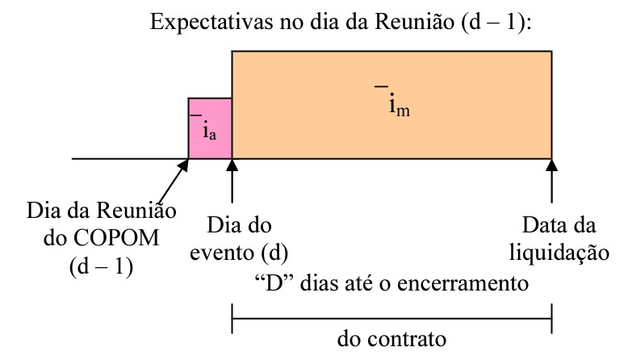
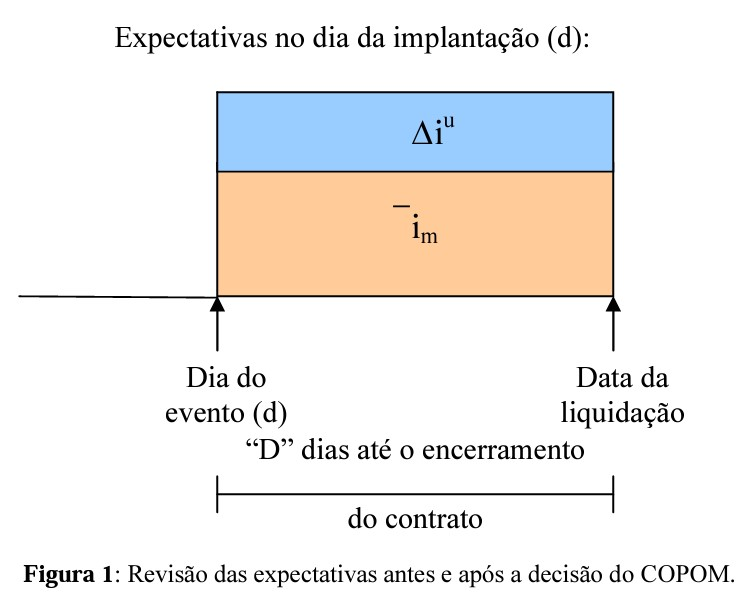

---

## Caderno - correção

Entrega revisado: 06/12 - remoto

Revisar HousePrice, invertido

Remover mensagens

Comentários em classificação

Classificação - revisar modelos possível inversão de patamar de classificação.

3 b - Laboratoria 3 - revisar testes.

Dendograma como justificativa para o knn

---

# Big Data Analytics 2022 {.unnumbered}

**Autor**: Anderson dos Santos

**Prof**: Olga Satomi Yoshida

## Organização {.unnumbered}

1. [Analise de ações (Gráficos + Discritivos)](#descriptive)
2. [Lista de regressões (Aula 6)](#regression) - [EXERCICIOS.pdf](./exercises/EXERCICIOS.pdf)
3. [Lab 3 (Aula 8 - Classificação)](#classification) [LABORATÓRIO R.pdf](./exercises/LABORATORIO-R.pdf)
4. [Trabalho de conclusão](#final-work)


```{r include=FALSE}
# automatically create a bib database for R packages
knitr::write_bib(c(
  .packages(), 'bookdown', 'knitr', 'rmarkdown'
), 'packages.bib')
```

<!--chapter:end:index.Rmd-->

# Estatística descritiva {#descriptive}

Utilizamos métodos de Estatística Descritiva para organizar, resumir e descrever os aspectos importantes de um conjunto de características observadas ou comparar tais características entre dois ou mais conjuntos

## Exercício

Descrever o conjunto de dados da bolsa de valores brasileira (B3)

## Pacotes

Pacotes necessários para executar este capítulo:

```{r warning=FALSE}
library(readxl)
library(tidyverse)
library(readxl)
library(tibble)
library(knitr)
library(kableExtra)
library(shiny)
library(dplyr)
```


## Conjunto de dados

Este conjunto de dados de ações da bovespa foi criado pela professora Dra.Olga Satomi Yoshida para aula de Big Data no IPT. 

## Informações dos atributos

Enconta no forma de planilha excel - [03 B2 DADOS Time Series Preços Açoes Diario.xlsx](./dados/03 B2 DADOS Time Series Preços Açoes Diario.xlsx), contém 10 séries com as ações:

- ELET3;
- ITUB4;
- ITSA4;
- PETR4;
- BBDC4;
- VALE3;
- BBAS3;
- LREN3;

todos para o período de 01/04/2010 à 19/09/2022 e

- NUBR33 período 12/09/2021 a 19/09/2022;
- MGLU3 perído 05/02/2011 a 19/09/2022.

Os atributos para cada série são a data e valor no fechamento do pregão.

```{r warning=FALSE}
series = read_excel("dados/03 B1 ESTATISTICAS DESC E REGRESSAO.xlsx",
                    sheet = 2,
                    n_max = 1)
nomes = names(series)[seq(1, 20, 2)]
series = read_excel("dados/03 B1 ESTATISTICAS DESC E REGRESSAO.xlsx",
                    sheet = 2,
                    skip = 1)
names(series)[seq(1, 20, 2)] = paste0("DATA_", nomes)
names(series)[seq(2, 20, 2)] = nomes

## Transforma o tipo das colunas de Datetime para Date.
for (i in seq(1, 20, 2)) {
  series[[i]] = as.Date(series[[i]])
}

kable(head(series, 10)) %>%
  kable_styling(latex_options = "striped")
```

## Análise descritiva de algumas ações

```{r warning=FALSE}
plot(x=series$DATA_ELET3, y= series$ELET3, type = "l", xlab = "Tempo (dias)", ylab = "Preço fechamento (R$)",  main = "Performance de algumas ações ao longo do tempo", ylim = c(0, 60) )
lines(x=series$DATA_ITUB4, y= series$ITUB4, col = 2)
lines(x=series$DATA_PETR4, y= series$PETR4, col = 3)
lines(x=series$DATA_NUBR33, y= series$NUBR33, col = 4)
legend("top", legend = c("ELET3", "ITUB4", "PETR4", "NUBR33"), fill = c(1,2,3,4))
```
> NUBR33 tem uma série menor que as demais ações.

Parâmetros

```{r}
stock_symbols = c("ELET3","ITUB4","ITSA4","PETR4","NUBR33","MGLU3","BBDC4","VALE3","BBAS3","LREN3")
stock_symbol = 5 # 1 a 10
dataInicial = NULL # as.Date("2022-01-01")
dataFinal = NULL # as.Date("2022-12-31")
```

## Avaliando `r stock_symbols[stock_symbol]`

```{r}
symbol_series = series %>%
  dplyr::select(matches(stock_symbols[stock_symbol]) )

names(symbol_series)[1] = "stock_date"
names(symbol_series)[2] = "stock_value"

if (is.null(dataInicial)) {
  dataInicial = min(symbol_series$stock_date, na.rm = TRUE)
}

if (is.null(dataFinal)) {
  dataFinal = max(symbol_series$stock_date, na.rm = TRUE)
}

subConjunto = filter(symbol_series, stock_date >= dataInicial & stock_date <= dataFinal)

Data = subConjunto$stock_date
Ser = subConjunto$stock_value

getmode <- function(v) {
   uniqv <- unique(v)
   uniqv[which.max(tabulate(match(v, uniqv)))]
}

cont = count(subConjunto)
menor = min(Ser)
maior = max(Ser)
p = quantile(Ser, c(.025, .10, .25, .50, .75, .90, .975)) 
media = mean(Ser, na.rm = T)
desvio = sd(Ser, na.rm = T)
mediana = median(Ser, na.rm = T)
moda = getmode(Ser)
ep = desvio / sqrt(cont)
periodo = dataFinal - dataInicial
```


Medidas de posição:

1.	Contagem de resultados `r cont`
2.	Menor valor: `r menor`
3.	Percentil: `r p`
4.	Maior valor: `r maior`


Medidas de tendência central:

5.	Moda: `r moda`
6.	Mediana: `r mediana`
7.	Média dos resultados: `r media`

Medidas de dispersão dos dados individuais em relação a média:

8.	desvio padrão dos resultados em relação a média: `r desvio`
9.	coeficiente de variação = d.p. / média: `r desvio / media`
10.	c.v. % = (d.p. / média ) x 100 %: `r (desvio / media) * 100`

Medidas de disperção da média:

11.	e.p. = d.p. da média = d.p. / Raiz(n): `r ep`
12.	c.v.e.p. = e.p. / média: `r ep / media`
13.	c.v.e.p.% = (e.p. / média) x 100 %: `r (ep / media) * 100`

Para `r stock_symbols[stock_symbol]` o preço médio da ação, no período de `r dataInicial` a `r dataFinal` (período de `r periodo` dias) é de `r media` e o desvio padrão de `r desvio`.


```{r}
plot(subConjunto, type = "l", xlab = "Tempo (dias)", ylab = "Preço fechamento (R$)", main=stock_symbols[stock_symbol])
caixa = boxplot(Ser, add = T)
limSup = caixa$stats[5,1]
Q3 = caixa$stats[4,1]
Q2 = caixa$stats[3,1]
Q1 = caixa$stats[2,1]
limInf = caixa$stats[1,1]
abline(h = Q2, col = "black")
abline(h = Q3, col = "red", lwd = 2)
abline(h = Q1, col = "red", lwd = 2)
abline(h = limSup, col = "green", lwd = 2)
abline(h = limInf, col = "green", lwd = 2)
legend("top", legend = c("Sup", "Q3", "Q2", "Q1", "Inf"), fill = c("green","red","black","red","green"))
```

> Usando boxplot para obter limites e percentíls.


<!--chapter:end:01-descriptive.Rmd-->

# Regressão {#regression}

A regressão em geral tem como objetivo:

1. Medir a influência de uma ou mais variáveis explicativas (x)  sobre a variável resposta (y);
2. Predição de uma variável resposta (y) a partir de uma ou mais variáveis explicativas (x).


## Conjunto de dados

Este conjunto de dados foram criados pela professora Dra.Olga Satomi Yoshida para aula de Big Data no IPT.

1. Preço das casas: Data_HousePrice_Area.xlsx
2. Consumo de energia: Data_ConsumoEnergia.xlsx
3. SALES_X_YOUTUBE: DadosAula06.xlsx
4. CREDIT SCORE X RENDA E OUTRAS V: DadosAula06.xlsx


```{r, child=c('sub-chap/regression-a.Rmd', 'sub-chap/regression-b.Rmd', 'sub-chap/regression-c.Rmd', 'sub-chap/regression-d.Rmd', 'sub-chap/regression-e.Rmd')}
```


<!--chapter:end:02-regression.Rmd-->

# Classificação {#classification}

A classificação estatística é uma ampla abordagem de aprendizado supervisionado que treina um programa para categorizar informações novas e não rotuladas com base em sua relevância para dados rotulados conhecidos.

A análise de cluster visa segmentar objetos em grupos com membros semelhantes e, portanto, ajuda a descobrir a distribuição de propriedades e correlações em grandes conjuntos de dados.

Os exercícios deste capítulo estão relacionados a esses dois tópicos.


## Conjunto de dados

Este conjunto de dados foram criados pela professora Dra.Olga Satomi Yoshida para aula de Big Data no IPT.

1. Inibina: inibina.xlsx
2. avaliação do deslocamento do disco da articulação temporomandibular: disco.xls
3. Tipos faciais: tipofacial.xls
4. Consumo alimentar médio: LABORATORIO-R.pdf (ex 5.)


```{r, child=c('sub-chap/classification-a.Rmd', 'sub-chap/classification-b.Rmd', 'sub-chap/classification-c.Rmd', 'sub-chap/classification-f.Rmd')}
```


<!--chapter:end:03-classification.Rmd-->

# Trabalho final {#final-work}

Impacto da taxa Selic no índice Bovespa

## Introdução

Após a regulamentação do Anexo IV e da implementação do Plano Real, o mercado acionário brasileiro teve um grande salto no seu desenvolvimento, tanto em termos de volume dos negócios quanto na eficiência alocativa... A grande conquista do Plano Real foi o controle da inflação. Taxas de inflação em níveis aceitáveis foram e estão sendo mantidas sob controle, devido às constantes intervenções governamentais, aumentando ou reduzindo as taxas de juros, tanto as de curto quanto as de longo prazo, controlando a oferta monetária através dos depósitos compulsórios sobre depósitos à vista, bem como controlando a taxa de câmbio, instrumento utilizado pelo BACEN por um longo período. Há, portanto, por parte de todos os agentes, a necessidade de se conhecer como o mercado acionário responde às mudanças dessas variáveis macroeconômicas. (DE SOUZA GRÔPPO, 2005)

Para os participantes do mercado financeiro, há um interesse dada a influência exercida pela política monetária sobre os mercados, conhecer tais estimativas representaria uma relevante informação para a construção de posições e estratégias, tanto de investimento, bem como para a gestão dos riscos implícitos às operações normalmente desenvolvidas em seu dia-a-dia. (GONÇALVES JUNIOR, 2007)

De acordo com o conhecimento convencional, mudanças nas taxas de juros afetariam o custo de capital e as expectativas futuras quanto à lucratividade das empresas, impactando portanto sua geração de dividendos ao acionista, especialmente se considerada a valores presentes; em última análise, isto repercute no valor de mercado atual da empresa, e portanto de suas ações em Bolsa. (GONÇALVES JUNIOR, 2007)

Porém, a atividade econômica também exerce efeito importante sobre a determinação dos preços na Bolsa de Valores, particularmente no Ibovespa. Os preços das ações são positivamente relacionados com a atividade econômica, medida pelo nível de produção industrial. A política monetária possui efeito significativo sobre a produção industrial o que indicaria a existência do segundo canal pelo qual a política monetária afeta os preços das ações.(DOS SANTOS et al., 2006)

## Objetivo

O objetivo é mensurar e analisar as respostas do mercado acionário às decisões do Comitê de Política Monetária do Banco Central do Brasil (COPOM) em relação à taxa básica de juro, verificando o comportamento do índice agregado da Bolsa de Valores de São Paulo (Bovespa).

## Problema

Quantificar ou prever a influência da taxa selic no índice Bovespa demanda modelos de predições dinâmicas.

A modelagem prevê predizer o Indice Bovespa (serie temporal em base diária) em função das covariáveis (taxa Selic anunciada mês a mês). 

Pressupõe-se que cortes não previstos na taxa de juros Selic proporcionem uma valorização das ações, já que abriria espaço para expansão da economia, com aumentos dos lucros e dos dividendos distribuídos pelas empresas.
 
Mercados eficientes antecipam as decisões do COPOM, o que não deveria sensibilizar o índice bovespa, uma vez que que as mudanças já foram incorporadas ao valor das ações, no entando, as surpresas, a diferença da expectativa e da decisão, deveriam causar uma resposta do índice. O estudo define uma medida que procura captar a surpresa gerada nos mercados. As medidas foram baseadas em dados do mercado de futuros DI 1 dia, pela sua similaridade à taxa SELIC. (GONÇALVES JUNIOR, 2007)

## Metodologia

A meta para a taxa básica de juro, inicialmente referida como TBC, teve sua sistemática alterada em agosto de 1998, quando o Banco Central passou a fazer uso também da TBAN (taxa de assistência para redesconto bancário), ofertando e tomando recursos na banda assim definida, conforme necessidades, importância, garantia e riscos dos agentes envolvidos, aplicando-se também um sistema de quotas instituído na ocasião. Em 05/03/1999, a TBC foi extinta, tendo sido substituída pela SELIC para fins de política monetária, passando-se a empregar esta última como a taxa básica de juro e principal instrumento das operações de mercado aberto. (GONÇALVES JUNIOR, 2007)

O índice Bovespa (ou simplesmente Ibovespa) foi criado há mais de cinquenta anos, em 2 de janeiro de 1968. Antes do Ibovespa, os preços das ações negociadas na Bolsa de Valores de São Paulo (SPSE) eram divulgados por meio de boletim diário (Boletim Diário de Informação – BDI). (CASTRO et al., 2019)

De modo geral, os mercados financeiros são forward looking, o que equivale a dizer que eles estão constantemente incorporando novas informações a seus preços, seja devido a fatos que impactam imediatamente suas operações, seja por razões que modificam expectativas sobre o futuro; é a constatação de que estes agentes são racionais, utilizando toda a informação disponível para realizar suas previsões, tomando valores passados e correntes de variáveis exógenas ou não (LUCAS et al., 1996).

Cada decisão tomada pelo COPOM é estudada por esses agentes, que antecipam em alguma medida seus resultados; assim sendo, quaisquer mudanças observadas nas variáveis correntes e futuras através do tempo decorrerão exclusivamente de mudanças não antecipadas. (CASTRO et al., 2019)

Conseqüentemente, analisar-se a relação direta entre as variações na meta da taxa de juro e as do Índice Bovespa pode mostrar baixa significância entre as variáveis; de fato, se os mercados inevitavelmente não gerarão respostas a mudanças já esperadas, então é preciso distinguir na variação da meta suas componentes antecipada e não antecipada. É o que proporemos a seguir. (CASTRO et al., 2019)

Após apresentação da evolução do índice ibovesoa, taxa selic e DI, foi calculado o coeficiente de correlação linear de Pearson existente entre elas, a fim de verificar sua relação, em quatro períodos distintos:

- de 2004 a 2007: período de início da redução de juros até a crise dos Subprime,
- de 2008 a 2010: do auge da crise financeira mundial no Brasil até a fase de recuperação do mercado;
- de 2011 a 2012: período que inclui tendência de redução da taxa básica de juros e a crise financeira, iniciada na Europa em 2011.
- de 2013 a 2016: período da crise econômica de 2014, conhecida como a "grande recessão brasileira", foi uma profunda e duradoura crise econômica, sendo caracterizada por recessão por dois anos consecutivos (2015 e 2016) e por sua longa e lenta recuperação, a mais lenta da história do país. (WIKIPEDIA, 2022)
- de 2017 a 2022: período que incluem os efeitos da COVID-19, iniciada em 2020.

Os dados utilizados neste trabalho foram obtidos de banco de dados, índices e relatórios contidos em sites como da BM&F BOVESPA, BACEN e CVM, além de informações coletadas da literatura indicada.

A análise de correlação será feita utilizando o coeficiente de Pearson que varia de -1 a 1, sendo que o sinal indica a direção, positiva ou negativa, da relação e o valor sugere a força do relacionamento entre as
variáveis. 

A condução do trabalhe segue os seguintes passos:

Figura 1: Roteiro

Fonte: (YOSHIDA, 2022)


### Estimando a Surpresa dos Mercados 

TODO

Um modo interessante de se conseguir tal intento é utilizar os contratos futuros de taxa média de depósitos interbancários de um dia (referidos comumente por DI 1 dia), negociados na Bolsa de Mercadorias e Futuros de São Paulo (BM&F).

Esta relação implica dizer que o preço futuro (F0) é o valor esperado do preço à vista que vigorará no futuro (ST).

Para captar a componente da variação na meta dos juros que responderia pela “surpresa” decorrente da decisão do COPOM, podemos adaptar a metodologia desenvolvida por Kuttner (2001), posteriormente aplicada ao mercado acionário americano por Bernanke e Kuttner (2005); assim, suponhamos que no dia d – 1 ocorre a reunião do COPOM e no dia útil seguinte os mercados abrem já cientes da nova meta para a taxa básica de juro – ou seja, no dia d ocorre a implantação da nova meta.

Deste modo, temos um evento ocorrendo entre os dois dias citados: trata-se de expectativas de véspera (em d – 1) dos mercados sobre a decisão do COPOM e a constatação dela no dia seguinte (dia d); isto está esquematicamente representado na figura 1 abaixo:





Assim, os mercados esperam que em d–1 a taxa média diária passe de ⎯ia (antes da reunião) para⎯im , após a reunião, e que assim permaneça até a liquidação do instrumento; no entanto, em alguma medida eles são surpreendidos pelo COPOM e esta surpresa (Δiu) passa a ser incorporada ao valor médio anteriormente previsto: os mercados se ajustam a eventuais discrepâncias em relação a suas projeções da véspera.


## Fonte de dados

- [Taxa selic](https://dados.gov.br/dataset/11-taxa-de-juros-selic/resource/3d751a0d-afb2-452b-83f2-310a201f8a82): selic.json. selic.csv

INDICE BOVESPA
FONTE: Yahoo Finanças link

- [Índices Bovespa](https://finance.yahoo.com/quote/%5EBVSP/history?period1=735868800&period2=1668297600&interval=1d&filter=history&frequency=1d&includeAdjustedClose=true): idc_BVSP_daily.csv, idx_BVSP_monthly.csv

https://www.infomoney.com.br/ferramentas/juros-futuros-di/


```{r, child=c('sub-chap/final-a.Rmd')}
```


## Conclusão

TODO

A partir dessas informações, mais as variações do Índice Bovespa, formou-se o banco de dados que respaldou o estudo. Entre as conclusões mais importantes destaca-se a de que o mercado acionário reage fracamente às variações diretas na meta da taxa básica de juro. Os agentes têm a capacidade de se antecipar às decisões do Banco Central. Porém, a pesquisa também observou que pode haver uma resposta relevante às variações inesperadas (tal como previsto pela hipótese da eficiência informacional dos mercados). Cada ponto percentual de incremento não esperado na meta da taxa básica pode estar associado a uma queda média de 1,3% do Índice Bovespa. Outro resultado interessante é que eventos de ruptura econômica parecem não interferir de modo robusto no padrão de respostas às surpresas.
 
Os autores ressaltam que os resultados originaram-se de um estudo essencialmente empírico, de modo que é preciso desenvolver modelos que abordem não apenas as variáveis e a formação dos preços, mas também investiguem outras implicações e desdobramentos teóricos.
 
Os autores também destacaram que a pesquisa parte da premissa de que a política monetária é exógena em relação aos mercados. Os mercados reagem às decisões do COPOM, e não o oposto. É preciso considerar a possibilidade de eventuais ocorrências de simultaneidade nas respostas de ambos, governo e mercados, a determinados eventos ou tendências verificadas na economia.

## Referências

CASTRO, F. Henrique et al. Fifty-year History of the Ibovespa. **Brazilian Review of Finance**, v. 17, n. 3, p. 47-65, 2019.

DE SOUZA GRÔPPO, Gustavo. Co-integração e causalidade entre variáveis de política monetária e Ibovespa. **Revista de Economia e Administração**, v. 4, n. 2, 2005.

DOS SANTOS, Fernando Siqueira; PRADO, Roberto RA. Causalidade Selic-Ibovespa revisada. **Revista de Economia e Administração**, v. 5, n. 1, 2006.

GONÇALVES JUNIOR, Walter. **Surpresas com relação à política monetária e o mercado de capitais: Evidências do caso brasileiro**. 2007. Tese de Doutorado.

LUCAS, Robert E.; SARGENT, Thomas. After Keynesian Macroeconomics. In: Miller, P. J. (org.) **The Rational Expectations Revolutions**: Readings from the Front Line. [S.1]: Massachussetts Institute of Technology, p.05-30, 1996.

YOSHIDA, Olga Satomi. **BIGDATA ANALITYCS**: data 22-11-2022. São Paulo: Instituto de Pesquisas Tecnológicas do Estado de São Paulo, 2022. 4 slides, color.

WIKIPEDIA. Lista de crises econômicas no Brasil. Disponível em: https://pt.wikipedia.org/wiki/Lista_de_crises_econ%C3%B4micas_no_Brasil. Acesso em: 03 dez. 2022.

<!--chapter:end:04-final-work.Rmd-->

